# 🚩 (2026-01-07) Scholar Inbox 추천 논문 

# 📚 Omni2Sound: Towards Unified Video-Text-to-Audio Generation

🚀 URL: https://arxiv.org/html/2601.02731

## 🌏 Abstract (원문)
Early audio generation models typically rely on unimodal conditioning. Text-to-Audio (T2A) offers strong semantic fidelity and generalization but lacks dense temporal control. Conversely, Video-to-Audio (V2A) ensures fine-grained temporal synchronization with video, yet suffers from weak reasoning in complex scenes and unfaithful generation. To address this, recent Video-Text-to-Audio (VT2A) methods jointly condition on video and text. While VT2A achieves strong both semantic understanding and temporal alignment, its reliance on simultaneous inputs constrains its applicability. Crucially, most VT2A systems lack robustness, degrading sharply under missing-modality conditions (video-only or text-only). These constraints motivate a unified framework natively supporting VT2A, V2A, and T2A within a single model. To address data scarcity, we first introduce SoundAtlas, a large-scale, agent-generated multimodal audio-caption dataset. Built on current advanced multimodal foundation models, we develop a multi-turn, agentic annotation pipeline. Building on this dataset, we propose Omni2Sound, a diffusion-based unified model supporting flexible input modalities while maintaining both audio-visual synchronization and high-fidelity generation. To address cross-task and intra-task competition, we introduce a three-stage progressive training schedule. Finally, we construct VGGSound-Omni, the first comprehensive benchmark to establish a unified evaluation standard for VT2A, V2A, and T2A. As a result, with a vanilla DiT backbone, Omni2Sound achieves unified state-of-the-art performance across all three tasks.
## 🌏 Abstract (번역)
초기 오디오 생성 모델은 일반적으로 단일 모달 조건에 의존했습니다. 텍스트-오디오(T2A) 방식은 강력한 의미론적 충실도와 일반화 능력을 제공하지만 조밀한 시간적 제어가 부족합니다. 반대로 비디오-오디오(V2A) 방식은 비디오와의 미세한 시간적 동기화를 보장하지만, 복잡한 장면에서의 추론 능력이 약하고 부정확한 생성을 초래하는 단점이 있습니다. 이를 해결하기 위해 최근의 비디오-텍스트-오디오(VT2A) 방법론은 비디오와 텍스트를 공동 조건으로 사용합니다. VT2A는 강력한 의미론적 이해와 시간적 정렬을 모두 달성하지만, 동시 입력에 대한 의존성으로 인해 적용 범위가 제한됩니다. 결정적으로 대부분의 VT2A 시스템은 견고성이 부족하여 모달리티 누락 조건(비디오 전용 또는 텍스트 전용)에서 성능이 급격히 저하됩니다. 이러한 제약은 단일 모델 내에서 VT2A, V2A, T2A를 기본적으로 지원하는 통합 프레임워크의 필요성을 자극합니다. 데이터 부족 문제를 해결하기 위해, 본 연구에서는 먼저 에이전트가 생성한 대규모 멀티모달 오디오-캡션 데이터셋인 SoundAtlas를 소개합니다. 최신 고급 멀티모달 기반 모델을 바탕으로 다회차 에이전트 주석 파이프라인을 개발했습니다. 이 데이터셋을 기반으로 시청각 동기화와 고충실도 생성을 유지하면서 유연한 입력 모달리티를 지원하는 확산 기반 통합 모델인 Omni2Sound를 제안합니다. 작업 간 및 작업 내 경쟁 문제를 해결하기 위해 3단계 점진적 학습 스케줄을 도입했습니다. 마지막으로 VT2A, V2A, T2A에 대한 통합 평가 표준을 수립하는 최초의 종합 벤치마크인 VGGSound-Omni를 구축했습니다. 결과적으로 Omni2Sound는 바닐라 DiT 백본을 사용하여 세 가지 작업 모두에서 통합된 최첨단 성능을 달성했습니다.

## 🔍 Methods & Results
- SoundAtlas 데이터셋 구축: Gemini-2.5 Pro 및 Qwen-2.5-VL을 활용한 에이전트 기반 파이프라인을 통해 고품질의 비디오-텍스트-오디오(V-T-A) 트리플렛 생성
- Omni2Sound 모델 제안: DiT(Diffusion Transformer) 백본을 기반으로 VT2A, V2A, T2A를 모두 지원하는 확산 기반 통합 프레임워크 설계
- 3단계 점진적 학습 전략: 대규모 T2A 사전 학습, VT2A를 가교로 활용한 멀티태스크 인터리브 학습, 그리고 텍스트 드롭아웃 및 오프스크린 합성을 포함한 견고성 학습 수행
- VGGSound-Omni 벤치마크 구축: 세 가지 작업에 대한 통합 평가 표준을 제시하고 인간 검증을 거친 고품질 주석 및 오프스크린 생성 트랙 포함
- 실험 결과: Omni2Sound는 모든 작업에서 기존 특화 모델 및 통합 모델을 능가하는 SOTA 성능을 달성했으며, 높은 오디오 품질과 정교한 시청각 동기화 입증

## 🖼 Figures
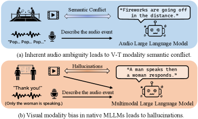
*Figure 1:Challenges in scaling high-quality audio captions.*

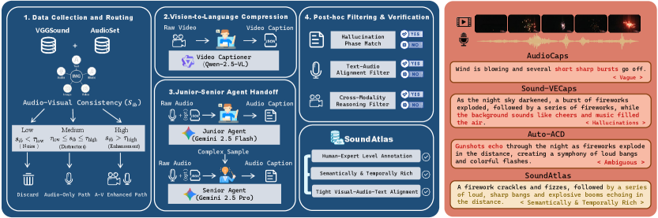
*Figure 2:Data Construction Pipeline of SoundAtlas (Left). Comparison against SOTA baselines and human annotations (Right) .*

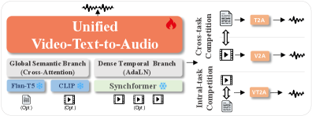
*Figure 3:Overview of our unified VT2A framework, which integrates global semantics and temporal alignment, supporting flexible T2A, V2A, and VT2A generation.*

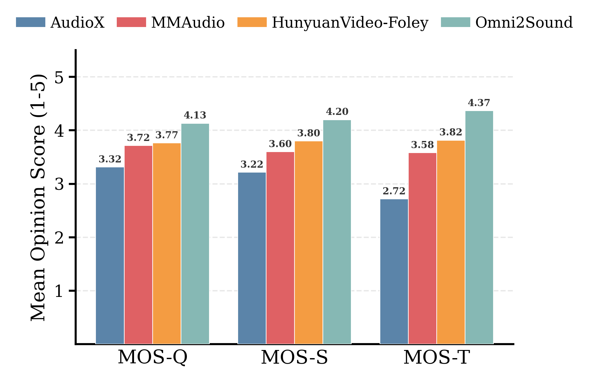
*(a)Subjective Evaluation Results on VT2A Task*

*(a)Subjective Evaluation Results on VT2A Task*

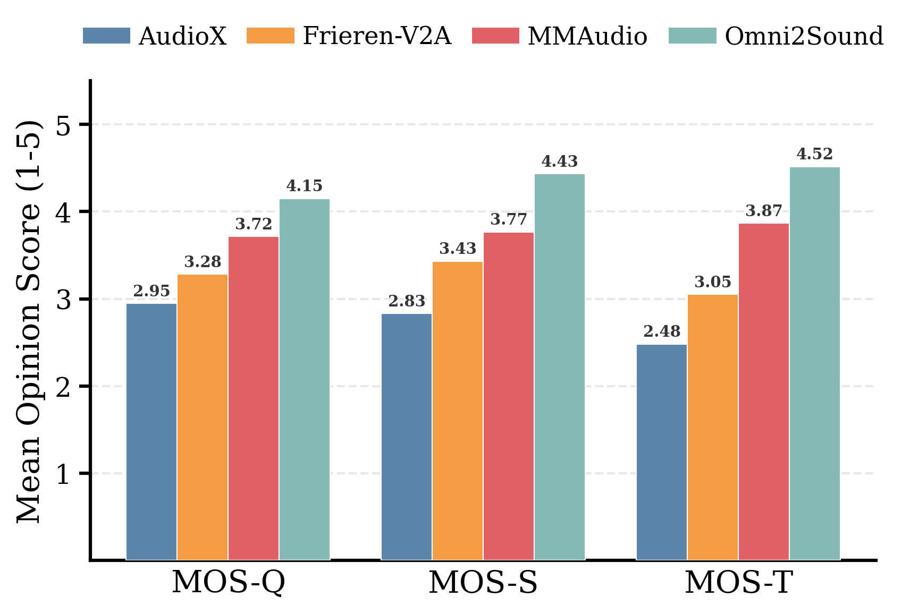
*(b)Subjective Evaluation Results on V2A Task*

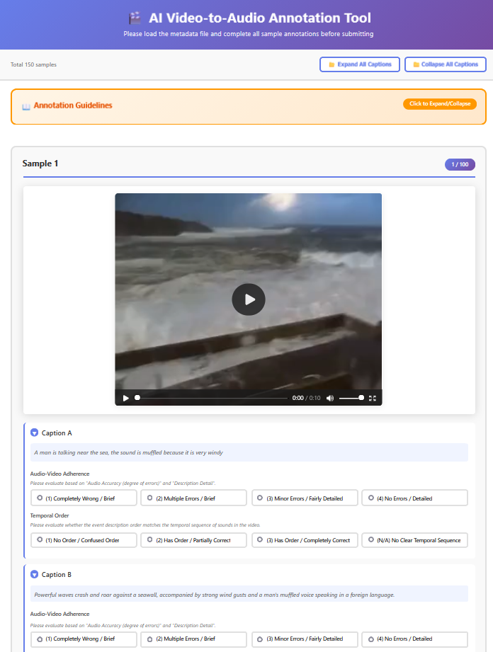
*Figure 6:User study interface for human evaluation across different audio generation models.*

*Figure 6:User study interface for human evaluation across different audio generation models.*

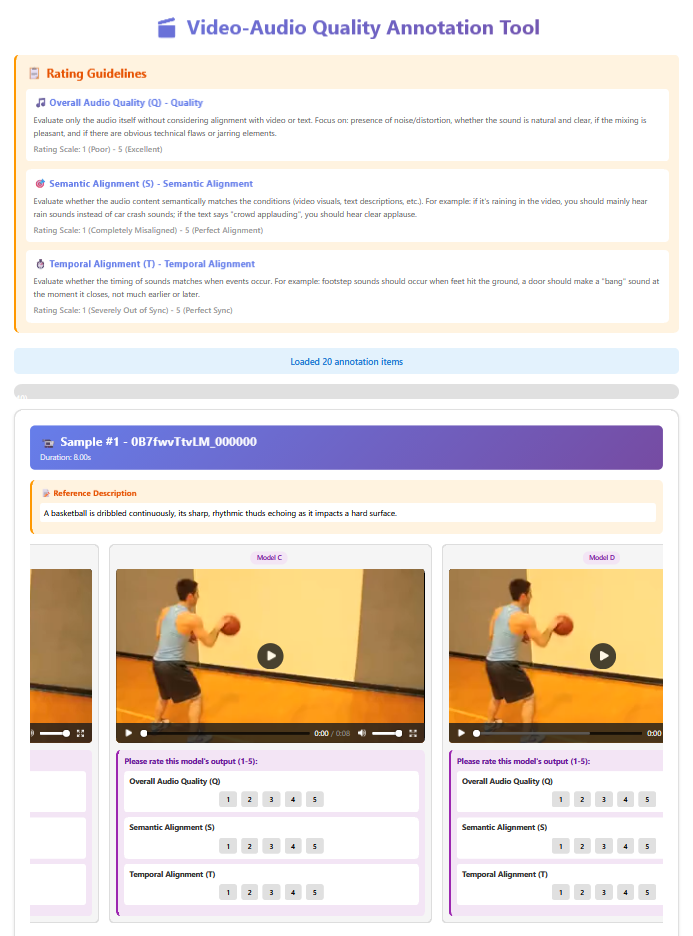
*Figure 7:User study interface for human evaluation across different automatic audio captioning datasets.*

---
**Usage Info**: 3779 tokens used.
**Generated at**: 2026-02-24 18:57:46

---

# 📚 VCLIP: Face-based Speaker Generation by Face-Voice Association Learning

🚀 URL: https://arxiv.org/html/2601.02753

## 🌏 Abstract (원문)
Current research in speech synthesis persues not only accurate and natural content delivery, but is also concerned with more advanced scenarios such as personalized speaker voice or style control. Voice personalization was largely formulated as a voice cloning task in literature. but conditioning the synthesized voice on other modalities such as categorical labels, face imagery or descriptive texts has attracted growing interest within the community, especially following the success of text-based image generation methods. Of particular interest is the face imagery modality among other cues for personalized synthesis voices, as speech and vision naturally co-occurs in our everyday experience and such paired data is easily obtained from large quantities of online videos. The connection between facial features and voice characteristics is two-fold. Facial features reflect basic physiological conditions such as sex, weight and age, which contribute to the physical production of speech in the speakers’ vocal organs. Psychologically speaking, humans learn to associate certain face features with specific voice qualities through their experiences, which is known as face-voice concordance. A major discrepency between face and voice conditioning for speech synthesis is the quality of available datasets. While synthesis task requires high quality audio for training, major audio-visual datasets such as LRS3 are generally noisy and cannot meet the requirements of mainstream TTS needs. Owning to these limitations, common approaches to face-based speech synthesis utilize a transfer learning scheme and attempt to learn mappings from face to voice features with neural networks. The transformed image features are used as proxies for speaker embeddings during downstream TTS inference. However, synthesizing novel speakers based on out-of-distribution features crosses two domain gaps. And the learned feature mapping does not account for errors further accumulated after a face-based speaker embedding is predicted, causing a lack of coordination between the upstream mapping module and the downstream TTS module. These design choices may contribute to performance degradation for TTS. Moreover, it is our opinion that predicting the true speaker embedding by deterministic mapping of the reference image is essentially intractable, since face imagery alone does not provide enough information for reconstruction of a person’s voice. Instead, different voices could be said to suit a single reference face equally well. In this regard, VoiceMe proposed using a human-in-the-loop sampling strategy to produce probable speaker embeddings for a face. This technique also takes the end-to-end synthesis result of the downstream TTS into account. However, it scales poorly due to its requirement for intensive human interaction. We therefore cast face-based speech synthesis as a conditional speaker generation task aiming to produce probable candidate synthesis voices for reference faces. While VoiceMe leverages crowd-sourced human evaluators to link voices to faces, we aim to learn this association efficiently from openly available paired audio-visual data. We propose Vclip, a CLIP-like contrastive learning scheme for distilling and connecting the semantic knowlege of a pretrained CLIP image encoder and a speaker encoder using low quality audio-visual data. We then propose a retrival-based strategy for a GMM-based speaker generation model to produce probable speaker embeddings given reference images. This procedure transfers the cross-modal association knowledge of Vclip into an existing zeroshot TTS system trained on high quality data. Furthermore, it can be extended to consider errors caused by the specific downstream TTS system in a straightforward fashion. Experimental findings demonstrate that a retrival step is crucial in crossing the domain gap between face and voice features induced by a constrastive learning scheme in Vclip. And feedback information distilled from the downstream TTS module helps to synthesize novel voices that matches more closely with reference faces. The proposed Vclip system achieves 89.63% AUC score on cross-modal verification for a Voxceleb testset, surpassing a strong baseline method. Using this system as guidance, we demonstrate the proposed strategy can produce synthesis voices that are highly correlated with reference faces, as evidenced by both perceptual and automatic evaluation studies.
## 🌏 Abstract (번역)
현재 음성 합성 연구는 정확하고 자연스러운 내용 전달뿐만 아니라 개인화된 화자 목소리나 스타일 제어와 같은 고급 시나리오를 추구하고 있습니다. 목소리 개인화는 문헌에서 주로 음성 클로닝 작업으로 정식화되었으나, 텍스트 기반 이미지 생성 방법의 성공 이후 범주형 레이블, 얼굴 이미지 또는 묘사 텍스트와 같은 다른 모달리티를 조건으로 하는 음성 합성에 대한 관심이 커지고 있습니다. 특히 얼굴 이미지는 일상에서 음성과 시각이 자연스럽게 공존하며 대량의 온라인 비디오에서 쌍을 이룬 데이터를 쉽게 얻을 수 있다는 점에서 주목받고 있습니다. 얼굴 특징과 목소리 특성의 연결은 성별, 체중, 연령과 같은 생리학적 조건과 경험을 통해 특정 얼굴과 목소리 품질을 연관 짓는 심리학적 얼굴-음성 일치성이라는 두 가지 측면을 가집니다. 얼굴 기반 음성 합성의 주요 걸림돌은 데이터셋의 품질로, LRS3와 같은 주요 시각-청각 데이터셋은 노이즈가 많아 TTS 요구사항을 충족하기 어렵습니다. 기존 방식은 전이 학습을 통해 얼굴에서 음성 특징으로의 매핑을 시도하지만, 도메인 간 격차와 오차 누적으로 인해 성능 저하가 발생합니다. 본 연구는 얼굴 이미지만으로 목소리를 완벽히 재구성하는 것이 불가능하다는 점에 착안하여, 얼굴 기반 음성 합성을 참조 얼굴에 대한 유망한 후보 음성을 생성하는 조건부 화자 생성 작업으로 정의합니다. 우리는 저품질 데이터를 사용하여 CLIP 이미지 인코더와 화자 인코더의 지식을 연결하는 Vclip 대조 학습 체계를 제안하며, GMM 기반 화자 생성 모델을 위한 검색 기반 전략을 통해 고품질 TTS 시스템에 Vclip의 교차 모달 지식을 전이합니다. 실험 결과, 검색 단계가 도메인 격차를 해소하는 데 필수적이며, TTS 모듈의 피드백 정보가 참조 얼굴과 더 잘 어울리는 목소리를 합성하는 데 도움이 됨을 확인했습니다. Vclip은 Voxceleb 테스트셋에서 89.63%의 AUC 점수를 기록하며 기존 베이스라인을 능가하였고, 지각 및 자동 평가를 통해 참조 얼굴과 상관관계가 높은 음성 생성 능력을 입증했습니다.

## 🔍 Methods & Results
- Vclip 프레임워크: CLIP 스타일의 대조 학습을 통해 저품질 온라인 비디오 데이터에서 얼굴과 음성 간의 연관성(FVA)을 학습하는 모델 제안.
- Generate-and-Retrieve 전략: GMM으로 모델링된 화자 임베딩 공간에서 Vclip을 스코어링 함수로 사용하여 참조 얼굴에 가장 적합한 화자를 검색하는 방식 도입.
- TTS Signature-informed Scoring: TTS 시스템 내부의 화자 복제 오차(입출력 불일치)를 반영하기 위해 시그니처 정보를 피드포워드 네트워크로 증류하여 검색 성능 향상.
- 교차 모달 검증 성능: Voxceleb 테스트셋에서 89.63%의 AUC를 달성하여 기존의 자기지도 학습 기반 베이스라인을 능가함.
- 도메인 격차 해소: 검색(Retrieval) 단계가 대조 학습으로 인한 얼굴-음성 특징 간의 도메인 격차를 극복하고 합성 품질 저하를 방지하는 데 핵심적임을 입증.

## 🖼 Figures

*Fig. 1:Overview of the proposed method. First a Vclip and speaker generation model is trained (red, steps 1-2). Then image features extracted from reference face image is used to retrive top-
𝑘
 probable voices from a pool of generated candidate voices by using the trained Vclip as a zeroshot scoring function (blue, steps 3-6).*

---
**Usage Info**: 6770 tokens used.
**Generated at**: 2026-02-24 18:58:24

---

# 📚 LTX-2: Efficient Joint Audio-Visual Foundation Model

🚀 URL: https://arxiv.org/html/2601.03233

## 🌏 Abstract (원문)
Recent text-to-video (T2V) diffusion models have achieved substantial progress, producing videos with striking visual realism, motion consistency, and strong prompt fidelity. Models such as LTX-Video, WAN 2.1, and HunyuanVideo demonstrate how large-scale latent diffusion transformers can translate textual descriptions into temporally coherent and visually expressive video content. Yet these models remain silent: they omit the semantic, emotional, and environmental information conveyed by synchronized sound. As a result, their outputs, while visually stunning, often feel incomplete and offer limited practical utility. In parallel, text-to-audio (T2A) generation has evolved from task-specific systems toward more general-purpose representations. Despite this progress, most text-to-audio models remain specialized for specific domains—such as speech, music, or foley—rather than offering a unified, holistic approach to audio generation. Consequently, recent attempts to achieve audiovisual generation (T2AV) often rely on decoupled sequential pipelines: generating video (T2V) and then “filling in” the audio (V2A), or vice versa. We argue that such decoupled approaches are inherently sub-optimal as they fail to model the full joint distribution of the two modalities. For instance, while lip synchronization is primarily driven by audio, the acoustic environment—such as reverberation or foley—is dictated by the visual context. A unified model is required to capture these bidirectional dependencies. Achieving a coherent audiovisual experience requires a unified model that jointly captures the generative dependencies between vision and sound. While emerging proprietary systems such as Veo 3 and the concurrent open-source Ovi begin to explore this direction, the field still lacks an open, efficient, and high-fidelity text-to-audio+video (T2AV) framework that learns both modalities in an integrated manner. In developing LTX-2 as an efficient multimodal foundation model, we prioritize both semantic grounding and computational efficiency. Our architecture builds upon the design principles of LTX-Video and its spatiotemporal latent space, while introducing specialized components for high-fidelity audio, multilingual support, and a refined text understanding pipeline—which we found critical for high-quality speech generation and complex prompts. Our design is guided by the following principles: Decoupled Latent Representations, Asymmetric dual stream, Cross-modal attention, and Deep Multilingual Grounding for Speech. Through these contributions, LTX-2 establishes a new open-source foundation for T2AV generation, capable of producing coherent, expressive, and richly detailed content at unprecedented speed.
## 🌏 Abstract (번역)
최근의 텍스트-비디오(T2V) 확산 모델들은 시각적 사실감, 동작의 일관성, 그리고 프롬프트 충실도가 뛰어난 비디오를 생성하며 상당한 진전을 이루었습니다. LTX-Video, WAN 2.1, HunyuanVideo와 같은 모델들은 대규모 잠재 확산 트랜스포머가 텍스트 설명을 시간적으로 일관되고 시각적으로 표현력이 풍부한 비디오 콘텐츠로 변환할 수 있음을 보여주었습니다. 하지만 이러한 모델들은 여전히 '침묵' 상태입니다. 즉, 동기화된 소리가 전달하는 의미적, 감정적, 환경적 정보를 생략합니다. 그 결과, 시각적으로는 뛰어나지만 결과물이 불완전하게 느껴지고 실제 활용도가 제한적인 경우가 많습니다. 이와 병행하여 텍스트-오디오(T2A) 생성은 특정 작업 전용 시스템에서 보다 범용적인 표현으로 진화했습니다. 이러한 발전에도 불구하고, 대부분의 텍스트-오디오 모델은 통합적이고 전체적인 오디오 생성 방식을 제공하기보다는 음성, 음악 또는 효과음(foley)과 같은 특정 도메인에 특화되어 있습니다. 결과적으로, 최근의 시청각 생성(T2AV) 시도들은 비디오를 생성(T2V)한 후 오디오를 채워넣거나(V2A) 그 반대의 방식을 취하는 분리된 순차적 파이프라인에 의존하는 경우가 많습니다. 우리는 이러한 분리된 접근 방식이 두 모달리티의 전체 결합 분포를 모델링하지 못하기 때문에 본질적으로 최적화되지 않았다고 주장합니다. 예를 들어, 입모양 동기화는 주로 오디오에 의해 주도되지만, 잔향이나 효과음과 같은 음향 환경은 시각적 맥락에 의해 결정됩니다. 이러한 양방향 의존성을 포착하기 위해서는 통합된 모델이 필요합니다. 일관된 시청각 경험을 달성하려면 시각과 소리 사이의 생성적 의존성을 공동으로 포착하는 통합 모델이 필요합니다. Veo 3나 오픈 소스인 Ovi와 같은 신흥 독점 시스템들이 이 방향을 탐구하기 시작했지만, 이 분야에는 여전히 두 모달리티를 통합된 방식으로 학습하는 개방적이고 효율적이며 고충실도의 텍스트-오디오+비디오(T2AV) 프레임워크가 부족합니다. 효율적인 멀티모달 기반 모델로서 LTX-2를 개발하면서, 우리는 의미적 접지(semantic grounding)와 계산 효율성을 모두 우선시합니다. 우리의 아키텍처는 LTX-Video의 설계 원칙과 시공간 잠재 공간을 기반으로 구축되었으며, 고충실도 오디오, 다국어 지원, 그리고 고품질 음성 생성 및 복잡한 프롬프트에 필수적인 정제된 텍스트 이해 파이프라인을 위한 특화된 구성 요소를 도입했습니다. 우리의 설계는 다음과 같은 원칙을 따릅니다: 분리된 잠재 표현, 비대칭 듀얼 스트림, 교차 모달 주의 집중, 그리고 음성을 위한 깊은 다국어 접지. 이러한 기여를 통해 LTX-2는 전례 없는 속도로 일관되고 표현력이 풍부하며 풍부한 세부 정보를 담은 콘텐츠를 생성할 수 있는 T2AV 생성을 위한 새로운 오픈 소스 기반을 구축했습니다.

## 🔍 Methods & Results
- LTX-2는 모달리티별 VAE, 정제된 텍스트 임베딩 파이프라인, 비대칭 듀얼 스트림 DiT(Diffusion Transformer)로 구성된 통합 시청각 생성 시스템임.
- 비대칭 듀얼 스트림 아키텍처를 채택하여 14B 파라미터의 비디오 스트림과 5B 파라미터의 오디오 스트림을 통해 정보 밀도에 따른 효율적인 자원 배분을 실현함.
- 비디오에는 3D RoPE를, 오디오에는 1D RoPE를 적용하고, 시청각 교차 주의 집중 시 시간적 구성 요소만을 사용하여 서브 프레임 단위의 정밀한 동기화를 달성함.
- Gemma 3-12B 백본의 모든 레이어에서 특징을 추출하고 '사고 토큰(thinking tokens)'을 활용하는 텍스트 커넥터 모듈을 통해 복잡한 프롬프트 준수 및 음성 합성 정확도를 향상시킴.
- 스테레오 신호를 지원하는 효율적인 인과적 오디오 VAE와 24kHz 파형 재구성을 위한 수정된 HiFi-GAN 보코더를 사용하여 고충실도 오디오를 생성함.
- 교차 모달리티 AdaLN 게이트를 도입하여 서로 다른 모달리티 간의 타임스텝 컨디셔닝을 공유하고 동기화 성능을 최적화함.

## 🖼 Figures

*Figure 1: Overview of the LTX-2 architecture. Raw video and audio signals are encoded into modality-specific latent tokens via causal VAEs, while text is processed through a refined embedding pipeline. A dual-stream diffusion transformer jointly denoises audio and video latents with bidirectional audiovisual cross-attention and text conditioning, producing synchronized audiovisual outputs.*

![Figure 3:Visualization of AV cross-attention maps. The maps are averaged across attention heads and the model layers; V2A and A2V maps correspond to the first and last 1/3 of inference steps, respectively. Red vertical lines on the audio waveform mark the timestamps of the displayed frames. The visualization demonstrates the model’s ability to spatially track a moving vehicle, dynamically shift attention from one speaker to another and then to both simultaneously, and focus on the lip region during close-up speech.](../images/2026-01-07/2601.03233/2601.03233_fig2.png)
*Figure 3:Visualization of AV cross-attention maps. The maps are averaged across attention heads and the model layers; V2A and A2V maps correspond to the first and last 1/3 of inference steps, respectively. Red vertical lines on the audio waveform mark the timestamps of the displayed frames. The visualization demonstrates the model’s ability to spatially track a moving vehicle, dynamically shift attention from one speaker to another and then to both simultaneously, and focus on the lip region during close-up speech.*

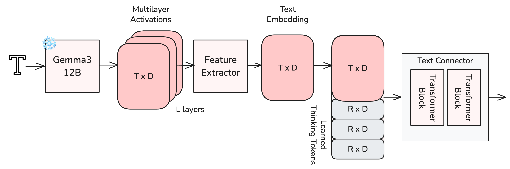
*Figure 4:Overview of the Text Understanding pipeline. The text prompt is encoded by Gemma3 and refined through the Feature Extractor and Text Connector to condition the modality-specific DiT.*

*Figure 5: Multimodal Classifier-Free Guidance with independent text and cross-modal control. The guided prediction is formed by combining the fully conditioned model output (orange) with two guidance directions: a text guidance term scaled by 
𝑠
𝑡
 (green) and a cross-modal guidance term scaled by 
𝑠
𝑚
 (blue). This supports independent control of textual conditioning and inter-modal alignment during inference.*

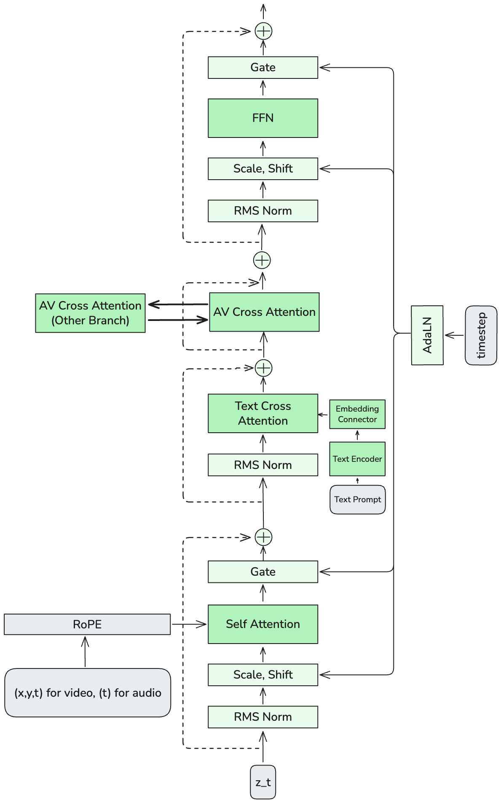
*Figure A2:Detailed view of a single stream of the model. The audio and video streams are identical in architecture.*

---
**Usage Info**: 7342 tokens used.
**Generated at**: 2026-02-24 18:59:50

---

# 📚 Segment-Aware Conditioning for Training-Free Intra-Utterance Emotion and Duration Control in Text-to-Speech

🚀 URL: https://arxiv.org/html/2601.03170

## 🌏 Abstract (원문)
Humans naturally regulate emotional expression and speaking pace during speech in a dynamic and flexible manner, reflecting changes in semantics, emphasis, and discourse intent. How to replicate such intra-utterance expressiveness remains a central challenge in building human-like Text-to-Speech (TTS) synthesis systems. Recent advances in controllable TTS have enabled zero-shot synthesis conditioned on attributes such as speaker identity, emotion, and speaking rate. Despite these advances, controllability in most existing methods remains confined to the utterance level, where a single emotional or prosodic condition is uniformly applied to an entire utterance, deviating from the dynamic expression naturally observed in human speech. To address this limitation, some methods predict phoneme- or frame-level affective attributes directly from text, while others rely on emotional reference speech to guide localized expressive patterns, such as brief laughter or crying. Most recently, WeSCon proposes a self-training framework with transition smoothing and emotional-bias mechanisms, enabling the TTS model to render multiple emotions within an utterance through distillation. While these meaningful progress, they typically rely on large-scale time-aligned annotated speech datasets or involve multi-stage training pipelines, which substantially limit their cross-model transferability and real-world deployment. These challenges naturally raise an important question: Is it possible to achieve stable segment-level emotion transitions and duration control without retraining the model? In this paper, we revisit controllable TTS from an inference-time perspective and propose the first training-free intra-utterance emotion and duration control framework. Rather than introducing additional predictors or retraining the acoustic model, our approach focuses on restructuring how conditioning information is accessed and updated during autoregressive decoding. Specifically, for multi-emotion control, we propose a segment-aware emotion conditioning strategy that combines causal masking with monotonic stream alignment filtering algorithm, which jointly isolates segment-specific emotion conditioning and performs online text-semantic alignment to schedule mask transitions, enabling smooth intra-utterance emotion shifts while preserving global semantic coherence. To enable multi-duration control, we further propose a segment-aware duration steering strategy to incorporate local duration embedding steering with global EOS logit modulation, allowing segment-level pacing adjustment while ensuring globally consistent sequence termination. Besides, we construct a multi-emotion and duration-annotated text dataset with 30,000 samples and fine-tune Qwen3-8B to enable LLM-based automatic prompt construction, thereby eliminating the need for segment-level manual segmentation and prompt engineering. Extensive experiments demonstrate that our method achieves state-of-the-art performance in stable intra-utterance multi-emotion transitions and duration control, while preserving the strong zero-shot synthesis capability of the underlying TTS model without any additional training.
## 🌏 Abstract (번역)
인간은 의미, 강조, 담화 의도의 변화를 반영하여 말하기 중에 감정 표현과 말하기 속도를 역동적이고 유연하게 조절합니다. 이러한 발화 내 표현력을 재현하는 것은 인간과 유사한 텍스트 음성 변환(TTS) 합성 시스템을 구축하는 데 있어 핵심적인 과제로 남아 있습니다. 제어 가능한 TTS의 최근 발전으로 화자 정체성, 감정, 말하기 속도와 같은 속성을 조건으로 하는 제로샷 합성이 가능해졌습니다. 이러한 발전에도 불구하고, 대부분의 기존 방법에서 제어 가능성은 발화 수준에 국한되어 있으며, 단일 감정 또는 운율 조건이 전체 발화에 균일하게 적용되어 인간의 말하기에서 자연스럽게 관찰되는 역동적인 표현과는 차이가 있습니다. 이러한 한계를 해결하기 위해 일부 방법은 텍스트에서 직접 음소 또는 프레임 수준의 감정 속성을 예측하는 반면, 다른 방법은 짧은 웃음이나 울음과 같은 국소적인 표현 패턴을 유도하기 위해 감정 참조 음성에 의존합니다. 가장 최근에 WeSCon은 전이 평활화 및 감정 편향 메커니즘을 갖춘 자가 학습 프레임워크를 제안하여 증류를 통해 한 발화 내에서 여러 감정을 표현할 수 있게 했습니다. 이러한 의미 있는 진전에도 불구하고, 이들은 일반적으로 대규모 시간 정렬 주석 음성 데이터셋에 의존하거나 다단계 훈련 파이프라인을 포함하므로 모델 간 전이 가능성과 실제 배포가 크게 제한됩니다. 이러한 과제는 자연스럽게 중요한 질문을 던집니다: 모델을 재학습하지 않고 안정적인 세그먼트 수준의 감정 전환과 길이 제어를 달성할 수 있을까? 본 논문에서는 추론 시간 관점에서 제어 가능한 TTS를 재검토하고, 최초의 훈련이 필요 없는 발화 내 감정 및 길이 제어 프레임워크를 제안합니다. 추가적인 예측기를 도입하거나 음향 모델을 재학습하는 대신, 본 연구의 접근 방식은 자동 회귀 디코딩 중에 조건 정보에 액세스하고 업데이트하는 방식을 재구성하는 데 중점을 둡니다. 구체적으로, 다중 감정 제어를 위해 인과적 마스킹과 단조 스트림 정렬 필터링 알고리즘을 결합한 세그먼트 인식 감정 조건화 전략을 제안하며, 이는 세그먼트별 감정 조건을 분리하고 온라인 텍스트-의미 정렬을 수행하여 마스크 전환을 예약함으로써 전역적 의미 일관성을 유지하면서 부드러운 발화 내 감정 변화를 가능하게 합니다. 다중 길이 제어를 가능하게 하기 위해, 전역 EOS 로짓 변조와 국소 길이 임베딩 스티어링을 결합한 세그먼트 인식 길이 스티어링 전략을 추가로 제안하여 전역적으로 일관된 시퀀스 종료를 보장하면서 세그먼트 수준의 속도 조절을 허용합니다. 또한, 30,000개의 샘플로 구성된 다중 감정 및 길이 주석 텍스트 데이터셋을 구축하고 Qwen3-8B를 미세 조정하여 LLM 기반 자동 프롬프트 구성을 가능하게 함으로써 세그먼트 수준의 수동 분할 및 프롬프트 엔지니어링의 필요성을 제거했습니다. 광범위한 실험을 통해 본 방법이 추가적인 훈련 없이 기본 TTS 모델의 강력한 제로샷 합성 능력을 유지하면서 안정적인 발화 내 다중 감정 전환 및 길이 제어에서 최첨단 성능을 달성함을 입증했습니다.

## 🔍 Methods & Results
- 모델 재학습 없이 추론 시점에서 발화 내 감정과 길이를 제어할 수 있는 최초의 Training-free 프레임워크 제안
- 30,000개의 샘플로 구성된 MED-TTS 데이터셋을 구축하고 Qwen3-8B를 미세 조정하여 수동 작업 없는 자동 프롬프트 생성 구현
- 2D 인과적 어텐션 마스크와 단조 스트림 정렬(MSA) 알고리즘을 결합하여 세그먼트별 감정 조건을 격리하고 부드러운 감정 전환 유도
- 베이지안 스타일의 정렬 추적을 통해 생성된 시맨틱 토큰과 소스 텍스트 간의 안정적인 정렬 상태를 유지하는 MSA 알고리즘 설계
- 로컬 길이 임베딩 스티어링을 도입하여 생성 속도 편차를 실시간으로 보정하고 세그먼트별 속도 조절 가능
- 전역 EOS 로짓 변조 전략을 통해 시퀀스의 조기 종료를 방지하고 목표 길이에 맞춘 정확한 종료 제어 달성
- 실험 결과, 추가 훈련 없이도 기존 TTS 모델의 품질을 유지하면서 다중 감정 및 길이 제어에서 SOTA 성능 기록

## 🖼 Figures
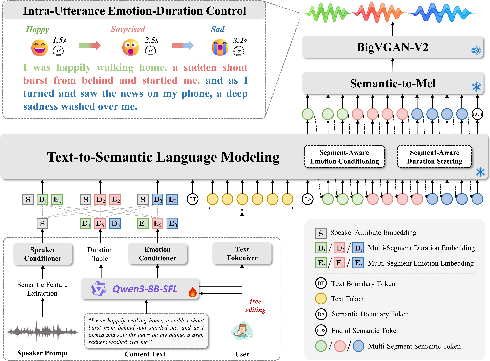
*Figure 1:Overview of our training-free framework for intra-utterance emotion and duration control, where the green, red, and blue regions denote three segments with different emotion and duration settings within the same utterance.*

*Figure 2:Overview of our training-free framework for fine-grained intra-utterance emotion and duration control, illustrating the transition from the second (red) segment to the third (blue) segment via segment-aware duration steering (left) and segment-aware emotion conditioning (right) strategy.*

*Figure 3:Detailed illustration of Monotonic Stream Alignment (MSA) in segment-aware emotion conditioning, where from top to bottom are MSA algorithm, MSA alignment result, and the visualization of 2D causal attention mask, respectively.*

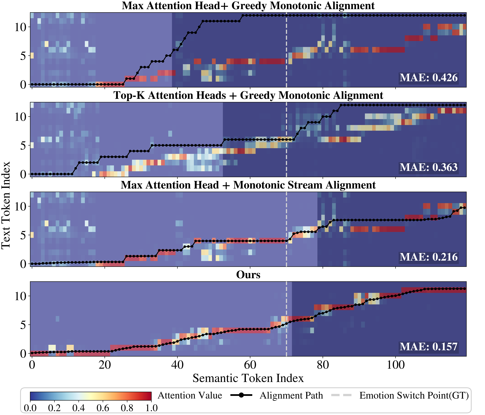
*Figure 4:Visualization of alignment paths and emotion switching, with background shading denoting emotion segments and lower MAE indicating better alignment.*

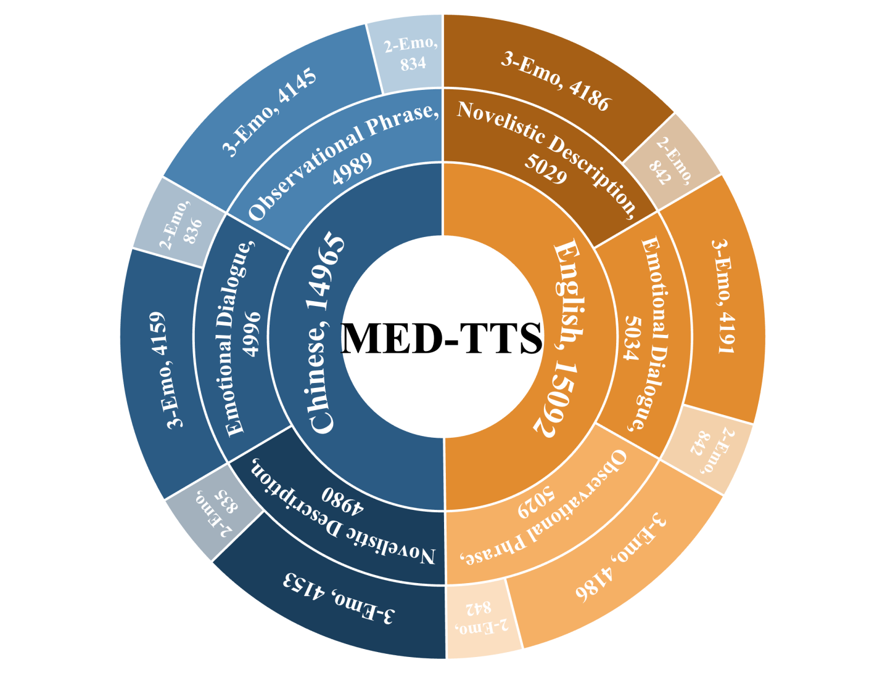
*(a)Distribution of Content Segments*

*(a)Distribution of Content Segments*

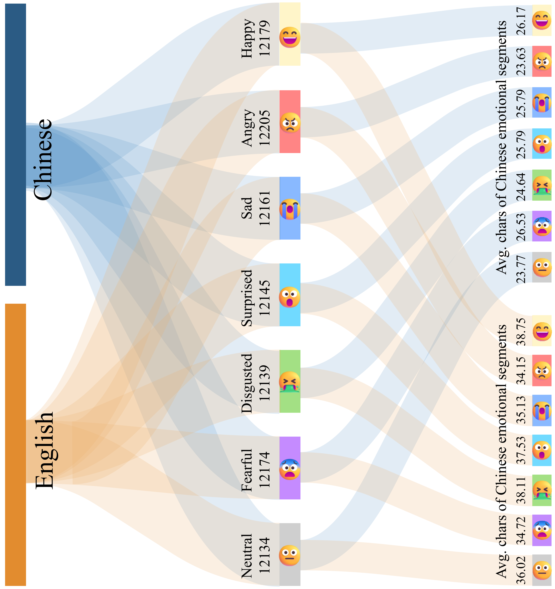
*(b)Distribution of Emotion Segments*

*(a)
𝑀
=
2*

*(a)
𝑀
=
2*

*(b)
𝑀
=
3*

*(c)
𝑀
=
4*

*(d)
𝑀
=
5*

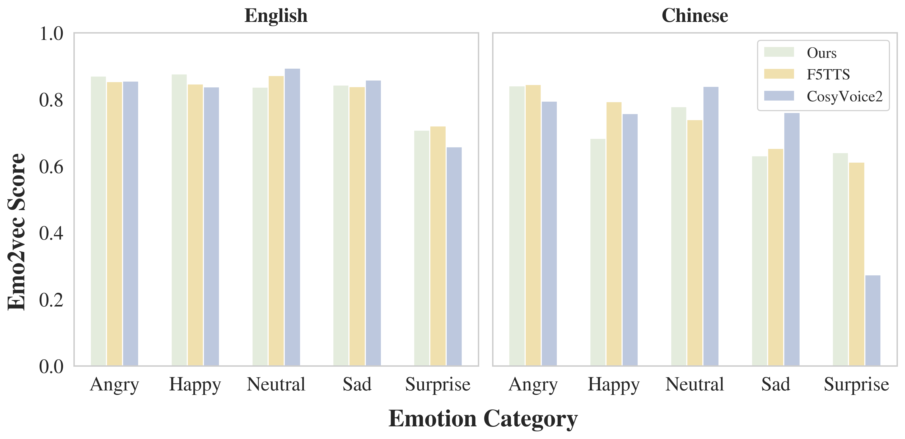
*Figure 7:Comparison of Emo2Vec similarity scores across languages for five emotion categories. Our method is compared with F5TTSChen et al. (2025) and CosyVoice2Du et al. (2024b).*

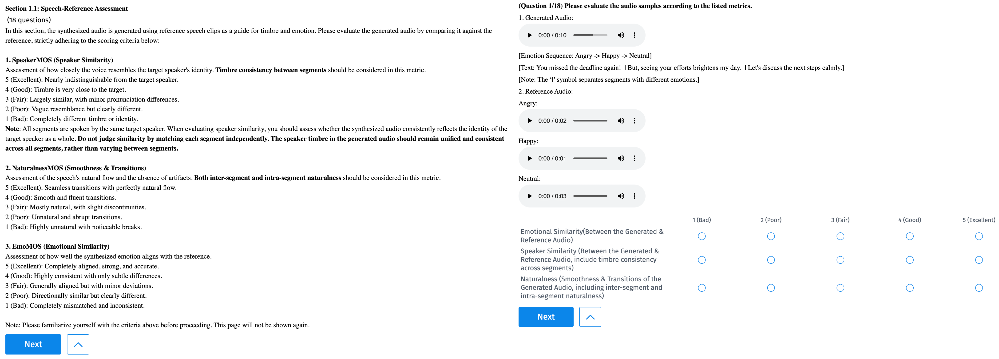
*(a)Speech-Prompted Emotion Control Evaluation*

*(a)Speech-Prompted Emotion Control Evaluation*

*(b)Text-Prompted Emotion Control Evaluation*

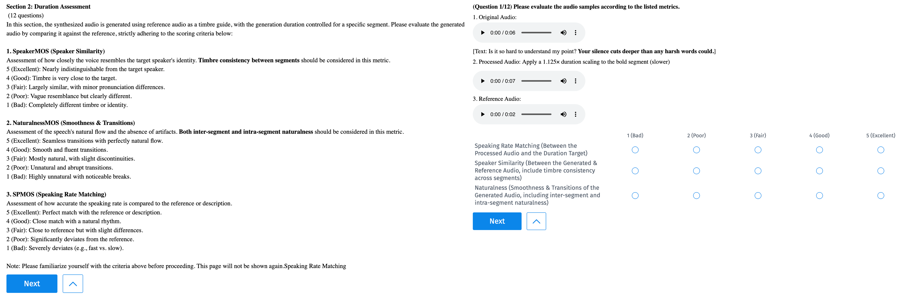
*(c)Duration Control Evaluation*

---
**Usage Info**: 7126 tokens used.
**Generated at**: 2026-02-24 19:01:08

---

# 📚 VocalBridge: Latent Diffusion-Bridge Purification for Defeating Perturbation-Based Voiceprint Defenses

🚀 URL: https://arxiv.org/html/2601.02444

## 🌏 Abstract (원문)
Recent advances in generative AI have intensified concerns about security, privacy, and data ownership. A particularly troubling area is speech generation, including text-to-speech (TTS) and voice conversion (VC) models. These technologies can now produce highly realistic audio deepfakes that enable impersonation, misinformation, and identity theft. To mitigate these risks, researchers have begun exploring proactive voice protection methods that make a user’s speech unlearnable for synthesis models. The key idea is to introduce carefully crafted perturbations or targeted transformations that prevent TTS/VC systems from extracting speaker-specific features (timbre), while keeping the audio natural and intelligible for legitimate use. However, the performance of existing proactive defenses remains underexplored in scenarios where attackers can purify protected speech before using it. To demonstrate the insufficiency of existing purification approaches and the need for more robust speech protection techniques, we introduce VocalBridge, a comprehensive purification attack that effectively removes protective perturbations and enables attackers to bypass modern speaker verification systems. VocalBridge is a diffusion-bridge purification model that learns a latent mapping from protected to clean speech representations within a compact encoded domain. The model employs a time-conditioned 1D U-Net denoiser that models the reverse diffusion process inside the EnCodec latent space, trained to estimate residual perturbations under a cosine-based noise schedule. Our results show that VocalBridge substantially surpasses existing purification methods in both attack effectiveness and performance.
## 🌏 Abstract (번역)
생성형 AI의 최근 발전은 보안, 개인정보 보호 및 데이터 소유권에 대한 우려를 심화시켰습니다. 특히 텍스트 음성 변환(TTS) 및 음성 변환(VC) 모델을 포함한 음성 생성 분야는 매우 우려되는 영역입니다. 이러한 기술은 이제 사칭, 허위 정보 및 신원 도용을 가능하게 하는 매우 사실적인 오디오 딥페이크를 생성할 수 있습니다. 이러한 위험을 완화하기 위해 연구자들은 사용자의 음성을 합성 모델이 학습할 수 없게 만드는 능동적 음성 보호 방법을 탐구하기 시작했습니다. 핵심 아이디어는 TTS/VC 시스템이 화자 고유의 특징(음색)을 추출하지 못하도록 정교하게 설계된 섭동(perturbation)을 도입하는 동시에, 합법적인 사용을 위해 오디오를 자연스럽고 이해 가능한 상태로 유지하는 것입니다. 그러나 기존의 능동적 방어 성능은 공격자가 보호된 음성을 사용하기 전에 정화(purification)할 수 있는 시나리오에서 충분히 연구되지 않았습니다. 기존 정화 방식의 불충분함과 더 강력한 음성 보호 기술의 필요성을 입증하기 위해, 본 논문에서는 보호용 섭동을 효과적으로 제거하고 공격자가 현대적 화자 인증 시스템을 우회할 수 있게 하는 포괄적인 정화 공격인 VocalBridge를 소개합니다. VocalBridge는 압축된 인코딩 도메인 내에서 보호된 음성 표현에서 깨끗한 음성 표현으로의 잠재 매핑을 학습하는 확산 브리지(diffusion-bridge) 정화 모델입니다. 이 모델은 EnCodec 잠재 공간 내부의 역확산 과정을 모델링하는 시간 조건부 1D U-Net 디노이저를 사용하며, 코사인 기반 노이즈 스케줄에 따라 잔류 섭동을 추정하도록 훈련되었습니다. 실험 결과, VocalBridge는 공격 효과와 성능 면에서 기존의 정화 방법을 크게 능가하는 것으로 나타났습니다.

## 🔍 Methods & Results
- VocalBridge는 EnCodec 잠재 공간 내에서 보호된 음성을 깨끗한 음성으로 매핑하는 확산 브리지(Diffusion-Bridge) 모델을 제안함
- 시간 조건부 1D U-Net 아키텍처를 사용하여 EnCodec 잠재 공간 내에서 역확산 과정을 수행하고 잔류 섭동을 제거함
- 텍스트 전사(Transcript) 없이도 음성 구조를 보존하기 위해 Whisper 기반의 경량 음소 가이드 컨디셔닝 메커니즘을 도입함
- 5가지 최신 능동적 방어 기술, 6가지 음성 합성 도구, 3가지 ASV 인코더를 대상으로 대규모 평가를 수행함
- VocalBridge는 인증 복구율(VR), 평균 의견 점수(MOS), 단어 오류율(WER) 지표에서 기존 정화 방식보다 우수한 성능을 보임
- 공격자는 타겟 화자가 아닌 보조 데이터셋만을 사용하여 모델을 훈련시키는 현실적인 위협 모델을 가정함
- 실험 결과, VocalBridge는 보호된 음성에서 방어 요소를 효과적으로 제거하여 화자 인증 시스템을 성공적으로 우회함

## 🖼 Figures
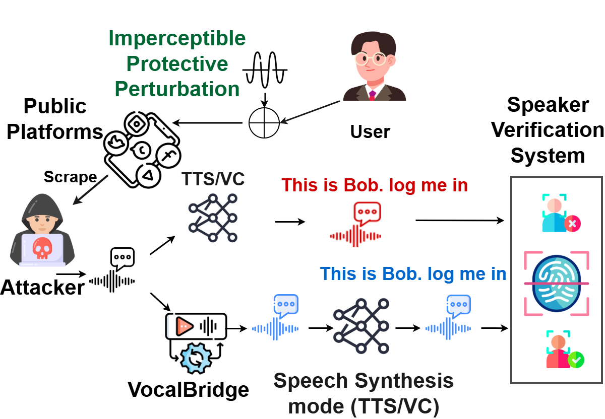
*Figure 1:This figure illustrates the threat model, demonstrating how an attacker leverages VocalBridge to bypass existing defenses and execute voice-cloning attacks.*

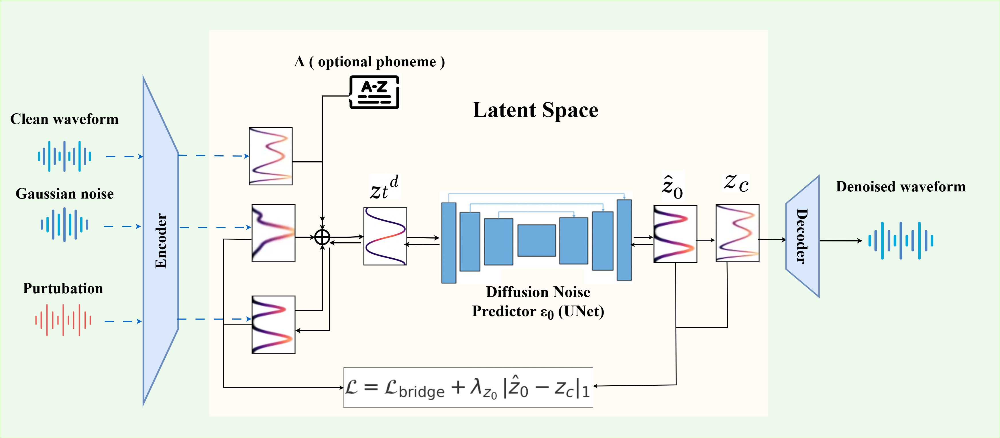
*Figure 2:VocalBridge Training*

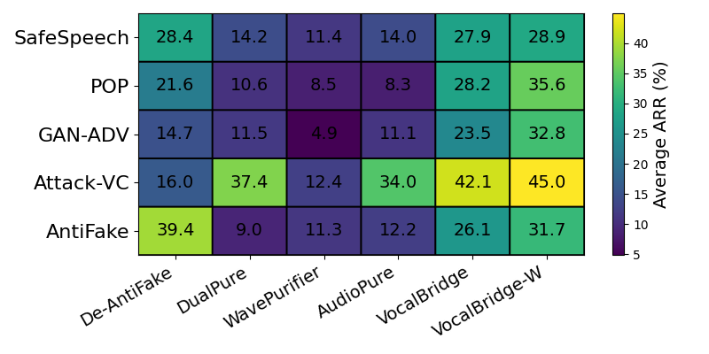
*Figure 3:The mean ARR (%) over three speaker verification back-ends (x-vector, ECAPA-TDNN, and d-vector).*

*Figure 4:The spectrogram comparison shows that VocalBridge-W better maintains the structure and detail of the clean samples than the leading baseline De-AntiFake.*

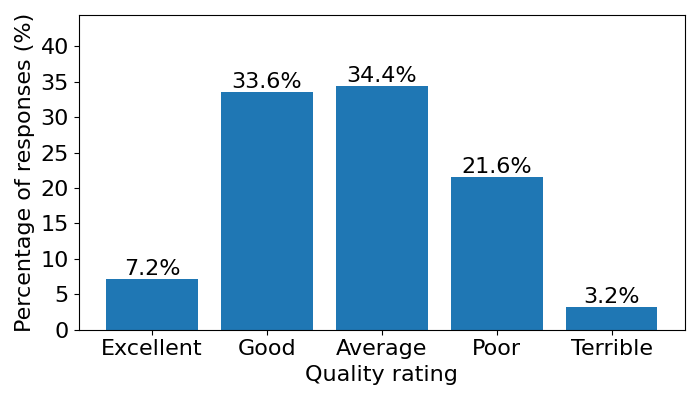
*Figure 5: ARR under different adaptive strategies.*

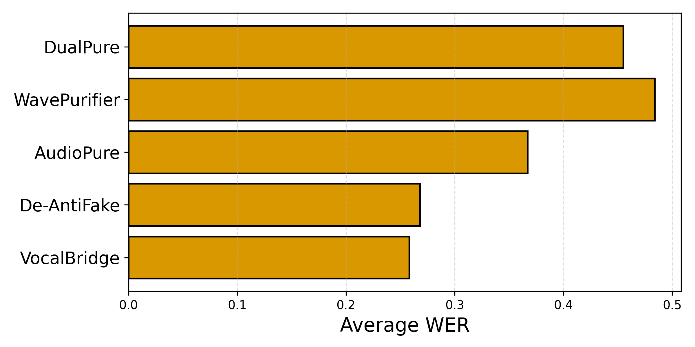
*Figure 6: Average WER of protection mechanisms on synthetic voices.*

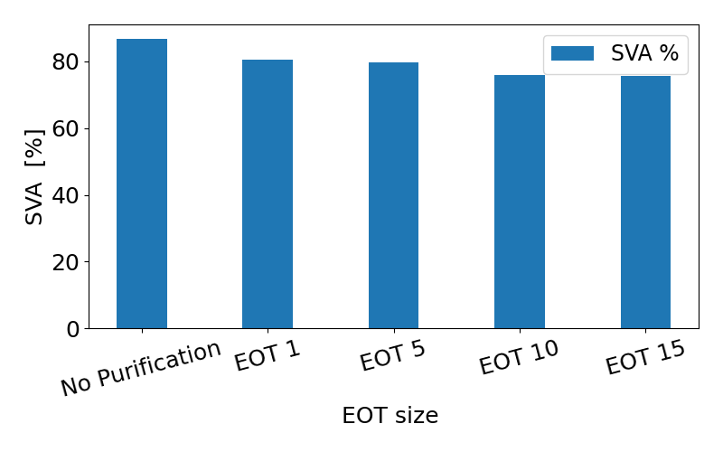
*Figure 7: SVA under different adaptive strategies.*

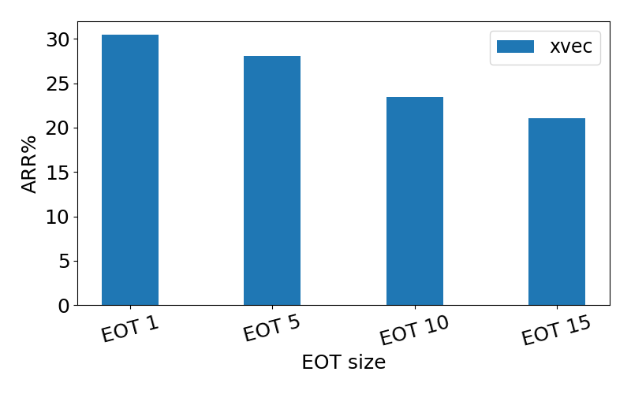
*Figure 8: ARR under different adaptive strategies.*

---
**Usage Info**: 5693 tokens used.
**Generated at**: 2026-02-24 19:02:04

---

# 📚 Towards Fine-Grained and Multi-Granular Contrastive Language-Speech Pre-training

🚀 URL: https://arxiv.org/html/2601.03065

## 🌏 Abstract (원문)
Speaking style conveys rich paralinguistic information beyond lexical content, encompassing both speaker-intrinsic characteristics (e.g., gender, age, and accent) and temporally varying traits (e.g., intonation, emotion, and expressiveness). In this sense, speaking style is inherently multi-scale: it can be summarized at the global, utterance level without explicit temporal structure, or described through fine-grained stylistic variation within an utterance. However, modeling speaking style remains challenging. Existing approaches typically rely on utterance-level, discrete labels, which limit expressive diversity and fail to capture the temporal structure of speech. Evaluating speaking style is likewise challenging. Widely used subjective human judgments suffer from limited inter-rater consistency and are hard to scale. Recent automated alternatives based on large audio language models incur huge costs. As a result, there remains substantial scope for fine-grained modeling and scalable evaluation of speaking style in speech–text representation learning. A central bottleneck is the lack of scalable, reliable, and fine-grained style annotations. Existing speech style-captioned datasets predominantly use cascaded annotation pipelines, in which speech is first labeled with discrete attributes and then rewritten into free-text descriptions by large language models, often introducing error propagation and semantic misalignment. More fundamentally, these intermediate discrete attributes impose a severe information bottleneck, compressing rich, continuous, and temporally varying paralinguistic information into a finite set of predefined categorical tags and leading to substantial information loss. With these perspectives in mind, we introduce FCaps, a large-scale speech dataset paired with fine-grained free-text speaking-style descriptions, constructed via an end-to-end annotation pipeline that directly grounds style captions in audio and incorporates agentic verification to improve annotation quality. We show that our annotations achieve substantially higher quality than cascaded annotations in terms of correctness, coverage, and naturalness, as assessed by LLM-as-a-judge. Building on FCaps, we further propose CLSP, a contrastive language–speech pre-trained model that leverages fine-grained and multi-granular supervision to learn unified speech–text representations across different levels of granularity. Extensive experiments demonstrate strong performance across multiple tasks, including global and fine-grained speech–text retrieval, zero-shot paralinguistic classification, and speech style similarity scoring aligned with human judgments. Our contributions are fourfold: We present FCaps, the largest dataset to date for fine-grained free-text speaking-style descriptions, with 47k hours of speech and 19M captions. We propose an end-to-end pipeline for fine-grained style annotation, substantially improving annotation quality over existing approaches. We present CLSP, a speech–text dual-encoder trained with fine-grained and multi-granular contrastive supervision, enabling unified representation learning across multiple granularities. We demonstrate that CLSP learns robust and generalizable speech–language representations that perform reliably across multiple tasks, with strong alignment to human judgments.
## 🌏 Abstract (번역)
말하기 스타일은 어휘적 내용을 넘어 화자 고유의 특성(예: 성별, 연령, 억양)과 시간에 따라 변하는 특성(예: 억양, 감정, 표현력)을 모두 아우르는 풍부한 부가 언어 정보를 전달합니다. 이러한 관점에서 말하기 스타일은 본질적으로 다중 스케일입니다. 즉, 명시적인 시간 구조 없이 전체 발화 수준에서 요약되거나 발화 내의 미세한 스타일 변화를 통해 설명될 수 있습니다. 그러나 말하기 스타일 모델링은 여전히 어려운 과제로 남아 있습니다. 기존 방식은 대개 발화 수준의 이산적 레이블에 의존하여 표현의 다양성을 제한하고 음성의 시간적 구조를 포착하지 못합니다. 말하기 스타일 평가 또한 마찬가지로 어렵습니다. 널리 사용되는 주관적인 인간 판단은 평가자 간 일관성이 부족하고 확장이 어렵습니다. 대규모 오디오 언어 모델에 기반한 최근의 자동화된 대안들은 막대한 비용을 초래합니다. 결과적으로 음성-텍스트 표현 학습에서 말하기 스타일의 미세한 모델링과 확장 가능한 평가를 위한 상당한 여지가 남아 있습니다. 핵심적인 병목 현상은 확장 가능하고 신뢰할 수 있는 미세한 스타일 주석의 부재입니다. 기존의 음성 스타일 캡션 데이터셋은 주로 음성에 이산적 속성을 먼저 레이블링한 후 대규모 언어 모델을 통해 자유 텍스트 설명으로 재작성하는 계단식 주석 파이프라인을 사용하는데, 이는 종종 오류 전파와 의미론적 불일치를 초래합니다. 더 근본적으로, 이러한 중간 이산 속성은 풍부하고 연속적이며 시간에 따라 변하는 부가 언어 정보를 유한한 사전 정의된 범주형 태그 세트로 압축하여 심각한 정보 병목 현상을 일으키고 상당한 정보 손실을 초래합니다. 이러한 관점을 바탕으로, 본 연구는 오디오에 직접 스타일 캡션을 근거하고 주석 품질을 개선하기 위해 에이전트 검증을 통합한 엔드투엔드 주석 파이프라인을 통해 구축된, 미세한 자유 텍스트 말하기 스타일 설명과 쌍을 이루는 대규모 음성 데이터셋인 FCaps를 소개합니다. LLM-as-a-judge 평가를 통해 본 연구의 주석이 정확성, 범위 및 자연스러움 측면에서 계단식 주석보다 훨씬 높은 품질을 달성함을 보여줍니다. FCaps를 기반으로, 다양한 수준의 입도에서 통합된 음성-텍스트 표현을 학습하기 위해 미세하고 다중 입도의 감독을 활용하는 대조 언어-음성 사전 학습 모델인 CLSP를 추가로 제안합니다. 광범위한 실험을 통해 글로벌 및 미세 입도 음성-텍스트 검색, 제로샷 부가 언어 분류, 인간 판단과 일치하는 음성 스타일 유사도 점수 산출 등 여러 작업에서 강력한 성능을 입증했습니다. 본 연구의 기여는 네 가지입니다. 첫째, 47,000시간의 음성과 1,900만 개의 캡션을 포함하는 미세 입도 자유 텍스트 말하기 스타일 설명을 위한 역대 최대 규모의 데이터셋인 FCaps를 제시합니다. 둘째, 기존 방식보다 주석 품질을 크게 개선한 미세 입도 스타일 주석을 위한 엔드투엔드 파이프라인을 제안합니다. 셋째, 여러 입도에 걸쳐 통합된 표현 학습을 가능하게 하는 미세 및 다중 입도 대조 감독으로 훈련된 음성-텍스트 듀얼 인코더인 CLSP를 제시합니다. 넷째, CLSP가 인간의 판단과 강력하게 일치하며 여러 작업에서 안정적으로 수행되는 견고하고 일반화 가능한 음성-언어 표현을 학습함을 입증합니다.

## 🔍 Methods & Results
- CLSP는 SPEAR-XLarge를 음성 인코더로, RoBERTa-base를 텍스트 인코더로 사용하는 듀얼 인코더 아키텍처를 채택함
- 2단계 커리큘럼 학습 도입: 1단계에서는 표준 대조 학습을, 2단계에서는 다중 입도 캡션을 활용한 다중 양성(multi-positive) 대조 학습을 수행함
- 동적 작업 스케줄러를 사용하여 글로벌 캡션과 미세 입도 캡션 간의 학습 비중을 조절함으로써 일반화 성능과 변별력을 동시에 확보함
- FCaps 데이터셋은 47k 시간의 음성과 19M 개의 캡션으로 구성되어 있으며, 엔드투엔드 파이프라인과 에이전트 검증을 통해 주석 품질을 극대화함
- 실험 결과, 글로벌 및 미세 입도 검색, 제로샷 분류 등에서 우수한 성능을 보였으며 인간의 스타일 유사도 판단과 높은 상관관계를 나타냄

## 🖼 Figures

*Figure 1:Multi-granular speech style caption similarity scoring for the same speech input by CLSP. Positive captions (green) receive higher scores, while hard negatives (red), despite mainly textual overlap, receive markedly lower scores due to attribute mismatches.*

*Figure 2:Overview of our end-to-end annotation pipeline for generating fine-grained captions, consisting of a detailed captioner and agentic verification with specialist tools. Solid lines indicate the construction process for FCaps-Emilia, and dashed lines indicate additional processes for FCaps-PSCBase. In the example fine-grained captions, speaker-related traits are highlighted in bold and narrative structure in red.*

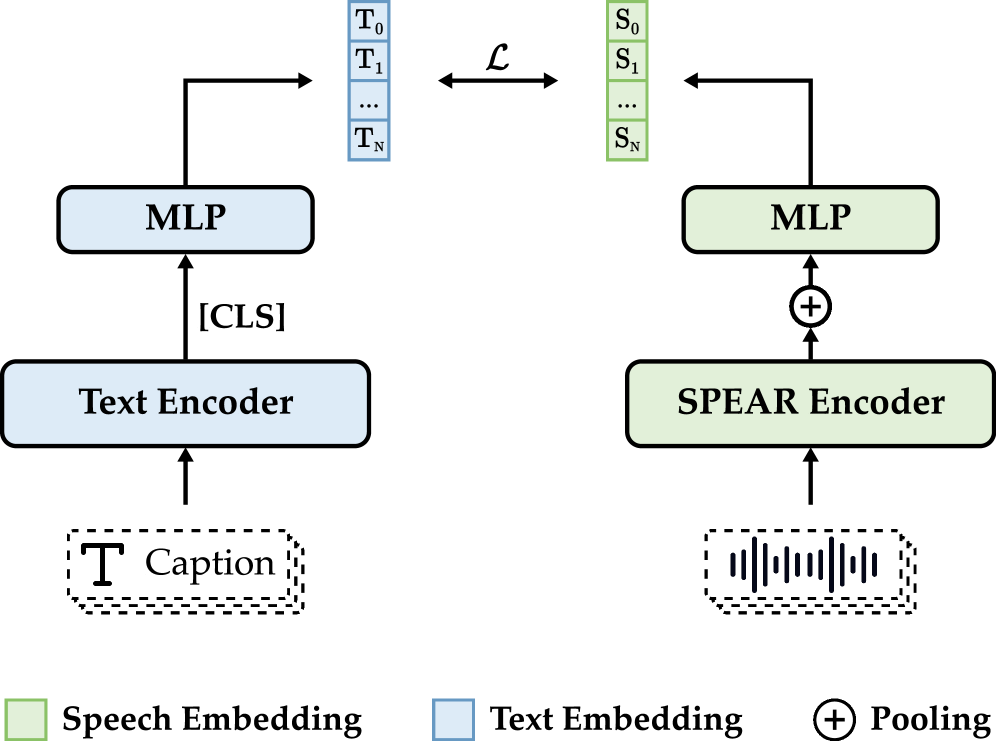
*Figure 3:Overview of CLSP.*

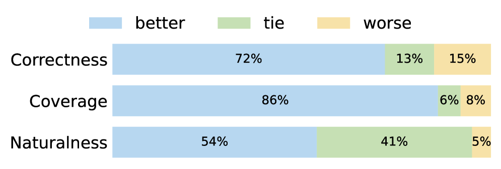
*Figure 4: Pairwise comparison between end-to-end and cascaded captions across correctness, coverage, and naturalness dimensions, showing the proportions of better, tied, and worse cases under Gemini 3 Pro evaluation.*

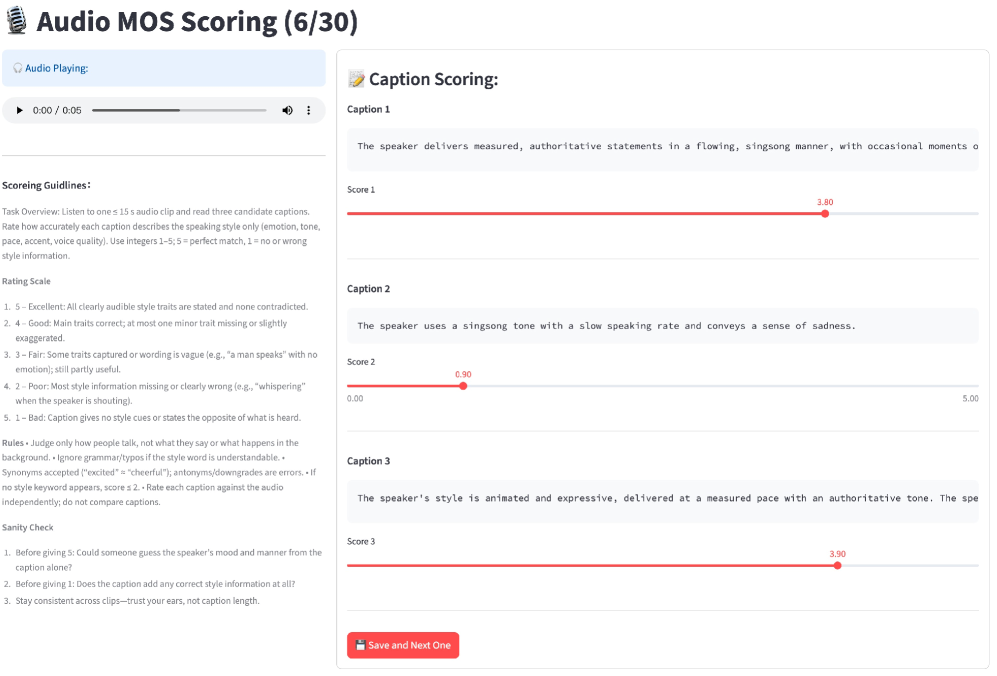
*Figure 5:Annotation UI for raters to annotate the alignment score between one audio and several candidate captions.*

*Figure 6:Correlation analysis between model-predicted similarity scores and subjective human ratings across different models and trait categories (Intrinsic, Situational, and Fusion). The green scatter plots demonstrate the alignment between automated metrics and human perception using the ParaSpeechCaps evaluation set. The dashed red lines represent the linear regression fit.*

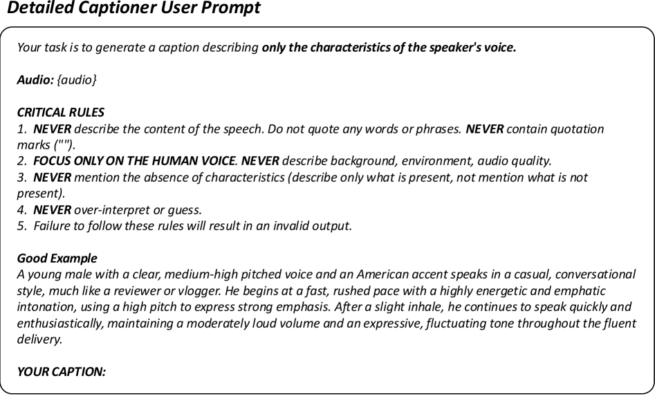
*Figure 7:User prompt for detailed captioner.*

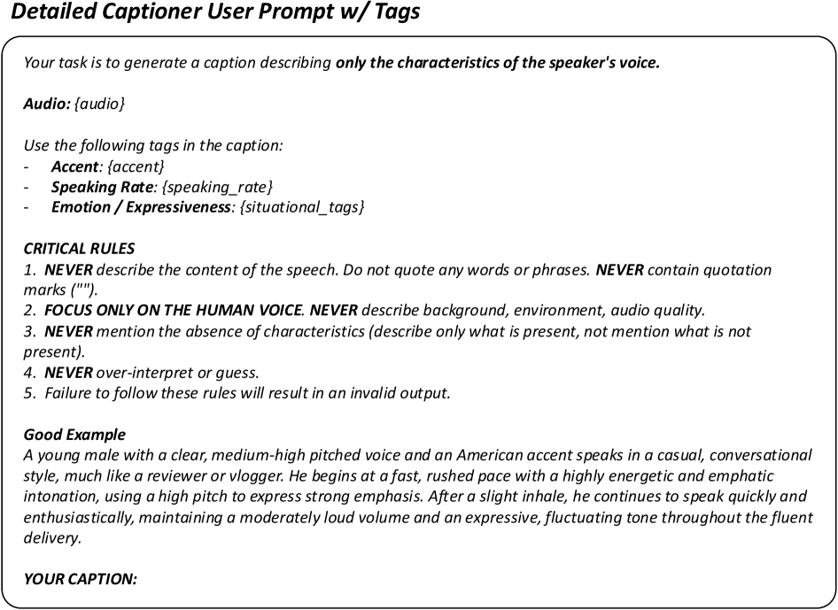
*Figure 8:User prompt with human-annotated tags for detailed captioner.*

*Figure 9:Detailed protocol of LLM-as-Judges.*

---
**Usage Info**: 5542 tokens used.
**Generated at**: 2026-02-24 19:02:50

---

# 📚 Multi-channel multi-speaker transformer for speech recognition

🚀 URL: https://arxiv.org/html/2601.02688

## 🌏 Abstract (원문)
As teleconferencing and in-vehicle voice assistants become increasingly popular, far-field multi-speaker speech recognition has become a hot research topic. Current mainstream methods are based on the permutation invariant training (PIT). Specifically, they first use far-field speech separation frontends to output single-channel speech feature for each speaker, and then decode these features with single-channel automatic speech recognition (ASR) backend with PIT. Compared to the serialized output training based methods, PIT based methods could decode faster and are closer to practical applications. Recently, researchers proposed a multi-channel transformer (MCT) for far-field speech recognition. Experiments show that MCT outperforms the commonly used systems which use enhancement models as frontends and single-channel ASR models as backends. This is mainly because the inconsistency in functional design between frontends and backends brings performance limitations to the latter systems. Inspired by this, we try to bypass the paradigm of separation frontends recognition backends (Sep-ASR) and propose a multi-channel multi-speaker transformer (M2Former), whose encoder can encode high dimensional acoustic embeddings for each speaker from the mixture input audio directly. However, there are certain problems in using MCT for multi-speaker scenario. The encoder of MCT encodes the contextual relationship under far-field environments by utilizing the intra-channel continuity information and cross-channel spatial information. When utilizing the cross-channel information, MCT combines channels using learnable weights which are expected to learn to model the spatial relationships implicitly. But in the multiple speakers case, the interference between speakers and noise makes it difficult for the encoder to generate high quality acoustic embeddings for each speaker. To alleviate such interference, two dimensional convolutional neural networks (2D-CNN) and an improved multi-channel attention mechanism called multi-channel multi-speaker attention (M2A) are used. 2D-CNN are widely used in image tasks and speech enhancement tasks as feature decoupling modules. This is due to their ability to learn diverse facets with different filter channels. For example, researchers find that different filters of the CNN focus on signals coming from different directions. Based on this, we use a 2D-CNN to decouple the multi-channel inputs first. As there are always physical or content differences between signal sources, each output channel of the CNN is expected to have a high probability of containing information corresponding to only one speaker (or noise). Then we propose the M2A module to encode contextual relationship. Instead of using all channels like MCT, the M2A only utilize the cross-channel information between channels with high similarity. Therefore, signals corresponding to different sources are encoded separately, and the interference mentioned above is avoided to a certain extent. Furthermore, we employ a spectral clustering based approach when separating speaker-specific features from the input mixtures. Compared to the projection based method which use linear projection layers to predict masks for speakers, there are two advantages. 1) After clustering, channels corresponding to different sound sources are assigned to different clusters. Using M2A within each cluster can better avoid the interference between sources. 2) There is no need to train additional linear layers, so it is easier to be applied to the situation of more speakers and unfixed number of speakers. Moreover, the similarity matrix required for clustering can be easily obtained from the M2A. Besides, we utilize a method to distinguish the noise and speech. By discarding noise cluster, the background noise is filtered out. Based on the above approaches, we propose the M2Former for far-field multi-speaker ASR. Experiments on the SMS-WSJ show that it outperforms the neural beamformer, MCT, dual-path RNN with transform-average-concatenate and multi-channel deep clustering based systems by 9.2%, 14.3%, 24.9%, and 52.2% respectively, in terms of relative WER reduction.
## 🌏 Abstract (번역)
화상 회의와 차량용 음성 비서의 인기가 높아짐에 따라 원거리 다중 화자 음성 인식은 중요한 연구 주제가 되었습니다. 현재 주류 방법론은 순열 불변 학습(PIT)에 기반하고 있습니다. 구체적으로, 이들은 먼저 원거리 음성 분리 프런트엔드를 사용하여 각 화자에 대한 단일 채널 음성 특징을 출력한 다음, PIT가 적용된 단일 채널 자동 음성 인식(ASR) 백엔드로 이러한 특징을 디코딩합니다. 직렬 출력 학습(SOT) 기반 방법과 비교하여 PIT 기반 방법은 디코딩 속도가 빠르고 실제 응용에 더 가깝습니다. 최근 연구자들은 원거리 음성 인식을 위한 멀티채널 트랜스포머(MCT)를 제안했습니다. 실험 결과 MCT는 강화 모델을 프런트엔드로, 단일 채널 ASR 모델을 백엔드로 사용하는 일반적인 시스템보다 우수한 성능을 보였습니다. 이는 주로 프런트엔드와 백엔드 간의 기능적 설계 불일치가 후자 시스템의 성능 제한을 가져오기 때문입니다. 이에 영감을 받아, 본 연구에서는 분리 프런트엔드와 인식 백엔드(Sep-ASR) 패러다임을 우회하고, 혼합 입력 오디오에서 각 화자에 대한 고차원 음향 임베딩을 직접 인코딩할 수 있는 멀티채널 다중 화자 트랜스포머(M2Former)를 제안합니다. 그러나 다중 화자 시나리오에서 MCT를 사용하는 데에는 몇 가지 문제가 있습니다. MCT의 인코더는 채널 내 연속성 정보와 채널 간 공간 정보를 활용하여 원거리 환경에서의 문맥 관계를 인코딩합니다. 채널 간 정보를 활용할 때 MCT는 공간적 관계를 암시적으로 학습하도록 기대되는 학습 가능한 가중치를 사용하여 채널을 결합합니다. 하지만 다중 화자 케이스에서는 화자 간의 간섭과 노이즈로 인해 인코더가 각 화자에 대해 고품질의 음향 임베딩을 생성하기 어렵습니다. 이러한 간섭을 완화하기 위해 2차원 합성곱 신경망(2D-CNN)과 M2A(Multi-channel Multi-speaker Attention)라고 불리는 개선된 멀티채널 어텐션 메커니즘이 사용됩니다. 2D-CNN은 특징 분리 모듈로서 이미지 작업과 음성 강화 작업에서 널리 사용됩니다. 이는 서로 다른 필터 채널을 통해 다양한 측면을 학습할 수 있는 능력 때문입니다. 예를 들어, 연구자들은 CNN의 서로 다른 필터가 서로 다른 방향에서 오는 신호에 집중한다는 것을 발견했습니다. 이를 바탕으로 본 연구에서는 먼저 2D-CNN을 사용하여 멀티채널 입력을 분리합니다. 신호원 사이에는 항상 물리적 또는 내용적 차이가 존재하므로, CNN의 각 출력 채널은 단 하나의 화자(또는 노이즈)에 해당하는 정보만을 포함할 확률이 높을 것으로 기대됩니다. 그런 다음 문맥 관계를 인코딩하기 위해 M2A 모듈을 제안합니다. MCT처럼 모든 채널을 사용하는 대신, M2A는 유사도가 높은 채널 간의 채널 간 정보만을 활용합니다. 따라서 서로 다른 소스에 해당하는 신호가 별도로 인코딩되어 앞서 언급한 간섭을 어느 정도 피할 수 있습니다. 또한, 입력 혼합물에서 화자별 특징을 분리할 때 스펙트럼 클러스터링 기반 접근 방식을 채용합니다. 선형 투영 레이어를 사용하여 화자에 대한 마스크를 예측하는 투영 기반 방법과 비교하여 두 가지 장점이 있습니다. 1) 클러스터링 후 서로 다른 음원에 해당하는 채널이 서로 다른 클러스터에 할당됩니다. 각 클러스터 내에서 M2A를 사용하면 음원 간의 간섭을 더 잘 피할 수 있습니다. 2) 추가적인 선형 레이어를 학습할 필요가 없어 더 많은 화자나 고정되지 않은 화자 수의 상황에 적용하기 쉽습니다. 또한 클러스터링에 필요한 유사도 행렬은 M2A에서 쉽게 얻을 수 있습니다. 게다가 노이즈와 음성을 구별하는 방법을 활용하여 노이즈 클러스터를 폐기함으로써 배경 소음을 필터링합니다. 위와 같은 접근 방식을 바탕으로 원거리 다중 화자 ASR을 위한 M2Former를 제안합니다. SMS-WSJ 데이터셋에 대한 실험 결과, 신경망 빔포머, MCT, Transform-Average-Concatenate를 적용한 Dual-path RNN, 멀티채널 딥 클러스터링 기반 시스템보다 상대적 단어 오류율(WER) 감소 측면에서 각각 9.2%, 14.3%, 24.9%, 52.2% 우수한 성능을 보였습니다.

## 🔍 Methods & Results
- M2Former 프레임워크 제안: 기존의 분리(Separation) 및 인식(ASR) 단계를 나누는 패러다임을 우회하여 혼합 오디오에서 직접 화자별 고차원 음향 임베딩을 추출함.
- 2D-CNN 모듈 활용: 입력 멀티채널 특징을 식별력 있는 표현으로 분리하고 주파수 및 시간 차원에서 다운샘플링을 수행하여 계산 효율성을 개선함.
- M2A(Multi-channel Multi-speaker Attention) 메커니즘: 채널 내 자가 어텐션과 유사도 기반의 채널 간 어텐션을 결합하여 화자 간 간섭을 효과적으로 완화함.
- 스펙트럼 클러스터링 및 필터링(CF) 레이어: M2A에서 생성된 유사도 행렬을 기반으로 채널을 클러스터링하고, IFSD(Inter-frame similarity difference)를 통해 노이즈를 제거함.
- 성능 실험 결과: SMS-WSJ 데이터셋에서 기존의 Neural Beamformer 대비 9.2%, MCT 대비 14.3%의 상대적 WER 감소를 기록함.
- 유연한 확장성: 추가적인 선형 레이어 학습이 필요 없어 화자 수가 가변적이거나 많은 상황에서도 적용이 용이함.

## 🖼 Figures

*Figure 1:Multi-channel multi-speaker transformer. 
𝐶
 is the number of input channels. 
𝑁
M
 and 
𝑁
D
 represent the numbers of M2A blocks and decoder blocks respectively. Assume that there are two speakers in the input audio.*

*Figure 2:Multi-channel attention blocks: (a)Intra-channel attention. (b) MCT's cross-channel attention. (c) M2A's cross-channel attention. 
⨂
, 
⨁
 and dashed lines denote matrix multiplication, averaging on time dimension and matrix transpose respectively.*

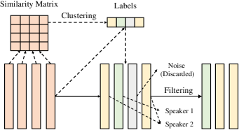
*Figure 3:Clustering and filtering layer. Gradients are propagated only in the solid line. Assume that there are 4 channels and 2 speakers, and the gray label get the lowest IFSD value.*

---
**Usage Info**: 8031 tokens used.
**Generated at**: 2026-02-24 19:03:57

---

# 📚 Vulnerabilities of Audio-Based Biometric Authentication Systems Against Deepfake Speech Synthesis

🚀 URL: https://arxiv.org/html/2601.02914

## 🌏 Abstract (원문)
Voiceprint-based biometric authentication is a critical security modality, widely relied upon to safeguard financial transactions, verify identities remotely, control secure access, and prevent fraud across telecommunications systemsli2024audio;kamel2025surveythreatsvoiceauthentication. The global voiceprint authentication market is projected to grow from USD 2.87 billion in 2025 to USD 15.69 billion by 2032alsheavi2025iot. However, this reliance faces increasing vulnerabilities. Audio deepfakes have rapidly evolved from a laboratory curiosity into tangible real-world security threatsrabhi2024audio, causing significant societal and financial losses, including AI-generated robocalls impersonating public figures that reached millions of recipients and voice cloning scams defrauding the elderly of over $200Kalali2025partial;mittal2025pitch;shapiro2025cyber. This crisis calls for the urgent assessment of the resilience of modern defense systems against deepfake technologies. In this paper, we present rigorous empirical evaluations addressing the critical question ofwhether state-of-the-art speaker authentication systems can withstand contemporary open-source voice cloning (deepfake) models, which can synthesize speech from only a few minutes of target speaker datali2025survey. We construct a large-scale benchmark by training multiple representative voice cloning systems on Mandarin speakers and evaluating both commercial speaker verification platforms and state-of-the-art anti-spoofing detectors across diverse settings to reveal their true security level and robustness. Our results reveal two previously undocumented security vulnerabilities: (1) speaker verification provides only partial defense against modern voice cloning attacks; and (2) anti-spoofing detectors fail to generalize effectively to unseen synthesis patterns. Both of these findings are amplified by the rapid evolution of speech synthesis technology and demand proactive attention from industry and academia. The contributions of this work are summarized as follows: We present the first systematic evaluation of audio-based authentication systems under deepfake attacks, revealing critical vulnerabilities in state-of-the-art models. We identify and characterize key failure modes underlying system vulnerabilities, highlighting architectural limitations, the role of training data diversity in generalization, and the impact of self-supervised pretraining on cross-lingual transferability. We outline concrete directions for future research, emphasizing the need for continuously updated training corpora and architectures that capture intrinsic synthesis characteristics to enable a truly effective defense layer.
## 🌏 Abstract (번역)
성문 기반 생체 인증은 금융 거래 보호, 원격 신원 확인, 보안 액세스 제어 및 통신 시스템 전반의 사기 방지를 위해 널리 의존되는 중요한 보안 방식입니다. 글로벌 성문 인증 시장은 2025년 28억 7천만 달러에서 2032년 156억 9천만 달러로 성장할 것으로 예상됩니다. 그러나 이러한 의존도는 증가하는 취약성에 직면해 있습니다. 오디오 딥페이크는 실험실의 호기심에서 실질적인 현실 세계의 보안 위협으로 빠르게 진화하여, 공인을 사칭하여 수백만 명에게 도달한 AI 생성 로보콜과 노인들을 대상으로 20만 달러 이상의 사기를 친 음성 복제 스캠을 포함하여 상당한 사회적 및 재정적 손실을 초래하고 있습니다. 이러한 위기는 현대 방어 시스템의 딥페이크 기술에 대한 회복력에 대한 긴급한 평가를 요구합니다. 본 논문에서는 단 몇 분의 대상 화자 데이터만으로 음성을 합성할 수 있는 현대적인 오픈 소스 음성 복제(딥페이크) 모델에 최첨단 화자 인증 시스템이 견딜 수 있는지에 대한 중요한 질문을 다루는 엄격한 실증적 평가를 제시합니다. 우리는 중국어 화자를 대상으로 여러 대표적인 음성 복제 시스템을 훈련하고, 다양한 설정에서 상용 화자 검증 플랫폼과 최첨단 안티 스푸핑 탐지기를 모두 평가하여 실제 보안 수준과 견고성을 밝히는 대규모 벤치마크를 구축합니다. 연구 결과, 이전에는 기록되지 않았던 두 가지 보안 취약점이 드러났습니다. (1) 화자 검증은 현대의 음성 복제 공격에 대해 부분적인 방어만을 제공하며, (2) 안티 스푸핑 탐지기는 보지 못한 합성 패턴에 대해 효과적으로 일반화하지 못합니다. 이러한 발견은 음성 합성 기술의 급격한 진화에 의해 증폭되며 산업계와 학계의 적극적인 관심을 요구합니다. 본 연구의 기여는 다음과 같이 요약됩니다. 첫째, 딥페이크 공격 하에서 오디오 기반 인증 시스템에 대한 최초의 체계적인 평가를 제시하여 최첨단 모델의 치명적인 취약점을 밝힙니다. 둘째, 시스템 취약성의 근저에 있는 주요 실패 모드를 식별하고 특성화하여 아키텍처의 한계, 일반화에서 훈련 데이터 다양성의 역할, 교차 언어 전이 가능성에 대한 자기 지도 사전 훈련의 영향을 강조합니다. 셋째, 진정으로 효과적인 방어 계층을 가능하게 하기 위해 고유한 합성 특성을 포착하는 아키텍처와 지속적으로 업데이트되는 훈련 코퍼스의 필요성을 강조하며 향후 연구를 위한 구체적인 방향을 제시합니다.

## 🔍 Methods & Results
- Constructed a large-scale benchmark by training multiple representative voice cloning systems on Mandarin speakers.
- Evaluated both commercial speaker verification platforms and state-of-the-art anti-spoofing detectors across diverse settings.
- Revealed that speaker verification provides only partial defense against modern voice cloning attacks.
- Found that anti-spoofing detectors fail to generalize effectively to unseen synthesis patterns.
- Identified key failure modes including architectural limitations and the role of training data diversity in generalization.
- Analyzed the impact of self-supervised pretraining on cross-lingual transferability.

---
**Usage Info**: 2989 tokens used.
**Generated at**: 2026-02-24 19:04:34

---

# 📚 XLSR-MamBo: Scaling the Hybrid Mamba-Attention Backbone for Audio Deepfake Detection

🚀 URL: https://arxiv.org/html/2601.02944

## 🌏 Abstract (원문)
Driven by rapid advances in generative artificial intelligence (GenAI), cutting-edge text-to-speech (TTS) and voice conversion (VC) technologies have achieved remarkable progress. The naturalness and timbre similarity of synthesized speech have reached levels that are increasingly challenging for the human ear to distinguish. While beneficial for applications like audiobooks and content creation, these technologies pose severe risks if misused. The maturation of zero-shot and few-shot voice cloning allows attackers to synthesize highly realistic forged speech using only short audio segments collected from social media. Such misuse not only facilitates the spread of misinformation and erodes societal trust but also threatens voice biometric systems. Consequently, developing robust and effective audio deepfake detection (ADD) models is imperative. Early research in anti-spoofing primarily relied on handcrafted features to detect synthesis artifacts that deviate from human speech production mechanisms. Although such methods offer interpretability and computational efficiency, these often lack generalization against unseen advanced generators. With the advancement of deep learning, mainstream ADD models have shifted to end-to-end architectures, which directly process raw audio for feature extraction and classification. Regarding front-end feature extraction, XLSR is a self-supervised learning (SSL) model based on Wav2Vec 2.0, pre-trained on massive cross-lingual datasets. Benefiting from this large-scale diversity, XLSR has demonstrated competitive generalization capabilities compared to other pre-trained models (PTMs) such as Whisper and WavLM, demonstrating strong competitiveness in ADD tasks. Building on this powerful representation, attention-based classifiers have become an efficient back-end candidate. The Conformer architecture, which combines the global context modeling of Transformers with the local feature capture of CNNs, is widely adopted. By integrating XLSR with Conformer, the XLSR-Conformer achieved state-of-the-art (SOTA) performance on the ASVspoof 2021 LA (ASV21LA) and DF (ASV21DF) dataset at the time. Subsequent variants, such as XLSR-Conformer+TCM, XLSR-SLS, and Kanformer, further pushed the performance boundaries by refining the attention mechanism. However, the quadratic computational complexity of the classical Transformer limits its efficiency in processing long audio sequences. To address this, state space models (SSMs) with linear complexity, particularly the Mamba architecture, have attracted widespread attention. RawBMamba was among the early works to explore the application of Mamba in audio deepfake detection. Addressing the unidirectional limitations of the original Mamba, it proposed a Bidirectional Mamba architecture that combines SincLayers/convolutional layers (to capture short-term local features) with bidirectional Mamba blocks (to capture long-range contextual dependencies). This design effectively identifies subtle artifacts in synthesized audio and significantly outperforms traditional end-to-end models like Rawformer, validating the generalization capability of the Mamba architecture in audio forensics. Following this, works like XLSR-Mamba and Fake-Mamba further advanced the field. However, a critical observation in these works is their reliance on manually designed bidirectional strategies (e.g., dual-branch fusion) to approximate the non-causal receptivity of Transformers. While these studies successfully validated that substituting Transformer layers with SSM blocks yields efficiency gains, relying solely on this replacement strategy overlooks the unique complementary strengths of different mechanisms. Although pure SSM models excel in inference efficiency and ADD performance, experimental results from cutting-edge hybrid architectures such as Zamba, Samba, Jamba, and Nemotron-H demonstrate that combining SSMs with Attention yields competitive performance. Furthermore, hardware-aware algorithms such as FlashAttention and Mesh-Attention have alleviated the computational bottlenecks of Transformers. From the perspective of inductive bias, SSMs specialize in information compression and temporal recurrence, whereas Attention excels at content-based, precise retrieval and associative recall via the induction heads mechanism. Consequently, in ADD tasks, the Attention mechanism can be better suited to globally correlate specific frequency-domain forgery artifacts. Specifically, deepfake signals often manifest as a duality: subtle local high-frequency artifacts (requiring the fine-grained temporal recurrence of SSMs) and global spectral inconsistencies (requiring the global retrieval of Attention). Relying solely on one mechanism limits the model’s ability to capture this full spectrum of manipulation traces. In light of this, we propose a novel framework, XLSR-MamBo, for anti-spoofing. This framework employs XLSR as the front-end and utilizes a hybrid SSM-Attention architecture as the back-end encoder. Compared to prior works that rely on manual bidirectionality, we explore advanced variants including Mamba2, Gated DeltaNet (GDN), and notably, Hydra. Hydra introduces a paradigm shift by parameterizing the sequence mixer as a quasiseparable matrix. Unlike heuristic dual-branch extensions, this formulation allows Hydra to perform native bidirectional processing with linear complexity, capturing holistic non-causal dependencies without structural redundancy. This theoretical advantage positions it as an ideal candidate for detecting artifact traces that violate causal consistency. Furthermore, we investigate the impact of scaling the backbone depth to mitigate inference instability. The proposed framework is evaluated on the ASV21LA and DF, In-the-Wild (ITW), and DFADD datasets, and the results demonstrate its robustness and effectiveness compared to other SOTA systems.
## 🌏 Abstract (번역)
생성형 인공지능(GenAI)의 급격한 발전에 힘입어 최첨단 텍스트 음성 변환(TTS) 및 음성 변환(VC) 기술은 괄목할 만한 진전을 이루었습니다. 합성된 음성의 자연스러움과 음색 유사성은 인간의 귀로 구별하기 점점 더 어려운 수준에 도달했습니다. 이러한 기술은 오디오북 및 콘텐츠 제작과 같은 응용 분야에는 유익하지만, 오용될 경우 심각한 위험을 초래합니다. 제로샷 및 퓨샷 음성 복제 기술의 성숙으로 공격자는 소셜 미디어에서 수집한 짧은 오디오 세그먼트만으로도 매우 사실적인 위조 음성을 합성할 수 있게 되었습니다. 이러한 오용은 허위 정보의 확산을 촉진하고 사회적 신뢰를 저해할 뿐만 아니라 음성 생체 인식 시스템을 위협합니다. 따라서 강력하고 효과적인 오디오 딥페이크 탐지(ADD) 모델을 개발하는 것이 필수적입니다. 안티 스푸핑에 대한 초기 연구는 주로 인간의 음성 생성 메커니즘에서 벗어난 합성 아티팩트를 탐지하기 위해 수작업으로 설계된 특징에 의존했습니다. 이러한 방법은 해석 가능성과 계산 효율성을 제공하지만, 보지 못한 고급 생성기에 대한 일반화 능력이 부족한 경우가 많습니다. 딥러닝의 발전과 함께 주류 ADD 모델은 특징 추출 및 분류를 위해 원시 오디오를 직접 처리하는 엔드 투 엔드 아키텍처로 전환되었습니다. 프런트엔드 특징 추출과 관련하여, XLSR은 방대한 다국어 데이터셋에서 사전 학습된 Wav2Vec 2.0 기반의 자기 지도 학습(SSL) 모델입니다. 이러한 대규모 다양성 덕분에 XLSR은 Whisper 및 WavLM과 같은 다른 사전 학습 모델(PTM)에 비해 경쟁력 있는 일반화 능력을 입증했으며, ADD 작업에서 강력한 경쟁력을 보여주었습니다. 이러한 강력한 표현력을 바탕으로 어텐션 기반 분류기가 효율적인 백엔드 후보가 되었습니다. 트랜스포머의 전역 문맥 모델링과 CNN의 지역 특징 캡처를 결합한 컨포머(Conformer) 아키텍처가 널리 채택되었습니다. XLSR과 컨포머를 통합함으로써 XLSR-Conformer는 당시 ASVspoof 2021 LA 및 DF 데이터셋에서 최첨단(SOTA) 성능을 달성했습니다. 이후 XLSR-Conformer+TCM, XLSR-SLS, Kanformer와 같은 변형 모델들이 어텐션 메커니즘을 개선하여 성능의 한계를 더욱 넓혔습니다. 그러나 고전적인 트랜스포머의 이차적 계산 복잡성은 긴 오디오 시퀀스 처리 효율성을 제한합니다. 이를 해결하기 위해 선형 복잡성을 가진 상태 공간 모델(SSM), 특히 맘바(Mamba) 아키텍처가 널리 주목받고 있습니다. RawBMamba는 오디오 딥페이크 탐지에 맘바를 적용한 초기 연구 중 하나였습니다. 기존 맘바의 단방향 제한을 해결하기 위해, 단기 지역 특징을 캡처하는 SincLayers/컨볼루션 레이어와 장거리 문맥 의존성을 캡처하는 양방향 맘바 블록을 결합한 양방향 맘바 아키텍처를 제안했습니다. 이 설계는 합성된 오디오의 미세한 아티팩트를 효과적으로 식별하고 Rawformer와 같은 기존 엔드 투 엔드 모델을 크게 능가하여 오디오 포렌식에서 맘바 아키텍처의 일반화 능력을 검증했습니다. 이후 XLSR-Mamba 및 Fake-Mamba와 같은 연구들이 이 분야를 더욱 발전시켰습니다. 그러나 이러한 연구들에서 관찰된 중요한 점은 트랜스포머의 비인과적 수용성을 근사화하기 위해 수동으로 설계된 양방향 전략(예: 이중 분기 융합)에 의존한다는 것입니다. 이러한 연구들은 트랜스포머 레이어를 SSM 블록으로 대체하는 것이 효율성 이득을 가져온다는 것을 성공적으로 검증했지만, 단순히 대체하는 전략에만 의존하는 것은 서로 다른 메커니즘의 고유한 상호 보완적 강점을 간과하는 것입니다. 순수 SSM 모델은 추론 효율성과 ADD 성능 면에서 뛰어나지만, Zamba, Samba, Jamba, Nemotron-H와 같은 최첨단 하이브리드 아키텍처의 실험 결과는 SSM과 어텐션을 결합하는 것이 경쟁력 있는 성능을 낸다는 것을 보여줍니다. 또한 FlashAttention 및 Mesh-Attention과 같은 하드웨어 인식 알고리즘은 트랜스포머의 계산 병목 현상을 완화했습니다. 귀납적 편향의 관점에서 SSM은 정보 압축 및 시간적 재귀에 특화된 반면, 어텐션은 유도 헤드 메커니즘을 통한 콘텐츠 기반의 정밀한 검색 및 연상 기억에 탁월합니다. 결과적으로 ADD 작업에서 어텐션 메커니즘은 특정 주파수 영역의 위조 아티팩트를 전역적으로 상관시키는 데 더 적합할 수 있습니다. 구체적으로, 딥페이크 신호는 미세한 지역적 고주파 아티팩트(SSM의 세밀한 시간적 재귀 필요)와 전역적 스펙트럼 불일치(어텐션의 전역 검색 필요)라는 이중성을 나타내는 경우가 많습니다. 하나의 메커니즘에만 의존하는 것은 조작 흔적의 전체 스펙트럼을 캡처하는 모델의 능력을 제한합니다. 이를 고려하여, 우리는 안티 스푸핑을 위한 새로운 프레임워크인 XLSR-MamBo를 제안합니다. 이 프레임워크는 XLSR을 프런트엔드로 사용하고 하이브리드 SSM-어텐션 아키텍처를 백엔드 인코더로 활용합니다. 수동 양방향성에 의존했던 이전 연구들과 달리, 우리는 Mamba2, Gated DeltaNet (GDN), 그리고 특히 Hydra를 포함한 고급 변형들을 탐구합니다. Hydra는 시퀀스 믹서를 준분리 가능 행렬로 매개변수화하여 패러다임의 전환을 가져옵니다. 휴리스틱한 이중 분기 확장과 달리, 이 공식은 Hydra가 선형 복잡성으로 기본 양방향 처리를 수행할 수 있게 하여 구조적 중복 없이 전체적인 비인과적 의존성을 캡처합니다. 이러한 이론적 이점은 인과적 일관성을 위반하는 아티팩트 흔적을 탐지하는 데 이상적인 후보가 되게 합니다. 또한, 추론 불안정성을 완화하기 위해 백본 깊이를 확장하는 효과를 조사합니다. 제안된 프레임워크는 ASV21LA 및 DF, In-the-Wild (ITW), DFADD 데이터셋에서 평가되었으며, 결과는 다른 SOTA 시스템과 비교하여 견고성과 효과를 입증합니다.

## 🔍 Methods & Results
- XLSR-MamBo 프레임워크 제안: XLSR 프런트엔드와 하이브리드 SSM-어텐션 백엔드 인코더를 결합한 구조
- 4가지 레이어 아키텍처 탐구: MamBo-1(Mamba 전용), MamBo-2(Mamba+MHA), MamBo-3(Mamba와 Transformer 교차), MamBo-4(Mamba와 Mamer 교차)
- Hydra 메커니즘 도입: 선형 복잡성으로 네이티브 양방향 처리를 수행하여 비인과적 의존성을 효과적으로 캡처
- SSM 블록의 깊이 스케일링 조사: 추론 안정성 향상을 위해 단일 유닛 내 연속적인 SSM 블록 적층(N) 실험
- 데이터셋 평가: ASVspoof 2021 LA/DF, In-the-Wild(ITW), DFADD 데이터셋에서 기존 SOTA 시스템 대비 우수한 견고성 및 성능 입증
- 하이브리드 설계의 이점: SSM의 효율적인 시간적 압축과 어텐션의 정밀한 전역 문맥 회상 능력을 결합하여 미세한 고주파 아티팩트와 전역적 스펙트럼 불일치를 동시에 포착

## 🖼 Figures
![Figure 1: The overall proposed XLSR-MamBo framework. The Mamba block is depicted as the representative instantiation of the SSM component. Four variant configurations of the MamBo architectures include: (a) replacing the MHA in Transformer layer with an SSM module, termed Mamba; (b) substituting the FFN in a Mamba layer with MHA to capture non-causal dependencies, termed Mamer; (c) combining Mamba layer with Transformer layers (non-causal and without positional encoding), termed Mamba-Transformer; and (d) hybridizing Mamba layer and Mamer layer, termed Mamba-Mamer.](../images/2026-01-07/2601.02944/2601.02944_fig0.png)
*Figure 1: The overall proposed XLSR-MamBo framework. The Mamba block is depicted as the representative instantiation of the SSM component. Four variant configurations of the MamBo architectures include: (a) replacing the MHA in Transformer layer with an SSM module, termed Mamba; (b) substituting the FFN in a Mamba layer with MHA to capture non-causal dependencies, termed Mamer; (c) combining Mamba layer with Transformer layers (non-causal and without positional encoding), termed Mamba-Transformer; and (d) hybridizing Mamba layer and Mamer layer, termed Mamba-Mamer.*

*Figure 2: Evaluation results of the MamBo-3 architecture utilizing four distinct SSM variants across varying stacking depths 
𝑁
 on the DFADD-F2 subset. The x-axis shows the top-5 checkpoints ranked by validation loss (where 1 indicates the lowest loss). Values in parentheses indicate the corresponding training epoch for each checkpoint.*

*Figure 3: Evaluation results of the MamBo-4 architecture integrating four distinct SSM variants on the DFADD-F1 and F2 subsets. The top and bottom rows display performance with backbone depths 
𝐿
=
5
 and 
𝐿
=
7
, respectively (with fixed stacking depth 
𝑁
). The x-axis shows the top-5 checkpoints ranked by validation loss (where 1 indicates the lowest loss). Values in parentheses indicate the corresponding training epoch for each checkpoint.*

---
**Usage Info**: 7672 tokens used.
**Generated at**: 2026-02-24 19:11:37

---

# 📚 UniSRCodec: Unified and Low-Bitrate Single Codebook Codec with Sub-Band Reconstruction

🚀 URL: https://arxiv.org/html/2601.02776

## 🌏 Abstract (원문)
The Neural Audio Codec[encodec,dac]is a compression and recovery technique that converts continuous speech signals into discrete tokens, thereby reducing the cost of audio transmission. In recent years, large audio language models (ALMs)[qwen2-audio,step-audio2]have garnered considerable attention due to their impressive dialogue capabilities. The speech tokenizer part converts input audio to tokens, feeding them into the LLM. Moreover, the information entropy of tokens per second is larger, the better it is for LLM to extract information. Existing NACs can be broadly categorized into multi-codebook and single-codebook codecs based on the number of utilized codebooks. Multi-codebook codecs have dominated prior research. By hierarchically leveraging multiple codebooks,e.g., Residual Vector Quantization (RVQ), they achieve high-fidelity audio reconstruction. However, such codecs produce multi-level token sequences, which introduce complexity for adapting into ALMs or text-to-speech systems. In recent years, single-codebook codecs have been explored due to their architectural simplicity,e.g., BigCodec[bigcodec], WavTokenizer[wavtokenizer], and UniCodec[unicodec]. However, previous single-codebook codecs suffer from two main limitations: (1)Universality.They perform inferior modeling capabilities for general audio,e.g., BigCodec. (2)High-Frequency Modeling.They often operate at low sampling rates, with high bandwidth or computational resources heavy. Lower sampling rates, such as 24kHz, may suffice for speech content but fail short for music or general audio with lower perceptual quality than high sampling rates. Moreover, higher sampling rates simultaneously pose substantial challenges for unified audio representation and modeling. To address above limitations, we propose a neural audio codec namedUnifiedSub-bandReconstructionCodec(UniSRCodec), ahigh-sampling-rate,low-bitrate,high-fidelity, andunifiedsingle-codebookaudio codec withtraining-lightweightrequirements. The single-codebook design is intended to better align with downstream tasks. High-frequency modeling enables richer, more natural audio quality and perceptual fidelity, and allows the codec to effectively model general audio types. The low-bitrate requirement demands that each token carry as much information as possible, reflecting the information density. High-fidelity ensures minimal information loss during the discretization process, which is essential for compression. Unified capability requires the codec’s ability to model cross-domain audio. Moreover, training-lightweight represents that the codec is resource-friendly for training. Waveform-based techniques[wavtokenizer,unicodec]that compress the time domain often retain redundant information and exhibit worse modeling of the spectral domain. To mitigate this, we aim to propose a compression strategy with better information density per token using Mel-spectrograms as the reconstruction representation. During compression, we intentionally omit phase information, thereby allocating bandwidth more efficiently to perceptually critical components. The discarded phase is later recovered during audio reconstruction via a neural vocoder, which synthesizes high-quality waveforms from the Mel representations. Using this approach, we achieve high-fidelity audio compression and reconstruction at a token rate of only 40 and an ultra-low bitrate of 0.52 kbps. Additionally, compared to UniCodec[unicodec], the training process is computationally lightweight, requiring only 8 NVIDIA RTX 4090 GPUs for approximately 12 hours. Experimental results demonstrate that our method achieves state-of-the-art (SOTA) performance among single-codebook codecs in cross-domain audio modeling, while achieving reconstruction fidelity comparable to that of multi-codebook approaches.
## 🌏 Abstract (번역)
신경 오디오 코덱(NAC)은 연속적인 음성 신호를 이산 토큰으로 변환하여 오디오 전송 비용을 줄이는 압축 및 복구 기술입니다. 최근 대규모 오디오 언어 모델(ALM)은 인상적인 대화 능력으로 인해 상당한 주목을 받고 있습니다. 음성 토크나이저 부분은 입력 오디오를 토큰으로 변환하여 LLM에 공급합니다. 또한, 초당 토큰의 정보 엔트로피가 클수록 LLM이 정보를 추출하는 데 더 유리합니다. 기존의 NAC는 사용되는 코드북의 수에 따라 멀티 코드북과 싱글 코드북 코덱으로 크게 분류할 수 있습니다. 이전 연구에서는 잔차 벡터 양자화(RVQ)와 같이 여러 코드북을 계층적으로 활용하여 고충실도 오디오 재구성을 달성하는 멀티 코드북 코덱이 주를 이루었습니다. 그러나 이러한 코덱은 다단계 토큰 시퀀스를 생성하여 ALM이나 텍스트 음성 변환 시스템에 적응시키는 데 복잡성을 초래합니다. 최근에는 BigCodec, WavTokenizer, UniCodec과 같이 구조적 단순성 때문에 싱글 코드북 코덱이 탐구되고 있습니다. 그러나 이전의 싱글 코드북 코덱은 두 가지 주요 한계가 있습니다: (1) 범용성. BigCodec과 같이 일반적인 오디오에 대한 모델링 능력이 열등합니다. (2) 고주파 모델링. 종종 낮은 샘플링 레이트에서 작동하거나, 높은 대역폭 또는 과도한 계산 자원을 필요로 합니다. 24kHz와 같은 낮은 샘플링 레이트는 음성 콘텐츠에는 충분할 수 있지만, 높은 샘플링 레이트보다 지각적 품질이 낮은 음악이나 일반 오디오에는 부족합니다. 또한, 높은 샘플링 레이트는 통합된 오디오 표현 및 모델링에 동시에 상당한 도전을 제기합니다. 이러한 한계를 해결하기 위해, 우리는 UniSRCodec(Unified Sub-band Reconstruction Codec)이라는 신경 오디오 코덱을 제안합니다. 이는 높은 샘플링 레이트, 낮은 비트레이트, 고충실도 및 통합된 싱글 코드북 오디오 코덱으로, 학습이 가벼운 요구 사항을 가집니다. 싱글 코드북 설계는 다운스트림 작업과 더 잘 정렬되도록 의도되었습니다. 고주파 모델링은 더 풍부하고 자연스러운 오디오 품질과 지각적 충실도를 가능하게 하며, 코덱이 일반적인 오디오 유형을 효과적으로 모델링할 수 있게 합니다. 낮은 비트레이트 요구 사항은 각 토큰이 가능한 한 많은 정보를 담아야 함을 의미하며, 이는 정보 밀도를 반영합니다. 고충실도는 압축에 필수적인 이산화 과정 중 정보 손실을 최소화하는 것을 보장합니다. 통합 능력은 교차 도메인 오디오를 모델링하는 코덱의 능력을 요구합니다. 또한, 학습 경량화는 코덱이 학습을 위해 자원 친화적임을 나타냅니다. 시간 영역을 압축하는 파형 기반 기술은 종종 중복된 정보를 보유하고 스펙트럼 영역의 모델링이 좋지 않습니다. 이를 완화하기 위해, 우리는 재구성 표현으로 멜-스펙트로그램을 사용하여 토큰당 더 나은 정보 밀도를 가진 압축 전략을 제안하는 것을 목표로 합니다. 압축 과정에서 위상 정보를 의도적으로 생략하여 지각적으로 중요한 구성 요소에 대역폭을 더 효율적으로 할당합니다. 폐기된 위상은 나중에 멜 표현으로부터 고품질 파형을 합성하는 신경 보코더를 통해 오디오 재구성 중에 복구됩니다. 이 접근 방식을 사용하여 단 40의 토큰 레이트와 0.52 kbps의 초저비트레이트에서 고충실도 오디오 압축 및 재구성을 달성합니다. 또한 UniCodec과 비교하여 학습 과정이 계산적으로 가벼워, 8개의 NVIDIA RTX 4090 GPU로 약 12시간 만에 완료됩니다. 실험 결과는 우리의 방법이 교차 도메인 오디오 모델링에서 싱글 코드북 코덱 중 최첨단(SOTA) 성능을 달성하는 동시에, 멀티 코드북 방식에 필적하는 재구성 충실도를 달성함을 보여줍니다.

## 🔍 Methods & Results
- 입력 표현으로 멜-스펙트로그램(Mel-spectrogram)을 사용하여 시간 및 주파수 영역의 정보 밀도를 높이고, 위상 정보를 보코더(BigVGAN-v2)로 위임하여 효율적인 압축을 달성함
- 2차원 멜-스펙트로그램 압축을 통해 시간과 주파수 해상도를 동시에 줄임으로써 1차원 파형 압축 대비 n^2의 이차적 압축 효율 이득을 얻음
- Open-MagViT2 기반의 2D 컨볼루션 인코더-디코더 구조를 채택하여 16x16의 전체 압축 비율을 구현함
- 양자화 과정에서 주파수 역학을 보존하기 위해 시간 프레임 단위로 평탄화하는 Frame-wise flattening 전략을 적용함
- 초당 40개의 토큰과 0.52 kbps의 초저비트레이트에서 고충실도 오디오 재구성을 실현함
- 8개의 NVIDIA RTX 4090 GPU로 약 12시간 만에 학습이 가능한 경량화된 학습 프로세스를 입증함
- 음성, 음악, 일반 사운드를 포함한 교차 도메인 데이터셋에서 싱글 코드북 코덱 중 SOTA 성능을 기록하며 멀티 코드북 방식에 필적하는 품질을 보여줌

## 🖼 Figures
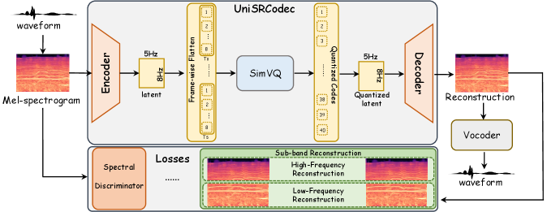
*Figure 1:The architecture and training procedure of the UniSRCodec.*

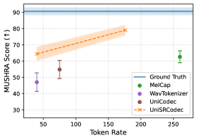
*Figure 2:Subjective evaluation of MUSHRA scores with 95% confidence intervals vs token rate.*

---
**Usage Info**: 5610 tokens used.
**Generated at**: 2026-02-24 19:12:13

---

