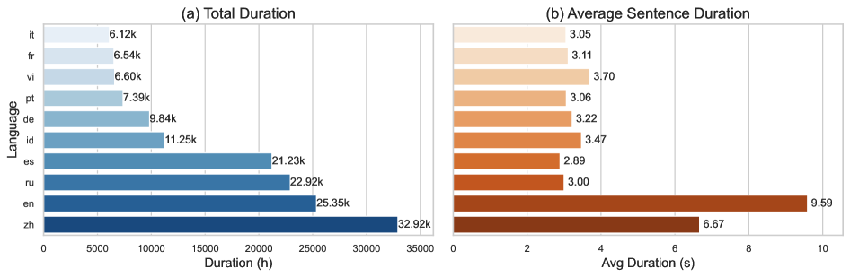
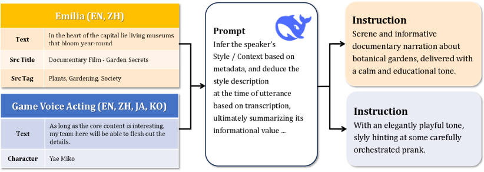
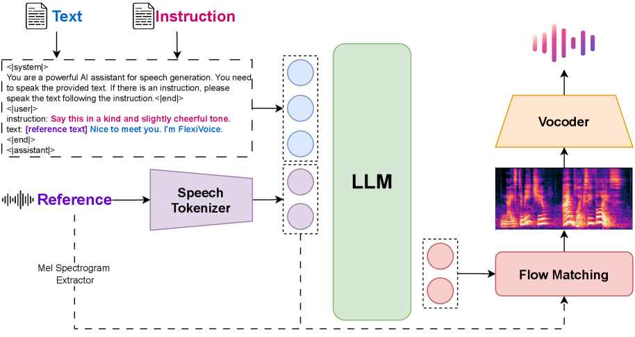
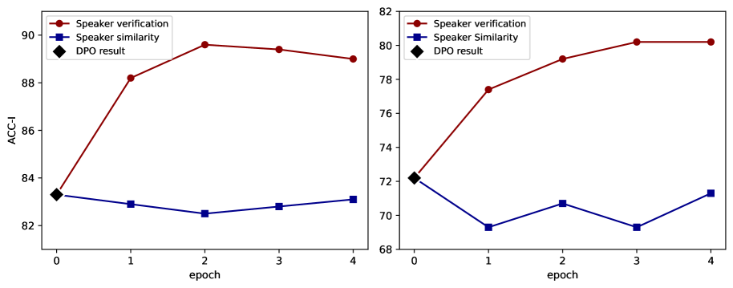
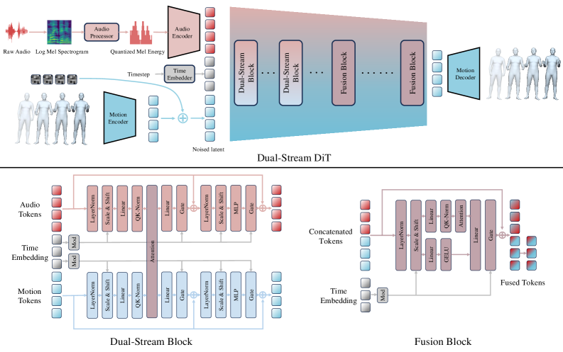
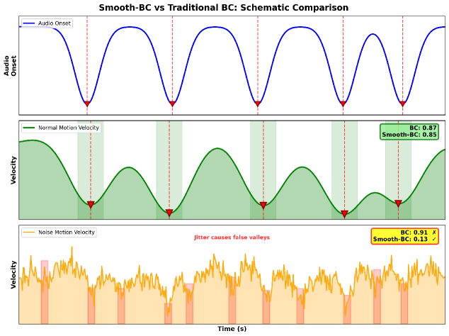

# 🚩 (2026-01-09) Scholar Inbox 추천 논문 

# 📚 LEMAS: A 150K-Hour Large-scale Extensible Multilingual Audio Suite with Generative Speech Models

🚀 URL: https://arxiv.org/html/2601.04233

## 🌏 Abstract (원문)
The field of speech synthesis has entered a transformative phase with the rise of generative foundation models. Despite progress, extending these models to multilingual scenarios remains challenging due to the scarcity of large-scale, high-quality multilingual speech corpora. To bridge this gap, we introduce LEMAS-Dataset, the largest open-source multilingual speech corpus with word-level timestamps, comprising over 150,000 hours across 10 major languages. Built upon this dataset, we design two foundation models: LEMAS-TTS and LEMAS-Edit. LEMAS-TTS is a non-autoregressive flow-matching model that achieves robust zero-shot cross-lingual synthesis by unifying scripts and introducing CTC-based alignment and accent-adversarial objectives. LEMAS-Edit is an autoregressive speech editing system that enables seamless, smooth-boundary editing through stabilized inference and a robust processing pipeline. Our work demonstrates that high-quality, fine-grained temporal supervision significantly enhances the performance and generalization of generative speech models.
## 🌏 Abstract (번역)
음성 합성 분야는 생성형 파운데이션 모델의 부상과 함께 변혁적인 단계에 진입했습니다. 이러한 진전에도 불구하고, 대규모의 고품질 다국어 음성 코퍼스의 부족으로 인해 생성형 음성 모델을 진정한 다국어 시나리오로 확장하는 것은 여전히 어려운 과제로 남아 있습니다. 이러한 격차를 해소하기 위해 본 논문에서는 10개 주요 언어에 걸쳐 150,000시간 이상의 음성으로 구성된, 단어 수준 타임스탬프를 제공하는 최대 규모의 오픈 소스 다국어 음성 코퍼스인 LEMAS-Dataset을 소개합니다. 이 데이터셋을 기반으로 LEMAS-TTS와 LEMAS-Edit이라는 두 가지 파운데이션 모델을 설계했습니다. LEMAS-TTS는 표기 체계를 통합하고 CTC 기반 정렬 및 억양 적대적 목표를 도입하여 강력한 제로샷 교차 언어 합성을 달성하는 비자기회귀 플로우 매칭 모델입니다. LEMAS-Edit은 안정화된 추론과 강력한 처리 파이프라인을 통해 매끄럽고 부드러운 경계 편집을 가능하게 하는 자기회귀 음성 편집 시스템입니다. 본 연구는 고품질의 세밀한 시간적 감독이 생성형 음성 모델의 성능과 일반화 능력을 크게 향상시킨다는 것을 입증합니다.

## 🔍 Methods & Results
- 10개 주요 언어에 걸쳐 150,000시간 이상의 음성 데이터와 단어 수준 타임스탬프를 포함하는 LEMAS-Dataset 구축
- MMS 정렬기를 사용하여 단어 수준 타임스탬프를 추출하고 신뢰도 점수를 할당하는 다단계 처리 파이프라인 설계
- F5-TTS 아키텍처에 CTC 손실과 억양 적대적 손실을 추가하여 제로샷 교차 언어 합성 성능을 개선한 LEMAS-TTS 개발
- 반복 패널티와 노이즈 제거, 재정렬 기능을 포함한 자기회귀 기반 음성 편집 모델 LEMAS-Edit 개발
- 다국어 환경에서 높은 화자 유사도와 자연스러움을 달성하며 저리소스 언어의 명료도 문제 해결
- 실제 소음이 포함된 오디오에서도 매끄러운 경계 편집이 가능한 강력한 일반화 성능 입증

## 🖼 Figures

*Figure 1:LEMAS-Dataset contains more than 
𝟏𝟓𝟎
​
𝐤
 hours of multi-speaker speech with forced word-level alignments across 10 major languages. Based on LEMAS-Dataset, we train two models. LEMAS-TTS performs large-scale, flow-based neural TTS that streams high-fidelity speech from text and a short reference clip, while LEMAS-Edit performs codec-based, word-level speech editing.*

*Figure 2:Dataset Statistics of LEMAS-Dataset. (a) Language-wise duration, (b) the average sentence duration in seconds. The dataset shows substantial variation in both data volume and sentence length across languages.*

![Figure 3:Time-dependent control schedules used in our sampling strategy. Left: CFG strength schedules with different maximum guidance levels, emphasizing early timesteps and gradually decaying over sampling. Right: Sway-sampling time warping with varying strengths, compared to a cosine-based baseline (dashed), where stronger warping allocates more steps to later timesteps. Together, these schedules demonstrate how guidance strength and sampling allocation can be shaped over time to influence generation behavior.](../images/2026-01-09/2601.04233/2601.04233_fig2.png)
*Figure 3:Time-dependent control schedules used in our sampling strategy. Left: CFG strength schedules with different maximum guidance levels, emphasizing early timesteps and gradually decaying over sampling. Right: Sway-sampling time warping with varying strengths, compared to a cosine-based baseline (dashed), where stronger warping allocates more steps to later timesteps. Together, these schedules demonstrate how guidance strength and sampling allocation can be shaped over time to influence generation behavior.*

![Figure 4:Preference distribution of audio naturalness across different languages. The ridgeline plot illustrates the subjective results of the A/B preference test comparing LEMAS-TTS (Model A) and LEMAS-Edit (Model B). Individual scores are normalized to a scale of 0–100, where 0 represents a strong preference for Model A and 100 indicates a strong preference for Model B. The vertical distribution (Kernel Density Estimation) for each language reveals the consensus among users, with the ‘‘AVERAGE’’ row representing the aggregated performance across all tested languages.](../images/2026-01-09/2601.04233/2601.04233_fig3.png)
*Figure 4:Preference distribution of audio naturalness across different languages. The ridgeline plot illustrates the subjective results of the A/B preference test comparing LEMAS-TTS (Model A) and LEMAS-Edit (Model B). Individual scores are normalized to a scale of 0–100, where 0 represents a strong preference for Model A and 100 indicates a strong preference for Model B. The vertical distribution (Kernel Density Estimation) for each language reveals the consensus among users, with the ‘‘AVERAGE’’ row representing the aggregated performance across all tested languages.*

---
**Usage Info**: 5299 tokens used.
**Generated at**: 2026-02-24 19:13:16

---

# 📚 FlexiVoice: Enabling Flexible Style Control in Zero-Shot TTS with Natural Language Instructions

🚀 URL: https://arxiv.org/html/2601.04656

## 🌏 Abstract (원문)
Recent advances in text-to-speech (TTS) have been largely driven by the emergence of Large Language Models (LLMs) and refined post-training techniques. A notable breakthrough is zero-shot TTS(Duet al.,2024; Zhouet al.,2025), which enables voice cloning with only a short reference speech, effectively capturing and reproducing a speaker’s timbre. Beyond timbre, controlling speaking style has become an important challenge. One direction, exemplified by Vevo(Zhanget al.,2025c)and IndexTTS2(Zhouet al.,2025), employs two separate speech references to control timbre and style separately. Another line of work, instruction-based TTS(Vyaset al.,2023; Zhouet al.,2024b; Jiet al.,2024b), leverages natural language instructions to specify the target style. However, existing instruction-driven models often struggle either to faithfully follow the instructions or to maintain stable timbre consistency. Achieving flexible style control in zero-shot TTS presents a unique challenge: the ’Style-Timbre-Content Conflict’. In standard supervised training, models tend to over-rely on the strong acoustic priors from the reference speech (timbre leakage) or infer prosody from the text (content leakage), often ignoring the explicit style instruction. Merely applying instruction conditioning is insufficient to resolve these entangled modalities. Therefore, a robust framework is required not just to condition the model, but to actively decouple these factors and enforce instruction adherence against conflicting acoustic cues. In this work, we propose FlexiVoice, a TTS system that can flexibly control the speaking style with a zero-shot voice. In particular, it can take a natural language instruction and a reference speech or one of them for flexible controllability. The natural language instruction aims to control speaking styles (e.g. emotion, speaking speed) and the speech reference is to control timbre for speaker identity. FlexiVoice is built on top of a pre-trained large language model (LLM). The LLM core equips FlexiVoice with a robust and comprehensive instruction-following ability. To achieve flexible controllability, we first construct a large-scale and diverse speech dataset with natural language instructions, named FlexiVoice-Instruct. The FlexiVoice-Instruct dataset is annotated with the help of LLM. We then pre-train FlexiVoice with Emilia(Heet al.,2024)and FlexiVoice-Instruct. In post-training, we propose a novel Progressive Post-Training (PPT) framework. Unlike general LLM alignment, PPT is specifically designed to resolve the modality conflicts in TTS through a systematic curriculum. It consists of three stages: (1) Multi-modality DPO establishes the initial alignment for instruction adherence; (2) Decoupling GRPO introduces a multi-objective optimization with conflicting data scenarios to mathematically enforce the separation of style from timbre and content; and (3) Instruction GRPO leverages an audio-language model (ALM) reward to generalize this capability to complex, open-ended instructions. This progressive formulation transforms the instruction-following task from simple conditioning into a rigorous disentanglement process. We evaluate FlexiVoice from flexible controllability and instruction-following ability aspects, using emotion datasets and the InstructTTSEval(Huanget al.,2025)benchmark. The experimental results show that FlexiVoice can decouple speaking style (e.g. emotion) and speaker identity. In comparison with baselines, it achieves large gains in instruction adherence and robustness on the multi-modality control evaluation, and demonstrates strong performance on complex instruction tasks. Human evaluation results further confirm the naturalness and robustness of the generated speech.
## 🌏 Abstract (번역)
최근 텍스트 음성 변환(TTS)의 발전은 대규모 언어 모델(LLM)의 등장과 정교한 사후 학습 기술에 의해 크게 주도되었습니다. 주목할 만한 돌파구는 제로샷 TTS로, 짧은 참조 음성만으로 음색을 캡처하고 재현하여 음성 클로닝을 가능하게 합니다. 음색 외에도 말하기 스타일을 제어하는 것이 중요한 과제가 되었습니다. 한 방향은 음색과 스타일을 별도로 제어하기 위해 두 개의 개별 음성 참조를 사용하는 것이고, 다른 방향은 자연어 지시어를 활용하여 목표 스타일을 지정하는 지시어 기반 TTS입니다. 그러나 기존의 지시어 기반 모델은 지시어를 충실히 따르지 못하거나 안정적인 음색 일관성을 유지하는 데 어려움을 겪는 경우가 많습니다. 제로샷 TTS에서 유연한 스타일 제어를 달성하는 것은 '스타일-음색-콘텐츠 충돌'이라는 독특한 과제를 제시합니다. 표준 지도 학습에서 모델은 참조 음성의 강력한 음향 사전 정보에 과도하게 의존하거나(음색 누출) 텍스트에서 운율을 추론하여(콘텐츠 누출) 명시적인 스타일 지시어를 무시하는 경향이 있습니다. 단순히 지시어 조건을 적용하는 것만으로는 이러한 얽힌 모달리티를 해결하기에 부족합니다. 따라서 모델을 조건화할 뿐만 아니라 이러한 요소들을 능동적으로 분리하고 상충하는 음향 신호에 맞서 지시어 준수를 강제하는 강력한 프레임워크가 필요합니다. 본 연구에서는 제로샷 음성으로 말하기 스타일을 유연하게 제어할 수 있는 TTS 시스템인 FlexiVoice를 제안합니다. 특히, 유연한 제어 가능성을 위해 자연어 지시어와 참조 음성 중 하나 또는 둘 다를 입력으로 받을 수 있습니다. 자연어 지시어는 말하기 스타일(예: 감정, 말하기 속도)을 제어하는 것을 목표로 하며, 음성 참조는 화자 식별을 위한 음색을 제어합니다. FlexiVoice는 사전 학습된 대규모 언어 모델(LLM)을 기반으로 구축되었습니다. LLM 코어는 FlexiVoice에 강력하고 포괄적인 지시어 수행 능력을 부여합니다. 유연한 제어 가능성을 달성하기 위해 먼저 FlexiVoice-Instruct라는 자연어 지시어가 포함된 대규모의 다양한 음성 데이터셋을 구축합니다. FlexiVoice-Instruct 데이터셋은 LLM의 도움을 받아 주석이 달렸습니다. 그런 다음 Emilia와 FlexiVoice-Instruct를 사용하여 FlexiVoice를 사전 학습합니다. 사후 학습에서는 새로운 점진적 사후 학습(PPT) 프레임워크를 제안합니다. 일반적인 LLM 정렬과 달리 PPT는 체계적인 커리큘럼을 통해 TTS의 모달리티 충돌을 해결하도록 특별히 설계되었습니다. 이는 세 단계로 구성됩니다: (1) 다중 모달리티 DPO는 지시어 준수를 위한 초기 정렬을 설정합니다. (2) 분리 GRPO는 스타일을 음색 및 콘텐츠와 수학적으로 분리하기 위해 상충하는 데이터 시나리오를 사용한 다중 목적 최적화를 도입합니다. (3) 지시어 GRPO는 오디오-언어 모델(ALM) 보상을 활용하여 이 능력을 복잡하고 개방형인 지시어로 일반화합니다. 이 점진적인 공식화는 지시어 수행 작업을 단순한 조건화에서 엄격한 분리 프로세스로 변환합니다. 감정 데이터셋과 InstructTTSEval 벤치마크를 사용하여 유연한 제어 가능성과 지시어 수행 능력 측면에서 FlexiVoice를 평가합니다. 실험 결과 FlexiVoice는 말하기 스타일(예: 감정)과 화자 식별을 분리할 수 있음을 보여줍니다. 베이스라인과 비교하여 다중 모달리티 제어 평가에서 지시어 준수 및 견고성 면에서 큰 이득을 얻었으며, 복잡한 지시어 작업에서 강력한 성능을 입증했습니다. 인간 평가 결과는 생성된 음성의 자연스러움과 견고함을 더욱 확인시켜 줍니다.

## 🔍 Methods & Results
- Proposed FlexiVoice, a TTS system built on a pre-trained LLM for flexible style and timbre control using natural language instructions and reference speech.
- Developed FlexiVoice-Instruct, a large-scale diverse speech dataset annotated with natural language instructions using Deepseek-V3.
- Introduced a Progressive Post-Training (PPT) framework consisting of three stages: Multi-modality DPO, Decoupling GRPO, and Instruction GRPO.
- The PPT framework systematically resolves the 'Style-Timbre-Content Conflict' by mathematically enforcing the separation of style from timbre and content.
- Evaluated on emotion datasets and the InstructTTSEval benchmark, showing significant gains in instruction adherence and robustness compared to baselines.
- Demonstrated strong performance on complex, open-ended instruction tasks and maintained high speaker identity consistency.
- Human evaluations confirmed the naturalness and robustness of the generated speech across various control scenarios.

## 🖼 Figures

*Figure 1:An overview of FlexiVoice that supports diverse style generation with arbitrary voice timbres. It takes an optional natural language instruction for style and an optional reference speech for timbre. It consists of Pre-Training and Progressive Post-Training (PPT) stages. The PPT process includes three processes, S1: Multi-modality DPO, S2: Decoupling GRPO, S3: Instruction GRPO.*

*Figure 2:Processing flow and examples for FlexiVoice-Instruct. For both sources, we use the speech transcription and related meta information to prompt LLM to generate natural and human-like descriptions, as the instruction in our pre-training stage.*

*Figure 3:The complete structure of FlexiVoice.*

*Figure 4:Comparison of results for two reward signals in decoupling GRPO, on the decoupling evaluation set’s TR-easy (left) and TR-hard (right) tasks.*

---
**Usage Info**: 4380 tokens used.
**Generated at**: 2026-02-24 19:13:50

---

# 📚 Latent-Level Enhancement with Flow Matching for Robust Automatic Speech Recognition

🚀 URL: https://arxiv.org/html/2601.04459

## 🌏 Abstract (원문)
Robust automatic speech recognition (ASR) under noisy conditions remains a longstanding challenge. A widely adopted solution is to apply a speech enhancement (SE) front-end, which processes the noisy waveform before recognition. This strategy is attractive because SE models can be developed independently of the ASR system. However, improved speech quality at the waveform level does not necessarily yield consistent recognition gains. Residual distortions, enhancement artifacts, and mismatches between enhanced speech and the latent space of the ASR encoder often limit reductions in word error rate (WER), leaving a fundamental bottleneck in noise-robust ASR. In this letter, we propose a complementary solution that addresses distortion directly at the latent-level of the ASR model. We introduce the Flow Matching Refinement module (FM-Refiner), a generative refinement model that operates on the output representations of a pretrained CTC-based ASR encoder. The FM-Refiner learns to transform imperfect latents, which may arise from raw noisy inputs or from enhanced speech that still carries residual artifacts, toward distributions characteristic of clean latents. Unlike conventional denoising networks, it leverages flow matching to learn an explicit transport mapping between distorted and clean latent distributions of the ASR encoder. Importantly, this refinement is applied in a plug-and-play manner during inference, without retraining or fine-tuning ASR parameters. This design offers three advantages. First, it directly improves the representations that matter most for recognition, reducing the mismatch that waveform-level SE alone cannot resolve. Second, it complements existing SE front-ends, enabling a two-stage strategy of waveform enhancement followed by latent refinement. Third, by leveraging flow matching to learn a deterministic transport mapping, the FM-Refiner provides stable refinement without requiring stochastic sampling. We evaluate the proposed approach across multiple noise conditions and SE front-ends. Experimental results show that the FM-Refiner consistently reduces WER, whether applied directly on noisy inputs or in combination with SE models. These findings highlight latent-level refinement as a lightweight and effective complement to speech-level enhancement for noise-robust ASR, underscoring the novelty of integrating generative refinement directly into ASR pipelines. The main contributions of this work are three-fold: (i) we formulate latent-level enhancement for robust ASR, (ii) we design a plug-and-play FM-Refiner that maps imperfect latents toward clean latents without retraining the ASR, and (iii) we provide empirical evidence that latent refinement consistently improves recognition across diverse SE models and noise conditions.
## 🌏 Abstract (번역)
잡음이 섞인 환경에서의 강건한 자동 음성 인식(ASR)은 오랫동안 해결되지 않은 과제로 남아 있습니다. 널리 채택되는 해결책 중 하나는 인식 전에 잡음이 섞인 파형을 처리하는 음성 향상(SE) 프런트엔드를 적용하는 것입니다. 이 전략은 SE 모델을 ASR 시스템과 독립적으로 개발할 수 있다는 점에서 매력적입니다. 그러나 파형 수준에서 개선된 음성 품질이 반드시 일관된 인식 성능 향상으로 이어지는 것은 아닙니다. 잔류 왜곡, 향상 과정에서의 아티팩트, 그리고 향상된 음성과 ASR 인코더의 잠재 공간(latent space) 사이의 불일치는 종종 단어 오류율(WER) 감소를 제한하며, 이는 잡음 강건 ASR의 근본적인 병목 현상으로 남아 있습니다. 본 논문에서는 ASR 모델의 잠재 수준에서 직접 왜곡을 해결하는 보완적인 솔루션을 제안합니다. 사전 학습된 CTC 기반 ASR 인코더의 출력 표현에 작동하는 생성적 정제 모델인 Flow Matching Refinement 모듈(FM-Refiner)을 소개합니다. FM-Refiner는 원본 잡음 입력이나 잔류 아티팩트가 포함된 향상된 음성에서 발생할 수 있는 불완전한 잠재 변수를 깨끗한 잠재 변수의 특성을 가진 분포로 변환하는 법을 학습합니다. 기존의 디노이징 네트워크와 달리, 이는 플로우 매칭(flow matching)을 활용하여 ASR 인코더의 왜곡된 잠재 분포와 깨끗한 잠재 분포 사이의 명시적인 수송 매핑(transport mapping)을 학습합니다. 중요한 점은, 이 정제 과정이 ASR 파라미터의 재학습이나 미세 조정 없이 추론 중에 플러그 앤 플레이 방식으로 적용된다는 것입니다. 이 설계는 세 가지 장점을 제공합니다. 첫째, 인식에 가장 중요한 표현을 직접 개선하여 파형 수준의 SE만으로는 해결할 수 없는 불일치를 줄입니다. 둘째, 기존 SE 프런트엔드를 보완하여 파형 향상 후 잠재 정제가 이어지는 2단계 전략을 가능하게 합니다. 셋째, 플로우 매칭을 활용하여 결정론적 수송 매핑을 학습함으로써, FM-Refiner는 확률적 샘플링 없이도 안정적인 정제를 제공합니다. 우리는 다양한 잡음 조건과 SE 프런트엔드에 걸쳐 제안된 접근 방식을 평가합니다. 실험 결과, FM-Refiner는 잡음 입력에 직접 적용하거나 SE 모델과 결합하여 적용했을 때 모두 WER을 일관되게 감소시키는 것으로 나타났습니다. 이러한 발견은 잠재 수준의 정제가 잡음 강건 ASR을 위한 음성 수준 향상의 가볍고 효과적인 보완책임을 강조하며, 생성적 정제를 ASR 파이프라인에 직접 통합하는 것의 참신함을 뒷받침합니다. 본 연구의 주요 기여는 세 가지입니다. (i) 강건한 ASR을 위한 잠재 수준 향상을 공식화하고, (ii) ASR 재학습 없이 불완전한 잠재 변수를 깨끗한 잠재 변수로 매핑하는 플러그 앤 플레이 FM-Refiner를 설계했으며, (iii) 잠재 정제가 다양한 SE 모델과 잡음 조건에서 인식을 일관되게 개선한다는 실증적 증거를 제공합니다.

## 🔍 Methods & Results
- 사전 학습된 CTC 기반 ASR 인코더의 출력인 잠재 표현(Latent Representation)을 정제하는 FM-Refiner 모듈 제안
- 파형 수준의 음성 향상(SE)과 잠재 수준의 정제를 결합한 2단계 잡음 제거 프레임워크 구축
- 플로우 매칭(Flow Matching) 및 최적 수송(Optimal Transport) 경로를 활용하여 왜곡된 잠재 분포를 깨끗한 분포로 결정론적으로 매핑
- ASR 모델의 파라미터 수정 없이 추론 시에만 결합하여 사용하는 플러그 앤 플레이(Plug-and-play) 방식 채택
- 멀티 해상도 U-Net 백본과 글로벌 어텐션 바틀넥을 포함한 신경망 구조 설계
- 다양한 잡음 환경 및 여러 SE 프런트엔드와의 결합 실험에서 일관된 단어 오류율(WER) 감소 확인

## 🖼 Figures
![Figure 1:Overview of the proposed two-stage framework. In Stage 1, noisy speech 
𝑠
 is optionally enhanced by an SE front-end, producing an enhanced speech for the pretrained CTC-based ASR encoder. In Stage 2, the encoder output latents 
𝑧
𝑛
 are refined by the FM-Refiner, which produces improved representations 
𝑧
^
 for the CTC layer. All modules (SE, ASR, FM-Refiner) are pretrained separately, and the figure illustrates the decoding process where the FM-Refiner is applied in a plug-and-play manner. The FM-Refiner is implemented with a U-Net architecture trained via flow matching.](../images/2026-01-09/2601.04459/2601.04459_fig0.png)
*Figure 1:Overview of the proposed two-stage framework. In Stage 1, noisy speech 
𝑠
 is optionally enhanced by an SE front-end, producing an enhanced speech for the pretrained CTC-based ASR encoder. In Stage 2, the encoder output latents 
𝑧
𝑛
 are refined by the FM-Refiner, which produces improved representations 
𝑧
^
 for the CTC layer. All modules (SE, ASR, FM-Refiner) are pretrained separately, and the figure illustrates the decoding process where the FM-Refiner is applied in a plug-and-play manner. The FM-Refiner is implemented with a U-Net architecture trained via flow matching.*

---
**Usage Info**: 5488 tokens used.
**Generated at**: 2026-02-24 19:14:23

---

# 📚 SmoothSync: Dual-Stream Diffusion Transformers for Jitter-Robust Beat-Synchronized Gesture Generation from Quantized Audio

🚀 URL: https://arxiv.org/html/2601.04236

## 🌏 Abstract (원문)
Co-speech gesture generation is a fundamental challenge in computer vision, computer graphics and human-computer interaction, with applications ranging from virtual avatars to embodied AI systems. The goal is to synthesize natural, expressive body movements that are temporally synchronized with speech audio while maintaining semantic coherence with the spoken content. Yet, because audio and motion defy a simple one-to-one mapping, the field still struggles to deliver motions that are simultaneously rhythmically precise, visually smooth, and stylistically diverse. Recent advances have explored various deep learning approaches including Generative Adversarial Networks (GANs), Vector Quantized Variational Autoencoder (VQ-VAE)-based autoregressive models, diffusion models, and state space models. However, current methods face three critical limitations that hinder practical deployment: Motion Quality Issues: Existing approaches suffer from motion artifacts including jitter, foot sliding, and temporal inconsistencies. Many VQ-VAE-based methods rely on discrete multi-part motion representations that lose fine-grained motion details and struggle to maintain smooth temporal transitions. Limited Diversity: Most methods employ large-scale pretrained audio encoders that produce deterministic outputs with little variation across multiple sampling runs, contradicting natural human behavior where identical speech can be accompanied by different gestures. Incomplete Body Coverage: Many approaches focus solely on upper-body gestures, neglecting full-body dynamics including global translation, which limits their applicability in immersive environments. To address these challenges, we propose SmoothSync, a novel dual-stream diffusion transformer framework that revolutionizes how audio and motion features are processed and fused for high-quality gesture synthesis. Our key insight is that effective audio-motion fusion requires modality-specific processing followed by cross-modal integration. Unlike existing methods that either process modalities independently or naively concatenate features, our dual-stream architecture maintains separate pathways for audio and motion tokens, allowing each modality to be processed with inductive biases and enabling cross-modal interactions through joint attention mechanisms. Our approach introduces three key innovations: (1) a dual-stream architecture that processes audio and motion through parallel streams with modality-specific normalization and attention, followed by joint cross-modal attention; (2) a jitter-suppression loss that explicitly penalizes high-frequency motion artifacts while preserving natural expressiveness; (3) quantized mel-spectrogram features that enable diverse gesture generation for identical inputs while maintaining strong synchronization. To enable reliable evaluation of rhythmic alignment in the presence of motion artifacts, we introduce the Smooth-BC metric, which filters out spurious beat detections caused by jitter while accurately measuring true rhythmic synchronization. Our comprehensive evaluation also includes new metrics for motion quality assessment: Jitter and Foot-Sliding metrics that quantify motion artifacts often overlooked by traditional measures, and Inter-Diversity metric to measure the variation between multiple samples generated from the same input. Experiments on the BEAT2 and SHOW datasets demonstrate that SmoothSync achieves state-of-the-art performance, generating high-quality, diverse, and rhythmically synchronized full-body gestures with significantly reduced motion artifacts, as shown in Fig.1. Our key contributions are: We propose SmoothSync, a unified dual-stream diffusion framework that generates high-quality, diverse, and full-body gestures from audio input, achieving substantially lower jitter and superior rhythmic alignment with significant improvements compared to state-of-the-art methods on the BEAT2 and SHOW datasets. We introduce a dual-stream transformer architecture with modality-specific processing and joint cross-modal attention, coupled with a quantized mel-spectrogram feature extraction pipeline that enables diverse gesture generation while maintaining strong synchronization. We propose Smooth-BC, a robust beat-consistency metric that provides reliable rhythmic assessment by filtering out jitter-induced artifacts, addressing limitations of traditional evaluation protocols.
## 🌏 Abstract (번역)
공동 음성 제스처 생성은 가상 아바타에서 체화된 AI 시스템에 이르기까지 다양한 응용 분야를 가진 컴퓨터 비전, 컴퓨터 그래픽 및 인간-컴퓨터 상호작용 분야의 근본적인 과제입니다. 목표는 음성 콘텐츠와 의미론적 일관성을 유지하면서 음성 오디오와 시간적으로 동기화된 자연스럽고 표현력이 풍부한 신체 움직임을 합성하는 것입니다. 그러나 오디오와 동작은 단순한 일대일 매핑을 거부하기 때문에, 이 분야는 리듬적으로 정확하고 시각적으로 부드러우며 스타일적으로 다양한 동작을 동시에 제공하는 데 여전히 어려움을 겪고 있습니다. 최근의 발전은 생성적 적대 신경망(GAN), VQ-VAE 기반 자기회귀 모델, 확산 모델 및 상태 공간 모델을 포함한 다양한 딥러닝 접근 방식을 탐구했습니다. 그러나 현재의 방법들은 실제 배포를 방해하는 세 가지 중요한 한계에 직면해 있습니다. 첫째, 동작 품질 문제로, 기존 접근 방식은 지터, 발 미끄러짐 및 시간적 불일치를 포함한 동작 아티팩트로 고통받습니다. 많은 VQ-VAE 기반 방법은 미세한 동작 세부 정보를 잃고 부드러운 시간적 전환을 유지하는 데 어려움을 겪는 이산 다중 부품 동작 표현에 의존합니다. 둘째, 제한된 다양성으로, 대부분의 방법은 여러 샘플링 실행에 걸쳐 변화가 거의 없는 결정론적 출력을 생성하는 대규모 사전 학습된 오디오 인코더를 사용하여, 동일한 음성에 다른 제스처가 동반될 수 있는 자연스러운 인간 행동과 모순됩니다. 셋째, 불완전한 신체 범위로, 많은 접근 방식이 상체 제스처에만 집중하고 전역 이동을 포함한 전신 역학을 무시하여 몰입형 환경에서의 적용 가능성을 제한합니다. 이러한 문제를 해결하기 위해 우리는 고품질 제스처 합성을 위해 오디오 및 동작 특징이 처리되고 융합되는 방식을 혁신하는 새로운 이중 스트림 확산 트랜스포머 프레임워크인 SmoothSync를 제안합니다. 우리의 핵심 통찰력은 효과적인 오디오-동작 융합을 위해 모달리티별 처리와 교차 모달 통합이 필요하다는 것입니다. 모달리티를 독립적으로 처리하거나 특징을 단순히 연결하는 기존 방법과 달리, 우리의 이중 스트림 아키텍처는 오디오 및 동작 토큰에 대해 별도의 경로를 유지하여 각 모달리티가 유도 편향과 함께 처리될 수 있도록 하고 공동 주의 메커니즘을 통해 교차 모달 상호 작용을 가능하게 합니다. 우리의 접근 방식은 세 가지 주요 혁신을 도입합니다. (1) 모달리티별 정규화 및 주의 집중을 갖춘 병렬 스트림을 통해 오디오 및 동작을 처리한 후 공동 교차 모달 주의 집중을 수행하는 이중 스트림 아키텍처, (2) 자연스러운 표현력을 유지하면서 고주파 동작 아티팩트에 명시적으로 페널티를 주는 지터 억제 손실, (3) 강력한 동기화를 유지하면서 동일한 입력에 대해 다양한 제스처 생성을 가능하게 하는 양자화된 멜-스펙트로그램 특징입니다. 동작 아티팩트가 있는 상황에서 리듬 정렬의 신뢰할 수 있는 평가를 가능하게 하기 위해, 우리는 지터로 인한 가짜 비트 감지를 필터링하는 동시에 실제 리듬 동기화를 정확하게 측정하는 Smooth-BC 지표를 도입합니다. 우리의 포괄적인 평가에는 동작 품질 평가를 위한 새로운 지표도 포함됩니다. 전통적인 측정 방식에서 종종 간과되는 동작 아티팩트를 정량화하는 지터 및 발 미끄러짐 지표와 동일한 입력에서 생성된 여러 샘플 간의 변화를 측정하는 상호 다양성 지표입니다. BEAT2 및 SHOW 데이터셋에 대한 실험은 SmoothSync가 최첨단 성능을 달성하여 동작 아티팩트가 크게 감소된 고품질의 다양하고 리듬적으로 동기화된 전신 제스처를 생성함을 입증합니다. 우리의 주요 기여는 다음과 같습니다. 우리는 오디오 입력으로부터 고품질의 다양하고 전신 제스처를 생성하는 통합 이중 스트림 확산 프레임워크인 SmoothSync를 제안하며, BEAT2 및 SHOW 데이터셋에서 최첨단 방법과 비교하여 상당히 낮은 지터와 우수한 리듬 정렬을 달성했습니다. 우리는 모달리티별 처리 및 공동 교차 모달 주의 집중을 갖춘 이중 스트림 트랜스포머 아키텍처와 강력한 동기화를 유지하면서 다양한 제스처 생성을 가능하게 하는 양자화된 멜-스펙트로그램 특징 추출 파이프라인을 도입합니다. 우리는 지터로 인한 아티팩트를 필터링하여 신뢰할 수 있는 리듬 평가를 제공하고 전통적인 평가 프로토콜의 한계를 해결하는 강력한 비트 일관성 지표인 Smooth-BC를 제안합니다.

## 🔍 Methods & Results
- 오디오와 동작 토큰을 병렬 스트림으로 처리하고 공동 주의(Joint Attention) 메커니즘으로 통합하는 이중 스트림 확산 트랜스포머(DiT) 아키텍처 제안
- 멜-스펙트로그램에 시간적 양자화(Temporal Quantization)를 적용하여 동일한 오디오 입력에 대해서도 다양한 제스처 생성이 가능하도록 구현
- SMPLX rot6d 파라미터화를 활용하여 전신 동작 및 전역 이동(Global Translation)을 포함한 고해상도 모션 캡처
- 3차 유한 차분(Jerk)을 이용한 지터 억제 손실(Jitter-suppression loss)을 도입하여 동작의 부드러움을 극대화하고 아티팩트 감소
- 지터로 인한 노이즈를 필터링하여 리듬 동기화를 정확히 측정하는 새로운 평가 지표 Smooth-BC 도입
- BEAT2 및 SHOW 데이터셋 실험에서 기존 SOTA 모델 대비 지터 감소, 리듬 정렬 개선 및 생성 다양성 측면에서 우수한 성능 입증

## 🖼 Figures

*Figure 1:SmoothSync uses quantized audio mel-energy as input and efficiently fuses audio and motion features through a dual-stream network for denoising generation. Our method produces smoother motions with reduced foot sliding and global movement ranges that better match real data. In contrast, previous methods generate motions with severe drift and excessive jittering. Zoom in for better view.*

*Figure 2:Overview of our Dual-Stream DiT architecture. The framework processes audio and motion through separate pathways before fusing them via specialized transformer blocks, enabling high-quality speech-driven motion generation.*

*Figure 3:Smooth-BC metric is proposed to exclude motion beats falsely detected due to jitter artifacts by imposing strict constraints on the slope around velocity extrema.*

![Figure 4:Comparison on BEAT2 Dataset. Compared to baseline methods, our method generates motion that appropriately pauses during speech pauses, performs correct up-and-down hand movements at emphasis points following speech rhythm, and produces gestures closer to ground truth with semantically appropriate hand movements at strong semantic cues like “You should”. At “how loud”, SmoothSync generates large-amplitude outward stretching movements with vertical directions that don’t completely match ground truth, demonstrating SmoothSync’s diversity capability.](../images/2026-01-09/2601.04236/2601.04236_fig3.png)
*Figure 4:Comparison on BEAT2 Dataset. Compared to baseline methods, our method generates motion that appropriately pauses during speech pauses, performs correct up-and-down hand movements at emphasis points following speech rhythm, and produces gestures closer to ground truth with semantically appropriate hand movements at strong semantic cues like “You should”. At “how loud”, SmoothSync generates large-amplitude outward stretching movements with vertical directions that don’t completely match ground truth, demonstrating SmoothSync’s diversity capability.*

*Figure 5:Comparison on SHOW Dataset. Compared to TalkSHOW’s limited motion range, our method generates gestures with larger amplitudes and greater diversity, exhibiting rhythmic patterns that align more closely with ground truth. SmoothSync also demonstrates superior semantic matching: at emphasized words such as “just” and “they”, our approach produces gestures that better correspond to the semantic content and prosodic stress of speech.*

![Figure 6:Long-Sequence Global Translation Comparison. Our method demonstrates superior temporal consistency and stability in global translation over extended sequences. While EMAGE and MambaTalk exhibit severe motion drift that progressively accumulates over time, resulting in unrealistic character displacement, SmoothSync maintains translation ranges that closely match ground truth behavior throughout the entire sequence. This comparison highlights our method’s effectiveness in preserving long-term spatial coherence while generating natural gestures.](../images/2026-01-09/2601.04236/2601.04236_fig5.png)
*Figure 6:Long-Sequence Global Translation Comparison. Our method demonstrates superior temporal consistency and stability in global translation over extended sequences. While EMAGE and MambaTalk exhibit severe motion drift that progressively accumulates over time, resulting in unrealistic character displacement, SmoothSync maintains translation ranges that closely match ground truth behavior throughout the entire sequence. This comparison highlights our method’s effectiveness in preserving long-term spatial coherence while generating natural gestures.*

---
**Usage Info**: 9006 tokens used.
**Generated at**: 2026-02-24 19:15:43

---

