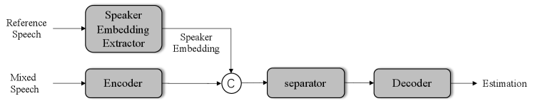
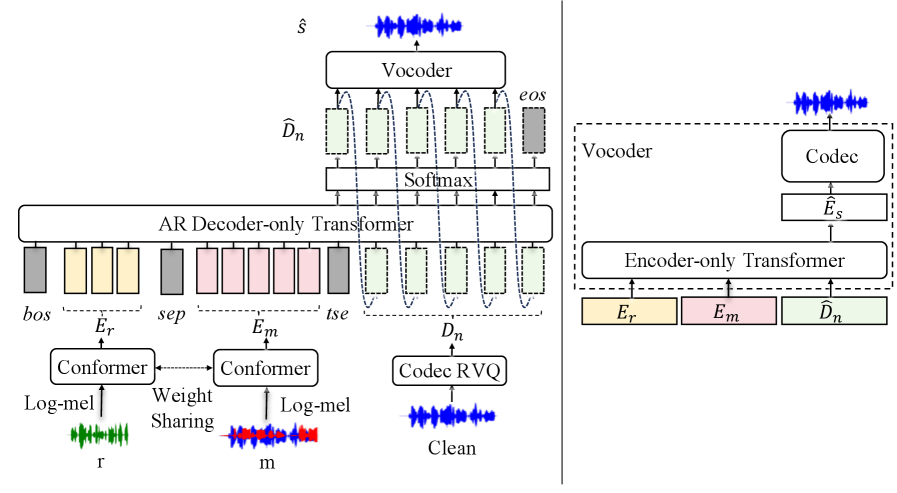
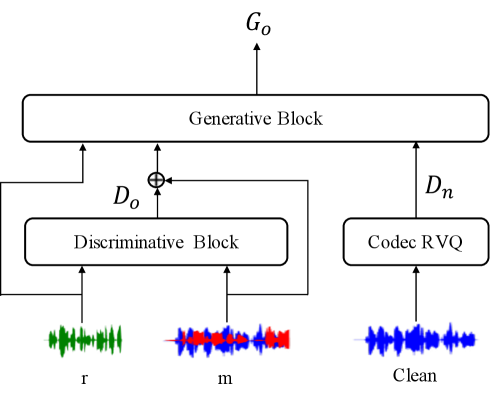
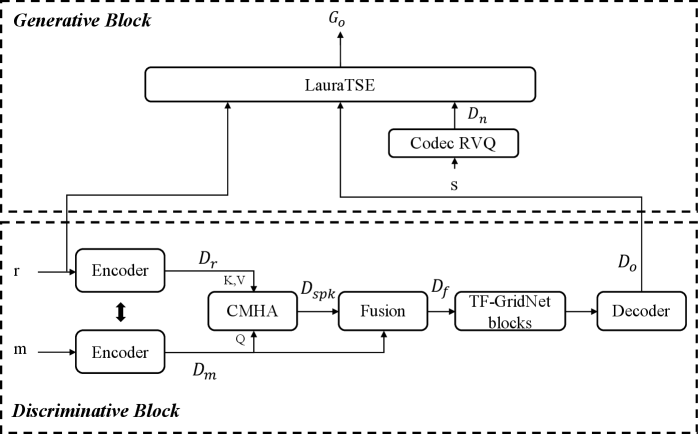
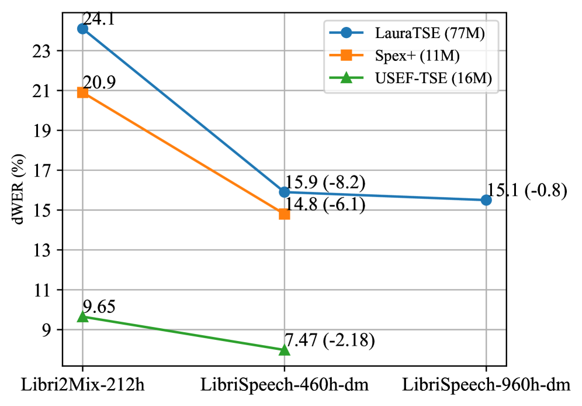
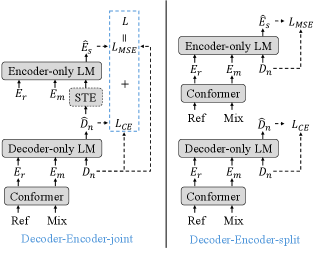
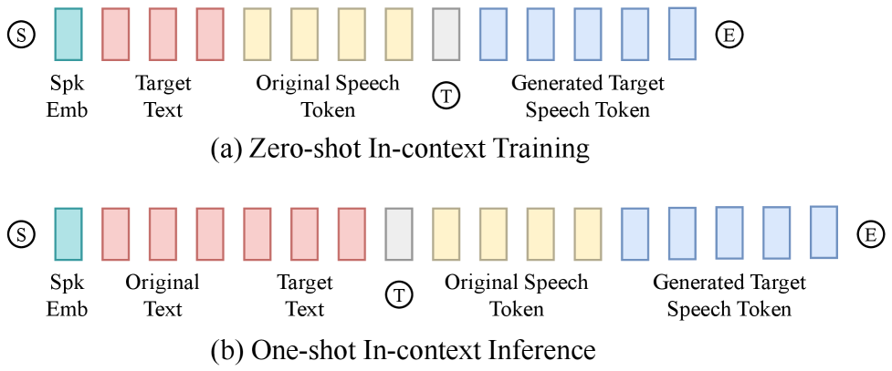
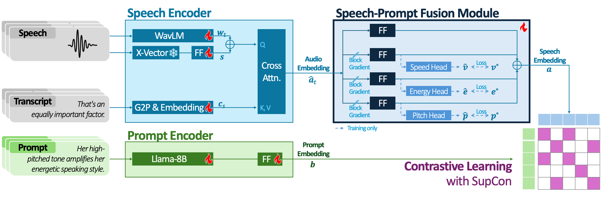
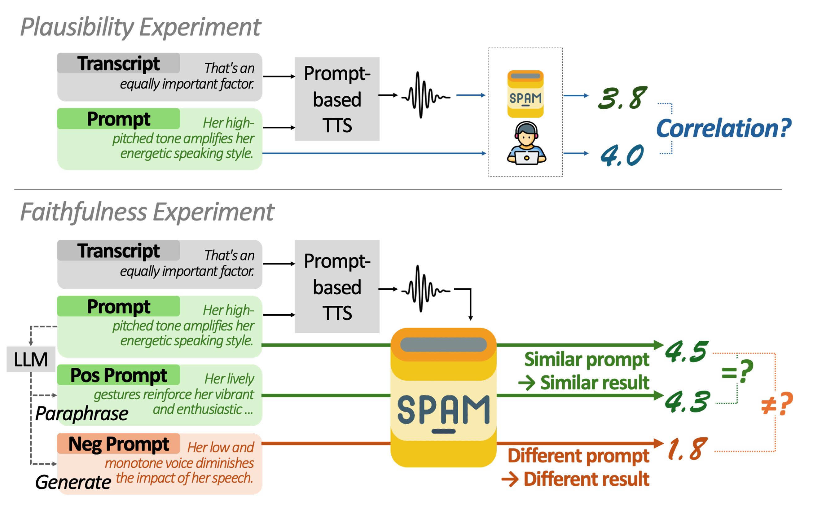

# 🚩 (2026-01-12) Scholar Inbox 추천 논문 

# 📚 Discriminative–Generative Target Speaker Extraction with Decoder-Only Language Models

🚀 URL: https://arxiv.org/html/2601.06006

## 🌏 Abstract (원문)
Humans are capable of selectively attending to a target speech signal in complex acoustic environments, a phenomenon known as the cocktail party effect. This remarkable ability has inspired extensive research on speech separation. Early approaches primarily rely on spectro-temporal masking strategies and are known to degrade in highly complex acoustic conditions. With the advent of deep learning, neural network-based methods have substantially improved speech separation performance. Nevertheless, most existing speech separation methods aim to separate all speakers in a mixture and typically require prior knowledge of the number of sources. In contrast, target speaker extraction (TSE) focuses on extracting a desired speaker from a mixture using auxiliary speaker information, offering a more flexible and application-oriented solution. However, most existing TSE methods adopt discriminative modeling paradigms, which directly learn a deterministic mapping from mixture and reference information to the target signal. While such models exhibit strong robustness, they inherently suffer from limited speech naturalness and perceptual quality. In this study, we propose LauraTSE, a generative TSE model based on an auto-regressive (AR) decoder-only language model. Furthermore, we propose a discriminative–generative two-stage framework for TSE, in which USEF-TFGridNet serves as the discriminative front-end and LauraTSE acts as the generative back-end. By integrating the complementary strengths of discriminative and generative paradigms, the proposed framework provides a more robust and effective solution for improving the perceptual quality of target speaker extraction. We also investigate both auto-regressive and non-auto-regressive inference strategies to enable a more favorable trade-off between speech quality and intelligibility.
## 🌏 Abstract (번역)
인간은 복잡한 음향 환경에서 목표 음성 신호에 선택적으로 집중할 수 있는 '칵테일 파티 효과' 능력을 갖추고 있습니다. 이러한 놀라운 능력은 음성 분리 연구에 큰 영감을 주었습니다. 초기 방식들은 주로 시간-주파수 마스킹 전략에 의존하여 복잡한 음향 조건에서 성능이 저하되는 한계가 있었으나, 딥러닝의 등장으로 신경망 기반 방법들이 음성 분리 성능을 크게 향상시켰습니다. 그럼에도 불구하고 대부분의 기존 음성 분리 방법은 혼합 신호 내의 모든 화자를 분리하는 것을 목표로 하며, 화자 수에 대한 사전 지식을 필요로 하는 경우가 많아 실생활 적용에 제약이 있습니다. 반면, 대상 화자 추출(TSE)은 보조 화자 정보를 사용하여 혼합 신호에서 원하는 화자만 추출하는 데 집중함으로써 더 유연하고 응용 중심적인 솔루션을 제공합니다. 하지만 기존의 TSE 방법들은 대부분 판별적 모델링(discriminative modeling) 패러다임을 채택하여 혼합 신호와 참조 정보로부터 대상 신호로의 결정론적 매핑을 학습합니다. 이러한 모델은 강한 견고성을 보이지만, 음성의 자연스러움과 인지적 품질이 제한되는 고유한 한계가 있습니다. 본 연구에서는 자동 회귀(AR) 디코더 전용 언어 모델을 기반으로 한 생성형 TSE 모델인 LauraTSE를 제안합니다. 더 나아가, USEF-TFGridNet을 판별적 프런트엔드로, LauraTSE를 생성적 백엔드로 사용하는 판별-생성 2단계 TSE 프레임워크를 제안합니다. 판별적 패러다임과 생성적 패러다임의 상호 보완적인 강점을 통합함으로써, 제안된 프레임워크는 대상 화자 추출의 인지적 품질을 개선하기 위한 더 견고하고 효과적인 솔루션을 제공합니다. 또한 음질과 명료도 사이의 유리한 절충안을 찾기 위해 자동 회귀 및 비자동 회귀 추론 전략을 모두 조사합니다.

## 🔍 Methods & Results
- 자동 회귀(AR) 디코더 전용 언어 모델을 기반으로 연속적 음향 특징과 신경 오디오 코덱 표현을 활용하는 LauraTSE 모델 설계
- 판별적 프런트엔드(USEF-TFGridNet)와 생성적 백엔드(LauraTSE)를 결합하여 견고성과 고품질 재구성을 동시에 달성하는 2단계 프레임워크 제안
- 판별적 모듈을 통해 간섭원을 억제하고 생성적 모듈을 통해 분포 수준의 모델링으로 세부 음성 정보를 복원하는 하이브리드 접근법 적용
- 추가 학습 없이 판별적 프런트엔드의 출력을 의사 라벨로 활용하는 비자동 회귀(NAR) 추론 전략 도입
- 실험 결과, LauraTSE는 기존 판별적 방식 대비 우수한 음질과 명료도를 달성함을 입증
- 2단계 프레임워크가 프런트엔드에서 발생하는 잔류 간섭 및 아티팩트를 효과적으로 제거하여 인지적 품질을 향상시킴을 확인

## 🖼 Figures

*Figure 1:The diagram of a typical target speaker extraction method. The speaker embedding extractor is typically a pre-trained speaker recognition model. ’C’ denotes the concatenation.*

*Figure 2:The diagram of LauraTSE network. ‘m’ and ‘r’ denote the mixed speech and reference speech, respectively. We use two weight sharing conformer to process the mixed and reference speech separately.*

*Figure 3:The diagram of discriminative-generative target speaker extraction framework. ‘m’ and ‘r’ denote the mixed speech and reference speech, respectively.*

*Figure 4:The diagram of USEF-Laura-TSE. ‘m’ and ‘r’ denote the mixed speech and reference speech, respectively.*

*Figure 5:dWER versus training data scale across models. Annotations ”(-X)” denote relative dWER reduction (percentage points) compared to the preceding smaller dataset.*

*Figure 6:Decoder-Encoder Joint vs. Split. Decoder-Encoder-join denotes the proposed LauraTSE model where Decoder and Encoder are trained together by Cross-Entropy Loss and MSE Loss. In Decoder-Encoder-split, the Decoder and Encoder is trained separately.*

---
**Usage Info**: 4114 tokens used.
**Generated at**: 2026-02-24 19:16:29

---

# 📚 CosyEdit: Unlocking End-to-End Speech Editing Capability from Zero-Shot Text-to-Speech Models † These authors contributed equally to this work. ∗ Corresponding author. This work was supported by the National Key R&D Program of China (2022ZD0116307) and the National Natural Science Foundation of China (62271270).

🚀 URL: https://arxiv.org/html/2601.05329

## 🌏 Abstract (원문)
Automatic speech editing has gained increasing attention due to its flexibility in manipulating an existing speech clip. As a key technology in multimedia production, intelligent contact centers, and speech data augmentation, it enables precise modifications to recorded speech without requiring re-recording. In contrast to zero-shot text-to-speech (TTS) systems that synthesize speech from scratch, speech editing must insert, delete, or modify segments of an utterance according to textual instructions while preserving paralinguistic consistency and overall fluency. Delivering reliable and natural-sounding edits, however, demands addressing two fundamental challenges: (1) achieving accurate cross-modal temporal alignment between speech and text, and (2) generating context-consistent zero-shot speech for the modified segments. Early speech editing systems typically rely on external speech-text alignment tools, such as the Montreal Forced Aligner (MFA), to establish the temporal alignment between the utterance and its transcript. The system then identifies the textual edit span by comparing the target and original texts. Using both the alignment information and the computed textual edit span, the system determines the corresponding speech boundaries and segments the input speech into portions to be preserved and portions to be edited. Finally, zero-shot synthesis methods, such as autoregressive (AR) generative models or non-autoregressive (NAR) diffusion-based models, are applied to generate the edited segments and integrate them back into the preserved context, thus completing the full pipeline of a traditional cascade speech editing system. Nevertheless, such cascade pipelines rely heavily on external alignment modules, which introduce substantial computational overhead and face inherent limitations in maintaining prosodic consistency and editing robustness. In contrast, end-to-end models inherently avoid these by requiring only the target text and the original speech, with the original text provided optionally, and performing speech editing inference without any explicit alignment timestamps. Driven by recent advances in speech synthesis, modern zero-shot TTS models now possess human-like speech generation capabilities and zero-shot voice cloning abilities. Notably, speech editing shares several similarities with zero-shot TTS, including: (1) the ability to generate natural speech from text, (2) in-context learning capabilities, and (3) potential for temporal alignment. However, speech editing requires more precise temporal alignment and enhanced voice cloning abilities to maintain prosody and timbre consistency. If appropriately adapted through transfer learning with task-specific training and inference strategies, these models could unlock powerful end-to-end speech editing capabilities. Motivated by this insight, we propose a post-training strategy designed to unlock speech editing capabilities in existing zero-shot TTS models. As an instantiation of this strategy, we adapt CosyVoice for speech editing, rather than training a model from scratch. Our contributions are threefold: We introduce a general procedure for constructing supervised speech editing training datasets from existing speech corpora. Following this pipeline, we curate GigaEdit, a 250-hour well-constructed supervised speech editing dataset derived from GigaSpeech. We extend AR+NAR zero-shot TTS models, exemplified by CosyVoice, with a two-stage, speech-editing-specific training and optimized inference strategies, yielding CosyEdit, a truly end-to-end speech editing model achievable with only 250 hours of low-cost fine-tuning. Comprehensive subjective and objective evaluations on the RealEdit benchmark demonstrate that our model delivers strong performance in overall editing quality, precise execution of editing instructions, and faithful preservation of unedited, yielding a novel and cost-effective end-to-end solution for high-quality speech editing.
## 🌏 Abstract (번역)
자동 음성 편집은 기존 음성 클립을 조작하는 유연성 덕분에 점점 더 많은 관심을 받고 있습니다. 멀티미디어 제작, 지능형 컨택 센터, 음성 데이터 증강의 핵심 기술로서, 재녹음 없이도 녹음된 음성을 정밀하게 수정할 수 있게 해줍니다. 처음부터 음성을 합성하는 제로샷 텍스트 음성 변환(TTS) 시스템과 달리, 음성 편집은 준언어적 일관성과 전체적인 유창성을 유지하면서 텍스트 지침에 따라 발화의 세그먼트를 삽입, 삭제 또는 수정해야 합니다. 그러나 신뢰할 수 있고 자연스러운 편집을 제공하려면 음성과 텍스트 간의 정확한 교차 모달 시간 정렬 달성과 수정된 세그먼트에 대한 문맥 일관적인 제로샷 음성 생성이라는 두 가지 근본적인 과제를 해결해야 합니다. 초기 음성 편집 시스템은 일반적으로 발화와 대본 사이의 시간적 정렬을 설정하기 위해 MFA(Montreal Forced Aligner)와 같은 외부 음성-텍스트 정렬 도구에 의존합니다. 시스템은 대상 텍스트와 원본 텍스트를 비교하여 텍스트 편집 범위를 식별하고, 정렬 정보와 계산된 편집 범위를 사용하여 해당 음성 경계를 결정한 뒤 입력 음성을 보존할 부분과 편집할 부분으로 분할합니다. 마지막으로 AR(자기회귀) 생성 모델이나 NAR(비자기회귀) 확산 기반 모델과 같은 제로샷 합성 방법을 적용하여 편집된 세그먼트를 생성하고 보존된 문맥에 다시 통합함으로써 전통적인 캐스케이드 음성 편집 시스템의 전체 파이프라인을 완성합니다. 그럼에도 불구하고 이러한 캐스케이드 파이프라인은 외부 정렬 모듈에 크게 의존하므로 상당한 계산 오버헤드가 발생하고 운율 일관성 및 편집 견고성 유지에 내재적인 한계가 있습니다. 반면, 엔드투엔드 모델은 대상 텍스트와 원본 음성만 필요로 하며(원본 텍스트는 선택 사항), 명시적인 정렬 타임스탬프 없이 음성 편집 추론을 수행함으로써 이러한 문제를 본질적으로 피합니다. 최근 음성 합성의 발전에 힘입어 현대적인 제로샷 TTS 모델은 인간과 유사한 음성 생성 능력과 제로샷 음성 복제 능력을 갖추게 되었습니다. 음성 편집은 텍스트에서 자연스러운 음성을 생성하는 능력, 인컨텍스트 학습 능력, 시간적 정렬 잠재력 등 제로샷 TTS와 여러 유사점을 공유합니다. 그러나 음성 편집은 운율과 음색 일관성을 유지하기 위해 더 정밀한 시간적 정렬과 향상된 음성 복제 능력이 필요합니다. 작업별 훈련 및 추론 전략을 통한 전이 학습으로 적절히 적응시킨다면, 이러한 모델은 강력한 엔드투엔드 음성 편집 기능을 발휘할 수 있습니다. 이러한 통찰에 영감을 받아, 우리는 기존 제로샷 TTS 모델에서 음성 편집 기능을 잠금 해제하도록 설계된 사후 훈련(post-training) 전략을 제안합니다. 이 전략의 구체화로서, 우리는 모델을 처음부터 훈련하는 대신 CosyVoice를 음성 편집에 맞게 조정합니다. 우리의 기여는 세 가지입니다. 첫째, 기존 음성 코퍼스에서 지도 학습 기반 음성 편집 훈련 데이터셋을 구축하기 위한 일반적인 절차를 도입하고, 이를 통해 GigaSpeech에서 파생된 250시간 분량의 잘 구성된 지도 학습용 음성 편집 데이터셋인 GigaEdit을 구축했습니다. 둘째, CosyVoice로 대표되는 AR+NAR 제로샷 TTS 모델을 2단계 음성 편집 전용 훈련 및 최적화된 추론 전략으로 확장하여, 단 250시간의 저비용 미세 조정만으로 달성 가능한 진정한 엔드투엔드 음성 편집 모델인 CosyEdit을 산출했습니다. 셋째, RealEdit 벤치마크에 대한 종합적인 주관적 및 객관적 평가는 우리 모델이 전체적인 편집 품질, 편집 지침의 정밀한 실행, 편집되지 않은 부분의 충실한 보존에서 강력한 성능을 제공함을 입증하며, 고품질 음성 편집을 위한 새롭고 비용 효율적인 엔드투엔드 솔루션을 제시합니다.

## 🔍 Methods & Results
- CosyEdit 아키텍처: 텍스트 인코더, S3 음성 토크나이저, AR LLM, NAR CFM(Conditional Flow Matching)의 4가지 구성 요소로 설계됨.
- AR LLM 적응: 음성 편집을 자동 회귀적 토큰 생성 문제로 재정의하여 텍스트-음성 정렬을 모델 내부에 암시적으로 내재화함.
- 참조 가이드형 CFM (GOT-CFM): 원본 음성의 멜-스펙트로그램을 가이드로 사용하여 편집된 영역과 편집되지 않은 영역 간의 음색 및 세부 음향 정보의 일관성을 강화함.
- 훈련 및 추론 전략: 훈련 시에는 원본 텍스트 없이 타겟 텍스트와 원본 음성만 사용하는 제로샷 인컨텍스트 방식을, 추론 시에는 원본 텍스트-음성 쌍을 참조로 사용하는 원샷 방식을 채택함.
- GigaEdit 데이터셋: GigaSpeech-S를 기반으로 삽입, 삭제, 교체 및 다중 편집 작업을 포함하는 250시간 규모의 지도 학습용 데이터셋을 구축함.
- 성능 평가: RealEdit 벤치마크에서 WER 및 EMOS 지표 기준 기존 엔드투엔드 모델들을 능가하며, 캐스케이드 시스템과 대등한 성능을 기록함.
- 음향 일관성: MCD(Mel-Cepstral Distortion)가 5dB 미만으로 측정되어 편집되지 않은 영역의 원본 음성을 매우 높은 수준으로 보존함을 입증함.

## 🖼 Figures

*Figure 1: Comparison between cascade and end-to-end speech editing. Italicized characters indicate speech segments not temporally aligned with the text, while upright characters denote segments with established alignment timestamps. Red blank rectangular boxes represent masked speech tokens to be edited.*

![Figure 2:(a) is an example of four editing tasks for constructing the speech editing training dataset GigaEdit. (b) is a schematic diagram of CosyEdit. 
S
 , 
E
 and 
T
 represent the markers of ”start of the sequence”, ”end of the sequence” and ”turn of speech” respectively. The dotted line represents the autoregressive decoding in the reasoning stage. (c) provides an enlarged view of our flow matching model conditioning on a speaker embedding 
𝐯
, semantic tokens 
𝜇
𝑍
 represents the concatenation of 
𝜇
𝑋
 and 
𝜇
𝑌
, 
𝑍
~
 represents the concatenation of speech features 
𝑋
 and full masked speech features 
𝑌
~
, and intermediate state 
𝑍
𝑡
 at timestep 
𝑡
 on the probabilistic density path.](../images/2026-01-12/2601.05329/2601.05329_fig1.png)
*Figure 2:(a) is an example of four editing tasks for constructing the speech editing training dataset GigaEdit. (b) is a schematic diagram of CosyEdit. 
S
 , 
E
 and 
T
 represent the markers of ”start of the sequence”, ”end of the sequence” and ”turn of speech” respectively. The dotted line represents the autoregressive decoding in the reasoning stage. (c) provides an enlarged view of our flow matching model conditioning on a speaker embedding 
𝐯
, semantic tokens 
𝜇
𝑍
 represents the concatenation of 
𝜇
𝑋
 and 
𝜇
𝑌
, 
𝑍
~
 represents the concatenation of speech features 
𝑋
 and full masked speech features 
𝑌
~
, and intermediate state 
𝑍
𝑡
 at timestep 
𝑡
 on the probabilistic density path.*

*Figure 3:(a) is the input format during training. (b) is the input format for speech editing inference.*

---
**Usage Info**: 11796 tokens used.
**Generated at**: 2026-02-24 19:17:00

---

# 📚 SPAM: Style Prompt Adherence Metric for Prompt-based TTS

🚀 URL: https://arxiv.org/html/2601.05554

## 🌏 Abstract (원문)
With the advancement of text-to-speech (TTS) technology, natural speech synthesis has been widely adopted in various applications. So, prompt-based TTS has gained traction to incorporate a richer set of stylistic cues as text prompt[1,2,3,4,5]. Nonetheless, automatic metrics that quantitatively assess how faithfully prompts are realized in synthesized speech remain underexplored. Most researches rely on Mean Opinion Score (MOS), which is labor and time-intensive. Thus, we propose a new automatic metric for prompt adherence. Researchers have adopted various methods to assess how well synthesized speech adheres to the given style prompt automatically. Early researchers attempted to extract style embeddings and inspect whether these embeddings form a tight cluster of similar prompts[1,2,3]. However, it is questionable whether their evaluation appropriately mirrors human perception. As they depend on subjective visual inspection of cluster layouts, the distance between embeddings may not directly correspond to the perceptual distance. Thus, the method cannot be used for comparison between TTS models. So, other researchers began to adopt the LLM-as-a-judge paradigm to obtain an automatic score of prompt adherence[6]. They let a large multimodal model assess the prompt adherence of a given prompt-speech pair. However, such a method cannot ensure whether judgment is truly grounded in the content of the style prompt. As LLMs are sensitive to small perturbations[7], the result might not befaithful. Here, in line with[8], we define an evaluation asfaithfulwhen semantically similar prompts lead to consistent outcomes, while semantically distinct prompts yield divergent ones. To tackle these two limitations of existing studies, we propose an approach inspired by CLAP[9]. Specifically, we posit that a contrastive-learning framework for computing text-audio similarity is well-suited to our problem. Considering its potential, RA-CLAP[10]adopted CLAP-style models to a task similar to ours, emotional speaking style retrieval. However, unlike that task, our task requires alignment of specific acoustic attributes. Yet, two challenges remain to apply CLAP methods. First, factorization over acoustic attributes is required. Style prompts typically prescribe some acoustic attributes. As existing evaluators did not factorize attributes explicitly, it is questionable whether models actually consider such attributes during evaluation. Second, multi-positive examples may frequently occur within a single batch. Because of the birthday paradox, it is highly likely that a large batch contains multiple positive examples. As standard CLAP loss does not consider this paradox, we need another loss function to exploit such a multi-positive situation. Accordingly, we proposeStylePromptAdherenceMetric, a new metric designed to overcome the above limitations. To enable quantitative automatic evaluation, we adopt a CLAP-based scorer that measures how well synthesized speech adheres to the given prompt. Also, to discriminate attributes through factorization, we design an SPAM that explicitly factors pitch, speed, energy, speaker, and transcription. Lastly, to utilize multi-positive examples, we adopt supervised contrastive (SupCon) loss[11]instead of standard CLAP loss. Further, we tested the plausibility and faithfulness of SPAM.
## 🌏 Abstract (번역)
텍스트 음성 변환(TTS) 기술의 발전으로 자연스러운 음성 합성이 다양한 응용 분야에 널리 도입되었습니다. 이에 따라 텍스트 프롬프트를 통해 더 풍부한 스타일 단서를 포함하는 프롬프트 기반 TTS가 주목받고 있습니다. 그럼에도 불구하고, 합성된 음성에서 프롬프트가 얼마나 충실하게 구현되었는지 정량적으로 평가하는 자동 지표는 여전히 충분히 연구되지 않았습니다. 대부분의 연구는 인력과 시간이 많이 소요되는 평균 의견 점수(MOS)에 의존합니다. 따라서 본 연구에서는 프롬프트 준수 여부를 위한 새로운 자동 지표를 제안합니다. 기존 연구자들은 합성된 음성이 주어진 스타일 프롬프트를 얼마나 잘 따르는지 자동으로 평가하기 위해 다양한 방법을 채택해 왔습니다. 초기 연구자들은 스타일 임베딩을 추출하고 이러한 임베딩이 유사한 프롬프트끼리 조밀한 클러스터를 형성하는지 검사하려고 시도했습니다. 그러나 이러한 평가가 인간의 지각을 적절히 반영하는지는 의문입니다. 클러스터 레이아웃에 대한 주관적인 시각적 검사에 의존하기 때문에 임베딩 간의 거리가 지각적 거리와 직접적으로 일치하지 않을 수 있으며, 따라서 이 방법은 TTS 모델 간의 비교에 사용될 수 없습니다. 이에 다른 연구자들은 프롬프트 준수 여부에 대한 자동 점수를 얻기 위해 LLM-as-a-judge 패러다임을 채택하기 시작했습니다. 이들은 대규모 멀티모달 모델이 주어진 프롬프트-음성 쌍의 프롬프트 준수 여부를 평가하도록 했습니다. 그러나 이러한 방법은 판단이 스타일 프롬프트의 내용에 진정으로 근거하고 있는지 보장할 수 없습니다. LLM은 미세한 섭동에 민감하므로 결과가 충실하지 않을 수 있습니다. 본 연구에서는 의미적으로 유사한 프롬프트가 일관된 결과를 낳고 의미적으로 뚜렷한 프롬프트가 이질적인 결과를 낳을 때 평가가 충실하다고 정의합니다. 기존 연구의 이러한 두 가지 한계를 해결하기 위해 CLAP에서 영감을 얻은 접근 방식을 제안합니다. 구체적으로, 텍스트-오디오 유사도를 계산하기 위한 대조 학습 프레임워크가 우리 문제에 적합하다고 가정합니다. RA-CLAP은 감정적 말하기 스타일 검색과 같은 유사한 작업에 CLAP 스타일 모델을 채택했지만, 우리의 작업은 특정 음향 속성의 정렬을 요구합니다. CLAP 방법을 적용하는 데는 두 가지 과제가 남아 있습니다. 첫째, 음향 속성에 대한 분해가 필요합니다. 스타일 프롬프트는 일반적으로 일부 음향 속성을 규정하지만, 기존 평가자들은 속성을 명시적으로 분해하지 않아 모델이 평가 중에 실제로 그러한 속성을 고려하는지 의문입니다. 둘째, 단일 배치 내에서 다중 양성 사례가 빈번하게 발생할 수 있습니다. 생일 역설로 인해 큰 배치에 여러 양성 사례가 포함될 가능성이 높습니다. 표준 CLAP 손실은 이 역설을 고려하지 않으므로, 이러한 다중 양성 상황을 활용하기 위해 다른 손실 함수가 필요합니다. 이에 따라 위 한계점을 극복하기 위해 설계된 새로운 지표인 StylePromptAdherenceMetric(SPAM)을 제안합니다. 정량적인 자동 평가를 가능하게 하기 위해 합성된 음성이 주어진 프롬프트를 얼마나 잘 따르는지 측정하는 CLAP 기반 스코어러를 채택합니다. 또한 분해를 통해 속성을 구별하기 위해 피치, 속도, 에너지, 화자 및 전사를 명시적으로 분해하는 SPAM을 설계합니다. 마지막으로 다중 양성 사례를 활용하기 위해 표준 CLAP 손실 대신 지도 대조(SupCon) 손실을 채택합니다. 나아가 SPAM의 타당성과 충실도를 테스트했습니다.

## 🔍 Methods & Results
- 텍스트와 오디오 간의 유사도를 측정하기 위해 CLAP 기반의 대조 학습 프레임워크를 채택함
- 피치(Pitch), 속도(Speed), 에너지(Energy), 화자(Speaker), 전사(Transcription) 등 5가지 음향 속성을 명시적으로 분해하여 평가하는 SPAM 지표 설계
- 배치 내 다중 양성 사례(multi-positive examples) 문제를 해결하기 위해 표준 CLAP 손실 대신 지도 대조 손실(SupCon loss)을 적용함
- 제안된 SPAM 지표의 타당성(Plausibility)과 충실도(Faithfulness)를 검증하여 기존 MOS 및 LLM 기반 평가 방식의 한계를 극복함

## 🖼 Figures

*Fig. 1:Architecture of SPAM*

*Fig. 2:Plausibility and Faithfulness Experiment*

---
**Usage Info**: 5156 tokens used.
**Generated at**: 2026-02-24 19:17:44

---

# 📚 Pantagruel: Unified Self-Supervised Encoders for French Text and Speech

🚀 URL: https://arxiv.org/html/2601.05911

## 🌏 Abstract (원문)
Mirroring trends in other languages, self-supervised encoders have become the standard backbone for French speech and language processing. Text models such as FlauBERT(Leet al.,2020)and CamemBERTMartinet al.(2020), together with LeBenchmarkEvainet al.(2021b); Parcolletet al.(2024)for speech, have established strong baselines across a variety of downstream tasks. Yet most prior work relies on token-level reconstructionDevlinet al.(2019); Baevskiet al.(2020); Warneret al.(2025), which can under-utilize the structural regularities of continuous signals and hinders a unified treatment of text and speech. Recent predictive approachesLeCun (2022); Assranet al.(2023); Baevskiet al.(2023)that learn contextualized targets in feature space offer a promising alternative, enabling modality-specific encoders to capture richer linguistic and acoustic structure beyond the surface form. In this paper, we introducePantagruel, a family of French self-supervised encoders for text and speech, trained separately using the data2vec 2.0 architecture(Baevskiet al.,2022), an instance of the joint embedding predictive architecture (JEPA) frameworkLeCun (2022). Pantagruel follows a teacher–student training paradigm in which the student predicts masked latent representations produced by a teacher that observes the full, unmasked input. Such representation-based objectives have proven highly effective for visionAssranet al.(2023); Mo and Tong (2024)and audioFeiet al.(2023); Tuncayet al.(2025); Yukselet al.(2025), yet they remain underexplored for text. Recent work suggests that textual tokens are compact, semantically dense units with minimal low-level variability, leaving limited room for embedding-based methods to improve over input-level approachesVan Asselet al.(2025). Our experiments on text-based models also confirm this hypothesis. Therefore, for text, we propose to augment the feature-space objective with masked language modeling(MLM, Devlinet al.,2019)to better capture fine-grained syntactic and semantic information, yielding stronger textual representations while retaining the benefits of contextualized target prediction. Our self-supervised speech and text models are released on the HuggingFace hub111https://huggingface.co/PantagrueLLM. To support large-scale pre-training in French, we curate substantial corpora for each modality. For text, we use Wikipedia, OSCARMartinet al.(2020)and CroissantLLMFaysseet al.(2024)datasets. For speech, we assemble a diverse collection spanning read, spontaneous, professional, and broadcast speech audio data, including 14 000 audio hours from LeBenchmarkEvainet al.(2021b)and 100 000 audio hours fromINA-100k, a new corpus derived from the archives of France’s National Audiovisual Institute (INA) that we introduce in this paper. We evaluate Pantagruel on a broad suite of downstream tasks in both modalities and compare it to three main French baselines: FlauBERT(Leet al.,2020)and CamemBERT(Martinet al.,2020)for text, and LeBenchmarkEvainet al.(2021a,b); Parcolletet al.(2024)for speech. First, we release Pantagruel, a family of French self-supervised encoders for speech and text based on the data2vec 2.0 and JEPA frameworks, which allows training models on different modalities using the same framework. Second, we investigate embedding-based prediction objectives for text, an underexplored regime, and show that combining feature-space prediction with MLM yields competitive results for French text encoders. Third, we study the impact of the large-scaleINA-100kbroadcast corpus on the models’ performances. Finally, we provide a unified evaluation across speech and text tasks, where Pantagruel consistently matches or improves over established French baselines.
## 🌏 Abstract (번역)
다른 언어의 추세와 마찬가지로, 자기 지도 학습(self-supervised) 인코더는 프랑스어 음성 및 언어 처리의 표준 백본이 되었습니다. FlauBERT(Lee et al., 2020) 및 CamemBERT(Martin et al., 2020)와 같은 텍스트 모델과 음성 분야의 LeBenchmark(Evain et al., 2021b; Parcollet et al., 2024)는 다양한 다운스트림 작업에서 강력한 기준(baseline)을 세웠습니다. 그러나 대부분의 이전 작업은 토큰 수준의 재구성(Devlin et al., 2019; Baevski et al., 2020; Warner et al., 2025)에 의존하며, 이는 연속 신호의 구조적 규칙성을 충분히 활용하지 못하고 텍스트와 음성의 통합 처리를 방해합니다. 최근 특징 공간(feature space)에서 문맥화된 타겟을 학습하는 예측적 접근 방식(LeCun, 2022; Assran et al., 2023; Baevski et al., 2023)은 유망한 대안을 제시하며, 양식별 인코더가 표면 형태를 넘어 더 풍부한 언어적 및 음향적 구조를 포착할 수 있게 합니다. 본 논문에서는 joint embedding predictive architecture (JEPA) 프레임워크(LeCun, 2022)의 일환인 data2vec 2.0 아키텍처(Baevski et al., 2022)를 사용하여 각각 학습된 프랑스어 음성 및 텍스트용 자기 지도 학습 인코더 제품군인 Pantagruel을 소개합니다. Pantagruel은 학생 모델이 전체 입력을 관찰하는 교사 모델에 의해 생성된 마스킹된 잠재 표현을 예측하는 교사-학생 학습 패러다임을 따릅니다. 이러한 표현 기반 목적 함수는 시각(Assran et al., 2023; Mo and Tong, 2024) 및 오디오(Fei et al., 2023; Tuncay et al., 2025; Yuksel et al., 2025) 분야에서 매우 효과적인 것으로 입증되었으나, 텍스트 분야에서는 아직 덜 탐구되었습니다. 최근 연구(Van Assel et al., 2025)에 따르면 텍스트 토큰은 작고 의미적으로 밀도가 높은 단위이므로 임베딩 기반 방법이 입력 수준 접근 방식보다 개선될 여지가 제한적임을 시사하며, 본 연구의 텍스트 기반 모델 실험에서도 이 가설이 확인되었습니다. 따라서 텍스트의 경우, 미세한 구문 및 의미 정보를 더 잘 포착하기 위해 특징 공간 목적 함수에 마스크 언어 모델링(MLM, Devlin et al., 2019)을 추가할 것을 제안하며, 이를 통해 문맥화된 타겟 예측의 이점을 유지하면서 더 강력한 텍스트 표현을 생성합니다. 자기 지도 학습 음성 및 텍스트 모델은 HuggingFace 허브에 공개됩니다. 대규모 프랑스어 사전 학습을 지원하기 위해 각 양식에 대해 상당한 규모의 코퍼스를 큐레이션했습니다. 텍스트의 경우 Wikipedia, OSCAR(Martin et al., 2020) 및 CroissantLLM(Faysse et al., 2024) 데이터셋을 사용합니다. 음성의 경우, LeBenchmark(Evain et al., 2021b)의 14,000시간과 본 논문에서 소개하는 프랑스 국립 시청각 연구소(INA) 아카이브에서 추출한 100,000시간의 새로운 코퍼스인 INA-100k를 포함하여 낭독, 자발화, 전문 및 방송 음성 데이터를 수집했습니다. 우리는 Pantagruel을 두 양식의 광범위한 다운스트림 작업에서 평가하고 세 가지 주요 프랑스어 베이스라인인 FlauBERT, CamemBERT, LeBenchmark와 비교했습니다. 첫째, data2vec 2.0 및 JEPA 프레임워크를 기반으로 동일한 프레임워크를 사용하여 서로 다른 양식의 모델을 학습할 수 있는 Pantagruel을 출시합니다. 둘째, 텍스트에 대한 임베딩 기반 예측 목적 함수를 조사하고 특징 공간 예측과 MLM을 결합하면 프랑스어 텍스트 인코더에 대해 경쟁력 있는 결과를 얻을 수 있음을 보여줍니다. 셋째, 대규모 INA-100k 방송 코퍼스가 모델 성능에 미치는 영향을 연구합니다. 마지막으로 음성 및 텍스트 작업 전반에 걸쳐 통합된 평가를 제공하며, Pantagruel이 기존 프랑스어 베이스라인과 일치하거나 이를 능가함을 확인했습니다.

## 🔍 Methods & Results
- data2vec 2.0 및 JEPA 프레임워크를 기반으로 음성과 텍스트 모델을 동일한 구조 내에서 학습할 수 있는 Pantagruel 프레임워크를 구축함
- 텍스트 모델의 경우 특징 공간의 L2 손실 함수에 마스크 언어 모델링(MLM) 목적 함수를 결합하여 미세한 구문 및 의미 정보 포착 능력을 향상시킴
- 학생 모델의 디코더 출력을 활용하여 마스킹된 토큰을 예측하는 방식이 특징 공간 예측만 사용하는 방식보다 우수한 성능을 보임을 확인하고 이를 최종 모델에 채택함
- 프랑스 국립 시청각 연구소(INA) 아카이브에서 추출한 100,000시간 규모의 대규모 방송 음성 코퍼스인 INA-100k를 새롭게 구축하여 음성 모델 학습에 활용함
- 텍스트 모델 학습을 위해 50,000개의 어휘를 포함하는 맞춤형 프랑스어 토크나이저를 개발하고, Wikipedia 및 CroissantLLM 등 대규모 데이터셋으로 사전 학습을 수행함
- 다양한 다운스트림 작업 평가 결과, Pantagruel은 FlauBERT, CamemBERT 등 기존 프랑스어 베이스라인 모델들과 대등하거나 더 뛰어난 성능을 입증함

## 🖼 Figures
![Figure 1:Overview of the Pantagruel model architecture. The network starts with a modality-specific pre-net to extract feature vectors from the input text/speech sequence. These features are input to a teacher encoder, while randomly chosen visible tokens (in blue) are input to a student encoder. A lightweight decoder predicts the teacher’s latent representations from the student’s outputs. For text input, an additional masked language modeling (MLM) loss is used. The teacher’s parameters are updated as an exponential moving average (EMA) of the student’s. After training, only the embedding layer and the student encoder are used for fine-tuning on downstream tasks.](../images/2026-01-12/2601.05911/2601.05911_fig0.png)
*Figure 1:Overview of the Pantagruel model architecture. The network starts with a modality-specific pre-net to extract feature vectors from the input text/speech sequence. These features are input to a teacher encoder, while randomly chosen visible tokens (in blue) are input to a student encoder. A lightweight decoder predicts the teacher’s latent representations from the student’s outputs. For text input, an additional masked language modeling (MLM) loss is used. The teacher’s parameters are updated as an exponential moving average (EMA) of the student’s. After training, only the embedding layer and the student encoder are used for fine-tuning on downstream tasks.*

---
**Usage Info**: 10512 tokens used.
**Generated at**: 2026-02-24 19:19:04

---

