# 🚩 (2026-01-13) Scholar Inbox 추천 논문 

# 📚 MoEScore: Mixture-of-Experts-based Text-Audio Relevance Score Prediction For Text-to-Audio System Evaluation

🚀 URL: https://arxiv.org/html/2601.06829

## 🌏 Abstract (원문)
Text-to-audio (TTA) aims to synthesize audio samples from textual descriptions, which has been widely applied in various applications, such as voice assistant, media content production, and virtual reality acoustic environment simulation. Evaluating TTA systems typically involves two core dimensions: audio quality and text-audio relevance. While modern TTA models have achieved remarkable progress in generating high-quality audio, they often fail to fully reflect the content of input text, leading to a critical gap in text-audio relevance performance. Text-audio relevance is conventionally assessed through subjective human evaluation, which is costly, inconsistent, and difficult to scale, motivating the need for objective evaluation metrics. To address this challenge, the XACLE Challenge 2026 aims to develop models that predict text-audio relevance scores (TARS) for TTA systems. The baseline approach relies on a single cross-modal model and struggles to jointly capture global semantic alignment, fine-grained semantics, and temporal correspondence. To overcome these limitations, we propose a TARS predictor based on a Mixture-of-Experts (MoE) architecture enhanced with Sequential Cross-Attention (SeqCoAttn). Rather than relying on a single model, we observe that CLAP-family models exhibit complementary inductive biases in text-audio relevance prediction due to differences in granularity modeling, temporal sensitivity, and pretraining objectives. Motivated by this observation, we integrate multiple specialized experts, including three CLAP-based variants and an expert enhanced with SeqCoAttn, via a feature-aware gating network. The SeqCoAttn-based expert models fine-grained temporal correspondence between audio and text, complementing embedding-based global alignment. Experiments on the XACLE Challenge 2026 dataset demonstrate that the proposed MoE framework achieves state-of-the-art performance.
## 🌏 Abstract (번역)
텍스트-투-오디오(TTA)는 텍스트 설명으로부터 오디오 샘플을 합성하는 것을 목표로 하며, 음성 비서, 미디어 콘텐츠 제작, 가상 현실 음향 환경 시뮬레이션 등 다양한 응용 분야에 널리 적용되고 있습니다. TTA 시스템을 평가하는 데는 일반적으로 오디오 품질과 텍스트-오디오 관련성이라는 두 가지 핵심 차원이 포함됩니다. 현대의 TTA 모델은 고품질 오디오 생성에서 괄목할 만한 진전을 이루었지만, 입력 텍스트의 내용을 충분히 반영하지 못하는 경우가 많아 텍스트-오디오 관련성 성능에서 심각한 격차를 초래합니다. 텍스트-오디오 관련성은 전통적으로 주관적인 인간 평가를 통해 측정되는데, 이는 비용이 많이 들고 일관성이 없으며 확장이 어려워 객관적인 평가 지표의 필요성이 제기되었습니다. 이러한 과제를 해결하기 위해 XACLE Challenge 2026은 TTA 시스템에 대한 텍스트-오디오 관련성 점수(TARS)를 예측하는 모델 개발을 목표로 합니다. 베이스라인 접근 방식은 단일 교차 모달 모델에 의존하며 전역적 의미 정렬, 세밀한 의미론 및 시간적 대응을 공동으로 포착하는 데 어려움을 겪습니다. 이러한 한계를 극복하기 위해, 본 논문에서는 순차적 교차 주의 집중(SeqCoAttn)으로 강화된 전문가 혼합(MoE) 아키텍처 기반의 TARS 예측기를 제안합니다. 단일 모델에 의존하는 대신, 우리는 CLAP 계열 모델들이 입도 모델링, 시간적 민감도 및 사전 학습 목표의 차이로 인해 텍스트-오디오 관련성 예측에서 보완적인 귀납적 편향을 보인다는 점에 주목했습니다. 이러한 관찰에 영감을 받아, 우리는 세 가지 CLAP 기반 변형 모델과 SeqCoAttn으로 강화된 전문가를 포함한 여러 전문화된 전문가들을 특징 인식 게이팅 네트워크를 통해 통합했습니다. SeqCoAttn 기반 전문가는 오디오와 텍스트 간의 세밀한 시간적 대응을 모델링하여 임베딩 기반의 전역 정렬을 보완합니다. XACLE Challenge 2026 데이터셋에 대한 실험 결과, 제안된 MoE 프레임워크가 최첨단(SOTA) 성능을 달성함을 입증했습니다.

## 🔍 Methods & Results
- 텍스트-오디오 관련성 점수(TARS) 예측을 위해 4개의 전문 모델을 결합한 전문가 혼합(MoE) 아키텍처 제안
- Expert 1(LAION-CLAP), Expert 2(MGA-CLAP), Expert 3(M2D-CLAP)을 통해 전역적 및 다중 입도 의미 정렬 정보 활용
- Expert 4는 BEATs 오디오 인코더와 RoBERTa 텍스트 인코더에 순차적 교차 주의 집중(SeqCoAttn) 모듈을 결합하여 세밀한 시간적 대응 모델링
- 특징 인식 게이팅 네트워크(Feature-aware gating network)를 사용하여 각 전문가 모델의 예측값을 동적으로 결합
- Clipped MSE 손실과 마진 기반 대조 손실(Margin-based contrastive loss)을 결합한 하이브리드 손실 함수 적용
- XACLE Challenge 2026 데이터셋 실험을 통해 기존 베이스라인 대비 우수한 성능 및 최첨단(SOTA) 결과 달성 확인

## 🖼 Figures
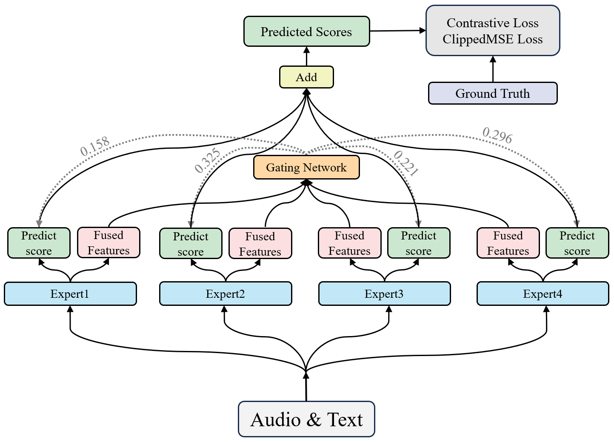
*Fig. 1:Architecture of the proposed text-audio relevance predictor.*

---
**Usage Info**: 3732 tokens used.
**Generated at**: 2026-02-24 19:19:43

---

# 📚 AZeroS: Extending LLM to Speech with Self-Generated Instruction-Free Tuning

🚀 URL: https://arxiv.org/html/2601.06086

## 🌏 Abstract (원문)
Large language models (LLMs) have revolutionized the field of Natural Language Processing (NLP). Trained on internet-scale text data through next-token prediction, LLMs acquire vast world knowledge and exhibit powerful language understanding and reasoning capabilities. In recent years, extending LLMs to incorporate additional modalities has become a prominent research trend. By inheriting LLMs’ language generalization abilities, it is expected to develop unified multimodal LLMs (MLLM) that can handle multiple tasks across various modalities using a single model. Among all modalities, speech plays a fundamental role in human communication. A straightforward way to integrate it with LLMs is through a cascaded system. The cascaded speech–LLM pipeline, which first applies automatic speech recognition (ASR) before text-based processing, suffers from error propagation and the loss of non-semantic acoustic information such as prosody and emotion. These limitations motivate the development of end-to-end architectures that process speech directly. End-to-end speech–LLMs seamlessly connect a speech encoder with an LLM without intermediate text. Forwarding with speech representation mitigates error propagation and could potentially preserve those fine-grained, non-semantic cues. Existing approaches can be broadly categorized into three types: (1) Pure-speech models, (2) Speech-aware models, and (3) General speech–text models. While recent advances have pushed speech–LLMs toward broader capabilities, their training often relies heavily on large-scale, manually curated instruction data. We argue that extensive task-specific instruction tuning may be unnecessary if the generalization capacity of a frozen LLM can be fully leveraged. In this paper, we take a step further by introducing both a theoretical and practical framework for aligning the speech modality with LLMs through self-generated data. Specifically, without relying on any instruction-tuning data, we extend a pretrained LLM into a speech–LLM that preserves its original textual understanding ability while achieving robust comprehension of both semantic and paralinguistic aspects of speech. Our main contributions are summarized as follows: We first formulate Self-Generated Instruction-Free Tuning (SIFT) as a training paradigm for speech–LLM models, in which supervision signals are generated by a frozen LLM using oracle textual representations of speech as input, without relying on any explicit instructions. Building upon the SIFT paradigm, we develop AZeroS, a lightweight speech–LLM trained by updating only projection modules while keeping both the LLM and audio encoders frozen. Despite minimal training cost and modest data scale, AZeroS achieves state-of-the-art performance on both semantic and paralinguistic benchmarks, including VoiceBench and AIR-Bench (Speech).
## 🌏 Abstract (번역)
거대 언어 모델(LLM)은 자연어 처리(NLP) 분야에 혁신을 일으켰습니다. 인터넷 규모의 텍스트 데이터에 대한 다음 토큰 예측 학습을 통해 LLM은 방대한 세상 지식을 습득하고 강력한 언어 이해 및 추론 능력을 보여줍니다. 최근 몇 년 동안 LLM을 확장하여 추가적인 모달리티를 통합하는 것이 주요 연구 트렌드가 되었습니다. LLM의 언어 일반화 능력을 계승함으로써, 단일 모델을 사용하여 다양한 모달리티에 걸친 여러 작업을 처리할 수 있는 통합 멀티모달 LLM(MLLM)을 개발하는 것이 기대되고 있습니다. 모든 모달리티 중에서 음성은 인간 의사소통에서 근본적인 역할을 합니다. 이를 LLM과 통합하는 간단한 방법은 계단식(cascaded) 시스템을 통하는 것입니다. 텍스트 기반 처리 전에 자동 음성 인식(ASR)을 먼저 적용하는 계단식 음성-LLM 파이프라인은 오류 전파와 운율 및 감정과 같은 비언어적 음향 정보의 손실이라는 문제를 겪습니다. 이러한 한계는 음성을 직접 처리하는 엔드투엔드(end-to-end) 아키텍처의 개발을 촉발했습니다. 엔드투엔드 음성-LLM은 중간 텍스트 없이 음성 인코더를 LLM과 원활하게 연결합니다. 음성 표현을 전달함으로써 오류 전파를 완화하고 미세한 비언어적 단서들을 보존할 가능성이 있습니다. 기존 접근 방식은 크게 세 가지 유형으로 분류할 수 있습니다: (1) 순수 음성 모델, (2) 음성 인식 모델, (3) 일반 음성-텍스트 모델. 최근의 발전으로 음성-LLM의 능력이 확장되었지만, 그 학습은 대규모의 수동으로 큐레이션된 지시어 데이터에 크게 의존하는 경우가 많습니다. 본 논문에서는 고정된(frozen) LLM의 일반화 능력을 충분히 활용할 수 있다면 광범위한 작업별 지시어 튜닝이 불필요할 수 있다고 주장합니다. 본 논문에서는 자기 생성 데이터를 통해 음성 모달리티를 LLM과 정렬하기 위한 이론적 및 실용적 프레임워크를 도입함으로써 한 단계 더 나아갑니다. 구체적으로, 지시어 튜닝 데이터에 의존하지 않고 사전 학습된 LLM을 음성-LLM으로 확장하여, 원래의 텍스트 이해 능력을 보존하면서 음성의 의미론적 및 부가언어적 측면 모두에 대한 강력한 이해를 달성합니다. 주요 기여는 다음과 같이 요약됩니다: 첫째, 명시적인 지시어에 의존하지 않고 음성의 오라클 텍스트 표현을 입력으로 사용하여 고정된 LLM에 의해 감독 신호가 생성되는 음성-LLM 모델용 학습 패러다임인 SIFT(Self-Generated Instruction-Free Tuning)를 정립합니다. SIFT 패러다임을 기반으로, LLM과 오디오 인코더를 모두 고정한 상태에서 프로젝션 모듈만 업데이트하여 학습된 경량 음성-LLM인 AZeroS를 개발합니다. 최소한의 학습 비용과 적당한 데이터 규모에도 불구하고, AZeroS는 VoiceBench 및 AIR-Bench (Speech)를 포함한 의미론적 및 부가언어적 벤치마크 모두에서 최첨단 성능을 달성합니다.

## 🔍 Methods & Results
- 지시어 기반 튜닝이 초래하는 특징 붕괴(Feature Collapse)와 지시어 과적합(Instruction Overfitting) 문제를 해결하기 위해 SIFT(Self-Generated Instruction-Free Tuning) 패러다임 제안
- 고정된 LLM이 음성의 텍스트 표현(오라클)으로부터 생성한 응답을 학습 타겟으로 삼아, 지시어 없이 음성-텍스트 입력 정렬 수행
- Qwen2.5-7B-Instruct를 백본으로 하고 Zipformer 기반의 의미론적/부가언어적 인코더를 결합한 AZeroS 아키텍처 설계
- LLM과 인코더는 고정하고 2,380만 파라미터 규모의 경량 프로젝터만 학습시켜 연산 효율성 극대화
- 의미론적 정보 정렬 후 부가언어적 정보를 추가로 정렬하는 2단계 학습 전략(Multi-stage Alignment) 적용
- VoiceBench 및 AIR-Bench (Speech) 등 주요 음성 이해 벤치마크에서 기존 모델들을 능가하는 최첨단(SOTA) 성능 기록

## 🖼 Figures
![Figure 1:Overview of the proposed AZeroS framework built upon a frozen Qwen2.5-7B-Instruct backbone. The system couples a Self-Generated Data Construction pipeline (left) with a two-stage Self-Generated Instruction-Free Tuning (SIFT) training procedure (right). In Stage 1 (Semantic), the LLM generates targets from speech transcripts to train a projector on the semantic TTA auden_tta encoder. In Stage 2 (Semantic + Paralinguistic), we augment inputs with metadata (e.g., emotion, gender, age); the resulting rich responses train a second projector on a paralinguistic Auden-Voice auden_voice encoder. Together, this progressive SIFT paradigm extends the model’s capability from purely semantic to joint semantic–paralinguistic understanding without relying on task-specific instructions.](../images/2026-01-13/2601.06086/2601.06086_fig0.png)
*Figure 1:Overview of the proposed AZeroS framework built upon a frozen Qwen2.5-7B-Instruct backbone. The system couples a Self-Generated Data Construction pipeline (left) with a two-stage Self-Generated Instruction-Free Tuning (SIFT) training procedure (right). In Stage 1 (Semantic), the LLM generates targets from speech transcripts to train a projector on the semantic TTA auden_tta encoder. In Stage 2 (Semantic + Paralinguistic), we augment inputs with metadata (e.g., emotion, gender, age); the resulting rich responses train a second projector on a paralinguistic Auden-Voice auden_voice encoder. Together, this progressive SIFT paradigm extends the model’s capability from purely semantic to joint semantic–paralinguistic understanding without relying on task-specific instructions.*

---
**Usage Info**: 5888 tokens used.
**Generated at**: 2026-02-24 19:20:30

---

# 📚 Land-then-transport: A Flow Matching-Based Generative Decoder for Wireless Image Transmission

🚀 URL: https://arxiv.org/html/2601.07512

## 🌏 Abstract (원문)
Image transmission is one of the most important tasks in modern communication systems, with applications such as visual sensing, remote monitoring, and immersive communications. Classical image transmission schemes are typically layered, with source coding and channel coding optimized separately. While layered methods are theoretically optimal in the asymptotic regime, they can be highly suboptimal in practical, finite blocklength settings, particularly under latency or complexity constraints. Moreover, separate source and channel coding methods are often highly sensitive to channel mismatch and difficult to adapt for varying channels. In contrast, deep joint source channel coding (DeepJSCC) has emerged as a powerful alternative that directly maps images to channel symbols and reconstructs them at the receiver using deep neural networks (DNNs), thereby avoiding separation between source and channel coding. Beyond purely discriminative encoders/decoders, recent efforts have incorporated generative models to further improve reconstruction quality and robustness. In particular, score-based diffusion models and related denoising diffusion frameworks have demonstrated strong performance in image synthesis and restoration, and have recently been adopted as learned priors or plug-in denoisers for wireless image transmission. However, most existing generative decoders for wireless image transmission are diffusion-based and face two key limitations in communication settings. First, diffusion-based receivers typically treat the wireless channel as an external source of corruption and apply a diffusion model to denoise the channel output, rather than embedding the channel effect into the generative dynamics. Consequently, the structural similarity between channel-noise corruption and diffusion noising/denoising is not fully exploited, and the resulting receivers are often multi-stage and over-parameterized. They use a large diffusion model as an additional module on top of the communication pipeline, which increases model complexity and training cost. Second, diffusion-based decoding relies on simulating a noisy forward process and a stochastic reverse process, which can make the training process fragile and is computationally demanding. Moreover, inference typically requires hundreds of reverse-diffusion steps, which incurs substantial sampling cost and decoding latency, and is particularly undesirable in low-latency or resource-constrained wireless systems. Motivated by these observations, we adopt the recently proposed Flow Matching (FM) framework as the generative model for wireless image decoding. FM learns a continuous-time, time-dependent velocity field that transports samples from a simple prior to the target data distribution along a prescribed probability path. Building on FM, Conditional Flow Matching (CFM) introduces analytically tractable conditional paths and leads to efficient regression-based training objectives. Leveraging these principles, we design a channel-aware decoder that tightly integrates the channel noise into the generative flow and replaces stochastic diffusion sampling with a deterministic ordinary differential equation (ODE)-based reconstruction procedure. We propose a landing-then-transport (LTT) paradigm that embeds wireless image transmission into a continuous-time generative flow. Specifically, we construct an FM probability path aligned with the physical channel, so that the received signal is interpreted as a noisy sample at an effective landing time t* along the path. Decoding then reduces to transporting the landing point at t* to the clean image distribution by solving a deterministic ODE, instead of running a long stochastic reverse diffusion process.
## 🌏 Abstract (번역)
이미지 전송은 시각적 감지, 원격 모니터링 및 몰입형 통신과 같은 응용 분야를 가진 현대 통신 시스템에서 가장 중요한 작업 중 하나입니다. 고전적인 이미지 전송 방식은 일반적으로 소스 코딩과 채널 코딩이 별도로 최적화된 계층 구조를 가집니다. 계층화된 방법은 점근적 영역에서 이론적으로 최적이지만, 지연 시간이나 복잡성 제약이 있는 실제 유한 블록 길이 설정에서는 매우 하위 최적일 수 있습니다. 또한, 분리된 소스 및 채널 코딩 방법은 종종 채널 불일치에 매우 민감하며 변화하는 채널에 적응하기 어렵습니다. 이와 대조적으로, 딥 조인트 소스 채널 코딩(DeepJSCC)은 이미지를 채널 심볼로 직접 매핑하고 심층 신경망(DNN)을 사용하여 수신기에서 재구성함으로써 소스 코딩과 채널 코딩 사이의 분리를 피하는 강력한 대안으로 부상했습니다. 순수하게 판별적인 인코더/디코더를 넘어, 최근에는 재구성 품질과 견고성을 더욱 향상시키기 위해 생성 모델을 통합하려는 노력이 있었습니다. 특히, 점수 기반 확산 모델과 관련 노이즈 제거 확산 프레임워크는 이미지 합성 및 복원에서 강력한 성능을 입증했으며, 최근 무선 이미지 전송을 위한 학습된 사전 확률 또는 플러그인 디노이저로 채택되었습니다. 그러나 무선 이미지 전송을 위한 대부분의 기존 생성 디코더는 확산 기반이며 통신 설정에서 두 가지 주요 한계에 직면해 있습니다. 첫째, 확산 기반 수신기는 일반적으로 무선 채널을 외부 오염원으로 취급하고 채널 효과를 생성 역학에 내장하기보다는 채널 출력을 디노이징하기 위해 확산 모델을 적용합니다. 결과적으로 채널 노이즈 오염과 확산 노이즈 추가/제거 사이의 구조적 유사성이 충분히 활용되지 않으며, 결과 수신기는 종종 다단계이며 과도하게 매개변수화됩니다. 이들은 통신 파이프라인 위에 추가 모듈로 대형 확산 모델을 사용하므로 모델 복잡성과 훈련 비용이 증가합니다. 둘째, 확산 기반 디코딩은 노이즈가 있는 순방향 프로세스와 확률적 역방향 프로세스를 시뮬레이션하는 데 의존하므로 훈련 프로세스가 취약해질 수 있고 계산 요구량이 많습니다. 또한 추론에는 일반적으로 수백 단계의 역확산 단계가 필요하므로 상당한 샘플링 비용과 디코딩 지연이 발생하며, 이는 저지연 또는 자원 제한 무선 시스템에서 특히 바람직하지 않습니다. 이러한 관찰에 동기 부여를 받아, 본 논문에서는 무선 이미지 디코딩을 위한 생성 모델로 최근 제안된 플로우 매칭(Flow Matching, FM) 프레임워크를 채택합니다. FM은 단순한 사전 분포에서 목표 데이터 분포로 처방된 확률 경로를 따라 샘플을 운송하는 연속 시간, 시간 의존적 속도 필드를 학습합니다. FM을 기반으로 하는 조건부 플로우 매칭(Conditional Flow Matching, CFM)은 분석적으로 다룰 수 있는 조건부 경로를 도입하고 효율적인 회귀 기반 훈련 목표로 이어집니다. 이러한 원리를 활용하여 채널 노이즈를 생성 플로우에 긴밀하게 통합하고 확률적 확산 샘플링을 결정론적 상미분 방정식(ODE) 기반 재구성 절차로 대체하는 채널 인식 디코더를 설계합니다. 우리는 무선 이미지 전송을 연속 시간 생성 플로우에 내장하는 '착륙 후 운송(Landing-then-Transport, LTT)' 패러다임을 제안합니다. 구체적으로, 수신된 신호가 경로를 따른 유효 착륙 시간 t*에서의 노이즈 샘플로 해석되도록 물리적 채널과 정렬된 FM 확률 경로를 구성합니다. 그러면 디코딩은 긴 확률적 역확산 프로세스를 실행하는 대신 결정론적 ODE를 풀어 t*에서의 착륙 지점을 깨끗한 이미지 분포로 운송하는 것으로 축소됩니다.

## 🔍 Methods & Results
- Landing-then-Transport (LTT) 패러다임 제안: 무선 채널을 확률 플로우의 일부로 통합하여 수신 신호를 특정 시간(t*)의 착륙 지점으로 해석하는 새로운 디코딩 방식
- Flow Matching (FM) 및 Conditional Flow Matching (CFM) 활용: 확률적 확산 모델의 복잡성을 해결하기 위해 결정론적 ODE 기반의 연속 시간 생성 플로우 설계
- AWGN 채널 최적화: 가우시안 평활화 경로와 분석적 교사 속도 필드를 도출하고, 이를 근사하는 DNN 기반 학생 벡터 필드를 CFM으로 학습
- 채널 확장성: MMSE 등화 및 SVD를 통해 Rayleigh 페이딩 및 MIMO 채널을 AWGN 등가 모델로 변환하여 재학습 없이 동일한 디코더 사용 가능
- 성능 향상: DIV2K 데이터셋(SNR 20dB)에서 기존 DeepJSCC 대비 PSNR 28.3%, MS-SSIM 59.6% 향상 달성
- 계산 효율성: 수백 단계가 필요한 확산 모델과 달리 단 10단계의 ODE step만으로 고품질 이미지 재구성 가능
- 이론적 분석: 스칼라 가우시안 채널 분석을 통해 LTT 디코더가 고 SNR 영역에서 MMSE 추정기와 유사한 구조를 가짐을 증명

## 🖼 Figures

*Figure 1:Illustration of the proposed land-then-transport scheme: channel outputs land on a Gaussian flow at an effective landing time 
𝑡
⋆
, and are transported to clean images by a CFM-trained decoder shared across channels.*

*((a))*

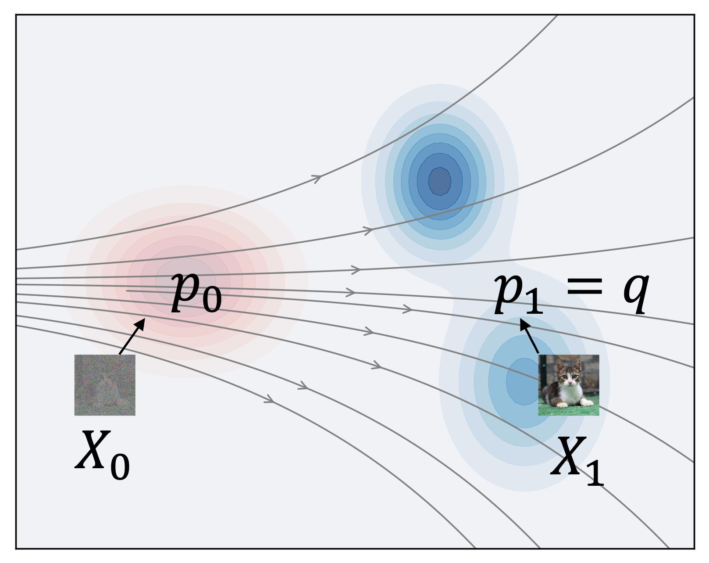
*((a))*

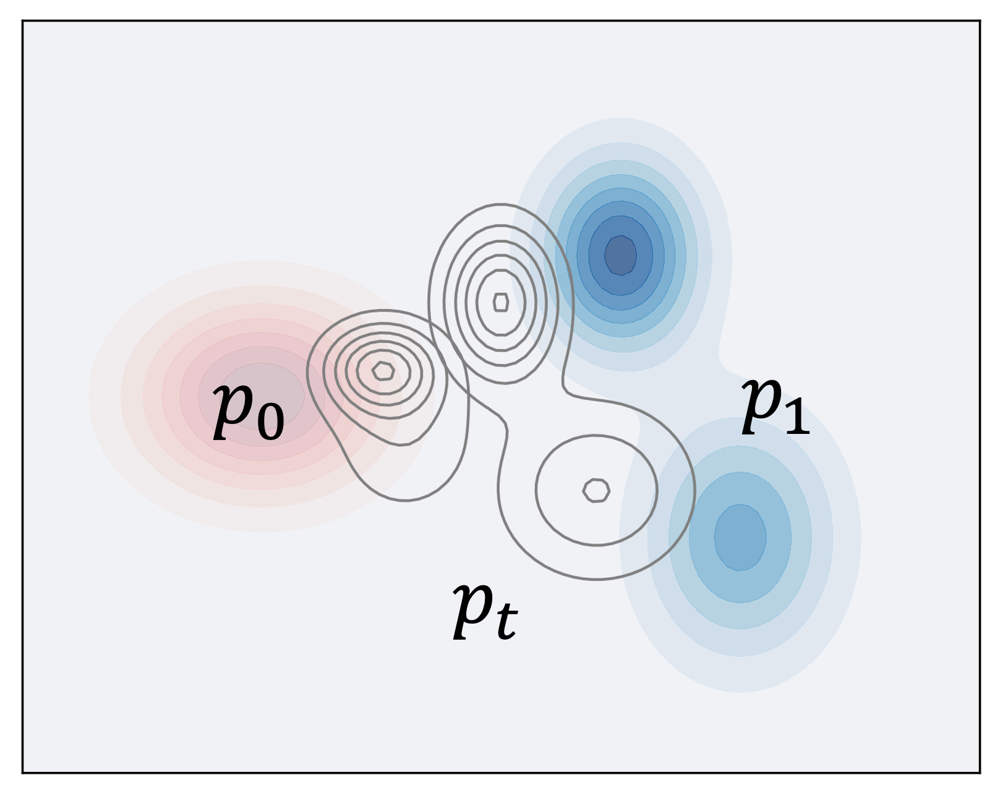
*((b))*

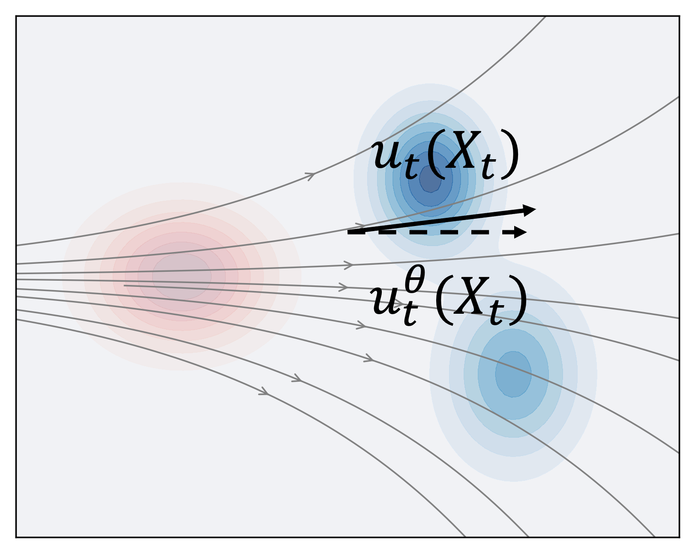
*((c))*

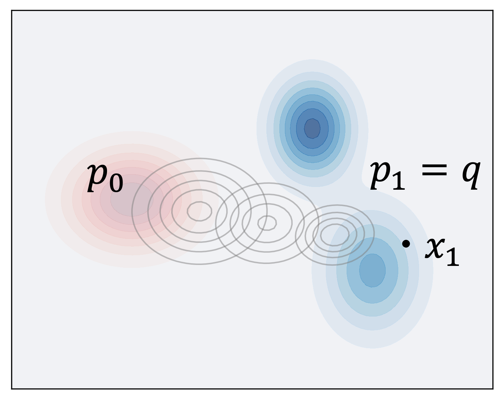
*((d))*

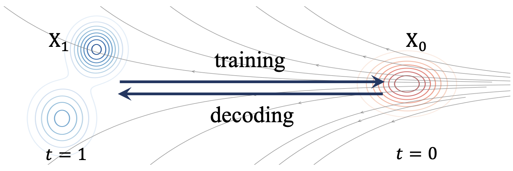
*((a))*

*((a))*

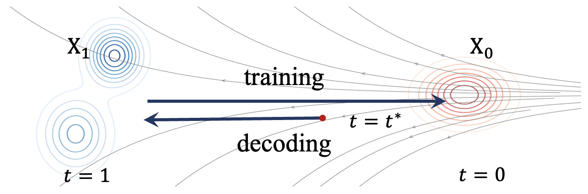
*((b))*

*((a))*

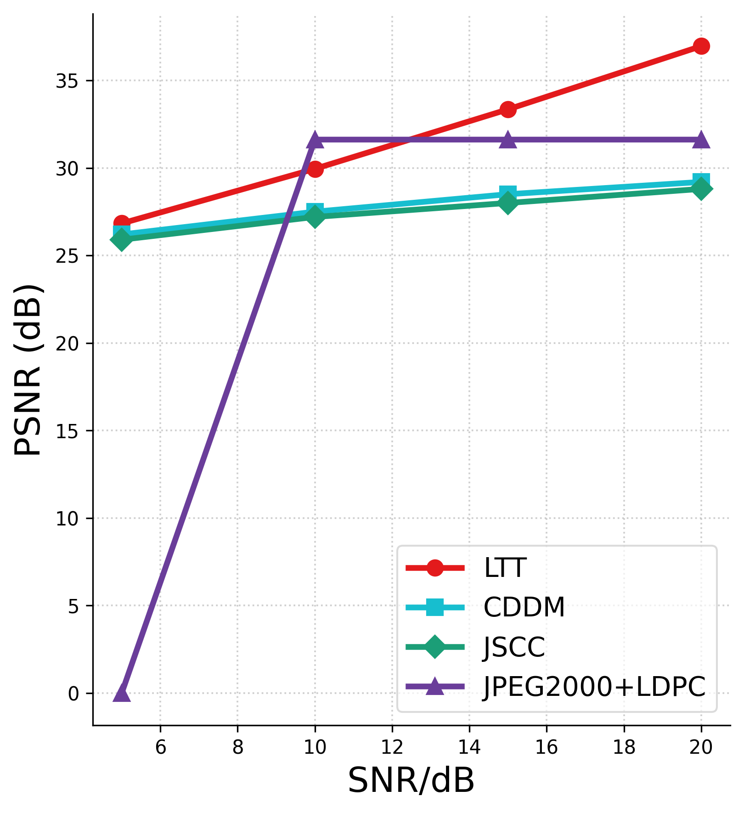
*((a))*

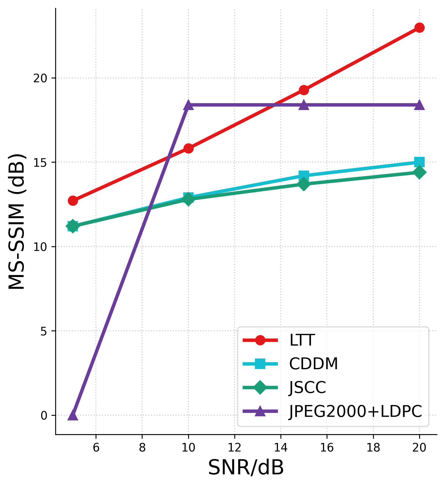
*((b))*

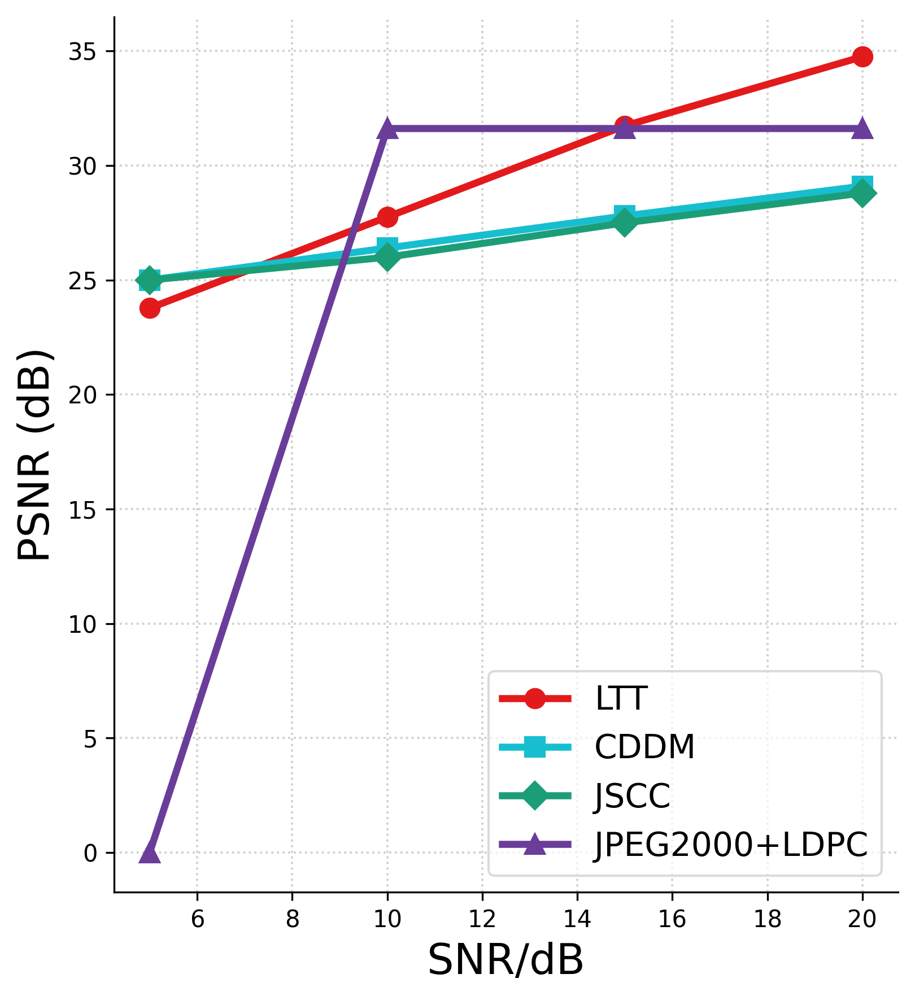
*((c))*

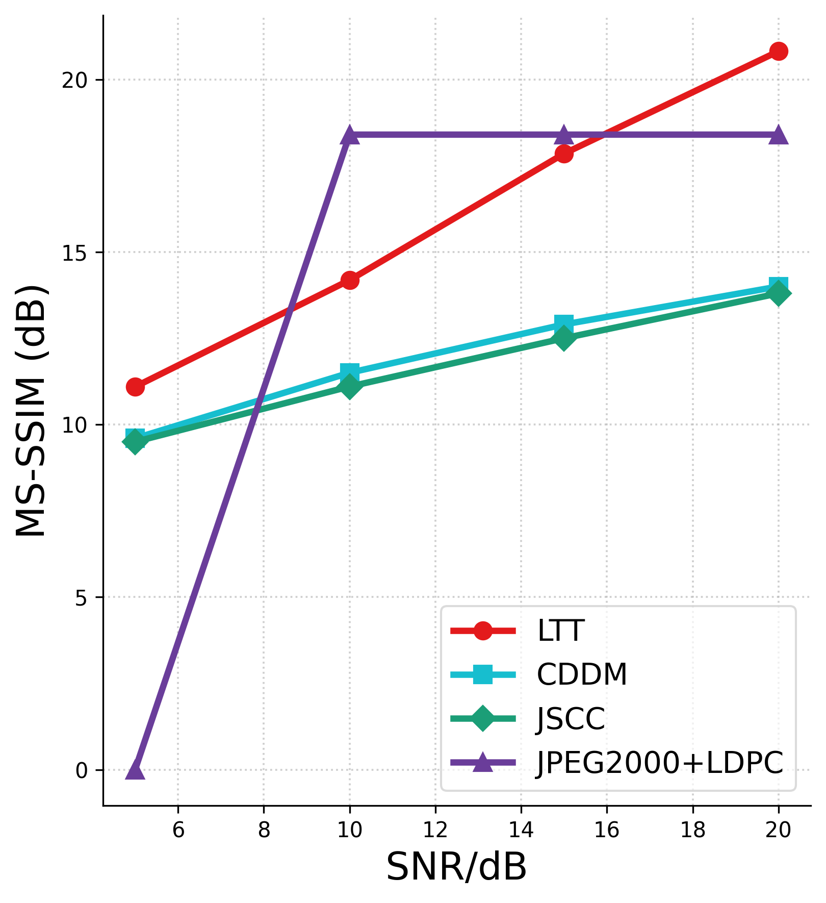
*((d))*

*((a))*

*((a))*

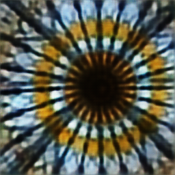
*((b))*

*((c))*

*((d))*

*((e))*

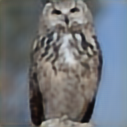
*((f))*

*((g))*

*((h))*

*((i))*

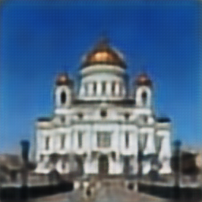
*((j))*

*((k))*

*((l))*

---
**Usage Info**: 10907 tokens used.
**Generated at**: 2026-02-24 19:21:24

---

# 📚 RenderFlow: Single-Step Neural Rendering via Flow Matching

🚀 URL: https://arxiv.org/html/2601.06928

## 🌏 Abstract (원문)
The pursuit of photorealism in computer graphics has long been driven by physically based rendering (PBR) techniques, which simulate the complex interaction of light, materials, and geometry to achieve high visual fidelity. Methods such as path tracing are the gold standard for offline applications, such as visual effects in film productions, but their high computational cost, requiring extensive sampling to obtain “noise-free” images, makes them impractical for real-time settings like video games, interactive virtual production, and pre-visualization, where high frame rates and rapid creative iteration are essential. Recent progress in large-scale generative models, especially latent diffusion models, have enabled neural rendering methods that synthesize photorealistic images from G-buffer inputs. Despite their strong visual fidelity, these approaches face key limitations: the iterative denoising process typically requires 20–50 network evaluations, creating latency unsuitable for interactive use; and the stochastic sampling inherent to diffusion models reduces physical accuracy and temporal stability. As a result, flickering and other inconsistencies often emerge, preventing these methods from meeting studio-quality standards and limiting their practical deployment. To bridge the gap between the generative power of diffusion models and the demands of real-time, physically-consistent rendering, we propose RenderFlow. Our method reformulates neural rendering as a single-step conditional flow generation process. The core idea is to leverage a flow matching paradigm to learn a velocity flow field from the diffuse albedo, rather than Gaussian noise, to the final fully-shaded image, conditioned on the G-buffer attributes (e.g., normals, depth, materials). By replacing noise with albedo, we preserve low-level signals while the network synthesizes high-frequency details, maintaining the geometric integrity of the scene. Learning this direct residual flow enables RenderFlow to leverage pretrained generative priors for synthesizing complex shading and lighting effects in a single forward pass. However, achieving physically accurate results remains challenging for neural rendering methods, which lack explicit representations of scene geometry and light transport. To address this and improve both physical accuracy and temporal stability, we introduce a novel guidance mechanism that leverages sparse, high-quality reference frames rendered offline via path tracing. These frames provide strong conditioning that anchors the generative process, ensuring the output remains faithful to ground-truth light transport. This optional module effectively reduces visual artifacts and improves consistency, making the method more robust for practical applications. Furthermore, to demonstrate the versatility of our framework, we introduce a parameter-efficient adaptation for the inverse rendering task. By augmenting the frozen RenderFlow backbone with adapter modules, our model can be efficiently repurposed to decompose a rendered image back into its intrinsic G-buffer components. This addition establishes our approach as a unified paradigm, capable of handling both forward (synthesis) and inverse (decomposition) rendering within a single, shared architecture, which can be potentially applied in further video editing applications. Our main contributions are: A single-step, flow-based rendering framework, RenderFlow, that achieves a faster inference speed by reformulating neural rendering as a direct conditional flow generation task, significantly outperforming iterative diffusion-based methods in quality and efficiency. A novel reference-frame guidance module that improves the physical accuracy of the rendered output, achieving superior visual quality and mitigating artifacts common in prior generative approaches. A unified, efficient adapter-based inverse renderer built on a frozen forward renderer, demonstrating the versatility and extensibility of RenderFlow.
## 🌏 Abstract (번역)
컴퓨터 그래픽에서 실사 지향(photorealism)은 빛, 재질, 기하학적 구조의 복잡한 상호작용을 시뮬레이션하여 높은 시각적 충실도를 달성하는 물리 기반 렌더링(PBR) 기술에 의해 오랫동안 주도되어 왔습니다. 패스 트레이싱과 같은 방법은 영화 제작의 시각 효과와 같은 오프라인 애플리케이션의 표준이지만, "노이즈 없는" 이미지를 얻기 위해 광범위한 샘플링이 필요한 높은 계산 비용으로 인해 높은 프레임 레이트와 빠른 창의적 반복이 필수적인 비디오 게임, 대화형 가상 제작 및 사전 시각화와 같은 실시간 환경에서는 비실용적입니다. 최근 대규모 생성 모델, 특히 잠재 확산 모델의 발전으로 G-버퍼 입력을 통해 실사 이미지를 합성하는 신경망 렌더링 방법이 가능해졌습니다. 이러한 접근 방식은 강력한 시각적 충실도에도 불구하고 주요 한계에 직면해 있습니다. 반복적인 디노이징 과정은 일반적으로 20~50회의 네트워크 평가를 필요로 하여 대화형 사용에 부적합한 지연 시간을 발생시키며, 확산 모델 고유의 확률적 샘플링은 물리적 정확도와 시간적 안정성을 저하시킵니다. 그 결과, 깜빡임 및 기타 불일치가 자주 발생하여 이러한 방법이 스튜디오 품질 표준을 충족하지 못하고 실제 배포를 제한하게 됩니다. 확산 모델의 생성 능력과 실시간 물리적 일관성 렌더링 요구 사항 사이의 간극을 메우기 위해, 본 논문에서는 RenderFlow를 제안합니다. 우리의 방법은 신경망 렌더링을 단일 단계 조건부 플로우 생성 프로세스로 재구성합니다. 핵심 아이디어는 플로우 매칭 패러다임을 활용하여 가우시안 노이즈가 아닌 디퓨즈 알베도(diffuse albedo)로부터 G-버퍼 속성(예: 법선, 깊이, 재질)을 조건으로 최종 셰이딩된 이미지로 향하는 속도 플로우 필드를 학습하는 것입니다. 노이즈를 알베도로 대체함으로써 저주파 신호를 보존하는 동시에 네트워크가 고주파 세부 사항을 합성하여 장면의 기하학적 무결성을 유지할 수 있습니다. 이러한 직접적인 잔차 플로우를 학습함으로써 RenderFlow는 사전 학습된 생성적 사전 지식을 활용하여 단 한 번의 순전파(forward pass)로 복잡한 셰이딩 및 조명 효과를 합성할 수 있습니다. 그러나 명시적인 장면 기하학 및 빛 전달 표현이 부족한 신경망 렌더링 방법에게 물리적으로 정확한 결과를 얻는 것은 여전히 어려운 과제입니다. 이를 해결하고 물리적 정확도와 시간적 안정성을 모두 향상시키기 위해, 오프라인 패스 트레이싱을 통해 렌더링된 희소하고 고품질인 참조 프레임을 활용하는 새로운 가이던스 메커니즘을 도입합니다. 이러한 프레임은 생성 과정을 고정하는 강력한 조건을 제공하여 출력이 실제 빛 전달(ground-truth light transport)에 충실하도록 보장합니다. 이 선택적 모듈은 시각적 아티팩트를 효과적으로 줄이고 일관성을 향상시켜 실제 응용 분야에서 방법을 더욱 견고하게 만듭니다. 또한, 우리 프레임워크의 다재다능함을 입증하기 위해 역렌더링 작업을 위한 매개변수 효율적 적응 방식을 도입합니다. 고정된 RenderFlow 백본에 어댑터 모듈을 추가함으로써, 우리 모델은 렌더링된 이미지를 고유한 G-버퍼 구성 요소로 다시 분해하도록 효율적으로 용도 변경될 수 있습니다. 이러한 추가를 통해 우리의 접근 방식은 단일 공유 아키텍처 내에서 순방향(합성) 및 역방향(분해) 렌더링을 모두 처리할 수 있는 통합 패러다임을 구축하며, 이는 향후 비디오 편집 응용 분야에 잠재적으로 적용될 수 있습니다. 우리의 주요 기여는 다음과 같습니다: 1) 신경망 렌더링을 직접 조건부 플로우 생성 작업으로 재구성하여 품질과 효율성 면에서 반복적 확산 기반 방법을 크게 능가하고 더 빠른 추론 속도를 달성하는 단일 단계 플로우 기반 렌더링 프레임워크인 RenderFlow 제안. 2) 렌더링된 출력의 물리적 정확도를 향상시켜 우수한 시각적 품질을 달성하고 이전 생성적 접근 방식에서 흔히 발생하는 아티팩트를 완화하는 새로운 참조 프레임 가이던스 모듈 제안. 3) 고정된 순방향 렌더러를 기반으로 구축된 통합되고 효율적인 어댑터 기반 역렌더러를 통해 RenderFlow의 다재다능함과 확장성 입증.

## 🔍 Methods & Results
- 신경망 렌더링을 단일 단계 조건부 플로우 매칭(Flow Matching) 문제로 재구성하여 반복적 확산 모델 대비 추론 속도와 효율성을 대폭 개선함
- 가우시안 노이즈 대신 디퓨즈 알베도(Diffuse Albedo)를 초기 입력으로 사용하여 장면의 기하학적 무결성을 유지하고 저주파 신호를 보존함
- Wan2.1 비디오 확산 모델을 백본으로 사용하며, G-버퍼(알베도, 법선, 깊이, 재질)와 톤 매핑된 환경 맵을 조건부 입력으로 활용함
- 오프라인 패스 트레이싱으로 생성된 희소 참조 프레임을 활용하는 키프레임 가이던스 모듈을 통해 물리적 정확도와 시간적 안정성을 향상시킴
- 고정된 순방향 렌더러에 LoRA 및 어댑터를 추가하여 이미지를 G-버퍼로 분해하는 역렌더링(Inverse Rendering) 기능을 통합함
- Unreal Engine 5를 사용하여 구축한 13만 프레임 이상의 대규모 데이터셋을 통해 모델을 학습하고 높은 시각적 충실도를 입증함

## 🖼 Figures

*Figure 2:An overview of our proposed RenderFlow architecture. Unlike diffusion methods that start from noise, RenderFlow takes albedo as input and directly predicts fully-shaded outputs. Built on a pre-trained video DiT, it injects aligned G-buffer tokens into transformer blocks. Environment maps and optional keyframes are integrated via lightweight adapters (see Fig. 3 for details). The transformer aggregates all inputs to produce temporally coherent, physically accurate rendering outputs.*

![Figure 3:Design of the customized transformer block in RenderFlow. To incorporate global lighting context, the environment map is injected via an adaptive normalization layer before the transformer layers To compensate for the limited information in per-frame G-buffers, the keyframe adapter introduces cross-attention to extract complementary temporal features from an optional keyframe. The adapter includes a LoRA module for parameter-efficient adaptation and employs Rotary Position Embeddings (RoPE) to encode temporal distances between keyframes and current frames.](../images/2026-01-13/2601.06928/2601.06928_fig1.png)
*Figure 3:Design of the customized transformer block in RenderFlow. To incorporate global lighting context, the environment map is injected via an adaptive normalization layer before the transformer layers To compensate for the limited information in per-frame G-buffers, the keyframe adapter introduces cross-attention to extract complementary temporal features from an optional keyframe. The adapter includes a LoRA module for parameter-efficient adaptation and employs Rotary Position Embeddings (RoPE) to encode temporal distances between keyframes and current frames.*

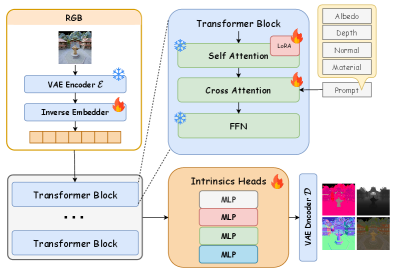
*Figure 4:Inverse adapter architecture. The inverse adapter uses the frozen forward rendering backbone and introduces specialized modules to adapt it for G-buffer decomposition.*

*Figure 5:Qualitative comparison of rendered images with traditional methods including deferred rendering, and diffusion-based approaches (RGB-X and DiffusionRenderer). Our method better preserves texture details and produces high-quality shadows and lighting effects.*

*Figure 6:Metrics are evaluated over a 100-frame sequence and averaged across 10 runs. Shaded regions indicate variance across runs. Our method not only achieves the best overall performance but also zero variance, reflecting its deterministic, consistently high-quality behavior in contrast to the stochastic baselines.*

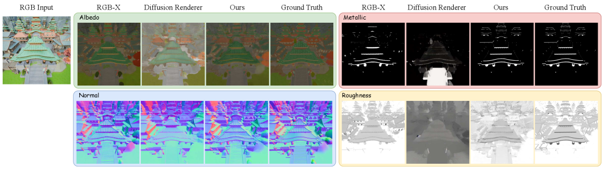
*Figure 7:Qualitative comparison of intrinsic decomposition. We compare our adapter-based method against RGB-X and DiffusionRenderer. This figure demonstrates the decomposition results for key G-buffer components: Albedo, Normal, Metallic, and Roughness.*

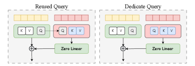
*Figure 8:Two different keyframe adapter designs. The left one reuses the query from the self-attention layer for efficiency, while the right one uses a dedicated query.*

*Figure 9:Demonstration of controlled material editing. Our model is capable of synthesizing smooth transitions for individual material properties while all other scene parameters are held constant. From left to right: the cone’s roughness is interpolated from 1.0 to 0.0; the cylinder’s metallic property from 0.0 to 1.0; and the cube’s diffuse albedo from blue to green.*

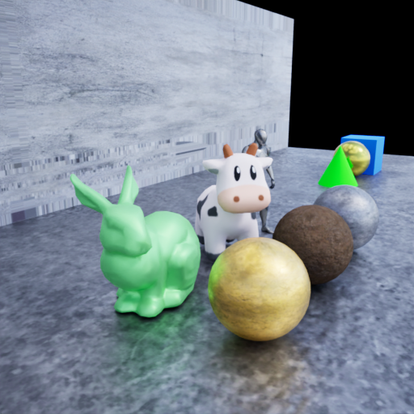
*Figure 10:A preview of our synthesized dataset, showcasing a variety of scenes, objects, and lighting conditions.*

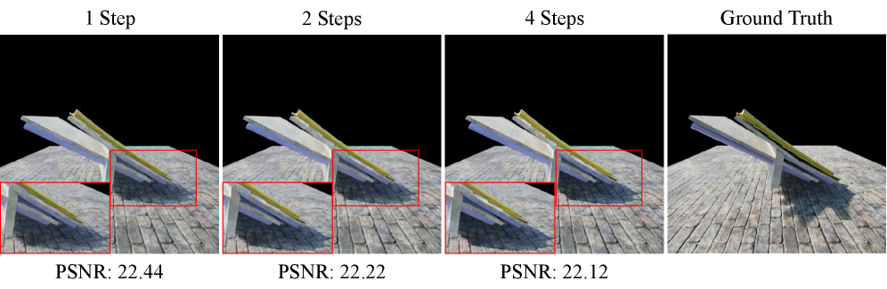
*Figure 11:Analysis on inference steps. We show that multi-step inference can generate sharper shadows. However, due to misalignments with ground truth, it will lead to lower metrics (PSNR).*

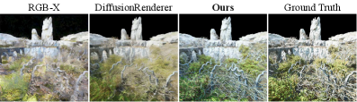
*Figure 12:Failed cases and analysis. Top: Rendered images for scenes with highly complex geometries. Bottom: The VAE compression leads to loss of fine-grained details*

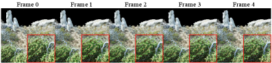
*Figure 13:Analysis on video latent downsampling. The causal design of the VAE encoder leads to the phenomenon that the initial frame retains sharpness while subsequent frames exhibit progressive blurring due to temporal downsampling dependencies.*

*Figure 14:Additional qualitative forward rendering results. We provide more qualitative comparisons with error maps to highlight the differences between our predictions and the ground truth. For keyframe guidance, we sample keyframes with a 25-frame gap. Our method clearly outperforms the baseline methods. In addition, with the keyframe guidance our model achieves the best results among all models.*

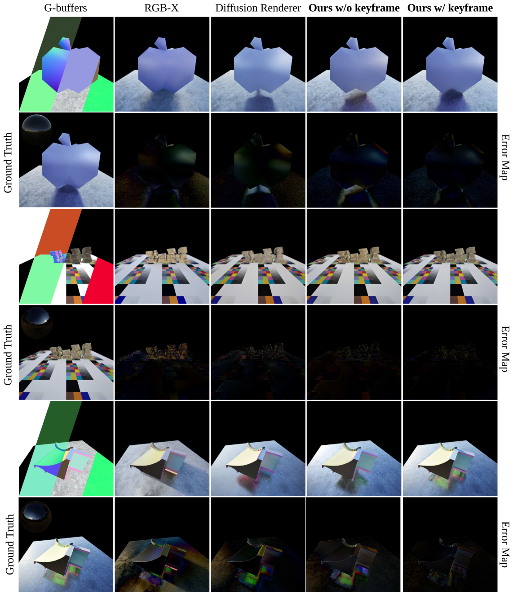
*Figure 15:Additional qualitative forward rendering results (continued).*

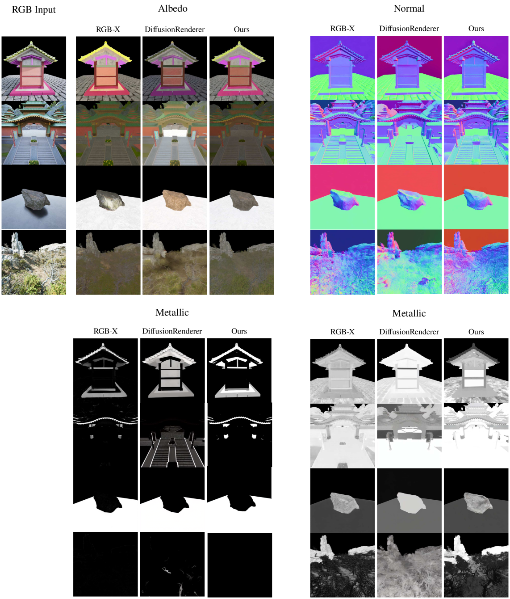
*Figure 16:Additional qualitative inverse rendering results.*

---
**Usage Info**: 7052 tokens used.
**Generated at**: 2026-02-24 19:22:40

---

# 📚 Lightweight Resolution-Aware Audio Deepfake Detection via Cross-Scale Attention and Consistency Learning

🚀 URL: https://arxiv.org/html/2601.06560

## 🌏 Abstract (원문)
Anaudio deepfake refers to synthetic or manipulated speech generated by machine learning models that imitate the acoustic characteristics, linguistic patterns, and vocal identity of a real speaker. Unlike traditional text-to-speech (TTS) systems, modern audio deepfakes are produced using deep neural architectures such as neural vocoders, autoregressive generators, and diffusion-based models, enabling highly natural and speaker-specific speech generation. By conditioning these models on limited speech samples, an attacker can produce arbitrary utterances that closely resemble a target individual’s voice, often rendering human perception insufficient for reliable discrimination. The rapid evolution of speech synthesis and voice conversion technologies has significantly lowered the barrier to generating convincing audio deepfakes. While these advances support beneficial applications in accessibility, speech restoration, and human–computer interaction, they simultaneously introduce severe security and societal risks. Audio deepfakes can be exploited to bypass speaker verification systems, impersonate public figures, fabricate evidence, or conduct social engineering and financial fraud. The growing availability of open-source synthesis toolkits and commercial voice-cloning services further amplifies the urgency of developing reliable and generalizable detection mechanisms. Early research on audio deepfake and spoofing detection primarily focused on identifying artifacts introduced by synthesis pipelines. These approaches relied on handcrafted acoustic features, such as phase inconsistencies, spectral statistics, or cepstral coefficients, combined with classical classifiers. While effective against early-generation synthetic speech, such methods were inherently limited by their reliance on manually designed features and assumptions about specific synthesis artifacts. As synthesis models improved, many of these handcrafted cues became increasingly subtle or absent. The emergence of deep learning marked a paradigm shift in audio deepfake detection. Convolutional and attention-based neural networks enabled models to learn discriminative representations directly from time-frequency inputs such as spectrograms and Mel representations. Large-scale benchmarks and community-driven challenges further accelerated progress by standardizing evaluation protocols and datasets. On controlled benchmarks, modern detectors now achieve near-ceiling performance, often surpassing human-level accuracy. However, this apparent success masks a critical vulnerability. Detection systems trained on clean or curated datasets frequently degrade when exposed to replay attacks, channel distortions, compression artifacts, or real-world recording conditions. In practice, audio deepfakes are rarely encountered in pristine form; they are transmitted through microphones, speakers, telecommunication channels, and online platforms. The resulting distribution shift reveals that many existing detectors implicitly rely on dataset-specific artifacts or narrow spectral cues that do not generalize beyond the training conditions. A fundamental limitation underlying this issue lies in how time-frequency representations are modeled. Most existing approaches operate on a single spectral resolution or apply naive fusion strategies when multiple resolutions are used. Yet, different resolutions capture fundamentally different information: fine-grained representations emphasize short-term spectral irregularities, while coarser resolutions encode longer-term temporal dynamics and prosodic structure. Treating these representations independently—or merging them without explicit alignment—can lead to inconsistent or brittle decision boundaries, particularly under channel and replay distortions. In this work, it is argued that robust audio deepfake detection requires explicit cross-resolution modeling. To this end, a resolution-aware detection framework was proposed that jointly learns from multiple spectral resolutions while enforcing coherent representation alignment. The proposed architecture introduces a cross-scale attention mechanism that dynamically fuses complementary resolution-specific features, enabling the model to adaptively emphasize informative cues depending on the acoustic conditions. Additionally, a consistency learning objective is employed to regularize predictions across resolutions, encouraging the model to focus on resolution-invariant characteristics rather than spurious artifacts. The proposed framework is evaluated on a diverse set of benchmark datasets spanning controlled synthesis attacks, replay-based distortions, and in-the-wild audio deepfakes, including speaker-disjoint evaluation protocols. Experimental results demonstrate that the method achieves near-ceiling performance on standard benchmarks while significantly improving robustness under challenging real-world conditions. Extensive ablation studies validate the contribution of each architectural component, and gradient-based interpretability analysis provides insights into the spectral cues leveraged across resolutions. In summary, this work makes three key contributions. First, it introduces a resolution-aware audio deepfake detection framework that explicitly models and aligns multi-resolution spectral representations. Second, it demonstrates that cross-scale attention and consistency learning substantially enhance robustness under replayed and unconstrained conditions. Third, it provides both empirical and interpretability-based evidence that explicit cross-resolution modeling is a critical factor for building generalizable and trustworthy audio deepfake detection systems.
## 🌏 Abstract (번역)
오디오 딥페이크는 실제 화자의 음향적 특성, 언어적 패턴 및 목소리 정체성을 모방하는 기계 학습 모델에 의해 생성된 합성 또는 조작된 음성을 의미합니다. 기존의 텍스트 음성 변환(TTS) 시스템과 달리, 현대의 오디오 딥페이크는 신경 보코더, 자기회귀 생성기 및 확산 기반 모델과 같은 심층 신경망 아키텍처를 사용하여 생성되어 매우 자연스럽고 화자 특화된 음성 생성을 가능하게 합니다. 공격자는 제한된 음성 샘플로 이러한 모델을 조건화하여 대상 개인의 목소리와 매우 유사한 임의의 발화를 생성할 수 있으며, 이는 종종 인간의 지각만으로는 신뢰할 수 있는 구분을 불가능하게 만듭니다. 음성 합성 및 목소리 변환 기술의 급격한 발전은 설득력 있는 오디오 딥페이크 생성 장벽을 크게 낮추었습니다. 이러한 발전은 접근성, 음성 복구 및 인간-컴퓨터 상호작용에서 유익한 응용을 지원하지만, 동시에 심각한 보안 및 사회적 위험을 초래합니다. 오디오 딥페이크는 화자 인증 시스템 우회, 공인 사칭, 증거 조작 또는 사회 공학 및 금융 사기에 악용될 수 있습니다. 오픈 소스 합성 툴킷과 상업용 목소리 복제 서비스의 가용성이 높아짐에 따라 신뢰할 수 있고 일반화 가능한 탐지 메커니즘 개발의 시급성이 더욱 커지고 있습니다. 초기 연구는 주로 합성 파이프라인에서 발생하는 아티팩트를 식별하는 데 집중했습니다. 이러한 접근 방식은 수작업으로 설계된 음향 특징과 고전적인 분류기에 의존했습니다. 초기 세대의 합성 음성에는 효과적이었으나, 수작업 특징에 대한 의존성과 특정 합성 아티팩트에 대한 가정으로 인해 한계가 있었습니다. 합성 모델이 개선됨에 따라 이러한 단서들은 점점 더 미세해지거나 사라졌습니다. 딥러닝의 등장은 오디오 딥페이크 탐지의 패러다임 변화를 가져왔습니다. 합성곱 및 어텐션 기반 신경망은 스펙트로그램과 멜 표현과 같은 시공간 입력에서 직접 변별력 있는 표현을 학습할 수 있게 했습니다. 대규모 벤치마크와 커뮤니티 주도 챌린지는 평가 프로토콜과 데이터셋을 표준화하여 발전을 가속화했습니다. 통제된 벤치마크에서 현대의 탐지기는 인간 수준의 정확도를 능가하는 성능을 달성하지만, 이는 심각한 취약성을 숨기고 있습니다. 깨끗한 데이터셋으로 훈련된 시스템은 재전송 공격, 채널 왜곡, 압축 아티팩트 또는 실제 녹음 조건에 노출될 때 성능이 저하되는 경우가 많습니다. 실제 오디오 딥페이크는 마이크, 스피커, 통신 채널 등을 통해 전송되며, 이는 기존 탐지기들이 데이터셋 특유의 아티팩트에 의존하고 있음을 드러냅니다. 근본적인 한계는 시공간 표현이 모델링되는 방식에 있습니다. 대부분의 접근 방식은 단일 스펙트럼 해상도에서 작동하거나 단순한 융합 전략을 사용합니다. 그러나 서로 다른 해상도는 근본적으로 다른 정보를 캡처합니다. 미세한 표현은 단기적인 스펙트럼 불규칙성을 강조하는 반면, 거친 해상도는 장기적인 시간적 역동성과 운율 구조를 인코딩합니다. 이러한 표현을 독립적으로 처리하거나 명시적인 정렬 없이 병합하면 특히 채널 및 재전송 왜곡 하에서 일관성 없거나 취약한 결정 경계로 이어질 수 있습니다. 본 연구에서는 견고한 오디오 딥페이크 탐지를 위해 명시적인 교차 해상도 모델링이 필요하다고 주장합니다. 이를 위해 다중 스펙트럼 해상도에서 공동으로 학습하면서 일관된 표현 정렬을 강제하는 해상도 인식 탐지 프레임워크를 제안합니다. 제안된 아키텍처는 보완적인 해상도별 특징을 동적으로 융합하는 교차 스케일 어텐션 메커니즘을 도입하여 모델이 음향 조건에 따라 정보가 풍부한 단서를 적응적으로 강조할 수 있게 합니다. 또한 해상도 불변 특성에 집중하도록 일관성 학습 목적 함수를 사용하여 해상도 간 예측을 정규화합니다. 제안된 프레임워크는 통제된 합성 공격, 재전송 기반 왜곡, 실제 오디오 딥페이크를 포함한 다양한 벤치마크 데이터셋에서 평가되었습니다. 실험 결과, 제안된 방법은 표준 벤치마크에서 최고 수준의 성능을 달성하는 동시에 어려운 실제 조건에서의 견고성을 크게 향상시켰음을 입증했습니다. 광범위한 소거 연구를 통해 각 아키텍처 구성 요소의 기여도를 검증했으며, 해석 가능성 분석을 통해 해상도 전반에 걸쳐 활용되는 스펙트럼 단서에 대한 통찰력을 제공합니다. 요약하자면, 본 연구는 다중 해상도 스펙트럼 표현을 명시적으로 모델링하고 정렬하는 해상도 인식 오디오 딥페이크 탐지 프레임워크를 도입하고, 교차 스케일 어텐션과 일관성 학습이 견고성을 실질적으로 향상시킴을 입증하며, 명시적 교차 해상도 모델링이 일반화 가능하고 신뢰할 수 있는 탐지 시스템 구축의 핵심 요소임을 제시합니다.

## 🔍 Methods & Results
- 다중 시간-주파수 해상도(Fine, Medium, Coarse)의 로그-멜 스펙트로그램을 동시에 활용하는 해상도 인식 탐지 프레임워크 제안
- 서로 다른 해상도 간의 보완적 정보를 동적으로 융합하기 위한 교차 스케일 어텐션(Cross-scale Attention) 메커니즘 도입
- 진본 음성이 해상도에 관계없이 일관된 특성을 갖도록 유도하는 일관성 학습(Consistency Learning) 목적 함수 적용
- ASVspoof 2019(LA/PA), Fake-or-Real(FoR), In-the-Wild 데이터셋을 활용하여 통제된 환경 및 실제 환경에서의 성능 검증
- 약 1.6 x 10^5개의 파라미터와 0.62MB의 모델 크기로 높은 계산 효율성 및 경량화 달성
- 실험 결과, 표준 벤치마크에서 최고 수준의 성능을 기록했으며 재전송 공격 및 채널 왜곡이 포함된 실제 환경 조건에서 견고성이 크게 향상됨
- 화자 비중첩(Speaker-disjoint) 프로토콜을 통해 미학습 화자 및 녹음 조건에 대한 일반화 성능 입증

## 🖼 Figures
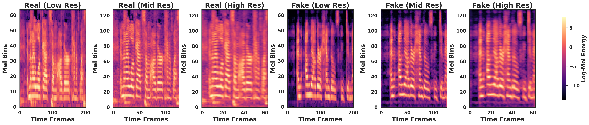
*Figure 1:Multi-resolution log-Mel spectrograms of real and fake audio samples from the In-the-Wild dataset. Low-, mid-, and high-resolution representations reveal complementary temporal and spectral artifacts.*

![Figure 2:Overview of the proposed resolution-aware audio deepfake detection framework. An input audio signal is transformed into low-, mid-, and high-resolution Mel spectrograms, which are processed by a shared convolutional encoder to extract resolution-specific embeddings 
𝑧
1
, 
𝑧
2
, and 
𝑧
3
. A cross-scale attention module dynamically fuses these embeddings to form a resolution-invariant representation for classification. During training, a cross-resolution consistency loss is applied to bona fide speech to enforce alignment across resolutions, improving robustness under replay and real-world conditions.](../images/2026-01-13/2601.06560/2601.06560_fig1.png)
*Figure 2:Overview of the proposed resolution-aware audio deepfake detection framework. An input audio signal is transformed into low-, mid-, and high-resolution Mel spectrograms, which are processed by a shared convolutional encoder to extract resolution-specific embeddings 
𝑧
1
, 
𝑧
2
, and 
𝑧
3
. A cross-scale attention module dynamically fuses these embeddings to form a resolution-invariant representation for classification. During training, a cross-resolution consistency loss is applied to bona fide speech to enforce alignment across resolutions, improving robustness under replay and real-world conditions.*

*Figure 3:ASVspoof 2019 LA results: confusion matrix (left), ROC curve (center), and t-SNE embedding of development set representations (right).*

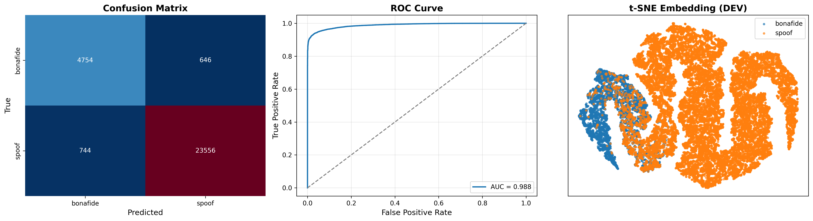
*Figure 4:ASVspoof 2019 PA results: confusion matrix (left), ROC curve (center), and t-SNE embedding of development set representations (right).*

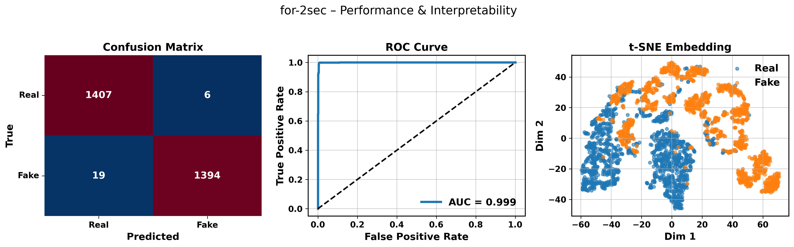
*Figure 5:FoR for-2sec results: confusion matrix (left), ROC curve (center), and t-SNE embedding (right).*

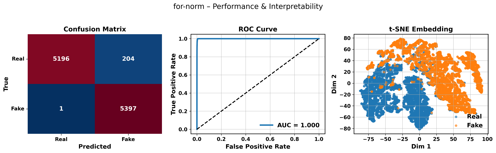
*Figure 6:FoR for-norm results: confusion matrix (left), ROC curve (center), and t-SNE embedding (right).*

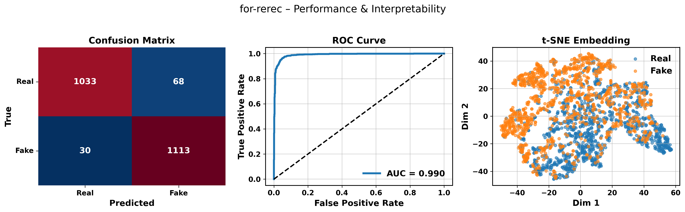
*Figure 7:FoR for-rerec results: confusion matrix (left), ROC curve (center), and t-SNE embedding (right).*

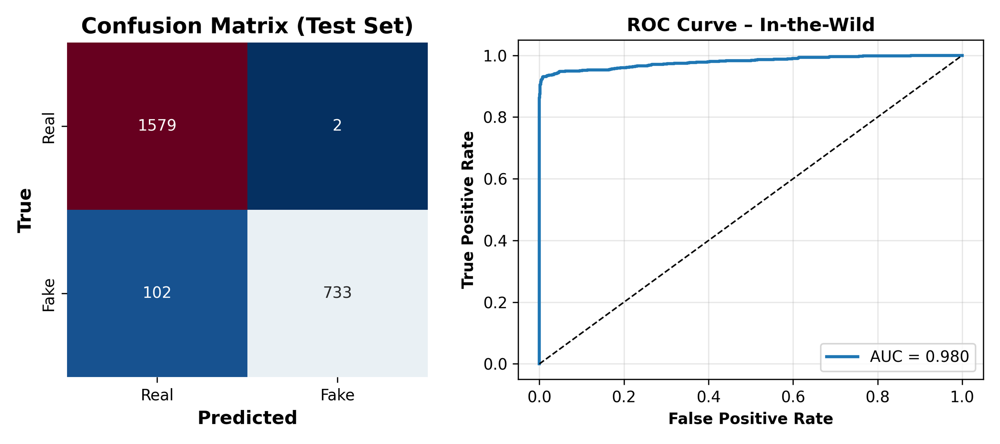
*Figure 8:In-the-Wild Audio Deepfake results on the test set: confusion matrix (left) and ROC curve (right).*

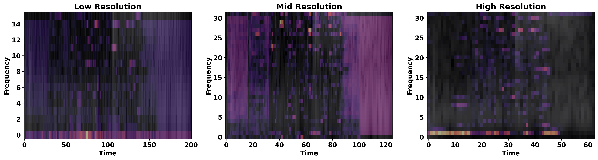
*Figure 9:Resolution-wise saliency visualization on the ASVspoof 2019 PA dataset. From left to right: low-, mid-, and high-resolution Mel-spectrogram representations.*

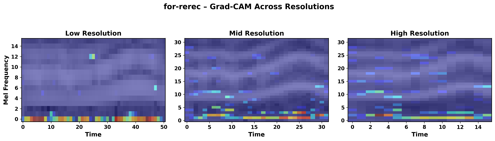
*Figure 10:Grad-CAM visualization across resolutions for the FoR re-recorded dataset, illustrating attention shifts induced by replay and channel effects.*

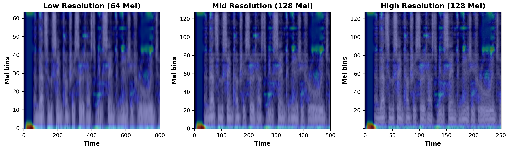
*Figure 11:Grad-CAM–based interpretability analysis on the In-the-Wild audio deepfake dataset, demonstrating distributed attention across time and frequency.*

---
**Usage Info**: 8553 tokens used.
**Generated at**: 2026-02-24 19:24:25

---

# 📚 ESDD2: Environment-Aware Speech and Sound Deepfake Detection Challenge Evaluation Plan

🚀 URL: https://arxiv.org/html/2601.07303

## 🌏 Abstract (원문)
In real-world recording scenarios, audio often contains a mixture of foreground speech and background sounds. We define such audio as comprising two components: (i) speech, i.e., linguistically meaningful speech produced by the primary foreground speaker, and (ii) environmental sound, i.e., any non‑speech background or non‑target speech. With rapid advances in text‑to‑speech, voice conversion, and other generation models, either component can now be modified independently. For example, replacing the background while leaving the foreground human speech unchanged, or modifying the speech content while preserving the background. Such component-level manipulations are harder to detect, as the remaining unaltered component can mislead the systems designed for whole deepfake audio, and they often sound more natural to human listeners. To address this gap, we introduced a component-level spoofing audio dataset CompSpoof[16]in 2025. Then, we extend the dataset toCompSpoofV2, which contains more than 250,000 audio clips (around 283 hours) formed by mixing bona fide (genuine or real) and spoofed (synthetic or manipulated) audio, including speech and environmental sounds, from multiple sources. We also proposed aseparation-enhanced joint learning frameworkto explore to address this gap. To further promote the development of environment-aware speech and sound deepfake detection, we extend our first ESDD challenge[13]and launch the ICME 2026 Environment-Aware Speech and Sound Deepfake Detection Challenge (ESDD2). While our first ESDD challenge focuses on the detection of forged environmental sounds, ESDD2 advances this direction by addressing component-level spoofing, where both speech and environmental sounds may be manipulated or synthesized, posing a more challenging and realistic detection scenario.
## 🌏 Abstract (번역)
실제 녹음 환경에서 오디오는 종종 전경 음성과 배경음의 혼합을 포함합니다. 본 연구에서는 이러한 오디오를 (i) 주요 전경 화자가 생성하는 언어적으로 의미 있는 음성, (ii) 비음성 배경 또는 비대상 음성인 환경음의 두 가지 구성 요소로 정의합니다. 텍스트 음성 변환(TTS), 음성 변환 및 기타 생성 모델의 급격한 발전으로 이제 각 구성 요소를 독립적으로 수정할 수 있게 되었습니다. 예를 들어, 전경의 인간 음성은 그대로 둔 채 배경을 교체하거나, 배경을 보존하면서 음성 콘텐츠를 수정하는 것이 가능합니다. 이러한 구성 요소 수준의 조작은 감지하기가 더 어려운데, 이는 변경되지 않은 나머지 구성 요소가 전체 딥페이크 오디오를 위해 설계된 시스템을 오도할 수 있고 인간 청취자에게 종종 더 자연스럽게 들리기 때문입니다. 이러한 격차를 해소하기 위해 2025년에 구성 요소 수준의 스푸핑 오디오 데이터셋인 CompSpoof를 도입했습니다. 이후 이를 CompSpoofV2로 확장하였으며, 이는 여러 소스에서 가져온 음성 및 환경음을 포함하여 진본(실제) 및 스푸핑된(합성 또는 조작된) 오디오를 혼합하여 형성된 250,000개 이상의 오디오 클립(약 283시간)을 포함합니다. 또한 이러한 격차를 해결하기 위해 분리 강화 공동 학습 프레임워크를 제안했습니다. 환경 인식 음성 및 사운드 딥페이크 탐지 기술의 발전을 더욱 촉진하기 위해, 첫 번째 ESDD 챌린지를 확장하여 ICME 2026 환경 인식 음성 및 사운드 딥페이크 탐지 챌린지(ESDD2)를 개최합니다. 첫 번째 ESDD 챌린지가 위조된 환경음 탐지에 집중했다면, ESDD2는 음성과 환경음이 모두 조작되거나 합성될 수 있는 구성 요소 수준의 스푸핑을 다룸으로써 이 방향을 발전시켜 더욱 도전적이고 현실적인 탐지 시나리오를 제시합니다.

## 🔍 Methods & Results
- CompSpoofV2 데이터셋 구축: 250,000개 이상의 오디오 클립(약 283시간)으로 구성된 대규모 데이터셋 제공
- 구성 요소 수준 스푸핑 시나리오 도입: 음성과 환경음을 독립적으로 조작하거나 합성하여 탐지 난이도 상승
- 분리 강화 공동 학습 프레임워크(Separation-enhanced joint learning framework) 제안
- ICME 2026 ESDD2 챌린지 개최를 통한 환경 인식 딥페이크 탐지 기술 고도화 및 벤치마크 수립

## 🖼 Figures
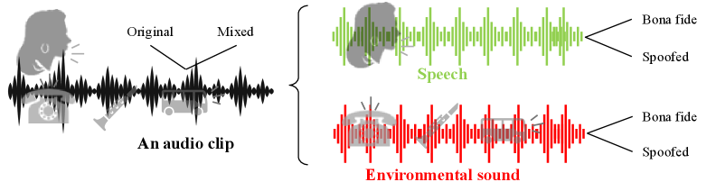
*Figure 1:ESDD2 Task illustration. An audio clip is first classified as mixed or original; for mixed audio, speech and environmental sound components are separately evaluated for genuineness, resulting in five target classes.*

---
**Usage Info**: 2447 tokens used.
**Generated at**: 2026-02-24 19:24:47

---

# 📚 TagSpeech: End-to-End Multi-Speaker ASR and Diarization with Fine-Grained Temporal Grounding

🚀 URL: https://arxiv.org/html/2601.06896

## 🌏 Abstract (원문)
Human communication frequently involves multiple speakers, overlapping speech, and rapid turn-taking. Consequently, applications like meeting transcription require not only recognizing what was said, but also identifying "who spoke what and when." This motivates a unified framework for joint automatic speech recognition (ASR) and speaker diarization with high temporal precision, as illustrated in Figure 1. With the emergence of Large-Audio Language Models (LALMs), LLM-based architectures have become a natural choice for unified multi-speaker modeling, enabling contextual reasoning in challenging conditions and speaker-attributed generation within a single decoding process. However, a critical ambiguity persists in recent literature regarding what constitutes “joint ASR and diarization.” As summarized in Table 1, several methods, including SpeakerLM (Yin et al., 2025) and JEDIS-LLM (Shi et al., 2025), term their task "diarization" yet primarily address who said what, omitting explicit start and end timestamps. Although effective for speaker-attributed ASR, such omission prevents evaluation via standard metrics like Diarization Error Rate (DER; Anguera et al., 2012), thereby limiting their applicability to tasks requiring precise speech–text alignment. In contrast, we define the task as the explicit prediction of transcription (what), speaker label (who), and precise timestamps (when), enabling a truly unified formulation of multi-speaker ASR and diarization. While recent advances in LLMs and the emergence of LALMs have made unified decoding with strong semantic understanding increasingly feasible (Comanici et al., 2025; Xu et al., 2025a,b), extending these models to multi-talker speech understanding with explicit timestamp prediction remains an open challenge. In particular, existing approaches often fail to produce accurate transcriptions or localize time boundaries in overlapping regions. We attribute this failure to two fundamental misalignments: (1) there is a granularity mismatch between continuous, millisecond-resolution speech signals and discrete, high-level semantic tokens, making fine-grained temporal inference unreliable without explicit cues; and (2) semantic continuity and speaker changes are often misaligned; encoding them jointly entangles representations and makes it difficult to separate "who spoke" from "what was said." Motivated by these gaps, we design a framework that jointly addresses semantic modeling, speaker attribution, and fine-grained temporal grounding. We summarize our contributions as follows: We present a fully end-to-end model, directly mapping waveforms to structured, speaker-attributed outputs with precise timestamps. We introduce a lightweight interleaved numeric anchor mechanism that enables fine-grained temporal grounding and aligns the decoupled semantic and speaker streams, without modifying the LLM architecture. Experimental results demonstrate that our model achieves substantial reductions in diarization error rate over strong end-to-end baselines, including Gemini-2.0, Qwen-2.5-Omni-7B, and Qwen-3.0-Omni-30B, with approximately 28% relative improvement on AMI and 36% on AliMeeting, while maintaining robust recognition performance. Notably, these gains are achieved under a parameter-efficient training paradigm that fine-tuned the semantic encoder with SOT, keeps the LLM backbone frozen, and trains only lightweight projectors, resulting in strong performance with low computational cost.
## 🌏 Abstract (번역)
인간의 의사소통은 종종 여러 화자, 겹치는 음성, 빠른 차례 전환을 포함합니다. 결과적으로 회의 전사와 같은 애플리케이션은 무엇이 말해졌는지 인식하는 것뿐만 아니라 "누가 무엇을 언제 말했는지"를 식별하는 것을 요구합니다. 이는 그림 1에 예시된 것처럼 높은 시간적 정밀도를 가진 통합 자동 음성 인식(ASR) 및 화자 분할(diarization)을 위한 통합 프레임워크를 동기 부여합니다. 대규모 오디오 언어 모델(LALM)의 등장으로 LLM 기반 아키텍처는 통합된 다중 화자 모델링을 위한 자연스러운 선택이 되었으며, 까다로운 조건에서의 문맥 추론과 단일 디코딩 프로세스 내에서의 화자 속성 생성을 가능하게 했습니다. 그러나 최근 문헌에서는 "통합 ASR 및 화자 분할"이 무엇을 의미하는지에 대해 중요한 모호성이 지속되고 있습니다. 표 1에 요약된 바와 같이, SpeakerLM 및 JEDIS-LLM을 포함한 여러 방법은 그들의 작업을 "화자 분할"이라고 부르지만 주로 누가 무엇을 말했는지를 다루며 명시적인 시작 및 종료 타임스탬프를 생략합니다. 이러한 생략은 화자 속성 ASR에는 효과적이지만, DER(Diarization Error Rate)과 같은 표준 지표를 통한 평가를 방해하여 정밀한 음성-텍스트 정렬이 필요한 작업에 대한 적용 가능성을 제한합니다. 대조적으로, 본 연구에서는 이 작업을 전사(무엇을), 화자 레이블(누가), 그리고 정밀한 타임스탬프(언제)의 명시적 예측으로 정의하여 다중 화자 ASR 및 화자 분할의 진정한 통합 정식화를 가능하게 합니다. 최근 LLM의 발전과 LALM의 등장은 강력한 의미론적 이해를 갖춘 통합 디코딩을 점점 더 가능하게 만들었지만, 이러한 모델을 명시적인 타임스탬프 예측을 포함한 다중 화자 음성 이해로 확장하는 것은 여전히 해결해야 할 과제로 남아 있습니다. 특히 기존 접근 방식은 겹치는 영역에서 정확한 전사를 생성하거나 시간 경계를 국지화하는 데 종종 실패합니다. 본 연구는 이러한 실패의 원인을 두 가지 근본적인 불일치로 돌립니다: (1) 연속적인 밀리초 해상도 음성 신호와 이산적인 고수준 의미론적 토큰 사이의 입도(granularity) 불일치로 인해 명시적인 단서 없이는 미세한 시간적 추론이 신뢰할 수 없게 되며, (2) 의미론적 연속성과 화자 변화가 종종 일치하지 않아 이를 공동으로 인코딩하면 표현이 얽히고 "누가 말했는지"와 "무엇이 말해졌는지"를 분리하기 어렵게 만듭니다. 이러한 격차에 동기 부여를 받아, 본 연구는 의미론적 모델링, 화자 속성 부여, 미세한 시간적 그라운딩을 공동으로 다루는 프레임워크를 설계합니다. 본 연구의 기여는 다음과 같습니다: 파형을 정밀한 타임스탬프가 포함된 구조화된 화자 속성 출력으로 직접 매핑하는 완전한 엔드투엔드 모델을 제시합니다. LLM 아키텍처를 수정하지 않고도 미세한 시간적 그라운딩을 가능하게 하고 분리된 의미론적 및 화자 스트림을 정렬하는 경량의 인터리브 숫자 앵커 메커니즘을 도입합니다. 실험 결과, 본 모델은 Gemini-2.0, Qwen-2.5-Omni-7B, Qwen-3.0-Omni-30B를 포함한 강력한 엔드투엔드 베이스라인 대비 화자 분할 오류율(DER)을 크게 감소시켰으며, AMI에서 약 28%, AliMeeting에서 36%의 상대적 개선을 달성하는 동시에 견고한 인식 성능을 유지했습니다. 특히, 이러한 이득은 SOT로 의미론적 인코더를 미세 조정하고 LLM 백본을 고정하며 경량 프로젝터만 학습시키는 매개변수 효율적인 학습 패러다임 하에서 달성되어 낮은 계산 비용으로 강력한 성능을 제공합니다.

## 🔍 Methods & Results
- TagSpeech 프레임워크는 원시 파형을 의미론적 텍스트, 화자 식별자, 타임스탬프 마커를 포함한 구조화된 시퀀스로 매핑함.
- Dual-Stream Encoder를 통해 의미론적 내용(Semantic Encoder)과 화자 정체성(Speaker Encoder)을 명시적으로 분리하여 추출함.
- 의미론적 인코더는 겹치는 음성을 처리하기 위해 Serialized Output Training(SOT)을 사용하여 미세 조정되었으며, 화자 인코더는 Auden-Voice를 사용함.
- Interleaved Numeric Time Anchor 메커니즘을 도입하여 고정된 간격으로 숫자 타임스탬프 토큰을 주입함으로써 미세한 시간적 정렬을 강화함.
- XML 스타일의 태그(<text>, <spk>)를 사용하여 LLM의 기존 구조 파싱 능력을 활용하고 어휘 확장 없이 입력과 출력의 일관성을 유지함.
- LLM 백본(Qwen-2.5-Instruct-7B)과 인코더를 고정한 채 경량 프로젝터만 학습시키는 매개변수 효율적 학습 방식을 채택함.
- 실험 결과 AMI 데이터셋에서 28%, AliMeeting 데이터셋에서 36%의 상대적 DER 감소를 기록하며 기존 대형 모델(Gemini-2.0 등)보다 우수한 성능을 보임.

## 🖼 Figures
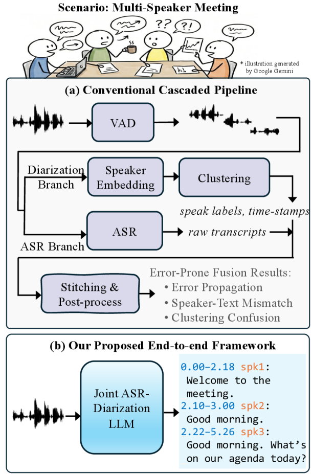
*Figure 1:Comparison between a conventional cascaded pipeline (top) and our end-to-end framework TagSpeech (bottom) for multi-speaker speech processing.*

*Figure 2:Overview of TagSpeech, an end-to-end multi-speaker ASR and diarization framework. Dual encoders are used, where the semantic encoder is fine-tuned via serialized output training (SOT, up-left). Speech features are interleaved with time anchors for time-awareness and dual-stream synchronization (red dashed lines). The framework generates a structured output, explicitly addressing who spoke what and when.*

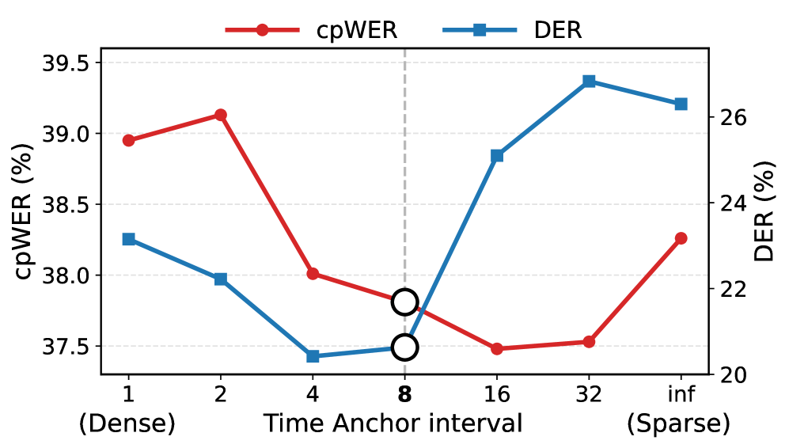
*Figure 3:Impact of time anchor granularity reveals a trade-off between temporal precision and semantic coherence. Inserting at every 8 frames balances both cpWER and DER.*

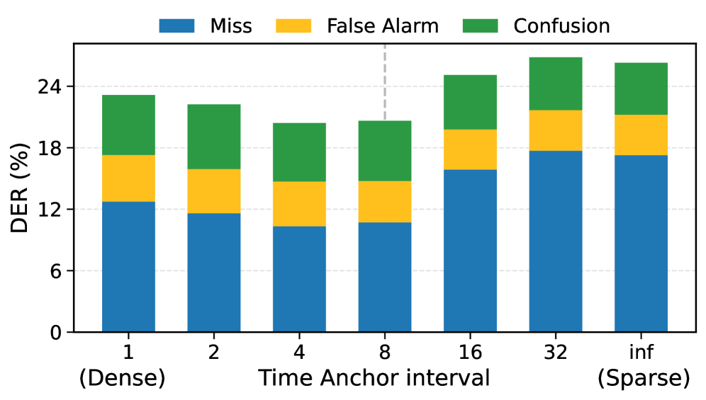
*Figure 4:The miss rate accounts for the dominant variation in DER across anchor intervals, indicating that time anchors improve diarization primarily by reducing missed speaker activity.*

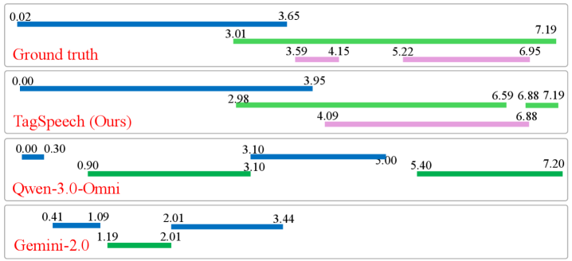
*Figure 5:Visualization of diarization timelines on a challenging sample with dense overlap. Baselines avoid overlapping timestamps, revealing a linearity bias.*

---
**Usage Info**: 6409 tokens used.
**Generated at**: 2026-02-24 19:25:38

---

