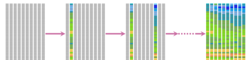
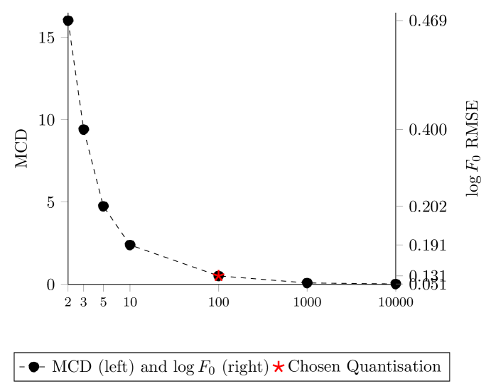
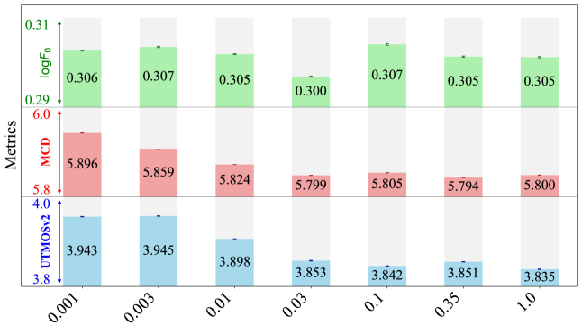
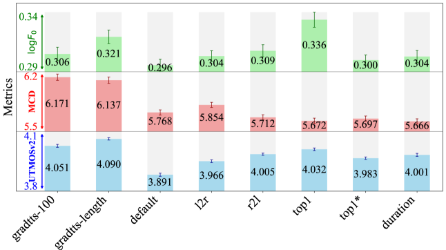
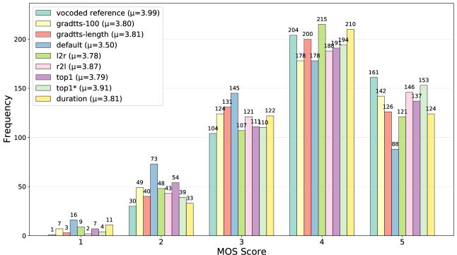
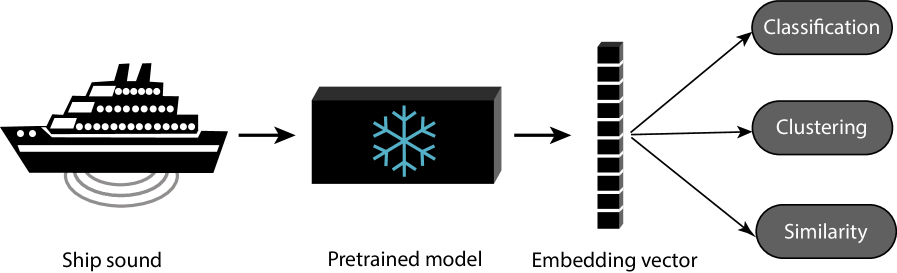
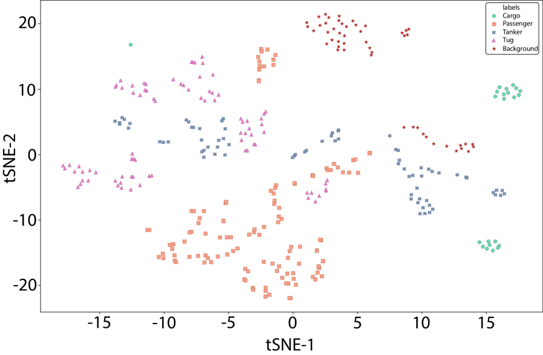
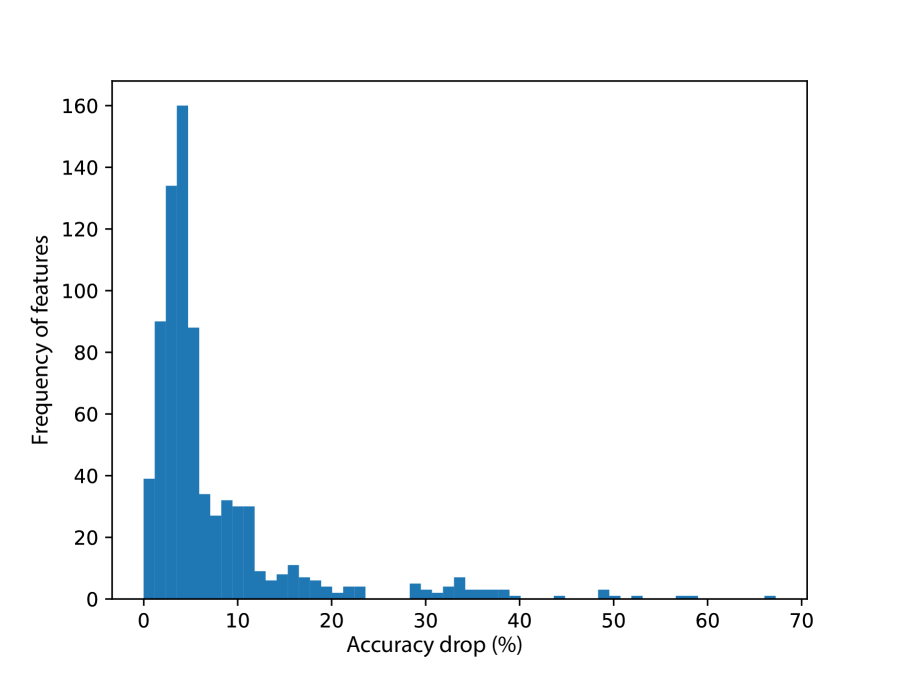
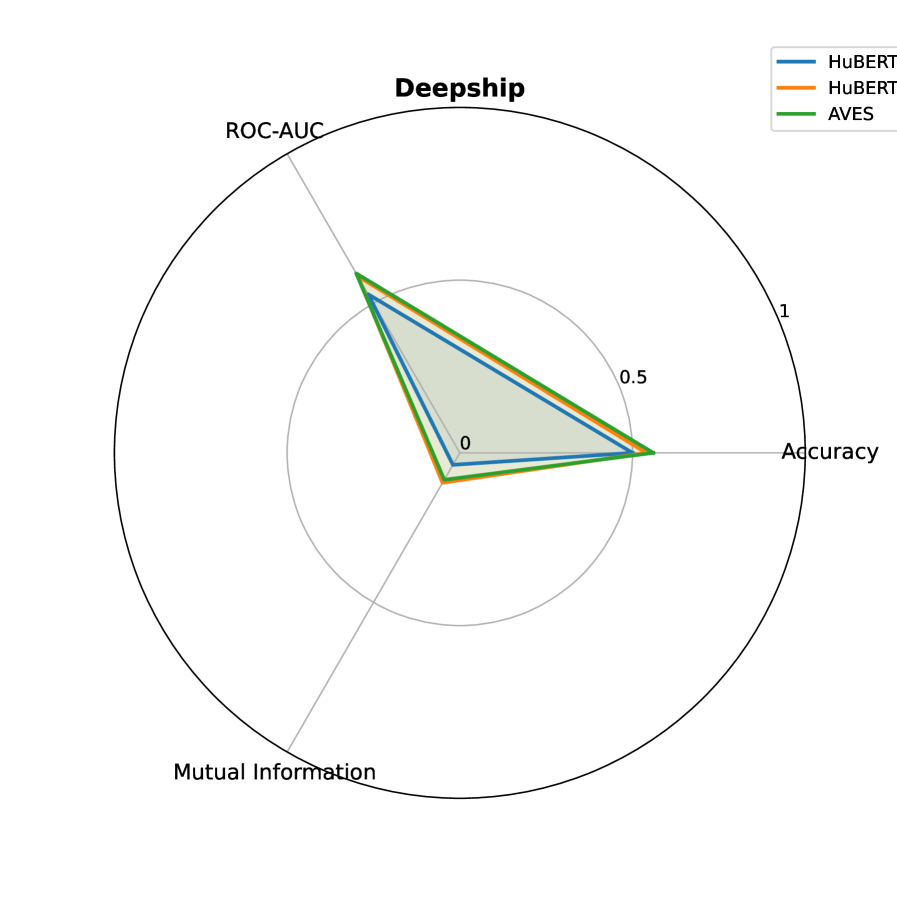
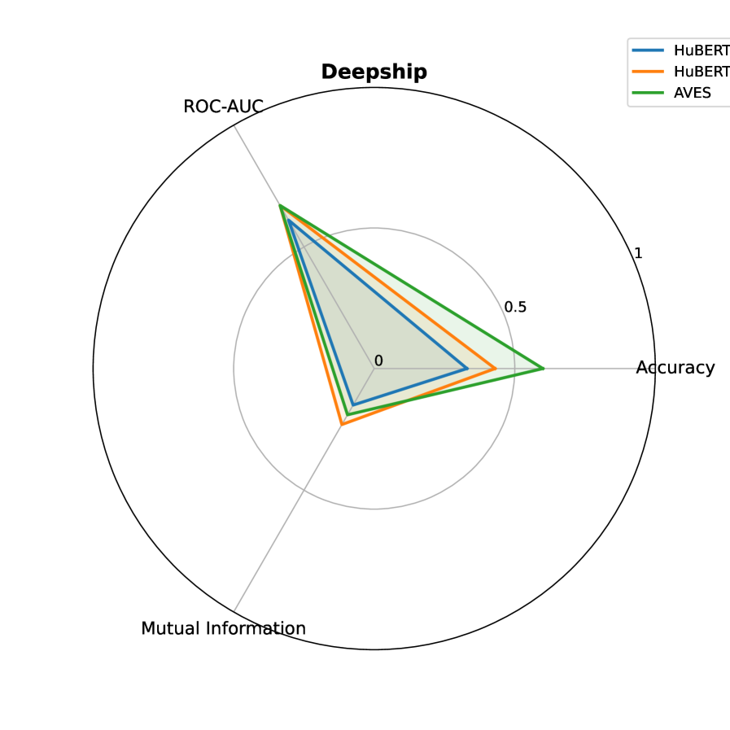

# 🚩 (2026-01-14) Scholar Inbox 추천 논문 

# 📚 DECODING ORDER MATTERS IN AUTOREGRESSIVE SPEECH SYNTHESIS

🚀 URL: https://arxiv.org/html/2601.08450

## 🌏 Abstract (원문)
Autoregressive generation has long been central to speech synthesis, from earlier systems such as Wavenet and Tacotron 2 to more recent approaches that model discretised acoustic features with a language model. In these systems, speech is generated sequentially, with each frame or sample conditioned on previously produced outputs, hardly ever, if ever, not in a left-to-right order that mirrors the flow of natural speech. From a modelling perspective, however, left-to-right generation is not necessarily optimal. Speech exhibits dependencies that extend beyond a simple causal chain: pauses and emphasis often depend on global context, while coarticulation reflects interactions between both past and future phones. Even when the model is conditioned on the full utterance, for example through the phone sequence, the decoding order can influence how effectively these dependencies are captured. Exploring alternatives to left-to-right generation is therefore important not only for assessing the widely adopted and unchallenged convention, but also for improving synthesis quality. Viewing decoding order as a modelling choice, consider an autoregressive approximation to the ground-truth distribution for a length-T sequence. Let S_T denote the set of all permutations of {1, ..., T}. For any σ in S_T, the chain rule yields a factorisation where the position in the sequence could be any value in range [1, T]. Because different orders expose different contexts, the resulting factorisation can vary in how well it approximates the distribution. Moreover, decoding order can be adaptive, with σ chosen dynamically. The masked diffusion model (MDM) is an interesting, recently proposed, framework that supports arbitrary decoding orders. During training, the model predicts randomly masked tokens from the visible ones, ensuring that no particular order of information revealing is favoured. At inference, we can choose any generation order and unmask each position conditioned on what has already been revealed. This paper investigates how decoding order shapes autoregressive speech synthesis. We show that randomness in order affects speech quality, fixed left-to-right decoding is suboptimal, and adaptive strategies perform better. Building on this, we propose a duration-guided decoding scheme. We further extend decoding from single to multiple frames, and establish the decoding schedule as a critical modelling choice.
## 🌏 Abstract (번역)
자기회귀 생성은 Wavenet 및 Tacotron 2와 같은 초기 시스템부터 언어 모델을 사용하여 이산화된 음향 특징을 모델링하는 최근 접근 방식에 이르기까지 오랫동안 음성 합성의 중심이 되어 왔습니다. 이러한 시스템에서 음성은 순차적으로 생성되며, 각 프레임이나 샘플은 이전에 생성된 출력에 조건화되는데, 이는 자연스러운 음성의 흐름을 반영하는 왼쪽에서 오른쪽으로의 순서를 거의 벗어나지 않습니다. 그러나 모델링 관점에서 볼 때, 왼쪽에서 오른쪽으로의 생성 방식이 반드시 최적인 것은 아닙니다. 음성은 단순한 인과 관계를 넘어서는 의존성을 보여줍니다. 일시 정지와 강조는 종종 전역적 문맥에 의존하며, 조음 결합은 과거와 미래의 음소 간의 상호작용을 반영합니다. 모델이 음소 시퀀스 등을 통해 전체 발화에 조건화되어 있더라도, 디코딩 순서는 이러한 의존성을 얼마나 효과적으로 포착하는지에 영향을 미칠 수 있습니다. 따라서 왼쪽에서 오른쪽으로의 생성에 대한 대안을 탐구하는 것은 널리 채택되고 도전받지 않은 관행을 평가하는 것뿐만 아니라 합성 품질을 향상시키는 데에도 중요합니다. 디코딩 순서를 모델링 선택으로 간주하여, 길이가 T인 시퀀스에 대한 실측 분포에 대한 자기회귀 근사를 고려해 보십시오. S_T를 {1, ..., T}의 모든 순열 집합이라고 할 때, 임의의 σ ∈ S_T에 대해 연쇄 법칙은 시퀀스 내의 위치가 [1, T] 범위의 어떤 값도 될 수 있는 인수분해를 생성합니다. 서로 다른 순서는 서로 다른 문맥을 노출시키기 때문에, 결과적인 인수분해는 분포를 얼마나 잘 근사하는지에 따라 달라질 수 있습니다. 또한, 디코딩 순서는 동적으로 선택되는 적응형일 수 있습니다. 마스크드 확산 모델(MDM)은 임의의 디코딩 순서를 지원하는 흥미로운 최근 제안된 프레임워크입니다. 훈련 중에 모델은 가시적인 토큰으로부터 무작위로 마스킹된 토큰을 예측하여 정보 공개의 특정 순서가 선호되지 않도록 보장합니다. 추론 시에는 임의의 생성 순서를 선택하고 이미 공개된 내용에 조건화하여 각 위치의 마스크를 해제할 수 있습니다. 본 논문은 디코딩 순서가 자기회귀 음성 합성을 어떻게 형성하는지 조사합니다. 우리는 순서의 무작위성이 음성 품질에 영향을 미치고, 고정된 왼쪽에서 오른쪽으로의 디코딩은 차선책이며, 적응형 전략이 더 나은 성능을 보임을 보여줍니다. 이를 바탕으로 우리는 지속 시간 가이드 디코딩 스킴을 제안합니다. 나아가 디코딩을 단일 프레임에서 다중 프레임으로 확장하고, 디코딩 스케줄을 중요한 모델링 선택으로 확립합니다.

## 🔍 Methods & Results
- 임의의 디코딩 순서와 업데이트 크기(k)를 허용하는 마스크드 확산 모델(MDM) 프레임워크를 사용하여 디코딩 순서의 영향을 분석함
- 선형 양자화기를 사용하여 멜-스펙트로그램을 이산적 음향 표현으로 변환하고, 순서 불가지론적(order-agnostic) 목적 함수를 통해 모델을 훈련함
- 고정된 좌우(l2r) 순서와 무작위 순서 사이의 무작위성 정도를 조절하며 음성 품질에 미치는 영향을 조사함
- 모델의 예측 확률을 기반으로 신뢰도가 높은 위치를 우선적으로 선택하는 적응형 디코딩(Top-K) 전략을 구현함
- 인접한 프레임이 함께 디코딩되는 경향을 반영하여 지속 시간 예측기를 활용한 세그먼트 단위 디코딩 스킴을 제안함
- 실험 결과, 고정된 좌우 디코딩 방식은 차선책이며 적응형 전략이 더 우수한 성능을 보임을 입증함
- 디코딩 순서와 업데이트 크기를 포함한 디코딩 스케줄이 음성 합성 품질을 결정하는 핵심적인 모델링 요소임을 확립함

## 🖼 Figures

*Fig. 1:Intermediate mel-spectrograms shown from left to right as generation progresses in a random order. The number beneath each frame indicates its order in generation and the rightmost frames are the final output.*

*Fig. 2:Evaluation on quantisation levels*

*Fig. 3:Evaluation on orders with controlled randomness*

*Fig. 4:Evaluation results for single-frame decoding strategies*

*Fig. 5:Breakdown of MOS scores*

*Fig. 6:Evaluation results for Top
𝐾
 decoding*

---
**Usage Info**: 5828 tokens used.
**Generated at**: 2026-02-24 19:26:24

---

# 📚 LJ-Spoof: A Generatively Varied Corpus for Audio Anti-Spoofing and Synthesis Source Tracing

🚀 URL: https://arxiv.org/html/2601.07958

## 🌏 Abstract (원문)
LLM-era speech synthesis has reached a level of naturalness that often fools human listeners. Advances in self-supervised learning and discrete speech tokenization, together with powerful acoustic encoders that capture nonsemantic cues (speaker identity, style, prosody, emotion), have further narrowed the gap between synthetic and bona fide speech. While these gains benefit voice applications, they also lower the barrier to misuse[11]: open-source systems can clone a voice from a 5–10 s reference and generate convincing speech within minutes, enabling fraud and opinion manipulation at scale. Beyond broad, cross-speaker detection, protectingindividualvoices is crucial. For everyday users, cloned voices can be weaponized against family or coworkers; for public figures, they can shape narratives and sway public opinion. This motivatesspeaker-specificanti-spoofing as a complementary and urgently needed research direction. Surveys (e.g.,[15]) summarize the neural TTS landscape, and recent work on controllable TTS[17]shows that modern generators can produce numerous variants from the same prompt by adjusting parameters (e.g., temperature, solver steps, duration/speed) and configurations. A central question follows:Are current anti-spoofing systems robust to these generative variations? Can they distinguish semantically/prosodically manipulated fakes from neurally post-processed or resynthesized bona fides, and from untouched bona fides?Addressing these questions requires a careful look at existing anti-spoofing datasets the starting point for model development and evaluation and motivates the analysis and dataset design presented in this work.
## 🌏 Abstract (번역)
LLM 시대의 음성 합성은 종종 인간 청취자를 속일 정도로 자연스러운 수준에 도달했습니다. 자기 지도 학습 및 이산 음성 토큰화의 발전과 함께 화자 정체성, 스타일, 운율, 감정과 같은 비언어적 단서를 포착하는 강력한 음향 인코더는 합성 음성과 실제 음성 사이의 간극을 더욱 좁혔습니다. 이러한 발전은 음성 애플리케이션에 이점을 제공하지만, 오용의 장벽을 낮추기도 합니다. 오픈 소스 시스템은 5~10초의 참조 음성만으로 목소리를 복제하고 몇 분 안에 설득력 있는 음성을 생성하여 대규모 사기 및 여론 조작을 가능하게 합니다. 광범위한 교차 화자 탐지를 넘어 개별 목소리를 보호하는 것이 매우 중요합니다. 일반 사용자에게 복제된 목소리는 가족이나 동료를 공격하는 무기가 될 수 있으며, 공인에게는 서사를 형성하고 여론을 흔드는 수단이 될 수 있습니다. 이는 보완적이고 시급히 필요한 연구 방향으로서 화자 특정 안티 스푸핑(speaker-specific anti-spoofing)의 동기가 됩니다. 기존 연구들은 신경망 TTS 환경을 요약하고 있으며, 최근의 제어 가능한 TTS 연구는 현대의 생성기가 온도, 솔버 단계, 지속 시간/속도 등의 매개변수와 구성을 조정하여 동일한 프롬프트에서 수많은 변형을 생성할 수 있음을 보여줍니다. 이에 따라 현재의 안티 스푸핑 시스템이 이러한 생성적 변동에 대해 강건한지, 그리고 의미적/운율적으로 조작된 가짜 음성을 신경망으로 후처리되거나 재합성된 실제 음성 및 원본 실제 음성과 구별할 수 있는지에 대한 핵심적인 질문이 제기됩니다. 이러한 질문을 해결하기 위해서는 모델 개발 및 평가의 기초가 되는 기존 안티 스푸핑 데이터셋을 면밀히 검토해야 하며, 이는 본 연구에서 제시하는 분석 및 데이터셋 설계의 근거가 됩니다.

## 🔍 Methods & Results
- LLM 기반 음성 합성 기술의 발전에 따른 보안 위협 및 음성 복제 오용 가능성 분석
- 개별 화자 보호를 위한 화자 특정 안티 스푸핑(Speaker-specific anti-spoofing) 연구의 필요성 제기
- 온도, 솔버 단계, 속도 등 생성 매개변수 변동에 대한 안티 스푸핑 시스템의 강건성 평가 필요성 강조
- 의미적/운율적 조작 음성과 재합성된 실제 음성 간의 식별 가능성 검토
- 기존 안티 스푸핑 데이터셋 분석을 통한 새로운 데이터셋 설계 및 평가 체계 제안

## 🖼 Figures

*Fig. 1:Dataset Generation Workflow for Matcha-TTS. A mel-spectrogram 
𝑆
 is synthesized from text 
𝑇
 using default generative parameters (sampling temperature 
𝜏
=
0.5
, peak rate 
𝑅
=
1.0
, ODE solver steps 
𝐷
=
10
). 
𝑆
 is then decoded by multiple vocoders (blue), including the default HiFiGAN (purple), to produce diverse waveform subsets. Finally, the default waveform undergoes post-processing via re-vocoding (yellow) and re-codec (blue).*

---
**Usage Info**: 4610 tokens used.
**Generated at**: 2026-02-24 19:26:58

---

# 📚 Decodable but not structured: linear probing enables Underwater Acoustic Target Recognition with pretrained audio embeddings

🚀 URL: https://arxiv.org/html/2601.08358

## 🌏 Abstract (원문)
The increasing levels of anthropogenic noise generated by ships pose a threat to the sustainability of marine ecosystems[53,6]. The low-frequency sounds produced by the engines, propellers, and hull vibrations of ships[22]interfere with the natural acoustic environment of the oceans, disrupting vital behaviors such as communication between marine species[53]. This makes monitoring of ship sounds crucial to better understand and mitigate their ecological impact[22]. For this, Passive Acoustic Monitoring (PAM) systems are deployed to study the underwater soundscape. PAM systems enable continuous, non-invasive observation of ocean environments by recording ambient sounds through hydrophones. Since PAM systems do not emit an acoustical signal but only listen, their monitoring does not disturb the marine ecosystem. This makes PAM particularly suitable for long-term ecological studies and for detecting anthropogenic noise in various habitats. Although PAM supports research on marine mammal detection[5], fish biodiversity[31], and even climate change[1], this study focuses onShip Radiation Noise(SRN). Each individual ship has its own unique sound profile, which can be used to identify its type and even the individual ship[22]. This process is referred to asUnderwater Acoustic Target Recognition(UATR). Manual analysis of these recordings is time-consuming and labor-intensive. Given that PAM systems often produce years of unlabeled continuous recordings, the resulting data volume makes manual annotation and analysis impractical. This creates the need for the automation of this process. To this end, a variety of machine learning (ML) methods have been suggested to automatically monitor ship sounds[22]. Most of these studies focus on supervised learning, which limits their use due to the scarcity of labeled data. The labeled datasets span a small region of the ocean[42,24], which limits the environmental diversity within the recordings. In addition, due to the small size of the dataset, it is not feasible to train large ML models. Therefore, these methods may not be generalizable to newly seen ships or other ocean environments[23]. To cope with the limited amount of labeled data,Transfer Learning(TL) has emerged as a promising approach, as demonstrated in fields such as computer vision[27,33], general audio processing[46], and bioacoustics[12,17]. In TL, the backbone of the model is first pretrained using a large dataset of a related domain. By doing so, it has learned some general features that could be generalizable to other domains. Next, the pretrained model can be repurposed as a feature extractor to extract information from another dataset. These features can then be applied to perform a new task, where only a small classifier needs to be trained instead of the whole model[17]. This approach reduces the number of trainable parameters and, therefore, a small labeled dataset is sufficient, eliminating the need for a large qualitative labeled dataset[49]. However, the success of TL depends on the choice of the backbone of the pretrained model[44]. Numerous pretrained models based on large-scale audio data have recently been proposed[57], and several studies have shown their effectiveness in various downstream tasks[47,41]. A common approach involves freezing the pretrained model weights and using the resulting embedding vectors as input features for a simple classifier[39,26]. To the best of our knowledge, no comprehensive study has examined the transferability of these pretrained audio models to UATR. Motivated by this, in this work, a range of pretrained audio models from various audio domains are systematically evaluated to assess their generalizability to UATR. The performance of the models is evaluated using three complementary methods in two benchmark datasets: (1) ship-type classification through linear probing, (2) clustering-based embedding analysis, and (3) similarity-based embedding evaluation. Together, these methods show classification performance and the representational quality of the embedding vectors generated. An illustration of this is given in Figure1. In summary, the contributions of this study are as follows: A systematic review of a number of pretrained models in various audio domains; An extensive empirical study on the transfer of these models to automatic UATR; A combination of evaluation metrics to evaluate and compare the performance of pretrained audio models for UATR.
## 🌏 Abstract (번역)
선박에서 발생하는 인위적 소음의 증가는 해양 생태계의 지속 가능성에 위협이 됩니다. 선박의 엔진, 프로펠러 및 선체 진동에서 발생하는 저주파 소음은 바다의 자연적인 음향 환경을 방해하여 해양 생물의 통신과 같은 필수적인 행동을 교란합니다. 따라서 해양 생태계에 미치는 영향을 더 잘 이해하고 완화하기 위해 선박 소음을 모니터링하는 것이 중요합니다. 이를 위해 수중 음향 환경을 연구하기 위해 수동 음향 모니터링(PAM) 시스템이 배치됩니다. PAM 시스템은 하이드로폰을 통해 주변 소음을 기록함으로써 해양 환경을 지속적이고 비침습적으로 관찰할 수 있게 해줍니다. PAM 시스템은 음향 신호를 방출하지 않고 듣기만 하기 때문에 모니터링 과정에서 해양 생태계를 방해하지 않습니다. 이는 PAM을 장기적인 생태 연구 및 다양한 서식지에서의 인위적 소음 탐지에 특히 적합하게 만듭니다. PAM은 해양 포유류 탐지, 어류 생물 다양성, 심지어 기후 변화 연구를 지원하지만, 본 연구는 선박 방사 소음(SRN)에 초점을 맞춥니다. 각 선박은 고유한 소리 프로필을 가지고 있으며, 이를 통해 선박의 유형이나 개별 선박을 식별할 수 있습니다. 이 과정을 수중 음향 표적 인식(UATR)이라고 합니다. 이러한 기록을 수동으로 분석하는 것은 시간과 노동력이 많이 소요됩니다. PAM 시스템이 종종 수년간의 레이블이 없는 연속 기록을 생성한다는 점을 고려할 때, 데이터의 양으로 인해 수동 주석 및 분석은 비실용적입니다. 이로 인해 이 과정의 자동화가 필요해졌습니다. 이를 위해 선박 소음을 자동으로 모니터링하기 위한 다양한 머신러닝(ML) 방법이 제안되었습니다. 대부분의 연구는 지도 학습에 초점을 맞추고 있으나, 레이블이 지정된 데이터의 부족으로 인해 사용이 제한됩니다. 레이블이 지정된 데이터셋은 좁은 해역에 국한되어 기록 내 환경적 다양성이 제한적입니다. 또한 데이터셋의 크기가 작아 대규모 ML 모델을 훈련하는 것이 불가능합니다. 따라서 이러한 방법은 새로운 선박이나 다른 해양 환경에 일반화되지 않을 수 있습니다. 제한된 레이블 데이터 문제를 해결하기 위해 컴퓨터 비전, 일반 오디오 처리, 생물 음향학 분야에서 입증된 전이 학습(TL)이 유망한 접근 방식으로 떠올랐습니다. 전이 학습에서는 모델의 백본을 먼저 관련 도메인의 대규모 데이터셋을 사용하여 사전 훈련합니다. 이를 통해 다른 도메인으로 일반화될 수 있는 일반적인 특징을 학습합니다. 다음으로, 사전 훈련된 모델을 다른 데이터셋에서 정보를 추출하기 위한 특징 추출기로 재사용할 수 있습니다. 이러한 특징은 전체 모델 대신 작은 분류기만 훈련하면 되는 새로운 작업에 적용될 수 있습니다. 이 접근 방식은 훈련 가능한 파라미터 수를 줄여주므로 작은 레이블 데이터셋으로도 충분하며, 대규모의 질 좋은 레이블 데이터셋의 필요성을 제거합니다. 그러나 전이 학습의 성공 여부는 사전 훈련된 모델의 백본 선택에 달려 있습니다. 최근 대규모 오디오 데이터를 기반으로 한 수많은 사전 훈련 모델이 제안되었으며, 여러 연구에서 다양한 다운스트림 작업에 대한 효과가 입증되었습니다. 일반적인 접근 방식은 사전 훈련된 모델의 가중치를 고정하고 결과 임베딩 벡터를 단순 분류기의 입력 특징으로 사용하는 것입니다. 우리가 아는 한, 이러한 사전 훈련된 오디오 모델의 UATR로의 전이 가능성을 조사한 포괄적인 연구는 없었습니다. 이에 영감을 받아 본 연구에서는 다양한 오디오 도메인의 사전 훈련된 오디오 모델 범위를 체계적으로 평가하여 UATR에 대한 일반화 가능성을 평가합니다. 모델의 성능은 두 개의 벤치마크 데이터셋에서 세 가지 상호 보완적인 방법으로 평가됩니다: (1) 선형 프로빙을 통한 선박 유형 분류, (2) 클러스터링 기반 임베딩 분석, (3) 유사성 기반 임베딩 평가. 이러한 방법들은 분류 성능과 생성된 임베딩 벡터의 표현 품질을 함께 보여줍니다. 요약하자면, 본 연구의 기여는 다음과 같습니다: 다양한 오디오 도메인의 사전 훈련 모델에 대한 체계적 검토, 이러한 모델의 자동 UATR 전이에 대한 광범위한 실증 연구, UATR을 위한 사전 훈련 오디오 모델의 성능을 평가하고 비교하기 위한 평가 지표의 조합.

## 🔍 Methods & Results
- 일반 오디오(AudioMAE, BEATS), 음성(Wav2Vec 2.0, WavLM), 생물 음향학(BirdNet, AVES), 해양 생물 소음(Google Whale, SurfPerch) 등 4개 도메인의 사전 훈련 모델을 선정하여 UATR 전이 성능을 비교함.
- 평가 데이터셋으로 벤쿠버 인근에서 수집된 Deepship(4개 클래스)과 스페인 대서양 연안에서 수집된 ShipsEar(5개 클래스) 벤치마크를 사용함.
- 모델의 백본 가중치를 고정(Freezing)하고 추출된 임베딩을 선형 분류기에 입력하는 선형 프로빙(Linear Probing) 방식을 통해 분류 성능을 측정함.
- K-Means 클러스터링을 통한 정규화된 상호 정보량(NMI) 점수와 코사인 유사도 기반의 ROC-AUC 점수를 활용하여 임베딩 공간의 표현 품질을 비지도 방식으로 평가함.
- 다양한 오디오 도메인에서 사전 훈련된 모델들이 수중 음향 표적 인식 작업에서 유의미한 일반화 성능을 보임을 실증적으로 확인하고 평가 지표의 조합을 제안함.

## 🖼 Figures

*Figure 1:Illustration of the evaluation method for various pretrained audio models.*

*Figure 2:t-SNE plot of the embeddings generated by BEATS using the ShipsEar test set.*

*Figure 3:Histogram of the accuracy drop of removing each feature from the BEATS embeddings individually on the classification of ShipsEar.*

*(a)Performance on Deepship*

*(a)Performance on Deepship*

*(b)Performance on ShipsEar*

---
**Usage Info**: 8960 tokens used.
**Generated at**: 2026-02-24 19:27:39

---

