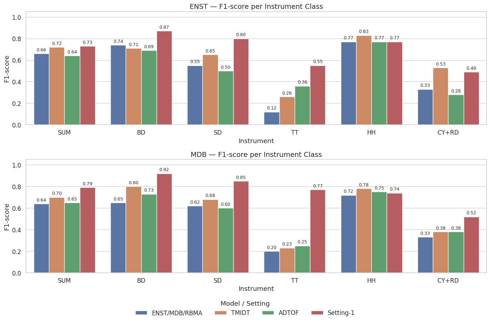
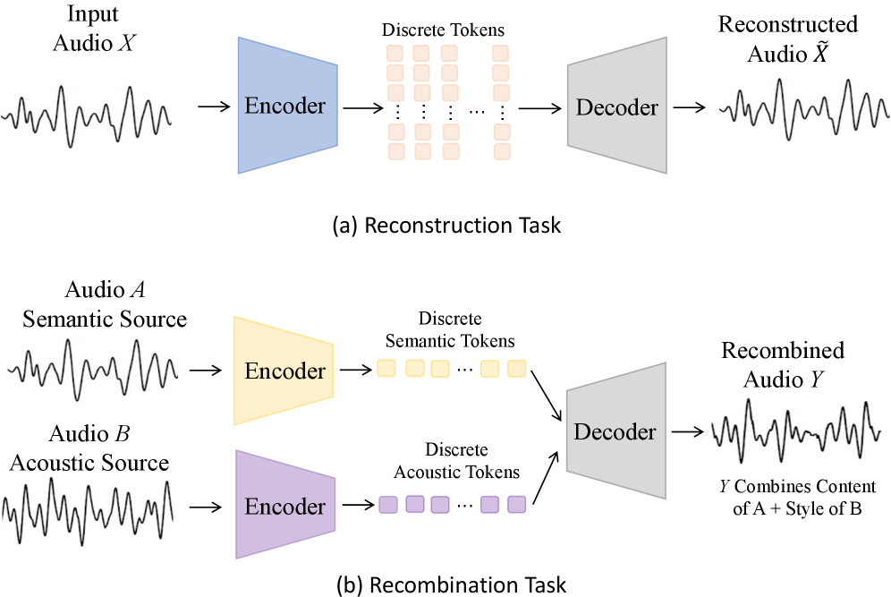
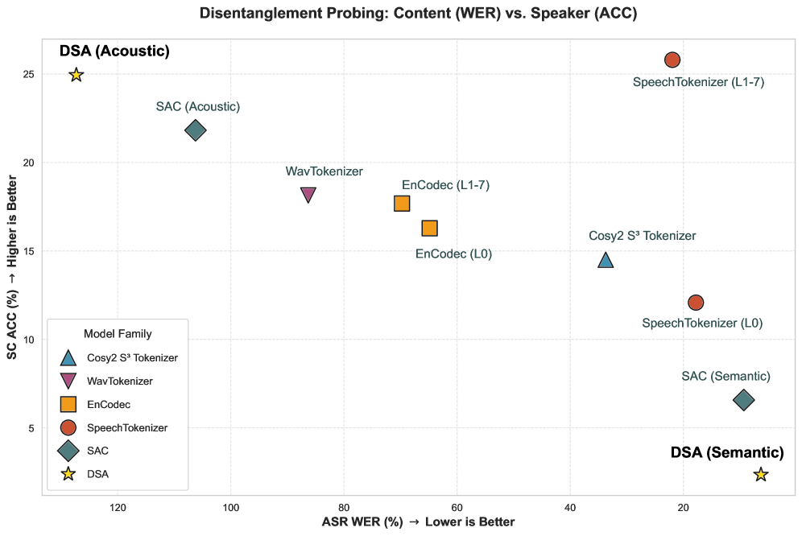
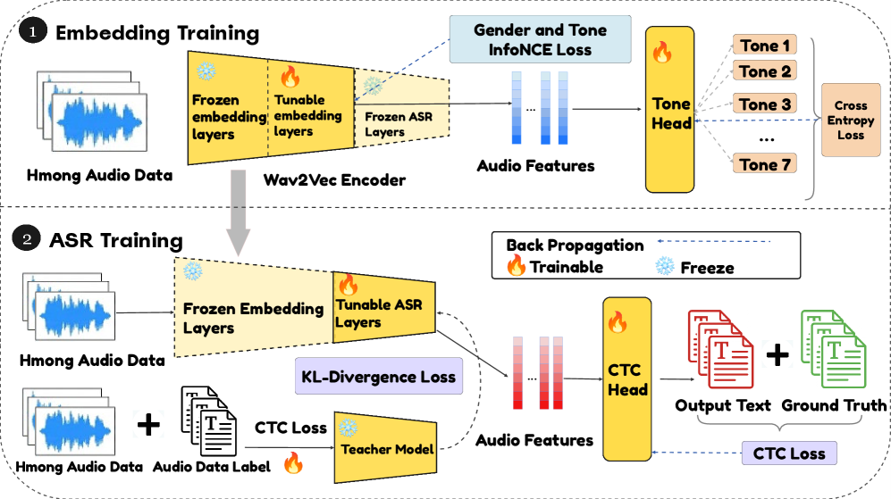
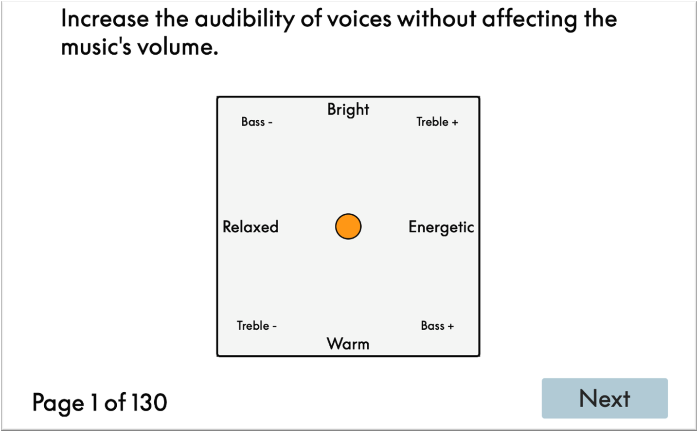
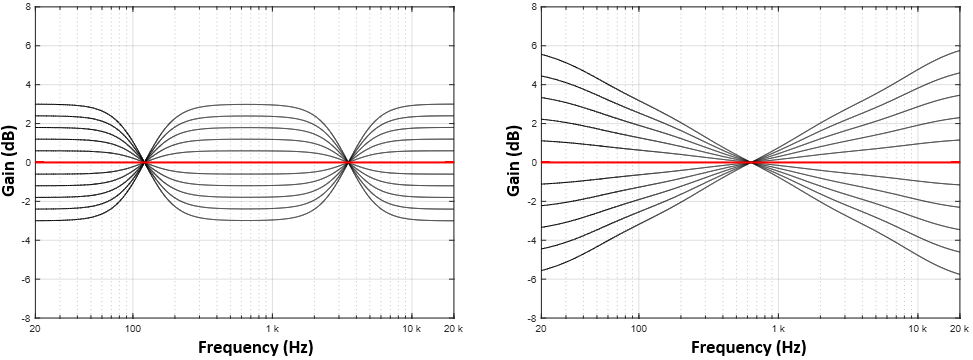
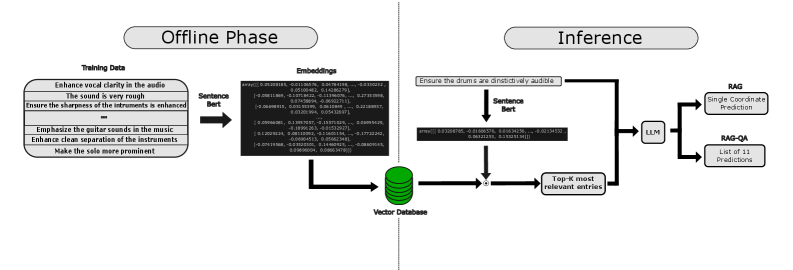

# 🚩 (2026-01-15) Scholar Inbox 추천 논문 

# 📚 Towards Realistic Synthetic Data for Automatic Drum Transcription

🚀 URL: https://arxiv.org/html/2601.09520

## 🌏 Abstract (원문)
Automatic Drum Transcription (ADT) is the task of generating a symbolic music transcription from an audio recording of a drum performance. The task can be specified for several scenarios, including drum-only recordings (DTD), drums with other percussion (DTP), and drums within full musical arrangements (DTM)[13]. Since the adoption of Deep Neural Networks for ADT, a significant challenge has been the scarcity of large-scale, paired audio-MIDI corpora required for supervised training. As MIDI-only datasets are far more abundant, synthetic data generation has been widely explored as a solution[12,7,2]. However, these synthetic approaches introduce a critical domain gap and effectively reframe the task as an out-of-distribution generalization problem. Indeed, previous works have shown that synthetic data is most effective when used in combination with real-world data, e.g. when pretrained models on synthetic datasets are subsequently finetuned on real-world distributions. This observation indicates that the distribution shift introduced by synthetic data is too large to rely solely on synthetic data generation during training. We hypothesize that this issue stems from inherent limitations of SoundFont-based synthesis, which tends to produce low-quality audio from MIDI representations. High-quality one-shot drum samples provide a more realistic and diverse sound source, and their use has been shown to be effective for training models for music transcription[9], but in the context of ADT their practical use is hindered by a lack of standardization. Publicly available one-shot libraries suffer from two main issues:(i)(i)ambiguous or incorrect labels for similar instruments (e.g., ride vs. crash cymbals), and(i​i)(ii)absence of a consistent naming convention, which must be inferred through further analysis of the spectral content, as proposed in[2]. In addition to the synthetic-to-real distribution gap, we highlight another limitation in the current state of the art of ADT systems from an architectural perspective. Sequence-to-sequence models have been shown to perform very well in Music Information Retrieval (MIR) tasks, such as music transcription[5,9,3]. However, these works report drum transcription results primarily for ablation purposes, with the evaluation of drum signals lying outside the main scope of the study, which is instead focused on the broader task of multi-instrument music transcription. Consequently, a systematic evaluation of this type of architecture when trained specifically for automatic drum transcription (ADT) tasks is still lacking. Motivated by this, we investigate an efficient synthetic data generation pipeline that aims to reduce the distributional gap between synthetic and real data by incorporating one-shot sample libraries, as proposed in[9,2]. We further validate our approach by training a sequence-to-sequence transformer specifically tailored for the ADT task. We summarize the contributions of this study as follows: We propose a scalable semi-supervised pipeline for creating a large, diverse, and standardised corpus of one-shot drum samples, starting from unstructured, publicly available one-shot libraries. We empirically validate our approach by training a model exclusively on synthetic data that outperforms previous methods on real drum signal distributions, as evaluated on the ENST and MDB datasets.
## 🌏 Abstract (번역)
자동 드럼 전사(ADT)는 드럼 연주 오디오 녹음으로부터 상징적인 음악 악보를 생성하는 작업입니다. 이 작업은 드럼 전용 녹음(DTD), 다른 타악기가 포함된 드럼(DTP), 전체 음악 편곡 내의 드럼(DTM)을 포함한 여러 시나리오에 대해 지정될 수 있습니다. ADT에 심층 신경망이 도입된 이후, 지도 학습에 필요한 대규모의 쌍을 이룬 오디오-MIDI 코퍼스의 부족이 중요한 과제가 되었습니다. MIDI 전용 데이터셋이 훨씬 더 풍부하기 때문에 합성 데이터 생성은 해결책으로서 널리 탐구되어 왔습니다. 그러나 이러한 합성 방식은 심각한 도메인 격차를 유발하며, 사실상 이 작업을 분포 외 일반화 문제로 재구성하게 됩니다. 실제로 이전 연구들은 합성 데이터가 실제 데이터와 결합되어 사용될 때, 예를 들어 합성 데이터셋으로 사전 학습된 모델을 이후 실제 분포에 맞춰 미세 조정할 때 가장 효과적임을 보여주었습니다. 이러한 관찰은 합성 데이터에 의해 도입된 분포 변화가 너무 커서 훈련 중에 합성 데이터 생성에만 의존하기 어렵다는 것을 나타냅니다. 우리는 이 문제가 MIDI 표현으로부터 저품질 오디오를 생성하는 경향이 있는 SoundFont 기반 합성의 내재적 한계에서 비롯된다고 가설을 세웠습니다. 고품질 원샷 드럼 샘플은 더 현실적이고 다양한 음원을 제공하며, 이들의 사용은 음악 전사 모델 학습에 효과적인 것으로 나타났으나, ADT 맥락에서 이들의 실질적인 사용은 표준화 부족으로 인해 방해받고 있습니다. 공개적으로 사용 가능한 원샷 라이브러리는 두 가지 주요 문제로 어려움을 겪습니다: (i) 유사한 악기에 대한 모호하거나 잘못된 라벨(예: 라이드 대 크래시 심벌), (ii) 일관된 명명 규칙의 부재로, 이는 제안된 바와 같이 스펙트럼 콘텐츠의 추가 분석을 통해 추론되어야 합니다. 합성-실제 분포 격차 외에도, 우리는 아키텍처 관점에서 현재 ADT 시스템의 최신 기술 수준에 있는 또 다른 한계를 강조합니다. 시퀀스-투-시퀀스 모델은 음악 전사와 같은 음악 정보 검색(MIR) 작업에서 매우 우수한 성능을 보이는 것으로 나타났습니다. 그러나 이러한 연구들은 주로 절제 연구 목적으로 드럼 전사 결과를 보고하며, 드럼 신호의 평가는 연구의 주요 범위 밖에 있고 대신 다중 악기 음악 전사라는 더 넓은 작업에 집중되어 있습니다. 결과적으로 자동 드럼 전사(ADT) 작업을 위해 특별히 훈련된 이러한 유형의 아키텍처에 대한 체계적인 평가는 여전히 부족합니다. 이에 영감을 받아, 우리는 원샷 샘플 라이브러리를 통합하여 합성 데이터와 실제 데이터 사이의 분포 격차를 줄이는 것을 목표로 하는 효율적인 합성 데이터 생성 파이프라인을 조사합니다. 우리는 ADT 작업에 특별히 맞춤화된 시퀀스-투-시퀀스 트랜스포머를 훈련함으로써 우리의 접근 방식을 추가로 검증합니다. 본 연구의 기여를 다음과 같이 요약합니다: 우리는 구조화되지 않은 공개 원샷 라이브러리에서 시작하여 크고 다양하며 표준화된 원샷 드럼 샘플 코퍼스를 생성하기 위한 확장 가능한 준지도 파이프라인을 제안합니다. 우리는 ENST 및 MDB 데이터셋에서 평가된 바와 같이, 실제 드럼 신호 분포에서 이전 방법들을 능가하는 합성 데이터만으로 훈련된 모델을 통해 우리의 접근 방식을 실증적으로 검증합니다.

## 🔍 Methods & Results
- 표준 MIDI 퍼커션 맵을 기반으로 47개의 타악기 노트를 음향적으로 유사한 26개의 악기 클래스로 통합하여 표준화된 어휘집 구축
- CLAP(Contrastive Language-Audio Pre-training) 모델의 오디오 인코더를 활용하여 각 악기 클래스의 대표 벡터(centroid)를 생성하고 코사인 유사도를 통해 미라벨링 샘플을 자동 분류하는 준지도 학습 파이프라인 제안
- 8,495개의 샘플로 구성된 대규모 원샷 드럼 라이브러리를 구축하고 각 샘플에 신뢰도 점수(confidence score)를 부여하여 데이터 품질 관리 체계 마련
- 오디오 멜-스펙트로그램을 입력으로 받아 템포, 악기 카테고리, 벨로시티 정보를 포함하는 MIDI 토큰을 생성하는 인코더-디코더 트랜스포머 아키텍처 채택
- 합성 데이터만으로 훈련된 모델이 실제 드럼 신호 데이터셋인 ENST 및 MDB 평가에서 기존의 ADT 방법론들을 능가하는 성능을 기록함

## 🖼 Figures

*Fig. 1:Metrics reported for the 3-split cross-validation on ENST and MDB dataset.*

---
**Usage Info**: 6123 tokens used.
**Generated at**: 2026-02-24 19:28:38

---

# 📚 DSA-Tokenizer: Disentangled Semantic-Acoustic Tokenization via Flow Matching-based Hierarchical Fusion

🚀 URL: https://arxiv.org/html/2601.09239

## 🌏 Abstract (원문)
The rapid advancement of large language models (LLMs) has catalyzed a paradigm shift in speech processing, spawning Speech LLMs that unify speech and language processing within a single framework. Among existing architectures, fully discrete Speech LLMs tokenize both input and output speech, enabling end-to-end processing in a unified discrete space with seamless LLM integration—yet their performance hinges heavily on the design of the speech tokenizer. Existing speech tokenizers generally fall into three categories: Semantic tokenizers, semantic-acoustic mixed tokenizers, and shallowly disentangled tokenizers. However, they often suffer from incomplete disentanglement, failing to achieve a clean separation of attributes. To rigorously evaluate the disentanglement capability of these tokenizers, we argue that cross-utterance semantic-acoustic recombination is a critical and more direct evaluation task. Our experiments demonstrate that existing tokenizers exhibit substantial limitations in this task. To address this gap, we propose DSA-Tokenizer. To ensure strict disentanglement, we utilize a constrained dual-stream tokenizer where semantic and acoustic tokens are supervised by ASR and mel-spectrograms restoration objectives, respectively. These streams are processed by a flow-based hierarchical fusion decoder, which allows for high-fidelity reconstruction and cross-utterance recombination free from rigid length constraints. Finally, by adopting a joint reconstruction-recombination training strategy that combines self-reconstruction with contextual inpainting, we enforce the robust separation of attributes necessary for controllable speech generation. The experimental results demonstrate that our proposed DSA-Tokenizer achieves high-fidelity reconstruction and flexible recombination by effectively disentangling semantic and acoustic information without leakage. Therefore, it yields outstanding performance in acoustic-related LLM tasks compared to SAC and WavTokenizer.
## 🌏 Abstract (번역)
대규모 언어 모델(LLM)의 급격한 발전은 음성 처리 분야의 패러다임 변화를 촉진하여, 단일 프레임워크 내에서 음성과 언어 처리를 통합하는 음성 LLM(Speech LLM)을 탄생시켰습니다. 기존 아키텍처 중 완전 이산형 음성 LLM은 입력 및 출력 음성을 모두 토큰화하여 통합된 이산 공간에서 원활한 LLM 통합과 함께 엔드투엔드 처리를 가능하게 하지만, 그 성능은 음성 토크나이저의 설계에 크게 좌우됩니다. 기존의 음성 토크나이저는 일반적으로 의미론적 토크나이저, 의미-음향 혼합 토크나이저, 그리고 얕게 분리된 토크나이저의 세 가지 범주로 나뉩니다. 그러나 이들은 종종 불완전한 분리로 인해 속성의 깨끗한 분리를 달성하지 못하는 문제를 겪습니다. 이러한 토크나이저의 분리 능력을 엄격하게 평가하기 위해, 본 연구에서는 발화 간 의미-음향 재조합(cross-utterance semantic-acoustic recombination)이 중요하고 더 직접적인 평가 과제라고 주장합니다. 실험 결과 기존 토크나이저는 이 작업에서 상당한 한계를 보였습니다. 이러한 격차를 해소하기 위해 본 연구에서는 DSA-Tokenizer를 제안합니다. 엄격한 분리를 보장하기 위해 의미 및 음향 토큰이 각각 ASR 및 멜-스펙트로그램 복원 목표에 의해 감독되는 제약된 이중 스트림 토크나이저를 활용합니다. 이러한 스트림은 흐름 기반 계층적 융합 디코더(flow-based hierarchical fusion decoder)에 의해 처리되며, 이는 엄격한 길이 제약 없이 고충실도 재구성 및 발화 간 재조합을 가능하게 합니다. 마지막으로 자기 재구성과 문맥 인페인팅을 결합한 공동 재구성-재조합 훈련 전략을 채택하여 제어 가능한 음성 생성을 위해 필요한 속성의 강력한 분리를 강제합니다. 실험 결과 제안된 DSA-Tokenizer는 누출 없이 의미 및 음향 정보를 효과적으로 분리함으로써 고충실도 재구성과 유연한 재조합을 달성함을 보여줍니다. 따라서 SAC 및 WavTokenizer와 비교하여 음향 관련 LLM 작업에서 뛰어난 성능을 발휘합니다.

## 🔍 Methods & Results
- DSA-Tokenizer 구조: 의미(Semantic) 토큰과 음향(Acoustic) 토큰을 병렬로 처리하는 이중 스트림 토크나이저 프레임워크 제안
- 의미 토큰 추출: HuBERT 모델과 FSQ(Finite Scale Quantization)를 결합하고 CTC 손실을 이용한 ASR 감독 학습을 통해 언어 정보만 보존
- 음향 토큰 추출: SEANet 스타일 인코더와 FSQ를 사용하여 음색 및 운율 정보를 캡처하며, 의미 토큰과 길이 제약이 없는 독립적 구조 채택
- 훈련 전략: 자기 재구성(Self-Reconstruction) 모드와 문맥 인페인팅을 통한 재조합(Recombination) 모드를 50:50 비율로 혼합하여 정보 누출 방지 및 분리 능력 강화
- 디코더 설계: DiT(Diffusion Transformer) 기반 Flow Matching 디코더를 사용하며, 의미 정보는 ControlNet 방식으로, 음향 정보는 Cross-Attention 방식으로 융합
- 실험 결과: SAC 및 WavTokenizer 대비 음향 관련 LLM 작업에서 우수한 성능을 보였으며, 고충실도 재구성과 유연한 발화 간 재조합 성공
- 주요 발견: 엄격한 의미-음향 분리가 음성 LLM의 생성 안정성, 견고성 및 제어 가능성을 크게 향상시킴을 입증

## 🖼 Figures

*Figure 1:Illustration of (a) speech reconstruction and (b) semantic-acoustic recombination based on discrete token*

![Figure 2:Overview of the proposed framework and training strategy. (a) DSA-Tokenizer framework: Input audio 
𝑋
 is encoded into discrete semantic and acoustic tokens, which are fed into the DiT decoder for audio generation. (b) Self-Reconstruction Mode: The model learns to predict the velocity field of the full Mel-spectrogram based on the complete acoustic and semantic tokens. (c) Recombination (Contextual Inpainting) Mode: The model learns to predict the velocity field of the masked Mel-spectrogram region based on the acoustic tokens of the unmasked region and the full semantic tokens.](../images/2026-01-15/2601.09239/2601.09239_fig1.png)
*Figure 2:Overview of the proposed framework and training strategy. (a) DSA-Tokenizer framework: Input audio 
𝑋
 is encoded into discrete semantic and acoustic tokens, which are fed into the DiT decoder for audio generation. (b) Self-Reconstruction Mode: The model learns to predict the velocity field of the full Mel-spectrogram based on the complete acoustic and semantic tokens. (c) Recombination (Contextual Inpainting) Mode: The model learns to predict the velocity field of the masked Mel-spectrogram region based on the acoustic tokens of the unmasked region and the full semantic tokens.*

*Figure 3:Disentanglement probing evaluation results. (L0) means the first layer, (L1-7) means the second to eighth layers.*

---
**Usage Info**: 6245 tokens used.
**Generated at**: 2026-02-24 19:29:28

---

# 📚 SITA: Learning Speaker-Invariant and Tone-Aware Speech Representations for Low-Resource Tonal Languages

🚀 URL: https://arxiv.org/html/2601.09050

## 🌏 Abstract (원문)
Tonal languages pose a core challenge for speech representation learning. Models must be sensitive to lexical tone, which encodes meaning, while remaining robust to nuisance variation such as speaker identity and recording conditions. Although over half of the world’s languages are tonal, they remain underrepresented in speech resources, with scarce labels and strong speaker imbalance. As a result, we observe a key failure mode, tonal speech embedding collapse where different tones of same base word become overly similar. In Hmong, for example, words sharing the same segmental content (a.k.a., base word) but carrying different tones (e.g., “liab” and “lias”) encode different meanings and should be separated in representation space. In practice, speaker-invariant pairs, the same word spoken by different speakers, and tone-variant pairs, the same base word with different tones, overlap in embedding space, degrading retrieval by undermining both speaker invariance and tone awareness. For low-resource tonal languages like Hmong, generic fine-tuning of multilingual speech encoders is brittle and prone to exploiting speaker cues. Downstream ASR further complicates this trade-off: phone level consistency can weaken tonal contrast, while stronger tone separation can destabilize decoding. To address this, we propose SITA, a Speaker-Invariant yet Tone-Aware representation learning approach in two stages. Stage 1 learns mid-layer embeddings with cross-speaker contrastive learning and explicit tone repulsion for same-base different tone pairs. Stage 2 fine-tunes the remaining upper layers with CTC and ASR distillation to preserve recognition utility. We perform lightweight adaptation by freezing lower layers and updating only upper blocks. We evaluate SITA on three tasks: 1) cross-speaker word retrieval; 2) tone discrimination and embedding geometry; 3) ASR. Our parameter-efficient lightweight adaptation substantially improves retrieval, achieving an average Top-1 of 0.611, and reduces tone collapse by increasing hard-negative cosine distance from about 0.01-0.08 to 0.675 while preserving within-tone similarity at 0.80. Stage 2 preserves recognition utility while maintaining strong speaker invariance and tone awareness.
## 🌏 Abstract (번역)
성조 언어는 음성 표현 학습에 있어 핵심적인 과제를 제기합니다. 모델은 의미를 인코딩하는 어휘 성조에 민감해야 하는 동시에 화자 식별 및 녹음 조건과 같은 불필요한 변동에는 강건해야 합니다. 전 세계 언어의 절반 이상이 성조 언어임에도 불구하고, 레이블 부족과 심각한 화자 불균형으로 인해 음성 자원에서 과소 대표되고 있습니다. 그 결과, 동일한 기본 단어의 서로 다른 성조가 지나치게 유사해지는 '성조 음성 임베딩 붕괴'라는 주요 실패 모드가 관찰됩니다. 예를 들어 흐몽어(Hmong)에서 동일한 분절적 내용(기본 단어)을 공유하지만 다른 성조를 가진 단어들(예: “liab” 및 “lias”)은 서로 다른 의미를 가지므로 표현 공간에서 분리되어야 합니다. 실제로는 서로 다른 화자가 말한 동일한 단어인 '화자 불변 쌍'과 성조만 다른 동일 기본 단어인 '성조 변이 쌍'이 임베딩 공간에서 겹쳐져, 화자 불변성과 성조 인식 능력을 모두 저하시키고 검색 성능을 떨어뜨립니다. 흐몽어와 같은 저자원 성조 언어의 경우, 다국어 음성 인코더의 일반적인 미세 조정은 불안정하며 화자 단서에 의존하기 쉽습니다. 하위 단계의 ASR은 이러한 트레이드오프를 더욱 복잡하게 만듭니다. 이를 해결하기 위해 우리는 화자 불변이면서도 성조를 인식하는 2단계 표현 학습 방식인 SITA를 제안합니다. 1단계에서는 교차 화자 대조 학습과 동일 기본 단어-타 성조 쌍에 대한 명시적 성조 배척을 통해 중간층 임베딩을 학습합니다. 2단계에서는 CTC 및 ASR 증류를 통해 나머지 상위 계층을 미세 조정하여 인식 유용성을 보존합니다. 우리는 하위 계층을 고정하고 상위 블록만 업데이트하는 경량 적응을 수행합니다. SITA를 1) 교차 화자 단어 검색, 2) 성조 판별 및 임베딩 기하학, 3) ASR의 세 가지 작업으로 평가했습니다. 우리의 매개변수 효율적인 경량 적응은 검색 성능을 실질적으로 향상시켜 평균 Top-1 0.611을 달성했으며, 하드 네거티브 코사인 거리를 약 0.01-0.08에서 0.675로 증가시키는 동시에 성조 내 유사성을 0.80으로 유지함으로써 성조 붕괴를 줄였습니다. 2단계는 강력한 화자 불변성과 성조 인식을 유지하면서 인식 유용성을 보존합니다.

## 🔍 Methods & Results
- SITA는 사전 학습된 다국어 음성 인코더를 활용하는 2단계 적응 프레임워크로 설계됨
- Stage 1: 화자 불변성을 위한 교차 화자 대조 학습(InfoNCE)과 성조 인식을 위한 명시적 성조 배척 손실(Tone-aware Loss) 및 성조 분류기를 결합하여 중간층 임베딩을 학습함
- Stage 2: 하위 임베딩 계층을 고정한 상태에서 CTC 손실과 지식 증류(Knowledge Distillation)를 사용하여 상위 계층을 미세 조정함으로써 ASR 성능을 복원함
- 흐몽어(Hmong) 데이터셋 평가 결과, 기존 다국어 인코더 대비 단어 검색 성능(Top-1)이 0.611로 크게 향상됨
- 성조 붕괴 현상을 억제하여 하드 네거티브(Hard-negative) 코사인 거리를 기존 0.01~0.08 수준에서 0.675로 대폭 개선함
- 제안된 방법론은 미학습 화자에 대한 일반화 성능을 입증하였으며 중국어(Mandarin)로의 전이 가능성도 확인됨

## 🖼 Figures

*Figure 1:Two failure modes of speech embedding collapse: (1) demographic bias, where embeddings of the same word spoken by different speakers are insufficiently similar; and (2) not tone-sensitive, where embeddings of the same base word carrying different tones are not meaningfully distinguishable.*

*Figure 2:SITA in Two Stages. Stage 1: Speaker-invariant and Tone-sensitive Representation Learning. Stage 2: CTC Fine-tuning with Knowledge Distillation.*

*Figure 3:Trade-off between demographic robustness and tone geometry on Hmong. We plot Avg. Top-1 cross-gender retrieval against (a) positive similarity (same word, same tone) and (b) hard-negative cosine distance (same word, different tone). Baselines exhibit tone collapse while SITA achieves strong retrieval with substantial cross-tone separation.*

*Figure 4: We visualize token embeddings using PCA (2D) computed from 
ℓ
2
-normalized pooled encoder representations. Points denote word tokens; colors are tones and marker shapes are base words. Dashed lines connect tone variants within each base word. Whisper shows tone collapse (within-word tones overlap), whereas SITA separates tone variants into a more tone-stratified geometry, aligning with improved hard-negative separation and retrieval.*

![Figure 5: Tone perturbation robustness on Hmong word embeddings. For each model, we report the mean cosine similarity between the original word and versions with pitch shifts of 
−
2
, 
−
1
, 
−
0.5
, 
+
0.5
, 
+
1
, and 
+
2
 semitones. All four variants maintain high similarity under mild shifts (e.g., 
±
0.5
), indicating robustness to small acoustic fluctuations, while similarity drops as the pitch shift magnitude increases, especially for the larger 
±
2
 semitone changes. The 21-layer models show a slightly steeper decay than the 19-layer models, suggesting stronger sensitivity to large tone perturbations while remaining stable under realistic within-speaker variation.](../images/2026-01-15/2601.09050/2601.09050_fig4.png)
*Figure 5: Tone perturbation robustness on Hmong word embeddings. For each model, we report the mean cosine similarity between the original word and versions with pitch shifts of 
−
2
, 
−
1
, 
−
0.5
, 
+
0.5
, 
+
1
, and 
+
2
 semitones. All four variants maintain high similarity under mild shifts (e.g., 
±
0.5
), indicating robustness to small acoustic fluctuations, while similarity drops as the pitch shift magnitude increases, especially for the larger 
±
2
 semitone changes. The 21-layer models show a slightly steeper decay than the 19-layer models, suggesting stronger sensitivity to large tone perturbations while remaining stable under realistic within-speaker variation.*

*Figure 6:Layer-wise probing on a Stage 1 SITA checkpoint trained with layer 24 as the feature layer. Left axis: Avg Top-1 cross-gender retrieval. Right axis: hard negative cosine distance. Vertical markers indicate the selected feature layers, which balance strong retrieval/tone separation with sufficient upper-layer capacity for Stage 2 ASR training.*

---
**Usage Info**: 5298 tokens used.
**Generated at**: 2026-02-24 19:30:10

---

# 📚 Spectral Generative Flow Models: A Physics-Inspired Replacement for Vectorized Large Language Models

🚀 URL: https://arxiv.org/html/2601.08893

## 🌏 Abstract (원문)
Transformer-based large language models (LLMs) have become the dominant architecture for generative modeling across text, images, and video. Despite their empirical success, these models rely on a discrete, symbolic ontology and a computational paradigm centered on attention. This paradigm imposes structural assumptions that become increasingly strained as we push toward longer contexts, richer modalities, and coherent spatiotemporal generation. Tokenization discards continuity, attention enforces instantaneous global coupling, and autoregression collapses uncertainty at every step. These properties stand in sharp contrast to the organizing principles of physical generative systems, where coherence, stability, and long-range structure emerge from the evolution of continuous fields under local dynamics. We propose a fundamentally different generative modeling framework: treat generation not as symbolic sequence prediction, but as the evolution of a continuous field governed by stochastic partial differential equations (SPDEs). Inspired by fluid mechanics, spectral analysis, and multiscale representations, we introduce Spectral Generative Flow Models (SGFMs), which replace discrete tokens with wavelet coefficients and replace attention with local operators, spectral projections, and Navier–Stokes-like transport. In this view, text and video are unified as trajectories of a constrained stochastic dynamical system evolving in function space. This shift yields several conceptual advantages: continuity and geometry are built into the representation, long-range coherence arises from integrating local dynamics avoiding quadratic cost, and uncertainty is propagated through the dynamics. Finally, the same dynamical formulation applies to text, video, and physical processes, offering a unified multimodal architecture without modality-specific tokenization.
## 🌏 Abstract (번역)
트랜스포머 기반의 대규모 언어 모델(LLM)은 텍스트, 이미지, 비디오 전반에 걸친 생성 모델링의 지배적인 아키텍처가 되었습니다. 이러한 모델들은 실증적인 성공에도 불구하고 이산적이고 상징적인 온톨로지와 어텐션 중심의 계산 패러다임에 의존합니다. 이 패러다임은 더 긴 컨텍스트, 더 풍부한 모달리티, 일관된 시공간 생성을 추진함에 따라 점점 더 한계에 부딪히는 구조적 가정을 부과합니다. 토큰화는 연속성을 폐기하고, 어텐션은 즉각적인 전역 결합을 강제하며, 자기회귀는 매 단계에서 불확실성을 붕괴시킵니다. 이러한 특성은 국소적 역학 하에서 연속적인 장(field)의 진화를 통해 일관성, 안정성 및 장거리 구조가 나타나는 물리적 생성 시스템의 조직 원리와 극명하게 대조됩니다. 우리는 근본적으로 다른 생성 모델링 프레임워크를 제안합니다. 생성을 상징적 시퀀스 예측이 아니라 확률 편미분 방정식(SPDE)에 의해 제어되는 연속 장의 진화로 취급합니다. 유체 역학, 스펙트럼 분석 및 다중 스케일 표현에서 영감을 얻어, 이산 토큰을 웨이블릿 계수로 대체하고 어텐션을 국소 연산자, 스펙트럼 투영 및 나비에-스토크스 유사 수송으로 대체하는 스펙트럼 생성 흐름 모델(SGFM)을 소개합니다. 이 관점에서 텍스트와 비디오는 함수 공간에서 진화하는 제약된 확률적 동적 시스템의 궤적으로 통합됩니다. 이러한 전환은 몇 가지 개념적 이점을 제공합니다. 첫째, 연속성과 기하학이 표현에 내장됩니다. 둘째, 장거리 일관성이 국소 역학의 통합을 통해 발생하여 이차 복잡도 비용을 피합니다. 셋째, 불확실성이 역학을 통해 전파됩니다. 마지막으로, 동일한 동적 공식이 텍스트, 비디오 및 물리적 프로세스에 적용되어 모달리티별 토큰화 없이 통합된 멀티모달 아키텍처를 제공합니다.

## 🔍 Methods & Results
- 생성을 이산적 시퀀스 예측이 아닌 확률 편미분 방정식(SPDE)에 의해 제어되는 연속 장(continuous field)의 진화로 정의함
- 이산 토큰을 웨이블릿(Wavelet) 계수로 대체하여 다중 해상도 분석 및 스케일 분리(Scale Separation)를 구현함
- 어텐션 메커니즘을 국소 연산자, 스펙트럼 투영 및 나비에-스토크스(Navier-Stokes) 유사 수송 역학으로 대체함
- 어텐션의 O(N^2) 복잡도를 O(N log N)으로 개선하여 긴 시퀀스에서의 계산 효율성을 확보함
- 텍스트와 비디오를 함수 공간 내의 제약된 확률적 동적 시스템 궤적으로 통합하여 모달리티별 토큰화 없는 단일 아키텍처 제안
- 불확실성을 자기회귀적으로 붕괴시키지 않고 동역학을 통해 전파함으로써 원칙적인 확률적 생성 및 앙상블 생성을 가능하게 함

---
**Usage Info**: 4634 tokens used.
**Generated at**: 2026-02-24 19:30:37

---

# 📚 Population-Aligned Audio Reproduction With LLM-Based Equalizers

🚀 URL: https://arxiv.org/html/2601.09448

## 🌏 Abstract (원문)
Recommender systems that suggest what content to consume are well established (e.g., Netflix movies or Spotify tracks recommendations[23,26]), and they learn from massive datasets. Instead of determiningwhatto recommend, in this paper we focus onhowaudio content should be reproduced by choosing from a potentially infinite set of parameters, in a domain where data is extremely scarce. We begin by focusing specifically on the frequency response as a candidate loudspeaker parameter, and on how it should adapt to natural language queries. Digital equalization typically involves implementing filters between the signal source and the system being equalized to achieve a target frequency response. Well-designed equalizers can significantly improve loudspeaker performance, and manufacturers often rely on digital equalization to achieve the desired frequency response[14]. However, factors such as phase distortion and environmental variability contribute to the non-trivial nature of audio equalization, necessitating sophisticated approaches to achieve high-quality sound reproduction[52]. Recent advances in smart equalization have increasingly incorporated artificial intelligence and machine learning techniques to automate and enhance the equalization process. A significant development in this area is the automatic selection of equalization parameters based on intelligent analysis of the audio signal[42,41]or by end-to-end equalization matching[36]. Nevertheless, many of these approaches primarily focus on optimizing the audio signal directly, often without taking into account the listening context or individual preferences. The listening context remains a persistent challenge in audio equalization, exemplified by the semantic gap between audio engineers and non-technical consumers. A core difficulty lies not only in the lack of technical vocabulary[40]but in the inherent subjectivity and ambiguity of natural language. A descriptor such as “warm” or “clear” does not correspond to a single, universal frequency response; rather, it represents a distribution of preferences that varies across individuals and cultures[29]. Existing methods often reduce these descriptors to single point-estimates, failing to capture the full nuance and diversity of user intent. In this work, we seek to address these limitations by developing an approach that explicitly models this subjectivity, treating the mapping from language to acoustic parameters as a one-to-many problem. Traditional techniques for loudspeaker configuration procedures may still not be optimal since these processes are obtrusive and static, i.e., they require manual in-situ measurements, microphone measurements, and/or user input when changes occur in the physical setup[22]. Moreover, this approach ignores users’ preferences by essentially only considering expert informed preferences (i.e., of the loudspeaker designers). Context-specific reproduction is also neglected; for example, higher bass and volume levels may be preferred at a house party as opposed to dinner time. Furthermore, since different users may interpret commands differently, a rigid rule-based system is insufficient. We therefore develop an artificial intelligence-based framework that leverages Large Language Models (LLMs) to generate predictions based on the distribution of likely equalization settings given a text prompt, thereby acknowledging and preserving the diversity of human perception. Our work presents the following key contributions. LLM-Based Recommender:A novel framework that leverages LLMs to interpret audio descriptions and generate plausible equalization adjustments, rather than deterministic point estimates. Evaluation Framework:A methodology that employs distributional metrics to rigorously assess how well the model captures the variance and spread of human subjective responses. Dataset:A curated dataset pairing natural language prompts with appropriate loudspeaker equalization settings, gathered from a controlled listening experiment involving 11 participants.
## 🌏 Abstract (번역)
콘텐츠 소비를 제안하는 추천 시스템은 잘 확립되어 있지만(예: 넷플릭스 영화 또는 스포티파이 트랙 추천), 본 논문에서는 '무엇을' 추천할지가 아니라 데이터가 매우 부족한 도메인에서 잠재적으로 무한한 매개변수 세트 중 하나를 선택하여 오디오 콘텐츠가 '어떻게' 재생되어야 하는지에 초점을 맞춥니다. 우리는 스피커 매개변수 후보로서 주파수 응답에 특히 집중하고, 이것이 자연어 쿼리에 어떻게 적응해야 하는지 연구합니다. 디지털 이퀄라이제이션은 일반적으로 목표 주파수 응답을 달성하기 위해 신호원과 시스템 사이에 필터를 구현하는 것을 포함합니다. 잘 설계된 이퀄라이저는 스피커 성능을 크게 향상시킬 수 있으며, 제조업체는 종종 원하는 주파수 응답을 얻기 위해 디지털 이퀄라이제이션에 의존합니다. 그러나 위상 왜곡 및 환경적 가변성과 같은 요인으로 인해 오디오 이퀄라이제이션은 단순하지 않으며, 고품질 사운드 재생을 위해서는 정교한 접근 방식이 필요합니다. 최근 스마트 이퀄라이제이션의 발전은 이퀄라이제이션 프로세스를 자동화하고 향상시키기 위해 인공지능 및 머신러닝 기술을 점점 더 많이 통합하고 있습니다. 이 분야의 중요한 발전은 오디오 신호의 지능적 분석 또는 엔드투엔드 이퀄라이제이션 매칭을 기반으로 이퀄라이제이션 매개변수를 자동으로 선택하는 것입니다. 그럼에도 불구하고 이러한 접근 방식 중 상당수는 주로 오디오 신호를 직접 최적화하는 데 초점을 맞추고 있으며, 청취 맥락이나 개인의 선호도를 고려하지 않는 경우가 많습니다. 청취 맥락은 오디오 엔지니어와 비기술적 소비자 사이의 의미론적 격차로 인해 오디오 이퀄라이제이션에서 지속적인 과제로 남아 있습니다. 핵심적인 어려움은 기술적 어휘의 부족뿐만 아니라 자연어 고유의 주관성과 모호성에 있습니다. '따뜻한' 또는 '맑은'과 같은 기술어는 단일하고 보편적인 주파수 응답에 대응하지 않으며, 오히려 개인과 문화에 따라 달라지는 선호도의 분포를 나타냅니다. 기존 방법들은 종종 이러한 기술어를 단일 점 추정치로 축소하여 사용자 의도의 완전한 뉘앙스와 다양성을 포착하지 못합니다. 본 연구에서는 언어에서 음향 매개변수로의 매핑을 일대다(one-to-many) 문제로 취급하여 이러한 주관성을 명시적으로 모델링하는 접근 방식을 개발함으로써 이러한 한계를 해결하고자 합니다. 전통적인 스피커 구성 절차는 번거롭고 정적이기 때문에 여전히 최적이지 않을 수 있습니다. 또한 이 접근 방식은 스피커 설계자의 전문가적 선호도만 고려하여 사용자의 선호도를 무시합니다. 상황별 재생도 무시되는데, 예를 들어 저녁 식사 시간보다는 하우스 파티에서 더 높은 베이스와 볼륨 레벨이 선호될 수 있습니다. 또한 사용자마다 명령을 다르게 해석할 수 있으므로 경직된 규칙 기반 시스템은 불충분합니다. 따라서 우리는 대규모 언어 모델(LLM)을 활용하여 텍스트 프롬프트가 주어졌을 때 발생 가능한 이퀄라이제이션 설정의 분포를 기반으로 예측을 생성함으로써 인간 지각의 다양성을 인정하고 보존하는 인공지능 기반 프레임워크를 개발합니다. 본 연구의 주요 기여는 다음과 같습니다. LLM 기반 추천 시스템: 결정론적인 점 추정 대신 오디오 설명을 해석하고 그럴듯한 이퀄라이제이션 조정을 생성하는 새로운 프레임워크. 평가 프레임워크: 모델이 인간의 주관적 반응의 분산과 확산을 얼마나 잘 포착하는지 엄격하게 평가하는 분포 지표를 사용하는 방법론. 데이터셋: 11명의 참가자가 참여한 통제된 청취 실험을 통해 수집된 자연어 프롬프트와 적절한 스피커 이퀄라이제이션 설정이 쌍을 이루는 정제된 데이터셋.

## 🔍 Methods & Results
- Phi-3.5-mini-instruct(3.8B) 모델을 기반으로 In-Context Learning(ICL)과 Parameter Efficient Fine Tuning(PEFT) 접근 방식을 비교 분석함
- 텍스트 프롬프트를 Beosonic 공간의 11x2 좌표 배열로 매핑하여 사용자 선호도의 확률 분포를 예측하는 모델을 구축함
- RAG(Retrieval Augmented Generation)를 사용하여 시맨틱 유사성이 높은 예시를 동적으로 검색하고, RAG-QA를 통해 다중 예측을 생성하여 주관성을 반영함
- Prefix-Tuning 및 LoRA 기법을 적용하고, Sinkhorn divergence를 손실 함수로 사용하여 인간 의견의 확산과 클러스터링을 학습함
- 유의어 사전과 라벨 블러링(노이즈 추가)을 활용한 데이터 증강을 통해 학습 데이터를 50배 확장하여 모델의 일반화 성능을 개선함

## 🖼 Figures

*Figure 1:Illustration of the interface used for the data collection experiment. Each participant listened to audio through headphones, interact with the interface through a tablet, and attempt to satisfy the presented sentence through audio adjustments.*

*Figure 3:The filters that comprise the equalization controller. A horizontal movement in the interface introduces a “smile curve” effect (left) while a vertical movement applies a linear adjustment (right).*

*Figure 4:Outline of RAG and RAG-QA recommendation approaches. The sentence similarity is computed as the dot product between the embedding of the input sentence and the embeddings of the database.*

*Figure 5:Parameter Efficient Fine-Tuning with regression head. The figure on the left illustrates the details of Prefix Tuning and LoRA methods, while the figure on the right showcases how the final hidden state of the LLM is mapped to Beosonic coordinates.*

*Figure 6:Visualization of listener agreement in the Beosonic space. (a) For specific prompts, users agree more (low Generalized Variance 
|
Σ
|
), indicating a clear consensus. (b) For abstract prompts, preferences are widely dispersed (high 
|
Σ
|
), demonstrating that a single ”correct” equalization setting does not exist. This justifies our distributional modeling approach.*

![Figure 7:Example of standard KDE vs reflective KDE. The blue/white points are drawn from a uniform distribution in the [-6,6]x[-6,6] square. With the reflection heuristic the density range is restricted, resulting in a better approximation of the uniform distribution. Border underestimation is also reduced.](../images/2026-01-15/2601.09448/2601.09448_fig6.png)
*Figure 7:Example of standard KDE vs reflective KDE. The blue/white points are drawn from a uniform distribution in the [-6,6]x[-6,6] square. With the reflection heuristic the density range is restricted, resulting in a better approximation of the uniform distribution. Border underestimation is also reduced.*

![Figure 8:Example of standard KDE vs reflective KDE. The blue/white points are drawn from a bimodal standard Gaussian distribution with modes [-3,3] and [3,-3]. With the reflection heuristic the density estimation separates between the two modes, resulting in a better approximation of the distribution. Standard KDE fails to separate between modes, especially at larger bandwidths.](../images/2026-01-15/2601.09448/2601.09448_fig7.png)
*Figure 8:Example of standard KDE vs reflective KDE. The blue/white points are drawn from a bimodal standard Gaussian distribution with modes [-3,3] and [3,-3]. With the reflection heuristic the density estimation separates between the two modes, resulting in a better approximation of the distribution. Standard KDE fails to separate between modes, especially at larger bandwidths.*

![Figure 9:Visual validation of the Kantorovich distance as a performance metric. The plots contrast the Ground Truth user responses (Orange) against two synthetic model predictions: a “Population-Aligned” distribution (Blue) and a “Misaligned” distribution (Red). (a) Simple Prompt: The Red samples are spatially shifted from the consensus. The Kantorovich distance accurately reflects this error with a high value compared to the matching Blue samples. (b) Abstract Prompt: The user preferences are widely dispersed. The Red samples simulate a deterministic model that collapses to a “safe” average. However, the Kantorovich distance correctly penalizes this lack of diversity, while rewarding the Blue samples for successfully capturing the spread of the population’s preferences.](../images/2026-01-15/2601.09448/2601.09448_fig8.png)
*Figure 9:Visual validation of the Kantorovich distance as a performance metric. The plots contrast the Ground Truth user responses (Orange) against two synthetic model predictions: a “Population-Aligned” distribution (Blue) and a “Misaligned” distribution (Red). (a) Simple Prompt: The Red samples are spatially shifted from the consensus. The Kantorovich distance accurately reflects this error with a high value compared to the matching Blue samples. (b) Abstract Prompt: The user preferences are widely dispersed. The Red samples simulate a deterministic model that collapses to a “safe” average. However, the Kantorovich distance correctly penalizes this lack of diversity, while rewarding the Blue samples for successfully capturing the spread of the population’s preferences.*

*Figure 10:Comparison between GPT-4o mini and Phi-3.5 mini on the proposed ICL methods using the Kantorovich Distance. Horizontal brackets indicate significant difference between distributions at p 
≤
 0.05 (black) or p 
≤
 0.01 (red) levels. In this case all p-values are less than 0.01 or over 0.05 so no black brackets appear.*

*Figure 11:Comparison between GPT-4o mini and Phi-3.5 mini on the proposed ICL methods using the reflective Kantorovich Distance. Horizontal brackets indicate significant difference between distributions at p 
≤
 0.05 (black) or p 
≤
 0.01 (red) levels.*

*Figure 12:Comparison between proposed ICL and PEFT methods using the Kantorovich Distance. Horizontal brackets indicate significant difference between distributions at p 
≤
 0.05 (black) or p 
≤
 0.01 (red) levels.*

*Figure 13:Comparison between proposed ICL and PEFT methods using the reflective Kantorovich Distance. Horizontal brackets indicate significant difference between distributions at p 
≤
 0.05 (black) or p 
≤
 0.01 (red) levels.*

---
**Usage Info**: 6853 tokens used.
**Generated at**: 2026-02-24 19:31:38

---

