# 🚩 (2026-01-16) Scholar Inbox 추천 논문 

# 📚 VoiceSculptor: Your Voice, Designed By You

🚀 URL: https://arxiv.org/html/2601.10629

## 🌏 Abstract (원문)
In recent years, the rapid evolution of large-scale multimodal foundation models has fundamentally reshaped the paradigm of generative artificial intelligence (AI), enabling unified generation across multiple modalities, including text, speech, images, and videos. Commercial systems such as Gemini 2.5 Pro, Gemini 2.5 Flash and GPT-4o mini have demonstrated strong instruction-following and multimodal reasoning capabilities. In contrast, recent text-to-video and audio–visual generation models, including Veo 3, Wan 2.6, Seedance 1.5 Pro, and Kling 2.6, have shown impressive progress in jointly synthesizing coherent visual content with synchronized audio. Text-driven generation has become the dominant interface across modalities, with text-to-image, text-to-video, and video–audio joint generation systems all supporting natural-language descriptions as the primary control mechanism. At the same time, prior speech generation research has primarily focused on zero-shot voice synthesis, while paying comparatively less attention to fine-grained, instruction-driven, controllable speech generation from natural language. Modern neural text-to-speech (TTS) systems, including CosyVoice2, LLaSA, F5-TTS, SparkTTS, and Index-TTS2, can now generate highly natural speech and effectively mimic speaker timbre when reference audio is available. However, despite these advances, controllability over speech attributes remains limited, especially when compared to the flexibility observed in recent multimodal generation systems. Beyond zero-shot capability, recent studies are increasingly exploring fine-grained, editable, and instruction-conditioned speech generation, aiming to provide users with more precise and expressive control over generated content across speech domains. To better understand this emerging line of research, it is essential to review how controllability has traditionally been achieved in speech synthesis. Earlier controllable TTS methods typically relied on explicit prompt engineering or learned latent representations, rather than directly modeling instruction semantics from natural language. While these approaches laid the groundwork for controllable speech generation, their dependence on fixed templates and limited attribute spaces restricts scalability toward more flexible, instruction-driven voice design. Recent studies increasingly frame controllable speech generation as an alignment problem across cross-modal representations. Despite their architectural differences, these approaches all compress rich voice attributes into a single continuous vector, leaving the downstream generator with only an implicit, entangled control signal. While effective, this design imposes an inherent limitation: the control input is low-bandwidth and lacks explicit factorization of acoustic attributes, leaving fine-grained, compositional control coarse and difficult to interpret. Recent work has begun to explore direct instruction understanding via large language models to achieve more interpretable, fine-grained, and controllable speech generation. Nevertheless, most existing systems still generate speech primarily conditioned on text and reference audio, offering limited direct control over fine-grained acoustic attributes such as pitch, speaking rate, age, emotional expression, speaking style, and others. This gap reveals a fundamental bottleneck in current generative systems: although natural language has become the dominant interface for controlling complex multimodal generation, speech synthesis still lacks a principled, flexible mechanism for translating high-level linguistic intent into fine-grained acoustic realization. In contrast to visual and video generation, voice generation remains heavily constrained by reference-based conditioning or rigid control tokens. Recent advances in audio-centric foundation models, such as MiMo-Audio and Step-Audio2, demonstrate that scaling both model capacity and training data can substantially enhance representation quality and instruction-following capability in speech models. To address these limitations and build on insights from recent audio-centric foundation models, we propose VoiceSculptor. This unified and highly flexible speech synthesis framework bridges natural language intent and fine-grained voice generation. Unlike conventional TTS systems that rely solely on fixed control tokens or reference audio, VoiceSculptor enables users to design speaker timbre and manipulate multiple voice attributes directly via free-form natural language instructions. At the core of this capability, the voice design module introduces a chain-of-thought (CoT)-based, fine-grained attribute modeling mechanism that explicitly decomposes high-level natural language instructions into structured intermediate reasoning steps across multiple acoustic and stylistic attributes. By modeling this reasoning process as auxiliary attribute tokens, the model is guided to interpret abstract linguistic descriptions step by step and map them to concrete acoustic realizations, enabling precise, disentangled control over prosody, style, and speaker-related characteristics. To further enhance instruction understanding and robustness, the voice design module incorporates Retrieval-Augmented Generation (RAG), which retrieves semantically relevant instruction examples and attribute knowledge to support iterative instruction refinement and generalization to out-of-domain descriptions. By jointly leveraging CoT-based fine-grained attribute reasoning and RAG-based instruction grounding, VoiceSculptor establishes a more expressive, intuitive, and scalable paradigm for personalized, highly controllable TTS, aligning speech generation with the broader trajectory of multimodal generative systems.
## 🌏 Abstract (번역)
최근 몇 년 동안 대규모 멀티모달 파운데이션 모델의 급격한 발전은 생성형 인공지능(AI)의 패러다임을 근본적으로 재편하여 텍스트, 음성, 이미지, 비디오를 포함한 여러 모달리티에 걸쳐 통합된 생성을 가능하게 했습니다. Gemini 2.5 Pro, Gemini 2.5 Flash 및 GPT-4o mini와 같은 상용 시스템은 강력한 지시어 이행 및 멀티모달 추론 능력을 입증했습니다. 이와 대조적으로 Veo 3, Wan 2.6, Seedance 1.5 Pro, Kling 2.6을 포함한 최신 텍스트-비디오 및 오디오-비주얼 생성 모델은 동기화된 오디오와 함께 일관된 시각적 콘텐츠를 공동으로 합성하는 데 인상적인 진전을 보여주었습니다. 텍스트 기반 생성은 모달리티 전반에서 지배적인 인터페이스가 되었으며, 텍스트-이미지, 텍스트-비디오 및 비디오-오디오 공동 생성 시스템 모두 자연어 설명을 주요 제어 메커니즘으로 지원합니다. 동시에 이전의 음성 생성 연구는 주로 제로샷 음성 합성에 초점을 맞추었으며, 자연어로부터의 세밀하고 지시어 중심적인 제어 가능한 음성 생성에는 상대적으로 적은 관심을 기울였습니다. CosyVoice2, LLaSA, F5-TTS, SparkTTS 및 Index-TTS2를 포함한 현대 신경망 텍스트 음성 변환(TTS) 시스템은 이제 매우 자연스러운 음성을 생성하고 참조 오디오가 있을 때 화자의 음색을 효과적으로 모방할 수 있습니다. 그러나 이러한 발전에도 불구하고 음성 속성에 대한 제어력은 최근의 멀티모달 생성 시스템에서 관찰되는 유연성에 비해 여전히 제한적입니다. 제로샷 능력을 넘어 최근 연구들은 음성 영역 전반에서 생성된 콘텐츠에 대해 사용자에게 더 정밀하고 표현력 있는 제어를 제공하는 것을 목표로 세밀하고 편집 가능하며 지시어 조건부 음성 생성을 점점 더 탐구하고 있습니다. 이러한 신흥 연구 라인을 더 잘 이해하기 위해 음성 합성에서 제어 가능성이 전통적으로 어떻게 달성되었는지 검토하는 것이 필수적입니다. 초기 제어 가능한 TTS 방법은 일반적으로 자연어의 지시어 의미를 직접 모델링하기보다는 명시적인 프롬프트 엔지니어링이나 학습된 잠재 표현에 의존했습니다. 이러한 접근 방식은 제어 가능한 음성 생성의 기초를 닦았지만, 고정된 템플릿과 제한된 속성 공간에 대한 의존도는 더 유연하고 지시어 중심적인 음성 설계를 향한 확장성을 제한합니다. 최근 연구들은 제어 가능한 음성 생성을 교차 모달 표현 간의 정렬 문제로 프레임화하는 경우가 많아지고 있습니다. 이러한 접근 방식은 아키텍처의 차이에도 불구하고 풍부한 음성 속성을 단일 연속 벡터로 압축하여 다운스트림 생성기에 암시적이고 얽힌 제어 신호만을 남깁니다. 효과적이긴 하지만 이 설계는 제어 입력의 대역폭이 낮고 음향 속성의 명시적인 인수 분해가 부족하여 세밀하고 구성적인 제어가 거칠고 해석하기 어렵다는 내재적인 한계를 부여합니다. 최근 연구는 더 해석 가능하고 세밀하며 제어 가능한 음성 생성을 달성하기 위해 대규모 언어 모델을 통한 직접적인 지시어 이해를 탐구하기 시작했습니다. 그럼에도 불구하고 대부분의 기존 시스템은 여전히 주로 텍스트와 참조 오디오를 조건으로 음성을 생성하며 피치, 말하기 속도, 연령, 감정 표현, 말하기 스타일 등과 같은 세밀한 음향 속성에 대한 직접적인 제어는 제한적으로 제공합니다. 이러한 격차는 현재 생성 시스템의 근본적인 병목 현상을 드러냅니다. 자연어가 복잡한 멀티모달 생성을 제어하기 위한 지배적인 인터페이스가 되었음에도 불구하고 음성 합성은 여전히 고수준의 언어적 의도를 세밀한 음향 실현으로 번역하기 위한 원칙적이고 유연한 메커니즘이 부족합니다. 시각 및 비디오 생성과 대조적으로 음성 생성은 참조 기반 조건화 또는 경직된 제어 토큰에 의해 여전히 크게 제약받고 있습니다. MiMo-Audio 및 Step-Audio2와 같은 오디오 중심 파운데이션 모델의 최근 발전은 모델 용량과 학습 데이터를 모두 확장하면 음성 모델의 표현 품질과 지시어 이행 능력을 실질적으로 향상시킬 수 있음을 보여줍니다. 이러한 한계를 해결하고 최근 오디오 중심 파운데이션 모델의 통찰력을 바탕으로 우리는 VoiceSculptor를 제안합니다. 이 통합되고 매우 유연한 음성 합성 프레임워크는 자연어 의도와 세밀한 음성 생성 사이의 가교 역할을 합니다. 고정된 제어 토큰이나 참조 오디오에만 의존하는 기존 TTS 시스템과 달리 VoiceSculptor는 사용자가 자유 형식의 자연어 지시어를 통해 직접 화자 음색을 설계하고 여러 음성 속성을 조작할 수 있도록 합니다. 이 기능의 핵심인 음성 설계 모듈은 고수준 자연어 지시어를 여러 음향 및 스타일 속성에 걸쳐 구조화된 중간 추론 단계로 명시적으로 분해하는 생각의 사슬(CoT) 기반 세밀한 속성 모델링 메커니즘을 도입합니다. 이러한 추론 과정을 보조 속성 토큰으로 모델링함으로써 모델은 추상적인 언어 설명을 단계별로 해석하고 이를 구체적인 음향 실현으로 매핑하도록 유도되어 운율, 스타일 및 화자 관련 특성에 대한 정밀하고 분리된 제어를 가능하게 합니다. 지시어 이해도와 견고성을 더욱 향상시키기 위해 음성 설계 모듈은 검색 증강 생성(RAG)을 통합하여 의미적으로 관련 있는 지시어 예시와 속성 지식을 검색하여 반복적인 지시어 개선 및 도메인 외 설명에 대한 일반화를 지원합니다. VoiceSculptor는 CoT 기반 세밀한 속성 추론과 RAG 기반 지시어 접지를 공동으로 활용함으로써 개인화되고 고도로 제어 가능한 TTS를 위한 더욱 표현력 있고 직관적이며 확장 가능한 패러다임을 구축하여 음성 생성을 멀티모달 생성 시스템의 광범위한 궤적과 일치시킵니다.

## 🔍 Methods & Results
- LLaSA-3B(음성 설계 모델)와 CosyVoice2(음성 복제 모델)를 결합한 하이브리드 아키텍처 채택
- XCodec2 신경망 오디오 코덱을 사용하여 음성 파형을 이산 오디오 토큰으로 변환하고 시퀀스 투 시퀀스 생성 문제로 정식화
- Gemini 2.5 Pro 및 DeepSeek를 활용한 다차원 주석(피치, 속도, 감정, 연령 등) 및 인간 검증을 포함한 대규모 데이터 처리 파이프라인 구축
- 생각의 사슬(CoT) 기반 속성 모델링을 도입하여 고수준 자연어 지시어를 구조화된 중간 속성 토큰으로 분해하여 정밀 제어 구현
- 50만 개의 도메인 내 지시어 저장소와 Milvus 벡터 데이터베이스를 활용한 검색 증강 생성(RAG) 메커니즘으로 미학습 지시어에 대한 일반화 성능 강화
- 텍스트와 음성 토큰 모두에 대해 교차 엔트로피(CE) 손실을 최적화하는 공동 학습 목적 함수를 통해 언어적 의도와 음향적 실현 간의 정렬 개선
- 학습 중 속성 토큰 드롭아웃 전략을 적용하여 자연어 지시어만으로도 음향 속성을 유추할 수 있는 모델의 견고성 확보
- 실험 결과, 제안된 방법이 지시어 이행 제어력과 속성 렌더링의 안정성 및 정밀도를 유의미하게 향상시킴을 입증

## 🖼 Figures

*Figure 1*

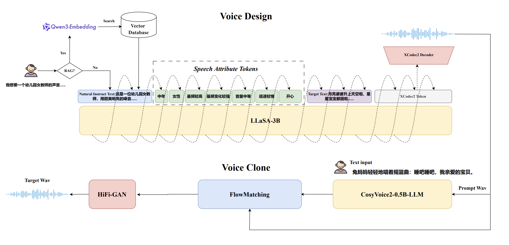
*Figure 1:The overview of VoiceSculptor, which is composed of two core components: voice design and voice clone.*

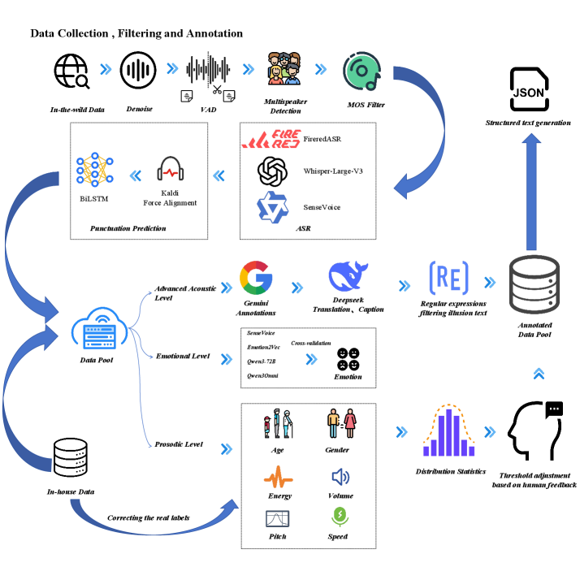
*Figure 2:The data pipeline of building VoiceSculptor.*

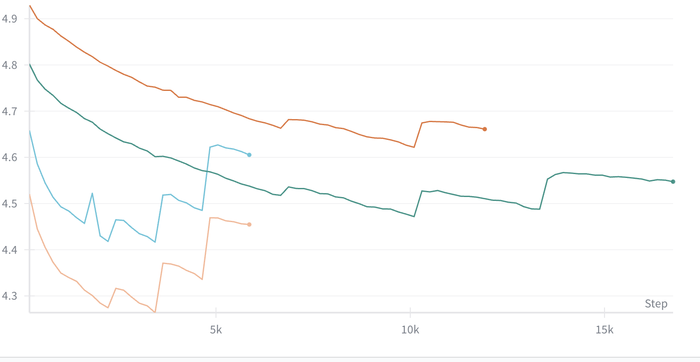
*Figure 3:Validation loss curves for the ablation study on CoT and model scale.*

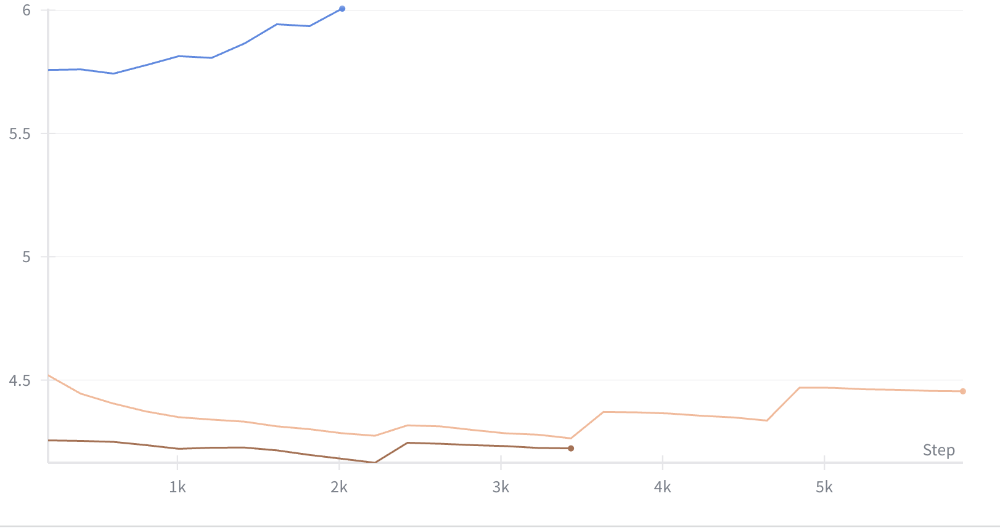
*Figure 4:Validation loss curves of the SFT stage under different data configurations.*

---
**Usage Info**: 9685 tokens used.
**Generated at**: 2026-02-24 19:46:44

---

# 📚 Transition Matching Distillation for Fast Video Generation

🚀 URL: https://arxiv.org/html/2601.09881

## 🌏 Abstract (원문)
Recent progresses in large-scale diffusion models have significantly advanced the frontier of video generation. Open-sourced models and commercial text-to-video (T2V) systems demonstrate remarkable capabilities in synthesizing coherent and photorealistic videos from text prompts. Despite their success, sampling inefficiency remains a central bottleneck. Standard diffusion models rely on a multi-step denoising process, often requiring hundreds of iterative steps, to progressively transform noise into realistic outputs. This iterative nature leads to high inference latency and computational cost, rendering large diffusion models impractical for interactive applications such as real-time video generation, content editing, or world modeling for agent training. Accelerating diffusion sampling without sacrificing visual quality thus becomes a key open challenge. We propose Transition Matching Distillation (TMD) to distill large video diffusion models into few-step generators (e.g., less than 4 steps). Inspired by Transition Matching, TMD approximates the many-step denoising process with a compact few-step probability transition process, where each transition captures the distributional evolution of video samples across widely separated noise levels. To model the transition process, we introduce a decoupled architecture for the student model with two components: (1) a main backbone that extracts high-level semantic representations and (2) a flow head that refines fine-grained visual details through multiple inner flow updates. We evaluate TMD in distilling Wan2.1 1.3B and 14B T2V models. Our experiments show that TMD consistently outperforms existing distilled methods, achieving better visual fidelity and prompt adherence. In particular, our distilled 14B model achieves an overall score of 84.24 on VBench in near-one-step generation (NFE=1.38).
## 🌏 Abstract (번역)
최근 대규모 확산 모델(diffusion models)의 발전은 비디오 생성 분야의 경계를 크게 확장시켰습니다. 오픈 소스 모델과 상업용 텍스트-투-비디오(T2V) 시스템은 텍스트 프롬프트로부터 일관성 있고 실사 같은 비디오를 합성하는 놀라운 능력을 보여줍니다. 이러한 성공에도 불구하고, 샘플링의 비효율성은 여전히 주요 병목 현상으로 남아 있습니다. 표준 확산 모델은 노이즈를 점진적으로 현실적인 출력물로 변환하기 위해 수백 번의 반복적인 단계를 거치는 다단계 디노이징 프로세스에 의존합니다. 이러한 반복적 특성은 높은 추론 지연 시간과 계산 비용을 초래하여, 실시간 비디오 생성, 콘텐츠 편집 또는 에이전트 학습을 위한 월드 모델링과 같은 대화형 애플리케이션에 대규모 확산 모델을 적용하는 것을 비실용적으로 만듭니다. 따라서 시각적 품질을 저하시키지 않으면서 확산 샘플링 속도를 높이는 것이 핵심적인 과제가 되었습니다. 본 연구에서는 대규모 비디오 확산 모델을 4단계 미만의 적은 단계로 생성 가능한 생성기로 증류(distill)하는 Transition Matching Distillation(TMD)을 제안합니다. Transition Matching에서 영감을 받은 TMD는 다단계 디노이징 프로세스를 간결한 몇 단계의 확률 전이 프로세스로 근사하며, 각 전이는 크게 떨어진 노이즈 레벨 간의 비디오 샘플 분포 진화를 포착합니다. 전이 프로세스를 모델링하기 위해 학생(student) 모델을 위한 두 가지 구성 요소의 분리된 구조를 도입합니다: (1) 고수준 의미 표현을 추출하는 메인 백본과 (2) 여러 번의 내부 흐름 업데이트를 통해 세밀한 시각적 디테일을 정교화하는 플로우 헤드(flow head)입니다. Wan2.1 1.3B 및 14B T2V 모델을 증류하여 TMD를 평가했습니다. 실험 결과, TMD는 기존의 증류 방법들보다 일관되게 우수한 성능을 보였으며, 더 나은 시각적 충실도와 프롬프트 준수 능력을 달성했습니다. 특히, 증류된 14B 모델은 1단계에 가까운 생성(NFE=1.38)에서 VBench 종합 점수 84.24를 기록했습니다.

## 🔍 Methods & Results
- 제안된 TMD(Transition Matching Distillation)는 긴 디노이징 궤적을 간결한 몇 단계의 확률 전이 프로세스로 압축함
- 학생 모델의 구조를 의미론적 특징을 추출하는 메인 백본과 세부 사항을 정교화하는 재귀적 플로우 헤드로 분리하여 설계함
- 2단계 학습 전략 도입: (1) 플로우 헤드를 조건부 플로우 맵으로 변환하는 전이 매칭 적응(TM-MF) 단계, (2) 플로우 헤드 롤아웃을 포함한 분포 매칭 증류(DMD2-v) 단계
- DMD2-v는 비디오 도메인에 최적화하기 위해 Conv3D 판별기, 지식 증류(KD) 웜업, 타임스텝 시프팅 기법을 적용함
- Wan2.1 14B 모델을 증류한 결과, NFE 1.38의 매우 적은 단계만으로 VBench에서 84.24점을 기록하며 속도와 품질 간의 최적의 트레이드오프를 달성함
- 실험을 통해 TMD가 기존의 궤적 기반 및 분포 기반 증류 기법들보다 시각적 충실도와 프롬프트 일치성 면에서 우수함을 입증함

## 🖼 Figures
![Figure 2:Overview of our TMD method. (a) Decoupled architecture for TMD student, where the main backbone takes the noisy sample 
𝒙
𝑡
, timestep 
𝑡
 and text conditioning 
𝑐
 as inputs and outputs the main feature 
𝒎
𝑡
, and with a simple fusion layer, flow head conditions on 
𝒎
𝑡
,
𝑐
 and predicts the less noisy target 
𝒚
𝑟
 from the more noisy 
𝒚
𝑠
 (
𝑠
≥
𝑟
). (b) Top: Transition process maps noise to data with a few transition steps. Bottom: In each step, flow head rollout is performed during both distillation and sampling. We omit the timestep inputs 
𝑠
 and 
𝑟
 to the flow head for simplicity.](../images/2026-01-16/2601.09881/2601.09881_fig1.png)
*Figure 2:Overview of our TMD method. (a) Decoupled architecture for TMD student, where the main backbone takes the noisy sample 
𝒙
𝑡
, timestep 
𝑡
 and text conditioning 
𝑐
 as inputs and outputs the main feature 
𝒎
𝑡
, and with a simple fusion layer, flow head conditions on 
𝒎
𝑡
,
𝑐
 and predicts the less noisy target 
𝒚
𝑟
 from the more noisy 
𝒚
𝑠
 (
𝑠
≥
𝑟
). (b) Top: Transition process maps noise to data with a few transition steps. Bottom: In each step, flow head rollout is performed during both distillation and sampling. We omit the timestep inputs 
𝑠
 and 
𝑟
 to the flow head for simplicity.*

*Figure 3:Visual comparison. We compare three frames (and zoomed-in regions of interest) of the outputs of TMD and DMD2-v on exemplary prompts for Wan2.1 1.3B (left) and Wan2.1 14B (right). TMD can improve visual quality at comparable cost to our DMD2-v baseline. Extended prompts can be found in Appendix˜A.*

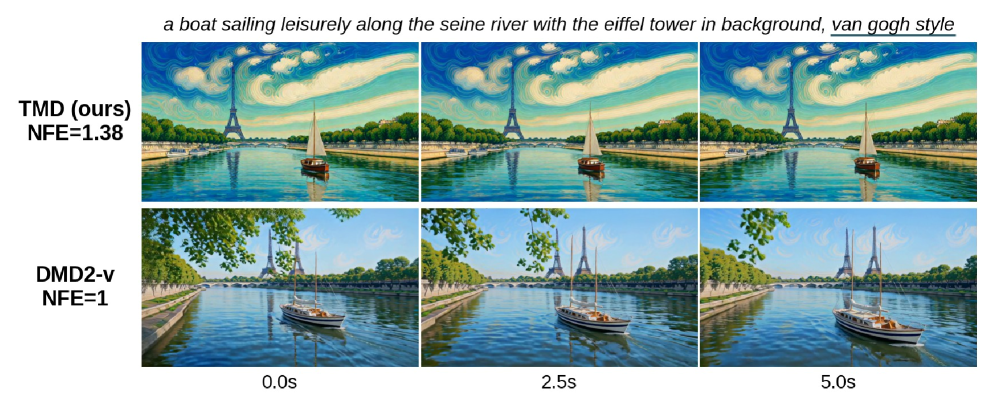
*Figure 4:Visual comparison. We compare three frames of TMD and DMD2-v on exemplary prompts for Wan2.1 14B. TMD can improve prompt adherence at comparable cost to our DMD2-v baseline. Extended prompts can be found in Appendix˜A.*

*Figure 6:Performance-efficiency tradeoff of TMD. We compare the overall VBench score and effective NFE of TMD, when distilling Wan2.1 1.3B with 
𝑀
=
2
 for different number of inner steps 
𝑁
 and flow head layers 
𝐻
 against 
2
- and 
3
-step DMD2-v. TMD can provide consistent performance gains for increasing NFE.*

*Figure 7:Convergence and rollout ablation. We compare the overall VBench score over iterations for the second-stage TMD training with and without flow head rollout. While TMD generally converges within a only few thousand iterations, we observe faster convergence and improved performance when using rollouts.*

*Figure 8:Visualization of our mechanisms to fuse the main backbone’s features 
𝒎
​
(
𝒙
,
𝑡
)
 with the flow head input 
𝒚
𝑠
: (a) “gated” fusion, where the flow head input 
𝒚
𝑠
 is passed to an FFN block (conditioned on the flow head timestep 
𝑠
) and then added to the main feature 
𝒎
𝑡
 via a gated operator; and (b) “concat” fusion, where the the flow head input 
𝒚
𝑠
 and the main feature 
𝒎
𝑡
 are concatenated in the channel dimension and then passed to the linear projection layer.*

*Figure 9:Mode collapse without time-shifting. We show videos generated by the one-step student distilled from DMD2 in the setting “
𝑡
dmd
 w/o shift” (see Table 5), where the other hyperparameters use the default values. We can see that all generated videos have the main characters consistently appear on the left side of the pixel space, which is a sign of the severe mode collapse happening during distillation.*

![Figure 10:Effect of KD initialization. We compare the two-step DMD2 results of distilling Wan2.1 1.3B in two settings: (a) with and (b) without KD warm-up, where (left) “Iteration 0” means videos generated in the beginning of DMD2 training and (Right) “Iteration 1000” means videos generated after training DMD2 for 1k iterations. From left to right, we show the first, middle and the last frames in each video. We can see that the KD warm-up initially can generate better videos, but it also introduces coarse-grained artifacts. For instance, it generates an extra man besides a couple specified in the prompt. After training for 1k iterations, two-step DMD2 cannot remove these artifacts, leading to the worse generation quality than two-step DMD2 without KD warm-up.](../images/2026-01-16/2601.09881/2601.09881_fig9.png)
*Figure 10:Effect of KD initialization. We compare the two-step DMD2 results of distilling Wan2.1 1.3B in two settings: (a) with and (b) without KD warm-up, where (left) “Iteration 0” means videos generated in the beginning of DMD2 training and (Right) “Iteration 1000” means videos generated after training DMD2 for 1k iterations. From left to right, we show the first, middle and the last frames in each video. We can see that the KD warm-up initially can generate better videos, but it also introduces coarse-grained artifacts. For instance, it generates an extra man besides a couple specified in the prompt. After training for 1k iterations, two-step DMD2 cannot remove these artifacts, leading to the worse generation quality than two-step DMD2 without KD warm-up.*

*Figure 11:Performance-efficiency tradeoff of TMD. Extension of Figure˜6 to include the 
𝑀
=
1
 settings.*

*Figure 12:Curvature of Wan trajectories. Curvature of different sampling trajectories for the Wan2.1 1.3B model. Large trajectory curvatures are observed near 
𝑡
=
1
 (i.e., the high noise regime).*

*Figure 13:Convergence and fusion ablation. We compare the overall VBench score over iterations for the second-stage TMD training with our gating mechanism (see Section˜A.1) and concatenation of features (see Section˜B.3). While concatenation yields very competitive results, we observed that it introduces some training instabilities.*

![Figure 14:Impact of flow head recurrence. We show the impact of recurrence in the flow head by setting the number of flow head steps to 1 only at inference (i.e., N1H5) when distilling Wan2.1 1.3B with 
𝑀
=
2
 and the N4H5 setting for flow head (i.e., 4 denoising steps and 5 DiT blocks in flow head). We observe that the videos generated without recurrence (marked by N1H5) are of much lower quality (e.g., more artifacts and blurriness) than ones with recurrence (marked by N4H5), implying the importance of the fine-grained iterative refinement on our method.](../images/2026-01-16/2601.09881/2601.09881_fig13.png)
*Figure 14:Impact of flow head recurrence. We show the impact of recurrence in the flow head by setting the number of flow head steps to 1 only at inference (i.e., N1H5) when distilling Wan2.1 1.3B with 
𝑀
=
2
 and the N4H5 setting for flow head (i.e., 4 denoising steps and 5 DiT blocks in flow head). We observe that the videos generated without recurrence (marked by N1H5) are of much lower quality (e.g., more artifacts and blurriness) than ones with recurrence (marked by N4H5), implying the importance of the fine-grained iterative refinement on our method.*

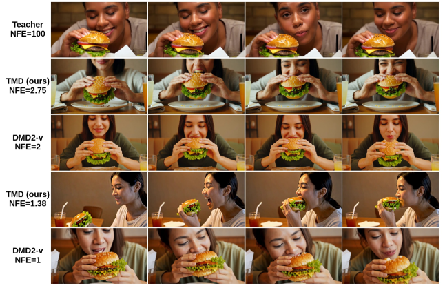
*Figure 15:Visual comparison on Wan2.1 14B. We compare the outputs of the teacher, TMD, and DMD2-v on exemplary prompts.*

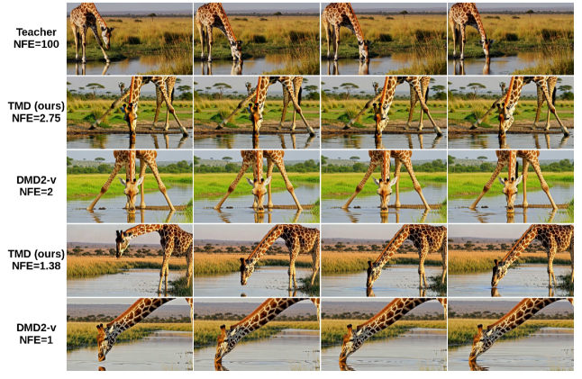
*Figure 16:Visual comparison on Wan2.1 14B. We compare the outputs of the teacher, TMD, and DMD2-v on exemplary prompts.*

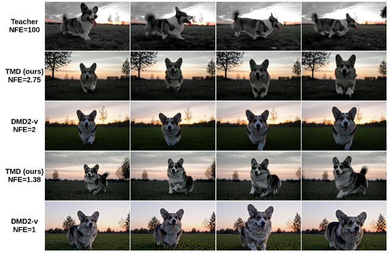
*Figure 17:Visual comparison on Wan2.1 14B. We compare the outputs of the teacher, TMD, and DMD2-v on exemplary prompts.*

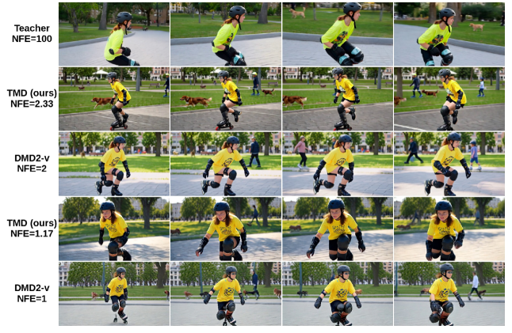
*Figure 18:Visual comparison on Wan2.1 1.3B. We compare the outputs of the teacher, TMD, and DMD2-v on exemplary prompts.*

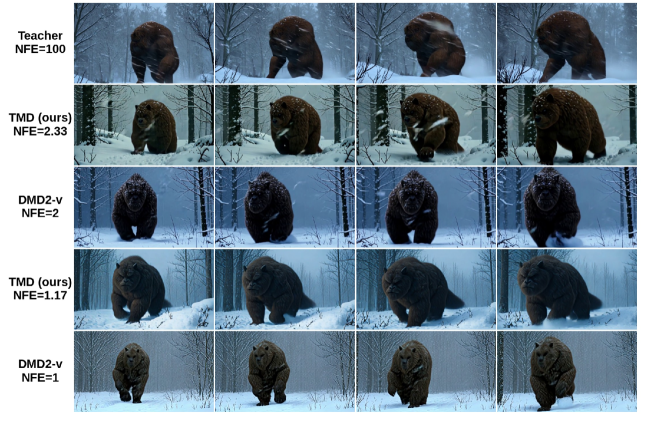
*Figure 19:Visual comparison on Wan2.1 1.3B. We compare the outputs of the teacher, TMD, and DMD2-v on exemplary prompts.*

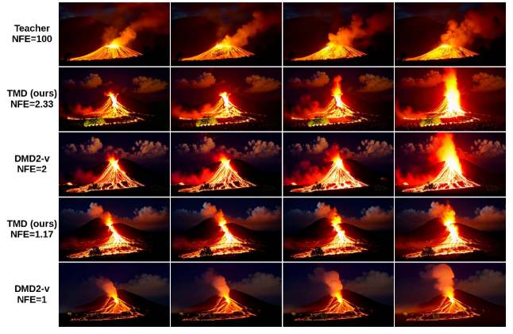
*Figure 20:Visual comparison on Wan2.1 1.3B. We compare the outputs of the teacher, TMD, and DMD2-v on exemplary prompts.*

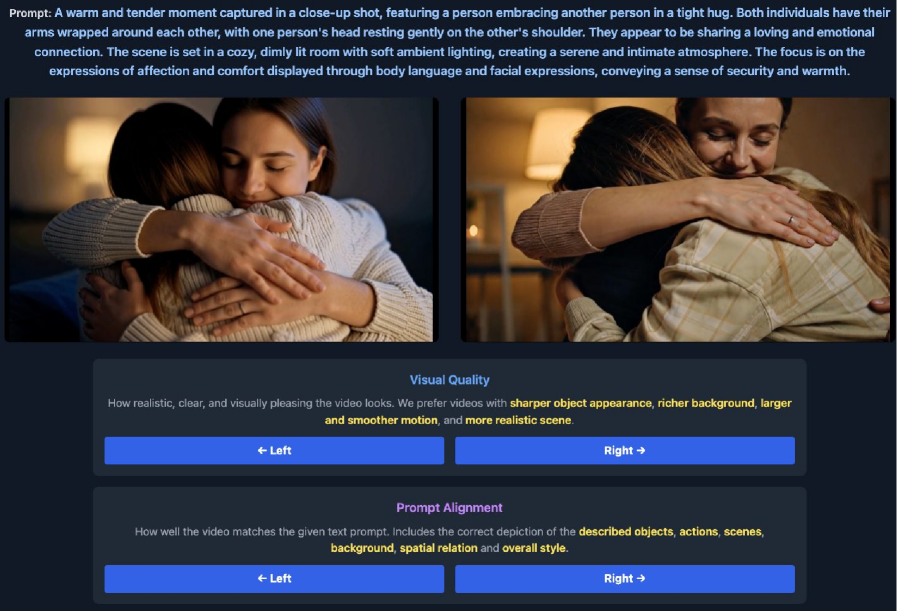
*Figure 21:User study interface. Screenshot of our user preference study interface explained in Section˜4.2.*

---
**Usage Info**: 5185 tokens used.
**Generated at**: 2026-02-24 19:48:49

---

# 📚 Diffusion-based Frameworks for Unsupervised Speech Enhancement J.-E. Ayilo, M. Sadeghi, and R. Serizel are with the Multispeech team, Université de Lorraine, CNRS, Inria, Loria, Nancy, France. X. Alameda-Pineda is with the RobotLearn team, Université Grenoble Alpes, Inria, Grenoble, France. This work was supported by the French National Research Agency (ANR) under the project REAVISE (ANR-22-CE23-0026-01).

🚀 URL: https://arxiv.org/html/2601.09931

## 🌏 Abstract (원문)
Speech enhancement (SE) is a widely studied speech restoration task that aims to recover an underlying clean speech signal from a noisy recording. With the rise of deep neural networks (DNNs) and the development of diverse architectures and learning paradigms, substantial progress has been achieved in SE, in both supervised and unsupervised settings. Supervised methods require clean–noisy speech training pairs, whereas unsupervised methods rely on clean speech only, noisy speech only, or unpaired clean and noisy speech data, but never on clean–noisy speech pairs. This broad families of SE methods can be further refined by distinguishing between generative and non-generative training, leading to four categories: supervised non-generative, supervised generative, unsupervised non-generative, and unsupervised generative. The main motivation for unsupervised methods is to improve the generalization of trained DNNs to unseen (mismatched) conditions, without requiring large and diverse paired datasets, which are often impractical to collect in real-world scenarios. Nevertheless, under matched conditions, they typically exhibit a performance gap compared to their supervised counterparts. Generative SE methods explicitly or implicitly model the prior distribution of speech and/or noise, and have recently gained renewed interest with the advent of diffusion models. Indeed, the high quality of images, videos, and audio generated by diffusion models demonstrates their ability to act as powerful data priors. This has encouraged research on diffusion-based SE in both supervised and unsupervised settings. The particular case of unsupervised diffusion-based SE, which is the focus of this paper, offers the possibility of using diffusion models as strong priors over audio data (for both speech and noise), without relying on paired datasets. In light of these findings, we propose new unsupervised diffusion-based SE frameworks that further reduce the performance gap with supervised approaches. Our contributions are threefold. Firstly, we present a comprehensive and unified description of previous work on unsupervised diffusion-based SE. Secondly, we propose to explicitly sample the acoustic noise from its posterior distribution, treating it as a latent variable. Thirdly, we propose to use a pre-trained diffusion-based prior model for noise instead of the NMF-based model. Experiments on the WSJ0-QUT and VoiceBank-DEMAND datasets demonstrate that modeling noise as a latent variable improves the SE performance.
## 🌏 Abstract (번역)
음성 향상(SE)은 잡음이 섞인 녹음에서 깨끗한 음성 신호를 복구하는 것을 목표로 하는 널리 연구된 음성 복원 작업입니다. 심층 신경망(DNN)의 부상과 다양한 아키텍처 및 학습 패러다임의 발전으로 지도 및 비지도 설정 모두에서 SE 분야에 상당한 진전이 있었습니다. 지도 학습 방식은 깨끗한 음성과 잡음이 섞인 음성 쌍이 필요하지만, 비지도 학습 방식은 깨끗한 음성만, 잡음이 섞인 음성만, 또는 쌍을 이루지 않은 데이터에 의존하며 깨끗한 음성과 잡음이 섞인 음성 쌍은 사용하지 않습니다. 이러한 SE 방법론은 생성형 및 비생성형 학습으로 더 세분화되어 네 가지 범주(지도 비생성형, 지도 생성형, 비지도 비생성형, 비지도 생성형)로 나뉩니다. 비지도 학습 방식의 주요 동기는 실제 시나리오에서 수집하기 어려운 대규모의 다양한 쌍 데이터를 요구하지 않으면서, 학습된 DNN의 일반화 성능을 보지 못한(불일치) 조건으로 개선하는 것입니다. 그럼에도 불구하고, 일치하는 조건에서는 일반적으로 지도 학습 방식에 비해 성능 격차가 존재합니다. 생성형 SE 방법은 음성 및 잡음의 사전 분포를 명시적 또는 암시적으로 모델링하며, 최근 확산 모델(diffusion models)의 등장으로 다시 주목받고 있습니다. 확산 모델에 의해 생성된 고품질 이미지, 비디오 및 오디오는 강력한 데이터 사전 확률(prior)로서의 능력을 입증했습니다. 이는 지도 및 비지도 설정 모두에서 확산 기반 SE 연구를 장려했습니다. 본 논문의 초점인 비지도 확산 기반 SE의 경우, 쌍을 이룬 데이터셋에 의존하지 않고 오디오 데이터(음성 및 잡음 모두)에 대해 확산 모델을 강력한 사전 확률로 사용할 수 있는 가능성을 제공합니다. 이러한 발견을 바탕으로, 본 논문에서는 지도 학습 방식과의 성능 격차를 더욱 줄이는 새로운 비지도 확산 기반 SE 프레임워크를 제안합니다. 본 연구의 기여는 세 가지입니다. 첫째, 비지도 확산 기반 SE에 대한 기존 연구를 포괄적이고 통합적으로 설명합니다. 둘째, 음향 잡음을 잠재 변수로 취급하여 사후 분포에서 명시적으로 샘플링할 것을 제안합니다. 셋째, NMF 기반 모델 대신 잡음에 대해서도 사전 학습된 확산 기반 사전 모델을 사용할 것을 제안합니다. WSJ0-QUT 및 VoiceBank-DEMAND 데이터셋에 대한 실험 결과, 잡음을 잠재 변수로 모델링하는 것이 SE 성능을 향상시킴을 입증했습니다.

## 🔍 Methods & Results
- 스코어 기반 생성 확산 모델을 복소수 STFT 영역에서 구현하여 음성과 잡음의 데이터 분포를 근사함
- DiffUSEEN 프레임워크 제안: 음성(s)과 잡음(n)을 모두 잠재 변수로 설정하여 공동 사후 분포 p(s, n | x)를 모델링함
- 깁스 샘플링(Gibbs Sampling) 기법 도입: 음성 사후 분포와 잡음 사후 분포 샘플링을 교대로 수행하여 혼합물 일관성(mixture consistency)을 강화함
- 잡음 사전 확률 모델 확장: 기존의 NMF(Non-negative Matrix Factorization) 기반 모델 외에도 사전 학습된 확산 모델을 잡음 사전 확률로 활용하는 알고리즘 제안
- WSJ0-QUT 및 VoiceBank-DEMAND 데이터셋 실험 결과, 잡음을 명시적 잠재 변수로 모델링할 때 SE 성능이 유의미하게 향상됨
- 불일치(Mismatched) 조건에서 NMF 기반 잡음 공분산과 잠재 잡음 모델링을 결합한 방식이 지도 학습 베이스라인보다 적은 성능 저하를 보이며 우수한 일반화 성능을 입증함

## 🖼 Figures
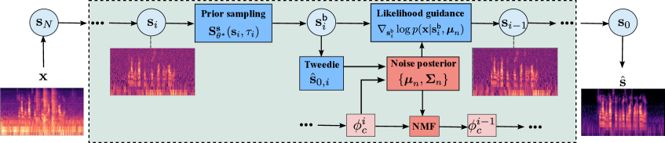
*Figure 1:Schematic diagram of the DiffUSEEN algorithm.*

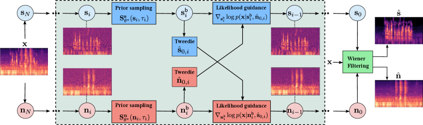
*Figure 2:Schematic diagram of the ParaDiffUSE algorithm.*

*Figure 3:Violin plots showing the SI-SDR distributions for the matched and mismatched conditions on the VB-DMD test set, with dashed and dotted lines indicating the median and quartiles, respectively. For readability, we omit the RemixIT and DEPSE-IL violins: the former has an SI-SDR range far from the other methods, and the latter exhibits a trend very similar to UDiffSE+.*

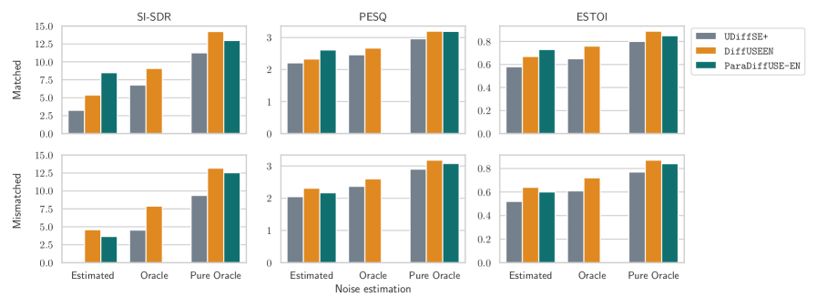
*Figure 4:Effect of noise-estimation setting (Estimated / Oracle / Pure Oracle) for UDiffSE+, DiffUSEEN, and ParaDiffUSE-EN on WSJ0–QUT.*

---
**Usage Info**: 9652 tokens used.
**Generated at**: 2026-02-24 19:50:12

---

# 📚 HeartMuLa: A Family of Open Sourced Music Foundation Models

🚀 URL: https://arxiv.org/html/2601.10547

## 🌏 Abstract (원문)
Music generation and understanding have rapidly evolved with the emergence of large-scale multimodal foundation modelsCopetet al.(2023); Leiet al.(2025); Wuet al.(2025). Recent advances in audio representation learningXuet al.(2024); Wonet al.(2023), text-audio alignmentElizaldeet al.(2023), and autoregressive music generationYanget al.(2023b); Copetet al.(2023); Agostinelliet al.(2023)as well as diffusion-based music synthesisNinget al.(2025)have enabled impressive progress in music captioning, style transfer, and conditional generation. However, existing systems still face significant limitations. Many music models rely on proprietary datasets or closed-source pipelines, which limits reproducibility and downstream research. Others provide only coarse control over musical attributes, lack robust alignment between textual descriptions and acoustic realizations, or struggle to maintain long-range musical coherence beyond short segmentsCopetet al.(2023). Furthermore, end-to-end controllable song generation jointly guided by style descriptions, lyrics, and reference audio remains an open challenge. To address these limitations, we introduce a family of open-source Music Foundation Models designed to unify music understanding, alignment, and controllable generation within a single extensible ecosystem. Our framework integrates four key components: (1)HeartCLAP: an audio-text alignment model that learns a shared embedding space for music semantics, enabling accurate music tagging and cross-modal retrieval, and serving as a foundation for downstream generative tasks. (2)HeartTranscriptor: a robust lyric recognition model tailored to complex musical signals, providing accurate transcription of lyrical content. (3)HeartCodec: a low-frame-rate (12.5 Hz), high-fidelity music codec that captures both long-range structure and acoustic details. Its compact discrete representation enables high-quality reconstruction and efficient autoregressive modeling. (4)HeartMuLa: a multi-condition song generator that accepts flexible user inputs, including style descriptions, detailed lyrics, and reference audio, while offering fine-grained control over musical attributes such as genre, mood, rhythm, and expressive variations. Our song generation model supports long-form music creation of up to six minutes, maintaining both structural coherence and expressive diversity over extended durations. In addition, it provides two specialized modes: (1) ashort-music generationmode suitable for background music in short videos; and (2) afine-grained style controlmode that enables creators to control the style of different song parts (e.g., intro, verse, chorus) using natural language prompts. Beyond the capabilities of individual models, the open-source nature of our ecosystem enables reproducibility, extensibility, and broad community adoption. By releasing model weights and evaluation protocols, we aim to provide a comprehensive foundation for future advancements in music intelligence. In summary, our contributions are as follows: We introduce a unified suite of open-source Music Foundation Models covering music–text alignment, music tokenization, lyric recognition, and controllable song generation. We propose a novel music codec tokenizer that achieves high expressiveness at a low frame rate, enabling efficient and scalable modeling of long musical sequences. We present a song generation framework with fine-grained musical control, supporting high-quality long-form generation of up to 6 minutes.
## 🌏 Abstract (번역)
음악 생성 및 이해는 대규모 멀티모달 파운데이션 모델의 등장과 함께 급격히 발전해 왔습니다. 오디오 표현 학습, 텍스트-오디오 정렬, 자기회귀 음악 생성 및 확산 기반 음악 합성의 최근 진보는 음악 캡셔닝, 스타일 전이, 조건부 생성 분야에서 인상적인 발전을 가능하게 했습니다. 그러나 기존 시스템은 여전히 상당한 한계에 직면해 있습니다. 많은 음악 모델이 독점 데이터셋이나 폐쇄형 소스 파이프라인에 의존하여 재현성과 후속 연구를 제한합니다. 또한 음악적 속성에 대해 대략적인 제어만 제공하거나, 텍스트 설명과 음향 구현 간의 강력한 정렬이 부족하거나, 짧은 세그먼트를 넘어선 장기적인 음악적 일관성을 유지하는 데 어려움을 겪습니다. 더욱이 스타일 설명, 가사, 참조 오디오에 의해 공동으로 유도되는 엔드투엔드 제어 가능 노래 생성은 여전히 해결해야 할 과제로 남아 있습니다. 이러한 한계를 해결하기 위해, 우리는 단일 확장 가능 생태계 내에서 음악 이해, 정렬 및 제어 가능한 생성을 통합하도록 설계된 오픈 소스 음악 파운데이션 모델 제품군을 소개합니다. 우리 프레임워크는 네 가지 핵심 구성 요소를 통합합니다: (1) HeartCLAP: 음악적 의미를 위한 공유 임베딩 공간을 학습하여 정확한 음악 태깅 및 교차 모달 검색을 가능하게 하고 후속 생성 작업의 기반 역할을 하는 오디오-텍스트 정렬 모델. (2) HeartTranscriptor: 복잡한 음악 신호에 맞춤화되어 가사 내용의 정확한 전사를 제공하는 강력한 가사 인식 모델. (3) HeartCodec: 장기 구조와 음향적 세부 사항을 모두 포착하는 저프레임 레이트(12.5Hz) 고충실도 음악 코덱. 이 압축된 이산 표현은 고품질 재구성 및 효율적인 자기회귀 모델링을 가능하게 합니다. (4) HeartMuLa: 스타일 설명, 상세 가사, 참조 오디오를 포함한 유연한 사용자 입력을 수용하면서 장르, 분위기, 리듬 및 표현적 변형과 같은 음악적 속성에 대한 미세한 제어를 제공하는 다중 조건 노래 생성기. 우리의 노래 생성 모델은 최대 6분의 장편 음악 생성을 지원하며, 확장된 시간 동안 구조적 일관성과 표현적 다양성을 모두 유지합니다. 또한 숏폼 비디오 배경 음악에 적합한 짧은 음악 생성 모드와 자연어 프롬프트를 사용하여 노래의 각 부분(예: 인트로, 절, 후렴)의 스타일을 제어할 수 있는 미세 스타일 제어 모드라는 두 가지 특화된 모드를 제공합니다. 개별 모델의 기능을 넘어, 우리 생태계의 오픈 소스 특성은 재현성, 확장성 및 광범위한 커뮤니티 채택을 가능하게 합니다. 모델 가중치와 평가 프로토콜을 공개함으로써 음악 지능의 미래 발전을 위한 포괄적인 토대를 제공하고자 합니다. 요약하자면, 우리의 기여는 다음과 같습니다: 음악-텍스트 정렬, 음악 토큰화, 가사 인식 및 제어 가능한 노래 생성을 포괄하는 통합 오픈 소스 음악 파운데이션 모델 제품군을 소개합니다. 낮은 프레임 레이트에서 높은 표현력을 달성하여 긴 음악 시퀀스의 효율적이고 확장 가능한 모델링을 가능하게 하는 새로운 음악 코덱 토크나이저를 제안합니다. 미세한 음악적 제어가 가능한 노래 생성 프레임워크를 제시하여 최대 6분의 고품질 장편 생성을 지원합니다.

## 🔍 Methods & Results
- 음악-텍스트 정렬(HeartCLAP), 가사 인식(HeartTranscriptor), 음악 코덱(HeartCodec), 노래 생성(HeartMuLa)을 통합한 오픈 소스 생태계 구축
- 12.5Hz의 낮은 프레임 레이트에서도 고충실도 재구성이 가능한 HeartCodec을 통해 긴 음악 시퀀스의 효율적인 자기회귀 모델링 실현
- 스타일 설명, 가사, 참조 오디오를 결합하여 장르, 분위기, 리듬 등을 미세하게 제어할 수 있는 다중 조건 노래 생성 프레임워크 제안
- 최대 6분 길이의 장편 음악 생성 시에도 구조적 일관성과 표현의 다양성을 유지하는 성능 확인
- 자연어 프롬프트를 통해 인트로, 절(Verse), 후렴(Chorus) 등 곡의 구성 요소별로 스타일을 개별 제어할 수 있는 기능 제공

## 🖼 Figures
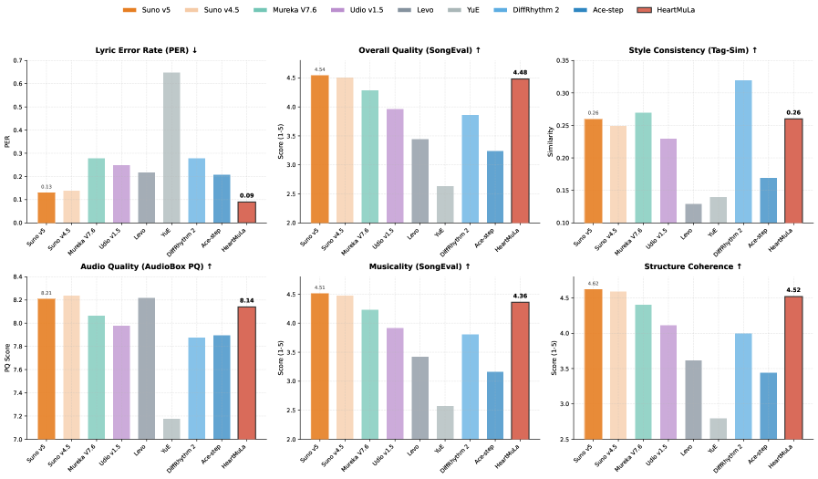
*Figure 1:Overall comparison of HeartMuLa-oss-3B with existing music foundation models.*

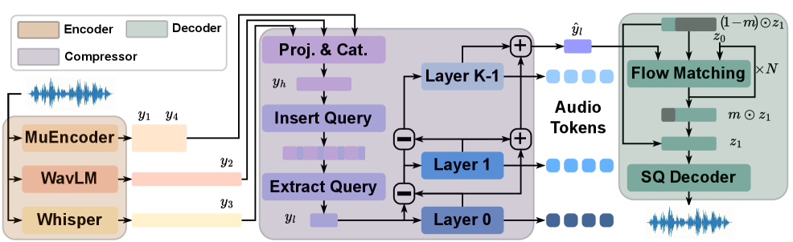
*Figure 2:An illustration of our proposed HeartCodec. Left, middle, right are semantic-rich encoder, ultra-low frame rate compressor and high-fidelity reconstruction decoder, respectively.*

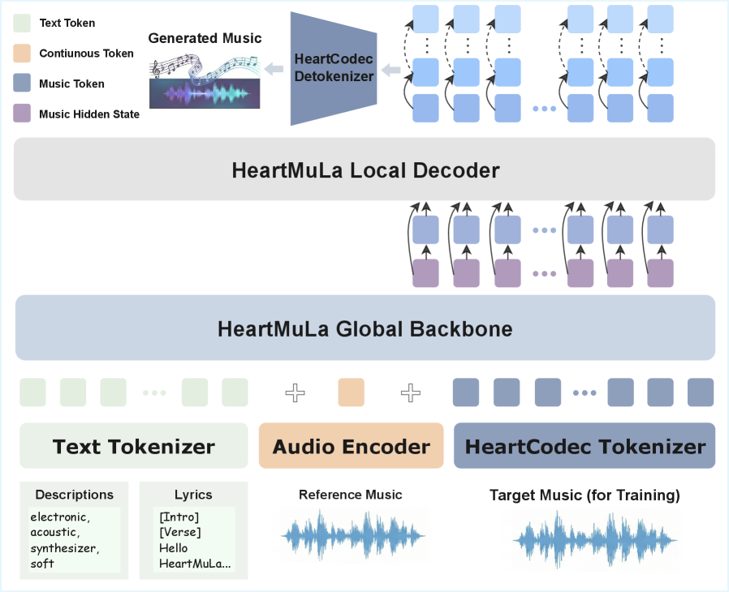
*Figure 3:HeartMuLa Architecture*

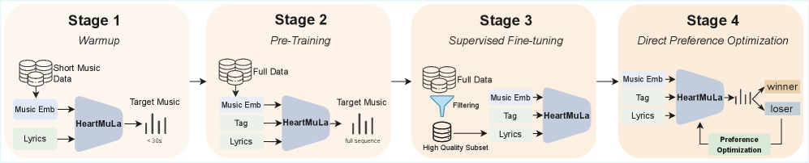
*Figure 4:Four-Stage Progressive Training Paradigm*

---
**Usage Info**: 6291 tokens used.
**Generated at**: 2026-02-24 19:52:29

---

# 📚 SELF-SUPERVISED RESTORATION OF SINGING VOICE DEGRADED BY PITCH SHIFTING USING SHALLOW DIFFUSION

🚀 URL: https://arxiv.org/html/2601.10345

## 🌏 Abstract (원문)
Classical pitch shifting algorithms manipulate either the waveform in time or its short-time spectrum. Resampling technique for example, shifts the pitch by scaling time t to t/r with ratio = 2^(Δ/12), and then uses a separate time–scale modification stage to restore the original duration. This simple pipeline drags the spectral envelope (formants) and can misalign transients, which could yield chipmunk colouration unless additional formant or envelope correction is applied. Phase–vocoder methods analyze frames with an STFT, unwrap phases to estimate instantaneous frequency, and then resynthesize the signal using modified phase increments corresponding to the desired pitch ratio. With peak phase locking and transient protection, they preserve the broad spectral shape, but large pitch shifts or rapid modulations can still produce phasiness effects and attack smearing. Time-domain overlap-and-add (TDOLA) methods avoid using explicit Fourier manipulation. For example, pitch-synchronous overlap-and-add (PSOLA) detects pitch marks and extracts pitch-synchronous grains windowed around each mark, and overlap-adds them at a new period to shift pitch. On the other hand, waveform-similarity OLA (WSOLA) uses fixed-hop grains aligned by short-time cross-correlation before overlap-add. These approaches offer low latency and crisp transients for small ratios on voiced material, but they are sensitive to alignment errors and tend to drift formants without extra correction, and can sound buzzy in unvoiced or noisy regions. Analysis–synthesis vocoders firstly estimate important acoustic features such as f0, spectral envelope, and band aperiodicity. It then resynthesizes the signal using harmonic excitation plus filtered noise. This provides explicit pitch and formant control and can preserve timbre under moderate shifts. However, when globally scaling the entire F0 contour, the envelope or aperiodicity estimation errors and a single-excitation model often lead to artifacts such as robotic colorization. Therefore, although classical signal-processing methods provide controllable pitch manipulation, they are generally prone to audible artifacts unless carefully tuned, and their degradations typically take place as the magnitude of the pitch transposition increases. Data-driven approaches instead learn priors over natural singing spectra from large corpora, which enables more robust timbre preservation. Modern singing voice synthesis/conversion (SVS/SVC) systems typically map symbolic or self-supervised content features to mel or waveform using neural decoders and high-fidelity vocoders. This formulation allows pitch editing by directly modifying the frame-level f0 contour while relying on the model’s learned prior to maintain vocal identity. Several recent models incorporate explicit mechanisms for pitch conditioning. Diff-Pitcher applies learned pitch perturbation inside a diffusion prior to improve timbre stability under pitch shifts. SiFiGAN conditions a sine-excitation generator on f0 for harmonic consistency, while NeuroDyne adopts a neural source–filter structure to provide interpretable control over excitation and formants. Diffusion models have become popular in SVS/SVC pipelines due to their strong generative priors. Early vocoders such as DiffWave and WaveGrad required hundreds of sampling steps, but later systems such as diffSinger and Grad-SVC improved pitch stability and sampling efficiency through conditioning on score, f0, and content features. Sampling has been further accelerated by DDIM, DPM-Solver, distillation, and consistency decoding. Other hybrid methods, such as DDSP-SVC, combine diffusion with differentiable source–filter synthesis, while LDM-SVC performs conversion in a latent diffusion space for near–zero-shot generalization. However, most diffusion-based SVS/SVC systems rely on speaker embeddings and thus are not directly applicable to source-agnostic pitch shifting of unseen singers. Motivated by this limitation, shallow diffusion uses a diffusion model as a lightweight refiner initialized from a strong prior which requires only tens of denoising steps. Our work extends shallow diffusion by leveraging it within a novel architecture that incorporates shallow diffusion specifically for noise reduction after a WORLD-based pitch shift. While shallow diffusion remains at the core of the noise reduction process, our work introduces an architecture that utilizes shallow diffusion in a more generalized framework which aims at improving the pitch-shifting process for source-agnostic scenarios. At inference, the restored mel is rendered to waveform using an NSF-HiFiGAN-style vocoder.
## 🌏 Abstract (번역)
전통적인 피치 시프팅 알고리즘은 시간 영역의 파형이나 단시간 스펙트럼을 조작합니다. 예를 들어 리샘플링 기술은 시간 t를 t/r 비율(2^(Δ/12))로 스케일링하여 피치를 변경한 후, 별도의 시간-스케일 수정 단계를 거쳐 원래 길이를 복원합니다. 이러한 단순한 파이프라인은 스펙트럼 포먼트를 끌어당겨 트랜지언트 정렬을 어긋나게 하며, 추가적인 포먼트나 엔벨로프 보정이 없으면 '칩멍크' 효과를 유발할 수 있습니다. 페이즈 보코더 방식은 STFT로 프레임을 분석하고 위상을 풀어 순시 주파수를 추정한 뒤, 원하는 피치 비율에 맞춰 수정된 위상 증분을 사용하여 신호를 재합성합니다. 피크 위상 고정 및 트랜지언트 보호 기술을 통해 넓은 스펙트럼 형상을 보존하지만, 큰 피치 변화나 급격한 변조 시에는 여전히 페이즈 효과나 어택 뭉개짐이 발생할 수 있습니다. 시간 영역 중첩 가산(TDOLA) 방식은 명시적인 푸리에 조작을 피합니다. 예를 들어 PSOLA는 피치 마크를 감지하고 각 마크 주변의 피치 동기 그레인을 추출하여 새로운 주기로 중첩 가산함으로써 피치를 변경합니다. 반면 WSOLA는 중첩 가산 전 단시간 상호 상관에 의해 정렬된 고정 홉 그레인을 사용합니다. 이러한 접근 방식은 유성음에서 작은 비율의 변화에 대해 낮은 지연 시간과 선명한 트랜지언트를 제공하지만, 정렬 오류에 민감하고 추가 보정 없이는 포먼트가 변하는 경향이 있으며 무성음이나 노이즈 구간에서 버징 소리가 날 수 있습니다. 분석-합성 보코더는 먼저 f0, 스펙트럼 엔벨로프, 밴드 비주기성 등 주요 음향 특징을 추정한 후, 하모닉 여기 신호와 필터링된 노이즈를 사용하여 신호를 재합성합니다. 이는 명시적인 피치 및 포먼트 제어를 제공하고 적당한 변화 내에서 음색을 보존할 수 있습니다. 그러나 전체 F0 윤곽을 전역적으로 스케일링할 때 엔벨로프나 비주기성 추정 오류 및 단일 여기 모델로 인해 로봇 소리와 같은 아티팩트가 발생하는 경우가 많습니다. 따라서 전통적인 신호 처리 방식은 제어 가능한 피치 조작을 제공하지만, 정밀하게 튜닝되지 않으면 가청 아티팩트가 발생하기 쉽고 피치 전조의 폭이 커질수록 품질 저하가 심해집니다. 반면 데이터 기반 접근 방식은 대규모 코퍼스로부터 자연스러운 가창 스펙트럼에 대한 사전 확률을 학습하여 보다 견고한 음색 보존을 가능하게 합니다. 현대적인 가창 음성 합성/변환(SVS/SVC) 시스템은 일반적으로 신경망 디코더와 고성능 보코더를 사용하여 상징적 또는 자기지도 학습된 콘텐츠 특징을 멜 스펙트로그램이나 파형으로 매핑합니다. 이 방식은 모델이 학습한 사전 지식에 의존하여 화자의 정체성을 유지하면서 프레임 단위의 f0 윤곽을 직접 수정함으로써 피치 편집을 가능하게 합니다. 최근 몇몇 모델은 피치 컨디셔닝을 위한 명시적 메커니즘을 통합했습니다. Diff-Pitcher는 확산 사전 확률 내에서 학습된 피치 섭동을 적용하여 피치 이동 시 음색 안정성을 향상시킵니다. SiFiGAN은 하모닉 일관성을 위해 f0에 사인 여기 생성기를 조건화하며, NeuroDyne은 여기 신호와 포먼트에 대한 해석 가능한 제어를 제공하기 위해 신경망 소스-필터 구조를 채택합니다. 확산 모델은 강력한 생성 능력 덕분에 SVS/SVC 파이프라인에서 인기를 얻고 있습니다. 초기 보코더인 DiffWave나 WaveGrad는 수백 번의 샘플링 단계가 필요했지만, 이후 diffSinger나 Grad-SVC와 같은 시스템은 악보, f0, 콘텐츠 특징에 대한 조건화를 통해 피치 안정성과 샘플링 효율성을 개선했습니다. 샘플링 속도는 DDIM, DPM-Solver, 증류 및 일관성 디코딩을 통해 더욱 가속화되었습니다. DDSP-SVC와 같은 하이브리드 방식은 확산 모델과 미분 가능한 소스-필터 합성을 결합하며, LDM-SVC는 제로샷 일반화를 위해 잠재 확산 공간에서 변환을 수행합니다. 그러나 대부분의 확산 기반 SVS/SVC 시스템은 화자 임베딩에 의존하므로 학습되지 않은 가수의 소스 불가지론적(source-agnostic) 피치 시프팅에는 직접 적용하기 어렵습니다. 이러한 한계에 착안하여, 얕은 확산(shallow diffusion)은 수십 번의 디노이징 단계만 필요한 강력한 사전 확률로부터 초기화된 경량 리파이너로 확산 모델을 사용합니다. 본 연구는 WORLD 기반 피치 시프트 후 노이즈 제거를 위해 얕은 확산을 통합한 새로운 아키텍처 내에서 이를 활용함으로써 얕은 확산 기법을 확장합니다. 얕은 확산이 노이즈 제거 프로세스의 핵심으로 남아 있는 동안, 본 연구는 소스 불가지론적 시나리오에서 피치 시프팅 프로세스를 개선하는 것을 목표로 하는 보다 일반화된 프레임워크에서 얕은 확산을 활용하는 아키텍처를 제안합니다. 추론 시 복원된 멜 스펙트로그램은 NSF-HiFiGAN 스타일의 보코더를 사용하여 파형으로 렌더링됩니다.

## 🔍 Methods & Results
- 데이터 기반 피치 시프트 모델의 학습을 위해 정답 쌍(ground-truth)이 부족한 문제를 해결하고자 WORLD 보코더를 활용한 자기지도 학습(Self-supervised) 전략을 도입함.
- 원본 오디오를 WORLD 보코더로 피치 시프트한 후 다시 원래 피치로 되돌려 왜곡된 입력을 생성하고, 원본 오디오를 타겟으로 학습하는 방식을 사용함.
- 입력 특징값으로 Crepe 알고리즘을 통한 기본 주파수(f0), RMS 에너지 기반 볼륨 엔벨로프, ContentVec 기반의 화자 독립적 음성 콘텐츠 특징을 추출하여 사용함.
- 모델 구조는 멜 스펙트로그램 도메인에서 작동하는 20개의 잔차 레이어를 가진 1D temporal U-Net 기반의 얕은 확산 모델(Shallow DDPM)을 채택함.
- CSD, NUS-48E, VocalSet 등 5개의 다양한 가창 데이터셋(61명의 가수, 다국어 포함)을 혼합하여 학습함으로써 높은 일반화 성능을 확보함.
- 표준 L2 확산 손실 외에 예측된 멜 스펙트로그램과 f0 사이의 보조 L1 손실을 추가하여 피치 및 에너지 복원의 안정성을 높임.
- 추론 시 DPM-Solver를 적용하여 샘플링 속도를 10배 가속화하였으며, 최종적으로 NSF-HiFiGAN 보코더를 통해 고품질 음원을 합성함.

## 🖼 Figures

*Fig. 1:Overview. Training: Original audio goes through a forward and backward pitch shift process via the WORLD vocoder. The shallow diffusion then denoises the artifact audio to reconstruct the mel. Notice 
𝑓
0
 is extracted from artifact Mel during training for higher robustness. Inference: Given a shifted audio, the diffusion model reconstructs it into a clean Mel-spectrogram. The 
𝑓
​
0
 is directly input to the diffusion model during inference.*

---
**Usage Info**: 6047 tokens used.
**Generated at**: 2026-02-24 19:53:15

---

