# 🚩 (2026-01-21) Scholar Inbox 추천 논문 

# 📚 ImmersiveFlow: Stereo-to-7.1.4 Spatial Audio Generation with Flow Matching

🚀 URL: https://arxiv.org/html/2601.12950

## 🌏 Abstract (원문)
The demand for immersive spatial audio is rapidly growing, with two primary playback formats emerging. In personal applications such as AR/VR, spatial cues are rendered as binaural audio through headphones. In shared environments such as home entertainment systems and automotive cabins, three-dimensional sound fields are reproduced using multichannel loudspeaker arrays, for example, the widely adopted 7.1.4 layouts. With recent advances in generative audio models, the task of spatial audio generation has gained increasing attention. However, most existing studies remain limited to low-dimensional output formats, and the direct generation of discrete high-channel immersive sound layouts remains both challenging and underexplored. Recent research in generative spatial audio has primarily advanced along two streams. The first is dedicated to the synthesis of binaural audio for headphone listeners, which simulates spatial perception by modeling the Head-Related Transfer Functions (HRTFs). Early approaches adopt end-to-end frameworks that estimate binaural signals from monaural input, guided by spatial priors such as source positions inferred from visual content. More recently, Both Ears Wide Open introduces a diffusion-based method conditioned on text and image input to synthesize binaural audio, allowing complex spatial scenes with dynamic source movements. The second stream focuses on the synthesis of First-Order Ambisonics (FOA), a four-channel spatial audio encoding format that can be decoded for multichannel playback. Diffusion-based models have been proposed to synthesize FOA using textual and parametric spatial descriptors conditions, such as sound category, source direction. OmniAudio further advances by conditioning on stereo audio and 360-degree visual inputs, incorporating scene semantics and spatial context from panoramic video. Despite recent progress, binaural audio remains restricted to headphone playback and exhibits limited applicability in speaker-driven environments, as the spatial cues are encoded through HRTFs that are only valid under headphone reproduction and cannot be accurately reproduced through multi-speaker setups. On the other hand, while FOA is versatile, it suffers from limited spatial resolution due to spatial aliasing, where high-frequency components roll off and the accuracy of sound field repretion degrades. Existing solutions for multichannel output from low-dimension channel inputs often rely on traditional signal processing techniques, such as fixed-delay panning and matrix-based upmixing. These methods are computationally efficient yet lack perceptual realism. Recent developments in flow-based generative modeling demonstrates more stable training and efficient inference compared to diffusion models. However, its potential for high-channel spatial audio generation has not yet been explored. Building on these insights, we propose ImmersiveFlow, a novel generative model that produces 7.1.4-format audio from stereo. The model is trained using Conditional Flow Matching (CFM), employing a transformer-based vector field estimator to model high-channel spatial audio distributions. The generated output can be directly applied on loudspeaker arrays or binauralized for headphone playback. Our main contributions are summarized as follows: First, we introduce the novel task of multichannel spatial audio generation, and propose the first end-to-end stereo-to-7.1.4 model, overcoming the fundamental limitations of traditional spatial audio generation methods. Second, we propose to train CFM on VAE latents, pioneering its first successful application to high-channel spatial audio generation. Third, we conduct extensive experiments demonstrating that our method significantly outperforms conventional upmixing techniques, producing perceptually rich and immersive sounds fields validated by both objective and subjective metrics.
## 🌏 Abstract (번역)
몰입형 공간 오디오에 대한 수요가 급증하고 있으며, 두 가지 주요 재생 형식이 등장하고 있습니다. AR/VR과 같은 개인용 애플리케이션에서는 공간 단서가 헤드폰을 통해 바이노럴 오디오로 렌더링됩니다. 홈 엔터테인먼트 시스템 및 자동차 실내와 같은 공유 환경에서는 널리 채택된 7.1.4 레이아웃과 같은 다채널 라우드스피커 어레이를 사용하여 3차원 음장을 재현합니다. 최근 생성형 오디오 모델의 발전으로 공간 오디오 생성 작업이 점점 더 주목받고 있습니다. 그러나 대부분의 기존 연구는 저차원 출력 형식에 국한되어 있으며, 이산형 고채널 몰입형 사운드 레이아웃을 직접 생성하는 것은 여전히 어렵고 미개척 분야로 남아 있습니다. 최근 생성형 공간 오디오 연구는 주로 두 가지 흐름으로 진행되었습니다. 첫 번째는 헤드폰 청취자를 위한 바이노럴 오디오 합성으로, 머리 전달 함수(HRTF)를 모델링하여 공간 지각을 시뮬레이션합니다. 초기 접근 방식은 시각적 콘텐츠에서 추론된 음원 위치와 같은 공간적 사전 정보를 바탕으로 모노 입력에서 바이노럴 신호를 추정하는 엔드투엔드 프레임워크를 채택했습니다. 최근 'Both Ears Wide Open'은 텍스트와 이미지 입력을 조건으로 하는 확산 기반 방법을 도입하여 동적인 음원 이동이 포함된 복잡한 공간 장면을 합성할 수 있게 했습니다. 두 번째 흐름은 다채널 재생을 위해 디코딩할 수 있는 4채널 공간 오디오 인코딩 형식인 1차 앰비소닉스(FOA) 합성에 중점을 둡니다. 사운드 카테고리, 음원 방향과 같은 텍스트 및 파라미터 공간 기술자 조건을 사용하여 FOA를 합성하는 확산 기반 모델이 제안되었습니다. OmniAudio는 스테레오 오디오와 360도 시각 입력을 조건으로 하여 파노라마 비디오의 장면 의미론과 공간적 맥락을 통합함으로써 더욱 발전했습니다. 최근의 진전에도 불구하고, 바이노럴 오디오는 헤드폰 재생으로 제한되며 스피커 구동 환경에서는 적용 가능성이 제한적입니다. 이는 공간 단서가 헤드폰 재생 시에만 유효하고 다중 스피커 설정에서는 정확하게 재현될 수 없는 HRTF를 통해 인코딩되기 때문입니다. 반면, FOA는 다목적이지만 공간 앨리어싱으로 인해 공간 해상도가 제한되어 고주파 성분이 감쇠하고 음장 재현의 정확도가 떨어지는 문제가 있습니다. 저차원 채널 입력에서 다채널 출력을 얻기 위한 기존 솔루션은 고정 지연 패닝 및 매트릭스 기반 업믹싱과 같은 전통적인 신호 처리 기술에 의존하는 경우가 많습니다. 이러한 방법은 계산 효율은 높지만 지각적 사실감이 부족합니다. 최근 플로우 기반 생성 모델링의 발전은 확산 모델에 비해 더 안정적인 학습과 효율적인 추론을 보여주었습니다. 그러나 고채널 공간 오디오 생성에 대한 잠재력은 아직 탐구되지 않았습니다. 이러한 통찰을 바탕으로, 본 논문에서는 스테레오에서 7.1.4 형식의 오디오를 생성하는 새로운 생성 모델인 ImmersiveFlow를 제안합니다. 이 모델은 조건부 플로우 매칭(CFM)을 사용하여 학습되며, 고채널 공간 오디오 분포를 모델링하기 위해 트랜스포머 기반 벡터장 추정기를 채용합니다. 생성된 출력은 라우드스피커 어레이에 직접 적용하거나 헤드폰 재생을 위해 바이노럴화할 수 있습니다. 주요 기여는 다음과 같습니다. 첫째, 다채널 공간 오디오 생성이라는 새로운 과제를 도입하고, 전통적인 공간 오디오 생성 방법의 근본적인 한계를 극복하는 최초의 엔드투엔드 스테레오-7.1.4 모델을 제안합니다. 둘째, VAE 잠재 공간에서 CFM을 학습할 것을 제안하여 고채널 공간 오디오 생성에 성공적으로 적용한 최초의 사례를 제시합니다. 셋째, 광범위한 실험을 통해 본 방법이 기존의 업믹싱 기술보다 훨씬 뛰어난 성능을 발휘하며, 객관적 및 주관적 지표 모두에서 검증된 지각적으로 풍부하고 몰입감 있는 음장을 생성함을 입증합니다.

## 🔍 Methods & Results
- Proposed ImmersiveFlow, a generative framework for stereo-to-7.1.4 spatial audio using Conditional Flow Matching (CFM).
- Utilized a pretrained Variational Autoencoder (VAE) to encode 12-channel (7.1.4) and 2-channel (stereo) audio into compact latent representations independently.
- Adopted a Transformer-based architecture (Denoising Diffusion Transformer design) as the velocity field estimator, conditioned on stereo latents via Feature-wise Linear Modulation (FiLM).
- Employed a linear interpolation path for training and the Dormand-Prince ODE solver for inference, enabling faster generation compared to iterative diffusion models.
- Demonstrated through extensive experiments that the model significantly outperforms traditional upmixing techniques in both objective and subjective metrics.
- Validated the model's ability to produce perceptually rich and immersive sound fields suitable for both loudspeaker arrays and binaural headphone playback.

## 🖼 Figures

*Fig. 1:Overview of the ImmersiveFlow architecture. During training, both stereo and 7.1.4 immersive audio are encoded into latent using a pretrained VAE encoder. The model learns to map stereo latents to immersive sound latents using Flow Matching. During inference, only the stereo is input to predict immersive sound latents, which are then decoded to 7.1.4 audio using the VAE decoder.*

![Fig. 2:Illustration of the 7.1.4 loudspeaker configuration with positions, following ITU standard [8]. Abbreviations: L/R (Left/Right), C (Center), LFE (Subwoofer), Lss/Rss (Side Surround), Lrs/Rrs (Rear Surround), Ltf/Rtf (Top Front), Ltb/Rtb (Top Back). The positions shown are [azimuth, elevation].](../images/2026-01-21/2601.12950/2601.12950_fig1.png)
*Fig. 2:Illustration of the 7.1.4 loudspeaker configuration with positions, following ITU standard [8]. Abbreviations: L/R (Left/Right), C (Center), LFE (Subwoofer), Lss/Rss (Side Surround), Lrs/Rrs (Rear Surround), Ltf/Rtf (Top Front), Ltb/Rtb (Top Back). The positions shown are [azimuth, elevation].*

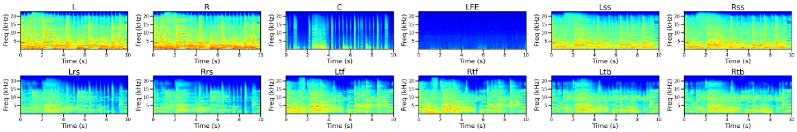
*Fig. 3:Log-mel spectrograms of a 10-second example from the test set. (a) Ground truth 7.1.4 audio; (b) ImmersiveFlow generated audio.*

---
**Usage Info**: 5267 tokens used.
**Generated at**: 2026-02-24 19:55:50

---

# 📚 A Unified Neural Codec Language Model for Selective Editable Text to Speech Generation

🚀 URL: https://arxiv.org/html/2601.12480

## 🌏 Abstract (원문)
Recent zero-shot Text-to-Speech (TTS) generation has advanced rapidly with the rise of modern generative modeling, enabling high-fidelity voice cloning from short, unseen reference prompts. Existing systems leverage diverse acoustic representations, including discrete token-based approaches, continuous representations, and hybrid token modeling. Despite these advances, models treat the reference audio as a holistic, black-box condition, leaving key vocal attributes, such as timbre, emotion, prosody, and paralinguistic style, entangled and difficult to control independently. This limitation has motivated growing interest in controllable speech synthesis, where fine-grained manipulation of attributes enables more flexible, expressive, and personalized voice generation. Existing control paradigms include text-driven, audio-driven, and hybrid approaches. Text-driven methods rely on textual directives, including style tags, natural language descriptions, or instructions, offering explicit high-level control but often failing to capture subtle acoustic details or reproduce a specific speaker’s voice. Audio-driven approaches use dual speech prompts to separately specify timbre and style, partially alleviating these limitations. Hybrid systems combine textual instructions with audio prompts to balance explicit control and acoustic fidelity. However, when multiple prompts are used to control different aspects of speech, interactions between them can lead to attribute leakage and conflicts, where unintended prosodic or stylistic cues affect the output. These challenges necessitate a more precise approach that supports the fine-grained editing of individual speech attributes. In this work, we formulate controllable speech generation as a selective attribute editing problem. Given a speech prompt p, a target text x, and an edit specification e, the goal is to generate speech that preserves the inherent attributes of p, such as speaker identity, while modifying only those explicitly indicated by e, such as the emotion. The editable space in this work spans three fundamental and interpretable dimensions of expressive speech: (1) Emotion-related attributes describe the affective state. (2) Prosody-related attributes characterize paralinguistic properties such as pitch, speaking speed, and energy, which jointly determine how the utterance is realized acoustically. (3) Speaker-related attributes primarily correspond to timbre. Unlike conventional TTS or global style-transfer settings, this setup requires fine-grained, attribute-level editing while keeping all unspecified components faithful to the reference. For speaker editing, the system is given an extra speaker prompt for timbre mimic, much like voice conversion task, but within a TTS framework supporting random target text sequence. Rather than explicitly disentangling speech attributes through specialized architectures or training schemes, we hypothesize that the in-context learning capability of neural codec language models (LMs)—trained on large, diverse datasets spanning multiple speakers, emotions, and vocal attributes—naturally provides implicit disentanglement. Building on this intuition, we design SpeechEdit, which treats the speech prompt as a base canvas and selectively modifies only the attributes specified by the user. This unified formulation enables a single model to seamlessly support zero-shot TTS, voice conversion, and fine-grained style editing. To train SpeechEdit, we construct a new dataset, LibriEdit, by labeling the speech attributes of utterances from LibriHeavy. We introduce a Delta-Pairs sampling method to generate training triplets (speech prompt, edit specification, speech target) by randomly sampling two utterances from LibriEdit and designating one as the prompt and the other as the target, with the differing attributes between them as the edit specification. Experimental results conducted on various speech editing tasks show that SpeechEdit achieves highly competitive performance on naturalness and robustness, while reaching state-of-the-art (SOTA) performance in selective speech editing. Our main contributions are as follows: We propose SpeechEdit, a unified selective editing framework that leverages the in-context learning capability of neural codec LMs to integrate zero-shot TTS, voice conversion, and style editing within a single model, enabling precise attribute-level control while faithfully preserving speaker identity. We introduce a data-driven implicit disentanglement strategy that combines assumption-free Delta-Pairs sampling with our newly annotated LibriEdit dataset, enabling promising separation of speaker identity and style attributes without complex auxiliary modules and providing a scalable paradigm for expressive speech synthesis.
## 🌏 Abstract (번역)
최근 제로샷 텍스트 음성 변환(TTS) 생성은 현대적인 생성 모델링의 부상과 함께 급격히 발전하여, 보지 못한 짧은 참조 프롬프트로부터 고충실도 음성 클로닝을 가능하게 했습니다. 기존 시스템은 이산 토큰 기반 방식, 연속 표현 방식, 하이브리드 토큰 모델링 등 다양한 음향 표현을 활용합니다. 이러한 발전에도 불구하고, 모델들은 참조 오디오를 전체적인 블랙박스 조건으로 취급하여 음색, 감정, 운율 및 언어 외적 스타일과 같은 주요 음성 속성들이 얽혀 있어 독립적으로 제어하기 어렵게 만듭니다. 이러한 한계는 속성의 미세한 조작을 통해 더 유연하고 표현력 있으며 개인화된 음성 생성을 가능하게 하는 제어 가능한 음성 합성에 대한 관심을 불러일으켰습니다. 기존의 제어 패러다임에는 텍스트 기반, 오디오 기반 및 하이브리드 접근 방식이 포함됩니다. 텍스트 기반 방식은 스타일 태그, 자연어 설명 또는 지시어와 같은 텍스트 지침에 의존하여 명시적인 상위 수준의 제어를 제공하지만, 미묘한 음향적 세부 사항을 포착하거나 특정 화자의 음성을 재현하는 데 실패하는 경우가 많습니다. 오디오 기반 방식은 이중 음성 프롬프트를 사용하여 음색과 스타일을 별도로 지정함으로써 이러한 한계를 부분적으로 완화합니다. 하이브리드 시스템은 텍스트 지침과 오디오 프롬프트를 결합하여 명시적 제어와 음향적 충실도의 균형을 맞춥니다. 그러나 여러 프롬프트가 음성의 서로 다른 측면을 제어하는 데 사용될 때, 프롬프트 간의 상호 작용으로 인해 의도하지 않은 운율이나 스타일 단서가 출력에 영향을 미치는 속성 누출 및 충돌이 발생할 수 있습니다. 이러한 과제는 개별 음성 속성의 미세한 편집을 지원하는 보다 정밀한 접근 방식을 필요로 합니다. 본 연구에서는 제어 가능한 음성 생성을 선택적 속성 편집 문제로 공식화합니다. 음성 프롬프트 p, 대상 텍스트 x, 편집 사양 e가 주어졌을 때, 목표는 감정과 같이 e에 의해 명시적으로 표시된 속성만 수정하면서 화자 정체성과 같은 p의 고유한 속성을 보존하는 음성을 생성하는 것입니다. 본 연구의 편집 가능한 공간은 표현력 있는 음성의 세 가지 기본적이고 해석 가능한 차원을 포괄합니다: (1) 감정 관련 속성은 정서적 상태를 설명합니다. (2) 운율 관련 속성은 피치, 말하기 속도 및 에너지를 포함한 언어 외적 특성을 특징짓습니다. (3) 화자 관련 속성은 주로 음색에 해당합니다. 기존의 TTS나 전역 스타일 전이 설정과 달리, 이 설정은 지정되지 않은 모든 구성 요소를 참조에 충실하게 유지하면서 미세한 속성 수준의 편집을 요구합니다. 화자 편집의 경우, 시스템은 음성 변환 작업과 유사하게 음색 모방을 위한 추가 화자 프롬프트를 제공받지만, 무작위 대상 텍스트 시퀀스를 지원하는 TTS 프레임워크 내에서 작동합니다. 우리는 특수 아키텍처나 학습 체계를 통해 음성 속성을 명시적으로 분리하는 대신, 여러 화자, 감정 및 음성 속성을 아우르는 대규모의 다양한 데이터셋에서 학습된 신경 코덱 언어 모델(LM)의 인컨텍스트 학습 능력이 자연스럽게 암시적 분리를 제공한다는 가설을 세웁니다. 이러한 직관을 바탕으로, 우리는 음성 프롬프트를 기본 캔버스로 취급하고 사용자가 지정한 속성만 선택적으로 수정하는 SpeechEdit을 설계합니다. 이 통합된 공식은 단일 모델이 제로샷 TTS, 음성 변환 및 미세한 스타일 편집을 원활하게 지원할 수 있도록 합니다. SpeechEdit을 학습시키기 위해, 우리는 LibriHeavy의 발화에 음성 속성 레이블을 지정하여 새로운 데이터셋인 LibriEdit을 구축합니다. 우리는 LibriEdit에서 두 개의 발화를 무작위로 샘플링하고 하나를 프롬프트로, 다른 하나를 타겟으로 지정하며, 둘 사이의 서로 다른 속성을 편집 사양으로 지정하여 학습 트리플렛(음성 프롬프트, 편집 사양, 음성 타겟)을 생성하는 Delta-Pairs 샘플링 방법을 도입합니다. 다양한 음성 편집 작업에 대해 수행된 실험 결과, SpeechEdit은 자연스러움과 견고성에서 매우 경쟁력 있는 성능을 달성하는 동시에 선택적 음성 편집에서 최첨단(SOTA) 성능에 도달함을 보여줍니다. 우리의 주요 기여는 다음과 같습니다: 우리는 신경 코덱 LM의 인컨텍스트 학습 능력을 활용하여 제로샷 TTS, 음성 변환 및 스타일 편집을 단일 모델 내에 통합하고, 화자 정체성을 충실히 보존하면서 정밀한 속성 수준의 제어를 가능하게 하는 통합 선택적 편집 프레임워크인 SpeechEdit을 제안합니다. 우리는 복잡한 보조 모듈 없이 화자 정체성과 스타일 속성의 유망한 분리를 가능하게 하고 표현력 있는 음성 합성을 위한 확장 가능한 패러다임을 제공하는, 가정 없는 Delta-Pairs 샘플링과 새로 주석을 단 LibriEdit 데이터셋을 결합한 데이터 구동 암시적 분리 전략을 도입합니다.

## 🔍 Methods & Results
- SpeechEdit은 선택적 속성 편집을 프롬프트 가이드 신경 코덱 언어 모델링 작업으로 공식화하여 이산 코덱 토큰 공간에서 명시적 지침 컨디셔닝을 통해 편집을 수행함.
- AR(자기회귀) 모델은 첫 번째 코덱 레이어를 예측하여 기본 운율 및 음소 구조를 캡처하고, NAR(비자기회귀) 모델은 이후 레이어를 생성하여 음향 세부 사항을 정제함.
- 감정(5개 클래스) 및 운율(피치, 에너지, 속도 각 5단계)을 이산 지침 태그로 모델링하며, 화자 정체성은 사전 학습된 모델의 연속 화자 임베딩을 통해 제어함.
- 복잡한 보조 모듈 대신 'Delta-Pair Sampling' 전략을 도입하여 동일 화자 또는 타 화자 간의 속성 불일치 데이터를 통해 모델이 명시적 제어 신호에 집중하도록 유도하는 암시적 분리 학습을 수행함.
- LibriHeavy 데이터셋을 기반으로 음성 속성을 주석화한 LibriEdit 데이터셋을 구축하여 학습에 활용함.
- 실험 결과, SpeechEdit은 제로샷 TTS, 음성 변환, 스타일 편집 등 다양한 작업에서 자연스러움과 견고성을 유지하며 선택적 음성 편집 분야에서 SOTA 성능을 달성함.

## 🖼 Figures

*Figure 1:Overview of the SpeechEdit framework. Instruction tokens, textual content, and acoustic prompts are unified into a single token sequence through an instruction-guided conditioning interface. The codec language model performs selective attribute editing through data-driven implicit disentanglement with delta pairs.*

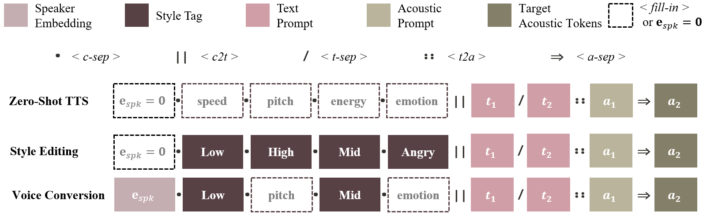
*Figure 2:Token sequence composition for different tasks within SpeechEdit.*

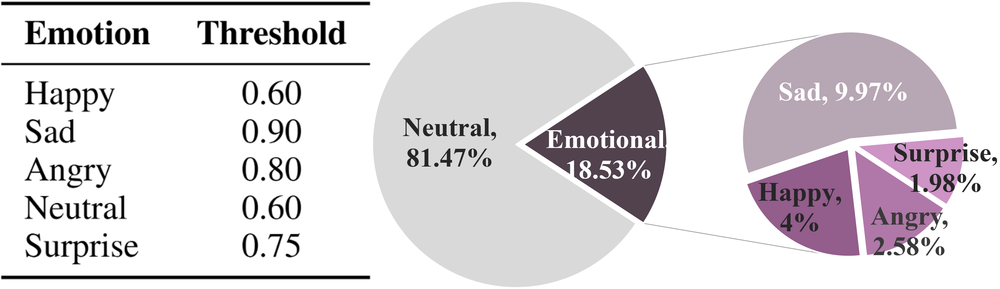
*Figure 3:Confidence thresholds for emotion labeling and the resulting distribution of emotions in LibriEdit.*

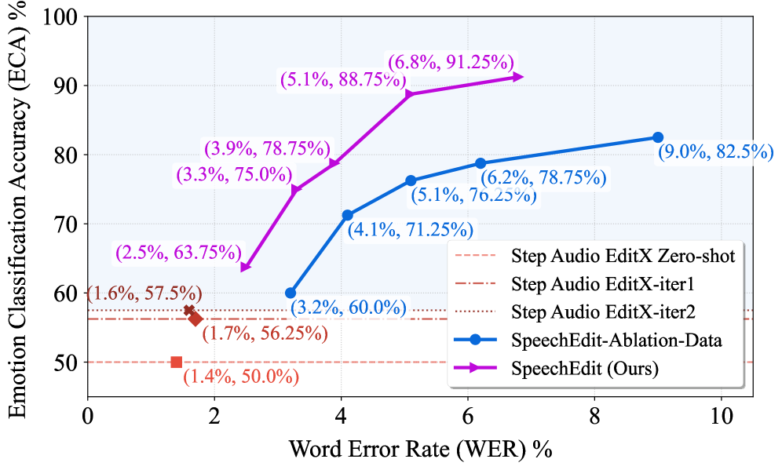
*Figure 4:Emotion editing performance on the easy task.*

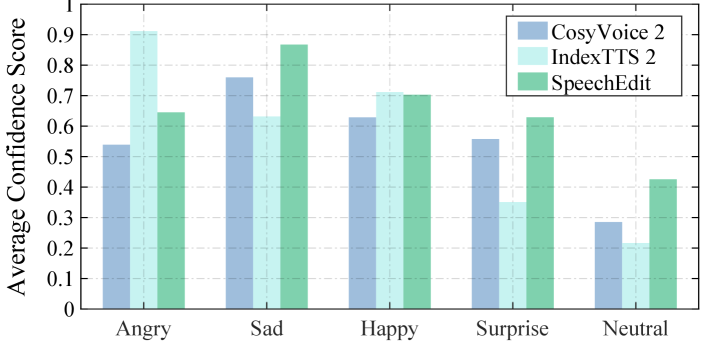
*Figure 5:Average classification confidence scores for correctly predicted samples across five emotions.*

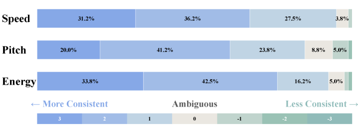
*Figure 6:Result of a CMOS-style subjective test on three prosody attributes: speed, pitch, and energy.*

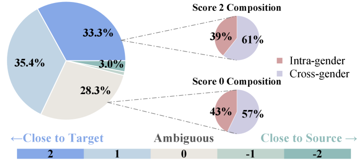
*Figure 7:Result of a CMOS-style subjective test on voice conversion.*

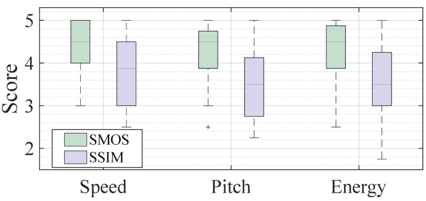
*Figure 8:Score distributions of SMOS and SSIM for Speed, Pitch, and Energy.*

*Figure 9:Impact of Top-
𝑝
 on attribute control accuracy.*

---
**Usage Info**: 6926 tokens used.
**Generated at**: 2026-02-24 19:56:38

---

# 📚 Lightweight Self-Supervised Detection of Fundamental Frequency and Accurate Probability of Voicing in Monophonic Music

🚀 URL: https://arxiv.org/html/2601.11768

## 🌏 Abstract (원문)
Estimating the fundamental frequency (F0) and whether a signal is voiced are core primitives for speech and music analysis and they underpin a wide range of downstream systems in Music Information Retrieval (MIR), audio editing, and neural synthesis. Classical pitch trackers such as YIN, RAPT, and pYIN exploit periodicity and heuristics that work well in controlled conditions, but become brittle under realistic acoustic artifacts and domain shift. Deep learning approaches (e.g., CREPE) have substantially improved accuracy on benchmark datasets, yet two practical barriers limit their usefulness for rapid, customized audio pipelines. First, most high-performing models are supervised and therefore rely on large, carefully annotated corpora that are expensive to build and difficult to scale across instruments, recording conditions, and playing techniques. Second, models trained on curated data often generalize poorly when deployed on real recordings with bleeding, reverberation, and background noise. These barriers are especially problematic for modern synthesis workflows, where feature extractors must be adapted quickly to a target instrument or recording setup. A motivating example is Differentiable Digital Signal Processing (DDSP) and related neural synthesis systems. These frameworks can produce high-quality, personalized instruments, but assume reliable F0 and voicing features. Practitioners often aim to build a custom synthesizer from minutes of audio rather than hours, yet many current pitch extractors, supervised or self-supervised, are trained on large corpora and are not designed to converge robustly in low-data, single-instrument settings. This paper reframes pitch estimation as a low-data, single-instrument, fast-training problem. Our goal is to learn an F0/voicing front-end that can be trained efficiently from a small amount of target audio, while remaining reliable on real recordings. To emphasize realistic acoustics, we focus on MedleyDB, which contains genuine multitrack recordings and therefore exhibits bleed, room effects, and non-ideal isolation. To eliminate the need for manual pitch labels and to support rapid adaptation, we adopt self-supervised learning (SSL) with a transposition-equivariant objective inspired by SPICE and PESTO. Using a Constant-Q Transform (CQT) representation, we train the model to satisfy a simple consistency constraint: if the input audio is pitch-shifted by a known interval, the model’s internal pitch representation must shift by the same amount. Beyond F0, we target robust voicing detection under interference. We exploit this reality through the Shift Cross-Entropy (SCE) loss: the equivariant objective is minimized only when the pitch representation is stable and unambiguous, a condition that is strongly correlated with genuinely voiced content. We use this stability signal to construct reliable pseudo-labels and train a dedicated voicing classifier, producing an F0/voicing pipeline that is both label-free and resilient to realistic artifacts.
## 🌏 Abstract (번역)
기본 주파수(F0) 추정 및 신호의 유성음(voiced) 여부 판단은 음성 및 음악 분석의 핵심 요소이며, 음악 정보 검색(MIR), 오디오 편집, 신경망 합성 등 광범위한 하위 시스템의 기초가 됩니다. YIN, RAPT, pYIN과 같은 고전적인 피치 추적기들은 주기성과 휴리스틱을 활용하여 통제된 조건에서는 잘 작동하지만, 실제 음향 아티팩트나 도메인 변화가 발생하면 취약해집니다. CREPE와 같은 딥러닝 접근 방식은 벤치마크 데이터셋에서 정확도를 크게 향상시켰으나, 신속하고 맞춤화된 오디오 파이프라인에 적용하기에는 두 가지 실질적인 장벽이 있습니다. 첫째, 대부분의 고성능 모델은 지도 학습 방식이므로 구축 비용이 많이 들고 악기, 녹음 조건, 연주 기법에 따라 확장하기 어려운 대규모의 정밀한 주석이 달린 말뭉치에 의존합니다. 둘째, 정제된 데이터로 훈련된 모델은 블리딩(bleeding), 잔향, 배경 소음이 포함된 실제 녹음 데이터에 배포될 때 일반화 성능이 떨어지는 경우가 많습니다. 이러한 장벽은 특징 추출기가 대상 악기나 녹음 설정에 빠르게 적응해야 하는 현대적인 합성 워크플로우에서 특히 문제가 됩니다. 동기 부여 사례로 DDSP 및 관련 신경망 합성 시스템이 있습니다. 이러한 프레임워크는 고품질의 개인화된 악기를 생성할 수 있지만, 신뢰할 수 있는 F0 및 유성음 특징을 가정합니다. 실무자들은 종종 몇 시간이 아닌 몇 분 분량의 오디오로 맞춤형 합성기를 구축하고자 하지만, 현재의 많은 피치 추출기들은 대규모 말뭉치로 훈련되어 저데이터, 단일 악기 설정에서 견고하게 수렴하도록 설계되지 않았습니다. 본 논문은 피치 추정을 저데이터, 단일 악기, 빠른 훈련 문제로 재정의합니다. 우리의 목표는 적은 양의 대상 오디오로 효율적으로 훈련될 수 있으면서 실제 녹음에서도 신뢰성을 유지하는 F0/유성음 프런트엔드를 학습하는 것입니다. 실제 음향을 강조하기 위해 실제 멀티트랙 녹음을 포함하여 블리딩, 실내 효과, 불완전한 격리 특성을 보이는 MedleyDB에 집중합니다. 수동 피치 레이블의 필요성을 없애고 빠른 적응을 지원하기 위해, SPICE 및 PESTO에서 영감을 받은 전치 등변성(transposition-equivariant) 목적 함수를 사용하는 자기 지도 학습(SSL)을 채택합니다. CQT 표현을 사용하여, 입력 오디오가 알려진 간격만큼 피치 시프트되면 모델의 내부 피치 표현도 동일한 양만큼 시프트되어야 한다는 일관성 제약 조건을 만족하도록 모델을 훈련합니다. F0 외에도 간섭 상황에서의 견고한 유성음 탐지를 목표로 합니다. 우리는 시프트 교차 엔트로피(SCE) 손실을 통해 이를 활용합니다. 등변성 목적 함수는 피치 표현이 안정적이고 모호하지 않을 때만 최소화되며, 이는 실제 유성음 콘텐츠와 강하게 상관됩니다. 이 안정성 신호를 사용하여 신뢰할 수 있는 의사 레이블(pseudo-labels)을 생성하고 전용 유성음 분류기를 훈련함으로써, 레이블이 필요 없고 실제 아티팩트에 탄력적인 F0/유성음 파이프라인을 구축합니다.

## 🔍 Methods & Results
- PESTO의 자기 지도 학습 패러다임을 기반으로 단일 악기 및 저데이터 환경에 최적화된 F0 및 유성음 추정 방법론 제안
- CQT(Constant-Q Transform) 프런트엔드를 사용하여 오디오 증강과 음악적 전치(transposition)를 일치시킴
- 효율적인 ResNeXt1D 인코더와 Toeplitz 구조의 피치 헤드를 결합하여 파라미터 효율성을 높이고 사후 보정 기능을 지원
- 전치 등변성(Transposition Equivariance)을 활용한 자기 지도 학습 목적 함수인 SCE(Shift Cross-Entropy) 손실 도입
- 실제 녹음의 노이즈 및 블리딩으로 인한 불안정한 그래디언트 문제를 해결하기 위해 EM(Expectation-Maximization) 기반의 반복적 재가중치(Iterative Reweighting) 전략 적용
- SCE 손실의 안정성 신호를 의사 레이블(pseudo-labels)로 변환하여 별도의 경량 유성음 분류기를 학습하는 2단계 파이프라인 구축
- MedleyDB(실제 녹음)로 훈련하고 MDB-stem-synth(합성 데이터)로 평가하여 실제 환경에서의 견고성 입증
- 제안된 방법은 수동 레이블 없이도 수 분 분량의 적은 데이터로 타겟 악기에 빠르게 적응 가능함을 확인

## 🖼 Figures
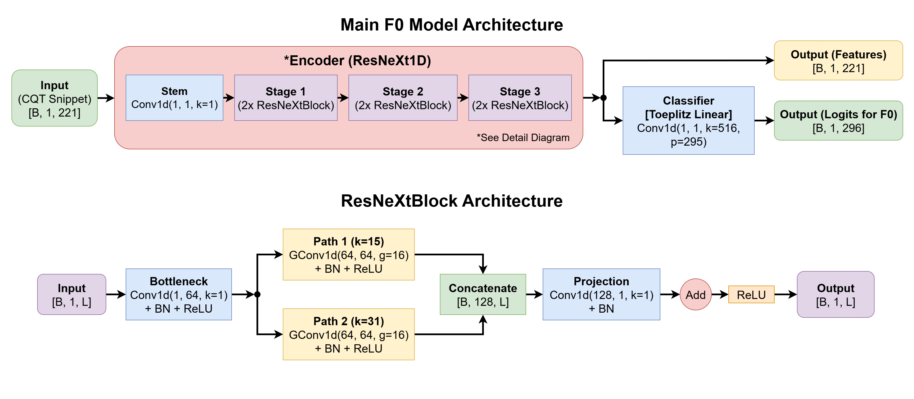
*Figure 1:Model architecture. ResNeXt1D encoder over CQT frames followed by a Toeplitz linear classifier (implemented as a 1D convolution) producing pitch logits.*

*Figure 2:Acoustic comparison: MedleyDB vs. MDB-stem-synth. (Top) MedleyDB recordings show broader partials, modulation sidebands, and exponential decay tails from room acoustics. (Bottom) MDB-stem-synth exhibits narrow harmonic tracks with abrupt terminations and exact silence (black regions). Real recordings retain residual energy from bleed and reverb where synthetic stems are perfectly zero.*

*Figure 3:Learned weight behavior on MedleyDB. (Top) CQT spectrogram with predicted 
𝐹
0
 (black). (Middle) EM sample weights 
𝑤
 (green) remain high on sustained harmonics and drop during releases and transients. (Bottom) Derived voicing 
𝑣
^
 (red) effectively gates voiced segments, automatically distinguishing stable pitch from ambiguous content.*

*Figure 4:Histogram of EM sample weights on MedleyDB (log-count scale). Clear bimodality: most frames are confidently kept (
𝑤
≈
1
) or down-weighted (
𝑤
≈
0
).*

![Figure 5:(a) Target audio (CQT). Clear stair-step contours from MedleyDB clarinet with narrow partials and clean inter-note gaps. (b) Synthesized audio (CQT) from 
𝐹
^
0
 and 
𝑣
^
. Harmonic ladders align with the target. The black gaps indicate voicing-controlled muting during predicted unvoiced spans. Low-frequency wedges at the very left/right arise from segment fade-in/out. (c) MDB-stem-synth Synthesis (CQT). Resynthesized audio exhibits narrow, high-contrast harmonic partials with hard on/offsets, exact silences (black gaps), and minimal modulation sidebands compared to real recordings.](../images/2026-01-21/2601.11768/2601.11768_fig4.png)
*Figure 5:(a) Target audio (CQT). Clear stair-step contours from MedleyDB clarinet with narrow partials and clean inter-note gaps. (b) Synthesized audio (CQT) from 
𝐹
^
0
 and 
𝑣
^
. Harmonic ladders align with the target. The black gaps indicate voicing-controlled muting during predicted unvoiced spans. Low-frequency wedges at the very left/right arise from segment fade-in/out. (c) MDB-stem-synth Synthesis (CQT). Resynthesized audio exhibits narrow, high-contrast harmonic partials with hard on/offsets, exact silences (black gaps), and minimal modulation sidebands compared to real recordings.*

*Figure 6:Harmonic Synthesizer Architecture for Analysis-by-Synthesis. Inputs (‘
𝐹
0
 Bins’, ‘Voicing Flag’) are processed and upsampled. Learnable parameters (‘Frame Gains’, ‘Harmonic Phases’, ‘Log Master Gain’) control harmonic frequencies, phases, and amplitudes. The synthesis stage combines these components, applying voicing and Nyquist masking, to generate the final audio output.*

---
**Usage Info**: 7051 tokens used.
**Generated at**: 2026-02-24 19:57:29

---

# 📚 Typhoon ASR Real-time: FastConformer-Transducer for Thai Automatic Speech Recognition

🚀 URL: https://arxiv.org/html/2601.13044

## 🌏 Abstract (원문)
Automatic Speech Recognition (ASR) has experienced transformative progress in recent years, driven by advances in self-supervised learning and large-scale multilingual modeling. Models such as Wav2Vec2(Baevski et al.,2020)and XLS-R(Babu et al.,2021)demonstrated the power of pre-training on massive unlabeled audio corpora, while OpenAI’s Whisper(Radford et al.,2023)established new benchmarks for transcription accuracy across dozens of languages. However, despite these achievements, state-of-the-art ASR systems face critical limitations when deployed in production environments requiring real-time streaming, particularly for morphologically complex and low-resource languages like Thai. Production-Grade ASR Demands Beyond Accuracy.While encoder-decoder architectures like Whisper excel at offline transcription accuracy, they are fundamentally not well-suited for low-latency streaming applications. The autoregressive decoding process introduces unpredictable latency, and these models are prone to hallucinations–generating plausible but incorrect outputs, particularly for numbers, dates, and domain-specific terminology. For Thai, a tonal language without explicit word boundaries, these issues are compounded by unique linguistic challenges: ambiguous number representations, context-dependent repetition markers, and inconsistent handling of loanwords. These problems are not adequately addressed by model architecture alone; they require systematic data preparation. Thai ASR Challenge.Thai presents distinct difficulties for ASR systems. As a low-resource language relative to English or Mandarin, available training data is limited and often inconsistently annotated. The Thai writing system does not use spaces to delimit words, making tokenization non-trivial and rendering standard metrics like Word Error Rate inapplicable. Moreover, the same written form can correspond to multiple spoken realizations: the digits “10150” might be read as a postal code (nueng sun nueng ha sun) or as a quantity (nueng muen nueng roi ha sip). Without careful normalization, this inherent ambiguity introduces noise into the training process, leading to unreliable model behavior. Our Approach: Data Quality and Consistency as a First-Class Principle.We argue that for production-ready ASR, particularly in low-resource settings,data quality and consistency are as important as model architecture. While existing work focuses primarily on scaling model parameters or training data volume, we demonstrate that systematic data curation–specifically, comprehensive text normalization–is essential for building robust, reliable systems. In this work, we introduce Typhoon ASR Realtime, a FastConformer-Transducer model optimized for streaming Thai speech recognition. While Transformer-based encoder-decoder architectures (e.g., Whisper) currently dominate the Thai ASR landscape, we argue that the Conformer family–despite its proven efficiency in streaming scenarios–remains significantly under-explored and under-utilized for Thai. Our approach revisits this high-potential architecture, combining its superior real-time inference capabilities with a rigorous data preparation pipeline to unlock performance that rivals massive offline models. We make the following contributions: Instead of a Whisper-based model, we chose the FastConformer-Transducer, specifically engineered for low-latency streaming applications with consistent, hallucination-free outputs. A scalable semi-supervised data pipeline that leverages consensus from multiple teacher models to curate 11,000 hours of training data with minimal human intervention, overcoming the scarcity of large-scale labeled Thai corpora. A comprehensive text normalization pipeline that resolves systemic ambiguities in Thai transcription, creating a canonical training target. A multi-stage dialect adaptation strategy that extends the model to the Isan (north-eastern) dialect while mitigating catastrophic forgetting of Central Thai. Typhoon ASR Benchmark and TVSpeech that address the reproducibility crisis and metric instability in Thai ASR by introducing standardized evaluation protocols. Gigaspeech2-Typhoon provides a rigorous, canonically normalized target to resolve the orthographic ambiguities prevalent in public datasets, ensuring metrics reflect phonetic accuracy rather than formatting luck. Complementing this, TVSpeech introduces a challenging, manually curated dataset to bridge the gap between academic “clean speech” and the acoustically complex, real-world environments encountered in production.
## 🌏 Abstract (번역)
자동 음성 인식(ASR)은 최근 자기 지도 학습과 대규모 다국어 모델링의 발전으로 비약적인 진보를 이루었습니다. Wav2Vec2 및 XLS-R과 같은 모델은 대규모 미라벨링 오디오 코퍼스 사전 학습의 위력을 보여주었으며, OpenAI의 Whisper는 수십 개의 언어에 걸쳐 전사 정확도의 새로운 기준을 세웠습니다. 그러나 이러한 성과에도 불구하고, 최첨단 ASR 시스템은 실시간 스트리밍이 필요한 운영 환경에 배포될 때, 특히 태국어와 같이 형태학적으로 복잡하고 자원이 부족한 언어의 경우 심각한 한계에 직면합니다. 운영 수준의 ASR은 정확도 이상의 것을 요구합니다. Whisper와 같은 인코더-디코더 아키텍처는 오프라인 전사 정확도는 뛰어나지만, 근본적으로 저지연 스트리밍 애플리케이션에는 적합하지 않습니다. 자기회귀 디코딩 프로세스는 예측 불가능한 지연 시간을 유발하며, 이러한 모델은 특히 숫자, 날짜 및 도메인별 용어에 대해 그럴듯하지만 틀린 출력을 생성하는 환각 현상에 취약합니다. 명시적인 단어 경계가 없는 성조 언어인 태국어의 경우, 모호한 숫자 표현, 문맥 의존적 반복 마커, 일관되지 않은 외래어 처리와 같은 고유한 언어적 문제로 인해 이러한 이슈가 더욱 가중됩니다. 이러한 문제는 모델 아키텍처만으로는 충분히 해결되지 않으며 체계적인 데이터 준비가 필요합니다. 태국어는 영어 나 중국어에 비해 자원이 부족한 언어로서 훈련 데이터가 제한적이고 주석이 일관되지 않은 경우가 많습니다. 태국어 쓰기 시스템은 단어를 구분하기 위해 공백을 사용하지 않으므로 토큰화가 까다롭고 단어 오류율(WER)과 같은 표준 지표를 적용하기 어렵게 만듭니다. 또한 동일한 표기라도 여러 음성 구현에 대응할 수 있어 정규화 없이는 훈련 과정에 노이즈가 발생합니다. 본 연구에서는 스트리밍 태국어 음성 인식을 위해 최적화된 FastConformer-Transducer 모델인 Typhoon ASR Realtime을 소개합니다. 우리는 스트리밍 시나리오에서 효율성이 입증된 Conformer 계열이 태국어에 대해 여전히 충분히 탐구되지 않았다고 주장하며, 우수한 실시간 추론 능력과 엄격한 데이터 준비 파이프라인을 결합하여 대규모 오프라인 모델에 필적하는 성능을 구현했습니다. 주요 기여는 다음과 같습니다: 1) 저지연 스트리밍과 환각 없는 출력을 위해 설계된 FastConformer-Transducer 채택, 2) 최소한의 인간 개입으로 11,000시간의 데이터를 큐레이션하는 확장 가능한 준지도 학습 데이터 파이프라인, 3) 태국어 전사의 모호성을 해결하는 포괄적인 텍스트 정규화 파이프라인, 4) 중부 태국어의 망각을 방지하며 이산(Isan) 방언으로 확장하는 다단계 방언 적응 전략, 5) 표준화된 평가 프로토콜을 도입한 Typhoon ASR 벤치마크 및 TVSpeech 데이터셋 제공입니다.

## 🔍 Methods & Results
- FastConformer-Transducer 아키텍처 사용: 8배 깊이별 컨볼루션 서브샘플링을 통해 표준 Conformer보다 약 2.4배 빠른 인코더 속도를 달성하여 실시간 스트리밍 최적화.
- 대규모 데이터 학습: 사전 학습된 영어 모델을 기반으로 11,000시간의 태국어 데이터를 2개의 NVIDIA H100 GPU를 사용하여 단 17시간 만에 미세 조정 완료.
- 2단계 방언 적응 전략: 1단계(전역 적응)에서 낮은 학습률로 전체 모델을 학습하여 성조 변화를 포착하고, 2단계(언어 적응)에서 인코더를 동결하고 디코더/결합 네트워크만 학습하여 이산(Isan) 방언의 어휘 구조를 습득.
- 체계적인 데이터 큐레이션: 여러 교사 모델의 합의를 활용한 준지도 학습 파이프라인과 포괄적인 텍스트 정규화를 통해 데이터 품질과 일관성 확보.
- 성능 검증: Typhoon ASR 벤치마크와 TVSpeech 데이터셋을 통해 실제 운영 환경의 복잡한 음향 조건에서도 대규모 오프라인 모델에 필적하는 성능과 환각 없는 출력 확인.

## 🖼 Figures
![Figure 1:Pareto efficiency of Thai ASR models. The scatter plot illustrates the trade-off between computational cost (x-axis, GFLOPs per 30s audio segment on a logarithmic scale) and average Character Error Rate (y-axis) across three benchmarks. Our proposed streaming models, Typhoon ASR Realtime and Typhoon Isan ASR Realtime, occupy the optimal lower-left region (highlighted), demonstrating comparable accuracy to the offline state-of-the-art Pathumma-Whisper Large-v3 baseline while achieving an approximate 45
×
 reduction in computational complexity.](../images/2026-01-21/2601.13044/2601.13044_fig0.png)
*Figure 1:Pareto efficiency of Thai ASR models. The scatter plot illustrates the trade-off between computational cost (x-axis, GFLOPs per 30s audio segment on a logarithmic scale) and average Character Error Rate (y-axis) across three benchmarks. Our proposed streaming models, Typhoon ASR Realtime and Typhoon Isan ASR Realtime, occupy the optimal lower-left region (highlighted), demonstrating comparable accuracy to the offline state-of-the-art Pathumma-Whisper Large-v3 baseline while achieving an approximate 45
×
 reduction in computational complexity.*

*Figure 2:The Consensus Audio Transcription and Verification Pipeline. Raw audio is processed in parallel by three Whisper-Large models. A majority voting strategy selects consensus transcriptions, defaulting to Pathumma-Whisper-Large when no agreement exists. Complex transcriptions undergo human review, while clean outputs proceed directly to storage.*

*Figure 3:Two-stage curriculum learning for dialect adaptation. Stage 1 employs low learning rate (
10
−
5
) for gentle acoustic adaptation of the full model over 10 epochs. Stage 2 freezes the encoder (preserving acoustic stability) and employs high learning rate (
10
−
3
) for rapid linguistic specialization of the decoder and joint network over 15 epochs.*

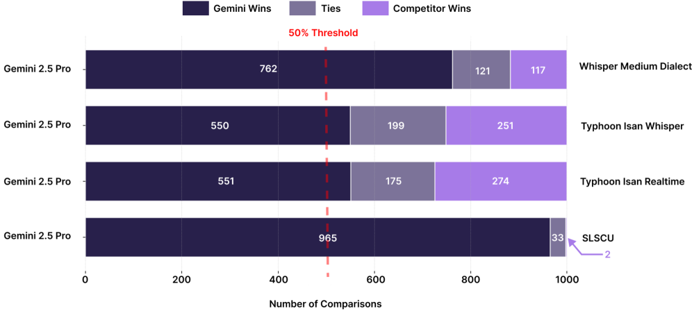
*Figure 4:A/B testing results showing Win-Tie-Loss counts for Gemini 2.5 Pro against various competitor systems (N=1000 comparisons). The dashed red line marks the 500-count (50%) threshold.*

---
**Usage Info**: 4803 tokens used.
**Generated at**: 2026-02-24 19:58:53

---

# 📚 LOMBARD SPEECH SYNTHESIS FOR ANY VOICE WITH CONTROLLABLE STYLE EMBEDDINGS

🚀 URL: https://arxiv.org/html/2601.12966

## 🌏 Abstract (원문)
Humans naturally adapt their speaking style under noisy conditions or when addressing listeners with hearing difficulties, which could be investigated under Lombard effect and hyperarticulated speech. This type of speech exhibits distinct acoustic attributes compared to regular speech, including increased intensity and clearer articulation, which result in higher diversity in the formant space[17,13]. Human speakers often hyperarticulate to disambiguate or clarify their speech to other humans, but for machines such distorted speech can result in higher error rates[18].Conventional speech processing systems, often require adaptation to such distortions[16]. Conversely, simulating this behavior in text-to-speech (TTS) systems is important for applications such as hearing-assistive technologies, robust speech synthesis in noisy environments or as a repair strategy for error correction in interactive systems[19,4].However, typical TTS models are trained on read-speech datasets that lack such variability, making Lombard attributes difficult to control. Previous approaches to incorporate Lombard or hyper-articulated speech into TTS include fine-tuning on small Lombard datasets[2,7,11], controlling spectral tilt to vary vocal effort[14], or dynamically adapting TTS loudness based on SNR feedback[10]. More recent methods leverage controllable style embeddings to modify articulation via principal component analysis (PCA)[9]. While effective, these approaches still depend on Lombard-specific training data and often fail to generalize to unseen speakers. The method most similar to ours[8]introduces zero-shot, speaker-adaptive Lombardness control by learning a mapping between plain and Lombard speaker embeddings and interpolating between them during inference. Although this approach achieves reasonable results, it still requires some Lombard data for training, may undesirably modify unrelated attributes of the speaker embeddings during interpolation, and linear mel-spectrogram stretching can lead to unnatural speaking rates. In this work, we address the limitations of existing Lombard TTS approaches by leveraging F5-TTS[3]as the baseline and incorporating style embeddings learned from a large, prosodically diverse dataset. We analyze the embedding space using PCA on Lombard and articulation datasets to identify correlations to the prosodic attributes. By selectively shifting these components and applying an inverse PCA transformation, we manipulate style embeddings in a controlled and interpretable manner. In addition, we incorporate duration control at inference to adjust speech length based on the desired speaking rate, which is particularly important for simulating clear speech. This framework enables zero-shot Lombard speech synthesis, generalization to unseen speakers, and direct control over prosody without additional Lombard data. Experiments show that our method preserves speaker identity and intelligibility under noisy conditions, offering a robust solution for controllable Lombard TTS. Audio samples are available at demo page.111https://seymanurakti.github.io/lombard-speech/
## 🌏 Abstract (번역)
인간은 소음이 있는 환경이나 청각 장애가 있는 청취자에게 말할 때 자연스럽게 말하기 스타일을 조정하며, 이는 롬바드 효과(Lombard effect)와 과조음(hyperarticulated) 발화의 관점에서 연구될 수 있습니다. 이러한 유형의 발화는 일반적인 발화와 비교하여 증가된 강도와 더 명확한 조음을 포함한 뚜렷한 음향적 특성을 나타내며, 이는 포먼트 공간에서 더 높은 다양성을 초래합니다. 인간 화자는 종종 다른 사람에게 자신의 말을 명확하게 전달하거나 모호함을 해소하기 위해 과조음을 사용하지만, 기계에게 이러한 왜곡된 발화는 더 높은 오류율을 유발할 수 있습니다. 기존의 음성 처리 시스템은 종종 이러한 왜곡에 대한 적응을 필요로 합니다. 반대로, 텍스트 음성 변환(TTS) 시스템에서 이러한 동작을 시뮬레이션하는 것은 청각 보조 기술, 소음 환경에서의 견고한 음성 합성 또는 대화형 시스템의 오류 수정을 위한 복구 전략과 같은 응용 분야에서 중요합니다. 그러나 일반적인 TTS 모델은 이러한 가변성이 부족한 낭독체 음성 데이터셋으로 학습되므로 롬바드 특성을 제어하기 어렵습니다. 롬바드 또는 과조음 발화를 TTS에 통합하려는 이전의 접근 방식에는 소규모 롬바드 데이터셋에 대한 미세 조정, 발성 노력을 변화시키기 위한 스펙트럼 기울기 제어, 또는 SNR 피드백을 기반으로 한 TTS 음량의 동적 적응 등이 포함됩니다. 보다 최근의 방법들은 주성분 분석(PCA)을 통해 조음을 수정하기 위해 제어 가능한 스타일 임베딩을 활용합니다. 이러한 방식들은 효과적이지만 여전히 롬바드 전용 학습 데이터에 의존하며 보지 못한 화자에게 일반화되지 못하는 경우가 많습니다. 본 연구와 가장 유사한 방법은 평상시와 롬바드 화자 임베딩 간의 매핑을 학습하고 추론 중에 이를 보간함으로써 제로샷 화자 적응형 롬바드 제어를 도입합니다. 이 접근 방식은 합리적인 결과를 얻었지만, 여전히 학습을 위해 일부 롬바드 데이터가 필요하고, 보간 중에 화자 임베딩의 관련 없는 속성을 원치 않게 수정할 수 있으며, 선형 멜-스펙트로그램 스트레칭이 부자연스러운 발화 속도로 이어질 수 있습니다. 본 연구에서는 F5-TTS를 기본 모델로 활용하고 대규모의 운율적으로 다양한 데이터셋에서 학습된 스타일 임베딩을 통합함으로써 기존 롬바드 TTS 접근 방식의 한계를 해결합니다. 롬바드 및 조음 데이터셋에 대해 스타일 임베딩 공간을 PCA로 분석하여 운율적 속성과의 상관관계를 식별합니다. 이러한 성분을 선택적으로 이동시키고 역 PCA 변환을 적용함으로써 제어 가능하고 해석 가능한 방식으로 스타일 임베딩을 조작합니다. 또한, 추론 시 지속 시간 제어를 통합하여 원하는 발화 속도에 따라 음성 길이를 조정하며, 이는 명확한 발화를 시뮬레이션하는 데 특히 중요합니다. 이 프레임워크는 추가적인 롬바드 데이터 없이도 제로샷 롬바드 음성 합성, 보지 못한 화자에 대한 일반화, 운율에 대한 직접적인 제어를 가능하게 합니다. 실험 결과, 본 방법은 소음 조건에서도 화자의 정체성과 명료도를 유지하며 제어 가능한 롬바드 TTS를 위한 견고한 솔루션을 제공함을 보여줍니다. 오디오 샘플은 데모 페이지(https://seymanurakti.github.io/lombard-speech/)에서 확인할 수 있습니다.

## 🔍 Methods & Results
- F5-TTS를 기본 모델로 채택하고, 추론 시 참조 텍스트 없이 고정된 크기의 스타일 임베딩을 통해 파라언어적 정보를 주입하도록 구조를 개선함
- ECAPA-TDNN 인코더를 사용하여 참조 오디오에서 1024차원의 스타일 특징을 추출하고, Diffusion Transformer(DiT) 블록에 FiLM 컨디셔닝을 적용함
- 화자 정보 누출을 방지하기 위해 학습 시 멜-스펙트로그램 입력에 포먼트 이동(formant shifts) 증강을 적용하여 모델이 스타일 임베딩에 의존하도록 유도함
- 스타일 임베딩 공간에 PCA를 적용하여 음량(Loudness) 및 명료도(Clarity)와 상관관계가 있는 주성분을 식별함
- PCA 공간에서 특정 성분을 이동시키고 역변환하는 방식을 통해 추가 롬바드 데이터 없이 롬바드 효과를 연속적으로 제어함
- 음절 수 기반의 지속 시간 제어(duration control)를 통합하여 명확한 발화를 위한 발화 속도 조절 기능을 구현함
- 실험 결과, 제안된 방법이 소음 환경에서 화자의 정체성을 보존하면서도 음성 명료도를 효과적으로 향상시킴을 입증함

## 🖼 Figures

*Fig. 1:Training (left) and inference (right) pipelines of the proposed system. Blue blocks represent components inherited from the original F5-TTS model, while green blocks indicate modules introduced in the proposed version.*

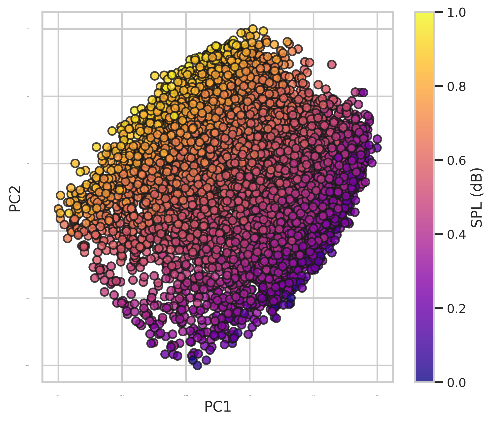
*(a)Correlation with loudness*

*(a)Correlation with loudness*

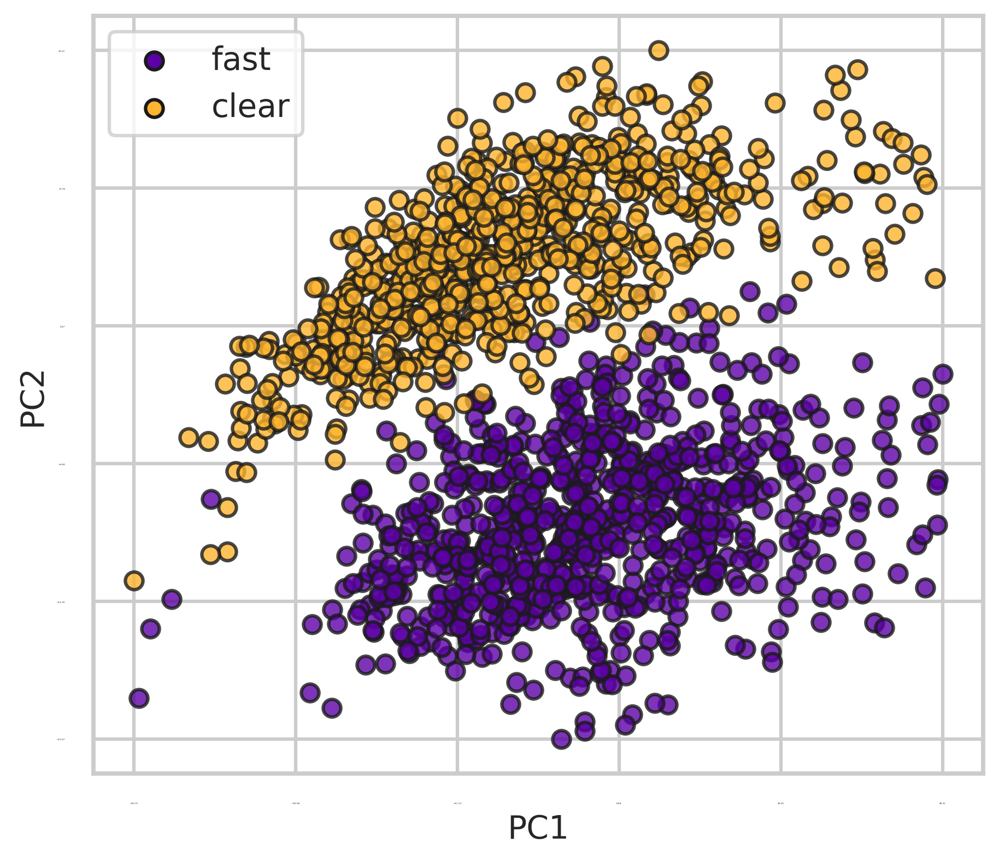
*(b)Correlation with clarity*

*Fig. 3:WER and 
Δ
WER trends for GT and TTS.*

---
**Usage Info**: 4657 tokens used.
**Generated at**: 2026-02-24 19:59:34

---

# 📚 TF-CoDiT: Conditional Time Series Synthesis with Diffusion Transformers for Treasury Futures

🚀 URL: https://arxiv.org/html/2601.11880

## 🌏 Abstract (원문)
Treasury futures (TF) represent a cornerstone of the fixed-income market. Beyond hedging against interest rate volatility, it serves as a critical gateway for general investors and quantitative investment institutions to participate in fixed income investments, earning widespread interest. Recently, emerging foundation models (FMs) with billions of parameters have catalyzed a transformative shift in financial time-series analysis, unlocking a simultaneous opportunity for the deep study of TF markets. However, the efficacy of FMs relies heavily on the vast volume of real-world financial data for training and validation. The gap between the drastically growing data needs and the daily renewing markets increases, posing a significant challenge to the research community. Considerable effort has been dedicated to generating synthetic financial time-series data. Generative adversarial networks (GANs) and diffusion models have been explored, but they are inadequate for accurately tracing the inscrutable movement of TF markets. We highlight three key characteristics that set treasury futures apart: sparse data, exogenous dynamics governed by economic policies, and multi-dimensional interrelated variables. Based on these, we propose TF-CoDiT, the first controllable DiT framework for time series (TS) synthesis of treasury futures with language as conditions. The main idea is to adapt text-to-image DiT for text-to-TS generation. We train TF-CoDiT to generate 2D spectrograms of 1D TS data using invertible Discrete Wavelet Transform. Additionally, we propose a U-shape VAE to capture inter-variable correlations and align with latent diffusion. Finally, we introduce the Financial Market Attribute Protocol (FinMAP) to cover essential market conditions using precise prompt words. Experiments on data from 2015 to 2025 demonstrate that TF-CoDiT synthesizes high-fidelity TF time series, outperforming previous approaches by reducing MSE/MAE by 13.4%/12.8% at month-level generations.
## 🌏 Abstract (번역)
국채 선물(TF)은 고정 수입 시장의 초석입니다. 금리 변동성에 대한 헤징을 넘어, 일반 투자자와 퀀트 투자 기관이 고정 수입 투자에 참여하는 중요한 관문 역할을 하며 널리 관심을 받고 있습니다. 최근 수십억 개의 파라미터를 가진 신흥 파운데이션 모델(FM)은 금융 시계열 분석의 혁신적인 변화를 촉진했으며, 국채 선물 시장에 대한 심층 연구의 기회를 열었습니다. 그러나 FM의 효능은 훈련 및 검증을 위한 방대한 양의 실제 금융 데이터에 크게 의존합니다. 급격히 증가하는 데이터 요구 사항과 매일 갱신되는 시장 사이의 격차는 연구 커뮤니티에 큰 도전 과제가 되고 있습니다. 합성 금융 시계열 데이터를 생성하기 위해 많은 노력이 기울여졌습니다. 생성적 적대 신경망(GAN)과 확산 모델이 탐구되었으나, 국채 선물 시장의 난해한 움직임을 정확하게 추적하기에는 부족함이 있었습니다. 본 연구에서는 국채 선물을 구별 짓는 세 가지 주요 특징으로 데이터의 희소성, 경제 정책에 의해 지배되는 외생적 역학, 그리고 다차원적 상호 연관 변수를 강조합니다. 이를 바탕으로 언어를 조건으로 하는 국채 선물 시계열 합성을 위한 최초의 제어 가능한 DiT 프레임워크인 TF-CoDiT를 제안합니다. 핵심 아이디어는 텍스트-이미지 DiT를 텍스트-시계열 생성에 맞게 조정하는 것입니다. 가역적 이산 웨이브릿 변환을 사용하여 1D 시계열 데이터의 2D 스펙트로그램을 생성하도록 TF-CoDiT를 훈련합니다. 또한, 변수 간 상관관계를 포착하고 잠재 확산에 정렬하기 위해 U-자형 VAE를 제안합니다. 마지막으로, 정밀한 프롬프트 단어를 사용하여 필수적인 시장 조건을 포괄하는 금융 시장 속성 프로토콜(FinMAP)을 도입합니다. 2015년부터 2025년까지의 데이터를 이용한 실험 결과, TF-CoDiT는 높은 충실도의 시계열을 합성하며 월간 생성 작업에서 기존 방식보다 MSE/MAE를 각각 13.4%, 12.8% 감소시키는 우수한 성능을 보였습니다.

## 🔍 Methods & Results
- TF-CoDiT 프레임워크: 텍스트-이미지 DiT 구조를 시계열 생성에 맞게 변형하여 언어 조건부 국채 선물 데이터를 합성하는 모델 제안
- 이산 웨이브릿 변환(DWT): 1차원 시계열(시가, 종가, 거래량 등 8개 변수)을 2차원 시간-주파수 스펙트로그램으로 변환하여 멀티 스케일 변동성 포착
- U-shape VAE (U-VAE): Latent Query Attention(LQA)을 사용하여 채널 간 의존성을 인코딩하고 스펙트로그램을 잠재 벡터로 압축 및 복원
- FinMAP 프로토콜: 17개 일일 지표와 23개 주기적 지표를 포함하는 계층적 설명 시스템을 통해 정밀한 텍스트 프롬프트 생성
- 잠재 확산 모델: 사전 학습된 LLM의 가중치를 고정하고 임베딩 및 출력 레이어만 학습시켜 거시 경제 서사와 가격 움직임 간의 비선형 상관관계 모델링
- 성능 지표: 실제 데이터 대비 최대 0.433 MSE 및 0.453 MAE의 높은 합성 정확도 달성
- 비교 우위: 기존 T2S 모델 대비 월간 생성 작업에서 MSE 13.4%, MAE 12.8% 개선 및 다양한 계약 기간에서 일관된 성능 입증

## 🖼 Figures
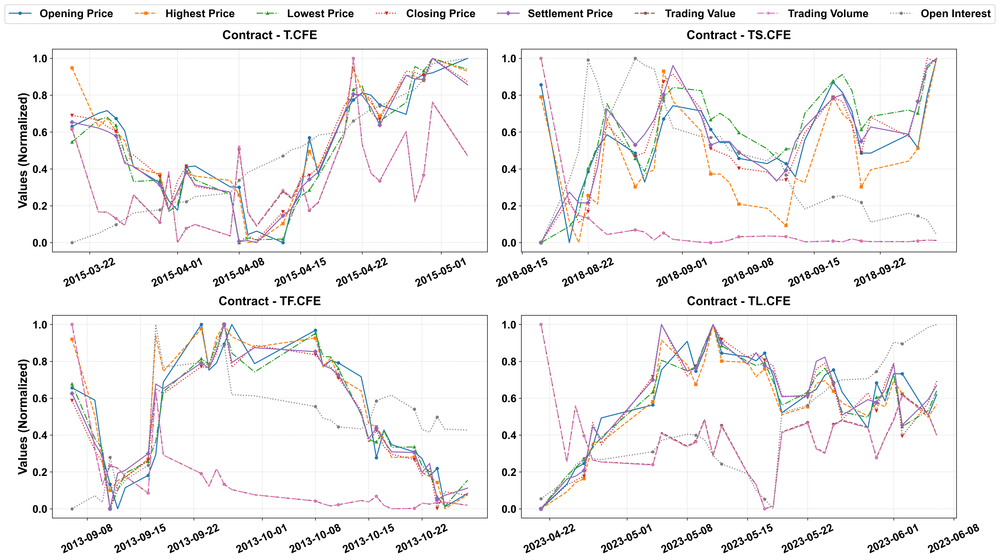
*Figure 1: Monthly tendency line of treasury futures in four types of contracts (T, TS, TF, and TL).*

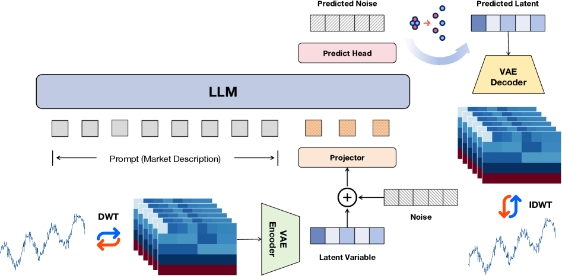
*Figure 2:Overview of the TF-CoDiT framework.*

*(a)Daily-level FinMAP*

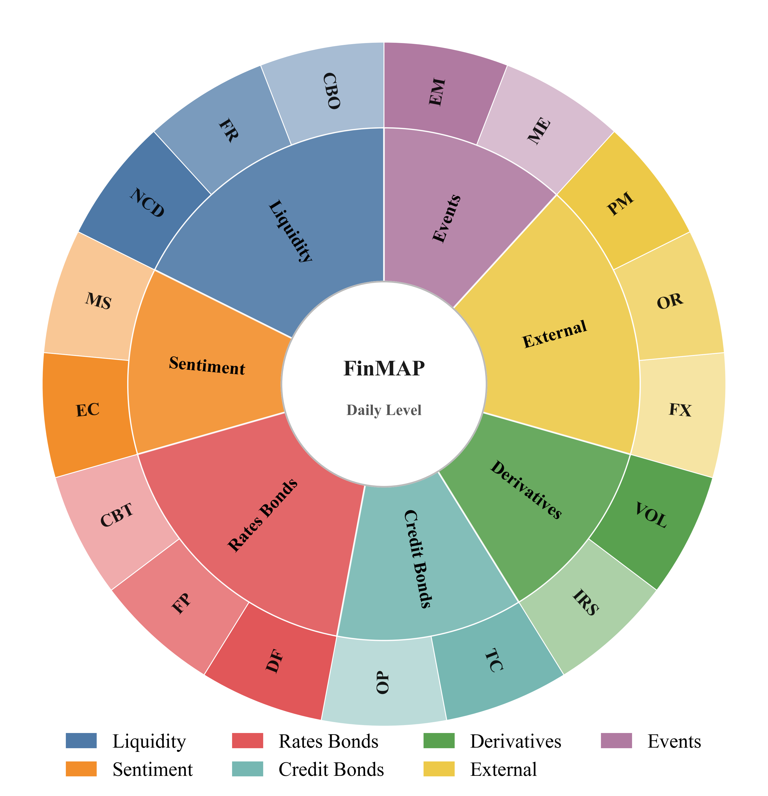
*(a)Daily-level FinMAP*

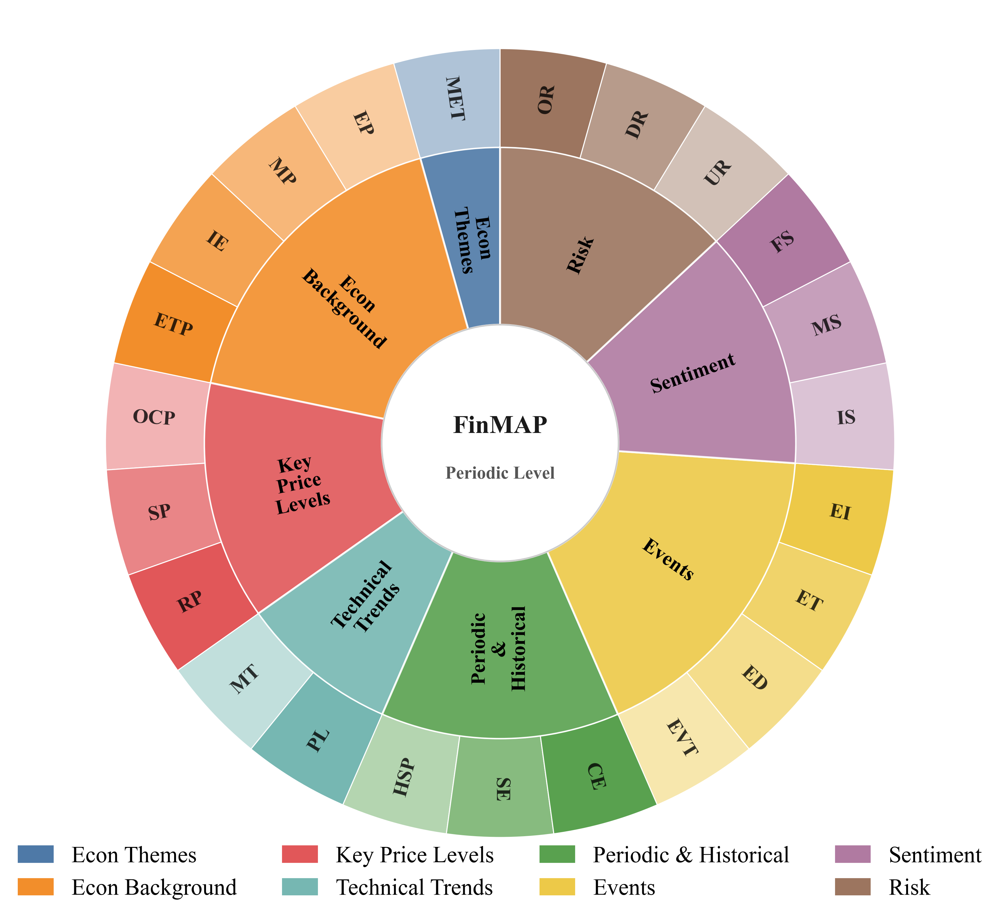
*(b)Periodic-level FinMAP*

*(a)Error band of 32-day generation.*

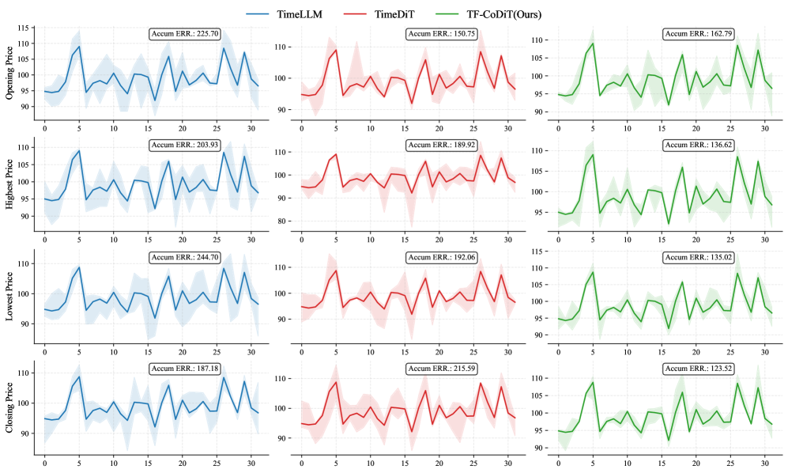
*(a)Error band of 32-day generation.*

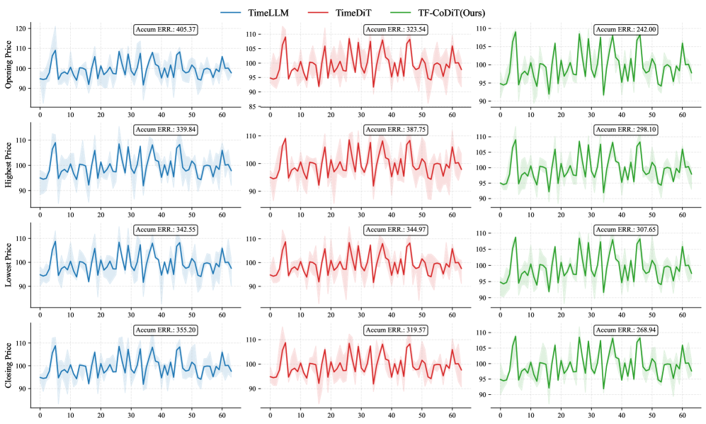
*(b)Error band of 64-day generation.*

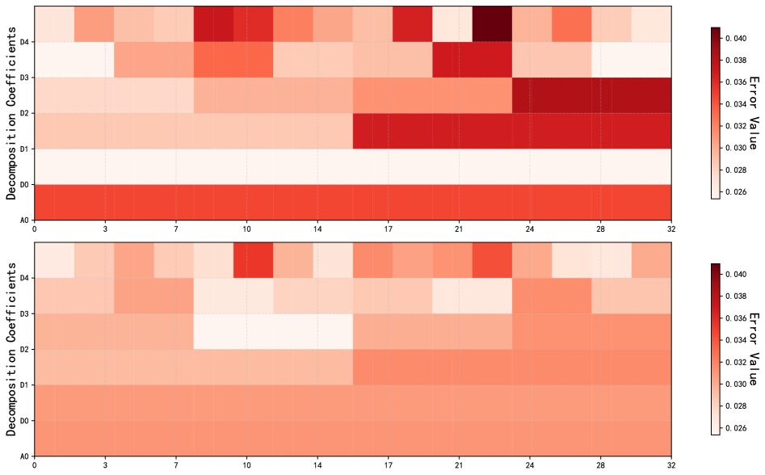
*Figure 5: Element-wise reconstruction errors achieved by U-VAE with MSE loss (upper) and L1 loss (lower).*

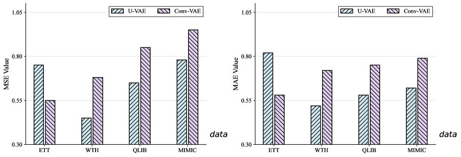
*Figure 6:Reconstruction errors over DWT matrix.*

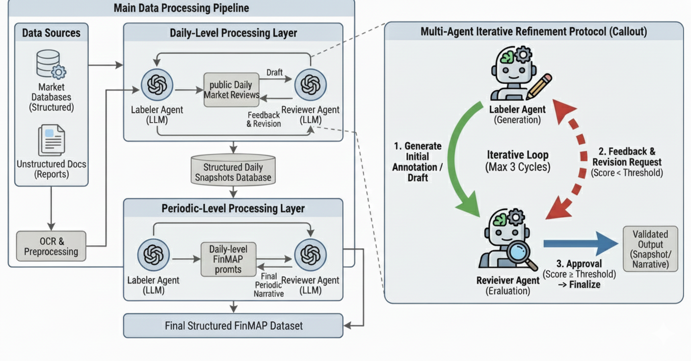
*Figure 7:A multi-agent framework for prompt labeling of treasury futures data.*

---
**Usage Info**: 6996 tokens used.
**Generated at**: 2026-02-24 20:00:26

---

# 📚 SLAP: Scalable Language-Audio Pretraining with Variable-Duration Audio and Multi-Objective Training

🚀 URL: https://arxiv.org/html/2601.12594

## 🌏 Abstract (원문)
Contrastive language-audio pretraining (CLAP)[1,2]has recently emerged as a powerful paradigm for learning semantically rich and transferable audio representations from paired audio-text data, inspired by the success of CLIP[3]in the vision domain. CLAP models have demonstrated strong performance across a variety of audio-related tasks, including zero-shot audio classification[1], audio captioning[4], and audio separation and generation[5,6]. Despite these advances, current CLAP models face several critical limitations that hinder their effectiveness and scalability in real-world scenarios. First, existing CLAP models are typically trained on relatively small datasets, often containing only a few million audio samples. In contrast, CLIP models benefit from billion-scale datasets, enabling them to learn more robust and generalizable features. Although recent efforts have leveraged large language models (LLMs) to generate captions for unlabeled audio[7,8], the scarcity of large-scale, high-quality audio-text pairs remains a significant bottleneck. As a consequence, most CLAP models initialize their audio encoders with weights from models pretrained on AudioSet[9], rather than training from scratch like CLIP models. Second, most CLAP models with Transformer-based audio encoder are trained with short and fixed-duration audio clips, typically no longer than 10 seconds. In practice, shorter segments are padded to a predefined length, while longer segments are truncated, leading to inefficient computation and potential information loss. This duration limitation mainly arises from the reliance on audio encoders pretrained on AudioSet[9]as well as the computational challenges associated with handling long and variable-length inputs. Although some recent approaches have attempted to extend CLAP models to longer and variable-length audio[2,10], these methods have not fully addressed this challenge. Third, the contrastive training objective in CLAP focuses on aligning global representations of audio and text pairs. While this approach is effective for learning high-level semantic correspondences, it may limit the model’s ability to capture dense, fine-grained audio features that generalize well to downstream audio understanding tasks. Although multi-objective training with self-supervised and captioning objectives have been explored[11,12], they often introduce additional complexity with complex multi-stage training design. To address these challenges, we propose Scalable Language-Audio Pretraining (SLAP), a new framework that improves contrastive language-audio pretraining along three dimensions. First, SLAP scales pretraining to 109 million audio-text pairs, significantly surpassing the scale of previous work. Second, SLAP natively supports variable audio durations by redesigning the Transformer-based audio encoder and training the encoder from scratch. Third, SLAP unifies contrastive, self-supervised and captioning losses into a single-stage training pipeline, facilitating the learning of richer and denser audio representations. SLAP achieves new state-of-the-art (SOTA) results on multiple audio-language benchmarks, highlighting the importance of large-scale, flexible, and multi-objective pretraining for audio representation learning.
## 🌏 Abstract (번역)
대조 언어-오디오 사전 학습(CLAP)은 시각 분야에서 CLIP의 성공에 영감을 받아, 쌍을 이룬 오디오-텍스트 데이터로부터 의미론적으로 풍부하고 전이 가능한 오디오 표현을 학습하는 강력한 패러다임으로 부상했습니다. CLAP 모델은 제로샷 오디오 분류, 오디오 캡셔닝, 오디오 분리 및 생성 등 다양한 오디오 관련 작업에서 강력한 성능을 입증했습니다. 이러한 발전에도 불구하고, 현재의 CLAP 모델은 실제 환경에서의 효과와 확장성을 저해하는 몇 가지 중요한 한계에 직면해 있습니다. 첫째, 기존 CLAP 모델은 일반적으로 수백만 개의 오디오 샘플만을 포함하는 상대적으로 작은 데이터셋에서 학습됩니다. 반면 CLIP 모델은 10억 규모의 데이터셋을 활용하여 더 견고하고 일반화 가능한 특징을 학습합니다. 대규모 고품질 오디오-텍스트 쌍의 부족은 여전히 큰 병목 현상이며, 이로 인해 대부분의 CLAP 모델은 처음부터 학습하는 대신 AudioSet에 사전 학습된 가중치로 인코더를 초기화합니다. 둘째, 대부분의 Transformer 기반 CLAP 모델은 10초 이하의 짧고 고정된 길이의 오디오 클립으로 학습되어 계산 효율성이 떨어지고 정보 손실이 발생할 수 있습니다. 셋째, CLAP의 대조 학습 목적 함수는 전역적 표현 정렬에 집중하므로, 하위 작업에 필요한 세밀한 오디오 특징을 포착하는 능력이 제한될 수 있습니다. 이러한 과제를 해결하기 위해 본 논문에서는 세 가지 차원에서 개선된 새로운 프레임워크인 SLAP(Scalable Language-Audio Pretraining)을 제안합니다. 첫째, SLAP은 사전 학습 규모를 1억 9백만 개의 오디오-텍스트 쌍으로 확장했습니다. 둘째, Transformer 기반 오디오 인코더를 재설계하여 가변적인 오디오 길이를 기본적으로 지원하며 처음부터 학습시킵니다. 셋째, 대조 학습, 자기지도 학습, 캡셔닝 손실을 단일 단계 학습 파이프라인으로 통합하여 더 풍부하고 조밀한 오디오 표현 학습을 촉진합니다. SLAP은 여러 오디오-언어 벤치마크에서 새로운 최첨단(SOTA) 결과를 달성하여 대규모, 유연성 및 다중 목적 사전 학습의 중요성을 강조했습니다.

## 🔍 Methods & Results
- 1억 9백만 개의 오디오-텍스트 쌍을 활용하여 기존 연구 대비 데이터 규모를 10배 이상 확장
- 2D RoPE, RMSNorm, SwiGLU를 도입하고 바이어스 항을 제거하여 오디오 특성에 최적화된 Transformer 인코더 재설계
- 로컬 슬라이딩 윈도우 어텐션과 글로벌 어텐션을 교차 배치하여 긴 오디오 시퀀스에 대한 연산 효율성과 장거리 의존성 모델링을 동시에 확보
- 가변 길이 오디오를 효율적으로 처리하기 위해 시퀀스 패킹(Sequence Packing) 기술과 Flash Attention을 결합하여 패딩 최소화
- 대조 학습(CLAP), 자기지도 학습(Masked Audio Modeling), 캡셔닝(Captioning) 손실을 결합한 단일 단계(Single-stage) 통합 학습 프레임워크 제안
- 다양한 오디오-언어 벤치마크에서 기존 모델들을 능가하는 새로운 최첨단(SOTA) 성능 달성

## 🖼 Figures
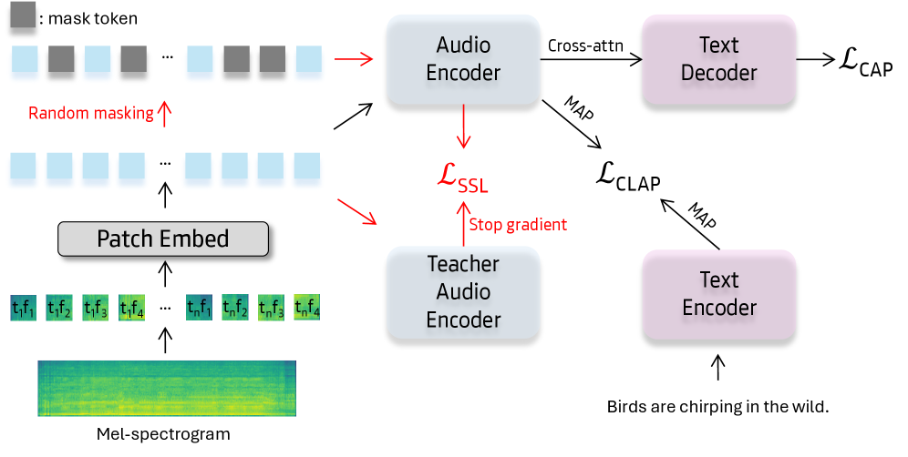
*Fig. 1:Overview of SLAP training framework, where the flow for self-supervised learning is annotated in red.*

---
**Usage Info**: 5069 tokens used.
**Generated at**: 2026-02-24 20:01:17

---

# 📚 AMDM-SE: Attention-based Multichannel Diffusion Model for Speech Enhancement

🚀 URL: https://arxiv.org/html/2601.13140

## 🌏 Abstract (원문)
Multichannel speech enhancement has been the subject of rich and comprehensive research in model-based approaches, as reviewed in[4], where methods such as MVDR and related beamformers explicitly exploit spatial coherence. Building on these foundations, recent works have integrated deep neural networks (DNNs) with classical frameworks, yielding hybrid strategies that combine statistical modeling with data-driven learning. Representative examples include FaSNet[14], SpatialNet[19], McNet[28], and explainable multichannel architectures[3], which illustrate how attention and learned beamforming mechanisms enhance separation, denoising, and dereverberation. In parallel, diffusion models, originally developed for image synthesis[6], have shown remarkable success when adapted to speech. In the single-channel domain, they have been applied to enhancement[13], separation[15], and generation[18], demonstrating strong potential thanks to their ability to capture complex data distributions and generate perceptually natural audio. Unlike predictive models that directly map noisy inputs to clean targets, diffusion models iteratively refine estimates through learned denoising steps. Recent advances such as SGMSE+[21], StoRM[10], conditional diffusion[13], and VAE-guided diffusion[27]have further improved robustness and quality in the single-channel setting. Nevertheless, the application of diffusion-based speech enhancement in the multichannel domain remains relatively underexplored. Recent studies have made substantial progress in this direction: the multi-stream framework[16]integrates model-based priors with data-driven diffusion, mSGMSE[8]generalizes score-based enhancement to a MIMO architecture, and DiffCBF[9]combines convolutional beamforming with diffusion refinement. These works highlight the promise of combining physical modeling with generative methods and demonstrate the feasibility of diffusion for preserving spatial cues in multi-microphone arrays. Building on these directions, we propose AMDM-SE, an Attention-based Multichannel Diffusion Model for Speech Enhancement. Unlike prior multichannel diffusion approaches, AMDM-SE explicitly incorporates unique cross-channel time–frequency attention, enabling the model to jointly leverage spectral, temporal, and spatial cues. Extending the SGMSE backbone[21], our method bridges multi-microphone coherence with generative refinement. Experiments on simulated data and the CHiME-3 dataset demonstrate that AMDM-SE outperforms both single-channel SGMSE and a multichannel variant without attention in terms of perceptual quality and intelligibility. The project page with audio samples can be found athttps://AMDMSE.github.io.
## 🌏 Abstract (번역)
다채널 음성 향상은 MVDR 및 관련 빔포머가 공간적 일관성을 명시적으로 활용하는 모델 기반 접근 방식에서 풍부하고 포괄적인 연구의 대상이 되어 왔습니다. 이러한 토대 위에 최근 연구들은 심층 신경망(DNN)을 고전적인 프레임워크와 통합하여 통계적 모델링과 데이터 구동 학습을 결합한 하이브리드 전략을 산출했습니다. 대표적인 예로 FaSNet, SpatialNet, McNet 및 설명 가능한 다채널 아키텍처가 있으며, 이는 어텐션 및 학습된 빔포밍 메커니즘이 분리, 노이즈 제거 및 잔향 제거를 어떻게 향상시키는지 보여줍니다. 이와 병행하여 원래 이미지 합성을 위해 개발된 확산 모델(Diffusion models)은 음성에 적용되었을 때 놀라운 성공을 거두었습니다. 단일 채널 영역에서 확산 모델은 복잡한 데이터 분포를 포착하고 지각적으로 자연스러운 오디오를 생성하는 강력한 잠재력을 입증하며 향상, 분리 및 생성에 적용되었습니다. 노이즈가 있는 입력을 깨끗한 타겟에 직접 매핑하는 예측 모델과 달리, 확산 모델은 학습된 노이즈 제거 단계를 통해 추정치를 반복적으로 정제합니다. SGMSE+, StoRM, 조건부 확산 및 VAE 가이드 확산과 같은 최근의 진보는 단일 채널 설정에서 견고성과 품질을 더욱 향상시켰습니다. 그럼에도 불구하고 다채널 영역에서 확산 기반 음성 향상의 적용은 상대적으로 덜 탐구된 상태로 남아 있습니다. 최근 연구들은 이 방향에서 상당한 진전을 이루었습니다. 멀티 스트림 프레임워크는 모델 기반 사전 정보와 데이터 구동 확산을 통합하고, mSGMSE는 스코어 기반 향상을 MIMO 아키처로 일반화하며, DiffCBF는 컨볼루션 빔포밍과 확산 정제를 결합합니다. 이러한 작업은 물리적 모델링과 생성 방법을 결합하는 것의 유망함을 강조하고 다중 마이크 어레이에서 공간적 단서를 보존하기 위한 확산의 타당성을 입증합니다. 이러한 방향을 바탕으로 본 논문에서는 음성 향상을 위한 어텐션 기반 다채널 확산 모델인 AMDM-SE를 제안합니다. 이전의 다채널 확산 접근 방식과 달리 AMDM-SE는 고유한 채널 간 시간-주파수 어텐션을 명시적으로 통합하여 모델이 스펙트럼, 시간 및 공간적 단서를 공동으로 활용할 수 있도록 합니다. SGMSE 백본을 확장한 우리의 방법은 다중 마이크 일관성과 생성적 정제를 연결합니다. 시뮬레이션 데이터와 CHiME-3 데이터셋에 대한 실험 결과, AMDM-SE는 지각적 품질과 명료도 측면에서 단일 채널 SGMSE와 어텐션이 없는 다채널 변형 모델 모두보다 우수한 성능을 보였습니다. 오디오 샘플이 포함된 프로젝트 페이지는 https://AMDMSE.github.io에서 확인할 수 있습니다.

## 🔍 Methods & Results
- M개의 마이크 어레이를 이용한 노이즈 감소 문제를 해결하기 위해 복소 STFT 도메인에서 동작하는 스코어 기반 확산 모델 AMDM-SE 제안
- 입력 특징으로 진폭 압축(alpha=0.5, beta=3)을 적용한 복소 STFT 표현을 사용하며, 기준 채널과 나머지 채널을 구분하여 텐서로 구성
- SGMSE 백본을 확장하여 다채널 입력을 처리할 수 있도록 NCSN++ 아키텍처를 수정하고, 채널 간 시간-주파수(TF) 어텐션 메커니즘을 도입
- TF 어텐션 모듈은 기준 채널의 주파수 차원과 타 채널의 시간 차원에 평균 풀링을 적용한 후 1x1 컨볼루션을 거쳐 어텐션 마스크를 생성하여 공간적 단서를 활용
- 확산 과정은 순방향(노이즈 추가), 스코어 추정(U-Net 기반 로그 확률 밀도 기울기 근사), 역방향(예측자-수정자 샘플러를 통한 반복적 노이즈 제거) 단계로 구성
- 시뮬레이션 데이터 및 CHiME-3 데이터셋 실험 결과, 단일 채널 SGMSE 및 어텐션이 없는 다채널 변형 모델 대비 지각적 품질과 음성 명료도에서 우수한 성능 달성

## 🖼 Figures
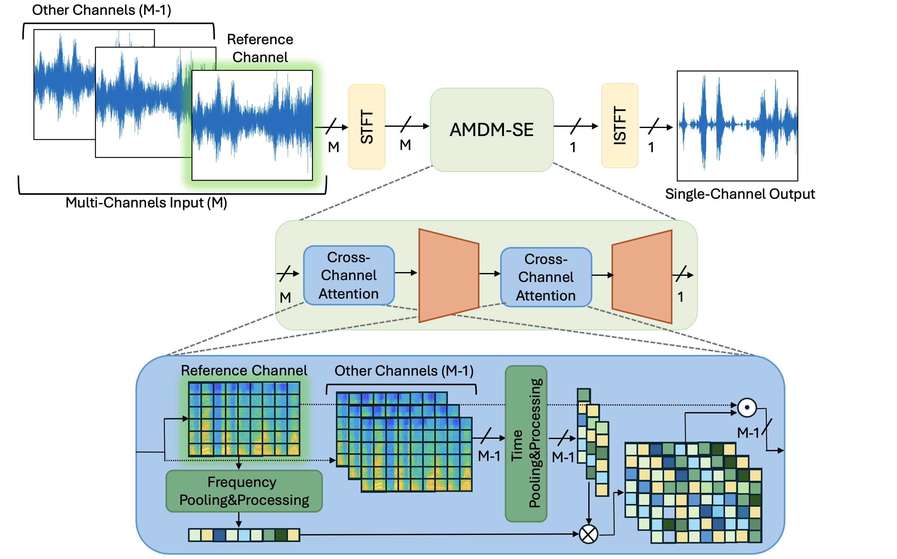
*Fig. 1:Network architecture, AMDM-SE in the green frame and Cross Channel TF-Attention in the blue frame.*

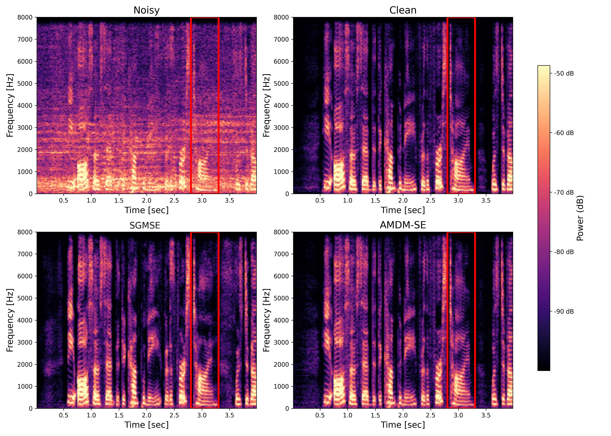
*Fig. 2:Example of spectrogram of upper left: noisy, upper right: clean signal, bottom left: SGMSE output, bottom rigth: AMDM-SE output.*

---
**Usage Info**: 4887 tokens used.
**Generated at**: 2026-02-24 20:01:56

---

# 📚 Confidence-based Filtering for Speech Dataset Curation with Generative Speech Enhancement Using Discrete Tokens

🚀 URL: https://arxiv.org/html/2601.12254

## 🌏 Abstract (원문)
Speech enhancement (SE) is a technology to improve the quality and intelligibility of degraded speech, which is corrupted by background noise, suboptimal recording conditions, or codec artifacts[44]. Traditional approaches have relied on deep neural networks (DNNs) to estimate complex masks over degraded spectrograms[39,38]. A key application of SE is the cleaning of large-scale, noisy, “in-the-wild” speech datasets, which offer a promising source of diverse speech data[8]. While in-the-wild datasets are invaluable for developing text-to-speech (TTS) systems, their inherent noise and variability necessitate effective curation[29]. A common strategy for in-the-wild dataset curation[8]follows a two-stage pipeline consisting of: (1) cleaning noisy source speech with an SE model, and (2) subsequently filtering the enhanced speech with a non-intrusive speech quality metric such as DNSMOS[24]. Recently, generative SE (GSE) models have emerged[41,11,31], showing great promise for producing high-quality clean speech from noisy input by leveraging components developed for TTS systems[19,12]. Building on this progress, we explore the use of GSE to curate in-the-wild datasets into high-quality datasets suitable for TTS training. Despite this promise, GSE models often introduce characteristic “hallucination errors,” such as phoneme omissions and speaker inconsistency[22]. These errors can contaminate the training data and ultimately degrade the performance of subsequently trained TTS models, making the filtering of such artifacts a critical step in the curation pipeline. A key challenge, however, is that conventional filtering methods based on non-intrusive speech quality metrics often fail to detect enhancement-failed speech that, despite sounding acoustically clean, contains GSE-specific hallucination errors[22]. While intrusive SE metrics, such as PESQ[26], SpeechBERTScore[27], and LPS[22], can detect these errors by comparing the enhanced speech with a clean reference, they are impractical for in-the-wild dataset curation where such references are unavailable. In this work, we propose a non-intrusive method for filtering hallucination errors from discrete token-based GSE models, as illustrated in Figure1. Our method leverages the log-probabilities of generated tokens as confidence scores. This score serves as a quality metric for filtering potential errors. Experimental results show that the confidence scores strongly correlate with a suite of intrusive SE metrics. Furthermore, we show the practical utility of our method by showing that curating an in-the-wild dataset with our confidence-based filtering improves the performance of subsequently trained TTS models. Our main contributions are summarized as follows: We propose a non-intrusive filtering method that leverages confidence scores derived from discrete token-based GSE models for TTS dataset curation. We show that our filtering method effectively detects GSE-specific hallucination errors missed by conventional filtering methods. We demonstrate that curating a noisy in-the-wild TTS dataset with our confidence-based filtering improves the performance of subsequently trained TTS models.
## 🌏 Abstract (번역)
음성 향상(SE)은 배경 소음, 최적화되지 않은 녹음 조건 또는 코덱 아티팩트로 인해 손상된 음성의 품질과 명료도를 개선하는 기술입니다. 전통적인 접근 방식은 심층 신경망(DNN)을 사용하여 손상된 스펙트로그램에 대한 복잡한 마스크를 추정하는 데 의존해 왔습니다. SE의 핵심 응용 분야 중 하나는 다양하고 유망한 음성 데이터 소스를 제공하는 대규모의 노이즈가 섞인 '인 더 와일드(in-the-wild)' 음성 데이터셋을 정제하는 것입니다. 인 더 와일드 데이터셋은 텍스트 음성 변환(TTS) 시스템 개발에 매우 중요하지만, 내재된 노이즈와 변동성으로 인해 효과적인 큐레이션이 필요합니다. 일반적인 큐레이션 전략은 (1) SE 모델로 노이즈가 있는 소스 음성을 정제하고, (2) 이후 DNSMOS와 같은 비침습적 음성 품질 지표로 향상된 음성을 필터링하는 2단계 파이프라인을 따릅니다. 최근에는 TTS 시스템용으로 개발된 구성 요소를 활용하여 노이즈가 있는 입력에서 고품질의 깨끗한 음성을 생성하는 생성적 SE(GSE) 모델이 등장하여 큰 가능성을 보여주고 있습니다. 이러한 발전을 바탕으로, 본 연구에서는 GSE를 사용하여 인 더 와일드 데이터셋을 TTS 학습에 적합한 고품질 데이터셋으로 큐레이션하는 방법을 탐구합니다. 이러한 가능성에도 불구하고, GSE 모델은 종종 음소 누락 및 화자 불일치와 같은 특징적인 '환각 오류(hallucination errors)'를 유발합니다. 이러한 오류는 학습 데이터를 오염시키고 결과적으로 학습된 TTS 모델의 성능을 저하시킬 수 있으므로, 큐레이션 파이프라인에서 이러한 아티팩트를 필터링하는 것이 중요한 단계가 됩니다. 그러나 주요 과제는 비침습적 음성 품질 지표에 기반한 기존 필터링 방법이 청각적으로는 깨끗하게 들리지만 GSE 특유의 환각 오류를 포함하는 향상 실패 음성을 감지하지 못하는 경우가 많다는 점입니다. PESQ, SpeechBERTScore, LPS와 같은 침습적 SE 지표는 향상된 음성을 깨끗한 참조 음성과 비교하여 이러한 오류를 감지할 수 있지만, 참조 음성을 사용할 수 없는 인 더 와일드 데이터셋 큐레이션에는 실용적이지 않습니다. 본 연구에서는 이산 토큰 기반 GSE 모델에서 환각 오류를 필터링하기 위한 비침습적 방법을 제안합니다. 제안하는 방법은 생성된 토큰의 로그 확률을 신뢰도 점수로 활용합니다. 이 점수는 잠재적 오류를 필터링하기 위한 품질 지표 역할을 합니다. 실험 결과, 신뢰도 점수는 일련의 침습적 SE 지표와 강한 상관관계를 보였습니다. 또한, 신뢰도 기반 필터링으로 인 더 와일드 데이터셋을 큐레이션하면 이후 학습된 TTS 모델의 성능이 향상됨을 보여줌으로써 제안 방법의 실질적인 유용성을 입증합니다. 본 연구의 주요 기여는 다음과 같습니다. 첫째, TTS 데이터셋 큐레이션을 위해 이산 토큰 기반 GSE 모델에서 파생된 신뢰도 점수를 활용하는 비침습적 필터링 방법을 제안합니다. 둘째, 제안하는 필터링 방법이 기존 방법이 놓치는 GSE 특유의 환각 오류를 효과적으로 감지함을 보여줍니다. 셋째, 신뢰도 기반 필터링으로 노이즈가 있는 인 더 와일드 TTS 데이터셋을 큐레이션하면 이후 학습된 TTS 모델의 성능이 향상됨을 입증합니다.

## 🔍 Methods & Results
- 이산 토큰 기반 생성적 음성 향상(GSE) 모델인 Genhancer를 백본으로 사용하여 생성된 토큰의 로그 확률을 신뢰도 점수로 활용하는 비침습적 필터링 방법 제안
- RVQ 기반 오디오 코덱(DAC)의 첫 번째 양자화기 레이어에서 생성된 토큰의 로그 확률을 평균하여 발화 수준의 신뢰도 점수(S_utt)를 산출함
- 신뢰도 점수가 높은 출력은 성공적인 향상을 의미하며, 낮은 점수는 환각 오류(음소 누락, 화자 불일치 등)를 포함할 가능성이 높은 향상 실패를 나타냄
- 제안된 신뢰도 점수는 PESQ, SpeechBERTScore 등 참조 데이터가 필요한 침습적 지표들과 강한 상관관계를 보임을 실험적으로 확인
- 임계값(threshold)을 설정하여 신뢰도가 낮은 데이터를 제거하는 큐레이션 과정을 통해 인 더 와일드 데이터셋의 품질을 개선함
- 신뢰도 기반 필터링으로 정제된 데이터셋을 사용하여 학습된 TTS 모델이 기존 필터링 방식 대비 더 우수한 성능을 나타냄을 입증

## 🖼 Figures
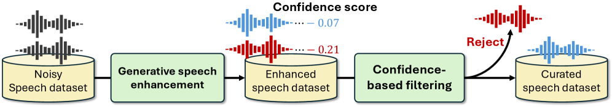
*Fig. 1:Overview of the speech dataset curation process with our proposed confidence-based filtering.*

*Fig. 2:The entire process of our confidence-based filtering. A discrete token-based GSE model outputs enhanced speech 
𝐰
enhanced
, along with token-level confidence scores (
𝑠
1
,
𝑠
2
,
…
,
𝑠
𝑇
). If the confidence score 
𝑆
utt
 is below a threshold 
𝜏
, 
𝐰
enhanced
 is filtered out.*

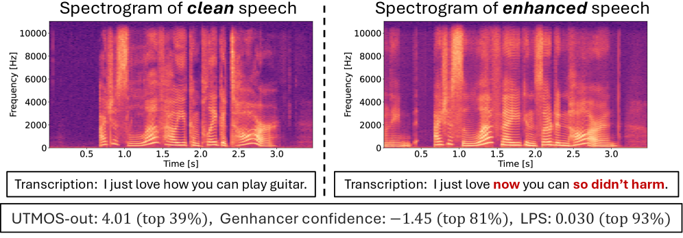
*Fig. 3:An example of a hallucination error caused by GSE, showing the spectrogram of clean speech (left) and enhanced speech (right).*

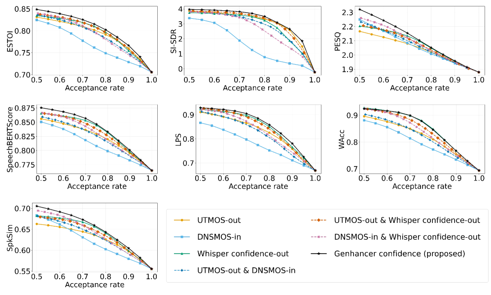
*Fig. 4:Average quality of the filtered dataset vs. acceptance rate for each filtering method with varying filtering thresholds.*

---
**Usage Info**: 5442 tokens used.
**Generated at**: 2026-02-24 20:02:44

---

# 📚 VoCodec: An Efficient Lightweight Low-Bitrate Speech Codec

🚀 URL: https://arxiv.org/html/2601.13055

## 🌏 Abstract (원문)
Speech codecs serve the purpose of compressing and decompressing speech signals to enable effective transmission and storage. Traditional codec methods[25,2]rely on signal processing techniques, while also leveraging knowledge of psychoacoustics and speech synthesis to enhance their coding efficiency. Although traditional codecs are efficient for improving perceptual quality, their design requires significant manual effort, including parameter tuning and subjective listening tests. Neural codecs[4]usually consist of an encoder, a decoder, and a quantizer module. The encoder compresses the speech into a latent representation, while the decoder reconstructs the waveform from the quantized vectors. The quantizer is usually parameterized and jointly trained with the encoder and decoder in an end-to-end manner. Compared to traditional codecs, neural codecs use discrete tokens for compression and reconstruction rather than continuous embeddings. Most neural codecs are based on the VQ-GAN architecture[3]and employ diverse discriminators[12,11,8]to improve the perceptual quality of the reconstructed speech. Existing neural codecs have demonstrated remarkable reconstruction quality[30,1,13]. Beyond the perceptual quality of the reconstructed speech, the low bitrate of neural codecs has long been a research focus in the field, since it is critical for real-time communication. BigCodec[29]scales up the model size to compensate for the performance degradation caused by its low bitrate, ultimately achieving high-quality speech reconstruction at a bitrate of 1.04 kbps. WavTokenizer[9]carefully investigates codebook utilization for speech and select a larger single codebook, attaining a bitrate as low as 0.98 kbps. Although recent speech codec models have achieved significant progress in recovering high-quality speech at low bitrates, existing models with excellent performance often suffer from two critical drawbacks: high computational complexity and non-causality, rendering them unsuitable for real-time communication[13,29]. In addition, noise and reverberation in real-world scenarios may cause severe interference to real-time communication. The 2025 Low-Resource Audio Codec (LRAC) challenge[28]focuses on speech codec under joint resource constraints, which includes computational complexity, bitrate, and latency. Track 1 targets high reconstruction quality, while Track 2 further addresses coding under noisy and reverberant conditions. In this paper, we propose VoCodec, a model that simultaneously features low computational complexity, low latency, and support for low-bitrate transmission. VoCodec’s encoder and decoder are based on Vocos[22]. To reduce computational overhead and latency, we operate speech codec directly in the time-frequency domain. The final model requires a computational complexity of only 349.29M MACs/s, with the receiver-side computation accounting for only 144.82M MACs/s. Additionally, UL-UNAS[20], a lightweight model for speech enhancement is cascaded at the front end of VoCodec to equip our system with capabilities of noise reduction and dereverberation. We train the two systems on a large-scale dataset provided by the challenge organizers. Experimental results demonstrate that compared to the baseline models, our methods achieve competitive performance across multiple evaluation metrics.
## 🌏 Abstract (번역)
음성 코덱은 효과적인 전송 및 저장을 위해 음성 신호를 압축하고 복원하는 역할을 합니다. 전통적인 코덱 방식은 신호 처리 기술에 의존하며, 코딩 효율을 높이기 위해 심리 음향학 및 음성 합성 지식을 활용합니다. 이러한 전통적 코덱은 인지적 품질 개선에는 효율적이지만, 파라미터 튜닝 및 주관적 청취 테스트를 포함한 상당한 수동 설계 노력이 필요합니다. 신경망 코덱은 일반적으로 인코더, 디코더 및 양자화기 모듈로 구성됩니다. 인코더는 음성을 잠재 표현으로 압축하고, 디코더는 양자화된 벡터로부터 파형을 재구성합니다. 양자화기는 일반적으로 파라미터화되어 인코더 및 디코더와 함께 엔드투엔드 방식으로 공동 학습됩니다. 전통적인 코덱과 비교하여 신경망 코덱은 연속적인 임베딩 대신 압축 및 재구성을 위해 이산 토큰을 사용합니다. 대부분의 신경망 코덱은 VQ-GAN 아키텍처를 기반으로 하며, 재구성된 음성의 인지적 품질을 향상시키기 위해 다양한 판별기를 채택합니다. 기존 신경망 코덱은 뛰어난 재구성 품질을 입증했습니다. 재구성된 음성의 인지적 품질 외에도, 신경망 코덱의 낮은 비트레이트는 실시간 통신에 중요하기 때문에 오랫동안 이 분야의 연구 초점이 되어 왔습니다. BigCodec은 낮은 비트레이트로 인한 성능 저하를 보상하기 위해 모델 규모를 확장하여 1.04 kbps의 비트레이트에서 고품질 음성 재구성을 달성했습니다. WavTokenizer는 음성에 대한 코드북 활용을 면밀히 조사하고 더 큰 단일 코드북을 선택하여 0.98 kbps까지 낮은 비트레이트를 달성했습니다. 최근 음성 코덱 모델이 낮은 비트레이트에서 고품질 음성을 복구하는 데 상당한 진전을 이루었음에도 불구하고, 우수한 성능을 가진 기존 모델들은 높은 계산 복잡도와 비인과성(non-causality)이라는 두 가지 치명적인 단점을 겪는 경우가 많아 실시간 통신에 부적합합니다. 또한 실제 환경의 노이즈와 잔향은 실시간 통신에 심각한 간섭을 일으킬 수 있습니다. 2025년 저자원 오디오 코덱(LRAC) 챌린지는 계산 복잡도, 비트레이트, 지연 시간을 포함한 공동 자원 제약 하에서의 음성 코덱에 초점을 맞춥니다. 트랙 1은 높은 재구성 품질을 목표로 하고, 트랙 2는 노이즈 및 잔향 조건에서의 코딩을 추가로 다룹니다. 본 논문에서는 낮은 계산 복잡도, 낮은 지연 시간 및 낮은 비트레이트 전송 지원을 동시에 특징으로 하는 모델인 VoCodec을 제안합니다. VoCodec의 인코더와 디코더는 Vocos를 기반으로 합니다. 계산 오버헤드와 지연 시간을 줄이기 위해 시간-주파수 도메인에서 직접 음성 코덱을 작동시킵니다. 최종 모델은 단 349.29M MACs/s의 계산 복잡도만을 필요로 하며, 수신 측 계산은 144.82M MACs/s에 불과합니다. 또한 음성 향상을 위한 경량 모델인 UL-UNAS를 VoCodec의 프런트엔드에 직렬로 연결하여 시스템에 노이즈 제거 및 잔향 제거 기능을 갖추었습니다. 우리는 챌린지 주최측에서 제공한 대규모 데이터셋으로 두 시스템을 학습시켰습니다. 실험 결과, 제안된 방법이 베이스라인 모델과 비교하여 여러 평가 지표에서 경쟁력 있는 성능을 달성함을 입증했습니다.

## 🔍 Methods & Results
- 시간-주파수 도메인 직접 연산: STFT 및 iSTFT를 사용하여 시간 도메인 모델 대비 계산 복잡도와 지연 시간을 단축함
- 아키텍처 설계: Vocos를 백본으로 하며 ConvNeXt 블록과 어텐션 모듈을 결합한 인코더-디코더 구조 채택
- 실시간성 확보: 모든 컨볼루션에 인과적 제로 패딩(causal zero-padding)을 적용하고 마스크드 어텐션을 사용하여 비인과성 제거
- 양자화 전략: Residual Vector Quantization(RVQ)를 사용하여 100Hz 프레임 레이트에서 총 6kbps의 비트레이트 달성
- 수신측 최적화: 디코더에서 Inverted 디자인 제거 및 그룹 컨볼루션 적용을 통해 수신측 복잡도를 144.82M MACs/s로 억제
- 노이즈 대응: 경량 음성 향상 모델인 UL-UNAS를 프런트엔드에 배치하여 노이즈 및 잔향 제거 기능 통합
- 손실 함수: SI-SNR, 파워 압축 스펙트럼 손실, 멀티 스케일 멜-스펙트로그램 재구성 손실 및 적대적 손실을 조합하여 학습
- 실험 결과: 총 계산 복잡도 349.29M MACs/s를 달성하며 LRAC 챌린지 베이스라인 대비 경쟁력 있는 성능 입증

## 🖼 Figures
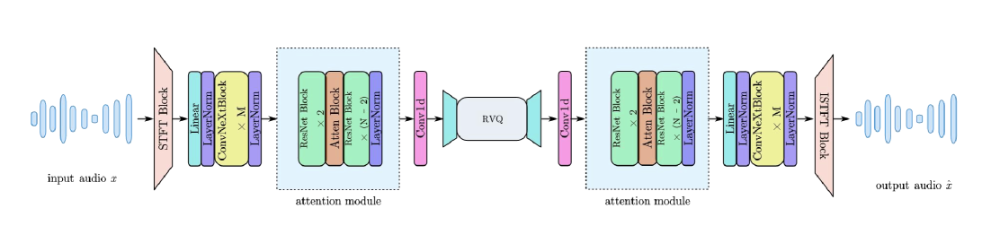
*Fig. 1:The architecture of the proposed model*

---
**Usage Info**: 5803 tokens used.
**Generated at**: 2026-02-24 20:03:34

---

# 📚 Shortest-Path Flow Matching with Mixture-Conditioned Bases for OOD Generalization to Unseen Conditions

🚀 URL: https://arxiv.org/html/2601.11827

## 🌏 Abstract (원문)
Conditional generative models have achieved remarkable success across domains ranging from image synthesis to molecular design. A common paradigm underlying many state-of-the-art approaches, including diffusion models and flow matching, is to learn a transport map from a simple base distribution to a complex target distribution, conditioned on some input descriptor. However, a critical limitation emerges when these models encounter conditions not seen during training: their performance degrades substantially, limiting their utility in real-world applications where exhaustive enumeration of all possible conditions is infeasible. We identify the fixed base distribution as a key limiting factor for out-of-distribution (OOD) generalization and propose SP-FM, a conditional flow-matching framework that jointly learns a descriptor-conditioned Gaussian mixture base distribution and a descriptor-conditioned velocity field trained via shortest-path flow matching. By learning a base distribution that reflects the similarity structure of conditions, SP-FM encodes prior knowledge directly into the generative process. We provide theoretical analysis showing that single-Gaussian bases lead to ill-posed inference, while mixture bases with sufficient components yield well-defined problems with bounded estimation error. Our experiments across eight datasets spanning synthetic, image-based, and transcriptomic domains demonstrate that SP-FM consistently improves OOD generalization over standard conditional flow-matching baselines.
## 🌏 Abstract (번역)
조건부 생성 모델은 이미지 합성에서 분자 설계에 이르기까지 다양한 영역에서 괄목할 만한 성공을 거두었습니다. 확산 모델과 플로우 매칭을 포함한 많은 최첨단 접근 방식의 근간이 되는 공통 패러다임은 입력 기술자(descriptor)를 조건으로 하여 단순한 기저 분포에서 복잡한 타겟 분포로의 이동 맵(transport map)을 학습하는 것입니다. 그러나 이러한 모델이 훈련 중에 보지 못한 조건에 직면하면 성능이 크게 저하되는 심각한 한계가 나타나며, 이는 모든 가능한 조건을 전수 조사하는 것이 불가능한 실제 응용 분야에서의 유용성을 제한합니다. 본 연구에서는 고정된 기저 분포를 분포 외(OOD) 일반화의 핵심 제한 요인으로 식별하고, 기술자 조건부 가우시안 혼합 기저 분포와 최단 경로 플로우 매칭을 통해 훈련된 기술자 조건부 속도장을 공동으로 학습하는 조건부 플로우 매칭 프레임워크인 SP-FM을 제안합니다. 조건의 유사성 구조를 반영하는 기저 분포를 학습함으로써, SP-FM은 생성 과정에 사전 지식을 직접 인코딩합니다. 또한 단일 가우시안 기저가 부적절한(ill-posed) 추론으로 이어지는 반면, 충분한 성분을 가진 혼합 기저는 유계 추정 오차를 갖는 잘 정의된 문제를 생성함을 이론적으로 분석했습니다. 합성 데이터, 이미지 기반 데이터, 전사체 영역을 포괄하는 8개의 데이터셋에 대한 실험을 통해 SP-FM이 표준 조건부 플로우 매칭 베이스라인보다 OOD 일반화 성능을 일관되게 향상시킴을 입증했습니다.

## 🔍 Methods & Results
- 기존의 고정된 가우시안 기저 분포 대신 입력 기술자(descriptor)에 따라 학습되는 가우시안 혼합 모델(GMM) 기저 분포를 도입
- 기술자 조건부 기저 분포와 최단 경로(Shortest-path) 속도장을 공동으로 학습하는 SP-FM 프레임워크 제안
- 단일 가우시안 기저가 OOD 상황에서 추론 문제를 부적절하게(ill-posed) 만드는 반면, 혼합 기저는 이를 해결할 수 있음을 이론적으로 증명
- 합성 회전 문자 벤치마크에서 보지 못한 회전 각도에 대한 일반화 성능을 대폭 향상
- 이미지 기반 표현형 분석에서 새로운 화합물 처리에 따른 세포 형태 변화 예측 시 분포 간 거리(distributional distance) 감소
- 단일 세포 전사체 데이터셋에서 보지 못한 유전적 및 화학적 섭동에 대한 유전자 발현 반응을 정확하게 예측
- 8개의 다양한 데이터셋 전반에서 기존 조건부 플로우 매칭 대비 일관된 성능 우위 확보 및 OOD 일반화의 유연한 프레임워크로서의 가능성 입증

## 🖼 Figures
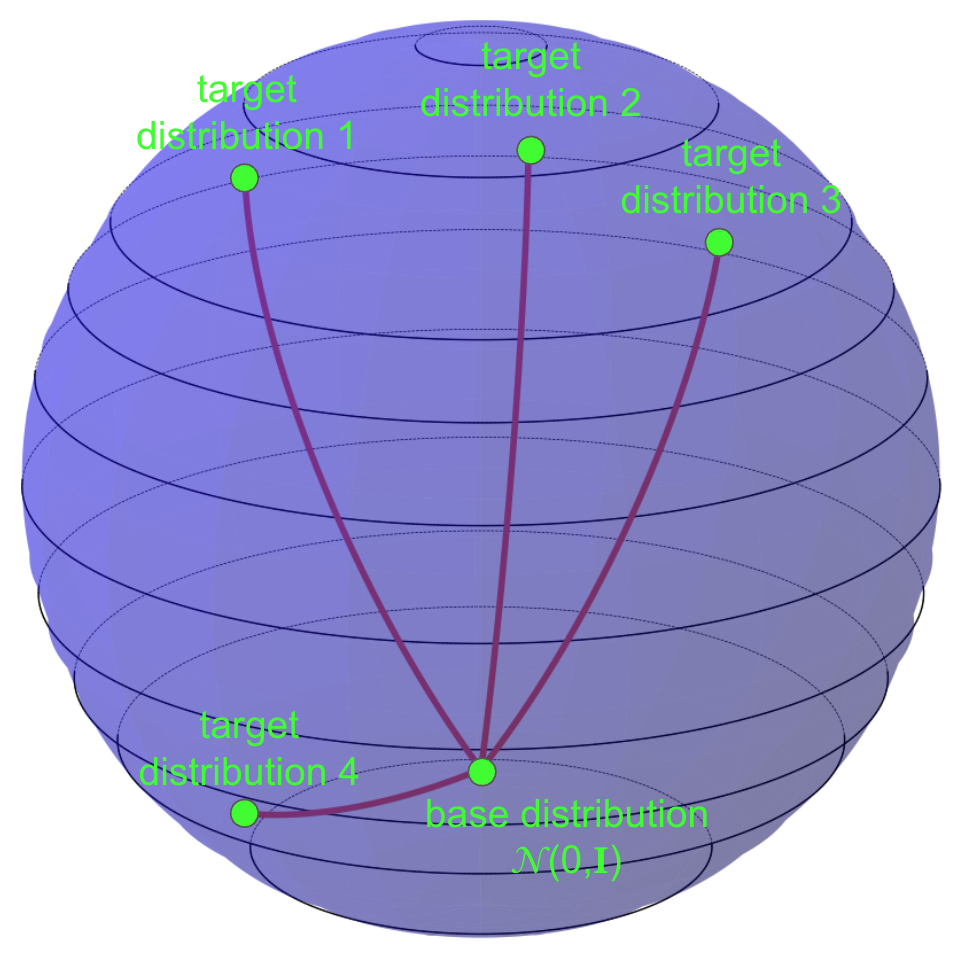
*(a)*

*(a)*

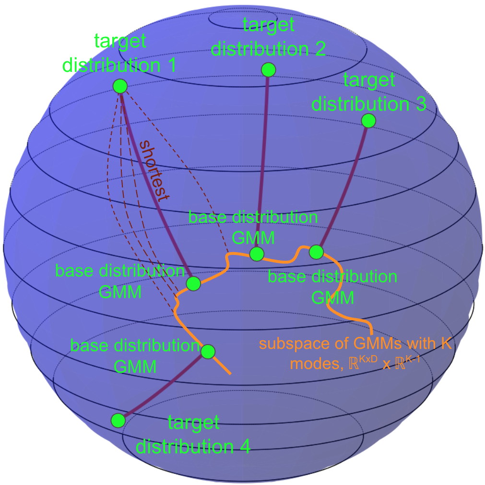
*(b)*

*Figure 2: Qualitative comparison of Conditional Flow Matching (CFM) and SP-FM on the synthetic letter–rotation benchmark. Each block shows samples at different integration times (
𝑡
=
0
, 
𝑡
=
0.5
, 
𝑡
=
1
) and the corresponding target distribution. SP-FM produces smoother trajectories and more faithful reconstructions on unseen rotations, while CFM exhibits drift and shape distortion.*

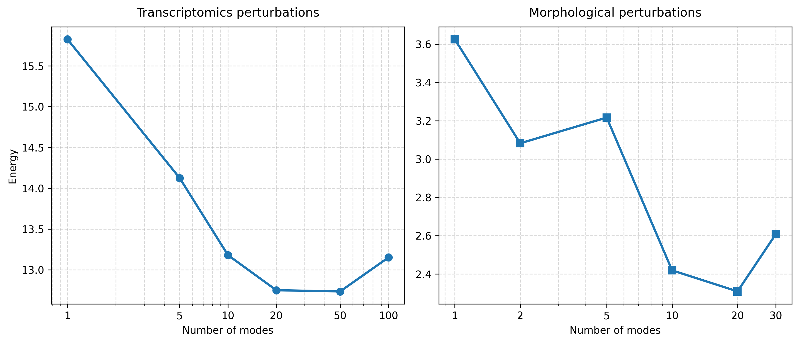
*(a)Energy distance versus number of GMM modes on transcriptomic (left) and morphological (right) datasets. Performance improves with more modes up to a dataset-dependent optimum.*

*(a)Energy distance versus number of GMM modes on transcriptomic (left) and morphological (right) datasets. Performance improves with more modes up to a dataset-dependent optimum.*

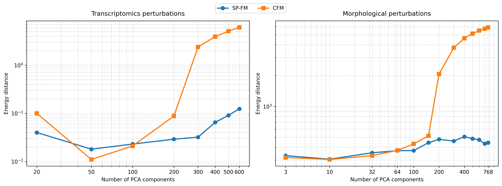
*(b)Energy distance versus PCA dimensionality for SP-FM and CFM. SP-FM maintains stable performance while CFM degrades in higher dimensions.*

---
**Usage Info**: 5565 tokens used.
**Generated at**: 2026-02-24 20:05:10

---

# 📚 Do Neural Codecs Generalize? A Controlled Study Across Unseen Languages and Non-Speech Tasks

🚀 URL: https://arxiv.org/html/2601.12205

## 🌏 Abstract (원문)
Neural Audio Codecs (NACs) have emerged as a popular signal compression technique, largely due to their strong ability to reconstruct signals after compression. Typically, NACs consist of three main components during inference: (i) an encoder, which converts raw waveforms into continuous representations; (ii) a quantizer, which transforms these continuous representations into discrete representations; and (iii) a decoder, which reconstructs the original waveform from these discrete representations. The compressed discrete tokens enable efficient transmission and allow accurate reconstruction of the original signal. Also, these discrete representations are suitable for speech and audio language modeling tasks, further underscoring their importance. Despite their growing popularity, several fundamental questions about NACs remain unanswered. In this paper, our aim is to address three critical questions about their generalization capabilities: Can NACs generalize to unseen languages during their pre-training? Can speech-only pre-trained NACs effectively generalize to non-speech (e.g., environmental sounds, music, animal vocalizations, etc.) applications? Will incorporate non-speech pre-training data boost performance on both speech and non-speech tasks? To answer these questions, we conduct experiments under controlled conditions. We pre-train NACs from scratch with carefully curated data coverage to enable fair evaluations. Specifically, we consider three pre-trained data coverage sets (English, Multilingual, and Multilingual+Audio) and evaluate the resulting NACs on both signal reconstruction quality and downstream performance. Our results show that (i) NACs can generalize to language unseen during their pre-training, (ii) speech-only NACs degrade on non-speech tasks, and (iii) incorporating non-speech data during pre-training improves performance on non-speech tasks while maintaining comparable performance on speech tasks.
## 🌏 Abstract (번역)
신경망 오디오 코덱(NAC)은 압축 후 신호 복원 능력이 뛰어나 인기 있는 신호 압축 기술로 부상했습니다. 일반적으로 NAC는 추론 과정에서 세 가지 주요 구성 요소로 이루어집니다: (i) 원시 파형을 연속적인 표현으로 변환하는 인코더, (ii) 이러한 연속적 표현을 이산적 표현으로 변환하는 양자화기, (iii) 이산적 표현으로부터 원래의 파형을 재구성하는 디코더입니다. 압축된 이산 토큰은 효율적인 전송을 가능하게 하고 원래 신호의 정확한 복원을 허용합니다. 또한, 이러한 이산 표현은 음성 및 오디오 언어 모델링 작업에 적합하여 그 중요성이 더욱 강조되고 있습니다. 이러한 인기에도 불구하고 NAC의 일반화 능력에 대한 몇 가지 근본적인 질문은 여전히 해결되지 않은 채 남아 있습니다. 본 논문에서는 일반화 능력과 관련된 세 가지 핵심 질문을 다루고자 합니다: NAC가 사전 학습 중에 보지 못한 언어로 일반화될 수 있는가? 음성 전용으로 사전 학습된 NAC가 비음성(예: 환경음, 음악, 동물 소리 등) 응용 분야로 효과적으로 일반화될 수 있는가? 비음성 사전 학습 데이터를 포함하는 것이 음성 및 비음성 작업 모두에서 성능을 향상시키는가? 이러한 질문에 답하기 위해 우리는 통제된 조건 하에서 실험을 수행합니다. 공정한 평가를 위해 신중하게 선별된 데이터 범위를 사용하여 NAC를 처음부터 사전 학습시킵니다. 구체적으로 영어, 다국어, 다국어+오디오의 세 가지 사전 학습 데이터 범위를 고려하고, 결과로 나온 NAC의 신호 복원 품질과 다운스트림 성능을 평가합니다. 실험 결과 (i) NAC는 사전 학습 시 보지 못한 언어로 일반화될 수 있으며, (ii) 음성 전용 NAC는 비음성 작업에서 성능이 저하되고, (iii) 사전 학습 시 비음성 데이터를 포함하면 음성 작업에서 유사한 성능을 유지하면서 비음성 작업의 성능을 향상시킨다는 것을 보여줍니다.

## 🔍 Methods & Results
- ESPnet-Codec 툴킷과 SoundStream 아키텍처를 사용하여 통제된 환경에서 NAC를 처음부터 사전 학습함
- 사전 학습 데이터 범위를 영어(English), 다국어(Multilingual), 다국어+오디오(Multilingual+Audio)의 세 가지 설정으로 나누어 비교 분석함
- 신호 복원 품질과 텍스트 음성 변환(TTS) 다운스트림 작업 성능을 포함한 11가지 지표를 통해 모델을 종합적으로 평가함
- 실험 결과 NAC는 사전 학습 과정에서 포함되지 않은 언어에 대해서도 우수한 일반화 성능을 나타냄
- 음성 데이터로만 학습된 NAC는 비음성 신호(환경음, 음악 등) 복원 시 성능 저하가 발생함을 확인함
- 비음성 데이터를 학습에 추가할 경우, 음성 작업 성능을 유지하면서도 비음성 작업에서의 성능을 유의미하게 향상시킴

## 🖼 Figures
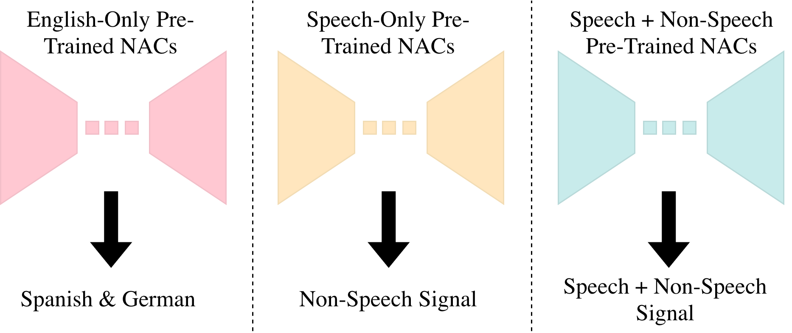
*Figure 1:Overview of our three key research questions.*

---
**Usage Info**: 4940 tokens used.
**Generated at**: 2026-02-24 20:06:02

---

# 📚 SoundPlot: An Open-Source Framework for Birdsong Acoustic Analysis and Neural Synthesis with Interactive 3D Visualization

🚀 URL: https://arxiv.org/html/2601.12752

## 🌏 Abstract (원문)
Birdsong analysis has been a cornerstone of ethology, neuroscience, and ecology for over half a century[1,2]. Understanding the acoustic structure of avian vocalizations provides critical insights into species identification[3], communication patterns[4], geographical variation[5], and the neural mechanisms underlying complex sound production and learning[6,7]. Traditional methods for analyzing birdsong have relied on visual inspection of spectrograms and manual annotation of acoustic features[8]. While effective for small-scale studies, these approaches are labor-intensive, subjective, and do not scale to large datasets now made possible by automated recording systems[9]. Furthermore, most existing analysis tools are proprietary, platform-specific, or require substantial domain expertise, creating barriers to entry for researchers across disciplines. We introduce SoundPlot, an open-source framework that addresses these challenges through four primary contributions: Comprehensive Feature Extraction Pipeline: A modular system for computing spectral, temporal, and pitch features using state-of-the-art signal processing algorithms including pYIN[10]for pitch tracking and librosa[11]for spectral analysis. Neural Synthesis Module: An implementation of mel-spectrogram-based audio reconstruction using the Griffin-Lim algorithm[12], enabling analysis-by-synthesis validation of feature extraction quality. Interactive 3D Visualization: A browser-based interface built with Three.js that maps acoustic features to 3D trajectories, providing intuitive exploration of temporal dynamics with real-time playback synchronization. Reproducible Research Platform: A complete, documented, and freely available software package that promotes reproducibility and accelerates research in bioacoustics and audio analysis. The framework is designed to be modular, extensible, and suitable for both research applications and educational purposes. All source code, including the web interface, example data, and documentation, is available under the MIT License at:https://github.com/naqchoalimehdi/SoundPlot-An-Open-Source-Framework-for-Birdsong-Acoustic-Analysis-and-Neural-Synthesis-.
## 🌏 Abstract (번역)
조류의 노래 분석은 반세기 이상 행동학, 신경과학, 생태학의 초석이 되어 왔습니다. 조류 발성의 음향 구조를 이해하는 것은 종 식별, 통신 패턴, 지리적 변이, 그리고 복잡한 소리 생성 및 학습의 기초가 되는 신경 메커니즘에 대한 중요한 통찰력을 제공합니다. 전통적인 분석 방법은 스펙트로그램의 시각적 검사와 음향 특징의 수동 주석에 의존해 왔습니다. 소규모 연구에는 효과적이지만, 이러한 접근 방식은 노동 집약적이고 주관적이며, 자동 녹음 시스템으로 가능해진 대규모 데이터셋에는 확장되지 않습니다. 또한, 대부분의 기존 분석 도구는 독점적이거나 특정 플랫폼에 국한되거나 상당한 전문 지식을 요구하여 여러 학문 분야의 연구자들에게 진입 장벽을 만듭니다. 본 논문에서는 네 가지 주요 기여를 통해 이러한 과제를 해결하는 오픈 소스 프레임워크인 SoundPlot을 소개합니다. 첫째, 피치 추적을 위한 pYIN 및 스펙트럼 분석을 위한 librosa를 포함한 최첨단 신호 처리 알고리즘을 사용하는 모듈식 특징 추출 파이프라인을 제공합니다. 둘째, Griffin-Lim 알고리즘을 사용한 멜 스펙트로그램 기반 오디오 재구성 구현으로 특징 추출 품질의 분석-합성 검증을 가능하게 하는 신경 합성 모듈을 포함합니다. 셋째, 음향 특징을 3D 궤적에 매핑하여 실시간 재생 동기화와 함께 시간적 역동성의 직관적인 탐색을 제공하는 Three.js 기반의 브라우저 인터페이스를 구축했습니다. 넷째, 생물 음향학 및 오디오 분석 연구의 재현성을 촉진하고 연구를 가속화하는 완전하고 문서화된 무료 소프트웨어 패키지를 제공합니다. 이 프레임워크는 모듈식이고 확장 가능하며 연구 및 교육 목적 모두에 적합하도록 설계되었습니다. 웹 인터페이스, 예제 데이터 및 문서를 포함한 모든 소스 코드는 MIT 라이선스 하에 GitHub에서 제공됩니다.

## 🔍 Methods & Results
- 오디오 처리, 특징 추출, 합성 및 시각화 계층을 분리한 모듈형 시스템 아키텍처 설계
- 오디오 로딩, 전처리(정규화 및 무음 제거), 특징 추출, 신경 합성, 시각화 매핑의 5단계 순차적 파이프라인 구축
- pYIN 알고리즘을 이용한 기본 주파수(f0) 추정 및 librosa를 활용한 스펙트럼 중심점, 대역폭, MFCC 등 다각적 특징 추출
- 128 밴드 멜 스펙트로그램과 Griffin-Lim 알고리즘(32회 반복)을 이용한 오디오 재구성 및 분석-합성 루프 구현
- 추출된 음향 특징(밝기, 풍부함, 피치)을 Three.js를 통해 3D 데카르트 좌표계(X, Y, Z축)로 시각화 매핑
- SNR, 파형 상관관계, 스펙트럼 상관관계, 멜 상관관계의 4가지 지표를 사용하여 합성된 오디오의 충실도 및 지각적 유사성 평가

## 🖼 Figures
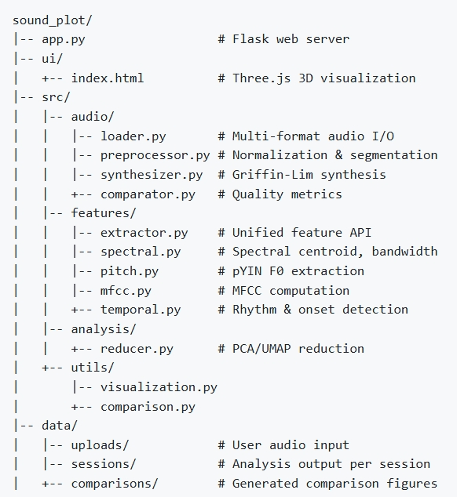
*Figure 1:SoundPlot project directory structure showing the modular organization of audio processing, feature extraction, analysis, and visualization components.*

*Figure 2:Comprehensive comparison of original and synthesized birdsong. Top: temporal waveforms; Middle: STFT spectrograms; Bottom: mel spectrograms with perceptual frequency scaling. Quantitative metrics: SNR = -0.81 dB, Spectral Corr. = 0.566, Mel Corr. = 0.929.*

*Figure 3:Feature space comparison via Principal Component Analysis (PCA). Blue points: original audio; Green points: synthesized audio; Gray lines: temporal drift between corresponding frames. The preserved structure indicates successful capture of temporal dynamics despite the synthesis transformation.*

---
**Usage Info**: 3553 tokens used.
**Generated at**: 2026-02-24 20:06:31

---

# 📚 Adaptive Speaker Embedding Self-Augmentation for Personal Voice Activity Detection with Short Enrollment Speech

🚀 URL: https://arxiv.org/html/2601.12769

## 🌏 Abstract (원문)
Voice Activity Detection (VAD) is a technique that identifies speech and non-speech segments at the frame level[1], serving as a critical front-end for tasks such as automatic speech recognition (ASR)[10], speaker verification (SV)[11], and speaker diarization[3]. A well-trained standard VAD system detects all speech segments regardless of the speaker, enhancing downstream performance by filtering noise and reducing computational costs. However, in multi-speaker environments, standard VAD may trigger false positives by detecting non-target speech. To address this limitation, Personal Voice Activity Detection (PVAD) is proposed[5], which specifically identifies a target speaker’s voice activity in multi-talker scenarios. PVAD systems typically operate in two stages: 1) extracting target speaker embeddings (e.g., i-vectors or d-vectors) from enrollment speech using a pre-trained speaker verification (SV) model[6], and 2) utilizing these embeddings to identify target speaker segments in mixed speech[5,10,11]. This framework simply concatenates the target speaker’s embedding with the input acoustic features. Subsequent improvements introduced feature-wise linear modulation (FiLM) to adaptively condition speaker embeddings[4,16]. While PVAD performance critically depends on embedding quality and enrollment duration, practical deployment scenarios are typically constrained to a short enrollment (e.g., wake-up words) that offer only limited speaker cues[24], posing significant challenges for conventional approaches. Recent related advances have focused on leveraging enrolled audio information more effectively. This includes employing superior models (e.g., ECAPA, CAM++, WavLM) or multi-scale methods to extract higher-quality speaker embeddings from enrolled speech[23,7,26], or using synthesis models to increase the duration of enrolled speech[8]. Some researchers have also explored the correlation between target speaker extraction (TSE) or VAD tasks and PVAD tasks, facilitating task interaction to achieve improvements[19,25,3,13,9]. A critical yet understudied consideration is that target speech inherently exists within the mixed speech input. Existing methods have employed shared encoders or cross-attention mechanisms to utilize mixed speech information, typically treating enrolled embeddings as key and value[20,25]. However, these approaches fail to explicitly capture additional speaker identity information from the mixture. Furthermore, performance degradation occurs in scenarios like smart homes, where a domain mismatch exists between near-field enrolled audio (typically recorded on mobile devices) and far-field mixed speech. This underscores the need for explicit modeling of mixed speech characteristics. Our contributions are as follows: We propose a novel framework to augment short-enrollment embeddings, which leverages target-speaker frame embeddings extracted from mixed speech. These embeddings better retain natural acoustic properties and capture more speaker characteristics. Recognizing PVAD’s inherent long-term nature (as illustrated in Fig.1), we introduce iterative speaker embedding self-augmentation to dynamically accommodate speaker state variations[17]and ensure genuine personalization. Experimental results validate our iterative embedding update approach using mixed speech, demonstrating both enriched representation and the feasibility of long-term adaptive PVAD.
## 🌏 Abstract (번역)
음성 활동 감지(VAD)는 프레임 수준에서 음성과 비음성 구간을 식별하는 기술로, 자동 음성 인식(ASR), 화자 확인(SV), 화자 분할과 같은 작업의 중요한 전처리 단계입니다. 잘 훈련된 표준 VAD 시스템은 화자에 관계없이 모든 음성 구간을 감지하여 노이즈를 필터링하고 계산 비용을 줄임으로써 후속 작업의 성능을 향상시킵니다. 그러나 다중 화자 환경에서 표준 VAD는 타겟이 아닌 음성을 감지하여 오탐(false positive)을 유발할 수 있습니다. 이러한 한계를 해결하기 위해 다중 화자 시나리오에서 특정 타겟 화자의 음성 활동을 식별하는 개인용 음성 활동 감지(PVAD)가 제안되었습니다. PVAD 시스템은 일반적으로 두 단계로 작동합니다. 1) 사전 훈련된 화자 확인(SV) 모델을 사용하여 등록 음성에서 타겟 화자 임베딩(예: i-vector 또는 d-vector)을 추출하고, 2) 이러한 임베딩을 활용하여 혼합 음성에서 타겟 화자 구간을 식별합니다. 이 프레임워크는 단순히 타겟 화자의 임베딩을 입력 음향 특징과 결합합니다. 이후 개선된 방식에서는 화자 임베딩을 적응적으로 조정하기 위해 FiLM(feature-wise linear modulation)을 도입했습니다. PVAD 성능은 임베딩 품질과 등록 음성 길이에 크게 의존하지만, 실제 배포 시나리오는 일반적으로 제한된 화자 단서만을 제공하는 짧은 등록 음성(예: 호출어)으로 제한되어 기존 방식에 큰 어려움을 줍니다. 최근의 관련 연구들은 등록된 오디오 정보를 더 효과적으로 활용하는 데 집중해 왔습니다. 여기에는 우수한 모델(예: ECAPA, CAM++, WavLM)이나 다중 스케일 방법을 사용하여 고품질 화자 임베딩을 추출하거나, 합성 모델을 사용하여 등록 음성의 길이를 늘리는 방법이 포함됩니다. 일부 연구자들은 타겟 화자 추출(TSE) 또는 VAD 작업과 PVAD 작업 간의 상관관계를 탐구하여 상호 작용을 통한 개선을 도모하기도 했습니다. 중요하지만 아직 충분히 연구되지 않은 고려 사항은 타겟 음성이 입력된 혼합 음성 내에 본질적으로 존재한다는 점입니다. 기존 방법들은 혼합 음성 정보를 활용하기 위해 공유 인코더나 교차 주의(cross-attention) 메커니즘을 사용해 왔으며, 일반적으로 등록된 임베딩을 키(key)와 값(value)으로 취급합니다. 그러나 이러한 접근 방식은 혼합 음성에서 추가적인 화자 정체성 정보를 명시적으로 캡처하지 못합니다. 또한, 스마트 홈과 같은 시나리오에서는 근접 필드 등록 오디오와 원거리 필드 혼합 음성 간의 도메인 불일치가 발생하여 성능 저하가 일어납니다. 이는 혼합 음성 특성의 명시적 모델링 필요성을 강조합니다. 본 연구의 기여는 다음과 같습니다. 첫째, 혼합 음성에서 추출된 타겟 화자 프레임 임베딩을 활용하여 짧은 등록 임베딩을 증강하는 새로운 프레임워크를 제안합니다. 이러한 임베딩은 자연스러운 음향 특성을 더 잘 유지하고 더 많은 화자 특성을 캡처합니다. 둘째, PVAD의 본질적인 장기적 특성을 인식하여 화자의 상태 변화를 동적으로 수용하고 진정한 개인화를 보장하기 위해 반복적인 화자 임베딩 자가 증강 방식을 도입합니다. 실험 결과는 혼합 음성을 사용한 반복적 임베딩 업데이트 접근 방식이 풍부한 표현력을 제공하고 장기 적응형 PVAD의 타당성을 입증함을 보여줍니다.

## 🔍 Methods & Results
- PVAD 2.0 아키텍처를 기반으로 Conformer 블록과 FiLM(Feature-wise Linear Modulation)을 결합하여 타겟 화자 임베딩을 조건화함
- 혼합 음성(Mixed Speech)을 1초 프레임 및 0.2초 시프트로 분할하고 CAM++ 모델을 사용하여 프레임 수준 임베딩(E_mix)을 추출함
- 등록 임베딩(E_enroll)과 혼합 음성 임베딩 간의 코사인 유사도를 계산하여 임계값을 초과하는 가장 유사한 프레임(E_selected)을 선택함
- 선택된 프레임 임베딩과 기존 등록 임베딩을 덧셈 또는 연결 방식으로 융합하여 자가 증강된 임베딩(E_augmented)을 생성함
- 탐지 과정이 진행됨에 따라 참조 임베딩을 이전 단계의 증강된 임베딩으로 지속적으로 교체하는 반복적(Iterative) 업데이트 전략을 제안함
- 실험 결과, 제안된 반복적 업데이트 방식이 화자의 시간적 음성 변화를 동적으로 반영하고 장기적인 PVAD 성능을 향상시킴을 입증함

## 🖼 Figures
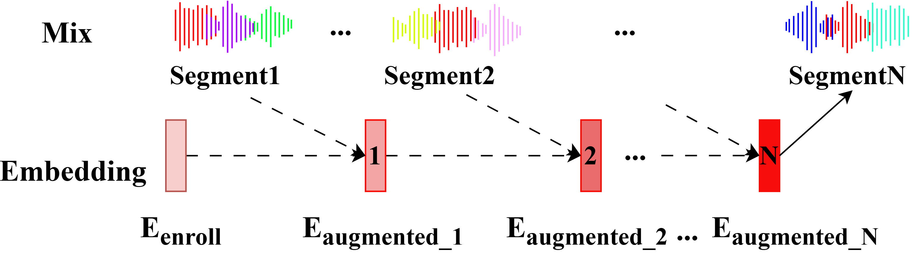
*Fig. 1:Adaptive speaker embedding self-augmentation (N Iterations)*

![Fig. 2:Architecture of adaptive speaker embedding self-augmentation for personal VAD. (a) illustrates our self-augmentation method, where 
𝐸
𝑎𝑢𝑔𝑚𝑒𝑛𝑡𝑒𝑑
 ((1-N) denotes the iterations of self-augmentation, as illustrates in Fig. 1) is derived by similarity-guided fusion of the original enrollment embedding 
𝐸
𝑒𝑛𝑟𝑜𝑙𝑙
 and the optimally matched frame-level embedding 
𝐸
𝑠𝑒𝑙𝑒𝑐𝑡𝑒𝑑
 from the mixed speech. (b) illustrates our PVAD 2.0 backbone architecture processing both the augmented speaker embedding 
𝐸
𝑎𝑢𝑔𝑚𝑒𝑛𝑡𝑒𝑑
 and the acoustic features 
𝐹
𝑚𝑖𝑥
 extracted from the mixed speech.](../images/2026-01-21/2601.12769/2601.12769_fig1.png)
*Fig. 2:Architecture of adaptive speaker embedding self-augmentation for personal VAD. (a) illustrates our self-augmentation method, where 
𝐸
𝑎𝑢𝑔𝑚𝑒𝑛𝑡𝑒𝑑
 ((1-N) denotes the iterations of self-augmentation, as illustrates in Fig. 1) is derived by similarity-guided fusion of the original enrollment embedding 
𝐸
𝑒𝑛𝑟𝑜𝑙𝑙
 and the optimally matched frame-level embedding 
𝐸
𝑠𝑒𝑙𝑒𝑐𝑡𝑒𝑑
 from the mixed speech. (b) illustrates our PVAD 2.0 backbone architecture processing both the augmented speaker embedding 
𝐸
𝑎𝑢𝑔𝑚𝑒𝑛𝑡𝑒𝑑
 and the acoustic features 
𝐹
𝑚𝑖𝑥
 extracted from the mixed speech.*

*Fig. 3:Results for speaker embedding self-augmentation with 0.5s enrollment in segment 1-10 (where N=10, as defined in Fig. 1). Bars (left axis) show REC/PRE; lines (right axis) show F1; X-axis shows Segment 1-10. Experimental conditions: (a) Clean, Eq. 4 fusion; (b) Noisy, Eq. 4 fusion; (c) Clean, Eqs. 5–6 fusion; (d) Noisy, Eqs. 5–6 fusion. For comparison, the red dashed line in (c) and (d) replicates the F1 curve from (a) and (b), respectively.*

*Fig. 4:(a) Ablation study of 
𝜆
 (0.05, 0.1, 0.2, 0.3, 0.4) in Eq. 6 for speaker embedding self-augmentation under 0.5s enrollment over 1-10 iterations (where N=10 in Fig. 1) in noisy condition. (b) PVAD performance visualization comparison: Original 0.5s enrollment vs. 5-iteration augmented embeddings (Eq. 4 vs. Eqs. 5–6).*

---
**Usage Info**: 5231 tokens used.
**Generated at**: 2026-02-24 20:07:11

---

