# 🚩 (2026-01-22) Scholar Inbox 추천 논문 

# 📚 Training-Efficient Text-to-Music Generation with State-Space Modeling

🚀 URL: https://arxiv.org/html/2601.14786

## 🌏 Abstract (원문)
Recent text-to-music (TTM) generation models have exhibited impressive capabilities in generating high-quality audio from textual descriptions. Despite these advances, the practical deployment and academic adoption of TTM models remain severely constrained by issues of openness and reproducibility. In particular, existing systems often rely on proprietary training data and extensive computational resources, creating significant barriers for openness and reproducibility. From the perspective of openness, access to training data remains a major concern. A recent survey shows that only one out of 16 state-of-the-art TTM models is trained exclusively on publicly available, CC-licensed data. Reproducibility represents a significant practical challenge due to the substantial computational cost of training modern TTM models. Towards open and reproducible TTM research, in this paper we adopt MusicGen-small as the reference model, and aim to build a new model that reaches compatible performance with MusicGen-small while satisfying two constraints: using only publicly-available, CC-licensed data and training on a single RTX 3090 GPU. We explore using emerging state-space models (SSMs), such as Mamba, to build the LM of our TTM model. SSMs operate with linear complexity, making them more efficient for modeling long sequences. We benchmark three SSM-based LM variants against a Transformer LM and adapt a two-stage framework using an SSM-based LM for coarse tokens and a pre-trained latent diffusion model for finer-grained tokens.
## 🌏 Abstract (번역)
최근 텍스트-음악(TTM) 생성 모델은 텍스트 설명으로부터 고품질 오디오를 생성하는 인상적인 능력을 보여주었습니다. 이러한 발전에도 불구하고, TTM 모델의 실제 배포와 학술적 채택은 개방성 및 재현성 문제로 인해 심각하게 제한되고 있습니다. 특히 기존 시스템은 종종 독점적인 훈련 데이터와 광범위한 컴퓨팅 자원에 의존하여 개방성과 재현성에 큰 장벽을 형성합니다. 개방성 측면에서 훈련 데이터에 대한 접근은 주요 관심사이며, 최첨단 모델 중 극소수만이 공개 데이터를 사용합니다. 재현성 또한 막대한 컴퓨팅 비용으로 인해 큰 도전 과제입니다. 본 논문에서는 개방적이고 재현 가능한 TTM 연구를 위해 MusicGen-small을 참조 모델로 설정하고, 공개된 CC 라이선스 데이터만을 사용하며 단일 RTX 3090 GPU에서 훈련 가능한 모델 구축을 목표로 합니다. 이를 위해 트랜스포머의 대안으로 선형 복잡도를 가진 상태 공간 모델(SSM)인 Mamba 등을 탐구합니다. 세 가지 SSM 기반 LM 변형을 트랜스포머와 비교 분석하고, 거친 토큰 생성을 위한 SSM과 미세 토큰 생성을 위한 잠재 확산 모델을 결합한 2단계 프레임워크를 제안합니다. 본 연구는 TTM 훈련 비용을 절감하면서도 개방성 기준을 충족하는 효율적인 방법론을 제시합니다.

## 🔍 Methods & Results
- Mamba-2 및 SiMBA를 활용한 세 가지 SSM 기반 언어 모델(Prefix Mamba, Prefix SiMBA, Cross SiMBA) 제안
- Prefix Mamba: Mamba-2 레이어와 프리픽스 튜닝을 사용하는 순수 시퀀스 믹싱 모델
- Prefix SiMBA: 채널 믹싱을 위한 피드포워드 블록을 추가하여 비선형성 도입
- Cross SiMBA: 텍스트 정보 통합을 위해 프리픽스 방식 대신 멀티 헤드 크로스 어텐션 채택
- 2단계 생성 프레임워크: 1단계에서 SSM 기반 LM으로 거친(coarse) 토큰을 생성하고, 2단계에서 LDM으로 미세(fine) 토큰을 생성
- 단일 RTX 3090 GPU에서 10만 단계 이내의 훈련으로 제한된 자원 환경에서의 효율성 검증
- 약 450시간의 CC 라이선스 Jamendo 데이터를 사용하여 데이터 효율성 및 개방성 확보
- SSM 기반 모델이 트랜스포머 대비 긴 시퀀스 모델링에서 선형 복잡도의 이점을 가짐을 확인

## 🖼 Figures
![Figure 1: LM architectures. (Left): overall architecture, using the DAC codec [26] for the input RVQ audio tokens and Flan-T5 [6] for processing the input text. (Right) (a)–(d): the LM variants evaluated, including Mamba-2 [11], SiMBA [40], and Transformer, using either prefix or cross-attention to condition the generation on the input text.](../images/2026-01-22/2601.14786/2601.14786_fig0.png)
*Figure 1: LM architectures. (Left): overall architecture, using the DAC codec [26] for the input RVQ audio tokens and Flan-T5 [6] for processing the input text. (Right) (a)–(d): the LM variants evaluated, including Mamba-2 [11], SiMBA [40], and Transformer, using either prefix or cross-attention to condition the generation on the input text.*

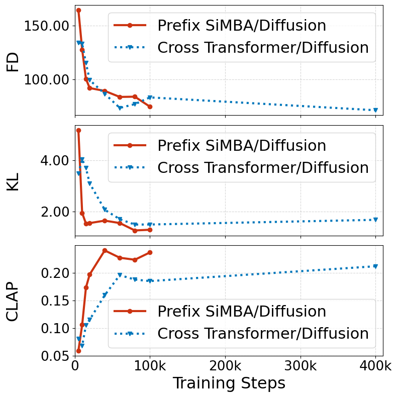
*Figure 2:Objective result of two selected LMs as a function of training steps. Performance is evaluated across training steps within the two-stage framework (Diffusion stage is frozen). Prefix SiMBA demonstrates superior training efficiency.*

*(a)SiMBA/Diffusion (100k)*

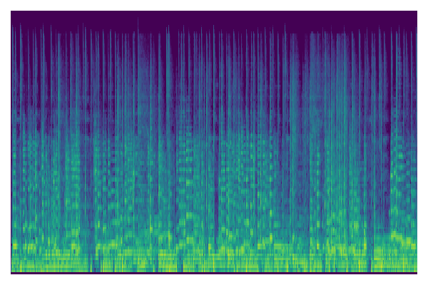
*(a)SiMBA/Diffusion (100k)*

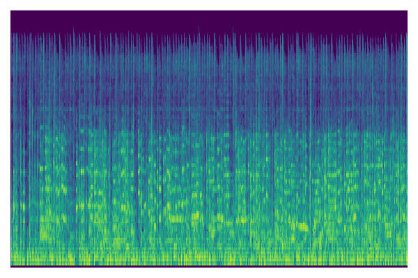
*(b)SiMBA/Diffusion (50k)*

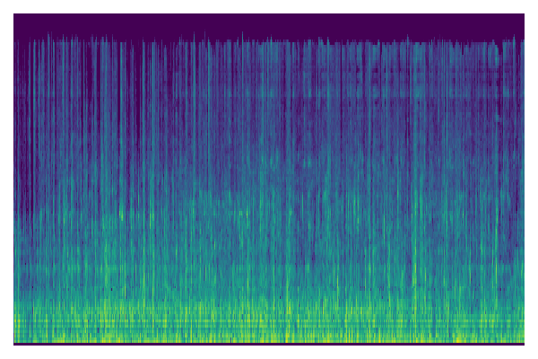
*(c)Transformer/Diffusion (400k)*

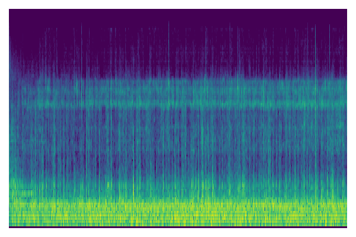
*(d)Transformer/Diffusion (100k)*

---
**Usage Info**: 6656 tokens used.
**Generated at**: 2026-02-24 20:08:05

---

# 📚 S2Voice: Style-Aware Autoregressive Modeling with Enhanced Conditioning for Singing Style Conversion

🚀 URL: https://arxiv.org/html/2601.13629

## 🌏 Abstract (원문)
Voice conversion (VC) aims to modify a source speech waveform so that it sounds as if produced by a target speaker while preserving the original linguistic content. The Voice Conversion Challenge (VCC) series[20,14,30]has fostered reproducible comparisons across competing systems by providing common datasets, evaluation protocols, and baseline implementations. Recently, interest has expanded from speech to singing: singing voice conversion (SVC) raises unique modeling and evaluation challenges due to wider pitch ranges, expressive timing, and diverse vocal techniques[13,11,10]. Singing style conversion (SSC)[24,28]is a closely related but distinct problem: instead of changing singer identity, SSC seeks to alterhowa phrase is performed (the singing style) while maintaining the linguistic content and the source singer’s identity. Compared to standard VC and SVC, SSC is more challenging because multiple valid style realizations may exist for the same musical content, and style changes must respect musical constraints such as melody and timing while remaining perceptually pleasing. Existing approaches that separate high-level modeling from acoustic rendering, have made progress but still face three core issues: (i) incomplete disentanglement between style and timbre, causing style/timbre leakage; (ii) limited ability of autoregressive models to robustly capture fine-grained style attributes; and (iii) insufficient high-quality singing data and training strategies for stable, generalizable conversion. To advance SVC research, the Singing Voice Conversion Challenge (SVCC) 2025[25]222https://www.vc-challenge.org/defines two tasks: In-domain SSC (task 1), where the source singer appears in the training data and a same-singer style reference is available; and zero-shot SSC (task 2), where the source singer is unseen during training and must be converted using a style reference from a different singer. The zero-shot track is particularly demanding, making it an effective benchmark for style modeling and generalization. In this work, we build upon the two-stage strong Vevo[28]baseline and propose S2Voice (Style-awareSingingVoice) to address the above issues. S2Voice improves style control and timbre preservation through the following contributions: We integrate style embeddings into the AR LLM via FiLM-style[16]layer normalization and style-aware cross-attention to improve fine-grained style control. We introduce a speaker-conditioned acoustic decoder that leverages pre-trained speaker embeddings to explicitly guide timbre preservation in the flow-matching transformer to enhance timbre similarity. We curate a large, high-quality singing corpus via an automated pipeline and employ a multi-stage training strategy (SFT + DPO[18]) that together improves perceptual quality, stability, and zero-shot generalization. Specifically, our submissions rank first in both SVCC 2025 tracks: achieving the highest style similarity and singer similarity in task 1, and leading across naturalness, style similarity, and singer similarity in task 2. Through ablation studies, we show these components provide complementary gains for style fidelity, timbre preservation, and generation stability.
## 🌏 Abstract (번역)
음성 변환(VC)은 원본 언어 콘텐츠를 유지하면서 소스 음성 파형을 대상 화자가 생성한 것처럼 들리도록 수정하는 것을 목표로 합니다. Voice Conversion Challenge(VCC) 시리즈는 공통 데이터셋, 평가 프로토콜 및 베이스라인 구현을 제공함으로써 경쟁 시스템 간의 재현 가능한 비교를 촉진해 왔습니다. 최근에는 관심이 음성에서 가창으로 확장되었습니다. 가창 음성 변환(SVC)은 더 넓은 음역대, 표현력 있는 타이밍, 다양한 보컬 기술로 인해 독특한 모델링 및 평가 과제를 제기합니다. 가창 스타일 변환(SSC)은 밀접하게 관련되어 있지만 별개의 문제입니다. 가수 정체성을 바꾸는 대신, SSC는 언어 콘텐츠와 소스 가수의 정체성을 유지하면서 구절이 연주되는 방식(가창 스타일)을 변경하고자 합니다. 표준 VC 및 SVC와 비교할 때, SSC는 동일한 음악 콘텐츠에 대해 여러 유효한 스타일 구현이 존재할 수 있고, 스타일 변화가 멜로디 및 타이밍과 같은 음악적 제약을 준수하면서 청각적으로 즐거워야 하기 때문에 더 어렵습니다. 고수준 모델링과 음향 렌더링을 분리하는 기존 접근 방식은 진전을 이루었지만 여전히 세 가지 핵심 문제에 직면해 있습니다: (i) 스타일과 음색 사이의 불완전한 분리로 인한 스타일/음색 누출; (ii) 미세한 스타일 속성을 견고하게 포착하는 자기회귀 모델의 제한된 능력; (iii) 안정적이고 일반화 가능한 변환을 위한 고품질 가창 데이터 및 훈련 전략의 부족. SVC 연구를 발전시키기 위해 Singing Voice Conversion Challenge(SVCC) 2025는 두 가지 과제를 정의합니다: 소스 가수가 훈련 데이터에 나타나고 동일 가수의 스타일 참조가 가능한 인-도메인 SSC(과제 1); 소스 가수가 훈련 중에 보이지 않으며 다른 가수의 스타일 참조를 사용하여 변환해야 하는 제로샷 SSC(과제 2). 제로샷 트랙은 특히 까다로워 스타일 모델링 및 일반화에 대한 효과적인 벤치마크가 됩니다. 본 연구에서는 강력한 2단계 Vevo 베이스라인을 기반으로 위 문제들을 해결하기 위해 S2Voice(Style-aware Singing Voice)를 제안합니다. S2Voice는 다음과 같은 기여를 통해 스타일 제어 및 음색 보존을 개선합니다: 미세한 스타일 제어를 개선하기 위해 FiLM 스타일의 레이어 정규화 및 스타일 인식 교차 주의 집중(cross-attention)을 통해 스타일 임베딩을 AR LLM에 통합합니다. 음색 유사성을 높이기 위해 flow-matching 트랜스포머에서 음색 보존을 명시적으로 가이드하기 위해 사전 훈련된 화자 임베딩을 활용하는 화자 조건부 음향 디코더를 도입합니다. 자동화된 파이프라인을 통해 대규모 고품질 가창 코퍼스를 큐레이션하고, 지각적 품질, 안정성 및 제로샷 일반화를 개선하는 다단계 훈련 전략(SFT + DPO)을 채택합니다. 구체적으로, 당사의 제출물은 SVCC 2025의 두 트랙 모두에서 1위를 차지했습니다: 과제 1에서 가장 높은 스타일 유사성과 가수 유사성을 달성했으며, 과제 2에서 자연스러움, 스타일 유사성 및 가수 유사성 전반에 걸쳐 선두를 달성했습니다. 절제 연구를 통해 이러한 구성 요소가 스타일 충실도, 음색 보존 및 생성 안정성에 대해 상호 보완적인 이득을 제공함을 보여줍니다.

## 🔍 Methods & Results
- Vevo 아키텍처를 기반으로 AR LLM과 Flow-matching Transformer로 구성된 2단계 가창 스타일 변환 프레임워크 S2Voice 제안
- AR LLM에 FiLM 방식의 레이어 정규화와 스타일 인식 교차 주의 집중(Cross-attention)을 도입하여 미세한 스타일 제어 능력 향상
- 사전 훈련된 화자 검증(SV) 네트워크의 글로벌 화자 임베딩을 음향 디코더에 조건으로 입력하여 스타일 정보 누출 방지 및 음색 보존 강화
- 보컬 분리, ASR 퓨전, LLM 기반 텍스트 정제 및 품질 필터링을 포함한 자동화 파이프라인을 통해 500시간 규모의 고품질 가창 데이터셋 구축
- 지도 미세 조정(SFT)과 직접 선호도 최적화(DPO)를 결합한 다단계 학습 전략을 통해 생성 안정성 및 지각적 품질 개선
- SVCC 2025의 인-도메인(Task 1) 및 제로샷(Task 2) 트랙 모두에서 스타일 유사도, 가수 유사도, 자연스러움 부문 1위 달성

## 🖼 Figures

*Fig. 1:Autoregressive transformer block. (a) Original AR block with standard self-attention and feed-forward layers using conventional LayerNorm. (b) Modified AR block used in our AR-LLM: FiLM-style layer-norm modulation injects global style scale and shift (
𝛾
,
𝛽
) produced by the style encoder, and a style-aware cross-attention lets local style queries attend to LLM context for fine-grained conditioning.*

---
**Usage Info**: 5306 tokens used.
**Generated at**: 2026-02-24 20:09:05

---

# 📚 VCNAC: A Variable-Channel Neural Audio Codec for Mono, Stereo, and Surround Sound

🚀 URL: https://arxiv.org/html/2601.14960

## 🌏 Abstract (원문)
Neural audio codecs enable a range of audio generation and processing applications, including speech synthesis and understanding. These applications operate across different channel configurations: mono for speech, stereo for music, and 5.1 surround for movies. Surround audio systems like 5.1 use six channels (front left/right, center, low-frequency effects, and rear left/right) to create immersive spatial audio experiences. However, codecs such as EnCodec[1]use fixed channel architectures that can only process audio with a predetermined number of channels. This limitation creates significant challenges when modeling multiple channel configurations within a single application. Current approaches require either training separate codecs for each desired channel configuration, each with its own distinct latent space, or processing all audio using the maximum number of channels the application may encounter. The latter approach leads to substantial computational inefficiencies when most data contains fewer channels than the maximum supported configuration. Existing multi-channel approaches have been limited to at most two channels and typically adapt single-channel designs by modifying only the input and output convolutional layers to accommodate the target number of channels. The remainder of the architecture processes all channels jointly and splits them into a fixed number of channels which does not directly generalize to varying channel requirements across different applications. We propose a neural audio codec that addresses these limitations through a variable-channel architecture capable of dynamically processing different numbers of input and output channels within the same encoder-decoder framework. Our approach uses shared codebooks to enable a unified latent space that represents audio content regardless of channel configuration, spanning mono, stereo, and surround formats. The shared latent space enables language model training on unified codebooks with inference-time scalability across different channel configurations. Our evaluation demonstrates good reconstruction quality across all channel configurations while achieving significant bitrate reductions compared to existing approaches (7.9 kbit/s vs. 14-16 kbit/s). A MUSHRA[2]study confirms perceptual quality gains. Audio samples are available at [URL to be added for camera ready version].
## 🌏 Abstract (번역)
신경망 오디오 코덱은 음성 합성 및 이해를 포함한 다양한 오디오 생성 및 처리 애플리케이션을 가능하게 합니다. 이러한 애플리케이션은 음성용 모노, 음악용 스테레오, 영화용 5.1 서라운드 등 서로 다른 채널 구성에서 작동합니다. 5.1과 같은 서라운드 오디오 시스템은 6개의 채널(전면 좌/우, 중앙, 저주파 효과, 후면 좌/우)을 사용하여 몰입형 공간 오디오 경험을 제공합니다. 그러나 EnCodec과 같은 기존 코덱은 고정된 채널 아키텍처를 사용하여 미리 정해진 수의 채널만 처리할 수 있습니다. 이러한 제한은 단일 애플리케이션 내에서 여러 채널 구성을 모델링할 때 큰 어려움을 초래합니다. 현재의 방식은 각 채널 구성마다 고유한 잠재 공간을 가진 별도의 코덱을 훈련하거나, 애플리케이션이 직면할 수 있는 최대 채널 수를 사용하여 모든 오디오를 처리해야 합니다. 후자의 방식은 대부분의 데이터가 지원되는 최대 구성보다 적은 채널을 포함할 때 상당한 계산 비효율성을 초래합니다. 기존의 다채널 접근 방식은 최대 2개 채널로 제한되어 왔으며, 일반적으로 대상 채널 수에 맞춰 입출력 컨볼루션 레이어만 수정하여 단일 채널 설계를 조정합니다. 아키텍처의 나머지 부분은 모든 채널을 공동으로 처리하고 이를 고정된 수의 채널로 분할하므로, 다양한 애플리케이션의 채널 요구 사항에 직접적으로 일반화되지 않습니다. 본 논문에서는 동일한 인코더-디코더 프레임워크 내에서 서로 다른 수의 입출력 채널을 동적으로 처리할 수 있는 가변 채널 아키텍처를 통해 이러한 한계를 해결하는 신경망 오디오 코덱을 제안합니다. 우리의 접근 방식은 공유 코드북을 사용하여 모노, 스테레오, 서라운드 형식을 아우르는 채널 구성에 관계없이 오디오 콘텐츠를 표현하는 통합 잠재 공간을 구현합니다. 이 공유 잠재 공간은 통합된 코드북에서 언어 모델 훈련을 가능하게 하며, 추론 시 다양한 채널 구성에 걸쳐 확장성을 제공합니다. 평가 결과, 모든 채널 구성에서 우수한 재구성 품질을 입증하는 동시에 기존 방식(14-16 kbit/s) 대비 상당한 비트레이트 감소(7.9 kbit/s)를 달성했습니다. MUSHRA 연구를 통해 인지적 품질 향상을 확인했습니다. 오디오 샘플은 [URL]에서 확인할 수 있습니다.

## 🔍 Methods & Results
- DAC 인코더-디코더 아키텍처를 확장하여 단일 모델 내에서 가변 채널 구성을 지원하는 아키텍처 설계
- 가중치를 공유하는 병렬 컨볼루션 스트림과 채널 식별을 위한 학습 가능한 위치 임베딩(Positional Embeddings) 도입
- 인코더 계층의 특정 깊이에서 채널 스트림을 융합(Fusion)하여 채널 구성에 독립적인 통합 잠재 공간 및 RVQ 양자화 수행
- 디코더에서 잠재 표현을 복제 및 분할(Splitting)하고 대칭적인 구조를 통해 타겟 채널 재구성
- 채널 간 및 시간적 의존성을 캡처하기 위해 시간적으로 인터리빙된 시퀀스에 작동하는 TAAE(Transformer Audio AutoEncoder) 블록 적용
- 48kHz 오디오를 25Hz 프레임 레이트로 처리하며 약 1억 6천만 개의 파라미터로 7.85 kbit/s의 저대역폭 달성
- 스테레오 및 서라운드 오디오의 공간적 특성 보존을 위해 Mid-Side 분해 및 ITU-R BS.775-4 표준 다운믹싱 기반의 재구성 손실 함수 사용
- 기존 방식 대비 약 50% 낮은 비트레이트에서도 우수한 재구성 품질과 인지적 성능(MUSHRA) 입증

## 🖼 Figures
![Figure 1:Variable-channel neural audio codec architecture. Parallel channel streams with shared weights for the convolutional layers process variable input channels, fuse into unified representations for quantization, then split to target output channels. Cross-channel attention enables information exchange before fusion and after splitting. The architecture natively supports mono, stereo, and surround audio. We only show two up- and down-sampling convolutions for visualization purposes. We use five convolutions for VCNAC as tested in the experiments.](../images/2026-01-22/2601.14960/2601.14960_fig0.png)
*Figure 1:Variable-channel neural audio codec architecture. Parallel channel streams with shared weights for the convolutional layers process variable input channels, fuse into unified representations for quantization, then split to target output channels. Cross-channel attention enables information exchange before fusion and after splitting. The architecture natively supports mono, stereo, and surround audio. We only show two up- and down-sampling convolutions for visualization purposes. We use five convolutions for VCNAC as tested in the experiments.*

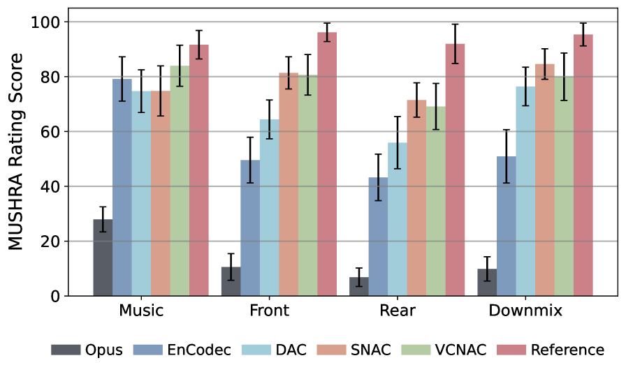
*Figure 2:MUSHRA quality ratings by test category. Mean ratings ± 95% CI for audio codecs across music, front/rear channels, and downmixed content. DAC and SNAC operate at almost double the total bitrate for surround data.*

---
**Usage Info**: 3981 tokens used.
**Generated at**: 2026-02-24 20:09:32

---

# 📚 Quantifying Speaker Embedding Phonological Rule Interactions in Accented Speech Synthesis

🚀 URL: https://arxiv.org/html/2601.14417

## 🌏 Abstract (원문)
Accents are a defining source of variation in spoken language, and English provides a striking case. Spoken by approximately one-fifth of the world's population, yet with only one-fourth native speakers[4,6], the English language has developed a broad range of accent varieties from both native and non-native speaker backgrounds[19]. These include regional varieties such as American, British, and Australian English, as well as global variants such as Indian English.[11,16]. Capturing such variation has become an important goal for speech generation technologies. Accent in TTS is typically controlled by conditioning on speaker embeddings[24,23]. However, embeddings also encode multiple traits unrelated to the accent, such as voice timbre[5,13], speaker emotion[1,14,2], and background noise[9], making accent representation opaque and difficult to control. To address this, we use linguistically motivated phonological rules as targeted probes of accent control. Our goal is not to replace data-driven models with synthesis-by-rule but to test how explicit phoneme-level transformations interact with speaker embeddings in modern TTS systems. We focus on three well-documented phonological processes that differentiate American and British English varieties: flapping, rhoticity, and vowel correspondences. In American English, intervocalic /t/ is often realized as a flap [R] in unstressed contexts (e.g.,water\rightarrow[waR]), while British English typically retains [t]. Rhoticity also diverges: American English is rhotic, preserving post-vocalic r (e.g.,car\rightarrow[kar]), whereas most British varieties are non-rhotic, deleting or vocalizing r in coda position (e.g.,car\rightarrow[kA:]). Finally, systematic vowel correspondences arise across lexical sets. For example,bathis pronounced as /bæT/ in American English but /bAT/ in British English, andgoatas [goUt] versus [g@Ut]. These selected contrasts are not modeled to capture every nuance of accent variation. Instead, we deliberately operationalize them as big-stroke transformations—salient enough to shift perceived accent without overfitting dialectal micro-variation. This makes them a useful testbed for probing the balance between embedding-driven and linguistic control, focusing less on mimicking full dialects and more on revealing where embeddings and linguistic structure interact. Our substitutions target robust cross-accent pronunciation patterns that have been consistently documented in linguistic descriptions[19,17]and behavioral studies of accent perception[8,3], making them ideal probes for accent strength and a principled lens on disentanglement in speech generation. To quantify accent strength we use an accent classification model, where a higher predicted probability for a given accent indicate stronger accentedness. A caveat in this approach, however, is that predicted probabilities are inherently tied to the model's training task and the particular accent contrasts it encodes, making them task-specific rather than general measures. To complement this, we also compute accent embedding similarity. If two utterances yield embeddings that lie close together in the accent space, they are assumed to share similar accent characteristics. While useful, neither of these measures directly captures the impact of phonological rules. Our rules are deliberately coarse, targeting the most salient cross-accent shifts, but the actual realization may be moderated by the speaker embedding. To evaluate this interaction, we introduce the phoneme shift rate (PSR), a novel metric that quantifies how much speaker embeddings preserve or overwrite the rule-driven phoneme mappings. For example, when we convert [læR@r] (latter) into a more British-like target [lAt@@], the synthesized output may still realize [læt], reflecting a partial pull back toward the American form. PSR measures such cases of gradient reinforcement or attenuation, offering a direct probe of where rule-based transformations hold versus where embeddings dominate. We view PSR as a first step toward systematic evaluation of disentanglement in TTS, offering an interpretable way to steer accent strength that is linguistically grounded yet flexible enough for modern TTS. The contributions of this study are: 1) We introduce a small set of linguistically guided phonological rules for highly salient dialect differences that transform accents between American and British English, offering a controlled and interpretable probe for accent in TTS. 2) We introduce the phoneme shift rate (PSR), a novel metric to evaluate how rule-based transformations are preserved or attenuated by speaker embeddings. 3) We present a systematic analysis of the interplay between phonological rules and speaker embeddings, showing how coarse, knowledge-driven constraints can reveal the degree of disentanglement in speech generation. Together, these results demonstrate that knowledge-driven rules, even at a coarse granularity, can be effective levers for accent control, providing interpretable guidance within modern data-driven TTS systems. Speech samples are available at https://sav-eng.github.io/icassp_samples.html. Code implementing the phonological rules is in https://github.com/linguistylee/KAtDial.
## 🌏 Abstract (번역)
억양은 구어의 변이를 정의하는 핵심 요소이며, 영어는 그 두드러진 사례를 제공합니다. 전 세계 인구의 약 5분의 1이 사용하지만 원어민은 4분의 1에 불과한 영어는 원어민과 비원어민 배경 모두에서 미국, 영국, 호주 영어와 같은 지역적 변종뿐만 아니라 인도 영어와 같은 글로벌 변종에 이르기까지 광범위한 억양 변종을 발전시켜 왔습니다. 이러한 변이를 포착하는 것은 음성 생성 기술의 중요한 목표가 되었습니다. TTS에서 억양은 일반적으로 화자 임베딩에 조건화되어 제어됩니다. 그러나 임베딩은 음색, 화자의 감정, 배경 소음 등 억양과 무관한 여러 특성도 함께 인코딩하므로 억양 표현이 불투명하고 제어하기 어렵게 만듭니다. 이를 해결하기 위해 본 연구에서는 언어학적으로 동기 부여된 음운 규칙을 억양 제어의 표적으로 사용합니다. 우리의 목표는 데이터 기반 모델을 규칙 기반 합성으로 대체하는 것이 아니라, 명시적인 음소 수준의 변환이 현대 TTS 시스템에서 화자 임베딩과 어떻게 상호 작용하는지 테스트하는 것입니다. 우리는 미국 영어와 영국 영어 변종을 구분하는 세 가지 잘 문서화된 음운 과정인 플래핑(flapping), R-음성(rhoticity), 모음 대응에 집중합니다. 미국 영어에서 모음 사이의 /t/는 종종 강세가 없는 문맥에서 플랩 [R]로 실현되는 반면(예: water\rightarrow[waR]), 영국 영어는 일반적으로 [t]를 유지합니다. R-음성 또한 차이가 있는데, 미국 영어는 R-음성 언어로서 모음 뒤의 r을 보존하는 반면(예: car\rightarrow[kar]), 대부분의 영국 변종은 비R-음성 언어로서 음절 끝에서 r을 삭제하거나 모음화합니다(예: car\rightarrow[kA:]). 마지막으로, 어휘 집합 전반에 걸쳐 체계적인 모음 대응이 나타납니다. 예를 들어, bath는 미국 영어에서 /bæT/로 발음되지만 영국 영어에서는 /bAT/로 발음되며, goat는 [goUt] 대 [g@Ut]로 발음됩니다. 선택된 이러한 대조들은 억양 변이의 모든 미묘한 차이를 포착하도록 모델링된 것이 아닙니다. 대신, 우리는 이를 방언의 미세한 변이에 과적합되지 않으면서 인지된 억양을 변화시킬 만큼 두드러진 '굵직한 변환'으로 의도적으로 조작했습니다. 이는 임베딩 기반 제어와 언어적 제어 사이의 균형을 조사하는 유용한 테스트베드가 되며, 전체 방언을 모방하는 것보다 임베딩과 언어 구조가 상호 작용하는 지점을 밝히는 데 중점을 둡니다. 우리의 대체 작업은 언어학적 기술과 억양 지각에 관한 행동 연구에서 일관되게 문서화된 강력한 교차 억양 발음 패턴을 대상으로 하므로, 억양 강도를 측정하고 음성 생성에서의 얽힘 해제(disentanglement)를 분석하는 원칙적인 렌즈가 됩니다. 억양 강도를 정량화하기 위해 우리는 억양 분류 모델을 사용하며, 특정 억양에 대한 예측 확률이 높을수록 억양의 강도가 강함을 나타냅니다. 그러나 이 접근 방식의 주의점은 예측 확률이 모델의 학습 작업 및 인코딩된 특정 억양 대조에 본질적으로 묶여 있어 일반적인 측정치가 아닌 작업별 측정치가 된다는 것입니다. 이를 보완하기 위해 억양 임베딩 유사도도 계산합니다. 두 발화가 억양 공간에서 서로 가까운 임베딩을 생성한다면, 유사한 억양 특성을 공유하는 것으로 가정합니다. 이러한 측정치들은 유용하지만 음운 규칙의 영향을 직접적으로 포착하지는 못합니다. 우리의 규칙은 가장 두드러진 교차 억양 변화를 대상으로 의도적으로 거칠게 설정되었지만, 실제 실현은 화자 임베딩에 의해 조절될 수 있습니다. 이러한 상호 작용을 평가하기 위해, 우리는 화자 임베딩이 규칙 기반 음소 매핑을 얼마나 보존하거나 덮어쓰는지 정량화하는 새로운 지표인 음소 이동률(PSR)을 도입합니다. 예를 들어, [læR@r] (latter)를 영국식 타겟인 [lAt@@]로 변환할 때, 합성된 출력은 여전히 [læt]로 실현되어 미국식 형태로 부분적으로 되돌아가는 현상을 반영할 수 있습니다. PSR은 이러한 점진적인 강화 또는 감쇠 사례를 측정하여, 규칙 기반 변환이 유지되는 지점과 임베딩이 지배하는 지점을 직접적으로 조사합니다. 우리는 PSR을 TTS의 얽힘 해제에 대한 체계적인 평가의 첫 단계로 보며, 언어학적으로 근거가 있으면서도 현대 TTS에 유연하게 적용할 수 있는 해석 가능한 억양 강도 조절 방법을 제공합니다. 본 연구의 기여는 다음과 같습니다. 1) 미국 영어와 영국 영어 사이의 억양을 변환하는 매우 두드러진 방언 차이에 대한 언어학적 가이드 기반의 소규모 음운 규칙 세트를 도입하여 TTS에서 제어 가능하고 해석 가능한 억양 조사 도구를 제공합니다. 2) 규칙 기반 변환이 화자 임베딩에 의해 어떻게 보존되거나 감쇠되는지 평가하기 위한 새로운 지표인 음소 이동률(PSR)을 도입합니다. 3) 음운 규칙과 화자 임베딩 간의 상호 작용에 대한 체계적인 분석을 제시하여, 거친 지식 기반 제약 조건이 음성 생성에서 얽힘 해제 정도를 어떻게 드러낼 수 있는지 보여줍니다. 종합적으로, 이러한 결과는 지식 기반 규칙이 거친 입도에서도 억양 제어를 위한 효과적인 레버가 될 수 있음을 입증하며, 현대 데이터 기반 TTS 시스템 내에서 해석 가능한 가이드를 제공합니다. 음성 샘플은 https://sav-eng.github.io/icassp_samples.html에서 확인할 수 있으며, 음운 규칙을 구현한 코드는 https://github.com/linguistylee/KAtDial에 공개되어 있습니다.

## 🔍 Methods & Results
- 미국 영어와 영국 영어의 주요 차이점인 플래핑(flapping), R-음성(rhoticity), 모음 대응 규칙을 활용한 억양 제어 방법론 제시
- 화자 임베딩이 음운 규칙 기반의 변환을 보존하거나 덮어쓰는 정도를 측정하는 새로운 지표인 음소 이동률(PSR, Phoneme Shift Rate) 도입
- 억양 분류 모델의 예측 확률 및 억양 임베딩 유사도를 활용한 억양 강도 정량화 분석 수행
- 거친 수준의 언어학적 규칙이 현대 데이터 기반 TTS 시스템에서 해석 가능한 억양 제어 레버로 작동함을 입증
- 음운 규칙과 화자 임베딩 간의 상호작용 분석을 통해 음성 생성 모델의 얽힘 해제(disentanglement) 정도를 평가하는 체계적 틀 마련

## 🖼 Figures

*Fig. 1:Synthesis and evaluation pipeline. Inputs to Kokoro TTS are a phoneme sequence (American or British), a speaker embedding, and fixed phoneme durations. The yellow path shows rule-based phoneme substitutions prior to synthesis, and the green path shows evaluation of their effect on the synthesized accented speech.*

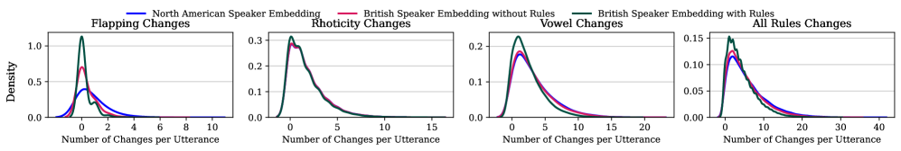
*Fig. 2:Kernel Density Estimation (KDE) of histograms on the number of changes of the rules.*

---
**Usage Info**: 7549 tokens used.
**Generated at**: 2026-02-24 20:10:27

---

# 📚 TEST-TIME ADAPTATION FOR SPEECH ENHANCEMENT VIA MASK POLARIZATION

🚀 URL: https://arxiv.org/html/2601.14770

## 🌏 Abstract (원문)
By leveraging large labeled datasets to learn the complex structure of speech, deep learning based speech enhancement (SE) has revolutionized the field. However, these methods often suffer from performance degradation when deployed in environments that differ from their training conditions. As practical SE systems must handle diverse and time-varying acoustic environments, speaker characteristics and noise types for which no labeled data is available, robust unsupervised adaptation methods are essential for reliable deployments. While unsupervised domain adaptation (UDA) methods exist for SE, they typically require access to source data, limiting their practical applicability. Test-time adaptation (TTA) has emerged as a promising solution to this challenge. As opposed to UDA, TTA requires only the trained source model and unlabeled target data, eliminating privacy concerns associated with sharing source data and reducing storage requirements. Crucially, TTA performs online adaptation, i.e., simultaneous to inference, making it suitable for real-world and real-time deployments that do not allow for the latency of a separate adaptation phase. However, existing TTA methods for SE rely on additional components either via an additional encoder or a teacher-student framework, limiting the applicability on resource-constrained deployments. To develop a parameter-efficient alternative, we investigated how SE models degrade under domain shifts. We observe that under domain shifts mask-based SE models exhibit a phenomenon analogous to confidence loss in classification. In their source domain, these models predict distinctly bimodal masks that effectively separate speech from noise. However, under domain shifts, their predicted masks lose this bimodal distribution and become flatter, directly impacting enhancement quality. Based on this insight, we propose mask polarization (MPol), a lightweight TTA method that aims at restoring the bimodality under domain shifts by comparing the predicted mask to a computed reference via the Wasserstein distance. We empirically demonstrate that SE models suffer from reduced mask confidence under domain shifts. We propose MPol, a lightweight TTA method for mask-based SE models requiring no additional components beyond the trained model. We show that MPol achieves competitive performance with significantly more complex methods across diverse domain shifts, making it the state-of-the-art low complexity TTA method for SE.
## 🌏 Abstract (번역)
대규모 레이블 데이터셋을 활용하여 음성의 복잡한 구조를 학습하는 딥러닝 기반 음성 향상(SE) 기술은 해당 분야에 혁신을 가져왔습니다. 그러나 이러한 방법들은 학습 조건과 다른 환경에 배포될 때 성능 저하를 겪는 경우가 많습니다. 실제 SE 시스템은 레이블이 지정된 데이터가 없는 다양하고 시간에 따라 변하는 음향 환경, 화자 특성 및 노이즈 유형을 처리해야 하므로, 신뢰할 수 있는 배포를 위해서는 강력한 비지도 적응 방법이 필수적입니다. SE를 위한 비지도 도메인 적응(UDA) 방법이 존재하지만, 일반적으로 소스 데이터에 대한 접근이 필요하여 실제 적용에 한계가 있습니다. 테스트 시간 적응(TTA)은 이러한 과제에 대한 유망한 해결책으로 부상했습니다. UDA와 달리 TTA는 학습된 소스 모델과 레이블이 없는 타겟 데이터만 필요로 하므로, 소스 데이터 공유와 관련된 개인정보 보호 문제를 해결하고 저장 공간 요구 사항을 줄여줍니다. 결정적으로 TTA는 추론과 동시에 온라인 적응을 수행하므로, 별도의 적응 단계로 인한 지연을 허용하지 않는 실제 및 실시간 배포에 적합합니다. 그러나 기존의 SE용 TTA 방법은 추가 인코더나 교사-학생 프레임워크와 같은 추가 구성 요소에 의존하므로 자원이 제한된 배포 환경에서의 적용이 제한됩니다. 매개변수 효율적인 대안을 개발하기 위해 우리는 도메인 변화에 따라 SE 모델이 어떻게 저하되는지 조사했습니다. 우리는 도메인 변화 상황에서 마스크 기반 SE 모델이 분류에서의 신뢰도 손실과 유사한 현상을 보인다는 것을 관찰했습니다. 소스 도메인에서 이러한 모델들은 음성과 노이즈를 효과적으로 분리하는 뚜렷한 이봉(bimodal) 마스크를 예측합니다. 그러나 도메인 변화가 발생하면 예측된 마스크는 이러한 이봉 분포를 잃고 더 평탄해지며, 이는 향상 품질에 직접적인 영향을 미칩니다. 이러한 통찰을 바탕으로, 우리는 예측된 마스크를 계산된 참조 마스크와 바세르슈타인 거리를 통해 비교함으로써 도메인 변화 하에서 이봉성을 복원하는 것을 목표로 하는 경량 TTA 방법인 마스크 편광(MPol)을 제안합니다. 우리는 도메인 변화 하에서 SE 모델의 마스크 신뢰도가 감소한다는 것을 실증적으로 입증했습니다. 또한 학습된 모델 외에 추가 구성 요소가 필요하지 않은 마스크 기반 SE 모델용 경량 TTA 방법인 MPol을 제안합니다. 우리는 MPol이 다양한 도메인 변화에 걸쳐 훨씬 더 복잡한 방법들과 경쟁력 있는 성능을 달성하여 SE를 위한 최첨단 저복잡도 TTA 방법임을 보여줍니다.

## 🔍 Methods & Results
- 도메인 변화 시 마스크 기반 SE 모델이 이봉성(bimodality)을 잃고 마스크 값이 중간 범위로 집중되는 '신뢰도 저하' 현상을 발견함
- 예측된 마스크의 분포를 더 뚜렷한 이봉성을 가진 참조 마스크의 분포와 비교하여 복원하는 MPol(Mask Polarization) 기법 제안
- 바세르슈타인 거리(Wasserstein distance)를 활용하여 마스크 항목의 정렬된 값들을 비교함으로써 불완전한 참조 마스크에 대해서도 강건한 적응 수행
- 음수 마스크 값 억제를 위한 페널티 항과 지속적인 가중치 앙상블(Weight Ensembling)을 도입하여 적응의 안정성 확보
- 추가적인 인코더나 교사-학생 구조 없이도 복잡한 기존 TTA 기법들과 대등한 성능을 기록하며 저복잡도 SOTA 달성

## 🖼 Figures
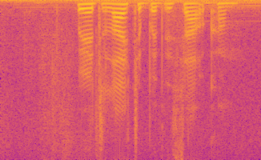
*Fig. 1:Overview of MPol (mask polarization). The mask histogram flattens under domain shifts.*

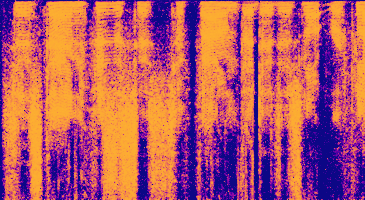
*Fig. 2:Comparison of masks and their histograms.*

---
**Usage Info**: 5175 tokens used.
**Generated at**: 2026-02-24 20:10:59

---

# 📚 Guided by the Plan: Enhancing Faithful Autoregressive Text-to-Audio Generation with Guided Decoding

🚀 URL: https://arxiv.org/html/2601.14304

## 🌏 Abstract (원문)
Text-to-audio generation aims to synthesize audio signals given textual descriptions. Most existing approaches adopt non-autoregressive (NAR) frameworks, such as diffusion models, that operate over continuous latent representations. While highly effective, they often neglect the inherently sequential and causal nature of audio, which unfolds temporally in a strictly forward direction. To better capture such dynamics, recent works such as Siren has revisited AR paradigm, generating audio token-by-token. It naturally mirrors the temporal progression of sound and yields superior temporal coherence. Despite their success in producing high-fidelity audio, AR models suffer from a persistent limitation: they struggle to faithfully follow complex textual prompts. When prompts describe multiple sequential or complex audio events, AR-generated outputs frequently omit or misalign key semantic elements, resulting in degraded instruction-following. As shown in Figure 1, while diffusion models maintain stable performance as prompt complexity increases, AR baselines exhibit a consistent drop in CLAP score—highlighting a fundamental gap between strong temporal modeling and robust semantic alignment. The main reason for such disparity lies in architectural differences. Diffusion models, often built on UNet or bidirectional transformer, allow every token to attend to both past and future states, enabling global coordination and coarse-to-fine planning across the entire timeline. AR models, by contrast, generate outputs strictly left-to-right in token level, without explicit global control. As a result, they excel at local temporal coherence but often lack global semantic alignment, a weakness that becomes more pronounced as prompt complexity grows. This raises a central challenge: how can AR models strengthen instruction following while preserving their causal generation advantages? We draw inspiration from human sequential production, such as speech or writing, where people plan ahead and rely on this plan as a global control during output generation. Motivated by this analogy, we first conduct a preliminary analysis with global attribute probing. Our results reveal that AR models exhibit similar signs of implicit planning: the prefix tokens (e.g., the first 32 of a 288-token sequence) already encode predictive information about high-level audio attributes, including the event count and the sound object category. This finding suggests that AR models, though restricted to causal decoding, implicitly embed global structural cues early in the generation process as implicit planning. Building on this observation, we propose a guided decoding method that leverages implicit planning as a control signal to steer AR model generation at inference time. Specifically, we introduce Plan-Critic, an auxiliary model trained to predict instruction-following quality (measured by CLAP score) from partial audio sequences. In this way, we transfer the implicit planning into a rectified score that enables early selection and guidance of the subsequent full sequence generation. A key challenge in training such critic is credit assignment: the model must infer the overall sequence quality based on partial generations. To address this, we design a Generalized Advantage Estimation (GAE)-inspired training framework: The critic produces value estimates at each generation step, with direct supervision applied only to the final-step prediction using the ground-truth CLAP score. To bridge the gap, intermediate predictions are regularized through temporal consistency losses, propagating supervisory signals backward along the sequence. This strategy mitigates the credit assignment problem and allows reliable assessment during early generation stage. Equipped with Plan-Critic, we reframe inference as guided exploration rather than blind left-to-right rollout. Our Plan-Critic-guided sampling strategy evaluates candidate prefixes early, prunes low-scoring trajectories, and reallocates computation to promising planning seeds. Unlike full-sequence methods like best-of-N sampling—which generate complete outputs before reranking—our approach expands the effective search space over high-quality global structures while avoiding redundant computation. This yields more efficient inference-time scaling and significantly stronger alignment with complex prompts. In summary, our main contributions are: We provide empirical evidence that early tokens in AR audio generation encode predictive information about global semantic attributes, revealing an intrinsic capacity for latent planning. We propose Plan-Critic—a novel auxiliary model—and a GAE-inspired training paradigm that quantifies implicit planning, enabling accurate prediction of final instruction-following quality from partial sequences. We introduce a Plan-Critic-guided sampling algorithm that improves both efficiency and semantic fidelity, achieving up to a 10 points gain in CLAP score over the AR baseline and establishing a new state-of-the-art in AR text-to-audio generation.
## 🌏 Abstract (번역)
텍스트-오디오 생성은 텍스트 설명을 기반으로 오디오 신호를 합성하는 것을 목표로 합니다. 기존의 대부분의 접근 방식은 확산 모델과 같은 비자기회귀(NAR) 프레임워크를 채택하여 연속적인 잠재 표현 위에서 작동합니다. 이러한 방식은 매우 효과적이지만, 엄격하게 순방향으로 전개되는 오디오의 본질적인 순차적 및 인과적 특성을 무시하는 경우가 많습니다. 이러한 역학을 더 잘 포착하기 위해 최근 Siren과 같은 연구들은 토큰별로 오디오를 생성하는 자기회귀(AR) 패러다임을 재검토했습니다. 이는 소리의 시간적 진행을 자연스럽게 반영하며 우수한 시간적 일관성을 제공합니다. 고충실도 오디오 생성의 성공에도 불구하고, AR 모델은 복잡한 텍스트 프롬프트를 충실히 따르는 데 어려움을 겪는 고질적인 한계가 있습니다. 프롬프트가 여러 순차적 또는 복잡한 오디오 이벤트를 설명할 때, AR 생성 출력은 종종 핵심 의미 요소를 누락하거나 잘못 정렬하여 지시어 이행 능력이 저하됩니다. 프롬프트 복잡성이 증가함에 따라 확산 모델은 안정적인 성능을 유지하는 반면, AR 베이스라인은 CLAP 점수가 지속적으로 하락하며, 이는 강력한 시간적 모델링과 견고한 의미적 정렬 사이의 근본적인 격차를 보여줍니다. 이러한 차이의 주요 원인은 구조적 차이에 있습니다. 확산 모델은 모든 토큰이 과거와 미래 상태를 모두 참조할 수 있게 하여 전체 타임라인에 걸친 전역적 조정과 세밀한 계획을 가능하게 합니다. 반면 AR 모델은 명시적인 전역 제어 없이 토큰 수준에서 엄격하게 왼쪽에서 오른쪽으로 출력을 생성합니다. 결과적으로 국소적인 시간적 일관성에는 뛰어나지만 전역적인 의미적 정렬이 부족하며, 이는 프롬프트가 복잡해질수록 두드러집니다. 본 연구는 인간이 말하거나 글을 쓸 때 미리 계획을 세우고 이를 전역적 제어로 사용하는 방식에서 영감을 얻었습니다. 이러한 비유를 바탕으로 전역 속성 프로빙을 통한 예비 분석을 수행한 결과, AR 모델의 초기 토큰(예: 288개 토큰 중 첫 32개)이 이미 이벤트 수 및 사운드 객체 카테고리를 포함한 고수준 오디오 속성에 대한 예측 정보를 인코딩하고 있다는 '암시적 계획'의 징후를 발견했습니다. 이 관찰을 바탕으로 추론 시 AR 모델 생성을 유도하는 제어 신호로 암시적 계획을 활용하는 가이드 디코딩 방법인 Plan-Critic을 제안합니다. Plan-Critic은 부분 오디오 시퀀스에서 명령 수행 품질(CLAP 점수)을 예측하도록 훈련된 보조 모델입니다. 이러한 방식의 핵심 과제인 신용 할당 문제를 해결하기 위해 GAE(Generalized Advantage Estimation)에서 영감을 받은 훈련 프레임워크를 설계했습니다. Plan-Critic 가이드 샘플링 전략은 초기 단계에서 후보 접두사를 평가하고 낮은 점수의 궤적을 가지치기하며 유망한 계획 시드에 계산을 재할당합니다. 이 접근 방식은 복잡한 프롬프트와의 정렬을 크게 강화하며 효율적인 추론 시간 확장을 가능하게 합니다. 실험 결과, 제안된 방법은 AR 베이스라인 대비 CLAP 점수에서 최대 10점의 향상을 기록하며 AR 텍스트-오디오 생성 분야에서 새로운 최첨단 성능을 달성했습니다.

## 🔍 Methods & Results
- AR 모델의 초기 토큰이 이벤트 수 및 사운드 객체 카테고리와 같은 전역적 의미 속성을 인코딩하고 있다는 '암시적 계획(Implicit Planning)' 현상을 실험적으로 입증함
- 부분적인 오디오 시퀀스로부터 최종 지시어 이행 품질을 예측하는 보조 모델인 Plan-Critic 제안
- GAE(Generalized Advantage Estimation)에서 영감을 얻어, 최종 단계의 CLAP 점수를 감독 신호로 사용하고 중간 단계는 시간적 일관성 손실로 정규화하는 훈련 패러다임 도입
- 추론 시 저득점 궤적을 가지치기하고 유망한 경로를 선택하는 Plan-Critic 가이드 샘플링 알고리즘 개발
- 실험 결과 AR 베이스라인 대비 CLAP 점수 최대 10점 향상 및 복잡한 프롬프트에 대한 의미적 충실도 대폭 개선

## 🖼 Figures

*Figure 1: Instruction-following performance (
𝑦
-axis) of different methods, measured by CLAP scores. The 
𝑥
-axis labels, 
Event
​
@
​
𝑁
, indicate prompts with 
𝑁
 distinct audio events, where a higher number of events corresponds to increased complexity.*

![Figure 2:Upper row: Event counting regression results, with Kendall (K), Spearman (S), and Pearson (P) correlation coefficients reported between predicted and ground-truth counts. Lower row: t-SNE visualization of prefix representations, colored by the object category associated with each prefix. The confusion matrix for the classification results is also included. Takeaways: the non-trivial generalization performance of event counting and sounding object classification demonstrate the high correlation between the prefix tokens with posterior global attributes. Best viewed in color.](../images/2026-01-22/2601.14304/2601.14304_fig1.png)
*Figure 2:Upper row: Event counting regression results, with Kendall (K), Spearman (S), and Pearson (P) correlation coefficients reported between predicted and ground-truth counts. Lower row: t-SNE visualization of prefix representations, colored by the object category associated with each prefix. The confusion matrix for the classification results is also included. Takeaways: the non-trivial generalization performance of event counting and sounding object classification demonstrate the high correlation between the prefix tokens with posterior global attributes. Best viewed in color.*

*Figure 3:Overall pipeline of the proposed plan-critic guided framework. ① illustrates the process of collecting training data for the plan-critic model. ② shows the training of the plan-critic model, where we conduct sparse GAE supervision with certain step 
𝑡
 is involved in loss (elaborate in Section 4.1). ③ depicts how the trained critic guides the generator’s inference sampling.*

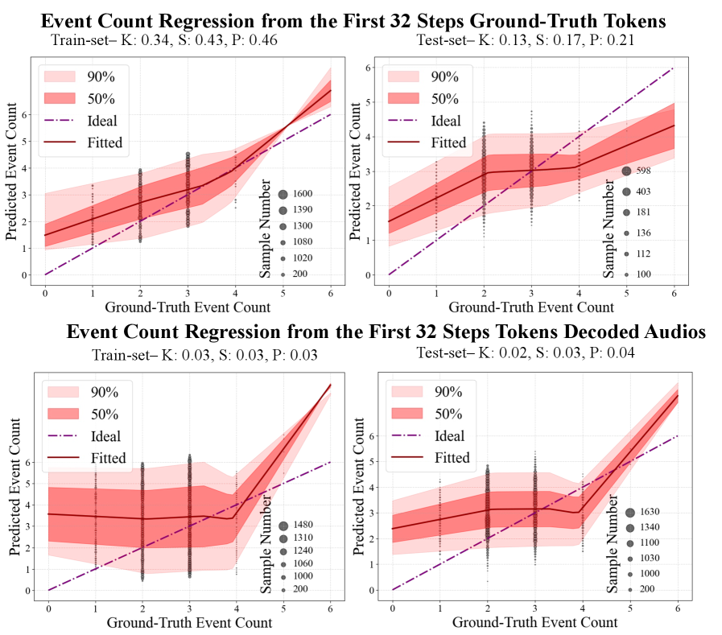
*Figure 4:Upper row: Using prefix tokens from real audio to regress the total event count of the full audio. Low row: Event count regression using prefix tokens from decoded (reconstructed) audio.*

*Figure 5:Given a set of prefix tokens, each is expanded into 1,000 postfix sequences. The two plots show the distributions of the mean and standard deviation of CLAP scores computed across the 1,000 generations per prefix, aggregated over 10,000 distinct prefixes. To simplify the figure, we randomly select and visualize 25 points for each event count.*

*Figure 6:Schematic illustration of different sampling strategies, where 
𝐵
 is batch size, 
𝑇
 the temporal length.*

---
**Usage Info**: 4070 tokens used.
**Generated at**: 2026-02-24 20:11:38

---

# 📚 LongSpeech: A Scalable Benchmark for Transcription, Translation and Understanding in Long Speech

🚀 URL: https://arxiv.org/html/2601.13539

## 🌏 Abstract (원문)
The fields of automatic speech recognition (ASR) and audio-language modeling have achieved significant milestones, particularly on tasks involving short or moderately long audio segments. State-of-the-art models now routinely attain near-human performance on standard benchmarks like LibriSpeech and TED-LIUM, which predominantly focus on isolated utterances or brief exchanges. These advances have been accelerated by the emergence of audio language models, which enable joint speech understanding and language generation. Despite these breakthroughs, a persistent gap remains between these controlled benchmarks and the demands of real-world applications, where audio often extends over many minutes or hours and contains complex phenomena such as speaker changes, topic shifts, and multilingual content. LongSpeech is designed to bridge this gap by providing a comprehensive, large-scale benchmark tailored for long-form speech. Processing long-duration audio introduces unique challenges, including maintaining semantic coherence, handling speaker and language variability, and supporting complex downstream tasks. Existing benchmarks do not sufficiently capture these complexities. Although recent work has introduced long-form evaluations such as BLAB, which focus on temporal localization and counting, they still lack support for higher-level semantic and discourse-level understanding. This gap in comprehensive evaluation capabilities limits our ability to develop and objectively assess models for real-world deployment. Our work focuses on two core contributions: a scalable framework for constructing diverse, long-form speech datasets and a multi-task benchmark designed to rigorously test advanced audio-language models. To this end, LongSpeech aggregates long-duration audio from diverse sources and provides annotations for a variety of tasks that reflect practical needs. These tasks are intentionally challenging and range from fundamental speech perception to higher-level reasoning: ASR & S2T Translation, Summarization, Speaker Count & Language Detection, Content Separation, QA & Temporal Localization, and Emotion Analysis. By encompassing this diverse set of tasks, LongSpeech provides a unified platform to benchmark not only the transcription and translation accuracy of models but also their ability to understand and reason about long-form audio. As our initial experiments demonstrate, even leading models exhibit significant weaknesses on these tasks, underscoring the difficulty of the benchmark and the urgent need for progress. We believe that LongSpeech will catalyze research towards more robust and versatile audio-language models, ultimately closing the gap between academic benchmarks and real-world utility.
## 🌏 Abstract (번역)
자동 음성 인식(ASR) 및 오디오 언어 모델링 분야는 특히 짧거나 중간 길이의 오디오 세그먼트를 포함하는 작업에서 중요한 이정표를 달성했습니다. 최첨단 모델들은 이제 고립된 발화나 짧은 대화에 주로 초점을 맞춘 LibriSpeech 및 TED-LIUM과 같은 표준 벤치마크에서 인간에 가까운 성능을 일상적으로 달성합니다. 이러한 발전은 음성 이해와 언어 생성을 결합할 수 있게 하는 오디오 언어 모델의 등장으로 가속화되었습니다. 이러한 돌파구에도 불구하고, 이러한 통제된 벤치마크와 오디오가 수 분 또는 수 시간 동안 지속되고 화자 변경, 주제 전환 및 다국어 콘텐츠와 같은 복잡한 현상을 포함하는 실제 응용 분야의 요구 사항 사이에는 여전히 지속적인 격차가 존재합니다. LongSpeech는 긴 형식의 음성에 맞춤화된 포괄적인 대규모 벤치마크를 제공함으로써 이 격차를 해소하기 위해 설계되었습니다. 장시간 오디오를 처리하는 것은 의미론적 일관성 유지, 화자 및 언어 가변성 처리, 복잡한 다운스트림 작업 지원을 포함한 독특한 과제를 제시합니다. 기존 벤치마크는 이러한 복잡성을 충분히 포착하지 못합니다. 최근 BLAB와 같은 긴 형식의 평가가 도입되어 시간적 위치 파악 및 카운팅에 초점을 맞추고 있지만, 여전히 더 높은 수준의 의미론적 및 담화 수준의 이해에 대한 지원이 부족합니다. 포괄적인 평가 능력의 이러한 격차는 실제 배포를 위한 모델을 개발하고 객관적으로 평가하는 능력을 제한합니다. 본 연구는 두 가지 핵심 기여에 초점을 맞춥니다: 다양한 긴 형식의 음성 데이터셋을 구축하기 위한 확장 가능한 프레임워크와 고급 오디오 언어 모델을 엄격하게 테스트하기 위해 설계된 다중 작업 벤치마크입니다. 이를 위해 LongSpeech는 다양한 소스에서 장시간 오디오를 수집하고 실제 요구 사항을 반영하는 다양한 작업에 대한 주석을 제공합니다. 이러한 작업은 의도적으로 도전적이며 기본 음성 인식에서 고차원 추론에 이르기까지 다양합니다: ASR 및 S2T 번역, 요약, 화자 수 및 언어 감지, 콘텐츠 분리, QA 및 시간적 위치 파악, 감정 분석. 이러한 다양한 작업 세트를 포괄함으로써 LongSpeech는 모델의 전사 및 번역 정확도뿐만 아니라 긴 형식의 오디오를 이해하고 추론하는 능력까지 벤치마킹할 수 있는 통합 플랫폼을 제공합니다. 초기 실험에서 알 수 있듯이, 선도적인 모델조차도 이러한 작업에서 상당한 약점을 보이며, 이는 벤치마크의 난이도와 진전의 시급한 필요성을 강조합니다. 우리는 LongSpeech가 보다 강력하고 다재다능한 오디오 언어 모델에 대한 연구를 촉진하여 궁극적으로 학술적 벤치마크와 실제 유용성 사이의 격차를 좁힐 것이라고 믿습니다.

## 🔍 Methods & Results
- 다양한 소스에서 장시간 오디오를 수집하고 확장 가능한 데이터셋 구축 프레임워크를 제안함
- ASR, 번역, 요약, 화자 수 식별, 언어 감지, 콘텐츠 분리, QA, 시간적 위치 파악, 감정 분석을 포함하는 다중 작업 벤치마크를 구축함
- 기존 벤치마크가 다루지 못하는 장시간 오디오의 의미론적 일관성 및 담화 수준 이해를 평가함
- 초기 실험 결과, 현재 선도적인 모델들도 장시간 오디오 처리 작업에서 상당한 성능 한계를 보임을 확인하여 벤치마크의 난이도를 입증함

---
**Usage Info**: 3245 tokens used.
**Generated at**: 2026-02-24 20:12:55

---

# 📚 Single-Step Controllable Music Bandwidth extension with Flow Matching Copyright 2026 IEEE. Published in ICASSP 2026 - 2026 IEEE International Conference on Acoustics, Speech and Signal Processing (ICASSP), scheduled for 3-8 May 2026 in Barcelona, Spain. Personal use of this material is permitted. However, permission to reprint/republish this material for advertising or promotional purposes or for creating new collective works for resale or redistribution to servers or lists, or to reuse any copyrighted component of this work in other works, must be obtained from the IEEE. Contact: Manager, Copyrights and Permissions / IEEE Service Center / 445 Hoes Lane / P.O. Box 1331 / Piscataway, NJ 08855-1331, USA. Telephone: + Intl. 908-562-3966.

🚀 URL: https://arxiv.org/html/2601.14356

## 🌏 Abstract (원문)
Degradations in music recording may be introduced in countless ways such as poor recording conditions, legacy recording devices, lossy data compression, or degradation of the storage media like vinyl or magnetic tape. The presence of such degradations can make music recordings unusable, and can be an obstacle to the preservation of assets of particular historical value. Music restoration systems aim to improve audio quality of a degraded or low quality recording by reconstructing the missing audio information and/or removing artifacts. They hold the promise of allowing the salvage of recordings that otherwise could not be. For example, Moliner et al. use generative adversarial networks (gans) for historical music bandwidth extension[13]. Recently, generative models have shown promising results in the broad context of audio restoration. For example, diffusion models trained with clean data were used for piano and vocal restoration[12,5]. However, diffusion models require many sampling steps to produce high-quality samples, impeding efficient and fast inference[7]. Flow-matching[8,1,9]is poised to allow single-step generation, which may yield faster generation.FLowHighis one such method proposed for speech super-resolution[20]. As with most generative tasks, controllability of audio restoration models is an important property for their practical use. Although most audio restoration methods cited above do not allow for user control, recent work proposed using text prompts to guide the reconstruction[11]. To this day, the range of control signals explored in the audio and music generation space is comparatively larger. Recent work in music or foley sound generation introduces time-varying attributes to change audio features such as loudness, pitch and spectral centroid[17,18,4], or leverages multimodal controls[2]. In this work we focus our attention on the task of generative bandwidth extension, which aims at reconstructing high frequency content that is missing from the original recording. With the view of designing tools for advanced and professional users, our objective is to investigate fine-grained controllability. Our hope is that such tool would empower producers and engineers alike to make the minute adjustments required for each recording, and perhaps even use the restoration creatively. Language, and by proxy text prompts, has proven to be a valuable control signal for generative models, but it is limited by what is possible with a language description. As an alternative that is more directly connected to the task of bandwidth extension and significantly less computationally intensive, we investigate using audio features as a fine-grained control signal. Contributions.Our contributions are the following: (1) We transpose theFLowHighframework to the music domain, to allow single-step generative restoration. (2) We extendFLowHighwith audio feature conditioning usingcfg-zero⋆\star. (3) We introduce a novel audio feature, Dynamic Spectral Contour (dsc), specifically designed to guide bandwidth extension.
## 🌏 Abstract (번역)
음악 녹음의 품질 저하는 열악한 녹음 환경, 구형 녹음 장치, 손실 데이터 압축, 또는 바이닐이나 자기 테이프와 같은 저장 매체의 노후화 등 수많은 방식으로 발생할 수 있습니다. 이러한 품질 저하는 음악 녹음을 사용할 수 없게 만들며, 특히 역사적 가치가 있는 자산의 보존에 장애가 될 수 있습니다. 음악 복원 시스템은 누락된 오디오 정보를 재구성하거나 아티팩트를 제거함으로써 저품질 녹음의 오디오 품질을 개선하는 것을 목표로 합니다. 이는 복원하지 않으면 사용할 수 없었을 녹음물을 구제할 수 있는 가능성을 제공합니다. 예를 들어, Moliner 등은 역사적 음악의 대역폭 확장을 위해 생성적 적대 신경망(GAN)을 사용했습니다. 최근 생성 모델은 오디오 복원의 광범위한 맥락에서 유망한 결과를 보여주었습니다. 예를 들어, 깨끗한 데이터로 학습된 확산 모델(Diffusion models)이 피아노 및 보컬 복원에 사용되었습니다. 그러나 확산 모델은 고품질 샘플을 생성하기 위해 많은 샘플링 단계가 필요하므로 효율적이고 빠른 추론을 방해합니다. Flow-matching은 단일 단계 생성을 가능하게 하여 더 빠른 생성을 제공할 것으로 기대됩니다. FLowHigh는 음성 초해상도를 위해 제안된 이러한 방법 중 하나입니다. 대부분의 생성 작업과 마찬가지로, 오디오 복원 모델의 제어 가능성은 실제 사용을 위한 중요한 속성입니다. 위에서 언급된 대부분의 오디오 복원 방법은 사용자 제어를 허용하지 않지만, 최근 연구에서는 텍스트 프롬프트를 사용하여 재구성을 유도하는 방법이 제안되었습니다. 현재까지 오디오 및 음악 생성 분야에서 탐구된 제어 신호의 범위는 상대적으로 더 넓습니다. 음악 또는 폴리 사운드 생성에 관한 최근 연구는 음량, 피치, 스펙트럼 중심과 같은 오디오 특징을 변경하기 위해 시간에 따라 변하는 속성을 도입하거나 다중 모드 제어를 활용합니다. 본 연구에서는 원본 녹음에서 누락된 고주파수 콘텐츠를 재구성하는 것을 목표로 하는 생성적 대역폭 확장 작업에 집중합니다. 고급 및 전문 사용자를 위한 도구 설계의 관점에서, 우리의 목표는 미세 조정 가능한 제어 가능성을 조사하는 것입니다. 이러한 도구가 프로듀서와 엔지니어들이 각 녹음에 필요한 미세한 조정을 수행하고, 심지어 복원을 창의적으로 사용할 수 있도록 힘을 실어주기를 기대합니다. 언어와 그 대리인인 텍스트 프롬프트는 생성 모델을 위한 가치 있는 제어 신호임이 입증되었지만, 언어적 묘사로 가능한 범위에 의해 제한됩니다. 대역폭 확장 작업과 더 직접적으로 연결되고 계산 집약도가 현저히 낮은 대안으로서, 우리는 오디오 특징을 미세 조정 제어 신호로 사용하는 것을 조사합니다. 본 연구의 기여는 다음과 같습니다: (1) 단일 단계 생성 복원을 가능하게 하기 위해 FLowHigh 프레임워크를 음악 도메인으로 이식합니다. (2) cfg-zero*를 사용하여 오디오 특징 조건화를 통해 FLowHigh를 확장합니다. (3) 대역폭 확장을 가이드하기 위해 특별히 설계된 새로운 오디오 특징인 Dynamic Spectral Contour(DSC)를 도입합니다.

## 🔍 Methods & Results
- 음성 초해상도 모델인 FLowHigh를 음악 도메인으로 확장하여 단일 단계 생성 복원을 구현함
- 확산 모델보다 빠른 추론을 위해 조건부 흐름 매칭(CFM) 기법을 사용하며, 35.4M 파라미터 규모의 Transformer 기반 벡터장 추정기를 활용함
- 저주파 대역의 멜-스펙트로그램을 입력받아 전체 대역을 예측하고, 사전 학습된 BigVGAN 보코더를 통해 오디오 파형을 복원함
- Classifier-Free Guidance(CFG)를 개선한 cfg-zero* 전략을 도입하여 오디오 특징 기반의 정밀한 제어를 가능하게 함
- 대역폭 확장을 가이드하기 위해 시간에 따라 변하는 스펙트럼의 경계를 추적하는 새로운 특징인 Dynamic Spectral Contour(DSC)를 제안함
- DSC는 STFT, 이진 마스킹, 가우시안 필터링 및 중앙값 필터를 거쳐 계산되며, 사용자가 복원할 주파수 범위를 미세하게 조정할 수 있도록 함
- AdaptiveCFM과 MixedCFM 전략을 통해 입력 신호의 저주파 성분을 보존하면서 고주파 성분을 효과적으로 생성함

## 🖼 Figures
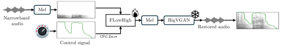
*Fig. 1:Proposed Flow Matching method with audio controls for music restoration.*

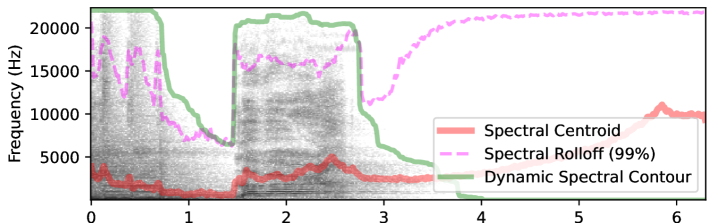
*Fig. 2:Comparison of bandwidth control features. Our proposed Dynamic Spectral Contour accurately captures bandwidth where spectral centroid and rolloff fail (e.g., in the low-energy region from 4s onwards).*

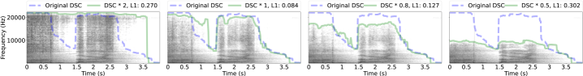
*Fig. 3: Audio restoration effect of manipulating dsc control signals and a 4kHz degraded input. In purple, the dsc calculated from the original clean file. In green, dsc calculated from the restored audio using the manipulated dsc as control signal.*

---
**Usage Info**: 4828 tokens used.
**Generated at**: 2026-02-24 20:13:29

---

# 📚 FunCineForge: A Unified Dataset Toolkit and Model for Zero-Shot Movie Dubbing in Diverse Cinematic Scenes

🚀 URL: https://arxiv.org/html/2601.14777

## 🌏 Abstract (원문)
Movie Dubbing (2022), also known as Visual-Voice-Cloning (V2C), is a task that synthesizes speech for video clips from scripts using target timbres. This technique has significant potential in television and film production, digital media, and video editing. Unlike Text-to-Speech (TTS), movie dubbing requires incorporating visual information from character faces to precisely control the duration, emotion, and prosody of the synthesized speech. Existing movie dubbing methods can be broadly categorized into three research paradigms. The first category focuses on improving the synchronization between the synthesized speech and lip movements by learning visual features from the speaker’s lip region. However, their alignment performance heavily relies on the presence of clear and visible lip regions, making them effective only for simple, frontal, and high-resolution monologue scenes. In live-action television, complex cinematic scenes such as facial occlusion, frequent shot changes, multiple coexisting speakers, large speaker-camera distances, and low-resolution frames are common, which prevents reliable audio-visual alignment. The second category focuses on enhancing dubbing quality and speaker similarity. However, these methods heavily rely on clear, single-speaker faces and consistent timbre. In the presence of shot-level facial transitions, speaker timbre switching, or intermediate silent segments, alignment becomes difficult, and both dubbing quality and speaker similarity degrade substantially. The third category leverages Multimodal Large Language Models (MLLMs) to fuse information from multiple modalities for movie dubbing. However, the effectiveness of MLLMs critically depends on large-scale dubbing datasets, whereas existing datasets are limited in scale, confined to animated content, and lack rich annotations. To address these issues, we propose FunCineForge, which comprises an end-to-end production pipeline for large-scale dubbing datasets and an MLLM-based dubbing model designed for diverse cinematic scenes. The FunCineForge dataset pipeline innovatively adopts specialized models prediction plus Multimodal CoT Correction strategy. Using the pipeline, we construct CineDub-CN, the first large-scale Chinese television dubbing dataset, with over 4,700 hours of data. Based on this dataset, we propose the FunCineForge dubbing model, which integrates more multimodal information within an MLLM architecture. We propose a novel multimodal alignment mechanism that jointly models where speech can occur, what is spoken, and fine-grained lip-speech alignment, together with an improved flow matching module that supports speaker switching. As a result, the proposed dubbing model synthesizes highly natural speech with precise lip sync, effectively handling complex cinematic scenes and flexible speaker switching.
## 🌏 Abstract (번역)
영화 더빙(V2C)은 타겟 음색을 사용하여 스크립트로부터 비디오 클립에 맞는 음성을 합성하는 작업입니다. 이 기술은 TV, 영화 제작, 디지털 미디어 및 비디오 편집 분야에서 큰 잠재력을 가지고 있습니다. TTS와 달리 영화 더빙은 캐릭터의 얼굴에서 시각적 정보를 통합하여 합성된 음성의 지속 시간, 감정, 운율을 정밀하게 제어해야 합니다. 기존의 영화 더빙 방법은 크게 세 가지 연구 패러다임으로 분류할 수 있습니다. 첫 번째 범주는 화자의 입술 영역에서 시각적 특징을 학습하여 합성된 음성과 입술 움직임 사이의 동기화를 개선하는 데 중점을 둡니다. 그러나 이러한 방법은 명확하고 가시적인 입술 영역에 크게 의존하므로 단순한 정면 고해상도 독백 장면에만 효과적입니다. 실제 실사 TV 프로그램에서는 얼굴 가림, 빈번한 샷 전환, 여러 화자의 공존, 먼 거리, 저해상도 프레임 등 복잡한 시네마틱 장면이 흔하며, 이는 신뢰할 수 있는 오디오-비주얼 정렬을 방해합니다. 두 번째 범주는 더빙 품질과 화자 유사성을 향상시키는 데 중점을 둡니다. 그러나 이러한 방법 역시 명확한 단일 화자 얼굴과 일관된 음색에 크게 의존하며, 샷 수준의 얼굴 전환이나 화자 음색 전환이 발생할 경우 성능이 크게 저하됩니다. 세 번째 범주는 멀티모달 대규모 언어 모델(MLLM)을 활용하여 여러 모달리티의 정보를 융합합니다. 하지만 MLLM의 효과는 대규모 더빙 데이터셋에 달려 있는데, 기존 데이터셋은 규모가 제한적이고 애니메이션에 국한되어 실제 시나리오에서의 효과가 제약됩니다. 이러한 문제를 해결하기 위해 본 논문에서는 대규모 더빙 데이터셋을 위한 엔드투엔드 제작 파이프라인과 다양한 시네마틱 장면을 위해 설계된 MLLM 기반 더빙 모델인 FunCineForge를 제안합니다. FunCineForge 데이터셋 파이프라인은 경량 전문 모델과 범용 MLLM의 장점을 결합하여 '전문 모델 예측 및 멀티모달 CoT 수정' 전략을 혁신적으로 채택합니다. 이를 통해 원본 영화 및 TV 소스를 텍스트 트랜스크립트, 보컬 및 악기 트랙, 비디오 스트림, 캐릭터 및 감정 단서, 대화 주석, 입술 시퀀스 등을 포함한 구조화된 멀티모달 데이터로 자동 변환합니다. 이 파이프라인을 사용하여 4,700시간 이상의 데이터를 포함하는 최초의 대규모 중국어 TV 더빙 데이터셋인 CineDub-CN을 구축했습니다. 이 데이터셋을 기반으로 MLLM 아키텍처 내에 더 많은 멀티모달 정보를 통합하는 FunCineForge 더빙 모델을 제안합니다. 우리는 음성 발생 위치, 내용, 미세한 입술-음성 정렬을 공동으로 모델링하는 새로운 멀티모달 정렬 메커니즘과 화자 전환을 지원하는 개선된 플로우 매칭 모듈을 제안합니다. 결과적으로 제안된 모델은 정밀한 립싱크와 함께 매우 자연스러운 음성을 합성하며, 복잡한 시네마틱 장면과 유연한 화자 전환을 효과적으로 처리합니다.

## 🔍 Methods & Results
- FunCineForge 제안: 대규모 더빙 데이터셋 제작을 위한 엔드투엔드 파이프라인 및 MLLM 기반 더빙 모델 개발
- 데이터셋 파이프라인: 전문 모델의 예측과 멀티모달 Chain-of-Thought(CoT) 수정을 결합하여 원본 영상을 구조화된 멀티모달 데이터로 자동 변환
- CineDub-CN 구축: 4,700시간 이상의 분량을 가진 최초의 대규모 중국어 TV 더빙 데이터셋 구축
- 멀티모달 정렬 메커니즘: 음성 발생 위치, 발화 내용, 미세 입술 정렬을 통합 모델링하는 새로운 메커니즘 제안
- 플로우 매칭 모듈 개선: 화자 전환을 지원하도록 개선하여 복잡한 시네마틱 장면 대응력 강화
- 성능 결과: 정밀한 립싱크와 높은 자연스러움을 가진 음성 합성 성공 및 복잡한 영상 환경에서의 강건함 입증

## 🖼 Figures

*Figure 1:The overview of FunCineForge. The dataset pipeline automatically transforms raw film and television sources into structured multimodal data, which are used to train and evaluate the dubbing model. During inference, given a silent video clip, dubbing script, clue instructions, scene category, and reference speeches, the model synthesizes scene-consistent speech.*

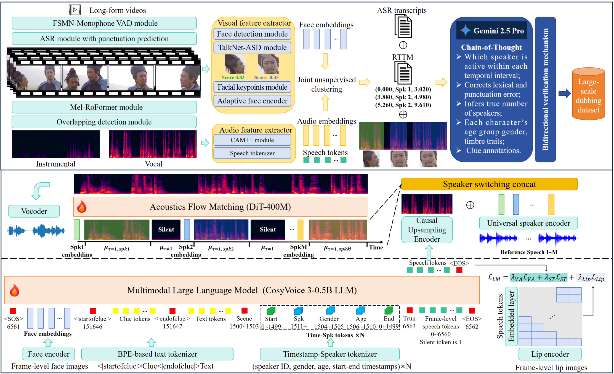
*Figure 2: The main architecture of FunCineForge. The framework consists of a dataset pipeline and a dubbing model. The dubbing model comprises two components: an MLLM for multimodal alignment, and a flow matching module with speaker switching.*

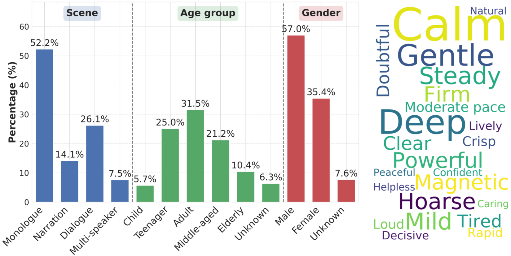
*Figure 3:The left subfigure shows the distributions of scene categories, speaker age groups, and gender, while the right subfigure presents a timbre-related keyword cloud of the CineDub-CN dataset.*

---
**Usage Info**: 5651 tokens used.
**Generated at**: 2026-02-24 20:15:00

---

# 📚 SpatialV2A: Visual-Guided High-fidelity Spatial Audio Generation

🚀 URL: https://arxiv.org/html/2601.15017

## 🌏 Abstract (원문)
Video-to-Audio (V2A) generation aims to synthesize high-fidelity, perceptually consistent audio signals that accurately match visual inputs. The core objective is to produce audio that is semantically aligned with visual events, temporally synchronized with scene dynamics, and perceptually realistic for an immersive user experience. By establishing robust cross-modal associations between visual cues and their corresponding acoustic patterns, V2A systems can generate audio that accurately reflects object interactions, environmental context, and temporal motion cues. Compared to manual Foley design, V2A offers higher production efficiency, lower labor costs, and scalability to large-scale video production. As a result, V2A technology is increasingly important for applications such as video generation, virtual and augmented reality, and AI-assisted media production, where high-quality, visually grounded audio plays a crucial role in enhancing perceptual engagement and overall user experience. Although recent V2A studies have achieved remarkable progress in generating semantically and temporally aligned audio, they have largely overlooked audio spatialization. Traditional V2A frameworks typically generate mono audio, which lacks directional and positional sound cues, thus failing to convey realistic spatial perception. However, spatial audio plays a crucial role in human auditory perception by providing cues about sound source direction, position, and movement, which are essential for immersive and realistic audiovisual experiences. Recent studies have begun to explore visual-guided audio spatialization, aiming to generate binaural or stereo audio from visual inputs. Although these methods can synthesize spatialized audio, they often exhibit limited temporal and semantic alignment with visual events. Consequently, there is a critical need for a V2A framework that preserves semantic fidelity, temporal coherence, and spatial realism simultaneously, as illustrated by our proposed SpatialV2A. Developing a spatially aware V2A framework faces two major challenges: the need for an explicit audio spatialization module and the limited availability of large-scale binaural datasets. To address these limitations, this work makes the following contributions: We construct a large-scale spatial video–audio dataset, BinauralVGGSound, comprising over 187k high-quality video–audio pairs with binaural audio and descriptive captions. We propose a spatially aware V2A generation framework SpatialV2A that models fine-grained spatial representations from visual inputs and synthesizes binaural stereo audio. Extensive experiments demonstrate that our dataset construction strategy maintains the fidelity of the original mono audio, while the proposed framework generates binaural audio with precise temporal and semantic alignment.
## 🌏 Abstract (번역)
비디오-오디오(V2A) 생성은 시각적 입력과 정확히 일치하며 지각적으로 일관된 고충실도 오디오 신호를 합성하는 것을 목표로 합니다. 핵심 목표는 시각적 이벤트와 의미적으로 정렬되고, 장면 역동성과 시간적으로 동기화되며, 몰입감 있는 사용자 경험을 위해 지각적으로 현실적인 오디오를 생성하는 것입니다. 시각적 단서와 그에 상응하는 음향 패턴 사이의 강력한 교차 모달 연관성을 구축함으로써, V2A 시스템은 객체 상호작용, 환경적 맥락 및 시간적 움직임 단서를 정확하게 반영하는 오디오를 생성할 수 있습니다. 수동 폴리(Foley) 디자인과 비교하여 V2A는 더 높은 제작 효율성, 낮은 노동 비용 및 대규모 비디오 제작에 대한 확장성을 제공합니다. 결과적으로 V2A 기술은 비디오 생성, 가상 및 증강 현실, AI 지원 미디어 제작과 같이 고품질의 시각 기반 오디오가 지각적 몰입감과 전반적인 사용자 경험을 향상시키는 데 중요한 역할을 하는 응용 분야에서 점점 더 중요해지고 있습니다. 최근 V2A 연구들이 의미적 및 시간적으로 정렬된 오디오 생성에서 괄목할 만한 진전을 이루었음에도 불구하고, 오디오 공간화는 대체로 간과되어 왔습니다. 전통적인 V2A 프레임워크는 일반적으로 모노 오디오를 생성하는데, 이는 방향 및 위치 음향 단서가 부족하여 현실적인 공간 지각을 전달하지 못합니다. 그러나 공간 오디오는 음원 방향, 위치 및 움직임에 대한 단서를 제공함으로써 인간의 청각 지각에서 중요한 역할을 하며, 이는 몰입감 있고 현실적인 시각-청각 경험에 필수적입니다. 최근 연구들은 시각적 입력으로부터 바이노럴 또는 스테레오 오디오를 생성하는 것을 목표로 시각 유도 오디오 공간화를 탐구하기 시작했습니다. 이러한 방법들은 공간화된 오디오를 합성할 수 있지만, 시각적 이벤트와의 시간적 및 의미적 정렬이 제한적인 경우가 많습니다. 따라서 의미적 충실도, 시간적 일관성 및 공간적 사실성을 동시에 보존하는 V2A 프레임워크가 절실히 필요하며, 이는 본 논문에서 제안하는 SpatialV2A로 구현됩니다. 공간 인식 V2A 프레임워크 개발은 두 가지 주요 과제에 직면해 있습니다. 첫째, V2A 생성에서 공간 지각을 달성하려면 시각적 장면에서 직접 공간 음향 단서를 추론할 수 있는 명시적인 오디오 공간화 모듈이 필요합니다. 둘째, 공간 V2A 모델의 개발은 대규모 바이노럴 데이터셋의 가용성 제한으로 인해 어려움을 겪고 있습니다. 이러한 한계를 해결하기 위해 본 연구는 다음과 같은 기여를 합니다. 첫째, 바이노럴 오디오와 설명 캡션이 포함된 187,000개 이상의 고품질 비디오-오디오 쌍으로 구성된 대규모 공간 비디오-오디오 데이터셋인 BinauralVGGSound를 구축합니다. 둘째, 시각적 입력으로부터 미세한 공간 표현을 모델링하고 바이노럴 스테레오 오디오를 합성하는 공간 인식 V2A 생성 프레임워크인 SpatialV2A를 제안합니다. 광범위한 실험을 통해 본 데이터셋 구축 전략이 원본 모노 오디오의 충실도를 유지하는 동시에, 제안된 프레임워크가 정확한 시간적 및 의미적 정렬을 갖춘 바이노럴 오디오를 생성함을 입증합니다.

## 🔍 Methods & Results
- Conditional Flow Matching (CFM)을 기반으로 좌우 오디오 채널을 독립적으로 모델링하는 이중 분기(Dual-branch) 프레임워크 SpatialV2A 제안
- CLIP 및 Synchformer를 활용하여 텍스트, 시각, 동기화 특징을 결합한 멀티모달 공동 표현 학습 및 의미적 정렬 수행
- 시각 유도 오디오 공간화 모듈을 통해 수평 위치, 소리 영역 비율, 공간 분산, 좌우 에너지 편향, 확산 분포 형태 등 5가지 핵심 공간 특징 추출
- 187,000개 이상의 고품질 바이노럴 비디오-오디오 쌍과 텍스트 캡션을 포함하는 대규모 데이터셋 BinauralVGGSound 구축
- 실험 결과, 제안된 프레임워크가 원본 모노 오디오의 충실도를 유지하면서 시각적 장면과 일치하는 정교한 공간 오디오를 생성함을 확인

## 🖼 Figures
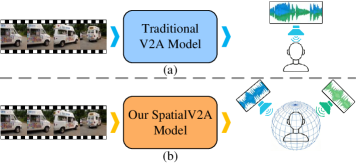
*Figure 1: Comparison of traditional V2A models and the proposed SpatialV2A. (a) Traditional V2A generates mono audio. (b) SpatialV2A produces spatially consistent binaural audio.*

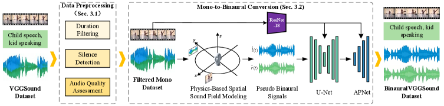
*Figure 2: Overall pipeline of BinauralVGGSound dataset construction.*

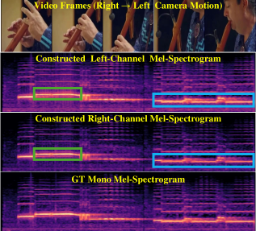
*Figure 3: Example visualization from BinauralVGGSound for a flute-playing scene. The transition of bounding boxes from green to blue reflects the estimated sound source movement, demonstrating spatial consistency with the visual motion.*

*Figure 4: Overall architecture of SpatialV2A. The framework employs a dual-branch design for spatial audio generation (Sec. 4.2) and integrates a visual-guided audio spatialization module (Sec. 4.3) that injects video-derived spatial cues to enhance spatial perception.*

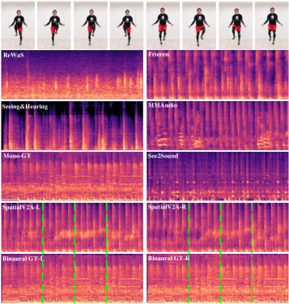
*Figure 5:Mel-spectrogram comparison between our method, baselines, original mono GT, and our binaural GT. Our approach better preserves salient audio effects while reducing background noise.*

---
**Usage Info**: 6015 tokens used.
**Generated at**: 2026-02-24 20:15:37

---

# 📚 Habibi: Laying the Open-Source Foundation of Unified-Dialectal Arabic Speech Synthesis

🚀 URL: https://arxiv.org/html/2601.13802

## 🌏 Abstract (원문)
Arabic is a pluricentric language with rich regional diversity, spoken by more than 400 million natives of approximately 30 different varieties. From the perspective of research on speech technology, the inherent difficulties of the Arabic language mainly lie in two aspects: Linguistically, the Modern Standard Arabic (MSA), as the official and literary form, is not commonly used in daily life, while various spoken dialects for actual communications are observed fusing and transferring largely and consistently. Technically, the challenge lies in the fact that although MSA is a high-resource language, many Arabic dialects are underrepresented and considered low-resource. Moreover, the majority of the datasets are designed for automatic speech recognition (ASR) and lack clean data for speech synthesis. To address these challenges, we present Habibi: an open-source unified-dialectal Arabic text-to-speech model covering more than 20 languoids and 12 assignable regional identifiers. While being equally competitive on MSA, Habibi beats the current leading commercial model on all 6 major dialect test sets. We establish the first systematic and standardized benchmark for multi-dialect Arabic zero-shot speech synthesis. Rooted in linguistically-informed curriculum learning from high to low-resource and from general to dialect-aware training, our model enables effective in-context learning to capture subtle dialectal features at inference. We further deliver insights on the pros and cons of training a single, unified model versus separate, specialized models for each dialect.
## 🌏 Abstract (번역)
아랍어는 풍부한 지역적 다양성을 지닌 다중 중심 언어로, 약 30가지의 서로 다른 변종을 사용하는 4억 명 이상의 원어민이 있습니다. 음성 기술 연구의 관점에서 아랍어의 고유한 어려움은 주로 두 가지 측면에 있습니다. 언어적으로는 공식 및 문학적 형태인 현대 표준 아랍어(MSA)가 일상생활에서 흔히 사용되지 않는 반면, 실제 의사소통을 위한 다양한 구어체 방언들이 광범위하고 일관되게 융합 및 전이되는 양상을 보입니다. 기술적으로는 MSA가 고자원 언어임에도 불구하고 많은 아랍어 방언들이 과소 대표되어 저자원 언어로 간주된다는 점이 도전 과제입니다. 또한 대부분의 데이터셋은 자동 음성 인식(ASR)을 위해 설계되어 음성 합성을 위한 깨끗한 데이터가 부족합니다. 이러한 문제를 해결하기 위해 우리는 20개 이상의 언어체와 12개의 할당 가능한 지역 식별자를 포괄하는 오픈 소스 통합 방언 아랍어 음성 합성 모델인 Habibi를 제시합니다. Habibi는 MSA에서 동등한 경쟁력을 유지하면서도 6개의 모든 주요 방언 테스트 세트에서 현재의 선도적인 상용 모델을 능가합니다. 우리는 다중 방언 아랍어 제로샷 음성 합성을 위한 최초의 체계적이고 표준화된 벤치마크를 구축했습니다. 고자원에서 저자원으로, 일반에서 방언 인식 훈련으로 이어지는 언어학적 기반의 커리큘럼 학습에 뿌리를 둔 우리의 모델은 추론 시 미묘한 방언적 특징을 포착하는 효과적인 인컨텍스트 학습을 가능하게 합니다. 나아가 단일 통합 모델과 각 방언별 개별 전문 모델을 훈련하는 것의 장단점에 대한 통찰을 제공합니다.

## 🔍 Methods & Results
- MASC, SADA, MGB 시리즈 등 기존 ASR 데이터셋을 수집하고 CPS(Character Per Second) 필터링 및 소스 분리 모델을 통한 노이즈 제거를 수행하여 고품질 TTS 학습 데이터를 구축함
- MSA, 사우디(SAU), UAE, 알제리(ALG), 이라크(IRQ), 이집트(EGY), 모로코(MAR) 등 7개 주요 변종을 포함하는 최초의 체계적인 다중 방언 아랍어 제로샷 TTS 평가 벤치마크를 수립함
- F5-TTS 모델을 기반으로 MSA에서 기초를 다진 후 방언 데이터로 확장하는 2단계 언어학적 커리큘럼 학습 전략을 도입하여 제로샷 생성 능력을 극대화함
- 텍스트 시퀀스 내에 지역 식별자(Regional Identifiers) 특수 토큰을 삽입하여 모델이 방언별 특징을 명확히 학습하고 추론 시 모호성을 해소할 수 있도록 설계함
- 실험 결과, Habibi 모델은 MSA에서 우수한 성능을 유지함과 동시에 6개 주요 방언 테스트 세트 전체에서 기존의 선도적인 상용 모델을 능가하는 성과를 거둠

## 🖼 Figures
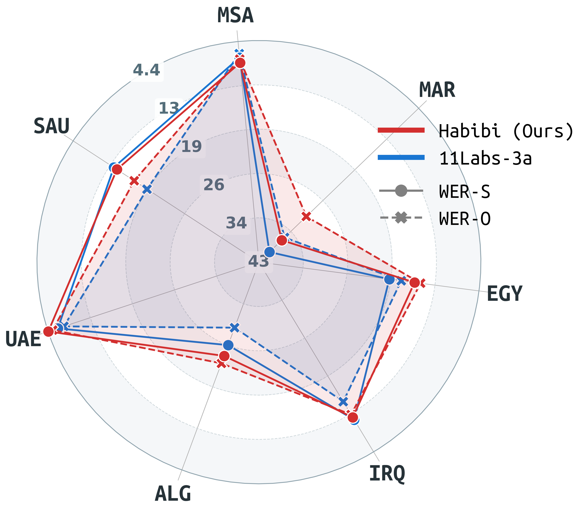
*Figure 1:Our open-source unified-dialectal model (Habibi) outperforms ElevenLabs’ commercial TTS service: the latest Eleven v3 (alpha) (11Labs-3a).*

---
**Usage Info**: 5637 tokens used.
**Generated at**: 2026-02-24 20:16:34

---

# 📚 Stream-Voice-Anon: Enhancing Utility of Real-Time Speaker Anonymization via Neural Audio Codec and Language Models

🚀 URL: https://arxiv.org/html/2601.13948

## 🌏 Abstract (원문)
Speaker anonymization (SA) transforms speech to conceal speaker identity while preserving usability for downstream tasks such as automatic speech recognition (ASR) or speech emotion recognition (SER). Streaming anonymization presents additional challenges due to strict latency constraints that require real-time processing with minimal delay. Furthermore, the source speaker’s identity is typically unknown beforehand, preventing offline anonymization strategies that rely on speaker-specific adaptations, thus necessitating speaker-agnostic approaches. Offline SA approaches can be categorized into digital signal processing (DSP) methods and deep learning (DL) approaches. DSP methods are computationally cheap, but provide limited privacy and controllability. DL approaches are divided into conventional pipelines using ASR to TTS cascades or voice conversion (VC) methods based mostly on continuous features, and neural audio codec (NAC)-based approaches leveraging discrete acoustic tokens. Conventional DL methods suffer from speaker information re-entanglement during vocoding. In contrast, NAC-based methods encode speech into quantized representations using learned codebooks, enabling language model (LM) architectures to generate speech while maintaining clearer separation of linguistic content from speaker characteristics. Real-time anonymization is crucial for call centers, voice assistants, live legal recordings, and sensitive medical conversations. Existing streaming approaches mostly adapt conventional offline designs rather than leveraging modern LM architectures, inheriting speaker information re-entanglement issues and requiring privacy-enhancing techniques like k-means clustering that degrade utility. In contrast, LM-based streaming VC has progressed rapidly, with causal LMs enabling stable, low-latency zero-shot conversion while inheriting superior disentanglement traits of offline NAC methods. Inspired by advances in streaming VC, we adopt Stream-Voice-Anon, a real-time voice anonymization system that uses LM-based streaming VC architectures. A causal streaming content encoder with VQ bottleneck extracts speaker-invariant content tokens by distilling self-supervised learning features from HuBERT. A causal autoregressive LM converts these tokens into synthesized acoustic codes by conditioning on pseudo-speaker embeddings and content with acoustic tokens extracted from various prompt utterances. The model employs a dual decoder architecture: a primary autoregressive transformer generates frame-level latent representations, while a secondary lightweight transformer reconstructs multiple codebook layers. The system incorporates configurable frame delays (1-8 tokens) to balance latency and quality, achieving latencies as low as 180 ms on a 3060 RTX laptop GPU. Evaluation using the VoicePrivacy 2024 Challenge framework demonstrates that Stream-Voice-Anon provides privacy protection comparable to the SOTA streaming pipeline DarkStream while significantly enhancing speech quality.
## 🌏 Abstract (번역)
화자 익명화(SA)는 자동 음성 인식(ASR)이나 음성 감정 인식(SER)과 같은 후속 작업에 대한 유용성을 유지하면서 화자의 신원을 숨기기 위해 음성을 변환합니다. 스트리밍 익명화는 최소한의 지연으로 실시간 처리가 필요한 엄격한 지연 시간 제약으로 인해 추가적인 과제를 안겨줍니다. 또한, 소스 화자의 신원을 사전에 알 수 없는 경우가 많아 화자별 적응에 의존하는 오프라인 익명화 전략을 사용할 수 없으므로 화자 불가지론적(speaker-agnostic) 접근 방식이 필요합니다. 오프라인 SA 접근 방식은 디지털 신호 처리(DSP) 방식과 딥러닝(DL) 방식으로 분류할 수 있습니다. DSP 방식은 계산 비용이 저렴하지만 개인 정보 보호 및 제어 능력이 제한적입니다. DL 방식은 ASR-TTS 캐스케이드 또는 주로 연속적인 특징에 기반한 음성 변환(VC) 방식을 사용하는 기존 파이프라인과 이산 음향 토큰을 활용하는 신경 오디오 코덱(NAC) 기반 방식으로 나뉩니다. 기존의 DL 방식은 보코딩 과정에서 화자 정보가 다시 얽히는 문제를 겪습니다. 반면, NAC 기반 방식은 학습된 코드북을 사용하여 음성을 양자화된 표현으로 인코딩함으로써 언어 모델(LM) 아키텍처가 화자 특성으로부터 언어적 내용을 더 명확하게 분리하면서 음성을 생성할 수 있게 합니다. 실시간 익명화는 콜센터, 음성 비서, 실시간 법적 녹음 및 민감한 의료 상담에 매우 중요합니다. 기존의 스트리밍 방식은 현대적인 LM 아키텍처를 활용하기보다는 주로 기존의 오프라인 설계를 수정하여 사용하므로 화자 정보 재얽힘 문제를 상속받고 유용성을 저하시키는 k-means 클러스터링과 같은 개인 정보 보호 강화 기술을 필요로 합니다. 이와 대조적으로 LM 기반 스트리밍 VC는 빠르게 발전하여 인과적(causal) LM을 통해 안정적이고 낮은 지연 시간의 제로샷 변환을 가능하게 하는 동시에 오프라인 NAC 방식의 우수한 분리 특성을 상속받았습니다. 스트리밍 VC의 발전에 영감을 받아, 본 연구에서는 LM 기반 스트리밍 VC 아키텍처를 사용하는 실시간 음성 익명화 시스템인 Stream-Voice-Anon을 채택합니다. VQ 보틀넥이 있는 인과적 스트리밍 콘텐츠 인코더는 HuBERT로부터 자기 지도 학습 특징을 증류하여 화자 불변 콘텐츠 토큰을 추출합니다. 인과적 자기회귀 LM은 다양한 프롬프트 발화에서 추출된 음향 토큰과 의사 화자 임베딩 및 콘텐츠를 조건으로 하여 이러한 토큰을 합성된 음향 코드로 변환합니다. 이 모델은 이중 디코더 아키텍처를 채택합니다. 기본 자기회귀 트랜스포머는 프레임 수준의 잠재 표현을 생성하고, 보조 경량 트랜스포머는 여러 코드북 레이어를 재구성합니다. 이 시스템은 지연 시간과 품질의 균형을 맞추기 위해 구성 가능한 프레임 지연(1-8 토큰)을 통합하여 3060 RTX 노트북 GPU에서 180ms의 낮은 지연 시간을 달성합니다. VoicePrivacy 2024 챌린지 프레임워크를 사용한 평가는 Stream-Voice-Anon이 최신 스트리밍 파이프라인인 DarkStream과 대등한 개인 정보 보호를 제공하는 동시에 음성 품질을 크게 향상시킴을 입증합니다.

## 🔍 Methods & Results
- Stream-Voice-Anon은 Slow AR과 Fast AR의 이중 단계 트랜스포머 아키텍처를 기반으로 한 실시간 음성 익명화 시스템을 제안함
- HuBERT 증류와 VQ 보틀넥을 갖춘 인과적 콘텐츠 인코더를 사용하여 화자 불변의 콘텐츠 토큰을 추출함
- 실시간 스트리밍을 위해 소스 음성을 프레임 단위로 처리하는 인터리브(Interleaved) 자기회귀(AR) 인수분해 방식을 구현함
- 지연 시간과 인식 정확도 사이의 유연한 절충을 위해 1~8 프레임의 가변 지연(Dynamic-delay) 기술을 도입함
- 추론 시 화자 임베딩 믹싱 및 프롬프트 기반 무작위화를 적용하여 익명화 성능을 강화함
- 3060 RTX GPU 환경에서 최소 180ms의 낮은 지연 시간을 달성함
- VoicePrivacy 2024 챌린지 평가 결과, 기존 SOTA인 DarkStream과 대등한 수준의 프라이버시 보호와 더불어 월등히 향상된 음성 품질을 입증함

## 🖼 Figures

*(a)Training*

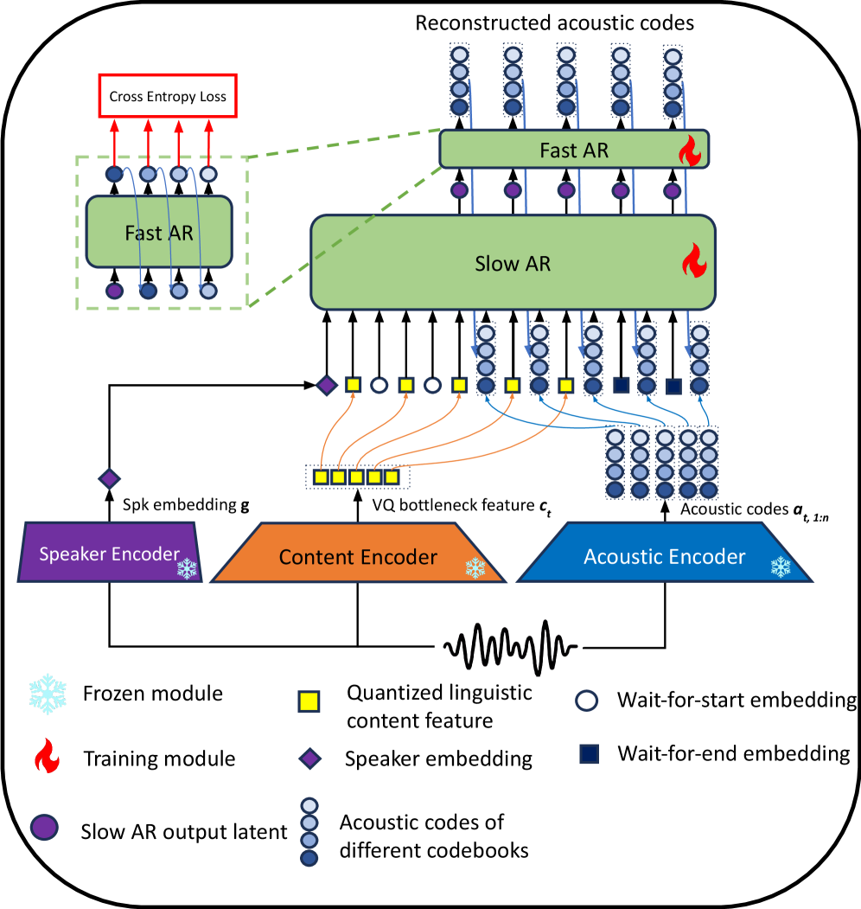
*(a)Training*

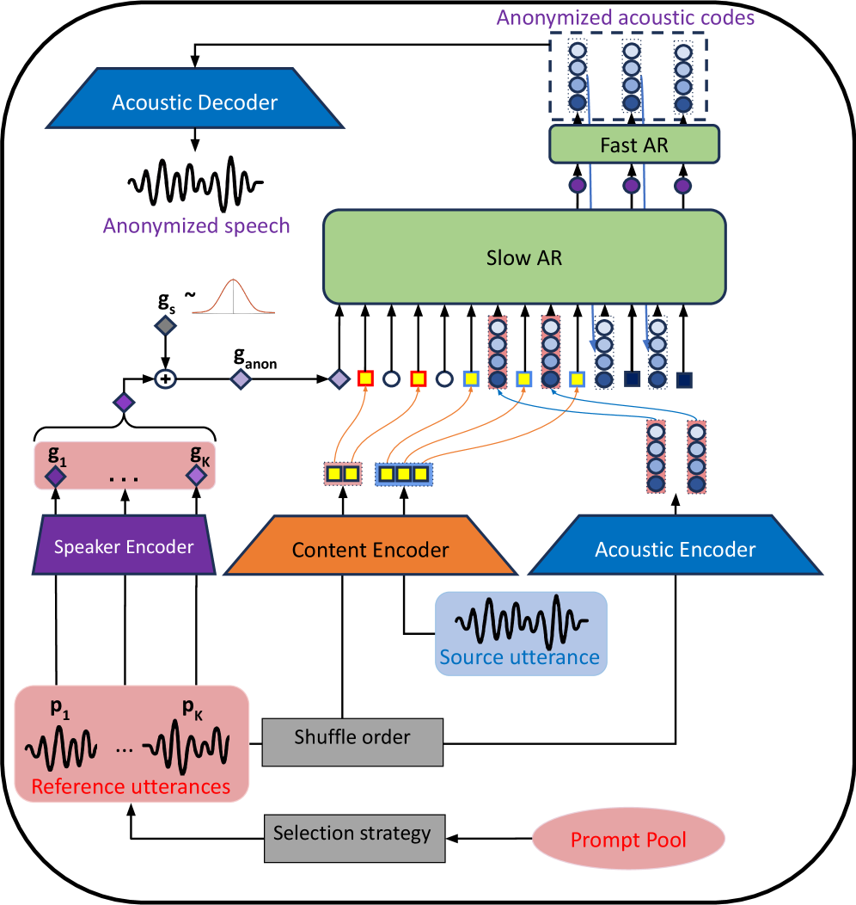
*(b)Inference*

*Fig. 2:Latency (x-axis) against privacy (EER 
↑
, left y-axis) and intelligibility (WER 
↓
, right y-axis) for Stream-Voice-Anon with 
𝑑
∈
{
1
,
2
,
4
,
8
}
 dynamic delay values. Bold 
×
, 
×
 markers indicate a fixed-delay model with 
𝑑
=
4
 for comparison. Selection strategy is vctk-1rnd.*

---
**Usage Info**: 7675 tokens used.
**Generated at**: 2026-02-24 20:18:22

---

# 📚 PRiSM: Benchmarking Phone Realization in Speech Models

🚀 URL: https://arxiv.org/html/2601.14046

## 🌏 Abstract (원문)
Phone recognition (PR) entails transcribing speech into phonetic units that capture the physical realization of sounds, independent of language-specific phonological constraints. By preserving acoustic nuances often abstracted away by word- or phoneme-level models, PR provides a robust foundation for cross-lingual speech processing and downstream applications in clinical and educational settings. PR models have scaled substantially to cover diverse linguistic settings, yet existing evaluations remain difficult to compare across studies. For example, models often differ in language coverage and phone inventories, and evaluation metrics are not standardized. A common response has been to fix a metric and expand the number of test datasets to mitigate bias. Yet this approach scales poorly due to the scarcity of phonetically transcribed data. Moreover, transcription error rates do not necessarily reflect a model’s phonetic capabilities or practical utility. Error rates in PR are inherently noisier than in ASR, as phones, unlike lexical units, correspond to a lower-level, articulatorily defined abstraction of the acoustic signal. Furthermore, the link between transcription accuracy and downstream performance is often assumed rather than empirically proven. In practice, models leverage phonetic information via two channels: explicit transcriptions and latent internal representations. The latter are especially potent, as they encode rich phonetic cues. Consequently, metrics based solely on transcription error fail to capture the full utility and nuanced quality of these representations. Therefore, we propose PRiSM to fairly benchmark Phone Realization in Speech Models. PRiSM assesses PR systems intrinsically through transcription error, and extrinsically through utility in clinical, educational, and multilingual speech tasks using generated transcriptions and hidden representations. PRiSM applies to PR systems ranging from specialized PR models to general speech-to-text (S2T) systems, including Large Audio Language Models (LALMs), which are increasingly used for general speech tasks despite limited evaluation of their phonetic abilities. PRiSM is the first open-source benchmark for PR systems, for which code, evaluation recipes, and datasets are released, where licensing permits. With its reproducible and expandable framework, PRiSM supports researchers in understanding model behavior and training strategies, and helps practitioners make informed model choices. We evaluate a broad range of PR systems and find that: (i) language exposure matters: seen languages benefit from familiar patterns, unseen from multilingual training; (ii) data and architecture shape performance: broad, diverse coverage improves results, while encoder-CTC architectures are more stable; (iii) LALMs lag behind specialized PR models. Ultimately, our goal is to establish a common evaluation basis to drive progress toward PR systems that capture robust and generalizable phonetic information across resource conditions.
## 🌏 Abstract (번역)
음성 인식(PR)은 언어별 음운론적 제약과 무관하게 소리의 물리적 실현을 포착하는 음성 단위로 음성을 전사하는 것을 수반합니다. 단어 또는 음소 수준 모델에서 흔히 추상화되는 음향적 뉘앙스를 보존함으로써, PR은 교차 언어 음성 처리 및 임상 및 교육 환경의 다운스트림 애플리케이션을 위한 강력한 기반을 제공합니다. PR 모델은 다양한 언어 설정을 포괄하도록 실질적으로 확장되었지만, 기존 평가는 연구 간에 비교하기 어렵습니다. 예를 들어, 모델은 종종 언어 범위와 음소 인벤토리가 다르며 평가 지표가 표준화되어 있지 않습니다. 일반적인 대응은 지표를 고정하고 테스트 데이터셋의 수를 확장하여 편향을 완화하는 것이었습니다. 그러나 이 접근 방식은 음성 전사 데이터의 부족으로 인해 확장성이 떨어집니다. 또한, 전사 오류율이 모델의 음성학적 능력이나 실질적인 유용성을 반드시 반영하는 것은 아닙니다. PR의 오류율은 ASR보다 본질적으로 더 노이즈가 많은데, 이는 음소가 어휘 단위와 달리 음향 신호의 하위 수준인 조음적으로 정의된 추상화에 해당하기 때문입니다. 더욱이, 전사 정확도와 다운스트림 성능 사이의 연결은 실증적으로 증명되기보다는 가정되는 경우가 많습니다. 실제로 모델은 명시적 전사와 잠재적 내부 표현이라는 두 가지 채널을 통해 음성 정보를 활용합니다. 후자는 풍부한 음성 신호를 인코딩하므로 특히 강력합니다. 결과적으로 전사 오류에만 기반한 지표는 이러한 표현의 전체 유용성과 미묘한 품질을 포착하지 못합니다. 따라서 우리는 음성 모델의 음성 실현을 공정하게 벤치마킹하기 위해 PRiSM을 제안합니다. PRiSM은 전사 오류를 통해 내재적으로, 그리고 생성된 전사와 숨겨진 표현을 사용하여 임상, 교육 및 다국어 음성 작업에서의 유용성을 통해 외재적으로 PR 시스템을 평가합니다. PRiSM은 전문 PR 모델부터 일반 음성-텍스트(S2T) 시스템에 이르기까지 적용되며, 여기에는 음성 능력이 제한적으로 평가되었음에도 불구하고 일반 음성 작업에 점점 더 많이 사용되는 대규모 오디오 언어 모델(LALM)이 포함됩니다. PRiSM은 PR 시스템을 위한 최초의 오픈 소스 벤치마크로, 라이선스가 허용되는 범위 내에서 코드, 평가 레시피 및 데이터셋이 공개됩니다. 재현 가능하고 확장 가능한 프레임워크를 통해 PRiSM은 연구자가 모델 동작과 훈련 전략을 이해하도록 지원하고 실무자가 정보에 입각한 모델 선택을 하도록 돕습니다. 우리는 광범위한 PR 시스템을 평가하여 다음을 발견했습니다: (i) 언어 노출이 중요함: 익숙한 언어는 친숙한 패턴의 혜택을 받고, 익숙하지 않은 언어는 다국어 훈련의 혜택을 받음; (ii) 데이터와 아키텍처가 성능을 결정함: 광범위하고 다양한 범위가 결과를 개선하는 반면, 인코더-CTC 아키텍처가 더 안정적임; (iii) LALM은 전문 PR 모델보다 뒤처짐. 궁극적으로 우리의 목표는 자원 조건 전반에 걸쳐 강력하고 일반화 가능한 음성 정보를 포착하는 PR 시스템을 향한 진전을 이끌어내기 위한 공통 평가 기반을 구축하는 것입니다.

## 🔍 Methods & Results
- PRiSM 벤치마크 제안: 전사 오류를 통한 내재적 평가와 임상, 교육, 다국어 작업의 유용성을 통한 외재적 평가를 결합함
- 평가 대상 모델: Wav2Vec2Phs(SSL 기반), ZIPAs(Encoder-CTC), POWSMs(AED 및 CTC 변형), LALMs(Gemini 2.5 Flash, Qwen3-Omni-Instruct) 등 다양한 시스템 포함
- LALM 평가 방법: 내부 표현 접근이 어려운 LALM의 경우 제로샷 프롬프팅(Zero-shot prompting)을 통한 프로빙 기법 사용
- 언어 노출의 영향: 학습된 언어는 패턴 인식에서 유리하며, 미학습 언어는 다국어 훈련을 통해 성능 향상을 보임
- 아키텍처 및 데이터의 중요성: 데이터의 다양성이 성능을 개선하며, Encoder-CTC 아키텍처가 다른 구조에 비해 더 안정적인 성능을 제공함
- LALM의 한계: 최신 대규모 오디오 언어 모델(LALM)은 여전히 음성학적 작업에서 전문적인 PR 모델에 비해 성능이 뒤처짐

## 🖼 Figures
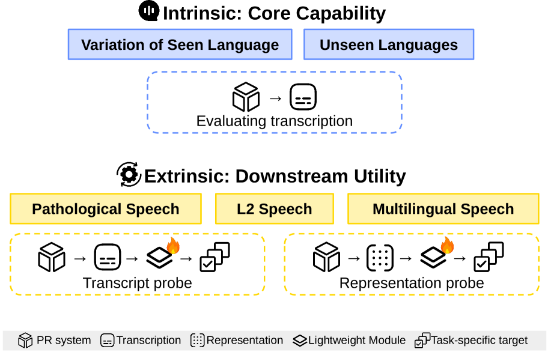
*Figure 1:PRiSM is the first open-source benchmark for phone recognition systems, covering intrinsic and extrinsic evaluations, i.e., transcription task and downstream task performance.*

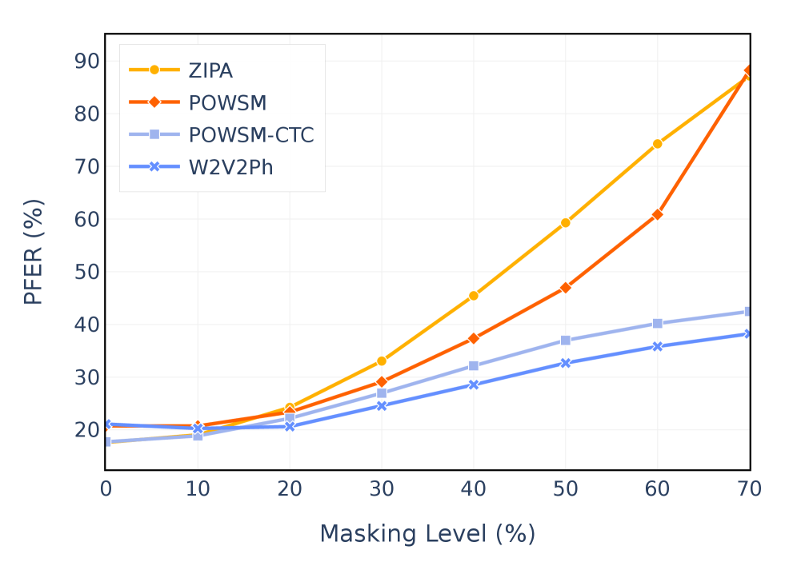
*Figure 2:PFER vs Phone masking rate. A PR model that relies only on acoustics should produce a horizontal line. Encoder-only models trained with CTC loss retain acoustic fidelity at high masking levels. See § 6.1.*

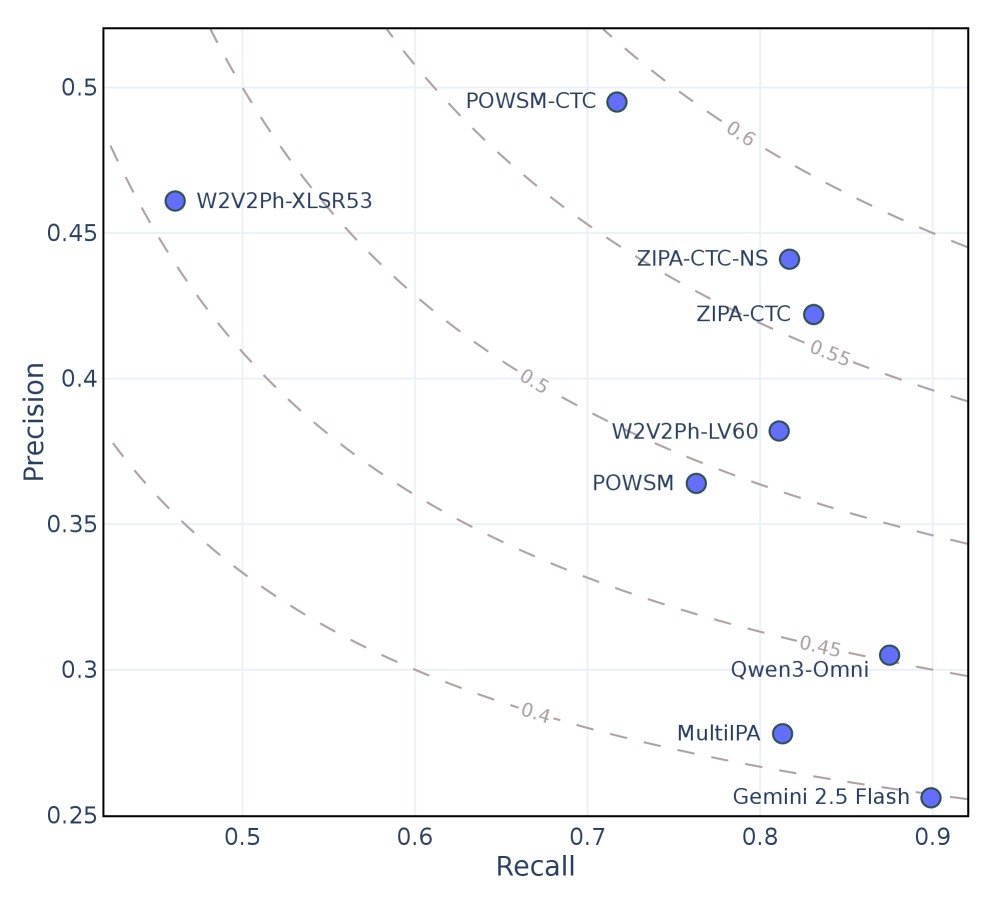
*Figure 3:Precision and Recall scores of PR systems on phone inventory induction for unseen languages (§ 6.2). CTC models trained with highly multilingual data are more stable.*

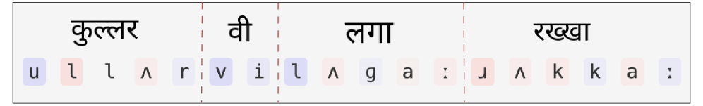
*Figure 4:Attribution map from Vaani (Ghosh et al., 2025). Red supports and blue opposes correct geolocation. W2V2P-LV60 detects doubled phones (§ 6.3).*

*(a)Baseline (F1-score=32.7%)*

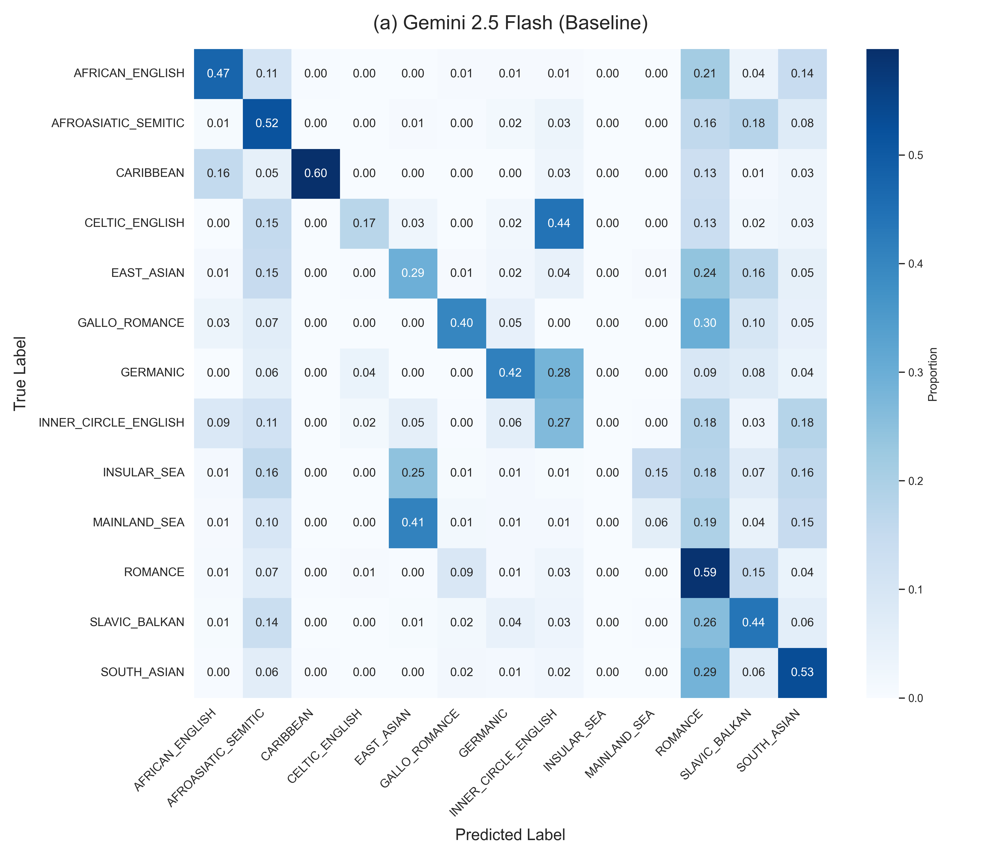
*(a)Baseline (F1-score=32.7%)*

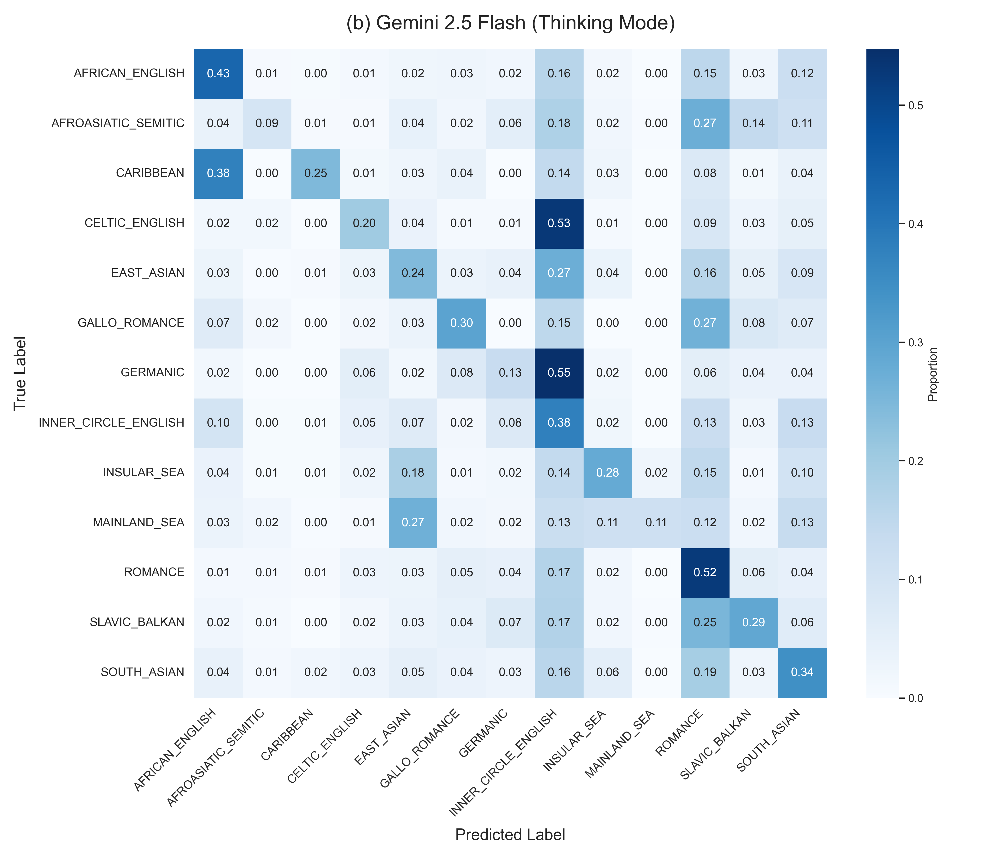
*(b)Thinking Mode (F1-score=24.9%)*

---
**Usage Info**: 4407 tokens used.
**Generated at**: 2026-02-24 20:18:59

---

# 📚 Hearing Between the Lines: Unlocking the Reasoning Power of LLMs for Speech Evaluation

🚀 URL: https://arxiv.org/html/2601.13742

## 🌏 Abstract (원문)
There has been rapid progress in speech-to-speech (S2S) models in recent years, offering a natural interface for spoken communication with artificial assistants. However, the current automatic S2S evaluation paradigms suffer from critical drawbacks. Large Language Model (LLM) judges used in S2S evaluation operate on transcripts alone, making them blind to crucial non-linguistic speech cues such as sarcasm and emotion. To address this, several recent works leverage Audio Language Models (ALMs) which are capable of processing raw audio for evaluation. However, ALM judges are expensive, opaque, and often still struggle to reason about non-linguistic cues. To address the drawbacks of LLM and ALM judges in S2S evaluation, we introduce TRACE (Textual Reasoning over Audio Cues for Evaluation), a two stage training-free framework that provides auditable and cost-efficient speech evaluation. Stage 1 compiles a textual blueprint of inexpensive audio signals. Stage 2 provides an LLM with the blueprint to produce dimension-wise ratings which are fused into an overall judgment. We also identify pitfalls in existing benchmarks like SpeakBench and S2S-Arena, such as no-tie or untyped tie protocols, and instead adopt a labeling protocol (HCoT) that follows ITU-T standards, focusing on Content (C), Voice Quality (VQ), and Paralinguistics (P). TRACE attains higher agreement with HCoT overall ratings and achieves strong fidelity on Paralinguistics, while being significantly cheaper than ALMs.
## 🌏 Abstract (번역)
최근 음성 대 음성(S2S) 모델의 급격한 발전으로 인공지능 비서와의 자연스러운 음성 통신이 가능해졌으나, 현재의 자동 S2S 평가 패러다임은 심각한 단점을 가지고 있습니다. S2S 평가에 사용되는 대규모 언어 모델(LLM) 판정단은 텍스트 전사본에만 의존하기 때문에 빈정거림이나 감정과 같은 중요한 비언어적 음성 단서를 파악하지 못합니다. 이를 해결하기 위해 오디오 언어 모델(ALM)을 활용하는 최근 연구들이 등장했으나, ALM 판정단은 비용이 많이 들고 불투명하며 비언어적 단서에 대한 추론에 여전히 어려움을 겪는 경우가 많습니다. 본 논문에서는 LLM 및 ALM 판정단의 단점을 해결하기 위해 감사 가능하고 비용 효율적인 음성 평가를 제공하는 2단계 학습 프리(training-free) 프레임워크인 TRACE(Textual Reasoning over Audio Cues for Evaluation)를 소개합니다. 1단계에서는 저비용 오디오 신호의 텍스트 청사진을 작성하고, 2단계에서는 LLM에 이 청사진을 제공하여 차원별 등급을 생성하고 이를 종합적인 판단으로 융합합니다. 또한 SpeakBench 및 S2S-Arena와 같은 기존 벤치마크에서 무승부 없음(no-tie) 또는 유형 미지정 무승부(untyped tie) 프로토콜과 같은 결함을 식별하고, 대신 콘텐츠(C), 음성 품질(VQ), 준언어(P)에 집중하는 ITU-T 표준 준수 라벨링 프로토콜(HCoT)을 채택했습니다. TRACE는 HCoT 전체 등급과 더 높은 일치도를 보이며 준언어 측면에서 강력한 충실도를 달성하는 동시에 ALM보다 훨씬 저렴합니다.

## 🔍 Methods & Results
- HCoT(Human Chain-of-Thought) 프로토콜을 제안하여 콘텐츠(C), 음성 품질(VQ), 준언어(P) 차원별 평가 후 종합 점수를 산출하는 방식 도입
- 기존 벤치마크의 한계를 극복하기 위해 'both-good'과 'both-bad'를 구분하는 'typed-tie' 라벨링 체계 적용
- TRACE 1단계: Whisper를 통한 텍스트 추출, DNSMOS를 이용한 음성 품질 측정, prosody/affect 기술자를 통한 준언어 특징 추출로 '증거 청사진' 구성
- TRACE 2단계: 추출된 텍스트 청사진을 LLM에 입력하여 각 차원별 의사결정 및 추론을 수행하도록 유도
- 데이터셋의 특성에 맞춘 결정론적 퓨전 규칙(Deterministic fusion rule)을 사용하여 차원별 점수를 최종 등급으로 결합
- 실험 결과 TRACE는 기존 LLM 및 ALM 베이스라인 대비 인간 평가(HCoT)와 가장 높은 일치도를 기록
- 특히 준언어(Paralinguistics) 평가에서 뛰어난 성능을 보였으며, ALM 기반 평가 방식보다 운영 비용이 현저히 저렴함을 입증

## 🖼 Figures

*Figure 1:Bridging the Evaluation Gap. (A) The Status Quo: Current transcript-only LLM judges are blind to paralinguistics whereas ALM judges are opaque and expensive, and benchmarks often force winners on noisy data. (B) TRACE Framework: We introduce HCoT, a dimension-first speech labeling protocol, and TRACE. TRACE extracts acoustic features into a structured blueprint, allowing text-LLMs to reason over audio for S2S evaluation.*

*Figure 2:The TRACE Architecture. Phase 1 (Signal Extraction): We extract inexpensive signals for Content (ASR), Voice Quality (MOS predictors), and Paralinguistics (prosody, affect, energy etc.). Phase 2 (Inference): These signals form a structured textual blueprint of audio cues, which is then passed to an LLM judge to make dimension-wise decisions. The dimension-wise deicisons are fused via a deterministic tree to yield the final score.*

*Figure 3:P1 Counterfactual (SpeakBench). TRACE selectively uses delivery (VQ) to break semantic ties (VQ share 
≈
23% vs. 
∼
3-5% for baselines).*

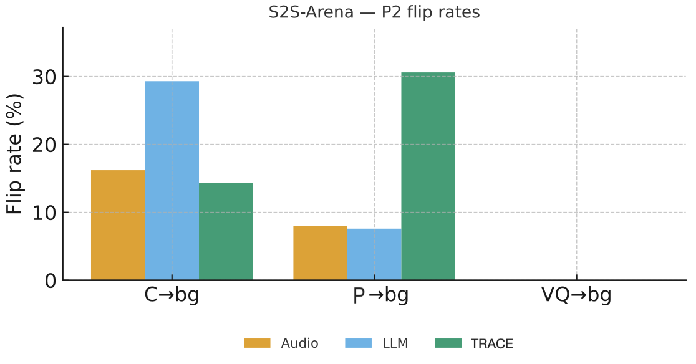
*Figure 4:P2 Flip Rates (S2S-Arena). TRACE is significantly more sensitive to Paralinguistics than LLM-Judge or Audio Judge.*

*Figure 5:P3 Attributing Performance (S2S-Arena). With many both-bad pairs (58%), TRACE cuts winner-on-bad from 
∼
70–74% to 48.6%.*

*Figure 9:Confusion Matrix Comparison. Fused overall labels predicted by the Audio Judge, LLM Judge, and TRACE against our HCoT overall labels. The underlying model is Gemini 2.5 Flash. “P” and “R” in the plot titles denote precision and recall weighted by class frequency. TRACE achieves the highest recall on both datasets and the highest precision on SpeakBench, indicating stronger alignment with human HCoT annotations.*

---
**Usage Info**: 4856 tokens used.
**Generated at**: 2026-02-24 20:19:35

---

# 📚 WavLink: Compact Audio-Text Embeddings with a Global Whisper Token

🚀 URL: https://arxiv.org/html/2601.15118

## 🌏 Abstract (원문)
Learning joint audio–text representations has become a central problem in speech, sound, and music understanding. Recent progress has been driven by the release of large-scale audio–text datasets, including AudioCaps[12], Clotho[5], and VGGSound[2], as well as synthetically generated corpora such as Auto-ACD[22]and AudioSetCaps[1]. These resources have enabled large-scale training of audio–text embedding models such as LAION-CLAP[25], MS-CLAP[6], MGA-CLAP[16], ReCLAP[8], and AF-CLAP[7], which achieve strong results in retrieval and zero-shot classification. In parallel, the rise of audio-understanding Large Language Models (audio-LLMs) e.g. Qwen2-Audio[4], Falcon3-Audio[14], SALMONN[23], Audio Flamingo 3[9], and Voxtral[17]demonstrates the effectiveness of projecting audio features into LLMs for instruction-following on audio inputs. Despite these advances, there remains a methodological divide between audio-LLMs and embedding models. Audio LLMs typically adoptWhisper[20]as their audio encoder: a 30s clip yields 1500 frame-level features, which are then projected into the LLM for instruction following. Whisper has also been adapted for audio tagging in Whisper-AT[10]. By contrast, embedding models—tasked with retrieval, captioning, and zero-shot classification—have almost exclusively relied on specialized encoders such as HTS-AT[3]or PaSST[13]. Thus, Whisper has become ubiquitous for LLM-based audio reasoning, but has been largely unused for compact audio–text embeddings which motivates our work. We introduceWavLink, a compact audio–text embedding model that leverages Whisper. We augment Whisper with alearnable global token, trained jointly with a text encoder. Instead of 1500 frame-level tokens,WavLinkproduces a single representation, yielding savings in storage and similarity search cost. Through design sweeps, we compare CLIP[19]and ModernBERT[24]text encoders, CLIP versus SigLIP[27]losses, and different adaptation regimes (projector-only, LoRA[11], full finetuning), across both audio-only and joint tower updates. The best configuration is then scaled in a two-stage training recipe, with Matryoshka[15]supervision for multi-resolution embeddings. We evaluateWavLinkacrossretrievalwith AudioCaps and Clotho,zero-shot classificationwith VGGSound, ESC-50[18]and US8K[21], andMCQusing AIR-Bench[26]. Results show thatWavLinknot only surpasses prior CLAP variants in retrieval, but also achieves competitive accuracy on multiple-choice QA benchmark compared to much larger audio-LLMs such as Qwen2-Audio and Falcon3-Audio. To the best of our knowledge,WavLinkis the first to show that sub-100 dimensional embeddings, enabled by Matryoshka supervision, can retain competitive performance. This demonstrates that Whisper’s ASR-pretrained features can be adapted effectively for general audio–text embeddings, and that a single global token can bridge the efficiency gap between frame-level audio-LLMs and compact embedding models.
## 🌏 Abstract (번역)
오디오-텍스트 공동 표현 학습은 음성, 소리 및 음악 이해에서 핵심적인 문제가 되었습니다. 최근의 진전은 AudioCaps, Clotho, VGGSound와 같은 대규모 오디오-텍스트 데이터셋과 Auto-ACD, AudioSetCaps와 같은 합성 생성 코퍼스의 출시에 의해 주도되었습니다. 이러한 자원들은 검색 및 제로샷 분류에서 강력한 결과를 달성하는 LAION-CLAP, MS-CLAP, MGA-CLAP, ReCLAP, AF-CLAP과 같은 대규모 오디오-텍스트 임베딩 모델의 대규모 학습을 가능하게 했습니다. 이와 병행하여 Qwen2-Audio, Falcon3-Audio, SALMONN, Audio Flamingo 3, Voxtral과 같은 오디오 이해 대규모 언어 모델(audio-LLMs)의 등장은 오디오 입력에 대한 지시 이행을 위해 오디오 특징을 LLM에 투영하는 것의 효과를 입증했습니다. 이러한 발전에도 불구하고, 오디오-LLM과 임베딩 모델 사이에는 방법론적 격차가 남아 있습니다. 오디오 LLM은 일반적으로 Whisper를 오디오 인코더로 채택합니다. 30초 클립은 1500개의 프레임 수준 특징을 생성하며, 이는 지시 이행을 위해 LLM으로 투영됩니다. Whisper는 Whisper-AT에서 오디오 태깅을 위해 조정되기도 했습니다. 반면, 검색, 캡셔닝 및 제로샷 분류를 담당하는 임베딩 모델은 거의 독점적으로 HTS-AT 또는 PaSST와 같은 전문 인코더에 의존해 왔습니다. 따라서 Whisper는 LLM 기반 오디오 추론에는 편재하게 되었지만, 컴팩트한 오디오-텍스트 임베딩에는 거의 사용되지 않았으며 이것이 본 연구의 동기가 되었습니다. 우리는 Whisper를 활용하는 컴팩트한 오디오-텍스트 임베딩 모델인 WavLink를 소개합니다. 우리는 Whisper에 텍스트 인코더와 공동으로 학습되는 학습 가능한 글로벌 토큰을 추가했습니다. 1500개의 프레임 수준 토큰 대신 WavLink는 단일 표현을 생성하여 저장 및 유사도 검색 비용을 절감합니다. 설계 스윕을 통해 CLIP 및 ModernBERT 텍스트 인코더, CLIP 대 SigLIP 손실, 그리고 다양한 적응 체계(프로젝터 전용, LoRA, 전체 파인튜닝)를 오디오 전용 및 공동 타워 업데이트 모두에서 비교합니다. 그런 다음 최상의 구성을 다중 해상도 임베딩을 위한 Matryoshka 감독과 함께 2단계 학습 레시피로 확장합니다. 우리는 AudioCaps 및 Clotho를 사용한 검색, VGGSound, ESC-50 및 US8K를 사용한 제로샷 분류, 그리고 AIR-Bench를 사용한 MCQ에서 WavLink를 평가합니다. 결과에 따르면 WavLink는 검색에서 이전 CLAP 변형들을 능가할 뿐만 아니라, Qwen2-Audio 및 Falcon3-Audio와 같은 훨씬 더 큰 오디오-LLM과 비교하여 객관식 QA 벤치마크에서 경쟁력 있는 정확도를 달성합니다. 우리가 아는 한, WavLink는 Matryoshka 감독을 통해 가능해진 100차원 미만의 임베딩이 경쟁력 있는 성능을 유지할 수 있음을 보여준 최초의 모델입니다. 이는 Whisper의 ASR 사전 학습된 특징이 일반적인 오디오-텍스트 임베딩에 효과적으로 적응될 수 있으며, 단일 글로벌 토큰이 프레임 수준 오디오-LLM과 컴팩트 임베딩 모델 사이의 효율성 격차를 메울 수 있음을 보여줍니다.

## 🔍 Methods & Results
- Whisper 인코더에 학습 가능한 글로벌 토큰(content-adaptive aggregator)을 추가하여 1500개의 프레임 토큰을 단일 오디오 표현으로 압축함
- CLIP 및 ModernBERT 텍스트 인코더와 CLIP/SigLIP 손실 함수를 결합한 24가지 설계 구성에 대한 비교 실험 수행
- Projector-only, LoRA, Full finetuning 등 다양한 적응(adaptation) 전략과 업데이트 범위를 탐색함
- Matryoshka Supervision을 도입하여 768차원에서 96차원까지 중첩된(nested) 다중 해상도 임베딩 학습 지원
- AudioCaps 및 Clotho 검색 성능에서 기존 CLAP 변형 모델들을 상회하는 성능 달성
- AIR-Bench MCQ 평가에서 Qwen2-Audio 등 대규모 모델과 대등한 성능을 보였으며 100차원 미만 저차원 임베딩의 경쟁력 입증

## 🖼 Figures
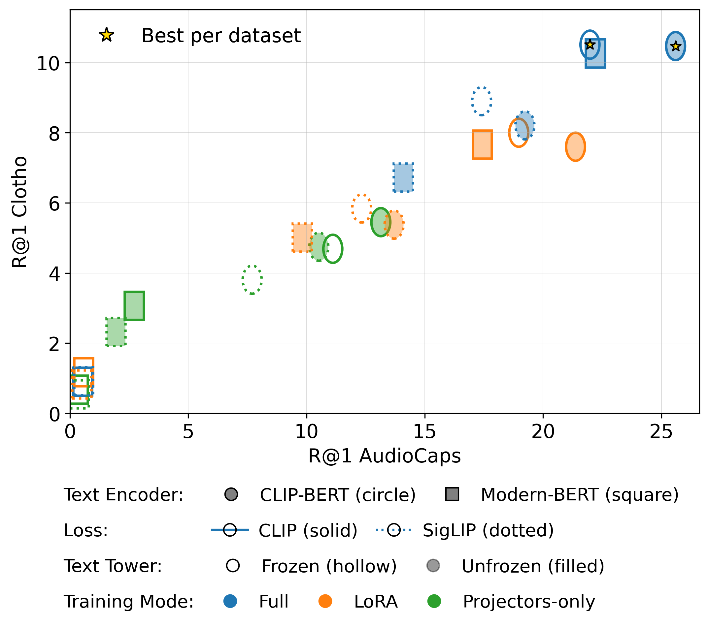
*Fig. 1:Design sweep based on Recall@1 retrieval performance on the AudioCaps and Clotho benchmarks, identifying a fully trained CLIP-BERT model with CLIP’s contrastive loss as the optimal configuration.*

---
**Usage Info**: 5083 tokens used.
**Generated at**: 2026-02-24 20:20:11

---

# 📚 Towards Noise-Robust Speech Inversion through Multi-Task Learning with Speech Enhancement

🚀 URL: https://arxiv.org/html/2601.14516

## 🌏 Abstract (원문)
Speech production involves precise coordination of the lips, tongue, jaw, velum, and glottis to shape the acoustic signal. Speech Inversion (SI) aims to recover this hidden articulatory activity by mapping speech onto vocal Tract Variables (TVs), which represent functional synergies among articulators rather than discrete positions. The oral TVs are characterized by the degree and location of constrictions formed by the lips, tongue body, and tongue tip. In addition to oral sounds, speech also includes nasal sounds, which are produced by partial or complete opening of the Velopharyngeal Port (VP). The degree of VP constriction regulates nasality by controlling airflow and acoustic coupling between the nasal and oral cavities through coordinated movements of the velum and pharyngeal walls. Direct measurement of VP activity is invasive, costly, and requires trained specialists. As a non-invasive alternative, nasalance, defined as the ratio of acoustic energy emitted through the nasal and oral cavities, serves as an indirect measure of VP constriction and has been validated through high-speed nasopharyngoscopy imaging. In this study, nasalance is referred to as the VEL TV, as it serves as an acoustic proxy for velum movement patterns. Our investigation, supported by ablation studies, shows that jointly estimating oral TVs, the VEL TV together with source features (SFs), including fundamental frequency (F0), periodicity (periodic energy), and aperiodicity (aperiodic energy) leads to improvements in their estimation. This is because these variables are inherently related and provide complementary information. Therefore, in this study, we adopt the recently developed SI system, which simultaneously estimates oral TVs, VEL TV, and three SFs. SI systems have a wide range of applications, including assessment for children with speech disorders. However, deploying SI systems in real-world environments is challenging, as background noise can degrade performance if the system has not been adapted to such conditions. A previous study demonstrated that adapting a SI system to noisy conditions can be achieved by fine-tuning with noise-contaminated speech signals. However, employing a Speech Enhancement (SE) model as a pre-processing step has been shown to improve robustness across various speech processing tasks and to outperform approaches that rely solely on fine-tuning the target system with contaminated speech. Therefore, in this study, we leverage a SE model to improve the adaptation of an SI system to noisy conditions under two different scenarios: (1) fine-tuning the SI system on audio pre-processed by the SE model, and (2) jointly training the SI and SE models within a multi-task learning framework. To the best of our knowledge, this study is the first to investigate multi-task learning of SI and SE models to improve SI robustness under noisy conditions. Recent advances in Self Supervised Learning (SSL) speech models have significantly improved feature extraction for SI systems, surpassing traditional acoustic representations such as MFCCs. Among these models, WavLM-Large has been found to outperform other SSL models, including HuBERT-Large, on SI tasks. Furthermore, several studies have explored the application of SSL models to SE tasks, reporting promising results. Motivated by these findings, we employ the WavLM-Large pretrained SSL model for the SI and SE systems to extract richer, more informative representations from the speech signal. Our key contributions in the current work are as follows: Introduction of a novel multi-task learning framework jointly modeling SE and SI to estimate enhanced audio along with oral TVs, VEL TV, and three SFs. Comparative analysis of employing a SE model as a pre-processing step for a SI model versus jointly integrating SE and SI models within a multi-task framework. Evaluation of SI system robustness under babble and non-babble background noise across varying Signal-to-Noise Ratio (SNR) levels.
## 🌏 Abstract (번역)
음성 생성은 음향 신호를 형성하기 위해 입술, 혀, 턱, 연구개 및 성문의 정밀한 조정을 포함합니다. 음성 역변환(SI)은 음성을 개별 위치가 아닌 조음 기관 간의 기능적 시너지를 나타내는 성도 변수(TV)로 매핑하여 이러한 숨겨진 조음 활동을 복구하는 것을 목표로 합니다. 구강 TV는 입술, 혀 몸체 및 혀 끝에 의해 형성된 수축의 정도와 위치로 특징지어집니다. 구강음 외에도 음성에는 연구개인두 포트(VP)의 부분적 또는 완전한 개방으로 생성되는 비음이 포함됩니다. VP 수축 정도는 연구개와 인두벽의 협응된 움직임을 통해 비강과 구강 사이의 공기 흐름과 음향 결합을 제어하여 비성을 조절합니다. VP 활동의 직접적인 측정은 침습적이고 비용이 많이 들며 숙련된 전문가가 필요합니다. 비침습적 대안으로서, 비강과 구강을 통해 방출되는 음향 에너지의 비율로 정의되는 비강도(nasalance)는 VP 수축의 간접적인 측정치 역할을 하며 고속 비인두경 영상을 통해 검증되었습니다. 본 연구에서 비강도는 연구개 운동 패턴에 대한 음향적 대리 지표 역할을 하므로 VEL TV라고 합니다. 절제 연구에 의해 뒷받침된 우리의 조사에 따르면, 구강 TV, VEL TV를 기본 주파수(F0), 주기성(주기적 에너지), 비주기성(비주기적 에너지)을 포함한 소스 특징(SF)과 함께 공동으로 추정하면 추정 성능이 향상됩니다. 이는 이러한 변수들이 본질적으로 관련되어 있고 보완적인 정보를 제공하기 때문입니다. 따라서 본 연구에서는 구강 TV, VEL TV 및 세 가지 SF를 동시에 추정하는 최근 개발된 SI 시스템을 채택합니다. SI 시스템은 언어 장애 아동을 위한 평가를 포함하여 광범위한 응용 분야를 가지고 있습니다. 그러나 배경 소음이 시스템의 성능을 저하시킬 수 있으므로 실제 환경에 SI 시스템을 배치하는 것은 어렵습니다. 이전 연구에서는 소음이 섞인 음성 신호로 미세 조정함으로써 SI 시스템을 소음 조건에 적응시킬 수 있음을 보여주었습니다. 그러나 음성 향상(SE) 모델을 전처리 단계로 사용하는 것이 다양한 음성 처리 작업에서 견고성을 향상시키고 타겟 시스템만 미세 조정하는 방식보다 우수한 성능을 보이는 것으로 나타났습니다. 따라서 본 연구에서는 (1) SE 모델로 전처리된 오디오에서 SI 시스템을 미세 조정하는 시나리오와 (2) 다중 작업 학습 프레임워크 내에서 SI 및 SE 모델을 공동으로 훈련하는 두 가지 시나리오에서 SE 모델을 활용하여 소음 조건에 대한 SI 시스템의 적응력을 향상시킵니다. 우리가 아는 한, 본 연구는 소음 조건에서 SI 견고성을 향상시키기 위해 SI 및 SE 모델의 다중 작업 학습을 조사한 최초의 연구입니다. 최근 자가 지도 학습(SSL) 음성 모델의 발전은 SI 시스템의 특징 추출을 크게 개선하여 MFCC와 같은 전통적인 음향 표현을 능가했습니다. 이러한 모델 중에서 WavLM-Large는 SI 작업에서 HuBERT-Large를 포함한 다른 SSL 모델보다 우수한 성능을 발휘하는 것으로 밝혀졌습니다. 또한 여러 연구에서 SE 작업에 SSL 모델을 적용하여 유망한 결과를 보고했습니다. 이러한 결과에 영감을 받아, 우리는 음성 신호에서 더 풍부하고 정보가 많은 표현을 추출하기 위해 SI 및 SE 시스템에 WavLM-Large 사전 훈련된 SSL 모델을 사용합니다. 본 연구의 주요 기여는 다음과 같습니다: 구강 TV, VEL TV 및 세 가지 SF와 함께 향상된 오디오를 추정하기 위해 SE와 SI를 공동으로 모델링하는 새로운 다중 작업 학습 프레임워크 도입; SE 모델을 SI 모델의 전처리 단계로 사용하는 것과 다중 작업 학습 프레임워크 내에서 SE 및 SI 모델을 공동으로 통합하는 것에 대한 비교 분석; 다양한 신호 대 잡음비(SNR) 수준에서 배블(babble) 및 비배블 배경 소음 하에서의 SI 시스템 견고성 평가.

## 🔍 Methods & Results
- WavLM-Large 자가 지도 학습(SSL) 모델을 백본으로 사용하여 소음 환경에 강한 특징 표현을 추출함
- 2단계 훈련(Two-Stage Training, TST) 전략을 사용하여 1단계에서는 SSL 모델을 고정하고 태스크 헤드를 훈련하며, 2단계에서는 전체 모델을 미세 조정함
- SE 모델은 WavLM 레이어의 가중 합과 STFT 매그니튜드를 결합하여 마스크를 생성하고, WSDR, CMS, MRS 손실 함수를 조합하여 최적화함
- SI 모델은 구강 TV와 VEL TV/소스 특징(SF)을 두 가지 태스크로 나누어 추정하며, 피어슨 상관계수와 RMSE의 가중 조합을 손실 함수로 사용함
- 제안된 다중 작업 학습 프레임워크(SISE-M)는 SE와 SI 모델을 공동으로 훈련하여 소음 환경에서의 견고성을 극대화함
- 실험 결과, SE를 전처리로 사용하거나 공동 학습을 적용했을 때 기본 SI 모델보다 소음 조건에서 우수한 성능을 보였으며, 특히 SISE-M 방식이 효과적임을 입증함

## 🖼 Figures
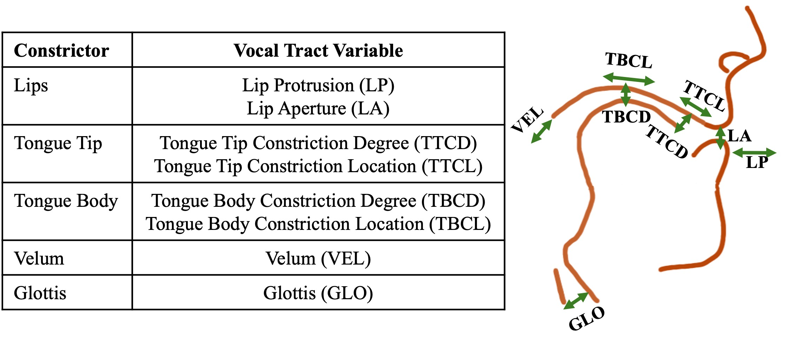
*Fig. 1:A visual illustration of the vocal tract variables.*

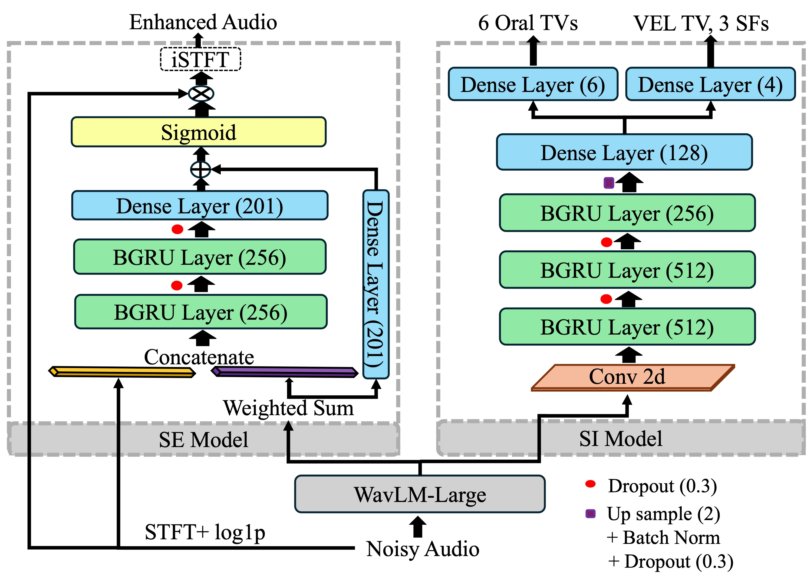
*Fig. 2:Architecture of the proposed SISE-M model.*

*Fig. 3:Spectrograms of clean, noisy, and enhanced speech obtained from SISE-M model. The noisy speech corresponds to an XRMB test sample corrupted by babble noise at -5 dB SNR. TTCD estimates from the SI-O and SISE-M models for the noisy speech are shown alongside the ground-truth.*

---
**Usage Info**: 5751 tokens used.
**Generated at**: 2026-02-24 20:23:42

---

# 📚 Call2Instruct: Automated Pipeline for Generating Q&A Datasets from Call Center Recordings for LLM Fine-Tuning

🚀 URL: https://arxiv.org/html/2601.14263

## 🌏 Abstract (원문)
Large Language Models (LLMs) have established themselves as a technology with a significant impact on the field of artificial intelligence, generating great interest in both academic and corporate environments[zhao23]. Among the areas of research that involve LLMs are the methods to train them and, fundamentally, the techniques to adapt and specialize them in specific tasks or domains, a process known as fine-tuning[zhao23]. An essential component of successful fine-tuning is the availability of high-quality instructional datasets, specific to the desired task, often in Question-Answer (Q&A) format[liu24,schimanski24]. However, creating these datasets represents a considerable challenge, especially when seeking to take advantage of abundant but inherently unstructured data sources. Audio recordings of call center interactions, for example, contain valuable information about real customer demands and the corresponding solutions, but require complex processing to be transformed into a useful format. Despite substantial advances in both general LLM fine-tuning techniques[hu21,ouyang22]and in isolated stages of call center data processing - such as automatic speech recognition (ASR) and the application of Natural Language Processing (NLP) for textual analysis - a critical gap remains: the development of integrated, automated systems capable of efficiently transforming these raw sources into instructional datasets, ready for supervised LLM training. In fact, recent studies demonstrate the effectiveness of LLM models applied to specific tasks such as summarizing customer conversations[Nivethitha24]and extracting insights from transcripts via document retrieval[crisp24]. However, these approaches remain fragmented, addressing steps such as audio capture, transcription, linguistic processing, or data adaptation in isolation, without offering an end-to-end solution for generating instructional datasets. Therefore, the ability to automatically transform audio recordings into structured Question-Answer pairs, ready for the fine-tuning of LLMs in Q&A tasks, remains an area with room for contributions. This paper proposes and details an automated pipeline designed specifically for generating instructional datasets, in Question-Answer format, from call center audio recordings. The approach presented encompasses a complete flow of operations: it starts with obtaining and preprocessing the audio (including channel separation, noise removal, and transcription), moves on to textual preprocessing (cleaning and anonymization of transcribed data), uses semantic search and embeddings to extract customer demands and relevant responses from agents, and culminates in the construction of a properly formatted dataset for Instruct Fine-Tuning LLMs in the Q&A task. The system developed therefore aims to offer a viable, automated solution to the challenge of creating specific, high-quality datasets from raw conversational data. In addition, unlocking the potential of these conversational data would make it possible to improve the efficiency and quality of customer service and capture valuable operational knowledge that is dispersed and underutilized. The structure of this article is as follows. Section 2 provides a concise overview of the work related to the proposed pipeline. Section 3 describes the developed approach in detail. In Section 4, we present the experimental scenarios, the data set, and an analysis of the results for each stage. Finally, Section 5 concludes the article and outlines potential directions for future research.
## 🌏 Abstract (번역)
거대 언어 모델(LLM)은 인공지능 분야에서 상당한 영향력을 가진 기술로 자리 잡았으며, 학계와 기업 환경 모두에서 큰 관심을 불러일으키고 있습니다. LLM 관련 연구 분야 중에는 모델을 훈련하는 방법과 특정 작업이나 도메인에 적응 및 전문화시키는 기법인 파인튜닝(fine-tuning)이 핵심적입니다. 성공적인 파인튜닝의 필수 요소는 종종 질의응답(Q&A) 형식으로 제공되는 특정 작업에 특화된 고품질 지시어 데이터셋의 가용성입니다. 그러나 이러한 데이터셋을 구축하는 것은 특히 풍부하지만 본질적으로 비구조화된 데이터 소스를 활용하려 할 때 상당한 도전 과제가 됩니다. 예를 들어, 콜센터 상호작용의 오디오 녹음은 실제 고객의 요구와 그에 따른 해결책에 대한 가치 있는 정보를 포함하고 있지만, 유용한 형식으로 변환하기 위해 복잡한 처리가 필요합니다. 일반적인 LLM 파인튜닝 기술과 자동 음성 인식(ASR) 및 텍스트 분석을 위한 자연어 처리(NLP)와 같은 콜센터 데이터 처리의 개별 단계에서는 상당한 진전이 있었음에도 불구하고, 이러한 원시 소스를 지도 학습 기반 LLM 훈련을 위한 지시어 데이터셋으로 효율적으로 변환할 수 있는 통합된 자동화 시스템의 개발이라는 중요한 공백이 남아 있습니다. 실제로 최근 연구들은 고객 대화 요약이나 문서 검색을 통한 인사이트 추출과 같은 특정 작업에 적용된 LLM 모델의 효과를 입증하고 있습니다. 그러나 이러한 접근 방식은 오디오 캡처, 전사, 언어 처리 또는 데이터 적응 단계를 개별적으로 다루는 파편화된 상태로 남아 있으며, 지시어 데이터셋 생성을 위한 엔드투엔드(end-to-end) 솔루션을 제공하지 못하고 있습니다. 따라서 오디오 녹음을 Q&A 작업의 LLM 파인튜닝에 즉시 사용할 수 있는 구조화된 질의응답 쌍으로 자동 변환하는 능력은 여전히 기여의 여지가 많은 분야입니다. 본 논문은 콜센터 오디오 녹음으로부터 질의응답 형식의 지시어 데이터셋을 생성하기 위해 설계된 자동화된 파이프라인을 제안하고 상세히 설명합니다. 제시된 접근 방식은 오디오 획득 및 전처리(채널 분리, 노이즈 제거, 전사 포함), 텍스트 전처리(전사된 데이터의 정제 및 익명화), 시맨틱 검색 및 임베딩을 사용한 고객 요구 및 상담사의 관련 답변 추출, 그리고 최종적으로 Q&A 작업을 위한 LLM의 인스트럭트 파인튜닝에 적합한 형식의 데이터셋 구축에 이르는 전체 운영 흐름을 포괄합니다. 개발된 시스템은 원시 대화 데이터로부터 특정 목적의 고품질 데이터셋을 생성하는 과제에 대해 실행 가능하고 자동화된 솔루션을 제공하는 것을 목표로 합니다. 또한, 이러한 대화 데이터의 잠재력을 끌어냄으로써 고객 서비스의 효율성과 품질을 개선하고, 분산되어 활용되지 못하고 있는 가치 있는 운영 지식을 포착할 수 있게 할 것입니다.

## 🔍 Methods & Results
- Call2Instruct 파이프라인 제안: 원시 콜센터 오디오를 고품질 Q&A 지시어 데이터셋으로 자동 변환하는 5단계 프로세스 구축
- 오디오 전처리 및 전사: 채널 분리(Diarization), 노이즈 제거 및 ASR을 통해 화자가 구분된 텍스트 전사본 생성
- 텍스트 정제 및 익명화: PII(개인식별정보) 마스킹 및 구어체 노이즈 제거를 통해 데이터 프라이버시와 텍스트 품질 확보
- 시맨틱 추출 및 구조화: OpenAI의 text-embedding-ada-002 모델과 벡터 데이터베이스를 활용하여 고객 요구와 상담사 답변을 의미론적으로 매칭
- 데이터셋 생성: 추출된 Q&A 쌍을 자연어 프롬프트 템플릿과 결합하여 LLM 인스트럭트 파인튜닝에 적합한 형식으로 변환
- 실험 결과: 생성된 데이터셋을 사용하여 Llama 2 7B 모델을 성공적으로 파인튜닝함으로써 파이프라인의 기능적 유효성 및 데이터 활용 가능성 입증

## 🖼 Figures
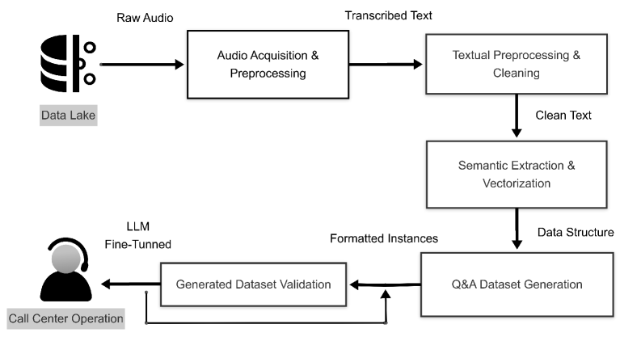
*Figure 1:Conceptual overview of the Call2Instruct automated pipeline.*

---
**Usage Info**: 4815 tokens used.
**Generated at**: 2026-02-24 20:24:16

---

# 📚 WeDefense: A Toolkit to Defend Against Fake Audio

🚀 URL: https://arxiv.org/html/2601.15240

## 🌏 Abstract (원문)
The astonishing progress in generative AI has led to the development of systems that make it increasingly straightforward to synthesize audio. This is ever more challenging to distinguish from real, genuine audio. Although a plethora of generative audio project (such as Amphion, CosyVoice, WhisperSpeech, PlayDiffusion, VoiceSculptor), have emerged in recent years, efforts to develop well-supported, standardized toolkits for the detection and localization of fake audio have lagged behind. To promote broader research into the development of defending against fake audio, we introduce the open-source, community-led WeDefense project and toolkit. Existing open-source projects for fake audio detection and fake audio localization typically suffer from limited flexibility and poor scalability. For example, various individual implementations proposed for fake audio detection such as RawNet2, AASIST, XLSR-SLS, and Nes2Net, all released alongside research papers, are usually maintained as standalone projects, each one with a focus on different data processing techniques and specific models. The baselines provided through the ASVspoof challenge are typically task- and dataset-specific, lacking generalizability and flexibility for broader application. Moreover, since the baselines are developed by different organizers, there is considerable variability in the code structure. Although codebases like project-NN-PyTorch consolidate several deepfake detection models, they were designed originally for other tasks and lack a broad coverage of models proposed by different teams. The recently proposed SONAR integrates several models into the AASIST codebase. However, its foundation upon the original AASIST structure limits the flexibility for the incorporation of alternative model architectures. All the aforementioned codebases are tailored primarily for fake audio detection. However, for fake audio localization that locates the fake regions within an audio, only a limited number of codebases are publicly available. These are typically released alongside specific models such as the SSL-gMLP-based multi-resolution model, TDL, BAM, and CFPRF. Though toolkits such as Kaldi, icefall, ESPnet, and SpeechBrain have been adopted widely in the speech processing community, they were initially designed for speech recognition. Although they were all later extended to other tasks, none covers fake audio detection or localization. Furthermore, they are often heavy-weight, with extensive functionalities for broader speech applications, many of which are unnecessary for defensing against fake audio. The existing toolkits, most characterized by other task-specific design choices, lack support for variable-length inputs, data augmentation, and acoustic features designed specifically for fake audio detection. Finally, none can be readily adapted to tackle the localization of short fake audio segments embedded within otherwise bona fide recordings. Without a common toolkit designed specifically for fake audio detection and localization, it remains somewhat difficult to compare solutions on an entirely level playing field. The implementation of different solutions within a common codebase, in addition to the use of common databases, protocols and metrics, is the next step toward fairer benchmarking and analyses. WeDefense is a relatively light-weight, modular, and extensible toolkit tailored to defend against fake audio. The current version targets detection and localization, while additional functionality is planned and already under development. We hope that the WeDefense project will attract additional contributors and users and evolve into a widely adopted resource, one that supports reproducible research and keeps pace with advances in generative speech technologies.
## 🌏 Abstract (번역)
생성형 AI의 놀라운 발전으로 오디오 합성이 점점 더 쉬워지고 있으며, 이는 실제 오디오와 구분하기가 더욱 어려워지고 있습니다. 최근 몇 년간 Amphion, CosyVoice, WhisperSpeech 등 수많은 생성형 오디오 프로젝트가 등장했음에도 불구하고, 가짜 오디오의 탐지 및 위치 식별(localization)을 위한 잘 지원되고 표준화된 툴킷 개발은 상대적으로 뒤처져 있습니다. 가짜 오디오 방어 연구를 촉진하기 위해, 우리는 오픈 소스 커뮤니티 주도 프로젝트인 WeDefense 툴킷을 소개합니다. 기존의 가짜 오디오 탐지 및 위치 식별 프로젝트들은 대개 유연성이 제한적이고 확장성이 부족합니다. 예를 들어 RawNet2, AASIST 등 개별 연구용 코드는 독립적인 프로젝트로 유지되어 데이터 처리 기술과 특정 모델에만 집중하는 경향이 있으며, ASVspoof 챌린지의 베이스라인 역시 특정 작업과 데이터셋에 국한되어 범용성이 부족합니다. WeDefense는 가짜 오디오 방어에 특화된 경량화된 모듈식 확장형 툴킷입니다. 현재 버전은 탐지와 위치 식별을 목표로 하며, 가변 길이 입력 처리, 데이터 증강(RawBoost 등), 모델 평균화와 같은 특화된 기능을 포함합니다. 또한 보정, 임베딩 시각화, 설명 가능한 AI(XAI) 도구를 통합하여 모델 동작의 심층 분석을 지원하며, TorchScript를 통한 배포 준비도 되어 있습니다. 우리는 WeDefense가 재현 가능한 연구를 지원하고 생성형 음성 기술의 발전에 발맞추어 널리 채택되는 자원이 되기를 기대합니다.

## 🔍 Methods & Results
- 가짜 오디오 탐지(Detection) 및 위치 식별(Localization)을 위한 최초의 오픈 소스 툴킷 WeDefense 개발
- 다양한 모델과 데이터셋에 걸쳐 설정을 통합하고 유지 관리 가능한 구조로 단일화된 설계 제공
- 가변 길이 입력 처리 및 RawBoost, 코덱 시뮬레이션 등 가짜 오디오 탐지에 특화된 데이터 증강 기법 적용
- 자동 화자 인증(ASV) 분야의 모델 평균화 기법을 도입하여 안정적이고 신뢰할 수 있는 성능 추정 지원
- 보정(Calibration), 임베딩 시각화, 설명 가능한 AI(XAI) 등 사후 처리 및 분석 도구 통합
- TorchScript(JIT)를 통한 모델 내보내기 및 C++ 배포 코드를 제공하여 실제 환경 적용 가능성 확보
- 모듈식 인터페이스를 통해 향후 새로운 모델 및 작업으로의 확장이 용이함

## 🖼 Figures
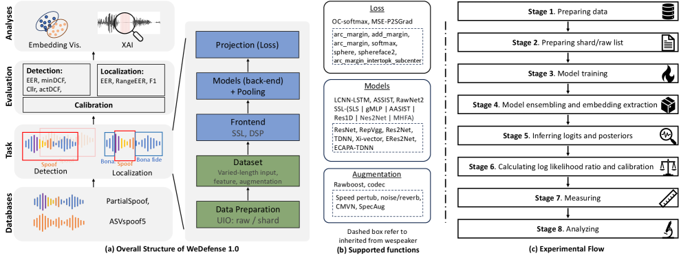
*Figure 1:Overall Structure of WeDefense.*

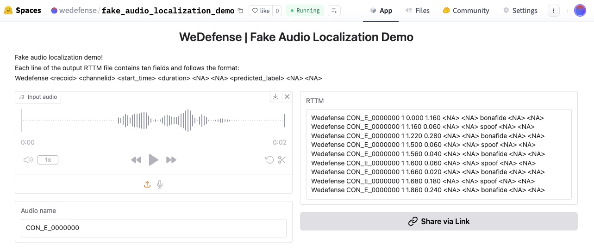
*Figure 2:Interaction Demo of Fake Audio Localization in WeDefense.*

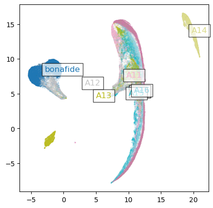
*Figure 3:Example of Embedding Visualization by UMAP on the dev. set of ASVspoof5 (annotated according to the released metadata).*

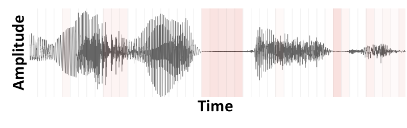
*Figure 4:Frame-level Grad-CAM visualization of parts of a segment from CON_E_0033629.wav in the PartialSpoof evaluation set. Regions with darker red indicate higher model contribution.*

---
**Usage Info**: 3902 tokens used.
**Generated at**: 2026-02-24 20:25:07

---

# 📚 Channel Estimation in MIMO Systems Using Flow Matching Models

🚀 URL: https://arxiv.org/html/2601.13827

## 🌏 Abstract (원문)
Estimating accurate channel state information is essential for multiple-input multiple-output (MIMO) communication systems since it serves the backbone for reliable beamforming and efficient resource allocation. The problem of channel estimation is reconstructing the unknown channel from a limited number of noisy pilot observations, which are corrupted by fading and thermal noise. The impracticality of acquiring accurate statistical priors for conventional channel estimators, together with their poor scalability to large arrays, has motivated the exploration of deep learning approaches that formulate channel estimation as a data-driven supervised regression problem. However, supervised-regression based approaches learn a direct mapping without explicitly capturing the channel’s underlying prior distribution, limiting their robustness in low signal-to-noise ratio (SNR) regimes and generalization to unseen channel distributions. To address this critical gap in learning the prior distribution, recent progress in unsupervised deep generative modeling has motivated its application in solving the channel estimation problem, which has achieved state-of-the-art (SOTA) performance. These approaches can be classified into two categories: score-based models and diffusion-based models. Both categories share the same pipeline: they first define a forward noising process that gradually injects noise into the channel data, and then train a neural network to learn the reverse sampling process that iteratively denoises a noisy measurement to match the prior distribution of the channel dataset. Specifically, the score-based approaches operate by explicitly learning the score, which is defined as the gradient of the log-prior distribution. The diffusion-based approaches are trained to reverse this process by directly predicting the noise component that was added at each discrete step. However, the sophisticated stochastic nature of the reverse paths learned by these models necessitates a large number of inference steps (typically more than 1000), thereby incurring high inference latency that hinders their deployment in real-world wireless systems. By learning a deterministic velocity field to transform a simple distribution into the target data distribution, flow matching models have recently emerged as a promising new paradigm that enables high-fidelity inference in drastically fewer inference steps. This ability to model the data distribution makes flow matching an extremely powerful candidate for a regularizer within an optimization framework. The well-established plug-and-play (PnP) approach is designed to leverage such a regularizer by integrating it into a classical iterative algorithm, such as proximal gradient descent (PGD), to solve complex estimation tasks in other domains, such as image restoration. Motivated by the potential of this synergy, in this paper, we present a learning-based MIMO channel estimator that uses a flow matching model to learn the velocity field of complex MIMO channels and integrates it into a PnP-PGD framework. To the best of our knowledge, this work is the first attempt to employ flow matching models to solve a problem in wireless communications. Our main contributions are summarized as follows: A flow matching-based generative model is trained to capture the velocity field governing the intrinsic structure of point-to-point MIMO channels. The training is fully unsupervised and independent of pilot patterns or SNR information, enabling the learned velocity field to generalize across diverse channel conditions and system configurations without retraining. We develop a PnP-PGD channel estimation framework that integrates the trained flow matching-based model as a deterministic regularizer. This approach replaces the stochastic and highly iterative updates required by score-based or diffusion-based models with a deterministic and computationally efficient update derived from the learned velocity field, thus significantly accelerating the channel estimation process. Extensive numerical simulations on the 3rd generation partnership project (3GPP) standardized clustered delay line (CDL) channel datasets demonstrate that the proposed estimator achieves superior accuracy and robustness compared to recent score-based and diffusion-based SOTA methods. Our approach achieves up to 49-fold faster inference and 20-fold lower peak graphics processing unit (GPU) memory usage, while maintaining performance improvements across all considered scenarios. Notably, compared with the best performance achieved by SOTA baselines, our method attains comparable performance while requiring a 20% reduction in pilot overhead. To ensure reproducibility and foster further research, we make our code and trained models publicly available.
## 🌏 Abstract (번역)
정확한 채널 상태 정보(CSI) 추정은 신뢰할 수 있는 빔포밍과 효율적인 자원 할당의 근간이 되므로 다중 입출력(MIMO) 통신 시스템에서 필수적입니다. 채널 추정 문제는 페이딩과 열 소음에 의해 오염된 제한된 수의 잡음 섞인 파일럿 관측값으로부터 미지의 채널을 재구성하는 것입니다. 기존 채널 추정기의 정확한 통계적 사전 확률(prior) 획득의 비현실성과 대규모 안테나 배열에 대한 낮은 확장성으로 인해, 채널 추정을 데이터 구동형 지도 학습 회귀 문제로 공식화하는 딥러닝 접근 방식이 탐구되었습니다. 그러나 지도 학습 기반 접근 방식은 채널의 잠재적인 사전 분포를 명시적으로 캡처하지 않고 직접적인 매핑을 학습하므로, 낮은 신호 대 잡음비(SNR) 환경에서의 강건성과 미학습 채널 분포에 대한 일반화 능력이 제한됩니다. 이러한 사전 분포 학습의 격차를 해소하기 위해, 최근 비지도 딥 생성 모델링의 발전은 채널 추정 문제 해결에 이를 적용하도록 유도했으며 최첨단(SOTA) 성능을 달성했습니다. 이러한 접근 방식은 점수 기반(score-based) 모델과 확산(diffusion) 기반 모델의 두 가지 범주로 분류될 수 있습니다. 두 범주 모두 동일한 파이프라인을 공유합니다. 먼저 채널 데이터에 점진적으로 노이즈를 주입하는 순방향 노이즈 프로세스를 정의한 다음, 노이즈가 섞인 측정값을 반복적으로 디노이징하여 채널 데이터셋의 사전 분포와 일치시키는 역방향 샘플링 프로세스를 학습하도록 신경망을 훈련합니다. 특히 점수 기반 접근 방식은 로그 사전 분포의 기울기로 정의되는 점수를 명시적으로 학습함으로써 작동합니다. 확산 기반 접근 방식은 각 이산 단계에서 추가된 노이즈 성분을 직접 예측하여 이 프로세스를 역전시키도록 훈련됩니다. 그러나 이러한 모델이 학습한 역방향 경로의 복잡한 확률적 특성으로 인해 많은 수의 추론 단계(일반적으로 1000단계 이상)가 필요하며, 이는 실제 무선 시스템에서의 배포를 방해하는 높은 추론 지연 시간을 초래합니다. 단순한 분포를 대상 데이터 분포로 변환하기 위해 결정론적 속도장(velocity field)을 학습함으로써, 플로우 매칭(flow matching) 모델은 최근 훨씬 적은 추론 단계로 고정밀 추론을 가능하게 하는 유망한 새로운 패러다임으로 부상했습니다. 데이터 분포를 모델링하는 이러한 능력은 플로우 매칭을 최적화 프레임워크 내의 정규화기(regularizer)를 위한 매우 강력한 후보로 만듭니다. 잘 정립된 플러그 앤 플레이(PnP) 접근 방식은 이러한 정규화기를 근사 경사 하강법(PGD)과 같은 고전적인 반복 알고리즘에 통합하여 이미지 복원과 같은 다른 도메인의 복잡한 추정 작업을 해결하도록 설계되었습니다. 이러한 시너지 효과의 잠재력에 영감을 받아, 본 논문에서는 복잡한 MIMO 채널의 속도장을 학습하기 위해 플로우 매칭 모델을 사용하고 이를 PnP-PGD 프레임워크에 통합하는 학습 기반 MIMO 채널 추정기를 제시합니다. 우리가 아는 한, 이 연구는 무선 통신 문제를 해결하기 위해 플로우 매칭 모델을 채택한 첫 번째 시도입니다. 주요 기여는 다음과 같습니다. 첫째, 포인트 투 포인트 MIMO 채널의 고유 구조를 지배하는 속도장을 캡처하기 위해 플로우 매칭 기반 생성 모델을 훈련합니다. 훈련은 완전히 비지도 방식이며 파일럿 패턴이나 SNR 정보와 무관하므로, 학습된 속도장은 재훈련 없이 다양한 채널 조건과 시스템 구성에 걸쳐 일반화될 수 있습니다. 둘째, 훈련된 플로우 매칭 기반 모델을 결정론적 정규화기로 통합하는 PnP-PGD 채널 추정 프레임워크를 개발합니다. 이 접근 방식은 점수 기반 또는 확산 기반 모델에 필요한 확률적이고 고도로 반복적인 업데이트를 학습된 속도장에서 유도된 결정론적이고 계산 효율적인 업데이트로 대체하여 채널 추정 프로세스를 크게 가속화합니다. 셋째, 3GPP 표준화된 CDL 채널 데이터셋에 대한 광범위한 수치 시뮬레이션을 통해 제안된 추정기가 최근의 점수 기반 및 확산 기반 SOTA 방법과 비교하여 우수한 정확도와 강건성을 달성함을 입증합니다. 우리의 접근 방식은 모든 시나리오에서 성능 향상을 유지하면서 최대 49배 빠른 추론과 20배 낮은 피크 GPU 메모리 사용량을 달성합니다. 특히, SOTA 베이스라인이 달성한 최고 성능과 비교할 때, 우리 방법은 파일럿 오버헤드를 20% 줄이면서도 대등한 성능을 달성합니다. 재현성을 보장하고 추가 연구를 촉진하기 위해 코드와 훈련된 모델을 공개합니다.

## 🔍 Methods & Results
- 시스템 모델링: Nt개의 송신 안테나와 Nr개의 수신 안테나를 갖춘 협대역 MIMO 시스템에서 Y = HP + N 관계를 갖는 채널 추정 문제를 정의함
- MAP 추정 공식화: 채널 추정 문제를 데이터 충실도(data-fidelity) 항과 채널의 사전 지식을 인코딩하는 정규화(regularizer) 항의 합을 최소화하는 정규화된 최적화 문제로 변환함
- 플로우 매칭(Flow Matching) 도입: 복잡한 MIMO 채널의 통계적 특성을 캡처하기 위해 결정론적 속도장(velocity field)을 학습하는 생성 모델을 채택하여 기존 확산 모델의 확률적 샘플링 지연 문제를 해결함
- PnP-PGD 프레임워크 설계: 근사 경사 하강법(PGD)의 근사 연산자(proximal operator)를 학습된 플로우 매칭 기반 디노이저로 대체하는 Plug-and-Play 구조를 제안함
- 비지도 학습 및 일반화: 파일럿 패턴이나 SNR 정보에 의존하지 않는 비지도 학습 방식을 통해 다양한 시스템 설정에 재학습 없이 적용 가능한 범용성을 확보함
- 추론 효율성 개선: 기존 점수 기반 및 확산 기반 모델 대비 추론 속도를 최대 49배 가속화하고, 피크 GPU 메모리 사용량을 20배 절감함
- 성능 검증: 3GPP CDL 채널 데이터셋 실험 결과, 최첨단(SOTA) 모델 대비 적은 파일럿 오버헤드(20% 감소)로도 동등하거나 우수한 추정 정확도를 달성함

## 🖼 Figures
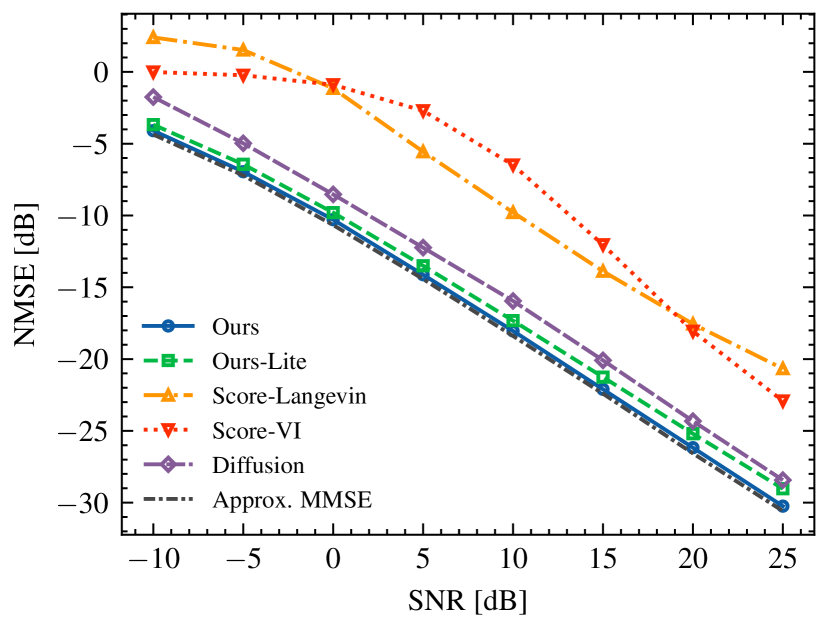
*Figure 1:Performance comparison on CDL-C channels.*

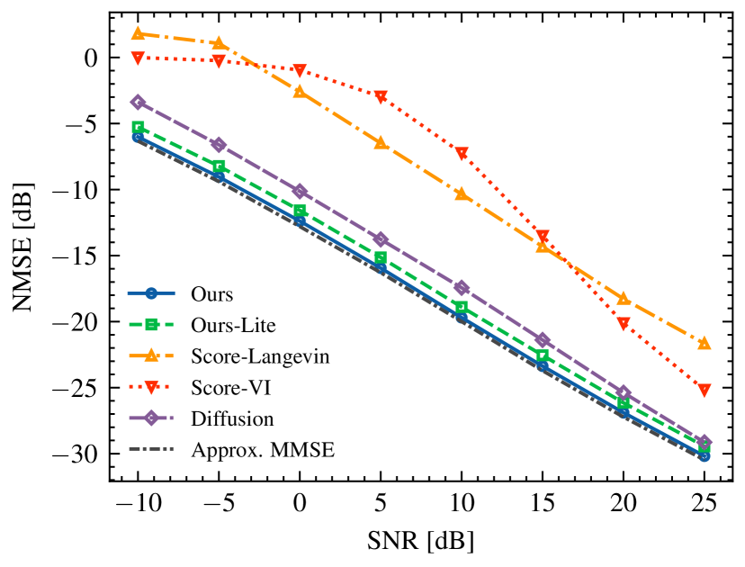
*Figure 2:Performance comparison on CDL-D channels.*

*Figure 3:Impacts of pilot density 
𝛼
 on NMSE performance.*

---
**Usage Info**: 7043 tokens used.
**Generated at**: 2026-02-24 20:26:22

---

# 📚 Multi-task Transformer for Explainable Speech Deepfake Detection via Formant Modeling

🚀 URL: https://arxiv.org/html/2601.14850

## 🌏 Abstract (원문)
We live in an era of rapid technological change, where AI has quickly become part of everyday life and a driving force across many fields. But this progress also carries serious risks: as society becomes more dependent on AI for routine tasks, and as AI tools become widely available, the chances of malicious use increase, often with harmful consequences. This problem is especially evident on social media platforms, where the rise of short, easily consumed content makes it easier for people to mistake synthetic media for real information. Among AI-generated media, deepfakes refer specifically to synthetic content crafted to mislead or cause harm, and they are increasingly used in fraud, reputational attacks, and to spread misinformation online. Over the years, several data-driven models have been developed specifically for speech deepfake detection, and these detectors have laid a strong foundation in the field. However, the interpretability of these models remains a significant challenge, as it is difficult to determine in advance which speech features are most critical for their predictions of whether a given input is real or fake. Furthermore, neural networks are known to exploit shortcuts during learning. Even if this behavior is not inherently problematic, it highlights the importance of understanding what cues a model relies on when making decisions. Indeed, several studies examining detector behavior have shown that many models base their decisions on unvoiced timesteps, frequency bands where no speech occurs, or even background noise, rather than the actual speech. In all these cases, interpretability emerges only a posteriori, rather than being embedded in the model design itself. Newer architectures like SFATNet have been proposed to improve interpretability by design. SFATNet models are hypothesis-driven, meaning their architecture should, in principle, encourage the network to focus on prosodic and speech-related cues. The latest version, SFATNet-3, achieves state-of-the-art performance, matching or surpassing established detectors such as RawNet2 and AASIST. Despite these advances, SFATNet-3 is computationally heavy due to its multi-layer transformer encoder-decoder structure. Moreover, while its outputs are designed to be interpretable, the model still lacks an explicit mechanism for self-explanation. In this work we introduce SFATNet-4: a new, lightweight speech deepfake detector that is inherently and explicitly interpretable. The proposed system is formulated as a multi-task model, where deepfake detection emerges as a byproduct of auxiliary objectives designed to enhance speech representation and prosodic awareness. A transformer-based encoder, composed of two loosely coupled transformers, processes the magnitude and phase of the input speech signal separately, mapping them into a shared latent representation. On the decoding side, each branch focuses on one task, working at the level of individual time frames. One auxiliary branch encourages the network to learn patterns of prosodic variation by predicting the trajectories of fundamental frequency (F0) and the first two formants (F1 and F2) across speech, while another completes this knowledge by learning to distinguish between voiced and unvoiced regions. The third branch focuses on deepfake detection and is equipped with a pooling multi-head mechanism that assigns importance weights to each time frame. These weights not only highlight which segments of speech most influence the final prediction, but also reveal whether the model relied more heavily on voiced or unvoiced regions.
## 🌏 Abstract (번역)
우리는 AI가 일상생활의 일부가 되고 여러 분야의 원동력이 된 급격한 기술 변화의 시대에 살고 있습니다. 그러나 이러한 발전은 심각한 위험도 수반합니다. 사회가 일상적인 업무를 AI에 더 많이 의존하게 되고 AI 도구가 널리 보급됨에 따라 악의적인 사용 가능성이 커지고 해로운 결과를 초래하는 경우가 많습니다. 이 문제는 소셜 미디어 플랫폼에서 특히 두드러지는데, 짧고 소비하기 쉬운 콘텐츠의 증가로 인해 사람들이 합성 미디어를 실제 정보로 오해하기 쉽게 만듭니다. AI 생성 미디어 중 딥페이크는 특히 오해를 불러일으키거나 해를 끼치기 위해 제작된 합성 콘텐츠를 의미하며, 사기, 평판 공격 및 온라인 허위 정보 유포에 점점 더 많이 사용되고 있습니다. 수년에 걸쳐 음성 딥페이크 탐지를 위해 특별히 여러 데이터 기반 모델이 개발되었으며, 이러한 탐지기들은 해당 분야에서 강력한 토대를 마련했습니다. 그러나 이러한 모델의 해석 가능성은 여전히 중요한 과제로 남아 있습니다. 주어진 입력이 진짜인지 가짜인지에 대한 예측에 어떤 음성 특징이 가장 중요한지 미리 결정하기 어렵기 때문입니다. 또한 신경망은 학습 중에 지름길(shortcuts)을 이용하는 것으로 알려져 있습니다. 이러한 동작이 본질적으로 문제가 되지 않더라도, 모델이 결정을 내릴 때 어떤 단서에 의존하는지 이해하는 것의 중요성을 강조합니다. 실제로 탐지기 동작을 조사한 여러 연구에 따르면 많은 모델이 실제 음성보다는 무성음 시간 단계, 음성이 발생하지 않는 주파수 대역 또는 배경 소음에 근거하여 결정을 내리는 것으로 나타났습니다. 이 모든 경우에서 해석 가능성은 모델 설계 자체에 내장되기보다는 사후에만 나타납니다. 설계에 의한 해석 가능성을 개선하기 위해 SFATNet과 같은 새로운 아키텍처가 제안되었습니다. SFATNet 모델은 가설 기반으로, 아키텍처가 원칙적으로 네트워크가 운율 및 음성 관련 단서에 집중하도록 유도해야 함을 의미합니다. 최신 버전인 SFATNet-3은 RawNet2 및 AASIST와 같은 기존 탐지기와 일치하거나 능가하는 최첨단 성능을 달성합니다. 이러한 발전에도 불구하고 SFATNet-3은 다층 트랜스포머 인코더-디코더 구조로 인해 계산량이 많습니다. 또한 출력이 해석 가능하도록 설계되었지만 모델에는 여전히 명시적인 자기 설명 메커니즘이 부족합니다. 본 연구에서는 본질적이고 명시적으로 해석 가능한 새롭고 가벼운 음성 딥페이크 탐지기인 SFATNet-4를 소개합니다. 제안된 시스템은 다중 작업(multi-task) 모델로 공식화되며, 여기서 딥페이크 탐지는 음성 표현 및 운율 인식을 향상시키기 위해 설계된 보조 목표의 부산물로 나타납니다. 트랜스포머 기반 인코더는 입력 음성 신호의 크기(magnitude)와 위상(phase)을 별도로 처리하여 공유 잠재 표현으로 매핑합니다. 디코딩 측면에서 각 분기는 개별 시간 프레임 수준에서 작동하며 하나의 작업에 집중합니다. 하나의 보조 분기는 기본 주파수(F0)와 처음 두 개의 포먼트(F1, F2)의 궤적을 예측하여 운율 변화 패턴을 학습하도록 유도하며, 다른 분기는 유성음과 무성음 영역을 구별하는 법을 학습하여 이 지식을 완성합니다. 세 번째 분기는 딥페이크 탐지에 집중하며 각 시간 프레임에 중요도 가중치를 할당하는 풀링 멀티 헤드 메커니즘을 갖추고 있습니다. 이러한 가중치는 음성의 어떤 세그먼트가 최종 예측에 가장 큰 영향을 미치는지 강조할 뿐만 아니라 모델이 유성음 또는 무성음 영역에 더 많이 의존했는지 여부도 드러냅니다.

## 🔍 Methods & Results
- SFATNet-4는 SFATNet-3을 개선하여 효율성, 계산 비용 및 해석 가능성을 높인 다중 작업 오디오 트랜스포머 모델임
- 입력 신호의 크기(Magnitude)와 위상(Phase)을 각각 처리하는 두 개의 인코더와 세 개의 디코더(Multi-formant, Voicing, Synthesis Predictor)로 구성됨
- 기존의 사각형 패치 방식 대신 시간 축으로만 세그먼트화(1xM 슬라이스)하는 전처리 방식을 도입하여 복잡도를 낮추고 프레임 단위 해석을 가능하게 함
- Multi-formant Decoder는 F0, F1, F2의 연속적인 궤적을 직접 예측하여 운율 패턴을 캡처하며, 별도의 트랜스포머 디코더 없이 선형 투영을 사용함
- Voicing Decoder는 유성음과 무성음 프레임을 구분하여 포먼트 예측을 정교화하고 모델의 판단 근거를 보완함
- Synthesis Predictor는 멀티 헤드 풀링 메커니즘을 통해 각 프레임에 주의력 가중치(Attention weights)를 할당하여 모델의 결정에 영향을 준 프레임을 명시적으로 시각화함
- 이러한 구조적 개선을 통해 SFATNet-4는 경량화된 동시에 본질적이고 명시적인 해석 가능성을 제공하며 최첨단 탐지 성능을 유지함

## 🖼 Figures
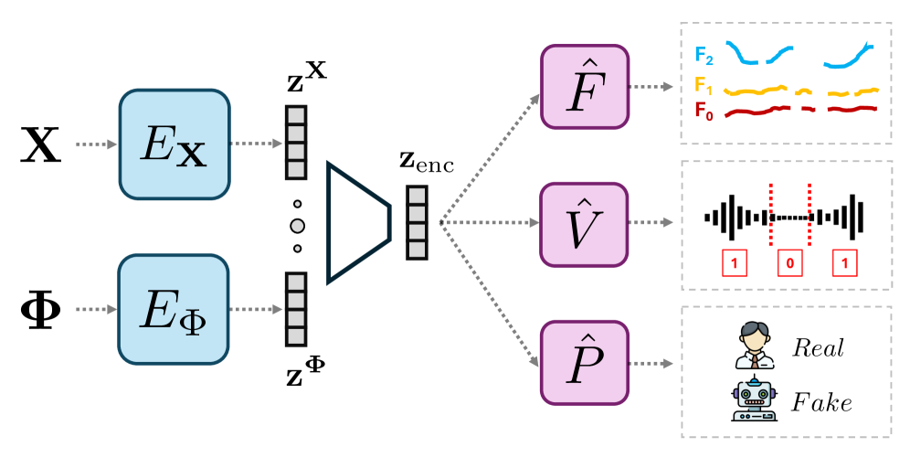
*Fig. 1:Illustrative example of the proposed multi-task transformer speech deepfake detector (SFATNet-4).*

*Fig. 2:Example model output for an input spectrogram. Top: original spectrogram with predicted 
𝐹
0
, 
𝐹
1
, and 
𝐹
2
. Bottom: predicted binary voiced/unvoiced segments (voiced: white, unvoiced: black).*

*Fig. 3:Relative importance of voiced and unvoiced frames for correctly classified speech. Each pair of bars shows the contributions of voiced and unvoiced frames to the model’s decision in a specific dataset, as weighted by the model’s attention scores. Top: real speech; bottom: fake.*

---
**Usage Info**: 6180 tokens used.
**Generated at**: 2026-02-24 20:26:57

---

