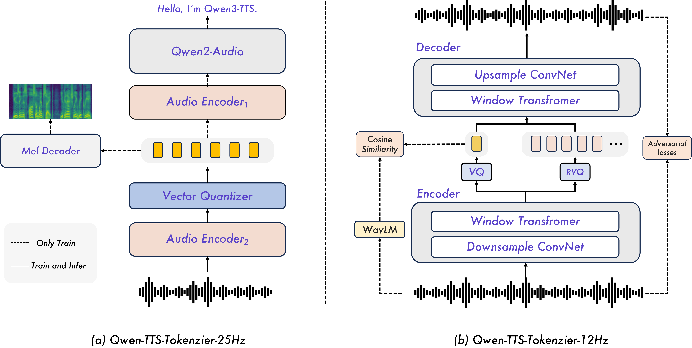
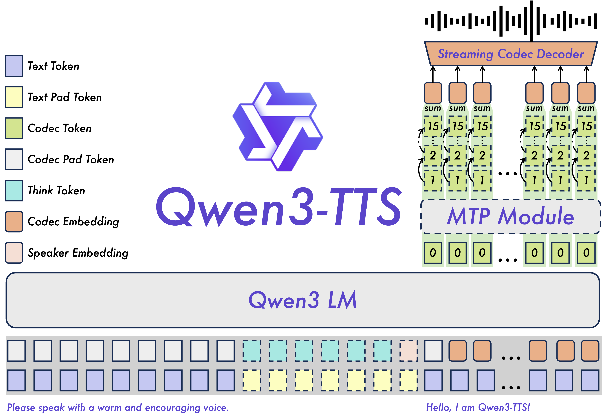
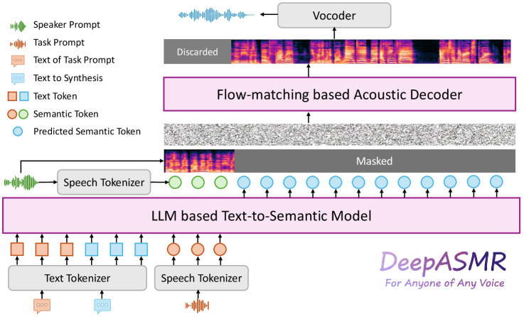
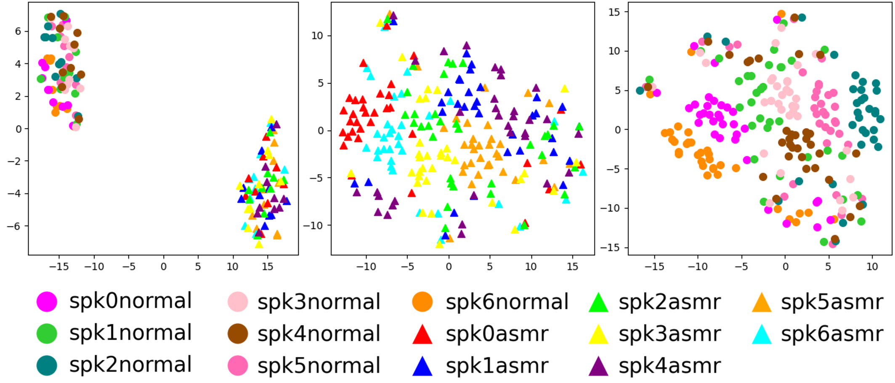
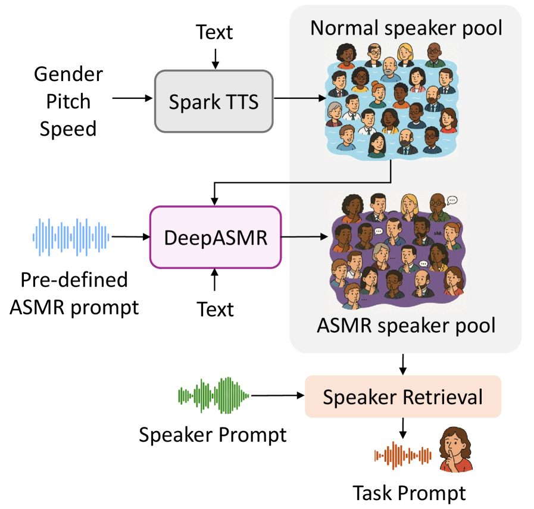
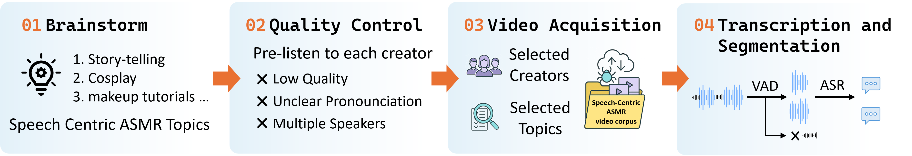
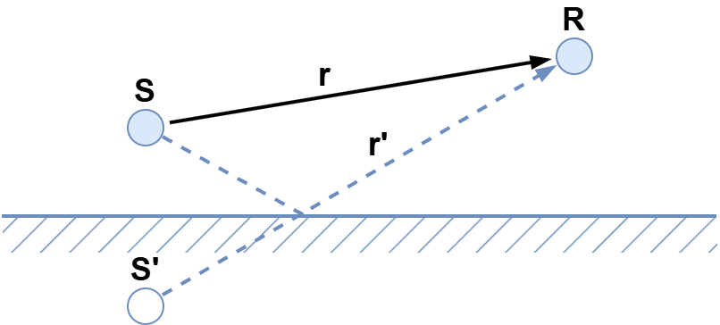
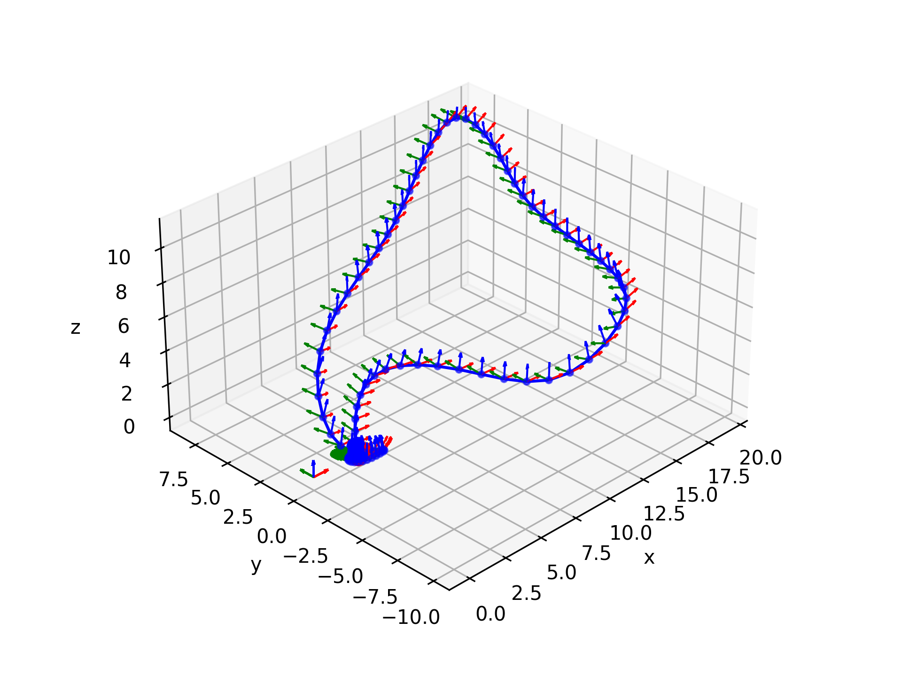
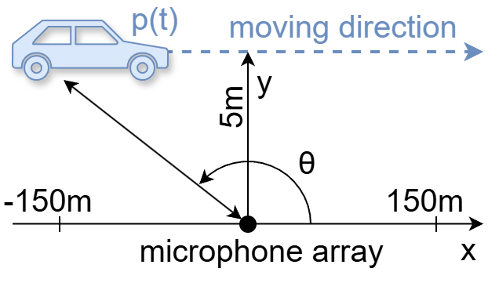

# 🚩 (2026-01-23) Scholar Inbox 추천 논문 

# 📚 Qwen3-TTS Technical Report

🚀 URL: https://arxiv.org/html/2601.15621

## 🌏 Abstract (원문)
Stable, controllable, and human-like speech synthesis is widely viewed as a key capability on the path to AGI. Modern neural text-to-speech (TTS) models, trained on large-scale datasets, already deliver exceptional capability to generate high-quality speech from a few seconds of reference audio. Among them, discrete speech tokenization combined with autoregressive language modeling of discrete units has gained traction, offering improved stability while preserving high naturalness and human-likeness. Conditioning on vocal features or text instructions facilitates finer-grained control over prosody and style, resulting in outputs of greater richness and diversity. These breakthroughs are paving the way for diverse applications in fields such as virtual assistants and automated content creation. In this report, we take a step toward stable, controllable, and human-like speech synthesis and introduce Qwen3-TTS, the first text-to-speech model in the Qwen series. Qwen3-TTS exhibits the following properties: 1)Controllability: Qwen3-TTS allows users to create new voices or manipulate fine-grained attributes of generated speech via natural language descriptions, while also supporting the stable generation of any content using the created voice. 2)Voice Cloning and Predefined Voice Profiles: Qwen3-TTS supports 3-second voice cloning and generation using a set of x curated, high-quality preset voices. 3)Naturalness: Beyond achieving robust synthesis, Qwen3-TTS excels in generating highly natural and expressive speech. Our 1.7B model, in particular, delivers state-of-the-art, human-like quality, demonstrating our approach successfully maximizes perceptual quality without overfitting to ASR-related metrics. 4)Multilinguality: The model is trained across more than 10 languages and supports speaker-consistent multilingual generation. 5)Streaming: Designed for streaming text input and streaming audio output, it achieves a first-packet latency as low as 97 ms (0.6B variant) and 101 ms (1.7B variant). Beyond the aforementioned aspects, and from a broader perspective of practical application, it is crucial for our model to integrate seamlessly with Large Language Models (LLMs) and achieve extremely low first-packet latency. To this end, we use discrete speech representations as the cornerstone of our architecture and introduce two tokenizers in the Qwen3-TTS family: 1)Qwen-TTS-Tokenizer-25Hz employs a 25 Hz single-codebook representation with waveform reconstruction via block-wise flow matching to enable streaming synthesis. 2)Qwen-TTS-Tokenizer-12Hz, which adopts a 12.5 Hz multi-codebook scheme. Its first codebook layer encodes semantic content, while the subsequent layers capture acoustic details. To further support ultra–low-latency streaming, we designed a dual-track autoregressive architecture for streaming text input and audio output. This architecture incorporates a Multi-Token Prediction (MTP) module to effectively model the multi-codebook sequence, which enables immediate speech decoding from the first codec frame. Trained on over 5 million hours of speech data, Qwen3-TTS achieves impressive performance across diverse benchmarks. Specifically, it establishes a new state-of-the-art in zero-shot voice cloning, achieving the lowest Word Error Rate (WER) on the Seed-TTS benchmark while delivering superior speaker similarity across all 10 evaluated languages compared to commercial baselines like MiniMax and ElevenLabs. Furthermore, the model exhibits remarkable stability in long-form generation, capable of synthesizing over 10 minutes of natural and fluent speech. To facilitate community research and development, we release the complete family of Qwen3-TTS models and tokenizers.
## 🌏 Abstract (번역)
안정적이고 제어 가능하며 인간과 유사한 음성 합성은 범용 인공지능(AGI)으로 가는 길의 핵심 역량으로 널리 간주됩니다. 대규모 데이터셋으로 학습된 현대 신경망 텍스트 음성 변환(TTS) 모델은 이미 몇 초의 참조 오디오만으로도 고품질 음성을 생성하는 탁월한 능력을 제공합니다. 그중에서도 이산 음성 토큰화와 이산 단위의 자기회귀 언어 모델링의 결합은 높은 자연스러움과 인간 유사성을 유지하면서 개선된 안정성을 제공하여 주목받고 있습니다. 보컬 특징이나 텍스트 지시문을 조건으로 활용하면 운율과 스타일에 대한 더 세밀한 제어가 가능해져 더욱 풍부하고 다양한 출력을 얻을 수 있습니다. 이러한 돌파구는 가상 비서 및 자동 콘텐츠 제작과 같은 분야에서 다양한 응용의 길을 열어주고 있습니다. 본 보고서에서는 안정적이고 제어 가능하며 인간과 유사한 음성 합성을 향한 한 걸음으로 Qwen 시리즈의 첫 번째 TTS 모델인 Qwen3-TTS를 소개합니다. Qwen3-TTS는 다음과 같은 특징을 가집니다: 1) 제어 가능성: 사용자가 자연어 설명을 통해 새로운 목소리를 생성하거나 생성된 음성의 세밀한 속성을 조작할 수 있으며, 생성된 목소리를 사용하여 모든 콘텐츠를 안정적으로 생성할 수 있습니다. 2) 음성 복제 및 사전 정의된 음성 프로필: 3초 분량의 음성 복제와 엄선된 고품질 프리셋 음성 세트를 사용한 생성을 지원합니다. 3) 자연스러움: 강력한 합성을 넘어 고도로 자연스럽고 표현력이 풍부한 음성을 생성하는 데 탁월합니다. 특히 1.7B 모델은 최첨단의 인간과 유사한 품질을 제공하며, ASR 관련 지표에 과적합되지 않고 지각적 품질을 성공적으로 극대화했음을 입증합니다. 4) 다국어 지원: 10개 이상의 언어로 학습되었으며 화자 일관성이 유지되는 다국어 생성을 지원합니다. 5) 스트리밍: 스트리밍 텍스트 입력 및 오디오 출력을 위해 설계되었으며, 첫 패킷 지연 시간이 97ms(0.6B 모델) 및 101ms(1.7B 모델)로 매우 낮습니다. 실용적인 응용의 더 넓은 관점에서, 모델이 대규모 언어 모델(LLM)과 원활하게 통합되고 극도로 낮은 첫 패킷 지연 시간을 달성하는 것이 중요합니다. 이를 위해 이산 음성 표현을 아키텍처의 초석으로 사용하고 Qwen3-TTS 제품군에 두 가지 토크나이저를 도입했습니다: 1) Qwen-TTS-Tokenizer-25Hz는 25Hz 단일 코드북 표현과 블록 단위 플로우 매칭을 통한 파형 재구성을 사용하여 스트리밍 합성을 가능하게 합니다. 2) Qwen-TTS-Tokenizer-12Hz는 12.5Hz 다중 코드북 체계를 채택합니다. 첫 번째 코드북 레이어는 의미론적 내용을 인코딩하고, 후속 레이어는 음향적 세부 사항을 캡처합니다. 초저지연 스트리밍을 추가로 지원하기 위해 스트리밍 텍스트 입력 및 오디오 출력을 위한 이중 트랙 자기회귀 아키텍처를 설계했습니다. 이 아키텍처는 다중 코드북 시퀀스를 효과적으로 모델링하기 위한 MTP(Multi-Token Prediction) 모듈을 통합하여 첫 번째 코덱 프레임에서 즉각적인 음성 디코딩을 가능하게 합니다. 500만 시간 이상의 음성 데이터로 학습된 Qwen3-TTS는 다양한 벤치마크에서 인상적인 성능을 달성했습니다. 구체적으로, 제로샷 음성 복제에서 새로운 SOTA를 기록했으며, Seed-TTS 벤치마크에서 가장 낮은 단어 오류율(WER)을 달성하는 동시에 MiniMax 및 ElevenLabs와 같은 상용 베이스라인보다 우수한 화자 유사성을 10개 평가 언어 전체에서 보여주었습니다. 또한, 이 모델은 장기 생성에서 놀라운 안정성을 보이며 10분 이상의 자연스럽고 유창한 음성을 합성할 수 있습니다. 커뮤니티의 연구 및 개발을 촉진하기 위해 Qwen3-TTS 모델 및 토크나이저 전체 제품군을 공개합니다.

## 🔍 Methods & Results
- Qwen3 언어 모델 제품군을 기반으로 텍스트와 오디오 토큰을 채널 축으로 결합한 이중 트랙(dual-track) 자기회귀 아키텍처 설계
- Qwen-TTS-Tokenizer-25Hz: 단일 코드북 표현과 블록 단위 플로우 매칭(Flow Matching)을 통한 고충실도 파형 재구성 지원
- Qwen-TTS-Tokenizer-12Hz: 다중 코드북(RVQ) 체계와 MTP(Multi-Token Prediction) 모듈을 도입하여 초저지연 스트리밍 및 음향 세부 사항 캡처
- 500만 시간 이상의 다국어 음성 데이터를 활용한 3단계 사전 학습(일반, 고품질, 롱 컨텍스트) 및 사후 학습(DPO, GSPO, 화자 미세 조정) 수행
- 0.6B 모델 기준 97ms, 1.7B 모델 기준 101ms의 극도로 낮은 첫 패킷 지연 시간(First-Packet Latency) 달성
- Seed-TTS 벤치마크에서 최저 단어 오류율(WER)을 기록하며 제로샷 음성 복제 분야의 새로운 SOTA 달성
- MiniMax 및 ElevenLabs 등 상용 모델 대비 10개 언어 모두에서 우수한 화자 유사성 및 다국어 적응력 입증
- 10분 이상의 긴 문장 생성에서도 자연스러움과 유창함을 유지하는 강력한 안정성 확인

## 🖼 Figures

*Figure 1:Qwen3-TTS is a multilingual, controllable, robust, and streaming text-to-speech model. Based on these features, Qwen3-TTS supports a wide range of tasks, including but not limited to cloning, creating and controlling voice, and easily handling various complex texts.*

*Figure 2:Overview of Qwen-TTS tokenizers.*

*Figure 3:The overview of Qwen3-TTS. Dashed lines represent optional.*

---
**Usage Info**: 6331 tokens used.
**Generated at**: 2026-02-24 20:28:08

---

# 📚 Timbre-Aware LLM-based Direct Speech-to-Speech Translation Extendable to Multiple Language Pairs

🚀 URL: https://arxiv.org/html/2601.16023

## 🌏 Abstract (원문)
The rapid growth of global communication over the past few decades has increased interaction among people speaking diverse languages. According to recent estimates, approximately 7,159 languages are currently in use worldwide, highlighting the scale of linguistic diversity and the associated communication challenges. Speech-to-Speech Translation (S2ST) has therefore emerged as a promising technology for bridging these language barriers. Conventional S2ST systems typically adopt a cascaded architecture composed of Automatic Speech Recognition (ASR), Machine Translation (MT), and Text-to-Speech (TTS) modules. While such systems achieve acceptable performance in high-resource settings, they suffer from error propagation across modules, loss of prosodic and paralinguistic information, increased latency due to multi-stage processing, and difficulties in translating languages that are predominantly available in spoken form and do not have a written script. To mitigate some of these limitations, researchers have explored end-to-end Speech-to-Text (ST) models that directly map source-language speech to target-language text, followed by TTS-based speech synthesis. Although these pipelines reduce error propagation compared to cascaded architectures, they still require the independent training of the ST and TTS modules. In addition, integrating these modules and the availability of target-language text is necessary. Subsequent efforts have attempted to pretrain ST and TTS independently and connect them through an additional fine-tuning stage. While this approach enables direct inference from source speech to target speech, it remains text-dependent and computationally expensive. More recent research has therefore focused on fully end-to-end S2ST frameworks that jointly learn the mapping from source-language speech to target-language speech within a single model. These approaches initially relied on attention-based sequence-to-sequence architectures, with later work incorporating pretrained speech encoders and neural vocoders to improve translation quality and speech naturalness. Despite these advances, current end-to-end S2ST models often lag behind strong cascaded baselines in translation quality, even though in reduced error propagation. In parallel with these developments, large language models (LLMs) have demonstrated strong capabilities across a wide range of speech and language processing tasks. Emerging LLMs for speech further extend these capabilities to spoken question answering, ASR, TTS, and ST. However, the potential of LLMs for direct S2ST remains largely underexplored. At the same time, progress in spoken dialogue systems shows that LLMs can support speech-based interaction when equipped with audio adapters and neural vocoders. These advances highlight promising opportunities for building scalable LLM-driven direct S2ST systems, although most prior work remains limited to preliminary explorations using synthetic data. Motivated by these recent advances, we develop a Direct Speech-to-Speech Translation System with LLM (DS22ST-LM), a scalable, single-stage direct S2ST framework that leverages the language understanding capabilities of LLMs. While direct S2ST systems require parallel speech pairs, such data remain scarce for many languages. To address this challenge, we construct GigaS2S-1000, a large-scale corpus derived from GigaST by synthesizing high-quality Chinese speech using XTTS-v2. The resulting corpus contains 1000 hours of multi-speaker English speech aligned with high-quality machine-translated Chinese text and natural-sounding single-speaker Chinese speech, enabling large-scale direct S2ST training. DS22ST-LM integrates a Whisper encoder, a Qwen2-0.5B LLM, and a CosyVoice neural vocoder. Since LLMs operate in a text embedding space, a projector module is used to interface the encoder’s speech embedding space with that of the LLM. We investigate three projection designs: Linear, Conv1D-Linear, and Q-Former, and analyze their impact on training and translation quality. The vocoder synthesizes target speech from semantic tokens. These semantic tokens are discrete representations that primarily capture linguistic and contextual information, unlike acoustic tokens, and can be generated from either target speech or text. Accordingly, we explore two training regimes: one that uses semantic tokens extracted directly from target speech and another that uses tokens generated from target text via a text-to-token LLM. We evaluate both training regimes and compare their effects on translation performance. We further demonstrate the extensibility of DS22ST-LM across multiple language pairs translated into English (en), including French (fr), Spanish (es), and German (de), using the CVSS corpus. We also evaluate Indic language pairs, including Hindi (hi), Bengali (ben), and Urdu (urd), using the Bhasaanuvaad dataset. Finally, we incorporate a timbre-control mechanism inspired by recent TTS systems, which enables DS22ST-LM to synthesize target speech in a specified speaker’s voice from a short reference audio prompt. The main contributions of this work are summarized as follows: We propose DS22ST-LM, a single-stage, LLM-based direct S2ST framework, and demonstrate its effectiveness across multiple language pairs. We construct and publicly release the GigaS2S-1000 dataset, enabling large-scale research on direct S2ST. We systematically evaluate three projection architectures: Linear, Conv1D-Linear, and Q-Former, and analyze their effects on convergence stability and translation quality. We investigate semantic token generation from target speech versus target text and analyze their impact on direct S2ST translation performance. We integrate timbre-aware speech synthesis into direct S2ST by conditioning on semantic tokens and a reference speaker prompt to synthesize speaker-specific target speech. We release all training recipes, evaluation pipelines, and model checkpoints to support reproducibility and future research.
## 🌏 Abstract (번역)
지난 수십 년간 글로벌 통신의 급격한 성장은 다양한 언어를 사용하는 사람들 간의 상호작용을 증가시켰습니다. 최근 추정치에 따르면 전 세계적으로 약 7,159개의 언어가 현재 사용되고 있으며, 이는 언어적 다양성의 규모와 그에 따른 통신 과제를 잘 보여줍니다. 이에 따라 음성 간 번역(S2ST)은 이러한 언어 장벽을 허물기 위한 유망한 기술로 부상했습니다. 전통적인 S2ST 시스템은 일반적으로 자동 음성 인식(ASR), 기계 번역(MT), 텍스트 음성 변환(TTS) 모듈로 구성된 계층적 구조를 채택합니다. 이러한 시스템은 고자원 환경에서 수용 가능한 성능을 달성하지만, 모듈 간 오류 전파, 운율 및 부가 언어 정보의 손실, 다단계 처리에 따른 지연 시간 증가, 그리고 주로 구어체로만 존재하고 문자가 없는 언어 번역의 어려움 등의 문제를 겪습니다. 이러한 한계를 완화하기 위해 연구자들은 소스 언어 음성을 타겟 언어 텍스트로 직접 매핑한 후 TTS 기반으로 음성을 합성하는 종단간(end-to-end) 음성-텍스트(ST) 모델을 탐구해 왔습니다. 이러한 파이프라인은 계층적 구조에 비해 오류 전파를 줄이지만, 여전히 ST와 TTS 모듈의 독립적인 훈련이 필요하며 타겟 언어 텍스트의 가용성이 필수적입니다. 이후 ST와 TTS를 독립적으로 사전 훈련하고 추가 미세 조정 단계를 통해 연결하려는 시도가 있었으나, 이 방식은 여전히 텍스트 의존적이며 계산 비용이 많이 듭니다. 따라서 최근 연구는 단일 모델 내에서 소스 언어 음성에서 타겟 언어 음성으로의 매핑을 공동으로 학습하는 완전한 종단간 S2ST 프레임워크에 집중하고 있습니다. 이러한 접근 방식은 초기에는 어텐션 기반 시퀀스-투-시퀀스 구조에 의존했으나, 이후 사전 훈련된 음성 인코더와 신경 보코더를 통합하여 번역 품질과 음성 자연스러움을 향상시켰습니다. 이러한 발전에도 불구하고, 현재의 종단간 S2ST 모델은 오류 전파는 적지만 번역 품질 면에서는 강력한 계층적 베이스라인 모델에 비해 뒤처지는 경우가 많습니다. 이와 병행하여 대규모 언어 모델(LLM)은 광범위한 음성 및 언어 처리 작업에서 강력한 능력을 입증했습니다. 음성용 LLM은 이러한 능력을 구어체 질의응답, ASR, TTS 및 ST로 더욱 확장하고 있습니다. 그러나 직접적인 S2ST를 위한 LLM의 잠재력은 여전히 충분히 탐구되지 않은 상태입니다. 동시에 구어체 대화 시스템의 발전은 오디오 어댑터와 신경 보코더를 갖춘 LLM이 음성 기반 상호작용을 지원할 수 있음을 보여줍니다. 이러한 진전은 확장 가능한 LLM 기반 직접 S2ST 시스템 구축을 위한 유망한 기회를 시사하지만, 대부분의 이전 작업은 합성 데이터를 사용한 예비 탐구에 머물러 있습니다. 이러한 최근의 발전에 영감을 받아, 본 연구에서는 LLM의 언어 이해 능력을 활용하는 확장 가능한 단일 단계 직접 S2ST 프레임워크인 DS22ST-LM을 개발합니다. 직접 S2ST 시스템은 병렬 음성 쌍이 필요하지만, 많은 언어에서 이러한 데이터는 여전히 부족합니다. 이 문제를 해결하기 위해 XTTS-v2를 사용하여 고품질 중국어 음성을 합성함으로써 GigaST에서 파생된 대규모 코퍼스인 GigaS2S-1000을 구축했습니다. 그 결과물인 코퍼스는 고품질 기계 번역된 중국어 텍스트 및 자연스러운 단일 화자 중국어 음성과 정렬된 1,000시간의 다중 화자 영어 음성을 포함하고 있어 대규모 직접 S2ST 훈련을 가능하게 합니다. DS22ST-LM은 Whisper 인코더, Qwen2-0.5B LLM 및 CosyVoice 신경 보코더를 통합합니다. LLM은 텍스트 임베딩 공간에서 작동하므로 인코더의 음성 임베딩 공간을 LLM의 공간과 연결하기 위해 프로젝터 모듈이 사용됩니다. 본 연구에서는 Linear, Conv1D-Linear, Q-Former의 세 가지 프로젝션 설계를 조사하고 훈련 및 번역 품질에 미치는 영향을 분석합니다. 보코더는 시맨틱 토큰으로부터 타겟 음성을 합성합니다. 이러한 시맨틱 토큰은 어쿠스틱 토큰과 달리 주로 언어적 및 문맥적 정보를 캡처하는 이산적 표현이며, 타겟 음성이나 텍스트 모두에서 생성될 수 있습니다. 이에 따라 타겟 음성에서 직접 추출된 시맨틱 토큰을 사용하는 방식과 텍스트-투-토큰 LLM을 통해 타겟 텍스트에서 생성된 토큰을 사용하는 두 가지 훈련 체계를 탐구합니다. 또한 CVSS 코퍼스를 사용하여 프랑스어, 스페인어, 독일어를 포함하여 영어로 번역되는 다국어 쌍에 대한 DS22ST-LM의 확장성을 입증합니다. 힌디어, 벵골어, 우르두어를 포함한 인도어 쌍에 대해서도 Bhasaanuvaad 데이터셋을 사용하여 평가합니다. 마지막으로, 최근 TTS 시스템에서 영감을 받은 음색 제어 메커니즘을 통합하여 짧은 참조 오디오 프롬프트를 통해 특정 화자의 목소리로 타겟 음성을 합성할 수 있도록 합니다. 본 연구의 주요 기여는 다음과 같습니다: 첫째, 단일 단계 LLM 기반 직접 S2ST 프레임워크인 DS22ST-LM을 제안하고 여러 언어 쌍에 대한 효과를 입증합니다. 둘째, 대규모 직접 S2ST 연구를 가능하게 하는 GigaS2S-1000 데이터셋을 구축하고 공개합니다. 셋째, Linear, Conv1D-Linear, Q-Former의 세 가지 프로젝션 구조를 체계적으로 평가하고 수렴 안정성과 번역 품질에 미치는 영향을 분석합니다. 넷째, 타겟 음성 대 타겟 텍스트에서의 시맨틱 토큰 생성을 조사하고 직접 S2ST 번역 성능에 미치는 영향을 분석합니다. 다섯째, 시맨틱 토큰과 참조 화자 프롬프트를 조건으로 화자 특정 타겟 음성을 합성하는 음색 인식 음성 합성을 직접 S2ST에 통합합니다. 마지막으로 재현성과 향후 연구를 지원하기 위해 모든 훈련 레시피, 평가 파이프라인 및 모델 체크포인트를 공개합니다.

## 🔍 Methods & Results
- GigaS2S-1000 데이터셋 구축: GigaSpeech 및 GigaST를 기반으로 XTTS-v2를 사용하여 1,000시간 분량의 영어-중국어 병렬 음성 코퍼스를 생성함.
- DS22ST-LM 프레임워크: Whisper 인코더, Qwen2-0.5B LLM, CosyVoice 신경 보코더를 결합한 단일 단계 직접 음성 간 번역 시스템을 제안함.
- 프로젝션 모듈 실험: Linear, Conv1D-Linear, Q-Former 세 가지 프로젝션 구조를 비교 분석하여 음성 인코더와 LLM 간의 최적의 정렬 방식을 탐구함.
- 시맨틱 토큰 활용: SenseVoice ASR 인코더를 통해 추출된 지도 학습 기반 시맨틱 토큰을 사용하여 언어적 의미를 보존함.
- 훈련 체계 비교: 타겟 음성에서 직접 추출한 토큰과 타겟 텍스트에서 생성된 토큰을 사용하는 두 가지 훈련 방식을 평가함.
- 음색 제어 기능: 참조 오디오 프롬프트를 활용한 조건부 플로우 매칭 모델을 통해 특정 화자의 음색으로 음성을 합성하는 기능을 통합함.
- 다국어 확장성: 프랑스어, 스페인어, 독일어 및 인도어 계열(힌디어, 벵골어, 우르두어) 등 다양한 언어 쌍에서 시스템의 유효성을 입증함.

## 🖼 Figures

*Figure 1:Overview of semantic token generation using the 
𝒮
3
 tokenizer from speech (left) and a text-to-token LLM-based approach from text (right). Dashed modules denote components used only during training.*

*Figure 2:Overview of the DS
2
ST-LM framework for the direct S
2
ST task.*

---
**Usage Info**: 10111 tokens used.
**Generated at**: 2026-02-24 20:28:55

---

# 📚 DeepASMR: LLM-Based Zero-Shot ASMR Speech Generation for Anyone of Any Voice

🚀 URL: https://arxiv.org/html/2601.15596

## 🌏 Abstract (원문)
The landscape of Text-to-Speech (TTS) synthesis has been radically transformed by the emergence of large-scale generative models and massive-scale datasets. Recent architectures leveraging neural codecs, latent diffusion, and flow-matching have achieved unprecedented naturalness, enabling zero-shot voice cloning and high-fidelity speech reconstruction. Despite these milestones, current TTS research remains largely constrained to neutral and read-style audio. This focus creates a significant gap in the generation of high-affect, non-standard vocalizations, particularly those that rely on unvoiced acoustic profiles, such as Autonomous Sensory Meridian Response (ASMR), where the speaker avoids vibrating their vocal cords to create a quiet, airy sound. ASMR has evolved from an internet subculture into a global phenomenon, driven by its documented physiological and psychological benefits. ASMR speech fundamentally differs from normal speech in several key aspects. First, ASMR creators use extremely soft, breathy tones rather than a full speaking voice. Second, ASMR speech includes both voiced sounds and unvoiced sounds, whereas ordinary speech is dominated by voiced sounds. Third, compared to normal speech, whispered vowels are longer in duration and have higher formant frequencies. Existing attempts to synthesize whispered or ASMR speech primarily fall into three categories: In-context learning via large-scale prompt-based models, Voice Conversion (VC) techniques, and task-specific fine-tuning on limited ASMR datasets. However, these approaches face two critical limitations: poor zero-shot generalization and unsatisfactory acoustic authenticity. Therefore, we innovatively introduce DeepASMR, the first framework enabling controllable synthesis of high-quality, personalized ASMR speech from arbitrary text and any speaker’s voice. Our approach leverages a two-stage architecture: a Large Language Model (LLM) based text-to-semantic encoder and a flow-matching-based acoustic decoder. A critical insight of our work is the identification of a latent factorization within the token space, which allows a two-stage model to soft factorize 'speaker identity' from 'ASMR style' in each stage. This enables the synthesis of ASMR speech for any content and any speaker, even in the absence of their whispered reference samples.
## 🌏 Abstract (번역)
대규모 생성 모델과 방대한 데이터셋의 등장으로 텍스트 음성 합성(TTS) 분야는 근본적인 변화를 맞이했습니다. 신경망 코덱, 잠재 확산 모델, 플로우 매칭을 활용한 최신 구조는 전례 없는 자연스러움을 달성하며 제로샷 음성 복제와 고충실도 음성 재구성을 가능하게 했습니다. 이러한 성과에도 불구하고, 현재의 TTS 연구는 여전히 중립적이고 낭독 스타일의 오디오에 주로 국한되어 있습니다. 이러한 집중은 특히 자율 감각 쾌락 반응(ASMR)과 같이 화자가 성대 진동을 피하고 조용하고 공기 섞인 소리를 만드는 무성 음향 프로필에 의존하는 고감성, 비표준 발성 생성에 있어 상당한 공백을 야기합니다. ASMR은 입증된 생리적 및 심리적 이점에 힘입어 인터넷 하위 문화에서 글로벌 현상으로 진화했습니다. ASMR 음성은 일반 음성과 몇 가지 핵심적인 측면에서 다릅니다. 첫째, ASMR 제작자는 완전한 목소리 대신 매우 부드럽고 숨소리가 섞인 톤을 사용합니다. 둘째, ASMR 음성은 유성음과 무성음을 모두 포함하는 반면, 일반 음성은 유성음이 지배적입니다. 셋째, 일반 음성에 비해 속삭이는 모음은 지속 시간이 더 길고 포먼트 주파수가 더 높습니다. 기존의 속삭임 또는 ASMR 음성 합성 시도는 주로 대규모 프롬프트 기반 모델을 통한 인컨텍스트 학습, 음성 변환(VC) 기술, 제한된 ASMR 데이터셋에 대한 특정 작업 미세 조정의 세 가지 범주로 나뉩니다. 그러나 이러한 접근 방식은 열악한 제로샷 일반화와 불만족스러운 음향적 진정성이라는 두 가지 중요한 한계에 직면해 있습니다. 이에 본 연구에서는 임의의 텍스트와 모든 화자의 목소리로부터 고품질의 개인화된 ASMR 음성을 제어 가능하게 합성할 수 있는 최초의 프레임워크인 DeepASMR을 혁신적으로 소개합니다. 우리의 접근 방식은 대규모 언어 모델(LLM) 기반의 텍스트-투-시맨틱 인코더와 플로우 매칭 기반의 어쿠스틱 디코더라는 2단계 구조를 활용합니다. 본 연구의 핵심 통찰은 토큰 공간 내에서 잠재적 인수분해를 식별한 것으로, 이를 통해 2단계 모델이 각 단계에서 '화자 정체성'과 'ASMR 스타일'을 부드럽게 분리할 수 있게 합니다. 이를 통해 속삭이는 참조 샘플이 없는 경우에도 모든 콘텐츠와 화자에 대해 ASMR 음성을 합성할 수 있습니다.

## 🔍 Methods & Results
- LLM 기반 텍스트-투-시맨틱 인코더와 플로우 매칭 기반 어쿠스틱 디코더로 구성된 2단계 생성 파이프라인 설계
- S3 토크나이저를 활용하여 토큰 공간 내에서 스타일(ASMR)과 화자 정체성(Timbre)을 분리하는 소프트 인수분해(Soft Factorization) 전략 제안
- 교차 스타일 합성 시 화자 정보 유출을 방지하기 위해 가상 화자 풀(Virtual Speaker Pool) 기반의 자동 작업 프롬프트 선택기 도입
- 35명의 화자, 총 670시간 분량의 영문 및 중문 ASMR 음성 코퍼스인 DeepASMR-DB 구축 및 공개
- 20만 시간의 일반 TTS 데이터로 사전 학습 후, DeepASMR-DB와 Emilia 데이터셋을 혼합하여 미세 조정 수행
- 실험 결과, 제로샷 환경에서 대상 화자의 ASMR 샘플 없이도 고품질의 ASMR 음성 생성을 달성했으며 기존 TTS 작업에서도 경쟁력 있는 성능 확인
- 반복적 정제(Iterative Refinement) 전략을 통해 무성 속삭임 음성의 품질을 추가로 향상시킬 수 있음을 입증

## 🖼 Figures

*Figure 1:DeepASMR Framework Overview*

*Figure 2:tSNE visualization of speaker embedding extracted from S3 tokenizer hidden features*

*Figure 3:Illustration of speaker pool construction and task prompt selection*

*Figure 4:A comprehensive pipeline for constructing the DeepASMR-DB dataset*

---
**Usage Info**: 5751 tokens used.
**Generated at**: 2026-02-24 20:29:36

---

# 📚 DynamicSound simulator for simulating moving sources and microphone arrays

🚀 URL: https://arxiv.org/html/2601.15433

## 🌏 Abstract (원문)
With the adoption of autonomous vehicles, delivery robots, and intelligent surveillance systems, the ability to analyze the surrounding acoustic environment is becoming increasingly important. In these scenarios, microphones and microphone arrays represent valuable sensing modalities for detecting and interpreting sound events in real time. For instance, single microphones can be used to detect emergency vehicles using neural networks[1], or to estimate the speed of an approaching vehicle by exploiting Doppler-induced frequency shifts[2,3]. Microphone arrays, by leveraging their capability to estimate the direction of arrival (DOA) of sound waves, offer even richer information: when placed near a roadway, they can be used to count passing vehicles, estimate their speed, and determine their direction of movement[4,5]. Arrays can also be mounted on unmanned aerial vehicles (UAVs) for sound-source localization during search-and-rescue operations[6,7,8], or conversely, deployed on the ground to detect and track flying drones[9,10,11]. These applications highlight the growing need for large, diverse, and realistic acoustic datasets that can support the development and evaluation of robust signal-processing and machine-learning algorithms. In many cases, however, collecting real-world recordings is prohibitively expensive, logistically difficult, or even impossible, especially when recreating rare or hazardous events. Furthermore, microphone arrays can have very different geometries and spatial configurations; being able to simulate these configurations greatly simplifies the study and optimization of new array designs before physically building them. Several acoustic simulation frameworks are currently available, each addressing specific aspects of sound propagation. Among open-source tools,pyroomacoustics[12]is widely used for simulating room acoustics and microphone arrays in indoor environments. While it provides accurate models for reverberation and reflection in enclosed spaces, it is primarily designed for static scenarios and does not natively support sound sources moving continuously in time. On the other hand,pyroadacoustics[13]targets outdoor traffic-noise simulations and introduces support for dynamic scenarios; however, in its current implementation, motion is effectively modeled at the array level, and changes in source dynamics are reflected instantaneously at the receiver, neglecting the finite time of sound propagation. As a result, physically correct delays associated with sound source movement are not achievable and this limitation is more visible for rapidly changing trajectories. Commercial software packages such as Odeon[14,15], EASE[16], CATT-Acoustic[17], COMSOL Multiphysics[18], CadnaA[19], and SoundPLAN[20]offer high-fidelity acoustic modeling and are widely used in architectural acoustics and noise prediction. Despite their accuracy, these tools are typically proprietary, computationally intensive, and not easily integrated into modern machine-learning workflows. Moreover, they often lack direct support for exporting time-domain multichannel signals of moving sound sources suitable for training neural networks or evaluating array-processing algorithms. For these reasons, this article presentsDynamicSound, a simulation framework developed to provide researchers with a flexible and physically consistent tool for modeling the propagation of sound emitted by one or more moving sources in three-dimensional space. The software, openly available on Github and archived on Zenodo[21], is implemented using object-oriented programming principles to ensure modularity and extensibility. The current version supports multiple simultaneous sources and this allows to implement the image-source method to model first-order reflections from planar surfaces. Although the present simulator does not account for occlusion or diffraction effects that become relevant in more complex architectural environments, it offers a realistic and computationally efficient approximation for open-field scenarios with a few reflective surfaces. The main contributions of this work are summarized as follows: We introduce a physically consistent time-domain acoustic simulation model for continuously moving sound sources that explicitly accounts for finite sound propagation delays and Doppler effects, avoiding the instantaneous-update assumptions commonly adopted in existing simulators. We propose a flexible multichannel spatial audio synthesis framework supporting arbitrary microphone array geometries and an unrestricted number of virtual microphones, accurately reproducing motion-dependent inter-microphone time delays, level differences, and spectral coloration. We integrate distance-dependent attenuation, air absorption, and first-order reflections from planar surfaces into a modular and computationally efficient architecture suitable for open and semi-open environments. We provide comparative evaluations against existing open-source acoustic simulators, demonstrating improved spatial fidelity and temporal consistency in dynamic scenarios relevant to beamforming and direction-of-arrival estimation. This article aims to describe the design, the implementation and validation of the proposed acoustic simulator. SectionIIintroduces the underlying acoustic physics modeled in the framework, including time-of-flight propagation delays, Doppler effects, geometric spreading, and air absorption. SectionIIIdiscusses the software architecture and implementation. SectionIVpresents comparative evaluations against other open-source Python-based acoustic simulators across different scenarios. Finally, SectionVconcludes the paper and outlines potential future extensions.
## 🌏 Abstract (번역)
자율 주행 차량, 배달 로봇 및 지능형 감시 시스템의 도입으로 주변 음향 환경을 분석하는 능력이 점점 더 중요해지고 있습니다. 이러한 시나리오에서 마이크와 마이크 어레이는 실시간으로 음향 이벤트를 감지하고 해석하는 데 유용한 감지 수단입니다. 예를 들어, 단일 마이크는 신경망을 사용하여 긴급 차량을 감지하거나 도플러 유도 주파수 이동을 활용하여 접근하는 차량의 속도를 추정하는 데 사용될 수 있습니다. 마이크 어레이는 음파의 도달 방향(DOA)을 추정하는 기능을 활용하여 훨씬 더 풍부한 정보를 제공합니다. 도로 근처에 배치하면 지나가는 차량의 수를 세고, 속도를 추정하며, 이동 방향을 결정하는 데 사용할 수 있습니다. 어레이는 수색 및 구조 작업 중 음원 위치 파악을 위해 무인 항공기(UAV)에 장착되거나, 반대로 비행 중인 드론을 감지하고 추적하기 위해 지상에 배치될 수도 있습니다. 이러한 응용 분야는 강력한 신호 처리 및 머신러닝 알고리즘의 개발과 평가를 지원할 수 있는 대규모의 다양하고 현실적인 음향 데이터셋에 대한 필요성이 커지고 있음을 강조합니다. 그러나 많은 경우 실제 녹음 데이터를 수집하는 것은 비용이 많이 들고 물류적으로 어렵거나, 특히 드물거나 위험한 사건을 재현할 때 불가능할 수도 있습니다. 또한 마이크 어레이는 매우 다양한 기하학적 구조와 공간 구성을 가질 수 있으며, 이러한 구성을 시뮬레이션할 수 있으면 물리적으로 구축하기 전에 새로운 어레이 설계를 연구하고 최적화하는 과정을 크게 단순화할 수 있습니다. 현재 여러 음향 시뮬레이션 프레임워크가 제공되고 있으며, 각 프레임워크는 소리 전파의 특정 측면을 다룹니다. 오픈 소스 도구 중 pyroomacoustics는 실내 환경의 실내 음향 및 마이크 어레이 시뮬레이션에 널리 사용됩니다. 밀폐된 공간에서의 잔향 및 반사에 대한 정확한 모델을 제공하지만, 주로 정적인 시나리오를 위해 설계되었으며 시간에 따라 연속적으로 이동하는 음원을 기본적으로 지원하지 않습니다. 반면 pyroadacoustics는 실외 교통 소음 시뮬레이션을 목표로 하며 동적 시나리오에 대한 지원을 도입했지만, 현재 구현에서는 움직임이 어레이 수준에서 효과적으로 모델링되고 음원 역학의 변화가 수신기에 즉각적으로 반영되어 소리 전파의 유한한 시간을 무시합니다. 결과적으로 음원 이동과 관련된 물리적으로 올바른 지연을 달성할 수 없으며, 이러한 제한은 빠르게 변화하는 궤적에서 더 두드러집니다. Odeon, EASE, CATT-Acoustic, COMSOL Multiphysics, CadnaA, SoundPLAN과 같은 상용 소프트웨어 패키지는 고충실도 음향 모델링을 제공하며 건축 음향 및 소음 예측에 널리 사용됩니다. 정확성에도 불구하고 이러한 도구는 일반적으로 독점적이고 계산 집약적이며 현대적인 머신러닝 워크플로우에 쉽게 통합되지 않습니다. 또한 신경망 학습이나 어레이 처리 알고리즘 평가에 적합한 이동 음원의 시간 도메인 다채널 신호를 내보내는 직접적인 지원이 부족한 경우가 많습니다. 이러한 이유로 본 논문에서는 연구자들에게 3차원 공간에서 하나 이상의 이동하는 음원에서 방출되는 소리의 전파를 모델링하기 위한 유연하고 물리적으로 일관된 도구를 제공하기 위해 개발된 시뮬레이션 프레임워크인 DynamicSound를 제시합니다. Github에서 공개적으로 사용 가능하고 Zenodo에 아카이브된 이 소프트웨어는 모듈성과 확장성을 보장하기 위해 객체 지향 프로그래밍 원칙을 사용하여 구현되었습니다. 현재 버전은 여러 개의 동시 음원을 지원하며, 이를 통해 평면에서의 1차 반사를 모델링하기 위한 이미지 소스법을 구현할 수 있습니다. 본 시뮬레이터는 더 복잡한 건축 환경에서 관련이 있는 폐색이나 회절 효과를 고려하지 않지만, 몇 개의 반사면이 있는 개방된 필드 시나리오에 대해 현실적이고 계산 효율적인 근사치를 제공합니다. 본 연구의 주요 기여는 다음과 같이 요약됩니다: 기존 시뮬레이터에서 흔히 채택되는 즉각적 업데이트 가정을 피하고, 유한한 소리 전파 지연과 도플러 효과를 명시적으로 고려하는 연속 이동 음원에 대한 물리적으로 일관된 시간 도메인 음향 시뮬레이션 모델을 도입합니다. 임의의 마이크 어레이 기하학적 구조와 제한 없는 수의 가상 마이크를 지원하며, 움직임에 따른 마이크 간 시간 지연, 레벨 차이 및 스펙트럼 채색을 정확하게 재현하는 유연한 다채널 공간 오디오 합성 프레임워크를 제안합니다. 거리 종속 감쇠, 공기 흡수 및 평면에서의 1차 반사를 개방 및 반개방 환경에 적합한 모듈식이고 계산 효율적인 아키텍처에 통합합니다. 기존 오픈 소스 음향 시뮬레이터와의 비교 평가를 제공하여 빔포밍 및 도달 방향 추정과 관련된 동적 시나리오에서 향상된 공간적 충실도와 시간적 일관성을 입증합니다. 이 기사는 제안된 음향 시뮬레이터의 설계, 구현 및 검증을 설명하는 것을 목표로 합니다. 섹션 II는 비행 시간 전파 지연, 도플러 효과, 기하학적 확산 및 공기 흡수를 포함하여 프레임워크에서 모델링된 기본 음향 물리학을 소개합니다. 섹션 III은 소프트웨어 아키텍처 및 구현에 대해 논의합니다. 섹션 IV는 다양한 시나리오에서 다른 오픈 소스 Python 기반 음향 시뮬레이터와의 비교 평가를 제시합니다. 마지막으로 섹션 V는 논문을 마무리하고 향후 확장 가능성을 설명합니다.

## 🔍 Methods & Results
- 유한한 소리 전파 속도와 온도에 따른 음속 변화를 고려하여 이동하는 음원과 수신기 사이의 시간 종속적 전파 지연(Time-of-Flight)을 모델링함.
- 음원과 수신기의 상대적 속도에 따른 주파수 압축 및 확장을 구현하여 접근 및 후퇴 시 발생하는 도플러 효과를 물리적으로 정확하게 재현함.
- 구형 확산(Spherical Spreading)에 따른 기하학적 진폭 감쇠와 ISO 9613-1 표준에 기반한 주파수 종속적 공기 흡수 모델을 통합함.
- 이미지 소스법(Image-source method)을 사용하여 지면이나 벽면과 같은 평면으로부터의 1차 반사 및 그로 인한 콤 필터링(Comb-filtering) 효과를 시뮬레이션함.
- 마이크로폰, 음원, 음향 물리, 환경 모듈로 구성된 객체 지향적 아키텍처를 통해 다양한 시뮬레이션 시나리오를 유연하게 구성할 수 있도록 설계함.
- 이동 음원의 방출 시간(Emission time)을 계산하기 위해 인과성을 보장하는 2차 방정식을 해결하고, 이산 신호 처리를 위해 선형 보간 및 리샘플링 기법을 적용함.
- 공기 흡수 계수를 기반으로 FIR 필터를 설계하여 장거리 전파 시 발생하는 고주파수 감쇠 및 저역 통과 필터링 효과를 구현함.

## 🖼 Figures
![Figure 1:Air absorption at 20 °C, 1 atm, and 50% relative humidity, showing the total attenuation curve together with the individual oxygen and nitrogen relaxation contributions, computed according to ISO 9613-1 [22].](../images/2026-01-23/2601.15433/2601.15433_fig0.png)
*Figure 1:Air absorption at 20 °C, 1 atm, and 50% relative humidity, showing the total attenuation curve together with the individual oxygen and nitrogen relaxation contributions, computed according to ISO 9613-1 [22].*

*Figure 2:Illustration of the image-source method used to model reflections, showing the real source S, its mirrored image source S’, and the resulting direct and reflected propagation paths to the receiver R.*

*Figure 3:Class diagram of the DynamicSound simulator architecture, illustrating the overall software structure and the interactions between the main classes. The diagram highlights the separation into distinct packages: microphones, sources, environment, and acoustics.*

![Figure 4:Drone trajectory generated using AirSim [24], sampled at 1-second intervals throughout the physical simulation.](../images/2026-01-23/2601.15433/2601.15433_fig3.png)
*Figure 4:Drone trajectory generated using AirSim [24], sampled at 1-second intervals throughout the physical simulation.*

*Figure 5:Interpolated drone trajectory produced using the DynamicSound simulator, providing a smooth path reconstruction from the original 1-second AirSim samples.*

*Figure 10:Simulated scenario of a moving car along the road relative to the microphone array, showing the vehicle trajectory and the array position used for DOA estimation.*

*Figure 11:Diirection of arrival 
𝜃
 estimated using the NormMUSIC algorithm compared with the real angle position.*

---
**Usage Info**: 10404 tokens used.
**Generated at**: 2026-02-24 20:31:00

---

