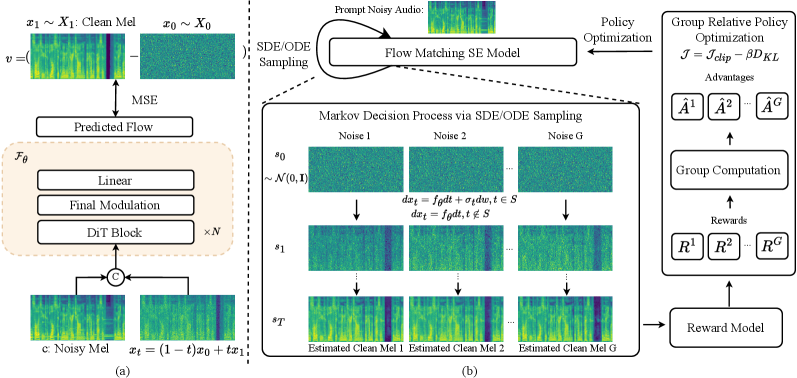
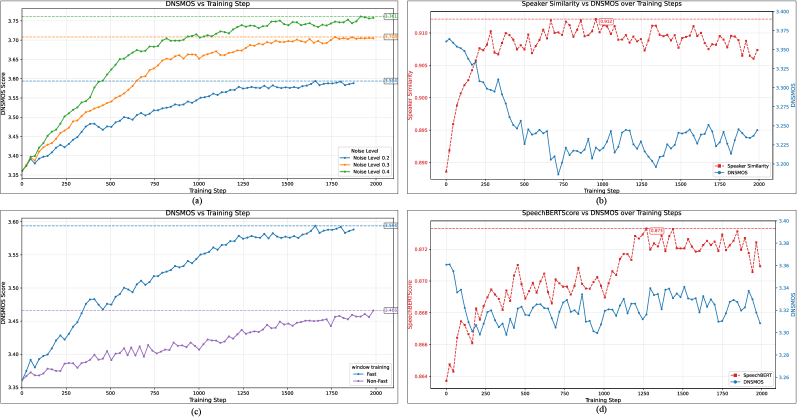
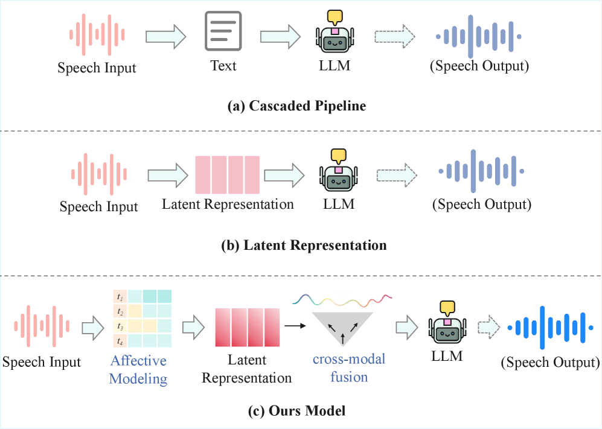
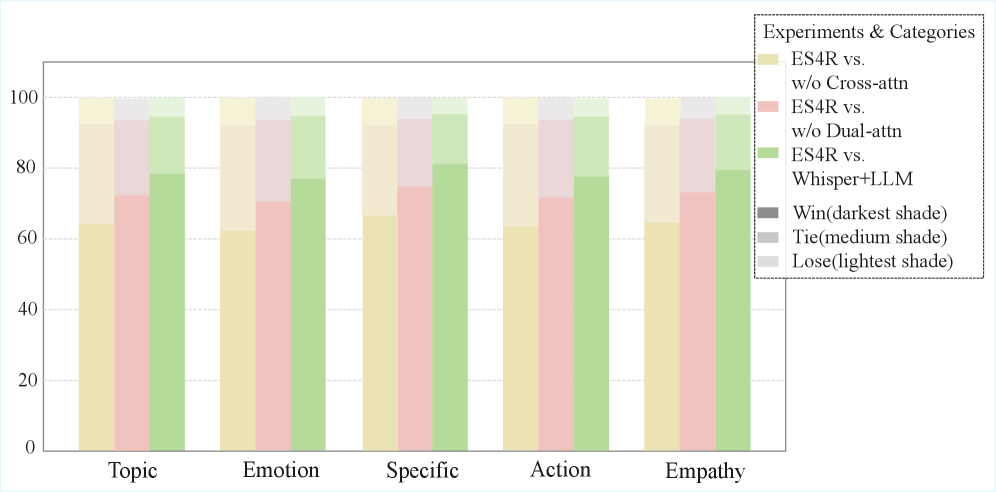
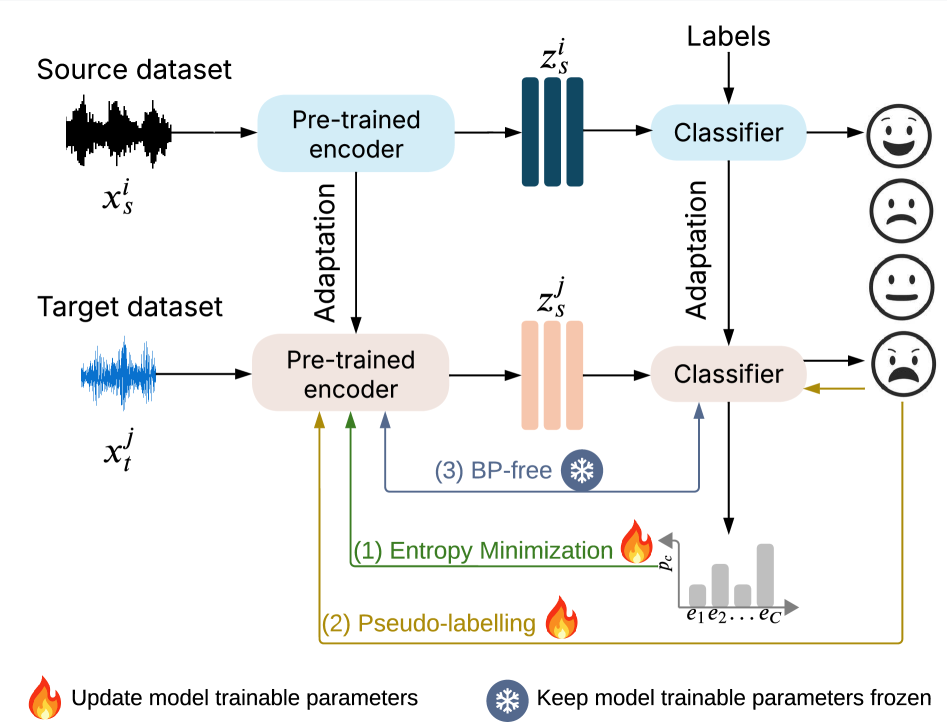
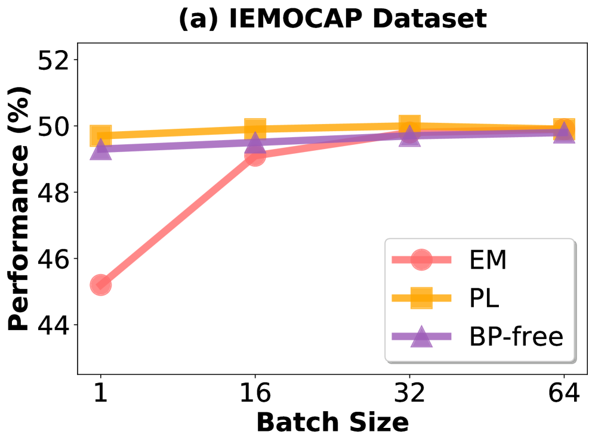
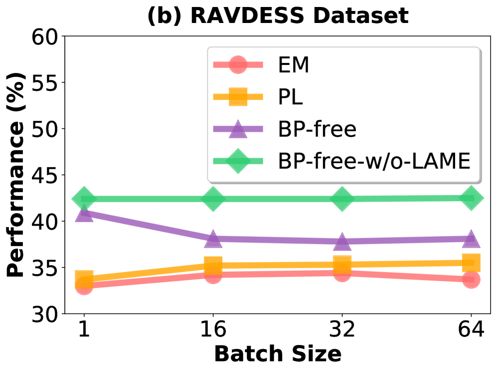
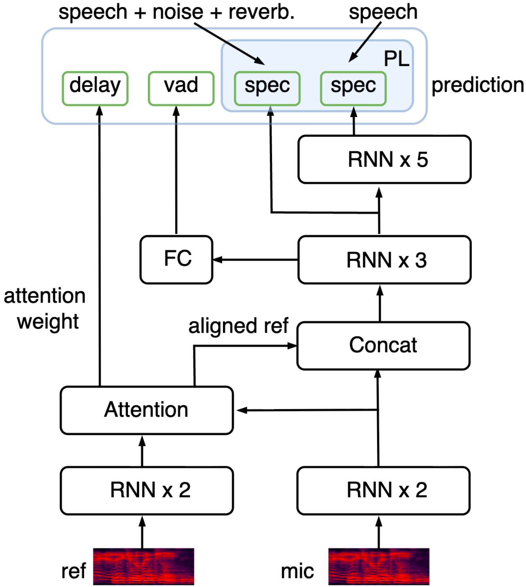
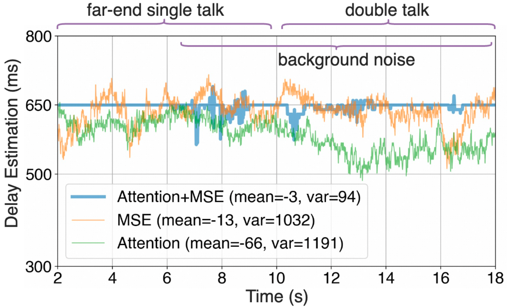
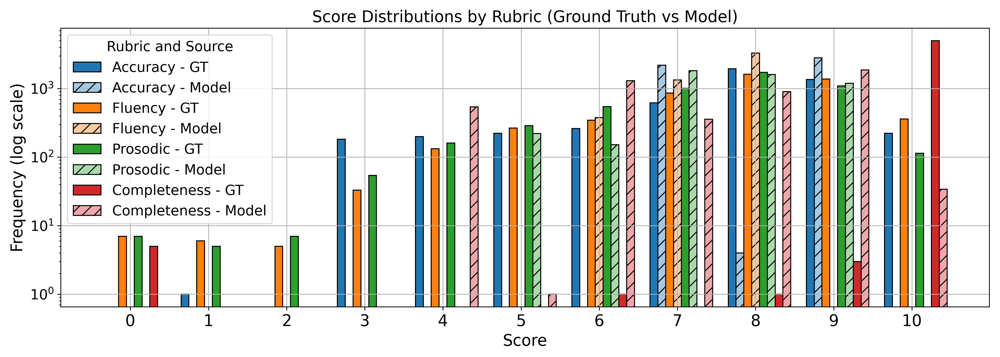

# 🚩 (2026-01-26) Scholar Inbox 추천 논문 

# 📚 FLOWSE-GRPO: TRAINING FLOW MATCHING SPEECH ENHANCEMENT VIA ONLINE REINFORCEMENT LEARNING

🚀 URL: https://arxiv.org/html/2601.16483

## 🌏 Abstract (원문)
Speech enhancement (SE) aims to estimate the original clean waveform from noisy audio, improving perceived quality and supporting downstream speech tasks. Past work mainly uses discriminative methods that predict the clean spectrum in the magnitude or complex domain to estimate an enhanced waveform[15,28]. Recently, generative SE has gained interest: borrowing from speech synthesis, these methods treat noisy audio as a conditioning input and model the distribution of clean speech, typically by maximizing the likelihood of the clean waveform[30,37,29].
Current generative SE approaches can be grouped roughly into two main categories: discrete token based and flow-matching based methods. Discrete token based methods use autoregressive (AR) or non‑autoregressive (NAR) schemes that predict clean audio discrete tokens (e.g., SELM[30], Genhancer[34], GenSE[35], LLaSE‑G1[8]). Some masked generative models (MGM) predict masked tokens conditioned on unmasked ones, such as MaskSR[12], AnyEnhance[37]. Flow-matching[14]methods operate on mel‑spectrograms or latent representations and use flow-matching to predict the velocity field that transports a standard Gaussian to the clean audio distribution[7,29].
Meanwhile, post‑training effectively aligns models to human perception and downstream objectives and is widely applied in generative domains, including language understanding[16], image generation[32], and speech synthesis[5,25]. It finetunes pretrained generative backbones using reinforcement learning (RL)‑style or preference‑alignment objectives to improve human‑centric metrics. For example,[5]applies differentiable optimization to CosyVoice2[3]’s Large Language Models (LLM) to improve intelligibility and emotional expressiveness; F5R‑TTS[25]uses Group Relative Policy Optimization (GRPO)[24]to reduce word error rate and improve speaker similarity.[38]uses the offline RL method Direct Preference Optimization (DPO)[18]to optimize the restoration metrics in speech restoration.
However,[38]still uses DPO, an off‑policy method. GRPO is an on‑policy algorithm that more effectively finetunes models and can optimize diverse metrics without offline generation of large numbers of win–lose pairs. Flow‑GRPO[13]first introduces online RL to flow‑matching models by converting the original Ordinary Differential Equation (ODE) trajectory into a Stochastic Differential Equation (SDE) to provide the stochasticity required by on‑policy RL, and demonstrates improved human‑perceptual metrics in image generation.
In this paper, we present the first successful integration of online GRPO into a flow‑matching SE framework, as an on‑policy RL post‑training procedure without modifying their original architectures (unlike F5R‑TTS[25]).
This online RL method can finetune the base model and improve perceptual quality and objective metrics such as DNSMOS[20], SpeechBERTScore[22], and speaker similarity. We systematically study GRPO training configurations for enhancement metrics and find that optimizing a single reward rapidly improves that metric but can induce reward hacking that degrades others; a multi‑metric reward mitigates this trade‑off. Overall, we validate on‑policy GRPO for speech enhancement and provide practical guidance for future post‑training of generative enhancement models.
## 🌏 Abstract (번역)
음성 향상(SE)은 잡음이 섞인 오디오에서 원래의 깨끗한 파형을 추정하여 인지 품질을 개선하고 하위 음성 작업을 지원하는 것을 목표로 합니다. 과거의 연구는 주로 크기 또는 복소 영역에서 깨끗한 스펙트럼을 예측하여 향상된 파형을 추정하는 판별적 방법을 사용해 왔습니다. 최근에는 음성 합성에서 영감을 얻은 생성적 SE가 관심을 끌고 있으며, 이러한 방법들은 잡음 섞인 오디오를 조건부 입력으로 취급하고 일반적으로 깨끗한 파형의 가능도를 최대화함으로써 깨끗한 음성의 분포를 모델링합니다. 현재의 생성적 SE 접근 방식은 크게 이산 토큰 기반 방법과 플로우 매칭(flow-matching) 기반 방법의 두 가지 범주로 나눌 수 있습니다. 이산 토큰 기반 방법은 깨끗한 오디오 이산 토큰을 예측하는 자기회귀(AR) 또는 비자기회귀(NAR) 체계를 사용합니다. 일부 마스크 생성 모델(MGM)은 마스킹되지 않은 토큰을 조건으로 마스킹된 토큰을 예측합니다. 플로우 매칭 방법은 멜-스펙트로그램 또는 잠재 표현에서 작동하며, 표준 가우시안을 깨끗한 오디오 분포로 이동시키는 속도장(velocity field)을 예측하기 위해 플로우 매칭을 사용합니다. 한편, 사후 학습(post-training)은 모델을 인간의 인지 및 하위 목표에 효과적으로 정렬하며 언어 이해, 이미지 생성, 음성 합성을 포함한 생성 영역에서 널리 적용되고 있습니다. 이는 인간 중심의 지표를 개선하기 위해 강화 학습(RL) 스타일 또는 선호도 정렬 목표를 사용하여 사전 학습된 생성 백본을 미세 조정합니다. 그러나 기존의 DPO와 같은 방법은 오프-폴리시(off-policy) 방식인 반면, GRPO는 모델을 더 효과적으로 미세 조정할 수 있는 온-폴리시(on-policy) 알고리즘입니다. 본 논문에서는 원래의 아키텍처를 수정하지 않고 온-폴리시 RL 사후 학습 절차로서 온라인 GRPO를 플로우 매칭 SE 프레임워크에 성공적으로 통합한 첫 번째 사례를 제시합니다. 이 온라인 RL 방법은 베이스 모델을 미세 조정하고 DNSMOS, SpeechBERTScore, 화자 유사성과 같은 인지 품질 및 객관적 지표를 개선할 수 있습니다. 우리는 단일 보상 최적화가 보상 해킹(reward hacking)을 유발할 수 있음을 발견하고, 다중 지표 보상을 통해 이러한 트레이드오프를 완화했습니다. 전반적으로, 우리는 음성 향상을 위한 온-폴리시 GRPO를 검증하고 향후 생성적 향상 모델의 사후 학습을 위한 실질적인 지침을 제공합니다.

## 🔍 Methods & Results
- 사전 학습된 HiFi-GAN 보코더와 DiT 백본을 결합한 플로우 매칭 기반 음성 향상 시스템 구축
- 결정론적 ODE 샘플러를 확률적 SDE 샘플러로 변환하여 온-폴리시 RL(GRPO)에 필요한 확률성 확보
- 학습 효율성 및 수렴 속도 향상을 위해 초기 단계의 일부 스텝에만 SDE 샘플링을 적용하는 윈도우 트레이닝(Window training) 기법 사용
- DNSMOS, 화자 유사성(Speaker Similarity), SpeechBERTScore를 보상 함수로 사용하여 모델을 직접 최적화
- 단일 지표 최적화 시 발생하는 보상 해킹 문제를 해결하기 위해 여러 지표를 가중 합산한 다중 지표 보상(Multi-metric reward) 체계 도입
- 실험 결과, 제안된 온라인 GRPO 사후 학습이 음성 향상 모델의 인지 품질 및 객관적 성능 지표를 유의미하게 개선함을 입증

## 🖼 Figures

*Fig. 1: (a) The structure of our Flow matching based speech enhancement model. (b) The pipeline of post-training using GRPO.*

*Fig. 2: (a) The DNSMOS vs training steps with different Noise Level. (b) The Speaker Similarity vs training steps. (c) Effect of window training. (d) The SpeechBERTScore vs training steps. All results are evaluated on the DNS2020 No Reverb test set.*

---
**Usage Info**: 6016 tokens used.
**Generated at**: 2026-02-24 20:32:13

---

# 📚 ES4R: Speech Encoding Based on Prepositive Affective Modeling for Empathetic Response Generation

🚀 URL: https://arxiv.org/html/2601.16225

## 🌏 Abstract (원문)
Empathetic Response Generation (ERG) aims to enhance dialogue system’s understanding of users’ emotions and produce appropriate responsesKeskin (2014); Wanget al.(2023). Early studies mainly focused on text-based empathetic generationCaoet al.(2025); Huangfuet al.(2025), yet in real–world interactions, users often express emotions naturally through multiple modalities. Recently, multimodal empathetic dialogue systems have gained increasing attentionZhanget al.(2025), integrating visionWuet al.(2025), speechWanget al.(2024), and text to enhance affective understanding. Among these modalities, speech plays a particularly important role. Beyond semantic information, it conveys rich affective and paralinguistic informationSchulleret al.(2013), such as prosody, speaking rate, rhythm and voice quality, that largely determine not only what is communicated but also how it is expressed. Meanwhile, many empathetic speech systems rely on explicit emotion annotations or discrete emotion categories for supervisionYanet al.(2024b), which is costlyWelivitaet al.(2021)and struggles to capture the continuous and subtle nature of emotionsRussell (1980). Therefore, effectively modeling and preserving affective information in speech is a core challenge for building high-fidelity empathetic dialogue systems. With the development of Speech Large Language Models (SLLMs)Wanget al.(2024,2025); Yanget al.(2025b); Cuiet al.(2025), current speech dialogue systems typically follow two paradigms for processing speech inputs, as shown in Fig.1. Specifically, (a)Cascaded pipeline: speech is first transcribed into text via automatic speech recognition (ASR) and then fed into a large language model (LLM) (e.g.,Huanget al.(2024); Shenet al.(2023)). This paradigm struggles to preserve affective information in acoustic information during transcription, thereby limiting the model’s ability to perceive the speaker’s true emotional state. (b)Latent representation: This methods employ speech encoders (e.g., WhisperRadfordet al.(2023), HuBERTHsuet al.(2021)) to convert raw speech into frame-level representations, which are subsequently aligned with LLM embeddings through modality adaptersHonoet al.(2024); Liet al.(2023b); Huet al.(2024b). However, by relying on general-purpose encoders and performing early compression of speech informationSchulleret al.(2011); Sainathet al.(2015)and only performing simple concatenation or alternating embedding of the context after encoding, they risk weakening affective and paralinguistic information critical for empathetic response generation. To address these issues, we proposeES4R(Empathetic Speech for Response), a framework for speech-based empathetic response generation. Our core insight is that speech affective information should be explicitly modeled before speech encoding, rather than being implicitly learned by the encoder. ES4R follows a three stage framework including empathetic understanding, empathetic generation, and speech synthesis. As shown in Fig.1(c), in the understanding stage, we construct structured affective context modeling on speech inputs prior to encoding them into latent representations. Specifically, intra-turn attention learns affective expression state of a single turn, while inter-turn attention models contextual affective dynamics, producing an enhanced affective context representations for subsequent modules. In the generation stage, the system performs speech-guided cross-modal fusion based on these representations to activate affective-relevant semantic information and generate appropriate empathetic textual responses. In the synthesis stage, the system leverages energy trajectory across the dialogue history and performs empathetic response strategy selection selection to dynamically adjust synthesis parameters, producing resonant speech replies. In summary, our main contributions are as follows: We propose ES4R, a framework for speech-based empathetic response generation that integrates empathetic understanding, generation, and speech synthesis, achieving holistic performance optimization from speech input to empathetic speech responses. We are the first to explicitly model structured affective context before speech encoding, capturing intra-turn affective states and inter-turn affective dynamics, thereby mitigating the weakening of affective information caused by early compression and post-encoding fusion. We conduct extensive experiments on theAvaMERGdataset, demonstrating the effectiveness and robustness of ES4R and showing that speech encoding based on prepositive affective modeling substantially improves empathetic understanding and response quality.
## 🌏 Abstract (번역)
공감적 응답 생성(ERG)은 대화 시스템이 사용자의 감정을 더 잘 이해하고 적절한 응답을 생성하도록 돕는 것을 목표로 합니다. 초기 연구들은 주로 텍스트 기반 공감 생성에 집중했으나, 실제 상호작용에서 사용자는 여러 모달리티를 통해 자연스럽게 감정을 표현합니다. 최근에는 시각, 음성, 텍스트를 통합하여 감정 이해를 높이는 멀티모달 공감 대화 시스템이 주목받고 있습니다. 특히 음성은 의미 정보 외에도 운율, 말하기 속도, 리듬, 음질과 같은 풍부한 감정적 및 준언어적 정보를 전달하며, 이는 메시지의 내용뿐만 아니라 표현 방식까지 결정하는 중요한 역할을 합니다. 그러나 기존의 많은 시스템은 비용이 많이 드는 명시적 감정 주석에 의존하거나, 음성을 텍스트로 변환하는 과정에서 감정 정보가 손실되는 문제, 혹은 범용 인코더의 조기 압축으로 인해 미묘한 감정 정보가 약화되는 한계를 보입니다. 본 논문에서는 이를 해결하기 위해 음성 기반 공감 응답 생성 프레임워크인 ES4R(Empathetic Speech for Response)을 제안합니다. 핵심 아이디어는 음성 감정 정보를 인코더가 암시적으로 학습하게 하는 대신, 음성 인코딩 전에 명시적으로 모델링하는 것입니다. ES4R은 공감적 이해, 공감적 생성, 음성 합성의 세 단계로 구성됩니다. 이해 단계에서는 음성 인코딩 전 턴 내부(intra-turn) 및 턴 간(inter-turn) 어텐션을 통해 구조화된 감정 문맥을 모델링합니다. 생성 단계에서는 음성 유도 교차 모달 융합을 통해 적절한 텍스트 응답을 생성하며, 합성 단계에서는 대화 이력의 에너지 궤적을 분석하여 공감 전략에 따라 합성 파라미터를 동적으로 조정합니다. AvaMERG 데이터셋을 이용한 실험 결과, ES4R은 전치 감정 모델링을 통해 공감적 이해와 응답 품질을 실질적으로 향상시킴을 입증했습니다.

## 🔍 Methods & Results
- 3단계 프레임워크 제안: 공감적 이해(Stage 1), 공감적 생성(Stage 2), 음성 합성(Stage 3)으로 구성됨.
- Stage 1 (이해): Whisper 특징 추출 후 Intra-Turn Attention으로 단일 턴의 감정을, Inter-Turn Attention으로 대화 문맥의 감정 역학을 인코딩 전 단계에서 명시적으로 모델링함.
- Stage 2 (생성): 음성 표현을 쿼리(Query)로 사용하는 Cross-Modal Attention을 통해 텍스트 의미 정보를 융합하고, PLoRA 및 KL 증류 손실을 활용해 LLM의 성능을 보존하며 학습함.
- Stage 3 (합성): 대화 이력의 평균 에너지 변화(Δe)를 분석하여 위로(comfort), 격려(encourage), 중립(neutral) 전략을 선택하고 StyleTTS2의 운율 파라미터를 동적으로 조정함.
- 에너지 역가중치(Inverse Energy Weighting) 메커니즘: 에너지가 낮은 턴(잠재적 부정적 감정)에 더 높은 가중치를 부여하여 공감 메모리를 강화함.
- 실험 결과: AvaMERG 데이터셋에서 ES4R 프레임워크가 기존의 계단식(Cascaded) 및 잠재 표현(Latent) 방식보다 공감적 이해도와 응답 품질 면에서 우수한 성능을 보임.

## 🖼 Figures

*Figure 1:Comparison of speech dialogue system architectures. (a) Cascaded pipeline through ASR. (b) End-to-end latent representations. (c) Ours model.*

*Figure 2:The overall framework of ES4R. Stage 1: Intra-Turn and Inter-Turn attention are used to prepositive affective modeling. Stage 2: Speech-guided cross-modal fusion is used for empathetic response generation. Stage 3: Energy-based strategy selection and style fusion are applied for speech synthesis.*

*Figure 3:This figure shows multi-dimensional quality assessment across different model configurations.*

---
**Usage Info**: 5929 tokens used.
**Generated at**: 2026-02-24 20:32:46

---

# 📚 PROST-LLM: Progressively Enhancing the Speech-to-Speech Translation Capability in LLMs

🚀 URL: https://arxiv.org/html/2601.16618

## 🌏 Abstract (원문)
Speech-to-Speech Translation (S2ST) bridges communication gaps between speakers of different languages. While Large Language Models (LLMs) have shown remarkable potential in diverse domains, their application in S2ST remains underexplored and hindered by the scarcity of paired S2ST data. Moreover, although preference optimization has proven effective for enhancing the performance of LLMs in Natural Language Processing (NLP) tasks, its potential for improving the S2ST performance of LLMs has not been studied. Conventional S2ST systems typically adopted cascaded pipelines, integrating Automatic Speech Recognition (ASR), Machine Translation (MT), and Text-to-Speech (TTS) synthesis. The first end-to-end approach Translatron and its improved version, Translatron2, employed a multi-objective task to train a sequence-to-sequence model. Recent studies have explored to use discrete speech representations as an intermediate representation of end-to-end S2ST, reducing computation, inference latency, and error accumulation. However, these methods often involve complex architectures and scale poorly. In contrast, LLM-based S2ST methods offer a simpler architecture and the ability to exploit multi-task and multi-modality correlations, but enabling LLMs to perform S2ST effectively with limited S2ST paired data remains an open challenge. Preference optimization (PO) is a common method for aligning the outputs of LLMs with human preferences, enabling performance enhancement even with limited data. Traditional preference optimization methods like RLHF align LLMs with user intent through human feedback, depending on costly human feedback. Recent offline approaches like DPO and SimPO have been introduced to reduce this requirement but rely on high-quality preference pairs. For example, research used marginal probabilities of answers as the reward to construct paired data for DPO training. However, how to construct the required preference data pairs for S2ST tasks remains under-investigated. In machine translation, back-translation translates text from the source language to the target language and then back to the source language. Findings from suggest that translation quality can be predicted via comparisons between original and back-translated text. Subsequent studies adopted back-translation with monolingual data to perform data augmentation, achieving higher translation accuracy. Inspired by this, we introduce back-translation to automatically assess the quality of model-generated translations, and use the resulting assessments to construct preference data pairs for PO in S2ST tasks, eliminating the need for human evaluation. In this paper, we present PROST-LLM (PROgressive-Speech-to-speechTranslation) to progressively enhance S2ST capability in LLMs. First, we fine-tune the pre-trained LLMs on the CVSS corpus with our designed tri-task learning (ASR, speech translation (S2T), S2ST) or chain of modality (text prediction preceding speech prediction) strategy to strengthen task understanding. The fine-tuned models are then used for self-sampling and back-translation evaluation to automatically construct preference pairs, which are subsequently used in preference optimization, eliminating the need for large scale paired data or costly human annotations. Our contributions include: We present the first framework to equip LLMs with S2ST capability via tri-task and chain-of-modality learning. As far as we know, we are the first to apply preference optimization to further enhance the S2ST capability of LLMs via back-translation-driven preference pairs construction. We utilize monolingual speech corpora to construct preference pairs, thereby reducing the reliance of LLMs on paired data for S2ST tasks. Experiments demonstrate that PROST-LLM reduces the BLEU gap between the end-to-end and cascaded S2ST system to 1.2, validating the effectiveness of PROST-LLM.
## 🌏 Abstract (번역)
음성 대 음성 번역(S2ST)은 서로 다른 언어를 사용하는 화자 간의 의사소통 격차를 해소합니다. 대규모 언어 모델(LLM)은 다양한 분야에서 놀라운 잠재력을 보여주었지만, S2ST 분야에서의 응용은 쌍을 이룬 S2ST 데이터의 부족으로 인해 여전히 충분히 탐구되지 않았습니다. 또한, 선호도 최적화(PO)가 자연어 처리(NLP) 작업에서 LLM의 성능을 향상시키는 데 효과적임이 입증되었음에도 불구하고, LLM의 S2ST 성능 개선을 위한 잠재력은 연구된 바 없습니다. 기존의 S2ST 시스템은 일반적으로 자동 음성 인식(ASR), 기계 번역(MT), 음성 합성(TTS)을 통합한 캐스케이드 파이프라인을 채택했습니다. 최초의 종단간(end-to-end) 방식인 Translatron과 그 개선판인 Translatron2는 시퀀스 투 시퀀스 모델을 훈련하기 위해 다중 목적 작업을 사용했습니다. 최근 연구들은 종단간 S2ST의 중간 표현으로 이산 음성 표현을 사용하여 계산량, 추론 지연 및 오류 누적을 줄이는 방안을 탐구했습니다. 그러나 이러한 방법들은 종종 복잡한 구조를 포함하며 확장성이 떨어집니다. 반면, LLM 기반 S2ST 방법은 더 단순한 구조와 다중 작업 및 다중 모달리티 상관관계를 활용할 수 있는 능력을 제공하지만, 제한된 S2ST 쌍 데이터로 LLM이 S2ST를 효과적으로 수행하게 하는 것은 여전히 해결해야 할 과제입니다. 선호도 최적화(PO)는 LLM의 출력을 인간의 선호도에 맞추는 일반적인 방법으로, 제한된 데이터에서도 성능 향상을 가능하게 합니다. RLHF와 같은 전통적인 선호도 최적화 방법은 인간의 피드백을 통해 LLM을 사용자의 의도에 맞추지만, 비용이 많이 드는 인간 피드백에 의존합니다. DPO 및 SimPO와 같은 최근의 오프라인 접근 방식은 이러한 요구 사항을 줄이기 위해 도입되었지만 고품질의 선호도 쌍에 의존합니다. 예를 들어, 일부 연구에서는 DPO 훈련을 위한 쌍 데이터를 구축하기 위해 답변의 한계 확률을 보상으로 사용했습니다. 그러나 S2ST 작업을 위해 필요한 선호도 데이터 쌍을 구축하는 방법은 여전히 미흡하게 연구된 상태입니다. 기계 번역에서 역번역(back-translation)은 텍스트를 소스 언어에서 타겟 언어로 번역한 다음 다시 소스 언어로 번역하는 과정입니다. 관련 연구에 따르면 번역 품질은 원본 텍스트와 역번역된 텍스트 간의 비교를 통해 예측될 수 있습니다. 이후 연구들은 단일 언어 데이터를 사용한 역번역을 채택하여 데이터 증강을 수행함으로써 더 높은 번역 정확도를 달성했습니다. 이에 영감을 받아, 본 논문에서는 모델이 생성한 번역의 품질을 자동으로 평가하기 위해 역번역을 도입하고, 그 결과로 얻은 평가를 사용하여 S2ST 작업의 PO를 위한 선호도 데이터 쌍을 구축함으로써 인간 평가의 필요성을 제거합니다. 본 논문에서는 LLM의 S2ST 능력을 점진적으로 향상시키기 위한 PROST-LLM(PROgressive-Speech-to-speechTranslation)을 제안합니다. 먼저, 설계된 tri-task 학습(ASR, S2T, S2ST) 또는 chain of modality(음성 예측에 앞선 텍스트 예측) 전략을 사용하여 CVSS 코퍼스에서 사전 훈련된 LLM을 미세 조정하여 작업 이해도를 강화합니다. 미세 조정된 모델은 자체 샘플링 및 역번역 평가에 사용되어 선호도 쌍을 자동으로 구축하며, 이는 이후 선호도 최적화에 사용되어 대규모 쌍 데이터나 비용이 많이 드는 인간 주석의 필요성을 제거합니다. 본 연구의 기여는 다음과 같습니다: tri-task 및 chain-of-modality 학습을 통해 LLM에 S2ST 기능을 부여하는 최초의 프레임워크를 제시합니다. 우리가 아는 한, 역번역 기반 선호도 쌍 구축을 통해 LLM의 S2ST 능력을 더욱 향상시키기 위해 선호도 최적화를 적용한 최초의 사례입니다. 단일 언어 음성 코퍼스를 활용하여 선호도 쌍을 구축함으로써 S2ST 작업을 위한 쌍 데이터에 대한 LLM의 의존도를 줄입니다. 실험 결과 PROST-LLM은 종단간 시스템과 캐스케이드 S2ST 시스템 간의 BLEU 격차를 1.2로 줄여 PROST-LLM의 효과를 입증했습니다.

## 🔍 Methods & Results
- PROST-LLM 프레임워크: 지도 미세 조정(SFT)과 선호도 최적화(PO)를 결합하여 LLM의 S2ST 능력을 점진적으로 향상시키는 3단계 프로세스 제안
- Tri-task 학습 전략: ASR, S2T, S2ST 작업을 동시에 학습하여 작업 간 지식 전이를 유도하고 음성 모달리티 이해도 강화
- Chain of Modality 전략: 모델이 타겟 텍스트를 먼저 생성한 후 이를 바탕으로 타겟 음성을 생성하도록 하여 생성의 안정성과 품질 개선
- 자동 선호도 데이터 구축: 모델이 생성한 번역 후보들을 다시 소스 언어로 역번역하고, 원본 음성과의 비교(WER, MCD, BLEU 등)를 통해 인간 개입 없이 선호도 쌍 생성
- DPO(Direct Preference Optimization) 적용: 구축된 선호도 쌍을 사용하여 모델이 고품질 번역을 선호하도록 최적화함으로써 성능 고도화
- 실험 결과: PROST-LLM은 종단간 S2ST 시스템과 기존 캐스케이드 시스템 간의 BLEU 점수 차이를 1.2까지 좁히는 우수한 성능을 입증

## 🖼 Figures

*Fig. 1:(a) Our PROST-LLM training system: (i) Step 1: Supervised fine-tuning (SFT) the LLM. (ii) Step 2: Based on the SFT LLM, we construct preference data pairs (e.g., 
(
𝑆
𝐴
,
𝑆
𝐵
1
,
𝑆
𝐵
2
)
) by comparing back-translated answer pairs 
𝑆
^
𝐴
1
,
𝑆
^
𝐴
2
 with the ground truth 
𝑆
𝐴
. (iii) Step 3: Preference optimizing the SFT LLM using the constructed preference data pairs. (b) The architecture of PROST-LLM in step 1.*

---
**Usage Info**: 4871 tokens used.
**Generated at**: 2026-02-24 20:33:29

---

# 📚 The CMU-AIST submission for the ICME 2025 Audio Encoder Challenge

🚀 URL: https://arxiv.org/html/2601.16273

## 🌏 Abstract (원문)
Self-supervised learning (SSL) has demonstrated remarkable success in numerous audio processing tasks. Recent models such as BEATs[6]and Dasheng[11]have pushed the state-of-the-art in tasks such as sound event detection[7], audio scene classification, and audio captioning[14]. In this challenge submission, we experiment with the BEATs model by expanding its pre-training corpus to include multiple datasets totaling 74,000 hours of audio spanning general audio, speech-centered, and music-centered data. We investigated the impact of data composition on model performance by comparing speech-heavy versus balanced sampling strategies from this comprehensive data pool. Our experiments with model ensembling reveal that simple upsampling and concatenation of embedding vectors effectively preserves the strengths of all constituent models. Our final system implements this ensembling approach, combining two distinct scaled-uplargeBEATs models, each trained on different data distributions (speech-heavy and balanced), with the Dasheng 1.2B model.
## 🌏 Abstract (번역)
자기 지도 학습(SSL)은 수많은 오디오 처리 작업에서 놀라운 성공을 거두었습니다. BEATs 및 Dasheng과 같은 최근 모델은 음향 이벤트 탐지, 오디오 장면 분류 및 오디오 캡셔닝과 같은 작업에서 최첨단 성능을 보여주었습니다. 본 챌린지 제출물에서 우리는 일반 오디오, 음성 중심 및 음악 중심 데이터를 포함하여 총 74,000시간의 오디오에 달하는 여러 데이터셋을 포함하도록 사전 학습 코퍼스를 확장하여 BEATs 모델을 실험했습니다. 우리는 이 포괄적인 데이터 풀에서 음성 중심 샘플링 전략과 균형 잡힌 샘플링 전략을 비교함으로써 데이터 구성이 모델 성능에 미치는 영향을 조사했습니다. 모델 앙상블 실험을 통해 임베딩 벡터의 단순한 업샘플링 및 연결이 모든 구성 모델의 강점을 효과적으로 보존한다는 것을 발견했습니다. 우리의 최종 시스템은 서로 다른 데이터 분포(음성 중심 및 균형)에서 학습된 두 개의 서로 다른 확장된 대형 BEATs 모델을 Dasheng 1.2B 모델과 결합하여 이 앙상블 접근 방식을 구현합니다.

## 🔍 Methods & Results
- BEATs 및 Dasheng 프레임워크를 기반으로 한 오디오 표현 학습 시스템 구축
- 기존 90M 파라미터의 BEATs 모델을 300M 파라미터 규모의 ViT-Large 아키텍처로 확장하여 구현
- 일반 오디오(10k), 음악(12k), 음성(52k)을 포함한 총 74,000시간의 대규모 다중 도메인 사전 학습 코퍼스 활용
- 음성 중심(70:15:15)과 균형 잡힌(40:30:30) 두 가지 데이터 혼합 비율을 사용하여 데이터 구성이 성능에 미치는 영향 분석
- 서로 다른 프레임 레이트와 임베딩 차원을 가진 모델들을 결합하기 위해 업샘플링 후 특징 축을 따라 연결(Concatenation)하는 앙상블 기법 적용
- 단순 평균화(Averaging) 방식보다 연결 방식이 다운스트림 네트워크에서 유연한 특징 선택이 가능하여 더 우수한 성능을 기록
- 두 개의 확장된 BEATs 모델과 Dasheng 1.2B 모델을 결합하여 최종 앙상블 시스템 구성

## 🖼 Figures
![Figure 1:Block diagram of the submitted system: we concatenate the output embedding feature vectors from three different systems. Two are based on the BEATs framework and one is the pre-trained Dasheng 1.2B model. We upsample the Dasheng embedding sequence to match the count of embeddings from the BEATs models and concatenate the outputs of the three models. The BEATs models are scaled up to 300M parameter and trained on different pre-training mixtures (speech heavy and balanced) from a 74 k hour data pool.](../images/2026-01-26/2601.16273/2601.16273_fig0.png)
*Figure 1:Block diagram of the submitted system: we concatenate the output embedding feature vectors from three different systems. Two are based on the BEATs framework and one is the pre-trained Dasheng 1.2B model. We upsample the Dasheng embedding sequence to match the count of embeddings from the BEATs models and concatenate the outputs of the three models. The BEATs models are scaled up to 300M parameter and trained on different pre-training mixtures (speech heavy and balanced) from a 74 k hour data pool.*

---
**Usage Info**: 3864 tokens used.
**Generated at**: 2026-02-24 20:34:37

---

# 📚 Test Time Adaptation for Speech Emotion Recognition

🚀 URL: https://arxiv.org/html/2601.16240

## 🌏 Abstract (원문)
Emotions are fundamental to human communication, making automatic speech emotion recognition (SER) essential for improving human-computer interaction and health prediction systems[25]. Research on SER has shown significant promise in both identifying specific emotional states and tracking dynamic emotional changes over time[24]. However, SER performance generally deteriorates when there is a significant domain distribution shift between training and test data, a common challenge in real-world scenarios. For instance, differences in recording devices and data collection procedures can cause substantial variations in speech recordings, leading to distributional changes that negatively impact SER effectiveness[9]. Moreover, SER faces unique distributional challenges compared to other speech-related tasks. Specifically, individuals express emotions differently due to factors such as cultural background and personality, resulting in variability across speakers[27]. This variability causes distribution shifts that hinder SER systems from generalizing to unseen individuals. Furthermore, limitations in data collection often necessitate the use of both acted and natural emotional speech datasets when training machine learning models[5]. However, these two types of data exhibit distinct characteristics, introducing additional distributional shifts between them[12]. Therefore, models trained on one type of dataset typically fail to generalize to the other. Addressing these challenges is crucial to making SER systems more reliable, adaptive, and user-friendly when faced with diverse and unpredictable real-world conditions. Domain adaptation methods[14,1]have been widely studied to address such shifts. However, unsupervised domain adaptation typically requires access to source domain data, which is often impractical due to privacy and data-sharing concerns[26]. On the other hand, supervised domain adaptation relies on labeled data from the target domain, which is usually unavailable at the test time[20]. To address these challenges,test-time adaptation(TTA) offers a compelling alternative, which adapts source model at inference time using only unlabeled target data, without access to source data or target labels. Current TTA methods have demonstrated strong potential in image classification and are increasingly being investigated in automatic speech recognition (ASR). These methods generally fall into three categories.Entropy-minimization approaches(e.g., TENT[29], EATA[22], SAR[23]) adapt models by reducing the prediction uncertainty, encouraging more confident decisions on the target data through backpropagation.Pseudo-labeling approaches(e.g., CoTTA[30], AWMC[13]) generate pseudo-labels, i.e., predicted class labels, for the target data, and use these labels as targets to iteratively refine the model, promoting consistency on the target domain.Backpropagation-free methods(BP-free) such as T3A[11], FOA[21], LAME[4], E-BATS[8]avoid updating model weights with gradients. Instead, they employ forward-only strategies such as recalibrating the classifier head, or using prompt-based mechanisms to adapt to new domains. However, the effectiveness of TTA methods in addressing specific distributional shifts in SER such as the discrepancies between acted and natural emotions, remains underexplored. To address this gap, we present the first systematic evaluation and comparison of how TTA methods adapt to a range of distributional shifts in SER. We design three representative and challenging SER tasks: (i) intra-corpus personalization, adapting a universal model to unseen individuals; (ii) acted-to-natural adaptation, transferring from acted to more naturalistic emotional speech; and (iii) cross-corpus adaptation, transferring between different databases collected under distinct conditions. We evaluate 11 TTA methods spanning entropy-minimization, pseudo-labeling, and backpropagation-free approaches, and evaluated the performance across two commonly used emotion databases. The contributions are summarized as follows: We present thefirst comprehensive TTA evaluation for SER, laying the foundation for the development of improved adaptation techniques across diverse SER tasks. We demonstrated thatbackpropagation-free methods are the most promisingamong three categories, while the most effective specific TTA method still varies across tasks. The effectiveness of TTA methods applied with SER isbounded by type and severity of domain shifts.
## 🌏 Abstract (번역)
감정은 인간 의사소통의 근간이며, 자동 음성 감정 인식(SER)은 인간-컴퓨터 상호작용 및 건강 예측 시스템 개선에 필수적입니다. SER 연구는 특정 감정 상태 식별과 시간에 따른 동적 감정 변화 추적 모두에서 큰 가능성을 보여주었습니다. 그러나 훈련 데이터와 테스트 데이터 사이에 상당한 도메인 분포 변화가 있을 때 SER 성능은 일반적으로 저하되며, 이는 실제 시나리오에서 흔히 발생하는 문제입니다. 예를 들어, 녹음 장치 및 데이터 수집 절차의 차이는 음성 녹음에 상당한 변동을 일으켜 SER 효과에 부정적인 영향을 미치는 분포 변화로 이어질 수 있습니다. 또한 SER은 다른 음성 관련 작업에 비해 독특한 분포적 과제에 직면합니다. 구체적으로, 개인은 문화적 배경과 성격 등의 요인으로 인해 감정을 다르게 표현하며, 이는 화자 간의 변동성을 초래합니다. 이러한 변동성은 SER 시스템이 보지 못한 개인에게 일반화되는 것을 방해하는 분포 변화를 일으킵니다. 더욱이, 데이터 수집의 한계로 인해 머신러닝 모델을 훈련할 때 연기된 감정 음성 데이터셋과 자연스러운 감정 음성 데이터셋을 모두 사용해야 하는 경우가 많습니다. 그러나 이 두 유형의 데이터는 서로 다른 특성을 나타내며 추가적인 분포 변화를 유도합니다. 따라서 한 유형의 데이터셋으로 훈련된 모델은 일반적으로 다른 유형으로 일반화하는 데 실패합니다. 이러한 과제를 해결하는 것은 다양한 예측 불가능한 실제 조건에서 SER 시스템을 더 신뢰할 수 있고 적응 가능하며 사용자 친화적으로 만드는 데 중요합니다. 도메인 적응 방법은 이러한 변화를 해결하기 위해 널리 연구되어 왔습니다. 그러나 비지도 도메인 적응은 일반적으로 소스 도메인 데이터에 대한 접근이 필요하며, 이는 개인정보 보호 및 데이터 공유 문제로 인해 비실용적인 경우가 많습니다. 반면, 지도 도메인 적응은 타겟 도메인의 레이블이 지정된 데이터에 의존하며, 이는 테스트 시점에 일반적으로 사용할 수 없습니다. 이러한 문제를 해결하기 위해 테스트 시점 적응(TTA)은 소스 데이터나 타겟 레이블에 대한 접근 없이 추론 시점에 레이블이 없는 타겟 데이터만을 사용하여 소스 모델을 적응시키는 매력적인 대안을 제공합니다. 현재 TTA 방법은 이미지 분류에서 강력한 잠재력을 입증했으며 자동 음성 인식(ASR)에서도 점점 더 연구되고 있습니다. 이러한 방법은 일반적으로 엔트로피 최소화 접근법, 의사 레이블링 접근법, 역전파 없는(BP-free) 방법의 세 가지 범주로 나뉩니다. 그러나 연기된 감정과 자연스러운 감정 사이의 불일치와 같은 SER의 특정 분포 변화를 해결하는 데 있어 TTA 방법의 효과는 아직 충분히 탐구되지 않았습니다. 이 격차를 해소하기 위해, 본 논문에서는 TTA 방법이 SER의 다양한 분포 변화에 어떻게 적응하는지에 대한 최초의 체계적인 평가 및 비교를 제시합니다. 우리는 세 가지 대표적이고 도전적인 SER 작업을 설계했습니다: (i) 범용 모델을 보지 못한 개인에게 적응시키는 코퍼스 내 개인화, (ii) 연기된 감정에서 더 자연스러운 감정 음성으로 전이하는 연기-자연 전이, (iii) 서로 다른 조건에서 수집된 데이터베이스 간의 교차 코퍼스 적응입니다. 우리는 엔트로피 최소화, 의사 레이블링, 역전파 없는 접근 방식을 아우르는 11가지 TTA 방법을 평가하고 두 개의 일반적인 감정 데이터베이스에서 성능을 평가했습니다. 기여도는 다음과 같이 요약됩니다: SER에 대한 최초의 포괄적인 TTA 평가를 제시하여 다양한 SER 작업에 걸친 개선된 적응 기술 개발의 토대를 마련했습니다. 세 가지 범주 중 역전파 없는 방법이 가장 유망함을 입증했지만, 가장 효과적인 특정 TTA 방법은 작업에 따라 여전히 다릅니다. SER에 적용된 TTA 방법의 효과는 도메인 변화의 유형과 심각도에 의해 제한됩니다.

## 🔍 Methods & Results
- TTA Evaluation Pipeline: Uses a pre-trained encoder to generate latent embeddings and a classifier for emotion categorization, updating parameters on-the-fly using unlabeled target data.
- Entropy-minimization: Reduces prediction uncertainty by minimizing entropy during inference, encouraging more confident class assignments.
- Pseudo-labeling: Employs a main model and an anchor model (updated via Exponential Moving Average) to enforce prediction consistency using self-generated labels.
- Backpropagation-free (BP-free) Methods: Includes classifier head recalibration (T3A), Maximum-Likelihood Estimation (MLE) correction (LAME), and forward-only prompt tuning (FOA) to adapt without gradient computation.
- Experimental Tasks: Evaluated on intra-corpus personalization, acted-to-natural adaptation, and cross-corpus adaptation across two emotion databases.
- Key Result: Backpropagation-free methods were found to be the most promising category for SER tasks.
- Key Result: The effectiveness of specific TTA methods varies by task and is bounded by the type and severity of the domain shift.

## 🖼 Figures

*Fig. 1:TTA evaluation for SER. The source model is adapted to the target dataset using only unlabeled speech data.*

*Fig. 2:Category average accuracy with different batch size for Task 3 (a) IEMOCAP and (b) RAVDESS.*

*Figure 3*

*Figure 4*

---
**Usage Info**: 5939 tokens used.
**Generated at**: 2026-02-24 20:37:06

---

# 📚 E2E-AEC: IMPLEMENTING AN END-TO-END NEURAL NETWORK LEARNING APPROACH FOR ACOUSTIC ECHO CANCELLATION

🚀 URL: https://arxiv.org/html/2601.16774

## 🌏 Abstract (원문)
Acoustic echo cancellation (AEC) is a crucial technology in voice interaction systems, addressing the significant challenge of eliminating acoustic feedback to ensure high-quality audio communication. Traditionally, AEC systems relied on digital signal processing methods, typically starting with time delay estimation (TDE) to align microphone and far-end reference signals in the presence of latency. Following this alignment, adaptive filters, such as those based on the normalized least mean square (NLMS) algorithm or its variants, were employed to estimate and cancel echo. These methods, referred to as linear AEC (LAEC), proved effective under stable linear conditions. However, they struggled to perform adequately when echo paths were time-varying or non-linear, leading to either leakage of echo or suppression of the near-end talker. In recent years, hybrid systems that combine traditional methods with neural networks (NN) have been widely explored. In such systems, LAEC is typically employed for preliminary echo cancellation, with NN subsequently addressing residual echo suppression. Recently, some efforts have been made to develop end-to-end (E2E) NN methods that bypass TDE and LAEC. A major challenge for these E2E approaches is the absence of TDE algorithms, which may lead to severe performance degradation in scenarios with large time delays, requiring the model to learn alignment internally. Despite these advancements, hybrid systems remain predominant in industrial applications due to their robustness and reliability. To further advance E2E methods toward real-world deployment, we propose a novel neural network-based E2E-AEC framework. This framework integrates an optimized progressive learning (PL) to jointly tackle noise reduction and echo cancellation. Our model is initialized using a pre-trained LAEC-based NN, enabling effective knowledge transfer from a hybrid AEC system. In addition, we employ an improved attention mechanism guided by loss functions for precise time alignment. Finally, we utilize a loss function for near-end speech voice activity detection (VAD), which could enhance speech quality while enabling strategic masking of far-end echo during near-end silence. Overall, this research highlights the potential of E2E approaches and contributes to advancing this challenging field.
## 🌏 Abstract (번역)
음향 에코 제거(AEC)는 음성 상호작용 시스템에서 고품질 오디오 통신을 보장하기 위해 음향 피드백을 제거하는 중요한 기술입니다. 전통적으로 AEC 시스템은 지연 시간이 존재하는 상황에서 마이크와 원격지 참조 신호를 정렬하기 위해 시간 지연 추정(TDE)으로 시작하는 디지털 신호 처리 방법에 의존해 왔습니다. 이러한 정렬 이후에는 정규화된 최소 평균 제곱(NLMS) 알고리즘 또는 그 변형에 기반한 적응형 필터를 사용하여 에코를 추정하고 제거했습니다. 선형 AEC(LAEC)로 불리는 이러한 방법들은 안정적인 선형 조건에서는 효과적이었으나, 에코 경로가 시간에 따라 변하거나 비선형적일 때는 에코 누출이나 근단 화자 억제 문제로 인해 적절히 성능을 발휘하지 못했습니다. 최근에는 전통적인 방법과 신경망(NN)을 결합한 하이브리드 시스템이 널리 탐구되고 있습니다. 이러한 시스템에서 LAEC는 일반적으로 예비 에코 제거에 사용되며, 이후 NN이 잔류 에코 억제를 처리합니다. 최근에는 TDE와 LAEC를 우회하는 엔드투엔드(E2E) NN 방법들을 개발하려는 노력이 이루어지고 있습니다. 이러한 E2E 접근 방식의 주요 과제는 TDE 알고리즘의 부재로 인해 큰 시간 지연이 발생하는 시나리오에서 성능이 심각하게 저하될 수 있다는 점이며, 이는 모델이 내부적으로 정렬을 학습해야 함을 의미합니다. 이러한 발전에도 불구하고, 하이브리드 시스템은 견고성과 신뢰성 덕분에 산업 응용 분야에서 여전히 지배적입니다. E2E 방법을 실제 배포 수준으로 발전시키기 위해, 본 논문에서는 새로운 신경망 기반 E2E-AEC 프레임워크를 제안합니다. 이 프레임워크는 노이즈 감소와 에코 제거를 공동으로 해결하기 위해 최적화된 점진적 학습(PL)을 통합합니다. 제안된 모델은 사전 학습된 LAEC 기반 NN을 사용하여 초기화되므로 하이브리드 AEC 시스템으로부터 효과적인 지식 전송이 가능합니다. 또한, 정밀한 시간 정렬을 위해 손실 함수에 의해 유도되는 개선된 어텐션 메커니즘을 채택합니다. 마지막으로, 근단 음성 활동 감지(VAD)를 위한 손실 함수를 활용하여 음성 품질을 향상시키는 동시에 근단 묵음 구간 동안 원격지 에코를 전략적으로 마스킹할 수 있게 합니다. 전반적으로 본 연구는 E2E 접근 방식의 잠재력을 강조하고 이 도전적인 분야의 발전에 기여합니다.

## 🔍 Methods & Results
- Proposed an E2E-AEC model using STFT features and RNN blocks (GRU) based on TF-GridNet design to capture full-band and sub-band dependencies.
- Integrated a two-stage Progressive Learning (PL) framework: Stage 1 focuses on removing dominant echo, while Stage 2 eliminates residual echo, background noise, and reverberation.
- Utilized Transfer Learning by initializing the E2E model with parameters from a pre-trained LAEC-based hybrid system to leverage existing knowledge.
- Introduced an improved Attention Mechanism for dynamic time alignment, supervised by explicit loss functions (MSE or Cross-Entropy) on attention weights to improve TDE performance.
- Incorporated a Near-end Voice Activity Detection (VAD) module to enhance speech quality and enable strategic masking of far-end echo during near-end silence.
- The model consists of 1.2M parameters and supports streaming inference through the use of uni-directional GRU layers.
- The overall loss function combines spectrum estimation loss (modulation and SNR loss), VAD prediction loss, and delay prediction loss.

## 🖼 Figures

*Fig. 1:Figure 1. E2E-AEC system overview. The outputs include: delay (time delay estimation), vad (near-end speech VAD), and spec (spectrum estimations of different PL stages).*

*Fig. 2:Figure 2. TDE results for a sample (ground truth delay: 650 ms ). Mean and variance are computed based on the difference between predictions and ground truth.*

---
**Usage Info**: 4830 tokens used.
**Generated at**: 2026-02-24 20:37:41

---

# 📚 Zero-Shot Speech LLMs for Multi-Aspect Evaluation of L2 Speech: Challenges and Opportunities

🚀 URL: https://arxiv.org/html/2601.16230

## 🌏 Abstract (원문)
Globalization has increased cross-border movement for work, education, and other opportunities, making local language acquisition vital for integration, career growth, and well-being. Beyond vocabulary and grammar, clear pronunciation is crucial for intelligibility, confidence, and meaningful interaction. Poor pronunciation can hinder communication and create barriers in academic and professional contexts. However, the pronunciation of second-language (L2) is difficult to master due to differences from the mother tongue (L1) and a lack of tools for personalized feedback. Computer-Assisted Language Learning (CALL), particularly Computer-Assisted Pronunciation Training (CAPT), has become essential in language education in the past years. These tools offer scalable, cost-effective, and consistent pronunciation feedback, addressing the limitations of human evaluation. Traditional CAPT systems use phoneme-level scoring methods like Goodness of Pronunciation (GOP), which assess individual sounds for correctness. However, they often fail to address sentence-level fluency, prosody, and completeness, and typically do not provide corrective feedback to learners. Recent advancements in Large Language Models (LLMs) have significantly transformed the landscape of natural language processing. While LLMs have demonstrated outstanding performance in text-based tasks, there is growing interest in extending their capabilities to handle other modalities, such as speech. Typically, these speech LLMs integrate pre-trained speech encoders with text-based LLMs via projection layers that align feature dimensions across modalities. While LLMs are widely used in writing assessment, their application to spoken language assessment is still emerging. Previous work explored text-only models like ChatGPT for pronunciation feedback. To overcome the limitations of text-only models, multimodal LLMs like GPT-4o have been developed to process raw audio input. These models assess pronunciation across dimensions such as accuracy, fluency, prosody, and sentence completeness, and generate context-aware feedback. Recent studies introduced Audio-Text Prompt LLMs using wav2vec2 encoders and LLaMA2 decoders, enhancing performance by embedding mispronunciations into prompts. Models like Qwen-Audio, extensively trained on both supervised and unsupervised speech data at a large scale, followed by instruction tuning, have shown good results in speech tasks such as ASR, translation, audio captioning, and spoken question answering. Building on recent advances in audio-text prompt-based language models, we examine the potential of the Qwen-Audio-Instruct model for spoken language assessment. We adopt the term multi-aspect to refer to the simultaneous evaluation of multiple dimensions of speech performance, i.e., accuracy, fluency, prosody, and sentence completeness, rather than focusing solely on phoneme-level correctness. To the best of our knowledge, this is the first work that evaluates an instruction-tuned, speech LLM in a zero-shot setting for multi-aspect pronunciation assessment using rubric-based scoring. The model combines a powerful audio encoder with an instruction-tuned decoder, making it a strong candidate for the holistic evaluation of L2 speech. In this work, we explicitly ask the following research question: To what extent can the Qwen-Audio-Instruct model perform multi-aspect spoken language assessment, covering accuracy, fluency, prosody, and sentence completeness, and generate rubric-aligned scores in a zero-shot setting?
## 🌏 Abstract (번역)
세계화로 인해 업무, 교육 및 기타 기회를 위한 국경 간 이동이 증가함에 따라 현지 언어 습득은 통합, 경력 성장 및 웰빙에 필수적인 요소가 되었습니다. 어휘와 문법을 넘어 명확한 발음은 이해도, 자신감 및 의미 있는 상호작용을 위해 매우 중요합니다. 서툰 발음은 의사소통을 방해하고 학술 및 전문적 맥락에서 장벽을 형성할 수 있습니다. 그러나 제2외국어(L2) 발음은 모국어(L1)와의 차이와 개인화된 피드백 도구의 부족으로 인해 마스터하기 어렵습니다. 컴퓨터 보조 언어 학습(CALL), 특히 컴퓨터 보조 발음 교육(CAPT)은 지난 몇 년 동안 언어 교육에서 필수적인 도구가 되었습니다. 이러한 도구들은 인간 평가의 한계를 해결하며 확장 가능하고 비용 효율적이며 일관된 발음 피드백을 제공합니다. 전통적인 CAPT 시스템은 개별 소리의 정확성을 평가하는 GOP(Goodness of Pronunciation)와 같은 음소 수준의 점수 산정 방식을 사용하지만, 문장 수준의 유창성, 운율 및 완결성을 다루지 못하며 학습자에게 교정 피드백을 제공하지 못하는 경우가 많습니다. 최근 대규모 언어 모델(LLM)의 발전은 자연어 처리 분야를 크게 변화시켰습니다. LLM이 텍스트 기반 작업에서 뛰어난 성능을 보여주는 가운데, 음성과 같은 다른 모달리티를 처리할 수 있도록 능력을 확장하는 데 관심이 높아지고 있습니다. 일반적으로 이러한 음성 LLM은 투영 레이어를 통해 사전 학습된 음성 인코더와 텍스트 기반 LLM을 통합하여 모달리티 간의 특징 차원을 정렬합니다. LLM은 작문 평가에 널리 사용되지만, 구어 평가에 대한 적용은 여전히 초기 단계입니다. 이전 연구에서는 발음 피드백을 위해 ChatGPT와 같은 텍스트 전용 모델을 탐구했습니다. 텍스트 전용 모델의 한계를 극복하기 위해 원시 오디오 입력을 처리할 수 있는 GPT-4o와 같은 멀티모달 LLM이 개발되었습니다. 이러한 모델은 정확성, 유창성, 운율 및 문장 완결성과 같은 차원에서 발음을 평가하고 문맥 인식 피드백을 생성합니다. 최근 연구에서는 wav2vec2 인코더와 LLaMA2 디코더를 사용하는 오디오-텍스트 프롬프트 LLM을 도입하여 오발음을 프롬프트에 포함함으로써 성능을 향상시켰습니다. 대규모 지도 및 비지도 음성 데이터로 광범위하게 학습된 후 지시어 튜닝을 거친 Qwen-Audio와 같은 모델은 ASR, 번역, 오디오 캡셔닝 및 구어 질의응답과 같은 음성 작업에서 좋은 결과를 보여주었습니다. 오디오-텍스트 프롬프트 기반 언어 모델의 최근 발전을 바탕으로, 본 연구에서는 구어 평가를 위한 Qwen-Audio-Instruct 모델의 잠재력을 조사합니다. 우리는 음소 수준의 정확성에만 집중하는 대신 정확성, 유창성, 운율 및 문장 완결성 등 음성 성능의 여러 차원을 동시에 평가하는 것을 '다각적(multi-aspect)'이라는 용어로 정의합니다. 우리가 아는 한, 본 연구는 루브릭 기반 점수 산정을 사용하여 다각적 발음 평가를 위한 제로샷 설정에서 지시어 튜닝된 음성 LLM을 평가하는 첫 번째 사례입니다. 이 모델은 강력한 오디오 인코더와 지시어 튜닝된 디코더를 결합하여 L2 음성의 종합적인 평가를 위한 강력한 후보가 됩니다. 본 연구에서는 Qwen-Audio-Instruct 모델이 제로샷 설정에서 정확성, 유창성, 운율 및 문장 완결성을 포괄하는 다각적 구어 평가를 어느 정도 수행할 수 있는지, 그리고 루브릭에 맞춘 점수를 생성할 수 있는지를 명시적으로 질문합니다.

## 🔍 Methods & Results
- Qwen2-Audio-7B-Instruct 모델을 사용하여 제로샷(Zero-shot) 설정에서 다각적 구어 평가 성능을 측정함.
- Whisper-large-v3 기반 음성 인코더와 Qwen-7B 기반 텍스트 디코더가 통합된 멀티모달 LLM 구조를 활용함.
- 중국어권 영어 학습자의 발화 5,000개가 포함된 Speechocean762 데이터셋을 벤치마크로 사용함.
- 문장 수준에서 정확성(Accuracy), 유창성(Fluency), 운율(Prosody), 완결성(Completeness)의 4가지 루브릭을 0-10점 척도로 평가함.
- 오디오와 참조 텍스트를 동시에 포함하는 멀티모달 프롬프트를 통해 모델이 발음을 종합적으로 평가하도록 설계함.
- 정규 표현식 기반 파서를 사용하여 모델이 생성한 JSON 형식의 응답에서 점수를 추출하고 인간 전문가의 점수(Ground Truth)와 비교함.
- 모델이 별도의 미세 조정 없이도 루브릭 지침을 따라 다각적인 발음 평가 점수를 생성할 수 있음을 검증함.

## 🖼 Figures

*Figure 1:Score distributions for GT and model predictions across all rubrics. GT bars are solid and opaque, while model predictions use lighter colors with striped hatch patterns. Each rubric is shown using a distinct color with grouped bars.*

---
**Usage Info**: 5250 tokens used.
**Generated at**: 2026-02-24 20:38:45

---

