# 🚩 (2026-01-27) Scholar Inbox 추천 논문 

# 📚 OneVoice: One Model, Triple Scenarios—Towards Unified Zero-shot Voice Conversion

🚀 URL: https://arxiv.org/html/2601.18094

## 🌏 Abstract (원문)
Voice Conversion (VC) aims to convert the speaker timbre of a source speech while preserving its core content, i.e., linguistic information and prosodic features. This technology exhibits broad application value in human-computer interaction, entertainment, and privacy protection. In recent years, VC technology has made notable progress: it can handle arbitrary input speech and achieve zero-shot capability to any target speaker, pushing the boundaries towards generalized voice conversion. However, challenges remain in processing diverse real-world speech, of which the focus of ‘content’ is shifting from semantic-driven neutral reading, to expressive and emotional dubbing, and further to melody-guided singing performance. This shift raises a fundamental challenge in current VC research: how to understand and convert the multi-scenario core information within a unified framework, encompassing linguistic content, para-linguistic expressivity, and singing melody. This unified perspective is a crucial step toward generalized VC, and this work focused on the unified zero-shot VC paradigm. To meet diverse demands, current VC research has formed fragmented task paradigms, developing specialized models for distinct scenarios. Most existing works focus on the general Linguistic-preserving VC (LVC), decoupling speech into linguistic content and speaker timbre for high speaker similarity and linguistic integrity. Another line of research emphasizes Expressive VC (EVC), prioritizing the capturing of source prosodic information that captures diverse speaking styles and emotions. In contrast, Singing VC (SVC) ensures the converted result adheres to a given melodic contour. This fragmentation stems from the lack of a unified perspective to define which information should be ‘preserved’ or ‘ignored’ during conversion. Although recent studies have attempted to construct unified systems by selecting unified features to encompass cross-scenario information, the overlooking of intrinsic differences in the unified representation and model design may cause inter-scenario interference, which can lead to performance degradation. To avoid such interference and achieve unification with a unified perspective, several core challenges must be jointly considered: Modeling inter-scenario commonalities and differences, learning from highly imbalanced data, and maintaining efficiency without sacrificing fidelity. To address these challenges, we propose OneVoice, a unified VC framework built upon a continuous LM integrated with a Mixture-of-Experts (MoE) structure. OneVoice achieves zero‑shot capability across all three scenarios: LVC, EVC, and SVC. To balance modeling efficiency with generation quality, OneVoice is realized as a continuous LM trained with next-patch diffusion objective without the need for additional VAE tokenization. For unification, the core design of OneVoice explicitly models ‘shared’ and ‘specialized’ knowledge via dynamic expert routing: shared experts capture fundamental conversion abilities, while domain experts enhance scenario-aware expressivity. Extensive experiments show that OneVoice matches or surpasses task-specific models across all three scenarios, confirming its effectiveness.
## 🌏 Abstract (번역)
음성 변환(VC)은 소스 음성의 핵심 내용인 언어 정보와 운율적 특징을 보존하면서 화자의 음색을 변환하는 것을 목표로 합니다. 이 기술은 인간-컴퓨터 상호작용, 엔터테인먼트, 개인정보 보호 등에서 폭넓은 응용 가치를 지닙니다. 최근 몇 년 동안 VC 기술은 임의의 입력 음성을 처리하고 모든 대상 화자에 대해 제로샷 능력을 달성하는 등 일반화된 음성 변환을 향해 상당한 진전을 이루었습니다. 그러나 실제 세계의 다양한 음성을 처리하는 데에는 여전히 과제가 남아 있으며, '콘텐츠'의 초점이 의미 중심의 중립적인 낭독에서 표현력이 풍부하고 감정적인 더빙, 나아가 멜로디 가이드 기반의 가창 성능으로 이동하고 있습니다. 이러한 변화는 현재 VC 연구에서 근본적인 과제를 제기합니다. 즉, 언어적 콘텐츠, 부차 언어적 표현력, 가창 멜로디를 포함하는 다중 시나리오 핵심 정보를 통합된 프레임워크 내에서 어떻게 이해하고 변환할 것인가 하는 점입니다. 이러한 통합적 관점은 일반화된 VC를 향한 중요한 단계이며, 본 연구는 통합 제로샷 VC 패러다임에 초점을 맞췄습니다. 다양한 요구를 충족하기 위해 현재 VC 연구는 파편화된 작업 패러다임을 형성하여 서로 다른 시나리오에 특화된 모델을 개발해 왔습니다. 대부분의 기존 연구는 언어 보존 VC(LVC)에 집중하여 높은 화자 유사성과 언어적 무결성을 위해 음성을 언어적 콘텐츠와 화자 음색으로 분리합니다. 또 다른 연구 라인은 표현형 VC(EVC)를 강조하여 다양한 말하기 스타일과 감정을 포착하는 소스 운율 정보 캡처를 우선시합니다. 반면, 가창 VC(SVC)는 변환된 결과가 주어진 멜로디 윤곽을 따르도록 보장합니다. 이러한 파편화는 변환 중에 어떤 정보를 '보존'하거나 '무시'해야 하는지 정의하는 통합된 관점이 부족하기 때문에 발생합니다. 최근 연구들이 통합된 특징을 선택하여 시나리오 간 정보를 포괄하는 통합 시스템을 구축하려고 시도했지만, 통합 표현 및 모델 설계에서 고유한 차이점을 간과하면 시나리오 간 간섭이 발생하여 성능 저하로 이어질 수 있습니다. 이러한 간섭을 피하고 통합된 관점으로 통일을 달성하기 위해 시나리오 간 공통점 및 차이점 모델링, 매우 불균형한 데이터로부터의 학습, 충실도를 희생하지 않으면서 효율성 유지라는 몇 가지 핵심 과제를 공동으로 고려해야 합니다. 이러한 과제를 해결하기 위해 우리는 전문가 혼합(MoE) 구조와 통합된 연속형 LM을 기반으로 구축된 통합 VC 프레임워크인 OneVoice를 제안합니다. OneVoice는 LVC, EVC, SVC의 세 가지 시나리오 모두에서 제로샷 능력을 달성합니다. 모델링 효율성과 생성 품질의 균형을 맞추기 위해 OneVoice는 추가적인 VAE 토큰화 없이 next-patch 확산 목적 함수로 학습된 연속형 LM으로 구현됩니다. 통합을 위해 OneVoice의 핵심 설계는 동적 전문가 라우팅을 통해 '공유' 지식과 '특화' 지식을 명시적으로 모델링합니다. 공유 전문가는 근본적인 변환 능력을 포착하고, 도메인 전문가는 시나리오 인식 표현력을 향상시킵니다. 광범위한 실험을 통해 OneVoice가 세 가지 시나리오 모두에서 작업별 모델과 대등하거나 이를 능가함을 보여주며 그 효과를 확인했습니다.

## 🔍 Methods & Results
- LVC(언어 보존), EVC(표현형), SVC(가창)를 하나의 프레임워크에서 처리하는 통합 제로샷 음성 변환 모델 OneVoice 제안
- 추가적인 VAE 토큰화 과정 없이 next-patch 확산(diffusion) 목적 함수를 사용하여 연속형 언어 모델(LM)을 학습함으로써 효율성과 품질 확보
- Mixture-of-Experts(MoE) 구조를 도입하여 공통 지식을 처리하는 공유 전문가와 시나리오별 특화 지식을 처리하는 도메인 전문가를 동적으로 라우팅
- 공유 전문가 격리 및 글로벌 프라이어(음성/가창 모드)와 국소 운율 단서를 결합한 이중 경로 라우팅 메커니즘 적용
- EVC를 위한 얕은 ASR 특징과 SVC를 위한 이산형 F0를 활용하여 시나리오별 운율 조건을 적응적으로 융합
- 기초 변환 학습 후 EVC 및 SVC를 위한 시나리오 강화 단계를 거치는 2단계 점진적 학습 패러다임과 LoRA 기반 도메인 전문가를 통해 데이터 불균형 문제 해결
- 실험 결과, 세 가지 시나리오 모두에서 기존 전용 모델들과 대등하거나 더 우수한 성능을 기록
- MeanFlow 목적 함수 적용 시 A100 GPU에서 RTF 0.3(2단계 디코딩)의 빠른 추론 속도 달성 및 유연한 모드 전환 기능 확인

## 🖼 Figures
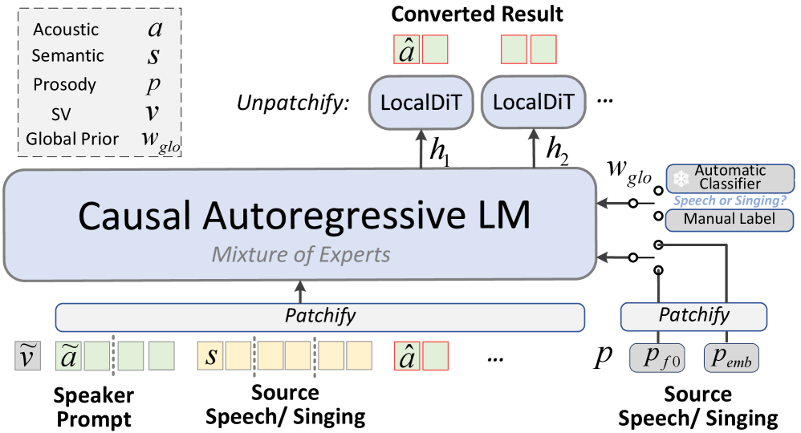
*Figure 1:The overall architecture for OneVoice.*

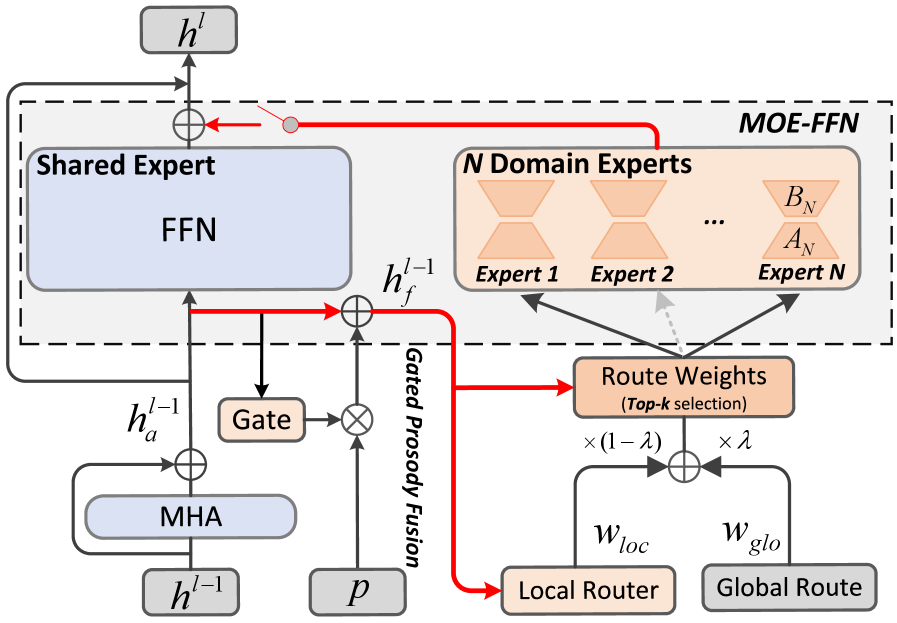
*Figure 2:The details of LM block.*

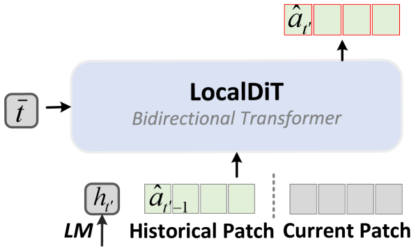
*Figure 3:The LocalDiT block.*

---
**Usage Info**: 3744 tokens used.
**Generated at**: 2026-02-24 20:39:35

---

# 📚 SonoEdit: Null-Space Constrained Knowledge Editing for Pronunciation Correction in LLM-Based TTS

🚀 URL: https://arxiv.org/html/2601.17086

## 🌏 Abstract (원문)
Modern neural text-to-speech systems have achieved remarkable naturalness and expressiveness, yet they consistently struggle with a fundamental challenge: correctly pronouncing words outside their training distribution. Proper nouns, technical terminology, and neologisms are frequently mispronounced, limiting the deployment of TTS in domains requiring accurate pronunciation. SonoEdit addresses this very problem through a novel combination of three key ideas: 1. Precise Localization via Acoustic Causal Tracing: By adapting causal tracing techniques, we identify the specific Transformer layers responsible for handling grapheme-to-phoneme mappings. 2. Orthogonal Corrections via Null-Space Constrained Editing: We compute a closed-form weight update that rectifies the target pronunciation while remaining mathematically orthogonal to the manifold of general speech, ensuring the correction cannot affect other aspects of model behavior. 3. Parameter Parsimony and One-Shot Correction: SonoEdit does not introduce additional trainable parameters and computes updates via simple matrix operations without a training loop. To the best of our knowledge, SonoEdit is the first work to explore the application of null-space knowledge editing to neural TTS systems, enabling surgical modifications that are guaranteed not to introduce catastrophic forgetting.
## 🌏 Abstract (번역)
현대의 신경망 기반 텍스트 음성 변환(TTS) 시스템은 놀라운 자연스러움과 표현력을 달성했지만, 학습 데이터 분포를 벗어난 단어를 정확하게 발음해야 하는 근본적인 과제에 직면해 있습니다. 고유 명사, 기술 용어, 신조어 등은 자주 오발음되어 정확한 발음이 필요한 분야에서의 TTS 배포를 제한합니다. SonoEdit은 세 가지 핵심 아이디어의 결합을 통해 이 문제를 해결합니다. 첫째, 어쿠스틱 인과 추적(Acoustic Causal Tracing)을 통한 정밀한 국소화로 자소-음소 매핑을 담당하는 특정 트랜스포머 레이어를 식별합니다. 둘째, 영공간 제약 편집(Null-Space Constrained Editing)을 통한 직교 보정으로 일반 음성 매니폴드와 수학적으로 직교하는 폐쇄형 가중치 업데이트를 계산하여 모델의 다른 동작에 영향을 주지 않도록 합니다. 셋째, 파라미터 절약 및 원샷 보정을 통해 추가 파라미터 도입이나 훈련 루프 없이 단순 행렬 연산으로 업데이트를 수행합니다. 본 연구는 신경망 TTS 시스템에 영공간 지식 편집을 적용한 최초의 사례로, 파괴적 망각을 일으키지 않음을 보장하면서 정밀한 모델 수정을 가능하게 합니다.

## 🔍 Methods & Results
- LLM 기반 TTS 구조에서 음운 정보를 포함하는 SNAC 코덱의 거친(coarse) 토큰 시퀀스를 분석 대상으로 정의함
- 메커니즘 해석 가능성(Mechanistic Interpretability) 기법인 인과 추적을 활용하여 발음 관련 정보가 집중된 특정 레이어(주로 L/2에서 3L/4 구간)를 식별함
- 일반 음성 데이터셋의 은닉 상태 공분산 행렬을 사용하여 일반 음성 특성을 보존하는 영공간(Null-Space) 투영 행렬을 계산함
- 타겟 발음 오류를 수정하는 가중치 업데이트가 영공간 내에 존재하도록 제약하는 최적화 목적 함수를 설계하고 폐쇄형(Closed-form) 솔루션을 도출함
- 추가적인 학습 파라미터 없이 단 한 번의 가중치 업데이트(One-shot)로 특정 단어의 발음을 영구적으로 수정함
- 제안된 방법은 화자의 정체성, 운율, 유창성 등 기존 모델의 성능을 저하시키지 않으면서 오발음만을 정밀하게 교정하는 데 성공함

## 🖼 Figures

*Figure 1:A schematic diagram illustrating an LLM-based speech generation pipeline. A Raw Waveform is first processed by a Tokenizer to produce a sequence of Discrete Tokens. These tokens are then input into a Large Language Model (LLM), which generates a sequence of New Tokens. Finally, a Decoder converts the new tokens into a Speech Waveform.*

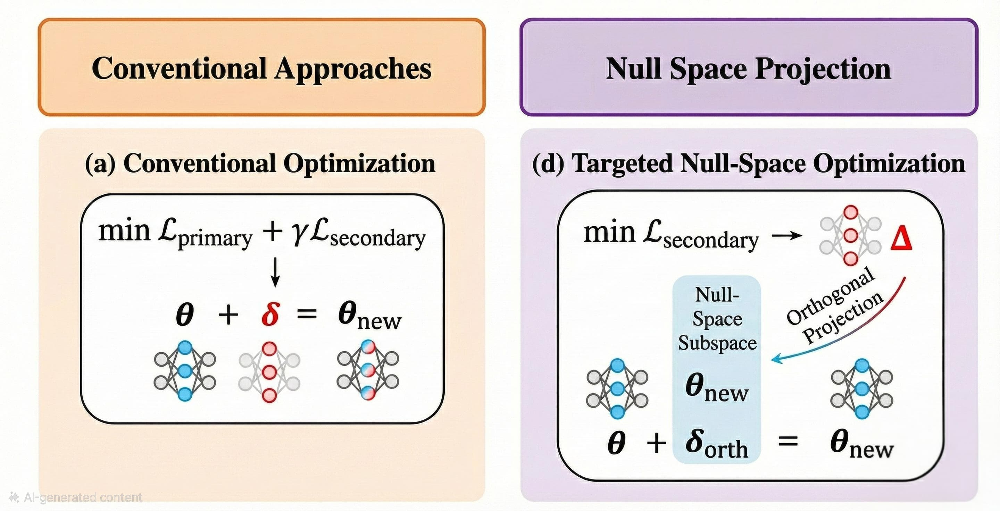
*Figure 2:An illustration of null-space constrained editing. The pronunciation correction is applied in directions orthogonal to the subspace representing general speech characteristics, ensuring invariance of non-target behavior.*

*Figure 3:Three complementary analysis methods show convergent evidence that layers 15-21 encode phonetic information: causal mediation analysis (Indirect Effect, red), linear probe classification (Probe Accuracy, blue), and gradient-based attribution (Gradient Norm, green).*

---
**Usage Info**: 4334 tokens used.
**Generated at**: 2026-02-24 20:40:03

---

# 📚 Neural Multi-Speaker Voice Cloning for Nepali in Low-Resource Settings

🚀 URL: https://arxiv.org/html/2601.18694

## 🌏 Abstract (원문)
Voice cloning has advanced significantly with the rise of deep learning, enabling the synthesis of natural-sounding human speech directly from text. While substantial progress has been achieved for high-resource languages like English, low-resource languages such as Nepali have received comparatively little attention. Despite the growing adoption of voice cloning in areas such as entertainment, accessibility, and personalized voice assistants, most existing solutions remain confined to English, highlighting a significant research gap. Nepali, a linguistically rich and culturally diverse language, is particularly underrepresented in speech synthesis research. This lack of technological development is especially striking given the variety of dialects, regional accents, and culturally significant voices found across Nepal. This paper addresses this gap by developing a neural voice cloning system tailored for the Nepali language. Our objective is to enable multi-speaker speech synthesis using a dataset of Nepali voices, thereby contributing to linguistic diversity within the field of speech technology. Furthermore, the development of such systems could enhance accessibility for individuals with speech impairments and promote the preservation and revitalization of Nepal’s vocal heritage. The main contributions of this work are as follows: We collected and curated a clean, structured Nepali speech dataset that is ready for direct use in Text-to-Speech (TTS) and voice cloning research. We trained a multi-speaker generative model capable of cloning voices in the Nepali language, demonstrating the feasibility and effectiveness of neural speech synthesis for a low-resource linguistic context.
## 🌏 Abstract (번역)
딥러닝의 부상과 함께 음성 클로닝 기술은 텍스트에서 직접 자연스러운 인간의 음성을 합성할 수 있게 하며 크게 발전했습니다. 영어와 같은 고자원 언어에서는 상당한 진전이 이루어졌으나, 네팔어와 같은 저자원 언어는 상대적으로 거의 주목받지 못했습니다. 엔터테인먼트, 접근성, 개인화된 음성 비서와 같은 분야에서 음성 클로닝의 채택이 증가하고 있음에도 불구하고, 대부분의 기존 솔루션은 영어에 국한되어 있어 상당한 연구 격차를 보여줍니다. 언어적으로 풍부하고 문화적으로 다양한 네팔어는 음성 합성 연구에서 특히 과소 대표되고 있습니다. 이러한 기술 개발의 부족은 네팔 전역에서 발견되는 다양한 방언, 지역적 억양, 문화적으로 중요한 목소리들을 고려할 때 특히 두드러집니다. 본 논문은 네팔어에 맞춤화된 신경망 음성 클로닝 시스템을 개발하여 이러한 격차를 해소합니다. 우리의 목표는 네팔어 음성 데이터셋을 사용하여 다중 화자 음성 합성을 가능하게 함으로써 음성 기술 분야의 언어적 다양성에 기여하는 것입니다. 또한, 이러한 시스템의 개발은 언어 장애가 있는 개인의 접근성을 높이고 네팔의 음성 유산을 보존 및 활성화하는 데 도움이 될 수 있습니다. 본 연구의 주요 기여는 다음과 같습니다: 첫째, TTS 및 음성 클로닝 연구에 즉시 사용할 수 있는 깨끗하고 구조화된 네팔어 음성 데이터셋을 수집하고 큐레이션했습니다. 둘째, 네팔어 음성을 클로닝할 수 있는 다중 화자 생성 모델을 훈련하여 저자원 언어 환경에서 신경망 음성 합성의 타당성과 효과를 입증했습니다.

## 🔍 Methods & Results
- Speaker Encoder: d-vector 아키텍처를 기반으로 256개 유닛의 LSTM 레이어 3개를 사용하여 화자의 고유 특성을 256차원 임베딩으로 추출함
- Synthesizer: Tacotron2 모델을 사용하여 데바나가리 스크립트 텍스트와 화자 임베딩을 결합하여 멜-스펙트로그램을 생성함
- Vocoder: 수정된 WaveRNN 아키텍처를 사용하여 멜-스펙트로그램을 시간 도메인 파형으로 변환하며, 효율성을 위해 사전 학습된 모델을 미세 조정함
- Dataset: 네팔어 TTS 코퍼스와 자체 녹음 오디오를 혼합하여 구축하였으며, 모든 오디오 샘플은 22.05 kHz로 리샘플링하여 일관성을 유지함
- Evaluation: 화자 임베딩의 시각화 및 분석을 위해 UMAP 기법을 사용하였고, 시스템의 정확도 측정을 위해 동일 오류율(EER) 지표를 활용함

## 🖼 Figures
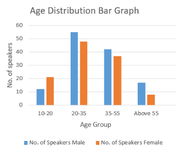
*Fig. 1:Age distribution of male and female speakers across different age groups for our self-collected dataset for speaker encoder*

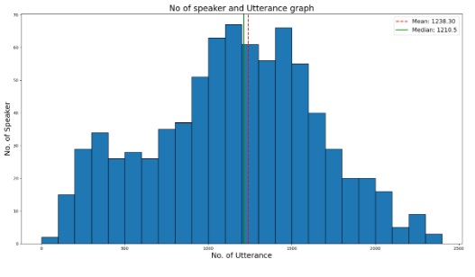
*Fig. 2:Average number of utterances per speaker.*

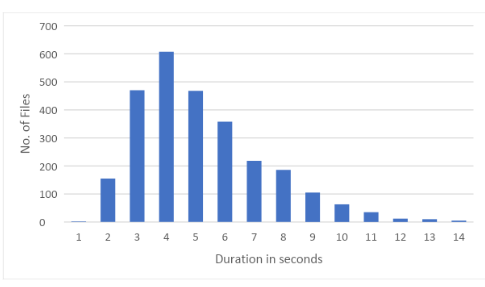
*Fig. 3:Audio duration of the collected dataset and the number of audio files for Synthesizer data*

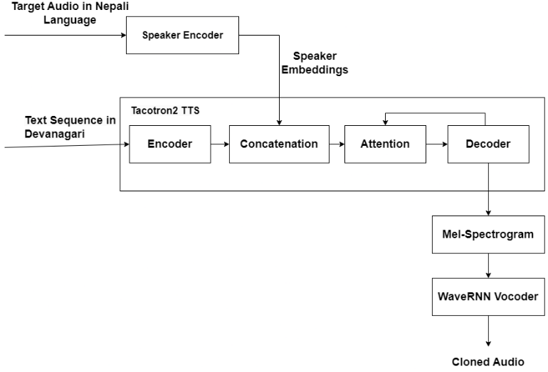
*Fig. 4:Architecture of the Nepali voice cloning system combining a Speaker Encoder, Tacotron2-based TTS synthesizer, and WaveRNN vocoder.*

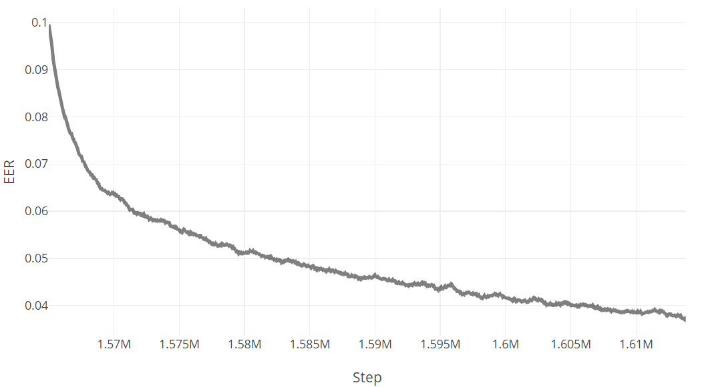
*Fig. 5:Equal Error Rate (EER) curve during training of the speaker encoder. The steady decline indicates improved discrimination of speaker embeddings over time.*

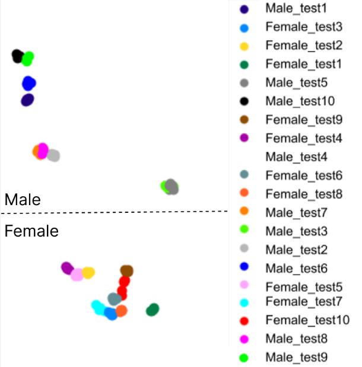
*Fig. 6:UMAP projection of clustering of different speakers and their embeddings.*

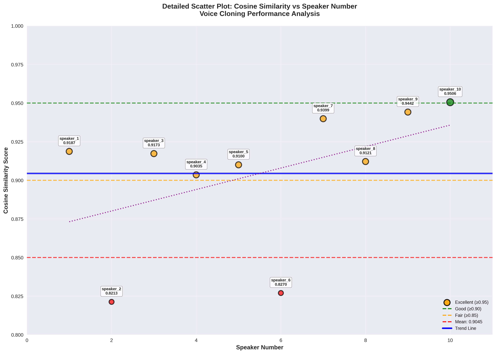
*Fig. 7:Detailed scatter plot of cosine similarity scores between original and cloned speakers across ten test speakers. The plot highlights performance categories (Excellent, Good, Fair) along with mean and trend lines.*

*(a)Distribution of Signal-to-Noise Ratio (SNR) values across the dataset. The red dashed line represents the mean SNR (26.4 dB), while the orange dashed lines indicate one standard deviation above and below the mean.*

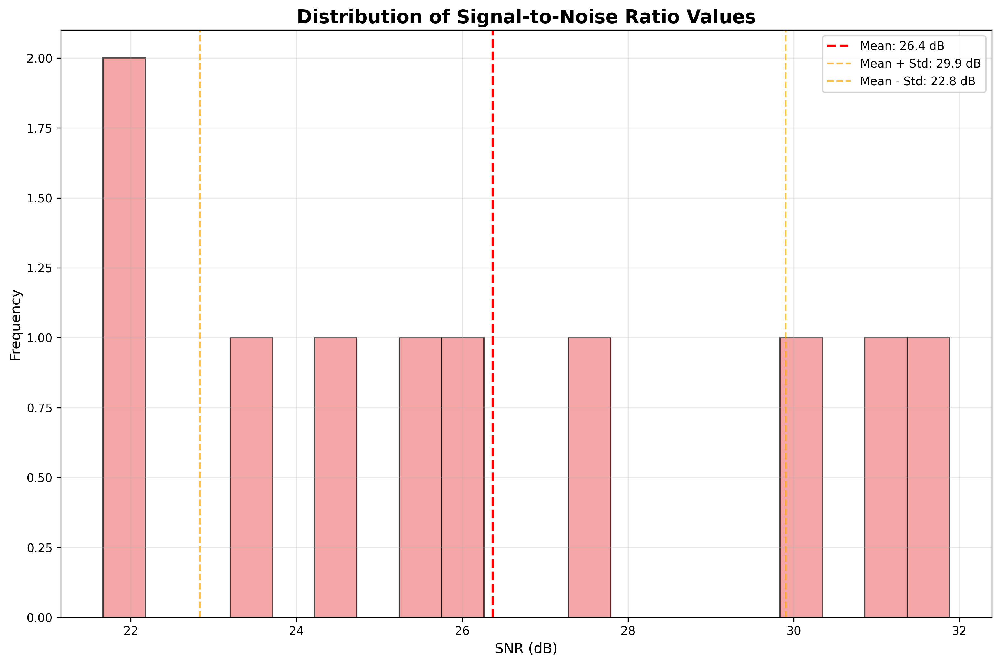
*(a)Distribution of Signal-to-Noise Ratio (SNR) values across the dataset. The red dashed line represents the mean SNR (26.4 dB), while the orange dashed lines indicate one standard deviation above and below the mean.*

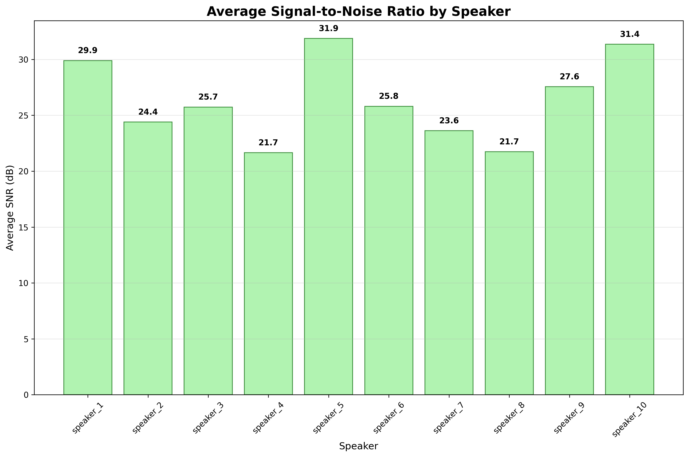
*(b)Average Signal-to-Noise Ratio (SNR) for each speaker. The values indicate speaker-specific recording quality, with most speakers exhibiting SNR values above 25 dB, and the highest reaching 31.9 dB.*

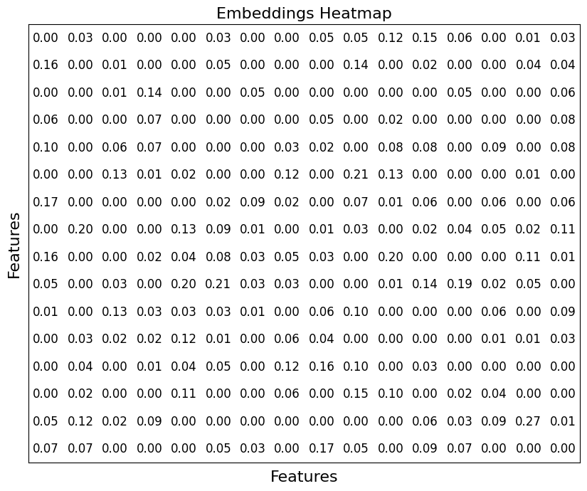
*Fig. 9:Speaker embedding of Original Male Voice when text and transcript were the same.*

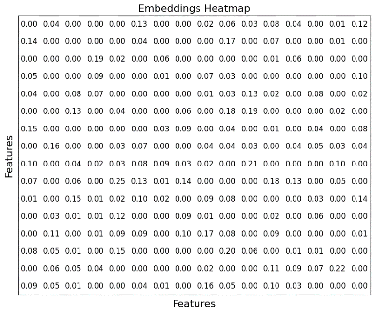
*Fig. 10:Speaker embedding of Cloned Male Voice when text and transcript were the same.*

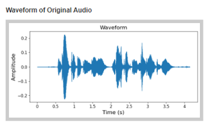
*Fig. 11:Audio waveform of Original Male Voice when text and transcript were the same.*

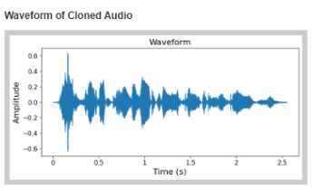
*Fig. 12:Audio waveform of Cloned Male Voice when text and transcript were the same.*

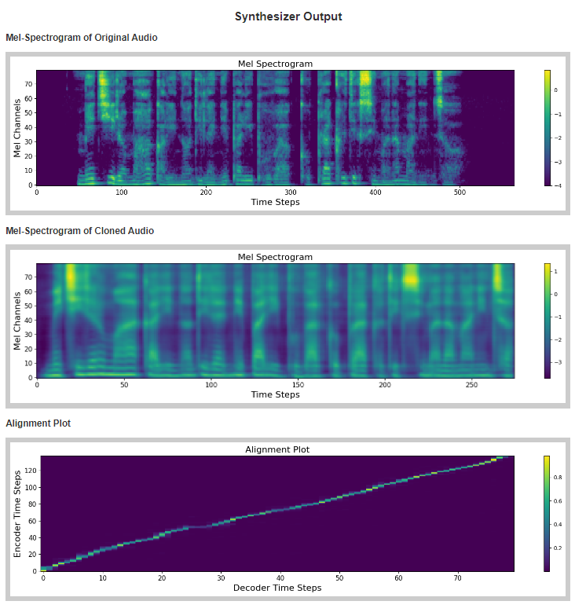
*Fig. 13:Mel-spectrogram of the original and cloned audio with their alignment plot for male voice when text and transcript were the same.*

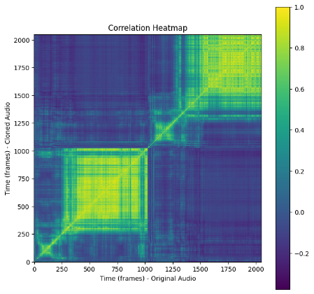
*Fig. 14:Mel-spectrogram of the original and cloned audio with their alignment plot for male voice when text and transcript were the same.*

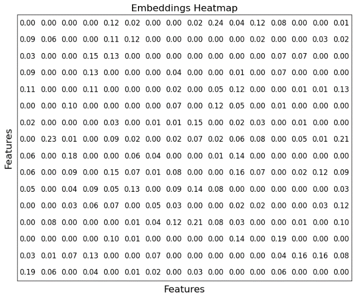
*Fig. 15:Speaker embedding of Original Female Voice when text and transcript were the same.*

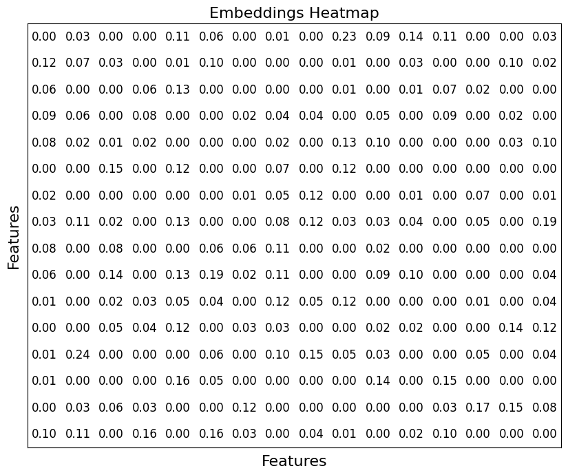
*Fig. 16:Speaker embedding of Cloned Female Voice when text and transcript were the same.*

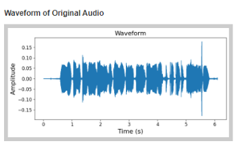
*Fig. 17:Audio waveform of Original Female Voice when text and transcript were the same.*

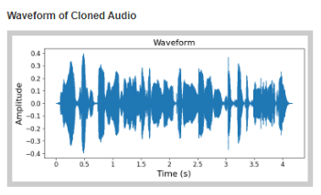
*Fig. 18:Audio waveform of Cloned Female Voice when text and transcript were the same.*

*Fig. 19:Mel-spectrogram of the original and cloned audio with their alignment plot for female voice when text and transcript were the same.*

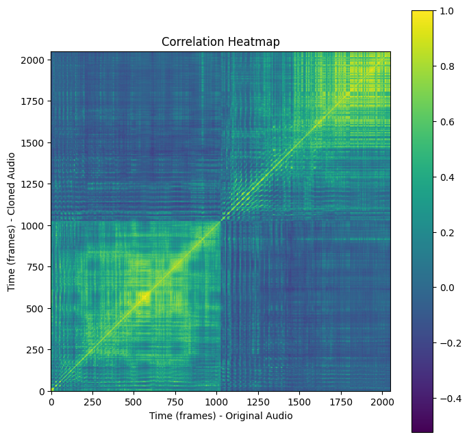
*Fig. 20:Mel-spectrogram of the original and cloned audio with their alignment plot for female voice when text and transcript were the same.*

*Fig. 21:Speaker embedding of Original Male Voice when text and transcript differed.*

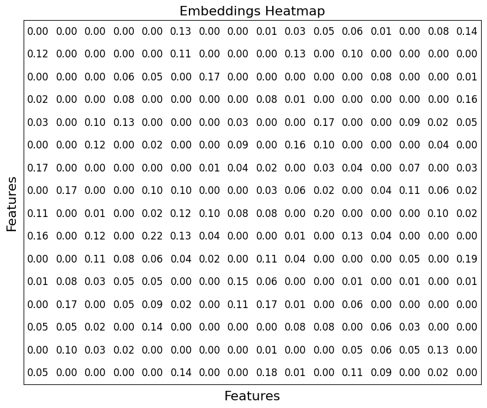
*Fig. 22:Speaker embedding of Cloned Male Voice when text and transcript differed.*

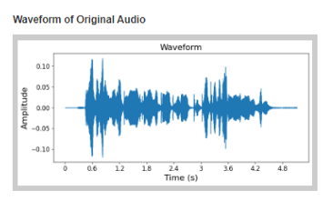
*Fig. 23:Audio waveform of Original Male Voice when text and transcript differed.*

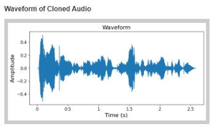
*Fig. 24:Audio waveform of Cloned Male Voice when text and transcript differed.*

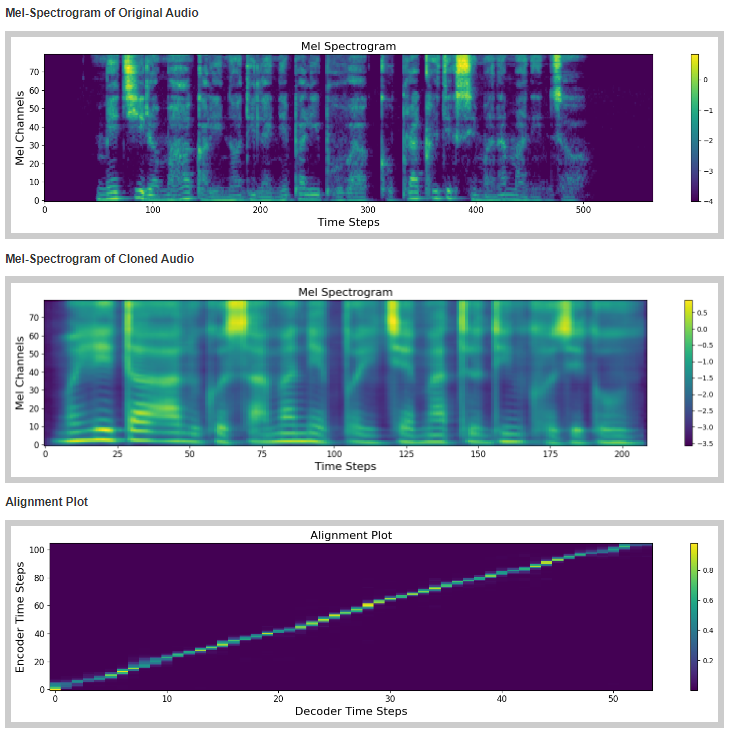
*Fig. 25:Mel-spectrogram of the original and cloned audio with their alignment plot for male voice when text and transcript differed.*

*Fig. 26:Speaker embedding of Original Female Voice when text and transcript differed.*

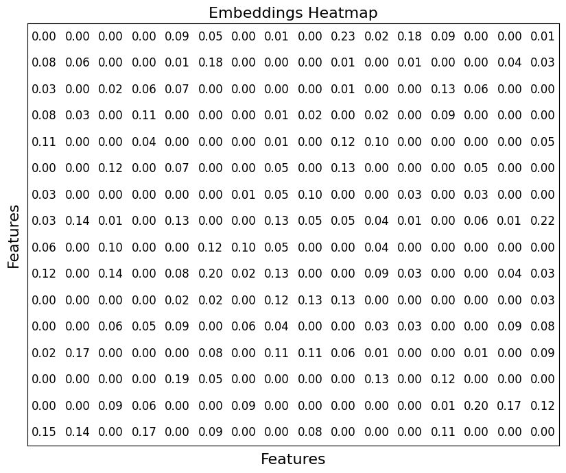
*Fig. 27:Speaker embedding of Cloned Female Voice when text and transcript differed.*

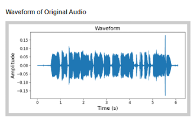
*Fig. 28:Audio waveform of Original Female Voice when text and transcript differed.*

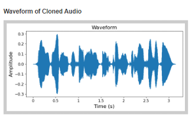
*Fig. 29:Audio waveform of Cloned Female Voice when text and transcript differed.*

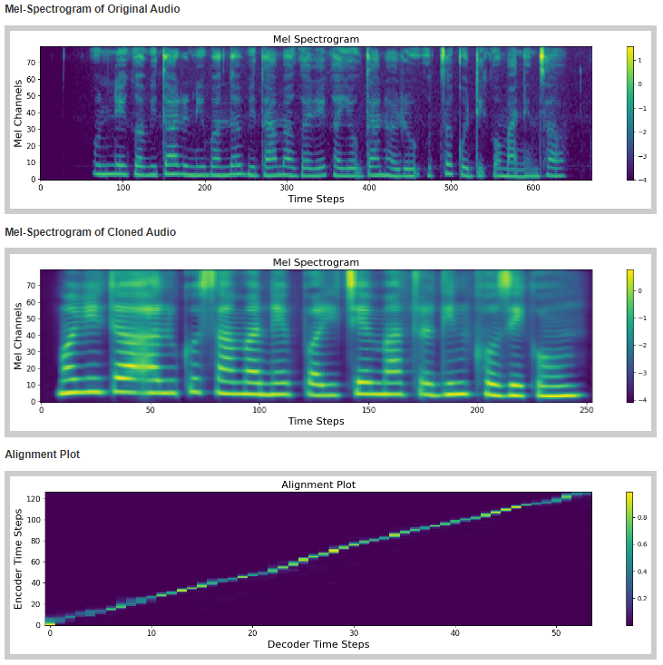
*Fig. 30:Mel-spectrogram of the original and cloned audio with their alignment plot for female voice when text and transcript differed.*

---
**Usage Info**: 5368 tokens used.
**Generated at**: 2026-02-24 20:41:38

---

# 📚 Geneses: Unified Generative Speech Enhancement and Separation

🚀 URL: https://arxiv.org/html/2601.18456

## 🌏 Abstract (원문)
Speech separation (SS)[36], which aims to isolate individual speaker signals from a mixture of multiple voices, is a key technology for robust communication through speech processing technologies such as automatic speech recognition. In practical scenarios, recorded speech is often degraded not only by overlapping speakers but also by various real-world factors such as additive noise, reverberation, codec distortion, and packet loss. To make such degraded speech high-quality and intelligible, speech enhancement (SE)[25]—which converts a clean signal from degraded one—should be addressed together with SS. A unified framework that jointly performs SE and SS can provide consistently high performance across diverse acoustic environments, improving the usability of speech-based telepresence and extended reality applications. Hu et al.[11]proposed a unified approach for noise-robust SS by combining SE and SS as a single deep neural network (DNN)-based model. Their approach adopts a cascaded SE–SS architecture optimized via multi-task learning and a gradient modulation (GM) strategy, which suppresses conflicts between SE and SS to mitigate the over-suppression of speech components. Although this approach showed promising results under “additive-noise-only” conditions, it cannot handle complex degradations due to the limitation of mask-based SE–SS, restricting its applicability in more realistic environments. To this end, we propose Geneses: Generative speech enhancement and separation, a unified generative approach that jointly performs SE and SS. Our Geneses leverages flow matching[19]on latent feature representations to estimate each speaker’s clean speech features using multi-modal diffusion Transformer (MM-DiT)[6]conditioned on self-supervised learning (SSL) representation from noisy mixture. We conduct experimental evaluation using two-speaker mixtures from LibriTTS-R[16]under two conditions: additive-noise-only and complex degradations. The results demonstrate that Geneses significantly outperforms a conventional Hu et al.’s noise-robust SS method[11]across various objective metrics with high robustness against complex degradations.
## 🌏 Abstract (번역)
여러 목소리가 섞인 혼합 신호에서 개별 화자 신호를 분리하는 것을 목표로 하는 음성 분리(SS)는 자동 음성 인식과 같은 음성 처리 기술을 통한 견고한 통신을 위한 핵심 기술입니다. 실제 시나리오에서 녹음된 음성은 화자 중첩뿐만 아니라 가산 노이즈, 잔향, 코덱 왜곡, 패킷 손실 등 다양한 현실 세계의 요인으로 인해 품질이 저하되는 경우가 많습니다. 이러한 저하된 음성을 고품질의 명료한 음성으로 만들기 위해서는 저하된 신호를 깨끗한 신호로 변환하는 음성 향상(SE)이 SS와 함께 다루어져야 합니다. SE와 SS를 공동으로 수행하는 통합 프레임워크는 다양한 음향 환경에서 일관되게 높은 성능을 제공하여 음성 기반 텔레프레즌스 및 확장 현실 애플리케이션의 사용성을 향상시킬 수 있습니다. Hu 등은 SE와 SS를 단일 심층 신경망(DNN) 기반 모델로 결합하여 노이즈에 강한 SS를 위한 통합 접근 방식을 제안했습니다. 그들의 방식은 멀티태스크 학습과 그래디언트 변조(GM) 전략을 통해 최적화된 직렬 SE-SS 구조를 채택하여, SE와 SS 간의 충돌을 억제하고 음성 성분의 과도한 억제를 완화합니다. 이 접근 방식은 '가산 노이즈 전용' 조건에서 유망한 결과를 보여주었지만, 마스크 기반 SE-SS의 한계로 인해 복합적인 품질 저하를 처리할 수 없어 실제 환경에서의 적용이 제한됩니다. 이를 위해 본 논문에서는 SE와 SS를 공동으로 수행하는 통합 생성 접근 방식인 Geneses(Generative speech enhancement and separation)를 제안합니다. Geneses는 잠재 특징 표현에 대한 플로우 매칭(flow matching)을 활용하며, 노이즈가 섞인 혼합 신호로부터 얻은 자기지도학습(SSL) 표현을 조건으로 하는 멀티모달 확산 트랜스포머(MM-DiT)를 사용하여 각 화자의 깨끗한 음성 특징을 추정합니다. LibriTTS-R의 2인 화자 혼합 데이터를 사용하여 가산 노이즈 전용 및 복합 품질 저하라는 두 가지 조건에서 실험적 평가를 수행했습니다. 결과에 따르면 Geneses는 다양한 객관적 지표에서 기존 Hu 등의 노이즈 강인 SS 방식보다 성능이 크게 뛰어났으며, 복합 품질 저하에 대해 높은 견고성을 입증했습니다.

## 🔍 Methods & Results
- Proposed Geneses, a unified generative approach that jointly performs speech enhancement (SE) and speech separation (SS).
- Utilized flow matching on latent feature representations to estimate clean speech features for each speaker.
- Employed a Multi-modal Diffusion Transformer (MM-DiT) architecture conditioned on self-supervised learning (SSL) representations from noisy mixtures.
- Evaluated the model using two-speaker mixtures from the LibriTTS-R dataset under additive-noise-only and complex degradation conditions.
- Demonstrated that Geneses significantly outperforms conventional noise-robust SS methods across various objective metrics.
- Achieved high robustness against complex degradations (reverberation, codec distortion, etc.) compared to mask-based SE-SS models.

## 🖼 Figures
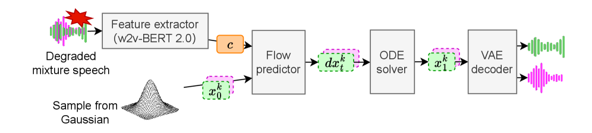
*Fig. 1:Inference pipeline of Geneses. Flow matching is performed on the latent representations of a pre-trained VAE.*

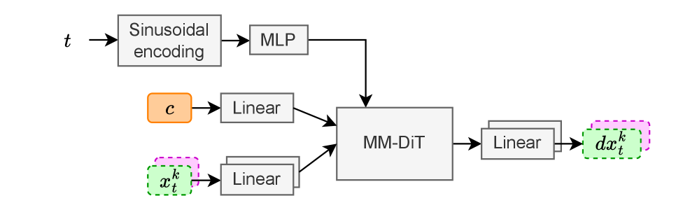
*Fig. 2:Architecture of flow predictor.*

---
**Usage Info**: 3161 tokens used.
**Generated at**: 2026-02-24 20:42:05

---

# 📚 AR-Omni: A Unified Autoregressive Model for Any-to-Any Generation

🚀 URL: https://arxiv.org/html/2601.17761

## 🌏 Abstract (원문)
Large Language Models (LLMs) have achieved strong performance in understanding and generating natural language[achiam2023gpt]. However, their interface is largely limited to text. In contrast, real-world perception and interaction are inherently multimodal, encompassing not only language but also vision and speech. This interaction gap has motivated Multimodal Large Language Models (MLLMs), which extend LLMs to process multimodal capabilities. Early MLLMs extend LLMs with strongmultimodal perception, enabling them to interpret multimodal inputs. A natural next step is to further equip MLLMs withmultimodal generationcapabilities, allowing them to respond to users in multiple modalities. This ability that supports both multimodal inputs and multimodal outputs is often called “Omni”[hurst2024gpt]. A sequence of omni MLLMs has progressively emerged. SpeechGPT[zhang2023speechgpt]enables speech-text outputs by discretizing speech and training for cross-modal conversational instruction following. Chameleon[meta2024chameleon]extends the same ambition to vision, proposing an early-fusion MLLM over a joint discrete vocabulary that supports both image and text generation. Building toward tri-modal any-to-any interaction, AnyGPT[zhan2024anygpt]and MIO[wang2024mio]perform autoregressive modeling paired with expert diffusion decoders, thereby supporting flexible tri-modal understanding and generation. Autoregressive (AR) modeling has proven to be an exceptionally elegant and scalable foundation in the text domain: with a single token stream, a single next-token objective, and a single decoder, it can already support powerful text generation. This simplicity is appealing not only conceptually but also practically, which offers the potential for unified training and inference for omni MLLMs. As summarized in Table1, most existing omni MLLMs still rely on additional expert components (e.g., diffusion-style image decoders or non-AR speech generators) to achieve multimodal generation. Motivated by this, we aim to explore whether an omni model can be built with the same AR purity: a single autoregressive model that natively handles text, images, and speech. We present AR-Omni, a unified any-to-any model in the autoregressive paradigm without any expert decoders. AR-Omni tokenizes text, images, and speech into discrete symbols and integrates them into a single joint vocabulary. After training, AR-Omni supports autoregressive text and image generation, as well as streaming speech generation, all under a single 7B-parameter Transformer backbone. We further address three practical issues in unified AR modeling: 1)Modality imbalance.Unified AR training can be dominated by certain modalities/tasks, leading to skewed learning. We mitigate this via task-aware reweighting on response tails. 2)Visual fidelity.Autoregressively predicting image tokens may sacrifice perceptual quality in the reconstructed visuals. We introduce a lightweight token-level perceptual alignment loss for image tokens. 3)Stability-creativity trade-offs.Different tasks prefer different decoding behaviors, yet a single decoding strategy can be suboptimal across tasks. We employ a finite-state decoding machine that automatically selects greedy decoding for ASR/TTS and sampling decoding for open-ended generation. Empirically, AR-Omni achieves strong quality across modalities while remaining real-time: AR-Omni attains 146 ms first-token latency and 0.88 real-time factor for speech generation, together with competitive objective accuracy (6.5 zero-shot TTS WER on VCTK and 9.4 ASR WER on LibriSpeech test-clean). Section5reports detailed quantitative results and qualitative examples demonstrating these any-to-any capabilities. The key contributions are summarized: We introduce AR-Omni, a unified autoregressive model that supports understanding and generation for text, image, and speech without any external task-specific decoders. We equip AR-Omni with an efficient speech tokenizer, allowing it to decode audio after only a small number of speech tokens and thereby enabling streaming speech. We address modality imbalance via task-aware reweighting on the response tail and improve visual fidelity with a token-level perceptual alignment loss for image tokens. We also address the trade-off between stability and creativity through a finite-state decoding machine.
## 🌏 Abstract (번역)
거대 언어 모델(LLM)은 자연어 이해 및 생성에서 강력한 성능을 달성했지만, 그 인터페이스는 주로 텍스트로 제한되어 있습니다. 반면, 실제 세계의 인식과 상호작용은 언어뿐만 아니라 시각과 음성을 포함하는 본질적인 멀티모달 특성을 가집니다. 이러한 상호작용의 격차는 LLM을 확장하여 멀티모달 능력을 처리하도록 하는 멀티모달 거대 언어 모델(MLLM)의 개발을 촉진했습니다. 초기 MLLM은 강력한 멀티모달 인식 기능을 통해 멀티모달 입력을 해석할 수 있도록 확장되었습니다. 자연스러운 다음 단계는 MLLM에 멀티모달 생성 기능을 추가로 갖추어 사용자의 다양한 모달리티에 응답할 수 있도록 하는 것입니다. 멀티모달 입력과 출력을 모두 지원하는 이러한 능력을 흔히 "Omni"라고 부릅니다. 일련의 옴니 MLLM이 점진적으로 등장했습니다. SpeechGPT는 음성을 이산화하고 교차 모달 대화형 지시 수행을 위한 학습을 통해 음성-텍스트 출력을 가능하게 합니다. Chameleon은 이러한 목표를 시각 분야로 확장하여 이미지와 텍스트 생성을 모두 지원하는 공동 이산 어휘집 기반의 초기 융합 MLLM을 제안했습니다. AnyGPT와 MIO는 3중 모달의 any-to-any 상호작용을 목표로 자기회귀 모델링과 전문가 확산 디코더를 결합하여 유연한 3중 모달 이해 및 생성을 지원합니다. 자기회귀(AR) 모델링은 텍스트 도메인에서 매우 우아하고 확장 가능한 기반임이 입증되었습니다. 단일 토큰 스트림, 단일 다음 토큰 목적 함수, 단일 디코더만으로도 강력한 텍스트 생성을 지원할 수 있습니다. 이러한 단순함은 개념적으로뿐만 아니라 실무적으로도 매력적이며, 옴니 MLLM을 위한 통합된 학습 및 추론의 가능성을 제공합니다. 기존의 대부분의 옴니 MLLM은 멀티모달 생성을 달성하기 위해 여전히 추가적인 전문가 구성 요소(예: 확산 방식의 이미지 디코더 또는 비AR 음성 생성기)에 의존합니다. 이에 영감을 받아, 본 연구에서는 텍스트, 이미지, 음성을 기본적으로 처리하는 단일 자기회귀 모델이라는 동일한 AR 순수성을 가진 옴니 모델을 구축할 수 있는지 탐구하는 것을 목표로 합니다. 본 논문에서는 전문가 디코더 없이 자기회귀 패러다임 내에서 통합된 any-to-any 모델인 AR-Omni를 제시합니다. AR-Omni는 텍스트, 이미지, 음성을 이산 기호로 토큰화하고 이를 단일 공동 어휘집으로 통합합니다. 학습 후 AR-Omni는 단일 7B 파라미터 트랜스포머 백본 하에서 자기회귀 텍스트 및 이미지 생성뿐만 아니라 스트리밍 음성 생성을 지원합니다. 또한 통합 AR 모델링의 세 가지 실무적 문제를 해결합니다: 1) 모달리티 불균형: 통합 AR 학습은 특정 모달리티나 태스크에 의해 지배될 수 있으며, 이를 응답 꼬리 부분의 태스크 인식 재가중치를 통해 완화합니다. 2) 시각적 충실도: 이미지 토큰을 자기회귀적으로 예측하면 재구성된 시각물의 지각적 품질이 저하될 수 있으며, 이를 위해 이미지 토큰에 대한 경량 토큰 수준 지각 정렬 손실을 도입합니다. 3) 안정성-창의성 트레이드오프: 태스크마다 선호하는 디코딩 동작이 다르므로, ASR/TTS에는 그리디 디코딩을, 개방형 생성에는 샘플링 디코딩을 자동으로 선택하는 유한 상태 디코딩 머신을 채택합니다. 실험적으로 AR-Omni는 실시간성을 유지하면서 모달리티 전반에 걸쳐 강력한 품질을 달성합니다. AR-Omni는 음성 생성 시 146ms의 첫 토큰 지연 시간과 0.88의 실시간 계수를 달성했으며, VCTK에서 6.5의 제로샷 TTS WER, LibriSpeech test-clean에서 9.4의 ASR WER이라는 경쟁력 있는 정확도를 보였습니다. 주요 기여로는 외부 태스크 전용 디코더 없는 통합 AR 모델 도입, 스트리밍 음성 생성을 위한 효율적인 토큰나이저 활용, 모달리티 불균형 및 시각적 충실도 문제 해결 등이 있습니다.

## 🔍 Methods & Results
- 텍스트, 이미지, 음성을 이산 기호로 토큰화하여 단일 공동 어휘집(Joint Vocabulary)으로 통합하는 AR-Omni 모델 제안
- 별도의 외부 전문가 디코더 없이 단일 7B 파라미터 Transformer 백본을 사용하여 any-to-any 멀티모달 생성 구현
- 특정 모달리티에 학습이 치우치는 문제를 해결하기 위해 응답 꼬리(Response Tails)에 태스크 인식 재가중치(Task-aware Reweighting) 적용
- 이미지 생성의 지각적 품질 향상을 위해 경량 토큰 수준 지각 정렬 손실(Perceptual Alignment Loss) 도입
- 태스크 특성에 따라 그리디 디코딩과 샘플링 디코딩을 자동 선택하는 유한 상태 디코딩 머신(Finite-state Decoding Machine) 활용
- 음성 생성 시 146ms의 첫 토큰 지연 시간(First-token Latency) 및 0.88의 실시간 계수(RTF) 달성으로 실시간성 확보
- VCTK 데이터셋에서 6.5 WER(TTS), LibriSpeech test-clean에서 9.4 WER(ASR)의 경쟁력 있는 성능 기록

## 🖼 Figures

*Figure 1:Overview of AR-Omni. Text, speech, and image inputs are tokenized and embedded into a shared space. A single autoregressive decoder operates over a joint vocabulary to generate a unified token stream. T denotes text, S denotes speech, and I denotes image.*

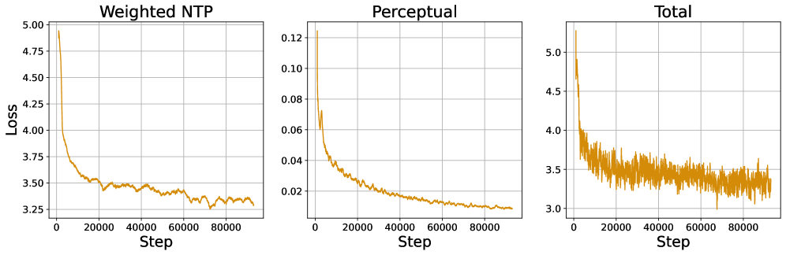
*Figure 2: Stage 1 pretraining losses of AR-Omni. From left to right: weighted NTP loss, perceptual loss, and total loss. Curves are smoothed for readability and plotted over 1k–93k training steps.*

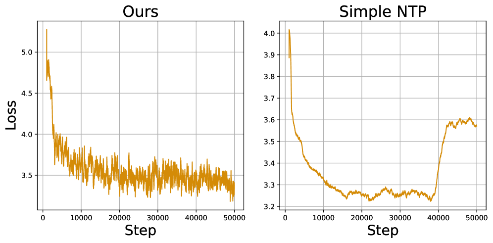
*Figure 3: Loss curves of AR-Omni (Ours) and the simple NTP training objective. The naive objective exhibits a sharp loss jump, whereas AR-Omni maintains a smooth and stable loss throughout training.*

*Figure 4:Case studies of AR-Omni: (a) multi-turn speech conversation (S
→
S), (b) speech+image understanding with speech response (S+I
→
S), and (c) speech-to-image generation (S
→
I).*

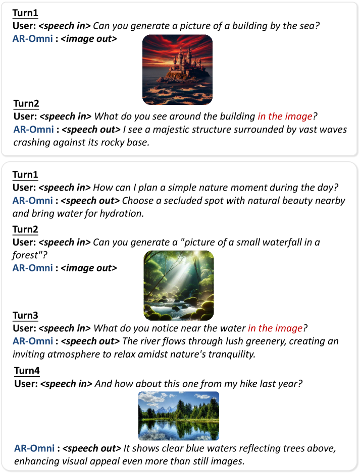
*Figure 5:Multi-turn interleaved conversation example.*

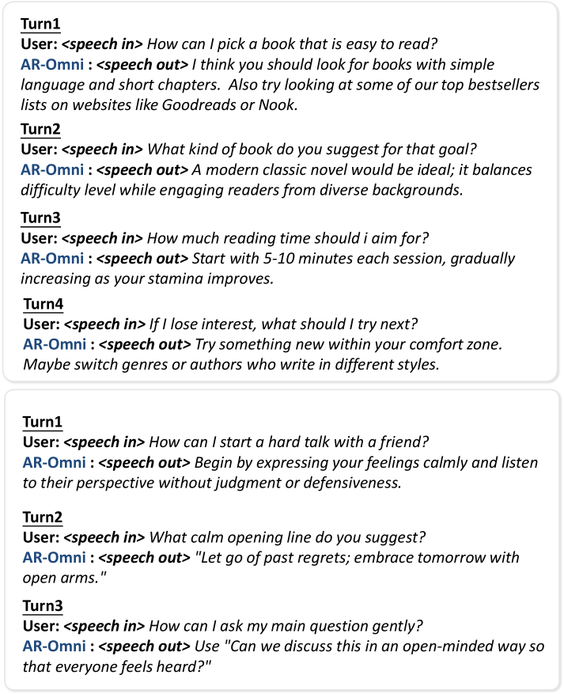
*Figure 6:Multi-turn speech conversation example.*

*Figure 7:Qualitative image generation results with AR-Omni across diverse prompts and styles.*

*Figure 8:Qualitative image generation results with AR-Omni across diverse prompts and styles.*

*Figure 9:Qualitative image generation results with AR-Omni across diverse prompts and styles.*

*Figure 10:Qualitative image generation results with AR-Omni across diverse prompts and styles.*

---
**Usage Info**: 5047 tokens used.
**Generated at**: 2026-02-24 20:43:18

---

# 📚 LLM-ForcedAligner: A Non-Autoregressive and Accurate LLM-Based Forced Aligner for Multilingual and Long-Form Speech

🚀 URL: https://arxiv.org/html/2601.18220

## 🌏 Abstract (원문)
In speech processing, the objective of forced alignment (FA) is to estimate the start and end timestamps of each word or character in a speech signal, given its corresponding transcript. FA is indispensable in numerous applications, including large-scale speech corpus construction and cleaning, automatic subtitling and word-level highlighting, as well as duration modeling and prosody analysis in speech synthesis. With the continuous advancement of multilingual and multimodal applications, efficient and accurate FA has become increasingly essential. Existing FA methods can be broadly categorized into two main groups: traditional hybrid systems and end-to-end models. Montreal forced aligner (MFA) is typically a hybrid Gaussian Mixture Model–Hidden Markov Model (GMM–HMM) framework, computing the timestamps via Viterbi decoding for frame-level phoneme-to-text alignment paths. Connectionist temporal classification (CTC) is a common end-to-end FA method that leverages frame-to-token alignment computed by CTC-based automatic speech recognition (ASR) models, employing dynamic programming to identify the optimal path that aligns with the text sequence within constrained search paths. Continuous integrate-and-fire (CIF) predicts a weight for each encoder output frame and integrates these weights over time. When the accumulated weight exceeds a threshold, a fire event is triggered, at which point a weighted sum of the accumulated frame-level acoustic vectors is computed to generate an acoustic embedding aligned with an output token, thereby enabling the assignment of a corresponding timestamp to each token. WhisperX employs a lightweight end-to-end phoneme recognition model to perform frame-level phoneme classification on speech, and then aligns the resulting phoneme sequence with the transcript using dynamic time warping (DTW), thereby obtaining word-level timestamps by aggregating phoneme-level timestamps. However, the aforementioned FA methods are tied to language-specific phonemes, lexicons, or structural designs, which means that in multilingual scenarios, deployment typically involves a collection of independent systems with disparate structures, leading to engineering costs and maintenance complexity that grow linearly with the number of languages. Furthermore, previous FA methods can be summarized as a process of calculating local acoustic similarities followed by a monotonic path search. While these methods can produce reasonably accurate boundaries for short segments, they frequently accumulate significant systematic temporal shifts in long-form speech. Large language models (LLMs) have demonstrated powerful abilities in multilingual text understanding and long-sequence processing tasks, offering a new possibility for FA that supports multilingual, crosslingual, and long-form speech. Increasing studies have explored integrating speech encoders with LLMs to build Speech LLMs (SLLMs) that process speech and text within a unified framework. Nevertheless, existing SLLMs have mainly achieved success in high-level semantic tasks such as ASR, speech understanding, speech synthesis, and spoken dialogue. For FA, which is more sensitive to acoustic characteristics, these SLLMs typically treat it as a by-product of ASR and generate word-level or character-level timestamps via next-token prediction. Such a paradigm is susceptible to temporal non-monotonic hallucinations and incurs substantial inference latency. In this work, we propose a new FA framework named LLM-ForcedAligner that reformulates FA as a slot-filling paradigm: the start and end timestamps of each word or character are treated as discrete time indices, and dedicated special tokens are inserted into the transcript as slots so that, conditioned on the speech embeddings and the transcript augmented with these slots, the SLLM can directly predict the corresponding time indices at the designated slots. This new FA paradigm effectively leverages the LLM’s strengths in slot filling and long-context processing, extends conventional purely acoustic, phoneme-level alignment to semantic-boundary-aware, character-level or word-level alignment. To perform slot filling, we apply causal attention masking during training without introducing any shift between the input and label sequences, allowing each slot to predict its own time index based on itself and the preceding context, and we compute the loss function only at the slot positions. In addition, we adopt a dynamic slot insertion strategy that randomly decides whether to insert special tokens for each word or character in the transcript, enabling LLM-ForcedAligner to predict timestamps for arbitrary words or characters. During inference, LLM-ForcedAligner enables non-autoregressive decoding, completely avoiding hallucinations compared with autoregressive decoding and achieving faster speed. Experimental results show that, in multilingual, cross-lingual, and long-form speech scenarios of up to 300 seconds, LLM-ForcedAligner achieves a 69%~78% relative reduction in accumulated averaging shift (AAS) compared with prior FA methods, while incurring only a slight increase in real-time factor (RTF).
## 🌏 Abstract (번역)
음성 처리에서 강제 정렬(FA)의 목적은 주어진 전사본에 대해 음성 신호 내 각 단어 또는 문자의 시작 및 종료 타임스탬프를 추정하는 것입니다. FA는 대규모 음성 코퍼스 구축 및 정제, 자동 자막 및 단어 수준 하이라이트, 음성 합성의 지속 시간 모델링 및 운율 분석을 포함한 수많은 응용 분야에서 필수적입니다. 다국어 및 다중 모드 애플리케이션의 지속적인 발전으로 효율적이고 정확한 FA가 점점 더 중요해지고 있습니다. 기존 FA 방법은 크게 전통적인 하이브리드 시스템과 엔드투엔드 모델의 두 그룹으로 분류할 수 있습니다. MFA(Montreal Forced Aligner)는 전형적인 하이브리드 GMM-HMM 프레임워크로, 비터비 디코딩을 통해 타임스탬프를 계산합니다. CTC(Connectionist Temporal Classification)는 CTC 기반 ASR 모델을 활용하는 일반적인 엔드투엔드 FA 방법이며, CIF(Continuous Integrate-and-Fire)는 가중치 누적을 통해 타임스탬프를 할당합니다. WhisperX는 경량 엔드투엔드 음소 인식 모델과 DTW(Dynamic Time Warping)를 사용하여 단어 수준 타임스탬프를 얻습니다. 그러나 이러한 방법들은 언어별 음소, 어휘 또는 구조적 설계에 얽매여 있어 다국어 시나리오에서 시스템 복잡성이 증가하며, 장문 음성에서 상당한 계통적 시간 편향이 누적되는 경우가 많습니다. 거대 언어 모델(LLM)은 다국어 텍스트 이해 및 긴 시퀀스 처리 작업에서 강력한 능력을 보여주었으며, 다국어, 교차 언어 및 장문 음성을 지원하는 FA의 새로운 가능성을 제시합니다. 본 연구에서는 FA를 슬롯 채우기(slot-filling) 패러다임으로 재구성한 새로운 FA 프레임워크인 LLM-ForcedAligner를 제안합니다. 각 단어 또는 문자의 시작 및 종료 타임스탬프를 이산 시간 인덱스로 취급하고, 전사본에 전용 특수 토큰을 슬롯으로 삽입하여 SLLM이 지정된 슬롯에서 해당 시간 인덱스를 직접 예측하도록 합니다. 이 새로운 패러다임은 LLM의 강점을 효과적으로 활용하여 기존의 음향 및 음소 수준 정렬을 의미 경계 인식 및 문자/단어 수준 정렬로 확장합니다. 훈련 중에는 인과적 어텐션 마스킹을 적용하고 슬롯 위치에서만 손실 함수를 계산하며, 동적 슬롯 삽입 전략을 채택하여 임의의 단어나 문자에 대한 타임스탬프 예측을 가능하게 합니다. 추론 시 LLM-ForcedAligner는 비자기회귀 디코딩을 지원하여 환각을 방지하고 빠른 속도를 달성합니다. 실험 결과, 최대 300초의 다국어, 교차 언어 및 장문 음성 시나리오에서 LLM-ForcedAligner는 이전 FA 방법 대비 누적 평균 편차(AAS)를 69%~78% 상대적으로 감소시켰으며, 실시간 계수(RTF)는 약간만 증가했습니다.

## 🔍 Methods & Results
- 강제 정렬(FA)을 슬롯 채우기(slot-filling) 패러다임으로 재정의하여 타임스탬프를 이산 시간 인덱스로 직접 예측하는 LLM-ForcedAligner 제안
- 전사문에 특수 토큰을 슬롯으로 삽입하고 음성 임베딩과 함께 입력하여 SLLM이 해당 위치에서 시간 정보를 출력하도록 설계
- 훈련 시 인과적 어텐션 마스킹(Causal Attention Masking)을 적용하여 입력과 레이블 간의 시프트 없이 슬롯별 독립적 예측 수행
- 동적 슬롯 삽입(Dynamic Slot Insertion) 전략을 통해 전사문의 임의의 단어나 문자에 대한 타임스탬프를 유연하게 예측 가능
- 추론 단계에서 비자기회귀(Non-autoregressive) 디코딩을 사용하여 환각 현상을 제거하고 추론 속도를 향상
- 다국어 및 최대 300초의 장문 음성 시나리오에서 기존 FA 모델 대비 누적 평균 편차(AAS)를 69%~78% 상대적으로 감소
- 성능 향상 대비 실시간 계수(RTF)의 증가는 미미한 수준으로 유지하여 실용적인 효율성 입증

## 🖼 Figures
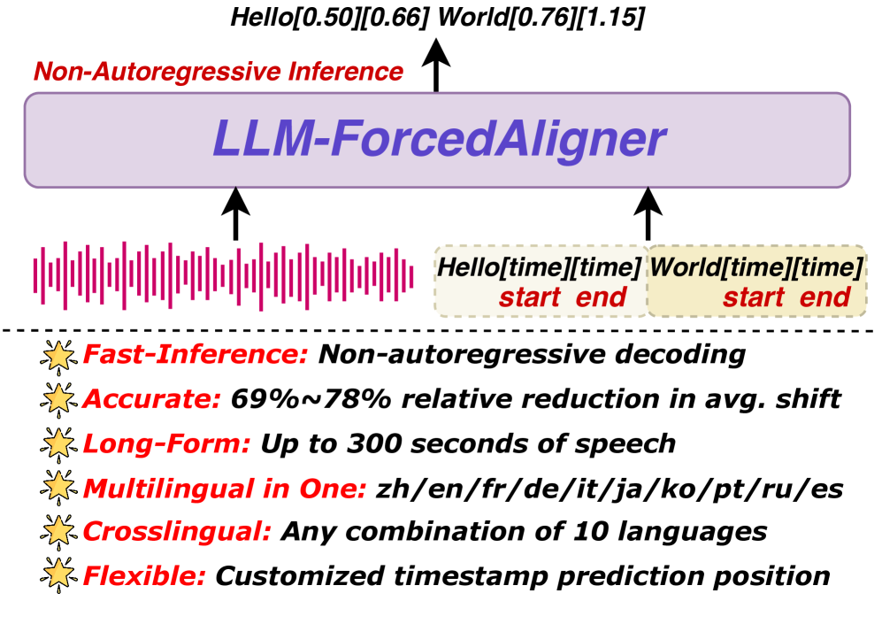
*Figure 1:Highlights of LLM-ForceAligner.*

![Figure 2:Overview of LLM-ForcedAligner. Left: During training, we replace the word-level or character-level start and end timestamps in the transcript with a special token [time] to serve as slots, and use dynamic slot insertion to randomly determine which word or character slots to ignore. The speech embeddings produced by the AuT encoder are then concatenated and fed into the LLM for training with causal attention masking. When computing the cross-entropy loss, the output IDs and the labels are non-shifted, and the loss is computed only at the positions of the retained slots. Right: During inference, users can insert the special token [time] at arbitrary positions in the transcript and rapidly obtain the corresponding start and end timestamps through non-autoregressive decoding.](../images/2026-01-27/2601.18220/2601.18220_fig1.png)
*Figure 2:Overview of LLM-ForcedAligner. Left: During training, we replace the word-level or character-level start and end timestamps in the transcript with a special token [time] to serve as slots, and use dynamic slot insertion to randomly determine which word or character slots to ignore. The speech embeddings produced by the AuT encoder are then concatenated and fed into the LLM for training with causal attention masking. When computing the cross-entropy loss, the output IDs and the labels are non-shifted, and the loss is computed only at the positions of the retained slots. Right: During inference, users can insert the special token [time] at arbitrary positions in the transcript and rapidly obtain the corresponding start and end timestamps through non-autoregressive decoding.*

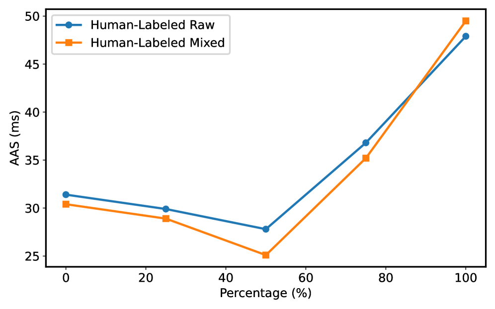
*Figure 3:AAS (ms) of LLM-ForcedAligner on the human-labeled test datasets for different dynamic slot insertion percentages.*

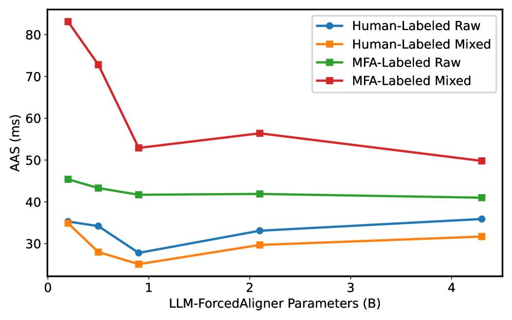
*Figure 4:AAS (ms) on the MFA-labeled and human-labeled test datasets for LLM-ForcedAligner with different parameter settings.*

---
**Usage Info**: 5449 tokens used.
**Generated at**: 2026-02-24 20:44:22

---

# 📚 EuleroDec: A Complex-Valued RVQ-VAE for Efficient and Robust Audio Coding

🚀 URL: https://arxiv.org/html/2601.17517

## 🌏 Abstract (원문)
Spectral-domain audio codecs decompose a signal into its time-frequency representation, typically via short-time Fourier transform (STFT). Although the magnitude (or power) spectrum carries most perceptual content, the phase spectrum is equally essential for faithful reconstruction: improper or discarded phase information leads to the smearing of transients, ’phasiness’, and audible artifacts in the decoded signal. Many recent approaches, both in the waveform and spectral domains, employ multi-scale adversarial discriminators or score or flow-based post filters to improve perceptual quality at the price of adversarial instability and slower convergence. An alternative line of work encodes complex spectra by splitting real-imaginary or magnitude–phase components and processing them independently. However, this factorization neglects intrinsic phase–magnitude coupling and leads to parameter redundancy. Complex-valued neural networks (CVNNs) have shown promise in speech enhancement and generative modeling. Yet existing codec-oriented approaches either operate partially in the real domain, breaking phase coherence, or are restricted to music and a single bitrate. To date, to the best of our knowledge, no codec realizes a fully end-to-end complex-valued analysis-quantization-synthesis pipeline without adversarial or post-filtering components. In this work, we introduce the first fully end-to-end complex-valued neural audio codec for 24 kHz speech at 6 and 12 kbps. All stages of the pipeline - from waveform input to waveform reconstruction - are complex-valued and jointly optimized using Wirtinger calculus, without real-valued detours. The model integrates complex convolutions, attention, and normalization with 2×2 whitening, preserving the algebraic structure of the STFT and intrinsic amplitude–phase coupling. Without adversarial training or diffusion-based post-filters, the proposed approach achieves consistent in-domain and out-of-domain improvements at the target bitrates. Our contributions are as follows: (1) We propose the first end-to-end complex-valued VQ-VAE for audio, (2) our codec attains state-of-the-art quality without adversarial discriminators or score-based post-filters; (3) we reach and surpass state-of-the-art quality with fast, steady convergence and reduces training budget by 95%.
## 🌏 Abstract (번역)
스펙트럼 도메인 오디오 코덱은 일반적으로 단시간 푸리에 변환(STFT)을 통해 신호를 시간-주파수 표현으로 분해합니다. 크기(또는 전력) 스펙트럼이 대부분의 지각적 내용을 담고 있지만, 위상 스펙트럼 역시 충실한 복원을 위해 필수적입니다. 부적절하거나 폐기된 위상 정보는 트랜지언트의 번짐, '페이즈니스(phasiness)', 그리고 디코딩된 신호의 가청 아티팩트를 유발합니다. 최근의 많은 접근 방식은 파형 및 스펙트럼 도메인 모두에서 다중 스케일 적대적 판별자나 스코어 또는 플로우 기반 포스트 필터를 사용하여 지각 품질을 개선하려 하지만, 이는 적대적 불안정성과 느린 수렴이라는 대가를 치릅니다. 대안적인 연구들은 실수-허수 또는 크기-위상 성분을 분리하여 독립적으로 처리함으로써 복소 스펙트럼을 인코딩합니다. 그러나 이러한 인수분해는 내재적인 위상-크기 결합을 무시하고 파라미터 중복을 초래합니다. 복소수 신경망(CVNN)은 음성 향상 및 생성 모델링에서 가능성을 보여주었습니다. 하지만 기존의 코덱 지향 접근 방식은 부분적으로 실수 도메인에서 작동하여 위상 일관성을 깨뜨리거나, 음악 및 단일 비트레이트에 국한되어 있습니다. 현재까지 우리가 아는 바로는 적대적 또는 포스트 필터링 구성 요소 없이 완전한 엔드투엔드 복소수 분석-양자화-합성 파이프라인을 구현한 코덱은 없습니다. 본 연구에서는 6 및 12 kbps에서 24 kHz 음성을 위한 최초의 완전 엔드투엔드 복소수 신경 오디오 코덱을 소개합니다. 파형 입력부터 파형 복원까지 파이프라인의 모든 단계는 복소수 값이며, 실수 도메인으로의 우회 없이 Wirtinger 미적분학을 사용하여 공동 최적화됩니다. 이 모델은 복소 컨볼루션, 어텐션, 그리고 2x2 화이트닝을 포함한 정규화를 통합하여 STFT의 대수적 구조와 내재적인 진폭-위상 결합을 보존합니다. 적대적 훈련이나 확산 기반 포스트 필터 없이도 제안된 접근 방식은 목표 비트레이트에서 일관된 인도메인 및 아웃오브도메인 개선을 달성합니다. 본 연구의 기여는 다음과 같습니다: (1) 오디오를 위한 최초의 엔드투엔드 복소수 VQ-VAE를 제안합니다. (2) 적대적 판별자나 스코어 기반 포스트 필터 없이 최첨단 품질을 달성합니다. (3) 빠르고 안정적인 수렴으로 최첨단 품질에 도달하거나 이를 능가하며 훈련 예산을 95% 절감합니다.

## 🔍 Methods & Results
- 24kHz 오디오 신호를 STFT(NFFT=512, hop=64)를 통해 복소 스펙트로그램으로 변환하여 직접 처리함
- 모든 레이어(컨볼루션, 정규화, 활성화 함수, 어텐션)가 복소수 연산을 지원하는 복소수 네이티브 VQ-VAE 아키텍처를 채택함
- Wirtinger 미적분학을 사용하여 파형 입력부터 복원까지 전 과정을 실수 도메인 우회 없이 공동 최적화함
- 6kbps(stride 8) 및 12kbps(stride 4) 비트레이트에서 12개의 코드북을 사용하는 RVQ(Residual Vector Quantization)를 적용함
- 적대적 학습(GAN)이나 확산 기반 포스트 필터 없이도 기존 SOTA 모델 대비 우수한 품질을 달성함
- 훈련 수렴 속도가 매우 빠르며, 기존 방식 대비 훈련 예산을 약 95% 절감하는 효율성을 보임

## 🖼 Figures
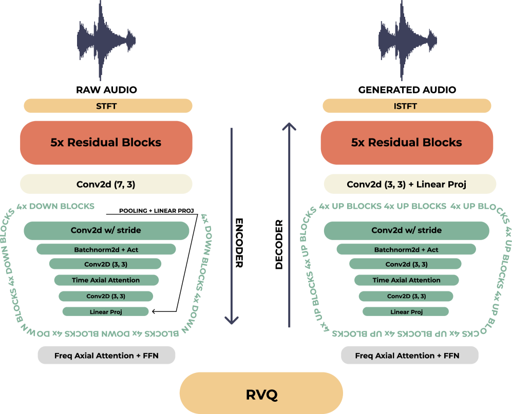
*Fig. 1:Model Architecture (All layers are complex-valued)*

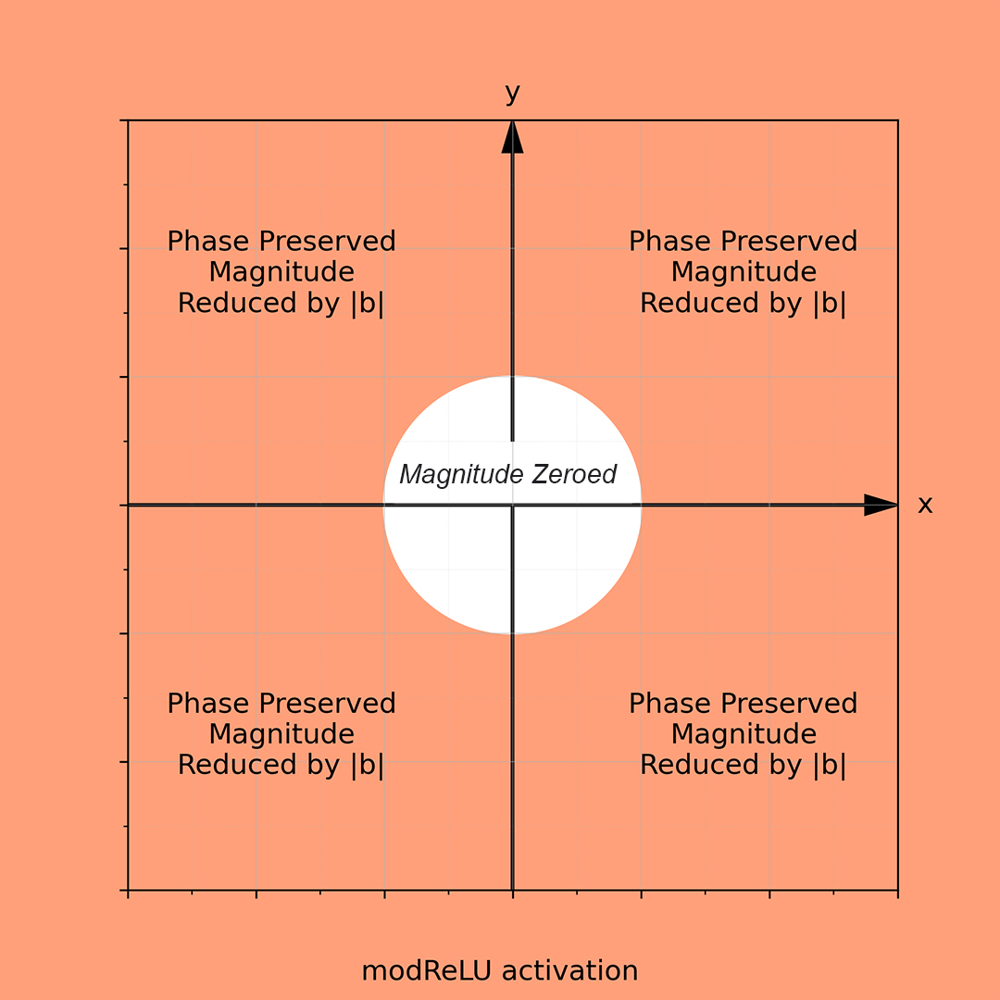
*Fig. 2:Visualization of the modReLU activation: it applies a threshold to the modulus, leaving the phase intact.*

*Fig. 3:UMAP 2D of encoder embeddings and stage-0 centroids at 6 kbps. Our RVQ shows 100 % code utilization and an effective perplexity of 73.2% of the available codes, indicating broad, non-collapsed usage (a collapsed codebook would yield low perplexity). Distances are qualitative*

---
**Usage Info**: 6493 tokens used.
**Generated at**: 2026-02-24 20:45:13

---

# 📚 Splat-Portrait: Generalizing Talking Heads with Gaussian Splatting

🚀 URL: https://arxiv.org/html/2601.18633

## 🌏 Abstract (원문)
Talking Head Generation (THG) aims to synthesize natural-looking talking videos from conditioning information such as driving speech or driving videos. The generation of talking heads has received increasing attention due to its importance in various applications, including digital humans, virtual video conferencing and visual dubbing. Recent 2D methods have achieved significant improvements in video quality and achieve expressive animation results. However, such 2D methods struggle to generate views with large head pose variations, and are not guaranteed to output 3D-consistent renderings from different poses. 3D THG methods have attracted increasing attention in the past two years, since they simultaneously reconstruct accurate 3D geometry and generate expressive facial motions, allowing realistic and 3D-consistent portrait rendering from arbitrary user-controllable viewpoints. The majority of such methods focus on personal talking head generation, where they overfit a single person’s head; they maintain realistic 3D geometry and preserve rich texture details. However, in this work, we consider the more challenging setting where we synthesise a 3D talking head given just a single 2D image, learning a model that generalizes across identities even without 3D supervision. To represent 3D or 4D faces in THG, Neural Radiance Fields (NeRF) or 3D Gaussian Splatting (3DGS) are commonly used. NeRF-based methods often exhibit problems such as visual jitters, unsynchronized lip movements, and rendering artifacts; this is because the implicit definition of NeRF entangles static facial geometry with dynamic motion, complicating simultaneous control of lip motions and 3D geometry reconstruction. Other works have explored 3D Gaussian Splatting (3DGS) for 3D avatar generation in the person-generic setting. Compared to NeRF, 3DGS not only improves inference speed and visual quality, but is also more controllable due to its explicit point-cloud-based representation; this makes it possible to animate facial movements more directly and intuitively. For example, drives Gaussian point clouds for facial motion using parametric 3D facial models, but it is still challenging to generalize to a person-generic setting. In addition, significant efforts have been made to design and improve 4D animation conditioned on driving information; the model reconstructs 3D geometry from a single portrait image and learns the corresponding facial motions. These motions are predicted from either an audio sequence or a video sequence driven by motion representation priors, e.g., PNCC, SECC and FLAME. These methods relax the difficulty of model training by injecting domain priors, e.g. 3D distillation and motion driven priors, which can lead to unnatural results with limited 3D texture details. Overall, existing works either reconstruct accurate 3D geometry but require multi-view inputs; or they learn it from monocular videos but yield inaccurate geometry. In this work, we introduce Splat-Portrait, a novel audio-driven THG method based on 3DGS. Our method operates in the single-view setting—it reconstructs the 3D shape of the head directly from one image, outputting pixel-aligned Gaussian splats. To enable lip motion during speech, our model learns to directly animate these splats conditioned on an audio sequence. Our approach is self-supervised from monocular videos only, and does not rely on 3D morphable models such as FLAME to represent facial shape and expression. We first train our model for static splat reconstruction on a large dataset without audio, then fine-tune on a smaller dataset of portrait videos to learn the correct splat dynamics. This strategy avoids 3D supervision, with the exception of easily-obtained approximate camera intrinsics and extrinsics. During the fine-tuning stage, to further improve the realism of extreme viewpoints that are rare in the training data, we adopt score distillation sampling (SDS), to extract knowledge from a powerful 2D diffusion prior. Existing works typically model only the head region, or model the head and torso regions as a whole, while disregarding the background. This results in a video of a ‘floating head’, rather than a realistic video of the talking head in context. To address this, our model also predict a static RGB background image, and alpha-blend the rasterized splats over this. Driven only by the unsupervised frame-prediction loss, our model automatically learns to reduce the opacity of splats in the background region, and to inpaint the background even behind the head, resulting in realistic disocclusions when the head rotates. In summary, our main contributions are as follows: A novel model architecture that disentangles a single portrait image into an accurate 3D splat representation of the head over an inpainted 2D background. Given audio sequences and corresponding time deltas, we show how to directly animate the 3D splats by predicting and adding dynamic offsets, without any complex motion representation such as a deformation model. A self-supervised training recipe that uses only monocular videos, without 3D supervision, and integrates knowledge from a strong 2D face prior, distilling its knowledge to improve reconstruction of extreme views. Experimental results on the HDTF and TH-1KH datasets demonstrate that our approach yields higher video fidelity and quality compared with OTAvatar, HiDe-NeRF, Real3D-Portrait, and NeRFFaceSpeech and GAGavatar.
## 🌏 Abstract (번역)
"말하는 얼굴 생성(Talking Head Generation, THG)은 구동 음성이나 구동 비디오와 같은 조건 정보를 바탕으로 자연스러운 말하는 영상을 합성하는 것을 목표로 합니다. 말하는 얼굴 생성은 디지털 휴먼, 가상 화상 회의, 시각적 더빙 등 다양한 응용 분야에서의 중요성으로 인해 점점 더 많은 관심을 받고 있습니다. 최근의 2D 방법들은 영상 품질에서 상당한 개선을 이루었으며 표현력 있는 애니메이션 결과를 달성했습니다. 그러나 이러한 2D 방법들은 머리 자세 변화가 큰 뷰를 생성하는 데 어려움을 겪으며, 서로 다른 자세에서 3D 일관성이 있는 렌더링 출력을 보장하지 못합니다. 3D THG 방법들은 지난 2년 동안 정확한 3D 기하학을 재구성하는 동시에 표현력 있는 얼굴 동작을 생성하여, 사용자가 제어 가능한 임의의 시점에서 현실적이고 3D 일관된 초상화 렌더링을 가능하게 함으로써 주목을 받았습니다. 이러한 방법의 대부분은 단일 인물의 머리에 과적합되는 개인화된 말하는 얼굴 생성에 초점을 맞추어 현실적인 3D 기하학을 유지하고 풍부한 질감 세부 사항을 보존합니다. 그러나 본 연구에서는 단일 2D 이미지만 주어졌을 때 3D 말하는 얼굴을 합성하고, 3D 지도 학습 없이도 신원에 구애받지 않고 일반화되는 모델을 학습하는 더 도전적인 설정을 고려합니다. THG에서 3D 또는 4D 얼굴을 표현하기 위해 신경 복사장(NeRF) 또는 3D 가우시안 스플래팅(3DGS)이 일반적으로 사용됩니다. NeRF 기반 방법은 종종 시각적 떨림, 비동기적 입술 움직임, 렌더링 아티팩트와 같은 문제를 나타내는데, 이는 NeRF의 암시적 정의가 정적인 얼굴 기하학을 동적 움직임과 얽히게 하여 입술 동작 제어와 3D 기하학 재구성을 동시에 수행하는 것을 복잡하게 만들기 때문입니다. 다른 연구들은 인물 일반화 설정에서 3D 아바타 생성을 위해 3DGS를 탐구했습니다. NeRF와 비교하여 3DGS는 추론 속도와 시각적 품질을 향상시킬 뿐만 아니라, 명시적인 포인트 클라우드 기반 표현 덕분에 제어가 더 용이하여 얼굴 움직임을 더 직접적이고 직관적으로 애니메이션화할 수 있게 합니다. 또한 구동 정보에 조건화된 4D 애니메이션을 설계하고 개선하기 위해 상당한 노력이 기울여졌습니다. 이러한 방법들은 도메인 사전 지식을 주입하여 모델 학습의 난이도를 완화하지만, 제한된 3D 질감 세부 사항으로 인해 부자연스러운 결과를 초래할 수 있습니다. 전반적으로 기존 작업들은 정확한 3D 기하학을 재구성하지만 다중 뷰 입력이 필요하거나, 단안 비디오에서 학습하지만 부정확한 기하학을 생성합니다. 본 연구에서는 3DGS를 기반으로 한 새로운 오디오 구동 THG 방법인 Splat-Portrait를 소개합니다. 우리 방법은 단일 뷰 설정에서 작동하며, 하나의 이미지에서 직접 머리의 3D 형상을 재구성하여 픽셀 정렬된 가우시안 스플랫을 출력합니다. 음성 중 입술 움직임을 가능하게 하기 위해, 우리 모델은 오디오 시퀀스에 조건화되어 이러한 스플랫을 직접 애니메이션화하는 법을 학습합니다. 우리 접근 방식은 단안 비디오만으로 자기 지도 학습을 수행하며, 얼굴 형상과 표정을 표현하기 위해 FLAME과 같은 3D 가변 모델에 의존하지 않습니다. 먼저 오디오가 없는 대규모 데이터셋에서 정적 스플랫 재구성을 위해 모델을 사전 학습한 다음, 소규모 초상화 비디오 데이터셋에서 미세 조정을 통해 올바른 스플랫 동역학을 학습합니다. 미세 조정 단계에서는 학습 데이터에 드문 극한의 시점의 현실성을 더욱 향상시키기 위해 강력한 2D 확산 사전 지식에서 지식을 추출하는 점수 증류 샘플링(SDS)을 채택합니다. 또한 배경을 무시하는 기존 연구와 달리, 우리 모델은 정적 RGB 배경 이미지를 예측하고 그 위에 렌더링된 스플랫을 알파 블렌딩합니다. 실험 결과, HDTF 및 TH-1KH 데이터셋에서 우리 방식이 OTAvatar, HiDe-NeRF, Real3D-Portrait, NeRFFaceSpeech 및 GAGavatar와 비교하여 더 높은 비디오 충실도와 품질을 제공함을 입증했습니다."

## 🔍 Methods & Results
- Splat-Portrait는 정적 3D 스플랫 재구성을 위한 사전 학습과 오디오 조건부 동적 디코더를 사용한 미세 조정의 2단계 프레임워크를 제안함
- 3D Gaussian Splatting(3DGS)을 활용하여 단일 이미지로부터 픽셀 정렬된 가우시안 속성(투명도, 스케일, 깊이, 회전, 색상 등)을 예측함
- 입력 이미지에서 정적 RGB 배경을 함께 예측하고 렌더링된 스플랫과 알파 블렌딩하여 '떠다니는 머리' 문제를 해결하고 자연스러운 배경 인페인팅을 구현함
- Wav2Vec2-XLSR 53 기반의 AudioNet과 AudioAttNet을 통해 오디오 특징을 추출하고, 이를 FiLM 컨디셔닝을 통해 동적 디코더에 주입하여 입술 움직임 오프셋을 생성함
- 학습 데이터에 부족한 극한의 시점(Extreme Viewpoints) 재구성 품질을 높이기 위해 2D 확산 모델(Diffusion Model)의 사전 지식을 활용하는 Score Distillation Sampling(SDS) 기법을 적용함
- FLAME과 같은 복잡한 3D 가변 모델이나 별도의 3D 지도 학습 없이 단안 비디오만으로 자기 지도 학습(Self-supervised learning)이 가능함
- HDTF 및 TH-1KH 데이터셋에서 실험한 결과, 기존 최신 기술(OTAvatar, HiDe-NeRF 등) 대비 시각적 품질과 3D 일관성 측면에서 우수한 성능을 보임

## 🖼 Figures
![Figure 1:Overview of Splat-Portrait. The identity image 
𝐼
𝑖
 is passed through a U-Net Static Generator(SG) to reconstruct static 3D Gaussian Splats, alpha-blended over a predicted 2D background. The dynamic decoder estimates splat offsets at timestep 
𝑇
𝑛
 using audio features 
𝐴
𝑛
 and time embedding 
Δ
​
𝑇
. The training procedure consists of two stages, stage(I): an initial pre-training phase, where the static components are trained on a large-scale dataset using a static reconstruction loss 
ℒ
static
, and stage(II): a fine-tuning phase on a smaller dataset incorporating an additional dynamic reconstruction loss 
ℒ
dynamic
. And a score distillation loss 
ℒ
SDS
 on extreme viewpoints applied during both stages.](../images/2026-01-27/2601.18633/2601.18633_fig0.png)
*Figure 1:Overview of Splat-Portrait. The identity image 
𝐼
𝑖
 is passed through a U-Net Static Generator(SG) to reconstruct static 3D Gaussian Splats, alpha-blended over a predicted 2D background. The dynamic decoder estimates splat offsets at timestep 
𝑇
𝑛
 using audio features 
𝐴
𝑛
 and time embedding 
Δ
​
𝑇
. The training procedure consists of two stages, stage(I): an initial pre-training phase, where the static components are trained on a large-scale dataset using a static reconstruction loss 
ℒ
static
, and stage(II): a fine-tuning phase on a smaller dataset incorporating an additional dynamic reconstruction loss 
ℒ
dynamic
. And a score distillation loss 
ℒ
SDS
 on extreme viewpoints applied during both stages.*

*Figure 2:Qualitative results. Top: We show source frames from five videos, future predicted frames from ours and baselines, and future depths from ours. Bottom: Additional examples of 3D reconstruction, for our method and Real3D-Portrait, displaying the input frame, and the reconstructed depth-map from each method.*

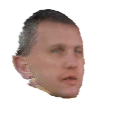
*Figure 3:Ablation study, with extreme head yaw angles (top row at -35°, the middle row at 0°, and the bottom row at +35°).*

---
**Usage Info**: 7583 tokens used.
**Generated at**: 2026-02-24 20:45:58

---

