# 🚩 (2026-01-28) Scholar Inbox 추천 논문 

# 📚 GMS-CAVP: Improving Audio-Video Correspondence with Multi-Scale Contrastive and Generative Pretraining

🚀 URL: https://arxiv.org/html/2601.19606

## 🌏 Abstract (원문)
Learning robust video-audio (V-A) correspondence lies at the heart of many cross-modal tasks[5,15,21,9,10], including video-to-audio generation, audio-driven video synthesis, and audio-visual retrieval. In particular, recent efforts have focused on contrastive audio-visual pretraining (CAVP)[12,10]to align modalities via discriminative objectives. These approaches have demonstrated impressive progress by embedding video and audio into a shared space, enabling downstream retrieval tasks. Recent approaches[5,15,9,12]to video-to-audio generation primarily rely on contrastive pretraining to improve modality alignment and diffusion-based generative models to synthesize high-quality audio. Contrastive learning techniques project video and audio data into a shared latent space, enhancing the relevance of generated audio. However, these methods often struggle to capture the fine-grained, multi-scale spatial-temporal dependencies necessary for effective cross-modal understanding and high-fidelity audio generation. The lack of hierarchical feature modeling limits their capacity to generalize across diverse video scenes, particularly those involving complex motion patterns or intricate audio-visual relationships. However, two core limitations remain underexplored. First, although CAVP serves as a backbone for both retrieval and generation tasks, current pretraining objectives are exclusively contrastive in nature. This neglects the inherent modality translation capabilities required in generative tasks such as video-to-audio synthesis. Consequently, models pretrained solely with discriminative losses are suboptimal when deployed in generative settings, where learning cross-modal mappings is crucial. Second, both video and audio are information-dense modalities that span multiple spatial and temporal scales. Yet existing CAVP methods apply a single-scale global alignment strategy, which overlooks fine-grained and hierarchical cross-modal correspondences, essential for capturing rich V-A dynamics. To address these challenges, we proposeGMS-CAVP, a novel multi-scale contrastive and generative framework for cross-modal pretraining.GMS-CAVPintroduces a Multi-scale Video-Audio Alignment mechanism to enforce hierarchical video-audio correspondence and a Generative Multi-scale Video-Audio Alignment to bridge the generative gap between video and audio modalities. By integrating contrastive learning with diffusion-based generative modeling, our approach ensures robust cross-modal alignment while significantly improving the fidelity and coherence of generated audio. Unlike prior methods that operate on single-scale representations,GMS-CAVPleverages hierarchical spatial-temporal structures to enhance synchronization and realism. We conduct extensive experiments on VGGSound, AudioSet, and Panda70M to validate the effectiveness ofGMS-CAVP. Our results demonstrate thatGMS-CAVPachieves state-of-the-art performance in both video-to-audio generation and retrieval tasks.GMS-CAVPconsistently outperforms existing approaches in key metrics such as KLD, FAD, and Align Acc, confirming its ability to generate high-quality, temporally coherent audio while maintaining precise synchronization with visual inputs. Ablation studies further show the importance of our proposed components, and explore the effect of diffusion sampling, bidirectional training, spatial multi-scale, and data scaling. We summarize our contributions below: We proposeGMS-CAVP, a unified multi-scale contrastive and generative approach to learn cross-modal correspondence for generation and retrieval. We introduce Multi-scale Spatial-temporal Alignment and Multi-scale Spatial-temporal Diffusion for video-audio pretraining. We conduct extensive experiments and ablation studies demonstrating thatGMS-CAVPoutperforms existing methods in generation and retrieval.
## 🌏 Abstract (번역)
강력한 비디오-오디오(V-A) 대응 관계를 학습하는 것은 비디오-오디오 생성, 오디오 기반 비디오 합성, 오디오-비주얼 검색을 포함한 많은 교차 모달 작업의 핵심입니다. 특히 최근에는 판별적 목적 함수를 통해 모달리티를 정렬하는 대조적 오디오-비주얼 사전 학습(CAVP)에 초점이 맞춰져 왔습니다. 이러한 접근 방식은 비디오와 오디오를 공유 공간에 임베딩하여 다운스트림 검색 작업에서 인상적인 진전을 보여주었습니다. 비디오-오디오 생성에 대한 최근 연구들은 주로 모달리티 정렬을 개선하기 위한 대조적 사전 학습과 고품질 오디오 합성을 위한 확산 기반 생성 모델에 의존합니다. 대조 학습 기술은 비디오와 오디오 데이터를 공유 잠재 공간에 투영하여 생성된 오디오의 관련성을 높입니다. 그러나 이러한 방법들은 효과적인 교차 모달 이해와 고충실도 오디오 생성에 필요한 세밀하고 다중 스케일의 시공간적 의존성을 포착하는 데 종종 어려움을 겪습니다. 계층적 특징 모델링의 부재는 복잡한 움직임 패턴이나 복잡한 오디오-비주얼 관계를 포함하는 다양한 비디오 장면에서 일반화 능력을 제한합니다. 하지만 두 가지 핵심적인 한계가 여전히 충분히 탐구되지 않은 상태로 남아 있습니다. 첫째, CAVP가 검색과 생성 작업 모두의 중추 역할을 함에도 불구하고, 현재의 사전 학습 목적 함수는 본질적으로 대조적일 뿐입니다. 이는 비디오-오디오 합성과 같은 생성 작업에 필요한 고유한 모달리티 변환 능력을 무시합니다. 결과적으로 판별적 손실로만 사전 학습된 모델은 교차 모달 매핑 학습이 중요한 생성 환경에 배치될 때 최적의 성능을 내지 못합니다. 둘째, 비디오와 오디오는 모두 여러 공간 및 시간 스케일에 걸친 정보 밀도가 높은 모달리티입니다. 그러나 기존 CAVP 방법은 단일 스케일 전역 정렬 전략을 적용하여 풍부한 V-A 역학을 포착하는 데 필수적인 세밀하고 계층적인 교차 모달 대응 관계를 간과합니다. 이러한 문제를 해결하기 위해 본 논문에서는 교차 모달 사전 학습을 위한 새로운 다중 스케일 대조 및 생성 프레임워크인 GMS-CAVP를 제안합니다. GMS-CAVP는 계층적 비디오-오디오 대응을 강화하기 위한 다중 스케일 비디오-오디오 정렬 메커니즘과 비디오 및 오디오 모달리티 간의 생성적 격차를 메우기 위한 생성적 다중 스케일 비디오-오디오 정렬을 도입합니다. 대조 학습을 확산 기반 생성 모델링과 통합함으로써, 본 접근 방식은 강력한 교차 모달 정렬을 보장하는 동시에 생성된 오디오의 충실도와 일관성을 크게 향상시킵니다. 단일 스케일 표현으로 작동하는 이전 방법들과 달리, GMS-CAVP는 계층적 시공간 구조를 활용하여 동기화와 사실성을 높입니다. VGGSound, AudioSet, Panda70M에 대한 광범위한 실험을 통해 GMS-CAVP의 효과를 검증합니다. 실험 결과, GMS-CAVP는 비디오-오디오 생성 및 검색 작업 모두에서 최첨단 성능을 달성함을 보여줍니다. GMS-CAVP는 KLD, FAD, Align Acc와 같은 주요 지표에서 기존 접근 방식을 지속적으로 능가하며, 시각적 입력과 정밀한 동기화를 유지하면서 고품질의 시간적 일관성을 갖춘 오디오를 생성하는 능력을 확인시켜 줍니다. 절제 연구를 통해 제안된 구성 요소의 중요성을 추가로 보여주고 확산 샘플링, 양방향 학습, 공간 다중 스케일 및 데이터 스케일링의 효과를 탐구합니다. 본 연구의 기여는 다음과 같습니다: 1) 생성 및 검색을 위한 교차 모달 대응을 학습하는 통합된 다중 스케일 대조 및 생성 접근 방식인 GMS-CAVP를 제안합니다. 2) 비디오-오디오 사전 학습을 위한 다중 스케일 시공간 정렬 및 다중 스케일 시공간 확산을 도입합니다. 3) GMS-CAVP가 생성 및 검색에서 기존 방법을 능가함을 입증하는 광범위한 실험과 절제 연구를 수행합니다.

## 🔍 Methods & Results
- GMS-CAVP 프레임워크 제안: 판별적(대조적) 학습과 생성적 학습을 결합하여 비디오-오디오 대응 관계를 학습하는 다중 스케일 사전 학습 모델
- 다중 스케일 시공간 정렬(MSA): 단일 스케일 정렬의 한계를 극복하기 위해 계층적 피라미드 풀링 및 다중 해상도 컨볼루션을 사용하여 세밀한 시공간적 의존성 포착
- 적응형 시간 정렬: 어텐션 기반 가중치 기법을 통해 비디오의 주요 동작이나 상호작용이 일어나는 시점에 정렬 강조
- 다중 스케일 시공간 확산(MSD): 계층적 비디오 특징을 조건으로 하는 확산 기반 디코더를 사용하여 비디오와 오디오 간의 생성적 격차 해소 및 고품질 오디오 합성
- 실험 결과: VGGSound, AudioSet, Panda70M 데이터셋에서 KLD, FAD, Align Acc 지표 기준 기존 SOTA 모델들을 능가하는 성능 달성
- 절제 연구: 확산 샘플링, 양방향 학습, 공간 다중 스케일 및 데이터 스케일링이 모델 성능 향상에 미치는 긍정적 영향 확인

## 🖼 Figures

*Fig. 1:Illustration of the proposed multi-scale discriminative and generative architecture (GMS-CAVP) for learning audio-video correspondence. We introduce the Multi-scale Video-Audio Alignment mechanism, which captures fine-grained hierarchical dependencies for enhanced video-audio correspondence. Then, Generative Multi-scale Video-Audio Alignment is proposed to bridge the generative gap between video and audio representations for improved video-to-audio synthesis.*

---
**Usage Info**: 5518 tokens used.
**Generated at**: 2026-02-24 20:47:15

---

# 📚 A Hybrid Discriminative and Generative System for Universal Speech Enhancement

🚀 URL: https://arxiv.org/html/2601.19113

## 🌏 Abstract (원문)
Universal speech enhancement (USE) aims to recover degraded speech with diverse distortions and recording conditions (e.g., varying sampling rates)[4]. Recent advances have categorized solutions into discriminative and generative approaches. Discriminative models, such as TF-GridNet[14], excel at signal fidelity and noise suppression but often struggle to reconstruct severely corrupted speech components[17]. Conversely, generative models can reconstruct high-quality speech but frequently suffer from hallucinations and artifacts due to imperfect alignment between the learned generative prior and the true underlying clean speech distribution. To address these issues, we propose a hybrid network for USE, which integrates the strengths of both paradigms. Specifically, we utilize the TF-GridNet to produce high-fidelity, noise-suppressed estimates and employ an autoregressive (AR) module with a spectral mapping[15]head to generate detail-rich but low-hallucination speech. Finally, a fusion network adaptively combines their outputs, yielding enhanced speech with fine-grained details and reduced artifacts. The proposed system is evaluated on the Track 1 (USE) of URGENT Challenge, obtaining promising performance in terms of both intrusive and non-intrusive metrics.
## 🌏 Abstract (번역)
범용 음성 향상(USE)은 다양한 왜곡과 녹음 조건(예: 가변 샘플링 속도)을 가진 저하된 음성을 복구하는 것을 목표로 합니다. 최근의 발전은 솔루션을 판별적(discriminative) 접근 방식과 생성적(generative) 접근 방식으로 분류했습니다. TF-GridNet과 같은 판별 모델은 신호 충실도와 노이즈 억제에는 뛰어나지만, 심하게 손상된 음성 성분을 재구성하는 데 어려움을 겪는 경우가 많습니다. 반면, 생성 모델은 고품질 음성을 재구성할 수 있지만, 학습된 생성 사전 확률과 실제 깨끗한 음성 분포 간의 불완전한 정렬로 인해 환각(hallucination) 및 아티팩트가 빈번하게 발생합니다. 이러한 문제를 해결하기 위해, 우리는 두 패러다임의 장점을 통합한 USE용 하이브리드 네트워크를 제안합니다. 구체적으로, TF-GridNet을 사용하여 고충실도의 노이즈가 억제된 추정치를 생성하고, 스펙트럼 매핑 헤드가 있는 자기회귀(AR) 모듈을 사용하여 세부 사항이 풍부하면서도 환각이 적은 음성을 생성합니다. 마지막으로, 융합 네트워크가 이들의 출력을 적응적으로 결합하여 미세한 세부 사항이 포함되고 아티팩트가 감소된 향상된 음성을 제공합니다. 제안된 시스템은 URGENT 챌린지의 트랙 1(USE)에서 평가되었으며, 침입형 및 비침입형 지표 모두에서 유망한 성능을 얻었습니다.

## 🔍 Methods & Results
- 판별적 백본으로 TF-GridNet을 채택하고 가변 샘플링 속도에 대응하기 위해 샘플링 주파수 독립(SFI) 전략을 적용함
- WavLM의 시맨틱 표현과 X-Codec의 이산 토큰을 활용한 자기회귀(AR) 모델링 기반의 생성 브랜치를 구축하여 복잡한 왜곡을 처리함
- 이산 토큰의 정보 병목을 해결하기 위해 DPRNN을 도입하여 LM의 시맨틱 특징과 어쿠스틱 특징을 융합하고 클린 음성 스펙트럼 마스크를 직접 예측함
- 생성 브랜치는 16kHz에서 작동하며, 최종적으로 경량 USES 네트워크를 통해 판별 브랜치와 생성 브랜치의 출력을 시간-주파수 마스크로 적응적 융합함
- Multi-resolution STFT, NLL, 회귀 손실 및 MOS, DNSMOS 등 5가지 지표를 포함한 다중 지표 품질 평가(SQA) 손실을 사용하여 최적화함
- URGENT 챌린지 Track 1 평가 결과, 침입형 및 비침입형 지표 모두에서 우수한 성능을 달성함

## 🖼 Figures
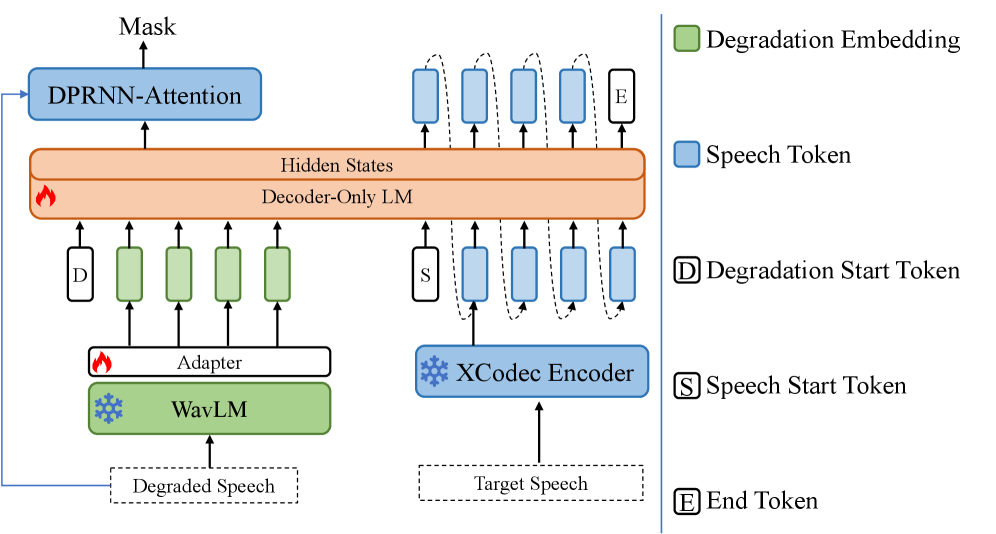
*Fig. 1:Architecture of the proposed generative branch model.*

---
**Usage Info**: 3863 tokens used.
**Generated at**: 2026-02-24 20:47:56

---

# 📚 Rethinking Discrete Speech Representation Tokens for Accent Generation

🚀 URL: https://arxiv.org/html/2601.19786

## 🌏 Abstract (원문)
Inspired by the tokenisation schemes employed by text-based Large Language Models (LLMs),discrete speech tokenisationhas emerged as an active research area for bridging speech and LLMs. By compressing speech signals or learned continuous representations into a finite set of discrete units, discrete speech tokens enable efficient storage of complex acoustic information while remaining inherently compatible with LLM architectures. As a result, they are rapidly becoming established as a foundational representation across a wide range of speech tasks(Guoet al.,2025). Discrete speech representation tokens (DSRTs), quantised from speech representations, have consequently seen huge success in various speech generation tasks, including Speech Language Models (SpeechLMs)(Cuiet al.,2025), Zero-Shot Text-to-Speech (ZS-TTS)(Kharitonovet al.,2023), Speech-to-Speech Translation (S2ST)(Leeet al.,2022)and full-duplex dialogue systems(Nguyenet al.,2023). Despite the significant progress brought by DSRTs, the representation of a speaker’saccentis largely overlooked in the design, evaluation, and application of the tokens. Prior user perception studies have demonstrated a similarity–attraction effect, whereby listeners prefer accents similar to their own in spoken interaction(Dahlbäcket al.,2007). Unfortunately, ZS-TTS systems are shown to hallucinate accents that differ from those of the reference speaker(Zhonget al.,2025b), while spoken dialogue systems still lack broad adoption of benchmarks or evaluation settings that consider appropriate, accent-controlled speech generation(Chenget al.,2025). Although some recent zero-shot TTS (ZS-TTS) systems have demonstrated some ability to mimic or control the accent of generated speech using discrete speech representation tokens (DSRTs), how much accent information is encoded in these tokens remains unexplored(Duet al.,2024; Zhanget al.,2025; Wanget al.,2025). Existing claims – such as that naive codebook size adjustment(Zhanget al.,2025)or ASR supervision(Duet al.,2024)can facilitate controlled accent generation – lack systematic investigation. To this end, we ask the following research questions: (1)How do different design choices in DSRTs influence the amount of accent information they encode?(2)How can these insights be leveraged to enable more controllable accent generation, e.g. in voice conversion (VC)? Existing DSRT evaluation frameworks focus on phonetic and speaker information and rarely consider accent(Polyaket al.,2021). We extend the investigation of accessibility to accent information, with an accent ABX method we proposed that evaluates the discriminability of representations for words uttered in different accents. Additionally, we propose to evaluate the recoverability of accent, speaker, and phonetic information by cross-accent VC, resynthesising from DSRTs from source speakers and speaker IDs from target speakers of different accents. Using the proposed framework, we observe the following key findings: (1) Accent information is most prominent in mid-early layers of HuBERT, different from speaker or phonetic information distribution. (2) Naive adjustment of codebook sizes provides only very limited disentanglement of accent, speaker and content information. (3) Predominant design of DSRTs for speech generation (quantising a later layer in a speech representation model, or using ASR supervison) discards most accent information. Our main contributions are: To the best of our knowledge, this is the first work to incorporate accent in evaluating DSRTs, and to apply ABX to a study of accent. Based on our findings, we propose quantisation schemes that are appropriate foraccent-preservingVC – preserving source speaker accent – andaccent-adaptiveVC – adapting to target speaker accent – which achieve superior performance to existing approaches. Evaluation pipeline and proposed DSRTs will be open-sourced in the future.
## 🌏 Abstract (번역)
텍스트 기반 대형 언어 모델(LLM)에서 사용되는 토큰화 방식에서 영감을 받아, 음성과 LLM을 연결하기 위한 이산 음성 토큰화가 활발한 연구 분야로 부상했습니다. 음성 신호나 학습된 연속 표현을 유한한 이산 단위 세트로 압축함으로써, 이산 음성 토큰은 복잡한 음향 정보의 효율적인 저장을 가능하게 하는 동시에 LLM 아키텍처와 본질적으로 호환됩니다. 그 결과, 이들은 광범위한 음성 작업에서 기초적인 표현으로 빠르게 자리 잡고 있습니다. 음성 표현에서 양자화된 이산 음성 표현 토큰(DSRT)은 음성 언어 모델(SpeechLM), 제로샷 텍스트 음성 변환(ZS-TTS), 음성 간 번역(S2ST) 및 풀듀플렉스 대화 시스템을 포함한 다양한 음성 생성 작업에서 큰 성공을 거두었습니다. DSRT가 가져온 상당한 진전에도 불구하고, 화자의 억양(accent) 표현은 토큰의 설계, 평가 및 적용에서 대체로 간과되어 왔습니다. 이전의 사용자 인식 연구는 청취자가 음성 상호작용에서 자신과 유사한 억양을 선호하는 유사성-매력 효과를 입증했습니다. 불행히도 ZS-TTS 시스템은 참조 화자와 다른 억양을 생성하는 경향이 있는 반면, 음성 대화 시스템은 여전히 적절하고 억양이 제어된 음성 생성을 고려하는 벤치마크나 평가 설정이 부족합니다. 최근 일부 제로샷 TTS 시스템이 DSRT를 사용하여 생성된 음성의 억양을 모방하거나 제어하는 능력을 보여주었지만, 이러한 토큰에 얼마나 많은 억양 정보가 인코딩되어 있는지는 여전히 미개척 분야로 남아 있습니다. 나이브한 코드북 크기 조정이나 ASR 감독이 제어된 억양 생성을 용이하게 할 수 있다는 기존의 주장은 체계적인 조사가 부족합니다. 이를 위해 본 연구는 다음과 같은 연구 질문을 던집니다: (1) DSRT의 서로 다른 설계 선택이 인코딩되는 억양 정보의 양에 어떤 영향을 미치는가? (2) 이러한 통찰력을 음성 변환(VC) 등에서 더 제어 가능한 억양 생성을 위해 어떻게 활용할 수 있는가? 기존의 DSRT 평가 프레임워크는 음성 및 화자 정보에 집중하며 억양은 거의 고려하지 않습니다. 본 연구에서는 서로 다른 억양으로 발음된 단어에 대한 표현의 변별력을 평가하는 '억양 ABX' 방법을 제안하여 억양 정보에 대한 접근성 조사를 확장합니다. 또한, 소스 화자의 DSRT와 다른 억양을 가진 타겟 화자의 화자 ID를 사용하여 재합성하는 교차 억양 VC를 통해 억양, 화자 및 음성 정보의 복구 가능성을 평가할 것을 제안합니다. 제안된 프레임워크를 사용하여 다음과 같은 주요 결과를 관찰했습니다: (1) 억양 정보는 화자나 음성 정보 분포와 달리 HuBERT의 중간-초기 레이어에서 가장 두드러집니다. (2) 나이브한 코드북 크기 조정은 억양, 화자 및 콘텐츠 정보의 분리에 매우 제한적인 효과만 제공합니다. (3) 음성 생성을 위한 지배적인 DSRT 설계(음성 표현 모델의 후기 레이어 양자화 또는 ASR 감독 사용)는 대부분의 억양 정보를 폐기합니다. 본 연구의 주요 기여는 다음과 같습니다: 우리가 아는 한, 이는 DSRT 평가에 억양을 통합하고 억양 연구에 ABX를 적용한 첫 번째 연구입니다. 연구 결과를 바탕으로 소스 화자의 억양을 보존하는 '억양 보존 VC'와 타겟 화자의 억양에 적응하는 '억양 적응 VC'에 적합한 양자화 방식을 제안하며, 이는 기존 방식보다 우수한 성능을 달성합니다. 평가 파이프라인과 제안된 DSRT는 향후 오픈 소스로 공개될 예정입니다.

## 🔍 Methods & Results
- 정보의 완결성과 접근성을 분리하여 측정하는 관점에서 DSRT를 평가하는 파이프라인 제안
- HuBERT, ASR로 미세 조정된 HuBERT(HuBERT-ft), Whisper 등 세 가지 음성 표현 모델을 사용하여 DSRT 추출
- RepCodec과 벡터 양자화(VQ)를 사용하여 음성 표현을 이산 토큰으로 변환
- 서로 다른 억양 간의 음성 변환(Cross-accent VC)을 수행하여 억양 정보의 복구 가능성(Recoverability)을 측정
- 모델 독립적인 방법인 ABX 테스트를 억양 변별력 측정에 맞게 변형한 'Accent ABX' 제안
- 실험 결과, 억양 정보는 HuBERT의 중간-초기 레이어에 주로 분포하며, 후기 레이어나 ASR 감독 학습 시 대부분 소실됨을 확인
- 코드북 크기 조정만으로는 억양과 화자 정보를 효과적으로 분리하기 어려움을 입증
- 소스 억양을 유지하는 방식과 타겟 억양을 따르는 방식에 각각 최적화된 양자화 스키마를 제안하여 성능 향상 확인

## 🖼 Figures
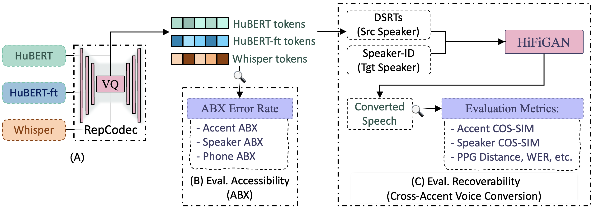
*Figure 1:Proposed pipeline for evaluating the recoverability and accessibility of accent, speaker, and phonetic information in various Discrete Speech Representation Tokens (DSRTs).*

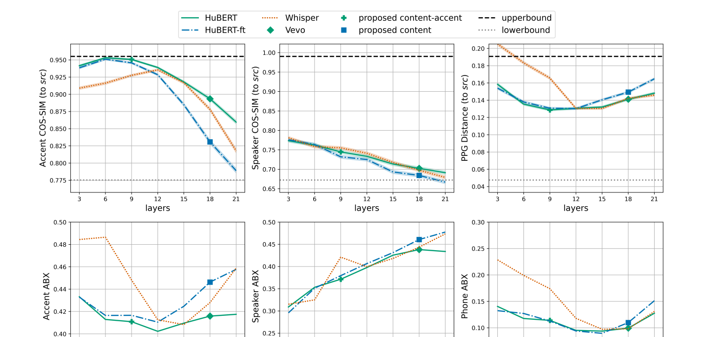
*(a)Cross-accent VC evaluation results for information recoverability.*

*(a)Cross-accent VC evaluation results for information recoverability.*

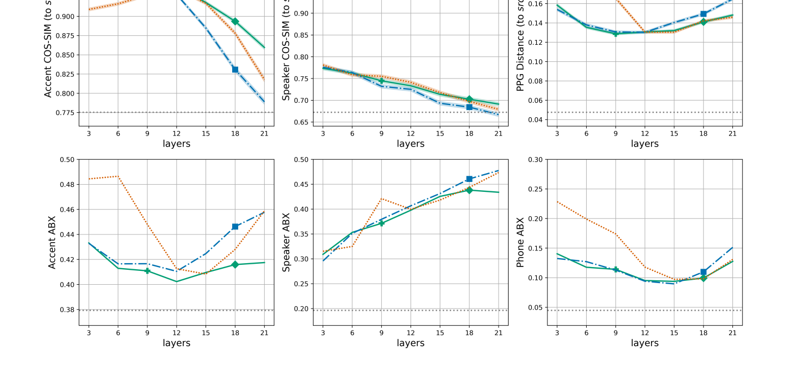
*(b)ABX evaluation results for information accessibility.*

*Figure 3:Accent, speaker, and phonetic information recoverability in different DSRTs across codebook sizes.
(See Figure 5 in Appendix D for additional results from cross-accent VC and ABX.)*

*Figure 4:Accent, speaker, and phonetic information in different DSRTs across layers and representations.
Full version of Figure 2.*

*Figure 5:Accent, speaker, and phonetic information in different DSRTs across codebook sizes.
Full version of Figure 3.*

---
**Usage Info**: 6103 tokens used.
**Generated at**: 2026-02-24 20:51:09

---

# 📚 PERMUTATION-INVARIANT PHYSICS-INFORMED NEURAL NETWORK FOR REGION-TO-REGION SOUND FIELD RECONSTRUCTION

🚀 URL: https://arxiv.org/html/2601.19491

## 🌏 Abstract (원문)
Sound Field Reconstruction (SFR), also known as sound field estimation or interpolation, aims to reconstruct the sound field over a spatial region within an acoustic environment[17]. This task is the foundation for many applications, such as room acoustics[8], virtual and augmented reality systems[9], and speech dereverberation[5]. Under the assumptions of time-invariant acoustic properties and linear sound propagation, the frequency response of the Room Impulse Response (RIR) — known as the Acoustic Transfer Function (ATF) — effectively represents the sound field in the frequency domain. Conventional SFR methods are mainly based on basis function decomposition. They decompose the sound field at some measurement positions onto basis functions, such as cylindrical harmonics[19], spherical harmonics[18]), plane waves[6], and weighted kernel functions[1]. These basis functions cover the entire receiver regions and thus allow the interpolation of the sound field at unmeasured positions. Novel methods, on the other hand, are mainly based on neural networks, especially the Physics-Informed Neural Networks (PINNs)[12]. They exploit the Helmholtz equation, the governing Partial Differential Equation of acoustic wave propagation in the loss function[7]to regularize the training of neural networks and ensure physical consistency of the neural network output. However, most of the conventional and novel SFR methods are limited to the point-to-region scenario, where a fixed-position sound source is paired with varying receiver positions within a fixed measurement region[17]. They have not effectively addressed the additional challenge introduced by the position variation of the sound sources and the measurement regions. The challenge has attracted researchers’ attention and was tackled by several studies[15,13]. In[15], the ATFs between a sound source region and a receiver region were parameterized as a truncated series of spherical harmonics. The series does not depend on the positions of the sound source or the receiver, allowing the interpolation of ATFs between any positions within the sound and receiver regions. However, separate analyses of the spherical harmonics truncation are required in each region, which can lead to error accumulation across regions. More recently, a Kernel Ridge Regression (KRR) approach[13]was proposed to interpolate ATFs between regions using an infinite-dimensional representation. By directly estimating the reverberant field in a non-parametric manner, it avoids the empirical truncation of function series[15]. This paper presents a Permutation-Invariant PINN (PI-PINN) method, extending our previous SFR work[2,11]from the point-to-region scenario to region-to-region scenario. The proposed method employs a deep set architecture[20]to process receiver and sound source positions as an unordered set, inherently preserving acoustic reciprocity. Additionally, the Helmholtz equation is incorporated as a physics constraint during training, ensuring physically consistent predictions. We evaluate the proposed PI-PINN method on real-world datasets and compare its performance with the current KRR method.
## 🌏 Abstract (번역)
음장 재구성(SFR)은 음향 환경 내의 특정 공간 영역에서 음장을 재구성하는 것을 목표로 하며, 이는 실내 음향, 가상 및 증강 현실 시스템, 음성 잔향 제거와 같은 다양한 응용 분야의 기초가 됩니다. 시불변 음향 특성과 선형 음파 전파를 가정할 때, 실내 임펄스 응답(RIR)의 주파수 응답인 음향 전달 함수(ATF)는 주파수 영역에서 음장을 효과적으로 나타냅니다. 기존의 SFR 방법은 주로 원통형 조화 함수, 구형 조화 함수, 평면파 및 가중 커널 함수와 같은 기저 함수 분해에 기반하여 측정되지 않은 위치의 음장을 보간합니다. 최근에는 신경망, 특히 물리 정보 신경망(PINN)을 기반으로 헬름홀츠 방정식을 손실 함수에 활용하여 물리적 일관성을 보장하는 방법들이 등장했습니다. 그러나 대부분의 기존 및 신규 방법은 고정된 음원과 가변적인 수신기 위치를 다루는 점-대-영역 시나리오에 국한되어 있으며, 음원과 수신기 위치가 모두 변하는 영역-대-영역 시나리오의 과제는 충분히 해결되지 않았습니다. 본 논문은 이전 연구를 확장하여 영역-대-영역 시나리오를 위한 순열 불변 PINN(PI-PINN) 방법을 제안합니다. 이 방법은 수신기와 음원 위치를 순서가 없는 집합으로 처리하는 딥 셋(deep set) 아키텍처를 사용하여 음향 상호성을 본질적으로 보존하며, 헬름홀츠 방정식을 물리적 제약 조건으로 통합하여 물리적으로 일관된 예측을 수행합니다. 제안된 PI-PINN 방법은 실제 데이터셋을 통해 평가되었으며 기존의 커널 릿지 회귀(KRR) 방법과 성능을 비교했습니다.

## 🔍 Methods & Results
- 영역-대-영역 음장 재구성을 위해 임의의 음원 위치와 수신기 위치 간의 ATF를 예측하는 문제 정의
- 수신기와 음원 위치를 순서 없는 집합으로 처리하는 Deep Set 아키텍처를 도입하여 음향 상호성(Reciprocity) 및 순열 불변성 확보
- 물리적 법칙인 헬름홀츠 방정식을 손실 함수(PDE Loss)에 통합하여 물리적으로 일관된 음장 예측 보장
- 데이터 손실(Data Loss)과 물리 손실(PDE Loss)을 결합한 가중 총 손실 함수를 통해 모델 학습
- tanh 활성화 함수와 2개의 은닉층을 가진 MLP 구조의 하위 네트워크(phi, rho) 설계
- 실제 데이터셋 실험을 통해 제안된 PI-PINN 모델이 기존 KRR 방식 대비 우수한 성능을 보임을 확인

## 🖼 Figures
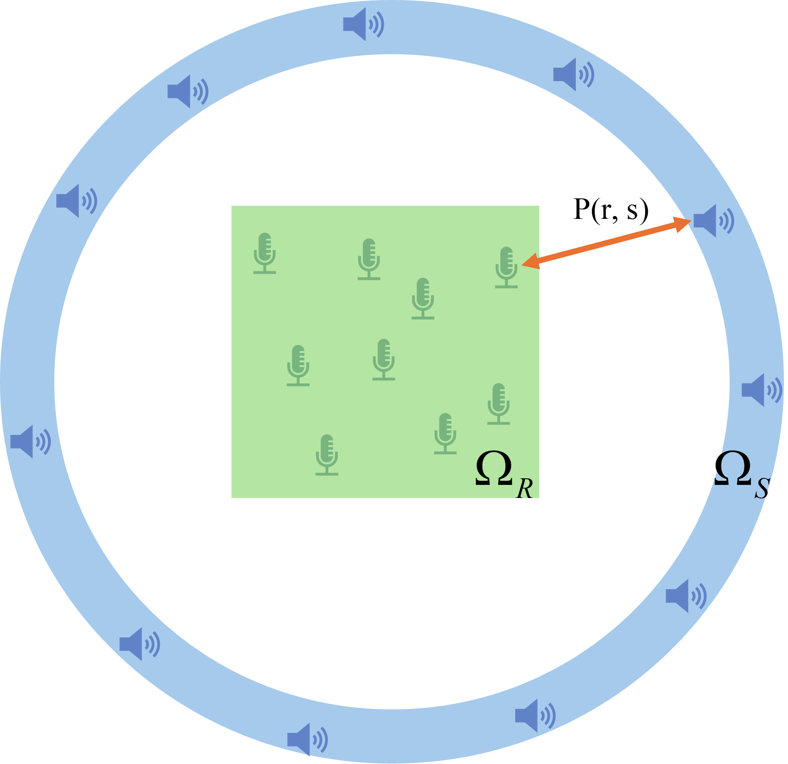
*Figure 1:Conceptual diagram of Region-to-Region SFR.*

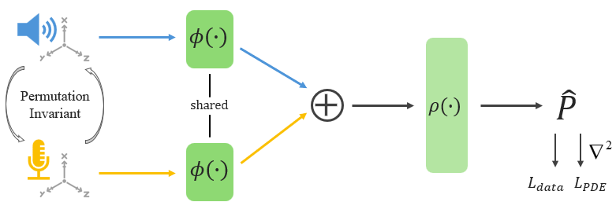
*Figure 2:Conceptual diagram of the proposed PI-PINN.*

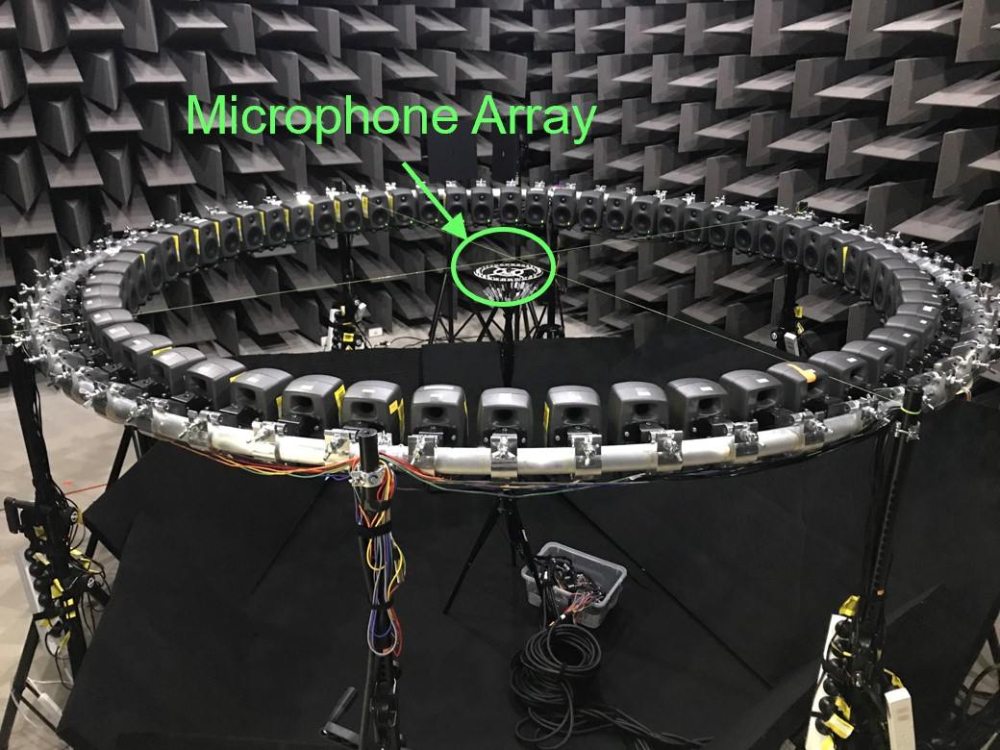
*Figure 3:(a) Measurement setup from the UTS dataset, (b) Planar 64-microphone array.*

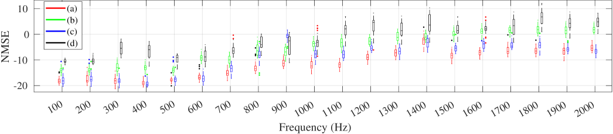
*Figure 4:NMSE (dB) as a function of frequency for four model variants in an anechoic room.*

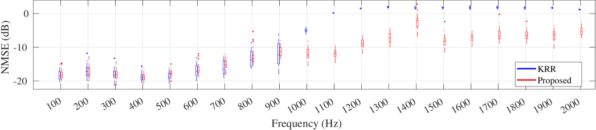
*Figure 5:NMSE (dB) as a function of frequency for the proposed PI-PINN model and the KRR method.*

*Figure 6:Measured and Reconstructed ATF distribution (real part) for Loudspeaker 
#
​
2
 at 
1500
 Hz.*

---
**Usage Info**: 6186 tokens used.
**Generated at**: 2026-02-24 20:51:58

---

# 📚 SLM-SS: Speech Language Model for Generative Speech Separation

🚀 URL: https://arxiv.org/html/2601.19533

## 🌏 Abstract (원문)
Speech separation (SS) is a crucial task in speech processing, aiming to isolate individual speech sources from a mixture of overlapping signals, with applications in areas such as automatic speech recognition (ASR), speaker identification (SID), and hearing aids. Currently, SS has been addressed using discriminative methods, typically trained with objectives like scale-invariant signal-to-distortion ratio (SI-SDR). Although effective in terms of waveform reconstruction, these approaches often fail to preserve speech intelligibility, introducing distortions that degrade downstream tasks like ASR. In contrast, generative methods explicitly model the data distribution and can produce more coherent outputs, but they are commonly limited by slow iterative decoding and the risk of hallucinating non-existent speech. Recent advances in large language models (LLMs) have substantially improved a wide range of speech processing tasks by enabling tighter integration of acoustic and linguistic information through quantized or discrete speech tokens. In this work, we introduce the SLM-SS framework, applying speech language models (SLMs) and quantized codecs to improve the intelligibility of separated speech. We employ Encodec to convert speech into discrete codebook sequences. These sequences are concatenated using Serialized Output Training (SOT) and modeled by a transformer-based autoregressive (AR) encoder-decoder, where the encoder extracts features from the mixture and the decoder aligns them with the discrete sequences through cross-attention. To further improve speech quality, we introduce a non-autoregressive (NAR) model that predicts higher-order codebooks from lower-order ones, improving decoding efficiency. Our framework offers a generative alternative for SS, achieving improved speech intelligibility and demonstrating outstanding performance on downstream tasks.
## 🌏 Abstract (번역)
음성 분리(SS)는 중첩된 신호 혼합물에서 개별 음성 소스를 분리하는 것을 목표로 하는 음성 처리의 핵심 과제로, 자동 음성 인식(ASR), 화자 식별(SID), 보청기 등의 분야에 응용됩니다. 현재 SS는 주로 SI-SDR(scale-invariant signal-to-distortion ratio)과 같은 목적 함수로 훈련된 판별적 방법들을 통해 해결되어 왔습니다. 이러한 접근 방식은 파형 재구성 측면에서는 효과적이지만, 음성 명료도를 보존하지 못하는 경우가 많아 ASR과 같은 후속 작업의 성능을 저하시키는 왜곡을 유발합니다. 반면, 생성적 방법은 데이터 분포를 명시적으로 모델링하여 더 일관된 출력을 생성할 수 있지만, 느린 반복적 디코딩과 존재하지 않는 음성을 생성하는 환각 위험이 있습니다. 최근 대규모 언어 모델(LLM)의 발전은 양자화되거나 이산적인 음성 토큰을 통해 음향 및 언어 정보를 더 긴밀하게 통합함으로써 다양한 음성 처리 작업을 실질적으로 개선했습니다. 본 연구에서는 분리된 음성의 명료도를 향상시키기 위해 음성 언어 모델(SLM)과 양자화된 코덱을 적용한 SLM-SS 프레임워크를 소개합니다. Encodec을 사용하여 음성을 이산 코드북 시퀀스로 변환하고, SOT(Serialized Output Training)를 사용하여 이러한 시퀀스를 연결하며, 트랜스포머 기반의 자기회귀(AR) 인코더-디코더로 모델링합니다. 여기서 인코더는 혼합물에서 특징을 추출하고 디코더는 교차 주의 집중(cross-attention)을 통해 이를 이산 시퀀스와 정렬합니다. 음질을 더욱 향상시키기 위해 저차 코드북에서 고차 코드북을 예측하는 비자기회귀(NAR) 모델을 도입하여 디코딩 효율성을 높였습니다. 우리의 프레임워크는 SS를 위한 생성적 대안을 제공하여 음성 명료도를 개선하고 후속 작업에서 뛰어난 성능을 입증했습니다.

## 🔍 Methods & Results
- 연속적인 오디오 신호를 1024 크기의 어휘집을 가진 32차 Encodec 코드북 시퀀스로 변환하여 이산 표현으로 모델링함
- SOT(Serialized Output Training) 전략을 도입하여 <SOS>, <SC>, <EOS> 등의 특수 토큰과 함께 여러 화자의 음성 시퀀스를 직렬로 연결함
- 사전 훈련된 WavLM을 인코더로, Whisper 스타일의 구조를 디코더로 사용하는 AR(Autoregressive) 모델을 통해 0차 코드북 시퀀스를 예측함
- 디코딩 효율성을 높이기 위해 하위 코드북 정보를 입력받아 상위 코드북을 한꺼번에 예측하는 NAR(Non-Autoregressive) 모델을 결합한 하이브리드 생성 방식을 제안함
- 실험 결과, 제안된 SLM-SS 프레임워크는 기존 판별적 모델 대비 음성 명료도를 유의미하게 향상시켰으며 후속 작업 성능에서 우수함을 증명함

## 🖼 Figures

*Fig. 1:Overview of SLM-SS. (a) Encodec quantizes single-speaker audio into multi-codebook sequences then merges them using SOT. (b) AED model predicts the zero-order codebook sequence. (c) NAR model sequentially predicts higher-order codebook sequences given lower-order ones. (d) SOT sequences are segmented into single-person sequences then decoded into audio. (e) NAR decoder employs multiple independent token embeddings to integrate all low-order sequence information.*

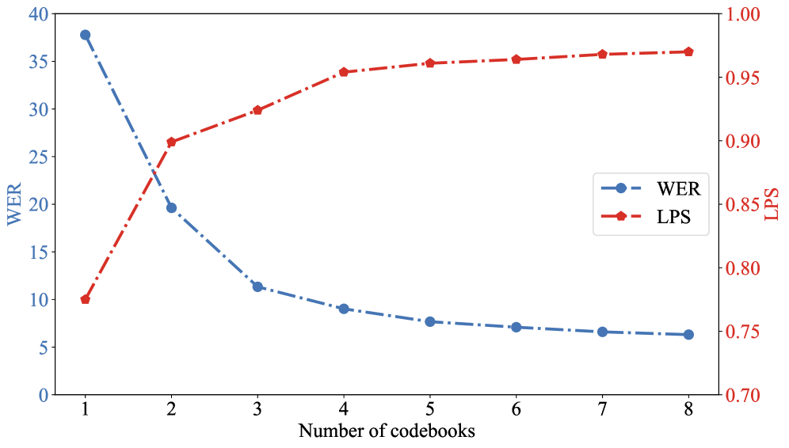
*Fig. 2:Variation of WER and LPS with Codebooks.*

---
**Usage Info**: 3658 tokens used.
**Generated at**: 2026-02-24 20:52:31

---

# 📚 Residual Tokens Enhance Masked Autoencoders for Speech Modeling

🚀 URL: https://arxiv.org/html/2601.19399

## 🌏 Abstract (원문)
Extensive research has focused on modeling speech signals, ranging from parametric models such as linear predictive coding (LPC), sinusoidal models, and harmonic-pulse-noise models and the phase vocoder. Vocoders such as STRAIGHT and WORLD further enabled real-time speech manipulation by decomposing signals into interpretable acoustic features (e.g., f0, spectral envelope, aperiodicity). More recently, deep learning has become the dominant paradigm, with neural audio codecs compressing speech into low-bitrate discrete units, self-supervised encoders such as HuBERT capturing linguistic content for reconstruction when combined with pitch and speaker identity achieving high-quality synthesis, or AnCoGen that uses the masked modeling mechanism to learn a bidirectional mapping between Mel-Spectrogram tokens and high-level attributes (e.g., pitch, content, speaker identity, loudness, etc), enabling both analysis (attributes from Mel-Spectrograms) and generation (Mel-Spectrograms from attributes). However, the speech signal is more complex than what explicit attributes can represent. Factorizing only content, speaker identity, and prosody misses much of the richness of natural speech. The residual—defined here as the aspects of speech that cannot be described by the available explicit attributes—encompasses speaking style, emotion, articulatory nuances, micro-prosody, and non-verbal cues, yet it remains largely unmodeled. Most recent methods rely solely on clearly defined attributes (e.g., f0, linguistic features, speaker embeddings), while residual information is implicitly absorbed as a dataset-specific bias, limiting generalization and control. Early source-filter models already pointed out the presence of a residual component, corresponding to the excitation signal. This residual carries irregularities such as jitter, shimmer, or aperiodicity that cannot be fully explained by the pitch or timbre. In addition, it also conveys subtle expressive information that enriches speech beyond explicit attributes. Later research investigated this residual more systematically: disentanglement-based models separate content, prosody, and speaker identity, while the remaining variability is interpreted as residual factors. Examples include factorized VAEs (FHVAE), adversarially regularized models, hierarchical VAE-based prosody models, Global Style Tokens (GST), and voice conversion frameworks like AutoVC and StarGAN-VC2. These latent representations capture rhythm, energy, emotion, and other expressive cues, complementing explicit attributes to improve naturalness. However, most of these approaches rely on complex disentanglement objectives and multiple task-specific losses, which make the resulting models computationally demanding, less generalizable, and often restricted to narrow applications such as voice conversion or style transfer. To address these limitations, we propose RT-MAE, a residual-token masked autoencoder for speech modeling that explicitly captures residual information while leveraging recent advances in speech representation learning. In RT-MAE, residual information is represented as continuous tokens directly integrated in an MAE, following the design of AnCoGen, which supports speech analysis, control, and generation. Unlike prior disentanglement-based approaches, this design provides a flexible representation of residual information. Our main contributions are: (1) we introduce residual tokens to explicitly encode the rest of speech information not captured by attributes (e.g., timbre variations, emotion, micro-prosody); (2) we propose a regularization mechanism to control the information flow in these tokens, ensuring a balanced trade-off between reconstruction quality and attributes controllability; and (3) we show that these residual tokens enable various manipulation tasks, and in this work, we focus on noise modeling, where noise can be captured and then deactivated at inference to achieve speech denoising.
## 🌏 Abstract (번역)
선형 예측 코딩(LPC), 정현파 모델, 하모닉-펄스-노이즈 모델 및 페이즈 보코더와 같은 파라메트릭 모델부터 시작하여 음성 신호 모델링에 대한 광범위한 연구가 집중되어 왔습니다. STRAIGHT 및 WORLD와 같은 보코더는 신호를 해석 가능한 음향 특징(예: f0, 스펙트럼 포괄선, 비주기성)으로 분해함으로써 실시간 음성 조작을 가능하게 했습니다. 최근에는 딥러닝이 지배적인 패러다임이 되었으며, 음성을 저비트레이트 이산 단위로 압축하는 신경 오디오 코덱, 피치 및 화자 정체성과 결합하여 재구성을 위한 언어적 콘텐츠를 포착하는 HuBERT와 같은 자기 지도 학습 인코더, 또는 멜-스펙트로그램 토큰과 고수준 속성(예: 피치, 콘텐츠, 화자 정체성, 음량 등) 사이의 양방향 매핑을 학습하기 위해 마스크 모델링 메커니즘을 사용하는 AnCoGen 등이 등장하여 분석과 생성 모두를 가능하게 했습니다. 그러나 음성 신호는 명시적인 속성이 표현할 수 있는 것보다 더 복잡합니다. 콘텐츠, 화자 정체성, 운율만을 분해하는 것은 자연스러운 음성의 풍부함을 상당 부분 놓치게 됩니다. 여기서 가용한 명시적 속성으로 설명할 수 없는 음성의 측면으로 정의되는 '잔차(residual)'는 말하기 스타일, 감정, 조음의 미묘한 차이, 미세 운율 및 비언어적 단서 등을 포함하지만, 여전히 대부분 모델링되지 않은 상태로 남아 있습니다. 최근의 대부분의 방법들은 명확하게 정의된 속성들에만 의존하며, 잔차 정보는 데이터셋 특유의 편향으로 암묵적으로 흡수되어 일반화와 제어를 제한합니다. 초기 소스-필터 모델들은 이미 여기(excitation) 신호에 해당하는 잔차 성분의 존재를 지적했습니다. 이 잔차는 피치나 음색으로 완전히 설명할 수 없는 지터, 시머 또는 비주기성과 같은 불규칙성을 수반합니다. 또한, 명시적 속성을 넘어 음성을 풍부하게 하는 미묘한 표현 정보를 전달합니다. 이후 연구들은 이 잔차를 더 체계적으로 조사했습니다. 얽힘 해제(disentanglement) 기반 모델들은 콘텐츠, 운율, 화자 정체성을 분리하고 남은 변동성을 잔차 요인으로 해석합니다. 여기에는 계층적 VAE 기반 모델, Global Style Tokens(GST), AutoVC 및 StarGAN-VC2와 같은 음성 변환 프레임워크가 포함됩니다. 이러한 잠재 표현은 리듬, 에너지, 감정 및 기타 표현 단서를 포착하여 명시적 속성을 보완하고 자연스러움을 향상시킵니다. 그러나 이러한 접근 방식의 대부분은 복잡한 얽힘 해제 목표와 다수의 작업별 손실에 의존하므로 모델의 계산 비용이 많이 들고 일반화 능력이 떨어지며, 종종 음성 변환이나 스타일 전이와 같은 좁은 응용 분야로 제한됩니다. 이러한 한계를 해결하기 위해, 우리는 음성 표현 학습의 최근 발전을 활용하면서 잔차 정보를 명시적으로 포착하는 음성 모델링을 위한 잔차 토큰 마스크 오토인코더인 RT-MAE를 제안합니다. RT-MAE에서 잔차 정보는 MAE에 직접 통합된 연속 토큰으로 표현되며, 이는 음성 분석, 제어 및 생성을 지원합니다. 이전의 얽힘 해제 기반 접근 방식과 달리, 이 설계는 잔차 정보의 유연한 표현을 제공합니다. 우리의 주요 기여는 다음과 같습니다: (1) 속성으로 포착되지 않는 나머지 음성 정보(예: 음색 변화, 감정, 미세 운율)를 명시적으로 인코딩하기 위해 잔차 토큰을 도입합니다. (2) 이러한 토큰의 정보 흐름을 제어하기 위한 정규화 메커니즘을 제안하여 재구성 품질과 속성 제어 능력 사이의 균형을 보장합니다. (3) 이러한 잔차 토큰이 다양한 조작 작업을 가능하게 함을 보여주며, 본 연구에서는 노이즈를 포착한 후 추론 시 비활성화하여 음성 노이즈 제거를 달성하는 노이즈 모델링에 집중합니다.

## 🔍 Methods & Results
- 명시적 속성(피치, 콘텐츠, 화자 등)만으로는 표현하기 어려운 음성의 미묘한 특징을 포착하기 위해 연속적인 잔차 토큰(Residual Tokens) 도입
- Perceiver 아키텍처에서 영감을 얻은 교차 주의 집중(Cross-attention) 메커니즘을 사용하여 멜-스펙트로그램의 정보를 압축된 형태의 잔차 토큰으로 인코딩
- AnCoGen 프레임워크를 기반으로 한 마스크 오토인코더(MAE) 구조를 채택하여 이산 토큰(속성)과 연속 토큰(잔차)을 통합 학습
- 잔차 토큰에 대한 드롭아웃 기반 정규화 전략을 적용하여 모델이 명시적 속성에 과도하게 의존하지 않고 제어력을 유지하도록 설계
- 잔차 토큰을 활용한 노이즈 모델링을 통해 추론 단계에서 노이즈 성분을 제거하는 음성 노이즈 제거(Denoising) 성능 입증

## 🖼 Figures

*Fig. 1:Overview of the proposed RT-MAE architecture. The top (blue) illustrates the current paradigm, where speech and explicit attributes are jointly modeled using an MAE. The bottom (purple) illustrates the introduction of trainable queries, which through cross-attention, capture residual factors not captured by the explicit attributes.*

*Fig. 2:Effect of the dropout threshold 
𝜏
 on synthesis quality. In blue ( ), only the attributes are used (
𝐑
 is masked). In orange ( ), both attributes and residual tokens are used.*

---
**Usage Info**: 5913 tokens used.
**Generated at**: 2026-02-24 20:53:24

---

# 📚 AUDIO DEEPFAKE DETECTION AT THE FIRST GREETING: “HI!”

🚀 URL: https://arxiv.org/html/2601.19573

## 🌏 Abstract (원문)
The rapid advancement of deep generative models has expanded the production and spread of synthetic speech, raising significant concerns regarding deepfake audio misuse and its societal risks. In response, the field of Audio Deepfake Detection (ADD) has progressed rapidly, with competitions such as ASVspoof and ADD2022 advancing datasets, methods, and benchmarks. In real-world communication scenarios, audio is often corrupted by codec compression and packet losses, which substantially degrade signal quality and reduce the robustness of ADD methods. While state-of-the-art (SOTA) methods perform well under clean, high-fidelity audio inputs, their robustness under real-world communication degradation remains limited. Several studies have explored approaches to mitigate such degradations. However, most existing methods are designed under fixed audio input lengths (3–4s). For shorter inputs, truncation or padding is commonly applied, leading to a duration mismatch between training and testing that degrades accuracy. Artificially extending inputs at inference time is also impractical for latency-sensitive applications. Recently, short-duration ADD has drawn increasing attention. This work specifically targets the challenge of detecting deepfakes from ultra-short inputs (0.5–2.0s), allowing detection at the very onset of speech communication; for instance, when a scammer utters the initial “Hi”. Such capability is critical for real-time security applications, where rapid detection can prevent social engineering attacks before the conversation progresses. To be practically deployable, the method must achieve robustness under real-world communication degradations and remain lightweight enough for deployment on resource-constrained devices such as smartphones. However, most existing methods for short-duration ADD overlook both the robustness against real-world communication degradations and the lightweight design requirements. The objective of this work is to address reliable ADD within the first seconds of speech conversation, ensuring both efficiency and robustness for real-world conversational settings. To this end, we propose S-MGAA, a novel lightweight ADD framework tailored for ultra-short inputs under communication degradations. Our contributions are threefold: To the best of our knowledge, this is the first study that jointly ensures robustness to real-world degradations and considers ultra-short inputs (0.5–2.0s). We introduce a lightweight framework that enhances discriminative representation learning for degraded and ultra-short duration inputs while maintaining deployability in resource-constrained environments. The proposed framework surpasses nine SOTA baselines on 0.5-2.0s inputs under diverse communication degradations, demonstrating a favorable trade-off among Real-Time Factor (RTF), training time, Giga Floating Point Operations Per Second (GFLOPs), and parameter count. These results demonstrate its capacity for real-time ADD within the opening seconds of a conversation in communication systems.
## 🌏 Abstract (번역)
딥 생성 모델의 급격한 발전은 합성 음성의 생성과 확산을 확대하여 딥페이크 오디오 오용 및 사회적 위험에 대한 상당한 우려를 불러일으키고 있습니다. 이에 대응하여 오디오 딥페이크 탐지(ADD) 분야는 ASVspoof 및 ADD2022와 같은 대회를 통해 데이터셋, 방법론 및 벤치마크를 발전시키며 빠르게 성장했습니다. 실제 통신 시나리오에서 오디오는 종종 코덱 압축 및 패킷 손실로 인해 손상되며, 이는 신호 품질을 크게 저하시키고 ADD 방법의 견고성을 감소시킵니다. 최첨단(SOTA) 방법들은 깨끗하고 고충실도의 오디오 입력에서는 잘 작동하지만, 실제 통신 환경의 성능 저하에 대한 견고성은 여전히 제한적입니다. 여러 연구에서 이러한 저하를 완화하기 위한 접근 방식을 탐구했지만, 대부분의 기존 방법은 고정된 오디오 입력 길이(3~4초)를 기준으로 설계되었습니다. 더 짧은 입력의 경우 일반적으로 절단 또는 패딩이 적용되어 훈련과 테스트 간의 지속 시간 불일치가 발생하고 정확도가 저하됩니다. 추론 시 입력을 인위적으로 확장하는 것 또한 지연 시간에 민감한 애플리케이션에는 비실용적입니다. 최근 단기 ADD에 대한 관심이 높아지고 있습니다. 본 연구는 특히 초단기 입력(0.5~2.0초)에서 딥페이크를 탐지하는 과제를 목표로 하며, 이는 사기꾼이 처음 "안녕"이라고 말하는 순간과 같이 음성 통신이 시작되는 즉시 탐지를 가능하게 합니다. 이러한 능력은 대화가 진행되기 전에 사회 공학적 공격을 방지할 수 있는 실시간 보안 애플리케이션에 매우 중요합니다. 실제로 배포 가능하려면 실제 통신 저하 환경에서도 견고해야 하며 스마트폰과 같은 자원 제한 장치에 배포할 수 있을 만큼 가벼워야 합니다. 그러나 기존의 단기 ADD 방법 대부분은 실제 통신 저하에 대한 견고성과 경량 설계 요구 사항을 모두 간과하고 있습니다. 본 연구의 목적은 실제 대화 환경에서 효율성과 견고성을 모두 보장하면서 음성 대화의 첫 몇 초 이내에 신뢰할 수 있는 ADD를 해결하는 것입니다. 이를 위해 통신 저하 환경의 초단기 입력에 맞춤화된 새로운 경량 ADD 프레임워크인 S-MGAA를 제안합니다. 본 연구의 기여는 세 가지입니다. 첫째, 우리가 아는 한, 본 연구는 실제 저하에 대한 견고성을 보장하면서 초단기 입력(0.5~2.0초)을 동시에 고려한 최초의 연구입니다. 둘째, 자원 제한 환경에서 배포 가능성을 유지하면서 저하된 초단기 입력에 대한 판별적 표현 학습을 향상시키는 경량 프레임워크를 도입합니다. 셋째, 제안된 프레임워크는 다양한 통신 저하 환경의 0.5~2.0초 입력에서 9개의 SOTA 베이스라인을 능가하며, 실시간 계수(RTF), 훈련 시간, GFLOPs 및 파라미터 수 사이에서 유리한 절충안을 보여줍니다. 이러한 결과는 통신 시스템의 대화 시작 단계에서 실시간 ADD를 수행할 수 있는 능력을 입증합니다.

## 🔍 Methods & Results
- 초단기 발화(0.5s-2s)에 특화된 경량 ADD 아키텍처인 S-MGAA(Short-MGAA) 제안
- S-MGAA는 PCEM(Pixel and Channel Enhancement Module), MGAA 블록, FCEM(Frequency Compensation Enhancement Module)의 세 가지 순차적 모듈로 구성됨
- PCEM은 픽셀 수준 탐지기(PD), 채널별 증폭기(CA), TF 결합(TFC)을 통해 초단기 오디오의 희소한 위조 단서를 증폭함
- FCEM은 다중 스케일 주파수 분석(MFA)과 적응형 주파수-시간 상호작용(AFI)을 사용하여 부족한 시간적 특징을 주파수 영역 특징으로 보완함
- LFCC, CQCC, MFCC 특징을 입력으로 사용하며 CFEB-64 및 CFEB-128을 통해 고수준 표현을 추출함
- 0.5-2.0초 입력 및 다양한 통신 저하 조건에서 9개의 SOTA 베이스라인 모델보다 우수한 성능을 기록함
- RTF, GFLOPs, 파라미터 수 측면에서 효율성을 입증하여 자원 제한 장치에서의 실시간 배포 가능성을 확인함

## 🖼 Figures
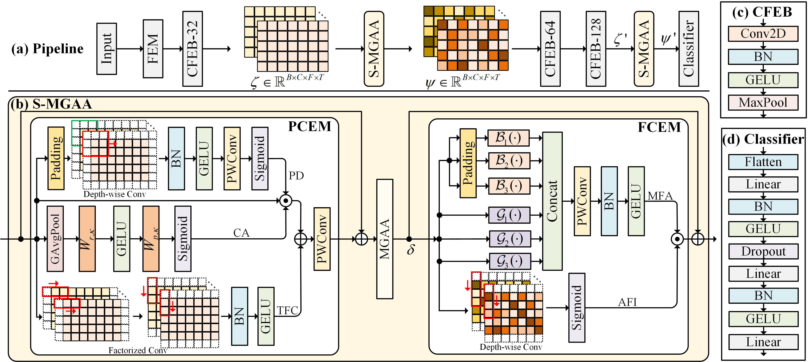
*Fig. 1:Proposed ADD framework for ultra-short-duration audio inputs. (a) The processing pipeline; (b) Short Multi-Granularity Adaptive Time-Frequency Attention; (c) Convolutional Feature Embedding Blocks; (d) The Classifier.*

*Fig. 2:Average EER (%) of baselines across the 
𝐶
0
–
𝐶
5
 conditions for audio durations of 0.5s, 1s, 1.5s, 2s and 4s.*

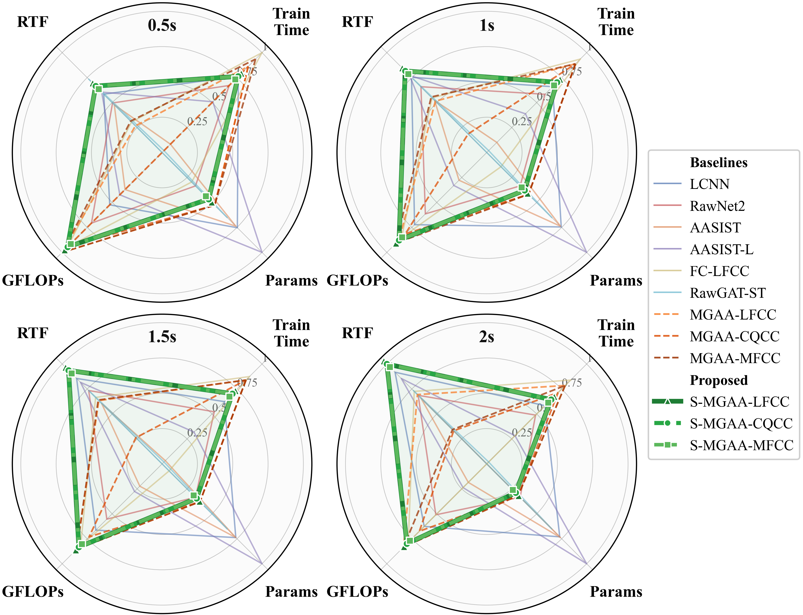
*Fig. 3:Efficiency comparison across 0.5–2.0s. Radar plots show log‑scaled, per‑duration–normalized metrics (outer position is better after inversion for RTF, training time, GFLOPs, and parameters). Green coloured areas denote the proposed S‑MGAA variants.*

---
**Usage Info**: 5685 tokens used.
**Generated at**: 2026-02-24 20:54:15

---

# 📚 Physics-Aware Novel-View Acoustic Synthesis with Vision-Language Priors and 3D Acoustic Environment Modeling

🚀 URL: https://arxiv.org/html/2601.19712

## 🌏 Abstract (원문)
Spatial audio, conveying sound position, direction, and distance in 3D space, is essential for immersive applications such as augmented/virtual reality (AR/VR), gaming, and interactive media[8,3,13]. A fundamental task is novel-view acoustic synthesis (NVAS), which generates binaural audio for arbitrary listener positions given a mono input and scene observations[12]. Realistic NVAS requires accurate modeling of sound propagation, governed by direct sound, early reflections, and reverberation, all influenced by scene geometry, object layout, and materials[15]. The main challenge is that these factors jointly produce complex effects such as reflection, diffraction, and absorption; without explicitly modeling them, synthesized audio lacks spatial realism and physical consistency. Recent works thus leverage visual cues, motivated by the intuition that a scene’s appearance provides critical information for acoustics[12,7,2,1,5]. AV-NeRF[12]first conditioned a neural acoustic field on single-view images and depth, establishing a strong baseline on the Real-World Audio-Visual Scene (RWAVS) dataset. However, its reliance on listener-centric single views limited spatial awareness, and it did not explicitly incorporate semantic cues such as objects, layouts, and materials. Subsequent methods further enriched vision priors. For example, SOAF[7]modeled occlusion, AV-GS[2]exploited 3D Gaussian Splatting (3DGS)[11]for geometric fidelity, AV-Surf[1]refined structural details with surface normals, and SoundVista[5]introduced panoramic context. While these methods improved geometry and occlusion handling,they overlooked how object layout and material properties affect absorption and reflection.For instance, geometry-based models cannot distinguish the dampening of carpet versus tile, while panoramic inputs are weak in object-level semantics. As illustrated in Fig.1, materials such as“wooden”or“flat-screen”, and layouts such as“In front of the TV”, directly alter acoustic behavior. Ignoring such factors often leads to physically inconsistent audio synthesis. In this paper, we propose Phys-NVAS, the first NVAS framework to incorporate physics-aware vision-language priors into scene acoustic modeling. Phys-NVAS integrates 3D acoustic environment reconstruction with physics-aware vision semantics to achieve more realistic spatial audio synthesis. Specifically, a global 3D acoustic scene is reconstructed with 3D Gaussian Splatting (3DGS) and depth estimation, enabling multi-view spatial perception and providing explicit structural cues on room geometry and size that guide direct sound and early reflections. Meanwhile, a vision-language model is employed to extract physics-aware priors describing objects, layouts, and materials, capturing absorption and reflection effects beyond geometry alone. We further propose an acoustic feature fusion adapter that integrates these geometric and semantic cues into a unified physics-aware representation for binaural generation. Experiments demonstrate that combining spatial geometry with semantic information yields more realistic and physically consistent novel-view acoustic synthesis.
## 🌏 Abstract (번역)
3D 공간에서 소리의 위치, 방향, 거리를 전달하는 공간 오디오는 증강/가상 현실(AR/VR), 게임, 인터랙티브 미디어와 같은 몰입형 애플리케이션에 필수적입니다. 핵심 과제는 모노 입력과 장면 관찰이 주어졌을 때 임의의 청취자 위치에 대한 바이노럴 오디오를 생성하는 새로운 시점 음향 합성(NVAS)입니다. 현실적인 NVAS를 위해서는 직접음, 초기 반사음, 잔향에 의해 결정되는 소리 전파의 정확한 모델링이 필요하며, 이는 장면의 기하학적 구조, 객체 배치 및 재질의 영향을 받습니다. 주요 과제는 이러한 요소들이 반사, 회절, 흡수와 같은 복잡한 효과를 공동으로 생성한다는 점이며, 이를 명시적으로 모델링하지 않으면 합성된 오디오는 공간적 현실감과 물리적 일관성이 부족해집니다. 최근 연구들은 장면의 외관이 음향에 중요한 정보를 제공한다는 직관에 따라 시각적 단서를 활용하고 있습니다. AV-NeRF는 단일 시점 이미지와 깊이에 신경 음향 장을 조건화하여 RWAVS 데이터셋에서 강력한 기준을 세웠으나, 청취자 중심의 단일 시점에 의존하여 공간 인지 능력이 제한적이었고 객체, 배치, 재질과 같은 의미론적 단서를 명시적으로 포함하지 않았습니다. 이후 SOAF, AV-GS, AV-Surf, SoundVista 등의 방법들이 시각적 사전 정보를 풍부하게 했으나, 여전히 객체 배치와 재질 특성이 흡수 및 반사에 미치는 영향을 간과했습니다. 본 논문에서는 장면 음향 모델링에 물리 인식 시각-언어 사전 정보를 통합한 최초의 NVAS 프레임워크인 Phys-NVAS를 제안합니다. Phys-NVAS는 3D 음향 환경 재구성과 물리 인식 시각 의미론을 통합하여 보다 현실적인 공간 오디오 합성을 달성합니다. 구체적으로, 3D 가우시안 스플래팅(3DGS)과 깊이 추정을 통해 전역 3D 음향 장면을 재구성하여 다중 시점 공간 인식을 가능하게 하고 방의 기하학적 구조와 크기에 대한 명시적 구조 단서를 제공하여 직접음과 초기 반사음을 안내합니다. 한편, 시각-언어 모델을 사용하여 객체, 배치, 재질을 설명하는 물리 인식 사전 정보를 추출함으로써 기하학적 구조만으로는 포착하기 어려운 흡수 및 반사 효과를 파악합니다. 또한 이러한 기하학적 및 의미론적 단서를 바이노럴 생성을 위한 통합된 물리 인식 표현으로 통합하는 음향 특징 융합 어댑터를 제안합니다. 실험 결과, 공간 기하학적 구조와 의미론적 정보를 결합하면 더욱 현실적이고 물리적으로 일관된 새로운 시점 음향 합성이 가능함을 입증했습니다.

## 🔍 Methods & Results
- 3D 가우시안 스플래팅(3DGS)과 깊이 추정 모델(DepthAnythingV2)을 사용하여 다중 시점 입력을 통한 전역적 3D 음향 환경의 기하학적 구조 및 크기를 재구성함
- 시각-언어 모델(Chat-UniVi)을 활용하여 객체, 공간 배치, 재질 속성(예: 나무, 평면 스크린 등)에 대한 물리 인식 텍스트 사전 정보를 추출함
- 기하학적 특징(RGB, Depth)과 의미론적 특징(Physics-aware text)을 통합하는 음향 특징 융합 어댑터(Acoustic Feature Fusion Adapter)를 설계하여 물리적으로 일관된 표현을 생성함
- 제안된 Phys-NVAS 프레임워크는 기하학적 구조와 재질 정보를 결합함으로써 기존의 기하학 중심 모델보다 더 현실적인 바이노럴 오디오 합성을 달성함
- 실험을 통해 공간적 기하학 정보와 의미론적 정보의 결합이 새로운 시점 음향 합성의 물리적 일관성을 향상시킴을 입증함

## 🖼 Figures

*Fig. 1:Illustration of scene semantics influencing acoustics. Different materials (e.g., wooden, flat-screen) affect absorption, while objects and their layouts (e.g., In front of the TV, there is a wooden coffee table) modify reflection paths. These semantic cues are often ignored in existing NVAS methods, leading to physically inconsistent audio.*

![Fig. 2:Overview of the proposed physics-aware NVAS framework. 3D acoustic environment modeling with 3DGS and depth estimation on multi-view images, enhancing spatial awareness by recovering room geometry and size. Physics-aware vision–language priors further enrich acoustic modeling with object, layout, and material cues that capture absorption and reflection effects. Finally, geometric and semantic features are fused into a unified physics-aware feature representation, enabling realistic and physically consistent binaural audio generation.](../images/2026-01-28/2601.19712/2601.19712_fig1.png)
*Fig. 2:Overview of the proposed physics-aware NVAS framework. 3D acoustic environment modeling with 3DGS and depth estimation on multi-view images, enhancing spatial awareness by recovering room geometry and size. Physics-aware vision–language priors further enrich acoustic modeling with object, layout, and material cues that capture absorption and reflection effects. Finally, geometric and semantic features are fused into a unified physics-aware feature representation, enabling realistic and physically consistent binaural audio generation.*

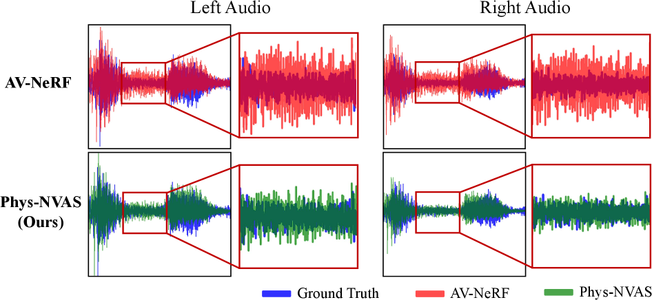
*Fig. 3:Comparison of reconstructed binaural waveforms at a target listener position using AV-NeRF and our Phys-NVAS.*

---
**Usage Info**: 6310 tokens used.
**Generated at**: 2026-02-24 20:54:49

---

