# 🚩 (2026-01-29) Scholar Inbox 추천 논문 

# 📚 T-Mimi: A Transformer-based Mimi Decoder for Real-Time On-Phone TTS

🚀 URL: https://arxiv.org/html/2601.20094

## 🌏 Abstract (원문)
Recent advances in neural audio codecs[6,1,14,9]have fundamentally transformed the intermediate representations used in modern text-to-speech (TTS) systems. While mel-spectrograms have long served as the de facto standard acoustic feature, representations derived from models such as EnCodec[3], DAC[8]and Mimi[4]have emerged as a superior alternative. These modern codec features, whether in the form of discrete tokens or continuous vectors, offer exceptional compression ratios while preserving perceptually vital information, sometimes leading to higher audio quality than traditional mel-spectrogram-based approaches[9]. This paradigm shift effectively redefines the TTS pipeline: the new synthesis model now predicts codec features instead of mel-spectrograms, and the neural codec’s own high-fidelity decoder replaces the traditional vocoder, serving as the final stage of generating waveforms from acoustic features. Among the many NACs, the Mimi codec stands out as an excellent choice for building streaming TTS systems. Mimi offers several key advantages: First, it skillfully disentangles the audio signal into separate “semantic” and “acoustic” feature streams. This separation allows a TTS model to exert fine-grained control over the synthesized content (what is said) and the speech style (how it is said). Second, its decoder can reconstruct high-quality, natural-sounding audio from these tokens under a really low frame rate (12.5HZ). Most importantly, Mimi supports streaming, enabling real-time encoding and decoding of audio segments. The streaming decoder is crucial for streaming TTS applications that require immediate responses. However, a significant challenge emerges when deploying advanced models like Mimi onto mobile or edge devices. Mimi’s decoder relies on de-convolution (or transposed convolution) layers for upsampling to reconstruct the final audio waveform. While convolutions are highly parameter-efficient due to weight sharing, they can still be computationally intensive. While these layers can be optimized efficient in theory, they are often computationally inefficient in mobile inference frameworks like XNNPACK, leading to significant latency. These frameworks often have better optimization for transformers than de-convolution layers. This latency issue becomes the primary bottleneck for achieving a smooth, real-time TTS experience on phones. TS3-Codec[15], being purely Transformer-based and convolution-free, establishes a new benchmark for efficiency. It not only greatly outperforms CNN-based NACs when matched for parameter size, but also delivers comparable performance at a fraction of the computational cost—requiring a mere 13% of the resources. Inspired by TS3-Codec, this paper introduces T-Mimi, a modified version of the Mimi codec featuring a Transformer-only decoder architecture. By replacing the slow de-convolution layers with a mobile-friendly architecture composed of Transformers and linear layers, we directly address the on-device latency bottleneck. We also applied quantization aware training (QAT) to further reduce the model’s storage footprint and computational requirements, making it better suited for resource-constrained devices. Our primary contributions are as follows: (1). We designed T-Mimi, drastically reducing on-device TTS decoding latency from 42.1ms to just 4.4ms, enabling true real-time TTS performance. A latency of 42.1 ms to generate a single 80ms audio frame is a significant bottleneck to achieve real-time processing. When factoring in the processing time required for other essential TTS components, such as the front-end and acoustic models, along with potential resource contention on the device, this delay makes achieving a seamless, real-time audio experience highly improbable. (2). Through quantization aware training, we discovered a crucial rule: the closer a layer is to the final waveform, the worse the audio quality becomes after it is quantized. Consequently, we found that the final layers of the decoder, specifically the last two Transformer layers and the two linear layers important for audio generation. They should be preserved in full precision to maintain audio fidelity. We take Mimi codec as a representative case study. Our methodology is not limited to Mimi codec, and provides a generalizable framework for optimizing other convolution-based neural audio codecs for efficient on-device deployment.
## 🌏 Abstract (번역)
최근 신경망 오디오 코덱의 발전은 현대 텍스트 음성 변환(TTS) 시스템에서 사용되는 중간 표현을 근본적으로 변화시켰습니다. 멜-스펙트로그램이 오랫동안 표준 음향 특징으로 사용되어 왔으나, EnCodec, DAC, Mimi와 같은 모델에서 파생된 표현들이 우수한 대안으로 등장했습니다. 이러한 현대적 코덱 특징들은 이산 토큰이나 연속 벡터 형태에 상관없이 지각적으로 중요한 정보를 보존하면서도 뛰어난 압축률을 제공하며, 때로는 전통적인 멜-스펙트로그램 기반 방식보다 더 높은 오디오 품질을 제공합니다. 이러한 패러다임의 변화는 TTS 파이프라인을 효과적으로 재정의합니다. 새로운 합성 모델은 이제 멜-스펙트로그램 대신 코덱 특징을 예측하며, 신경망 코덱의 고성능 디코더가 전통적인 보코더를 대체하여 음향 특징으로부터 파형을 생성하는 최종 단계 역할을 합니다. 여러 신경망 오디오 코덱(NAC) 중 Mimi 코덱은 스트리밍 TTS 시스템 구축을 위한 탁월한 선택지로 주목받고 있습니다. Mimi는 몇 가지 주요 장점을 제공합니다. 첫째, 오디오 신호를 별도의 '의미적' 및 '음향적' 특징 스트림으로 능숙하게 분리합니다. 이러한 분리를 통해 TTS 모델은 합성된 콘텐츠(내용)와 음성 스타일(방식)에 대해 세밀한 제어를 수행할 수 있습니다. 둘째, 디코더는 매우 낮은 프레임 레이트(12.5Hz)에서도 이러한 토큰으로부터 고품질의 자연스러운 오디오를 재구성할 수 있습니다. 가장 중요한 점은 Mimi가 스트리밍을 지원하여 오디오 세그먼트의 실시간 인코딩 및 디코딩을 가능하게 한다는 것입니다. 스트리밍 디코더는 즉각적인 응답이 필요한 스트리밍 TTS 애플리케이션에 필수적입니다. 그러나 Mimi와 같은 고급 모델을 모바일이나 에지 기기에 배포할 때 큰 어려움이 발생합니다. Mimi의 디코더는 최종 오디오 파형을 재구성하기 위한 업샘플링을 위해 데콘볼루션(또는 전치 컨볼루션) 레이어에 의존합니다. 컨볼루션은 가중치 공유 덕분에 파라미터 효율성이 높지만, 여전히 계산 집약적일 수 있습니다. 이러한 레이어들은 이론적으로 효율적으로 최적화될 수 있지만, XNNPACK과 같은 모바일 추론 프레임워크에서는 종종 계산 효율이 떨어져 상당한 지연 시간을 초래합니다. 이러한 프레임워크들은 대개 데콘볼루션 레이어보다 트랜스포머에 대해 더 나은 최적화를 제공합니다. 이 지연 시간 문제는 휴대폰에서 매끄러운 실시간 TTS 경험을 구현하는 데 있어 주요 병목 현상이 됩니다. 순수하게 트랜스포머 기반이며 컨볼루션이 없는 TS3-Codec은 효율성의 새로운 기준을 세웠습니다. 이는 파라미터 크기가 같을 때 CNN 기반 NAC를 크게 능가할 뿐만 아니라, 단 13%의 자원만을 사용하여 대등한 성능을 제공합니다. TS3-Codec에서 영감을 받아, 본 논문은 트랜스포머 전용 디코더 구조를 특징으로 하는 Mimi 코덱의 수정 버전인 T-Mimi를 소개합니다. 느린 데콘볼루션 레이어를 트랜스포머와 선형 레이어로 구성된 모바일 친화적인 구조로 교체함으로써, 기기 내 지연 시간 병목 현상을 직접적으로 해결했습니다. 또한 모델의 저장 공간 점유율과 계산 요구 사항을 더욱 줄이기 위해 양자화 인식 훈련(QAT)을 적용하여 자원이 제한된 기기에 더 적합하도록 만들었습니다. 본 논문의 주요 기여는 다음과 같습니다. (1) T-Mimi를 설계하여 기기 내 TTS 디코딩 지연 시간을 42.1ms에서 단 4.4ms로 획기적으로 줄여 진정한 실시간 TTS 성능을 가능하게 했습니다. 80ms 오디오 프레임 하나를 생성하는 데 42.1ms의 지연이 발생하는 것은 실시간 처리를 달성하는 데 큰 병목입니다. 프런트엔드 및 음향 모델과 같은 다른 필수 TTS 구성 요소의 처리 시간과 기기 내의 잠재적인 자원 경합을 고려할 때, 이러한 지연은 매끄러운 실시간 오디오 경험을 구현하는 것을 매우 어렵게 만듭니다. (2) 양자화 인식 훈련을 통해 중요한 규칙을 발견했습니다. 레이어가 최종 파형에 가까울수록 양자화 후 오디오 품질이 더 나빠진다는 것입니다. 결과적으로 디코더의 최종 레이어, 특히 마지막 두 개의 트랜스포머 레이어와 오디오 생성에 중요한 두 개의 선형 레이어는 오디오 충실도를 유지하기 위해 전체 정밀도로 보존되어야 함을 확인했습니다. 본 연구는 Mimi 코덱을 대표적인 사례 연구로 삼았으나, 우리의 방법론은 Mimi 코덱에 국한되지 않으며 다른 컨볼루션 기반 신경망 오디오 코덱을 효율적인 기기 내 배포를 위해 최적화하기 위한 일반화 가능한 프레임워크를 제공합니다.

## 🔍 Methods & Results
- Mimi의 기존 하이브리드 디코더(트랜스포머+데콘볼루션)를 12개의 트랜스포머 레이어와 2개의 선형 레이어로 구성된 트랜스포머 전용 구조(T-Mimi)로 교체함.
- 고정 윈도우 스트리밍 셀프 어텐션을 적용하여 스트리밍 기능을 유지하면서 XNNPACK과 같은 모바일 추론 프레임워크에서의 연산 효율을 극대화함.
- GAN 손실, 특징 매칭 손실, 멀티 스케일 멜-스펙트로그램 재구성 손실을 결합한 복합 손실 함수와 2단계 학습 전략을 통해 고품질 오디오 합성을 달성함.
- 무음 구간의 노이즈를 억제하기 위해 학습 데이터의 10%에 무음 세그먼트를 추가하는 데이터 증강 기법을 도입하여 효과를 거둠.
- 최종 파형 생성에 가까운 레이어일수록 정밀도에 민감하다는 규칙을 발견하고, 마지막 4개 레이어를 FP32로 유지하는 선택적 양자화 인식 훈련(QAT)을 적용함.
- 기기 내 디코딩 지연 시간을 42.1ms에서 4.4ms로 약 90% 단축하여 모바일 환경에서의 실시간 TTS 성능을 확보함.

## 🖼 Figures
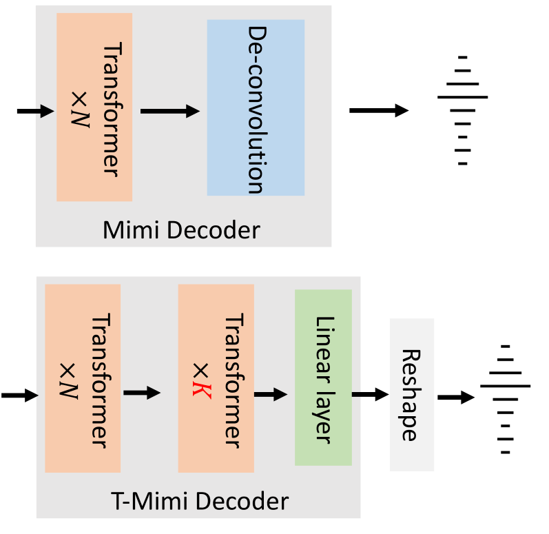
*Fig. 1:Model architectures for the original Mimi decoder (upper) and the T-Mimi decoder (bottom).*

---
**Usage Info**: 8623 tokens used.
**Generated at**: 2026-02-24 20:56:26

---

# 📚 Erasing Your Voice Before It’s Heard: Training-free Speaker Unlearning for Zero-shot Text-to-Speech

🚀 URL: https://arxiv.org/html/2601.20481

## 🌏 Abstract (원문)
The advancement of zero-shot TTS systems recently reached a level of expressivity and naturalness that makes it attractive for a wide range of applications in accessibility and content creation. Meanwhile, their ability to generalize across speakers introduces a profound risk: such models may generate the voices of real individuals who never consented to their use. Unlike traditional text or image generation, speech carries strong biometric identity cues, making unauthorized voice synthesis particularly sensitive from both privacy and security perspectives. Existing countermeasures fall short of addressing this problem at its root. Watermarking techniques are inherently post hoc: they can only verify or trace synthetic speech after it has been generated, offering no protection against real-time misuse. Voice anonymization (VA) aims to protect privacy by transforming speech to replace the original identity, typically through speaker disentanglement and re-synthesis. It follows a substitution technique, replacing one identity with another, whereas our objective is to prohibit a specific identity from being generated at all. A more extreme solution would be to prohibit voice generation altogether. Yet this would undermine the utility of TTS technology, which is critical for accessibility and human-computer interaction. On the one hand, machine unlearning has emerged to remove the influence of specific training data from learned models. However, most existing methods, including gradient-based, knowledge distillation-based, and latent manipulation approaches, have primarily been developed in the field of image or text generation. These approaches often involve retraining of the model, leading to high computational cost, unstable convergence, and unintended forgetting. In TTS, only a few attempts have been made: sample-guided unlearning (SGU) and teacher-guided unlearning (TGU). While TGU adapts distillation to forget training-set speaker identities, it still requires substantial retraining whenever new unlearning requests arise, making it impractical for scalable deployment. In addition, they cannot handle unseen individuals, even though real-world opt-out requests are most likely to come from users outside the training set. Taken together, these limitations reveal a deeper structural gap in current approaches to speaker protection in TTS. Existing methods are either reactive (e.g., watermarking), substitutive (e.g., VA), or training-bound (e.g., retraining-based unlearning), and thus fail to provide a practical mechanism for enforcing user intent at the time of generation. To address this gap, we propose TruS, the first training-free, inference-time framework for opt-out speaker unlearning in zero-shot TTS, which allows individuals to explicitly request that their voices not be synthesized. TruS directly intervenes in the TTS model’s internal activations to suppress identity-specific information. This reframes unlearning as a user-driven safeguard, enabling immediate and sequential handling of unlearning requests in speech generation. Notably, TruS generalizes beyond the seen opt-out speakers in the training set and is capable of blocking the synthesis of unseen opt-out speakers. TruS is motivated by the observation that speaker identity is encoded in structured directions within the hidden representations of modern TTS models. In contrast, our goal is to prevent the synthesis of specific speaker identities while preserving essential paralinguistic attributes. For a small set of retain speakers’ utterances, TruS first generates an identity prototypical embedding (ID-prototype) with intermediate features of TTS models. We statistically analyze the similarity according to identity in each layer to automatically select steering blocks. TruS dynamically guides hidden representations with such an ID-prototype to solely revise the target (i.e., opt-out) speaker’s identity. Experimental results demonstrate that TruS effectively suppresses target speakers’ identities without retraining, achieving comparable unlearning performance to existing methods. Crucially, TruS is the first to generalize to unseen opt-out speakers, extending unlearning beyond the training set to block the generation of voices that mimic individuals.
## 🌏 Abstract (번역)
최근 제로샷 TTS 시스템의 발전은 접근성 및 콘텐츠 제작 분야에서 매력적인 수준의 표현력과 자연스러움에 도달했습니다. 한편, 화자 전반에 걸친 일반화 능력은 심각한 위험을 초래합니다. 이러한 모델은 사용에 동의하지 않은 실제 개인의 목소리를 생성할 수 있습니다. 전통적인 텍스트나 이미지 생성과 달리 음성은 강력한 생체 인식 정체성 단서를 포함하고 있어, 무단 음성 합성은 개인정보 보호 및 보안 관점에서 특히 민감합니다. 기존의 대응책은 이 문제를 근본적으로 해결하지 못합니다. 워터마킹 기술은 본질적으로 사후 대응적이며, 음성이 생성된 후에만 확인하거나 추적할 수 있어 실시간 오용에 대한 보호를 제공하지 못합니다. 음성 익명화(VA)는 원래의 정체성을 대체하기 위해 음성을 변환하여 개인정보를 보호하는 것을 목표로 하며, 일반적으로 화자 분리 및 재합성을 통해 이루어집니다. 이는 한 정체성을 다른 정체성으로 대체하는 치환 기술을 따르지만, 우리의 목표는 특정 정체성이 생성되는 것 자체를 금지하는 것입니다. 더 극단적인 해결책은 음성 생성을 완전히 금지하는 것이겠으나, 이는 접근성과 인간-컴퓨터 상호작용에 중요한 TTS 기술의 유용성을 저해할 것입니다. 한편, 학습된 모델에서 특정 학습 데이터의 영향을 제거하기 위해 머신 언러닝(Machine Unlearning)이 등장했습니다. 그러나 그래디언트 기반, 지식 증류 기반, 잠재 조작 접근 방식을 포함한 대부분의 기존 방법은 주로 이미지나 텍스트 생성 분야에서 개발되었습니다. 이러한 접근 방식은 종종 모델의 재학습을 수반하여 높은 계산 비용, 불안정한 수렴 및 의도치 않은 망각을 초래합니다. TTS에서는 샘플 가이드 언러닝(SGU)과 교사 가이드 언러닝(TGU)과 같은 소수의 시도만 있었습니다. TGU는 증류 기법을 적용하여 학습 세트의 화자 정체성을 잊게 하지만, 새로운 언러닝 요청이 발생할 때마다 상당한 재학습이 필요하여 확장 가능한 배포에는 비실용적입니다. 또한, 실제 옵트아웃 요청은 학습 세트 외부의 사용자로부터 발생할 가능성이 높음에도 불구하고, 기존 방식은 미학습(unseen) 개인을 처리할 수 없습니다. 이러한 한계점들은 TTS의 화자 보호에 대한 현재 접근 방식의 깊은 구조적 격차를 드러냅니다. 기존 방법은 반응적(예: 워터마킹), 대체적(예: VA) 또는 학습에 얽매인(예: 재학습 기반 언러닝) 방식이어서 생성 시점에 사용자의 의도를 강제할 수 있는 실용적인 메커니즘을 제공하지 못합니다. 이러한 격차를 해소하기 위해, 본 논문은 개인이 자신의 목소리가 합성되지 않도록 명시적으로 요청할 수 있게 하는 제로샷 TTS를 위한 최초의 학습이 필요 없는 추론 단계 프레임워크인 TruS를 제안합니다. TruS는 TTS 모델의 내부 활성화에 직접 개입하여 정체성 특정 정보를 억제합니다. 이는 언러닝을 사용자 주도의 보호 장치로 재구성하여 음성 생성 시 언러닝 요청을 즉각적이고 순차적으로 처리할 수 있게 합니다. 특히 TruS는 학습 세트에서 확인된 옵트아웃 화자를 넘어 일반화되며, 학습되지 않은 옵트아웃 화자의 합성도 차단할 수 있습니다. TruS는 현대 TTS 모델의 은닉 표현 내에 화자 정체성이 구조화된 방향으로 인코딩된다는 관찰에 기반합니다. 우리의 목표는 필수적인 부수 언어적 속성을 보존하면서 특정 화자 정체성의 합성을 방지하는 것입니다. 소수의 유지 화자 발화를 위해, TruS는 먼저 TTS 모델의 중간 특징을 사용하여 정체성 프로토타입 임베딩(ID-prototype)을 생성합니다. 우리는 각 레이어에서 정체성에 따른 유사성을 통계적으로 분석하여 조향 블록을 자동으로 선택합니다. TruS는 이러한 ID-prototype을 사용하여 은닉 표현을 동적으로 가이드함으로써 대상(즉, 옵트아웃) 화자의 정체성만을 수정합니다. 실험 결과에 따르면 TruS는 재학습 없이도 대상 화자의 정체성을 효과적으로 억제하며, 기존 방법과 대등한 언러닝 성능을 달성합니다. 결정적으로 TruS는 미학습 옵트아웃 화자에게 일반화되는 최초의 방식이며, 언러닝을 학습 세트 너머로 확장하여 개인을 모방하는 음성 생성을 차단합니다.

## 🔍 Methods & Results
- TruS는 재학습 없이 추론 시점에 TTS 모델의 내부 활성화(Internal Activations)를 직접 조작하여 특정 화자의 정체성 정보를 억제하는 프레임워크임
- 유지 화자(Retain Speakers)들의 데이터를 평균하여 정체성 프로토타입(ID-prototype)을 생성하고, 이를 기준으로 옵트아웃 대상 화자의 활성화 값과의 차이를 계산하여 조향 벡터(Steering Vector)를 도출함
- 모든 레이어가 정체성 유지에 동일하게 기여하지 않는다는 점을 발견하고, 코사인 유사도 기반의 통계적 분석을 통해 개입이 필요한 레이어와 단계를 자동으로 선택하는 동적 임계값(Dynamic Threshold) 메커니즘을 도입함
- 선택된 레이어에서 조향 벡터를 투영(Projection)하여 정체성 관련 성분만 제거함으로써, 음성의 자연스러움과 언어적 내용은 유지하면서 특정 화자의 목소리만 효과적으로 차단함
- 실험 결과, TruS는 대규모 재학습을 수행한 기존 언러닝 모델(TGU 등)과 대등한 성능을 보였으며, 특히 학습 데이터에 포함되지 않은 미학습 화자(Unseen Speakers)에 대해서도 세계 최초로 언러닝 일반화 성능을 입증함

## 🖼 Figures
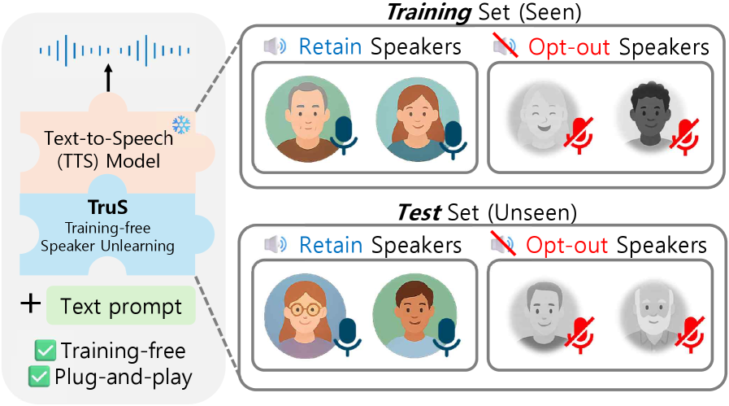
*Fig. 1:Illustration of training-free speaker unlearning.*

*Fig. 2:The overall framework of TruS, working with TTS models at inference time. Feature activations at layers and generation steps are optionally steered based on the dynamically selective threshold. With only a single utterance example of a target who requests to opt out, our method controls to suppress the identity-related activations without additional training.*

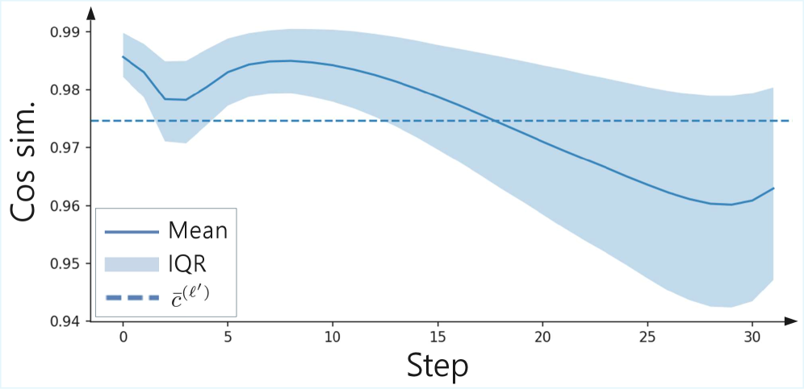
*(a)1st block layer*

*(a)1st block layer*

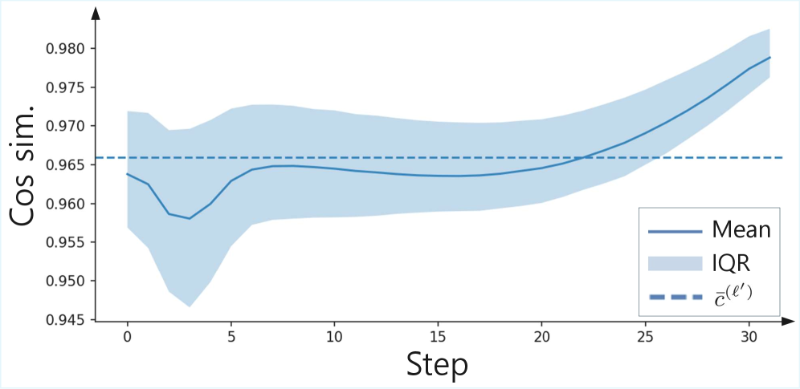
*(b)12th block layer*

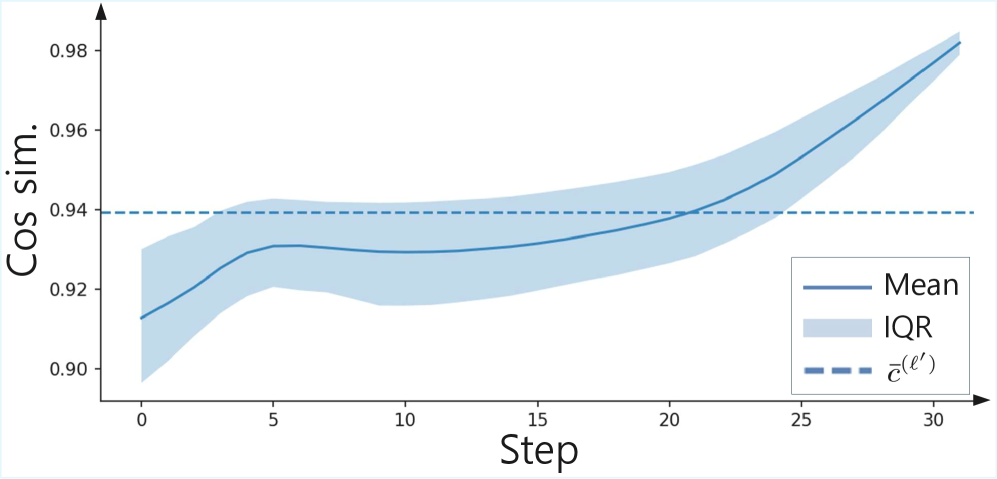
*(c)20th block layer*

---
**Usage Info**: 5941 tokens used.
**Generated at**: 2026-02-24 20:57:29

---

# 📚 Mix2Morph: Learning Sound Morphing from Noisy Mixes

🚀 URL: https://arxiv.org/html/2601.20426

## 🌏 Abstract (원문)
Sound design encompasses the creative process of shaping and combining audio to achieve expressive narrative goals. A common approach issound morphing: the fusion of two sounds into a single, coherent sound resembling both at once[1]. For instance, to design a menacing alien voice, a sound designer may combine animal vocalizations with human speech, producing a unified sound that is at once recognizable and alien. A central challenge in morphing is the generation of perceptually coherent midpoints: hybrids that convincingly sound like both sources at once. Human perception of sound is shaped primarily by two dimensions; temporal structure and spectral content, which provide natural anchors for coherence[2,3,4,5]. When these anchors are not preserved, intermediate morphs become perceptually fragile: they may lose the identity of one or both sources, sound more like an additive mix than a fused sound, or drift into unnatural artifacts[6,7]. This issue is important in practice, as sound designers often aim not to fully transform one sound into another but to preserve the recognizable identity of a primary source while enriching it with qualities of a secondary source. To capture this practically motivated and perceptually distinctive case, we introduce the termsound infusion. We define a sound infusion as a special case of asymmetric (or unbalanced[6]) static morphing[8,9], in which one sound acts as the primary source (e.g., a human voice) while another serves as the secondary (e.g., a lion’s roar), contributing supplemental features throughout (e.g., a rough, roar-like texture woven into its timbre). In this work, we focus on producing robust, high-quality, perceptually-coherent sound infusions where the temporal dynamics are rooted in the primary source while timbral qualities are jointly blended from both, as in[10]. While sound infusion offers a practically motivated framing of the midpoint problem, prior work has focused on other morphing forms (e.g., dynamic or repetitive[11,8,12]). Classic DSP methods, such as feature interpolation guided by perceptual descriptors[1,11,13]and cross-synthesis[14,15]generally produce good morphs when applied to pitched, harmonic sounds (e.g., instruments, vocals). However, they struggle with unpitched textures like ambient noise, environmental recordings, and everyday sound effects (SFX)–categories central to creative sound design. To broaden morphing beyond these limits, recent work has turned to deep learning[16]. Systems like MorphFader[12]and SoundMorpher[7]extend the expressive scope of morphing, leveraging the pre-existing abilities of AudioLDM2[17], a text-to-audio (TTA) model. However, they frequently suffer from midpoint collapse: endpoint generations remain stable, but intermediate morphs are perceptually fragile and drift toward incoherent or additive-sounding mixes. A complementary line of work decomposes sounds into their dominant perceptual dimensions[2,3,4,5], temporal structure and spectral content, and blends them independently. Dixit et al.[6]targeted temporal envelopes by interpolating amplitude contours via an autoencoder, while Tokui and Baker[10], building on granular resynthesis[18,19], used neural audio codecs to preserve a primary source’s temporal structure while infusing spectral content from a secondary source. This latter approach is especially relevant to sound infusions, but it remains fragile across diverse sound categories and often introduces audible, noise-like artifacts. A key bottleneck in training a model for morphing is the lack of training data exemplifying morphs, especially ones that both remain perceptually coherent across diverse sound categories and preserve the asymmetric dominance structure valued in creative sound design. In this work, we present Mix2Morph, a text-to-audio model designed for generating high-quality sound infusions. Mix2Morph’s strength lies in a finetuning strategy that enables morph generation without requiring a dedicated morphing dataset. Inspired by the idea of “making good data from bad data”[20], we construct surrogate training data by repurposing noisy additive mixes, allowing the model to learn how to produce perceptually coherent morphs. Our contributions include: Mix2Morph, a text-to-audio model for robust midpoint sound infusions, enabled by a finetuning strategy that repurposes pretrained generative models to perform morphing; An automated method for constructing a surrogate training dataset for morphing, enabling model training without requiring a pre-existing morph corpus; Extended objective metrics for evaluating morphing quality, including adirectionalitymeasure and a proxy for morph identification via latent compressibility; Objective and subjective validation that Mix2Morph outperforms both the prior base model and state-of-the-art deep learning baselines
## 🌏 Abstract (번역)
사운드 디자인은 표현력 있는 서사적 목표를 달성하기 위해 오디오를 형성하고 결합하는 창의적인 과정을 포함합니다. 일반적인 접근 방식은 두 소리를 하나의 일관된 소리로 융합하여 동시에 두 소리를 모두 닮게 만드는 '사운드 모핑(sound morphing)'입니다. 예를 들어, 위협적인 외계인의 목소리를 디자인하기 위해 사운드 디자이너는 동물의 발성 소리와 인간의 언어를 결합하여, 즉각적으로 인식 가능하면서도 외계인 같은 통합된 소리를 만들어낼 수 있습니다. 모핑의 핵심 과제는 지각적으로 일관된 중간 지점, 즉 두 소스처럼 설득력 있게 들리는 하이브리드를 생성하는 것입니다. 소리에 대한 인간의 지각은 주로 시간적 구조와 스펙트럼 콘텐츠라는 두 가지 차원에 의해 형성되며, 이는 일관성을 위한 자연스러운 앵커 역할을 합니다. 이러한 앵커가 보존되지 않으면 중간 모핑 결과물은 지각적으로 취약해집니다. 즉, 하나 또는 두 소스 모두의 정체성을 잃거나, 융합된 소리가 아닌 단순 가산 믹스처럼 들리거나, 부자연스러운 아티팩트가 발생할 수 있습니다. 사운드 디자이너는 종종 한 소리를 다른 소리로 완전히 변환하는 것이 아니라, 주 소스의 인식 가능한 정체성을 유지하면서 보조 소스의 특성을 풍부하게 입히는 것을 목표로 하기 때문에 이 문제는 실무에서 매우 중요합니다. 이러한 실무적 동기와 지각적 독특함을 포착하기 위해 우리는 '사운드 인퓨전(sound infusion)'이라는 용어를 도입합니다. 우리는 사운드 인퓨전을 비대칭적 정적 모핑의 특수한 사례로 정의하며, 여기서 한 소리는 주 소스(예: 사람 목소리) 역할을 하고 다른 소리는 보조 소스(예: 사자의 포효) 역할을 하여 전체적으로 보충적인 특징(예: 음색에 섞인 거친 포효 같은 질감)을 기여합니다. 본 연구에서 우리는 시간적 역동성은 주 소스에 뿌리를 두면서 음색적 특성은 양쪽에서 혼합된, 견고하고 고품질이며 지각적으로 일관된 사운드 인퓨전을 생성하는 데 집중합니다. 기존의 DSP 방식은 조율된 고조파 소리에는 효과적이지만, 창의적인 사운드 디자인의 핵심인 환경 녹음이나 효과음(SFX) 같은 비음조 텍스처에는 어려움을 겪습니다. 최근 딥러닝 기반 시스템들은 표현 범위를 넓혔으나, 중간 지점이 붕괴되어 일관성이 없거나 단순 믹스처럼 들리는 문제를 자주 겪습니다. 모핑 모델 학습의 주요 병목 현상은 다양한 사운드 카테고리에서 지각적 일관성을 유지하는 모핑 학습 데이터가 부족하다는 점입니다. 본 논문에서는 고품질 사운드 인퓨전 생성을 위해 설계된 텍스트-투-오디오 모델인 Mix2Morph를 제시합니다. Mix2Morph의 강점은 전용 모핑 데이터셋 없이도 노이즈가 있는 가산 믹스를 재구성하여 대리(surrogate) 훈련 데이터를 구축함으로써 모델이 지각적으로 일관된 모핑을 생성하도록 학습시키는 파인튜닝 전략에 있습니다. 본 연구의 기여는 다음과 같습니다: 사전 학습된 생성 모델을 모핑에 활용하는 파인튜닝 전략 기반의 Mix2Morph 모델 제안; 기존 모핑 코퍼스 없이도 모델 학습을 가능하게 하는 자동화된 대리 훈련 데이터셋 구축 방법; 방향성 측정 및 잠재 압축성을 통한 모핑 식별 프록시를 포함한 확장된 객관적 평가 지표; Mix2Morph가 기존 모델 및 최신 딥러닝 베이스라인보다 우수함을 입증하는 객관적 및 주관적 검증.

## 🔍 Methods & Results
- 고품질 모핑 데이터셋의 부재를 해결하기 위해 두 소리의 단순 가산 믹스를 '대리(surrogate) 데이터'로 활용하는 훈련 전략을 제안함.
- 확산 모델(Diffusion Model)의 'No-waste' 전략을 채택하여, 저품질 대리 데이터를 높은 타임스텝(high timestep)에 할당함으로써 모델이 아티팩트에 오버피팅되지 않고 거시적인 모핑 개념을 학습하도록 유도함.
- 주 소스의 시간적 구조를 유지하기 위해 RMS 엔벨로프를 추출하여 믹스에 적용하는 'RMS 앵커링(RMS Anchoring)' 기법을 사용함.
- 두 소스의 스펙트럼 콘텐츠를 정렬하기 위해 주파수 영역에서 평균 타겟 스펙트럼을 생성하고 EQ 커브를 적용하는 '스펙트럼 보간(Spectral Interpolation)' 기법을 도입함.
- RMS 전용, 스펙트럼 전용, 혼합, 증강 없음의 네 가지 모드와 그에 대응하는 텍스트 캡션을 사용하여 훈련 타겟을 다양화하고 제어력을 높임.
- 방향성(directionality) 및 잠재 압축성(latent compressibility) 기반의 새로운 객관적 지표를 통해 모핑의 품질과 정체성 보존을 평가함.
- 실험 결과, Mix2Morph는 기존의 AudioLDM2 기반 모델 및 최신 딥러닝 베이스라인들보다 지각적 일관성과 모핑 품질 면에서 우수한 성능을 보임을 객관적 및 주관적 지표로 입증함.

## 🖼 Figures

*Fig. 1:Mix2Morph pipeline for creating noisy surrogate morphs via augmented additive mixing of sound pairs, used as high-timestep training targets in our diffusion-based TTA model. This example (as well as others) can be listened to at https://anniejchu.github.io/mix2morph/*

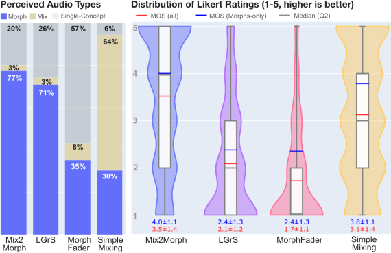
*Fig. 2:Listener Study Results: Mix2Morph achieves the highest morph rate, with MOS skewed toward higher values.*

---
**Usage Info**: 5335 tokens used.
**Generated at**: 2026-02-24 20:58:03

---

# 📚 Audio Deepfake Detection in the Age of Advanced Text-to-Speech models

🚀 URL: https://arxiv.org/html/2601.20510

## 🌏 Abstract (원문)
The rapid advancement of neural Text-to-Speech (TTS) technology has created a double-edged sword. While these systems have opened new possibilities for accessibility and creative expression, they have simultaneously enabled a new class of audio deepfake threats with unprecedented realism. In the past, TTS systems were recognizable by their characteristic robotic prosody and limited speaker variation. Today’s models—particularly those leveraging large language model (LLM) architectures and flow-matching generative approaches—can generate continuous, emotionally expressive, multi-turn conversations that rival human speech in naturalness. This capability offers genuine benefits for accessibility tools and creative industries, yet it simultaneously threatens voice biometric security, amplifies misinformation risks, and undermines trust in audio as evidence. The detection of audio deepfakes has long relied on identifying specific artifacts left behind by neural vocoders or detecting irregularities in time-frequency representations. For years, the ASVspoof 2021 Logical Access (LA) and DeepFake (DF) challenges have served as the primary benchmarks driving the field forward, catalyzing the development of increasingly sophisticated countermeasures. These include graph-based attention architectures such as AASIST, self-supervised learning approaches leveraging wav2vec 2.0 and Whisper, and end-to-end raw waveform classifiers like RawNet2. Yet this progress masks a critical vulnerability: the forensic community has become increasingly reliant on benchmarks designed around older, vocoder-based TTS systems. Meanwhile, the threat landscape has shifted dramatically. Models released in late 2024 and early 2025—Dia2, Maya1, and MeloTTS—employ architectures fundamentally different from their predecessors. These systems incorporate streaming context awareness, hierarchical neural codecs, and non-autoregressive synthesis paradigms. There is no guarantee that detectors trained exclusively on older deepfakes will generalize to these new attack vectors. This generalization gap is not merely academic. Existing research, while promising, has revealed asymmetries in detection performance that suggest no single detection paradigm is universally effective. While Kawa et al. demonstrated Whisper’s robustness to in-the-wild data, our own results (Section 4) suggest it may falter with newer TTS Models. Hierarchical feature fusion methods, such as XLS-R-SLS, have shown strong empirical results against autoregressive artifacts, yet their performance against flow-matching systems remains uncharacterized. Furthermore, the forensic signatures of modern architectures—quantization artifacts from hierarchical codecs, spectral smoothing from flow-based generators—are poorly understood and remain largely unquantified. We designed this work to fill precisely this gap. By systematically evaluating three state-of-the-art TTS models against four distinct detection frameworks, we provide the first empirical characterization of how detection architectures respond to the diversity of modern neural speech synthesis. Our contributions are as follows: We construct a novel dataset of 12,000 synthetic audio samples spanning three distinct TTS paradigms: streaming dialogue synthesis (Dia2), LLM-based neural codec generation (Maya1), and non-autoregressive flow-matching (MeloTTS). All samples are derived from the DailyDialog corpus, ensuring linguistic and conversational realism. We employ a multi-faceted detection strategy that combines semantic understanding (Whisper-MesoNet), hierarchical representation learning (XLS-R-SLS), structural graph modeling (SSL-AASIST), and large-scale foundation models (MMS-300M) to provide diverse analytical perspectives. We demonstrate, for the first time, that semantic detectors exhibit systematic vulnerabilities to LLM-based TTS, while hierarchical fusion models excel at capturing autoregressive artifacts but falter against flow-matching systems. These findings suggest that no single detection approach is robust across the full spectrum of modern TTS architectures. We show that proprietary audio deepfake detection model from UncovAI achieve near-perfect separation across all attack vectors. The remainder of this paper is structured as follows. We begin with a survey of related work, highlighting the evolution of TTS threats and the role of foundation models in detection. Section 3 details our dataset construction, models, and evaluation methodology. Section 4 presents our experimental results, organized by detection framework. Finally, Section 5 offers a synthesis of our findings and discusses implications for the forensic community.
## 🌏 Abstract (번역)
신경망 기반 텍스트 음성 변환(TTS) 기술의 급격한 발전은 양날의 검이 되었습니다. 이러한 시스템은 접근성과 창의적 표현의 새로운 가능성을 열어주었지만, 동시에 전례 없는 사실성을 갖춘 새로운 오디오 딥페이크 위협을 가능하게 했습니다. 과거의 TTS 시스템은 특유의 로봇 같은 운율과 제한된 화자 변동성으로 식별이 가능했습니다. 오늘날의 모델, 특히 대규모 언어 모델(LLM) 아키텍처와 플로우 매칭(flow-matching) 생성 방식을 활용하는 모델은 인간의 음성에 필적하는 자연스러움으로 감정 표현이 풍부하고 연속적인 다회차 대화를 생성할 수 있습니다. 이러한 능력은 접근성 도구와 창의적 산업에 진정한 이점을 제공하지만, 동시에 음성 생체 보안을 위협하고 오정보 위험을 증폭시키며 증거로서의 오디오에 대한 신뢰를 훼손합니다. 오디오 딥페이크 탐지는 오랫동안 신경망 보코더가 남긴 특정 아티팩트를 식별하거나 시간-주파수 표현의 불규칙성을 탐지하는 데 의존해 왔습니다. 수년 동안 ASVspoof 2021 논리적 접속(LA) 및 딥페이크(DF) 챌린지는 이 분야를 발전시키는 주요 벤치마크 역할을 하며 점점 더 정교한 대응책 개발을 촉진해 왔습니다. 여기에는 AASIST와 같은 그래프 기반 어텐션 아키텍처, wav2vec 2.0 및 Whisper를 활용하는 자기 지도 학습 방식, RawNet2와 같은 엔드투엔드 원시 파형 분류기가 포함됩니다. 그러나 이러한 진전은 중요한 취약점을 가리고 있습니다. 법의학 커뮤니티가 구형 보코더 기반 TTS 시스템을 중심으로 설계된 벤치마크에 점점 더 의존하게 된 것입니다. 그 사이 위협 환경은 극적으로 변화했습니다. 2024년 말과 2025년 초에 출시된 모델들(Dia2, Maya1, MeloTTS)은 이전 모델들과 근본적으로 다른 아키텍처를 채용합니다. 이러한 시스템은 스트리밍 문맥 인식, 계층적 신경 코덱, 비자기회귀 합성 패러다임을 통합합니다. 구형 딥페이크로만 훈련된 탐지기가 이러한 새로운 공격 벡터에 일반화될 것이라는 보장은 없습니다. 이러한 일반화 격차는 단순한 학술적 문제가 아닙니다. 기존 연구는 유망하지만, 단일 탐지 패러다임이 보편적으로 효과적이지 않음을 시사하는 탐지 성능의 비대칭성을 드러냈습니다. Kawa 등은 야생 데이터에 대한 Whisper의 견고함을 입증했지만, 본 연구의 결과(섹션 4)는 최신 TTS 모델에서 Whisper가 제대로 작동하지 않을 수 있음을 시사합니다. XLS-R-SLS와 같은 계층적 특징 융합 방법은 자기회귀 아티팩트에 대해 강력한 실증적 결과를 보여주었으나, 플로우 매칭 시스템에 대한 성능은 아직 규명되지 않았습니다. 또한 계층적 코덱의 양자화 아티팩트, 플로우 기반 생성기의 스펙트럼 평활화와 같은 현대적 아키텍처의 법의학적 시그니처는 제대로 이해되지 않았으며 대부분 수치화되지 않은 상태로 남아 있습니다. 본 연구는 바로 이러한 격차를 메우기 위해 설계되었습니다. 4가지의 서로 다른 탐지 프레임워크에 대해 3가지 최첨단 TTS 모델을 체계적으로 평가함으로써, 탐지 아키텍처가 현대 신경망 음성 합성의 다양성에 어떻게 반응하는지에 대한 최초의 실증적 특성을 제공합니다. 본 연구의 기여는 다음과 같습니다. 첫째, 스트리밍 대화 합성(Dia2), LLM 기반 신경 코덱 생성(Maya1), 비자기회귀 플로우 매칭(MeloTTS)이라는 세 가지 뚜렷한 TTS 패러다임을 아우르는 12,000개의 합성 오디오 샘플로 구성된 새로운 데이터셋을 구축했습니다. 모든 샘플은 DailyDialog 코퍼스에서 추출되어 언어적 및 대화적 사실성을 보장합니다. 둘째, 의미론적 이해(Whisper-MesoNet), 계층적 표현 학습(XLS-R-SLS), 구조적 그래프 모델링(SSL-AASIST), 대규모 파운데이션 모델(MMS-300M)을 결합하여 다양한 분석적 관점을 제공하는 다각적 탐지 전략을 채택했습니다. 셋째, 의미론적 탐지기가 LLM 기반 TTS에 체계적인 취약성을 보이는 반면, 계층적 융합 모델은 자기회귀 아티팩트 포착에는 뛰어나지만 플로우 매칭 시스템에는 취약함을 최초로 입증했습니다. 이러한 결과는 현대 TTS 아키텍처의 전체 스펙트럼에 걸쳐 견고한 단일 탐지 방식은 없음을 시사합니다. 넷째, UncovAI의 상용 오디오 딥페이크 탐지 모델이 모든 공격 벡터에서 거의 완벽한 분리 성능을 달성함을 보여줍니다. 본 논문의 나머지 부분은 다음과 같이 구성됩니다. 먼저 TTS 위협의 진화와 탐지에서 파운데이션 모델의 역할을 강조하는 관련 연구를 살펴봅니다. 3절에서는 데이터셋 구축, 모델 및 평가 방법론을 상세히 설명합니다. 4절에서는 탐지 프레임워크별로 정리된 실험 결과를 제시합니다. 마지막으로 5절에서는 연구 결과를 종합하고 법의학 커뮤니티에 대한 시사점을 논의합니다.

## 🔍 Methods & Results
- DailyDialog 코퍼스를 기반으로 Dia2, Maya1, MeloTTS 등 3가지 최신 TTS 모델을 사용하여 12,000개의 합성 오디오 데이터셋 구축
- Dia2: Deep-Inherited Attention(DIA) 아키텍처를 통해 다회차 대화의 일관성을 유지하고 스트리밍 합성을 지원하여 자연스러운 대화 생성
- Maya1: Llama 백본과 계층적 신경 코덱(SNAC)을 사용하여 의미론적 이해와 감정 표현이 풍부한 음성 합성
- MeloTTS: VITS 아키텍처 기반의 경량 엔드투엔드 모델로, VAE와 Normalizing Flows를 결합하여 빠른 추론 속도와 높은 음향적 사실성 제공
- 탐지 전략: Whisper-MesoNet(의미론), SSL-AASIST(구조적 그래프), XLS-R-SLS(계층적 특징 융합) 등 다각적 프레임워크 활용
- 실험 결과: MeloTTS가 가장 우수한 음향적 사실성(FAD 118.34)과 명료도(WER 0.0639)를 기록함
- 실험 결과: Dia2는 가장 높은 내부 음성 일관성(ACT 0.9806)을 보였으며, Maya1은 SNAC 코덱을 통해 가장 우수한 신호 명료도(SNR -0.00)를 달성함
- 주요 발견: 의미론적 탐지기는 LLM 기반 TTS에 취약하며, 계층적 모델은 플로우 매칭 시스템 탐지에서 성능이 저하되는 등 단일 탐지 모델의 한계 확인

---
**Usage Info**: 8740 tokens used.
**Generated at**: 2026-02-24 20:59:15

---

# 📚 ASR for Affective Speech: Investigating Impact of Emotion and Speech Generative Strategy

🚀 URL: https://arxiv.org/html/2601.20319

## 🌏 Abstract (원문)
Automatic speech recognition (ASR) is a foundational technology in speech-based applications and plays a key role in modern human-computer interaction[19]. For real-world deployment, robustness is a critical requirement. While much of the existing research has focused on external factors such as background noise and reverberation[15], internal factors related to the speaker, particularly emotional expression, have received comparatively less attention despite their substantial impact on speech characteristics[18]. Emotion plays a central role in human communication, not only affecting prosody, articulation, and voice quality but also characterized either by discrete categories (e.g., angry, happy, sad) or by continuous dimensions such as valence and arousal[13]. Speech produced under different emotional states can vary considerably in both acoustic and linguistic patterns, posing challenges to conventional ASR systems[3]. Such variability poses challenges to conventional ASR systems, underscoring the need for models that can accurately recognize emotional speech and remain reliable under diverse real-world conditions. Emotion has traditionally been regarded as a source of noise in the ASR process. For example, Catania et al. showed that emotional speech negatively impacts the performance of speech recognition and user input understanding, framing emotion as a disruptive factor in human-AI interaction[6]. Other studies have also noted lexical and acoustic differences across emotional states. Gulmira et al. proposed a low-resource emotional speech recognition method that detects emotions based on a codebook of emotionally charged words in Kazakh language[4]. These findings suggest that emotional speech is more difficult to recognize than neutral speech due to its high variability in acoustic and prosodic features. Moreover, the high cost of collecting labeled emotional speech makes emotional TTS a scalable and low-cost alternative for training emotion-aware ASR systems. One practical approach to addressing this challenge is through data augmentation, a technique widely used to improve robustness in noise-prone ASR systems[12,22]. Among these, controllable text-to-speech (TTS) models have emerged as a scalable tool for simulating diverse speaking conditions. Previous studies have shown that TTS-based augmentation can improve ASR performance for dysarthric speech[14], suggesting that synthetic speech can help bridge the domain gap when real-world data is limited. In this context, emotional TTS offers a promising avenue for generating emotional speech that may help improve ASR performance under affective conditions. Recent advances in large language model-based TTS systems, such as CosyVoice2[9]and EmoVoice[26], have made it feasible to generate highly controllable and emotionally rich synthetic speech. However, the use of synthesized emotional speech for ASR training presents several challenges. Synthesized data may introduce acoustic or prosodic artifacts that distort recognition, and the emotional salience of synthetic speech may not fully align with real-world emotional expression. Additionally, it remains unclear which types of ASR errors are most impacted by emotional content, and how different TTS models influence these error patterns has not been systematically studied. To better understand these effects, we conduct a series of analytical experiments to examine how synthetic emotional speech affects ASR performance. Starting from synthesized data, we analyze the predominant recognition errors introduced by an ASR model. Based on these observations, we design two generative strategies that guide data selection during training. Finally, we evaluate whether these strategies generalize beyond synthetic conditions by testing on real emotional speech datasets. Through this analysis, we aim to clarify the role of emotion in ASR degradation and demonstrate how targeted data construction can enhance system robustness under emotional variability. Our main findings are: Synthesized emotional speech increases substitution errors, revealing emotion’s impact on phonetics. Emotionally salient and correctly transcribed samples are more effective for ASR training. Filtered synthetic data improves recognition on real emotional speech without harming neutral performance.
## 🌏 Abstract (번역)
자동 음성 인식(ASR)은 음성 기반 애플리케이션의 기초 기술이며 현대 인간-컴퓨터 상호작용에서 핵심적인 역할을 합니다. 실제 배포를 위해서는 강건성이 필수적인 요구 사항입니다. 기존 연구의 상당 부분은 배경 소음 및 잔향과 같은 외부 요인에 집중해 왔으나, 화자와 관련된 내부 요인, 특히 감정 표현은 음성 특성에 상당한 영향을 미침에도 불구하고 상대적으로 적은 관심을 받아왔습니다. 감정은 인간의 의사소통에서 중심적인 역할을 하며, 운율, 발음, 음질에 영향을 미칠 뿐만 아니라 이산적 범주(예: 분노, 행복, 슬픔) 또는 가치 및 각성과 같은 연속적 차원으로 특징지어집니다. 서로 다른 감정 상태에서 생성된 음성은 음향적 및 언어적 패턴 모두에서 크게 다를 수 있으며, 이는 기존 ASR 시스템에 도전 과제를 제기합니다. 이러한 가변성은 감정 음성을 정확하게 인식하고 다양한 실제 조건에서 신뢰성을 유지할 수 있는 모델의 필요성을 강조합니다. 전통적으로 감정은 ASR 과정에서 소음의 원인으로 간주되어 왔습니다. 예를 들어, Catania 등은 감정 음성이 음성 인식 및 사용자 입력 이해 성능에 부정적인 영향을 미친다는 것을 보여주었으며, 감정을 인간-AI 상호작용의 방해 요인으로 규정했습니다. 다른 연구들도 감정 상태에 따른 어휘 및 음향적 차이를 주목했습니다. Gulmira 등은 카자흐어에서 감정이 실린 단어의 코드북을 기반으로 감정을 감지하는 저자원 감정 음성 인식 방법을 제안했습니다. 이러한 발견은 감정 음성이 음향 및 운율적 특징의 높은 가변성으로 인해 중립 음성보다 인식하기 더 어렵다는 것을 시사합니다. 또한, 레이블이 지정된 감정 음성을 수집하는 높은 비용으로 인해 감정 TTS는 감정 인식 ASR 시스템 학습을 위한 확장 가능하고 저비용의 대안이 됩니다. 이 문제를 해결하기 위한 한 가지 실용적인 접근 방식은 소음이 발생하기 쉬운 ASR 시스템의 강건성을 개선하기 위해 널리 사용되는 기술인 데이터 증강입니다. 이 중 제어 가능한 텍스트 음성 변환(TTS) 모델은 다양한 발화 조건을 시뮬레이션하기 위한 확장 가능한 도구로 부상했습니다. 이전 연구들은 TTS 기반 증강이 구어 장애 음성의 ASR 성능을 개선할 수 있음을 보여주었으며, 이는 실제 데이터가 제한적일 때 합성 음성이 도메인 간극을 메우는 데 도움이 될 수 있음을 시사합니다. 이러한 맥락에서 감정 TTS는 정서적 조건 하에서 ASR 성능을 향상시키는 데 도움이 될 수 있는 감정 음성을 생성하는 유망한 방법을 제공합니다. CosyVoice2 및 EmoVoice와 같은 대규모 언어 모델 기반 TTS 시스템의 최근 발전으로 고도로 제어 가능하고 감정이 풍부한 합성 음성을 생성하는 것이 가능해졌습니다. 그러나 ASR 학습을 위해 합성된 감정 음성을 사용하는 것은 몇 가지 과제를 안겨줍니다. 합성 데이터는 인식을 왜곡하는 음향 또는 운율적 아티팩트를 도입할 수 있으며, 합성 음성의 감정적 두드러짐이 실제 감정 표현과 완전히 일치하지 않을 수 있습니다. 또한, 어떤 유형의 ASR 오류가 감정 콘텐츠의 영향을 가장 많이 받는지, 그리고 서로 다른 TTS 모델이 이러한 오류 패턴에 어떻게 영향을 미치는지에 대해서는 체계적으로 연구되지 않았습니다. 이러한 효과를 더 잘 이해하기 위해, 본 연구에서는 합성 감정 음성이 ASR 성능에 미치는 영향을 조사하기 위한 일련의 분석 실험을 수행합니다. 합성 데이터에서 시작하여 ASR 모델에 의해 도입된 주요 인식 오류를 분석합니다. 이러한 관찰을 바탕으로 학습 중 데이터 선택을 안내하는 두 가지 생성 전략을 설계합니다. 마지막으로, 실제 감정 음성 데이터셋에서 테스트하여 이러한 전략이 합성 조건을 넘어 일반화되는지 평가합니다. 이 분석을 통해 ASR 저하에서 감정의 역할을 명확히 하고, 목표화된 데이터 구축이 감정적 가변성 하에서 시스템 강건성을 어떻게 향상시킬 수 있는지 입증하고자 합니다. 주요 발견 사항은 다음과 같습니다: 합성된 감정 음성은 대체 오류를 증가시켜 감정이 음성학에 미치는 영향을 드러냅니다. 감정적으로 두드러지고 정확하게 전사된 샘플이 ASR 학습에 더 효과적입니다. 필터링된 합성 데이터는 중립 음성 성능을 저해하지 않으면서 실제 감정 음성에 대한 인식을 개선합니다.

## 🔍 Methods & Results
- CosyVoice2, EmoVoice, MaskGCT 등 3가지 최신 감정 제어 TTS 모델을 사용하여 Lib리Speech 데이터를 5가지 감정(분노, 행복, 중립, 슬픔, 놀람)으로 합성함
- Qwen2-audio를 ASR 백본으로 사용하여 합성된 감정 음성의 단어 오류율(WER) 및 오류 패턴(대체, 삽입, 삭제)을 분석함
- WavLM 기반 감정 회귀 모델을 통해 합성된 음성의 각성(Arousal), 가치(Valence), 지배성(Dominance) 점수를 측정하여 감정적 두드러짐을 평가함
- 실험 결과, 모든 감정 TTS 데이터셋이 원본 LibriSpeech보다 높은 WER을 기록했으며, 특히 대체 오류(Substitution errors)가 지배적으로 나타남
- NISQA 모델을 통한 음질 평가(MOS 3.7 이상) 결과, 높은 오류율이 신호 품질 저하가 아닌 감정적 표현의 가변성 때문임을 확인
- 대부분의 합성 음성에서 감정적 각성(Arousal) 수치가 낮게 나타나는 등 감정적 두드러짐이 제한적임을 발견
- 전사 정확도와 감정적 두드러짐을 기준으로 데이터를 선택하는 전략이 실제 감정 음성 데이터셋에 대한 ASR 성능을 개선함을 입증

## 🖼 Figures
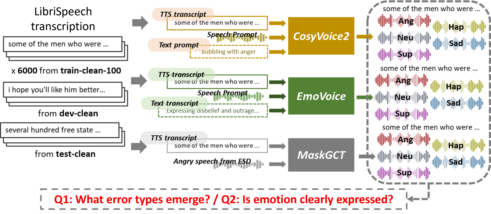
*Figure 1:Workflow for synthesized emotional speech analysis.*

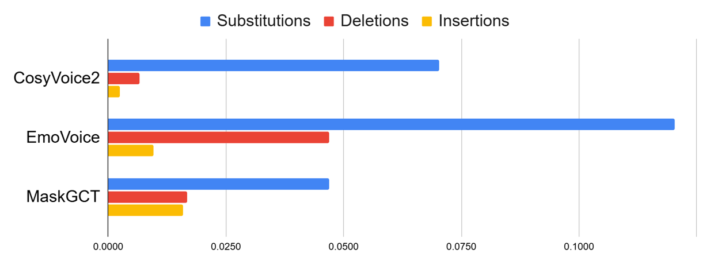
*Figure 2:Distribution of word error types in the training set of emotional TTS speech.*

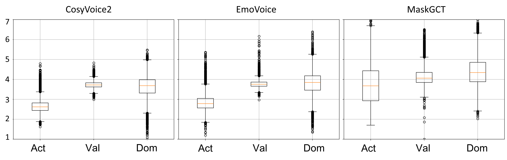
*Figure 3:Box plots of emotion distributions in the training set of emotional TTS speech.*

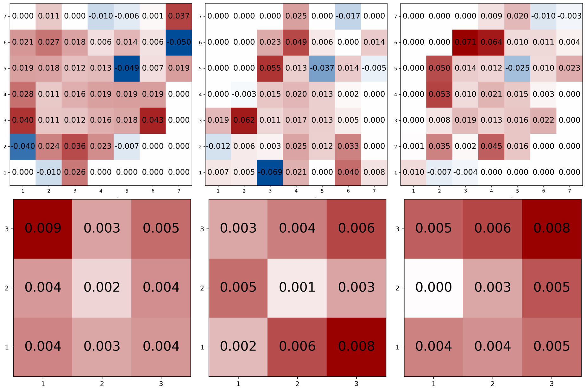
*Figure 4:Left to right: (Act, Val), (Val, Dom), and (Act, Dom) planes showing WER difference patterns for MSP-Test 2 (top) and IEMOCAP (bottom).*

---
**Usage Info**: 7196 tokens used.
**Generated at**: 2026-02-24 21:05:09

---

# 📚 Self Voice Conversion as an Attack against Neural Audio Watermarking

🚀 URL: https://arxiv.org/html/2601.20432

## 🌏 Abstract (원문)
Recent advances in neural audio generation and transformation technologies have led to significant progress in expressive speech synthesis and high-fidelity voice conversion (VC). While these developments support novel creative and commercial applications, they have also introduced growing concerns regarding content authenticity, copyright protection, and speaker-identity misuse. As a result, audio watermarking has become an important line of defense for origin verification, content authentication, tamper detection, and ownership tracking. Audio watermarking embeds auxiliary information into a speech signal while preserving perceptual quality and enabling reliable detection or extraction. Historically, the field was dominated by DSP-based techniques that embedded watermarks through bit-level manipulation, echo hiding, spread-spectrum modulation, or frequency-domain modifications. The primary threats to these systems were incidental transmission-channel distortions such as lossy compression, additive noise, and resampling. With the emergence of deep learning (DL)-based watermarking methods, robustness evaluations have expanded to include a wider range of transformations. However, most of these transformations still originate from transmission channels rather than intentional attacks. Even when attacker-side transformations are considered, they are typically limited to low-tech manipulations such as pitch shifting, time stretching, or simple filtering—operations that do not reflect the capabilities of a motivated adversary. Consequently, the robustness of current watermarking techniques is systematically overestimated. Recent benchmarking studies reveal that modern neural transformations can severely degrade watermark detectability while maintaining perceptual quality. Although some approaches reported success against these kinds of attacks, such as neural compression-driven and voice cloning-based methods, these defense methods still fall short of addressing realistic, intentional, and advanced malicious attacks. Among such attacks, VC represents a particularly serious and underexplored threat. VC models can render speech with altered acoustic characteristics while preserving the linguistic content, and their increasing accessibility has motivated a parallel line of work on defending or tracing speaker identity under such adversarial attacks. These methods do not propose watermarking schemes, but instead aim to maintain speaker attribution in the presence of content-preserving yet acoustically transformative models. In this paper, we address the following critical research question: Do watermarking systems remain robust when the signal is passed through a VC model? In particular, we investigate self VC as a novel and practical attack scenario against audio watermarking systems. Self VC remaps a speaker’s voice back to the same identity, preserving the linguistic content and speaker characteristics while subtly altering the acoustic representation. Since the attack does not manipulate the speaker identity or utterance content, it remains imperceptible in many usage contexts; however, it can still significantly disrupt embedded watermarks. Figure 1 illustrates the end-to-end publisher–attacker–receiver pipeline, where self VC serves as the adversarial attack between watermark embedding and detection. This setup reflects realistic deployment conditions in which the attacker acts as an intermediate processing stage without access to the watermarking system’s internal details. Watermarked speech may also undergo transmission-channel distortions before and after the attacker, further compounding degradation. Within this framework, we show that self VC poses a severe threat to several state-of-the-art watermarking systems. Our evaluation covers a classical DCT-based method and widely used DL-based approaches including AudioSeal, Timbre, WMCodec, and VoiceMark.
## 🌏 Abstract (번역)
최근 신경망 오디오 생성 및 변환 기술의 발전으로 표현력 있는 음성 합성 및 고충실도 음성 변환(VC) 분야에서 상당한 진전이 이루어졌습니다. 이러한 발전은 새로운 창의적 및 상업적 응용을 지원하지만, 콘텐츠의 진위성, 저작권 보호 및 화자 신원 오용에 대한 우려도 증가시켰습니다. 결과적으로 오디오 워터마킹은 출처 확인, 콘텐츠 인증, 변조 탐지 및 소유권 추적을 위한 중요한 방어 수단이 되었습니다. 오디오 워터마킹은 지각적 품질을 유지하면서 음성 신호에 보조 정보를 삽입하여 신뢰할 수 있는 탐지 또는 추출을 가능하게 합니다. 역사적으로 이 분야는 비트 수준 조작, 에코 숨기기, 대역 확산 변조 또는 주파수 도메인 수정을 통해 워터마크를 삽입하는 DSP 기반 기술이 주도했습니다. 이러한 시스템에 대한 주요 위협은 손실 압축, 가산 노이즈 및 재샘플링과 같은 부수적인 전송 채널 왜곡이었습니다. 딥러닝(DL) 기반 워터마킹 방법의 등장으로 견고성 평가는 더 넓은 범위의 변환을 포함하도록 확장되었습니다. 그러나 이러한 변환의 대부분은 여전히 의도적인 공격보다는 전송 채널에서 발생합니다. 공격자 측의 변환이 고려되더라도 대개 피치 이동, 시간 스트레칭 또는 단순 필터링과 같은 저기술 조작에 국한되며, 이는 동기 부여된 공격자의 능력을 반영하지 못합니다. 결과적으로 현재 워터마킹 기술의 견고성은 체계적으로 과대평가되고 있습니다. 최근 벤치마킹 연구에 따르면 현대의 신경망 변환은 지각적 품질을 유지하면서도 워터마크 탐지 능력을 심각하게 저하시킬 수 있습니다. 신경망 압축 기반 및 음성 복제 기반 방법과 같은 일부 접근 방식이 이러한 공격에 대해 성공을 거두었다고 보고했지만, 이러한 방어 방법은 여전히 현실적이고 의도적이며 진보된 악의적 공격을 해결하기에는 부족합니다. 이러한 공격 중 VC는 특히 심각하고 충분히 탐구되지 않은 위협입니다. VC 모델은 언어적 내용은 보존하면서 음향적 특성이 변경된 음성을 생성할 수 있으며, 접근성이 높아짐에 따라 이러한 적대적 공격 하에서 화자 신원을 방어하거나 추적하는 병렬 연구가 진행되었습니다. 이러한 방법들은 워터마킹 체계를 제안하지 않고, 대신 내용 보존적이면서도 음향적으로 변형된 모델이 있는 상황에서 화자 귀속을 유지하는 것을 목표로 합니다. 본 논문에서는 다음과 같은 중요한 연구 질문을 다룹니다: 신호가 VC 모델을 통과할 때 워터마킹 시스템이 견고하게 유지되는가? 특히, 오디오 워터마킹 시스템에 대한 새롭고 실용적인 공격 시나리오로서 self VC를 조사합니다. Self VC는 화자의 목소리를 동일한 신원으로 다시 매핑하여 언어적 내용과 화자 특성을 보존하면서 음향적 표현을 미묘하게 변경합니다. 이 공격은 화자 신원이나 발화 내용을 조작하지 않기 때문에 많은 사용 상황에서 감지되지 않지만, 삽입된 워터마크를 여전히 크게 방해할 수 있습니다. 그림 1은 self VC가 워터마크 삽입과 탐지 사이의 적대적 공격 역할을 하는 엔드투엔드 발행자-공격자-수신자 파이프라인을 보여줍니다. 이 설정은 공격자가 워터마킹 시스템의 내부 세부 정보에 접근하지 않고 중간 처리 단계로 작용하는 현실적인 배포 조건을 반영합니다. 워터마킹된 음성은 공격자 전후에 전송 채널 왜곡을 겪을 수도 있어 성능 저하를 더욱 가중시킵니다. 이 프레임워크 내에서 우리는 self VC가 여러 최첨단 워터마킹 시스템에 심각한 위협이 됨을 보여줍니다. 우리의 평가는 고전적인 DCT 기반 방법과 AudioSeal, Timbre, WMCodec, VoiceMark를 포함하여 널리 사용되는 DL 기반 접근 방식을 다룹니다.

## 🔍 Methods & Results
- 오디오 워터마킹 시스템의 견고성을 평가하기 위해 화자 신원과 언어적 내용은 유지하면서 음향적 표현만 미묘하게 변경하는 'Self Voice Conversion (Self VC)' 공격 프레임워크를 제안함
- Self VC는 음성을 언어적 내용, 화자 신원, 피치 등의 잠재 요소로 분해한 후 재합성하는 과정을 거치며, 이 과정에서 워터마크가 포함된 미세한 신호 변동이 억제됨
- 공격 모델로 kNN-VC(WavLM 기반 근접 이웃 교체)와 RVC(HuBERT 및 VAE 기반 음성 변환) 두 가지 방식을 채택하여 실험을 수행함
- 공격자는 워터마킹 시스템의 내부 구조를 모르는 블랙박스 상태에서 최신 VC 툴킷을 사용하여 워터마크를 무력화하려는 시나리오를 가정함
- 실험 결과, Self VC 공격이 AudioSeal, Timbre, WMCodec, VoiceMark와 같은 최신 딥러닝 기반 워터마킹 시스템과 전통적인 DCT 기반 시스템 모두에 대해 심각한 위협이 됨을 입증함
- 신경망 기반 VC 모델을 통한 재합성 과정이 단순한 신호 처리 왜곡보다 워터마크 탐지 성능을 훨씬 더 효과적으로 저하시킨다는 점을 확인하며 현재 워터마킹 기술의 견고성이 과대평가되었음을 지적함

## 🖼 Figures
![Figure 1:Illustration of the end-to-end watermarking pipeline under the proposed self voice conversion (VC) attack. The embedder inserts a multi-bit watermark into bona fide speech, which may first undergo transmission channel distortions before reaching the attacker. The attacker applies self VC to regenerate the signal using the same speaker identity, thereby perturbing or suppressing the embedded watermark. Additional transmission channel distortions may also occur after the attacker’s operation, compounding the degradation before the regenerated audio reaches the watermark (WM) detector.](../images/2026-01-29/2601.20432/2601.20432_fig0.png)
*Figure 1:Illustration of the end-to-end watermarking pipeline under the proposed self voice conversion (VC) attack. The embedder inserts a multi-bit watermark into bona fide speech, which may first undergo transmission channel distortions before reaching the attacker. The attacker applies self VC to regenerate the signal using the same speaker identity, thereby perturbing or suppressing the embedded watermark. Additional transmission channel distortions may also occur after the attacker’s operation, compounding the degradation before the regenerated audio reaches the watermark (WM) detector.*

*Figure 2:Overview of the proposed self VC pipeline. Input watermarked (WM) speech is decomposed into speaker identity, content features, and, optionally, pitch contour (extracted via a pitch tracker, shown with dotted lines). These representations are fused by the decoder to generate a mel spectrogram, which is then synthesized into waveform by a vocoder to reconstruct the WM speech signal.*

---
**Usage Info**: 5397 tokens used.
**Generated at**: 2026-02-24 21:05:43

---

# 📚 SpeechMapper: Speech-to-text Embedding Projector for LLMs

🚀 URL: https://arxiv.org/html/2601.20417

## 🌏 Abstract (원문)
LLMs have demonstrated unprecedented capabilities on text-based tasks, motivating research into extending them to other modalities. For speech, state-of-the-art speech foundation models (SFM) excel at automatic speech recognition (ASR) and speech translation (ST) by leveraging large text decoders that function as internal LMs, but broader spoken language understanding tasks, such as spoken question answering (SQA), require adaptation. To address this gap, recent works have explored integrating SFMs with LLMs. The simplest approach cascades ASR with an LLM, which is effective but discards acoustic cues and adds latency. Similarly, mapping speech into discrete tokens reduces the modality gap but is slow and sensitive to quantization quality, underscoring the need for more efficient, content-preserving speech-to-LLM integration. An alternative line of research focuses on directly bridging the SFM encoder outputs to LLMs: early methods inject speech via cross-modal adapters or prepend speech embeddings to the token sequence, whereas complex systems jointly instruction-tune (IT) both the SFM encoder and the LLM across multiple tasks. Despite their effectiveness, these methods are resource-intensive, require high-end GPUs and large speech datasets, and the added adapters can lead to prompt overfitting, reducing generalization to unseen tasks. In contrast to joint SFM–LLM training, recent work maps speech into embeddings that the LLM can consume directly, preserving its original text capabilities. Wav2Prompt trains a speech encoder to generate LLM-like embeddings, enabling zero-shot generalization but still requiring full LLM forward passes during training. SSR similarly learns a speech-to-LLM projector, but through costly distillation with an explicit aligner, followed by LLM fine-tuning. The proposed SpeechMapper follows this line of work. We remove key limitations by avoiding sequence aligners and reducing reliance on costly LLM forward passes, while still producing a projector that generalizes to unseen speech-to-text tasks. Our SpeechMapper projector maps SFM embeddings directly into the target model’s embedding space through a two-stage training procedure: pretraining and adaptation. Pretraining uses only the LLM’s embedding layer, decoupling training from its costly forward computations, thereby scaling independently of LLM size and enabling the use of more affordable V100 GPUs. Adaptation then rapidly fine-tunes a pretrained SpeechMapper in either a task-agnostic or task-specific manner, keeping the core LLM unchanged. This produces, respectively, a zero-shot speech LLM or a task-specific specialist model, all in just 1.5 h of training on an A100 GPU for an 8–9B LLM. Across ST and SQA experiments, SpeechMapper matches or surpasses the best instruction-following speech LLM from the IWSLT25 short track, while requiring far less data and compute, offering a highly resource-efficient path to speech-enabled LLMs.
## 🌏 Abstract (번역)
LLM은 텍스트 기반 작업에서 전례 없는 능력을 보여주었으며, 이를 다른 모달리티로 확장하려는 연구를 촉발했습니다. 음성의 경우, 최신 음성 기반 모델(SFM)은 내부 LM 역할을 하는 대규모 텍스트 디코더를 활용하여 자동 음성 인식(ASR) 및 음성 번역(ST)에서 우수한 성능을 보이지만, 구어 질의응답(SQA)과 같은 광범위한 구어 이해 작업에는 적응이 필요합니다. 이러한 격차를 해소하기 위해 최근 연구들은 SFM과 LLM의 통합을 탐구해 왔습니다. 가장 간단한 방법은 ASR과 LLM을 직렬로 연결하는 것이지만, 이는 음향 단서를 버리고 지연 시간을 추가합니다. 마찬가지로 음성을 이산 토큰으로 매핑하는 것은 모달리티 격차를 줄이지만 속도가 느리고 양자화 품질에 민감하여, 더 효율적이고 콘텐츠를 보존하는 음성-LLM 통합의 필요성을 강조합니다. 또 다른 연구 방향은 SFM 인코더 출력을 LLM에 직접 연결하는 데 중점을 둡니다. 초기 방법은 교차 모달 어댑터를 통해 음성을 주입하거나 토큰 시퀀스 앞에 음성 임베딩을 추가하는 반면, 복잡한 시스템은 여러 작업에 대해 SFM 인코더와 LLM을 공동으로 지시 조정(IT)합니다. 이러한 방법은 효과적임에도 불구하고 자원 집약적이며 고성능 GPU와 대규모 음성 데이터셋이 필요하고, 추가된 어댑터는 프롬프트 과적합을 유발하여 보지 못한 작업에 대한 일반화 능력을 저하시킬 수 있습니다. 공동 SFM-LLM 학습과 대조적으로, 최근 연구는 음성을 LLM이 직접 소비할 수 있는 임베딩으로 매핑하여 원래의 텍스트 능력을 보존합니다. Wav2Prompt는 LLM과 유사한 임베딩을 생성하도록 음성 인코더를 학습시켜 제로샷 일반화를 가능하게 하지만, 학습 중에 여전히 전체 LLM 순전파가 필요합니다. SSR 또한 음성-LLM 프로젝터를 학습시키지만, 명시적인 정렬기를 사용한 비용이 많이 드는 증류와 LLM 미세 조정을 거칩니다. 본 논문에서 제안하는 SpeechMapper는 이러한 연구 방향을 따릅니다. 우리는 시퀀스 정렬기를 피하고 비용이 많이 드는 LLM 순전파에 대한 의존도를 줄임으로써 주요 한계를 제거하는 동시에, 보지 못한 음성-텍스트 작업으로 일반화되는 프로젝터를 생성합니다. 우리의 SpeechMapper 프로젝터는 사전 학습과 적응이라는 두 단계 학습 절차를 통해 SFM 임베딩을 대상 모델의 임베딩 공간으로 직접 매핑합니다. 사전 학습은 LLM의 임베딩 레이어만 사용하여 학습을 비용이 많이 드는 순전파 계산과 분리함으로써 LLM 크기와 독립적으로 확장하고 더 저렴한 V100 GPU를 사용할 수 있게 합니다. 이후 적응 단계에서는 핵심 LLM을 변경하지 않은 채로 작업 불가지론적 또는 작업 특정적 방식으로 사전 학습된 SpeechMapper를 신속하게 미세 조정합니다. 이는 각각 제로샷 음성 LLM 또는 작업 특정 전문가 모델을 생성하며, 8-9B LLM에 대해 A100 GPU에서 단 1.5시간의 학습만으로 완료됩니다. ST 및 SQA 실험 전반에 걸쳐 SpeechMapper는 훨씬 적은 데이터와 계산량을 요구하면서도 IWSLT25 쇼트 트랙의 최고 성능 지시 준수 음성 LLM과 일치하거나 이를 능가하여, 음성 지원 LLM을 위한 매우 자원 효율적인 경로를 제공합니다.

## 🔍 Methods & Results
- SFM 임베딩을 LLM의 임베딩 공간으로 직접 매핑하는 2단계 학습 절차(사전 학습 및 적응) 제안
- 사전 학습 단계에서 LLM의 임베딩 레이어만 활용하여 순전파 계산 비용을 제거하고 V100 GPU에서도 학습 가능하도록 설계
- 적응 단계에서 핵심 LLM을 고정한 상태로 작업 불가지론적 또는 특정적 미세 조정을 수행하여 1.5시간(A100 기준) 내에 학습 완료
- 시퀀스 정렬기(Sequence Aligner)를 사용하지 않고도 보지 못한 음성-텍스트 작업에 대한 일반화 성능 확보
- 음성 번역(ST) 및 구어 질의응답(SQA) 실험에서 IWSLT25 쇼트 트랙의 최신 모델과 대등하거나 우수한 성능 달성
- 기존 공동 학습 방식 대비 데이터 및 계산 자원 요구량을 획기적으로 절감

## 🖼 Figures

*Figure 1:SpeechMapper two-stage training. (a) Stage 1: Pretraining maps SFM embeddings to shorter sequences trained to match the corresponding LLM text embeddings. Pad embeddings ensure equal sequence lengths. (b) Stage 2: IT Adaptation connects the pretrained projector to the LLM, enabling zero-shot speech capabilities after just 1K steps.*

*Figure 2:Training curves for stage 2 CE+MSE SpeechMappers for four 
𝜎
 values.*

---
**Usage Info**: 3939 tokens used.
**Generated at**: 2026-02-24 21:06:48

---

# 📚 Improving X-Codec-2.0 for Multi-Lingual Speech: 25 Hz Latent Rate and 24 kHz Sampling

🚀 URL: https://arxiv.org/html/2601.20185

## 🌏 Abstract (원문)
Recent advances in neural audio tokenization have enabled end-to-end speech modeling through discrete latent representations. Among these, X-Codec-2.0 (Yeet al.(2024)) has emerged as a powerful multilingual codec model, combining a HuBERT-based (Hsuet al.(2021)) semantic encoder and a transformer-based codec architecture to produce high-quality, language-agnostic audio tokens. Its design allows large language models (LLMs) and autoregressive decoders to handle speech as a discrete sequence prediction task. A key appeal of X-Codec-2.0 lies in its simplicity, it employs a single codebook with a latent frame rate of 50 Hz, making its discrete token stream compact and easy to integrate into multimodal LLM pipelines. This property makes it particularly attractive for tasks such as text-to-speech (TTS) generation, speech-to-text modeling, or unified speech-language pretraining, especially in streaming or low-latency scenarios where token-level autoregressive decoding is desirable. Furthermore, the use of fused linear cross-entropy in modern LLM implementations can substantially reduce activation memory during training, enabling efficient extension of large language models to handle audio tokens without prohibitive computational overhead. However, X-Codec-2.0 operates at a 50 Hz latent frame rate with a 16 kHz target sampling rate. While effective, this configuration limits temporal resolution and upper-frequency fidelity, producing slightly muffled high-frequency content and longer token sequences for generation models. Moreover, as multilingual datasets expand to include more diverse acoustic and expressive conditions, the fixed 50 Hz resolution may underutilize the model’s potential to capture fine-grained speech variation. In this work, we propose a simple modification to X-Codec-2.0 that improves both efficiency and perceptual quality. By increasing the hop size to 960 samples and introducing a lightweight pooling layer before quantization, the codec operates at a reduced 25 Hz latent rate while simultaneously increasing the audio sampling rate to 24 kHz. All encoder components are kept frozen, and only the decoder is fine-tuned under this new temporal configuration. We find that this adjustment produces higher-quality reconstructions without additional parameters or training complexity. Empirically, the proposed model achieves a +0.29 improvement in mean opinion score (MOS) as estimated by UTMOSv2 (Babaet al.(2024)) on the multilingual Common Voice (Ardilaet al.(2020)) 17 test set. The improvement is consistent across languages and demonstrates better high-frequency reconstruction and overall perceptual clarity. Our work shows that small architectural refinements by changing hop-size and pooling adjustments can meaningfully improve codec quality while preserving the simplicity and modularity that make X-Codec-2.0 suitable for LLM-based speech modeling.
## 🌏 Abstract (번역)
최근 신경망 오디오 토큰화의 발전은 이산 잠재 표현을 통한 엔드투엔드 음성 모델링을 가능하게 했습니다. 그중 X-Codec-2.0(Ye et al.(2024))은 HuBERT 기반(Hsu et al.(2021)) 시맨틱 인코더와 트랜스포머 기반 코덱 아키텍처를 결합하여 고품질의 언어 불가지론적 오디오 토큰을 생성하는 강력한 다국어 코덱 모델로 부상했습니다. 이 설계는 대규모 언어 모델(LLM)과 자기회귀 디코더가 음성을 이산 시퀀스 예측 작업으로 처리할 수 있게 합니다. X-Codec-2.0의 핵심적인 매력은 단순함에 있습니다. 50Hz의 잠재 프레임 레이트를 가진 단일 코드북을 사용하여 이산 토큰 스트림을 콤팩트하게 만들고 멀티모달 LLM 파이프라인에 쉽게 통합할 수 있도록 합니다. 이러한 특성은 특히 토큰 수준의 자기회귀 디코딩이 바람직한 스트리밍 또는 저지연 시나리오에서 텍스트 음성 변환(TTS) 생성, 음성 텍스트 모델링 또는 통합 음성-언어 사전 학습과 같은 작업에 특히 매력적입니다. 또한, 현대 LLM 구현에서 융합 선형 교차 엔트로피(fused linear cross-entropy)를 사용하면 학습 중 활성화 메모리를 크게 줄일 수 있어, 과도한 계산 오버헤드 없이 오디오 토큰을 처리하도록 대규모 언어 모델을 효율적으로 확장할 수 있습니다. 그러나 X-Codec-2.0은 16kHz 타겟 샘플링 레이트와 50Hz 잠재 프레임 레이트에서 작동합니다. 이러한 구성은 효과적이긴 하지만 시간적 해상도와 고주파 충실도를 제한하여, 약간 답답한 고주파 콘텐츠를 생성하고 생성 모델을 위한 더 긴 토큰 시퀀스를 만듭니다. 더욱이, 다국어 데이터셋이 더 다양하고 풍부한 음향 및 표현 조건을 포함하도록 확장됨에 따라, 고정된 50Hz 해상도는 미세한 음성 변화를 포착하려는 모델의 잠재력을 충분히 활용하지 못할 수 있습니다. 본 연구에서는 효율성과 지각 품질을 모두 개선하는 X-Codec-2.0에 대한 간단한 수정을 제안합니다. 홉 크기(hop size)를 960 샘플로 늘리고 양자화 전에 경량 풀링 레이어를 도입함으로써, 코덱은 25Hz로 감소된 잠재 속도에서 작동하는 동시에 오디오 샘플링 레이트를 24kHz로 높입니다. 모든 인코더 구성 요소는 동결된 상태로 유지되며, 이 새로운 시간적 구성 하에서 디코더만 미세 조정됩니다. 우리는 이러한 조정이 추가적인 매개변수나 학습 복잡성 없이 더 높은 품질의 재구성을 생성한다는 것을 발견했습니다. 실증적으로, 제안된 모델은 다국어 Common Voice 17 테스트 세트에서 UTMOSv2(Baba et al.(2024))로 추정된 평균 의견 점수(MOS)에서 +0.29의 개선을 달성했습니다. 이러한 개선은 여러 언어에 걸쳐 일관되게 나타나며, 더 나은 고주파 재구성과 전반적인 지각적 명료함을 보여줍니다. 본 연구는 홉 크기 변경 및 풀링 조정을 통한 작은 아키텍처 개선이 X-Codec-2.0을 LLM 기반 음성 모델링에 적합하게 만드는 단순성과 모듈성을 유지하면서도 코덱 품질을 의미 있게 향상시킬 수 있음을 보여줍니다.

## 🔍 Methods & Results
- X-Codec-2.0의 홉 크기를 320에서 960 샘플로 늘리고 양자화 전 평균 풀링 레이어를 추가하여 잠재 속도를 50Hz에서 25Hz로 감소시킴
- 오디오 샘플링 레이트를 16kHz에서 24kHz로 상향 조정하여 고주파 대역의 재구성 품질을 개선함
- 사전 학습된 디코더 가중치를 활용하기 위해 출력 투영 파라미터에 1차원 선형 보간법(linear interpolation)을 적용하여 새로운 해상도에 적응시킴
- 인코더 구성 요소는 동결하고 디코더만 미세 조정하는 효율적인 학습 방식을 채택함
- Common Voice 17 다국어 테스트 세트에서 UTMOSv2 기준 MOS 점수가 기존 대비 0.29점 향상됨
- 초당 토큰 수를 절반으로 줄이면서도 더 높은 지각적 명료도와 고주파 충실도를 달성함

## 🖼 Figures
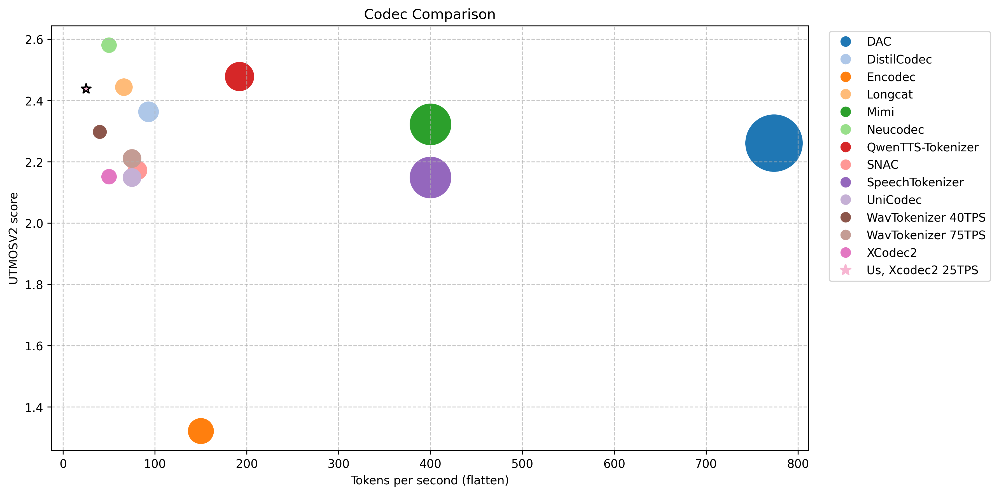
*Figure 1:116 languages codec comparison*

---
**Usage Info**: 4420 tokens used.
**Generated at**: 2026-02-24 21:07:29

---

# 📚 LTS-VoiceAgent: A Listen-Think-Speak Framework for Efficient Streaming Voice Interaction via Semantic Triggering and Incremental Reasoning

🚀 URL: https://arxiv.org/html/2601.19952

## 🌏 Abstract (원문)
The convergence of reasoning-capable Large Language Models(Brownet al.,2020; Achiamet al.,2023; Weiet al.,2022)and high-fidelity speech foundation models(Radfordet al.,2023; Wanget al.,2023)has catalyzed a transformative shift in intelligent systems. Consequently, Voice AI is rapidly evolving from simple command-execution bots to sophisticated conversational agents capable of handling complex, long-horizon tasks(Hurstet al.,2024; Huanget al.,2024). In these scenarios, user expectations are twofold and often conflicting: they demand theinstant responsivenessof a human listener (i.e., low latency)(Levinson,2016)and thecomplex reasoning capabilitiesof a domain expert(Zhanget al.,2023). While End-to-End (E2E) models reduce latency(Fanget al.,2024; Défossezet al.,2024), they often lag in reasoning capabilities, making cascaded architectures the dominant solution for complex agentic tasks(Chenet al.,2024b; Jainet al.,2025). However, this dominance comes with a latency cost. As contrasted in Figure1, traditional serial pipelines (Figure1A) prioritize accuracy but suffer from significant delays, whereas our LTS framework (Figure1B) aims to achieve fast responsiveness within this high-intelligence architecture. Further mechanism analysis in Figure2(a) reveals the root cause: serial systems are architecturally bound to silence while the user speaks, disrupting natural turn-taking(Skantze,2021). To mitigate this, existing streaming strategies attempt to introduce parallelism, yet they introduce new challenges: Inefficient Speculative Inference:Some methods attempt to "guess" the user’s intent before they finish speaking(Li and Grover,2025). As illustrated inFigure2(b), this leads to significant waste when the user’s intent shifts (e.g., "oh, wait…"). The model must frequently rollback invalid predictions, resulting in a "Self-correction Failure." Fragmented Incremental Reasoning:Simply activating reasoning on streaming chunks leads to the chaotic state shown inFigure2(c). This high-frequency triggering generates massive "Invalid Thinking" and Reasoning Conflicts, as the model forces inferences on semantically incomplete fragments. Even when heuristic constraints like Voice Activity Detection (VAD)(Chenet al.,2024a)are applied, the fundamental limitation persists: since VAD relies on acoustic rules (e.g., silence duration) rather than semantic completeness, it inevitably triggers reasoning during meaningless hesitations, perpetuating the issues of computational waste and logical inconsistency. To address these challenges—specifically identifyingwhento think andhowto reason incrementally over dynamic streams—we proposeLTS-VoiceAgent, aListen-Think-Speak framework designed for efficient streaming interaction. As depicted inFigure2(d), our approach differs fundamentally from prior paradigms: instead of passive waiting or aggressive guessing, LTS-VoiceAgent employs aDynamic Semantic Triggerto filter out non-informative fragments (e.g., hesitation markers like "hum…") and activates reasoning only when semantic information is sufficient. Furthermore, to “process the growing context” without being misled by disfluencies, we devise a collaborative reasoning mechanism governed by a Stream Orchestrator. Instead of treating updates as independent queries, this design maintains a continuous reasoning chain where a backgroundThinkeriteratively refines the mental state and passes the evolved context to a foregroundSpeaker. This allows the system to reuse prior deductions and self-correct during pauses, ultimately enabling instant Answer-first” responses once the user finishes speaking. In summary, our contributions are as follows: Dynamic Semantic Trigger:We propose a lightweight module that identifies valid semantic boundaries within the continuous stream. By detecting when the input context is semantically sufficient, it triggers reasoning at the optimal moment, effectively avoiding redundant computation caused by premature execution. Dual-Role Stream Orchestrator:We design a collaborative inference architecture that leverages batch processing to parallelize understanding and generation. By coordinating aThinkerfor robust state tracking (input sanitization and planning) and aSpeakerfor speculative execution, this mechanism enables the model to handle “pause-and-repair” behaviors and intent drifts effectively while achieving millisecond-level latency. Pause-and-Repair Benchmark:To evaluate streaming agents in realistic conditions, we construct a dataset based on GSM8K and MMLU-PRO, enriched with natural speech phenomena such as hesitations, self-corrections, and varying speaking rates. Experiments show that LTS-VoiceAgent achieves superior performance in latency and quality while reducing inference costs compared to strong baselines.
## 🌏 Abstract (번역)
추론 능력을 갖춘 대규모 언어 모델(LLM)과 고충실도 음성 기반 모델의 융합은 지능형 시스템의 혁신적인 변화를 촉진했습니다. 그 결과, 음성 AI는 단순한 명령 실행 봇에서 복잡하고 장기적인 작업을 처리할 수 있는 정교한 대화형 에이전트로 빠르게 진화하고 있습니다. 이러한 시나리오에서 사용자의 기대는 인간 청취자와 같은 즉각적인 응답성(낮은 지연 시간)과 도메인 전문가의 복잡한 추론 능력이라는 두 가지 상충되는 요구 사항을 가집니다. 엔드투엔드(E2E) 모델은 지연 시간을 줄여주지만 추론 능력이 떨어지는 경우가 많아, 복잡한 에이전트 작업에는 계단식(cascaded) 구조가 지배적인 솔루션이 되었습니다. 그러나 이러한 구조는 지연 시간 비용을 초래합니다. 기존의 직렬 파이프라인은 정확성을 우선시하지만 상당한 지연이 발생하는 반면, 본 논문에서 제안하는 LTS 프레임워크는 고지능 구조 내에서 빠른 응답성을 달성하는 것을 목표로 합니다. 분석 결과, 직렬 시스템은 사용자가 말하는 동안 침묵해야 하는 구조적 한계로 인해 자연스러운 턴테이킹을 방해합니다. 이를 완화하기 위해 기존 스트리밍 전략들은 병렬성을 도입하려 하지만, 비효율적인 추측 추론과 파편화된 증분 추론이라는 새로운 과제에 직면합니다. 이러한 문제를 해결하기 위해 우리는 효율적인 스트리밍 상호작용을 위해 설계된 Listen-Think-Speak 프레임워크인 LTS-VoiceAgent를 제안합니다. 우리 방식은 동적 시맨틱 트리거(Dynamic Semantic Trigger)를 사용하여 무의미한 파편을 걸러내고 의미 정보가 충분할 때만 추론을 활성화합니다. 또한 스트림 오케스트레이터(Stream Orchestrator)가 관리하는 협업 추론 메커니즘을 고안하여, 배경의 Thinker가 상태를 반복적으로 개선하고 전경의 Speaker에게 전달함으로써 사용자가 말을 마치는 즉시 '정답 우선(Answer-first)' 응답이 가능하도록 합니다. 본 논문의 기여는 다음과 같습니다. 첫째, 연속적인 스트림 내에서 유효한 의미적 경계를 식별하는 경량 모듈인 동적 시맨틱 트리거를 제안합니다. 둘째, 이해와 생성을 병렬화하는 이중 역할 스트림 오케스트레이터를 설계하여 밀리초 수준의 지연 시간을 달성합니다. 셋째, 주저함이나 자기 수정과 같은 자연스러운 음성 현상을 포함한 Pause-and-Repair 벤치마크를 구축했습니다. 실험 결과 LTS-VoiceAgent는 강력한 베이스라인 대비 추론 비용을 줄이면서도 지연 시간과 품질 면에서 우수한 성능을 달성했습니다.

## 🔍 Methods & Results
- Listen-Think-Speak(LTS) 패러다임: 사용자의 음성을 들으면서 동시에 추론하고 응답하는 효율적인 스트리밍 상호작용 프레임워크 제안
- Dynamic Semantic Trigger: DistilBERT 기반의 경량 모듈을 사용하여 텍스트 스트림의 의미적 포화도를 계산하고, 유의미한 정보가 쌓였을 때만 LLM 추론을 활성화하여 계산 낭비 방지
- 데이터 합성 파이프라인: GPT-4o를 활용해 의미적 완결성 지점에 트리거 토큰([T])을 삽입한 자가 지도 학습 데이터를 생성하여 트리거 모듈 학습
- Dual-Role Stream Orchestrator: 배경에서 상태를 분석하는 'Thinker'와 전경에서 응답을 생성하는 'Speaker'로 역할을 분리하여 병렬 처리 구현
- Thinker 모듈: 입력 데이터 정제(Sanitization), 핵심 변수 추출, 동적 계획 수립을 통해 JSON 형태의 상태 스냅샷을 유지하며 추론의 일관성 보장
- Speaker 모듈: 'Answer-First' 전략을 통해 사용자의 발화가 끝나기 전이라도 Thinker의 계획을 바탕으로 즉각적인 응답 생성 시작
- Pause-and-Repair 벤치마크: GSM8K 및 MMLU-PRO를 기반으로 주저함, 자기 수정 등 실제 음성 대화의 특성을 반영한 데이터셋 구축 및 평가
- 실험 결과: 강력한 베이스라인 모델들과 비교하여 지연 시간을 대폭 단축하고 추론 비용을 절감하면서도 높은 응답 품질을 달성함

## 🖼 Figures
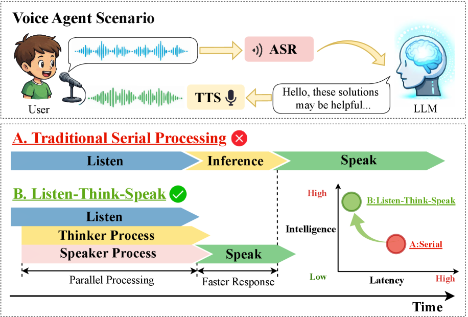
*Figure 1:Traditional Serial Processing vs. LTS-VoiceAgent Framework for Voice Interaction.*

*Figure 2:Examples of different reasoning methods.*

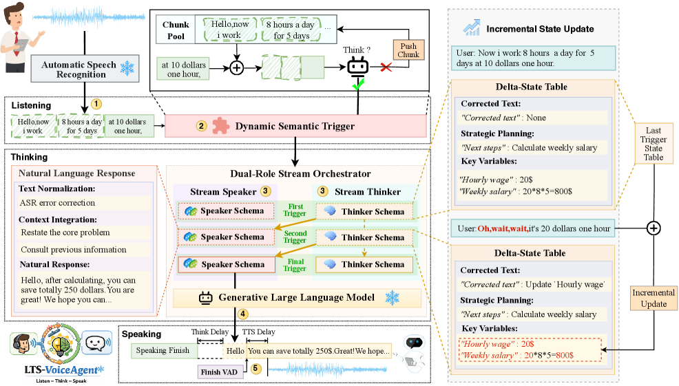
*Figure 3:Overview of LTS-VoiceAgent.*

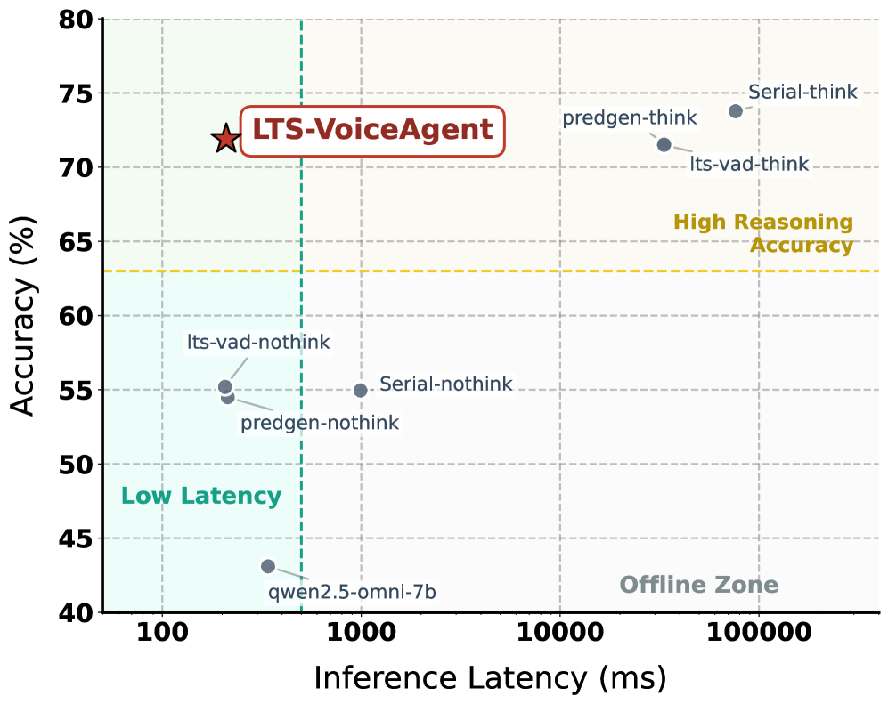
*Figure 4:Performance (Accuracy) vs. Latency trade-off analysis.*

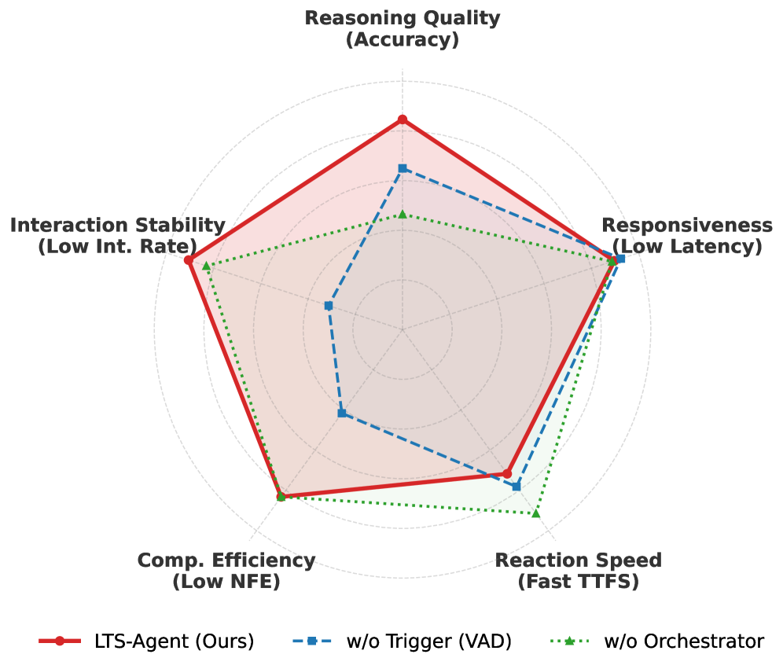
*Figure 5:Ablation study on the LTS-VoiceAgent.*

*Figure 6:Qualitative comparison of LTS-VoiceAgent against baselines across three scenarios. Top: Handling verbal self-corrections via state overwriting. Middle: Solving logical paradoxes via look-ahead reasoning. Bottom: Managing long-context constraints via incremental updates. The inputs contain raw ASR errors to demonstrate robustness.*

---
**Usage Info**: 5913 tokens used.
**Generated at**: 2026-02-24 21:08:13

---

# 📚 RIR-Mega-Speech: A Reverberant Speech Corpus with Comprehensive Acoustic Metadata and Reproducible Evaluation

🚀 URL: https://arxiv.org/html/2601.19949

## 🌏 Abstract (원문)
Reverberation continues to degrade automatic speech recognition in real-world conditions. The problem is straightforward: late reflections smear temporal structure and reduce the clarity of phonetic cues. Self-supervised models have improved robustness to some channel effects, but rooms with long decay times or weak direct paths still cause errors. The challenge for research is not just building better models but doing it in a way that others can verify. Many existing reverberant corpora either lack per-file acoustic labels, use proprietary RIRs that cannot be redistributed, or provide limited documentation for reproducing evaluations. This makes it hard to compare results across papers or understand whether improvements generalize. Our contribution is a corpus with three specific properties. First, every reverberant file has associated RT60, DRR, and C50 values computed from the source RIR. Second, we provide complete code to regenerate the audio, compute all metrics, and reproduce the evaluation results in this paper. Third, we report confidence intervals using nonparametric bootstrap at the utterance level and use paired tests where applicable. We are not claiming algorithmic novelty or surprising acoustic insights. The fact that higher RT60 increases WER is not new. What we offer is a standardized resource where the conditions are documented and the results are checkable. Section 2 reviews related corpora. Section 3 describes the construction process. Sections 4 and 5 present the evaluation setup and results. Section 6 discusses limitations and future directions.
## 🌏 Abstract (번역)
잔향은 실제 환경에서 자동 음성 인식(ASR) 성능을 지속적으로 저하시킵니다. 문제는 명확합니다. 후기 반사가 시간적 구조를 흐트러뜨리고 음성 단서의 명확성을 떨어뜨리기 때문입니다. 자기 지도 학습 모델이 일부 채널 효과에 대한 강건성을 개선했지만, 감쇠 시간이 길거나 직접 경로가 약한 실내 환경에서는 여전히 오류가 발생합니다. 연구의 과제는 단순히 더 나은 모델을 구축하는 것뿐만 아니라, 타인이 검증할 수 있는 방식으로 수행하는 것입니다. 기존의 많은 잔향 코퍼스는 파일별 음향 레이블이 부족하거나, 재배포가 불가능한 독점 RIR을 사용하거나, 평가 재현을 위한 문서화가 제한적입니다. 이로 인해 논문 간 결과를 비교하거나 개선 사항이 일반화되는지 이해하기 어렵습니다. 본 연구의 기여는 세 가지 특정 속성을 가진 코퍼스입니다. 첫째, 모든 잔향 파일에는 소스 RIR에서 계산된 RT60, DRR 및 C50 값이 연결되어 있습니다. 둘째, 오디오를 재생성하고 모든 지표를 계산하며 본 논문의 평가 결과를 재현할 수 있는 전체 코드를 제공합니다. 셋째, 발화 수준에서 비모수 부트스트랩을 사용하여 신뢰 구간을 보고하고 해당되는 경우 쌍체 검정을 사용합니다. 우리는 알고리즘적 참신함이나 놀라운 음향적 통찰력을 주장하지 않습니다. 높은 RT60이 단어 오류율(WER)을 증가시킨다는 사실은 새로운 것이 아닙니다. 우리가 제공하는 것은 조건이 문서화되고 결과를 확인할 수 있는 표준화된 리소스입니다. 섹션 2에서는 관련 코퍼스를 검토합니다. 섹션 3에서는 구축 프로세스를 설명합니다. 섹션 4와 5에서는 평가 설정 및 결과를 제시합니다. 섹션 6에서는 한계와 향후 방향을 논의합니다.

## 🔍 Methods & Results
- Constructed a reverberant corpus where each file is labeled with RT60, DRR, and C50 acoustic metrics derived from the source RIR.
- Provided a complete software framework for audio regeneration, metric calculation, and full reproduction of evaluation results.
- Employed nonparametric bootstrap at the utterance level to report confidence intervals and utilized paired statistical tests for rigorous comparison.
- Validated the corpus by confirming the established relationship where higher RT60 values lead to increased Word Error Rate (WER).
- Focused on enhancing research transparency and comparability by providing a standardized, documented, and checkable evaluation resource.

## 🖼 Figures
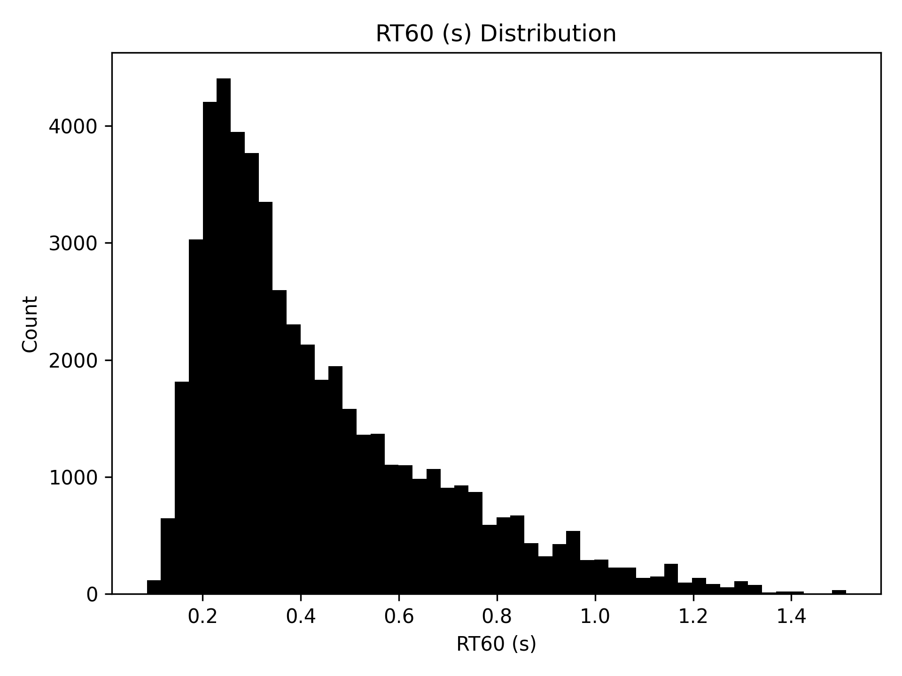
*Figure 1:RT60 distribution across all reverberant files. Most files fall between 0.2 and 0.8 seconds.*

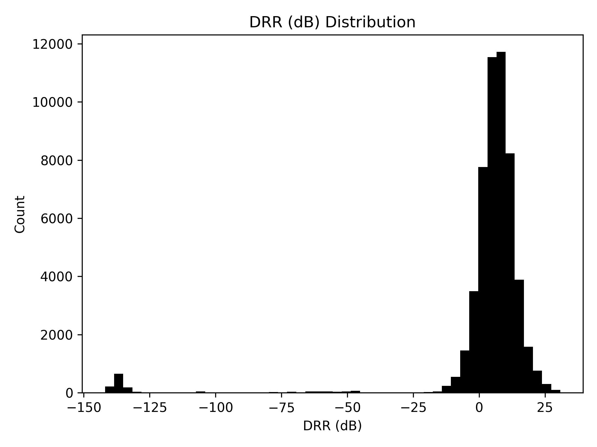
*Figure 2:DRR distribution using a 2.5 ms direct-only window. The long tail toward negative values reflects weak direct arrivals in some simulated RIRs.*

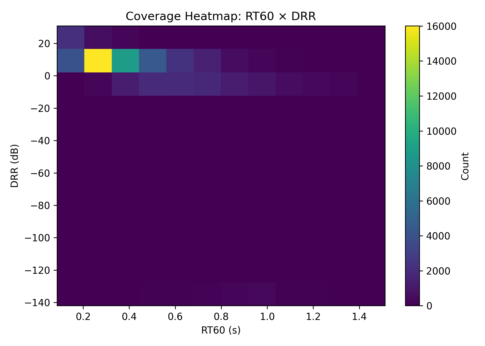
*Figure 3:Coverage heatmap (RT60 vs DRR). Darker cells indicate more files. Coverage is uneven due to non-stratified sampling.*

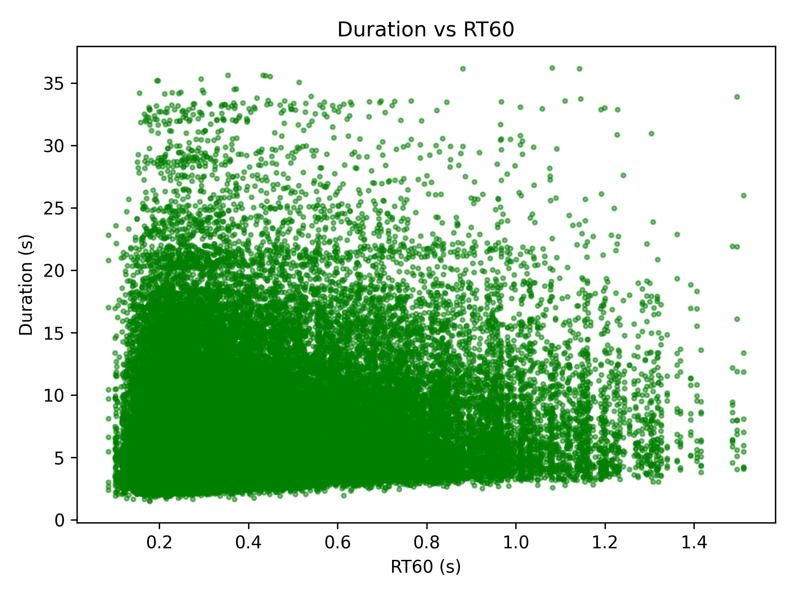
*Figure 4:Duration vs RT60. Long and short utterances are distributed across RT60 bins, reducing confounding in WER analysis.*

*Figure 5:Spectrogram comparison for three utterances. Left column: clean. Right column: reverberant. Smearing of formant structure is visible.*

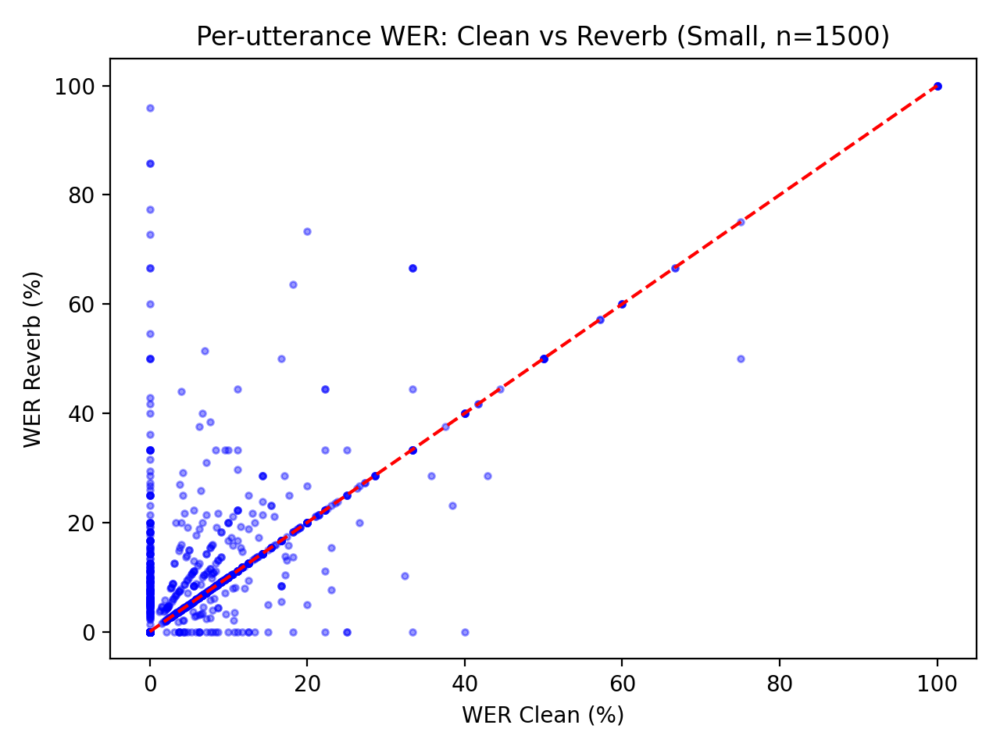
*Figure 6:Per-utterance WER: clean vs reverberant (N=1,500). Most points above the diagonal indicate reverberation increases errors.*

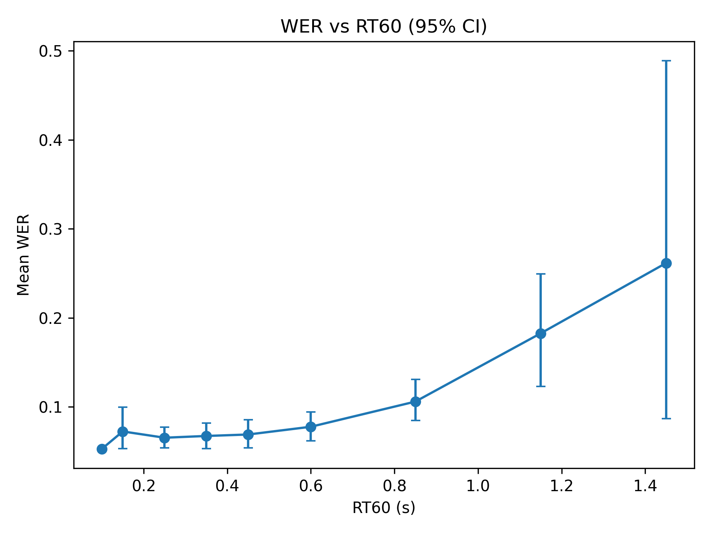
*Figure 7:WER vs RT60 with bootstrap 95% CIs. WER increases with RT60 as expected. Error bars show confidence intervals.*

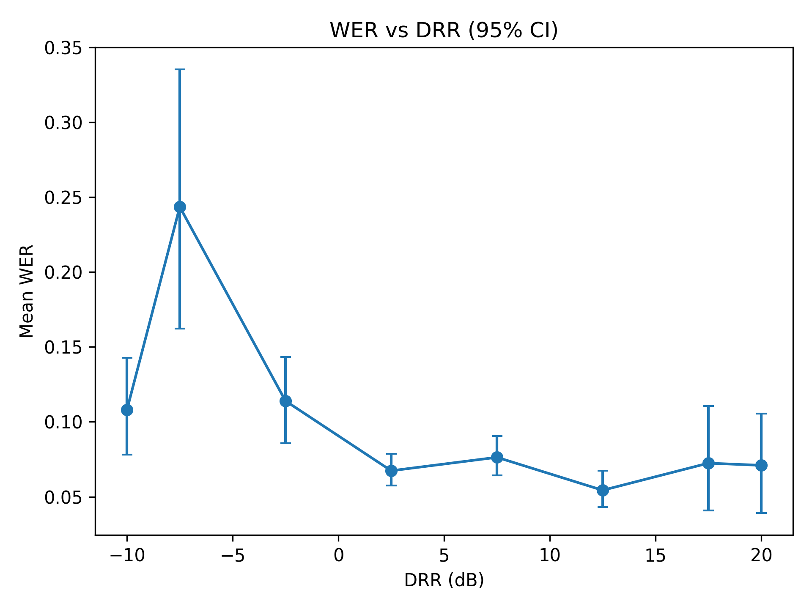
*Figure 8:WER vs DRR with 95% CIs. Higher DRR (stronger direct path) reduces errors.*

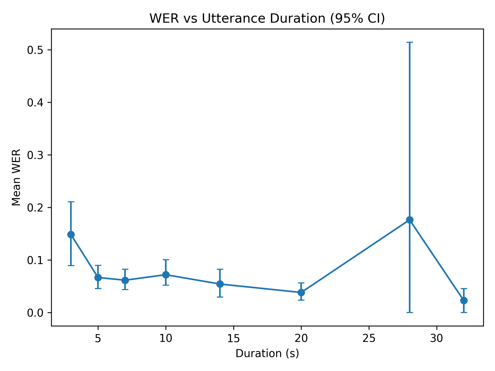
*Figure 9:WER vs duration with 95% CIs. Duration has a weak effect after controlling for acoustics.*

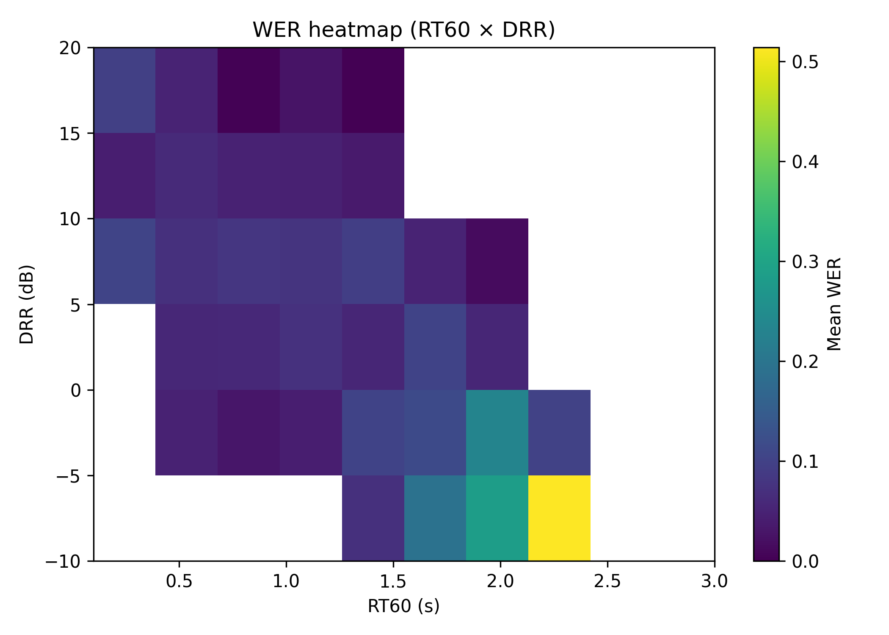
*Figure 10:WER heatmap (RT60 vs DRR). Darker regions indicate higher WER. The worst conditions are high RT60 with low DRR.*

---
**Usage Info**: 2119 tokens used.
**Generated at**: 2026-02-24 21:08:55

---

