# 🚩 (2026-01-30) Scholar Inbox 추천 논문 

# 📚 SemanticAudio: Audio Generation and Editing in Semantic Space

🚀 URL: https://arxiv.org/html/2601.21402

## 🌏 Abstract (원문)
Text-to-Audio (TTA) Generation aims to synthesize diverse and high-fidelity auditory content directly from natural language textual prompts. This technology serves as a pivotal creative tool for applications including virtual reality, gaming, film post-production, and human-computer interaction. Recent years have witnessed a paradigm shift in this field, fueled by the scaling of data and model parameters alongside architectural innovations. In particular, the adoption of continuous generative objectives, exemplified by Diffusion Models and Flow Matching, has elevated the fidelity and controllability of synthesized audio. Most mainstream TTA models perform modeling directly in the acoustic latent space, typically utilizing compressed representations from a Variational Autoencoder (VAE). While this design excels at preserving low-level acoustic fidelity, it often falls short in high-level semantic understanding. These models frequently struggle to precisely capture the intent in textual prompts, resulting in insufficient alignment—defined here as the accurate correspondence between the presence and sequence of auditory events and the text description. Addressing this limitation requires a clear distinction between the semantic and acoustic levels of audio. In this work, we define semantics as the high-level conceptual content—specifically the identity, occurrence, and temporal sequence of sound events—as distinct from fine-grained acoustic details. Audio signals exhibit significant semantic redundancy: high-level semantics are relatively compact and abstract compared to dense acoustic details. Drawing inspiration from two-stage semantic planning approaches in video generation, we hypothesize that directly modeling dense low-level representations in a high-dimensional acoustic latent space is suboptimal for achieving semantic alignment. Instead, the generation process should be decomposed: first accomplishing global content planning in a compact high-level semantic space, followed by the progressive synthesis of acoustic details. Motivated by this insight, we propose SemanticAudio, a novel two-stage Flow Matching-based framework. The core innovation lies in performing the audio generation process via a high-level semantic space. First, a Semantic Planner generates compact semantic features from text to sketch the global event layout. Second, conditioned on these features, an Acoustic Synthesizer produces high-fidelity VAE latent representations. This design effectively addresses the limitations in high-level semantic modeling inherent in conventional acoustic-space approaches. Beyond generation, we demonstrate that this decoupled architecture naturally extends to audio editing tasks. While attempting training-free text-guided editing with standard acoustic-space models, we observed unsatisfactory results due to the substantial semantic gap between text and acoustic latents. Leveraging SemanticAudio, we introduce a training-free editing mechanism that operates directly in the semantic space. By steering the generation trajectory via the difference of velocity fields derived from source and target prompts, we achieve precise attribute-level modifications. This stands in contrast to traditional audio editing methods, which are typically limited to predefined operations such as addition or deletion. Our mechanism, by fully capitalizing on the advantages of semantic space, enables flexible, text-driven manipulation of high-level semantics on general audio without additional training.
## 🌏 Abstract (번역)
텍스트-오디오(TTA) 생성은 자연어 텍스트 프롬프트로부터 다양하고 고충실도의 오디오 콘텐츠를 직접 합성하는 것을 목표로 합니다. 이 기술은 가상 현실, 게임, 영화 후반 작업 및 인간-컴퓨터 상호 작용을 포함한 응용 분야에서 중추적인 창의적 도구 역할을 합니다. 최근 몇 년 동안 데이터 및 모델 파라미터의 확장과 아키텍처 혁신에 힘입어 이 분야의 패러다임 변화가 목격되었습니다. 특히 확산 모델(Diffusion Models)과 플로우 매칭(Flow Matching)으로 대표되는 연속 생성 목적 함수의 채택은 합성된 오디오의 충실도와 제어 가능성을 높였습니다. 대부분의 주류 TTA 모델은 일반적으로 변분 오토인코더(VAE)의 압축된 표현을 활용하여 음향 잠재 공간에서 직접 모델링을 수행합니다. 이러한 설계는 저수준 음향 충실도를 보존하는 데는 뛰어나지만, 고수준 의미론적 이해에는 미흡한 경우가 많습니다. 이러한 모델들은 텍스트 프롬프트의 의도를 정확하게 포착하는 데 어려움을 겪어, 오디오 이벤트의 존재 및 순서와 텍스트 설명 간의 정확한 대응으로 정의되는 '정렬(alignment)'이 불충분해지는 결과를 초래합니다. 이러한 한계를 해결하기 위해서는 오디오의 의미론적 수준과 음향적 수준을 명확히 구분해야 합니다. 본 연구에서는 의미론을 미세한 음향적 세부 사항과 구별되는 고수준 개념적 콘텐츠(특히 사운드 이벤트의 정체성, 발생 및 시간적 순서)로 정의합니다. 오디오 신호는 상당한 의미론적 중복성을 보입니다. 고수준 의미론은 밀집된 음향 세부 사항에 비해 상대적으로 간결하고 추상적입니다. 비디오 생성의 2단계 의미론적 계획 접근 방식에서 영감을 얻어, 고차원 음향 잠재 공간에서 밀집된 저수준 표현을 직접 모델링하는 것이 의미론적 정렬을 달성하는 데 최적이 아니라는 가설을 세웠습니다. 대신 생성 프로세스를 분해해야 합니다. 먼저 간결한 고수준 의미 공간에서 글로벌 콘텐츠 계획을 수행한 다음, 음향적 세부 사항을 점진적으로 합성해야 합니다. 이러한 통찰에 기반하여 우리는 새로운 2단계 플로우 매칭 기반 프레임워크인 SemanticAudio를 제안합니다. 핵심 혁신은 고수준 의미 공간을 통해 오디오 생성 프로세스를 수행하는 데 있습니다. 첫째, 의미론적 플래너(Semantic Planner)가 텍스트로부터 간결한 의미론적 특징을 생성하여 글로벌 이벤트 레이아웃을 스케치합니다. 둘째, 이러한 특징을 조건으로 음향 합성기(Acoustic Synthesizer)가 고충실도 VAE 잠재 표현을 생성합니다. 이 설계는 기존 음향 공간 접근 방식에 내재된 고수준 의미론적 모델링의 한계를 효과적으로 해결합니다. 생성 외에도, 우리는 이 분리된 아키텍처가 오디오 편집 작업으로 자연스럽게 확장됨을 보여줍니다. 표준 음향 공간 모델로 훈련 없는 텍스트 가이드 편집을 시도할 때, 텍스트와 음향 잠재 요소 사이의 상당한 의미론적 격차로 인해 만족스럽지 못한 결과를 관찰했습니다. SemanticAudio를 활용하여 의미 공간에서 직접 작동하는 훈련 없는 편집 메커니즘을 도입합니다. 소스 및 타겟 프롬프트에서 파생된 속도장(velocity fields)의 차이를 통해 생성 궤적을 조종함으로써 정밀한 속성 수준의 수정을 달성합니다. 이는 일반적으로 추가 또는 삭제와 같은 미리 정의된 작업으로 제한되는 기존 오디오 편집 방법과 대조됩니다. 우리의 메커니즘은 의미 공간의 장점을 충분히 활용함으로써 추가 훈련 없이 일반 오디오에 대한 고수준 의미론의 유연한 텍스트 기반 조작을 가능하게 합니다.

## 🔍 Methods & Results
- 제안된 SemanticAudio는 의미론적 플래너(Semantic Planner)와 음향 합성기(Acoustic Synthesizer)로 구성된 2단계 플로우 매칭 기반 프레임워크임
- 의미론적 플래너는 텍스트로부터 간결한 의미론적 특징을 생성하여 글로벌 이벤트 레이아웃을 설계하고, 음향 합성기는 이를 바탕으로 고충실도 VAE 잠재 표현을 생성함
- 고수준 의미 공간과 저수준 음향 공간을 분리함으로써 기존 음향 공간 직접 모델링 방식의 의미론적 정렬 한계를 극복함
- 소스 및 타겟 프롬프트의 속도장(velocity fields) 차이를 이용해 생성 궤적을 조종하는 훈련 없는(training-free) 오디오 편집 메커니즘을 도입함
- 실험 결과, 생성된 오디오와 텍스트 프롬프트 간의 의미론적 일관성 및 정렬 측면에서 기존 주류 모델들보다 우수한 성능을 보임
- 추가적인 훈련이나 복잡한 인버전 과정 없이도 일반 오디오에 대해 유연한 속성 수준의 텍스트 기반 편집이 가능함을 입증함

## 🖼 Figures

*Figure 1:Overview of the SemanticAudio framework. The model employs a two-stage Flow Matching architecture: the Semantic Planner first generates low-dimensional semantic latents conditioned on text, followed by the Acoustic Synthesizer which produces high-fidelity acoustic latents for VAE decoding.*

*Figure 2:Overview of our training-free text-guided audio editing method. The process leverages the pre-trained velocity fields of the Semantic Planner to perform semantic-level editing in the low-dimensional latent space via difference velocity integration, followed by high-fidelity reconstruction using the Acoustic Synthesizer. The method requires no additional training, inversion, or optimization.*

---
**Usage Info**: 4481 tokens used.
**Generated at**: 2026-02-24 21:09:58

---

# 📚 VoxMorph: Scalable Zero-shot Voice Identity Morphing via Disentangled Embeddings

🚀 URL: https://arxiv.org/html/2601.20883

## 🌏 Abstract (원문)
The field of generative speech synthesis has achieved remarkable realism, with modern Text-to-Speech (TTS) models generating audio that is often indistinguishable from human speech. While this progress enables numerous creative applications, they have also introduced significant risks to the security of Automatic Speaker Verification (ASV) systems due to deepfakes. Apart from deepfakes, morphing attacks pose a significant threat to biometric security. Voice Identity Morphing (VIM) aims to create a synthetic biometric sample that can be successfully verified as belonging to two or more identities. The foundational work by Pani et al. is the only study demonstrating the feasibility of VIM attacks, but it suffers from significant practical limitations, such as not being zero-shot and requiring expensive fine-tuning. We introduce VoxMorph, a novel framework that advances the state-of-the-art in voice identity morphing through a principled disentanglement of vocal representations into timbre and prosody. Our methodology leverages a key principle from state-of-the-art TTS architectures based on the sequential separation of speech generation into distinct stages. We employ a Slerp mechanism to independently fuse disentangled embeddings across multiple identities. VoxMorph is a zero-shot framework that overcomes the limitations of prior models, requiring only 5 seconds of source audio and no model retraining. We establish a new state-of-the-art in voice morphing, achieving an unprecedented 67.8% morphing attack success rate on an ASV system. Further, we release the first publicly available dataset of 10,000 high-fidelity voice morphs.
## 🌏 Abstract (번역)
생성형 음성 합성 분야는 현대의 텍스트 음성 변환(TTS) 모델이 인간의 음성과 구별할 수 없는 오디오를 생성할 정도로 놀라운 사실성을 달성했습니다. 이러한 발전은 수많은 창의적인 응용을 가능하게 하지만, 딥페이크로 인해 자동 화자 검증(ASV) 시스템의 보안에 심각한 위험을 초래하기도 했습니다. 딥페이크 외에도 모핑 공격은 생체 보안에 큰 위협이 됩니다. 음성 정체성 모핑(VIM)은 두 개 이상의 정체성에 속하는 것으로 성공적으로 검증될 수 있는 합성 생체 샘플을 생성하는 것을 목표로 합니다. Pani 등의 기초 연구는 VIM 공격의 가능성을 입증한 유일한 연구이지만, 제로샷이 아니며 비용이 많이 드는 미세 조정이 필요하다는 등 실질적인 한계가 있습니다. 본 논문에서는 음성 표현을 음색(timbre)과 운율(prosody)로 원칙적으로 분리하여 음성 정체성 모핑 기술을 발전시킨 새로운 프레임워크인 VoxMorph를 소개합니다. 우리의 방법론은 음성 생성을 별개의 단계로 순차적으로 분리하는 최첨단 TTS 아키텍처의 핵심 원리를 활용합니다. 우리는 여러 정체성에 걸쳐 분리된 임베딩을 독립적으로 융합하기 위해 Slerp 메커니즘을 채택했습니다. VoxMorph는 이전 모델의 한계를 극복한 제로샷 프레임워크로, 단 5초의 소스 오디오만 필요하며 모델 재학습이 필요하지 않습니다. 우리는 ASV 시스템에서 67.8%라는 전례 없는 모핑 공격 성공률을 달성하여 음성 모핑 분야의 새로운 최첨단 기술을 확립했습니다. 또한, 차세대 대응책 개발을 위해 10,000개의 고충실도 음성 모핑으로 구성된 최초의 공개 데이터셋을 출시합니다.

## 🔍 Methods & Results
- 음성 표현을 운율(Prosody)과 음색(Timbre)으로 분리하여 추출하는 이중 인코더 아키텍처(GE2E 및 CAM++) 사용
- 구면 선형 보간법(Slerp)을 적용하여 두 화자의 운율 및 음색 임베딩을 독립적으로 융합함으로써 음향적 왜곡 최소화
- 자기회귀 언어 모델(LM), 조건부 흐름 매칭(CFM), HiFTNet 보코더로 이어지는 3단계 합성 파이프라인 구축
- 특정 화자 쌍에 대한 미세 조정이 필요 없는 제로샷(Zero-shot) 방식 구현 및 단 5초의 소스 오디오로 모핑 가능
- 엄격한 임계값의 ASV 시스템을 대상으로 67.8%의 모핑 공격 성공률(ASR)을 기록하여 기존 기술 대비 성능 우위 입증
- 방어 기술 연구를 위한 10,000개의 고충실도 음성 모핑 데이터셋 구축 및 공개

## 🖼 Figures
![Fig. 1:Architectural overview of the VoxMorph framework. The process consists of three core stages: (1) Extraction: Disentangled prosody (style) and timbre (identity) embeddings are extracted from two speaker identities. (2) Interpolation: The embedding representations are independently interpolated using Slerp. (3) Synthesis/ Morphing: The fused prosody embedding conditions an autoregressive language model, while the fused timbre embedding guides a flow matching network to generate a mel-spectrogram. A neural vocoder then converts the spectrogram into a high-fidelity morphed waveform.](../images/2026-01-30/2601.20883/2601.20883_fig0.png)
*Fig. 1:Architectural overview of the VoxMorph framework. The process consists of three core stages: (1) Extraction: Disentangled prosody (style) and timbre (identity) embeddings are extracted from two speaker identities. (2) Interpolation: The embedding representations are independently interpolated using Slerp. (3) Synthesis/ Morphing: The fused prosody embedding conditions an autoregressive language model, while the fused timbre embedding guides a flow matching network to generate a mel-spectrogram. A neural vocoder then converts the spectrogram into a high-fidelity morphed waveform.*

---
**Usage Info**: 4200 tokens used.
**Generated at**: 2026-02-24 21:10:50

---

# 📚 EditYourself: Audio-Driven Generation and Manipulation of Talking Head Videos with Diffusion Transformers

🚀 URL: https://arxiv.org/html/2601.22127

## 🌏 Abstract (원문)
A growing share of modern video content is human-centric, including movies, online courses, corporate communications, interviews, and short-form social media uploads. In these videos, creators often need to revise the spoken content post-recording to fix fumbled lines, update facts, remove filler words, tighten interviews or localize content across languages. Traditional non-linear video editing tools, however, provide limited support for such edits, as operations like inserting, removing or retiming speech typically introduce visible jump cuts or unnatural motion. Moreover, selectively re-rendering only parts of a human performance requires extensive manual intervention within existing post-production workflows. Recent advances in video diffusion models suggest a promising alternative. These models can synthesize high-quality, temporally coherent human videos from text, images or audio, demonstrating an ability to model complex appearance, motion, and facial dynamics. This capability makes generative models a good candidate for not only content creation, but as editing engines that can repair, extend or reshape existing videos in a content-aware manner. However, research on editing existing human-centric content remains far less mature than work on end-to-end generation. Most current approaches focus on Image-to-Video (I2V) generation from a single portrait image. While impressive in their realism, these methods frequently suffer from identity drift over time and incorrectly reproduce a subject’s likeness. A single image cannot capture the full range of facial details and speaking style present in a real performance. As a result, generated videos often hallucinate details such as teeth, wrinkles, facial hair or gestures, producing outputs that feel incorrect, especially when users are generating videos of themselves. On the other hand, V2V lip-sync models adhere closely to an input video to preserve visual fidelity and identity, but offer limited flexibility for editing. By operating under a fixed temporal structure that preserves the original frame count and timing, these methods make it difficult to insert or remove speech segments while maintaining temporal continuity. Consequently, existing V2V and I2V methods do not adequately support precise edits required for real-world post-production workflows. Our work tackles this fundamental problem of temporal manipulation of existing talking-head videos, which we refer to as visual dialog editing: V2V editing driven by changes to the spoken dialog. This setting goes beyond simple lip synchronization to completely new audio, and supports core post-production operations such as inserting, removing and retiming video segments while preserving visual continuity. Editing videos directly through their textual transcript provides an intuitive and expressive interface for creators, enabling precise word-level modifications such as filler-word removal and post-shoot script revisions. More broadly, this transcript-centric workflow shifts video production from a “script-perfect-before-shooting” paradigm toward a “shoot once, refine later” model, enabling rapid updates, personalized variants and integration with higher-level control systems such as LLM-based AI agents for automated video editing. In this work, we address this gap by re-framing talking-head video synthesis as a problem of visual dialog editing. We introduce EditYourself, a diffusion-based framework designed specifically for transcript-driven editing of talking head videos. By adapting a pre-trained general-purpose video diffusion model into a flexible, audio-driven V2V editor, our approach enables precise modification of existing videos, including addition, removal, and retiming of spoken segments, while maintaining accurate lip synchronization, visual identity, and temporal coherence over long videos. In summary, our work makes the following contributions: Lip-sync on a pretrained video diffusion model: We introduce a two-stage training scheme that enables inference on speech audio across varying text, image, and video inputs, while maintaining accurate lip synchronization, together with a windowed audio conditioning strategy for precise speech-video alignment that does not require audio feature downsampling and remains robust across varying video frame rates. Latent-space visual dialog editing: We formulate transcript-driven video editing directly in latent space, supporting seamless addition, removal, and retiming of spoken segments. Identity-preserving long video generation: We introduce a reference-based identity conditioning mechanism, Forward–Backward RoPE Conditioning, together with TeaCache-aware inference, to stabilize appearance and temporal coherence over long videos. Evaluations against recent I2V and V2V lip-sync benchmarks demonstrate that our method achieves SOTA visual quality and synchronization accuracy. In addition to offering competitive performance, our approach represents a foundational step toward utilizing video diffusion models as capable tools for editing human-centric video content.
## 🌏 Abstract (번역)
현대 비디오 콘텐츠의 상당 부분은 영화, 온라인 강의, 기업 커뮤니케이션, 인터뷰 및 소셜 미디어 등 인간 중심적입니다. 제작자들은 녹화 후 실수를 수정하거나, 사실을 업데이트하고, 불필요한 단어를 제거하거나, 인터뷰를 다듬고, 언어별로 콘텐츠를 현지화하기 위해 발화 내용을 수정해야 하는 경우가 많습니다. 그러나 기존의 비선형 비디오 편집 도구는 이러한 편집에 제한적인 지원만을 제공하며, 음성 삽입, 제거 또는 시간 재조정(retiming)과 같은 작업은 시각적인 점프 컷이나 부자연스러운 움직임을 유발합니다. 또한 인간의 퍼포먼스 중 일부만 선택적으로 재렌더링하는 것은 기존 포스트 프로덕션 워크플로우 내에서 광범위한 수동 개입을 필요로 합니다. 최근 비디오 확산 모델(video diffusion models)의 발전은 유망한 대안을 제시합니다. 이러한 모델은 텍스트, 이미지 또는 오디오로부터 고품질의 일관된 인간 비디오를 합성할 수 있으며, 복잡한 외형, 움직임 및 얼굴 역학을 모델링하는 능력을 보여주었습니다. 이러한 능력은 생성 모델을 단순한 콘텐츠 제작뿐만 아니라, 기존 비디오를 콘텐츠 인식 방식으로 수리, 확장 또는 재구성할 수 있는 편집 엔진으로서의 좋은 후보로 만듭니다. 그러나 기존 인간 중심 콘텐츠 편집에 대한 연구는 엔드 투 엔드 생성 연구에 비해 훨씬 덜 성숙한 상태입니다. 대부분의 현재 접근 방식은 단일 초상화 이미지로부터 이미지-비디오(I2V) 생성에 집중하고 있습니다. 이러한 방법들은 사실성 측면에서 인상적이지만, 시간이 지남에 따라 정체성 드리프트(identity drift)가 발생하고 피사체의 외형을 부정확하게 재현하는 경우가 많습니다. 단일 이미지는 실제 퍼포먼스에 나타나는 얼굴의 세부 사항과 말하기 스타일의 전체 범위를 포착할 수 없습니다. 결과적으로 생성된 비디오는 치아, 주름, 수염 또는 제스처와 같은 세부 사항을 환각(hallucinate)하여, 특히 사용자가 자신의 비디오를 생성할 때 어색한 결과물을 만들어냅니다. 반면, V2V 립싱크 모델은 시각적 충실도와 정체성을 유지하기 위해 입력 비디오를 밀접하게 따르지만 편집 유연성이 제한적입니다. 원래의 프레임 수와 타이밍을 유지하는 고정된 시간 구조 하에서 작동하기 때문에, 이러한 방법들은 시간적 연속성을 유지하면서 음성 세그먼트를 삽입하거나 제거하기 어렵습니다. 결과적으로 기존의 V2V 및 I2V 방법은 실제 포스트 프로덕션 워크플로우에 필요한 정밀한 편집을 충분히 지원하지 못합니다. 본 연구는 기존 토킹 헤드 비디오의 시간적 조작이라는 근본적인 문제를 다루며, 이를 '시각적 대화 편집(visual dialog editing)'이라고 정의합니다. 이는 발화된 대화의 변화에 의해 구동되는 V2V 편집입니다. 이 설정은 단순한 새로운 오디오에 대한 립싱크를 넘어, 시각적 연속성을 유지하면서 비디오 세그먼트의 삽입, 제거 및 시간 재조정과 같은 핵심 포스트 프로덕션 작업을 지원합니다. 텍스트 스크립트를 통해 비디오를 직접 편집하는 방식은 제작자에게 직관적이고 표현력 있는 인터페이스를 제공하며, 채움말(filler-word) 제거 및 촬영 후 스크립트 수정과 같은 정밀한 단어 수준의 수정을 가능하게 합니다. 더 나아가, 이 스크립트 중심 워크플로우는 비디오 제작 패러다임을 '촬영 전 완벽한 스크립트' 모델에서 '한 번 촬영하고 나중에 다듬는' 모델로 전환하여, 빠른 업데이트, 개인화된 변형 및 자동화된 비디오 편집을 위한 LLM 기반 AI 에이전트와 같은 상위 제어 시스템과의 통합을 가능하게 합니다. 본 연구에서는 토킹 헤드 비디오 합성을 시각적 대화 편집의 문제로 재구성하여 이 간극을 메웁니다. 우리는 토킹 헤드 비디오의 스크립트 기반 편집을 위해 특별히 설계된 확산 기반 프레임워크인 EditYourself를 소개합니다. 사전 학습된 범용 비디오 확산 모델을 유연한 오디오 기반 V2V 편집기로 적응시킴으로써, 본 접근 방식은 정확한 립싱크, 시각적 정체성 및 긴 비디오에 대한 시간적 일관성을 유지하면서 음성 세그먼트의 추가, 제거 및 시간 재조정을 포함한 기존 비디오의 정밀한 수정을 가능하게 합니다. 요약하자면, 본 연구의 기여는 다음과 같습니다: 사전 학습된 비디오 확산 모델에서의 립싱크: 다양한 텍스트, 이미지 및 비디오 입력에 대해 정확한 립싱크를 유지하면서 음성 오디오 추론을 가능하게 하는 2단계 학습 방식과, 오디오 특징 다운샘플링이 필요 없고 다양한 비디오 프레임 레이트에서 견고한 정밀 음성-비디오 정렬을 위한 윈도우 오디오 컨디셔닝 전략을 도입합니다. 잠재 공간 시각적 대화 편집: 스크립트 기반 비디오 편집을 잠재 공간에서 직접 공식화하여 음성 세그먼트의 원활한 추가, 제거 및 시간 재조정을 지원합니다. 정체성 보존 긴 비디오 생성: 긴 비디오에서 외형과 시간적 일관성을 안정화하기 위해 TeaCache 인식 추론과 함께 참조 기반 정체성 컨디셔닝 메커니즘인 Forward-Backward RoPE Conditioning을 도입합니다. 최신 I2V 및 V2V 립싱크 벤치마크에 대한 평가 결과, 본 방법이 최첨단(SOTA) 시각적 품질과 동기화 정확도를 달성함을 입증했습니다. 경쟁력 있는 성능을 제공하는 것 외에도, 본 접근 방식은 비디오 확산 모델을 인간 중심 비디오 콘텐츠 편집을 위한 유능한 도구로 활용하기 위한 기초적인 단계를 제시합니다.

## 🔍 Methods & Results
- LTX-Video 범용 비디오 확산 모델을 기반으로 오디오 및 스크립트 기반 비디오 편집을 위한 확장 프레임워크 제안
- Whisper-small 특징을 활용한 교차 모달 오디오 컨디셔닝 및 2단계 V2V 립싱크 학습 전략 도입
- 비디오 프레임 레이트와 무관하게 정밀한 정렬을 지원하는 위상 전이 그리드 기반 윈도우 오디오 컨디셔닝 적용
- 잠재 공간(Latent-space) 내 직접 조작을 통해 콘텐츠 추가, 제거, 재렌더링, 시간 재조정 등 시각적 대화 편집 기능 구현
- 긴 비디오 생성을 위한 TAPSF 전략과 1.6배 속도 향상을 위한 TeaCache 기반 적응형 캐싱 추론 결합
- 정체성 드리프트 방지를 위해 하단 얼굴 참조 토큰 및 Forward-Backward RoPE Conditioning 메커니즘 제안
- 실험 결과 최신 I2V 및 V2V 립싱크 벤치마크에서 SOTA 수준의 시각적 품질과 동기화 정확도 달성

## 🖼 Figures

*Figure 2:Our proposed pipeline. A global audio projection layer and audio cross-attention layers are added to the network’s architecture. For V2V lip syncing, we apply noise to tokens corresponding to the mouth area and task the model with spatio-temporally inpainting them.*

*Figure 3:In order to train the audio attention layers, we fully noise the tokens corresponding to mouth region throughout the training sample. We retain clean latents of the first frame, similar to image-to-video training in LTX. The model learns to in-paint the mouth through time and space using the audio, and the initial mouth shape as conditions.*

*Figure 4:V2V Inference Modes. Adjusting the mask 
𝐌
 in inference enables different synchronization levels: Lip for mouth-only sync, Face for expressions, and Head to synthesize new head dynamics matching the audio prosody.*

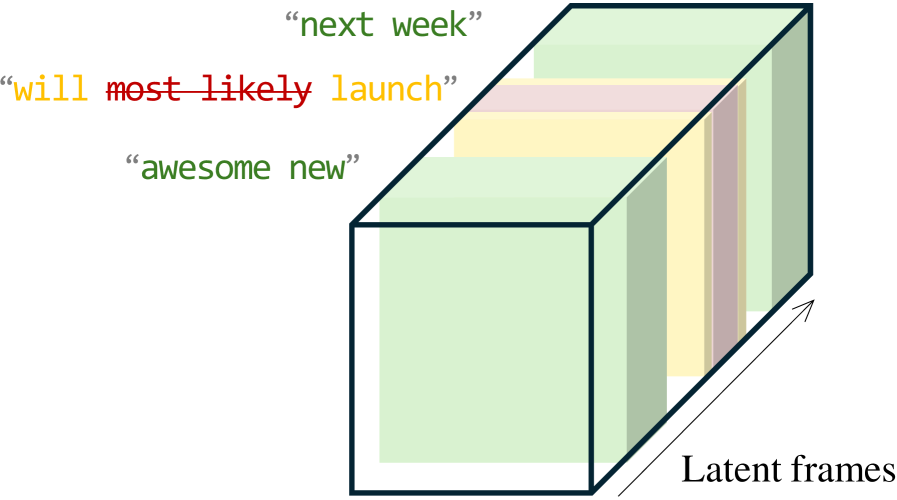
*Figure 7:Timeline editing via manipulating latent frames. Addition: Insert new latents with full noise. Removal: Discard corresponding latents and noise adjacent latents to re-render a smooth transition.*

*Figure 8:Long inference strategy: video latent frames are grouped into inference blocks and denoised iteratively. We apply a position shift to the blocks after each denoising step (blue inference blocks) to propagate context over longer windows throughout denoising. During medial timesteps (purple inference blocks) we disable the shift to benefit from TeaCache.*

*Figure 9:Identity conditioning: we train the DiT to use unnoised face tokens from outside the training clip to better preserve subject identity. These reference tokens are taken from a temporal neighborhood of the training clip and randomly added to the DiT’s input sequence.*

*Figure 10:During inference of fully-synthetic blocks (i.e., blocks without V2V or first-frame condition), we prevent global appearance drift by adding full-frame reference tokens (the closest past and future latent frames) to the input sequence. These reference frames are not noised and their temporal indices are adjusted such that the temporal distance between the reference frames and the block is not greater than 3.*

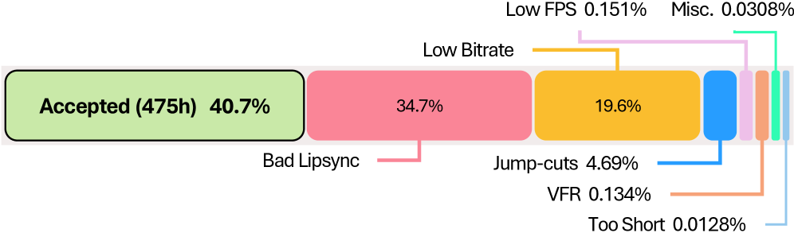
*Figure 11:Data filtering results: a significant share of in-the-wild short-form videos exhibited low visual quality or bad lip-sync. We removed these from the dataset to achieve optimal training performance.*

*Figure 12:Ablation of the reference frame conditioning. From left to right, we show 4 representative frames from an 8-second clip rendered with different reference conditioning variants. From top to bottom: groundtruth (GT), pure video-to-video (V2V), video-to-video with face reference tokens (V2V+FR), pure image-to-video (I2V), image-to-video with face reference tokens (I2V+FR), image-to-video with face and full-frame reference tokens (I2V+FR+FF).*

*Figure 13:The difference in render quality with and without exposing the DiT to reference tokens during training. Left: ground truth, middle: no reference tokens during training, right: with reference tokens during training. Without training for reference tokens at sentinel timesteps, render artifacts appear, particularly with complex and dynamic backgrounds.*

---
**Usage Info**: 11057 tokens used.
**Generated at**: 2026-02-24 21:12:22

---

# 📚 Representation-Regularized Convolutional Audio Transformer for Audio Understanding

🚀 URL: https://arxiv.org/html/2601.21612

## 🌏 Abstract (원문)
Self-supervised learning (SSL) has become a cornerstone of representation learning, enabling models to extract meaningful patterns from unlabeled data across various modalities. In the audio domain, SSL has successfully mitigated the reliance on large-scale manual annotations, producing transferable representations for downstream tasks. Among these, bootstrap-based approaches, which employ a teacher-student framework to predict latent representations—have shown remarkable efficacy. State-of-the-art (SOTA) models such as data2vec seriesBaevskiet al.(2022,2023), EATChenet al.(2024), ATSTLiet al.(2024)and M2DNiizumiet al.(2024a)leverage this paradigm to achieve impressive results in audio understanding tasks. Despite these advancements, current bootstrap-based audio SSL methods face two critical limitations. First, they often overlook the inherent hierarchical nature of audio signals. Audio events span diverse temporal and spectral scales, ranging from transient acoustic textures to long-term semantic contexts. Existing methods typically process audio at a single, fixed level of granularity, limiting their ability to capture these multi-scale structures effectively. Second, training these models from scratch is inherently inefficient. Relying solely on internal consistency between the teacher and student networks requires extensive computational resources and prolonged training periods to bootstrap high-quality representations from random initialization. To address the efficiency bottleneck, we draw inspiration from recent advances in generative modeling, REPAYuet al.(2025). These studies demonstrate that generative models (e.g., diffusion modelsHoet al.(2020); Songet al.(2021)) converge significantly faster and generate higher-quality content when guided by representations from pre-trained encoders. We argue that the core objective of bootstrap SSL, predicting masked representations is fundamentally an implicit generative task. Just as diffusion models benefit from perceptual guidance, the “reconstruction” process in SSL can be accelerated by leveraging external semantic knowledge. Instead of learning solely from scratch, the student model can benefit from “standing on the shoulders of giants” by aligning with mature representations from external models. Guided by this insight, we propose the Convolutional Audio Transformer (CAT), a unified framework designed to enhance both the granularity and efficiency of audio representation learning. To tackle the granularity issue, CAT incorporates a Multi-resolution Block. Unlike traditional single-layer patch embeddings, this module utilizes hierarchical convolutional layers to extract and aggregate features at multiple temporal and frequency scales, aligning with the multi-scale characteristics of audio signals. Simultaneously, to improve training efficiency, we introduce a Representation Regularization objective. We treat the student branch as a generative generator and align its intermediate features with high-quality representations from frozen, well-pretrained external encoders (e.g., CLAPWuet al.(2023), Audio-MAEHuanget al.(2022), ASTGonget al.(2021a)). This auxiliary task provides stable semantic guidance, effectively ”shortcutting” the early stages of representation learning. Our experimental evaluations on audio and speech datasets validate the effectiveness of this approach. CAT not only achieves superior performance on audio understanding tasks compared to existing baselines but also demonstrates remarkable efficiency, highlighting the power of combining multi-resolution processing with representation regularization. Our main contributions are summarized as follows: We propose the Convolutional Audio Transformer (CAT), which replaces the standard patch embedding with a Multi-resolution Block to capture audio information across varying granularities. We introduce Representation Regularization to audio SSL, formulating the masked prediction task as a generative process guided by external pre-trained encoders. This strategy significantly improves representation quality and training stability. We demonstrate that CAT establishes new state-of-the-art (SOTA) results on standard audio understanding benchmarks with 5 times training speed-up.
## 🌏 Abstract (번역)
자기 지도 학습(SSL)은 표현 학습의 초석이 되어, 다양한 모달리티에 걸쳐 라벨이 없는 데이터로부터 의미 있는 패턴을 추출할 수 있게 했습니다. 오디오 도메인에서 SSL은 대규모 수동 주석에 대한 의존도를 성공적으로 완화하여 다운스트림 작업을 위한 전이 가능한 표현을 생성해 왔습니다. 그중에서도 교사-학생 프레임워크를 사용하여 잠재 표현을 예측하는 부트스트랩 기반 접근 방식은 놀라운 효능을 보여주었습니다. data2vec 시리즈, EAT, ATST, M2D와 같은 최첨단(SOTA) 모델들은 이 패러다임을 활용하여 오디오 이해 작업에서 인상적인 결과를 달성했습니다. 이러한 발전에도 불구하고, 현재의 부트스트랩 기반 오디오 SSL 방식은 두 가지 중요한 한계에 직면해 있습니다. 첫째, 오디오 신호 고유의 계층적 특성을 간과하는 경우가 많습니다. 오디오 이벤트는 일시적인 음향 질감부터 장기적인 의미론적 맥락에 이르기까지 다양한 시간적 및 스펙트럼적 척도에 걸쳐 있습니다. 기존 방법들은 일반적으로 단일하고 고정된 세밀도 수준에서 오디오를 처리하므로, 이러한 다중 척도 구조를 효과적으로 포착하는 능력이 제한됩니다. 둘째, 이러한 모델을 처음부터 학습시키는 것은 본질적으로 비효율적입니다. 교사와 학생 네트워크 간의 내부 일관성에만 의존하는 방식은 무작위 초기화로부터 고품질 표현을 부트스트랩하기 위해 광범위한 계산 자원과 장기간의 학습 기간을 필요로 합니다. 효율성 병목 현상을 해결하기 위해, 우리는 최근 생성 모델링(REPAY)의 발전에서 영감을 얻었습니다. 이러한 연구들은 확산 모델과 같은 생성 모델이 사전 학습된 인코더의 표현에 의해 가이드될 때 훨씬 더 빠르게 수렴하고 더 높은 품질의 콘텐츠를 생성한다는 것을 보여줍니다. 우리는 마스킹된 표현을 예측하는 부트스트랩 SSL의 핵심 목표가 근본적으로 암시적인 생성 작업이라고 주장합니다. 확산 모델이 지각적 가이드로부터 이득을 얻는 것처럼, SSL의 "재구성" 과정은 외부의 의미론적 지식을 활용함으로써 가속화될 수 있습니다. 학생 모델은 단순히 처음부터 학습하는 대신, 외부 모델의 성숙한 표현과 정렬함으로써 "거인의 어깨 위에 서는" 이점을 누릴 수 있습니다. 이러한 통찰에 따라, 우리는 오디오 표현 학습의 세밀도와 효율성을 모두 향상시키도록 설계된 통합 프레임워크인 Convolutional Audio Transformer (CAT)를 제안합니다. 세밀도 문제를 해결하기 위해 CAT은 다중 해상도 블록(Multi-resolution Block)을 포함합니다. 기존의 단일 레이어 패치 임베딩과 달리, 이 모듈은 계층적 합성곱 레이어를 사용하여 여러 시간 및 주파수 척도에서 특징을 추출하고 집계하며, 이는 오디오 신호의 다중 척도 특성과 일치합니다. 동시에 학습 효율성을 높이기 위해 표현 정규화(Representation Regularization) 목적 함수를 도입합니다. 우리는 학생 브랜치를 생성적 생성기로 취급하고, 그 중간 특징들을 고정된 고품질의 사전 학습된 외부 인코더(예: CLAP, Audio-MAE, AST)의 표현과 정렬합니다. 이 보조 작업은 안정적인 의미론적 가이드를 제공하여 표현 학습의 초기 단계를 효과적으로 "단축"합니다. 오디오 및 음성 데이터셋에 대한 실험적 평가는 이 접근 방식의 효과를 입증합니다. CAT은 기존 베이스라인과 비교하여 오디오 이해 작업에서 우수한 성능을 달성할 뿐만 아니라 놀라운 효율성을 보여주며, 다중 해상도 처리와 표현 정규화 결합의 힘을 강조합니다. 우리의 주요 기여는 다음과 같이 요약됩니다: 1) 표준 패치 임베딩을 다중 해상도 블록으로 대체하여 다양한 세밀도에서 오디오 정보를 포착하는 CAT을 제안합니다. 2) 오디오 SSL에 표현 정규화를 도입하여 마스킹된 예측 작업을 외부 사전 학습 인코더에 의해 가이드되는 생성 과정으로 공식화했습니다. 이 전략은 표현 품질과 학습 안정성을 크게 향상시킵니다. 3) CAT이 표준 오디오 이해 벤치마크에서 5배 빠른 학습 속도로 새로운 최첨단(SOTA) 결과를 수립함을 입증합니다.

## 🔍 Methods & Results
- 교사-학생(Teacher-Student) 비대칭 구조를 기반으로 하는 부트스트랩 방식의 Convolutional Audio Transformer (CAT) 프레임워크 제안
- 기존의 단일 레이어 패치 임베딩 대신 계층적 합성곱 레이어를 활용한 다중 해상도 블록(Multi-resolution Block)을 도입하여 오디오의 다중 척도 특성 포착
- 학생 모델의 중간 특징을 CLAP, Audio-MAE 등 외부 사전 학습 인코더의 표현과 정렬하는 표현 정규화(Representation Regularization) 기법 도입
- 패치 수준 손실(Lp), 전역 손실(Lg), 표현 학습 손실(Lr)을 결합한 통합 목적 함수를 통해 학습 효율성 및 안정성 개선
- 학생 모델은 직접 학습하고 교사 모델은 지수 이동 평균(EMA)을 통해 업데이트하여 표현 붕괴(Representation Collapse) 방지
- 표준 오디오 이해 벤치마크에서 기존 SOTA 모델 대비 우수한 성능 달성 및 학습 속도 5배 가속화 입증

## 🖼 Figures
![Figure 1:CAT Pre-training Architecture Overview. The model follows a student-teacher bootstrap paradigm. The Student Encoder processes a masked spectrogram, while the Teacher Encoder (updated via Exponential Moving Average, EMA) receives the unmasked input. The training objective is composed of three parts: (1) Patch-level Loss (
𝐿
𝑝
): The student projector predicts the teacher’s latent representations for masked patches; (2) Global Loss (
𝐿
𝑔
): Aligns the global CLS token of the student with the teacher’s aggregated features; (3) Representation Loss (
𝐿
𝑟
): A regularization term that aligns intermediate representations from the student encoder with high-quality features extracted from a frozen external audio encoder.](../images/2026-01-30/2601.21612/2601.21612_fig0.png)
*Figure 1:CAT Pre-training Architecture Overview. The model follows a student-teacher bootstrap paradigm. The Student Encoder processes a masked spectrogram, while the Teacher Encoder (updated via Exponential Moving Average, EMA) receives the unmasked input. The training objective is composed of three parts: (1) Patch-level Loss (
𝐿
𝑝
): The student projector predicts the teacher’s latent representations for masked patches; (2) Global Loss (
𝐿
𝑔
): Aligns the global CLS token of the student with the teacher’s aggregated features; (3) Representation Loss (
𝐿
𝑟
): A regularization term that aligns intermediate representations from the student encoder with high-quality features extracted from a frozen external audio encoder.*

*Figure 2:Multi-Resolution Block Architecture. This diagram depicts the data flow in the teacher’s Multi-Resolution Block. The student branch follows a nearly identical process, differing primarily by the introduction of an input mask that is element-wise multiplied with the features inside the Convolutional Block.*

![Figure 3:CAT Pre-training Convergence Performance. “w/o MR” denotes the model using a vanilla patch embedding instead of the multi-resolution block, while “w/o RR” denotes the model without representation regularization. The x-axis indicates the pre-training step (showing only the early phase), while the y-axis shows the best mAP on AS-20K after supervised fine-tuning with the corresponding checkpoint. For ease of comparison, the best reported performances of EAT, BEATs and Audio-MAE models are indicated by horizontal dashed lines in the plot.](../images/2026-01-30/2601.21612/2601.21612_fig2.png)
*Figure 3:CAT Pre-training Convergence Performance. “w/o MR” denotes the model using a vanilla patch embedding instead of the multi-resolution block, while “w/o RR” denotes the model without representation regularization. The x-axis indicates the pre-training step (showing only the early phase), while the y-axis shows the best mAP on AS-20K after supervised fine-tuning with the corresponding checkpoint. For ease of comparison, the best reported performances of EAT, BEATs and Audio-MAE models are indicated by horizontal dashed lines in the plot.*

---
**Usage Info**: 6790 tokens used.
**Generated at**: 2026-02-24 21:12:57

---

# 📚 Text-only adaptation in LLM-based ASR through text denoising

🚀 URL: https://arxiv.org/html/2601.20900

## 🌏 Abstract (원문)
Recently, there has been growing interest in integrating speech capabilities into large language models (LLMs) to enable seamless voice interaction and advance voice-driven applications, assistive technologies, and conversational AI more broadly. In this context, LLM-based ASR systems have emerged as a practical and computationally efficient alternative, focusing on transcription by leveraging a fixed, manually defined prompt during both training and inference. This fixed-prompt setup ensures consistency between the training objective and inference behavior, making it well-suited for applications where high-accuracy transcription is the primary goal. A key advantage of LLM-based ASR is the ease of combining strong pretrained speech encoders with powerful LLMs through a learnable projection layer, thereby leveraging advances from pretraining in both speech and text modalities. This modular design enables scalable, high-performance transcription without the need for costly instruction tuning. Intuitively, the projection layer learns to map speech representations into the text embedding space of the LLM (i.e., learns a speech-to-text alignment). Once projected, the resulting representation can be interpreted by the LLM as a noisy text, which the model reconstructs into a clean transcription through its inherent denoising capability. Despite these advantages, the training of LLM-based ASR typically relies on large amounts of paired audio–text data, which can limit scalability to new domains. In practice, such resources are often scarce or expensive to collect and transcribe. Moreover, existing studies have indicated that performance may degrade when models are applied to domains that differ from the training data, highlighting the importance of effective adaptation strategies. Compared to collecting additional audio–text pairs, text-only adaptation offers a more practical alternative given the wide availability of text data. Few studies have explored fine-tuning LLM-based ASR with unpaired text data while preserving cross-modal alignment between the speech projector and the LLM. Fang et al. proposed using a monitoring metric to maintain alignment, but excessive text-only fine-tuning can still degrade recognition, and mitigation strategies only partially address this issue. Ma et al. introduced a two-step approach using trainable soft prompts as pseudo audio embeddings: first optimizing domain-specific soft prompts, then performing text adaptation with the soft prompts fixed. While effective, this method requires tuning additional hyperparameters, such as the number, initialization, and placement of soft tokens. To address these challenges, we propose a novel text-only adaptation strategy that fine-tunes the LLM within an LLM-based ASR architecture by means of formulating the problem as a denoising task. Our contributions are as follows: (i) We reformulate text-only adaptation as a denoising task, training the LLM to reconstruct inputs that mimic the outputs of a speech projector in LLM-based ASR architectures. (ii) We propose a lightweight training approach that simply consists of a multi-view noise-driven batching strategy, not requiring additional learnable parameters. (iii) We present a thorough evaluation across two datasets, achieving up to 22.1% relative improvement, surpassing the state-of-the-art. (iv) We release our source code for reproducibility.
## 🌏 Abstract (번역)
최근 원활한 음성 상호작용을 가능하게 하고 음성 기반 애플리케이션, 보조 기술 및 더 넓은 범위의 대화형 AI를 발전시키기 위해 대규모 언어 모델(LLM)에 음성 기능을 통합하는 것에 대한 관심이 높아지고 있습니다. 이러한 맥락에서 LLM 기반 ASR 시스템은 훈련 및 추론 과정 모두에서 고정되고 수동으로 정의된 프롬프트를 활용하여 전사에 집중함으로써 실용적이고 계산 효율적인 대안으로 등장했습니다. 이 고정 프롬프트 설정은 훈련 목표와 추론 동작 간의 일관성을 보장하여 고정밀 전사가 주요 목표인 애플리케이션에 적합하게 만듭니다. LLM 기반 ASR의 핵심 장점은 학습 가능한 프로젝션 레이어를 통해 강력한 사전 훈련된 음성 인코더와 강력한 LLM을 쉽게 결합하여 음성 및 텍스트 모달리티 모두에서 사전 훈련의 발전을 활용할 수 있다는 점입니다. 이 모듈식 설계는 비용이 많이 드는 인스트럭션 튜닝 없이도 확장 가능한 고성능 전사를 가능하게 합니다. 직관적으로 프로젝션 레이어는 음성 표현을 LLM의 텍스트 임베딩 공간으로 매핑하는 법을 배웁니다(즉, 음성-텍스트 정렬을 학습함). 일단 투영되면, 결과 표현은 LLM에 의해 노이즈가 섞인 텍스트로 해석될 수 있으며, 모델은 고유의 디노이징 능력을 통해 이를 깨끗한 전사본으로 재구성합니다. 이러한 장점에도 불구하고 LLM 기반 ASR의 훈련은 일반적으로 대량의 쌍을 이룬 오디오-텍스트 데이터에 의존하므로 새로운 도메인으로의 확장성이 제한될 수 있습니다. 실제로 이러한 리소스는 수집 및 전사하기에 부족하거나 비용이 많이 드는 경우가 많습니다. 또한 기존 연구에 따르면 모델이 훈련 데이터와 다른 도메인에 적용될 때 성능이 저하될 수 있음을 시사하며, 이는 효과적인 적응 전략의 중요성을 강조합니다. 추가적인 오디오-텍스트 쌍을 수집하는 것에 비해 텍스트 전용 적응은 텍스트 데이터의 광범위한 가용성을 고려할 때 더 실용적인 대안을 제공합니다. 음성 프로젝터와 LLM 간의 교차 모달 정렬을 유지하면서 쌍을 이루지 않은 텍스트 데이터로 LLM 기반 ASR을 미세 조정하는 연구는 거의 없었습니다. Fang 등은 정렬을 유지하기 위해 모니터링 지표를 사용할 것을 제안했지만, 과도한 텍스트 전용 미세 조정은 여전히 인식을 저하시킬 수 있으며 완화 전략은 이 문제를 부분적으로만 해결합니다. Ma 등은 학습 가능한 소프트 프롬프트를 의사 오디오 임베딩으로 사용하는 2단계 접근 방식을 도입했습니다. 먼저 도메인별 소프트 프롬프트를 최적화한 다음 소프트 프롬프트를 고정한 상태에서 텍스트 적응을 수행합니다. 효과적이긴 하지만 이 방법은 소프트 토큰의 수, 초기화 및 배치와 같은 추가 하이퍼파라미터 튜닝이 필요합니다. 이러한 과제를 해결하기 위해 본 논문에서는 문제를 디노이징 작업으로 공식화하여 LLM 기반 ASR 아키텍처 내에서 LLM을 미세 조정하는 새로운 텍스트 전용 적응 전략을 제안합니다. 본 연구의 기여는 다음과 같습니다. (i) 텍스트 전용 적응을 디노이징 작업으로 재구성하여 LLM 기반 ASR 아키텍처에서 음성 프로젝터의 출력을 모방하는 입력을 재구성하도록 LLM을 훈련합니다. (ii) 추가적인 학습 가능 파라미터가 필요하지 않은 멀티뷰 노이즈 기반 배치 전략으로 구성된 경량 훈련 접근 방식을 제안합니다. (iii) 두 개의 데이터셋에 대해 철저한 평가를 제시하여 최첨단 기술을 능가하는 최대 22.1%의 상대적 개선을 달성했습니다. (iv) 재현성을 위해 소스 코드를 공개합니다.

## 🔍 Methods & Results
- LLM 기반 ASR 시스템을 음성 인코더, 학습 가능한 프로젝터, 사전 훈련된 LLM의 세 가지 핵심 요소로 구성된 구조로 정의함
- 프로젝터의 출력이 노이즈 섞인 텍스트와 유사하다는 점에 착안하여 ASR 과정을 LLM의 디노이징(Denoising) 작업으로 재해석함
- 오디오 데이터 없이 텍스트만으로 도메인 적응을 수행하기 위해, 텍스트에 인위적인 노이즈를 추가하여 프로젝터 출력을 모사하는 노이즈 함수를 도입함
- 텍스트 전용 미세 조정 시 발생하는 치명적 망각(Catastrophic Forgetting)을 방지하기 위해 '멀티뷰 노이즈 기반 배치(Multi-view noise-driven batching)' 전략을 제안함
- 배치 구성 시 소스 도메인의 오디오-텍스트 쌍, 프로젝터 유도 노이즈 텍스트, 단순 합성 노이즈 텍스트, 타겟 도메인의 노이즈 텍스트를 혼합하여 사용함
- 실험 결과, 제안된 방법은 기존 최첨단 기술(SOTA) 대비 최대 22.1%의 상대적 성능 향상을 달성함
- 추가적인 학습 파라미터나 복잡한 하이퍼파라미터 튜닝 없이도 효과적인 도메인 적응이 가능함을 입증함

## 🖼 Figures

*Fig. 1:Batch composition used for fine-tuning the LLM during text-only adaptation to a target domain. Here, 
𝜎
 and 
𝝉
 denote the proportions of the batch that are drawn from the source domain (
𝒟
𝑠
​
𝑟
​
𝑐
) and the target domain (
𝒟
𝑡
​
𝑔
​
𝑡
), respectively.*

---
**Usage Info**: 6074 tokens used.
**Generated at**: 2026-02-24 21:13:34

---

# 📚 Bi-Anchor Interpolation Solver for Accelerating Generative Modeling

🚀 URL: https://arxiv.org/html/2601.21542

## 🌏 Abstract (원문)
Deep generative models have fundamentally revolutionized content creation, with Diffusion Probabilistic Models (DPMs) setting the benchmarks for high-fidelity synthesis. More recently, Flow Matching (FM) has emerged as a unified paradigm. By regressing a velocity field that transports a noise distribution to a data distribution along continuous paths, FM models like Flux and SD3 have achieved state-of-the-art performance. Formally, the generation process in FM models involves solving an Ordinary Differential Equation (ODE), which requires discretizing the continuous time into intervals for numerical integration. Existing approaches can be categorized into extrapolation solvers (e.g., Euler) and interpolation solvers (e.g., Heun). Extrapolation solvers suffer from large errors at large interval sizes, requiring many sequential Neural Function Evaluations (NFEs). Interpolation solvers achieve higher accuracy but require multiple sequential NFEs per interval, failing to efficiently reduce total NFE count. To bridge the gap, we propose Bi-Anchor Interpolation Solver (BA-solver). BA-solver keeps the backbone frozen and introduces a lightweight SideNet (1-2% of backbone size) that endows the model with bidirectional temporal perception. Utilizing Bi-Anchor Velocity Interpolation, we enable batched high-order integration within SideNet, achieving a superior balance between efficiency and high-fidelity sampling. Empirical results on ImageNet-256 show BA-solver achieves an FID of 1.72 with just 10 NFEs, matching 100+ NFEs Euler solver, and enables high-fidelity synthesis with as few as 5 NFEs.
## 🌏 Abstract (번역)
딥 생성 모델은 콘텐츠 생성을 근본적으로 혁신해 왔으며, 확산 확률 모델(DPM)은 고충실도 합성의 기준을 세웠습니다. 최근에는 플로우 매칭(FM)이 통합된 패러다임으로 부상했습니다. 노이즈 분포를 연속적인 경로를 따라 데이터 분포로 이동시키는 속도 필드를 회귀함으로써, Flux 및 SD3와 같은 FM 모델은 최첨단 성능을 달성했습니다. 형식적으로 FM 모델의 생성 과정은 상미분 방정식(ODE)을 푸는 과정을 포함하며, 이는 수치 적분을 위해 연속적인 시간을 구간으로 이산화해야 합니다. 기존 접근 방식은 외삽 솔버(예: Euler)와 내삽 솔버(예: Heun)로 분류될 수 있습니다. 외삽 솔버는 구간 크기가 클 때 큰 오차가 발생하여 많은 순차적 신경망 함수 평가(NFE)가 필요합니다. 내삽 솔버는 더 높은 정확도를 달성하지만 구간당 여러 번의 순차적 NFE가 필요하여 전체 NFE 횟수를 효율적으로 줄이지 못합니다. 이러한 간극을 메우기 위해 본 논문에서는 Bi-Anchor Interpolation Solver(BA-solver)를 제안합니다. BA-solver는 백본 모델을 고정한 상태로 유지하면서, 모델에 양방향 시간 인지 능력을 부여하는 경량 SideNet(백본 크기의 1-2%)을 도입합니다. Bi-Anchor 속도 내삽을 활용하여 SideNet 내에서 배치 고차 적분을 가능하게 함으로써 효율성과 고충실도 샘플링 사이의 우수한 균형을 달성합니다. ImageNet-256에서의 실험 결과, BA-solver는 단 10회의 NFE만으로 100회 이상의 NFE를 사용한 Euler 솔버와 일치하는 1.72의 FID를 기록했으며, 5회의 NFE만으로도 고충실도 합성이 가능함을 입증했습니다.

## 🔍 Methods & Results
- 백본 모델을 고정한 채 1~2% 크기의 경량 SideNet을 추가하여 양방향 시간 인지(Bidirectional Temporal Perception)를 구현함
- 구간의 시작점(vt)과 끝점(vt-h) 두 곳을 앵커로 설정하여 중간 속도들을 정교하게 근사하는 Bi-Anchor Velocity Interpolation 기법 제안
- Forward Probe 단계에서 SideNet으로 다음 상태를 예측하고, Backward Refinement 단계에서 끝점 속도를 백본으로 계산하여 중간 속도 예측치를 보정함
- 현재 구간의 끝점 속도를 다음 구간의 시작점 속도로 재사용하는 State Reuse 메커니즘을 통해 구간당 NFE를 1회로 최적화(Exact-N NFE)
- 추론 시의 오차 누적 패턴을 모방하여 SideNet을 학습시키는 K-interval chain training 전략을 도입하여 학습 효율성 극대화
- ImageNet-256 데이터셋에서 10 NFEs만으로 FID 1.72를 달성하여 100 NFEs 이상의 Euler 솔버와 대등한 성능 입증
- 기존 학습 기반 가속 방법론 대비 0.03%~1.0% 수준의 매우 적은 학습 반복 횟수만으로도 고성능 달성 가능함을 확인

## 🖼 Figures

*Figure 2:FID, training iteration, and NFEs across methods on ImageNet-
256
2
. BA-solver is located at the sweet spot.*

*Figure 3:(a) Forward Probe using Single-Anchor Interpolation Solver to acquire 
𝒙
𝑡
−
ℎ
𝑝
​
𝑟
​
𝑒
​
𝑑
. (b) Backward Refinement for intermediate velocities utilizing SideNet’s lookback ability anchored on velocity 
𝒗
𝑡
−
ℎ
. (c) Integration & State Reuse. By high-order integration for two anchor velocities and multiple velocities, we can acquire a more accurate 
𝒙
𝑡
−
ℎ
𝑝
​
𝑟
​
𝑒
​
𝑑
. Anchor 
𝒗
𝑡
−
ℎ
 is cached for reuse in the next interval.*

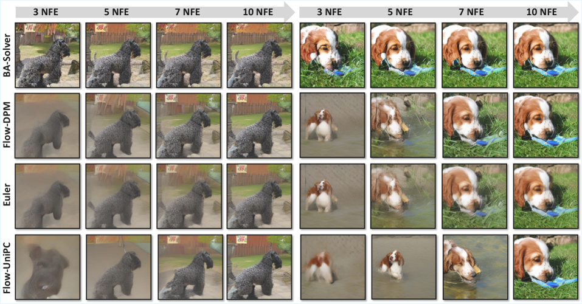
*Figure 4:Qualitative comparison of generated samples across different solvers and NFEs. We visualize random samples generated by our BA-solver and baseline methods (Flow-DPM, Euler, and Flow-UniPC solvers) at 3, 5, 7, and 10 NFEs.*

*Figure 5:Performance comparison on ImageNet. (a)-(b) FID scores varying with NFE on ImageNet-
256
2
 and ImageNet-
512
2
. Our BA-Solver achieves superior performance compared to baselines. (c) Visual samples generated by BA-Solver on class-conditional ImageNet-
512
2
 with only 7 NFEs.*

*Figure 6:Qualitative results of image editing using BA-solver. We demonstrate that BA-solver can perform high-quality editing on class-conditional ImageNet-
256
2
 within only 10 NFEs.*

*Figure 7:More visual samples generated by BA-Solver on class-conditional ImageNet-
256
2
 with only 7 NFEs.*

*Figure 8:More visual samples generated by BA-Solver on class-conditional ImageNet-
512
2
 with only 7 NFEs.*

---
**Usage Info**: 6849 tokens used.
**Generated at**: 2026-02-24 21:15:06

---

# 📚 Position-Invariant Fine-Tuning of Speech Enhancement Models with Self-Supervised Speech Representations

🚀 URL: https://arxiv.org/html/2601.21084

## 🌏 Abstract (원문)
Recent advances in deep learning have substantially transformed speech processing technologies, with self-supervised learning (SSL) emerging as a powerful framework for learning from unlabelled data. SSL-based speech models such as wav2vec 2.0[2], HuBERT[13], and WavLM[8]have demonstrated impressive performance across a variety of downstream tasks including automatic speech recognition (ASR), phoneme recognition (PR), speaker identification (SID), emotion recognition (ER), and learning discriminative acoustic word embeddings (AWE)[13,8,20,23,16,17]. These models are pre-trained on large amounts of unlabelled speech and can then be fine-tuned on task-specific labelled datasets, substantially reducing the reliance on expensive annotated data[20]. Despite their success, SSL models face challenges in noisy environments. Several approaches have been proposed to improve noise robustness through self-supervised fine-tuning[4]. For example, R-SPIN[6](robust speaker-invariant clustering) enhances robustness by learning discrete acoustic units with speaker-invariant clustering, making the resulting representations both speaker- and noise-invariant. Another recent work, deHuBERT[21], introduced noise-agnostic representations derived from HuBERT using noise augmentation and a Barlow Twins-based loss[29]. WavLM incorporated a denoising task directly into pre-training. Further,[7]demonstrated that integrating a single-channel speech enhancement (SE) frontend improves performance in noisy conditions. However, the SE frontend in that work required joint fine-tuning with a downstream ASR model, limiting its generality and reusability. To address this limitation, subsequent work proposed the SSL-MSE loss[24], which compares enhanced and clean signals in the SSL feature space using mean squared error (MSE). This enables task-agnostic fine-tuning of SE models by aligning their outputs with SSL encoders, independent of downstream task objectives. However, MSE introduces a critical issue: it tends to exploit positional embeddings in SSL models, minimising the loss through positional correlation rather than meaningful content. When applied between the SSL representations of enhanced and clean speech, this behaviour reduces generalisation. The phenomenon is closely related to “positional collapse” observed in SSL pre-training[14,1], where models reduce loss by exploiting position rather than learning semantically relevant representations. SPIRAL[14]addressed this in pre-training by introducing random zero-padding to disrupt positional alignment, thereby encouraging models to focus on content. The present study investigates the exploitation of positional embeddings in SSL-guided SE fine-tuning and introduces two mitigation strategies. The first,positional perturbation through random zero-padding, was introduced in SPIRAL for pre-training; here, it is examined in the fine-tuning setting, providing empirical validation in a new context. The second,speed perturbation combined with a soft-DTW loss, ensures temporal alignment between enhanced and clean signals of varying length while reducing reliance on absolute positional encodings. Soft-DTW[9,19,18], a differentiable version of dynamic time warping (DTW), provides a principled way to achieve content-based alignment. To evaluate these strategies, SE models are fine-tuned using different loss functions and perturbations, followed by supervised fine-tuning of SSL models with SE frontends on downstream tasks including ASR and PR. Experiments are conducted on a noise-augmented version of LibriSpeech[22]consistent with the SUPERB benchmark[27], using environmental recordings from DEMAND[26]to simulate noisy conditions. The main contributions of this study are as follows: Identification and verification of the exploitation of positional embeddings in SSL-MSE-based SE fine-tuning, showing its adverse effect on robustness and generalisation of SE frontends. Evaluation of two strategies to mitigate this issue: (1) positional perturbation via random zero-padding, previously proposed in pre-training but not validated in fine-tuning, and (2) speech perturbation with soft-DTW alignment loss, which improves performance and convergence speed over the SSL-MSE baseline. The remainder of this paper is organised as follows: Sec.2introduces the baseline system and the proposed mitigation strategies; Sec.3describes the experimental setup; Sec.4presents results and discussion; and Sec.5concludes the work.
## 🌏 Abstract (번역)
최근 딥러닝의 발전은 음성 처리 기술을 크게 변화시켰으며, 자기 지도 학습(SSL)은 라벨이 없는 데이터로부터 학습하기 위한 강력한 프레임워크로 부상했습니다. wav2vec 2.0, HuBERT, WavLM과 같은 SSL 기반 음성 모델은 자동 음성 인식(ASR), 음소 인식(PR), 화자 식별(SID), 감정 인식(ER), 변별적 음향 단어 임베딩(AWE) 학습을 포함한 다양한 다운스트림 작업에서 인상적인 성능을 보여주었습니다. 이러한 모델은 대량의 라벨 없는 음성으로 사전 학습된 후 특정 작업의 라벨이 있는 데이터셋으로 미세 조정될 수 있어, 비용이 많이 드는 주석 데이터에 대한 의존도를 크게 줄여줍니다. 이러한 성공에도 불구하고, SSL 모델은 노이즈가 있는 환경에서 어려움에 직면합니다. 자기 지도 미세 조정을 통해 노이즈 강건성을 향상시키기 위한 여러 접근 방식이 제안되었습니다. 예를 들어, R-SPIN은 화자 불변 클러스터링을 통해 이산 음향 단위를 학습함으로써 강건성을 강화하여 결과적인 표현이 화자 및 노이즈에 불변하도록 만듭니다. 또 다른 최근 연구인 deHuBERT는 노이즈 증강과 Barlow Twins 기반 손실을 사용하여 HuBERT에서 파생된 노이즈 불가지론적 표현을 도입했습니다. WavLM은 사전 학습에 직접 디노이징 작업을 통합했습니다. 나아가, 단일 채널 음성 향상(SE) 프런트엔드를 통합하는 것이 노이즈 환경에서 성능을 향상시킨다는 것이 입증되었습니다. 그러나 해당 연구의 SE 프런트엔드는 다운스트림 ASR 모델과 공동 미세 조정이 필요하여 범용성과 재사용성이 제한되었습니다. 이러한 제한을 해결하기 위해, 후속 연구에서는 평균 제곱 오차(MSE)를 사용하여 SSL 특징 공간에서 향상된 신호와 깨끗한 신호를 비교하는 SSL-MSE 손실을 제안했습니다. 이를 통해 다운스트림 작업 목표와 독립적으로 SE 모델의 출력을 SSL 인코더와 정렬함으로써 작업 불가지론적 미세 조정이 가능해졌습니다. 그러나 MSE는 심각한 문제를 야기합니다. 즉, SSL 모델의 위치 임베딩을 악용하여 의미 있는 내용보다는 위치적 상관관계를 통해 손실을 최소화하려는 경향이 있습니다. 향상된 음성과 깨끗한 음성의 SSL 표현 사이에 이를 적용하면 일반화 성능이 저하됩니다. 이 현상은 SSL 사전 학습에서 관찰되는 "위치 붕괴(positional collapse)"와 밀접한 관련이 있으며, 모델이 의미적으로 관련 있는 표현을 학습하기보다 위치를 악용하여 손실을 줄이는 현상입니다. SPIRAL은 사전 학습에서 위치 정렬을 방해하기 위해 무작위 제로 패딩을 도입하여 모델이 내용에 집중하도록 함으로써 이 문제를 해결했습니다. 본 연구는 SSL 가이드 SE 미세 조정에서 위치 임베딩의 악용을 조사하고 두 가지 완화 전략을 도입합니다. 첫 번째인 무작위 제로 패딩을 통한 위치 섭동은 사전 학습을 위해 SPIRAL에서 도입되었으며, 여기서는 미세 조정 설정에서 검토되어 새로운 맥락에서 경험적 검증을 제공합니다. 두 번째인 soft-DTW 손실과 결합된 속도 섭동은 절대적 위치 인코딩에 대한 의존도를 줄이면서 길이가 다른 향상된 신호와 깨끗한 신호 간의 시간적 정렬을 보장합니다. 동적 시간 워핑(DTW)의 미분 가능한 버전인 Soft-DTW는 내용 기반 정렬을 달성하기 위한 원칙적인 방법을 제공합니다. 이러한 전략을 평가하기 위해 서로 다른 손실 함수와 섭동을 사용하여 SE 모델을 미세 조정한 후, ASR 및 PR을 포함한 다운스트림 작업에서 SE 프런트엔드를 갖춘 SSL 모델의 지도 미세 조정을 수행합니다. 실험은 노이즈 환경을 시뮬레이션하기 위해 DEMAND의 환경 녹음을 사용하여 SUPERB 벤치마크와 일치하는 LibriSpeech의 노이즈 증강 버전에서 수행됩니다. 본 연구의 주요 기여는 다음과 같습니다: SSL-MSE 기반 SE 미세 조정에서 위치 임베딩의 악용을 식별 및 검증하고, 이것이 SE 프런트엔드의 강건성과 일반화에 미치는 부정적인 영향을 보여줍니다. 이 문제를 완화하기 위한 두 가지 전략을 평가합니다: (1) 이전에 사전 학습에서 제안되었으나 미세 조정에서는 검증되지 않은 무작위 제로 패딩을 통한 위치 섭동, (2) SSL-MSE 베이스라인보다 성능과 수렴 속도를 향상시키는 soft-DTW 정렬 손실을 이용한 음성 섭동. 본 논문의 나머지 부분은 다음과 같이 구성됩니다: 섹션 2는 베이스라인 시스템과 제안된 완화 전략을 소개하고, 섹션 3은 실험 설정을 설명하며, 섹션 4는 결과 및 토론을 제시하고, 섹션 5는 결론을 맺습니다.

## 🔍 Methods & Results
- SSL-MSE 손실을 기반으로 한 음성 향상(SE) 모델 미세 조정 파이프라인 분석 및 위치 임베딩 악용 문제 식별
- 절대적 위치 정보에 대한 의존성을 낮추기 위해 깨끗한 참조 신호에 무작위 제로 패딩을 적용하는 SSL-MSE-PAD 기법 제안
- 속도 섭동(Speed Perturbation)과 미분 가능한 Soft-DTW 손실을 결합하여 내용 기반의 시간적 정렬을 유도하는 SSL-SoftDTW 기법 도입
- LibriSpeech 및 DEMAND 노이즈 데이터를 활용하여 ASR 및 PR 다운스트림 작업에서 제안된 기법들의 성능 검증
- 제안된 전략들이 기존 SSL-MSE 베이스라인 대비 노이즈 환경에서의 강건성, 일반화 성능 및 모델 수렴 속도를 향상시킴을 입증

## 🖼 Figures
![Fig. 1:SSL-MSE: pipeline for fine-tuning a frontend SE model using SSL-based speech representations with MSE loss [24].](../images/2026-01-30/2601.21084/2601.21084_fig0.png)
*Fig. 1:SSL-MSE: pipeline for fine-tuning a frontend SE model using SSL-based speech representations with MSE loss [24].*

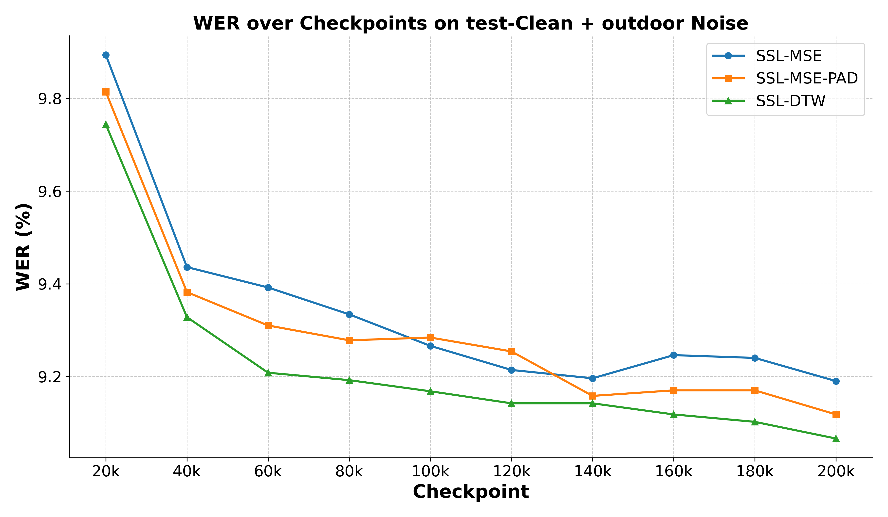
*Fig. 2:WER (in %) on test-clean + outdoor noise for ASR across training checkpoints. SE frontends are fine-tuned with different objectives: SSL-MSE, SSL-MSE-PAD, and SSL-SoftDTW. Each curve shows the mean of 5 runs.*

---
**Usage Info**: 6097 tokens used.
**Generated at**: 2026-02-24 21:16:05

---

# 📚 Understanding Frechet Speech Distance for Synthetic Speech Quality Evaluation

🚀 URL: https://arxiv.org/html/2601.21386

## 🌏 Abstract (원문)
Recent advancements in text-to-speech (TTS) models have shown promising results in generating high-quality synthetic samples[3,17,4]. To measure the intelligibility of synthetic samples, Word Error Rate (WER) metric can be used, i.e., the lower WER implies that the synthetic samples are more intelligible and faithful to the input text prompt. However, WER metric does not always reflect superior overall TTS quality; If the synthetic samples are generated by diverse speakers including unseen speakers or noisy acoustic prompts, the WER may increase because the ASR model struggles to understand the varied audio styles, and the higher WER in this context does not signify that the synthetic samples are of inferior quality[17]. Human listening evaluation often measured by Mean Opinion Score (MOS), remains the gold standard for assessing synthetic speech quality. Nevertheless, MOS is inherently subjective, prone to individual biases and potential misinterpretations[27]. Furthermore, MOS is a costly resource-intensive method and limits objective comparisons, thereby hindering reproducibility in relation to other TTS studies. Moreover, MOS/TTS intelligibility do not quantitatively measure the similarity of synthetic and real speech distributions. Methods such as comparing WER on real audio, between ASR models trained with synthetic samples and those trained solely on real audio have been proposed[17]. However, these approaches rely on training ASR models, which can be costly and subject to challenges like hyperparameter optimization. In this context, Fréchet Distance (FD) can be employed to evaluate both the quality and similarity of generated samples relative to a reference set[8], and it has been already utilized across generative domains, including image (FID)[13], music (FAD)[25,10,28], and speech (FSD)[17,Bińkowski2020High]. Nevertheless, there is still no consensus in the TTS domain on the preferred embeddings and datasets for effectively assessing synthetic speech quality. Since FD is a distance based metric, its results are highly dependent on the specific experimental settings[bińkowski2018demystifying]. These factors can significantly impact FSD scores, making it challenging to compare reported results and potentially leading to confusion among readers. In this paper, we systematically investigate how various speech embeddings, noise, and synthetic samples affect the FSD when the reference set is fixed. Our contributions are: We explore FSD using embeddings from recent self-supervised speech models[2,14,5], Whisper[23]and ECAPA-TDNN[7]. We introduce Speech Maximum Mean Discrepancy (SMMD) as a complementary measure to FSD. We conduct human MOS tests to validate the perceptual relevance of FSD and SMMD. We demonstrate FSD’s robustness to sample bias and show that WavLM Base+ embeddings yield stable and reliable benchmarking of synthetic speech quality.
## 🌏 Abstract (번역)
최근 텍스트 음성 변환(TTS) 모델의 발전은 고품질 합성 샘플 생성에 있어 유망한 결과를 보여주었습니다. 합성 샘플의 명료도를 측정하기 위해 단어 오류율(WER) 지표가 사용될 수 있으며, 낮은 WER은 합성 샘플이 입력 텍스트 프롬프트에 더 명료하고 충실함을 의미합니다. 그러나 WER 지표가 항상 우수한 전체 TTS 품질을 반영하는 것은 아닙니다. 학습되지 않은 화자나 노이즈가 포함된 음향 프롬프트 등 다양한 화자에 의해 합성 샘플이 생성되는 경우, ASR 모델이 다양한 오디오 스타일을 이해하는 데 어려움을 겪어 WER이 증가할 수 있으며, 이 경우 높은 WER이 합성 샘플의 품질 저하를 의미하지는 않습니다. 평균 의견 점수(MOS)로 측정되는 인간 청취 평가는 여전히 합성 음성 품질 평가의 표준으로 남아 있습니다. 그럼에도 불구하고 MOS는 본질적으로 주관적이며, 개인의 편견과 잠재적인 오해의 소지가 있습니다. 또한 MOS는 비용과 자원이 많이 소모되는 방식이며 객관적인 비교를 제한하여 다른 TTS 연구와의 재현성을 저해합니다. 더욱이 MOS 및 TTS 명료도는 합성 음성과 실제 음성 분포 간의 유사성을 정량적으로 측정하지 못합니다. 합성 샘플로 학습된 ASR 모델과 실제 오디오로만 학습된 모델 간의 WER을 비교하는 방식 등이 제안되었으나, 이러한 접근법은 ASR 모델 학습에 의존하므로 비용이 많이 들고 하이퍼파라미터 최적화와 같은 문제에 직면할 수 있습니다. 이러한 맥락에서 프레셰 거리(FD)는 참조 세트 대비 생성된 샘플의 품질과 유사성을 모두 평가하는 데 사용될 수 있으며, 이미지(FID), 음악(FAD), 음성(FSD) 등 다양한 생성 도메인에서 이미 활용되고 있습니다. 그럼에도 불구하고 TTS 도메인에서는 합성 음성 품질을 효과적으로 평가하기 위한 선호 임베딩 및 데이터셋에 대한 합의가 아직 부족합니다. FD는 거리 기반 지표이므로 결과가 특정 실험 설정에 크게 의존하며, 이는 FSD 점수에 상당한 영향을 미쳐 결과 비교를 어렵게 하고 혼란을 야기할 수 있습니다. 본 논문에서는 참조 세트가 고정된 상태에서 다양한 음성 임베딩, 노이즈 및 합성 샘플이 FSD에 미치는 영향을 체계적으로 조사합니다. 본 연구의 기여는 다음과 같습니다. 첫째, 최신 자기 지도 학습 음성 모델, Whisper 및 ECAPA-TDNN의 임베딩을 사용하여 FSD를 탐구합니다. 둘째, FSD의 보완 지표로 SMMD(Speech Maximum Mean Discrepancy)를 도입합니다. 셋째, 인간 MOS 테스트를 수행하여 FSD와 SMMD의 지각적 관련성을 검증합니다. 마지막으로 FSD의 샘플 편향에 대한 견고함을 입증하고, WavLM Base+ 임베딩이 합성 음성 품질의 안정적이고 신뢰할 수 있는 벤치마킹을 가능하게 함을 보여줍니다.

## 🔍 Methods & Results
- 최신 자기 지도 학습(SSL) 모델(WavLM, HuBERT 등), Whisper, ECAPA-TDNN 등 다양한 음성 임베딩을 활용한 FSD(Fréchet Speech Distance) 성능 분석
- FSD를 보완하기 위한 새로운 지표인 SMMD(Speech Maximum Mean Discrepancy) 도입
- 인간의 주관적 평가(MOS)와의 상관관계 분석을 통해 FSD와 SMMD의 지각적 유효성 검증
- FSD가 샘플 편향에 대해 가지는 강건성(Robustness) 입증
- 실험 결과 WavLM Base+ 임베딩이 합성 음성 품질 측정에 있어 가장 안정적이고 신뢰할 수 있는 벤치마크임을 확인

## 🖼 Figures

*(a)wav2vec2 Base*

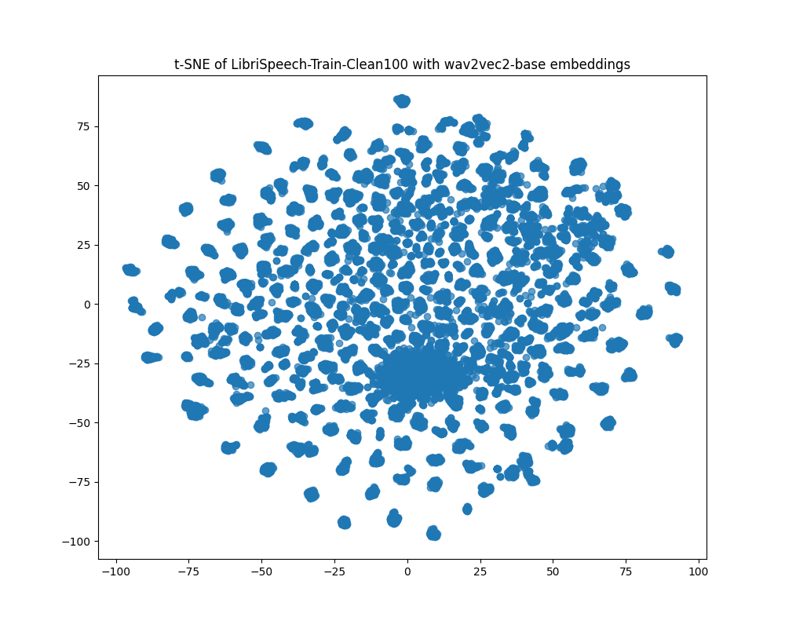
*(a)wav2vec2 Base*

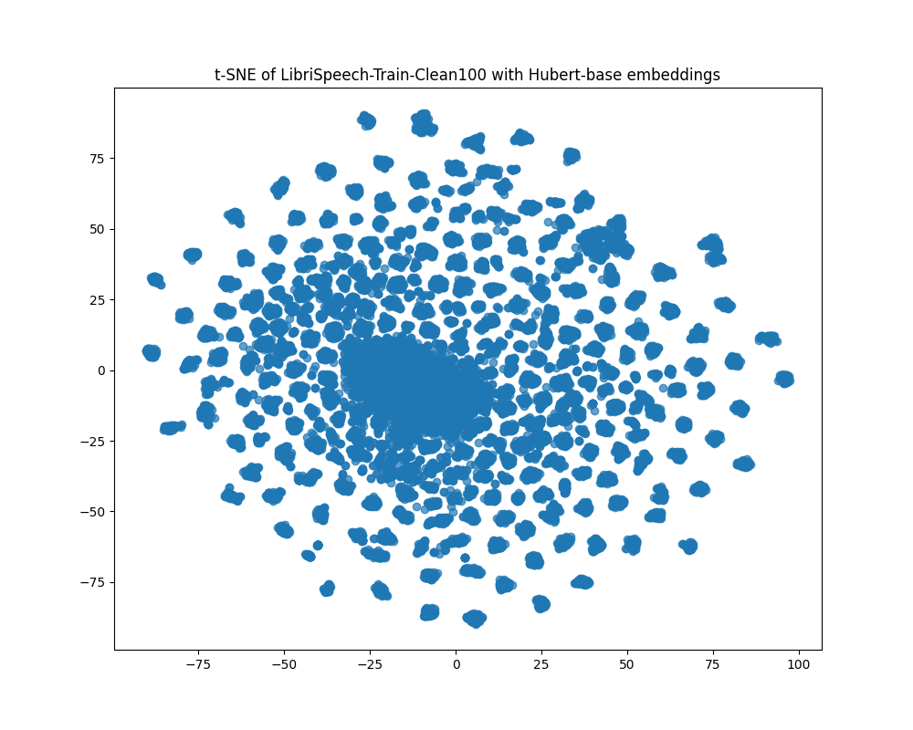
*(b)HuBERT Base*

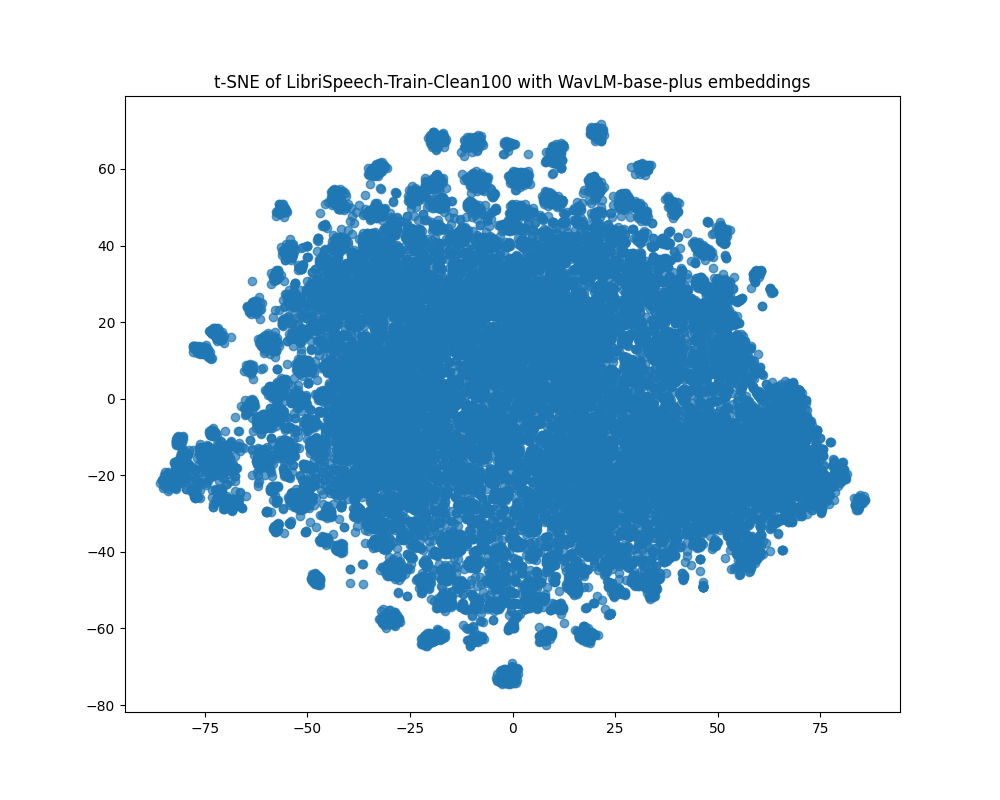
*(c)WavLM Base+*

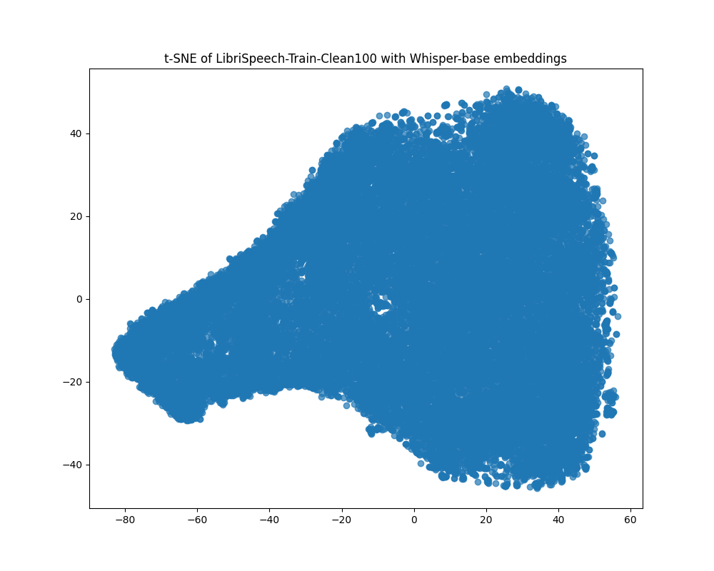
*(d)Whisper Base*

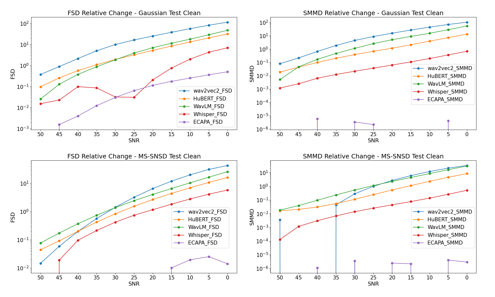
*Fig. 2:Comparison of the relative change for both FSD and SMMD metrics on a logarithmic scale, applied to two distinct noise sets in the LS test-clean, with SNR values ranging from 0 to 50 dB. Lower SNR values indicate lower sample quality.*

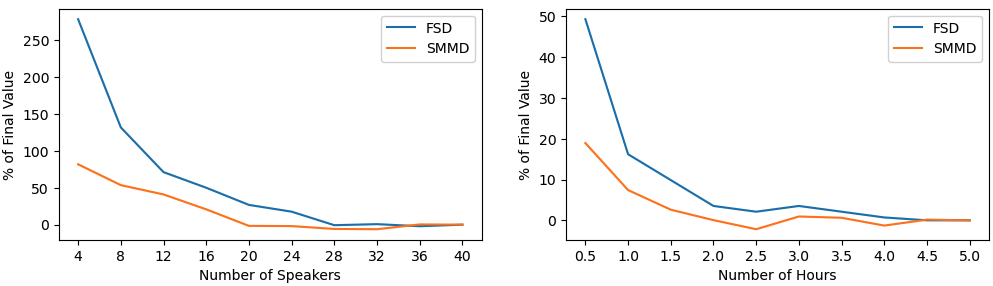
*Fig. 3:Sample efficiency testing for FSD and SMMD on LS test-clean, using WavLM embeddings. Left: Behavior when subsets selected based on speakers, Right: Behavior for random subset selection.*

---
**Usage Info**: 5754 tokens used.
**Generated at**: 2026-02-24 21:16:53

---

# 📚 SPEECH QUALITY-BASED LOCALIZATION OF LOW-QUALITY SPEECH AND TEXT-TO-SPEECH SYNTHESIS ARTEFACTS

🚀 URL: https://arxiv.org/html/2601.21886

## 🌏 Abstract (원문)
Automatic speech quality assessment (SQA) models summarize the quality of a speech signal into a single scalar value. This is useful for a handful of tasks like data cleaning, measuring the performance of voice transmission systems[16]or the evaluation of generative speech technology like text-to-speech (TTS)[23]. Many of these predictors learn a mapping from the speech signal to a mean opinion score (MOS) by using training pairs that were queried during large-scale, often crowd-sourced, listening tests, asking participants to rate different constructs like overall quality[16]or naturalness[5]. While these approaches do provide a picture of overall quality, they cannot explain what decision rules the predictor learns to quantify the quality as good or bad, or, more specifically, reveal something about theinternal mappingfrom smaller segments of speech to quality scores. There exists some studies that developed subjective listening tests tolocalizeandidentifyerror patterns in TTS systems. Edlund et al.[6]designed an audio response system that required participants to click a button every time noticed an error in the synthesis. They had a professional speech synthesis developer classify the most often clicked locations as easily identifiable problems or not, but did not provide any results on the types of errors. Gutierrez et al.[9]used Rapid Prosody Transcription to identify prosody errors in TTS synthesis. Participants were asked to mark words where the prosody did not sound natural and subsequently asked them to classify the error by choosing from four options. While they could show that number and type of errors differ by task and system, the agreement among participants on the error locations was low. Pine et al.[17]let a group of expert evaluators discuss on the existence, severity and type of errors by choosing from a list of different error types. In a similar spirit to automating SQA, we would like to automate thelocalizationof speech synthesis errors. As there exists no large-scale datasets for this task to train a model in a supervised fashion, the only way is to learn from utterance-level targets. Quality-Net[8]first looked at how to train SQA models to predict frame-level scores. Kuhlmann et al.[11]extended this idea to SQA models using pretrained self-supervised learned (SSL) encoders[10]. While they could show that frame-level scores can be used to detect unnatural distortions, localized distortions also lowered clean frame-level scores in their vicinity, worsening detection precision. In this work, we show that frame-level predictions of SQA models can be effectively regularized by using a consistency constraint[14]. We validate the effect of this regularization by measuring the detection performance of partially spoofed speech[25], where we can increase the precision of the detections from31.7%31.7\%to62.3%62.3\%by training with the consistency constraint. Finally, we use the regularized frame-level scores to detect synthesis artefacts in two state-of-the-art TTS systems: StyleTTS2[13]and F5-TTS[3]. We perform a listening test to 1) check whether this detection method does not produce an excessive number of false positives and 2) to classify the kind of artefacts the SQA model is sensitive to. Compared to randomly extracted control samples, the segments detected by our method were considerably more often marked as detrimental.
## 🌏 Abstract (번역)
자동 음성 품질 평가(SQA) 모델은 음성 신호의 품질을 단일 스칼라 값으로 요약합니다. 이는 데이터 정제, 음성 전송 시스템의 성능 측정 또는 텍스트 음성 변환(TTS)과 같은 생성형 음성 기술의 평가와 같은 여러 작업에 유용합니다. 이러한 예측 모델 중 다수는 대규모 크라우드 소싱 청취 테스트를 통해 얻은 훈련 쌍을 사용하여 음성 신호에서 평균 의견 점수(MOS)로의 매핑을 학습하며, 참가자들에게 전체적인 품질이나 자연스러움과 같은 다양한 요소를 평가하도록 요청합니다. 이러한 접근 방식은 전반적인 품질에 대한 그림을 제공하지만, 예측 모델이 품질을 좋거나 나쁨으로 수량화하기 위해 어떤 결정 규칙을 학습하는지 설명할 수 없으며, 특히 음성의 작은 세그먼트에서 품질 점수로의 내부 매핑에 대해 밝혀내지 못합니다. TTS 시스템에서 오류 패턴을 국소화하고 식별하기 위해 주관적 청취 테스트를 개발한 일부 연구가 존재합니다. Edlund 등은 합성에 오류가 감지될 때마다 참가자가 버튼을 클릭하도록 하는 오디오 응답 시스템을 설계했습니다. 전문 음성 합성 개발자가 가장 자주 클릭된 위치를 쉽게 식별 가능한 문제인지 여부로 분류했지만, 오류 유형에 대한 결과는 제공하지 않았습니다. Gutierrez 등은 TTS 합성의 운율 오류를 식별하기 위해 신속 운율 전사(Rapid Prosody Transcription)를 사용했습니다. 참가자들은 운율이 자연스럽지 않은 단어를 표시하고 네 가지 옵션 중 하나를 선택하여 오류를 분류하도록 요청받았습니다. 작업과 시스템에 따라 오류의 수와 유형이 다르다는 것을 보여줄 수 있었지만, 오류 위치에 대한 참가자 간의 일치도는 낮았습니다. Pine 등은 전문가 평가자 그룹이 다양한 오류 유형 목록에서 선택하여 오류의 존재, 심각도 및 유형에 대해 논의하도록 했습니다. SQA를 자동화하는 것과 유사한 취지로, 우리는 음성 합성 오류의 국소화를 자동화하고자 합니다. 이 작업을 위해 모델을 지도 학습 방식으로 훈련할 대규모 데이터셋이 존재하지 않기 때문에, 발화 수준의 타겟으로부터 학습하는 것이 유일한 방법입니다. Quality-Net은 프레임 수준의 점수를 예측하기 위해 SQA 모델을 훈련하는 방법을 처음으로 연구했습니다. Kuhlmann 등은 사전 훈련된 자기 지도 학습(SSL) 인코더를 사용하여 이 아이디어를 SQA 모델로 확장했습니다. 그들은 프레임 수준의 점수가 부자연스러운 왜곡을 감지하는 데 사용될 수 있음을 보여주었지만, 국소화된 왜곡은 인근의 깨끗한 프레임 수준 점수도 낮추어 감지 정밀도를 악화시켰습니다. 본 연구에서는 일관성 제약 조건을 사용하여 SQA 모델의 프레임 수준 예측을 효과적으로 정규화할 수 있음을 보여줍니다. 우리는 일관성 제약 조건으로 훈련함으로써 부분적으로 스푸핑된 음성의 감지 성능을 측정하여 이 정규화의 효과를 검증하며, 감지 정밀도를 31.7%에서 62.3%로 높일 수 있었습니다. 마지막으로, 정규화된 프레임 수준 점수를 사용하여 두 가지 최첨단 TTS 시스템인 StyleTTS2와 F5-TTS에서 합성 아티팩트를 감지합니다. 우리는 1) 이 감지 방법이 과도한 수의 허위 양성을 생성하지 않는지 확인하고, 2) SQA 모델이 민감하게 반응하는 아티팩트의 종류를 분류하기 위해 청취 테스트를 수행합니다. 무작위로 추출된 대조 샘플과 비교하여, 우리의 방법으로 감지된 세그먼트는 유해한 것으로 표시되는 빈도가 훨씬 더 높았습니다.

## 🔍 Methods & Results
- 음성 품질 평가(SQA) 모델의 프레임 수준 예측을 정규화하기 위해 일관성 제약 조건(Consistency Constraint)을 도입함
- 대규모 레이블 데이터셋 없이 발화 수준의 타겟 점수만을 활용하여 프레임 단위의 오류 위치를 국소화하는 학습 방식 채택
- 부분 스푸핑 음성 감지 실험에서 감지 정밀도를 기존 31.7%에서 62.3%로 대폭 향상시킴
- 최신 TTS 모델인 StyleTTS2 및 F5-TTS의 합성 아티팩트 탐지에 적용하여 방법론의 실용성 검증
- 주관적 청취 테스트를 통해 제안된 기법이 무작위 추출 방식보다 실제 음성 결함을 훨씬 더 정확하게 식별함을 입증

## 🖼 Figures
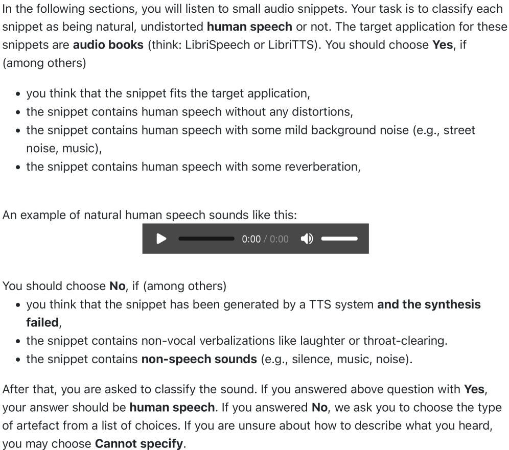
*Fig. 1:Evaluation instructions for listeners.*

---
**Usage Info**: 4310 tokens used.
**Generated at**: 2026-02-24 21:17:29

---

