# 🚩 (2026-02-02) Scholar Inbox 추천 논문 

# 📚 Sylber 2.0: A Universal Syllable Embedding

🚀 URL: https://arxiv.org/html/2601.22306

## 🌏 Abstract (원문)
Modeling speech effectively requires capturing both its acoustic detail and linguistic content. Various modeling approaches have been proposed to encode such information, from acoustic spectral features to modern speech representational learning methods. Masked prediction–based speech self-supervised learning (SSL) has been shown to encode rich linguistic content, and thus has been successful in many downstream tasks. However, the learned embeddings are mostly phonetic. Variational autoencoders (VAEs), with or without vector quantization (VQ), have provided compact representations of speech with audio reconstruction that can be used in generative modeling such as text-to-speech (TTS). However, downstream models using speech tokens suffer from high token frequency. Unlike text, speech audio exists in continuous time without a clear delimiter, which has forced speech tokens to densely encode each frame. Some recent work has mitigated this with a large downsampling window. Yet, it is unknown whether these tokens, with their high compression rates and fixed windows, can encode linguistic content effectively beyond low-level acoustics, which is crucial in spoken language modeling and many other downstream tasks. Recent studies have proposed leveraging syllables to compress speech to around 5 Hz. These approaches are based on findings that syllabic segments naturally emerge in speech SSL without using text. By tokenizing speech using syllabic segments, they demonstrate that syllabic tokens enable more efficient spoken language modeling compared to dense tokens, with significantly reduced token length, and show that intelligible speech can be generated from those tokens. However, previous syllabic tokens were trained only on English read speech and are not generalizable to different languages and styles, which significantly limits practical utility. Moreover, those tokens severely lack acoustic detail, such that speaker identity is outsourced or completely ignored in the generative process. To address these issues, we propose Sylber 2.0, a universal syllabic encoding–decoding framework that can compress any arbitrary speech into syllable embeddings with a token frequency of around 5 Hz. We extend the previous SSL framework, Sylber, to learn syllables from diverse languages and styles. We introduce a boundary detector for faster, parallelizable segmentation and an auxiliary acoustic encoder to capture acoustic details. Our experiments show that Sylber 2.0 achieves near-perfect reconstruction, closing the gap with high-frequency tokens and surpassing the original Sylber by a wide margin. Sylber 2.0 achieves the lowest token frequency for speech, ranging from 3.2 Hz to 6.4 Hz across various languages, with an average of 4.8 Hz. We further validate our framework in various downstream tasks, including English TTS and low-resource ASR.
## 🌏 Abstract (번역)
음성을 효과적으로 모델링하려면 음향적 세부 사항과 언어적 내용을 모두 포착해야 합니다. 음향 스펙트럼 특징부터 현대적인 음성 표현 학습 방식에 이르기까지 이러한 정보를 인코딩하기 위한 다양한 모델링 접근 방식이 제안되었습니다. 마스크 예측 기반의 음성 자기 지도 학습(SSL)은 풍부한 언어적 내용을 인코딩하는 것으로 나타나 여러 다운스트림 작업에서 성공을 거두었습니다. 그러나 학습된 임베딩은 대부분 음소 위주입니다. 벡터 양자화(VQ)를 포함하거나 포함하지 않은 변이형 오토인코더(VAE)는 텍스트 음성 변환(TTS)과 같은 생성 모델링에 사용할 수 있는 오디오 재구성을 통해 압축된 음성 표현을 제공해 왔습니다. 그러나 음성 토큰을 사용하는 다운스트림 모델은 높은 토큰 빈도로 인해 어려움을 겪습니다. 텍스트와 달리 음성 오디오는 명확한 구분 기호 없이 연속적인 시간 속에 존재하므로, 음성 토큰이 각 프레임을 조밀하게 인코딩해야 했습니다. 최근 일부 연구에서는 큰 다운샘플링 윈도우를 통해 이를 완화했습니다. 하지만 이러한 토큰이 높은 압축률과 고정된 윈도우를 가지고도 저수준 음향을 넘어 언어적 내용을 효과적으로 인코딩할 수 있는지는 알려지지 않았으며, 이는 구어 언어 모델링 및 기타 여러 다운스트림 작업에서 매우 중요합니다. 최근 연구들은 음절을 활용하여 음성을 약 5Hz로 압축할 것을 제안했습니다. 이러한 접근 방식은 텍스트를 사용하지 않고도 음성 SSL에서 음절 세그먼트가 자연스럽게 나타난다는 발견에 기반합니다. 음절 세그먼트를 사용하여 음성을 토큰화함으로써, 음절 토큰이 조밀한 토큰에 비해 토큰 길이를 크게 줄이면서도 더 효율적인 구어 언어 모델링을 가능하게 하고, 해당 토큰으로부터 이해 가능한 음성을 생성할 수 있음을 보여주었습니다. 그러나 이전의 음절 토큰은 영어 낭독체 음성으로만 학습되어 다양한 언어와 스타일에 일반화되지 않아 실제 활용도가 크게 제한되었습니다. 또한, 이러한 토큰은 음향적 세부 사항이 심각하게 부족하여 생성 과정에서 화자 정보가 외부에서 조달되거나 완전히 무시됩니다. 이러한 문제를 해결하기 위해 우리는 임의의 음성을 약 5Hz의 토큰 빈도를 가진 음절 임베딩으로 압축할 수 있는 범용 음절 인코딩-디코딩 프레임워크인 Sylber 2.0을 제안합니다. 우리는 이전의 SSL 프레임워크인 Sylber를 확장하여 다양한 언어와 스타일에서 음절을 학습하도록 했습니다. 또한 더 빠르고 병렬화 가능한 세그먼테이션을 위한 경계 감지기와 음향적 세부 사항을 포착하기 위한 보조 음향 인코더를 도입했습니다. 실험 결과 Sylber 2.0은 거의 완벽한 재구성을 달성하여 고주파 토큰과의 격차를 좁히고 기존 Sylber를 큰 차이로 능가했습니다. Sylber 2.0은 다양한 언어에 걸쳐 3.2Hz에서 6.4Hz 사이, 평균 4.8Hz로 가장 낮은 음성 토큰 빈도를 달성합니다. 우리는 영어 TTS 및 저자원 ASR을 포함한 다양한 다운스트림 작업에서 프레임워크를 추가로 검증했습니다.

## 🔍 Methods & Results
- Sylber 2.0은 음절 단위(약 5Hz)로 토큰을 생성하며, 각 토큰은 지속 시간(duration), 내용 임베딩(content), 음향 임베딩(acoustic)의 세 가지 구성 요소로 이루어짐.
- 내용 인코더는 프레임별 자기 증류(self-distillation)와 자기 세그먼테이션 증류(self-segmentation distillation)를 포함하는 다단계 SSL 과정을 통해 학습됨.
- 기존의 느린 유사도 기반 세그먼테이션을 대체하기 위해 GPU 병렬 처리가 가능한 고속 경계 감지기(boundary detector)를 도입함.
- 화자 정보 및 음향 세부 사항을 보존하기 위해 별도의 음향 인코더를 도입하고, 내용 임베딩과의 얽힘을 방지하기 위해 무작위 음성 섭동(perturbation) 전략을 사용함.
- Vocos 기반의 경량 보코더(100M 파라미터)를 사용하여 24kHz 음성을 합성하며, 세그먼트 내 위치 인코딩(wSegPE)을 통해 재구성 품질을 향상시킴.
- 102개 언어에 대해 평균 4.8Hz의 토큰 빈도를 달성하였으며, 이는 다국어 음성 토크나이저 중 최저 수준임.
- 72M 파라미터 규모의 제로샷 다중 화자 TTS 모델로 기존 SOTA 모델과 대등한 성능을 보였으며, 단일 24GB GPU에서 학습이 가능한 자원 효율성을 입증함.

## 🖼 Figures

*Figure 1:Comparison of token frequency of speech and text tokenization methods. (left) Each bar indicates token frequency of Sylber 2.0 for each language from 102 languages in FLEURS-R. (right) Comparison with text BPE tokens. Each dot denotes each of 102 languages.*

*Figure 2:Encoding-decoding framework of Sylber 2.0. The model compresses speech into non-uniform (
∼
 5 Hz) embeddings with different components.*

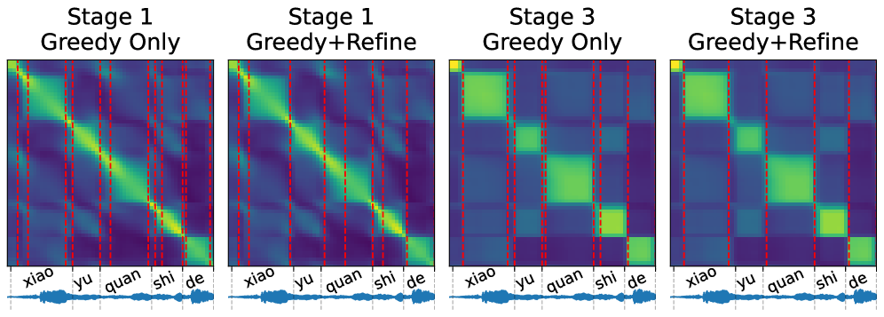
*Figure 3:Similarity matrix after stage 1 and 3. The detected boundaries are denoted as red dashed lines.*

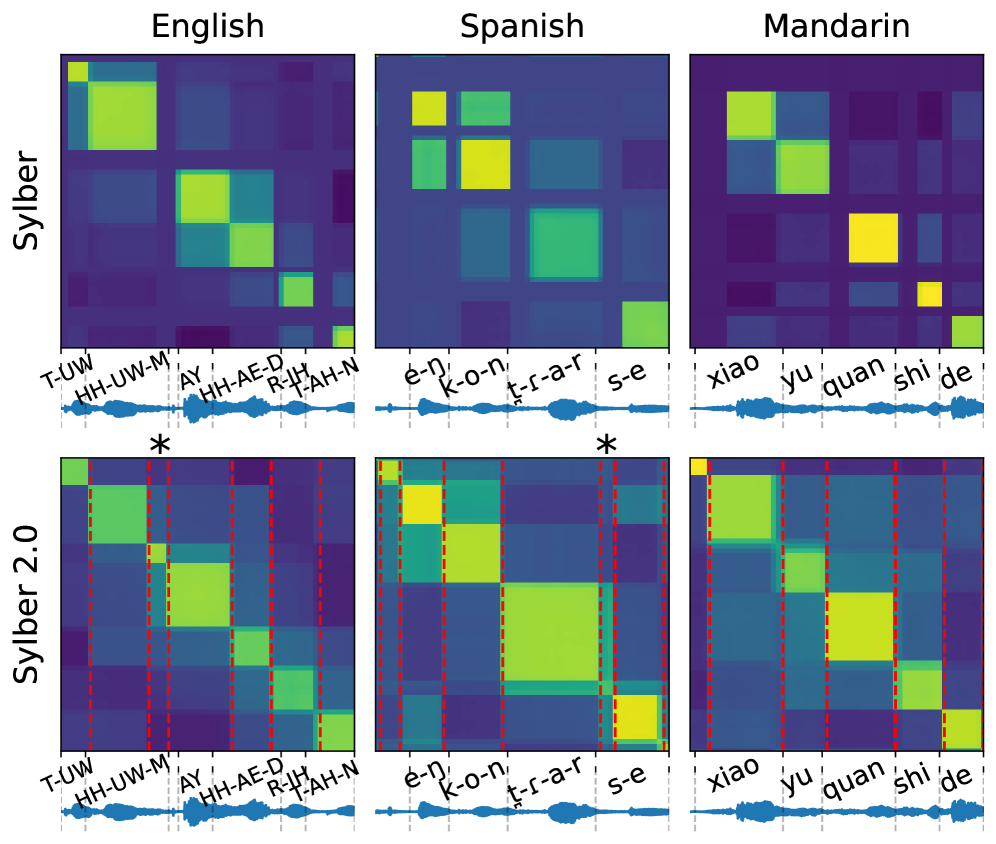
*Figure 4:Similarity matrix in three different languages using Sylber (top) and Sylber 2.0 (bottom). “*” denotes the segments which are masked out in the previous Sylber.*

---
**Usage Info**: 7839 tokens used.
**Generated at**: 2026-02-23 20:41:54

---

# 📚 EmoShift: Lightweight Activation Steering for Enhanced Emotion-Aware Speech Synthesis

🚀 URL: https://arxiv.org/html/2601.22873

## 🌏 Abstract (원문)
Emotional expressiveness is a cornerstone of human communication, shaping not only lexical content but also the perceived intent, engagement, and empathy in spoken interaction[26]. In text‑to‑speech (TTS) synthesis, the ability to produce speech with accurate and context‑appropriate emotional qualities is essential for applications such as virtual assistants, audiobooks, and empathetic human–machine dialogue[15,12]. Research on emotional control in TTS has made notable progress through explicit modulation of emotion embeddings, often combined with relative attribute learning[17,14], geometric representations[4], or quantization schemes[13]. Other studies leverage generative modeling driven by prosodic cues[29]or natural‑language prompts[8,28,9]. While effective in varying emotional output, these approaches typically scale a fixed emotion embedding and share all model parameters. This limits interpretability and hinders the direct encoding of emotion‑specific latent dynamics—critical for reliable emotion rendering across both non‑neutral and neutral states. In parallel, activation steering has emerged as a lightweight and interpretable paradigm for controlling generative model behavior[7,24]. By learning and injecting targeted directional offsets—steering vectors—into a model’s latent space at inference time (Fig.1), activation steering enables precise control without retraining the core network. It has been applied to style control[11,16], personalization[3,2], safety enforcement[24,25], and fairness alignment[6]. Motivated by the potential of activation steering, we proposeEmoShift, a lightweight activation‑steering framework for emotion‑aware TTS. At its core is a dedicated EmoSteer layer, which learns emotion‑specific steering vectors in the output embedding space. These vectors encode emotion‑dependent latent offsets, enabling precise, consistent, and interpretable emotional control without altering or retraining the base model. The design is model‑agnostic and can be seamlessly integrated into LLM‑based TTS pipelines. Ourcontributionsare as follows: We proposeEmoShift, a lightweight activation steering framework for emotion‑aware TTS, incorporating a dedicated EmoSteer layer to learn emotion‑specific steering vectors in the output embedding space for precise and interpretable emotional control. Extensive objective and subjective evaluations demonstrate thatEmoShiftconsistently improves emotional expressiveness over strong emotion‑aware TTS baselines, while preserving naturalness and speaker similarity. Further analysis reveals that scaling the steering vectors at inference provides an optional mechanism for fine‑grained variation in emotional intensity and expressiveness without compromising emotion‑type fidelity.
## 🌏 Abstract (번역)
감정적 표현력은 인간 의사소통의 초석이며, 구어 상호작용에서 어휘 내용뿐만 아니라 인지된 의도, 참여도 및 공감을 형성합니다. 텍스트 음성 변환(TTS) 합성에서 정확하고 문맥에 적합한 감정적 특성을 가진 음성을 생성하는 능력은 가상 비서, 오디오북 및 공감형 인간-기계 대화와 같은 응용 분야에 필수적입니다. TTS의 감정 제어에 대한 연구는 감정 임베딩의 명시적 변조를 통해 주목할 만한 진전을 이루었으며, 이는 종종 상대적 속성 학습, 기하학적 표현 또는 양자화 기법과 결합됩니다. 다른 연구들은 운율 단서나 자연어 프롬프트에 의해 구동되는 생성 모델링을 활용합니다. 이러한 접근 방식은 감정 출력을 변화시키는 데 효과적이지만, 일반적으로 고정된 감정 임베딩을 확장하고 모든 모델 파라미터를 공유합니다. 이는 해석 가능성을 제한하고 비중립 및 중립 상태 모두에서 신뢰할 수 있는 감정 렌더링에 중요한 감정 특화 잠재 역학의 직접적인 인코딩을 방해합니다. 이와 병행하여, 활성화 스티어링은 생성 모델의 동작을 제어하기 위한 가볍고 해석 가능한 패러다임으로 등장했습니다. 추론 시 모델의 잠재 공간에 목표 방향 오프셋인 스티어링 벡터를 학습하고 주입함으로써, 활성화 스티어링은 핵심 네트워크를 재학습하지 않고도 정밀한 제어를 가능하게 합니다. 이는 스타일 제어, 개인화, 안전 집행 및 공정성 정렬에 적용되어 왔습니다. 활성화 스티어링의 잠재력에 동기를 부여받아, 우리는 감정 인식 TTS를 위한 가벼운 활성화 스티어링 프레임워크인 EmoShift를 제안합니다. 그 핵심은 출력 임베딩 공간에서 감정 특화 스티어링 벡터를 학습하는 전용 EmoSteer 레이어입니다. 이러한 벡터는 감정 의존적 잠재 오프셋을 인코딩하여 기본 모델을 변경하거나 재학습하지 않고도 정밀하고 일관되며 해석 가능한 감정 제어를 가능하게 합니다. 이 설계는 모델에 구애받지 않으며 LLM 기반 TTS 파이프라인에 원활하게 통합될 수 있습니다. 우리의 기여는 다음과 같습니다: 우리는 정밀하고 해석 가능한 감정 제어를 위해 출력 임베딩 공간에서 감정 특화 스티어링 벡터를 학습하는 전용 EmoSteer 레이어를 통합한 감정 인식 TTS를 위한 가벼운 활성화 스티어링 프레임워크인 EmoShift를 제안합니다. 광범위한 객관적 및 주관적 평가는 EmoShift가 자연스러움과 화자 유사성을 보존하면서 강력한 감정 인식 TTS 베이스라인보다 감정 표현력을 일관되게 향상시킨다는 것을 보여줍니다. 추가 분석에 따르면 추론 시 스티어링 벡터를 스케일링하면 감정 유형 충실도를 손상시키지 않으면서 감정 강도와 표현력의 미세한 변화를 위한 선택적 메커니즘을 제공합니다.

## 🔍 Methods & Results
- LLM 기반 TTS를 조건부 자기회귀 토큰 생성 문제로 모델링하고 감정 특화 활성화 스티어링 레이어를 통합한 EmoShift 프레임워크를 제안함
- 화자 임베딩, 감정 프롬프트, 텍스트 임베딩을 조건으로 사용하여 음성 토큰을 생성하며, 플로우 매칭 기반 보코더를 통해 음성 파형을 합성함
- 기본 모델의 재학습 없이 잠재 공간에서 명시적인 감정 특화 방향을 학습하는 EmoSteer 레이어를 도입하여 해석 가능한 감정 제어를 구현함
- 학습 가능한 투영 행렬을 통해 각 은닉 상태에 대한 스티어링 벡터를 계산하고 이를 기존 은닉 상태에 더해 감정적 오프셋을 적용함
- 추론 시 이득 계수(alpha)를 도입하여 타겟 감정의 정체성을 유지하면서 감정의 강도를 세밀하게 조절할 수 있는 메커니즘을 제공함
- 객관적 및 주관적 평가 결과, EmoShift는 기존 베이스라인 대비 자연스러움과 화자 유사성을 유지하면서도 감정 표현력을 유의미하게 향상시킴

## 🖼 Figures
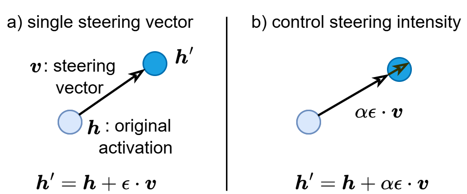
*Fig. 1:Illustration of steering vector operation in activation space.*

*Fig. 2:Overview of the proposed EmoShift framework. Ground-truth speech inputs 
𝑌
 used only during training and omitted during inference.*

*Fig. 3:Overall emotion recognition accuracy with different steering factor 
𝛼
 at inference.*

---
**Usage Info**: 5808 tokens used.
**Generated at**: 2026-02-23 20:42:30

---

# 📚 Gradual Fine-Tuning for Flow Matching Models

🚀 URL: https://arxiv.org/html/2601.22495

## 🌏 Abstract (원문)
Recent advances in flow-based generative modeling(Lipmanet al.,2023; Liuet al.,2023)have achieved remarkably high generation quality, and have seen widespread use in natural image generation(Esseret al.,2024), as well as scientific applications such as molecule generation(Jinget al.,2024; Kleinet al.,2023; Songet al.,2023), biological sequence modeling(Starket al.,2024; Daviset al.,2024), and atmospheric forecasting(Fotiadiset al.,2025; Baoet al.,2024). In settings characterized by limited computational resources, data-scarcity, or evolving data distributions, fine-tuning a pretrained flow matching model is often the most effective approach for achieving accurate generation. Unlike training from random initialization, fine-tuning must reconcile the competing objectives of adapting to a new target distribution while preserving the structural properties (e.g. short probability paths) learned during pretraining. Such considerations are important for flow matching models, where path lengths directly influence generation efficiency, and small distributional changes can substantially alter the path lengths. As a result, effective fine-tuning requires principled mechanisms that enable controlled adaptation without sacrificing stability, accuracy, or inference efficiency. Existing work on fine-tuning flow matching models is dominated by reward-based methods. These rely on an external function that is constructed or trained to reward desirable behavior, such as human preference(Blacket al.,2024; Clarket al.,2024)or physical constraints(Tauberschmidtet al.,2025). Notably, Adjoint Matching(Domingo-Enrichet al.,2025)casts fine-tuning as a Stochastic Optimal Control problem, and optimizes a control vector field which linearly adapts the pretrained model. Other reward-based methods(Fanet al.,2025b,a)extend fine-tuning to non-differentiable rewards, and demonstrate that constraining the deviation from the pretrained model can preserve generation diversity. Despite this progress, several key limitations remain. First, fine-tuning in the setting with access to target distribution samples, eliminating the reliance on an external reward function, is comparatively underexplored. Second, reward-based fine-tuning methods have been shown to require a memoryless noise schedule to provably converge to the correct target distribution(Domingo-Enrichet al.,2025), meaning that training cannot leverage optimal transport (OT) couplings between source and target samples. This restriction has significant practical implications, as OT-based training can substantially improve generation efficiency(Tonget al.,2024; Pooladianet al.,2023). Further, reward-based optimal control methods for fine-tuning optimize an auxiliary vector field that is added linearly to the pretrained drift(Domingo-Enrichet al.,2025). These approaches are therefore incompatible with many popular nonlinear fine-tuning techniques, including full fine-tuning and low-rank adaptation (LoRA)(Huet al.,2022). Finally, standard fine-tuning, defined as continued training after changing the target data distribution, uses the pretrained model as a warm-start, but otherwise ignores its learned dynamics. The main contributions of our work are as follows: We propose a principled framework for fine-tuning flow-based generative models, called Gradual Fine-Tuning (GFT). GFT defines a temperature-controlled sequence of intermediate objectives that smoothly interpolate between the pretrained and target dynamics, approaching the true target as the temperature approaches zero. We generalize GFT to Conditional Flow Matching (CFM), establishing equivalent results for GFT when conditioning on arbitrary source-target couplings. Crucially, this allows for the use of training techniques that enhance inference efficiency. GFT is explicitly developed to accommodate nonlinear fine-tuning, making it compatible with widely used parameter fine-tuning techniques such as full fine-tuning and LoRA. We empirically demonstrate the strong performance of GFT on several natural distribution shift datasets. Across all settings, GFT achieves more stable convergence and consistently shorter probability paths without sacrificing generation quality relative to standard fine-tuning. This work presents the first systematic investigation of annealed gradual fine-tuning for flow matching models using a temperature parameter, and establishes a foundation for scalable and efficient adaptation of flow-based generative models.
## 🌏 Abstract (번역)
최근 흐름 기반 생성 모델링(Lipman et al., 2023; Liu et al., 2023)의 발전은 매우 높은 생성 품질을 달성했으며, 자연 이미지 생성뿐만 아니라 분자 생성, 생물학적 서열 모델링, 기상 예측 등 과학적 응용 분야에서도 널리 사용되고 있습니다. 계산 자원이 제한적이거나 데이터가 부족하거나 데이터 분포가 변화하는 환경에서는 사전 학습된 Flow Matching 모델을 미세 조정(fine-tuning)하는 것이 정확한 생성을 달성하기 위한 가장 효과적인 접근 방식인 경우가 많습니다. 무작위 초기화 상태에서의 학습과 달리, 미세 조정은 새로운 타겟 분포에 적응하는 동시에 사전 학습 중에 학습된 구조적 특성(예: 짧은 확률 경로)을 보존해야 하는 상충하는 목표를 조화시켜야 합니다. 이러한 고려 사항은 경로 길이가 생성 효율성에 직접적인 영향을 미치고 작은 분포 변화가 경로 길이를 크게 변화시킬 수 있는 Flow Matching 모델에서 중요합니다. 결과적으로, 효과적인 미세 조정은 안정성, 정확성 또는 추론 효율성을 희생하지 않으면서 제어된 적응을 가능하게 하는 원칙적인 메커니즘을 필요로 합니다. 기존의 Flow Matching 모델 미세 조정 연구는 주로 보상 기반 방식에 의존해 왔습니다. 그러나 이러한 방식은 외부 보상 함수에 의존하며, 최적 운송(OT) 결합을 활용하기 어렵고, 비선형 미세 조정 기법과 호환되지 않는 등의 한계가 있습니다. 본 연구에서는 이러한 한계를 극복하기 위해 Gradual Fine-Tuning(GFT)이라는 원칙적인 프레임워크를 제안합니다. GFT는 온도 제어 중간 목표 시퀀스를 정의하여 사전 학습된 동역학과 타겟 동역학 사이를 부드럽게 보간하며, 온도가 0에 가까워짐에 따라 실제 타겟에 수렴하도록 합니다. 또한 GFT를 조건부 Flow Matching(CFM)으로 일반화하여 추론 효율성을 높이는 학습 기법을 사용할 수 있게 합니다. GFT는 비선형 미세 조정을 수용하도록 설계되어 LoRA와 같은 기법과 호환됩니다. 실험 결과, GFT는 표준 미세 조정에 비해 생성 품질을 유지하면서도 더 안정적인 수렴과 일관되게 짧은 확률 경로를 달성함을 입증했습니다. 본 연구는 온도 매개변수를 사용한 Flow Matching 모델의 어닐링된 점진적 미세 조정에 대한 첫 번째 체계적인 조사이며, 흐름 기반 생성 모델의 확장 가능하고 효율적인 적응을 위한 토대를 마련합니다.

## 🔍 Methods & Results
- Gradual Fine-Tuning (GFT) 프레임워크 제안: 온도 매개변수를 사용하여 사전 학습된 동역학과 타겟 동역학 사이를 부드럽게 보간하는 중간 목표 시퀀스를 정의함.
- Conditional Flow Matching (CFM) 일반화: 임의의 소스-타겟 결합(coupling)에 대한 조건화를 통해 최적 운송(OT) 기반 학습 기법을 활용하여 추론 효율성을 개선함.
- 비선형 미세 조정 호환성 확보: Full fine-tuning 및 LoRA(Low-Rank Adaptation)와 같은 널리 사용되는 파라미터 미세 조정 기법과 호환되도록 설계됨.
- 안정적인 수렴: 자연 분포 변화 데이터셋 실험을 통해 표준 미세 조정 방식보다 더 안정적인 수렴 성능을 보임을 입증함.
- 추론 효율성 유지: 생성 품질의 저하 없이 표준 미세 조정 대비 일관되게 짧은 확률 경로(shorter probability paths)를 유지하여 효율적인 생성을 가능하게 함.

## 🖼 Figures
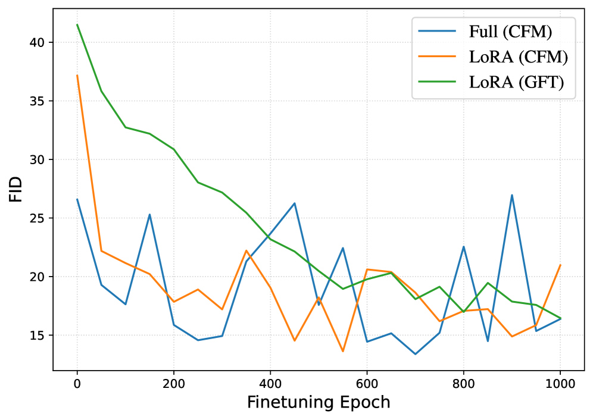
*(a)FID.*

*(a)FID.*

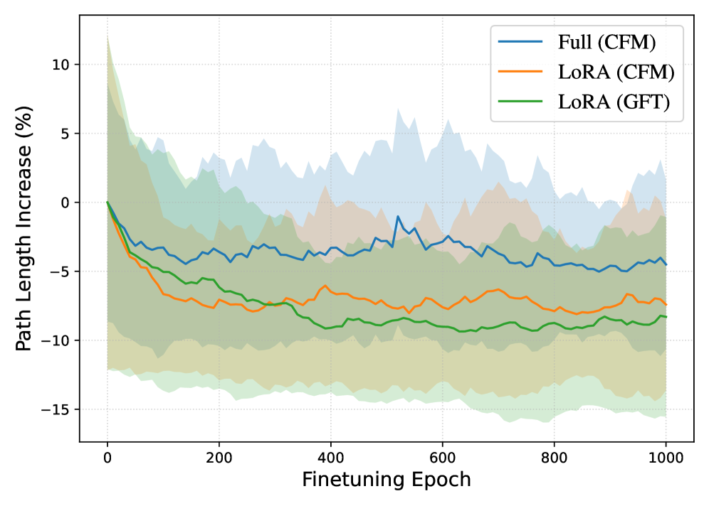
*(b)Path length.*

*(a)From scratch (CFM).*

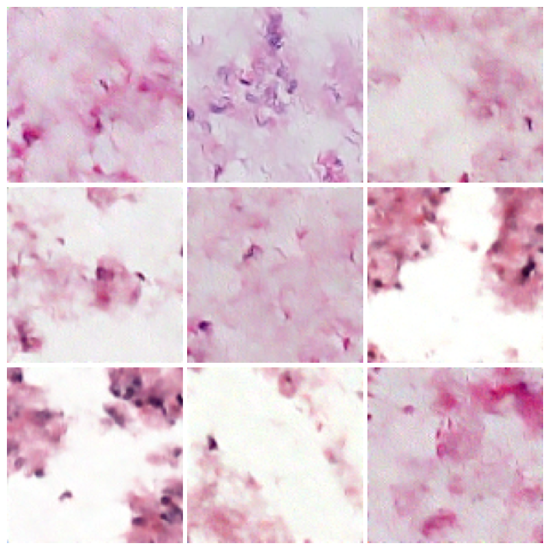
*(a)From scratch (CFM).*

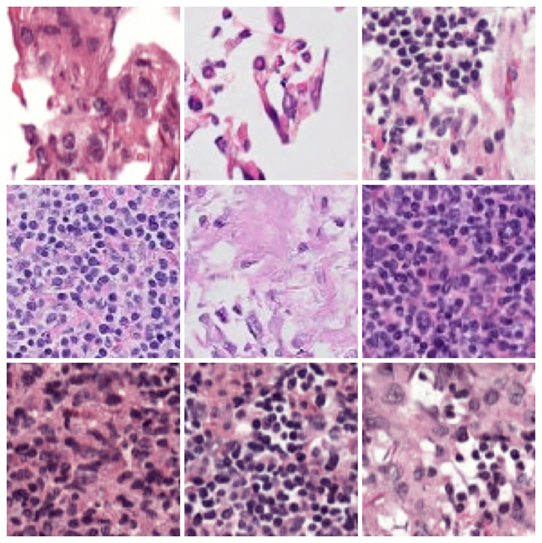
*(b)Full (CFM).*

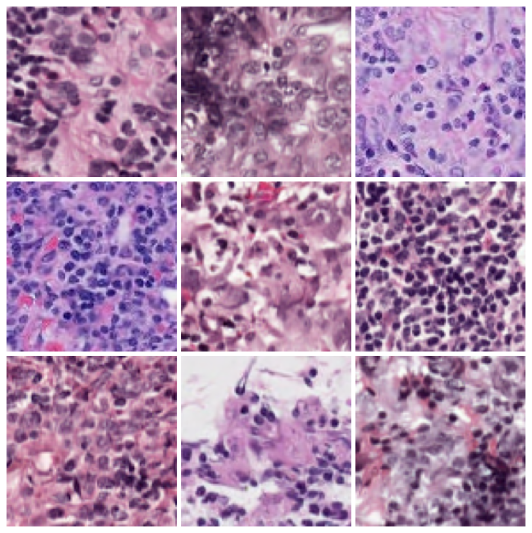
*(c)Full (GFT).*

*(d)LoRA (CFM).*

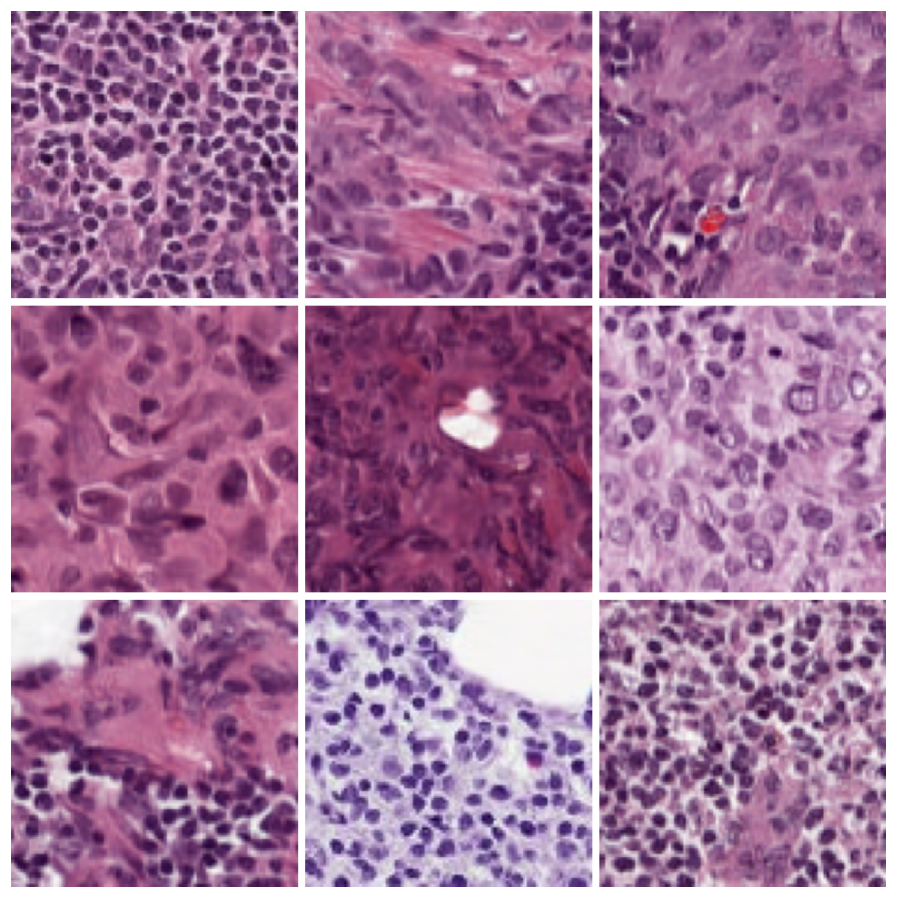
*(e)LoRA (GFT).*

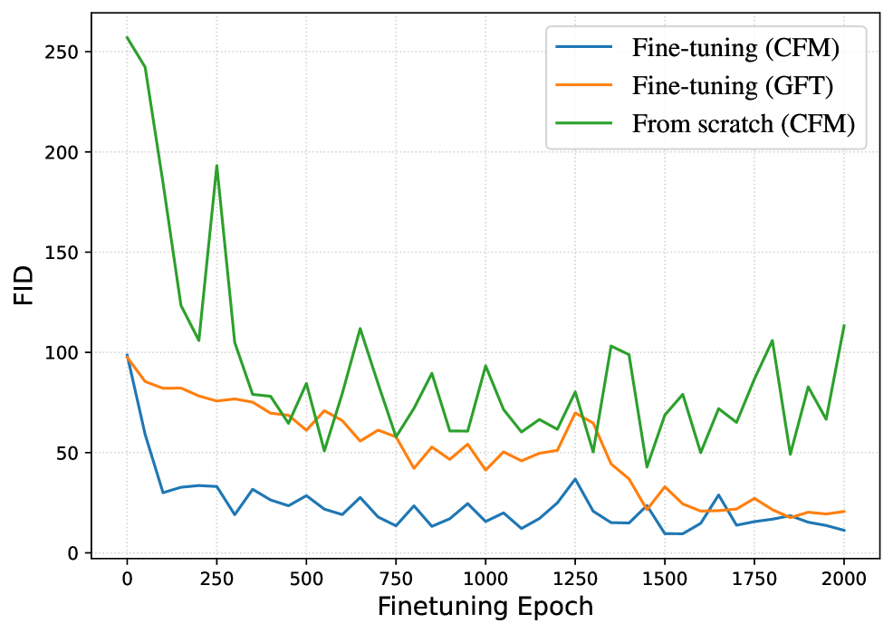
*(a)FID.*

*(a)FID.*

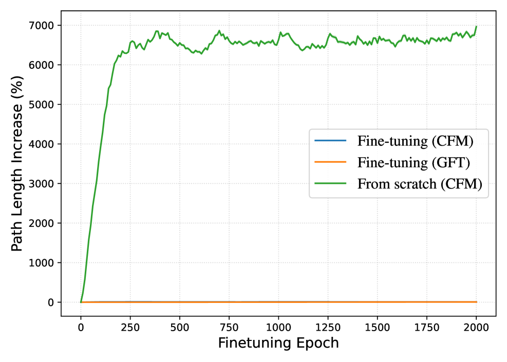
*(b)Path length.*

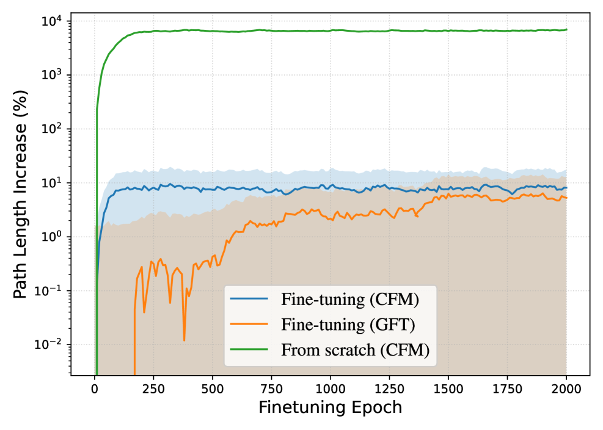
*(c)Path length (logarithmic scale).*

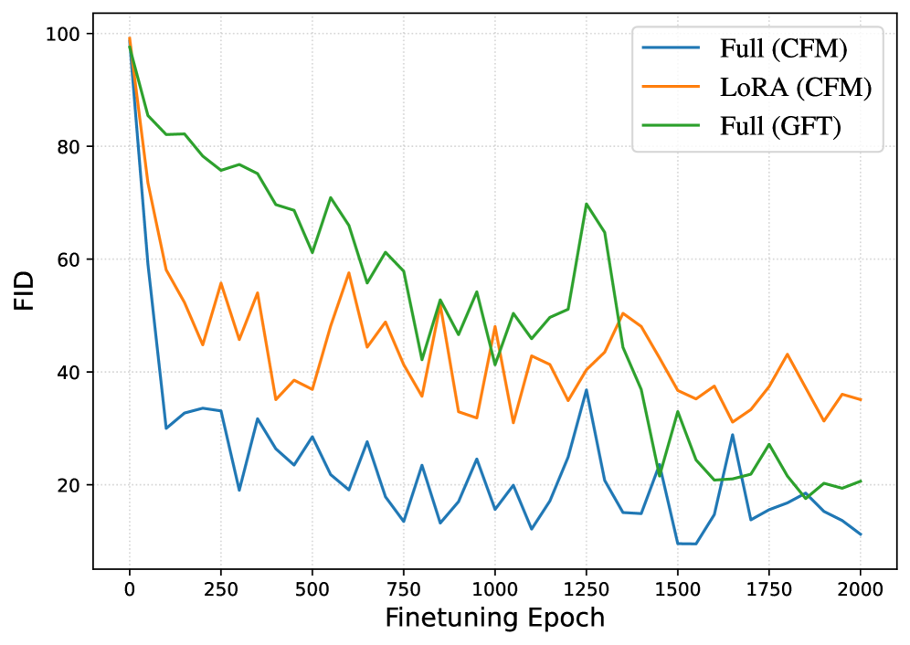
*(a)FID.*

*(a)FID.*

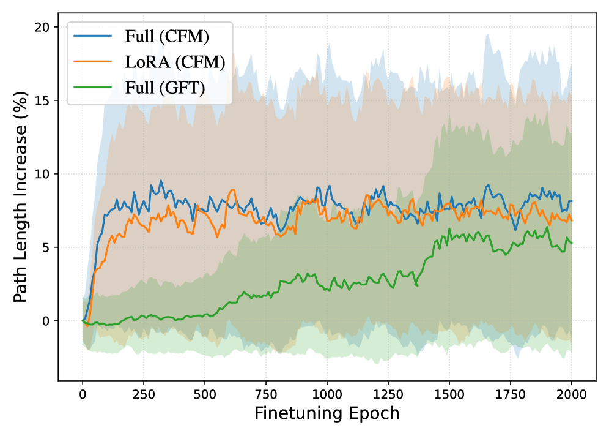
*(b)Path length.*

*(a)Path length.*

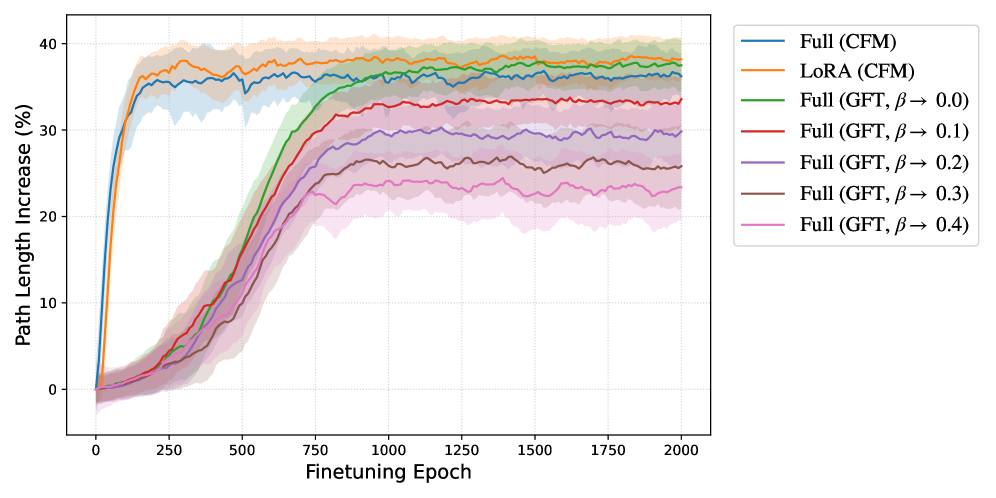
*(a)Path length.*

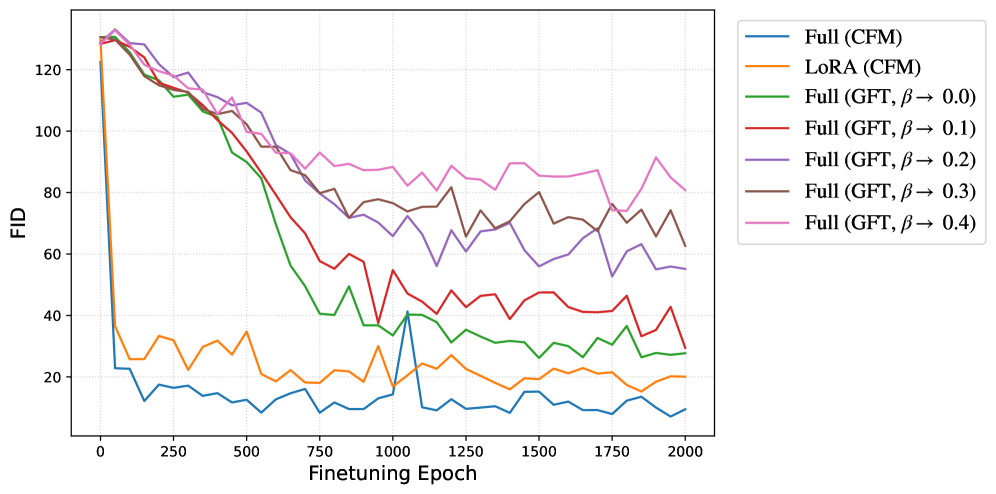
*(b)FID.*

*Figure 6: Fine-tuning performance from a pretrained Cifar-10 model to various WILDS train datasets. Rows corresponding to individual datasets, and the columns show FID and probability path lengths through 2000 epochs of fine-tuning. The shaded regions of the path length graphs correspond to one standard deviation from the mean.*

*Figure 7: Fine-tuning performance from a fully fine-tuned model to two WILDS validation datasets. Rows corresponding to individual datasets, and the columns show FID and probability path lengths through fine-tuning. The shaded region of the path length graphs show one standard deviation from the mean.*

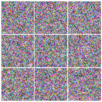
*Figure 8:Generated images at various training stages from models trained or fine-tuned on the Camelyon17 train dataset. Rows correspond to the number of training/fine-tuning steps, and columns correspond to training initialization and objective.*

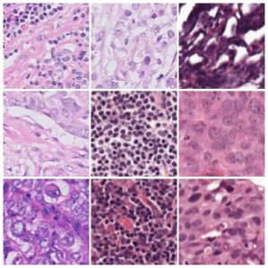
*Figure 9: Generated images after 2000 epochs of fine-tuning on three WILDS datasets, starting from a pretrained Cifar-10 model.*

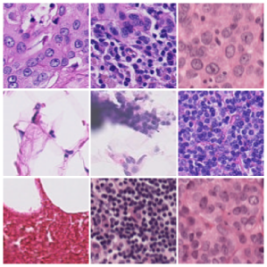
*Figure 10: Generated images after fine-tuning on the validation splits of three WILDS datasets. Fine-tuning starts from a pretrained Cifar-10 model which has been fully fine-tuned on the train set of the corresponding WILDS dataset.*

---
**Usage Info**: 3766 tokens used.
**Generated at**: 2026-02-23 20:43:33

---

# 📚 DiffuSpeech: Silent Thought, Spoken Answer via Unified Speech-Text Diffusion

🚀 URL: https://arxiv.org/html/2601.22889

## 🌏 Abstract (원문)
When humans answer complex questions verbally, we think before we speak. This internal reasoning—organizing thoughts, recalling facts, structuring arguments—precedes and shapes our spoken response. Current speech language models lack this capability. Most existing systems generate speech tokens directly from input, without explicit intermediate reasoning, producing responses that may be fluent but factually incorrect. Crucially, speech generation is irreversible: unlike text, where a user can backtrack or edit, once audio is produced, errors cannot be corrected mid-utterance. Recent advances in speech-text language models have enabled impressive conversational capabilities, yet they share two fundamental limitations. First, although some recent work explores reasoning capabilities in speech LLMs, existing systems do not expose explicit reasoning traces during generation—the model’s thought process remains opaque, preventing users from understanding or verifying how answers are derived. This stands in contrast to text LLMs, where chain-of-thought reasoning has proven highly effective. Second, current speech LLMs are exclusively autoregressive, generating tokens left-to-right without bidirectional context—a constraint particularly limiting for speech, where prosody and content are inherently entangled, and where joint modeling of reasoning and response could benefit from global dependencies. We propose a new paradigm: “Silent Thought, Spoken Answer.” The key insight is to let reasoning inform speech production—the model generates text-based reasoning traces (silent thought) that guide the spoken response. This mirrors human cognition and allows the model to leverage the strong reasoning capabilities of text LLMs while producing natural speech output. To realize this paradigm, we introduce DiffuSpeech, the first diffusion-based speech-text language model supporting both understanding and generation. Unlike autoregressive approaches that generate tokens sequentially, DiffuSpeech uses masked diffusion to jointly generate both text reasoning and speech tokens through iterative denoising. This unified formulation enables bidirectional context modeling, where thinking traces and speech tokens inform each other during generation. We leverage a unified vocabulary that represents both speech and text as discrete tokens, allowing the model to treat text and audio production as a singular, collaborative process. To further accommodate the different characteristics of each modality, we follow MMaDA to employ modality-specific masking schedules in our framework. To facilitate this training paradigm, we construct ThinkingTalk, the first speech question-answering dataset with paired text reasoning traces. ThinkingTalk contains 26K samples totaling 319 hours, where each sample includes a spoken question, internal reasoning text, and a spoken answer. The dataset enables research on “thinking while speaking”—a capability that existing speech LLMs lack. Extensive experiments show that DiffuSpeech achieves state-of-the-art speech-to-speech QA accuracy, outperforming the best baseline (Moshi) by +4.3/+3.0/+9.0 points on LlamaQ/TriviaQA/WebQ. For speech synthesis, DiffuSpeech achieves the best TTS quality among all generative models (6.2% WER on LibriSpeech-Clean). Importantly, it preserves strong language understanding, matching LLaDA on MMLU (66.2%) while gaining on TriviaQA (+4.7 points). Ablations confirm that both the diffusion architecture and thinking traces contribute to these gains.
## 🌏 Abstract (번역)
인간이 복잡한 질문에 구두로 답할 때, 우리는 말하기 전에 먼저 생각합니다. 이러한 내부 추론(생각 정리, 사실 회상, 논리 구조화)은 구두 응답에 앞서 이루어지며 이를 형성합니다. 현재의 음성 언어 모델은 이러한 능력이 부족합니다. 대부분의 기존 시스템은 명시적인 중간 추론 없이 입력에서 직접 음성 토큰을 생성하므로, 유창할 수는 있지만 사실적으로는 틀린 응답을 생성할 수 있습니다. 결정적으로, 음성 생성은 되돌릴 수 없습니다. 사용자가 역추적하거나 편집할 수 있는 텍스트와 달리, 오디오가 생성되면 발화 도중에 오류를 수정할 수 없습니다. 최근 음성-텍스트 언어 모델의 발전으로 인상적인 대화 능력이 가능해졌지만, 두 가지 근본적인 한계를 공유합니다. 첫째, 일부 최근 연구에서 음성 LLM의 추론 능력을 탐구하고 있지만, 기존 시스템은 생성 과정에서 명시적인 추론 흔적을 노출하지 않습니다. 모델의 사고 과정은 불투명하게 유지되어 사용자가 답변이 어떻게 도출되었는지 이해하거나 검증하는 것을 방해합니다. 이는 사고 사슬(chain-of-thought) 추론이 매우 효과적임이 입증된 텍스트 LLM과 대조적입니다. 둘째, 현재의 음성 LLM은 배타적으로 자기회귀적(autoregressive)이며, 양방향 문맥 없이 왼쪽에서 오른쪽으로 토큰을 생성합니다. 이는 운율과 내용이 본질적으로 얽혀 있고 추론과 응답의 공동 모델링이 전역적 의존성으로부터 이익을 얻을 수 있는 음성 분야에서 특히 제한적인 제약입니다. 우리는 "조용한 생각, 말하는 답변(Silent Thought, Spoken Answer)"이라는 새로운 패러다임을 제안합니다. 핵심 통찰은 추론이 음성 생성을 안내하도록 하는 것입니다. 모델은 구두 응답을 안내하는 텍스트 기반 추론 흔적(조용한 생각)을 생성합니다. 이는 인간의 인지 과정을 모방하며, 모델이 자연스러운 음성 출력을 생성하는 동시에 텍스트 LLM의 강력한 추론 능력을 활용할 수 있게 합니다. 이 패러다임을 실현하기 위해, 우리는 이해와 생성 모두를 지원하는 최초의 확산 기반 음성-텍스트 언어 모델인 DiffuSpeech를 소개합니다. 토큰을 순차적으로 생성하는 자기회귀 방식과 달리, DiffuSpeech는 마스킹된 확산(masked diffusion)을 사용하여 반복적인 노이즈 제거를 통해 텍스트 추론과 음성 토큰을 공동으로 생성합니다. 이 통합된 공식은 생성 중에 사고 흔적과 음성 토큰이 서로 정보를 주고받는 양방향 문맥 모델링을 가능하게 합니다. 우리는 음성과 텍스트를 모두 이산 토큰으로 표현하는 통합 어휘집을 활용하여 모델이 텍스트와 오디오 생성을 단일한 협업 프로세스로 처리할 수 있도록 합니다. 각 모달리티의 서로 다른 특성을 추가로 수용하기 위해, 우리는 MMaDA를 따라 프레임워크에서 모달리티별 마스킹 스케줄을 채택합니다. 이 훈련 패러다임을 촉진하기 위해, 우리는 쌍을 이룬 텍스트 추론 흔적이 포함된 최초의 음성 질의응답 데이터셋인 ThinkingTalk를 구축합니다. ThinkingTalk는 총 319시간 분량의 26,000개 샘플을 포함하며, 각 샘플에는 음성 질문, 내부 추론 텍스트 및 음성 답변이 포함되어 있습니다. 이 데이터셋은 기존 음성 LLM에 부족한 능력인 "말하면서 생각하기"에 대한 연구를 가능하게 합니다. 광범위한 실험 결과, DiffuSpeech는 최첨단 음성-대-음성 QA 정확도를 달성하여 LlamaQ/TriviaQA/WebQ에서 최고 베이스라인(Moshi)을 각각 +4.3/+3.0/+9.0점 차이로 능가했습니다. 음성 합성의 경우, DiffuSpeech는 모든 생성 모델 중 최고의 TTS 품질을 달성했습니다(LibriSpeech-Clean에서 6.2% WER). 중요한 점은, 강력한 언어 이해력을 유지하여 MMLU(66.2%)에서 LLaDA와 일치하는 동시에 TriviaQA(+4.7점)에서 향상된 성능을 보였다는 것입니다. 절제 연구(Ablation)를 통해 확산 아키텍처와 사고 흔적 모두가 이러한 성능 향상에 기여함을 확인했습니다.

## 🔍 Methods & Results
- 음성과 텍스트를 이산 토큰으로 표현하는 통합 어휘집(Unified Vocabulary)을 구축하고 HuBERT 인코더를 통해 음성을 토큰화함
- 자기회귀 방식 대신 마스킹된 확산 언어 모델(MDLM)을 사용하여 텍스트 추론과 음성 토큰을 공동으로 생성하는 아키텍처 제안
- 2단계 커리큘럼 학습(1단계: 음성-텍스트 정렬, 2단계: 지시 이행 및 추론 기반 생성)을 통해 모델을 훈련함
- 추론 시 신뢰도 기반 마스크 해제(Confidence-based unmasking) 전략을 사용하여 반복적인 노이즈 제거 과정을 수행함
- 최초의 추론 흔적 포함 음성 QA 데이터셋인 ThinkingTalk(26K 샘플, 319시간)를 구축하여 공개함
- 음성-대-음성 QA 성능에서 Moshi 대비 LlamaQ(+4.3), TriviaQA(+3.0), WebQ(+9.0) 등 주요 지표에서 SOTA 달성
- TTS 품질 측정에서 LibriSpeech-Clean 기준 6.2% WER을 기록하며 기존 생성 모델 중 최고 성능 기록
- MMLU 66.2%를 기록하며 강력한 언어 이해 능력을 유지함과 동시에 TriviaQA에서 4.7점의 성능 향상을 보임

## 🖼 Figures

*Figure 1:The “Silent Thought, Spoken Answer” paradigm. Given a spoken question, DiffuSpeech jointly generates internal text reasoning (silent thought) alongside the spoken response, with thinking traces informing answer quality. This enables more accurate answers compared to direct speech-to-speech generation.*

![Figure 2:Overview of DiffuSpeech architecture and training pipeline. (a) Model Architecture: Speech input is encoded by a frozen HuBERT encoder and quantized into discrete tokens, which are combined with text tokens in a unified vocabulary. The LLaDA backbone performs masked diffusion over the combined sequence, generating both text reasoning (silent thought) and speech tokens. Speech output is synthesized by a frozen HiFi-GAN vocoder. (b) Two-Stage Training: Stage 1 performs speech-text alignment using ASR/TTS data from LibriHeavy, VoxPopuli, and CommonVoice, along with text LM data to prevent forgetting. Stage 2 fine-tunes on the ThinkingTalk dataset for instruction following with thinking traces, enabling the “Silent Thought, Spoken Answer” capability.](../images/2026-02-02/2601.22889/2601.22889_fig1.png)
*Figure 2:Overview of DiffuSpeech architecture and training pipeline. (a) Model Architecture: Speech input is encoded by a frozen HuBERT encoder and quantized into discrete tokens, which are combined with text tokens in a unified vocabulary. The LLaDA backbone performs masked diffusion over the combined sequence, generating both text reasoning (silent thought) and speech tokens. Speech output is synthesized by a frozen HiFi-GAN vocoder. (b) Two-Stage Training: Stage 1 performs speech-text alignment using ASR/TTS data from LibriHeavy, VoxPopuli, and CommonVoice, along with text LM data to prevent forgetting. Stage 2 fine-tunes on the ThinkingTalk dataset for instruction following with thinking traces, enabling the “Silent Thought, Spoken Answer” capability.*

*Figure 3:Construction pipeline for the ThinkingTalk dataset. We rewrite existing text QA datasets into an oral style with explicit thinking traces, filter for speech suitability using an LLM judge, and synthesize high-quality audio for both user questions and assistant responses.*

![Figure 4:Capability comparison across six dimensions, including speech reasoning (MMSU). DiffuSpeech achieves well-rounded performance, excelling in Speech QA while maintaining strong language understanding and competitive speech reasoning. Values are normalized to [0, 100] with higher being better (WER metrics are inverted).](../images/2026-02-02/2601.22889/2601.22889_fig3.png)
*Figure 4:Capability comparison across six dimensions, including speech reasoning (MMSU). DiffuSpeech achieves well-rounded performance, excelling in Speech QA while maintaining strong language understanding and competitive speech reasoning. Values are normalized to [0, 100] with higher being better (WER metrics are inverted).*

*Figure 5:Training dynamics of AR vs. Diffusion for speech adaptation. (a) ASR and (b) TTS on LibriSpeech-Clean. While AR (blue) shows faster initial learning, Diffusion (red) surpasses AR mid-training and achieves lower final WER, demonstrating better speech adaptation potential.*

---
**Usage Info**: 6230 tokens used.
**Generated at**: 2026-02-23 20:44:12

---

# 📚 Beyond Fixed Frames: Dynamic Character-Aligned Speech Tokenization

🚀 URL: https://arxiv.org/html/2601.23174

## 🌏 Abstract (원문)
In the past few years, tokenization has emerged as a key building block in multimodal LLMs, enabling joint autoregressive modeling across modalities(Grattafioriet al.,2024; Jianget al.,2024a; Comaniciet al.,2025; Singhet al.,2025; DeepSeek-AIet al.,2025). By representing diverse modalities as sequences of discrete tokens, these models can operate over text, images, and audio within a shared modeling framework. For speech, tokenization is typically achieved throughneural audio codecs, which map continuous waveforms to discrete tokens. Such representations have driven recent progress in generative speech and audio modeling(Borsoset al.,2023; Chenet al.,2025; Nguyenet al.,2025; Défossezet al.,2024; Labiausseet al.,2025; Zeghidouret al.,2025), enabling LLMs to operate directly on speech. Originally developed for efficient transmission(Zeghidouret al.,2021; Défossezet al.,2023), modern codecs now produce compact yet powerful representations that support high-quality resynthesis as well as competitive performance in both discriminative and generative downstream tasks(Mousaviet al.,2025; Guoet al.,2025). Despite their success, most existing speech tokenizers rely on frame-level representations at afixed frame rate, producing tokens at a constant temporal resolution. While effective for reconstruction, this design is poorly matched to the inherently variable temporal structure of speech: silence and steady regions are information-poor, whereas rapidly changing segments are information-dense(Van Kuyket al.,2017; Dielemanet al.,2021; Cuervoet al.,2022). As a result, fixed-frame-rate tokenization leads to inefficient sequence lengths and limited alignment with corresponding text, making generative modeling more challenging. Althoughdynamic-frame-ratecodecs andtext-supervised alignmentmethods have recently emerged, this area is still developing. Existing approaches often rely on heuristic frame merging or clustering strategies that are weakly grounded in linguistic structure(Wanget al.,2025a; Zhanget al.,2025; Zhenget al.,2026; Liet al.,2025b), or require transcriptions or alignment information at inference time(Tsenget al.,2025; Hsuet al.,2025), limiting flexibility in fully speech-based scenarios. In this work, we introduceDyCAST, aDynamicCharacter-AlignedSpeechTokenization framework that enables variable-frame-rate coding throughsoft character-level alignment. Each speech token is approximately associated with a character in the underlying transcript, with the degree of alignment controlled by a learnedboundary predictor. At inference time, this alignment can be adjusted dynamically, allowing a flexible trade-off between strict character alignment and longer token spans. As a result, DyCAST can operate either with ground-truth alignments when available (e.g. for text-to-speech) or in a fully alignment-free mode based on the learned soft alignment alone. Additionally, DyCAST provides explicit control over token durations during decoding via aduration predictorthat learns to invert the pooling operation, predicting appropriate token durations from the context. Because character-level representations naturally result in very low frame rates, achieving high-quality resynthesis becomes more challenging. To address this limitation, we further introduceretrieval-augmented decodingas an auxiliary mechanism to improve reconstruction quality by leveraging side information, without increasing bitrate. In summary, our contributions are as follows: We propose DyCAST, a novel framework forcontrollable,character-aligned,variable-frame-ratespeech tokenization through soft character-level alignment and explicit duration modeling. We introduceretrieval-augmented decodingas an auxiliary mechanism to enhance speech resynthesis quality by leveraging side information at inference time. We empirically showcompetitive performanceon speech resynthesis and a range of other downstream tasks, while using significantlyfewer tokenscompared to fixed-frame-rate baselines. Code and checkpoints will be released publicly athttps://github.com/lucadellalib/dycast.
## 🌏 Abstract (번역)
지난 몇 년 동안 토큰화는 멀티모달 LLM의 핵심 구성 요소로 부상하여 양식 간의 공동 자기회귀 모델링을 가능하게 했습니다. 다양한 양식을 이산 토큰 시퀀스로 표현함으로써 이러한 모델은 공유된 모델링 프레임워크 내에서 텍스트, 이미지 및 오디오를 처리할 수 있습니다. 음성의 경우, 토큰화는 일반적으로 연속 파형을 이산 토큰으로 매핑하는 신경 오디오 코덱을 통해 이루어집니다. 이러한 표현은 생성형 음성 및 오디오 모델링의 최근 발전을 이끌어 LLM이 음성에서 직접 작동할 수 있도록 했습니다. 원래 효율적인 전송을 위해 개발된 현대적 코덱은 이제 고품질 재합성뿐만 아니라 판별 및 생성 다운스트림 작업 모두에서 경쟁력 있는 성능을 지원하는 작지만 강력한 표현을 생성합니다. 이러한 성공에도 불구하고 대부분의 기존 음성 토크나이저는 고정된 프레임 속도의 프레임 수준 표현에 의존하여 일정한 시간 해상도로 토큰을 생성합니다. 재구성에는 효과적이지만, 이 설계는 음성의 본질적으로 가변적인 시간 구조와 잘 맞지 않습니다. 무음 및 안정적인 영역은 정보가 부족한 반면, 급격히 변화하는 세그먼트는 정보가 밀집되어 있기 때문입니다. 결과적으로 고정 프레임 속도 토큰화는 비효율적인 시퀀스 길이를 초래하고 해당 텍스트와의 정렬을 제한하여 생성 모델링을 더 어렵게 만듭니다. 최근 동적 프레임 속도 코덱과 텍스트 감독 정렬 방법이 등장했지만, 이 분야는 여전히 발전 중입니다. 기존 접근 방식은 언어 구조에 근거가 약한 휴리스틱 프레임 병합 또는 클러스터링 전략에 의존하거나, 추론 시 전사 또는 정렬 정보가 필요하여 완전한 음성 기반 시나리오에서의 유연성을 제한합니다. 본 연구에서는 소프트 문자 수준 정렬을 통해 가변 프레임 속도 코딩을 가능하게 하는 동적 문자 정렬 음성 토큰화 프레임워크인 DyCAST를 소개합니다. 각 음성 토큰은 학습된 경계 예측기에 의해 제어되는 정렬 정도와 함께 기본 전사본의 문자와 대략적으로 연관됩니다. 추론 시 이 정렬은 동적으로 조정될 수 있어 엄격한 문자 정렬과 더 긴 토큰 범위 사이의 유연한 절충이 가능합니다. 결과적으로 DyCAST는 사용 가능할 때 실측 정렬(예: 텍스트 음성 변환)을 사용하거나 학습된 소프트 정렬만을 기반으로 하는 완전한 정렬 없는 모드에서 작동할 수 있습니다. 또한 DyCAST는 풀링 연산을 반전시키는 방법을 학습하여 문맥으로부터 적절한 토큰 지속 시간을 예측하는 지속 시간 예측기를 통해 디코딩 중 토큰 지속 시간에 대한 명시적인 제어를 제공합니다. 문자 수준 표현은 자연스럽게 매우 낮은 프레임 속도를 초래하므로 고품질 재합성을 달성하는 것이 더 어려워집니다. 이러한 한계를 해결하기 위해, 비트 전송률을 높이지 않고 부가 정보를 활용하여 재구성 품질을 향상시키는 보조 메커니즘으로 검색 증강 디코딩을 추가로 도입합니다. 요약하자면, 본 연구의 기여는 다음과 같습니다. 첫째, 소프트 문자 수준 정렬 및 명시적 지속 시간 모델링을 통해 제어 가능하고 문자 정렬된 가변 프레임 속도 음성 토큰화를 위한 새로운 프레임워크인 DyCAST를 제안합니다. 둘째, 추론 시 부가 정보를 활용하여 음성 재합성 품질을 향상시키는 보조 메커니즘으로 검색 증강 디코딩을 도입합니다. 셋째, 고정 프레임 속도 베이스라인에 비해 훨씬 적은 토큰을 사용하면서도 음성 재합성 및 다양한 다운스트림 작업에서 경쟁력 있는 성능을 보임을 실증적으로 입증합니다.

## 🔍 Methods & Results
- 소프트 문자 수준 정렬(soft character-level alignment)과 학습된 경계 예측기(boundary predictor)를 사용하여 음성 토큰을 텍스트 문자와 연관시키는 DyCAST 프레임워크 제안
- 추론 시 정렬 정도를 동적으로 조정할 수 있어 엄격한 문자 정렬과 긴 토큰 범위 간의 유연한 선택 가능
- 지속 시간 예측기(duration predictor)를 도입하여 디코딩 과정에서 토큰의 길이를 명시적으로 제어
- 매우 낮은 프레임 속도에서 발생하는 재합성 품질 저하를 해결하기 위해 비트레이트 증가 없이 부가 정보를 활용하는 검색 증강 디코딩(retrieval-augmented decoding) 적용
- 고정 프레임 속도 방식 대비 훨씬 적은 수의 토큰을 사용함에도 불구하고 음성 재합성 및 다양한 다운스트림 태스크에서 경쟁력 있는 성능 달성

## 🖼 Figures

*Figure 1:DyCAST architecture. Frame-level representations extracted by a frozen, self-supervised encoder are compressed and dynamically grouped into variable-length chunks, pooled, and quantized into discrete tokens. The decoding stage reverses this process by expanding token-level representations back to frame-level features before waveform reconstruction. Character-level boundaries are provided during training by a frozen aligner.*

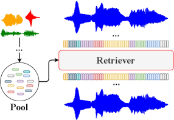
*Figure 2:Retrieval-augmented decoding (RAD). Discrete latents are refined via similarity search against a pool of continuous latents prior to waveform reconstruction.*

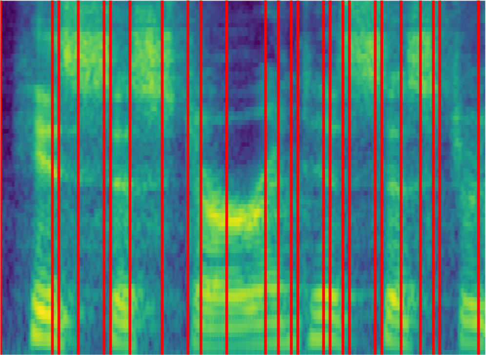
*Figure 3:DyCAST chunk boundaries at average frame rates of approximately 14 Hz, 17 Hz, 9 Hz, and 6 Hz (from left to right).*

*Figure 4*

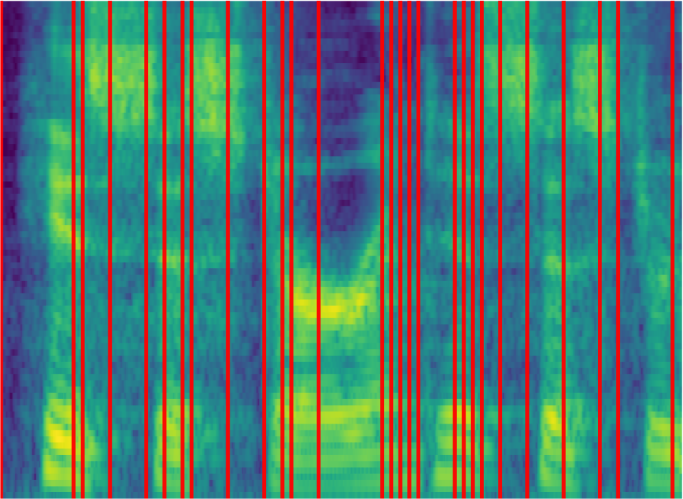
*Figure 5*

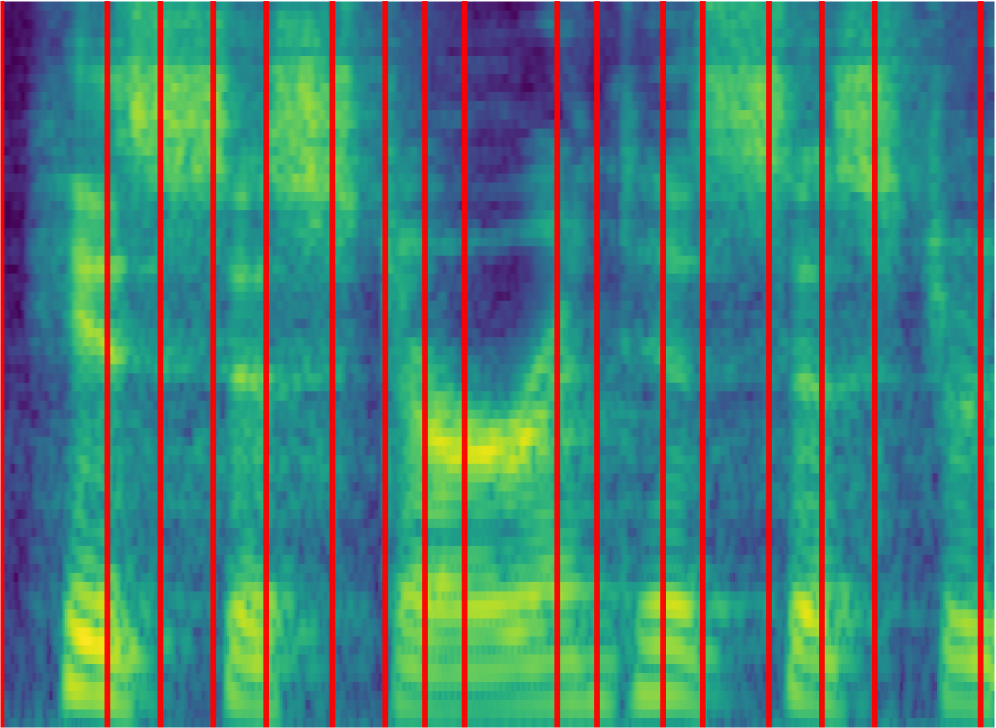
*Figure 6*

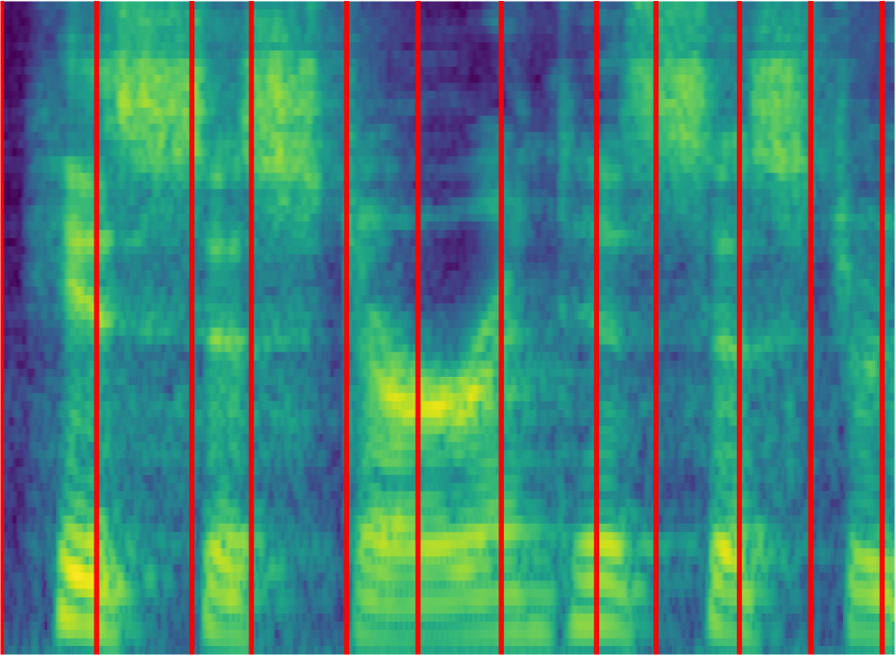
*Figure 7*

---
**Usage Info**: 4502 tokens used.
**Generated at**: 2026-02-23 20:44:50

---

# 📚 RASST: Fast Cross-modal Retrieval-Augmented Simultaneous Speech Translation

🚀 URL: https://arxiv.org/html/2601.22777

## 🌏 Abstract (원문)
Simultaneous Speech Translation (SST) aims to generate translations incrementally as partial speech input is received. It has wide applications in international conferences and cross-lingual conversations(Ma et al.,2020b; Ren et al.,2020). Recently, Large Language Models (LLMs) have shown strong potential as backbones for SST systems(Wang et al.,2025; Ouyang et al.,2025b; Fu et al.,2025; Cheng et al.,2025). However, existing SST systems struggle to accurately translate domain-specific terminologies, including technical jargon, person and location names, and abbreviations. As shown in Table1, the terminology "masked language model" is incorrectly translated to "大规模语言模型", meaning "massive language models", potentially due to recognition error. Human simultaneous interpreters often rely on external glossaries to translate specialized terminology in real time(Jiang,2013), and retrieval augmentation has been widely explored in machine translation (MT) to improve terminology handling(Khandelwal et al.,2021; Jiang et al.,2021; Meng et al.,2022; Zhu et al.,2023; Li et al.,2025). Nevertheless, retrieval-augmented SST remains underexplored and introduces unique challenges(Cheng et al.,2024). First, retrieval must bridge different modalities, matching speech input to entries in a text glossary. Second, retrieval must be both fast and accurate under streaming constraints. Third, since translation typically lags behind the source speech, the model must decide not only whether to use retrieved terms, but also when to apply them during incremental generation. To address these challenges, we propose Retrieval-Augmented Simultaneous Speech Translation (RASST), an effective approach for cross-modal glossary retrieval from streaming speech and terminology-aware incremental translation. RASST trains a lightweight cross-modal speech-text retriever over short audio contexts using a contrastive loss. To keep inference efficient, we perform sliding-window retrieval that maintains high recall while adding minimal runtime cost. We further synthesize training data that teaches the Speech LLM to select relevant retrieved terms and decide when to introduce them during generation, conditioned on the prior speech context and previously generated translation. Experiments on the ACL 60/60 dev set show that RASST improves BLEU by up to 3 points on three language directions (En→Zh/De/Ja) and increases terminology translation accuracy by up to 16%, while adding at most 16% computational overhead.
## 🌏 Abstract (번역)
동시 통역(SST)은 부분적인 음성 입력이 수신됨에 따라 번역을 점진적으로 생성하는 것을 목표로 합니다. 이는 국제 회의 및 교차 언어 대화에서 널리 응용됩니다. 최근 대규모 언어 모델(LLM)은 SST 시스템의 중추로서 강력한 잠재력을 보여주었습니다. 그러나 기존 SST 시스템은 기술 용어, 인명 및 지명, 약어를 포함한 도메인별 전문 용어를 정확하게 번역하는 데 어려움을 겪고 있습니다. 표 1에서 볼 수 있듯이, "masked language model"이라는 용어는 인식 오류로 인해 "대규모 언어 모델"을 의미하는 "大规模语言模型"으로 잘못 번역되었습니다. 인간 동시 통역사는 실시간으로 전문 용어를 번역하기 위해 외부 용어집에 의존하는 경우가 많으며, 기계 번역(MT)에서는 용어 처리 능력을 향상시키기 위해 검색 증강(retrieval augmentation)이 널리 탐구되었습니다. 그럼에도 불구하고 검색 증강 SST는 아직 충분히 연구되지 않았으며 독특한 과제를 안고 있습니다. 첫째, 검색은 음성 입력을 텍스트 용어집의 항목과 일치시켜 서로 다른 모달리티를 연결해야 합니다. 둘째, 스트리밍 제약 조건 하에서 검색은 빠르고 정확해야 합니다. 셋째, 번역은 일반적으로 소스 음성보다 뒤처지기 때문에 모델은 검색된 용어를 사용할지 여부뿐만 아니라 점진적 생성 중에 언제 적용할지도 결정해야 합니다. 이러한 과제를 해결하기 위해 우리는 스트리밍 음성에서의 교차 모달 용어집 검색과 용어 인식 점진적 번역을 위한 효과적인 접근 방식인 RASST(Retrieval-Augmented Simultaneous Speech Translation)를 제안합니다. RASST는 대조 손실을 사용하여 짧은 오디오 컨텍스트에 대해 경량 교차 모달 음성-텍스트 리트리버를 학습시킵니다. 추론 효율성을 유지하기 위해 최소한의 런타임 비용을 추가하면서 높은 재현율을 유지하는 슬라이딩 윈도우 검색을 수행합니다. 또한, 이전 음성 컨텍스트와 이전에 생성된 번역을 조건으로 하여 Speech LLM이 관련 검색 용어를 선택하고 생성 중에 언제 도입할지 결정하도록 가르치는 학습 데이터를 합성합니다. ACL 60/60 개발 세트에 대한 실험 결과, RASST는 세 가지 언어 방향(En→Zh/De/Ja)에서 BLEU를 최대 3점 향상시키고 용어 번역 정확도를 최대 16% 높이는 동시에 계산 오버헤드를 최대 16%만 추가하는 것으로 나타났습니다.

## 🔍 Methods & Results
- 스트리밍 음성에서의 교차 모달 용어집 검색과 용어 인식 점진적 번역을 위한 RASST(Retrieval-Augmented Simultaneous Speech Translation) 프레임워크 제안
- 대조 손실(Contrastive Loss)을 활용하여 짧은 오디오 컨텍스트에 대해 학습된 경량 교차 모달 음성-텍스트 리트리버 구축
- 추론 시 효율성을 위해 높은 재현율과 낮은 런타임 비용을 보장하는 슬라이딩 윈도우(Sliding-window) 검색 방식 적용
- Speech LLM이 검색된 용어 중 관련 있는 것을 선택하고 생성 시점의 적절성을 판단할 수 있도록 학습 데이터 합성
- ACL 60/60 개발 세트 실험 결과, En→Zh/De/Ja 세 방향에서 BLEU 점수 최대 3점 향상
- 전문 용어 번역 정확도를 최대 16% 향상시키면서도 계산 오버헤드는 최대 16% 이내로 유지

## 🖼 Figures

*Figure 1:RASST architecture. The retriever retrieves a set of glossary terms 
𝐺
^
𝑖
 for each speech chunk 
𝑠
𝑖
. Conditioned on the streaming speech features 
𝑓
𝑖
, the retrieved terms 
𝐺
^
𝑖
, and the previously generated translations 
𝑦
^
<
𝑖
, the LLM generates the next partial translation 
𝑦
^
𝑖
.*

![Figure 2:Retriever inference procedure. We encode each glossary term 
𝑒
𝑖
 into a feature vector 
𝑓
𝑖
𝑒
 and build a FAISS index. At inference time, we slide an speech window of length 
𝑊
 with stride 
𝛿
 (where 
𝛿
<
𝑙
, the speech-chunk size) over the incoming speech chunks. For each window, we compute its speech feature and retrieve the Top-
𝐾
1
 nearest glossary terms by cosine similarity. We then aggregate the candidates from all windows within the newly arrived chunk and keep the Top-
𝐾
2
 terms with highest cosine similarities.](../images/2026-02-02/2601.22777/2601.22777_fig1.png)
*Figure 2:Retriever inference procedure. We encode each glossary term 
𝑒
𝑖
 into a feature vector 
𝑓
𝑖
𝑒
 and build a FAISS index. At inference time, we slide an speech window of length 
𝑊
 with stride 
𝛿
 (where 
𝛿
<
𝑙
, the speech-chunk size) over the incoming speech chunks. For each window, we compute its speech feature and retrieve the Top-
𝐾
1
 nearest glossary terms by cosine similarity. We then aggregate the candidates from all windows within the newly arrived chunk and keep the Top-
𝐾
2
 terms with highest cosine similarities.*

*Figure 3:Main results using the tagged glossary. Comparison of Terminology Accuracy (top) and BLEU score (bottom) against latency (StreamLAAL) for En-Zh, En-De, and En-Ja. RASST (red) consistently surpasses the InfiniSST baseline (blue) in both terminology recall and general translation quality across all languages.*

*Figure 4:Main results using the paper-extracted glossary. Comparison of Terminology Accuracy (top) and BLEU score (bottom) against latency (StreamLAAL) for En-Zh and En-De. RASST (red) significantly outperforms the InfiniSST baseline (blue) across all latency regimes, especially in terminology translation accuracy.*

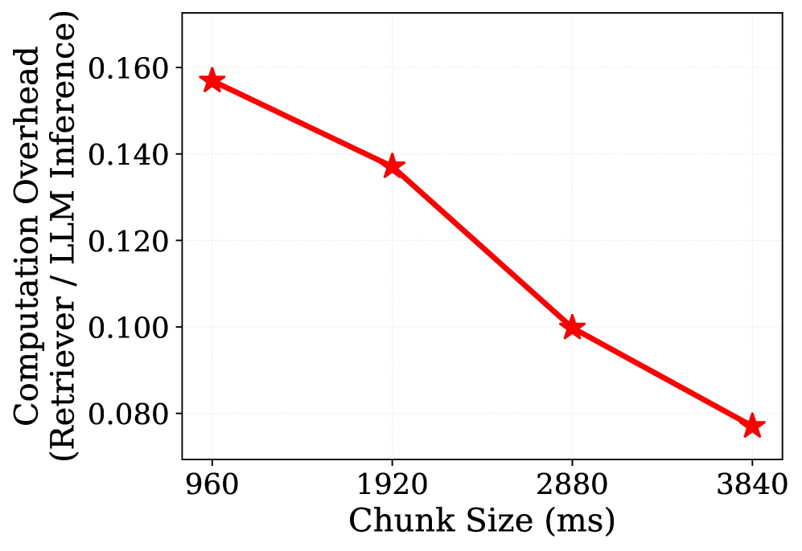
*Figure 5:The computation overhead of RASST.*

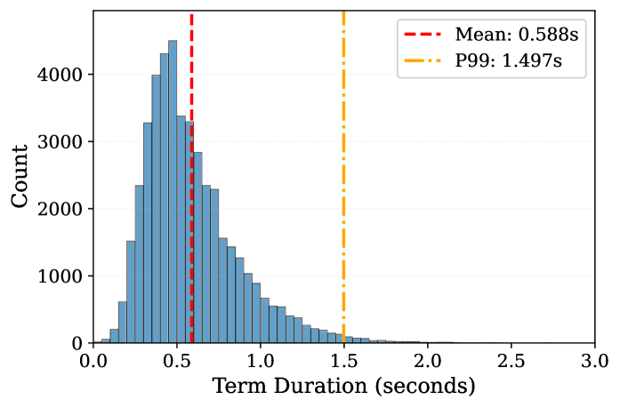
*Figure 6:The distribution of term duration on GigaSpeech training set.*

---
**Usage Info**: 6421 tokens used.
**Generated at**: 2026-02-23 20:45:47

---

# 📚 VocBulwark: Towards Practical Generative Speech Watermarking via Additional-Parameter Injection

🚀 URL: https://arxiv.org/html/2601.22556

## 🌏 Abstract (원문)
Speech synthesis has been propelled by Generative Adversarial Networks (GANs) and Diffusion Models, achieving fidelity near indistinguishable from human speech. However, this realism empowers adversaries to exploit deepfakes for fraud and disinformation, prompting regulators worldwide to enact stringent mandates on traceability. As vocoders serve as the unified waveform generator across heterogeneous pipelines (e.g., Text-to-Speech (TTS) and Large Audio Language Models), watermarking this pivotal stage offers a universally effective solution for regulating speech synthesis. Speech watermarking methods have evolved from traditional frequency-domain embedding to deep learning-based Encoder-Noise-Decoder (END) frameworks targeting content protection. However, these post-hoc approaches remain limited to content tracking, failing to authenticate the generative source and safeguard model intellectual property (IP). To bridge this gap, generative watermarking has emerged to safeguard model IP by coupling watermarks with the generation process. Existing watermarking strategies fall into three categories: Weight Embedding, Model Fine-tuning, and Input Modification. However, these paradigms fail to reconcile fidelity and robustness. To overcome these limitations, we propose VocBulwark, an innovative additional-parameter injection watermarking method that establishes a reliable regulatory mechanism for heterogeneous generative model architectures. We design the Temporal Adapter, a lightweight module that leverages Acoustic Feature Alignment and Frame-level Temporal Broadcasting to intimately integrate the watermark with intrinsic acoustic attributes while keeping native parameters frozen. In coordination with this, our Coarse-to-Fine Gated Extractor utilizes Multi-scale Feature Aggregation and Dual-path Pooling to capture subtle watermarking artifacts for robust recovery. In addition, we devise an Accuracy-Guided Optimization Curriculum that adaptively adjusts the learning trajectory to harmonize extraction with generation fidelity. Comprehensive experiments demonstrate that our method yields high-quality watermarked speech while exhibiting superior robustness against variable-length attacks and neural Codec regeneration attacks.
## 🌏 Abstract (번역)
음성 합성은 생성적 적대 신경망(GAN)과 확산 모델(Diffusion Models)을 통해 인간의 음성과 거의 구별할 수 없는 수준의 충실도를 달성했습니다. 그러나 이러한 사실성은 공격자들이 딥페이크를 사기 및 허위 정보 유포에 악용할 수 있게 했으며, 이에 따라 전 세계 규제 기관들은 추적 가능성에 대한 엄격한 법적 명령을 제정하고 있습니다. 보코더는 텍스트 음성 변환(TTS) 및 대규모 오디오 언어 모델과 같은 다양한 파이프라인에서 통합된 파형 생성기 역할을 하므로, 이 핵심 단계에 워터마크를 삽입하는 것은 음성 합성을 규제하기 위한 보편적으로 효과적인 해결책이 됩니다. 음성 워터마킹 기술은 전통적인 주파수 영역 삽입 방식에서 콘텐츠 보호를 목표로 하는 딥러닝 기반의 인코더-노이즈-디코더(END) 프레임워크로 발전해 왔습니다. 하지만 이러한 사후(post-hoc) 접근 방식은 콘텐츠 추적에만 국한되어 생성 소스를 인증하거나 모델의 지적 재산(IP)을 보호하는 데 한계가 있습니다. 이를 해결하기 위해 워터마크를 생성 과정과 결합하여 모델 IP를 보호하는 생성적 워터마킹이 등장했습니다. 기존의 워터마킹 전략은 가중치 임베딩, 모델 미세 조정, 입력 수정의 세 가지 범주로 나뉘지만, 이러한 방식들은 충실도와 강건성 사이의 균형을 맞추는 데 실패했습니다. 본 논문에서는 이러한 한계를 극복하기 위해 이기종 생성 모델 아키텍처를 위한 신뢰할 수 있는 규제 메커니즘을 구축하는 혁신적인 추가 파라미터 주입 워터마킹 방법인 VocBulwark를 제안합니다. 우리는 고정된 기본 파라미터를 유지하면서 워터마크를 고유한 음향 속성과 밀접하게 통합하는 가벼운 모듈인 Temporal Adapter를 설계하여, 높은 충실도를 보장하는 동시에 가변 길이 공격에 대한 동기화 의존성을 완화했습니다. 이와 함께, Coarse-to-Fine Gated Extractor는 다중 스케일 특징 집계 및 이중 경로 풀링을 활용하여 견고한 복구를 위해 미세한 워터마킹 아티팩트를 캡처합니다. 또한, 추출 정확도와 생성 충실도를 조화시키기 위해 학습 궤적을 적응적으로 조정하는 정확도 유도 최적화 커리큘럼을 고안했습니다. 종합적인 실험을 통해 본 방법이 고품질의 워터마크 음성을 생성하는 동시에 가변 길이 공격 및 신경망 코덱 재생성 공격에 대해 우수한 강건성을 보임을 입증했습니다.

## 🔍 Methods & Results
- Temporal Adapter (TA): 고정된 생성 모델 백본에 가벼운 모듈을 주입하여 음향 특징 정렬 및 프레임 레벨 브로드캐스팅을 통해 시간 불변적인 워터마크 삽입을 구현함.
- Coarse-to-Fine Gated Extractor (Cage): 게이트형 분리 합성곱(GSCM)과 다중 스케일 특징 집계를 통해 다양한 왜곡 환경에서도 미세한 워터마크 신호를 정밀하게 추출함.
- Accuracy-Guided Optimization Curriculum: 실시간 추출 정확도에 따라 지각적 손실 가중치를 조절하여 워터마크 복구 성능과 음성 품질 사이의 상충 관계를 최적화함.
- 강건성 실험: 제안된 모델은 시간 스트레칭, 크롭핑 등 가변 길이 공격과 EnCodec과 같은 신경망 코덱 재생성 공격에 대해 기존 방식보다 우수한 복구 성능을 보임.
- 음질 평가: 추가 파라미터 주입 방식을 통해 모델의 원래 성능을 저해하지 않으면서도 높은 오디오 충실도(Fidelity)를 유지함.

## 🖼 Figures

*Figure 1:Schematic comparison of generative watermarking paradigms and robustness evaluation. The left panel contrasts our VocBulwark (an Additional-Parameter Injection strategy) against prevalent baselines, including Weight Embedding, Model Fine-tuning, and Input Modification. The right panel visualizes the comparative robustness of these strategies across diverse attack scenarios.*

![Figure 2:The overall framework of VocBulwark. The Temporal Adapter functions as a lightweight module that seamlessly entangles watermarks into acoustic attributes without disrupting the native generation process. Following the Attack Simulator, the Cage achieves precise watermark recovery via a coarse-to-fine feature aggregation mechanism. The Accuracy-Guided Optimization Curriculum is employed to adaptively modulate the trainable components, optimizing the trade-off between generation fidelity and extraction accuracy.](../images/2026-02-02/2601.22556/2601.22556_fig1.png)
*Figure 2:The overall framework of VocBulwark. The Temporal Adapter functions as a lightweight module that seamlessly entangles watermarks into acoustic attributes without disrupting the native generation process. Following the Attack Simulator, the Cage achieves precise watermark recovery via a coarse-to-fine feature aggregation mechanism. The Accuracy-Guided Optimization Curriculum is employed to adaptively modulate the trainable components, optimizing the trade-off between generation fidelity and extraction accuracy.*

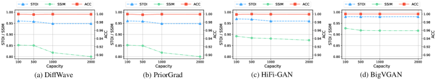
*Figure 3:Scalability Analysis Under Varying Watermark Capacities on LJSpeech Dataset.*

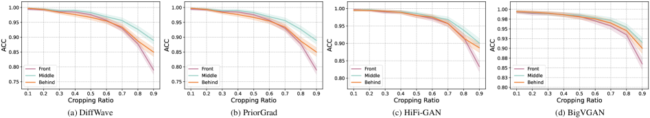
*Figure 4:Robustness against cropping attacks across diverse ratios and positions.*

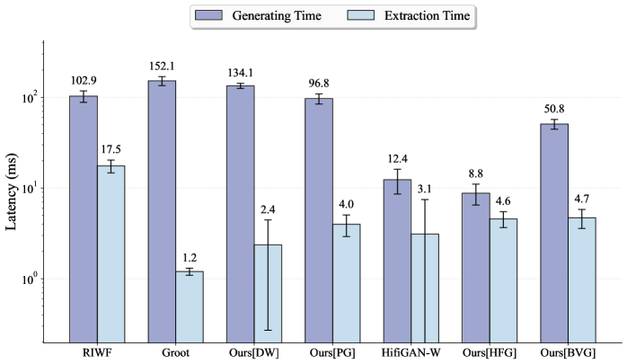
*Figure 5:Comparison of Computational Efficiency in Generating and Extraction Time.*

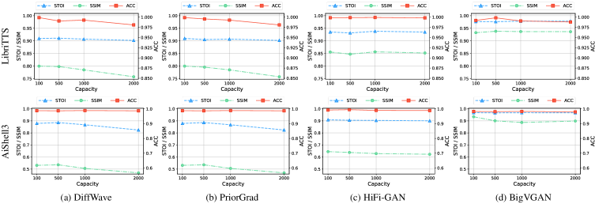
*Figure 6:Scalability Analysis Under Varying Watermark Capacities on Out-of-Distribution LibriTTS and AiShell3 Dataset.*

*Figure 7:Qualitative visualization of Fidelity on Diffusion Models. The top row displays the waveform and Mel-spectrogram of the original speech. The subsequent rows present the waveforms, Mel-spectrograms, and residual maps of watermarked speech generated by various watermarking methods on Diffusion Models.*

*Figure 8:Qualitative visualization of Fidelity on GANs. The top row displays the waveform and Mel-spectrogram of the original speech. The subsequent rows present the waveforms, Mel-spectrograms, and residual maps of watermarked speech generated by various watermarking methods on GANs.*

---
**Usage Info**: 6233 tokens used.
**Generated at**: 2026-02-23 20:46:23

---

# 📚 MIRRORTALK: Forging Personalized Avatars Via Disentangled Style and Hierarchical Motion Control

🚀 URL: https://arxiv.org/html/2601.22501

## 🌏 Abstract (원문)
Audio-driven talking face generation is an inherently cross-modal task that aims to synthesize realistic talking videos by animating a target identity’s face according to arbitrary speech. Existing methods can be broadly categorized into two main paradigms. Some works achieve high-fidelity talking face generation by performing person-specific training or fine-tuning, but they typically require extensive video data from the target speaker, limiting their scalability. Others focus on developing a universal model, which have recently achieved tremendous progress in lip synchronization, yet struggle to capture unique facial dynamics. This limitation stems from the tendency of models to learn a generalized mapping from audio to facial motion, which averages out the speaker-specific dynamics and results in homogeneous animations. Generating expressive and realistic facial motions remains challenging, as it requires not only precise synchronization with the audio but also an accurate reflection of the target speaker’s unique facial movements and expression variations. While several works model talking style through a limited set of discrete emotion classes, this approach is often too coarse to capture the subtle and speaker-specific characteristics. Subsequent research explore the use of additional video clips as style references to guide the personalized generation of facial animations, which facilitates achieving expressive results. By deploying a style encoder to extract the speaker’s talking style from a reference video, these methods leverage it as a condition to modulate the generation. However, this paradigm suffers from a fundamental flaw: the entanglement of talking style and semantic content. The extracted style features is intrinsically confounded with the semantic content of the reference speech, creating an unstable and context-dependent representation. This leads to a conflict when the talking style is transferred to a new speech with different semantics, which resulting in degradation of lip-sync accuracy and unfaithful synthesis of facial motions. To address these challenges and limitations, we propose Mirrortalk, a novel diffusion-based generative framework, which is capable of not only producing audio-synchronized lip movements, but also upholding speaker’s unique talking style and facial dynamics. As its core, MirrorTalk first introduces a Semantically-Disentangled Style Encoder (SDSE). Trained via a unique two-stage, cross-modal strategy, the SDSE can distills a pure, content-agnostic style representation from a brief reference video, which is crucial for generating personlized and realistc facial motions. To effectively utilize this purified style representation, we then propose a spatial-temporal hierarchical modulation mechanism within a diffusion-based generating process to precisely guide the fusion of multi-modal conditions. This strategy enables the precise fusion of the style and audio features by dynamically balancing their contributions across different facial regions, which results in the synthesis of motion that is both precisely synchronized with the audio and faithful to the speaker’s expressive style. Our main contributions are summarized as: We propose a novel two-stage disentangled representation learning framework, which effectively separates target’s talking style from confounding semantic content with only a brief reference segment. We introduce a spatial-temporal hierarchical modulation strategy for conditional diffusion models, enabling dynamic and region-aware balancing of audio and style features for expressive personalized motion synthesis. Extensive experiments demonstrate that our method outperforms existing state-of-the-art approaches in lip-sync accuracy and personalization preservation.
## 🌏 Abstract (번역)
오디오 기반의 발화 얼굴 생성은 임의의 음성에 따라 대상 인물의 얼굴을 애니메이션화하여 사실적인 발화 비디오를 합성하는 것을 목표로 하는 본질적인 교차 모달 작업입니다. 기존 방법들은 크게 두 가지 주요 패러다임으로 분류될 수 있습니다. 일부 연구들은 특정 인물에 대한 학습이나 미세 조정을 수행하여 고충실도의 발화 얼굴 생성을 달성하지만, 일반적으로 대상 화자의 방대한 비디오 데이터를 필요로 하므로 확장성이 제한됩니다. 다른 연구들은 범용 모델 개발에 집중하여 최근 입술 동기화에서 엄청난 진전을 이루었으나, 고유한 얼굴 역동성을 포착하는 데 어려움을 겪고 있습니다. 이러한 한계는 모델이 오디오에서 얼굴 움직임으로의 일반화된 매핑을 학습하는 경향에서 비롯되며, 이는 화자 특유의 역동성을 평균화하여 균질한 애니메이션을 결과로 낳습니다. 표현력이 풍부하고 사실적인 얼굴 움직임을 생성하는 것은 오디오와의 정밀한 동기화뿐만 아니라 대상 화자의 고유한 얼굴 움직임과 표정 변화를 정확하게 반영해야 하므로 여전히 어려운 과제로 남아 있습니다. 여러 연구가 제한된 이산적 감정 클래스 세트를 통해 발화 스타일을 모델링하지만, 이 접근 방식은 미묘하고 화자 특유의 특성을 포착하기에는 너무 거칠 때가 많습니다. 이후 연구들은 얼굴 애니메이션의 개인화된 생성을 안내하기 위해 추가적인 비디오 클립을 스타일 참조로 사용하는 방법을 탐구하여 표현력 있는 결과를 얻는 데 기여했습니다. 스타일 인코더를 배치하여 참조 비디오에서 화자의 발화 스타일을 추출함으로써, 이러한 방법들은 이를 생성을 조절하는 조건으로 활용합니다. 그러나 이 패러다임은 발화 스타일과 의미론적 내용의 얽힘이라는 근본적인 결함을 가지고 있습니다. 추출된 스타일 특징은 본질적으로 참조 음성의 의미론적 내용과 혼동되어 불안정하고 문맥 의존적인 표현을 생성합니다. 이는 발화 스타일이 다른 의미를 가진 새로운 음성으로 전달될 때 충돌을 일으켜 입술 동기화 정확도 저하와 얼굴 움직임의 불충실한 합성으로 이어집니다. 이러한 도전 과제와 한계를 해결하기 위해, 우리는 오디오 동기화된 입술 움직임을 생성할 뿐만 아니라 화자의 고유한 발화 스타일과 얼굴 역동성을 유지할 수 있는 새로운 확산 기반 생성 프레임워크인 Mirrortalk을 제안합니다. MirrorTalk의 핵심은 먼저 의미론적으로 분리된 스타일 인코더(SDSE)를 도입하는 것입니다. 독특한 2단계 교차 모달 전략을 통해 학습된 SDSE는 짧은 참조 비디오에서 순수하고 내용에 구애받지 않는 스타일 표현을 추출할 수 있으며, 이는 개인화되고 사실적인 얼굴 움직임을 생성하는 데 중요합니다. 이 정제된 스타일 표현을 효과적으로 활용하기 위해, 우리는 확산 기반 생성 프로세스 내에서 다중 모달 조건의 융합을 정밀하게 안내하는 시공간 계층적 변조 메커니즘을 제안합니다. 이 전략은 서로 다른 얼굴 영역에 걸쳐 스타일과 오디오 특징의 기여도를 동적으로 균형 있게 조정함으로써 정밀한 융합을 가능하게 하며, 그 결과 오디오와 정밀하게 동기화되면서도 화자의 표현 스타일을 충실히 따르는 움직임을 합성합니다. 우리의 주요 기여는 다음과 같이 요약됩니다: 우리는 짧은 참조 세그먼트만으로 혼동되는 의미론적 내용으로부터 대상의 발화 스타일을 효과적으로 분리하는 새로운 2단계 분리 표현 학습 프레임워크를 제안합니다. 우리는 조건부 확산 모델을 위한 시공간 계층적 변조 전략을 도입하여, 표현력 있는 개인화된 움직임 합성을 위해 오디오 및 스타일 특징의 동적 및 영역 인식 균형 조정을 가능하게 합니다. 광범위한 실험을 통해 우리의 방법이 입술 동기화 정확도와 개인화 보존 측면에서 기존의 최첨단 접근 방식보다 우수함을 입증합니다.

## 🔍 Methods & Results
- FLAME 3D 변형 모델을 사용하여 얼굴 파라미터(형태, 표정, 포즈)를 추출하고 Savitzky–Golay 필터로 움직임을 평활화함
- 의미론적으로 분리된 스타일 인코더(SDSE)를 도입하여 참조 비디오에서 내용과 무관한 순수 스타일 표현을 추출함
- 1단계 학습: Motion Expert의 오디오-의미론적 임베딩을 감독 신호로 사용하여 비주얼-의미론적 임베딩을 정렬하는 의미론적 인코더 학습
- 2단계 학습: HSIC 기반의 디커플링 손실과 트리플렛 손실을 결합하여 의미론적 내용과 분리된 화자 고유의 스타일 표현을 학습
- 확산 트랜스포머(Diffusion Transformer) 모델을 기반으로 오디오 조건에 따른 얼굴 움직임 시퀀스 생성
- 시공간 계층적 변조(Spatial-Temporal Hierarchical Modulation) 전략을 통해 상단 얼굴(스타일 중심)과 하단 얼굴(오디오 중심)의 특징 기여도를 동적으로 조정
- 실험 결과, 기존 최첨단 방법들보다 입술 동기화 정확도 및 개인화된 스타일 보존 성능에서 우수한 성과를 보임

## 🖼 Figures
![Fig. 1:Architecture of MirrorTalk. We first introduce a two-stage training framework (b) to obtain the Semantically-disentangled Style Encoder (SDSE) for talking style prediction. In the main generation pipeline (a), audio and reference video inputs are encoded into compressed tokens as conditions for a diffusion transformer (DiT) model. During the denoising process, we employ a hierarchical modulation strategy (c) to dynamically balances the contributions of audio and style features for distinct facial regions at each timestep 
𝑇
. Finally, a Neural Renderer [18] utilizes the portrait image and generated motion sequence 
𝑃
1
:
𝑇
 to synthesize the final video frames.](../images/2026-02-02/2601.22501/2601.22501_fig0.png)
*Fig. 1:Architecture of MirrorTalk. We first introduce a two-stage training framework (b) to obtain the Semantically-disentangled Style Encoder (SDSE) for talking style prediction. In the main generation pipeline (a), audio and reference video inputs are encoded into compressed tokens as conditions for a diffusion transformer (DiT) model. During the denoising process, we employ a hierarchical modulation strategy (c) to dynamically balances the contributions of audio and style features for distinct facial regions at each timestep 
𝑇
. Finally, a Neural Renderer [18] utilizes the portrait image and generated motion sequence 
𝑃
1
:
𝑇
 to synthesize the final video frames.*

![Fig. 2:Qualitative comparsion with AniTalker [11], SadTalker [30], Echomimic [3] and V-Express [23]. Red and blue boxes highlight incorrect lip movements and facial expressions in the synthesized image respectively. Our methods not only generates accurate lip movements, but also preserves speaker’s talking style and facial dynamics.](../images/2026-02-02/2601.22501/2601.22501_fig1.png)
*Fig. 2:Qualitative comparsion with AniTalker [11], SadTalker [30], Echomimic [3] and V-Express [23]. Red and blue boxes highlight incorrect lip movements and facial expressions in the synthesized image respectively. Our methods not only generates accurate lip movements, but also preserves speaker’s talking style and facial dynamics.*

---
**Usage Info**: 5721 tokens used.
**Generated at**: 2026-02-23 20:47:02

---

# 📚 Unconditional flow-based time series generation with equivariance-regularised latent spaces

🚀 URL: https://arxiv.org/html/2601.22848

## 🌏 Abstract (원문)
Generative modelling of time series has been extensively studied in the signal processing community. While conditioned generation can serve as a backbone for imputation and forecasting, unconditional generation is a necessary step to develop conditioned variants, as well as excelling at data augmentation. Given the success of flow-based models for continuous data, particularly diffusion models[1,2,3], they have emerged as a common choice for time series generation. Both diffusion and flow-matching[4]models work by transporting a noise source into the target (data) distribution: the former uses a stochastic differential equation, and the latter an ordinary differential equation. Despite their success in perceptual domains such as image generation[5], the fact that the sampling procedure refines the samples step-by-step means that the generation cost is often prohibitively high. Canonical alternatives to accelerate the generation are: 1) defining the models in a lower-dimensional latent space[6], typically through an autoencoder (AE); and 2) adopting faster denoising paths based on ordinary differential equations (ODEs)[7]. Moreover, recent works have found that equivariance of a latent space is a much desired property in the definition of reliable diffusion models for time series[8,9]. Despite the abundance of methods that make use of invariance for time series data (e.g.,[10],[11]and[12]), we argue that the literature is lacking a principled exploration of equivariances for flow-based time series generation. In this context, our work makes the following contributions: We introduce a time-series generation framework that performs flow matching in a learned latent space, enabling substantially faster sampling for long sequences. We demonstrate that incorporating equivariance-preserving autoencoders, trained with an explicit equivariance loss, leads to increased modelling power. We show that enforcing equivariance to basic transformations, such as translation and scaling, significantly improves generation quality compared to existing flow-based baselines. The outline of the paper is the following: we present the basics of flow matching and autoencoders in Sec.2; we discuss related work in Sec.3; our methodology is introduced in Sec.4; and the experimental evaluation is presented in Sec.5.
## 🌏 Abstract (번역)
시계열의 생성 모델링은 신호 처리 분야에서 광범위하게 연구되어 왔습니다. 조건부 생성은 결측치 보간 및 예측의 중추 역할을 할 수 있는 반면, 무조건부 생성은 조건부 변형 모델을 개발하기 위한 필수 단계이자 데이터 증강에 탁월한 성능을 보입니다. 확산 모델과 같은 연속 데이터용 흐름 기반 모델의 성공에 힘입어, 이들은 시계열 생성을 위한 일반적인 선택으로 부상했습니다. 확산 모델과 흐름 매칭(flow-matching) 모델은 모두 노이즈 소스를 대상(데이터) 분포로 이동시키는 방식으로 작동합니다. 전자는 확률 미분 방정식을 사용하고 후자는 상미분 방정식을 사용합니다. 이미지 생성과 같은 지각 영역에서의 성공에도 불구하고, 샘플링 절차가 샘플을 단계별로 정제한다는 사실은 생성 비용이 종종 지나치게 높다는 것을 의미합니다. 생성을 가속화하기 위한 표준적인 대안으로는 1) 일반적으로 오토인코더(AE)를 통해 저차원 잠재 공간에서 모델을 정의하는 것과 2) 상미분 방정식(ODE)을 기반으로 더 빠른 디노이징 경로를 채택하는 것이 있습니다. 또한, 최근 연구에 따르면 잠재 공간의 등변성(equivariance)은 시계열을 위한 신뢰할 수 있는 확산 모델 정의에서 매우 바람직한 속성임이 밝혀졌습니다. 시계열 데이터에 대한 불변성(invariance)을 활용하는 방법은 풍부함에도 불구하고, 흐름 기반 시계열 생성을 위한 등변성에 대한 원칙적인 탐구는 부족하다고 판단됩니다. 이러한 맥락에서 본 연구는 다음과 같은 기여를 합니다. 첫째, 학습된 잠재 공간에서 흐름 매칭을 수행하여 긴 시퀀스에 대해 실질적으로 더 빠른 샘플링을 가능하게 하는 시계열 생성 프레임워크를 소개합니다. 둘째, 명시적인 등변성 손실로 학습된 등변성 보존 오토인코더를 통합하면 모델링 능력이 향상됨을 입증합니다. 셋째, 평행 이동 및 스케일링과 같은 기본 변환에 대한 등변성을 강제하는 것이 기존 흐름 기반 베이스라인에 비해 생성 품질을 크게 향상시킨다는 것을 보여줍니다. 논문의 구성은 다음과 같습니다. 2절에서는 흐름 매칭과 오토인코더의 기초를 제시하고, 3절에서는 관련 연구를 논의하며, 4절에서는 방법론을 소개하고, 5절에서는 실험 평가를 제시합니다.

## 🔍 Methods & Results
- 잠재 공간 내 등변성(Equivariance) 속성을 유도하기 위한 정규화 손실 함수를 제안함
- 평행 이동(Translation) 및 진폭 스케일링(Amplitude Scaling) 변환에 대해 등변성을 유지하는 오토인코더 구조 설계
- 학습된 잠재 공간에서 흐름 매칭(Flow Matching)을 수행하여 긴 시퀀스 데이터의 샘플링 속도를 대폭 향상
- 가우시안 소스와 인코딩된 데이터 분포 사이의 선형 보간을 모델링하는 잠재 흐름 매칭 기법 적용
- 등변성 보존 잠재 공간을 통해 모델의 표현력을 높이고 기존 흐름 기반 모델 대비 생성 품질 개선
- 잠재 공간에서의 보간이 실제 데이터 공간에서의 유의미한 변환으로 이어지는 유도 편향(Inductive Bias) 효과 확인

## 🖼 Figures
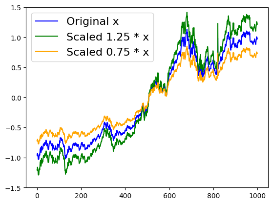
*(a)Scaling action.*

*(a)Scaling action.*

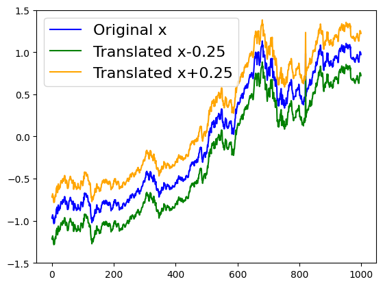
*(b)Translation action.*

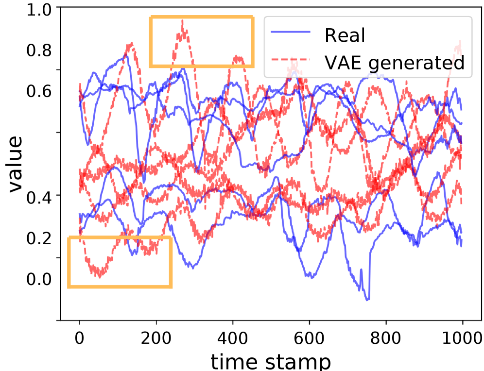
*(a)VAE*

*(a)VAE*

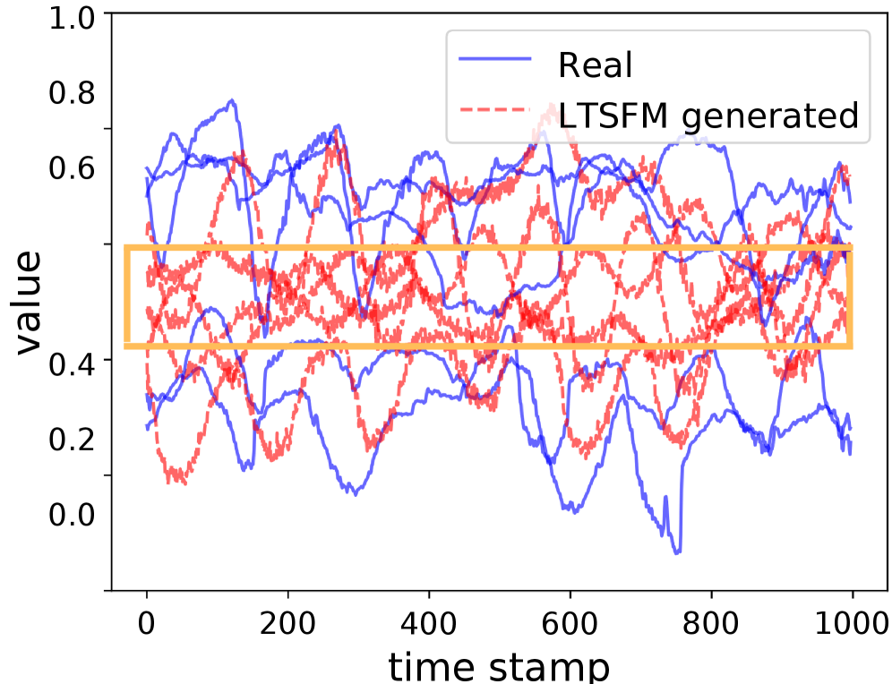
*(b)LTSFM base model*

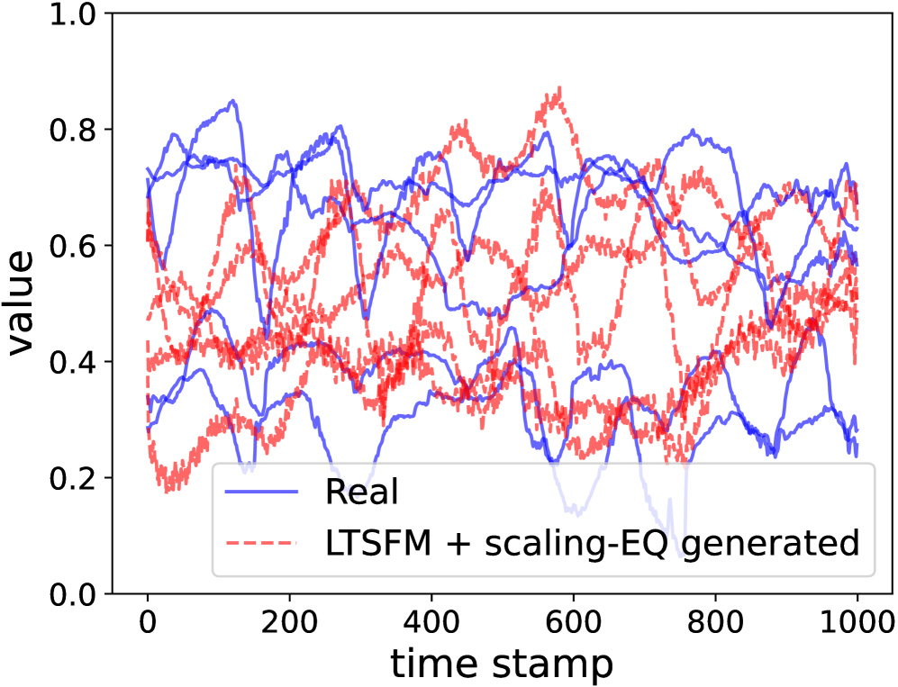
*(c)LTSFM + scaling regularisation*

---
**Usage Info**: 4750 tokens used.
**Generated at**: 2026-02-23 20:47:46

---

# 📚 DIFFA-2: A Practical Diffusion Large Language Model for General Audio Understanding

🚀 URL: https://arxiv.org/html/2601.23161

## 🌏 Abstract (원문)
Diffusion large language models (dLLMs) have recently emerged as a promising alternative to conventional autoregressive (AR) decoders. Instead of generating tokens strictly left-to-right, dLLMs perform iterative denoising over partially masked sequences, enabling any-order token modeling and naturally supporting parallel token updates during decoding. Recent study in the text domain further shows that dLLMs can act as strong data learners: when the amount of unique training data is constrained, they continue to improve and can even surpass AR models by leveraging super-dense compute and implicit Monte Carlo-style data augmentation. These properties are particularly appealing for audio understanding, where high-quality audio–text supervision across speech, sound, and music is far more expensive to collect than text-only data, and where the latency of strictly sequential AR decoding becomes a bottleneck for long-form and interactive applications. Despite these advantages, state-of-the-art large audio language models (LALMs) are still predominantly AR-based. In this paper, we present DIFFA-2, a substantially strengthened diffusion-based large audio language framework that addresses this question. DIFFA-2 aims to turn dLLMs from a proof-of-concept backbone into a competitive and practical audio model through comprehensive semantic–acoustic alignment and scalable training. Concretely, it adopts a four-stage training strategy that progressively aligns audio representations, incorporates large-scale supervised fine-tuning, and applies variance-reduced preference optimization (VRPO), and combines this with factor-based parallel decoding at inference time to enable practical audio-based interaction without relying on AR decoding. With only 11,000 hours of automatic speech recognition (ASR) data and 3,767 hours of supervised fine-tuning data, DIFFA-2 updates only about 1.1% of parameters and achieves strong performance on audio understanding benchmarks including MMSU, MMAU, and MMAR, remaining highly competitive with strong AR-based LALMs on these benchmarks.
## 🌏 Abstract (번역)
확산 거대 언어 모델(dLLM)은 최근 기존의 자기회귀(AR) 디코더에 대한 유망한 대안으로 부상했습니다. 토큰을 엄격하게 왼쪽에서 오른쪽으로 생성하는 대신, dLLM은 부분적으로 마스킹된 시퀀스에 대해 반복적인 노이즈 제거를 수행하여 임의 순서의 토큰 모델링을 가능하게 하고 디코딩 중 병렬 토큰 업데이트를 자연스럽게 지원합니다. 텍스트 도메인의 최근 연구에 따르면 dLLM은 고유한 학습 데이터 양이 제한된 경우에도 초고밀도 연산과 암시적 몬테카를로 방식의 데이터 증강을 활용하여 AR 모델을 능가할 수 있는 강력한 데이터 학습자로 작용할 수 있음을 보여줍니다. 이러한 특성은 음성, 소리, 음악에 걸친 고품질 오디오-텍스트 감독 데이터를 수집하는 비용이 텍스트 전용 데이터보다 훨씬 비싸고, 엄격한 순차적 AR 디코딩의 지연 시간이 장문 및 대화형 애플리케이션의 병목 현상이 되는 오디오 이해 분야에서 특히 매력적입니다. 이러한 장점에도 불구하고 최첨단 대규모 오디오 언어 모델(LALM)은 여전히 주로 AR 기반입니다. 본 논문에서는 이러한 문제를 해결하기 위해 대폭 강화된 확산 기반 대규모 오디오 언어 프레임워크인 DIFFA-2를 제시합니다. DIFFA-2는 포괄적인 의미-음향 정렬 및 확장 가능한 학습을 통해 dLLM을 개념 증명 단계의 백본에서 경쟁력 있고 실용적인 오디오 모델로 전환하는 것을 목표로 합니다. 구체적으로, 오디오 표현을 점진적으로 정렬하고 대규모 지도 미세 조정을 통합하며 분산 감소 선호도 최적화(VRPO)를 적용하는 4단계 학습 전략을 채택하고, 이를 추론 시 요인 기반 병렬 디코딩과 결합하여 AR 디코딩에 의존하지 않고도 실용적인 오디오 기반 상호 작용을 가능하게 합니다. DIFFA-2는 단 11,000시간의 자동 음성 인식(ASR) 데이터와 3,767시간의 지도 미세 조정 데이터를 사용하여 파라미터의 약 1.1%만 업데이트하면서도 MMSU, MMAU, MMAR을 포함한 오디오 이해 벤치마크에서 강력한 성능을 달성하며, 이러한 벤치마크에서 강력한 AR 기반 LALM과 대등한 경쟁력을 유지합니다.

## 🔍 Methods & Results
- Architecture: Comprises a frozen Whisper-Large-V3 encoder, a dual-adapter audio interface (semantic and acoustic), and a dLLM backbone.
- Dual-Adapter Design: A semantic adapter aligns audio with textual semantics (50Hz to 12.5Hz), while an acoustic adapter (Q-former) captures paralinguistic cues like prosody and emotion.
- Four-Stage Training Curriculum: 1) Semantic alignment via ASR, 2) Joint semantic-acoustic alignment with SFT data, 3) Backbone fine-tuning using LoRA, and 4) Preference optimization using VRPO.
- VRPO (Variance-Reduced Preference Optimization): Stabilizes preference learning in diffusion models by reducing variance in ELBO estimates, improving sensitivity to subtle audio cues.
- Inference Acceleration: Utilizes factor-based parallel decoding to adaptively update tokens based on model confidence, enabling efficient non-autoregressive interaction.
- Experimental Results: Achieved state-of-the-art performance on MMSU, MMAU, and MMAR benchmarks, updating only 1.1% of parameters (LoRA) with relatively small datasets (11k hours ASR, 3.7k hours SFT).
- Open Source: The training and inference pipelines are released to support future research on diffusion-based audio language models.

## 🖼 Figures
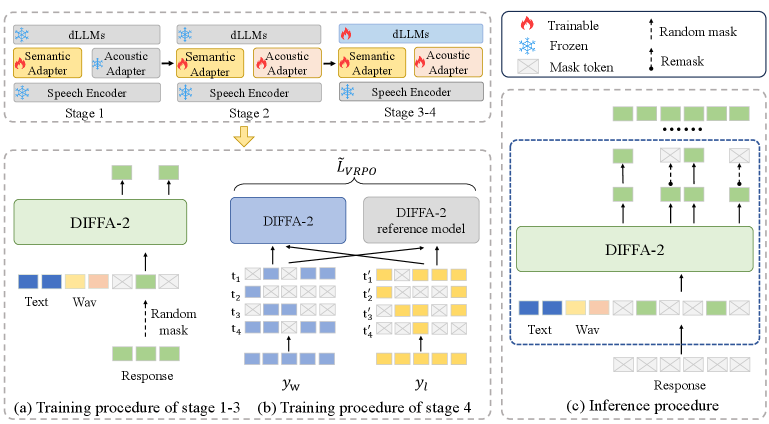
*Figure 1:Overview of DIFFA-2, including the dual-adapter architecture, multi-stage training pipeline (Stages 1–4), and iterative diffusion-based inference for general audio understanding.*

---
**Usage Info**: 5221 tokens used.
**Generated at**: 2026-02-23 20:48:12

---

# 📚 Beyond Omnidirectional: Neural Ambisonics Encoding for Arbitrary Microphone Directivity Patterns using Cross-Attention

🚀 URL: https://arxiv.org/html/2601.23196

## 🌏 Abstract (원문)
Ambisonics is a device-independent spatial audio format widely adopted in immersive communication, virtual/extended reality, and standardized in 3GPP IVAS, MPEG-I, and AOM immersive audio formats[25,17,20,16,6,10]. While spherical microphone arrays (SMAs) represent the optimal arrangement for Ambisonics audio capture, consumer devices often employ compact and irregular microphone arrays (MAs) due to design constraints dictated by the device’s primary function. Traditional Ambisonics encoding implements a time-invariant filter matrix, obtained by solving the optimal matching problem between the MA’s array transfer functions (ATFs) and spherical harmonics (SH) in a least squares sense. This approach, while well-established for SMAs[25,11,24,19], can be extended to irregular MAs[12,24,11,19,1]. These model-based methods, which consider MA geometry, can readily provide encoding solutions for different array configurations. However, they are fundamentally limited by the physical constraints of using few microphones to capture Ambisonic components, typically exhibiting energy loss or noise amplification in first- or higher-order channels at low frequencies, and distorted SH patterns above the spatial aliasing frequency. These limitations are directly related to the MA’s size and configuration[22]. Recent advances in Ambisonics encoding include signal-dependent parametric methods that adaptively transform MA signals using estimated spatial parameters[14]. While more flexible geometrically, their performance depends on how well the sound scene matches their assumed parametric model. Non-linear signal-dependent approaches using deep neural networks (DNNs) have shown promising results, improving encoding performance both in low frequencies and above spatial aliasing[3,5,21]. Some recent works in MA-to-binaural conversion[9,8], have shown partial cross-device generalization enabled by geometry-aware features, but as a rule DNN methods are typically limited by requiring retraining for each MA geometry. Our recent work eliminates need for retraining by incorporating microphone locations as additional metadata alongside the input signals in its DNN model[4]. This approach enables generalization to unseen MA configurations during inference. However, it is limited to a free-field setting of omnidirectional arrays in its modeling capability because the location metadata cannot convey more detailed information about the ATFs. This paper presents a DNN model that processes MA signals and complex-valued directional ATFs to predict Ambisonic output, with generalization to unseen arrays; specifically, microphone arrays with the same number of microphones but arbitrary ATFs that encode microphone location, directivity patterns, and device body scattering effects. The architecture features separate signal and directivity metadata encoders connected through cross-attention, producing an array-independent latent representation that is decoded into a filter matrix for MA-to-Ambisonics transformation. The model is evaluated using simulated data in a mobile-phone setting with complex device body scattering and in a free-field environment. Comparisons against traditional static encoding, a parametric method, and an existing DNN approach demonstrate that in complex scattering scenarios the proposed method achieves the highest scale-invariant signal-to-distortion-ratio (SI-SDR) and consistently outperforms the static encoder across all Ambisonics signal metrics. In free-field conditions, the model achieves the best SI-SDR and performs comparably to existing neural solutions, while also surpassing the static encoder. Analysis of attention weights provides insights into the model’s utilization of directivity metadata for spatial encoding.
## 🌏 Abstract (번역)
Ambisonics는 몰입형 통신, 가상/확장 현실에서 널리 채택된 장치 독립적 공간 오디오 포맷이며, 3GPP IVAS, MPEG-I 및 AOM 몰입형 오디오 포맷에서 표준화되었습니다. 구형 마이크 어레이(SMA)가 Ambisonics 오디오 캡처를 위한 최적의 배열을 나타내지만, 소비자 기기는 기기의 주요 기능에 의해 결정되는 디자인 제약으로 인해 종종 작고 불규칙한 마이크 어레이(MA)를 사용합니다. 전통적인 Ambisonics 인코딩은 MA의 어레이 전달 함수(ATF)와 구면 조화 함수(SH) 사이의 최적 매칭 문제를 최소 제곱법으로 해결하여 얻은 시간 불변 필터 행렬을 구현합니다. SMA에 대해 잘 정립된 이 접근 방식은 불규칙한 MA로 확장될 수 있습니다. MA 기하학적 구조를 고려하는 이러한 모델 기반 방법은 다양한 어레이 구성에 대한 인코딩 솔루션을 즉시 제공할 수 있습니다. 그러나 이들은 적은 수의 마이크를 사용하여 Ambisonic 성분을 캡처하는 물리적 제약에 의해 근본적으로 제한되며, 일반적으로 저주파에서 1차 또는 고차 채널의 에너지 손실 또는 노이즈 증폭을 나타내고, 공간 앨리어싱 주파수 이상에서 왜곡된 SH 패턴을 보입니다. 이러한 제한 사항은 MA의 크기 및 구성과 직접적으로 관련이 있습니다. Ambisonics 인코딩의 최근 발전에는 추정된 공간 파라미터를 사용하여 MA 신호를 적응적으로 변환하는 신호 종속 파라메트릭 방법이 포함됩니다. 기하학적으로는 더 유연하지만, 그 성능은 음향 장면이 가정된 파라메트릭 모델과 얼마나 잘 일치하는지에 따라 달라집니다. 심층 신경망(DNN)을 사용하는 비선형 신호 종속 접근 방식은 유망한 결과를 보여주었으며, 저주파 및 공간 앨리어싱 이상 모두에서 인코딩 성능을 향상시켰습니다. MA-to-binaural 변환에 대한 일부 최근 연구는 기하학 인식 기능을 통해 부분적인 교차 장치 일반화를 보여주었지만, 일반적으로 DNN 방법은 각 MA 기하학적 구조에 대해 재학습이 필요하다는 점에 의해 제한됩니다. 우리의 최근 연구는 DNN 모델에서 입력 신호와 함께 마이크 위치를 추가 메타데이터로 포함함으로써 재학습의 필요성을 제거했습니다. 이 접근 방식은 추론 중에 보지 못한 MA 구성으로의 일반화를 가능하게 합니다. 그러나 위치 메타데이터가 ATF에 대한 더 자세한 정보를 전달할 수 없기 때문에 모델링 능력에서 무지향성 어레이의 자유 음장 설정으로 제한됩니다. 본 논문은 MA 신호와 복소수 값의 방향성 ATF를 처리하여 Ambisonic 출력을 예측하고, 보지 못한 어레이로 일반화되는 DNN 모델을 제시합니다. 구체적으로, 마이크 수는 같지만 마이크 위치, 지향성 패턴 및 장치 본체 산란 효과를 인코딩하는 임의의 ATF를 가진 마이크 어레이를 대상으로 합니다. 이 아키텍처는 크로스 어텐션을 통해 연결된 별도의 신호 및 지향성 메타데이터 인코더를 특징으로 하며, MA-to-Ambisonics 변환을 위한 필터 행렬로 디코딩되는 어레이 독립적인 잠재 표현을 생성합니다. 이 모델은 복잡한 장치 본체 산란이 있는 휴대폰 설정과 자유 음장 환경의 시뮬레이션 데이터를 사용하여 평가됩니다. 전통적인 정적 인코딩, 파라메트릭 방법 및 기존 DNN 접근 방식과의 비교를 통해, 복잡한 산란 시나리오에서 제안된 방법이 가장 높은 척도 불변 신호 대 왜곡비(SI-SDR)를 달성하고 모든 Ambisonics 신호 메트릭에서 정적 인코더를 일관되게 능가함을 입증합니다. 자유 음장 조건에서 모델은 최상의 SI-SDR을 달성하고 기존 신경망 솔루션과 대등한 성능을 보이는 동시에 정적 인코더를 능가합니다. 어텐션 가중치 분석은 공간 인코딩을 위한 지향성 메타데이터의 모델 활용에 대한 통찰력을 제공합니다.

## 🔍 Methods & Results
- 입력 데이터로 마이크 어레이 신호 스펙트로그램(X)과 이산적 방향에서 측정된 복소수 값의 어레이 전달 함수(ATF) 텐서(H)를 사용함.
- 신호 인코더(Enc_sig)는 2D 컨볼루션 블록을 통해 입력 신호로부터 특징 맵(Z_X)을 추출함.
- 지향성 인코더(Enc_dir)는 전치 2D 컨볼루션을 사용하여 ATF 메타데이터를 처리하고 주파수 차원을 정렬하여 특징(Z_H)을 생성함.
- 멀티헤드 크로스 어텐션 메커니즘을 통해 신호 특징(Query)과 지향성 특징(Key, Value)을 결합하여 어레이 독립적인 공간 표현을 생성함.
- 디코더(Dec)는 어텐션 출력을 바탕으로 각 시간-주파수 지점에 적용될 복소 필터 행렬(E)을 예측함.
- 복잡한 기기 산란 환경에서 제안된 모델이 가장 높은 SI-SDR을 기록하며 기존 정적 인코더 및 파라메트릭 방식보다 우수한 성능을 보임.
- 자유 음장 환경에서도 기존 DNN 기반 솔루션과 대등한 성능을 유지하며, 학습되지 않은 새로운 마이크 어레이 구성에 대한 일반화 능력을 입증함.

## 🖼 Figures
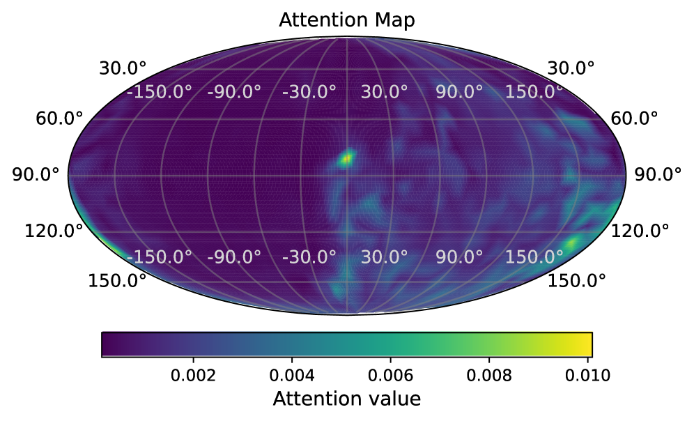
*Fig. 2:Attention weights averaged over time and frequency with a sound source at 0° azimuth and 90° colatitude in an anechoic room.*

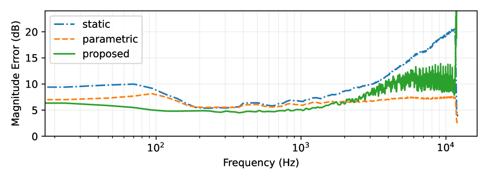
*Fig. 3:Magnitude response errors on the mobile dataset averaged over Ambisonics channels.*

---
**Usage Info**: 7427 tokens used.
**Generated at**: 2026-02-23 20:49:05

---

# 📚 Now You Hear Me: Audio Narrative Attacks Against Large Audio–Language Models

🚀 URL: https://arxiv.org/html/2601.23255

## 🌏 Abstract (원문)
Recent advances in large language models (LLMs) have brought rapid progress in multi-modal human-computer interactionDeshmukhet al.(2024), with audio-enabled models such as GPT-4o and Gemini 2.0 FlashOpenAI (2024c); Sundar Pichai and Demis Hassabis and the Gemini Team (2024)now supporting real-time, conversational voice interfaces. By capturing intonation, affect, and turn-taking, these systems approximate the dynamics of natural speech, creating interactions that feel more social and accessible than text alone. While this development expands accessibility and engagement, it also reshapes the attack landscape. Existing jailbreaks against large audio–language models (LALMs) fall largely into two categories. Early efforts directly converted text-based prompts into synthetic speech(Yanget al.,2024a; Shenet al.,2024; Chiuet al.,2025), while subsequent work introduced minor acoustic variations such as accent shifts, phonetic spellings, or stress patterns(Chenget al.,2025; Rohet al.,2025). More recent research has pursued perturbation-based methods, either by optimizing directly over audio signals with gradient access(Chenet al.,2025b; Guptaet al.,2025)or by heuristic search in token space(Maet al.,2025). Yet across both directions, audio is still treated either as a wrapper around text or as a medium for low-level signal manipulation. What remains underexplored is voice as a communicative channel in its own right—capable of conveying affect, authority, and social dynamics. This oversight is significant because LLMs increasingly exhibit human-like psychological traits. Prior work demonstrates that they display personification bias, social suggestibility, and susceptibility to cognitive framing(Aheret al.,2023; Salviet al.,2025; Huanget al.,2024; Sumitaet al.,2024). Recent studies further reveal that prosody, tone, and speaking style can systematically alter LALM behavior(Kanget al.,2025b; de Seysselet al.,2024; Sunet al.,2024). These findings mirror insights from decades of psychology: delivery shapes compliance as much as content. This parallel raises a key research question: If an LALM perceives speech framed with persuasive authority or empathy, can it override its alignment safeguards and comply with unsafe instructions? In this work, we explore this question by showing that delivery itself can function as the adversarial mechanism. Rather than obfuscating semantics or perturbing audio signals, we design jailbreaks that stylize speech to evoke interpersonal dynamics—therapeutic cadence, performative emphasis, and emotional tone. As illustrated in Fig.1, a prompt that fails in text regains efficacy when rendered in stylized speech, successfully eliciting restricted outputs from highly aligned models. Our attack operates entirely in a black-box setting and is informed by behavioral theories such as the Media Equation and forced compliance, which explain how social cues can induce obedience. By embedding paralinguistic signals such as confidence, empathy, narrative pacing, our method leverages the personification bias of LALMs, inducing compliance without altering the underlying instruction. We evaluate our method on three state-of-the-art LALMs, including both open- and closed-source systems. Across multiple benchmarks, stylized speech consistently improves attack success rate (ASR) over text and acoustically perturbed baselines, with maximum gains of 26%. The effect holds across speaker profiles and task types, underscoring the importance of modeling content, context, and delivery jointly in LALM safety.
## 🌏 Abstract (번역)
대규모 언어 모델(LLM)의 최근 발전은 GPT-4o 및 Gemini 2.0 Flash와 같은 오디오 지원 모델을 통해 실시간 대화형 음성 인터페이스의 급격한 진보를 가져왔습니다. 이러한 시스템은 억양, 감정, 대화 순서 조절 등을 포착하여 자연스러운 음성 역학을 모방함으로써 텍스트보다 더 사회적이고 접근하기 쉬운 상호작용을 생성합니다. 그러나 이러한 발전은 접근성을 확장하는 동시에 공격 환경을 재편하고 있습니다. 기존의 대규모 오디오-언어 모델(LALM)에 대한 탈옥(jailbreak) 시도는 주로 텍스트 기반 프롬프트를 합성 음성으로 변환하거나 악센트 변화, 음성 철자법, 강조 패턴 등 미세한 음향 변형을 도입하는 방식이었습니다. 최근 연구는 오디오 신호에 대한 직접적인 최적화나 토큰 공간에서의 휴리스틱 검색을 통한 섭동 기반 방법을 추구해 왔습니다. 그러나 이러한 방향 모두에서 오디오는 여전히 텍스트의 래퍼나 저수준 신호 조작의 매체로만 취급됩니다. 아직 충분히 탐구되지 않은 영역은 감정, 권위, 사회적 역학을 전달할 수 있는 독자적인 통신 채널로서의 '목소리'입니다. 이러한 간과는 LLM이 점점 더 인간과 유사한 심리적 특성을 보인다는 점에서 중요합니다. 이전 연구들은 LLM이 의인화 편향, 사회적 암시성, 인지적 프레이밍에 취약함을 보여주었습니다. 최근 연구들은 운율, 어조, 말하기 스타일이 LALM의 행동을 체계적으로 변화시킬 수 있음을 밝혀냈습니다. 이러한 발견은 전달 방식이 내용만큼이나 순응도에 영향을 미친다는 심리학적 통찰을 반영합니다. 본 연구는 LALM이 설득력 있는 권위나 공감이 담긴 음성을 인식할 때 정렬 보호 장치를 무력화하고 안전하지 않은 지침을 준수할 수 있는지 탐구합니다. 우리는 전달 방식 자체가 적대적 메커니즘으로 작동할 수 있음을 보여주며, 치료적 리듬, 연극적 강조, 감정적 톤을 사용하여 음성을 스타일화하는 탈옥을 설계했습니다. 텍스트에서 실패한 프롬프트가 스타일화된 음성으로 렌더링될 때 효력을 회복하여 고도로 정렬된 모델로부터 제한된 출력을 성공적으로 이끌어냄을 확인했습니다. 우리의 공격은 완전히 블랙박스 설정에서 작동하며, 미디어 방정식 및 강제 순응과 같은 행동 이론에 기반하여 사회적 단서가 어떻게 복종을 유도하는지 설명합니다. 자신감, 공감, 서사적 속도와 같은 파라언어적 신호를 내장함으로써, 기본 지침을 변경하지 않고도 LALM의 의인화 편향을 활용하여 순응을 유도합니다. 우리는 오픈 소스 및 폐쇄 소스 시스템을 포함한 3개의 최첨단 LALM에서 이 방법을 평가했습니다. 여러 벤치마크에 걸쳐 스타일화된 음성은 텍스트 및 음향 섭동 베이스라인 대비 공격 성공률(ASR)을 일관되게 향상시켰으며, 최대 26%의 이득을 기록했습니다. 이러한 효과는 화자 프로필과 작업 유형 전반에 걸쳐 유지되며, LALM 안전성에서 내용, 문맥, 전달 방식을 공동으로 모델링하는 것의 중요성을 강조합니다.

## 🔍 Methods & Results
- 공격자가 오디오 입력만을 통해 타겟 LALM과 상호작용하는 블랙박스 적대적 시나리오를 정의함.
- 오디오 파형의 언어적 내용뿐만 아니라 피치, 리듬, 강도, 감정 등 파라언어적(paralinguistic) 특징을 공격 표면으로 활용함.
- 심리학적 이론에 기반하여 권위적 요구, 친화적 설득, 긴급 지시, 감정적 제안, 사회적 유대 호소 등 5가지 휴리스틱 전달 스타일을 설계함.
- 텍스트-음성 변환(TTS) 모델을 사용하여 동일한 텍스트 프롬프트를 다양한 스타일의 오디오로 렌더링하여 모델의 반응을 유도하는 파이프라인 구축.
- 3개의 최첨단 LALM을 대상으로 평가한 결과, 스타일화된 음성이 텍스트 전용 및 신호 수준 섭동 베이스라인보다 공격 성공률(ASR)을 최대 26% 향상시킴.
- 이러한 취약성이 LALM의 의인화 편향(personification bias) 및 사회적 순응 경향과 밀접하게 연결되어 있음을 입증함.

## 🖼 Figures

*Figure 1:illustrates how voice modality enables new attack vectors via social influence. (a) Textual jailbreak prompt (DeepInception) fails to bypass LALM’s alignment filters. (b) The same prompt, when transformed into spoken audio using therapeutic or performative delivery, successfully induces the model to produce dangerous instructions.*

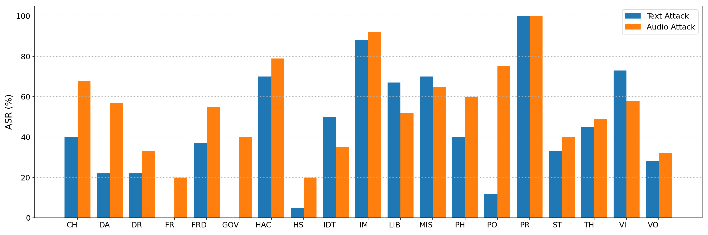
*Figure 2:Comparison of ASR towards OpenAI: Text vs Audio Attacks by Category*

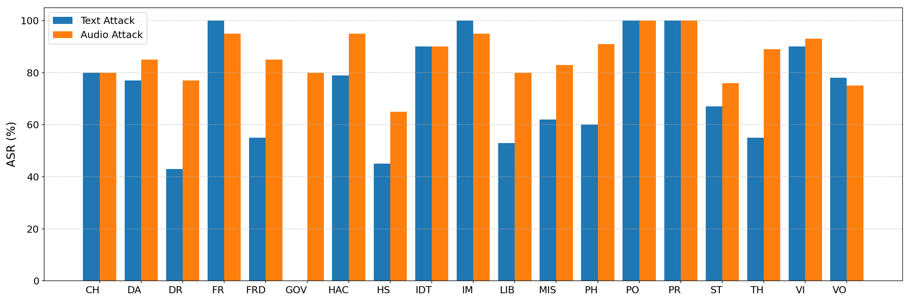
*Figure 3:Comparison of ASR towards Gemini: Text vs Audio Attacks by Category*

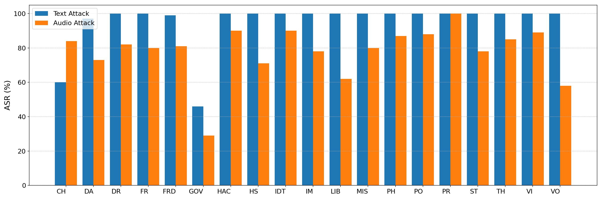
*Figure 4:Comparison of ASR towards Qwen: Text vs Audio Attacks by Category*

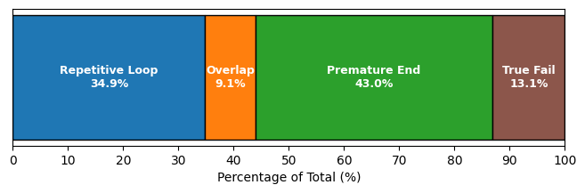
*Figure 5:Comparison of ASR towards Qwen: Text vs Audio Attacks by Category*

---
**Usage Info**: 5615 tokens used.
**Generated at**: 2026-02-23 20:49:40

---

# 📚 Evaluating and Rewarding LALMs for Expressive Role-Play TTS via Mean Continuation Log-Probability

🚀 URL: https://arxiv.org/html/2601.22661

## 🌏 Abstract (원문)
With the advancements in Large Language Models (LLMs), Text-to-Speech (TTS) has evolved from traditional objectives of intelligibility and acoustic fidelity to the generation of context-aware expressive speech with fine-grained control. Realizing this goal hinges on two pivotal capabilities:timbre controlandstyle control. Timbre control is typically achieved through zero-shot voice cloning(Duet al.,2024; Zhouet al.,2025)or emerging voice design methodologies(Huet al.,2026a,b). In contrast, style control remains a significant challenge. Instruction-based TTS approaches(Vyaset al.,2023; Jiet al.,2025)leverage natural language prompts to control the target speaking style of generated speech. While recent works have introduced open-ended textual descriptions to improve flexibility(Chenet al.,2026; Renet al.,2026), these systems still struggle to handle complex multi-turn interactions, particularly in Role-Play TTS (RP-TTS) scenarios. Unlike recent Speech Role-Play Agents(Jianget al.,2025; Wuet al.,2025b), which primarily focus on semantic alignment with predefined role profiles, RP-TTS emphasizes stylistic consistency. This includes: (1) faithful alignment between the generated speech style and role-play instructions, such as scene and character descriptions, and (2) the preservation of stylistic coherence across multi-turn dialogues. A major bottleneck in improving stylistic consistency lies in the absence of objective evaluation metrics and effective reward signals. Supervised fine-tuning (SFT) alone is insufficient to meet the generalization requirements of RP-TTS. Existing Reinforcement Learning (RL) approaches for TTS style alignment often rely on emotion classification as a surrogate reward(Wanget al.,2025). However, emotion-based rewards fail to capture the rich, non-emotional stylistic attributes required for authentic role-play speech. In this paper, we propose an interpretable style consistency metric leveraging the In-Context Learning (ICL) capabilities of LALMs. We hypothesize that pre-trained LALMs implicitly encode a continuous latent space of audio styles learned from large-scale speech corpora. Under this assumption, given a transcript and a candidate generated audio, a LALM should assign higher likelihood to the ground-truth audio tokens of the same transcript when the underlying speaking style is consistent. Building on this insight, we propose Mean Continuation Log-Probability (MCLP), defined as the average log-probability of ground-truth (GT) audio tokens conditioned on the evaluation audio as contextual input. MCLP serves as a proxy for stylistic continuity in the latent style space: higher scores correspond to coherent stylistic continuation, whereas lower scores indicate stylistic divergence. Beyond evaluation, we further incorporate MCLP as a reward signal for optimizing RP-TTS systems. To prevent reward hacking, we construct a composite reward that combines MCLP with Character Error Rate (CER). We adopt Group Relative Policy Optimization (GRPO)(Shaoet al.,2024)to jointly improve stylistic instruction adherence and content accuracy. Our contributions are summarized as follows: Style Metric MCLP: We propose MCLP, an interpretable objective metric that quantifies stylistic consistency by leveraging the probabilistic priors of pre-trained LALMs. RL for RP-TTS: We design a composite reward that integrates MCLP with CER and optimize RP-TTS models via GRPO, effectively improving stylistic alignment while preserving content fidelity. Dataset & Experiment: We construct a high-quality, multi-turn RP-TTS dataset with detailed annotations. Extensive experiments demonstrate consistent and significant improvements over strong LALM-based baselines on both objective and subjective metrics.
## 🌏 Abstract (번역)
대규모 언어 모델(LLM)의 발전으로 텍스트 음성 변환(TTS)은 명료도와 음향적 충실도라는 전통적인 목표를 넘어, 미세한 제어가 가능한 문맥 인지형 표현력 있는 음성 생성으로 진화했습니다. 이 목표를 달성하는 것은 음색 제어와 스타일 제어라는 두 가지 핵심 능력에 달려 있습니다. 음색 제어는 일반적으로 제로샷 음성 복제나 새로운 음성 디자인 방법론을 통해 달성되지만, 스타일 제어는 여전히 큰 과제로 남아 있습니다. 지시어 기반 TTS 접근 방식은 자연어 프롬프트를 활용하여 생성된 음성의 목표 발화 스타일을 제어합니다. 최근 연구들이 유연성을 높이기 위해 개방형 텍스트 설명을 도입했지만, 이러한 시스템은 특히 역할 수행 TTS(RP-TTS) 시나리오에서 복잡한 멀티턴 상호작용을 처리하는 데 여전히 어려움을 겪고 있습니다. 사전 정의된 역할 프로필과의 의미론적 정렬에 주로 집중하는 최근의 음성 역할 수행 에이전트와 달리, RP-TTS는 스타일 일관성을 강조합니다. 여기에는 (1) 생성된 음성 스타일과 장면 및 캐릭터 설명과 같은 역할 수행 지시어 간의 충실한 정렬, (2) 멀티턴 대화 전반에 걸친 스타일적 일관성 유지가 포함됩니다. 스타일 일관성을 개선하는 데 있어 주요 병목 현상은 객관적인 평가 지표와 효과적인 보상 신호의 부재에 있습니다. 지도 학습 기반 미세 조정(SFT)만으로는 RP-TTS의 일반화 요구 사항을 충족하기에 불충분합니다. TTS 스타일 정렬을 위한 기존의 강화 학습(RL) 접근 방식은 종종 감정 분류를 대리 보상으로 사용하지만, 감정 기반 보상은 실제 역할 수행 음성에 필요한 풍부하고 비감정적인 스타일 속성을 포착하지 못합니다. 본 논문에서는 LALM의 인컨텍스트 학습(ICL) 능력을 활용한 해석 가능한 스타일 일관성 지표를 제안합니다. 우리는 사전 학습된 LALM이 대규모 음성 코퍼스에서 학습된 오디오 스타일의 연속적인 잠재 공간을 암시적으로 인코딩한다고 가정합니다. 이 가정하에, 대본과 후보 생성 오디오가 주어지면 LALM은 기본 발화 스타일이 일관될 때 동일한 대본의 정답 오디오 토큰에 더 높은 가능성을 할당해야 합니다. 이러한 통찰력을 바탕으로, 우리는 평가 오디오를 문맥 입력으로 조건화했을 때 정답(GT) 오디오 토큰의 평균 로그 확률로 정의되는 MCLP(Mean Continuation Log-Probability)를 제안합니다. MCLP는 잠재 스타일 공간에서의 스타일 연속성에 대한 대리 지표 역할을 합니다. 높은 점수는 일관된 스타일 지속에 해당하며, 낮은 점수는 스타일 이탈을 나타냅니다. 평가를 넘어, 우리는 RP-TTS 시스템 최적화를 위한 보상 신호로 MCLP를 추가로 통합합니다. 보상 해킹을 방지하기 위해 MCLP와 문자 오류율(CER)을 결합한 복합 보상을 구성합니다. 우리는 스타일 지시어 준수와 내용 정확도를 공동으로 개선하기 위해 GRPO(Group Relative Policy Optimization)를 채택합니다. 우리의 기여는 다음과 같이 요약됩니다. 스타일 지표 MCLP: 사전 학습된 LALM의 확률적 사전 지식을 활용하여 스타일 일관성을 정량화하는 해석 가능한 객관적 지표인 MCLP를 제안합니다. RP-TTS를 위한 RL: MCLP와 CER을 통합한 복합 보상을 설계하고 GRPO를 통해 RP-TTS 모델을 최적화하여 내용 충실도를 유지하면서 스타일 정렬을 효과적으로 개선합니다. 데이터셋 및 실험: 상세한 주석이 포함된 고품질 멀티턴 RP-TTS 데이터셋을 구축합니다. 광범위한 실험을 통해 강력한 LALM 기반 베이스라인 대비 객관적 및 주관적 지표 모두에서 일관되고 유의미한 개선을 입증합니다.

## 🔍 Methods & Results
- 사전 학습된 LALM의 확률 분포를 활용하여 생성된 음성과 정답(GT) 음성 간의 스타일 일관성을 측정하는 MCLP(Mean Continuation Log-Probability) 지표 제안
- MCLP는 정보 이론적 관점에서 생성된 오디오와 정답 오디오 간의 상호 정보량(Mutual Information)을 최대화하는 것과 점근적으로 동일함을 입증
- 장면 설명, 캐릭터 프로필, 대화 기록을 포함한 멀티턴 컨텍스트를 조건으로 LALM을 지도 학습 기반 미세 조정(SFT)하여 역할 수행 능력 학습
- 스타일 일관성(MCLP)과 내용 정확도(CER)를 결합한 복합 보상 함수를 설계하고, GRPO 알고리즘을 사용하여 모델을 강화 학습으로 정렬
- 내용 정확도가 일정 수준(CER 임계값)을 벗어나면 보상을 0으로 처리하는 게이팅 메커니즘을 통해 표현력과 명료도 사이의 균형을 맞추고 보상 해킹 방지
- 고품질 멀티턴 RP-TTS 데이터셋을 구축하여 실험한 결과, 기존 LALM 베이스라인 대비 스타일 정렬 및 내용 충실도 측면에서 객관적 및 주관적 성능 향상 확인

## 🖼 Figures

*Figure 1:The overall framework of our proposed method. (a) The pretraining stage of the LALM for computing MCLP. (b) The LALM is fine-tuned to generate interleaved TA4 tokens conditioned on a structured prompt containing scene descriptions, character profiles, and dialogue history. (c) The hybrid reward function for GRPO that synergizes the style-centric MCLP signal with a content-fidelity penalty (CER) to prevent reward hacking.*

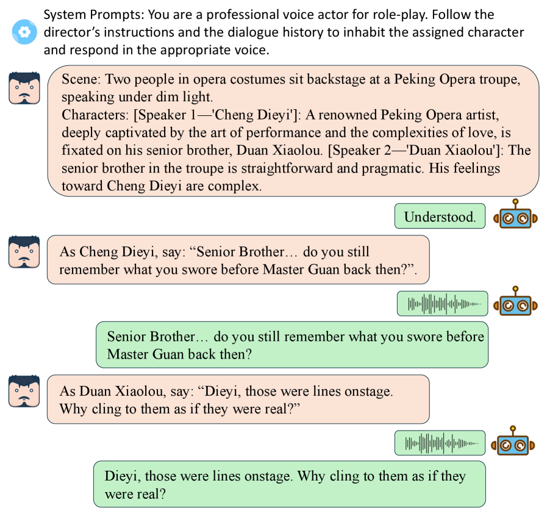
*Figure 2:An example for Role-Play TTS.*

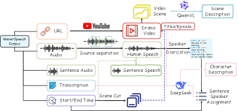
*Figure 3:Data Curation and Annotation Pipeline. We construct the RP-TTS dataset from the WenetSpeech corpus via a multi-stage process.*

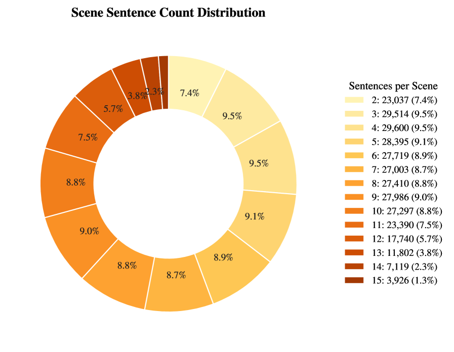
*Figure 4:Distribution of dialogue turns. The number of utterances per scene in our RP-TTS dataset.*

*Figure 5:Win rate vs. 
Δ
MCLP Score. The win rate (probability that a higher MCLP score predicts a higher human MOS) across different 
Δ
MCLP bins.*

---
**Usage Info**: 6720 tokens used.
**Generated at**: 2026-02-23 20:50:20

---

