# 🚩 (2026-02-05) Scholar Inbox 추천 논문 

# 📚 PFluxTTS: Hybrid Flow-Matching TTS with Robust Cross-Lingual Voice Cloning and Inference-Time Model Fusion

🚀 URL: https://arxiv.org/html/2602.04160

## 🌏 Abstract (원문)
Recent progress in text-to-speech (TTS) has been driven by flow-matching (FM) architectures, which learn vector fields for fast, high-fidelity synthesis via ODE-based inference. Despite these advances, FM-TTS systems still face three core gaps: alignment—stability and control in duration-guided models versus fluency and naturalness in alignment-free models remain a trade-off; cross-lingual voice cloning—fixed speaker vectors discard time-varying timbre, while more expressive prompt conditioning can destabilize alignment-free models, leaving robust use of long prompts largely unexplored; vocoder mismatch—full-band 48kHz reconstruction from low-rate mel features is underexplored in TTS models. To summarize, we propose PFluxTTS, a hybrid FM-TTS system that addresses the challenges related to alignment, voice cloning, and vocoder quality described above. Our contributions are as follows: We introduce a dual-decoder architecture that combines an alignment-free (AF) model with a duration-guided (DG) model through inference-time vector-field fusion, combining the stability of explicit durations with the naturalness and fluency of alignment-free decoding. We design a voice cloning strategy that employs a sequence of speech-prompt embeddings within a FLUX-based architecture, which is robust to long, cross-lingual prompts and does not require prompt text. We integrate a PeriodWave-based vocoder with prompt-based super-resolution, enabling 48kHz waveform reconstruction from low-rate mel features. Comprehensive experiments on challenging cross-lingual and in-the-wild conditions show that PFluxTTS achieves higher intelligibility and speaker similarity than state-of-the-art baselines.
## 🌏 Abstract (번역)
최근 텍스트 음성 변환(TTS)의 발전은 ODE 기반 추론을 통해 빠르고 고품질의 합성을 가능하게 하는 플로우 매칭(Flow-Matching, FM) 아키텍처에 의해 주도되었습니다. 이러한 진전에도 불구하고 FM-TTS 시스템은 세 가지 핵심적인 격차에 직면해 있습니다. 첫째, 정렬(alignment) 측면에서 지속 시간 가이드 모델의 안정성 및 제어력과 정렬 프리(alignment-free) 모델의 유창성 및 자연스러움 사이의 절충안이 필요합니다. 둘째, 교차 언어 음성 복제 시 고정된 화자 벡터는 시간에 따라 변하는 음색을 무시하는 반면, 표현력이 풍부한 프롬프트 조건화는 정렬 프리 모델을 불안정하게 만들 수 있어 긴 프롬프트의 견고한 사용이 미개척 상태로 남아 있습니다. 셋째, 보코더 불일치 문제로, 저해상도 멜 특징으로부터 48kHz 풀밴드 재구성을 수행하는 연구가 TTS 모델에서 부족합니다. 본 논문에서는 이러한 문제를 해결하기 위해 PFluxTTS를 제안합니다. 주요 기여는 다음과 같습니다. (1) 추론 시점의 벡터장 융합을 통해 정렬 프리 모델과 지속 시간 가이드 모델을 결합하여 명시적 지속 시간의 안정성과 정렬 프리 디코딩의 자연스러움을 동시에 확보하는 이중 디코더 아키텍처를 도입합니다. (2) 텍스트 프롬프트 없이도 긴 교차 언어 프롬프트에 견고한 FLUX 기반 아키텍처 내 음성 프롬프트 임베딩 시퀀스를 사용하는 음성 복제 전략을 설계합니다. (3) 프롬프트 기반 초해상도를 지원하는 PeriodWave 기반 보코더를 통합하여 저해상도 멜 특징에서 48kHz 파형 재구성을 가능하게 합니다. 까다로운 교차 언어 및 실제 환경 조건에서의 종합적인 실험 결과, PFluxTTS는 기존 최첨단 베이스라인보다 높은 명료도와 화자 유사성을 달성했습니다.

## 🔍 Methods & Results
- 지속 시간 가이드(DG) 모델과 정렬 프리(AF) 모델을 독립적으로 학습시킨 후 추론 시점에 벡터장을 융합하는 하이브리드 구조 제안
- DG 경로는 FLUX 아키텍처의 DoubleStream 및 SingleStream 블록을 채택하여 프롬프트 정보를 조기에 텍스트 임베딩에 반영
- AF 경로는 F5-TTS 스타일의 DiT 디코더를 사용하며, DG 모델에서 예측된 지속 시간을 공유하여 정렬 안정성 확보
- 음성 복제를 위해 16개의 학습 가능한 쿼리 풀링 임베딩 시퀀스를 사용하여 긴 프롬프트에서도 세밀한 음색 정보를 추출
- 추론 시 DG와 AF의 벡터장을 가중치 alpha(t)를 통해 혼합하며, 초기 단계에서 DG로 정렬을 잡고 후기 단계에서 AF로 자연스러움을 극대화
- PeriodWave 기반의 초해상도 보코더를 통해 24kHz 멜 스펙트로그램으로부터 고주파 세부 사항이 복원된 48kHz 오디오 합성
- 실험 결과, 제안된 시스템은 단어 누락(word skipping) 문제를 해결하고 교차 언어 음성 복제에서 높은 화자 유사도와 자연스러움을 입증

## 🖼 Figures

*Fig. 1:Architecture of PFluxTTS. Duration-Guided and Alignment-Free models are mixed with schedule 
𝛼
​
(
𝑡
)
 during inference. On the right, Speech Prompt Encoder is shown, which outputs either an embedding sequence for the DG model or fixed embedding for the AF model.*

*Fig. 2:Effect of inference-time model fusion on intelligibility of PFluxTTS (CER as a function of mixing coefficient 
𝛼
).*

---
**Usage Info**: 5217 tokens used.
**Generated at**: 2026-02-23 21:29:10

---

# 📚 Audio ControlNet for Fine-Grained Audio Generation and Editing

🚀 URL: https://arxiv.org/html/2602.04680

## 🌏 Abstract (원문)
Text-to-audio (T2A) generation aims to synthesize general audio and sound effects from natural language descriptions, which has recently attracted increasing attention due to its potential applications in sound design, music creation, and video production. With the rapid development of generative modeling techniques, particularly diffusion-based models, recent T2A systems have demonstrated remarkable progress in both audio quality and text-audio alignment. However, despite these advances, most T2A models offer only coarse-grained control via text and struggle to enforce precise temporal event structures, such as specifying that a sound (e.g., a dog bark) should occur between 2 and 4 seconds, or that multiple sound events should be active simultaneously. They also provide limited signal-level control, such as loudness dynamics, pitch contours, or specific pitch components. More recently, several approaches have attempted to achieve finer-grained control in T2A generation. These methods generally fall into two categories. The first uses textual descriptions to specify when and which sounds should occur. While intuitive, this places high demands on the model’s language understanding, and misinterpreted timings can lead to imprecise control. The second employs structured embeddings to explicitly represent event occurrences, allowing more precise temporal control but often requiring training from scratch and complex data simulation pipelines. It is also worth noting that most approaches remain limited in their ability to extend control to finer signal-level attributes, such as precise loudness and pitch variations. This motivates the need for a framework that can achieve precise, fine-grained control while reducing training complexity and preserving the flexibility of pre-trained models. Rather than retraining entire models, we focus on lightweight auxiliary networks that enable existing T2A models to accept fine-grained control signals, preserving generative capacity while reducing training complexity. Inspired by ControlNet in text-to-image generation, we introduce Audio ControlNet models for T2A models, exploring two complementary designs: a copy-network-based architecture, T2A-ControlNet, and a lightweight-encoder-based architecture, T2A-Adapter. We further argue that fine-grained control signals should be structured rather than text-based, and this requires a representation that is both flexible and extensible to accommodate diverse control conditions. To this end, we formulate all control inputs as temporal sequences aligned with the audio timeline. Within this unified framework, we design structured representations and feature extractors for loudness, pitch, and sound events. We further extend our framework to fine-grained audio editing, where instructions specify both content and exact time spans (e.g., “insert clapping from 3.0s to 4.0s,” “remove speaking from 6.0s to 8.0s”). Following the same auxiliary-network paradigm, we propose T2A-Editor, which equips existing T2A models with precise insertion and removal capabilities by incorporating reference audio and event-roll-based editing instructions. In summary, our main contributions are as follows: We introduce the Audio ControlNet framework for fine-grained text-to-audio (T2A) generation. Without retraining the backbone model, our approach enables controllable T2A generation with respect to loudness, pitch, and sound events. We design two ControlNet variants tailored for fine-grained T2A tasks, namely T2A-ControlNet and T2A-Adapter. Experimental results demonstrate that T2A-Adapter achieves state-of-the-art performance while maintaining a lightweight architecture. We propose representing all control signals as unified temporal sequences to improve extensibility, and design structured representations together with dedicated feature extractors for loudness, pitch, and sound events. We further introduce T2A-Editor, which adopts a ControlNet-like paradigm to transform an existing T2A model into audio editing models that support temporally localized insertion and removal. Our experiments demonstrate that both T2A-ControlNet and T2A-Adapter achieve consistent improvements in controlling loudness, pitch, and sound events. Notably, T2A-Adapter attains state-of-the-art performance on AudioSet-Strong, achieving 54.36 F1_events and 68.26 F1_seg while introducing only 38M additional parameters. Subjective evaluations further indicate that our methods outperform all baseline models. To facilitate future research, we will release our code, models, and benchmarks.
## 🌏 Abstract (번역)
텍스트-오디오(T2A) 생성은 자연어 설명을 통해 일반적인 오디오와 음향 효과를 합성하는 것을 목표로 하며, 사운드 디자인, 음악 제작 및 비디오 제작에서의 잠재적 응용으로 인해 최근 점점 더 많은 관심을 받고 있습니다. 확산 기반 모델을 필두로 한 생성 모델링 기술의 급격한 발전으로 최신 T2A 시스템은 오디오 품질과 텍스트-오디오 정렬 모두에서 괄목할 만한 진전을 보여주었습니다. 그러나 이러한 발전에도 불구하고 대부분의 T2A 모델은 텍스트를 통한 대략적인 제어만을 제공하며, 특정 소리(예: 개 짖는 소리)가 2초에서 4초 사이에 발생해야 한다거나 여러 소리 이벤트가 동시에 활성화되어야 한다는 등의 정밀한 시간적 이벤트 구조를 강제하는 데 어려움을 겪습니다. 또한 음량 역학, 피치 윤곽 또는 특정 피치 구성 요소와 같은 신호 수준의 제어도 제한적입니다. 최근 T2A 생성에서 더 세밀한 제어를 달성하려는 여러 접근 방식이 시도되었습니다. 이러한 방법은 일반적으로 두 가지 범주로 나뉩니다. 첫 번째는 텍스트 설명을 사용하여 소리의 발생 시점과 종류를 지정하는 방식입니다. 이는 직관적이지만 모델의 언어 이해 능력에 높은 요구 사항을 부여하며, 타이밍을 잘못 해석하면 부정확한 제어로 이어질 수 있습니다. 두 번째는 구조화된 임베딩을 사용하여 이벤트 발생을 명시적으로 표현하는 방식으로, 더 정밀한 시간적 제어를 가능하게 하지만 종종 처음부터 학습해야 하거나 복잡한 데이터 시뮬레이션 파이프라인이 필요합니다. 또한 대부분의 접근 방식이 정밀한 음량 및 피치 변화와 같은 더 미세한 신호 수준 속성으로 제어를 확장하는 데 한계가 있다는 점에 주목해야 합니다. 이는 학습 복잡성을 줄이고 사전 학습된 모델의 유연성을 유지하면서 정밀하고 세밀한 제어를 달성할 수 있는 프레임워크의 필요성을 자극합니다. 전체 모델을 재학습시키는 대신, 우리는 기존 T2A 모델이 세밀한 제어 신호를 수용할 수 있도록 하는 경량 보조 네트워크에 집중하여 생성 능력을 보존하면서 학습 복잡성을 줄입니다. 텍스트-이미지 생성의 ControlNet에서 영감을 얻어 T2A 모델을 위한 Audio ControlNet 모델을 도입하고, 복사 네트워크 기반 아키텍처인 T2A-ControlNet과 경량 인코더 기반 아키텍처인 T2A-Adapter라는 두 가지 보완적인 설계를 탐구합니다. 더 나아가 세밀한 제어 신호는 텍스트 기반이 아닌 구조화되어야 한다고 주장하며, 이는 다양한 제어 조건을 수용하기 위해 유연하고 확장 가능한 표현이 필요합니다. 이를 위해 모든 제어 입력을 오디오 타임라인과 정렬된 시간적 시퀀스로 공식화합니다. 이 통합 프레임워크 내에서 음량, 피치 및 사운드 이벤트에 대한 구조화된 표현과 특징 추출기를 설계합니다. 또한 프레임워크를 세밀한 오디오 편집으로 확장하여, 지침이 콘텐츠와 정확한 시간 범위(예: “3.0초에서 4.0초 사이에 박수 소리 삽입”, “6.0초에서 8.0초 사이의 말소리 제거”)를 모두 지정하도록 합니다. 동일한 보조 네트워크 패러다임을 따라, 참조 오디오와 이벤트 롤 기반 편집 지침을 통합하여 기존 T2A 모델에 정밀한 삽입 및 제거 기능을 부여하는 T2A-Editor를 제안합니다. 요약하자면, 우리의 주요 기여는 다음과 같습니다: 세밀한 텍스트-오디오(T2A) 생성을 위한 Audio ControlNet 프레임워크를 도입합니다. 백본 모델을 재학습하지 않고도 음량, 피치 및 사운드 이벤트에 대해 제어 가능한 T2A 생성을 가능하게 합니다. 세밀한 T2A 작업에 맞춤화된 두 가지 ControlNet 변형인 T2A-ControlNet과 T2A-Adapter를 설계합니다. 실험 결과 T2A-Adapter는 경량 아키텍처를 유지하면서 최첨단 성능을 달성함을 보여줍니다. 확장성을 개선하기 위해 모든 제어 신호를 통합된 시간적 시퀀스로 표현할 것을 제안하고, 음량, 피치 및 사운드 이벤트에 대한 전용 특징 추출기와 함께 구조화된 표현을 설계합니다. 기존 T2A 모델을 시간적으로 국소화된 삽입 및 제거를 지원하는 오디오 편집 모델로 변환하기 위해 ControlNet과 유사한 패러다임을 채택한 T2A-Editor를 추가로 도입합니다. 실험을 통해 T2A-ControlNet과 T2A-Adapter 모두 음량, 피치 및 사운드 이벤트 제어에서 일관된 개선을 달성함을 입증했습니다. 특히 T2A-Adapter는 AudioSet-Strong에서 54.36 F1_events 및 68.26 F1_seg를 달성하는 동시에 단 38M의 추가 파라미터만을 도입하여 최첨단 성능을 기록했습니다. 주관적 평가는 우리의 방법이 모든 베이스라인 모델보다 우수함을 나타냅니다. 향후 연구를 촉진하기 위해 코드, 모델 및 벤치마크를 공개할 예정입니다.

## 🔍 Methods & Results
- 기존 T2A 모델의 재학습 없이 세밀한 제어를 가능하게 하는 경량 보조 네트워크 기반의 Audio ControlNet 프레임워크 제안
- 복사 네트워크 기반의 T2A-ControlNet과 경량 인코더 기반의 T2A-Adapter라는 두 가지 아키텍처 설계
- 음량(Loudness), 피치(Pitch), 사운드 이벤트(Sound Events)를 오디오 타임라인과 정렬된 통합 시간 시퀀스로 표현하여 제어 정밀도 향상
- 참조 오디오와 이벤트 롤(Event-roll) 기반 지침을 활용하여 특정 시간 구간의 삽입 및 제거가 가능한 T2A-Editor 개발
- T2A-Adapter 모델은 AudioSet-Strong 데이터셋에서 54.36 F1_events 및 68.26 F1_seg를 기록하며 SOTA(State-of-the-art) 성능 달성
- T2A-Adapter는 단 38M의 추가 파라미터만을 사용하여 모델 효율성을 극대화함
- 주관적 평가 결과, 제안된 방법론이 기존의 텍스트 기반 제어 방식(Wang et al., Hai et al.)보다 우수한 성능을 보임

## 🖼 Figures
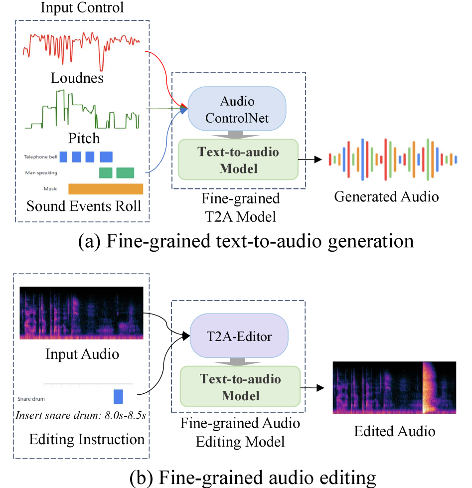
*Figure 1:An illustration of fine-grained text-to-audio (T2A) generation tasks and fine-grained audio editing tasks, along with the proposed Audio ControlNet.*

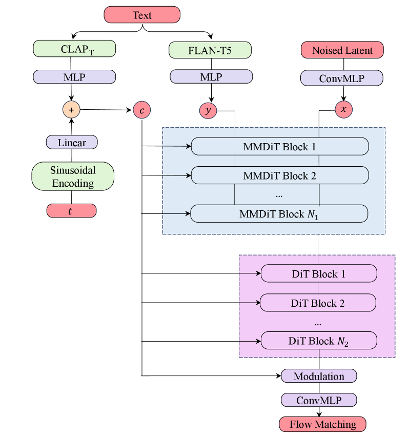
*Figure 2:The architecture of FluxAudio, which consists of a hybrid backbone that integrates MMDiT and DiT, and is trained with a flow matching objective.*

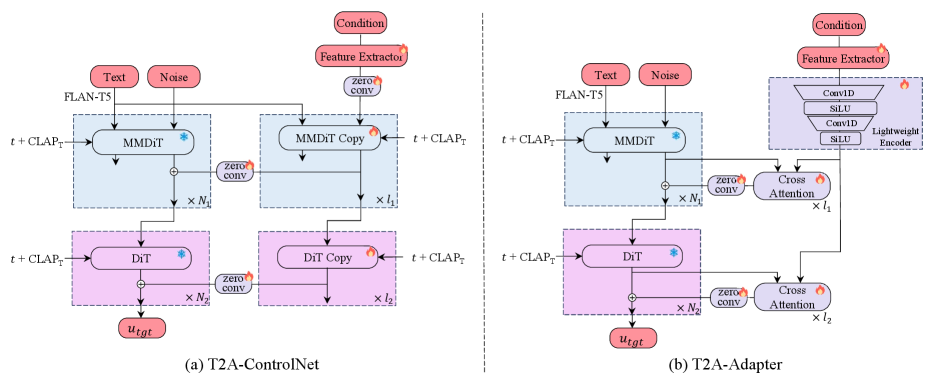
*Figure 3:The framework of T2A-ControlNet and T2A-Adapter.*

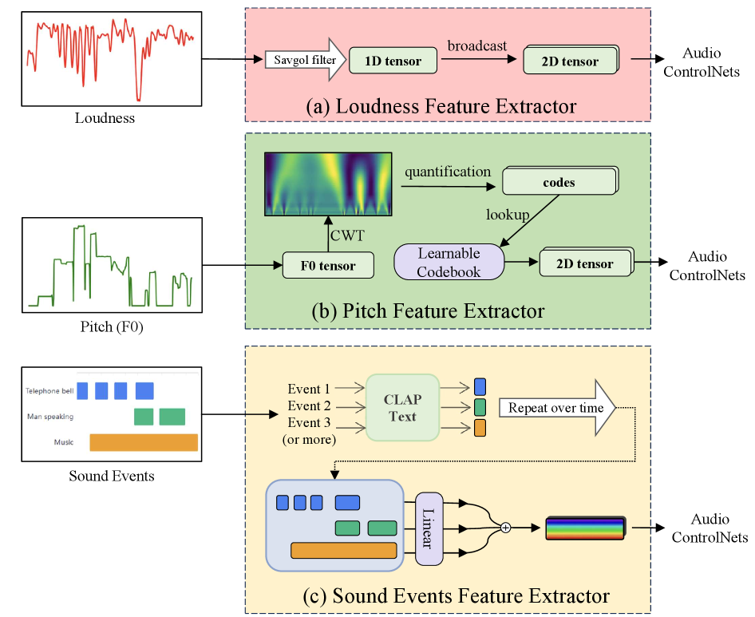
*Figure 4:Conditions and their feature extractors.*

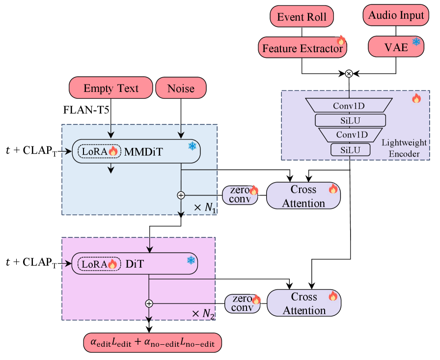
*Figure 5:Architecture of T2A-Editor. Reference audio and editing event information are injected via an external network to extend the text-to-audio model for the audio editing task.*

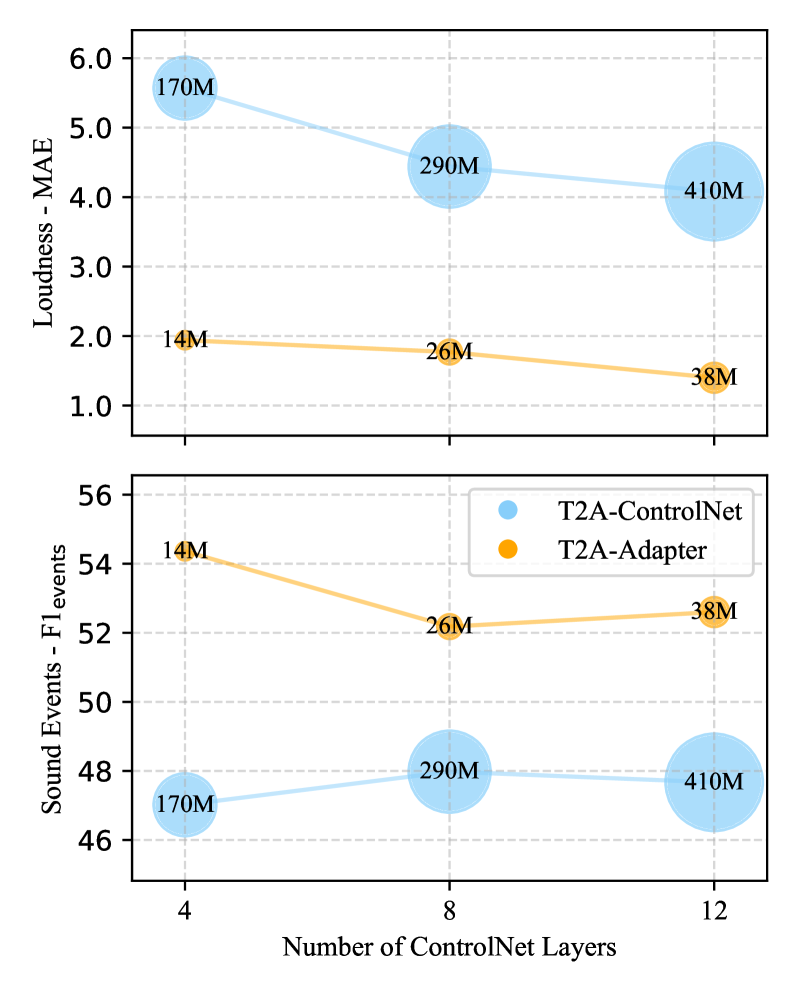
*Figure 6:Effect of ControlNet layers on performance. Marker size denotes models’ trainable parameters.*

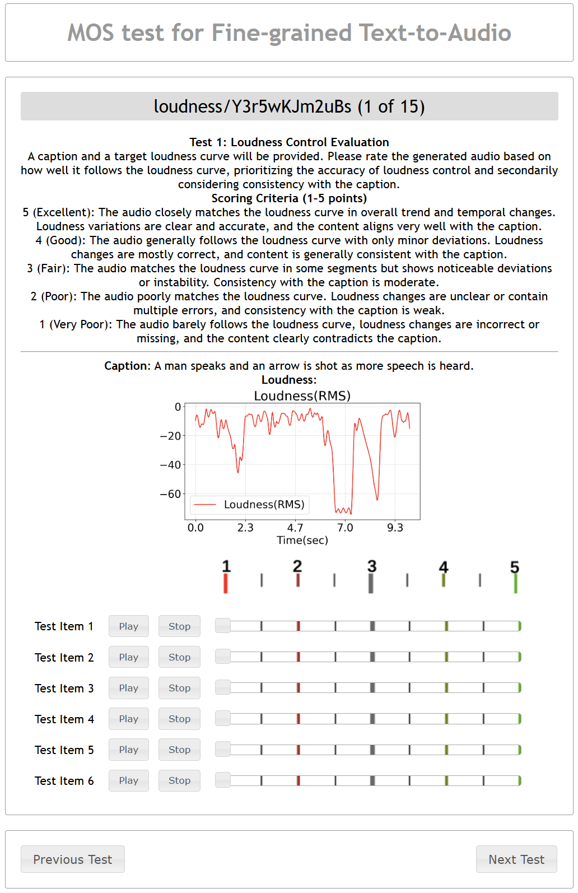
*Figure 7:A snapshot of the web UI for subjective evaluation in loudness control.*

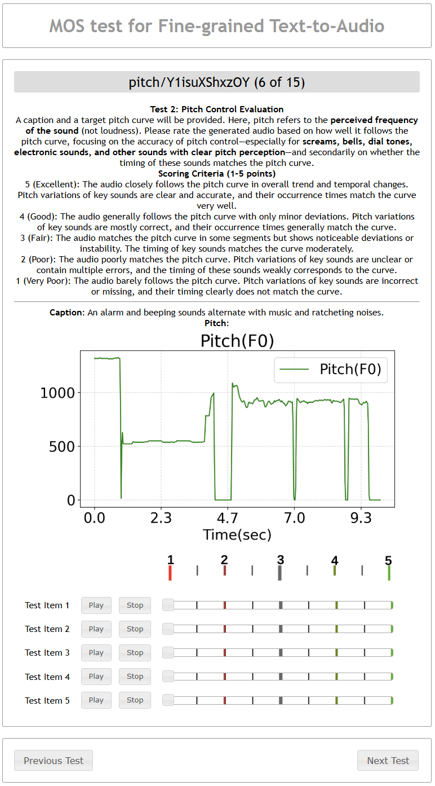
*Figure 8:A snapshot of the web UI for subjective evaluation in pitch control.*

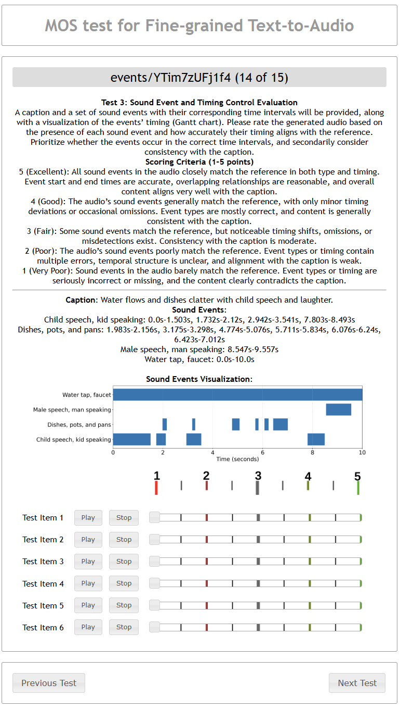
*Figure 9:A snapshot of the web UI for subjective evaluation in sound events control.*

---
**Usage Info**: 4901 tokens used.
**Generated at**: 2026-02-23 21:29:49

---

# 📚 UniAudio 2.0: A Unified Audio Language Model with Text-Aligned Factorized Audio Tokenization

🚀 URL: https://arxiv.org/html/2602.04683

## 🌏 Abstract (원문)
Large language models (LLMs) have demonstrated remarkable success by unifying diverse language tasks under a single autoregressive framework. Inspired by this paradigm, recent research has applied similar modeling principles to the audio domain, such as LM-based audio generation tasks, LM-based audio understanding tasks, and cross-modal interaction. Despite rapid progress, however, current audio language models still fall short of the generalization, scalability, and task versatility exhibited by their text counterparts. We argue that this limitation primarily stems from three fundamental challenges: the design of audio representations, the architecture of unified autoregressive models and the construction of large-scale multi-task training data. To address these, we introduce ReasoningCodec, a novel audio codec that explicitly factorizes audio representations into reasoning tokens and reconstruction tokens. On the architectural side, we propose a unified autoregressive architecture with functional layer specialization, partitioning the model into audio understanding experts, cross-modal experts (initialized from a pre-trained LLM), and audio generation experts. On the data side, we curate large-scale open-sourced audio corpora and introduce the concept of auditory sentences: long-context sequences composed of multiple segments that serve as a unified task constructor. Building on these, we train UniAudio 2.0 on 100B text tokens and 60B audio tokens. Extensive experiments show that UniAudio 2.0 achieves competitive performance on seen tasks and demonstrates strong few-shot and zero-shot generalization on a wide range of unseen tasks.
## 🌏 Abstract (번역)
거대 언어 모델(LLM)은 단일 자기회귀 프레임워크 아래 다양한 언어 작업을 통합함으로써 놀라운 성공을 거두었습니다. 이러한 패러다임에 영감을 받아, 최근 연구들은 오디오 생성, 이해, 교차 모달 상호작용 등 오디오 도메인에도 유사한 모델링 원칙을 적용해 왔습니다. 그러나 급격한 발전에도 불구하고, 현재의 오디오 언어 모델은 텍스트 모델이 보여주는 일반화 능력, 확장성 및 작업 다재다능함에는 여전히 미치지 못합니다. 본 연구에서는 이러한 한계가 오디오 표현 설계, 통합 자기회귀 모델의 구조, 대규모 다중 작업 학습 데이터 구축이라는 세 가지 근본적인 과제에서 비롯된다고 주장합니다. 이를 해결하기 위해 오디오 표현을 추론 토큰과 재구성 토큰으로 명시적으로 분해하는 새로운 오디오 코덱인 ReasoningCodec을 도입합니다. 구조 측면에서는 기능적 레이어 전문화를 갖춘 통합 자기회귀 아키텍처를 제안하여, 모델을 오디오 이해 전문가, 교차 모달 전문가(사전 학습된 LLM에서 초기화), 오디오 생성 전문가로 분할합니다. 데이터 측면에서는 대규모 오픈 소스 오디오 코퍼스를 큐레이션하고 통합 작업 구성자 역할을 하는 다중 세그먼트 긴 문맥 시퀀스인 '청각 문장(auditory sentences)' 개념을 도입합니다. 이를 바탕으로 1,000억 개의 텍스트 토큰과 600억 개의 오디오 토큰으로 UniAudio 2.0을 학습시켰습니다. 광범위한 실험을 통해 UniAudio 2.0은 학습된 작업에서 경쟁력 있는 성능을 달성했으며, 학습되지 않은 다양한 작업에서도 강력한 퓨샷 및 제로샷 일반화 능력을 입증했습니다.

## 🔍 Methods & Results
- ReasoningCodec 제안: 오디오를 고수준 추상화를 위한 추론 토큰과 고충실도 재구성을 위한 재구성 토큰으로 분리하여 인코딩
- 기능적 레이어 전문화(Functional Layer Specialization): 트랜스포머 레이어를 하위(이해), 중간(교차 모달 정렬), 상위(생성) 전문가로 구분하여 설계
- 청각 문장(Auditory Sentences): 오디오와 텍스트 세그먼트를 결합한 긴 문맥 시퀀스를 통해 별도의 파이프라인 없이 다중 작업 학습 수행
- 대규모 데이터 학습: 1,000억 개의 텍스트 토큰과 600억 개의 오디오 토큰(음성, 소리, 음악 포함)을 사용하여 UniAudio 2.0 구축
- 성능 검증: 기존 학습 작업에서 경쟁력 있는 성능을 보였으며, 미학습 작업에 대해서도 뛰어난 제로샷 및 퓨샷 일반화 성능 확인

## 🖼 Figures

*Figure 1:Overview of the proposed UniAudio 2.0 framework. UniAudio 2.0 adopts a unified autoregressive architecture over text, reasoning, and reconstruction tokens, where reasoning tokens capture high-level, text-grounded semantics and reconstruction tokens preserve fine-grained acoustic details. The model integrates audio understanding, cross-modal, and audio generation experts to support unified audio understanding and generation.*

*Figure 2:Figure X. Overview of the proposed ReasoningCodec framework. ReasoningCodec adopts a dual-branch architecture, consisting of a reasoning branch and a reconstruction branch, which are coupled through FiLM-based modulation. The semantic decoder consists of several convolutional layers.*

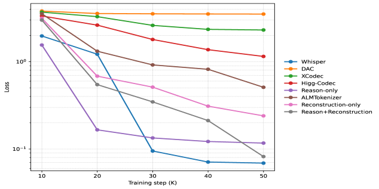
*Figure 3:The training loss of different audio tokenizer for understanding tasks.*

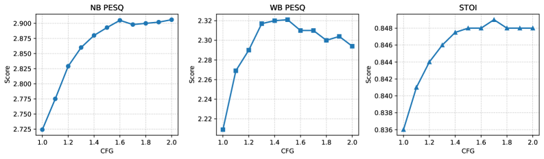
*Figure 4:The influence of CFG for reconstruction performance.*

*Figure 5:Overview of the multi-stage pre-training strategy of UniAudio 2.0. The model is trained in a progressive manner, including an understanding warm-up stage, a generation warm-up stage, and a modality alignment stage, with different expert layers gradually unfrozen. Stream-wise fusion is employed to merge text and audio streams under a unified autoregressive objective. For simplicity, the audio generation expert layers include both the generation expert and the local decoder.*

---
**Usage Info**: 3816 tokens used.
**Generated at**: 2026-02-23 21:30:38

---

# 📚 Universal Robust Speech Adaptation for Cross-Domain Speech Recognition and Enhancement

🚀 URL: https://arxiv.org/html/2602.04307

## 🌏 Abstract (원문)
Systems encompassing automatic speech recognition (ASR) and speech enhancement (SE) have made great strides in recent years due to the widespread adoption of deep learning techniques. However, these systems often experience considerable performance degradation when exposed to mismatched conditions, particularly in the presence of unseen noise types or acoustic channel variations. To address this challenge, we propose the Universal Robust Speech Adaptation Generative Adversarial Network (URSA-GAN), a novel framework that jointly models both environmental noise and channel distortions for unified domain adaptation in ASR and SE tasks. URSA-GAN adopts a two-stage training pipeline. In the first stage, two dedicated encoders are trained to separately extract noise and channel embeddings from unlabeled speech in the target domain. In the second stage, these embeddings guide a GAN-based generator to synthesize seemingly realistic speech that reflects the target-domain noise and channel characteristics while preserving phonetic content. Furthermore, to enhance generalization to unseen environments, we introduce dynamic stochastic perturbation, which injects controlled variability into the embeddings during the generation process. Extensive evaluations across diverse benchmarks covering both channel and noise mismatches demonstrate that URSA-GAN consistently validates its effectiveness in complex real-world scenarios.
## 🌏 Abstract (번역)
최근 딥러닝 기술의 광범위한 채택으로 자동 음성 인식(ASR) 및 음성 향상(SE) 시스템은 큰 발전을 이루었습니다. 그러나 이러한 시스템은 훈련 시 보지 못한 소음 유형이나 음향 채널의 변화와 같이 일치하지 않는 조건에 노출될 때 상당한 성능 저하를 겪는 경우가 많습니다. 이러한 과제를 해결하기 위해 본 논문에서는 ASR 및 SE 작업의 통합 도메인 적응을 위해 환경 소음과 채널 왜곡을 공동으로 모델링하는 새로운 프레임워크인 URSA-GAN(Universal Robust Speech Adaptation Generative Adversarial Network)을 제안합니다. URSA-GAN은 2단계 훈련 파이프라인을 채택합니다. 첫 번째 단계에서는 타겟 도메인의 레이블이 없는 음성에서 소음 및 채널 임베딩을 별도로 추출하도록 두 개의 전용 인코더를 훈련합니다. 두 번째 단계에서는 이러한 임베딩이 GAN 기반 생성기를 가이드하여 음성 내용은 보존하면서 타겟 도메인의 소음 및 채널 특성을 반영하는 현실적인 음성을 합성하도록 합니다. 또한, 보지 못한 환경에 대한 일반화 능력을 향상시키기 위해 생성 과정 중에 임베딩에 제어된 가변성을 주입하는 동적 확률적 섭동(dynamic stochastic perturbation)을 도입합니다. 채널 및 소음 불일치를 모두 다루는 다양한 벤치마크에 대한 광범위한 평가를 통해 URSA-GAN이 복잡한 실제 시나리오에서 일관되게 효과적임을 입증했습니다.

## 🔍 Methods & Results
- URSA-GAN 프레임워크 제안: 생성기, 판별기, 소음 인코더, 채널 인코더로 구성되어 환경 소음과 채널 왜곡을 동시에 모델링함
- 소음 인코더: 오디오 이벤트 중심의 BEATs 모델을 백본으로 사용하고 ESC-50 데이터셋을 통해 미세 조정하여 세밀한 소음 특성을 추출함
- 채널 인코더: MFA-Conformer를 활용하여 화자 및 음성 내용과 무관한 채널 고유의 왜곡 특성을 캡처함
- FiLM(Feature-wise Linear Modulation): 생성기의 모든 잔차 블록에 소음 및 채널 임베딩을 주입하여 다층적인 도메인 적응을 수행함
- PCL(Patch-wise Contrastive Learning): 소스 음성과 합성 음성 간의 패치 단위 대비 학습을 통해 음성학적 구조와 내용을 보존함
- 동적 확률적 섭동(Dynamic Stochastic Perturbation): 생성 단계에서 임베딩에 가우시안 노이즈를 추가하여 미지의 환경에 대한 일반화 성능을 강화함
- 실험 결과: ASR(채널 불일치) 및 SE(소음 환경) 벤치마크에서 기존 방식 대비 우수한 성능을 보였으며, 소음과 채널 왜곡이 결합된 복합 시나리오에서도 강건성을 입증함

## 🖼 Figures

*Figure 1: Character error rates (CERs) of ASR models on the HAT corpus. Each group of bars represents evaluation on audio from a specific recording device, with individual bars showing CERs for models trained on different devices. Performance generally degrades under device mismatch, underscoring the impact of channel variation and the challenge of cross-device generalization.*

*Figure 2: The architecture of our proposed framework, URSA-GAN. Solid lines represent the forward data flow during both training and inference phases. The dashed arrows indicate that during the training phase, simulated speech 
𝐗
𝐺
 is used together with target speech 
𝐗
𝑇
 to 1) train the discriminator 
𝐷
, and 2) contribute to noise reconstruction and channel consistency. The 
⨁
 operator denotes element-wise tensor addition.*

*Figure 3: Illustration of the patch-wise contrastive learning process. Solid arrows denote the flow of feature extraction and projection, while dashed arrows indicate shared weights between the projection heads. The process involves feature extraction using the generator 
𝐺
, patch sampling, projection into the embedding space through the projection head 
𝐹
, and cross-entropy loss calculation using the softmax activation function.*

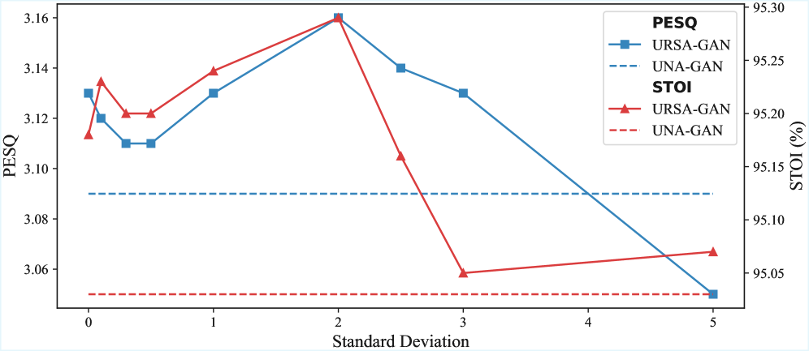
*Figure 4:PESQ and STOI results of dynamic stochastic perturbation under various standard deviations on the VBD dataset.*

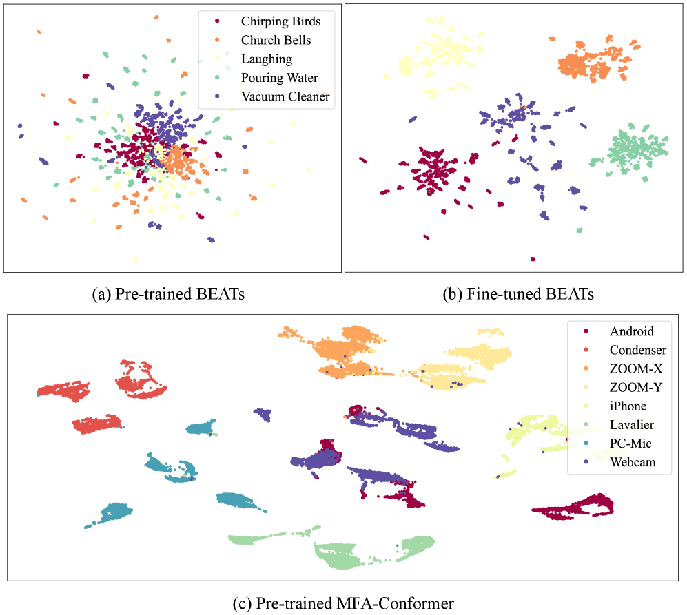
*Figure 5:The UMAP visualization of embeddings extracted from different noise and channel types in the HAT-ESC dataset.*

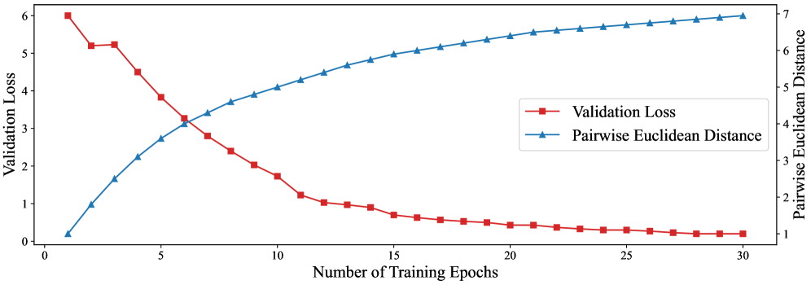
*Figure 6:Validation loss of our channel encoder on the HAT-ESC dataset and the average pairwise Euclidean distance between channel embeddings across training epochs.*

---
**Usage Info**: 6778 tokens used.
**Generated at**: 2026-02-23 21:31:21

---

# 📚 FRONTEND TOKEN ENHANCEMENT FOR TOKEN-BASED SPEECH RECOGNITION

🚀 URL: https://arxiv.org/html/2602.04217

## 🌏 Abstract (원문)
Discretized speech representations have recently emerged as a key research direction for building efficient speech processing systems. For example, semantic or phonetic tokens can be obtained by applying k-means clustering to features derived from self-supervised learning (SSL) speech models. These representations have been successfully applied to automatic speech recognition (ASR) and speech language models (SLMs). The generated tokens typically undergo sequence-shortening techniques such as deduplication and byte-pair encoding (BPE), thereby facilitating more efficient data transmission, model training, and decoding. Despite such progress, noise robustness of ASR systems using semantic tokens (hereafter, token ASR) has not been sufficiently investigated. In real-world scenarios, recordings are frequently corrupted by environmental noise, which can severely degrade ASR performance. Therefore, improving noise robustness of ASR is a fundamental issue for practical deployment. Several benchmark challenges have been established to drive progress in this area. In these challenges, ASR systems using continuous-valued vectors (hereafter, continuous ASR), such as log mel-filterbank features (FBANK) or SSL-derived features, have achieved top performance when combined with a speech enhancement (SE) frontend. Moreover, some studies have reported further improvements by jointly fine-tuning an SE frontend with ASR objectives. While a large body of research has addressed robustness in continuous ASR, the potential of frontend enhancement for robust token ASR remains largely unexplored. More concretely, since token ASR takes discrete representations as input, it is unclear whether enhancement should be performed at the waveform level, as input to SSL models, or directly at the discrete token level. This gap underscores the need for investigating whether token ASR can achieve both efficiency and robustness under noisy conditions. In this paper, we introduce multiple frontend enhancement strategies and explore their effectiveness in improving the noise robustness of token ASR backends. To enable a systematic comparison, we categorize enhancement frontends according to the input/output representations used to train them: wave-to-wave (W2W-E; conventional SE), token-to-token (T2T-E), vector-to-token (V2T-E; where the vector is a weighted-sum feature from an SSL model), and wave-to-token enhancements (W2T-E). Since the enhancement frontends are trained independently of the ASR backend, this modularization allows the enhancement component to remain unchanged even when the ASR model is replaced or updated. The main contributions of this work are as follows: We present the first comprehensive and systematic evaluation of diverse enhancement frontends to improve the noise robustness of token ASR systems, including the introduction of novel V2T-E and W2T-E approaches. Experiments on the CHiME-4 dataset demonstrate that W2T-E, despite its simplicity, yields the best token ASR performance among all frontends, even surpassing continuous ASR using weighted-sum SSL features in most cases. We show that ASR accuracy does not always correlate with token-level accuracy, measured using reference and enhanced tokens, indicating the limitations of this metric in predicting recognition accuracy. We expect that this work will serve as a foundation for future research on frontend enhancement in token-based speech processing.
## 🌏 Abstract (번역)
이산화된 음성 표현은 최근 효율적인 음성 처리 시스템 구축을 위한 핵심 연구 방향으로 부상했습니다. 예를 들어, 자기 지도 학습(SSL) 음성 모델에서 파생된 특징에 k-평균 클러스터링을 적용하여 의미론적 또는 음성학적 토큰을 얻을 수 있습니다. 이러한 표현은 자동 음성 인식(ASR) 및 음성 언어 모델(SLM)에 성공적으로 적용되었습니다. 생성된 토큰은 일반적으로 중복 제거 및 바이트 쌍 인코딩(BPE)과 같은 시퀀스 단축 기술을 거쳐 데이터 전송, 모델 학습 및 디코딩의 효율성을 높입니다. 이러한 발전에도 불구하고, 의미론적 토큰을 사용하는 ASR 시스템(이하 토큰 ASR)의 노이즈 강인성은 충분히 조사되지 않았습니다. 실제 환경에서 녹음은 빈번하게 주변 소음에 의해 오염되며, 이는 ASR 성능을 심각하게 저하시킬 수 있습니다. 따라서 ASR의 노이즈 강인성을 개선하는 것은 실제 배포를 위한 근본적인 문제입니다. 이 분야의 발전을 위해 여러 벤치마크 챌린지가 수립되었습니다. 이러한 챌린지에서 로그 멜-필터뱅크 특징(FBANK) 또는 SSL 파생 특징과 같은 연속값 벡터를 사용하는 ASR 시스템(이하 연속 ASR)은 음성 향상(SE) 프론트엔드와 결합될 때 최고의 성능을 달성했습니다. 또한, 일부 연구에서는 SE 프론트엔드를 ASR 목적 함수와 함께 공동 미세 조정함으로써 추가적인 개선을 보고했습니다. 연속 ASR의 강인성에 대해서는 많은 연구가 이루어졌지만, 강인한 토큰 ASR을 위한 프론트엔드 향상의 잠재력은 여전히 미개척 분야로 남아 있습니다. 구체적으로, 토큰 ASR은 이산 표현을 입력으로 받기 때문에, 향상이 파형 수준에서 수행되어야 하는지, SSL 모델의 입력으로 수행되어야 하는지, 아니면 이산 토큰 수준에서 직접 수행되어야 하는지 불분명합니다. 이러한 격차는 토큰 ASR이 노이즈가 있는 조건에서 효율성과 강인성을 모두 달성할 수 있는지 조사할 필요성을 강조합니다. 본 논문에서는 여러 프론트엔드 향상 전략을 소개하고 토큰 ASR 백엔드의 노이즈 강인성을 개선하는 데 있어 그 효과를 탐구합니다. 체계적인 비교를 위해, 학습에 사용된 입력/출력 표현에 따라 향상 프론트엔드를 다음과 같이 분류합니다: wave-to-wave (W2W-E; 기존 SE), token-to-token (T2T-E), vector-to-token (V2T-E; 여기서 벡터는 SSL 모델의 가중 합 특징임), 그리고 wave-to-token 향상 (W2T-E). 향상 프론트엔드는 ASR 백엔드와 독립적으로 학습되므로, 이러한 모듈화는 ASR 모델이 교체되거나 업데이트되더라도 향상 구성 요소를 변경하지 않고 유지할 수 있게 합니다. 본 연구의 주요 기여는 다음과 같습니다: 새로운 V2T-E 및 W2T-E 접근 방식을 포함하여 토큰 ASR 시스템의 노이즈 강인성을 개선하기 위한 다양한 향상 프론트엔드에 대한 최초의 포괄적이고 체계적인 평가를 제시합니다. CHiME-4 데이터셋에 대한 실험 결과, W2T-E는 단순함에도 불구하고 모든 프론트엔드 중에서 가장 우수한 토큰 ASR 성능을 보였으며, 대부분의 경우 가중 합 SSL 특징을 사용하는 연속 ASR을 능가했습니다. 또한, 참조 토큰과 향상된 토큰을 사용하여 측정된 토큰 수준 정확도가 항상 ASR 정확도와 상관관계가 있는 것은 아님을 보여주며, 이는 인식 정확도를 예측하는 데 있어 이 지표의 한계를 나타냅니다. 본 연구가 토큰 기반 음성 처리의 프론트엔드 향상에 관한 향후 연구의 토대가 될 것으로 기대합니다.

## 🔍 Methods & Results
- 향상 프론트엔드를 입력/출력 표현에 따라 W2W-E, T2T-E, V2T-E, W2T-E의 네 가지 범주로 분류하여 체계적으로 비교함
- ASR 백엔드와 독립적으로 학습되는 모듈형 프론트엔드 구조를 채택하여 모델 업데이트 시의 유연성을 확보함
- CHiME-4 데이터셋 실험 결과, W2T-E(Wave-to-Token) 방식이 모든 프론트엔드 전략 중 가장 우수한 성능을 기록함
- W2T-E 기반 토큰 ASR은 대부분의 경우 가중 합 SSL 특징을 사용하는 연속 ASR의 성능을 능가함
- 토큰 수준의 정확도 지표가 실제 ASR 인식 정확도와 항상 일치하지 않는다는 점을 발견하여 해당 지표의 한계성을 입증함

## 🖼 Figures
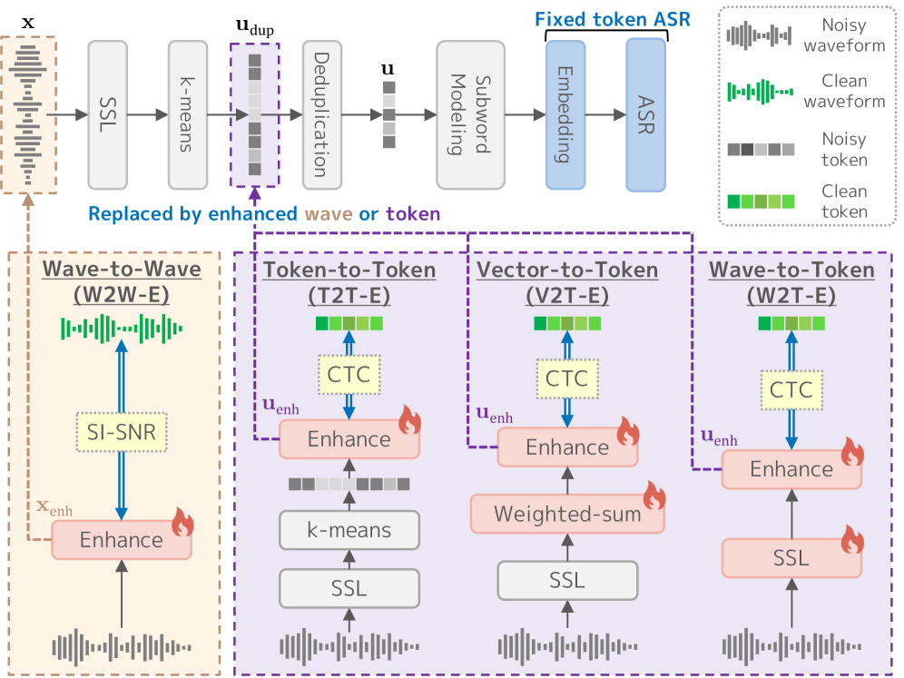
*Fig. 1:Schematic illustration of the token ASR backend (top) and the four categories of enhancement frontends (bottom) to improve backend noise robustness.*

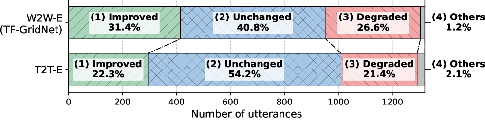
*Fig. 2:Utterance counts by UED-WER change group (et_simu).*

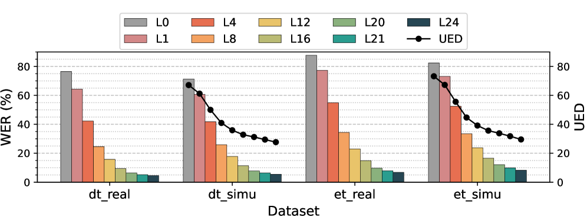
*Fig. 3:WERs (bars) and UEDs (black lines) as a function of SSL model depth in W2T-E. L0 denotes the output of the convolutional feature encoder of WavLM Large.*

---
**Usage Info**: 4212 tokens used.
**Generated at**: 2026-02-23 21:31:51

---

