# 🚩 (2026-02-06) Scholar Inbox 추천 논문 

# 📚 ARCHI-TTS: A flow-matching-based Text-to-Speech Model with Self-supervised Semantic Aligner and Accelerated Inference

🚀 URL: https://arxiv.org/html/2602.05207

## 🌏 Abstract (원문)
Text-to-Speech (TTS) synthesis aims at generating speech audios with a given text prompt and has witnessed remarkable advancements in recent years. Conditioned on a few seconds of an audio prompt, current TTS models can perform zero-shot synthesis, generating high-fidelity, natural speech for arbitrary text while accurately mimicking the speaker’s distinct vocal characteristics. Current zero-shot TTS are broadly spearhead into two main categories: autoregressive (AR) models and non-autoregressive (NAR) models. AR-based TTS models consecutively predict discrete audio tokens conditioned on text and previous audio tokens, exhibit promising zero-shot TTS capabilities. Despite their impressive performance, which is often enhanced by implicit duration modeling and diverse sampling strategies, their foundational AR structure presents inherent limitations, for example, inference latency, exposure bias, as well as a strong dependency on the quality of the speech tokenizer for high-fidelity synthesis. In contrast, NAR-based TTS models have gained prominence by offering parallel synthesis, which can effectively address the limitations of AR modeling. A key catalyst for recent breakthroughs in NAR speech synthesis is Flow Matching with Optimal Transport Path, which directly models continuous data distributions, for example, NaturalSpeech3 and F5-TTS. Efforts on NAR TTS models are primarily concentrated on two crucial challenges: a) the effective text-speech alignment modeling, and b) the computational intensity mitigating of iterative denoising. To address the aforementioned two challenges, this paper propose a NAR architecturally refined text-to-speech (ARCHI-TTS) model for high-quality and fast speech synthesis. ARCHI-TTS is a novel aligner-encoder-decoder architecture trained with a flow-matching objective. First, to model the text-speech alignment, a semantic aligner is proposed to produce self-supervised text-aligned semantic representations in flexible length through end-to-end training with flow-matching based decoder. Second, to improve efficiency, ARCHI-TTS enables fast generation by reusing the condition encoder output across multiple decoding steps without extra distillation, significantly reducing the computational intensity of iterative denoising. Experiments conducted on the large-scale 100k-hour multi-lingual Emilia dataset demonstrate several key finding: a) Competitive performance with high efficiency: ARCHI-TTS outperforms state-of-the-art (SOTA) TTS models on the LibriSpeech test-clean and SeedTTS test set, despite being trained with a fraction of the typical computational resources (8 RTX5090 GPUs for 4 days) and training data. b) Training-free inference acceleration: As a direct benefit of a by-product of separated DiT architecture, the model can be significantly accelerated at inference time without a significant degradation in synthesized speech quality. c) Competitive subjective quality: In mean opinion score (MOS) evaluations, ARCHI-TTS achieves ratings for naturalness, speaker similarity, and quality that are competitive with large-scale, industrial TTS systems.
## 🌏 Abstract (번역)
텍스트 음성 합성(TTS)은 주어진 텍스트 프롬프트를 통해 음성 오디오를 생성하는 것을 목표로 하며 최근 몇 년 동안 눈부신 발전을 이루었습니다. 현재의 TTS 모델은 몇 초의 오디오 프롬프트를 조건으로 제로샷 합성을 수행할 수 있으며, 화자의 독특한 음성 특성을 정확하게 모방하면서 임의의 텍스트에 대해 고충실도의 자연스러운 음성을 생성합니다. 현재 제로샷 TTS는 크게 자기회귀(AR) 모델과 비자기회귀(NAR) 모델의 두 가지 주요 범주로 나뉩니다. AR 기반 TTS 모델은 텍스트와 이전 오디오 토큰을 조건으로 이산 오디오 토큰을 연속적으로 예측하며 유망한 제로샷 TTS 능력을 보여줍니다. 인상적인 성능에도 불구하고, AR 구조는 추론 지연 시간, 노출 편향, 고충실도 합성을 위한 음성 토크나이저 품질에 대한 강한 의존성 등의 내재적 한계를 가집니다. 반면, NAR 기반 TTS 모델은 병렬 합성을 제공하여 AR 모델링의 한계를 효과적으로 해결하며 주목받고 있습니다. 최근 NAR 음성 합성의 획기적인 발전의 핵심 촉매제는 NaturalSpeech3 및 F5-TTS와 같이 연속 데이터 분포를 직접 모델링하는 최적 운송 경로를 이용한 플로우 매칭(Flow Matching)입니다. NAR TTS 모델에 대한 노력은 주로 두 가지 중요한 과제에 집중되어 있습니다: a) 효과적인 텍스트-음성 정렬 모델링, b) 반복적인 디노이징의 계산 집약도 완화. 이러한 두 가지 과제를 해결하기 위해 본 논문은 고품질 및 고속 음성 합성을 위한 NAR 구조 개선 텍스트 음성 합성(ARCHI-TTS) 모델을 제안합니다. ARCHI-TTS는 플로우 매칭 목적 함수로 훈련된 새로운 정렬기-인코더-디코더(aligner-encoder-decoder) 구조입니다. 첫째, 텍스트-음성 정렬을 모델링하기 위해 플로우 매칭 기반 디코더와의 종단간 훈련을 통해 유연한 길이의 자기 지도 텍스트 정렬 시맨틱 표현을 생성하는 시맨틱 정렬기를 제안합니다. 둘째, 효율성을 높이기 위해 ARCHI-TTS는 추가적인 증류 없이 여러 디코딩 단계에서 조건 인코더 출력을 재사용함으로써 반복적 디노이징의 계산 집약도를 크게 줄여 빠른 생성을 가능하게 합니다. 대규모 100k 시간 다국어 Emilia 데이터셋에서 수행된 실험은 다음과 같은 주요 결과를 보여줍니다: a) 높은 효율성을 동반한 경쟁력 있는 성능: ARCHI-TTS는 적은 계산 자원(8개의 RTX5090 GPU로 4일간 학습)과 훈련 데이터로도 LibriSpeech 및 SeedTTS 테스트 세트에서 최첨단(SOTA) 모델을 능가합니다. b) 훈련이 필요 없는 추론 가속화: 분리된 DiT 구조의 부산물로서, 합성된 음성 품질의 큰 저하 없이 추론 시간을 크게 단축할 수 있습니다. c) 경쟁력 있는 주관적 품질: MOS 평가에서 ARCHI-TTS는 자연스러움, 화자 유사성 및 품질 면에서 대규모 산업용 TTS 시스템과 경쟁할 만한 점수를 획득했습니다.

## 🔍 Methods & Results
- 플로우 매칭(Flow Matching) 목적 함수를 기반으로 한 새로운 Aligner-Encoder-Decoder 아키텍처 제안
- Semantic Aligner를 도입하여 종단간 학습을 통해 유연한 길이의 자기 지도 학습 기반 텍스트 정렬 시맨틱 표현 생성
- 추가적인 증류(Distillation) 과정 없이 조건 인코더 출력을 여러 디코딩 단계에서 재사용하여 계산 효율성 극대화
- 8개의 RTX5090 GPU로 4일간 학습하는 적은 자원 소모에도 불구하고 LibriSpeech 및 SeedTTS 테스트셋에서 SOTA 성능 달성
- 분리된 DiT(Diffusion Transformer) 구조를 통해 품질 저하 없이 추론 속도를 대폭 가속화하는 Training-free 추론 방식 적용
- MOS(Mean Opinion Score) 평가에서 대규모 산업용 TTS 시스템과 대등한 수준의 자연스러움 및 화자 유사성 입증

## 🖼 Figures
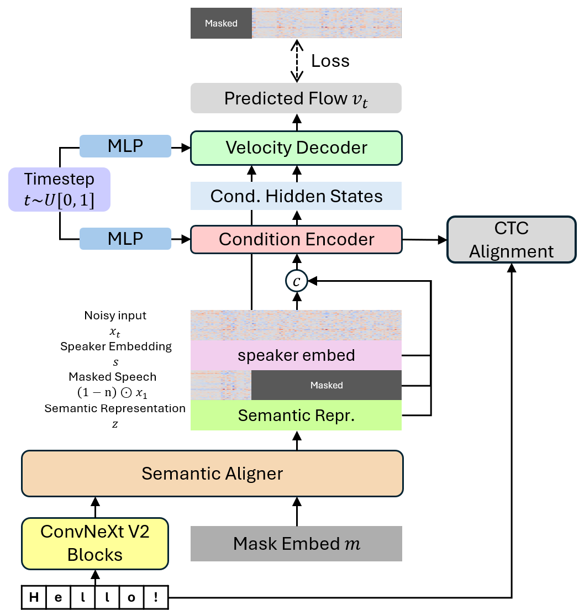
*Fig. 1:The overview of the ARCHI-TTS architecture.*

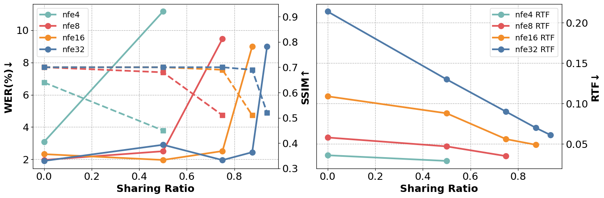
*Fig. 2:WER (solid line, left) and SSIM (dotted line, left), and RTF (right) across different sharing ratios.*

---
**Usage Info**: 4281 tokens used.
**Generated at**: 2026-02-23 21:33:15

---

# 📚 Wave-Trainer-Fit: Neural Vocoder with Trainable Prior and Fixed-Point Iteration towards High-Quality Speech Generation from SSL features

🚀 URL: https://arxiv.org/html/2602.05443

## 🌏 Abstract (원문)
Neural vocoders are deep neural networks (DNNs) that generate speech waveforms from acoustic features. Recently, they have become indispensable components in various tasks such as text-to-speech, voice conversion, and speech-to-speech translation. Specifically, neural vocoders from Mel-spectrograms have been widely researched, and they have become capable of generating waveforms of the same quality as human speech. In recent years, the advancement of self-supervised learning (SSL) models has changed the way of conventional speech processing tasks. SSL models have demonstrated high performance in generative applications such as text-to-speech synthesis, and speech restoration. Their advantage is the ability to learn data-driven features that represent speech signals from large amounts of unlabeled data. In light of this background, robust vocoders from SSL features are becoming increasingly essential. WaveFit is a fixed-point iteration vocoder that combines generative adversarial networks (GANs) with diffusion model-like inference. Due to the combination of the two generative models, WaveFit can generate high-quality waveforms from not only Mel-spectrograms, but also SSL features that are not specialized for waveform generation tasks. When Mel-spectrograms are used as input of WaveFit, signal processing knowledge could be applied for effective training of diffusion models in two ways: 1. initial noise could be sampled from a hand-crafted prior distribution using the spectral envelope, rather than the Gaussian noise. 2. Gain adjustment is done explicitly using the power of the Mel-Spectrogram. However, when SSL features are used as input, these methods cannot be used since SSL features are not derived from signal-processing. To overcome these limitations, we propose a neural vocoder with trainable prior and fixed-point iteration (WaveTrainerFit) for improved waveform generation from SSL features. The key improvements in WaveTrainerFit over WaveFit are illustrated in Fig.1. First, by introducing variational autoencoder (VAE)-based trainable priors, we achieve sampling of noise close to target waveform. Since inference can start from a point close to speech, high-quality waveform generation with fewer iterations could be expected. Furthermore, by imposing constraints on the priors to learn the energy of speech, we realize gain adjustment using the energy of the priors, which frees the vocoder from the implicit energy inference task. As a result, the model can focus on more important aspects of waveform modeling, and is thought to mitigate the difficulty of training. Objective evaluations showed that WaveTrainerFit achieves better quality waveform generation compared to WaveFit with fewer iterations. Moreover, the proposed method can generate natural waveforms even when conditioned on SSL features from deep layers, which contain limited acoustic information. Finally, subjective evaluation showed that the proposed method outperforms the baselines in speaker similarity.
## 🌏 Abstract (번역)
뉴럴 보코더는 음향 특징으로부터 음성 파형을 생성하는 심층 신경망(DNN)입니다. 최근 이들은 텍스트 음성 변환, 음성 변환, 음성 대 음성 번역과 같은 다양한 작업에서 필수적인 구성 요소가 되었습니다. 특히 멜-스펙트로그램 기반의 뉴럴 보코더는 널리 연구되어 인간의 음성과 동일한 품질의 파형을 생성할 수 있게 되었습니다. 최근 몇 년 동안 자가 지도 학습(SSL) 모델의 발전은 기존의 음성 처리 작업 방식을 변화시켰습니다. SSL 모델은 텍스트 음성 합성 및 음성 복원과 같은 생성 애플리케이션에서 높은 성능을 입증했습니다. 이들의 장점은 대량의 레이블이 없는 데이터로부터 음성 신호를 나타내는 데이터 구동 특징을 학습할 수 있다는 점입니다. 이러한 배경에서 SSL 특징을 활용한 견고한 보코더의 중요성이 점점 더 커지고 있습니다. WaveFit은 생성적 적대 신경망(GAN)과 확산 모델과 유사한 추론을 결합한 고정 소수점 반복 보코더입니다. 두 생성 모델의 결합 덕분에 WaveFit은 멜-스펙트로그램뿐만 아니라 파형 생성 작업에 특화되지 않은 SSL 특징으로부터도 고품질 파형을 생성할 수 있습니다. WaveFit에 멜-스펙트로그램을 입력으로 사용할 때는 신호 처리 지식을 활용하여 두 가지 방식으로 확산 모델을 효과적으로 학습시킬 수 있습니다. 첫째, 가우시안 노이즈 대신 스펙트럼 포락선을 사용한 수동 설계 사전 분포에서 초기 노이즈를 샘플링할 수 있습니다. 둘째, 멜-스펙트로그램의 파워를 사용하여 이득 조정을 명시적으로 수행할 수 있습니다. 그러나 SSL 특징을 입력으로 사용할 때는 이러한 특징이 신호 처리에서 파생된 것이 아니기 때문에 이러한 방법을 사용할 수 없습니다. 이러한 한계를 극복하기 위해 본 논문에서는 SSL 특징으로부터 개선된 파형 생성을 위해 학습 가능한 사전 확률(trainable prior)과 고정 소수점 반복을 결합한 뉴럴 보코더인 WaveTrainerFit을 제안합니다. WaveFit 대비 WaveTrainerFit의 주요 개선 사항은 다음과 같습니다. 첫째, 변이형 오토인코더(VAE) 기반의 학습 가능한 사전 확률을 도입함으로써 대상 파형에 가까운 노이즈 샘플링을 달성했습니다. 음성에 가까운 지점에서 추론을 시작할 수 있으므로 더 적은 반복 횟수로도 고품질 파형 생성을 기대할 수 있습니다. 또한 사전 확률이 음성의 에너지를 학습하도록 제약 조건을 부과함으로써 사전 확률의 에너지를 이용한 이득 조정을 실현하였으며, 이를 통해 보코더가 암묵적인 에너지 추론 작업에서 벗어나게 했습니다. 그 결과 모델은 파형 모델링의 더 중요한 측면에 집중할 수 있게 되었으며 학습의 어려움이 완화된 것으로 보입니다. 객관적 평가 결과 WaveTrainerFit은 WaveFit보다 적은 반복 횟수로 더 나은 품질의 파형 생성을 달성했습니다. 또한 제안된 방법은 음향 정보가 제한된 깊은 계층의 SSL 특징을 조건으로 할 때도 자연스러운 파형을 생성할 수 있습니다. 마지막으로 주관적 평가에서 제안된 방법은 화자 유사성 측면에서 베이스라인을 능가하는 성능을 보였습니다.

## 🔍 Methods & Results
- WaveFit의 노이즈 샘플링 및 이득 조정 문제를 해결하기 위해 VAE 기반의 학습 가능한 사전 확률(Trainable Prior)을 도입함
- 모델링 복잡도를 낮추기 위해 파형 도메인이 아닌 시간-주파수(Time-Frequency) 도메인에서 사전 및 사후 인코더를 구현함
- 사후 인코더 출력에 대상 음성의 에너지를 일치시키는 제약 조건을 추가하여 참조 기반 이득 조정(Reference-aware gain adjustment)을 실현함
- 손실 함수는 확산/GAN 손실, KL 발산 손실, 그리고 타겟 스펙트로그램의 파워를 반영하는 가이드 손실을 결합하여 구성함
- 객관적 평가 결과, WaveFit 대비 더 적은 반복 횟수로도 고품질의 파형 생성이 가능함을 입증함
- 음향 정보가 부족한 깊은 계층의 SSL 특징을 입력으로 사용하더라도 자연스러운 음성 파형을 생성할 수 있음
- 주관적 평가에서 기존 베이스라인 모델들보다 화자 유사성(Speaker Similarity) 측면에서 우수한 성능을 기록함

## 🖼 Figures
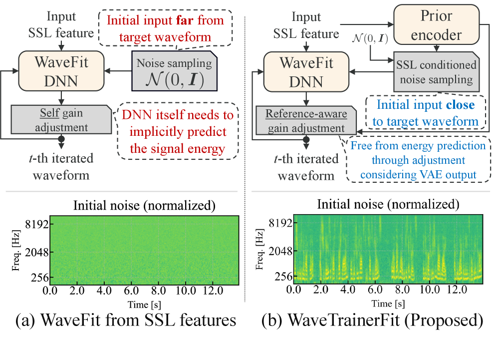
*Fig. 1: Conceptual diagrams and noise examples of each methods. The bottom images show the log Mel-spectrograms of initial noise.*

*Fig. 2: Overview of the proposed model. During training, the posterior encoder derived from the target waveform and the SSL feature is used for noise sampling and gain adjustment. During inference, the prior encoder derived from the SSL feature is used for same process. Solid arrows are used for both training and inference.*

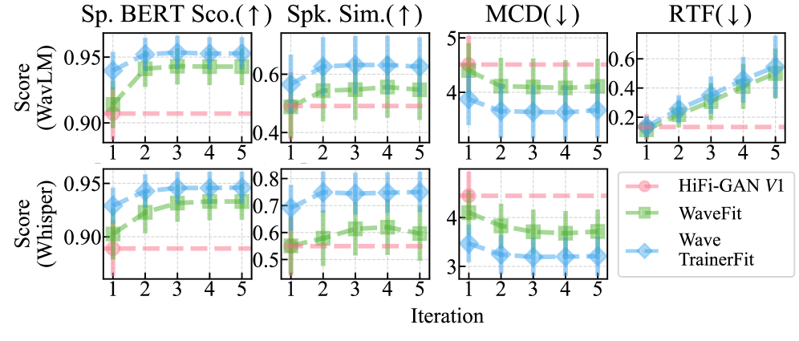
*Fig. 3: Line plots of objective metrics over iterations. Real-Time Factor (RTF) was measured on “Intel(R) Xeon(R) Silver 4316 CPU @ 2.30GHz” using randomly selected 200 samples.*

---
**Usage Info**: 4534 tokens used.
**Generated at**: 2026-02-23 21:33:46

---

# 📚 Zero-Shot TTS with Enhanced Audio Prompts: BSC submission for the 2026 Wildspoof challenge TTS track ©2026 IEEE. Personal use of this material is permitted. Permission from IEEE must be obtained for all other uses, in any current or future media, including reprinting/republishing this material for advertising or promotional purposes, creating new collective works, for resale or redistribution to servers or lists, or reuse of any copyrighted component of this work in other works.

🚀 URL: https://arxiv.org/html/2602.05770

## 🌏 Abstract (원문)
Traditional Text-to-speech (TTS) systems rely on high quality studio data that usually comes from the audiobook domain. LibriTTS[14], MLS[10], and many more are examples of this usage. However, there is a growing trend for expressive TTS models that are able to synthesize spontaneous speech, needing data that is captured in the wild. Emilia[3]along with TheTTS In the Wild(TITW) dataset[4]provide spontaneous speech data to train TTS systems; the latter is designed to foster research in the training of TTS systems using noisier datasets. Training TTS models on in-the-wild data presents several challenges. First, the variety of environmental noise and acoustic conditions can introduce errors in automatic transcriptions, which can prevent convergence to intelligible speech for many architectures. Second, the diversity in prosody and speaking styles including hesitations, fillers, and variable pacing makes duration modeling substantially more difficult than in controlled audiobook recordings. To address these challenges, our approach combines: (1) speech enhancement to improve training data quality, (2) non-autoregressive architectures (F5-TTS[1]and StyleTTS2[8]) with flexible duration modeling, and (3) systematic analysis of inference parameters (prompt quality and length) to maximize audio quality and intelligibility.
## 🌏 Abstract (번역)
전통적인 텍스트 음성 변환(TTS) 시스템은 주로 오디오북 도메인에서 제공되는 고품질 스튜디오 데이터에 의존해 왔습니다. LibriTTS[14], MLS[10] 등이 이러한 활용의 예시입니다. 그러나 최근에는 자연스러운 발화를 합성할 수 있는 표현력 있는 TTS 모델에 대한 수요가 증가하고 있으며, 이를 위해 실제 환경(in-the-wild)에서 수집된 데이터가 필요합니다. Emilia[3]와 TheTTS In the Wild(TITW) 데이터셋[4]은 TTS 시스템 학습을 위한 자연스러운 발화 데이터를 제공하며, 특히 후자는 노이즈가 많은 데이터셋을 활용한 TTS 시스템 학습 연구를 촉진하기 위해 설계되었습니다. 실제 환경 데이터를 활용한 TTS 모델 학습에는 몇 가지 과제가 존재합니다. 첫째, 다양한 환경 소음과 음향 조건으로 인해 자동 전사(transcription) 오류가 발생할 수 있으며, 이는 많은 아키텍처에서 명료한 음성으로의 수렴을 방해할 수 있습니다. 둘째, 망설임, 추임새, 가변적인 속도 등 운율과 말하기 스타일의 다양성으로 인해 제어된 오디오북 녹음보다 지속 시간 모델링이 훨씬 더 어렵습니다. 이러한 문제를 해결하기 위해 본 연구의 접근 방식은 (1) 학습 데이터 품질을 개선하기 위한 음성 향상 기술, (2) 유연한 지속 시간 모델링을 갖춘 비자기회귀 아키텍처(F5-TTS[1] 및 StyleTTS2[8]), (3) 오디오 품질과 명료도를 극대화하기 위한 추론 파라미터(프롬프트 품질 및 길이)의 체계적인 분석을 결합합니다.

## 🔍 Methods & Results
- 학습 데이터의 품질을 개선하기 위해 음성 향상(Speech Enhancement) 기술을 적용하여 환경 소음 및 음향 조건 문제를 완화함
- 유연한 지속 시간 모델링이 가능한 F5-TTS 및 StyleTTS2와 같은 비자기회귀(Non-autoregressive) 아키텍처를 채택하여 복잡한 운율과 말하기 스타일을 처리함
- 추론 시 사용되는 프롬프트의 품질과 길이에 대한 체계적인 분석을 통해 최종 오디오의 품질과 명료도를 최적화함
- Emilia 및 TITW 데이터셋을 활용하여 노이즈가 포함된 실제 환경 데이터에서의 TTS 학습 가능성을 탐색함

## 🖼 Figures
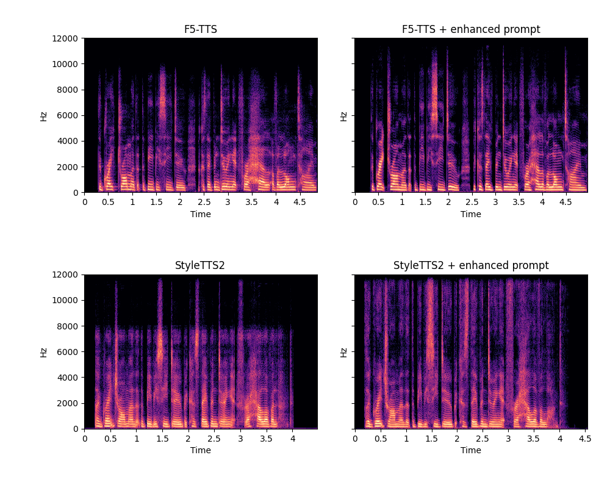
*Fig. 1:Spectrogram comparison of models with different input audio prompts*

---
**Usage Info**: 3211 tokens used.
**Generated at**: 2026-02-23 21:34:22

---

# 📚 Better Source, Better Flow: Learning Condition-Dependent Source Distribution for Flow Matching

🚀 URL: https://arxiv.org/html/2602.05951

## 🌏 Abstract (원문)
Flow Matching(Lipmanet al.,2022; Liuet al.,2022)has recently emerged as a powerful framework for generative modeling, demonstrating strong performance across many domains. In particular, Text-to-Image (T2I) systems show thatconditionalflow matching can generate high-fidelity images with strong prompt adherence(Esseret al.,2024; Labs,2024), suggesting that it is a promising alternative to diffusion-based models for conditional image generation. At its core, flow matching learns a continuous-time velocity field that transports samples from asourcedistribution to a target distribution. Unlike diffusion models, which rely on stochastic noise injection(Hoet al.,2020; Songet al.,2020a), or denoising score matching(Songet al.,2020b; Song and Ermon,2019), flow matching directly models deterministic dynamics. More importantly, it imposes no restriction on the choice of the source distribution. In principle, this flexibility makes flow matching particularly appealing for conditional generation with rich conditioning signals. Despite this conceptual advantage, most existing flow matching methods still adopt a standard Gaussian—which carries no information about the data distribution— as the source distribution. This design choice is largely inherited from diffusion models and motivated by simplicity rather than by the structure of the conditional generation problem itself. To this end, we proposeCondition-dependent Source Flow Matching(CSFM), demonstrating that source distribution design is not only feasible but also beneficial in practical text-to-image settings, facilitating more efficient and effective training of complex conditional generative models. Specifically, (1) we show that stable and effective learning with condition-dependent sources requires careful regularization and alignment: we identify key failure modes such as collapse and optimization challenges, and demonstrate that appropriate variance regularization together with source–data directional alignment is crucial for stabilization; (2) we show that the effectiveness of learning source distributions depends on the choice of target representation space, and identify representation regimes in which flow matching benefits most from source design; and (3) through extensive experiments and ablation studies across multiple text-to-image benchmarks, we demonstrate consistent and robust empirical improvements, including up to a 3.01x faster convergence in FID, and 2.48x faster convergence in CLIP Score, providing strong evidence that principled source design enables flow matching to better exploit conditioning information in practice.
## 🌏 Abstract (번역)
Flow Matching(FM)은 최근 생성 모델링을 위한 강력한 프레임워크로 부상하며 여러 도메인에서 뛰어난 성능을 보여주고 있습니다. 특히 텍스트-이미지(T2I) 시스템에서 조건부 Flow Matching은 높은 프롬프트 준수 능력을 갖춘 고충실도 이미지를 생성할 수 있음을 보여주며, 조건부 이미지 생성을 위한 확산 기반 모델의 유망한 대안으로 제시되고 있습니다. Flow Matching의 핵심은 소스 분포에서 타겟 분포로 샘플을 이동시키는 연속 시간 속도장을 학습하는 것입니다. 확산 모델과 달리 Flow Matching은 결정론적 역학을 직접 모델링하며 소스 분포 선택에 제한이 없다는 장점이 있습니다. 이러한 유연성에도 불구하고 대부분의 기존 방법은 여전히 데이터 분포에 대한 정보가 없는 표준 가우시안을 소스 분포로 채택하고 있습니다. 본 논문에서는 조건부 소스 설계가 실제 T2I 환경에서 유익함을 입증하는 'Condition-dependent Source Flow Matching(CSFM)'을 제안합니다. 구체적으로, (1) 조건 의존적 소스를 사용한 안정적인 학습을 위해 분산 정규화와 소스-데이터 방향 정렬이 필수적임을 확인하고, (2) 소스 설계의 효과가 타겟 표현 공간의 선택에 따라 달라짐을 보여주며, (3) 광범위한 실험을 통해 FID에서 최대 3.01배, CLIP 점수에서 2.48배 빠른 수렴 속도를 달성하여 원칙적인 소스 설계가 Flow Matching의 조건부 정보 활용 능력을 극대화함을 입증했습니다.

## 🔍 Methods & Results
- 고정된 소스 분포 대신 조건 변수 C에 의존하는 학습 가능한 소스 분포 p(X0|C)를 도입하는 CSFM 프레임워크 제안
- 소스 분포를 조건부 가우시안으로 모델링하고, 소스 붕괴를 방지하기 위해 평균의 이동은 허용하되 분산만을 제어하는 분산 전용 정규화(Variance-only Regularization) 기법 적용
- 고차원 T2I 최적화의 어려움을 해결하기 위해 소스와 타겟 샘플 간의 방향성 일치를 유도하는 음의 코사인 유사도 기반 정렬 손실 함수(Alignment Objective) 도입
- Flow Matching 손실, 분산 정규화, 정렬 손실을 결합한 통합 목적 함수를 통해 소스 생성기와 Flow 모델을 종단간(End-to-End) 학습
- 실험 결과, 기존 표준 가우시안 소스 대비 FID 수렴 속도 3.01배 향상 및 CLIP Score 수렴 속도 2.48배 향상 달성
- 다양한 텍스트-이미지 벤치마크에서 일관된 성능 개선을 확인하며 조건부 정보가 소스 설계에 효과적으로 반영됨을 입증

## 🖼 Figures

*Figure 1:Condition-dependent Source Flow Matching (CSFM). Flow matching does not require the source distribution to be a fixed standard Gaussian. We leverage this flexibility by learning a condition-dependent source distribution, which reduces intrinsic variance and improves conditional flow matching performance.*

![Figure 2:Analysis of CSFM designs. We investigate the effect of the source designs using two two-dimensional synthetic datasets with continuous conditions: Eight Gaussians with polar angle condition and Two Moons with 
𝑥
-coordinate condition. We visualize the transport trajectories, where ‘
×
’ denotes source points 
𝑋
0
 and ‘
∙
’ denotes points 
𝑋
1
sampled
 generated by the flow model. Colors indicate the conditioning variable. (A) Fixed Standard Gaussian: Independent coupling results in entangled paths and high intrinsic variance. (B) Deterministic Mapping: The flow model with a deterministically mapped source fails to reconstruct the original target distribution. (C) Conditional Gaussian: Although the source is modeled as a condition-dependent Gaussian, its variance collapses during training, resulting in insufficient support and an inability to recover the target distribution. (D) Conditional Gaussian with Standard KL regularization: While preventing collapse to a deterministic mapping, the constraint on 
𝜇
𝜙
​
(
𝐶
)
 limits the mobility of the source, yielding entangled trajectories. (E) Conditional Gaussian with Variance Regularization: Variance Regularization prevents collapse while allowing the conditional mode 
𝜇
𝜙
​
(
𝐶
)
 to move, resulting target-aligned source distribution and disentangled trajectories.](../images/2026-02-06/2602.05951/2602.05951_fig1.png)
*Figure 2:Analysis of CSFM designs. We investigate the effect of the source designs using two two-dimensional synthetic datasets with continuous conditions: Eight Gaussians with polar angle condition and Two Moons with 
𝑥
-coordinate condition. We visualize the transport trajectories, where ‘
×
’ denotes source points 
𝑋
0
 and ‘
∙
’ denotes points 
𝑋
1
sampled
 generated by the flow model. Colors indicate the conditioning variable. (A) Fixed Standard Gaussian: Independent coupling results in entangled paths and high intrinsic variance. (B) Deterministic Mapping: The flow model with a deterministically mapped source fails to reconstruct the original target distribution. (C) Conditional Gaussian: Although the source is modeled as a condition-dependent Gaussian, its variance collapses during training, resulting in insufficient support and an inability to recover the target distribution. (D) Conditional Gaussian with Standard KL regularization: While preventing collapse to a deterministic mapping, the constraint on 
𝜇
𝜙
​
(
𝐶
)
 limits the mobility of the source, yielding entangled trajectories. (E) Conditional Gaussian with Variance Regularization: Variance Regularization prevents collapse while allowing the conditional mode 
𝜇
𝜙
​
(
𝐶
)
 to move, resulting target-aligned source distribution and disentangled trajectories.*

*Figure 3: Flow matching loss and gradient variance. (
Var
​
(
∇
𝜃
ℒ
FM
)
). We compare the training dynamics of standard FM, CSFM without alignment loss, and CSFM. CSFM achieves faster loss convergence and lower gradient variance, particularly at early interpolation times near the source. Details of the measurement are provided in Appx. F.*

*Figure 4:Training efficiency under different target representations. We compare FID and CLIP score trajectories between CSFM and FM, using (A) SD-VAE and (B) RAE (DINOv2) target representations on the ImageNet-1K validation set. While CSFM yields consistent gains under both representations, it substantially accelerates convergence and achieves larger improvements in the structured RAE space.*

*Figure 5:Few-step generation and flow straightness. We compare FID across different sampling steps for (A) Flow Matching and (B) 1-Reflow. CSFM degrades more gracefully as the number of steps decreases, indicating reduced path intersections and a straighter transport field compared to the FM baseline.*

*Figure 7:Qualitative samples generated by CSFM (1.3B). Images are generated at 
224
×
224
 resolution using DPG-Bench prompts.*

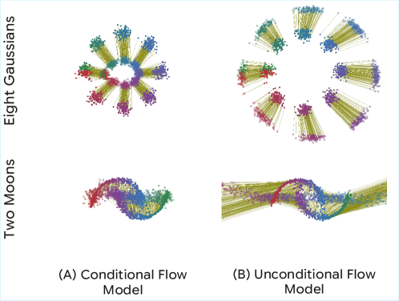
*Figure 8: Learned conditional source distributions with conditional vs. unconditional flow models.*

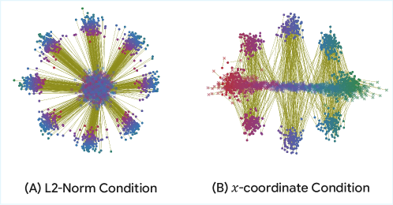
*Figure 9:Learned conditional source distributions under ill-conditioned settings.*

*Figure 10: Variance Explosion Case. The variance of the learned source distribution diverges under an unconditional flow model for (B) 
𝜆
VarReg
=
1.0
.*

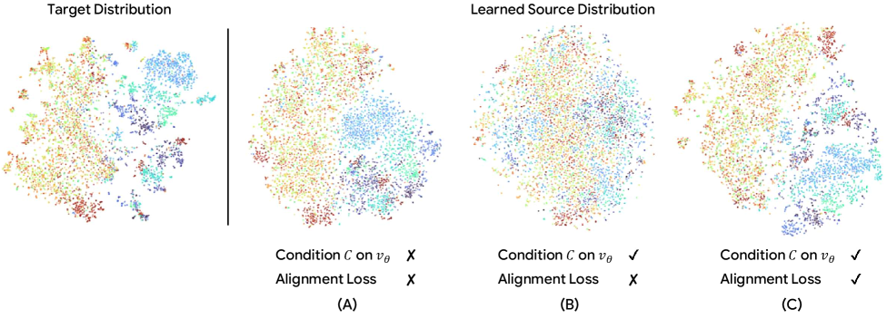
*Figure 11:t-SNE visualization of learned source distribution comparing the effects of condition injection and alignment loss.*

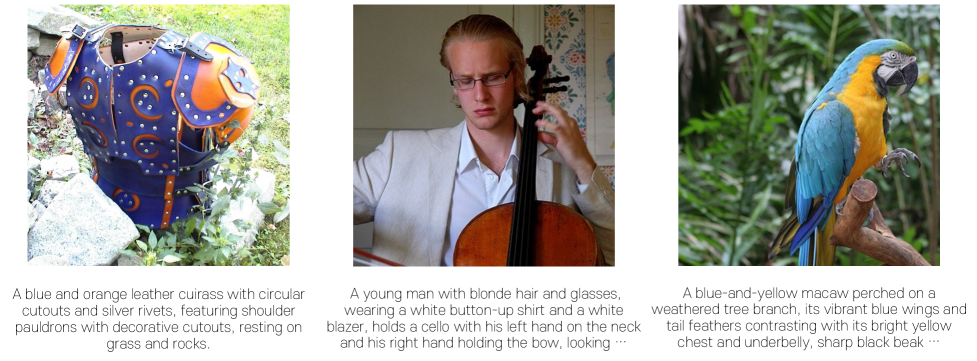
*Figure 12:Examples of detailed image–caption pairs from the constructed captioned ImageNet-1K dataset.*

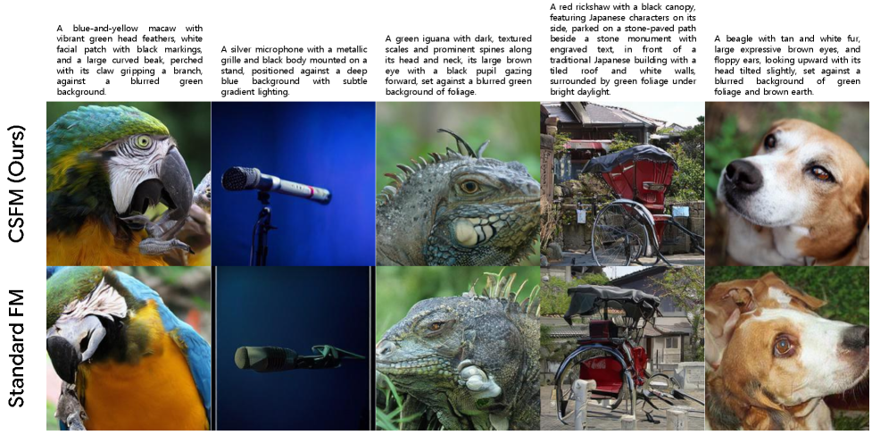
*Figure 13:Qualitative comparison between fixed and learned source distributions on ImageNet-1K (Russakovsky et al., 2015).*

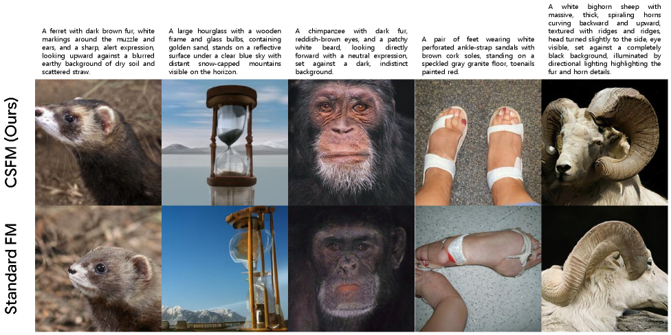
*Figure 14:Qualitative comparison between fixed and learned source distributions on ImageNet-1K (Russakovsky et al., 2015).*

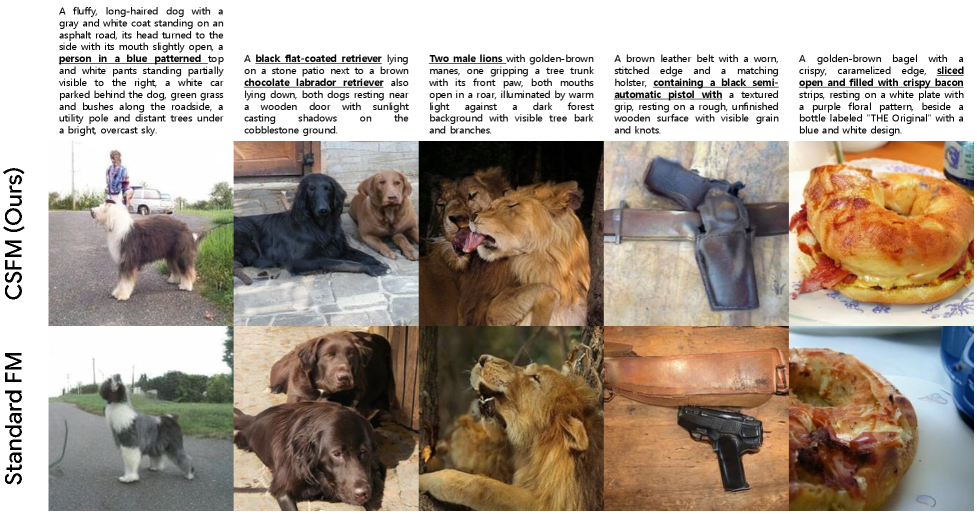
*Figure 15:Qualitative comparison between fixed and learned source distributions for prompts with multiple objects and complex relationships, on ImageNet-1K (Russakovsky et al., 2015).*

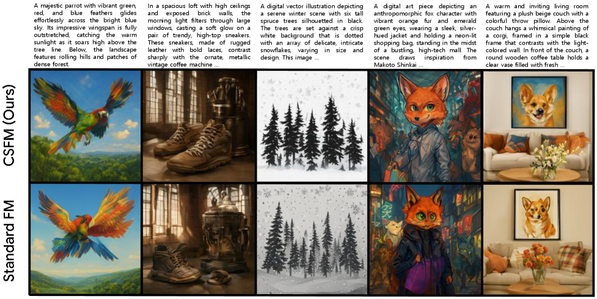
*Figure 16:Qualitative comparison between fixed and learned source distributions using UnifiedNextDiT (1.3B).*

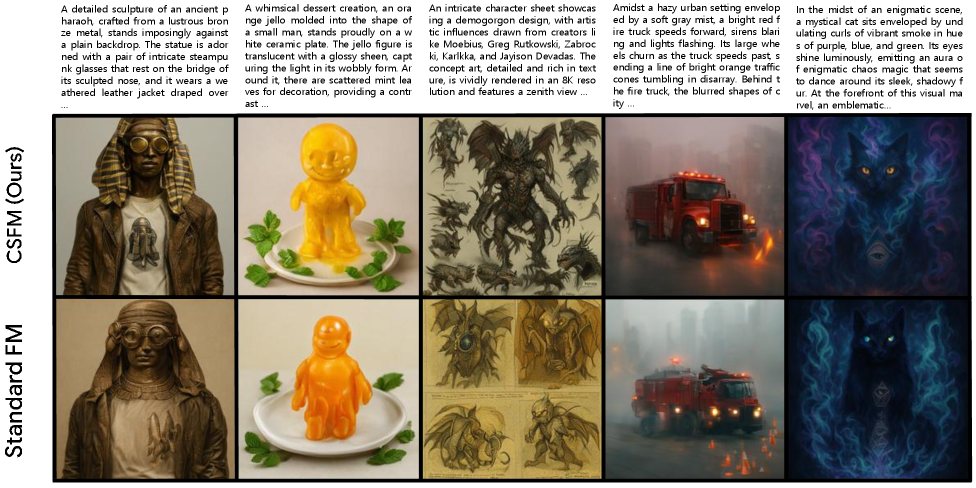
*Figure 17:Qualitative comparison between fixed and learned source distributions using UnifiedNextDiT (1.3B).*

---
**Usage Info**: 4654 tokens used.
**Generated at**: 2026-02-23 21:35:28

---

# 📚 Path-Guided Flow Matching for Dataset Distillation

🚀 URL: https://arxiv.org/html/2602.05616

## 🌏 Abstract (원문)
The rapid progress of machine learning has been driven by larger datasets and models, but this trend also makes training increasingly expensive in compute and storage. Beyond model-side efficiency techniques such as pruning and quantization, an important alternative is to reduce the data required for training. Dataset distillation does it by compressing a large training dataset into only a few synthetic samples per class (IPC), such that a model trained on the distilled dataset approaches the performance of the model trained on the full dataset. Despite the importance and popularity, an inherent difficulty in distilling data lies in that synthesized datasets must remain class-discriminative while capturing intra-class diversity, which is particularly pronounced at low IPC, where each sample must represent multiple modes without collapsing to class averages. Diffusion-based generative models have emerged as a dominant approach for dataset distillation, but typically inherit the complexity of diffusion sampling, which increases sampling cost and causes instability. Flow matching has recently been rising as an alternative generative paradigm to diffusion models, which is conceptually cleaner and can be more stable and efficient in practice. To this end, we propose the first flow-matching method for dataset distillation, i.e., Path-Guided Flow Matching or PGFM for short. We use a pretrained Gaussian Mixture Flow matching (GMFlow) generator as the backbone and generate synthetic images via standard flow sampling. To encourage diversity coverage, we first perform per-class mode discovery in latent space, and assign one prototype to each synthesized sample. PGFM delivers consistent accuracy improvements with substantially higher efficiency across high-resolution datasets. On ImageNet100, PGFM improves synthesis efficiency by 7.6x over the diffusion-based state-of-the-art method and achieves a 78% prototype hit rate, meaning a dramatically higher level of mode coverage.
## 🌏 Abstract (번역)
머신러닝의 급격한 발전은 더 큰 데이터셋과 모델에 의해 주도되었으나, 이러한 추세는 훈련 과정에서의 계산 및 저장 비용을 점점 더 비싸게 만들고 있습니다. 가지치기(pruning) 및 양자화(quantization)와 같은 모델 측면의 효율성 기술 외에도, 훈련에 필요한 데이터를 줄이는 것이 중요한 대안입니다. 데이터셋 증류(Dataset distillation)는 대규모 훈련 데이터셋을 클래스당 단 몇 개의 합성 샘플(IPC)로 압축하여, 증류된 데이터셋으로 훈련된 모델이 전체 데이터셋으로 훈련된 모델의 성능에 근접하도록 합니다. 이러한 중요성과 인기에도 불구하고, 데이터 증류의 본질적인 어려움은 합성된 데이터셋이 클래스 내 다양성을 포착하면서도 클래스 변별력을 유지해야 한다는 점에 있습니다. 이는 특히 각 샘플이 클래스 평균으로 붕괴되지 않고 여러 모드(mode)를 대표해야 하는 낮은 IPC 설정에서 두드러집니다. 확산 기반 생성 모델(Diffusion-based generative models)이 데이터셋 증류의 지배적인 접근 방식으로 등장했지만, 일반적으로 확산 샘플링의 복잡성을 상속받아 샘플링 비용이 증가하고 불안정성을 초래합니다. 최근 플로우 매칭(Flow matching)이 확산 모델의 대안적인 생성 패러다임으로 부상하고 있으며, 이는 개념적으로 더 깔끔하고 실제적으로 더 안정적이며 효율적일 수 있습니다. 이를 위해 본 논문에서는 데이터셋 증류를 위한 최초의 플로우 매칭 방법인 경로 안내 플로우 매칭(Path-Guided Flow Matching, PGFM)을 제안합니다. 사전 훈련된 가우시안 혼합 플로우(GMFlow) 생성기를 백본으로 사용하고 표준 플로우 샘플링을 통해 합성 이미지를 생성합니다. 다양성 확보를 장려하기 위해 먼저 잠재 공간에서 클래스별 모드 탐색을 수행하고, 각 합성된 샘플에 하나의 프로토타입을 할당합니다. 실험적으로 PGFM은 고해상도 데이터셋 전반에서 실질적으로 더 높은 효율성과 함께 일관된 정확도 향상을 제공합니다. ImageNet100에서 PGFM은 기존의 최첨단 확산 기반 방법보다 합성 효율성을 7.6배 향상시켰으며, 78%의 프로토타입 적중률을 달성하여 획기적으로 높은 수준의 모드 커버리지를 보여주었습니다.

## 🔍 Methods & Results
- VAE 잠재 공간(Latent Space) 활용: 픽셀 공간 대신 압축된 VAE 잠재 공간에서 증류를 수행하여 계산 효율성을 높이고 지각적으로 정렬된 샘플을 생성함
- 프로토타입 안내 전략(Prototype Guidance): K-means++ 클러스터링을 통해 클래스별 잠재 프로토타입을 추출하고, 샘플링 과정에서 이를 목표 모드로 설정하여 클래스 내 다양성을 확보함
- 조기 종료(Early Stopping) 및 신뢰 영역(Trust-Region) 제약: 샘플링 초기 단계에만 프로토타입 안내를 적용하고 제어 강도를 제한하여 이미지의 세부 사항이 뭉개지는 현상을 방지함
- 잠재 선택(Latent Selection) 메커니즘: 최종 샘플링 단계에서 solver 상태와 예측된 clean latent 중 배치의 표준 편차를 최소화하는 후보를 선택하여 시각적 품질을 안정화함
- ImageNet100 성능: IPC 10 기준, 추가 안내가 없는 순수 플로우 매칭만으로도 MGD3 및 MinimaxDiff와 같은 강력한 확산 기반 베이스라인을 능가함
- 효율성 및 커버리지: 기존 최첨단 확산 기반 모델 대비 합성 속도를 7.6배 향상시켰으며, 78%의 높은 프로토타입 적중률을 통해 뛰어난 모드 커버리지를 입증함

## 🖼 Figures
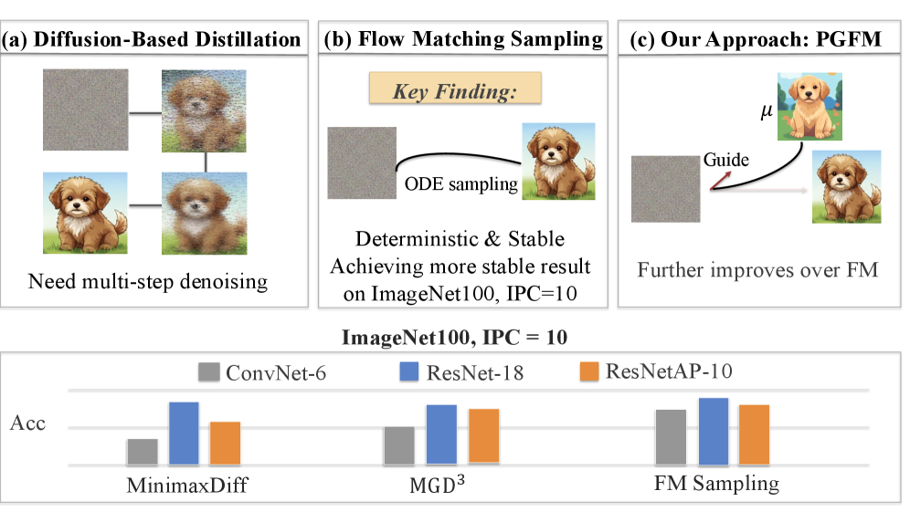
*Figure 1: Motivation: Diffusion sampling denoises step-by-step, while flow matching uses deterministic ODE sampling that is already strong and smooth; PGFM adds lightweight prototype guidance to further improve performance.*

*Figure 2: Sampling process of PGFM: Starting from Gaussian noise, we then sample with a pretrained flow-matching generator (GMFlow) while applying lightweight, early-stage prototype guidance with a trust region to improve mode coverage without washing out details.*

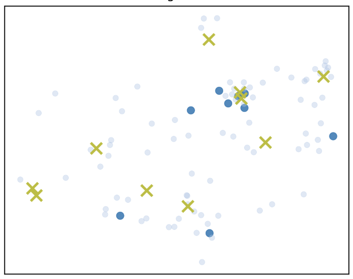
*(a)Baseline FM*

*(a)Baseline FM*

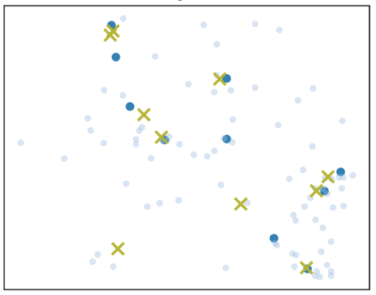
*(b)MGD3*

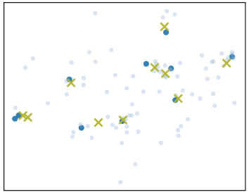
*(c)PGFM (Ours)*

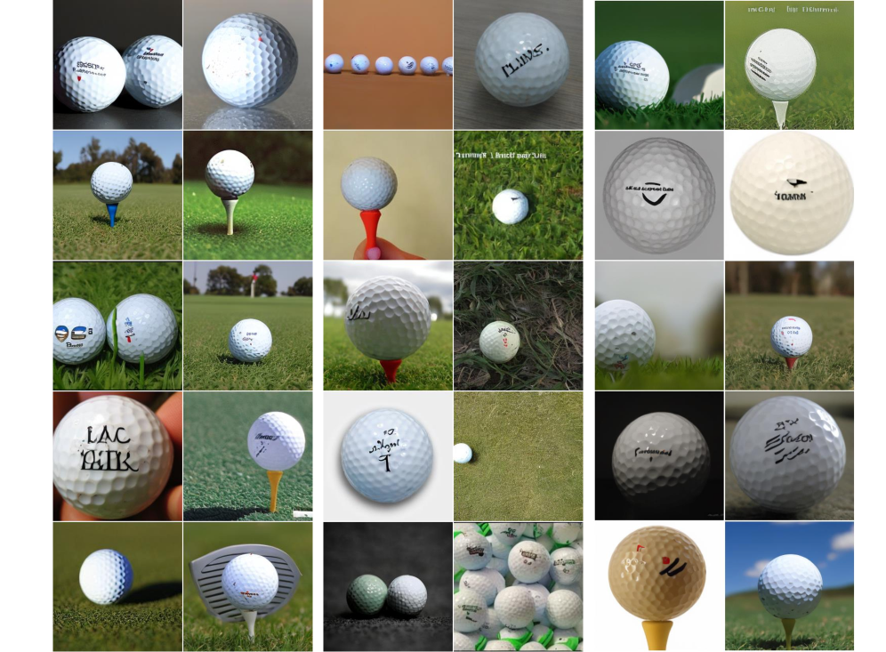
*(d)FM, MGD3, PGFM*

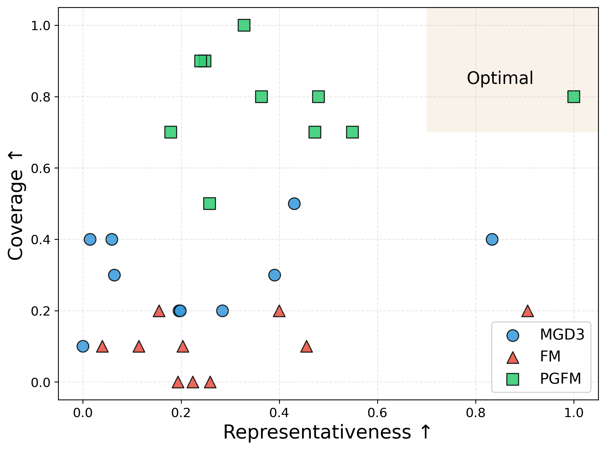
*Figure 4:Representativeness and coverage analysis*

*Figure 5: Blurring synthetic images on ImageNette for 
IPC
=
10*

*Figure 6: Synthetic images with ImageNette and 
IPC
=
10*

*Figure 7: Visualization of the flow matching-based sampling step from time 0 to 1.*

*Figure 8: Visualization of the diffusion-based sampling.*

---
**Usage Info**: 5049 tokens used.
**Generated at**: 2026-02-23 21:36:57

---

# 📚 Pathwise Test-Time Correction for Autoregressive Long Video Generation

🚀 URL: https://arxiv.org/html/2602.05871

## 🌏 Abstract (원문)
Video generation has advanced rapidly with the development of diffusion-based generative models, which now enable the high-quality synthesis of complex motion and visual appearance. However, scaling these diffusion priors to extended video sequences remains a formidable challenge. Beyond the escalating computational costs associated with longer contexts, maintaining temporal coherence over extended horizons is difficult without incurring excessive latency, thereby limiting their deployment in real-time applications. To overcome these limitations, recent studies have shifted from bidirectional modeling to step-distilled autoregressive generation, enabling true real-time video synthesis. However, these methods remain constrained by cascading error accumulation: since each frame is conditioned on prior outputs, initial inaccuracies compound over time, resulting in temporal drift and long-horizon degradation. While recent extensions like Rolling Forcing, LongLive, Self-Forcing++, and WorldPlay have achieved minute-level consistency through sink mechanisms and windowed DMD retraining, they necessitate substantial computational overhead for model fine-tuning. Consequently, a pivotal question arises: Can we improve the stability of autoregressive video generation purely at inference time, bypassing the need for retraining the base model? Test-Time Optimization (TTO) has emerged as a compelling alternative for enhancing video quality without the need for retraining. However, while effective for short-video synthesis, our toy experiments reveal that scaling TTO to long-horizon autoregressive generation faces a dual bottleneck consisting of the inherent difficulty in defining reward functions for long-range consistency and the extreme optimization sensitivity of distilled models. We observe that in these distilled models, even infinitesimal test-time gradients often trigger reward collapse and fail to mitigate cumulative error. Therefore, we propose Test-Time Correction (TTC), which is a training-free framework that shifts the paradigm from parameter-space optimization to sampling-space stochastic intervention. TTC is grounded in the insight that few-step distilled samplers are inherently stochastic as they perturb intermediate states with injected noise. This property implies that intermediate predictions are not fixed outcomes but rather malleable latent states that can be rectified by subsequent diffusion steps to align with the global initial context while preserving the underlying sampling distribution. Specifically, as shown in Figure 2, TTC applies a small number of correction steps along the stochastic sampling path, only after the global structure has stabilized. This delay prevents the generation from falling into sink-collapse, a phenomenon where newly generated frames repeatedly regress toward the sink frames instead of evolving naturally. At these chosen steps in the sampling path, TTC performs reference-conditioned denoising by utilizing the initial frame context to anchor a corrected clean prediction. Then, this corrected state is re-noised back to the variance level corresponding to the current timestep, which ensures that the intervention remains compatible with the expected noise distribution. By integrating correction into the stochastic sampling path of the autoregressive diffusion process rather than directly replacing the denoised prediction, this mechanism suppresses long-term error accumulation and temporal drift without retraining, while preserving high-fidelity temporal coherence over extended durations. In this work, we show that long-horizon stability in autoregressive video generation can be achieved through test-time intervention alone. Our method suppresses error accumulation with negligible computational overhead, without requiring any retraining. As a result, it extends the stable generation length of distilled autoregressive models from a few seconds to over 30 seconds, while achieving visual quality comparable to state-of-the-art training-based methods. Consistent improvements across multiple model architectures demonstrate that TTC is a robust and general solution for stabilizing distilled autoregressive diffusion models.
## 🌏 Abstract (번역)
비디오 생성 기술은 확산 기반 생성 모델의 발전과 함께 복잡한 움직임과 시각적 외형을 고품질로 합성할 수 있을 정도로 빠르게 발전했습니다. 그러나 이러한 확산 사전 학습 모델을 확장된 비디오 시퀀스로 확장하는 것은 여전히 큰 과제입니다. 긴 컨텍스트와 관련된 계산 비용 증가 외에도, 과도한 지연 시간 없이 긴 시간 범위에서 시간적 일관성을 유지하는 것이 어려워 실시간 응용 분야에서의 배포가 제한됩니다. 이러한 한계를 극복하기 위해 최근 연구들은 양방향 모델링에서 단계 증류(step-distilled) 자기회귀 생성으로 전환하여 진정한 실시간 비디오 합성을 가능하게 했습니다. 그러나 이러한 방법들은 여전히 계단식 오류 축적의 제약을 받습니다. 각 프레임이 이전 출력에 조건화되기 때문에 초기 부정확성이 시간이 지남에 따라 복합되어 시간적 드리프트와 장기적 성능 저하를 초래합니다. 최근 Rolling Forcing, LongLive, Self-Forcing++, WorldPlay와 같은 확장 연구들이 싱크 메커니즘과 윈도우 DMD 재학습을 통해 분 단위의 일관성을 달성했지만, 이는 모델 미세 조정을 위한 상당한 계산 오버헤드를 필요로 합니다. 결과적으로, 기본 모델을 재학습할 필요 없이 추론 단계에서만 자기회귀 비디오 생성의 안정성을 개선할 수 있는가라는 핵심적인 질문이 제기됩니다. 테스트 시간 최적화(TTO)는 재학습 없이 비디오 품질을 향상시키는 매력적인 대안으로 등장했습니다. 그러나 짧은 비디오 합성에는 효과적이지만, 장기 자기회귀 생성으로 TTO를 확장할 때 장기 일관성을 위한 보상 함수 정의의 본질적인 어려움과 증류된 모델의 극단적인 최적화 민감도라는 이중 병목 현상에 직면한다는 것을 실험을 통해 확인했습니다. 증류된 모델에서는 아주 미세한 테스트 시간 그래디언트조차 종종 보상 붕괴를 일으키고 누적 오류를 완화하는 데 실패합니다. 이에 본 연구에서는 파라미터 공간 최적화에서 샘플링 공간 확률적 개입으로 패러다임을 전환하는 학습 불필요 프레임워크인 테스트 시간 보정(TTC)을 제안합니다. TTC는 소수 단계 증류 샘플러가 중간 상태에 노이즈를 주입하여 본질적으로 확률적이라는 통찰에 기반합니다. 이 속성은 중간 예측이 고정된 결과가 아니라, 기본 샘플링 분포를 유지하면서 글로벌 초기 컨텍스트와 일치하도록 후속 확산 단계에 의해 수정될 수 있는 유연한 잠재 상태임을 의미합니다. 구체적으로 TTC는 글로벌 구조가 안정화된 후에만 확률적 샘플링 경로를 따라 소수의 보정 단계를 적용합니다. 이러한 지연은 새로 생성된 프레임이 자연스럽게 진화하는 대신 싱크 프레임으로 반복적으로 회귀하는 싱크 붕괴 현상을 방지합니다. 샘플링 경로의 선택된 단계에서 TTC는 초기 프레임 컨텍스트를 사용하여 보정된 깨끗한 예측을 고정하는 참조 조건부 디노이징을 수행합니다. 그런 다음 이 보정된 상태를 현재 타임스텝에 해당하는 분산 수준으로 다시 노이즈를 추가하여 개입이 예상되는 노이즈 분포와 호환되도록 합니다. 보정 기능을 자기회귀 확산 프로세스의 확률적 샘플링 경로에 통합함으로써, 재학습 없이도 장기적인 오류 축적과 시간적 드리프트를 억제하는 동시에 확장된 시간 동안 고충실도 시간적 일관성을 유지합니다. 본 연구에서는 테스트 시간 개입만으로도 자기회귀 비디오 생성의 장기 안정성을 달성할 수 있음을 보여줍니다. 제안된 방법은 재학습 없이 무시할 수 있는 수준의 계산 오버헤드로 오류 축적을 억제합니다. 그 결과, 증류된 자기회귀 모델의 안정적인 생성 길이를 몇 초에서 30초 이상으로 연장하며, 최신 학습 기반 방법과 유사한 시각적 품질을 달성합니다. 여러 모델 아키텍처에 걸친 일관된 개선은 TTC가 증류된 자기회귀 확산 모델을 안정화하기 위한 강력하고 일반적인 솔루션임을 입증합니다.

## 🔍 Methods & Results
- 자기회귀 비디오 생성을 컨텍스트 조건부 생성 모델 하에서의 다음 청크 예측(next-chunk prediction)으로 정식화함
- 소수 단계 증류 확산 모델이 중간 단계에서 노이즈를 주입하는 확률적 샘플링 프로세스를 사용함을 정의함
- 기존 테스트 시간 최적화(TTO)가 장기 비디오 생성에서 오류 축적을 억제하기 위한 명시적 보상 함수 설계의 어려움과 증류 모델의 민감도로 인해 한계가 있음을 실험적으로 증명함
- 테스트 시간 보정(TTC)은 파라미터 최적화 대신 샘플링 공간에서의 확률적 개입(stochastic intervention)을 수행하는 학습 불필요(training-free) 방식을 채택함
- 글로벌 구조가 안정화된 후 참조 조건부 디노이징(reference-conditioned denoising)을 통해 깨끗한 예측값을 초기 컨텍스트에 고정하고, 이를 다시 현재 노이즈 수준으로 리노이징(re-noising)하여 분포 일관성을 유지함
- TTC 적용 결과, 추가 학습 없이도 안정적인 비디오 생성 길이를 수 초에서 30초 이상으로 대폭 연장하였으며 최신 학습 기반 모델에 필적하는 품질을 확보함

## 🖼 Figures

*Figure 2:Comparison of sampling strategies. The Original Path suffers from error accumulation, while the Sink-based Path collapses into a Sink Point (dynamic collapse). In contrast, our TTC strategy avoids these failures by employing reference-conditioned denoising and explicit Re-noising, effectively steering the trajectory away from the sink to preserve target distribution.*

*Figure 3:Variants of autoregressive video generation. Discrete AR uses single-step deterministic prediction, multi-step diffusion follows a deterministic ODE trajectory, while few-step distilled diffusion performs stochastic sampling with intermediate noise injection.*

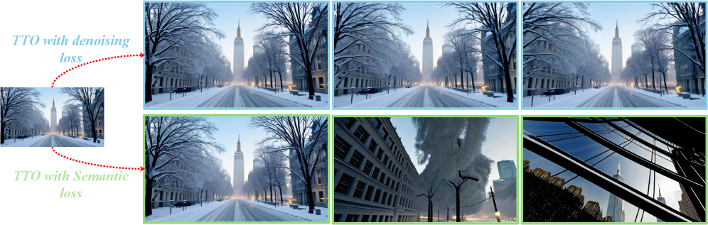
*Figure 4:Comparison of two toy test-time optimization variants based on LoRA fine-tuning.*

![Figure 5:Overall pipeline of our method. A sparse set of correction steps is inserted into the stochastic sampling path until the global structure stabilizes. At selected steps, TTC performs reference-conditioned denoising using the initial frame to obtain a corrected prediction, which is then re-noised to the current timestep to remain consistent with the expected noise distribution. This on-path, training-free correction suppresses long-term error accumulation and stabilizes long-horizon generation.](../images/2026-02-06/2602.05871/2602.05871_fig3.png)
*Figure 5:Overall pipeline of our method. A sparse set of correction steps is inserted into the stochastic sampling path until the global structure stabilizes. At selected steps, TTC performs reference-conditioned denoising using the initial frame to obtain a corrected prediction, which is then re-noised to the current timestep to remain consistent with the expected noise distribution. This on-path, training-free correction suppresses long-term error accumulation and stabilizes long-horizon generation.*

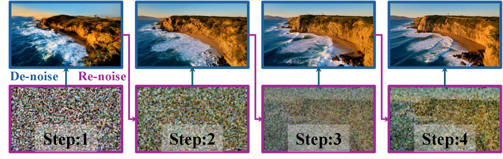
*Figure 6:Intermediate predictions along the stochastic sampling path. High-noise steps determine global structure, while low-noise steps refine appearance details under a fixed layout.*

*Figure 7:Qualitative comparison of 30-second long-horizon video generation with Self-Forcing, Rolling Forcing, and LongLive. Our method significantly outperforms Self-Forcing and achieves temporal coherence and visual quality comparable to training-based methods.*

*Figure 8:Comparison between the sink-based method and path-wise correction. The sink-based method overly constrains intermediate states, leading to degraded motion dynamics and reduced temporal variation.*

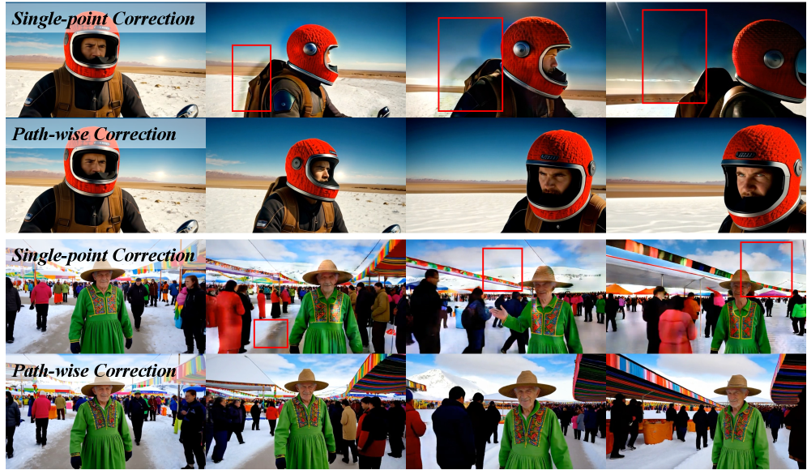
*Figure 9:Comparison of single-point and path-wise correction. Single-point correction causes temporal discontinuities, while on-path re-noising improves temporal stability and reduces flickering.*

*Figure 11:Qualitative comparison of 30-second long-horizon video generation with Self-Forcing, Rolling Forcing, and LongLive. Our method significantly outperforms Self-Forcing and achieves temporal coherence and visual quality comparable to training-based methods.*

*Figure 12:Qualitative comparison of 30-second long-horizon video generation with Self-Forcing, Rolling Forcing, and LongLive. Our method significantly outperforms Self-Forcing and achieves temporal coherence and visual quality comparable to training-based methods.*

*Figure 13:Qualitative comparison of 30-second long-horizon video generation with Self-Forcing, Rolling Forcing, and LongLive. Our method significantly outperforms Self-Forcing and achieves temporal coherence and visual quality comparable to training-based methods.*

---
**Usage Info**: 5978 tokens used.
**Generated at**: 2026-02-23 21:38:27

---

# 📚 Speech-XL: Towards Long-Form Speech Understanding in Large Speech Language Models

🚀 URL: https://arxiv.org/html/2602.05373

## 🌏 Abstract (원문)
Recent progress in Large Language Models (LLMs) has changed how we approach speech processing, leading to the development of Large Speech Language Models (LSLMs). By connecting audio encoders with the reasoning power of LLMs, models like Whisper, Qwen-Audio, and Audio-Flamingo have performed exceptionally well in tasks like speech recognition and translation. However, while these models work great for short audio clips (usually under 30 seconds), they struggle significantly with long-form audio. The main difficulty is the mismatch between speech sequence length and the computational profile of Transformer-based architectures. For the same semantic content, speech representations are typically several times longer than their textual counterparts, due to high frame rates and redundant acoustic structure. Self-attention incurs quadratic complexity in sequence length, and the associated key-value (KV) cache grows linearly, leading to prohibitive memory usage and inference latency as audio duration increases. In practice, most existing LSLMs are constrained to clips shorter than roughly 30 seconds, and naïvely extending them to long-form speech is computationally challenging. A natural workaround is to adopt a cascaded pipeline, first transcribing speech into text and then applying a text LLM with a larger context window. However, such cascaded systems introduce an information bottleneck: the intermediate textual representation discards paralinguistic and acoustic cues—such as emotion, prosody, and environmental context—that are often crucial for holistic understanding. End-to-end (E2E) LSLMs avoid this bottleneck by directly conditioning on continuous features or discrete audio tokens, but they still operate on dense, high-resolution speech sequences. As a result, current E2E models remain effectively short-context, and long-form speech understanding is underexplored. In this work, we study how to scale E2E LSLMs to long-form speech without reverting to a purely textual intermediate representation. Our approach is motivated by a simple observation: speech representations are highly redundant and attention in LLMs is typically sparse. Neighboring frames often encode similar content, so they populate the KV cache with many near-duplicate entries, while attention maps reveal that only a small subset of tokens is queried frequently. To exploit this redundancy, we introduce a Speech Summarization Token (SST), a specialized token that attends to a local temporal segment of the audio and produces a compact representation for that segment. After summarization, the model retains only the condensed KV entries associated with SSTs for subsequent layers and discards the KV entries of the original acoustic tokens, thereby shortening the effective sequence seen by the LSLM while preserving salient semantic and paralinguistic cues. Simply training SSTs to operate at high compression ratios is non-trivial: aggressive compression can easily harm recognition accuracy and long-range reasoning. To make SST learning stable, we first build a strong speech-language backbone and then introduce a dedicated curriculum stage for SST. Concretely, Speech-XL is trained in a three-stage pipeline: we first align semantic representations via ASR-based pre-training, then perform instruction tuning following DIFFA-style synthetic data generation, and finally apply an SST curriculum on long-form audio. In the curriculum stage, the model is initially trained under low compression ratios (e.g., 2x, 4x), where the information-retention problem is comparatively easy, and is then gradually exposed to higher compression ratios (e.g., 8x) and longer input sequences. This progressive schedule stabilizes the summarization behavior before the model is asked to compress ultra-long audio. Our contributions are as follows: We formulate the problem of long-form end-to-end speech modeling for LSLMs and show that naïve scaling is fundamentally limited by sequence length and KV cache growth in Transformer architectures. We introduce Speech-XL, a framework that integrates Speech Summarization Tokens (SSTs) into LSLMs to perform learnable KV-space compression of speech representations, substantially reducing memory and computation for long-form audio while maintaining task performance. We propose a curriculum learning strategy that gradually increases the SST compression ratio, enabling stable training from short segments to multi-minute audio.
## 🌏 Abstract (번역)
대규모 언어 모델(LLM)의 최근 발전은 음성 처리 방식에 변화를 가져왔으며, 이는 대규모 음성 언어 모델(LSLM)의 개발로 이어졌습니다. 오디오 인코더를 LLM의 추론 능력과 연결함으로써 Whisper, Qwen-Audio, Audio-Flamingo와 같은 모델들은 음성 인식 및 번역과 같은 작업에서 뛰어난 성능을 보여주었습니다. 그러나 이러한 모델들은 짧은 오디오 클립(보통 30초 미만)에는 잘 작동하지만, 장문 음성(long-form audio)에서는 상당한 어려움을 겪습니다. 주요 원인은 음성 시퀀스 길이와 트랜스포머 기반 아키텍처의 계산 프로필 간의 불일치입니다. 동일한 의미적 내용에 대해 음성 표현은 높은 프레임 속도와 중복된 음향 구조로 인해 텍스트 대응물보다 일반적으로 몇 배 더 깁니다. 셀프 어텐션은 시퀀스 길이에 따라 이차 복잡도를 유발하며, 관련 키-값(KV) 캐시는 선형적으로 증가하여 오디오 길이가 길어짐에 따라 막대한 메모리 사용량과 추론 지연을 초래합니다. 실제로 대부분의 기존 LSLM은 약 30초보다 짧은 클립으로 제한되며, 이를 장문 음성으로 단순 확장하는 것은 계산적으로 어렵습니다. 자연스러운 해결책은 음성을 먼저 텍스트로 전사한 다음 더 큰 컨텍스트 창을 가진 텍스트 LLM을 적용하는 계층적 파이프라인을 채택하는 것입니다. 그러나 이러한 계층적 시스템은 정보 병목 현상을 유발합니다. 중간 텍스트 표현은 감정, 운율, 환경적 맥락과 같이 전체적인 이해에 중요한 파라언어적 및 음향적 단서들을 버리게 됩니다. 엔드투엔드(E2E) LSLM은 연속적인 특징이나 이산 오디오 토큰에 직접 조건화함으로써 이 병목 현상을 피하지만, 여전히 고밀도의 고해상도 음성 시퀀스에서 작동합니다. 결과적으로 현재의 E2E 모델은 사실상 짧은 컨텍스트에 머물러 있으며, 장문 음성 이해는 충분히 탐구되지 않은 상태입니다. 본 연구에서는 순수하게 텍스트인 중간 표현으로 돌아가지 않고 E2E LSLM을 장문 음성으로 확장하는 방법을 연구합니다. 우리의 접근 방식은 음성 표현이 매우 중복적이며 LLM의 어텐션이 일반적으로 희소하다는 단순한 관찰에서 영감을 얻었습니다. 인접한 프레임은 종종 유사한 내용을 인코딩하므로 KV 캐시를 많은 거의 중복된 항목으로 채우는 반면, 어텐션 맵은 토큰의 작은 하위 집합만이 빈번하게 쿼리됨을 보여줍니다. 이러한 중복성을 활용하기 위해, 우리는 오디오의 국소적 시간 세그먼트에 주목하고 해당 세그먼트에 대한 압축된 표현을 생성하는 특수 토큰인 음성 요약 토큰(SST)을 도입합니다. 요약 후 모델은 후속 레이어를 위해 SST와 관련된 응축된 KV 항목만 유지하고 원래 음향 토큰의 KV 항목은 폐기함으로써, 핵심적인 의미 및 파라언어적 단서를 보존하면서 LSLM이 보는 유효 시퀀스 길이를 단축합니다. SST를 높은 압축률에서 작동하도록 훈련시키는 것은 쉽지 않습니다. 공격적인 압축은 인식 정확도와 장거리 추론을 쉽게 해칠 수 있습니다. SST 학습을 안정화하기 위해 먼저 강력한 음성-언어 백본을 구축한 다음 SST를 위한 전용 커리큘럼 단계를 도입합니다. 구체적으로 Speech-XL은 3단계 파이프라인으로 훈련됩니다. 먼저 ASR 기반 사전 훈련을 통해 의미 표현을 정렬하고, DIFFA 스타일의 합성 데이터 생성을 따라 지시어 튜닝을 수행하며, 마지막으로 장문 오디오에 SST 커리큘럼을 적용합니다. 커리큘럼 단계에서 모델은 처음에 정보 유지 문제가 비교적 쉬운 낮은 압축률(예: 2배, 4배)로 훈련된 다음, 점차 더 높은 압축률(예: 8배)과 더 긴 입력 시퀀스에 노출됩니다. 이러한 점진적인 일정은 모델이 초장문 오디오를 압축하도록 요구받기 전에 요약 동작을 안정화합니다. 본 연구의 기여는 다음과 같습니다. 첫째, LSLM을 위한 장문 엔드투엔드 음성 모델링 문제를 공식화하고 단순한 확장이 트랜스포머 아키텍처의 시퀀스 길이와 KV 캐시 증가에 의해 근본적으로 제한됨을 보여줍니다. 둘째, 음성 표현의 학습 가능한 KV 공간 압축을 수행하기 위해 SST를 LSLM에 통합하는 프레임워크인 Speech-XL을 도입하여, 작업 성능을 유지하면서 장문 오디오에 대한 메모리와 계산량을 실질적으로 줄입니다. 셋째, SST 압축률을 점진적으로 높여 짧은 세그먼트부터 수 분 길이의 오디오까지 안정적인 훈련을 가능하게 하는 커리큘럼 학습 전략을 제안합니다.

## 🔍 Methods & Results
- Whisper-small 인코더와 Qwen2.5-7B-Instruct LLM을 결합하고, 그 사이에 Semantic 및 Acoustic 정보를 처리하는 Dual-Adapter Bridge를 배치한 아키텍처 설계
- 음성 시퀀스를 512 길이의 인터벌로 분할하고, 각 인터벌 내에 Speech Summarization Token(SST)을 삽입하여 로컬 정보를 압축하는 메커니즘 도입
- LLM의 KV 캐시에서 원본 음성 토큰의 데이터를 제거하고 SST의 압축된 KV 상태만 유지함으로써 메모리 사용량과 연산 복잡도를 획기적으로 절감
- 3단계 학습 전략: 1단계 ASR 기반 의미 정렬, 2단계 음성 Q&A를 통한 파라언어적 이해 강화, 3단계 SST 기반 장문 압축 학습 수행
- 커리큘럼 학습 도입: 초기에는 2x, 4x의 낮은 압축률로 시작하여 점진적으로 8x 이상의 높은 압축률과 긴 시퀀스에 적응하도록 유도하여 학습 안정성 확보
- 제안된 Speech-XL 프레임워크를 통해 수 분 이상의 장문 오디오에서도 성능 저하 없이 효율적인 추론 및 이해가 가능함을 입증

## 🖼 Figures

*Figure 1:Training process of our Speech-XL framework. Phase 1: Semantic Alignment, which utilizes ASR tasks to bridge speech features and textual semantics. Phase 2: Modal Alignment, which employs speech captioning to refine the integration of speech context and linguistic descriptions.*

*Figure 2:Training process of our Speech-XL framework. Phase 3: Long-form audio is encoded and partitioned into fixed intervals, where local information is distilled into SST KV states. This mechanism enables Speech-XL to perceive and comprehend exceptionally long speech streams.*

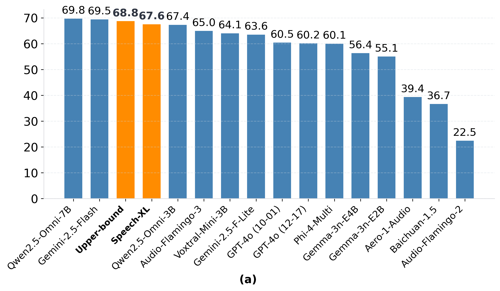
*Figure 3:(a) shows the ranking for the Speech Content Extraction task. (b) shows the ranking for Speaker Information Modeling. (c) presents the overall ranking combining both tasks.*

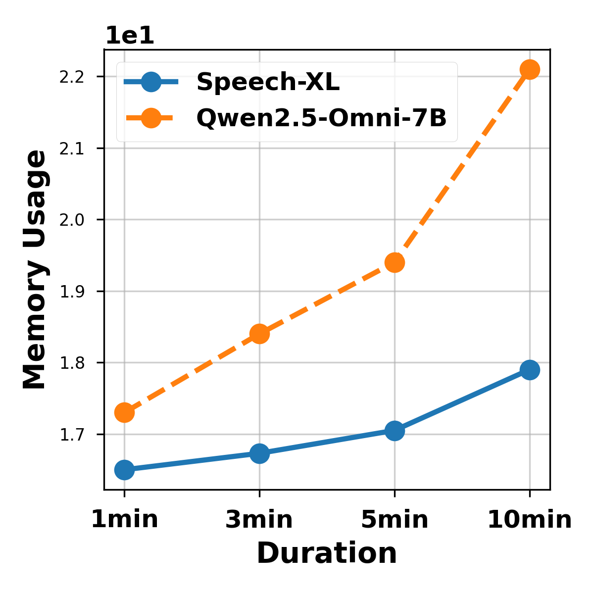
*Figure 4:Comparison of the memory usage and the forward FLOPs between ours and Qwen2.5-Omni-7B.*

*Figure 5:Performance of various compression methods across different compression ratios. Dashed line represents performance excluding ASR, while the solid line represents the overall performance. For the 16
×
 ratio, Speech-XL is evaluated through direct inference without fine-tuning.*

---
**Usage Info**: 5646 tokens used.
**Generated at**: 2026-02-23 21:39:03

---

# 📚 Euphonium: Steering Video Flow Matching via Process Reward Gradient Guided Stochastic Dynamics

🚀 URL: https://arxiv.org/html/2602.04928

## 🌏 Abstract (원문)
Flow matching(Lipmanet al.,2022; Liuet al.,2022; Tonget al.,2023)has emerged as the dominant paradigm for high-fidelity video generation, underpinning leading systems such as Sora(OpenAI,2025), Veo(DeepMind,2025), Wan(Wanet al.,2025), Kling(Technology,2025), and Seedance(Gaoet al.,2025). While large-scale pre-training endows foundation models with remarkable generative capabilities, it is often insufficient for ensuring alignment with nuanced human preferences, such as specific aesthetic styles and prompt adherence. Consequently, post-training via Reinforcement Learning (RL) has become a critical frontier for bridging this alignment gap(Blacket al.,2023). However, adapting online RL algorithms (e.g., Group Relative Policy Optimization, GRPO) to flow matching requires introducing stochasticity into the deterministic probability flow Ordinary Differential Equations (ODEs). Recent approaches like Flow-GRPO(Liuet al.,2025b)and DanceGRPO(Xueet al.,2025)address this by formulating Stochastic Differential Equations (SDEs) to enable policy exploration. Despite this progress, these methods rely onundirectedstochastic dynamics: the model explores the latent space via random perturbations and receives feedback only after the entire video is generated. Consequently, discovering high-reward trajectories becomes exceedingly difficult, as random noise rarely steers generation toward the narrow manifold of high-quality samples. This inefficiency in exploration leads to sparse positive supervision, resulting in data-inefficient and slow optimization. We posit that efficient alignment necessitates not merely stochastic exploration, butguidedexploration. Rather than relying on undirected noise to fortuitously discover high-reward trajectories, the sampling process itself should be actively steered toward preferred regions. To this end, we proposeEuphonium(ExplorationUtilizingProcessHeuristicsOverNon-equilibriumSampling), a principled framework grounded in the Non-Equilibrium Transport Sampling (NETS) formalism(Albergoet al.,2023; Albergo and Vanden-Eijnden,2024). By defining a novel reward-augmented potential that integrates the flow prior with a dense Process Reward Model (PRM)(Lightmanet al.,2023), we derive a theoretically grounded SDE where the reward gradient is explicitly incorporated into the flow drift. This design enables dense, step-by-step steering toward high-reward regions during exploration. Moreover, our formulation theoretically encompasses existing sampling methods (e.g., Flow-GRPO, DanceGRPO) as special cases when the reward term vanishes, providing a unified perspective on stochastic flow dynamics. A potential concern with reward-guided exploration is the inference-time dependency on the reward model. We address this by deriving a distillation objective that internalizes the guidance signal into the flow network weights, enabling the deployed model to operate identically to the base generator without requiring an external reward model. We instantiate this framework via a Dual-Reward GRPO algorithm, combining latent-space process rewards for efficient credit assignment with pixel-space outcome rewards for final visual fidelity alignment. Our main contributions are summarized as follows: Guided Exploration via Process Reward Gradient.We derive a reward-augmented stochastic dynamics that injects dense gradient signals from a Process Reward Model directly into the flow drift. This principled formulation enables active steering toward high-reward regions during exploration, and theoretically encompasses prior sampling strategies (e.g., Flow-GRPO, DanceGRPO) as reward-free special cases. Dual-Reward Optimization.We introduce a dual-reward training scheme that combines latent-space process rewards for efficient credit assignment with pixel-space outcome rewards for final visual fidelity alignment. Reward-Gradient-Free Inference.To eliminate inference-time dependency on the reward model after training, we derive a distillation objective that internalizes the guidance signal into the flow network weights, enabling deployment identical to the base generator. Empirical Performance.Euphonium achieves better alignment on VBench2 for text-to-video generation, outperforming existing post-training methods while accelerating training convergence by1.66×.
## 🌏 Abstract (번역)
Flow matching은 Sora, Veo, Wan, Kling, Seedance와 같은 고성능 비디오 생성 시스템의 핵심 패러다임으로 자리 잡았습니다. 대규모 사전 학습은 파운데이션 모델에 뛰어난 생성 능력을 부여하지만, 미세한 인간의 선호도(특정 미적 스타일, 프롬프트 준수 등)를 맞추기에는 부족한 경우가 많아 강화 학습(RL)을 통한 사후 학습이 중요해졌습니다. 기존의 Flow-GRPO나 DanceGRPO와 같은 방식은 확률 미분 방정식(SDE)을 통해 정책 탐색을 시도하지만, 방향성 없는 확률적 역학에 의존하여 비디오 생성 완료 후에만 피드백을 받기 때문에 고보상 궤적을 발견하는 데 효율성이 떨어집니다. 본 논문에서는 비평형 수송 샘플링(NETS) 이론에 기반한 'Euphonium' 프레임워크를 제안합니다. 이는 프로세스 보상 모델(PRM)의 그래디언트를 흐름 드리프트(flow drift)에 직접 통합하여 고보상 영역으로의 능동적인 단계별 가이드를 제공합니다. 또한, 학습된 가이드 신호를 흐름 네트워크 가중치에 내재화하는 증류(distillation) 기법을 통해 추론 시 별도의 보상 모델 없이도 기본 생성기와 동일하게 작동할 수 있게 합니다. Euphonium은 잠재 공간 프로세스 보상과 픽셀 공간 결과 보상을 결합한 Dual-Reward GRPO 알고리즘을 통해 구현되었으며, 실험 결과 VBench2에서 기존 방식보다 우수한 성능을 보였고 학습 수렴 속도를 1.66배 향상시켰습니다.

## 🔍 Methods & Results
- 비평형 수송 샘플링(NETS) 형식을 활용하여 보상 그래디언트가 흐름 드리프트에 명시적으로 포함된 이론적 근거의 SDE 유도
- 잠재 공간(latent-space) 기반의 프로세스 보상 모델(PRM)을 설계하여 계산 비용을 줄이고 생성 과정 중 조밀한 단계별 가이드 제공
- 잠재 공간의 프로세스 보상과 픽셀 공간의 결과 보상을 결합하여 신용 할당(credit assignment)과 시각적 충실도를 동시에 최적화하는 Dual-Reward GRPO 알고리즘 제안
- 정책 증류(Policy Distillation) 기법을 통해 보상 가이드 신호를 네트워크 가중치에 내재화함으로써 추론 시 외부 보상 모델 의존성 제거
- VBench2 벤치마크의 텍스트-비디오 생성 작업에서 기존 사후 학습 방법론 대비 우수한 정렬 성능 및 1.66배 빠른 학습 수렴 속도 달성

## 🖼 Figures
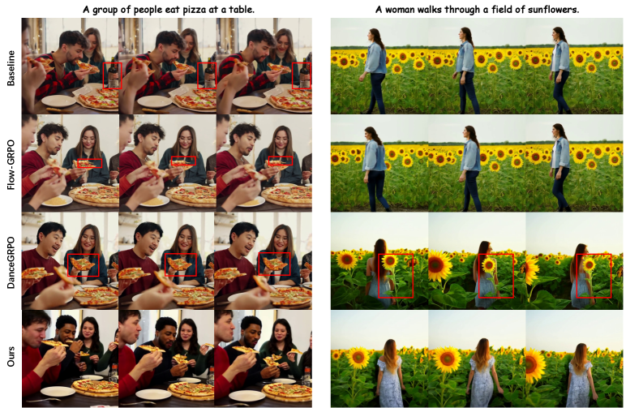
*Figure 2:Qualitative comparison. Visual results demonstrate that Euphonium generates more coherent and prompt-aligned videos compared to the pre-trained model, Flow-GRPO and DanceGRPO.*

*Figure 3:Accuracy of the Latent PRM. We evaluate pairwise accuracy at different timesteps against the pixel-space ORM. The PRM maintains reliable accuracy (
>
70%), validating its effectiveness for guiding intermediate states.*

---
**Usage Info**: 5478 tokens used.
**Generated at**: 2026-02-23 21:41:01

---

