# 🚩 (2026-02-10) Scholar Inbox 추천 논문 

# 📚 SoulX-Singer: Towards High-Quality Zero-Shot Singing Voice Synthesis

🚀 URL: https://arxiv.org/html/2602.07803

## 🌏 Abstract (원문)
Singing Voice Synthesis (SVS) aims to generate expressive human vocals conditioned on lyrics and musical scores. Although significant progress has recently been made in both speech synthesis and music generation, high-quality singing voice generation with flexible control in a zero-shot setting remains largely unavailable. To address this gap, we introduce SoulX-Singer, a singing voice synthesis system capable of high-quality zero-shot generation across multiple languages. Early work on SVS primarily focused on synthesizing singing voices from speakers or singers observed during training. Representative systems such as DiffSinger were trained on relatively small-scale datasets with carefully curated annotations, and therefore lacked the ability to generalize to unseen singers. This limitation significantly restricts the applicability of such models in real-world scenarios. Subsequent studies, including StyleSinger and the TCSinger series, began to explore zero-shot SVS. However, these methods were still trained on datasets consisting of only a few hundred hours of singing data from a limited number of singers, making it difficult to achieve robust zero-shot generalization in practice. More recently, Vevo2 and YingMusic-Singer leveraged the scaling capabilities of the Transformer and Diffusion Transformer (DiT) architecture, respectively, expanding singing datasets to the scale of several thousand hours. Despite these advances, both systems adopt a melody-driven synthesis paradigm and do not provide note-level duration control, which leads to two key limitations. First, melody extraction from existing songs is required, preventing song generation purely from musical scores and lyrics. Second, the absence of explicit note duration modeling makes syllable-level timing uncontrollable, resulting in temporal misalignment between the synthesized vocals and the original accompaniment. This severely limits practical usage in music production workflows, particularly for mixing and arrangement. To address these challenges, we propose SoulX-Singer. In contrast to prior work relying on at most several thousand hours of training data, we construct a large-scale vocal dataset comprising over 42,000 hours of singing audio, substantially enhancing the model’s zero-shot generalization capability. From an algorithmic perspective, SoulX-Singer is designed to support both score-based controllable singing generation and melody-conditioned synthesis, enabling flexible control under diverse real-world scenarios. This dual-control design allows SoulX-Singer to better accommodate music creation workflows based on symbolic musical scores as well as scenarios requiring melody-guided generation from existing songs. The main contributions of this work can be summarized as follows: A High-Quality Zero-shot SVS Model. We propose SoulX-Singer, a high-quality singing voice synthesis model designed for zero-shot scenarios. SoulX-Singer supports both music score-based inputs and melody-based inputs within a unified framework, enabling high-fidelity timbre cloning, reference-based singing style transfer, and flexible editing of both musical scores and lyrics. This design makes the system suitable for a wide range of real-world music production workflows. A Large-Scale Singing Voice Data Processing Pipeline. We introduce a large-scale data processing pipeline that takes songs with background music as input and automatically produces clean vocal recordings paired with aligned lyrics and musical scores. Using this pipeline, we construct a multilingual singing dataset comprising over 42,000 hours of vocal recordings in Mandarin Chinese, English, and Cantonese, representing an order-of-magnitude increase compared to the data scale used in existing SVS studies. A Dedicated Evaluation Benchmark for Zero-shot SVS. To facilitate systematic and reproducible evaluation of zero-shot SVS performance, we introduce a dedicated benchmark dataset featuring 50 unseen singers in Mandarin Chinese and English, accompanied by fine-grained, note-level score annotations. This benchmark provides a standardized evaluation protocol for assessing synthesis quality, controllability, and generalization, and serves as a reliable testbed for future SVS research.
## 🌏 Abstract (번역)
가창 음성 합성(SVS)은 가사와 악보를 조건으로 표현력 있는 인간의 보컬을 생성하는 것을 목표로 합니다. 최근 음성 합성 및 음악 생성 분야에서 상당한 진전이 있었음에도 불구하고, 제로샷(zero-shot) 설정에서 유연한 제어가 가능한 고품질 가창 음성 생성은 여전히 미비한 상태입니다. 이러한 격차를 해소하기 위해 우리는 여러 언어에 걸쳐 고품질 제로샷 생성이 가능한 가창 음성 합성 시스템인 SoulX-Singer를 소개합니다. 초기 SVS 연구는 주로 훈련 중에 관찰된 화자나 가수의 목소리를 합성하는 데 집중했습니다. DiffSinger와 같은 대표적인 시스템은 정교하게 정제된 주석이 달린 비교적 소규모 데이터셋으로 훈련되었기 때문에, 학습되지 않은 가수에 대한 일반화 능력이 부족했습니다. 이러한 한계는 실제 시나리오에서 모델의 적용 가능성을 크게 제한합니다. 이후 StyleSinger 및 TCSinger 시리즈를 포함한 연구들이 제로샷 SVS를 탐구하기 시작했으나, 이러한 방법들은 여전히 제한된 수의 가수가 부른 수백 시간 분량의 데이터셋으로 훈련되어 실제 환경에서 견고한 제로샷 일반화를 달성하기 어려웠습니다. 최근 Vevo2와 YingMusic-Singer는 각각 Transformer 및 Diffusion Transformer(DiT) 아키텍처의 확장 능력을 활용하여 가창 데이터셋을 수천 시간 규모로 확장했습니다. 이러한 발전에도 불구하고, 두 시스템 모두 멜로디 기반 합성 패러다임을 채택하고 음표 단위의 지속 시간 제어를 제공하지 않아 두 가지 핵심적인 한계가 발생합니다. 첫째, 기존 노래에서 멜로디 추출이 필요하므로 순수하게 악보와 가사만으로 노래를 생성하는 것이 불가능합니다. 둘째, 명시적인 음표 지속 시간 모델링의 부재로 인해 음절 단위의 타이밍 조절이 불가능해지며, 이는 합성된 보컬과 원본 반주 사이의 시간적 불일치를 초래합니다. 이는 특히 믹싱 및 편곡과 같은 음악 제작 워크플로우에서의 실질적인 사용을 심각하게 제한합니다. 이러한 문제를 해결하기 위해 우리는 SoulX-Singer를 제안합니다. 최대 수천 시간의 훈련 데이터에 의존했던 이전 작업과 달리, 우리는 42,000시간 이상의 가창 오디오로 구성된 대규모 보컬 데이터셋을 구축하여 모델의 제로샷 일반화 능력을 실질적으로 향상시켰습니다. 알고리즘 측면에서 SoulX-Singer는 악보 기반의 제어 가능한 가창 생성과 멜로디 조건부 합성을 모두 지원하도록 설계되어 다양한 실제 시나리오에서 유연한 제어를 가능하게 합니다. 이러한 이중 제어 설계 덕분에 SoulX-Singer는 상징적인 악보 기반의 음악 제작 워크플로우뿐만 아니라 기존 노래의 멜로디 가이드 생성이 필요한 시나리오에도 더 잘 대응할 수 있습니다. 본 연구의 주요 기여는 다음과 같이 요약됩니다. 첫째, 고품질 제로샷 SVS 모델 제안: 제로샷 시나리오를 위해 설계된 고품질 가창 음성 합성 모델인 SoulX-Singer를 제안합니다. 이 모델은 통합된 프레임워크 내에서 악보 기반 입력과 멜로디 기반 입력을 모두 지원하여 고충실도 음색 복제, 참조 기반 가창 스타일 전이, 악보 및 가사의 유연한 편집을 가능하게 합니다. 둘째, 대규모 가창 음성 데이터 처리 파이프라인: 배경 음악이 포함된 노래를 입력받아 정렬된 가사 및 악보와 쌍을 이루는 깨끗한 보컬 녹음본을 자동으로 생성하는 대규모 데이터 처리 파이프라인을 도입합니다. 이를 통해 중국어, 영어, 광둥어로 구성된 42,000시간 이상의 다국어 가창 데이터셋을 구축했으며, 이는 기존 SVS 연구에서 사용된 데이터 규모보다 10배 이상 증가한 수치입니다. 셋째, 제로샷 SVS를 위한 전용 평가 벤치마크: 제로샷 SVS 성능의 체계적이고 재현 가능한 평가를 위해 중국어와 영어권의 미학습 가수 50명을 포함하고 세밀한 음표 단위 악보 주석이 동반된 전용 벤치마크 데이터셋을 도입합니다. 이 벤치마크는 합성 품질, 제어 가능성 및 일반화 능력을 평가하기 위한 표준화된 프로토콜을 제공하며 향후 SVS 연구를 위한 신뢰할 수 있는 테스트베드 역할을 할 것입니다.

## 🔍 Methods & Results
- Vocal separation using Mel-Band Roformer for high-purity dry vocals and de-reverberation.
- Automatic lyric transcription pipeline using SenseVoiceSmall for language ID and Paraformer/Parakeet-TDT for ASR, ensuring alignment with reference lyrics.
- Note transcription using ROSVOT for pitch-class estimation and note boundary detection to create note-level representations (text, pitch, type, duration).
- Construction of a 42,000-hour multilingual dataset (Mandarin, English, Cantonese) organized at the musical note level.
- Architecture based on a non-autoregressive (NAR) Flow Matching decoder with Diffusion Transformer (DiT).
- Implementation of a Singing Content Encoder to integrate textual (pinyin/phoneme) and melodic (note pitch/F0) representations.
- A two-stage training strategy: starting with short segments (2-16s) and non-adjacent prompts, progressing to long-form modeling (30-90s) with adjacent prompts.
- Support for dual inference modes: Melody-control mode (using F0 contour) and Score-control mode (using MIDI scores).
- Introduction of a dedicated benchmark with 50 unseen singers for standardized zero-shot SVS evaluation.

## 🖼 Figures
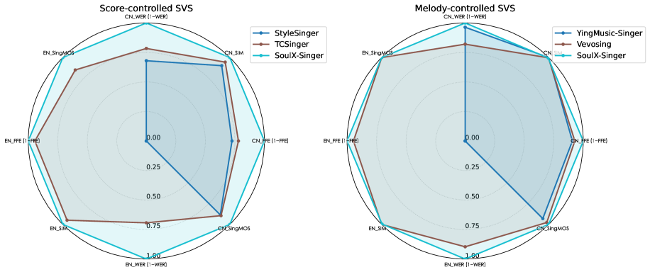
*Figure 1:Performance of SoulX-Singer.*

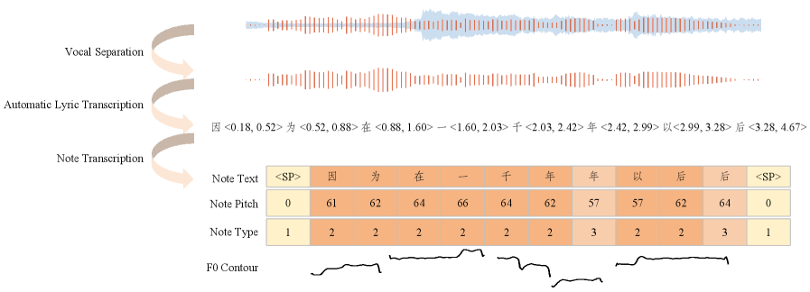
*Figure 2:Pipeline for large-scale singing data curation: from raw audio extraction to time-aligned MIDI and text formulation.*

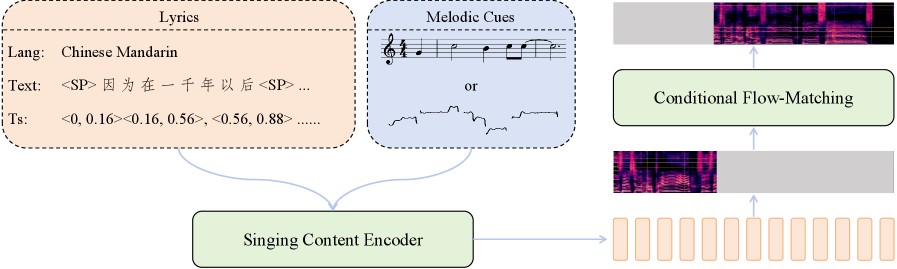
*Figure 3:Overview of SoulX-Singer.*

---
**Usage Info**: 5597 tokens used.
**Generated at**: 2026-02-23 21:49:20

---

# 📚 Tutti: Expressive Multi-Singer Synthesis via Structure-Level Timbre Control and Vocal Texture Modeling

🚀 URL: https://arxiv.org/html/2602.08233

## 🌏 Abstract (원문)
Music is a universal language for human emotional expression. With the rapid development of deep learning, Generative AI has made remarkable breakthroughs in music generation(Dhariwalet al.,2020; Agostinelliet al.,2023; Liuet al.,2023), demonstrating the potential to create complete musical works. Within musical compositions, the singing voice stands out as the most infectious and expressive component, carrying profound narrative power. Consequently, Singing Voice Synthesis (SVS), as a unique domain combining linguistic content with musical expression, has achieved similarly significant accomplishments. Leading models like DiffSinger(Liuet al.,2022)and VISinger(Zhanget al.,2022)have established high-fidelity generation paradigms, enabling the synthesis of realistic solo performances. However, despite the excellence of existing SVS models in timbre cloning, they remain largely constrained by the “Soloist Paradigm”. The vast majority of existing models assume a single-singer input for a single song or only support stable singer identity, where the singer identity is defined as a time-invariant global condition that remains constant throughout the entire piece. This rigid setting ignores two dimensions crucial to complex musical expression: (1)Singer Arrangement—the temporal scheduling of multiple singers according to musical structure. In real compositions, singers’ roles shift with the song’s progression: a verse may feature a solo vocalist, while the chorus brings in additional singers or a full choir. Furthermore, transitions frequently occur between different soloists (e.g., solo-to-solo) across sections. Existing models fundamentally lack the mechanism to model such singer transitions and the simultaneous timbre representation required for ensembles within a single song. (2)Vocal Texture—the emergent acoustic properties arising from vocal interactions and production, including spatial reverberation, spectral fusion, and harmonic layering. Multi-person choruses are not simple linear mixtures of individual voices; they involve complex interactions such as the blending of formants across different vocal parts. Current SVS models, designed primarily for solo synthesis, have no explicit mechanism to model these interactions, resulting in generated multi-person segments that sound like artificially mixed individual tracks rather than cohesive ensemble performances. To fill this gap, we extend the task from traditional SVS to Multi-Singer Singing Voice Synthesis, and propose Tutti: a structure-aware framework designed for complex multi-singer arrangement. Specifically, we design a Structure-Aware Singer Prompt, capable of constructing singer sequences based on musical structure (e.g., verse/chorus) to flexibly schedule the participation of multiple singers. To address the challenge of representing multiple singers simultaneously, we further incorporate an Adaptive Singer Prompt Fuser to dynamically integrate multi-singer embeddings. Simultaneously, to capture the rich acoustic nuances beyond explicit features, we propose Complementary Texture Learning via Condition-Guided VAE. This module learns to extract implicit texture features—such as mixing effects and spatial atmosphere—that are complementary to explicit conditions like lyrics and singer identity, thereby precisely restoring the acoustic quality of vocal interactions. Our contributions can be summarized as follows: We propose Tutti, the first generative framework designed for multi-singer synthesis within a single song. We design a Structure-Aware Singer Prompt combined with an Adaptive Singer Prompt Fuser, which flexibly handles complex transitions between soloists and ensembles, enabling precise control over the singer composition of each section. We propose Complementary Texture Learning via Condition-Guided VAE, which introduces a condition-guided reconstruction task to capture implicit vocal textures complementary to explicit controls, significantly enhancing the acoustic realism of the generation.
## 🌏 Abstract (번역)
음악은 인간의 감정 표현을 위한 보편적인 언어입니다. 딥러닝의 급격한 발전과 함께 생성형 AI는 음악 생성 분야에서 괄목할 만한 돌파구를 마련하며 완전한 음악 작품을 창조할 수 있는 잠재력을 입증했습니다. 음악 구성 요소 중 가창 음성(singing voice)은 가장 전염성이 강하고 표현력이 풍부하며 깊은 서사적 힘을 지닌 요소로 주목받습니다. 이에 따라 언어적 콘텐츠와 음악적 표현을 결합한 독특한 영역인 가창 음성 합성(SVS) 역시 DiffSinger나 VISinger와 같은 주요 모델을 통해 고충실도 생성 패러다임을 구축하며 현실적인 솔로 공연 합성을 가능하게 했습니다. 그러나 기존 SVS 모델은 음색 복제 능력은 뛰어나지만, 대부분 단일 가수 입력이나 고정된 가수 정체성만을 가정하는 '솔로이스트 패러다임'에 국한되어 있습니다. 이러한 경직된 설정은 복잡한 음악 표현에 필수적인 두 가지 차원, 즉 (1) 음악 구조에 따른 여러 가수의 시간적 배치(Singer Arrangement)와 (2) 보컬 간의 상호작용 및 제작 과정에서 발생하는 음향적 특성인 보컬 질감(Vocal Texture)을 간과합니다. 기존 모델은 단일 곡 내에서 가수 간의 전환이나 앙상블에 필요한 동시 음색 표현 메커니즘이 부족하며, 다인 합창을 단순한 선형 혼합으로 처리하여 응집력 있는 앙상블보다는 인위적으로 믹싱된 트랙처럼 들리게 합니다. 이러한 공백을 메우기 위해 본 논문에서는 전통적인 SVS를 다중 가수 가창 음성 합성(Multi-Singer SVS)으로 확장하고, 복잡한 다중 가수 배치를 위해 설계된 구조 인지형 프레임워크인 Tutti를 제안합니다. 구체적으로, 음악 구조에 따라 가수 시퀀스를 구성하는 '구조 인지형 가수 프롬프트'와 다중 가수 임베딩을 동적으로 통합하는 '적응형 가수 프롬프트 퓨저'를 설계했습니다. 또한, 명시적 조건 외의 풍부한 음향적 뉘앙스를 포착하기 위해 '조건 가이드 VAE를 통한 보완적 질감 학습'을 제안하여 믹싱 효과나 공간적 분위기 같은 암시적 질감 특징을 추출함으로써 보컬 상호작용의 음향적 품질을 정밀하게 복원합니다. 본 연구의 기여는 다음과 같습니다. 첫째, 단일 곡 내 다중 가수 합성을 위한 최초의 생성 프레임워크인 Tutti를 제안합니다. 둘째, 솔로와 앙상블 간의 복잡한 전환을 유연하게 처리하고 각 섹션의 가수 구성을 정밀하게 제어하는 구조 인지형 가수 프롬프트와 적응형 퓨저를 설계했습니다. 셋째, 암시적 보컬 질감을 포착하여 생성의 음향적 사실성을 크게 향상시키는 조건 가이드 VAE 기반의 보완적 질감 학습을 제안합니다.

## 🔍 Methods & Results
- Latent Diffusion Transformer (DiT) 패러다임을 기반으로 한 구조 인지형 다중 가수 생성 프레임워크 Tutti 제안
- Raw 오디오를 잠재 표현으로 압축하는 전용 Vocal VAE와 LLaMA 기반 Transformer 구조의 DiT 백본 사용
- 가사, 음악 구조(절, 후렴 등), 다중 가수 정체성, 보컬 질감 등 다중 조건을 결합하여 정밀한 제어 실현
- 음악 구조에 따라 가수 자원을 자동 배치하는 구조 인지형 프롬프트 구성 전략 및 셀프 어텐션 기반의 적응형 가수 프롬프트 퓨저 설계
- 공간적 잔향, 믹싱 효과 등 암시적 음향 세부 사항을 포착하기 위해 조건 가이드 VAE(Condition-Guided VAE)를 통한 보완적 질감 학습 도입
- Vocal VAE 학습 시 멀티 레졸루션 STFT, KL 발산, 적대적 손실을 결합하여 고충실도 파형 복원
- 추론 시 참조 오디오에서 질감 잠재 변수를 추출하여 피치나 가사와 독립적으로 음향적 사실성 및 풍부함 강화

## 🖼 Figures

*Figure 1:The overview of the Tutti framework for structure-aware multi-singer generation. The workflow begins by constructing structure-aware singer prompts and extracting complementary texture features from reference audio. These conditions, along with lyrics and structure labels, are fed into the DiT backbone to generate target vocal latents. Finally, the Vocal VAE decoder reconstructs the latents into high-fidelity multi-singer waveforms.*

![Figure 2:The architecture of the DiT-based backbone. The left panel illustrates the condition processing modules: the structure-aware singer prompt (denoted in orange) utilizes an adaptive fuser to integrate multi-singer information, while the texture embedding (denoted in purple) is extracted from reference audio to provide complementary acoustic features. These embeddings are concatenated with other conditions and input into the DiT blocks. Finally, the predicted latents are decoded by the Vocal VAE decoder to generate the waveform.](../images/2026-02-10/2602.08233/2602.08233_fig1.png)
*Figure 2:The architecture of the DiT-based backbone. The left panel illustrates the condition processing modules: the structure-aware singer prompt (denoted in orange) utilizes an adaptive fuser to integrate multi-singer information, while the texture embedding (denoted in purple) is extracted from reference audio to provide complementary acoustic features. These embeddings are concatenated with other conditions and input into the DiT blocks. Finally, the predicted latents are decoded by the Vocal VAE decoder to generate the waveform.*

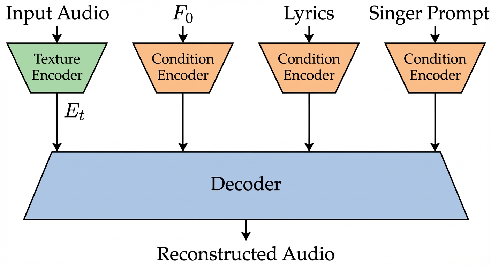
*Figure 3:The architecture of Condition-Guided VAE for complementary texture learning.*

*Figure 4:Acoustic visualization analysis of generated multi-singer audio. (a) The Pitch Salience Map depicts distinct melodic patterns, showing single trajectories for solos and interwoven lines for the chorus. (b) The Mel Spectrogram illustrates the energy distribution in the time-frequency domain, highlighting spectral coherence and rich resonance structures.*

*Figure 5:Visualization of attention weights in the Adaptive Singer Prompt Fuser. (a) The Singer Attention Matrix shows the weight distribution of candidate singers across different structural segments. (b) The Singer-to-Singer Cross-Attention Matrix details the internal interaction weights within the multi-singer Chorus 1 segment.*

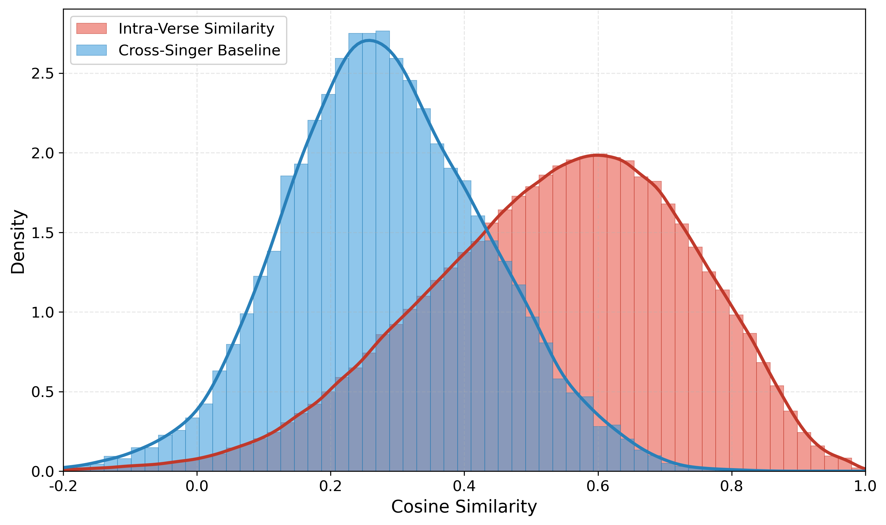
*Figure 6:Distribution of cosine similarity for Intra-Verse segments (red) and Cross-Singer baseline (blue). The significant separation between the two distributions supports the assumption that verse sections are predominantly sung by a single vocalist.*

---
**Usage Info**: 5913 tokens used.
**Generated at**: 2026-02-23 21:50:02

---

# 📚 ALIVE: Animate Your World with Lifelike Audio-Video Generation

🚀 URL: https://arxiv.org/html/2602.08682

## 🌏 Abstract (원문)
The field of video generation has witnessed remarkable progress in recent years, with significant academic and industry advances propelled by models such as Wan(Wanet al.,2025), StepVideo(Maet al.,2025), HunyuanVideo(Konget al.,2024), and CogVideoX(Yanget al.,2025b), Veo(DeepMind,2025), Kling(Kuaishou,2024). At present, there is a clear trend of video generation evolving towards audio-video generation for immersive media creation. New models such as Veo 3.1, Wan 2.6, and Sora 2 showcase notable progress in unified audio-video synthesis, enabling natural speech lip-sync and dynamic background sounds. The integration of audio and video generation enables more vivid and expressive creative content, further powering a wide range of applications. However, extending a high-quality video generation model to support synchronized audio generation still presents several significant challenges: (1) In multilingual audio generation, it remains challenging to produce speaker timbre that sounds natural and avoids a mechanical or artificial quality. (2) Additionally, achieving accurate audio-visual synchronization is difficult, with high error rates especially evident in multi-speaker lip-sync scenarios. (3) Existing public technical reports do not clearly describe how to scale previous visual-only data curation pipelines to include high-quality audio-video data cleaning and captioning. (4) Methods for evaluating the performance of audio-visual models are still lagging behind, with no widely accepted standards or comprehensive benchmarks. To address these challenges, we propose ALIVE to advance the popular text-to-video model to support audio-video generation and animation with two main modules: Joint Audio-Video DiT and Cascade Audio-Video Refiner. Multi-stage training strategies are adopted to generate 1080p high-resolution audio-augmented videos from 5 to 10 seconds with optional reference image input. In this work, we instantiates our model based on the pretrained Waver 1.0(Zhanget al.,2025c) to perform joint audio-video generation. In summary, we introduce the following key improvements and contributions: Joint Audio-Video Modeling, Comprehensive Audio-Video Data Pipelines, Alive-bench 1.0, and Role-Playing Animate. ALIVE demonstrates superior performance on the Alive-Bench 1.0, achieving state-of-the-art performance across various domains including visual asethetic, audio prompt following and audio-video synchronization.
## 🌏 Abstract (번역)
최근 비디오 생성 분야는 Wan, StepVideo, HunyuanVideo, CogVideoX, Veo, Kling과 같은 모델들에 의해 학계와 산업계에서 괄목할 만한 발전을 이루었습니다. 현재 비디오 생성은 몰입형 미디어 제작을 위한 오디오-비디오 생성으로 진화하는 뚜렷한 추세를 보이고 있습니다. Veo 3.1, Wan 2.6, Sora 2와 같은 새로운 모델들은 통합된 오디오-비디오 합성에서 주목할 만한 진전을 보여주며, 자연스러운 음성 립싱크와 역동적인 배경음을 가능하게 합니다. 오디오와 비디오 생성의 통합은 더욱 생생하고 표현력 있는 창의적 콘텐츠를 가능하게 하며, 나아가 광범위한 응용 분야를 지원합니다. 그러나 고품질 비디오 생성 모델을 동기화된 오디오 생성을 지원하도록 확장하는 데에는 여전히 몇 가지 중요한 과제가 남아 있습니다: (1) 다국어 오디오 생성에서 기계적이거나 인위적인 느낌을 피하고 자연스러운 화자의 음색을 생성하는 것이 여전히 어렵습니다. (2) 또한, 정확한 시청각 동기화를 달성하는 것이 어려우며, 특히 다중 화자 립싱크 시나리오에서 높은 오류율이 나타납니다. (3) 기존의 공개 기술 보고서들은 이전의 시각 전용 데이터 큐레이션 파이프라인을 고품질 오디오-비디오 데이터 정제 및 캡셔닝을 포함하도록 확장하는 방법을 명확하게 설명하지 않습니다. (4) 시청각 모델의 성능을 평가하는 방법이 여전히 뒤처져 있으며, 널리 받아들여지는 표준이나 포괄적인 벤치마크가 없습니다. 이러한 과제를 해결하기 위해, 우리는 Joint Audio-Video DiT와 Cascade Audio-Video Refiner라는 두 가지 주요 모듈을 통해 대중적인 텍스트-비디오 모델을 오디오-비디오 생성 및 애니메이션을 지원하도록 발전시킨 ALIVE를 제안합니다. 다단계 학습 전략을 채택하여 선택적인 참조 이미지 입력을 통해 5~10초 분량의 1080p 고해상도 오디오 증강 비디오를 생성합니다. 본 연구에서는 사전 학습된 Waver 1.0을 기반으로 모델을 구현하여 공동 오디오-비디오 생성을 수행합니다. 요약하자면, 우리는 공동 오디오-비디오 모델링, 포괄적인 오디오-비디오 데이터 파이프라인, Alive-bench 1.0, 그리고 역할 수행 애니메이션과 같은 주요 개선 사항과 기여를 소개합니다. ALIVE는 Alive-Bench 1.0에서 우수한 성능을 입증하며 시각적 미학, 오디오 프롬프트 준수 및 오디오-비디오 동기화를 포함한 다양한 영역에서 최첨단 성능을 달성합니다.

## 🔍 Methods & Results
- Joint Audio-Video DiT: Waver 1.0을 기반으로 'Dual Stream + Single Stream' 패러다임을 확장하여 오디오와 비디오 잠재 변수를 통합 모델링함
- UniTemp-RoPE 및 TA-CrossAttn: 서로 다른 샘플링 레이트를 가진 오디오와 비디오 간의 시간적 정렬을 위해 연속 시간 좌표계를 도입하여 물리적 시간 동기화를 강제함
- WavVAE 및 이중 컨디셔닝: 고차원 오디오를 압축된 잠재 표현으로 변환하고, 음성 텍스트와 전역 캡션을 분리하여 내용과 음향 스타일을 정밀하게 제어함
- 포괄적 데이터 파이프라인: 오디오-비디오 이중 품질 필터링과 공동 키워드 라벨링 시스템을 통해 데이터 균형을 맞추고 다인원 시나리오의 대응 정확도를 향상시킴
- Cascade Audio-Video Refiner: 480p 베이스 모델의 오디오 품질과 동기화를 유지하면서 1080p 고해상도 비디오로 업스케일링하는 효율적인 계층적 구조 채택
- Alive-Bench 1.0: 모션 품질, 시각적 미학, 동기화 등 6개 축과 22개 세부 지표를 포함하는 새로운 시청각 생성 벤치마크 구축
- 실험 결과: Alive-Bench 1.0에서 시각적 미학, 오디오 프롬프트 준수, 시청각 동기화 등 여러 영역에서 SOTA(State-of-the-art) 성능 달성

## 🖼 Figures

*Figure 1: Left: Human evaluation win rates (GSB) of ALIVE compared to Veo 3.1, Kling 2.6, Wan 2.6, Sora 2 and LTX-2 on Alive-Bench 1.0 across six dimensions: Motion Quality, Visual Aesthetic, Visual Prompt Following, Audio Quuality, Audio Prompt Following and Audio Video Synchronization. Alive-Bench 1.0 covers a wide range of scenarios, including single-person speech, multi-people conversations, sports, daily activities, animals, means of transportation, surreal scenes, etc.*

*Figure 2: T2V samples generated by ALIVE. ALIVE is capable of generating 1080p videos at arbitrary aspect ratios, delivering high levels of aesthetic quality, realism, and motion fidelity, while simultaneously supporting both T2VA, I2VA and R2VA tasks.*

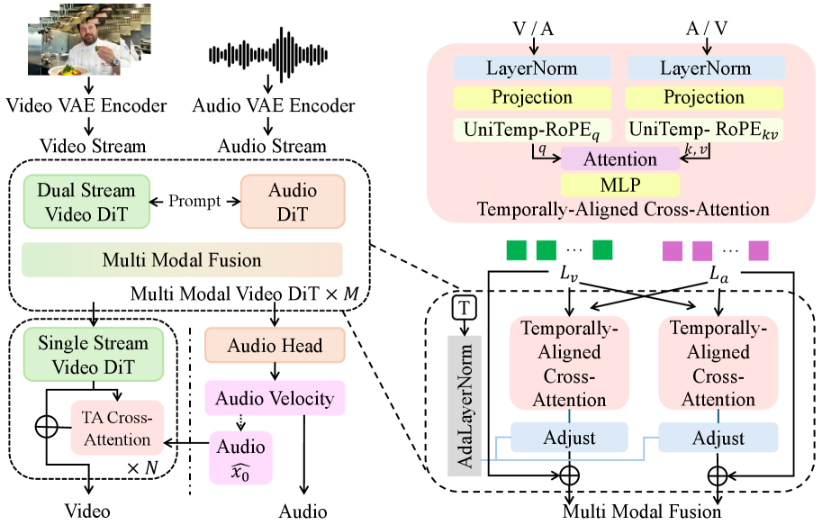
*Figure 3: Architecture of ALIVE.*

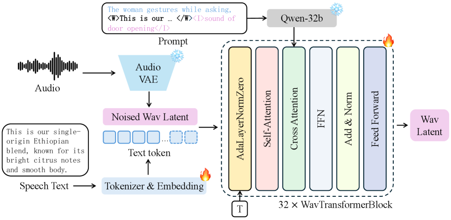
*Figure 4: Architecture of Audio DiT.*

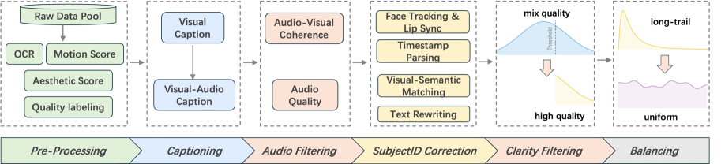
*Figure 5:An overview of our proposed data processing pipeline. The process consists of six main stages: video quality pre-processing, captioning, audio quality filtering, SubjectID correction, clarity filtering, and data balancing.*

*Figure 6:Overview of our Subject ID correction pipeline, which aligns sentence-level speech segments with active face tracks via lip-sync detection and majority voting, then maps Track IDs to Subject IDs through visual-semantic matching and rewrites narration with corrected speaker labels.*

*Figure 7:The detailed visual structure of the corresponding Level 2 and Level 3 sub-categories of nine Level 1 visual tags in General-Data Labeling System.*

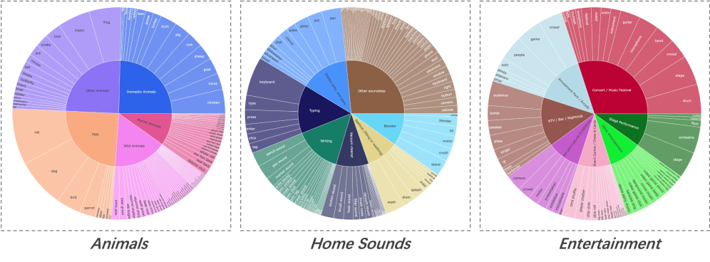
*Figure 8*

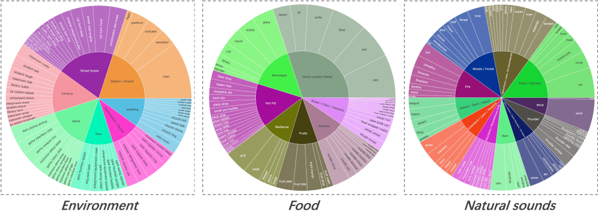
*Figure 9*

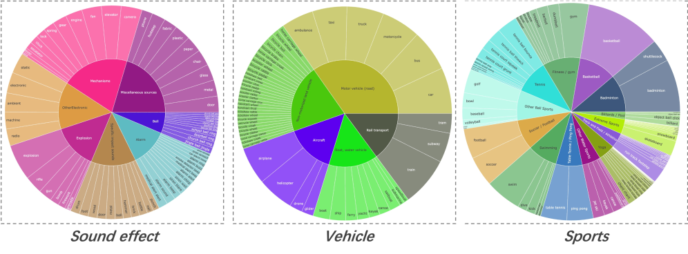
*Figure 10*

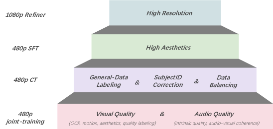
*Figure 8: The hierarchical data filtering funnel, which progressively refines the dataset through increasingly strict quality criteria.*

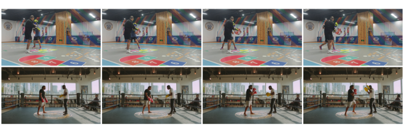
*Figure 9: Aesthetic comparison for a boxing scene. Top: Typical real-world video. Bottom: Our synthetic data shows superior visual quality, including better lighting, color and composition.*

*Figure 10: Comparison of four videos generated by models before and after high-aesthetic finetuning. For each case, the frame on the left is before finetuning, and that on the right is after finetuning.*

*Figure 11: Comparisons of results generated using only the text condition (left) versus using both text and the mutual cross-attention signal condition (right). The blue image below is the video’s audio waveform. On it, green text labels the audio event, while the black arrow marks the current frame’s position.*

*Figure 12: Qualitative comparison of generation results with and without our Prompt Engineering (PE) strategy. For each example, the left shows the output with structured prompt transferred from the raw user prompt, while the right is the result after PE enhancement.*

*Figure 13: Role-playing animate examples using ALIVE, with reference images and corresponding generated video frames (text prompts omitted). The left column shows the reference images, and the right four columns are sampled frames from generated subject-consistent videos.*

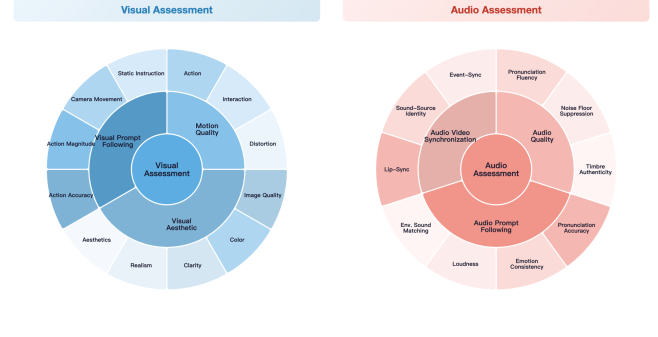
*Figure 14: Detail evaluation metrics of Alive-Bench 1.0. ALIVE.*

*Figure 15: Some video examples of the Alive-Bench 1.0 generated by ALIVE.*

*Figure 16: Alive-Bench 1.0 human evaluation results comparing our model (Alive) with leading competitors. Users were presented with side-by-side video comparisons and asked to choose which was better or if they were tied. The stacked bar charts show the proportion of user preference votes across different dimensions.*

*Figure 17: Alive-Bench 1.0 reference-character sub-benchmark human evaluation results comparing our model (Alive) with Wan 2.6. Users were presented with side-by-side video comparisons and asked to choose which was better or if they were tied. The stacked bar charts show the proportion of user preference votes across different dimensions.*

---
**Usage Info**: 6226 tokens used.
**Generated at**: 2026-02-23 21:51:28

---

# 📚 Scaling Speech Tokenizers with Diffusion Autoencoders

🚀 URL: https://arxiv.org/html/2602.06602

## 🌏 Abstract (원문)
Speech tokenizers define the interface between continuous speech signals and discrete speech language models, directly shaping how speech is perceived, modeled, and generated. As speech language models continue to scale and unify understanding and generation, the quality and structure of their discrete speech representations become a critical bottleneck. An effective speech tokenizer is generally expected to balance three competing objectives: (1) extreme compression for scalable language modeling, (2) high-fidelity reconstruction for natural speech generation, and (3) semantic-rich representations for downstream speech understanding. However, existing speech tokenizers struggle to satisfy these objectives jointly, particularly in the low token-rate regime, where each discrete token is required to encode substantial information. Most prior approaches address this tension through heuristic compromises rather than principled solutions. In this work, we aim to explore a speech tokenizer paradigm that simultaneously achieves extreme compression, high-quality reconstruction, and effective representations for speech language modeling. Crucially, we observe that under traditional acoustic reconstruction objectives, simply scaling training data or model size yields diminishing returns at low token rates. To overcome this bottleneck, a speech tokenizer requires a generative framework that can explicitly model the uncertainty induced by aggressive quantization, rather than enforcing a deterministic inverse mapping. Diffusion models offer a natural solution, as they learn to reverse a stochastic corruption process and have demonstrated strong generative capability and scalability across many domains. In contrast, we jointly optimize quantization and reconstruction within a diffusion autoencoder, ensuring that discrete codes are both highly compressive and explicitly aligned with the generative distribution of speech. Beyond reconstruction, we introduce semantic regularization to explicitly shape the discrete latent space. In this work, we directly impose semantic supervision on the quantized latent space by introducing an auxiliary Connectionist Temporal Classification (CTC) decoder and optimizing it with a CTC loss, encouraging discrete tokens to preserve semantic-rich and linguistically meaningful structure. In summary, we propose the Speech Diffusion Tokenizer (SiTok), scaling it to 1.6B parameters and training it on 22 million hours of speech data. SiTok achieves strong performance under an extreme compression setting of 12.5 Hz token rate and 0.2 kbps. We comprehensively evaluate SiTok on both speech reconstruction and diverse understanding tasks, including emotion recognition, keyword spotting, speaker verification, and automatic speech recognition.
## 🌏 Abstract (번역)
음성 토크나이저는 연속적인 음성 신호와 이산 음성 언어 모델 사이의 인터페이스를 정의하며, 음성이 인식, 모델링 및 생성되는 방식을 직접적으로 결정합니다. 음성 언어 모델이 계속 확장되고 이해와 생성을 통합함에 따라, 이산 음성 표현의 품질과 구조는 중요한 병목 현상이 되고 있습니다. 효과적인 음성 토크나이저는 일반적으로 (1) 확장 가능한 언어 모델링을 위한 극한의 압축, (2) 자연스러운 음성 생성을 위한 고충실도 재구성, (3) 다운스트림 음성 이해를 위한 풍부한 의미론적 표현이라는 세 가지 상충하는 목표의 균형을 맞추어야 합니다. 그러나 기존의 음성 토크나이저들은 특히 각 이산 토큰이 상당한 정보를 인코딩해야 하는 낮은 토큰율 환경에서 이러한 목표들을 동시에 만족시키는 데 어려움을 겪고 있습니다. 대부분의 이전 접근 방식들은 원칙적인 해결책보다는 휴리스틱한 타협을 통해 이러한 긴장을 해결하려 했습니다. 본 연구에서 우리는 극한의 압축, 고품질 재구성 및 음성 언어 모델링을 위한 효과적인 표현을 동시에 달성하는 음성 토크나이저 패러다임을 탐구하는 것을 목표로 합니다. 결정적으로, 우리는 전통적인 음향 재구성 목표 하에서 단순히 학습 데이터나 모델 크기를 확장하는 것이 낮은 토큰율에서는 수익 체감의 법칙을 따른다는 것을 관찰했습니다. 이러한 병목 현상을 극복하기 위해 음성 토크나이저는 결정론적인 역 매핑을 강제하기보다 공격적인 양자화로 인해 유도된 불확실성을 명시적으로 모델링할 수 있는 생성적 프레임워크가 필요합니다. 확산 모델(Diffusion models)은 확률적 부패 과정을 역전시키는 법을 배우고 여러 도메인에서 강력한 생성 능력과 확장성을 입증했기에 자연스러운 해결책을 제공합니다. 이와 대조적으로, 우리는 확산 오토인코더 내에서 양자화와 재구성을 공동으로 최적화하여 이산 코드가 고도로 압축적이면서도 음성의 생성적 분포와 명시적으로 정렬되도록 보장합니다. 재구성을 넘어, 우리는 이산 잠재 공간을 명시적으로 형성하기 위해 의미론적 정규화를 도입합니다. 본 연구에서는 보조 연결주의 시계열 분류(CTC) 디코더를 도입하고 CTC 손실로 최적화함으로써 양자화된 잠재 공간에 의미론적 감독을 직접 부과하여, 이산 토큰이 의미가 풍부하고 언어적으로 유의미한 구조를 보존하도록 장려합니다. 요약하자면, 우리는 16억 개의 파라미터로 확장하고 2,200만 시간의 음성 데이터로 학습시킨 음성 확산 토크나이저(SiTok)를 제안합니다. SiTok은 12.5Hz 토큰율 및 0.2kbps의 극한 압축 설정에서 강력한 성능을 달성합니다. 우리는 음성 재구성과 감정 인식, 키워드 검출, 화자 확인, 자동 음성 인식 등 다양한 이해 작업 모두에서 SiTok을 종합적으로 평가합니다.

## 🔍 Methods & Results
- 확산 오토인코더(Diffusion Autoencoder) 기반의 새로운 음성 토크나이저 프레임워크인 SiTok 제안
- 원시 파형 대신 멜-스펙트로그램을 입력 및 재구성 타겟으로 사용하여 학습 안정성과 확장성 확보
- 보조 CTC 디코더와 CTC 손실을 활용한 의미론적 정규화(Semantic Regularization)를 통해 잠재 공간의 언어적 일관성 강화
- Shortcut Fine-tuning 기법을 도입하여 확산 모델의 반복적 샘플링 단수를 2~4단계로 대폭 단축하고 추론 효율성 개선
- 모델을 16억(1.6B) 파라미터 규모로 확장하고 2,200만 시간의 대규모 음성 데이터셋으로 학습
- 12.5Hz 토큰율 및 0.2kbps의 매우 낮은 비트레이트 환경에서 고품질 음성 재구성 및 우수한 음성 이해 성능 달성
- Token Classifier-Free Guidance(Token CFG) 및 디코더 미세 조정을 통해 재구성된 음성의 품질을 추가로 향상

## 🖼 Figures
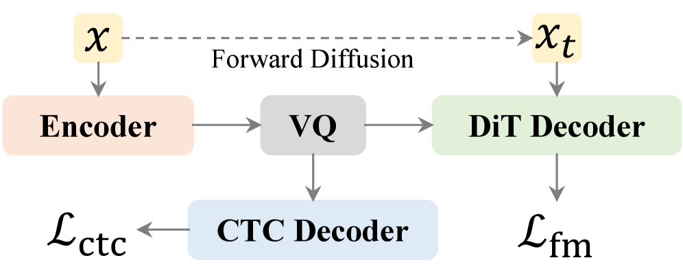
*Figure 1:Overview of SiTok.*

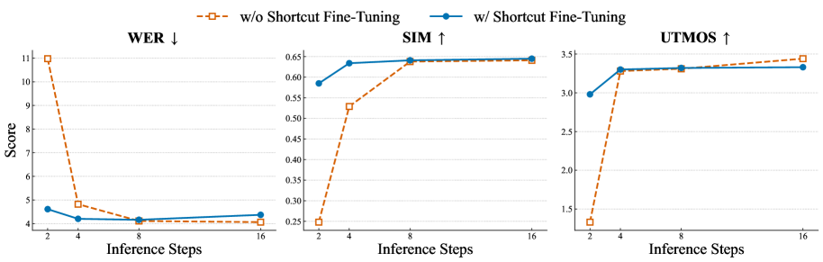
*Figure 2:Impact of shortcut fine-tuning on different inference steps. We report WER, SIM, and UTMOS. Shortcut fine-tuning achieves consistently better intelligibility and similarity, especially at small step numbers.*

---
**Usage Info**: 5540 tokens used.
**Generated at**: 2026-02-23 21:52:03

---

# 📚 VocalNet-MDM: Accelerating Streaming Speech LLM via Self-Distilled Masked Diffusion Modeling

🚀 URL: https://arxiv.org/html/2602.08607

## 🌏 Abstract (원문)
Recent Speech LLMs have advanced end-to-end speech interaction through diverse multimodal architectures. However, reliance on the Autoregressive (AR) paradigm limits real-time interaction. Latency grows linearly with sequence length due to serial dependence, and exposure bias degrades quality. Despite various explorations to mitigate these issues, they remain within the AR framework, preventing substantial throughput improvements. While non-autoregressive (NAR) generation offers a promising direction by predicting tokens in parallel to effectively reduce latency for real-time speech interaction and potentially benefiting from bidirectional context, current mainstream speech NAR paradigms still face significant limitations: single-pass methods based on conditional independence weaken long-range dependency modeling and global consistency; extra alignment components or supervision increase training complexity; and resolving the inherent one-to-many uncertainty in speech generation remains challenging, often requiring additional control signals. These constraints motivate exploring an alternative NAR paradigm that retains parallel efficiency while addressing quality challenges. In contrast, Masked Diffusion Modeling (MDM) offers a promising paradigm. Proven effective in large language models and multimodal tasks, MDM formulates generation as forward masking and reverse recovery, iteratively predicting masked tokens under updated contexts, forming globally consistent sequences without requiring extra alignment components. However, adapting MDM to streaming speech generation introduces two critical challenges. First, training-inference distribution mismatch: in streaming generation, MDM sequentially generates blocks of tokens by performing diffusion within each block and conditioning on previous blocks. However, standard MDM adopts Global Bernoulli Masking, making blocks within the same sample appear similarly masked and mismatching block diffusion decoding, where past blocks are fully visible while the current block is progressively revealed from fully masked to fully visible. Second, cumulative latency from iterative refinement: to maintain generation quality, diffusion decoding still requires a number of denoising steps proportional to the sequence length, resulting in limited inference efficiency. Existing methods for accelerating iterative refinement also fall short. KV Cache adaptation improves overall throughput but cannot reduce first-chunk latency; distillation methods require complex multi-model coordination and incur high training costs on long speech sequences. Therefore, we explore a new paradigm for speech LLMs using MDM for speech generation, and introduce VocalNet-MDM, an MDM-based speech LLM. Our approach introduces two mechanisms. First, Hierarchical Block-wise Masking mitigates the training–inference mismatch in block diffusion decoding. Instead of Global Bernoulli Masking, it selects blocks and applies diverse intra-block masking ratios so that training covers the intermediate masked states encountered as each block is gradually denoised. Second, Iterative Self-Distillation reduces diffusion steps by using multi-step block refinement as self-supervision. It transfers more certain prediction distributions from later denoising steps to earlier steps via parallel updates across blocks, enabling few-step decoding while preserving multi-step quality. Experiments demonstrate that VocalNet-MDM, trained on only 6K hours of data, achieves 3.7x to over 10x decoding speedup compared to the AR baseline and reduces first-chunk latency by 34%, while maintaining competitive WER and achieving state-of-the-art text quality and speech naturalness. These results validate MDM as a viable alternative to AR decoding and suggest a new, scalable direction for low-latency, efficient speech LLMs.
## 🌏 Abstract (번역)
최근의 음성 LLM은 다양한 멀티모달 아키텍처를 통해 엔드투엔드 음성 상호작용을 발전시켜 왔으나, 자기회귀(AR) 패러다임에 대한 의존성으로 인해 실시간 상호작용에 한계가 있습니다. 직렬적 의존성으로 인해 시퀀스 길이에 따라 지연 시간이 선형적으로 증가하며, 노출 편향이 품질을 저하시킵니다. 이러한 문제를 완화하려는 다양한 시도에도 불구하고, 여전히 AR 프레임워크 내에 머물러 있어 실질적인 처리량 향상이 어렵습니다. 비자기회귀(NAR) 생성은 토큰을 병렬로 예측하여 실시간 음성 상호작용의 지연 시간을 효과적으로 줄이고 양방향 문맥의 이점을 얻을 수 있는 유망한 방향이지만, 현재의 주류 음성 NAR 패러다임은 여전히 조건부 독립성에 기반한 단일 패스 방식의 장거리 의존성 모델링 약화, 추가적인 정렬 구성 요소로 인한 훈련 복잡성 증가, 음성 생성 고유의 일대다 불확실성 해결의 어려움 등 심각한 제약에 직면해 있습니다. 이러한 제약은 품질 문제를 해결하면서도 병렬 효율성을 유지하는 대안적인 NAR 패러다임 탐색을 촉발했습니다. 대조적으로, 마스크 확산 모델링(MDM)은 유망한 패러다임을 제공합니다. 대규모 언어 모델과 멀티모달 작업에서 효과가 입증된 MDM은 생성을 순방향 마스킹과 역방향 복구로 공식화하여, 업데이트된 문맥 하에서 마스킹된 토큰을 반복적으로 예측함으로써 추가 정렬 없이도 전역적으로 일관된 시퀀스를 형성합니다. 그러나 MDM을 스트리밍 음성 생성에 적용하는 데는 두 가지 중요한 과제가 있습니다. 첫째, 훈련-추론 분포 불일치입니다. 스트리밍 생성에서 MDM은 각 블록 내에서 확산을 수행하고 이전 블록을 조건으로 하여 순차적으로 토큰 블록을 생성합니다. 그러나 표준 MDM은 전역 베르누이 마스킹을 채택하여 동일 샘플 내의 블록들이 유사하게 마스킹된 것처럼 보이게 하므로, 이전 블록은 완전히 보이고 현재 블록은 점진적으로 드러나는 블록 확산 디코딩 방식과 일치하지 않습니다. 둘째, 반복적 정제로 인한 누적 지연 시간입니다. 생성 품질을 유지하기 위해 확산 디코딩은 여전히 시퀀스 길이에 비례하는 수의 노이즈 제거 단계가 필요하여 추론 효율성이 제한됩니다. 기존의 가속화 방법들도 한계가 있습니다. KV 캐시 적응은 전체 처리량은 개선하지만 첫 번째 청크 지연 시간은 줄이지 못하며, 증류 방법은 복잡한 다중 모델 조정이 필요하고 긴 음성 시퀀스에서 높은 훈련 비용이 발생합니다. 이에 따라 본 연구에서는 음성 생성을 위한 MDM 기반의 새로운 음성 LLM 패러다임인 VocalNet-MDM을 제안합니다. 본 접근 방식은 두 가지 메커니즘을 도입합니다. 첫째, 계층적 블록 단위 마스킹은 블록 확산 디코딩에서의 훈련-추론 불일치를 완화합니다. 전역 베르누이 마스킹 대신 블록을 선택하고 다양한 블록 내 마스킹 비율을 적용하여, 각 블록이 점진적으로 노이즈가 제거될 때 마주치는 중간 마스크 상태를 훈련 과정에서 커버합니다. 둘째, 반복적 자기 증류는 다단계 블록 정제를 자기 지도 학습으로 사용하여 확산 단계를 줄입니다. 블록 간 병렬 업데이트를 통해 나중의 노이즈 제거 단계에서 얻은 더 확실한 예측 분포를 이전 단계로 전달함으로써, 다단계 품질을 유지하면서도 적은 단계의 디코딩을 가능하게 합니다. 실험 결과, 단 6,000시간의 데이터로 훈련된 VocalNet-MDM은 AR 베이스라인 대비 3.7배에서 10배 이상의 디코딩 속도 향상을 달성하고 첫 번째 청크 지연 시간을 34% 단축하는 동시에, 경쟁력 있는 WER과 최첨단 수준의 텍스트 품질 및 음성 자연스러움을 확보했습니다. 이러한 결과는 MDM이 AR 디코딩의 실행 가능한 대안임을 입증하며, 저지연 고효율 음성 LLM을 위한 새로운 확장 가능한 방향을 제시합니다.

## 🔍 Methods & Results
- Thinker-Talker 패러다임 채택: Thinker(Qwen3-Omni 기반)가 텍스트와 은닉 상태를 생성하고, Talker가 MDM을 통해 이산 음성 토큰을 생성하는 구조 설계
- 계층적 블록 단위 마스킹(Hierarchical Block-wise Masking): 스트리밍 추론 시 블록이 점진적으로 복원되는 과정을 모사하기 위해 블록별로 다양한 마스킹 비율을 적용하여 훈련-추론 간 분포 불일치 해결
- 반복적 자기 증류(Iterative Self-Distillation): 교사 모델의 다단계 정제 과정을 학생 모델이 적은 단계로 학습하도록 하여, 품질 저하 없이 추론 속도를 대폭 향상
- 블록 확산 디코딩(Block Diffusion Decoding): 블록 내 병렬 처리와 블록 간 인과적 어텐션을 결합하여 실시간 스트리밍 상호작용 지원
- 디코딩 속도 향상: AR 베이스라인 대비 3.7배에서 최대 10배 이상의 속도 향상 및 첫 번째 청크 지연 시간(First-chunk latency) 34% 감소 달성
- 음성 품질 및 효율성: 6,000시간의 비교적 적은 데이터 학습만으로도 최첨단(SOTA) 수준의 음성 자연스러움과 경쟁력 있는 WER(단어 오류율) 기록

## 🖼 Figures

*Figure 1: Overview of our approach. (a) Masked Diffusion Modeling: a Thinker–Talker speech LLM architecture where speech generation is performed via MDM. (b) Iterative Self-Distillation: transferring more certain distributions from later to earlier denoising steps to enable few-step inference. (c) Block Diffusion Decoding: streaming inference that denoises tokens within fixed-size blocks over diffusion steps.*

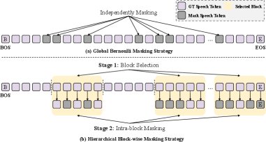
*Figure 2: Masking strategies. (a) Global Bernoulli Masking: each token masked independently with uniform probability. (b) Hierarchical Block-wise Masking: block selection followed by intra-block token masking.*

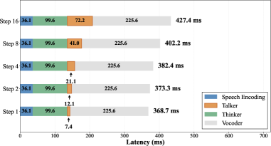
*Figure 3:Latency breakdown for generating the first-chunk in VocalNet-MDM at different diffusion steps.*

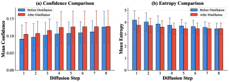
*Figure 4:Comparison of prediction uncertainty before and after Iterative Self-Distillation. (a) Mean confidence scores across diffusion steps. (b) Mean entropy values across diffusion steps.*

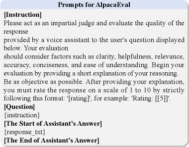
*Figure 5:Prompt for AlpacaEval.*

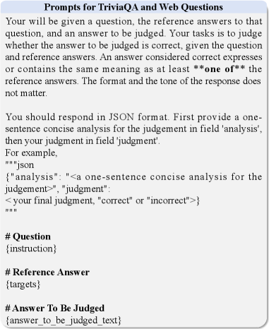
*Figure 6:Prompt for TriviaQA and Web Questions.*

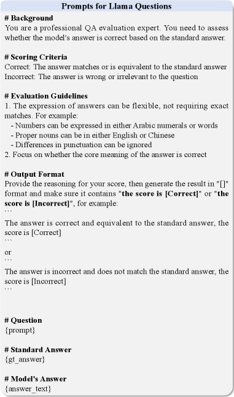
*Figure 7:Prompt for Llama Questions.*

---
**Usage Info**: 6368 tokens used.
**Generated at**: 2026-02-23 21:52:43

---

# 📚 Prototype-Based Disentanglement for Controllable Dysarthric Speech Synthesis

🚀 URL: https://arxiv.org/html/2602.08696

## 🌏 Abstract (원문)
Dysarthria is a neurological motor speech disorder primarily caused by damage to the central or peripheral nervous system that impairs control over the muscles used for speech production[1]. It often results in slurred, slow, or imprecise articulation that hinders communication and poses significant challenges for automatic speech recognition (ASR) and speech-based assistive technologies, due to the high variability of pathological speech and the limited availability of labeled data[2,3]. Prior work primarily follows two main research directions. The first direction focuses on ASR data augmentation, leveraging speech synthesis models to generate dysarthric speech and improve recognition robustness. The Rhythm-and-Voice (RnV) framework[4]employs self-supervised speech representations to disentangle and convert rhythmic and speaker-related characteristics in an unsupervised manner, and adapts ASR models using the converted speech. Soleymanpour et al.[5]propose a modified neural multi-talker TTS system that incorporates a dysarthria severity coefficient and a pause insertion module to synthesize pathological speech at varying severity levels for controlled data augmentation. Leung et al.[6]introduce a diffusion-based text-to-dysarthric-speech (TTDS) synthesis framework and fine-tune large-scale ASR models using the generated pathological data to improve recognition performance on dysarthric speech. A second line of research focuses on dysarthric speech reconstruction, aiming to transform pathological speech into more intelligible speech. Early approaches adapt voice conversion (VC) techniques to map dysarthric speech to clearer acoustic realizations[7,8]. E2E-DSR[9]replaces the text encoder in a sequence-to-sequence TTS system with a pre-trained ASR model, enabling end-to-end reconstruction from dysarthric speech to control-style speech. Unit-DSR[10]leverages self-supervised representations and discrete speech units to constrain content restoration within a linguistic space and improve training efficiency. More recently, Diff-DSR[11]adopts a latent diffusion model with content and speaker encoders to enhance reconstruction quality while preserving speaker identity. Despite these advances, existing methods often entangle speaker identity with pathological articulation. This limits the diversity and controllability of synthesized speech for augmentation and can lead to speaker drift in reconstructed speech. In this study, we propose ProtoDisent-TTS, a prototype-based disentanglement TTS framework built on a pre-trained Index-TTS model[12]. A pathology prototype codebook represents control and dysarthric articulation patterns, while a speaker encoder extracts timbre embeddings from a short prompt audio. These representations are combined with textual content for speech generation. A dual-classifier objective with a gradient reversal layer (GRL)[13]enforces the separation of speaker identity and pathology-related attributes within a unified generation pipeline. The main contributions of this paper are summarized as: We introduce ProtoDisent-TTS, a prototype-based TTS framework that enables controllable and bidirectional transformation between control and dysarthric speech within a unified latent space. We demonstrate its effectiveness for scalable ASR data augmentation by generating pathology-controlled and speaker-consistent dysarthric speech. We show that the same representation supports speaker-aware dysarthric speech reconstruction, bridging robust ASR training and assistive speech applications.
## 🌏 Abstract (번역)
마비성 구음장애(Dysarthria)는 주로 중추 또는 말초 신경계의 손상으로 인해 발생하는 신경학적 운동 언어 장애로, 발화에 사용되는 근육 조절 능력을 저하시킵니다. 이는 종종 어눌하거나 느리거나 부정확한 조음으로 이어져 의사소통을 방해하며, 병리적 음성의 높은 가변성과 레이블이 지정된 데이터의 부족으로 인해 자동 음성 인식(ASR) 및 음성 기반 보조 기술에 큰 어려움을 초래합니다. 이전 연구들은 주로 두 가지 방향을 따릅니다. 첫 번째 방향은 ASR 데이터 증강에 초점을 맞추어, 음성 합성 모델을 활용해 마비성 구음장애 음성을 생성하고 인식 견고성을 향상시킵니다. RnV 프레임워크는 자기 지도 학습 음성 표현을 사용하여 리듬 및 화자 관련 특성을 비지도 방식으로 분리 및 변환하고, 변환된 음성을 사용하여 ASR 모델을 적응시킵니다. Soleymanpour 등은 마비성 구음장애 중증도 계수와 휴지기 삽입 모듈을 통합하여 다양한 중증도의 병리적 음성을 합성하는 수정된 신경망 다중 화자 TTS 시스템을 제안했습니다. Leung 등은 확산 기반 텍스트-마비성 구음장애 음성(TTDS) 합성 프레임워크를 도입하고 생성된 병리적 데이터를 사용하여 대규모 ASR 모델을 미세 조정함으로써 인식 성능을 개선했습니다. 두 번째 연구 방향은 마비성 구음장애 음성 재구성에 초점을 맞추어 병리적 음성을 더 이해하기 쉬운 음성으로 변환하는 것을 목표로 합니다. 초기 접근 방식은 음성 변환(VC) 기술을 적응시켜 마비성 구음장애 음성을 더 명확한 음향 실현으로 매핑합니다. E2E-DSR은 시퀀스-투-시퀀스 TTS 시스템의 텍스트 인코더를 사전 학습된 ASR 모델로 교체하여 마비성 구음장애 음성에서 대조군 스타일 음성으로의 엔드투엔드 재구성을 가능하게 합니다. Unit-DSR은 자기 지도 학습 표현과 이산 음성 단위를 활용하여 언어 공간 내에서 콘텐츠 복원을 제한하고 학습 효율성을 높입니다. 최근 Diff-DSR은 콘텐츠 및 화자 인코더가 포함된 잠재 확산 모델을 채택하여 화자 정체성을 유지하면서 재구성 품질을 향상시켰습니다. 이러한 발전에도 불구하고 기존 방법들은 종종 화자 정체성과 병리적 조음을 얽히게 만듭니다. 이는 증강을 위한 합성 음성의 다양성과 제어 가능성을 제한하며, 재구성된 음성에서 화자 이탈(speaker drift)을 초래할 수 있습니다. 본 연구에서는 사전 학습된 Index-TTS 모델을 기반으로 구축된 프로토타입 기반 분리 TTS 프레임워크인 ProtoDisent-TTS를 제안합니다. 병리 프로토타입 코드북은 대조군 및 마비성 구음장애 조음 패턴을 나타내며, 화자 인코더는 짧은 프롬프트 오디오에서 음색 임베딩을 추출합니다. 이러한 표현은 음성 생성을 위해 텍스트 콘텐츠와 결합됩니다. 그래디언트 역전 레이어(GRL)가 포함된 이중 분류기 목적 함수는 통합된 생성 파이프라인 내에서 화자 정체성과 병리 관련 속성의 분리를 강제합니다. 본 논문의 주요 기여는 다음과 같이 요약됩니다. 첫째, 통합된 잠재 공간 내에서 대조군과 마비성 구음장애 음성 간의 제어 가능하고 양방향 변환을 가능하게 하는 프로토타입 기반 TTS 프레임워크인 ProtoDisent-TTS를 도입합니다. 둘째, 병리 제어 및 화자 일관성이 유지되는 마비성 구음장애 음성을 생성함으로써 확장 가능한 ASR 데이터 증강에 대한 효과를 입증합니다. 셋째, 동일한 표현이 화자 인지 마비성 구음장애 음성 재구성을 지원하여 견고한 ASR 학습과 보조 음성 애플리케이션 사이의 가교 역할을 함을 보여줍니다.

## 🔍 Methods & Results
- Index-TTS 모델을 기반으로 화자 임베딩과 병리 프로토타입 임베딩을 결합하는 ProtoDisent-TTS 프레임워크 제안
- 학습 가능한 병리 프로토타입 코드북을 통해 정상 및 다양한 마비성 구음장애 조음 패턴을 독립적으로 제어
- GRL(Gradient Reversal Layer)이 포함된 이중 분류기 목적 함수를 사용하여 화자 정체성과 병리적 특성을 잠재 공간에서 명확히 분리
- 음성 변환 기반 학습 기법을 도입하여 화자 음색과 조음 조건의 다양한 조합을 학습하고 분리 성능을 강화
- 정상 화자의 음색에 병리적 특성을 주입하는 방식으로 ASR 성능 향상을 위한 대규모 데이터 증강 가능성 입증
- 마비성 구음장애 음성에서 화자 음색을 유지한 채 정상 프로토타입을 적용하여 명료한 음성으로 재구성하는 기술 구현

## 🖼 Figures
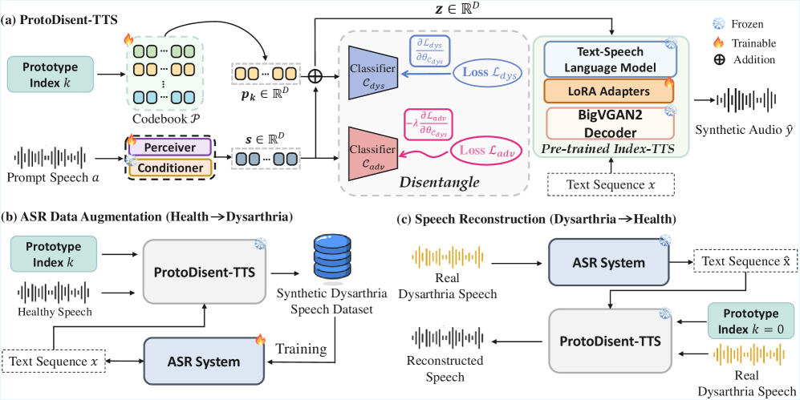
*Figure 1:Overview architecture of ProtoDisent-TTS.*

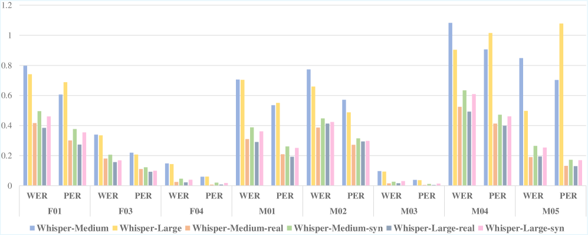
*Figure 2:Comparison of ASR performance trained on real and synthetic dysarthric speech.*

---
**Usage Info**: 5592 tokens used.
**Generated at**: 2026-02-23 21:53:14

---

# 📚 Joint Channel Sounding and Source-Channel Coding for MIMO-OFDM Systems: Deep Unified Encoding and Parallel Flow-Matching Decoding

🚀 URL: https://arxiv.org/html/2602.08795

## 🌏 Abstract (원문)
In semantic communication, DNN-based joint source-channel coding (DJSCC) has become a prevailing approach to the design of neural codecs for multi-modal source transmission, in which source data (e.g., audio, images, and video) are directly mapped into channel inputs. This approach has proven successful in various communication systems, encompassing multi-user transmission, multiple-input multiple-output (MIMO) systems, and orthogonal frequency-division multiplexing (OFDM), consistently exhibiting significantly improved spectrum efficiency. Yet, most existing work on DJSCC either assumes that the channel is a priori known, or takes some conventional channel sounding techniques, such as sending orthogonal pilots at the transmitter and using canonical channel estimation methods at the receiver. Then, a natural question arises: How much overhead do we need to pay for the acquisition of channel state information (CSI) in a DJSCC-based communication system? In this paper, we attempt to answer this question by integrating DJSCC into MIMO-OFDM systems defined in modern standards such as 3GPP 5G-NR and WiFi-7. In a practical MIMO-OFDM system, the channel typically varies fast over frequency due to the multipath effect and over time due to user mobility, which implies that the amount of time-frequency resource required in CSI acquisition is unignorable. In current commercial MIMO-OFDM systems, approximately 15%-20% of the time-frequency resources are dedicated to pilot transmission for channel sounding. In fact, pilot overhead can be reduced by exploiting the inherent low-dimensionality of the MIMO-OFDM channel. The question is then what is the best design practice that can resolve the channel uncertainty at the receiver by introducing a minimal amount of redundancy at the transmitter. From a more general perspective, the receiver needs to resolve both channel and source uncertainties based on the transmission redundancy introduced at the transmitter side. This implies that channel sounding and source-channel coding can be unified to enable a more efficient allocation of resources, thereby achieving a higher spectral efficiency of the system. Building upon this insight, we take a joint channel sounding and source-channel coding approach to reduce CSI acquisition overhead and improve spectral efficiency by exploiting the powerful encoding and decoding capabilities of DNN-based techniques. Specifically, we propose a deep unified (DU) encoder at the transmitter that maps source data into channel input symbols via a DNN. It is worth noting that a codeword of the DU encoder does not necessarily exhibit a clear structural separation between the redundant component and the information-bearing component, although conventional designs with explicit redundancy, i.e., pilots, are included as special cases of our proposed DU design. At the receiver, we propose a powerful parallel flow-matching (PFM) decoder to jointly estimate the channel and source. In PFM, we leverage the flow model, which effectively characterizes high-dimensional data posing low-dimensional structures, to capture the prior information of the channel and the source data. This allows the decoder to perform Bayesian inference for joint channel estimation and source reconstruction. Simulations demonstrate that the proposed DU-PFM approach drastically outperforms existing representative methods in terms of spectral efficiency, channel estimation accuracy, and perceptual quality of recovered source data.
## 🌏 Abstract (번역)
시맨틱 통신에서 DNN 기반의 결합 소스-채널 코딩(DJSCC)은 오디오, 이미지, 비디오와 같은 소스 데이터를 채널 입력으로 직접 매핑하는 멀티모달 소스 전송용 신경 코덱 설계의 주요 방식으로 자리 잡았습니다. 이 방식은 다중 사용자 전송, 다중 입출력(MIMO) 시스템, 직교 주파수 분할 다중화(OFDM)를 포함한 다양한 통신 시스템에서 성공을 거두며 일관되게 향상된 스펙트럼 효율을 보여주었습니다. 그러나 기존 DJSCC 연구의 대부분은 채널을 사전에 알고 있다고 가정하거나, 송신기에서 직교 파일럿을 보내고 수신기에서 표준 채널 추정법을 사용하는 전통적인 채널 사운딩 기술을 채택합니다. 이에 따라 DJSCC 기반 통신 시스템에서 채널 상태 정보(CSI) 획득을 위해 지불해야 하는 오버헤드가 어느 정도인가라는 의문이 제기됩니다. 본 논문에서는 3GPP 5G-NR 및 WiFi-7과 같은 현대 표준에 정의된 MIMO-OFDM 시스템에 DJSCC를 통합하여 이 질문에 답하고자 합니다. 실제 MIMO-OFDM 시스템에서 채널은 다중 경로 효과와 사용자 이동성으로 인해 주파수와 시간 영역에서 빠르게 변하며, 이는 CSI 획득에 필요한 시공간 자원량이 무시할 수 없는 수준임을 의미합니다. 현재 상용 MIMO-OFDM 시스템에서는 시공간 자원의 약 15%-20%가 채널 사운딩을 위한 파일럿 전송에 할당됩니다. 사실 파일럿 오버헤드는 MIMO-OFDM 채널의 고유한 저차원 구조를 활용하여 줄일 수 있습니다. 따라서 핵심 질문은 송신기에서 최소한의 중복성을 도입하여 수신기에서 채널 불확실성을 해결할 수 있는 최적의 설계 관행이 무엇인가 하는 것입니다. 더 넓은 관점에서 수신기는 송신기 측에서 도입된 전송 중복성을 기반으로 채널과 소스의 불확실성을 모두 해결해야 합니다. 이는 채널 사운딩과 소스-채널 코딩을 통합하여 자원을 더 효율적으로 할당함으로써 시스템의 스펙트럼 효율을 높일 수 있음을 시사합니다. 이러한 통찰을 바탕으로, 본 연구는 DNN 기반 기술의 강력한 인코딩 및 디코딩 능력을 활용하여 CSI 획득 오버헤드를 줄이고 스펙트럼 효율을 개선하는 결합 채널 사운딩 및 소스-채널 코딩 접근 방식을 취합니다. 구체적으로, 송신기에서 DNN을 통해 소스 데이터를 채널 입력 심볼로 매핑하는 심층 통합(DU) 인코더를 제안합니다. DU 인코더의 코드워드는 파일럿과 같은 명시적 중복성을 가진 기존 설계를 특수한 경우로 포함하면서도, 중복 성분과 정보 함유 성분 사이에 명확한 구조적 분리를 반드시 보이지는 않는다는 점이 특징입니다. 수신기에서는 채널과 소스를 공동으로 추정하기 위해 강력한 병렬 플로우 매칭(PFM) 디코더를 제안합니다. PFM에서는 저차원 구조를 가진 고차원 데이터를 효과적으로 특성화하는 플로우 모델을 활용하여 채널과 소스 데이터의 사전 정보를 캡처합니다. 이를 통해 디코더는 공동 채널 추정 및 소스 복원을 위한 베이지안 추론을 수행할 수 있습니다. 시뮬레이션 결과, 제안된 DU-PFM 방식은 스펙트럼 효율, 채널 추정 정확도 및 복원된 소스 데이터의 인지 품질 측면에서 기존의 대표적인 방법들을 압도하는 성능을 보였습니다.

## 🔍 Methods & Results
- MIMO-OFDM 시스템 환경에서 소스 데이터를 채널 입력 심볼로 직접 매핑하는 심층 통합(DU) 인코더 설계
- 상호 정보량(Mutual Information) 최대화 원칙에 기반하여 채널과 소스의 불확실성을 동시에 해결하는 시스템 정식화
- 변분 상한(Variational Upper Bound) 최소화를 통해 사후 분포 추정 문제를 최적화 문제로 변환
- Swin Transformer를 백본으로 사용하는 별도의 송수신기 설계 및 학습 전략 채택
- 채널 및 소스의 생성적 사전 정보(Generative Priors) 모델링을 위해 최적 운송(OT) 플로우 매칭 프레임워크 활용
- 베이지안 추론을 통해 채널 추정과 소스 복원을 동시에 수행하는 병렬 플로우 매칭(PFM) 디코더 제안
- Tweedie 공식을 활용하여 플로우 변수로부터 실측값의 최소 평균 제곱 오차(MMSE) 추정치를 계산하여 우도 점수(Likelihood Score) 근사
- 3GPP UMa-NLOS 채널 조건 시뮬레이션에서 기존 SOTA 방식 대비 스펙트럼 효율 및 채널 추정 정확도 대폭 향상 확인

## 🖼 Figures

*Figure 1:The proposed transceiver design, where 
{
𝑔
𝜷
𝑘
}
𝑘
=
1
𝑁
𝑡
 are the auxiliary DU decoders to facilitate the training of the DU encoders 
{
𝑓
𝜸
𝑘
}
𝑘
=
1
𝑁
𝑡
, and 
𝑔
𝚯
 is the desired PFM decoder that achieves joint channel and source estimation.*

*Figure 2:
NMSE
ℋ
, 
NMSE
𝒳
, and 
PSNR
𝒮
 of the DU-PFM framework under various CBRs and CSNRs. The pilot ratio for OP/SP-DU-PFM is 
𝛼
=
0.5
.*

*Figure 3:Tradeoff between the estimation accuracy and the computational complexity in terms of NFE, where CSNR 
=
10
 dB and CBR 
=
1
/
192
.*

---
**Usage Info**: 7091 tokens used.
**Generated at**: 2026-02-23 21:53:43

---

# 📚 Is Flow Matching Just Trajectory Replay for Sequential Data?

🚀 URL: https://arxiv.org/html/2602.08318

## 🌏 Abstract (원문)
Continuous-time models, such as normalizing flows defined by ordinary differential equations (ODEs)Chenet al.(2018); Krishnapriyanet al.(2023), have emerged as a powerful and flexible paradigm in generative modelingTomczak (2022); Laiet al.(2025). These models specify a generative process through a velocity fieldvθ​(z,t)v_{\theta}(z,t)in the ODE, which is described by the process:z​(0)∼p0z(0)\sim p_{0}, which transports a simple base distributionp0p_{0}att=0t=0to a complex data distributionp1p_{1}att=1t=1. However, training such models remains challenging and often requires simulation-based objectives or the computationally expensive adjoint method. Flow matching (FM) methodsLipmanet al.(2022,2024)(including closely related approaches such as Rectified FlowLiuet al.(2022)and Stochastic InterpolantsAlbergoet al.(2023)) address these challenges by providing a simulation-free regression objective for learning the velocity field. FM constructs a target probability pathpt​(z)p_{t}(z)and an associated guiding fieldu​(t,z)u(t,z)that transports samples along this path. The model is then trained with regression loss𝔼​[‖vθ​(t,z)−u​(t,z)‖2]\mathbb{E}\big[\|v_{\theta}(t,z)-u(t,z)\|^{2}\big], wherevθv_{\theta}denotes a neural network with parameterθ\theta, leading to highly effective and practically scalable continuous-time generative models. Sequence modeling is a natural and increasingly important application domain for FM; see our discussion of related work in App.A. Sequential data are often viewed as discretizations of underlying continuous-time processes. FM formulations can therefore be used to learn generative models of full trajectories using a memory bank of observed one-step transitionsLimet al.(2025); Zhanget al.(2024). Despite promising results, the implicit bias of FM models is not well understood. This raises a question: In this work, we derive this optimal empirical model, studying its structure in detail, and exploring the implications. For the Gaussian path construction commonly used in FM, we show thatv^∗​(t,z)\hat{v}^{*}(t,z)admits aclosed-form expression. Remarkably, this gives us a training-free, interpretable sampler which can be viewed as anonparametric, memory-augmented continuous-time dynamical systemdefined directly by the dataset of historical transitions. Through this lens, neural FM models trained on sequential data can be reinterpreted as parametric approximations of this ideal nonparametric model. This perspective unifies continuous-time flow-based generative modeling with nonparametric dynamical systems, offering a principled and data-driven foundation for memory-based sequence modeling. In more detail, our main contributions are as follows: Theoretical Derivation of the Optimal Velocity Field.We derive the closed-form minimizer of the empirical FM objective for historical transition data (see Sec.2). We show that for Gaussian conditional paths, the optimal velocity depends on a similarity-weighted average of certain data-dependent instantaneous velocities. We further study the behavior of the resulting ODE sampler; see App.E. A Principled Training-Free Sampler.Motivated by the theoretical insight, we propose a training-free model (FreeFM), see Fig.1, that takes advantage of the entire dataset as a memory bank. This sampler operates as a nonparametric dynamical system that blends historical dynamics based on proximity to the current state. We analyze the numerical properties of the ODE sampler, and propose approximation schemes to address computational scalability and stability (see Sec.3). Proofs of the presented theoretical results are provided in App.D. Empirical Validation.Focusing on sequential data arising in nonlinear dynamicsGilpin (2023a); Berry and Das (2025), we validate the theoretical insight and demonstrate the effectiveness of the proposed sampler on standard benchmark tasks (see Sec.4). Our results show that this nonparametric “trajectory replay” mechanism can perform competitively with trained neural networks (see Fig.2), challenging the necessity of deep parameterization. Source code is available athttps://github.com/shoelim/FreeFM.
## 🌏 Abstract (번역)
상미분 방정식(ODE)으로 정의되는 노멀라이징 플로우와 같은 연속 시간 모델은 생성 모델링에서 강력하고 유연한 패러다임으로 부상했습니다. 이러한 모델은 속도 필드 v_theta(z, t)를 통해 생성 과정을 지정하며, 이는 t=0에서의 단순한 기저 분포 p_0를 t=1에서의 복잡한 데이터 분포 p_1로 이동시킵니다. 그러나 이러한 모델의 훈련은 여전히 도전적이며 시뮬레이션 기반 목적 함수나 계산 비용이 큰 인접 메서드(adjoint method)를 요구하곤 합니다. 플로우 매칭(FM) 방법은 속도 필드 학습을 위한 시뮬레이션 프리 회귀 목적 함수를 제공하여 이를 해결합니다. FM은 목표 확률 경로 p_t(z)와 가이드 필드 u(t, z)를 구축하며, 모델은 회귀 손실을 통해 훈련되어 효과적이고 확장 가능한 연속 시간 생성 모델을 생성합니다. 시퀀스 모델링은 FM의 중요한 응용 분야이며, FM은 관찰된 단일 단계 전이의 메모리 뱅크를 사용하여 전체 궤적의 생성 모델을 학습하는 데 사용될 수 있습니다. 본 연구에서는 이러한 최적의 경험적 모델을 도출하고 그 구조를 상세히 연구합니다. 가우시안 경로 구축의 경우 v^*(t, z)가 폐형(closed-form) 표현을 가짐을 보여주며, 이는 과거 전이 데이터셋으로 정의되는 비매개변수적, 메모리 증강 연속 시간 동적 시스템인 훈련 프리 샘플러를 제공합니다. 이를 통해 신경망 FM 모델을 이 이상적인 비매개변수 모델의 매개변수적 근사로 재해석할 수 있습니다. 주요 기여로는 최적 속도 필드의 이론적 도출, 훈련이 필요 없는 샘플러(FreeFM) 제안, 그리고 비선형 동역학 벤치마크에서의 실험적 검증이 포함됩니다.

## 🔍 Methods & Results
- 역사적 전이 데이터에 대한 경험적 플로우 매칭(FM) 목적 함수의 폐형(closed-form) 최소화 도출
- 전체 데이터셋을 메모리 뱅크로 활용하여 훈련 없이 작동하는 비매개변수적 샘플러 FreeFM 제안
- 가우시안 조건부 경로에 대해 최적 속도가 데이터 의존적 순간 속도의 유사도 가중 평균(Nadaraya-Watson 추정량)임을 증명
- 최적 드리프트가 전역 선형 항과 가우시안 커널 어텐션에 의한 국소 비선형 항으로 분해됨을 확인
- 비선형 동역학 벤치마크에서 제안된 샘플러가 훈련된 신경망 모델과 대등하거나 경쟁력 있는 성능을 보임을 검증
- 속도 필드와 경험적 스코어 함수 및 연산자 이론적 확산 맵(diffusion map) 간의 이론적 연결성 확립

## 🖼 Figures
![Figure 1:What Dynamical System Are FM Forecasters Actually Sampling From? For sequential data, optimal empirical FM induces a nonparametric, memory-augmented ODE, enabling training-free forecasting by replaying historical transitions. Inspired by this theoretical insight, we propose an ODE sampler 
𝑑
​
𝑍
𝑡
𝑑
​
𝑡
=
𝐺
𝑡
​
𝑍
𝑡
+
ℎ
​
(
𝑡
,
𝑍
𝑡
;
𝒟
𝑀
)
 (see (13)), where the velocity field combines a global linear drift 
𝐺
𝑡
​
𝑍
𝑡
 with a data-adaptive nonlinear memory term 
ℎ
. This nonlinear forcing is computed by attending to residual velocities 
𝑦
𝑗
​
(
𝑡
)
, weighted by a kernel attention mechanism 
𝛼
𝑗
​
(
𝑡
,
𝑧
)
. By initializing 
𝑍
0
 from a Gaussian distribution around the current state 
𝑥
𝜏
, integrating this ODE gives a next-step forecast 
𝑍
1
≈
𝑥
𝜏
+
1
, and the method inherently supports generating an ensemble of forecasts to quantify uncertainty.](../images/2026-02-10/2602.08318/2602.08318_fig0.png)
*Figure 1:What Dynamical System Are FM Forecasters Actually Sampling From? For sequential data, optimal empirical FM induces a nonparametric, memory-augmented ODE, enabling training-free forecasting by replaying historical transitions. Inspired by this theoretical insight, we propose an ODE sampler 
𝑑
​
𝑍
𝑡
𝑑
​
𝑡
=
𝐺
𝑡
​
𝑍
𝑡
+
ℎ
​
(
𝑡
,
𝑍
𝑡
;
𝒟
𝑀
)
 (see (13)), where the velocity field combines a global linear drift 
𝐺
𝑡
​
𝑍
𝑡
 with a data-adaptive nonlinear memory term 
ℎ
. This nonlinear forcing is computed by attending to residual velocities 
𝑦
𝑗
​
(
𝑡
)
, weighted by a kernel attention mechanism 
𝛼
𝑗
​
(
𝑡
,
𝑧
)
. By initializing 
𝑍
0
 from a Gaussian distribution around the current state 
𝑥
𝜏
, integrating this ODE gives a next-step forecast 
𝑍
1
≈
𝑥
𝜏
+
1
, and the method inherently supports generating an ensemble of forecasts to quantify uncertainty.*

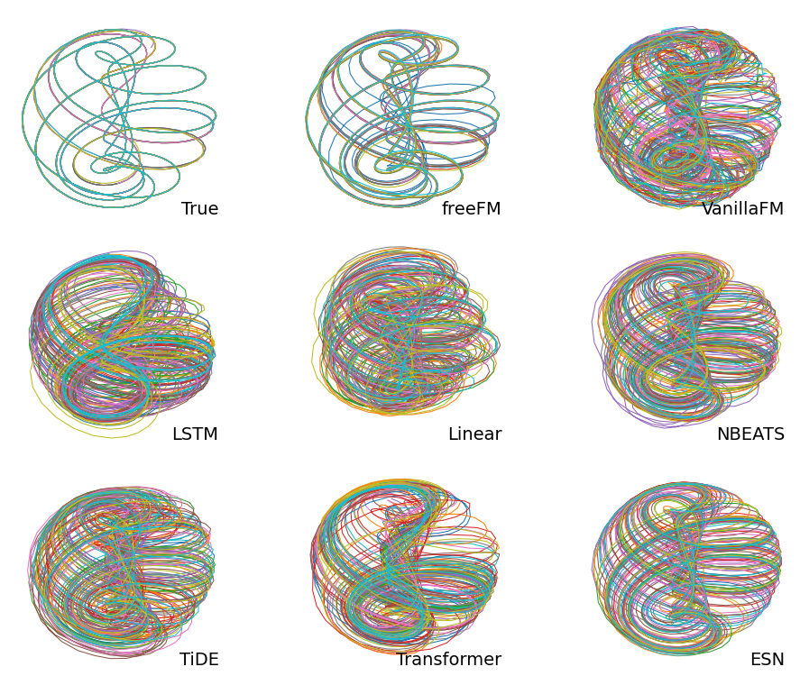
*(a)Conditional Forecast Trajectory for Aizawa Attractor*

*(a)Conditional Forecast Trajectory for Aizawa Attractor*

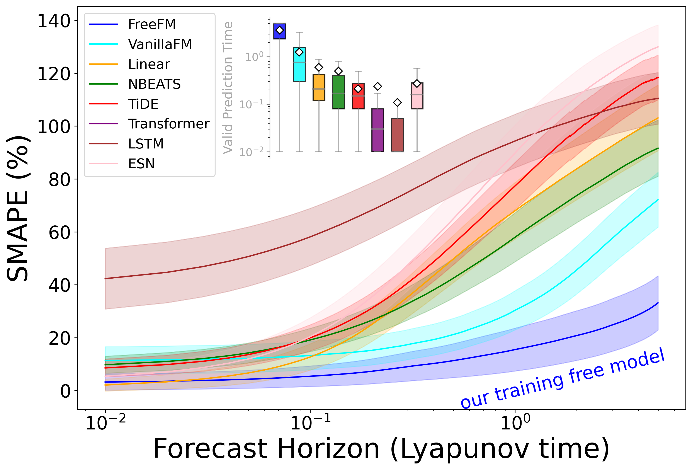
*(b)sMAPE and VPT Comparison*

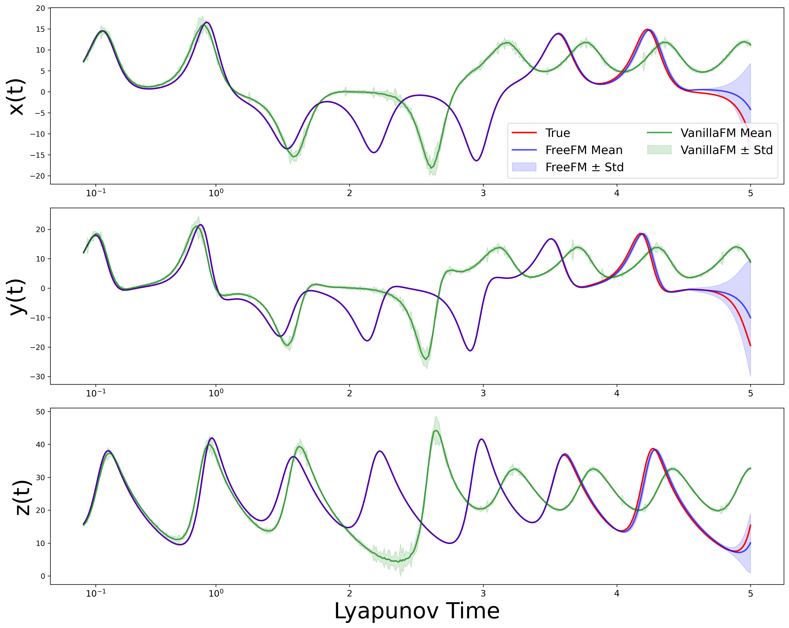
*(a)Probabilistic Forecast Trajectory for Lorenz-63 (2D)*

*(a)Probabilistic Forecast Trajectory for Lorenz-63 (2D)*

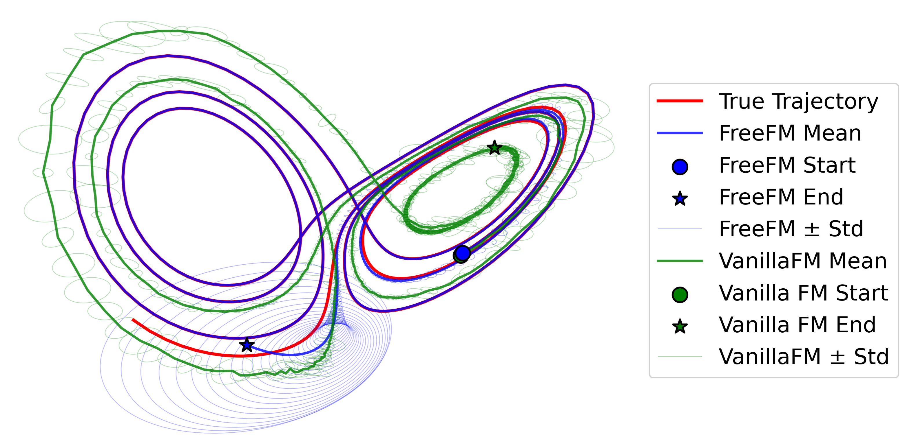
*(b)Probabilistic Forecast Trajectory for Lorenz-63 (3D)*

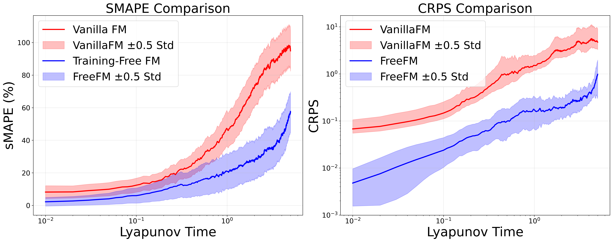
*(c)sMAPE and CRPS Comparison*

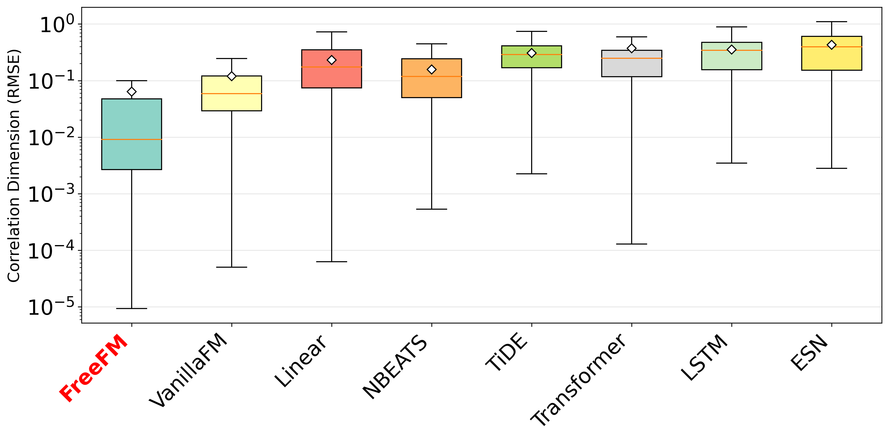
*(a)Correlation Dimension Comparison*

*(a)Correlation Dimension Comparison*

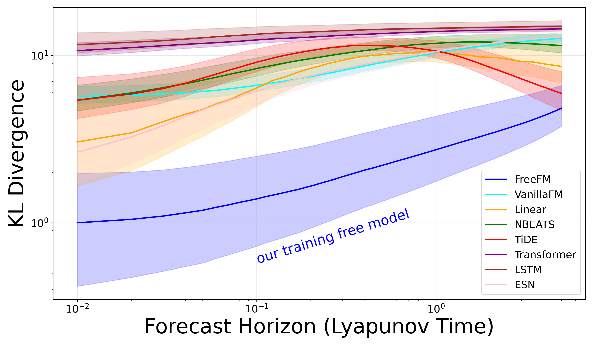
*(b)KL Divergence Comparison*

![Figure 5:Illustration of Dynamical Measure Transport via Flow Matching (FM). The schematic depicts the continuous transport of a probability measure from a source to a target distribution. (Left) The process initializes with a standard Gaussian source measure 
𝑝
0
​
(
𝑧
)
=
𝒩
​
(
0
,
𝐼
)
. (Middle) The FM objective defines a vector field 
𝑣
𝑡
​
(
𝑧
)
 that drives the transport. The resulting ODE flow 
𝑑
​
𝑧
/
𝑑
​
𝑡
=
𝑣
𝑡
​
(
𝑧
)
 pushes the probability mass along time-dependent trajectories, creating a probability path 
𝑝
𝑡
​
(
𝑧
)
 that undergoes a topological bifurcation (splitting from one mode to two). (Right) The measure is successfully transported to the target bimodal density 
𝑝
1
​
(
𝑧
)
, with samples settling at the modes 
±
𝑚
.](../images/2026-02-10/2602.08318/2602.08318_fig11.png)
*Figure 5:Illustration of Dynamical Measure Transport via Flow Matching (FM). The schematic depicts the continuous transport of a probability measure from a source to a target distribution. (Left) The process initializes with a standard Gaussian source measure 
𝑝
0
​
(
𝑧
)
=
𝒩
​
(
0
,
𝐼
)
. (Middle) The FM objective defines a vector field 
𝑣
𝑡
​
(
𝑧
)
 that drives the transport. The resulting ODE flow 
𝑑
​
𝑧
/
𝑑
​
𝑡
=
𝑣
𝑡
​
(
𝑧
)
 pushes the probability mass along time-dependent trajectories, creating a probability path 
𝑝
𝑡
​
(
𝑧
)
 that undergoes a topological bifurcation (splitting from one mode to two). (Right) The measure is successfully transported to the target bimodal density 
𝑝
1
​
(
𝑧
)
, with samples settling at the modes 
±
𝑚
.*

![Figure 6:FM with the Brownian-Bridge-Like Target for Sequence Prediction. This figure illustrates how FM with the proposed target probability path in [68] induces KDE-to-KDE transport, allowing us to obtain the distribution for the state in the next time point 
𝑥
𝜏
+
1
, given a distribution centered around the current point 
𝑥
𝜏
. Top Panel: Sequence data points (
…
,
𝑥
𝜏
,
𝑥
𝜏
+
1
,
…
), indexed by 
𝜏
, on a curve. The transition 
𝑥
𝜏
→
𝑥
𝜏
+
1
 is highlighted. Bottom Panels: The target process over time 
𝑡
∈
[
0
,
1
]
. We start with a Gaussian distribution 
𝑝
0
​
(
𝑧
|
𝑥
𝜏
)
=
𝒩
​
(
𝑥
𝜏
,
𝜎
min
2
​
𝐼
)
 centered at 
𝑥
𝜏
. The samples are then transported (blue dots) along trajectories guided by the learned vector field 
𝑣
𝑡
​
(
𝑧
)
 (red arrows). The position is 
𝑍
𝑡
=
(
1
−
𝑡
)
​
𝑥
𝜏
+
𝑡
​
𝑥
𝜏
+
1
+
𝑐
𝑡
​
𝜉
, with noise variance 
𝑐
𝑡
2
=
𝜎
min
2
+
𝜎
2
​
𝑡
​
(
1
−
𝑡
)
 forming a “bridge” between start and end points. The flow ends at the target distribution 
𝑝
1
​
(
𝑧
|
𝑥
𝜏
+
1
)
=
𝒩
​
(
𝑥
𝜏
+
1
,
𝜎
𝑚
​
𝑖
​
𝑛
2
​
𝐼
)
≈
𝛿
​
(
𝑥
𝜏
+
1
)
.](../images/2026-02-10/2602.08318/2602.08318_fig12.png)
*Figure 6:FM with the Brownian-Bridge-Like Target for Sequence Prediction. This figure illustrates how FM with the proposed target probability path in [68] induces KDE-to-KDE transport, allowing us to obtain the distribution for the state in the next time point 
𝑥
𝜏
+
1
, given a distribution centered around the current point 
𝑥
𝜏
. Top Panel: Sequence data points (
…
,
𝑥
𝜏
,
𝑥
𝜏
+
1
,
…
), indexed by 
𝜏
, on a curve. The transition 
𝑥
𝜏
→
𝑥
𝜏
+
1
 is highlighted. Bottom Panels: The target process over time 
𝑡
∈
[
0
,
1
]
. We start with a Gaussian distribution 
𝑝
0
​
(
𝑧
|
𝑥
𝜏
)
=
𝒩
​
(
𝑥
𝜏
,
𝜎
min
2
​
𝐼
)
 centered at 
𝑥
𝜏
. The samples are then transported (blue dots) along trajectories guided by the learned vector field 
𝑣
𝑡
​
(
𝑧
)
 (red arrows). The position is 
𝑍
𝑡
=
(
1
−
𝑡
)
​
𝑥
𝜏
+
𝑡
​
𝑥
𝜏
+
1
+
𝑐
𝑡
​
𝜉
, with noise variance 
𝑐
𝑡
2
=
𝜎
min
2
+
𝜎
2
​
𝑡
​
(
1
−
𝑡
)
 forming a “bridge” between start and end points. The flow ends at the target distribution 
𝑝
1
​
(
𝑧
|
𝑥
𝜏
+
1
)
=
𝒩
​
(
𝑥
𝜏
+
1
,
𝜎
𝑚
​
𝑖
​
𝑛
2
​
𝐼
)
≈
𝛿
​
(
𝑥
𝜏
+
1
)
.*

*(a)Training FLOPs Comparison*

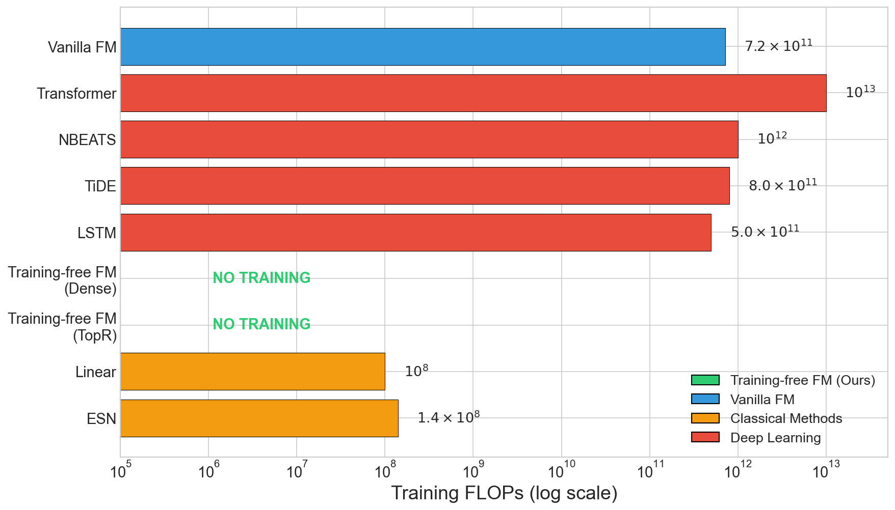
*(a)Training FLOPs Comparison*

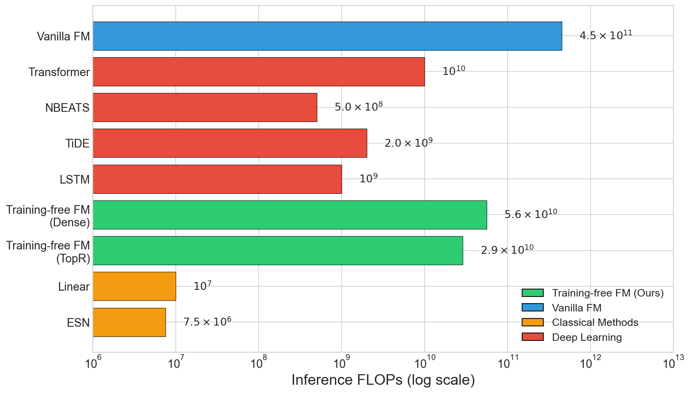
*(b)Inference FLOPs Comparison*

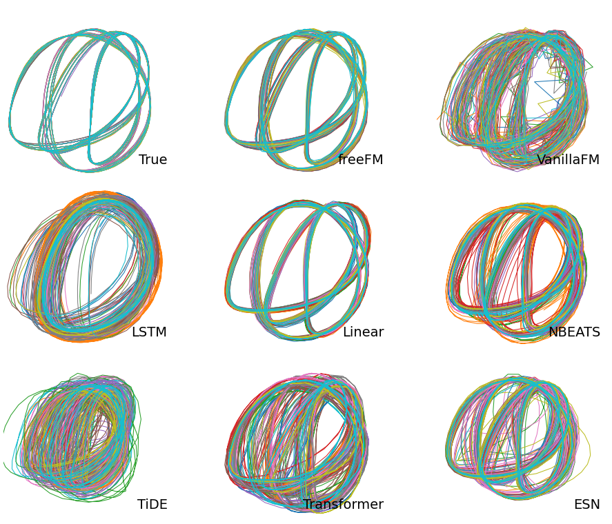
*Figure 8:Hénon–Heiles System.*

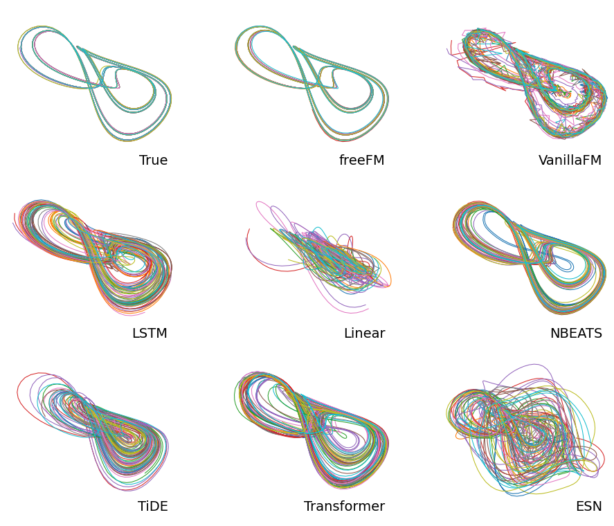
*Figure 9:Sprott G System.*

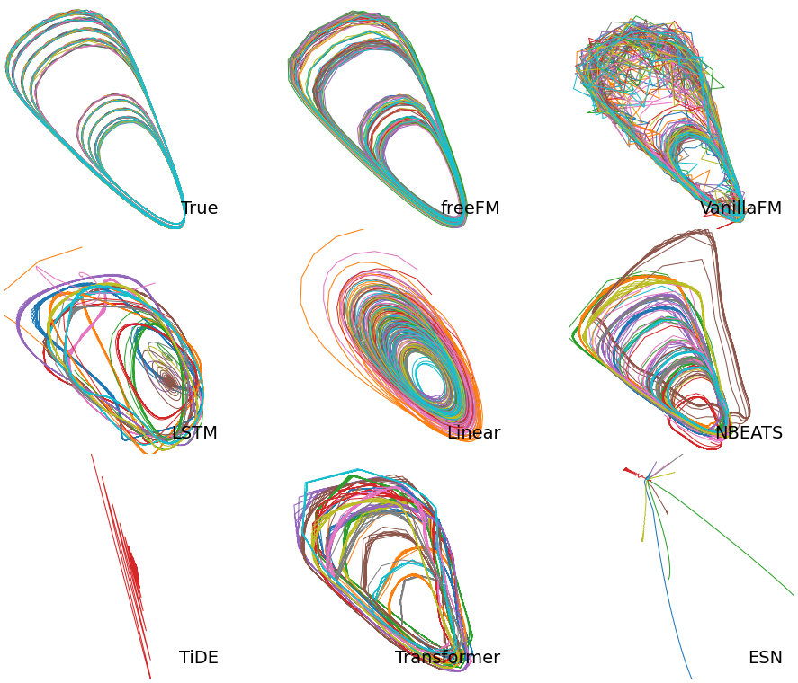
*Figure 10:Isothermal Chemical Process.*

*Figure 11:Jerk Circuit Oscillator.*

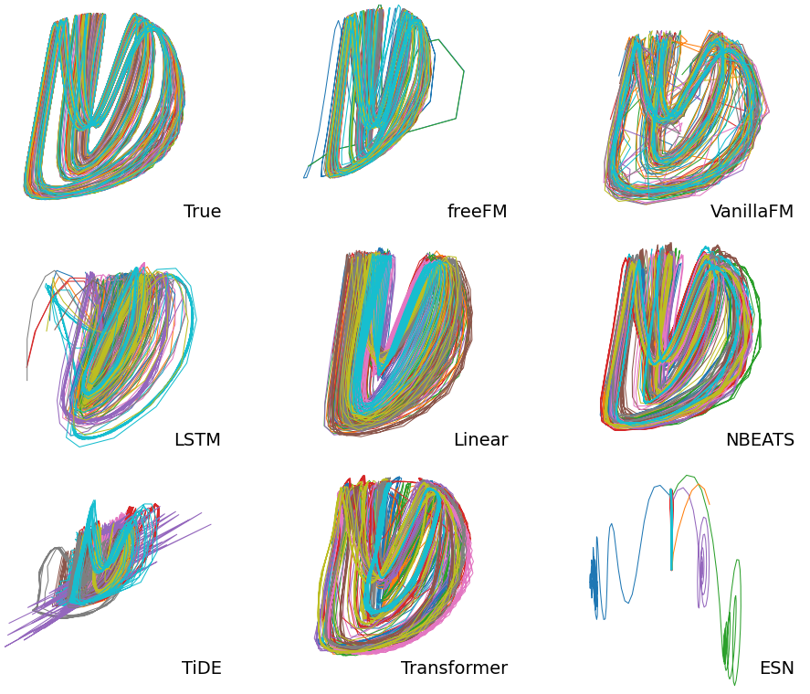
*Figure 12:Forced Brusselator System.*

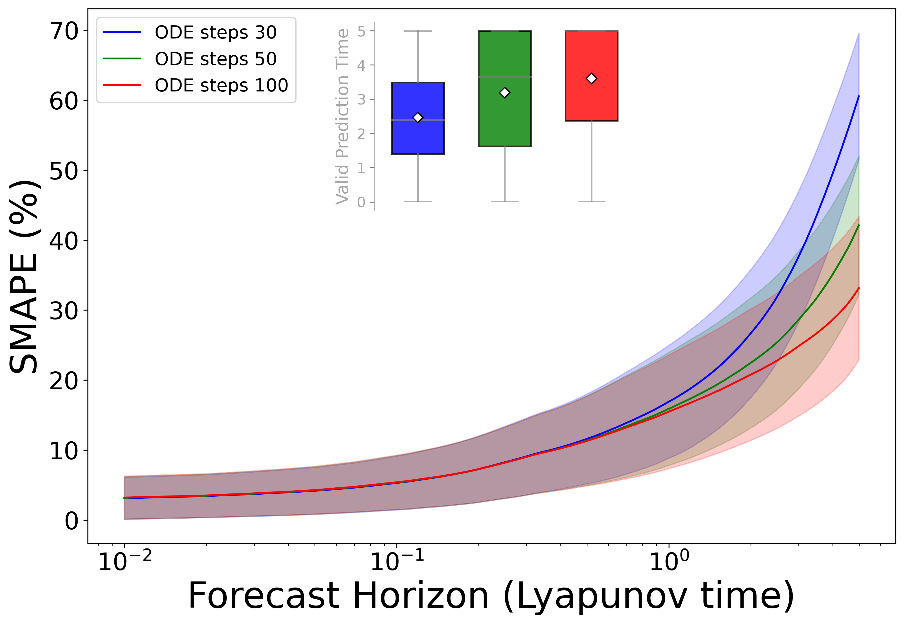
*(a)Ablation Study for ODE Integration Steps*

*(a)Ablation Study for ODE Integration Steps*

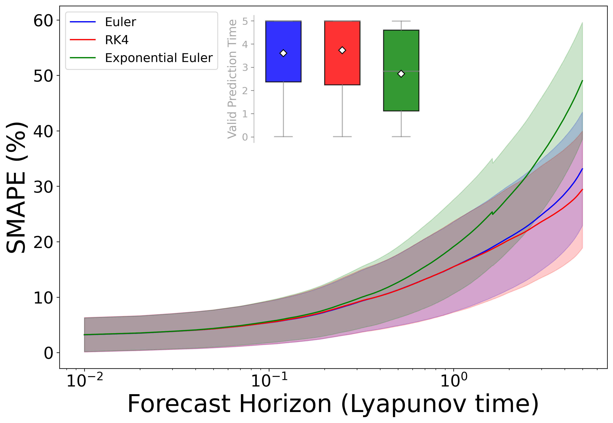
*(b)Ablation Study for ODE Solvers*

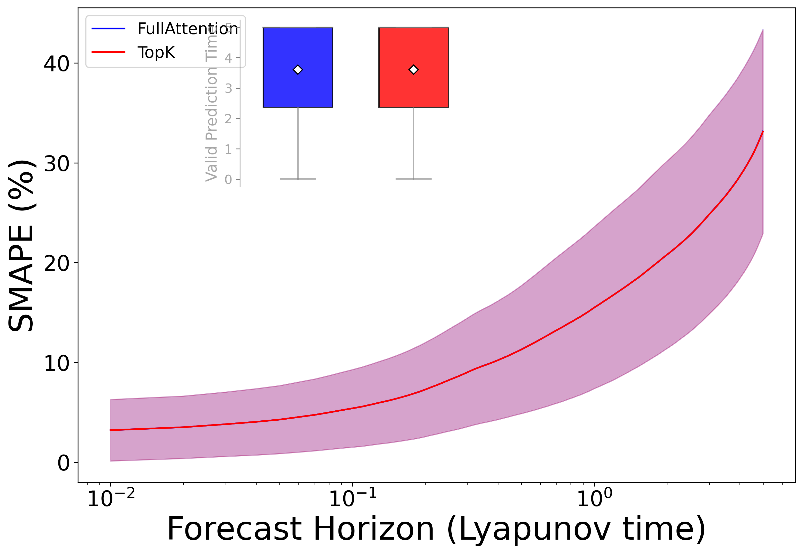
*(c)Ablation Study for Truncation Model*

---
**Usage Info**: 12272 tokens used.
**Generated at**: 2026-02-23 22:01:37

---

# 📚 Reciprocal Latent Fields for Precomputed Sound Propagation

🚀 URL: https://arxiv.org/html/2602.06937

## 🌏 Abstract (원문)
In interactive virtual environments, such as video games, audio is a primary driver of immersion and a critical tool for directing attention within a 3D space. Realistic auditory experiences require accurate modeling of complex wave phenomena, specifically diffraction around obstacles and reverberation. These effects are physically characterized by the impulse response (IR), which captures the spectral and temporal transformations a unit impulse undergoes as it propagates from source to receiver. Because the IR changes with every movement of the source or receiver, accurately simulating these wave phenomena in real-time is beyond the computational budgets of game engines. As detailed in Sec.2, geometric methods such as ray-tracing remain CPU-intensive for complex scenes, while rooms and portals systems require labor-intensive manual markup. Our work builds upon the wave coding method[26], which addresses these issues via precomputation of acoustic parameters (detailed in Sec.3). However, this approach scales poorly to large environments, as it requires computing and storing data for all necessary source-receiver configurations. To address this bottleneck, we introduce Reciprocal Latent Fields (RLF) in Sec.4. While applied here to wave coding, RLF is a generalized framework that compresses reciprocal scalar fields into a grid of n-dimensional embeddings forming a latent manifold. We employ decoders to predict field values as geodesic distances between arbitrary source and receiver embeddings, similar to[39]. By restricting these decoders to symmetric functions, our method guarantees acoustic reciprocity by design. We summarize our main contributions as follows: Reciprocal Latent Fields (RLF). A novel method for encoding acoustic paths as metrics over a latent manifold, inherently enforcing physical reciprocity (Sec.4.1). Riemannian Decoder Architecture. A decoder that significantly improves reconstruction accuracy over simpler baselines with negligible computational overhead by including a local metric tensor to warp space (Sec.4.1.2). Lightweight decoders for acoustic parameters. An extension of RLF to a complete set of acoustic parameters, including non-metric quantities such as energy levels and decay times, enabling real-time, memory-efficient acoustic rendering (Section4.2). Benchmark and study. In Sec.5, we compare decoder designs and embedding dimensionality. In conjunction with a subjective study, our results demonstrate that the Riemannian RLF approach maintains high fidelity while compressing wave coding data by several orders of magnitude.
## 🌏 Abstract (번역)
비디오 게임과 같은 대화형 가상 환경에서 오디오는 몰입감을 높이고 3D 공간 내에서 주의를 집중시키는 핵심 도구입니다. 현실적인 청각 경험을 위해서는 장애물 주변의 회절 및 잔향과 같은 복잡한 파동 현상을 정확하게 모델링해야 합니다. 이러한 효과는 소스에서 수신기로 전파될 때 단위 임펄스가 겪는 스펙트럼 및 시간적 변환을 포착하는 임펄스 응답(IR)에 의해 물리적으로 특징지어집니다. 소스나 수신기가 움직일 때마다 IR이 변하기 때문에, 이러한 파동 현상을 실시간으로 정확하게 시뮬레이션하는 것은 게임 엔진의 계산 예산을 초과합니다. 섹션 2에서 설명한 바와 같이, 레이 트레이싱과 같은 기하학적 방법은 복잡한 장면에서 CPU 집약적이며, 룸 및 포털 시스템은 노동 집약적인 수동 마크업이 필요합니다. 본 연구는 음향 파라미터의 사전 계산을 통해 이러한 문제를 해결하는 웨이브 코딩(wave coding) 방법을 기반으로 합니다. 그러나 이 접근 방식은 필요한 모든 소스-수신기 구성에 대한 데이터를 계산하고 저장해야 하므로 대규모 환경으로의 확장이 어렵습니다. 이러한 병목 현상을 해결하기 위해 섹션 4에서 상호 잠재 필드(Reciprocal Latent Fields, RLF)를 소개합니다. RLF는 상호 스칼라 필드를 잠재 매니폴드를 형성하는 n차원 임베딩 그리드로 압축하는 일반화된 프레임워크입니다. 우리는 임의의 소스 및 수신기 임베딩 사이의 측지선 거리로 필드 값을 예측하는 디코더를 사용합니다. 이러한 디코더를 대칭 함수로 제한함으로써 우리 방법은 설계상 음향 상호성을 보장합니다. 주요 기여는 다음과 같습니다. 첫째, 잠재 매니폴드에 대한 메트릭으로 음향 경로를 인코딩하여 물리적 상호성을 본질적으로 강제하는 새로운 방법인 RLF를 제안합니다. 둘째, 공간을 왜곡하는 로컬 메트릭 텐서를 포함하여 무시할 수 있는 계산 오버헤드로 재구성 정확도를 크게 향상시키는 리만 디코더 아키텍처를 도입합니다. 셋째, 에너지 레벨 및 쇠퇴 시간과 같은 비메트릭 수량을 포함한 전체 음향 파라미터 세트로 RLF를 확장하여 실시간 메모리 효율적 음향 렌더링을 가능하게 합니다. 벤치마크 및 연구를 통해 리만 RLF 방식이 높은 충실도를 유지하면서 웨이브 코딩 데이터를 수십 배 압축함을 입증했습니다.

## 🔍 Methods & Results
- 상호 잠재 필드(RLF) 프레임워크: 상호 스칼라 필드를 잠재 매니폴드 상의 n차원 임베딩 그리드로 압축하는 일반화된 구조 제안
- 물리적 상호성 보장: 디코더를 대칭 함수로 제한하여 소스와 수신기 간의 음향적 상호성을 설계 단계에서 강제
- 리만 디코더(Riemannian Decoder) 아키텍처: 로컬 메트릭 텐서를 도입하여 공간을 왜곡함으로써 계산 오버헤드 없이 재구성 정확도 대폭 향상
- 음향 파라미터 확장성: 에너지 레벨, 쇠퇴 시간 등 비메트릭 수량을 포함한 전체 음향 파라미터 세트를 지원하여 실시간 렌더링 가능
- 데이터 압축 성능: 기존 웨이브 코딩 데이터를 수십 배(several orders of magnitude) 압축하면서도 높은 충실도 유지 확인
- 벤치마크 및 주관적 평가: 디코더 설계 및 임베딩 차원에 따른 성능 비교와 사용자 평가를 통해 제안 방법의 유효성 입증

## 🖼 Figures
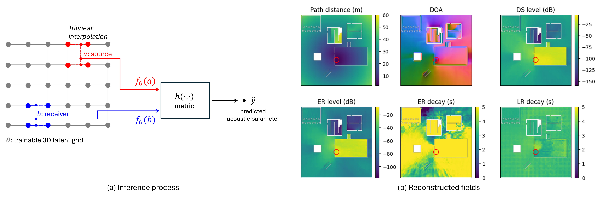
*Figure 1:Visualization of the 2D latent space from an Euclidean RLF trained to reproduce path distance, on two different 2D geometries*

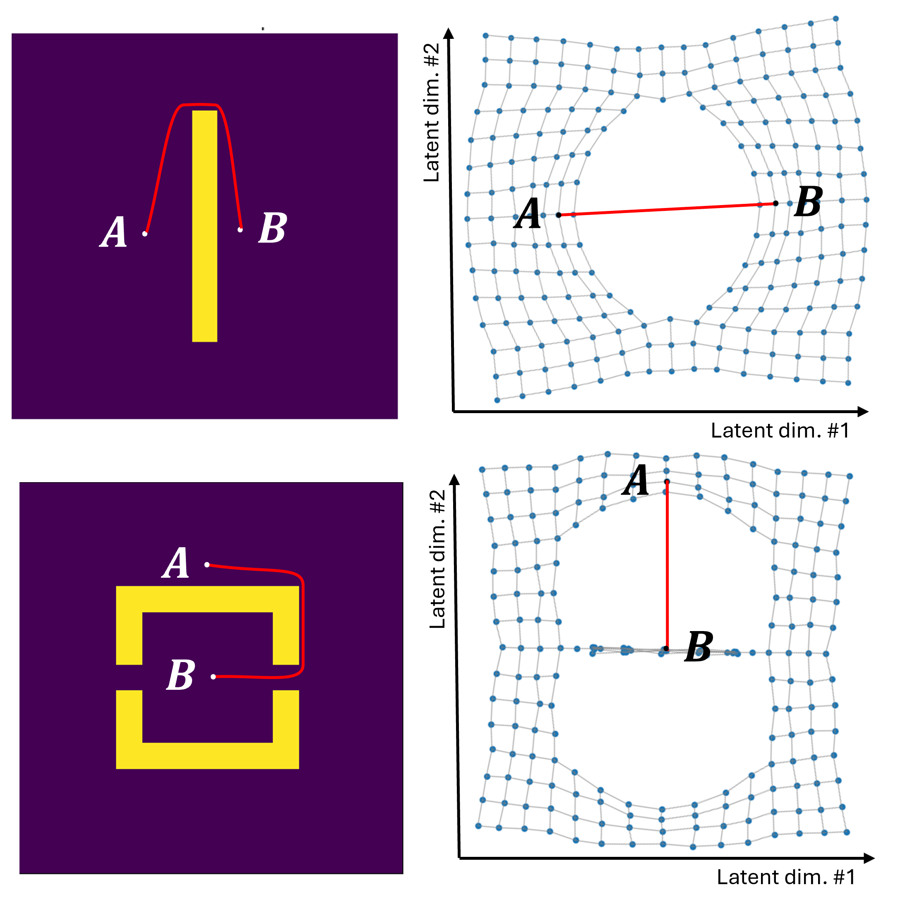
*Figure 2:Visualization of the 2D latent space from an Euclidean RLF trained to reproduce path distance, on two different 2D geometries*

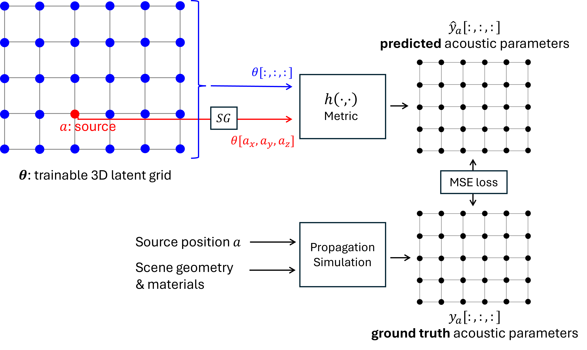
*Figure 3:Diagram of a RLF model during the training phase. SG designates the stop gradient operator.*

*Figure 4:(a) Ground truth and (b - d) reconstructed fields. Fields are shown in the Audio Gym for a fixed source position (circle marker) that was not seen during training, at a horizontal slice 1.3 m above ground. Thin white outlines indicate positions of walls. The DOA field in (ii) is visualized as an RGB image of the x-, y-, and z-components of the unit direction vector. Evaluated models are those described in Sec. 5.1.2, with a latent space size fixed to 
𝑛
=
16
.*

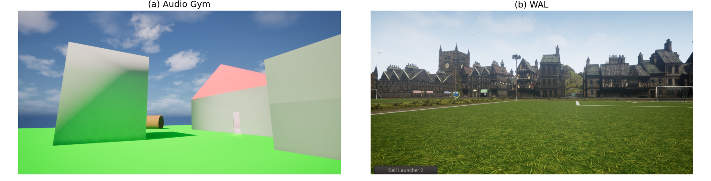
*Figure 5:Image of the (a) Audio Gym and (b) WAL as seen by a player*

*Figure 6:Individual components of latent embeddings 
𝜃
𝜋
.This latent space is used to predict path distance for the Audio Gym map. The model is a 
𝐺
𝐷
​
𝐼
​
𝐴
​
𝐺
 Riemannian RLF with 
𝑛
=
16
 described in Sec. 5.1.2. Panels 1 - 16 depict the components of 
𝜃
𝜋
 at a horizontal slice 1.3 m above the ground. Thin black outlines indicate positions of walls.*

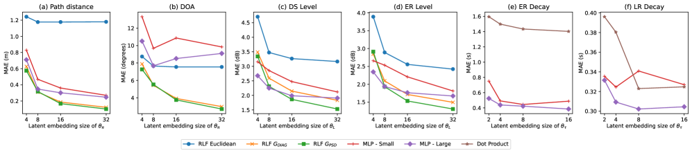
*Figure 7:Mean Absolute Error (MAE) against latent embedding size for the Audio Gym map. See Sec. 5.1.2 for a description of the models.*

---
**Usage Info**: 4944 tokens used.
**Generated at**: 2026-02-23 22:03:34

---

# 📚 DynFOA: Generating First-Order Ambisonics with Conditional Diffusion for Dynamic and Acoustically Complex 360-Degree Videos

🚀 URL: https://arxiv.org/html/2602.06846

## 🌏 Abstract (원문)
Spatial audio reproduction in VR has long relied on Ambisonics, which encodes sound fields in the spherical harmonic domain. First-Order Ambisonics (FOA) strikes a balance between spatial resolution and computational efficiency, while higher-order Ambisonics improves angular precision at a higher computational cost. The mathematical foundation of spherical harmonic decomposition allows for 3D sound field capture and reconstruction at varying levels of accuracy, making Ambisonics particularly well-suited for VR, where perceptual fidelity must be balanced with real-time processing constraints. For spatial audio rendering, Head-Related Transfer Functions (HRTFs) are essential, providing the necessary filtering to simulate spatial localization. Standardized resources, such as KEMAR and CIPIC, along with exchange formats like SOFA, form the foundation for HRTF-based rendering. However, individualization remains a challenge due to anthropometric variability, which affects localization and externalization of sounds. Recent works have addressed this issue through both direct measurements and computational models. Platforms for acoustic simulation, such as SoundSpaces, offer 3D scanned environments with physically-grounded propagation models, enabling systematic evaluation and cross-modal learning. These platforms emphasize the importance of jointly modeling visual and acoustic cues for better audio-visual scene understanding. In the context of 360-degree video, early work generated FOA from mono audio, using panoramic cues. OmniAudio formalized the 360V2SA task, but with the assumption of static sources and negligible occlusion or reverberation. Sonic4D reconstructed dynamic 3D trajectories for viewpoint-adaptive binaural rendering, though it did not produce FOA. More recent geometry-aware methods leverage depth cues, but they typically focus only on source distance. However, these existing works have not sufficiently considered the influence of scene geometry and materials, which affect occlusion, reflections, and reverberation, in the generation of FOA for complex scenes involving dynamic sound sources. Cross-modal learning leverages the synergy between different modalities: visual signals help constrain sound localization and disambiguate overlapping events, while audio assists in grounding visual understanding. This synergy is particularly crucial for immersive spatial audio, where multiple sound sources and complex environments necessitate robust sound separation. A significant body of work has explored cross-modal learning for sound localization and separation using visual cues. Weakly supervised methods align objects with sounds, while co-separation frameworks learn to disentangle multiple overlapping sound sources. Other approaches focus specifically on speech, such as speaker-independent audiovisual separation and lip-synchronized speech extraction. Large-scale datasets like AudioSet, VGGSound, and MUSIC have significantly accelerated these advances by providing diverse audio-visual training resources. Our framework builds on these principles but extends them to FOA generation. By integrating monocular 360-degree vision with geometry- and material-aware acoustic descriptors, we enable sound localization and separation in acoustically complex environments, where traditional cross-modal methods often fall short. Recent advancements have focused on vision-guided audio spatialization. Early approaches addressed mono-to-binaural conversion using neural networks, while later works shifted toward stereo or pseudo-binaural generation. Methods like Points2Sound incorporated geometry and motion cues to improve spatialization, and newer pipelines introduced explicit depth estimation or scene reconstruction for greater accuracy. Despite these developments, many approaches still oversimplify acoustic propagation, often assuming free-field conditions or modeling only distance attenuation. To address this, OmniAudio and Sonic4D made significant progress by targeting panoramic or dynamic sources. However, they did not account for FOA outputs or more complex propagation effects, such as reverberation. Head-tracked playback pipelines further demonstrated the necessity of synchronizing audio rotation with the listener’s orientation, but they remain limited in handling occlusion and material diversity. To overcome these limitations, we leverage 360-degree scene reconstruction with per-surface material estimation. By modeling occlusion, reflections, and reverberation, we condition FOA generation on physically meaningful descriptors, enabling both head-tracked adaptability as well as geometry- and material-aware spatial realism. Generative models have recently revolutionized audio synthesis. Diffusion models, such as WaveGrad, DiffWave, and AudioGen, have set new benchmarks in waveform generation. Spatial audio frameworks based on diffusion, such as Diff-SAGe and ImmerseDiffusion, demonstrate strong potential, though they focus primarily on perceptual fidelity rather than ensuring physical scene consistency. Meanwhile, autoregressive models like SoundStorm and controllable music generators offer sequence-level control but struggle with long-term coherence. Video-to-audio pipelines, such as ViSAGe and MMAudio, integrate motion and semantic cues but rarely address FOA generation or physically grounded propagation. DynFOA addresses these gaps by embedding geometry- and material-aware descriptors into a conditional diffusion pipeline for FOA generation. This approach enables us to combine the high-fidelity synthesis capabilities of diffusion models with explicit modeling of occlusion, reflections, and reverberation, advancing generative spatial audio from perceptual plausibility to physical consistency.
## 🌏 Abstract (번역)
VR에서의 공간 오디오 재생은 오랫동안 구면 조화 함수 도메인에서 음장을 인코딩하는 앰비소닉스(Ambisonics)에 의존해 왔습니다. 1차 앰비소닉스(FOA)는 공간 해상도와 계산 효율성 사이의 균형을 맞추는 반면, 고차 앰비소닉스는 더 높은 계산 비용으로 각도 정밀도를 향상시킵니다. 구면 조화 분해의 수학적 토대는 다양한 정확도 수준에서 3D 음장 캡처 및 재구성을 가능하게 하여, 지각적 충실도와 실시간 처리 제약 조건의 균형을 맞춰야 하는 VR에 특히 적합합니다. 공간 오디오 렌더링을 위해서는 공간 위치 파악을 시뮬레이션하는 데 필요한 필터링을 제공하는 머리 전달 함수(HRTF)가 필수적입니다. KEMAR 및 CIPIC와 같은 표준화된 리소스와 SOFA와 같은 교환 형식은 HRTF 기반 렌더링의 기초를 형성합니다. 그러나 신체 측정의 가변성으로 인해 개인화는 여전히 과제로 남아 있으며, 이는 소리의 위치 파악 및 외부화에 영향을 미칩니다. 최근 연구들은 직접 측정과 계산 모델을 통해 이 문제를 해결해 왔습니다. SoundSpaces와 같은 음향 시뮬레이션 플랫폼은 물리적 기반의 전파 모델과 함께 3D 스캔 환경을 제공하여 체계적인 평가와 교차 모달 학습을 가능하게 합니다. 이러한 플랫폼은 더 나은 시각-청각 장면 이해를 위해 시각적 및 음향적 단서를 공동으로 모델링하는 것의 중요성을 강조합니다. 360도 비디오의 맥락에서, 초기 연구는 파노라마 단서를 사용하여 모노 오디오에서 FOA를 생성했습니다. OmniAudio는 360V2SA 작업을 공식화했지만, 정적인 음원과 무시할 수 있는 폐색 또는 잔향을 가정했습니다. Sonic4D는 시점 적응형 바이노럴 렌더링을 위해 동적 3D 궤적을 재구성했지만 FOA를 생성하지는 않았습니다. 더 최근의 기하학 인식 방법들은 깊이 단서를 활용하지만, 일반적으로 음원 거리에만 집중합니다. 그러나 이러한 기존 연구들은 동적 음원이 포함된 복잡한 장면에 대한 FOA 생성 시 폐색, 반사 및 잔향에 영향을 미치는 장면 기하학 및 재질의 영향을 충분히 고려하지 않았습니다. 교차 모달 학습은 서로 다른 모달리티 간의 시너지를 활용합니다. 시각적 신호는 소리 위치 파악을 제한하고 겹치는 이벤트를 명확하게 하는 데 도움이 되며, 오디오는 시각적 이해를 구체화하는 데 도움을 줍니다. 이러한 시너지는 여러 음원과 복잡한 환경으로 인해 강력한 소리 분리가 필요한 몰입형 공간 오디오에 특히 중요합니다. 많은 연구가 시각적 단서를 사용한 소리 위치 파악 및 분리를 위한 교차 모달 학습을 탐구해 왔습니다. 약지도 학습 방법은 객체와 소리를 정렬하는 반면, 공동 분리 프레임워크는 여러 중첩된 음원을 분리하는 방법을 배웁니다. 다른 접근 방식은 화자 독립적 시청각 분리 및 입술 동기화 음성 추출과 같이 특히 음성에 집중합니다. AudioSet, VGGSound, MUSIC과 같은 대규모 데이터셋은 다양한 시청각 훈련 리소스를 제공함으로써 이러한 발전을 크게 가속화했습니다. 본 프레임워크는 이러한 원칙을 기반으로 하지만 이를 FOA 생성으로 확장합니다. 단안 360도 시각을 기하학 및 재질 인식 음향 기술자와 통합함으로써, 전통적인 교차 모달 방법이 흔히 실패하는 음향적으로 복잡한 환경에서 소리 위치 파악 및 분리를 가능하게 합니다. 최근의 발전은 시각 유도 오디오 공간화에 초점을 맞추고 있습니다. 초기 접근 방식은 신경망을 사용하여 모노-바이노럴 변환을 다루었으며, 이후 연구는 스테레오 또는 의사 바이노럴 생성으로 전환되었습니다. Points2Sound와 같은 방법은 공간화를 개선하기 위해 기하학 및 모션 단서를 통합했으며, 새로운 파이프라인은 더 높은 정확도를 위해 명시적인 깊이 추정 또는 장면 재구성을 도입했습니다. 이러한 발전에도 불구하고 많은 접근 방식은 여전히 음향 전파를 지나치게 단순화하여 자유 음장 조건을 가정하거나 거리 감쇠만을 모델링하는 경우가 많습니다. 이를 해결하기 위해 OmniAudio와 Sonic4D는 파노라마 또는 동적 음원을 대상으로 하여 상당한 진전을 이루었습니다. 그러나 이들은 FOA 출력이나 잔향과 같은 더 복잡한 전파 효과를 고려하지 않았습니다. 헤드 트래킹 재생 파이프라인은 오디오 회전을 청취자의 방향과 동기화해야 할 필요성을 추가로 입증했지만, 폐색 및 재질 다양성을 처리하는 데는 여전히 한계가 있습니다. 이러한 한계를 극복하기 위해 본 연구는 표면별 재질 추정을 포함한 360도 장면 재구성을 활용합니다. 폐색, 반사 및 잔향을 모델링함으로써 물리적으로 의미 있는 기술자를 기반으로 FOA 생성을 조건화하여, 헤드 트래킹 적응성뿐만 아니라 기하학 및 재질 인식 공간 리얼리즘을 가능하게 합니다. 생성 모델은 최근 오디오 합성에 혁명을 일으켰습니다. 확산 모델(Diffusion models)은 파형 생성에서 새로운 벤치마크를 설정했습니다. 확산 기반 공간 오디오 프레임워크는 물리적 장면 일관성을 보장하기보다는 주로 지각적 충실도에 초점을 맞추고 있지만 강력한 잠재력을 보여줍니다. 한편, 자기회귀 모델과 제어 가능한 음악 생성기는 시퀀스 수준의 제어를 제공하지만 장기적인 일관성 유지에 어려움을 겪습니다. 비디오-오디오 파이프라인은 모션 및 의미론적 단서를 통합하지만 FOA 생성이나 물리적 기반 전파를 다루는 경우는 드뭅니다. DynFOA는 기하학 및 재질 인식 기술자를 FOA 생성을 위한 조건부 확산 파이프라인에 임베딩함으로써 이러한 격차를 해소합니다. 이 접근 방식을 통해 확산 모델의 고충실도 합성 능력과 폐색, 반사 및 잔향의 명시적 모델링을 결합하여, 지각적 타당성에서 물리적 일관성으로 생성형 공간 오디오를 발전시킵니다.

## 🔍 Methods & Results
- DynFOA 프레임워크 제안: 360도 비디오로부터 물리적으로 근거 있고 지각적으로 일관된 4D 몰입형 경험을 위한 장면 인식 공간 오디오 생성
- 비디오 인코더(Video Encoder): 360도 비디오에서 3D 장면 기하학 및 재질 속성을 재구성하고, 동적 음원 탐지 및 추적, 깊이 추정, 시맨틱 세그멘테이션 수행
- 하이브리드 장면 재구성: 대규모 구조를 위한 TSDF와 세부 묘사를 위한 3D Gaussian Splatting(3DGS)을 결합하여 폐색, 반사, 잔향 모델링
- 오디오 인코더(Audio Encoder): FOA 신호를 처리하여 방향성, 스펙트럼, 시간적 단서를 추출하고, 기하학적 거리 및 재질별 흡수율을 반영하여 특징 변조
- 조건부 확산 생성기(Conditional Diffusion Generator): 기하학, 재질, 전파 단서(폐색, 반사, 잔향)를 조건으로 U-Net 디노이저를 통해 물리적으로 일관된 FOA 합성
- 실시간 헤드 트래킹 지원: 생성된 FOA를 청취자의 머리 방향에 따라 회전시키고 HRTF를 사용하여 바이노럴로 렌더링함으로써 몰입형 재생 가능
- 물리적 일관성 확보: 확산 모델의 고충실도 합성 능력과 명시적인 물리적 전파 모델링(폐색, 반사, 잔향)을 결합하여 기존 모델의 한계 극복

## 🖼 Figures
![Figure 1:Overview of Our DynFOA. The model features a three-core architecture: audio encoder, video encoder, and conditional diffusion generator. The audio encoder enhances FOA audio robustness against occlusion, reflections, and reverberation through dynamic sound source processing. The video encoder reconstructs video information to support immersive FOA experiences. The conditional diffusion integrates scene context for deep FOA encoding and multimodal fusion, enabling real-time, high-fidelity immersive FOA rendering in scenes with occlusion, reflections, and reverberation.](../images/2026-02-10/2602.06846/2602.06846_fig0.png)
*Figure 1:Overview of Our DynFOA. The model features a three-core architecture: audio encoder, video encoder, and conditional diffusion generator. The audio encoder enhances FOA audio robustness against occlusion, reflections, and reverberation through dynamic sound source processing. The video encoder reconstructs video information to support immersive FOA experiences. The conditional diffusion integrates scene context for deep FOA encoding and multimodal fusion, enabling real-time, high-fidelity immersive FOA rendering in scenes with occlusion, reflections, and reverberation.*

![Figure 2:The piano performance performed by a singer and pianist in an indoor setting. Due to the occlusion and distribution of objects, the environment exhibits significant occlusion, reflections, and reverberation characteristics. Existing methods often reduce the clarity and immersiveness of FOA. However, our DynFOA effectively accounts for factors affecting audio quality in this complex scene, accurately capturing spatial cues while preserving the natural timbre of instruments and vocals. Compared to existing baseline methods, our DynFOA achieves more realistic sound reproduction, delivering a more immersive experience.](../images/2026-02-10/2602.06846/2602.06846_fig1.png)
*Figure 2:The piano performance performed by a singer and pianist in an indoor setting. Due to the occlusion and distribution of objects, the environment exhibits significant occlusion, reflections, and reverberation characteristics. Existing methods often reduce the clarity and immersiveness of FOA. However, our DynFOA effectively accounts for factors affecting audio quality in this complex scene, accurately capturing spatial cues while preserving the natural timbre of instruments and vocals. Compared to existing baseline methods, our DynFOA achieves more realistic sound reproduction, delivering a more immersive experience.*

![Figure 3:The dance hall events involve multiple simultaneous sound sources and complex spatial dynamics. This environment presents numerous challenges, such as overlapping vocalizations, dynamic motion of sound sources, and highly variable reverberation patterns. Our DynFOA effectively separates these concurrent audio elements, reconstructing the scene’s spatial distribution with superior accuracy while maintaining spectral consistency. This demonstrates our DynFOA exceptional robustness in handling highly complex real-world acoustic conditions, outperforming baseline models.](../images/2026-02-10/2602.06846/2602.06846_fig2.png)
*Figure 3:The dance hall events involve multiple simultaneous sound sources and complex spatial dynamics. This environment presents numerous challenges, such as overlapping vocalizations, dynamic motion of sound sources, and highly variable reverberation patterns. Our DynFOA effectively separates these concurrent audio elements, reconstructing the scene’s spatial distribution with superior accuracy while maintaining spectral consistency. This demonstrates our DynFOA exceptional robustness in handling highly complex real-world acoustic conditions, outperforming baseline models.*

---
**Usage Info**: 9089 tokens used.
**Generated at**: 2026-02-23 22:04:35

---

# 📚 MENASpeechBank: A Reference Voice Bank with Persona-Conditioned Multi-Turn Conversations for AudioLLMs

🚀 URL: https://arxiv.org/html/2602.07036

## 🌏 Abstract (원문)
Speech is the dominant interface for human communication, yet most large language models are still optimized for text. Recent Audio Large Language Models (AudioLLMs) move beyond cascaded “ASR→LLM” systems by directly conditioning instruction following on audio inputs, enabling richer interaction patterns such as multi-turn spoken dialogue, speech-grounded reasoning, and paralinguistic understanding. Representative systems include Qwen-Audio, SpeechGPT, AudioGPT, and SALMONN. In parallel, evaluation suites such as AIR-Bench and AudioBench increasingly emphasize open-ended, instruction-following behavior conditioned on diverse audio, surfacing persistent limitations in robustness, domain coverage, and conversational grounding. A central bottleneck is data. Compared to text-only instruction tuning, AudioLLMs require aligned audio–text pairs, and they benefit disproportionately from (i) conversational structure, (ii) task and intent diversity, and (iii) speaker and dialect diversity. These desiderata are difficult to satisfy with real recordings alone, particularly in the Middle East and North Africa (MENA) region. Synthetic data pipelines are an attractive alternative, but their impact on AudioLLMs is still under-explored. We address this gap with MENASpeechBank, a data-centric study that pairs a multi-speaker MENA reference voice bank with an end-to-end persona-to-speech generation pipeline for AudioLLM adaptation. We propose MENASpeechBank, a multi-speaker MENA reference voice bank (~18K utterances; 124 speakers) covering English and Arabic variants. We enrich speaker profiles with WVS-inspired value attributes to build controllable, behaviorally grounded personas. We propose an end-to-end persona→dialogue→speech pipeline using LLM role-play generation and speaker-conditioned voice cloning to produce scalable audio–text instruction data. We benchmark on synthetic and human recorded conversations.
## 🌏 Abstract (번역)
음성은 인간 의사소통의 주요 인터페이스이지만, 대부분의 대규모 언어 모델(LLM)은 여전히 텍스트에 최적화되어 있습니다. 최근의 오디오 대규모 언어 모델(AudioLLM)은 오디오 입력에 직접 지시를 따르도록 조건화함으로써 기존의 'ASR→LLM' 시스템을 넘어 다회차 음성 대화, 음성 기반 추론, 준언어적 이해와 같은 풍부한 상호작용 패턴을 가능하게 합니다. 대표적인 시스템으로는 Qwen-Audio, SpeechGPT, AudioGPT, SALMONN 등이 있습니다. 이와 병행하여 AIR-Bench 및 AudioBench와 같은 평가 제품군은 다양한 오디오에 조건화된 개방형 지시 준수 동작을 점점 더 강조하며 견고성, 도메인 범위 및 대화 근거의 지속적인 한계를 드러내고 있습니다. 핵심 병목 현상은 데이터입니다. 텍스트 전용 지시 튜닝과 비교할 때, AudioLLM은 정렬된 오디오-텍스트 쌍이 필요하며, 대화 구조, 작업 및 의도 다양성, 화자 및 방언 다양성으로부터 큰 이점을 얻습니다. 이러한 요구 사항은 실제 녹음만으로는 충족하기 어려우며, 특히 방언 다양성이 높고 공공 음성 자원이 제한적인 중동 및 북아프리카(MENA) 지역에서 더욱 그렇습니다. 합성 데이터 파이프라인은 매력적인 대안이지만 AudioLLM에 미치는 영향은 아직 충분히 연구되지 않았습니다. 본 연구에서는 AudioLLM 적응을 위해 멀티 화자 MENA 참조 음성 뱅크와 엔드투엔드 페르소나-음성 생성 파이프라인을 결합한 MENASpeechBank를 통해 이러한 격차를 해소합니다. 영어와 아랍어 변종을 포괄하는 멀티 화자 MENA 참조 음성 뱅크(약 18,000개 발화, 124명 화자)를 제안하고, 세계 가치 조사(WVS)에서 영감을 받은 가치 속성으로 화자 프로필을 강화하여 제어 가능한 페르소나를 구축합니다. 또한 LLM 역할극 생성 및 화자 조건부 음성 클로닝을 사용하여 확장 가능한 오디오-텍스트 지시 데이터를 생성하는 파이프라인을 제안하고 합성 및 실제 녹음 대화에서 벤치마크를 수행합니다.

## 🔍 Methods & Results
- MENASpeechBank 구축: 영어 및 아랍어 변종을 포함하는 124명의 화자로부터 수집된 약 18,000개의 발화로 구성된 멀티 화자 참조 음성 뱅크 제안
- 페르소나 모델링: 세계 가치 조사(WVS) 기반의 가치 속성을 활용하여 행동적으로 근거 있고 제어 가능한 화자 페르소나 구축
- 엔드투엔드 파이프라인 설계: LLM 기반 역할극 대화 생성과 화자 조건부 음성 클로닝을 결합하여 대규모 오디오-텍스트 지시 데이터 생성
- 시나리오 할당: 임베딩 공간에서의 의미론적 유사성을 활용하여 특정 시나리오를 적합한 페르소나에 할당하는 분류 체계 적용
- 성능 검증: 합성 데이터 및 실제 인간 녹음 대화를 활용한 벤치마크를 통해 시나리오 기반 대화 및 음성 QA 성능 향상 확인

## 🖼 Figures

*Figure 1:An example of a persona, a conversational scenario, and conversational turns. Persona attributes are derived from basic demographic information, country-specific WVS values, and heuristics.*

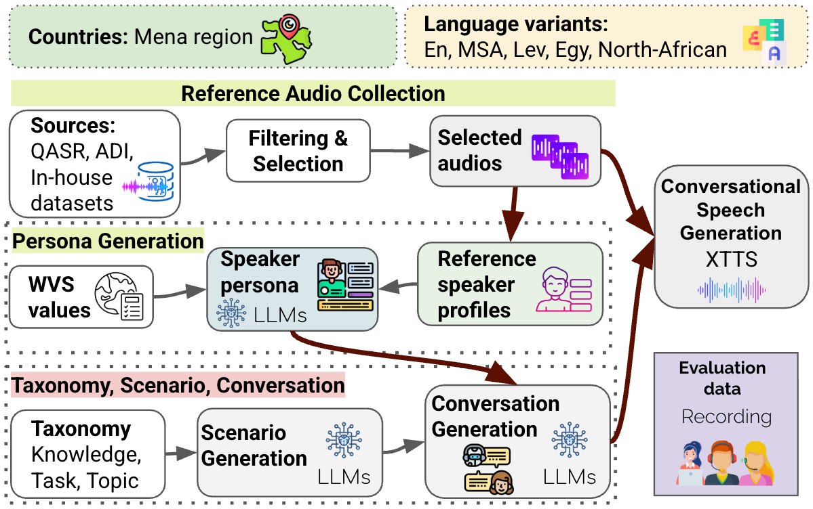
*Figure 2:An overview of MenaSpeechBank development pipeline.*

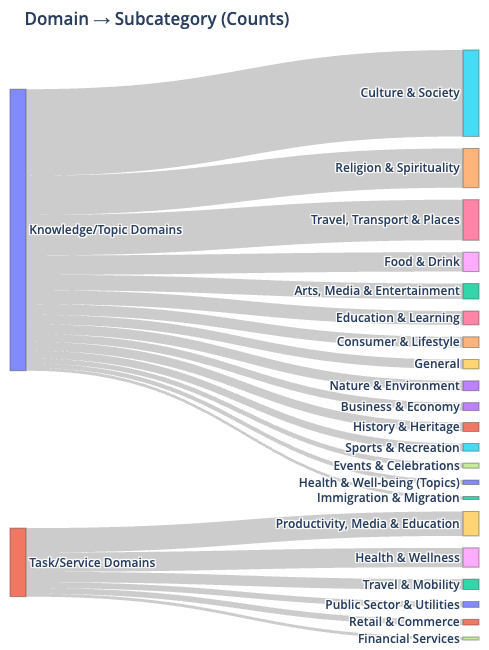
*Figure 3:Distribution of conversation domains and their respective subcategories.*

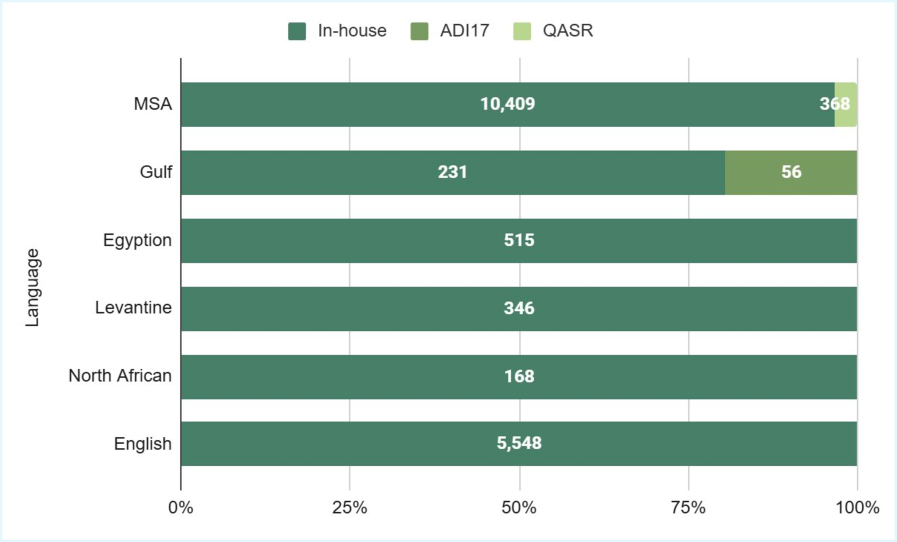
*Figure 6:Number of speech utterances in the MenaSpeechBank dataset, grouped by language or dialect and by dataset origin.*

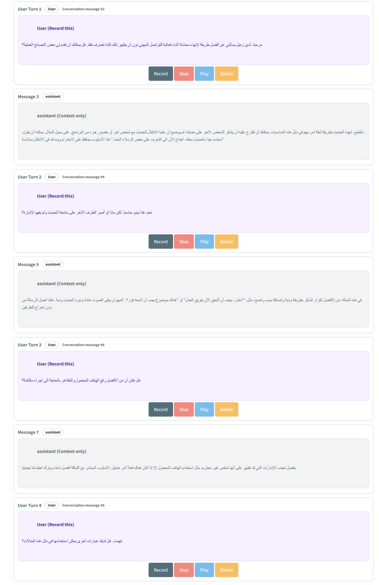
*Figure 7:Screenshot of the annotation platform used for conversation recording.*

---
**Usage Info**: 4454 tokens used.
**Generated at**: 2026-02-23 22:05:15

---

# 📚 Beyond Transcripts: A Renewed Perspective on Audio Chaptering

🚀 URL: https://arxiv.org/html/2602.08979

## 🌏 Abstract (원문)
As long-form audio and video content becomes increasingly common, such as podcasts, lectures and YouTube videos, users need better tools to navigate and locate information within recordings. In practice, people rarely consume these recordings linearlyLiao and Wu (2023); Yürümet al.(2022). Instead, they skim, scrub the timeline, jump to relevant moments, and return to specific sections. This non-linear behavior makes chapter markers a key interface for browsing and re-finding content. The task ofaudio chapteringaddresses this by automatically segmenting audio into coherent sections. Despite growing relevance, research on audio chaptering remains limited and predominantly text-based: models typically operate on transcripts and inherit evaluation protocols from text segmentationRetkowski and Waibel (2024); Freisingeret al.(2025). This transcript-centric framing leaves several key limitations unresolved. First, the role of audio remains unclear: because most prior work treats chaptering as a purely textual problem, there is limited understanding of how audio can be leveraged for chaptering, whether through hand-crafted acoustic features or learned representations, and whether it improves performance. Second, text-segmentation evaluation protocols assume a fixed transcript. In practice, chaptering systems often rely on ASR outputs whose errors and segmentation differences change the underlying unit sequence, especially the sentence boundaries and the number of sentences. This changes the granularity (and difficulty) of the segmentation task, so standard text-based metrics computed on different transcripts are not directly comparable and can appear to improve simply because one transcript is coarser, rather than because the model segments better. Finally, chapter boundaries are intrinsically defined in continuous time, but many pipelines ”snap“ these timestamps to sentence boundaries. This realignment is inherently lossy: it can shift boundaries away from their true temporal positions and can systematically bias evaluation toward sentence segmentation artifacts. This work aims to establish a methodological foundation for audio chaptering, addressing aforementioned gaps through three main contributions: We systematically evaluate three modeling paradigms for audio chaptering: text-based models with and without acoustic feature augmentation, a novel audio-only architecture (AudioSeg) that operates directly on learned speech representations, and lastly, we explore whether multimodal large language models (MLLMs) are capable of this task. Second, we provide empirical insight into factors affecting chaptering performance. We analyze the robustness of text-based models to ASR errors, quantify the contribution of different acoustic features, and examine how audio characteristics such as duration and speaker composition influence segmentation quality. Third, we systemize evaluation for audio chaptering: we formalize existing text-based protocols, analyze their limitations, and introduce time-based evaluation that enables fair comparison across text-based, audio-only, and multimodal models independent of the transcript. We will release code and AudioSeg publicly to foster more research on audio chaptering.
## 🌏 Abstract (번역)
팟캐스트, 강의, 유튜브 동영상과 같은 장형 오디오 및 비디오 콘텐츠가 점점 더 보편화됨에 따라, 사용자는 녹음물 내에서 정보를 탐색하고 위치를 찾기 위한 더 나은 도구가 필요합니다. 실제로 사람들은 이러한 녹음물을 선형적으로 소비하는 경우가 드뭅니다. 대신, 그들은 훑어보고, 타임라인을 탐색하며, 관련 순간으로 이동하고, 특정 섹션으로 되돌아갑니다. 이러한 비선형적 행동은 챕터 마커를 콘텐츠 브라우징 및 재검색을 위한 핵심 인터페이스로 만듭니다. 오디오 챕터링 작업은 오디오를 일관된 섹션으로 자동 분할함으로써 이를 해결합니다. 관련성이 높아지고 있음에도 불구하고, 오디오 챕터링에 대한 연구는 여전히 제한적이며 주로 텍스트 기반입니다. 모델은 일반적으로 전사본(transcript)에서 작동하며 텍스트 분할의 평가 프로토콜을 상속받습니다. 이러한 전사본 중심의 프레임워크는 몇 가지 주요 한계점을 해결하지 못한 채로 남겨둡니다. 첫째, 오디오의 역할이 불분명합니다. 대부분의 이전 작업은 챕터링을 순수하게 텍스트 문제로 취급하기 때문에, 수작업으로 제작된 음향 특징이나 학습된 표현을 통해 오디오를 챕터링에 어떻게 활용할 수 있는지, 그리고 그것이 성능을 향상시키는지에 대한 이해가 제한적입니다. 둘째, 텍스트 분할 평가 프로토콜은 고정된 전사본을 가정합니다. 실제로 챕터링 시스템은 종종 ASR(자동 음성 인식) 출력에 의존하며, ASR의 오류와 분할 차이는 기본 단위 시퀀스, 특히 문장 경계와 문장 수를 변화시킵니다. 이는 분할 작업의 입도(및 난이도)를 변화시키므로, 서로 다른 전사본에서 계산된 표준 텍스트 기반 지표는 직접 비교할 수 없으며, 모델이 더 잘 분할해서가 아니라 단순히 하나의 전사본이 더 거칠기 때문에 성능이 향상된 것처럼 보일 수 있습니다. 마지막으로, 챕터 경계는 본질적으로 연속적인 시간에서 정의되지만, 많은 파이프라인은 이러한 타임스탬프를 문장 경계에 맞춥니다. 이러한 재정렬은 본질적으로 손실이 발생하며, 경계를 실제 시간 위치에서 멀어지게 할 수 있고 평가를 문장 분할 아티팩트 쪽으로 체계적으로 편향시킬 수 있습니다. 본 연구는 세 가지 주요 기여를 통해 앞서 언급한 격차를 해소하고 오디오 챕터링을 위한 방법론적 토대를 마련하는 것을 목표로 합니다. 첫째, 오디오 챕터링을 위한 세 가지 모델링 패러다임을 체계적으로 평가합니다. 음향 특징 증강이 있거나 없는 텍스트 기반 모델, 학습된 음성 표현에서 직접 작동하는 새로운 오디오 전용 아키텍처(AudioSeg), 그리고 마지막으로 멀티모달 대형 언어 모델(MLLM)이 이 작업이 가능한지 탐구합니다. 둘째, 챕터링 성능에 영향을 미치는 요인에 대한 실증적 통찰력을 제공합니다. ASR 오류에 대한 텍스트 기반 모델의 견고성을 분석하고, 다양한 음향 특징의 기여도를 정량화하며, 지속 시간 및 화자 구성과 같은 오디오 특성이 분할 품질에 어떤 영향을 미치는지 조사합니다. 셋째, 오디오 챕터링을 위한 평가를 체계화합니다. 기존의 텍스트 기반 프로토콜을 공식화하고 그 한계를 분석하며, 전사본과 무관하게 텍스트 기반, 오디오 전용 및 멀티모달 모델 간의 공정한 비교를 가능하게 하는 시간 기반 평가를 도입합니다. 오디오 챕터링에 대한 더 많은 연구를 촉진하기 위해 코드와 AudioSeg를 공개할 예정입니다.

## 🔍 Methods & Results
- 오디오 챕터링을 위한 세 가지 패러다임(텍스트 기반, 오디오 전용, MLLM)을 제안하고 체계적으로 비교함
- 텍스트 기반 모델인 MiniSeg에 수작업으로 추출한 음향 특징을 결합하여 성능 향상 가능성을 확인하는 융합 방식 적용
- 전사본 없이 프레임 레벨 음향 특징에서 직접 작동하는 3단계 파이프라인(프레임/세그먼트/문서 인코딩) 기반의 AudioSeg 모델 개발
- 멀티모달 대형 언어 모델(MLLM)을 활용하여 제로샷, 인컨텍스트 학습(ICL), LoRA 미세 조정 등을 통한 전사 및 챕터링 동시 수행 능력 평가
- ASR 오류에 대한 모델의 견고성을 분석하고, 오디오의 지속 시간 및 화자 구성이 분할 품질에 미치는 영향을 실증적으로 조사함
- 전사본의 차이에 구애받지 않고 텍스트 기반 및 오디오 전용 모델을 공정하게 비교할 수 있는 시간 기반(Time-based) 평가 프로토콜 도입

## 🖼 Figures
![Figure 1:AudioSeg processes input audio of duration 
𝐷
 through three stages: Frame Encoding extracts frame-level features from 
30s chunks
 using a 
frozen audio encoder
 ; Segment Encoding groups frames into 
6s windows
 and encodes each via a 
Local Segment Transformer
  with [CLS] pooling to produce 
𝐾
=
⌈
𝐷
/
Δ
​
𝑡
⌉
 segment embeddings; Document Encoding processes the segment sequence through a 
RoFormer encoder
  to predict a binary boundary sequence 
(
𝑏
1
,
…
,
𝑏
𝐾
)
 indicating chapter boundaries.](../images/2026-02-10/2602.08979/2602.08979_fig0.png)
*Figure 1:AudioSeg processes input audio of duration 
𝐷
 through three stages: Frame Encoding extracts frame-level features from 
30s chunks
 using a 
frozen audio encoder
 ; Segment Encoding groups frames into 
6s windows
 and encodes each via a 
Local Segment Transformer
  with [CLS] pooling to produce 
𝐾
=
⌈
𝐷
/
Δ
​
𝑡
⌉
 segment embeddings; Document Encoding processes the segment sequence through a 
RoFormer encoder
  to predict a binary boundary sequence 
(
𝑏
1
,
…
,
𝑏
𝐾
)
 indicating chapter boundaries.*

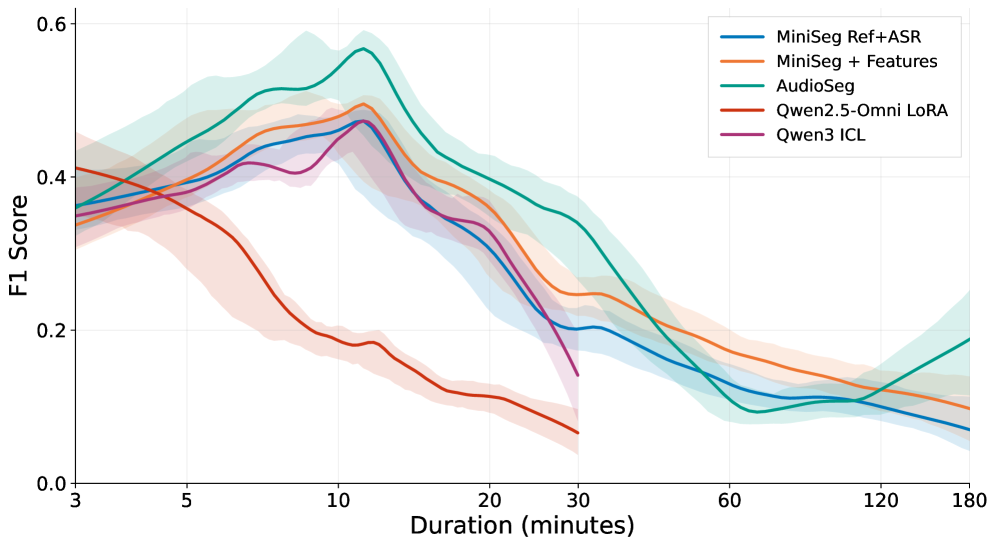
*Figure 2:Relation between duration and segmentation performance across models. Smoothed using LOESS.*

*Figure 3:Relation between dominant speaker proportion and segmentation performance across models, for videos 
<
30 minutes. Smoothed using LOESS.*

---
**Usage Info**: 5101 tokens used.
**Generated at**: 2026-02-23 22:06:10

---

# 📚 Memory-Conditioned Flow-Matching for Stable Autoregressive PDE Rollouts

🚀 URL: https://arxiv.org/html/2602.06689

## 🌏 Abstract (원문)
Many physical systems are modeled by time-dependent partial differential equations (PDEs). In this work we consider PDEs of the abstract form where u(t) is a (possibly vector-valued) field on a spatial domain D and F is a nonlinear differential operator. Concrete examples include the incompressible Navier–Stokes and compressible Euler equations governing multiscale fluid flows. A recurring difficulty is that solutions can be highly sensitive to initial/boundary data: rather than a single trajectory, one often cares about the evolving law of solutions induced by uncertain inputs, i.e. the pushforward measure under the PDE solution operator. Sampling with Monte Carlo ensembles requires repeated high-fidelity PDE solves, which becomes infeasible when the state is high-dimensional and multiscale structure must be resolved. This has driven intense interest in learned surrogates. Deterministic operator-learning approaches are effective in many regimes, but for chaotic/multiscale flows they can be poorly matched to distributional objectives and long-horizon rollouts. Generative solvers and the rollout-stability gap: Conditional diffusion and related generative models have been proposed to represent the measure directly by learning stochastic transitions. Flow matching and its relatives replace reverse-time SDE sampling by a learned transport in an internal time. Rectified flows in particular provide an ODE-based transport with substantially fewer integration steps at sampling time. However, PDE surrogates are deployed autoregressively in physical time, and good one-step accuracy does not ensure stable long rollouts: small law defects can compound. We avoid invariance assumptions and analyze finite-horizon law error directly. When only partial information is observed, unresolved degrees of freedom influence future evolution. The Mori-Zwanzig (MZ) formalism makes this precise: eliminating unresolved variables yields an exact resolved evolution with a Markov term, a history (memory) term, and an orthogonal forcing. Thus, purely Markov conditional kernels are generically misspecified when the conditioning discards information. In coarse-to-fine regimes, we condition on low modes and must sample a missing high-frequency tail. A compact memory can encode recent cross-scale transfer statistics to shape a more structured conditional tail prior, thereby reducing the conditional mismatch. We propose Memory-Conditioned Rectified Flow (MCRF), a rectified-flow transition kernel augmented with an explicit latent memory state updated along the autoregressive trajectory. The memory is extracted from the backbone representation and injected back into the denoising/transport dynamics. Our memory module is compatible with stable state-space sequence models designed to approximate multi-timescale convolutions.
## 🌏 Abstract (번역)
많은 물리적 시스템은 시간에 따른 편미분 방정식(PDE)으로 모델링됩니다. 본 연구에서는 비선형 미분 연산자 F를 포함하는 추상적 형태의 PDE를 고려합니다. 구체적인 예로는 다중 스케일 유체 흐름을 제어하는 비압축성 나비에-스토크스 방정식과 압축성 오일러 방정식이 있습니다. 반복되는 어려움은 솔루션이 초기/경계 데이터에 매우 민감할 수 있다는 점입니다. 단일 궤적보다는 불확실한 입력에 의해 유도되는 솔루션의 진화하는 법칙, 즉 PDE 솔루션 연산자 하에서의 푸시포워드 측도(pushforward measure)에 관심을 갖는 경우가 많습니다. 몬테카를로 앙상블을 사용하여 이를 샘플링하려면 고정밀 PDE 솔루션을 반복해야 하므로, 상태가 고차원이고 다중 스케일 구조를 해결해야 할 때 실행 불가능해집니다. 이로 인해 학습된 대리 모델(surrogates)에 대한 관심이 높아졌습니다. 결정론적 연산자 학습 방식은 여러 영역에서 효과적이지만, 혼돈/다중 스케일 흐름의 경우 분포 목표 및 장기 롤아웃과 잘 맞지 않을 수 있습니다. 생성형 솔버와 롤아웃 안정성 격차 문제와 관련하여, 확률적 전이를 학습하여 측도를 직접 표현하는 조건부 확산 및 관련 생성 모델이 제안되었습니다. 플로우 매칭(Flow matching)과 그 변형들은 역시간 SDE 샘플링을 내부 시간에서의 학습된 수송으로 대체합니다. 특히 정류된 흐름(Rectified flows)은 샘플링 시 통합 단계가 훨씬 적은 ODE 기반 수송을 제공하여 효율성을 개선합니다. 그러나 PDE 대리 모델은 물리적 시간에서 자기회귀적으로 배치되며, 우수한 단일 단계 정확도가 안정적인 장기 롤아웃을 보장하지는 않습니다. 작은 법칙 결함이 복합될 수 있기 때문입니다. 본 연구에서는 불변성 가정을 피하고 유한 시간 법칙 오차를 직접 분석합니다. 부분적인 정보만 관찰될 때, 해결되지 않은 자유도가 미래 진화에 영향을 미칩니다. 모리-즈완직(Mori-Zwanzig, MZ) 형식론은 이를 정밀하게 설명하며, 해결되지 않은 변수를 제거하면 마르코프 항, 이력(메모리) 항, 직교 강제력이 있는 정확한 진화가 도출됨을 보여줍니다. 따라서 조건화가 정보를 버릴 때 순수 마르코프 조건부 커널은 일반적으로 잘못 지정됩니다. 조대-미세(coarse-to-fine) 체제에서 우리는 저주파 모드를 조건으로 하고 누락된 고주파 꼬리를 샘플링해야 합니다. 컴팩트한 메모리는 최근의 스케일 간 전이 통계량을 인코딩하여 더 구조화된 조건부 꼬리 사전 확률을 형성함으로써 조건부 불일치를 줄일 수 있습니다. 이에 우리는 자기회귀 궤적을 따라 업데이트되는 명시적 잠재 메모리 상태가 추가된 정류된 흐름 전이 커널인 MCRF(Memory-Conditioned Rectified Flow)를 제안합니다. 메모리는 백본 표현에서 추출되어 노이즈 제거/수송 역학에 다시 주입됩니다. 우리의 메모리 모듈은 다중 시간 스케일 컨볼루션을 근사하도록 설계된 안정적인 상태 공간 시퀀스 모델과 호환됩니다.

## 🔍 Methods & Results
- 시간 종속 PDE의 확률적 차단계 전이 법칙을 학습하고 이를 자기회귀 대리 솔버로 배포하는 MCRF 방법론 제안
- 모리-즈완직(Mori-Zwanzig) 관점을 채택하여, 해결되지 않은 스케일의 영향을 캡처하기 위해 S4/SSM 기반의 컴팩트한 메모리 상태를 유지
- UNet 백본의 병목 지점에서 게이트 퓨전(gated fusion)을 통해 메모리 상태를 주입하여 생성 역학을 제어
- 정류된 흐름(Rectified Flow) 목적 함수를 사용하여 내부 시간 τ에서의 수송 ODE를 학습함으로써 샘플링 효율성 증대
- 훈련 시 가변 리드 타임과 짧은 언롤링(3-5단계)을 사용하고, 테스트 시 10-20단계의 장기 자기회귀 롤아웃을 수행하여 OOD 안정성 평가
- 2D 압축성 오일러 방정식(CE-RM, CE-RP) 벤치마크에서 메모리 메커니즘이 단일 단계 결함을 줄이고 장기 롤아웃의 물리적 타당성을 유지함을 입증
- 메모리가 누락된 고주파 쉘(high-frequency shells)을 채우는 본질적인 어려움을 완화하여 스펙트럼 정확도를 향상시킴

---
**Usage Info**: 6657 tokens used.
**Generated at**: 2026-02-23 22:07:07

---

# 📚 Detect, Attend and Extract: Keyword Guided Target Speaker Extraction

🚀 URL: https://arxiv.org/html/2602.07977

## 🌏 Abstract (원문)
Target speaker extraction (TSE) aims to extract the speech of the target speaker from a mixture of multiple speakers, also known as the cocktail party problem. In doing so, we need to find ways to inform the system who the target speaker is by providing a reference cue. There have been studies on different reference cues, such as pre-enrolled reference speech, target-speaker lip movements, acoustic spatial information and language information. However, in dynamic environments such as ad-hoc meetings or voice assistant interactions, obtaining pre-registered voiceprints for all potential speakers is often unfeasible. Furthermore, relying on sustained auxiliary cues poses significant challenges; it is impractical to require a target speaker to maintain a fixed spatial location for reliable Direction of Arrival (DOA) estimation or to ensure that their lip movements remain constantly visible to a camera. In such unconstrained contexts, text-based enrollment offers a compelling solution. Prior research has explored extraction using natural language descriptions, known as Language-queried Audio Source Separation (LASS). These systems isolate sources based on descriptive attributes (e.g., “female speaker”, “the loudest speaker”). Conversely, keyword-guided extraction, which uses partial transcription as a reference, remains underexplored despite its immense potential. This framework offers greater flexibility by enabling full speech extraction using only partial transcription cues, thereby eliminating the need for cumbersome pre-enrollment procedures. The primary challenge in keyword-guided TSE lies in leveraging local linguistic information (keywords) to infer a global speaker representation. To address this, we investigate the design of a partial keyword-guided TSE system that incorporates an effective cue encoder to derive target speaker embeddings conditioned on the provided transcription. Specifically, we propose the Detect-Attend-Extract (DAE) keyword-guided TSE framework, which consists of two main components: (1) a Keyword-guided Cue Encoder (KCE) that generates target speaker embeddings from the speech mixture and the keyword transcription, and (2) a TSE backbone that extracts the complete target speech. The KCE is trained via a joint Automatic Speech Recognition (ASR) and Speaker Verification (SV) objective, employing a cross-attention mechanism to align the mixture with keywords. Experiments show that DAE-TSE outperforms strong baselines using only 28.4% of the full transcription, and provides accurate keyword localization with around 100 ms error.
## 🌏 Abstract (번역)
대상 화자 추출(TSE)은 칵테일 파티 문제로도 알려진, 여러 화자가 섞인 음성에서 특정 대상 화자의 음성만을 추출하는 것을 목표로 합니다. 이를 위해 시스템에 참조 큐를 제공하여 대상 화자가 누구인지 알려주는 방법이 필요합니다. 그동안 사전 등록된 참조 음성, 대상 화자의 입술 움직임, 음향 공간 정보 및 언어 정보와 같은 다양한 참조 큐에 대한 연구가 진행되어 왔습니다. 그러나 애드혹 회의나 음성 비서 상호작용과 같은 동적인 환경에서는 모든 잠재적 화자의 음성 지문을 사전에 등록하는 것이 불가능한 경우가 많습니다. 또한 지속적인 보조 큐에 의존하는 것은 큰 어려움을 따릅니다. 예를 들어, 신뢰할 수 있는 도래각(DOA) 추정을 위해 대상 화자가 고정된 위치를 유지하도록 하거나 카메라에 입술 움직임이 계속 노출되도록 보장하는 것은 비현실적입니다. 이러한 제약이 없는 상황에서는 텍스트 기반 등록이 매력적인 해결책이 됩니다. 이전 연구들은 '여성 화자', '가장 큰 목소리의 화자'와 같은 묘사적 속성을 기반으로 소스를 분리하는 언어 쿼리 오디오 소스 분리(LASS)를 탐구해 왔습니다. 반면, 부분적인 전사(transcription)를 참조로 사용하는 키워드 가이드 추출은 큰 잠재력에도 불구하고 아직 충분히 연구되지 않았습니다. 이 프레임워크는 부분적인 전사 큐만으로 전체 음성 추출을 가능하게 하여 번거로운 사전 등록 절차를 없애고 더 큰 유연성을 제공합니다. 키워드 가이드 TSE의 주요 과제는 국소적인 언어 정보(키워드)를 활용하여 전역적인 화자 표현을 추론하는 것입니다. 이를 해결하기 위해 본 연구에서는 제공된 전사 내용을 조건으로 대상 화자 임베딩을 도출하는 효과적인 큐 인코더를 포함한 부분 키워드 가이드 TSE 시스템을 조사합니다. 구체적으로, (1) 음성 혼합물과 키워드 전사로부터 대상 화자 임베딩을 생성하는 키워드 가이드 큐 인코더(KCE)와 (2) 전체 대상 음성을 추출하는 TSE 백본으로 구성된 Detect-Attend-Extract(DAE) 프레임워크를 제안합니다. KCE는 자동 음성 인식(ASR)과 화자 검증(SV) 목적 함수를 통해 공동 학습되며, 교차 주의 메커니즘을 사용하여 혼합 음성과 키워드를 정렬합니다. 실험 결과, DAE-TSE는 전체 전사의 28.4%만 사용하고도 강력한 베이스라인 모델들을 능가했으며, 약 100ms 오차 범위 내에서 정확한 키워드 국지화를 제공함을 확인했습니다.

## 🔍 Methods & Results
- Detect-Attend-Extract (DAE) 프레임워크 제안: 짧은 키워드 전사만으로 전역 대상 화자 임베딩을 도출하여 사전 등록 음성 없이도 추출 가능
- Keyword-guided Cue Encoder (KCE) 설계: ASR(자동 음성 인식)과 SV(화자 검증)를 공동 학습하고 교차 주의(cross-attention) 메커니즘을 통해 텍스트와 음향을 정렬
- 키워드 검출 및 국지화: 혼합 음성 내에서 키워드의 존재를 감지하고 해당 타임스탬프를 특정하는 기능 통합
- 성능 우수성: 전체 전사 내용의 28.4%만 사용하고도 기존의 강력한 베이스라인 모델들보다 뛰어난 성능 달성
- 국지화 정확도: 약 100ms 수준의 낮은 오차로 혼합 음성 내 키워드 위치를 정확하게 파악

## 🖼 Figures
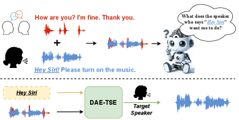
*Figure 1:An illustration of the application scenario and objectives of the proposed DAE-TSE framework. In multi-talker scenarios, DAE-TSE aims to extract the speech of the target speaker who uttered the given keywords, such as “Hey Siri,” from the mixture.*

*Figure 2:The overview of the proposed DAE-TSE. (1) The left part of the figure is the structure of the Keyword-guided Cue Encoder (KCE). KCE is trained by both ASR loss and SV loss. The inputs of KCE are a mixture speech and keywords, and then output the target speaker cue embedding. (2) The right part of the figure is the TSE training process with pretrained KCE, where the inputs are a mixture speech and keywords, and then output the extracted target speech.*

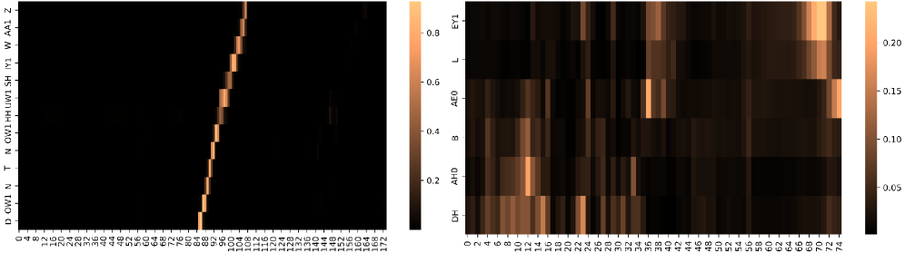
*Figure 3:Cross-attention heatmaps for a positive sample (left, keywords present in the mixture) and a negative sample (right, keywords absent). The X-axis represents speech frame indices, and the Y-axis corresponds to the phoneme sequence of the keyword.*

*Figure 4:t-SNE scatter plot of speaker embeddings, with each color representing a target speaker. (a) Embeddings in the same color are extracted from the same mixture across different keywords. (b) Embeddings in the same color are extracted from different mixtures.*

---
**Usage Info**: 3653 tokens used.
**Generated at**: 2026-02-23 22:08:33

---

# 📚 From Hallucination to Articulation: Language Model-Driven Losses for Ultra Low-Bitrate Neural Speech Coding

🚀 URL: https://arxiv.org/html/2602.06213

## 🌏 Abstract (원문)
Deep neural networks (DNNs) have emerged as a viable model for low-bitrate speech codecs. While traditional codecs such as MELPe[21]or Codec2[26]are known to enable intelligible transmissions at sub-1 kbps rates at the cost of reduced sound quality, many DNN-based codecs have successfully reached such ultra-low bitrates with improved intelligibility and perceptual sound quality[33,4,18,6,19]. Hence, the training objectives for DNN-based speech codecs are to learn to convert speech to a compact (i.e., low-bitrate) discrete representation and then decode it back to audio with the least possible difference from the input. More specifically, there are two major categories of codecs based on the training procedures and input features, as commonly classified[6,12,34]. First,acousticcodecs rely more on reconstruction losses defined within a short period of signals[33,4,18]. Conversely,semanticcodecs aim to preserve semantic information during the coding process, often by learning from foundation models trained with longer-term self-supervision objectives, such as HuBERT[11]or WavLM[2], which are thought to contain rich semantic information in their output. Many successful state-of-the-art codecs[6,19,22,31,8]are of this category. In this paper, we focus on a specific type of coding artifact, “phoneme hallucination (PH),” which results from generative decoders’ attempts to synthesize plausible outputs from excessively compressed codes that may lack some essential semantic information. As a remedy, many codecs propose to adapt semantic distillation (SD) procedures[34,31,5], or use self-supervised representations as inputs[6,19,28,23]. Indeed, semantic losses seem to emphasize linguistic accuracy in the reconstruction. However, semantic codecs such as TAAE[22], FocalCodec[6], and SemantiCodec[19]do exhibit PHs at low bitrates (<0.4<0.4kbps), as made evident in listening examples shared online by the respective authors. On the other hand, it has been shown possible to revert self-supervised speech representations to speech[3]. This implies that better distillation objectives may exist, with the potential to benefit existing and new architectures alike. Meanwhile, automatic speech recognition (ASR) models, such as Whisper[24], are trained to directly estimate subwords given a speech utterance, where the model’s ability in learning the long-term linguistic context is critical to its success. Similarly, the timed-text regularizer (TTR)[10]directly maps WavLM[2]representations to those learned by the corresponding language model, BERT[7], to introduce linguistic contexts to speech enhancement results. Since these models were explicitly trained to associate speech representations with text representations, they may be a richer source for ultra-low bitrate speech codes to learn the semantics from. Some previous works in speech coding do use such linguistic context to enhance token quality. For instance, LLM-Codec[30]proposes to fill and freeze its codebooks with large language model (LLM) embeddings for thousands of carefully selected words, along with an L2 loss enforcing similarity between the VQ outputs and LLM embeddings. However, the bitrate is not as competitive as other semantic codecs. As another example, XY-tokenizer[8]distills from an LLM to map speech tokens to LLM input so that the LLM would output a transcription for the speech. In this way, the learned tokens embed semantic information transferred from the LLM. Again, XY-tokenizer operates in a much higher bitrate (1 kbps). In summary, while LLMs see some recent usage as a part of distillation objectives for codecs, proposed architectures in the literature introduce additional bits to host the semantic information. Meanwhile, there are also non-speech-codec works, e.g.,[13], that attaches adapters[9]to a speech enhancement model to distill from an LLM. However, adapters induce additional inference overhead, while also blocking the loss flow. In contrast,[10]uses their TTR model as a regularization loss, inducing zero inference overhead while still improving their speech separation model. However, the work does not examine whether their scheme improves the linguistic conformance of output speech. Neither of these approaches has been evaluated for training codecs, either. In this work, we formulate and testlanguage model-driven losses(LM loss), demonstrating how they can enhance a neural speech codec. We first show that PHs can still manifest in a simple semantic codec trained on widely used training procedures. Then, we formulate two families of LM losses. While these do leverage pretrained models like some of the previous works, our proposed methods do not levy any architectural constraints or require any additional finetuning once pretrained; they can be applied to any model that outputs speech. We show that many tested variants of LM losses result in suppressed PHs. Finally, we compare the strengths and drawbacks of each approach with objective metrics, including word error rate (WER), as well as a MUSHRA-like subjective test and an intelligibility test.
## 🌏 Abstract (번역)
심층 신경망(DNN)은 저비트레이트 음성 코덱을 위한 유망한 모델로 부상했습니다. MELPe나 Codec2와 같은 전통적인 코덱은 음질 저하를 감수하고 1kbps 미만의 속도에서 명료한 전송을 가능하게 하는 것으로 알려져 있지만, 많은 DNN 기반 코덱은 향상된 명료도와 지각적 음질을 바탕으로 이러한 초저비트레이트에 성공적으로 도달했습니다. 따라서 DNN 기반 음성 코덱의 학습 목표는 음성을 압축된(즉, 저비트레이트) 이산 표현으로 변환하는 방법을 학습한 다음, 입력과 가능한 최소한의 차이로 오디오를 다시 복원하는 것입니다. 구체적으로, 학습 절차와 입력 특징에 따라 코덱은 두 가지 주요 범주로 분류됩니다. 첫째, 음향 코덱은 신호의 짧은 구간 내에서 정의된 복원 손실에 더 많이 의존합니다. 반대로, 의미론적 코덱은 코딩 과정에서 의미 정보를 보존하는 것을 목표로 하며, 종종 HuBERT나 WavLM과 같이 출력에 풍부한 의미 정보가 포함된 것으로 간주되는 장기 자기 지도 학습 목표로 훈련된 파운데이션 모델로부터 학습합니다. 많은 성공적인 최신 코덱들이 이 범주에 속합니다. 본 논문에서는 생성적 디코더가 필수적인 의미 정보가 부족할 수 있는 과도하게 압축된 코드로부터 그럴듯한 출력을 합성하려고 시도할 때 발생하는 특정 유형의 코딩 아티팩트인 '음소 환각(Phoneme Hallucination, PH)'에 집중합니다. 해결책으로 많은 코덱이 의미론적 증류(Semantic Distillation, SD) 절차를 채택하거나 자기 지도 표현을 입력으로 사용합니다. 실제로 의미론적 손실은 복원 시 언어적 정확성을 강조하는 것으로 보입니다. 그러나 TAAE, FocalCodec, SemantiCodec과 같은 의미론적 코덱은 저비트레이트(0.4kbps 미만)에서 PH 현상을 보입니다. 한편, Whisper와 같은 자동 음성 인식(ASR) 모델은 음성 발화가 주어졌을 때 서브워드를 직접 추정하도록 훈련되며, 모델의 장기 언어 문맥 학습 능력은 성공의 핵심입니다. 이와 유사하게 TTR(Timed-Text Regularizer)은 WavLM 표현을 BERT와 같은 언어 모델이 학습한 표현에 직접 매핑하여 음성 향상 결과에 언어적 문맥을 도입합니다. 이러한 모델들은 음성 표현을 텍스트 표현과 연관시키도록 명시적으로 훈련되었기 때문에, 초저비트레이트 음성 코드가 의미론을 학습하기 위한 더 풍부한 원천이 될 수 있습니다. 본 연구에서는 언어 모델 기반 손실(LM loss)을 공식화하고 테스트하여 신경망 음성 코덱을 향상시킬 수 있는 방법을 입증합니다. 먼저 널리 사용되는 학습 절차로 훈련된 단순한 의미론적 코덱에서도 PH가 여전히 나타날 수 있음을 보여줍니다. 그런 다음 두 가지 계열의 LM 손실을 공식화합니다. 제안된 방법은 아키텍처 제약을 가하거나 추가적인 미세 조정을 요구하지 않으며, 음성을 출력하는 모든 모델에 적용될 수 있습니다. 테스트된 많은 LM 손실 변형이 PH를 억제함을 보여줍니다. 마지막으로 단어 오류율(WER), MUSHRA 방식의 주관적 테스트 및 명료도 테스트를 포함한 객관적 지표를 통해 각 접근 방식의 장단점을 비교합니다.

## 🔍 Methods & Results
- 초저비트레이트(<0.4kbps) 음성 코딩에서 발생하는 '음소 환각(Phoneme Hallucination)' 문제를 정의하고 이를 해결하기 위한 언어 모델 기반 손실 함수(LM loss)를 제안함
- Whisper 및 BERT와 같은 사전 훈련된 모델을 활용하여 음성 표현과 텍스트 표현 간의 연관성을 학습에 반영하는 두 가지 계열의 LM 손실을 공식화함
- 제안된 LM 손실은 별도의 아키텍처 변경이나 추가적인 미세 조정 없이도 모든 음성 출력 모델에 적용 가능한 범용적인 특성을 가짐
- 실험 결과, 제안된 LM 손실을 적용했을 때 음소 환각 현상이 억제되고 언어적 정확성이 향상됨을 확인함
- 단어 오류율(WER), MUSHRA 주관적 평가, 명료도 테스트 등의 지표를 통해 기존 의미론적 코덱 대비 성능 우위를 입증함

## 🖼 Figures
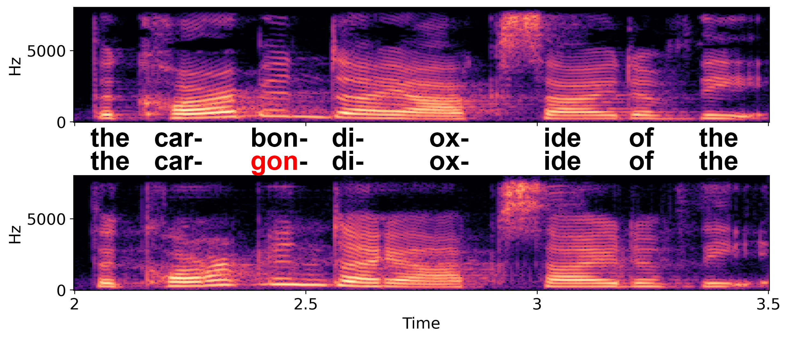
*Fig. 1: (Top) The input speech. (Bottom) The 187.5 bps reference codec with no LM losses exhibits phoneme hallucinations (PHs).*

![Fig. 2: Architecture and training of our reference codec. Our three-stage training procedure emulates common codec-training setups.  denotes the modules updated in the given stage, while  represents frozen ones.  does not participate in. For example,    means that the module is updated in the first stage, while being frozen for the second stage, and then being idle in the third stage. In the third stage, either a LM loss (
ℒ
ASR
,
ℒ
TTR
) or the SD loss (
ℒ
HuBERT
) is employed in combination with the others.](../images/2026-02-10/2602.06213/2602.06213_fig1.png)
*Fig. 2: Architecture and training of our reference codec. Our three-stage training procedure emulates common codec-training setups.  denotes the modules updated in the given stage, while  represents frozen ones.  does not participate in. For example,    means that the module is updated in the first stage, while being frozen for the second stage, and then being idle in the third stage. In the third stage, either a LM loss (
ℒ
ASR
,
ℒ
TTR
) or the SD loss (
ℒ
HuBERT
) is employed in combination with the others.*

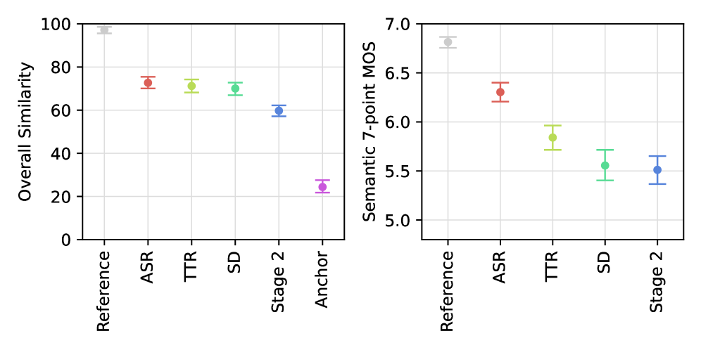
*Fig. 3: Overall similarity (left) and the semantic 7-point MOS (right) subjective evaluations; mean and 95% confidence intervals. Codecs trained with LM losses show significantly better semantic performance compared to the others.*

---
**Usage Info**: 4590 tokens used.
**Generated at**: 2026-02-23 22:09:09

---

# 📚 Reading Between the Waves: Robust Topic Segmentation Using Inter-Sentence Audio Features

🚀 URL: https://arxiv.org/html/2602.06647

## 🌏 Abstract (원문)
Topic segmentation partitions a document into thematically coherent sub-segments, enabling smoother user navigation and laying the foundation for additional tasks, such as retrieval and summarization. While supervised approaches for topic segmentation have advanced considerably with the availability of large-scale annotated data[20], most methods focus on written text. In contrast, the surge in multi-modal content - particularly audio and video recordings - presents new challenges: transcripts of spoken language are often informal, ungrammatical, and prone to automatic speech recognition (ASR) errors. Yet, these recordings also offer the acoustic modality, which can provide useful cues for identifying topic boundaries. Previous work has leveraged audio by extracting specific features (e.g., pitch[33]) or by generating pretrained acoustic embeddings[5,14]. However, these methods do not incorporate end-to-end fine-tuning of the audio encoder. Inspired by the success of fine-tuning pretrained transformers for text-only topic segmentation[21,15,29], we extend this paradigm to the acoustic domain. To align the acoustic features to the segmentation task, we jointly fine-tune text and audio encoders, enabling more robust topic segmentation in spoken documents. While previous work encodes entire spoken sentences[5,14], we hypothesize that acoustic cues for topic shifts (e.g., prosodic features or contextual sounds) are better found at the inter-sentence boundaries. Our main contributions are as follows: We propose a multi-modal method that outperforms a larger text-only baseline, indicating that integrating audio is more effective than simply scaling the model. We show that end-to-end training and boundary-focused context improve the audio integration baseline by 5.37F1. We evaluate ASR error and unseen-language effects, showing audio integration boosts robustness and generalization.
## 🌏 Abstract (번역)
주제 세분화(Topic segmentation)는 문서를 주제별로 일관된 하위 세그먼트로 분할하여 사용자의 탐색을 원활하게 하고 검색 및 요약과 같은 추가 작업의 기반을 마련합니다. 대규모 주석 데이터의 가용성으로 인해 주제 세분화에 대한 지도 학습 방식은 상당히 발전했지만, 대부분의 방법은 텍스트에 집중되어 있습니다. 반면, 특히 오디오 및 비디오 녹음과 같은 멀티모달 콘텐츠의 급증은 새로운 과제를 제시합니다. 구어체 텍스트의 전사본은 종종 비공식적이고 비문법적이며 자동 음성 인식(ASR) 오류가 발생하기 쉽습니다. 그러나 이러한 녹음물은 주제 경계를 식별하는 데 유용한 단서를 제공할 수 있는 음향 모달리티를 제공하기도 합니다. 이전 연구에서는 특정 특징(예: 피치)을 추출하거나 사전 학습된 음향 임베딩을 생성하여 오디오를 활용했습니다. 그러나 이러한 방법은 오디오 인코더의 엔드투엔드 미세 조정을 포함하지 않습니다. 텍스트 전용 주제 세분화를 위해 사전 학습된 트랜스포머를 미세 조정하는 성공에 영감을 받아, 본 연구에서는 이 패러다임을 음향 영역으로 확장합니다. 음향 특징을 세분화 작업에 맞추기 위해 텍스트 및 오디오 인코더를 공동으로 미세 조정하여 구어체 문서에서 더 강력한 주제 세분화를 가능하게 합니다. 이전 연구가 전체 구어 문장을 인코딩하는 반면, 본 연구에서는 주제 전환에 대한 음향 단서(예: 운율적 특징 또는 문맥적 소리)가 문장 간 경계에서 더 잘 발견된다는 가설을 세웁니다. 본 연구의 주요 기여는 다음과 같습니다. 첫째, 더 큰 규모의 텍스트 전용 베이스라인보다 성능이 뛰어난 멀티모달 방법을 제안하며, 이는 오디오 통합이 단순히 모델 규모를 키우는 것보다 더 효과적임을 나타냅니다. 둘째, 엔드투엔드 학습과 경계 중심 문맥이 오디오 통합 베이스라인을 5.37 F1만큼 향상시킴을 보여줍니다. 셋째, ASR 오류 및 미학습 언어 효과를 평가하여 오디오 통합이 견고성과 일반화 능력을 향상시킨다는 것을 보여줍니다.

## 🔍 Methods & Results
- 문장 간 경계(inter-sentence boundaries)에서 고정된 길이의 짧은 윈도우 두 개를 추출하여 음향 단서를 포착하는 방식 제안
- Siamese 구조를 채택하여 동일한 사전 학습된 오디오 모델(wav2vec 2.0, HuBERT, UniSpeech-SAT 등)로 양쪽 경계 윈도우를 인코딩
- 텍스트 인코더(MiniLM)와 오디오 인코더를 공동으로 엔드투엔드 미세 조정(Fine-tuning)하는 MultiSeg 아키텍처 설계
- 텍스트 임베딩과 음향 경계 특징을 결합하여 RoFormer 인코더를 통해 주제 경계 여부를 분류
- 엔드투엔드 학습과 경계 중심 문맥 활용을 통해 오디오 통합 베이스라인 대비 F1 점수를 5.37 향상
- ASR 오류 및 미학습 언어 환경에서 오디오 통합이 모델의 견고성과 일반화 성능을 개선함을 입증

## 🖼 Figures
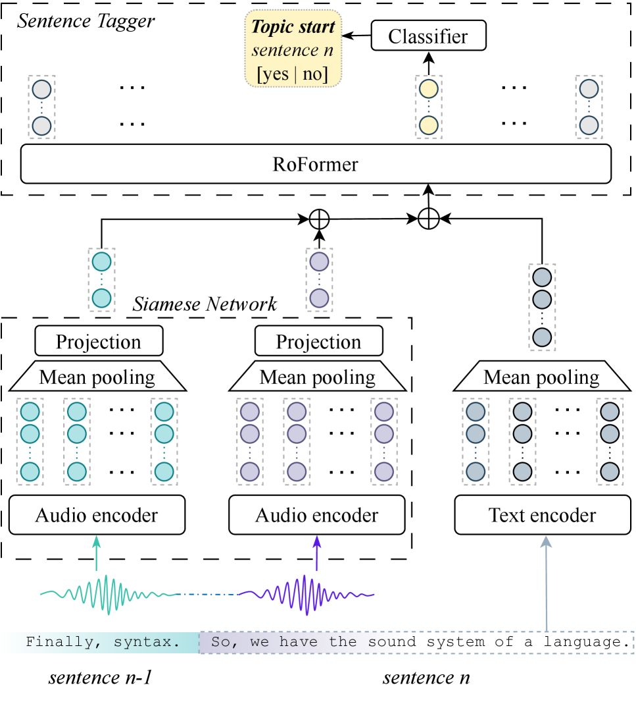
*Fig. 1:Our multi-modal topic change architecture.*

---
**Usage Info**: 5176 tokens used.
**Generated at**: 2026-02-23 22:10:00

---

