# 🚩 (2026-02-11) Scholar Inbox 추천 논문 

# 📚 TVTSyn: Content-Synchronous Time-Varying Timbre for Streaming Voice Conversion and Anonymization

🚀 URL: https://arxiv.org/html/2602.09389

## 🌏 Abstract (원문)
Real-time voice conversion (VC) and speaker anonymization (SA) aim to deliver natural, intelligible speech while meeting strict streaming and latency constraints. Beyond words, voice recordings carry biometric and paralinguistic cues–identity, sex, age, accent, and emotion–that adversaries can exploit for recognition and profiling, creating real risks to privacy. As voice interfaces proliferate and privacy rules tighten, protecting these speech attributes without degrading the communicative utility of speech has become essential, as exemplified by several initiatives. As an example, starting in 2020 the Voice Privacy Challenge(Tomashenkoet al.,2020)evaluates speech anonymization systems on both privacy and usefulness, with shared benchmarks that quantify speaker obfuscation alongside speech quality. Further, federal agencies have pushed for the development of real-time solutions with tight latency budgets (e.g., IARPA’s Anonymous Real-Time Speech program111https://www.iarpa.gov/research-programs/arts). To address this challenge, recent speech architectures have achieved sub-second latency by combining lightweight content encoders with direct waveform decoders(Quamer and Gutierrez-Osuna,2024;2025a; Yanget al.,2022; Chenet al.,2023). Yet a core limitation of these approaches persists: while content is represented as a time-varying sequence, speaker identity is typically injected as a single static vector. This dynamic-static mismatch dampens expressivity and often yields over-smoothed timbre, especially when articulation, emotion, or emphasis change within an utterance. Making content strongly speaker-independent (e.g., via aggressive bottlenecks) can improve anonymization performance but suppress meaningful variations in speech such as accent and emotional color, or introduce artifacts(Quamer and Gutierrez-Osuna,2025a). We contend this trade-off islargelyarchitectural: a stationary speaker vector forces the decoder to reconcile incompatible time scales. A better formulation would add temporal granularity to speaker conditioning to match that of the content, while allowing control and meeting tight latency constraints. We propose TVTSyn, a streaming speech synthesizer that replaces static speaker embeddings with a time-varying timbre (TVT) representation that is synchronized with the content. A Global Timbre Memory (GTM) expands a global timbre seed into a compact set of timbre facets; frame-level content attends to this memory to retrieve the most relevant facets over time; a learned gate regulates how much timbre is allowed to vary; and spherical interpolation blends global and time-varying paths to preserve identity geometry while enabling smooth local variation. This TVT stream conditions a causal decoder alongside pitch/energy predictors, yielding natural variation while retaining control. Complementing this, a factorized vector-quantized bottleneck regularizes the content network to reduce residual identity cues while preserving linguistic content. TVTSyn runs in a streaming fashion with small, mask-based future access in the encoder and fully causal decoding. The system can generate synthesis with<80ms latency on a modern GPU and runs within a few hundred ms. latency on CPUs. We evaluate the model for both VC and SA tasks under the VoicePrivacy Challenge (VPC) 2024 protocol, reporting equal-error-rates (EER) in automatic speaker verification (ASV) as a measure of privacy preservation, and word error rates (WER) of an automatic speech recognizer (ASR) as a measure of utility, as well as latency and real-time factors. Our main contributions are: Content-synchronous timbre modeling: We introduce a time-varying timbre formulation that aligns speaker conditioning with frame-level content, resolving the static–dynamic mismatch responsible for degraded quality in streaming VC and SA. A streamable low-latency architecture: We design a fully causal system that integrates GTM-based timbre, factorized VQ bottlenecks, and prosodic predictors, and maintains low latency while balancing naturalness with speaker fidelity, and anonymization robustness. Comprehensive benchmarking: We evaluate across VC and anonymization tasks with perceptual quality, speaker similarity, privacy (EER), utility (WER), and runtime performance, demonstrating superior privacy–utility trade-offs over prior streaming systems.
## 🌏 Abstract (번역)
실시간 음성 변환(VC) 및 화자 익명화(SA)는 엄격한 스트리밍 및 지연 시간 제약을 충족하면서 자연스럽고 이해하기 쉬운 음성을 제공하는 것을 목표로 합니다. 음성 녹음에는 단어 외에도 신원, 성별, 연령, 억양, 감정 등 공격자가 인식 및 프로파일링에 악용할 수 있는 생체 인식 및 부언어적 단서가 포함되어 있어 개인 정보 보호에 실질적인 위험을 초래합니다. 음성 인터페이스가 확산되고 개인정보 보호 규정이 강화됨에 따라, 여러 이니셔티브에서 예시된 것처럼 음성의 통신 유틸리티를 저하시키지 않으면서 이러한 음성 속성을 보호하는 것이 필수적이 되었습니다. 예를 들어, 2020년에 시작된 Voice Privacy Challenge는 음성 품질과 함께 화자 난독화를 정량화하는 공유 벤치마크를 통해 개인 정보 보호와 유용성 측면 모두에서 음성 익명화 시스템을 평가합니다. 또한 연방 기관들은 엄격한 지연 시간 예산(예: IARPA의 Anonymous Real-Time Speech 프로그램)을 가진 실시간 솔루션 개발을 추진해 왔습니다. 이러한 과제를 해결하기 위해 최근의 음성 아키텍처는 경량 콘텐츠 인코더와 직접 파형 디코더를 결합하여 1초 미만의 지연 시간을 달성했습니다. 그러나 이러한 접근 방식의 핵심적인 한계는 여전히 남아 있습니다. 콘텐츠는 시간에 따라 변하는 시퀀스로 표현되는 반면, 화자 정체성은 일반적으로 단일 정적 벡터로 주입된다는 점입니다. 이러한 동적-정적 불일치는 표현력을 저하시키고, 특히 발화 내에서 조음, 감정 또는 강조가 변할 때 지나치게 뭉개진 음색(over-smoothed timbre)을 생성하는 경우가 많습니다. 콘텐츠를 강력하게 화자 독립적으로 만들면(예: 공격적인 병목 현상 활용) 익명화 성능은 향상될 수 있지만, 억양이나 감정적 색채와 같은 음성의 의미 있는 변화를 억제하거나 아티팩트를 유발할 수 있습니다. 우리는 이러한 트레이드오프가 주로 아키텍처 문제라고 주장합니다. 정지된 화자 벡터는 디코더가 호환되지 않는 시간 척도를 조정하도록 강제합니다. 더 나은 공식은 제어를 허용하고 엄격한 지연 시간 제약을 충족하면서 콘텐츠의 시간적 세밀함에 맞춰 화자 컨디셔닝에 시간적 세밀함을 추가하는 것입니다. 우리는 정적 화자 임베딩을 콘텐츠와 동기화된 시간 가변 음색(TVT) 표현으로 대체하는 스트리밍 음성 합성기인 TVTSyn을 제안합니다. 글로벌 음색 메모리(GTM)는 글로벌 음색 시드를 컴팩트한 음색 패싯 세트로 확장합니다. 프레임 레벨 콘텐츠는 이 메모리를 참조하여 시간에 따라 가장 관련성이 높은 패싯을 검색합니다. 학습된 게이트는 음색이 얼마나 변할 수 있는지 조절하며, 구형 보간(spherical interpolation)은 글로벌 경로와 시간 가변 경로를 혼합하여 정체성 기하학을 보존하면서 부드러운 국부적 변화를 가능하게 합니다. 이 TVT 스트림은 피치/에너지 예측기와 함께 인과적 디코더를 컨디셔닝하여 제어력을 유지하면서 자연스러운 변화를 생성합니다. 이를 보완하기 위해 인수 분해된 벡터 양자화(factorized vector-quantized) 병목 현상이 콘텐츠 네트워크를 정규화하여 언어적 콘텐츠를 보존하면서 잔류 정체성 단서를 줄입니다. TVTSyn은 인코더에서 마스크 기반의 작은 미래 접근과 완전 인과적 디코딩을 통해 스트리밍 방식으로 실행됩니다. 이 시스템은 최신 GPU에서 80ms 미만의 지연 시간으로 합성을 생성할 수 있으며, CPU에서는 수백 ms 내에 실행됩니다. 우리는 VoicePrivacy Challenge(VPC) 2024 프로토콜에 따라 VC 및 SA 작업 모두에 대해 모델을 평가하여, 개인 정보 보호 측정값으로 자동 화자 검증(ASV)의 동일 오류율(EER)을, 유용성 측정값으로 자동 음성 인식(ASR)의 단어 오류율(WER)을 보고하고 지연 시간 및 실시간 요소를 보고합니다. 우리의 주요 기여는 다음과 같습니다. 첫째, 콘텐츠 동기화 음색 모델링: 스트리밍 VC 및 SA에서 품질 저하의 원인이 되는 정적-동적 불일치를 해결하기 위해 화자 컨디셔닝을 프레임 레벨 콘텐츠와 정렬하는 시간 가변 음색 공식을 도입합니다. 둘째, 스트리밍 가능한 저지연 아키텍처: GTM 기반 음색, 인수 분해된 VQ 병목 현상 및 운율 예측기를 통합하고 자연스러움과 화자 충실도, 익명화 견고성의 균형을 맞추면서 낮은 지연 시간을 유지하는 완전 인과적 시스템을 설계합니다. 셋째, 포괄적인 벤치마킹: 지각 품질, 화자 유사성, 개인 정보 보호(EER), 유용성(WER) 및 런타임 성능을 통해 VC 및 익명화 작업 전반에 걸쳐 평가하여 이전 스트리밍 시스템보다 우수한 개인 정보 보호-유용성 트레이드오프를 입증합니다.

## 🔍 Methods & Results
- 시스템 아키텍처는 콘텐츠 인코더, 화자 처리 블록(GTM), 피치/에너지 예측기, 파형 디코더의 4가지 모듈로 구성됨
- 콘텐츠 인코더는 완전 인과적 1-D CNN과 8개의 인과적 멀티헤드 셀프 어텐션(MHSA) 블록을 사용하여 20ms 간격의 프레임 임베딩을 생성하며, 80ms의 짧은 미래 참조를 통해 안정성을 확보함
- 인수 분해된 벡터 양자화(Factorized VQ) 병목 현상을 도입하여 512차원 출력을 8차원으로 압축 후 양자화함으로써 잔류 화자 정보를 제거하고 언어적 충실도를 유지함
- 정적 화자 임베딩 대신 콘텐츠와 동기화된 시간 가변 음색(TVT) 표현을 도입하여 동적-정적 불일치 문제를 해결함
- 글로벌 음색 메모리(GTM)는 화자별 MLP와 학습 가능한 프로토타입을 결합하여 음색을 여러 '패싯'으로 분해하며, 구형 선형 보간(Slerp)을 통해 부드러운 음색 변화를 구현함
- 디코더는 인코더의 시간 압축을 역전시키는 4단계의 인과적 ConvTranspose1D를 사용하여 16kHz 파형을 직접 합성함
- VPC 2024 프로토콜 평가 결과, 최신 GPU에서 80ms 미만의 지연 시간을 달성하면서도 기존 스트리밍 시스템 대비 우수한 개인 정보 보호(EER) 및 유용성(WER) 트레이드오프를 입증함

## 🖼 Figures

*Figure 1:(a) The content encoder in TVTSyn is trained separately with supervision from an off-line HuBERT model. (b) The waveform decoder is trained in a self-supervised fashion to reconstruct the input utterance from content and speaker embedding streams. Dashed lines are disabled at inference.*

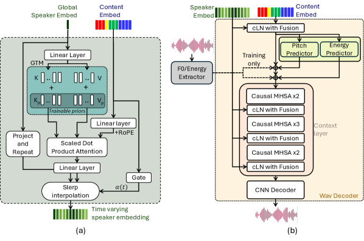
*Figure 2:Architecture details for (a) TVT processing block, (b) waveform decoder.*

*Figure 3:t-SNE visualization of content embeddings, color-coded by speaker. Markers denote native (
◆
) or non-native (
∘
). (a) Continuous embeddings, (b) logits, (c) bottleneck, and (d) VQ bottleneck.*

*Figure 4:Qualitative analysis of time-varying timbre for the text: ”Six spoons of fresh snow peas, five thick slabs of blue cheese, and maybe a snack for her brother Bob.”. (a) Content-GTM attention map with (b) Top-1 strip shows content-dependent selection of timbre facets, (c) PCA trajectories (pre-slerp vs. final), (d) PCA projection of GTM value tokens (size 
∝
 usage) and (e) token-usage histogram indicate diverse, non-collapsed facets.*

*Figure 5: Objective evaluation results for voice conversion. Src-SIM: cosine similarity b/w VC and source speaker; Trg-SIM: cosine similarity b/w VC and target speaker; NISQA-MOS: Speech Quality and Naturalness Assessment. Src-SIM and Trg-SIM for source speech (i.e., unaltered) reflect within- and between-speaker similarity, respectively.*

---
**Usage Info**: 8403 tokens used.
**Generated at**: 2026-02-23 22:12:59

---

# 📚 DSFlow: Dual Supervision and Step-Aware Architecture for One-Step Flow Matching Speech Synthesis

🚀 URL: https://arxiv.org/html/2602.09041

## 🌏 Abstract (원문)
Flow Matching models have emerged as a powerful framework for text-to-speech synthesis, achieving high-quality generation through iterative refinement along learned probability flows. Similar to their success in image and video generation, these models learn to map data distributions through continuous flows. However, flow-based models face a fundamental trade-off between sample quality and inference efficiency: their iterative sampling process requires tens to hundreds of neural function evaluations (NFEs), leading to high latency that prohibits real-time deployment in applications such as voice assistants and interactive dialogue systems. To address this efficiency bottleneck, recent work has explored techniques to reduce NFEs while maintaining generation quality. Consistency models achieve few-step generation by learning to map any point along a sampling trajectory directly to its endpoint. During distillation, the student is supervised to match the teacher’s final output regardless of the starting timestep. However, this endpoint-only supervision provides sparse learning signals: gradient information must propagate backward through accumulated errors across all sampling steps, leading to training instability. An alternative approach, MeanFlow, models the average velocity field rather than instantaneous velocity, enabling one-step generation trained from scratch without distillation. While MeanFlow has shown strong results in image generation, its training process requires Jacobian-vector products (JVPs)—a computationally expensive operation that significantly increases memory consumption and is incompatible with customized CUDA operators. In this work, we propose DSFlow, a distillation framework that addresses these limitations through improved supervision and architectural adaptation. We introduce dual supervision, combining endpoint matching with velocity field alignment to provide complementary learning signals that enhance training stability. Drawing from MeanFlow’s average velocity formulation, we develop a JVP-free implementation that retains dense trajectory supervision while eliminating computational overhead. Finally, we propose step-aware tokens: rather than inheriting continuous-time embeddings, we employ learnable discrete representations corresponding to the fixed sampling steps, achieving substantial parameter efficiency and enabling step-specific specialization. Our contributions can be summarized as: We propose dual supervision that combines endpoint matching with velocity field alignment, providing complementary learning signals that improve training stability and convergence. We develop a velocity matching formulation inspired by MeanFlow’s average velocity, achieving dense trajectory supervision without the computational overhead of Jacobian computation. We introduce step-aware tokens that replace continuous-time embeddings with learnable discrete representations, substantially reducing parameters in the time-conditioning pathway while enabling step-specific specialization. We demonstrate through comprehensive experiments that DSFlow achieves teacher-level quality within a single inference step on text-to-speech benchmarks, enabling real-time synthesis with significantly reduced computational costs compared to existing methods.
## 🌏 Abstract (번역)
Flow Matching 모델은 학습된 확률 흐름을 따라 반복적인 정제를 통해 고품질 생성을 달성하며 텍스트 음성 합성(TTS)을 위한 강력한 프레임워크로 부상했습니다. 이미지 및 비디오 생성에서의 성공과 유사하게, 이 모델들은 연속적인 흐름을 통해 데이터 분포를 매핑하는 법을 배웁니다. 그러나 흐름 기반 모델은 샘플 품질과 추론 효율성 사이의 근본적인 트레이드오프에 직면해 있습니다. 이들의 반복적인 샘플링 과정은 수십에서 수백 번의 신경망 함수 평가(NFE)를 필요로 하며, 이는 음성 비서 및 대화형 시스템과 같은 응용 분야에서 실시간 배포를 방해하는 높은 지연 시간을 초래합니다. 이러한 효율성 병목 현상을 해결하기 위해 최근 연구들은 생성 품질을 유지하면서 NFE를 줄이는 기술을 탐구해 왔습니다. 일관성 모델(Consistency models)은 샘플링 궤적의 임의의 지점을 종점으로 직접 매핑하는 법을 학습하여 적은 단계의 생성을 달성합니다. 증류(distillation) 과정에서 학생 모델은 시작 타임스텝에 관계없이 교사 모델의 최종 출력과 일치하도록 감독을 받습니다. 그러나 이러한 종점 전용 감독은 희소한 학습 신호를 제공합니다. 그래디언트 정보가 모든 샘플링 단계에서 누적된 오차를 통해 역전파되어야 하므로 학습 불안정성을 초래합니다. 대안적인 접근 방식인 MeanFlow는 순간 속도가 아닌 평균 속도 필드를 모델링하여 증류 없이 처음부터 학습된 단일 단계 생성을 가능하게 합니다. MeanFlow는 이미지 생성에서 강력한 결과를 보여주었지만, 학습 과정에서 자코비안-벡터 곱(JVP)이 필요한데, 이는 메모리 소비를 크게 증가시키고 맞춤형 CUDA 연산자와 호환되지 않는 계산 비용이 많이 드는 작업입니다. 본 연구에서는 개선된 감독 및 구조적 적응을 통해 이러한 한계를 해결하는 증류 프레임워크인 DSFlow를 제안합니다. 우리는 종점 매칭과 속도 필드 정렬을 결합한 이중 감독(dual supervision)을 도입하여 학습 안정성을 향상시키는 상호 보완적인 학습 신호를 제공합니다. MeanFlow의 평균 속도 공식에서 영감을 얻어, 계산 오버헤드를 제거하면서 조밀한 궤적 감독을 유지하는 JVP-free 구현을 개발합니다. 마지막으로, 연속 시간 임베딩을 상속받는 대신 고정된 샘플링 단계에 대응하는 학습 가능한 이산 표현인 단계 인식 토큰(step-aware tokens)을 제안하여 상당한 파라미터 효율성을 달성하고 단계별 특성화를 가능하게 합니다. 본 연구의 기여는 다음과 같습니다. 첫째, 종점 매칭과 속도 필드 정렬을 결합하여 학습 안정성과 수렴을 개선하는 이중 감독을 제안합니다. 둘째, MeanFlow의 평균 속도에서 영감을 받은 속도 매칭 공식을 개발하여 자코비안 계산의 오버헤드 없이 조밀한 궤적 감독을 달성합니다. 셋째, 연속 시간 임베딩을 학습 가능한 이산 표현으로 대체하는 단계 인식 토큰을 도입하여 시간 조건화 경로의 파라미터를 실질적으로 줄이면서 단계별 특성화를 가능하게 합니다. 넷째, 포괄적인 실험을 통해 DSFlow가 TTS 벤치마크에서 단일 추론 단계만으로 교사 수준의 품질을 달성하며, 기존 방법 대비 계산 비용을 크게 줄이면서 실시간 합성을 가능하게 함을 입증합니다.

## 🔍 Methods & Results
- 이중 감독(Dual Supervision): 종점 매칭(Endpoint Matching)과 속도 정렬(Velocity Alignment)을 결합하여 학습 안정성을 높이고 오차 누적 문제를 해결함.
- JVP-free 속도 매칭: MeanFlow의 평균 속도 개념을 활용하되, 자코비안-벡터 곱(JVP) 없이 선형 보간을 통해 평균 속도를 추정하여 계산 효율성을 확보함.
- 단계 인식 토큰(Step-aware Tokens): 기존의 복잡한 연속 시간 임베딩(AdaLN-Zero) 대신 각 추론 단계에 대응하는 학습 가능한 이산 토큰을 사용하여 파라미터 수를 38M에서 1.5K로 대폭 절감함.
- CFG 정규화: 증류 후에도 추론 시 가이드 조절이 가능하도록 조건부 및 비조건부 예측 간의 일관성을 유지하는 약한 정규화 항을 도입함.
- 실험 결과: 단 1회의 추론 단계(1-step)만으로도 교사 모델 수준의 음성 품질을 달성하였으며, 실시간 합성이 가능한 수준으로 계산 비용을 절감함.

## 🖼 Figures
![Figure 1:Overview of the DSFlow framework. The left and center panels show the transition from a DiT block with adaLN-Zero conditioning to the proposed step-aware architecture, where the heavy time-modulation network is replaced by lightweight step-aware tokens. The right panel illustrates dual supervision, which combines endpoint matching (
ℒ
endpoint
) with deterministic mean velocity alignment (
ℒ
velocity
) to guide the student along the teacher’s mean trajectory (green vectors), improving process consistency over endpoint-only distillation without additional Jacobian computation.](../images/2026-02-11/2602.09041/2602.09041_fig0.png)
*Figure 1:Overview of the DSFlow framework. The left and center panels show the transition from a DiT block with adaLN-Zero conditioning to the proposed step-aware architecture, where the heavy time-modulation network is replaced by lightweight step-aware tokens. The right panel illustrates dual supervision, which combines endpoint matching (
ℒ
endpoint
) with deterministic mean velocity alignment (
ℒ
velocity
) to guide the student along the teacher’s mean trajectory (green vectors), improving process consistency over endpoint-only distillation without additional Jacobian computation.*

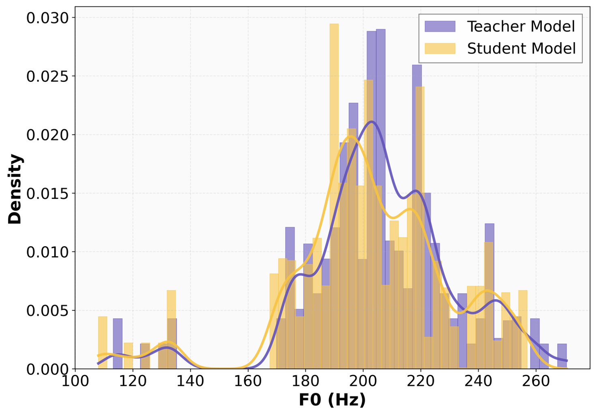
*Figure 2:F0 distribution comparison. For both models, 100 speech samples were generated under the same text and prompt condition, and the frame-level F0 values of the generated samples are visualized via histograms and kernel density estimates.*

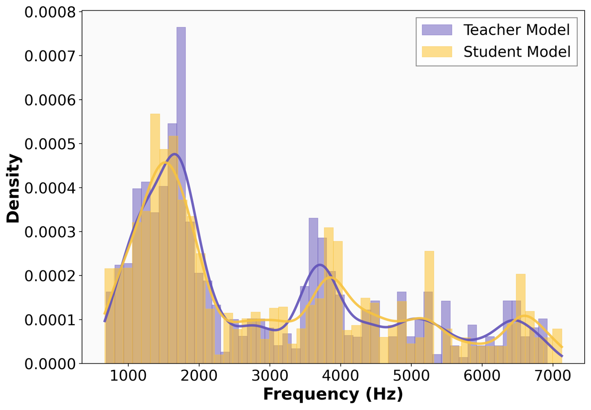
*(a)*

*(a)*

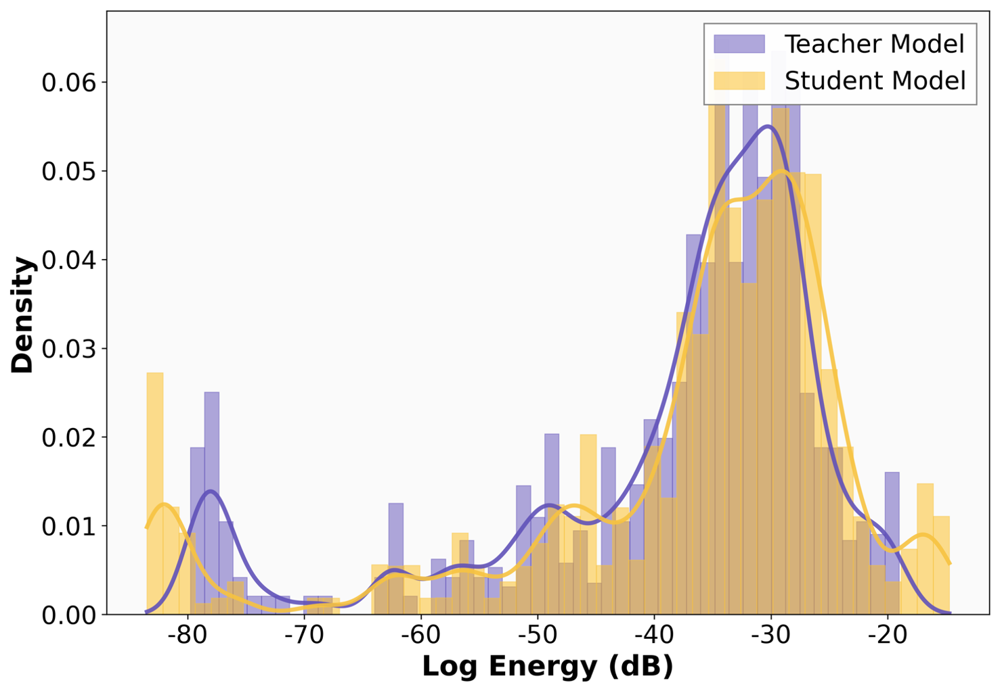
*(b)*

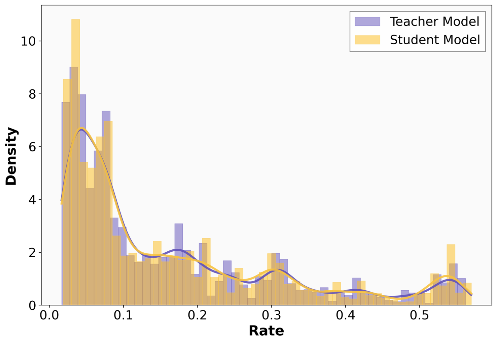
*(c)*

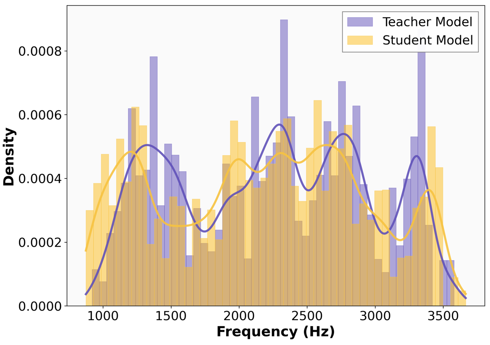
*(d)*

---
**Usage Info**: 5892 tokens used.
**Generated at**: 2026-02-23 22:13:35

---

# 📚 Stemphonic: All-at-once Flexible Multi-stem Music Generation

🚀 URL: https://arxiv.org/html/2602.09891

## 🌏 Abstract (원문)
Text-to-audio music generation models are now able to produce realistic sounding music from simple text inputs. They lower the barrier for music creation, enabling anyone to explore and express their creativity, but typically generate fully-mixed multi-instrument outputs that are difficult to edit and cannot easily be reused as components in new compositions. To empower creators beyond text prompting, numerous control and editing methods have been proposed, including fine-grained temporal controls, music inpainting, as well as music stem generation. A music stem is a recording of one or more instruments that collectively serve as a distinct layer in a mix, e.g., drums for rhythmic foundation, and basses for low-pitch progressions. Generating stems enables creators to edit each stem separately and experiment with different mixing/mastering techniques, enhancing their creative control. Existing stem generation methods can largely be classified into (1) models with a parallelized architecture, and (2) individual-stem models that require sequential generation of stems. Parallelized models generate multiple coherent stems in a single pass, but handle limited, coarse-grained stem types that must be fixed in advance and built into the architecture. Individual-stem models, on the other hand, allow flexible open-vocabulary stem generations through text prompting or other conditioning mechanisms, and can often condition on existing audio to iteratively generate new accompanying stems and create a mix with an arbitrary number of stems. Yet, these models generate stems one at a time, leading to slower full inference processes. To unify the strengths of both paradigms and alleviate their drawbacks, we propose Stemphonic, a latent diffusion/flow-based framework capable of generating a variable set of musically-synchronized stems in one inference pass. We introduce two techniques applied during training. First, we treat each stem as a batch element and group musically-synchronized stems in a batch. Then, we assign a single shared noise latent to each group. At inference, we use a shared initial noise and different stem-specific text inputs to generate variably many synchronized stem outputs in one pass. We further expand our approach to conditional multi-stem generation, and add stem-wise activity controls that enable creators to iteratively generate and orchestrate the temporal layering of a mix. In our experiments, we find Stemphonic capable of generating higher-quality multi-stem mixes, while accelerating the full inference process by 25–50%, compared to the existing individual-stem iterative workflow.
## 🌏 Abstract (번역)
텍스트-오디오 음악 생성 모델은 이제 단순한 텍스트 입력만으로도 실감 나는 음악을 생성할 수 있게 되었습니다. 이러한 모델은 음악 제작의 장벽을 낮추어 누구나 창의성을 탐구하고 표현할 수 있게 하지만, 일반적으로 편집이 어렵고 새로운 작곡의 구성 요소로 재사용하기 힘든 완전히 믹싱된 다중 악기 출력을 생성합니다. 텍스트 프롬프팅 이상의 제어 기능을 제공하기 위해 세밀한 시간 제어, 음악 인페인팅, 음악 스템(stem) 생성 등 다양한 제어 및 편집 방법이 제안되었습니다. 음악 스템은 믹스 내에서 별개의 레이어 역할을 하는 하나 이상의 악기 녹음(예: 리듬의 드럼, 저음의 베이스)을 의미합니다. 스템을 생성하면 제작자가 각 스템을 별도로 편집하고 다양한 믹싱/마스터링 기술을 실험할 수 있어 창의적인 제어 능력이 향상됩니다. 기존의 스템 생성 방법은 크게 (1) 병렬화된 아키텍처 모델과 (2) 순차적 생성이 필요한 개별 스템 모델로 분류됩니다. 병렬화된 모델은 한 번에 일관된 여러 스템을 생성하지만, 미리 고정되어 아키텍처에 내장된 제한적이고 거친 입도의 스템 유형만 처리할 수 있습니다. 반면 개별 스템 모델은 텍스트 프롬프트나 기타 조건화 메커니즘을 통해 유연한 오픈 어휘 스템 생성이 가능하며, 기존 오디오를 조건으로 새로운 동반 스템을 반복적으로 생성하여 임의의 수의 스템으로 믹스를 만들 수 있습니다. 그러나 이러한 모델은 스템을 한 번에 하나씩 생성하므로 전체 추론 과정이 느려집니다. 두 패러다임의 장점을 결합하고 단점을 완화하기 위해, 본 논문에서는 한 번의 추론 과정에서 가변적인 음악적 동기화 스템 세트를 생성할 수 있는 잠재 확산/흐름 기반 프레임워크인 Stemphonic을 제안합니다. 우리는 훈련 중에 적용되는 두 가지 기술을 도입합니다. 첫째, 각 스템을 배치 요소로 취급하고 음악적으로 동기화된 스템들을 하나의 배치로 그룹화합니다. 둘째, 각 그룹에 단일 공유 노이즈 잠재 변수를 할당합니다. 추론 시에는 공유된 초기 노이즈와 각 스템별 텍스트 입력을 사용하여 한 번에 가변적인 수의 동기화된 스템 출력을 생성합니다. 더 나아가 조건부 다중 스템 생성으로 접근 방식을 확장하고, 제작자가 믹스의 시간적 레이어링을 반복적으로 생성하고 편성할 수 있도록 스템별 활동 제어 기능을 추가합니다. 실험을 통해 Stemphonic이 기존의 개별 스템 반복 워크플로우에 비해 전체 추론 프로세스를 25~50% 가속화하면서도 더 높은 품질의 다중 스템 믹스를 생성할 수 있음을 확인했습니다.

## 🔍 Methods & Results
- 한 번의 추론 패스로 가변적인 수의 음악적 동기화 스템을 생성하는 잠재 확산/흐름 기반 프레임워크 Stemphonic 제안
- 훈련 배치 구성 시 음악적으로 동기화된 스템들을 함께 묶는 스템 그룹화(Stem Grouping) 기술을 통해 스템 간 응집력 유도
- 동일 그룹 내 스템들에 공유된 초기 노이즈 잠재 변수를 할당하여 모델이 스템 간 정렬 및 편성을 강력하게 학습하도록 하는 노이즈 공유(Noise Sharing) 기법 적용
- 라우드니스 기반 무음 감지를 통해 각 스템의 시간적 활성 상태(Active/Silent)를 정밀하게 조절할 수 있는 스템별 활동 제어 메커니즘 구현
- 기존 오디오나 서브 믹스를 조건으로 새로운 스템을 추가 생성할 수 있는 조건부 다중 스템 생성 기능 지원
- 기존의 개별 스템 반복 생성 방식 대비 추론 속도를 25~50% 단축하면서도 더 높은 품질의 다중 스템 믹스 생성 성능 입증

## 🖼 Figures

*Fig. 1:Our Stemphonic framework for flexible multi-stem music generation. (Top) At training, each group of synchronized stems share the same noise latent. (Bottom) At inference, we use a shared initial noise to generate variable multi-stem outputs in one pass. We also enable conditional stem generation and stem-wise activity controls.*

---
**Usage Info**: 7071 tokens used.
**Generated at**: 2026-02-23 22:14:38

---

# 📚 Gencho: Room Impulse Response Generation from Reverberant Speech and Text via Diffusion Transformers

🚀 URL: https://arxiv.org/html/2602.09233

## 🌏 Abstract (원문)
Room impulse responses (RIRs) are filters that capture the core acoustic properties of an environment, including reverberation and coloration, through a compact, parametric representation. They provide essential auditory context that shapes how sound is perceived in a given space, contributing to the realism and immersiveness of audio content. RIR estimation provides a natural basis for acoustic matching, which aims to transfer the acoustics of a reference space to new audio so that it blends seamlessly with the original scene. Recently, the proliferation of publicly available audio crafting tools, such as speech enhancement and text-to-speech (TTS) synthesis, has further increased the need for more accurate, flexible acoustic matching. This capability is critical for tasks such as automated dialogue replacement (ADR), dubbing, and voiceovers, to ensure perceptual consistency of newly recorded or synthetic speech with the original context. Likewise, TTS integrates with acoustic matching to render voices consistently in a chosen environment. Processed speech from enhancers can sound overly dry, and benefits from restoring natural room acoustics. In many scenarios, explicitly estimating RIRs is often preferred over end-to-end acoustic matching, as it produces reusable filters that can be stored, edited, shared, and applied across tasks without altering the underlying audio. Moreover, with the emerging volume of generative tools and synthetic content, the scope of IR estimation is expanding beyond acoustic matching to a real audio reference. Applications such as immersive storytelling, AR/VR, and text-to-audio generation require soft acoustic matching: the ability to generate diverse, semantically appropriate RIRs from weak or indirect cues—images, videos, or natural-language descriptions—in order to create coherent and immersive virtual acoustic environments. Despite much work, estimating RIRs from audio recordings in a blind setting—with no prior knowledge of the room, recording setup, or source signal—remains a fundamental challenge in audio processing. We introduce Gencho (GenerativeEcho), a blind room impulse response estimator using diffusion transformers. We address the limitations of non-generative acoustic matching methods with our method’s strong generalization capability and ability to produce diverse, in-distribution RIRs. Moreover, Gencho is designed to work with modern audio technologies; by leveraging speech enhancement and source separation to extract dry and early reflected speech signals, our pipeline focuses specifically on RIR estimation while integrating seamlessly into end-to-end workflows.
## 🌏 Abstract (번역)
실내 응답(RIR)은 잔향과 음색을 포함한 환경의 핵심 음향 특성을 콤팩트한 파라미터 표현으로 포착하는 필터입니다. 이는 특정 공간에서 소리가 어떻게 인식되는지를 결정하는 필수적인 청각적 맥락을 제공하여 오디오 콘텐츠의 사실감과 몰입감을 높입니다. RIR 추정은 참조 공간의 음향을 새로운 오디오로 전달하여 원래 장면과 매끄럽게 조화되도록 하는 음향 매칭의 자연스러운 기초를 제공합니다. 최근 음성 향상 및 텍스트 음성 변환(TTS)과 같은 공개 오디오 제작 도구의 확산으로 인해 더욱 정확하고 유연한 음향 매칭의 필요성이 커졌습니다. 이러한 능력은 자동 대사 교체(ADR), 더빙, 음성 해설과 같은 작업에서 새로 녹음되거나 합성된 음성이 원래 맥락과 지각적으로 일치하도록 하는 데 중요합니다. 마찬가지로 TTS는 음향 매칭과 통합되어 선택된 환경에서 일관된 목소리를 렌더링합니다. 향상된 음성은 지나치게 건조하게 들릴 수 있으며, 자연스러운 실내 음향을 복원함으로써 이득을 얻습니다. 많은 시나리오에서 RIR을 명시적으로 추정하는 것은 엔드투엔드 음향 매칭보다 선호되는데, 이는 기본 오디오를 변경하지 않고도 저장, 편집, 공유 및 여러 작업에 적용할 수 있는 재사용 가능한 필터를 생성하기 때문입니다. 또한 생성 도구와 합성 콘텐츠의 양이 증가함에 따라 IR 추정의 범위는 실제 오디오 참조를 넘어 확장되고 있습니다. 몰입형 스토리텔링, AR/VR, 텍스트-오디오 생성과 같은 응용 분야에서는 이미지, 비디오 또는 자연어 설명과 같은 약하거나 간접적인 단서로부터 다양하고 의미적으로 적절한 RIR을 생성하여 일관되고 몰입감 있는 가상 음향 환경을 구축하는 '소프트 음향 매칭' 능력이 필요합니다. 많은 연구에도 불구하고, 실내 정보나 녹음 설정에 대한 사전 지식 없이 오디오 녹음에서 RIR을 추정하는 '블라인드' 설정은 여전히 근본적인 과제로 남아 있습니다. 본 논문에서는 확산 트랜스포머를 사용하는 블라인드 실내 응답 추정기인 Gencho(GenerativeEcho)를 소개합니다. 우리는 강력한 일반화 능력과 다양하고 분포 내에 있는 RIR을 생성하는 능력을 통해 비생성 음향 매칭 방법의 한계를 해결합니다. 또한 Gencho는 현대 오디오 기술과 함께 작동하도록 설계되었습니다. 음성 향상 및 소스 분리를 활용하여 건조한 음성과 초기 반사 음성 신호를 추출함으로써, 우리 파이프라인은 RIR 추정에 집중하는 동시에 엔드투엔드 워크플로우에 원활하게 통합됩니다.

## 🔍 Methods & Results
- 블라인드 RIR 추정: 사전 정보 없이 잔향 음성에서 48kHz, 1.0초 길이의 RIR 파형을 추정하는 프레임워크 제안
- 구조 인지 오디오 인코더: 음성 향상 도구를 사용하여 초기 반사 성분을 분리하고, 이를 전체 음성과 함께 2채널로 입력받아 음향 특성을 정교하게 포착
- 확산 기반 생성 디코더: DiT(Diffusion Transformer) 구조와 v-prediction 목적 함수를 사용하여 복소 스펙트로그램 형태의 RIR을 생성
- 데이터 전처리: RIR 파형에 mu-law 인코딩 및 STFT를 적용하고, 계수를 파워 압축(power compression)하여 학습 안정성 확보
- RIR 완성 및 하이브리드 방식: 접두사 프롬프팅(prefix prompting)을 통해 초기 반사음으로부터 잔향 꼬리를 생성하는 능력을 학습하며, 비생성 모델과 결합한 하이브리드 접근법 지원
- 실험 결과: Gencho는 기존 비생성 모델 대비 우수한 일반화 성능을 보였으며, 음향 매칭 및 텍스트-RIR 생성 등 다양한 응용 분야에서 유연하게 활용 가능함을 입증

## 🖼 Figures

*(a)*

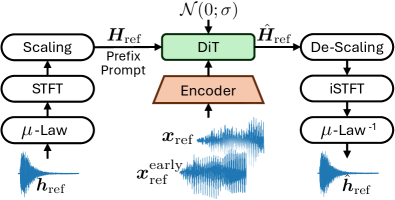
*(a)*

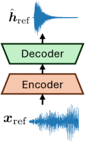
*(b)*

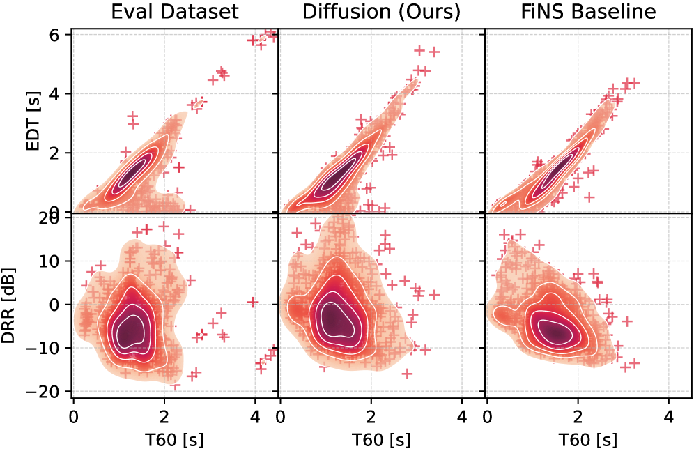
*Fig. 2:Distribution of T60 vs EDT, and T60 vs DRR of the evaluation, our generated, and the FiNS layernorm generated samples.*

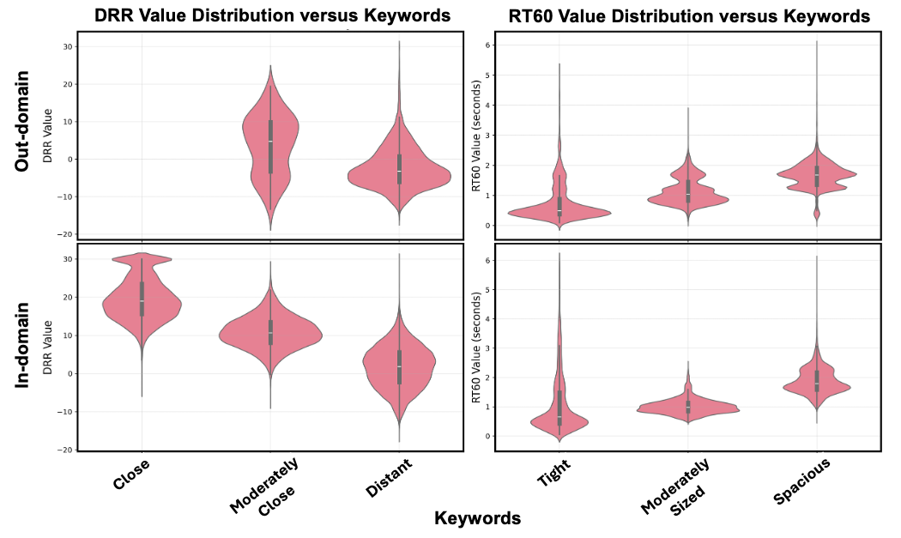
*Fig. 3:Violin plot. x-axis is short text prompts perceptually related to reverberance. y-axis is the DRR and T60 of generated RIRs.*

---
**Usage Info**: 5764 tokens used.
**Generated at**: 2026-02-23 22:15:47

---

# 📚 Covo-Audio Technical Report

🚀 URL: https://arxiv.org/html/2602.09823

## 🌏 Abstract (원문)
Speech interaction, as the most natural and efficient form of human communication, is driving artificial intelligence toward more human-like conversational systems. In this context, the ideal conversational agent must harmonize intelligence (possessing deep linguistic understanding and reasoning), naturalness (preserving paralinguistic and emotional cues), and efficiency (enabling low-latency, fluent full-duplex voice interaction). However, current approaches often force compromises among these goals. Traditional speech interaction systems predominantly rely on cascaded architectures, which combine independent modules for Automatic Speech Recognition (ASR), Large Language Model (LLM), and Text-to-Speech (TTS). While this modular paradigm offers interpretability and controllability, it suffers from the inherent issues such as information loss and error propagation, hindering real conversational experience. Recent large audio language models (LALMs) such as Qwen2.5-Omni and Qwen3-Omni adopt the Thinker-Talker architecture, where an intermediate textual reasoning step (the Thinker) precedes acoustic token prediction (the Talker). While this improves textual intelligence preservation, it sacrifices end-to-end speech instruction following abilities and direct conversational controllability. Additionally, handling full-duplex dynamics in such a sequential generation paradigm is more challenging. Human voice interaction derives its richness from a dynamic blend of flexibility and diversity. End-to-end LALM, aiming to map raw audio input directly to audio output within a single, unified model, represents a promising frontier. Pioneering works like GPT-4o, GLM-4-Voice and Step-Audio 2 have demonstrated the feasibility of this approach by augmenting LLMs with discrete audio tokens, showcasing the profound potential that enables low-latency, contextually consistent, and emotionally empathetic interaction. Architecturally in terms of decoding text-speech tokens, end-to-end models can be categorized into generating either interleaved streams or parallel streams. We adopt the former as our backbone text-speech decoding design since it is more adherent to the oracle LLM philosophy. However, a common pain point accompanied with this unified approach is the deep intelligence-speaker coupling problem when developing a production-level application, which brings challenges in data preparation and deteriorates flexible voice customization. Building a chat bot combining virtues of fascinating voice and high-intelligence is rather laborious, since it is required to gather much high-quality dialogue data for the desired speaker. In this work, to mitigate this issue, we propose a novel intelligence-speaker decoupling technique, allowing us to build conversational capabilities directly from genuine TTS data, thereby avoiding the process of constructing lots of elaborate dialogue data. Another emerging research direction is end-to-end full-duplex LALMs, which facilitate human-like interaction with low latency and complex behaviors inherent to natural conversations. Representative works are Moshi and Voila, which typically employ a synchronous dual-stream scheme, where both input and output streams are in discrete token sequences, to achieve full-duplex. However, they still require word-level text-speech alignment to generate coherent speech. OmniFlatten adapts a text LLM backbone into a robust dialogue model through a curated multi-stage post-training. In this work, we put full-duplex interaction, without requirements of fine-grained text-speech alignment, directly into the pre-training phase to acquire robust full-duplex conversational capabilities via large-scale pre-training. Moreover, differing from other full-duplex models, we adopt a hybrid dual-stream scheme (i.e., continuous input stream and discrete output stream) in accordance with our half-duplex paradigm, which provides a more efficient and lossless way to perceive user expression and intention. To facilitate these capabilities in an end-to-end paradigm, we present Covo-Audio, a compact LALM that achieves the fundamental comprehensive advantages of intelligence, naturalness, and efficiency that a voice conversational assistant should be empowered. Rather than focusing on a single task or setting, we demonstrate how pre-training and post-training strategies can endow an end-to-end LALM with robust audio perception, reasoning, emotional empathy, while economical flexible voice interaction capabilities. We conduct comprehensive evaluations of Covo-Audio across a broad range of tasks, including speech–text cross-modal alignments, speech understanding, audio question answering, and both half-duplex (Covo-Audio-Chat) and full-duplex (Covo-Audio-Chat-FD) speech-to-speech spoken dialogue. The results show that Covo-Audio achieves state-of-the-art (SOTA) or competitive performance among models of comparable scale. Our primary contributions are summarized as follows: Hierarchical Tri-modal Speech-Text Interleaving, Mitigating Intelligence-Speaker Coupling, Native Full-Duplex Voice Interaction, and Comprehensive State-of-the-Art Performance.
## 🌏 Abstract (번역)
음성 상호작용은 인간 의사소통의 가장 자연스럽고 효율적인 형태로서 인공지능을 더욱 인간과 유사한 대화형 시스템으로 이끌고 있습니다. 이러한 맥락에서 이상적인 대화형 에이전트는 지능(심층적인 언어 이해 및 추론), 자연스러움(준언어적 및 감정적 단서의 보존), 효율성(저지연, 유창한 전이중 음성 상호작용 가능)을 조화시켜야 합니다. 그러나 현재의 접근 방식은 종종 이러한 목표들 사이에서 타협을 강요합니다. 전통적인 음성 상호작용 시스템은 주로 자동 음성 인식(ASR), 대규모 언어 모델(LLM), 텍스트 음성 변환(TTS)을 위한 독립적인 모듈을 결합한 계층형 아키텍처에 의존합니다. 이러한 모듈식 패러다임은 해석 가능성과 제어 가능성을 제공하지만, 정보 손실 및 오류 전파와 같은 고유한 문제를 겪어 실제 대화 경험을 저해합니다. Qwen2.5-Omni 및 Qwen3-Omni와 같은 최근의 대규모 오디오 언어 모델(LALM)은 중간 텍스트 추론 단계(Thinker)가 음향 토큰 예측(Talker)보다 선행하는 Thinker-Talker 아키텍처를 채택합니다. 이는 텍스트 지능 보존을 개선하지만, 엔드투엔드 음성 지시 이행 능력과 직접적인 대화 제어력을 희생시킵니다. 또한 이러한 순차적 생성 패러다임에서 전이중 역학을 처리하는 것은 더 어렵습니다. 인간의 음성 상호작용은 유연성과 다양성의 역동적인 혼합에서 풍부함을 얻습니다. 단일 통합 모델 내에서 원시 오디오 입력을 오디오 출력으로 직접 매핑하는 것을 목표로 하는 엔드투엔드 LALM은 유망한 프런티어를 나타냅니다. GPT-4o, GLM-4-Voice, Step-Audio 2와 같은 선구적인 작업들은 LLM에 이산 오디오 토큰을 보강함으로써 이 접근 방식의 타당성을 입증했으며, 저지연, 문맥적으로 일관되고 감정적으로 공감하는 상호작용을 가능하게 하는 깊은 잠재력을 보여주었습니다. 텍스트-음성 토큰 디코딩 측면의 아키텍처에서 엔드투엔드 모델은 인터리브 스트림 또는 병렬 스트림을 생성하는 것으로 분류될 수 있습니다. 우리는 오라클 LLM 철학에 더 부합하기 때문에 전자를 백본 텍스트-음성 디코딩 디자인으로 채택합니다. 그러나 이 통합된 접근 방식과 함께 나타나는 일반적인 고충은 프로덕션 수준의 애플리케이션을 개발할 때 발생하는 깊은 지능-화자 결합 문제로, 이는 데이터 준비에 어려움을 주고 유연한 음성 커스터마이징을 저하시킵니다. 매력적인 음성과 높은 지능의 장점을 결합한 챗봇을 구축하는 것은 원하는 화자에 대해 많은 고품질 대화 데이터를 수집해야 하므로 상당히 노동 집약적입니다. 본 연구에서는 이 문제를 완화하기 위해 새로운 지능-화자 분리 기술을 제안하여, 정교한 대화 데이터를 많이 구축하는 과정을 피하고 순수 TTS 데이터로부터 직접 대화 능력을 구축할 수 있도록 합니다. 또 다른 신흥 연구 방향은 자연스러운 대화에 내재된 저지연 및 복잡한 행동을 통해 인간과 유사한 상호작용을 촉진하는 엔드투엔드 전이중 LALM입니다. 대표적인 작업으로는 Moshi와 Voila가 있으며, 이들은 일반적으로 전이중을 달성하기 위해 입력 및 출력 스트림이 모두 이산 토큰 시퀀스인 동기식 듀얼 스트림 방식을 사용합니다. 그러나 이들은 여전히 일관된 음성을 생성하기 위해 단어 수준의 텍스트-음성 정렬을 요구합니다. OmniFlatten은 큐레이팅된 다단계 사후 학습을 통해 텍스트 LLM 백본을 강력한 대화 모델로 적응시킵니다. 본 연구에서는 미세한 텍스트-음성 정렬 요구 없이 전이중 상호작용을 사전 학습 단계에 직접 도입하여 대규모 사전 학습을 통해 강력한 전이중 대화 능력을 획득합니다. 또한 다른 전이중 모델과 달리, 사용자 표현과 의도를 인식하는 더 효율적이고 손실 없는 방법을 제공하는 반이중 패러다임에 따라 하이브리드 듀얼 스트림 방식(즉, 연속 입력 스트림 및 이산 출력 스트림)을 채택합니다. 이러한 능력을 엔드투엔드 패러다임에서 촉진하기 위해, 우리는 음성 대화 어시스턴트가 갖추어야 할 지능, 자연스러움, 효율성의 근본적인 종합적 이점을 달성하는 컴팩트한 LALM인 Covo-Audio를 선보입니다. 단일 작업이나 설정에 집중하기보다는, 사전 학습 및 사후 학습 전략이 엔드투엔드 LALM에 강력한 오디오 지각, 추론, 감정적 공감 및 경제적이고 유연한 음성 상호작용 능력을 어떻게 부여할 수 있는지 보여줍니다. 우리는 음성-텍스트 교차 모달 정렬, 음성 이해, 오디오 질의응답, 반이중(Covo-Audio-Chat) 및 전이중(Covo-Audio-Chat-FD) 음성 대 음성 구어 대화를 포함한 광범위한 작업에 대해 Covo-Audio의 종합적인 평가를 수행합니다. 결과는 Covo-Audio가 유사한 규모의 모델들 사이에서 최첨단(SOTA) 또는 경쟁력 있는 성능을 달성함을 보여줍니다. 우리의 주요 기여는 다음과 같이 요약됩니다. 첫째, 계층적 3중 모드 음성-텍스트 인터리빙 프레임워크를 통해 모달리티와 스케일 전반에 걸친 깊은 정렬과 융합을 설계했습니다. 둘째, 지능-화자 분리 기술을 제안하여 다중 화자 학습을 통해 화자를 대화 지능에서 분리하고 고품질 TTS 음성을 전이 및 공유하는 문맥 적응 방법을 개발했습니다. 셋째, 네이티브 전이중 음성 상호작용을 위해 Covo-Audio-Chat을 저지연, 유창한 전이중 능력을 갖춘 Covo-Audio-Chat-FD로 진화시켰습니다. 넷째, 7B 파라미터의 컴팩트한 크기에도 불구하고 핵심 음성 및 오디오 작업 전반에서 일관되게 강력하고 경쟁력 있는 SOTA 성능을 제공합니다.

## 🔍 Methods & Results
- Whisper-large-v3 오디오 인코더와 Qwen2.5-7B-Base 백본을 결합한 엔드투엔드 아키텍처 채택
- 16,384 크기의 코드북을 가진 WavLM 기반 이산 음성 토크나이저를 통해 25Hz 속도의 정보 표현 생성
- Flow-Matching 기반 디코더와 BigVGAN 보코더를 사용하여 이산 토큰으로부터 24K 고충실도 오디오 재구성
- 2단계 사전 학습 파이프라인(ASR 정렬 및 3중 모드 융합)을 통해 총 2T 토큰의 데이터 학습
- 연속적 특징, 이산 토큰, 텍스트를 통합하는 '계층적 3중 모드 인터리빙' 전략으로 미세 정렬 및 전역 일관성 확보
- '지능-화자 분리' 기술을 통해 고품질 TTS 데이터를 의사 대화 형식으로 변환 학습하여 화자 자연스러움 전이
- 연속 입력과 이산 출력 스트림을 결합한 하이브리드 듀얼 스트림 방식을 통해 실시간 끼어들기가 가능한 전이중 기능 구현
- Chain-of-Thought(CoT) 추론 강화 및 GRPO 알고리즘 기반 강화 학습을 적용하여 오디오 이해 및 논리 추론 능력 극대화
- 7B 규모임에도 불구하고 음성 이해, 오디오 QA, 구어 대화 등 주요 벤치마크에서 SOTA 또는 대형 모델에 필적하는 성능 입증

## 🖼 Figures
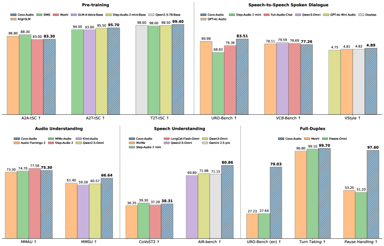
*Figure 1:An Overview of Comprehensive Performance Comparison.*

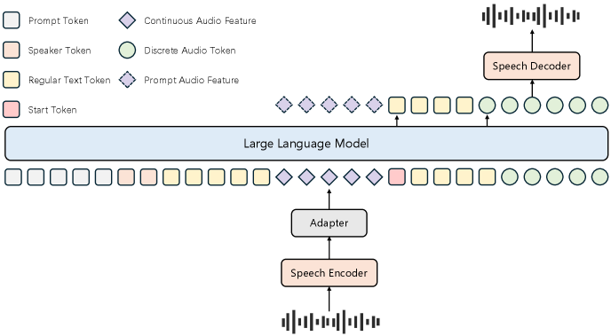
*Figure 2:An Overview of Covo-Audio.*

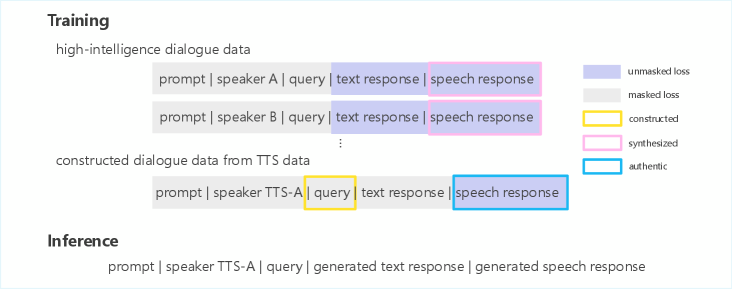
*Figure 3:Data Utilization in Intelligence-Speaker Decoupling Technique.*

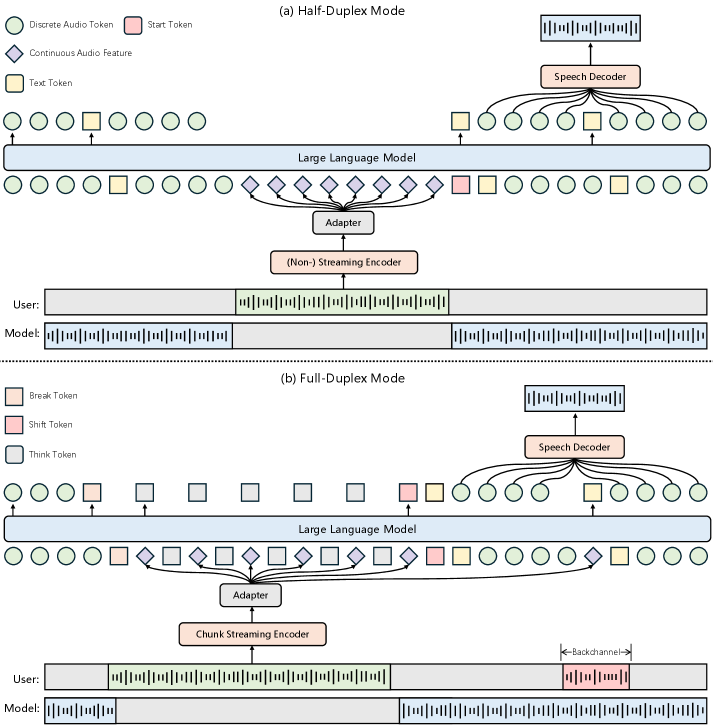
*Figure 4:A Comparative Overview of Covo-Audio-Chat and Covo-Audio-Chat-FD.*

---
**Usage Info**: 12550 tokens used.
**Generated at**: 2026-02-23 22:17:18

---

# 📚 Look-Ahead and Look-Back Flows: Training-Free Image Generation with Trajectory Smoothing

🚀 URL: https://arxiv.org/html/2602.09449

## 🌏 Abstract (원문)
Recently, diffusion models have been reformulated within the mathematical framework of ordinary differential equations (ODEs), known asflow matching, which defines a deterministic ODE-governed formulation of noise-to-data generative process(Lipmanet al.,2023; Chen and Lipman,2024; Albergo and Vanden-Eijnden,2023; Luoet al.,2025). Among these ODE-based approaches,Rectified Flowhas emerged as a particularly effective formulation that uses a linear and constant-velocity transport between noise and data as a training target(Liuet al.,2022,2023; Esseret al.,2024). This simplification not only leads to more stable training and faster convergence(Leeet al.,2024; Wanget al.,2024a)but also enables efficient few-step generation and straightforward distillation of pretrained flow models(Kornilovet al.,2024; Liuet al.,2024). More recently, a series oftraining-freeapproaches have further advanced this line of work by adapting pretrained flow models through velocity re-parameterization or trajectory refinement, eliminating the need for costly retraining(Wang and others,2025; Buet al.,2025; Li and others,2025; Jin and others,2025). These methods are especially appealing because they achieve substantial improvements in image generation fidelity and image editing capability with minimal computational overhead(Wanget al.,2025; Kulikovet al.,2025; Avrahamiet al.,2025), making high-quality generation and editing accessible even under limited resources. Most training-free flow methods focus on image editing using pretrained rectified-flow or diffusion models without retraining. Stable Flow(Avrahamiet al.,2025)identifies vital layers for improved editing; RF-Edit(Wanget al.,2024c)preserves structure by reusing stored self-attention features; RF-Inversion(Routet al.,2024)uses an optimal-control adjustment of the image-to-noise trajectory for faithful zero-shot editing. FlowEdit(Kulikovet al.,2025)constructs a direct flow between source- and target-prompt images for inversion-free editing. FlowChef(Patelet al.,2025)nudges the latent trajectory using a task loss on the predicted clean image. SplitFlow(Yoonet al.,2025)decomposes a target prompt into semantic subflows and re-assembles them for higher-fidelity, inversion-free editing. By contrast, only a few training-free flow methods focus on improving general image generation. Rectified Diffusion(Wanget al.,2024b)enhances fidelity by finetuning on synthetic samples. HiFlow(Buet al.,2025)builds a virtual high-resolution reference flow to guide generation, while OC-Flow(Wang and others,2025)steers trajectories via reward-driven control velocities. A-Euler(Jin and others,2025)enforces near-linear velocity by decomposing it into drift and residual components, and Self-Guidance(Li and others,2025)stabilizes denoising by smoothing velocity with past-step corrections. In this paper, we propose two complementary training-free latent-trajectory adjustment approaches based on future and past velocityvvand latent trajectoryzzinformation that refine the generative path directly in latent space, in contrast to prior methods that modify the velocity field. Modifying the velocity fieldvvintroduces errors that propagate along the entire generation path, whereas adjustments to the latent trajectoryzzare subsequently regularized by the pretrained velocity network, limiting error accumulation. The contributions of our paper are as follows: We propose a training-freeLook-Aheadscheme that smoothes the latent trajectory with weighted average of currentzzand next-stepzzgated by spatial curvature. We introduce a training-freeLook-Backscheme that smoothes the latent trajectory with exponential moving average of latent statezzwith a decay. We demonstrate through extensive experiments and comprehensive evaluation metrics that the proposed training-free trajectory smoothing models substantially outperforms various state-of-the-art models.
## 🌏 Abstract (번역)
최근 확산 모델은 노이즈에서 데이터로의 생성 과정을 결정론적 상미분 방정식(ODE)으로 정의하는 플로우 매칭(flow matching)이라는 수학적 프레임워크 내에서 재구성되었습니다. 이러한 ODE 기반 접근 방식 중 Rectified Flow는 노이즈와 데이터 사이의 선형 및 등속 수송을 학습 목표로 사용하는 특히 효과적인 정식화로 부상했습니다. 이러한 단순화는 더 안정적인 학습과 빠른 수렴을 이끌 뿐만 아니라, 효율적인 소수 단계 생성 및 사전 학습된 플로우 모델의 직접적인 증류를 가능하게 합니다. 최근에는 비용이 많이 드는 재학습 없이 속도 재매개변수화나 궤적 정제를 통해 사전 학습된 플로우 모델을 조정하는 일련의 학습 프리(training-free) 접근 방식이 이 분야를 더욱 발전시켰습니다. 이러한 방법들은 최소한의 계산 오버헤드로 이미지 생성 충실도와 편집 능력을 크게 향상시켜 제한된 자원에서도 고품질 생성 및 편집을 가능하게 합니다. 대부분의 학습 프리 플로우 방법은 재학습 없이 사전 학습된 모델을 사용한 이미지 편집에 집중하는 반면, 일반적인 이미지 생성 개선에 초점을 맞춘 연구는 소수에 불과합니다. 본 논문에서는 속도 필드를 수정하는 기존 방법과 달리, 잠재 공간에서 생성 경로를 직접 정제하는 미래 및 과거 속도와 잠재 궤적 정보를 기반으로 하는 두 가지 상호 보완적인 학습 프리 잠재 궤적 조정 방식을 제안합니다. 속도 필드를 수정하면 생성 경로 전체에 오류가 전파되지만, 잠재 궤적을 조정하면 사전 학습된 속도 네트워크에 의해 정규화되어 오류 축적이 제한됩니다. 본 논문의 기여는 다음과 같습니다: 1) 공간 곡률에 의해 게이팅된 현재와 다음 단계의 가중 평균으로 잠재 궤적을 매끄럽게 만드는 학습 프리 Look-Ahead 방식을 제안합니다. 2) 감쇠가 있는 잠재 상태의 지수 이동 평균으로 잠재 궤적을 매끄럽게 만드는 학습 프리 Look-Back 방식을 도입합니다. 3) 광범위한 실험과 종합적인 평가 지표를 통해 제안된 학습 프리 궤적 평활화 모델이 다양한 최첨단 모델을 실질적으로 능가함을 입증합니다.

## 🔍 Methods & Results
- Look-Ahead 기법: 공간 곡률(spatial curvature)을 기반으로 현재 잠재 상태와 다음 단계 잠재 상태의 가중 평균을 계산하여 궤적을 평활화함
- Look-Back 기법: 지수 이동 평균(EMA)과 감쇠(decay)를 활용하여 과거의 잠재 상태 정보를 반영함으로써 궤적의 안정성을 높임
- 잠재 궤적 직접 조정: 속도 필드(velocity field)를 수정하는 대신 잠재 궤적(z) 자체를 조정하여 오류 전파를 최소화하고 사전 학습된 네트워크의 정규화 효과를 활용함
- 성능 입증: 광범위한 실험과 평가 지표를 통해 제안된 학습 프리 궤적 평활화 모델이 기존의 최첨단(SOTA) 모델들보다 이미지 생성 충실도 면에서 우수한 성능을 보임을 확인

## 🖼 Figures
![Figure 1:Conceptual illustration of training-free trajectory smoothing for flow sampling. Without trajectory smoothing (top), backward integration of the flow ODE suffers divergence and overshoot in low Signal-to-Noise Ratio (SNR) regions, causing the discrete trajectory to deviate from the ideal continuous flow and producing final samples that inaccurately reach the target distribution. With the trajectory smoothing mechanism (bottom), the trajectory maintains robust fidelity to the ideal continuous flow across both low and high SNR regions, ensuring stable progression and accurate convergence.](../images/2026-02-11/2602.09449/2602.09449_fig0.png)
*Figure 1:Conceptual illustration of training-free trajectory smoothing for flow sampling. Without trajectory smoothing (top), backward integration of the flow ODE suffers divergence and overshoot in low Signal-to-Noise Ratio (SNR) regions, causing the discrete trajectory to deviate from the ideal continuous flow and producing final samples that inaccurately reach the target distribution. With the trajectory smoothing mechanism (bottom), the trajectory maintains robust fidelity to the ideal continuous flow across both low and high SNR regions, ensuring stable progression and accurate convergence.*

*Figure 2:Schematic view of the proposed look-ahead sampling. Conventional flow sampling always takes full steps, which can overshoot in regions of high curvature and lead to a large deviation from the target. In contrast, the Look-Ahead scheme adaptively interpolates based on local curvature, modulating step sizes to better follow the underlying flow and achieve a significantly smaller endpoint error.*

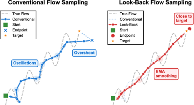
*Figure 3:Schematic view of the proposed look-back sampling. Conventional sampling exhibits oscillations and overshoots the target, while Look-Back produces a smooth trajectory through exponential state averaging.*

*Figure 4:Qualitative comparison showing LookAhead and LookBack produce higher quality images with better coherence and detail than baseline methods. Scores shown are CLAIR / CLIPScore.*

*Figure 5:Visual effects of different 
𝛾
 (Look-Ahead) and 
𝜆
 (Look-Back). The Look-Ahead and Look-Back generations exhibit richer and more intricate visual details in the astronaut compared to the standard sampling. In the rainy portrait, the Look-Ahead and Look-Back generations produce more realistic raindrop details on the girl’s coat, making the scene more consistent with a rainy atmosphere, whereas the standard sampling fails to capture such effects.*

*(a)Look-Ahead (
𝜏
curv
=
1
).*

*(a)Look-Ahead (
𝜏
curv
=
1
).*

*(b)Look-Ahead (
𝛾
=
0.9
).*

*(c)Look-Back (
𝜉
∗
=
0
).*

*(d)Look-Back (
𝜆
=
0.1
).*

---
**Usage Info**: 6049 tokens used.
**Generated at**: 2026-02-23 22:17:58

---

