# 🚩 (2026-02-16) Scholar Inbox 추천 논문 

# 📚 OmniCustom: Sync Audio-Video Customization Via Joint Audio-Video Generation Model

🚀 URL: https://arxiv.org/html/2602.12304

## 🌏 Abstract (원문)
Deep generative models have demonstrated a remarkable capacity for producing high-quality samples across various data modalities. Leveraging large-scale training data and powerful architectures, text-to-video (T2V) techniques have enabled the synthesis of vivid visual content from textual descriptions. Building upon these advances, video customization approaches aim at synthesizing identity-preserving videos, which garners increasing attention due to their broad potential for applications ranging from film and advertising to gaming. Existing video customization techniques can be classified into two categories: tuning-based and tuning-free. Tuning-based methods require fine-tuning the pre-trained model for each new identity during inference. While these approaches have shown promising results, their reliance on per-identity tuning during inference limits practical scalability. In contrast, tuning-free methods can introduce new identities without additional test-time training. Moreover, several recent studies have also explored multi-object customization in video synthesis. Although fruitful results have been achieved, typical video customization techniques convey the effect of silent films. Recently, another line of methods incorporate audio as an additional modality, enabling audio-driven video customization. However, these approaches remain limited in their inability to freely re-specify spoken content. To deal with it, this paper introduces a new task termed sync audio-video customization. Specifically, given a reference image, a reference audio, and a textual prompt, our goal is to synchronously generate a video that preserves the visual identity from the reference image and a corresponding speech audio that mimics the timbre of the reference audio, where spoken content can be freely given via the textual prompt. This paper presents OmniCustom, an efficient reference-guided Diffusion Transformer (DiT) framework that achieves sync audio-video customization through several key innovations. First, our method introduces separate reference image and audio branches into the original video and audio streams within the fusion block of the OVI architecture. To maintain efficiency, we incorporate two independent LoRAs into the QKV projections of the reference tokens. Second, our approach is trained with a compound objective that pairs the standard flow matching loss with an auxiliary contrastive learning objective, which enhances identity and timbre preservation. We train OmniCustom on OmniCustom-1M, a large-scale, high-quality audio-visual human dataset we constructed, comprising one million single-human portrait videos. Extensive qualitative and quantitative experiments demonstrate that our method yields high-quality, identity-consistent videos with timbre-cloned audio tracks.
## 🌏 Abstract (번역)
심층 생성 모델은 다양한 데이터 모달리티에 걸쳐 고품질 샘플을 생성하는 놀라운 능력을 보여주었습니다. 대규모 학습 데이터와 강력한 아키텍처를 활용하여 텍스트-비디오(T2V) 기술은 텍스트 설명으로부터 생생한 시각적 콘텐츠를 합성할 수 있게 했습니다. 이러한 발전을 바탕으로 비디오 커스터마이징 방식은 정체성을 보존하는 비디오 합성을 목표로 하며, 영화, 광고에서 게임에 이르기까지 광범위한 응용 가능성으로 인해 점점 더 많은 관심을 받고 있습니다. 기존의 비디오 커스터마이징 기술은 튜닝 기반과 튜닝 프리의 두 가지 범주로 분류될 수 있습니다. 튜닝 기반 방식은 추론 중에 각 새로운 정체성에 대해 사전 학습된 모델을 미세 조정해야 합니다. 이러한 방식은 유망한 결과를 보여주었지만, 추론 시 정체성별 튜닝에 의존하기 때문에 실질적인 확장성이 제한됩니다. 반면, 튜닝 프리 방식은 추가적인 테스트 시간 학습 없이 새로운 정체성을 도입할 수 있습니다. 또한, 최근 몇몇 연구에서는 비디오 합성에서 다중 객체 커스터마이징을 탐구하기도 했습니다. 비록 결실 있는 결과가 도출되었지만, 전형적인 비디오 커스터마이징 기술은 무성 영화와 같은 효과를 전달합니다. 최근에는 오디오를 추가적인 모달리티로 통합하여 오디오 기반 비디오 커스터마이징을 가능하게 하는 또 다른 계열의 방법들이 등장했습니다. 그러나 이러한 접근 방식은 발화 내용을 자유롭게 재지정할 수 없다는 한계가 있습니다. 이를 해결하기 위해 본 논문은 '동기화된 오디오-비디오 커스터마이징(sync audio-video customization)'이라는 새로운 작업을 소개합니다. 구체적으로, 참조 이미지, 참조 오디오 및 텍스트 프롬프트가 주어지면, 참조 이미지의 시각적 정체성을 보존하는 비디오와 참조 오디오의 음색을 모방하는 대응 음성 오디오를 동기화하여 생성하는 것이 목표이며, 이때 발화 내용은 텍스트 프롬프트를 통해 자유롭게 제공될 수 있습니다. 본 논문은 몇 가지 핵심 혁신을 통해 동기화된 오디오-비디오 커스터마이징을 달성하는 효율적인 참조 가이드 확산 트랜스포머(DiT) 프레임워크인 OmniCustom을 제시합니다. 첫째, 우리 방법은 OVI 아키텍처의 퓨전 블록 내에서 기존 비디오 및 오디오 스트림에 별도의 참조 이미지 및 오디오 브랜치를 도입합니다. 효율성을 유지하기 위해 참조 토큰의 QKV 투영에 두 개의 독립적인 LoRA를 통합합니다. 둘째, 우리 접근 방식은 표준 플로우 매칭 손실과 보조 대조 학습 목적 함수를 결합한 복합 목적 함수로 학습되어 정체성 및 음색 보존을 강화합니다. 우리는 100만 개의 단일 인물 초상화 비디오로 구성된 대규모 고품질 오디오-비주얼 인간 데이터셋인 OmniCustom-1M에서 OmniCustom을 학습시켰습니다. 광범위한 정성적 및 정량적 실험은 우리 방법이 음색이 복제된 오디오 트랙과 함께 고품질의 정체성 일관성을 갖춘 비디오를 생성함을 입증합니다.

## 🔍 Methods & Results
- 새로운 작업 정의: 참조 이미지의 정체성과 참조 오디오의 음색을 유지하면서 텍스트로 발화 내용을 제어하는 'sync audio-video customization' 작업 제안
- OmniCustom 아키텍처: OVI(Open-source Video-audio Interaction)를 기반으로 비디오 및 오디오 스트림에 각각 독립적인 참조 브랜치를 추가한 Diffusion Transformer 구조
- 효율적인 파라미터 활용: 참조 토큰의 QKV 투영 레이어에 LoRA(Low-Rank Adaptation)를 적용하여 계산 오버헤드를 최소화하면서 참조 정보를 통합
- 대조 학습(Contrastive Learning) 도입: 참조 조건이 있는 샘플(양성)과 없는 샘플(음성) 간의 차이를 극대화하는 목적 함수를 설계하여 정체성 및 음색 보존 성능 향상
- 데이터셋 구축: 100만 개의 고품질 1인 인물 비디오로 구성된 OmniCustom-1M 데이터셋을 구축하여 모델 학습에 활용
- 실험 결과: 정성적 및 정량적 평가를 통해 기존 방식보다 우수한 정체성 일관성, 음색 복제 능력 및 고품질 비디오 생성 성능 확인

## 🖼 Figures
![Figure 2:(a) Overview of our OmniCustom architecture. We extend the joint audio-video generation model OVI [44] by introducing reference image and audio branches alongside the original video and audio flows. The visual and audio VAE encoders project the reference image 
𝐼
𝑟
 and audio 
𝐴
𝑟
 into tokens, which are then concatenated with the noised video and audio latent tokens, respectively, before being processed by the fusion blocks. Here, the face embeddings [54] and timbre embeddings [29] are also input in fusion blocks for further constraint. (b) Fusion Block. It is designed as a symmetric twin backbone with parallel audio and video branches. Our OmniCustom embraces identity and timbre information via finetuning self-attention layers in video and audio branches, respectively. (c) Reference LoRAs. We incorporate separate LoRA into the QKV projections of the reference identity and audio representations. Specifically, the reference identity LoRA is in the self-attention layers of video branch, whereas the reference audio LoRA is in those of audio branch.](../images/2026-02-16/2602.12304/2602.12304_fig1.png)
*Figure 2:(a) Overview of our OmniCustom architecture. We extend the joint audio-video generation model OVI [44] by introducing reference image and audio branches alongside the original video and audio flows. The visual and audio VAE encoders project the reference image 
𝐼
𝑟
 and audio 
𝐴
𝑟
 into tokens, which are then concatenated with the noised video and audio latent tokens, respectively, before being processed by the fusion blocks. Here, the face embeddings [54] and timbre embeddings [29] are also input in fusion blocks for further constraint. (b) Fusion Block. It is designed as a symmetric twin backbone with parallel audio and video branches. Our OmniCustom embraces identity and timbre information via finetuning self-attention layers in video and audio branches, respectively. (c) Reference LoRAs. We incorporate separate LoRA into the QKV projections of the reference identity and audio representations. Specifically, the reference identity LoRA is in the self-attention layers of video branch, whereas the reference audio LoRA is in those of audio branch.*

![Figure 3:Qualitative comparison with state-of-the-art video customization methods. The speech content of HunyuanCustom [23] and Humo [3] is directly determined by their input audio. Our OmniCustom mimics the timbre of the reference audio and flexibly specifies the spoken content through textual prompts.](../images/2026-02-16/2602.12304/2602.12304_fig2.png)
*Figure 3:Qualitative comparison with state-of-the-art video customization methods. The speech content of HunyuanCustom [23] and Humo [3] is directly determined by their input audio. Our OmniCustom mimics the timbre of the reference audio and flexibly specifies the spoken content through textual prompts.*

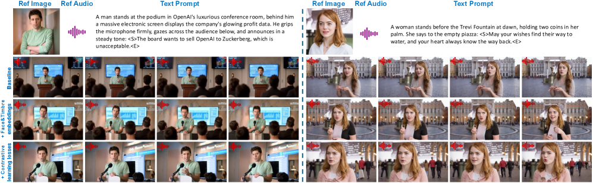
*Figure 4:Ablation study. Face embeddings and the contrastive identity objective boost identity consistency, respectively. See the video results for audio details.*

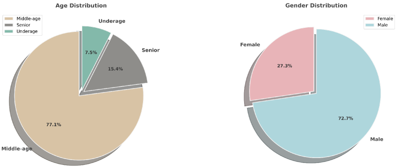
*Ap-Fig. 2:Statistics of our proposed dataset OmniCustom-1M, in terms of age and gender.*

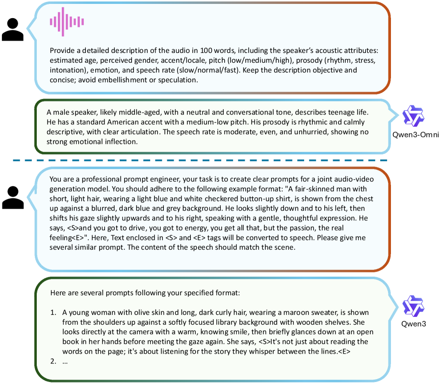
*Ap-Fig. 3:Prompt used for audio caption and benchmark construction.*

*Ap-Fig. 4:More qualitative comparison with existing customization methods.*

*Ap-Fig. 5:More qualitative comparison with existing customization methods.*

---
**Usage Info**: 5343 tokens used.
**Generated at**: 2026-02-23 22:27:28

---

# 📚 DisSR: Disentangling Speech Representation for Degradation-Prior Guided Cross-Domain Speech Restoration

🚀 URL: https://arxiv.org/html/2602.12701

## 🌏 Abstract (원문)
Speech signals collected from real-world scenarios often suffer from various distortions, including bandwidth limitations[1], background noise[18], reverberation[17], overdrive[20], and other types of distortion[22]. These factors can significantly reduce the perceptual quality of the input signal, making it challenging to understand the target speech. In order to expand the application scope of speech processing, it is necessary to utilize low-quality speech, while speech restoration plays an important role. Previous works in speech restoration mainly focus on dealing with only one type of distortion at a time. However, in the real world, speech signals can be degraded by several different distortions simultaneously, which means previous SSR systems oversimplify the speech distortion types[14,9]. To handle various degradations, several methods have been proposed to investigate this problem. VoiceFixer[15]proposes a generative model to eliminate multiple distortions simultaneously. It is trained using artificial paired data created by various distortions, but when faced with new distortion types, the model will forget prior knowledge, reducing the model’s adaptability to certain restoration tasks. Although[20]presents a self-supervised speech restoration model without paired data, its restoration effect will be damaged when faced with out-of-domain low-quality speech.[6]have proven that domain-invariant features as a prior can improve the robustness of image restoration models. Based on the above observations, it would be better to achieve degradation-prior guidance and domain adaptation. The domain adaptation in speech restoration can be regarded as domain generalization for unseen speaker styles. We can extract speaker-invariant features as domain-invariant features to enhance the model generalization towards unseen speaker styles. In this paper, we propose a general speech restoration model with degradation-prior guidance to restore multiple speech distortions. Unlike the other methods[14,9,15]that explicitly estimate the degradation, our model learns a latent degradation feature which is speaker-invariant to distinguish distortions in the representation space rather than explicit estimation. Our contributions are as follows: The hypothesis that distorted information exists in speaker style is proposed and experimentally verified. We obtain speaker-invariant degradation from speaker style through speech representation disentanglement. We leverage the speaker-invariant degradation as a conditional prompt to guide the diffusion model, enabling it to achieve general speech restoration for various distortions. We adopt cross-domain alignment training for improving model generalization on cross-domain data. Experiments demonstrate the superiority of general speech restoration.
## 🌏 Abstract (번역)
실제 환경에서 수집된 음성 신호는 대역폭 제한, 배경 소음, 잔향, 오버드라이브 및 기타 유형의 왜곡을 포함한 다양한 왜곡으로 인해 품질이 저하되는 경우가 많습니다. 이러한 요인들은 입력 신호의 지각적 품질을 크게 저하시켜 대상 음성을 이해하기 어렵게 만듭니다. 음성 처리의 응용 범위를 확장하기 위해서는 저품질 음성을 활용하는 것이 필수적이며, 이때 음성 복원이 중요한 역할을 합니다. 기존의 음성 복원 연구들은 주로 한 번에 한 가지 유형의 왜곡을 처리하는 데 집중해 왔습니다. 그러나 실제 세계에서 음성 신호는 여러 가지 왜곡에 의해 동시에 저하될 수 있으며, 이는 기존의 SSR 시스템이 음성 왜곡 유형을 지나치게 단순화했음을 의미합니다. 다양한 품질 저하를 처리하기 위해 여러 방법이 제안되었습니다. VoiceFixer는 여러 왜곡을 동시에 제거하기 위한 생성 모델을 제안했습니다. 이 모델은 다양한 왜곡으로 생성된 인공 쌍 데이터를 사용하여 학습되지만, 새로운 왜곡 유형에 직면하면 이전 지식을 잊어버려 특정 복원 작업에 대한 모델의 적응력이 떨어집니다. 비록 쌍 데이터가 없는 자기 지도 음성 복원 모델이 제시되기도 했으나, 도메인 외 저품질 음성에 대해서는 복원 효과가 손상됩니다. 이미지 복원 모델에서 도메인 불변 특징을 사전 정보로 활용하면 강건성이 향상된다는 것이 입증되었습니다. 이러한 관찰을 바탕으로 품질 저하 사전 안내 및 도메인 적응을 달성하는 것이 바람직합니다. 음성 복원에서의 도메인 적응은 보지 못한 화자 스타일에 대한 도메인 일반화로 간주될 수 있습니다. 화자 불변 특징을 도메인 불변 특징으로 추출하여 보지 못한 화자 스타일에 대한 모델 일반화를 강화할 수 있습니다. 본 논문에서는 다양한 음성 왜곡을 복원하기 위해 품질 저하 사전 안내를 포함한 일반 음성 복원 모델을 제안합니다. 품질 저하를 명시적으로 추정하는 다른 방법들과 달리, 우리 모델은 명시적 추정 대신 표현 공간에서 왜곡을 구별하기 위해 화자 불변인 잠재 품질 저하 특징을 학습합니다. 본 연구의 기여는 다음과 같습니다. 왜곡된 정보가 화자 스타일에 존재한다는 가설을 제안하고 실험적으로 검증했습니다. 음성 표현 분리를 통해 화자 스타일에서 화자 불변 품질 저하를 얻습니다. 화자 불변 품질 저하를 조건부 프롬프트로 활용하여 확산 모델을 안내함으로써 다양한 왜곡에 대한 일반 음성 복원을 가능하게 합니다. 교차 도메인 데이터에 대한 모델 일반화를 개선하기 위해 교차 도메인 정렬 학습을 채택합니다. 실험을 통해 일반 음성 복원의 우수성을 입증합니다.

## 🔍 Methods & Results
- Proposed a general speech restoration model using degradation-prior guidance to handle multiple simultaneous distortions.
- Introduced a method to extract speaker-invariant degradation features from speaker style via speech representation disentanglement.
- Utilized the extracted speaker-invariant degradation as a conditional prompt for a diffusion model.
- Adopted cross-domain alignment training to enhance model generalization across unseen speaker styles and domains.
- Experimentally verified the hypothesis that distortion information is embedded within speaker style through representation disentanglement.

## 🖼 Figures
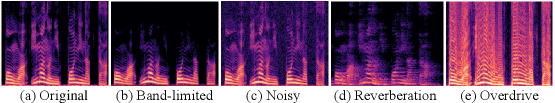
*Fig. 1:Different Distortions in Speech Signals*

*Fig. 2: Overall pipeline of DisSR: 
𝑐
𝑑
𝑖
 and 
𝑠
𝑖
𝑑
𝑖
 are the content and speaker style extracted from input 
𝑥
𝑠
𝑖
𝑑
𝑖
. Instance Normalization (IN) can eliminate the global speaker style from 
𝑥
𝑠
𝑖
𝑑
𝑖
. 
𝑑
𝑖
 is disentangled as degradation-prior to guide restoration. 
𝑐
𝑑
𝑖
 and 
𝑐
^
 are the content from 
𝑥
𝑠
𝑖
𝑑
𝑖
 and predicted speech 
𝑥
𝑠
𝑖
^
, respectively. 
𝑠
𝑖
 is clean speaker style for reconstruction training.*

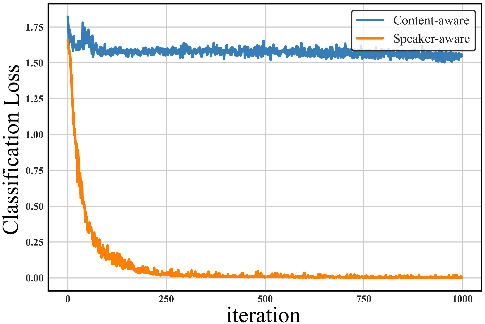
*Fig. 3:Classification loss of degradation classifier.*

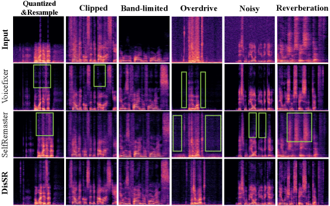
*Fig. 4:Speech restoration results with different methods*

---
**Usage Info**: 4594 tokens used.
**Generated at**: 2026-02-23 22:28:11

---

# 📚 DreamID-Omni: Unified Framework for Controllable Human-Centric Audio-Video Generation

🚀 URL: https://arxiv.org/html/2602.12160

## 🌏 Abstract (원문)
Recently, joint audio-video generation has seen rapid progress, with many breakthrough works emerging. For example, commercial models such as Veo3, Sora2, Wan 2.6 and Seedance 1.5 Pro have achieved impressive results. In the open-source community, models like Ovi and LTX-2 have also demonstrated promising performance. These advances have greatly promoted the development of joint audio-video generation. However, in real-world applications, supporting more controllable generation particularly within human-centric scenarios is crucial. Controllable human-centric generation has advanced in several directions. Works such as Phantom and Wan2.6 utilize reference images or voice timbres for video (R2V) or audio-video (R2AV) generation, which rely solely on text prompts as a weakly-constrained guidance. To achieve higher controllability, other approaches introduce stronger supervision, such as source videos or driving audio, for strongly-constrained generation. For instance, Humo animates videos (RA2V) based on reference identities and driving audio, while works like HunyuanCustom and VACE perform video editing given a reference identity and source video, which can be further extended to replace the corresponding audio (RV2AV). Despite these advancements, these capabilities are largely treated as isolated tasks. Researchers in the video-only domain have begun to shift toward unified architectures to enhance task flexibility and reduce the operational overhead of deploying multiple models. However, the joint audio-video domain still lacks a unified perspective. Fundamentally, we observe that R2AV, RV2AV, and RA2V all share an identical objective: mapping a static identity anchor (image and audio) onto a dynamic spatio-temporal canvas (text, source video, or driving audio). Based on this insight, these tasks are inherently amenable to a unified framework trained on a consistent data source, transcending the limitations of task-specific silos. Nevertheless, developing this unified framework presents several challenges: (1) How to build a unified model framework that supports generation, editing and animation; (2) How to address identity-timbre binding and speaker confusion in multi-person generation; (3) How to design effective training strategies to prevent conflicts among multiple tasks. To address these challenges, we introduce DreamID-Omni, which integrates reference-based generation, editing, and animation into a single paradigm. DreamID-Omni builds upon a dual-stream Diffusion Transformer (DiT) architecture, where video and audio streams interact via bidirectional cross-attention for fine-grained synchronization. We propose a Symmetric Conditional DiT design that unifies heterogeneous conditioning signals—reference images, voice timbres, source videos, and driving audio—into a shared latent space, enabling seamless task switching without architectural changes. To resolve multi-person confusion, we propose a Dual-Level Disentanglement strategy. At the signal level, Synchronized Rotary Positional Embeddings (Syn-RoPE) is introduced to bind reference identities with their corresponding voice timbres within the attention space. At the semantic level, Structured Captions utilize anchor tokens paired with fine-grained descriptions to establish explicit mappings between specific subjects and their respective attributes or speech content. Finally, we devise a Multi-Task Progressive Training strategy to harmonize the three tasks. In the initial two stages, we focus exclusively on the weakly-constrained R2AV task, employing in-pair reconstruction and cross-pair disentanglement to enhance identity and timbre fidelity while encouraging the model to learn robust reference representations. In the final stage, strongly-constrained tasks (RV2AV and RA2V) are introduced for joint training with R2AV. This approach prevents the model from overfitting to strongly-constrained tasks, thereby maintaining superior performance on the weakly-constrained generation task. In summary, our contributions are as follows: (1) We propose DreamID-Omni, a novel human-centric controllable generation framework based on a Symmetric Conditional DiT, which seamlessly integrates R2AV, RV2AV, and RA2V tasks. (2) We introduce Dual-Level Disentanglement, which addresses identity-timbre binding and speaker confusion in multi-person generation via Syn-RoPE and Structured Captions. (3) We present a Multi-Task Progressive Training strategy that effectively harmonizes diverse tasks with varying constraint strengths. (4) Extensive experiments demonstrate that DreamID-Omni achieves comprehensive state-of-the-art performance across video, audio, and audio-visual consistency, even when compared to leading proprietary commercial models.
## 🌏 Abstract (번역)
최근 오디오-비디오 통합 생성 분야는 Veo3, Sora2, Wan 2.6, Seedance 1.5 Pro와 같은 상업적 모델과 Ovi, LTX-2와 같은 오픈 소스 모델의 등장으로 급격한 발전을 이루었습니다. 이러한 진보는 오디오-비디오 통합 생성의 발전을 크게 촉진했지만, 실제 응용 분야에서는 특히 인간 중심 시나리오에서 더 제어 가능한 생성을 지원하는 것이 매우 중요합니다. 인간 중심의 제어 가능한 생성은 참조 이미지나 음색을 사용하는 방식(R2V, R2AV)부터 소스 비디오나 구동 오디오를 사용하는 강한 제약 조건 방식(RA2V, RV2AV)까지 여러 방향으로 발전해 왔습니다. 하지만 이러한 기능들은 대개 개별적인 작업으로 취급되어 왔습니다. 본 논문에서는 R2AV, RV2AV, RA2V가 모두 정적인 정체성 앵커(이미지 및 오디오)를 동적인 시공간 캔버스(텍스트, 소스 비디오 또는 구동 오디오)에 매핑한다는 동일한 목표를 공유한다는 점에 착안하여, 이를 통합된 프레임워크인 DreamID-Omni를 제안합니다. DreamID-Omni는 이중 스트림 Diffusion Transformer(DiT) 구조를 기반으로 하며, 비디오와 오디오 스트림이 미세한 동기화를 위해 양방향 교차 주의 집중(cross-attention)을 통해 상호작용합니다. 또한 참조 이미지, 음색, 소스 비디오, 구동 오디오 등 이질적인 조건 신호를 공유 잠재 공간으로 통합하는 대칭적 조건부 DiT 설계를 제안하여 아키텍처 변경 없이 원활한 작업 전환을 가능하게 합니다. 다인원 생성 시 발생하는 정체성-음색 결합 및 화자 혼동 문제를 해결하기 위해 신호 수준의 Syn-RoPE와 의미 수준의 구조화된 캡션(Structured Captions)을 포함하는 이중 수준 얽힘 해제 전략을 제안합니다. 마지막으로, 다양한 제약 강도를 가진 세 가지 작업을 조화시키기 위한 다작업 점진적 학습 전략을 고안했습니다. 실험 결과, DreamID-Omni는 비디오, 오디오 및 시청각 일관성 측면에서 주요 상업용 모델과 비교해도 뛰어난 최첨단 성능을 달성했습니다.

## 🔍 Methods & Results
- DreamID-Omni 프레임워크: 비디오와 오디오 합성을 위한 두 개의 병렬 백본을 가진 이중 스트림 DiT 아키텍처를 사용하여 시청각 모달리티 간의 동기화와 정렬을 구현함.
- 대칭적 조건부 DiT(Symmetric Conditional DiT): 참조 이미지, 음색 등의 정체성 보존 채널과 소스 비디오, 구동 오디오 등의 구조적 가이드 채널을 통합하여 생성, 편집, 애니메이션 작업을 단일 모델로 수행함.
- 이중 수준 얽힘 해제(Dual-Level Disentanglement): 신호 수준에서는 Syn-RoPE를 통해 정체성과 음색을 동일한 회전 서브스페이스에 투영하여 결합하고, 의미 수준에서는 앵커 토큰을 포함한 구조화된 캡션을 사용하여 다인원 시나리오의 혼동을 방지함.
- 다작업 점진적 학습(Multi-Task Progressive Training): In-pair 재구성(1단계), Cross-pair 얽힘 해제(2단계), Omni-task 미세 조정(3단계)의 교육 과정을 통해 약한 제약과 강한 제약의 작업 간 충돌을 방지하고 성능을 최적화함.
- 실험 결과: DreamID-Omni는 비디오 품질, 오디오 품질 및 시청각 일관성 지표에서 기존 상업용 및 오픈 소스 모델들을 능가하는 SOTA 성능을 기록함.

## 🖼 Figures
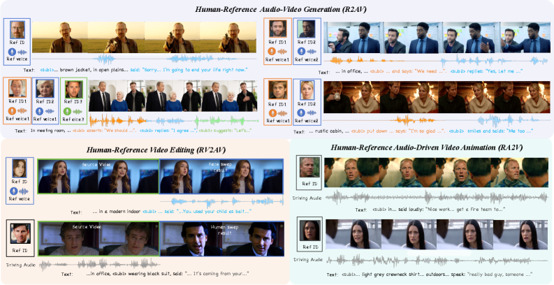
*Figure 1:Showcase of DreamID-Omni. DreamID-Omni seamlessly unifies reference-based audio-video generation (R2AV), video editing (RV2AV), and audio-driven video animation (RA2V).*

*Figure 2:Overview of DreamID-Omni framework. We integrate reference-based generation (R2AV), editing (RV2AV), and animation (RA2V) using a Symmetric Conditional DiT trained via a multi-task progressive training strategy. Structured Caption and Syn-RoPE ensure robust dual-level disentanglement in multi-person scenarios.*

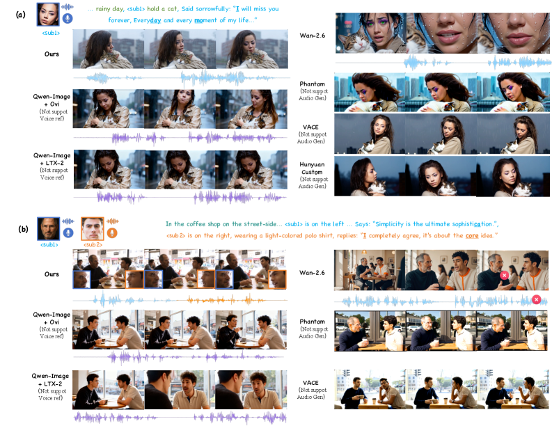
*Figure 3:Qualitative comparison with state-of-the-art (SOTA) methods on R2AV. Please zoom in for more details.*

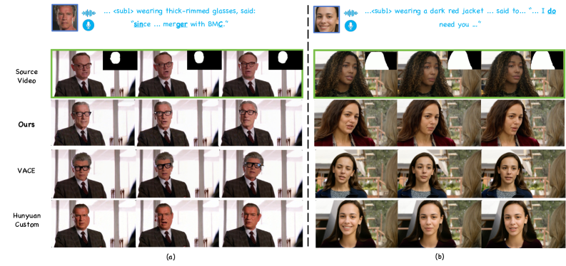
*Figure 4:Qualitative comparison with SOTA methods on RV2AV. Please zoom in for more details.*

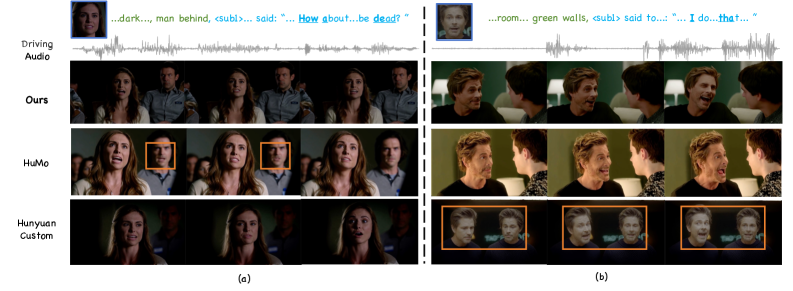
*Figure 5:Qualitative comparison with SOTA methods on RA2V. Please zoom in for more details.*

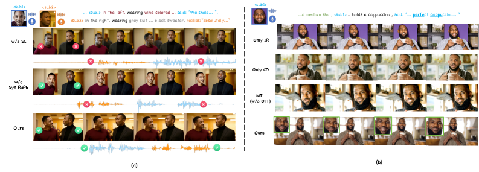
*Figure 6: Qualitative results of our ablation studies. (a) Ablation on our dual-level disentanglement design. (b) Ablation on multi-task progressive training.*

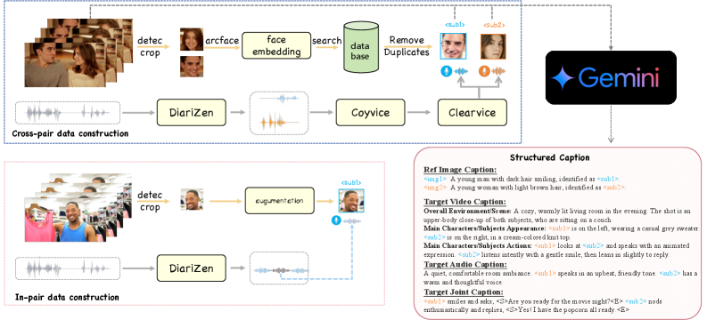
*Figure 7:Data construction pipeline.*

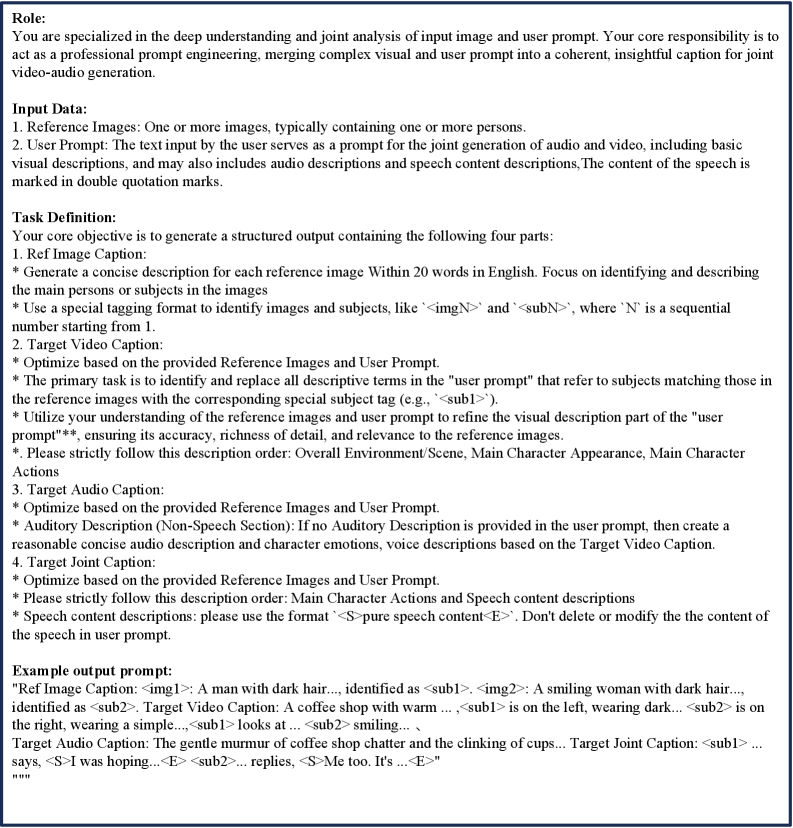
*Figure 8:MLLM system prompt for Structured Caption.*

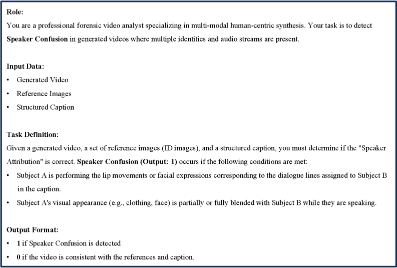
*Figure 9:MLLM system prompt for speaker confusion detection.*

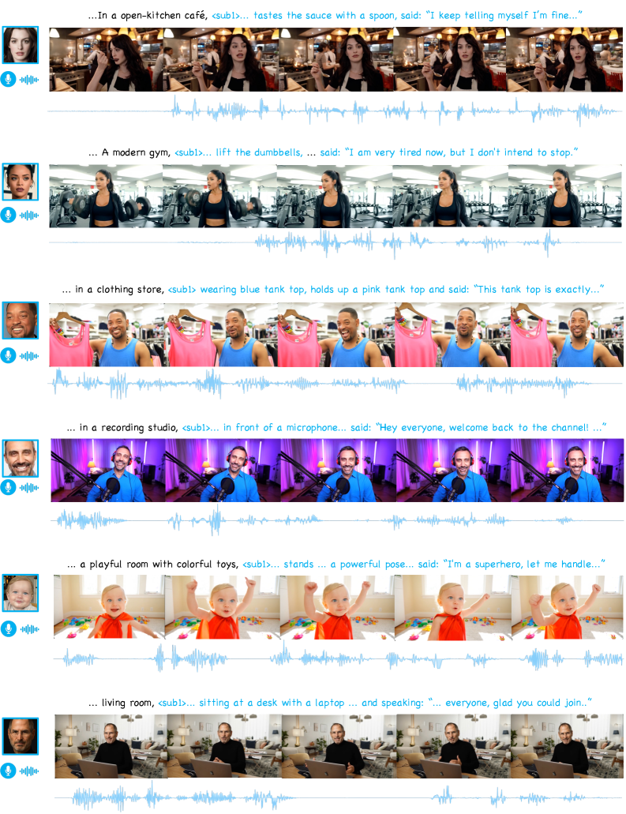
*Figure 10:More qualitative results on R2AV I*

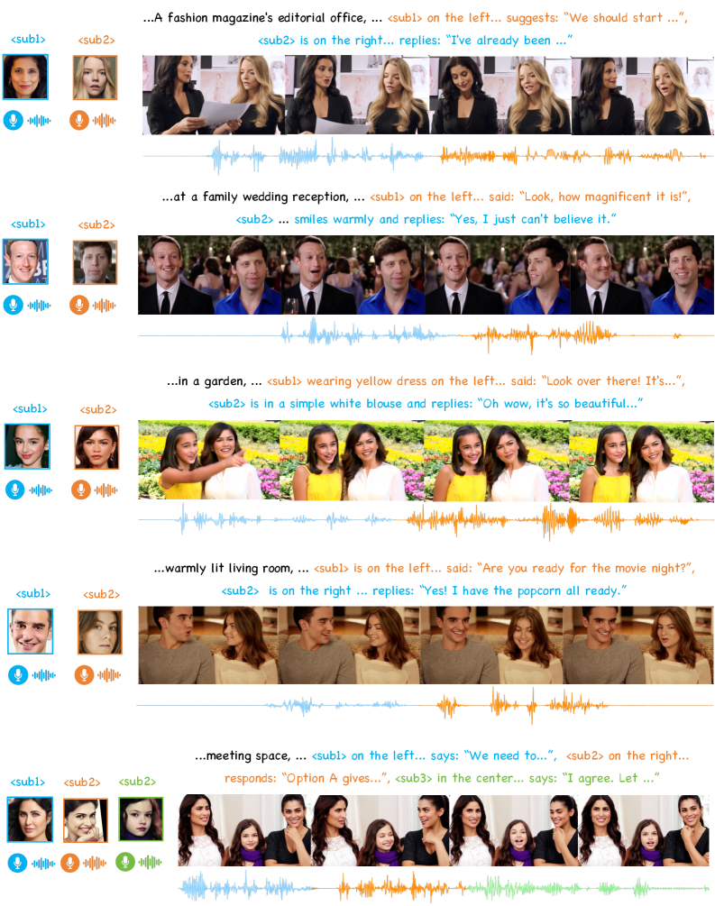
*Figure 11:More qualitative results on R2AV II*

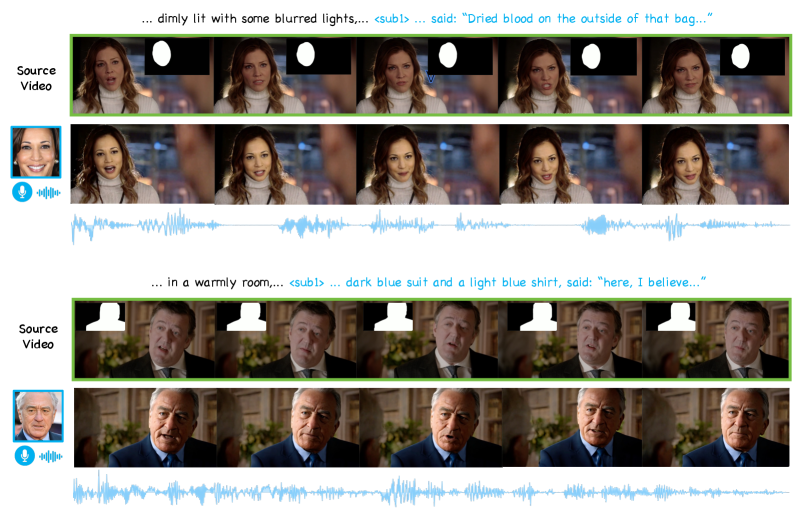
*Figure 12:More qualitative results on RV2AV*

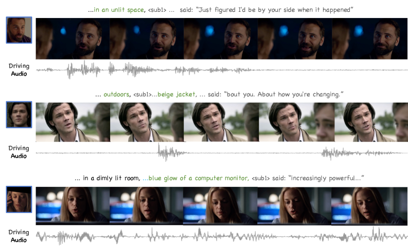
*Figure 13:More qualitative results on RA2V*

---
**Usage Info**: 6615 tokens used.
**Generated at**: 2026-02-23 22:29:04

---

# 📚 TFTF: Training-Free Targeted Flow for Conditional Sampling

🚀 URL: https://arxiv.org/html/2602.12932

## 🌏 Abstract (원문)
Flow matching models(Lipmanet al.,2022; Liuet al.,2022a)have emerged as powerful generative frameworks capable of learning complex data distributions. When pre-trained on large-scale datasets, these models can generate new samples that (approximately) follow the underlying distributionpdata​(⋅)p_{\text{data}}(\cdot). However, practical applications often require conditional sampling, that is, generating samples that satisfy specific properties. In such cases, the objective shifts to sampling from the conditional distributionpdata(⋅|y)p_{\text{data}}(\cdot|y), whereyydenotes the target property. By Bayes’ theorem, this distribution is proportional topdata​(⋅)​p~​(y|⋅)p_{\text{data}}(\cdot)\,\tilde{p}(y|\cdot), wherep~​(y|⋅)\tilde{p}(y|\cdot)denotes the likelihood evaluated at the given conditioning valueyy. Recent advances in conditional generation can be broadly categorized into two approaches: training-based methods(Zhenget al.,2023; Holzschuh and Thuerey,2024)and training-free methods(Ben-Hamuet al.,2024; Wanget al.,2024; Patelet al.,2025; Songet al.,2025). Training-based methods incorporate target properties through fine-tuning or retraining, whereas training-free methods leverage pre-trained unconditional models in conjunction with off-the-shelf, time-independent likelihood functions to achieve conditional generation. While both training-based and training-free methods have achieved considerable success, each approach exhibits fundamental limitations. Training-based methods depend on labeled data, which can be both scarce and costly to acquire, and require considerable computational resources for model training. In contrast, training-free methods circumvent these data and computational requirements. However, existing training-free approaches require differentiating through the ODE solver, demonstrate sensitivity to random seed initialization, and lack theoretical guarantees for sampling from the target distributionpdata(⋅|y)p_{\text{data}}(\cdot|y). In this paper, we propose a training-free conditional sampling method for flow matching models based on importance sampling (IS)(Liu,2001). The key idea is to construct a proposal distribution by directly combining a pre-trained unconditional model with an off-the-shelf likelihood functionp~​(y|⋅)\tilde{p}(y|\cdot), then apply importance weighting to correct for the discrepancy from the targetpdata(⋅|y)p_{\text{data}}(\cdot|y). However, a naïve application of this approach presents two main challenges. First, IS suffers from weight degeneracy in high-dimensional settings(Tokdar and Kass,2010). Specifically, when the dimensionality of the data spaceℝd\mathbb{R}^{d}is large, the majority of the generated samples receive disproportionately low weights and thus contribute negligibly to approximating the target distribution. This issue suggests a potential improvement: evaluating the “quality” of partially generated samples at intermediate stages and terminating the simulation of low-quality ones before completion. Since this early stopping mechanism reduces the total number of samples generated, a possible remedy is to resample from the existing high-quality partial samples to maintain the desired sample count(Liu and Chen,1998). This solution, however, introduces a second challenge: the generation process of flow matching is based on ordinary differential equations (ODEs) and follows a fully deterministic dynamics. Consequently, when a partially generated sample is resampled multiple times, the resulting copies will follow the same trajectory and produce identical outputs, failing to explore diverse regions of the target distribution. To address these challenges, we first adopt the Sequential Monte Carlo (SMC) resampling technique(Liu and Chen,1998)to prune unpromising partial samples and enrich the particle set with promising ones during generation. To allow repeatedly sampled particles to traverse distinct generative paths, we derive a stochastic flow with adjustable noise strength to replace the deterministic flow at the intermediate stage. Furthermore, at the final time step, we introduce an extended target distribution that admitspdata(⋅|y)p_{\text{data}}(\cdot|y)as its marginal, hence enabling principled reweighting of the generated samples. Through this framework, we obtain a set of properly weighted samples that converge to the target distributionpdata(⋅|y)p_{\text{data}}(\cdot|y)with weight balance. Our approach exhibits several desirable properties. First, it seamlessly integrates the pretrained unconditional model with the time-independent likelihood functionp~​(y|⋅)\tilde{p}(y|\cdot)in a plug-and-play manner, requiring neither fine-tuning nor retraining. Second, the method is theoretically grounded in IS, enabling the generation of weighted samples that provide an asymptotically exact representation of the target distributionpdata(⋅|y)p_{\text{data}}(\cdot|y). Third, by incorporating the SMC resampling technique at intermediate stages, we mitigate the weight degeneracy of IS in high-dimensional settings, thereby ensuring that the generated samples maintain consistently high quality with high effective sample size (ESS)(Liu,2001). Experimentally, we begin with a toy example to demonstrate that our method produces an accurate particle-based representation ofpdata(⋅|y)p_{\text{data}}(\cdot|y)in the asymptotic regime. We then evaluate class-conditional sampling on MNIST(LeCunet al.,2002)and CIFAR-10(Krizhevskyet al.,2009), in which our method generates high-fidelity samples that adhere to specified class labels. Finally, we extend to text-to-image generation on CelebA-HQ(Karraset al.,2017), demonstrating the applicability of our approach to higher-dimensional, multimodal settings.
## 🌏 Abstract (번역)
플로우 매칭 모델(Lipman et al., 2022; Liu et al., 2022a)은 복잡한 데이터 분포를 학습할 수 있는 강력한 생성 프레임워크로 부상했습니다. 대규모 데이터셋에서 사전 학습된 이러한 모델은 기본 데이터 분포 p_data(·)를 (대략적으로) 따르는 새로운 샘플을 생성할 수 있습니다. 그러나 실제 응용 분야에서는 특정 속성을 만족하는 샘플을 생성하는 조건부 샘플링이 필요한 경우가 많으며, 이 경우 목표는 타겟 속성 y가 주어진 조건부 분포 p_data(·|y)로부터 샘플링하는 것으로 전환됩니다. 최근의 조건부 생성 기술은 학습 기반 방식과 학습이 필요 없는 방식으로 나뉩니다. 학습 기반 방식은 레이블이 지정된 데이터와 상당한 계산 자원이 필요하며, 기존의 학습이 필요 없는 방식은 ODE 솔버를 통한 미분이 필요하거나 이론적 보장이 부족하다는 단점이 있습니다. 본 논문에서는 중요도 샘플링(Importance Sampling, IS)에 기반한 플로우 매칭 모델용 학습 프리 조건부 샘플링 방법을 제안합니다. 핵심 아이디어는 사전 학습된 무조건부 모델과 기성 라이클리후드 함수 p~(y|·)를 직접 결합하여 제안 분포를 구성하고, 중요도 가중치를 적용하여 타겟 분포와의 차이를 보정하는 것입니다. 고차원 설정에서의 가중치 퇴화 문제를 해결하기 위해 순차적 몬테카를로(SMC) 재샘플링 기법을 도입하여 유망하지 않은 샘플을 제거하고 유망한 샘플을 보존합니다. 또한, 재샘플링된 입자들이 동일한 궤적을 따라가는 것을 방지하기 위해 결정론적 흐름을 조절 가능한 노이즈 강도를 가진 확률적 흐름으로 대체했습니다. 제안된 프레임워크는 미세 조정이나 재학습 없이 플러그 앤 플레이 방식으로 작동하며, 이론적으로 타겟 분포에 수렴함을 보장합니다. 실험 결과, MNIST 및 CIFAR-10에서의 클래스 조건부 샘플링과 CelebA-HQ에서의 텍스트-이미지 생성을 통해 고차원 및 멀티모달 설정에서의 효과를 입증했습니다.

## 🔍 Methods & Results
- 사전 학습된 무조건부 플로우 매칭 모델과 독립적인 라이클리후드 함수를 결합한 중요도 샘플링(IS) 기반의 조건부 샘플링 프레임워크 제안
- 고차원 데이터에서 발생하는 가중치 퇴화(Weight Degeneracy) 문제를 해결하기 위해 중간 단계에서 샘플의 품질을 평가하고 유망한 샘플을 복제하는 순차적 몬테카를로(SMC) 재샘플링 기법 도입
- 재샘플링된 입자들이 동일한 결과물을 생성하는 것을 방지하기 위해 결정론적 ODE 흐름 대신 노이즈 강도 조절이 가능한 확률적 흐름(Stochastic Flow)을 유도하여 샘플 다양성 확보
- 최종 단계에서 타겟 분포를 주변 분포로 갖는 확장된 타겟 분포를 도입하여 생성된 샘플의 원칙적인 재가중치(Reweighting) 수행 및 이론적 수렴성 확보
- MNIST 및 CIFAR-10 데이터셋 실험을 통해 지정된 클래스 레이블을 정확히 따르는 고충실도 이미지 생성 확인
- CelebA-HQ 데이터셋을 활용한 텍스트-이미지 생성 실험을 통해 고차원 및 멀티모달 환경에서의 범용성 입증

## 🖼 Figures

*(a)*

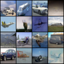
*(a)*

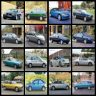
*(b)*

*(a)*

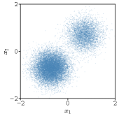
*(a)*

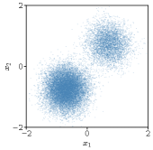
*(b)*

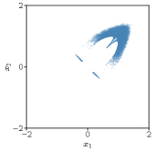
*(c)*

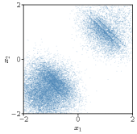
*(d)*

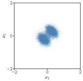
*(e)*

*(a)*

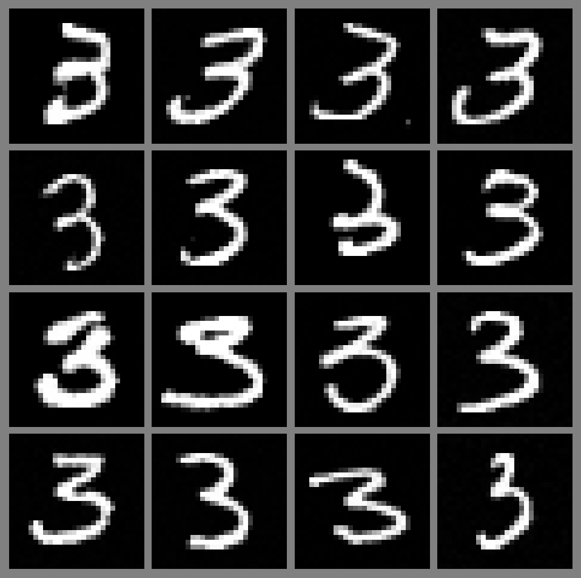
*(a)*

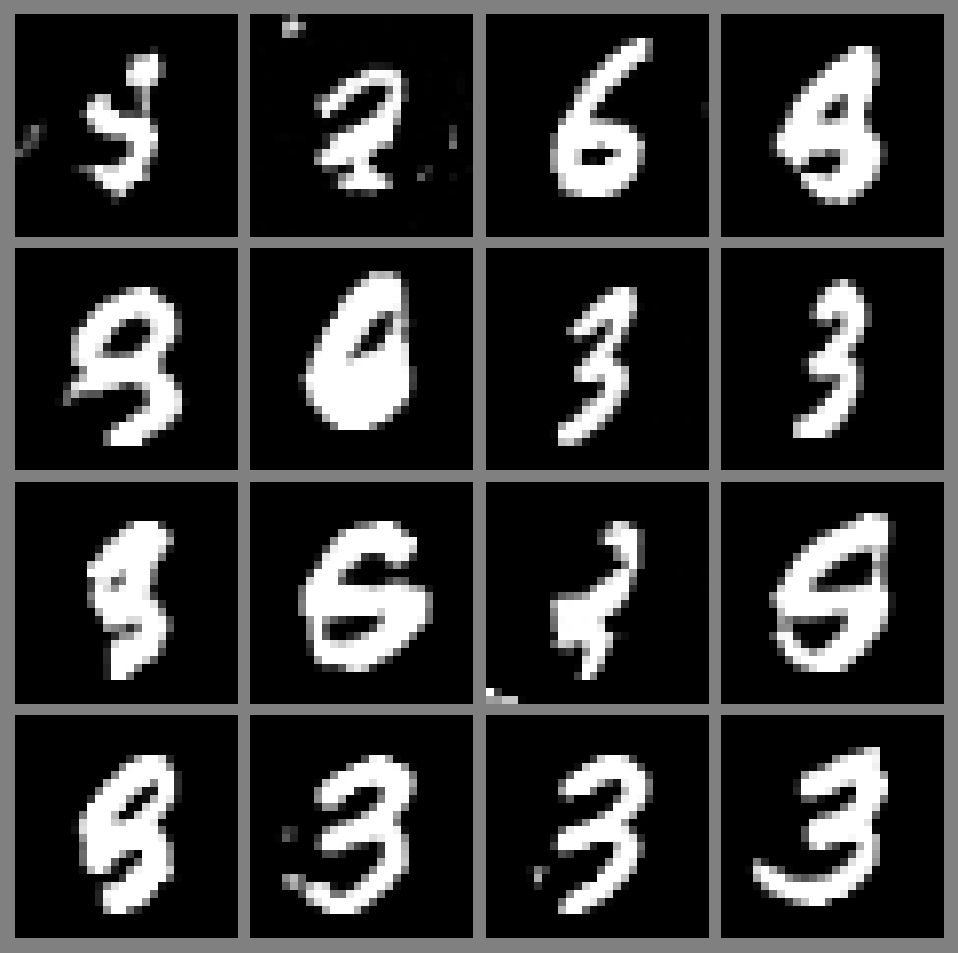
*(b)*

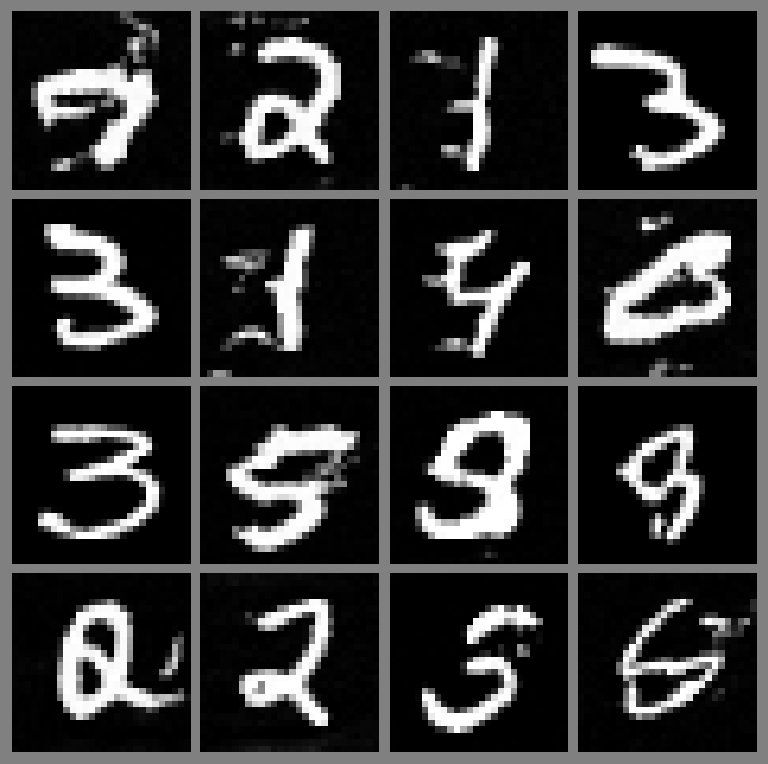
*(c)*

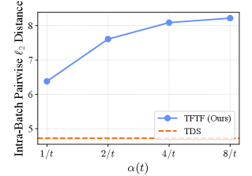
*(a)*

*(a)*

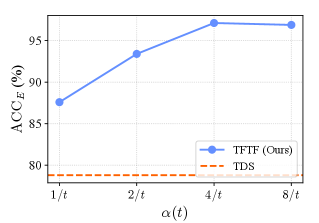
*(b)*

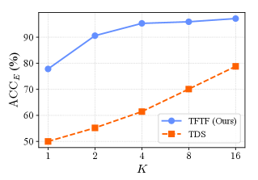
*(c)*

*Figure 5:Wasserstein-2 distance versus number of nodes 
𝑀
 with 
𝐾
=
4
 fixed.*

*Figure 6:Generated samples on MNIST using TFTF (Algorithm 1) with 
𝐾
=
16
 under different 
𝛼
​
(
𝑡
)
 configurations. Each column corresponds to a different 
𝛼
​
(
𝑡
)
∈
{
1
/
𝑡
,
2
/
𝑡
,
4
/
𝑡
,
8
/
𝑡
}
, while each row shares the same random seed.*

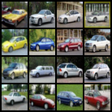
*(a)Automobile (ESS: 16.00/16)*

*(a)Automobile (ESS: 16.00/16)*

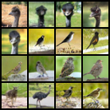
*(b)Bird (ESS: 15.01/16)*

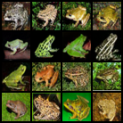
*(c)Frog (ESS: 16.00/16)*

*(d)Ship (ESS: 16.00/16)*

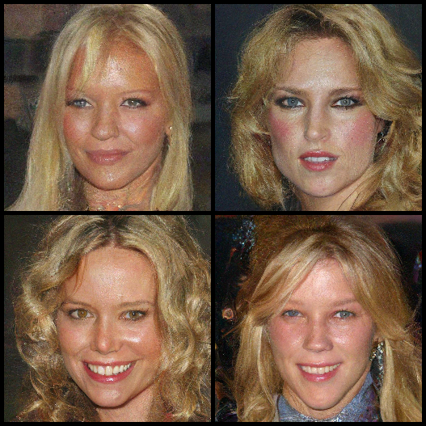
*“a photo of a woman with blonde hair”*

*“a photo of a woman with blonde hair”*

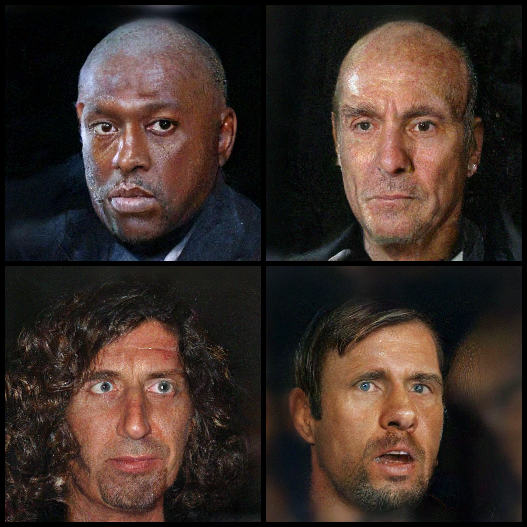
*“a photo of a man with a serious expression”*

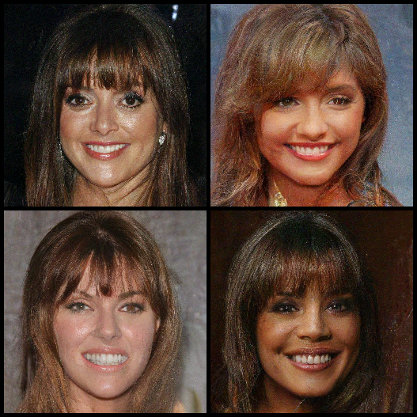
*“a photo of a smiling woman with bangs”*

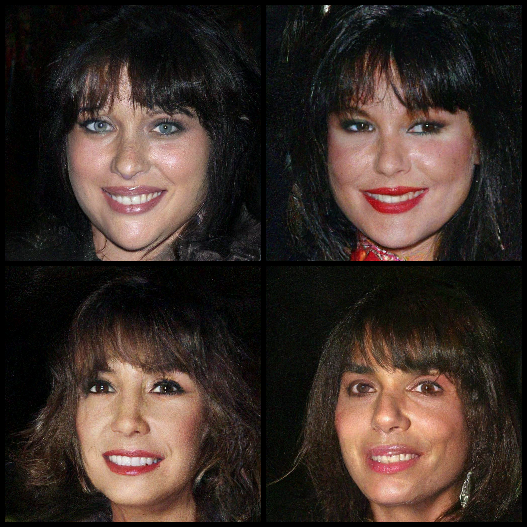
*“a photo of a smiling woman with black hair and bangs”*

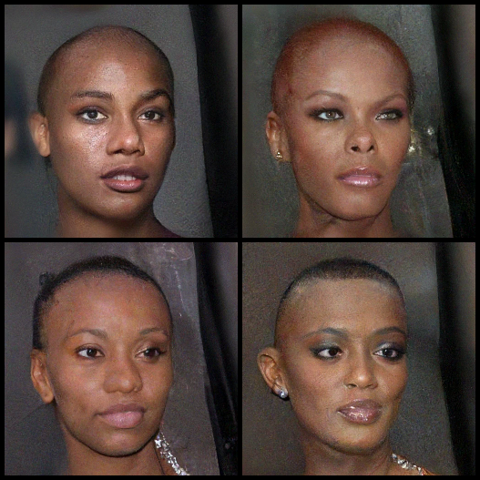
*“a photo of a bald woman”*

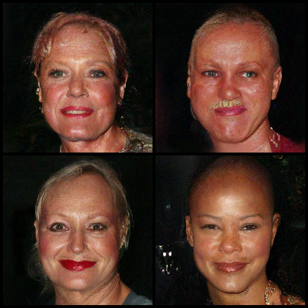
*“a photo of a bald woman” (failure mode)*

*Figure 9:Classification accuracy across different target classes as a function of 
𝑡
𝑛
1
, with 
𝑡
𝑛
2
=
14
/
16
 held fixed.*

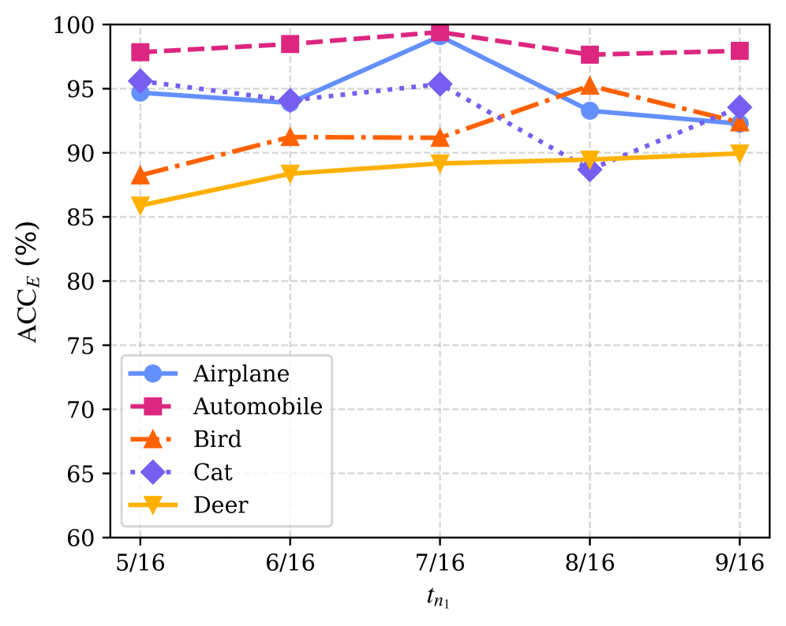
*Figure 33*

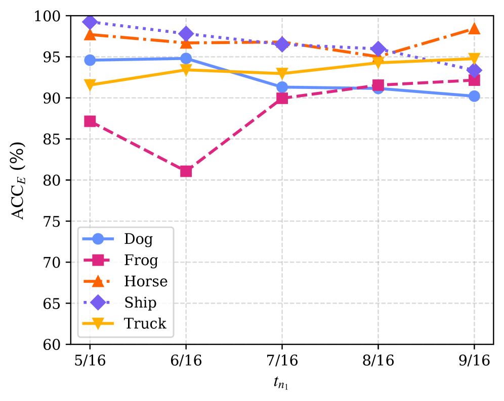
*Figure 34*

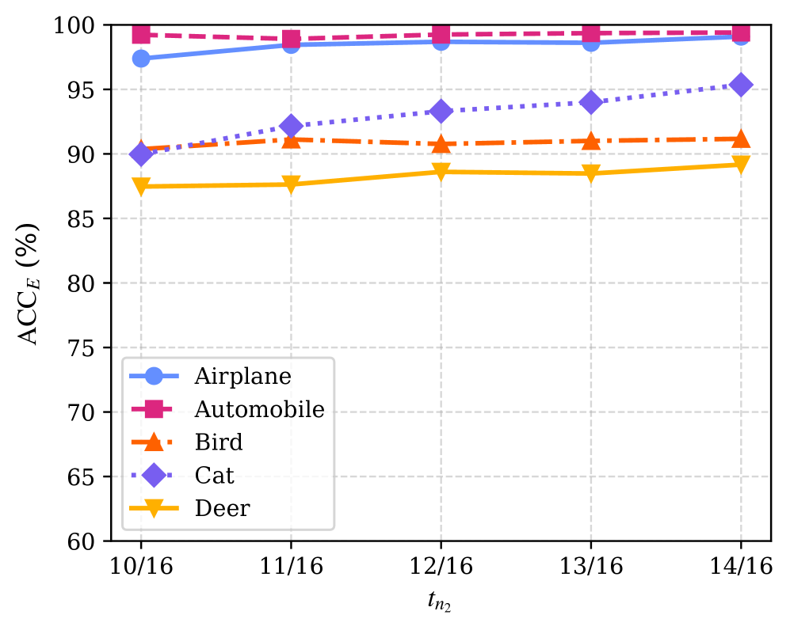
*Figure 35*

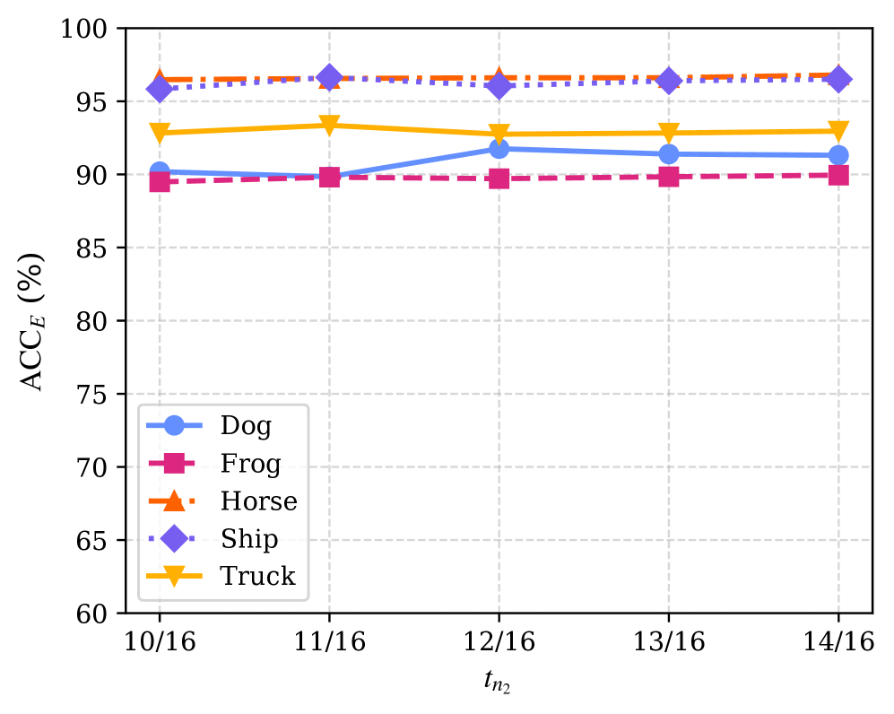
*Figure 36*

---
**Usage Info**: 9575 tokens used.
**Generated at**: 2026-02-23 22:30:16

---

# 📚 T3D: Few-Step Diffusion Language Models via Trajectory Self-Distillation with Direct Discriminative Optimization

🚀 URL: https://arxiv.org/html/2602.12262

## 🌏 Abstract (원문)
Inference-time efficiency is a central challenge in large language modeling, especially for real-time and compute-constrained applications. Many practical deployments, such as real-time decision-making and on-device AI, require consistently low-latency responses. Diffusion large language models (DLLMs) offer a promising direction by enabling parallel token generation. However, existing DLLMs rely on long decoding chains consisting of many diffusion steps, which significantly limits their efficiency gains. When decoding is made more aggressive by reducing the number of steps, these models struggle to accurately generate multiple tokens simultaneously. Recent work has explored fine-tuning DLLMs to support few-step decoding, aiming to further reduce inference latency beyond standard diffusion sampling. However, few-step decoding is fundamentally challenged by the common mean-field (token-factorized) parameterization used in masked diffusion models, which induces a factorization (approximation) error that typically grows as the number of denoising steps decreases. Moreover, training and inference often operate on different intermediate-state distributions: training commonly uses random masking, while inference frequently relies on non-random heuristics (e.g., confidence-based schedules) that change the masked states that the model encounters. Together, this motivates the following important research question: Can we reduce mean-field approximation error under tight step budgets for DLLMs? We answer this question affirmatively by introducing two complementary training ingredients. (i) Trajectory supervision. First, we introduce trajectory self-distillation, which trains the student on the teacher’s own rollout trajectories. This directly addresses a train–test mismatch in intermediate states: training often relies on random masking, while inference typically uses non-random heuristics (e.g., confidence-based schedules) that induce different masking patterns and introduce dependencies among simultaneously decoded tokens. By distilling on rollout trajecotires produced by the teacher under the target decoding procedure, the student is supervised on-policy and can use its limited step budget more effectively, matching the trajectory distribution encountered at inference time rather than optimizing only endpoint transitions as previous self-distillation frameworks. (ii) Better training objective for few-step decoding. To strengthen learning under aggressive step compression, we incorporate Direct Discriminative Optimization (DDO) into the distillation objective. With only a few decoding steps, the denoising posterior becomes highly multimodal, and trajectory matching with a forward-KL objective tends to be mode-covering, yielding over-smoothed predictions and weak alignment with teacher trajectories. DDO mitigates this issue via a GAN-inspired likelihood-ratio loss that can be interpreted as reverse-KL style, mode-seeking distillation: by contrasting the fine-tuned model against its initialization, it emphasizes high-probability teacher modes rather than uniformly matching likelihood across all continuations. Moreover, for masked diffusion, this likelihood-ratio objective can be evaluated directly from the model’s predicted probabilities, avoiding Monte Carlo ELBO estimation (and its associated gradient variance). Finally, we introduce a path-consistency regularizer that reweights token-level losses based on decoding order, mitigating error propagation from early mispredictions in block-wise few-step decoding. We refer to the resulting approach as Self-Trajectory Distillation via DDO (T3D). T3D provides a simple yet effective solution for few-step diffusion language modeling. By distilling directly from teacher-generated trajectories, T3D eliminates distribution shift and stabilizes training in the few-step regime, without requiring any additional ground-truth supervision. Our theoretical analysis shows that trajectory-level distillation reduces conditional dependencies in the reverse process, leading to lower factorization error. Extensive experiments on standard reasoning and code-generation benchmarks demonstrate that T3D consistently outperforms existing few-step DLLM methods under tight decoding budgets, substantially narrowing the gap to full-step diffusion decoding.
## 🌏 Abstract (번역)
추론 시 효율성은 대규모 언어 모델링, 특히 실시간 및 컴퓨팅 제한이 있는 애플리케이션에서 핵심적인 과제입니다. 실시간 의사 결정 및 온디바이스 AI와 같은 많은 실제 배포 환경에서는 일관되게 낮은 지연 시간의 응답이 필요합니다. 확산 대규모 언어 모델(DLLM)은 병렬 토큰 생성을 가능하게 함으로써 유망한 방향을 제시합니다. 그러나 기존 DLLM은 많은 확산 단계로 구성된 긴 디코딩 체인에 의존하므로 효율성 이득이 크게 제한됩니다. 단계 수를 줄여 디코딩을 더 공격적으로 수행할 때, 이러한 모델은 여러 토큰을 동시에 정확하게 생성하는 데 어려움을 겪습니다. 최근 연구에서는 표준 확산 샘플링 이상으로 추론 지연 시간을 더 줄이기 위해 소수 단계(few-step) 디코딩을 지원하도록 DLLM을 미세 조정하는 방법을 탐구했습니다. 그러나 소수 단계 디코딩은 마스크 확산 모델에서 사용되는 일반적인 평균장(token-factorized) 매개변수화로 인해 근본적인 도전에 직면하며, 이는 일반적으로 노이즈 제거 단계가 감소함에 따라 증가하는 분해(근사) 오차를 유발합니다. 또한, 훈련과 추론은 종종 서로 다른 중간 상태 분포에서 작동합니다. 훈련은 일반적으로 무작위 마스킹을 사용하는 반면, 추론은 모델이 마주하는 마스크 상태를 변화시키는 비무작위 휴리스틱(예: 신뢰도 기반 스케줄)에 자주 의존합니다. 이러한 배경은 다음과 같은 중요한 연구 질문을 제기합니다: DLLM의 제한된 단계 예산 하에서 평균장 근사 오차를 줄일 수 있는가? 본 연구에서는 두 가지 상호 보완적인 훈련 요소를 도입하여 이 질문에 긍정적으로 답합니다. (i) 궤적 감독: 먼저, 교사 모델 자신의 롤아웃 궤적에 대해 학생 모델을 훈련시키는 궤적 자기 증류를 도입합니다. 이는 중간 상태에서의 훈련-테스트 불일치를 직접 해결합니다. 타겟 디코딩 절차 하에서 교사가 생성한 롤아웃 궤적을 증류함으로써, 학생 모델은 온-폴리시(on-policy)로 감독을 받으며 제한된 단계 예산을 더 효과적으로 사용할 수 있으며, 이전의 자기 증류 프레임워크처럼 종점 전이만을 최적화하는 대신 추론 시 발생하는 궤적 분포와 일치시킵니다. (ii) 소수 단계 디코딩을 위한 더 나은 훈련 목적 함수: 공격적인 단계 압축 하에서 학습을 강화하기 위해 직접 판별 최적화(DDO)를 증류 목적 함수에 통합합니다. 단계가 적을 때 노이즈 제거 사후 확률은 매우 다중 모드(multimodal)가 되며, 전방 KL 목적 함수를 사용한 궤적 매칭은 모드 커버링 경향이 있어 과도하게 매끄러운 예측과 교사 궤적과의 약한 정렬을 초래합니다. DDO는 역 KL 스타일의 모드 탐색(mode-seeking) 증류로 해석될 수 있는 GAN 영감의 가능도 비율 손실을 통해 이 문제를 완화합니다. 마지막으로, 디코딩 순서에 따라 토큰 수준의 손실 가중치를 재조정하여 블록 단위 소수 단계 디코딩의 초기 오판으로 인한 오류 전파를 완화하는 경로 일관성 정규화 기법을 도입합니다. 우리는 이 접근 방식을 DDO를 통한 자기 궤적 증류(T3D)라고 부릅니다. T3D는 소수 단계 확산 언어 모델링을 위한 단순하면서도 효과적인 솔루션을 제공합니다. 교사 생성 궤적에서 직접 증류함으로써 T3D는 분포 편향을 제거하고 소수 단계 영역에서 훈련을 안정화합니다. 이론적 분석에 따르면 궤적 수준 증류는 역과정에서의 조건부 의존성을 줄여 분해 오차를 낮춥니다. 표준 추론 및 코드 생성 벤치마크에 대한 광범위한 실험은 T3D가 제한된 디코딩 예산 하에서 기존의 소수 단계 DLLM 방법들을 일관되게 능가하며, 전체 단계 확산 디코딩과의 격차를 실질적으로 좁힌다는 것을 입증합니다.

## 🔍 Methods & Results
- 궤적 자기 증류(Trajectory Self-Distillation): 교사 모델의 실제 롤아웃 궤적을 사용하여 학생 모델을 훈련함으로써 훈련과 추론 사이의 중간 상태 분포 불일치(Train-Test Mismatch) 문제를 해결함.
- 직접 판별 최적화(Direct Discriminative Optimization, DDO): 소수 단계 디코딩 시 발생하는 다중 모드 사후 확률 문제를 해결하기 위해 역 KL 방식의 모드 탐색 최적화를 적용하여 교사의 고확률 모드에 정렬함.
- 경로 일관성 정규화(Path-Consistency Regularization): 디코딩 순서에 따라 초기 토큰에 더 높은 가중치를 부여하여 초기 오류가 전체 시퀀스로 전파되는 것을 방지함.
- 이론적 증명: 궤적 수준의 증류가 확산 모델 역과정의 조건부 의존성을 감소시켜 평균장 근사로 인한 분해 오차(Factorization Error)를 줄임을 입증함.
- 성능 입증: 표준 추론 및 코드 생성 벤치마크에서 기존 소수 단계 DLLM 방법론을 일관되게 능가하며 전체 단계 디코딩 성능에 근접하는 결과를 달성함.

## 🖼 Figures
![Figure 1: Overview of T3D for enabling few-step diffusion decoding. (a) Teacher full trajectory. A pretrained diffusion language model generates sequences through a full diffusion trajectory from the fully masked state 
𝒙
𝑇
 to the clean sequence 
𝒙
0
 using many refinement steps, producing intermediate states that reflect the inference-time decoding distribution. (b) Trajectory-level objective learning. T3D trains a few-step student model via trajectory self-distillation on teacher rollout trajectories. We incorporate Direct Discriminative Optimization (DDO) to perform mode-seeking trajectory matching between the student and a reference model under an on-policy discriminative objective. (c) Few-step decoding. After training, the student can decode using significantly fewer diffusion steps (e.g., 1–2 steps per block) while preserving generation quality, substantially narrowing the gap with full-step decoding and enabling efficient parallel token generation.](../images/2026-02-16/2602.12262/2602.12262_fig0.png)
*Figure 1: Overview of T3D for enabling few-step diffusion decoding. (a) Teacher full trajectory. A pretrained diffusion language model generates sequences through a full diffusion trajectory from the fully masked state 
𝒙
𝑇
 to the clean sequence 
𝒙
0
 using many refinement steps, producing intermediate states that reflect the inference-time decoding distribution. (b) Trajectory-level objective learning. T3D trains a few-step student model via trajectory self-distillation on teacher rollout trajectories. We incorporate Direct Discriminative Optimization (DDO) to perform mode-seeking trajectory matching between the student and a reference model under an on-policy discriminative objective. (c) Few-step decoding. After training, the student can decode using significantly fewer diffusion steps (e.g., 1–2 steps per block) while preserving generation quality, substantially narrowing the gap with full-step decoding and enabling efficient parallel token generation.*

---
**Usage Info**: 6066 tokens used.
**Generated at**: 2026-02-23 22:32:13

---

# 📚 Moonshine v2: Ergodic Streaming Encoder ASR for Latency-Critical Speech Applications

🚀 URL: https://arxiv.org/html/2602.12241

## 🌏 Abstract (원문)
Modern automatic speech recognition (ASR) systems are separated into two deployment paradigms: cloud-based models that leverage server-scale compute and edge models that run locally on resource-constrained devices. While cloud ASR can achieve excellent accuracy by utilizing large models and extensive computational resources, edge ASR is essential for applications where network connectivity is unreliable or unavailable, such as offline voice assistants, medical dictation in remote settings, real-time captioning for accessibility, and privacy-sensitive voice commands on mobile devices. Edge deployment also eliminates network round-trip latency and reduces privacy concerns by keeping audio data on-device. In edge use cases, latency and transcription quality are the two key—and often competing—constraints. Achieving human-perceivable real-time performance requires minimizing time-to-first-token (TTFT) and maintaining low per-token latency, while simultaneously delivering word error rates (WERs) competitive with cloud-based alternatives. Balancing these competing objectives on devices with limited memory, compute, and power budgets remains a central challenge in practical ASR deployment. Existing edge ASR models leverage a full-attention encoder architecture, which allows every frame to directly attend to every other frame in a sequence of speech audio. This enables powerful contextual disambiguation as it resolves locally ambiguous acoustics using distant lexical information that occurs earlier or later in a chunk of speech audio. However, full attention also introduces quadratic complexity in sequence length and imposes an inherent “encode-the-whole-utterance” latency profile: in streaming scenarios, the encoder must process the entire prefix (or wait for the complete utterance) before decoder tokens can be emitted, resulting in high TTFT that scales linearly with utterance length. In practical applications, this reduces system responsiveness and limits interactivity. In this paper, we introduce Moonshine v2, a family of ergodic streaming encoder ASR models designed specifically for latency-critical edge applications. Moonshine v2 models employ sliding-window attention in a position-free encoder to enable low-latency streaming inference while maintaining state-of-the-art accuracy on standard benchmarks. We train three variants of increasing size— tiny, small, and medium—and show that the models achieve transcription quality and speed on-par with models 6x their size while running significantly faster (i.e., Whisper Large v3). We release the models under a permissive license, encouraging community adoption for on-device, latency-critical ASR applications.
## 🌏 Abstract (번역)
현대의 자동 음성 인식(ASR) 시스템은 서버 규모의 컴퓨팅을 활용하는 클라우드 기반 모델과 리소스가 제한된 장치에서 로컬로 실행되는 에지 모델이라는 두 가지 배포 패러다임으로 나뉩니다. 클라우드 ASR은 대규모 모델과 광범위한 컴퓨팅 리소스를 활용하여 뛰어난 정확도를 달성할 수 있지만, 오프라인 음성 비서, 원격 환경에서의 의료 기록, 접근성을 위한 실시간 자막, 모바일 장치의 개인 정보 보호에 민감한 음성 명령과 같이 네트워크 연결이 불안정하거나 불가능한 애플리케이션에는 에지 ASR이 필수적입니다. 에지 배포는 또한 네트워크 왕복 지연 시간을 제거하고 오디오 데이터를 장치 내에 유지함으로써 개인 정보 보호 문제를 줄여줍니다. 에지 사용 사례에서 지연 시간과 전사 품질은 두 가지 핵심적이며 종종 상충하는 제약 조건입니다. 인간이 인지할 수 있는 실시간 성능을 달성하려면 첫 번째 토큰 생성 시간(TTFT)을 최소화하고 토큰당 지연 시간을 낮게 유지하는 동시에 클라우드 기반 대안과 경쟁할 수 있는 단어 오류율(WER)을 제공해야 합니다. 메모리, 컴퓨팅 및 전력 예산이 제한된 장치에서 이러한 상충하는 목표의 균형을 맞추는 것은 실제 ASR 배포에서 여전히 중심적인 과제입니다. 기존의 에지 ASR 모델은 전체 어텐션(full-attention) 인코더 아키텍처를 활용하여 모든 프레임이 음성 오디오 시퀀스의 다른 모든 프레임에 직접 어텐션을 수행할 수 있도록 합니다. 이는 음성 오디오 청크의 앞부분이나 뒷부분에서 발생하는 원거리 어휘 정보를 사용하여 국부적으로 모호한 음향을 해결함으로써 강력한 문맥적 모호성 해소를 가능하게 합니다. 그러나 전체 어텐션은 시퀀스 길이에 따른 이차 복잡성을 도입하고 고유한 "전체 발화 인코딩" 지연 프로필을 부과합니다. 스트리밍 시나리오에서 인코더는 디코더 토큰이 방출되기 전에 전체 접두사를 처리하거나 전체 발화가 끝날 때까지 기다려야 하므로 발화 길이에 따라 선형적으로 증가하는 높은 TTFT를 초래합니다. 실제 애플리케이션에서 이는 시스템 응답성을 저하시키고 상호 작용성을 제한합니다. 본 논문에서는 지연 시간에 민감한 에지 애플리케이션을 위해 특별히 설계된 에르고딕(ergodic) 스트리밍 인코더 ASR 모델 제품군인 Moonshine v2를 소개합니다. Moonshine v2 모델은 위치 정보가 없는(position-free) 인코더에서 슬라이딩 윈도우 어텐션을 사용하여 표준 벤치마크에서 최첨단 정확도를 유지하면서 저지연 스트리밍 추론을 가능하게 합니다. 우리는 tiny, small, medium의 세 가지 크기 변형을 훈련했으며, 이 모델들이 6배 더 큰 모델(예: Whisper Large v3)과 대등한 전사 품질 및 속도를 달성하는 동시에 훨씬 더 빠르게 실행됨을 보여줍니다. 우리는 온디바이스 및 지연 시간에 민감한 ASR 애플리케이션을 위한 커뮤니티 채택을 장려하기 위해 허용적인 라이선스로 모델을 공개합니다.

## 🔍 Methods & Results
- Moonshine v2는 오디오 전처리기, 스트리밍 인코더, 어댑터, 디코더의 4단계 구조로 설계됨
- 오디오 전처리기는 16kHz 오디오를 50Hz 특징 시퀀스로 변환하며, asinh 비선형 함수를 사용하여 압축과 동적 범위의 균형을 맞춤
- 인코더는 위치 임베딩이 없는(position-free) 에르고딕 구조로, 슬라이딩 윈도우 셀프 어텐션을 통해 시간 불변적 계산을 수행함
- 인코더 레이어 중 일부는 80ms의 제한된 미래 문맥(lookahead)을 사용하고 나머지는 엄격하게 인과적(causal)으로 구성하여 지연 시간을 최소화함
- 어댑터 단계에서 학습된 위치 임베딩을 추가하여 에르고딕 인코더와 위치 인식 디코더 사이를 연결함
- 디코더는 RoPE(Rotary Positional Embeddings)를 사용하는 표준 자기회귀 트랜스포머 아키텍처를 채택함
- Tiny, Small, Medium 세 가지 크기의 모델을 실험한 결과, Whisper Large v3와 같은 6배 더 큰 모델과 대등한 정확도를 보이면서도 훨씬 빠른 추론 속도와 낮은 TTFT를 달성함

## 🖼 Figures

*Figure 2:Conceptual TTFT timelines. In full attention, encoding begins after the entire audio has arrived. With sliding-window attention, encoding proceeds incrementally and overlaps with audio capture, so the remaining work after the last chunk is smaller.*

*Figure 3:Audio preprocessor overview with tensor shapes, single-example. Dimensions 
𝑇
=
⌊
𝑁
80
⌋
, 
𝑇
1
=
⌈
𝑇
2
⌉
, and 
𝑇
2
=
⌈
𝑇
1
2
⌉*

*Figure 5:Time to first token (TTFT) versus input audio duration for Moonshine and Moonshine v2 models. The original Moonshine models use a full-attention encoder, which results in TTFT latency that grows with input audio duration. Sliding window attention in the Moonshine v2 encoder results in a fixed encoding latency, regardless of audio duration.*

---
**Usage Info**: 4852 tokens used.
**Generated at**: 2026-02-23 22:32:38

---

