# 🚩 (2026-02-17) Scholar Inbox 추천 논문 

# 📚 Probing Human Articulatory Constraints in End-to-End TTS with Reverse and Mismatched Speech-Text Directions

🚀 URL: https://arxiv.org/html/2602.14664

## 🌏 Abstract (원문)
Articulation is the process of producing speech sounds by manipulating the air-stream from the lungs using the articulatory organs. The specific movements of the articulatory organs, called articulatory configuration (AC) determine the different speech sounds that humans produce. One could look at a sequence of AC smoothly transitioning from one AC to another resulting in spoken speech. Visible speech (VS) symbols, introduced in 1867, provided visual representation of the position of the speech organs needed to articulate an individual sound. The concept of VS was used effectively to identify words that are difficult to articulate based on the degree of change in the position of articulators that is required to speak a word. While appreciating the fact that speech production is much more complex, namely, the next word or phrase that we produce is dependent on what has been spoken prior not only linguistically but also in terms of how we emote it in the form of intonation, there is also an aspect of breath cycle, pauses, filler words, stress on certain words, language grammar and much more. Aware of this, we hypothesize that the language we speak has evolved over a period of time and the sounds that we produce are such that they are optimal in terms of the amount of energy required to change the position of the articulators or transition from one AC to another when we speak a sentence. We call the speech produced with these constraints, to contain natural patterns in spoken speech. Maybe, we as humans have refined or adapted the language structure, syntax, etc. to make it suitable, comfortable and easy for us to use. For example speaking “txet” (reverse of “text”) is harder than “text”. With growing need for voice user interfaces, there is a dire need for generating speech from text, also called text to speech (TTS). The area of TTS has evolved significantly from the rudimentary Klatt synthesizer to current day e2e-TTS models like Tacotron-2, FastSpeech, Glow-TTS, F5-TTS, Variational Inference Text-to-Speech (VITS-TTS). The e2e-TTS systems are traditionally sequence to sequence (seq2seq) architectures that learn to map a text sequence and the corresponding audio. These e2e-TTS are trained on a large amount of training text-speech corpora. In this paper, we experimentally explore if these e2e-TTS models benefit from (a) the constraints imposed by the articulatory anatomy where only certain transitions of AC’s are possible or (b) some implicit patterns in the syntactic structure of the language and speech. We further assume that these patterns or AC transition constraints do not exist in a reverse audio. For clarity, if s(t) is the spoken speech of duration T, namely, 0 ≤ t ≤ T then s(T-t) = s'(t) is the reverse speech. In this paper, we would like to study and understand if an e2e-TTS architecture can be trained on unnatural (to human) patterns or in other words does the constraints on possible AC imposed by the articulatory anatomy or the smooth transition from one AC to another help the conventionally trained e2e-TTS system.
## 🌏 Abstract (번역)
조음은 조음 기관을 사용하여 폐에서 나오는 공기 흐름을 조절함으로써 말소리를 생성하는 과정입니다. 조음 구성(AC)이라고 불리는 조음 기관의 특정 움직임은 인간이 생성하는 다양한 말소리를 결정합니다. 부드럽게 전환되는 AC의 시퀀스는 구어체 연설로 이어집니다. 1867년에 도입된 가시적 음성(VS) 기호는 개별 소리를 조음하는 데 필요한 음성 기관의 위치를 시각적으로 표현했습니다. VS의 개념은 단어를 말하는 데 필요한 조음 기관의 위치 변화 정도에 따라 조음하기 어려운 단어를 식별하는 데 효과적으로 사용되었습니다. 음성 생성은 언어적 측면뿐만 아니라 억양, 호흡 주기, 일시 정지, 채움말, 강조, 문법 등 복잡한 요소에 의존합니다. 본 연구에서는 우리가 사용하는 언어가 시간이 지남에 따라 진화했으며, 우리가 생성하는 소리는 문장을 말할 때 조음 기관의 위치를 변경하거나 한 AC에서 다른 AC로 전환하는 데 필요한 에너지 양 측면에서 최적화되어 있다는 가설을 세웁니다. 이러한 제약 조건 하에 생성된 음성을 '자연스러운 패턴'을 포함한다고 정의합니다. 인간은 언어 구조와 구문 등을 사용하기 편리하게 개선해 왔을 것입니다. 예를 들어 "text"를 거꾸로 말하는 "txet"은 더 어렵습니다. 음성 사용자 인터페이스의 수요가 증가함에 따라 텍스트 투 스피치(TTS) 기술이 발전해 왔으며, Tacotron-2, FastSpeech, Glow-TTS, F5-TTS, VITS-TTS와 같은 e2e-TTS 모델이 등장했습니다. 본 논문에서는 이러한 e2e-TTS 모델이 (a) 조음 해부학에 의한 제약이나 (b) 언어 및 음성의 구문 구조에 내재된 패턴으로부터 이점을 얻는지 실험적으로 탐구합니다. 또한 이러한 패턴이나 AC 전환 제약이 역방향 오디오에는 존재하지 않는다고 가정합니다. 본 연구의 목적은 e2e-TTS 아키텍처가 인간에게 부자연스러운 패턴으로 학습될 수 있는지, 그리고 조음 해부학적 제약이나 부드러운 AC 전환이 기존 e2e-TTS 시스템에 도움이 되는지 이해하는 것입니다.

## 🔍 Methods & Results
- 인간의 음성이 조음 기관의 에너지 소모를 최소화하는 방향으로 최적화되어 있다는 '자연스러운 패턴' 가설 설정
- Tacotron-2, FastSpeech, Glow-TTS 등 최신 e2e-TTS 모델이 조음 해부학적 제약 및 언어적 구문 패턴으로부터 얻는 이점을 실험적으로 분석
- 자연스러운 음성 데이터와 조음 제약이 존재하지 않는 역방향 음성(Reverse Speech) 데이터를 비교군으로 사용
- e2e-TTS 아키텍처가 인간에게 부자연스러운 패턴을 학습할 수 있는지 여부와 조음 제약이 학습 효율성에 미치는 영향 연구
- 텍스트 시퀀스와 오디오 간의 매핑 과정에서 조음 구성(AC)의 부드러운 전환이 시스템 성능에 기여하는지 검증

## 🖼 Figures
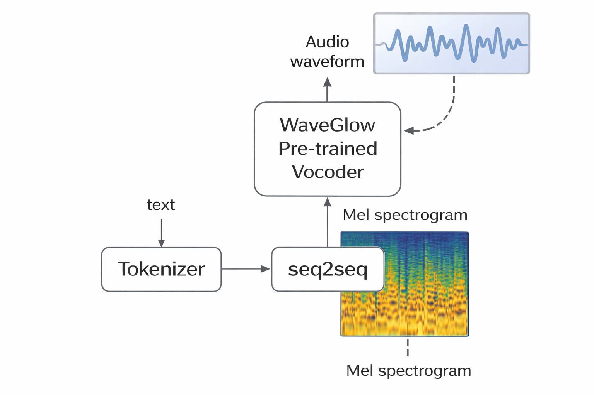
*Figure 1:High level block diagram of e2e-TTS architecture. We train the seq2seq block while using a pre-trained vocoder.*

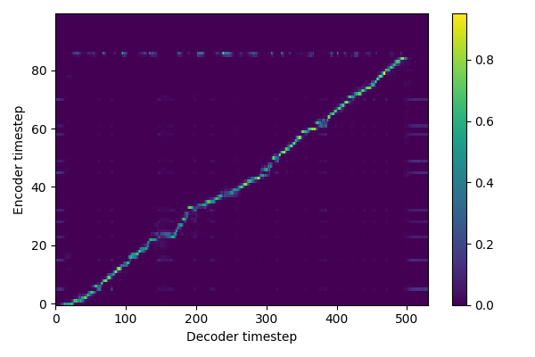
*(a)Alignment plot (e2e-TTS).*

*(a)Alignment plot (e2e-TTS).*

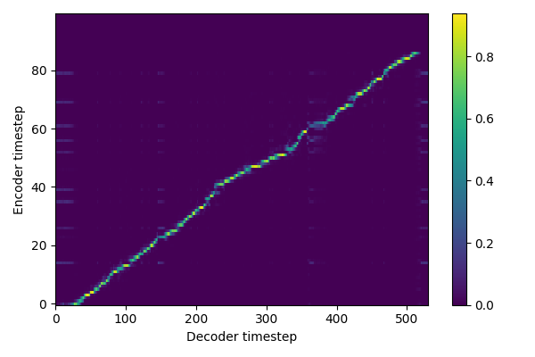
*(b)Alignment plot (r-e2e-TTS).*

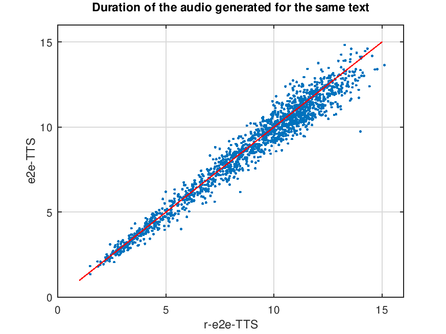
*Figure 3:Scatter plot of duration of the audio for the same text produced by e2e-TTS (y-axis) and r-e2e-TTS (x-axis). The duration of audio generated by e2e-TTS is overall longer than the audio generated by r-e2e-TTS.*

*(a)BPE-e2e-TTS*

*(a)BPE-e2e-TTS*

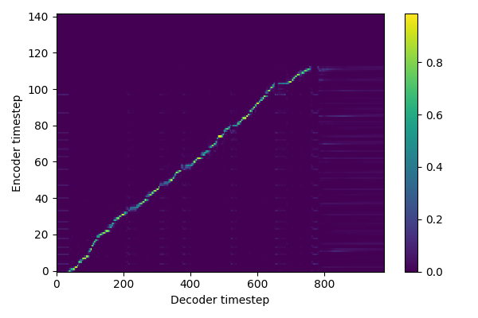
*(b)BPE-r-e2e-TTS*

*(a)Alignment plot rtfs-e2e-TTS (Tacotron-2)*

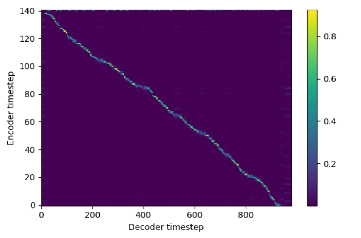
*(a)Alignment plot rtfs-e2e-TTS (Tacotron-2)*

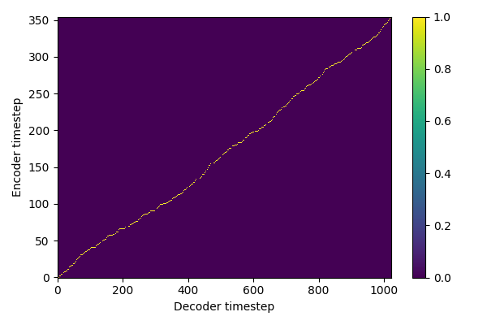
*(b)Alignment plot rtfs-e2e-TTS (VITS-TTS)*

*Figure 6:(a) 
𝑠
¯
​
(
𝑡
)
 and (b) 
𝑠
​
(
𝑡
)*

---
**Usage Info**: 3452 tokens used.
**Generated at**: 2026-02-23 22:33:35

---

# 📚 LEARNING VOCAL-TRACT AREA AND RADIATION WITH A PHYSICS-INFORMED WEBSTER MODEL

🚀 URL: https://arxiv.org/html/2602.13834

## 🌏 Abstract (원문)
Modern singing-voice synthesis (SVS) is often organised as a two-stage pipeline: a front end predicts control trajectories (e.g.,f0, phonetic content, loudness), and a back end renders audio. The back end is commonly a neural vocoder or an end-to-end generator. While such renderers can be highly natural, their high-capacity parameters tend to entangle pitch, timbre, and articulation, limiting fine-grained control and diagnosis and often requiring large corpora and retraining for new singers or styles. A complementary route is to exploit classical vocal acoustics as an explicit control surface. For voiced sounds, a 1D time-domain Webster model with an open-end radiation boundary offers an interpretable source–tract–radiation decomposition, where tract geometry and boundary parameters directly shape formants and spectral tilt. However, practical use hinges on calibrating the vocal-tract area function and boundary conditions from audio, which remains challenging and solver-dependent. These considerations motivate a middle ground: retain mechanistic structure while learning difficult parameters from audio. Two complementary paradigms support this: (i) differentiable rendering modules optimised with audio losses, as in Differentiable Digital Signal Processing (DDSP), and (ii) physics-informed neural networks (PINNs) that enforce governing equations and boundary conditions via residual penalties. We train a time-domain Webster PINN to estimate a continuous tract area A(x) and a Robin (open-end) radiation coefficient ζ from single-channel sustained vowels, given f0(t). Training combines Partial Differential Equations and Boundary Conditions (PDE/BC) residuals with audio/probe losses; a lightweight DDSP path is used only as a stabiliser and is removed at inference. To reduce inverse-crime risk, we evaluate by exporting the estimated parameters to an independent explicit finite-difference time-domain (FDTD) discretisation of the Webster equation and computing objective envelope and periodicity metrics on the resulting post-rendered waveform.
## 🌏 Abstract (번역)
현대의 가창 음성 합성(SVS)은 대개 제어 궤적(예: f0, 음소 내용, 음량)을 예측하는 프런트엔드와 오디오를 렌더링하는 백엔드의 2단계 파이프라인으로 구성됩니다. 백엔드는 일반적으로 신경망 보코더나 엔드투엔드 생성기를 사용합니다. 이러한 렌더러는 매우 자연스러울 수 있지만, 고용량 파라미터가 피치, 음색, 조음을 얽히게 만드는 경향이 있어 미세한 제어와 진단이 제한되며, 새로운 가수나 스타일을 위해 대규모 말뭉치와 재학습이 필요한 경우가 많습니다. 이에 대한 보완적인 경로는 고전적인 성대 음향학을 명시적인 제어 표면으로 활용하는 것입니다. 유성음의 경우, 개방단 방사 경계가 있는 1차원 시간 영역 Webster 모델은 성도 기하학 및 경계 파라미터가 포먼트와 스펙트럼 기울기를 직접 형성하는 해석 가능한 소스-성도-방사 분해를 제공합니다. 그러나 실제 사용은 오디오에서 성도 면적 함수와 경계 조건을 보정하는 데 달려 있으며, 이는 여전히 어렵고 솔버에 종속적입니다. 이러한 고려 사항은 오디오에서 어려운 파라미터를 학습하면서 기계적 구조를 유지하는 중간 지점을 모색하게 합니다. 이를 지원하는 두 가지 보완적 패러다임은 (i) DDSP와 같이 오디오 손실로 최적화된 미분 가능한 렌더링 모듈과 (ii) 잔차 페널티를 통해 지배 방정식 및 경계 조건을 강제하는 물리 정보 신경망(PINN)입니다. 본 연구에서는 f0(t)가 주어졌을 때 단일 채널 지속 모음으로부터 연속적인 성도 면적 A(x)와 Robin(개방단) 방사 계수 ζ를 추정하기 위해 시간 영역 Webster PINN을 훈련합니다. 훈련은 편미분 방정식 및 경계 조건(PDE/BC) 잔차와 오디오/프로브 손실을 결합하며, 경량 DDSP 경로는 안정화 장치로만 사용되고 추론 시에는 제거됩니다. 인버스 크라임(inverse-crime) 위험을 줄이기 위해, 추정된 파라미터를 Webster 방정식의 독립적인 명시적 유한 차분 시간 영역(FDTD) 이산화 모델로 내보내고, 결과물인 사후 렌더링 파형에서 객관적인 엔벨로프 및 주기성 지표를 계산하여 평가합니다.

## 🔍 Methods & Results
- 학습 가능한 방사 계수를 포함한 Webster PINN 제안: 단일 채널 유성음 오디오에서 성도 면적 A(x)와 Robin 방사 계수 ζ를 동시에 추정함.
- 훈련 시에만 미분 가능한 감독(DDSP 및 오디오 손실)을 사용하고, 추론 시에는 순수하게 물리 법칙(PDE/BC)에 기반하여 작동하는 하이브리드 구조 설계.
- 추정된 물리적 파라미터를 독립적인 FDTD-Webster 솔버에 적용하여 렌더링하는 'Out-of-graph' 평가 방식 도입.
- 실험 결과, 제안된 모델은 특정 솔버의 이산화 아티팩트에 의존하지 않고 전송 가능한 물리적 제어 인자를 성공적으로 복원함을 입증함.

## 🖼 Figures
![Fig. 1:Overview of the physics-informed voiced renderer. DualNet predicts 
(
𝜓
,
𝐴
^
,
𝜁
^
)
 and a differentiable Webster rendering path produces 
𝑦
^
​
(
𝑡
)
 for reference-based losses during training (inference is physics-only). Solid arrows denote forward signal flow in the renderer; dashed arrows denote training-only loss/backprop connections (e.g., using 
𝑦
​
(
𝑡
)
), which are removed at inference. For solver-independent evaluation (not shown), 
(
𝐴
^
,
𝜁
^
)
 are exported to an independent FDTD–Webster solver for post-render assessment.](../images/2026-02-17/2602.13834/2602.13834_fig0.png)
*Fig. 1:Overview of the physics-informed voiced renderer. DualNet predicts 
(
𝜓
,
𝐴
^
,
𝜁
^
)
 and a differentiable Webster rendering path produces 
𝑦
^
​
(
𝑡
)
 for reference-based losses during training (inference is physics-only). Solid arrows denote forward signal flow in the renderer; dashed arrows denote training-only loss/backprop connections (e.g., using 
𝑦
​
(
𝑡
)
), which are removed at inference. For solver-independent evaluation (not shown), 
(
𝐴
^
,
𝜁
^
)
 are exported to an independent FDTD–Webster solver for post-render assessment.*

*Fig. 2:Recovered area functions 
𝐴
^
​
(
𝑥
)
 (normalised units). Here 
𝑥
 increases from the glottis 
(
0
)
 to the lips 
(
1
)
. The solutions capture broad vowel-dependent trends (e.g., anterior constriction for /i/ and a narrower mouth end for /u/), while fine-scale details remain ambiguous under single-channel steady voiced supervision.*

---
**Usage Info**: 3027 tokens used.
**Generated at**: 2026-02-23 22:34:01

---

# 📚 Disentangling Pitch and Creak for Speaker Identity Preservation in Speech Synthesis

🚀 URL: https://arxiv.org/html/2602.14686

## 🌏 Abstract (원문)
In recent years, interest in voice editing has grown, including the manipulation of emotions[21], as well as the manipulation of so-calledPerceptual Voice Quality (PVQ)[16,12]features for a better understanding of voice characteristics. In this study, we focus on manipulating the voice qualitycreak[11,19].Creaky voiceis typically characterized by a low rate of vocal fold vibration combined with a constricted glottis, resulting in a lower and irregular pitch[8]. As shown in[19], a global manipulation method can be used to modify non-persistent voice qualities, includingcreak. Experiments with speech experts demonstrated that the perceived strength of that quality in the synthesized voice matched with the intended conditioning. The approach in[19]employs theConditional Continuous Normalizing Flow (CCNF)concept[5]to learn acreak-conditioned data distribution of speaker representations. Because the data distribution is learned, the model captures all correlations present in the training data. In[19], the LibriTTS-R[10]dataset was pseudo-labeled using CreaPy[17]. Since the dataset does not contain speakers actively altering their voice quality, each utterance from a speaker is consistently labeled with a similarcreakprobability. This causes thecreakprobability to be negatively correlated with the speaker’s fundamental frequency, the pitch. We call this correlation “inter-speaker” creak-to-pitch correlation, because it indicates that speakers with highcreakprobability tend to have lower pitch. This is not surprising, as, according to[8], the prototypical form ofcreakhas exactly this property. However, there is a range of applications, where we are interested in modifying the degree of a PVQ for a given speaker, i.e., modifying thecreakprobability, while preserving the speaker identity. For this, the above “inter-speaker” correlation observed in a population of speakers is unfavorable, because a speaker with a modifiedcreakprobability would be identified to be a different speaker due to the also modified pitch. To train a system capable of studying “intra-speaker” variability, a dataset is required in which speakers vary their voice along aPVQaxis. Such datasets, however, are almost non-existent. An exception is the GTR-Voice dataset published in[13]. It consists of recordings of a voice actor who manipulates his voice along three articulatory-phonetic dimensions:Glottalization,tenseness, andresonance. This enables the study of “intra-speaker” correlations of acoustic features along each dimension. However, such an approach requires skilled voice actors capable of systematically varying their voice along these axes, which is expensive, and some voice qualities are difficult to trigger. There exists no dataset in which speakers explicitly manipulate their voice along thecreakdimension. In this contribution, we propose an alternative, which allows the manipulation ofcreakprobability while maintaining the perceived speaker identity. We apply pitch shifting to the LibriTTS-R dataset to break the “inter-speaker” creak-to-pitch correlation. We show that training with the augmented dataset enables the model to disentangle pitch fromcreak, resulting in more faithful “intra-speaker”creakmanipulation, which improves speaker preservation after voice manipulation111go.upb.de/pitch-creak-disentanglement, while other acoustic correlates remain appropriately aligned withcreakconditioning. This work aims to support speech experts in teaching voice quality perception[22]. A key requirement is to manipulate a target voice quality in synthesized speech without altering the speaker identity. Beyond that, such controlled manipulation enables data augmentation: it can improveAutomatic Speech Recognition (ASR)robustness to disordered speech[23]and mitigateAutomatic Speaker Verification (ASV)degradation for dysphonic speakers[20].
## 🌏 Abstract (번역)
최근 감정 조절뿐만 아니라 음성 특성을 더 잘 이해하기 위한 이른바 지각적 음질(PVQ) 특징 조절을 포함한 음성 편집에 대한 관심이 높아지고 있습니다. 본 연구에서는 '크리키(creak)' 음질 조절에 집중합니다. 크리키 보이스는 일반적으로 성대 진동률이 낮고 성문이 수축되어 낮고 불규칙한 피치를 특징으로 합니다. 이전 연구에서 보여주었듯, 크리키를 포함한 비지속적 음질을 수정하기 위해 전역 조절 방법을 사용할 수 있습니다. 음성 전문가들과의 실험을 통해 합성된 음성에서 인지된 해당 음질의 강도가 의도된 조건화와 일치함을 입증했습니다. 이 접근 방식은 조건부 연속 노멀라이징 플로우(CCNF) 개념을 사용하여 화자 표현의 크리키 조건부 데이터 분포를 학습합니다. 데이터 분포가 학습되기 때문에 모델은 훈련 데이터에 존재하는 모든 상관관계를 캡처합니다. 이전 연구에서는 LibriTTS-R 데이터셋을 CreaPy를 사용하여 의사 라벨링했습니다. 데이터셋에 음질을 능동적으로 변화시키는 화자가 포함되어 있지 않기 때문에, 한 화자의 각 발화는 일관되게 유사한 크리키 확률로 라벨링됩니다. 이로 인해 크리키 확률이 화자의 기본 주파수(피치)와 음의 상관관계를 갖게 됩니다. 우리는 이를 화자 간(inter-speaker) 크리키-피치 상관관계라고 부르는데, 이는 크리키 확률이 높은 화자가 낮은 피치를 갖는 경향이 있음을 나타내기 때문입니다. 이는 크리키의 전형적인 형태가 정확히 이러한 특성을 갖는다는 점에서 놀라운 일은 아닙니다. 그러나 화자 정체성을 유지하면서 특정 화자에 대해 PVQ 정도(즉, 크리키 확률)를 수정하려는 다양한 응용 분야가 있습니다. 이를 위해 화자 집단에서 관찰된 위의 화자 간 상관관계는 불리한데, 크리키 확률이 수정된 화자가 피치 또한 수정되어 다른 화자로 식별될 수 있기 때문입니다. 화자 내(intra-speaker) 가변성을 연구할 수 있는 시스템을 훈련하려면 화자가 PVQ 축을 따라 목소리를 변화시키는 데이터셋이 필요합니다. 그러나 이러한 데이터셋은 거의 존재하지 않습니다. 예외적으로 GTR-Voice 데이터셋이 있지만, 이는 숙련된 성우가 필요하며 비용이 많이 들고 특정 음질은 유발하기 어렵습니다. 화자가 크리키 차원을 따라 명시적으로 목소리를 조절하는 데이터셋은 존재하지 않습니다. 본 기고문에서는 인지된 화자 정체성을 유지하면서 크리키 확률을 조절할 수 있는 대안을 제안합니다. 우리는 LibriTTS-R 데이터셋에 피치 시프팅을 적용하여 화자 간 크리키-피치 상관관계를 깨뜨립니다. 증강된 데이터셋으로 훈련하면 모델이 피치와 크리키를 분리(disentangle)할 수 있게 되어, 더 충실한 화자 내 크리키 조절이 가능해지고 음성 조절 후 화자 보존 능력이 향상됨을 보여줍니다. 이 작업은 음성 전문가의 음질 지각 교육을 지원하는 것을 목표로 합니다. 핵심 요구 사항은 화자 정체성을 변경하지 않고 합성된 음성에서 대상 음질을 조절하는 것입니다. 그 외에도 이러한 제어된 조절은 데이터 증강을 가능하게 하여 장애 음성에 대한 자동 음성 인식(ASR)의 견고성을 개선하고 발성 장애 화자에 대한 자동 화자 확인(ASV) 성능 저하를 완화할 수 있습니다.

## 🔍 Methods & Results
- CCNF(Conditional Continuous Normalizing Flow) 기반의 전역 화자 조절 모듈을 YourTTS 시스템에 통합하여 화자 임베딩을 직접 수정함
- 화자 임베딩(s)과 속성 벡터(a, 크리키 강도 등) 간의 조건부 분포를 모델링하기 위해 노멀라이징 플로우를 사용함
- LibriTTS-R 데이터셋에 피치 시프팅(Pitch Shifting)을 적용하여 화자 간에 존재하는 크리키와 피치 사이의 강한 상관관계를 인위적으로 제거함
- 추론 시, 입력 음성에서 추출된 임베딩을 잠재 공간으로 매핑한 후, 원하는 크리키 속성으로 이동시켜 새로운 화자 임베딩을 생성함
- 제안된 데이터 증강 기법을 통해 모델이 피치와 크리키를 독립적으로 제어할 수 있게 되었으며, 화자 정체성 보존 성능이 향상됨을 입증함
- 훈련 과정에서 ELBO(Evidence Lower Bound)를 최대화하는 방식을 사용하며, ODE(Ordinary Differential Equation) 풀이를 통해 임베딩 변환을 수행함

---
**Usage Info**: 5571 tokens used.
**Generated at**: 2026-02-23 22:35:29

---

# 📚 MUKA: MULTI KERNEL AUDIO ADAPTATION OF AUDIO-LANGUAGE MODELS

🚀 URL: https://arxiv.org/html/2602.14127

## 🌏 Abstract (원문)
Recent advances in multimodal learning have demonstrated significant progress in the research community by leveraging cross-modal alignment techniques. Contrastive learning has been particularly effective in aligning text with both images and audio. CLIP (Contrastive Language-Image Pretraining)[24]and its extensions, such as CLAP[9], learn joint embeddings by maximizing similarity between paired text-image and text-audio inputs respectively while minimizing similarity between unpaired instances. This enables zero-shot transfer capabilities, where models can generalize to unseen concepts via natural language descriptions by computing similarities in the shared multimodal space. Beyond contrastive approaches, autoregressive models have played crucial role in multimodal understanding. Models such as Flamingo[1]and Audio Flamingo[19]incorporate both textual and image or audio inputs for strong understanding abilities. These architectures use cross-modal attention to integrate visual and auditory cues into text-based reasoning. Despite advancements in both contrastive and autoregressive multimodal learning, significant progress has been primarily observed in the image domain, where large-scale image-text datasets can be easily collected from the web. As a result, large models have been trained from scratch on billions of data examples[24,5,12,31]. In contrast, the audio domain lacks comparably large sources of audio-text pairs necessary for training such systems from scratch. CLAP models[9,30,10]address this limitation by leveraging pretrained audio and text encoders, fine-tuning them to align both modalities within a shared space using datasets containing 128k, 660k, and 4.6M pairs. Pengi[7]extends CLAP to open-ended tasks by instruction-based fine-tuning, enabling it to model longer contextual dependencies and capture fine-grained, context-dependent details. Given the relatively small number of available training data compared to vision models, the modality gap between audio and text encoders remains significant[20]. This challenge underscores the need for techniques that can better leverage multimodal encoders to improve zero-shot and few-shot learning. In this context, while state-of-the-art (SOTA) approaches focus on training-based adaptation[16], we propose to take advantage of recent advances in training-free vision-language adaptation[2]to improve both the performance and the efficiency of audio-based adapters[21]. ProKeR[2]formulates vision-language adaptation as a kernel ridge regression in the function space with a proximal regularization, avoiding overfitting issues observed in adapter-based methods such as Treff-Adapter[21]. While ProKeR focused on regularizing the solution in the Reproducing Kernel Hilbert Space (RKHS), the design of the kernel function, which captures the similarity between the training samples, has been overlooked. This is particularly important when using audio feature extractors: some, trained with instruction-tuning[7], capture fine-grained details, whereas others, such as contrastive pretraining methods[9], are trained on large-scale audio–text pairs and emphasize broader acoustic and semantic representations Building on top of ProKeR, we propose MUKA, a multi-kernel product approach that leverages the complementary nature of different pretrained encoders instead of using a single feature extractor. By constructing a product kernel that multiplies Pengi’s local similarity with CLAP’s global similarity, we obtain a discriminative kernel that simultaneously captures fine-grained details and context-level semantics in the audio–text space. This composition preserves the theoretical guarantees of kernel methods[6,8]while enhancing ProKeR’s representational power without requiring any additional training. Our approach MUKA outperforms both training-based and training-free baselines while remaining computationally efficient.
## 🌏 Abstract (번역)
멀티모달 학습의 최근 발전은 교차 모달 정렬 기술을 활용하여 연구 커뮤니티에서 상당한 진전을 보여주었습니다. 대조 학습(Contrastive learning)은 텍스트를 이미지 및 오디오와 정렬하는 데 특히 효과적이었습니다. CLIP 및 그 확장판인 CLAP과 같은 모델은 쌍을 이루는 텍스트-이미지 및 텍스트-오디오 입력 간의 유사성을 최대화하고 쌍을 이루지 않는 인스턴스 간의 유사성을 최소화하여 공동 임베딩을 학습합니다. 이를 통해 모델이 공유된 멀티모달 공간에서 유사성을 계산함으로써 자연어 설명을 통해 보지 못한 개념으로 일반화할 수 있는 제로샷 전이 능력이 가능해집니다. 대조적 접근 방식 외에도 자기회귀 모델은 멀티모달 이해에서 중요한 역할을 해왔습니다. Flamingo 및 Audio Flamingo와 같은 모델은 강력한 이해 능력을 위해 텍스트와 이미지 또는 오디오 입력을 모두 통합합니다. 이러한 아키텍처는 교차 모달 어텐션을 사용하여 시각 및 청각적 단서를 텍스트 기반 추론에 통합합니다. 대조 및 자기회귀 멀티모달 학습 모두에서의 발전에도 불구하고, 상당한 진전은 주로 웹에서 대규모 이미지-텍스트 데이터셋을 쉽게 수집할 수 있는 이미지 도메인에서 관찰되었습니다. 결과적으로 대형 모델들은 수십억 개의 데이터 예제를 통해 처음부터 학습되었습니다. 반면, 오디오 도메인은 이러한 시스템을 처음부터 학습시키는 데 필요한 대규모 오디오-텍스트 쌍 소스가 부족합니다. CLAP 모델은 사전 학습된 오디오 및 텍스트 인코더를 활용하고 128k, 660k, 4.6M 쌍을 포함하는 데이터셋을 사용하여 공유 공간 내에서 두 모달리티를 정렬하도록 미세 조정함으로써 이러한 한계를 해결합니다. Pengi는 지시어 기반 미세 조정을 통해 CLAP을 개방형 작업으로 확장하여 더 긴 문맥 의존성을 모델링하고 세밀하고 문맥 의존적인 세부 사항을 포착할 수 있게 합니다. 시각 모델에 비해 가용한 학습 데이터의 수가 상대적으로 적기 때문에 오디오와 텍스트 인코더 간의 모달리티 격차는 여전히 큽니다. 이러한 과제는 제로샷 및 퓨샷 학습을 개선하기 위해 멀티모달 인코더를 더 잘 활용할 수 있는 기술의 필요성을 강조합니다. 이러한 맥락에서 최첨단(SOTA) 접근 방식이 학습 기반 적응에 집중하는 동안, 본 논문에서는 오디오 기반 어댑터의 성능과 효율성을 모두 개선하기 위해 최근의 학습이 필요 없는(training-free) 시각-언어 적응 기술의 발전을 활용할 것을 제안합니다. ProKeR는 시각-언어 적응을 근사 정규화가 포함된 함수 공간에서의 커널 릿지 회귀로 공식화하여 Treff-Adapter와 같은 어댑터 기반 방법에서 관찰되는 과적합 문제를 방지합니다. ProKeR가 재생 커널 힐베르트 공간(RKHS)에서의 솔루션 정규화에 집중한 반면, 학습 샘플 간의 유사성을 포착하는 커널 함수의 설계는 간과되었습니다. 이는 오디오 특징 추출기를 사용할 때 특히 중요한데, 지시어 튜닝으로 학습된 일부 모델은 세밀한 세부 사항을 포착하는 반면, 대조적 사전 학습 방법으로 학습된 모델은 더 넓은 음향 및 의미론적 표현을 강조하기 때문입니다. ProKeR를 기반으로, 본 논문에서는 단일 특징 추출기를 사용하는 대신 서로 다른 사전 학습된 인코더의 상호 보완적인 특성을 활용하는 다중 커널 곱 접근 방식인 MUKA를 제안합니다. Pengi의 국소적 유사성과 CLAP의 전역적 유사성을 곱하는 곱 커널을 구축함으로써, 오디오-텍스트 공간에서 세밀한 세부 사항과 문맥 수준의 의미를 동시에 포착하는 판별력 있는 커널을 얻습니다. 이 구성은 커널 방법의 이론적 보장을 유지하면서 추가 학습 없이 ProKeR의 표현력을 향상시킵니다. MUKA 접근 방식은 계산 효율성을 유지하면서 학습 기반 및 비학습 기반 베이스라인 모델 모두를 능가하는 성능을 보여줍니다.

## 🔍 Methods & Results
- 오디오-텍스트 데이터 부족으로 인한 모달리티 격차를 해결하기 위해 학습이 필요 없는(training-free) 퓨샷 적응 방법론 제안
- ProKeR의 근사 커널 릿지 회귀(Proximal Kernel Ridge Regression) 프레임워크를 기반으로 오디오 도메인에 최적화된 커널 설계
- 세밀한 특징을 추출하는 Pengi 인코더와 전역적 의미를 포착하는 CLAP 인코더의 상호 보완적 특성을 결합한 MUKA(Multi-Kernel Product Approach) 도입
- 두 인코더의 커널을 곱하는 곱 커널(Product Kernel)을 통해 세부 사항과 문맥적 의미를 동시에 포착하는 판별력 있는 유사성 함수 구축
- 곱 커널 방식은 양의 준정부호(Positive Semi-Definite) 성질을 유지하여 커널 방법론의 이론적 보장을 보존함
- 실험 결과, MUKA는 추가적인 파라미터 학습 없이도 기존의 학습 기반 및 비학습 기반 모델들보다 우수한 성능과 높은 계산 효율성을 입증함

## 🖼 Figures
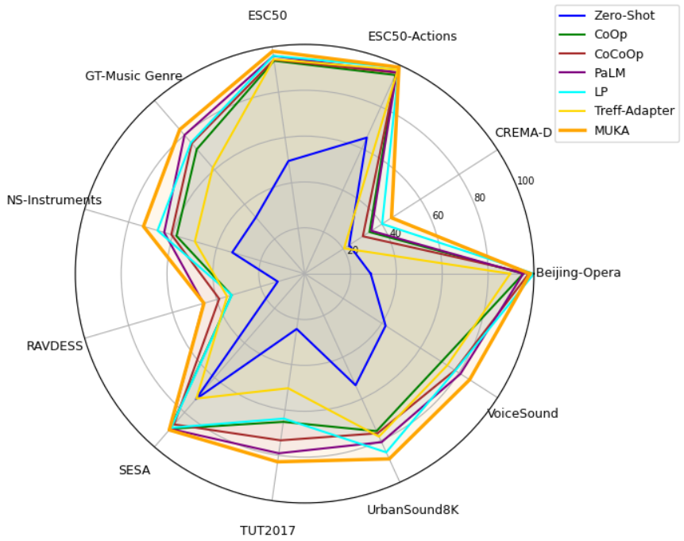
*Figure 1:Comparison between few-shot adaptation methods of large audio-models.*

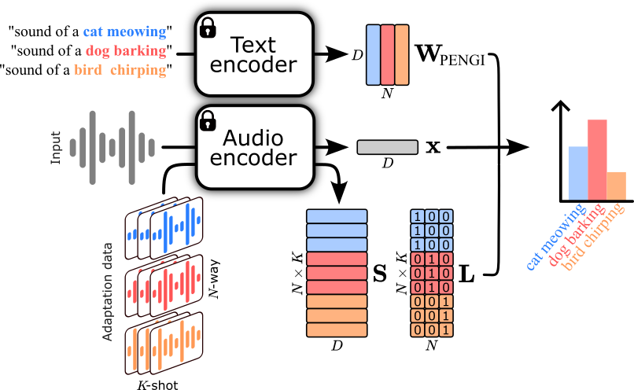
*Figure 2:Training-free adaptation framework for Few-shot ALMs.*

---
**Usage Info**: 4785 tokens used.
**Generated at**: 2026-02-23 22:36:04

---

# 📚 SA-SSL-MOS: Self-supervised Learning MOS Prediction with Spectral Augmentation for Generalized Multi-Rate Speech Assessment

🚀 URL: https://arxiv.org/html/2602.14785

## 🌏 Abstract (원문)
Speech quality assessment (SQA) is the task of evaluating how well human or synthetic speech is perceived by a listener. There are two main approaches to SQA: subjective and objective. Subjective methods involve human listeners rating the speech, typically on the mean-opinion-score (MOS) scale, where listeners rate quality from 1 (bad) to 5 (excellent). Objective methods use algorithms to predict human perception and are more efficient and reproducible. These include intrusive methods like PESQ[18]and POLQA[2], which compare a degraded speech signal to its clean reference, and non-intrusive methods that assess quality using only the degraded signal. Since clean reference signals are rarely available in real-world scenarios, non-intrusive SQA methods are popular. Recent state-of-the-art non-intrusive SQA models[4,19,12,17]leverage self-supervised learning (SSL) representations extracted from large-scale pretrained models, such as Wav2Vec2, HuBERT, and WavLM[1,9,3]. In this framework, an SSL model is pre-trained on vast amounts of unlabeled data and provides generic representations that can be exploited for downstream tasks such as SQA. However, a key limitation is that current SSL models are typically pretrained on1616kHz speech. As a result, high-fidelity recordings (e.g., 24 kHz or 48 kHz) must be downsampled to 16 kHz before feature extraction, which discards perceptually important high-frequency information and negatively impacts SQA performance. Developing a generalized SSL-based multi-rate SQA method providing MOS, that works across different sampling rates, is an interesting yet challenging task due to three reasons. (a) First, SSL-based models lack access to high-band information. (b) Second, there is a scarcity of multi-rate datasets. Most MOS-labelled corpora are collected at a single sampling rate, limiting the availability of suitable training data. (c) Third, the range-equalizing bias complicates cross-dataset learning[5]. Human raters typically use the full MOS scale even when the variance in perceived quality is limited, leading to misaligned MOS distributions across datasets. For example, a MOS rating of5for a 16 kHz sample may not correspond to the same perceived quality as a MOS rating5for a 48 kHz sample. Therefore, it is difficult to directly combine MOS-labeled datasets recorded at different sampling rates and use the combined dataset for model training. Recently, a multi-rate MOS-labeled subjective dataset containing recordings at 16, 24, and 48 kHz within a single evaluation was released[10]as part of the AudioMOS 2025 challenge, aimed to tackle the issue of multi-rate SQA. However, its limited size makes it challenging to train a generalizable multi-rate SQA model. In this work, we show that SSL-based multi-rate SQA methods trained only on the AudioMOS dataset struggle to generalize when evaluated on diverse external datasets. To address this limitation, we proposeSA-SSL-MOS, a spectrogram-augmented SSL-based model for non-intrusive MOS prediction. The proposed method augments SSL-based features at 16 kHz with spectrogram features to preserve high-frequency information. By effectively combining SSL-based and spectral-augmented features, SA-SSL-MOS takes advantage of the robustness and performance of SSL-based approaches while still retrieving information of higher frequencies for high-fidelity recordings. Furthermore, we introduce a two-step pretraining–finetuning framework that enables effective use of limited multi-rate MOS data. From this, we investigate two research questions. First, does high-frequency information improve MOS prediction in high-fidelity recordings? And second, because of dataset limitations, does a pretraining strategy improve generalization to unseen speech recordings? Our contributions in this article are as follows: (1) we propose SA-SSL-MOS, a method for high-fidelity multi-rate speech quality assessment method; (2) we demonstrate that incorporating high-frequency information significantly improves objective speech quality prediction; (3) we show that an SSL-based multi-rate SQA method trained on limited AudioMOS data suffers in generalization, and we introduce a two-step training strategy that improves generalization to out-of-distribution datasets.
## 🌏 Abstract (번역)
음성 품질 평가(SQA)는 인간 또는 합성 음성이 청취자에게 얼마나 잘 인식되는지를 평가하는 작업입니다. SQA에는 주관적 방법과 객관적 방법의 두 가지 주요 접근 방식이 있습니다. 주관적 방법은 인간 청취자가 일반적으로 1(나쁨)에서 5(우수)까지의 품질을 평가하는 평균 의견 점수(MOS) 척도로 음성을 평가하는 방식입니다. 객관적 방법은 알고리즘을 사용하여 인간의 지각을 예측하며 더 효율적이고 재현 가능합니다. 여기에는 열화된 음성 신호를 깨끗한 참조 신호와 비교하는 PESQ 및 POLQA와 같은 침입적 방법과, 열화된 신호만을 사용하여 품질을 평가하는 비침입적 방법이 포함됩니다. 실제 상황에서는 깨끗한 참조 신호를 거의 사용할 수 없기 때문에 비침입적 SQA 방법이 대중적입니다. 최근의 최첨단 비침입적 SQA 모델들은 Wav2Vec2, HuBERT, WavLM과 같은 대규모 사전 학습 모델에서 추출된 자기 지도 학습(SSL) 표현을 활용합니다. 이 프레임워크에서 SSL 모델은 방대한 양의 레이블이 없는 데이터로 사전 학습되어 SQA와 같은 다운스트림 작업에 활용될 수 있는 일반적인 표현을 제공합니다. 그러나 주요 한계점은 현재의 SSL 모델들이 일반적으로 16kHz 음성으로 사전 학습된다는 것입니다. 결과적으로 고충실도 녹음(예: 24kHz 또는 48kHz)은 특징 추출 전에 16kHz로 다운샘플링되어야 하며, 이는 지각적으로 중요한 고주파 정보를 폐기하고 SQA 성능에 부정적인 영향을 미칩니다. 다양한 샘플링 레이트에서 작동하며 MOS를 제공하는 일반화된 SSL 기반 다중 레이트 SQA 방법을 개발하는 것은 세 가지 이유로 흥미롭지만 도전적인 과제입니다. (a) 첫째, SSL 기반 모델은 고대역 정보에 접근할 수 없습니다. (b) 둘째, 다중 레이트 데이터셋이 부족합니다. 대부분의 MOS 레이블이 지정된 코퍼스는 단일 샘플링 레이트에서 수집되어 적절한 학습 데이터의 가용성을 제한합니다. (c) 셋째, 범위 균등화 편향이 교차 데이터셋 학습을 복잡하게 만듭니다. 인간 평가자들은 지각된 품질의 분산이 제한적인 경우에도 일반적으로 전체 MOS 척도를 사용하므로, 데이터셋 간에 MOS 분포가 일치하지 않게 됩니다. 예를 들어, 16kHz 샘플에 대한 MOS 5점은 48kHz 샘플에 대한 MOS 5점과 동일한 지각 품질에 해당하지 않을 수 있습니다. 따라서 서로 다른 샘플링 레이트로 녹음된 MOS 레이블 데이터셋을 직접 결합하여 모델 학습에 사용하는 것은 어렵습니다. 최근 AudioMOS 2025 챌린지의 일환으로 단일 평가 내에서 16, 24, 48kHz 녹음을 포함하는 다중 레이트 MOS 레이블 주관적 데이터셋이 공개되어 다중 레이트 SQA 문제를 해결하고자 했습니다. 그러나 그 크기가 제한적이어서 일반화 가능한 다중 레이트 SQA 모델을 학습시키기에는 어렵습니다. 본 연구에서는 AudioMOS 데이터셋으로만 학습된 SSL 기반 다중 레이트 SQA 방법이 다양한 외부 데이터셋에서 평가될 때 일반화에 어려움을 겪음을 보여줍니다. 이러한 한계를 해결하기 위해 비침입적 MOS 예측을 위한 스펙트로그램 증강 SSL 기반 모델인 SA-SSL-MOS를 제안합니다. 제안된 방법은 16kHz의 SSL 기반 특징을 스펙트로그램 특징으로 보강하여 고주파 정보를 보존합니다. SSL 기반 특징과 스펙트럼 증강 특징을 효과적으로 결합함으로써, SA-SSL-MOS는 SSL 기반 접근 방식의 견고함과 성능을 활용하는 동시에 고충실도 녹음을 위한 고주파 정보를 검색합니다. 또한, 제한된 다중 레이트 MOS 데이터를 효과적으로 사용할 수 있도록 하는 2단계 사전 학습-미세 조정 프레임워크를 도입합니다. 이를 통해 두 가지 연구 질문을 조사합니다. 첫째, 고주파 정보가 고충실도 녹음에서 MOS 예측을 개선하는가? 둘째, 데이터셋의 한계 때문에 사전 학습 전략이 보지 못한 음성 녹음에 대한 일반화 성능을 향상시키는가? 본 논문의 기여는 다음과 같습니다: (1) 고충실도 다중 레이트 음성 품질 평가 방법인 SA-SSL-MOS를 제안합니다. (2) 고주파 정보를 통합하는 것이 객관적 음성 품질 예측을 유의미하게 개선함을 입증합니다. (3) 제한된 AudioMOS 데이터로 학습된 SSL 기반 다중 레이트 SQA 방법이 일반화에 취약함을 보여주고, 분포 외 데이터셋에 대한 일반화 성능을 향상시키는 2단계 학습 전략을 도입합니다.

## 🔍 Methods & Results
- 16kHz SSL 특징과 48kHz 스펙트로그램 특징을 결합한 이중 분기 구조의 SA-SSL-MOS 모델 제안
- SSL 분기에는 Wav2vec2-XLS-R-2B의 9번 레이어를 사용하고, 스펙트로그램 분기에는 DNSMOS Pro 기반 인코더를 적용
- MOS 예측을 가우시안 사후 확률로 모델링하여 평균과 분산을 동시에 예측하고 GNLL 손실 함수를 통해 최적화
- 대규모 48kHz MOS 데이터셋으로 사전 학습 후 제한된 다중 레이트 데이터로 미세 조정하는 2단계 학습 전략 도입
- 고주파 정보의 통합이 고충실도 녹음의 음성 품질 예측 성능을 유의미하게 향상시킴을 입증
- 제안된 2단계 학습 전략이 소규모 데이터셋 학습 시 발생하는 일반화 문제를 효과적으로 해결함을 확인

## 🖼 Figures
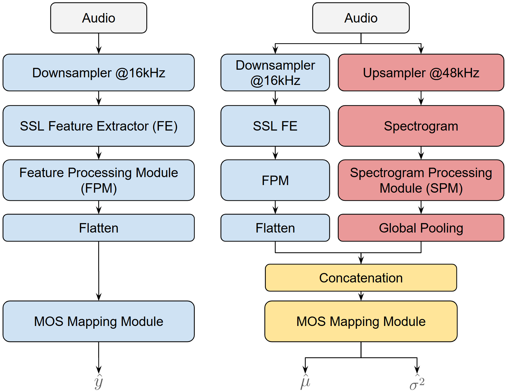
*Fig. 1:Architecture comparison between the existing SSL-Layer-MOS (left) and the proposed SA-SSL-MOS (right).*

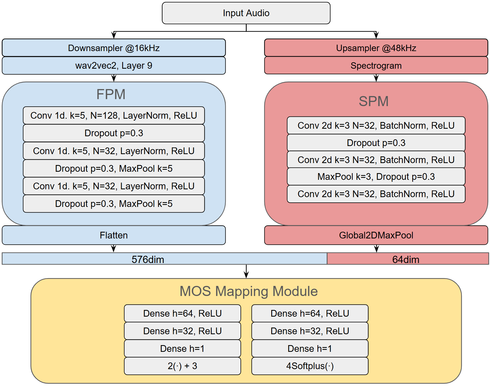
*Fig. 2:Detailed layer-wise architecture of SA-SSL-MOS.*

---
**Usage Info**: 6236 tokens used.
**Generated at**: 2026-02-23 22:36:38

---

# 📚 EchoTorrent: Towards Swift, Sustained, and Streaming Multi-Modal Video Generation

🚀 URL: https://arxiv.org/html/2602.13669

## 🌏 Abstract (원문)
Recent DiT-based audio-driven avatars have achieved remarkable visual fidelity, with smooth motion dynamics and extensive lip-sync consistency across diverse expressions. However, they suffer from inflated inference passes and shortened temporal coherence, fundamentally limiting scalability in real-time, long-horizon generation. For instance, state-of-the-art approaches typically require dozens of denoising steps, each involving 2–3 forward passes due to multi-condition classifier-free guidance (CFG), leading to prohibitive latency and computational redundancy. Unfortunately, this substantial computational cost supports only extremely short generations, typically 3 to 5 seconds, highlighting a critical mismatch between model efficiency and the demands of real-world, continuous avatar generation. From a first-principles perspective, the most direct path toward real-time, streaming audio-driven avatar generation lies in reducing inference passes and transitioning to an autoregressive formulation. However, in practice, both strategies lead to significant performance degradation, such as (1) visual blurring and texture degradation, (2) long-term identity drift, (3) long-term color drift, and (4) degraded audio-lip synchronization. Moreover, further reducing the number of inference passes within each step, i.e., simplifying multi-condition CFG, undermines the efficacy of existing approaches and amplifies the aforementioned degradations. This creates a critical challenge: Is it possible to simultaneously minimize inference passes and multimodal degradations under streaming constraints in audio-driven avatar generation? To address these issues, we propose Multi-Teacher Training, a SFT-then-RL framework: SFT aligns teacher and student temporal contexts to bridge the training-inference gap; RL establishes a specialized teacher ensemble to empower post-distillation specialization on singing, profile views, and rare phonemes. We further introduce Adaptive CFG Calibration DMD (ACC-DMD) to minimize inference passes by scheduling audio CFG augmentation spatiotemporally, eliminating redundant computations and enabling single-pass per-step inference. To mitigate cumulative errors in long-horizon generation, we present the Hybrid Long Tail Forcing paradigm, which enforces alignment exclusively on tail frames during self-rollout and utilizes a causal-bidirectional hybrid attention mechanism. Finally, we refine the VAE decoder through pixel-domain optimization to recover high-frequency details and suppress fine-grained artifacts without inference overhead. Extensive experiments demonstrate that EchoTorrent effectively suppresses spatial blurring, temporal drift, and lip desynchronization while maintaining high efficiency with few-pass streaming inference.
## 🌏 Abstract (번역)
최근 DiT 기반의 오디오 기반 아바타는 다양한 표정에서 부드러운 움직임 역동성과 광범위한 입술 동기화 일관성을 통해 놀라운 시각적 충실도를 달성했습니다. 그러나 이러한 모델들은 과도한 추론 패스와 단축된 시간적 일관성으로 인해 실시간 및 장기 생성에서의 확장성이 근본적으로 제한되는 문제를 겪고 있습니다. 예를 들어, 최신 접근 방식은 일반적으로 수십 단계의 디노이징 단계를 필요로 하며, 각 단계는 다중 조건 분류기 없는 가이드(CFG)로 인해 2~3회의 포워드 패스를 포함하므로 과도한 지연 시간과 계산 중복을 초래합니다. 불행히도 이러한 상당한 계산 비용은 3~5초 정도의 극히 짧은 생성만을 지원하며, 이는 모델 효율성과 실제 세계의 지속적인 아바타 생성 요구 사이의 심각한 불일치를 강조합니다. 제1원칙 관점에서 실시간 스트리밍 오디오 기반 아바타 생성을 향한 가장 직접적인 경로는 추론 패스를 줄이고 자기회귀 방식으로 전환하는 것입니다. 그러나 실제로는 두 전략 모두 시각적 흐림 및 질감 저하, 장기적 정체성 드리프트, 장기적 색상 드리프트, 오디오-입술 동기화 저하와 같은 상당한 성능 저하를 초래합니다. 또한 각 단계 내에서 추론 패스 수를 더 줄이는 것(즉, 다중 조건 CFG 단순화)은 기존 접근 방식의 효능을 약화시키고 앞서 언급한 저하를 증폭시킵니다. 이는 중요한 과제를 제기합니다: 오디오 기반 아바타 생성의 스트리밍 제약 하에서 추론 패스와 멀티모달 저하를 동시에 최소화할 수 있는가? 이를 해결하기 위해 우리는 SFT-then-RL 프레임워크인 Multi-Teacher Training을 제안합니다. SFT는 교사와 학생의 시간적 문맥을 정렬하여 훈련-추론 격차를 해소하고, RL은 전문화된 교사 앙상블을 구축하여 노래, 측면 뷰 및 희귀 음소에 대한 증류 후 전문화를 강화합니다. 또한 추론 패스를 더욱 최소화하기 위해 오디오 CFG 증강을 시공간적으로 스케줄링하여 중복 계산을 제거하고 단계당 단일 패스 추론을 가능하게 하는 Adaptive CFG Calibration DMD (ACC-DMD)를 도입합니다. 장기 생성에서의 누적 오류를 완화하기 위해, 셀프 롤아웃 중 테일 프레임에 대해서만 정렬을 강제하고 인과-양방향 하이브리드 어텐션 메커니즘을 활용하는 Hybrid Long Tail Forcing 패러다임을 제시합니다. 마지막으로, 추론 오버헤드 없이 고주파 세부 정보를 복구하고 미세한 아티팩트를 억제하기 위해 픽셀 도메인 최적화를 통해 VAE 디코더를 개선합니다. 광범위한 실험을 통해 EchoTorrent가 소수 패스 스트리밍 추론으로 높은 효율성을 유지하면서 공간적 흐림, 시간적 드리프트 및 입술 비동기화를 효과적으로 억제함을 입증했습니다.

## 🔍 Methods & Results
- Multi-Teacher Training (SFT-then-RL): SFT를 통해 교사와 학생의 시간적 문맥을 정렬하여 훈련-추론 격차를 해소하고, RL 기반 교사 앙상블을 통해 노래, 측면 얼굴, 희귀 음소 등 특수 도메인 능력을 전수함.
- Adaptive CFG Calibration DMD (ACC-DMD): 오디오 CFG의 시공간적 민감도 차이를 활용하여 낮은 SNR 단계에서는 입술 동기화에, 높은 SNR 단계에서는 정체성 보존에 집중하도록 스케줄링하여 단계당 단일 패스 추론을 구현함.
- Hybrid Long Tail Forcing: 인과적 어텐션과 양방향 어텐션을 결합한 하이브리드 구조를 도입하여 스트리밍 효율성을 유지하면서 품질 저하를 방지하고, 청크의 마지막 프레임(Tail frame)에 대해서만 정렬을 수행하여 누적 오류를 억제함.
- VAE Decoder as Refiner: VAE 디코더를 픽셀 도메인에서 L1, L2, GAN 손실을 사용하여 미세 조정함으로써 잠재 공간에서 손실된 고주파 세부 정보를 복원하고 미세한 아티팩트를 제거함.
- 실험 결과: EchoTorrent는 적은 횟수의 추론 패스만으로도 실시간 스트리밍이 가능한 수준의 효율성을 달성했으며, 장시간 생성 시 발생하는 공간적 흐림, 시간적 드리프트 및 입술 비동기화 문제를 효과적으로 해결함.

## 🖼 Figures
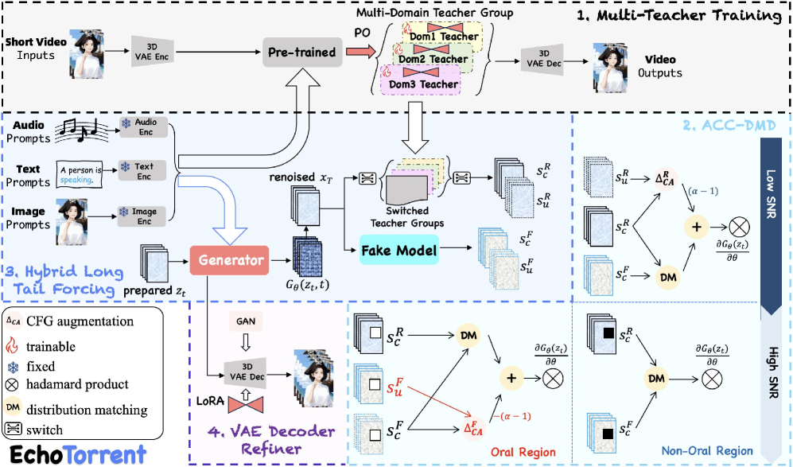
*Figure 1:The overall training pipeline of EchoTorrent.*

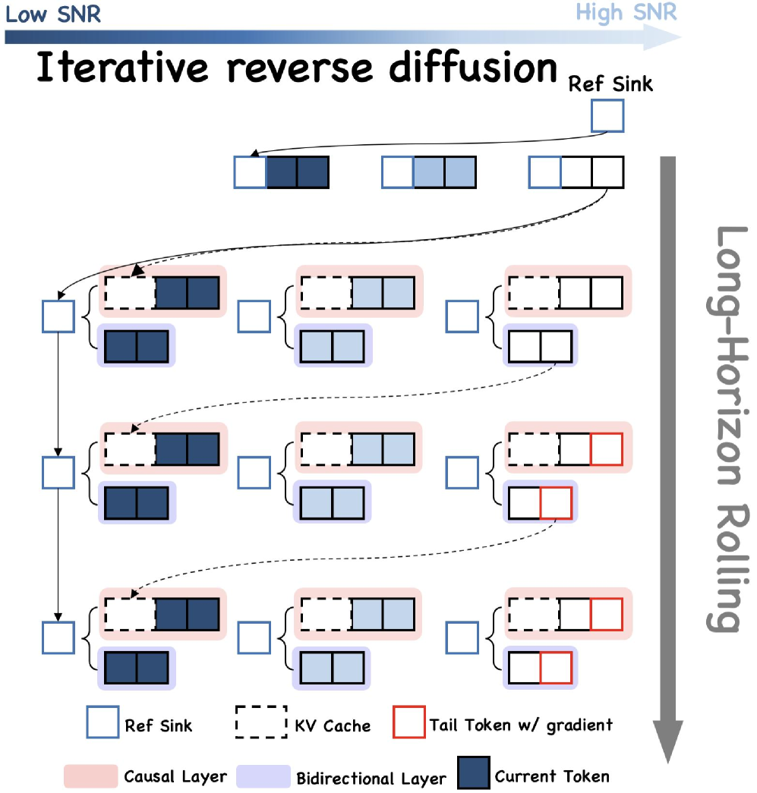
*Figure 2:Hybrid Long Tail Forcing.*

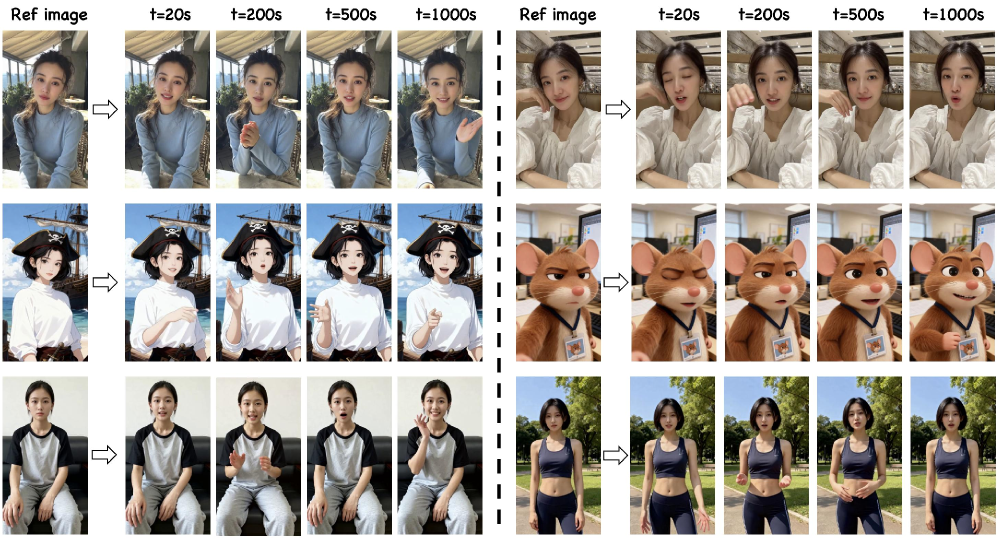
*Figure 3:Qualitative Results for Long-Horizon Robustness. Visualizations for different duration ranging from 20 seconds to 1000 seconds.*

---
**Usage Info**: 6796 tokens used.
**Generated at**: 2026-02-23 22:37:17

---

# 📚 GSRM: Generative Speech Reward Model for Speech RLHF

🚀 URL: https://arxiv.org/html/2602.13891

## 🌏 Abstract (원문)
Automatic speech naturalness assessment has been widely studied through non-intrusive MOS predictors that regress perceptual scores directly from audio. Early neural models such as MOSNet demonstrated the feasibility of predicting naturalness without reference signals, while subsequent work improved robustness and coverage across speech synthesis and telephony scenarios, including NISQA and DNSMOS. More recent approaches, such as UTMOSv2, leverage large-scale self-supervised speech representations to better match human judgments across domains. Beyond speech-specific MOS prediction, audio aesthetics and quality models aim to assess broader perceptual attributes across speech, music, and sound, such as Meta-AES and the AudioMOS benchmark. Despite strong empirical performance, these models operate as black-box regressors that output scalar scores without interpretable justification, motivating the need for generative reward models that explicitly reason over paralinguistic evidence. Reward modeling has recently shifted from discriminative scoring toward generative formulations that produce explicit critiques or reasoning before assigning rewards. This paradigm includes LLM-as-a-judge approaches and generative verifiers that cast reward modeling as a reasoning task. DeepSeek further introduces inference-time scaling for generalist generative reward models, demonstrating that aggregating multiple independently generated judgments significantly improves robustness and generalization. Related work such as GenRM and J1 shows that generative reward models can be iteratively improved via self-generated rationales and online reinforcement learning. While these approaches are now well-established in text domains, analogous techniques for speech and audio remain under-explored. In the speech domain, AudioJudge evaluates the capability of frontier speech LLMs to judge audio quality and paralinguistic attributes through prompt engineering, revealing that most models struggle to provide reliable judgments. The most closely related concurrent works to GSRM are SpeechJudge and WavReward, which train speech LLMs to generate chain-of-thought rationales for pairwise speech comparisons. While effective, both approaches rely on a teacher speech LLM to generate reasoning, which can inherit whatever the teacher model has encoded about naturalness, despite its reliability. In contrast, GSRM decomposes reward modeling into explicit acoustic feature extraction followed by feature-grounded generative reasoning, aligning more closely with how humans assess fine-grained paralinguistic cues. Applying reinforcement learning from human feedback (RLHF) to speech and audio generation is challenging due to the continuous and high-dimensional nature of audio signals, yet recent work has demonstrated promising progress, primarily in text-to-speech (TTS) settings. SpeechJudge applies direct preference optimization (DPO) to post-train TTS models using human preferences. Other studies improve TTS quality using learned or proxy reward signals, including diffusion-based reinforcement learning such as DLPO and offline preference optimization for text-to-audio alignment. Additionally, ASR-based rewards have been explored to enhance intelligibility and perceived naturalness of speech model outputs. Despite these advances, existing RL-based approaches focus almost exclusively on single-utterance TTS or offline audio generation, and no prior work has investigated leveraging online reinforcement learning to improve the naturalness of full-duplex, interactive speech LLMs.
## 🌏 Abstract (번역)
자동 음성 자연스러움 평가는 오디오에서 직접 지각 점수를 회귀하는 비침습적 MOS 예측기를 통해 널리 연구되어 왔습니다. MOSNet과 같은 초기 신경망 모델은 참조 신호 없이 자연스러움을 예측하는 가능성을 보여주었으며, 이후 NISQA 및 DNSMOS와 같은 연구는 음성 합성 및 전화 통화 시나리오 전반에서 강건성과 범위를 개선했습니다. 최근 UTMOSv2와 같은 접근 방식은 대규모 자기 지도 학습 음성 표현을 활용하여 도메인 간 인간의 판단과 더 잘 일치하도록 합니다. 음성 전용 MOS 예측을 넘어, Meta-AES 및 AudioMOS 벤치마크와 같은 오디오 미학 및 품질 모델은 음성, 음악, 소리 전반에 걸쳐 더 넓은 지각 속성을 평가하는 것을 목표로 합니다. 강력한 실증적 성능에도 불구하고, 이러한 모델들은 해석 가능한 근거 없이 스칼라 점수만 출력하는 블랙박스 회귀 모델로 작동하므로, 준언어적 증거를 명시적으로 추론하는 생성형 보상 모델의 필요성이 제기됩니다. 보상 모델링은 최근 판별적 점수 산정 방식에서 보상을 할당하기 전에 명시적인 비평이나 추론을 생성하는 생성형 방식으로 전환되었습니다. 이 패러다임에는 LLM-as-a-judge 접근 방식과 보상 모델링을 추론 작업으로 간주하는 생성형 검증기가 포함됩니다. DeepSeek은 일반 생성형 보상 모델을 위한 추론 시간 스케일링을 도입하여, 독립적으로 생성된 여러 판단을 집계하는 것이 강건성과 일반화 능력을 크게 향상시킨다는 것을 입증했습니다. GenRM 및 J1과 같은 관련 연구는 생성형 보상 모델이 자체 생성된 근거와 온라인 강화 학습을 통해 반복적으로 개선될 수 있음을 보여줍니다. 이러한 접근 방식은 텍스트 도메인에서는 잘 확립되어 있지만, 음성 및 오디오에 대한 유사한 기술은 아직 충분히 탐구되지 않았습니다. 음성 도메인에서 AudioJudge는 프롬프트 엔지니어링을 통해 오디오 품질과 준언어적 속성을 판단하는 최첨단 음성 LLM의 능력을 평가하며, 대부분의 모델이 신뢰할 수 있는 판단을 내리는 데 어려움을 겪고 있음을 밝혔습니다. GSRM과 가장 밀접하게 관련된 동시 연구로는 SpeechJudge와 WavReward가 있으며, 이들은 음성 쌍 비교를 위한 사고의 사슬(CoT) 근거를 생성하도록 음성 LLM을 훈련합니다. 이러한 방식은 효과적이지만, 두 접근 방식 모두 추론 생성을 위해 교사 음성 LLM에 의존하므로 교사 모델의 신뢰도와 관계없이 자연스러움에 대해 인코딩된 내용을 그대로 상속받을 수 있습니다. 반면, GSRM은 보상 모델링을 명시적인 음향 특징 추출과 그에 기반한 생성적 추론으로 분해하여, 인간이 미세한 준언어적 단서를 평가하는 방식과 더 밀접하게 일치시킵니다. 인간 피드백 기반 강화 학습(RLHF)을 음성 및 오디오 생성에 적용하는 것은 오디오 신호의 연속적이고 고차원적인 특성으로 인해 어렵지만, 최근 텍스트 음성 변환(TTS) 설정에서 유망한 진전이 있었습니다. SpeechJudge는 인간의 선호도를 사용하여 TTS 모델을 사후 훈련하기 위해 직접 선호도 최적화(DPO)를 적용합니다. 다른 연구들은 확산 기반 강화 학습(DLPO)이나 텍스트-오디오 정렬을 위한 오프라인 선호도 최적화 등 학습된 또는 대리 보상 신호를 사용하여 TTS 품질을 개선합니다. 또한, 음성 모델 출력의 명료도와 인지된 자연스러움을 향상시키기 위해 ASR 기반 보상이 탐구되었습니다. 이러한 발전에도 불구하고, 기존의 RL 기반 접근 방식은 거의 전적으로 단일 발화 TTS 또는 오프라인 오디오 생성에 집중되어 있으며, 풀듀플렉스(full-duplex) 대화형 음성 LLM의 자연스러움을 개선하기 위해 온라인 강화 학습을 활용하는 연구는 이전까지 없었습니다.

## 🔍 Methods & Results
- GSRM은 보상 모델링을 명시적인 음향 특징 추출과 특징 기반 생성 추론의 두 단계로 분해하여 설계됨
- 기존의 블랙박스 회귀 모델과 달리 준언어적 증거에 기반한 해석 가능한 비평 및 추론을 생성함
- 교사 모델의 판단을 그대로 상속받는 기존의 Speech LLM 기반 방식과 차별화하여 인간의 미세한 평가 방식을 모사함
- 텍스트 도메인에서 검증된 생성형 보상 모델 및 온라인 강화 학습 방법론을 음성 도메인으로 확장 적용함
- 풀듀플렉스(full-duplex) 대화형 음성 LLM의 자연스러움을 개선하기 위한 온라인 강화 학습의 활용 가능성을 제시함

## 🖼 Figures
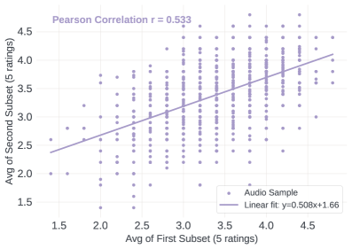
*(a)*

*(a)*

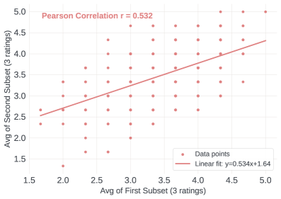
*(b)*

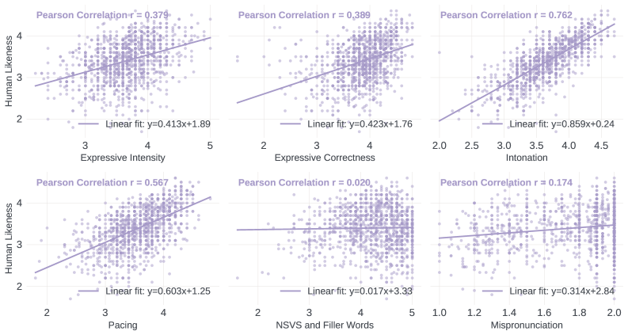
*Figure 2:Correlation Between Sub-Metrics and Human-Likeness Ratings*

*(a)*

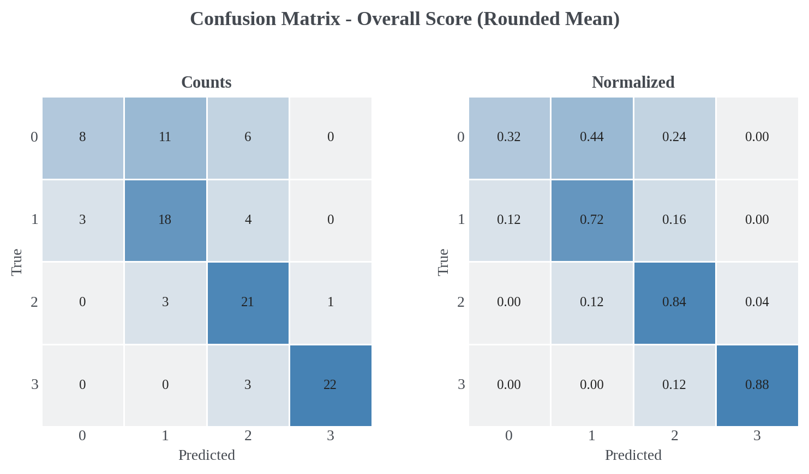
*(a)*

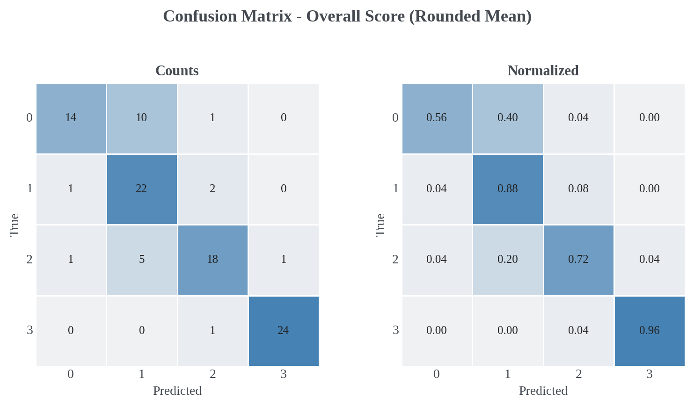
*(b)*

*(a)*

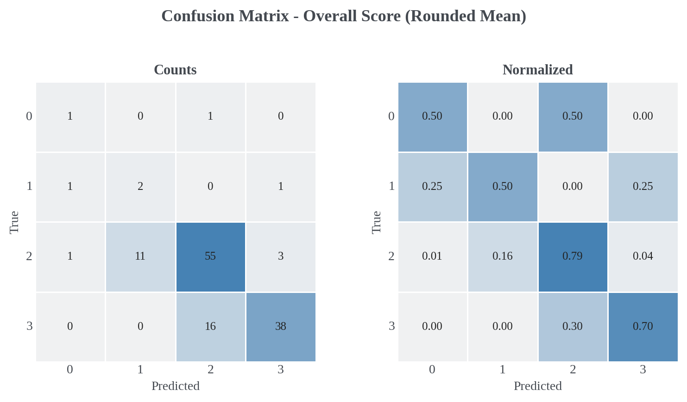
*(a)*

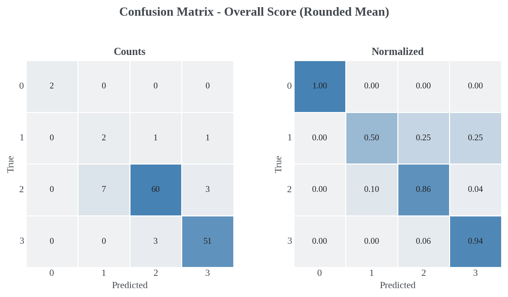
*(b)*

*(a)*

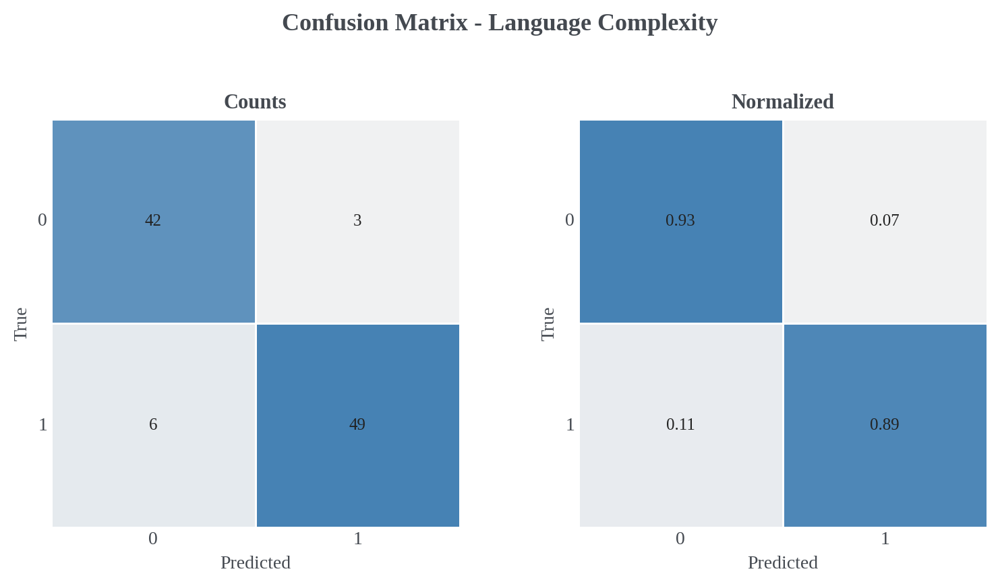
*(a)*

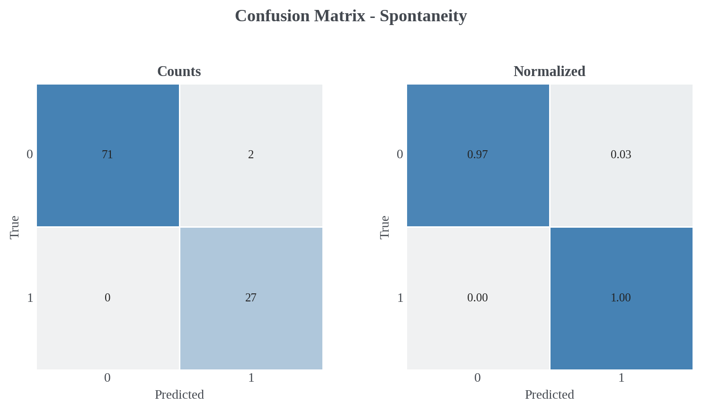
*(b)*

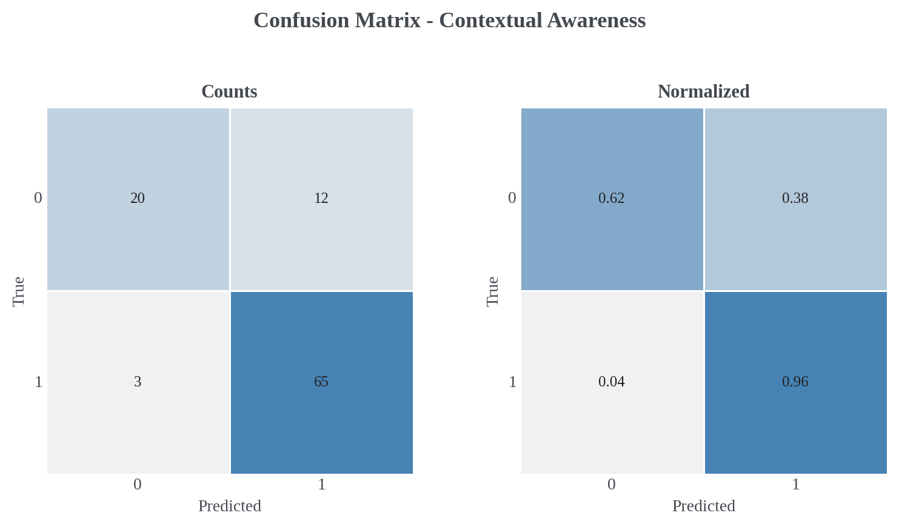
*(c)*

---
**Usage Info**: 4465 tokens used.
**Generated at**: 2026-02-23 22:37:48

---

# 📚 Text Style Transfer with Parameter-efficient LLM Finetuning and Round-trip Translation

🚀 URL: https://arxiv.org/html/2602.15013

## 🌏 Abstract (원문)
Text Style Transfer (TST) is the task of rephrasing text by modifying stylistic attributes while preserving its core attribute-independent semantics and intentShenet al.(2017); Toshevska and Gievska (2024). These stylistic attributes encompass formality, attitude, verbosity, preferred terminology, and other characteristics inherent to the text. A significant challenge in TST lies in the scarcity of annotated parallel corpora, which hinders the application of fully supervised learning or finetuning methodsPanet al.(2024)in most text style domains.
Roundtrip translation is a machine translation technique where a sentence is translated from one language to a pivot language and then back to the original language. It has been previously used to evaluate MT system robustness and generation qualitySomers (2005); Moonet al.(2020). Prior work on TST has observed that roundtrip translating a sentence effectively diminishes stylistic attributes specific to the author, yielding a neutralized style while retaining the contentSennrichet al.(2016); Rabinovichet al.(2017). This observation motivates the use of roundtrip translation pipelines as autoencoders in many encoder-decoder styled TST frameworks to extract destylized latent vectors from input text, so that style-specific decoders can be trained in a supervised fashion even when input style domains are unpredictablePrabhumoyeet al.(2018).
In this paper, we propose a novel TST method that adapts LLMs for style transfer tasks using monolingual in-style corpora and roundtrip translation (Figure1). Our workflow involves first training two neural machine translation models that serve as the roundtrip translation pipeline, using large-scale general-domain bilingual parallel corpora. We then roundtrip translate a monolingual, stylistically consistent corpus using the pretrained NMT models to construct a style-neutral to target-domain pseudo-parallel corpus. This corpus can thus be used to finetune LLMs for TST tasks. Furthermore, to enhance the model’s robustness to unseen or complex style domains, we implemented an inference-time workflow that roundtrip translates queries before doing inference, improving training and inference time coherence (§3.1).
We evaluated (§4) our style transfer method on several text styles with distinctive style features (§4.1.1), and compared its performance against two state-of-the-art methods: Few-shot In Context Learning (ICL) and Automatic Post-Editing (APE)Liuet al.(2024b); Moonet al.(2022). Following prior research, style transfer quality is evaluated using BERT-based style classifiers trained on held-out data and the BLEU scoreSubramanianet al.(2018); Wanet al.(2023); Aycock and Bawden (2024).
Ourmain contributionsare:
Pseudo-parallel dataset construction(§3.1). We propose a roundtrip translation method for generation synthetic parallel corpus, enabling TST with supervised finetuning in domains lacking bitext.
Retrieval augmentation for finetuning and inference(§3.2.3). We propose the use of retrieval-augmentation forfinetuning, carefully experiment with RAG in both finetuning and inference prompts, and validate its effectiveness beyond prompting.
Methods for TST-finetuning(§4). We systematically evaluate finetuned TST-LLMs employing several different models, prompts, RAG methods, and inference methods, compared against state-of-the-art baselines.
## 🌏 Abstract (번역)
텍스트 스타일 변환(TST)은 핵심적인 속성 독립적 의미와 의도를 유지하면서 스타일적 속성을 수정하여 텍스트를 재구성하는 작업입니다. 이러한 스타일적 속성은 격식, 태도, 장황함, 선호하는 용어 및 텍스트 고유의 기타 특성을 포함합니다. TST의 주요 과제는 주석이 달린 병렬 코퍼스의 부족에 있으며, 이는 대부분의 텍스트 스타일 도메인에서 완전 지도 학습이나 미세 조정 방법의 적용을 방해합니다. 왕복 번역(Roundtrip translation)은 문장을 한 언어에서 피벗 언어로 번역한 다음 다시 원래 언어로 번역하는 기계 번역 기술입니다. 이는 이전에 기계 번역 시스템의 견고성과 생성 품질을 평가하는 데 사용되었습니다. TST에 관한 이전 연구에서는 문장을 왕복 번역하면 저자 특유의 스타일 속성이 효과적으로 감소하여 내용을 유지하면서 중립적인 스타일을 얻을 수 있음을 관찰했습니다. 이러한 관찰은 입력 스타일 도메인을 예측할 수 없는 경우에도 스타일별 디코더를 지도 학습 방식으로 훈련할 수 있도록, 입력 텍스트에서 스타일이 제거된 잠재 벡터를 추출하기 위해 많은 인코더-디코더 스타일의 TST 프레임워크에서 왕복 번역 파이프라인을 오토인코더로 사용하도록 동기를 부여합니다. 본 논문에서는 단일 언어 인스타일(in-style) 코퍼스와 왕복 번역을 사용하여 스타일 변환 작업을 위해 대규모 언어 모델(LLM)을 적응시키는 새로운 TST 방법을 제안합니다. 우리의 워크플로우는 먼저 대규모 일반 도메인 이국어 병렬 코퍼스를 사용하여 왕복 번역 파이프라인 역할을 하는 두 개의 신경망 기계 번역(NMT) 모델을 훈련하는 것을 포함합니다. 그런 다음 사전 훈련된 NMT 모델을 사용하여 단일 언어의 스타일이 일관된 코퍼스를 왕복 번역하여 스타일 중립에서 타겟 도메인으로의 의사 병렬(pseudo-parallel) 코퍼스를 구축합니다. 따라서 이 코퍼스는 TST 작업을 위해 LLM을 미세 조정하는 데 사용될 수 있습니다. 또한, 보이지 않거나 복잡한 스타일 도메인에 대한 모델의 견고성을 높이기 위해 추론 전에 쿼리를 왕복 번역하는 추론 시간 워크플로우를 구현하여 훈련 및 추론 시간의 일관성을 개선했습니다. 우리는 독특한 스타일 특징을 가진 여러 텍스트 스타일에 대해 스타일 변환 방법을 평가했으며, Few-shot In Context Learning(ICL) 및 Automatic Post-Editing(APE)이라는 두 가지 최첨단 방법과 성능을 비교했습니다. 이전 연구에 따라 스타일 변환 품질은 보류된 데이터로 훈련된 BERT 기반 스타일 분류기와 BLEU 점수를 사용하여 평가됩니다. 우리의 주요 기여는 다음과 같습니다: 1) 의사 병렬 데이터셋 구축: 비텍스트(bitext)가 부족한 도메인에서 지도 학습 미세 조정을 통한 TST를 가능하게 하는 합성 병렬 코퍼스 생성을 위한 왕복 번역 방법을 제안합니다. 2) 미세 조정 및 추론을 위한 검색 증강(RAG): 미세 조정을 위한 검색 증강 사용을 제안하고, 미세 조정 및 추론 프롬프트 모두에서 RAG를 신중하게 실험하며, 프롬프팅 이상의 효과를 검증합니다. 3) TST 미세 조정 방법: 최첨단 베이스라인과 비교하여 여러 모델, 프롬프트, RAG 방법 및 추론 방법을 사용하는 미세 조정된 TST-LLM을 체계적으로 평가합니다.

## 🔍 Methods & Results
- 단일 언어 인스타일 코퍼스와 왕복 번역(RT) 파이프라인을 사용하여 의사 병렬 데이터셋을 생성하는 새로운 TST 프레임워크 제안
- Marian NMT 모델을 사용하여 입력 텍스트의 스타일 특징을 중립화하고 이를 LLM 미세 조정용 타겟 데이터와 쌍을 이룸
- 훈련 시의 중립화된 입력과 추론 시의 임의 입력을 일치시키기 위해 추론 전 쿼리를 왕복 번역하는 'RT-first' 추론 워크플로우 도입
- 미세 조정 및 추론 단계 모두에 검색 증강 생성(RAG)을 통합하여 생성기와 검색기 간의 일관성 향상
- Faiss 라이브러리를 활용한 유사도 기반 검색 방법을 적용하고, 질문(소스)보다 답변(타겟) 유사도 중심의 검색이 더 효과적임을 확인
- 추론 시 소스 텍스트만 있는 상황을 해결하기 위해 1차 생성 결과물(sketch)을 쿼리로 사용하는 'sketch-first' 검색 로직 구현
- 의사 병렬 코퍼스에서 도메인 특화 용어 쌍을 추출하여 프롬프트에 추가함으로써 용어 및 이름의 일관성 개선
- LoRA 기법을 사용하여 2개의 NVIDIA A100 GPU로 7B 및 8B LLM을 효율적으로 미세 조정
- BERT 기반 스타일 분류기 및 BLEU 점수 평가 결과, 제안된 방법이 보이지 않는 스타일 도메인에서 기존 ICL 및 APE 방식보다 우수한 성능을 보임

## 🖼 Figures
![Figure 1:Our proposed workflow for finetuning large language models (LLMs) for text style transfer (TST) using only non-parallel dataset in the target domain. A bilingual general-domain parallel dataset is used to train a pair of neural machine translation (NMT) models capable of translating between English and a pivot language. We then obtain machine-translated style-neutral texts of the original in-domain texts by roundtrip translating the in-domain set with the NMT models. This enables supervised finetuning of LLMs for TST, where we finetune LLMs for MT-output-domain to target-domain transfer using the synthetic parallel corpus.](../images/2026-02-17/2602.15013/2602.15013_fig0.png)
*Figure 1:Our proposed workflow for finetuning large language models (LLMs) for text style transfer (TST) using only non-parallel dataset in the target domain. A bilingual general-domain parallel dataset is used to train a pair of neural machine translation (NMT) models capable of translating between English and a pivot language. We then obtain machine-translated style-neutral texts of the original in-domain texts by roundtrip translating the in-domain set with the NMT models. This enables supervised finetuning of LLMs for TST, where we finetune LLMs for MT-output-domain to target-domain transfer using the synthetic parallel corpus.*

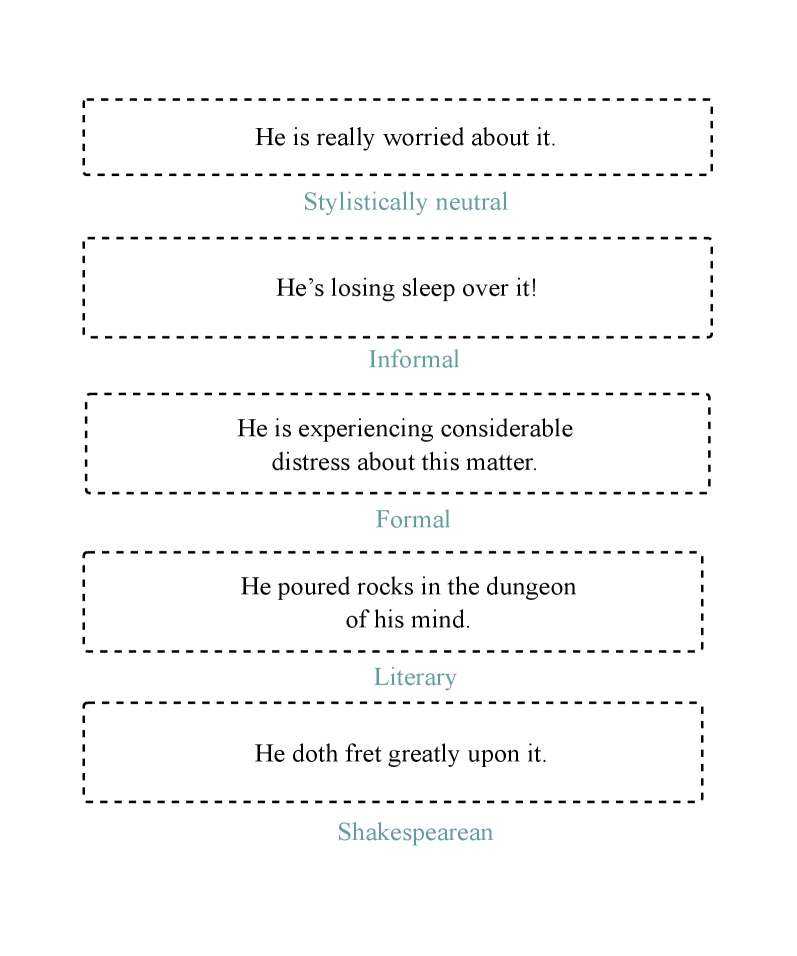
*Figure 2: Example sentences illustrating semantically equivalent content in various styles. Outputs of our roundtrip translation pipeline is considered as stylistically neutral.*

![Figure 3:Our proposed workflow. We show two inference routes that we tested on: route i (blue in figure) involves first roundtrip translate the input to match the training-time input domains and then perform RAG-enhanced TST-LLM inference with two retrievers we built (§3.2) on the intermediary text, where as route ii (red in figure) directly performs RAG-enhanced TST-LLM inference using the original input. Controlled experiments on these methods demonstrate that roundtrip translating the input first significantly enhances model’s performance, bringing especially considerable improvements facing stylistically diverse and complex queries. Findings in this experiment are described in §4.4.](../images/2026-02-17/2602.15013/2602.15013_fig2.png)
*Figure 3:Our proposed workflow. We show two inference routes that we tested on: route i (blue in figure) involves first roundtrip translate the input to match the training-time input domains and then perform RAG-enhanced TST-LLM inference with two retrievers we built (§3.2) on the intermediary text, where as route ii (red in figure) directly performs RAG-enhanced TST-LLM inference using the original input. Controlled experiments on these methods demonstrate that roundtrip translating the input first significantly enhances model’s performance, bringing especially considerable improvements facing stylistically diverse and complex queries. Findings in this experiment are described in §4.4.*

![Figure 4:Retrieval augmentation workflow. Left (a): Similarity-based example retriever. We vectorize and index the target-side texts of the parallel synthetic datasets for nearest-neighbor search. For each query, we first do k-shot inference with the finetuned TST-LLM to obtain an "in-domain" sketch, which is used as search query in the target-side dataset to obtain k most similar pairs. Note that this is for inference-time RAG. For finetuning prompts, we can search with the target side texts directly without the need for an in-domain sketch. Right (b) Terminology and name retriever: For each instance in the synthetic parallel datasets, the first LLM call extracts relevant words from the source side, then the second call matches them with their counterparts in the target side, yielding a terminology pair list for each domain. During inference, each input is checked against these term pairs; where relevant matches are found, a concise guiding sentence is appended to the prompt.](../images/2026-02-17/2602.15013/2602.15013_fig3.png)
*Figure 4:Retrieval augmentation workflow. Left (a): Similarity-based example retriever. We vectorize and index the target-side texts of the parallel synthetic datasets for nearest-neighbor search. For each query, we first do k-shot inference with the finetuned TST-LLM to obtain an "in-domain" sketch, which is used as search query in the target-side dataset to obtain k most similar pairs. Note that this is for inference-time RAG. For finetuning prompts, we can search with the target side texts directly without the need for an in-domain sketch. Right (b) Terminology and name retriever: For each instance in the synthetic parallel datasets, the first LLM call extracts relevant words from the source side, then the second call matches them with their counterparts in the target side, yielding a terminology pair list for each domain. During inference, each input is checked against these term pairs; where relevant matches are found, a concise guiding sentence is appended to the prompt.*

---
**Usage Info**: 5856 tokens used.
**Generated at**: 2026-02-23 22:39:48

---

