# 🚩 (2026-02-18) Scholar Inbox 추천 논문 

# 📚 Consistency-Preserving Diverse Video Generation

🚀 URL: https://arxiv.org/html/2602.15287

## 🌏 Abstract (원문)
Background and goals.Video generation is a fundamental problem in computer vision, enabling applications in media content creation and virtual reality. However, generating videos is computationally expensive, limiting the number of samples that can be produced under a fixed computation budget. To maximize the utility of each generation, we aim to jointly sample a batch of diverse videos. Unlike images, videos also demand temporal consistency: frames within each video must remain coherent. Thus, our goal is twofold: (i) ensure high diversity across generated videos, and (ii) maintain temporal consistency within each video. Our approach.We propose a flow-matching sampling framework that targets both goals. Inspired by diverse image generation methods, we encourage diversity by using the gradient of a batch diversity objective to push samples apart (a diversity gradient) during the flow-matching sampling process. For consistency, we compute a temporal-consistency objective and remove from the diversity gradient any component that would decrease this objective (using a consistency gradient). This regulation protects temporal consistency while retaining diversity updates that are neutral or beneficial to consistency. Latent-space models.Prior diverse image generation methods compute diversity gradients in image space and backpropagate through the decoder. For videos, the higher dimensionality makes such gradient computations memory-intensive and often infeasible to perform in parallel. We instead train lightweight latent models so both diversity and consistency objectives can be computed without decoder passes. Contributions.We introduce (1) a consistency-preserving joint sampling method for flow-matching video generators via gradient regulation, and (2) latent-space embedding and interpolation models that enable lightweight computation in latent space. Experiments demonstrate that our approach substantially improves temporal consistency and color naturalness while achieving diversity comparable to strong joint-sampling baselines.
## 🌏 Abstract (번역)
배경 및 목표: 비디오 생성은 미디어 콘텐츠 제작 및 가상 현실 분야의 응용을 가능하게 하는 컴퓨터 비전의 근본적인 문제입니다. 그러나 비디오 생성은 계산 비용이 많이 들어 고정된 계산 예산 내에서 생성할 수 있는 샘플 수가 제한됩니다. 각 생성의 효용을 극대화하기 위해, 우리는 다양한 비디오 배치를 공동으로 샘플링하는 것을 목표로 합니다. 이미지와 달리 비디오는 시간적 일관성도 요구합니다. 즉, 각 비디오 내의 프레임들이 일관성을 유지해야 합니다. 따라서 우리의 목표는 두 가지입니다: (i) 생성된 비디오들 간의 높은 다양성을 보장하고, (ii) 각 비디오 내의 시간적 일관성을 유지하는 것입니다. 접근 방식: 우리는 두 가지 목표를 모두 겨냥한 플로우 매칭 샘플링 프레임워크를 제안합니다. 다양한 이미지 생성 방법에서 영감을 받아, 플로우 매칭 샘플링 과정 중에 샘플들을 서로 밀어내는 배치 다양성 목적 함수의 그래디언트(다양성 그래디언트)를 사용하여 다양성을 촉진합니다. 일관성을 위해, 시간적 일관성 목적 함수를 계산하고 다양성 그래디언트에서 이 목적 함수를 감소시킬 수 있는 모든 성분을 제거합니다(일관성 그래디언트 사용). 이러한 규제는 시간적 일관성을 보호하면서도 일관성에 중립적이거나 유익한 다양성 업데이트를 유지합니다. 잠재 공간 모델: 기존의 다양한 이미지 생성 방법들은 이미지 공간에서 다양성 그래디언트를 계산하고 디코더를 통해 역전파합니다. 비디오의 경우, 높은 차원성으로 인해 이러한 그래디언트 계산은 메모리 집약적이며 병렬로 수행하기 어려운 경우가 많습니다. 대신 우리는 경량 잠재 모델을 훈련하여 디코더 통과 없이 다양성 및 일관성 목적 함수를 모두 계산할 수 있도록 합니다. 기여도: 우리는 (1) 그래디언트 규제를 통한 플로우 매칭 비디오 생성기를 위한 일관성 보존 공동 샘플링 방법과 (2) 잠재 공간에서의 경량 계산을 가능하게 하는 잠재 공간 임베딩 및 보간 모델을 소개합니다. 실험 결과, 우리의 접근 방식은 강력한 공동 샘플링 베이스라인과 유사한 다양성을 달성하면서도 시간적 일관성과 색상 자연스러움을 실질적으로 개선함을 보여줍니다.

## 🔍 Methods & Results
- 플로우 매칭(Flow-matching) 프레임워크 내에서 다양성과 시간적 일관성을 동시에 최적화하는 공동 샘플링 기법 제안
- 디코더를 거치지 않고 잠재 공간(Latent space)에서 직접 목적 함수를 계산하기 위해 경량화된 비디오/프레임 임베딩 모델(Mv, Mf)과 프레임 보간 모델(Mc) 도입
- 결정적 포인트 프로세스(DPP)를 활용하여 비디오 및 프레임 수준의 다양성 목적 함수(Od)를 정의하고 그래디언트 산출
- 다양성 그래디언트(gd)에서 시간적 일관성 목적 함수(Oc)를 저해하는 성분을 제거하는 그래디언트 규제(Gradient Regulation) 메커니즘 적용
- 잠재 공간 모델들은 실제 비디오 공간의 고정된 인코더(VideoPrism-B, CLIP)의 출력을 모사하도록 훈련되며, 정렬 행렬(Alignment matrices)을 통해 잠재 공간과 비디오 공간 간의 일관성 확보
- 실험 결과, 제안된 방법은 기존 베이스라인 대비 높은 다양성을 유지하면서도 시간적 일관성과 색상 표현의 자연스러움을 크게 향상시킴

## 🖼 Figures
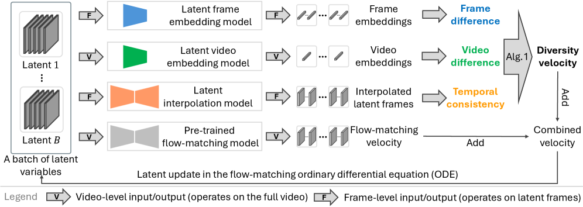
*Figure 1:Joint video generation with enhanced cross-video diversity and preserved intra-video temporal consistency based on latent-space embedding and interpolation.*

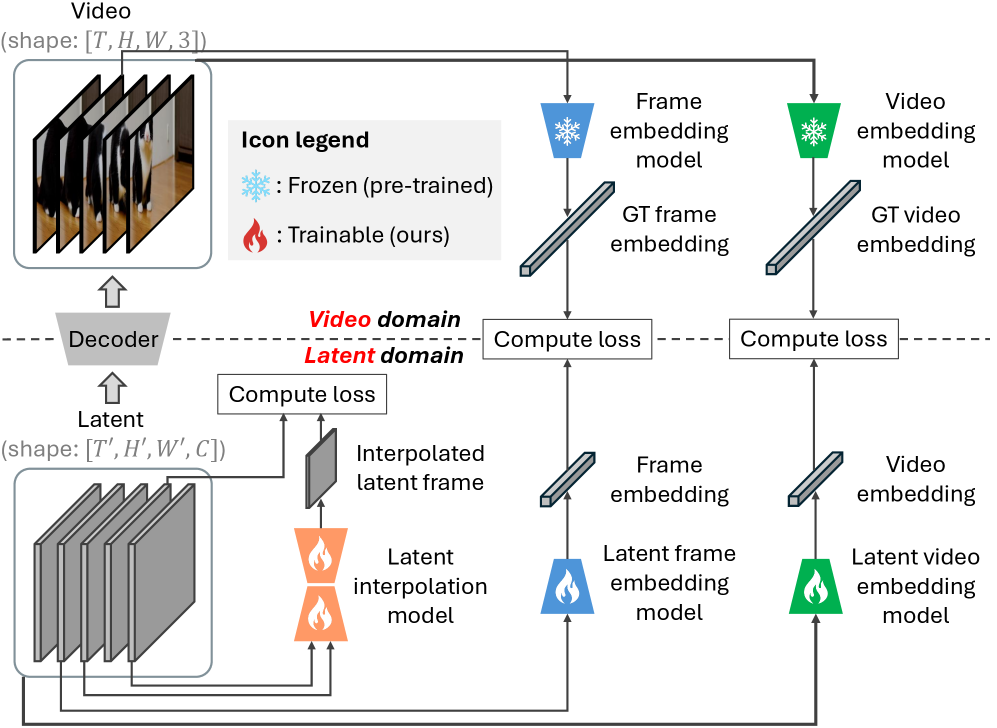
*Figure 2:Illustration of training procedure for latent-space embedding and interpolation models.*

*(a)Extrapolation of 
𝑥
^
1
=
𝑥
𝑡
+
(
1
−
𝑡
)
​
𝑣
𝜃
​
(
𝑥
𝑡
,
𝑡
)
 from intermediate latent states and decoding them to video frames.*

*(a)Extrapolation of 
𝑥
^
1
=
𝑥
𝑡
+
(
1
−
𝑡
)
​
𝑣
𝜃
​
(
𝑥
𝑡
,
𝑡
)
 from intermediate latent states and decoding them to video frames.*

*(b)Frame embedding loss (ours).*

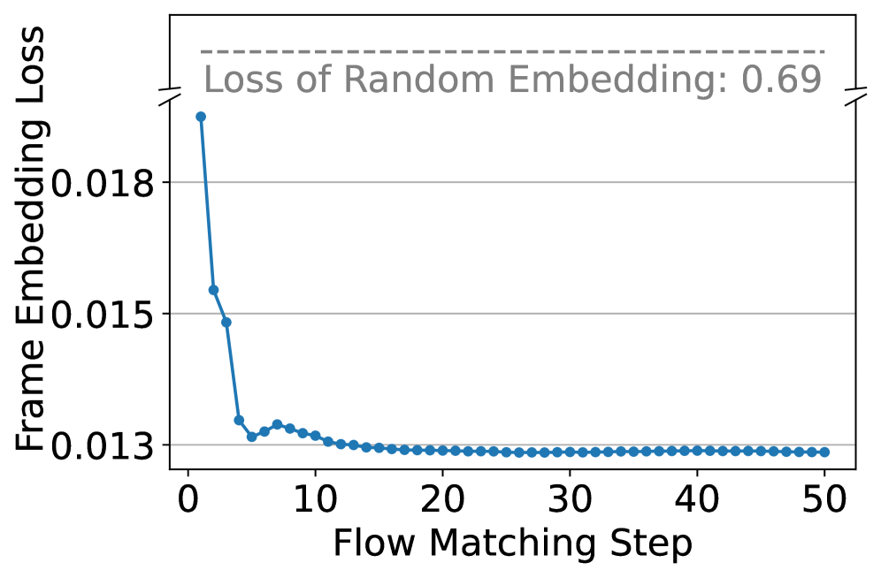
*(b)Frame embedding loss (ours).*

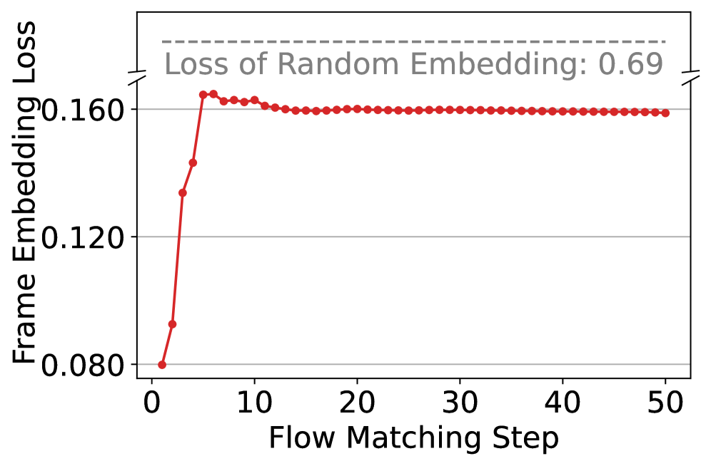
*(c)Frame embedding loss (baseline).*

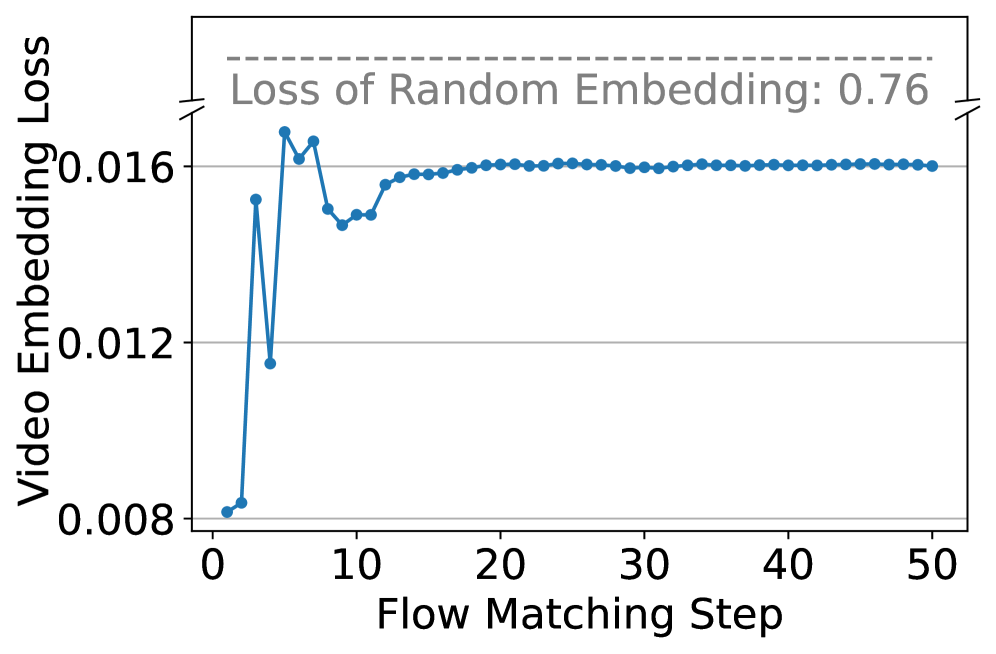
*(d)Video embedding loss (ours).*

*(d)Video embedding loss (ours).*

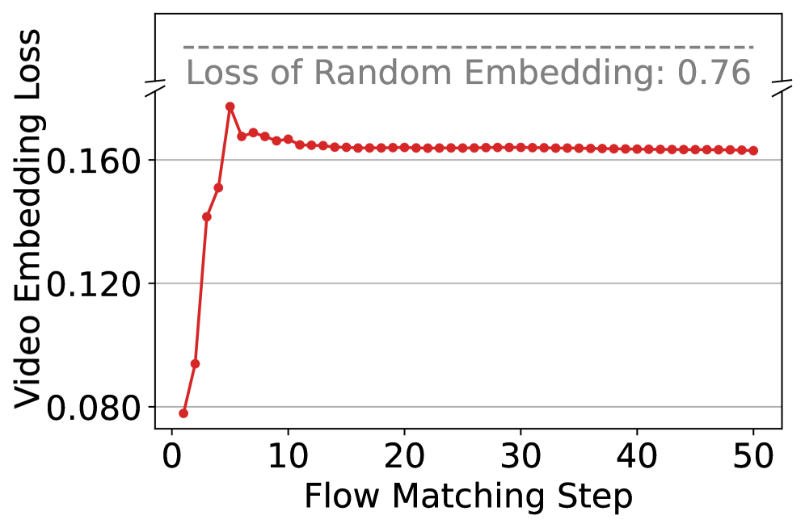
*(e)Video embedding loss (baseline).*

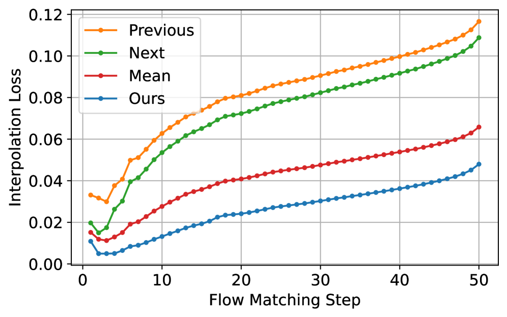
*(f)Frame interpolation loss across steps.*

---
**Usage Info**: 4087 tokens used.
**Generated at**: 2026-02-23 22:40:53

---

# 📚 What Do Neurons Listen To? A Neuron-level Dissection of a General-purpose Audio Model This work was supported by JST SICORP Grant Number JPMJSC2306 and JSPS KAKENHI Grant Number 24KJ1866.

🚀 URL: https://arxiv.org/html/2602.15307

## 🌏 Abstract (원문)
Self-supervised learning (SSL)-based general-purpose audio representation models[1,2,3]achieve strong performance across a wide range of tasks, including audio classification and captioning. These models encode acoustic information into general-purpose representations that can be used for downstream tasks. Their effectiveness has primarily been evaluated through downstream task performance. However, how such robust generalization is manifested within the model’s internal representations remains an open question. While evaluations on diverse downstream tasks demonstrate multifaceted practical effectiveness, they provide limited insight into how acoustic information is encodedinsidethe model. A deeper understanding of how these internal representations emerge is therefore essential to explain the success of general-purpose audio foundation models. In parallel, recent studies have increasingly focused on mechanistic interpretability to investigate the mechanisms underlying neural network generalization[4]. At the neuron level, particularly in large language models (LLMs), these approaches analyze conditional activation patterns to localize attribute-sensitive neurons, such as those associated with language[5]and culture[6]. Such analyses provide fundamental insights into how general-purpose models mechanistically encode heterogeneous information. In this paper, we address the lack of interpretability in general audio foundation models by applying a neuron-level analysis framework based on[5]to a SSL-based general-purpose model[2]that exhibits strong generalization performance. Centered on the identification of class-specific neurons, we conduct a comprehensive investigation into how these units behave across diverse tasks, spanning environmental, speech, and music audio. Through an analysis across diverse tasks, we provide answers to our fundamental research questions: (1) Are there class-specific neurons in unseen tasks? (2) What do these neurons share across different classes? and (3) Do class-specific neurons contribute to classification? Our analysis reveals that SSL models develop class-specific neurons that provide near-complete coverage across diverse novel task classes. Notably, we identify shared neuronal responses for speech attributes (gender, language, arousal), musical pitch, and acoustic similarities (e.g., across music genres). The validity of these identified neurons is further supported by their measurable impact on classification performance. To our knowledge, this is the first systematic neuron-level analysis of a general-purpose audio SSL model. We publicly release our code111The URL will replace this placeholder after the notification.for further advances and reproducibility in the field.
## 🌏 Abstract (번역)
자기 지도 학습(SSL) 기반의 범용 오디오 표현 모델은 오디오 분류 및 캡셔닝을 포함한 광범위한 작업에서 강력한 성능을 달성합니다. 이러한 모델은 음향 정보를 하위 작업에 사용할 수 있는 범용 표현으로 인코딩합니다. 이들의 효과는 주로 하위 작업 성능을 통해 평가되어 왔습니다. 그러나 이러한 강력한 일반화가 모델의 내부 표현 내에서 어떻게 나타나는지는 여전히 미해결 과제로 남아 있습니다. 다양한 하위 작업에 대한 평가는 다면적인 실용적 효과를 보여주지만, 모델 내부에서 음향 정보가 어떻게 인코딩되는지에 대한 통찰력은 제한적입니다. 따라서 이러한 내부 표현이 어떻게 발생하는지에 대한 더 깊은 이해는 범용 오디오 기반 모델의 성공을 설명하는 데 필수적입니다. 이와 병행하여, 최근 연구들은 신경망 일반화의 기저 메커니즘을 조사하기 위해 기계론적 해석 가능성에 점점 더 집중하고 있습니다. 뉴런 수준에서, 특히 대규모 언어 모델(LLM)에서 이러한 접근 방식은 조건부 활성화 패턴을 분석하여 언어 및 문화와 관련된 속성 민감 뉴런을 국소화합니다. 이러한 분석은 범용 모델이 이질적인 정보를 기계론적으로 어떻게 인코딩하는지에 대한 근본적인 통찰력을 제공합니다. 본 논문에서는 강력한 일반화 성능을 보이는 SSL 기반 범용 모델에 뉴런 수준 분석 프레임워크를 적용하여 범용 오디오 기반 모델의 해석 가능성 부족 문제를 해결합니다. 클래스별 뉴런의 식별을 중심으로 환경, 음성 및 음악 오디오에 걸친 다양한 작업에서 이러한 유닛이 어떻게 작동하는지에 대한 포괄적인 조사를 수행합니다. 다양한 작업에 대한 분석을 통해 다음과 같은 근본적인 연구 질문에 대한 답을 제공합니다: (1) 보이지 않는 작업에 클래스별 뉴런이 존재하는가? (2) 이러한 뉴런들이 서로 다른 클래스 간에 무엇을 공유하는가? (3) 클래스별 뉴런이 분류에 기여하는가? 우리의 분석 결과, SSL 모델은 다양한 새로운 작업 클래스에 대해 거의 완전한 커버리지를 제공하는 클래스별 뉴런을 개발한다는 것을 보여줍니다. 특히 음성 속성(성별, 언어, 각성), 음악적 피치 및 음향적 유사성(예: 음악 장르 간)에 대한 공유된 뉴런 반응을 식별합니다. 식별된 이러한 뉴런의 타당성은 분류 성능에 미치는 측정 가능한 영향을 통해 더욱 뒷받침됩니다. 우리가 알기로, 이것은 범용 오디오 SSL 모델에 대한 최초의 체계적인 뉴런 수준 분석입니다. 우리는 이 분야의 추가적인 발전과 재현성을 위해 코드를 공개합니다.

## 🔍 Methods & Results
- SSL 기반 범용 오디오 모델에 뉴런 수준의 기계론적 해석 가능성 분석 프레임워크를 적용함
- 환경음, 음성, 음악 오디오를 포함한 다양한 작업에서 클래스별 뉴런의 동작을 포괄적으로 조사함
- SSL 모델이 새로운 작업 클래스에 대해 거의 완전한 커버리지를 제공하는 클래스별 뉴런을 발달시킨다는 것을 발견함
- 성별, 언어, 각성도와 같은 음성 속성 및 음악적 피치 등에 대한 공유된 뉴런 반응을 식별함
- 식별된 뉴런들이 오디오 분류 성능에 측정 가능한 영향을 미친다는 것을 확인하여 분석의 타당성을 입증함

## 🖼 Figures
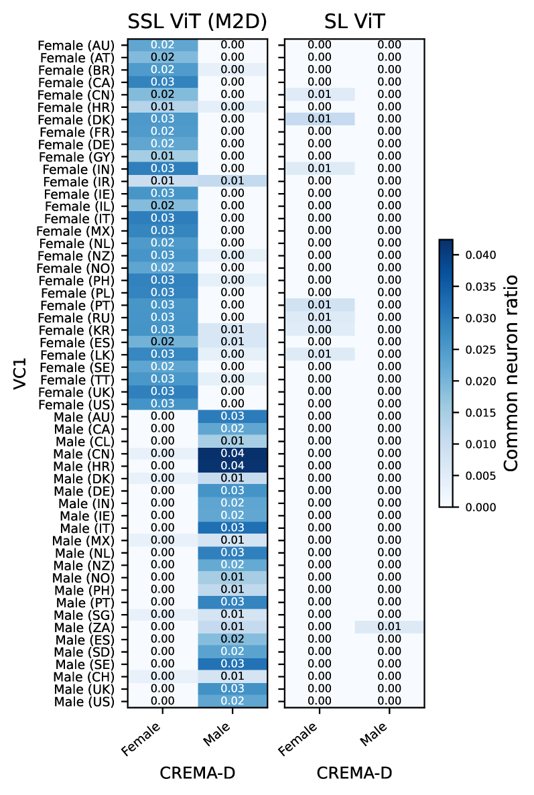
*Figure 1:Shared neurons between VC1 and CREMA-D under gender-based class definitions. SSL demonstrates clear cross-task sharing of neurons aligned with gender, whereas SL exhibits negligible sharing.*

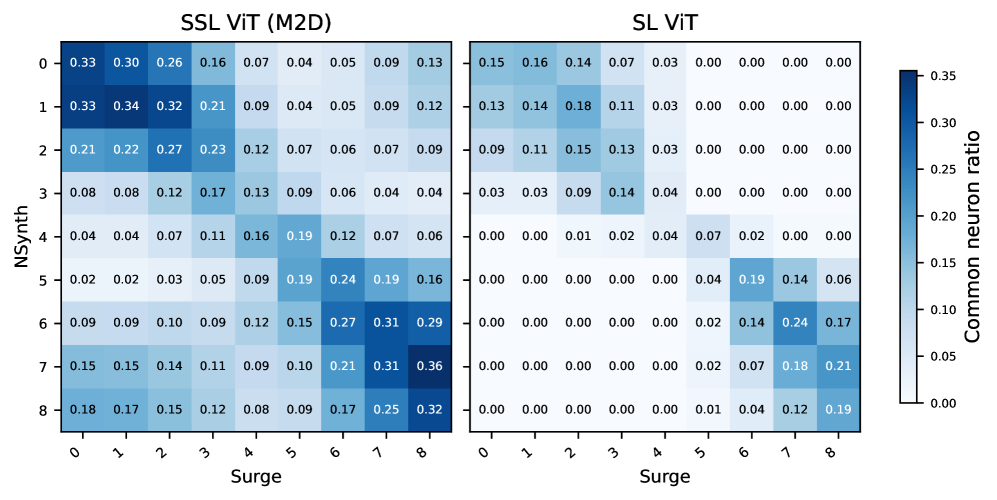
*Figure 2:Common neuron ratios for each octave class in NSynth and Surge. Despite differences in synthesis methods and dataset characteristics, octave-specific neurons are consistently observed across both tasks.*

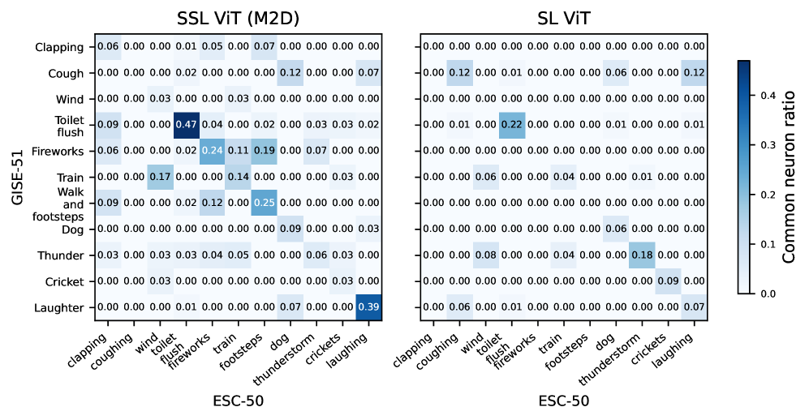
*Figure 3:Common neuron ratios for semantically overlapping event classes across ESC-50 and GISE-51. Compared with Fig. 1 and Fig. 2, the ratios are generally lower.*

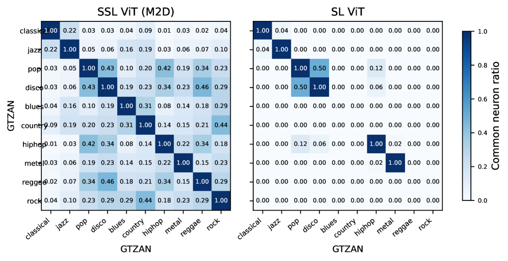
*Figure 4:Common neuron ratios across genre classes in GTZAN. “Classical” and “jazz” share a relatively large number of neurons, exhibiting a distinct sharing pattern compared with other genres.*

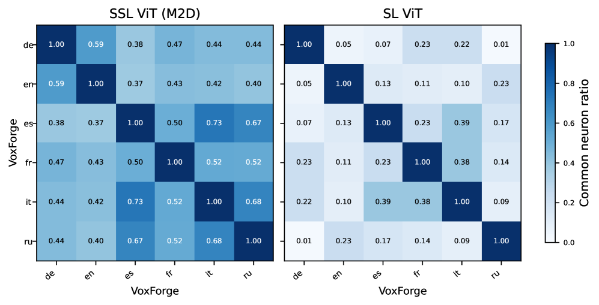
*Figure 5:Common neuron ratios across language classes in VoxForge. SSL results exhibit relatively high neuron sharing within Germanic (“de,” “en”) and Romance (“es,” “fr,” “it”) language families.*

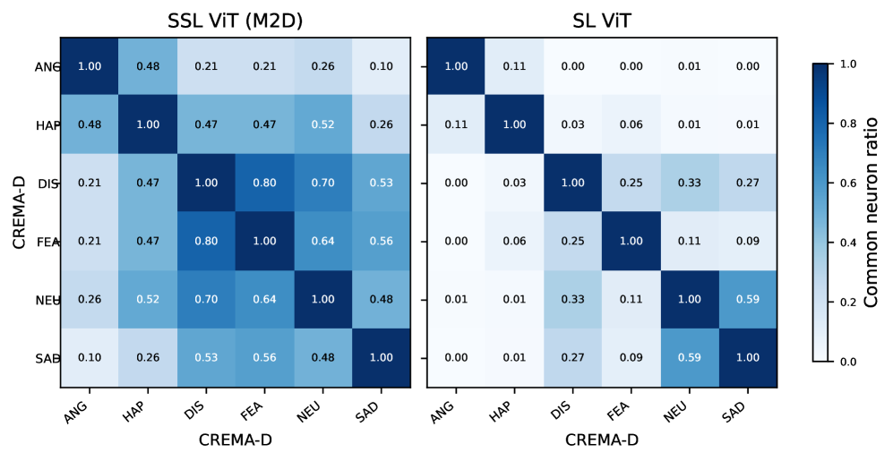
*Figure 6:Common neuron ratios across emotion classes in CREMA-D. Relatively higher neuron sharing is observed between “ANG” and “HAP,” as well as among “DIS,” “FEA,” “NEU,” and “SAD.”*

*Figure 7:Ablation impact on GTZAN genre classification. Left: Original model. Middle/Right: Deviations after ablating class-specific vs. random neurons. The results indicate that class-specific neurons have a greater functional impact on classification than randomly selected ones.*

*Figure 8:Ablation impact on CREMA-D genre classification. Left: Original model. Middle/Right: Deviations after ablating class-specific vs. random neurons. The results indicate that class-specific neurons have a clearer targeted impact on classification compared to the random baseline.*

---
**Usage Info**: 4530 tokens used.
**Generated at**: 2026-02-23 22:42:36

---

