# 🚩 (2026-02-19) Scholar Inbox 추천 논문 

# 📚 A Generative-First Neural Audio Autoencoder

🚀 URL: https://arxiv.org/html/2602.15749

## 🌏 Abstract (원문)
Latent generative models have revolutionized audio synthesis, enabling applications from music generation to source separation, upmixing, and understanding tasks. These models fundamentally depend on neural audio autoencoders to compress raw waveforms into tractable latent representations. However, existing autoencoders are primarily designed as quantized variational autoencoders for reconstruction tasks, then mildly adapted for generative modeling through post-hoc modifications. This reconstruction-first design philosophy creates fundamental mismatches with generative requirements, leading to inefficient tokenization rates, fragmented architectures across audio channel formats, and computational bottlenecks that limit practical deployment at scale. The discrete-continuous latent representation divide further compounds these issues: discrete methods lack continuous latents for diffusion, and continuous methods lack discrete tokens for language models. These challenges are particularly acute for high-fidelity music processing at 44.1 kHz, where complex content amplifies the tension between compression, quality, and complexity. To address these limitations, we propose the Generative-First Autoencoder (GenAE), a generative-first architecture that rethinks previous autoencoder designs for generation. GenAE provides a single architecture and training scheme that supports continuous and discrete latents, and all common audio channel formats (mono, stereo, mid/side). Our contributions are threefold: (1) encoder architectural modifications including efficient activations, early downsampling, and strategic attention placement that enable aggressive tokenization with substantial computational speedups, (2) training improvements with audio channel format data augmentation and loss functions that enhance generalization and robustness, and (3) an optional post-training step that discretizes a trained continuous model to support both continuous and discrete latents, without retraining the backbone. Together, these choices yield a unified model that balances compression rate, reconstruction quality, and processing speed for generative workflows.
## 🌏 Abstract (번역)
잠재 생성 모델은 음악 생성부터 소스 분리, 업믹싱, 이해 작업에 이르기까지 오디오 합성에 혁신을 일으켰습니다. 이러한 모델은 근본적으로 원시 파형을 다루기 쉬운 잠재 표현으로 압축하기 위해 신경망 오디오 오토인코더에 의존합니다. 그러나 기존 오토인코더는 주로 재구성 작업을 위한 양자화 변분 오토인코더로 설계되었으며, 이후 사후 수정을 통해 생성 모델링에 맞게 약간 조정되었습니다. 이러한 재구성 우선 설계 철학은 생성 요구 사항과 근본적인 불일치를 발생시켜, 비효율적인 토큰화 속도(오디오를 잠재 표현으로 변환하는 것을 '토큰화'라고 함), 오디오 채널 형식에 따른 파편화된 아키텍처, 대규모 배포를 제한하는 계산 병목 현상을 초래합니다. 이산-연속 잠재 표현의 분리는 이러한 문제를 더욱 악화시킵니다. 이산 방식은 확산 모델을 위한 연속 잠재값이 부족하고, 연속 방식은 언어 모델을 위한 이산 토큰이 부족합니다. 이러한 과제는 압축, 품질, 복잡성 사이의 긴장이 증폭되는 44.1 kHz의 고충실도 음악 처리에서 특히 심각합니다. 이러한 한계를 해결하기 위해, 우리는 생성을 위해 이전의 오토인코더 설계를 재고한 생성 우선 아키텍처인 GenAE(Generative-First Autoencoder)를 제안합니다. GenAE는 연속 및 이산 잠재값과 모든 일반적인 오디오 채널 형식(모노, 스테레오, 미드/사이드)을 지원하는 단일 아키텍처 및 훈련 체계를 제공합니다. 우리의 기여는 세 가지입니다. (1) 효율적인 활성화 함수, 조기 다운샘플링, 전략적 어텐션 배치를 포함한 인코더 아키텍처 수정을 통해 상당한 계산 속도 향상과 함께 공격적인 토큰화를 가능하게 함, (2) 일반화와 견고성을 향상시키는 오디오 채널 형식 데이터 증강 및 손실 함수를 통한 훈련 개선, (3) 백본을 재훈련하지 않고도 연속 및 이산 잠재값을 모두 지원하기 위해 훈련된 연속 모델을 이산화하는 선택적 사후 훈련 단계입니다. 이러한 선택들을 통해 생성 워크플로우를 위한 압축률, 재구성 품질, 처리 속도의 균형을 맞춘 통합 모델을 구현했습니다.

## 🔍 Methods & Results
- 생성 모델링에 최적화된 GenAE 아키텍처를 제안하여 압축률, 품질, 속도의 균형을 달성함
- 메모리 효율을 위해 Snake 활성화 함수의 Taylor 근사 버전인 SnakeLite와 ELU를 도입함
- 인코더의 잔차 블록 이전으로 다운샘플링 위치를 변경하고 분리형 컨볼루션을 적용하여 계산 복잡도를 감소시킴
- 13.125 Hz의 공격적인 시간적 다운샘플링을 수행하며, 정보 손실 보완을 위해 멜-스펙트로그램 융합 경로를 추가함
- 네트워크의 병목 구간에 윈도우 기반 셀프 어텐션을 배치하여 표현 용량을 향상시킴
- 모노, 스테레오, 미드/사이드 형식을 통합 지원하기 위한 오디오 채널 형식 토큰 및 데이터 증강 기법을 도입함
- 보조 멜 손실과 서로소(Co-prime) 다중 해상도 STFT 손실을 사용하여 훈련 안정성과 품질을 높임
- 연속 잠재 모델(GenAE-KL)을 먼저 훈련한 후 백본 고정 상태에서 RVQ를 적용해 이산 모델(GenAE-VQ)로 변환하는 2단계 구조를 제안함

## 🖼 Figures
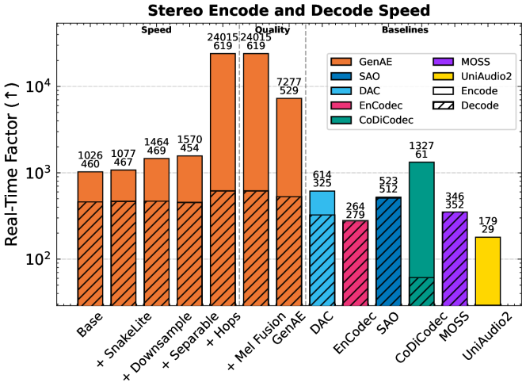
*Fig. 1:Encode log RTF (solid) and decode log RTF (striped) for GenAE ablations and baselines. GenAE modifications are split into “speed” and “quality” categories. Baselines are shown on the right. Faster encoding accelerates generative workflows.*

*Fig. 2:GenAE Model Architecture: DWPW is a standard depth-wise/point-wise layer with a dilation (1/3/9). Attn Stack is a standard multi-head windowed attention block. SLite is the SnakeLite activation. TCN is a standard dilated residual convolution block. Mel represents inputting or outputting a mel-spectrogram. Format represents an audio channel format token.*

![Fig. 3:Stereo rate-distortion vs. latent rate (Hz). GenAE at 13 Hz matches baselines at far lower rates and at 36 Hz surpasses all baselines. Lower rates reduce tokens and memory for long-context generation. GenAE is Pareto-optimal on the compression/reconstruction frontier in both continuous (-KL) and discrete (-VQ) latent modes. PESQ-WB and Audiobox Aesthetics follow a similar trend. Models in the legend but not shown exceed plot ranges. Models with a * only run at 24 KHz. The Pareto frontier is shown in grey.](../images/2026-02-19/2602.15749/2602.15749_fig2.png)
*Fig. 3:Stereo rate-distortion vs. latent rate (Hz). GenAE at 13 Hz matches baselines at far lower rates and at 36 Hz surpasses all baselines. Lower rates reduce tokens and memory for long-context generation. GenAE is Pareto-optimal on the compression/reconstruction frontier in both continuous (-KL) and discrete (-VQ) latent modes. PESQ-WB and Audiobox Aesthetics follow a similar trend. Models in the legend but not shown exceed plot ranges. Models with a * only run at 24 KHz. The Pareto frontier is shown in grey.*

---
**Usage Info**: 5105 tokens used.
**Generated at**: 2026-02-23 22:54:35

---

# 📚 LLM-to-Speech: A Synthetic Data Pipeline for Training Dialectal Text-to-Speech Models

🚀 URL: https://arxiv.org/html/2602.15675

## 🌏 Abstract (원문)
Neural text-to-speech (TTS) has made remarkable progress in recent years, with models like Tacotron, FastSpeech, and VITS achieving near-human naturalness for high-resource languages. More recently, multilingual TTS systems such as XTTS and VALL-E have demonstrated impressive zero-shot voice cloning capabilities across different languages. However, this progress has not been evenly distributed, as low-resource languages and dialectal varieties remain significantly under-served. Arabic presents a particularly challenging case for TTS research. While Modern Standard Arabic (MSA) has received considerable attention, the spoken reality of the Arab world is far more diverse. Arabic has many regional dialects that differ substantially in phonology, vocabulary, and syntax, often to the point of mutual unintelligibility. Among these, Egyptian Arabic holds a unique position: spoken natively by over 100 million people and widely understood across the Arab world due to Egypt’s dominant media presence, it is arguably the most accessible Arabic variety. Despite its prominence, Egyptian Arabic remains under-resourced for speech synthesis. While prior work has explored Egyptian Arabic TTS, existing resources are limited in scale, domain coverage, or public availability. Current Arabic TTS systems mainly target MSA or Gulf dialects, leaving Egyptian Arabic speakers without state of the art tools. As a result, Egyptian Arabic speakers lack access to quality TTS in applications like voice assistants and audiobooks. In this work, we address this resource gap by introducing NileTTS, a large-scale Egyptian Arabic TTS dataset along with a fine-tuned speech synthesis model. Our dataset comprises 38 hours of transcribed Egyptian Arabic speech from two speakers across three domains: medical, sales and customer service, and general conversation. A key contribution of our work is the novel synthetic data generation pipeline used to construct the dataset. Rather than relying on costly manual recording, we leverage recent advances in generative AI: large language models (LLMs) generate Egyptian Arabic content across diverse topics, which is then converted to natural-sounding speech using neural audio synthesis tools that support Egyptian Arabic. The resulting audio is automatically transcribed using Whisper and segmented into utterances, with speaker identities assigned via ECAPA-TDNN-based speaker diarization. Manual quality verification ensures transcription accuracy and speaker consistency. This pipeline offers a reproducible and scalable approach for creating TTS datasets for other low-resource dialects. To demonstrate the utility of our dataset, we fine-tune XTTS v2, a state-of-the-art multilingual TTS model with zero-shot voice cloning capabilities. We evaluate the fine-tuned model against the baseline XTTS v2, which was trained on Arabic data from other dialectal varieties. Our experiments show substantial improvements in intelligibility and speaker similarity. Our contributions are as follows: We release NileTTS, a large-scale Egyptian Arabic TTS dataset comprising 38 hours of transcribed speech across multiple domains. We present a reproducible synthetic data generation pipeline combining LLM-based content generation, neural audio synthesis, automatic transcription, and speaker diarization. We provide an open-source fine-tuned XTTS model for Egyptian Arabic, serving as a baseline for future research. We publicly release all resources to facilitate further research in Egyptian Arabic speech synthesis.
## 🌏 Abstract (번역)
최근 신경망 기반 텍스트 음성 변환(TTS) 기술은 Tacotron, FastSpeech, VITS와 같은 모델을 통해 고자원 언어에서 인간에 가까운 자연스러움을 달성하며 눈부신 발전을 이루었습니다. 최근에는 XTTS 및 VALL-E와 같은 다국어 TTS 시스템이 다양한 언어에 걸쳐 인상적인 제로샷 음성 복제 기능을 보여주었습니다. 그러나 이러한 발전은 고르게 이루어지지 않았으며, 저자원 언어와 방언 변종은 여전히 서비스가 크게 부족한 실정입니다. 아랍어는 TTS 연구에서 특히 도전적인 사례입니다. 현대 표준 아랍어(MSA)는 상당한 주목을 받았지만, 아랍 세계의 실제 구어는 훨씬 더 다양합니다. 아랍어는 음운론, 어휘, 구문 면에서 실질적으로 차이가 나는 많은 지역 방언을 가지고 있으며, 종종 상호 이해가 불가능할 정도입니다. 그중에서도 이집트 아랍어는 독특한 위치를 차지합니다. 1억 명 이상의 모국어 사용자가 있으며 이집트의 지배적인 미디어 영향력 덕분에 아랍 세계 전역에서 널리 이해되는, 아마도 가장 접근하기 쉬운 아랍어 변종입니다. 이러한 중요성에도 불구하고 이집트 아랍어는 음성 합성을 위한 자원이 부족한 상태로 남아 있습니다. 이전 연구들이 이집트 아랍어 TTS를 탐구했지만, 기존 자원은 규모, 도메인 범위 또는 공개 가용성 면에서 제한적입니다. 현재의 아랍어 TTS 시스템은 주로 MSA나 걸프 방언을 대상으로 하므로 이집트 아랍어 사용자들은 최첨단 도구를 사용할 수 없습니다. 결과적으로 이집트 아랍어 사용자들은 음성 비서나 오디오북과 같은 애플리케이션에서 고품질 TTS를 이용하지 못하고 있습니다. 본 연구에서는 대규모 이집트 아랍어 TTS 데이터셋인 NileTTS와 미세 조정된 음성 합성 모델을 소개함으로써 이러한 자원 격차를 해결합니다. 본 데이터셋은 의료, 영업 및 고객 서비스, 일반 대화의 세 가지 도메인에 걸쳐 두 명의 화자가 발화한 38시간 분량의 전사된 이집트 아랍어 음성으로 구성됩니다. 본 연구의 핵심 기여는 데이터셋 구축에 사용된 새로운 합성 데이터 생성 파이프라인입니다. 비용이 많이 드는 수동 녹음에 의존하는 대신, 생성형 AI의 최신 발전을 활용합니다. 대규모 언어 모델(LLM)이 다양한 주제에 걸쳐 이집트 아랍어 콘텐츠를 생성하고, 이를 이집트 아랍어를 지원하는 신경망 오디오 합성 도구를 사용하여 자연스러운 음성으로 변환합니다. 결과 오디오는 Whisper를 사용하여 자동으로 전사되고 발화 단위로 분할되며, ECAPA-TDNN 기반 화자 분할을 통해 화자 정체성이 할당됩니다. 수동 품질 검증을 통해 전사 정확도와 화자 일관성을 보장합니다. 이 파이프라인은 다른 저자원 방언을 위한 TTS 데이터셋을 생성하기 위한 재현 가능하고 확장 가능한 접근 방식을 제공합니다. 데이터셋의 유용성을 입증하기 위해, 제로샷 음성 복제 기능이 있는 최첨단 다국어 TTS 모델인 XTTS v2를 미세 조정합니다. 다른 방언의 아랍어 데이터로 학습된 기본 XTTS v2와 미세 조정된 모델을 비교 평가합니다. 실험 결과, 명료도와 화자 유사성 면에서 상당한 개선이 나타났습니다. 본 연구의 기여는 다음과 같습니다. 첫째, 여러 도메인에 걸친 38시간 분량의 전사된 음성을 포함하는 대규모 이집트 아랍어 TTS 데이터셋인 NileTTS를 공개합니다. 둘째, LLM 기반 콘텐츠 생성, 신경망 오디오 합성, 자동 전사 및 화자 분할을 결합한 재현 가능한 합성 데이터 생성 파이프라인을 제시합니다. 셋째, 향후 연구의 기준점이 될 이집트 아랍어용 오픈 소스 미세 조정 XTTS 모델을 제공합니다. 넷째, 이집트 아랍어 음성 합성 연구를 촉진하기 위해 모든 자원을 공개합니다.

## 🔍 Methods & Results
- XTTS v2 모델 미세 조정: GPT 스타일의 자기회귀 아키텍처를 사용하는 최첨단 다국어 TTS 모델을 이집트 아랍어에 맞게 최적화함.
- NileTTS 데이터셋 구축: 의료, 영업, 일반 대화 도메인을 포함하는 38시간 분량의 고품질 이집트 아랍어 음성 데이터셋 제작.
- 합성 데이터 생성 파이프라인: LLM(텍스트 생성), 신경망 오디오 합성, Whisper(자동 전사), ECAPA-TDNN(화자 분할)을 결합한 효율적인 데이터 생성 방식 제안.
- 미세 조정 전략: XTTS v2의 GPT 컴포넌트를 NileTTS 데이터로 학습시키고 오디오 토크나이저(DVAE)는 고정하여 음성 복제 성능 유지.
- 성능 평가: 단어 오류율(WER), 문자 오류율(CER), 화자 유사성 지표를 통해 모델의 수렴과 성능을 정밀하게 모니터링함.
- 실험 결과: 기존 MSA 및 걸프 방언 기반의 베이스라인 모델 대비 명료도와 화자 유사성 측면에서 실질적이고 유의미한 성능 향상을 달성함.

## 🖼 Figures

*Figure 1:Overview of the NileTTS data generation pipeline. Egyptian Arabic content is generated by LLMs, converted to speech via neural audio synthesis, transcribed and segmented using Whisper, and annotated with speaker identities using ECAPA-TDNN embeddings. Manual quality control ensures accuracy before final dataset compilation.*

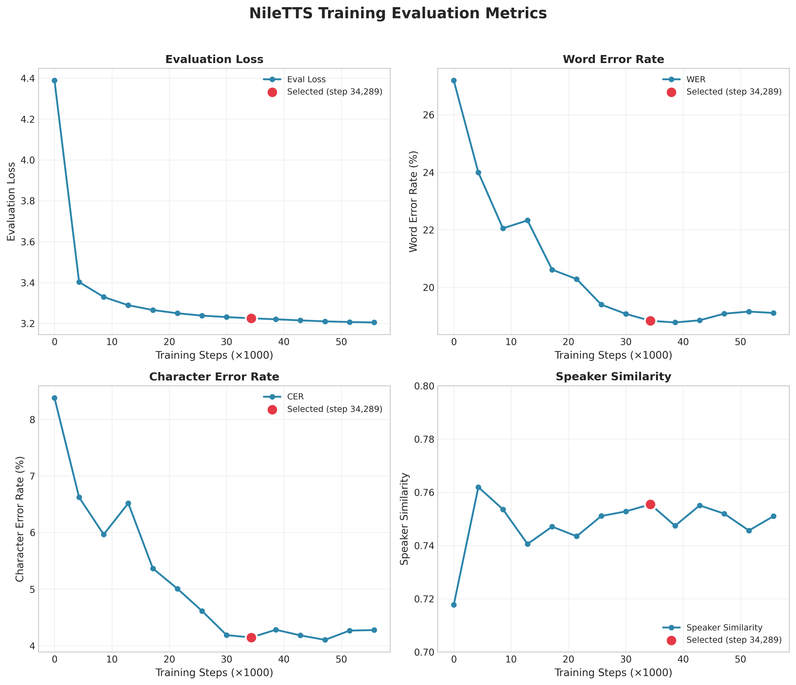
*Figure 2:Evaluation metrics throughout training: (a) Evaluation Loss, (b) Word Error Rate, (c) Character Error Rate, (d) Speaker Similarity. The red marker indicates the selected checkpoint at step 34,289 (epoch 8).*

---
**Usage Info**: 4944 tokens used.
**Generated at**: 2026-02-23 22:55:11

---

# 📚 Scaling Open Discrete Audio Foundation Models with Interleaved Semantic, Acoustic, and Text Tokens

🚀 URL: https://arxiv.org/html/2602.16687

## 🌏 Abstract (원문)
Building foundation models that can understand and generate audio is a key challenge in multimodal AI. Current approaches have distinct limitations.LLM-centricarchitectures, such as SALMONN(Tanget al.,2024)or Qwen3-Omni(Qwen Team,2025b), add audio modules to a pre-trained text LLM; while effective for instruction-following, they have a “semantic bottleneck” that limits general audio-to-audio modeling.Semantic-onlyspeech language models, such as TWIST(Hassidet al.,2023)or SpiritLM(Nguyenet al.,2025), are trained speech-first but discard acoustic details, limiting high-fidelity understanding and generation.Native audiomodels like Moshi(Défossezet al.,2024)or Llama-Mimi(Sugiuraet al.,2025)model acoustic tokens directly but focus on specific tasks without text integration. Meanwhile, next-token prediction has enabled unified models for text and vision-language(Chameleon Team,2024), yet analogous approaches that jointly model audio understanding and generation in a single backbone remain limited. To bridge this gap, this paper presents a systematic empirical study ofnativeaudio foundation models that jointly model semantic, acoustic, and text tokens within a unified next-token prediction framework—establishing the first training recipes and scaling laws analogous to scaling study in LLMs(Kaplanet al.,2020). This design enables a range of tasks within a single model: audio continuation, semantic/acoustic understanding, cross-modal capabilities (e.g., text-to-speech and speech-to-text), and text generation. We adopt utterance-level interleaving of tokens derived from neural codecs, avoiding word-level alignment errors and enabling the use of large datasets with available transcripts. A challenge in training such audio models is the lack of established pretraining understanding: while the Chinchilla study for text LLMs(Hoffmannet al.,2022)established that model sizeNNand training tokensDDshould scale equally (N∗,D∗∝C0.5N^{*},D^{*}\propto C^{0.5}), it is unclear if this holds for audio, where information density per token can be far lower. We address key questions for pre-training discrete audio models: What training data and token design should we use?(§4): We systematically compare speech corpora, text mixture ratios, and token compositions (semantic-only vs. semantic+acoustic vs. semantic+acoustic+text), establishing a validated training recipe. How should we allocate compute, and is validation loss a reliable metric?(§5): We show that validation loss is predictive of downstream performance, then derive scaling laws from 64 IsoFLOP models (3×10183\times 10^{18}to3×10203\times 10^{20}FLOPs), findingD∗∝C0.579D^{*}\propto C^{0.579}andN∗∝C0.367N^{*}\propto C^{0.367}. Does scaling up work?(§6): We train SODA (Scaling Open Discrete Audio), a suite of models from 135M to 4B parameters on 500B tokens (up to1.3×10221.3\times 10^{22}FLOPs), and validate them against our scaling predictions. We compare cold-start (from scratch) versus warm-start (from text LLMs) training at scale, finding that cold-start is superior and provides higher training stability. We further validate SODA as a flexible backbone by formulating voice-preserving speech-to-speech translation simply as a next-token prediction task and fine-tuning SODA. SODA achieves competitive performance across audio and cross-modal benchmarks, with fine-tuning for S2ST demonstrating its flexibility. We release checkpoints, discrete audio data, experiment log, and code to facilitate future research.
## 🌏 Abstract (번역)
오디오를 이해하고 생성할 수 있는 파운데이션 모델을 구축하는 것은 멀티모달 AI의 핵심 과제입니다. 현재의 접근 방식들은 뚜렷한 한계를 가지고 있습니다. SALMONN이나 Qwen2-Omni와 같은 LLM 중심 아키텍처는 사전 학습된 텍스트 LLM에 오디오 모듈을 추가하지만, 이는 명령 수행에는 효과적이나 일반적인 오디오 대 오디오 모델링을 제한하는 "시맨틱 병목 현상"을 초래합니다. TWIST나 SpiritLM과 같은 시맨틱 전용 음성 언어 모델은 음성 우선으로 학습되지만 음향적 세부 사항을 버려 고충실도 이해 및 생성을 제한합니다. Moshi나 Llama-Mimi와 같은 네이티브 오디오 모델은 음향 토큰을 직접 모델링하지만 텍스트 통합 없이 특정 작업에 집중합니다. 한편, 다음 토큰 예측(next-token prediction)은 텍스트 및 시각-언어를 위한 통합 모델을 가능하게 했으나, 단일 백본에서 오디오 이해와 생성을 공동으로 모델링하는 유사한 접근 방식은 여전히 제한적입니다. 이러한 격차를 해소하기 위해 본 논문은 통합된 다음 토큰 예측 프레임워크 내에서 시맨틱, 음향 및 텍스트 토큰을 공동으로 모델링하는 네이티브 오디오 파운데이션 모델에 대한 체계적인 경험적 연구를 제시하며, LLM의 스케일링 연구와 유사한 최초의 학습 레시피 및 스케일링 법칙을 수립합니다. 이 설계는 단일 모델 내에서 오디오 연속 생성, 시맨틱/음향 이해, 교차 모달 능력(예: TTS 및 STT), 텍스트 생성 등 다양한 작업을 가능하게 합니다. 우리는 신경 코덱에서 파생된 토큰의 발화 수준 인터리빙을 채택하여 단어 수준 정렬 오류를 방지하고 사용 가능한 전사 데이터가 있는 대규모 데이터셋을 활용할 수 있게 합니다. 이러한 오디오 모델 학습의 과제는 확립된 사전 학습 이해의 부족입니다. 텍스트 LLM에 대한 Chinchilla 연구는 모델 크기(N)와 학습 토큰(D)이 동일하게 확장되어야 함을 입증했지만, 토큰당 정보 밀도가 훨씬 낮을 수 있는 오디오에서도 이것이 유효한지는 불분명합니다. 우리는 이산 오디오 모델의 사전 학습을 위한 핵심 질문들을 다룹니다. 1) 어떤 학습 데이터와 토큰 설계를 사용해야 하는가? 음성 코퍼스, 텍스트 혼합 비율 및 토큰 구성(시맨틱 전용 vs 시맨틱+음향 vs 시맨틱+음향+텍스트)을 체계적으로 비교하여 검증된 학습 레시피를 수립합니다. 2) 컴퓨팅 자원을 어떻게 할당해야 하며 검증 손실이 신뢰할 수 있는 지표인가? 검증 손실이 다운스트림 성능을 예측함을 보여주고, 64개의 IsoFLOP 모델로부터 스케일링 법칙을 도출하여 D* ∝ C^0.579 및 N* ∝ C^0.367임을 발견했습니다. 3) 스케일링 업이 효과적인가? 1.35억 개에서 40억 개의 파라미터를 가진 SODA(Scaling Open Discrete Audio) 모델군을 5,000억 개의 토큰으로 학습시키고 스케일링 예측에 대해 검증합니다. 대규모 학습에서 콜드 스타트(처음부터 학습)와 웜 스타트(텍스트 LLM에서 시작)를 비교하여 콜드 스타트가 우수하고 더 높은 학습 안정성을 제공함을 발견했습니다. 또한 음성 보존 음성 대 음성 번역을 단순한 다음 토큰 예측 작업으로 공식화하고 SODA를 미세 조정함으로써 SODA가 유연한 백본임을 검증합니다. SODA는 오디오 및 교차 모달 벤치마크 전반에서 경쟁력 있는 성능을 달성하며, S2ST를 위한 미세 조정은 그 유연성을 입증합니다. 우리는 향후 연구를 촉진하기 위해 체크포인트, 이산 오디오 데이터, 실험 로그 및 코드를 공개합니다.

## 🔍 Methods & Results
- 시맨틱, 음향, 텍스트 토큰을 단일 다음 토큰 예측 프레임워크 내에서 공동 모델링하는 네이티브 오디오 파운데이션 모델 설계
- 신경 코덱 토큰의 발화 수준 인터리빙(utterance-level interleaving)을 통해 정렬 오류 방지 및 대규모 데이터 활용
- 오디오 모델을 위한 새로운 스케일링 법칙 도출: 학습 토큰(D*)은 C^0.579, 모델 크기(N*)는 C^0.367에 비례하여 확장
- 135M에서 4B 파라미터 규모의 SODA 모델군을 500B 토큰으로 학습하여 스케일링 법칙 검증
- 대규모 학습 시 텍스트 LLM 기반의 웜 스타트보다 처음부터 학습하는 콜드 스타트 방식이 성능과 안정성 면에서 우수함을 입증
- SODA를 활용하여 음성 보존 음성 대 음성 번역(S2ST) 작업을 단순한 다음 토큰 예측으로 수행 및 성능 확인
- 오디오 이해, 생성 및 교차 모달 벤치마크에서 경쟁력 있는 성능 달성

## 🖼 Figures

*Figure 1:Three token types examined in § 4.3: (a) Semantic-only, (b) Semantic+Acoustic, and (c) Utterance-level interleaved Semantic+Acoustic+Text, where (c.1) shows text-first format, and (c.2) shows audio-first format. Superscript 
𝑖
 denotes utterance index, where utterance(
𝑖
) and utterance(
𝑖
+1) are adjacent audio segments from the same document. See Appendix A.2 for detailed data formatting.*

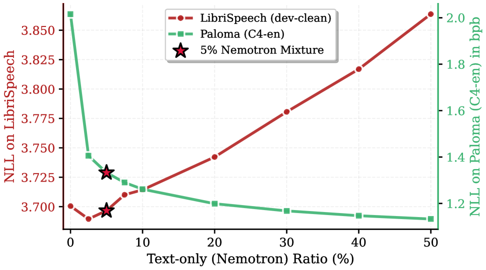
*Figure 2:Impact of adding Nemotron on NLL for audio and text validation data. Full results on other metrics are shown in Figure 5.*

*Figure 3:Validation NLL (audio+text) versus downstream task performance. Circular points: 64 IsoFLOP models (§5); star-shaped points: final SODA runs (§6). Regression lines are fitted on 64 IsoFLOP models only. Full results with other metrics are shown in Appendix E.*

*(a)Validation NLL vs model size 
𝑁*

*(a)Validation NLL vs model size 
𝑁*

*(b)Validation NLL vs training tokens 
𝐷*

*(c)Optimal 
𝑁
∗
 and 
𝐷
∗
 vs compute budget 
𝐶*

![Figure 5:Full results of text-injection ratio sweep (0%–90% Nemotron text data). Colors indicate the trend as text percentage increases: Red (Cross-Modal skills: ASR, TTS) shows degradation in performance as text ratio increases beyond 5%. Orange (Semantic and Acoustic understanding: sWUGGY, sBLIMP, Salmon) indicates little variation across text ratios, suggesting these capabilities are robust to text inclusion. Green (Text Knowledge tasks: tWUGGY, tBLIMP, HellaSwag) shows monotonic improvement as text percentage increases, with notable gains from 0% to 2.5%.](../images/2026-02-19/2602.16687/2602.16687_fig7.png)
*Figure 5:Full results of text-injection ratio sweep (0%–90% Nemotron text data). Colors indicate the trend as text percentage increases: Red (Cross-Modal skills: ASR, TTS) shows degradation in performance as text ratio increases beyond 5%. Orange (Semantic and Acoustic understanding: sWUGGY, sBLIMP, Salmon) indicates little variation across text ratios, suggesting these capabilities are robust to text inclusion. Green (Text Knowledge tasks: tWUGGY, tBLIMP, HellaSwag) shows monotonic improvement as text percentage increases, with notable gains from 0% to 2.5%.*

*Figure 6:Validation NLL (audio-first) versus downstream task performance (Part 1). Each subplot shows one metric across 64 models from the IsoFLOP study, with Spearman 
𝜌
 reported. Cross-modal metrics (ASR, TTS) show strong correlation with NLL.*

*Figure 7:Validation NLL (audio-first) versus downstream task performance (Part 2). Speech semantic and acoustic metrics show continued improvement without saturation. Text knowledge tasks (tWUGGY, HellaSwag) show emergence patterns with accelerated improvement at lower NLL values.*

*Figure 8:Validation loss vs. compute for SODA models. Grey squares show compute-optimal models from §5. We fit a power-law regression 
𝐿
∗
=
𝑎
⋅
𝐶
𝑏
 on these seven points and extrapolate to higher compute (grey line). Colored circles show final SODA runs.*

*Figure 9:Loss vs. compute at different overtraining ratios 
𝐾
 using the fitted parametric equation. Grey points show IsoFLOP sweep data. Colored curves show predicted loss at 
𝐾
=
1
 (optimal), 
𝐾
=
5
, 
𝐾
=
20
, and 
𝐾
=
100
. Colored circles show actual SODA models (135M, 600M, 1.7B, 4B), which achieve lower losses than predicted. The discrepancy shows that SODA models outperform the parametric prediction, suggesting favorable scaling dynamics or lower irreducible loss at larger scales.*

*(a)Cold-Start: smooth improvement.*

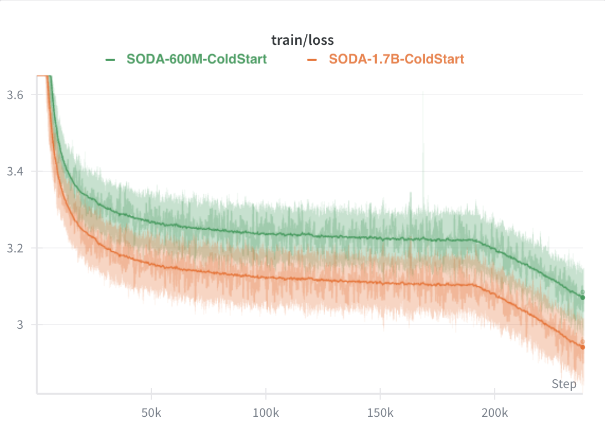
*(a)Cold-Start: smooth improvement.*

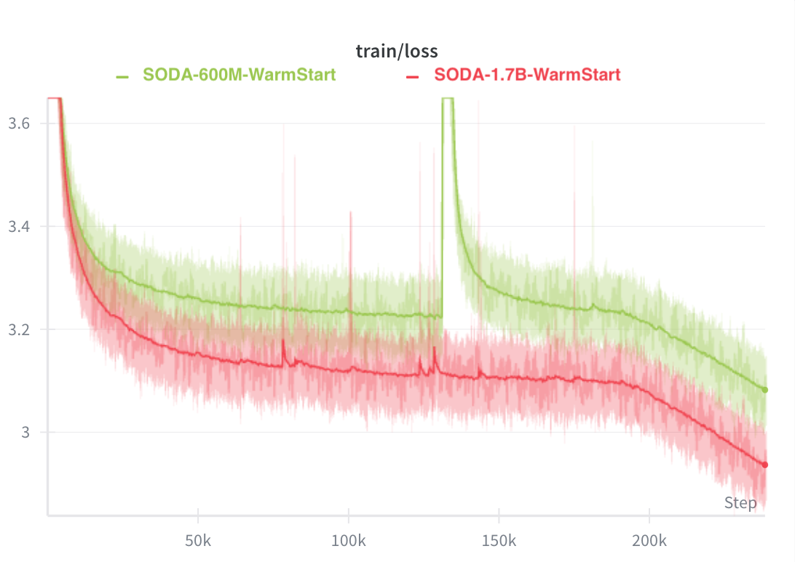
*(b)Warm-Start: frequent spikes; 600M has one large spike.*

![Figure 11:Warm-Start vs. Cold-Start training comparison at 600M and 1.7B scales. Top row: Training dynamics (NLL) and cross-modal skills (ASR, TTS). Cold-Start achieves lower ASR-WER throughout training, while TTS converges similarly. The NLL plot highlights a loss spike at 135K steps for the 600M Warm-Start run. Bottom row: Understanding tasks. Salmon (acoustic) and sWUGGY (semantic) show similar trajectories regardless of initialization, suggesting these are learned fresh. tWUGGY (text knowledge) shows Warm-Start maintaining a persistent advantage throughout training, with Cold-Start never catching up.](../images/2026-02-19/2602.16687/2602.16687_fig15.png)
*Figure 11:Warm-Start vs. Cold-Start training comparison at 600M and 1.7B scales. Top row: Training dynamics (NLL) and cross-modal skills (ASR, TTS). Cold-Start achieves lower ASR-WER throughout training, while TTS converges similarly. The NLL plot highlights a loss spike at 135K steps for the 600M Warm-Start run. Bottom row: Understanding tasks. Salmon (acoustic) and sWUGGY (semantic) show similar trajectories regardless of initialization, suggesting these are learned fresh. tWUGGY (text knowledge) shows Warm-Start maintaining a persistent advantage throughout training, with Cold-Start never catching up.*

---
**Usage Info**: 4392 tokens used.
**Generated at**: 2026-02-23 22:55:56

---

# 📚 UniTAF: A Modular Framework for Joint Text-to-Speech and Audio-to-Face Modeling

🚀 URL: https://arxiv.org/html/2602.15651

## 🌏 Abstract (원문)
Existing speech-driven facial expression generation systems typically adopt a multi-stage pipeline composed of a large language model (LLM), text-to-speech (TTS), and audio-driven facial animation (A2F). In this paradigm, the modules are decoupled: the LLM generates textual content, TTS synthesizes speech from text, and A2F predicts facial expressions and motions from the audio signal. While this design offers modularity, it implicitly assumes that the high-level information required for speech and expression generation—such as emotion, prosody, and expressive intent—can be independently inferred from plain text or raw audio. However, although such expression-related high-level information is implicitly modeled during the internal reasoning of the LLM, it is not preserved in the final textual output. As a result, both TTS and A2F must repeatedly infer the same emotional and prosodic attributes from limited inputs, leading to information loss and redundant computation. From a theoretical perspective, directly modeling the joint distribution of text, audio, and facial expressions with a unified multimodal model is a more natural solution. In practice, however, such end-to-end approaches are often constrained by inference cost and controllability, making them difficult to deploy within existing frameworks. In contrast, modern TTS systems explicitly reconstruct rich intermediate representations during the text-to-speech mapping process, including phonetic timing and prosodic variations, which can be regarded as an engineering approximation of the intent generated by the LLM. Therefore, directly leveraging TTS intermediate representations to drive A2F constitutes a more practical solution under current system constraints, with reduced information loss. Based on these observations, this paper proposes UniTextAudioFace (UniTAF), a joint modeling framework built upon IndexTTS2 and UniTalker, enabling the model to generate audio and facial expressions directly from text within a unified process. Furthermore, we explore the transfer of emotion control mechanisms from TTS to facial expression generation, thereby reducing redundant inference of the same high-level information across different modules and providing a more direct implementation path for consistent speech–expression modeling.
## 🌏 Abstract (번역)
기존의 음성 기반 얼굴 표정 생성 시스템은 대규모 언어 모델(LLM), 텍스트 음성 변환(TTS), 오디오 기반 얼굴 애니메이션(A2F)으로 구성된 다단계 파이프라인을 주로 채택합니다. 이 패러다임에서 모듈들은 분리되어 있습니다. LLM은 텍스트 콘텐츠를 생성하고, TTS는 텍스트에서 음성을 합성하며, A2F는 오디오 신호에서 얼굴 표정과 동작을 예측합니다. 이러한 설계는 모듈성을 제공하지만, 감정, 운율, 표현 의도와 같이 음성 및 표정 생성에 필요한 고수준 정보가 일반 텍스트나 원시 오디오에서 독립적으로 추론될 수 있다고 암묵적으로 가정합니다. 그러나 이러한 표정 관련 고수준 정보는 LLM의 내부 추론 과정에서 암묵적으로 모델링됨에도 불구하고 최종 텍스트 출력에는 보존되지 않습니다. 결과적으로 TTS와 A2F 모두 제한된 입력으로부터 동일한 감정 및 운율 속성을 반복적으로 추론해야 하므로 정보 손실과 중복 계산이 발생합니다. 이론적 관점에서는 통합된 멀티모달 모델을 통해 텍스트, 오디오, 얼굴 표정의 결합 분포를 직접 모델링하는 것이 더 자연스러운 해결책입니다. 그러나 실제로는 이러한 엔드투엔드 접근 방식이 추론 비용과 제어 가능성의 제약을 받아 기존 프레임워크 내에 배포하기 어렵습니다. 반면, 현대적인 TTS 시스템은 텍스트-음성 매핑 과정에서 음성 타이밍과 운율 변화를 포함한 풍부한 중간 표현을 명시적으로 재구성하며, 이는 LLM이 생성한 의도의 공학적 근사치로 간주될 수 있습니다. 따라서 TTS 중간 표현을 직접 활용하여 A2F를 구동하는 것은 정보 손실을 줄이면서 현재의 시스템 제약 하에서 더 실용적인 해결책이 됩니다. 이러한 관찰을 바탕으로, 본 논문은 IndexTTS2와 UniTalker를 기반으로 구축된 결합 모델링 프레임워크인 UniTextAudioFace(UniTAF)를 제안하여, 모델이 통합된 프로세스 내에서 텍스트로부터 오디오와 얼굴 표정을 직접 생성할 수 있도록 합니다. 나아가 TTS에서 얼굴 표정 생성으로 감정 제어 메커니즘을 전이하는 방법을 탐구함으로써, 서로 다른 모듈 간에 동일한 고수준 정보의 중복 추론을 줄이고 일관된 음성-표정 모델링을 위한 더 직접적인 구현 경로를 제공합니다.

## 🔍 Methods & Results
- IndexTTS2(TTS)와 UniTalker(A2F)를 결합하여 텍스트에서 음성과 표정을 동시 생성하는 UniTAF 프레임워크 제안
- TTS의 중간 표현(GPT 레이어 출력)을 A2F의 입력으로 직접 활용하여 정보 손실 및 중복 계산 최소화
- ASR을 활용해 기존 A2F 데이터를 <텍스트, 오디오, 얼굴> 삼중주 형태의 UniTAF 데이터셋으로 구축
- 훈련 시 발생하는 오디오 길이, 의미 밀도, 감정 표현의 불일치(Misalignment) 문제를 해결하기 위한 전략 수립
- 가벼운 오디오 특징 어댑터(Audio Feature Adapter)를 도입하고 특징 공간 정렬을 위한 다단계 점진적 훈련 전략 적용
- 훈련 안정성을 위해 실제 오디오 토큰(GT Audio Token) 교체 전략을 사용하여 추론 시의 분포 차이 완화
- MSE 손실 함수의 한계로 인한 입 모양 수축 문제를 해결하기 위해 '입 상태 인지 정점 손실(Mouth-State-Aware Vertex Loss)' 도입
- 입의 개방도에 따른 가중치 조절을 통해 극단적인 입 모양의 표현력을 향상시키고 시각적 품질 개선

## 🖼 Figures
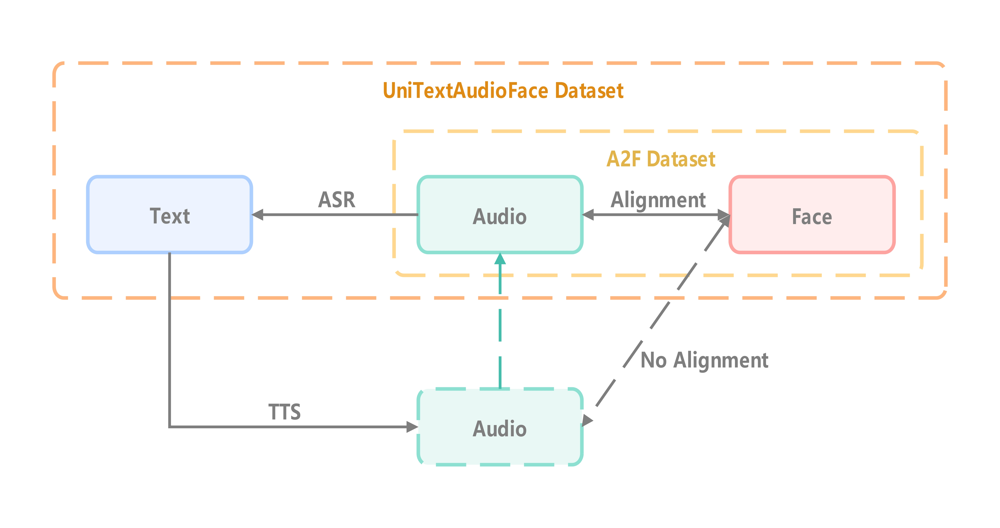
*Figure 1: Audio–expression misalignment issue during training on the UniTAF dataset.*

![Figure 2: The process of concatenating GT audio for the joint TTS+A2F model. The left black solid-line pipeline represents the second design choice, where TTS is fully frozen and a complete A2F module is trained, which encounters misalignment between TTS-generated audio and the GT audio in the dataset. The left red dashed-line pipeline represents concatenating GT audio during training to obtain GT audio features, thereby resolving the audio–face misalignment during training. The right pipeline shows training a complete A2F model independently using the audio–face pairs from the dataset.](../images/2026-02-19/2602.15651/2602.15651_fig1.png)
*Figure 2: The process of concatenating GT audio for the joint TTS+A2F model. The left black solid-line pipeline represents the second design choice, where TTS is fully frozen and a complete A2F module is trained, which encounters misalignment between TTS-generated audio and the GT audio in the dataset. The left red dashed-line pipeline represents concatenating GT audio during training to obtain GT audio features, thereby resolving the audio–face misalignment during training. The right pipeline shows training a complete A2F model independently using the audio–face pairs from the dataset.*

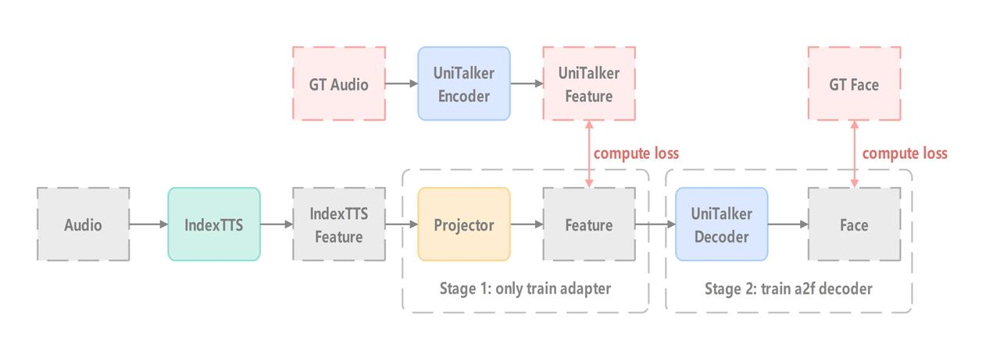
*Figure 3: Two-stage training strategy for IndexTTS2 + UniTalker Decoder. In the first stage, IndexTTS features are projected into the UniTalker feature space; in the second stage, the facial expression generation component is formally trained.*

![Figure 4: Overview of the UniTAF inference and training pipeline. In the first stage, the Projector layer is trained to align audio features to the UniTalker feature space; in the second stage, the Projector and the A2F Decoder are jointly trained to improve facial expression quality. Throughout training, the TTS outputs are consistently replaced with GT Audio Tokens to ensure data alignment, and the framework supports training the TTS component when the TTS inference distribution differs from the training distribution, in order to compensate for alignment issues.](../images/2026-02-19/2602.15651/2602.15651_fig3.png)
*Figure 4: Overview of the UniTAF inference and training pipeline. In the first stage, the Projector layer is trained to align audio features to the UniTalker feature space; in the second stage, the Projector and the A2F Decoder are jointly trained to improve facial expression quality. Throughout training, the TTS outputs are consistently replaced with GT Audio Tokens to ensure data alignment, and the framework supports training the TTS component when the TTS inference distribution differs from the training distribution, in order to compensate for alignment issues.*

*(a)(a)*

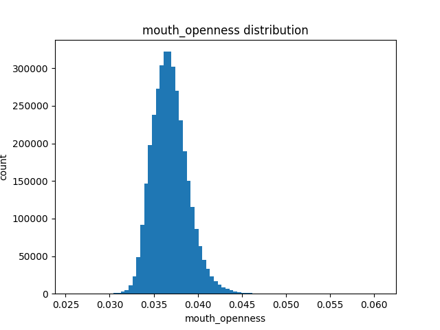
*(a)(a)*

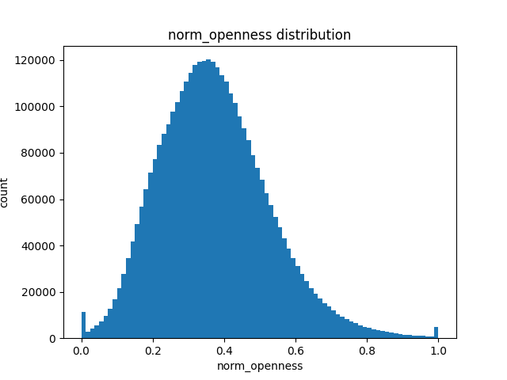
*(b)(b)*

*(a)(a)*

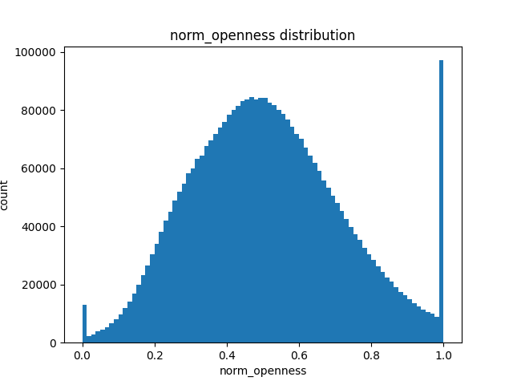
*(a)(a)*

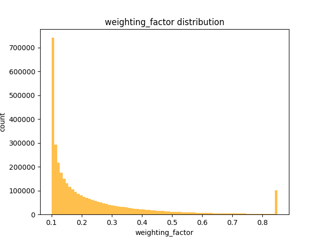
*(b)(b)*

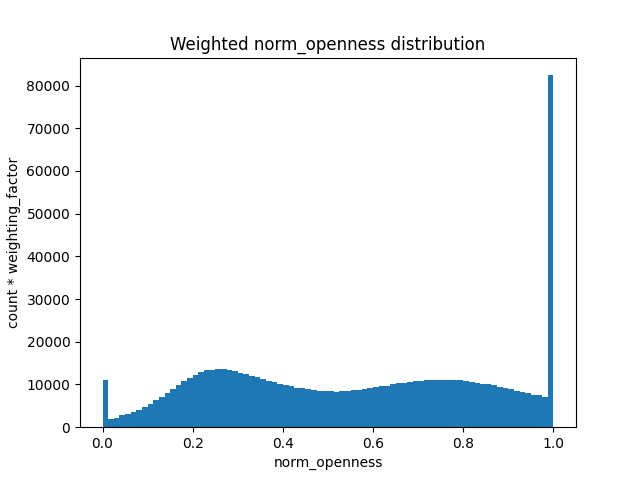
*(c)(c)*

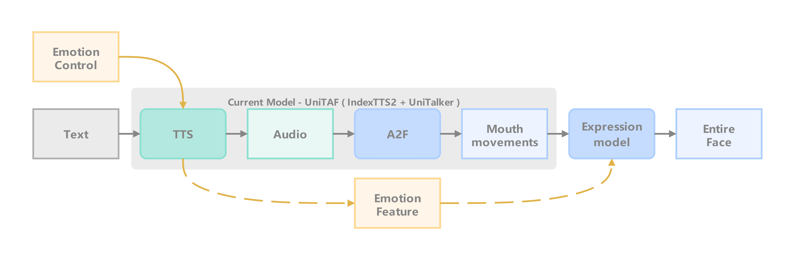
*Figure 7: Illustration of enriched facial expression generation with additional emotion control.*

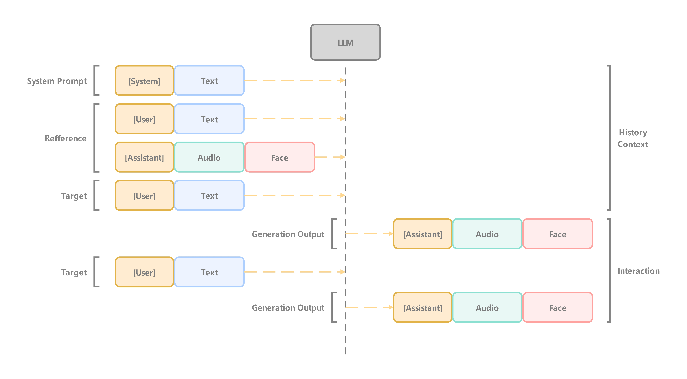
*Figure 8: End-to-end audio and facial expression generation based on an LLM.*

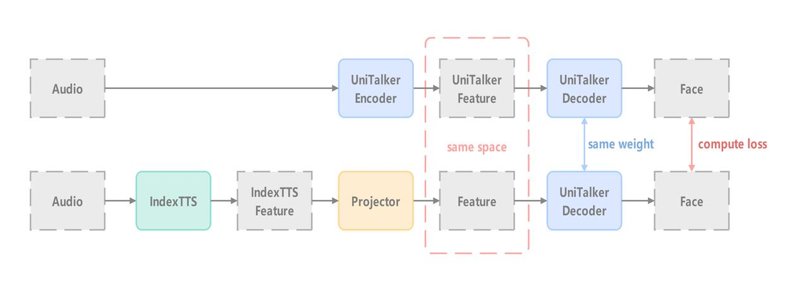
*Figure 9: An incorrect feature-space alignment strategy.*

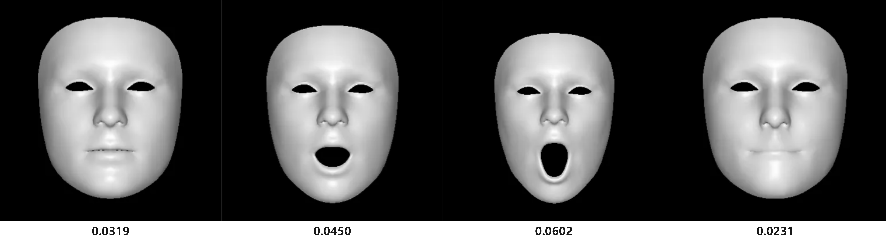
*Figure 10: Illustration of the quantitative measurement of facial mouth opening degree.*

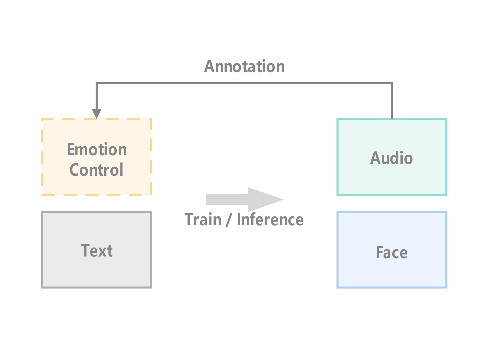
*Figure 11: Based on IndexTTS2 emotion control, emotion features are extracted from audio data, extending the data pairs to emotion–text–audio–expression data pairs.*

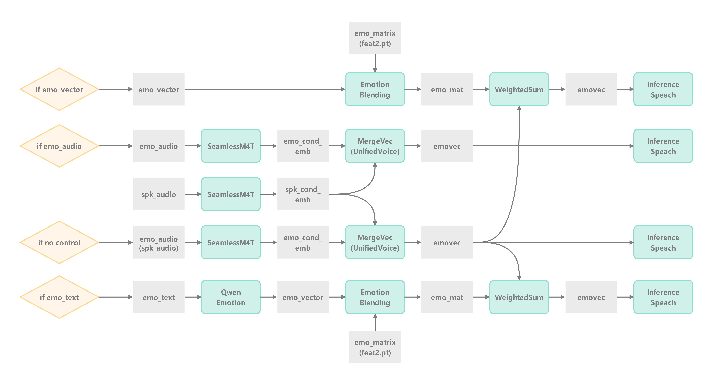
*Figure 12: The pipeline of the emotion control mechanism in IndexTTS2.*

---
**Usage Info**: 6238 tokens used.
**Generated at**: 2026-02-23 22:56:35

---

# 📚 How to Label Resynthesized Audio: The Dual Role of Neural Audio Codecs in Audio Deepfake Detection

🚀 URL: https://arxiv.org/html/2602.16343

## 🌏 Abstract (원문)
A Neural Audio Codec (NAC) is originally proposed as a data-driven compression model that maps a waveform to a sequence of compact latent codes and reconstructs the signal from those codes with a learned decoder. Similar to classical codecs (e.g., Opus[19], MP3) that are widely used to reduce bitrate and stabilize streaming under bandwidth constraints, NACs also enable efficient transmission. More specifically, modern NACs include a vector-quantized encoder-decoder architecture with one or more codebooks. The encoder projects the input audio into frame-level latent representations, which are then quantized by selecting indices from a learned codebook; the decoder reconstructs the waveform from these discrete indices, also known as discrete tokens. Compared to classical codecs, the discrete tokens from NACs can capture richer information including phonetics content, prosody, and timbre, while removing fine-grained redundancies. As a result, discrete tokens provided by NACs can be used in many other tasks, such as speech synthesis[26,2,17,14,7,9,8]. These speech generation systems model the sequence of codec tokens and reconstruct them to waveforms using NAC decoders. Compared to non-codec-based speech generation methods, codec-based ones often yield higher perceptual quality and speaker similarity. Given the advantages of NACs and codec-based speech generation, it is foreseeable that there will be more applications in the future. Hence modern audio deepfake detection systems must handle a spectrum that spans (i) Bonafide speech that has been codec re-synthesized (CoRS) by an NAC used purely for transmission, and (ii) codec-based speech generation (CoSG) in which a codec-based speech synthesis model produces spoofed audio. This dual use introduces a key challenge: how should CoRS be incorporated during training? A naive approach is to treat CoRS either as bonafide or as spoof, given that some NACs are designed for transmission (e.g., EnCodec[5]) and others are more tailored towards speech generation (e.g., Mimi[6]). However, if CoRS is treated as bonafide, the detector may correctly detect bonafide CoRS but may fail to detect CoSG that uses the same NAC. On the other hand, if CoRS is treated as spoof, the detector may learn to flag codec artifacts as spoof; this can improve accuracy at detecting CoSG[22,4], but risk rejecting bonafide audio compressed by NACs. However, only very few studies have examined the dual role of CoRS in audio deepfake detection. CodecFake[22] and CodecFake+[4] recognized the threat posed by CoSG systems. [4] is also the first to coin the terms CoSG and CoRS. However, they primarily leveraged CoRS as spoof augmentation. Another work on ALM-based deepfakes[24] has analyzed the detectability of some CoSG systems but did not consider CoRS. One main reason of the lack of research is that we currently lack related datasets. Our contributions include: (i) Releasing an open-source and highly challenging dataset for audio deepfake detection research. This dataset is based on the ASVspoof 5 contribution protocol and can be viewed as an extension of ASVspoof 5. (ii) Investigating the dual role of CoRS to address the research gap, through which we attempt to identify the best labeling strategy for CoSG. Specifically, when to label as bonafide and when to label as spoof.
## 🌏 Abstract (번역)
신경망 오디오 코덱(NAC)은 원래 파형을 압축된 잠재 코드 시퀀스로 매핑하고 학습된 디코더를 통해 신호를 복원하는 데이터 기반 압축 모델로 제안되었습니다. 비트레이트를 줄이고 대역폭 제한 하에서 스트리밍을 안정화하기 위해 널리 사용되는 기존 코덱(예: Opus, MP3)과 유사하게, NAC 또한 효율적인 전송을 가능하게 합니다. 구체적으로, 현대의 NAC는 하나 이상의 코드북을 가진 벡터 양자화 인코더-디코더 아키텍처를 포함합니다. 인코더는 입력 오디오를 프레임 레벨의 잠재 표현으로 투영하고, 이는 학습된 코드북에서 인덱스를 선택하여 양자화됩니다. 디코더는 이러한 이산 인덱스(이산 토큰)로부터 파형을 복원합니다. 기존 코덱과 비교하여 NAC의 이산 토큰은 미세한 중복성을 제거하면서도 음소 콘텐츠, 운율, 음색을 포함한 더 풍부한 정보를 포착할 수 있습니다. 결과적으로 NAC가 제공하는 이산 토큰은 음성 합성 등 다른 많은 작업에서 사용될 수 있습니다. 이러한 음성 생성 시스템은 코덱 토큰 시퀀스를 모델링하고 NAC 디코더를 사용하여 파형으로 복원합니다. 코덱 기반이 아닌 음성 생성 방법과 비교할 때, 코덱 기반 방법은 종종 더 높은 지각 품질과 화자 유사성을 제공합니다. NAC 및 코덱 기반 음성 생성의 장점을 고려할 때, 향후 더 많은 응용 분야가 생길 것으로 예상됩니다. 따라서 현대의 오디오 딥페이크 탐지 시스템은 (i) 순수하게 전송을 위해 NAC로 재합성된 진본 음성(CoRS)과 (ii) 코덱 기반 음성 합성 모델이 위조 오디오를 생성하는 코덱 기반 음성 생성(CoSG)을 모두 처리해야 합니다. 이러한 이중 용도는 핵심적인 과제를 제기합니다. 즉, 훈련 중에 CoRS를 어떻게 포함시켜야 하는가입니다. 단순한 접근 방식은 CoRS를 진본 또는 위조로 취급하는 것입니다. 그러나 CoRS를 진본으로 취급하면 탐지기가 진본 CoRS는 올바르게 탐지할 수 있지만 동일한 NAC를 사용하는 CoSG 탐지에는 실패할 수 있습니다. 반면 CoRS를 위조로 취급하면 탐지기가 코덱 아티팩트를 위조로 표시하도록 학습하여 CoSG 탐지 정확도는 향상될 수 있지만, NAC로 압축된 진본 오디오를 거부할 위험이 있습니다. 그러나 오디오 딥페이크 탐지에서 CoRS의 이중 역할을 조사한 연구는 거의 없습니다. 본 연구의 기여는 다음과 같습니다. (i) 오디오 딥페이크 탐지 연구를 위한 오픈 소스이며 매우 도전적인 데이터셋인 CodecDeepfakeDetection(CDD)을 출시합니다. 이 데이터셋은 ASVspoof 5 프로토콜을 기반으로 하며 ASVspoof 5의 확장으로 볼 수 있습니다. (ii) 연구 공백을 해결하기 위해 CoRS의 이중 역할을 조사하고, 이를 통해 CoSG에 대한 최적의 라벨링 전략을 식별하고자 합니다. 구체적으로 언제 진본으로 라벨링하고 언제 위조로 라벨링할지를 결정합니다.

## 🔍 Methods & Results
- Llasa, MARS5, Sesame CSM, S1-mini, Chatterbox, CosyVoice 2 등 다양한 최신 음성 합성 시스템을 공격 모델로 선정함
- XCodec2, EnCodec, Mimi, DAC, S3Tokenizer 등 다양한 신경망 오디오 코덱(NAC)의 특성을 분석하고 실험에 활용함
- ASVspoof 5 프로토콜을 확장한 새로운 공개 데이터셋인 CodecDeepfakeDetection(CDD)을 구축함
- 코덱 재합성 음성(CoRS)을 학습 시 Bonafide 또는 Spoof로 라벨링할 때의 트레이드오프를 조사함
- 각 NAC별로 훈련/개발/평가용 데이터를 3.6k/1.2k/1.2k 샘플씩 구성하여 데이터 편향을 방지함

## 🖼 Figures

*Fig. 1:Overview of the setting we investigate: Modern attackers utilize NACs to obtain discrete tokens for language modeling. Human speech is also encoded with NACs for storage or transmission. Real and fake speech sometimes share the same NAC decoders. Can we still detect the fakes?*

---
**Usage Info**: 8644 tokens used.
**Generated at**: 2026-02-23 22:57:19

---

# 📚 BAT: Better Audio Transformer Guided by Convex Gated Probing

🚀 URL: https://arxiv.org/html/2602.16305

## 🌏 Abstract (원문)
Self-supervised learning (SSL) has become the foundation of modern deep learning, generating state-of-the-art (SOTA) performance across modalities(Heet al.,2022; Chenet al.,2020; Baevskiet al.,2022a). In audio, progress has largely been achieved by adapting vision-based methods from images to spectrograms(Huanget al.,2022). While the AudioSet(Gemmekeet al.,2017)benchmark is repeatedly surpassed by novel SSL models(Chenet al.,2024; Alexet al.,2025), the evaluation methodology remains underdeveloped(Rauchet al.,2025a). Although benchmarks such as SUPERB(Yanget al.,2021)and HEAR(Turianet al.,2022)utilize frozen evaluation, the current pursuit of SOTA performance on AudioSet relies exclusively on fine-tuning. While fine-tuning may deliver the highest downstream performance, it introduces confounding variables (e.g., hyperparameter sensitivity) that can obscure true progress(Kumaret al.,2022). As we show in this work, current SOTA results may reflect better optimization procedures rather than superior SSL representations. While frozen-feature probing has become an important evaluation technique in computer vision(Oquabet al.,2024; Darcetet al.,2025), simple probes fail to unlock the potential of audio embeddings, leading to a performance gap that falsely justifies reliance on fine-tuning(Rauchet al.,2025a). Reproducibility remains an additional challenge for recent SSL models in audio. For instance, EAT(Chenet al.,2024)and SSLAM(Alexet al.,2025)are built upon legacy code via fairseq(Ottet al.,2019)and inherit methodologies from Data2Vec 2.0(Baevskiet al.,2022a)and Audio-MAE(Huanget al.,2022). These implementations contain undocumented architectural details and unclear optimization practices, complicating reproducibility as we show in this work. This work introducesConvex Gated Probing(CGP), a novel probing method designed for the faithful evaluation and efficient development of SSL models. Building on recent prototypical probing approaches(Rauchet al.,2025a), CGP employs a parameter-efficient gating mechanism to leverage the full depth of the frozen backbone, significantly closing the performance gap between frozen-feature probing and fine-tuning. Guided by CGP, we refine the audio SSL pipeline to propose theBetter Audio Transformer (BAT). We systematically improve the data pipeline, target generation, and architecture. Our contributions are as follows:
## 🌏 Abstract (번역)
자기 지도 학습(SSL)은 현대 딥러닝의 기초가 되었으며, 여러 모달리티에 걸쳐 최첨단(SOTA) 성능을 창출하고 있습니다. 오디오 분야에서는 이미지 기반의 시각적 방법론을 스펙트로그램에 적용함으로써 큰 진전이 이루어졌습니다. AudioSet 벤치마크가 새로운 SSL 모델들에 의해 반복적으로 갱신되고 있음에도 불구하고, 평가 방법론은 여전히 미흡한 상태입니다. SUPERB나 HEAR와 같은 벤치마크는 고정된(frozen) 평가 방식을 사용하지만, 현재 AudioSet에서의 SOTA 성능 추구는 전적으로 미세 조정(fine-tuning)에 의존하고 있습니다. 미세 조정은 가장 높은 하류 성능을 제공할 수 있지만, 하이퍼파라미터 민감도와 같은 혼란 변수를 도입하여 진정한 발전을 가릴 수 있습니다. 본 연구에서 보여주듯, 현재의 SOTA 결과는 우수한 SSL 표현보다는 더 나은 최적화 절차를 반영할 수 있습니다. 고정 특징 프로빙(frozen-feature probing)은 컴퓨터 비전에서 중요한 평가 기술이 되었으나, 단순한 프로빙은 오디오 임베딩의 잠재력을 끌어내는 데 실패하여 미세 조정에 대한 의존을 잘못 정당화하는 성능 격차를 초래합니다. 재현성 또한 최근 오디오 SSL 모델들의 추가적인 과제입니다. 예를 들어, EAT와 SSLAM은 fairseq을 통한 레거시 코드를 기반으로 구축되었으며 Data2Vec 2.0 및 Audio-MAE의 방법론을 계승합니다. 이러한 구현체들은 문서화되지 않은 아키텍처 세부 사항과 불분명한 최적화 관행을 포함하고 있어 재현성을 어렵게 만듭니다. 본 연구는 SSL 모델의 충실한 평가와 효율적인 개발을 위해 설계된 새로운 프로빙 방법인 Convex Gated Probing(CGP)을 소개합니다. 최근의 원형 프로빙 접근 방식을 기반으로 하는 CGP는 파라미터 효율적인 게이팅 메커니즘을 사용하여 고정된 백본의 전체 깊이를 활용하며, 고정 특징 프로빙과 미세 조정 사이의 성능 격차를 크게 줄입니다. CGP의 안내에 따라, 우리는 오디오 SSL 파이프라인을 개선하여 Better Audio Transformer(BAT)를 제안합니다. 우리는 데이터 파이프라인, 타겟 생성 및 아키텍처를 체계적으로 개선합니다.

## 🔍 Methods & Results
- Convex Gated Probing(CGP) 개발: 파라미터 효율적인 게이팅 메커니즘을 통해 고정된 백본의 전체 깊이를 활용하여 고정 특징 프로빙과 미세 조정 간의 성능 격차를 해소함
- Better Audio Transformer(BAT) 제안: CGP를 통한 분석을 바탕으로 데이터 파이프라인, 타겟 생성 및 아키텍처를 체계적으로 개선한 새로운 오디오 SSL 모델
- 기존 SOTA 모델 분석: AudioSet의 최신 성능이 모델의 표현력보다는 최적화 절차에 기인할 수 있음을 입증하고 기존 모델(EAT, SSLAM)의 재현성 문제를 지적
- 평가 방법론 개선: 단순 프로빙의 한계를 극복하고 SSL 모델의 잠재력을 충실히 평가할 수 있는 방법론 제시

## 🖼 Figures
![Figure 1:Convex Gated Probing (CGP). We illustrate the probing process of a spectrogram embedding for a ViT-Base backbone. CGP applies a learnable soft-gating vector (softmax) to compute a weighted sum of embeddings from all layers (
𝐿
). The gating aggregates the hierarchy into a single representation, which is then compared against 
𝐾
 prototypes. The cosine similarities of the patch embeddings are min-max pooled and concatenated with the ones from the cls-token, resulting in 
3
​
𝐾
 features for a linear classifier.](../images/2026-02-19/2602.16305/2602.16305_fig0.png)
*Figure 1:Convex Gated Probing (CGP). We illustrate the probing process of a spectrogram embedding for a ViT-Base backbone. CGP applies a learnable soft-gating vector (softmax) to compute a weighted sum of embeddings from all layers (
𝐿
). The gating aggregates the hierarchy into a single representation, which is then compared against 
𝐾
 prototypes. The cosine similarities of the patch embeddings are min-max pooled and concatenated with the ones from the cls-token, resulting in 
3
​
𝐾
 features for a linear classifier.*

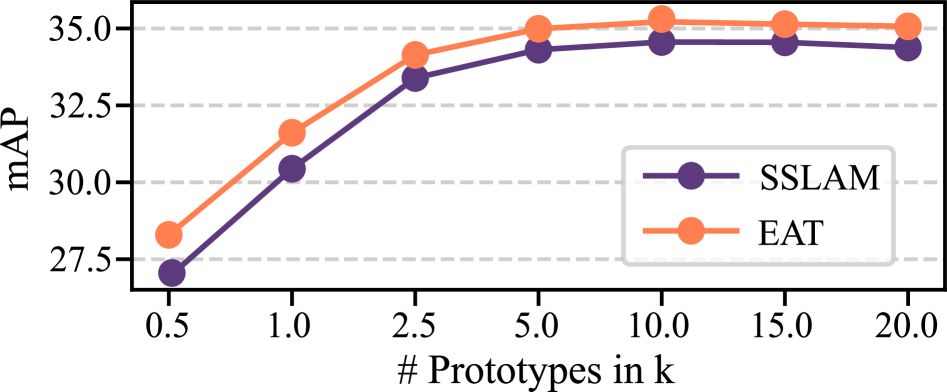
*Figure 2:CGP Ablation. Increasing the number of prototypes constantly improves results, but yields diminishing returns. The best computation-performance trade-off is dataset-dependent.*

![Figure 3:Impact of audio frontend. A recording containing the labels [Whimper, Gasp, Speech, Outside, urban or manmade]. (a) Our incorporated audio frontend: Mel-spectrogram with decibel compression and local min-max normalization, exhibiting clear spectral structure and high contrast. (b) Audio-MAE, EAT, and SSLAM: simple log, filtering, Mel-spectrogram, and global standardization. Note the artifacts and blurring, particularly at lower frequencies.](../images/2026-02-19/2602.16305/2602.16305_fig2.png)
*Figure 3:Impact of audio frontend. A recording containing the labels [Whimper, Gasp, Speech, Outside, urban or manmade]. (a) Our incorporated audio frontend: Mel-spectrogram with decibel compression and local min-max normalization, exhibiting clear spectral structure and high contrast. (b) Audio-MAE, EAT, and SSLAM: simple log, filtering, Mel-spectrogram, and global standardization. Note the artifacts and blurring, particularly at lower frequencies.*

![Figure 4:Layer-wise latent information. We display the layer-wise latent information quality across three models on AS-20k: (a) BAT with the lightweight CNN (best performer from Table 3), (b) EAT (baseline), and (c) our final BAT (ViT decoder). The top row displays the linear probing performance of each Transformer block. The bottom row visualizes the learned gating weights from CGP. Notably, the standard EAT (b) and the CNN-based BAT (a) exhibit a middle-heavy distribution where semantic information peaks early. In contrast, the heavy ViT decoder in the final BAT (c) shifts the semantic peak toward the later layers, improving linear separability at the output.](../images/2026-02-19/2602.16305/2602.16305_fig3.png)
*Figure 4:Layer-wise latent information. We display the layer-wise latent information quality across three models on AS-20k: (a) BAT with the lightweight CNN (best performer from Table 3), (b) EAT (baseline), and (c) our final BAT (ViT decoder). The top row displays the linear probing performance of each Transformer block. The bottom row visualizes the learned gating weights from CGP. Notably, the standard EAT (b) and the CNN-based BAT (a) exhibit a middle-heavy distribution where semantic information peaks early. In contrast, the heavy ViT decoder in the final BAT (c) shifts the semantic peak toward the later layers, improving linear separability at the output.*

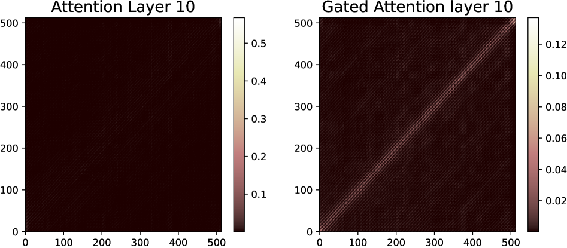
*Figure 5:Impact of gating on attentions. Gating distributes the attention better and focuses more on the token itself, rather than sinking into one token, primarily the cls-token.*

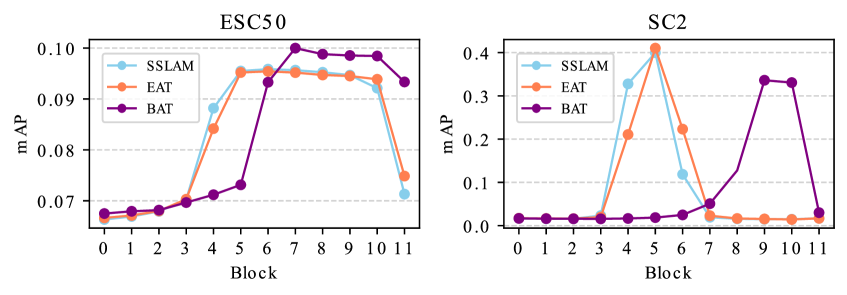
*Figure 6:CGP weights for multi-class datasets. The weights are comparable to AS-20k weights we show in the main paper. We see that BAT shifts the information more towards the final layers.*

---
**Usage Info**: 3264 tokens used.
**Generated at**: 2026-02-23 22:58:13

---

# 📚 ZeroSyl: Simple Zero-Resource Syllable Tokenization for Spoken Language Modeling

🚀 URL: https://arxiv.org/html/2602.15537

## 🌏 Abstract (원문)
Advances in self-supervised learning (SSL) have made it possible to train language models directly on audio data: instead of using tokenized text, a causal language model is trained on tokens derived from an SSL model. Without relying on any textual resources, this framework would enable natural language processing for languages lacking the massive speech-text datasets required by traditional speech-driven technology. These pure speech language models showed early potential, but subsequent progress has slowed. The decline in progress is most evident in syntactic modeling, where performance has plateaued since 2023. AudioLM remains the state-of-the-art, yet it relies on a resource-intensive framework: a high-capacity language model trained on high-bitrate tokens from w2v-BERT XL. Moreover, recent work indicates that pure speech modeling scales less favorably than text, suggesting that simply increasing model size and data volume will not solve the problem. This has resulted in a shift toward discovering more effective speech units in order to close the performance gap with textual models of comparable size. One hypothesis is that the fine granularity of standard speech tokens creates a bottleneck. Because discrete speech tokens are extracted at a much higher rate than text tokens, the resulting sequences are substantially longer, making it difficult to model long-range dependencies. To mitigate this, studies have attempted to utilize larger phone-, syllable-, or word-like units. Syllable-based modeling has proven to be particularly successful. However, existing syllabic tokenizers rely on complex multi-stage pipelines where an SSL model must be fine-tuned with a specialized objective. In this paper, we propose an unsupervised approach to syllable tokenization that does not require the complex methods of previous work. Figure 1 shows our simple pipeline. We find that high-quality syllabic boundaries can be extracted by simply applying peak detection to the L2 norms of frozen WavLM features. We then mean-pool and cluster features within these boundaries to generate a discrete vocabulary. A symbolic language model is trained on the resulting sequences. This approach, which we call ZeroSyl, surpasses the syntactic (sBLIMP) performance of comparable syllabic models and achieves superior performance on the Topic StoryCloze (tSC) narrative benchmark. It also outperforms syllabic systems on the lexical sWUGGY benchmark. But in scaling experiments, it does not surpass the performance of a system utilizing fine-grained units. Nevertheless, our results demonstrate that high-quality syllable discovery is possible without complex multi-stage training pipelines, paving a simple and effective path for future research in spoken language modeling. Models and code available at: https://github.com/nicolvisser/ZeroSyl/
## 🌏 Abstract (번역)
자기주도 학습(SSL)의 발전으로 오디오 데이터에서 직접 언어 모델을 훈련하는 것이 가능해졌습니다. 텍스트 토큰 대신 SSL 모델에서 유도된 토큰을 사용하여 인과적 언어 모델을 훈련합니다. 이 프레임워크는 텍스트 자원에 의존하지 않고도 전통적인 음성 기반 기술에 필요한 대규모 음성-텍스트 데이터셋이 부족한 언어에 대해 자연어 처리를 가능하게 합니다. 이러한 순수 음성 언어 모델은 초기 가능성을 보여주었으나, 이후 진전이 더뎌졌습니다. 특히 구문 모델링에서 이러한 정체가 두드러지며, 2023년 이후 성능이 정체 상태에 머물러 있습니다. AudioLM이 여전히 최고 수준의 성능을 유지하고 있지만, 이는 w2v-BERT XL의 고비트레이트 토큰으로 훈련된 고용량 언어 모델이라는 자원 집약적인 프레임워크에 의존합니다. 더욱이 최근 연구에 따르면 순수 음성 모델링은 텍스트보다 확장성이 떨어지며, 단순히 모델 크기와 데이터 양을 늘리는 것만으로는 문제를 해결할 수 없음을 시사합니다. 이로 인해 비슷한 크기의 텍스트 모델과의 성능 격차를 줄이기 위해 더 효과적인 음성 단위를 발견하려는 방향으로 전환되었습니다. 한 가지 가설은 표준 음성 토큰의 미세한 입도가 병목 현상을 일으킨다는 것입니다. 이산 음성 토큰은 텍스트 토큰보다 훨씬 높은 속도로 추출되기 때문에 결과 시퀀스가 상당히 길어지고, 이로 인해 장거리 의존성을 모델링하기 어렵게 만듭니다. 이를 완화하기 위해 음소, 음절 또는 단어와 유사한 더 큰 단위를 활용하려는 시도가 있었습니다. 음절 기반 모델링은 특히 성공적인 것으로 입증되었습니다. 그러나 기존의 음절 토크나이저는 SSL 모델을 특수 목적에 맞게 미세 조정해야 하는 복잡한 다단계 파이프라인에 의존합니다. 본 논문에서는 이전 연구의 복잡한 방법이 필요하지 않은 음절 토큰화에 대한 비지도 학습 접근 방식을 제안합니다. 그림 1은 우리의 단순한 파이프라인을 보여줍니다. 우리는 고정된 WavLM 특징의 L2 노름에 피크 검출을 적용하는 것만으로도 고품질의 음절 경계를 추출할 수 있음을 발견했습니다. 그런 다음 이러한 경계 내에서 특징을 평균 풀링하고 클러스터링하여 이산 어휘를 생성합니다. 결과 시퀀스에 대해 심볼릭 언어 모델이 훈련됩니다. ZeroSyl이라고 불리는 이 접근 방식은 유사한 음절 모델의 구문(sBLIMP) 성능을 능가하며 Topic StoryCloze(tSC) 내러티브 벤치마크에서 우수한 성능을 달성합니다. 또한 어휘 sWUGGY 벤치마크에서도 음절 시스템을 능가합니다. 그러나 확장 실험에서는 미세 입도 단위를 사용하는 시스템의 성능을 넘어서지는 못했습니다. 그럼에도 불구하고 우리의 결과는 복잡한 다단계 훈련 파이프라인 없이도 고품질 음절 발견이 가능하다는 것을 보여주며, 구어 언어 모델링의 미래 연구를 위한 단순하고 효과적인 경로를 제시합니다. 모델과 코드는 https://github.com/nicolvisser/ZeroSyl/ 에서 확인할 수 있습니다.

## 🔍 Methods & Results
- WavLM Large의 13번째 레이어 특징에 대한 L2 노름 피크 검출을 통해 음절 경계를 추출하는 단순한 비지도 학습 파이프라인 제안
- 추출된 경계 내에서 WavLM 22번째 레이어 특징을 평균 풀링하고 Spherical K-means로 클러스터링하여 이산 음절 단위 생성
- 계층적 클러스터링을 통해 중복되는 무음(Silence) 토큰을 단일 어휘로 통합하여 언어 모델 성능 최적화
- ZeroSyl은 기존 음절 기반 모델인 Sylber 및 SyllableLM 대비 높은 음절 경계 예측 정확도(Token F1 54%)와 상호 정보량(SNMI 88.9%) 달성
- 어휘(sWUGGY), 구문(sBLIMP), 내러티브(tSC) 벤치마크에서 기존 음절 기반 시스템을 능가하며 52 bps의 낮은 비트레이트로 효율성 입증
- 복잡한 다단계 미세 조정 없이도 고품질 음절 발견이 가능함을 증명하여 음성 언어 모델링의 새로운 경로 제시

## 🖼 Figures

*Figure 1: ZeroSyl detects syllabic boundaries using prominence-based peak detection on features from layer 13 of a frozen WavLM. It then mean pools semantic features from layer 22 within the discovered boundaries and clusters these using spherical 
𝐾
-means. A language model is trained on these cluster IDs.*

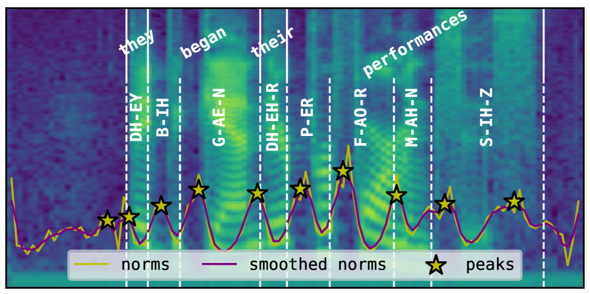
*Figure 2:Peak detection on the smoothed L2 norms of framewise features gives our predicted syllable boundaries. The dashed lines indicate the ground truth syllables.*

*Figure 3: Scaling behavior of ZeroSyl compared to speech (SpidR with 
𝐾
-means) and text (BPE) systems on the Libri-Light corpus.*

---
**Usage Info**: 6572 tokens used.
**Generated at**: 2026-02-23 22:58:50

---

# 📚 Enroll-on-Wakeup: A First Comparative Study of Target Speech Extraction for Seamless Interaction in Real Noisy Human-Machine Dialogue Scenarios

🚀 URL: https://arxiv.org/html/2602.15519

## 🌏 Abstract (원문)
Target speech extraction (TSE) aims to isolate a specific speaker's voice from a multi-talker or noisy acoustic environment by leveraging a set of auxiliary clues, such as a reference enrollment utterance from the target speaker. Traditional TSE frameworks typically operate under the assumption that a high-quality, pre-recorded enrollment signal is readily available to guide the extraction backbone in characterizing the speaker's unique embedding. However, in practical human-machine dialogue scenarios, requiring users to provide a pre-collected enrollment sample beforehand significantly disrupts the fluidity of interaction and limits the system's feasibility for spontaneous or first-time users. To bridge this gap and enable truly seamless interaction, it is essential to move toward an "Enroll-on-Wakeup" (EoW) TSE. In this setting, the system must extract the target speech using only the brief and often noise and interferer corrupted wake-word segment captured during the initial triggering phase, posing a significant yet necessary challenge for current TSE research. Existing methods for providing target speaker clues in TSE can be broadly categorized into three paradigms: audio-only, audio-visual (AV-TSE), and spatial-assisted auditory TSE. Audio-only-enrollment based TSE primarily relies on pre-trained speaker verification models or dedicated speaker encoders to extract target speaker identity embeddings. Recently, speaker embedding-free methods and waveform-level concatenation approaches have demonstrated robust performance across various TSE tasks. Despite their success, these methods remain dependent on the requirement of pre-recorded enrollment. To leverage multi-modal information, AV-TSE incorporates visual cues such as lip movements, while recent works integrate the linguistic knowledge of large language models to compensate for acoustic degradation. However, AV-TSE is fundamentally limited by line-of-sight requirements and raises significant privacy and computational concerns for low-power embedded devices. Alternatively, spatial-assisted TSE utilizes multi-channel features or direction-of-arrival information to localize the target speaker. While effective, these systems necessitate specific multi-microphone array configurations, limiting their versatility across diverse hardware. Ultimately, regardless of the target speaker clues utilized, most existing frameworks overlook the practical challenge of obtaining high-quality references in spontaneous dialogue. The dependency on pre-collected data or specialized hardware remains a bottleneck for seamless human-machine interaction. To address these limitations, this paper investigates the feasibility of TSE using only the intrinsic information available during the interaction process itself. Specifically, we propose an EoW-TSE that directly adopts the wake-word segment as the enrollment reference. This approach eliminates the user's burden of manual enrollment. The main contributions are summarized as follows: We introduce the Enroll-on-Wakeup (EoW) TSE paradigm, utilizing the triggering wake-word as an automatic enrollment clue to facilitate zero-effort, seamless human-machine interaction. We present the first systematic study of EoW-TSE, providing a comprehensive evaluation of advanced generative and discriminative models under diverse acoustic conditions and complex interferences; We investigate enrollment augmentation methods using LLM-based TTS, demonstrating that synthetic enrollment significantly enhances perceptual quality under severe acoustic degradation, while identifying the remaining challenges in balancing speech intelligibility with ASR accuracy.
## 🌏 Abstract (번역)
대상 음성 추출(TSE)은 대상 화자의 참조 등록 발화와 같은 보조 단서를 활용하여 다중 화자 또는 소음이 있는 음향 환경에서 특정 화자의 목소리를 분리하는 것을 목표로 합니다. 전통적인 TSE 프레임워크는 일반적으로 화자의 고유한 임베딩을 특성화하기 위해 고품질의 사전 녹음된 등록 신호가 추출 백본을 가이드할 수 있다는 가정하에 작동합니다. 그러나 실제 인간-기계 대화 시나리오에서 사용자에게 사전 수집된 등록 샘플을 미리 제공하도록 요구하는 것은 상호작용의 유동성을 크게 저해하며, 즉흥적 또는 최초 사용자에 대한 시스템의 실용성을 제한합니다. 이러한 격차를 해소하고 진정으로 원활한 상호작용을 가능하게 하려면 "깨어날 때 등록(Enroll-on-Wakeup, EoW)" TSE로 나아가는 것이 필수적입니다. 이 설정에서 시스템은 초기 트리거 단계에서 캡처된 짧고 종종 소음 및 간섭으로 오염된 웨이크워드(wake-word) 세그먼트만을 사용하여 대상 음성을 추출해야 하며, 이는 현재 TSE 연구에 있어 중요하면서도 필요한 과제입니다. TSE에서 대상 화자 단서를 제공하는 기존 방법은 크게 오디오 전용, 오디오-비주얼(AV-TSE), 공간 보조 청각 TSE의 세 가지 패러다임으로 분류할 수 있습니다. 오디오 전용 등록 기반 TSE는 주로 사전 학습된 화자 검증 모델이나 전용 화자 인코더를 사용하여 대상 화자 식별 임베딩을 추출합니다. 최근에는 화자 임베딩이 없는 방법과 파형 수준 연결 방식이 다양한 TSE 작업에서 강력한 성능을 입증했습니다. 이러한 성공에도 불구하고, 이 방법들은 여전히 사전 녹음된 등록의 필요성에 의존하고 있습니다. 멀티모달 정보를 활용하기 위해 AV-TSE는 입술 움직임과 같은 시각적 단서를 통합하며, 최근 연구들은 음향 저하를 보완하기 위해 대규모 언어 모델의 언어적 지식을 통합합니다. 그러나 AV-TSE는 가시선 요구 사항에 의해 근본적으로 제한되며 저전력 임베디드 장치에 대해 상당한 개인 정보 보호 및 계산 문제를 야기합니다. 대안으로 공간 보조 TSE는 다채널 기능이나 도착 방향 정보를 사용하여 대상 화자를 위치시킵니다. 효과적이기는 하지만, 이러한 시스템은 특정 다중 마이크 어레이 구성을 필요로 하므로 다양한 하드웨어에서의 범용성이 제한됩니다. 궁극적으로 활용되는 대상 화자 단서와 관계없이 대부분의 기존 프레임워크는 즉흥적인 대화에서 고품질 참조를 얻는 실제적인 문제를 간과합니다. 사전 수집된 데이터나 특수 하드웨어에 대한 의존도는 원활한 인간-기계 상호작용의 병목 현상으로 남아 있습니다. 이러한 한계를 해결하기 위해 본 논문은 상호작용 프로세스 자체에서 사용 가능한 고유 정보만을 사용하는 TSE의 타당성을 조사합니다. 구체적으로, 웨이크워드 세그먼트를 등록 참조로 직접 채택하는 EoW-TSE를 제안합니다. 이 접근 방식은 사용자의 수동 등록 부담을 제거합니다. 주요 기여는 다음과 같이 요약됩니다: 1) 트리거링 웨이크워드를 자동 등록 단서로 활용하여 노력 없는 원활한 인간-기계 상호작용을 촉진하는 EoW-TSE 패러다임을 도입합니다. 2) EoW-TSE에 대한 최초의 체계적인 연구를 제시하며, 다양한 음향 조건과 복잡한 간섭 하에서 고급 생성 및 판별 모델에 대한 포괄적인 평가를 제공합니다. 3) LLM 기반 TTS를 사용한 등록 증강 방법을 조사하여, 심각한 음향 저하 하에서 합성 등록이 지각 품질을 크게 향상시키는 동시에 음성 명료도와 ASR 정확도 사이의 균형을 맞추는 데 남은 과제를 식별합니다.

## 🔍 Methods & Results
- 실제 환경을 반영한 5가지 음향 시나리오(근거리/원거리 소음, 잔향, SNR 변화)를 포함하는 Unisound 내부 데이터셋을 사용하여 EoW-TSE의 견고성을 평가함.
- 평균 1.0초의 매우 짧고 오염된 웨이크워드 세그먼트를 등록 신호로 사용하는 가혹한 실험 조건을 설정함.
- 세 가지 판별 모델(SEF-PNet, LExt, CIE-mDPTNet)과 한 가지 생성 모델(SoloSpeech)을 포함한 4가지 최신 TSE 모델의 성능을 비교 분석함.
- 정보 부족 문제를 해결하기 위해 IndexTTS2, xTTS, CosyVoice와 같은 LLM 기반 TTS 엔진을 활용한 등록 증강 기법을 도입함.
- 증강 방법으로 웨이크워드 재합성(Clean Re-synthesis)과 ChatGPT 생성 문장 추가(Extended Concatenation)를 제안하여 성능 향상을 도모함.
- 실험 결과, 합성된 등록 음성이 심각한 음향 저하 상황에서 지각 품질을 향상시켰으나 음성 명료도와 ASR 정확도 간의 균형 문제는 여전히 과제로 남음을 확인함.

## 🖼 Figures
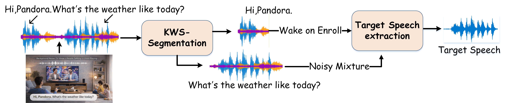
*Figure 1:Illustration of EoW-TSE system.*

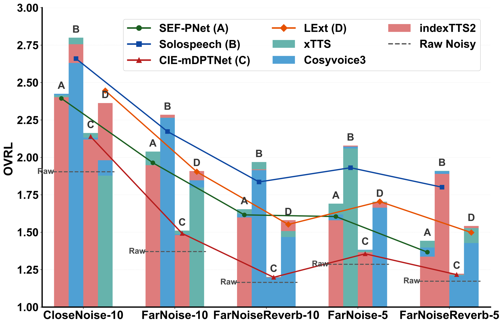
*Figure 2:OVRL scores on five scenarios: Original EoW-TSE vs. TTS-augmented (CR).*

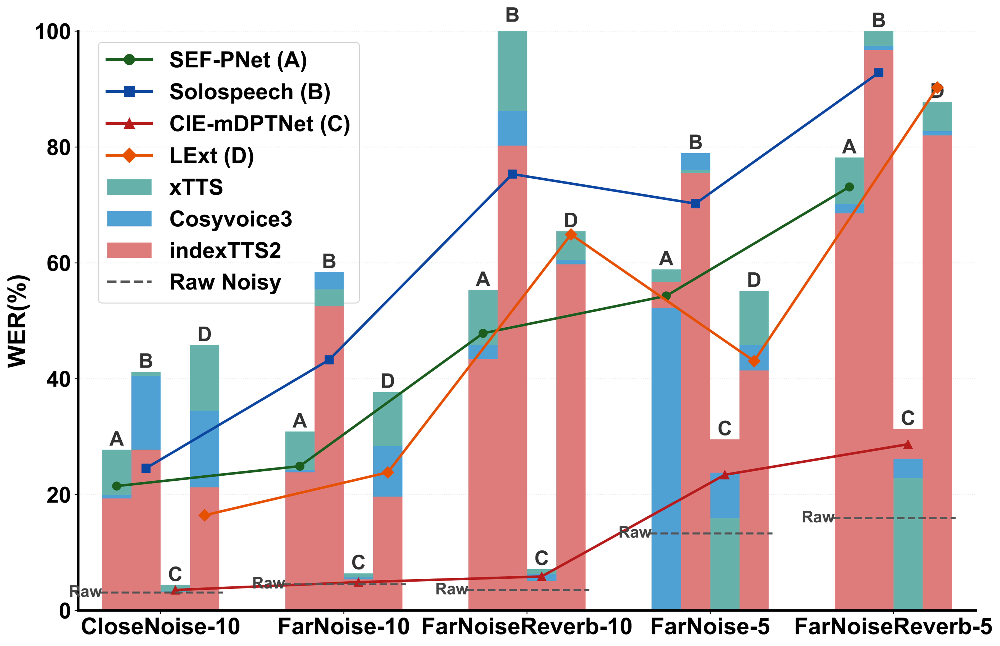
*Figure 3:WERs on five scenarios: Original EoW-TSE vs. TTS-augmented (CR).*

---
**Usage Info**: 6638 tokens used.
**Generated at**: 2026-02-23 22:59:35

---

