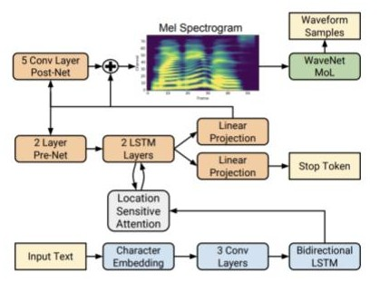
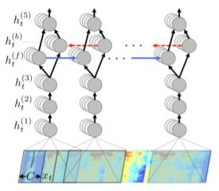
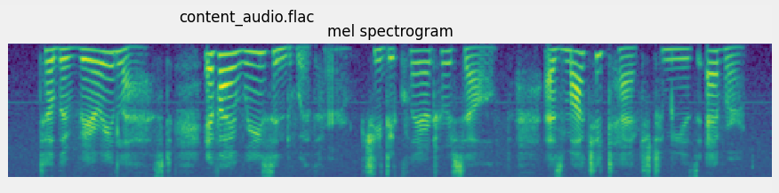
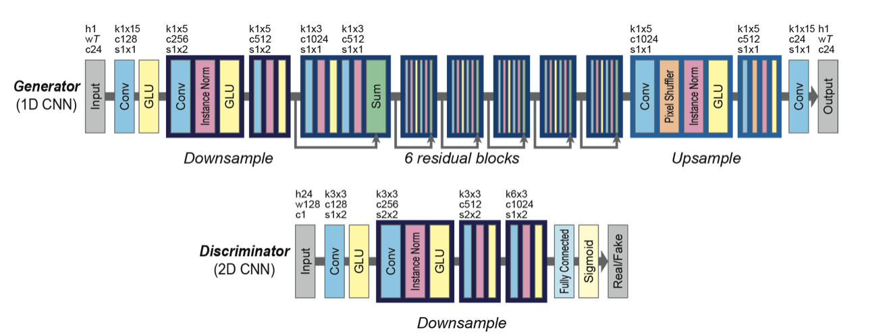
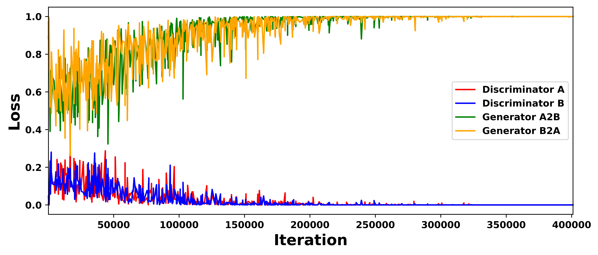
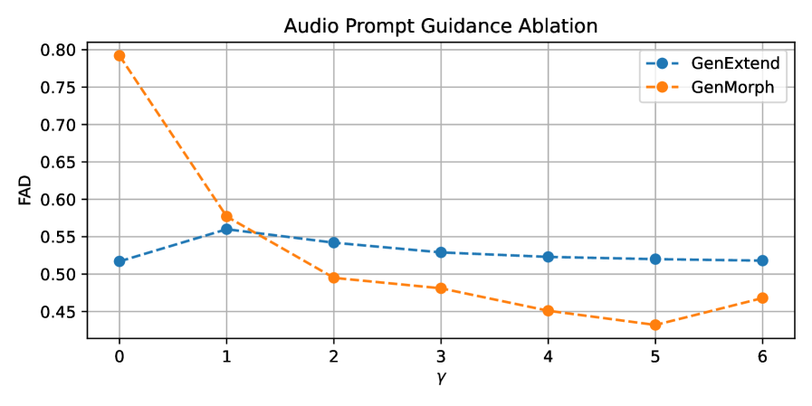
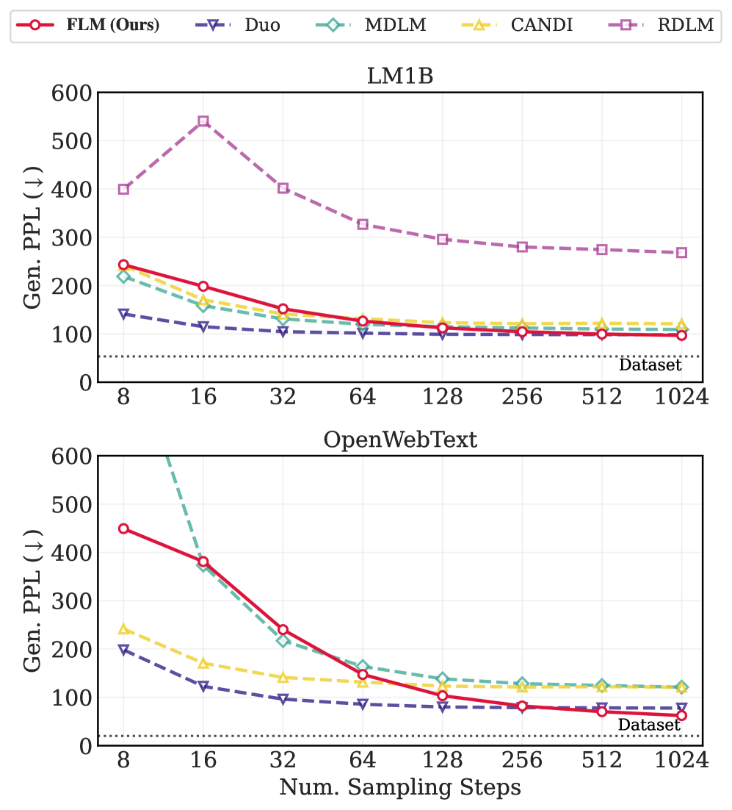
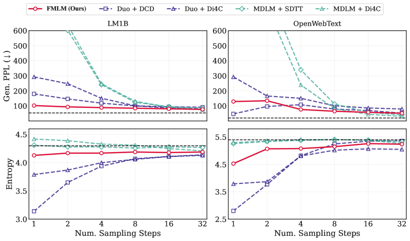

# 🚩 (2026-02-20) Scholar Inbox 추천 논문 

# 📚 Speech to Speech Synthesis for Voice Impersonation

🚀 URL: https://arxiv.org/html/2602.16721

## 🌏 Abstract (원문)
Numerous models have shown great success in the fields of speech recognition as well as speech synthesis, but models for speech to speech processing have not been heavily explored. We propose Speech to Speech Synthesis Network (STSSN), a model based on current state of the art systems that fuses the two disciplines in order to perform effective speech to speech style transfer for the purpose of voice impersonation. We show that our proposed model is quite powerful, and succeeds in generating realistic audio samples despite a number of drawbacks in its capacity. We benchmark our proposed model by comparing it with a generative adversarial model which accomplishes a similar task, and show that ours produces more convincing results. Index Terms—speech recognition, speech synthesis, GAN, mean opinion score
## 🌏 Abstract (번역)
음성 인식 및 음성 합성 분야에서 수많은 모델이 큰 성공을 거두었으나, 음성 대 음성 처리 모델은 아직 많이 탐구되지 않았습니다. 본 논문에서는 음성 모사를 목적으로 효과적인 음성 대 음성 스타일 전이를 수행하기 위해 두 분야를 융합한 최신 시스템 기반의 모델인 STSSN(Speech to Speech Synthesis Network)을 제안합니다. 제안된 모델은 용량 측면의 몇 가지 단점에도 불구하고 매우 강력하며 현실적인 오디오 샘플을 생성하는 데 성공했음을 보여줍니다. 유사한 작업을 수행하는 생성적 적대 신경망(GAN) 모델과 비교하여 제안된 모델을 벤치마킹하였으며, 우리 모델이 더 설득력 있는 결과를 생성함을 입증했습니다. 색인어—음성 인식, 음성 합성, GAN, 평균 의견 점수(MOS).

## 🔍 Methods & Results
- 기존의 최신 네트워크들을 결합하여 음성 대 음성 스타일 전이를 수행하는 STSSN 모델 설계
- CTC 손실 함수를 사용하는 수정된 DeepSpeech 아키텍처를 활용하여 오디오의 텍스트 전사(Transcription) 생성
- LSTM 레이어와 256차원 투영을 사용하는 화자 인코딩 네트워크를 통해 임의 길이의 오디오에서 고정 차원의 화자 스타일 표현 추출
- Tacotron2 네트워크를 통해 스타일 인코딩과 캐릭터 임베딩을 결합하고 MSE 손실 함수를 사용하여 스펙트로그램 합성
- CycleGAN의 적대적 손실(Adversarial Loss) 및 사이클 일관성 손실(Cycle Consistency Loss)을 활용한 비교 벤치마크 수행
- 실험 결과, 제안된 STSSN 모델이 GAN 기반 모델보다 더 설득력 있고 현실적인 오디오 샘플을 생성함을 확인

## 🖼 Figures
![Fig. 1: Network output for use with CTC loss (dashed line represents best output label), taken from [10]](../images/2026-02-20/2602.16721/2602.16721_fig0.png)
*Fig. 1: Network output for use with CTC loss (dashed line represents best output label), taken from [10]*

*Fig. 2: Tacotron2 Architecture*

*Fig. 3: DeepSpeech Architecture*

*Fig. 4: Spectrograms of content (top), style (mid), and output (bottom) audio files*

*Fig. 5: CycleGAN Architecture*

*Fig. 6: GAN model losses*

---
**Usage Info**: 2975 tokens used.
**Generated at**: 2026-02-21 20:53:56

---

# 📚 Generative Audio Extension and Morphing

🚀 URL: https://arxiv.org/html/2602.16790

## 🌏 Abstract (원문)
Sound design is a crucial aspect of various creative fields, including film, television, video games, and virtual reality. It involves the art and practice of creating auditory elements that enhance the narrative, evoke emotions, and provide an immersive experience. Sound designers meticulously craft and manipulate sounds to achieve a desired auditory effect, often morphing natural and synthetic sounds to create unique auditory landscapes. This process requires a deep understanding of acoustics, psychoacoustics, and the technical skills to use various audio tools and software. The ability to generate seamless audio extensions and morphs is of paramount importance for sound designers. These practitioners often face the challenge of extending or morphing audio clips to fit specific scenes or transitions without introducing artifacts or unnatural elements, as it is often the case that original footage may have been cut short or started slightly later than desired. Traditional methods can be time-consuming and may not always yield satisfactory results, especially when dealing with complex soundscapes or non-stationary sounds. Recent advancements in audio-based diffusion models have demonstrated significant progress in both text-conditional and unconditional audio generation. Furthermore, enhanced control mechanisms for such generative models have been proposed, leveraging audio characteristics for text-based conditions and refining latent representations to achieve fine-grained control via time-varying signals. Audio extension has also been explored for general audio, and particularly within the domain of music, while audio morphing techniques, often referred to as audio in-painting, have been applied to generic audio scenarios, as well as music. Nevertheless, these methodologies do not specifically address the requirements of sound designers, frequently resulting in suboptimal outcomes or models that are incompatible with the types of sounds they typically work with, such as special effects and environmental sounds. Our work addresses these challenges by introducing models capable of producing high-quality, 48kHz, stereo audio extensions and morphs from one audio to another. By leveraging Diffusion Transformers operating on audio latents, we propose a novel latent masking technique combined with a variant of Classifier-Free Guidance, resulting in seamless and effective audio extensions and morphs. Additionally, we mitigate potential hallucinations in stationary generations by implementing an innovative fine-tuning strategy. We evaluate our results using the Fréchet Audio Distance, demonstrating that the generated audio is often indistinguishable from their respective audio prompts in terms of audio quality. Furthermore, we confirm our findings through a subjective listener test, where participants rate the model’s generated audio positively. With this novel model, our aim is to enhance the creative workflow of sound designers and reduce the manual, tedious efforts required in their tasks. The main contributions of our work are as follows: A model designed to generate extensions and morph between one or two audio prompts, facilitating seamless continuation and merging of audio clips. A novel Audio Prompt Guidance (APG) technique inspired by Classifier-Free Guidance, which improves the quality and coherence of generated audio. A novel approach to addressing hallucinations by fine-tuning the model using a synthetic Noise Floor Dataset, ensuring the generated audio remains faithful to the input prompts.
## 🌏 Abstract (번역)
사운드 디자인은 영화, TV, 비디오 게임, 가상 현실 등 다양한 창의적 분야에서 중요한 요소입니다. 이는 서사를 강화하고 감정을 불러일으키며 몰입감 있는 경험을 제공하는 청각적 요소를 창조하는 예술이자 실습입니다. 사운드 디자이너들은 원하는 청각적 효과를 얻기 위해 소리를 세심하게 제작하고 조작하며, 종종 자연음과 합성음을 변형하여 독특한 청각적 풍경을 만듭니다. 이 과정은 음향학, 심리 음향학에 대한 깊은 이해와 다양한 오디오 도구 및 소프트웨어를 사용하는 기술적 능력을 요구합니다. 매끄러운 오디오 확장 및 모핑을 생성하는 능력은 사운드 디자이너에게 매우 중요합니다. 실무자들은 종종 원본 푸티지가 짧게 잘렸거나 원하는 것보다 늦게 시작되는 경우, 아티팩트나 부자연스러운 요소 없이 특정 장면이나 전환에 맞게 오디오 클립을 확장하거나 모핑해야 하는 과제에 직면합니다. 전통적인 방법은 시간이 많이 걸리고, 특히 복잡한 사운드스케이프나 비정상(non-stationary) 사운드를 다룰 때 항상 만족스러운 결과를 내지는 못합니다. 최근 오디오 기반 확산 모델(diffusion models)의 발전은 텍스트 조건부 및 무조건부 오디오 생성 모두에서 상당한 진전을 보여주었습니다. 또한, 텍스트 기반 조건을 위한 오디오 특성 활용 및 시변 신호를 통한 미세 제어를 위한 잠재 표현 정제 등 이러한 생성 모델을 위한 향상된 제어 메커니즘이 제안되었습니다. 오디오 확장은 일반 오디오 및 특히 음악 영역에서 탐구되어 왔으며, 오디오 인페인팅으로 불리는 오디오 모핑 기술은 일반적인 오디오 시나리오와 음악에 적용되었습니다. 그럼에도 불구하고, 이러한 방법론들은 사운드 디자이너의 요구사항을 구체적으로 다루지 않아, 특수 효과나 환경음과 같이 그들이 주로 다루는 소리 유형과 호환되지 않거나 차선의 결과를 초래하는 경우가 많습니다. 본 연구는 하나의 오디오에서 다른 오디오로 고품질 48kHz 스테레오 오디오 확장 및 모핑을 생성할 수 있는 모델을 도입하여 이러한 과제를 해결합니다. 오디오 잠재 공간에서 작동하는 Diffusion Transformers를 활용하여, 새로운 잠재 마스킹 기술과 Classifier-Free Guidance의 변형을 결합 제안함으로써 매끄럽고 효과적인 오디오 확장 및 모핑을 구현했습니다. 또한, 혁신적인 미세 조정 전략을 구현하여 정적인 생성물에서 발생할 수 있는 환각(hallucination) 현상을 완화했습니다. Fréchet Audio Distance(FAD)를 사용하여 결과를 평가했으며, 생성된 오디오가 오디오 품질 측면에서 원본 오디오 프롬프트와 구별되지 않는 경우가 많음을 입증했습니다. 또한 주관적 청취 테스트를 통해 모델이 생성한 오디오에 대해 참가자들이 긍정적으로 평가함을 확인했습니다. 이 새로운 모델을 통해 사운드 디자이너의 창의적 워크플로우를 개선하고 작업에 필요한 수동적이고 지루한 노력을 줄이는 것이 목표입니다. 본 연구의 주요 기여는 다음과 같습니다: 오디오 클립의 매끄러운 연속 및 병합을 용이하게 하는 확장 및 모핑 생성 모델, 생성된 오디오의 품질과 일관성을 향상시키는 새로운 Audio Prompt Guidance(APG) 기술, 그리고 합성 노이즈 플로어 데이터셋을 사용한 미세 조정을 통해 환각 문제를 해결하고 입력 프롬프트에 충실하도록 보장하는 새로운 접근 방식입니다.

## 🔍 Methods & Results
- 오디오 잠재 공간(Latent Space)에서 작동하는 Diffusion Transformer(DiT) 아키텍처를 기반으로 고품질 48kHz 스테레오 오디오 생성 모델 제안
- 입력 오디오 프롬프트를 잠재 표현으로 인코딩한 후, 이를 가우시안 노이즈와 결합하는 새로운 잠재 마스킹(Latent Masking) 기술 적용
- Classifier-Free Guidance를 오디오 도메인에 맞게 변형한 Audio Prompt Guidance(APG)를 도입하여 생성된 오디오의 품질과 프롬프트 일관성 향상
- 정방향(Forward) 및 역방향(Backward) 확장을 통해 오디오 클립을 자연스럽게 연장하거나, 두 개의 서로 다른 오디오 사이를 매끄럽게 연결하는 모핑 기능 구현
- 정적인 사운드 생성 시 발생하는 환각 현상을 줄이기 위해 합성 노이즈 플로어 데이터셋(Noise Floor Dataset)을 활용한 혁신적인 미세 조정(Fine-tuning) 전략 수행
- Fréchet Audio Distance(FAD)를 통한 정량적 평가 결과, 생성된 오디오가 원본 프롬프트의 품질과 구별하기 어려울 정도로 우수함을 입증
- 주관적 청취 테스트를 통해 실제 사용자가 생성된 오디오의 자연스러움과 품질에 대해 긍정적으로 평가함을 확인

## 🖼 Figures

*Fig. 1:Proposed block diagram of Generative Extend (solid lines) and Morphing (dashed lines). Two audio examples are shown: the blue one is used for Generative Extend (both forward and backward) and both the blue and the green ones are used for Morphing (from blue to green).*

*Fig. 2:Ablation of the Audio Prompt Guidance technique.*

---
**Usage Info**: 5612 tokens used.
**Generated at**: 2026-02-21 20:54:29

---

# 📚 One-step Language Modeling via Continuous Denoising

🚀 URL: https://arxiv.org/html/2602.16813

## 🌏 Abstract (원문)
Today’s frontier language models (LMs) are based on an autoregressive process that produces one subword (token) per step. While these models leverage parallelism during training through teacher forcing and a transformer-based architecture, their sampling is inherently serial in nature, posing a bottleneck in generation speed. Recently, language models based on discrete diffusions and flows have attracted interest as a possible solution. By learning to reverse a noising process on full sequences, such models can output multiple tokens in parallel at each sampling step, thereby holding the potential for accelerated generation. Despite their promise, discrete diffusion language models have significant practical limitations. In particular, they suffer from a rapid drop-off of quality in the few-step generative regime. This is critical as diffusion models process the full sequence at each inference step, so that sampling steps need to be substantially reduced to compensate for the associated cost compared to their autoregressive counterparts. This difficulty arises from a fundamental computational constraint: the state space over full sequences is combinatorially large, necessitating a factorized approximation of the transition probability that neglects inter-token correlations. While this approximation makes discrete diffusion computationally feasible, empirically it requires many steps to accurately capture full sequence structure, implying a fundamental rigidity that limits practical use. In contrast, continuous diffusion language models, which represent and denoise subwords in a continuous space, do not rely on such approximations. As a result, they can perform accurate parallel generation through a deterministic evolution driven by a velocity or score function. Perhaps most interestingly, this makes them compatible with recent advances in few-step distillation methods that learn the flow map, an operator that directly transports noise to data in as few as one function evaluation. Yet, despite their potential advantages, a widely held belief is that continuous diffusion language models underperform their discrete counterparts, leading practitioners to prioritize discrete methods in recent years. In this work, we challenge this widespread belief, showing that continuous diffusion language models formulated via flow matching and flow maps can be higher-performing and faster than previously believed. We argue that their observed weak performance stems from suboptimal design, such as the choice of temporal weighting, rather than an inherent limitation of the model class. In particular, our approach reaches the performance of state-of-the-art (SoTA) discrete diffusion models and exceeds them in the few-step regime. Overall, our main contributions are: We build FLM, a powerful flow-based language model, via a principled reexamination of design choices that reveals the root of underperformance in prior methods. We introduce FMLM, a flow map language model capable of few-step generation, by expanding FLM via efficient distillation methods. We validate our approach empirically on the One Billion Word (LM1B) and OpenWebText (OWT) datasets. FLM is competitive in generation quality with SoTA discrete diffusion LMs, while FMLM beats recent few-step LMs, nearing their 8-step quality at one step.
## 🌏 Abstract (번역)
오늘날의 최첨단 언어 모델(LM)은 단계당 하나의 서브워드(토큰)를 생성하는 자기회귀 프로세스에 기반하고 있습니다. 이러한 모델은 교사 강요(teacher forcing)와 트랜스포머 기반 아키텍처를 통해 학습 시 병렬 처리를 활용하지만, 샘플링은 본질적으로 직렬 방식이어서 생성 속도에 병목 현상을 일으킵니다. 최근 이산 확산(discrete diffusion) 및 흐름(flow) 기반 언어 모델이 가능한 해결책으로 주목받고 있습니다. 이러한 모델은 전체 시퀀스에 대한 노이즈 추가 과정을 역으로 학습함으로써 각 샘플링 단계에서 여러 토큰을 병렬로 출력할 수 있어 생성 속도를 높일 잠재력이 있습니다. 그러나 이러한 가능성에도 불구하고 이산 확산 언어 모델은 실질적인 한계가 있습니다. 특히, 적은 단계의 생성 체제에서 품질이 급격히 저하되는 문제를 겪습니다. 확산 모델은 각 추론 단계에서 전체 시퀀스를 처리하므로, 자기회귀 모델 대비 관련 비용을 보완하기 위해 샘플링 단계를 대폭 줄여야 한다는 점에서 이는 매우 치명적입니다. 이러한 어려움은 근본적인 계산 제약에서 비롯됩니다. 전체 시퀀스에 대한 상태 공간은 조합론적으로 거대하여 토큰 간 상관관계를 무시하는 전이 확률의 인수분해 근사가 필요합니다. 이러한 근사는 이산 확산을 계산적으로 가능하게 만들지만, 경험적으로 전체 시퀀스 구조를 정확하게 포착하기 위해 많은 단계가 필요하며, 이는 실질적인 사용을 제한하는 근본적인 경직성을 의미합니다. 반면, 연속 공간에서 서브워드를 표현하고 노이즈를 제거하는 연속 확산 언어 모델은 이러한 근사에 의존하지 않습니다. 결과적으로 속도 또는 스코어 함수에 의한 결정론적 진화를 통해 정확한 병렬 생성을 수행할 수 있습니다. 무엇보다 흥미로운 점은, 이것이 단 한 번의 함수 평가만으로 노이즈를 데이터로 직접 전달하는 연산자인 흐름 맵(flow map)을 학습하는 최신 소수 단계 증류 방법과 호환된다는 것입니다. 그럼에도 불구하고 연속 확산 언어 모델이 이산 모델보다 성능이 떨어진다는 널리 퍼진 믿음 때문에 최근 몇 년간 실무자들은 이산 방법을 우선시해 왔습니다. 본 연구에서 우리는 이러한 통념에 도전하며, 흐름 매칭 및 흐름 맵을 통해 공식화된 연속 확산 언어 모델이 이전에 믿어왔던 것보다 더 높은 성능과 빠른 속도를 낼 수 있음을 보여줍니다. 우리는 관찰된 낮은 성능이 모델 클래스의 고유한 한계가 아니라 시간적 가중치 선택과 같은 최적화되지 않은 설계에서 비롯된 것이라고 주장합니다. 특히 우리의 접근 방식은 최첨단(SoTA) 이산 확산 모델의 성능에 도달하며, 소수 단계 체제에서는 이를 능가합니다. 종합적으로 우리의 주요 기여는 다음과 같습니다: 첫째, 이전 방법들의 성능 저하 원인을 밝혀내는 원칙적인 설계 재검토를 통해 강력한 흐름 기반 언어 모델인 FLM을 구축했습니다. 둘째, 효율적인 증류 방법을 통해 FLM을 확장하여 소수 단계 생성이 가능한 흐름 맵 언어 모델인 FMLM을 도입했습니다. 셋째, One Billion Word(LM1B) 및 OpenWebText(OWT) 데이터셋에서 우리의 접근 방식을 경험적으로 검증했습니다. FLM은 생성 품질 면에서 SoTA 이산 확산 LM과 경쟁력이 있으며, FMLM은 최신 소수 단계 LM들을 능가하여 단 1단계만으로 그들의 8단계 품질에 근접했습니다.

## 🔍 Methods & Results
- 시간 재매개변수화(Time Reparameterization): 대규모 어휘집에서 토큰 결정이 특정 시간대에 집중되는 문제를 해결하기 위해, 디코딩 오류율(Pe)의 감소 속도에 맞춰 시간 간격을 재배치하는 tau(t) 함수를 도입하여 학습 신호를 최적화함.
- 2단계 증류 기법(Two-stage Distillation): 1단계에서 오일러 단계를 정확한 흐름 맵 점프로 변환하는 보정 모델(psi)을 학습하고, 2단계에서 이를 단일 모델(Y)로 압축하여 추론 효율성을 높이는 새로운 증류 스키마를 개발함.
- 연속 시간 삼중항 샘플링: 고정된 시간 간격 대신 연속적인 시간 범위에서 (s, u, t) 삼중항을 샘플링하여 모델이 모든 시간 척도에서 흐름 맵의 반군(semigroup) 조건을 학습하도록 설계함.
- FLM 성능: LM1B 및 OpenWebText 데이터셋에서 최첨단 이산 확산 모델과 대등한 생성 품질을 달성하며 연속 모델의 성능 한계에 대한 통념을 반증함.
- FMLM 효율성: 증류된 FMLM 모델은 단 1회의 단계(1-step)만으로도 기존 소수 단계 생성 모델들의 8단계 품질에 근접하는 압도적인 생성 속도와 품질을 보여줌.

## 🖼 Figures

*Figure 1: Our flow map language model (FMLM) outperforms discrete diffusion models (gray) and matches the 8-step generation performance of few-step distilled discrete diffusion models (blue) in only one step, achieving an 
≈
8.3
×
 speedup on LM1B.*

*Figure 2:Overview. Left: We leverage continuous interpolation between Gaussian noise and one-hot language encoding. Middle: Our flow-based language model (FLM) learns a denoiser that predicts clean data, which we convert into a flow for sampling. Right: Our distilled flow map language model (FMLM) directly transports states between distant timepoints, enabling few-step generation.*

*Figure 3:Factorization error in discrete diffusion. A toy dataset with two correlated modes new-york and san-diego. Left: In many-step sampling, both continuous flow and discrete diffusion generate valid data. Right: In few-step sampling, the factorized transition of discrete diffusion yields a spurious mixture of all possible combinations (including invalid pairings new-diego and san-york).*

*Figure 4:Decoding error rate over time across vocabulary sizes. Our time reparameterization 
𝜏
​
(
𝑡
)
 redistributes time so each step contributes uniformly to the denoising signal.*

*Figure 5:Generation performance of FLM on LM1B (top) and OWT (bottom) compared to diffusion baselines.*

*Figure 6: Few-step generation performance of FMLM on LM1B (left) and OWT (right) compared to distilled discrete diffusion. Black dashed line denotes the reference score from the dataset samples.*

---
**Usage Info**: 6663 tokens used.
**Generated at**: 2026-02-21 20:55:35

---

