# 🚩 (2026-02-23) Scholar Inbox 추천 논문 

# 📚 MeanVoiceFlow: One-step Nonparallel Voice Conversion with Mean Flows

🚀 URL: https://arxiv.org/html/2602.18104

## 🌏 Abstract (원문)
Voice conversion (VC) converts one voice to another while preserving the underlying linguistic information, and has been widely studied to enrich speech communication. Existing studies have largely focused on parallel VC, as it is simple to train. However, recent research efforts have shifted toward nonparallel VC because of its greater practical applicability and the fewer constraints on its training data. In addition, recent advances in deep generative models have led to significant breakthroughs that address the challenges inherent to training nonparallel VC as a consequence of the absence of supervised paired data. In particular, diffusion models have recently garnered attention across various research fields, and their applications to VC have demonstrated strong speech quality and speaker similarity. However, a notable limitation of diffusion-based VC is its slow conversion speed, resulting from iterative denoising steps. Consequently, flow matching models and their applications to VC have been proposed. These models learn vector fields that define flow paths between two probabilistic distributions. This formulation yields straighter trajectories than those in diffusion models, thereby improving sampling efficiency. However, the performance still degrades significantly when the number of sampling steps is reduced, particularly in the one-step case. Knowledge distillation is a promising approach to this problem in which a multi-step teacher model is trained and subsequently distilled into a one-step student model. Some studies combine knowledge distillation with adversarial training to enhance performance. In VC, similar methods have also been explored, and have demonstrated that the performance exhibited by this combination can match that of multi-step models. However, this approach has two drawbacks: (1) increased training cost, as it requires training both teacher and student models, and (2) training instability, as adversarial training is prone to divergence and often requires a pretrained feature extractor for stabilization. To address these limitations, we propose MeanVoiceFlow, a novel one-step nonparallel VC model based on mean flows, which can be trained from scratch without requiring pretraining or distillation. This is enabled by replacing instantaneous velocity, which is used in conventional flow matching, with average velocity. This allows the path integral to be computed directly using this velocity, without numerical approximation, thereby enabling more accurate one-step inference. Furthermore, we introduce a structural margin reconstruction loss as a zero-input constraint and apply conditional diffused-input training. MeanVoiceFlow was experimentally evaluated for nonparallel any-to-any (i.e., zero-shot) VC tasks. The results verified the efficacy of the proposed techniques and demonstrated that MeanVoiceFlow can achieve performance comparable to that of previous multi-step and distillation-based models, even when trained from scratch.
## 🌏 Abstract (번역)
음성 변환(VC)은 언어 정보를 유지하면서 한 목소리를 다른 목소리로 변환하는 기술로, 음성 통신을 풍부하게 하기 위해 널리 연구되어 왔습니다. 기존 연구들은 훈련이 간단한 병렬 VC에 주로 집중해 왔으나, 최근에는 실용성이 높고 훈련 데이터 제약이 적은 비병렬 VC로 연구의 흐름이 옮겨가고 있습니다. 또한, 딥 생성 모델의 발전으로 지도 학습용 쌍 데이터가 없는 비병렬 VC의 한계를 해결하는 획기적인 성과들이 나타났습니다. 특히 확산 모델(Diffusion models)은 뛰어난 음질과 화자 유사성을 보여주며 주목받았으나, 반복적인 노이즈 제거 단계로 인해 변환 속도가 느리다는 단점이 있습니다. 이를 해결하기 위해 흐름 매칭(Flow matching) 모델이 제안되었으며, 이는 확산 모델보다 직선적인 궤적을 학습하여 샘플링 효율을 개선했습니다. 그러나 여전히 샘플링 단계가 줄어들면, 특히 단일 단계(one-step)의 경우 성능이 크게 저하됩니다. 지식 증류(Knowledge distillation)가 대안으로 제시되었으나, 교사 및 학생 모델을 모두 훈련해야 하는 비용 문제와 적대적 훈련의 불안정성이라는 단점이 있습니다. 본 논문에서는 이러한 한계를 해결하기 위해 사전 훈련이나 증류 없이 처음부터(from scratch) 훈련 가능한 평균 흐름(mean flows) 기반의 새로운 단일 단계 비병렬 VC 모델인 MeanVoiceFlow를 제안합니다. 이는 기존 흐름 매칭의 순간 속도를 평균 속도로 대체함으로써 가능해졌습니다. 평균 흐름은 수치적 근사 없이 경로 적분을 직접 계산할 수 있어 더 정확한 단일 단계 추론을 가능하게 합니다. 또한, 구조적 마진 재구성 손실(structural margin reconstruction loss)을 도입하고 조건부 확산 입력 훈련(conditional diffused-input training)을 적용했습니다. 실험 결과, MeanVoiceFlow는 사전 훈련이나 증류 없이도 기존의 다단계 및 증류 기반 모델과 대등한 성능을 달성함을 확인했습니다.

## 🔍 Methods & Results
- 기존 Flow Matching의 순간 속도(instantaneous velocity)를 평균 속도(average velocity)로 대체하여 수치적 근사 없이 직접적인 경로 적분 및 정확한 단일 단계 추론 구현
- SSIM 기반의 구조적 마진 재구성 손실(structural margin reconstruction loss)을 도입하여 훈련 안정성을 높이고 출력이 뭉개지는 현상(buzzy outputs) 방지
- 훈련과 추론 간의 일관성을 유지하기 위해 소스 데이터와 노이즈를 혼합하여 사용하는 조건부 확산 입력 훈련(conditional diffused-input training) 기법 적용
- Any-to-any(Zero-shot) 비병렬 음성 변환 실험 결과, 사전 훈련이나 지식 증류 없이도 기존 다단계 모델 및 증류 기반 모델과 대등한 성능 달성
- 적대적 학습(Adversarial training)이나 사전 훈련된 특징 추출기 없이 처음부터(from scratch) 학습 가능함을 입증

## 🖼 Figures
![Fig. 1:Comparison of (a) instantaneous velocity used in conventional flow matching and (b) average velocity used in mean flows. (a) Instantaneous velocity 
𝑣
​
(
𝑧
𝑡
,
𝑡
)
 (blue arrow) represents the tangent direction of the path for a single time step 
𝑡
. (b) Average velocity 
𝑢
​
(
𝑧
𝑡
,
𝑟
,
𝑡
)
 (orange arrow) aligns with the displacement between two time steps 
𝑟
 and 
𝑡
. In MeanVoiceFlow, a zero-input constraint is imposed on 
𝑢
​
(
𝜖
¯
,
0
,
1
)
 (green arrow), the average velocity for a zero-input sample 
𝜖
¯
=
0
, using a structural margin reconstruction loss to moderately guide learning.](../images/2026-02-23/2602.18104/2602.18104_fig0.png)
*Fig. 1:Comparison of (a) instantaneous velocity used in conventional flow matching and (b) average velocity used in mean flows. (a) Instantaneous velocity 
𝑣
​
(
𝑧
𝑡
,
𝑡
)
 (blue arrow) represents the tangent direction of the path for a single time step 
𝑡
. (b) Average velocity 
𝑢
​
(
𝑧
𝑡
,
𝑟
,
𝑡
)
 (orange arrow) aligns with the displacement between two time steps 
𝑟
 and 
𝑡
. In MeanVoiceFlow, a zero-input constraint is imposed on 
𝑢
​
(
𝜖
¯
,
0
,
1
)
 (green arrow), the average velocity for a zero-input sample 
𝜖
¯
=
0
, using a structural margin reconstruction loss to moderately guide learning.*

![Fig. 2:Comparison of input types during inference and training. Previous studies (e.g., [34]) use input type (c) during training and (b) during inference, causing a training–inference mismatch. In contrast, the proposed method uses (d) during training and (b) during inference, effectively eliminating this mismatch.](../images/2026-02-23/2602.18104/2602.18104_fig1.png)
*Fig. 2:Comparison of input types during inference and training. Previous studies (e.g., [34]) use input type (c) during training and (b) during inference, causing a training–inference mismatch. In contrast, the proposed method uses (d) during training and (b) during inference, effectively eliminating this mismatch.*

*Fig. 3:Analysis of conditional diffused-input training. Conditional diffused-input training (pink line) enhances both robustness to the mixing ratio 
𝑡
′
 and peak performance.*

---
**Usage Info**: 3295 tokens used.
**Generated at**: 2026-02-23 14:42:37

---

# 📚 AudioChat: Unified Audio Storytelling, Editing, and Understanding with Transfusion Forcing

🚀 URL: https://arxiv.org/html/2602.17097

## 🌏 Abstract (원문)
Audio is a critical component in digital multi-media, acting as a foundational element for an immersive experience when consuming movies, podcasts, and audiobooks. Recent advances in foundation models(Valle et al.,2025; Evans et al.,2025; Défossez et al.,2024; Radford et al.,2023; Peng et al.,2023; Chen et al.,2025; Wang et al.,2023a)have demonstrated the remarkable ability of large-scale models in understanding and generating audio. However, these models focus on understanding and generating individual sounds, and are still limited in their ability to process complex acoustic scenes with multiple sound sources. We refer to this frontier domain as audio story processing, which requires models to handle both non-speech and speech sounds with potentially multiple sources. It involves new challenges that are not found in typical text-to-speech (TTS), text-to-audio (T2A), and audio captioning (AC) tasks. Open-ended audio story editing represents the apex of such research, as it requires models to perform both audio story understanding and storytelling at a fine-grained level, such that only the desired elements to be edited are changed. Models must not only learn speech-specific details such as emotion and timbre, but also their relationship with non-speech sounds, such as ambience and pacing. In this work, we present AudioChat, an audio foundation model that can perform open-ended text-guided audio understanding, storytelling, and editing on 48kHz polyphonic audio. AudioChat is capable of understanding, generating and editing complex acoustic scenes with ambient noise, both foreground and background sound effects, and multiple human speakers. Central to our approach is the concept of usingstructuredchain-of-thought (CoT) reasoning(Wei et al.,2022; Nye et al.,2022; Jaech et al.,2024; Guo et al.,2025a)to break down abstract user inputs into individual sounds (Figure1), allowing for interpretable processing. We introduce several technical innovations to make the development of AudioChat feasible. We first create AudioCopilot, a tool-calling Large Language Model (LLM) agent that simulates interactions between a user and a hypothetical AudioChat model, composing both the user instructions and desired output audio from scratch. We leverage AudioCopilot to simulate 6 million of these multi-turn conversations, which is then used to train the actual AudioChat model itself. Finally, AudioChat is trained with a novel Audio Transfusion Forcing objective, allowing it to be optimized to directly perform structured reasoning, audio storytelling, and audio editing within a single end-to-end model. Our major contributions are as follows: We develop AudioCopilot, a scalable pipeline for generating realistic audio scenes from scratch. With the data generated from AudioCopilot, we develop AudioChat, the first unified model for generating, editing, and understanding audio stories with both speech and non-speech audio via structured reasoning. We propose three novel evaluation metrics that overcome the weaknesses of standard audio generation metrics by directly measuring the task performance of audio generation and editing models.
## 🌏 Abstract (번역)
오디오는 영화, 팟캐스트, 오디오북을 소비할 때 몰입감 있는 경험을 제공하는 디지털 멀티미디어의 핵심 구성 요소입니다. 최근 파운데이션 모델의 발전은 대규모 모델이 오디오를 이해하고 생성하는 데 있어 뛰어난 능력을 갖추었음을 보여주었습니다. 그러나 기존 모델들은 개별 사운드의 이해와 생성에 집중되어 있어, 여러 음원이 포함된 복잡한 음향 장면을 처리하는 데 한계가 있습니다. 본 연구에서는 이를 '오디오 스토리 프로세싱'이라는 새로운 영역으로 정의하며, 이는 모델이 다중 소스를 포함한 비음성 및 음성 사운드를 모두 처리할 것을 요구합니다. 이는 일반적인 TTS, T2A, 오디오 캡셔닝 작업에서는 볼 수 없는 새로운 과제들을 포함합니다. 특히 개방형 오디오 스토리 편집은 미세한 수준에서 이해와 스토리텔링을 동시에 수행하여 원하는 요소만 변경해야 하는 고난도 작업입니다. 본 논문에서는 48kHz 다성 오디오에서 텍스트 가이드 기반의 오디오 이해, 스토리텔링 및 편집을 수행할 수 있는 오디오 파운데이션 모델인 AudioChat을 제안합니다. AudioChat은 배경 소음, 효과음, 다중 화자가 포함된 복잡한 장면을 처리할 수 있으며, 핵심 접근 방식은 구조화된 사고 사슬(CoT) 추론을 통해 추상적 입력을 개별 사운드로 분해하여 처리하는 것입니다. 이를 위해 사용자 상호작용을 시뮬레이션하여 600만 개의 대화 데이터를 생성하는 AudioCopilot을 개발하였고, 새로운 Audio Transfusion Forcing 목적 함수를 통해 단일 엔드투엔드 모델로 최적화했습니다. 또한 기존 지표의 한계를 극복하기 위해 오디오 생성 및 편집 성능을 직접 측정하는 세 가지 새로운 평가 지표를 제안합니다.

## 🔍 Methods & Results
- AudioCopilot 개발: 사용자 지침과 오디오 출력을 시뮬레이션하여 600만 개의 다회차 대화 데이터를 생성하는 LLM 기반 에이전트 파이프라인 구축
- 구조화된 사고 사슬(CoT) 추론: 추상적인 사용자 입력을 개별 사운드 요소로 분해하여 복잡한 음향 장면을 해석 가능하게 처리
- Audio Transfusion Forcing 목적 함수: 단일 엔드투엔드 모델에서 구조화된 추론, 스토리텔링, 편집을 동시에 최적화하는 새로운 학습 방식 도입
- 48kHz 다성 오디오 지원: 배경 소음, 효과음, 다중 화자가 포함된 고해상도 복잡 음향 장면의 이해 및 생성 가능
- 통합 모델 구현: 텍스트 가이드를 통해 오디오 이해, 스토리텔링, 편집을 모두 수행할 수 있는 최초의 통합 오디오 파운데이션 모델 AudioChat 제시
- 신규 평가 지표 제안: 기존 오디오 생성 지표의 한계를 보완하고 생성 및 편집 성능을 직접 측정하는 3가지 새로운 지표 도입

## 🖼 Figures
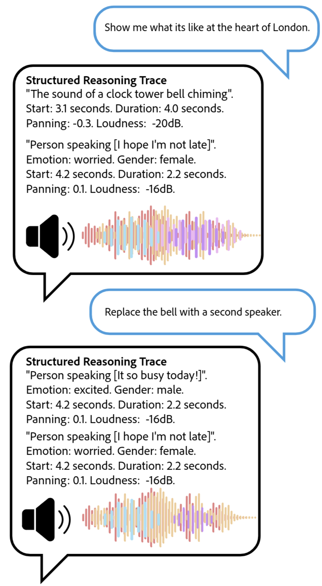
*Figure 1:Overview of AudioChat’s capabilities in multi-source audio storytelling and editing. AudioChat leverages structured CoT reasoning to break down the user prompt into individual sound effects, allowing for fine-grained control and interpretability.*

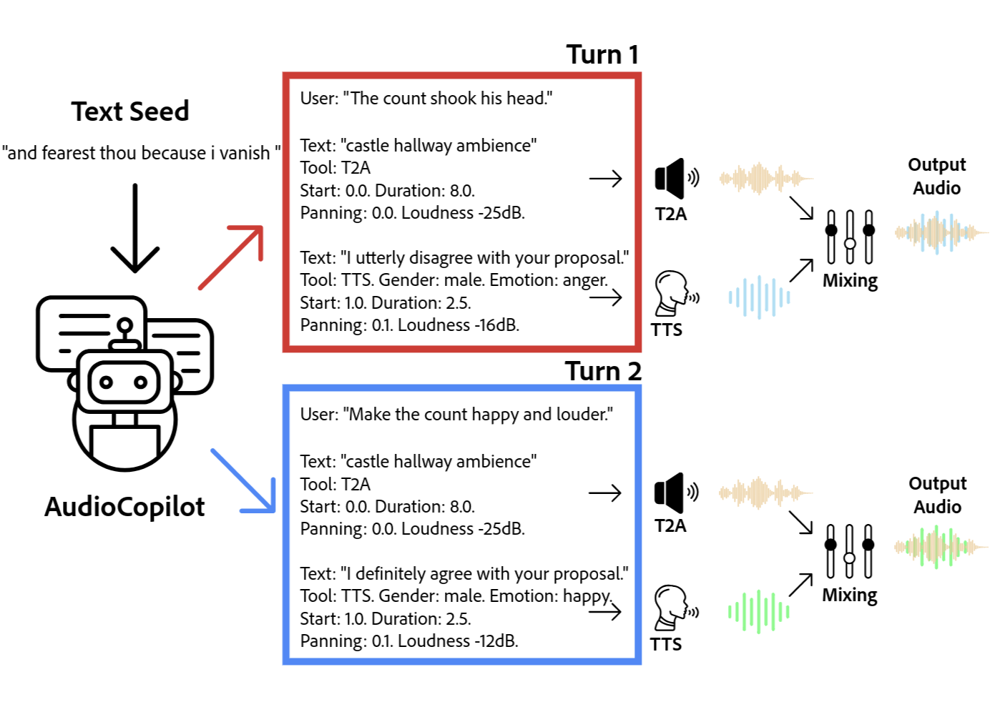
*Figure 2:Overview of data generation with AudioCopilot. AudioCopilot seeds its dialogue simulation with a text string and performs tool-calling to render and mix each separate sound source.*

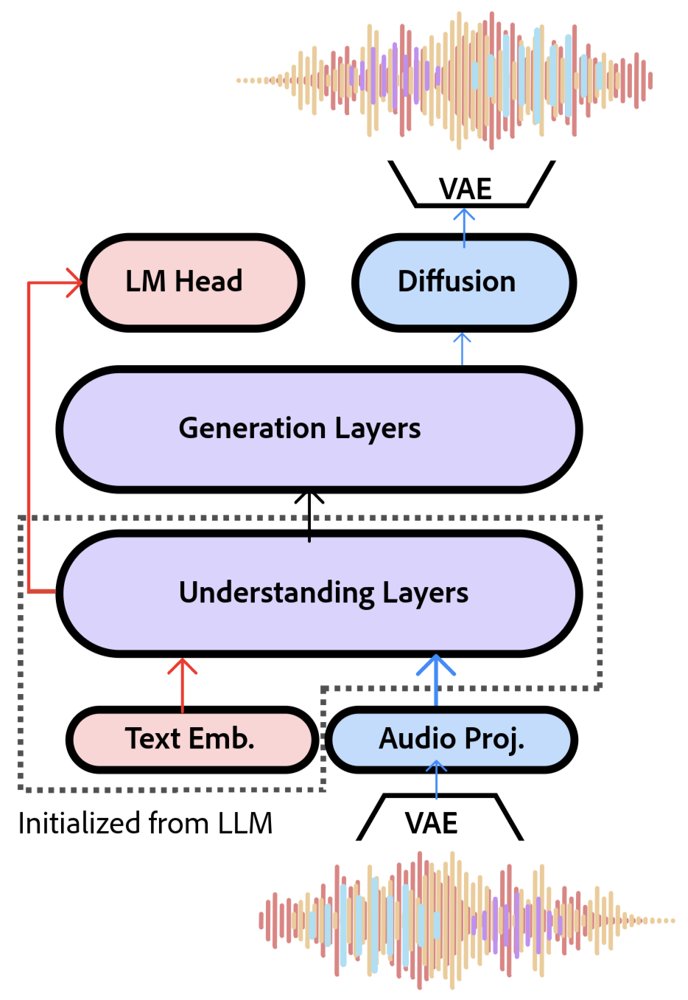
*Figure 3:Model architecture overview. Tokens are input through a modality-specific tokenizer, the output of which is concatenated and input into the LM. The tokens are then routed through a modality-specific prediction head.*

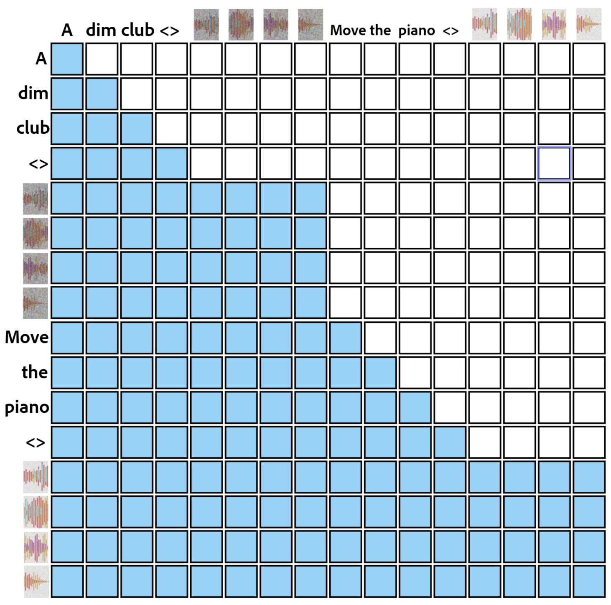
*Figure 4:Visualization of Transfusion Forcing: a different diffusion timestep is sampled for each audio span. Audio tokens can attend to all other tokens within a span or in previous spans. Text tokens can only attend to previous text and audio tokens.*

*Figure 5:editFLAM(
↑
) and multiFLAM(
↓
) results on the three semantic editing tasks in StoryGen-Eval.*

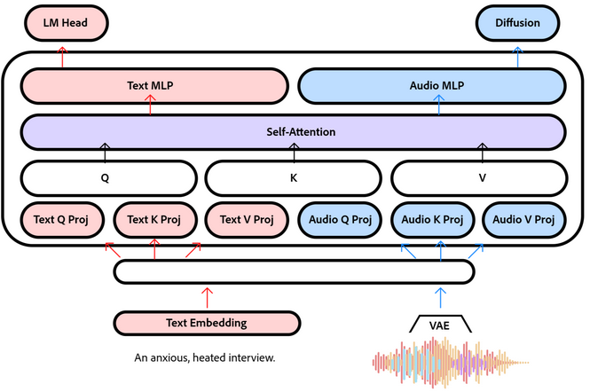
*Figure 6:Overview of the MoT architecture.*

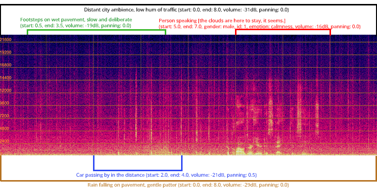
*Figure 7:Visualization of AudioChat’s fine-grained audio captioning capabilities.*

---
**Usage Info**: 4936 tokens used.
**Generated at**: 2026-02-23 14:43:21

---

# 📚 CC-G2PnP: Streaming Grapheme-to-Phoneme and prosody with Conformer-CTC for unsegmented languages

🚀 URL: https://arxiv.org/html/2602.17157

## 🌏 Abstract (원문)
Owing to the growing demand for natural and efficient human–machine interaction, research on spoken dialogue models has been actively studied. Although one line of research explores end-to-end models that perform speech-to-speech generation within a single model, cascade approaches that combine automatic speech recognition (ASR), a large language model (LLM), and text-to-speech (TTS) offer advantages in robustness and flexibility. To improve the response speed of spoken dialogue models, cascade approaches have applied streaming TTS to the text incrementally generated by the LLM, achieving promising results. In terms of TTS input, some models can take the raw output of the LLM, i.e., graphemes. These models are trained to generate correct pronunciation and prosody in speech directly from graphemes. However, achieving sufficient performance in this setting generally requires a huge amount of text-speech paired data, since the model must simultaneously learn pronunciation and prosody, as well as additional aspects of speech such as speaker characteristics and speaking style. Therefore, a practical alternative is to first convert graphemes into phonemes and prosodic labels (G2PnP) and then use them as input to the TTS model. Since phonemes and prosodic labels (e.g., accent position and accent type) provide more direct information to synthesize speech compared to graphemes, this approach tend to yield more stable performance even with limited training data. Nevertheless, since G2PnP is introduced between the LLM and the TTS, reducing latency requires streaming not only in TTS but also in G2PnP. A naive approach to achieve streaming G2PnP is to process the input text in chunks using non-streaming sentence-level G2PnP models. However, since G2PnP in many languages is highly dependent on the surrounding context, this approach generally struggles to deliver robust performance. Since G2PnP is a sequence-to-sequence mapping problem, another approach would be to employ the encoder–decoder Transformer architecture. Dekel et al. proposed LLM2PnP, a streaming G2PnP model that applies a word-level restriction to the attention mask of the Transformer. Unlike the naive chunk-based streaming approaches, this model can effectively incorporate both past and future context during streaming, and it demonstrated strong performance in streaming G2PnP for English. However, since the implementation of look-ahead and masking assumes the presence of word boundaries, it cannot be directly applied to languages without explicit word segmentation, such as Japanese or Chinese, i.e., unsegmented languages. To overcome the limitation of the naive approaches and LLM2PnP, we introduce CC-G2PnP, a streaming G2PnP model capable of incorporating past and future context without dependence on word boundaries. CC-G2PnP is composed of a stack of streaming Conformer layers followed by a connectionist temporal classification (CTC) decoder. Unlike LLM2PnP, which requires an explicit mapping between words and phonemes for making attention masks, CC-G2PnP learns these mappings dynamically through CTC, making it applicable to unsegmented languages. Furthermore, to enable efficient streaming with the Conformer, the proposed method employs chunk-aware streaming, which divides the input sequence into chunks and allows tokens to attend within each chunk to realize look-ahead. To adapt this framework to the G2PnP task, we further extend the model so that every token has at least one token of look-ahead, thereby enabling more stable PnP label prediction. To demonstrate the effectiveness of CC-G2PnP in the streaming G2PnP task for unsegmented languages, we conducted experiments using a Japanese dataset. The experimental results revealed that CC-G2PnP achieved significant improvements over baseline streaming methods in terms of both objective evaluations (character error rate, CER; sentence error rate, SER) and subjective assessments of the naturalness of TTS samples.
## 🌏 Abstract (번역)
자연스럽고 효율적인 인간-기계 상호작용에 대한 수요가 증가함에 따라 음성 대화 모델에 대한 연구가 활발히 진행되고 있습니다. 한 연구 방향은 단일 모델 내에서 음성 대화 생성을 수행하는 엔드투엔드 모델을 탐구하지만, 자동 음성 인식(ASR), 대규모 언어 모델(LLM), 텍스트 음성 변환(TTS)을 결합한 캐스케이드 방식은 강건성과 유연성 측면에서 장점을 제공합니다. 음성 대화 모델의 응답 속도를 개선하기 위해 캐스케이드 방식은 LLM에서 점진적으로 생성된 텍스트에 스트리밍 TTS를 적용하여 유망한 결과를 얻었습니다. TTS 입력 측면에서 일부 모델은 LLM의 원시 출력인 자소(graphemes)를 직접 받을 수 있습니다. 이러한 모델은 자소로부터 직접 정확한 발음과 운율을 생성하도록 훈련됩니다. 그러나 이 설정에서 충분한 성능을 달성하려면 모델이 발음과 운율뿐만 아니라 화자 특성 및 말하기 스타일과 같은 추가적인 음성 측면을 동시에 학습해야 하므로 막대한 양의 텍스트-음성 쌍 데이터가 필요합니다. 따라서 실용적인 대안은 먼저 자소를 음소 및 운율 레이블(G2PnP)로 변환한 다음 이를 TTS 모델의 입력으로 사용하는 것입니다. 음소 및 운율 레이블(예: 액센트 위치 및 유형)은 자소에 비해 음성 합성을 위한 더 직접적인 정보를 제공하므로, 이 방식은 제한된 훈련 데이터로도 더 안정적인 성능을 내는 경향이 있습니다. 그럼에도 불구하고 G2PnP가 LLM과 TTS 사이에 도입되기 때문에 지연 시간을 줄이려면 TTS뿐만 아니라 G2PnP에서도 스트리밍이 필요합니다. 스트리밍 G2PnP를 달성하는 단순한 방법은 비스트리밍 문장 수준 G2PnP 모델을 사용하여 입력 텍스트를 청크 단위로 처리하는 것입니다. 그러나 많은 언어의 G2PnP는 주변 문맥에 크게 의존하기 때문에 이 방식은 일반적으로 강건한 성능을 제공하는 데 어려움이 있습니다. G2PnP는 시퀀스 투 시퀀스 매핑 문제이므로 또 다른 접근 방식은 인코더-디코더 트랜스포머 아키텍처를 사용하는 것입니다. Dekel 등은 트랜스포머의 어텐션 마스크에 단어 수준 제한을 적용하는 스트리밍 G2PnP 모델인 LLM2PnP를 제안했습니다. 단순한 청크 기반 스트리밍 방식과 달리 이 모델은 스트리밍 중에 과거와 미래의 문맥을 효과적으로 통합할 수 있으며 영어 스트리밍 G2PnP에서 강력한 성능을 보여주었습니다. 그러나 룩어헤드(look-ahead) 및 마스킹 구현이 단어 경계의 존재를 가정하기 때문에 일본어나 중국어와 같이 명시적인 단어 분절이 없는 언어(비분절 언어)에는 직접 적용할 수 없습니다. 단순한 방식과 LLM2PnP의 한계를 극복하기 위해, 본 논문에서는 단어 경계에 의존하지 않고 과거와 미래의 문맥을 통합할 수 있는 스트리밍 G2PnP 모델인 CC-G2PnP를 소개합니다. CC-G2PnP는 스트리밍 컨포머(Conformer) 레이어 스택과 연결주의 시공간 분류(CTC) 디코더로 구성됩니다. 어텐션 마스크를 만들기 위해 단어와 음소 사이의 명시적인 매핑이 필요한 LLM2PnP와 달리, CC-G2PnP는 CTC를 통해 이러한 매핑을 동적으로 학습하므로 비분절 언어에 적용 가능합니다. 또한 컨포머를 통한 효율적인 스트리밍을 가능하게 하기 위해 제안된 방법은 입력 시퀀스를 청크로 나누고 각 청크 내에서 토큰이 어텐션을 수행하여 룩어헤드를 실현하는 청크 인식 스트리밍을 채택합니다. 이 프레임워크를 G2PnP 작업에 적합하게 만들기 위해 모든 토큰이 최소 하나 이상의 룩어헤드 토큰을 갖도록 모델을 확장하여 더 안정적인 PnP 레이블 예측을 가능하게 했습니다. 비분절 언어에 대한 스트리밍 G2PnP 작업에서 CC-G2PnP의 효과를 입증하기 위해 일본어 데이터셋을 사용하여 실험을 수행했습니다. 실험 결과 CC-G2PnP는 객관적 평가(음절 오류율 CER, 문장 오류율 SER)와 TTS 샘플의 자연스러움에 대한 주관적 평가 모두에서 기본 스트리밍 방식보다 상당한 개선을 달성했습니다.

## 🔍 Methods & Results
- G2PnP 작업을 시퀀스 레이블링 문제로 정의하고 Conformer 레이어와 CTC 디코더를 결합한 아키텍처를 제안함
- CTC를 활용하여 단어 경계 정보 없이도 자소와 음소/운율 레이블 간의 동적 매핑을 학습함
- Self-conditioned CTC를 도입하여 토큰 간 조건부 독립성 문제를 완화하고 모델 성능을 강화함
- Chunk-aware streaming 방식을 적용하여 입력 시퀀스를 청크 단위로 처리함으로써 지연 시간을 제어함
- 청크 경계의 예측 불안정성을 해결하기 위해 모든 토큰이 최소 M개의 미래 토큰을 참조할 수 있게 하는 Minimum Look-Ahead(MLA) 기법을 제안함
- 일본어 데이터셋 실험 결과, 기존 스트리밍 방식 대비 CER 및 SER 수치가 유의미하게 개선되었으며 합성음의 주관적 자연스러움 점수도 향상됨

## 🖼 Figures
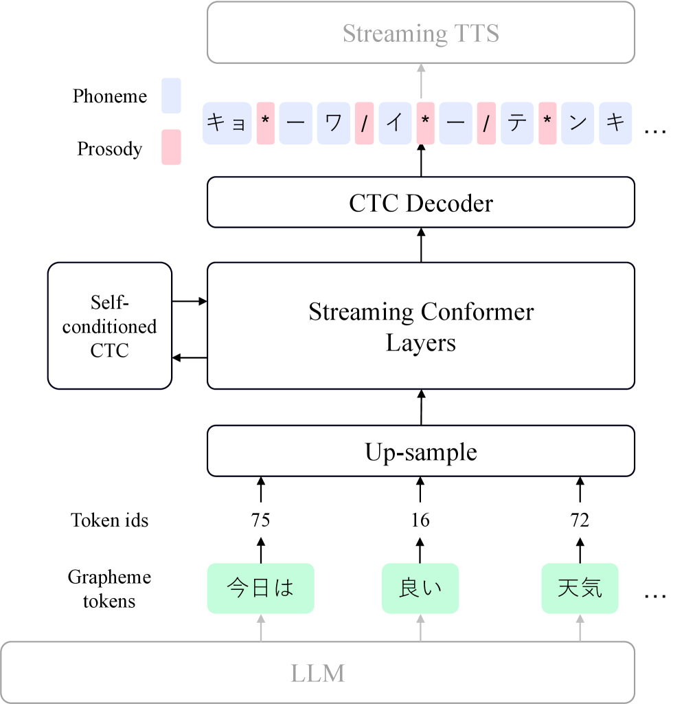
*Fig. 1:Proposed model architecture. The model takes grapheme tokens as input and predicts a mixed sequence of phoneme and prosodic symbols.*

*Fig. 2:Chunk-aware streaming. The chunk size 
𝐶
=
3
 and the past context size 
𝑃
=
3
. The green token can attend to pink tokens, which correspond to the tokens within its chunk and the past 
𝑃
 context.*

*Fig. 3:minimum look-ahead (MLA). MLA allows the first layer of self-attention to reference future tokens outside the current chunk, thereby ensuring that all tokens have at least one token of look-ahead. MLA size 
𝑀
=
1
.*

---
**Usage Info**: 5526 tokens used.
**Generated at**: 2026-02-23 14:44:16

---

# 📚 MEG-to-MEG Transfer Learning and Cross-Task Speech/Silence Detection with Limited Data

🚀 URL: https://arxiv.org/html/2602.18253

## 🌏 Abstract (원문)
Brain-computer interfaces (BCIs) for speech restoration require robust neural decoders, but collecting sufficient training data per subject remains a fundamental challenge. Nevertheless, while large-scale datasets have enabled substantial progress in non-invasive speech decoding tasks (including speech detection and phoneme decoding) using magnetoencephalography (MEG)and electroencephalography (EEG), practical BCI deployment is constrained by the limited data available per individual: typically minutes rather than hours. Current approaches train separate models from scratch for each subject and task, ignoring the plausible benefits of transfer learning that have revolutionized computer visionand natural language processing. Notwithstanding successful demonstrations of transfer learning in EEGand fMRI, and recent advances in self-supervised neural decoding, transfer learning has only very recently been explored for MEG imagined speech using ImageNet-pretrained vision models, and remains untested for MEG-to-MEG pre-training and cross-task transfer between perception and production. This study presents the first successful application of transfer learning to a MEG speech decoding task (speech detection). We pre-train a Conformer-based modelon 50 hours of single-subject listening data (LibriBrain) and fine-tune on just 5 minutes per subject across 18 participants performing speech perception (listening and playback) and speech production tasks. To our knowledge, we also provide the first cross-task MEG speech detection results, extending prior cross-task decoding work in non-speech EEG/MEG. We show that transfer learning improves both in-task performance and cross-task generalization, with gains of 1-6% across metrics. Importantly, models trained on production successfully decode passive listening above chance, confirming that decoding relies on shared neural speech representations rather than task-specific motor activity alone. Together, these findings suggest that transfer learning may support more data-efficient MEG speech detection and improved cross-task generalization.
## 🌏 Abstract (번역)
음성 복구를 위한 뇌-컴퓨터 인터페이스(BCI)는 강력한 신경 디코더를 필요로 하지만, 피험자당 충분한 훈련 데이터를 수집하는 것은 여전히 근본적인 과제로 남아 있습니다. 대규모 데이터셋을 통해 자기뇌파검사(MEG) 및 뇌파검사(EEG)를 이용한 비침습적 음성 디코딩 작업에서 상당한 진전이 있었음에도 불구하고, 실제 BCI 배포는 개인당 가용한 데이터가 보통 몇 시간에 미치지 못하고 몇 분 수준이라는 점에 의해 제한됩니다. 현재의 접근 방식은 각 피험자와 작업에 대해 별도의 모델을 처음부터 훈련하며, 컴퓨터 비전과 자연어 처리를 혁신시킨 전이 학습의 잠재적 이점을 무시하고 있습니다. EEG와 fMRI에서의 성공적인 전이 학습 사례와 자기 지도 신경 디코딩의 최근 발전에도 불구하고, MEG 상상 음성에 대한 전이 학습은 최근에야 ImageNet 사전 훈련 모델을 사용하여 탐구되기 시작했으며, MEG 간 사전 훈련 및 지각과 생성 작업 간의 교차 작업 전이는 아직 테스트되지 않은 상태입니다. 본 연구는 MEG 음성 디코딩 작업(음성 감지)에 전이 학습을 성공적으로 적용한 첫 번째 사례를 제시합니다. 우리는 50시간의 단일 피험자 청취 데이터(LibriBrain)로 Conformer 기반 모델을 사전 훈련하고, 음성 지각(청취 및 재생) 및 음성 생성 작업을 수행하는 18명의 피험자로부터 얻은 피험자당 단 5분의 데이터로 미세 조정(fine-tuning)을 수행했습니다. 우리가 알기로는, 비음성 EEG/MEG에서의 기존 교차 작업 디코딩 연구를 확장하여 최초의 교차 작업 MEG 음성 감지 결과도 제공합니다. 전이 학습이 작업 내 성능과 교차 작업 일반화 모두를 개선하며, 지표 전반에서 1-6%의 향상을 보임을 입증했습니다. 중요한 점은 생성 작업으로 훈련된 모델이 수동적 청취를 우연 수준 이상으로 성공적으로 디코딩했다는 것이며, 이는 디코딩이 작업별 운동 활동만이 아닌 공유된 신경 음성 표현에 의존함을 확인시켜 줍니다. 이러한 발견은 전이 학습이 더 데이터 효율적인 MEG 음성 감지와 개선된 교차 작업 일반화를 지원할 수 있음을 시사합니다.

## 🔍 Methods & Results
- 50시간 분량의 단일 피험자 MEG 청취 데이터(LibriBrain)를 사용하여 MEGConformer 모델을 사전 훈련함.
- 18명의 피험자로부터 수집된 5분 분량의 짧은 데이터(청취, 본인 목소리 재생, 낭독)를 사용하여 모델을 미세 조정함.
- RollAugment(시간적 증강), 소프트 타겟(Soft targets), z-score 정규화 등의 기법을 적용하여 데이터 효율성을 높임.
- 전이 학습 적용 시 F1-macro, 균형 정확도, AUC-macro 등 주요 지표에서 1-6%의 성능 향상을 확인함.
- 음성 생성(Production) 데이터로 훈련된 모델이 청취(Listening) 작업을 성공적으로 디코딩하는 교차 작업 일반화 성능을 입증함.
- 실험 결과는 음성 지각과 생성 사이에 공유된 신경 표현이 존재하며, 전이 학습이 소량의 데이터로도 효과적인 디코딩이 가능함을 보여줌.

## 🖼 Figures

*Figure 1:Effect size of transfer learning for cross-task decoding. Bars show the mean improvement in F1 score (transfer learning minus training from scratch) for each task and train-test task pair. Error bars indicate the standard deviation across subjects.*

*Figure 2:Cross-task F1 asymmetry for each task pair. Each x-axis category shows two directions: circle markers correspond to the left-to-right direction in the label, and diamond markers to the reverse direction. For each model, the two direction-specific points are connected to highlight asymmetry. Error bars indicate the standard deviation across subjects.*

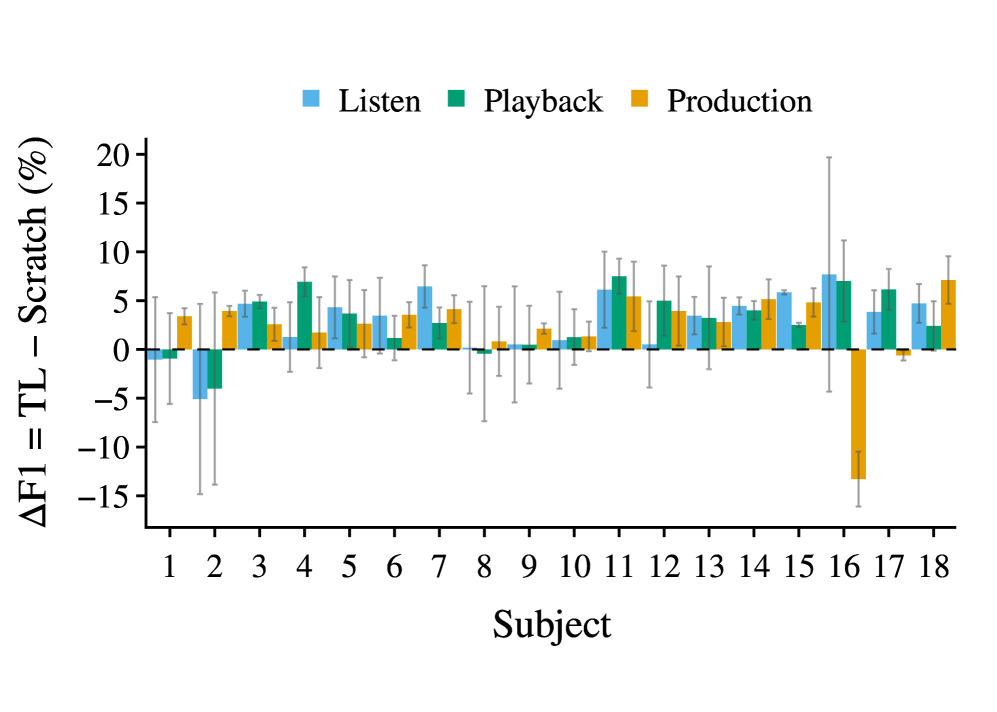
*Figure 3:Subject-level in-task F1 improvement with transfer learning. Each bar shows the improvement in F1 score (transfer learning minus training from scratch) for a single subject and task. Colors indicate the three tasks.*

---
**Usage Info**: 4811 tokens used.
**Generated at**: 2026-02-23 14:44:40

---

# 📚 Flow Matching with Injected Noise for Offline-to-Online Reinforcement Learning

🚀 URL: https://arxiv.org/html/2602.18117

## 🌏 Abstract (원문)
Generative models have recently demonstrated substantial success across diverse domains, producing high-quality outputs in areas such as text and image(Brownet al.,2020; Rombachet al.,2022). By leveraging their expressive capacity, these models can capture complex or multimodal distributions present in the underlying datasets, beyond the reach of conventional parametric models. This opens up new opportunities in reinforcement learning (RL), particularly for policy design. Since a policy in RL can be regarded as a generative model conditioned on states, there has been increasing interest in applying generative modeling to policy design, such as denoising diffusion(Sohl-Dicksteinet al.,2015; Hoet al.,2020)and flow matching(Lipmanet al.,2023; Albergo and Vanden-Eijnden,2023). While Gaussian policies have been the conventional choice, they often struggle to represent multimodal or high-dimensional action distributions(Parket al.,2024). By contrast, generative policies provide the expressivity required to handle complex RL tasks and have demonstrated superior performance, particularly in offline RL where the target distribution is explicitly defined(Wanget al.,2023b; Hansen-Estruchet al.,2023; Kanget al.,2023; Zhanget al.,2025; Fanget al.,2025; Parket al.,2025b). Despite such expressivity, offline RL inherently suffers from a fundamental limitation in that the performance of the policy is constrained by the quality of the offline dataset. Accordingly, offline-to-online RL has been proposed to address this issue, enabling a pre-trained policy to further improve its performance through short-term direct interaction with the environment(Leeet al.,2022; Zhanget al.,2023; Nakamotoet al.,2023; Zhanget al.,2024; Zhouet al.,2024). While some studies(Hansen-Estruchet al.,2023; Parket al.,2025b)have incorporated additional online fine-tuning of generative policies, they merely treat it as a continuation of offline pre-training rather than designing approaches specialized to the online fine-tuning. As offline-to-online RL encompasses both offline and online stages, it naturally introduces challenges beyond those faced in a purely offline RL framework. Unlike offline RL, which relies solely on pre-collected datasets, offline-to-online RL incorporates an online fine-tuning phase, making it beneficial to design the offline pre-training with this subsequent stage in mind from the beginning. At the same time, the framework raises the practical question of how to best exploit the pre-trained policy during online fine-tuning. Thus, framing offline-to-online RL merely as an extension of offline RL can limit the extent to which its potential is realized. In this work, we propose Flow Matching with Injected Noise for Offline-to-Online RL (FINO), a novel policy learning approach for the offline-to-online RL framework. Motivated by recent findings that maintaining diversity facilitates more effective fine-tuning(Fanet al.,2025; Liet al.,2025; Zhaiet al.,2025; Sorokinet al.,2025), we introduce a training strategy that injects noise into the flow matching to explicitly promote diversity in the policy from the beginning of offline pre-training. This injection encourages the policy to learn a broader range of action space than that present in the offline dataset, thereby establishing a strong foundation for exploration during online fine-tuning. To effectively leverage this during online fine-tuning, we introduce an entropy-guided sampling mechanism that exploits the acquired diversity for exploration while balancing exploration and exploitation by adapting to the evolving behavior of the policy. We experiment on 45 diverse and challenging tasks from OGBench(Parket al.,2025a)and D4RL(Fuet al.,2020)under a limited online fine-tuning budget. The results show that FINO achieves consistently strong performance across tasks, even in complex environments, thereby demonstrating FINO as an effective and reliable approach for offline-to-online RL.
## 🌏 Abstract (번역)
생성 모델은 최근 텍스트 및 이미지와 같은 다양한 분야에서 고품질의 결과물을 생성하며 상당한 성공을 거두었습니다. 이러한 모델은 표현 능력을 활용하여 기존의 파라메트릭 모델이 다루기 힘든 복잡하거나 멀티모달 분포를 캡처할 수 있습니다. 이는 강화 학습(RL), 특히 정책 설계에서 새로운 기회를 열어줍니다. RL의 정책은 상태에 조건화된 생성 모델로 간주될 수 있으므로, 디노이징 확산 및 플로우 매칭과 같은 생성 모델링을 정책 설계에 적용하는 것에 대한 관심이 높아지고 있습니다. 가우시안 정책이 전통적인 선택이었으나, 멀티모달 또는 고차원 행동 분포를 표현하는 데 어려움을 겪는 경우가 많습니다. 반면, 생성 정책은 복잡한 RL 작업을 처리하는 데 필요한 표현력을 제공하며, 특히 대상 분포가 명확하게 정의된 오프라인 RL에서 우수한 성능을 입증했습니다. 이러한 표현력에도 불구하고, 오프라인 RL은 정책의 성능이 오프라인 데이터셋의 품질에 의해 제한된다는 근본적인 한계가 있습니다. 이에 따라 오프라인-투-온라인(offline-to-online) RL이 제안되어, 사전 학습된 정책이 환경과의 단기적인 직접 상호작용을 통해 성능을 더욱 향상시킬 수 있게 되었습니다. 일부 연구에서는 생성 정책의 추가적인 온라인 미세 조정을 포함했지만, 이를 온라인 미세 조정에 특화된 접근 방식을 설계하기보다는 단순히 오프라인 사전 학습의 연속으로 취급했습니다. 오프라인-투-온라인 RL은 오프라인과 온라인 단계를 모두 포함하므로 순수 오프라인 RL 프레임워크보다 더 많은 과제를 안고 있습니다. 사전 수집된 데이터셋에만 의존하는 오프라인 RL과 달리, 오프라인-투-온라인 RL은 온라인 미세 조정 단계를 포함하므로 처음부터 이 후속 단계를 염두에 두고 오프라인 사전 학습을 설계하는 것이 유익합니다. 동시에, 이 프레임워크는 온라인 미세 조정 중에 사전 학습된 정책을 가장 잘 활용하는 방법에 대한 실질적인 질문을 제기합니다. 따라서 오프라인-투-온라인 RL을 단순히 오프라인 RL의 확장으로 구성하는 것은 그 잠재력이 실현되는 정도를 제한할 수 있습니다. 본 연구에서는 오프라인-투-온라인 RL 프레임워크를 위한 새로운 정책 학습 접근 방식인 FINO(Flow Matching with Injected Noise for Offline-to-Online RL)를 제안합니다. 다양성을 유지하는 것이 더 효과적인 미세 조정을 촉진한다는 최근 연구 결과에 영감을 받아, 오프라인 사전 학습 시작부터 정책의 다양성을 명시적으로 촉진하기 위해 플로우 매칭에 노이즈를 주입하는 학습 전략을 도입합니다. 이러한 노이즈 주입은 정책이 오프라인 데이터셋에 존재하는 것보다 더 넓은 범위의 행동 공간을 학습하도록 장려하여 온라인 미세 조정 중 탐색을 위한 강력한 토대를 마련합니다. 이를 온라인 미세 조정 중에 효과적으로 활용하기 위해, 획득한 다양성을 탐색에 활용하는 동시에 정책의 진화하는 행동에 적응하여 탐색과 활용의 균형을 맞추는 엔트로피 유도 샘플링 메커니즘을 도입합니다. 우리는 제한된 온라인 미세 조정 예산 하에서 OGBench 및 D4RL의 45가지 다양하고 도전적인 작업에 대해 실험을 진행했습니다. 결과에 따르면 FINO는 복잡한 환경에서도 작업 전반에 걸쳐 일관되게 강력한 성능을 달성하여 오프라인-투-온라인 RL을 위한 효과적이고 신뢰할 수 있는 접근 방식임을 입증했습니다.

## 🔍 Methods & Results
- 오프라인 사전 학습 단계에서 플로우 매칭(Flow Matching)에 제어된 노이즈를 주입하여 데이터셋 분포를 넘어서는 넓은 행동 공간을 학습하도록 유도함
- 온라인 미세 조정 단계에서 정책의 엔트로피를 지표로 활용하여 탐색(Exploration)과 활용(Exploitation)의 균형을 동적으로 조절하는 엔트로피 유도 샘플링 메커니즘 도입
- FQL(Flow Q-Learning)을 백본으로 사용하며, 행동 차원의 절반에 해당하는 수의 샘플을 추출하여 탐색 효율성을 극대화함
- OGBench 및 D4RL의 45개 벤치마크 작업에서 실험한 결과, 제한된 온라인 상호작용 예산 내에서도 기존 방식 대비 일관되게 우수한 성능을 입증함
- 토이 실험을 통해 노이즈 주입 방식이 단순 플로우 매칭보다 더 넓고 타당한 행동 영역을 커버함을 수학적/시각적으로 증명함

## 🖼 Figures
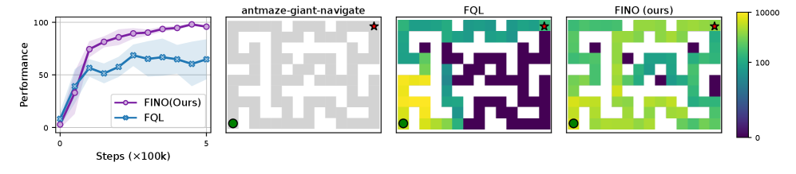
*Figure 1:Comparison of FQL and FINO (ours) in terms of performance and exploration patterns on the environment antmaze-giant-navigate. The green circle and red star indicate the initial and goal states, respectively.*

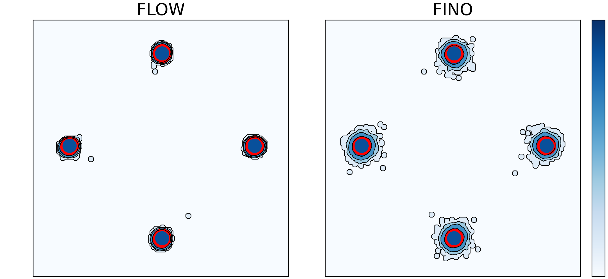
*Figure 2:Toy example: blue contours represent the log-density of model samples; red circles denote the dataset.*

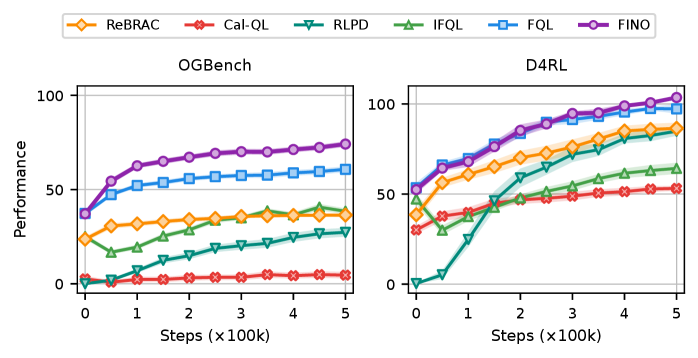
*Figure 3:Aggregate performance across two benchmark domains. Each figure reports the averaged learning curves over the common environments within the respective domain. Full results are presented in Figures 9 and 10.*

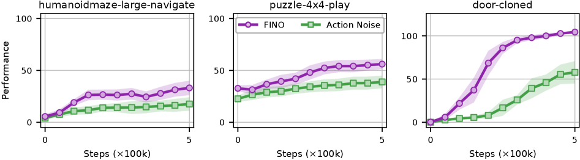
*Figure 4:Comparison between FINO and the direct action noise injection baseline. Each plot shows results aggregated over five tasks and averaged across 10 seeds, with shaded regions indicating 95% confidence intervals.*

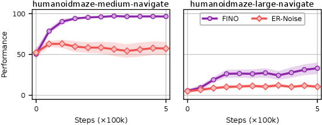
*Figure 5:Comparison between FINO and the entropy-regulated noise scaling baseline. Full results are presented in Table 5.*

*Figure 6:Comparison of performance and computational efficiency. The left figure shows the learning curve on the humanoidmaze-medium-navigate task, averaged over five tasks with 10 random seeds, with shaded regions denoting 95% confidence intervals. The middle and right figures report the training and inference time per step of each baseline. Full results are presented in Table 5.*

*Figure 7:Comparison of performance with varying 
𝑁
sample
.*

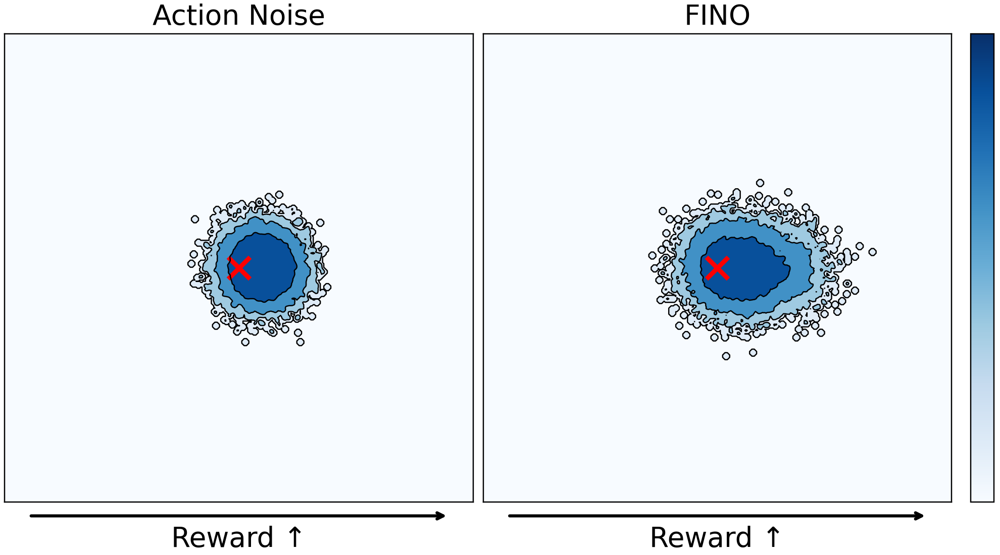
*Figure 8:Action samples of two one-step policies: blue contours indicate the log-density of the sampled actions, and red × marks denote the centers of the dataset.*

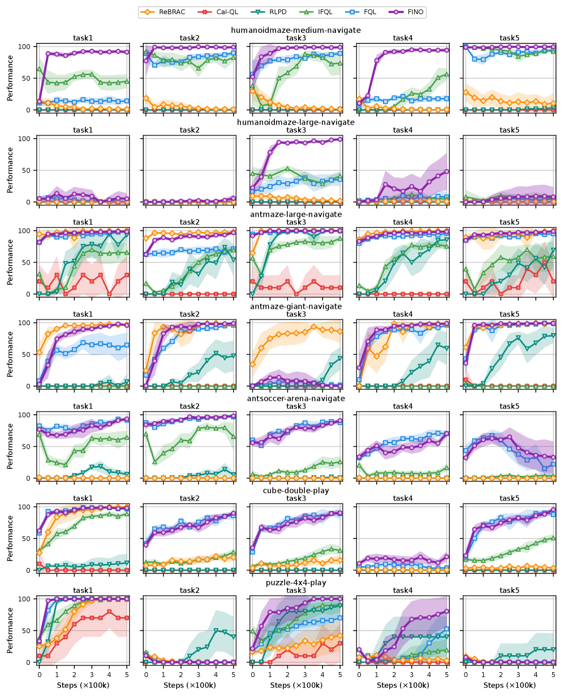
*Figure 9:Full results on OGBench environments. Each row corresponds to one environment, with five single-task variants shown side by side. Shaded areas denote 95% confidence intervals over 10 seeds.*

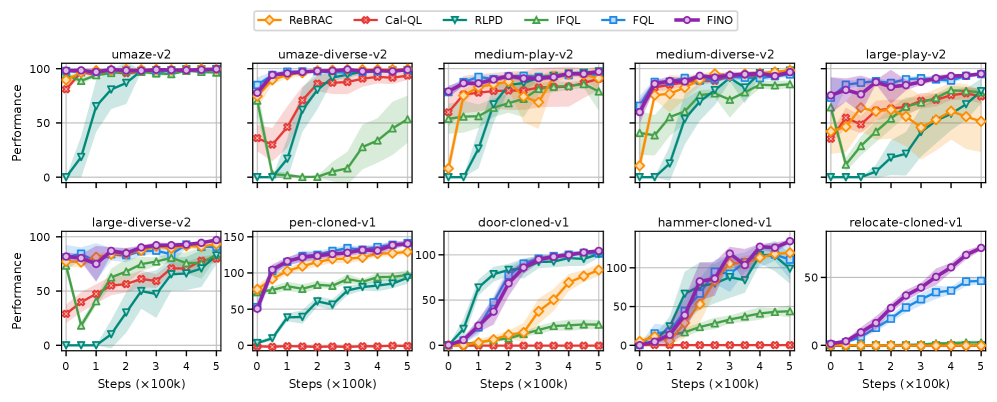
*Figure 10:Full results on D4RL environments. For AntMaze tasks, the prefix “antmaze-” is omitted for clarity. Shaded areas denote 95% confidence intervals over 10 seeds.*

---
**Usage Info**: 6529 tokens used.
**Generated at**: 2026-02-23 14:45:14

---

# 📚 𝒜⁢"rt2"⁢ℳ⁢"us": Artwork-to-Music Generation via Visual Conditioning and Large-Scale Cross-Modal Alignment

🚀 URL: https://arxiv.org/html/2602.17599

## 🌏 Abstract (원문)
Music generation has long been one of the most expressive forms of computational creativity. Music combines structure, emotion, and cultural background, making its automatic generation intrinsically challenging. Translating visual artworks into music is even more demanding, not because the two modalities are unrelated, but because their correspondences are indirect and highly structured. Visual art encodes meaning through composition, color, texture, style, and historical context, evoking emotions and narratives that are central to musical expression. These shared perceptual and affective dimensions suggest meaningful cross-modal correspondences between images and sound. However, such relationships are rarely one-to-one or directly observable; they emerge from higher-level abstractions shaped by human perception and artistic conventions, making them difficult to model without sufficiently expressive representations. Recent advances in multimodal deep learning have substantially improved generative models, enabling the synthesis of symbolic music and natural audio from text, images, or multimodal inputs. However, two limitations remain. First, most image-conditioned music generation systems are trained primarily on natural photographs, whose semantics are literal and object-centric, failing to reflect the stylistic and culturally layered semantics of artworks. Second, many pipelines rely on an image-to-text conversion stage, which introduces language as a semantic bottleneck that abstracts away non-verbalizable visual cues. To address these gaps, we introduce ArtSound, a large-scale dataset of 105,884 artwork–music pairs, and Art2Mus, the first system explicitly designed for direct artwork-to-music generation. Art2Mus injects visual embeddings from artworks into a latent diffusion model through a dedicated interface, enabling music synthesis guided solely by visual information without textual intermediates.
## 🌏 Abstract (번역)
음악 생성은 오랫동안 계산 창의성의 가장 표현력 있는 형태 중 하나였습니다. 음악은 구조, 감정, 문화적 배경을 결합하므로 자동 생성은 본질적으로 어렵습니다. 시각 예술 작품을 음악으로 변환하는 것은 두 모달리티가 무관해서가 아니라, 그 대응 관계가 간접적이고 고도로 구조화되어 있기 때문에 훨씬 더 까다롭습니다. 시각 예술은 구도, 색상, 질감, 스타일 및 역사적 맥락을 통해 의미를 인코딩하며, 이는 음악적 표현의 핵심인 감정과 서사를 불러일으킵니다. 이러한 공유된 지각적 및 정서적 차원은 이미지와 소리 사이의 의미 있는 교차 모달 대응을 시사합니다. 그러나 이러한 관계는 일대일이거나 직접 관찰 가능한 경우가 드물며, 인간의 지각과 예술적 관습에 의해 형성된 고차원적 추상화에서 발생하므로 충분히 표현력 있는 표현 없이는 모델링하기 어렵습니다. 최근 멀티모달 딥러닝의 발전으로 생성 모델이 크게 개선되어 텍스트, 이미지 또는 멀티모달 입력으로부터 기호 음악 및 자연 오디오 합성이 가능해졌습니다. 그러나 두 가지 한계가 남아 있습니다. 첫째, 대부분의 이미지 조건부 음악 생성 시스템은 주로 자연 사진으로 학습되어 예술 작품의 스타일적이고 문화적으로 층이 있는 의미를 반영하지 못합니다. 둘째, 많은 파이프라인이 이미지-텍스트 변환 단계에 의존하며, 이는 언어를 의미론적 병목 현상으로 도입하여 언어화할 수 없는 시각적 단서를 추상화해 버립니다. 이러한 격차를 해소하기 위해 본 연구에서는 105,884개의 예술 작품-음악 쌍으로 구성된 대규모 데이터셋인 ArtSound와 직접적인 예술 작품-음악 생성을 위해 명시적으로 설계된 최초의 시스템인 Art2Mus를 소개합니다. Art2Mus는 전용 인터페이스를 통해 예술 작품의 시각적 임베딩을 잠재 확산 모델에 주입하여 텍스트 중간 매개체 없이 시각적 정보만으로 유도되는 음악 합성을 가능하게 합니다.

## 🔍 Methods & Results
- 105,884개의 예술 작품-음악 쌍으로 구성된 대규모 멀티모달 데이터셋 ArtSound 구축
- 텍스트 중간 매개체 없이 시각적 정보에서 직접 음악을 생성하는 Art2Mus 프레임워크 제안
- CLIP 또는 ImageBind의 시각적 임베딩을 GPT-2 표현 공간과 정렬하여 잠재 확산 모델(Latent Diffusion Model)의 조건부로 사용
- 언어적 추상화에 의한 정보 손실을 방지하기 위해 이미지-오디오 인터페이스를 통한 직접적인 교차 모달 대응 학습
- 이미지 및 오디오 캡션의 유효성을 검증하기 위한 두 가지 새로운 정렬 지표 도입 및 적용

## 🖼 Figures

*Figure 1.Unified captioning pipeline for images and audio. Images are captioned using an MLLM guided by a structured prompt; audio is captioned through a segment-level music captioner and then fused by an LLM. All captions are evaluated using the proposed 
ℐ
​
𝒞
​
𝒮
​
core
 and 
𝒜
​
𝒞
​
𝒮
​
core
 metrics; captions below threshold are regenerated with refined prompts.*

*(a)Similarity distribution (Image–-Audio)*

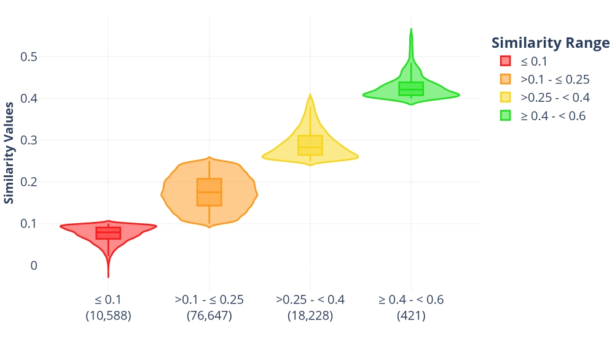
*(a)Similarity distribution (Image–-Audio)*

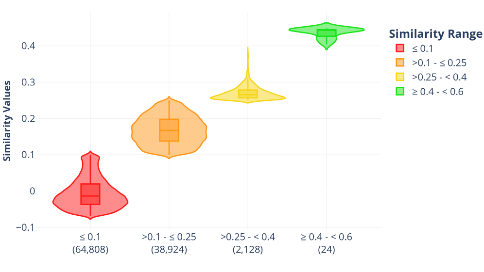
*(b)Similarity distribution (Image–-Audio Caption)*

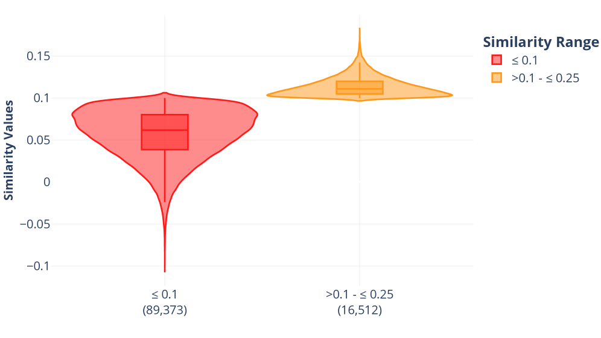
*(c)Similarity distribution (Image Caption–-Audio)*

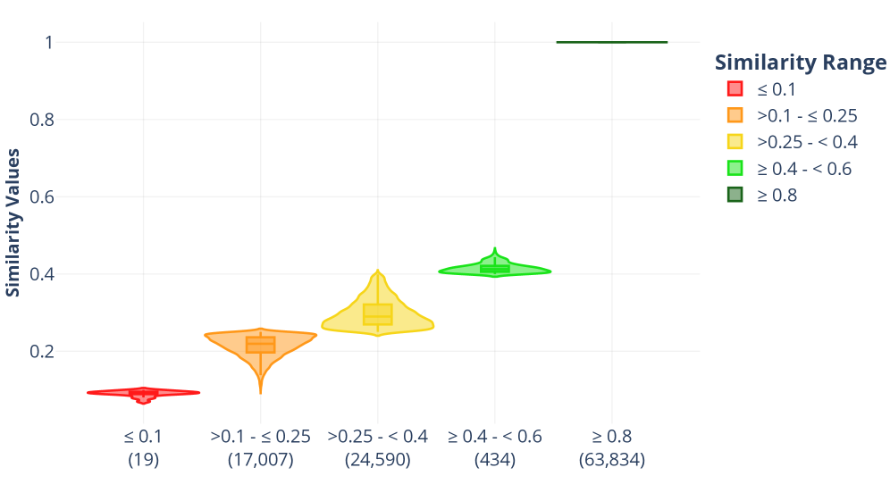
*(d)Similarity distribution (Image Caption–-Audio Caption)*

![Figure 3.Overview of the 
𝒜
​
rt2
​
ℳ
​
us
 architecture. Inspired by the generative paradigm of AudioLDM 2, 
𝒜
​
rt2
​
ℳ
​
us
 reformulates the conditioning interface to enable direct artwork-to-music generation. A Visual Conditioning Extractor and an Image Aligner learn to project image embeddings into GPT-2’s LoA embedding space, establishing cross-modal alignment without textual intermediates. The pretrained AudioLDM 2 backbone is used as a frozen generative prior. GPT-2 operates as a modality-agnostic LoA translator, integrating visual conditioning within the latent diffusion process. Music is encoded into mel-spectrogram latents by the Latent Extractor and synthesized into audio by the LoA-to-Audio Generator.](../images/2026-02-23/2602.17599/2602.17599_fig6.png)
*Figure 3.Overview of the 
𝒜
​
rt2
​
ℳ
​
us
 architecture. Inspired by the generative paradigm of AudioLDM 2, 
𝒜
​
rt2
​
ℳ
​
us
 reformulates the conditioning interface to enable direct artwork-to-music generation. A Visual Conditioning Extractor and an Image Aligner learn to project image embeddings into GPT-2’s LoA embedding space, establishing cross-modal alignment without textual intermediates. The pretrained AudioLDM 2 backbone is used as a frozen generative prior. GPT-2 operates as a modality-agnostic LoA translator, integrating visual conditioning within the latent diffusion process. Music is encoded into mel-spectrogram latents by the Latent Extractor and synthesized into audio by the LoA-to-Audio Generator.*

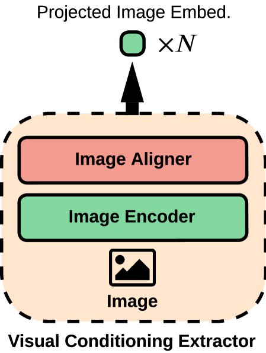
*(a)Visual Conditioning Extractor. A pretrained image encoder (e.g., CLIP or ImageBind) produces an embedding that is subsequently mapped to GPT-2’s token space (dimension 768).*

*(a)Visual Conditioning Extractor. A pretrained image encoder (e.g., CLIP or ImageBind) produces an embedding that is subsequently mapped to GPT-2’s token space (dimension 768).*

*(b)Image Aligner. If the input embedding is 512-dimensional (CLIP), it is upscaled to 1024 dimensions; otherwise (ImageBind) it bypasses this step. A projection layer then maps all embeddings to 
𝑁
 tokens in GPT-2’s 768-dimensional space.*

*Figure 5.Distribution of artworks by music genre, segmented by artistic style. Abstract Art, Abstract Expressionism, Art Nouveau (Modern), and Expressionism appear prominently across most genres. Conversely, Early Renaissance and Symbolism are less frequent.*

*Figure 6.Comparison between artworks and their recolored versions using the Inferno colormap. Each subfigure shows the original artwork (left) and its recolored version (right).*

*(a)Image generated for audio file 105718.mp3*

*(a)Image generated for audio file 105718.mp3*

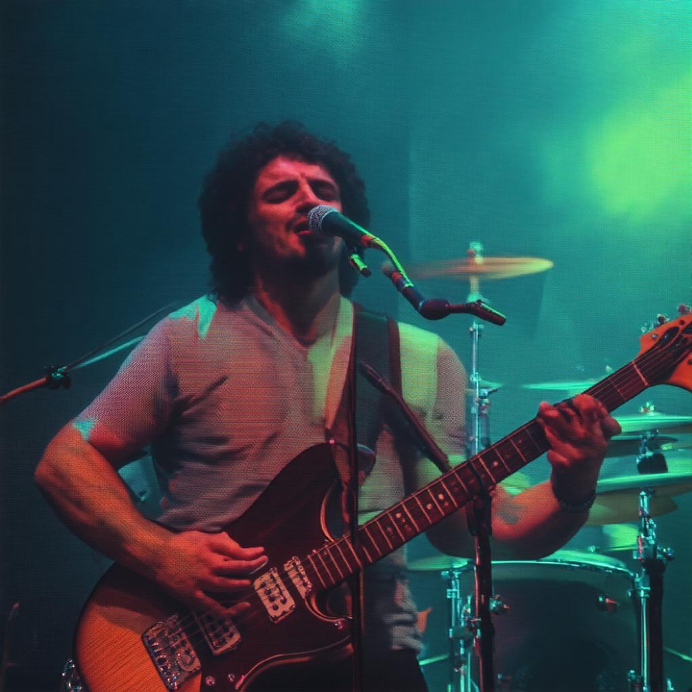
*(b)Image generated for audio file 063250.mp3*

*(c)Image generated for audio file 002099.mp3*

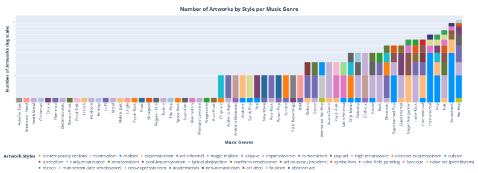
*Figure 8.Distribution of artworks by music genre, segmented by artistic style. Romanticism and Expressionism are prevalent across most genres, whereas Minimalism and Abstract art occur less frequently.*

---
**Usage Info**: 3038 tokens used.
**Generated at**: 2026-02-23 14:47:34

---

