# 🚩 (2026-02-24) Scholar Inbox 추천 논문 

# 📚 CTC-TTS: LLM-based dual-streaming text-to-speech with CTC alignment

🚀 URL: https://arxiv.org/html/2602.19574

## 🌏 Abstract (원문)
In recent years, large language model (LLM)-based methods[valle,seedtts,cosyvoice,cosyvoice2]that treat text-to-speech (TTS) as a language modeling task have gained widespread attention. These methods typically convert continuous speech signals into discrete token sequences with a neural audio codec (NAC)[wavtokenizer,soundstream,encodec], predict the sequence using an LLM, and finally reconstruct the speech waveform via the NAC decoder. However, most LLM-based TTS systems are not designed for low-latency dual-streaming synthesis[valle,seedtts,cosyvoice]. High-quality dual-streaming TTS requires accurate text–speech alignment and well-designed training sequences that balance synthesis quality and latency. Prior work often relies on GMM-HMM based forced-alignment toolkits (e.g., Montreal Forced Aligner, MFA)[mfa], which are pipeline-heavy and less flexible than neural aligners. Meanwhile, fixed-ratio interleaving of text and speech tokens struggles to capture alignment regularities between text and speech, making it more difficult for the model to learn reliable temporal dependencies. Alignment-aware interleaving can alleviate this issue but still typically depends on MFA; existing methods adopt different alignment units (e.g., words, BPEs, or phonemes) and diverse sequence organizations, as reviewed in Section2. To address these limitations, we proposeCTC-TTS, a Connectionist Temporal Classification (CTC)-based[ctc]dual-streaming TTS method that improves both alignment and sequence organization. CTC alignment introduces a blank symbol and yields a robust structural correspondence without requiring frame-accurate phoneme boundaries. This level of alignment is sufficient for an autoregressive model to learn to map local phoneme groups to speech tokens, reducing learning complexity compared with fixed-ratio interleaving and avoiding the heavy pipeline of MFA. Based on word-level phoneme–speech alignment, we constructbi-wordblocks: phonemes of the current word plus the separator and phonemes of the next word, followed by the speech tokens aligned to the current word. To balance synthesis quality and latency, we design two variants based on different interleaving implementations of phonemes and speech tokens for bi-words.CTC-TTS-Lconcatenates text and speech tokens along the sequence length dimension to enhance generation quality.CTC-TTS-Fstacks text and speech embeddings along the feature dimension, enabling synthesis to start from the first phoneme and thus reducing first-packet latency. Experiments show that CTC-TTS outperforms strong baselines on streaming synthesis and zero-shot tasks. Our main contributions are: (1) a lightweight CTC-based phoneme-speech alignment procedure for LLM-based TTS; (2) a bi-word interleaving strategy with compact look-ahead; (3) two variants (CTC-TTS-L/F) that realize different quality-latency trade-offs and improve streaming and zero-shot results.
## 🌏 Abstract (번역)
최근 몇 년 동안 텍스트 음성 변환(TTS)을 언어 모델링 작업으로 취급하는 대규모 언어 모델(LLM) 기반 방법들이 널리 주목받고 있습니다. 이러한 방법들은 일반적으로 신경 오디오 코덱(NAC)을 사용하여 연속적인 음성 신호를 이산 토큰 시퀀스로 변환하고, LLM을 사용하여 시퀀스를 예측한 다음, 최종적으로 NAC 디코더를 통해 음성 파형을 재구성합니다. 그러나 대부분의 LLM 기반 TTS 시스템은 저지연 이중 스트리밍 합성을 위해 설계되지 않았습니다. 고품질 이중 스트리밍 TTS는 정확한 텍스트-음성 정렬과 합성 품질 및 지연 시간의 균형을 맞추는 잘 설계된 학습 시퀀스를 필요로 합니다. 이전 작업들은 종종 GMM-HMM 기반의 강제 정렬 툴킷(예: MFA)에 의존하는데, 이는 파이프라인이 무겁고 신경 정렬기보다 유연성이 떨어집니다. 한편, 텍스트와 음성 토큰의 고정 비율 인터리빙은 텍스트와 음성 사이의 정렬 규칙성을 포착하는 데 어려움이 있어 모델이 신뢰할 수 있는 시간적 의존성을 학습하기 어렵게 만듭니다. 정렬 인식 인터리빙은 이 문제를 완화할 수 있지만 여전히 일반적으로 MFA에 의존하며, 기존 방법들은 서로 다른 정렬 단위와 다양한 시퀀스 구성을 채택합니다. 이러한 한계를 해결하기 위해, 본 논문에서는 정렬과 시퀀스 구성을 모두 개선하는 연결주의 시간 분류(CTC) 기반의 이중 스트리밍 TTS 방법인 CTC-TTS를 제안합니다. CTC 정렬은 공백 기호를 도입하고 프레임 단위의 정확한 음소 경계 없이도 강력한 구조적 대응 관계를 생성합니다. 이 수준의 정렬은 자기회귀 모델이 로컬 음소 그룹을 음성 토큰에 매핑하는 방법을 학습하기에 충분하며, 고정 비율 인터리빙에 비해 학습 복잡성을 줄이고 MFA의 무거운 파이프라인을 피할 수 있습니다. 단어 수준의 음소-음성 정렬을 기반으로, 현재 단어의 음소와 구분자, 그리고 다음 단어의 음소 뒤에 현재 단어에 정렬된 음성 토큰이 오는 'bi-word' 블록을 구성합니다. 합성 품질과 지연 시간의 균형을 맞추기 위해, bi-word에 대한 음소와 음성 토큰의 서로 다른 인터리빙 구현을 기반으로 두 가지 변형을 설계했습니다. CTC-TTS-L은 생성 품질을 높이기 위해 시퀀스 길이 차원을 따라 텍스트와 음성 토큰을 연결합니다. CTC-TTS-F는 기능 차원을 따라 텍스트와 음성 임베딩을 쌓아 첫 번째 음소부터 합성을 시작할 수 있게 함으로써 첫 번째 패킷 지연 시간을 줄입니다. 실험 결과 CTC-TTS는 스트리밍 합성 및 제로샷 작업에서 강력한 베이스라인 모델들보다 우수한 성능을 보였습니다. 본 논문의 주요 기여는 다음과 같습니다: (1) LLM 기반 TTS를 위한 경량 CTC 기반 음소-음성 정렬 절차, (2) 컴팩트한 룩어헤드를 갖춘 bi-word 인터리빙 전략, (3) 서로 다른 품질-지연 시간 트레이드오프를 실현하고 스트리밍 및 제로샷 결과를 개선하는 두 가지 변형(CTC-TTS-L/F) 제안.

## 🔍 Methods & Results
- CTC(Connectionist Temporal Classification) 기반의 정렬 방식을 도입하여 프레임 단위의 정밀한 경계 없이도 강력한 구조적 대응 관계를 형성함
- 기존 MFA(Montreal Forced Aligner)와 같은 무거운 파이프라인 의존성을 제거하고 학습 복잡성을 완화함
- 현재 단어와 다음 단어의 음소 정보를 포함하는 'bi-word' 블록 구조를 제안하여 문맥 파악 능력을 향상시킴
- 고품질 합성을 위한 CTC-TTS-L(길이 차원 연결)과 저지연 합성을 위한 CTC-TTS-F(특징 차원 스택) 두 가지 모델 변형을 설계함
- 실험 결과, 제안된 CTC-TTS는 스트리밍 합성 및 제로샷(zero-shot) 작업에서 기존의 강력한 베이스라인 모델들을 능가하는 성능을 입증함

## 🖼 Figures
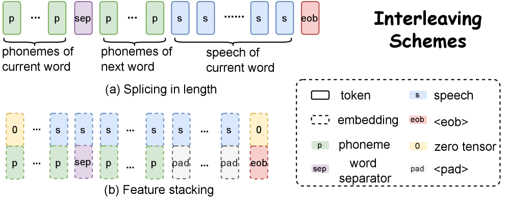
*Figure 1:One bi-word block in the two text–speech interleaving schemes: (a) CTC-TTS-L and (b) CTC-TTS-F.*

*Figure 2:Overview of CTC-TTS-L. Components include: (1) a G2P model that converts text to phonemes; (2) a CTC-based ASR model for speech–phoneme alignment; (3) a decoder-only LM that models interleaved text and speech tokens; (4) a neural audio codec; and (5) an alignment-and-interleaving module implementing Sections 3.1–3.2. CTC-TTS-F shares the same components but uses feature-level stacking (Fig. 1b) and is omitted for brevity. No prompts are required in single-speaker settings.*

---
**Usage Info**: 5387 tokens used.
**Generated at**: 2026-02-24 12:45:35

---

# 📚 StyleStream: Real-Time Zero-Shot Voice Style Conversion

🚀 URL: https://arxiv.org/html/2602.20113

## 🌏 Abstract (원문)
Zero-shot voice style conversion seeks to modify an input utterance so that it reflects the timbre, accent, and emotion of an unseen target speaker (collectively defined in this work asvoice style) while preserving the original linguistic content, using only a few seconds of reference speech. Although zero-shot voice style cloning has been extensively studied in the text-to-speech (TTS) domain[voicebox,e2tts,f5tts,maskgct,seedtts,cosyvoice,cosyvoice2], progress on zero-shot voice style conversion remains limited. In TTS, the linguistic content is taken directly from text, which is fully disentangled from the target speech that provides voice style. In contrast, zero-shot voice style conversion requires the model to first extract the content features from the source utterance, and then generate speech in the target style. This content extraction relies on clean content-style disentanglement, which is the core challenge in speech-to-speech conversion. Existing strategies for disentanglement include information bottleneck[autovc,triple-bottleneck,naturalspeech3,cosyvoice,cosyvoice2,vevo], signal perturbation[nansy,nansy++,contentvec,speechsplit2], mutual information minimization[vqmivc,Yu-disentanglement], etc. While these approaches achieve reasonable content-timbre disentanglement, the extracted features often remain entangled with accent and emotion. For example, CosyVoice 2[cosyvoice2]combines information bottlenecks with ASR for supervised disentanglement, yet its “semantic tokens” still encode considerable accent and emotion information due to the large codebook size (6561), as demonstrated in Section6.3. The current state-of-the-art framework, Vevo[vevo], employs VQ-VAE[vqvae]to quantize HuBERT[hubert]features with a compact codebook of size 32, producing discrete content tokens. Although Vevo demonstrates good conversion performance, its purely self-supervised training provides no guarantee on what information is discarded by the bottleneck, and linguistic content is prone to degradation during quantization, leading to suboptimal intelligibility and conversion quality (see Section6). Beyond disentanglement, another open challenge is real-time application: while real-time voice conversion (timbre only) has been widely studied[rt-vc,streamvc,streamvoice], there is no existing work that addresses real-time voice style conversion (timbre, accent and emotion), leaving an important gap. Motivated by these challenges, we present StyleStream, a novel framework that, for the first time, supports zero-shot real-time voice style conversion across timbre, accent, and emotion, achieving state-of-the-art performance. As shown in Figure1, the Destylizer first extracts content features that are disentangled from style information. The Stylizer then takes these content features and, conditioned on the target speech, generates the stylized mel-spectrogram, which is subsequently converted into waveform by the vocoder. To achieve better content-style disentanglement, inspired by CosyVoice 2[cosyvoice2], we train the Destylizer with an ASR loss and apply finite scalar quantization (FSQ)[fsq]as an information bottleneck, but unlike CosyVoice 2, where a large codebook size (6561) is used, we constrain the codebook size to 45. This combination of text supervision and a compact codebook enables cleaner disentanglement. The choice of content features is also crucial: rather than using the discrete codes directly, we adopt the continuous representations immediately preceding the FSQ layer as content features, following the intuition of SoftVC[softvc]. As shown in Section6.4, this design is another critical factor for effective disentanglement. For the Stylizer, we train a diffusion transformer (DiT)[dit]with a spectrogram inpainting objective, similar to[voicebox,e2tts,f5tts]. Since no autoregressive modules are involved, the input and output lengths remain identical, which makes streaming straightforward and avoids lag or overlap caused by input-output length mismatches. In summary, our contributions include: We introduce StyleStream, the first real-time voice style conversion system with an end-to-end latency of 1 second. By combining ASR loss and a compact quantization codebook, the Destylizer achieves cleaner content-style disentanglement compared to existing methods. Trained on 50k hours of English data, StyleStream delivers state-of-the-art conversion quality, substantially improving accent and emotion similarity over prior work.
## 🌏 Abstract (번역)
제로샷 음성 스타일 변환은 단 몇 초의 참조 음성만을 사용하여 원본 언어 콘텐츠를 유지하면서 입력 발화가 보지 못한 대상 화자의 음색, 억양, 감정(본 연구에서는 이를 '음성 스타일'로 정의)을 반영하도록 수정하는 것을 목표로 합니다. 텍스트 음성 변환(TTS) 분야에서는 제로샷 음성 스타일 클로닝이 광범위하게 연구되었으나, 제로샷 음성 스타일 변환의 진전은 여전히 제한적입니다. TTS에서는 언어 콘텐츠가 텍스트에서 직접 제공되어 스타일과 완전히 분리되지만, 음성 스타일 변환은 모델이 먼저 소스 발화에서 콘텐츠 특징을 추출한 후 대상 스타일로 음성을 생성해야 합니다. 이 콘텐츠 추출은 깨끗한 콘텐츠-스타일 분리에 의존하며, 이는 음성 간 변환의 핵심 과제입니다. 기존의 분리 전략에는 정보 병목 현상, 신호 섭동, 상호 정보 최소화 등이 포함되지만, 추출된 특징은 종종 억양 및 감정과 얽혀 있습니다. 예를 들어 CosyVoice 2는 ASR을 결합하여 감독된 분리를 수행하지만 큰 코드북 크기로 인해 여전히 상당한 스타일 정보를 포함합니다. 현재 최첨단 프레임워크인 Vevo는 VQ-VAE를 사용하지만 순수 자기 지도 학습 방식은 정보 손실에 대한 보장이 없으며 언어 콘텐츠가 저하되기 쉽습니다. 또한 실시간 적용은 여전히 해결되지 않은 과제입니다. 이러한 문제를 해결하기 위해 본 논문에서는 음색, 억양, 감정 전반에 걸쳐 제로샷 실시간 음성 스타일 변환을 최초로 지원하는 혁신적인 프레임워크인 StyleStream을 제안합니다. Destylizer는 스타일 정보와 분리된 콘텐츠 특징을 추출하고, Stylizer는 대상 음성을 조건으로 스타일화된 멜-스펙트로그램을 생성하며, 보코더를 통해 파형으로 변환됩니다. 더 나은 분리를 위해 ASR 손실과 45개 크기의 소형 FSQ 코드북을 사용하여 Destylizer를 훈련했습니다. Stylizer로는 확산 트랜스포머(DiT)를 사용하여 스펙트로그램 인페인팅 목표로 훈련했습니다. StyleStream은 1초의 엔드투엔드 지연 시간을 가진 최초의 실시간 시스템이며, 5만 시간의 영어 데이터로 훈련되어 기존 연구보다 억양 및 감정 유사성을 크게 향상시킨 최첨단 성능을 제공합니다.

## 🔍 Methods & Results
- Destylizer: Frozen HuBERT-Large 인코더와 Conformer 블록을 결합하고, ASR 손실 및 45개 크기의 소형 FSQ(Finite Scalar Quantization) 코드북을 사용하여 콘텐츠와 스타일을 효과적으로 분리함.
- Continuous Features: 양자화된 이산 토큰 대신 FSQ 레이어 직전의 연속적 표현(Continuous representations)을 콘텐츠 특징으로 사용하여 정보 보존과 분리 사이의 균형을 맞춤.
- Stylizer: Diffusion Transformer(DiT)를 기반으로 하며, 스펙트로그램 인페인팅(In-painting) 목적 함수와 조건부 흐름 매칭(CFM)을 사용하여 대상 스타일이 반영된 멜-스펙트로그램을 생성함.
- Style Encoder: WavLM-TDNN 구조를 사용하여 전역적인 스타일 속성을 캡처하고 DiT에 통합함.
- Real-time Streaming: 청크 단위 인과적 어텐션 마스크(Chunked-causal attention mask)와 인과적 보코더를 적용하여 엔드투엔드 지연 시간을 1초로 단축함.
- Performance: 5만 시간의 영어 데이터셋 학습 결과, 기존 모델(Vevo, CosyVoice 2 등) 대비 억양 및 감정 유사성 측면에서 최첨단(SOTA) 성능을 달성함.

## 🖼 Figures
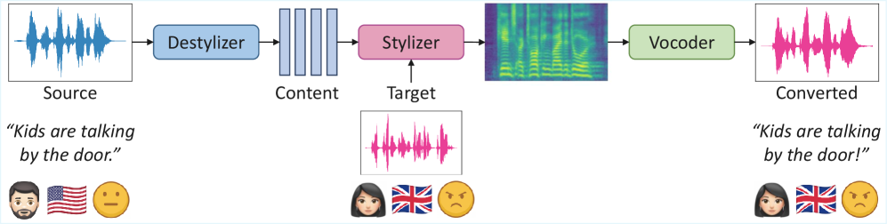
*Figure 1:System overview of StyleStream. The Destylizer extracts content features disentangled from style, and the Stylizer generates speech that preserves the source linguistic content while adopting the target timbre, accent, and emotion.*

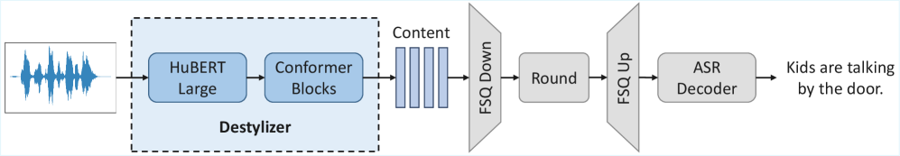
*Figure 2:Destylizer architecture. The Destylizer, as part of the ASR encoder, is trained with a sequence-to-sequence ASR loss. The continuous representations immediately before the FSQ module are taken as content features.*

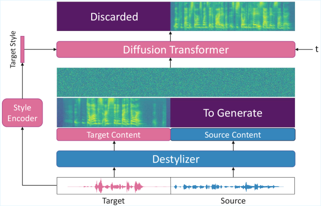
*Figure 3:Stylizer architecture. The Stylizer contains a style encoder and a diffusion transformer.*

---
**Usage Info**: 7886 tokens used.
**Generated at**: 2026-02-24 12:46:12

---

# 📚 CosyAccent: Duration-Controllable Accent Normalization Using Source-Synthesis Training Data

🚀 URL: https://arxiv.org/html/2602.19166

## 🌏 Abstract (원문)
Accent normalization (AN) seeks to remove the accent from a non-native (L2) speech to obtain a native sounding (L1) speech while preserving the speaker’s unique vocal identity and the original linguistic content. The practical applications of this technology are wide-ranging, from improving pronunciation for language learners to enhancing the authenticity of dubbed media and enabling personalized text-to-speech (TTS) systems. A primary challenge in accent normalization is the scarcity of large-scale, parallel L1-L2 corpora where the same speaker utters the same content in two different accents. This data bottleneck has forced the field to evolve, moving from early methods that required reference speech during inference or were trained on limited content-paired data. To overcome these constraints, the dominant paradigm has shifted towards the use of synthetic data to construct training pairs. Current synthetic data strategies predominantly focus on target synthesis, which generates L1 speech using TTS models and trains a conversion model on these synthetic pairs. However, these methods share a vulnerability: the model’s quality is capped by the authenticity of the synthesized L1 target. In this paper, we propose to synthesize the speech in a different way by synthesizing the source L2 speech from a large-scale, high-quality native L1 corpus. This “source-synthesis” approach ensures that our model is trained on genuine, high-quality native speech as its target, with natural prosody and voice quality, and without artifacts that come with target-synthesis methods. Together with the new data strategy, we also propose a novel model, CosyAccent. It is a non-autoregressive (NAR) system designed to resolve the common trade-off between prosodic flexibility and duration control. We empirically show that, by training exclusively on our source-synthesized data, our model achieves superior content preservation and naturalness, matching or exceeding strong baselines that were trained on real-world accented data.
## 🌏 Abstract (번역)
억센트 정규화(AN)는 화자의 고유한 음성 정체성과 원래의 언어적 내용을 유지하면서 비모국어(L2) 음성에서 억센트를 제거하여 모국어(L1)처럼 들리는 음성을 얻는 것을 목표로 합니다. 이 기술은 언어 학습자의 발음 교정부터 더빙 미디어의 진정성 향상, 개인화된 텍스트 음성 변환(TTS) 시스템 구축에 이르기까지 광범위한 응용 분야를 가지고 있습니다. 억센트 정규화의 주요 과제는 동일한 화자가 동일한 내용을 두 가지 다른 억센트로 말하는 대규모 병렬 L1-L2 코퍼스의 부족입니다. 이러한 데이터 병목 현상으로 인해 추론 시 참조 음성이 필요하거나 제한된 내용 쌍 데이터로 학습하는 초기 방법에서 합성 데이터를 사용하여 학습 쌍을 구축하는 방식으로 패러다임이 전환되었습니다. 현재의 합성 데이터 전략은 주로 TTS 모델을 사용하여 L1 음성을 생성하고 이를 기반으로 변환 모델을 학습시키는 '타겟 합성(target synthesis)'에 집중되어 있습니다. 그러나 이러한 방법은 합성된 L1 타겟의 품질에 의해 모델의 성능이 제한된다는 취약점이 있습니다. 본 논문에서는 대규모 고품질 모국어 L1 코퍼스로부터 소스 L2 음성을 합성하는 '소스 합성(source-synthesis)' 접근 방식을 제안합니다. 이 방식은 모델이 자연스러운 운율과 음질을 가진 실제 고품질 모국어 음성을 타겟으로 학습되도록 보장하며, 타겟 합성 방식에서 발생하는 아티팩트를 방지합니다. 새로운 데이터 전략과 함께, 운율적 유연성과 길이 제어 사이의 절충안을 해결하도록 설계된 비자기회귀(NAR) 시스템인 CosyAccent 모델을 제안합니다. 실험 결과, 소스 합성 데이터만으로 학습된 제안 모델은 실제 억센트 데이터로 학습된 강력한 베이스라인 모델들과 대등하거나 그 이상의 성능을 달성하며 우수한 내용 보존 및 자연스러움을 보여주었습니다.

## 🔍 Methods & Results
- 데이터 생성 전략: 고품질 L1 코퍼스(LibriTTS-R)를 기반으로 CosyVoice2 TTS를 사용하여 L2 소스 음성을 생성하는 '소스 합성' 방식 도입
- 데이터 파이프라인: L2-ARCTIC 데이터셋을 활용한 억센트 점수 필터링, L1-L2 데이터 페어링 및 합성을 통한 병렬 코퍼스 구축
- CosyAccent 아키텍처: Whisper 인코더, CTC 프로젝션 헤드, DiT 기반 음성 디코더로 구성된 비자기회귀(NAR) 모델 설계
- 길이 제어 메커니즘: RoPE와 위치 스케일링(Position Scaling) 기술을 결합하여 출력 음성의 총 길이를 명시적으로 제어 가능하게 함
- 운율 및 음색 보존: 고정된 Whisper 인코더의 언어적 특징과 별도의 화자 임베딩을 결합하여 화자의 음색을 유지
- 추론 최적화: Classifier-Free Guidance(CFG) 기법을 적용하여 생성된 음성의 내용 일관성과 품질을 강화
- 실험 결과: 소스 합성 데이터만으로 학습했음에도 불구하고 실제 억센트 데이터를 사용한 모델보다 우수한 내용 보존력과 자연스러움 입증

## 🖼 Figures
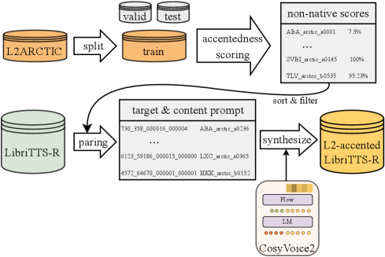
*Fig. 1:Construction pipeline of the paired training data.*

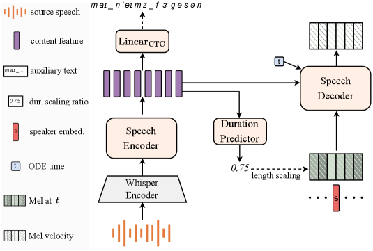
*Fig. 2:CosyAccent architecture. It implicitly models rhythm for prosodic flexibility, while allowing the total duration to be either specified or predicted.*

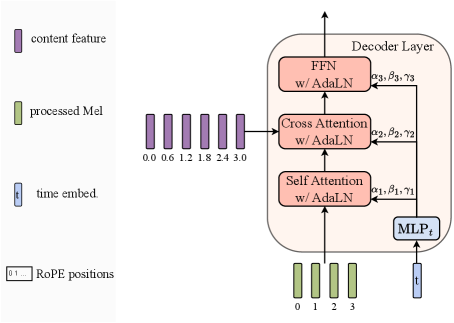
*Fig. 3:Speech decoder’s alignment mechanism. Positional indices for the source content features are scaled to match the target’s length, creating a coarse alignment within RoPE-based cross attention.*

---
**Usage Info**: 4606 tokens used.
**Generated at**: 2026-02-24 12:47:18

---

# 📚 JavisDiT++: Unified Modeling and Optimization for Joint Audio-Video Generation

🚀 URL: https://arxiv.org/html/2602.19163

## 🌏 Abstract (원문)
AI-Generated Content (AIGC) has evolved from text-to-image generation towards more complex domains such as video and audio. The intrinsic correlation between audio and video modalities has also been increasingly explored, giving rise to related research on video-to-audio and audio-to-video generation. With the rapidly growing demands for AIGC domains like short videos, film, gaming, and VR, joint audio-video generation (JAVG) from textual inputs has become increasingly crucial in this era. MM-Diffusion represents a series of early works that study unconditional audio-video generation, with a scope limited to natural landscapes and human dancing. Then, Uniform extended the task to label-name-conditioned JAVG and evaluated the model on the relatively broader VGGSound dataset. More recently, JavisDiT and Universe-1 have begun to employ free-form text prompts as inputs, systematically exploring sounding video generation in real-world scenarios. Despite these efforts, current approaches still struggle to produce high-quality, temporally synchronized sounding videos compared with advanced proprietary models such as Veo3. Fig.2 quantitatively shows the gap between previous methods and Veo3, indicating current JAVG methods fail to capture human preferences regarding the aesthetics and harmony of audio-visual content. To bridge the gap, we provide a unified perspective of JAVG modeling and optimization to generate high-quality, better-synchronized, and human-preference-aligned sounding videos. First, to improve generation quality, we introduce a modality-specific mixture-of-experts (MS-MoE) module, where audio and video tokens exchange information through shared multi-head self-attention layers, and then aggregate intra-modal information via two separate FFN layers. This architecture enhances single-modality generation quality compared with Uniform, which processes aggregated audio-video tokens using a single FFN module. On the other hand, MS-MoE is simpler, more efficient, and more unified than dual-DiT plus audio-visual interaction block designs such as JavisDiT and Universe-1. Second, to enhance audio-video synchrony, we propose a temporal-aligned multimodal RoPE (TA-RoPE) strategy, which aligns the position IDs of audio and video tokens on a unified temporal axis, enabling direct and frame-level fine-grained temporal synchronization. Finally, to capture human preference, we design an audio-video direct preference optimization (AV-DPO) method to align the model with collected preference data, further enhancing video-audio generation quality and synchronization. To the best of our knowledge, we are the first to introduce preference alignment into JAVG, enabling the model to generate high-quality, synchronized sounding videos, more faithfully aligned with the input text and human preferences. With the above techniques, our JavisDiT++ model is built upon Wan2.1-1.3B-T2V, and is efficiently trained using only 780K diversified audio-text pairs and 360K high-quality sounding videos, supporting arbitrary duration and resolution ranging from 2–5 seconds and 240p–480p resolution across different aspect ratios. It achieves state-of-the-art performance, surpassing JavisDiT and Universe-1 across both qualitative and quantitative evaluations on various dimensions.
## 🌏 Abstract (번역)
AI 생성 콘텐츠(AIGC)는 텍스트-이미지 생성을 넘어 비디오 및 오디오와 같은 복잡한 영역으로 진화했습니다. 오디오와 비디오 모달리티 간의 본질적인 상관관계가 점점 더 많이 탐구되면서 비디오-오디오 및 오디오-비디오 생성에 관한 관련 연구가 활발해졌습니다. 숏폼 비디오, 영화, 게임, VR과 같은 AIGC 영역에 대한 수요가 급격히 증가함에 따라 텍스트 입력으로부터의 공동 오디오-비디오 생성(JAVG)이 이 시대에 점점 더 중요해지고 있습니다. MM-Diffusion은 자연 경관과 인간의 춤으로 범위가 제한된 무조건부 오디오-비디오 생성을 연구한 일련의 초기 연구를 대표합니다. 이후 Uniform은 이 작업을 레이블 이름 조건부 JAVG로 확장하고 상대적으로 더 넓은 VGGSound 데이터셋에서 모델을 평가했습니다. 최근에는 JavisDiT와 Universe-1이 자유 형식의 텍스트 프롬프트를 입력으로 사용하기 시작하여 실제 시나리오에서 소리 나는 비디오 생성을 체계적으로 탐구했습니다. 이러한 노력에도 불구하고 현재의 접근 방식은 Veo3와 같은 고급 독점 모델과 비교할 때 고품질의 시간적으로 동기화된 소리 나는 비디오를 생성하는 데 여전히 어려움을 겪고 있습니다. 그림 2는 이전 방법들과 Veo3 사이의 격차를 정량적으로 보여주며, 현재의 JAVG 방법들이 시청각 콘텐츠의 미학 및 조화에 관한 인간의 선호도를 포착하지 못하고 있음을 나타냅니다. 이러한 격차를 해소하기 위해 본 연구는 고품질이며 더 잘 동기화되고 인간의 선호도에 정렬된 소리 나는 비디오를 생성하기 위한 JAVG 모델링 및 최적화의 통합된 관점을 제공합니다. 첫째, 생성 품질을 개선하기 위해 모달리티 특정 전문가 혼합(MS-MoE) 모듈을 도입합니다. 여기서 오디오와 비디오 토큰은 공유된 멀티 헤드 셀프 어텐션 레이어를 통해 정보를 교환한 다음, 두 개의 별도 FFN 레이어를 통해 모달리티 내 정보를 집계합니다. 이 아키텍처는 단일 FFN 모듈을 사용하여 집계된 오디오-비디오 토큰을 처리하는 Uniform에 비해 단일 모달리티 생성 품질을 향상시킵니다. 반면 MS-MoE는 JavisDiT 및 Universe-1과 같은 듀얼 DiT 및 시청각 상호작용 블록 설계보다 더 단순하고 효율적이며 통합적입니다. 둘째, 오디오-비디오 동기화를 강화하기 위해 통합된 시간 축에서 오디오와 비디오 토큰의 위치 ID를 정렬하여 직접적이고 프레임 수준의 미세한 시간 동기화를 가능하게 하는 시간 정렬 다중 모드 RoPE(TA-RoPE) 전략을 제안합니다. 마지막으로, 인간의 선호도를 포착하기 위해 수집된 선호도 데이터와 모델을 정렬하는 오디오-비디오 직접 선호도 최적화(AV-DPO) 방법을 설계하여 비디오-오디오 생성 품질과 동기화를 더욱 향상시킵니다. 우리가 알기로는 JAVG에 선호도 정렬을 도입한 것은 이번이 처음이며, 이를 통해 모델이 입력 텍스트 및 인간의 선호도에 더 충실하게 정렬된 고품질의 동기화된 소리 나는 비디오를 생성할 수 있게 합니다. 위의 기술들을 바탕으로 우리의 JavisDiT++ 모델은 Wan2.1-1.3B-T2V를 기반으로 구축되었으며, 780K의 다양한 오디오-텍스트 쌍과 360K의 고품질 소리 나는 비디오만을 사용하여 효율적으로 훈련되었습니다. 이 모델은 2~5초의 임의 지속 시간과 다양한 종횡비에 걸친 240p~480p 해상도를 지원합니다. 이 모델은 다양한 차원의 정성적 및 정량적 평가 모두에서 JavisDiT 및 Universe-1을 능가하는 최첨단 성능을 달성했습니다.

## 🔍 Methods & Results
- Rectified Flow 기반의 Flow Matching 기법을 사용하여 노이즈로부터 데이터 샘플을 생성하는 최적화 경로 학습
- Modality-Specific Mixture-of-Experts (MS-MoE) 도입: 오디오와 비디오 토큰이 셀프 어텐션을 공유하되 FFN 단계에서는 각 모달리티 전용 전문가 레이어를 거치도록 설계하여 품질 향상 및 간섭 최소화
- Temporally Aligned Rotary Position Encoding (TA-RoPE): 오디오와 비디오 토큰의 시간 축 위치 ID를 일치시켜 프레임 단위의 정밀한 시청각 동기화 구현
- Audio-Video Direct Preference Optimization (AV-DPO): JAVG 분야 최초로 DPO를 적용하여 인간의 선호도(품질, 일관성, 동기화)에 부합하도록 모델 정렬
- 다차원 보상 모델 활용: AudioBox, VideoAlign, ImageBind, Syncformer 등을 사용하여 생성된 샘플의 품질과 동기화를 자동 평가하고 선호도 데이터 구축
- 데이터 효율성 및 성능: 약 100만 개의 공개 데이터셋만으로 훈련했음에도 불구하고 JavisDiT 및 Universe-1 대비 정성적/정량적 지표에서 SOTA 성능 달성

## 🖼 Figures
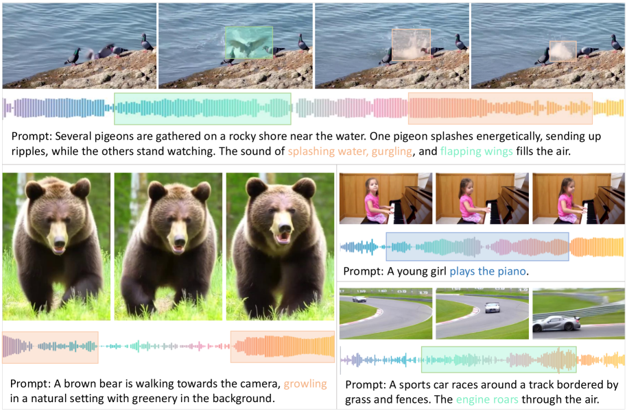
*Figure 1:Realistic and diversified joint audio-video generation examples by our JavisDiT++ model.*

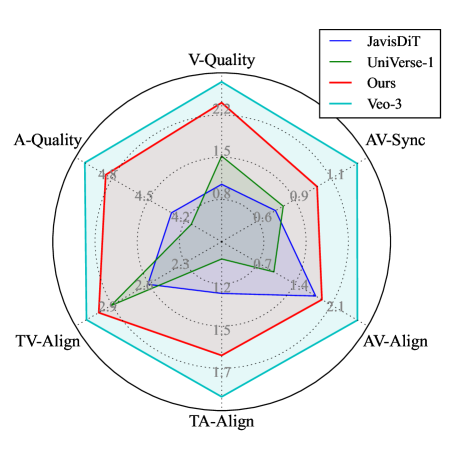
*Figure 2:Comparison with recent JAVG models.*

*Figure 3:Architecture of JavisDiT++. We use shared attention layers to encourage audio-visual mutual information modeling, with modality-specific FFN layers to enhance intra-modal aggregation. The Temporal-Aligned RoPE strategy is applied to ensure audio-video synchrony. The audio/video embedder layer and prediction head that bridge DiT and VAEs are hidden for simplicity.*

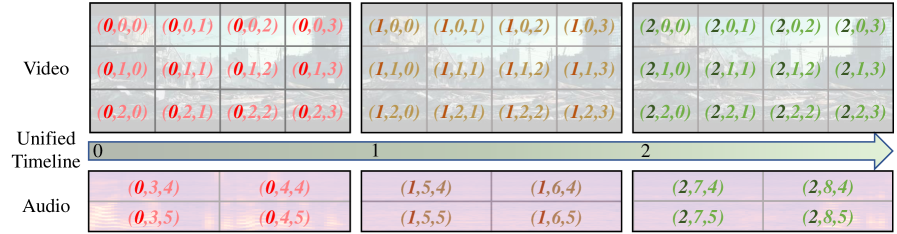
*Figure 4:Illustration of temporal-aligned rotary position encoding for video and audio tokens.*

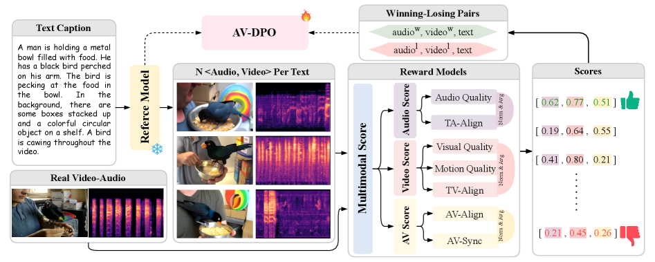
*Figure 5:Illustration of preference data collection and training pipeline of audio-video DPO.*

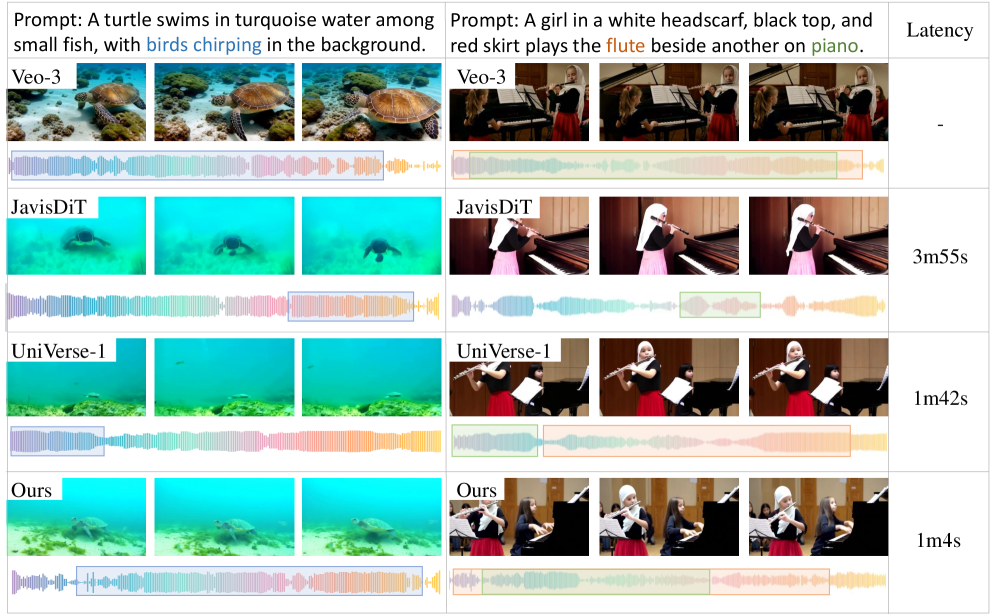
*Figure 6:Generations from recent JAVG models. Best viewed in zoom or supplementary materials.*

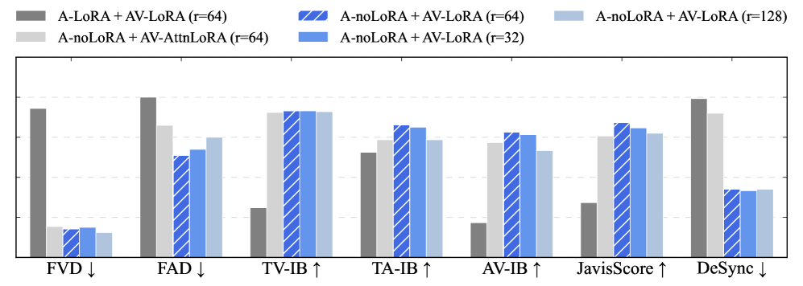
*Figure 7:Comprehensive ablation studies on LoRA configurations.*

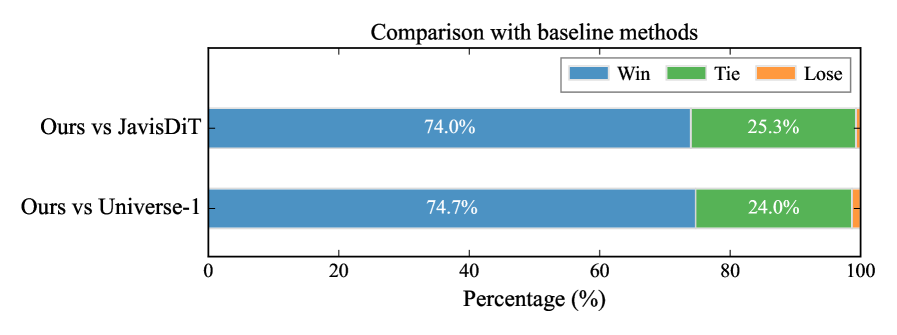
*Figure 8:Subjective comparison on generation with baseline methods.*

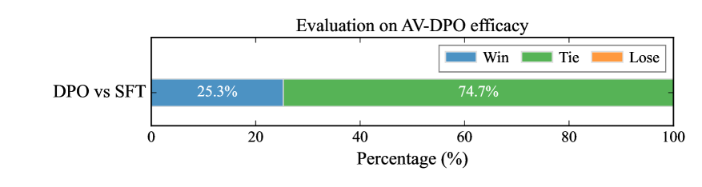
*Figure 9:Subjective evaluation on the efficacy of the AV-DPO strategy.*

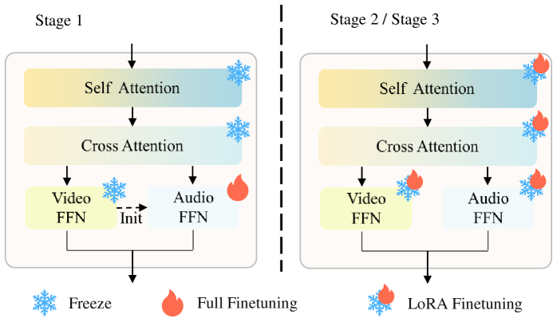
*Figure A1:Illustration of trainable parameters at different stages.*

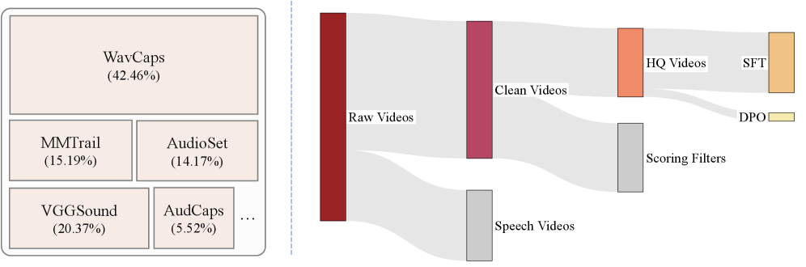
*Figure A2:(Left): Diversified audio-text sources. (Right): Data filtering process from TAVGBench.*

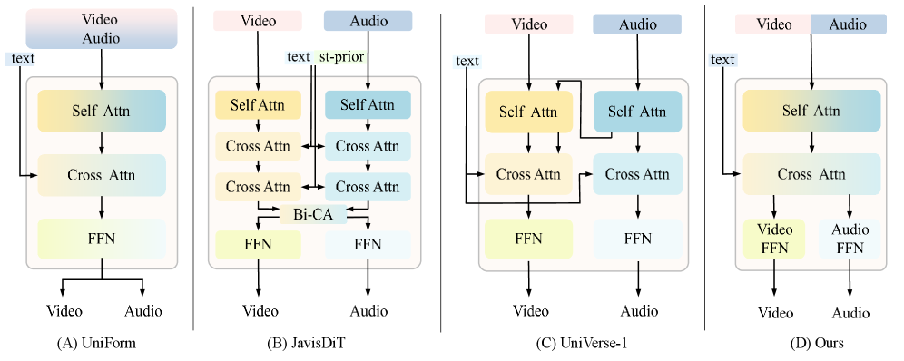
*Figure A3:Architectural comparison with Uniform, JavisDiT, and UniVerse-1.*

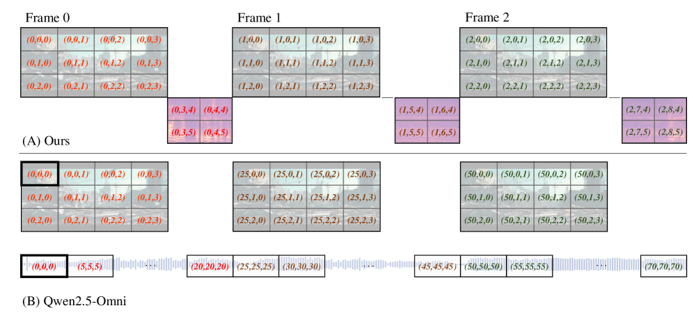
*Figure A4:Comparison of our audio-video frame interleaving with Qwen2.5-Omni’s strategy.*

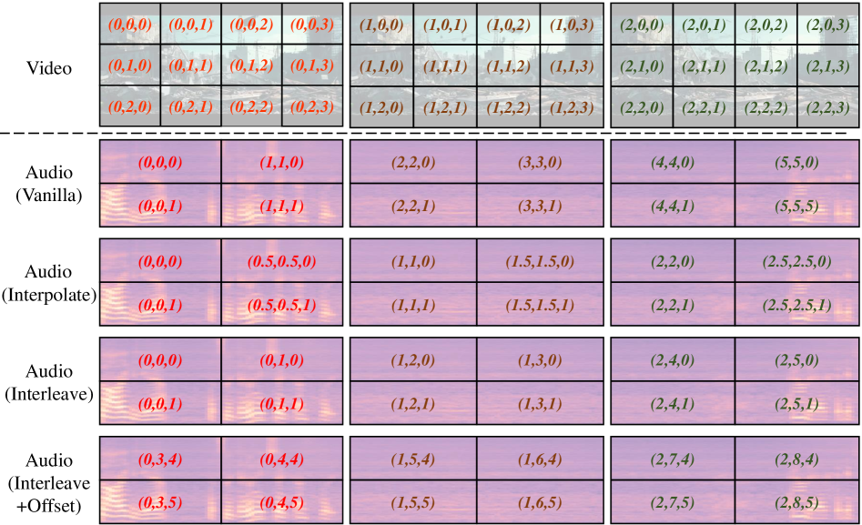
*Figure A5:Illustration of different audio positional encoding strategies.*

*Figure A6:Implicit accuracy on 
𝛽
 selections.*

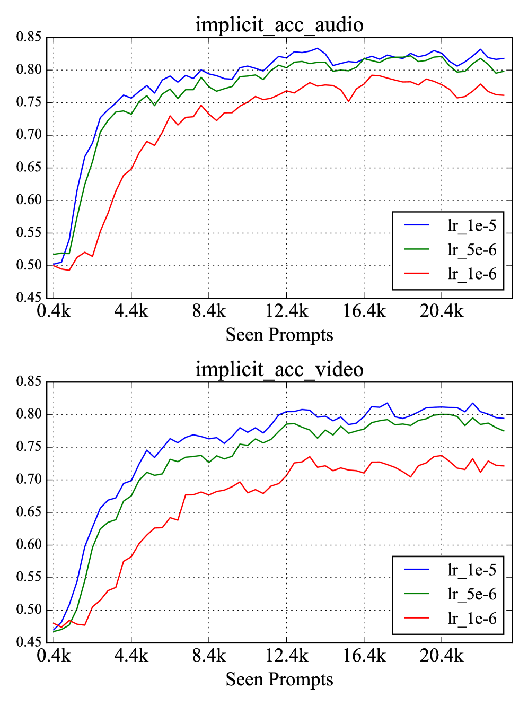
*Figure A7:Implicit accuracy on learning rates.*

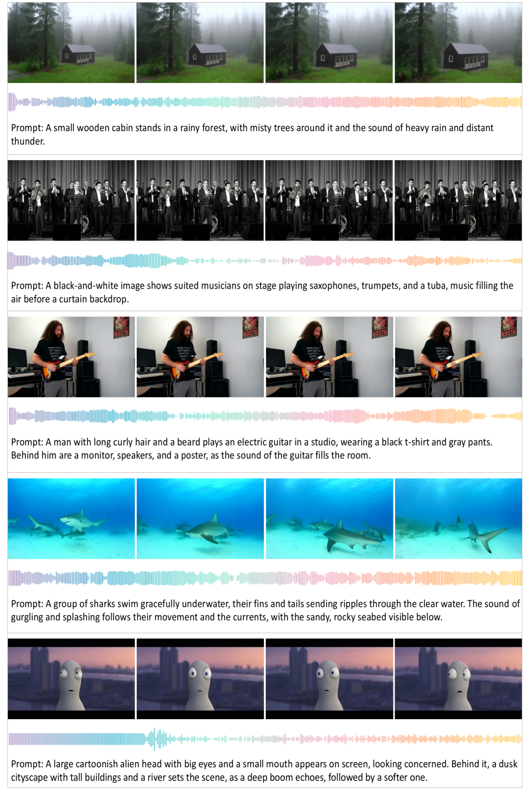
*Figure A8:More examples for high-quality audio-video generation results.*

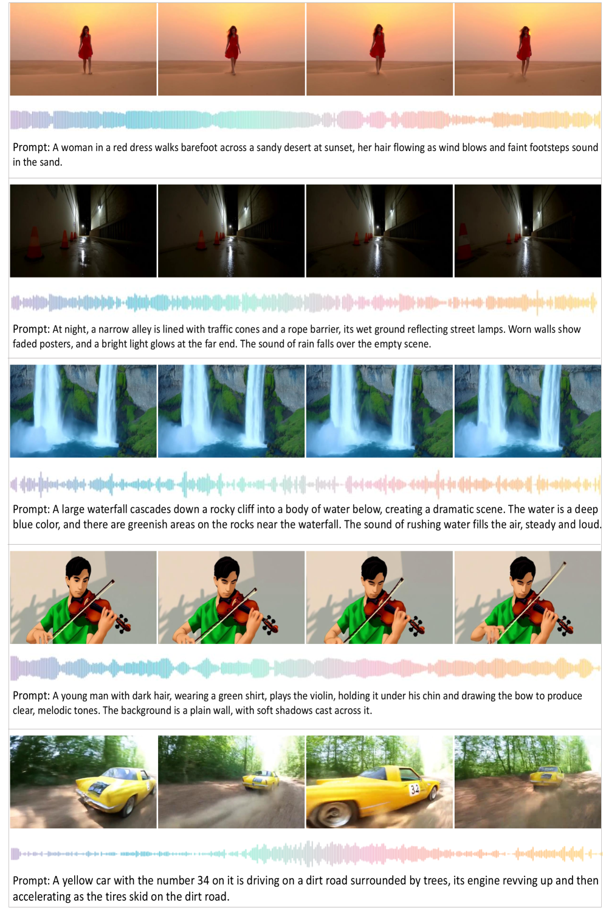
*Figure A9:More examples for high-quality audio-video generation results.*

---
**Usage Info**: 7143 tokens used.
**Generated at**: 2026-02-24 12:48:15

---

# 📚 DTT-BSR: GAN-Based DTTNet with RoPE Transformer Enhancement for Music Source Restoration

🚀 URL: https://arxiv.org/html/2602.19825

## 🌏 Abstract (원문)
Music source restoration (MSR)[7]extends music source separation (MSS) by requiring both source isolation and restoration of signals degraded during music production. Inspired by Dual-Path TFC-TDF UNet (DTTNet)[2]and Band-Split RoPE Transformer (BSRoFormer)[4], We propose a generative adversarial network (GAN) based adaptation of the DTTNet with band-sequence modeling and rotary positional embeddings (RoPE)[5]transformer bottleneck (DTT-BSR). Specifically, DTTNet is adopted as backbone for its efficient U-Net structure, with RoPE transformer blocks equipped to capture long-term dependencies and dual-path recurrent neural network (RNN) modules for fine-grained spectral features. This approach bridges discriminative separation and generative restoration within a single, end-to-end framework. Our approach achieves competitive performance in the ICASSP 2026 MSR Challenge, ranking 3rd on objective metrics and 4th on subjective evaluation. Code111https://github.com/OrigamiShido/DTT-BSRand pretrained weights222https://huggingface.co/OrigamiShido/MSRChallenge-ACDCare publicly available.
## 🌏 Abstract (번역)
음악 음원 복원(MSR)은 음원 분리(MSS)를 확장하여 음원 격리와 음악 제작 과정에서 손상된 신호의 복원을 모두 요구합니다. 본 논문에서는 Dual-Path TFC-TDF UNet(DTTNet)과 Band-Split RoPE Transformer(BSRoFormer)에서 영감을 받아, 밴드 시퀀스 모델링과 회전 위치 임베딩(RoPE) 트랜스포머 보틀넥을 갖춘 DTTNet의 생성적 적대 신경망(GAN) 기반 변형인 DTT-BSR을 제안합니다. 구체적으로, 효율적인 U-Net 구조를 위해 DTTNet을 백본으로 채택하고, 장기 의존성을 포착하기 위한 RoPE 트랜스포머 블록과 세밀한 스펙트럼 특징을 위한 듀얼 패스 순환 신경망(RNN) 모듈을 장착했습니다. 이 접근 방식은 단일 엔드투엔드 프레임워크 내에서 판별적 분리와 생성적 복원을 결합합니다. 제안된 방식은 ICASSP 2026 MSR 챌린지에서 객관적 지표 3위, 주관적 평가 4위를 기록하며 경쟁력 있는 성능을 달성했습니다. 코드와 사전 학습된 가중치는 공개적으로 이용 가능합니다.

## 🔍 Methods & Results
- DTTNet을 백본으로 하고 RoPE 트랜스포머와 듀얼 패스 RNN을 결합한 DTT-BSR 프레임워크 제안
- STFT를 통해 변환된 스펙트럼을 TFC-TDF 블록과 다운샘플링 층을 통해 고차원 특징으로 추출
- 보틀넥 구간에서 RoPE 트랜스포머로 장기 의존성을 모델링하고 듀얼 패스 RNN으로 세밀한 시공간 특징 추출
- Multi-Mel STFT 손실, 적대적 손실(Adversarial loss), 특징 매칭 손실을 결합한 복합 목적 함수로 GAN 기반 학습 수행
- ICASSP 2026 MSR 챌린지에서 객관적 지표 3위 및 주관적 평가 4위 달성

## 🖼 Figures
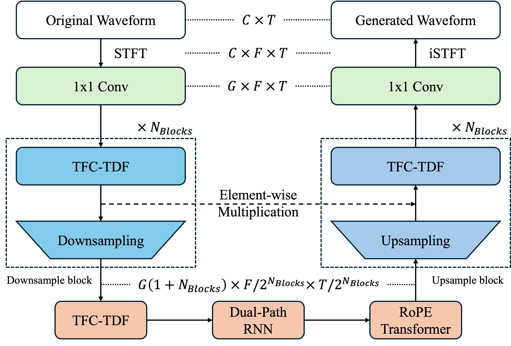
*Fig. 1:Our Proposed Model Architecture*

---
**Usage Info**: 3812 tokens used.
**Generated at**: 2026-02-24 12:49:05

---

# 📚 MDM-ASR: Bridging Accuracy and Efficiency in ASR with Diffusion-Based Non-Autoregressive Decoding

🚀 URL: https://arxiv.org/html/2602.18952

## 🌏 Abstract (원문)
Automatic Speech Recognition (ASR) has become a cornerstone technology, powering applications from smart home devices and virtual assistants to real-time transcription. Over the past decade, deep learning advances have greatly improved ASR accuracy and robustness. Connectionist Temporal Classification (CTC), which enables alignment-free training by mapping input frames directly to output sequences, initially revolutionized ASR. CTC-based models are non-autoregressive (NAR), allowing parallel token decoding, and typically combine strong encoders, such as Wav2Vec2.0, HuBERT, or MMS, with a CTC prediction head and loss. This design enables very fast decoding across benchmarks. However, the strong conditional independence assumption between output tokens limits the modeling of rich linguistic dependencies, often resulting in performance degradation and preventing CTC from dominating state-of-the-art ASR. To address CTC’s limitations, Conformer-based transducers combine a Conformer encoder with an autoregressive (AR) token predictor via a joint network, making them well suited for streaming ASR. Another class of AR models are sequence-to-sequence (seq2seq) Transformer ASR systems, which leverage an encoder–decoder architecture with cross-attention to implicitly align speech frames and output tokens. This approach has produced highly competitive fully Transformer-based systems, including Whisper and Canary, achieving strong accuracy across multiple languages and domains. Despite their effectiveness, AR models generate tokens sequentially, so inference time grows linearly with output length. Maintaining long-range context during decoding further increases computational cost, limiting their suitability for real-time or large-scale applications. In text generation, NAR models have recently gained considerable attention, demonstrating their potential to be a valid alternative to AR solutions. In particular, models based on diffusion and flow-matching frameworks enable parallel sequence generation and allow a flexible trade-off between accuracy and efficiency through iterative refinement. Among them, masked diffusion models (MDMs) have emerged as a promising solution for sequence modeling. Instead of generating tokens one by one, MDMs start from a masked sequence and iteratively predict multiple tokens in parallel. This bidirectional refinement process allows the model to use both past and future contexts at every step, leading to improved modeling capacity while significantly reducing inference latency. MDMs have shown promise in unconditional text generation and zero-shot evaluation for language modeling tasks. Given that ASR fundamentally performs text generation conditioned on speech, these advances suggest that diffusion-based NAR generation may also be beneficial for speech recognition. However, the scalability of MDMs and their effectiveness for ASR have not been fully explored. Moreover, very recent studies on diffusion-based ASR and flow-matching ASR report a substantial performance gap compared with strong AR ASR models. In this work, we study NAR modeling within the standard seq2seq Transformer ASR framework and seek to close the performance gap between AR and NAR approaches. To this end, we introduce an audio-conditioned masked diffusion decoder that replaces conventional left-to-right AR decoding while preserving the encoder–decoder architecture. Our model consists of a strong pre-trained speech encoder to extract high-level acoustic representations, which are then consumed by a Transformer-based discrete diffusion decoder that iteratively refines masked token sequences. At each diffusion decoding step, the decoder jointly conditions on the complete acoustic embedding and the partially masked text sequence, enabling parallel token updates and bidirectional context modeling across the entire output. Unlike prior diffusion ASR attempts that couple separately trained speech and text components via an additional fusion module, or recent flow-matching ASR efforts that introduce an additional auxiliary modeling, our model builds directly on a standard encoder–decoder ASR architecture and replaces sequential decoding with a masked diffusion generation process. Moreover, unlike earlier BERT-style masked refinement ASR, which relies on ad-hoc objectives without an explicit generative interpretation, we employ a discrete diffusion formulation with a training objective derived from the forward corruption process. The resulting diffusion loss, including the noise-dependent reweighting term, provides each refinement step with a clear probabilistic interpretation. In addition, it defines a theoretically grounded multi-step generative model, whose inference procedure is fully consistent with the training process. Building on this framework, we propose several practical techniques to further improve performance. First, Iterative Self-Correction Training (ISCT) reduces the mismatch between training and inference by exposing the model to intermediate decoding states. Second, we explore multiple inference strategies, including the Entropy-Bounded Confidence (EB-Conf) sampler for stable and efficient decoding, and the Position-Biased EB-Conf (PBEB-Conf) sampler to incorporate positional bias. Experiments on four benchmark English datasets show that our model achieves competitive accuracy with strong AR systems while delivering significantly faster decoding and consistently outperforming existing generative NAR ASR models. On multilingual tasks, it demonstrates robust performance across languages. Comprehensive ablation studies further examine model scaling, ISCT, and inference strategies, providing clear insights into system design and empirical behavior.
## 🌏 Abstract (번역)
자동 음성 인식(ASR)은 스마트 홈 기기부터 실시간 전사까지 다양한 애플리케이션을 구동하는 핵심 기술이 되었습니다. 지난 10년 동안 딥러닝의 발전은 ASR의 정확도와 견고함을 크게 향상시켰습니다. 입력 프레임을 출력 시퀀스에 직접 매핑하여 정렬이 필요 없는 학습을 가능하게 하는 CTC(Connectionist Temporal Classification)는 초기에 ASR을 혁신했습니다. CTC 기반 모델은 비자기회귀(NAR) 방식으로 병렬 토큰 디코딩이 가능하며, 일반적으로 Wav2Vec2.0, HuBERT 또는 MMS와 같은 강력한 인코더를 CTC 예측 헤드 및 손실 함수와 결합합니다. 이 설계는 여러 벤치마크에서 매우 빠른 디코딩을 가능하게 합니다. 그러나 출력 토큰 간의 강력한 조건부 독립성 가정은 풍부한 언어적 의존성 모델링을 제한하여 성능 저하를 초래하고 CTC가 최첨단 ASR을 주도하는 것을 방해합니다. CTC의 한계를 해결하기 위해 Conformer 기반 트랜스듀서는 Conformer 인코더와 자기회귀(AR) 토큰 예측기를 결합하여 스트리밍 ASR에 적합하게 만듭니다. 또 다른 AR 모델 클래스는 시퀀스-투-시퀀스(seq2seq) 트랜스포머 ASR 시스템으로, 교차 주의 집중(cross-attention)을 갖춘 인코더-디코더 아키텍처를 활용하여 음성 프레임과 출력 토큰을 암시적으로 정렬합니다. 이 접근 방식은 Whisper 및 Canary를 포함하여 여러 언어와 도메인에서 강력한 정확도를 달성하는 경쟁력 있는 시스템을 구축했습니다. 이러한 효과에도 불구하고 AR 모델은 토큰을 순차적으로 생성하므로 추론 시간이 출력 길이에 따라 선형적으로 증가합니다. 디코딩 중 장거리 문맥을 유지하는 것은 계산 비용을 더욱 증가시켜 실시간 또는 대규모 애플리케이션에 대한 적합성을 제한합니다. 텍스트 생성 분야에서 NAR 모델은 최근 상당한 주목을 받고 있으며 AR 솔루션의 유효한 대안이 될 가능성을 보여주었습니다. 특히 확산(diffusion) 및 흐름 매칭(flow-matching) 프레임워크 기반 모델은 병렬 시퀀스 생성을 가능하게 하고 반복적인 정제를 통해 정확도와 효율성 사이의 유연한 절충을 허용합니다. 그 중 마스크 확산 모델(MDM)은 시퀀스 모델링을 위한 유망한 솔루션으로 떠올랐습니다. MDM은 토큰을 하나씩 생성하는 대신 마스크된 시퀀스에서 시작하여 여러 토큰을 병렬로 반복 예측합니다. 이 양방향 정제 프로세스는 모델이 매 단계에서 과거와 미래의 문맥을 모두 사용할 수 있게 하여 모델링 용량을 향상시키는 동시에 추론 지연 시간을 크게 줄입니다. ASR이 근본적으로 음성 조건부 텍스트 생성을 수행한다는 점을 고려할 때, 이러한 발전은 확산 기반 NAR 생성이 음성 인식에도 유익할 수 있음을 시사합니다. 그러나 MDM의 확장성과 ASR에 대한 효과는 충분히 탐구되지 않았습니다. 또한 최근의 확산 기반 및 흐름 매칭 기반 ASR 연구들은 강력한 AR ASR 모델에 비해 상당한 성능 격차를 보고하고 있습니다. 본 연구에서는 표준 seq2seq 트랜스포머 ASR 프레임워크 내에서 NAR 모델링을 연구하고 AR과 NAR 접근 방식 간의 성능 격차를 좁히고자 합니다. 이를 위해 기존의 좌우 AR 디코딩을 대체하면서 인코더-디코더 아키텍처를 보존하는 오디오 조건부 마스크 확산 디코더를 도입합니다. 우리 모델은 고수준 음향 표현을 추출하는 강력한 사전 학습된 음성 인코더와 마스크된 토큰 시퀀스를 반복적으로 정제하는 트랜스포머 기반 이산 확산 디코더로 구성됩니다. 각 확산 디코딩 단계에서 디코더는 전체 음향 임베딩과 부분적으로 마스크된 텍스트 시퀀스를 공동으로 조건화하여 전체 출력에 걸쳐 병렬 토큰 업데이트 및 양방향 문맥 모델링을 가능하게 합니다. 별도로 학습된 음성 및 텍스트 구성 요소를 추가 융합 모듈을 통해 결합하는 이전의 확산 ASR 시도들과 달리, 우리 모델은 표준 인코더-디코더 ASR 아키텍처를 직접 기반으로 하며 순차적 디코딩을 마스크 확산 생성 프로세스로 대체합니다. 또한 명시적인 생성 해석 없이 임시 목적 함수에 의존하는 이전의 BERT 스타일 마스크 정제 ASR과 달리, 우리는 순방향 부패 프로세스에서 파생된 학습 목적 함수를 갖춘 이산 확산 공식을 사용합니다. 결과적으로 노이즈 의존적 재가중치 항을 포함하는 확산 손실은 각 정제 단계에 명확한 확률적 해석을 제공합니다. 이 프레임워크를 바탕으로 성능을 더욱 향상시키기 위한 몇 가지 실용적인 기술을 제안합니다. 첫째, 반복적 자기 수정 학습(ISCT)은 모델을 중간 디코딩 상태에 노출시켜 학습과 추론 사이의 불일치를 줄입니다. 둘째, 안정적이고 효율적인 디코딩을 위한 엔트로피 제한 신뢰도(EB-Conf) 샘플러와 위치 편향을 통합한 위치 편향 EB-Conf(PBEB-Conf) 샘플러를 포함한 여러 추론 전략을 탐구합니다. 4개의 벤치마크 영어 데이터셋에 대한 실험 결과, 우리 모델은 강력한 AR 시스템과 경쟁력 있는 정확도를 달성하는 동시에 훨씬 빠른 디코딩을 제공하고 기존 생성형 NAR ASR 모델을 지속적으로 능가함을 보여줍니다. 다국어 작업에서도 여러 언어에 걸쳐 견고한 성능을 입증합니다. 포괄적인 소거 연구를 통해 모델 확장, ISCT 및 추론 전략을 추가로 조사하여 시스템 설계 및 경험적 동작에 대한 명확한 통찰력을 제공합니다.

## 🔍 Methods & Results
- 기존의 순차적(AR) 디코딩을 대체하는 오디오 조건부 마스크 확산 디코더(Audio-conditioned Masked Diffusion Decoder) 제안
- 강력한 사전 학습된 음성 인코더와 트랜스포머 기반 이산 확산 디코더를 결합한 인코더-디코더 아키텍처 활용
- 순방향 부패 프로세스(Forward Corruption Process)에서 파생된 학습 목적 함수를 사용하여 각 정제 단계에 명확한 확률적 해석 부여
- 학습과 추론 간의 불일치를 줄이기 위한 반복적 자기 수정 학습(Iterative Self-Correction Training, ISCT) 기법 도입
- 효율적인 디코딩을 위한 엔트로피 제한 신뢰도(EB-Conf) 샘플러 및 위치 편향 EB-Conf(PBEB-Conf) 샘플러 제안
- 영어 벤치마크 데이터셋 실험 결과, 강력한 AR 시스템 수준의 정확도를 달성하면서도 디코딩 속도를 대폭 향상
- 기존의 생성형 NAR(Non-Autoregressive) ASR 모델들보다 일관되게 우수한 성능을 기록하며 다국어 환경에서도 견고한 성능 입증

## 🖼 Figures
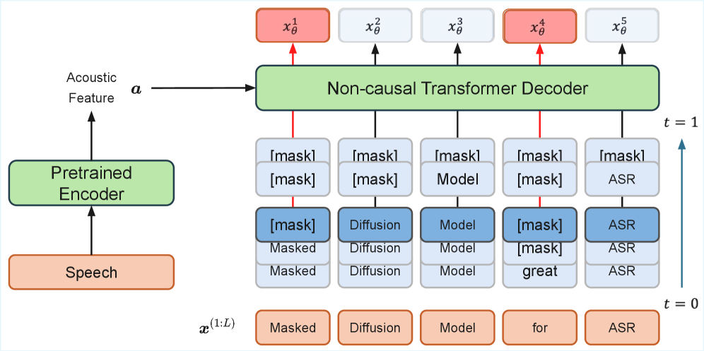
*Figure 1:Overview of our MDM-ASR framework.*

*Figure 2:The RTFx as a function of sequence length. Shaded regions indicate a 
±
10
%
 variability band around the fitted curve to illustrate the uncertainty of the estimated trend.*

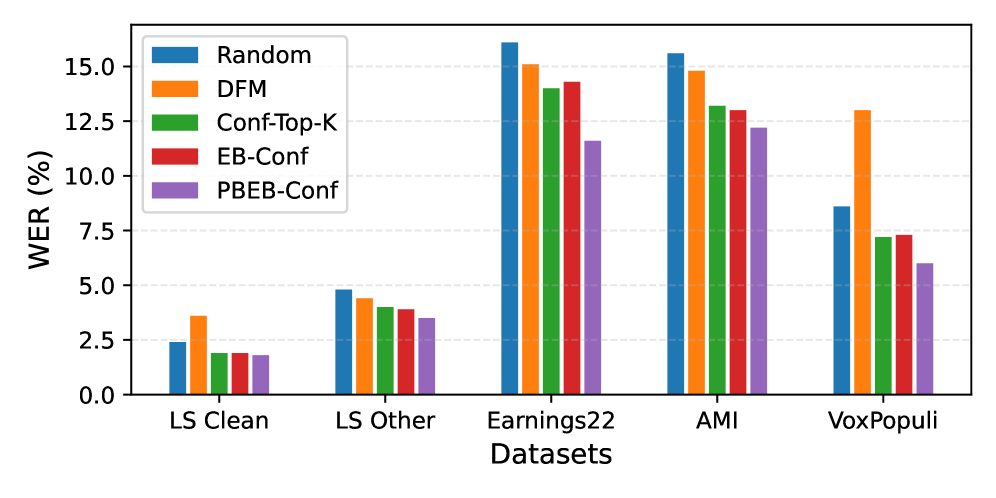
*Figure 3:WER comparison between different samplers.*

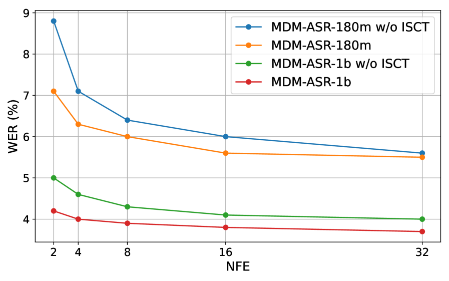
*Figure 4:Effect of the proposed ISCT. WER comparison on LS Other for 180M and 1B models under varying maximum NFEs.*

---
**Usage Info**: 6151 tokens used.
**Generated at**: 2026-02-24 12:49:55

---

