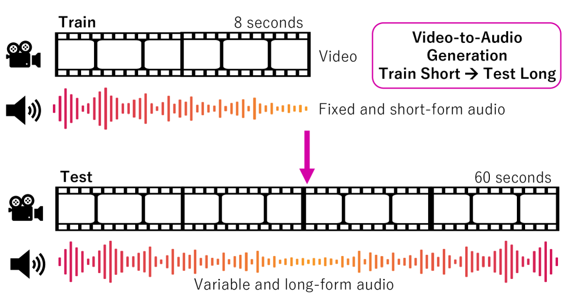
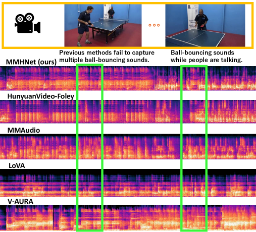
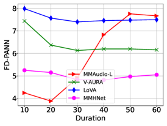
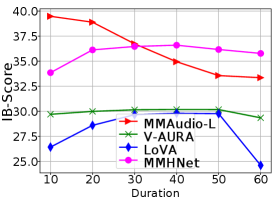

# 🚩 (2026-02-25) Scholar Inbox 추천 논문 

# 📚 Echoes Over Time: Unlocking Length Generalization in Video-to-Audio Generation Models

🚀 URL: https://arxiv.org/html/2602.20981

## 🌏 Abstract (원문)
Video-to-Audio (V2A) is a generative task that aims to produce realistic and contextually aligned audio from silent video inputs. This capability holds substantial promise for enhancing sound design workflows, particularly in domains such as film and gaming. Despite its potential, existing V2A methods are primarily tailored for short-form audio generation, typically spanning 8–10 seconds. Among these, diffusion-based approaches have shown superior performance over transformer-based autoregressive models, largely by denoising fixed-length noise segments, which is a strategy well-suited for brief clips. However, extending these models to long-form video inputs is challenging due to limited training data and the substantial memory requirements for modeling extended audio sequences. For instance, on some publicly available long audio-video datasets, the distributions mostly cover only up-to 1 minute video. When applied to long-video-to-audio (LV2A) tasks, existing models trained on fixed-length segments struggle to accommodate longer sequence generation in testing, thereby constraining their effectiveness in real-world applications. We are interested in train-short and test-long problems where the longer video duration (up to 5 minutes) could be generated properly using only short clips in our training data. Generating short clips for each short duration could be an alternative for LV2A. Despite its practicality, this method often results in fragmented audio experiences, marked by disjointed transitions, unaligned sound events, and degraded audio quality stemming from its limited grasp of long-form video context. In particular, we identify that existing V2A models expose structural constraints that reduce the generalizability in terms of various length generation and performance. The core base architecture of these models relies on transformer models. Thus, these existing models depend on explicit positional encodings that are difficult to tame when dealing with longer sequence generation. Explicit positional encodings often hurt generalization to longer sequences. Fortunately, Mamba is introduced as an alternative to transformer modules, showing strong performance on various tasks and modalities. Thus, there is an alternative to avoid using explicit positional encodings, which is deteriorating in generating long outputs. To tackle the challenges in LV2A generation, we introduce MMHNet, a novel framework that reconceptualizes the task as one of multimodal alignment across modalities with varying token lengths. Our proposed method could effectively align between modalities and handle long video and audio without further adjustment in the model during inference. MMHNet combines a multimodal video-to-audio (V2A) model with the HNet architecture, enabling audio synthesis conditioned on diverse multimodal inputs while effectively aligning visual and textual modalities. HNet enhances token processing through a hierarchical structure, moving beyond conventional attention mechanisms. By replacing standard attention blocks with HNet and incorporating dynamic chunking, routing, and smoothing modules, MMHNet achieves effective and coherent audio generation over long durations. Unlike causal models, MMHNet leverages video conditions, which are non-causal, maintaining a global receptive field that supports high-quality audio synthesis for long videos. Our method operates in a compressed space during early layers, where multimodal alignment occurs to effectively integrate tokens from different sources and reduce redundancy. This approach leverages inherent overlaps in visual and audio data. We introduce multimodal based routing to bridge distinct modalities and apply time-based token routing to reduce temporal complexity and enhance cross-modal alignment. To evaluate MMHNet’s capabilities, we introduce a long-form V2A evaluation benchmark built upon the UnAV100 and LongVale datasets. Our experimental results show that MMHNet not only sets a new standard in long-form audio generation but also consistently delivers high-quality outputs across different durations.
## 🌏 Abstract (번역)
비디오-투-오디오(V2A)는 무음 비디오 입력으로부터 현실적이고 문맥적으로 일치하는 오디오를 생성하는 것을 목표로 하는 생성 작업입니다. 이 기술은 특히 영화 및 게임과 같은 분야에서 사운드 디자인 워크플로우를 향상시킬 수 있는 상당한 가능성을 가지고 있습니다. 이러한 잠재력에도 불구하고, 기존의 V2A 방법들은 주로 8~10초 정도의 짧은 오디오 생성에 맞춰져 있습니다. 이 중 확산 기반 접근 방식은 고정된 길이의 노이즈 세그먼트를 제거하는 방식을 통해 트랜스포머 기반 자기회귀 모델보다 우수한 성능을 보여주었으며, 이는 짧은 클립에 적합한 전략입니다. 그러나 이러한 모델을 장편 비디오 입력으로 확장하는 것은 제한된 훈련 데이터와 확장된 오디오 시퀀스 모델링을 위한 상당한 메모리 요구 사항으로 인해 어렵습니다. 예를 들어, 공개적으로 사용 가능한 일부 긴 오디오-비디오 데이터셋의 분포는 대부분 최대 1분 정도의 비디오만 포함합니다. 장편 비디오-투-오디오(LV2A) 작업에 적용될 때, 고정된 길이의 세그먼트로 훈련된 기존 모델은 테스트 시 더 긴 시퀀스 생성을 수용하는 데 어려움을 겪으며, 이로 인해 실제 응용 분야에서의 효과가 제한됩니다. 본 연구는 훈련 데이터의 짧은 클립만을 사용하여 최대 5분의 긴 비디오를 적절하게 생성할 수 있는 '짧은 학습-긴 테스트(train-short and test-long)' 문제에 관심을 가집니다. 각 짧은 구간에 대해 짧은 클립을 생성하는 것이 LV2A의 대안이 될 수 있지만, 이 방법은 장편 비디오 문맥에 대한 이해 부족으로 인해 단절된 전환, 정렬되지 않은 사운드 이벤트, 저하된 오디오 품질 등 파편화된 오디오 경험을 초래하는 경우가 많습니다. 특히, 기존 V2A 모델들이 다양한 길이 생성 및 성능 측면에서 일반화 능력을 저하시키는 구조적 제약을 노출한다는 점을 확인했습니다. 이러한 모델의 핵심 아키텍처는 트랜스포머 모델에 의존하므로, 긴 시퀀스 생성 시 제어하기 어려운 명시적 위치 인코딩에 의존하게 됩니다. 명시적 위치 인코딩은 종종 긴 시퀀스에 대한 일반화를 저해합니다. 다행히 Mamba가 트랜스포머 모듈의 대안으로 도입되어 다양한 작업과 모달리티에서 강력한 성능을 보여주고 있습니다. 따라서 긴 출력 생성 시 성능을 저하시키는 명시적 위치 인코딩 사용을 피할 수 있는 대안이 존재합니다. LV2A 생성의 과제를 해결하기 위해, 우리는 이 작업을 다양한 토큰 길이를 가진 모달리티 간의 멀티모달 정렬로 재구성한 새로운 프레임워크인 MMHNet을 소개합니다. 제안된 방법은 추론 시 모델의 추가 조정 없이 모달리티 간을 효과적으로 정렬하고 긴 비디오 및 오디오를 처리할 수 있습니다. MMHNet은 멀티모달 V2A 모델과 HNet 아키텍처를 결합하여 시각 및 텍스트 모달리티를 효과적으로 정렬하는 동시에 다양한 멀티모달 입력에 조건화된 오디오 합성을 가능하게 합니다. HNet은 기존의 어텐션 메커니즘을 넘어 계층적 구조를 통해 토큰 처리를 강화합니다. 표준 어텐션 블록을 HNet으로 교체하고 동적 청킹, 라우팅 및 평활화 모듈을 통합함으로써, MMHNet은 장시간 동안 효과적이고 일관된 오디오 생성을 달성합니다. 인과적(causal) 모델과 달리 MMHNet은 비인과적인 비디오 조건을 활용하여 긴 비디오에 대한 고품질 오디오 합성을 지원하는 글로벌 수용 영역을 유지합니다. 우리의 방법은 초기 레이어에서 압축된 공간에서 작동하며, 여기서 서로 다른 소스의 토큰을 효과적으로 통합하고 중복성을 줄이기 위한 멀티모달 정렬이 발생합니다. 이 접근 방식은 시각 및 오디오 데이터의 고유한 중첩을 활용합니다. 우리는 서로 다른 모달리티를 연결하기 위해 멀티모달 기반 라우팅을 도입하고, 시간적 복잡성을 줄이고 교차 모달 정렬을 향상시키기 위해 시간 기반 토큰 라우팅을 적용합니다. MMHNet의 성능을 평가하기 위해 UnAV100 및 LongVale 데이터셋을 기반으로 한 장편 V2A 평가 벤치마크를 도입했습니다. 실험 결과에 따르면 MMHNet은 장편 오디오 생성의 새로운 표준을 세울 뿐만 아니라 다양한 길이에 걸쳐 일관되게 고품질 출력을 제공합니다.

## 🔍 Methods & Results
- Proposed MMHNet, a framework using Mamba-2 variants to replace Transformer attention blocks, eliminating the need for explicit positional embeddings that hinder long-sequence generalization.
- Utilized Conditional Flow Matching (CFM) in the latent space for efficient generative modeling of long-form audio.
- Adopted a Non-Causal Mamba-2 architecture to allow omnidirectional information flow, which is more stable for long-range dependencies and avoids modulation decay.
- Introduced a hierarchical structure with Temporal Routing and Multimodal (MM) Routing to filter redundant tokens and focus on key sound events and cross-modal alignments.
- Implemented dynamic chunking and downsampling/upsampling mechanisms to process tokens in a compressed space, reducing computational load for long sequences.
- Established a new long-form V2A evaluation benchmark using UnAV100 and LongVale datasets.
- Experimental results demonstrated that MMHNet can generate high-quality, coherent audio for videos up to 5 minutes long, even when trained on short clips.

## 🖼 Figures

*Figure 1: Long-Video to Audio (LV2A) task overview. The challenge is framed as training models on fixed-length segments while requiring them to generalize to variable-length (long-form) audio outputs during inference.*

![Figure 2: We analyze the role of positional embeddings in V2A models such as MMAudio [4], built on MMDiT [24]. Without positional embeddings (a), MMAudio fails to capture temporal structure, producing redundant audio dominated by prominent visual objects (e.g., car crashing). With adjusted positional embeddings (b), alignment improves but sound quality degrades over long sequences (see scene C). (c) On UnAV100 [10], both configurations show performance drops across durations, with MMAudio without positional embeddings performing worst in distribution matching (FD
↓
𝑃
​
𝐴
​
𝑁
​
𝑁
) and multimodal alignment (IB-Score
↑
).](../images/2026-02-25/2602.20981/2602.20981_fig1.png)
*Figure 2: We analyze the role of positional embeddings in V2A models such as MMAudio [4], built on MMDiT [24]. Without positional embeddings (a), MMAudio fails to capture temporal structure, producing redundant audio dominated by prominent visual objects (e.g., car crashing). With adjusted positional embeddings (b), alignment improves but sound quality degrades over long sequences (see scene C). (c) On UnAV100 [10], both configurations show performance drops across durations, with MMAudio without positional embeddings performing worst in distribution matching (FD
↓
𝑃
​
𝐴
​
𝑁
​
𝑁
) and multimodal alignment (IB-Score
↑
).*

*Figure 3: Overview of our proposed framework. Left: A comprehensive end-to-end flow-matching model that operates across both multimodal and single-modal blocks, handling inputs in both compressed and original spaces. Middle: A temporal routing mechanism designed to efficiently process tokens in a time-aware manner. Right: A multimodal routing strategy that leverages strong correlations between the two modalities for enhanced integration.*

*Figure 4:Visualization of audio spectogram from MMHNet and competing methods on UnAV100.*

*(a)*

*(a)*

*(b)*

*Figure A6: Visualization of heatmaps for activation matrices in Causal Mamba-2 and Non-Causal Mamba-2 within MMHNet: (a) Causal Mamba-2, used as a Transformer replacement, shows activation scores in the transition matrix that gradually decay during extended audio generation (up to 5 minutes). (b) Non-Causal Mamba-2 maintains visible activation scores in the transition matrix prior to routing. (c) After routing, the transition matrix becomes more pronounced in the compressed representation space.*

---
**Usage Info**: 7098 tokens used.
**Generated at**: 2026-02-25 12:58:24

---

