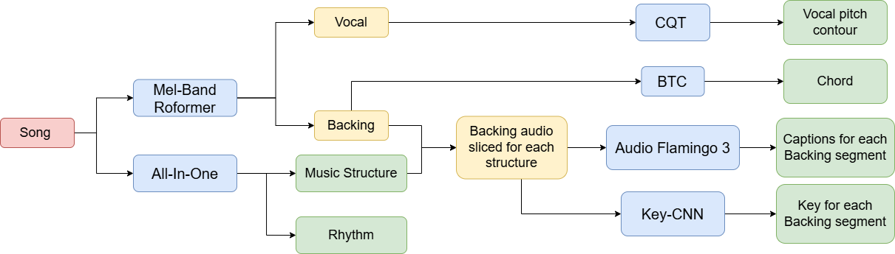
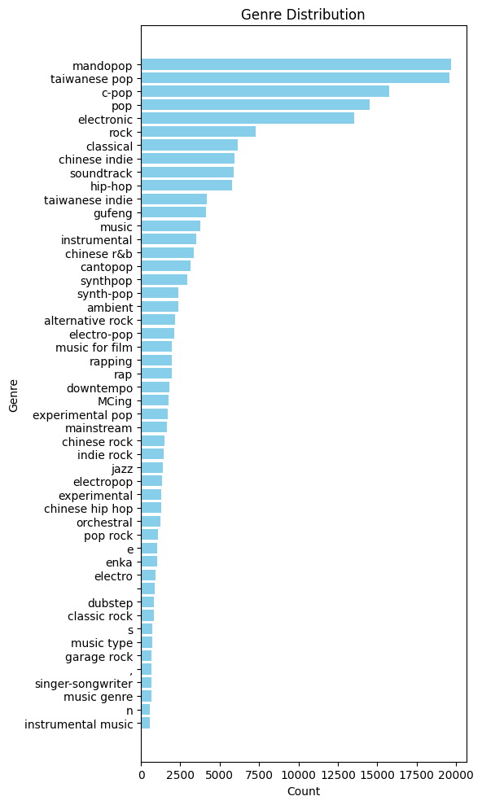
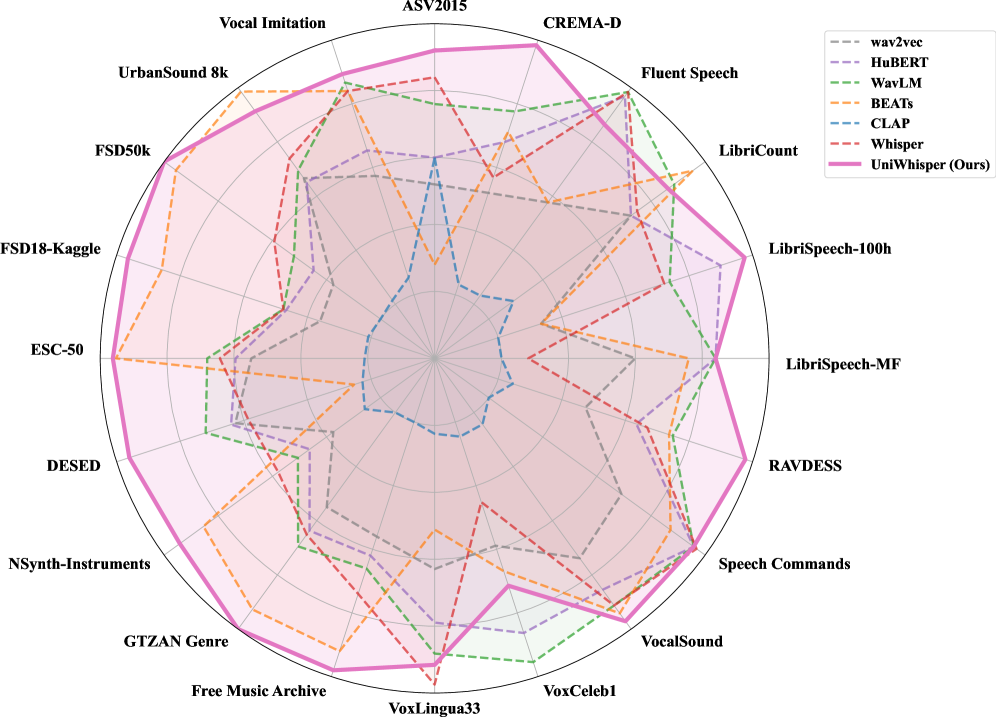
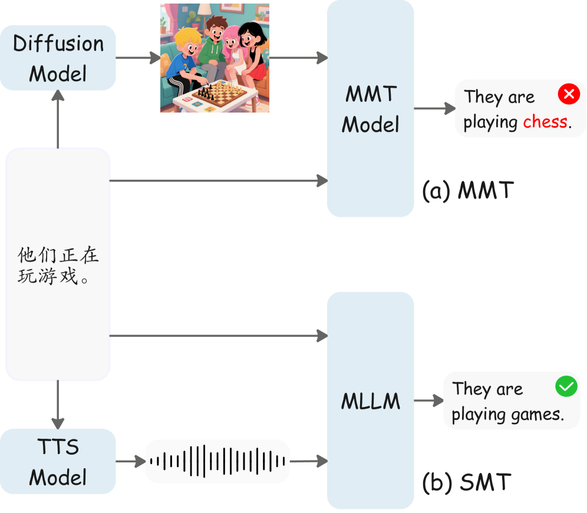
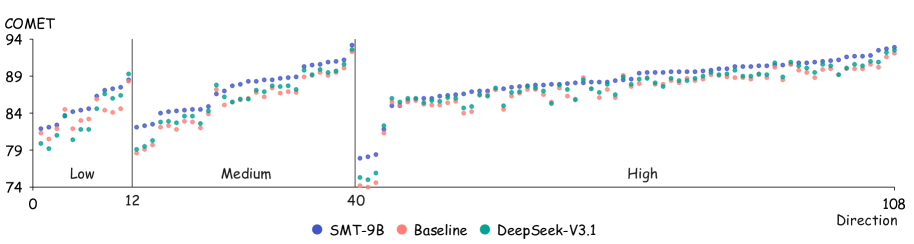
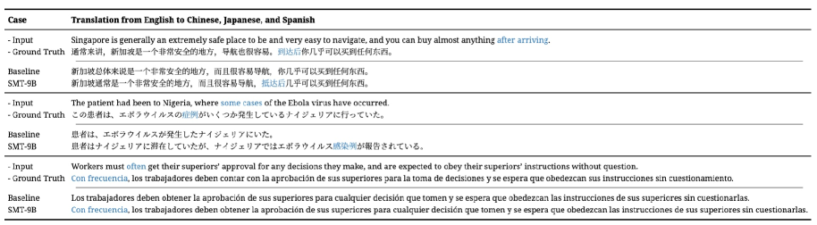

# 🚩 (2026-02-26) Scholar Inbox 추천 논문 

# 📚 MIDI-Informed Singing Accompaniment Generation in a Compositional Song Pipeline

🚀 URL: https://arxiv.org/html/2602.22029

## 🌏 Abstract (원문)
Traditional song production is a collaborative, multi-stage workflow—spanning songwriting, arrangement, recording, and mixing—that relies on specialized expertise and iterative feedback within a Digital Audio Workstation. While this process offers high fidelity and granular editability, it is remarkably resource-intensive; changes at any stage often trigger a laborious cascade of downstream rework. This tension between control and cost highlights a critical need for computational systems that can automate production while retaining the modular editability of conventional pipelines. Recent advances in large generative models have led to commercial systems and emerging open-source models that demonstrate high-quality, convenient song generation. Unlike the traditional studio workflow, these models typically adopt a monolithic, end-to-end approach, mapping lyrics and text directly to audio. However, this paradigm has significant hurdles: (i) the lack of interpretable intermediates makes refining specific musical elements difficult; (ii) the mapping is notoriously data- and compute-hungry; and (iii) the black-box nature often leads to rhythmic/harmonic misalignment or raises concerns regarding voice identity and rights. A compelling, yet currently under-explored, alternative to monolithic systems is the compositional approach, which utilizes a sequence of specialized modules to construct the final audio. By decomposing the pipeline into three discrete sub-tasks—melody composition, singing voice synthesis (SVS), and singing accompaniment generation (SAG)—we introduce two critical intermediate representations: the vocal MIDI score and the synthesized singing audio. This modularity mirrors the professional DAW workflow, offering granular editability and significantly lower training costs for each component compared to massive, all-in-one architectures. Our core technical contribution is the introduction of MIDI-informed singing accompaniment generation (MIDI-SAG), a novel cross-stage conditioning mechanism. We exploit the symbolic vocal MIDI score from the preceding stage as an explicit conditioning signal, bolstering rhythmic consistency. Moreover, we enhance harmonic consistency by integrating a melody harmonization module to derive chord progressions from the MIDI. We also address structural completeness, ensuring coherent instrumentation during vocal-silent segments like intros and outros using latent diffusion. Our implementation leverages a single RTX 3090 GPU, highlighting a significant reduction in computational overhead while providing promising results and editable intermediates.
## 🌏 Abstract (번역)
전통적인 노래 제작은 작곡, 편곡, 녹음, 믹싱에 이르는 협업 중심의 다단계 워크플로우로, 디지털 오디오 워크스테이션(DAW) 내에서의 전문 지식과 반복적인 피드백에 의존합니다. 이러한 과정은 높은 충실도와 세밀한 편집 가능성을 제공하지만, 자원 집약적이며 어느 한 단계에서의 변경이 후속 작업의 대대적인 재작업을 초래한다는 단점이 있습니다. 최근의 거대 생성 모델들은 고품질의 노래 생성을 가능하게 했으나, 대부분 가사와 텍스트를 오디오로 직접 매핑하는 단일(monolithic) 엔드투엔드 방식을 채택하고 있습니다. 그러나 이러한 패러다임은 해석 가능한 중간 표현의 부재로 인한 세부 요소 수정의 어려움, 방대한 데이터 및 연산 자원 소모, 리듬 및 화성의 불일치, 음성 권리 문제 등의 한계를 지닙니다. 본 논문은 이에 대한 대안으로 멜로디 작곡, 가창 음성 합성(SVS), 가창 반주 생성(SAG)의 세 가지 이산적 하위 작업으로 파이프라인을 분해하는 구성적(compositional) 접근 방식을 제안합니다. 이를 통해 보컬 MIDI 점수와 합성된 가창 오디오라는 두 가지 핵심 중간 표현을 도입하여 전문적인 DAW 워크플로우와 유사한 세밀한 편집 가능성을 제공하고 학습 비용을 대폭 절감했습니다. 핵심 기술적 기여는 보컬 MIDI 점수를 명시적 조건 신호로 활용하는 MIDI 기반 가창 반주 생성(MIDI-SAG) 도입으로, 이를 통해 리듬 및 화성적 일관성을 강화했습니다. 또한 잠재 확산(latent diffusion) 모델을 활용하여 인트로와 아웃트로 같은 보컬이 없는 구간에서도 구조적 완결성을 확보했습니다. 제안된 시스템은 단일 RTX 3090 GPU에서 학습이 가능할 정도로 효율적이며, 기존 엔드투엔드 모델 대비 우수한 제어 가능성과 성능을 입증했습니다.

## 🔍 Methods & Results
- 멜로디 작곡(CSL-L2M), 가창 음성 합성(FastSpeech), 반주 생성(Stable Audio Open 기반 MIDI-SAG)으로 구성된 모듈형 파이프라인 설계
- 보컬 MIDI 정보를 명시적 조건 신호로 활용하여 리듬 일관성을 확보하고, 멜로디 화성 모듈을 통해 코드 진행을 유도하여 화성적 정확도 향상
- 단일 NVIDIA RTX 3090 GPU를 사용하여 SVS 모듈은 24시간, MIDI-SAG 모듈은 9일간 학습하여 거대 모델 대비 극도로 높은 자원 효율성 달성
- MuseControlLite 어댑터를 활용해 시간 가변적 제어 신호를 주입하고, 47초의 생성 제한을 극복하기 위해 섹션별 순차 생성 및 인페인팅/아웃페인팅 전략 도입
- 실험 결과, 코드나 리듬 조건이 없을 때보다 화성이 안정적이고 시간적 정렬이 우수함을 확인했으며, 보컬이 없는 구간에서도 구조적 일관성 유지
- 기존의 거대 오픈소스 모델들과 비교하여 연산 오버헤드를 대폭 줄이면서도 편집 가능한 중간 표현(MIDI)을 제공하는 성과 거둠

## 🖼 Figures

*Figure 1:Overview of the compositional song generation pipeline. The system sequentially maps lyrics to a full song through: (1) Melody Composition (CSL-L2M), (2) SVS (FastSpeech-based), (3) Melody Harmonization (AccoMontage2), and (4) the proposed MIDI-SAG, which adapts MuseControlLite to incorporate symbolic and acoustic conditioning for final accompaniment synthesis.*

*Figure 2:Architectural comparison of SAG variants: (a) Conventional audio-SAG; (b) the proposed MIDI-SAG with ground-truth vocal MIDI score (Section 3.2); (c) the MIDI-SAG variant that uses automatically extracted MIDI representation (Section 3.4).*

*Figure 3:Comparison of rhythmic stability. White stripes represent the predicted beat positions from the generated accompaniment. While (a) audio-SAG loses rhythmic consistency in non-vocal segments, (b) MIDI-SAG maintains stable beat and coherent content.*

*Figure 4:The data-preprocessing pipeline to curate data for fine-tuing Stable Audio Open to implement our MIDI-informed singing accompaniment generation (MIDI-SAG) model.*

*Figure 5: Augmenting Stable Audio Open for singing accompaniment and audio continuation. The architecture utilizes the MuseControlLite framework to integrate multi-modal conditioning signals, enabling precise singing-accompaniment alignment and seamless long-form audio continuation.*

*Figure 6:The input lyrics are same as other end-to-end song generation models, which comes with structure tags, but we only support madarin, due to the constraint of CSL-L2M (Chai & Wang, 2025). The text control of our method could be either a single global style prompt (e.g. ”airy pad swell, filtered noise, sparse off-beat hats; slow LPF rise.”) or different local style prompts for different segment.*

*Figure 7:The genre distribution of the curated training dataset for training MIDI-SAG.*

---
**Usage Info**: 4667 tokens used.
**Generated at**: 2026-02-26 12:48:11

---

# 📚 UniWhisper: Efficient Continual Multi-task Training for Robust Universal Audio Representation

🚀 URL: https://arxiv.org/html/2602.21772

## 🌏 Abstract (원문)
A universal audio representation aims to support speech, environmental sounds, and music with a single encoder. Large-scale pretraining has produced strong backbones for individual domains. Wav2vec 2.0, HuBERT, WavLM, and Whisper improve robustness and performance on speech-related tasks. BEATs and CLAP perform strongly on audio event recognition and audio-text semantic matching. However, this progress also highlights a persistent domain imbalance. Speech-focused encoders often lack semantic coverage for complex non-speech scenes. In contrast, general audio models often fail to preserve the fine-grained temporal cues required by speech. This split becomes especially costly in large audio language models (LALMs). A common recipe aligns a pretrained audio encoder with a large language model using paired audio and text data. When the encoder is speech-centric, broader audio coverage is often achieved through continual training on large and diverse datasets, which increases training cost and data requirements. Dual-encoder systems such as SALMONN and Kimi-Audio improve domain coverage by fusing encoders from different domains. However, they require additional coordination across temporal resolutions and representation spaces, and they often need extra alignment data. More importantly, concatenating features from multiple encoders increases the number of audio tokens and consumes the limited context window of the language model. In practice, broader coverage often comes with longer token sequences. To avoid architectural redundancy, we adopt a single-encoder design and focus on unifying supervision. Whisper already learns rich acoustic perception from large scale weakly supervised transcription, but transcription dominated training biases the representation toward speech. We propose prompt guided continual multi-task training, where diverse objectives are expressed with a shared instruction and answer format. This expands coverage across speech, environmental sound, and music without task specific heads or multi encoder feature concatenation. Since the audio prefix always comes from one encoder stream, token redundancy is removed at the source. Using this framework, we train UniWhisper, a unified encoder backbone for multi-domain audio understanding that strengthens non-speech semantics while preserving speech capability such as ASR. We also identify an efficiency bottleneck in the original Whisper decoder under instruction-style alignment. In our setting, the decoder converges slowly and requires substantially more updates to reach competitive performance. We replace it with a compact pretrained language model that serves as the semantic interface during instruction-style training. The compact decoder provides strong language priors that better match instruction-following targets and can accelerate convergence. As a result, UniWhisper can be adapted with a substantially smaller training corpus than recent LALMs. We train on 38k hours of public audio, while Qwen2-Audio reports 520k hours for pre-training. The pipeline is simple because all tasks share the same templates and data format, so we can mix multiple open-source datasets with a single recipe. We assess representations using shallow MLP probing and non-parametric kNN evaluation, with ablations on the decoder and backbone. Experiments show that UniWhisper is competitive across 20 tasks spanning speech, environmental sound, and music. Under our evaluation protocol, it outperforms Whisper, HuBERT, BEATs, WavLM and CLAP on average and shows no clear catastrophic forgetting. Code and pretrained weights will be released upon acceptance.
## 🌏 Abstract (번역)
범용 오디오 표현은 단일 인코더로 음성, 환경 소리 및 음악을 지원하는 것을 목표로 합니다. 대규모 사전 학습은 개별 도메인에 대해 강력한 백본을 생성했습니다. Wav2vec 2.0, HuBERT, WavLM 및 Whisper는 음성 관련 작업에서 견고성과 성능을 향상시킵니다. BEATs와 CLAP은 오디오 이벤트 인식 및 오디오-텍스트 의미론적 매칭에서 강력한 성능을 발휘합니다. 그러나 이러한 발전은 지속적인 도메인 불균형을 부각시키기도 합니다. 음성 중심 인코더는 종종 복잡한 비음성 장면의 의미론적 범위를 결여하고 있습니다. 반대로, 일반 오디오 모델은 종종 음성에 필요한 미세한 시간적 단서를 보존하지 못합니다. 이러한 분리는 특히 대규모 오디오 언어 모델(LALM)에서 비용이 많이 듭니다. 일반적인 방식은 사전 학습된 오디오 인코더를 쌍을 이룬 오디오 및 텍스트 데이터를 사용하여 대규모 언어 모델과 정렬하는 것입니다. 인코더가 음성 중심일 때, 더 넓은 오디오 범위는 종종 대규모의 다양한 데이터셋에 대한 지속적인 학습을 통해 달성되며, 이는 학습 비용과 데이터 요구 사항을 증가시킵니다. SALMONN 및 Kimi-Audio와 같은 이중 인코더 시스템은 서로 다른 도메인의 인코더를 융합하여 도메인 범위를 개선합니다. 그러나 이들은 시간적 해상도와 표현 공간 전반에 걸친 추가적인 조정이 필요하며, 종종 추가적인 정렬 데이터가 필요합니다. 더 중요한 것은, 여러 인코더의 특징을 연결하면 오디오 토큰의 수가 증가하고 언어 모델의 제한된 컨텍스트 창을 소모한다는 점입니다. 실제로 더 넓은 범위는 종종 더 긴 토큰 시퀀스를 수반합니다. 아키텍처 중복을 피하기 위해, 우리는 단일 인코더 설계를 채택하고 감독의 통합에 집중합니다. Whisper는 이미 대규모 약지도 전사를 통해 풍부한 음향 지각을 학습하지만, 전사 위주의 학습은 표현을 음성 쪽으로 편향시킵니다. 우리는 다양한 목표가 공유된 지시 및 답변 형식으로 표현되는 프롬프트 유도 지속적 멀티태스크 학습을 제안합니다. 이는 태스크별 헤드나 다중 인코더 특징 연결 없이 음성, 환경 소리 및 음악 전반으로 범위를 확장합니다. 오디오 접두사가 항상 하나의 인코더 스트림에서 나오기 때문에 소스에서 토큰 중복이 제거됩니다. 이 프레임워크를 사용하여 우리는 ASR과 같은 음성 능력을 보존하면서 비음성 의미론을 강화하는 다중 도메인 오디오 이해를 위한 통합 인코더 백본인 UniWhisper를 학습합니다. 또한 지시 스타일 정렬 하에서 기존 Whisper 디코더의 효율성 병목 현상을 식별했습니다. 우리의 설정에서 디코더는 느리게 수렴하며 경쟁력 있는 성능에 도달하기 위해 훨씬 더 많은 업데이트가 필요합니다. 우리는 이를 지시 스타일 학습 중에 의미론적 인터페이스 역할을 하는 컴팩트한 사전 학습된 언어 모델로 교체합니다. 컴팩트한 디코더는 지시 준수 목표와 더 잘 일치하고 수렴을 가속화할 수 있는 강력한 언어 사전 지식을 제공합니다. 결과적으로 UniWhisper는 최근의 LALM보다 훨씬 작은 학습 코퍼스로 적응될 수 있습니다. Qwen2-Audio가 사전 학습을 위해 52만 시간을 보고하는 반면, 우리는 3.8만 시간의 공개 오디오로 학습합니다. 모든 태스크가 동일한 템플릿과 데이터 형식을 공유하므로 파이프라인이 간단하며, 단일 레시피로 여러 오픈 소스 데이터셋을 혼합할 수 있습니다. 우리는 디코더와 백본에 대한 절제 연구와 함께 얕은 MLP 프로빙 및 비매개변수 kNN 평가를 사용하여 표현을 평가합니다. 실험 결과 UniWhisper는 음성, 환경 소리 및 음악을 아우르는 20개 태스크에서 경쟁력이 있음을 보여줍니다. 우리의 평가 프로토콜 하에서, 이는 평균적으로 Whisper, HuBERT, BEATs, WavLM 및 CLAP보다 우수한 성능을 보이며 뚜렷한 치명적 망각을 보이지 않습니다. 코드와 사전 학습된 가중치는 승인 시 공개될 예정입니다.

## 🔍 Methods & Results
- Whisper Large-v3 인코더와 사전 학습된 Qwen3 0.6B 언어 모델 디코더를 결합한 단일 인코더 아키텍처를 채택함
- 경량 MLP 어댑터를 사용하여 인코더 출력을 디코더 차원에 투영하며, 학습 시 언어 모델 디코더는 동결하고 인코더와 프로젝션 모듈만 업데이트함
- ASR, 오디오 캡셔닝, 질의응답 등 다양한 태스크를 통합된 지시어(Instruction) 및 답변 템플릿으로 구성하여 멀티태스크 학습을 수행함
- 단일 오디오 토큰 스트림을 사용하여 다중 인코더 시스템의 토큰 중복 문제를 해결하고 언어 모델의 컨텍스트 창 효율성을 높임
- 3.8만 시간의 공개 오디오 데이터를 사용하여 학습하였으며, 이는 수십만 시간을 사용하는 기존 LALM 대비 데이터 효율적인 학습 방식임
- 20개 오디오 태스크 평가 결과, Whisper, HuBERT, BEATs, WavLM, CLAP 등 기존 모델 대비 평균 성능이 우수하며 치명적 망각 현상이 관찰되지 않음

## 🖼 Figures

*Figure 1:Normalized per-task performance of UniWhisper on our 20-task extended HEAREval spanning speech, environmental sound, and music. Full comparisons are reported in Table 3.*

---
**Usage Info**: 4717 tokens used.
**Generated at**: 2026-02-26 12:48:32

---

# 📚 Scalable Multilingual Multimodal Machine Translation with Speech-Text Fusion

🚀 URL: https://arxiv.org/html/2602.21646

## 🌏 Abstract (원문)
Multimodal Machine Translation (MMT) leverages complementary information from multiple modalities, such as images, to enhance machine translation (MT) quality. These modalities provide supplementary contextual information for source texts, thereby mitigating ambiguities caused by polysemy or omissions(Shenet al.,2024). Traditionally, image-based MMT models(Chenget al.,2024)process image-text pairs to generate translations, leveraging visual context for semantic disambiguation. However, these models require an associated image for each input text, which limits their applicability. Recent image-free approaches(Guoet al.,2023)have employed diffusion models(Rombachet al.,2022)to generate synthetic images to enhance translation. While these studies address the issue of image dependency, those methods still face two limitations: (1)Generalizability: While MMT models perform well on ambiguous datasets(Elliottet al.,2016), they struggle to generalize to general translation datasets and even introduce noise in some scenarios (see Figure1). (2)Multilinguality: Existing image MMT datasets(Guoet al.,2022)support only a few languages, with limited of languages coverage (see Table1). Advances in diffusion Text-to-Speech (TTS) models(Duet al.,2024)have achieved high-quality, zero-shot multilingual speech synthesis. This raises a question:Can we leverage speech modalities to enhance translation quality? Recent studies have revealed that, alongside lexical information, speech signals also convey prosodic cues, which offer valuable supplementary information(Chiet al.,2025). Inspired by fusion of text and prosody features, we propose the framework of Speech-guided Machine Translation (SMT), which maps speech-text fusion inputs {speech,text} to {translation} outputs. Specifically, our SMT framework integrates a TTS model with an MLLM through a self-evolution mechanism(Taoet al.,2024)that leverages synthetic speech to enhance translation performance. The framework consists of two core components: (1)MLLM Pre-training: We employ a multi-stage curriculum learning strategy with progressively complex objectives, beginning with speech recognition (ASR) for speech-text mapping, then speech-to-text translation (S2TT) for cross-lingual and cross-modality bridging, and culminating in SMT training for joint speech-text processing. (2)Self-Evolution Mechanism: This component synthesizes training data via the TTS model, where the MLLM classifies speech samples based on translation scores. The MLLM undergoes continuous training using positive samples, while translation performance metrics serve as evolution objectives, enabling continuous framework improvement through iterative refinement cycles. The experimental results demonstrate that our framework achieves new state-of-the-art (SOTA) results on the Multi30K benchmark(Elliottet al.,2016), surpassing all existing MMT approaches. Our framework further achieves SOTA average machine translation (MT) performance across 108 languages directions on the FLORES-200 benchmark(Teamet al.,2022), outperforming much larger language models. Ablation studies on the CoVoST-2 dataset(Wanget al.,2020)also reveal that the discrepancy between synthetic and authentic speech has a negligible effect on translation performance. In summary, our key contributions are as follows: We propose a novel speech-guided machine translation framework, which consists of a TTS model and an MLLM. Our framework leverages prosodic cues in speech to enhance translation performance and supports 28 languages. We propose a self-evolution framework that autonomously generates training data for iterative self-enhancement. The framework employs continual training for the MLLM, utilizing synthetic data to improve the model’s low-resource translation quality. Our framework achieves state-of-the-art results on MMT and MT tasks across multiple benchmarks (Multi30K, FLORES-200). Ablation studies on the CoVoST-2 benchmark show that the difference between authentic and synthetic speech has a negligible impact on translation performance.
## 🌏 Abstract (번역)
다중 모달 기계 번역(MMT)은 이미지와 같은 여러 모달리티의 보완 정보를 활용하여 기계 번역(MT) 품질을 향상시킵니다. 이러한 모달리티는 소스 텍스트에 대한 추가적인 문맥 정보를 제공하여 다의어나 생략으로 인한 모호성을 완화합니다. 전통적으로 이미지 기반 MMT 모델은 이미지-텍스트 쌍을 처리하여 번역을 생성하고 시각적 문맥을 활용해 의미적 모호성을 해소해 왔습니다. 그러나 이러한 모델은 각 입력 텍스트마다 관련 이미지가 필요하므로 적용 가능성이 제한됩니다. 최근의 이미지 프리(image-free) 방식은 확산 모델을 사용하여 합성 이미지를 생성함으로써 번역을 강화하려 시도했습니다. 이러한 연구들이 이미지 의존성 문제는 해결했지만, 여전히 두 가지 한계에 직면해 있습니다. (1) 일반화 능력: MMT 모델은 모호한 데이터셋에서는 잘 작동하지만 일반적인 번역 데이터셋으로의 일반화에 어려움을 겪으며 때로는 노이즈를 유발하기도 합니다. (2) 다국어 지원: 기존 이미지 MMT 데이터셋은 지원 언어가 소수에 불과합니다. 한편, 확산 기반 텍스트 음성 변환(TTS) 모델의 발전으로 고품질의 제로샷 다국어 음성 합성이 가능해졌습니다. 이에 따라 '음성 모달리티를 활용해 번역 품질을 높일 수 있는가?'라는 질문이 제기됩니다. 최근 연구에 따르면 음성 신호는 어휘 정보와 함께 운율적 단서를 전달하여 귀중한 보충 정보를 제공합니다. 본 논문은 텍스트와 운율 특징의 융합에서 영감을 받아, 음성-텍스트 융합 입력을 번역 출력으로 매핑하는 음성 가이드 기계 번역(SMT) 프레임워크를 제안합니다. 구체적으로, SMT 프레임워크는 자기 진화 메커니즘을 통해 TTS 모델과 MLLM을 통합하며 합성 음성을 활용해 번역 성능을 향상시킵니다. 이 프레임워크는 두 가지 핵심 요소로 구성됩니다. (1) MLLM 사전 학습: 음성 인식(ASR), 음성 번역(S2TT), 그리고 최종적으로 SMT 학습으로 이어지는 점진적으로 복잡해지는 목표를 가진 다단계 커리큘럼 학습 전략을 사용합니다. (2) 자기 진화 메커니즘: TTS 모델을 통해 학습 데이터를 합성하고, MLLM이 번역 점수를 기반으로 음성 샘플을 분류합니다. MLLM은 긍정적인 샘플을 사용하여 지속적인 학습을 수행하며, 번역 성능 지표를 진화 목표로 삼아 반복적인 정제 주기를 통해 프레임워크를 지속적으로 개선합니다. 실험 결과, 본 프레임워크는 Multi30K 벤치마크에서 기존의 모든 MMT 방식을 능가하는 새로운 SOTA 결과를 달성했습니다. 또한 FLORES-200 벤치마크의 108개 언어 방향에서 훨씬 더 큰 언어 모델들을 능가하는 SOTA 평균 MT 성능을 기록했습니다. CoVoST-2 데이터셋에 대한 소거 연구는 합성 음성과 실제 음성 간의 차이가 번역 성능에 미치는 영향이 미미함을 보여줍니다. 요약하자면, 본 연구의 주요 기여는 다음과 같습니다. 첫째, TTS 모델과 MLLM으로 구성된 새로운 음성 가이드 기계 번역 프레임워크를 제안하여 음성의 운율적 단서를 활용하고 28개 언어를 지원합니다. 둘째, 반복적인 자기 강화를 위해 학습 데이터를 자율적으로 생성하는 자기 진화 프레임워크를 제안하여 저리소스 번역 품질을 개선합니다. 셋째, 여러 벤치마크(Multi30K, FLORES-200)에서 MMT 및 MT 작업의 SOTA 결과를 달성했으며, 합성 음성의 유효성을 입증했습니다.

## 🔍 Methods & Results
- TTS(Text-to-Speech) 모델과 MLLM(Multi-modal Large Language Model)을 결합하여 음성의 운율적 단서를 번역에 활용하는 SMT 프레임워크 제안
- Whisper 인코더, Q-Former, MLP 어댑터를 LLM 기반 백본에 통합한 MLLM 구조 설계
- ASR(음성 인식), S2TT(음성-텍스트 번역), SMT(음성 가이드 번역) 순서의 3단계 커리큘럼 학습 전략 적용
- 경험 획득(TTS 합성), 경험 정제(품질 기반 라벨링), 업데이트(긍정 샘플 미세 조정), 평가로 구성된 자기 진화(Self-Evolution) 메커니즘 도입
- Multi30K 벤치마크에서 기존 모든 MMT 모델을 능가하는 새로운 SOTA 성능 달성
- FLORES-200 벤치마크의 108개 언어 쌍에서 대규모 언어 모델들보다 우수한 평균 번역 성능 기록
- 소거 연구를 통해 합성 음성과 실제 음성 간의 차이가 번역 성능에 미치는 영향이 미미함을 확인하여 합성 데이터 활용의 정당성 확보

## 🖼 Figures

*Figure 1:Image-Guided vs. Speech-Guided Machine Translation.*

*Figure 1:Image-Guided vs. Speech-Guided Machine Translation.*

*Figure 2:Overview of Our SMT Framework. The proposed system architecture comprises two core components: (1) MLLM pretraining and (2) Self-Evolution. This framework takes text input, synthesizes speech of the text via a TTS model, and leverages the MLLM to process both text and speech features for higher-quality translation output. Self-evolution mechanism can autonomously generate training data to iteratively optimize the framework.*

*Figure 3:COMET Results by Resource Level, Categorized as Low, Medium, and High. Our model shows an improvement in translation scores, particularly for low-scoring translation directions.*

*Figure 4:Self-Evolution Rounds of spBLEU / COMET (eng
→
xx) on FLORES-200 benchmark.*

*Figure 5:Case Study for Under-Translation. Having undergone speech pre-training, MLLMs align text words with speech. The SMT model, which receives this speech-text fusion input, is prevented from ignoring the input text, thereby mitigating omission errors.*

---
**Usage Info**: 4974 tokens used.
**Generated at**: 2026-02-26 12:50:19

---

