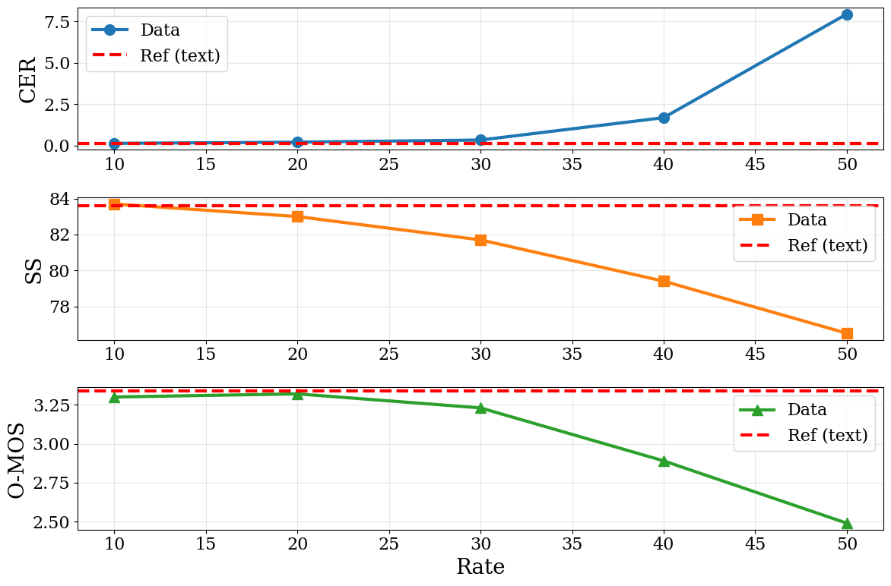
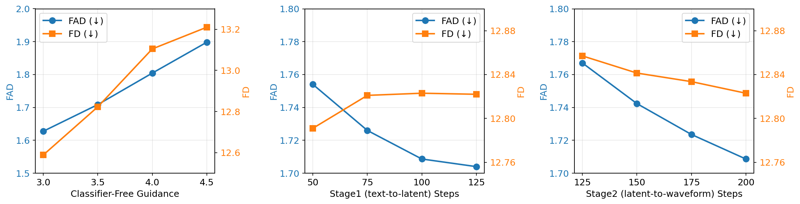
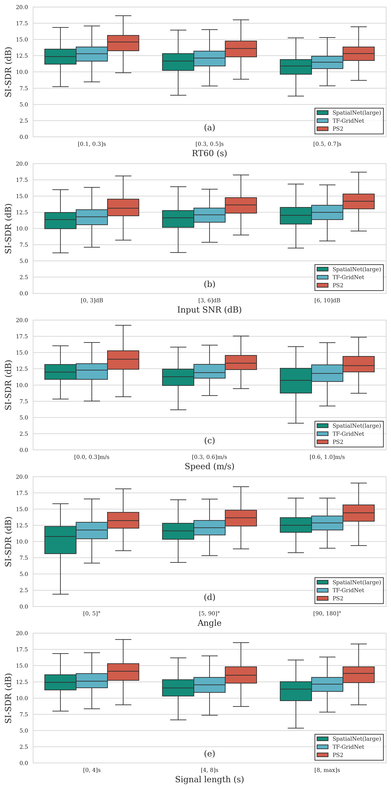
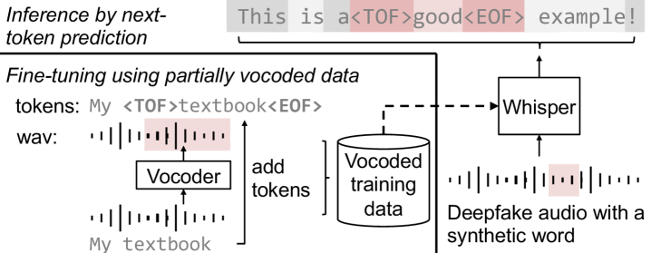
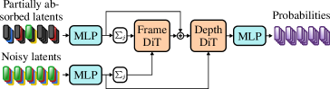
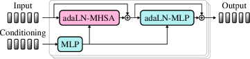
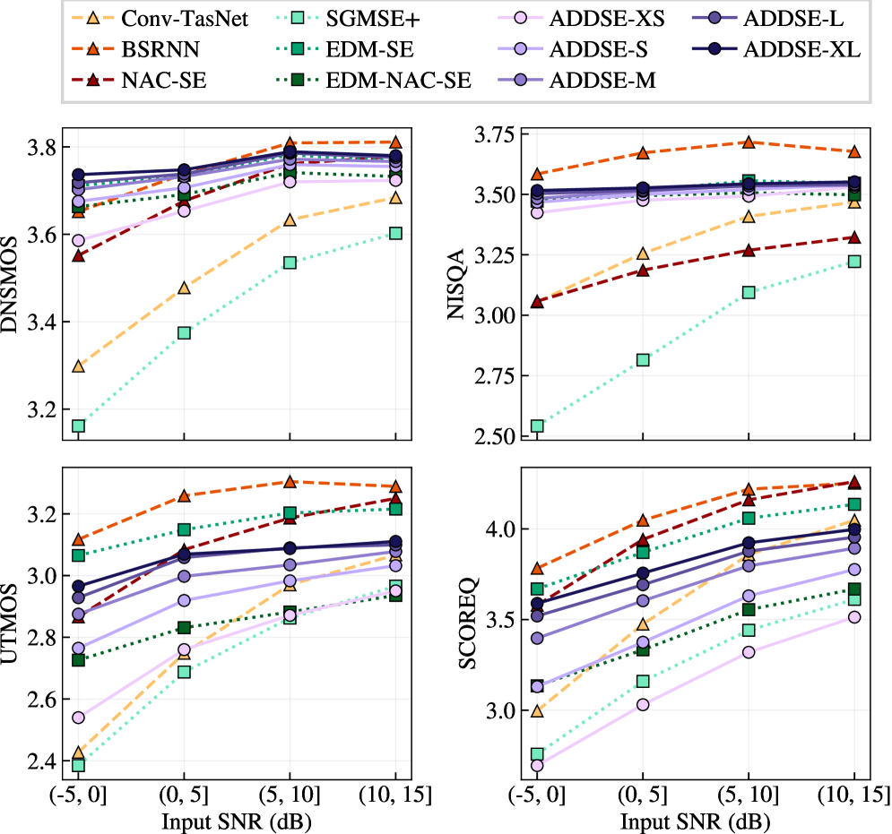

# 🚩 (2026-02-27) Scholar Inbox 추천 논문 

# 📚 TADA: A Generative Framework for Speech Modeling via Text-Acoustic Dual Alignment

🚀 URL: https://arxiv.org/html/2602.23068

## 🌏 Abstract (원문)
Recent advancements in Text-to-Speech (TTS) synthesis have been largely driven by the adoption of Large Language Model (LLM) architectures[1]. By leveraging the scaling laws observed in Natural Language Processing (NLP)[2], these systems have achieved unprecedented success in zero-shot voice cloning and high-fidelity speech generation. Central to these approaches is the discretization of speech into acoustic tokens, allowing the generation task to be framed as a next-token prediction problem within a unified transformer-based framework. However, the efficacy of these models is fundamentally constrained by the structural discrepancy between text and audio representations. A majority of acoustic codecs[3,4,5,6]operate at a fixed frame rate to ensure signal fidelity. Because human speech contains far more acoustic information per second than linguistic information, the resulting speech sequences are often an order of magnitude longer than their corresponding text sequences. This frequency mismatch introduces a significant computational bottleneck; the disparate lengths of text and audio sequences drastically inflate the required context window for transformers, leading to a quadratic increase in computational complexity that reduces throughput during training and slows inference. Furthermore, the inherent lack of temporal alignment between low-frequency text tokens and high-frequency acoustic frames necessitates complex interleaving or hierarchical modeling strategies with semantic tokens. Such architectures prevent the realization of a truly single-stream model where linguistic and paralinguistic features are processed as synchronized facets of the same sequence. In interactive applications, this overhead elevates time-to-first-audio latency, which remains a primary barrier to natural, real-time human-AI interaction. In this paper, we propose a novel tokenization schema that establishes a 1-to-1 synchronization between speech and text tokens. By utilizing an alignment-aware encoder-decoder architecture within a Variational Autoencoder (VAE) framework, we compress acoustic features into latent vectors that map 1-to-1 to discrete text units. This synchronized representation enables unified, single-stream modeling within an LLM, effectively treating text and speech as parallel tracks of a single information stream. Our primary contributions are summarized as follows: Synchronous Tokenization: We introduce a method to extract acoustic features aligned one-to-one with text tokens, dramatically lowering the speech modeling frame rate. These tokens encapsulate full acoustic information, allowing for reconstruction independent of external conditions. Unified Autoregressive Modeling: We demonstrate that these synchronized features can be effectively modeled and generated in an autoregressive fashion, allowing for unified, single-stream modeling within an LLM to improve training throughput and inference efficiency. Modality Gap Mitigation: We propose Speech Free Guidance (SFG) to mitigate the modality gap caused by introducing audio to language models. By adjusting the logit scale between text-only and multimodal inference, we bridge this capability gap with minimal inference overhead. For convenience, we use "acoustic features" and "acoustic tokens" interchangeably, where "tokens" encompasses both discrete and continuous forms. Our framework is designed as a unified speech-language model capable of concurrent text and speech generation. In this capacity, it can either function as a standalone TTS system or serve as a unified replacement for traditional, multi-stage LLM-TTS pipelines. Experiments demonstrate that our model performs on par with state-of-the-art TTS systems while achieving significantly higher speeds. Furthermore, the inductive bias from the 1:1 alignment between text tokens and speech features virtually eliminates content hallucinations. We also show that our model excels in speech-text co-modeling, with SFG bringing language performance close to that of text-only inference mode.
## 🌏 Abstract (번역)
최근 텍스트 음성 합성(TTS)의 발전은 대규모 언어 모델(LLM) 아키텍처의 채택에 의해 크게 주도되었습니다. 자연어 처리(NLP)에서 관찰된 스케일링 법칙을 활용하여, 이러한 시스템은 제로샷 음성 클로닝 및 고충실도 음성 생성에서 전례 없는 성공을 거두었습니다. 이러한 접근 방식의 핵심은 음성을 음향 토큰으로 이산화하여 생성 작업을 통합된 트랜스포머 기반 프레임워크 내에서 다음 토큰 예측 문제로 구성하는 것입니다. 그러나 이러한 모델의 효능은 텍스트와 오디오 표현 간의 구조적 불일치로 인해 근본적으로 제한됩니다. 대부분의 음향 코덱은 신호 충실도를 보장하기 위해 고정된 프레임 속도로 작동합니다. 인간의 음성은 언어 정보보다 초당 훨씬 더 많은 음향 정보를 포함하기 때문에, 결과적으로 발생하는 음성 시퀀스는 종종 해당 텍스트 시퀀스보다 한 자릿수 더 깁니다. 이러한 빈도 불일치는 상당한 계산 병목 현상을 초래합니다. 텍스트와 오디오 시퀀스의 서로 다른 길이는 트랜스포머에 필요한 컨텍스트 창을 급격히 팽창시켜 계산 복잡성을 이차적으로 증가시키고 학습 처리량을 감소시키며 추론 속도를 늦춥니다. 또한, 저주파 텍스트 토큰과 고주파 음향 프레임 사이의 내재적인 시간적 정렬 부족으로 인해 시맨틱 토큰과의 복잡한 인터리빙 또는 계층적 모델링 전략이 필요합니다. 이러한 아키텍처는 언어적 및 부차 언어적 특징이 동일한 시퀀스의 동기화된 측면으로 처리되는 진정한 단일 스트림 모델의 실현을 방해합니다. 대화형 애플리케이션에서 이러한 오버헤드는 첫 오디오 출력까지의 지연 시간(time-to-first-audio latency)을 높이며, 이는 자연스러운 실시간 인간-AI 상호작용의 주요 장벽으로 남아 있습니다. 본 논문에서는 음성 토큰과 텍스트 토큰 간의 1대1 동기화를 구축하는 새로운 토큰화 스키마를 제안합니다. VAE(Variational Autoencoder) 프레임워크 내에서 정렬 인식 인코더-디코더 아키텍처를 활용하여, 음향 특징을 이산 텍스트 단위와 1대1로 매핑되는 잠재 벡터로 압축합니다. 이 동기화된 표현은 LLM 내에서 통합된 단일 스트림 모델링을 가능하게 하여, 텍스트와 음성을 단일 정보 스트림의 병렬 트랙으로 효과적으로 처리합니다. 우리의 주요 기여는 다음과 같이 요약됩니다. 첫째, 동기식 토큰화: 텍스트 토큰과 1대1로 정렬된 음향 특징을 추출하는 방법을 도입하여 음성 모델링 프레임 속도를 획기적으로 낮췄습니다. 이 토큰들은 전체 음향 정보를 캡슐화하여 외부 조건에 독립적인 재구성을 가능하게 합니다. 둘째, 통합 자기회귀 모델링: 이러한 동기화된 특징이 자기회귀 방식으로 효과적으로 모델링 및 생성될 수 있음을 입증하여 LLM 내에서 통합된 단일 스트림 모델링을 통해 학습 처리량과 추론 효율성을 향상시켰습니다. 셋째, 모달리티 격차 완화: 언어 모델에 오디오를 도입함으로써 발생하는 모달리티 격차를 완화하기 위해 SFG(Speech Free Guidance)를 제안합니다. 텍스트 전용 추론과 멀티모달 추론 사이의 로짓 스케일을 조정함으로써 최소한의 추론 오버헤드로 이러한 능력 격차를 해소합니다. 실험 결과, 우리 모델은 최첨단 TTS 시스템과 대등한 성능을 보이면서도 훨씬 더 높은 속도를 달성했습니다. 또한 텍스트 토큰과 음성 특징 간의 1:1 정렬로 인한 귀납적 편향은 콘텐츠 환각을 사실상 제거합니다. 또한 우리 모델이 음성-텍스트 공동 모델링에서 탁월하며, SFG를 통해 언어 성능을 텍스트 전용 추론 모드에 가깝게 끌어올린다는 것을 보여줍니다.

## 🔍 Methods & Results
- TADA는 LLM과 Flow Matching 헤드를 결합하여 텍스트와 음향 특징을 단일 스트림으로 동기화하여 모델링하는 아키텍처를 제안함
- 텍스트 토큰과 음향 특징 간의 1:1 정렬을 통해 기존 인터리빙 방식 대비 정보 밀도를 약 10배 높이고 컨텍스트 효율성을 극대화함
- Flow Matching 헤드는 각 텍스트 토큰에 대응하는 음향 특징과 프레임 지속 시간(duration)을 공동으로 예측하며, 이산 지속 시간 모델링을 위해 Bit Diffusion과 Gray Coding을 사용함
- 추론 시 화자 일관성을 유지하기 위해 경량 화자 임베딩 헤드를 이용한 온라인 거부 샘플링(Online Rejection Sampling) 기법을 적용함
- 텍스트 전용 추론과 음성 조건부 추론의 로짓을 혼합하는 SFG(Speech Free Guidance)를 통해 멀티모달 학습 시 발생하는 언어 모델링 성능 저하(Modality Gap)를 완화함
- 실험 결과 최신 TTS 시스템과 대등한 품질을 유지하면서도 훨씬 빠른 추론 속도를 달성했으며, 1:1 정렬 구조 덕분에 텍스트 누락이나 환각 현상을 효과적으로 방지함

## 🖼 Figures

*Figure 1:Word-level alignment via Viterbi decoding. An illustration of the forced alignment between a speech waveform and the transcript ``That's exactly what happened…". The Viterbi algorithm identifies the most probable frame-level assignment to determine a position 
𝑝
𝑖
 for each token 
𝑤
𝑖
 in the encoded text sequence.*

*Figure 2:Operating under a Variational Autoencoder (VAE) framework, our model utilizes a symmetric encoder-decoder architecture. Each module integrates a CNN-based component for local acoustic feature extraction and reconstruction, complemented by a transformer-based backbone designed to capture the dynamic temporal range of synchronized speech-text sequences.*

*Figure 3:Attention mask of the encoder (left) and the decoder (right). Asterisks (
∗
) mark text-assigned temporal indices. In the encoder, non-text-assigned positions are restricted to intra-block attention, excluding boundary tokens; conversely, text-assigned positions are permitted to attend across both preceding and succeeding blocks. The decoder also utilizes a localized mechanism where each position attends to the current and immediately preceding blocks.*

*Figure 4:Each text token 
𝑤
𝑖
 is paired with the speech representation at the 
𝐾
-shifted position, comprising token features 
𝑠
𝑖
−
𝐾
, the number of preceeding frames 
𝑓
𝑖
−
𝐾
before
, the number of successive frames 
𝑓
𝑖
−
𝐾
after
, and processed by an autoregressive decoder. The decoder predicts the next text token and produces a conditioning vector, which the flow matching head uses to generate the next speech representation 
(
𝑠
𝑖
−
𝐾
+
1
,
𝑓
𝑖
−
𝐾
+
1
before
,
𝑓
𝑖
−
𝐾
+
1
before
)
.*

*Figure 5:Reconstruction quality (CER, SS, and oMOS) vs. token density for uniformly spaced tokens.*

---
**Usage Info**: 6384 tokens used.
**Generated at**: 2026-02-27 12:39:13

---

# 📚 SemanticVocoder: Bridging Audio Generation and Audio Understanding via Semantic Latents

🚀 URL: https://arxiv.org/html/2602.23333

## 🌏 Abstract (원문)
Text-to-audio (TTA) generation has attracted considerable attention and advanced rapidly in recent years. Previous audio generation systems typically follow the classic Latent Diffusion Model (LDM) architecture, which relies on a first-stage Variational Autoencoder (VAE). The VAE compresses audio into compact latents via an encoder and reconstructs the original audio through a latent-to-waveform decoder, while a second-stage text-to-latent generative model performs prediction in this latent space. Because the VAE is fundamentally based on pure acoustic compression, its latent representation is referred to as acoustic latents. However, acoustic latents pose challenges for second-stage generative models. The reconstruction objective compels the VAE encoder to retain fine-grained acoustic details within the latent space. This preservation ensures high-fidelity reconstruction but yields acoustically dense latents, leading to weak semantic discriminability. Moreover, the VAE bottleneck typically employs low-dimensional representations, imposing an upper bound on representation capacity and further limiting semantic information capture. Consequently, second-stage models face a challenging cross-modal task: they must map semantic textual captions directly to complex, low-level acoustic variations—an objective substantially more difficult than mapping to high-level semantic structures. These properties are suboptimal for generative modeling. We thus attempt to introduce a novel representation to mitigate the adverse effects of VAE acoustic latents for audio generation. An intuitive ideal representation is that extracted by a semantic encoder, which we refer to as semantic latents. To excel in downstream understanding tasks, semantic encoders are optimized to learn latent spaces characterized by strong semantic disentanglement and clear discriminative structure. These high-dimensional, abstract, and semantically rich latents effectively capture the high-level “content” of the audio (e.g., “a dog barking”) rather than fine-grained acoustic details, making them inherently more conducive to generative modeling. However, directly incorporating semantic latents into the classic LDM framework is non-trivial, as such latents prioritize semantic information at the expense of acoustic details, resulting in severe audio distortion when reconstructed through traditional VAE training frameworks. We thus propose the SemanticVocoder, a flow-matching approach that directly synthesizes waveforms from semantic latents in a generative manner. It exhibits the following properties: (1) It leverages high-dimensional semantic latents without dimensionality reduction, thereby preserving well-structured semantic representations. This mitigates issues arising from acoustic redundancy and the low-dimensional bottleneck inherent in VAE latents. (2) It shifts the training paradigm from VAE-based reconstruction to flow-matching driven generation, thus alleviating the objective mismatch between VAE reconstruction and second-stage generation in the original framework. (3) With semantic latents as the anchor, the text-to-latent model and SemanticVocoder can be trained simultaneously, rendering the two models mutually independent and endowing them with plug-and-play capabilities. By contrast, conventional VAEs and second-stage models must be trained sequentially, as the VAE latents vary during VAE training. Our contributions are summarized as follows: We propose SemanticVocoder, which leverages the semantic latents to directly generate waveforms, enabling the audio generation framework to operate in semantic latent space, while eliminating any reliance on VAE modules and alleviating their negative impacts. By incorporating SemanticVocoder, our text-to-audio system achieves excellent performance on AudioCaps, with a Fréchet Distance of 12.823 and a Fréchet Audio Distance of 1.709. SemanticVocoder bridges semantic latents and generation tasks, thereby enabling semantic latents to support unified modeling for both audio generation and audio understanding.
## 🌏 Abstract (번역)
텍스트-오디오(TTA) 생성은 최근 상당한 관심을 받으며 빠르게 발전하고 있습니다. 기존의 오디오 생성 시스템들은 일반적으로 첫 번째 단계의 변분 오토인코더(VAE)에 의존하는 클래식한 잠재 확산 모델(LDM) 아키텍처를 따릅니다. VAE는 인코더를 통해 오디오를 조밀한 잠재 벡터로 압축하고 잠재-파형 디코더를 통해 원본 오디오를 재구성하며, 두 번째 단계의 텍스트-잠재 생성 모델은 이 잠재 공간에서 예측을 수행합니다. VAE는 근본적으로 순수 음향 압축에 기반하기 때문에 그 잠재 표현을 음향 잠재(acoustic latents)라고 부릅니다. 그러나 음향 잠재는 두 번째 단계 생성 모델에 어려움을 줍니다. 재구성 목표는 VAE 인코더가 잠재 공간 내에 미세한 음향 세부 사항을 유지하도록 강제합니다. 이러한 보존은 고충실도 재구성을 보장하지만 음향적으로 밀도가 높은 잠재 벡터를 생성하여 의미론적 판별력을 약화시킵니다. 또한 VAE 병목 현상은 일반적으로 저차원 표현을 사용하므로 표현 용량에 상한선을 두고 의미 정보 캡처를 더욱 제한합니다. 결과적으로 두 번째 단계 모델은 의미론적 텍스트 캡션을 복잡하고 저수준인 음향 변화에 직접 매핑해야 하는 어려운 교차 모달 작업에 직면하게 되며, 이는 고수준 의미 구조에 매핑하는 것보다 훨씬 어렵습니다. 이러한 특성들은 생성 모델링에 최적이지 않습니다. 따라서 우리는 오디오 생성을 위한 VAE 음향 잠재의 부정적인 영향을 완화하기 위해 새로운 표현을 도입하고자 합니다. 직관적인 이상적 표현은 의미론적 인코더에 의해 추출된 것이며, 이를 의미론적 잠재(semantic latents)라고 부릅니다. 다운스트림 이해 작업에서 탁월하기 위해 의미론적 인코더는 강력한 의미론적 분리와 명확한 판별 구조를 특징으로 하는 잠재 공간을 학습하도록 최적화됩니다. 이러한 고차원적이고 추상적이며 의미론적으로 풍부한 잠재 벡터는 미세한 음향 세부 사항보다는 오디오의 고수준 '내용'(예: '개가 짖는 소리')을 효과적으로 캡처하여 생성 모델링에 본질적으로 더 유리합니다. 그러나 의미론적 잠재를 클래식 LDM 프레임워크에 직접 통합하는 것은 간단하지 않습니다. 이러한 잠재 벡터는 음향 세부 사항을 희생하면서 의미 정보를 우선시하므로 전통적인 VAE 학습 프레임워크를 통해 재구성할 때 심각한 오디오 왜곡이 발생하기 때문입니다. 이에 우리는 의미론적 잠재로부터 생성 방식으로 파형을 직접 합성하는 플로우 매칭(flow-matching) 접근 방식인 SemanticVocoder를 제안합니다. 이는 다음과 같은 특징을 가집니다: (1) 차원 축소 없이 고차원 의미론적 잠재를 활용하여 잘 구조화된 의미론적 표현을 보존합니다. 이는 VAE 잠재 벡터에 내재된 음향 중복성 및 저차원 병목 현상 문제를 완화합니다. (2) 학습 패러다임을 VAE 기반 재구성에서 플로우 매칭 기반 생성으로 전환하여, 기존 프레임워크에서 VAE 재구성과 두 번째 단계 생성 사이의 목표 불일치를 완화합니다. (3) 의미론적 잠재를 앵커로 사용하여 텍스트-잠재 모델과 SemanticVocoder를 동시에 학습할 수 있으며, 두 모델을 상호 독립적으로 만들어 플러그 앤 플레이 기능을 부여합니다. 반면, 기존 VAE와 두 번째 단계 모델은 VAE 학습 중에 잠재 벡터가 변하기 때문에 순차적으로 학습해야 합니다. 우리의 기여는 다음과 같이 요약됩니다: 우리는 의미론적 잠재를 활용하여 파형을 직접 생성하는 SemanticVocoder를 제안하며, 이를 통해 오디오 생성 프레임워크가 의미론적 잠재 공간에서 작동할 수 있게 하고 VAE 모듈에 대한 의존성을 제거하며 그 부정적인 영향을 완화합니다. SemanticVocoder를 통합함으로써 우리의 텍스트-오디오 시스템은 AudioCaps에서 Fréchet Distance 12.823, Fréchet Audio Distance 1.709의 우수한 성능을 달성했습니다. SemanticVocoder는 의미론적 잠재와 생성 작업을 연결하여 의미론적 잠재가 오디오 생성과 오디오 이해 모두를 위한 통합 모델링을 지원할 수 있게 합니다.

## 🔍 Methods & Results
- SemanticVocoder는 플로우 매칭(Flow-matching) 기반 학습 전략, 의미론적 인코더, 생성 백본으로 구성되어 의미론적 잠재로부터 파형을 직접 생성함
- 기존 VAE의 저차원 병목 현상과 음향 중복성 문제를 해결하기 위해 차원 축소 없는 고차원 의미론적 잠재(Semantic Latents)를 활용함
- 사전 학습된 MAE(Masked Autoencoder) 인코더를 사용하여 미세한 음향 세부 사항 대신 고수준의 의미론적 패턴을 추출함
- 플로우 매칭 기법을 통해 VAE 기반 재구성의 한계를 극복하고, 에너지 인식 손실 스케일링과 직접적인 클린 데이터 예측으로 생성 안정성을 높임
- 생성 백본은 ConvNeXt 블록 기반의 잠재 컨디셔너와 iSTFT(Inverse Short-Time Fourier Transform)를 사용하여 효율적인 파형 복원을 수행함
- AudioCaps 데이터셋에서 Fréchet Distance(FD) 12.823, Fréchet Audio Distance(FAD) 1.709를 기록하며 우수한 성능을 입증함
- 의미론적 잠재를 매개로 텍스트-잠재 모델과 보코더를 독립적으로 병렬 학습할 수 있는 플러그 앤 플레이 구조를 실현함

## 🖼 Figures
![Figure 1: The SemanticVocoder pioneers the generation of waveforms directly from semantic latents, thereby bridging understanding-oriented representations and generation tasks. (Left): Three sub-tasks from the HEAR benchmark are employed to evaluate the latent representations, in which linear classifiers are trained on fixed latents. The semantic latents exhibit a more discriminative semantic structure than the acoustic VAE latents used in previous work. (Right): For the downstream text-to-audio task, a text-to-latent model predicts latents conditioned on input text. The predicted latents are then fed into SemanticVocoder for audio synthesis, yielding superior performance.](../images/2026-02-27/2602.23333/2602.23333_fig0.png)
*Figure 1: The SemanticVocoder pioneers the generation of waveforms directly from semantic latents, thereby bridging understanding-oriented representations and generation tasks. (Left): Three sub-tasks from the HEAR benchmark are employed to evaluate the latent representations, in which linear classifiers are trained on fixed latents. The semantic latents exhibit a more discriminative semantic structure than the acoustic VAE latents used in previous work. (Right): For the downstream text-to-audio task, a text-to-latent model predicts latents conditioned on input text. The predicted latents are then fed into SemanticVocoder for audio synthesis, yielding superior performance.*

![Figure 2: An overview of SemanticVocoder training, downstream TTA training, and downstream task inference. (
→
Blue arrow) SemanticVocoder training: the input audio is fed into a semantic encoder to extract semantic latents, which serve as conditions to train the flow-matching network for waveform prediction. (
→
Red arrow) Generative audio DiT training: the input text is processed by a text encoder to obtain textual features, which are used to train the DiT model for generating semantic latents. (
→
Black arrow) Downstream task inference: equipped with SemanticVocoder, both audio generation and understanding tasks can be performed within the same semantic latent space.](../images/2026-02-27/2602.23333/2602.23333_fig1.png)
*Figure 2: An overview of SemanticVocoder training, downstream TTA training, and downstream task inference. (
→
Blue arrow) SemanticVocoder training: the input audio is fed into a semantic encoder to extract semantic latents, which serve as conditions to train the flow-matching network for waveform prediction. (
→
Red arrow) Generative audio DiT training: the input text is processed by a text encoder to obtain textual features, which are used to train the DiT model for generating semantic latents. (
→
Black arrow) Downstream task inference: equipped with SemanticVocoder, both audio generation and understanding tasks can be performed within the same semantic latent space.*

*Figure 3: Visualization of different latents on HEAR-ESC50, where the 10 most frequent categories are presented. Each audio feature is aggregated by mean pooling along the temporal axis and projected into 2D space via t-SNE. Compared to VAE acoustic latents used in baseline models, semantic latents exhibit a more discriminative structure and superior semantic disentanglement.*

*Figure 4: The influence of inference steps and Class-Free guidance on TTA performance.*

---
**Usage Info**: 5979 tokens used.
**Generated at**: 2026-02-27 12:39:36

---

# 📚 Discourse-Aware Dual-Track Streaming Response for Low-Latency Spoken Dialogue Systems

🚀 URL: https://arxiv.org/html/2602.23266

## 🌏 Abstract (원문)
Spoken dialogue involves real-time interaction conducted through speech, where interlocutors continuously exchange information and coordinate intent. Natural turn-taking typically requires response onsets within a few hundred milliseconds across languages. Such stringent latency requirements are fundamental to human communication and critically shape user experience in applications ranging from conversational assistants to accessibility technologies. Recent end-to-end Speech models have shown strong potential by directly mapping speech to speech, simplifying system pipelines and reducing intermediate processing. However, such monolithic architectures remain computationally expensive, data-intensive, and tightly coupled, requiring specialized training pipelines and limiting modular deployment or component-level replacement. Consequently, many practical and reproducible spoken dialogue systems continue to rely on the cascaded paradigm for its modularity, controllability, and ease of integration. Despite these advantages, achieving human-like responsiveness within cascaded systems remains a central challenge. In conventional pipelines, recognition, reasoning, and synthesis are executed strictly in sequence, forcing speech output to wait for complete transcription and full semantic generation. This sequential design pushes response onset far beyond the sub-second regime required for natural interaction, leading to high perceived latency and disrupted conversational flow. This tension exposes a fundamental dilemma: How can we preserve the modular benefits of cascaded architectures while substantially reducing perceived response latency? Psycholinguistic studies suggest that humans naturally speak while thinking. In everyday conversation, speakers frequently initiate responses with short discourse cues such as “well,” or “I see” to maintain conversational flow while higher-level planning continues in parallel. These linguistic devices, often referred to as discourse connectives or discourse markers, function as low-risk interactional buffers, as they typically do not convey truth-conditional content and therefore avoid knowledge-level conflicts with the subsequent full response generated by a large model, allowing response onset to occur before full content formulation. Inspired by this principle, we propose the Discourse-Aware Dual-Track Streaming Response (DDTSR) framework, a novel low-latency architecture for cascaded spoken dialogue systems. Rather than redefining dialogue protocols or relying on fully end-to-end models, DDTSR targets the temporal structure of interaction within cascaded pipelines. Its core idea is to explicitly decouple early, minimal-committal speech generation from knowledge-intensive reasoning, enabling the system to listen while thinking and speak while thinking. DDTSR is built upon three tightly integrated mechanisms: (1) Connective-Guided Small–Large Model Synergy. (2) Streaming-Based Cross-Modal Collaboration. (3) Curriculum-Learning-Based Discourse Continuity Enhancement. Experimental results on two widely used spoken dialog benchmarks show that, compared to conventional single-stream cascaded systems, DDTSR achieves a 19–51% reduction in response latency and consistently reaches sub-second response onset.
## 🌏 Abstract (번역)
음성 대화는 화자들이 지속적으로 정보를 교환하고 의도를 조정하는 실시간 음성 상호작용을 포함합니다. 자연스러운 차례 주고받기(turn-taking)는 일반적으로 수백 밀리초 이내의 응답 시작을 요구하며, 이러한 엄격한 지연 시간 요구 사항은 대화형 비서부터 보조 기술에 이르기까지 다양한 응용 분야에서 사용자 경험을 결정짓는 핵심 요소입니다. 최근 엔드투엔드 음성 모델은 음성을 음성으로 직접 매핑하여 시스템 파이프라인을 단순화하고 중간 처리를 줄이는 강력한 잠재력을 보여주었습니다. 그러나 이러한 단일 구조(monolithic) 아키텍처는 계산 비용이 많이 들고 데이터 집약적이며, 구성 요소 간의 결합도가 높아 모듈식 배포나 부품 단위 교체가 제한적입니다. 결과적으로 많은 실제 시스템은 모듈성, 제어 가능성 및 통합의 용이성 때문에 여전히 계단식(cascaded) 패러다임에 의존하고 있습니다. 이러한 장점에도 불구하고 계단식 시스템에서 인간과 유사한 반응성을 달성하는 것은 여전히 주요 과제입니다. 전통적인 파이프라인에서는 인식, 추론, 합성이 엄격하게 순차적으로 실행되므로, 음성 출력은 전체 전사와 완전한 의미 생성이 끝날 때까지 기다려야만 합니다. 이러한 순차적 설계는 응답 시작 시점을 자연스러운 상호작용에 필요한 1초 미만의 범위를 훨씬 벗어나게 하여 높은 지연 시간과 대화 흐름의 단절을 초래합니다. 본 논문에서는 계단식 아키텍처의 모듈식 이점을 유지하면서 인지된 응답 지연 시간을 대폭 줄이기 위해, 인간이 생각하면서 말하는 방식에서 영감을 얻은 DDTSR(Discourse-Aware Dual-Track Streaming Response) 프레임워크를 제안합니다. DDTSR은 초기 담화 표지어(connectives) 생성을 지식 집약적 추론과 명시적으로 분리하여 시스템이 생각하는 동안 듣고 말할 수 있게 합니다. DDTSR은 소형-대형 모델 시너지, 스트리밍 기반 교차 모달 협업, 커리큘럼 학습 기반 담화 연속성 강화라는 세 가지 메커니즘을 기반으로 구축되었습니다. 실험 결과, DDTSR은 기존 계단식 시스템 대비 응답 지연 시간을 19~51% 단축하였으며, 일관되게 1초 미만의 응답 시작을 달성했습니다.

## 🔍 Methods & Results
- 연결어 유도 소형-대형 모델 시너지: 가벼운 모델이 즉시 발화 가능한 담화 연결어를 생성하는 동안 대형 모델이 병렬로 심층 추론을 수행하여 인지된 사고 시간을 최소화함
- 스트리밍 기반 교차 모달 협업: ASR 출력이 완료될 때까지 기다리지 않고 부분 전사본을 점진적으로 소비하며 ASR, LLM, TTS가 교차 배치되어 작동하도록 함
- 커리큘럼 학습 기반 담화 연속성 강화: 초기 연결어와 후속 추론 결과 간의 일관성을 보장하기 위해 일관성 인식 훈련 목표와 신뢰도 기반 방출 정책을 도입함
- 지연 시간 단축: 기존 단일 스트림 계단식 시스템 대비 응답 지연 시간을 19%에서 51%까지 대폭 감소시킴
- 응답 시작 속도: 실험 전반에서 일관되게 1초 미만(sub-second)의 응답 시작 시점을 달성함
- 품질 및 실용성: 응답의 품질을 유지하면서도 플러그 앤 플레이 모듈로서의 높은 실용성과 확장성을 입증함

## 🖼 Figures

*Figure 1:Necessity of low-latency spoken interaction. Humans naturally exhibit speaking while thinking behavior, whereas conventional systems wait for full response completion before speaking.*

*Figure 2:The Framework of Discourse-Aware Dual-Track Streaming Response.*

*Figure 3:Latency analysis on SD-Eval with respect to input audio length.*

---
**Usage Info**: 3633 tokens used.
**Generated at**: 2026-02-27 12:39:52

---

# 📚 Moving Speaker Separation via Parallel Spectral-Spatial Processing

🚀 URL: https://arxiv.org/html/2602.22487

## 🌏 Abstract (원문)
Multi-channel speech separation aims to isolate individual speakers from their mixture signals captured by a microphone array. This process leverages both spectral and spatial cues. Recent advances in this field have demonstrated potential for various applications, including voice assistants, hearing aids, and teleconferencing systems. Integration of deep neural networks (DNNs) into speech separation has driven significant advancements over the past decade. Multi-channel separation methods have been developed to operate on time-domain waveforms and time-frequency domain spectrograms. Architecturally, researchers have developed both fully neural frameworks and hybrid systems that integrate DNNs with classical beamforming techniques. Despite the significant advancements in multi-channel speech separation, two main challenges remain unresolved. First, a key challenge in existing research is the common assumption that speakers remain static. In practice, speakers’ spatial positions often change over time, resulting in time-varying propagation paths between the speakers and the microphone array. Second, another challenge lies in the sequential processing of spectral and spatial features through a single network processing stream. Most existing methods overlook the inherently different characteristics of these two feature types in speech signals. As shown in Fig.1, spectral and spatial features evolve on different temporal scales. When processed through a single network stream, the model must simultaneously handle two distinct processes with different temporal scales, potentially compromising its ability to effectively capture either aspect. To address these challenges, we propose a parallel spectral-spatial (PS2) architecture designed for multi-channel speech separation in dynamic scenarios. The key innovation of PS2 lies in its dual-branch design that processes input features in parallel, with one branch emphasizing spectral information and the other emphasizing spatial information, as shown in Fig.2. Spectral features change rapidly over time, primarily influenced by speech production mechanisms. On the other hand, spatial features change more slowly over time, and the changes are over longer time scales. By dedicating separate processing streams to these two distinct feature types, our model better adapts to their different temporal scales. The spectral branch adopts the real-imaginary (RI) representation derived from the short-time Fourier transform (STFT) complex-valued spectrogram, following successful practices in the mapping of complex spectra. The spatial branch uses the magnitude-phase (MP) representation as input, which provides direct access to crucial spatial cues such as inter-channel phase and level differences (IPD and ILD, respectively). To fuse the two processing streams, we develop a cross-attention module that modulates the contribution of spatial features based on their temporal coherence with spectral patterns, enabling adaptive feature integration responsive to varying acoustic conditions and source movement. Our experimental results validate that the PS2 system outperforms existing methods across diverse acoustic conditions, with particular advantages in challenging scenarios involving rapid source movements. Additionally, our sensitivity analysis demonstrates the effectiveness of the PS2 architecture in parallel feature processing.
## 🌏 Abstract (번역)
다채널 음성 분리는 마이크 어레이에 의해 캡처된 혼합 신호로부터 개별 화자를 격리하는 것을 목표로 합니다. 이 프로세스는 스펙트럼 및 공간적 단서를 모두 활용합니다. 이 분야의 최근 발전은 음성 비서, 보청기 및 화상 회의 시스템을 포함한 다양한 응용 분야에 대한 잠재력을 보여주었습니다. 지난 10년 동안 음성 분리에 심층 신경망(DNN)을 통합함으로써 상당한 발전이 이루어졌습니다. 다채널 분리 방법은 시간 영역 파형과 시간-주파수 영역 스펙트로그램에서 작동하도록 개발되었습니다. 구조적으로 연구자들은 완전 신경망 프레임워크와 DNN을 고전적인 빔포밍 기술과 통합하는 하이브리드 시스템을 모두 개발했습니다. 다채널 음성 분리의 상당한 발전에도 불구하고 두 가지 주요 과제가 해결되지 않은 채 남아 있습니다. 첫째, 기존 연구의 핵심 과제는 화자가 정지해 있다는 일반적인 가정입니다. 실제로는 화자의 공간적 위치가 시간이 지남에 따라 변하는 경우가 많으며, 이로 인해 화자와 마이크 어레이 사이에 시간에 따라 변하는 전파 경로가 발생합니다. 둘째, 또 다른 과제는 단일 네트워크 처리 스트림을 통한 스펙트럼 및 공간 특징의 순차적 처리에 있습니다. 대부분의 기존 방법은 음성 신호에서 이러한 두 가지 특징 유형의 본질적으로 다른 특성을 간과합니다. 그림 1에서 보듯이 스펙트럼 및 공간 특징은 서로 다른 시간적 척도로 진화합니다. 단일 네트워크 스트림을 통해 처리될 때 모델은 서로 다른 시간적 척도를 가진 두 개의 별개 프로세스를 동시에 처리해야 하므로 어느 한 측면을 효과적으로 포착하는 능력이 저하될 수 있습니다. 이러한 문제를 해결하기 위해 동적 시나리오에서 다채널 음성 분리를 위해 설계된 병렬 스펙트럼-공간(PS2) 아키텍처를 제안합니다. PS2의 핵심 혁신은 그림 2와 같이 입력 특징을 병렬로 처리하는 이중 분기 설계에 있으며, 한 분기는 스펙트럼 정보를 강조하고 다른 분기는 공간 정보를 강조합니다. 스펙트럼 특징은 주로 음성 생성 메커니즘의 영향을 받아 시간이 지남에 따라 빠르게 변합니다. 반면에 공간 특징은 시간이 지남에 따라 더 느리게 변하며 변화는 더 긴 시간 척도에 걸쳐 발생합니다. 이러한 두 가지 고유한 특징 유형에 별도의 처리 스트림을 할당함으로써 우리 모델은 서로 다른 시간적 척도에 더 잘 적응합니다. 스펙트럼 분기는 복소 스펙트럼 매핑의 성공적인 관행에 따라 단시간 푸리에 변환(STFT) 복소수 스펙트로그램에서 파생된 실수-허수(RI) 표현을 채택합니다. 공간 분기는 크기-위상(MP) 표현을 입력으로 사용하여 채널 간 위상 및 레벨 차이(각각 IPD 및 ILD)와 같은 중요한 공간적 단서에 직접 액세스할 수 있도록 합니다. 두 처리 스트림을 융합하기 위해 스펙트럼 패턴과의 시간적 일관성을 기반으로 공간 특징의 기여도를 조절하는 교차 주의(cross-attention) 모듈을 개발하여 다양한 음향 조건 및 소스 이동에 대응하는 적응형 특징 통합을 가능하게 합니다. 실험 결과에 따르면 PS2 시스템은 다양한 음향 조건에서 기존 방법보다 우수한 성능을 보였으며, 특히 소스의 빠른 이동이 포함된 까다로운 시나리오에서 이점이 있었습니다. 또한 민감도 분석을 통해 병렬 특징 처리에서 PS2 아키텍처의 효과를 입증했습니다.

## 🔍 Methods & Results
- Proposed a Parallel Spectral-Spatial (PS2) architecture with a dual-branch design to process spectral and spatial features independently and in parallel.
- The spectral branch utilizes Real-Imaginary (RI) components and consists of a frequency module (BLSTM), a temporal module (Mamba), and a self-attention module for multi-scale modeling.
- The spatial branch uses Magnitude-Phase (MP) representation and a Bi-directional Gated Recurrent Unit (BGRU) to capture inter-channel spatial cues like IPD and ILD.
- Developed a cross-attention fusion module to dynamically weight the contributions of spectral and spatial features based on their temporal coherence.
- Modeled moving speakers using time-variant convolution to address the challenge of time-varying acoustic propagation paths.
- Experimental results show that PS2 outperforms existing methods across various acoustic conditions, especially in scenarios with rapid source movements.
- Sensitivity analysis confirmed the effectiveness of the parallel processing architecture compared to single-stream or naive sum-fusion approaches.

## 🖼 Figures
![Figure 1:Visualization of temporal evolution in spectral and spatial features for moving versus static sound source scenarios. Top row: magnitude spectrogram (left) and inter-channel time difference (ITD) (right) of a moving speaker (
0.8
 m/s); Bottom row: corresponding visualizations for a static speaker positioned at the initial point of the moving source trajectory. The magnitude spectrograms use the first microphone channel of noise-free reverberant speech (RT
60
: 
250
 ms) simulated in a 
10
 m 
×
 
10
 m 
×
 
3
 m room with two microphones spaced by 
15
 cm at 
16
 kHz sampling rate. The ITD is visualized by computing the time difference between the two channels for each time-frequency bin. For each channel, the complex-valued spectrogram is normalized by its magnitude, yielding a phase-only spectrogram. The inter-channel phase difference is then computed for each bin and transformed into a time delay.](../images/2026-02-27/2602.22487/2602.22487_fig0.png)
*Figure 1:Visualization of temporal evolution in spectral and spatial features for moving versus static sound source scenarios. Top row: magnitude spectrogram (left) and inter-channel time difference (ITD) (right) of a moving speaker (
0.8
 m/s); Bottom row: corresponding visualizations for a static speaker positioned at the initial point of the moving source trajectory. The magnitude spectrograms use the first microphone channel of noise-free reverberant speech (RT
60
: 
250
 ms) simulated in a 
10
 m 
×
 
10
 m 
×
 
3
 m room with two microphones spaced by 
15
 cm at 
16
 kHz sampling rate. The ITD is visualized by computing the time difference between the two channels for each time-frequency bin. For each channel, the complex-valued spectrogram is normalized by its magnitude, yielding a phase-only spectrogram. The inter-channel phase difference is then computed for each bin and transformed into a time delay.*

*Figure 2:The illustration of the proposed PS2 system.*

*Figure 3:The architecture of the proposed PS2 system.*

*Figure 4:The core components of PS2 system: (a) spectral branch, (b) spatial branch, and (c) cross-attention fusion module.*

*Figure 5:Multi-conditional evaluation results under different acoustic conditions. SI-SDR performance across varying (a) reverberation times (RT60), (b) input SNR levels, (c) source movement speeds, (d) inter-source angles, and (e) signal durations.*

![Figure 6:Functional block level model sensitivity analysis. The horizontal axis labels represent functional components. For (a) PS2 system, sep.ri.conv: spectral branch encoder, sep.block.x.sf: frequency module, sep.block.x.st: temporal module, sep.block.x.attn: self-attention module in spectral branch, sep.deconv: decoder sep.fuse.attn: cross-attention fuse module, sep.mp.conv: spatial branch encoder, sep.mp.gru: GRU module. For (b) TF-GridNet, sep.conv: encoder, sep.block.x.intra: intra-frame full-band module, sep.block.x.inter: sub-band temporal module, sep.block.x.attn: cross-frame self-attention module, sep.deconv: decoder. For (c) SpatialNet, sep.encoder: encoder, sep.block.x.fconv1: frequency-convolutional module, sep.block.x.full: full-band linear module, sep.block.x.fconv2: frequency-convolutional module, sep.block.x.mhsa: MHSA module, sep.block.x.tconvffn: T-ConvFFN module, sep.decoder: decoder.](../images/2026-02-27/2602.22487/2602.22487_fig5.png)
*Figure 6:Functional block level model sensitivity analysis. The horizontal axis labels represent functional components. For (a) PS2 system, sep.ri.conv: spectral branch encoder, sep.block.x.sf: frequency module, sep.block.x.st: temporal module, sep.block.x.attn: self-attention module in spectral branch, sep.deconv: decoder sep.fuse.attn: cross-attention fuse module, sep.mp.conv: spatial branch encoder, sep.mp.gru: GRU module. For (b) TF-GridNet, sep.conv: encoder, sep.block.x.intra: intra-frame full-band module, sep.block.x.inter: sub-band temporal module, sep.block.x.attn: cross-frame self-attention module, sep.deconv: decoder. For (c) SpatialNet, sep.encoder: encoder, sep.block.x.fconv1: frequency-convolutional module, sep.block.x.full: full-band linear module, sep.block.x.fconv2: frequency-convolutional module, sep.block.x.mhsa: MHSA module, sep.block.x.tconvffn: T-ConvFFN module, sep.decoder: decoder.*

---
**Usage Info**: 5859 tokens used.
**Generated at**: 2026-02-27 12:40:07

---

# 📚 mmWave Radar Aware Dual-Conditioned GAN for Speech Reconstruction of Signals With Low SNR

🚀 URL: https://arxiv.org/html/2602.22431

## 🌏 Abstract (원문)
The use of millimeter-wave (mmWave) radar for human voice detection has advanced rapidly in recent years. Unlike microphones, radar is contact-free, non-intrusive, and highly directional, making radar particularly effective in complex environments where microphones often break down. mmWave radar can detect micro-vibrations from a distance, penetrate non-metallic obstructions, and operate passively without direct access to the audio source. Due to these capabilities, researchers have increasingly explored mmWave radar as a sensing modality for vibration-based speech recovery. However, speech reconstruction from mmWave radar remains intrinsically challenging, as it relies on subtle surface vibrations that are often heavily contaminated by noise and environmental interference. As a result, recovering high-quality and intelligible speech from radar measurements is significantly more difficult than conventional audio enhancement. Several recent works have attempted to enhance speech from mmWave radar captures with promising results. Nevertheless, many existing approaches rely on large-scale datasets and extensive compute resources, incorporate pretrained models, evaluate under signal-to-noise ratio (SNR) conditions that may not reflect real-world deployment scenarios, or report metrics that do not reliably correlate with human perceptual quality. In this work, we utilize a dataset that is collected using a procedure similar to the one described in prior work under two experimental conditions: (i) direct vibration capture and (ii) vibration capture through an aluminum foil reflector. We show that the proposed pipeline achieves stronger reconstruction quality under constrained resources and adverse low-SNR (-5 dB to -1 dB) settings, addressing a still underexplored and practically relevant problem setting. The main contributions of this work are as follows. Radar-Aware Dual-conditioned Generative Adversarial Network (RAD-GAN) architecture for mmWave-to-speech reconstruction: We propose a pipeline to reconstruct intelligible speech through bandwidth extension from extremely low-SNR (-5 dB to -1 dB), band-limited mmWave Frequency Modulated Continuous Wave (FMCW) radar. Multi-Mel Discriminator (MMD): We introduce an mmWave radar-based MMD, a two-branch two-dimensional (2D) mel spectrogram discriminator (spectral-norm and weight-norm branches), for stable and realistic reconstruction. Two-stage training strategy for stable learning: We introduce a two-stage training pipeline consisting of pre-training followed by fine-tuning, improving convergence and reconstruction quality. Residual Fusion Gate (RFG) for multi-channel conditioning: To provide richer conditioning to RAD-GAN, we introduce RFG that produces fused mel spectrograms from noisy inputs and enhanced mel spectrograms produced by a WaveVoiceNet module.
## 🌏 Abstract (번역)
최근 몇 년 동안 인간의 음성 감지를 위한 밀리미터파(mmWave) 레이더의 사용이 급격히 발전했습니다. 마이크와 달리 레이더는 비접촉식이고 비침해적이며 지향성이 높아 마이크가 제대로 작동하지 않는 복잡한 환경에서 특히 효과적입니다. mmWave 레이더는 원거리에서 미세 진동을 감지하고 비금속 장애물을 투과하며 오디오 소스에 직접 접근하지 않고도 수동적으로 작동할 수 있습니다. 이러한 능력 덕분에 연구자들은 진동 기반 음성 복구를 위한 감지 모달리티로서 mmWave 레이더를 점점 더 많이 탐구해 왔습니다. 그러나 mmWave 레이더를 통한 음성 재구성은 노이즈와 환경 간섭에 의해 심하게 오염되기 쉬운 미세한 표면 진동에 의존하기 때문에 본질적으로 어렵습니다. 결과적으로 레이더 측정값에서 고품질의 명료한 음성을 복구하는 것은 기존의 오디오 향상보다 훨씬 더 어렵습니다. 최근 몇몇 연구에서 mmWave 레이더 캡처를 통해 음성을 향상시키려는 시도가 있었고 유망한 결과를 얻었습니다. 그럼에도 불구하고 기존의 많은 접근 방식은 대규모 데이터셋과 광범위한 컴퓨팅 리소스에 의존하거나, 사전 학습된 모델을 통합하거나, 실제 배포 시나리오를 반영하지 못하는 신호 대 잡음비(SNR) 조건에서 평가하거나, 인간의 지각 품질과 신뢰할 수 있는 상관관계가 없는 지표를 보고합니다. 본 연구에서는 두 가지 실험 조건((i) 직접 진동 캡처 및 (ii) 알루미늄 호일 반사판을 통한 진동 캡처) 하에서 이전 연구와 유사한 절차로 수집된 데이터셋을 활용합니다. 우리는 제안된 파이프라인이 제한된 리소스와 열악한 저SNR(-5 dB ~ -1 dB) 설정에서 더 강력한 재구성 품질을 달성함을 보여주며, 아직 충분히 탐구되지 않았지만 실질적으로 관련이 있는 문제 설정을 해결합니다. 본 연구의 주요 기여는 다음과 같습니다. mmWave-to-speech 재구성을 위한 RAD-GAN 아키텍처: 극도로 낮은 SNR(-5 dB ~ -1 dB)과 대역폭이 제한된 mmWave FMCW 레이더로부터 대역폭 확장을 통해 명료한 음성을 재구성하는 파이프라인을 제안합니다. Multi-Mel Discriminator (MMD): 안정적이고 현실적인 재구성을 위해 스펙트럼 노름 및 가중치 노름 분기를 사용하는 2D 멜 스펙트로그램 판별기인 mmWave 레이더 기반 MMD를 도입합니다. 안정적인 학습을 위한 2단계 학습 전략: 사전 학습 후 미세 조정을 거치는 2단계 학습 파이프라인을 도입하여 수렴 및 재구성 품질을 향상시킵니다. 다채널 컨디셔닝을 위한 Residual Fusion Gate (RFG): RAD-GAN에 더 풍부한 컨디셔닝을 제공하기 위해 노이즈가 섞인 입력과 WaveVoiceNet 모듈에서 생성된 향상된 멜 스펙트로그램을 융합하는 RFG를 도입합니다.

## 🔍 Methods & Results
- Proposed a two-stage training pipeline: Phase 1 (pre-training on synthetic clean speech for bandwidth extension) and Phase 2 (adversarial fine-tuning on real noisy mmWave data).
- Developed RAD-GAN architecture utilizing a HiFi-GAN generator with a novel Multi-Mel Discriminator (MMD) to improve spectral realism and training stability.
- Introduced the Residual Fusion Gate (RFG) to fuse noisy radar mel-spectrograms with enhanced outputs from a WaveVoiceNet (WVN) module for robust conditioning.
- Utilized a specialized loss function combining high-frequency weighted L1 mel loss and Multi-Resolution STFT (MR-STFT) loss to prioritize bandwidth extension accuracy.
- Evaluated on the RASE 2026 Challenge dataset featuring direct and indirect (aluminum foil) vibration captures under low SNR conditions (-5 dB to -1 dB).
- Achieved high-quality speech reconstruction from band-limited (0-1kHz) radar signals to full-bandwidth (0-4kHz) audio using approximately 42 hours of paired data.
- The complete model consists of approximately 87 million parameters and was trained on an NVIDIA A6000 GPU, demonstrating effectiveness under constrained resource settings.

## 🖼 Figures

*Figure 1:Block diagram of the proposed mmWave radar to speech reconstruction pipeline.*

*Figure 2:Qualitative comparison on Task 2. Columns from left to right are: clean reference, noisy input, WVN output, and RAD-GAN output. The top row shows the time-domain waveforms, and the bottom row shows the corresponding spectrograms.*

---
**Usage Info**: 6824 tokens used.
**Generated at**: 2026-02-27 12:40:24

---

# 📚 Deepfake Word Detection by Next-token Prediction using Fine-tuned Whisper

🚀 URL: https://arxiv.org/html/2602.22658

## 🌏 Abstract (원문)
Detecting deepfake speech utterances, which are not uttered by a real speaker but synthesized by a speech generative model, is now a well-established topic with numerous publications on detector architectures, feature engineering, datasets, and competitions. Beyond simply detecting whether an input utterance is synthetic (i.e., deepfake or forged by any synthesis model alike), an emerging task is to detect which part of the input utterance is synthetic. Solutions are needed to counter advanced manipulations that alter part of a bona fide (i.e., human-uttered real) utterance, for example, by swapping bona fide words with synthetic ones. Such manipulation can be conducted using traditional audio forgery methods (e.g., slicing) or more advanced deep-neural-network (DNN)-based generative models. The latter case is known to produce synthetic contents with less discernible artifacts. Detecting the synthetic part of an utterance is more complicated than deciding whether the utterance is (partially) synthetic. For the latter, the detector has to produce a sequence of decisions (or scores that indicate the likelihood of being bona fide), rather than a single binary decision of synthetic or not. Accordingly, a sequential classification model can be implemented by sophisticating a binary deepfake speech detector, e.g., extracting sequential latent features from a DNN-based detector and transforming them via additional recurrent layers, boundary-matching map, or attention mechanism. Despite the studies aforementioned, we seek more cost-efficient solutions to locate the synthetic contents in the input utterance. This is motivated by the fact that DNN-based models require a full-fledged development flow, including data curation, model designing, model training, and hyper-parameter tuning. Adding a trained model to a speech data processing system also requires additional computation and storage resources. To avoid the cost, we explore solutions that add synthetic word detection as an additional function to existing models, particularly the automatic speech recognition (ASR) models. In this paper, we investigate whether we can fine-tune a pre-trained ASR model, i.e., Whisper, so that it can detect synthetic words while transcribing the input utterance. To address this research question, we present a fine-tuning method that requires only a minimum change—adding specific tokens to the training data. This avoids the costs of implementing a new training algorithm or deploying a separate fake detector. To save the cost of training data curation, we also investigate the usage of the training data that contains 'simulated' synthetic words created by vocoders. As far as the authors are aware, this is the first study to augment Whisper with the function of synthetic word detection. Our experiments demonstrate promising results. On test sets with data from the same domain as the training data, the fine-tuned Whisper performed on par with a dedicated ResNet model in terms of synthetic word detection, while its text transcription accuracy was not degraded. On test sets with words synthesized by advanced DNN-based generative models, the fine-tuned Whisper degraded to varying degrees in terms of synthetic word detection and transcription. Further analysis investigates how the fine-tuned Whisper is affected by the domain mismatch between fine-tuning and test data. Improving the out-of-domain detection performance is to be addressed in future work.
## 🌏 Abstract (번역)
진짜 화자가 발화한 것이 아니라 음성 생성 모델에 의해 합성된 딥페이크 음성 발화를 탐지하는 것은 이제 탐지기 구조, 특징 공학, 데이터셋 및 경진대회에 관한 수많은 출판물이 있는 잘 정립된 주제입니다. 단순히 입력 발화가 합성되었는지(즉, 딥페이크인지 또는 유사한 합성 모델에 의해 위조되었는지) 여부를 탐지하는 것을 넘어, 입력 발화의 어느 부분이 합성되었는지를 탐지하는 것이 새로운 과제로 떠오르고 있습니다. 이는 진짜(bona fide, 즉 인간이 발화한 실제) 발화의 일부를 합성된 단어로 교체하는 등의 방식으로 수정하는 고급 조작에 대응하기 위해 필요합니다. Meta의 VoiceCraft 시스템의 공식 예시처럼, 원래의 'governments don’t control things'라는 음성이 'governments don’t control money directly'로 조작될 수 있습니다. 이러한 조작은 전통적인 오디오 위조 방식(예: 슬라이싱)이나 더 발전된 심층 신경망(DNN) 기반 생성 모델을 사용하여 수행될 수 있습니다. 후자의 경우 식별 가능한 아티팩트가 적은 합성 콘텐츠를 생성하는 것으로 알려져 있습니다. 발화의 합성된 부분을 탐지하는 것은 발화가 (부분적으로) 합성되었는지 결정하는 것보다 더 복잡합니다. 후자의 경우, 탐지기는 합성 여부에 대한 단일 이진 결정이 아니라 일련의 결정(또는 진짜일 확률을 나타내는 점수)을 생성해야 합니다. 이에 따라, 이진 딥페이크 음성 탐지기를 정교화하여 순차적 분류 모델을 구현할 수 있습니다. 예를 들어, DNN 기반 탐지기에서 순차적 잠재 특징을 추출하고 이를 추가적인 순환 레이어, 경계 매칭 맵 또는 어텐션 메커니즘을 통해 변환하는 방식입니다. 앞서 언급한 연구들에도 불구하고, 우리는 입력 발화에서 합성된 콘텐츠의 위치를 찾기 위한 더 비용 효율적인 솔루션을 찾고자 합니다. 이는 DNN 기반 모델이 데이터 큐레이션, 모델 설계, 모델 학습 및 하이퍼파라미터 튜닝을 포함한 본격적인 개발 흐름을 필요로 한다는 사실에 기인합니다. 음성 데이터 처리 시스템에 학습된 모델을 추가하는 것 또한 추가적인 계산 및 저장 리소스를 필요로 합니다. 이러한 비용을 피하기 위해, 우리는 기존 모델, 특히 자동 음성 인식(ASR) 모델에 합성 단어 탐지를 추가 기능으로 더하는 솔루션을 탐구합니다. 본 논문에서는 사전 학습된 ASR 모델인 Whisper를 미세 조정(fine-tuning)하여 입력 발화를 전사하는 동시에 합성된 단어를 탐지할 수 있는지 조사합니다. 이 연구 질문을 해결하기 위해, 우리는 학습 데이터에 특정 토큰을 추가하는 최소한의 변경만을 필요로 하는 미세 조정 방법을 제시합니다. 이는 새로운 학습 알고리즘을 구현하거나 별도의 가짜 탐지기를 배포하는 비용을 방지합니다. 학습 데이터 큐레이션 비용을 절감하기 위해, 보코더(vocoder)에 의해 생성된 '시뮬레이션된' 합성 단어를 포함하는 학습 데이터의 사용도 조사합니다. 저자들이 아는 한, 본 연구는 Whisper에 합성 단어 탐지 기능을 증강시킨 첫 번째 연구입니다. 실험 결과는 유망한 성과를 보여줍니다. 학습 데이터와 동일한 도메인의 데이터를 사용한 테스트 세트에서, 미세 조정된 Whisper는 합성 단어 탐지 측면에서 전용 ResNet 모델과 대등한 성능을 보였으며, 텍스트 전사 정확도도 저하되지 않았습니다. 고급 DNN 기반 생성 모델로 합성된 단어가 포함된 테스트 세트에서는 미세 조정된 Whisper의 합성 단어 탐지 및 전사 성능이 다양한 정도로 저하되었습니다. 추가 분석을 통해 미세 조정 데이터와 테스트 데이터 간의 도메인 불일치가 미세 조정된 Whisper에 어떤 영향을 미치는지 조사합니다. 도메인 외(out-of-domain) 탐지 성능을 개선하는 것은 향후 과제로 다루어질 예정입니다.

## 🔍 Methods & Results
- Whisper의 인코더-데코더 트랜스포머 구조를 활용하여 음성 전사와 합성 단어 탐지를 동시에 수행하는 멀티태스크 모델 제안
- 모델 구조 변경 없이 학습 데이터의 합성 단어 앞뒤에 특정 토큰(<TOF>, <EOF>)을 삽입하여 단일 다음 토큰 예측 작업으로 통합
- 새로운 토큰 추가로 인한 임베딩 벡터 증가를 피하기 위해 기존 토큰 중 사용 빈도가 낮은 '!!!!!!'와 '∼∼∼'를 탐지용 토큰으로 재사용
- 데이터 구축 비용 절감을 위해 보코더를 이용한 copy-synthesis 방식으로 시뮬레이션된 합성 단어 데이터를 생성하여 학습에 활용
- 동일 도메인 테스트에서 전용 ResNet 모델과 대등한 탐지 성능을 보였으며 원래의 ASR 전사 정확도도 유지됨을 확인
- 학습에 사용되지 않은 고급 DNN 생성 모델 기반의 데이터(도메인 불일치)에 대해서는 탐지 및 전사 성능이 저하되는 한계를 보임

## 🖼 Figures

*Figure 1:Illustration of a fine-tuned Whisper for speech-to-text transcription and synthetic word detection. <TOF> and <EOF> denote the tokens surrounding a synthetic word.*

*(a)*

*(a)*

*(b)*

---
**Usage Info**: 5492 tokens used.
**Generated at**: 2026-02-27 12:40:44

---

# 📚 Absorbing Discrete Diffusion for Speech Enhancement

🚀 URL: https://arxiv.org/html/2602.22417

## 🌏 Abstract (원문)
Diffusion models have recently gained attention as powerful generative approaches for speech enhancement (SE)[1,2,3,4]. They typically consider a conditional probability distribution over clean speech given noisy speech in the continuous short-time Fourier transform (STFT) domain. However, the high dimensionality of the STFT representation, coupled with the iterative nature of the sampling procedure, leads to high computational demands. In computer vision, diffusion models often operate in the latent space of a variational autoencoder[5,6,7,8,9]. This transposes the generative modeling task to a well-behaved and perceptually relevant space with fewer dimensions. Meanwhile, only a handful of studies have explored latent diffusion for SE[10,11,12]. Concurrently, neural audio codecs (NACs) have been widely adopted for low-bitrate speech coding[13,14,15,16,17,18]. They have also been applied to downstream tasks successfully, including SE[19,20,21,22,23,24,25,26,27,28,29,30,31,32]. Notably, the discrete nature of the NAC representation allows applying Transformer-based language modeling techniques seamlessly. However, most approaches rely on next-code prediction and thus autoregression, which leads to slow inference. Recently, discrete diffusion models[33,34,35,36,37,38,39]have been proposed for non-autoregressive sequence modeling in discrete spaces. This enables efficient parallel generation while still leveraging the powerful modeling capabilities of Transformers. The present study tackles SE by modeling the conditional distribution of clean speech codes given noisy speech codes using absorbing discrete diffusion (ADD)[37,38,39]. The proposed approach, which we callADDSE, leverages both the expressive NAC latent space and the non-autoregressive diffusion sampling. To the best of our knowledge, this is the first study to apply ADD for SE. While some studies have applied MaskGIT[40], which resembles ADD, for SE[21,22,23,24], MaskGIT lacks a theoretically grounded formulation, and thus may not approximate a principled likelihood[38]. Moreover, these studies did not investigate the time-independent modeling for efficient sampling[39].
## 🌏 Abstract (번역)
확산 모델은 최근 음성 향상(SE)을 위한 강력한 생성적 접근 방식으로 주목받고 있습니다. 이 모델들은 일반적으로 연속적인 단시간 푸리에 변환(STFT) 도메인에서 잡음 섞인 음성이 주어졌을 때 깨끗한 음성에 대한 조건부 확률 분포를 고려합니다. 그러나 STFT 표현의 높은 차원과 샘플링 절차의 반복적인 특성으로 인해 높은 계산 요구량이 발생합니다. 컴퓨터 비전 분야에서 확산 모델은 종종 변이형 오토인코더의 잠재 공간에서 작동하며, 이는 생성 모델링 작업을 더 적은 차원을 가진 잘 정의되고 지각적으로 관련 있는 공간으로 변환합니다. 한편, SE를 위한 잠재 확산 연구는 소수에 불과합니다. 동시에 신경 오디오 코덱(NAC)은 저비트레이트 음성 코딩을 위해 널리 채택되어 왔으며, SE를 포함한 다운스트림 작업에도 성공적으로 적용되었습니다. 특히 NAC 표현의 이산적 특성은 트랜스포머 기반 언어 모델링 기술을 원활하게 적용할 수 있게 합니다. 그러나 대부분의 접근 방식은 다음 코드 예측과 자기회귀(autoregression)에 의존하여 추론 속도가 느립니다. 최근에는 이산 공간에서의 비자기회귀 시퀀스 모델링을 위해 흡수 이산 확산(ADD) 모델이 제안되었습니다. 이는 트랜스포머의 강력한 모델링 능력을 활용하면서도 효율적인 병렬 생성을 가능하게 합니다. 본 연구는 ADD를 사용하여 잡음 섞인 음성 코드가 주어졌을 때 깨끗한 음성 코드의 조건부 분포를 모델링함으로써 SE 문제를 해결합니다. ADDSE라고 명명된 제안된 접근 방식은 표현력이 풍부한 NAC 잠재 공간과 비자기회귀 확산 샘플링을 모두 활용합니다. 우리가 아는 한, 이는 SE에 ADD를 적용한 첫 번째 연구입니다. MaskGIT과 같은 일부 연구가 SE에 적용되었으나, MaskGIT은 이론적 근거가 부족하여 원칙적인 가능도를 근사하지 못할 수 있습니다. 또한, 이러한 연구들은 효율적인 샘플링을 위한 시간 독립적 모델링을 조사하지 않았습니다.

## 🔍 Methods & Results
- Proposed ADDSE, a speech enhancement framework that models the conditional distribution of clean speech codes given noisy speech codes using Absorbing Discrete Diffusion (ADD).
- Utilizes Neural Audio Codec (NAC) latent space to transform the generative task into a lower-dimensional, perceptually relevant discrete space.
- Employs non-autoregressive diffusion sampling to enable efficient parallel generation, addressing the slow inference speed of traditional autoregressive models.
- Addresses the theoretical limitations of previous MaskGIT-based approaches by providing a principled likelihood approximation through ADD.
- Investigates time-independent modeling to further optimize sampling efficiency for real-time or low-latency applications.

## 🖼 Figures

*Figure 1:Proposed ADDSE framework.*

*(a)RQDiT*

*(a)RQDiT*

*(b)Frame- or depth-DiT*

*Figure 3: Top and middle rows: Non-intrusive metrics as a function of 
𝑁
steps
. Bottom left: Number of function evaluations as a function of 
𝑁
steps
. Bottom right: DCE on test data.*

*Figure 4:Non-intrusive metrics as a function of input SNR.*

---
**Usage Info**: 3915 tokens used.
**Generated at**: 2026-02-27 12:41:05

---

# 📚 Relating the Neural Representations of Vocalized, Mimed, and Imagined Speech

🚀 URL: https://arxiv.org/html/2602.22597

## 🌏 Abstract (원문)
Understanding how neural responses to speech reflect its phonetic, syllabic, and semantic features is a central aim of auditory neuroscience, providing insights into both the processing of speech in the brain, and the development of brain–computer interfaces (BCI). Numerous studies have attempted to decode speech and its features from invasive and non-invasive brain responses to external auditory stimuli, i.e., during listening to speech. For example, most prior work has reconstructed speech spectrograms from auditory cortical activity and identified phonetic feature encoding during passive listening. But recent reports have demonstrated high-fidelity reconstruction and synthesis of overt speech from neural responses recorded during speech vocalization, an experimental condition that is important for advances in BCI and for elaborating the internal processes to produce speech vocalization, such as planning and motor articulation. In addition to vocalized speech, two additional forms of speech are relevant for understanding internal speech processes: mimed and imagined speech. Mimed speech involves articulatory planning and motor execution without overt acoustic output or auditory feedback. Imagined speech, more accurately imagining to speak, reflects internal generative and planning processes without overt motor movement or acoustic output. Recent work has investigated decoding from mimed and imagined speech. These studies demonstrated that silent articulation and attempted speech contain structured neural information sufficient for decoding. These two conditions are even more important in BCI applications, as they address individuals without the ability to produce speech. Note that decoding imagined speech presents additional challenges due to the absence of external timing cues, which complicates alignment between neural activity and speech features. In this work, in addition to decoding speech from these three conditions, we are specifically interested in neural representation similarities among them. Prior work has reported overlapping neural activity between overt and imagined speech motivating investigation of their representational similarity and suggesting that decoders trained on one condition may generalize to others. For instance, a decoder trained within one condition learns a mapping between neural activity patterns and its acoustic features. But when applied to a different condition, its performance would depend on the extent to which the underlying neural representations are shared between the two. Here we shall use a publicly available stereotactic EEG dataset containing recordings of vocalized, mimed, and imagined speech of a single participant. We first fit linear decoders separately for each condition and evaluate reconstruction performance within each condition. Second, we perform cross-condition evaluation to test whether decoders trained in one case can be applied to the others. In this part, we also evaluate whether there is shared neural representational similarity between the three conditions that allows for such decoder transfer. Third, to evaluate how much stimulus-specific information is preserved during speech reconstruction, we perform a rank-based analysis to measure stimulus-specific discriminability in reconstructed speech. Fourth, linear models are known to be more interpretable, which allows for reasoning about possible shared neural representations. Moreover, recent work has shown that linear decoders can perform competitively with nonlinear architectures in reconstructing speech acoustics from neural signals. To examine whether these results are consistent across different decoder architectures, we perform the same analyses using a nonlinear decoder introduced in prior work, which uses convolutional and recurrent layers for spectrogram reconstruction. Therefore, altogether this work presents an investigation of the relationships among neural representations of three speech modes of production (vocalized, mimed, and imagined) that may further help with a deeper understanding of the process, and eventually with BCI applications.
## 🌏 Abstract (번역)
말소리에 대한 신경 반응이 음성적, 음절적, 의미적 특징을 어떻게 반영하는지 이해하는 것은 청각 신경과학의 핵심 목표이며, 이는 뇌의 언어 처리 과정과 뇌-컴퓨터 인터페이스(BCI) 개발 모두에 대한 통찰을 제공합니다. 수많은 연구가 외부 청각 자극에 대한 침습적 및 비침습적 뇌 반응으로부터 말소리와 그 특징을 해독하려 시도해 왔습니다. 예를 들어, 대부분의 이전 연구는 수동적 청취 중에 청각 피질 활동으로부터 음성 스펙트로그램을 재구성하고 음성 특징 인코딩을 식별했습니다. 그러나 최근 보고에 따르면 발화 중 기록된 신경 반응으로부터 실제 말소리를 고충실도로 재구성하고 합성할 수 있음이 입증되었으며, 이는 BCI 발전과 발화 생성에 필요한 내부 과정(계획 및 운동 조절 등)을 정교화하는 데 중요한 실험 조건입니다. 실제 발화 외에도 미음(mimed) 및 상상(imagined) 발화라는 두 가지 추가 형태가 내부 언어 과정을 이해하는 데 중요합니다. 미음 발화는 실제 음향 출력이나 청각 피드백 없이 조음 계획과 운동 실행을 포함합니다. 상상 발화는 실제 운동이나 음향 출력 없이 내부적인 생성 및 계획 과정을 반영합니다. 최근 연구들은 미음 및 상상 발화에서의 해독을 조사했으며, 이러한 연구들은 무음 조음과 시도된 발화가 해독에 충분한 구조화된 신경 정보를 포함하고 있음을 보여주었습니다. 이 두 조건은 말을 할 수 없는 개인들을 대상으로 하기에 BCI 응용에서 더욱 중요합니다. 다만, 상상 발화 해독은 외부 타이밍 신호가 없어 신경 활동과 언어 특징 간의 정렬을 어렵게 만든다는 추가적인 과제가 있습니다. 본 연구에서는 이 세 가지 조건에서 말소리를 해독하는 것 외에도, 이들 간의 신경 표현 유사성에 특히 관심을 둡니다. 이전 연구들은 실제 발화와 상상 발화 사이의 중첩되는 신경 활동을 보고하여 표현 유사성 조사의 동기를 부여했으며, 한 조건에서 훈련된 디코더가 다른 조건으로 일반화될 수 있음을 시사했습니다. 본 연구에서는 한 피험자의 실제, 미음, 상상 발화 기록이 포함된 공개 sEEG 데이터셋인 VocalMind를 사용합니다. 첫째, 각 조건에 대해 선형 디코더를 개별적으로 학습시키고 성능을 평가합니다. 둘째, 한 조건에서 학습된 디코더를 다른 조건에 적용하는 교차 조건 평가를 수행하여 공유된 신경 표현 유사성을 확인합니다. 셋째, 재구성된 말소리에 자극 특이적 정보가 얼마나 보존되는지 평가하기 위해 순위 기반 분석을 수행합니다. 넷째, 선형 모델의 해석 가능성을 활용하여 공유된 신경 표현을 추론하고, CNN 및 RNN을 사용하는 비선형 디코더와 성능을 비교합니다. 종합적으로 본 연구는 세 가지 발화 모드 간의 신경 표현 관계를 조사하여 언어 생성 과정의 심층적 이해와 BCI 응용에 기여하고자 합니다.

## 🔍 Methods & Results
- VocalMind 데이터셋을 사용하여 단일 피험자의 실제(Vocalized), 미음(Mimed), 상상(Imagined) 발화 시의 110개 sEEG 채널 신호를 분석함
- 시간 지연된 sEEG 반응으로부터 음성 스펙트로그램을 재구성하기 위해 정규화된 선형 디코더를 각 조건별로 학습함
- 합성곱(CNN) 및 순환 신경망(RNN) 블록으로 구성된 비선형 디코더를 사용하여 멜-스펙트로그램을 재구성하고 HiFi-GAN을 통해 음성으로 변환함
- 교차 조건 평가(Cross-condition evaluation)를 통해 특정 조건에서 학습된 디코더가 다른 발화 조건으로 전이되는 성능을 측정하여 신경 표현의 유사성을 확인함
- 재구성된 스펙트로그램의 문장별 변별력을 측정하기 위해 순위 기반 분석(Rank analysis)을 수행하고 Top-k 곡선의 AUC를 계산함
- 선형 및 비선형 모델 모두에서 각 발화 모드 간에 공유되는 신경 구조가 존재함을 확인하였으며, 이는 BCI 디코더의 범용성 향상 가능성을 시사함

## 🖼 Figures
![Figure 1:Linear and nonlinear decoding approaches. Left: Condition-specific linear decoders are trained on Vocalized, Mimed, or Imagined sEEG and evaluated both within and across conditions. Right: Nonlinear neural network architecture used for spectrogram reconstruction in [He2025VocalMind].](../images/2026-02-27/2602.22597/2602.22597_fig0.png)
*Figure 1:Linear and nonlinear decoding approaches. Left: Condition-specific linear decoders are trained on Vocalized, Mimed, or Imagined sEEG and evaluated both within and across conditions. Right: Nonlinear neural network architecture used for spectrogram reconstruction in [He2025VocalMind].*

*Figure 2:Envelope correlation distributions for linear (left) and neural network (right) decoders. Rows indicate training condition. Colored curves show performance across test conditions; gray distributions represent null models obtained by shuffling. Dashed lines mark mean correlations.*

*Figure 3:Sentence-level discriminability measured by AUC above chance for linear (left) and neural network (right) decoders. Positive values (red) reflect performance above chance.*

*Figure 4:Relationship between mean envelope reconstruction correlation and sentence-level discriminability for linear and neural network decoders. Each point represents a training–test pair (circles: linear; squares: neural network). Dashed and solid lines show the corresponding linear fits.*

---
**Usage Info**: 5190 tokens used.
**Generated at**: 2026-02-27 12:41:25

---

