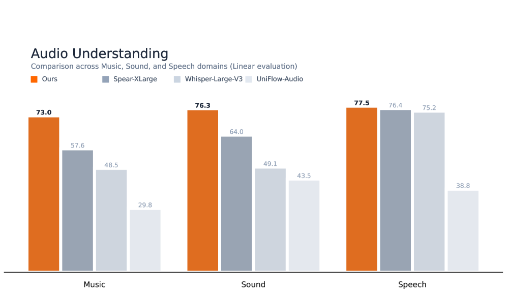
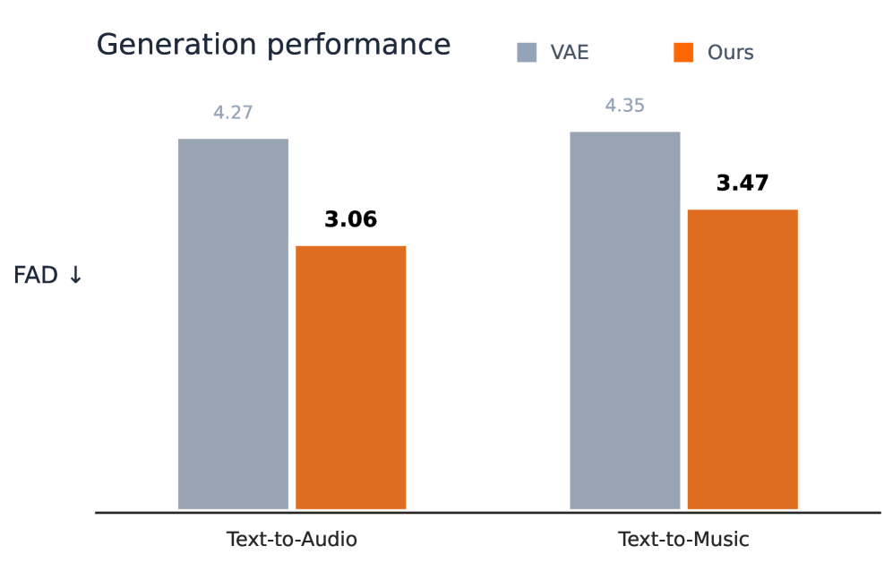
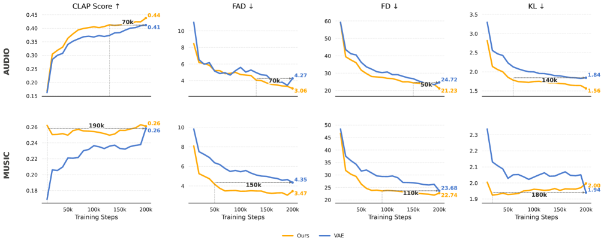
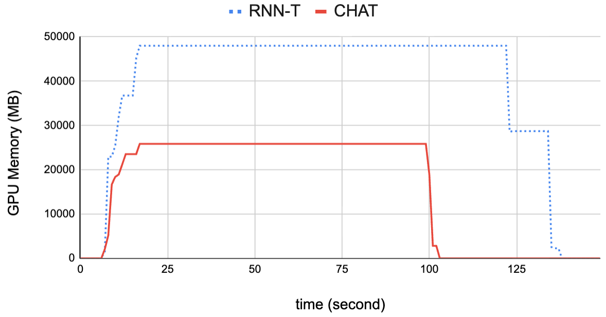
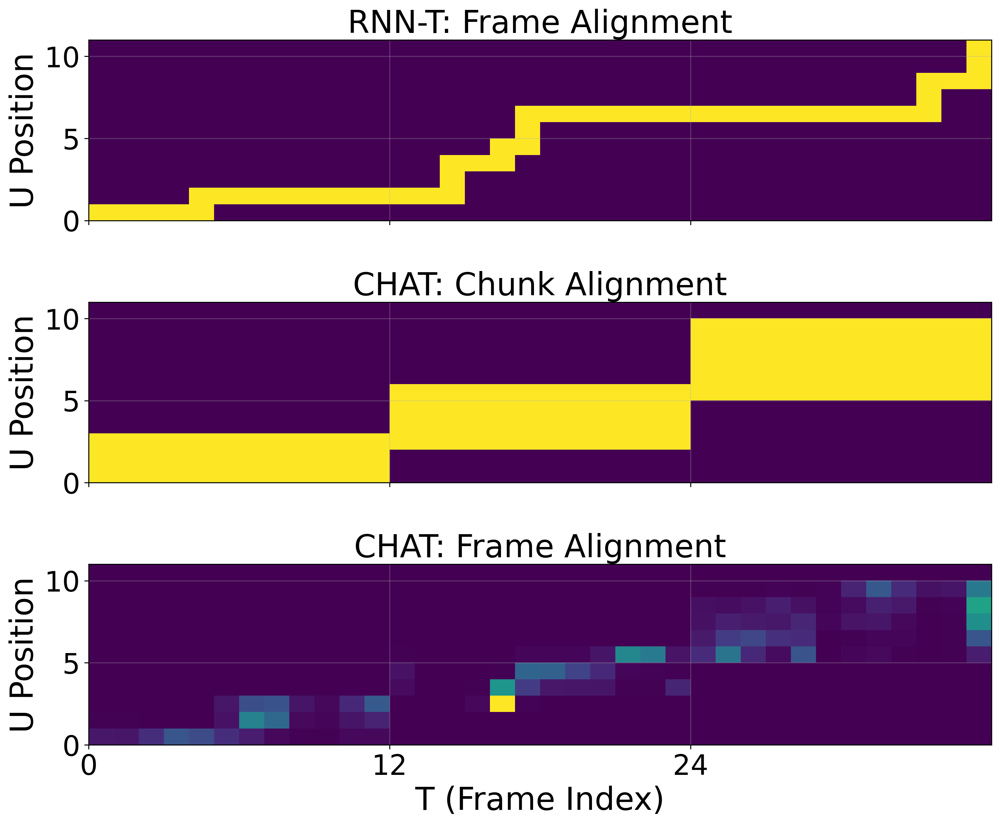
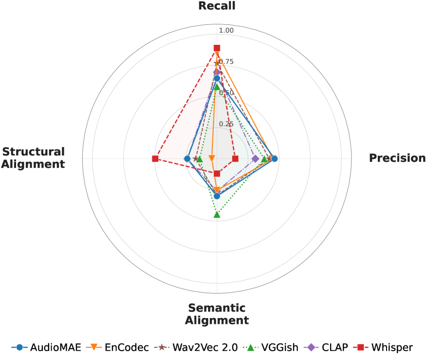
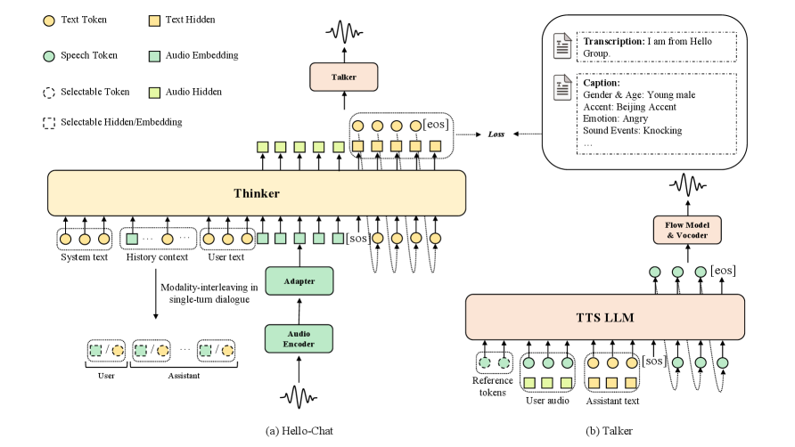
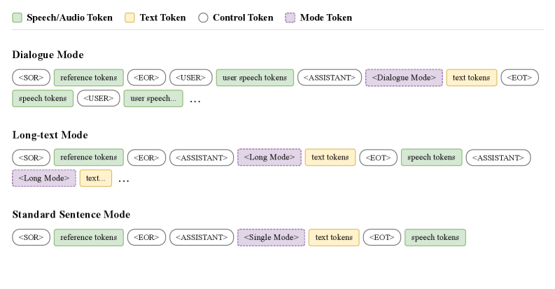

# 🚩 (2026-03-02) Scholar Inbox 추천 논문 

# 📚 DashengTokenizer: One layer is enough for unified audio understanding and generation

🚀 URL: https://arxiv.org/html/2602.23765

## 🌏 Abstract (원문)
The recent surge in Generative AI has been propelled by advances in Large Language Models (LLMs) and Diffusion Models, significantly enhancing the capabilities of audio foundation models. Both of these models are in theory capable to be used for audio understandingChuet al.(2024); Zhouet al.(2025)and audio generationYanget al.(2024); Huanget al.(2023), a representation gap persists in practice. Understanding tasks typically rely on unidirectional encoders that produce coarse, high-dimensional semantic embeddings. In contrast, generation employs tokenizers ( discrete or continuous autoencoders ) to ensure high-fidelty reconstruction from low-dimensional acoustic features. Current literature for joint understanding and generation thus adopt one of two architectures: (I) Employing a semantic encoder alongside an independent acoustic tokenizer. While effective, this approach is computationally redundant and increases system complexity; or (II) Training a single model to capture both semantic and acoustic information. These models frequently prioritize reconstruction, often resulting in subpar semantic representations compared to dedicated encoders In contrast to previous single tokenizer methods, which distill high-dimensional semantic knowledge into a low-dimensional acoustic model, our approach aims to do the inverse: We embed low-dimensional acoustic information into high-dimensional semantic features. We introduce DashengTokenizer, a unified continuous audio tokenizer designed for both understanding and generation across speech, music, and environmental sound domains. Our approach freezes previous semantic knowledge from a pretrained, strong semantic encoder, and injects acoustic information from a mel-spectrogram via a linear projection. The method is simple, requiring to only train a the linear projection with an additional standard acoustic decoder. A comparison with previous works can be seen inTable˜1. DashengTokenizer performs on par with previous continuous tokenizers for reconstruction tasks, while significantly outperforming codecs and encoders in general audio understanding. Furthermore, our experiments in Text-to-Audio (TTA), Text-to-Music (TTM), and Speech Enhancement (SE) demonstrate the superior versatility of our representation for high-fidelity audio generation. A summarization of DashengTokenizer’s performance is seen inFigure˜1.
## 🌏 Abstract (번역)
최근 생성형 AI의 급증은 대규모 언어 모델(LLM)과 확산 모델(Diffusion Models)의 발전에 의해 추진되었으며, 이는 오디오 파운데이션 모델의 능력을 크게 향상시켰습니다. 이론적으로 이 두 모델 모두 오디오 이해와 오디오 생성에 사용될 수 있지만, 실제로는 표현의 격차가 존재합니다. 이해 작업은 일반적으로 거칠고 고차원적인 시맨틱 임베딩을 생성하는 단방향 인코더에 의존합니다. 반면, 생성 작업은 저차원 어쿠스틱 특징으로부터 고충실도 복원을 보장하기 위해 토크나이저(이산 또는 연속 오토인코더)를 사용합니다. 따라서 통합된 이해 및 생성을 위한 기존 문헌은 두 가지 아키텍처 중 하나를 채택합니다: (I) 시맨틱 인코더와 독립적인 어쿠스틱 토크나이저를 함께 사용하는 방식. 이 방식은 효과적이지만 계산적으로 중복되고 시스템 복잡성을 증가시킵니다. 또는 (II) 시맨틱 및 어쿠스틱 정보를 모두 캡처하기 위해 단일 모델을 학습시키는 방식. 이러한 모델은 빈번하게 복원을 우선시하여 전용 인코더에 비해 시맨틱 표현 능력이 떨어지는 경우가 많습니다. 고차원 시맨틱 지식을 저차원 어쿠스틱 모델로 증류하는 기존의 단일 토크나이저 방식과 달리, 본 연구의 접근 방식은 그 반대를 목표로 합니다: 저차원 어쿠스틱 정보를 고차원 시맨틱 특징에 임베딩합니다. 본 논문에서는 음성, 음악 및 환경음 도메인 전반에서 이해와 생성 모두를 위해 설계된 통합 연속 오디오 토크나이저인 DashengTokenizer를 소개합니다. 우리의 접근 방식은 사전 학습된 강력한 시맨틱 인코더로부터 기존의 시맨틱 지식을 동결하고, 선형 투영을 통해 멜-스펙트로그램에서 어쿠스틱 정보를 주입합니다. 이 방법은 간단하며, 추가적인 표준 어쿠스틱 디코더와 함께 선형 투영만을 학습시키면 됩니다. DashengTokenizer는 복원 작업에서 기존의 연속 토크나이저와 대등한 성능을 보이는 동시에, 일반적인 오디오 이해 측면에서 코덱 및 인코더를 크게 능가합니다. 또한, 텍스트-오디오(TTA), 텍스트-음악(TTM) 및 음성 향상(SE) 실험을 통해 고충실도 오디오 생성을 위한 우리 표현 방식의 우수한 다재다능함을 입증합니다.

## 🔍 Methods & Results
- DashengTokenizer는 동결된 사전 학습 시맨틱 인코더의 고차원 특징에 저차원 어쿠스틱 정보를 주입하는 통합 구조를 제안함
- 입력 신호에서 추출된 시맨틱 특징과 멜-스펙트로그램 기반의 어쿠스틱 임베딩을 선형 투영 후 가산 융합(Additive Fusion)하여 통합 특징을 생성함
- 시맨틱 보존 손실(Semantic Preservation Loss)을 도입하여 어쿠스틱 정보 주입 시 시맨틱 표현 능력이 저하되는 것을 방지함
- GAN 프레임워크와 다중 주파수 판별기(MFD)를 사용하여 고충실도 오디오 복원을 위한 보코더를 학습함
- 복원 작업에서 기존 연속 토크나이저와 대등한 성능을 보이면서도, 일반적인 오디오 이해 작업에서는 기존 코덱 및 인코더를 크게 능가함
- Text-to-Audio, Text-to-Music, Speech Enhancement 실험을 통해 고충실도 오디오 생성을 위한 표현의 범용성을 입증함

## 🖼 Figures

*(a)Audio Understanding Results*

*(a)Audio Understanding Results*

*(b)Generation Performance*

![Figure 2:The proposed DashengTokenizer compared to prior approaches: [A] standard acoustic Acoustic modeling using VAE, and [B] semantically distilled (VQ-)VAEs. In contrast, our approach eliminates the multi-stage training required by [B] and does not rely on a semantic decoder that is discarded during inference, thereby avoiding a train-test mismatch.](../images/2026-03-02/2602.23765/2602.23765_fig3.png)
*Figure 2:The proposed DashengTokenizer compared to prior approaches: [A] standard acoustic Acoustic modeling using VAE, and [B] semantically distilled (VQ-)VAEs. In contrast, our approach eliminates the multi-stage training required by [B] and does not rely on a semantic decoder that is discarded during inference, thereby avoiding a train-test mismatch.*

*Figure 3:Text-to-Audio and Text-to-Music training progress of our proposed framework compared with the VAE from UniFlow-Audio.*

---
**Usage Info**: 6313 tokens used.
**Generated at**: 2026-03-02 16:40:34

---

# 📚 Chunk-wise Attention Transducers for Fast and Accurate Streaming Speech-to-Text

🚀 URL: https://arxiv.org/html/2602.24245

## 🌏 Abstract (원문)
Streaming speech processing systems[7]require models that can process audio incrementally while maintaining high accuracy and low latency. RNN-T[5]is a popular model for such processing, due to its frame-synchronous nature. However, RNN-T models are monotonic in nature, limiting its modeling capacity for more complex tasks that require flexible alignments. Further, RNN-T training is computationally costly, requiring substantial time and memory during training due to the forward-backward algorithm over the alignment lattice. Numerous works have proposed ways to improve the modeling capacity and/or efficiency of RNN-T models. Multi-blank Transducers[19], Token-and-Duration Transducers (TDT)[18], and their variants[16]propose explicitly modeling frame duration alignment of individual text tokens, bringing inference speedup and slight accuracy gains. In terms of architecture improvements, more sophisticated models[13],[6]are shown to outperform LSTM encoders. Stateless predictors[4]achieve similar accuracy as LSTM variants, with improved efficiency. Meanwhile,[20]proposed a joiner with attention-pooling operation to improve performance for speech translation.[17],[3],[2]improved the speed of RNN-T inference. In this work, we enhance the RNN-T architecture to operate on chunks of input frames while enabling the joint network to perform cross-attention within chunks. This approach, which we termChunk-wise Attention Transducer(CHAT), maintains RNN-T’s streaming capability and computational advantages while introducing controlled flexibility in local alignment modeling. This work shares similarity with[21], with the added benefit that no time-stamp information is needed for training our model. Some of the most notable improvements we see with the CHAT model over RNN-T are,
## 🌏 Abstract (번역)
스트리밍 음성 처리 시스템은 높은 정확도와 낮은 지연 시간을 유지하면서 오디오를 점진적으로 처리할 수 있는 모델을 필요로 합니다. RNN-T는 프레임 동기화 특성으로 인해 이러한 처리에 널리 사용되는 모델입니다. 그러나 RNN-T 모델은 본질적으로 단조로워 유연한 정렬이 필요한 복잡한 작업에 대한 모델링 능력이 제한적입니다. 또한 RNN-T 학습은 정렬 격자에 대한 전방-후방 알고리즘으로 인해 상당한 시간과 메모리가 소요되어 계산 비용이 많이 듭니다. RNN-T 모델의 모델링 능력 및 효율성을 개선하기 위한 수많은 연구가 제안되었습니다. Multi-blank Transducers, Token-and-Duration Transducers (TDT) 및 그 변형들은 개별 텍스트 토큰의 프레임 지속 시간 정렬을 명시적으로 모델링하여 추론 속도 향상과 약간의 정확도 이득을 가져왔습니다. 아키텍처 개선 측면에서는 더 정교한 모델들이 LSTM 인코더보다 우수한 성능을 보이는 것으로 나타났습니다. Stateless predictor는 LSTM 변형과 유사한 정확도를 달성하면서 효율성을 개선했습니다. 한편, 음성 번역 성능을 향상시키기 위해 어텐션 풀링 연산을 사용하는 조이너가 제안되었으며, RNN-T 추론 속도를 개선하는 연구들도 있었습니다. 본 연구에서는 입력 프레임의 청크 단위로 작동하면서 조이너 네트워크가 청크 내에서 교차 어텐션을 수행할 수 있도록 RNN-T 아키텍처를 강화합니다. CHAT(Chunk-wise Attention Transducer)라고 명명된 이 접근 방식은 RNN-T의 스트리밍 능력과 계산상의 이점을 유지하면서 로컬 정렬 모델링에 제어된 유연성을 도입합니다. 이 작업은 이전 연구와 유사성을 공유하지만, 모델 학습을 위해 타임스탬프 정보가 필요하지 않다는 추가적인 이점이 있습니다. CHAT 모델에서 RNN-T 대비 확인되는 가장 주목할 만한 개선 사항은 다음과 같습니다.

## 🔍 Methods & Results
- CHAT 모델은 RNN-T의 인코더, 프리딕터, 손실 함수 계산 방식을 유지하면서 조이너 아키텍처를 혁신적으로 변경함
- 인코더가 단일 프레임 대신 프레임 청크를 조이너로 전달하는 인터페이스를 채택함
- 모델 예측 절차는 RNN-T와 유사하나, blank가 출력되면 다음 청크로 이동하고 그렇지 않으면 동일 청크에 머물며 프리딕터 표현을 업데이트함
- CHAT는 RNN-T에 비해 blank 출력을 대폭 줄이며, blank 발생 횟수가 청크 크기 비율만큼 감소함
- 조이너는 멀티 헤드 어텐션 메커니즘을 사용하여 청크 내의 인코더 정보를 선택적으로 집계함
- 각 청크 끝에 blank 토큰 출력을 위한 제로 프레임(all-zero frame)을 추가하여 어텐션 연산을 수행함
- 학습된 투영 행렬(WQ, WK, WV)을 통해 쿼리, 키, 값을 생성하고 스케일드 닷 프로덕트 어텐션을 계산함
- 어텐션이 적용된 인코더 표현과 프리딕터 표현을 결합하고 비선형 활성화 함수를 거쳐 최종 토큰 확률을 산출함

## 🖼 Figures

*Fig. 1:GPU Memory Usage (MB) when training RNNT and CHAT models for one mini-epoch with batch=32 (5000 selected utterances in Librispeech train) on A6000 GPU.*

*Fig. 2:From top to bottom: 1. RNN-T frame alignments; 2. CHAT chunk-based alignments; 3. CHAT frame-based alignments. Chunk-size = 12.*

---
**Usage Info**: 5830 tokens used.
**Generated at**: 2026-03-02 16:41:02

---

# 📚 Online Register for Dual-Mode Self-Supervised Speech Models: Mitigating the Lack of Future Context

🚀 URL: https://arxiv.org/html/2602.23702

## 🌏 Abstract (원문)
Self-supervised speech models (S3Ms) have become an essential foundation for a wide range of speech processing systems. Typically, an S3M is pre-trained on large-scale unlabeled speech data to learn the semantic structure of speech. Various pretraining methods have been proposed, such as clustering-based targets[15], random projection quantizers[7,14]and differentiable vector quantization[3,4]. Once pre-trained, S3Ms can be adapted to diverse downstream tasks with limited labeled data, yielding substantial accuracy improvements in automatic speech recognition (ASR)[2,6]. However, the representative S3Ms are still pre-trained only in offline scenarios. Unlike in the offline scenario, where the model can exploit the full utterance, the models can only access the current and past segments in online scenario. This mismatch leads to significant accuracy gaps between offline and online models. To mitigate this issue, researchers have explored building streaming-capable S3Ms. Distillation-based methods[24,5,12]train online models to approximate the outputs of an offline model using unlabeled data. To improve robustness to chunk size, dynamic chunk training[26]has been introduced in S3Ms[10]. Dual-mode ASR[25]unifies offline and online ASR within a single model, and UFO2[11]applies this strategy to S3Ms. While these methods improve performance, a fundamental challenge remains insufficiently addressed:online models lack access to the future context that offline models can exploit. Enlarging the chunk size or introducing look-ahead alleviates this gap, but at the cost of increased algorithmic latency. In this work, we proposeonline register, a novel approach to mitigate the lack of future context for dual-mode S3Ms. Inspired by register tokens[9], our method introduces special tokens appended to each chunk only in online mode. These tokens serve as proxies for unavailable future frames, allowing the model to exploit pseudo future context without additional latency. Moreover, by incorporating afuture prediction lossthat encourages the online registers to predict future frames explicitly, the registers are guided to capture richer future information. As a result, online registers improve performance in both offline and online scenarios by effectively bridging the gap between the two modes.
## 🌏 Abstract (번역)
자기 지도 학습 음성 모델(S3M)은 광범위한 음성 처리 시스템의 필수적인 기반이 되었습니다. 일반적으로 S3M은 대규모 레이블이 없는 음성 데이터에 대해 사전 학습되어 음성의 의미론적 구조를 학습합니다. 클러스터링 기반 타겟, 무작위 투영 양자화기, 미분 가능한 벡터 양자화 등 다양한 사전 학습 방법이 제안되었습니다. 사전 학습된 S3M은 제한된 레이블 데이터로 다양한 다운스트림 작업에 적응할 수 있으며, 자동 음성 인식(ASR)에서 상당한 정확도 향상을 제공합니다. 그러나 대표적인 S3M들은 여전히 오프라인 시나리오에서만 사전 학습됩니다. 모델이 전체 발화를 활용할 수 있는 오프라인 시나리오와 달리, 온라인 시나리오에서는 현재와 과거 세그먼트에만 접근할 수 있습니다. 이러한 불일치는 오프라인 모델과 온라인 모델 간의 상당한 정확도 격차를 초래합니다. 이 문제를 완화하기 위해 연구자들은 스트리밍이 가능한 S3M 구축을 탐구해 왔습니다. 증류 기반 방법은 레이블이 없는 데이터를 사용하여 온라인 모델이 오프라인 모델의 출력을 근사하도록 학습시킵니다. 청크 크기에 대한 견고성을 높이기 위해 S3M에 동적 청크 학습이 도입되었습니다. 듀얼 모드 ASR은 단일 모델 내에서 오프라인과 온라인 ASR을 통합하며, UFO2는 이 전략을 S3M에 적용합니다. 이러한 방법들이 성능을 향상시키지만, 근본적인 과제는 여전히 충분히 해결되지 않았습니다. 즉, 온라인 모델은 오프라인 모델이 활용할 수 있는 미래 문맥에 접근할 수 없다는 점입니다. 청크 크기를 키우거나 룩어헤드(look-ahead)를 도입하면 이 격차를 완화할 수 있지만, 알고리즘 지연 시간이 늘어나는 비용이 발생합니다. 본 연구에서는 듀얼 모드 S3M의 미래 문맥 부족 문제를 완화하기 위한 새로운 접근 방식인 '온라인 레지스터(online register)'를 제안합니다. 레지스터 토큰에서 영감을 받은 우리의 방법은 온라인 모드에서만 각 청크에 추가되는 특수 토큰을 도입합니다. 이 토큰들은 사용할 수 없는 미래 프레임의 대리인 역할을 하여, 추가적인 지연 시간 없이 모델이 가상의 미래 문맥을 활용할 수 있게 합니다. 또한, 온라인 레지스터가 미래 프레임을 명시적으로 예측하도록 유도하는 미래 예측 손실을 통합함으로써, 레지스터가 더 풍부한 미래 정보를 캡처하도록 안내합니다. 결과적으로 온라인 레지스터는 두 모드 사이의 격차를 효과적으로 메움으로써 오프라인과 온라인 시나리오 모두에서 성능을 향상시킵니다.

## 🔍 Methods & Results
- 단일 인코더로 오프라인과 온라인 설정을 모두 지원하는 듀얼 모드 자기 지도 학습 프레임워크(UFO2 기반)를 구축함
- 온라인 모드에서 부족한 미래 문맥을 보완하기 위해 각 청크에 학습 가능한 특수 토큰인 '온라인 레지스터(Online Registers)'를 추가함
- 온라인 레지스터가 미래 정보를 명시적으로 학습하도록 오프라인 경로의 미래 프레임 표현을 예측하는 '미래 예측 손실(Future Prediction Loss)'을 도입함
- 트랜스포머 인코더 내에서 현재/과거 청크, 룩어헤드 프레임, 그리고 해당 온라인 레지스터에만 접근할 수 있도록 설계된 어텐션 마스크를 적용함
- wav2vec 2.0 프레임워크를 기반으로 오프라인 및 온라인 모드에 대한 대조 학습 손실(Contrastive Loss)을 공동으로 최적화함
- 온라인 레지스터는 추가적인 알고리즘 지연 시간 없이 가상의 미래 문맥을 제공하여 오프라인과 온라인 모드 간의 성능 격차를 효과적으로 줄임

## 🖼 Figures
![Fig. 1:Overview of our proposed pre-training framework with online registers. As an example, we illustrate the case where the feature length is 4 frames, the chunk size is 2, and the number of online registers per chunk is 1. The dual-mode Transformer encoder processes offline input with full-context attention and online input with chunk-wise attention, where online registers are appended. The model is trained to predict quantized targets for masked frames (dotted line boxes), with an additional future prediction loss encouraging the online registers to store future context.](../images/2026-03-02/2602.23702/2602.23702_fig0.png)
*Fig. 1:Overview of our proposed pre-training framework with online registers. As an example, we illustrate the case where the feature length is 4 frames, the chunk size is 2, and the number of online registers per chunk is 1. The dual-mode Transformer encoder processes offline input with full-context attention and online input with chunk-wise attention, where online registers are appended. The model is trained to predict quantized targets for masked frames (dotted line boxes), with an additional future prediction loss encouraging the online registers to store future context.*

*Fig. 2:Attention mask design for the online mode. As an example, we illustrate the case where the feature length is 6 frames, the chunk size is 2, the look-ahead size is 1, and the number of online registers per chunk is 1. During attention computation, the model attends only to the past and current chunks, the look-ahead, and the online registers, while all other attention weights (white boxes) are filled with 
−
∞*

---
**Usage Info**: 4614 tokens used.
**Generated at**: 2026-03-02 16:41:26

---

# 📚 An Empirical Analysis of Task-Induced Encoder Bias in Fréchet Audio Distance

🚀 URL: https://arxiv.org/html/2602.23958

## 🌏 Abstract (원문)
Text-to-audio (TTA) generation has advanced rapidly with diffusion-based and language-model-based architectures, intensifying the need for reliable automatic evaluation. Fréchet Audio Distance (FAD), adapted from FID, computes distributional distance between real and generated audio in a pretrained encoder's embedding space and has become the standard benchmark metric. However, FAD scores can diverge from human auditory judgments—a limitation shared with its visual counterpart FID and one that undermines its reliability as a perceptual proxy. While FAD's Gaussian assumption and sample size sensitivity introduce significant limitations, the dominant and least-studied source of perceptual divergence remains the training task of the encoder. The task explicitly determines feature preservation in the embedding space: an ASR encoder abstracts away pitch and timbre; a classification encoder collapses temporal structure; and a codec encoder exhibits low sensitivity to inter-frame ordering. Consequently, distortions falling into an encoder's invariance set yield negligible FAD variations regardless of perceptual severity. Prior work has noted this encoder-dependent variability, but it remains unclear exactly which features each encoder discards. To map these blind spots, we decompose evaluation into three axes: Recall, Precision, and Alignment (semantic, structural), and employ log-scale self-reference normalization as an analytical tool for fair cross-encoder comparison. Controlled experiments on six encoders and two datasets reveal a four-axis trade-off: AudioMAE achieves the highest precision sensitivity; Whisper dominates structural detection but exhibits marginal sensitivity to signal degradation; VGGish leads semantic alignment but disproportionately penalizes recall. Because every encoder's training task induces a distinct invariance set, no single tested encoder functions as a universal evaluator—a finding that underscores the need for evaluation-native encoders whose embedding spaces are intrinsically aligned with human perception.
## 🌏 Abstract (번역)
텍스트-오디오(TTA) 생성 기술은 확산 기반 및 언어 모델 기반 아키텍처를 통해 빠르게 발전해 왔으며, 이에 따라 신뢰할 수 있는 자동 평가의 필요성이 증대되었습니다. FID에서 파생된 Fréchet Audio Distance(FAD)는 사전 학습된 인코더의 임베딩 공간에서 실제 오디오와 생성된 오디오 간의 분포 거리를 계산하며 표준 벤치마크 지표가 되었습니다. 그러나 FAD 점수는 인간의 청각적 판단과 일치하지 않을 수 있으며, 이는 시각적 대응물인 FID와 공유되는 한계로 지표의 신뢰성을 저해합니다. FAD의 가우시안 가정과 샘플 크기 민감도가 상당한 제약을 유발하지만, 지각적 차이의 가장 지배적이면서도 연구되지 않은 원인은 인코더의 학습 태스크입니다. 학습 태스크는 임베딩 공간에서의 특징 보존을 결정합니다. 예를 들어, ASR 인코더는 피치와 음색을 추상화하고, 분류 인코더는 시간적 구조를 붕괴시키며, 코덱 인코더는 프레임 간 순서에 낮은 민감도를 보입니다. 결과적으로 인코더의 불변 집합에 속하는 왜곡은 지각적 심각도와 관계없이 무시할 수 있는 수준의 FAD 변화를 생성합니다. 이전 연구에서 이러한 인코더 의존적 가변성을 언급했지만, 각 인코더가 정확히 어떤 특징을 버리는지는 불분명했습니다. 이러한 사각지대를 매핑하기 위해 본 연구에서는 평가를 재현율(Recall), 정밀도(Precision), 정렬(Alignment, 의미적 및 구조적)의 세 가지 축으로 분해하고, 공정한 인코더 간 비교를 위한 분석 도구로 로그 스케일 자기 참조 정규화를 사용합니다. 6개의 인코더와 2개의 데이터셋에 대한 통제된 실험 결과, 4개 축의 트레이드오프가 드러났습니다. AudioMAE는 가장 높은 정밀도 민감도를 달성했고, Whisper는 구조적 탐지에서 우세했으나 신호 저하에는 낮은 민감도를 보였으며, VGGish는 의미적 정렬을 주도했으나 재현율을 과도하게 페널티 부여했습니다. 모든 인코더의 학습 태스크가 고유한 불변 집합을 유도하므로, 테스트된 단일 인코더 중 범용 평가자로 기능하는 것은 없었습니다. 이는 임베딩 공간이 인간의 지각과 본질적으로 일치하는 평가 전용 인코더의 필요성을 강조합니다.

## 🔍 Methods & Results
- FAD를 가우시안 분포로 모델링된 참조 및 생성 임베딩 간의 2-Wasserstein 거리로 정의하고, 인코더의 학습 태스크가 지각적 거리 표현 능력을 제한함을 수학적으로 분석함
- 인코더가 특정 지각적 왜곡을 감지하지 못하는 영역인 '근사 불변 집합(approximate invariance set)' 개념을 도입하여 평가 지표의 사각지대를 정의함
- 평가 차원을 재현율(Recall), 정밀도(Precision), 의미적 정렬(Semantic Alignment), 구조적 정렬(Structural Alignment)의 4개 축으로 분해하여 체계적인 진단 프레임워크를 구축함
- 서로 다른 동적 범위를 가진 인코더들을 공정하게 비교하기 위해 로그 스케일 자기 참조 정규화(log-scale self-reference normalization) 기법을 제안함
- 실험 결과 AudioMAE는 정밀도, Whisper는 구조적 정렬, VGGish는 의미적 정렬에서 강점을 보였으나, 모든 지표를 만족하는 단일 범용 인코더는 존재하지 않음을 입증함
- 로그 변환을 통해 저왜곡 영역에서의 판별 해상도를 집중시켰으며, 이는 인간 지각의 베버-페히너 법칙(Weber-Fechner law)과 일치하는 민감도 구배를 제공함

## 🖼 Figures

*Figure 1:Four-axis trade-off (Outermost is better). AudioMAE leads Precision; Whisper captures Structural but is invariant to signal degradation; VGGish leads Semantic but limits Recall.*

*Figure 2:Precision response to white noise. (a) Raw FAD (linear scale): dynamic-range disparity compresses low-sensitivity encoders into a visually indistinguishable baseline—this ``visual squashing'' motivates our normalization. (b) After log-scale normalization (
𝑆
norm
), all six trajectories separate, revealing each encoder's distinct precision profile.*

*Figure 3:Pitch-shift trajectory (
−
8
 to 
+
8
 st). Shaded: recall zone (
±
1–2 st). VGGish shows inflexible sensitivity at mild shifts; Whisper maintains the lowest recall-zone response.*

*Figure 4:Diverging bar chart of Structural (left) vs. Semantic (right) sensitivity. Solid bars: Reversal / Pitch +8 st; hatched bars: Shuffle 100 ms / Formant 1.4
×
. Whisper extends far left (structural-dominant); VGGish extends far right (semantic-dominant)—visually capturing the anti-correlation (
𝑟
=
−
0.67
).*

---
**Usage Info**: 4959 tokens used.
**Generated at**: 2026-03-02 16:41:51

---

# 📚 Hello-Chat: Towards Realistic Social Audio Interactions

🚀 URL: https://arxiv.org/html/2602.23387

## 🌏 Abstract (원문)
Recent years have witnessed the rapid evolution of Large Language Models (LLMs) and audio processing technologies, propelling Large Audio Language Models (LALMs) to deliver remarkable performance across diverse tasks such as automatic speech recognition, translation, and question answering. The emergence of these models marks a paradigm shift in machine audio processing, moving from simple signal mapping to deep intelligent processing. The ability of LALMs to perceive and interact with the physical world is primarily manifested in two dimensions: first, the capability to not only recognize speech content but also precisely perceive speaker emotions, environmental contexts, and paralinguistic cues; and second, the ability to engage in interactions with high realism and expressiveness. Currently, both academia and industry have produced numerous representative works. In terms of audio understanding, models such as Kimi-Audio and MiDashengLM have significantly improved perception accuracy by introducing large-scale supervised data. Meanwhile, in audio generation, models like Qwen3-Omni and Step-Audio have explored more natural paradigms for speech synthesis and dialogue interaction. Despite significant strides in task accuracy, existing LALMs still exhibit palpable deficiencies in interaction quality within real-world social scenarios. This insufficiency is mainly characterized by a disconnect between perception and expression. Current models demonstrate robust semantic understanding, effectively recognizing speech content and emotional labels. However, their generation outputs often suffer from a distinct read-speech style, lacking the prosodic variations and non-verbal sounds (e.g., pauses, sighs and laughter) inherent in natural conversation. This limitation stems from two main factors: the scarcity of natural, spontaneous speech data and the challenge of dynamically adjusting speaking styles within complex, multi-turn dialogues. Consequently, audio understanding capabilities have not yet been effectively translated into control signals for generation, limiting the potential for human-like interaction. Based on these observations, we argue that the key to build the next generation of high-performance voice interaction models lies in driving high-fidelity, context-adaptive speech generation through deep audio understanding capabilities. An ideal voice model should possess end-to-end capabilities: it should perceive environmental noise, speaker emotions, and conversational rhythms, while generating outputs that are contextually appropriate and rich in interactive features. Guided by this philosophy, we propose Hello-Chat, an end-to-end LALM tailored for real-world daily scenarios. Our approach comprises three core elements. First, to complement standard open-source datasets, we curated a large-scale dataset focused on daily conversational scenarios. Unlike standard read speech or scripted speech corpora, this dataset contains a vast amount of real-life conversations, preserving the complete acoustic features and interaction patterns inherent in real human communication. Second, to fully utilize this data, we extracted multi-dimensional information from the audio to construct detailed caption data. We not only transcribe the textual content but also perform detailed textual labeling of non-semantic features (e.g., speech rate, tone and pathology), emotional states, and background environments. This joint semantic-acoustic annotation enables the model to explicitly establish a mapping between “understanding acoustic details” and “generating acoustic details” during training. Finally, regarding training strategy, we employed a modality-interleaved training approach. By randomly replacing audio and text modalities within the “User Audio – Text Instruction – Model Audio” training sequence, we enhanced modality alignment and instruction-following capabilities, a phenomenon validated by our early experiments. Experimental results demonstrate that Hello-Chat achieves state-of-the-art (SOTA) performance on general understanding benchmarks such as Automatic Speech Recognition(ASR) and AudioQA, while achieving a breakthrough in the realism of speech generation. In subjective listening evaluations, the speech generated by our model significantly outperforms existing open-source baselines in prosodic naturalness, emotional accuracy, and interaction fluency, proving difficult to distinguish from real human speech. The main contributions of this paper are summarized as follows: We propose an end-to-end LALM with robust audio understanding capabilities, demonstrating that powerful perception is a prerequisite for achieving high-fidelity generation. We constructed and validated training and verification data based on daily conversations, including fine-grained caption annotation and a modality-interleaved training strategy, effectively solving the style alignment problem in non-reading scenarios. While maintaining the ability to handle general audio tasks, we realized a highly realistic voice interaction experience, providing a new technical path for the research of next-generation anthropomorphic voice agents.
## 🌏 Abstract (번역)
최근 몇 년 동안 대규모 언어 모델(LLM)과 오디오 처리 기술의 급격한 발전으로 인해 자동 음성 인식, 번역, 질의응답 등 다양한 작업에서 뛰어난 성능을 발휘하는 대규모 오디오 언어 모델(LALM)이 등장했습니다. 이러한 모델의 등장은 단순한 신호 매핑에서 심층적인 지능형 처리로 기계 오디오 처리의 패러다임 전환을 의미합니다. LALM이 물리적 세계를 인식하고 상호작용하는 능력은 주로 두 가지 차원에서 나타납니다. 첫째, 음성 콘텐츠를 인식할 뿐만 아니라 화자의 감정, 환경적 맥락, 준언어적 단서를 정밀하게 인식하는 능력이며, 둘째, 높은 현실감과 표현력을 갖춘 상호작용에 참여하는 능력입니다. 현재 학계와 산업계 모두에서 수많은 대표적인 연구 결과가 나왔습니다. 오디오 이해 측면에서 Kimi-Audio 및 MiDashengLM과 같은 모델은 대규모 지도 데이터를 도입하여 인식 정확도를 크게 향상시켰습니다. 한편, 오디오 생성 측면에서 Qwen3-Omni 및 Step-Audio와 같은 모델은 음성 합성 및 대화 상호작용을 위한 보다 자연스러운 패러다임을 탐구했습니다. 작업 정확도의 상당한 진전에도 불구하고, 기존 LALM은 실제 사회적 시나리오에서의 상호작용 품질에서 여전히 뚜렷한 결함을 보입니다. 이러한 부족함은 주로 인식과 표현 사이의 단절로 특징지어집니다. 현재 모델들은 음성 콘텐츠와 감정 레이블을 효과적으로 인식하며 강력한 의미론적 이해력을 보여줍니다. 그러나 생성된 출력물은 종종 뚜렷한 '낭독체(read-speech style)' 문제를 겪으며, 자연스러운 대화에 내재된 운율 변화와 비언어적 소리(예: 일시 정지, 한숨, 웃음)가 부족합니다. 이러한 한계는 두 가지 주요 요인에서 기인합니다. 즉, 자연스럽고 자발적인 음성 데이터의 부족과 복잡한 다회차 대화 내에서 말하기 스타일을 동적으로 조정하는 것의 어려움입니다. 결과적으로 오디오 이해 능력이 생성 제어 신호로 효과적으로 변환되지 못해 인간다운 상호작용의 잠재력이 제한되고 있습니다. 이러한 관찰을 바탕으로, 우리는 차세대 고성능 음성 상호작용 모델을 구축하는 핵심이 심층적인 오디오 이해 능력을 통해 고충실도의 문맥 적응형 음성 생성을 구동하는 데 있다고 주장합니다. 이상적인 음성 모델은 엔드투엔드 능력을 갖추어야 합니다. 즉, 환경 소음, 화자의 감정, 대화 리듬을 인식하는 동시에 문맥적으로 적절하고 상호작용적 특징이 풍부한 출력을 생성해야 합니다. 이러한 철학에 따라, 우리는 실제 일상 시나리오에 맞춤화된 엔드투엔드 LALM인 Hello-Chat을 제안합니다. 우리의 접근 방식은 세 가지 핵심 요소로 구성됩니다. 첫째, 표준 오픈 소스 데이터셋을 보완하기 위해 일상 대화 시나리오에 초점을 맞춘 대규모 데이터셋을 구축했습니다. 표준 낭독체나 대본 기반 음성 코퍼스와 달리, 이 데이터셋은 방대한 양의 실제 대화를 포함하고 있어 실제 인간 의사소통에 내재된 완전한 음향적 특징과 상호작용 패턴을 보존합니다. 둘째, 이 데이터를 충분히 활용하기 위해 오디오에서 다차원 정보를 추출하여 상세한 캡션 데이터를 구축했습니다. 텍스트 콘텐츠를 전사할 뿐만 아니라 비의미적 특징(예: 발화 속도, 톤, 병리적 특징), 감정 상태 및 배경 환경에 대한 상세한 텍스트 라벨링을 수행합니다. 이러한 의미-음향 합동 주석을 통해 모델은 훈련 중에 '음향적 세부 사항 이해'와 '음향적 세부 사항 생성' 사이의 매핑을 명시적으로 구축할 수 있습니다. 마지막으로, 훈련 전략과 관련하여 모달리티 교차(modality-interleaved) 훈련 방식을 채택했습니다. '사용자 오디오 - 텍스트 지시 - 모델 오디오' 훈련 시퀀스 내에서 오디오와 텍스트 모달리티를 무작위로 교체함으로써 모달리티 정렬 및 지시 이행 능력을 향상시켰으며, 이는 초기 실험을 통해 검증되었습니다. 실험 결과, Hello-Chat은 자동 음성 인식(ASR) 및 AudioQA와 같은 일반적인 이해 벤치마크에서 최첨단(SOTA) 성능을 달성하는 동시에 음성 생성의 현실감 측면에서 획기적인 발전을 이루었습니다. 주관적 청취 평가에서 본 모델이 생성한 음성은 운율적 자연스러움, 감정적 정확성, 상호작용 유창성 면에서 기존 오픈 소스 베이스라인을 크게 능가하여 실제 인간의 음성과 구별하기 어려운 것으로 나타났습니다. 본 논문의 주요 기여는 다음과 같이 요약됩니다. 첫째, 강력한 오디오 이해 능력을 갖춘 엔드투엔드 LALM을 제안하여, 강력한 인식이 고충실도 생성을 달성하기 위한 전제 조건임을 입증했습니다. 둘째, 미세 조정된 캡션 주석 및 모달리티 교차 훈련 전략을 포함하여 일상 대화를 기반으로 한 훈련 및 검증 데이터를 구축하고 검증함으로써 비낭독 시나리오에서의 스타일 정렬 문제를 효과적으로 해결했습니다. 셋째, 일반적인 오디오 작업 처리 능력을 유지하면서 매우 현실적인 음성 상호작용 경험을 구현하여 차세대 의인화된 음성 에이전트 연구를 위한 새로운 기술적 경로를 제공했습니다.

## 🔍 Methods & Results
- Hello-Chat은 Audio Encoder(MiDashengLM), Audio Adapter, Thinker(Qwen2.5-7B-Instruct), Talker(CosyVoice 2 기반)의 4가지 핵심 구성 요소로 설계됨
- Thinker 모듈은 오디오 특징을 직접 입력받아 텍스트 표현을 생성하며, 이전 턴의 오디오 임베딩과 텍스트 토큰을 문맥으로 활용하여 대화의 일관성을 유지함
- Talker 모듈은 전통적인 화자 인코더 대신 독립적인 참조 오디오 토큰을 입력 시퀀스 앞에 결합하여 타겟 음색과 스타일을 직접 캡처함
- 의미론적 앵커(텍스트 토큰 및 임베딩)와 음향적 문맥(음성 토큰 및 오디오 히든 스테이트)을 결합한 문맥 인식 시퀀스 모델링 전략을 통해 실시간 감정 및 운율 조절을 구현함
- 발화 속도, 톤, 감정 상태, 배경 환경 등 다차원적인 준언어적 정보를 포함하는 상세한 캡션 주석 시스템을 구축하여 음향적 세부 사항에 대한 이해와 생성 간의 매핑을 강화함
- 사용자 입력과 모델 응답에서 오디오와 텍스트 모달리티를 무작위로 교체하는 모달리티 교차(Modality-interleaved) 훈련 전략을 통해 모달리티에 구애받지 않는 견고한 추론 능력을 확보함
- 기존 텍스트 LLM(Qwen2.5)을 교사 모델로 사용하는 교차 모달리티 증류(Cross-modal distillation) 전략을 도입하여 오디오 모달리티에서도 텍스트 모델의 강력한 추론 능력을 유지함
- 실험 결과, ASR 및 AudioQA 벤치마크에서 SOTA 성능을 기록했으며, 주관적 평가에서 운율적 자연스러움과 감정적 정확성 면에서 기존 모델을 크게 능가함

## 🖼 Figures

*Figure 1:Architecture of Hello-Chat.*

*Figure 2:Token organization strategies for the Talker module. We employ distinct token construction patterns—Dialogue Mode, Long-text Mode, and Standard Sentence Mode—to model different prosodic features and context dependencies.*

---
**Usage Info**: 7766 tokens used.
**Generated at**: 2026-03-02 16:42:23

---

