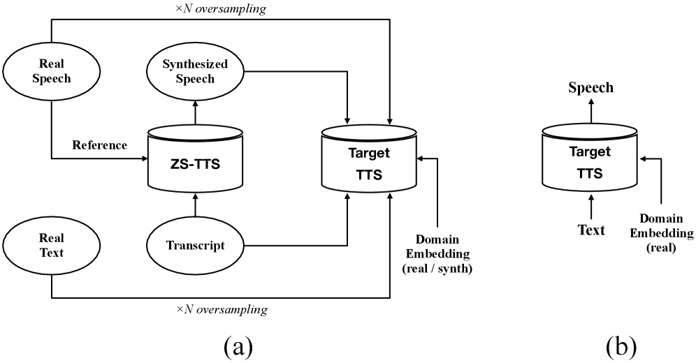
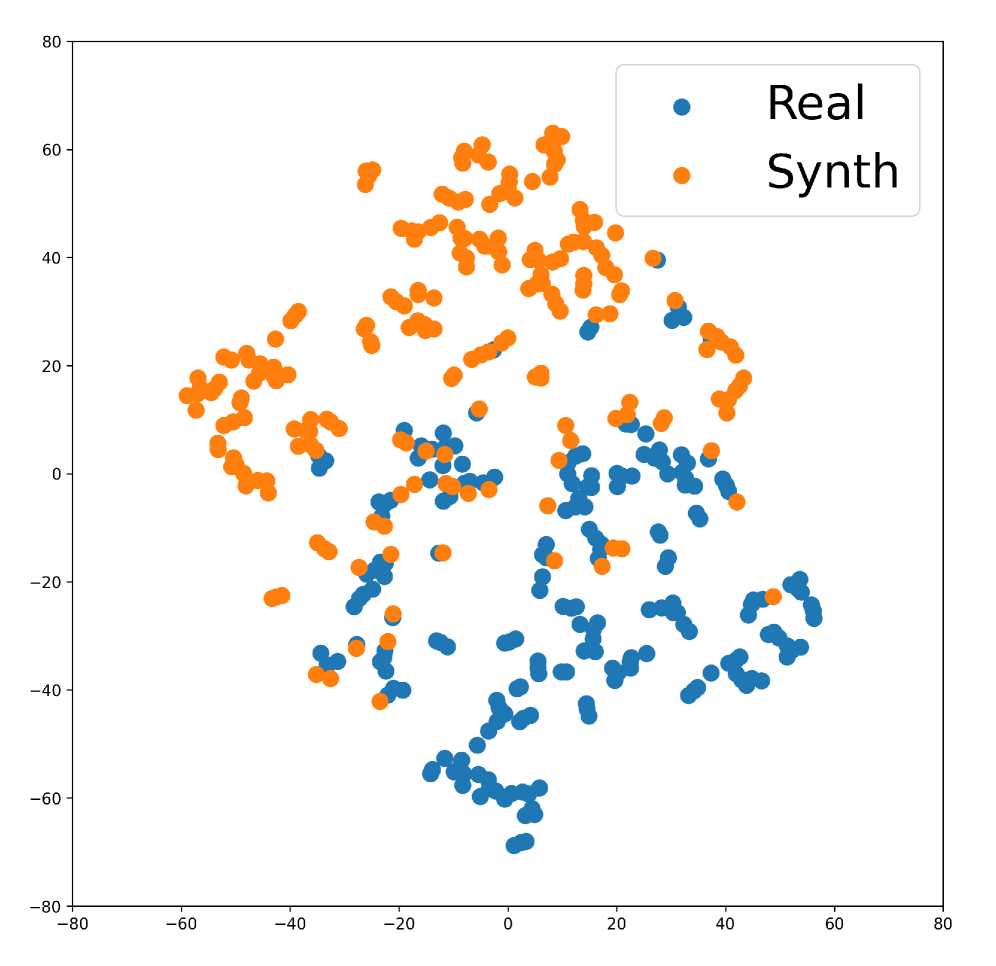
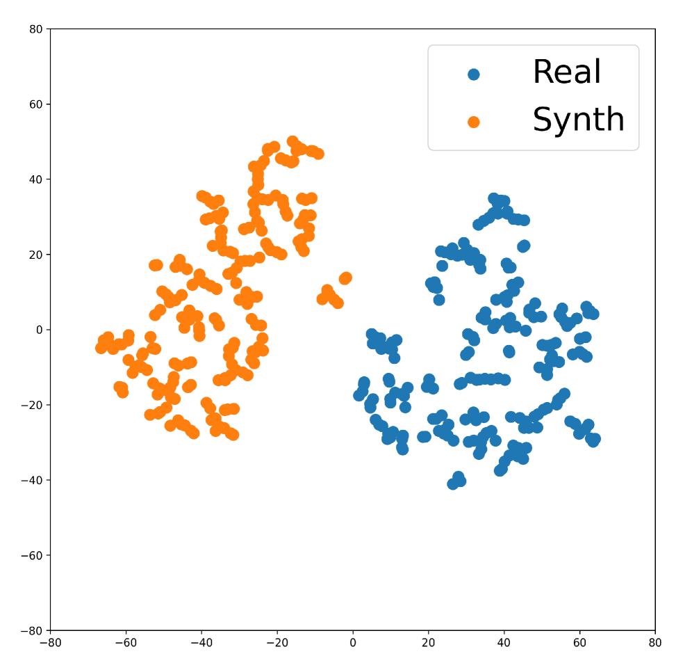
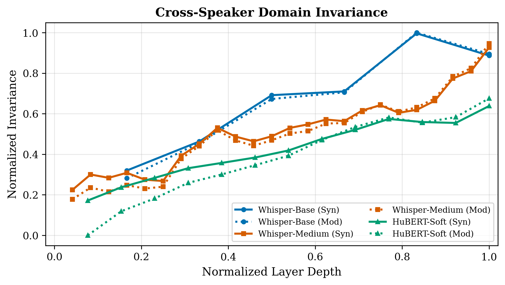
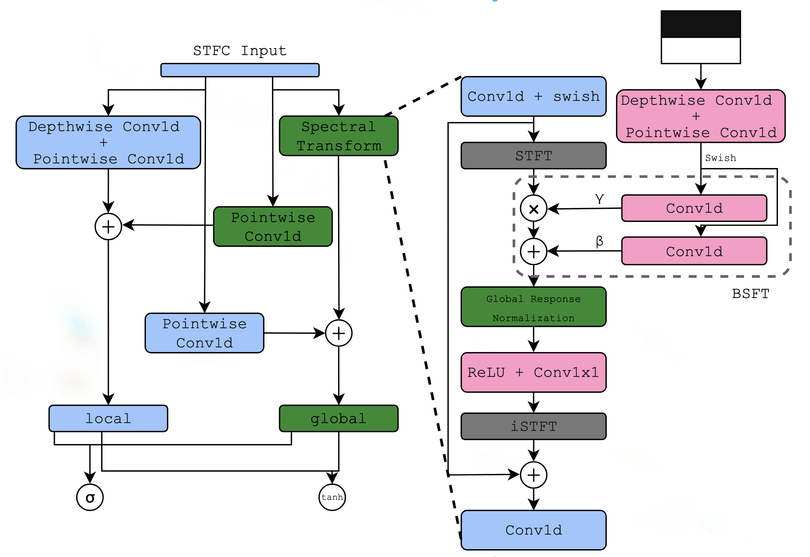

# 🚩 (2026-03-05) Scholar Inbox 추천 논문 

# 📚 ZeSTA: Zero-Shot TTS Augmentation with Domain-Conditioned Training for Data-Efficient Personalized Speech Synthesis

🚀 URL: https://arxiv.org/html/2603.04219

## 🌏 Abstract (원문)
Recent neural text-to-speech (TTS) models[renfastspeech,kim2021conditional,lim2022jets,kim2020glow]have achieved near human-level naturalness under sufficient training data, including lightweight architectures suitable for practical deployment.With these advances, personalized TTS, which adapts a model to a specific target speaker, has gained increasing attention with the growing demand for custom voices[chenadaspeech,min2021meta].However, adapting a model to previously unseen speakers remains challenging, particularly when only limited target-speaker recordings are available, motivating data-efficient adaptation methods.Following the categorization in[hong2024leveraging], existing approaches to personalized TTS can be broadly grouped into zero-shot and fine-tuning paradigms.Recent zero-shot TTS (ZS-TTS) models are built upon large-scale generative modeling frameworks to generate the voices of unseen speakers without additional training, showing impressive generalization[le2023voicebox,borsos2023audiolm,kharitonov2023speak].However, such models are often computationally demanding for practical deployment.Meanwhile, lightweight ZS-TTS models based on conventional TTS acoustic modeling[casanova2021sc,casanova2022yourtts,lee2022hierspeech]can be deployed more easily but have been reported to achieve speaker similarity lower than large-scale generative ZS-TTS models[le2023voicebox].Adaptation via fine-tuning[chenadaspeech,mehrish2023adaptermix,huang2022meta], on the other hand, can produce high-fidelity speech when adequate target-speaker data are available, yet its performance is highly sensitive to data scarcity.In low-resource scenarios where target-speaker recordings are extremely limited, fine-tuning with data augmented by ZS-TTS may offer a promising solution for building lightweight personalized models suitable for practical deployment.However, principled strategies for incorporating synthetic speech into such low-resource fine-tuning settings remain largely underexplored.We observe that naively mixing large amounts of ZS-TTS speech with scarce target-speaker data improves intelligibility while degrading speaker similarity.To address this challenge, we propose ZeSTA, a simple domain-conditioned training framework that distinguishes between real and synthetic speech with a small additional embedding and employs real-data oversampling to stabilize adaptation, without modifying the base TTS architecture.Objective evaluations on LibriTTS and the in-house dataset with multiple ZS-TTS models demonstrate that the proposed approach preserves speaker similarity while retaining intelligibility gains from synthetic augmentation.Subjective evaluations further confirm improved perceptual speaker similarity without degrading speech naturalness.
## 🌏 Abstract (번역)
최근 신경망 기반 음성 합성(TTS) 모델들[renfastspeech,kim2021conditional,lim2022jets,kim2020glow]은 충분한 훈련 데이터가 주어질 경우, 실용적인 배포에 적합한 경량 아키텍처를 포함하여 인간 수준에 가까운 자연스러움을 달성했습니다. 이러한 발전과 함께, 특정 목표 화자에 모델을 적응시키는 개인화된 TTS는 맞춤형 음성에 대한 수요 증가와 더불어 점점 더 많은 관심을 받고 있습니다[chenadaspeech,min2021meta]. 그러나 이전에 보지 못한 화자에 모델을 적응시키는 것은 여전히 어렵습니다. 특히 제한된 목표 화자 녹음만 사용할 수 있을 때 더욱 그러하며, 이는 데이터 효율적인 적응 방법의 필요성을 제기합니다. [hong2024leveraging]의 분류에 따르면, 개인화된 TTS에 대한 기존 접근 방식은 크게 제로샷(zero-shot) 및 미세 조정(fine-tuning) 패러다임으로 분류될 수 있습니다. 최근 제로샷 TTS(ZS-TTS) 모델은 추가 훈련 없이 보지 못한 화자의 음성을 생성하기 위해 대규모 생성 모델링 프레임워크를 기반으로 구축되었으며, 인상적인 일반화 능력을 보여줍니다[le2023voicebox,borsos2023audiolm,kharitonov2023speak]. 그러나 이러한 모델은 실용적인 배포를 위해 종종 계산적으로 많은 비용이 듭니다. 한편, 기존 TTS 음향 모델링을 기반으로 하는 경량 ZS-TTS 모델들[casanova2021sc,casanova2022yourtts,lee2022hierspeech]은 더 쉽게 배포될 수 있지만, 대규모 생성 ZS-TTS 모델보다 화자 유사성이 낮다고 보고되었습니다[le2023voicebox]. 반면에 미세 조정을 통한 적응[chenadaspeech,mehrish2023adaptermix,huang2022meta]은 충분한 목표 화자 데이터가 있을 때 고음질 음성을 생성할 수 있지만, 그 성능은 데이터 부족에 매우 민감합니다. 목표 화자 녹음이 극히 제한적인 저자원 시나리오에서, ZS-TTS로 데이터 증강된 미세 조정은 실용적인 배포에 적합한 경량 개인화 모델을 구축하기 위한 유망한 해결책을 제공할 수 있습니다. 그러나 이러한 저자원 미세 조정 설정에 합성 음성을 통합하기 위한 원칙적인 전략은 아직 충분히 탐구되지 않았습니다. 우리는 희소한 목표 화자 데이터와 많은 양의 ZS-TTS 음성을 단순히 혼합하면 명료도는 향상되지만 화자 유사성은 저하된다는 것을 관찰했습니다. 이 문제를 해결하기 위해, 우리는 기본 TTS 아키텍처를 수정하지 않고도 실제 음성과 합성 음성을 작은 추가 임베딩으로 구별하고 적응을 안정화하기 위해 실제 데이터 오버샘플링을 사용하는 간단한 도메인 조건부 훈련 프레임워크인 ZeSTA를 제안합니다. LibriTTS 및 여러 ZS-TTS 모델을 사용한 자체 데이터셋에 대한 객관적인 평가는 제안된 접근 방식이 합성 증강으로 인한 명료도 향상을 유지하면서 화자 유사성을 보존함을 보여줍니다. 주관적인 평가는 음성 자연스러움을 저하시키지 않으면서 지각적 화자 유사성이 향상되었음을 추가로 확인합니다.

## 🔍 Methods & Results
- 개인화된 TTS의 데이터 부족 문제를 완화하기 위해 ZS-TTS 모델을 외부 데이터 생성기로 활용하여 적응을 위한 추가 음성을 합성합니다. 그러나 ZS-TTS로 생성된 음성은 명료하지만 목표 화자와의 유사성이 감소하는 경향이 있으며, 이는 대량의 합성 음성을 미세 조정에 사용할 경우 모델이 합성 도메인 특성으로 편향될 수 있음을 보여줍니다.
- 이러한 도메인 불일치를 해결하기 위해, 각 훈련 샘플의 데이터 출처(실제 또는 합성)를 명시적으로 인코딩하는 간단한 도메인 조건부 훈련(DC) 전략을 채택합니다. TTS 적응은 조건부 확률 p(y|x,d)를 최적화하는 것으로 해석되며, 추론 시에는 d=real 조건을 사용합니다.
- 아키텍처적으로, 텍스트 인코더 f_text(x)는 입력 텍스트 x를 화자 독립적인 언어적 표현 h_ling으로 매핑하고, 음향 생성 모듈 g(h_ling, d)는 h_ling과 도메인 레이블 d에 조건화된 합성 음성 y^를 생성합니다. 이는 합성 음성으로 인한 언어적 증강 효과를 유지하면서 도메인별 음향 특성을 d를 통해 조절하여 화자 정체성 표류를 효과적으로 완화합니다.
- 도메인 조건부 훈련이 풍부한 합성 음성으로 인한 편향을 효과적으로 완화하지만, 미세 조정 중에 실제 목표 화자 샘플을 적당히 강조함으로써 화자 유사성을 더욱 향상시킬 수 있습니다. 특히, 실제 발화를 작은 비율로 오버샘플링(OS)하면 모델 아키텍처나 추론 절차를 변경하지 않고도 화자 유사성이 일관되게 향상됩니다.
- ZeSTA 프레임워크는 도메인 조건부 훈련과 실제 데이터 오버샘플링을 통합하여 데이터 효율적인 개인화된 TTS를 위한 효과적인 솔루션을 제공합니다.

## 🖼 Figures

*Figure 1:ZeSTA framework: training pipeline (a) and inference pipeline (b).*

*(a)Speaker-matched*

*(a)Speaker-matched*

*(b)Speaker-mismatched*

---
**Usage Info**: 5669 tokens used.
**Generated at**: 2026-03-05 12:45:12

---

# 📚 FlowW2N: Whispered-to-Normal Speech Conversion via Flow-Matching

🚀 URL: https://arxiv.org/html/2603.04296

## 🌏 Abstract (원문)
Whispered speech is characterized by the absence of vocal fold vibration[whatwhisper]. This results in an acoustic signal devoid of a fundamental frequency (F0F_{0}) and the corresponding harmonic structure[acoustics_of_whisper]. While whispering serves specific communicative functions, its reduced naturalness and lower intelligibility compared to voiced speech, may impede effective information transfer. The objective of Whispered-to-Normal (W2N) speech conversion is the computational reconstruction of these missing acoustic features, transforming the whispered input into voiced speech while preserving the linguistic content and the speaker's identity.The W2N task presents challenges fundamentally distinct from conventional speech denoising[sgmse,2023storm]. In denoising tasks, the underlying clean signal is assumed to be present but obscured by additive or convolutional noise. Crucially, the source (degraded) and target (clean) signals remain aligned at the content level. In contrast, W2N deals with phonetic, speaking rate, among other mismatches[dataaug-whisper-asr]. Such challenges are aggravated by the temporal misalignment found in paired recordings, as speakers naturally alter their phonetic durations when switching between whispered and voiced phonation[Morris2002ReconstructionOS,acoustics_of_whisper].Prior W2N methods include Variational Autoencoders (VAE) based approaches[kameoka2019acvae]that suffer from over-smoothing and GAN-based methods[wagner2024gancomparative,vocoderfreevcwhisper,nonparallelvcw2n]prone to training instability and audible artifacts. Recent SSL-based approaches such as WESPER[rekimoto2023wesper]and DistillW2N[tan2025distillw2n]leverage HuBERT Soft[hsu2021hubert,van2022comparison]features. A persistent limitation across these methods is the degradation of intelligibility. The Word Error Rate (WER) of the converted speech is substantially higher than that of the input whisper.Diffusion[ho2020denoising,kong2020diffwave]and flow-matching models[lipman2022flowmatching]have recently advanced the state-of-the-art in high-fidelity speech synthesis[guo2024voiceflow,ren2025reflowvc]. Flow matching[lipman2022flowmatching,liu2022rectified]learns a velocity field that transports samples from a source distribution to a target distribution. The training trajectory is defined via linear interpolation between paired samples. However, applying it directly to W2N fails: temporal misalignment between whispered and voiced speech causes the interpolated trajectory to be acoustically incoherent, blending distinct phonemes from disparate time steps. We term this the ``phoneme boundary blur'' effect, which prevents the model from learning a meaningful vector field. We also observed that conventional alignment techniques such as Dynamic Time Warping (DTW)[dtw]are insufficient, as they do not guarantee the frame-level phonetic coherence required for a plausible interpolation trajectory.We propose FlowW2N, a conditional flow matching approach that sidesteps alignment challenges entirely. Our work is motivated by two observations: (1) synthetic whispered-normal pairs are perfectly aligned by construction, eliminating the phoneme boundary blur problem during training; and (2) if the conditioning features aredomain-invariant; that is, features are similar whether extracted from a synthetic or a real whispered, then a model trained exclusively on synthetic data can generalize to real whispered speech at inference. This view reframes the W2N fromlearning temporal alignmenttoselecting an appropriate conditioning representation, a substantially simpler task. Figure1illustrates our complete pipeline: during training, the Diffusion Transformer (DiT) learns a velocity field conditioned on domain-invariant content features and speaker embeddings using only synthetic pairs; at inference, the model generalizes to real whispered speech through the invariance of the conditioning signal.Our contributions are: (i) we explore conditional flow matching to W2N, achieving state-of-the-art WER on CHAINS and wTIMIT with only 10 inference steps; (ii) we train exclusively on synthetic data with domain-invariant conditioning, requiring no real paired recordings; and (iii) we propose a layer selection criterion balancing content informativeness and cross-domain invariance.
## 🌏 Abstract (번역)
속삭이는 음성은 성대 진동이 없는 것이 특징입니다. 이로 인해 기본 주파수(F0)와 해당 고조파 구조가 없는 음향 신호가 생성됩니다. 속삭임은 특정 의사소통 기능을 수행하지만, 음성 발화에 비해 자연스러움이 떨어지고 명료도가 낮아 효과적인 정보 전달을 방해할 수 있습니다. 속삭임-일반 음성(W2N) 변환의 목표는 이러한 누락된 음향 특징을 계산적으로 재구성하여, 속삭이는 입력을 음성 발화로 변환하면서 언어적 내용과 화자의 정체성을 보존하는 것입니다. W2N 작업은 기존 음성 잡음 제거와는 근본적으로 다른 과제를 제시합니다. 잡음 제거 작업에서는 기본 깨끗한 신호가 존재하지만, 가산 또는 컨볼루션 잡음에 의해 가려진다고 가정합니다. 결정적으로, 원본(손상된) 신호와 목표(깨끗한) 신호는 내용 수준에서 정렬된 상태를 유지합니다. 이와 대조적으로 W2N은 음성학적, 발화 속도 등 다양한 불일치를 다룹니다. 이러한 문제는 짝을 이룬 녹음에서 발견되는 시간적 불일치로 인해 악화되는데, 화자는 속삭이는 발화와 음성 발화를 전환할 때 자연스럽게 음성학적 지속 시간을 변경하기 때문입니다. 이전 W2N 방법에는 과도한 평활화 문제를 겪는 VAE(Variational Autoencoders) 기반 접근 방식과 훈련 불안정성 및 가청 아티팩트에 취약한 GAN 기반 방법이 포함됩니다. WESPER 및 DistillW2N과 같은 최근 SSL 기반 접근 방식은 HuBERT Soft 특징을 활용합니다. 이러한 방법들의 지속적인 한계는 명료도 저하입니다. 변환된 음성의 단어 오류율(WER)은 입력 속삭임보다 상당히 높습니다. 확산 및 플로우 매칭 모델은 최근 고음질 음성 합성 분야에서 최첨단 기술을 발전시켰습니다. 플로우 매칭은 소스 분포에서 목표 분포로 샘플을 전달하는 속도 필드를 학습합니다. 훈련 궤적은 짝을 이룬 샘플 간의 선형 보간을 통해 정의됩니다. 그러나 이를 W2N에 직접 적용하면 실패합니다. 속삭이는 음성과 음성 발화 간의 시간적 불일치로 인해 보간된 궤적이 음향적으로 비일관적이며, 서로 다른 시간 단계의 별개의 음소를 혼합합니다. 우리는 이를 '음소 경계 흐림' 효과라고 부르며, 이는 모델이 의미 있는 벡터 필드를 학습하는 것을 방해합니다. 또한 DTW(Dynamic Time Warping)와 같은 기존 정렬 기술은 그럴듯한 보간 궤적에 필요한 프레임 수준의 음성학적 일관성을 보장하지 못하므로 불충분하다는 것을 관찰했습니다. 우리는 정렬 문제를 완전히 회피하는 조건부 플로우 매칭 접근 방식인 FlowW2N을 제안합니다. 우리의 작업은 두 가지 관찰에 의해 동기 부여되었습니다. (1) 합성된 속삭임-일반 음성 쌍은 구성상 완벽하게 정렬되어 훈련 중 음소 경계 흐림 문제를 제거합니다. (2) 조건화 특징이 도메인 불변적이라면, 즉 합성 속삭임에서 추출하든 실제 속삭임에서 추출하든 특징이 유사하다면, 합성 데이터로만 훈련된 모델은 추론 시 실제 속삭이는 음성으로 일반화될 수 있습니다. 이 관점은 W2N을 시간적 정렬 학습에서 적절한 조건화 표현 선택으로 재구성하며, 이는 훨씬 더 간단한 작업입니다. 그림 1은 우리의 전체 파이프라인을 보여줍니다. 훈련 중 Diffusion Transformer(DiT)는 합성 쌍만을 사용하여 도메인 불변 콘텐츠 특징 및 화자 임베딩에 조건화된 속도 필드를 학습합니다. 추론 시 모델은 조건화 신호의 불변성을 통해 실제 속삭이는 음성으로 일반화됩니다. 우리의 기여는 다음과 같습니다. (i) 우리는 W2N에 조건부 플로우 매칭을 탐구하여 단 10단계의 추론으로 CHAINS 및 wTIMIT에서 최첨단 WER을 달성했습니다. (ii) 우리는 도메인 불변 조건화를 사용하여 합성 데이터로만 훈련하며, 실제 짝을 이룬 녹음이 필요하지 않습니다. (iii) 우리는 콘텐츠 정보성과 교차 도메인 불변성의 균형을 맞추는 계층 선택 기준을 제안합니다.

## 🔍 Methods & Results
- 파형을 잠재 표현으로 압축하기 위해 Oobleck 인코더-디코더 기반의 완전 컨볼루션 VAE를 사용하며, VAE는 HiFi-TTS-2의 일반 음성 데이터로 훈련되었습니다.
- 기존 플로우 매칭의 W2N 직접 적용 시, 속삭이는 음성과 일반 음성 간의 시간적 불일치로 인해 '음소 경계 흐림' 효과가 발생하여 의미 있는 벡터 필드 학습이 어렵다는 문제를 발견했습니다.
- 정렬 요구 사항을 우회하기 위해, 소스 분포를 가우시안 노이즈(z0 ~ N(0, I))로 설정하고, 속삭이는 입력에서 추출한 조건화 신호(c)를 사용하여 생성을 안내하는 조건부 플로우 매칭(CFM) 방식을 채택했습니다.
- FlowW2N 생성 모델은 24개의 트랜스포머 블록을 가진 Diffusion Transformer(DiT)이며, ECAPA-TDNN 화자 인코더의 화자 임베딩과 Whisper 인코더의 콘텐츠 특징을 조건화 신호로 사용합니다.
- 추론 시에는 Euler 통합을 10단계로 사용하여 잠재 공간에서 샘플을 생성하고, 디코더를 통해 최종 파형을 재구성합니다.
- 합성 데이터만으로 훈련하는 전략의 성공을 위해 조건화 신호의 '도메인 불변성'을 평가했으며, Whisper 특징이 HuBERT Soft보다 일관적으로 높은 상관관계를 보이며 충분히 도메인 불변적임을 확인했습니다.
- 콘텐츠 정보성(프레임 수준 특징과 단어 ID 간의 CCA)과 교차 도메인 불변성(합성 및 실제 속삭임 특징 간의 Pearson 상관관계)의 균형을 맞추는 계층 선택 기준을 제안하여 최적의 인코더 계층을 선택합니다.
- Whisper Base의 경우 5번째 계층(ℓ*=5)이, HuBERT의 경우 10번째 계층(ℓ*=10)이 최적의 계층으로 분석되었습니다.
- FlowW2N은 CHAINS 및 wTIMIT 데이터셋에서 단 10단계의 추론으로 최첨단 WER을 달성했습니다.
- 실제 짝을 이룬 녹음 없이 도메인 불변 조건화를 사용하여 합성 데이터만으로 모델을 훈련했습니다.

## 🖼 Figures
![Figure 1:FlowW2N pipeline. Left (Training): The DiT learns a velocity field 
𝐯
𝜃
​
(
𝐳
𝑡
,
𝑡
,
𝐜
)
 conditioned on domain-invariant content features 
𝐡
 from a content encoder (layer 
ℓ
∗
) and speaker embedding 
𝐞
spk
, where 
𝐜
=
{
𝐞
spk
,
𝐡
}
 represents the conditioning set of content and speaker. Training uses only synthetic whisper-normal pairs. Right (Inference): Starting from Gaussian noise, the ODE is integrated to obtain 
𝐳
1
, which is decoded to normal speech. Domain invariance of content features enables generalization to real whispered speech.](../images/2026-03-05/2603.04296/2603.04296_fig0.png)
*Figure 1:FlowW2N pipeline. Left (Training): The DiT learns a velocity field 
𝐯
𝜃
​
(
𝐳
𝑡
,
𝑡
,
𝐜
)
 conditioned on domain-invariant content features 
𝐡
 from a content encoder (layer 
ℓ
∗
) and speaker embedding 
𝐞
spk
, where 
𝐜
=
{
𝐞
spk
,
𝐡
}
 represents the conditioning set of content and speaker. Training uses only synthetic whisper-normal pairs. Right (Inference): Starting from Gaussian noise, the ODE is integrated to obtain 
𝐳
1
, which is decoded to normal speech. Domain invariance of content features enables generalization to real whispered speech.*

*Figure 2:Domain invariance analysis. Synthesis Gap (Syn): synthetic vs. real whisper; Modality Gap (Mod): real whisper vs. normal speech.*

*Figure 3:Layer selection analysis. Left: Synthesis Gap (invariance). Center: CCA with word identity. Right: Proposed combined score (invariance 
×
 semantic). Stars mark optimal layers selected.*

---
**Usage Info**: 5565 tokens used.
**Generated at**: 2026-03-05 12:45:27

---

# 📚 Low-Resource Guidance for Controllable Latent Audio Diffusion

🚀 URL: https://arxiv.org/html/2603.04366

## 🌏 Abstract (원문)
Generative models have rapidly advanced across audio, enabling the production of coherent sonic generations from text[1,2]. However, there is a growing need for controllable audio generation, as creative workflows demand fine-grained manipulations. Recent efforts rely on local-conditioning with chords, rhythms, or pitch[3,4], global-conditioning with style or reference-audio embeddings[5,6], video-conditioning[7], editing[8], or for generating stems from context (e.g., other stems)[9,10]. While these enable user-steerable generation, such (conditional) models require supervised training or finetuning with data that is challenging to collect. Given the high costs of training or finetuning generative models, inference-time control methods have been recently explored. Text-to-image research has focused on heuristic-based inference-time methods[11], optimization-based methods[12,13], and guidance-based methods[14,15,16,17,18,19,20,21]. We also focus on guidance-based methods, which use the gradient of a target distance function with respect to the diffusion process to guide sampling. Training-Free Guidance (TFG)[21] unifies most guidance-based frameworks (DPS[17], MPGD[18], LGD[19], UGD[20]) within a shared hyperparameter space. Yet, such approaches have only been explored for end-to-end audio-based guidance[22], that is costly due to the nature of backpropagation through audio decoders during sampling. Readouts[14] is a promising idea, from the image domain, that addresses this challenge by adapting guidance to be based on latent diffusion features (instead of decoded images). We build off these ideas and show the feasibility of low-resource guidance (TFG-based) with trainable latent-control heads (readouts-inspired). Such Latent-Control Heads (LatCHs) enable low-resource guidance in latent diffusion, as they operate in latent space rather than in signal space. Hence, backpropagation through the latent decoder is not required (Fig.1). Further, LatCHs are lightweight models (≈7M parameters) that can be trained in ≈4 hours on a single GPU, making such models more tractable to train than fully conditional generative models. Finally, we also propose selective TFG, which only applies TFG guidance at few, selected diffusion steps (Fig.1). This design choice drastically improves both runtime efficiency and overall quality, as guidance becomes less prone to overoptimizing the target control. We apply our low-resource guidance framework to Stable Audio Open (SAO)[2] across three musical controls (intensity, pitch, and beats), and find that our framework successfully balances control precision with audio fidelity better than similar low-resource approaches and is more compute efficient than standard end-to-end guidance.
## 🌏 Abstract (번역)
생성 모델은 오디오 분야에서 빠르게 발전하여 텍스트로부터 일관된 사운드 생성을 가능하게 했습니다[1,2]. 그러나 창의적인 작업 흐름이 미세한 조작을 요구함에 따라 제어 가능한 오디오 생성에 대한 필요성이 커지고 있습니다. 최근 노력은 코드, 리듬 또는 피치[3,4]를 사용한 로컬 조건화, 스타일 또는 참조 오디오 임베딩[5,6]을 사용한 글로벌 조건화, 비디오 조건화[7], 편집[8], 또는 컨텍스트(예: 다른 스템)로부터 스템 생성[9,10]에 의존합니다. 이러한 방법들은 사용자 조작 가능한 생성을 가능하게 하지만, 이러한 (조건부) 모델은 수집하기 어려운 데이터로 지도 학습 또는 미세 조정을 필요로 합니다. 생성 모델의 학습 또는 미세 조정 비용이 높다는 점을 고려하여, 최근에는 추론 시간 제어 방법이 탐색되었습니다. 텍스트-이미지 연구는 휴리스틱 기반 추론 시간 방법[11], 최적화 기반 방법[12,13], 그리고 가이던스 기반 방법[14,15,16,17,18,19,20,21]에 중점을 두었습니다. 우리 또한 확산 과정에 대한 목표 거리 함수의 기울기를 사용하여 샘플링을 안내하는 가이던스 기반 방법에 초점을 맞춥니다. Training-Free Guidance (TFG)[21]는 대부분의 가이던스 기반 프레임워크(DPS[17], MPGD[18], LGD[19], UGD[20])를 공유된 하이퍼파라미터 공간 내에서 통합합니다. 그러나 이러한 접근 방식은 샘플링 중 오디오 디코더를 통한 역전파의 특성으로 인해 비용이 많이 드는 종단 간 오디오 기반 가이던스[22]에 대해서만 탐색되었습니다. 이미지 도메인에서 나온 Readouts[14]는 (디코딩된 이미지 대신) 잠재 확산 특징을 기반으로 가이던스를 조정하여 이 문제를 해결하는 유망한 아이디어입니다. 우리는 이러한 아이디어를 바탕으로 학습 가능한 잠재 제어 헤드(readouts에서 영감을 받음)를 사용한 저자원 가이던스(TFG 기반)의 실현 가능성을 보여줍니다. 이러한 Latent-Control Heads (LatCHs)는 신호 공간이 아닌 잠재 공간에서 작동하므로 잠재 확산에서 저자원 가이던스를 가능하게 합니다. 따라서 잠재 디코더를 통한 역전파가 필요하지 않습니다(그림 1). 또한 LatCH는 경량 모델(약 7M 매개변수)이며 단일 GPU에서 약 4시간 만에 학습될 수 있어, 완전 조건부 생성 모델보다 학습하기에 더 실용적입니다. 마지막으로, 우리는 또한 TFG 가이던스를 몇 개의 선택된 확산 단계에서만 적용하는 선택적 TFG를 제안합니다(그림 1). 이 설계 선택은 가이던스가 목표 제어를 과도하게 최적화하는 경향을 줄여 런타임 효율성과 전반적인 품질을 크게 향상시킵니다. 우리는 우리의 저자원 가이던스 프레임워크를 Stable Audio Open (SAO)[2]에 세 가지 음악 제어(강도, 피치, 비트)에 적용했으며, 우리의 프레임워크가 유사한 저자원 접근 방식보다 제어 정밀도와 오디오 충실도 사이의 균형을 더 잘 맞추고 표준 종단 간 가이던스보다 계산 효율적임을 발견했습니다.

## 🔍 Methods & Results
- 본 연구는 품질이나 런타임 지연을 크게 저하시키지 않으면서 잠재 오디오 확산 모델을 제어하는 가이던스 기반 방법을 개발하는 것을 목표로 합니다.
- 두 가지 주요 방법론적 기여는 다음과 같습니다: (1) 선택적 TFG(selective TFG)는 TFG 프레임워크를 확장하여 몇 개의 선택된 확산 단계에서만 가이던스를 적용합니다. (2) 잠재 제어 헤드(Latent-Control Heads, LatCHs)는 생성 모델의 잠재 공간을 목표 제어에 직접 매핑하는 학습 가능한 경량 모델입니다.
- 선택적 TFG는 TFG 가이던스를 특정 확산 단계에서만 적용하여 계산 오버헤드를 크게 줄이고, 제어 정확도와 오디오 품질 간의 균형을 제공하며, 데이터 매니폴드에서 벗어날 위험을 감소시킵니다.
- LatCHs는 오디오 디코더를 통한 비용이 많이 드는 역전파를 피함으로써 가이던스 계산을 훨씬 빠르고 저렴하게 만듭니다. LatCHs는 약 7M 매개변수의 경량 모델이며 단일 GPU에서 약 4시간 만에 학습될 수 있습니다.
- LatCH 훈련 시 노이즈 조건부 훈련 방식을 탐색했습니다. LatCH-F(Forward-Simulated Noise Conditioning)는 순방향 확산 과정으로 오염된 노이즈 있는 잠재 입력에 대해 제어를 예측하도록 훈련하며, LatCH-B(Backwards-Simulated Noise Conditioning)는 잠재 오디오 확산 모델에서 생성된 중간 단계 궤적을 사용하여 추론 시의 노이즈 분포와 일치하도록 훈련합니다.
- 제안된 저자원 가이던스 프레임워크를 Stable Audio Open (SAO)에 적용하여 강도, 피치, 비트 세 가지 음악 제어에 대해 평가했습니다.
- 실험 결과, 본 프레임워크는 유사한 저자원 접근 방식보다 제어 정밀도와 오디오 충실도 사이의 균형을 더 잘 맞추며, 표준 종단 간 가이던스보다 계산 효율적임을 확인했습니다.

## 🖼 Figures

*Fig. 1:Left. End-to-end guidance can be slow and VRAM intensive as it requires backpropagating through the VAE decoder. Center. LatCH is compute efficient as it directly predicts control features from the latent space. Right. Selective TFG is also compute efficient as it allows applying TFG guidance only on selected sampling steps.*

---
**Usage Info**: 8494 tokens used.
**Generated at**: 2026-03-05 12:45:47

---

# 📚 FastWave: Optimized Diffusion Model for Audio Super-Resolution

🚀 URL: https://arxiv.org/html/2603.04122

## 🌏 Abstract (원문)
DL approaches achieved a significant success in audio super-resolution, showing impressive performance in improving the perceptual quality of the speech and low-resolution media content. Discriminative approaches[13]typically involve 10 M parameters and several times more to address the problem of super-resolution with varying input[9]. Switching the paradigm to generative adversarial training (GAN) introduced new possibilities of reaching good performance[5]and in the same time demonstrated that the computational complexity of the model can be significantly decreased[1]. GAN approaches addressed not only the quality[11], but also the computational complexity and inference speed[2].Apart from GANs diffusion models also entered the field just recently with NU-Wave[7], having moderate complexity (around 3 M parameters) and close-to-SOTA results. The solution was developed into NU-Wave 2[3]with changed architecture, any-to-48 kHz flexible-input regime and two-times smaller model. Despite these findings, large part of diffusion-based[10,16]solutions were focused mainly on achieving better reconstruction error or perceptual evaluation metrics. Flow-based models mainly follow the same path in terms of complexity, but they got a considerable advantage due to its one-step nature[17]. As was demonstrated in[3], sufficient computational resource is required to train the model to its peak results. Since NU-Wave models the question of constructing a smaller (in terms of parameters), faster (in terms of number of function evaluation (NFE) and computational complexity) diffusion-based model and with less training efforts remains open. On the other hand, in the field of image processing there was developed the new methodology for training diffusion-based models, called EDM[4,6]which promised new optimized training methodology aimed at the reduction of training iterations. Our paper addresses all these challenges: low-parametric model, NFE reduction and optimized training time using the EDM methodologies.
## 🌏 Abstract (번역)
딥러닝(DL) 접근 방식은 오디오 초해상도 분야에서 상당한 성공을 거두었으며, 음성 및 저해상도 미디어 콘텐츠의 지각 품질을 향상시키는 데 인상적인 성능을 보여주었습니다. 판별적 접근 방식[13]은 일반적으로 1천만 개의 파라미터를 포함하며, 다양한 입력에 대한 초해상도 문제를 해결하기 위해 몇 배 더 많은 파라미터를 필요로 합니다[9]. 생성적 적대 학습(GAN)으로 패러다임을 전환하면서 좋은 성능을 달성할 수 있는 새로운 가능성이 열렸고[5], 동시에 모델의 계산 복잡성을 크게 줄일 수 있음을 입증했습니다[1]. GAN 접근 방식은 품질뿐만 아니라[11] 계산 복잡성과 추론 속도도 다루었습니다[2]. GAN 외에도 확산 모델은 최근 NU-Wave[7]를 통해 이 분야에 진입했으며, 중간 정도의 복잡성(약 3백만 개의 파라미터)과 SOTA에 가까운 결과를 보여주었습니다. 이 솔루션은 아키텍처 변경, 모든 입력에서 48kHz로의 유연한 입력 방식, 그리고 두 배 더 작은 모델을 특징으로 하는 NU-Wave 2[3]로 발전했습니다. 이러한 발견에도 불구하고, 확산 기반[10,16] 솔루션의 대부분은 주로 더 나은 재구성 오류 또는 지각 평가 지표 달성에 초점을 맞추었습니다. 플로우 기반 모델은 복잡성 측면에서 주로 동일한 경로를 따르지만, 단일 단계 특성으로 인해 상당한 이점을 얻었습니다[17]. [3]에서 입증된 바와 같이, 모델을 최고 결과로 훈련시키기 위해서는 충분한 계산 자원이 필요합니다. NU-Wave 모델 이후, 더 작고(파라미터 측면에서), 더 빠르며(함수 평가 횟수(NFE) 및 계산 복잡성 측면에서), 훈련 노력이 덜 드는 확산 기반 모델을 구축하는 문제는 여전히 미해결로 남아 있습니다. 한편, 이미지 처리 분야에서는 훈련 반복 횟수 감소를 목표로 하는 새로운 최적화된 훈련 방법론을 약속하는 EDM[4,6]이라는 확산 기반 모델 훈련을 위한 새로운 방법론이 개발되었습니다. 본 논문은 EDM 방법론을 사용하여 저파라미터 모델, NFE 감소 및 최적화된 훈련 시간이라는 이 모든 과제를 해결합니다.

## 🔍 Methods & Results
- 오디오 초해상도를 위한 NU-Wave 2 모델을 기반으로, EDM(Elucidating Diffusion Models) 프레임워크와 ConvNeXtV2 아키텍처 개선을 결합한 FastWave 모델을 제안한다.
- FastWave는 NU-Wave 2의 확산 모델링을 EDM의 σ-파라미터화를 사용한 노이즈 제거 구조로 변경하고, STFC 및 BSFT 블록을 수정한다.
- FastWave는 노이즈 제거기로 훈련되며, 가중 L2 노이즈 제거 손실을 사용한다. 추론 시에는 확률 흐름 ODE와 1차 Euler 솔버를 사용하며, EDM의 연속 노이즈 스케줄을 채택한다.
- 모델 복잡성을 줄이기 위해 ConvNeXtV2에서 영감을 받아 표준 컨볼루션을 깊이별 분리 컨볼루션으로 대체하고, 채널 간 상호작용을 개선하기 위해 Global Response Normalization(GRN)을 도입한다.
- 이 연구는 EDM 방법론을 활용하여 저파라미터 모델, 함수 평가 횟수(NFE) 감소, 최적화된 훈련 시간이라는 목표를 달성한다.

## 🖼 Figures

*Figure 1:Architecture of FastWave with proposed architectural improvements.*

---
**Usage Info**: 3753 tokens used.
**Generated at**: 2026-03-05 12:45:59

---

# 📚 Multi-Stage Music Source Restoration with BandSplit-RoFormer Separation and HiFi++ GAN

🚀 URL: https://arxiv.org/html/2603.04032

## 🌏 Abstract (원문)
Professional music production violates the linear-mixture assumptions typically used by conventional music source separation methods. Release pipelines commonly include equalization, dynamic range compression, reverberation, saturation and distortion, stereo widening, limiting, and codec artifacts, often compounded by additional degradations. As a result, the target sources are not only mixed but also systematically transformed, making direct separation under clean-stem assumptions insufficient. The MSR Challenge therefore targets recovering the original, unprocessed sources for eight instrument classes (vocals, guitar, keyboard, synthesizer, bass, drums, percussion, orchestra) from such mixtures. We address MSR with a modular learning setup that explicitly separates the de-mixing problem from the de-mastering and de-artifacting problem. Concretely, we adopt a separation-then-restoration strategy: a single multi-stem separator estimates degraded stems, and per-stem restoration networks map these estimates toward clean targets. This design enables us to train the separator on large-scale augmented mixtures while training restoration models to invert production effects and suppress artifacts under realistic separator error distributions. In this submission, we make two practical contributions: (i) a curriculum for BS-RoFormer adaptation from 4 to 8 stems using parameter-efficient LoRA fine-tuning and head expansion, (ii) instrument-specific restoration experts trained on separator-generated inputs to improve train-test alignment.
## 🌏 Abstract (번역)
전문 음악 프로덕션은 기존 음악 소스 분리 방법에서 일반적으로 사용되는 선형 혼합 가정을 위반합니다. 릴리스 파이프라인에는 일반적으로 이퀄라이제이션, 다이내믹 레인지 압축, 리버브, 새츄레이션 및 디스토션, 스테레오 확장, 리미팅, 코덱 아티팩트가 포함되며, 종종 추가적인 열화가 복합적으로 작용합니다. 결과적으로, 타겟 소스는 단순히 혼합될 뿐만 아니라 체계적으로 변형되어, 깨끗한 스템 가정을 통한 직접적인 분리로는 불충분합니다. 따라서 MSR 챌린지는 이러한 믹스에서 8가지 악기 클래스(보컬, 기타, 키보드, 신디사이저, 베이스, 드럼, 퍼커션, 오케스트라)에 대한 원본, 미처리 소스를 복구하는 것을 목표로 합니다. 우리는 디믹싱 문제를 디마스터링 및 디아티팩팅 문제와 명시적으로 분리하는 모듈형 학습 설정을 통해 MSR에 접근합니다. 구체적으로, 우리는 분리 후 복원 전략을 채택합니다. 즉, 단일 멀티-스템 분리기가 손상된 스템을 추정하고, 스템별 복원 네트워크가 이 추정치를 깨끗한 타겟으로 매핑합니다. 이 설계는 분리기를 대규모 증강된 믹스에서 훈련하는 동시에, 현실적인 분리기 오류 분포 하에서 프로덕션 효과를 역전시키고 아티팩트를 억제하도록 복원 모델을 훈련할 수 있게 합니다. 이 제출물에서 우리는 두 가지 실용적인 기여를 합니다. (i) 파라미터 효율적인 LoRA 미세 조정 및 헤드 확장을 사용하여 BS-RoFormer를 4개 스템에서 8개 스템으로 적응시키는 커리큘럼, (ii) 훈련-테스트 정렬을 개선하기 위해 분리기 생성 입력으로 훈련된 악기별 복원 전문가.

## 🔍 Methods & Results
- 시스템은 혼합 파형을 두 단계 파이프라인으로 처리합니다: 첫 번째 단계에서는 단일 멀티-스템 분리기가 8개의 타겟 스템과 보조 '기타' 스템을 추정하고, 두 번째 단계에서는 악기별 복원 전문가가 각 분리된 추정치를 복원된 스템으로 매핑합니다.
- 복원 모델의 훈련-테스트 정렬을 개선하기 위해, 훈련된 분리기를 합성 훈련 믹스에 실행하여 복원 입력을 생성하고, 각 전문가는 이 분리기 출력을 해당 깨끗한 스템으로 매핑하도록 훈련됩니다.
- 분리기 모델은 BandSplit-RoFormer(BS-RoFormer)를 사용하며, 주파수 영역을 분리 처리하는 밴드-스플릿 프론트엔드와 시간적 및 교차-밴드 의존성을 모델링하는 RoFormer 블록을 포함합니다.
- 분리기는 9개의 마스크 추정 헤드(8개 악기 클래스 + 보조 '기타')를 사용하여 모든 스템을 예측합니다.
- 분리기 훈련은 세 단계로 진행됩니다: 1단계(4개 스템, 깨끗한 믹스)는 보컬, 드럼, 베이스, 기타를 분리하도록 미세 조정하고, 2단계(4개 스템, 마스터링된 믹스)는 온라인 스템별 열화 파이프라인으로 생성된 믹스에서 미세 조정을 계속하며, 3단계(8개 스템)는 모델을 8개 스템으로 확장하고 새로운 마스크 헤드만 훈련하며 백본은 고정합니다.
- 1단계와 2단계에서는 LoRA 미세 조정을 사용하며, 마스크된 SI-SNR 손실, 다중 해상도 STFT 손실, L1 손실, 낮은 진폭 페널티 손실의 가중 조합을 사용합니다.
- 분리기 훈련에는 MUSDB18-HQ, DSD100, MoisesDB (4개 스템) 및 MoisesDB, Slakh2100, MedleyDB v2, RawStems, MUSDB25-스타일 확장 (8개 스템) 데이터셋이 사용되었으며, 온라인 증강 및 열화 전략이 적용되었습니다.
- 복원 모듈은 SpectralUNet 프론트엔드, 업샘플링 단계, WaveUNet 정제 네트워크, SpectralMaskNet으로 구성된 HiFi++ GAN 번들을 사용합니다.
- 복원 시스템 훈련은 5단계로 진행됩니다: 1-3단계는 일반주의 복원 모델을 훈련하고 GAN 훈련 및 음악 지각 메트릭을 도입하며, 4단계는 축음기 노이즈를 포함한 추가 증강을 사용하여 노이즈 아티팩트 억제에 중점을 둡니다.
- 5단계에서는 분리 모델이 생성한 훈련 쌍을 사용하여 8개의 악기별 전문가를 미세 조정하여 테스트 시 오류 특성과 일치하도록 합니다.
- 복원 훈련에는 SonicMasterDataset (일반주의), Gramophone Record Noise Dataset (노이즈 억제), 8-소스 분리 데이터 (전문가 특화)가 사용되었습니다.

---
**Usage Info**: 3592 tokens used.
**Generated at**: 2026-03-05 12:46:12

---

