# 🚩 (2026-03-06) Scholar Inbox 추천 논문 

# 📚 WavSLM: Single-Stream Speech Language Modeling via WavLM Distillation

🚀 URL: https://arxiv.org/html/2603.05299

## 🌏 Abstract (원문)
Large language models (LLMs) have transformed natural language processing by showing that scalable, coherent, and controllable generation can emerge from a simple next-token prediction objective[dubey2024llama3herdmodels,jiang2024mixtralexperts,comanici2025gemini25,singh2025openaigpt5card,deepseekai2025deepseekv3]. Extending this paradigm to speech, however, remains a fundamental challenge. Unlike text, speech is a high-dimensional, continuous signal that entangles semantic, prosodic, and acoustic information across multiple time scales. This intrinsic complexity makes both representation learning and long-range sequence modeling substantially more difficult than in text-based language modeling.Speech language models (SLMs)[arora2025landscapespokenlanguagemodels]address this challenge by converting waveforms into sequences of discrete tokens usingneural audio codecs[mousavi2025dates,guo2025discretespeechtokensreview]and modeling these sequences autoregressively. While conceptually similar to text tokenization, speech tokenization is inherently more complex, as it must simultaneously preserve semantic content and acoustic detail while remaining efficient, streamable, and low-bitrate.Early work on audio language modeling primarily focused on semantic modeling, quantizing self-supervised speech representations[baevski2020wav2vec2,hsu2021hubert,chen2022wavlm]into discrete units[lakhotia2021gslm,kharitonov2022pgslm]. Although these models produced intelligible speech, they continued to lag behind text-based language models in terms of factual knowledge, long-range consistency, and controllability. To address these limitations, speech-text models incorporate text supervision or pretrained text language models, either by extending text LLMs with audio tokens[hassid2023textually,maiti2024voxtlm,park2024speechssm,cuervo2025latefusionmultilevelfission], by interleaving text and speech representations[nguyen2024spiritlminterleavedspokenwritten], or by training joint speech-text objectives[turetzky2024lastlanguagemodelaware,lu2025latentspeechtexttransformer].Beyond semantics, accurately modeling acoustic variation, such as speaker identity and fine-grained prosody, is essential for high-quality speech generation. Hierarchical generation frameworks address this limitation by explicitly modeling acoustic tokens conditioned on semantic representations, enabling improved speaker generalization and acoustic coherence[borsos2023audiolm,rubenstein2023audiopalmlargelanguagemodel].More recent work has explored unified semantic-acoustic modeling. Moshi[defossez2024moshi]bridges semantic and acoustic representations using dedicated codebooks and hybrid architectures that combine temporal and depth-wise transformers, albeit at the cost of significant architectural complexity. LLaMA-Mimi[sugiura2025llamamimispeechlanguagemodels], similarly to[nguyen2024spiritlminterleavedspokenwritten], simplifies this design by interleaving semantic and acoustic tokens within a single sequence, although tokens at different time steps still serve distinct semantic or acoustic roles.Despite recent progress, most semantic-acoustic SLMs rely on hybrid pipelines that incorporate text-pretrained LLMs, multiple token streams modeled partly autoregressively and partly in parallel, or additional text-alignment objectives such as direct text supervision or word boundaries. These design choices deviate from the single-stream generative pretraining paradigm that has proven effective in text for enabling strong generalization and emergent capabilities. While scaling model size and training data can partially compensate for this complexity[coreteam2025mimoaudioaudiolanguagemodels], such gains typically require several orders of magnitude more data and compute[cuervo2024scaling], raising concerns about efficiency and scalability. This naturally raises a fundamental question:can comparable performance instead be achieved through better representations, rather than increased scale and architectural complexity?In this work, we investigate speech language modeling using a single discrete codebook that jointly represents semantic and acoustic information, without relying on text supervision or text-pretrained models. By closely mirroring the text paradigm of simple autoregressive training with a single decoder, our study isolates the role of the representation itself. We hypothesize that sufficiently expressive speech representations can support effective language modeling within a single-stream, single-decoder framework.In particular, our contributions are threefold:We introduceWavSLM, an SLM trained by quantizing and distillingWavLM representationsinto an autoregressive next-chunk predictor over a single stream of tokens. To the best of our knowledge, this is the first SLM that jointly captures semantic and acoustic information using asingle codebook, without hierarchical or multi-stream tokenization.We show that WavSLM achieves competitive performance on both semantic and acoustic consistency tasks, as well as on speech generation, while being significantly smaller and trained on substantially less data than large-scale SLMs. Unlike most related work, our model is trainedexclusively on speech, without any text supervision or text-pretraining, and is fully streamable, enabling real-time speech generation.We analyze several design factors for single-stream speech language modeling, including context window size, chunk size, and vocabulary size, and study the trade-offs involved in jointly modeling semantic and acoustic information.Code and checkpoints will be released publicly to foster reproducibility and further research.Demo samples are available athttps://lucadellalib.github.io/wavslm-web/.
## 🌏 Abstract (번역)
대규모 언어 모델(LLM)은 단순한 다음 토큰 예측 목표를 통해 확장 가능하고 일관되며 제어 가능한 생성이 가능하다는 것을 보여주며 자연어 처리 분야를 변화시켰습니다[dubey2024llama3herdmodels,jiang2024mixtralexperts,comanici2025gemini25,singh2025openaigpt5card,deepseekai2025deepseekv3]. 그러나 이 패러다임을 음성으로 확장하는 것은 여전히 근본적인 과제로 남아 있습니다. 텍스트와 달리 음성은 여러 시간 척도에 걸쳐 의미론적, 운율적, 음향적 정보를 얽히게 하는 고차원 연속 신호입니다. 이러한 본질적인 복잡성으로 인해 표현 학습과 장거리 시퀀스 모델링 모두 텍스트 기반 언어 모델링보다 훨씬 더 어렵습니다.음성 언어 모델(SLM)[arora2025landscapespokenlanguagemodels]은 신경 오디오 코덱[mousavi2025dates,guo2025discretespeechtokensreview]을 사용하여 파형을 이산 토큰 시퀀스로 변환하고 이러한 시퀀스를 자기회귀적으로 모델링함으로써 이 문제를 해결합니다. 개념적으로 텍스트 토큰화와 유사하지만, 음성 토큰화는 효율적이고 스트리밍 가능하며 낮은 비트레이트를 유지하면서 의미론적 내용과 음향적 세부 사항을 동시에 보존해야 하므로 본질적으로 더 복잡합니다.오디오 언어 모델링에 대한 초기 연구는 주로 의미론적 모델링에 중점을 두었으며, 자기 지도 음성 표현[baevski2020wav2vec2,hsu2021hubert,chen2022wavlm]을 이산 단위[lakhotia2021gslm,kharitonov2022pgslm]로 양자화했습니다. 이러한 모델은 이해 가능한 음성을 생성했지만, 사실적 지식, 장거리 일관성 및 제어 가능성 측면에서 텍스트 기반 언어 모델에 뒤처졌습니다. 이러한 한계를 해결하기 위해 음성-텍스트 모델은 텍스트 LLM을 오디오 토큰으로 확장하거나[hassid2023textually,maiti2024voxtlm,park2024speechssm,cuervo2025latefusionmultilevelfission], 텍스트와 음성 표현을 인터리빙하거나[nguyen2024spiritlminterleavedspokenwritten], 또는 공동 음성-텍스트 목표를 훈련함으로써[turetzky2024lastlanguagemodelaware,lu2025latentspeechtexttransformer] 텍스트 감독 또는 사전 훈련된 텍스트 언어 모델을 통합합니다.의미론을 넘어 화자 식별 및 미세한 운율과 같은 음향적 변화를 정확하게 모델링하는 것은 고품질 음성 생성에 필수적입니다. 계층적 생성 프레임워크는 의미론적 표현에 따라 음향 토큰을 명시적으로 모델링하여 화자 일반화 및 음향 일관성을 향상시킴으로써 이러한 한계를 해결합니다[borsos2023audiolm,rubenstein2023audiopalmlargelanguagemodel].최근 연구에서는 통합된 의미-음향 모델링을 탐구했습니다. Moshi[defossez2024moshi]는 전용 코드북과 시간적 및 깊이별 트랜스포머를 결합한 하이브리드 아키텍처를 사용하여 의미론적 및 음향적 표현을 연결하지만, 상당한 아키텍처 복잡성을 대가로 합니다. LLaMA-Mimi[sugiura2025llamamimispeechlanguagemodels]는[nguyen2024spiritlminterleavedspokenwritten]과 유사하게 단일 시퀀스 내에서 의미론적 및 음향적 토큰을 인터리빙하여 이 설계를 단순화하지만, 다른 시간 단계의 토큰은 여전히 별개의 의미론적 또는 음향적 역할을 수행합니다.최근의 발전에도 불구하고, 대부분의 의미-음향 SLM은 텍스트 사전 훈련된 LLM, 부분적으로 자기회귀적으로 그리고 부분적으로 병렬로 모델링되는 여러 토큰 스트림, 또는 직접적인 텍스트 감독이나 단어 경계와 같은 추가적인 텍스트 정렬 목표를 통합하는 하이브리드 파이프라인에 의존합니다. 이러한 설계 선택은 텍스트에서 강력한 일반화 및 새로운 기능을 가능하게 하는 데 효과적임이 입증된 단일 스트림 생성 사전 훈련 패러다임에서 벗어납니다. 모델 크기와 훈련 데이터를 확장하면 이러한 복잡성을 부분적으로 보완할 수 있지만[coreteam2025mimoaudioaudiolanguagemodels], 이러한 이득은 일반적으로 몇 배 더 많은 데이터와 컴퓨팅을 필요로 하며[cuervo2024scaling], 효율성과 확장성에 대한 우려를 제기합니다. 이는 자연스럽게 근본적인 질문을 제기합니다. 증가된 규모와 아키텍처 복잡성 대신 더 나은 표현을 통해 유사한 성능을 달성할 수 있을까요?본 연구에서는 텍스트 감독이나 텍스트 사전 훈련된 모델에 의존하지 않고 의미론적 및 음향적 정보를 공동으로 나타내는 단일 이산 코드북을 사용하여 음성 언어 모델링을 조사합니다. 단일 디코더를 사용한 단순한 자기회귀 훈련이라는 텍스트 패러다임을 면밀히 반영함으로써, 우리의 연구는 표현 자체의 역할을 분리합니다. 우리는 충분히 표현력이 풍부한 음성 표현이 단일 스트림, 단일 디코더 프레임워크 내에서 효과적인 언어 모델링을 지원할 수 있다고 가정합니다.특히, 우리의 기여는 세 가지입니다.우리는 WavLM 표현을 단일 토큰 스트림에 대한 자기회귀적 다음 청크 예측기로 양자화하고 증류하여 훈련된 SLM인 WavSLM을 소개합니다. 저희가 아는 한, 이는 계층적 또는 다중 스트림 토큰화 없이 단일 코드북을 사용하여 의미론적 및 음향적 정보를 공동으로 포착하는 최초의 SLM입니다.우리는 WavSLM이 의미론적 및 음향적 일관성 작업과 음성 생성 모두에서 경쟁력 있는 성능을 달성하며, 대규모 SLM보다 훨씬 작고 훨씬 적은 데이터로 훈련되었음을 보여줍니다. 대부분의 관련 연구와 달리, 우리 모델은 텍스트 감독이나 텍스트 사전 훈련 없이 오직 음성으로만 훈련되었으며, 실시간 음성 생성을 가능하게 하는 완전한 스트리밍이 가능합니다.우리는 컨텍스트 창 크기, 청크 크기 및 어휘 크기를 포함한 단일 스트림 음성 언어 모델링을 위한 여러 설계 요소를 분석하고, 의미론적 및 음향적 정보를 공동으로 모델링하는 데 관련된 장단점을 연구합니다.코드와 체크포인트는 재현성과 추가 연구를 촉진하기 위해 공개적으로 배포될 예정입니다. 데모 샘플은 https://lucadellalib.github.io/wavslm-web/에서 확인할 수 있습니다.

## 🔍 Methods & Results
- WavSLM을 소개하며, 이는 WavLM 표현을 단일 토큰 스트림에 대한 자기회귀적 다음 청크 예측기로 양자화하고 증류하여 훈련된 SLM입니다.
- WavSLM은 계층적 또는 다중 스트림 토큰화 없이 단일 코드북을 사용하여 의미론적 및 음향적 정보를 공동으로 포착하는 최초의 SLM입니다.
- WavSLM은 의미론적 및 음향적 일관성 작업과 음성 생성 모두에서 경쟁력 있는 성능을 달성하며, 대규모 SLM보다 훨씬 작고 적은 데이터로 훈련되었습니다.
- WavSLM은 텍스트 감독이나 텍스트 사전 훈련 없이 오직 음성으로만 훈련되었으며, 실시간 음성 생성을 가능하게 하는 완전한 스트리밍이 가능합니다.
- 단일 스트림 음성 언어 모델링을 위한 컨텍스트 창 크기, 청크 크기, 어휘 크기 등 여러 설계 요소를 분석하고, 의미론적 및 음향적 정보를 공동으로 모델링하는 데 관련된 장단점을 연구했습니다.

## 🖼 Figures
![Figure 1:WavSLM architecture. Raw speech is processed by FocalCodec-Stream (blue), which includes the feature extractor and lower WavLM layers, followed by a compressor, quantizer, decompressor, and decoder to produce a low-bitrate, single-stream sequence of discrete tokens. The decompressor converts tokens back into continuous features that are compatible with the upper WavLM layers. These layers are used as a causal speech language modeling backbone, with a lightweight language modeling head on top.](../images/2026-03-06/2603.05299/2603.05299_fig0.png)
*Figure 1:WavSLM architecture. Raw speech is processed by FocalCodec-Stream (blue), which includes the feature extractor and lower WavLM layers, followed by a compressor, quantizer, decompressor, and decoder to produce a low-bitrate, single-stream sequence of discrete tokens. The decompressor converts tokens back into continuous features that are compatible with the upper WavLM layers. These layers are used as a causal speech language modeling backbone, with a lightweight language modeling head on top.*

---
**Usage Info**: 4751 tokens used.
**Generated at**: 2026-03-06 12:36:25

---

# 📚 Building Enterprise Realtime Voice Agents from Scratch: A Technical Tutorial

🚀 URL: https://arxiv.org/html/2603.05413

## 🌏 Abstract (원문)
The emergence of large language models (LLMs) with strong reasoning and tool-use capabilities has created demand for voice-based AI agents that can converse naturally while executing complex tasks, i.e., booking appointments, querying databases, managing orders. While text-based agents are well-understood, adding a real-time voice interface introduces fundamental engineering challenges around latency, streaming, and audio processing that are poorly documented in existing literature.Our survey reveals a striking gap between available components and integrated systems:25+ open-source speech-to-speech modelsexist (Moshi[moshi2024], Qwen2.5-Omni[qwen25omni2025], GLM-4-Voice[glm4voice2024], Kimi-Audio[kimiaudio2025], Step-Audio[stepaudio2025], LLaMA-Omni[llamaomni2024], Mini-Omni[miniomni2024], Freeze-Omni[freezeomni2024], among others[wavchat2024,spiritlm2024]), but none ships with a tutorial on building a realtime voice agent.Production frameworkslike Pipecat[pipecat2024]and LiveKit Agents[livekitagents2024]provide excellent plumbing, but are “pip install and use” tools that do not teachhowthey work internally.Evaluation frameworkslike Benchforce[benchforce2024]define enterprise environments (hospital, HR, order management) with function calling, but use turn-based (non-streaming) voice pipelines.No single codebasebuilds a complete streaming enterprise voice agent from scratch, explaining every component.The “hard part” is not the voice, it is the LLM agent (reasoning, function calling, planning, guardrails). The voice is an I/O layer:And “realtime” comes not from any single fast model, but fromstreaming + pipeliningacross components (Section˜4).This tutorial makes the following contributions:A comprehensive survey of 25+ speech-to-speech models and 30+ voice agent frameworks, identifying what exists and what is missing (Section˜2).An empirical evaluation of native speech-to-speech (Qwen2.5-Omni) vs. cascaded streaming pipelines, demonstrating why the latter is necessary for realtime (Section˜3).A complete, tested implementation of a streaming voice agent with enterprise function calling, achieving sub-1-second time-to-first-audio (Section˜4–Section˜7).A 9-chapter progressive tutorial with working code for every component, released as open source.
## 🌏 Abstract (번역)
강력한 추론 및 도구 사용 능력을 갖춘 대규모 언어 모델(LLM)의 등장은 약속 예약, 데이터베이스 쿼리, 주문 관리와 같은 복잡한 작업을 수행하면서 자연스럽게 대화할 수 있는 음성 기반 AI 에이전트에 대한 수요를 창출했습니다. 텍스트 기반 에이전트는 잘 이해되고 있지만, 실시간 음성 인터페이스를 추가하는 것은 지연 시간, 스트리밍 및 오디오 처리와 관련된 근본적인 엔지니어링 문제를 야기하며, 이는 기존 문헌에 잘 문서화되어 있지 않습니다.저희 조사는 사용 가능한 구성 요소와 통합 시스템 간의 현저한 격차를 보여줍니다.25개 이상의 오픈 소스 음성-음성 모델(Moshi[moshi2024], Qwen2.5-Omni[qwen25omni2025], GLM-4-Voice[glm4voice2024], Kimi-Audio[kimiaudio2025], Step-Audio[stepaudio2025], LLaMA-Omni[llamaomni2024], Mini-Omni[miniomni2024], Freeze-Omni[freezeomni2024] 등[wavchat2024,spiritlm2024])이 존재하지만, 실시간 음성 에이전트 구축에 대한 튜토리얼을 제공하는 것은 없습니다.Pipecat[pipecat2024] 및 LiveKit Agents[livekitagents2024]와 같은 프로덕션 프레임워크는 훌륭한 기반을 제공하지만, 내부 작동 방식을 가르쳐주지 않는 “pip install and use” 도구입니다.Benchforce[benchforce2024]와 같은 평가 프레임워크는 함수 호출을 통해 엔터프라이즈 환경(병원, HR, 주문 관리)을 정의하지만, 턴 기반(비스트리밍) 음성 파이프라인을 사용합니다.모든 구성 요소를 설명하면서 처음부터 완전한 스트리밍 엔터프라이즈 음성 에이전트를 구축하는 단일 코드베이스는 없습니다.“어려운 부분”은 음성이 아니라 LLM 에이전트(추론, 함수 호출, 계획, 가드레일)입니다. 음성은 I/O 계층입니다.그리고 “실시간”은 단일의 빠른 모델에서 오는 것이 아니라 구성 요소 전반에 걸친 스트리밍 + 파이프라이닝에서 옵니다(섹션 4).이 튜토리얼은 다음과 같은 기여를 합니다.25개 이상의 음성-음성 모델과 30개 이상의 음성 에이전트 프레임워크에 대한 포괄적인 조사를 통해 존재하는 것과 부족한 것을 식별합니다(섹션 2).네이티브 음성-음성(Qwen2.5-Omni)과 계단식 스트리밍 파이프라인에 대한 실증적 평가를 통해 후자가 실시간에 필요한 이유를 보여줍니다(섹션 3).엔터프라이즈 함수 호출을 포함한 스트리밍 음성 에이전트의 완전하고 테스트된 구현으로, 1초 미만의 첫 오디오 도달 시간(TTFA)을 달성합니다(섹션 4-7).모든 구성 요소에 대한 작동 코드를 포함하는 9장으로 구성된 점진적 튜토리얼을 오픈 소스로 공개합니다.

## 🔍 Methods & Results
- 실시간 음성 에이전트 구현을 위해 각 구성 요소가 출력을 다음 구성 요소로 스트리밍하고 구성 요소가 동시에 실행되는 스트리밍 + 파이프라이닝 아키텍처를 사용합니다.
- 턴 기반 파이프라인과 달리 스트리밍 파이프라인은 STT, LLM, TTS 단계를 중첩시켜 첫 오디오 도달 시간(TTFA)을 효과적으로 단축하고 거의 즉각적인 응답을 제공합니다.
- STT(Speech-to-Text)에는 Deepgram Nova-3를 사용하며, 영구 WebSocket을 통해 20ms 오디오 청크를 스트리밍합니다. 부분 및 최종 전사본을 반환하며, 오디오에서 최종 전사본까지의 P50 지연 시간은 337-509ms입니다.
- LLM(Large Language Model)은 NVIDIA A10G GPU에서 vLLM을 사용하여 Qwen2.5-7B-Instruct 모델을 OpenAI 호환 API로 제공합니다. 스트리밍 토큰 생성을 위해 Server-Sent Events(SSE)를 사용하며, TTFT는 P50 337ms, 토큰 처리량은 17.5 tokens/second입니다.
- LLM은 OpenAI 함수 호출 프로토콜을 통해 도구 사용을 지원하며, 다단계 도구 체인을 처리할 수 있습니다.
- TTS(Text-to-Speech)에는 ElevenLabs의 eleven_turbo_v2_5 모델을 사용하며, 생성되는 즉시 오디오 청크를 스트리밍합니다. TTFB는 P50 219-236ms, 실시간 계수는 0.05-0.10배(실시간보다 10-20배 빠름)입니다.
- 스트리밍 LLM과 TTS 사이의 핵심 연결 고리인 문장 버퍼는 토큰을 축적하고 문장 끝 구두점(.,!,?)과 공백을 감지하여 완전한 문장을 생성합니다. 약어 및 소수점 숫자로 인한 오탐을 제외하고 최소 문장 길이(10자)를 적용합니다.

---
**Usage Info**: 3808 tokens used.
**Generated at**: 2026-03-06 12:36:36

---

# 📚 Hierarchical Decoding for Discrete Speech Synthesis with Multi-Resolution Spoof Detection

🚀 URL: https://arxiv.org/html/2603.05373

## 🌏 Abstract (원문)
Neural codec language models have recently become a practical and effective approach for zero-shot speech synthesis[1,2,3,4,5,6,7,8,9,10]. By modeling speech as sequences of discrete codec tokens with autoregressive or transformer architectures, these systems streamline the synthesis pipeline and naturally adopt scalable decoding strategies from large language models. In practice, however, generation in the discrete token space can be fragile. Small inconsistencies at the token level may accumulate during autoregressive decoding, resulting in audible artifacts, locally unnatural transitions, or a gradual drift away from natural speech characteristics[11]. Since next-token prediction objectives do not explicitly constrain such behavior, these issues are often difficult to detect or correct during inference.To mitigate these decoding instabilities, existing methods generally fall into two categories. One line of work introduces additional supervision or reward-driven objectives to better align model outputs with perceptual or distributional goals[11,12,13,14,15]. Although effective, these approaches often require retraining, iterative optimization, or carefully curated data, which increases computational cost and system complexity.Another line of work focuses on decoding-time adjustments, including repetition control, alignment constraints, or modified sampling strategies[16,7,17]. These methods are simple to apply and avoid retraining, but they primarily target specific failure patterns rather than explicitly assessing whether the generated token sequence remains globally consistent or locally natural.A related idea has been explored in controllable text generation, where external classifiers are incorporated directly during decoding to guide model outputs without retraining the base language model[18,19]. Motivated by this perspective, we introduce a spoof detection model as an authenticity evaluator and integrate it into the decoding process to guide discrete speech generation.To this end, spoofed and deepfake speech detection provides a natural foundation. However, existing spoof detection systems are primarily formulated on reconstructed audio signals and are designed for post-hoc classification. They do not operate on discrete codec token sequences, nor are they intended to guide generation during decoding.Building on this perspective, we propose MSpoof-TTS, a framework that integrates a separately trained multi-resolution token-level spoof detector into the decoding process for codec-based speech synthesis, while keeping the underlying language model fixed.The main contributions of this work are as follows:We extend spoof detection to the token level by introducing a multi-resolution authenticity modeling approach tailored to discrete codec sequences.We develop an inference-time decoding strategy that leverages spoof-based authenticity scores for candidate pruning and reranking, without retraining the base codec language model.We demonstrate consistent improvements in perceptual quality and robustness across diverse decoding configurations.
## 🌏 Abstract (번역)
신경 코덱 언어 모델은 최근 제로샷 음성 합성을 위한 실용적이고 효과적인 접근 방식이 되었습니다[1,2,3,4,5,6,7,8,9,10]. 음성을 자기회귀 또는 트랜스포머 아키텍처를 사용하여 이산 코덱 토큰 시퀀스로 모델링함으로써, 이러한 시스템은 합성 파이프라인을 간소화하고 대규모 언어 모델의 확장 가능한 디코딩 전략을 자연스럽게 채택합니다. 그러나 실제로는 이산 토큰 공간에서의 생성이 취약할 수 있습니다. 토큰 수준의 작은 불일치가 자기회귀 디코딩 중에 축적되어 가청 아티팩트, 국부적으로 부자연스러운 전환 또는 자연스러운 음성 특성에서 점진적으로 벗어나는 결과를 초래할 수 있습니다[11]. 다음 토큰 예측 목표가 이러한 동작을 명시적으로 제한하지 않기 때문에, 이러한 문제는 추론 중에 감지하거나 수정하기 어려운 경우가 많습니다.이러한 디코딩 불안정성을 완화하기 위해 기존 방법은 일반적으로 두 가지 범주로 나뉩니다. 한 가지 연구는 모델 출력을 지각적 또는 분포적 목표와 더 잘 일치시키기 위해 추가적인 감독 또는 보상 기반 목표를 도입합니다[11,12,13,14,15]. 이러한 접근 방식은 효과적이지만, 종종 재훈련, 반복적인 최적화 또는 신중하게 선별된 데이터를 필요로 하여 계산 비용과 시스템 복잡성을 증가시킵니다.다른 연구는 반복 제어, 정렬 제약 또는 수정된 샘플링 전략을 포함한 디코딩 시간 조정에 중점을 둡니다[16,7,17]. 이러한 방법은 적용하기 쉽고 재훈련을 피할 수 있지만, 생성된 토큰 시퀀스가 전역적으로 일관되거나 국부적으로 자연스러운지 명시적으로 평가하기보다는 특정 실패 패턴을 주로 대상으로 합니다.관련 아이디어는 제어 가능한 텍스트 생성에서 탐구되었는데, 여기서는 기본 언어 모델을 재훈련하지 않고도 모델 출력을 안내하기 위해 외부 분류기가 디코딩 중에 직접 통합됩니다[18,19]. 이러한 관점에서 영감을 받아, 우리는 스푸핑 탐지 모델을 진위 평가기로 도입하고 이를 디코딩 프로세스에 통합하여 이산 음성 생성을 안내합니다.이를 위해 스푸핑 및 딥페이크 음성 탐지는 자연스러운 기반을 제공합니다. 그러나 기존 스푸핑 탐지 시스템은 주로 재구성된 오디오 신호에 대해 공식화되며 사후 분류를 위해 설계되었습니다. 이들은 이산 코덱 토큰 시퀀스에서 작동하지 않으며, 디코딩 중에 생성을 안내하기 위한 것도 아닙니다.이러한 관점을 바탕으로, 우리는 기본 언어 모델을 고정한 채로, 코덱 기반 음성 합성을 위한 디코딩 프로세스에 별도로 훈련된 다중 해상도 토큰 수준 스푸핑 탐지기를 통합하는 프레임워크인 MSpoof-TTS를 제안합니다.본 연구의 주요 기여는 다음과 같습니다:우리는 이산 코덱 시퀀스에 맞춰진 다중 해상도 진위 모델링 접근 방식을 도입하여 스푸핑 탐지를 토큰 수준으로 확장합니다.우리는 기본 코덱 언어 모델을 재훈련하지 않고도 후보 가지치기 및 재순위화를 위해 스푸핑 기반 진위 점수를 활용하는 추론 시간 디코딩 전략을 개발합니다.우리는 다양한 디코딩 구성에서 지각 품질 및 견고성에서 일관된 개선을 입증합니다.

## 🔍 Methods & Results
- 본 연구는 사전 훈련된 NeuTTS 시스템을 고정된 기본 생성기로 사용하며, 훈련 시의 실제 코덱 시퀀스와 추론 시의 이전에 생성된 토큰 간의 불일치로 인해 발생하는 음성 품질 저하 문제를 해결하고자 합니다.
- 이러한 불일치는 발화 수준뿐만 아니라 10, 25, 50 토큰 세그먼트와 같은 다양한 시간 해상도에서 발생하며, 국부적인 토큰 수준 편차가 누적되어 지각적 품질 저하를 초래함을 확인했습니다.
- 기존 TTS 모델을 수정하는 대신, 다중 해상도 토큰 수준 스푸핑 탐지 프레임워크를 통해 실제(ground-truth) 코덱 시퀀스와 합성된 시퀀스 간의 분포 차이를 명시적으로 모델링합니다.
- 스푸핑 탐지 모델은 10, 25, 50 토큰 길이의 연속 세그먼트와 50 토큰 세그먼트를 2배, 5배 다운샘플링한 스킵 샘플링 변형을 포함한 다중 시간 및 구조적 해상도에서 구성된 토큰 세그먼트를 사용하여 훈련됩니다.
- 각 스푸핑 탐지 모델은 임베딩 레이어, Conformer 블록, 적응형 풀링 및 경량 분류기로 구성되며, 이진 교차 엔트로피(BCE) 목표로 TTS 백본과 독립적으로 훈련됩니다.
- 디코딩 견고성 향상을 위해 Entropy-Aware Sampling (EAS)을 기반 디코딩 전략으로 채택하며, 이는 VALL-E 2의 반복 인식 샘플링(RAS)을 개선하여 토큰 수준 페널티를 역순위 가중치 및 지수 시간 감쇠로 조절합니다.
- 계층적 스푸핑 안내 가지치기 전략을 제안합니다. 초기 워밍업 세그먼트 생성 후, EAS를 사용하여 후보 시퀀스를 생성하고, 짧은 범위(M10), 중간 범위(M25) 스푸핑 판별기를 통해 단계적으로 가지치기합니다.
- 최종 후보 선택은 M50, M50←25, M50←10과 같은 다중 해상도 판별기 점수를 가중치 합산하여 순위를 집계하는 방식으로 이루어지며, 가장 높은 점수를 받은 후보가 디코딩된 시퀀스에 추가됩니다.
- 제안된 MSpoof-TTS 프레임워크는 기본 코덱 언어 모델을 수정하거나 재훈련하지 않고도 디코딩 안정성과 구조적 일관성을 향상시키며, 다양한 디코딩 구성에서 지각 품질 및 견고성에서 일관된 개선을 입증했습니다.

## 🖼 Figures
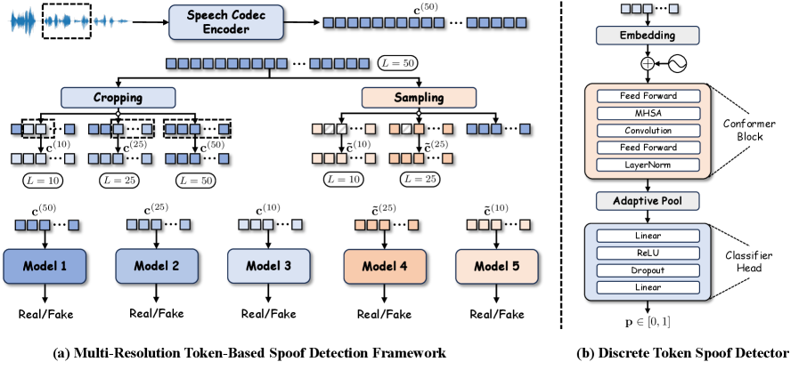
*Figure 1:Overview of multi-resolution token-based spoof detection framework. (a) Construction of token sequences at multiple temporal resolutions for training separate real/fake detectors. (b) Conformer-based discrete token spoof detector architecture.*

*(a)Full Utterance*

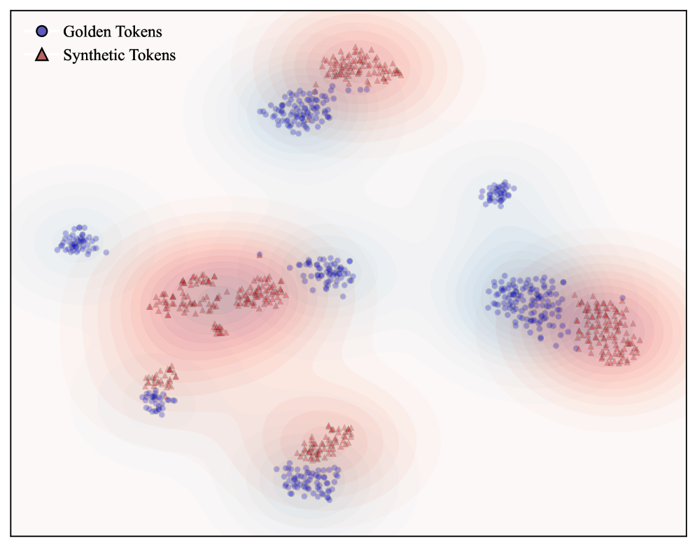
*(a)Full Utterance*

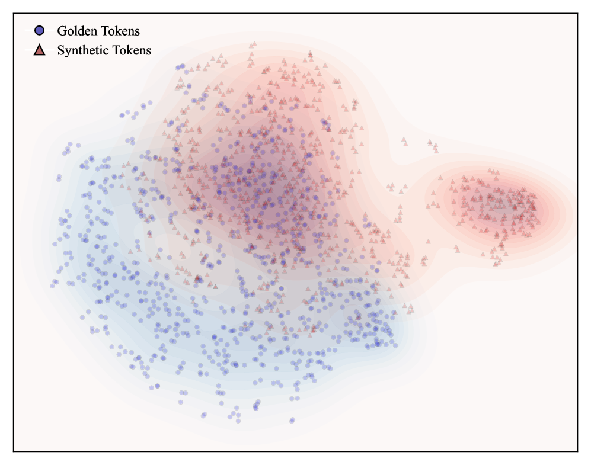
*(b)Segment Length = 50*

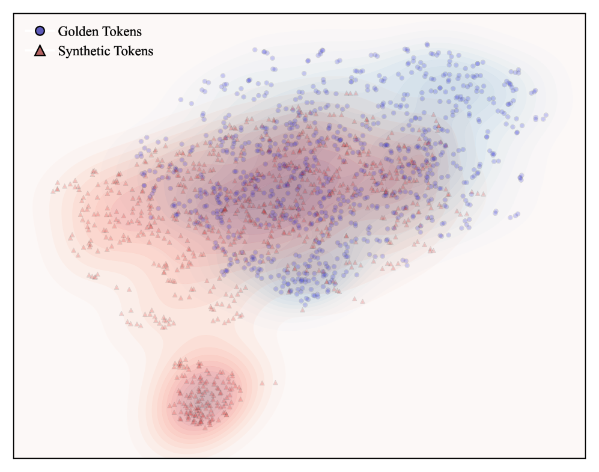
*(c)Segment Length = 25*

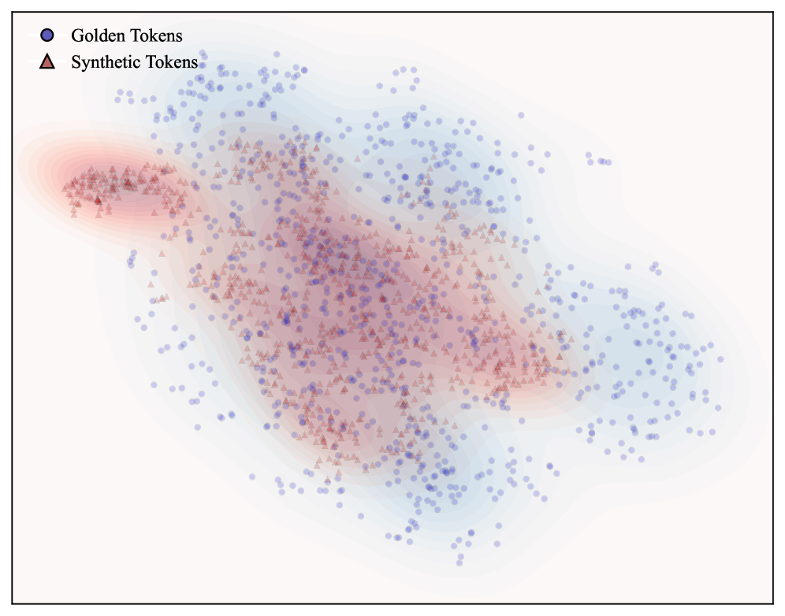
*(d)Segment Length = 10*

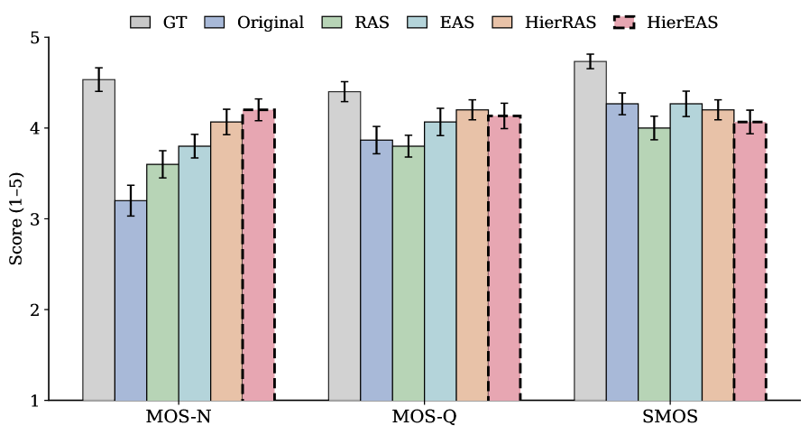
*Figure 3:Subjective evaluation of different inference strategies measured by MOS-N (naturalness), MOS-Q (quality), and SMOS (similarity).*

---
**Usage Info**: 5238 tokens used.
**Generated at**: 2026-03-06 12:36:51

---

# 📚 TW-Sound580K: A Regional Audio–Text Dataset with Verification-Guided Curation for Localized Audio-Language Modeling

🚀 URL: https://arxiv.org/html/2603.05094

## 🌏 Abstract (원문)
Recent advancements in Large Audio-Language Models (LALMs)[1,2]have improved multimodal reasoning across various speech and environmental contexts[3,4,5]. Despite this progress, models often underperform in culturally specific regions due to a localization gap[6]. In linguistically diverse areas like Taiwan, audio comprehension relies on distinct acoustic markers, primarily non-standard dialectal prosody and regional environmental soundmarks. Current models frequently treat these nuanced signals as out-of-distribution noise[7,8]. The scarcity of localized training data leaves these regional acoustic features under-represented. As a result, models struggle to decode these patterns and are prone to acoustic hallucinations[9,10], such as forcibly transcribing environmental sounds into nonsensical text. This highlights the difficulty of aligning regional acoustics with general cross-cultural semantics[6]. Addressing this issue requires high-fidelity, region-specific data rather than relying solely on generic semantic recognition[8,11].To mitigate this data scarcity, we introduce TW-Sound580K, a large-scale Taiwanese audio-text instruction dataset. Built upon approximately 522,000 raw audio clips , the dataset is expanded to over 580,000 diverse instruction-response pairs via a teacher LLM. This corpus is specifically designed to capture the local ``acoustic long-tail'' defined in this work as the sparse and imbalanced distribution of region-specific environmental sounds and minor dialectal variants. It provides extensive coverage of both regional dialects and unique regional soundmarks.Constructing clean supervision from such culturally dense data presents a practical challenge. Standard Automatic Speech Recognition (ASR) systems typically fail to process non-lexical environmental cues, yet entirely bypassing ASR compromises the transcription accuracy of complex dialects. To build a high-quality dataset without introducing hallucination risks, we implement a Verify-Generate-Critique (VGC) curation pipeline integrated with a Dual-ASR filtering strategy. This mechanism uses heterogeneous ASR systems to validate speech data and filter transcription inconsistencies. For environmental audio, it acts as a speech-absence verifier, relying on a teacher model's critique to ensure data purity.Additionally, to properly evaluate models trained on this corpus, we propose a dynamic Dual-ASR Arbitration mechanism during the inference stage. Guided by acoustic-conditioned perplexity (AC-PPL), this arbiter dynamically selects the most accurate transcription from the ASR outputs. This effectively reduces the risk of run-time hallucinations when encountering heavy dialectal noise or nuanced regional acoustics.The main contributions of this work are summarized as follows:The TW-Sound580K Dataset:We introduce a large-scale instruction-tuning corpus targeting the Taiwanese acoustic long-tail, expanded from 522K raw audio clips. It provides high-quality supervision for regional dialects and local soundmarks. Due to copyright and licensing constraints, the raw audio data cannot be directly distributed. However, to ensure reproducibility while adhering to double-blind review policies, the source URLs, metadata, and associated crawler scripts are prepared for public release upon de-anonymization.Automated Curation Pipeline and Dynamic Inference Arbitration:We design a VGC-based data processing pipeline integrated with Dual-ASR filtering to ensure high-fidelity dataset construction. Furthermore, we propose an AC-PPL-guided dynamic arbitration strategy during inference to dynamically select the most accurate transcription, effectively reducing the risk of run-time hallucinations.Empirical Validation via Tai-LALM:We fine-tune Tai-LALM (initialized with DeSTA 2.5-Audio weights) to validate the corpus and inference strategy. Evaluated on the TAU Benchmark, the model achieves 49.1% accuracy, outperforming the zero-shot baseline (42.6%) by 6.5% and a naive SFT baseline trained on unfiltered data by 2.7%.Ultimately, this work provides not just a localized corpus, but a reproducible framework from data curation to inference arbitration that effectively bridges the localization gap for regional audio understanding in LALMs.
## 🌏 Abstract (번역)
최근 대규모 오디오-언어 모델(LALM)[1,2]의 발전은 다양한 음성 및 환경 맥락[3,4,5]에서 다중 모드 추론을 향상시켰습니다. 이러한 발전에도 불구하고, 모델은 지역화 격차[6]로 인해 문화적으로 특정 지역에서 종종 성능이 저하됩니다. 대만과 같이 언어적으로 다양한 지역에서는 오디오 이해가 주로 비표준 방언 운율과 지역 환경 음향 마크와 같은 독특한 음향 표지에 의존합니다. 현재 모델들은 이러한 미묘한 신호들을 종종 분포 외 노이즈로 처리합니다[7,8]. 지역화된 훈련 데이터의 부족은 이러한 지역 음향 특징들이 제대로 표현되지 못하게 합니다. 결과적으로, 모델들은 이러한 패턴을 해독하는 데 어려움을 겪고, 환경 소리를 무의미한 텍스트로 강제로 전사하는 것과 같은 음향 환각[9,10]에 취약합니다. 이는 지역 음향과 일반적인 교차 문화적 의미론을 정렬하는 데 어려움이 있음을 강조합니다[6]. 이 문제를 해결하려면 일반적인 의미론적 인식에만 의존하기보다는 고품질의 지역별 데이터가 필요합니다[8,11]. 이러한 데이터 부족을 완화하기 위해, 우리는 대규모 대만 오디오-텍스트 지시 데이터셋인 TW-Sound580K를 소개합니다. 약 522,000개의 원본 오디오 클립을 기반으로 구축된 이 데이터셋은 교사 LLM을 통해 580,000개 이상의 다양한 지시-응답 쌍으로 확장되었습니다. 이 코퍼스는 본 연구에서 지역별 환경 소리와 소수 방언 변형의 희소하고 불균형한 분포로 정의되는 지역 '음향 롱테일'을 포착하도록 특별히 설계되었습니다. 이는 지역 방언과 독특한 지역 음향 마크를 광범위하게 다룹니다. 이러한 문화적으로 밀집된 데이터에서 깨끗한 감독을 구축하는 것은 실질적인 과제를 제시합니다. 표준 자동 음성 인식(ASR) 시스템은 일반적으로 비어휘적 환경 단서를 처리하지 못하지만, ASR을 완전히 우회하는 것은 복잡한 방언의 전사 정확도를 저해합니다. 환각 위험을 도입하지 않고 고품품질 데이터셋을 구축하기 위해, 우리는 이중 ASR 필터링 전략과 통합된 검증-생성-비평(VGC) 큐레이션 파이프라인을 구현합니다. 이 메커니즘은 이기종 ASR 시스템을 사용하여 음성 데이터를 검증하고 전사 불일치를 필터링합니다. 환경 오디오의 경우, 음성 부재 검증기 역할을 하며, 데이터 순도를 보장하기 위해 교사 모델의 비평에 의존합니다. 또한, 이 코퍼스로 훈련된 모델을 적절하게 평가하기 위해, 우리는 추론 단계에서 동적 이중 ASR 중재 메커니즘을 제안합니다. 음향 조건부 혼란도(AC-PPL)에 의해 안내되는 이 중재자는 ASR 출력에서 가장 정확한 전사를 동적으로 선택합니다. 이는 심한 방언 노이즈나 미묘한 지역 음향을 만났을 때 런타임 환각의 위험을 효과적으로 줄입니다. 본 연구의 주요 기여는 다음과 같이 요약됩니다: TW-Sound580K 데이터셋: 대만 음향 롱테일을 목표로 하는 대규모 지시 튜닝 코퍼스를 소개하며, 522K개의 원본 오디오 클립에서 확장되었습니다. 이는 지역 방언 및 지역 음향 마크에 대한 고품질 감독을 제공합니다. 저작권 및 라이선스 제약으로 인해 원본 오디오 데이터는 직접 배포할 수 없습니다. 그러나 이중 맹검 검토 정책을 준수하면서 재현성을 보장하기 위해, 소스 URL, 메타데이터 및 관련 크롤러 스크립트는 익명화 해제 시 공개될 예정입니다. 자동 큐레이션 파이프라인 및 동적 추론 중재: 고품질 데이터셋 구축을 보장하기 위해 이중 ASR 필터링과 통합된 VGC 기반 데이터 처리 파이프라인을 설계합니다. 또한, 런타임 환각의 위험을 효과적으로 줄이기 위해 추론 중 가장 정확한 전사를 동적으로 선택하는 AC-PPL 기반 동적 중재 전략을 제안합니다. Tai-LALM을 통한 경험적 검증: 코퍼스 및 추론 전략을 검증하기 위해 Tai-LALM(DeSTA 2.5-Audio 가중치로 초기화됨)을 미세 조정합니다. TAU 벤치마크에서 평가된 모델은 49.1%의 정확도를 달성하여 제로샷 기준선(42.6%)보다 6.5%, 필터링되지 않은 데이터로 훈련된 단순 SFT 기준선보다 2.7% 뛰어난 성능을 보였습니다. 궁극적으로, 본 연구는 지역화된 코퍼스뿐만 아니라 데이터 큐레이션부터 추론 중재에 이르는 재현 가능한 프레임워크를 제공하여 LALM의 지역 오디오 이해를 위한 지역화 격차를 효과적으로 해소합니다.

## 🔍 Methods & Results
- 지역화 격차를 해소하기 위해 (I) 데이터셋 구축, (II) 훈련 데이터 생성, (III) 다중 모드 훈련 프로세스, (IV) 동적 이중 ASR 중재 메커니즘을 특징으로 하는 추론의 네 가지 주요 단계로 구성된 데이터 중심 파이프라인을 제안합니다.
- TW-Sound580K 데이터셋을 소개합니다. 이 데이터셋은 대만 중심 소스에서 수집된 약 522,000개의 원본 오디오 클립을 이중 ASR 파이프라인으로 필터링하여 456,832개의 검증된 샘플(약 3,536.78시간)로 정제한 후, 교사 LLM을 통해 580,000개 이상의 다양한 오디오-텍스트 지시-응답 쌍으로 확장되었습니다.
- TW-Sound580K는 지역 방언 운율 및 지역화된 사운드마크를 포함하는 대만 '음향 롱테일'을 포착하도록 설계되었으며, 데이터셋 레이블의 53.6%가 이러한 특정 음향 단서를 대상으로 합니다.
- 고품질 데이터셋 구축을 위해 Verify-Generate-Critique (VGC) 큐레이션 파이프라인을 구현합니다. 이는 이기종 ASR 시스템을 사용하여 음성 데이터를 검증하고, 교사 LLM이 원본 오디오를 기반으로 음향 제약 증류를 통해 설명을 생성하며, 교사 모델이 자체 비평을 통해 설명을 정제하는 과정을 포함합니다.
- 추론 단계에서 런타임 환각을 줄이기 위해 동적 이중 ASR 중재 메커니즘을 제안합니다. 이 메커니즘은 음향 조건부 혼란도(AC-PPL)를 사용하여 이기종 ASR 출력에서 가장 정확한 전사를 동적으로 선택하며, 음성 부재 사운드마크의 경우 순수 오디오 추론으로 전환합니다.
- 훈련은 DeSTA 2.5-Audio를 따르며, VGC 큐레이션 메타데이터에서 목표 응답을 생성하는 고정된 텍스트 전용 LLM과 Whisper 인코더 및 Q-Former에 연결된 다중 모드 백본을 LoRA를 사용하여 미세 조정합니다. 훈련은 음향 표현과 ASR 전사에 조건화된 자동회귀 손실을 최소화하도록 최적화됩니다.
- Tai-LALM(DeSTA 2.5-Audio 가중치로 초기화)을 TW-Sound580K로 미세 조정하여 TAU 벤치마크에서 49.1%의 정확도를 달성했습니다. 이는 제로샷 기준선(42.6%)보다 6.5%, 필터링되지 않은 데이터로 훈련된 단순 SFT 기준선보다 2.7% 높은 성능입니다.

## 🖼 Figures
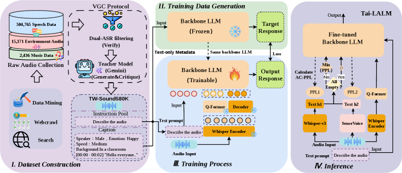
*Figure 1:The proposed framework for TW-Sound580K dataset construction and Tai-LALM fine-tuning, illustrating the DeSTA 2.5-Audio-based localization pipeline.*

---
**Usage Info**: 5658 tokens used.
**Generated at**: 2026-03-06 12:37:09

---

# 📚 Voice Timbre Attribute Detection with Compact and Interpretable Training-Free Acoustic Parameters

🚀 URL: https://arxiv.org/html/2603.05091

## 🌏 Abstract (원문)
Voice timbre is an important component yet incomprehensible dimension of human speech for identifying and distinguishing speaking persons[terasawa05_interspeech,kreiman2011foundations]. It is like the ``auditory face'' of a speaker[Belin2004-sx]. Voice timbre conveys stable personal traits related to gender, age and physiological characteristics, and dynamic states like emotion and health[laver1980phoetic]. According to[asa_timbre], timbre is defined as an attribute that ``enables a listener to judge that twonon-identicalsounds, similarly presented and having the same loudness, pitch, spatial location, and duration, aredissimilar'', and is ``often specified byqualitative adjectives(e.g., bright or dull)''. This highlights the complexity of timbre and the fact that voice timbre analysis relies on subjective natural language descriptions[kreiman2011foundations,Kreiman2024-op]. In[he2025introducingvoicetimbreattribute], a framework of voice timbre attribute detection (vTAD) was proposed for investigating and explaining the relationship between voice timbre and speech acoustics. In this framework, timbre attributes are defined by a group of verbal descriptors of voice timbre as listed in Table1. A vTAD system uses a Diff-Net to measure the comparative intensity of a timbre attribute between two speech utterances from different speakers. The ground-truth label is obtained from human perception[vctk-rva]. The task of vTAD leverages a large-scale speech dataset which provides a direct mapping between speech utterances and subjective descriptions of voice timbre. It aims to assess the performance of the latest speaker embedding models against human experts in perceiving voice timbre attributes. The task of vTAD is similar to speaker verification (SV) as illustrated in Figure1. General SV systems use speaker embeddings that entangle multiple factors of speech variation, e.g., content, timbre, prosody[SpeechTripleNet,chiu2025largescaleprobinganalysisspeakerspecific]. vTAD focuses on evaluating how latent speaker embeddings specifically encode voice timbre information in speech. Despite that speaker embedding systems trained with large amount of data show high performance in vTAD[chen2025voicetimbreattributedetection,ecapa-tdnn,naturalspeech3,cuhk-ee,song_vtad,deng_vtad,wu2025vtad], these systems require excessive computational power for extracting high-dimensional embeddings and lack interpretability for meaningful voice analysis. The interpretability is vital for building reliable speech AI systems. It plays a significant role in real-world scenarios like forensics and legal settings. In the present study, a set of acoustic parameters is revisited and investigated for vTAD. The set contains 13 speech production related features and their temporal dynamics, which form a 26-dimensional vector. Compared with DNN learnt speaker embeddings, which are of hundreds or even thousands of dimensions and trained on large-scale speech data, the 26-dimension acoustic parameter set does not require GPU acceleration for feature extraction, yet achieves comparable performance on the task and offers explicit interpretability. Analysis of experimental results reveals that the temporal dynamics of speech play an important role in distinguishing timbre attributes. The contributions of individual acoustic features are analysed to provide insights into interpretable voice timbre analysis and speaker embedding design.
## 🌏 Abstract (번역)
음성 음색은 화자를 식별하고 구별하는 데 있어 중요한 구성 요소이지만 아직 완전히 이해되지 않은 인간 음성의 차원입니다[terasawa05_interspeech,kreiman2011foundations]. 이는 화자의 '청각적 얼굴'과 같습니다[Belin2004-sx]. 음성 음색은 성별, 나이, 생리적 특성과 관련된 안정적인 개인 특성 및 감정, 건강과 같은 동적 상태를 전달합니다[laver1980phoetic]. [asa_timbre]에 따르면, 음색은 '두 개의 동일하지 않은 소리가 유사하게 제시되고 동일한 음량, 피치, 공간 위치 및 지속 시간을 가질 때 청취자가 이들이 서로 다르다고 판단할 수 있게 하는 속성'으로 정의되며, '종종 질적 형용사(예: 밝거나 둔한)로 지정됩니다'. 이는 음색의 복잡성과 음성 음색 분석이 주관적인 자연어 설명에 의존한다는 사실을 강조합니다[kreiman2011foundations,Kreiman2024-op]. [he2025introducingvoicetimbreattribute]에서는 음성 음색과 음성 음향 간의 관계를 조사하고 설명하기 위한 음성 음색 속성 감지(vTAD) 프레임워크가 제안되었습니다. 이 프레임워크에서 음색 속성은 표 1에 나열된 음성 음색의 언어적 설명자 그룹으로 정의됩니다. vTAD 시스템은 Diff-Net을 사용하여 다른 화자의 두 음성 발화 간의 음색 속성 비교 강도를 측정합니다. 실제 레이블은 인간의 인지에서 얻어집니다[vctk-rva]. vTAD 작업은 음성 발화와 음성 음색의 주관적인 설명 간의 직접적인 매핑을 제공하는 대규모 음성 데이터셋을 활용합니다. 이는 음성 음색 속성을 인지하는 데 있어 최신 화자 임베딩 모델의 성능을 인간 전문가와 비교하여 평가하는 것을 목표로 합니다. vTAD 작업은 그림 1에 설명된 바와 같이 화자 검증(SV)과 유사합니다. 일반적인 SV 시스템은 내용, 음색, 운율과 같은 여러 음성 변이 요소를 얽히게 하는 화자 임베딩을 사용합니다[SpeechTripleNet,chiu2025largescaleprobinganalysisspeakerspecific]. vTAD는 잠재적 화자 임베딩이 음성에서 음성 음색 정보를 구체적으로 어떻게 인코딩하는지 평가하는 데 중점을 둡니다. 대량의 데이터로 훈련된 화자 임베딩 시스템이 vTAD에서 높은 성능을 보임에도 불구하고[chen2025voicetimbreattributedetection,ecapa-tdnn,naturalspeech3,cuhk-ee,song_vtad,deng_vtad,wu2025vtad], 이러한 시스템은 고차원 임베딩 추출을 위해 과도한 계산 능력을 요구하며 의미 있는 음성 분석을 위한 해석 가능성이 부족합니다. 해석 가능성은 신뢰할 수 있는 음성 AI 시스템을 구축하는 데 필수적입니다. 이는 법의학 및 법률 환경과 같은 실제 시나리오에서 중요한 역할을 합니다. 본 연구에서는 vTAD를 위해 일련의 음향 매개변수를 재검토하고 조사합니다. 이 세트에는 13개의 음성 생성 관련 특징과 그 시간적 역학이 포함되어 26차원 벡터를 형성합니다. 수백 또는 심지어 수천 차원이며 대규모 음성 데이터로 훈련된 DNN 학습 화자 임베딩과 비교할 때, 26차원 음향 매개변수 세트는 특징 추출을 위해 GPU 가속을 필요로 하지 않으면서도 작업에서 비교할 만한 성능을 달성하고 명시적인 해석 가능성을 제공합니다. 실험 결과 분석은 음성의 시간적 역학이 음색 속성을 구별하는 데 중요한 역할을 한다는 것을 보여줍니다. 개별 음향 특징의 기여도를 분석하여 해석 가능한 음성 음색 분석 및 화자 임베딩 설계에 대한 통찰력을 제공합니다.

## 🔍 Methods & Results
- 음성 음색 속성 감지(vTAD)를 위해 13개의 음성 생성 관련 특징과 그 시간적 역학을 포함하는 26차원 음향 매개변수 세트를 재검토하고 조사했습니다.
- 이 26차원 음향 매개변수 세트는 특징 추출에 GPU 가속을 필요로 하지 않습니다.
- 대규모 데이터로 훈련된 고차원 DNN 학습 화자 임베딩과 비교하여 vTAD 작업에서 유사한 성능을 달성하며 명시적인 해석 가능성을 제공합니다.
- 실험 결과 분석을 통해 음성의 시간적 역학이 음색 속성을 구별하는 데 중요한 역할을 한다는 것을 발견했습니다.
- 개별 음향 특징의 기여도를 분석하여 해석 가능한 음성 음색 분석 및 화자 임베딩 설계에 대한 통찰력을 제공했습니다.

## 🖼 Figures
![Figure 1:The definition of vTAD [he2025introducingvoicetimbreattribute].](../images/2026-03-06/2603.05091/2603.05091_fig0.png)
*Figure 1:The definition of vTAD [he2025introducingvoicetimbreattribute].*

![Figure 2:The overall workflow of vTAD [he2025introducingvoicetimbreattribute].](../images/2026-03-06/2603.05091/2603.05091_fig1.png)
*Figure 2:The overall workflow of vTAD [he2025introducingvoicetimbreattribute].*

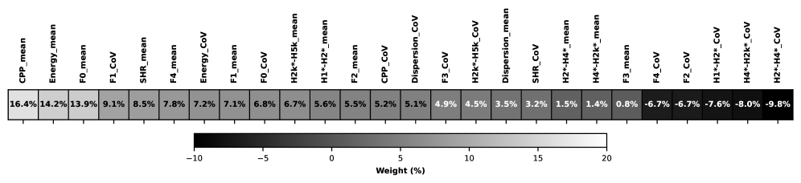
*Figure 3:Feature weights in the Diff-Net using the acoustic parameter set.*

---
**Usage Info**: 3105 tokens used.
**Generated at**: 2026-03-06 12:37:20

---

# 📚 TransducingLanguageModels

🚀 URL: https://arxiv.org/html/2603.05193

## 🌏 Abstract (원문)
Language models (LMs) define distributions over strings. Yet, the strings they produce often do not match the requirements of downstream applications, so practitioners resort to ad hoc post-processing. We call this thestring mismatch problem.
For example, in natural language processing, modern language models typically generate byte-pair encoded strings(Sennrich et al.,2016), while downstream tasks may require words or characters instead (seeFig.˜1, below).
Similarly, DNA language models generate nucleobase sequences, whereas many applications require amino acid sequences (§
˜1).
Adding a string-to-string transformation to a generation pipeline is a common engineering solution, such as normalizing output or mapping subword tokens to bytes.
Formally, this defines a new language model overtransformedstrings.
However, while sampling remains straightforward, other operations—such as computing the probability of a transformed string or conditioning on transformed outputs—become intractable.
Consider, for instance, the mapping from a string in any casing to its lowercase version, as in the use-case depicted inFig.˜1. While lowercasing a given input is trivial, converting the original distribution to a distribution over lowercased words is not.
This work treats string-to-string transformations as a first-class component of the language modeling pipeline.
We show how to equip these transformed models with the familiar autoregressive interface—incremental next-symbol distributions and prefix probabilities—making them interoperable with any system built for standard autoregressive language models.
This approach to the string mismatch problem is principled, modular, and can be substantially cheaper than retraining.
Moreover, the transformations often guarantee adherence to the requirements of the downstream applications.
Consider language models over English text—the same utterance can be encoded in many ways. For example,
.Dr. Lemaître was flabbergasted.
The byte-pair encoding used by GPT-4o(OpenAI,2024)encodesFig.˜1as the following string of subword tokens:
.5822Dr\stackrel{{\scriptstyle\raisebox{-1.50694pt}{{\color[rgb]{0.55078125,0.0390625,0.34765625}\definecolor[named]{pgfstrokecolor}{rgb}{0.55078125,0.0390625,0.34765625}{Dr}}}}}{{\text{\raisebox{-2.15277pt}{{\color[rgb]{0.5,0.5,0.5}\definecolor[named]{pgfstrokecolor}{rgb}{0.5,0.5,0.5}\pgfsys@color@gray@stroke{0.5}\pgfsys@color@gray@fill{0.5}{5822}}}}}}13.\stackrel{{\scriptstyle\raisebox{-1.50694pt}{{\color[rgb]{0.55078125,0.0390625,0.34765625}\definecolor[named]{pgfstrokecolor}{rgb}{0.55078125,0.0390625,0.34765625}{.}}}}}{{\text{\raisebox{-2.15277pt}{{\color[rgb]{0.5,0.5,0.5}\definecolor[named]{pgfstrokecolor}{rgb}{0.5,0.5,0.5}\pgfsys@color@gray@stroke{0.5}\pgfsys@color@gray@fill{0.5}{13}}}}}}451␣L\stackrel{{\scriptstyle\raisebox{-1.50694pt}{{\color[rgb]{0.55078125,0.0390625,0.34765625}\definecolor[named]{pgfstrokecolor}{rgb}{0.55078125,0.0390625,0.34765625}{␣{L}}}}}}{{\text{\raisebox{-2.15277pt}{{\color[rgb]{0.5,0.5,0.5}\definecolor[named]{pgfstrokecolor}{rgb}{0.5,0.5,0.5}\pgfsys@color@gray@stroke{0.5}\pgfsys@color@gray@fill{0.5}{451}}}}}}4603ema\stackrel{{\scriptstyle\raisebox{-1.50694pt}{{\color[rgb]{0.55078125,0.0390625,0.34765625}\definecolor[named]{pgfstrokecolor}{rgb}{0.55078125,0.0390625,0.34765625}{ema}}}}}{{\text{\raisebox{-2.15277pt}{{\color[rgb]{0.5,0.5,0.5}\definecolor[named]{pgfstrokecolor}{rgb}{0.5,0.5,0.5}\pgfsys@color@gray@stroke{0.5}\pgfsys@color@gray@fill{0.5}{4603}}}}}}29135\C3\AEtre\stackrel{{\scriptstyle\raisebox{-1.50694pt}{{\color[rgb]{0.55078125,0.0390625,0.34765625}\definecolor[named]{pgfstrokecolor}{rgb}{0.55078125,0.0390625,0.34765625}{{\tt\\}C3{\tt\\}AEtre}}}}}{{\text{\raisebox{-2.15277pt}{{\color[rgb]{0.5,0.5,0.5}\definecolor[named]{pgfstrokecolor}{rgb}{0.5,0.5,0.5}\pgfsys@color@gray@stroke{0.5}\pgfsys@color@gray@fill{0.5}{29135}}}}}}673␣was\stackrel{{\scriptstyle\raisebox{-1.50694pt}{{\color[rgb]{0.55078125,0.0390625,0.34765625}\definecolor[named]{pgfstrokecolor}{rgb}{0.55078125,0.0390625,0.34765625}{␣{was}}}}}}{{\text{\raisebox{-2.15277pt}{{\color[rgb]{0.5,0.5,0.5}\definecolor[named]{pgfstrokecolor}{rgb}{0.5,0.5,0.5}\pgfsys@color@gray@stroke{0.5}\pgfsys@color@gray@fill{0.5}{673}}}}}}1548␣fl\stackrel{{\scriptstyle\raisebox{-1.50694pt}{{\color[rgb]{0.55078125,0.0390625,0.34765625}\definecolor[named]{pgfstrokecolor}{rgb}{0.55078125,0.0390625,0.34765625}{␣{fl}}}}}}{{\text{\raisebox{-2.15277pt}{{\color[rgb]{0.5,0.5,0.5}\definecolor[named]{pgfstrokecolor}{rgb}{0.5,0.5,0.5}\pgfsys@color@gray@stroke{0.5}\pgfsys@color@gray@fill{0.5}{1548}}}}}}378ab\stackrel{{\scriptstyle\raisebox{-1.50694pt}{{\color[rgb]{0.55078125,0.0390625,0.34765625}\definecolor[named]{pgfstrokecolor}{rgb}{0.55078125,0.0390625,0.34765625}{ab}}}}}{{\text{\raisebox{-2.15277pt}{{\color[rgb]{0.5,0.5,0.5}\definecolor[named]{pgfstrokecolor}{rgb}{0.5,0.5,0.5}\pgfsys@color@gray@stroke{0.5}\pgfsys@color@gray@fill{0.5}{378}}}}}}9667berg\stackrel{{\scriptstyle\raisebox{-1.50694pt}{{\color[rgb]{0.55078125,0.0390625,0.34765625}\definecolor[named]{pgfstrokecolor}{rgb}{0.55078125,0.0390625,0.34765625}{berg}}}}}{{\text{\raisebox{-2.15277pt}{{\color[rgb]{0.5,0.5,0.5}\definecolor[named]{pgfstrokecolor}{rgb}{0.5,0.5,0.5}\pgfsys@color@gray@stroke{0.5}\pgfsys@color@gray@fill{0.5}{9667}}}}}}23030asted\stackrel{{\scriptstyle\raisebox{-1.50694pt}{{\color[rgb]{0.55078125,0.0390625,0.34765625}\definecolor[named]{pgfstrokecolor}{rgb}{0.55078125,0.0390625,0.34765625}{asted}}}}}{{\text{\raisebox{-2.15277pt}{{\color[rgb]{0.5,0.5,0.5}\definecolor[named]{pgfstrokecolor}{rgb}{0.5,0.5,0.5}\pgfsys@color@gray@stroke{0.5}\pgfsys@color@gray@fill{0.5}{23030}}}}}}13.\stackrel{{\scriptstyle\raisebox{-1.50694pt}{{\color[rgb]{0.55078125,0.0390625,0.34765625}\definecolor[named]{pgfstrokecolor}{rgb}{0.55078125,0.0390625,0.34765625}{.}}}}}{{\text{\raisebox{-2.15277pt}{{\color[rgb]{0.5,0.5,0.5}\definecolor[named]{pgfstrokecolor}{rgb}{0.5,0.5,0.5}\pgfsys@color@gray@stroke{0.5}\pgfsys@color@gray@fill{0.5}{13}}}}}}93643␣\F0\9F\A4\stackrel{{\scriptstyle\raisebox{-1.50694pt}{{\color[rgb]{0.55078125,0.0390625,0.34765625}\definecolor[named]{pgfstrokecolor}{rgb}{0.55078125,0.0390625,0.34765625}{␣{\tt\\}F0{\tt\\}9F{\tt\\}A4}}}}}{{\text{\raisebox{-2.15277pt}{{\color[rgb]{0.5,0.5,0.5}\definecolor[named]{pgfstrokecolor}{rgb}{0.5,0.5,0.5}\pgfsys@color@gray@stroke{0.5}\pgfsys@color@gray@fill{0.5}{93643}}}}}}107\AF\stackrel{{\scriptstyle\raisebox{-1.50694pt}{{\color[rgb]{0.55078125,0.0390625,0.34765625}\definecolor[named]{pgfstrokecolor}{rgb}{0.55078125,0.0390625,0.34765625}{{\tt\\}AF}}}}}{{\text{\raisebox{-2.15277pt}{{\color[rgb]{0.5,0.5,0.5}\definecolor[named]{pgfstrokecolor}{rgb}{0.5,0.5,0.5}\pgfsys@color@gray@stroke{0.5}\pgfsys@color@gray@fill{0.5}{107}}}}}}
The byte-pair segmentation ofFig.˜1into subwords is based on character substring frequency. However, many applications seek different units.
For instance, computational psycholinguistics(e.g., Giulianelli et al.,2024)and controlled generation(e.g., Lew et al.,2023; Xefteri et al.,2025)both require custom units.
This also holds if one wishes to derive distributions over words, such as those defined by the Penn Treebank (PTB) annotation guidelines(Marcus et al.,1993), a variation of which is shown below:
.Dr.Lemaîtrewasflabbergasted.
For other applications, e.g., spelling correction, we might also wish to representFig.˜1using a string of characters or UTF-8 byte representation as follows:111Note that UTF-8 allows multiple encodings of some strings. For example, the characterîcan be encodedcomposed(\C3\AE) ordecomposed(i\CC\82). Seehttps://unicode.org/reports/tr15/.
.68D\stackrel{{\scriptstyle\raisebox{-1.50694pt}{{\color[rgb]{0.3828125,0.44921875,0.07421875}\definecolor[named]{pgfstrokecolor}{rgb}{0.3828125,0.44921875,0.07421875}{D}}}}}{{\raisebox{-2.15277pt}{{\color[rgb]{0.5,0.5,0.5}\definecolor[named]{pgfstrokecolor}{rgb}{0.5,0.5,0.5}\pgfsys@color@gray@stroke{0.5}\pgfsys@color@gray@fill{0.5}{68} }}}}114r\stackrel{{\scriptstyle\raisebox{-1.50694pt}{{\color[rgb]{0.3828125,0.44921875,0.07421875}\definecolor[named]{pgfstrokecolor}{rgb}{0.3828125,0.44921875,0.07421875}{r}}}}}{{\raisebox{-2.15277pt}{{\color[rgb]{0.5,0.5,0.5}\definecolor[named]{pgfstrokecolor}{rgb}{0.5,0.5,0.5}\pgfsys@color@gray@stroke{0.5}\pgfsys@color@gray@fill{0.5}{114} }}}}46.\stackrel{{\scriptstyle\raisebox{-1.50694pt}{{\color[rgb]{0.3828125,0.44921875,0.07421875}\definecolor[named]{pgfstrokecolor}{rgb}{0.3828125,0.44921875,0.07421875}{.}}}}}{{\raisebox{-2.15277pt}{{\color[rgb]{0.5,0.5,0.5}\definecolor[named]{pgfstrokecolor}{rgb}{0.5,0.5,0.5}\pgfsys@color@gray@stroke{0.5}\pgfsys@color@gray@fill{0.5}{46} }}}}32␣\stackrel{{\scriptstyle\raisebox{-1.50694pt}{{\color[rgb]{0.3828125,0.44921875,0.07421875}\definecolor[named]{pgfstrokecolor}{rgb}{0.3828125,0.44921875,0.07421875}{␣}}}}}{{\raisebox{-2.15277pt}{{\color[rgb]{0.5,0.5,0.5}\definecolor[named]{pgfstrokecolor}{rgb}{0.5,0.5,0.5}\pgfsys@color@gray@stroke{0.5}\pgfsys@color@gray@fill{0.5}{32} }}}}76L\stackrel{{\scriptstyle\raisebox{-1.50694pt}{{\color[rgb]{0.3828125,0.44921875,0.07421875}\definecolor[named]{pgfstrokecolor}{rgb}{0.3828125,0.44921875,0.07421875}{L}}}}}{{\raisebox{-2.15277pt}{{\color[rgb]{0.5,0.5,0.5}\definecolor[named]{pgfstrokecolor}{rgb}{0.5,0.5,0.5}\pgfsys@color@gray@stroke{0.5}\pgfsys@color@gray@fill{0.5}{76} }}}}101e\stackrel{{\scriptstyle\raisebox{-1.50694pt}{{\color[rgb]{0.3828125,0.44921875,0.07421875}\definecolor[named]{pgfstrokecolor}{rgb}{0.3828125,0.44921875,0.07421875}{e}}}}}{{\raisebox{-2.15277pt}{{\color[rgb]{0.5,0.5,0.5}\definecolor[named]{pgfstrokecolor}{rgb}{0.5,0.5,0.5}\pgfsys@color@gray@stroke{0.5}\pgfsys@color@gray@fill{0.5}{101} }}}}109m\stackrel{{\scriptstyle\raisebox{-1.50694pt}{{\color[rgb]{0.3828125,0.44921875,0.07421875}\definecolor[named]{pgfstrokecolor}{rgb}{0.3828125,0.44921875,0.07421875}{m}}}}}{{\raisebox{-2.15277pt}{{\color[rgb]{0.5,0.5,0.5}\definecolor[named]{pgfstrokecolor}{rgb}{0.5,0.5,0.5}\pgfsys@color@gray@stroke{0.5}\pgfsys@color@gray@fill{0.5}{109} }}}}97a\stackrel{{\scriptstyle\raisebox{-1.50694pt}{{\color[rgb]{0.3828125,0.44921875,0.07421875}\definecolor[named]{pgfstrokecolor}{rgb}{0.3828125,0.44921875,0.07421875}{a}}}}}{{\raisebox{-2.15277pt}{{\color[rgb]{0.5,0.5,0.5}\definecolor[named]{pgfstrokecolor}{rgb}{0.5,0.5,0.5}\pgfsys@color@gray@stroke{0.5}\pgfsys@color@gray@fill{0.5}{97} }}}}195\C3\stackrel{{\scriptstyle\raisebox{-1.50694pt}{{\color[rgb]{0.3828125,0.44921875,0.07421875}\definecolor[named]{pgfstrokecolor}{rgb}{0.3828125,0.44921875,0.07421875}{{\tt\\}C3}}}}}{{\raisebox{-2.15277pt}{{\color[rgb]{0.5,0.5,0.5}\definecolor[named]{pgfstrokecolor}{rgb}{0.5,0.5,0.5}\pgfsys@color@gray@stroke{0.5}\pgfsys@color@gray@fill{0.5}{195} }}}}174\AE\stackrel{{\scriptstyle\raisebox{-1.50694pt}{{\color[rgb]{0.3828125,0.44921875,0.07421875}\definecolor[named]{pgfstrokecolor}{rgb}{0.3828125,0.44921875,0.07421875}{{\tt\\}AE}}}}}{{\raisebox{-2.15277pt}{{\color[rgb]{0.5,0.5,0.5}\definecolor[named]{pgfstrokecolor}{rgb}{0.5,0.5,0.5}\pgfsys@color@gray@stroke{0.5}\pgfsys@color@gray@fill{0.5}{174} }}}}116t\stackrel{{\scriptstyle\raisebox{-1.50694pt}{{\color[rgb]{0.3828125,0.44921875,0.07421875}\definecolor[named]{pgfstrokecolor}{rgb}{0.3828125,0.44921875,0.07421875}{t}}}}}{{\raisebox{-2.15277pt}{{\color[rgb]{0.5,0.5,0.5}\definecolor[named]{pgfstrokecolor}{rgb}{0.5,0.5,0.5}\pgfsys@color@gray@stroke{0.5}\pgfsys@color@gray@fill{0.5}{116} }}}}114r\stackrel{{\scriptstyle\raisebox{-1.50694pt}{{\color[rgb]{0.3828125,0.44921875,0.07421875}\definecolor[named]{pgfstrokecolor}{rgb}{0.3828125,0.44921875,0.07421875}{r}}}}}{{\raisebox{-2.15277pt}{{\color[rgb]{0.5,0.5,0.5}\definecolor[named]{pgfstrokecolor}{rgb}{0.5,0.5,0.5}\pgfsys@color@gray@stroke{0.5}\pgfsys@color@gray@fill{0.5}{114} }}}}101e\stackrel{{\scriptstyle\raisebox{-1.50694pt}{{\color[rgb]{0.3828125,0.44921875,0.07421875}\definecolor[named]{pgfstrokecolor}{rgb}{0.3828125,0.44921875,0.07421875}{e}}}}}{{\raisebox{-2.15277pt}{{\color[rgb]{0.5,0.5,0.5}\definecolor[named]{pgfstrokecolor}{rgb}{0.5,0.5,0.5}\pgfsys@color@gray@stroke{0.5}\pgfsys@color@gray@fill{0.5}{101} }}}}32␣\stackrel{{\scriptstyle\raisebox{-1.50694pt}{{\color[rgb]{0.3828125,0.44921875,0.07421875}\definecolor[named]{pgfstrokecolor}{rgb}{0.3828125,0.44921875,0.07421875}{␣}}}}}{{\raisebox{-2.15277pt}{{\color[rgb]{0.5,0.5,0.5}\definecolor[named]{pgfstrokecolor}{rgb}{0.5,0.5,0.5}\pgfsys@color@gray@stroke{0.5}\pgfsys@color@gray@fill{0.5}{32} }}}}119w\stackrel{{\scriptstyle\raisebox{-1.50694pt}{{\color[rgb]{0.3828125,0.44921875,0.07421875}\definecolor[named]{pgfstrokecolor}{rgb}{0.3828125,0.44921875,0.07421875}{w}}}}}{{\raisebox{-2.15277pt}{{\color[rgb]{0.5,0.5,0.5}\definecolor[named]{pgfstrokecolor}{rgb}{0.5,0.5,0.5}\pgfsys@color@gray@stroke{0.5}\pgfsys@color@gray@fill{0.5}{119} }}}}97a\stackrel{{\scriptstyle\raisebox{-1.50694pt}{{\color[rgb]{0.3828125,0.44921875,0.07421875}\definecolor[named]{pgfstrokecolor}{rgb}{0.3828125,0.44921875,0.07421875}{a}}}}}{{\raisebox{-2.15277pt}{{\color[rgb]{0.5,0.5,0.5}\definecolor[named]{pgfstrokecolor}{rgb}{0.5,0.5,0.5}\pgfsys@color@gray@stroke{0.5}\pgfsys@color@gray@fill{0.5}{97} }}}}115s\stackrel{{\scriptstyle\raisebox{-1.50694pt}{{\color[rgb]{0.3828125,0.44921875,0.07421875}\definecolor[named]{pgfstrokecolor}{rgb}{0.3828125,0.44921875,0.07421875}{s}}}}}{{\raisebox{-2.15277pt}{{\color[rgb]{0.5,0.5,0.5}\definecolor[named]{pgfstrokecolor}{rgb}{0.5,0.5,0.5}\pgfsys@color@gray@stroke{0.5}\pgfsys@color@gray@fill{0.5}{115} }}}}32␣\stackrel{{\scriptstyle\raisebox{-1.50694pt}{{\color[rgb]{0.3828125,0.44921875,0.07421875}\definecolor[named]{pgfstrokecolor}{rgb}{0.3828125,0.44921875,0.07421875}{␣}}}}}{{\raisebox{-2.15277pt}{{\color[rgb]{0.5,0.5,0.5}\definecolor[named]{pgfstrokecolor}{rgb}{0.5,0.5,0.5}\pgfsys@color@gray@stroke{0.5}\pgfsys@color@gray@fill{0.5}{32} }}}}102f\stackrel{{\scriptstyle\raisebox{-1.50694pt}{{\color[rgb]{0.3828125,0.44921875,0.07421875}\definecolor[named]{pgfstrokecolor}{rgb}{0.3828125,0.44921875,0.07421875}{f}}}}}{{\raisebox{-2.15277pt}{{\color[rgb]{0.5,0.5,0.5}\definecolor[named]{pgfstrokecolor}{rgb}{0.5,0.5,0.5}\pgfsys@color@gray@stroke{0.5}\pgfsys@color@gray@fill{0.5}{102} }}}}108l\stackrel{{\scriptstyle\raisebox{-1.50694pt}{{\color[rgb]{0.3828125,0.44921875,0.07421875}\definecolor[named]{pgfstrokecolor}{rgb}{0.3828125,0.44921875,0.07421875}{l}}}}}{{\raisebox{-2.15277pt}{{\color[rgb]{0.5,0.5,0.5}\definecolor[named]{pgfstrokecolor}{rgb}{0.5,0.5,0.5}\pgfsys@color@gray@stroke{0.5}\pgfsys@color@gray@fill{0.5}{108} }}}}97a\stackrel{{\scriptstyle\raisebox{-1.50694pt}{{\color[rgb]{0.3828125,0.44921875,0.07421875}\definecolor[named]{pgfstrokecolor}{rgb}{0.3828125,0.44921875,0.07421875}{a}}}}}{{\raisebox{-2.15277pt}{{\color[rgb]{0.5,0.5,0.5}\definecolor[named]{pgfstrokecolor}{rgb}{0.5,0.5,0.5}\pgfsys@color@gray@stroke{0.5}\pgfsys@color@gray@fill{0.5}{97} }}}}98b\stackrel{{\scriptstyle\raisebox{-1.50694pt}{{\color[rgb]{0.3828125,0.44921875,0.07421875}\definecolor[named]{pgfstrokecolor}{rgb}{0.3828125,0.44921875,0.07421875}{b}}}}}{{\raisebox{-2.15277pt}{{\color[rgb]{0.5,0.5,0.5}\definecolor[named]{pgfstrokecolor}{rgb}{0.5,0.5,0.5}\pgfsys@color@gray@stroke{0.5}\pgfsys@color@gray@fill{0.5}{98} }}}}98b\stackrel{{\scriptstyle\raisebox{-1.50694pt}{{\color[rgb]{0.3828125,0.44921875,0.07421875}\definecolor[named]{pgfstrokecolor}{rgb}{0.3828125,0.44921875,0.07421875}{b}}}}}{{\raisebox{-2.15277pt}{{\color[rgb]{0.5,0.5,0.5}\definecolor[named]{pgfstrokecolor}{rgb}{0.5,0.5,0.5}\pgfsys@color@gray@stroke{0.5}\pgfsys@color@gray@fill{0.5}{98} }}}}101e\stackrel{{\scriptstyle\raisebox{-1.50694pt}{{\color[rgb]{0.3828125,0.44921875,0.07421875}\definecolor[named]{pgfstrokecolor}{rgb}{0.3828125,0.44921875,0.07421875}{e}}}}}{{\raisebox{-2.15277pt}{{\color[rgb]{0.5,0.5,0.5}\definecolor[named]{pgfstrokecolor}{rgb}{0.5,0.5,0.5}\pgfsys@color@gray@stroke{0.5}\pgfsys@color@gray@fill{0.5}{101} }}}}114r\stackrel{{\scriptstyle\raisebox{-1.50694pt}{{\color[rgb]{0.3828125,0.44921875,0.07421875}\definecolor[named]{pgfstrokecolor}{rgb}{0.3828125,0.44921875,0.07421875}{r}}}}}{{\raisebox{-2.15277pt}{{\color[rgb]{0.5,0.5,0.5}\definecolor[named]{pgfstrokecolor}{rgb}{0.5,0.5,0.5}\pgfsys@color@gray@stroke{0.5}\pgfsys@color@gray@fill{0.5}{114} }}}}103g\stackrel{{\scriptstyle\raisebox{-1.50694pt}{{\color[rgb]{0.3828125,0.44921875,0.07421875}\definecolor[named]{pgfstrokecolor}{rgb}{0.3828125,0.44921875,0.07421875}{g}}}}}{{\raisebox{-2.15277pt}{{\color[rgb]{0.5,0.5,0.5}\definecolor[named]{pgfstrokecolor}{rgb}{0.5,0.5,0.5}\pgfsys@color@gray@stroke{0.5}\pgfsys@color@gray@fill{0.5}{103} }}}}97a\stackrel{{\scriptstyle\raisebox{-1.50694pt}{{\color[rgb]{0.3828125,0.44921875,0.07421875}\definecolor[named]{pgfstrokecolor}{rgb}{0.3828125,0.44921875,0.07421875}{a}}}}}{{\raisebox{-2.15277pt}{{\color[rgb]{0.5,0.5,0.5}\definecolor[named]{pgfstrokecolor}{rgb}{0.5,0.5,0.5}\pgfsys@color@gray@stroke{0.5}\pgfsys@color@gray@fill{0.5}{97} }}}}115s\stackrel{{\scriptstyle\raisebox{-1.50694pt}{{\color[rgb]{0.3828125,0.44921875,0.07421875}\definecolor[named]{pgfstrokecolor}{rgb}{0.3828125,0.44921875,0.07421875}{s}}}}}{{\raisebox{-2.15277pt}{{\color[rgb]{0.5,0.5,0.5}\definecolor[named]{pgfstrokecolor}{rgb}{0.5,0.5,0.5}\pgfsys@color@gray@stroke{0.5}\pgfsys@color@gray@fill{0.5}{115} }}}}116t\stackrel{{\scriptstyle\raisebox{-1.50694pt}{{\color[rgb]{0.3828125,0.44921875,0.07421875}\definecolor[named]{pgfstrokecolor}{rgb}{0.3828125,0.44921875,0.07421875}{t}}}}}{{\raisebox{-2.15277pt}{{\color[rgb]{0.5,0.5,0.5}\definecolor[named]{pgfstrokecolor}{rgb}{0.5,0.5,0.5}\pgfsys@color@gray@stroke{0.5}\pgfsys@color@gray@fill{0.5}{116} }}}}101e\stackrel{{\scriptstyle\raisebox{-1.50694pt}{{\color[rgb]{0.3828125,0.44921875,0.07421875}\definecolor[named]{pgfstrokecolor}{rgb}{0.3828125,0.44921875,0.07421875}{e}}}}}{{\raisebox{-2.15277pt}{{\color[rgb]{0.5,0.5,0.5}\definecolor[named]{pgfstrokecolor}{rgb}{0.5,0.5,0.5}\pgfsys@color@gray@stroke{0.5}\pgfsys@color@gray@fill{0.5}{101} }}}}100d\stackrel{{\scriptstyle\raisebox{-1.50694pt}{{\color[rgb]{0.3828125,0.44921875,0.07421875}\definecolor[named]{pgfstrokecolor}{rgb}{0.3828125,0.44921875,0.07421875}{d}}}}}{{\raisebox{-2.15277pt}{{\color[rgb]{0.5,0.5,0.5}\definecolor[named]{pgfstrokecolor}{rgb}{0.5,0.5,0.5}\pgfsys@color@gray@stroke{0.5}\pgfsys@color@gray@fill{0.5}{100} }}}}46.\stackrel{{\scriptstyle\raisebox{-1.50694pt}{{\color[rgb]{0.3828125,0.44921875,0.07421875}\definecolor[named]{pgfstrokecolor}{rgb}{0.3828125,0.44921875,0.07421875}{.}}}}}{{\raisebox{-2.15277pt}{{\color[rgb]{0.5,0.5,0.5}\definecolor[named]{pgfstrokecolor}{rgb}{0.5,0.5,0.5}\pgfsys@color@gray@stroke{0.5}\pgfsys@color@gray@fill{0.5}{46} }}}}32␣\stackrel{{\scriptstyle\raisebox{-1.50694pt}{{\color[rgb]{0.3828125,0.44921875,0.07421875}\definecolor[named]{pgfstrokecolor}{rgb}{0.3828125,0.44921875,0.07421875}{␣}}}}}{{\raisebox{-2.15277pt}{{\color[rgb]{0.5,0.5,0.5}\definecolor[named]{pgfstrokecolor}{rgb}{0.5,0.5,0.5}\pgfsys@color@gray@stroke{0.5}\pgfsys@color@gray@fill{0.5}{32} }}}}240\F0\stackrel{{\scriptstyle\raisebox{-1.50694pt}{{\color[rgb]{0.3828125,0.44921875,0.07421875}\definecolor[named]{pgfstrokecolor}{rgb}{0.3828125,0.44921875,0.07421875}{{\tt\\}F0}}}}}{{\raisebox{-2.15277pt}{{\color[rgb]{0.5,0.5,0.5}\definecolor[named]{pgfstrokecolor}{rgb}{0.5,0.5,0.5}\pgfsys@color@gray@stroke{0.5}\pgfsys@color@gray@fill{0.5}{240} }}}}159\9F\stackrel{{\scriptstyle\raisebox{-1.50694pt}{{\color[rgb]{0.3828125,0.44921875,0.07421875}\definecolor[named]{pgfstrokecolor}{rgb}{0.3828125,0.44921875,0.07421875}{{\tt\\}9F}}}}}{{\raisebox{-2.15277pt}{{\color[rgb]{0.5,0.5,0.5}\definecolor[named]{pgfstrokecolor}{rgb}{0.5,0.5,0.5}\pgfsys@color@gray@stroke{0.5}\pgfsys@color@gray@fill{0.5}{159} }}}}164\A4\stackrel{{\scriptstyle\raisebox{-1.50694pt}{{\color[rgb]{0.3828125,0.44921875,0.07421875}\definecolor[named]{pgfstrokecolor}{rgb}{0.3828125,0.44921875,0.07421875}{{\tt\\}A4}}}}}{{\raisebox{-2.15277pt}{{\color[rgb]{0.5,0.5,0.5}\definecolor[named]{pgfstrokecolor}{rgb}{0.5,0.5,0.5}\pgfsys@color@gray@stroke{0.5}\pgfsys@color@gray@fill{0.5}{164} }}}}175\AF\stackrel{{\scriptstyle\raisebox{-1.50694pt}{{\color[rgb]{0.3828125,0.44921875,0.07421875}\definecolor[named]{pgfstrokecolor}{rgb}{0.3828125,0.44921875,0.07421875}{{\tt\\}AF}}}}}{{\raisebox{-2.15277pt}{{\color[rgb]{0.5,0.5,0.5}\definecolor[named]{pgfstrokecolor}{rgb}{0.5,0.5,0.5}\pgfsys@color@gray@stroke{0.5}\pgfsys@color@gray@fill{0.5}{175} }}}}
In genetics, we have another example of varying representations. Consider the DNA sequence given in§
˜1. The sequence is one of many that translate into the hormoneoxytocin, typically written as the amino acid sequence in§
˜1, as represented below:
.TGTTACATACAAAATTGTCCTCTAGGT
.CYIQNCPLG
Transforming a language model is generally non-trivial. Even transformations with simple colloquial descriptions can be hard to apply.
The conversion to bytes (Fig.˜1) can be performed using a lookup table that specifies the sequence of bytes a subword token maps to.
Similarly, the conversion from DNA to protein sequences (§
˜1) relies on mappings from three-letter sequences of DNA bases to a single amino acid.
The grammatical word segmentation (Fig.˜1) cannot be described as easily; it requireslookaheadto determine whether, e.g., punctuation should stand alone, if it is part of the ‘Dr.’ title, or a decimal number ‘3.50’.
Simple rules alone do not ensure exact conversions.
Despite their simplicity, the byte and amino-acid transformations are not straightforward: the number of token sequences that map to each output sequence grows exponentially over the length of the output, and a proper language model transformation must account for all source-sequence probabilities.222This can also be seen inFig.1, where an exponentially increasing number of input prefixes map to a given output prefix: with each additional symbol on the output, the number of source sequences doubles.The decimal and title examples highlight another level of complexity, where the transformation rules require careful analysis of the surrounding context.
Recent papers have thus focused on practical methods for specific subsets of these transformations, in particular for estimating byte-level probabilities from subword models(Phan et al.,2024; Vieira et al.,2025a; Hayase et al.,2025).333Our approach is most similar to that ofVieira et al. (2025a), which considers the case ofstrict-prefix monotone transformations(§
6), which includes the subword-to-byte transformation.We generalize these approaches to handle all of the examples given above.
This work introduces a framework for string-to-string conversion usingfinite-state transducers(FSTs). FSTs encode a powerful yet tractable family of relations, including those mentioned above. We compose pretrained language models with transducers that encode such transformations, and refer to the compositions astransduced language models. FSTs provide explicit structure for tracing how probabilities from the original model should map to output sequences.
This allows us to develop exact and approximate algorithms for efficient sampling, scoring, and conditioning on transformed strings, all without modifying the underlying language model.
We give sufficient conditions for when the transformations can be made exactly (§
˜6) and approximations when exact transformations are infeasible (§
˜5).
To validate our approach, we construct FSTs for the three use cases above: (i) converting tokens to bytes, (ii) inserting orthographic boundaries following the Penn Treebank tokenizer, and (iii) converting DNA sequences to sequences over amino acids. We then employ commonly used pretrained language models over the input units of the FSTs, and compose them with the FSTs to obtain language models over the output tokens. Finally, we use these settings to benchmark the theoretical and algorithmic contributions. In particular, we find that using a practical approximation is sufficient to obtain a good estimate at a fraction of the computational cost.
## 🌏 Abstract (번역)
언어 모델(LM)은 문자열에 대한 분포를 정의합니다. 그러나 언어 모델이 생성하는 문자열은 종종 다운스트림 애플리케이션의 요구 사항과 일치하지 않아, 실무자들은 임시방편적인 후처리 방식을 사용합니다. 우리는 이를 '문자열 불일치 문제'라고 부릅니다.
예를 들어, 자연어 처리에서 최신 언어 모델은 일반적으로 바이트-쌍 인코딩된 문자열을 생성하지만(Sennrich et al., 2016), 다운스트림 작업에서는 단어나 문자를 요구할 수 있습니다(아래 그림 1 참조).
마찬가지로, DNA 언어 모델은 핵염기 서열을 생성하지만, 많은 애플리케이션에서는 아미노산 서열을 필요로 합니다(§ 1).
생성 파이프라인에 문자열-대-문자열 변환을 추가하는 것은 출력 정규화 또는 서브워드 토큰을 바이트로 매핑하는 것과 같은 일반적인 엔지니어링 솔루션입니다.
형식적으로, 이는 변환된 문자열에 대한 새로운 언어 모델을 정의합니다.
그러나 샘플링은 간단하지만, 변환된 문자열의 확률을 계산하거나 변환된 출력에 조건을 부여하는 것과 같은 다른 작업은 다루기 어렵습니다.
예를 들어, 그림 1에 묘사된 사용 사례와 같이, 어떤 대소문자 문자열을 소문자 버전으로 매핑하는 것을 고려해 봅시다. 주어진 입력을 소문자로 변환하는 것은 사소하지만, 원본 분포를 소문자 단어에 대한 분포로 변환하는 것은 그렇지 않습니다.
본 연구는 문자열-대-문자열 변환을 언어 모델링 파이프라인의 일등 구성 요소로 다룹니다.
우리는 이러한 변환된 모델에 익숙한 자기회귀 인터페이스(증분 다음-심볼 분포 및 접두사 확률)를 부여하여 표준 자기회귀 언어 모델을 위해 구축된 모든 시스템과 상호 운용 가능하도록 하는 방법을 보여줍니다.
문자열 불일치 문제에 대한 이 접근 방식은 원칙적이고 모듈식이며, 재훈련보다 훨씬 저렴할 수 있습니다.
더욱이, 이러한 변환은 종종 다운스트림 애플리케이션의 요구 사항 준수를 보장합니다.
영어 텍스트에 대한 언어 모델을 고려해 봅시다. 동일한 발화는 여러 방식으로 인코딩될 수 있습니다. 예를 들어,
.Dr. Lemaître was flabbergasted.
GPT-4o(OpenAI, 2024)에서 사용되는 바이트-쌍 인코딩은 그림 1을 다음과 같은 서브워드 토큰 문자열로 인코딩합니다:
.5822Dr\stackrel{{\scriptstyle\raisebox{-1.50694pt}{{\color[rgb]{0.55078125,0.0390625,0.34765625}\definecolor[named]{pgfstrokecolor}{rgb}{0.55078125,0.0390625,0.34765625}{Dr}}}}}{{\text{\raisebox{-2.15277pt}{{\color[rgb]{0.5,0.5,0.5}\definecolor[named]{pgfstrokecolor}{rgb}{0.5,0.5,0.5}\pgfsys@color@gray@stroke{0.5}\pgfsys@color@gray@fill{0.5}{5822}}}}}}13.\stackrel{{\scriptstyle\raisebox{-1.50694pt}{{\color[rgb]{0.55078125,0.0390625,0.34765625}\definecolor[named]{pgfstrokecolor}{rgb}{0.55078125,0.0390625,0.34765625}{.}}}}}{{\text{\raisebox{-2.15277pt}{{\color[rgb]{0.5,0.5,0.5}\definecolor[named]{pgfstrokecolor}{rgb}{0.5,0.5,0.5}\pgfsys@color@gray@stroke{0.5}\pgfsys@color@gray@fill{0.5}{13}}}}}}451␣L\stackrel{{\scriptstyle\raisebox{-1.50694pt}{{\color[rgb]{0.55078125,0.0390625,0.34765625}\definecolor[named]{pgfstrokecolor}{rgb}{0.55078125,0.0390625,0.34765625}{␣{L}}}}}}{{\text{\raisebox{-2.15277pt}{{\color[rgb]{0.5,0.5,0.5}\definecolor[named]{pgfstrokecolor}{rgb}{0.5,0.5,0.5}\pgfsys@color@gray@stroke{0.5}\pgfsys@color@gray@fill{0.5}{451}}}}}}4603ema\stackrel{{\scriptstyle\raisebox{-1.50694pt}{{\color[rgb]{0.55078125,0.0390625,0.34765625}\definecolor[named]{pgfstrokecolor}{rgb}{0.55078125,0.0390625,0.34765625}{ema}}}}}{{\text{\raisebox{-2.15277pt}{{\color[rgb]{0.5,0.5,0.5}\definecolor[named]{pgfstrokecolor}{rgb}{0.5,0.5,0.5}\pgfsys@color@gray@stroke{0.5}\pgfsys@color@gray@fill{0.5}{4603}}}}}}29135\C3\AEtre\stackrel{{\scriptstyle\raisebox{-1.50694pt}{{\color[rgb]{0.55078125,0.0390625,0.34765625}\definecolor[named]{pgfstrokecolor}{rgb}{0.55078125,0.0390625,0.34765625}{{\tt\\}C3{\tt\\}AEtre}}}}}{{\text{\raisebox{-2.15277pt}{{\color[rgb]{0.5,0.5,0.5}\definecolor[named]{pgfstrokecolor}{rgb}{0.5,0.5,0.5}\pgfsys@color@gray@stroke{0.5}\pgfsys@color@gray@fill{0.5}{29135}}}}}}673␣was\stackrel{{\scriptstyle\raisebox{-1.50694pt}{{\color[rgb]{0.55078125,0.0390625,0.34765625}\definecolor[named]{pgfstrokecolor}{rgb}{0.55078125,0.0390625,0.34765625}{␣{was}}}}}}{{\text{\raisebox{-2.15277pt}{{\color[rgb]{0.5,0.5,0.5}\definecolor[named]{pgfstrokecolor}{rgb}{0.5,0.5,0.5}\pgfsys@color@gray@stroke{0.5}\pgfsys@color@gray@fill{0.5}{673}}}}}}1548␣fl\stackrel{{\scriptstyle\raisebox{-1.50694pt}{{\color[rgb]{0.55078125,0.0390625,0.34765625}\definecolor[named]{pgfstrokecolor}{rgb}{0.55078125,0.0390625,0.34765625}{␣{fl}}}}}}{{\text{\raisebox{-2.15277pt}{{\color[rgb]{0.5,0.5,0.5}\definecolor[named]{pgfstrokecolor}{rgb}{0.5,0.5,0.5}\pgfsys@color@gray@stroke{0.5}\pgfsys@color@gray@fill{0.5}{1548}}}}}}378ab\stackrel{{\scriptstyle\raisebox{-1.50694pt}{{\color[rgb]{0.55078125,0.0390625,0.34765625}\definecolor[named]{pgfstrokecolor}{rgb}{0.55078125,0.0390625,0.34765625}{ab}}}}}{{\text{\raisebox{-2.15277pt}{{\color[rgb]{0.5,0.5,0.5}\definecolor[named]{pgfstrokecolor}{rgb}{0.5,0.5,0.5}\pgfsys@color@gray@stroke{0.5}\pgfsys@color@gray@fill{0.5}{378}}}}}}9667berg\stackrel{{\scriptstyle\raisebox{-1.50694pt}{{\color[rgb]{0.55078125,0.0390625,0.34765625}\definecolor[named]{pgfstrokecolor}{rgb}{0.55078125,0.0390625,0.34765625}{berg}}}}}{{\text{\raisebox{-2.15277pt}{{\color[rgb]{0.5,0.5,0.5}\definecolor[named]{pgfstrokecolor}{rgb}{0.5,0.5,0.5}\pgfsys@color@gray@stroke{0.5}\pgfsys@color@gray@fill{0.5}{9667}}}}}}23030asted\stackrel{{\scriptstyle\raisebox{-1.50694pt}{{\color[rgb]{0.55078125,0.0390625,0.34765625}\definecolor[named]{pgfstrokecolor}{rgb}{0.55078125,0.0390625,0.34765625}{asted}}}}}{{\text{\raisebox{-2.15277pt}{{\color[rgb]{0.5,0.5,0.5}\definecolor[named]{pgfstrokecolor}{rgb}{0.5,0.5,0.5}\pgfsys@color@gray@stroke{0.5}\pgfsys@color@gray@fill{0.5}{23030}}}}}}13.\stackrel{{\scriptstyle\raisebox{-1.50694pt}{{\color[rgb]{0.55078125,0.0390625,0.34765625}\definecolor[named]{pgfstrokecolor}{rgb}{0.55078125,0.0390625,0.34765625}{.}}}}}{{\text{\raisebox{-2.15277pt}{{\color[rgb]{0.5,0.5,0.5}\definecolor[named]{pgfstrokecolor}{rgb}{0.5,0.5,0.5}\pgfsys@color@gray@stroke{0.5}\pgfsys@color@gray@fill{0.5}{13}}}}}}93643␣\F0\9F\A4\stackrel{{\scriptstyle\raisebox{-1.50694pt}{{\color[rgb]{0.55078125,0.0390625,0.34765625}\definecolor[named]{pgfstrokecolor}{rgb}{0.55078125,0.0390625,0.34765625}{␣{\tt\\}F0{\tt\\}9F{\tt\\}A4}}}}}{{\text{\raisebox{-2.15277pt}{{\color[rgb]{0.5,0.5,0.5}\definecolor[named]{pgfstrokecolor}{rgb}{0.5,0.5,0.5}\pgfsys@color@gray@stroke{0.5}\pgfsys@color@gray@fill{0.5}{93643}}}}}}107\AF\stackrel{{\scriptstyle\raisebox{-1.50694pt}{{\color[rgb]{0.55078125,0.0390625,0.34765625}\definecolor[named]{pgfstrokecolor}{rgb}{0.55078125,0.0390625,0.34765625}{{\tt\\}AF}}}}}{{\text{\raisebox{-2.15277pt}{{\color[rgb]{0.5,0.5,0.5}\definecolor[named]{pgfstrokecolor}{rgb}{0.5,0.5,0.5}\pgfsys@color@gray@stroke{0.5}\pgfsys@color@gray@fill{0.5}{107}}}}}}
그림 1의 서브워드 토큰으로의 바이트-쌍 분할은 문자열 부분 문자열 빈도에 기반합니다. 그러나 많은 애플리케이션은 다른 단위를 찾습니다.
예를 들어, 계산 심리언어학(예: Giulianelli et al., 2024) 및 제어 생성(예: Lew et al., 2023; Xefteri et al., 2025)은 모두 사용자 정의 단위를 요구합니다.
이는 Penn Treebank(PTB) 주석 가이드라인(Marcus et al., 1993)에 의해 정의된 것과 같은 단어에 대한 분포를 도출하려는 경우에도 마찬가지이며, 그 변형은 아래에 나와 있습니다:
.Dr.Lemaîtrewasflabbergasted.
다른 애플리케이션, 예를 들어 철자 교정의 경우, 그림 1을 다음과 같이 문자열 또는 UTF-8 바이트 표현을 사용하여 나타내고 싶을 수도 있습니다:111UTF-8은 일부 문자열에 대해 여러 인코딩을 허용합니다. 예를 들어, 문자 î는 구성된(\C3\AE) 또는 분해된(i\CC\82) 방식으로 인코딩될 수 있습니다. https://unicode.org/reports/tr15/를 참조하십시오.
.68D\stackrel{{\scriptstyle\raisebox{-1.50694pt}{{\color[rgb]{0.3828125,0.44921875,0.07421875}\definecolor[named]{pgfstrokecolor}{rgb}{0.3828125,0.44921875,0.07421875}{D}}}}}{{\raisebox{-2.15277pt}{{\color[rgb]{0.5,0.5,0.5}\definecolor[named]{pgfstrokecolor}{rgb}{0.5,0.5,0.5}\pgfsys@color@gray@stroke{0.5}\pgfsys@color@gray@fill{0.5}{68} }}}}114r\stackrel{{\scriptstyle\raisebox{-1.50694pt}{{\color[rgb]{0.3828125,0.44921875,0.07421875}\definecolor[named]{pgfstrokecolor}{rgb}{0.3828125,0.44921875,0.07421875}{r}}}}}{{\raisebox{-2.15277pt}{{\color[rgb]{0.5,0.5,0.5}\definecolor[named]{pgfstrokecolor}{rgb}{0.5,0.5,0.5}\pgfsys@color@gray@stroke{0.5}\pgfsys@color@gray@fill{0.5}{114} }}}}46.\stackrel{{\scriptstyle\raisebox{-1.50694pt}{{\color[rgb]{0.3828125,0.44921875,0.07421875}\definecolor[named]{pgfstrokecolor}{rgb}{0.3828125,0.44921875,0.07421875}{.}}}}}{{\raisebox{-2.15277pt}{{\color[rgb]{0.5,0.5,0.5}\definecolor[named]{pgfstrokecolor}{rgb}{0.5,0.5,0.5}\pgfsys@color@gray@stroke{0.5}\pgfsys@color@gray@fill{0.5}{46} }}}}32␣\stackrel{{\scriptstyle\raisebox{-1.50694pt}{{\color[rgb]{0.3828125,0.44921875,0.07421875}\definecolor[named]{pgfstrokecolor}{rgb}{0.3828125,0.44921875,0.07421875}{␣}}}}}{{\raisebox{-2.15277pt}{{\color[rgb]{0.5,0.5,0.5}\definecolor[named]{pgfstrokecolor}{rgb}{0.5,0.5,0.5}\pgfsys@color@gray@stroke{0.5}\pgfsys@color@gray@fill{0.5}{32} }}}}76L\stackrel{{\scriptstyle\raisebox{-1.50694pt}{{\color[rgb]{0.3828125,0.44921875,0.07421875}\definecolor[named]{pgfstrokecolor}{rgb}{0.3828125,0.44921875,0.07421875}{L}}}}}{{\raisebox{-2.15277pt}{{\color[rgb]{0.5,0.5,0.5}\definecolor[named]{pgfstrokecolor}{rgb}{0.5,0.5,0.5}\pgfsys@color@gray@stroke{0.5}\pgfsys@color@gray@fill{0.5}{76} }}}}101e\stackrel{{\scriptstyle\raisebox{-1.50694pt}{{\color[rgb]{0.3828125,0.44921875,0.07421875}\definecolor[named]{pgfstrokecolor}{rgb}{0.3828125,0.44921875,0.07421875}{e}}}}}{{\raisebox{-2.15277pt}{{\color[rgb]{0.5,0.5,0.5}\definecolor[named]{pgfstrokecolor}{rgb}{0.5,0.5,0.5}\pgfsys@color@gray@stroke{0.5}\pgfsys@color@gray@fill{0.5}{101} }}}}109m\stackrel{{\scriptstyle\raisebox{-1.50694pt}{{\color[rgb]{0.3828125,0.44921875,0.07421875}\definecolor[named]{pgfstrokecolor}{rgb}{0.3828125,0.44921875,0.07421875}{m}}}}}{{\raisebox{-2.15277pt}{{\color[rgb]{0.5,0.5,0.5}\definecolor[named]{pgfstrokecolor}{rgb}{0.5,0.5,0.5}\pgfsys@color@gray@stroke{0.5}\pgfsys@color@gray@fill{0.5}{109} }}}}97a\stackrel{{\scriptstyle\raisebox{-1.50694pt}{{\color[rgb]{0.3828125,0.44921875,0.07421875}\definecolor[named]{pgfstrokecolor}{rgb}{0.3828125,0.44921875,0.07421875}{a}}}}}{{\raisebox{-2.15277pt}{{\color[rgb]{0.5,0.5,0.5}\definecolor[named]{pgfstrokecolor}{rgb}{0.5,0.5,0.5}\pgfsys@color@gray@stroke{0.5}\pgfsys@color@gray@fill{0.5}{97} }}}}195\C3\stackrel{{\scriptstyle\raisebox{-1.50694pt}{{\color[rgb]{0.3828125,0.44921875,0.07421875}\definecolor[named]{pgfstrokecolor}{rgb}{0.3828125,0.44921875,0.07421875}{{\tt\\}C3}}}}}{{\raisebox{-2.15277pt}{{\color[rgb]{0.5,0.5,0.5}\definecolor[named]{pgfstrokecolor}{rgb}{0.5,0.5,0.5}\pgfsys@color@gray@stroke{0.5}\pgfsys@color@gray@fill{0.5}{195} }}}}174\AE\stackrel{{\scriptstyle\raisebox{-1.50694pt}{{\color[rgb]{0.3828125,0.44921875,0.07421875}\definecolor[named]{pgfstrokecolor}{rgb}{0.3828125,0.44921875,0.07421875}{{\tt\\}AE}}}}}{{\raisebox{-2.15277pt}{{\color[rgb]{0.5,0.5,0.5}\definecolor[named]{pgfstrokecolor}{rgb}{0.5,0.5,0.5}\pgfsys@color@gray@stroke{0.5}\pgfsys@color@gray@fill{0.5}{174} }}}}116t\stackrel{{\scriptstyle\raisebox{-1.50694pt}{{\color[rgb]{0.3828125,0.44921875,0.07421875}\definecolor[named]{pgfstrokecolor}{rgb}{0.3828125,0.44921875,0.07421875}{t}}}}}{{\raisebox{-2.15277pt}{{\color[rgb]{0.5,0.5,0.5}\definecolor[named]{pgfstrokecolor}{rgb}{0.5,0.5,0.5}\pgfsys@color@gray@stroke{0.5}\pgfsys@color@gray@fill{0.5}{116} }}}}114r\stackrel{{\scriptstyle\raisebox{-1.50694pt}{{\color[rgb]{0.3828125,0.44921875,0.07421875}\definecolor[named]{pgfstrokecolor}{rgb}{0.3828125,0.44921875,0.07421875}{r}}}}}{{\raisebox{-2.15277pt}{{\color[rgb]{0.5,0.5,0.5}\definecolor[named]{pgfstrokecolor}{rgb}{0.5,0.5,0.5}\pgfsys@color@gray@stroke{0.5}\pgfsys@color@gray@fill{0.5}{114} }}}}101e\stackrel{{\scriptstyle\raisebox{-1.50694pt}{{\color[rgb]{0.3828125,0.44921875,0.07421875}\definecolor[named]{pgfstrokecolor}{rgb}{0.3828125,0.44921875,0.07421875}{e}}}}}{{\raisebox{-2.15277pt}{{\color[rgb]{0.5,0.5,0.5}\definecolor[named]{pgfstrokecolor}{rgb}{0.5,0.5,0.5}\pgfsys@color@gray@stroke{0.5}\pgfsys@color@gray@fill{0.5}{101} }}}}32␣\stackrel{{\scriptstyle\raisebox{-1.50694pt}{{\color[rgb]{0.3828125,0.44921875,0.07421875}\definecolor[named]{pgfstrokecolor}{rgb}{0.3828125,0.44921875,0.07421875}{␣}}}}}{{\raisebox{-2.15277pt}{{\color[rgb]{0.5,0.5,0.5}\definecolor[named]{pgfstrokecolor}{rgb}{0.5,0.5,0.5}\pgfsys@color@gray@stroke{0.5}\pgfsys@color@gray@fill{0.5}{32} }}}}119w\stackrel{{\scriptstyle\raisebox{-1.50694pt}{{\color[rgb]{0.3828125,0.44921875,0.07421875}\definecolor[named]{pgfstrokecolor}{rgb}{0.3828125,0.44921875,0.07421875}{w}}}}}{{\raisebox{-2.15277pt}{{\color[rgb]{0.5,0.5,0.5}\definecolor[named]{pgfstrokecolor}{rgb}{0.5,0.5,0.5}\pgfsys@color@gray@stroke{0.5}\pgfsys@color@gray@fill{0.5}{119} }}}}97a\stackrel{{\scriptstyle\raisebox{-1.50694pt}{{\color[rgb]{0.3828125,0.44921875,0.07421875}\definecolor[named]{pgfstrokecolor}{rgb}{0.3828125,0.44921875,0.07421875}{a}}}}}{{\raisebox{-2.15277pt}{{\color[rgb]{0.5,0.5,0.5}\definecolor[named]{pgfstrokecolor}{rgb}{0.5,0.5,0.5}\pgfsys@color@gray@stroke{0.5}\pgfsys@color@gray@fill{0.5}{97} }}}}115s\stackrel{{\scriptstyle\raisebox{-1.50694pt}{{\color[rgb]{0.3828125,0.44921875,0.07421875}\definecolor[named]{pgfstrokecolor}{rgb}{0.3828125,0.44921875,0.07421875}{s}}}}}{{\raisebox{-2.15277pt}{{\color[rgb]{0.5,0.5,0.5}\definecolor[named]{pgfstrokecolor}{rgb}{0.5,0.5,0.5}\pgfsys@color@gray@stroke{0.5}\pgfsys@color@gray@fill{0.5}{115} }}}}32␣\stackrel{{\scriptstyle\raisebox{-1.50694pt}{{\color[rgb]{0.3828125,0.44921875,0.07421875}\definecolor[named]{pgfstrokecolor}{rgb}{0.3828125,0.44921875,0.07421875}{␣}}}}}{{\raisebox{-2.15277pt}{{\color[rgb]{0.5,0.5,0.5}\definecolor[named]{pgfstrokecolor}{rgb}{0.5,0.5,0.5}\pgfsys@color@gray@stroke{0.5}\pgfsys@color@gray@fill{0.5}{32} }}}}102f\stackrel{{\scriptstyle\raisebox{-1.50694pt}{{\color[rgb]{0.3828125,0.44921875,0.07421875}\definecolor[named]{pgfstrokecolor}{rgb}{0.3828125,0.44921875,0.07421875}{f}}}}}{{\raisebox{-2.15277pt}{{\color[rgb]{0.5,0.5,0.5}\definecolor[named]{pgfstrokecolor}{rgb}{0.5,0.5,0.5}\pgfsys@color@gray@stroke{0.5}\pgfsys@color@gray@fill{0.5}{102} }}}}108l\stackrel{{\scriptstyle\raisebox{-1.50694pt}{{\color[rgb]{0.3828125,0.44921875,0.07421875}\definecolor[named]{pgfstrokecolor}{rgb}{0.3828125,0.44921875,0.07421875}{l}}}}}{{\raisebox{-2.15277pt}{{\color[rgb]{0.5,0.5,0.5}\definecolor[named]{pgfstrokecolor}{rgb}{0.5,0.5,0.5}\pgfsys@color@gray@stroke{0.5}\pgfsys@color@gray@fill{0.5}{108} }}}}97a\stackrel{{\scriptstyle\raisebox{-1.50694pt}{{\color[rgb]{0.3828125,0.44921875,0.07421875}\definecolor[named]{pgfstrokecolor}{rgb}{0.3828125,0.44921875,0.07421875}{a}}}}}{{\raisebox{-2.15277pt}{{\color[rgb]{0.5,0.5,0.5}\definecolor[named]{pgfstrokecolor}{rgb}{0.5,0.5,0.5}\pgfsys@color@gray@stroke{0.5}\pgfsys@color@gray@fill{0.5}{97} }}}}98b\stackrel{{\scriptstyle\raisebox{-1.50694pt}{{\color[rgb]{0.3828125,0.44921875,0.07421875}\definecolor[named]{pgfstrokecolor}{rgb}{0.3828125,0.44921875,0.07421875}{b}}}}}{{\raisebox{-2.15277pt}{{\color[rgb]{0.5,0.5,0.5}\definecolor[named]{pgfstrokecolor}{rgb}{0.5,0.5,0.5}\pgfsys@color@gray@stroke{0.5}\pgfsys@color@gray@fill{0.5}{98} }}}}98b\stackrel{{\scriptstyle\raisebox{-1.50694pt}{{\color[rgb]{0.3828125,0.44921875,0.07421875}\definecolor[named]{pgfstrokecolor}{rgb}{0.3828125,0.44921875,0.07421875}{b}}}}}{{\raisebox{-2.15277pt}{{\color[rgb]{0.5,0.5,0.5}\definecolor[named]{pgfstrokecolor}{rgb}{0.5,0.5,0.5}\pgfsys@color@gray@stroke{0.5}\pgfsys@color@gray@fill{0.5}{98} }}}}101e\stackrel{{\scriptstyle\raisebox{-1.50694pt}{{\color[rgb]{0.3828125,0.44921875,0.07421875}\definecolor[named]{pgfstrokecolor}{rgb}{0.3828125,0.44921875,0.07421875}{e}}}}}{{\raisebox{-2.15277pt}{{\color[rgb]{0.5,0.5,0.5}\definecolor[named]{pgfstrokecolor}{rgb}{0.5,0.5,0.5}\pgfsys@color@gray@stroke{0.5}\pgfsys@color@gray@fill{0.5}{101} }}}}114r\stackrel{{\scriptstyle\raisebox{-1.50694pt}{{\color[rgb]{0.3828125,0.44921875,0.07421875}\definecolor[named]{pgfstrokecolor}{rgb}{0.3828125,0.44921875,0.07421875}{r}}}}}{{\raisebox{-2.15277pt}{{\color[rgb]{0.5,0.5,0.5}\definecolor[named]{pgfstrokecolor}{rgb}{0.5,0.5,0.5}\pgfsys@color@gray@stroke{0.5}\pgfsys@color@gray@fill{0.5}{114} }}}}103g\stackrel{{\scriptstyle\raisebox{-1.50694pt}{{\color[rgb]{0.3828125,0.44921875,0.07421875}\definecolor[named]{pgfstrokecolor}{rgb}{0.3828125,0.44921875,0.07421875}{g}}}}}{{\raisebox{-2.15277pt}{{\color[rgb]{0.5,0.5,0.5}\definecolor[named]{pgfstrokecolor}{rgb}{0.5,0.5,0.5}\pgfsys@color@gray@stroke{0.5}\pgfsys@color@gray@fill{0.5}{103} }}}}97a\stackrel{{\scriptstyle\raisebox{-1.50694pt}{{\color[rgb]{0.3828125,0.44921875,0.07421875}\definecolor[named]{pgfstrokecolor}{rgb}{0.3828125,0.44921875,0.07421875}{a}}}}}{{\raisebox{-2.15277pt}{{\color[rgb]{0.5,0.5,0.5}\definecolor[named]{pgfstrokecolor}{rgb}{0.5,0.5,0.5}\pgfsys@color@gray@stroke{0.5}\pgfsys@color@gray@fill{0.5}{97} }}}}115s\stackrel{{\scriptstyle\raisebox{-1.50694pt}{{\color[rgb]{0.3828125,0.44921875,0.07421875}\definecolor[named]{pgfstrokecolor}{rgb}{0.3828125,0.44921875,0.07421875}{s}}}}}{{\raisebox{-2.15277pt}{{\color[rgb]{0.5,0.5,0.5}\definecolor[named]{pgfstrokecolor}{rgb}{0.5,0.5,0.5}\pgfsys@color@gray@stroke{0.5}\pgfsys@color@gray@fill{0.5}{115} }}}}116t\stackrel{{\scriptstyle\raisebox{-1.50694pt}{{\color[rgb]{0.3828125,0.44921875,0.07421875}\definecolor[named]{pgfstrokecolor}{rgb}{0.3828125,0.44921875,0.07421875}{t}}}}}{{\raisebox{-2.15277pt}{{\color[rgb]{0.5,0.5,0.5}\definecolor[named]{pgfstrokecolor}{rgb}{0.5,0.5,0.5}\pgfsys@color@gray@stroke{0.5}\pgfsys@color@gray@fill{0.5}{116} }}}}101e\stackrel{{\scriptstyle\raisebox{-1.50694pt}{{\color[rgb]{0.3828125,0.44921875,0.07421875}\definecolor[named]{pgfstrokecolor}{rgb}{0.3828125,0.44921875,0.07421875}{e}}}}}{{\raisebox{-2.15277pt}{{\color[rgb]{0.5,0.5,0.5}\definecolor[named]{pgfstrokecolor}{rgb}{0.5,0.5,0.5}\pgfsys@color@gray@stroke{0.5}\pgfsys@color@gray@fill{0.5}{101} }}}}100d\stackrel{{\scriptstyle\raisebox{-1.50694pt}{{\color[rgb]{0.3828125,0.44921875,0.07421875}\definecolor[named]{pgfstrokecolor}{rgb}{0.3828125,0.44921875,0.07421875}{d}}}}}{{\raisebox{-2.15277pt}{{\color[rgb]{0.5,0.5,0.5}\definecolor[named]{pgfstrokecolor}{rgb}{0.5,0.5,0.5}\pgfsys@color@gray@stroke{0.5}\pgfsys@color@gray@fill{0.5}{100} }}}}46.\stackrel{{\scriptstyle\raisebox{-1.50694pt}{{\color[rgb]{0.3828125,0.44921875,0.07421875}\definecolor[named]{pgfstrokecolor}{rgb}{0.3828125,0.44921875,0.07421875}{.}}}}}{{\raisebox{-2.15277pt}{{\color[rgb]{0.5,0.5,0.5}\definecolor[named]{pgfstrokecolor}{rgb}{0.5,0.5,0.5}\pgfsys@color@gray@stroke{0.5}\pgfsys@color@gray@fill{0.5}{46} }}}}32␣\stackrel{{\scriptstyle\raisebox{-1.50694pt}{{\color[rgb]{0.3828125,0.44921875,0.07421875}\definecolor[named]{pgfstrokecolor}{rgb}{0.3828125,0.44921875,0.07421875}{␣}}}}}{{\raisebox{-2.15277pt}{{\color[rgb]{0.5,0.5,0.5}\definecolor[named]{pgfstrokecolor}{rgb}{0.5,0.5,0.5}\pgfsys@color@gray@stroke{0.5}\pgfsys@color@gray@fill{0.5}{32} }}}}240\F0\stackrel{{\scriptstyle\raisebox{-1.50694pt}{{\color[rgb]{0.3828125,0.44921875,0.07421875}\definecolor[named]{pgfstrokecolor}{rgb}{0.3828125,0.44921875,0.07421875}{{\tt\\}F0}}}}}{{\raisebox{-2.15277pt}{{\color[rgb]{0.5,0.5,0.5}\definecolor[named]{pgfstrokecolor}{rgb}{0.5,0.5,0.5}\pgfsys@color@gray@stroke{0.5}\pgfsys@color@gray@fill{0.5}{240} }}}}159\9F\stackrel{{\scriptstyle\raisebox{-1.50694pt}{{\color[rgb]{0.3828125,0.44921875,0.07421875}\definecolor[named]{pgfstrokecolor}{rgb}{0.3828125,0.44921875,0.07421875}{{\tt\\}9F}}}}}{{\raisebox{-2.15277pt}{{\color[rgb]{0.5,0.5,0.5}\definecolor[named]{pgfstrokecolor}{rgb}{0.5,0.5,0.5}\pgfsys@color@gray@stroke{0.5}\pgfsys@color@gray@fill{0.5}{159} }}}}164\A4\stackrel{{\scriptstyle\raisebox{-1.50694pt}{{\color[rgb]{0.3828125,0.44921875,0.07421875}\definecolor[named]{pgfstrokecolor}{rgb}{0.3828125,0.44921875,0.07421875}{{\tt\\}A4}}}}}{{\raisebox{-2.15277pt}{{\color[rgb]{0.5,0.5,0.5}\definecolor[named]{pgfstrokecolor}{rgb}{0.5,0.5,0.5}\pgfsys@color@gray@stroke{0.5}\pgfsys@color@gray@fill{0.5}{164} }}}}175\AF\stackrel{{\scriptstyle\raisebox{-1.50694pt}{{\color[rgb]{0.3828125,0.44921875,0.07421875}\definecolor[named]{pgfstrokecolor}{rgb}{0.3828125,0.44921875,0.07421875}{{\tt\\}AF}}}}}{{\raisebox{-2.15277pt}{{\color[rgb]{0.5,0.5,0.5}\definecolor[named]{pgfstrokecolor}{rgb}{0.5,0.5,0.5}\pgfsys@color@gray@stroke{0.5}\pgfsys@color@gray@fill{0.5}{175} }}}}
유전학에서는 다양한 표현의 또 다른 예가 있습니다. § 1에 주어진 DNA 서열을 고려해 봅시다. 이 서열은 호르몬 옥시토신으로 번역되는 많은 서열 중 하나이며, 일반적으로 아래와 같이 § 1의 아미노산 서열로 작성됩니다:
.TGTTACATACAAAATTGTCCTCTAGGT
.CYIQNCPLG
언어 모델을 변환하는 것은 일반적으로 사소하지 않습니다. 간단한 구어체 설명이 있는 변환조차도 적용하기 어려울 수 있습니다.
바이트로의 변환(그림 1)은 서브워드 토큰이 매핑되는 바이트 시퀀스를 지정하는 조회 테이블을 사용하여 수행할 수 있습니다.
마찬가지로, DNA에서 단백질 서열로의 변환(§ 1)은 3글자 DNA 염기 서열에서 단일 아미노산으로의 매핑에 의존합니다.
문법적 단어 분할(그림 1)은 그렇게 쉽게 설명할 수 없습니다. 예를 들어, 구두점이 단독으로 서야 하는지, 'Dr.' 제목의 일부인지, 또는 소수 '3.50'인지 결정하기 위해 미리보기가 필요합니다.
단순한 규칙만으로는 정확한 변환을 보장할 수 없습니다.
단순함에도 불구하고, 바이트 및 아미노산 변환은 간단하지 않습니다. 각 출력 서열에 매핑되는 토큰 서열의 수는 출력 길이에 따라 기하급수적으로 증가하며, 적절한 언어 모델 변환은 모든 소스 서열 확률을 고려해야 합니다.222이는 그림 1에서도 볼 수 있는데, 각 추가 출력 심볼에 대해 소스 서열의 수가 두 배로 증가하면서 주어진 출력 접두사에 매핑되는 입력 접두사의 수가 기하급수적으로 증가합니다. 소수 및 제목 예시는 변환 규칙이 주변 컨텍스트에 대한 신중한 분석을 요구하는 또 다른 수준의 복잡성을 강조합니다.
따라서 최근 논문들은 이러한 변환의 특정 하위 집합에 대한 실용적인 방법에 초점을 맞추었으며, 특히 서브워드 모델에서 바이트 수준 확률을 추정하는 데 중점을 두었습니다(Phan et al., 2024; Vieira et al., 2025a; Hayase et al., 2025).333우리의 접근 방식은 서브워드-대-바이트 변환을 포함하는 엄격한 접두사 단조 변환(§ 6)의 경우를 고려하는 Vieira et al. (2025a)의 접근 방식과 가장 유사합니다. 우리는 이러한 접근 방식을 위에서 제시된 모든 예시를 처리하도록 일반화합니다.
본 연구는 유한 상태 변환기(FST)를 사용하여 문자열-대-문자열 변환을 위한 프레임워크를 소개합니다. FST는 위에서 언급된 관계를 포함하여 강력하면서도 다루기 쉬운 관계군을 인코딩합니다. 우리는 사전 훈련된 언어 모델을 이러한 변환을 인코딩하는 변환기와 결합하며, 이 결합을 '변환된 언어 모델'이라고 부릅니다. FST는 원본 모델의 확률이 출력 서열에 어떻게 매핑되어야 하는지 추적하기 위한 명시적인 구조를 제공합니다.
이를 통해 우리는 기본 언어 모델을 수정하지 않고도 변환된 문자열에 대한 효율적인 샘플링, 스코어링 및 조건 부여를 위한 정확하고 근사적인 알고리즘을 개발할 수 있습니다.
변환이 정확하게 이루어질 수 있는 충분한 조건(§ 6)과 정확한 변환이 불가능할 때의 근사치(§ 5)를 제시합니다.
우리의 접근 방식을 검증하기 위해, 우리는 위 세 가지 사용 사례에 대한 FST를 구축합니다: (i) 토큰을 바이트로 변환, (ii) Penn Treebank 토크나이저에 따라 정서적 경계 삽입, (iii) DNA 서열을 아미노산 서열로 변환. 그런 다음 FST의 입력 단위에 대해 일반적으로 사용되는 사전 훈련된 언어 모델을 사용하고, 이를 FST와 결합하여 출력 토큰에 대한 언어 모델을 얻습니다. 마지막으로, 이러한 설정을 사용하여 이론적 및 알고리즘적 기여를 벤치마킹합니다. 특히, 실용적인 근사치를 사용하는 것이 계산 비용의 일부로 좋은 추정치를 얻기에 충분하다는 것을 발견했습니다.

## 🔍 Methods & Results
- A transduced language model (p_Y) is defined by applying a string-to-string transformation (f) to a source language model (p_X).
- Exact evaluation of the probability of a transformed string (p_Y(y)) is generally intractable due to the potentially very large preimage (f^-1(y)).
- The work develops a method to compute prefix probabilities (p_Y(y)) in finite time for a general class of string-to-string mappings, such as normalizing text, inserting orthographic word boundaries, or converting DNA to amino-acid sequences.
- The core algorithm, `decompose`, computes prefix decompositions using a breadth-first search (BFS) approach, employing three checks: `is_cylinder`, `is_member`, and `is_live`.
- These checks are implemented using a Deterministic Finite Automaton (DFA), P_y, which accepts the precover of the target prefix y.
- When exact computation is infeasible, an approximation strategy (pruning low-probability candidates) is used, which provides a lower bound on the true prefix probability and keeps computation tractable.
- Optimizations include lazy determinization and composition using 'frontiers' (sets of transducer states), state-based checks, and `decompose_next` for efficient computation of conditional probabilities for all next symbols simultaneously.
- Further optimizations involve precomputing 'universal' states (where the input projection accepts all of X*) to speed up cylinder checks and pushing output labels towards the initial state of the transducer for earlier output commitment.

## 🖼 Figures

*Figure 6:Average Jensen–Shannon divergence (JSD) and throughput (bytes/sec) across thresholds 
𝜏
. Left: 
𝑝
𝒳
∘
f
𝛼
 (reference: 
𝜏
=
 1e-5). Right: 
𝑝
𝒳
∘
f
𝛼
∘
f
ptb
 (reference: 
𝜏
=
 1e-4; 3e-4 for 
𝑝
𝗉𝗁𝗂𝟦
). Bars show 95% bootstrapped CIs. At the tightest thresholds, large decomposition sizes prevent some models from completing all paragraphs; see §​˜G.2.*

![Figure 18:Growth of the quotient size 
|
Q
|
 (solid lines) and remainder size 
|
R
|
 (dashed lines) with sequence position for three transducer compositions at varying pruning thresholds 
𝜏
. Left: 
𝑝
𝗀𝗉𝗍𝟤
∘
f
𝛼
 on paragraph 1 of WikiText (833 bytes). Center: 
𝑝
𝗀𝗉𝗍𝟤
∘
f
𝛼
∘
f
ptb
 on paragraph 1 (850 bytes after transduction); dashed lines show 
|
R
|
, which is non-zero because 
f
ptb
 contains non-IP-universal states. Right: 
𝑝
𝖽𝗇𝖺
∘
f
dna2aa
 on the longest protein in the test set (P83127, 12 amino acids). For 
f
𝛼
 and 
f
dna2aa
, all FST states are IP-universal, so 
|
R
|
=
0
 everywhere. The 
f
dna2aa
 panel uses a candidate-set cap of 
𝑛
max
=
5
,
000
, which limits the quotient size at lower thresholds and breaks monotonic growth at later positions.](../images/2026-03-06/2603.05193/2603.05193_fig18.png)
*Figure 18:Growth of the quotient size 
|
Q
|
 (solid lines) and remainder size 
|
R
|
 (dashed lines) with sequence position for three transducer compositions at varying pruning thresholds 
𝜏
. Left: 
𝑝
𝗀𝗉𝗍𝟤
∘
f
𝛼
 on paragraph 1 of WikiText (833 bytes). Center: 
𝑝
𝗀𝗉𝗍𝟤
∘
f
𝛼
∘
f
ptb
 on paragraph 1 (850 bytes after transduction); dashed lines show 
|
R
|
, which is non-zero because 
f
ptb
 contains non-IP-universal states. Right: 
𝑝
𝖽𝗇𝖺
∘
f
dna2aa
 on the longest protein in the test set (P83127, 12 amino acids). For 
f
𝛼
 and 
f
dna2aa
, all FST states are IP-universal, so 
|
R
|
=
0
 everywhere. The 
f
dna2aa
 panel uses a candidate-set cap of 
𝑛
max
=
5
,
000
, which limits the quotient size at lower thresholds and breaks monotonic growth at later positions.*

*Figure 19:Per-repeat Jensen–Shannon divergence (JSD) vs. number of states converted from IP-universal to non-IP-universal for the PTB transducer (
𝜏
=
1e-3). Each repeat uses a different random conversion order. The abrupt jumps are caused by individual high-connectivity states, whose conversion causes a jump in JSD.*

---
**Usage Info**: 60480 tokens used.
**Generated at**: 2026-03-06 12:38:55

---

# 📚 When Denoising Hinders: Revisiting Zero-Shot ASR with SAM-Audio and Whisper

🚀 URL: https://arxiv.org/html/2603.04710

## 🌏 Abstract (원문)
Automatic Speech Recognition (ASR) has made remarkable progress in recent years and is now widely deployed in real-world applications such as voice assistants, meeting transcription, multimedia indexing, and accessibility technologies[1,2,3]. However, unlike controlled laboratory settings, real-world speech is rarely clean. Audio recordings collected from platforms such as YouTube, mobile devices, and conversational environments are frequently contaminated by background noise, reverberation, compression artifacts, and overlapping speakers. These distortions remain a major obstacle to reliable ASR performance and continue to motivate research into noise-robust speech processing[4].A common and intuitive strategy for addressing this challenge isspeech enhancement, often applied as a preprocessing step before recognition[5]. The underlying assumption is simple: cleaner audio should enable better transcription. Consequently, decades of research have focused on developing algorithms capable of suppressing noise while preserving speech intelligibility. With the recent emergence of deep learning, enhancement models have become significantly more powerful, often producing speech that sounds perceptually clearer to human listeners[6,7].Among these advances, large-scale foundation models have begun to redefine audio processing capabilities. One such model isSAM-Audio, a general audio separation framework that integrates multimodal prompting to isolate target sources within complex acoustic scenes[8]. Built upon a diffusion-transformer architecture and trained on large-scale audio corpora, SAM-Audio offers flexible and controllable separation that extends beyond traditional category-specific enhancement. Its ability to generate perceptually clean speech makes it an appealing candidate for preprocessing in ASR pipelines.At the same time, modern end-to-end ASR systems such as OpenAI’sWhisperhave demonstrated strong robustness to diverse acoustic conditions by training on vast amounts of weakly supervised multilingual data[3]. Whisper is frequently used in azero-shotmanner, where pretrained models are directly applied to unseen datasets without task-specific adaptation. This paradigm is increasingly popular due to its practicality and scalability.Despite the growing adoption of both powerful denoising models and zero-shot ASR, a critical assumption often goes unquestioned:Does improving perceptual audio quality with SAM audio necessarily improve recognition accuracy?While prior work has explored the interaction between speech enhancement and ASR, existing studies primarily focus on conventional enhancement techniques or task-aware optimization strategies[9,10]. To the best of our knowledge, no prior work has systematically investigated the impact of SAM-Audio preprocessing on zero-shot ASR performance. This gap is particularly important because foundation-scale enhancement models differ fundamentally from traditional denoisers in both architecture and training objectives, and their interaction with robust end-to-end ASR systems remains poorly understood.In this paper, we conduct an empirical study to examine whether recent denoising using SAM-Audio improves zero-shot ASR performance. We evaluate multiple Whisper model variants across two linguistically distinct datasets: our collected noisy Bengali YouTube corpus and a publicly available English noisy speech dataset. Contrary to common intuition, our experiments reveal a consistent and counterintuitive outcome: although SAM-Audio substantially improves signal-level quality, as reflected by higher PSNR and better perceptual clarity for human listeners, it frequently leads to higher Word Error Rate (WER) and Character Error Rate (CER). Moreover, this degradation becomes more pronounced for larger Whisper models, suggesting a potential mismatch between the acoustic characteristics introduced by enhancement and the signal distributions learned during ASR pretraining.These findings indicate that blindly applying advanced denoising as a preprocessing step may introduce distribution shifts that harm recognition, even when perceptual quality improves. Given the increasing reliance on zero-shot ASR in practical deployments, understanding this interaction is essential for designing reliable speech systems. Our work therefore highlights a critical evaluation gap between perceptual enhancement and linguistic accuracy, encouraging more ASR-aware approaches to speech preprocessing.This work investigates a central question:Does improving perceptual audio quality through advanced denoising necessarily improve zero-shot ASR accuracy?To answer this, we present the first structured evaluation of SAM-Audio as a preprocessing step for zero-shot ASR. To ensure our findings generalize, we conduct cross-lingual experiments on a newly collected noisy Bengali YouTube dataset and a public English noisy speech corpus.Through utterance-level analysis, we reveal a counterintuitive outcome: although SAM-Audio substantially improves perceptual signal quality, it frequently degrades recognition accuracy. By visualizing error trajectories, we provide empirical evidence of a fundamental mismatch between human perceptual enhancement and machine recognition robustness, highlighting the risks of blindly applying powerful denoisers in zero-shot pipelines.Finally, since Whisper is trained on a massive, multi-lingual dataset, it is expected to have learned the linguistic features of different languages, including Bengali. However, because much of its training data consists of speech recorded in quiet environments, it does not perform up to expectation for data recorded in adverse conditions. While employing denoising models seems like a logical solution to this problem, our study reveals that it paradoxically alters the acoustic distribution in ways that degrade recognition.
## 🌏 Abstract (번역)
자동 음성 인식(ASR)은 최근 몇 년간 놀라운 발전을 이루었으며, 음성 비서, 회의록 작성, 멀티미디어 색인, 접근성 기술과 같은 실제 응용 분야에 널리 배포되고 있습니다[1,2,3]. 그러나 통제된 실험실 환경과 달리 실제 음성은 깨끗한 경우가 거의 없습니다. YouTube, 모바일 장치, 대화 환경과 같은 플랫폼에서 수집된 오디오 녹음은 배경 소음, 잔향, 압축 아티팩트, 겹치는 화자로 인해 자주 오염됩니다. 이러한 왜곡은 신뢰할 수 있는 ASR 성능에 주요 장애물로 남아 있으며, 노이즈에 강한 음성 처리 연구를 계속해서 촉진하고 있습니다[4]. 이러한 문제를 해결하기 위한 일반적이고 직관적인 전략은 음성 향상이며, 종종 인식 전 전처리 단계로 적용됩니다[5]. 기본 가정은 간단합니다. 더 깨끗한 오디오가 더 나은 전사를 가능하게 해야 한다는 것입니다. 결과적으로 수십 년간의 연구는 음성 명료도를 보존하면서 노이즈를 억제할 수 있는 알고리즘 개발에 집중해 왔습니다. 최근 딥러닝의 등장으로 향상 모델은 훨씬 더 강력해졌으며, 종종 인간 청취자에게 지각적으로 더 명확하게 들리는 음성을 생성합니다[6,7]. 이러한 발전 중 대규모 파운데이션 모델은 오디오 처리 기능을 재정의하기 시작했습니다. 그러한 모델 중 하나가 SAM-Audio로, 복잡한 음향 장면 내에서 대상 소스를 분리하기 위해 다중 모달 프롬프트를 통합하는 일반 오디오 분리 프레임워크입니다[8]. 확산-트랜스포머 아키텍처를 기반으로 하고 대규모 오디오 코퍼스에서 훈련된 SAM-Audio는 전통적인 범주별 향상을 넘어 유연하고 제어 가능한 분리를 제공합니다. 지각적으로 깨끗한 음성을 생성하는 능력은 ASR 파이프라인에서 전처리 후보로 매력적입니다. 동시에 OpenAI의 Whisper와 같은 최신 종단 간 ASR 시스템은 방대한 양의 약한 감독 다국어 데이터로 훈련하여 다양한 음향 조건에 대한 강력한 견고성을 입증했습니다[3]. Whisper는 사전 훈련된 모델이 작업별 적응 없이 보이지 않는 데이터셋에 직접 적용되는 제로샷 방식으로 자주 사용됩니다. 이 패러다임은 실용성과 확장성 때문에 점점 인기를 얻고 있습니다. 강력한 노이즈 제거 모델과 제로샷 ASR의 채택이 증가하고 있음에도 불구하고, 중요한 가정 하나는 종종 의문시되지 않습니다. SAM-Audio로 지각적 오디오 품질을 개선하는 것이 반드시 인식 정확도를 향상시키는가? 이전 연구에서는 음성 향상과 ASR 간의 상호 작용을 탐구했지만, 기존 연구는 주로 기존 향상 기술 또는 작업 인식 최적화 전략에 중점을 둡니다[9,10]. 저희가 아는 한, SAM-Audio 전처리가 제로샷 ASR 성능에 미치는 영향을 체계적으로 조사한 이전 연구는 없습니다. 파운데이션 규모의 향상 모델은 아키텍처와 훈련 목표 모두에서 전통적인 노이즈 제거기와 근본적으로 다르며, 견고한 종단 간 ASR 시스템과의 상호 작용은 여전히 잘 이해되지 않고 있기 때문에 이 간극은 특히 중요합니다. 본 논문에서는 SAM-Audio를 사용한 최신 노이즈 제거가 제로샷 ASR 성능을 향상시키는지 여부를 조사하기 위한 실증 연구를 수행합니다. 우리는 두 가지 언어적으로 구별되는 데이터셋, 즉 우리가 수집한 노이즈가 있는 벵골어 YouTube 코퍼스와 공개적으로 사용 가능한 영어 노이즈 음성 데이터셋에 걸쳐 여러 Whisper 모델 변형을 평가합니다. 일반적인 직관과는 달리, 우리의 실험은 일관되고 직관에 반하는 결과를 보여줍니다. SAM-Audio가 더 높은 PSNR과 인간 청취자에게 더 나은 지각적 명료도로 반영되는 신호 수준 품질을 실질적으로 개선함에도 불구하고, 이는 종종 더 높은 단어 오류율(WER)과 문자 오류율(CER)로 이어집니다. 더욱이, 이러한 저하는 더 큰 Whisper 모델에서 더 두드러지게 나타나며, 향상으로 인해 도입된 음향 특성과 ASR 사전 훈련 중에 학습된 신호 분포 사이에 잠재적인 불일치가 있음을 시사합니다. 이러한 결과는 고급 노이즈 제거를 전처리 단계로 맹목적으로 적용하는 것이 지각적 품질이 향상되더라도 인식에 해를 끼치는 분포 변화를 유발할 수 있음을 나타냅니다. 실제 배포에서 제로샷 ASR에 대한 의존도가 높아짐에 따라, 이러한 상호 작용을 이해하는 것은 신뢰할 수 있는 음성 시스템을 설계하는 데 필수적입니다. 따라서 우리의 연구는 지각적 향상과 언어적 정확성 사이의 중요한 평가 간극을 강조하며, 음성 전처리에 대한 ASR 인식 접근 방식을 장려합니다. 본 연구는 핵심 질문을 조사합니다. 고급 노이즈 제거를 통한 지각적 오디오 품질 개선이 제로샷 ASR 정확도를 반드시 개선하는가? 이에 답하기 위해, 우리는 제로샷 ASR을 위한 전처리 단계로서 SAM-Audio에 대한 최초의 구조화된 평가를 제시합니다. 우리의 결과가 일반화될 수 있도록, 우리는 새로 수집된 노이즈가 있는 벵골어 YouTube 데이터셋과 공개 영어 노이즈 음성 코퍼스에 대한 교차 언어 실험을 수행합니다. 발화 수준 분석을 통해 우리는 직관에 반하는 결과를 밝혀냅니다. SAM-Audio가 지각적 신호 품질을 실질적으로 개선함에도 불구하고, 인식 정확도를 자주 저하시킵니다. 오류 궤적을 시각화함으로써 우리는 인간의 지각적 향상과 기계 인식 견고성 사이의 근본적인 불일치에 대한 실증적 증거를 제공하며, 제로샷 파이프라인에서 강력한 노이즈 제거기를 맹목적으로 적용하는 위험을 강조합니다. 마지막으로, Whisper는 방대한 다국어 데이터셋으로 훈련되었기 때문에 벵골어를 포함한 다양한 언어의 언어적 특징을 학습했을 것으로 예상됩니다. 그러나 훈련 데이터의 상당 부분이 조용한 환경에서 녹음된 음성으로 구성되어 있기 때문에, 불리한 조건에서 녹음된 데이터에 대해서는 기대만큼의 성능을 발휘하지 못합니다. 노이즈 제거 모델을 사용하는 것이 이 문제에 대한 논리적인 해결책처럼 보이지만, 우리의 연구는 그것이 역설적으로 인식에 해를 끼치는 방식으로 음향 분포를 변경한다는 것을 밝혀냅니다.

## 🔍 Methods & Results
- 연구는 음성 노이즈 제거가 제로샷 ASR 성능에 미치는 영향을 조사하기 위해 두 가지 언어(벵골어, 영어)의 노이즈 음성 데이터셋을 사용했다.
- 벵골어 데이터셋은 YouTube에서 수집된 13.80시간 분량의 실제 노이즈 음성 코퍼스이며, 영어 데이터셋은 Kaggle에서 제공되는 MS-SNSD를 반영하는 공개 노이즈 음성 데이터셋이다.
- ASR 모델로는 Whisper의 여러 변형(tiny, base, small, medium, large-v3)을 사용했으며, 모두 제로샷 설정(사전 훈련된 가중치 직접 적용, 미세 조정 없음)으로 평가되었다.
- 전처리 단계에서는 SAM-Audio Small 모델을 외부 모듈로 사용하여 노이즈가 있는 오디오에서 음성을 분리하고 향상된 파형을 생성했다.
- ASR 성능은 주로 단어 오류율(WER)과 문자 오류율(CER)로 평가되었으며, 신호 수준 품질 개선 여부는 PSNR(Peak Signal-to-Noise Ratio)로 측정되었다.
- 실험 결과, SAM-Audio는 PSNR 향상 및 인간 청취자에게 더 나은 지각적 명료도를 제공하며 신호 수준 품질을 실질적으로 개선했음에도 불구하고, ASR의 WER 및 CER을 오히려 증가시키는 직관에 반하는 결과를 보였다.
- 이러한 성능 저하는 더 큰 Whisper 모델에서 더욱 두드러지게 나타났으며, 이는 향상된 오디오의 음향 특성과 ASR 모델이 사전 훈련에서 학습한 신호 분포 사이에 불일치가 있음을 시사한다.
- 연구는 고급 노이즈 제거를 맹목적으로 적용하는 것이 지각적 품질을 향상시키더라도 인식에 해를 끼치는 분포 변화를 유발할 수 있음을 강조하며, 지각적 향상과 언어적 정확성 사이의 평가 간극을 지적한다.

## 🖼 Figures

*Figure 1:Experimental pipeline for evaluating the impact of SAM-Audio on zero-shot ASR. Noisy speech is transcribed directly and after SAM-Audio enhancement using Whisper variants, and recognition errors (WER/CER) are compared to quantify denoising-induced performance changes.*

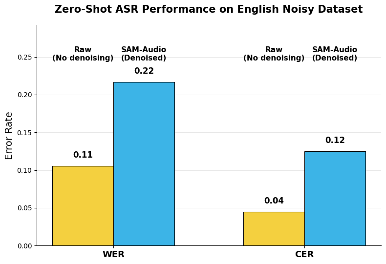
*(a)English noisy dataset (Whisper-tiny).*

*(a)English noisy dataset (Whisper-tiny).*

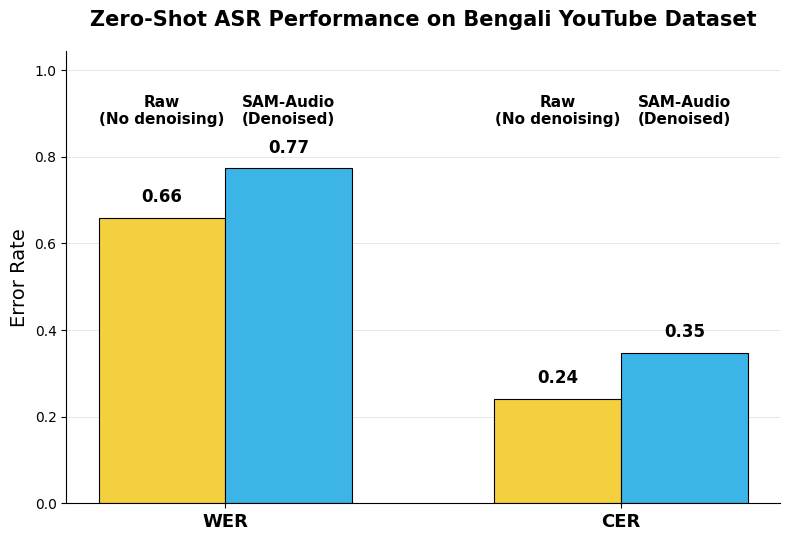
*(b)Bengali YouTube dataset (Whisper-large-v3).*

*Figure 3:Running average WER across Bengali utterances sorted by baseline (raw) WER. The shaded region highlights where SAM-Audio yields higher error than raw audio.*

*Figure 4:Running average WER across English utterances sorted by baseline (raw) WER.*

---
**Usage Info**: 7865 tokens used.
**Generated at**: 2026-03-06 12:39:20

---

# 📚 Focus Then Listen: Exploring Plug-and-Play Audio Enhancer for Noise-Robust Large Audio Language Models

🚀 URL: https://arxiv.org/html/2603.04862

## 🌏 Abstract (원문)
Large audio language models (LALMs) have recently emerged as a powerful paradigm for unified audio understanding and reasoning[qwen-audio,gama,audio-reason]. By integrating audio perception with large language models (LLMs), LALMs enable a wide range of applications, including speech recognition, acoustic scene analysis, and audio question answering[lalm-asr,pengi,audiobench].Noise robustness remains a fundamental challenge for LALMs[li2025silence]. Here, the noise refers to acoustic signals that are irrelevant to the user's intent in a given task. For instance, in speech understanding tasks, non-speech sounds can be the noise, whereas in environmental sound analysis, speech may act as interference. In real-world environments, audio inputs are rarely clean and often contain multiple overlapping or irrelevant components. Without sufficient robustness to such task-irrelevant signals, LALMs may misinterpret the user's intent, resulting in degraded interaction quality and unreliable system behavior, particularly in safety-critical applications[voice_smart_home,in-car-voice,robot-public].Recent work has begun to investigate this problem. SSEU-Bench[sseu-bench]explicitly models the coexistence of speech and non-speech sounds and considers their energy imbalance across diverse scenarios. An important observation is that cross-component interference significantly affects model performance: when performing speech understanding, strong non-speech sounds can degrade recognition, and similarly, dominant speech can negatively impact non-speech sound understanding. To address this issue, SSEU-Bench uses chain-of-thought (CoT) prompting to decompose complex audio understanding into simpler steps. However, the improvement is mainly observed in audio tagging tasks, and CoT often requires task-specific prompt design. Another straightforward approach to enhance robustness is noise-aware training, which involves fine-tuning models on large-scale datasets augmented with various noise types[noise-lalm-asr,kimi]. This paradigm requires extensive data curation, as covering the infinite variability of real-world noise is practically infeasible. In addition, fine-tuning may also lead to catastrophic forgetting or degrade performance on clean data[empirical,zhai2023investigating,yin2015noisy]. In SEE[zhang2026see], researchers propose an embedding-based approach for developing noise-robust LALMs, but assumes that noise is explicitly pre-defined (e.g., Gaussian noise) and the isolated pure-noise recordings are available. This assumption is incompatible with our setting, where noise cannot be pre-defined but is task-dependent: non-speech acts as noise for speech tasks, and vice versa.To address these issues, we propose Focus-Then-Listen (FTL), an audio enhancer that improves LALMs' noise robustness.Our motivation stems from the human audio understanding process.As illustrated in Fig.1, when confronted with audio, humans selectively focus on the component relevant to their intent.Inspired by this, FTL infers the task-relevant audio modality from the user’s instruction and produces a filtered, modality-aligned signal for the LALM, which improves downstream perception and reasoning in noisy conditions.Specifically, an audio separator decomposes the raw input audio into distinct speech and non-speech components. In parallel, an LLM-based modality router analyzes the user's textual instruction to infer the target audio modality (speech, non-speech, or mixture). Finally, a modality-aware fusion block produces a task-adaptive enhanced signal that mitigates interference while preserving essential information.Our key contributions are:To the best of our knowledge, FTL is the first work to explore mitigating speech and non-speech interference for LALMs via instruction-aware audio enhancement. Experiments across multiple LALMs and benchmarks demonstrate its effectiveness in both perception and reasoning tasks.We introduce MMAU-Pro-Ctrl, a new evaluation subset with controllable Signal-to-Noise Ratios (SNRs), to assess speech and non-speech interference in audio reasoning tasks.All code, demos, and data are available at the project page111https://sites.google.com/view/ftl-lalm.
## 🌏 Abstract (번역)
대규모 오디오 언어 모델(LALM)은 최근 통합 오디오 이해 및 추론을 위한 강력한 패러다임으로 부상했습니다. LALM은 오디오 인식을 대규모 언어 모델(LLM)과 통합하여 음성 인식, 음향 장면 분석, 오디오 질의응답을 포함한 광범위한 애플리케이션을 가능하게 합니다. 노이즈 강건성은 LALM의 근본적인 과제로 남아 있습니다. 여기서 노이즈는 주어진 작업에서 사용자의 의도와 관련 없는 음향 신호를 의미합니다. 예를 들어, 음성 이해 작업에서는 비음성 사운드가 노이즈가 될 수 있으며, 환경음 분석에서는 음성이 간섭으로 작용할 수 있습니다. 실제 환경에서 오디오 입력은 거의 깨끗하지 않으며 종종 여러 겹치거나 관련 없는 구성 요소를 포함합니다. 이러한 작업과 무관한 신호에 대한 충분한 강건성이 없으면 LALM은 사용자의 의도를 오해하여 상호 작용 품질 저하 및 특히 안전에 중요한 애플리케이션에서 시스템 동작의 신뢰성 저하를 초래할 수 있습니다. 최근 연구에서는 이 문제를 조사하기 시작했습니다. SSEU-Bench는 음성 및 비음성 사운드의 공존을 명시적으로 모델링하고 다양한 시나리오에서 에너지 불균형을 고려합니다. 중요한 관찰은 구성 요소 간 간섭이 모델 성능에 크게 영향을 미친다는 것입니다. 음성 이해를 수행할 때 강한 비음성 사운드는 인식을 저하시킬 수 있으며, 마찬가지로 지배적인 음성은 비음성 사운드 이해에 부정적인 영향을 미칠 수 있습니다. 이 문제를 해결하기 위해 SSEU-Bench는 복잡한 오디오 이해를 더 간단한 단계로 분해하기 위해 CoT(Chain-of-Thought) 프롬프팅을 사용합니다. 그러나 개선은 주로 오디오 태깅 작업에서 관찰되며, CoT는 종종 작업별 프롬프트 설계가 필요합니다. 강건성을 향상시키는 또 다른 직접적인 접근 방식은 노이즈 인식 훈련으로, 다양한 노이즈 유형으로 증강된 대규모 데이터셋에서 모델을 미세 조정하는 것을 포함합니다. 이 패러다임은 실제 노이즈의 무한한 가변성을 다루는 것이 사실상 불가능하므로 광범위한 데이터 큐레이션이 필요합니다. 또한 미세 조정은 치명적인 망각을 초래하거나 깨끗한 데이터에 대한 성능을 저하시킬 수도 있습니다. SEE에서는 연구자들이 노이즈에 강건한 LALM을 개발하기 위한 임베딩 기반 접근 방식을 제안하지만, 노이즈가 명시적으로 사전 정의되고(예: 가우시안 노이즈) 분리된 순수 노이즈 녹음이 사용 가능하다고 가정합니다. 이 가정은 노이즈가 사전 정의될 수 없고 작업에 따라 달라지는 우리의 설정(비음성은 음성 작업의 노이즈로 작용하고 그 반대도 마찬가지)과 호환되지 않습니다. 이러한 문제를 해결하기 위해 우리는 LALM의 노이즈 강건성을 향상시키는 오디오 인핸서인 Focus-Then-Listen (FTL)을 제안합니다. 우리의 동기는 인간의 오디오 이해 과정에서 비롯됩니다. 그림 1에서 볼 수 있듯이, 오디오에 직면했을 때 인간은 자신의 의도와 관련된 구성 요소에 선택적으로 집중합니다. 이에 영감을 받아 FTL은 사용자의 지시에서 작업 관련 오디오 모달리티를 추론하고, LALM을 위해 필터링되고 모달리티에 정렬된 신호를 생성하여 시끄러운 환경에서 다운스트림 인식 및 추론을 향상시킵니다. 구체적으로, 오디오 분리기는 원시 입력 오디오를 별개의 음성 및 비음성 구성 요소로 분해합니다. 동시에, LLM 기반 모달리티 라우터는 사용자의 텍스트 지시를 분석하여 대상 오디오 모달리티(음성, 비음성 또는 혼합)를 추론합니다. 마지막으로, 모달리티 인식 융합 블록은 간섭을 완화하면서 필수 정보를 보존하는 작업 적응형 강화 신호를 생성합니다. 우리의 주요 기여는 다음과 같습니다: 우리가 아는 한, FTL은 지시 인식 오디오 강화를 통해 LALM을 위한 음성 및 비음성 간섭 완화를 탐구하는 첫 번째 작업입니다. 여러 LALM 및 벤치마크에 걸친 실험은 인식 및 추론 작업 모두에서 그 효과를 입증합니다. 우리는 오디오 추론 작업에서 음성 및 비음성 간섭을 평가하기 위해 제어 가능한 신호 대 잡음비(SNR)를 가진 새로운 평가 하위 집합인 MMAU-Pro-Ctrl을 소개합니다. 모든 코드, 데모 및 데이터는 프로젝트 페이지에서 확인할 수 있습니다.

## 🔍 Methods & Results
- Focus-Then-Listen (FTL) 시스템은 LALM의 노이즈 강건성 향상을 위한 오디오 인핸서로, 오디오 분리기, LLM 기반 모달리티 라우터, 모달리티 인식 융합 블록(MAFB)으로 구성됩니다.
- 오디오 분리기는 원시 입력 오디오를 음성(S_sp) 및 비음성(S_ns) 트랙으로 분리하며, SE-Mamba (SEM), SAM-Audio (SAM)와 함께 STFT 도메인에서 마스킹 기반 접근 방식을 사용하는 듀얼 디코더 아키텍처의 음성 및 비음성 분리 전문 SNSep을 개발하여 사용했습니다.
- LLM 기반 모달리티 라우터는 사용자의 텍스트 지시를 분석하여 대상 오디오 모달리티(음성, 비음성 또는 혼합)를 추론합니다.
- 모달리티 인식 융합 블록(MAFB)은 라우터가 선택한 모달리티에 따라 작업 적응형 강화 오디오(S_en)를 생성하며, 이는 분리된 신호와 원시 오디오를 융합하여 작업 관련 정보를 증폭하고 관련 없는 구성 요소를 억제하면서 신호 충실도를 유지합니다.
- 오디오 추론 작업에서 음성 및 비음성 간섭을 평가하기 위해, 제어 가능한 SNR(10dB ~ -10dB)을 가진 MMAU-Pro의 새로운 평가 하위 집합인 MMAU-Pro-Ctrl을 구축했습니다. 이 데이터셋은 130개의 음성-QA와 130개의 비음성-QA로 구성되며, 각 유형에 대해 반대 모달리티를 노이즈로 사용하여 혼합합니다.
- 다수의 LALM 및 벤치마크에 걸친 실험을 통해 FTL이 인식 및 추론 작업 모두에서 효과적임을 입증했습니다.

## 🖼 Figures
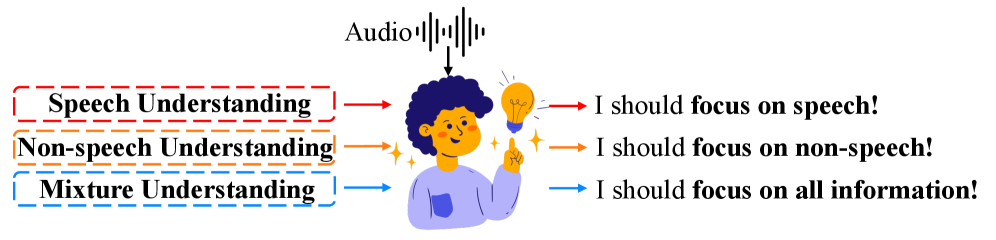
*Figure 1:Process of human audio understanding.*

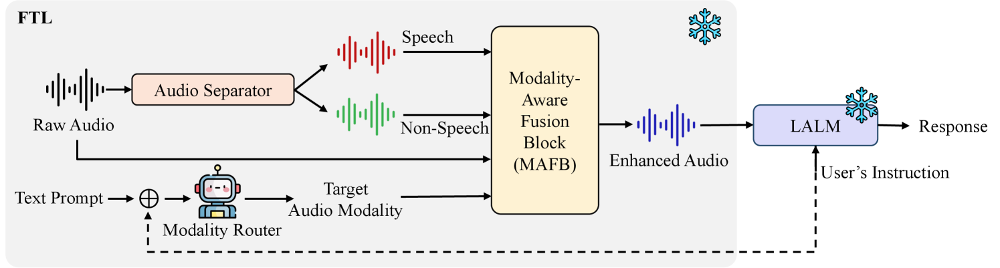
*Figure 2:Overview of proposed audio enhancer (FTL) for noise-robust large audio language models.*

*Figure 3:Impact of 
𝛼
𝑠
​
𝑝
 on ASR task of SSEU-Bench.*

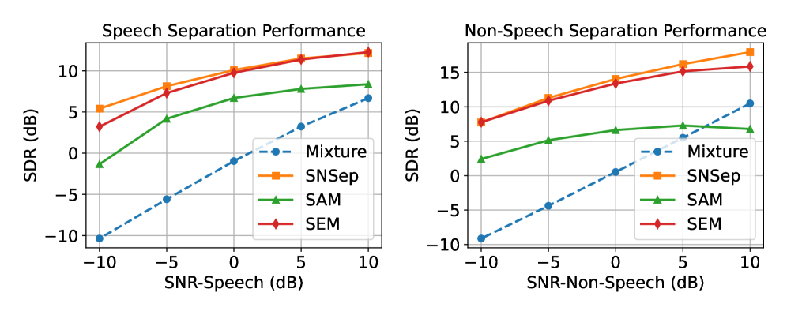
*Figure 4:Performance of audio separators on SSEU-Bench.*

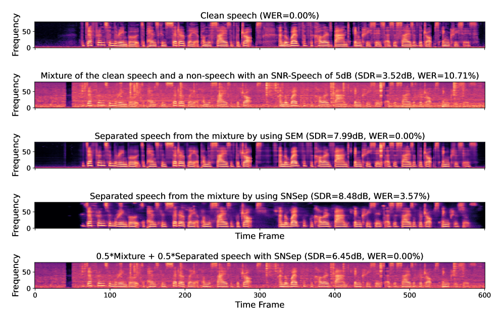
*Figure 5:ASR demonstration (mel spectrogram): Each sample is fed into Audio Flamingo 3 to perform ASR.*

---
**Usage Info**: 7109 tokens used.
**Generated at**: 2026-03-06 12:39:42

---

# 📚 Training Dynamics-Aware Multi-Factor Curriculum Learning for Target Speaker Extraction

🚀 URL: https://arxiv.org/html/2603.04943

## 🌏 Abstract (원문)
Target speaker extraction (TSE) aims to isolate a target voice from mixtures with other speakers and noise[26,25]. Conventional TSE training schemes employ uniform random sampling across all training data[22,16], treating examples equally regardless of their learning difficulty. However, established research has demonstrated that models exhibit varying learning difficulty across different samples, motivating the adoption of curriculum learning (CL)[21]that progressively introduce training examples from easy to hard based on difficulty factors. Well-established difficulty factors include signal-to-noise ratio (SNR)[4,17], the number of interfering speakers[19,1], and temporal overlap[6,12]. With the increasing use of synthetic data for training augmentation, recent studies have also identified the nature of interfering speakers (real versus synthetic) as another emerging difficulty[9,7]. In real-world scenarios, these factors do not operate independently, and their interactions create challenges that cannot be anticipated by analyzing each factor in isolation.Previous CL approaches for TSE typically address these factors separately[8], progressively increasing difficulty along a single dimension. However, such single-factor curricula fail to capture complex factor interactions and rely on predefined difficulty metrics that may not align with how models actually perceive task difficulty during training[21,23]. This mismatch can result in ineffective curriculum scheduling, where examples considered “easy” by predefined metrics may actually be challenging for the model to learn.To address these limitations, we propose a multi-factor curriculum learning strategy that jointly schedulesSNR thresholds, speaker counts, overlap ratios, and synthetic/real proportions, enabling models to learn progressively from simple to complex scenarios. The key challenge here lies in determining the optimal scheduling of these multiple factors without relying on predefined assumptions about task difficulty. Rather than using predetermined setups, we extend our curriculum design in observed training dynamics and proposeTSE-Datamap, a data selection and visualization framework that maps training examples according to how models actually learn them over time[14]. By tracking basic statistics across epochs for each example, we construct a 2-dimensional representational space with distinct regions, representing different level of learning difficulty for the model.Our analysis reveals that models achieve a more efficient optimization process when first exposed to easy-to-learn samples, which provide clear separation cues and establish reliable decision boundaries before tackling more complex cases. This approach ensures that curriculum scheduling aligns with actual model learning behavior rather than predetermined assumptions about task difficulty.This paper makes two main contributions: 1) We propose a multi-factor CL strategy for TSE that jointly schedules multiple complexity factors, enabling progressive learning from simple to complex scenarios; 2) We introduce TSE-Datamap, grounding the proposed CL design in observed training dynamics rather than predefined difficulty metrics. Experiments show that our approach consistently outperforms single-factor curricula, with substantial performance gain in complex multi-speaker scenarios.
## 🌏 Abstract (번역)
목표 화자 추출(TSE)은 다른 화자 및 잡음이 섞인 혼합 음성에서 목표 화자의 음성을 분리하는 것을 목표로 합니다. 기존 TSE 훈련 방식은 모든 훈련 데이터에 걸쳐 균일 무작위 샘플링을 사용하여 학습 난이도와 관계없이 예시들을 동등하게 취급합니다. 그러나 기존 연구에 따르면 모델은 다양한 샘플에 걸쳐 학습 난이도가 다르게 나타나며, 난이도 요소를 기반으로 쉬운 것부터 어려운 것까지 훈련 예시를 점진적으로 도입하는 커리큘럼 학습(CL)의 채택을 촉진합니다. 잘 알려진 난이도 요소로는 신호 대 잡음비(SNR), 방해 화자의 수, 시간적 중첩이 있습니다. 훈련 증강을 위한 합성 데이터의 사용이 증가함에 따라, 최근 연구에서는 방해 화자의 특성(실제 대 합성) 또한 새로운 난이도 요소로 식별했습니다. 실제 시나리오에서 이러한 요소들은 독립적으로 작동하지 않으며, 이들의 상호작용은 각 요소를 개별적으로 분석하여 예측할 수 없는 문제들을 야기합니다. TSE를 위한 이전 CL 접근 방식은 일반적으로 이러한 요소들을 개별적으로 다루며, 단일 차원을 따라 난이도를 점진적으로 증가시킵니다. 그러나 이러한 단일 요소 커리큘럼은 복잡한 요소 상호작용을 포착하지 못하고, 모델이 훈련 중 실제 작업 난이도를 인식하는 방식과 일치하지 않을 수 있는 사전 정의된 난이도 측정 기준에 의존합니다. 이러한 불일치는 사전 정의된 측정 기준으로 '쉬움'으로 간주되는 예시가 실제로는 모델이 학습하기에 어려울 수 있는 비효율적인 커리큘럼 스케줄링을 초래할 수 있습니다. 이러한 한계를 해결하기 위해, 우리는 SNR 임계값, 화자 수, 중첩 비율, 합성/실제 비율을 공동으로 스케줄링하는 다중 요소 커리큘럼 학습 전략을 제안하여, 모델이 간단한 시나리오부터 복잡한 시나리오까지 점진적으로 학습할 수 있도록 합니다. 여기서 핵심 과제는 작업 난이도에 대한 사전 정의된 가정에 의존하지 않고 이러한 다중 요소의 최적 스케줄링을 결정하는 것입니다. 사전 결정된 설정을 사용하는 대신, 우리는 관찰된 훈련 역학에서 커리큘럼 설계를 확장하고, 모델이 시간이 지남에 따라 훈련 예시를 실제로 어떻게 학습하는지에 따라 매핑하는 데이터 선택 및 시각화 프레임워크인 TSE-Datamap을 제안합니다. 각 예시에 대한 에포크 전반의 기본 통계를 추적함으로써, 우리는 모델의 다양한 학습 난이도 수준을 나타내는 고유한 영역을 가진 2차원 표현 공간을 구성합니다. 우리의 분석은 모델이 쉬운 학습 샘플에 먼저 노출될 때 더 효율적인 최적화 프로세스를 달성한다는 것을 보여줍니다. 이러한 샘플은 더 복잡한 경우를 다루기 전에 명확한 분리 단서를 제공하고 신뢰할 수 있는 결정 경계를 설정합니다. 이 접근 방식은 커리큘럼 스케줄링이 작업 난이도에 대한 사전 결정된 가정이 아닌 실제 모델 학습 행동과 일치하도록 보장합니다. 본 논문은 두 가지 주요 기여를 합니다: 1) 우리는 여러 복잡성 요소를 공동으로 스케줄링하여 간단한 시나리오부터 복잡한 시나리오까지 점진적인 학습을 가능하게 하는 TSE를 위한 다중 요소 CL 전략을 제안합니다; 2) 우리는 사전 정의된 난이도 측정 기준이 아닌 관찰된 훈련 역학에 기반을 둔 제안된 CL 설계인 TSE-Datamap을 소개합니다. 실험 결과, 우리의 접근 방식은 단일 요소 커리큘럼보다 지속적으로 우수한 성능을 보였으며, 복잡한 다중 화자 시나리오에서 상당한 성능 향상을 가져왔습니다.

## 🔍 Methods & Results
- 목표 화자 추출(TSE)은 목표 화자, 방해 화자 및 잡음이 혼합된 음성에서 목표 화자의 음성을 복구하는 것을 목표로 하며, 모델 fθ(y,c)는 혼합 음성 y와 목표 화자의 참조 발화 c를 입력으로 받아 추정된 목표 음성 ŝtar를 생성합니다.
- TSE 난이도에 영향을 미치는 네 가지 핵심 요소(신호 대 잡음비(SNR), 방해 화자 수, 시간적 중첩 비율, 방해 화자 유형(실제 대 합성))를 탐색했습니다.
- TSE-Datamap은 모델이 시간이 지남에 따라 훈련 예시를 학습하는 방식에 기반하여 훈련 데이터를 선택하고 시각화하는 프레임워크입니다.
- TSE-Datamap은 각 훈련 예시에 대해 에포크 전반의 훈련 손실을 사용하여 '신뢰도(confidence)'(에포크 전반의 평균 손실)와 '변동성(variability)'(에포크 전반의 손실 표준 편차)을 계산합니다.
- 계산된 신뢰도와 변동성을 기반으로 2차원 데이터맵을 구성하여 '학습하기 쉬운(Easy-to-learn)'(높은 신뢰도, 낮은 변동성), '모호한(Ambiguous)'(높은 변동성), '학습하기 어려운(Hard-to-learn)'(낮은 신뢰도, 낮은 변동성) 세 가지 학습 행동 영역을 식별합니다.
- 훈련 데이터는 SNR({0,5,10,15}dB), 중첩 비율({0,0.2,0.4}, 여기서 0은 완전 중첩), 방해 화자 수({1,2,3}), 방해 유형({실제, 합성, 실제/합성})의 네 가지 요소를 균일하게 샘플링하여 생성됩니다.
- TSE-Datamap에서 도출된 데이터 기반 분류는 모델의 실제 학습 행동에 반응하는 적응형 다중 요소 커리큘럼 학습 전략을 안내하여 간단한 시나리오에서 복잡한 시나리오로 점진적으로 학습하도록 합니다.
- 분석 결과, 모델은 학습하기 쉬운 샘플에 먼저 노출될 때 더 효율적인 최적화 프로세스를 달성하며, 이는 더 복잡한 경우를 다루기 전에 명확한 분리 단서를 제공하고 신뢰할 수 있는 결정 경계를 설정하는 데 도움이 됩니다.
- 제안된 다중 요소 CL 전략은 단일 요소 커리큘럼보다 지속적으로 우수한 성능을 보였으며, 복잡한 다중 화자 시나리오에서 상당한 성능 향상을 달성했습니다.

## 🖼 Figures

*Fig. 1:TSE-Datamap computed. Each point denotes a sample, with 
𝑥
-axis the standard deviation of 
Δ
​
SNR
 and 
𝑦
-axis the mean 
Δ
​
SNR
. Number of training epochs in this study is 50.*

---
**Usage Info**: 7587 tokens used.
**Generated at**: 2026-03-06 12:40:03

---

