# 🚩 (2026-03-09) Scholar Inbox 추천 논문 

# 📚 Activation Steering for Accent-Neutralized Zero-Shot Text-To-Speech

🚀 URL: https://arxiv.org/html/2603.05977

## 🌏 Abstract (원문)
Zero-shot Text-To-Speech (TTS) Synthesis is the task of generating speech for a target text using a reference speech utterance (and sometimes optionally, the text transcript of the reference speech) of an arbitrary speaker.The generated speech is expected to have the voice characteristics of the reference speaker (e.g., timbre, prosody, accent, emotion, etc.).Recent advances on generative models have enabled significant improvements on zero-shot TTS.These include the use of Diffusion Models[chen2025f5,eskimez2024e2,Ju2024naturalspeech,kim2023p,zhu2025zipvoice], Autoregressive Large Language Models (LLM)[hu2026qwen3,wang2025spark,ye2025llasa], and hybrid approaches that combine both LLM and Diffusion strategies[du2024cosyvoice1,du2024cosyvoice2,guo2025fireredtts,zhou2025indextts2,zhangvevo].However, disentangling the control over different voice characteristics remains a challenge.For example, when using an accented reference speech, the generated speech often inherits both the accent and timbre from the reference.In this work, we focus on accent-neutralized zero-shot TTS, which aims to generate speech with the timbre of the reference speaker but without the speaker's accent.This is a practical problem for accent-free voice cloning, which can be useful for various applications, such as creating training targets for Accent Conversion (AC) models[halychanskyi2025fac,quamer22_interspeech], providing second-language (L2) learners with personalized accent-neutralized speech feedback for computer-aided pronunciation training[hirschi2025artificial], etc.Our solution is based on activation steering, a technique that modifies the internal activations of a neural network during inference to control specific model behaviors.In generative models, it has been used to erase specific concepts in Diffusion-based image generation[gaintseva2026casteer], detoxify and shift the sentiment of LLM responses[turner2023steering], alter the persona traits of LLMs[chen2025persona], and more[li2023inference,rodriguez2025controlling].The efficacy of this approach demonstrates that high-level semantic concepts can be represented aslinear directionsin the activation space, and that steering the activations along these directions can effectively control the corresponding concepts in the model responses.In this work, we ask the following research question: since the internal activations of a zero-shot TTS model contain information about multiple voice characteristics, can we steer the activations to neutralize the reference speaker's accent while preserving the timbre?To this end, inspired by Persona Vectors[chen2025persona], we propose apost-hoc and training-freeapproach.Specifically, as shown in Figure1, we first extract ``steering vectors
## 🌏 Abstract (번역)
제로샷 텍스트-음성 합성(TTS)은 임의의 화자의 참조 음성 발화(선택적으로 참조 음성의 텍스트 전사도 사용)를 사용하여 대상 텍스트에 대한 음성을 생성하는 작업입니다. 생성된 음성은 참조 화자의 음성 특성(예: 음색, 운율, 억양, 감정 등)을 가져야 합니다. 생성 모델의 최근 발전은 제로샷 TTS에서 상당한 개선을 가능하게 했습니다. 여기에는 확산 모델[chen2025f5,eskimez2024e2,Ju2024naturalspeech,kim2023p,zhu2025zipvoice], 자기회귀 대규모 언어 모델(LLM)[hu2026qwen3,wang2025spark,ye2025llasa], 그리고 LLM과 확산 전략을 결합한 하이브리드 접근 방식[du2024cosyvoice1,du2024cosyvoice2,guo2025fireredtts,zhou2025indextts2,zhangvevo]의 사용이 포함됩니다. 그러나 다양한 음성 특성에 대한 제어를 분리하는 것은 여전히 어려운 과제입니다. 예를 들어, 억양이 있는 참조 음성을 사용할 때, 생성된 음성은 참조 음성으로부터 억양과 음색을 모두 물려받는 경우가 많습니다. 본 연구에서는 참조 화자의 음색은 유지하되 화자의 억양은 없는 음성을 생성하는 것을 목표로 하는 억양 중화 제로샷 TTS에 중점을 둡니다. 이는 억양 변환(AC) 모델[halychanskyi2025fac,quamer22_interspeech]을 위한 훈련 목표 생성, 컴퓨터 보조 발음 훈련을 위한 제2언어(L2) 학습자에게 개인화된 억양 중화 음성 피드백 제공[hirschi2025artificial] 등 다양한 응용 분야에 유용할 수 있는 억양 없는 음성 복제를 위한 실용적인 문제입니다. 우리의 해결책은 신경망의 내부 활성화를 추론 중에 수정하여 특정 모델 동작을 제어하는 기술인 활성화 스티어링(activation steering)에 기반합니다. 생성 모델에서 이 기술은 확산 기반 이미지 생성에서 특정 개념을 지우고[gaintseva2026casteer], LLM 응답의 유해성을 제거하고 감정을 전환하며[turner2023steering], LLM의 페르소나 특성을 변경하는 데[chen2025persona] 사용되었으며, 그 외에도 여러 용도로 활용되었습니다[li2023inference,rodriguez2025controlling]. 이 접근 방식의 효능은 고수준의 의미론적 개념이 활성화 공간에서 선형 방향으로 표현될 수 있으며, 이러한 방향을 따라 활성화를 조작하면 모델 응답에서 해당 개념을 효과적으로 제어할 수 있음을 보여줍니다. 본 연구에서는 다음과 같은 연구 질문을 던집니다: 제로샷 TTS 모델의 내부 활성화가 여러 음성 특성에 대한 정보를 포함하고 있다면, 음색을 보존하면서 참조 화자의 억양을 중화하기 위해 활성화를 조작할 수 있을까? 이를 위해 Persona Vectors[chen2025persona]에서 영감을 받아 사후(post-hoc) 및 훈련 없는(training-free) 접근 방식을 제안합니다. 구체적으로, 그림 1에 표시된 바와 같이, 먼저 '스티어링 벡터'를 오프라인으로 추출합니다. TTS 모델에 억양이 있는 참조 발화와 중립 참조 발화를 각각 입력하여 동일한 대상 텍스트를 생성합니다. 두 조건의 활성화 평균 간의 계층별 차이를 스티어링 벡터로 간주하며, 이는 TTS 모델의 활성화 공간에서 중립 표현을 억양 있는 표현으로(또는 그 반대로) 유도하는 방향을 포착한다고 가정합니다. 그런 다음, 추론 중에 스티어링 벡터를 해당 계층에 적용하여 모델이 억양 중화되고 음색이 보존된 음성을 생성하도록 안내합니다. 우리는 최신 LLM 기반 제로샷 TTS 모델인 Qwen3-TTS[hu2026qwen3]에 대해 스티어링 실험을 수행합니다. 경험적 결과는 이 간단한 스티어링 접근 방식이 출력 음성의 억양을 효과적으로 완화하면서, 화자 임베딩 유사성으로 측정했을 때 참조 화자의 음색을 크게 유지함을 보여줍니다. 또한, 스티어링 벡터는 스티어링 벡터 추출에 사용되지 않은 미지의 억양 있는 화자에게도 강력한 일반화 가능성을 보여주며, 이는 스티어링 벡터가 TTS 모델의 활성화 공간에서 억양 중화를 위한 일반적인 방향을 포착함을 시사합니다.

## 🔍 Methods & Results
- 본 연구는 억양 중화 제로샷 TTS를 목표로 하며, 참조 화자의 음색을 유지하면서 억양을 제거한 음성을 생성하는 데 초점을 맞춥니다.
- 제안하는 해결책은 신경망의 내부 활성화를 추론 중에 수정하여 특정 모델 동작을 제어하는 '활성화 스티어링' 기법에 기반한 사후(post-hoc) 및 훈련 없는(training-free) 접근 방식입니다.
- 스티어링 벡터는 Qwen3-TTS 모델에 억양 있는 참조 발화와 중립 참조 발화를 입력하여 동일한 대상 텍스트를 생성한 후, 두 조건의 활성화 평균 간의 계층별 차이를 계산하여 추출됩니다.
- 스티어링 벡터 추출 시, 화자 음성을 변형하는 온더플라이 데이터 증강(포먼트 주파수, 기본 주파수(F0) 스케일링, 주파수 형성 이퀄라이저 적용)을 사용하여 억양과 화자 정보를 분리하고 억양 특정 정보를 포착하도록 유도합니다.
- 추론 시, 스티어링 벡터는 백본 LLM의 해당 계층에 적용되며, 특히 억양 있는 참조 샘플의 경우 스티어링 벡터를 활성화에서 빼서 '억양 방향'을 상쇄하고 억양을 중화합니다.
- 스티어링 강도는 하이퍼파라미터 알파(α)로 조절되며, 활성화 정규화는 화자 음색을 더 잘 보존하는 데 사용됩니다.
- 실험은 최신 LLM 기반 제로샷 TTS 모델인 Qwen3-TTS를 사용하여 수행되었으며, ARCTIC(중립) 및 L2-ARCTIC(억양) 데이터셋으로 스티어링 벡터를 추출했습니다.
- 실험 결과, 제안된 스티어링 접근 방식이 출력 음성의 억양을 효과적으로 완화하고, 화자 임베딩 유사성으로 측정했을 때 참조 화자의 음색을 크게 유지함을 입증했습니다.
- 스티어링 벡터는 스티어링 벡터 추출에 사용되지 않은 미지의 억양 있는 화자에게도 강력한 일반화 가능성을 보여주어, TTS 모델의 활성화 공간에서 억양 중화를 위한 일반적인 방향을 포착함을 시사합니다.

## 🖼 Figures
![Figure 1:The proposed activation steering framework for accent-neutralized zero-shot TTS. (a) Steering vectors are extracted offline from the activation differences between accented and neutral speech, and (b) applied during inference to guide the model towards accent-neutralized output while preserving timbre. In this paper, we experiment with single-layer steering, i.e., only one layer is steered while other layers are left unchanged. The figure illustrates the general framework that multiple layers can be steered simultaneously.](../images/2026-03-09/2603.05977/2603.05977_fig0.png)
*Figure 1:The proposed activation steering framework for accent-neutralized zero-shot TTS. (a) Steering vectors are extracted offline from the activation differences between accented and neutral speech, and (b) applied during inference to guide the model towards accent-neutralized output while preserving timbre. In this paper, we experiment with single-layer steering, i.e., only one layer is steered while other layers are left unchanged. The figure illustrates the general framework that multiple layers can be steered simultaneously.*

*Figure 2:Layerwise single-layer steering analyses on L2-ARCTIC. Layers are zero-indexed (layer 1 means the 2nd layer). Solid and dashed lines represent the results of steering with different models and steering strengths. Dotted lines represent the unsteered baseline.*

---
**Usage Info**: 4938 tokens used.
**Generated at**: 2026-03-09 12:41:36

---

# 📚 Prosodic Boundary-Aware Streaming Generation for LLM-Based TTS with Streaming Text Input

🚀 URL: https://arxiv.org/html/2603.06444

## 🌏 Abstract (원문)
Streaming text-to-speech (TTS) with streaming text input aims to generate speech in real-time as text arrives, which is in high demand for applications such as dialogue systems and speech-to-speech translation[dang2024zero,moshi]. The usability of such systems is largely determined by synthesis latency, which mainly arises from two sources: the waiting time for text segment accumulation, and the model's inference time for converting text into audio. While the latter can be effectively mitigated by optimizing the model size or introducing causal structures[pamisetty2025stream,sun2025zero], achieving ultra-low latency requires keeping the text accumulation window extremely small. This leads to the first core challenge: natural and high-quality speech synthesis heavily relies on sufficient contextual information. The model requires not only historical text to maintain coherence but also future text (lookahead) to accurately predict prosodic features such as stress and pauses[sheng2025syncspeechlowlatencyefficientdualstream]. Thus, a restricted receptive field results in unnatural prosody. Existing approaches[dang2024zero,dekel2024speak,dang2024livespeech]attempt to address this using local context modeling, but typically require complex causal modifications to the attention mechanism and rely on precise text–speech forced alignment[bai20223,kim2023transduce]. Meanwhile, with the widespread adoption of large language model (LLM) architectures in the speech domain, modern TTS systems increasingly adopt cross-modality modeling that interleaves text and speech tokens[audiolm,valle,wescon,interleave1,wang2025streammel,yang2024interleaved]. Although such architectures achieve state-of-the-art synthesis quality, enabling streaming generation with streaming text input introduces a second challenge: long-form performance collapse caused by unbounded generation history. For instance, Cosyvoice-series[du2024cosyvoice2,du2025cosyvoice]employs an interleaved arrangement of fixed numbers of text and speech tokens. Similarly, the streaming version of Qwen3-TTS[hu2026qwen3]adopts a comparable interleaved structure, albeit arranging text and speech tokens in parallel. Yet in real-world scenarios with long-term continuous input, since the speech length corresponding to a single text token varies enormously, the physical distance between text and its associated speech tokens gradually widens. This ultimately causes generation failure, making it difficult to support long-term streaming interactions. SpeakStream[bai2025speakstreamstreamingtexttospeechinterleaved]alleviates this issue through character-level alignment and history truncation, but it relies heavily on precise alignment annotations. These limitations motivate the following research question:Can robust long-form streaming be achieved in LLM-based TTS with streaming text input using only weakly time-aligned data without architectural modifications? To tackle this question, we propose a novel post-training strategy for prosodic-boundary-aware adaptation that adapts existing LLM-based TTS models for robust streaming using only weakly time-aligned data. Our contributions are as follows: We introduce a prosodic-boundary-aware adaptation combined with a windowed lookahead mechanism, allowing models to anticipate future text to improve prosody without requiring complex causal modifications. We design an acoustic prompting method utilizing the previous chunk's audio tail, which ensures seamless concatenation and mitigates generation collapse in long-form cross-modality continuous streaming. We demonstrate state-of-the-art streaming stability and robustness using only weakly time-aligned open-source data, significantly outperforming existing interleaved baselines in real-time deployment. Audio demos are available at:111https://anonymous-demo-168.github.io/Prosodic-Boundary-Aware-Streaming-Text-TTS-demo/
## 🌏 Abstract (번역)
스트리밍 텍스트 입력과 함께 실시간으로 음성을 생성하는 스트리밍 TTS(Text-to-Speech)는 대화 시스템 및 음성-음성 번역과 같은 애플리케이션에서 높은 수요를 보입니다. 이러한 시스템의 유용성은 주로 합성 지연 시간에 의해 결정되며, 이는 주로 텍스트 세그먼트 축적을 위한 대기 시간과 텍스트를 오디오로 변환하는 모델의 추론 시간이라는 두 가지 원인에서 발생합니다. 후자는 모델 크기를 최적화하거나 인과적 구조를 도입하여 효과적으로 완화할 수 있지만, 초저지연 시간을 달성하려면 텍스트 축적 창을 극도로 작게 유지해야 합니다. 이는 첫 번째 핵심 과제로 이어집니다. 즉, 자연스럽고 고품질의 음성 합성은 충분한 문맥 정보에 크게 의존합니다. 모델은 일관성을 유지하기 위한 과거 텍스트뿐만 아니라 강세 및 일시 정지와 같은 운율적 특징을 정확하게 예측하기 위한 미래 텍스트(미리 보기)도 필요합니다. 따라서 제한된 수용 필드는 부자연스러운 운율을 초래합니다. 기존 접근 방식은 로컬 문맥 모델링을 사용하여 이를 해결하려고 시도하지만, 일반적으로 어텐션 메커니즘에 복잡한 인과적 수정이 필요하며 정확한 텍스트-음성 강제 정렬에 의존합니다. 한편, 음성 도메인에서 대규모 언어 모델(LLM) 아키텍처가 널리 채택됨에 따라, 최신 TTS 시스템은 텍스트 및 음성 토큰을 교차하여 모델링하는 교차 모달리티 모델링을 점점 더 많이 채택하고 있습니다. 이러한 아키텍처는 최첨단 합성 품질을 달성하지만, 스트리밍 텍스트 입력으로 스트리밍 생성을 가능하게 하는 것은 두 번째 과제를 야기합니다. 즉, 무한한 생성 기록으로 인한 장문 성능 저하입니다. 예를 들어, Cosyvoice-series는 고정된 수의 텍스트 및 음성 토큰을 교차 배열합니다. 유사하게, Qwen3-TTS의 스트리밍 버전은 텍스트 및 음성 토큰을 병렬로 배열하지만, 유사한 교차 구조를 채택합니다. 그러나 장기적인 연속 입력이 있는 실제 시나리오에서는 단일 텍스트 토큰에 해당하는 음성 길이가 엄청나게 다양하기 때문에 텍스트와 관련 음성 토큰 간의 물리적 거리가 점차 넓어집니다. 이는 궁극적으로 생성 실패를 야기하여 장기적인 스트리밍 상호 작용을 지원하기 어렵게 만듭니다. SpeakStream은 문자 수준 정렬 및 기록 잘라내기를 통해 이 문제를 완화하지만, 정확한 정렬 주석에 크게 의존합니다. 이러한 한계는 다음과 같은 연구 질문을 제기합니다. 아키텍처 수정 없이 약하게 시간 정렬된 데이터만 사용하여 LLM 기반 TTS에서 스트리밍 텍스트 입력으로 강력한 장문 스트리밍을 달성할 수 있는가? 이 질문을 해결하기 위해, 우리는 약하게 시간 정렬된 데이터만 사용하여 기존 LLM 기반 TTS 모델을 강력한 스트리밍에 적응시키는 운율 경계 인식 적응을 위한 새로운 후처리 훈련 전략을 제안합니다. 우리의 기여는 다음과 같습니다. 우리는 복잡한 인과적 수정 없이 운율을 개선하기 위해 모델이 미래 텍스트를 예측할 수 있도록 하는 윈도우형 미리 보기 메커니즘과 결합된 운율 경계 인식 적응을 도입합니다. 우리는 이전 청크의 오디오 꼬리를 활용하는 음향 프롬프트 방법을 설계하여 장문 교차 모달리티 연속 스트리밍에서 원활한 연결을 보장하고 생성 실패를 완화합니다. 우리는 약하게 시간 정렬된 오픈 소스 데이터만 사용하여 최첨단 스트리밍 안정성과 견고성을 입증했으며, 실시간 배포에서 기존의 교차 방식 기준선보다 훨씬 뛰어난 성능을 보였습니다. 오디오 데모는 다음에서 확인할 수 있습니다: https://anonymous-demo-168.github.io/Prosodic-Boundary-Aware-Streaming-Text-TTS-demo/

## 🔍 Methods & Results
- 운율적 자연성을 유지하면서 스트리밍 생성을 가능하게 하기 위해, 입력은 음향 생성 범위와 더 넓은 운율적 문맥을 분리하기 위해 'marker_boundary'라는 운율 경계 인식 마커를 통해 이분화된 시퀀스로 공식화됩니다.
- 추론 시 'marker_boundary'는 k개의 단어마다 삽입되어 모델이 제한된 미래 문맥을 활용하여 운율 계획을 세우고 무한한 생성 문맥을 방지합니다.
- 모델은 수동 주석 없이 운율 경계를 근사하기 위해 상용 정렬기(WhisperX)에서 얻은 단어 수준 타임스탬프를 사용하여 적응됩니다.
- 훈련 중 '동적 경계 삽입'을 통해 전체 발화를 사용하거나 무작위로 단어 인덱스 m을 샘플링하여 경계 마커를 삽입하고, 목표 음성 시퀀스를 m의 정렬된 오디오 위치로 잘라냅니다. 이는 모델이 마커를 분할 신호이자 운율 앵커로 해석하도록 훈련시킵니다.
- 청크 간 연속성을 유지하기 위해 '슬라이딩 윈도우 프롬프트'를 사용합니다. 첫 번째 청크는 제로샷 음성 복제를 위한 참조 발화에 조건화되고, 후속 청크의 프롬프트는 이전 단계에서 합성된 텍스트 및 음성 토큰으로 대체됩니다.
- 이 설계는 키-값(KV) 캐시를 총 시퀀스 길이에 관계없이 O(k+f)로 제한하여 지연 시간 증가와 장문 불안정성을 방지합니다.
- 생성된 음성 토큰은 스트리밍 보코더로 전달되어 점진적인 파형 합성을 수행하며, 청크 간의 원활한 연결을 가능하게 합니다.
- 약하게 시간 정렬된 오픈 소스 데이터만을 사용하여 최첨단 스트리밍 안정성과 견고성을 달성했으며, 실시간 배포에서 기존의 교차 방식 기준선보다 훨씬 뛰어난 성능을 보였습니다.

## 🖼 Figures
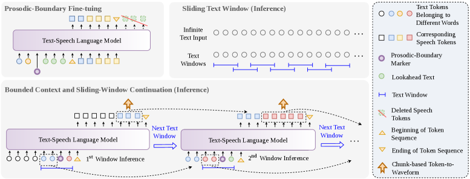
*Figure 1:The proposed fine-tuning and inferencing pipeline for prosodic boundary-aware streaming LLM-based TTS generation.*

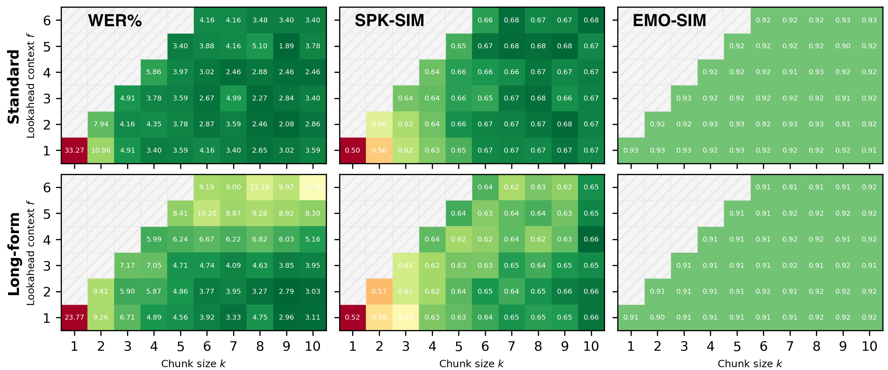
*Figure 2:Ablation study on quality evaluation with different combinations of chunk size k and lookahead context f.*

---
**Usage Info**: 4590 tokens used.
**Generated at**: 2026-03-09 12:41:49

---

# 📚 TempoSyncDiff: Distilled Temporally-Consistent Diffusion for Low-Latency Audio-Driven Talking Head Generation

🚀 URL: https://arxiv.org/html/2603.06057

## 🌏 Abstract (원문)
The advancement of computation, like modern Graphical Processing Units (GPUs), and the availability of large-scale datasets have significantly improved the progress in the field of Deep Learning (DL), which has enabled complex models to learn adequate representations, resulting in the introduction of several advanced DL applications[30]. One of the most notable applications of DL is Talking Head Generation (THG), which seeks to generate realistic videography of human faces and human avatars that can mimic the human speech in synchronisation using multiple references such as speech, text, image, video and other visual data[22]. In THG, diffusion-based models have improved photorealistic human synthesis and robustness to appearance variation[20]and can be considered one of the very few best approaches for tasks like generating images through a gradual denoising process, allowing the model to learn complex data distributions more effectively and produce highly realistic outputs[28]. However, the application of diffusion-based approaches had multiple practical constraints, such as high computational cost and latency.The proposed method, TempoSyncDiff, which is a diffusion-based approach, has the objective of synthesising portrait video, given a reference identity image and audio speech, that preserves the identity while producing the motion of the mouth consisting of the provided speech and maintaining the temporal coherence that can operate with fewer inference steps. The proposed method avoids the multi-step denoising process commonly used in various diffusion models, limiting real-time applicability. Moreover, the common diffusion-based approaches may also produce temporal artifacts in generated videos. Although individual frames appear realistic, small inconsistencies in fine facial textures, especially in the mouth interior, can lead to flickering effects and gradual identity drift. Additionally, speech conditioning of the diffusion model is sensitive to alignment, such that visually realistic outputs may still exhibit subtle timing errors in viseme transitions, particularly under noisy audio or rapid speech. The proposed TempoSyncDiff addresses the challenges through a teacher-student formulation designed in such a way to explore the feasibility of few-step diffusion-based denoising for THG, and the proposed concept was to train a diffusion teacher in a latent space and distil the denoising behaviour into a lightweight student model that can operate with fewer inference steps in comparison with most diffusion models. The conditioning of the approach is expressed by a compact pair consisting of only a reference identity image and a per-frame viseme token sequence derived from provided audio as reference to reduce the visual artifacts. Temporal consistency and identity-anchoring regularisers of the model are incorporated into the denoising-stage objective with cross-identity reference to support the model during training, encouraging robust use of the reference-conditioning signal.Few-step diffusion using consistency distillation:The model is trained with a student sampler that approximates the denoising trajectory of the teacher using a multi-noise consistency objective, which enables the student to sample with an adaptive step schedule in very few steps.Temporal-identity anchoring with mouth-interior stabilisation:The approach also introduces an identity-based anchor in canonical latent space and a mouth Region of Interest (ROI) constraint to stabilise teeth and tongue across time.Viseme control with sync regularisation:The proposed condition on phoneme and viseme tokens aligned to video timestamps applies the audio-visual sync regulariser to sharpen the timing of the lip.
## 🌏 Abstract (번역)
현대 GPU와 같은 컴퓨팅 발전 및 대규모 데이터셋의 가용성은 딥러닝(DL) 분야의 발전을 크게 향상시켰으며, 이는 복잡한 모델이 적절한 표현을 학습할 수 있도록 하여 여러 고급 DL 애플리케이션의 도입으로 이어졌습니다. DL의 가장 주목할 만한 애플리케이션 중 하나는 말하는 얼굴 생성(THG)으로, 음성, 텍스트, 이미지, 비디오 및 기타 시각 데이터와 같은 여러 참조를 사용하여 인간의 음성을 동기화하여 모방할 수 있는 사람 얼굴 및 인간 아바타의 사실적인 비디오를 생성하는 것을 목표로 합니다. THG에서 확산 기반 모델은 사실적인 인간 합성 및 외모 변화에 대한 견고성을 향상시켰으며, 점진적인 노이즈 제거 과정을 통해 이미지를 생성하는 것과 같은 작업에 가장 적합한 접근 방식 중 하나로 간주될 수 있습니다. 이는 모델이 복잡한 데이터 분포를 더 효과적으로 학습하고 매우 사실적인 출력을 생성할 수 있도록 합니다. 그러나 확산 기반 접근 방식의 적용은 높은 계산 비용 및 지연 시간과 같은 여러 실질적인 제약이 있었습니다.제안된 방법인 TempoSyncDiff는 확산 기반 접근 방식으로, 참조 신원 이미지와 오디오 음성이 주어졌을 때, 신원을 보존하면서 제공된 음성으로 입의 움직임을 생성하고 더 적은 추론 단계로 작동할 수 있는 시간적 일관성을 유지하는 인물 비디오를 합성하는 것을 목표로 합니다. 제안된 방법은 다양한 확산 모델에서 일반적으로 사용되는 다단계 노이즈 제거 과정을 피하여 실시간 적용 가능성을 제한합니다. 또한, 일반적인 확산 기반 접근 방식은 생성된 비디오에서 시간적 아티팩트를 생성할 수도 있습니다. 개별 프레임은 사실적으로 보이지만, 미세한 얼굴 질감, 특히 입 내부의 작은 불일치는 깜박임 효과와 점진적인 신원 표류로 이어질 수 있습니다. 또한, 확산 모델의 음성 조건화는 정렬에 민감하여 시각적으로 사실적인 출력이라도 특히 시끄러운 오디오나 빠른 음성에서 시각소 전환에 미묘한 타이밍 오류를 보일 수 있습니다. 제안된 TempoSyncDiff는 THG를 위한 소단계 확산 기반 노이즈 제거의 타당성을 탐색하기 위해 설계된 교사-학생 구성을 통해 이러한 문제를 해결하며, 제안된 개념은 잠재 공간에서 확산 교사를 훈련하고 노이즈 제거 동작을 대부분의 확산 모델에 비해 더 적은 추론 단계로 작동할 수 있는 경량 학생 모델로 증류하는 것이었습니다. 접근 방식의 조건화는 시각적 아티팩트를 줄이기 위해 참조 신원 이미지와 제공된 오디오에서 파생된 프레임별 시각소 토큰 시퀀스로만 구성된 압축된 쌍으로 표현됩니다. 모델의 시간적 일관성 및 신원 고정 정규화 장치는 훈련 중 모델을 지원하고 참조 조건화 신호의 견고한 사용을 장려하기 위해 교차 신원 참조와 함께 노이즈 제거 단계 목표에 통합됩니다.일관성 증류를 사용한 소단계 확산: 모델은 교사의 노이즈 제거 궤적을 다중 노이즈 일관성 목표를 사용하여 근사화하는 학생 샘플러로 훈련되며, 이는 학생이 매우 적은 단계로 적응형 단계 스케줄로 샘플링할 수 있도록 합니다.입 내부 안정화를 통한 시간적 신원 고정: 이 접근 방식은 또한 정규 잠재 공간에 신원 기반 앵커와 입 관심 영역(ROI) 제약을 도입하여 시간 경과에 따른 치아와 혀를 안정화합니다.동기화 정규화를 통한 시각소 제어: 비디오 타임스탬프에 정렬된 음소 및 시각소 토큰에 대한 제안된 조건은 오디오-시각 동기화 정규화 장치를 적용하여 입술의 타이밍을 선명하게 합니다.

## 🔍 Methods & Results
- TempoSyncDiff는 느린 확산 샘플링, 시간 경과에 따른 깜박임 출력, 참조 인물로부터의 신원 표류, 불안정한 음성 제어 주입과 같은 실질적인 문제를 해결하기 위해 교사-학생 기반 확산 접근 방식을 도입합니다.
- 모델은 참조 신원 이미지(Iref)와 음성 오디오(a(t))를 입력으로 받으며, 오디오는 프레임별 시각소 토큰 시퀀스({vt}t=1T)로 변환되어 모델의 조건화에 사용됩니다.
- 픽셀 공간에서 직접 확산 모델을 실행하는 비용을 줄이기 위해 경량 오토인코더를 사용하여 각 훈련 프레임(It)을 더 작은 잠재 표현(zt)으로 압축하고 필요할 때 디코딩합니다.
- 교사 노이즈 제거기(θ)는 깨끗한 잠재 표현(zt)에 의도적으로 손상된 노이즈를 주입하여 훈련되며, 노이즈가 있는 조건화 잠재 표현을 받아 추가된 노이즈를 예측하고, 예측된 노이즈가 실제 노이즈와 일치하도록 훈련됩니다.
- 학생 노이즈 제거기(ϕ)는 교사 노이즈 제거기의 동작을 직접 모방하도록 훈련되며, 더 적은 추론 단계로 허용 가능한 노이즈 제거를 달성하여 지연 시간을 줄입니다.
- 신원 표류 문제를 해결하기 위해 이미지에서 신원 특징 벡터를 매핑하는 신원 인코더(fid(⋅))를 도입하고, 생성된 프레임(I^t)이 참조 신원과 일치하도록 손실 함수에 포함합니다.
- 깜박임 문제를 해결하기 위해 워핑 함수(W(⋅))를 사용하여 이전 프레임을 다음 프레임에 대략적으로 정렬함으로써 연속적인 프레임이 너무 갑작스럽게 변하지 않도록 시간적 일관성을 강화합니다.
- 교사 훈련은 노이즈 제거 손실과 신원 표류(Lid) 및 깜박임(Ltemp)을 해결하는 정규화 장치를 최소화하며, 학생 훈련은 교사 노이즈 제거 손실을 증류 손실로 대체하여 동일한 정규화 장치를 사용합니다.
- 모델의 조건화가 더욱 견고하도록 훈련 중 참조 이미지를 다른 신원으로 대체하는 확률(pmismatch)을 도입하여 모델이 조건화 입력에 의존하도록 강제합니다.
- 제안된 아키텍처는 시각소 토큰을 변환하고 참조 신원 프레임 인코딩을 신원으로 임베딩하며, 잠재 확산 노이즈 제거기가 이 둘에 조건화되어 노이즈 제거 잠재 표현을 생성하고, 이는 VAE 디코더에 의해 디코딩됩니다.
- 추론은 저지연 모델인 학생 노이즈 제거기를 사용하여 수행됩니다.

## 🖼 Figures

*Figure 5*

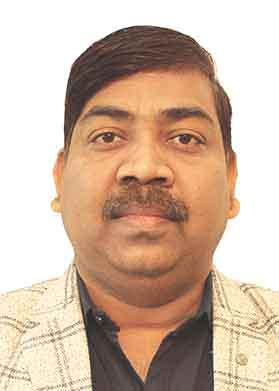
*Figure 6*

---
**Usage Info**: 5177 tokens used.
**Generated at**: 2026-03-09 12:42:05

---

# 📚 StreamWise: Serving Multi-Modal Generation in Real-Time at Scale

🚀 URL: https://arxiv.org/html/2603.05800

## 🌏 Abstract (원문)
Motivation.Advances in large language models (LLMs) are transforming a wide range of text-generation applications, from developer tools to education(GitHub,2021; Anthropic,2025; Xuet al.,2024).Building on this momentum, multi-modal content generation (audio, image, and video) is becoming more popular(Labs,2024; Google DeepMind,2025; Gaoet al.,2025; OpenAI,2024; Wanget al.,2025a; Konget al.,2024; Hexgrad,2025).The next frontier is to support user-facing, real-time streaming applications at scale, enabling new experiences such as dynamic storytelling, personalized tutoring, and automated media creation(Wanget al.,2025a; Kodairaet al.,2025).Although recent systems research has substantially improved the efficiency and scheduling of text-based LLM inference(Jianget al.,2024; Patelet al.,2024; Agrawalet al.,2024a), these techniques do not address the unique challenges posed by multi-modal, real-time generation.Serving and orchestrating heterogeneous multi-modal models under strict end-to-end latency constraints remains expensive and introduces fundamentally new systems challenges.Existing pipelines are typically batch workflows with high latency(Labs,2024; Google DeepMind,2025; Gaoet al.,2025; OpenAI,2024; Wanget al.,2025a; Konget al.,2024).Commercial systems remain expensive (over $2 per minute) and cap outputs ¡10 seconds(Google DeepMind,2025; OpenAI,2024)due to prohibitive computational expenses.In contrast, streaming multi-modal generation demands low-latency pipelines that coordinate expensive AI models across modalities while meeting strict service-level objectives (SLOs).These demands place significant strain on both hardware and software infrastructure.Coordinating these diverse multi-modal models in real time (each with unique resource profiles)while scaling remains an open systems challenge.Our work.We study the systems challenges of real-time multi-modal generation through the lens of a representative application: podcast video generation.Given an input (e.g., a research paper or news topic), the workflow produces a video of multiple characters engaging in a conversation about the topic.This requires orchestrating LLMs, text-to-speech synthesis, image and video generation, and video-audio synchronization into a unified, low-latency pipeline.To support this workload, we design and implement a modular, adaptive serving stack that balances latency, cost, and quality called StreamWise.The system supports streaming (real-time playback) with tunable fidelity to meet varying SLOs and budgets.Our approach also accounts for compute heterogeneity.It enables multi-level parallelism, content reuse, and quality adaptation.For example, by rendering early scenes at lower resolution to reduce startup delay while maintaining high quality for later segments.We characterize performance and resource trade-offs, quantifying how system-level decisions impact latency, cost, and quality.For example, the smallest configuration generates a 10-minute podcast video on a single 8×	imesA100 GPU server in 3.7 hours;insufficient for real-time needs.StreamWise achieves sub-second latency by combining A100 and H100 GPUs, at under $40 per video when serving at scale.Summary.We make the following main contributions:We design a real-time multi-modal generation application and analyze its systems implications.We characterize the trade-offs between latency, cost, and output quality, identifying key bottlenecks.We identify and articulate systems-level optimization opportunities to further improve efficiency and scalability.We build a modular serving system that enables parallel execution and quality-aware scheduling.We quantify the cost of serving multi-modal generation workflows under real-time constraints.
## 🌏 Abstract (번역)
동기. 대규모 언어 모델(LLM)의 발전은 개발자 도구부터 교육에 이르기까지 광범위한 텍스트 생성 애플리케이션을 변화시키고 있습니다(GitHub, 2021; Anthropic, 2025; Xu et al., 2024). 이러한 기세를 바탕으로 멀티모달 콘텐츠 생성(오디오, 이미지, 비디오)이 더욱 인기를 얻고 있습니다(Labs, 2024; Google DeepMind, 2025; Gao et al., 2025; OpenAI, 2024; Wang et al., 2025a; Kong et al., 2024; Hexgrad, 2025). 다음 과제는 사용자 대면 실시간 스트리밍 애플리케이션을 대규모로 지원하여 동적 스토리텔링, 개인화된 튜터링, 자동화된 미디어 생성과 같은 새로운 경험을 가능하게 하는 것입니다(Wang et al., 2025a; Kodaira et al., 2025). 최근 시스템 연구가 텍스트 기반 LLM 추론의 효율성과 스케줄링을 크게 개선했지만(Jiang et al., 2024; Patel et al., 2024; Agrawal et al., 2024a), 이러한 기술은 멀티모달 실시간 생성이 제기하는 고유한 문제를 해결하지 못합니다. 엄격한 종단 간 지연 시간 제약 하에서 이기종 멀티모달 모델을 서비스하고 오케스트레이션하는 것은 여전히 비용이 많이 들고 근본적으로 새로운 시스템 과제를 야기합니다. 기존 파이프라인은 일반적으로 높은 지연 시간을 가진 배치 워크플로우입니다(Labs, 2024; Google DeepMind, 2025; Gao et al., 2025; OpenAI, 2024; Wang et al., 2025a; Kong et al., 2024). 상업 시스템은 엄청난 계산 비용으로 인해 여전히 비싸고(분당 2달러 이상) 출력 시간이 10초 미만으로 제한됩니다(Google DeepMind, 2025; OpenAI, 2024). 이와 대조적으로, 스트리밍 멀티모달 생성은 엄격한 서비스 수준 목표(SLO)를 충족하면서 다양한 AI 모델을 조율하는 저지연 파이프라인을 요구합니다. 이러한 요구 사항은 하드웨어 및 소프트웨어 인프라 모두에 상당한 부담을 줍니다. 실시간으로 이러한 다양한 멀티모달 모델(각각 고유한 자원 프로필을 가짐)을 조율하면서 확장하는 것은 미해결 시스템 과제로 남아 있습니다. 우리의 연구. 우리는 대표적인 애플리케이션인 팟캐스트 비디오 생성을 통해 실시간 멀티모달 생성의 시스템 과제를 연구합니다. 입력(예: 연구 논문 또는 뉴스 주제)이 주어지면 워크플로우는 해당 주제에 대해 여러 캐릭터가 대화하는 비디오를 생성합니다. 이를 위해서는 LLM, 텍스트-음성 합성, 이미지 및 비디오 생성, 비디오-오디오 동기화를 통합된 저지연 파이프라인으로 오케스트레이션해야 합니다. 이 워크로드를 지원하기 위해 우리는 지연 시간, 비용 및 품질의 균형을 맞추는 모듈식 적응형 서빙 스택인 StreamWise를 설계하고 구현합니다. 이 시스템은 다양한 SLO 및 예산을 충족하기 위해 튜닝 가능한 충실도로 스트리밍(실시간 재생)을 지원합니다. 우리의 접근 방식은 컴퓨팅 이기종성도 고려합니다. 이는 다단계 병렬 처리, 콘텐츠 재사용 및 품질 적응을 가능하게 합니다. 예를 들어, 시작 지연을 줄이기 위해 초기 장면을 낮은 해상도로 렌더링하면서 나중 세그먼트의 고품질을 유지합니다. 우리는 성능 및 자원 트레이드오프를 특성화하고, 시스템 수준 결정이 지연 시간, 비용 및 품질에 미치는 영향을 정량화합니다. 예를 들어, 가장 작은 구성은 단일 8x A100 GPU 서버에서 10분짜리 팟캐스트 비디오를 3.7시간 만에 생성합니다. 이는 실시간 요구 사항에는 불충분합니다. StreamWise는 A100 및 H100 GPU를 결합하여 서브-초 지연 시간을 달성하며, 대규모 서비스 시 비디오당 40달러 미만의 비용으로 제공됩니다. 요약. 우리의 주요 기여는 다음과 같습니다: 실시간 멀티모달 생성 애플리케이션을 설계하고 시스템적 함의를 분석합니다. 지연 시간, 비용 및 출력 품질 간의 트레이드오프를 특성화하고 주요 병목 현상을 식별합니다. 효율성과 확장성을 더욱 개선하기 위한 시스템 수준 최적화 기회를 식별하고 명확히 합니다. 병렬 실행 및 품질 인식 스케줄링을 가능하게 하는 모듈식 서빙 시스템을 구축합니다. 실시간 제약 조건 하에서 멀티모달 생성 워크플로우를 서비스하는 비용을 정량화합니다.

## 🔍 Methods & Results
- 실시간 멀티모달 생성 시스템의 병목 현상 분석을 위해 팟캐스트 비디오 생성 워크플로우의 주요 구성 요소(특히 GPU 시간의 99% 이상을 차지하는 이미지 및 비디오 생성)의 성능을 특성화했습니다.
- Azure GPU VM (8x NVIDIA A100 GPU)을 사용하여 Hugging Face의 오픈소스 모델들을 평가했으며, Wan 및 Hunyuan Video와 같은 오픈소스 모델이 상용 모델(Veo 3, SeeDance)과 경쟁력이 있음을 확인했습니다.
- LLM은 트랜스포머 기반으로, A100 GPU에서 Gemma3는 초당 7000개 이상의 입력 토큰을 처리하고 40ms마다 하나의 출력 토큰을 생성하며, 텐서 및 파이프라인 병렬 처리를 사용합니다.
- TTS 모델은 경량 트랜스포머 기반으로, A100 GPU에서 Kokoro는 1초 오디오를 1ms 미만에 생성하며, CPU에서도 500ms에 1초 오디오를 생성할 수 있습니다.
- 이미지 및 비디오 생성은 주로 디노이징 확산 모델(DiT 아키텍처)을 사용하며, VAE와 텍스트/이미지 인코더를 결합하고 Classifier-Free Guidance(CFG)를 활용합니다.
- 이미지-투-비디오(I2V) 모델(예: Wan 2.1)은 단일 A100 GPU에서 약 5.1초 길이의 비디오를 생성하는 데 약 93초가 소요되며, 이는 초당 약 18초의 생성 비디오에 해당합니다.
- 비디오 길이에 따른 추론 시간은 거의 선형적으로 증가하며, 더 긴 비디오를 생성하는 것이 약간 더 효율적입니다.
- 해상도 증가는 픽셀 수에 비례하여 지연 시간을 증가시키며, 4배 많은 픽셀은 약 4배 높은 지연 시간을 초래합니다.
- 디노이징 스텝 수가 증가함에 따라 DiT 지연 시간도 선형적으로 증가하며, 20-30 스텝에서 최고 품질에 도달합니다.
- 다중 GPU를 사용한 Unified Sequence Parallelism(USP)은 DiT 실행 시간을 크게 단축하여, 8개 GPU 사용 시 단일 GPU 대비 5배 이상의 DiT 시간 감소를 달성했습니다.
- 모델 로딩 시간은 모델 크기에 비례하며, Wan(14B 파라미터)은 FP16 가중치 로딩에 약 30초, 첫 워밍업에 약 80초가 소요됩니다.
- 하드웨어 성능 벤치마크 결과, A100 대비 H100은 Wan 2.1 지연 시간을 약 1.9배, H200은 추가 5%, GB200은 약 2.9배 감소시켰습니다.
- 비용 효율성 측면에서 A100 GPU는 H100보다 약 60%, GB200보다 약 2.7배 더 비용 효율적입니다.
- 에너지 효율성 분석 결과, H100 및 H200은 A100 대비 총 에너지 소비를 각각 7%, 12% 감소시키지만, GB200은 더 빠름에도 불구하고 2% 더 많은 에너지를 소비합니다.
- GPU 주파수 스케일링을 통해 에너지 효율성을 개선할 수 있으며, A100 GPU의 경우 800-1000MHz 범위가 가장 에너지 효율적입니다.
- InfiniBand 연결을 통해 단일 서버를 넘어 병렬 처리를 확장하여, 5개의 H200 서버(40개 GPU)로 VAE 스테이지 파이프라이닝 시 실시간 DiT 성능을 달성했지만, 자원 대비 효율성은 낮았습니다.

## 🖼 Figures
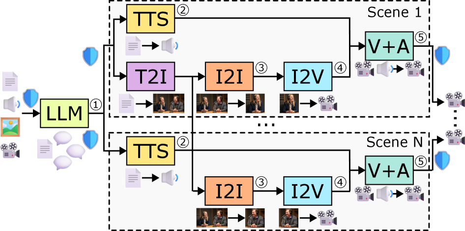
*Figure 1.Workflow for video podcast generation.*

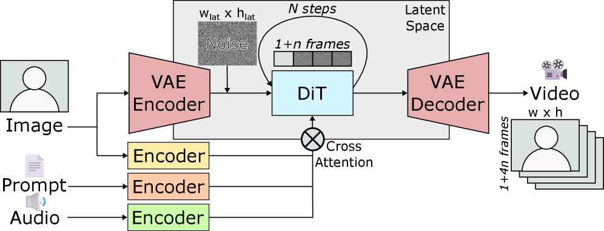
*Figure 2.Video generation architecture using diffusion transformers and VAE with text, image, and audio inputs.*

*Figure 3.Latency to generate an 81-frame (5.1-second at 16 FPs) video at 
640
×
400
 (16:10 aspect ratio) using 10 diffusion steps on A100 GPUs. It includes the sensitivity to each of these parameters. The red dashed line indicates real time.*

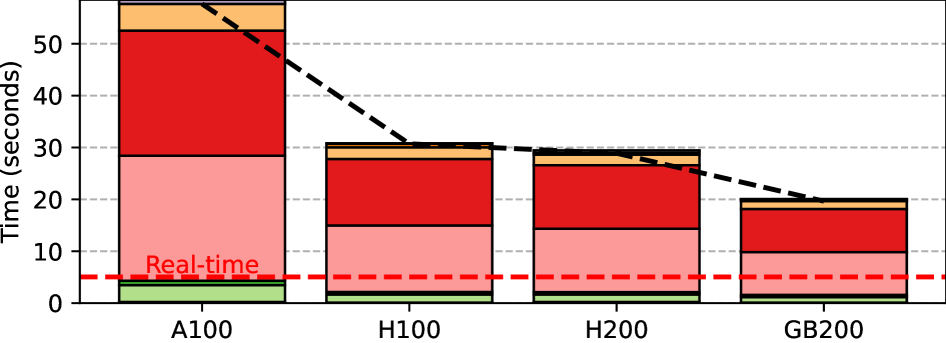
*Figure 4.Latency sensitivity to the NVIDIA GPU generation with 4 GPUs in a single server (limited to match GB200).*

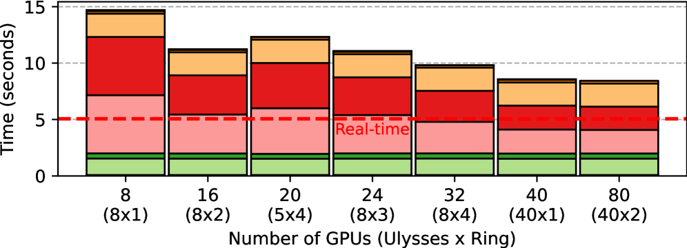
*Figure 5.Sensitivity to the number of H200 GPUs across servers using USP with Ulysses and Ring attention.*

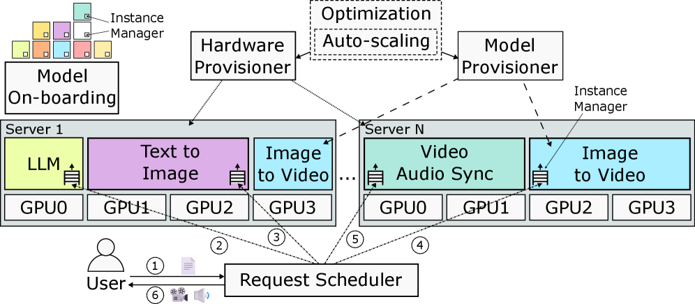
*Figure 6.Architecture overview for StreamWise showing an example request scheduling across four model instances.*

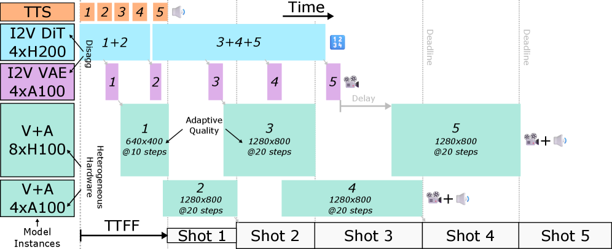
*Figure 7.Deadline-aware scheduling with disaggregated components and adaptive quality on A100, H100, and H200.*

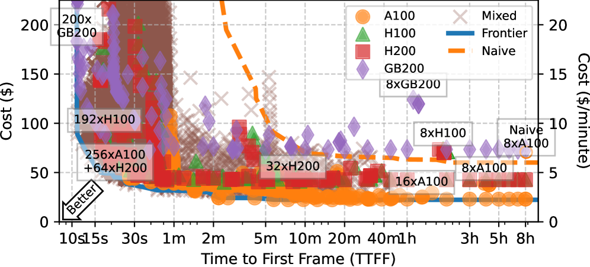
*Figure 8.TTFF vs. cost generating a 10-minute high-quality video podcast using various hardware configurations. The cheapest and fastest setup lies in the bottom-left corner.*

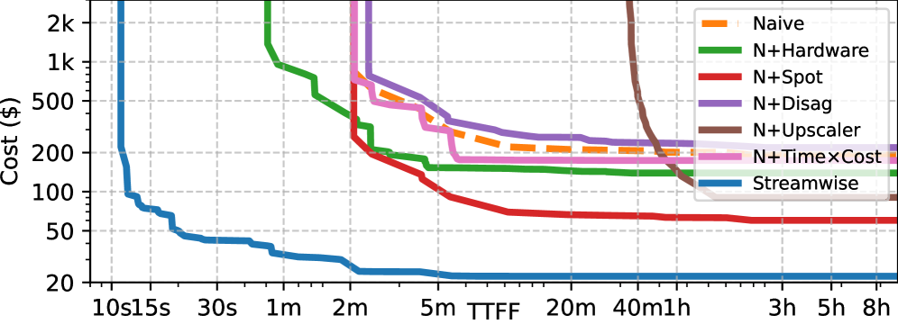
*Figure 9. Contribution of each technique used by StreamWise at high quality, including the Naive baseline.*

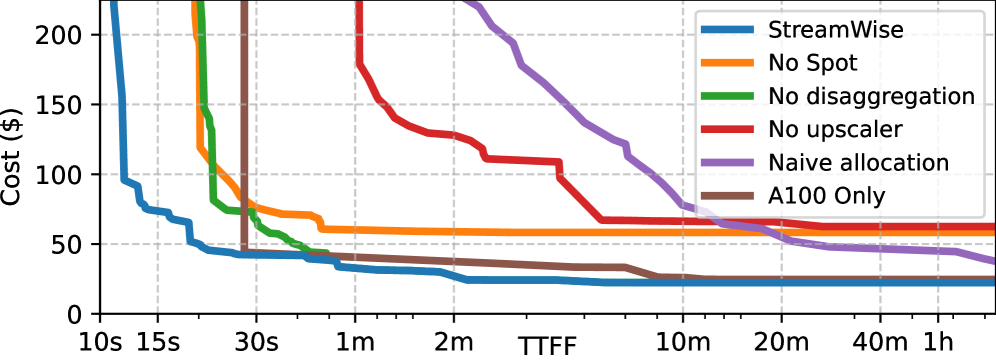
*Figure 10. Penalty of disabling each technique in StreamWise when generating a 10-minute podcast at high quality.*

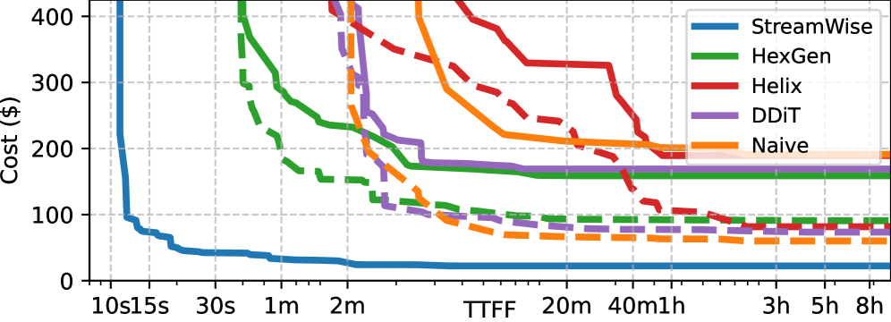
*Figure 11.Applicability of systems for efficient LLM serving. Dashed lines use Spot VMs to reduce cost.*

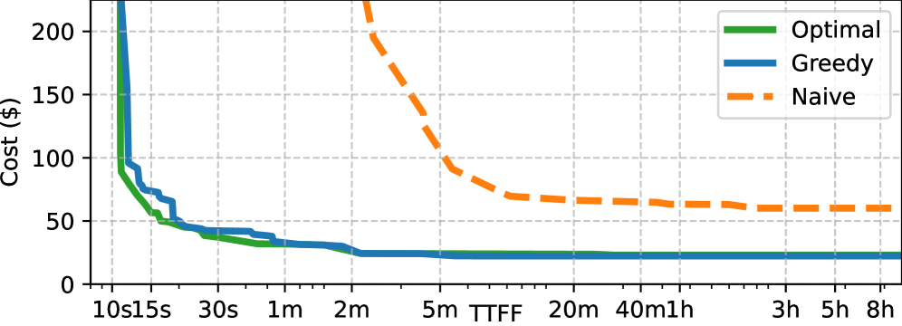
*Figure 12.Quality of the greedy heuristic against the optimal allocation. Optimal takes over 100× longer than greedy.*

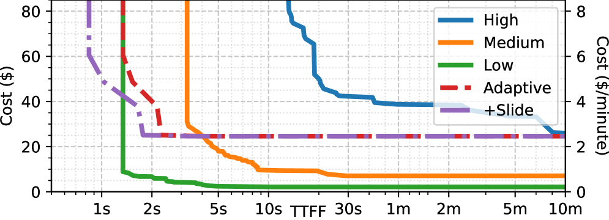
*Figure 13. TTFF vs. cost Pareto frontiers with high, medium, and low output qualities. Includes our adaptive quality policy.*

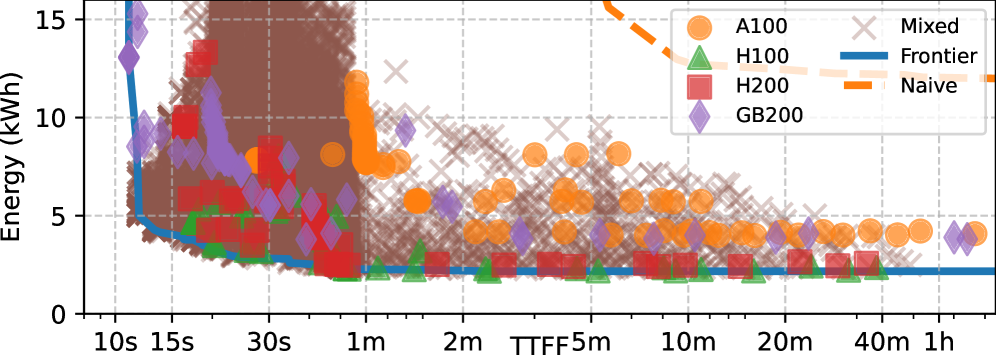
*Figure 14. Energy efficiency for video podcast generation.*

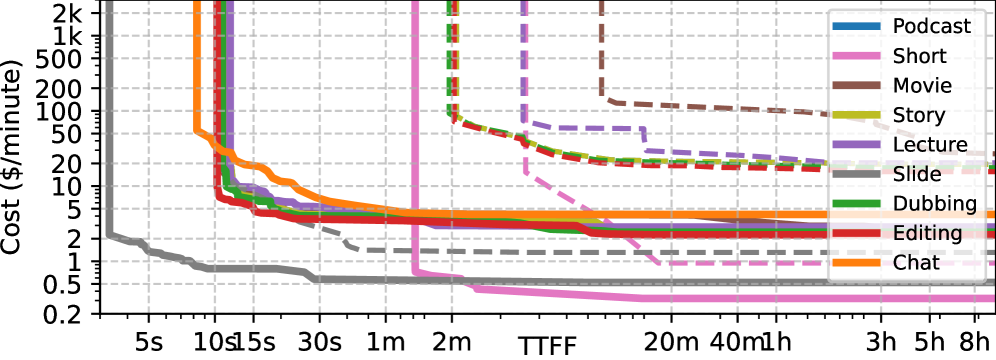
*Figure 15. Sensitivity to the multi-modal workflow. Dashed lines denote Naive, while solid lines represent StreamWise.*

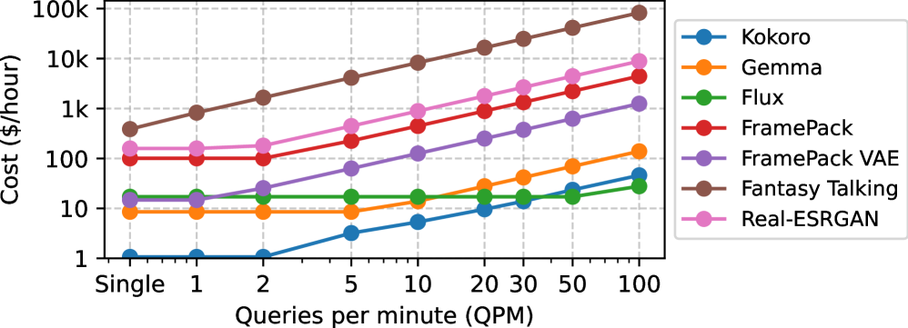
*Figure 16.Model-wise cost breakdown serving video generation requests using our cost-efficient adaptive quality policy.*

---
**Usage Info**: 10914 tokens used.
**Generated at**: 2026-03-09 12:42:34

---

# 📚 RAC: Rectified Flow Auto Coder

🚀 URL: https://arxiv.org/html/2603.05925

## 🌏 Abstract (원문)
In the field of generative models, over the past many years, there has been a problem of inconsistent generation and reconstruction results. For instance, when using the same generation method and the same VAE, the generation results are often inferior to the reconstruction results:(1)Some studies consider it to be a problem of representation[35,29], and attempt to solve it by optimizing the latent space;(2)Some studies consider it to be a problem of training strategy[15], and use the generation backbone and VAE for joint training optimization;(3)Some studies consider it to be a problem of the method[36], and propose a native unified method to try to solve it, etc. Under the same conditions of using VAE[10], one very obvious and unique variable that distinguishes generation from reconstruction is - the variables used during generation are provided by the generation framework (such as Unet, DiT, etc.). Therefore, we hypothesize that part of the reason is that the latent variables output by the generation method are problematic.It easily misses the uneven manifold space of traditional VAE, resulting in unstable generation effects and being less accurate than the encoder provided by VAE itself111From another perspective, Text2Img (prediction, information increase) is not as precise as Img2Latent (encoding compression, information reduction), which can also serve as a reason for the disparity in the generation and reconstruction capabilities.. So, in the case of minimal modifications, the method to enhance the decoder’s performance during generation is to incorporate the decoder into the generation process. As shown in Fig.1, we introduce the concepts of time steps and velocity fields into the decoder,enabling it to gradually calibrate the input variables or the behavior during encoding, and theoretically, it inherently supports bidirectional transformation. The decoder of traditional VAE is an important part of the generation process. Generation frameworks (such as Unet[23], DiT[19], etc.) can perform multi-step reasoning, but the end VAE is actually a one-step generation. This is actually not very reasonable: Consider a navigator who, despite having a correctable route, is forced to teleport directly to the destination in one step — losing all opportunity to adjust course along the way. Specifically, we take a unified view of continuous-time generation and representation learning, and elevate the classic VAE decoder from a pointwise mapping to apath-levelgenerative process: a time-conditioned velocity field defines an integrable flow from latent variables to the image space, and explicitly models a correctable, multi-step decoding trajectory. This design provides a structured generation path while making the same model naturally act as an encoder under time reversal, enabling parameter sharing and bidirectional consistency. For training, we center on path consistency, latent alignment, and reconstruction constraints, yielding a unified optimization framework that balances invertibility and generation quality. Our contributions are threefold: We propose RAC, which generalizes VAE decoding from asingle-step mapto acontinuous-time, integrable path, establishing aunified flow-based autoencoding paradigmfor generation and representation. We design astructured bidirectional mechanismwhere the same velocity-field model performs decoding and encoding in forward and reverse time, achieving parameter sharing, path reversibility, and generation–reconstruction consistency. We present a stable training objective and implementation recipe (path consistency + latent alignment + reconstruction constraints, with optional mean-velocity regularization), delivering strong reconstruction and generation performance at comparable model scale.
## 🌏 Abstract (번역)
생성 모델 분야에서는 지난 수년간 생성 및 재구성 결과의 불일치 문제가 존재해왔습니다. 예를 들어, 동일한 생성 방법과 동일한 VAE를 사용할 때 생성 결과가 재구성 결과보다 떨어지는 경우가 많습니다. (1) 일부 연구는 이를 표현의 문제로 간주하고 잠재 공간을 최적화하여 해결하려고 시도합니다. (2) 일부 연구는 이를 훈련 전략의 문제로 보고 생성 백본과 VAE를 공동 훈련 최적화에 사용합니다. (3) 일부 연구는 이를 방법론의 문제로 보고 고유한 통합 방법을 제안하여 해결하려고 시도합니다. VAE[10]를 사용하는 동일한 조건에서 생성과 재구성을 구별하는 매우 명확하고 독특한 변수는 생성 시 사용되는 변수가 생성 프레임워크(예: Unet, DiT 등)에 의해 제공된다는 것입니다. 따라서 우리는 그 이유의 일부가 생성 방법에서 출력되는 잠재 변수에 문제가 있다고 가정합니다. 이는 전통적인 VAE의 불균일한 매니폴드 공간을 쉽게 놓쳐 불안정한 생성 효과를 초래하고 VAE 자체에서 제공하는 인코더보다 정확도가 떨어집니다. 다른 관점에서 보면, Text2Img(예측, 정보 증가)는 Img2Latent(인코딩 압축, 정보 감소)만큼 정밀하지 않으며, 이는 생성 및 재구성 능력의 불균형에 대한 이유가 될 수도 있습니다. 따라서 최소한의 수정으로 생성 시 디코더의 성능을 향상시키는 방법은 디코더를 생성 프로세스에 통합하는 것입니다. 그림 1에서 보듯이, 우리는 디코더에 시간 단계와 속도장 개념을 도입하여 입력 변수 또는 인코딩 중 동작을 점진적으로 보정할 수 있도록 하며, 이론적으로 양방향 변환을 본질적으로 지원합니다. 전통적인 VAE의 디코더는 생성 프로세스의 중요한 부분입니다. 생성 프레임워크(예: Unet[23], DiT[19] 등)는 다단계 추론을 수행할 수 있지만, 최종 VAE는 실제로는 단일 단계 생성입니다. 이는 사실 매우 비합리적입니다. 마치 올바른 경로를 가지고 있음에도 불구하고 한 번에 목적지로 순간이동해야 하여 도중에 경로를 조정할 모든 기회를 잃는 항해사를 생각해보십시오. 구체적으로, 우리는 연속 시간 생성과 표현 학습을 통합된 관점으로 보고, 고전적인 VAE 디코더를 점 단위 매핑에서 경로 수준의 생성 프로세스로 격상시킵니다. 즉, 시간 조건부 속도장이 잠재 변수에서 이미지 공간으로의 적분 가능한 흐름을 정의하고, 수정 가능한 다단계 디코딩 궤적을 명시적으로 모델링합니다. 이 설계는 구조화된 생성 경로를 제공하는 동시에 동일한 모델이 시간 역전 시 자연스럽게 인코더 역할을 하여 매개변수 공유 및 양방향 일관성을 가능하게 합니다. 훈련을 위해 우리는 경로 일관성, 잠재 정렬 및 재구성 제약에 중점을 두어 가역성과 생성 품질의 균형을 맞추는 통합 최적화 프레임워크를 제공합니다. 우리의 기여는 세 가지입니다. 우리는 VAE 디코딩을 단일 단계 매핑에서 연속 시간, 적분 가능한 경로로 일반화하여 생성 및 표현을 위한 통합 흐름 기반 오토인코딩 패러다임을 확립하는 RAC를 제안합니다. 우리는 동일한 속도장 모델이 순방향 및 역방향 시간에서 디코딩 및 인코딩을 수행하여 매개변수 공유, 경로 가역성 및 생성-재구성 일관성을 달성하는 구조화된 양방향 메커니즘을 설계합니다. 우리는 안정적인 훈련 목표와 구현 방법(경로 일관성 + 잠재 정렬 + 재구성 제약, 선택적 평균 속도 정규화 포함)을 제시하여 비교 가능한 모델 규모에서 강력한 재구성 및 생성 성능을 제공합니다.

## 🔍 Methods & Results
- RAC는 단일 단계 VAE 디코더를 연속 시간 속도장으로 대체하여, 잠재 변수에서 이미지 공간으로의 적분 가능한 흐름을 통해 다단계 보정 가능한 디코딩 경로를 생성합니다.
- 동일한 속도장 모델이 순방향 시간에서는 디코딩을, 역방향 시간에서는 인코딩을 수행하여 매개변수 공유, 경로 가역성 및 생성-재구성 일관성을 달성하는 구조화된 양방향 메커니즘을 제공합니다.
- VAE 인코더는 고정하고 디코더만 재구성, 경로 일관성, 잠재 정렬을 포함하는 결합된 목적 함수로 훈련하여 잠재 공간 붕괴를 방지합니다.
- 디코딩은 K Euler 단계를 사용하여 t=0에서 t=1까지 흐름을 통합하며, 견고성을 위해 무작위 시간 그리드와 작은 가우시안 노이즈를 주입합니다.
- 훈련 목적 함수는 재구성 손실, 선형 보간과의 편차를 벌칙하는 경로 일관성 손실, 인코딩된 잠재 변수와 교사 잠재 변수를 정렬하는 잠재 정렬 손실, 교사 디코더 출력과 입력 이미지 간의 픽셀 일관성 손실, 왕복 일관성 손실을 포함합니다.
- RAC는 이미지 상태를 통해 재구성을 학습하고, 잠재 공간을 구성하여 생성을 학습하며, 다단계 보정 디코딩 프로세스를 학습함으로써 생성과 재구성 간의 격차를 해소하는 보다 정확한 학습 목표를 제공합니다.
- 이 방법은 비교 가능한 모델 규모에서 강력한 재구성 및 생성 성능을 제공하며, RAC 생성은 공유 상태 공간에서 구조화되고 조율된 경로를 따르는 궤적 기반 프로세스로 시각화될 수 있습니다.

## 🖼 Figures
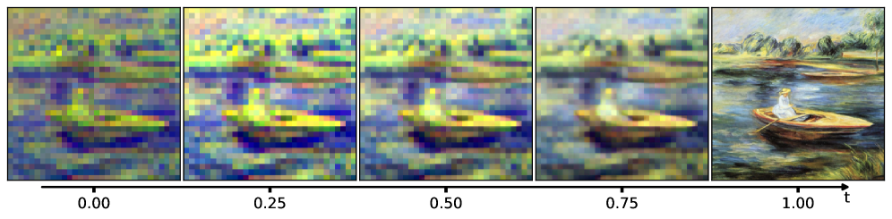
*Figure 1:The trajectory demonstration of RAC: Make the reconstruction task a condition generation task; Make the decoder the encoder; Make the single-step decoding and encoding a multi-step decoding and encoding.*

*Figure 2:Method Overview. (i) Training. To prevent latent space collapse, we freeze the VAE encoder and train only the RAC decoder; reverse-time inference then serves as encoding. (ii) State Construction. Extra channels beyond RGB are padded with 0.5, keeping the velocity field shape constant and ensuring bidirectional consistency. (iii) RAC Input. RAC takes time 
𝑡
 and the current state as input, driving the transition from latent initialization to the target image.*

![Figure 3:Reconstruction is Condition Generation: The previous reconstructions were more accurate because they could relatively approach the manifold. The previous generations predicted variables that were often some distance away from the manifold. This is part of the reason for the past differences in the performance of generation and reconstruction. However, our method theoretically aims for perfect reconstruction, and the multi-step decoding can correct the potential variables provided by Unet or DiT. Therefore, both reconstruction and generation are significantly superior to traditional VAEs.](../images/2026-03-09/2603.05925/2603.05925_fig2.png)
*Figure 3:Reconstruction is Condition Generation: The previous reconstructions were more accurate because they could relatively approach the manifold. The previous generations predicted variables that were often some distance away from the manifold. This is part of the reason for the past differences in the performance of generation and reconstruction. However, our method theoretically aims for perfect reconstruction, and the multi-step decoding can correct the potential variables provided by Unet or DiT. Therefore, both reconstruction and generation are significantly superior to traditional VAEs.*

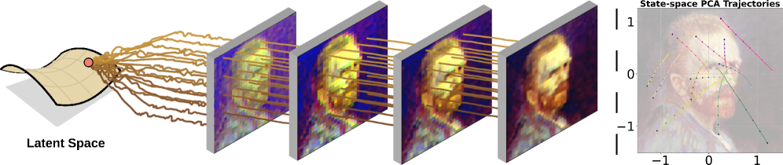
*Figure 4:Conceptual and empirical views of RAC generation trajectories. Left: a conceptual illustration of trajectory-based generation from latent space to image space. Right: sampled state trajectories projected into a 2D PCA space.*

*(a)PCA Analysis on VAE Latent Space Structure. We are cleaner.*

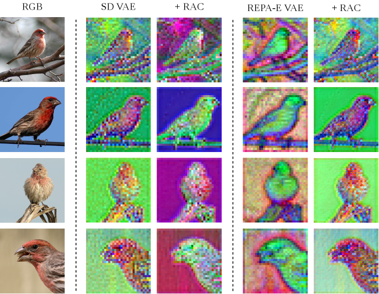
*(a)PCA Analysis on VAE Latent Space Structure. We are cleaner.*

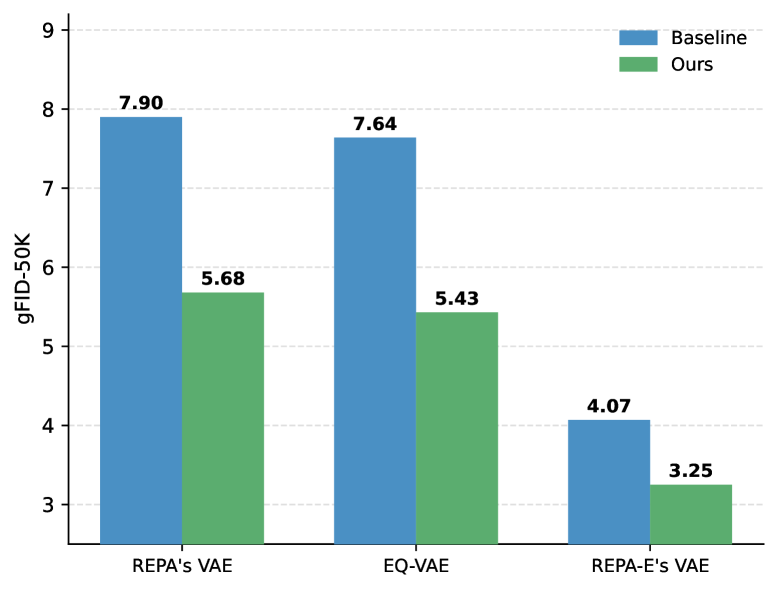
*(b)Performance Improvements with Baseline (400K Steps)*

*Figure 6:Qualitative Results on Imagenet 256 
×
 256 using RAC. It can achieve significant results in the state reconstruction mode with just 30k steps.*

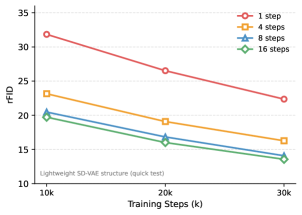
*Figure 7:rFID vs. Training Steps under Different Inference Steps. Results on a lightweight SD-VAE structure. Lower is better.*

*Figure 8:Generative Decoding under Ultra-short Training: To visually demonstrate the benefits of our generative decoding on the results, we only trained for 1k steps (this is merely 1/10k of the full training duration in other works), and then we observed the number of decoding inferences. It’s clearly see that during the initial training phase, multi-step decoding significantly contributed to the improvement in quality.*

*Figure 9:Parameter Efficiency of Bidirectional Design. A conventional VAE-style bidirectional model uses separate encoder and decoder backbones to map between compact latent and image spaces. In contrast, RAC uses a single shared bidirectional model in the full-resolution state space, achieving encoding and decoding by reversing the flow direction rather than duplicating the backbone.*

*Figure 10:Encoding and Decoding Trajectory Symmetry. Left: RAC decodes the full-resolution state to the image through a sequence of intermediate states. Right: the trajectories of sampled spatial positions are projected to a 2D PCA space, revealing that the decoding process follows structured and coordinated paths in the learned state space rather than independent pixel-wise changes.*

![(a)Existing VAE Latent Artifacts [22, 20, 13, 32].](../images/2026-03-09/2603.05925/2603.05925_fig13.png)
*(a)Existing VAE Latent Artifacts [22, 20, 13, 32].*

![(a)Existing VAE Latent Artifacts [22, 20, 13, 32].](../images/2026-03-09/2603.05925/2603.05925_fig14.png)
*(a)Existing VAE Latent Artifacts [22, 20, 13, 32].*

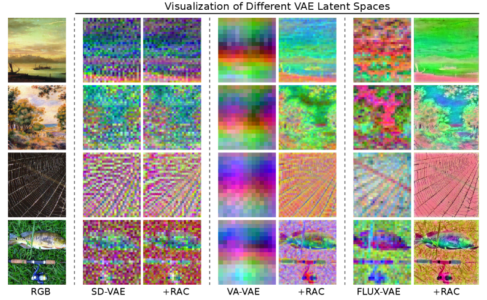
*(b)Our background is cleaner, with more details and the colors are more stable.*

---
**Usage Info**: 7802 tokens used.
**Generated at**: 2026-03-09 12:42:57

---

# 📚 StreamVoiceAnon+: Emotion-Preserving Streaming Speaker Anonymization via Frame-Level Acoustic Distillation

🚀 URL: https://arxiv.org/html/2603.06079

## 🌏 Abstract (원문)
Speaker anonymization (SA) aims to transform an input speech (source) to conceal speaker identity while preserving linguistic content and paralinguistic attributes such as emotion[tomashenko2022vpc2020,panariello2024voiceprivacy,tomashenko2026vpc3]. Real-time SA is essential for privacy-preserving applications including teleconferencing, call centers, voice assistants, and online mental health counseling[meyer2025usecases], where low latency is critical. While privacy and intelligibility have been the primary focus of SA research, emotion preservation is equally important for natural communication. Losing emotional cues can significantly degrade user experience and communication effectiveness in real-world deployments[cai2024privacy]. Recent advances in neural audio codec (NAC) language models have enabled streaming SA with competitive privacy-intelligibility trade-offs[panariello2024nac,kuzmin2026streamvoiceanonenhancingutilityrealtime], unlike offline approaches that require full utterance context[yao2025easy,yao2024npuntu]. These models process speech as interleaved content and acoustic token sequences, allowing autoregressive (AR) generation with controllable speaker identity. However, two fundamental limitations emerge for emotion preservation: (1) the audio continuation training paradigm encourages the model to degrade emotion preservation for the source utterance, and (2) the VQ bottleneck in neural codecs discards fine-grained acoustic details that carry emotional information[zhang2024speechtokenizer,gaznepoglu2025why]. To mitigate this limitation, prior work[kuzmin2026streamvoiceanonenhancingutilityrealtime]employed multiple emotion-diverse prompts at inference, which partially improves emotion preservation but significantly degrades intelligibility and requires emotion-labeled prompts that are harder to obtain compared to diverse neutral prompts commonly used for anonymization. We propose a supervised finetuning (SFT) approach with frame-level emotion distillation (Figure2) that addresses the root cause of emotion degradation. Our contributions are: We show that emotion degradation in NAC-based streaming SA is primarily atraining paradigmproblem, not a model capacity issue: restructuring training pairs yields 3×\timeslarger gains than adding emotional data alone (ablation: Exp1 vs Exp2). We apply frame-level emotion distillation to acoustic token hidden states, isolating emotion learning from content supervision (next-token prediction) to avoid gradient competition. Ablation confirms this design choice: acoustic-branch distillation outperforms semantic-branch in both UAR and WER (Exp6 vs Exp7). Our approach achieves the highest reported emotion preservation among streaming SA methods (49.2% UAR, +24% relative over baseline) withzero inference overheadand improved privacy (Figure1).
## 🌏 Abstract (번역)
화자 익명화(SA)는 화자 신원을 숨기면서 언어적 내용과 감정과 같은 비언어적 속성을 보존하기 위해 입력 음성(소스)을 변환하는 것을 목표로 합니다. 실시간 SA는 낮은 지연 시간이 중요한 화상 회의, 콜센터, 음성 비서, 온라인 정신 건강 상담을 포함한 개인 정보 보호 애플리케이션에 필수적입니다. 개인 정보 보호와 명료도가 SA 연구의 주요 초점이었지만, 감정 보존은 자연스러운 의사소통에 똑같이 중요합니다. 감정 신호를 잃으면 실제 배포에서 사용자 경험과 의사소통 효과가 크게 저하될 수 있습니다. 신경 오디오 코덱(NAC) 언어 모델의 최근 발전은 전체 발화 문맥이 필요한 오프라인 접근 방식과 달리 경쟁력 있는 개인 정보 보호-명료도 균형을 갖춘 스트리밍 SA를 가능하게 했습니다. 이 모델들은 음성을 인터리브된 내용과 음향 토큰 시퀀스로 처리하여 제어 가능한 화자 신원으로 자동 회귀(AR) 생성을 허용합니다. 그러나 감정 보존에는 두 가지 근본적인 한계가 있습니다. (1) 오디오 연속 훈련 패러다임은 모델이 소스 발화에 대한 감정 보존을 저하시키도록 유도하고, (2) 신경 코덱의 VQ 병목 현상은 감정 정보를 전달하는 미세한 음향 세부 정보를 버립니다. 이 한계를 완화하기 위해 이전 연구는 추론 시 여러 감정적으로 다양한 프롬프트를 사용했는데, 이는 감정 보존을 부분적으로 개선하지만 명료도를 크게 저하시키고 익명화에 일반적으로 사용되는 다양한 중립 프롬프트보다 얻기 어려운 감정 레이블이 지정된 프롬프트를 필요로 합니다. 우리는 감정 저하의 근본 원인을 해결하는 프레임 수준 감정 증류(Figure2)를 사용한 지도 미세 조정(SFT) 접근 방식을 제안합니다. 우리의 기여는 다음과 같습니다. NAC 기반 스트리밍 SA에서 감정 저하는 주로 훈련 패러다임 문제이지 모델 용량 문제가 아님을 보여줍니다. 훈련 쌍을 재구성하면 감정 데이터만 추가하는 것보다 3배 더 큰 이득을 얻습니다(비교: Exp1 대 Exp2). 우리는 음향 토큰 은닉 상태에 프레임 수준 감정 증류를 적용하여 내용 감독(다음 토큰 예측)으로부터 감정 학습을 분리하여 기울기 경쟁을 피합니다. 비교를 통해 이 설계 선택이 확인됩니다. 음향 분기 증류는 UAR 및 WER 모두에서 의미 분기보다 우수합니다(Exp6 대 Exp7). 우리의 접근 방식은 스트리밍 SA 방법 중에서 가장 높은 감정 보존(49.2% UAR, 기준선 대비 +24% 상대적)을 달성하며, 추론 오버헤드가 없고 개인 정보 보호가 향상됩니다(Figure1).

## 🔍 Methods & Results
- NAC 기반 스트리밍 SA에서 감정 보존의 어려움은 오디오 연속 훈련 패러다임과 VQ 병목 현상으로 인한 미세한 감정 운율 손실, 그리고 훈련 데이터의 불균형한 감정 분포로 인한 모델의 내재된 편향 때문임을 확인했습니다.
- 제안된 방법은 프레임 수준 감정 증류(frame-level emotion distillation)를 사용한 지도 미세 조정(SFT) 접근 방식입니다.
- 훈련 쌍은 동일 화자의 중립 발화와 감정 발화를 포함하도록 재구성되었으며, 중립-중립 쌍도 포함하여 모델이 중립 프롬프트에서 감정적인 음향 토큰을 생성하도록 유도하고 화자 임베딩 믹싱을 유지합니다.
- 의미 및 음향 분기에 대해 학습된 분리 토큰(Linguistic [SEP], Acoustic [SEP])을 사용하여 프롬프트와 소스 시퀀스 간의 명시적인 경계를 설정하여 프롬프트 특성이 소스 발화로 복사되는 것을 방지합니다.
- 사전 훈련된 감정 추출기에서 프레임 수준 감정 특징을 모델의 음향 은닉 상태(acoustic hidden states)로 증류합니다. 이는 내용 감독(다음 토큰 예측)과의 기울기 경쟁을 피하기 위해 음향 분기에 적용됩니다.
- 총 손실은 언어 모델링 손실과 증류 손실을 결합하며, 추론 시에는 감정 관련 구성 요소가 제거되어 기준선과 동일한 아키텍처 및 지연 시간을 유지합니다.
- NAC 기반 스트리밍 SA에서 감정 저하가 주로 훈련 패러다임 문제이며, 훈련 쌍 재구성이 감정 데이터 추가보다 3배 더 큰 감정 보존 개선을 가져옴을 입증했습니다.
- 음향 분기 증류가 의미 분기 증류보다 UAR(Unweighted Average Recall) 및 WER(Word Error Rate) 모두에서 우수한 성능을 보였습니다.
- 제안된 접근 방식은 스트리밍 SA 방법 중 가장 높은 감정 보존율(49.2% UAR, 기준선 대비 +24% 상대적 개선)을 달성했으며, 추론 오버헤드가 없고 개인 정보 보호가 향상되었습니다.

## 🖼 Figures
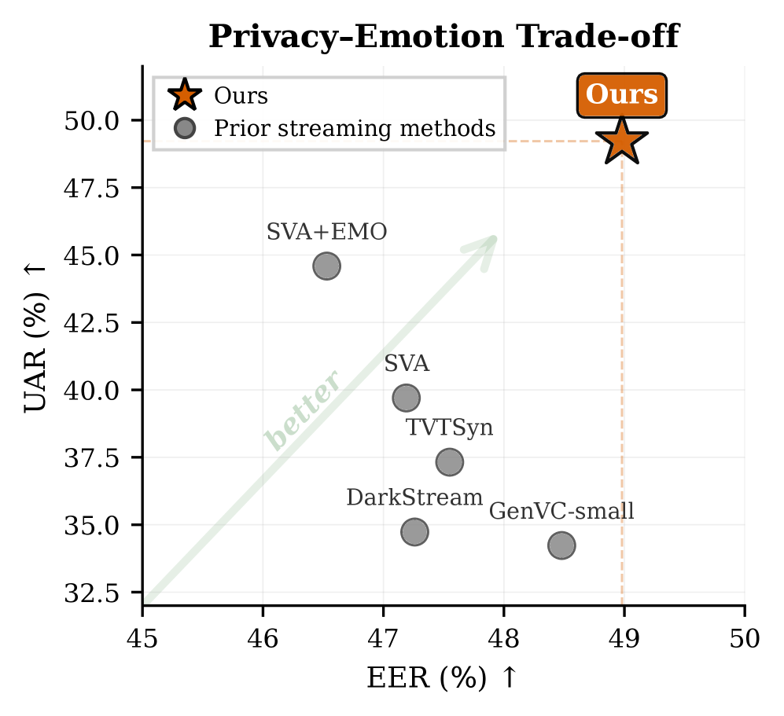
*Figure 1:Privacy-emotion trade-off for streaming speaker anonymization methods. Our method (orange star) compared to prior streaming methods (triangles).*

![Figure 2:Training and inference configurations. Training: prompt and source share the same speaker but differ in emotion, forcing the model to generate emotional output from source content rather than copying prompt-specific patterns. Frame-level emotion distillation (
ℒ
emo
, dashed) on Slow AR acoustic hidden states provides additional learning signal. Inference: a neutral utterance from the target anonymous speaker conceals source identity while the finetuned model preserves source emotion; no latency is added over the baseline. The transformer 
𝑓
𝜃
 is depicted twice for visual clarity; weights are shared.](../images/2026-03-09/2603.06079/2603.06079_fig1.png)
*Figure 2:Training and inference configurations. Training: prompt and source share the same speaker but differ in emotion, forcing the model to generate emotional output from source content rather than copying prompt-specific patterns. Frame-level emotion distillation (
ℒ
emo
, dashed) on Slow AR acoustic hidden states provides additional learning signal. Inference: a neutral utterance from the target anonymous speaker conceals source identity while the finetuned model preserves source emotion; no latency is added over the baseline. The transformer 
𝑓
𝜃
 is depicted twice for visual clarity; weights are shared.*

---
**Usage Info**: 3940 tokens used.
**Generated at**: 2026-03-09 12:43:09

---

# 📚 FlowMotion: Training-Free Flow Guidance for Video Motion Transfer

🚀 URL: https://arxiv.org/html/2603.06289

## 🌏 Abstract (원문)
Recent advances in large-scale pre-trained Text-to-Video (T2V) models[45,38,4]have demonstrated remarkable capabilities in synthesizing realistic and dynamic video content from textual descriptions. Building upon these generative breakthroughs, a novel and promising direction — Video Motion Transfer[46,48,29,36]— has attracted growing attention for customizing and controlling video motions during generation. As illustrated in Figure	1, given source videos, this task aims to transfer realistic motion patterns (e.g., complex object movements, and camera trajectories) to synthesized target videos by pre-trained T2V models, while allowing flexible rendering with diverse new subjects and scenarios. By enabling fine-grained customization and controllability for motion synthesis, video motion transfer has shown great potential for various applications such as virtual reality, filmmaking, and digital entertainment.
The key challenges of this task lie in effectively extracting motion patterns from the source video while ensuring accurate transfer. To achieve this, existing approaches can be broadly categorized into two groups:1) Training-based Methods[15,32,26,42,48,40,25,36,49]: They learn motion representations by fine-tuning pre-trained T2V models on the source video, where a set of parameters (e.g., temporal attention modules[15,48,40]or LoRAs[25,1]) are optimized to capture the motion dynamics. Despite achieving high motion fidelity, these methods require time-consuming training for every reference video, which limits their practicality for real-time or large-scale scenarios.2) Training-free Methods[47,20,46,43,29]: To enable efficient transfer without per-video training, another line of research focuses on extracting motion patterns during inference to guide the generation process. These methods analyze the intermediate outputs of pre-trained T2V models, such as temporal attention maps[20], diffusion features[46,43], and cross-frame attention flows[29]to construct motion representations that serve as guidance signals. The target video is then generated by optimizing its latent representation across denoising steps, minimizing the discrepancy between the motion representations of the source and generated video. By leveraging suchmotion guidance, the transfer can be achieved without updating model parameters.
While avoiding explicit parameter tuning, existing training-free approaches still suffer from significantcomputational overhead. As illustrated in Figure2, current motion guidance mechanisms rely on the intermediate outputs of pre-trained T2V models,i.e., specific feature layers[46,43]or attention blocks[20,29]within certain architectures such as U-Net[34]or DiT[28]. Such dependence incurssubstantial memory requirements[20,29]due to gradient backpropagation through internal deep model layers. In addition, some extra computations such as the iterative inversion process[46,43]for reference videos and pairwise attention operations[29]across latent patches and frames further introduce notabletime costs. These limitations collectively hinder their scalability and generalization ability in real-world video generation scenarios.
To address these limitations, we proposeFlowMotion, a novel training-free framework that enables efficient and flexible video motion transfer withflow guidance. As shown in Figure2, the flow guidance directly leverages the predicted outputs of flow-based T2V models to capture and propagate motion patterns in an inversion-free manner, eliminating the need for intermediate outputs or architecture-specific dependencies.
Our method built upon the key observation that the early latent predictions of flow-based T2V models inherently encode rich temporal information with fewer appearance details during video generation. Motivated by this, we propose latent-basedflow guidance, which extracts and aligns motion representations directly based on the latent predictions of both source and generated videos to guide motion transfer. Specifically, the flow guidance consists of two objectives: it directly aligns latent predictions to maintain global motion consistency, and aligns their frame-wise differences to emphasize temporal variations while suppressing static appearance cues. To further stabilize optimization, we introduce avelocity regularizationstrategy that constrains each velocity update to follow the accumulated flow direction, mitigating over-alignment and ensuring smooth motion evolution. Notably, by operating purely at the model prediction ouput, FlowMotion enables both time- and resource-efficient motion transfer, avoiding architectural dependency and eliminating costly gradient propagation through internal model layers.
Our contributions are threefold: 1) We propose FlowMotion, a novel training-free framework for motion transfer that operates directly on the prediction outputs of pre-trained flow-based T2V models. 2) We provide a comprehensive analysis of flow-based T2V generation, which offer new insights into their behaviors and motivate an efficient and stable motion transfer. 3) Extensive experiments demonstrate that FlowMotion achieves promising performance and efficiency compared with existing state-of-the-art methods, and can further generalize to new backbones.
## 🌏 Abstract (번역)
최근 대규모 사전 학습된 텍스트-비디오(T2V) 모델[45,38,4]의 발전은 텍스트 설명으로부터 사실적이고 동적인 비디오 콘텐츠를 합성하는 놀라운 능력을 보여주었습니다. 이러한 생성적 혁신을 바탕으로, 비디오 생성 중 비디오 모션을 맞춤화하고 제어하기 위한 새롭고 유망한 방향인 비디오 모션 전송[46,48,29,36]이 점점 더 많은 관심을 받고 있습니다. 그림 1에서 보듯이, 이 작업은 소스 비디오가 주어졌을 때 사전 학습된 T2V 모델을 통해 사실적인 모션 패턴(예: 복잡한 객체 움직임, 카메라 궤적)을 합성된 타겟 비디오로 전송하는 것을 목표로 하며, 다양한 새로운 피사체와 시나리오로 유연한 렌더링을 가능하게 합니다. 모션 합성을 위한 세밀한 맞춤화 및 제어 가능성을 통해 비디오 모션 전송은 가상 현실, 영화 제작, 디지털 엔터테인먼트와 같은 다양한 응용 분야에서 큰 잠재력을 보여주었습니다.
이 작업의 주요 과제는 소스 비디오에서 모션 패턴을 효과적으로 추출하면서 정확한 전송을 보장하는 데 있습니다. 이를 달성하기 위해 기존 접근 방식은 크게 두 가지 그룹으로 분류할 수 있습니다. 1) 학습 기반 방법[15,32,26,42,48,40,25,36,49]: 사전 학습된 T2V 모델을 소스 비디오에 미세 조정하여 모션 표현을 학습하며, 일련의 매개변수(예: 시간적 어텐션 모듈[15,48,40] 또는 LoRA[25,1])가 모션 역학을 포착하도록 최적화됩니다. 높은 모션 충실도를 달성함에도 불구하고, 이러한 방법은 모든 참조 비디오에 대해 시간이 많이 소요되는 학습이 필요하여 실시간 또는 대규모 시나리오에서의 실용성을 제한합니다. 2) 학습 없는 방법[47,20,46,43,29]: 비디오별 학습 없이 효율적인 전송을 가능하게 하기 위해, 또 다른 연구 방향은 추론 중에 모션 패턴을 추출하여 생성 프로세스를 안내하는 데 중점을 둡니다. 이러한 방법은 사전 학습된 T2V 모델의 중간 출력(예: 시간적 어텐션 맵[20], 확산 특징[46,43], 프레임 간 어텐션 흐름[29])을 분석하여 안내 신호 역할을 하는 모션 표현을 구성합니다. 그런 다음 타겟 비디오는 노이즈 제거 단계 전반에 걸쳐 잠재 표현을 최적화하여 소스 비디오와 생성된 비디오의 모션 표현 간의 불일치를 최소화함으로써 생성됩니다. 이러한 모션 안내를 활용하면 모델 매개변수를 업데이트하지 않고도 전송을 달성할 수 있습니다.
명시적인 매개변수 튜닝을 피함에도 불구하고, 기존의 학습 없는 접근 방식은 여전히 상당한 계산 오버헤드를 겪습니다. 그림 2에서 보듯이, 현재의 모션 안내 메커니즘은 U-Net[34] 또는 DiT[28]와 같은 특정 아키텍처 내의 특정 특징 레이어[46,43] 또는 어텐션 블록[20,29]과 같은 사전 학습된 T2V 모델의 중간 출력에 의존합니다. 이러한 의존성은 내부 깊은 모델 레이어를 통한 기울기 역전파로 인해 상당한 메모리 요구 사항[20,29]을 발생시킵니다. 또한, 참조 비디오에 대한 반복적인 역전파 프로세스[46,43] 및 잠재 패치와 프레임 간의 쌍별 어텐션 연산[29]과 같은 일부 추가 계산은 상당한 시간 비용을 추가로 발생시킵니다. 이러한 한계는 실제 비디오 생성 시나리오에서 확장성 및 일반화 능력을 저해합니다.
이러한 한계를 해결하기 위해, 우리는 흐름 안내(flow guidance)를 통해 효율적이고 유연한 비디오 모션 전송을 가능하게 하는 새로운 학습 없는 프레임워크인 FlowMotion을 제안합니다. 그림 2에서 보듯이, 흐름 안내는 흐름 기반 T2V 모델의 예측 출력을 직접 활용하여 역전파 없이 모션 패턴을 포착하고 전파하며, 중간 출력이나 아키텍처별 종속성의 필요성을 제거합니다.
우리의 방법은 흐름 기반 T2V 모델의 초기 잠재 예측이 비디오 생성 중 더 적은 외형 세부 정보와 함께 풍부한 시간 정보를 본질적으로 인코딩한다는 핵심 관찰을 기반으로 합니다. 이에 동기를 부여받아, 우리는 모션 전송을 안내하기 위해 소스 및 생성된 비디오의 잠재 예측을 기반으로 모션 표현을 직접 추출하고 정렬하는 잠재 기반 흐름 안내(latent-based flow guidance)를 제안합니다. 구체적으로, 흐름 안내는 두 가지 목표로 구성됩니다. 첫째, 전역적인 모션 일관성을 유지하기 위해 잠재 예측을 직접 정렬합니다. 둘째, 정적인 외형 단서를 억제하면서 시간적 변화를 강조하기 위해 프레임별 차이를 정렬합니다. 최적화를 더욱 안정화하기 위해, 우리는 각 속도 업데이트가 누적된 흐름 방향을 따르도록 제약하여 과도한 정렬을 완화하고 부드러운 모션 진화를 보장하는 속도 정규화(velocity regularization) 전략을 도입합니다. 특히, FlowMotion은 모델 예측 출력에서만 작동함으로써 아키텍처 종속성을 피하고 내부 모델 레이어를 통한 비용이 많이 드는 기울기 전파를 제거하여 시간 및 자원 효율적인 모션 전송을 가능하게 합니다.
우리의 기여는 세 가지입니다. 1) 사전 학습된 흐름 기반 T2V 모델의 예측 출력에서 직접 작동하는 모션 전송을 위한 새로운 학습 없는 프레임워크인 FlowMotion을 제안합니다. 2) 흐름 기반 T2V 생성에 대한 포괄적인 분석을 제공하여 그 동작에 대한 새로운 통찰력을 제공하고 효율적이고 안정적인 모션 전송을 촉진합니다. 3) 광범위한 실험을 통해 FlowMotion이 기존 최첨단 방법과 비교하여 유망한 성능과 효율성을 달성하며 새로운 백본으로 더욱 일반화될 수 있음을 입증합니다.

## 🔍 Methods & Results
- FlowMotion은 잠재 확산 모델과 흐름 매칭 모델을 기반으로 하며, 사전 학습된 오토인코더와 속도 예측 네트워크를 활용하여 잠재 공간에서 생성 모델링을 수행합니다.
- 흐름 기반 T2V 모델의 생성 동작을 분석한 결과, 초기 단계의 잠재 예측(latent predictions)이 비디오 생성 과정에서 외형 세부 정보가 적으면서도 풍부한 시간 정보를 본질적으로 인코딩함을 발견했습니다. 이는 거친 위치 및 모션 방향에서 시작하여 미세한 객체 동작 및 장면 역학으로 점진적으로 진화합니다.
- 모션 표현 추출을 위해, 소스 비디오를 인코딩한 후 시간 소모적인 역전파(inversion) 대신 순방향 노이징(forward noising)을 통해 노이즈가 있는 소스 잠재를 얻고, 이를 흐름 기반 T2V 모델에 입력하여 모션 표현을 효율적으로 추출합니다. 이 역전파 없는(inversion-free) 추출 방식은 정확하고 해석 가능한 모션 표현을 제공합니다.
- 제안된 잠재 기반 흐름 안내(latent-based flow guidance)는 타겟 비디오의 잠재 예측을 소스 비디오의 잠재 예측과 정렬하는 것을 목표로 합니다. 이는 전역적인 모션 일관성을 위한 잠재 정렬(Latent Alignment, LA)과 시간적 변화를 강조하고 정적 외형을 억제하기 위한 프레임별 차이 정렬(Difference Alignment, DA)의 두 가지 목표로 구성됩니다.
- 흐름 안내 손실은 모델 예측 출력에서 직접 작동하여 내부 레이어를 통한 기울기 전파를 피함으로써 상당한 계산 오버헤드를 줄입니다.
- 과도한 정렬 및 불안정한 업데이트를 방지하기 위해 속도 정규화(velocity regularization) 전략을 도입합니다. 이는 각 속도 업데이트가 누적된 흐름 방향을 따르도록 제약하여 부드러운 모션 진화를 보장하고 시각적 품질 및 시간적 일관성을 유지합니다.
- FlowMotion은 기존 최첨단 방법과 비교하여 유망한 성능과 효율성을 달성하며, 새로운 백본으로도 일반화될 수 있음을 광범위한 실험을 통해 입증했습니다.

## 🖼 Figures
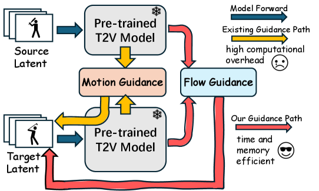
*Figure 2:Guidance process of exisiting methods and FlowMotion.*

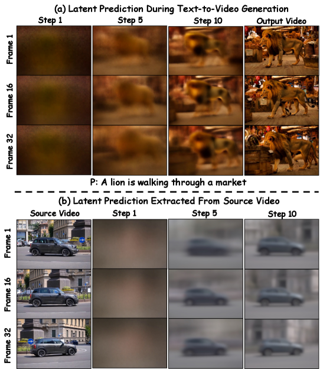
*Figure 3:The visualization of latent prediciton: (a) During T2V generation. (b) Extracted from source video.*

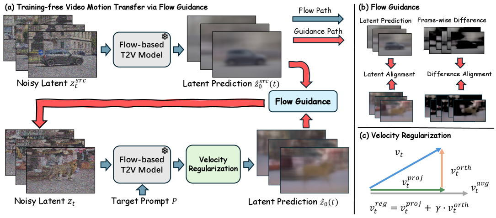
*Figure 4:The overview of FlowMotion. (a) Training-free video motion transfer with flow guidance and velocity regularization. (b) Two objective of flow guidance. (c) The velocity regularization process.*

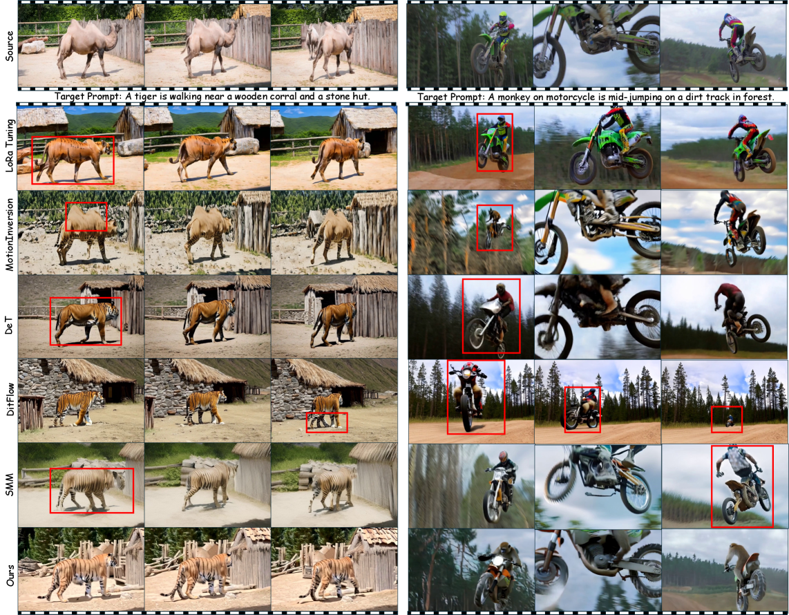
*Figure 5:Qualitative comparison with SOTA methods. Red boxes indicated low quality content across frames.*

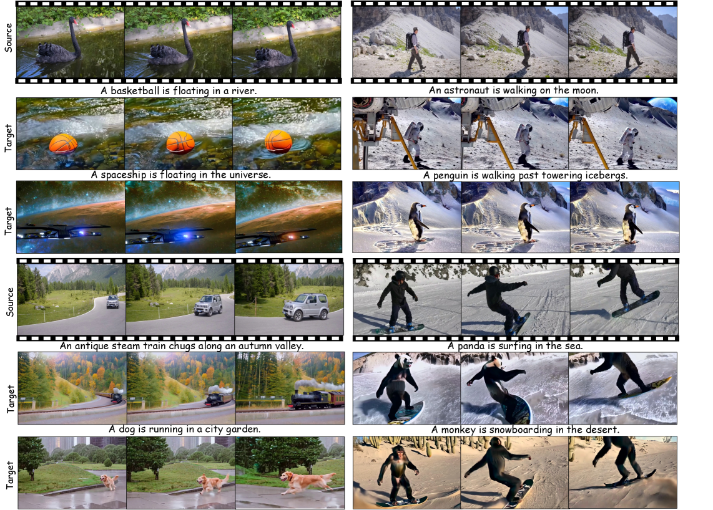
*Figure 6:Qualitative results of FlowMotion. The left column generated by Wan2.1-1.3B, while right column generated by Wan2.2-5B.*

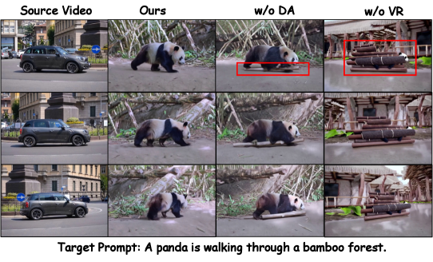
*Figure 7:The visualization of ablation on key designs. Red boxes indicate low quality content across frames.*

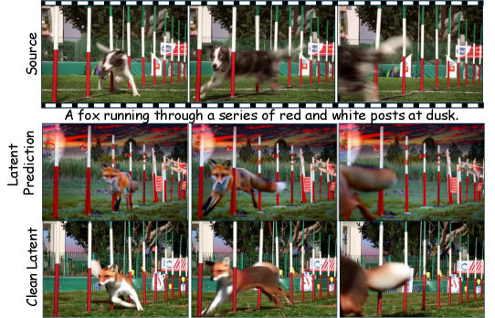
*Figure 8:Variance of different source motion representation.*

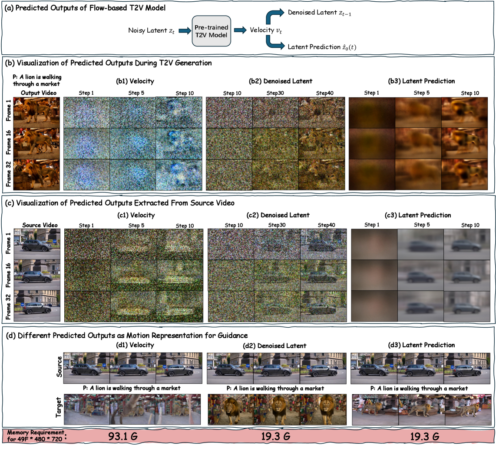
*Figure 9:Analysis of Flow-based T2V Generation for Extracting Motion Representation.*

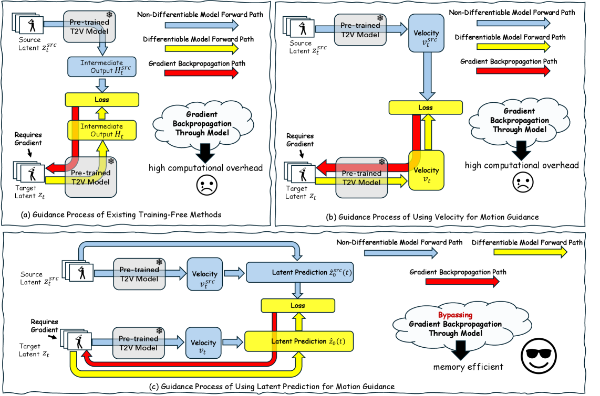
*Figure 10:Visualization of the Guidance Process of Different Methods.*

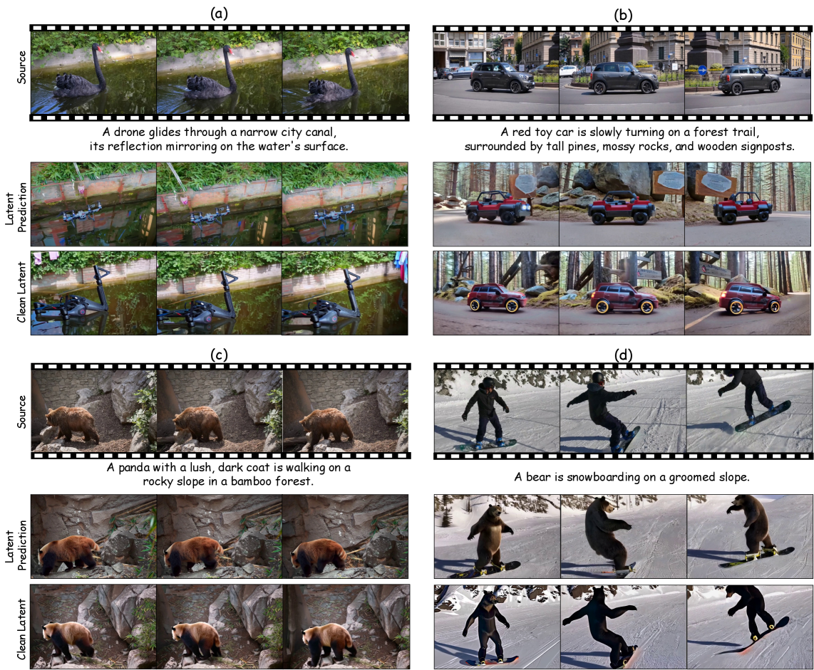
*Figure 11:Video Motion Transfer Results with Variant of Source Motion Representations.*

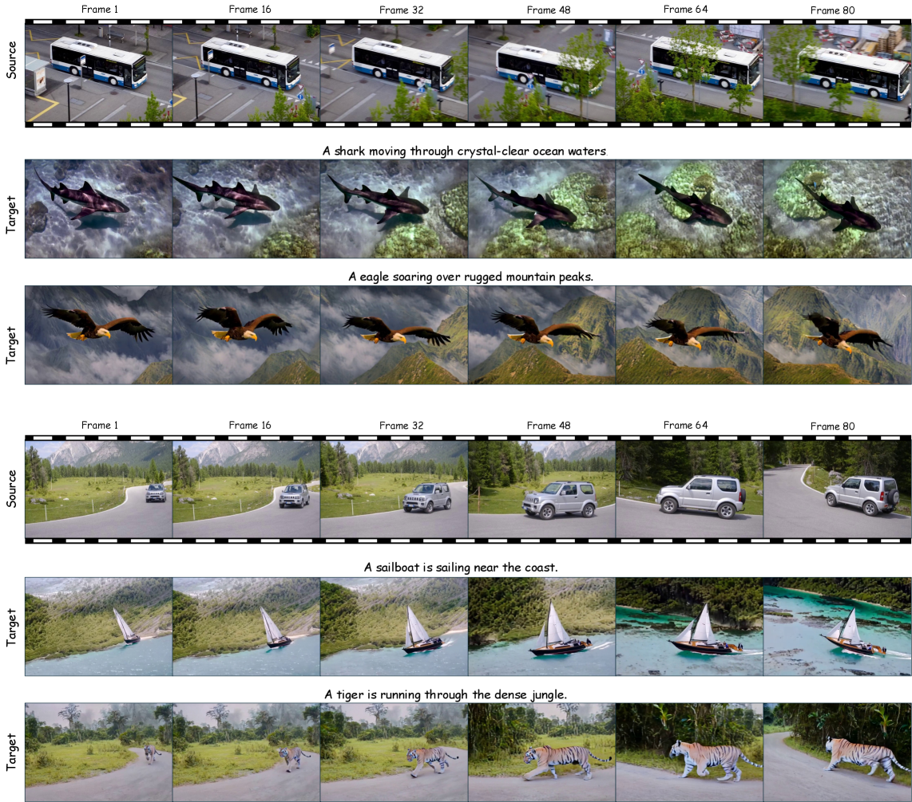
*Figure 12:Visualization for video motion transfer on longer videos.*

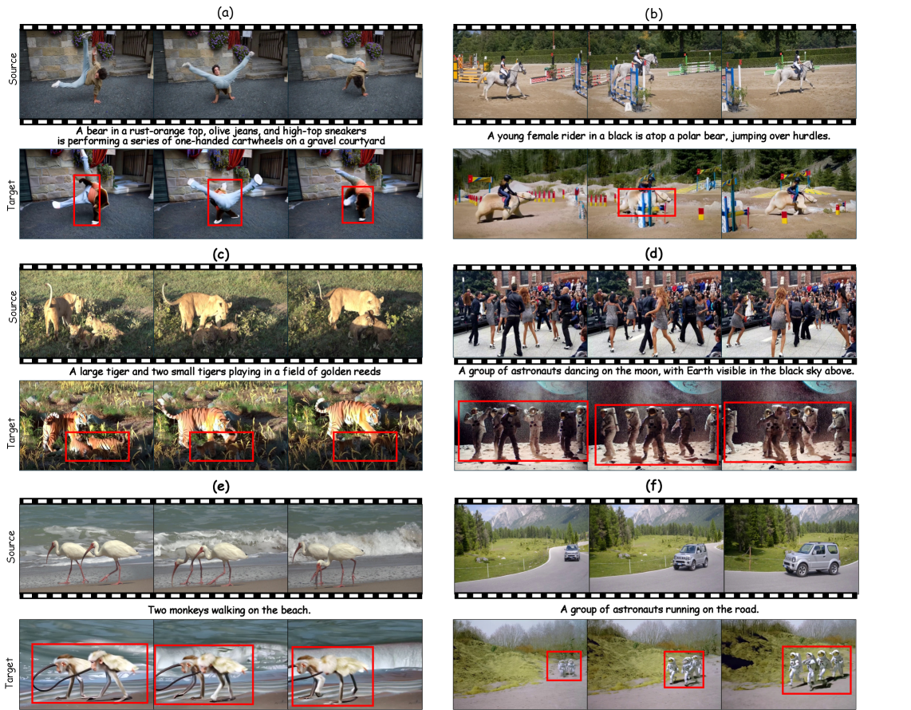
*Figure 13:Visualization for the failure cases and limitations.*

---
**Usage Info**: 7193 tokens used.
**Generated at**: 2026-03-09 12:43:30

---

# 📚 How Well Do Current Speech Deepfake Detection Methods Generalize to the Real World?

🚀 URL: https://arxiv.org/html/2603.05852

## 🌏 Abstract (원문)
Recent advances in neural speech synthesis and voice conversion enable generated audio to closely mimic human timbre, prosody, and semantic coherence, bringing both practical benefits and security risks such as identity impersonation, misinformation and large-scale manipulation of public opinion. To counter such threats, speech deepfake detection has been extensively studied and benchmarked. Standardized evaluation campaigns such as the ASVspoof series[wu15e_interspeech,wang2020asvspoof,yamagishi2021asvspoof2021acceleratingprogress,wang24_asvspoof]have driven rapid methodological progress, fostering diverse detection paradigms, including end-to-end architectures operating on spectral or waveform inputs (e.g., LCNN[lavrentyeva2019stc], RawNet2[tak2021end], AASIST[jung2022aasist]), self-supervised hybrids leveraging pretrained encoders (e.g., XLSR+AASIST[tak2022automatic], ML_SSLFG[tran2025multi]), and emerging audio large language models (e.g., ALLM4ADD[gu2025allm4add], HoliAntiSpoof[xu2026holiantispoof]). Despite strong performance on controlled benchmarks, their robustness under realistic deployment conditions remains to be further investigated.In real-world scenarios, audio distributed through social media platforms undergoes encoding, compression, transcoding, and redistribution, with platform-specific processing strategies introducing distinct artifacts. These transformations alter spectral and statistical characteristics, leading to cross-platform distribution shifts that can degrade detection performance. Therefore, evaluating models under multi-platform propagation conditions is critical to understand their practical generalization ability.Although numerous datasets have been proposed to support speech deepfake research, most are constructed in controlled settings with relatively homogeneous sources and processing pipelines. ASVspoof2019, ASVspoof5, WaveFake[frank2021wavefake], ADD[9746939,yi2023add2023secondaudio], DFADD[du2024dfadd], CodecFake[xie2025codecfake], and CD-ADD[li2024cross]expand coverage of synthesis and codec variations, while MLAAD[muller2024mlaad], SpeechFake[huang2025speechfake], and SpoofCeleb[jung2025spoofceleb]enhance linguistic and speaker diversity. Nevertheless, distortions introduced by real social media dissemination are often absent or only partially modeled. ITW[muller22_interspeech]moved evaluation closer to real-world conditions and demonstrated substantial performance degradation compared with ASVspoof2019, yet it remains monolingual (English) and limited to a single platform (YouTube), constraining broader cross-regional analysis. FSW[xie2025fakespeechwilddetecting]further extends evaluation across four Chinese platforms, representing an important step toward realistic benchmarking within a specific linguistic and regional context. However, a unified benchmark that encompasses diverse languages, regions, and platforms remains lacking, making it difficult to fully evaluate model generalization in practical environments.To address this gap, we introduce ML-ITW, a multilingual in-the-wild benchmark covering 14 languages, seven major social media platforms, and 180 public figures, totaling 28.39 hours of audio. Using a unified evaluation protocol, we assess representative end-to-end models, self-supervised hybrids, and audio large language models across ASVspoof2019-LA, ITW, and ML-ITW. Results show consistent and significant performance degradation under multilingual and multi-platform conditions, highlighting persistent generalization limitations of current detection approaches in realistic dissemination environments.Overall, the main contributions of this work are summarized as follows:We introduce ML-ITW, a multilingual in-the-wild audio deepfake benchmark spanning 14 languages, seven social media platforms, and 180 public figures, reflecting real-world dissemination and providing a challenging evaluation benchmark for cross-lingual and multi-speaker generalization.We conduct unified cross-dataset and cross-lingual evaluations of representative end-to-end, self-supervised hybrid, and audio large language models on ASVspoof2019-LA, ITW, and ML-ITW, demonstrating significant performance degradation and language-dependent variability under realistic multilingual conditions.The experimental results show that reliance on controlled benchmarks may overestimate model robustness, and emphasize the importance of diverse, real-world evaluation settings for advancing reliable and generalizable audio deepfake detection systems.
## 🌏 Abstract (번역)
신경 음성 합성 및 음성 변환의 최근 발전은 생성된 오디오가 인간의 음색, 운율 및 의미론적 일관성을 밀접하게 모방할 수 있도록 하여 신원 사칭, 허위 정보 및 대규모 여론 조작과 같은 실질적인 이점과 보안 위험을 모두 가져옵니다. 이러한 위협에 대응하기 위해 음성 딥페이크 탐지가 광범위하게 연구되고 벤치마킹되었습니다. ASVspoof 시리즈와 같은 표준화된 평가 캠페인은 스펙트럼 또는 파형 입력을 기반으로 작동하는 종단 간 아키텍처(예: LCNN, RawNet2, AASIST), 사전 학습된 인코더를 활용하는 자기 지도 하이브리드(예: XLSR+AASIST, ML_SSLFG), 그리고 새로운 오디오 대규모 언어 모델(예: ALLM4ADD, HoliAntiSpoof)을 포함한 다양한 탐지 패러다임을 육성하며 빠른 방법론적 발전을 이끌었습니다. 통제된 벤치마크에서 강력한 성능을 보였음에도 불구하고, 현실적인 배포 조건에서의 견고성은 추가 조사가 필요합니다. 실제 시나리오에서 소셜 미디어 플랫폼을 통해 배포되는 오디오는 인코딩, 압축, 트랜스코딩 및 재배포 과정을 거치며, 플랫폼별 처리 전략은 고유한 아티팩트를 도입합니다. 이러한 변환은 스펙트럼 및 통계적 특성을 변경하여 탐지 성능을 저하시킬 수 있는 플랫폼 간 분포 변화를 초래합니다. 따라서 다중 플랫폼 전파 조건에서 모델을 평가하는 것은 실제 일반화 능력을 이해하는 데 중요합니다. 음성 딥페이크 연구를 지원하기 위해 수많은 데이터셋이 제안되었지만, 대부분은 비교적 동질적인 소스와 처리 파이프라인을 가진 통제된 환경에서 구축됩니다. ASVspoof2019, ASVspoof5, WaveFake, ADD, DFADD, CodecFake 및 CD-ADD는 합성 및 코덱 변형의 범위를 확장하며, MLAAD, SpeechFake 및 SpoofCeleb는 언어 및 화자 다양성을 향상시킵니다. 그럼에도 불구하고 실제 소셜 미디어 전파로 인한 왜곡은 종종 없거나 부분적으로만 모델링됩니다. ITW는 평가를 실제 조건에 더 가깝게 이동시켰고 ASVspoof2019에 비해 상당한 성능 저하를 보였지만, 단일 언어(영어)이며 단일 플랫폼(YouTube)에 국한되어 더 넓은 지역 간 분석을 제한합니다. FSW는 네 개의 중국 플랫폼에 걸쳐 평가를 더욱 확장하여 특정 언어 및 지역적 맥락 내에서 현실적인 벤치마킹을 향한 중요한 단계를 나타냅니다. 그러나 다양한 언어, 지역 및 플랫폼을 포괄하는 통합 벤치마크는 여전히 부족하여 실제 환경에서 모델 일반화를 완전히 평가하기 어렵습니다. 이러한 격차를 해소하기 위해 우리는 14개 언어, 7개 주요 소셜 미디어 플랫폼, 180명의 공인을 포함하여 총 28.39시간의 오디오를 다루는 다국어 실제 환경 벤치마크인 ML-ITW를 소개합니다. 통합된 평가 프로토콜을 사용하여 ASVspoof2019-LA, ITW 및 ML-ITW 전반에 걸쳐 대표적인 종단 간 모델, 자기 지도 하이브리드 및 오디오 대규모 언어 모델을 평가합니다. 결과는 다국어 및 다중 플랫폼 조건에서 일관되고 상당한 성능 저하를 보여주며, 현실적인 전파 환경에서 현재 탐지 접근 방식의 지속적인 일반화 한계를 강조합니다. 전반적으로 본 연구의 주요 기여는 다음과 같이 요약됩니다: 우리는 14개 언어, 7개 소셜 미디어 플랫폼, 180명의 공인을 아우르는 다국어 실제 환경 오디오 딥페이크 벤치마크인 ML-ITW를 소개하며, 이는 실제 전파를 반영하고 교차 언어 및 다중 화자 일반화를 위한 도전적인 평가 벤치마크를 제공합니다. 우리는 ASVspoof2019-LA, ITW 및 ML-ITW에서 대표적인 종단 간, 자기 지도 하이브리드 및 오디오 대규모 언어 모델에 대한 통합된 교차 데이터셋 및 교차 언어 평가를 수행하여 현실적인 다국어 조건에서 상당한 성능 저하와 언어 의존적 가변성을 입증합니다. 실험 결과는 통제된 벤치마크에 의존하는 것이 모델 견고성을 과대평가할 수 있음을 보여주며, 신뢰할 수 있고 일반화 가능한 오디오 딥페이크 탐지 시스템 발전을 위해 다양하고 실제적인 평가 설정의 중요성을 강조합니다.

## 🔍 Methods & Results
- 기존 음성 딥페이크 탐지 벤치마크는 다중 플랫폼 전파 및 다국어 다양성과 같은 현실적인 배포 조건에서 견고성이 부족하다는 문제를 제기했습니다.
- 이러한 격차를 해소하기 위해 14개 언어, 7개 주요 소셜 미디어 플랫폼, 180명의 공인을 포함하여 총 28.39시간의 오디오로 구성된 다국어 실제 환경 벤치마크인 ML-ITW를 도입했습니다.
- ASVspoof2019-LA, ITW 및 ML-ITW 전반에 걸쳐 대표적인 종단 간 모델, 자기 지도 하이브리드 및 오디오 대규모 언어 모델을 평가하기 위해 통합된 평가 프로토콜을 사용했습니다.
- 실험 결과, 다국어 및 다중 플랫폼 조건에서 탐지 모델의 일관되고 상당한 성능 저하가 나타났습니다.
- 현재 탐지 접근 방식이 현실적인 전파 환경에서 지속적인 일반화 한계를 가지고 있음을 확인했습니다.
- 통제된 벤치마크에 의존하는 것이 모델 견고성을 과대평가할 수 있으며, 신뢰할 수 있고 일반화 가능한 오디오 딥페이크 탐지 시스템 발전을 위해 다양하고 실제적인 평가 설정의 중요성을 강조했습니다.

## 🖼 Figures
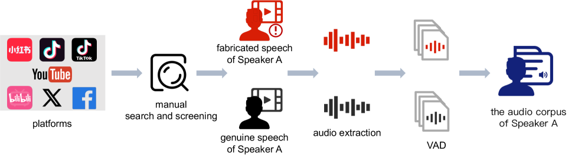
*Figure 1:Data collection pipeline for a specific speaker in the ML-ITW dataset.*

---
**Usage Info**: 5907 tokens used.
**Generated at**: 2026-03-09 12:43:49

---

# 📚 Training Flow Matching: The Role of Weighting and Parameterization

🚀 URL: https://arxiv.org/html/2603.06454

## 🌏 Abstract (원문)
Flow matching (FM;Lipmanet al.,2023; Albergo and Vanden-Eijnden,2023; Liuet al.,2023) and diffusion models(Sohl-Dicksteinet al.,2015; Hoet al.,2020; Songet al.,2021)are the state-of-the-art generative methods. Despite widespread adoption, many fundamental questions remain open, most notably regarding our understanding of why these models perform so well in practice. In this work, we seek to shed new light on some critical design choices: Which loss weightings and parameterizations should be preferred during training, and how do these choices depend on the architecture and data regime? To answer this, we unify different target predictions under acommon weighted denoising formulation. This viewpoint allows us to directly relate denoising performance, measured at different noise levels, to generative performance. We make the following contributions: For weights (Section4):We provide statistical theoretical insights into why the weights corresponding to flow-matching and signal-to-noise ratio perform robustly across a wide range of settings. To the best of our knowledge, this offersthe first principled explanation for this empirical observation. For parametrizations (Section5):Recent works show superior performance of denoiser parameterization (parametrization predicting the clean image), and motivate it by a manifold assumption. We find that while this behavior indeed holds in certain settings, velocity parameterization still remains more effective across many scenarios. In particular we show that,more than the manifold assumption on its own, the locality induced by the network architecture as well as the data regime have a critical influencewhen deciding between denoiser or velocity parametrizations.
## 🌏 Abstract (번역)
플로우 매칭(FM; Lipman et al., 2023; Albergo and Vanden-Eijnden, 2023; Liu et al., 2023)과 확산 모델(Sohl-Dickstein et al., 2015; Ho et al., 2020; Song et al., 2021)은 최첨단 생성 방법론입니다. 광범위한 채택에도 불구하고, 특히 이러한 모델이 실제로 왜 그렇게 잘 작동하는지에 대한 이해와 관련하여 많은 근본적인 질문들이 여전히 해결되지 않고 있습니다. 본 연구에서는 몇 가지 중요한 설계 선택에 대해 새로운 통찰력을 제공하고자 합니다: 훈련 중 어떤 손실 가중치와 파라미터화를 선호해야 하며, 이러한 선택이 아키텍처와 데이터 체제에 어떻게 의존하는가? 이에 답하기 위해, 우리는 다양한 목표 예측을 공통된 가중치 부여된 노이즈 제거 공식으로 통합합니다. 이 관점은 다양한 노이즈 수준에서 측정된 노이즈 제거 성능을 생성 성능과 직접적으로 연관시킬 수 있게 합니다. 우리는 다음과 같은 기여를 합니다: 가중치에 대하여 (섹션 4): 플로우 매칭 및 신호 대 잡음비에 해당하는 가중치가 광범위한 설정에서 왜 견고하게 작동하는지에 대한 통계적 이론적 통찰력을 제공합니다. 저희가 아는 한, 이는 이러한 경험적 관찰에 대한 최초의 원리적인 설명을 제공합니다. 파라미터화에 대하여 (섹션 5): 최근 연구들은 노이즈 제거기 파라미터화(깨끗한 이미지를 예측하는 파라미터화)의 우수한 성능을 보여주며, 이를 매니폴드 가정으로 설명합니다. 우리는 이러한 동작이 특정 설정에서는 실제로 유효하지만, 속도 파라미터화가 여전히 많은 시나리오에서 더 효과적임을 발견했습니다. 특히, 우리는 매니폴드 가정 자체보다 네트워크 아키텍처에 의해 유도되는 지역성(locality)과 데이터 체제가 노이즈 제거기 또는 속도 파라미터화를 결정할 때 결정적인 영향을 미친다는 것을 보여줍니다.

## 🔍 Methods & Results
- 플로우 매칭 및 신호 대 잡음비 가중치가 다양한 설정에서 견고하게 작동하는 이유에 대한 통계적 이론적 통찰력을 제공하며, 이는 해당 현상에 대한 최초의 원리적인 설명을 제시한다.
- 노이즈 제거기 파라미터화가 특정 설정에서 우수한 성능을 보이지만, 속도 파라미터화가 많은 시나리오에서 더 효과적임을 발견했다.
- 매니폴드 가정 자체보다 네트워크 아키텍처에 의해 유도되는 지역성(locality)과 데이터 체제가 노이즈 제거기 또는 속도 파라미터화 선택에 결정적인 영향을 미친다는 것을 입증했다.

## 🖼 Figures

*(a) Difference in PSNR (lower is better) between the reference 
𝑤
vel
𝑡
, and various models, computed on 1000 test images. The parametrization class is here set to 
𝒞
vel
.*

*(a) Difference in PSNR (lower is better) between the reference 
𝑤
vel
𝑡
, and various models, computed on 1000 test images. The parametrization class is here set to 
𝒞
vel
.*

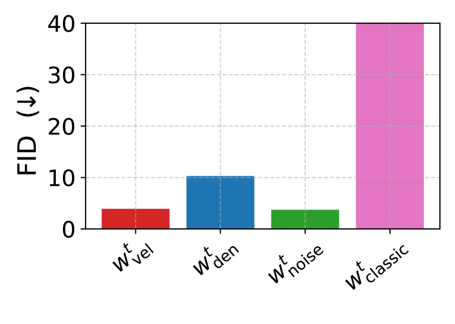
*(b)FID on 50k train images (lower is better).*

*(a) Difference in PSNR (lower is better) between the reference 
𝒞
vel
, and other parametrizations, computed on 1000 test images. The weight is set to 
𝑤
vel
𝑡
.*

*(a) Difference in PSNR (lower is better) between the reference 
𝒞
vel
, and other parametrizations, computed on 1000 test images. The weight is set to 
𝑤
vel
𝑡
.*

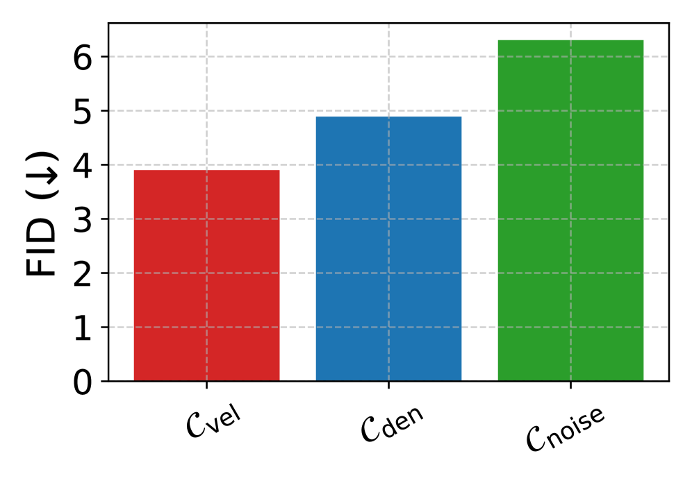
*(b)FID on 50k train images (lower is better).*

*(a)PSNR gap.*

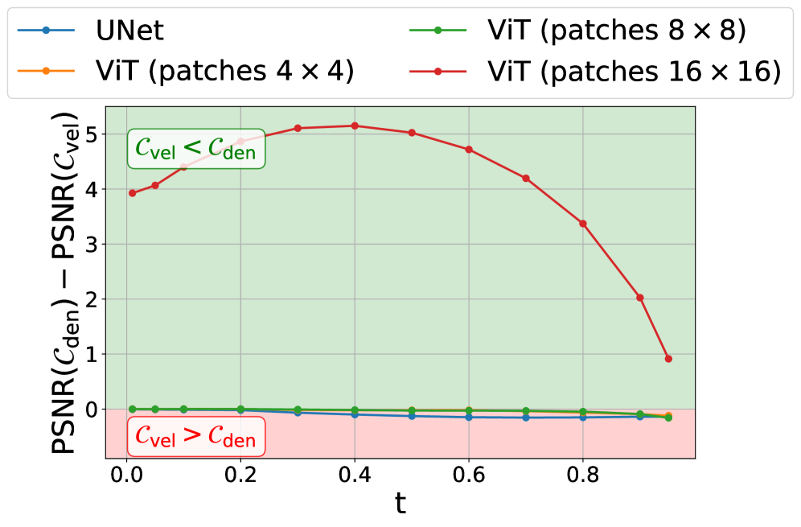
*(a)PSNR gap.*

*(a)Manifold dim 
𝑚
=
4*

*(a)Manifold dim 
𝑚
=
4*

*(b)Manifold dim 
𝑚
=
8*

*(c)Manifold dim 
𝑚
=
16*

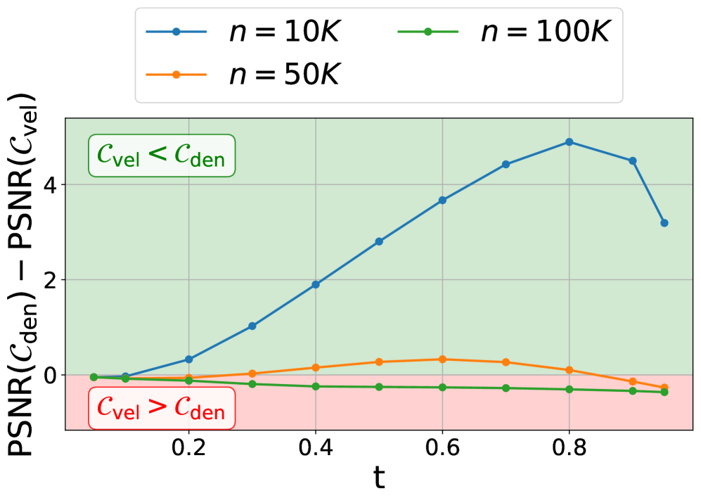
*(a)PSNR gap, test data.*

*(a)PSNR gap, test data.*

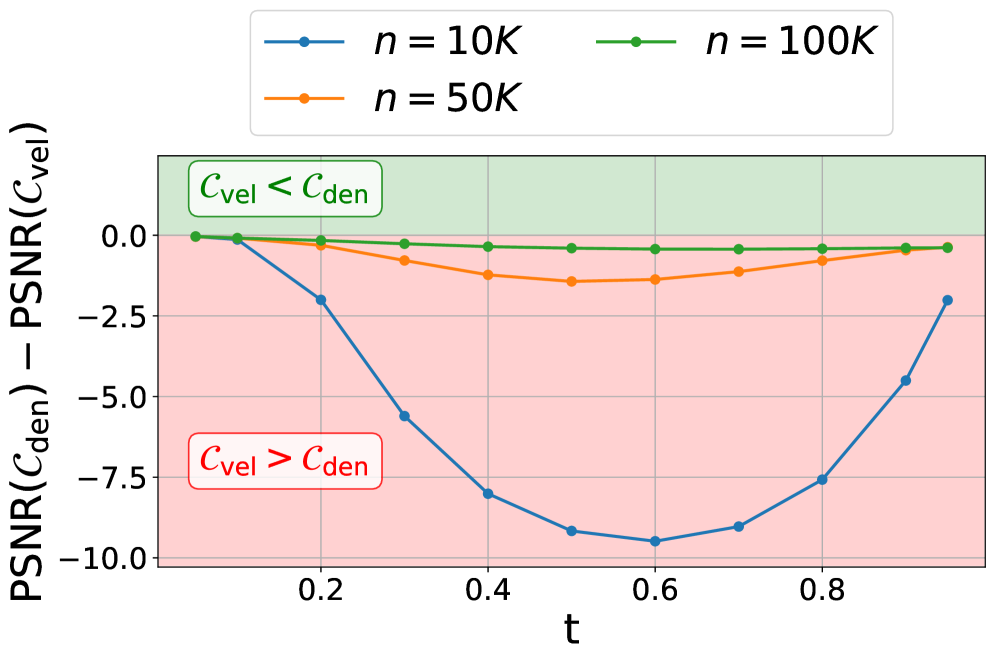
*(b)PSNR gap, train data.*

*(a) Difference in PSNR (lower is better) between the reference 
𝑤
vel
𝑡
, and various models, computed on 1000 test images. The parametrization class is here set to 
𝒞
vel
.*

*(a) Difference in PSNR (lower is better) between the reference 
𝑤
vel
𝑡
, and various models, computed on 1000 test images. The parametrization class is here set to 
𝒞
vel
.*

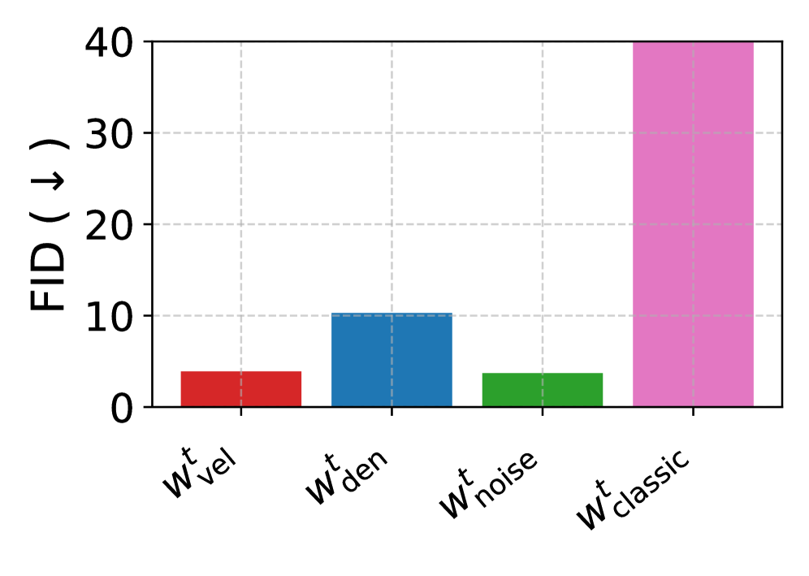
*(b)FID on 50k train images (lower is better).*

*(a) Difference in PSNR (lower is better) between the reference 
𝒞
vel
, and other parametrizations, computed on 1000 test images. The weight is set to 
𝑤
vel
𝑡
.*

*(a) Difference in PSNR (lower is better) between the reference 
𝒞
vel
, and other parametrizations, computed on 1000 test images. The weight is set to 
𝑤
vel
𝑡
.*

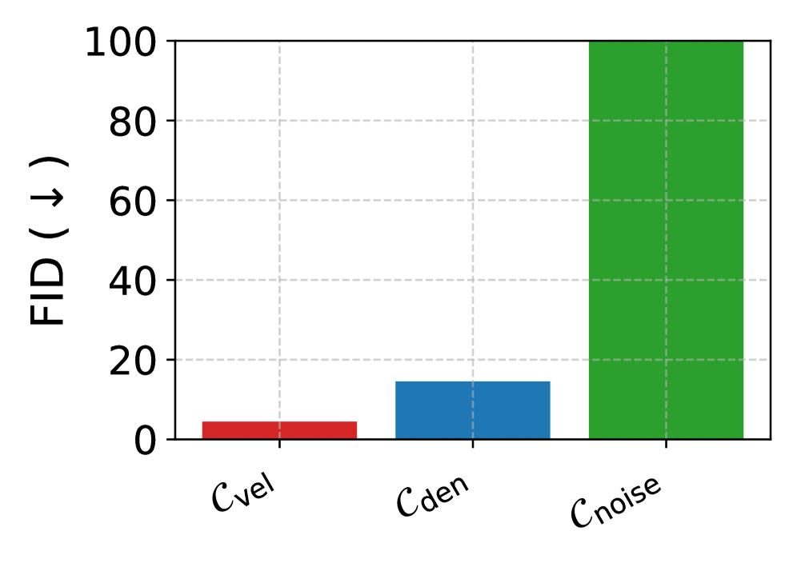
*(b)FID on 50k train images (lower is better).*

---
**Usage Info**: 3173 tokens used.
**Generated at**: 2026-03-09 12:44:04

---

