# 🚩 (2026-03-10) Scholar Inbox 추천 논문 

# 📚 Learning-free L2-Accented Speech Generation using Phonological Rules

🚀 URL: https://arxiv.org/html/2603.07550

## 🌏 Abstract (원문)
Despite the status of English as the global lingua franca, its linguistic landscape is remarkably decentralized. Current estimates indicate that non-native (L2) speakers outnumber native (L1) speakers by a ratio of three to one[1,2]. This demographic reality is mirrored by a vast spectrum of phonetic diversity, ranging from regional L1 varieties—such as American, British, and Singaporean English[3]—to L2 varieties characterized by the phonological influence and distinct phonotactic constraints of a variety of native (L1) languages[4,5].However, existing Text-to-Speech (TTS) systems have historically focused on a narrow subset of mainstream accents (e.g., North American or British English), often failing to represent the authentic speech patterns of the global majority[6,7,8,9]. This gap in development presents several challenges. Such TTS models often treat accented speech as deviation rather than as systematic variations, leading to poor synthesis quality for diverse user bases. For L2 listeners, synthetic speech that does not align with familiar phonological structures can increase processing effort and reduce overall intelligibility. To address these disparities, there is a need for accented TTS systems capable of modeling the nuanced phonetic signatures of both regional and L2 English.Accented text-to-speech (TTS) models aim to control the accent of synthesized speech. A common approach is to fine-tune a pretrained TTS model on accented datasets[10,11]. However, collecting large-scale, high-quality L2-accented speech corpora is costly and time-consuming. To circumvent this limitation,[12]propose using a large language model (LLM) to transliterate input text into the orthography of a target language, followed by synthesis with a multilingual TTS model. While this approach removes the dependency on accented datasets, it typically yields a fixed accent style and lacks fine-grained phonetic controllability.More recently,[13]demonstrate that phonological rule-based transformations can enable controllable accent strength through systematic phoneme modifications. In particular, they propose a set of US-to-UK phonological transformation rules, achieving fine-grained control at the phoneme level and effective accent manipulation between American and British English. Nevertheless, this method is limited to accent variation within the same language and has not been extended to cross-lingual accent transfer.Building on these insights, we explore a multistage pipeline grounded in multilingual TTS modeling. Many multilingual TTS systems are conditioned on both speaker embeddings and phoneme sequences[14,15,16,17]. Speaker embeddings capture language and accent characteristics[18], while phoneme sequences provide a largely speaker-agnostic pronunciation representation. This architecture enables accent transformation by modifying phoneme inputs without retraining the TTS model. Specifically, we first apply a phonological rule system to convert American English phoneme sequences into target-accent variants (e.g., Spanish-accented or Indian-accented English). The modified phoneme sequences are then synthesized using a pretrained multilingual TTS model. Leveraging a multilingual backbone allows the system to draw upon its cross-lingual prior knowledge, producing speech that reflects not only segmental pronunciation alternations but also suprasegmental characteristics such as rhythm and intonation.In summary, our contributions are as follows: 1) We propose a phonology-driven framework for generating accented speech using a pretrained multilingual TTS model, requiring no accented training data. 2) We enable fine-grained control over accent strength through selective phoneme-level transformations implemented as a lightweight preprocessing step with no additional model training. 3) We analyze rhythmic variations influenced by speakers’ native languages and experimentally validate the effectiveness of the proposed approach. Speech samples are publicly available111For review, refer to the supplementary materials. Full source code will be released upon acceptance.
## 🌏 Abstract (번역)
영어는 전 세계 공용어로서의 지위에도 불구하고, 그 언어적 지형은 놀랍도록 분산되어 있습니다. 현재 추정치에 따르면 비원어민(L2) 화자가 원어민(L1) 화자보다 3대 1의 비율로 많습니다[1,2]. 이러한 인구통계학적 현실은 미국, 영국, 싱가포르 영어와 같은 지역별 L1 변이부터 다양한 모국어(L1)의 음운론적 영향과 뚜렷한 음소 배열 제약으로 특징지어지는 L2 변이에 이르기까지 광범위한 음성적 다양성에 반영됩니다[3,4,5]. 그러나 기존의 Text-to-Speech(TTS) 시스템은 역사적으로 주류 악센트(예: 북미 또는 영국 영어)의 좁은 하위 집합에 초점을 맞춰왔으며, 종종 전 세계 대다수의 실제 음성 패턴을 제대로 표현하지 못했습니다[6,7,8,9]. 이러한 개발 격차는 여러 가지 문제를 야기합니다. 이러한 TTS 모델은 악센트 있는 음성을 체계적인 변이가 아닌 편차로 취급하여 다양한 사용자 기반에 대해 낮은 합성 품질을 초래합니다. L2 청취자의 경우, 익숙한 음운 구조와 일치하지 않는 합성 음성은 처리 노력을 증가시키고 전반적인 명료도를 감소시킬 수 있습니다. 이러한 불균형을 해결하기 위해 지역 및 L2 영어의 미묘한 음성적 특징을 모델링할 수 있는 악센트 TTS 시스템이 필요합니다. 악센트 텍스트 음성 변환(TTS) 모델은 합성된 음성의 악센트를 제어하는 것을 목표로 합니다. 일반적인 접근 방식은 사전 훈련된 TTS 모델을 악센트 데이터셋에 미세 조정하는 것입니다[10,11]. 그러나 대규모의 고품질 L2 악센트 음성 코퍼스를 수집하는 것은 비용이 많이 들고 시간이 많이 소요됩니다. 이러한 한계를 우회하기 위해 [12]는 대규모 언어 모델(LLM)을 사용하여 입력 텍스트를 대상 언어의 정서법으로 음역한 다음 다국어 TTS 모델로 합성하는 방법을 제안합니다. 이 접근 방식은 악센트 데이터셋에 대한 의존성을 제거하지만, 일반적으로 고정된 악센트 스타일을 생성하고 미세한 음성 제어 기능이 부족합니다. 최근 [13]은 음운 규칙 기반 변환이 체계적인 음소 수정을 통해 제어 가능한 악센트 강도를 가능하게 함을 보여주었습니다. 특히, 그들은 미국-영국 음운 변환 규칙 세트를 제안하여 음소 수준에서 미세한 제어를 달성하고 미국 영어와 영국 영어 간의 효과적인 악센트 조작을 가능하게 했습니다. 그럼에도 불구하고 이 방법은 동일 언어 내의 악센트 변이에 국한되며 교차 언어 악센트 전이로 확장되지 않았습니다. 이러한 통찰력을 바탕으로, 우리는 다국어 TTS 모델링에 기반한 다단계 파이프라인을 탐구합니다. 많은 다국어 TTS 시스템은 화자 임베딩과 음소 시퀀스 모두에 조건화됩니다[14,15,16,17]. 화자 임베딩은 언어 및 악센트 특성을 포착하는 반면[18], 음소 시퀀스는 대체로 화자 독립적인 발음 표현을 제공합니다. 이 아키텍처는 TTS 모델을 재훈련하지 않고도 음소 입력을 수정하여 악센트 변환을 가능하게 합니다. 구체적으로, 우리는 먼저 음운 규칙 시스템을 적용하여 미국 영어 음소 시퀀스를 대상 악센트 변형(예: 스페인어 악센트 또는 인도 악센트 영어)으로 변환합니다. 수정된 음소 시퀀스는 사전 훈련된 다국어 TTS 모델을 사용하여 합성됩니다. 다국어 백본을 활용하면 시스템이 교차 언어 사전 지식을 활용하여 분절 발음 변화뿐만 아니라 리듬 및 억양과 같은 초분절적 특성도 반영하는 음성을 생성할 수 있습니다. 요약하자면, 우리의 기여는 다음과 같습니다: 1) 악센트 훈련 데이터 없이 사전 훈련된 다국어 TTS 모델을 사용하여 악센트 음성을 생성하기 위한 음운론 기반 프레임워크를 제안합니다. 2) 추가 모델 훈련 없이 경량 전처리 단계로 구현된 선택적 음소 수준 변환을 통해 악센트 강도에 대한 미세한 제어를 가능하게 합니다. 3) 화자의 모국어에 의해 영향을 받는 리듬 변화를 분석하고 제안된 접근 방식의 효과를 실험적으로 검증합니다. 음성 샘플은 공개적으로 이용 가능합니다111검토를 위해 보충 자료를 참조하십시오. 전체 소스 코드는 승인 시 공개될 예정입니다.

## 🔍 Methods & Results
- 연구는 스페인어 악센트 영어(SP)와 인도 악센트 영어(IN) 두 가지 대상 악센트에 초점을 맞췄다.
- 음운 변환 규칙은 각 L1 시스템의 언어학적으로 문서화된 음소 배열 및 음소 특성과 미국 영어와 L1 간의 체계적인 음운론적 차이에서 도출되었다.
- 예시로, 단어 "three"의 /θri/는 스페인어 악센트에서 규칙 1(초성 자음 대체)을 적용하여 /θ/를 /s/로 매핑하여 [sri]로 실현된다.
- 기존의 다국어 TTS 모델을 활용하며, 이 모델은 화자 임베딩과 음소 시퀀스를 입력으로 받는다.
- 화자 임베딩은 화자 정체성, 언어 및 악센트 특성을 포착하며, 이를 활용하여 대상 L1(예: 스페인어 또는 인도어)에 해당하는 화자 임베딩으로 TTS 모델을 조건화한다.
- 음소 시퀀스는 악센트별 음운 규칙에 의해 수정된 영어 콘텐츠를 나타내며, 미국 영어 음소를 대상 악센트 음소로 변환한다.
- 대상 언어 화자 임베딩과 체계적으로 변환된 영어 음소를 결합하여 원하는 L1 악센트 특성을 나타내는 영어 음성을 생성한다.
- L2 악센트 음성에 대한 교차 언어 리듬 차이의 영향을 조사했으며, L1 운율 시스템의 영향을 고려하여 리듬 또는 타이밍 전이 효과를 분석했다.
- 리듬 전이의 영향을 조사하기 위해 TTS 시스템에서 지속 시간 모델링을 조작했다.
- 악센트별 지속 시간 패턴이 유지되는 조건과 지속 시간이 미국 영어 타이밍에 강제 정렬되는 조건을 비교하여 리듬 차이가 인지된 악센트 특성에 미치는 기여를 분석했다.

## 🖼 Figures
![Figure 1:Synthesis Pipeline. We follow the synthesis and evaluation pipeline described in [13]. The key difference is that we condition the TTS model on a speaker embedding from the target language. In addition, we explicitly control whether duration alignment is applied between the American (US) phoneme sequence and the transformed target-accent phoneme sequence.](../images/2026-03-10/2603.07550/2603.07550_fig0.png)
*Figure 1:Synthesis Pipeline. We follow the synthesis and evaluation pipeline described in [13]. The key difference is that we condition the TTS model on a speaker embedding from the target language. In addition, we explicitly control whether duration alignment is applied between the American (US) phoneme sequence and the transformed target-accent phoneme sequence.*

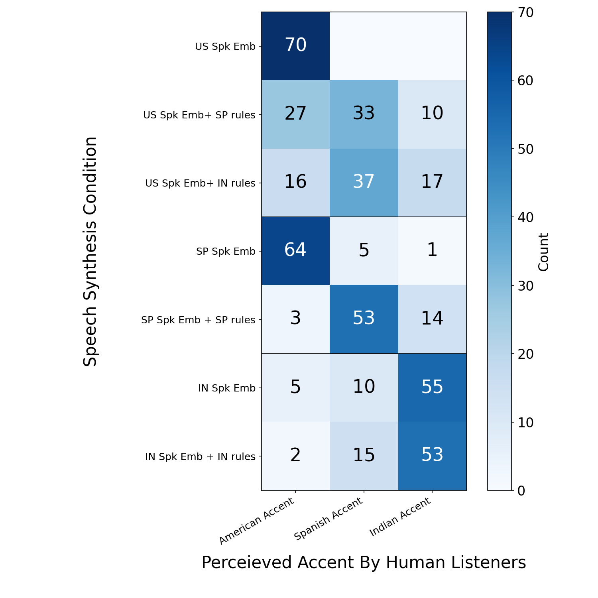
*Figure 2:Human accent confusion matrix. Rows denote synthesis conditions (speaker embeddings with and without phonological rules), and columns represent listener-labeled accents.*

---
**Usage Info**: 6299 tokens used.
**Generated at**: 2026-03-10 12:40:58

---

# 📚 Scalable Neural Vocoder from Range-Null Space Decomposition

🚀 URL: https://arxiv.org/html/2603.08574

## 🌏 Abstract (원문)
Vocoders are designed to reconstruct audible time-domain audio waveforms using electronic and computational methods.As a well-established technique in the signal processing community,vocoders play a crucial role in various audio generation and processing tasks,e.g., text-to-speech (TTS)[101,86,82,81,97], text-to-audio (TTA)[37,52,16], singing voice synthesis (SVS)[55,23], and speech enhancement[53,112,94]).Conventional digital signal processing (DSP)-based vocoders, exemplified by STRAIGHT[32]and WORLD[66], typically involve procedures for estimating various acoustic parameters (e.g., fundamental frequency and vocal tract resonance) to control the vocoding process via manually-designed algorithms. Despite their effectiveness, they often suffer from substantial information loss in spectral details, leading to unsatisfactory synthesis quality.With the rapid development of deep neural networks (DNNs), particularly generative models[5,50,13,49], neural vocoders have advanced rapidly.Compared with traditional DSP-based methods, neural vocoders exhibit superior performance in generation naturalness and quality, which constitutes the focus in this paper.
When evaluating neural vocoders, reconstruction quality and processing efficiency are two key factors for practical applications. In the initial stage, autoregressive-based vocoders, such as WaveNet[9]and WaveRNN[29], have been proposed and effectively utilized in neural vocoders. Although achieving significant breakthrough in synthesized speech quality compared to traditional ones, they often encounter considerably slow inference speed owing to the autoregressive generation nature at the sample level. To mitigate the deficiency, several other schemes have been subsequently introduced, including knowledge-distillation-based methods[69,71], flow-based methods[72,74], glottis-based methods[98,28]. Although improved inference speed is attained, the computational complexity is still relatively high, significantly impeding deployment in practical scenarios. Besides, diffusion-based methods[35,6,40]are also proposed in recent years for improved performance. Recently, generative adversarial network (GAN)-based vocoders have garnered increasing attention due to their non-autoregressive structure and high-fidelity generation quality[11,39,34,30]. In these vocoders, high inference speeds are achieved through paralleled convolution layers, and high quality is ensured by the adversarial training paradigm. By doing so, GAN-based vocoders can achieve a favorable trade-off between inference speed and generation quality.
In the early GAN literature, generators typically estimate raw target waveforms by stacking residual blocks interleaved with upsampling layers. However, multiple consecutive upsampling operations along the time-axis are required to reach the target temporal length, which can slow down inference.In contrast to end-to-end (E2E) waveform generation, the Fourier transform is regarded as an effective representation tool for audio generation, as many informative acoustic features are well represented in the time-frequency (T-F) domain, such as the fundamental frequency F0[31]. In[30], an early-exit mechanism is utilized to expedite generation, where the low T-F resolution spectral magnitude and phase are estimated in the intermediate layer of HiFiGAN. In[88,2], stacked ConvNext blocks[58]are used to serve as the backbone to directly model the target complex spectrogram in a frame-wise manner. Since no upsampling operation is involved, it exhibits a remarkable inference advantage as well as competitive performance compared to prevailing time-domain methods.
Despite the success of existing neural vocoders, several inherent challenges remain, impeding further improvements:
(1) Black-box-style target modeling may lead to the distortion of acoustic features within the original feature space.As shown in Fig.1(a), previous works[88,2]use mel-spectrograms as input acoustic features and employ a NN-based backbone as a black box to map mel-spectrograms to target spectrograms/waveforms. Due to the high nonlinearity of neural networks, acoustic features embedded in target signals tend to be distorted during this mapping process, and thus degrading reconstruction quality.
(2) Existing approaches lack scalability to multiple inference configurations. Given a specific training configuration,e.g.,number of mel-bands and maximum frequency for mel-filter coefficient calculation, retraining is often required when a different set of mel configurations is used for inference. This is highly labor-intensive and energy-consuming as the model must be trained separately for each mel configuration. For instance, in the open-source project of BigVGAN, several pretrained model checkpoints are provided for different configurations111https://github.com/NVIDIA/BigVGAN..Nevertheless, only a limited number of configurations are supported, forcing researchers to retrain models for unsupported configurations. Thus, it is imperative to develop a flexible neural vocoder that supports multiple inference configurations after a single training.
(3) Existing T-F domain-based vocoder methods lag behind mainstream time-domain methods. While BigVGAN achieves remarkable performance by scaling the trainable parameters to 112 M[41], existing T-F domain methods do not exhibit notable performance superiority. We attribute the main reason to under-utilization of spectral information. Specifically, the short-time Fourier transform (STFT) operation explicitly decouples information across different frequency bands, although not perfectly, it is essential to model each sub-band distribution separately, which has been widely validated in front-end speech tasks[109,64,46]. However, existing T-F domain neural vocoders typically incorporate full-band modules (e.g.,ResNet[19]and ConvNext blocks) for spectrum reconstruction,leading to suboptimal generation quality. Besides, as phase spectrum exhibits a periodic structure and causes the wrapping around the principal value range(−π,+π](-\pi,+\pi], it remains a challenging issue on how to estimate the phase more effectively[73,15,102].
This work aims to resolve the above-mentioned challenges by developing an effective and efficient scalable neural vocoder in the T-F domain. Our contributions are three-fold:
❑ (1)We introduce the range-null decomposition (RND) theory to neural vocoders. Since the mel-spectrogram is a linear degradation of the linear-scale spectrogram via mel-filtering222Strictly speaking, mel-spectrograms are derived via linear mel-filtering of spectral magnitudes, with phase components discarded., we leverage the RND theory[100]to decompose the target spectrogram reconstruction process into two orthogonal subspaces: range-space modeling (RSM) and null-space modeling (NSM), as illustrated in Fig.1(b). RSM converts the mel-spectrogram to the target linear-scale domain via the pseudo-inverse of the linear degradation operation, while
NSM acts as a generator to further “infill” remaining spectral details.Unlike previous black-box neural vocoders, our approach comprehensively exploits linear degradation priors to model dual orthogonal signal subspaces, facilitating a more interpretable generation process. To the best of our knowledge, we are the first to introduce RND theory into neural vocoder.
❑ (2) We propose a simple yet effective multiple-condition-as-data-augmentation (MCDA) strategy to enable scalable inference under varying mel conditions.Differences across mel configurations stem from variations in mel filters. The RND theory allows projecting diverse mel-spectrograms into a common linear-scale domain via a simple pseudo-inverse matrix operation. This converts the inference-stage multi-condition adaptation issue into a simple augmentation tactic in the training stage. During training, we randomly sample different mel-configurations as data augmentation, and the model can effectively adapt to various mel conditions during inference. To the best of our knowledge, we are the first to support multi-condition mel-spectrogram inference within a single model333While some works[92,91]claim universal capability, none of them can handle scenarios where mel configurations change,e.g., number of mel bands andfmaxf_{\text{max}}..
❑ (3) We propose a novel sub-band-based network structure for effective spectrum reconstruction. Inspired by recent advances in music separation[64]and speech restoration[46,105,110], we develop a dual-path T-F domain framework dubbed RNDVoC for spectrum reconstruction.Leveraging prior knowledge of spectral distribution, we incorporate band-split and merge strategies to hierarchically model sub-bands, thereby reducing computational complexity.Meanwhile, interleaved cross-band and narrow-band modules are employed to excavate inter- and intra-band correlations. Moreover, a novel omnidirectional phase loss that models relations between the center T-F bin and several adjacent bins, is proposed to further improve reconstruction quality.
Extensive experiments on the LJSpeech and LibriTTS benchmarks demonstrate the state-of-the-art (SoTA) performance of our method in both quantitative and qualitative comparisons. Concretely, our method outperforms BigVGAN-112 M version with only 2.8% of its parameters and 8.17% of its computational complexity, and achieves comparable performance over PeriodWave[42], a most recently proposed flow-matching (FM)-based method with over 99% reduction in computational cost, demonstrating the superiority of the proposed framework. Fig.2showcases a comparison in terms of PESQ score among different methods as an example.
Our previous work was published at IJCAI 2025[44], and this paper extends it with significant advancements. First, we propose a simple yet effective multiple-condition-as-data-augmentation (MCDA) strategy to support scalable inference with a single model. Second, we investigate the band-scaling characteristics in the vocoder task. Besides, we provide more detailed experimental evaluations, including ablation studies and comparisons with diffusion methods, to further validate the effectiveness of the proposed approach. The remainder of this paper is organized as follows. Sec.IIreviews related work. Sec.IIIpresents the proposed method. In Sec.IV, datasets and experimental setups are described. Extensive results and analysis are reported in Sec.V. In Sec.VI, we summarize this paper, and draw some valuable conclusions.
## 🌏 Abstract (번역)
보코더는 전자 및 계산 방법을 사용하여 가청 시간 도메인 오디오 파형을 재구성하도록 설계되었습니다. 신호 처리 분야에서 잘 확립된 기술로서 보코더는 텍스트 음성 변환(TTS)[101,86,82,81,97], 텍스트 오디오 변환(TTA)[37,52,16], 노래 음성 합성(SVS)[55,23], 음성 향상[53,112,94] 등 다양한 오디오 생성 및 처리 작업에서 중요한 역할을 합니다. STRAIGHT[32] 및 WORLD[66]로 대표되는 기존의 디지털 신호 처리(DSP) 기반 보코더는 일반적으로 수동으로 설계된 알고리즘을 통해 보코딩 프로세스를 제어하기 위해 다양한 음향 매개변수(예: 기본 주파수 및 성도 공명)를 추정하는 절차를 포함합니다. 이러한 보코더는 효과적임에도 불구하고 스펙트럼 세부 정보에서 상당한 정보 손실을 겪어 만족스럽지 못한 합성 품질을 초래하는 경우가 많습니다. 딥 신경망(DNN), 특히 생성 모델[5,50,13,49]의 급속한 발전과 함께 신경 보코더는 빠르게 발전했습니다. 기존 DSP 기반 방법과 비교하여 신경 보코더는 생성 자연스러움과 품질에서 우수한 성능을 보여주며, 이는 본 논문의 초점입니다.
신경 보코더를 평가할 때 재구성 품질과 처리 효율성은 실제 적용을 위한 두 가지 핵심 요소입니다. 초기 단계에서는 WaveNet[9] 및 WaveRNN[29]과 같은 자기회귀 기반 보코더가 제안되어 신경 보코더에 효과적으로 활용되었습니다. 기존 보코더에 비해 합성 음성 품질에서 상당한 돌파구를 달성했지만, 샘플 수준의 자기회귀 생성 특성으로 인해 추론 속도가 상당히 느려지는 경우가 많습니다. 이러한 단점을 완화하기 위해 지식 증류 기반 방법[69,71], 플로우 기반 방법[72,74], 성문 기반 방법[98,28]을 포함한 여러 다른 방식이 도입되었습니다. 추론 속도가 향상되었지만 계산 복잡성은 여전히 상대적으로 높아 실제 시나리오에서의 배포를 크게 방해합니다. 또한 확산 기반 방법[35,6,40]도 최근 몇 년 동안 성능 향상을 위해 제안되었습니다. 최근에는 비자기회귀 구조와 고충실도 생성 품질[11,39,34,30]로 인해 GAN(Generative Adversarial Network) 기반 보코더가 점점 더 많은 주목을 받고 있습니다. 이러한 보코더에서는 병렬 컨볼루션 레이어를 통해 높은 추론 속도를 달성하고 적대적 훈련 패러다임을 통해 높은 품질을 보장합니다. 이를 통해 GAN 기반 보코더는 추론 속도와 생성 품질 사이에서 유리한 균형을 이룰 수 있습니다.
초기 GAN 문헌에서 생성기는 일반적으로 업샘플링 레이어와 교차된 잔여 블록을 쌓아 원시 대상 파형을 추정합니다. 그러나 대상 시간 길이에 도달하려면 시간 축을 따라 여러 연속적인 업샘플링 작업이 필요하며, 이는 추론 속도를 늦출 수 있습니다. 종단 간(E2E) 파형 생성과 달리 푸리에 변환은 F0[31]과 같은 많은 유익한 음향 특징이 시간-주파수(T-F) 도메인에서 잘 표현되기 때문에 오디오 생성에 효과적인 표현 도구로 간주됩니다. [30]에서는 HiFiGAN의 중간 레이어에서 낮은 T-F 해상도 스펙트럼 크기 및 위상이 추정되는 조기 종료 메커니즘을 사용하여 생성을 가속화합니다. [88,2]에서는 스택된 ConvNext 블록[58]을 백본으로 사용하여 프레임 단위로 대상 복소 스펙트로그램을 직접 모델링합니다. 업샘플링 작업이 포함되지 않으므로 기존 시간 도메인 방법과 비교하여 놀라운 추론 이점과 경쟁력 있는 성능을 보여줍니다.
기존 신경 보코더의 성공에도 불구하고 다음과 같은 몇 가지 고유한 과제가 남아 있어 추가 개선을 방해합니다:
(1) 블랙박스 스타일의 대상 모델링은 원래 특징 공간 내에서 음향 특징의 왜곡을 초래할 수 있습니다. 그림 1(a)에 표시된 바와 같이, 이전 연구[88,2]는 멜 스펙트로그램을 입력 음향 특징으로 사용하고 NN 기반 백본을 블랙박스로 사용하여 멜 스펙트로그램을 대상 스펙트로그램/파형에 매핑합니다. 신경망의 높은 비선형성으로 인해 대상 신호에 내장된 음향 특징은 이 매핑 프로세스 중에 왜곡되는 경향이 있어 재구성 품질을 저하시킵니다.
(2) 기존 접근 방식은 여러 추론 구성에 대한 확장성이 부족합니다. 특정 훈련 구성(예: 멜 밴드 수 및 멜 필터 계수 계산을 위한 최대 주파수)이 주어지면 다른 멜 구성 세트가 추론에 사용될 때 재훈련이 종종 필요합니다. 이는 모델이 각 멜 구성에 대해 별도로 훈련되어야 하므로 매우 노동 집약적이고 에너지 소모적입니다. 예를 들어, BigVGAN의 오픈 소스 프로젝트에서는 다양한 구성111https://github.com/NVIDIA/BigVGAN.을 위해 여러 사전 훈련된 모델 체크포인트가 제공됩니다. 그럼에도 불구하고 제한된 수의 구성만 지원되므로 연구자들은 지원되지 않는 구성에 대해 모델을 재훈련해야 합니다. 따라서 단일 훈련 후 여러 추론 구성을 지원하는 유연한 신경 보코더를 개발하는 것이 필수적입니다.
(3) 기존 T-F 도메인 기반 보코더 방법은 주류 시간 도메인 방법에 뒤처져 있습니다. BigVGAN이 훈련 가능한 매개변수를 112M[41]으로 확장하여 놀라운 성능을 달성했지만, 기존 T-F 도메인 방법은 눈에 띄는 성능 우위를 보이지 않습니다. 우리는 주요 원인을 스펙트럼 정보의 활용 부족으로 돌립니다. 특히, 단시간 푸리에 변환(STFT) 작업은 다른 주파수 대역에 걸쳐 정보를 명시적으로 분리하지만, 완벽하지는 않더라도 각 서브밴드 분포를 별도로 모델링하는 것이 필수적이며, 이는 프런트엔드 음성 작업[109,64,46]에서 널리 검증되었습니다. 그러나 기존 T-F 도메인 신경 보코더는 일반적으로 스펙트럼 재구성을 위해 풀밴드 모듈(예: ResNet[19] 및 ConvNext 블록)을 통합하여 최적 이하의 생성 품질을 초래합니다. 또한 위상 스펙트럼은 주기적인 구조를 나타내고 주 값 범위(−π,+π] 주위에서 래핑을 유발하므로 위상을 보다 효과적으로 추정하는 방법[73,15,102]에 대한 어려운 문제가 남아 있습니다.
본 연구는 T-F 도메인에서 효과적이고 효율적인 확장 가능한 신경 보코더를 개발하여 위에서 언급한 과제를 해결하는 것을 목표로 합니다. 우리의 기여는 세 가지입니다:
❑ (1) 우리는 신경 보코더에 범위-널 분해(RND) 이론을 도입합니다. 멜 스펙트로그램은 멜 필터링을 통한 선형 스케일 스펙트로그램의 선형 저하222엄밀히 말하면, 멜 스펙트로그램은 위상 구성 요소를 버리고 스펙트럼 크기의 선형 멜 필터링을 통해 파생됩니다.이므로, 우리는 RND 이론[100]을 활용하여 대상 스펙트로그램 재구성 프로세스를 두 개의 직교 부분 공간으로 분해합니다: 그림 1(b)에 표시된 범위 공간 모델링(RSM)과 널 공간 모델링(NSM). RSM은 선형 저하 연산의 유사 역행렬을 통해 멜 스펙트로그램을 대상 선형 스케일 도메인으로 변환하는 반면,
NSM은 나머지 스펙트럼 세부 정보를 추가로 '채우는' 생성기 역할을 합니다. 이전의 블랙박스 신경 보코더와 달리, 우리의 접근 방식은 선형 저하 사전 지식을 포괄적으로 활용하여 이중 직교 신호 부분 공간을 모델링하여 보다 해석 가능한 생성 프로세스를 용이하게 합니다. 우리가 아는 한, 우리는 신경 보코더에 RND 이론을 도입한 최초의 연구입니다.
❑ (2) 우리는 다양한 멜 조건에서 확장 가능한 추론을 가능하게 하는 간단하면서도 효과적인 다중 조건 데이터 증강(MCDA) 전략을 제안합니다. 멜 구성 간의 차이는 멜 필터의 변화에서 비롯됩니다. RND 이론은 간단한 유사 역행렬 연산을 통해 다양한 멜 스펙트로그램을 공통 선형 스케일 도메인으로 투영할 수 있도록 합니다. 이는 추론 단계의 다중 조건 적응 문제를 훈련 단계의 간단한 증강 전술로 변환합니다. 훈련 중에 우리는 데이터 증강으로 다른 멜 구성을 무작위로 샘플링하며, 모델은 추론 중에 다양한 멜 조건에 효과적으로 적응할 수 있습니다. 우리가 아는 한, 우리는 단일 모델 내에서 다중 조건 멜 스펙트로그램 추론을 지원하는 최초의 연구입니다333일부 연구[92,91]는 보편적인 기능을 주장하지만, 멜 밴드 수 및 fmax와 같은 멜 구성이 변경되는 시나리오를 처리할 수 있는 것은 없습니다..
❑ (3) 우리는 효과적인 스펙트럼 재구성을 위한 새로운 서브밴드 기반 네트워크 구조를 제안합니다. 음악 분리[64] 및 음성 복원[46,105,110]의 최근 발전에 영감을 받아, 스펙트럼 재구성을 위한 RNDVoC라는 이중 경로 T-F 도메인 프레임워크를 개발합니다. 스펙트럼 분포에 대한 사전 지식을 활용하여, 우리는 서브밴드를 계층적으로 모델링하기 위해 밴드 분할 및 병합 전략을 통합하여 계산 복잡성을 줄입니다. 동시에, 교차 밴드 및 협대역 모듈을 교차 사용하여 대역 간 및 대역 내 상관 관계를 발굴합니다. 또한, 중앙 T-F 빈과 여러 인접 빈 간의 관계를 모델링하는 새로운 전방향 위상 손실이 재구성 품질을 더욱 향상시키기 위해 제안됩니다.
LJSpeech 및 LibriTTS 벤치마크에 대한 광범위한 실험은 정량적 및 정성적 비교 모두에서 우리 방법의 최첨단(SoTA) 성능을 입증합니다. 구체적으로, 우리 방법은 BigVGAN-112M 버전보다 매개변수의 2.8%와 계산 복잡성의 8.17%만을 사용하여 더 나은 성능을 보이며, 가장 최근에 제안된 플로우 매칭(FM) 기반 방법인 PeriodWave[42]와 비교하여 계산 비용을 99% 이상 절감하면서도 유사한 성능을 달성하여 제안된 프레임워크의 우수성을 입증합니다. 그림 2는 예시로 다양한 방법 간의 PESQ 점수 비교를 보여줍니다.
우리의 이전 연구는 IJCAI 2025[44]에 발표되었으며, 본 논문은 상당한 발전을 통해 이를 확장합니다. 첫째, 단일 모델로 확장 가능한 추론을 지원하기 위한 간단하면서도 효과적인 다중 조건 데이터 증강(MCDA) 전략을 제안합니다. 둘째, 보코더 작업에서 밴드 스케일링 특성을 조사합니다. 또한, 제안된 접근 방식의 효과를 더욱 검증하기 위해 제거 연구 및 확산 방법과의 비교를 포함한 더 자세한 실험 평가를 제공합니다. 본 논문의 나머지 부분은 다음과 같이 구성됩니다. 2장에서는 관련 연구를 검토합니다. 3장에서는 제안된 방법을 제시합니다. 4장에서는 데이터셋 및 실험 설정을 설명합니다. 5장에서는 광범위한 결과 및 분석을 보고합니다. 6장에서는 본 논문을 요약하고 몇 가지 가치 있는 결론을 도출합니다.

## 🔍 Methods & Results
- RND(Range-Null Decomposition) 이론을 신경 보코더에 도입하여 멜 스펙트로그램 재구성 과정을 범위 공간 모델링(RSM)과 널 공간 모델링(NSM)의 두 직교 부분 공간으로 분해했습니다. RSM은 멜 스펙트로그램을 선형 저하 연산의 유사 역행렬을 통해 선형 스케일 도메인으로 변환하고, NSM은 나머지 스펙트럼 세부 정보를 채우는 생성기 역할을 합니다.
- 다양한 멜 조건에서 확장 가능한 추론을 가능하게 하는 MCDA(Multiple-Condition-as-Data-Augmentation) 전략을 제안했습니다. 훈련 중 무작위로 다른 멜 구성을 데이터 증강으로 샘플링하여, 단일 모델이 추론 시 다양한 멜 조건에 효과적으로 적응할 수 있도록 합니다.
- 효과적인 스펙트럼 재구성을 위해 RNDVoC라는 새로운 서브밴드 기반 네트워크 구조를 개발했습니다. 이중 경로 T-F 도메인 프레임워크는 계층적 서브밴드 모델링을 위한 밴드 분할 및 병합 전략, 대역 간 및 대역 내 상관 관계를 발굴하는 교차 밴드 및 협대역 모듈을 포함합니다.
- 새로운 전방향 위상 손실(omnidirectional phase loss)을 제안했습니다. 이는 3x3 컨볼루션 커널을 사용하여 중앙 T-F 빈과 인접한 8개 빈 간의 미분 관계를 효율적으로 모델링하여 위상 재구성 품질을 향상시킵니다.
- LJSpeech 및 LibriTTS 벤치마크에 대한 광범위한 실험을 통해 제안된 방법이 최첨단(SoTA) 성능을 달성함을 입증했습니다. 특히, BigVGAN-112M 버전보다 매개변수의 2.8%와 계산 복잡성의 8.17%만을 사용하여 더 나은 성능을 보였으며, PeriodWave와 비교하여 계산 비용을 99% 이상 절감하면서도 유사한 성능을 달성했습니다.

## 🖼 Figures
![Figure 1:Illustrations of the previous and the proposed neural vocoder generation pipelines with range-null decomposition (RND) theory. (a) In previous T-F domain neural vocoders, the mapping relation from mel-spectrogram to the target spectrogram/waveform was designed in a black-box manner. (b) We exploit the linear degradation prior to develop a more transparent generation pipeline, where the range-space module is to transform the acoustic feature in the original mel-scale domain into the target linear-scale domain, and the null-space module is responsible for generating fine-grained spectral details.](../images/2026-03-10/2603.08574/2603.08574_fig0.png)
*Figure 1:Illustrations of the previous and the proposed neural vocoder generation pipelines with range-null decomposition (RND) theory. (a) In previous T-F domain neural vocoders, the mapping relation from mel-spectrogram to the target spectrogram/waveform was designed in a black-box manner. (b) We exploit the linear degradation prior to develop a more transparent generation pipeline, where the range-space module is to transform the acoustic feature in the original mel-scale domain into the target linear-scale domain, and the null-space module is responsible for generating fine-grained spectral details.*

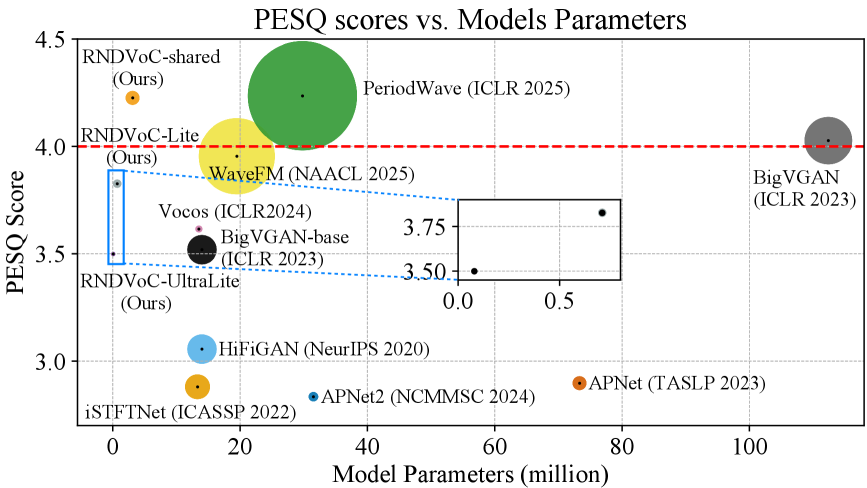
*Figure 2:Comparison of model parameters and PESQ scores between the proposed RNDVoC and other mainstream vocoders on the LibriTTS benchmark. Larger bubbles indicate higher computational complexity. All generators are updated for 1M steps.*

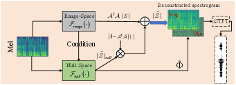
*Figure 3:Illustrations of the proposed RNDVoC.*

![Figure 4:Framework diagram of the proposed RNDVoC, where the range-space module only involves the pseudo-inverse matrix operation and its output will serve as the input of the null-space module. (a) Main framework diagram of the null-space module. (b) Detailed structure of the band-aware spectral encoding module (BAEM). (c) Detailed structure of the band-aware spectral magnitude/phase module (BAMM/BAPM), which shares a similar network structure. (d) Detailed structure of the dual-path block (DPB). Note that the nonshared scheme is adopted in (b)-(c).](../images/2026-03-10/2603.08574/2603.08574_fig3.png)
*Figure 4:Framework diagram of the proposed RNDVoC, where the range-space module only involves the pseudo-inverse matrix operation and its output will serve as the input of the null-space module. (a) Main framework diagram of the null-space module. (b) Detailed structure of the band-aware spectral encoding module (BAEM). (c) Detailed structure of the band-aware spectral magnitude/phase module (BAMM/BAPM), which shares a similar network structure. (d) Detailed structure of the dual-path block (DPB). Note that the nonshared scheme is adopted in (b)-(c).*

*Figure 5:Illustrations of the spectral encoding and decoding module with the proposed parameter-shared strategy, and here the number of regions 
𝐼
 is set to 3 as an example. (a) Spectral encoding process. (b) Spectral decoding process, we only take one branch (magnitude or phase) as an example.*

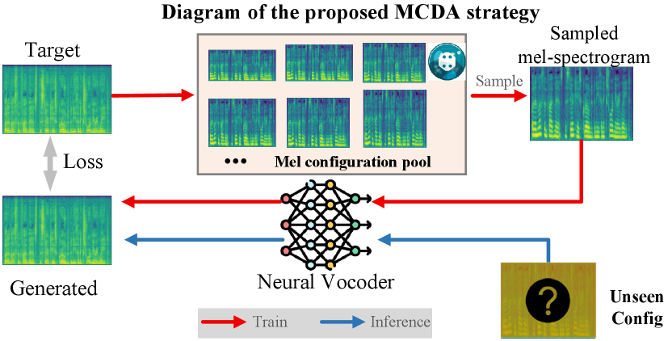
*Figure 6:Illustration of the proposed MCDA strategy.*

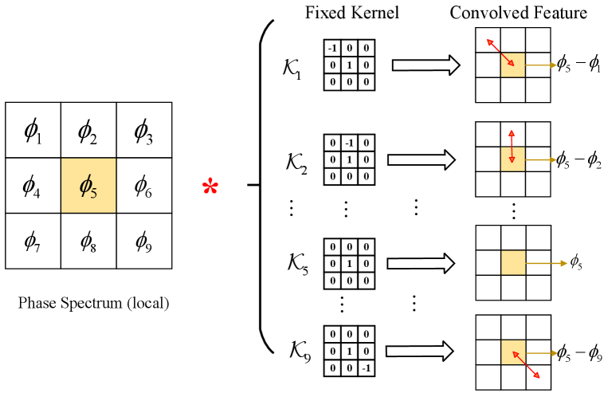
*Figure 7:Illustration of the proposed omnidirectional phase loss.*

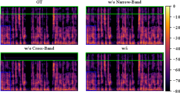
*Figure 8:A typical spectral visualization where either narrow-band or cross-band module is removed. Within each figure, the x- and y-coordinates represent time and frequency, respectively.*

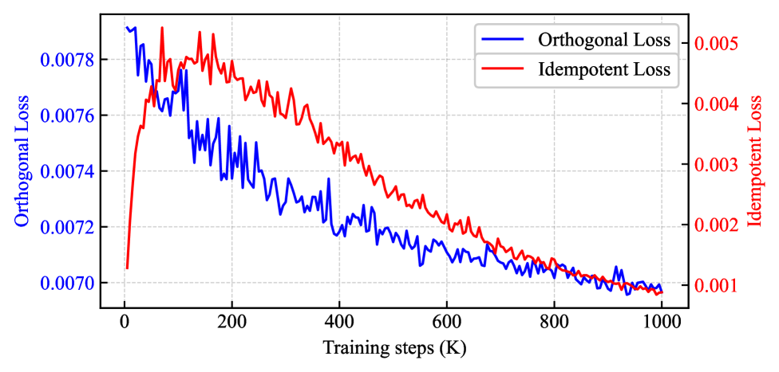
*Figure 9:Loss curves of the null-constraint loss and idempotent loss.*

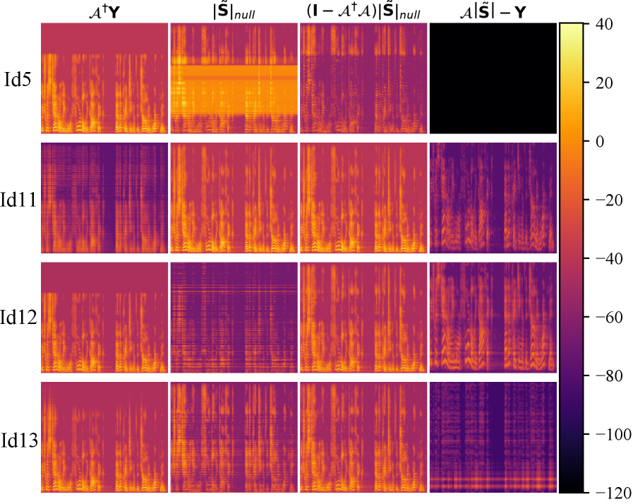
*Figure 10:Spectral visualization of the range-space, null-space and the reconstruction error between the estimated and target mel-spectrograms for Id5, Id11-Id13.*

*Figure 11:Average preference scores (in %) of AB tests between RNDVoC-shared and three other GAN-based baselines. (a)-(d) Mel-spectrograms are obtained from speech clips in the LibriTTS test set. (e)-(h) Mel-spectrograms are obtained from vocal clips in the MUSDB18 test set.*

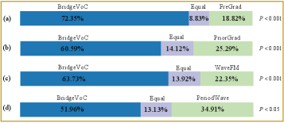
*Figure 12:Average preference scores (in %) of AB tests between RNDVoC-shared and three other diffusion-based baselines. Clips are from the vocal type of the MUSDB18 test set.*

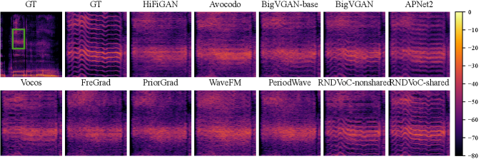
*Figure 13:Spectral visualization of different vocoder methods. The audio clip is a singing voice from the MUSDB18 test set.*

*Figure 14:Metric comparisons in terms of whether the proposed MCDA strategy is adopted. (a)-(c): Metric performance under varying number of mel filters 
𝐹
𝑚
, and 
𝑓
max
 is fixed to 12 kHz. (d)-(f): Metric performance under varying 
𝑓
max
, and 
𝐹
𝑚
 is fixed to 100.*

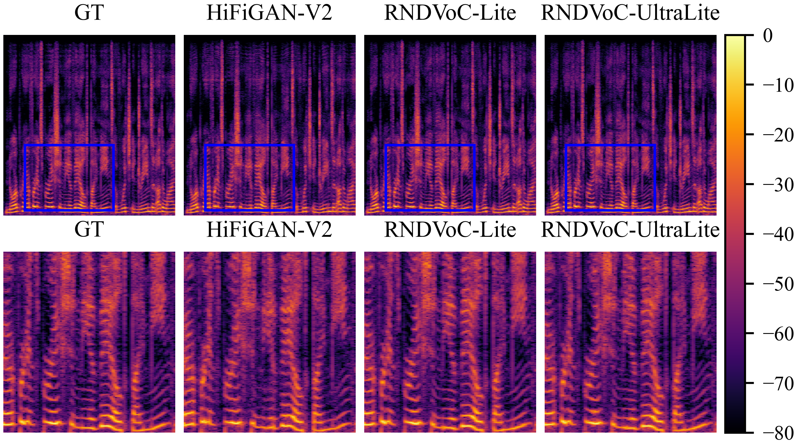
*Figure 15:Spectral visualizations between lightweight neural vocodes. Audio clips are from the LibriTTS test set.*

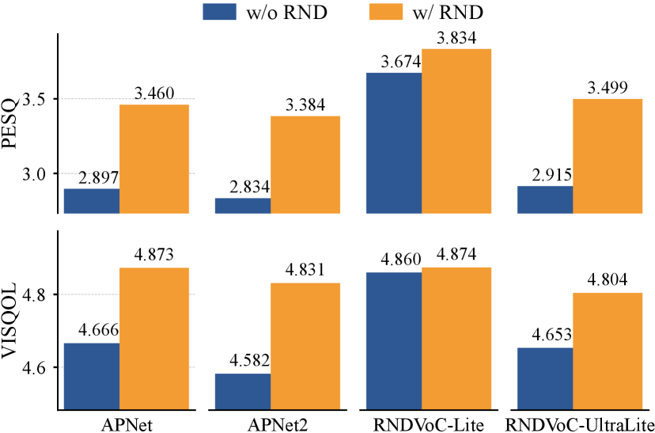
*Figure 16:Effect of the proposed RND strategy for different neural vocoders.*

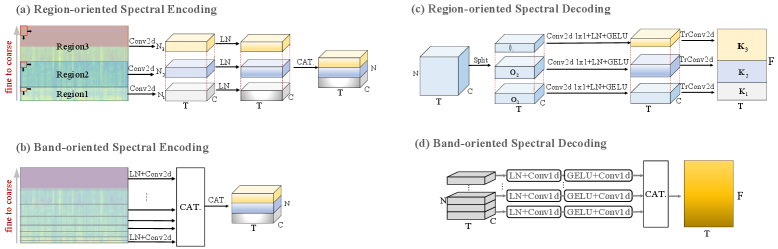
*Figure 17:Implementation process of the region-oriented and subband-oriented spectral encoding and decoding, respectively.*

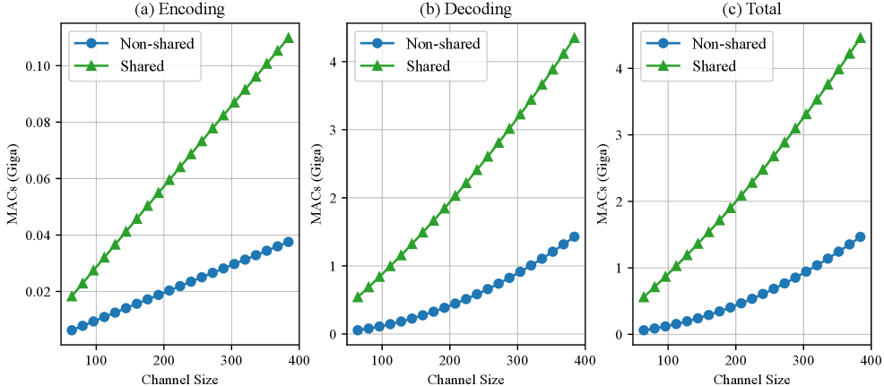
*Figure 18:Complexity comparisons between the non-shared and shared schemes for encoding/decoding modules.*

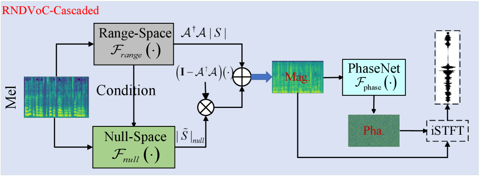
*Figure 19:Framework diagrams of the RNDVoC with a cascaded generation style.*

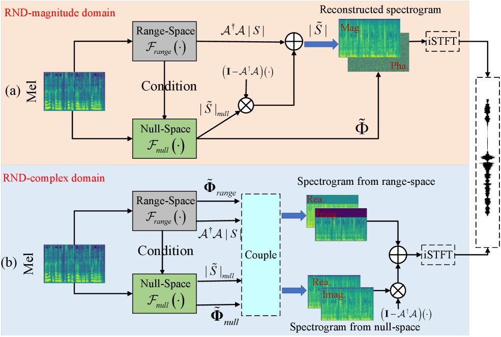
*Figure 20:Framework diagrams of the RNDVoC defined in the magnitude and complex-valued domains. (a) The proposed RNDVoC defined in the magnitude domain. (b) The proposed RNDVoC defined in the complex domain.*

![Figure 21:Spectral visualizations given different deviations of mel-filter. (a): Target. (b): Default configuration (Slaney strategy with region normalizaiton). (c): Slaney strategy without normalization. (d): Slaney strategy with 
𝐿
1
 normalization. (e): Slaney strategy with 
𝐿
2
 normalization. (f): HTK strategy with region normalization. (g): HTK without normalization. (h): HTK with 
𝐿
1
 normalization. (i): HTK with 
𝐿
2
 normalization. (j)-(o): Based on (b), add Gaussian noise with varying strength 
𝜎
, ranging from 
10
−
7
 to 
10
−
2
.](../images/2026-03-10/2603.08574/2603.08574_fig20.png)
*Figure 21:Spectral visualizations given different deviations of mel-filter. (a): Target. (b): Default configuration (Slaney strategy with region normalizaiton). (c): Slaney strategy without normalization. (d): Slaney strategy with 
𝐿
1
 normalization. (e): Slaney strategy with 
𝐿
2
 normalization. (f): HTK strategy with region normalization. (g): HTK without normalization. (h): HTK with 
𝐿
1
 normalization. (i): HTK with 
𝐿
2
 normalization. (j)-(o): Based on (b), add Gaussian noise with varying strength 
𝜎
, ranging from 
10
−
7
 to 
10
−
2
.*

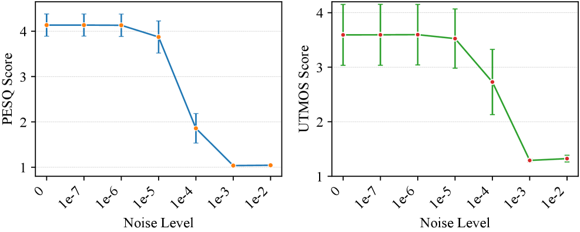
*Figure 22:Sensitivity analysis of mel-filter in terms of PESQ and UTMOS. Results are calculated based on the LibriTTS benchmark.*

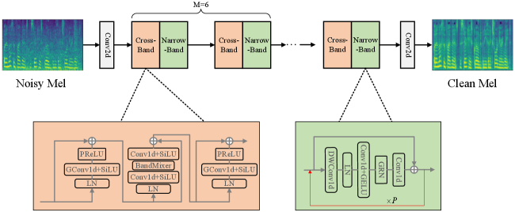
*Figure 23:Detailed structure of the adopted discriminative SE networks.*

*Figure 24:Framework diagram of the adopted discriminative and generative networks for SE task. For both methods, a pre-trained neural vocoder is followed for target waveform generation. (a) Discriminative method, where a discriminative SE network is utilized for target mel-spectrogram mapping. (b) Generative method, where a Schrödinger bridge is established between noisy and target mel-spectrograms.*

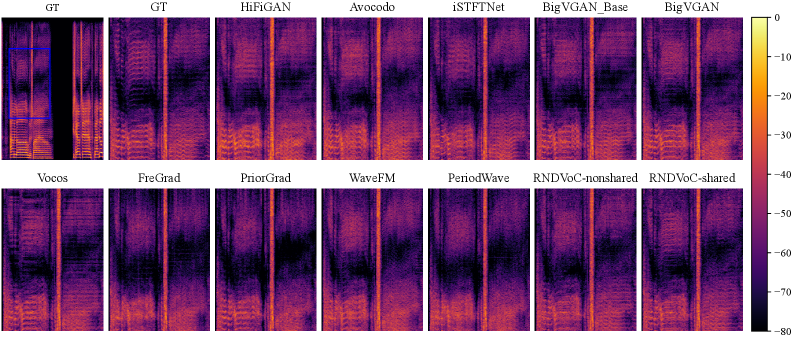
*Figure 25:Spectral Visualizations generated by different neural vocoders. The file is a vocal sound from the song “Al James - Schoolboy Facination” in the MUSDB18 corpus.*

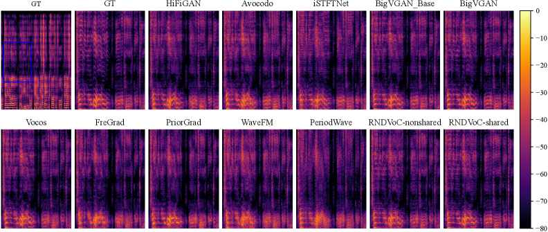
*Figure 26:Spectral Visualizations generated by different neural vocoders. The file is a vocal sound from the song “Ben Carrigan - We’ll Talk About It All Tonight” in the MUSDB18 corpus.*

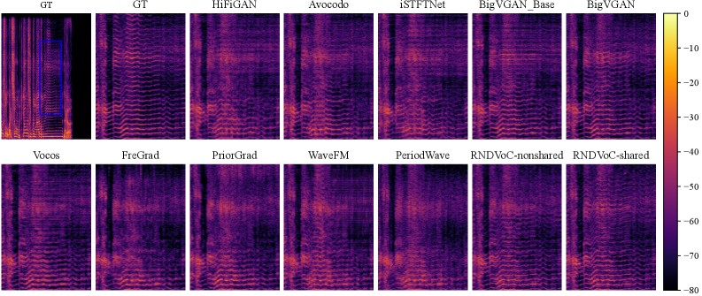
*Figure 27:Spectral Visualizations generated by different neural vocoders. The file is a vocal sound from the song “BKS - Bulldozer - We’ll Talk About It All Tonight” in the MUSDB18 corpus.*

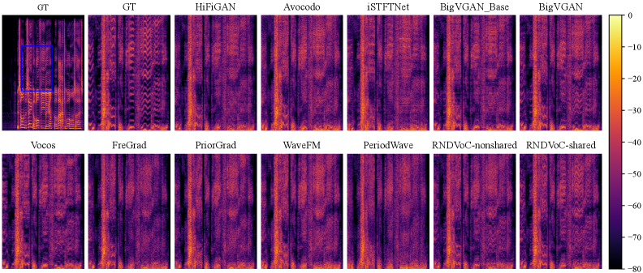
*Figure 28:Spectral Visualizations generated by different neural vocoders. The file is a vocal sound from the song “Mu - Too Bright” in the MUSDB18 corpus.*

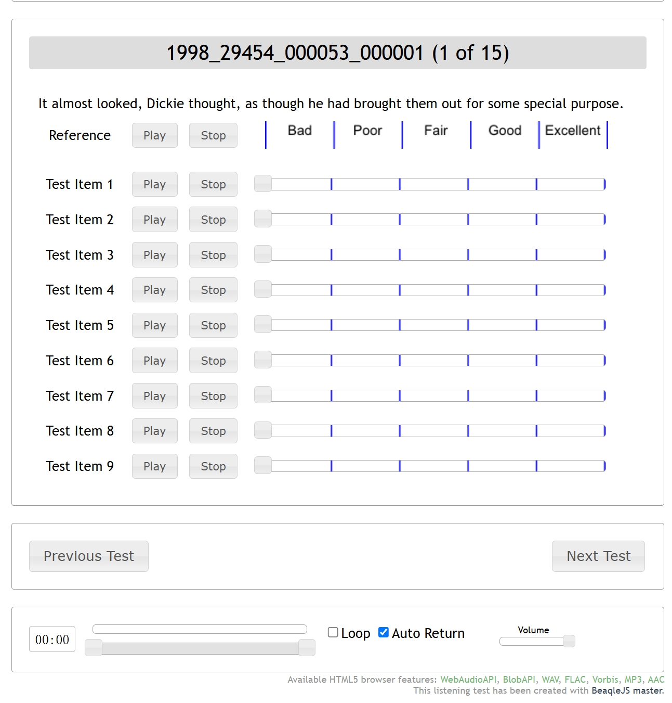
*Figure 29:Screenshot of speech similarity for MUSRA testing.*

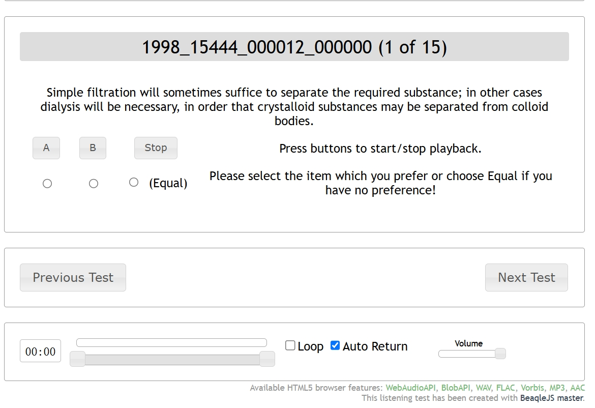
*Figure 30:Screenshot of ABXTest.*

---
**Usage Info**: 14844 tokens used.
**Generated at**: 2026-03-10 12:41:34

---

# 📚 Accent Vector: Controllable Accent Manipulation for Multilingual TTS Without Accented Data

🚀 URL: https://arxiv.org/html/2603.07534

## 🌏 Abstract (원문)
English is spoken by approximately one-fifth of the world’s population, yet only about one-quarter of these speakers have acquired it as a first language (L1)[1,2]. The language exhibits a wide range of regional and global accents across both first-language (L1) and second-language (L2) speakers[3]. Accent, in this sense, is not a deviation from a norm but an index of variation in linguistic backgrounds, which may reflect early phonological acquisition as well as subsequent language contact. Accent also reflects differences in segmental inventory, intonation pattern, stress placement, and vowel quality. For example, L2 English speakers may retain timing patterns or vowel distinctions influenced by their first language, producing speech that is fully intelligible but characterized by distinct rhythmic and pronunciation patterns relative to many L1 English-speaking varieties.Despite these global variations in English varieties, most current text-to-speech (TTS) models are predominantly trained on mainstream English[4,5,6,7]. This imbalance in training knowledge is largely driven by the availability of relevant datasets, where large-scale, high-quality, and well-annotated speech datasets are far more accessible for American English[8,9,10,11]than for other regional L1 or L2 English varieties[12,13,14]. While a small number of accented L2 English speech datasets do exist, they are limited in both scale and coverage, and are generally insufficient for training high-quality TTS systems. This data imbalance in training will eventually impact speech synthesis performance, with synthesis quality disproportionately higher for the dominant accent but substantially lower for underrepresented English varieties.Recent work has explored accent generation in TTS without relying on large-scale accented speech datasets. Existing approaches[15,16]include conditioning multilingual TTS systems through text transliteration or steering model components toward a target language. These methods demonstrate that accent characteristics can be induced from native-language resources alone. However, they typically provide limited control over accent strength and often focus on specific linguistic aspects, such as pronunciation mapping or duration modeling. As a result, achieving scalable and fine-grained control over accent variation remains an open challenge.To enhance model controllability, Ilharco et al.[17]introduced task vectors, a representation of task-specific parameter shifts in pretrained models. Recent work in speech processing has leveraged task vectors to model controllable speech attributes, including emotion and other paralinguistic factors[18,19]. Inspired by this idea, we propose the Accent Vector, a controllable parameter shift that enables explicit regulation of accent strength in multilingual speech synthesis. Our approach obtains the Accent Vector by fine-tuning a multilingual TTS model with the objective of reconstructing and condition on reference speech from a target language (e.g., Spanish) to get the target accent (e.g., Spanish Accent). The target accent may correspond either to a regional variety of the same language (e.g., British English) or to the influence of a different native language (e.g., Spanish-accented English). Intuitively, shifting the model parameters toward the target accent direction alters not only segmental characteristics, such as phoneme realization, but also suprasegmental properties—including temporal structure (duration), rhythm, and prosodic patterns—since these attributes are encoded implicitly in the model weights.In the case of English, for first-language (L1) or same-language accents, we fine-tune the model using speech from specific regional varieties (e.g., British English). For second-language (L2) accents, we instead fine-tune the model on speech from the speaker in the native language (e.g., Spanish, Hindi, or French). This approach removes the need for large-scale accented English speech datasets and allows us to exploit existing high-resource speech corpora in the target language. We would highlight that our method can generalize naturally beyond generating accented English speech, and our experiments on Spanish, Mandarin, French, and German show that the same learning paradigm can effectively produce accent variations in a wide range of languages. Moreover, Accent Vectors can be combined to model mixed accents, capturing cases where non-native English speakers exhibit influences from both their native language and prolonged exposure to another accent, such as British English. This is particularly relevant for capturing the speech of individuals who spend considerable time in two different linguistic environments/countries.In summary, we proposeAccent Vector, a simple yet effective framework for controllable accented speech synthesis.Accent Vector1) enables accented TTS without the need for accent-specific speech datasets, 2) enables explicit control over accent strength, 3) generalizes to other languages beyond English, and 4) supports the composition of multiple accents to model mixed-accent speech. The synthesized samples are available here111https://anonymous.4open.science/w/Accent-Vector-Audio-Samples-0EAA/.
## 🌏 Abstract (번역)
전 세계 인구의 약 5분의 1이 영어를 사용하지만, 이들 중 약 4분의 1만이 영어를 모국어(L1)로 습득했습니다[1,2]. 영어는 모국어(L1) 및 제2언어(L2) 화자 모두에게서 광범위한 지역 및 전 세계적 억양을 보입니다[3]. 이러한 의미에서 억양은 규범에서 벗어난 것이 아니라 언어적 배경의 변화를 나타내는 지표이며, 이는 초기 음운론적 습득뿐만 아니라 후속 언어 접촉을 반영할 수 있습니다. 억양은 또한 분절음 목록, 억양 패턴, 강세 위치 및 모음 품질의 차이를 반영합니다. 예를 들어, L2 영어 화자는 모국어의 영향을 받은 타이밍 패턴이나 모음 구분을 유지하여, 완전히 이해할 수 있지만 많은 L1 영어 사용 변종과 비교하여 뚜렷한 리듬 및 발음 패턴을 특징으로 하는 음성을 생성할 수 있습니다.영어 변종의 이러한 전 세계적 다양성에도 불구하고, 대부분의 현재 텍스트 음성 변환(TTS) 모델은 주로 주류 영어로 훈련됩니다[4,5,6,7]. 훈련 지식의 이러한 불균형은 관련 데이터셋의 가용성에 의해 크게 좌우되며, 대규모, 고품질, 잘 주석 처리된 음성 데이터셋은 다른 지역 L1 또는 L2 영어 변종[12,13,14]보다 미국 영어[8,9,10,11]에 훨씬 더 쉽게 접근할 수 있습니다. 소수의 억양 있는 L2 영어 음성 데이터셋이 존재하지만, 규모와 범위 모두에서 제한적이며 일반적으로 고품질 TTS 시스템을 훈련하기에는 불충분합니다. 훈련의 이러한 데이터 불균형은 결국 음성 합성 성능에 영향을 미치며, 지배적인 억양에 대한 합성 품질은 불균형적으로 높지만, 소외된 영어 변종에 대해서는 상당히 낮습니다.최근 연구는 대규모 억양 있는 음성 데이터셋에 의존하지 않고 TTS에서 억양 생성을 탐구했습니다. 기존 접근 방식[15,16]에는 텍스트 음역을 통해 다국어 TTS 시스템을 조건화하거나 모델 구성 요소를 대상 언어로 유도하는 것이 포함됩니다. 이러한 방법은 억양 특성이 모국어 리소스만으로 유도될 수 있음을 보여줍니다. 그러나 일반적으로 억양 강도에 대한 제어가 제한적이며 발음 매핑 또는 지속 시간 모델링과 같은 특정 언어적 측면에 중점을 둡니다. 결과적으로, 억양 변화에 대한 확장 가능하고 세밀한 제어를 달성하는 것은 여전히 열린 과제로 남아 있습니다.모델 제어 가능성을 향상시키기 위해 Ilharco et al.[17]은 사전 훈련된 모델에서 작업별 매개변수 이동을 나타내는 작업 벡터를 도입했습니다. 음성 처리 분야의 최근 연구는 감정 및 기타 비언어적 요인을 포함한 제어 가능한 음성 속성을 모델링하기 위해 작업 벡터를 활용했습니다[18,19]. 이 아이디어에서 영감을 받아, 우리는 다국어 음성 합성에서 억양 강도의 명시적 조절을 가능하게 하는 제어 가능한 매개변수 이동인 악센트 벡터(Accent Vector)를 제안합니다. 우리의 접근 방식은 대상 언어(예: 스페인어)의 참조 음성을 재구성하고 조건화하여 대상 억양(예: 스페인어 억양)을 얻는 것을 목표로 다국어 TTS 모델을 미세 조정함으로써 악센트 벡터를 얻습니다. 대상 억양은 동일한 언어의 지역 변종(예: 영국 영어) 또는 다른 모국어의 영향(예: 스페인어 억양 영어)에 해당할 수 있습니다. 직관적으로, 모델 매개변수를 대상 억양 방향으로 이동시키는 것은 음소 실현과 같은 분절음 특성뿐만 아니라 시간 구조(지속 시간), 리듬 및 운율 패턴을 포함한 초분절음 속성도 변경합니다. 이러한 속성은 모델 가중치에 암묵적으로 인코딩되기 때문입니다.영어의 경우, 모국어(L1) 또는 동일 언어 억양의 경우, 특정 지역 변종(예: 영국 영어)의 음성을 사용하여 모델을 미세 조정합니다. 제2언어(L2) 억양의 경우, 대신 모국어(예: 스페인어, 힌디어 또는 프랑스어)로 화자의 음성을 사용하여 모델을 미세 조정합니다. 이 접근 방식은 대규모 억양 있는 영어 음성 데이터셋의 필요성을 제거하고 대상 언어의 기존 고자원 음성 코퍼스를 활용할 수 있게 합니다. 우리는 우리의 방법이 억양 있는 영어 음성 생성 이상으로 자연스럽게 일반화될 수 있으며, 스페인어, 만다린어, 프랑스어 및 독일어에 대한 실험에서 동일한 학습 패러다임이 광범위한 언어에서 억양 변화를 효과적으로 생성할 수 있음을 보여줍니다. 또한, 악센트 벡터는 혼합 억양을 모델링하기 위해 결합될 수 있으며, 비원어민 영어 화자가 모국어와 영국 영어와 같은 다른 억양에 대한 장기간 노출 모두의 영향을 나타내는 경우를 포착합니다. 이는 두 가지 다른 언어 환경/국가에서 상당한 시간을 보내는 개인의 음성을 포착하는 데 특히 관련이 있습니다.요약하자면, 우리는 제어 가능한 억양 있는 음성 합성을 위한 간단하면서도 효과적인 프레임워크인 악센트 벡터(Accent Vector)를 제안합니다. 악센트 벡터는 1) 억양별 음성 데이터셋 없이 억양 있는 TTS를 가능하게 하고, 2) 억양 강도에 대한 명시적 제어를 가능하게 하며, 3) 영어를 넘어 다른 언어로 일반화되고, 4) 혼합 억양 음성을 모델링하기 위해 여러 억양의 구성을 지원합니다. 합성된 샘플은 여기에서 확인할 수 있습니다: https://anonymous.4open.science/w/Accent-Vector-Audio-Samples-0EAA/.

## 🔍 Methods & Results
- 대부분의 TTS 모델이 주류 영어로 훈련되어 다양한 L1/L2 영어 억양에 대한 성능이 저조하고, 기존 억양 생성 방법은 세밀한 제어가 부족하다는 문제점을 해결하기 위해 Accent Vector를 제안한다.
- Accent Vector는 사전 훈련된 다국어 TTS 모델(XTTS2 기반)의 매개변수 이동을 통해 억양 강도를 명시적으로 조절할 수 있는 방법이다.
- Accent Vector는 대상 언어(예: 스페인어)의 참조 음성을 재구성하고 조건화하도록 다국어 TTS 모델을 미세 조정하여 얻어진다.
- L1 또는 동일 언어 억양(예: 영국 영어)의 경우, 특정 지역 변종의 음성으로 모델을 미세 조정한다.
- L2 억양(예: 스페인어 억양 영어)의 경우, 화자의 모국어(예: 스페인어) 음성으로 모델을 미세 조정하여 대규모 억양 있는 영어 데이터셋의 필요성을 없애고 대상 언어의 고자원 음성 코퍼스를 활용한다.
- 미세 조정 과정에서 XTTS2는 기본 언어 ID(예: 영어)를 조건으로 사용하지만, 대상 억양 언어(예: 스페인어)의 원어민 화자로부터 얻은 스크립트와 참조 음성을 사용한다.
- Accent Vector는 미세 조정된 모델 매개변수와 사전 훈련된 모델 매개변수의 차이로 계산되며, LoRA를 사용한 경우 LoRA 가중치와 동일하다.
- 추론 시, Accent Vector에 제어 계수 α를 곱하여 사전 훈련된 모델 매개변수에 추가함으로써 억양 강도를 연속적으로 조절할 수 있다(α 값이 클수록 억양 특성이 강해진다).
- 이 방법은 영어 외에 스페인어, 만다린어, 프랑스어, 독일어 등 다양한 언어의 억양 생성으로 자연스럽게 일반화될 수 있음을 실험을 통해 확인했다.
- 여러 Accent Vector를 선형적으로 결합하여 혼합 억양(예: 모국어와 영국 영어 노출의 영향)을 모델링할 수 있으며, 각 억양 구성 요소의 강도와 균형을 미세하게 제어할 수 있다.
- Accent Vector는 억양별 음성 데이터셋 없이 억양 있는 TTS를 가능하게 하고, 억양 강도에 대한 명시적 제어를 제공하며, 영어를 넘어 다른 언어로 일반화되고, 혼합 억양 음성 모델링을 위한 여러 억양의 구성을 지원한다.
- 합성된 음성 샘플은 기본 언어의 언어적 내용을 유지하면서 대상 억양의 음향 특성을 나타낸다.

## 🖼 Figures
![Figure 1:Accent Vector Framework. The top panel illustrates the fine-tuning procedure, and the bottom panel shows the inference process for generating accented speech. During inference, a language ID token (e.g., [en]) is concatenated with the transcript and provided as input to the model.](../images/2026-03-10/2603.07534/2603.07534_fig0.png)
*Figure 1:Accent Vector Framework. The top panel illustrates the fine-tuning procedure, and the bottom panel shows the inference process for generating accented speech. During inference, a language ID token (e.g., [en]) is concatenated with the transcript and provided as input to the model.*

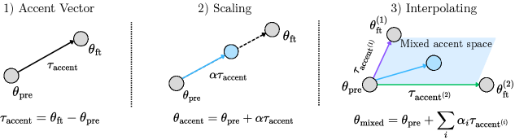
*Figure 2:Accent Vector Arithmetic. The figure illustrates the computation of the Accent Vector, its scaling for accent strength control, and the interpolation of multiple Accent Vectors for mixed-accent synthesis.*

*Figure 3:Control of accent strength using the task vector coefficient. We evaluate the model fine-tuned on British and Hindi by measuring accent probability and word error rate (WER) across different task vector coefficients. The first and second rows correspond to the results of British- and Hindi-accented English, respectively. A clear trade-off between accent strength and intelligibility is observed; increasing the coefficient produces a stronger accent but results in higher WER.*

*Figure 4:Effect of the task vector coefficient when mixing multiple Accent Vectors. We combine Spanish and English Accent Vectors using coefficients 
𝛼
 and 
1
−
𝛼
, respectively. Accent probabilities for Spanish and English accents are evaluated across different values of 
𝛼
. The vertical dashed line indicates the accent probability of the pretrained model of each accent.*

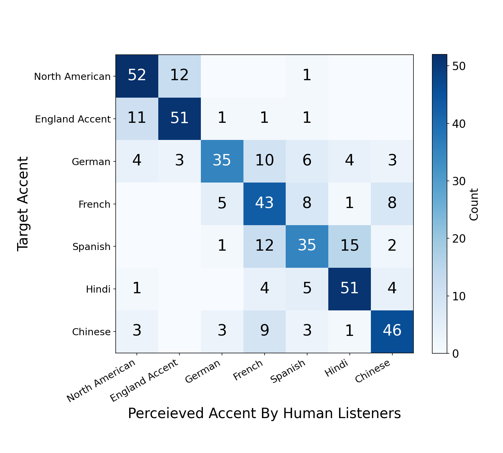
*Figure 5:Confusion matrix on the target accents and perceived accents by human listeners.*

---
**Usage Info**: 5876 tokens used.
**Generated at**: 2026-03-10 12:41:52

---

# 📚 DualTurn: Learning Turn-Taking from Dual-Channel Generative Speech Pretraining

🚀 URL: https://arxiv.org/html/2603.08216

## 🌏 Abstract (원문)
Production voice pipelines built on large language models (LLMs) make use of tool calling and reasoning capabilities but they still depend on silence timeouts for turn-taking, which can cause delayed responses and interruptions. Acoustic features[udupa2025nac]and multimodal features[li2025easyturnintegratingacoustic]also used to address this by recent speech endpointing models, but since they rely on VAD to signal a pause to get triggered, they do not anticipate the speech end, rather are reactive. The generative training of speech-to-speech (S2S) models[defossez2024moshi,nguyen2023dgslm,roy2026personaplex,wang2025ntppgenerativespeechlanguage]requires predicting the next audio frame given both speaker channels, which allows them to anticipate what either speaker will say next and thus learn turn-taking dynamics implicitly. However, S2S models lack the reasoning and instruction-following capabilities of text LLMs, and their turn-taking abilities cannot be transferred to modular ASR-LLM-TTS pipelines.Although the turn-taking literature[sacks1974turntaking,skantze2021turntaking]has advanced considerably, no current model captures the full range of phenomena needed in real-world production pipelines. Text-based models[ekstedt2020turngpt]predict turn completions from transcripts but ignore the prosodic information that is essential for turn-taking[gravano2011turntaking,ward2000prosodic]. Audio classifiers[roddy18_interspeech,raju2023twopass]incorporate prosody but are limited to single-channel binary classification and, without the other speaker's context, can only detect turn end, not the turn action. Backchannels[ruede2017backchannel], interruptions, mid-turn pauses, and overlapping speech[heldner2010pauses]naturally occur in conversational turn-taking. Wang et al.[wang2024turntaking]use a 3.1B-parameter LLM that leverages both audio and transcript inputs to classify turn shifts, backchannels, and holds, though such models are still too heavy for low-latency deployment. However, just detecting speech end is not enough. The model must also anticipate the speaker's behavior. Voice Activity Projection	(VAP)[ekstedt2022vap]comes closest, offering a self-supervised, dual-channel model that continuously predicts future voice activity from audio alone. But VAP collapses all phenomena into binary voice-activity probabilities and cannot distinguish backchannels from turn ends; its 5.8M-parameter CPC encoder lacks the capacity for semantic modelling and required additional finetuning to exceed chance on backchannel prediction[inoue2025backchannel].We present DualTurn, a turn-taking component that can be used with ASR-LLM-TTS pipelines using S2S generative pretraining on dual-channel audio. Because DualTurn models both speakers simultaneously, it has access to conversational context that single-channel models miss, such as overlaps, interruptions, and backchannels. It picks up turn-taking and conversational concepts without any labels by learning to predict what either speaker says next. The model encodes the audio with the frozen Mimi neural codec[defossez2024moshi], the 0.5B LLM backbone takes in the audio embeddings from the Mimi codec, and predicts six classification signals through MLP heads for each speaker channel. These signals can be combined into agent actions either with a heuristic on the signals or a logistic regression probe. The model can monitor both speakers' channels continuously, running on a single CPU.DualTurn outperforms VAP across all evaluation setups on Switchboard and otoSpeech. DualTurn outperforms the 3.1B-parameter audio-text fusion model[wang2024turntaking]on word-level prediction and anticipates turn boundaries before the end of speech with fewer false interruptions. Our main contribution is showing that generative speech pretraining on dual-channel conversational audio, to our knowledge the first use of S2S generative pretraining as a representation-learning stage for explicit turn-taking prediction in modular pipelines, produces representations well-suited to turn-taking signal prediction. From these representations we derive six per-channel signals (turn-ends, mid-turn pauses, speech onsets, backchannels, voice activity, and future activity) that compose into five agent actions. The model runs continuously rather than waiting for VAD to signal a pause.
## 🌏 Abstract (번역)
대규모 언어 모델(LLM)을 기반으로 구축된 프로덕션 음성 파이프라인은 도구 호출 및 추론 기능을 활용하지만, 턴-테이킹을 위해 여전히 침묵 타임아웃에 의존하여 응답 지연 및 방해를 유발할 수 있습니다. 최근 음성 종단점 모델들은 음향 특징 및 멀티모달 특징을 사용하여 이를 해결하기도 하지만, 일시 정지를 알리는 VAD에 의존하여 트리거되기 때문에 음성 종료를 예측하지 못하고 반응적입니다. S2S(Speech-to-Speech) 모델의 생성적 훈련은 양쪽 화자 채널을 모두 고려하여 다음 오디오 프레임을 예측해야 하며, 이를 통해 각 화자가 다음에 무엇을 말할지 예측하고 턴-테이킹 역학을 암묵적으로 학습할 수 있습니다. 그러나 S2S 모델은 텍스트 LLM의 추론 및 지시 따르기 기능이 부족하며, 이들의 턴-테이킹 능력은 모듈형 ASR-LLM-TTS 파이프라인으로 전이될 수 없습니다. 턴-테이킹 연구는 상당한 발전을 이루었지만, 현재 어떤 모델도 실제 프로덕션 파이프라인에 필요한 모든 현상을 포착하지 못합니다. 텍스트 기반 모델은 전사본에서 턴 완료를 예측하지만, 턴-테이킹에 필수적인 운율 정보를 무시합니다. 오디오 분류기는 운율을 통합하지만, 단일 채널 이진 분류로 제한되며, 다른 화자의 맥락 없이는 턴 종료만 감지할 수 있을 뿐 턴 동작은 감지할 수 없습니다. 백채널, 끼어들기, 턴 중간의 일시 정지, 겹치는 발화는 대화형 턴-테이킹에서 자연스럽게 발생합니다. Wang 등은 오디오 및 전사본 입력을 모두 활용하여 턴 전환, 백채널 및 홀드를 분류하는 3.1B 매개변수 LLM을 사용했지만, 이러한 모델은 낮은 지연 시간 배포에는 여전히 너무 무겁습니다. 그러나 단순히 음성 종료를 감지하는 것만으로는 충분하지 않습니다. 모델은 화자의 행동을 예측할 수 있어야 합니다. VAP(Voice Activity Projection)는 오디오만으로 미래 음성 활동을 지속적으로 예측하는 자체 지도 학습 방식의 듀얼 채널 모델을 제공하여 가장 근접합니다. 하지만 VAP는 모든 현상을 이진 음성 활동 확률로 축소하고 백채널과 턴 종료를 구별할 수 없으며, 5.8M 매개변수 CPC 인코더는 의미론적 모델링을 위한 용량이 부족하여 백채널 예측에서 우연 이상의 성능을 내기 위해 추가 미세 조정이 필요했습니다. 우리는 듀얼 채널 오디오에 대한 S2S 생성적 사전 훈련을 사용하여 ASR-LLM-TTS 파이프라인과 함께 사용할 수 있는 턴-테이킹 구성 요소인 DualTurn을 제시합니다. DualTurn은 두 화자를 동시에 모델링하므로, 단일 채널 모델이 놓치는 오버랩, 끼어들기, 백채널과 같은 대화 맥락에 접근할 수 있습니다. 이 모델은 각 화자가 다음에 무엇을 말할지 예측하는 것을 학습함으로써 어떠한 레이블 없이도 턴-테이킹 및 대화 개념을 습득합니다. 이 모델은 고정된 Mimi 신경 코덱으로 오디오를 인코딩하고, 0.5B LLM 백본은 Mimi 코덱의 오디오 임베딩을 입력받아 각 화자 채널에 대해 MLP 헤드를 통해 6가지 분류 신호를 예측합니다. 이 신호들은 신호에 대한 휴리스틱 또는 로지스틱 회귀 프로브를 사용하여 에이전트 동작으로 결합될 수 있습니다. 이 모델은 단일 CPU에서 실행되며 두 화자의 채널을 지속적으로 모니터링할 수 있습니다. DualTurn은 Switchboard 및 otoSpeech의 모든 평가 설정에서 VAP보다 뛰어난 성능을 보입니다. DualTurn은 3.1B 매개변수 오디오-텍스트 융합 모델보다 단어 수준 예측에서 우수하며, 음성 종료 전에 턴 경계를 예측하고 잘못된 끼어들기를 줄입니다. 우리의 주요 기여는 듀얼 채널 대화 오디오에 대한 생성적 음성 사전 훈련(모듈형 파이프라인에서 명시적 턴-테이킹 예측을 위한 표현 학습 단계로서 S2S 생성적 사전 훈련의 첫 번째 사용으로 알려짐)이 턴-테이킹 신호 예측에 매우 적합한 표현을 생성한다는 것을 보여주는 것입니다. 이러한 표현으로부터 우리는 5가지 에이전트 동작으로 구성되는 채널당 6가지 신호(턴 종료, 턴 중간 일시 정지, 음성 시작, 백채널, 음성 활동, 미래 활동)를 도출합니다. 이 모델은 VAD가 일시 정지를 알리기를 기다리지 않고 지속적으로 실행됩니다.

## 🔍 Methods & Results
- DualTurn은 Mimi 신경 코덱을 사용하여 듀얼 채널 오디오를 인코딩하며, 각 채널의 24kHz 파형을 12.5프레임/초의 8개 RVQ 코드북 시퀀스로 변환합니다.
- 각 채널의 512차원 연속 인코더 임베딩은 채널별 MLP를 거쳐 연결된 후 Qwen2.5-0.5B LLM 백본에 입력됩니다.
- 백본의 최종 은닉 상태에 12개의 경량 분류 헤드(채널당 6개)가 연결되어 6가지 턴-테이킹 신호(EOT, HOLD, BOT, BC, VAD, FVAD)를 예측합니다. FVAD 헤드는 각각 4개의 예측 구간 값을 출력하여 총 18개의 스칼라 출력을 생성합니다.
- 모델은 두 단계로 훈련됩니다: 1단계에서는 백본이 양쪽 화자의 다음 오디오 토큰을 동시에 예측하도록 생성적으로 사전 훈련되어 의미론적 및 운율 정보를 학습하고, 2단계에서는 사전 훈련된 백본에서 턴-테이킹 신호를 예측하도록 미세 조정됩니다.
- 2단계 훈련의 신호 레이블은 수동 주석 없이 자체 지도 음성 활동 정렬을 통해 파생되며, 포컬 손실과 이진 교차 엔트로피를 사용하여 훈련됩니다. 레이블은 비대칭 가우시안으로 시간적으로 평활화되어 신호를 최대 240ms 일찍 예측하도록 합니다.
- EOT(턴 종료)와 HOLD(턴 중간 일시 정지) 신호는 상호 보완적으로 설계되어, 모델이 명시적인 레이블링 없이 턴 종료와 턴 중간 일시 정지를 구별할 수 있게 합니다.
- 예측된 6가지 채널별 신호는 5가지 에이전트 동작(ST: 말하기 시작, CL: 계속 듣기, SL: 듣기 중단, CT: 계속 말하기, BC: 백채널)으로 매핑되며, 이는 도메인 지식 휴리스틱 또는 다항 로지스틱 회귀를 통해 이루어집니다.
- 추론 시 모델은 스트리밍 오디오를 처리하며 240ms 간격으로 예측을 수행하고 KV-캐싱을 사용합니다. 기본 모델의 지연 시간은 CPU에서 약 78ms, A100 GPU에서 약 27ms입니다.
- DualTurn은 VAP의 1초보다 긴 4초의 미리 보기를 사용하여 1초를 초과하는 긴 일시 정지를 더 잘 처리합니다.
- DualTurn은 Switchboard 및 otoSpeech의 모든 평가 설정에서 VAP보다 뛰어난 성능을 보이며, 3.1B 매개변수 오디오-텍스트 융합 모델보다 단어 수준 예측에서 우수하고, 음성 종료 전에 턴 경계를 예측하여 잘못된 끼어들기를 줄입니다.
- 듀얼 채널 대화 오디오에 대한 생성적 음성 사전 훈련은 모듈형 파이프라인에서 명시적 턴-테이킹 예측을 위한 표현 학습 단계로서 S2S 생성적 사전 훈련의 첫 번째 사용이며, 턴-테이킹 신호 예측에 매우 적합한 표현을 생성한다는 것이 주요 기여입니다.

## 🖼 Figures
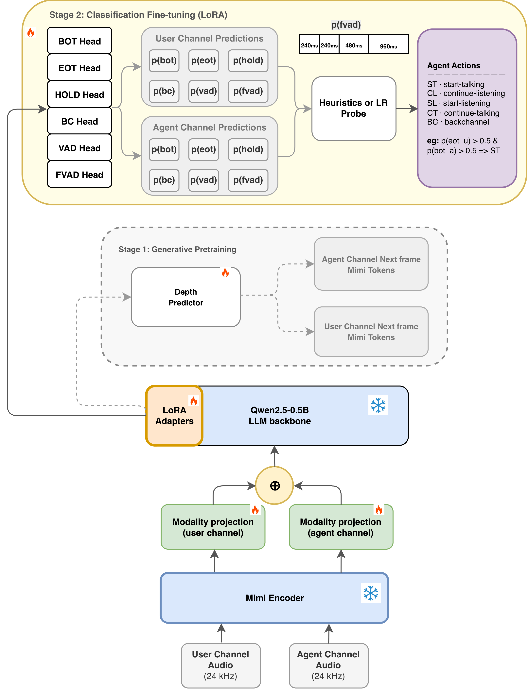
*Figure 1:DualTurn architecture. Stage-1 pretrains the backbone and depth predictor (discarded after pretraining) for next speech token prediction; Stage-2 finetunes the twelve classification heads to predict the turn-taking signals.*

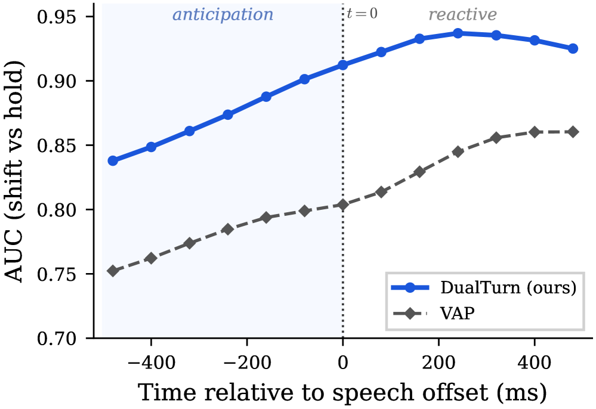
*Figure 2:Shift-vs-Hold AUC at each time offset relative to speech offset (Switchboard test set).*

---
**Usage Info**: 9075 tokens used.
**Generated at**: 2026-03-10 12:42:23

---

# 📚 Fast and Flexible Audio Bandwidth Extension via Vocos

🚀 URL: https://arxiv.org/html/2603.07285

## 🌏 Abstract (원문)
Bandwidth extension (BWE) aims to recover or hallucinate missing frequency components of audio signals captured with limited bandwidth, such as legacy recordings or telephony speech. Traditional signal processing methods, including interpolation-based upsampling and spectral shaping, offer high efficiency but often fail to reconstruct perceptually convincing high-frequency details. Recent learning-based approaches have reformulated BWE as a conditional generation task, predicting missing high-band content from the observed low-band signal. State-of-the-art diffusion-based models, such as AudioSR[liu2024audiosr]have demonstrated exceptional generative quality. However, their iterative sampling process is often too computationally expensive for real-time or large-scale deployment. Conversely, GAN-based approaches like AP-BWE[lu2024towards]offer substantial speed advantages, yet many remain restricted to fixed input/output sample-rate pairs (e.g., 16 kHz→48 kHz). This limitation hinders their flexibility in heterogeneous real-world pipelines where input sampling rates vary significantly. In this paper, we propose a versatile BWE system that supports arbitrary input sample rates from 8–48 kHz within a single network. We build upon the Vocos[siuzdak2023vocos]architecture, leveraging its high-fidelity Fourier-domain neural vocoder architecture to synthesize missing high-frequency details. By resampling all inputs to a target 48 kHz and employing a Vocos-style generator, our model maintains consistency across various upsampling ratios. To further enhance fidelity, we introduce a lightweight frequency-domain refiner inspired by the Linkwitz-Riley inspired crossover[Linkwitz1976]. This refiner smoothly merges the original resampled low-band signal with the generated high-band components, ensuring a phase-coherent transition at the crossover frequency. Experimental results on the VCTK corpus[veaux2017vctk]demonstrate that our proposed model matches or outperforms strong baselines in terms of Log-Spectral Distance (LSD) while offering orders-of-magnitude higher throughput than diffusion-based methods. The primary contributions of this work are as follows: We introduce the first Vocos-based BWE model to our knowledge, utilizing a neural vocoder to generate high-frequency content for arbitrary input sampling rates. We propose a Linkwitz-Riley inspired frequency-domain refiner that improves perceptual quality by seamlessly combining the original low band with the synthesized high band. We demonstrate a superior quality-to-speed trade-off, achieving a Real-Time Factor (RTF) of0.00010.0001on an NVIDIA A100 and maintaining considerably faster-than-real-time performance on a standard 8-core CPU.
## 🌏 Abstract (번역)
대역폭 확장(BWE)은 레거시 녹음이나 전화 통화 음성과 같이 제한된 대역폭으로 캡처된 오디오 신호의 누락된 주파수 구성 요소를 복구하거나 생성하는 것을 목표로 합니다. 보간 기반 업샘플링 및 스펙트럼 셰이핑을 포함한 전통적인 신호 처리 방법은 높은 효율성을 제공하지만, 지각적으로 설득력 있는 고주파 세부 사항을 재구성하는 데 종종 실패합니다. 최근 학습 기반 접근 방식은 BWE를 조건부 생성 작업으로 재구성하여 관찰된 저대역 신호로부터 누락된 고대역 콘텐츠를 예측합니다. AudioSR[liu2024audiosr]과 같은 최첨단 확산 기반 모델은 탁월한 생성 품질을 입증했습니다. 그러나 이들의 반복적인 샘플링 프로세스는 실시간 또는 대규모 배포에 너무 많은 계산 비용이 드는 경우가 많습니다. 반대로 AP-BWE[lu2024towards]와 같은 GAN 기반 접근 방식은 상당한 속도 이점을 제공하지만, 많은 경우 고정된 입력/출력 샘플링 속도 쌍(예: 16 kHz → 48 kHz)에 제한됩니다. 이러한 제한은 입력 샘플링 속도가 크게 달라지는 이기종 실제 파이프라인에서 유연성을 저해합니다. 본 논문에서는 단일 네트워크 내에서 8–48 kHz 범위의 임의의 입력 샘플링 속도를 지원하는 다목적 BWE 시스템을 제안합니다. 우리는 Vocos[siuzdak2023vocos] 아키텍처를 기반으로 하며, 고충실도 푸리에 도메인 신경 보코더 아키텍처를 활용하여 누락된 고주파 세부 사항을 합성합니다. 모든 입력을 목표 48 kHz로 리샘플링하고 Vocos 스타일 생성기를 사용하여, 우리 모델은 다양한 업샘플링 비율에 걸쳐 일관성을 유지합니다. 충실도를 더욱 높이기 위해, 우리는 Linkwitz-Riley에서 영감을 받은 크로스오버[Linkwitz1976]에서 착안한 경량 주파수 도메인 리파이너를 도입합니다. 이 리파이너는 원래 리샘플링된 저대역 신호와 생성된 고대역 구성 요소를 부드럽게 병합하여 크로스오버 주파수에서 위상 일관성 있는 전환을 보장합니다. VCTK 코퍼스[veaux2017vctk]에 대한 실험 결과는 제안된 모델이 Log-Spectral Distance (LSD) 측면에서 강력한 기준선과 동등하거나 능가하는 성능을 보이며, 확산 기반 방법보다 몇 자릿수 더 높은 처리량을 제공함을 보여줍니다. 본 연구의 주요 기여는 다음과 같습니다: 우리는 임의의 입력 샘플링 속도에 대해 고주파 콘텐츠를 생성하기 위해 신경 보코더를 활용하는, 우리가 아는 한 최초의 Vocos 기반 BWE 모델을 소개합니다. 우리는 원래의 저대역과 합성된 고대역을 매끄럽게 결합하여 지각 품질을 향상시키는 Linkwitz-Riley에서 영감을 받은 주파수 도메인 리파이너를 제안합니다. 우리는 NVIDIA A100에서 0.0001의 실시간 계수(RTF)를 달성하고 표준 8코어 CPU에서 실시간보다 훨씬 빠른 성능을 유지함으로써 우수한 품질-속도 균형을 입증합니다.

## 🔍 Methods & Results
- 단일 네트워크 내에서 8-48 kHz 범위의 임의 입력 샘플링 속도를 지원하는 다목적 BWE 시스템을 제안하며, 모든 입력을 48 kHz로 리샘플링하여 처리합니다.
- Vocos 아키텍처를 기반으로 하는 생성기는 고충실도 푸리에 도메인 신경 보코더(ConvNeXt 스타일 블록 포함)를 활용하여 48 kHz 멜-스펙트로그램 표현으로부터 누락된 고주파 세부 정보를 합성합니다.
- Linkwitz-Riley에서 영감을 받은 주파수 도메인 리파이너를 도입하여, 원래 리샘플링된 저대역 신호와 생성된 고대역 구성 요소를 부드럽게 병합하여 위상 일관성 있는 전환과 향상된 지각 품질을 보장합니다.
- 훈련 목표는 다중 해상도 STFT 손실, 멜-스펙트로그램 손실, 그리고 다중 해상도 판별자(MRD) 및 특징 매칭 손실을 포함하는 적대적 손실의 조합을 사용하여 구조적 정확성과 고주파 현실감을 확보합니다.
- VCTK 코퍼스에서 Log-Spectral Distance (LSD) 측면에서 강력한 기준선과 동등하거나 우수한 성능을 달성합니다.
- 확산 기반 방법보다 몇 자릿수 더 높은 처리량을 제공하며, NVIDIA A100에서 0.0001의 실시간 계수(RTF)를 기록하고 표준 8코어 CPU에서도 실시간보다 훨씬 빠른 성능을 유지합니다.

## 🖼 Figures

*Figure 1:Overview of the proposed BWE architecture following the Vocos framework. The input audio is upsampled to 48 kHz via Sinc interpolation and transformed into an 80-bin Mel-spectrogram. The backbone consists of 8 ConvNeXt blocks using 
7
×
1
 depthwise and 
1
×
1
 pointwise convolutions. The head employs a linear layer and ISTFT for waveform reconstruction, followed by a Linkwitz-Riley inspired refiner for significant quality enhancement.*

---
**Usage Info**: 6529 tokens used.
**Generated at**: 2026-03-10 12:42:43

---

# 📚 Targeted Speaker Poisoning Framework in Zero-Shot Text-to-Speech

🚀 URL: https://arxiv.org/html/2603.07551

## 🌏 Abstract (원문)
The rapid evolution of generative AI has advanced Text-to-Speech (TTS) systems far beyond conventional speech synthesis, enabling high-fidelity voice cloning from prompts as short as three seconds. Recent models[1,2,3]demonstrate remarkable expressiveness and speaker similarity. However, this capability also introduces serious real-world risks. Studies show[4]that human listeners struggle to distinguish AI-generated speech from genuine recordings, making these systems highly susceptible to misuse. Malicious actors can exploit voice cloning to impersonate individuals such as political leaders[5]and disseminate convincing misinformation[6]. These risks highlight the unmet need for mechanisms that could prevent TTS models from replicating specific speaker identities.A closely related research thread is machine unlearning, which aims to selectively remove particular knowledge from a trained model[7,8]. Unlearning typically seeks to adjust model parameters so that the updated model behaves similarly to one trained without the targeted data. However, this paradigm is not directly applicable to speech generation models. Modern TTS systems exhibit strong zero-shot generalization capabilities, enabling them to clone previously unseen speakers from short prompts. As a result, merely approximating the parameters of a model trained without certain speakers does not guarantee the removal of their identities. Addressing this challenge therefore requires a new problem formulation, along with relevant baselines and an evaluation framework to explicitly account for the zero-shot generalization of modern TTS systems.This problem is conceptually related to model poisoning[9], where the objective is to condition a model against performing certain behaviors. We formalize this goal in our context asSpeech Generation Speaker Poisoning(SGSP). Following the terminology of machine unlearning, we define a forget set consisting of speaker identities that the model should not synthesize, and a retain set containing speakers whose synthesis capability must be preserved. Our goal is to modify the model such that, when prompted with samples from the forget set, it fails to reproduce the corresponding speaker identity while maintaining performance on the retain set.A straightforward approach to this problem is to apply pre-processing strategies that replace prompts from the forget set with speakers from the retain set. However, such external filtering approaches are inherently vulnerable when model weights are public, i.e., an adversary could bypass the filtering pipeline and directly access the unmodified TTS model[10,11]. Therefore, we restrict our focus to methods that directly modify the internal model parameters to achieve robust speaker erasure.To this end, we build upon the Teacher-Guided Poisoning (TGP) framework[12], originally proposed for VoiceBox[3], and adapt it to StyleTTS2[1]. We additionally propose Encoder-Guided Poisoning (EGP), which directly learns speaker representations from ground-truth data. We further incorporate a contrastive objective to explicitly suppress forgotten identities. Together, these components form an efficient framework for targeted speaker suppression in zero-shot TTS.Systematic evaluation protocols remain underdeveloped in SGSP. Prior work[12]relies primarily on raw speaker similarity to assess the dissimilarity between the synthesized speech and the targeted forget speakers. However, this approach is difficult to interpret, as the effective range depends heavily on the employed speaker verification model[14]. Moreover, average similarity alone does not reflect whether the similarity distributions of the retain and forget sets are well separated. To address these limitations, we introduce a distribution-aware evaluation framework based on Area Under the Curve (AUC) analysis, together with a new, stronger privacy metric, Forget Set Similarity (FSSIM), which measures similarity between generated samples and all speakers in the forget set.The main contributions of this work are as follows: 1) We formulate the problem of targeted speaker erasure for zero-shot TTS, clearly defining the forget and retain sets. 2) We establish a naive pre-processing baseline to highlight the limitations of external filtering approaches. 3) Building upon this foundation, we adapt Teacher-Guided Poisoning (TGP) to StyleTTS2 and further propose Encoder-Guided Poisoning (EGP) with a triplet-loss objective for explicit identity suppression. 4) We develop a comprehensive evaluation framework, including distribution-level AUC analysis and a new privacy metric, FSSIM, to systematically assess the effectiveness of speaker erasure. Training code, baselines, model weights, and the evaluation framework will be released upon acceptance.
## 🌏 Abstract (번역)
생성형 AI의 급속한 발전은 Text-to-Speech(TTS) 시스템을 기존 음성 합성 기술을 훨씬 뛰어넘는 수준으로 발전시켰으며, 단 3초 길이의 프롬프트만으로도 고품질의 음성 복제를 가능하게 했습니다. 최근 모델들[1,2,3]은 놀라운 표현력과 화자 유사성을 보여줍니다. 그러나 이러한 기능은 심각한 실제 위험도 초래합니다. 연구[4]에 따르면 인간 청취자들은 AI 생성 음성과 실제 녹음된 음성을 구별하는 데 어려움을 겪으며, 이는 이러한 시스템이 오용될 가능성이 매우 높다는 것을 의미합니다. 악의적인 행위자들은 음성 복제를 악용하여 정치 지도자[5]와 같은 개인을 사칭하고 설득력 있는 허위 정보를 유포할 수 있습니다[6]. 이러한 위험은 TTS 모델이 특정 화자 신원을 복제하는 것을 방지할 수 있는 메커니즘에 대한 충족되지 않은 필요성을 강조합니다.밀접하게 관련된 연구 분야는 기계 언러닝(machine unlearning)으로, 훈련된 모델에서 특정 지식을 선택적으로 제거하는 것을 목표로 합니다[7,8]. 언러닝은 일반적으로 모델 매개변수를 조정하여 업데이트된 모델이 대상 데이터 없이 훈련된 모델과 유사하게 동작하도록 하는 것을 목표로 합니다. 그러나 이 패러다임은 음성 생성 모델에 직접 적용할 수 없습니다. 최신 TTS 시스템은 강력한 제로샷 일반화(zero-shot generalization) 기능을 보여주며, 짧은 프롬프트만으로 이전에 본 적 없는 화자를 복제할 수 있습니다. 결과적으로, 특정 화자 없이 훈련된 모델의 매개변수를 단순히 근사화하는 것만으로는 그들의 신원 제거를 보장하지 않습니다. 따라서 이 문제를 해결하려면 최신 TTS 시스템의 제로샷 일반화를 명시적으로 설명하기 위한 새로운 문제 공식화와 관련 기준선 및 평가 프레임워크가 필요합니다.이 문제는 모델 포이즈닝(model poisoning)[9]과 개념적으로 관련이 있으며, 모델이 특정 행동을 수행하지 않도록 조건을 부여하는 것이 목표입니다. 우리는 이 목표를 우리의 맥락에서 음성 생성 화자 포이즈닝(Speech Generation Speaker Poisoning, SGSP)으로 공식화합니다. 기계 언러닝의 용어를 따라, 우리는 모델이 합성해서는 안 되는 화자 신원으로 구성된 망각 세트(forget set)와 합성 능력이 보존되어야 하는 화자를 포함하는 유지 세트(retain set)를 정의합니다. 우리의 목표는 망각 세트의 샘플로 프롬프트가 주어졌을 때 해당 화자 신원을 재현하지 못하면서도 유지 세트에서는 성능을 유지하도록 모델을 수정하는 것입니다.이 문제에 대한 간단한 접근 방식은 망각 세트의 프롬프트를 유지 세트의 화자로 대체하는 전처리 전략을 적용하는 것입니다. 그러나 이러한 외부 필터링 접근 방식은 모델 가중치가 공개될 때 본질적으로 취약합니다. 즉, 공격자가 필터링 파이프라인을 우회하고 수정되지 않은 TTS 모델에 직접 접근할 수 있습니다[10,11]. 따라서 우리는 강력한 화자 삭제를 달성하기 위해 내부 모델 매개변수를 직접 수정하는 방법에 초점을 맞춥니다.이를 위해 우리는 VoiceBox[3]를 위해 원래 제안된 Teacher-Guided Poisoning(TGP) 프레임워크[12]를 기반으로 StyleTTS2[1]에 적용합니다. 우리는 또한 실제 데이터로부터 화자 표현을 직접 학습하는 Encoder-Guided Poisoning(EGP)을 제안합니다. 우리는 잊혀진 신원을 명시적으로 억제하기 위해 대조 목적 함수(contrastive objective)를 추가로 통합합니다. 이러한 구성 요소들은 함께 제로샷 TTS에서 표적 화자 억제를 위한 효율적인 프레임워크를 형성합니다.SGSP에서 체계적인 평가 프로토콜은 아직 미흡합니다. 이전 연구[12]는 합성된 음성과 대상 망각 화자 간의 비유사성을 평가하기 위해 주로 원시 화자 유사성에 의존합니다. 그러나 이 접근 방식은 사용된 화자 검증 모델[14]에 따라 유효 범위가 크게 달라지므로 해석하기 어렵습니다. 더욱이, 평균 유사성만으로는 유지 세트와 망각 세트의 유사성 분포가 잘 분리되어 있는지 반영하지 못합니다. 이러한 한계를 해결하기 위해 우리는 AUC(Area Under the Curve) 분석을 기반으로 한 분포 인식 평가 프레임워크와, 생성된 샘플과 망각 세트의 모든 화자 간의 유사성을 측정하는 새롭고 강력한 프라이버시 메트릭인 FSSIM(Forget Set Similarity)을 도입합니다.본 연구의 주요 기여는 다음과 같습니다: 1) 제로샷 TTS를 위한 표적 화자 삭제 문제를 공식화하고, 망각 세트와 유지 세트를 명확하게 정의합니다. 2) 외부 필터링 접근 방식의 한계를 강조하기 위해 단순한 전처리 기준선을 설정합니다. 3) 이 기반 위에 Teacher-Guided Poisoning(TGP)을 StyleTTS2에 적용하고, 명시적인 신원 억제를 위한 트립렛 손실 목적 함수를 포함하는 Encoder-Guided Poisoning(EGP)을 추가로 제안합니다. 4) 분포 수준 AUC 분석과 새로운 프라이버시 메트릭인 FSSIM을 포함하는 포괄적인 평가 프레임워크를 개발하여 화자 삭제의 효과를 체계적으로 평가합니다. 훈련 코드, 기준선, 모델 가중치 및 평가 프레임워크는 승인 후 공개될 예정입니다.

## 🔍 Methods & Results
- TTS 모델이 원래 생성하도록 훈련된 화자 집합 S에서, 망각 세트 F(모델이 음성을 생성해서는 안 되는 화자)와 유지 세트 R(음성 합성 능력이 보존되어야 하는 나머지 화자)을 정의하여 모델을 조작하는 것이 목표입니다.
- 망각 세트 F는 훈련 세트에서 샘플링되며, 이는 모델이 학습한 화자 신원을 제거하는 것이 보지 못한 테스트 화자를 제거하는 것보다 더 어렵다는 전제에 기반합니다.
- 모델은 망각 세트에 1명, 15명, 100명의 화자를 포함하는 세 가지 다른 설정에서 평가됩니다.

## 🖼 Figures
![Figure 1:Schematic overview of TGP and EGP. (a) TGP: The model generates utterances by sampling retain speakers, and these generated utterances serve as the targets for training the student model. During training, the reference speaker is randomly replaced with a sample from 
ℱ
 with a probability of 
𝑝
forget
, encouraging the model to produce a random speaker from 
ℛ
 when conditioned on a speaker from 
ℱ
. (b) EGP: The training process is identical to TGP, except that the ground truth is taken from the encoder output rather than from the teacher-generated utterance.](../images/2026-03-10/2603.07551/2603.07551_fig0.png)
*Figure 1:Schematic overview of TGP and EGP. (a) TGP: The model generates utterances by sampling retain speakers, and these generated utterances serve as the targets for training the student model. During training, the reference speaker is randomly replaced with a sample from 
ℱ
 with a probability of 
𝑝
forget
, encouraging the model to produce a random speaker from 
ℛ
 when conditioned on a speaker from 
ℱ
. (b) EGP: The training process is identical to TGP, except that the ground truth is taken from the encoder output rather than from the teacher-generated utterance.*

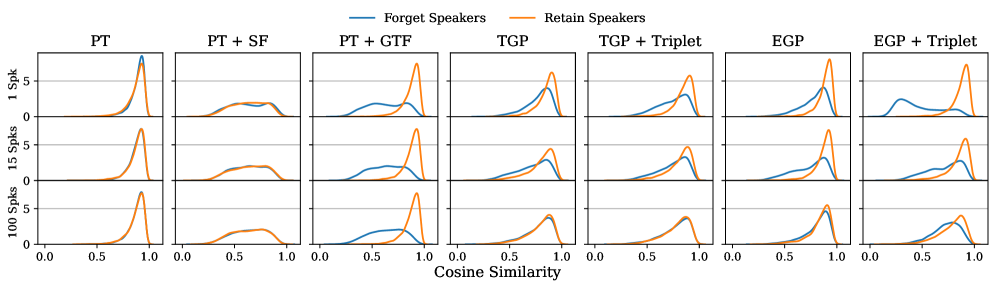
*Figure 2:Cosine similarity distributions for the retained speaker set (in orange) and for the forget set (in blue). Rows correspond to different numbers of forgotten speakers (1, 15, or 100), whereas columns correspond to different system configurations.*

---
**Usage Info**: 3742 tokens used.
**Generated at**: 2026-03-10 12:42:55

---

# 📚 WhispEar: A Bi-directional Framework for Scaling Whispered Speech Conversion via Pseudo-Parallel Whisper Generation

🚀 URL: https://arxiv.org/html/2603.08046

## 🌏 Abstract (원문)
Whisper-to-Normal conversion aims to reconstruct natural and intelligible speech from whispered speech, which is crucial for privacy communication and voice restoration. Due to the absence of vocal fold vibration and periodic excitation, whispered speech suffers from the loss of fundamental frequency and degraded acoustic characteristics[tartter1989s], bringing great challenges to generating speech with natural prosody and consistent timbre. Although existing studies have promoted the development of W2N conversion, they still face severe limitations. On the one hand, these approaches heavily rely on limited parallel whispered-normal data[seq2seq,agan-w2n], and conventional DSP-based pseudo-whisper data[normal2whisper,toWhisper]exhibits a distribution gap with real whispered speech, providing limited performance gains. Adversarial learning-based methods further suffer from training instability[disco&cyclegan,voc-free-cyclegan]. On the other hand, most methods struggle to preserve speaker timbre and natural prosody[wesper,parrotron], leading to unsatisfactory generation quality and low speaker similarity.Content disentanglement-based models have achieved remarkable success in text-to-speech and voice conversion[du2024cosyvoice,zhang2025vevo], benefiting from their strong ability to generate high-quality speech while maintaining timbre and prosody. Inspired by this, recent W2N methods such as WESPER[wesper]and DistillW2N[distillw2n]have introduced semantic representations like HuBERT[hsu2021hubert]to improve conversion performance.In this work, we observe that while whispered and normal speech differ acoustically, they share the same high-level linguistic and semantic information. Based on this, both W2N and N2W tasks can be regarded as generation tasks that produce different styles from the same semantic content, which logically supports bidirectional conversion between the two speaking modes.To address the data scarcity issue and further improve W2N performance, we propose a semantic feature-based bidirectional conversion framework,WhispEar. Leveraging its N2W module, we can synthesize high-quality pseudo-whisper data from massive normal speech dataset[haorui2024emilia]. In addition, we recruit volunteers to collect real whispered speech data. By combining real recorded data and high-quality pseudo data, we build a most large-scale bilingual whispered-normal dataset in this area to date, wEar. Experimental results demonstrate that our method effectively alleviates data limitations, and significantly outperforms baseline models in terms of speech naturalness, intelligibility, prosody recovery and speaker timbre similarity.The main contributions of this paper are:We proposeWhispEar, a bidirectional whispered speech conversion framework based on unified semantic representations.We introduce apseudo-parallel whisper generation strategyvia zero-shot normal-to-whisper synthesis, allowing large-scale data expansion from abundant normal speech without additional recording effort.We conduct asystematic scaling studyby progressively increasing generated pseudo-parallel data, demonstrating consistent performance gains and validating the effectiveness of data-centric scaling for whispered speech conversion.We release thelargest bilingual (Chinese and English) whispered-normal parallel corpusto date, including both recorded and generated data, providing a valuable benchmark for future research.
## 🌏 Abstract (번역)
속삭임-일반 음성 변환(W2N)은 속삭이는 음성으로부터 자연스럽고 명료한 음성을 재구성하는 것을 목표로 하며, 이는 프라이버시 통신 및 음성 복원에 중요하다. 성대 진동 및 주기적인 여기(excitation)의 부재로 인해, 속삭이는 음성은 기본 주파수 손실과 저하된 음향 특성[tartter1989s]을 겪으며, 이는 자연스러운 운율과 일관된 음색을 가진 음성을 생성하는 데 큰 어려움을 초래한다. 기존 연구들이 W2N 변환의 발전을 촉진했지만, 여전히 심각한 한계에 직면해 있다. 한편으로, 이러한 접근 방식들은 제한된 병렬 속삭임-일반 음성 데이터[seq2seq,agan-w2n]에 크게 의존하며, 기존의 DSP 기반 의사 속삭임 데이터[normal2whisper,toWhisper]는 실제 속삭이는 음성과 분포 차이를 보여 제한적인 성능 향상을 제공한다. 적대적 학습 기반 방법들은 훈련 불안정성[disco&cyclegan,voc-free-cyclegan]으로 인해 추가적인 어려움을 겪는다. 다른 한편으로, 대부분의 방법들은 화자 음색과 자연스러운 운율[wesper,parrotron]을 보존하는 데 어려움을 겪어, 만족스럽지 못한 생성 품질과 낮은 화자 유사성을 초래한다. 콘텐츠 분리 기반 모델은 텍스트-음성 변환 및 음성 변환[du2024cosyvoice,zhang2025vevo]에서 음색과 운율을 유지하면서 고품질 음성을 생성하는 강력한 능력 덕분에 놀라운 성공을 거두었다. 이에 영감을 받아, WESPER[wesper] 및 DistillW2N[distillw2n]과 같은 최근 W2N 방법들은 변환 성능을 향상시키기 위해 HuBERT[hsu2021hubert]와 같은 의미론적 표현을 도입했다. 본 연구에서는 속삭이는 음성과 일반 음성이 음향적으로는 다르지만, 동일한 고수준의 언어적 및 의미론적 정보를 공유한다는 점을 관찰했다. 이를 바탕으로, W2N 및 N2W 작업 모두 동일한 의미론적 콘텐츠로부터 다른 스타일을 생성하는 생성 작업으로 간주될 수 있으며, 이는 두 가지 발화 모드 간의 양방향 변환을 논리적으로 뒷받침한다. 데이터 부족 문제를 해결하고 W2N 성능을 더욱 향상시키기 위해, 우리는 의미론적 특징 기반 양방향 변환 프레임워크인 WhispEar를 제안한다. WhispEar의 N2W 모듈을 활용하여, 우리는 대규모 일반 음성 데이터셋[haorui2024emilia]으로부터 고품질 의사 속삭임 데이터를 합성할 수 있다. 또한, 우리는 실제 속삭이는 음성 데이터를 수집하기 위해 자원봉사자를 모집했다. 실제 녹음된 데이터와 고품질 의사 데이터를 결합하여, 우리는 현재까지 이 분야에서 가장 대규모의 이중 언어 속삭임-일반 음성 데이터셋인 wEar를 구축했다. 실험 결과는 우리의 방법이 데이터 한계를 효과적으로 완화하고, 음성 자연성, 명료성, 운율 복구 및 화자 음색 유사성 측면에서 기준 모델들을 크게 능가함을 보여준다. 본 논문의 주요 기여는 다음과 같다: 통합된 의미론적 표현 기반의 양방향 속삭임 음성 변환 프레임워크인 WhispEar를 제안한다. 제로샷 일반-속삭임 합성(normal-to-whisper synthesis)을 통한 의사 병렬 속삭임 생성 전략을 도입하여, 추가 녹음 노력 없이 풍부한 일반 음성으로부터 대규모 데이터 확장을 가능하게 한다. 생성된 의사 병렬 데이터를 점진적으로 증가시키는 체계적인 스케일링 연구를 수행하여, 일관된 성능 향상을 입증하고 속삭임 음성 변환을 위한 데이터 중심 스케일링의 효과를 검증한다. 현재까지 가장 큰 이중 언어(중국어 및 영어) 속삭임-일반 병렬 코퍼스를 공개하며, 이는 녹음된 데이터와 생성된 데이터를 모두 포함하여 향후 연구를 위한 귀중한 벤치마크를 제공한다.

## 🔍 Methods & Results
- WhispEar는 의미론적 토크나이저 증류, 공유 플로우 매칭 음향 모델 훈련, 확장 가능한 의사 병렬 데이터 생성을 통한 통합 토크나이저 훈련의 세 가지 순차적 단계로 훈련된다.
- 경량 의미론적 토크나이저는 대규모 ASR 인코더로부터 증류되며, 효율적인 문맥 평활화를 위해 FSMN 블록을 사용하고, 발화 모드 불변 표현을 학습하기 위해 속삭이는 음성과 일반 음성 모두로 훈련된다.
- W2N 및 N2W 작업 모두에 의해 공유되는 조건부 플로우 매칭 트랜스포머는 이산 의미론적 토큰으로부터 멜-스펙트로그램을 생성하도록 훈련되며, CosyVoice2로부터 초기화된다.
- 의사 병렬 속삭임 생성 전략이 도입된다: N2W 토크나이저는 먼저 실제 병렬 데이터로 훈련된 후, 대규모 일반 음성으로부터 고품질 의사 속삭임 데이터를 합성하여 대규모 데이터 확장을 가능하게 한다.
- W2N 토크나이저는 실제 병렬 데이터와 생성된 대규모 의사 병렬 데이터를 모두 사용하여 훈련되며, 이는 성능을 크게 향상시킨다.
- 실험 결과, WhispEar는 데이터 한계를 효과적으로 완화하고 음성 자연성, 명료성, 운율 복구 및 화자 음색 유사성 측면에서 기준 모델들을 크게 능가함을 보여준다.
- 본 논문은 녹음된 데이터와 생성된 데이터를 모두 포함하는 현재까지 가장 큰 이중 언어(중국어 및 영어) 속삭임-일반 병렬 코퍼스인 wEar를 공개한다.

## 🖼 Figures
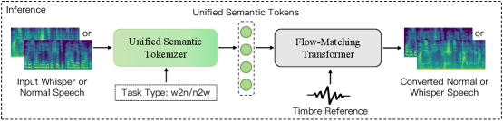
*Figure 1:Inference pipeline of WhispEar for bidirectional conversion.*

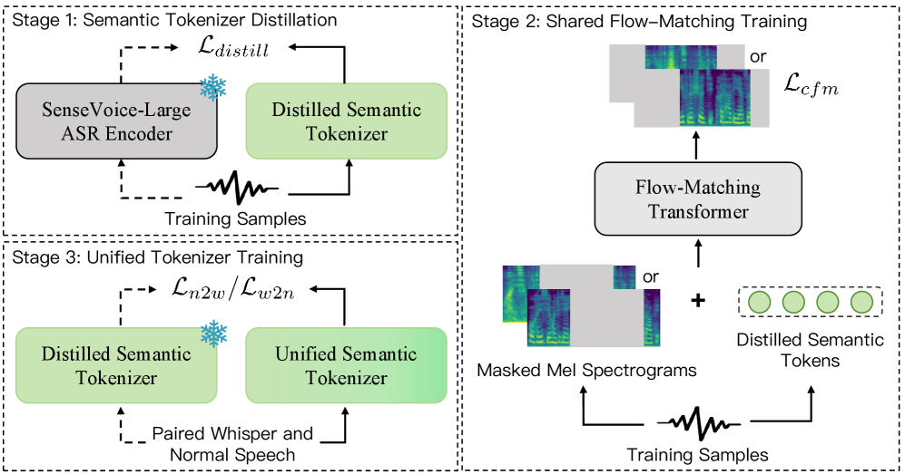
*Figure 2:Training pipeline of WhispEar.*

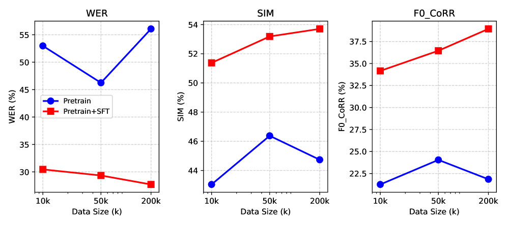
*Figure 3:Scaling experiment with pseudo-parallel data. Blue curves denote models trained with pseudo-data pretraining only, while red curves denote models further fine-tuned on aligned real data after pretraining.*

---
**Usage Info**: 6508 tokens used.
**Generated at**: 2026-03-10 12:43:16

---

# 📚 SoundWeaver: Semantic Warm-Starting for Text-to-Audio Diffusion Serving

🚀 URL: https://arxiv.org/html/2603.07865

## 🌏 Abstract (원문)
Diffusion models have rapidly become the foundation of text-to-audio (T2A) generation for applications such as music composition and sound-effect synthesis[audioldm2-2024taslp,liu2023audioldm]. These models iteratively denoise Gaussian noise into high-fidelity waveforms or spectrograms over tens of steps while conditioning on natural language prompts. Despite their quality advantages, inference remains inherently computationally intensive: generating audio clips can require multiple seconds on modern GPUs[li2025meanaudiofastfaithfultexttoaudio]. At production scale, where services process millions of requests daily[suno_platform], this translates into high user-perceived latency and substantial infrastructure cost.To mitigate this efficiency bottleneck, prior algorithmic advances have primarily focused on reducing the number of function evaluations (NFE). Algorithmic advances include improved samplers[liu2022pseudo,NEURIPS2022_260a14ac], adaptive timestep scheduling[chen2024adaptive], early-exit strategies[pmlr-v235-moon24a], and distillation that compresses multi-step diffusion into few-step samplers[salimans2022progressive,pmlr-v202-song23a]. Concurrently, systems-oriented efforts have targeted multi-GPU parallelism, and hardware–software co-design[fang2024xditinferenceenginediffusion,lu2026tetriserveefficientditserving].We explore a complementary, underexamined opportunity: exploiting inherent semantic similarity in audio distributions to reduce NFEs. As shown in Figure1, analysis of realistic traces (e.g., AudioCaps[audiocaps]) reveals that most user-uploaded audios have close semantic neighbors. In diffusion models, early NFEs establish coarse, low-frequency structure, while later steps refine high-frequency perceptual detail[choi2022,Qian_2024_CVPR]. Semantically similar samples, therefore, share structural components, allowing a cached neighbor to act as a strong prior—warm-starting from an intermediate step[xia2025modm]and skipping the NFEs that construct coarse structure.Building on this insight, we present SoundWeaver, which works through audio-guided warm-starting, which involves maintaining a reference cache and, upon a new request, selecting a semantically aligned candidate to warm-start generation from an intermediate state, skipping initial NFEs.Enabling such approximate caching introduces non-trivial challenges, which we address with the following contributions:A novelReference Selectorthat performs semantic and duration-aware retrieval and alignment from the cache (§2.1).ASkip Gaterthat balances quality–latency trade-offs and adapts to the user-prompt distribution to determine the percentage of NFEs to skip during diffusion (§2.2).A lightweightCache Managerthat performs quality-aware eviction and refinement, ensuring high reuse utility while bounding memory and compute overhead. (§2.3).By transforming audio similarity into computation savings, SoundWeaver substantially improves serving latency. Our evaluations on realistic workloads show that SoundWeaver achieves a 1.8–3.0× end-to-end latency speedup, while preserving—and often even improving—perceptual quality with a cache of only∼\sim1K audio entries (§3).
## 🌏 Abstract (번역)
확산 모델은 음악 작곡 및 음향 효과 합성[audioldm2-2024taslp, liu2023audioldm]과 같은 응용 분야를 위한 텍스트-오디오(T2A) 생성의 기반으로 빠르게 자리 잡았습니다. 이 모델들은 자연어 프롬프트에 따라 수십 단계에 걸쳐 가우시안 노이즈를 고음질 파형 또는 스펙트로그램으로 반복적으로 노이즈 제거합니다. 품질상의 이점에도 불구하고, 추론은 본질적으로 계산 집약적입니다. 오디오 클립을 생성하는 데 최신 GPU에서 수 초가 걸릴 수 있습니다[li2025meanaudiofastfaithfultexttoaudio]. 서비스가 매일 수백만 건의 요청을 처리하는 생산 규모[suno_platform]에서는 이는 사용자 체감 지연 시간을 높이고 상당한 인프라 비용을 초래합니다.이러한 효율성 병목 현상을 완화하기 위해, 이전의 알고리즘 발전은 주로 함수 평가(NFE) 횟수를 줄이는 데 중점을 두었습니다. 알고리즘 발전에는 개선된 샘플러[liu2022pseudo, NEURIPS2022_260a14ac], 적응형 타임스텝 스케줄링[chen2024adaptive], 조기 종료 전략[pmlr-v235-moon24a], 그리고 다단계 확산을 소수 단계 샘플러로 압축하는 증류(distillation)[salimans2022progressive, pmlr-v202-song23a]가 포함됩니다. 동시에, 시스템 지향적인 노력은 다중 GPU 병렬 처리 및 하드웨어-소프트웨어 공동 설계[fang2024xditinferenceenginediffusion, lu2026tetriserveefficientditserving]를 목표로 했습니다.우리는 보완적이고 덜 탐구된 기회, 즉 오디오 분포의 내재된 의미론적 유사성을 활용하여 NFE를 줄이는 방법을 탐구합니다. 그림 1에서 볼 수 있듯이, 실제 트레이스(예: AudioCaps[audiocaps]) 분석은 대부분의 사용자 업로드 오디오가 밀접한 의미론적 이웃을 가지고 있음을 보여줍니다. 확산 모델에서 초기 NFE는 거친 저주파 구조를 설정하고, 후기 단계는 고주파 지각 세부 사항을 정제합니다[choi2022, Qian_2024_CVPR]. 따라서 의미론적으로 유사한 샘플은 구조적 구성 요소를 공유하므로, 캐시된 이웃이 강력한 사전 정보 역할을 하여 중간 단계에서 웜 스타트[xia2025modm]하고 거친 구조를 구성하는 NFE를 건너뛸 수 있습니다.이러한 통찰력을 바탕으로, 우리는 오디오 기반 웜 스타팅을 통해 작동하는 SoundWeaver를 제시합니다. 이는 참조 캐시를 유지하고, 새로운 요청 시 의미론적으로 정렬된 후보를 선택하여 중간 상태에서 생성을 웜 스타트함으로써 초기 NFE를 건너뛰는 것을 포함합니다.이러한 근사 캐싱을 가능하게 하는 것은 다음과 같은 비 trivial한 과제를 야기하며, 우리는 다음 기여를 통해 이를 해결합니다:캐시에서 의미론적 및 지속 시간 인식 검색 및 정렬을 수행하는 새로운 참조 선택기(Reference Selector)(§2.1).품질-지연 시간 균형을 맞추고 사용자 프롬프트 분포에 적응하여 확산 중 건너뛸 NFE 비율을 결정하는 스킵 게이터(Skip Gater)(§2.2).메모리 및 계산 오버헤드를 제한하면서 높은 재사용 유틸리티를 보장하는 품질 인식 제거 및 정제를 수행하는 경량 캐시 관리자(Cache Manager)(§2.3).오디오 유사성을 계산 절감으로 전환함으로써 SoundWeaver는 서비스 지연 시간을 크게 개선합니다. 실제 워크로드에 대한 우리의 평가는 SoundWeaver가 단 ~1K 오디오 항목의 캐시로 지각 품질을 유지하고 종종 개선하면서 1.8–3.0배의 종단 간 지연 시간 단축을 달성함을 보여줍니다(§3).

## 🔍 Methods & Results
- SoundWeaver는 텍스트-오디오(T2A) 확산 모델의 역방향 프로세스를 의미론적으로 정렬된 캐시된 참조(x^0)를 사용하여 웜 스타트하여, 순수 노이즈에서 초기화하는 대신 스킵 타임스텝(t*)에서 중간 잠재 변수(xt*)를 샘플링하고 역방향 프로세스를 실행하여 필요한 함수 평가(NFE) 횟수를 T에서 T-t*로 줄입니다.
- SoundWeaver는 세 가지 핵심 구성 요소로 이루어져 있습니다: Reference Selector, Skip Gater, Cache Manager.
- Reference Selector는 사용자 프롬프트에 대해 캐시에서 상위 K개의 의미론적으로 유사한 오디오 샘플을 검색하고, 품질 게이트를 사용하여 필터링하며, 후보를 확률적으로 선택한 후 위상 보코더를 통해 요청된 지속 시간에 맞춰 시간적으로 정렬합니다.
- Reference Selector는 CLAP 점수(긍정적 유사도 s_pos, 부정적 유사도 s_neg)와 품질 임계값(theta_q)을 사용하여 품질 및 지속 시간 제약을 적용하며, FAISS와 다중 스케일 세그먼트 임베딩을 위한 피라미드 인덱싱 스키마를 활용하여 확장성과 캐시 커버리지를 향상시킵니다.
- Skip Gater는 문맥적 다중 암 밴딧(MAB) 기반 컨트롤러를 사용하여 온라인으로 최적의 스킵 비율(NFE 건너뛸 비율)을 탐색하고 활용합니다. MAB는 효율성 이득(ΔEt)과 지각 품질(Qt) 간의 균형을 맞추는 보상 함수를 사용하며, 사용자 선호도 신호를 통해 얻은 순위 기반 점수를 활용하고 프롬프트별 품질 분산에 따라 학습 업데이트에 가중치를 부여하여 의미론적으로 인식하는 스킵 결정을 학습합니다.
- Cache Manager는 캐시의 유틸리티를 모니터링하여 오래되고 점수가 낮은 항목을 제거하고 새로 생성된 사용자 오디오를 삽입합니다. 또한, 자주 재사용되지만 품질이 낮은 항목을 유휴 시간 동안 선택적으로 재생 및 정제하여 미래 요청에 대한 재사용성을 극대화합니다.
- 캐시 항목의 중요도 점수는 재사용 이벤트에 대한 건너뛴 NFE 수와 오디오 지속 시간을 기반으로 계산되며, 지수적 감쇠를 적용하여 최근에 유익했던 항목에 우선순위를 부여합니다.
- Cache Manager의 정제 메커니즘은 캐시된 오디오가 낮은 품질을 생성할 때 최대 3번의 재생성을 통해 최상의 결과를 선택하며, 이를 통해 CLAP 점수를 0.27 향상시키는 것으로 평가되었습니다.

## 🖼 Figures
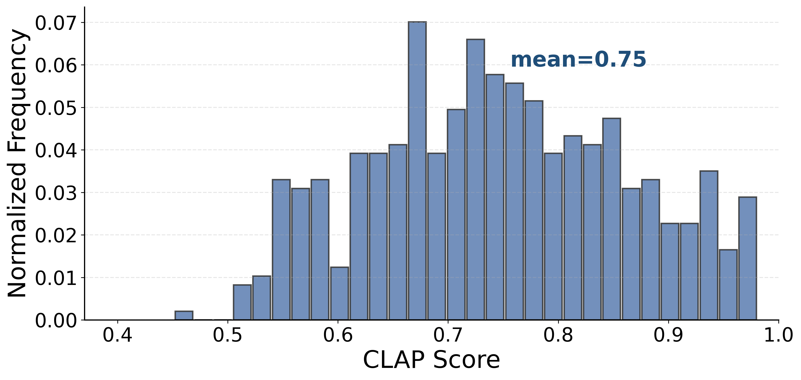
*Figure 1:Distribution of CLAP scores for nearest-neighbor retrievals across AudioCaps prompts.*

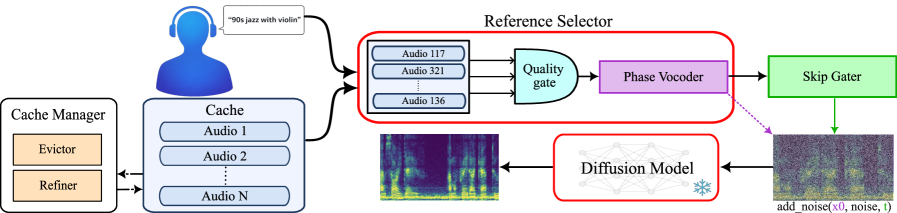
*Figure 2:SoundWeaver overview and request execution flow.*

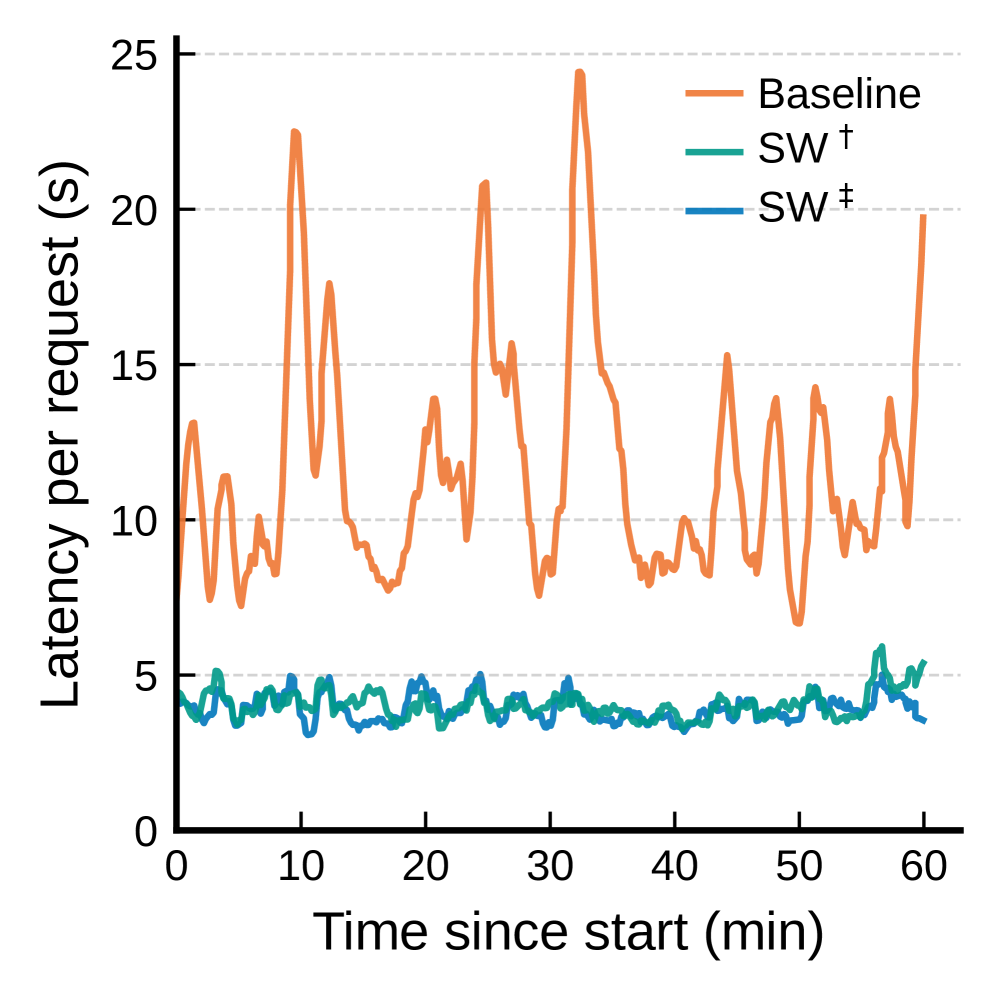
*(a)AudioLDM model.*

*(a)AudioLDM model.*

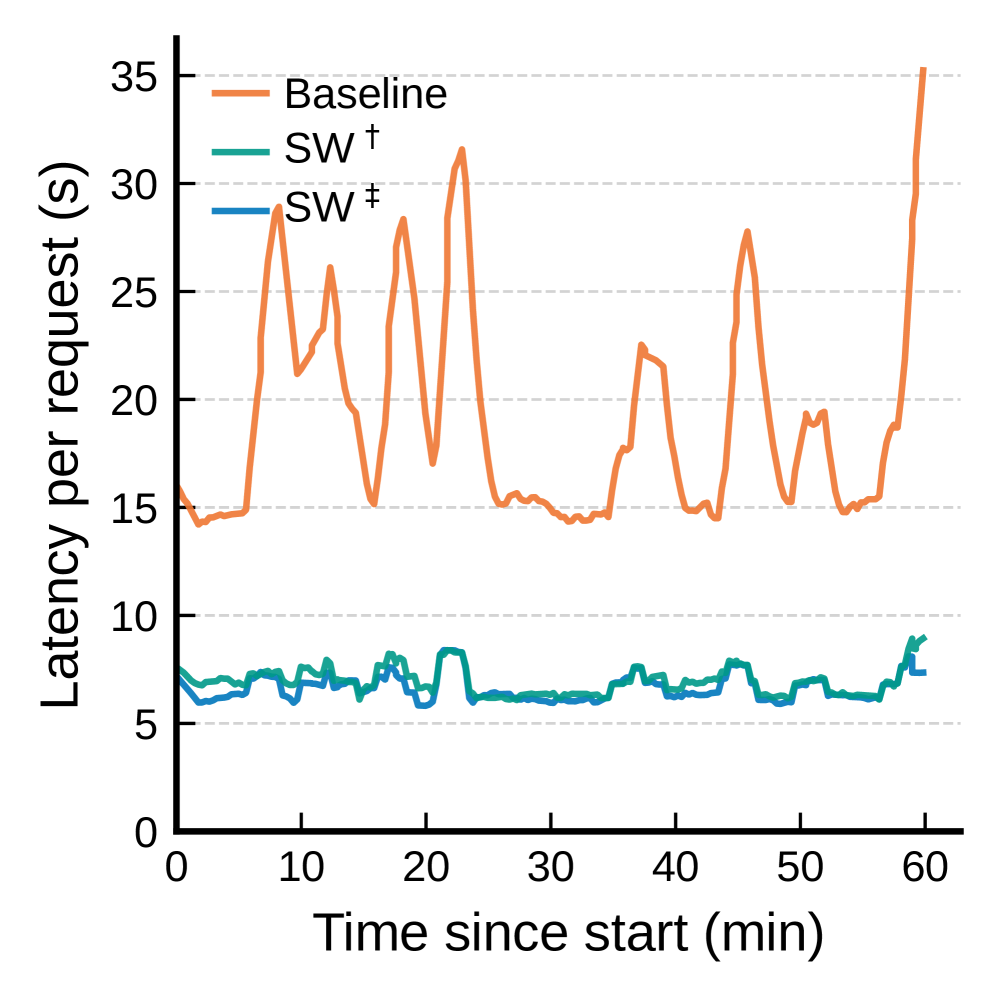
*(b)AudioLDM2 model.*

---
**Usage Info**: 6335 tokens used.
**Generated at**: 2026-03-10 12:43:31

---

# 📚 EmbedTalk: Triplane-Free Talking Head Synthesis using Embedding-Driven Gaussian Deformation

🚀 URL: https://arxiv.org/html/2603.07604

## 🌏 Abstract (원문)
Synthesising audio-driven talking heads in real-time is an important task in computer vision, with applicability in film production, teleconferencing, and virtual assistants. The standard pipeline involves the deformation of a canonical identity representation based on an arbitrary speech sample. Other control signals, such as emotion, gaze direction, or distance to camera may also be used for deformation. The canonical identity is typically represented in either two or three dimensional space. In recent years, methods for synthesising talking heads have been dominated by image-based generative models[alghamdi2022,xu2024vasa,Meng_2025_CVPR,kdtalker,ki2025float]and radiance fields[guo2021adnerf,li2023ernerf,synctalk,degstalk,li2025instag]. Whilst generative models produce high resolution results, they typically do not provide pose control, are slow to render, and can generate uncharacteristic movements which reduce realism and applicability. Within radiance fields, 3D Gaussian Splatting[3dgs]has emerged as the preferred choice due to its fast rendering speed and low memory requirements, compared to neural radiance fields (NeRFs)[mildenhall2021nerf].Generating talking heads with 3D Gaussian Splatting involves deforming a canonical Gaussian representation using the speech signal. To encode spatial continuity among the otherwise discrete Gaussians, each Gaussian is projected onto 2D subspaces through a tri-plane encoder prior to deformation.[degstalk,li2024talkinggaussian,cho2024gaussiantalker,synctalk_plus,li2025instag,d3talker]. However, tri-plane representations suffer from mirroring artefacts caused by feature entanglement between subspaces[li2025hyplanehead]. Furthermore, using 2D planes to deform a 3D volumetric field introduces approximation errors which subsequently affect audio-visual alignment, as shown in Figure1. Finally, many previous methods rely on imprecise facial tracking for inferring camera pose, which leads to wobbling around the boundary of the face[gaussianheadtalk].Prior work has demonstrated the superiority of learnable embeddings for modelling Gaussian deformations in 4D (3D + time) scene reconstruction[ed3dgs]. In this work, we extend the embedding-driven deformation paradigm to talking head synthesis. We introduceEmbedTalk, which leverages per-Gaussian embeddings to generate stable talking heads with high audio-visual alignment. To accurately reconstruct high-frequency displacements in the mouth region, we apply positional encodings to the Gaussian embeddings. Spatial coherence is enforced through a local smoothness constraint that encourages similar embeddings for neighbouring Gaussians. Furthermore, we address the head wobbling issue by initialising Gaussians with a stable, dense reconstruction obtained via COLMAP[colmap]. Experimental results establish EmbedTalk’s superiority in facial fidelity, lip-synchronisation, and motion consistency compared to previous 3DGS-based works. Furthermore, by generating mouth movements consistent with an identity’s style, our method achieves higher realism than state-of-the-art generative models that often exaggerate motion. Our key contributions are:A method to leverage learnt Gaussian embeddings for modelling speech deformations in audio-driven talking head synthesisA comprehensive comparative evaluation with recent 3DGS-based and generative methods, covering quantitative assessment, visual comparisons and a user studyAblations and experimental variations validating the efficacy of our design choices
## 🌏 Abstract (번역)
실시간 오디오 기반 토킹 헤드 합성은 컴퓨터 비전에서 영화 제작, 화상 회의, 가상 비서 등 다양한 분야에 적용될 수 있는 중요한 작업입니다. 표준 파이프라인은 임의의 음성 샘플을 기반으로 정규 신원 표현을 변형하는 것을 포함합니다. 감정, 시선 방향, 카메라와의 거리와 같은 다른 제어 신호도 변형에 사용될 수 있습니다. 정규 신원은 일반적으로 2차원 또는 3차원 공간으로 표현됩니다. 최근 몇 년간 토킹 헤드 합성 방법은 이미지 기반 생성 모델과 래디언스 필드에 의해 지배되어 왔습니다. 생성 모델은 고해상도 결과를 생성하지만, 일반적으로 포즈 제어를 제공하지 않고 렌더링 속도가 느리며, 사실감과 적용 가능성을 떨어뜨리는 비정상적인 움직임을 생성할 수 있습니다. 래디언스 필드 내에서는 3D 가우시안 스플래팅(3DGS)이 신경 래디언스 필드(NeRF)에 비해 빠른 렌더링 속도와 낮은 메모리 요구 사항으로 인해 선호되는 선택으로 부상했습니다. 3D 가우시안 스플래팅으로 토킹 헤드를 생성하는 것은 음성 신호를 사용하여 정규 가우시안 표현을 변형하는 것을 포함합니다. 그렇지 않으면 이산적인 가우시안들 사이의 공간적 연속성을 인코딩하기 위해, 각 가우시안은 변형 전에 삼면 인코더를 통해 2D 부분 공간에 투영됩니다. 그러나 삼면 표현은 부분 공간 간의 특징 얽힘으로 인해 미러링 아티팩트(거울상 결함)에 시달립니다. 또한, 3D 체적 필드를 변형하기 위해 2D 평면을 사용하는 것은 근사 오차를 발생시키며, 이는 이후 오디오-시각 정렬에 영향을 미칩니다(그림 1 참조). 마지막으로, 많은 이전 방법들은 카메라 포즈 추론을 위해 부정확한 얼굴 추적에 의존하여 얼굴 경계 주변에서 흔들림(wobbling)을 유발합니다. 이전 연구는 4D (3D + 시간) 장면 재구성에서 가우시안 변형 모델링을 위한 학습 가능한 임베딩의 우수성을 입증했습니다. 본 연구에서는 임베딩 기반 변형 패러다임을 토킹 헤드 합성으로 확장합니다. 우리는 각 가우시안 임베딩을 활용하여 높은 오디오-시각 정렬을 가진 안정적인 토킹 헤드를 생성하는 EmbedTalk를 소개합니다. 입 영역의 고주파 변위를 정확하게 재구성하기 위해 가우시안 임베딩에 위치 인코딩을 적용합니다. 공간적 일관성은 인접한 가우시안에 대해 유사한 임베딩을 장려하는 지역 평활화 제약 조건을 통해 강화됩니다. 또한, COLMAP을 통해 얻은 안정적이고 밀집된 재구성으로 가우시안을 초기화하여 머리 흔들림 문제를 해결합니다. 실험 결과는 이전 3DGS 기반 작업과 비교하여 EmbedTalk가 얼굴 충실도, 립싱크 및 동작 일관성에서 우수함을 입증합니다. 또한, 신원의 스타일에 일치하는 입 움직임을 생성함으로써, 우리 방법은 종종 움직임을 과장하는 최첨단 생성 모델보다 더 높은 사실감을 달성합니다. 우리의 주요 기여는 다음과 같습니다: 오디오 기반 토킹 헤드 합성에서 음성 변형 모델링을 위해 학습된 가우시안 임베딩을 활용하는 방법; 최근 3DGS 기반 및 생성 방법과의 정량적 평가, 시각적 비교 및 사용자 연구를 포함하는 포괄적인 비교 평가; 우리의 설계 선택의 효능을 검증하는 어블레이션 및 실험적 변형.

## 🔍 Methods & Results
- EmbedTalk는 단안 비디오와 음성 오디오로부터 신원별 토킹 헤드를 합성하기 위해 학습 가능한 가우시안 임베딩을 변형합니다.
- 기존 3DGS 기반 토킹 헤드 방법에서 사용되는 삼면(tri-plane) 표현의 한계(미러링 아티팩트, 근사 오차)를 피하고, 대신 각 가우시안에 학습 가능한 임베딩(zg)을 부여하는 임베딩 기반 변형 패러다임을 확장합니다.
- 음성 신호의 음향 특징(음소, 피치, 진폭)에 의해 변형이 구동되도록 E-D3DGS의 시간 임베딩을 오디오 임베딩으로 대체합니다.
- 입 영역의 고주파 변위를 정확하게 포착하기 위해 가우시안 임베딩에 위치 인코딩(alternating sine/cosine functions)을 적용하고, 음성과 무관한 얼굴 움직임(눈 깜빡임 등)을 위해 6가지 얼굴 액션 유닛(AU)을 특징 세트로 제공합니다.
- 얼굴 애니메이션이 주로 움직임과 가시성 변화를 포함한다는 점에 근거하여, 가우시안의 위치(μ)와 불투명도(α)만을 변형합니다.
- 얼굴 주변의 흔들림(wobbling) 문제를 해결하기 위해 COLMAP을 통해 얻은 안정적이고 밀집된 재구성(100K 포인트 이하로 다운샘플링)으로 가우시안을 초기화합니다.
- 렌더링 시, 변형된 헤드를 수정된 래스터라이저를 사용하여 몸통 및 장면 배경과 결합된 이미지에 렌더링하여 얼굴 윤곽 주변의 아티팩트를 방지합니다.
- 정규 가우시안 속성, 가우시안별 임베딩 및 변형 모듈을 렌더링 손실(L1), 지각 손실(LPIPS), 인접 가우시안에 대한 임베딩 유사성을 장려하는 지역 평활화 제약 조건, 그리고 플로터(floaters)를 완화하기 위한 가우시안 불투명도 평균 최소화를 통해 공동으로 최적화합니다.
- 실험 결과, EmbedTalk는 이전 3DGS 기반 작업에 비해 얼굴 충실도, 립싱크 및 동작 일관성에서 우수하며, 과장된 움직임을 피하고 신원 스타일에 일치하는 입 움직임을 생성하여 최첨단 생성 모델보다 더 높은 사실감을 달성합니다.

## 🖼 Figures

*Figure 1:Nearly all prior work on 3DGS-based talking head synthesis uses tri-planes, where approximation errors can hamper audio-visual alignment. EmbedTalk replaces tri-planes with learnable per-Gaussian embeddings, resulting in more accurate mouth movements and reduced computational overhead.*

![Figure 2:EmbedTalk begins with a talking portrait video. The video frames enable a dense reconstruction of the head that initialises the 3D Gaussians. Each Gaussian is also associated with a learnable embedding 
𝑧
𝑔
. For each frame, the corresponding speech signal 
𝑎
 and upper-face movements 
𝑒
 are fed into the deformation MLP, along with a positional encoding of 
𝑧
𝑔
 to predict the Gaussian deformations (
Δ
​
𝜇
,
Δ
​
𝛼
). The deformed Gaussians are passed to the rasteriser, along with the viewing direction (camera), to render the head onto the combined torso and scene background.](../images/2026-03-10/2603.07604/2603.07604_fig1.png)
*Figure 2:EmbedTalk begins with a talking portrait video. The video frames enable a dense reconstruction of the head that initialises the 3D Gaussians. Each Gaussian is also associated with a learnable embedding 
𝑧
𝑔
. For each frame, the corresponding speech signal 
𝑎
 and upper-face movements 
𝑒
 are fed into the deformation MLP, along with a positional encoding of 
𝑧
𝑔
 to predict the Gaussian deformations (
Δ
​
𝜇
,
Δ
​
𝛼
). The deformed Gaussians are passed to the rasteriser, along with the viewing direction (camera), to render the head onto the combined torso and scene background.*

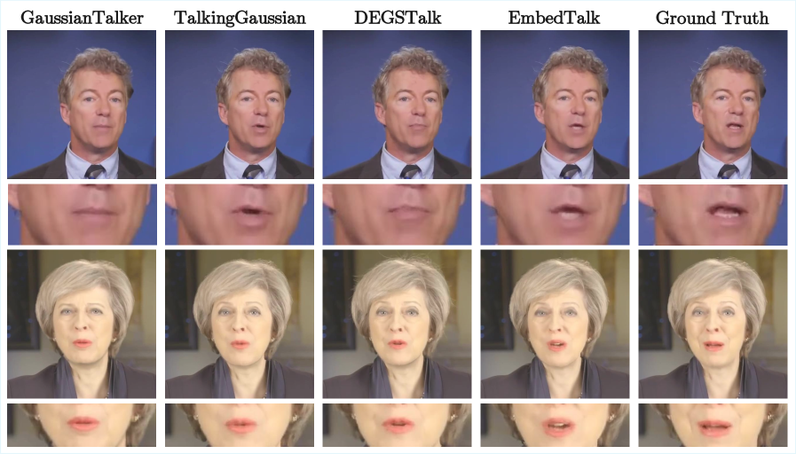
*Figure 3:Qualitative comparison with recent 3DGS-based works. EmbedTalk reconstructs narrow mouth openings more faithfully than other methods.*

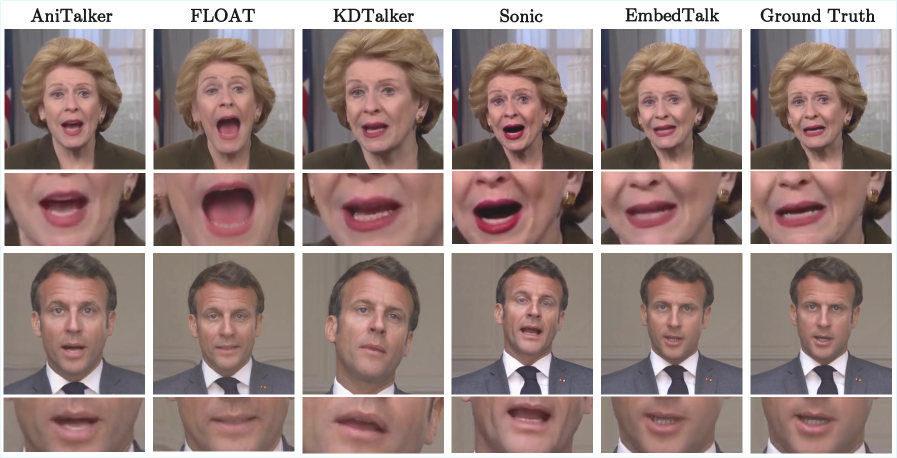
*Figure 4:Qualitative comparison with generative methods. Despite accurate lip-sync, generative models produce exaggerated movements that reduce realism.*

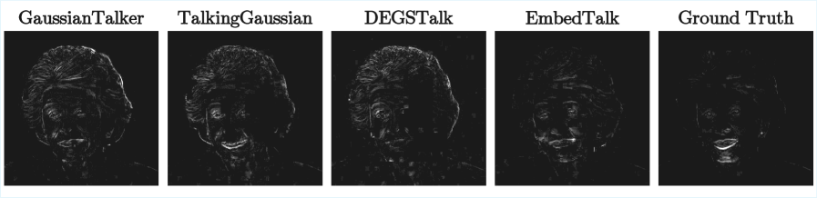
*Figure 5:Differences between consecutive frames accumulated over a 20 frame interval. The white pixels in the upper head region indicate the presence of temporal flickering.*

*(a)*

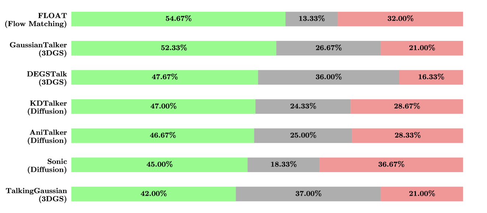
*(a)*

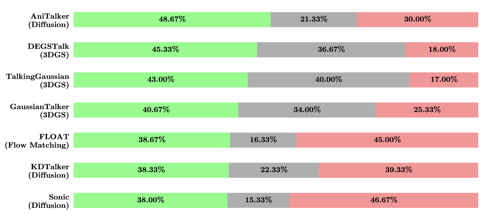
*(b)*

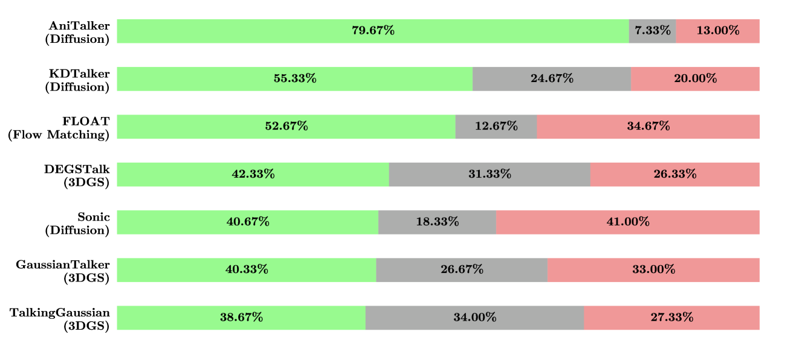
*(c)*

*(d)*

---
**Usage Info**: 8226 tokens used.
**Generated at**: 2026-03-10 12:43:57

---

# 📚 Benchmarking Language Modeling for Lossless Compression of Full-Fidelity Audio

🚀 URL: https://arxiv.org/html/2603.08683

## 🌏 Abstract (원문)
Recent work has demonstrated that neural-based approaches can yield dramatic improvements inlossyaudio compression[zeghidour2021soundstream,kumar2023high,defossez2022high], with learned codecs achieving an order of magnitude better compression rates than traditional codecs like MP3[brandenburg1999mp3]while maintaining comparable perceptual quality.
However, the potential of ML forlosslessaudio compression remains largely unexplored at practical fidelities.
Autoregressive (AR) language models (LMs) offer a potential solution, as such models trained on raw audio samples can be repurposed as lossless compressors via arithmetic coding[deletang2023language],
where compression rate improves as the model's log likelihood increases.
However, prior work has been constrained to 8-bit quantization at 16kHz sampling rates[van2016wavenet,goel2022s,deletang2023language,li2025lossless,heurtel2024compression].
This poses a practical problem as 8-bit, low sampling-rate audio is of limited downstream relevance—the perceptual quality is poor enough that audio is almost never distributed at this fidelity.
Professional recording and production workflows universally operate
on ``CD-quality'' audio (44.1kHz, 16-bit) or better (higher sample rates, 24-bit).
Additionally, directly modeling higher bit-depth audio creates exponentially larger vocabularies for LMs (216=65,5362^{16}=65{,}536tokens for 16-bit;224=16,777,2162^{24}=16{,}777{,}216for 24-bit), rendering standard AR approaches computationally intractable.
Whether language model compression can thus scale to these full-fidelity regimes remains an open question.
To counteract the exponential scaling of vocabulary size as bit depth increases, we introduceTrilobyte, a
byte-level tokenization scheme that
improves vocabulary scaling from exponentialO​(2b)O(2^{b})to
constantO​(1)O(1)in bit depth.
We demonstrate that not only does Trilobyte improve compression rates for 16-bit audio relative to sample-level modeling, it enables the first tractable language model compression of 24-bit audio.
The Trilobyte tokenization scheme
is compatible with any AR modeling framework—here we explore standard decoder-only Transformers specifically.
We
systematically
evaluate LM-based compression, including pre-trained LLMs and models trained from scratch on audio with and without Trilobyte encoding, on full-fidelity audio across diverse domains (music, speech, and bioacoustic signals), sampling rates (16-48kHz), and at 8-, 16-, and 24-bit quantization.
Our results primarily highlight thatbit depth, rather than sampling rate or data domain, is the limiting factor in LM-based compression.
Specifically, while LM-based approaches can outperform the industry-standard lossless codec FLAC[FLAC]at 8-bit (217% average improvement, consistent with prior work), the performance gap narrows substantially at higher bit depths (18% improvement at 16-bit).
Our contributions include: (1) Trilobyte, enabling tractable 24-bit modeling through hierarchical tokenization with linear vocabulary scaling; (2) the first comprehensive benchmarking of LM compression on full-fidelity audio (16/24-bit) across diverse domains; and (3) evidence characterizing the performance gap between learned and traditional compressors across bit depths.
We make the code for Trilobyte publicly available.111https://github.com/pnlong/trilobyte-experiments
## 🌏 Abstract (번역)
최근 연구에 따르면 신경망 기반 접근 방식은 손실 압축 오디오에서 극적인 개선을 가져올 수 있으며, 학습된 코덱은 MP3와 같은 기존 코덱보다 한 자릿수 더 나은 압축률을 달성하면서도 유사한 지각 품질을 유지합니다. 그러나 실용적인 충실도에서 ML의 무손실 오디오 압축 잠재력은 아직 크게 탐구되지 않았습니다. 자기회귀(AR) 언어 모델(LM)은 원시 오디오 샘플에 대해 훈련된 이러한 모델이 산술 코딩을 통해 무손실 압축기로 재활용될 수 있으므로 잠재적인 해결책을 제공하며, 모델의 로그 우도(log likelihood)가 증가함에 따라 압축률이 향상됩니다. 그러나 이전 작업은 16kHz 샘플링 속도에서 8비트 양자화로 제한되었습니다. 이는 8비트, 낮은 샘플링 속도 오디오는 지각 품질이 너무 낮아 거의 배포되지 않기 때문에 실용적인 문제를 야기합니다. 전문 녹음 및 제작 워크플로우는 보편적으로 'CD 품질' 오디오(44.1kHz, 16비트) 또는 그 이상(더 높은 샘플링 속도, 24비트)에서 작동합니다. 또한, 더 높은 비트 심도 오디오를 직접 모델링하면 LM에 대한 어휘가 기하급수적으로 커져(16비트의 경우 2^16=65,536 토큰; 24비트의 경우 2^24=16,777,216 토큰) 표준 AR 접근 방식은 계산적으로 다루기 어렵게 됩니다. 따라서 언어 모델 압축이 이러한 완전한 충실도 체제로 확장될 수 있는지는 미해결 과제로 남아 있습니다. 비트 심도가 증가함에 따라 어휘 크기의 기하급수적인 확장을 상쇄하기 위해, 우리는 비트 심도에서 어휘 확장을 기하급수적인 O(2^b)에서 상수 O(1)로 개선하는 바이트 수준 토큰화 방식인 Trilobyte를 소개합니다. Trilobyte는 샘플 수준 모델링에 비해 16비트 오디오의 압축률을 향상시킬 뿐만 아니라, 24비트 오디오의 최초로 다루기 쉬운 언어 모델 압축을 가능하게 함을 보여줍니다. Trilobyte 토큰화 방식은 모든 AR 모델링 프레임워크와 호환되며, 여기서는 특히 표준 디코더 전용 트랜스포머를 탐구합니다. 우리는 사전 훈련된 LLM과 Trilobyte 인코딩 유무에 관계없이 오디오에서 처음부터 훈련된 모델을 포함하여 LM 기반 압축을 다양한 도메인(음악, 음성 및 생체 음향 신호), 샘플링 속도(16-48kHz) 및 8, 16, 24비트 양자화에서 완전한 충실도 오디오에 대해 체계적으로 평가합니다. 우리의 결과는 주로 샘플링 속도나 데이터 도메인보다 비트 심도가 LM 기반 압축의 제한 요소임을 강조합니다. 특히, LM 기반 접근 방식이 8비트에서 업계 표준 무손실 코덱 FLAC을 능가할 수 있지만(이전 작업과 일치하는 평균 217% 개선), 더 높은 비트 심도에서는 성능 격차가 크게 줄어듭니다(16비트에서 18% 개선). 우리의 기여는 다음과 같습니다: (1) 선형 어휘 확장을 통한 계층적 토큰화로 다루기 쉬운 24비트 모델링을 가능하게 하는 Trilobyte; (2) 다양한 도메인에 걸쳐 완전한 충실도 오디오(16/24비트)에 대한 LM 압축의 최초 포괄적인 벤치마킹; (3) 비트 심도에 따른 학습된 압축기와 기존 압축기 간의 성능 격차를 특성화하는 증거. 우리는 Trilobyte 코드를 공개적으로 제공합니다.

## 🔍 Methods & Results
- 자기회귀(AR) 모델은 이전 샘플을 기반으로 다음 샘플의 확률 분포를 직접 모델링하여 산술 코딩을 통해 데이터의 엔트로피에 근접하는 압축률을 달성합니다.
- 기존 샘플 수준 토큰화는 비트 심도가 증가함에 따라 어휘 크기가 기하급수적으로(O(2^b)) 커져 16비트(65,536 토큰) 및 24비트(16,777,216 토큰) 오디오에서 AR 언어 모델을 비실용적으로 만듭니다.
- Trilobyte는 이 문제를 해결하기 위해 각 b-비트 샘플을 B 바이트로 분해하고, 각 바이트 위치에서 256가지 가능한 값에 대해 예측하여 비트 심도에 관계없이 상수 어휘 크기(O(1))를 유지하는 바이트 수준 토큰화 방식을 도입합니다.
- Trilobyte는 구성 바이트(MSB, 중간 바이트, LSB)를 인터리빙하고 GPT-2 아키텍처를 사용하여 바이트 수준 시퀀스에 대해 훈련하며, 스테레오 오디오의 경우 채널 간 상관 관계를 활용하기 위해 좌우 채널을 연결합니다.
- Trilobyte는 24비트 전문가용 오디오의 최초로 다루기 쉬운 언어 모델 압축을 가능하게 하며, 순진한 16비트 모델링과 유사한 성능을 달성합니다.
- LM 기반 압축은 다양한 도메인(음악, 음성, 생체 음향), 샘플링 속도(16-48kHz), 8, 16, 24비트 양자화에서 완전한 충실도 오디오에 대해 체계적으로 평가되었습니다.
- 주요 결과는 샘플링 속도나 데이터 도메인보다 비트 심도가 LM 기반 압축의 제한 요소임을 보여줍니다.
- LM 기반 접근 방식은 8비트에서 업계 표준 무손실 코덱 FLAC보다 평균 217% 더 나은 성능을 보였지만, 16비트에서는 성능 격차가 18% 개선으로 크게 줄어들었습니다.
- Trilobyte는 8비트 오디오의 경우 표준 샘플 수준 토큰화와 동일하게 작동합니다.
- Trilobyte 코드는 공개적으로 사용 가능합니다.

## 🖼 Figures
![Figure 1: Tokenization strategies for language model compression. Standard sample-level tokenization (top) yields vocabulary size 
|
𝒱
|
=
2
𝑏
. This exponential scaling inhibits modeling of industry-standard bit depths (
16
, 
24
). Trilobyte's hierarchical byte-level tokenization (bottom) decomposes samples into bytes, yielding constant 
|
𝒱
|
=
256
 regardless of bit depth (at the cost of increasing sequence length by 
⌈
𝑏
/
8
⌉
). Both feed into an AR LM and arithmetic coder, but Trilobyte enables tractable 24-bit modeling.](../images/2026-03-10/2603.08683/2603.08683_fig0.png)
*Figure 1: Tokenization strategies for language model compression. Standard sample-level tokenization (top) yields vocabulary size 
|
𝒱
|
=
2
𝑏
. This exponential scaling inhibits modeling of industry-standard bit depths (
16
, 
24
). Trilobyte's hierarchical byte-level tokenization (bottom) decomposes samples into bytes, yielding constant 
|
𝒱
|
=
256
 regardless of bit depth (at the cost of increasing sequence length by 
⌈
𝑏
/
8
⌉
). Both feed into an AR LM and arithmetic coder, but Trilobyte enables tractable 24-bit modeling.*

![Figure 2: FLAC compression performance across diverse audio domains at 8-bit and 16-bit quantization levels. Birdvox achieves exceptional compression (
∼
6x at 8-bit), perhaps reflecting the sparse and structurally constrained nature of bird vocalizations, which are highly predictable under linear predictive coding. Meanwhile, speech and music datasets show more modest gains. 16-bit audio generally achieves 1.5–2.5x compression, with diminishing returns beyond FLAC level 3. Note that we disable FLAC's verbatim, constant, and fixed subframe types, and that we do not evaluate Beethoven, YouTube Mix, or SC09 beyond 8-bit because they are 8-bit datasets.](../images/2026-03-10/2603.08683/2603.08683_fig1.png)
*Figure 2: FLAC compression performance across diverse audio domains at 8-bit and 16-bit quantization levels. Birdvox achieves exceptional compression (
∼
6x at 8-bit), perhaps reflecting the sparse and structurally constrained nature of bird vocalizations, which are highly predictable under linear predictive coding. Meanwhile, speech and music datasets show more modest gains. 16-bit audio generally achieves 1.5–2.5x compression, with diminishing returns beyond FLAC level 3. Note that we disable FLAC's verbatim, constant, and fixed subframe types, and that we do not evaluate Beethoven, YouTube Mix, or SC09 beyond 8-bit because they are 8-bit datasets.*

*Figure 3: Compression rate comparison across FLAC, DAC, EnCodec, and Custom DAC compressors on MusDB18 mixes. FLAC achieves the best compression, at approximately 1.8x, while the NAC-based approaches underperform, with EnCodec actually increasing file size.*

*Figure 4: Residual distribution comparison showing residual magnitudes (note the log scale) for FLAC, DAC, EnCodec, and Custom DAC compressors. FLAC residuals follow a geometric distribution with a mean absolute residual of 156.34, while DAC, EnCodec, and Custom DAC residuals are more uniformly distributed regardless of codebook level, with mean absolute residuals of 1,603.54 (DAC), 18,376.66 (EnCodec), and 1,245.76 (Custom DAC) – an order of magnitude larger than FLAC.*

![Figure 5: In-context LM-based compression performance with the method defined in Delétang et al. [deletang2023language] and Li et al. [li2025lossless] using pre-trained language models (Llama-2-7B and Llama-2-13B [touvron2023llama2]) across diverse audio domains at 8-bit and 16-bit quantization. We also report FLAC compression results at compression level 8, the maximum. Model scaling (7B to 13B) shows minimal gains at 8-bit and some improvements at 16-bit, especially for complex datasets. This method underperforms FLAC on most signals, with the exception of SC09 and Epidemic Sound at 8-bit.](../images/2026-03-10/2603.08683/2603.08683_fig4.png)
*Figure 5: In-context LM-based compression performance with the method defined in Delétang et al. [deletang2023language] and Li et al. [li2025lossless] using pre-trained language models (Llama-2-7B and Llama-2-13B [touvron2023llama2]) across diverse audio domains at 8-bit and 16-bit quantization. We also report FLAC compression results at compression level 8, the maximum. Model scaling (7B to 13B) shows minimal gains at 8-bit and some improvements at 16-bit, especially for complex datasets. This method underperforms FLAC on most signals, with the exception of SC09 and Epidemic Sound at 8-bit.*

---
**Usage Info**: 6144 tokens used.
**Generated at**: 2026-03-10 12:44:11

---

# 📚 Unsupervised Domain Adaptation for Audio Deepfake Detection with Modular Statistical Transformations

🚀 URL: https://arxiv.org/html/2603.07935

## 🌏 Abstract (원문)
Generative models now produce synthetic media that is increasingly difficult to distinguish from authentic content. Text generators can fabricate plausible news articles that are difficult to detect even for politically informed readers[11], while image, video, and audio generators create realistic but entirely artificial scenes and voices[6]. The rapid development of neural speech synthesis and voice conversion systems has made high-quality voice cloning widely accessible, raising concerns in security-sensitive applications such as fraud, impersonation, and the circumvention of voice biometric authentication systems[18,10].Social science studies and systematic reviews of disinformation highlight that modern misinformation campaigns often combine multiple modalities and exploit the dynamics of social platforms[16,13]. Manipulated media therefore rarely appears in isolation and instead contributes to multimodal narratives designed to maximize persuasive impact and audience reach[5].For audio deepfakes, human perception studies indicate that listeners struggle to reliably distinguish synthetic from authentic speech. Muller et al. show that both humans and machine detectors fail on several types of attacks in controlled experiments[15]. Similarly, Mai et al. demonstrate that even after warnings and exposure to examples, human participants cannot consistently detect speech deepfakes across languages and speaker identities[14]. These findings reinforce the need for automated detection systems capable of identifying subtle acoustic artifacts and inconsistencies introduced by generative models.Recent surveys on audio deepfake detection summarize a rapidly growing body of work on model architectures, feature representations, and training strategies[1,20]. Early approaches relied on handcrafted spectral representations such as constant-Q cepstral coefficients and phase-based features[17]. More recent work leverages deep neural architectures including RawNet[8], AASIST[9], and transformer-based speech encoders derived from large-scale self-supervised pretraining[2,7,4].Despite these advances, benchmark initiatives such as ASVspoof 2021 have shown that many systems fail to generalize to realistic transmission conditions and previously unseen attack families[12]. Cross-dataset evaluation often reveals that detectors exploit dataset-specific artifacts rather than intrinsic properties of synthetic speech[10]. To address this limitation, recent work on domain generalization proposes architectures designed to learn domain-invariant features on top of self-supervised speech representations[19].In parallel, the DeepSpeak dataset has recently been introduced as a more realistic benchmark for audiovisual deepfake detection with more than one hundred hours of real and manipulated webcam-style footage[3]. The dataset includes diverse speakers, recording conditions, and modern deepfake generation pipelines, providing both frame-level and clip-level labels. Such datasets enable research into multimodal manipulation detection and cross-modal consistency analysis.In this paper we focus on cross-domain voice deepfake detection. Building on prior work that combines Wav2Vec 2.0 embeddings with shallow classifiers, we propose a hybrid feature pipeline that introduces a sequence of distributional and geometric transformations prior to classification. Instead of relying on large end-to-end networks, our approach emphasizes a transparent sequence of operations that can be inspected, interpreted, and ablated.Our contributions are as follows:We formalize a cross-domain audio deepfake detection setting that emphasizes train–test distribution shifts across datasets and synthesis systems.We design a hybrid feature pipeline that combines power transformation, feature selection, joint principal component analysis, correlation alignment (CORAL), and an optimized classifier on top of self-supervised speech representations.We empirically study the impact of each component through ablation experiments and discuss how the pipeline can extend to multimodal settings such as DeepSpeak.
## 🌏 Abstract (번역)
생성 모델은 이제 실제 콘텐츠와 구별하기 점점 더 어려워지는 합성 미디어를 생성합니다. 텍스트 생성기는 정치적으로 정보를 아는 독자조차도 탐지하기 어려운 그럴듯한 뉴스 기사를 조작할 수 있으며[11], 이미지, 비디오 및 오디오 생성기는 사실적이지만 완전히 인공적인 장면과 목소리를 만듭니다[6]. 신경 음성 합성 및 음성 변환 시스템의 급속한 발전으로 고품질 음성 복제가 널리 보급되어 사기, 사칭 및 음성 생체 인식 인증 시스템 우회와 같은 보안에 민감한 응용 분야에서 우려를 제기하고 있습니다[18,10].사회 과학 연구 및 허위 정보에 대한 체계적인 검토는 현대의 잘못된 정보 캠페인이 종종 여러 양식을 결합하고 소셜 플랫폼의 역학을 악용한다는 점을 강조합니다[16,13]. 따라서 조작된 미디어는 거의 단독으로 나타나지 않고 대신 설득력 있는 영향과 청중 도달 범위를 최대화하도록 설계된 다중 모드 내러티브에 기여합니다[5].오디오 딥페이크의 경우, 인간 지각 연구는 청취자들이 합성 음성과 실제 음성을 안정적으로 구별하는 데 어려움을 겪는다는 것을 나타냅니다. Muller 등은 통제된 실험에서 인간과 기계 탐지기 모두 여러 유형의 공격에 실패한다는 것을 보여줍니다[15]. 유사하게, Mai 등은 경고와 예시 노출 후에도 인간 참가자들이 언어와 화자 정체성에 걸쳐 음성 딥페이크를 일관되게 탐지할 수 없다는 것을 입증합니다[14]. 이러한 발견은 생성 모델에 의해 도입된 미묘한 음향 아티팩트 및 불일치를 식별할 수 있는 자동 탐지 시스템의 필요성을 강화합니다.오디오 딥페이크 탐지에 대한 최근 조사는 모델 아키텍처, 특징 표현 및 훈련 전략에 대한 빠르게 성장하는 연구를 요약합니다[1,20]. 초기 접근 방식은 상수-Q 켑스트럼 계수 및 위상 기반 특징과 같은 수작업으로 만든 스펙트럼 표현에 의존했습니다[17]. 최근 연구는 RawNet[8], AASIST[9] 및 대규모 자체 지도 사전 훈련에서 파생된 트랜스포머 기반 음성 인코더를 포함한 심층 신경 아키텍처를 활용합니다[2,7,4].이러한 발전에도 불구하고, ASVspoof 2021과 같은 벤치마크 이니셔티브는 많은 시스템이 현실적인 전송 조건과 이전에 보지 못한 공격 유형에 일반화하는 데 실패했음을 보여주었습니다[12]. 교차 데이터셋 평가는 종종 탐지기가 합성 음성의 본질적인 속성보다는 데이터셋 특정 아티팩트를 악용한다는 것을 밝혀냅니다[10]. 이러한 한계를 해결하기 위해 도메인 일반화에 대한 최근 연구는 자체 지도 음성 표현 위에 도메인 불변 특징을 학습하도록 설계된 아키텍처를 제안합니다[19].이와 병행하여, DeepSpeak 데이터셋은 최근 100시간 이상의 실제 및 조작된 웹캠 스타일 푸티지를 포함하는 시청각 딥페이크 탐지를 위한 보다 현실적인 벤치마크로 도입되었습니다[3]. 이 데이터셋은 다양한 화자, 녹음 조건 및 현대 딥페이크 생성 파이프라인을 포함하며, 프레임 수준 및 클립 수준 레이블을 모두 제공합니다. 이러한 데이터셋은 다중 모드 조작 탐지 및 교차 모드 일관성 분석 연구를 가능하게 합니다.본 논문에서는 교차 도메인 음성 딥페이크 탐지에 중점을 둡니다. Wav2Vec 2.0 임베딩과 얕은 분류기를 결합하는 이전 연구를 기반으로, 우리는 분류 전에 일련의 분포 및 기하학적 변환을 도입하는 하이브리드 특징 파이프라인을 제안합니다. 대규모 종단 간 네트워크에 의존하는 대신, 우리의 접근 방식은 검사, 해석 및 제거될 수 있는 투명한 일련의 작업을 강조합니다.우리의 기여는 다음과 같습니다:데이터셋 및 합성 시스템 전반에 걸친 훈련-테스트 분포 변화를 강조하는 교차 도메인 오디오 딥페이크 탐지 설정을 공식화합니다.자체 지도 음성 표현 위에 거듭제곱 변환, 특징 선택, 공동 주성분 분석, 상관 관계 정렬(CORAL) 및 최적화된 분류기를 결합하는 하이브리드 특징 파이프라인을 설계합니다.절제 실험을 통해 각 구성 요소의 영향을 경험적으로 연구하고 파이프라인이 DeepSpeak와 같은 다중 모드 설정으로 확장될 수 있는 방법을 논의합니다.

## 🔍 Methods & Results
- 본 연구는 레이블이 지정된 소스 도메인과 레이블이 지정되지 않은 타겟 도메인 간의 화자 인구 통계, 언어, 녹음 채널, 코덱, 합성 모델 및 공격 유형의 차이를 고려하는 비지도 도메인 적응(UDA) 설정에서 이진 오디오 딥페이크 탐지에 중점을 둡니다.
- 제안된 하이브리드 특징 파이프라인은 Wav2Vec 2.0 임베딩을 프런트 엔드로 사용하여 각 발화에 대해 1024차원 특징 벡터를 추출합니다.
- 특징 분포의 왜곡을 줄이고 분산을 안정화하기 위해 각 특징 차원에 독립적으로 Yeo-Johnson 변환과 같은 거듭제곱 변환을 적용한 후 표준화를 수행합니다.
- 소스 도메인에서 ANOVA F-test를 사용하여 지도 특징 선택을 수행하여 상위 k=512개(원래 차원의 50%) 특징을 유지함으로써 잡음이 많거나 중복되는 차원을 제거하고 판별력을 향상시킵니다.
- 소스 및 레이블이 지정되지 않은 타겟 임베딩의 결합된 세트에 대해 공동 주성분 분석(PCA)을 수행하여 차원을 n=256개 구성 요소로 줄여 차원 축소 및 잡음 제거를 달성하고 두 도메인에 걸쳐 공유되는 분산 방향을 포착합니다.
- 상관 관계 정렬(CORAL)을 적용하여 소스 특징의 공분산을 타겟 특징의 공분산과 일치시켜 잔여 도메인 불일치를 줄이고 분포 이동을 완화하여 보다 강력한 모델 전송을 가능하게 합니다.
- 변환된 특징 위에 L2 정규화(C=0.01)가 적용된 로지스틱 회귀 분류기를 훈련하여 소스 도메인 패턴에 과적합을 방지하고 훈련 데이터의 클래스 불균형을 처리하기 위해 균형 잡힌 클래스 가중치를 사용합니다.
- 각 파이프라인 단계는 독립적으로 제거될 수 있으며 클래스 분리 가능성 및 도메인 정렬에 미치는 영향을 이해하기 위해 시각화될 수 있어 투명성과 해석 가능성을 강조합니다.

## 🖼 Figures

*Figure 1:Cross-Domain Audio Deepfake Detection Pipeline. Audio from source (ASVspoof) and target (FoR) datasets undergoes feature extraction (Wav2Vec 2.0), power transformation (Yeo–Johnson), feature selection (ANOVA), dimensionality reduction (Joint PCA n=256), and domain alignment (CORAL). The aligned features are classified via logistic regression for binary real/fake prediction. Arrow connections show the data flow from datasets through preprocessing stages to final predictions.*

*Figure 2:CORAL Domain Alignment Visualization. Top: Pre-alignment feature distributions show ASVspoof (blue) and FoR (orange) datasets with a large distributional gap. Bottom: Post-CORAL alignment (
𝜆
=
10
−
6
) reduces the inter-domain gap through covariance matching, creating overlapping feature spaces. Performance gains: Acc +7.0%, AUC +5.8%, EER -5.7%.*

*Figure 3:Baseline vs. Final Cross-Domain Performance. Striped bars represent baseline performance using raw Wav2Vec 2.0 features, while solid bars show results after applying power transform, feature selection (ANOVA), PCA reduction (n=256), and CORAL alignment. The final pipeline achieves consistent improvements across Accuracy, AUC, and EER metrics for both ASVspoof
→
FoR and FoR
→
ASVspoof transfer scenarios, with accuracy gains exceeding 10% in both directions.*

*Figure 4:Proposed Multimodal Architecture for Future Work. Audio (Wav2Vec 2.0) and video (ResNet-50) feature extraction branches would process inputs independently through power transform, feature selection (ANOVA), PCA reduction, and CORAL domain alignment. This is a hypothetical design for future implementation.*

---
**Usage Info**: 4901 tokens used.
**Generated at**: 2026-03-10 12:44:25

---

# 📚 Language-Invariant Multilingual Speaker Verification for the TidyVoice 2026 Challenge

🚀 URL: https://arxiv.org/html/2603.08092

## 🌏 Abstract (원문)
Speaker verification (SV) aims to verify the identity of speakers by analyzing their voice samples. In recent years, with the rapid development of deep neural networks and the availability of large-scale labeled speech datasets, deep learning-based SV systems[1,2,3,4]have achieved remarkable performance across a wide range of acoustic conditions. However, the performance of SV systems degrades significantly under the language mismatch condition, which is further exacerbated by the field’s reliance on English-centric datasets. In addition, the limited availability of multilingual speech from individual speakers often leads to speaker embeddings that entangle identity with language-specific characteristics, reducing cross-lingual generalization and robustness.Large-scale self-supervised Pre-Trained Models (PTMs), such as WavLM[5], wav2vec 2.0[6], HuBERT[7]and w2v-BERT 2.0[8], are trained on hundreds of thousands or even millions of hours of unlabeled speech data and provide rich speech representations. These models have been increasingly adopted in research to enhance performance on various downstream tasks, including the SV task. In particular, the w2v-BERT 2.0 PTM is trained on 4.5 million hours of unlabeled speech spanning 143 languages, making it highly suitable for cross-lingual SV tasks. Li et al.[9]built a state-of-the-art SV system based on w2v-BERT 2.0. In their approach, Layer Adapters[10]are applied to the outputs of each Conformer layer to reduce dimensionality and facilitate domain adaptation. The adapted features from all layers are then aggregated using a Multi-scale Feature Aggregation (MFA)[11]framework to generate speaker embeddings, and Low-Rank Adaptation (LoRA)[12]is employed during training to fine-tune the model efficiently.Speaker embeddings extracted from multilingual data often contain not only identity information but also language-specific characteristics, which can reduce cross-lingual generalization and robustness. To mitigate this issue, it is necessary to encourage the learning of language-invariant speaker representations. Similar approaches have been adopted in other scenarios, such as age-invariant speaker representation learning[13], where adversarial training is used to suppress age-related information in the embeddings.In this work, we follow the approach in[9]to build SV systems based on the w2v-BERT 2.0 PTM. To further improve cross-lingual robustness, a language-adversarial training strategy is introduced to encourage the learning of language-invariant speaker representations and suppress language-related variations in the embedding space. In addition, although the official TidyVoiceX training set is multilingual, each speaker typically contains only two to three languages, which limits language diversity for robust cross-lingual speaker modeling. Recent advances in Zero-Shot Text-To-Speech (ZS-TTS)[14,15]technology have made it possible to synthesize high-quality speech that preserves the vocal characteristics of a target speaker using only a few seconds of reference audio, without requiring speaker-specific training. This enables flexible voice cloning across different languages and textual contents. Leveraging this capability, we adopt a multilingual ZS-TTS system, Qwen3-TTS[15], to synthesize speech in additional languages for each speaker. We aim to enrich the multilingual speech data for each speaker, thereby facilitating the learning of more language-invariant speaker representations.
## 🌏 Abstract (번역)
화자 확인(SV)은 음성 샘플을 분석하여 화자의 신원을 확인하는 것을 목표로 합니다. 최근 딥러닝 신경망의 급속한 발전과 대규모 레이블링된 음성 데이터셋의 가용성으로 인해 딥러닝 기반 SV 시스템[1,2,3,4]은 광범위한 음향 조건에서 뛰어난 성능을 달성했습니다. 그러나 SV 시스템의 성능은 언어 불일치 조건에서 크게 저하되며, 이는 해당 분야가 영어 중심 데이터셋에 의존하는 경향으로 인해 더욱 악화됩니다. 또한, 개별 화자로부터의 다국어 음성 가용성 제한은 종종 신원과 언어별 특성을 얽히게 하는 화자 임베딩으로 이어져 교차 언어 일반화 및 견고성을 감소시킵니다. WavLM[5], wav2vec 2.0[6], HuBERT[7], w2v-BERT 2.0[8]과 같은 대규모 자기 지도 사전 학습 모델(PTM)은 수십만 또는 수백만 시간의 레이블링되지 않은 음성 데이터로 학습되며 풍부한 음성 표현을 제공합니다. 이러한 모델은 SV 작업을 포함한 다양한 다운스트림 작업에서 성능을 향상시키기 위해 연구에 점점 더 많이 채택되고 있습니다. 특히 w2v-BERT 2.0 PTM은 143개 언어에 걸쳐 450만 시간의 레이블링되지 않은 음성으로 학습되어 교차 언어 SV 작업에 매우 적합합니다. Li 등[9]은 w2v-BERT 2.0을 기반으로 최첨단 SV 시스템을 구축했습니다. 그들의 접근 방식에서는 각 Conformer 레이어의 출력에 Layer Adapters[10]를 적용하여 차원 수를 줄이고 도메인 적응을 용이하게 합니다. 모든 레이어의 적응된 특징은 Multi-scale Feature Aggregation (MFA)[11] 프레임워크를 사용하여 집계되어 화자 임베딩을 생성하며, 효율적인 모델 미세 조정을 위해 학습 중에 Low-Rank Adaptation (LoRA)[12]이 사용됩니다. 다국어 데이터에서 추출된 화자 임베딩은 종종 신원 정보뿐만 아니라 언어별 특성도 포함하여 교차 언어 일반화 및 견고성을 감소시킬 수 있습니다. 이 문제를 완화하기 위해 언어 불변 화자 표현 학습을 장려하는 것이 필요합니다. 적대적 학습을 사용하여 임베딩에서 연령 관련 정보를 억제하는 연령 불변 화자 표현 학습[13]과 같은 다른 시나리오에서도 유사한 접근 방식이 채택되었습니다. 본 연구에서는 w2v-BERT 2.0 PTM을 기반으로 SV 시스템을 구축하기 위해 [9]의 접근 방식을 따릅니다. 교차 언어 견고성을 더욱 향상시키기 위해 언어 불변 화자 표현 학습을 장려하고 임베딩 공간에서 언어 관련 변동을 억제하기 위해 언어 적대적 학습 전략이 도입되었습니다. 또한, 공식 TidyVoiceX 학습 세트는 다국어이지만, 각 화자는 일반적으로 두세 가지 언어만 포함하여 견고한 교차 언어 화자 모델링을 위한 언어 다양성이 제한적입니다. 최근 Zero-Shot Text-To-Speech (ZS-TTS)[14,15] 기술의 발전으로 화자별 학습 없이 몇 초의 참조 오디오만으로 대상 화자의 음성 특성을 보존하는 고품질 음성을 합성할 수 있게 되었습니다. 이를 통해 다양한 언어 및 텍스트 콘텐츠에 걸쳐 유연한 음성 복제가 가능합니다. 이 기능을 활용하여 우리는 다국어 ZS-TTS 시스템인 Qwen3-TTS[15]를 채택하여 각 화자에 대해 추가 언어로 음성을 합성합니다. 우리는 각 화자에 대한 다국어 음성 데이터를 풍부하게 하여 더 많은 언어 불변 화자 표현 학습을 촉진하는 것을 목표로 합니다.

## 🔍 Methods & Results
- W2v-BERT 2.0 PTM (143개 언어, 450만 시간의 레이블링되지 않은 음성 데이터로 학습된 24-layer Conformer 인코더)을 기반 모델로 사용합니다.
- 입력 발화에서 Fbank 특징을 추출한 후 w2v-BERT 2.0 모델에 입력하고, 각 Conformer 레이어의 은닉 표현에 Layer Adapters를 적용하여 차원 축소 및 도메인 적응을 수행합니다.
- 모든 레이어에서 적응된 특징들을 연결하고 Attentive Statistics Pooling (ASP) 모듈을 사용하여 집계한 후 선형 투영 레이어를 통해 최종 화자 임베딩을 얻습니다.
- 모델의 효율적인 미세 조정을 위해 학습 중에 Low-Rank Adaptation (LoRA)을 사용합니다.
- 언어 불변 화자 표현 학습을 위해 Gradient Reversal Layer (GRL)를 통해 화자 임베딩 추출기에 연결된 보조 언어 분류기를 도입하는 언어 적대적 학습 전략을 사용합니다.
- 최종 손실 함수는 화자 분류 손실과 GRL이 적용된 언어 분류 손실의 조합으로 구성되어, 임베딩이 화자 신원에는 판별적이지만 언어 신원에는 비정보적이도록 유도합니다.
- 다국어 ZS-TTS 시스템인 Qwen3-TTS를 활용하여 각 화자에 대해 중국어, 영어, 일본어, 한국어, 독일어, 프랑스어, 러시아어, 포르투갈어, 스페인어, 이탈리아어 등 10개 언어로 합성 음성을 생성하여 다국어 음성 데이터를 증강합니다.
- 합성 음성 생성을 위해 LibriTTS의 영어 문장을 M2M100 다국어 번역 모델을 사용하여 대상 언어로 번역하고, 참조 오디오는 Whisper-large-v3로 전사하여 사용합니다.

## 🖼 Figures
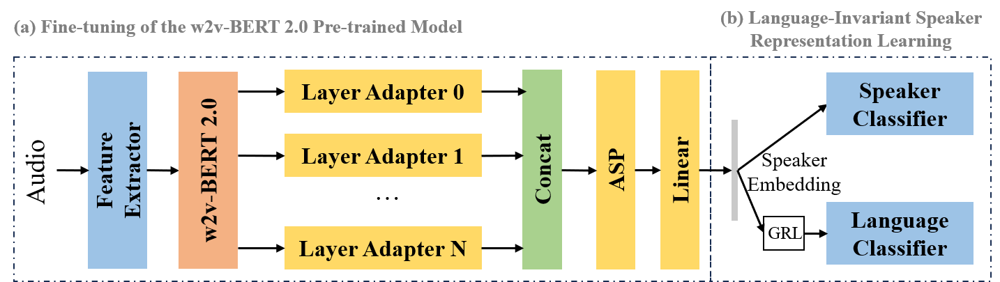
*Figure 1:Overview of the w2v-BERT 2.0-based speaker verification system with language-invariant learning*

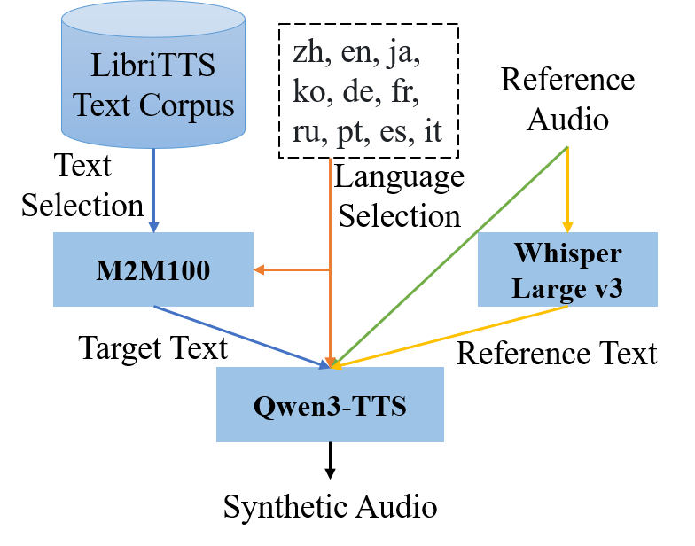
*Figure 2:Speech Synthesis Pipeline*

*Figure 3:t-SNE Visualization of Real and Synthetic Speech Embeddings for Speaker 
𝑖
​
𝑑
​
011337
.*

---
**Usage Info**: 4340 tokens used.
**Generated at**: 2026-03-10 12:44:39

---

# 📚 Advances in GRPO for Generation Models: A Survey

🚀 URL: https://arxiv.org/html/2603.06623

## 🌏 Abstract (원문)
Large-scale flow matchingLipmanet al.(2022)models have demonstrated remarkable performance in generative tasks such as text-to-image, video, 3D, and speech synthesisZhuoet al.(2024); Wanet al.(2025a); Liet al.(2025f,e); Duet al.(2024). However, their outputs are often insufficiently aligned with human preferences or task-specific objectives. Group Relative Policy Optimization (GRPO)Shaoet al.(2024)is a reinforcement learning algorithm centered on relative advantages within a group of candidates. Unlike conventional policy-gradient methods that require learning an explicit value function, GRPO compares multiple trajectories sampled under the same condition at each update step and estimates advantages using normalized relative rewards. This design substantially improves training stability. GRPO was originally introduced for aligning large language models (LLMs): by asking the model to select responses that better match human preferences from a set of candidates, prior work showed that GRPO is more stable than value-based optimization methods, achieves higher sample efficiency, and effectively mitigates error amplification caused by imperfect preference models.Extending GRPO from text generation to more generation tasks (e.g., visual, 3D and speech task), however, is non-trivial.Diffusion and flow-matching models require dozens to hundreds of denoising or evolution steps to generate a single image, making sampling far more expensive than in LLMs. Their sampling processes are typically formulated as deterministic ODE solvers, which limits diversity among group candidates. Moreover, rewards in visual tasks are often only available at the terminal step (e.g., image quality scores), leading to severe credit assignment issues. In addition, reward models in the visual domain are more susceptible to reward hacking, where models exploit shortcuts to increase reward scores while degrading true perceptual quality.Flow-GRPOLiuet al.(2025c)is the first work to successfully apply GRPO to visual generation tasks. It addresses the lack of stochasticity by converting the deterministic ODE formulation of flow-matching models into a stochastic differential equation (SDE), and introduces a denoising-shrinkage strategy during training to reduce reverse-time sampling costs. Empirically, Flow-GRPO improves GenEval accuracy on text-rendering tasks from 63% to 95%, and character rendering accuracy from 59% to 92%. The paper also derives explicit formulas for the ODE-to-SDE transformation and proves that, by introducing appropriate drift and diffusion terms, the resulting stochastic process is equivalent to the original ODE in expectation.Since mid-2025, research topic around Flow-GRPO has experienced explosive growth, spanning a wide range of application domains including text-to-image (T2I), text-to-video (T2V), image-to-video (I2V), speech enhancement, 3D generation, vision-language-action (VLA), and more. To date, this rapidly expanding line of work has accumulated over 200 published papers, reflecting strong and sustained community interest.This survey provides a systematic and comprehensive review of all these works, organizing and analyzing them along the following dimensions:Advances beyond Flow-GRPO:Reward Signal Design: From Sparse to Dense(§3.1).Credit Assignment: From Trajectory to Step Level(§3.2).Sampling Efficiency and Training Acceleration(§3.3).Mode Collapse and Diversity Preservation(§3.4).Reward Hacking Mitigation(§3.5).ODE vs. SDE Sampling Strategies(§3.6).Reward Model Design and Evaluation Benchmarks(§3.7).Extensions to Generative Tasks:Text-to-Image Generation(§4.1).Video Generation(§4.2).Image Editing(§4.3).Speech and Audio(§4.4).3D Generation and Scientific Applications(§4.5).VLA and Embodied AI(§4.6).Unified Multimodal Models(§4.7).Autoregressive and Masked Diffusion Models(§4.8).Image Restoration and Super-Resolution(§4.9).
## 🌏 Abstract (번역)
대규모 플로우 매칭 모델(Lipman et al., 2022)은 텍스트-이미지, 비디오, 3D, 음성 합성(Zhuo et al., 2024; Wan et al., 2025a; Li et al., 2025f,e; Du et al., 2024)과 같은 생성 작업에서 놀라운 성능을 보여주었습니다. 그러나 이들의 출력은 종종 인간의 선호도나 특정 작업 목표와 충분히 일치하지 않습니다. 그룹 상대 정책 최적화(GRPO) (Shao et al., 2024)는 후보 그룹 내의 상대적 이점에 중점을 둔 강화 학습 알고리즘입니다. 명시적인 가치 함수 학습을 요구하는 기존의 정책-경사 방법과 달리, GRPO는 각 업데이트 단계에서 동일한 조건 하에 샘플링된 여러 궤적을 비교하고 정규화된 상대 보상을 사용하여 이점을 추정합니다. 이러한 설계는 훈련 안정성을 크게 향상시킵니다. GRPO는 원래 대규모 언어 모델(LLM)을 정렬하기 위해 도입되었습니다. 모델이 후보 세트에서 인간의 선호도에 더 잘 맞는 응답을 선택하도록 요청함으로써, 이전 연구는 GRPO가 가치 기반 최적화 방법보다 더 안정적이고, 더 높은 샘플 효율성을 달성하며, 불완전한 선호 모델로 인한 오류 증폭을 효과적으로 완화한다는 것을 보여주었습니다. 그러나 GRPO를 텍스트 생성에서 시각, 3D, 음성 작업과 같은 더 많은 생성 작업으로 확장하는 것은 쉽지 않습니다. 확산 및 플로우 매칭 모델은 단일 이미지를 생성하기 위해 수십에서 수백 단계의 노이즈 제거 또는 진화 단계를 필요로 하므로, LLM보다 샘플링 비용이 훨씬 더 많이 듭니다. 이들의 샘플링 프로세스는 일반적으로 결정론적 ODE 솔버로 공식화되어 그룹 후보 간의 다양성을 제한합니다. 또한, 시각 작업의 보상은 종종 최종 단계(예: 이미지 품질 점수)에서만 사용할 수 있어 심각한 신용 할당 문제를 야기합니다. 게다가 시각 도메인의 보상 모델은 보상 해킹에 더 취약하여, 모델이 지름길을 악용하여 보상 점수를 높이면서 실제 지각 품질을 저하시킬 수 있습니다. Flow-GRPO (Liu et al., 2025c)는 GRPO를 시각 생성 작업에 성공적으로 적용한 첫 번째 연구입니다. 이 연구는 플로우 매칭 모델의 결정론적 ODE 공식을 확률 미분 방정식(SDE)으로 변환하여 확률성 부족 문제를 해결하고, 역방향 샘플링 비용을 줄이기 위해 훈련 중 노이즈 제거-축소 전략을 도입합니다. 경험적으로 Flow-GRPO는 텍스트 렌더링 작업에서 GenEval 정확도를 63%에서 95%로, 문자 렌더링 정확도를 59%에서 92%로 향상시킵니다. 이 논문은 또한 ODE-SDE 변환에 대한 명시적인 공식을 도출하고, 적절한 드리프트 및 확산 항을 도입함으로써 결과적인 확률 과정이 기대치에서 원래 ODE와 동일함을 증명합니다. 2025년 중반 이후, Flow-GRPO를 둘러싼 연구 주제는 텍스트-이미지(T2I), 텍스트-비디오(T2V), 이미지-비디오(I2V), 음성 향상, 3D 생성, 시각-언어-행동(VLA) 등 광범위한 응용 분야에 걸쳐 폭발적인 성장을 경험했습니다. 현재까지 이 빠르게 확장되는 연구 분야는 200편 이상의 논문을 축적하여 강력하고 지속적인 커뮤니티의 관심을 반영하고 있습니다. 이 설문조사는 이 모든 작업을 체계적이고 포괄적으로 검토하며 다음 차원을 따라 구성하고 분석합니다: Flow-GRPO를 넘어서는 발전: 보상 신호 설계: 희소에서 밀집으로(§3.1). 신용 할당: 궤적에서 단계 수준으로(§3.2). 샘플링 효율성 및 훈련 가속화(§3.3). 모드 붕괴 및 다양성 보존(§3.4). 보상 해킹 완화(§3.5). ODE 대 SDE 샘플링 전략(§3.6). 보상 모델 설계 및 평가 벤치마크(§3.7). 생성 작업으로의 확장: 텍스트-이미지 생성(§4.1). 비디오 생성(§4.2). 이미지 편집(§4.3). 음성 및 오디오(§4.4). 3D 생성 및 과학 응용(§4.5). VLA 및 체화된 AI(§4.6). 통합 다중 모달 모델(§4.7). 자기회귀 및 마스크 확산 모델(§4.8). 이미지 복원 및 초해상도(§4.9).

## 🔍 Methods & Results
- GRPO(Group Relative Policy Optimization)는 명시적인 가치 함수 없이 후보 그룹 내의 상대적 이점을 활용하여 정규화된 상대 보상으로 이점을 추정하는 강화 학습 알고리즘이다.
- GRPO는 LLM 정렬에서 가치 기반 최적화 방법보다 더 안정적이고, 샘플 효율성이 높으며, 불완전한 선호 모델로 인한 오류 증폭을 완화하는 것으로 나타났다.
- GRPO를 시각, 3D, 음성 등 텍스트 외 생성 작업으로 확장하는 것은 샘플링 비용, 결정론적 ODE 솔버로 인한 다양성 제한, 최종 단계 보상으로 인한 신용 할당 문제, 보상 해킹 취약성 등의 어려움이 있었다.
- Flow-GRPO는 플로우 매칭 모델의 결정론적 ODE 공식을 SDE로 변환하여 확률성을 도입하고, 훈련 중 노이즈 제거-축소 전략을 통해 역방향 샘플링 비용을 줄였다.
- Flow-GRPO는 텍스트 렌더링 작업에서 GenEval 정확도를 63%에서 95%로, 문자 렌더링 정확도를 59%에서 92%로 향상시켰다.
- Flow-GRPO는 ODE-SDE 변환에 대한 명시적 공식을 도출하고, 적절한 드리프트 및 확산 항 도입 시 결과적인 확률 과정이 기대치에서 원래 ODE와 동일함을 수학적으로 증명했다.
- Flow-GRPO 관련 연구는 텍스트-이미지, 텍스트-비디오, 이미지-비디오, 음성 향상, 3D 생성, 시각-언어-행동(VLA) 등 다양한 응용 분야로 확장되었으며, 200편 이상의 논문이 발표되었다.
- 이 설문조사는 Flow-GRPO를 넘어서는 발전(보상 신호 설계, 신용 할당, 샘플링 효율성, 모드 붕괴, 보상 해킹 완화, ODE vs. SDE 샘플링 전략, 보상 모델 설계) 및 다양한 생성 작업으로의 확장(T2I, T2V, I2V, 음성, 3D, VLA, 통합 다중 모달, 자기회귀/마스크 확산, 이미지 복원)을 체계적으로 검토한다.

---
**Usage Info**: 3899 tokens used.
**Generated at**: 2026-03-10 12:44:53

---

# 📚 Analysis-Driven Procedural Generation of an Engine Sound Dataset with Embedded Control Annotations Dataset: https://doi.org/10.5281/zenodo.16883336 and https://huggingface.co/datasets/rdoerfler/procedural-engine-sounds

🚀 URL: https://arxiv.org/html/2603.07584

## 🌏 Abstract (원문)
Accurate modeling of engine acoustics is central to traditional noise–vibration–harshness control and virtual prototyping[1,2], as well as to modern active sound design applications[3,4,5,6,7,8]and emerging data-driven synthesis approaches[9,10,11,12].Many of these applications, particularly machine-learning methods, require large sets of audio signals that are free from confounding noise and accompanied by precisely time-aligned annotations of engine operating parameters.However, such datasets are scarce: vehicle recordings are expensive to obtain and inevitably contaminated by environmental and mechanical noise, while accessing ground-truth operating parameters often requires proprietary equipment.Existing public datasets primarily target classification or detection tasks, and consist of real-world recordings with varying recording conditions and only coarse or missing temporal annotations[13,14,15,16,17]. Furthermore, recorded data cannot be systematically augmented or modified under controlled conditions, limiting the ability to evaluate algorithms across precisely defined scenarios.Procedural synthesis can generate such controllable, scalable, and perfectly annotated corpora[18], but requires faithful reproduction of real acoustics for practical applicability.This paper proposes a signal-processing framework for analysis-driven procedural synthesis of engine sounds. The dominant spectral characteristics of engine sounds are defined byengine orders: harmonics at integer and half-integer multiples of the crankshaft rotation frequency. The framework extracts order-dependent harmonic deviations and magnitude envelopes as functions of RPM and torque from engine recordings using a spectral analysis approach that combines pitch-adaptive resampling, frequency-aligned FFT analysis, and centroid-based harmonic tracking.The extracted parameters drive a harmonic-plus-noise synthesizer with resonator modeling, enabling controlled generation of realistic engine sound signals with adjustable operating conditions. Control variables (RPM and torque) are embedded directly into the audio stream, providing sample-accurate ground-truth annotations without requiring external metadata files.Using the proposed framework, we generate the Procedural Engine Sounds Dataset (19.0 h, 5,935 files) covering diverse operating conditions under noise-free and fully synchronized settings. Validation against real recordings demonstrates preservation of characteristic engine-order structures and their dependence on operating conditions. A baseline differentiable synthesis model trained on the dataset confirms its suitability for learning-based parameter estimation and conditional synthesis tasks. The main contributions of this work are: (i) an analysis-driven framework for procedurally generating engine audio with sample-accurate control annotations; (ii) a publicly released dataset produced using this framework; and (iii) validation demonstrating that the synthesized signals preserve key order-related characteristics while supporting data-driven modeling tasks.
## 🌏 Abstract (번역)
엔진 음향의 정확한 모델링은 전통적인 소음-진동-불쾌감(NVH) 제어 및 가상 프로토타이핑[1,2]뿐만 아니라 현대적인 능동형 사운드 디자인 애플리케이션[3,4,5,6,7,8] 및 새로운 데이터 기반 합성 접근 방식[9,10,11,12]에 필수적입니다. 이러한 애플리케이션, 특히 머신러닝 방법은 혼란스러운 노이즈가 없고 엔진 작동 매개변수에 대한 정확하게 시간 정렬된 주석이 동반된 대규모 오디오 신호 세트를 필요로 합니다. 그러나 이러한 데이터셋은 부족합니다. 차량 녹음은 얻기 비싸고 환경 및 기계적 노이즈에 필연적으로 오염되며, 실제 작동 매개변수에 접근하려면 종종 독점 장비가 필요합니다. 기존 공개 데이터셋은 주로 분류 또는 감지 작업을 목표로 하며, 다양한 녹음 조건과 거칠거나 누락된 시간 주석만 있는 실제 녹음으로 구성됩니다[13,14,15,16,17]. 또한, 녹음된 데이터는 통제된 조건에서 체계적으로 증강되거나 수정될 수 없어, 정확하게 정의된 시나리오에서 알고리즘을 평가하는 능력을 제한합니다. 절차적 합성은 이러한 제어 가능하고 확장 가능하며 완벽하게 주석 처리된 코퍼스를 생성할 수 있지만[18], 실제 적용 가능성을 위해서는 실제 음향의 충실한 재현이 필요합니다. 본 논문은 엔진 사운드의 분석 기반 절차적 합성을 위한 신호 처리 프레임워크를 제안합니다. 엔진 사운드의 지배적인 스펙트럼 특성은 엔진 오더(크랭크축 회전 주파수의 정수 및 반정수 배수에서 발생하는 고조파)에 의해 정의됩니다. 이 프레임워크는 피치 적응형 리샘플링, 주파수 정렬 FFT 분석 및 센트로이드 기반 고조파 추적을 결합한 스펙트럼 분석 접근 방식을 사용하여 엔진 녹음에서 RPM 및 토크의 함수로 오더 종속 고조파 편차 및 크기 엔벨로프를 추출합니다. 추출된 매개변수는 공진기 모델링을 포함하는 고조파-플러스-노이즈 신시사이저를 구동하여 조정 가능한 작동 조건으로 사실적인 엔진 사운드 신호를 제어하여 생성할 수 있게 합니다. 제어 변수(RPM 및 토크)는 오디오 스트림에 직접 내장되어 외부 메타데이터 파일 없이 샘플 단위로 정확한 실제 주석을 제공합니다. 제안된 프레임워크를 사용하여, 우리는 노이즈가 없고 완전히 동기화된 설정에서 다양한 작동 조건을 포괄하는 절차적 엔진 사운드 데이터셋(19.0시간, 5,935개 파일)을 생성합니다. 실제 녹음과의 검증은 특징적인 엔진 오더 구조와 작동 조건에 대한 의존성이 보존됨을 보여줍니다. 데이터셋으로 훈련된 기준 미분 가능 합성 모델은 학습 기반 매개변수 추정 및 조건부 합성 작업에 대한 적합성을 확인합니다. 본 연구의 주요 기여는 다음과 같습니다: (i) 샘플 단위로 정확한 제어 주석을 사용하여 엔진 오디오를 절차적으로 생성하기 위한 분석 기반 프레임워크; (ii) 이 프레임워크를 사용하여 생성된 공개 데이터셋; (iii) 합성된 신호가 주요 오더 관련 특성을 보존하면서 데이터 기반 모델링 작업을 지원함을 입증하는 검증입니다.

## 🔍 Methods & Results
- 엔진 사운드의 분석 기반 절차적 합성을 위한 신호 처리 프레임워크를 제안합니다.
- 피치 적응형 리샘플링, 주파수 정렬 FFT 분석, 센트로이드 기반 고조파 추적을 결합한 스펙트럼 분석을 통해 엔진 녹음에서 RPM 및 토크의 함수로 오더 종속 고조파 편차 및 크기 엔벨로프를 추출합니다.
- 추출된 매개변수를 사용하여 공진기 모델링이 포함된 고조파-플러스-노이즈 신시사이저를 구동하여 조정 가능한 작동 조건으로 사실적인 엔진 사운드를 생성합니다.
- 제어 변수(RPM 및 토크)를 오디오 스트림에 직접 내장하여 샘플 단위로 정확한 실제 주석을 제공합니다.
- 제안된 프레임워크를 사용하여 노이즈가 없고 완전히 동기화된 설정에서 다양한 작동 조건을 포괄하는 '절차적 엔진 사운드 데이터셋'(19.0시간, 5,935개 파일)을 생성했습니다.
- 실제 녹음과의 검증을 통해 특징적인 엔진 오더 구조와 작동 조건에 대한 의존성이 합성된 사운드에서 보존됨을 입증했습니다.
- 데이터셋으로 훈련된 기준 미분 가능 합성 모델은 학습 기반 매개변수 추정 및 조건부 합성 작업에 대한 데이터셋의 적합성을 확인했습니다.

## 🖼 Figures

*Figure 1:Order magnitude distributions comparing source recordings (left, 90 min) to framework-generated synthetic signals (right, 150 min from 5 min extraction material). Preserved structural features demonstrate acoustic authenticity under 30
×
 augmentation. Higher-order variations reflect parametric modifications for timbral diversity.*

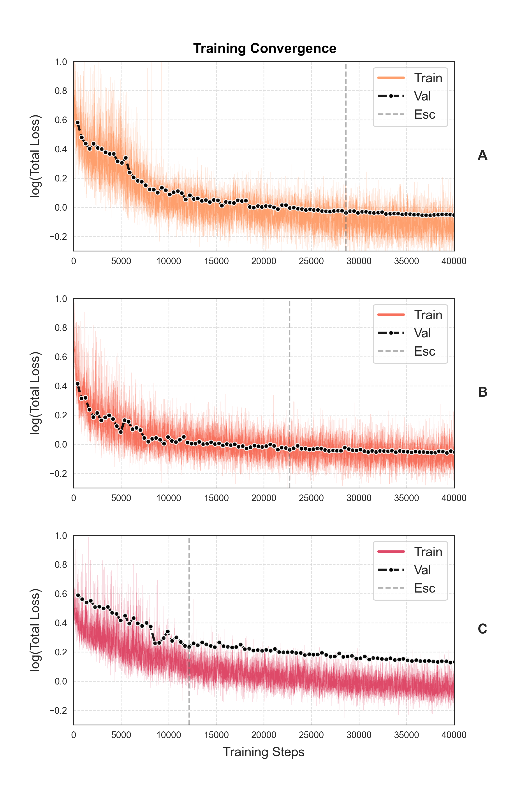
*Figure 2:Training and validation loss for neural synthesis model on datasets A, B, and C. Stable convergence demonstrates suitability for data-driven methods. Varying early-stopping points (Esc) reflect parametric modification capabilities.*

---
**Usage Info**: 2771 tokens used.
**Generated at**: 2026-03-10 12:45:05

---

# 📚 Learning Multiple Utterance-Level Attribute Representations with a Unified Speech Encoder

🚀 URL: https://arxiv.org/html/2603.08312

## 🌏 Abstract (원문)
Recent advances in self-supervised speech representation learning have led to the emergence of large speech foundation models capable of capturing rich acoustic and linguistic information from raw audio.
Models such as wav2vec 2.0[1], HuBERT[2], and w2v-BERT[3]are trained on massive amounts of unlabeled speech and learn contextualized representations that can be adapted to a wide range of downstream tasks[4,5].
These models typically produce frame-level acoustic representations, which are highly effective for tasks such as automatic speech recognition or speech translation.
Beyond frame-level representations, there has been growing interest in learning utterance-level speech embeddings that capture higher-level information such as semantics or speaker traits.
Such representations are particularly useful for tasks including speech retrieval, cross-modal search, speaker verification, or conversational understanding.
Recent post-training approaches have demonstrated that speech encoders can be aligned with text-based semantic embedding spaces, enabling multilingual and multimodal applications such as speech–text retrieval and speech translation search.
A notable example is the SENSE framework[6], close to the Meta's SONAR framework[7], which learns semantic speech embeddings through a teacher–student knowledge distillation paradigm[8]: in this approach, a pretrained text embedding model provides semantic targets, while a speech encoder is trained to map speech utterances into the same semantic space.
This alignment allows speech representations to directly capture the meaning of an utterance, independent of language, making them suitable for multilingual semantic retrieval tasks[6,7,9].
However, aligning speech representations exclusively with semantic embeddings introduces an important limitation: paralinguistic information present in speech may be suppressed.
In particular, attributes such as speaker identity, emotion, or speaking style are not preserved when the representation is optimized solely to match textual semantic embeddings.
This raises an important question: can a single speech encoder learn representations that simultaneously capture multiple utterance-level attributes?
In this work, we propose a unified post-training framework that allows a single speech foundation model to produce multiple utterance-level representations corresponding to different attributes.
Our approach extends the teacher–student paradigm by introducing multiple task-specific supervision signals, each defining a target embedding space for a particular attribute.
A shared speech encoder is jointly trained to align with these different targets through task-specific projection branches.
To demonstrate the effectiveness of this framework, we focus on learning two complementary utterance-level attributes: semantic representations, obtained through alignment with multilingual text embeddings, and speaker representations, obtained through supervision from a pretrained speaker verification model.
We evaluate the proposed model on two representative tasks.
First, we measure the quality of the semantic representation using multilingual speech and speech–text translation retrieval benchmarks.
Second, we evaluate the speaker representation on the VoxCeleb speaker verification task.
In this paper, we make the following contributions:
We introduce a general multi-task teacher–student framework for learning multiple utterance-level attribute representations from a shared speech encoder.
We demonstrate that semantic and speaker representations can be learned jointly without significantly degrading the performance of either attribute.
We provide an analysis of layer usage across tasks, showing how semantic and speaker information are distributed differently within the shared encoder.
## 🌏 Abstract (번역)
자기 지도 음성 표현 학습의 최근 발전은 원본 오디오에서 풍부한 음향 및 언어 정보를 포착할 수 있는 대규모 음성 기반 모델의 출현으로 이어졌습니다. wav2vec 2.0[1], HuBERT[2], w2v-BERT[3]와 같은 모델들은 대량의 레이블 없는 음성 데이터로 훈련되며 광범위한 다운스트림 작업에 적용될 수 있는 문맥화된 표현을 학습합니다[4,5]. 이러한 모델들은 일반적으로 프레임 수준의 음향 표현을 생성하며, 이는 자동 음성 인식 또는 음성 번역과 같은 작업에 매우 효과적입니다. 프레임 수준 표현을 넘어, 의미론이나 화자 특성과 같은 고수준 정보를 포착하는 발화 수준 음성 임베딩 학습에 대한 관심이 증가하고 있습니다. 이러한 표현은 음성 검색, 교차 모달 검색, 화자 확인 또는 대화 이해와 같은 작업에 특히 유용합니다. 최근의 후처리 학습 접근 방식은 음성 인코더가 텍스트 기반 의미 임베딩 공간과 정렬될 수 있음을 보여주었으며, 이는 음성-텍스트 검색 및 음성 번역 검색과 같은 다국어 및 다중 모달 애플리케이션을 가능하게 합니다. 주목할 만한 예시는 Meta의 SONAR 프레임워크[7]와 유사한 SENSE 프레임워크[6]로, 교사-학생 지식 증류 패러다임[8]을 통해 의미론적 음성 임베딩을 학습합니다. 이 접근 방식에서는 사전 훈련된 텍스트 임베딩 모델이 의미론적 목표를 제공하고, 음성 인코더는 음성 발화를 동일한 의미 공간으로 매핑하도록 훈련됩니다. 이러한 정렬은 음성 표현이 언어와 무관하게 발화의 의미를 직접 포착할 수 있게 하여 다국어 의미 검색 작업에 적합하게 만듭니다[6,7,9]. 그러나 음성 표현을 의미 임베딩에만 정렬하는 것은 중요한 한계를 야기합니다: 음성에 존재하는 비언어적 정보가 억제될 수 있습니다. 특히, 화자 식별, 감정 또는 말하기 스타일과 같은 속성은 표현이 텍스트 의미 임베딩과 일치하도록만 최적화될 때 보존되지 않습니다. 이는 중요한 질문을 제기합니다: 단일 음성 인코더가 여러 발화 수준 속성을 동시에 포착하는 표현을 학습할 수 있을까요? 본 연구에서는 단일 음성 기반 모델이 다양한 속성에 해당하는 여러 발화 수준 표현을 생성할 수 있도록 하는 통합된 후처리 학습 프레임워크를 제안합니다. 우리의 접근 방식은 여러 작업별 감독 신호를 도입하여 교사-학생 패러다임을 확장하며, 각 신호는 특정 속성에 대한 목표 임베딩 공간을 정의합니다. 공유 음성 인코더는 작업별 투영 브랜치를 통해 이러한 다양한 목표와 정렬되도록 공동으로 훈련됩니다. 이 프레임워크의 효과를 입증하기 위해, 우리는 두 가지 보완적인 발화 수준 속성 학습에 중점을 둡니다: 다국어 텍스트 임베딩과의 정렬을 통해 얻은 의미론적 표현과 사전 훈련된 화자 확인 모델의 감독을 통해 얻은 화자 표현입니다. 우리는 제안된 모델을 두 가지 대표적인 작업에서 평가합니다. 첫째, 다국어 음성 및 음성-텍스트 번역 검색 벤치마크를 사용하여 의미론적 표현의 품질을 측정합니다. 둘째, VoxCeleb 화자 확인 작업에서 화자 표현을 평가합니다. 본 논문에서 우리는 다음과 같은 기여를 합니다: 공유 음성 인코더로부터 여러 발화 수준 속성 표현을 학습하기 위한 일반적인 다중 작업 교사-학생 프레임워크를 소개합니다. 의미론적 및 화자 표현이 어느 한 속성의 성능을 크게 저하시키지 않으면서 공동으로 학습될 수 있음을 보여줍니다. 작업 전반에 걸친 레이어 사용 분석을 제공하여 의미론적 및 화자 정보가 공유 인코더 내에서 어떻게 다르게 분포되는지 보여줍니다.

## 🔍 Methods & Results
- 기존 SENSE 프레임워크(교사-학생 지식 증류 기반의 발화 수준 의미론적 음성 표현 학습)를 확장하여 단일 공유 음성 인코더에서 여러 발화 수준 속성 표현을 학습하는 통합된 후처리 학습 프레임워크를 제안합니다.
- 각 속성(τ)에 대해 공유 인코더에 작업별 브랜치를 연결하며, 이 브랜치는 선택된 인코더 레이어 표현(H(ℓ))에 선형 투영(H̃τ(ℓ)=H(ℓ)Wτ(ℓ)⊤+bτ(ℓ))을 적용하여 공유 표현을 속성별 특징 공간에 맞게 조정합니다.
- 레이어 가중치 메커니즘(sτ,ℓ, softmax로 정규화된 λτ,ℓ)을 도입하여 투영된 표현(Ẑτ=∑ℓ=1nλτ,ℓH̃τ(ℓ))을 결합함으로써, 각 속성이 인코더의 다른 영역에 의존할 수 있도록 합니다.
- 프레임 수준 시퀀스(Zτ)는 속성별 어텐션 풀링(pτ=AttentionPoolingτ(Zτ))을 통해 단일 발화 수준 표현으로 집계되며, 최종 임베딩은 해당 교사 임베딩과 코사인 유사도 목표를 사용하여 정렬됩니다.
- 모델은 다중 작업 학습 프레임워크 내에서 모든 매개변수(SSL 인코더 포함)를 공동으로 최적화하여 훈련됩니다.
- 의미론적 및 화자 표현이 어느 한 속성의 성능을 크게 저하시키지 않으면서 공동으로 학습될 수 있음을 입증했습니다.
- 작업 전반에 걸친 레이어 사용 분석을 통해 의미론적 및 화자 정보가 공유 인코더 내에서 다르게 분포됨을 보여주었습니다.
- 제안된 모델은 다국어 음성 및 음성-텍스트 번역 검색 벤치마크에서 의미론적 표현의 품질을, VoxCeleb 화자 확인 작업에서 화자 표현을 평가했습니다.

## 🖼 Figures

*Figure 1:Attribute-specific branch used to learn an utterance-level representation for attribute 
𝜏
 in the teacher–student framework. Layer representations from the shared SSL encoder are projected, combined using learnable interpolation weights 
𝜆
𝜏
,
ℓ
, and aggregated by attention pooling to produce an embedding aligned with the teacher representation.*

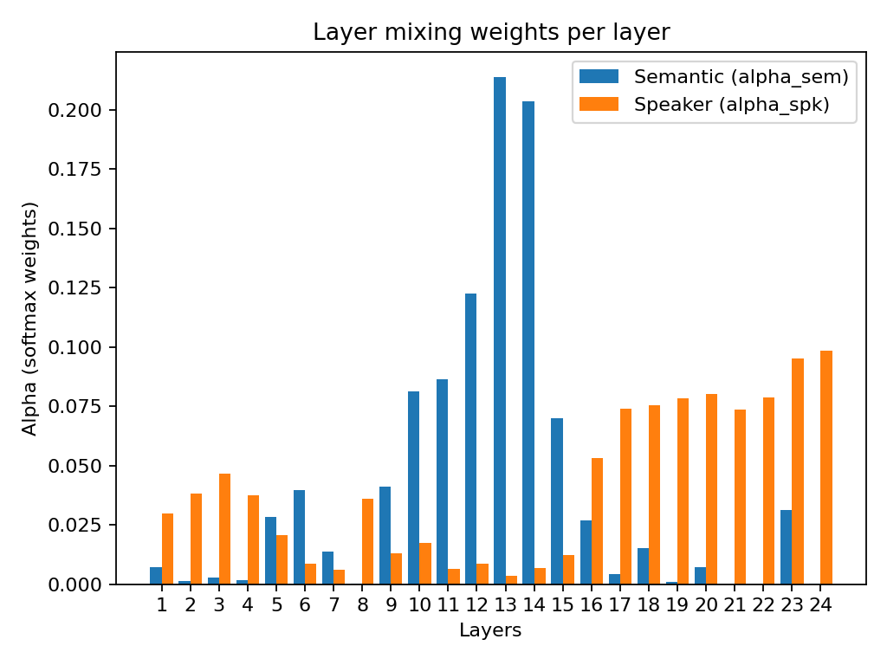
*Figure 2:Learned layer-interpolation weights for the semantic and speaker branches of the unified speech encoder.*

---
**Usage Info**: 6908 tokens used.
**Generated at**: 2026-03-10 12:45:26

---

# 📚 Privacy-Preserving End-to-End Full-Duplex Speech Dialogue Models

🚀 URL: https://arxiv.org/html/2603.08179

## 🌏 Abstract (원문)
End-to-end (E2E) full-duplex speech dialogue systems represent a fundamental shift from turn-taking interaction to always-on, simultaneous listening and speaking. Models such as SALM-Duplex[salmduplex2025], Moshi[defossez2024moshi], and SyncLLM[emnlp2024synclm]route raw user audio continuously through a decoder-only LLM backbone, computing hidden state representations at every transformer layer throughout the entire conversation. Unlike cascaded systems where user and agent streams are processed separately, the LLM core of these full-duplex systems maintains a persistent internal state over the user's speech stream, capturing their voice, speaking style, and identity. This creates a privacy exposure that remains largely unexplored. Under GDPR and similar regulations, the mere presence of identifiable speaker information in model representations constitutes a compliance risk, regardless of whether external access is exploited, making it essential to audit and mitigate such leakage proactively. Probing studies on self-supervised speech models (e.g., wav2vec 2.0, HuBERT, WavLM) have established that their hidden representations strongly encode speaker identity[pasad2021layerwise,yang2021superb,chiu2025probing]. In the text domain, prior work has shown that LLM hidden states can leak demographic and content-level user attributes[staab2024beyond], and membership inference probes have exposed privacy risks in masked language models[mireshghallah2022quantifying]. Our focus is distinct: we investigatespeaker identityleakage, the persistent encoding ofwho is speaking, which enables re-identification regardless of conversational content. Yet, to the best of our knowledge, no prior work has examined whether these always-on LLM hidden states retain sufficient speaker identity to enable re-identification. We answer this question empirically for two prominent E2E full-duplex systems, SALM-Duplex and Moshi[defossez2024moshi]. Following the VoicePrivacy 2024 Challenge[voiceprivacy2024]evaluation protocol with a lazy-informed attacker scenario, we train a speaker verification attacker (probe) on hidden state representations extracted from each layer group. Equal error rate (EER) serves as our primary privacy metric; we additionally report Linkability from the legally validated evaluation framework of[vauquier2025legally]. Our mean-pooled EER for the original SALM-Duplex (continuous encoder) is 28.5%, revealing significant speaker identity leakage, while Moshi's discrete encoder reaches 6.4% EER (near-perfect identification). We further propose and evaluate two streaming anonymization setups (Figure2) using Stream-Voice-Anon[streamvoiceanon]to mitigate this leakage without sacrificing dialogue utility. Our contributions are: We characterise speaker identity leakage in the hidden states of two E2E full-duplex dialogue LLMs (SALM-Duplex and Moshi), extending probing methodology[tenney2019bert,pasad2021layerwise]from static encoders to always-on dialogue backbones. We provide a layer-wise and turn-length-wise analysis showing which parts of the LLM carry the most speaker-identifying information and how leakage accumulates over dialogue length. We propose two streaming anonymization setups: Anon-W2W applies Stream-Voice-Anon at the waveform level (retaining the original encoder, validated on both SALM-Duplex and Moshi), while Anon-W2F replaces the continuous encoder with a discrete encoder and activates anonymization at the feature level.
## 🌏 Abstract (번역)
종단 간(E2E) 풀-듀플렉스 음성 대화 시스템은 턴-테이킹 상호작용에서 항상 켜져 있는 동시 청취 및 발화로의 근본적인 변화를 나타냅니다. SALM-Duplex[salmduplex2025], Moshi[defossez2024moshi], SyncLLM[emnlp2024synclm]과 같은 모델은 원시 사용자 오디오를 디코더 전용 LLM 백본을 통해 지속적으로 라우팅하여 전체 대화 동안 모든 트랜스포머 레이어에서 은닉 상태 표현을 계산합니다. 사용자 및 에이전트 스트림이 별도로 처리되는 계단식 시스템과 달리, 이러한 풀-듀플렉스 시스템의 LLM 코어는 사용자 음성 스트림에 대한 영구적인 내부 상태를 유지하여 사용자의 음성, 발화 스타일 및 신원을 포착합니다. 이는 아직 크게 탐구되지 않은 프라이버시 노출을 야기합니다. GDPR 및 유사 규정에 따라, 모델 표현에 식별 가능한 화자 정보가 존재한다는 것만으로도 외부 접근이 악용되는지 여부와 관계없이 규정 준수 위험을 구성하므로, 이러한 유출을 사전에 감사하고 완화하는 것이 필수적입니다. 자기 지도 학습 음성 모델(예: wav2vec 2.0, HuBERT, WavLM)에 대한 프로빙 연구는 그들의 은닉 표현이 화자 신원을 강력하게 인코딩한다는 것을 확립했습니다[pasad2021layerwise,yang2021superb,chiu2025probing]. 텍스트 도메인에서는 이전 연구에서 LLM 은닉 상태가 인구 통계학적 및 콘텐츠 수준의 사용자 속성을 유출할 수 있음을 보여주었으며[staab2024beyond], 멤버십 추론 프로브는 마스크 언어 모델에서 프라이버시 위험을 노출했습니다[mireshghallah2022quantifying]. 우리의 초점은 다릅니다: 우리는 대화 내용과 관계없이 재식별을 가능하게 하는 '누가 말하고 있는지'에 대한 지속적인 인코딩인 화자 신원 유출을 조사합니다. 그러나, 우리가 아는 한, 이러한 항상 켜져 있는 LLM 은닉 상태가 재식별을 가능하게 할 만큼 충분한 화자 신원을 유지하는지 여부를 조사한 이전 연구는 없습니다. 우리는 두 가지 저명한 E2E 풀-듀플렉스 시스템인 SALM-Duplex와 Moshi[defossez2024moshi]에 대해 이 질문에 대한 답을 경험적으로 제시합니다. VoicePrivacy 2024 Challenge[voiceprivacy2024] 평가 프로토콜을 따르고 게으른 정보 공격자 시나리오를 사용하여, 각 레이어 그룹에서 추출된 은닉 상태 표현에 대해 화자 검증 공격자(프로브)를 훈련합니다. 등 오류율(EER)이 우리의 주요 프라이버시 지표로 사용되며, 추가적으로 [vauquier2025legally]의 법적으로 검증된 평가 프레임워크에서 Linkability를 보고합니다. 원본 SALM-Duplex(연속 인코더)의 평균 풀링 EER은 28.5%로 상당한 화자 신원 유출을 나타내는 반면, Moshi의 이산 인코더는 6.4% EER(거의 완벽한 식별)에 도달합니다. 우리는 대화 유용성을 희생하지 않고 이러한 유출을 완화하기 위해 Stream-Voice-Anon[streamvoiceanon]을 사용하는 두 가지 스트리밍 익명화 설정(그림 2)을 추가로 제안하고 평가합니다. 우리의 기여는 다음과 같습니다: 우리는 두 가지 E2E 풀-듀플렉스 대화 LLM(SALM-Duplex 및 Moshi)의 은닉 상태에서 화자 신원 유출을 특성화하며, 정적 인코더에서 항상 켜져 있는 대화 백본으로 프로빙 방법론[tenney2019bert,pasad2021layerwise]을 확장합니다. 우리는 LLM의 어떤 부분이 가장 많은 화자 식별 정보를 전달하고 대화 길이에 따라 유출이 어떻게 축적되는지를 보여주는 레이어별 및 턴 길이별 분석을 제공합니다. 우리는 두 가지 스트리밍 익명화 설정을 제안합니다: Anon-W2W는 파형 수준에서 Stream-Voice-Anon을 적용하고(원본 인코더 유지, SALM-Duplex 및 Moshi 모두에서 검증됨), Anon-W2F는 연속 인코더를 이산 인코더로 대체하고 특징 수준에서 익명화를 활성화합니다.

## 🔍 Methods & Results
- 두 가지 E2E 풀-듀플렉스 대화 시스템(Moshi 및 SALM-Duplex)을 분석했으며, Moshi는 RVQ 오디오 코덱 인코더를 사용하고 SALM-Duplex는 ASR 초기화 연속 인코더를 사용합니다. SALM-Duplex는 Chronological Thinking 메커니즘이 없는 수정된 버전으로 재구현되었습니다.
- 인코더는 출력 표현에 따라 이산 인코더(Moshi, SALM-Duplex의 Firefly 기반 이산 인코더 변형)와 연속 인코더(원본 SALM-Duplex의 ASR 초기화 어댑터)로 구분됩니다.
- 두 가지 스트리밍 익명화 설정이 제안되었습니다: Anon-W2W는 Stream-Voice-Anon을 원시 사용자 파형에 전처리 단계로 적용하며, Anon-W2F는 SALM-Duplex의 연속 인코더를 이산 인코더로 교체하고 특징 수준에서 익명화를 활성화합니다.
- Moshi(32개 트랜스포머 레이어)와 SALM-Duplex(20개 레이어)에서 초기, 중간, 후기 레이어 및 모든 레이어의 평균 풀링된 은닉 상태 표현을 추출했습니다.
- 프라이버시 지표는 VoicePrivacy 2024 Challenge 평가 세트(LibriSpeech dev-clean 및 test-clean 기반)에서 평가되었고, 화자 검증 공격자(ECAPA-TDNN)는 LibriSpeech train-clean-360에서 훈련되었습니다.
- 주요 프라이버시 지표는 EER(Equal Error Rate)이며, 추가적으로 Linkability를 보고합니다. 유틸리티 지표(sBLEU, sBERT)는 S2T 및 S2S 응답 모드에 대해 평가되었고, 효율성 지표(RTFx, FRL, TTSR, Int.L., ISR)도 보고되었습니다.
- 원본 SALM-Duplex(연속 인코더)의 평균 풀링 EER은 28.5%로 상당한 화자 신원 유출을 나타냈습니다.
- Moshi의 이산 인코더는 6.4% EER을 달성하여 거의 완벽한 화자 식별이 가능함을 보여주었습니다.
- 제안된 익명화 설정은 대화 유용성을 희생하지 않고 화자 신원 유출을 완화하는 것을 목표로 합니다. Anon-W2F는 특징 도메인에서 익명화가 이루어져 중복된 파형 합성 단계를 제거합니다.

## 🖼 Figures
![Figure 2:Overview of the original SALM-Duplex pipeline and proposed anonymization setups. The main diagram shows the ASR-based encoder baseline: an ECAPA-TDNN probe attached to the LLM's hidden states (red dashed path) reveals substantial speaker identity leakage. The Anon-W2W inset (upper left) prepends Stream-Voice-Anon to anonymize the waveform before the unchanged ASR encoder. The Anon-W2F inset (upper right) replaces the ASR encoder with the Stream-Voice-Anon encoder (anonymization active) and fine-tunes the LLM, eliminating the redundant waveform synthesis step. (Anon-W2F is demonstrated for SALM-Duplex; the Anon-W2W setup is additionally evaluated on Moshi.)](../images/2026-03-10/2603.08179/2603.08179_fig1.png)
*Figure 2:Overview of the original SALM-Duplex pipeline and proposed anonymization setups. The main diagram shows the ASR-based encoder baseline: an ECAPA-TDNN probe attached to the LLM's hidden states (red dashed path) reveals substantial speaker identity leakage. The Anon-W2W inset (upper left) prepends Stream-Voice-Anon to anonymize the waveform before the unchanged ASR encoder. The Anon-W2F inset (upper right) replaces the ASR encoder with the Stream-Voice-Anon encoder (anonymization active) and fine-tunes the LLM, eliminating the redundant waveform synthesis step. (Anon-W2F is demonstrated for SALM-Duplex; the Anon-W2W setup is additionally evaluated on Moshi.)*

---
**Usage Info**: 5506 tokens used.
**Generated at**: 2026-03-10 12:45:40

---

# 📚 NLE: Non-autoregressive LLM-based ASR by Transcript Editing

🚀 URL: https://arxiv.org/html/2603.08397

## 🌏 Abstract (원문)
LLM-based ASR systems[tang2024salmonn,saon2025granite]improve transcription accuracy by pairing a pretrained speech encoder with a pretrained LLM, typically via a learned projector that maps acoustic representations into the LLM embedding space. In most existing systems, the LLM serves as an autoregressive decoder, generating text one token at a time. While this design yields strong accuracy, the sequential nature of autoregressive decoding limits parallelism, incurs substantial end-to-end latency, and results in slower inference (lower RTFx, where RTFx measures the ratio of audio duration to processing time). This limitation becomes particularly severe in real-time conversational settings where batch processing is not feasible, as the inability to parallelize token generation directly translates to high per-utterance latency. Moreover, these systems discard the initial hypothesis often produced by the speech encoder, despite it frequently providing a reasonable draft that could be refined rather than regenerated from scratch. This work focuses on addressing these limitations and enables parallelizable LLM-based inference. Connectionist Temporal Classification (CTC)[graves2006connectionist]provides an efficient alternative mechanism for mapping long acoustic sequences to shorter token sequences. A CTC encoder produces frame-level token posteriors, and inference collapses repeated tokens and removes blanks using an efficient, fully parallel decoding procedure. However, CTC decoding is constrained by conditional independence and monotonic alignment assumptions. Moreover, CTC models have limited language modeling capabilities and lack the broad linguistic priors of large pretrained language models, limiting their ability to recover plausible content when acoustic evidence is weak. In practice, CTC outputs often exhibit local errors such as phonetic substitutions or structural errors such as word deletions, especially in noisy or ambiguous conditions. Many of these errors are systematic and locally correctable, making CTC hypotheses well-suited as drafts for downstream editing rather than full regeneration. We introduceNLE, aNon-autoregressiveLLM-basedEditing ASR system. NLE reframes LLM-based speech recognition as conditional transcript editing: rather than decoding tokens autoregressively, NLE edits a hypothesis extracted from a pretrained speech encoder, guided by acoustic context from the same encoder. This editing formulation enables fully parallel prediction, thereby achieving fast inference. Our approach adapts a pretrained LLM to the editing task, in order to leverage its linguistic knowledge. We modify the attention mechanism in the LLM from causal to bidirectional[gong2025scaling,behnamghaderllm2vec], enabling non-autoregressive editing with full context. The model is trained using a CTC-style objective with latent alignments[saharia2020non], which naturally handles the variable-length mapping between input and target transcripts. We use lightweight LoRA adapters[hu2022lora]to adapt the model to the bidirectional attention and editing objective. The LoRA adapters can be disabled and the attention mechanism reconfigured back to causal mode, restoring the original LLM functionality. This design allows the LLM weights to be shared across both ASR and downstream tasks such as question answering on transcribed text – a key use case for speech-enabled LLMs[saon2025granite]. We use an interleaved token layout with explicit insertion slots that enables local insertions with minimal token movement. This design exploits the identity mapping bias of Transformers – the tendency to copy input tokens unchanged through residual connections and tied embeddings (see Section3.3) – allowing the model to focus on corrections rather than full reconstruction. On the Open ASR leaderboard[srivastav2025open], a challenging benchmark containing 39 strong ASR models, NLE++ achieves 5.67% average WER with an RTFx of 1630. As shown in Figure1, both NLE and NLE++ are on the Pareto frontier in the WER-RTFx space, offering a strong accuracy-speed tradeoff compared to leading models. In single-utterance inference, NLE achieves 27x speedup over the autoregressive baseline, demonstrating the substantial practical advantages of non-autoregressive decoding for latency-critical applications.
## 🌏 Abstract (번역)
LLM 기반 ASR 시스템[tang2024salmonn,saon2025granite]은 사전 학습된 음성 인코더와 사전 학습된 LLM을 결합하여 전사 정확도를 향상시키며, 일반적으로 음향 표현을 LLM 임베딩 공간으로 매핑하는 학습된 프로젝터를 통해 이루어집니다. 대부분의 기존 시스템에서 LLM은 자동 회귀 디코더 역할을 하여 한 번에 하나의 토큰을 생성합니다. 이러한 설계는 높은 정확도를 제공하지만, 자동 회귀 디코딩의 순차적 특성은 병렬 처리를 제한하고, 상당한 종단 간 지연 시간을 발생시키며, 더 느린 추론(RTFx가 낮음, 여기서 RTFx는 오디오 지속 시간 대 처리 시간의 비율을 측정)을 초래합니다. 이러한 한계는 배치 처리가 불가능한 실시간 대화 환경에서 특히 심각해지는데, 토큰 생성을 병렬화할 수 없다는 것이 발화당 높은 지연 시간으로 직접 연결되기 때문입니다. 또한, 이러한 시스템은 음성 인코더가 종종 생성하는 초기 가설을 버리는데, 이는 처음부터 다시 생성하기보다는 다듬을 수 있는 합리적인 초안을 제공함에도 불구하고 그렇습니다. 본 연구는 이러한 한계를 해결하고 병렬화 가능한 LLM 기반 추론을 가능하게 하는 데 중점을 둡니다. Connectionist Temporal Classification (CTC)[graves2006connectionist]는 긴 음향 시퀀스를 더 짧은 토큰 시퀀스로 매핑하는 효율적인 대안 메커니즘을 제공합니다. CTC 인코더는 프레임 수준 토큰 사후 확률을 생성하며, 추론은 효율적이고 완전히 병렬적인 디코딩 절차를 사용하여 반복되는 토큰을 축소하고 공백을 제거합니다. 그러나 CTC 디코딩은 조건부 독립성 및 단조 정렬 가정에 의해 제약됩니다. 또한, CTC 모델은 제한된 언어 모델링 기능을 가지며 대규모 사전 학습된 언어 모델의 광범위한 언어적 사전 지식이 부족하여 음향 증거가 약할 때 그럴듯한 내용을 복구하는 능력이 제한됩니다. 실제로 CTC 출력은 특히 시끄럽거나 모호한 조건에서 음성학적 대체와 같은 지역적 오류 또는 단어 삭제와 같은 구조적 오류를 자주 나타냅니다. 이러한 오류 중 다수는 체계적이고 국부적으로 수정 가능하므로 CTC 가설은 완전한 재생성보다는 후속 편집을 위한 초안으로 매우 적합합니다. 우리는 비자동 회귀 LLM 기반 편집 ASR 시스템인 NLE를 소개합니다. NLE는 LLM 기반 음성 인식을 조건부 전사 편집으로 재구성합니다. 즉, 토큰을 자동 회귀적으로 디코딩하는 대신, NLE는 사전 학습된 음성 인코더에서 추출된 가설을 동일한 인코더의 음향 컨텍스트에 따라 편집합니다. 이 편집 공식은 완전한 병렬 예측을 가능하게 하여 빠른 추론을 달성합니다. 우리의 접근 방식은 사전 학습된 LLM을 편집 작업에 적용하여 언어 지식을 활용합니다. 우리는 LLM의 어텐션 메커니즘을 인과적(causal)에서 양방향(bidirectional)[gong2025scaling,behnamghaderllm2vec]으로 수정하여 전체 컨텍스트를 가진 비자동 회귀 편집을 가능하게 합니다. 모델은 잠재적 정렬[saharia2020non]을 가진 CTC 스타일 목표를 사용하여 훈련되며, 이는 입력 및 대상 전사 간의 가변 길이 매핑을 자연스럽게 처리합니다. 우리는 경량 LoRA 어댑터[hu2022lora]를 사용하여 모델을 양방향 어텐션 및 편집 목표에 적용합니다. LoRA 어댑터는 비활성화될 수 있으며 어텐션 메커니즘은 인과 모드로 다시 재구성되어 원래 LLM 기능을 복원합니다. 이 설계는 LLM 가중치를 ASR 및 전사된 텍스트에 대한 질문 답변과 같은 다운스트림 작업(음성 지원 LLM의 주요 사용 사례[saon2025granite]) 모두에서 공유할 수 있도록 합니다. 우리는 최소한의 토큰 이동으로 국부적 삽입을 가능하게 하는 명시적 삽입 슬롯이 있는 인터리브 토큰 레이아웃을 사용합니다. 이 설계는 트랜스포머의 항등 매핑 편향(잔여 연결 및 묶인 임베딩을 통해 입력 토큰을 변경 없이 복사하는 경향, 섹션 3.3 참조)을 활용하여 모델이 전체 재구성이 아닌 수정에 집중할 수 있도록 합니다. Open ASR 리더보드[srivastav2025open]에서, 39개의 강력한 ASR 모델을 포함하는 도전적인 벤치마크에서 NLE++는 5.67%의 평균 WER과 1630의 RTFx를 달성합니다. 그림 1에서 볼 수 있듯이, NLE와 NLE++ 모두 WER-RTFx 공간의 파레토 프론티어에 위치하며, 선도적인 모델에 비해 강력한 정확도-속도 균형을 제공합니다. 단일 발화 추론에서 NLE는 자동 회귀 기준선보다 27배 빠른 속도를 달성하여, 지연 시간에 민감한 애플리케이션에 대한 비자동 회귀 디코딩의 상당한 실질적 이점을 보여줍니다.

## 🔍 Methods & Results
- NLE는 사전 학습된 음성 인코더(훈련 중 고정)를 사용하여 음향 임베딩과 초기 CTC 전사 가설을 생성합니다.
- LLM 기반 비자동 회귀(NAR) 편집기는 삽입 슬롯이 인터리브된 토큰 시퀀스에 대해 CTC 스타일 목표를 사용하여 편집된 전사를 예측합니다.
- 초기 CTC 가설은 LLM의 서브워드 토크나이저를 사용하여 재토큰화되며, 효율적인 삽입 편집을 위해 명시적 삽입 슬롯(LLM의 EOS 토큰을 공백으로 재사용)이 있는 인터리브 시퀀스가 구성됩니다.
- 음향 임베딩은 학습된 프로젝터를 통해 LLM의 임베딩 공간으로 매핑됩니다.
- 사전 학습된 인과적 LLM의 어텐션 메커니즘은 인과적 마스크를 제거하여 양방향으로 수정되어 전체 컨텍스트를 가진 비자동 회귀 편집을 가능하게 합니다.
- LoRA 어댑터는 LLM을 양방향 어텐션 및 편집 목표에 효율적으로 미세 조정하는 데 사용되며, ASR 및 다른 다운스트림 작업 간에 LLM 가중치를 공유할 수 있도록 합니다.
- 모델은 CTC 스타일 손실을 사용하여 훈련되며, 이는 인터리브된 입력 시퀀스와 대상 전사 간의 가변 길이 매핑을 자연스럽게 처리합니다.
- 편집 작업(복사, 교체, 삭제, 삽입)은 CTC 손실을 통해 학습되며, 트랜스포머의 항등 매핑 편향을 활용하여 모델이 전체 재구성이 아닌 오류 수정에 집중하도록 합니다.
- 모델이 올바른 토큰을 보존하도록 장려하기 위해 보조 복사 정규화(CR) 손실이 추가됩니다.
- 추론 시, LLM 편집기는 인터리브된 시퀀스의 각 위치에 대한 출력 로짓을 병렬로 생성한 다음 CTC 탐욕적 디코딩을 적용하여 최종 편집된 전사를 얻습니다.
- NLE++는 Open ASR 리더보드에서 평균 WER 5.67%와 RTFx 1630을 달성하여, 선도적인 모델에 비해 강력한 정확도-속도 균형을 제공합니다.
- 단일 발화 추론에서 NLE는 자동 회귀 기준선보다 27배 빠른 속도를 달성하여, 지연 시간에 민감한 애플리케이션에 대한 비자동 회귀 디코딩의 상당한 실질적 이점을 입증했습니다.

## 🖼 Figures

*Figure 1:Open ASR leaderboard WER-RTFx tradeoff comparing NLE and NLE++ against top-6 models (as of Feb 2026). Both NLE variants lie on the Pareto frontier (no other model achieves both lower WER and higher RTFx), achieving competitive accuracy with superior inference speed.*

*Figure 2:Overview of NLE architecture. The frozen pretrained CTC encoder produces acoustic embeddings and an initial CTC hypothesis. The hypothesis is tokenized and interleaved with insertion slots (
𝜖
), then concatenated with the projected speech embeddings. The LoRA-adapted bidirectional LLM editor predicts the edited transcript using a CTC objective. The output can be iteratively re-edited (see Section 5.5).*

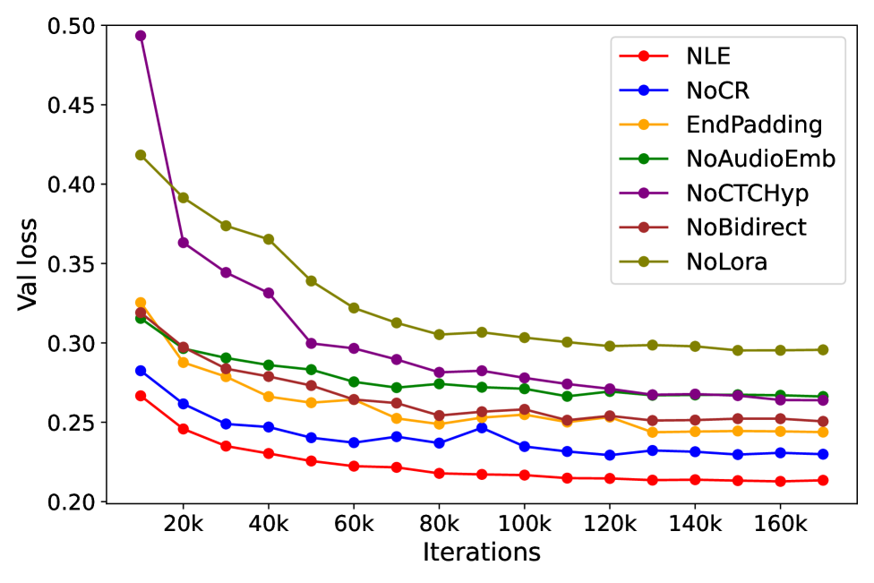
*Figure 3:Validation loss over training steps for ablation study (see Section 5.3). NLE (full model) achieves the lowest validation loss, confirming that each design choice contributes positively to overall performance.*

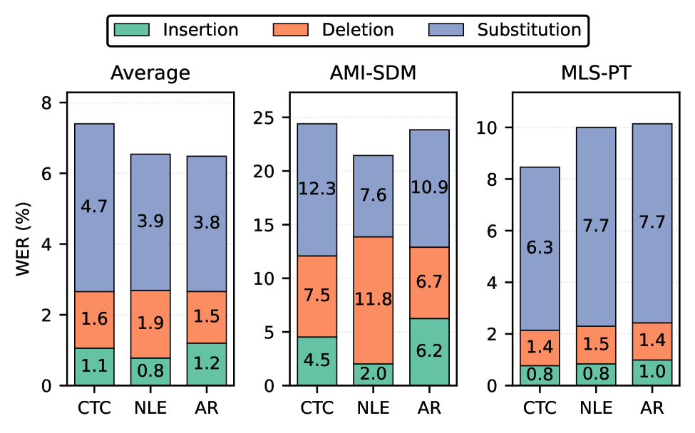
*Figure 4:Insertion, deletion and substitution rates (%) for three conditions: average across all datasets, AMI-SDM, and MLS-PT.*

*Figure 5:Inference time breakdown across the different stages of NLE. The encoder dominates at 66% of total time, with the LLM contributing 
∼
30%, and all remaining stages under 4%.*

---
**Usage Info**: 6178 tokens used.
**Generated at**: 2026-03-10 12:45:57

---

# 📚 Multi-View Based Audio Visual Target Speaker Extraction

🚀 URL: https://arxiv.org/html/2603.07696

## 🌏 Abstract (원문)
Target Speaker Extraction (TSE) separates a specific speaker's voice from overlapping speech or background noise, making it essential for hearing aids and speech recognition systems. Traditional TSE approaches typically rely on auxiliary reference cues to direct attention toward the target speaker. Audio-only methods utilize the target speaker's characteristics from a pre-recorded speech[xu2020spex,hao2024x,ge2020spex+], while visually-guided approaches usually leverage the synchronized visual information[pan2021muse,afouras2018conversation,pan2023scenario]such as lip movements or auxiliary face, hence enrollment is not needed. Recently, visual cue based methods become more popular, as they do not rely on pre-registered information and remain unaffected by highly noisy acoustic interference. Most AVTSE systems follow an encoder-fusion-separator-decoder pipeline. Audio and visual encoders extract embeddings; the latter are upsampled and fused—typically via concatenation[wu2019time,kalkhorani2025av,pan2022usev]or advanced strategies[li2024audio,li2023iianet]—before a separator network estimates a mask or target features, which is decoded into the target waveform. Common separators include GridNet[wang2023tf], CrossNet[kalkhorani2024tf], and DPRNN[luo2020dual]. However, most existing visual-guided AVTSE systems predominantly assume the availability of frontal facial views. This assumption is reflected in widely-used datasets such as LRS3[afouras2018lrs3]and VoxCeleb2[chung2018voxcelebs2], where speakers are typically captured from a frontal perspective. Since these datasets lack annotations for head pose variations, it remains unclear whether training and validation on stable frontal views is more effective than leveraging multiple distinct perspectives. Moreover, when synchronized multi-view video of a speaker is available, it raises the question of how to effectively exploit such synchronized information across different angles to further enhance model performance. Also, the reliance on frontal views significantly limits the practical applicability of AVTSE systems in real-world scenarios, where speakers naturally rotate their heads or cameras capture non-frontal angles—factors that have been shown to degrade performance[jordan1997seeing]. Previous work generates pose-invariant information[liu2023piave]or robust face frontalization[kang2022impact,kang2021robust]for reducing the impact of head movements. Attempting to correct non-frontal views rather than learning to leverage it may discard the original visual information, which results in suboptimal performance when frontalization fails. Some works in other related fields attempt to identify and process each specific pose separately[hesse2012multi]or use multiple cameras' information to enhance performance[petridis2017end]. The former is limited by the number of poses, while the latter requires a fixed multi-camera setup in both training and testing. To address these limitations, we propose a novel multi-view learning framework. Instead of treating pose variation as a problem to be corrected via frontalization, we embrace it as a source of complementary information. The key insight is that synchronized multi-view videos inherently contain complementary articulatory cues—learning such cross-view correlations directly enhances each individual view's representation, making it more robust to pose variations. Our framework learns a view-invariant and robust visual representation by explicitly modeling the multiplicative interactions between different viewing angles during training, rather than relying on the availability of multiple cameras at test time. Critically, this multi-view training strengthens the representation for each individual view. This is because the model learns to extract shared articulatory information across perspectives, enriching the feature space for each view rather than simply averaging or selecting among them. The model leverages multi-view data during training yet accepts single-view inputs at test time, making it practical for real-world single-camera scenarios. When tested on a video of a speaker freely turning their head, it applies learned cross-view knowledge to compensate for continuous pose changes—a capability frontalization methods cannot achieve.
## 🌏 Abstract (번역)
타겟 화자 추출(TSE)은 겹치는 음성이나 배경 소음으로부터 특정 화자의 목소리를 분리하여 보청기 및 음성 인식 시스템에 필수적입니다. 전통적인 TSE 접근 방식은 일반적으로 타겟 화자에게 주의를 집중시키기 위해 보조 참조 단서에 의존합니다. 오디오 전용 방법은 사전 녹음된 음성에서 타겟 화자의 특성을 활용하는 반면, 시각 유도 접근 방식은 일반적으로 입술 움직임이나 보조 얼굴과 같은 동기화된 시각 정보를 활용하므로 등록이 필요하지 않습니다. 최근 시각 단서 기반 방법은 사전 등록된 정보에 의존하지 않고 고도로 시끄러운 음향 간섭에 영향을 받지 않기 때문에 더욱 인기를 얻고 있습니다. 대부분의 AVTSE 시스템은 인코더-융합-분리자-디코더 파이프라인을 따릅니다. 오디오 및 시각 인코더는 임베딩을 추출하며, 후자는 업샘플링되고 융합됩니다(일반적으로 연결 또는 고급 전략을 통해). 그 후 분리자 네트워크가 마스크 또는 타겟 특징을 추정하고, 이는 타겟 파형으로 디코딩됩니다. 일반적인 분리자로는 GridNet, CrossNet, DPRNN 등이 있습니다. 그러나 대부분의 기존 시각 유도 AVTSE 시스템은 주로 정면 얼굴 시야의 가용성을 가정합니다. 이러한 가정은 LRS3 및 VoxCeleb2와 같이 널리 사용되는 데이터셋에 반영되어 있으며, 여기서 화자는 일반적으로 정면 시점에서 캡처됩니다. 이러한 데이터셋에는 머리 자세 변화에 대한 주석이 없기 때문에 안정적인 정면 시야에서 훈련 및 검증하는 것이 여러 다른 시점을 활용하는 것보다 더 효과적인지는 불분명합니다. 더욱이, 화자의 동기화된 다중 시점 비디오를 사용할 수 있을 때, 다양한 각도에 걸쳐 이러한 동기화된 정보를 효과적으로 활용하여 모델 성능을 더욱 향상시키는 방법에 대한 의문이 제기됩니다. 또한, 정면 시야에 대한 의존은 화자가 자연스럽게 머리를 돌리거나 카메라가 비정면 각도를 캡처하는 실제 시나리오에서 AVTSE 시스템의 실제 적용 가능성을 크게 제한합니다. 이러한 요인들은 성능을 저하시키는 것으로 나타났습니다. 이전 연구는 머리 움직임의 영향을 줄이기 위해 자세 불변 정보를 생성하거나 견고한 얼굴 정면화를 수행했습니다. 비정면 시야를 활용하는 방법을 배우기보다는 이를 수정하려고 시도하는 것은 원본 시각 정보를 버릴 수 있으며, 이는 정면화가 실패할 때 최적 이하의 성능을 초래합니다. 다른 관련 분야의 일부 연구는 각 특정 자세를 개별적으로 식별하고 처리하거나 여러 카메라의 정보를 사용하여 성능을 향상시키려고 시도합니다. 전자는 자세의 수에 의해 제한되며, 후자는 훈련 및 테스트 모두에서 고정된 다중 카메라 설정을 필요로 합니다. 이러한 한계를 해결하기 위해 우리는 새로운 다중 시점 학습 프레임워크를 제안합니다. 우리는 자세 변화를 정면화를 통해 수정해야 할 문제로 취급하는 대신, 이를 보완 정보의 원천으로 받아들입니다. 핵심 통찰력은 동기화된 다중 시점 비디오가 본질적으로 보완적인 조음 단서를 포함한다는 것입니다. 이러한 교차 시점 상관 관계를 학습하는 것은 각 개별 시점의 표현을 직접적으로 향상시켜 자세 변화에 더욱 견고하게 만듭니다. 우리의 프레임워크는 테스트 시점에 여러 카메라의 가용성에 의존하는 대신, 훈련 중에 다른 시야각 간의 곱셈 상호작용을 명시적으로 모델링하여 시야 불변적이고 견고한 시각 표현을 학습합니다. 결정적으로, 이러한 다중 시점 훈련은 각 개별 시점에 대한 표현을 강화합니다. 이는 모델이 관점 전반에 걸쳐 공유된 조음 정보를 추출하는 방법을 학습하여, 단순히 평균을 내거나 그 중에서 선택하는 대신 각 시점에 대한 특징 공간을 풍부하게 만들기 때문입니다. 이 모델은 훈련 중에는 다중 시점 데이터를 활용하지만, 테스트 시점에는 단일 시점 입력을 받아들여 실제 단일 카메라 시나리오에 실용적입니다. 화자가 자유롭게 머리를 돌리는 비디오로 테스트했을 때, 이 모델은 학습된 교차 시점 지식을 적용하여 연속적인 자세 변화를 보상합니다. 이는 정면화 방법으로는 달성할 수 없는 기능입니다.

## 🔍 Methods & Results
- 제안된 AVTSE 시스템은 TF-GridNet 백본을 기반으로 하며, 훈련 시 다중 시점 시각 데이터를 활용하여 단일 시점 추론에서 우수한 성능을 달성합니다.
- 핵심 구성 요소는 Multi-View Tensor Fusion (MVTF) 모듈로, LSTM과 텐서 외적을 사용하여 다중 시점 임베딩을 시야 불변 표현으로 융합합니다.
- 오디오는 STFT로 인코딩되고, 각 비디오 시점은 사전 훈련된 립 리딩 네트워크를 통해 특징을 추출하며, 오디오와 시각 프레임 간의 시간적 불일치는 선형 보간법으로 해결됩니다.
- MVTF 모듈은 각 시점의 LSTM 처리된 특징 간의 곱셈 상호작용을 모델링하기 위해 쌍별 외적을 계산하고, 이를 평균하여 최종 융합된 시각 컨텍스트를 생성합니다.
- 융합된 시각 컨텍스트는 오디오 특징과 결합되어 GridBlock을 통해 타겟 화자의 스펙트로그램을 재구성하고, 이후 iSTFT를 통해 파형으로 변환됩니다.
- 추론 시 일부 시점이 누락되면, 사용 가능한 시점을 복제하여 보상하며, MVTF 모듈의 회전 대칭성 덕분에 입력 순서가 결과에 영향을 미치지 않아 테스트 환경에서 카메라 위치를 유연하게 설정할 수 있습니다.
- PIAVE와 동일한 데이터셋 및 설정(데이터 분할, 혼합 생성, SNR 범위)을 사용하지만, 모델은 처음부터 훈련되었으므로 결과는 직접적인 비교보다는 참고용입니다.

## 🖼 Figures

*Figure 1:Our proposed MVTF method that extracts the target speakers' speech using Multi-View lip embeddings. (a)Three views, one view (copied three times), and two views (one view copied two times) visible situations. (b)overall structure of MVTF-GridNet.*

---
**Usage Info**: 8169 tokens used.
**Generated at**: 2026-03-10 12:46:20

---

# 📚 The Talking Robot: Distortion-Robust Acoustic Models for Robot-Robot Communication

🚀 URL: https://arxiv.org/html/2603.07072

## 🌏 Abstract (원문)
Robots that share a workspace often need to exchange short commands quickly and reliably. While radio-frequency links are effective, they can introduce practical overhead (dedicated transceivers, interference management, and deployment constraints). Acoustic communication is a lightweight alternative for short-range, infrastructure-free messaging.Our key observation is that robot-to-robot acoustic communication isparalinguistics-free: the signal does not need to resemble human speech or preserve voice characteristics. The only objective is to recover a discrete token sequence. This lets us treat the transmitter and receiver as an encoder–decoder pair connected through an acoustic channel, in the spirit of learned communication systems[12].We begin with a deterministicprocedural synthesizer(PS) that assigns each of the 128 vocabulary tokens a unique multi-harmonic tone chip. PS provides full vocabulary coverage at zero data cost and an interpretable baseline that a compact receiver can decode with near-zero error in clean conditions. However, PS is brittle under realistic distortions: reverberation smears token boundaries, clipping injects overlapping harmonics, and sample-rate drift shifts frequencies enough to cause collisions. These failures motivate replacing fixed, hand-designed signaling with end-to-end learning.We propose co-training a TTS-style transmitter and a Conformer-based receiver through realistic channel augmentation. The transmitter (FastSpeech[16]) maps tokens to mel-spectrograms as a learned acoustic code; a Griffin–Lim vocoder[7]converts the spectrogram to a waveform for physical transmission; the receiver (Conformer[8]) decodes tokens via CTC[6]. Direct end-to-end training from scratch fails due to thecold-start problem. We resolve this with a three-phase curriculum that uses PS as a warm-start anchor: (i) warmup (ASR learns PS; TTS imitates PS), (ii) ramp (gradually enable CTC→
ightarrowTTS), and (iii) full co-training (remove PS; train end-to-end under augmentation). The resulting system matches PS in clean conditions and surpasses it under degradation, while remaining lightweight (2.1M2.1	ext{\,}\mathrm{M}parameters) and real-time.We cast robot acoustic messaging as paralinguistics-free discrete symbol transmission and repurpose compact TTS/ASR models as a learned acoustic codec, calledArtoo(acousticrobottransmission robust codec).We introduce a procedural synthesizer baseline that provides a zero-data proof of concept and resolves cold-start as a curriculum anchor for stable co-training.We demonstrate sim-to-real robustness via end-to-end co-training under realistic channel augmentation, achieving reliable over-the-air decoding with real-time latency on embedded hardware.Next, we present related work inSec.II.We propose our Artoo system architecture inSec.III, then explain how we train it inSec.IV.We set up our experiments inSec.V, present them inSec.VI, and discuss advantages and limitations of our approach inSec.VII.We provide closing remarks inSec.VIII.
## 🌏 Abstract (번역)
작업 공간을 공유하는 로봇들은 종종 짧은 명령을 빠르고 안정적으로 교환해야 합니다. 무선 주파수(RF) 링크는 효과적이지만, 전용 송수신기, 간섭 관리, 배포 제약 등 실질적인 오버헤드를 발생시킬 수 있습니다. 음향 통신은 단거리, 인프라 없는 메시징을 위한 경량 대안입니다. 우리의 핵심 관찰은 로봇 간 음향 통신이 비언어적(paralinguistics-free)이라는 것입니다. 즉, 신호가 인간의 음성과 유사할 필요가 없거나 음성 특성을 보존할 필요가 없습니다. 유일한 목표는 이산 토큰 시퀀스를 복구하는 것입니다. 이를 통해 우리는 송신기와 수신기를 학습된 통신 시스템[12]의 정신에 따라 음향 채널을 통해 연결된 인코더-디코더 쌍으로 취급할 수 있습니다. 우리는 128개의 어휘 토큰 각각에 고유한 다중 고조파 톤 칩을 할당하는 결정론적 절차적 합성기(PS)로 시작합니다. PS는 제로 데이터 비용으로 전체 어휘 범위를 제공하며, 소형 수신기가 깨끗한 조건에서 거의 제로 오류로 디코딩할 수 있는 해석 가능한 기준선을 제공합니다. 그러나 PS는 현실적인 왜곡에 취약합니다. 잔향은 토큰 경계를 흐리게 하고, 클리핑은 중첩된 고조파를 주입하며, 샘플링 속도 편차는 주파수를 충분히 이동시켜 충돌을 일으킵니다. 이러한 실패는 고정된 수동 설계 신호 방식을 종단 간 학습으로 대체해야 할 필요성을 제기합니다. 우리는 현실적인 채널 증강을 통해 TTS(Text-to-Speech) 스타일 송신기와 Conformer 기반 수신기를 공동 훈련하는 것을 제안합니다. 송신기(FastSpeech[16])는 토큰을 학습된 음향 코드인 멜 스펙트로그램으로 매핑하고, Griffin-Lim 보코더[7]는 스펙트로그램을 물리적 전송을 위한 파형으로 변환하며, 수신기(Conformer[8])는 CTC[6]를 통해 토큰을 디코딩합니다. 무작위 초기화부터 직접적인 종단 간 훈련은 콜드 스타트 문제로 인해 실패합니다. 우리는 PS를 웜 스타트 앵커로 사용하는 3단계 커리큘럼으로 이 문제를 해결합니다. (i) 웜업 (ASR은 PS를 학습하고, TTS는 PS를 모방), (ii) 램프 (CTC→TTS를 점진적으로 활성화), (iii) 전체 공동 훈련 (PS 제거, 증강 하에 종단 간 훈련). 결과 시스템은 깨끗한 조건에서 PS와 동등한 성능을 보이고, 성능 저하 조건에서는 이를 능가하며, 동시에 경량(2.1M 매개변수)이고 실시간으로 작동합니다. 우리는 로봇 음향 메시징을 비언어적 이산 심볼 전송으로 간주하고, 소형 TTS/ASR 모델을 학습된 음향 코덱인 Artoo(acoustic robot transmission robust codec)로 재활용합니다. 우리는 제로 데이터 개념 증명을 제공하고 안정적인 공동 훈련을 위한 커리큘럼 앵커로서 콜드 스타트 문제를 해결하는 절차적 합성기 기준선을 소개합니다. 우리는 현실적인 채널 증강 하의 종단 간 공동 훈련을 통해 시뮬레이션-실제 견고성을 입증하여 임베디드 하드웨어에서 실시간 지연 시간으로 안정적인 무선 디코딩을 달성합니다. 다음으로, 2절에서 관련 연구를 제시합니다. 3절에서 Artoo 시스템 아키텍처를 제안하고, 4절에서 훈련 방법을 설명합니다. 5절에서 실험을 설정하고, 6절에서 결과를 제시하며, 7절에서 접근 방식의 장점과 한계를 논의합니다. 8절에서 결론을 제시합니다.

## 🔍 Methods & Results
- 로봇 간 음향 통신은 '비언어적(paralinguistics-free)'이라는 핵심 관찰을 기반으로 하며, 인간 음성 특성 보존 없이 이산 토큰 시퀀스 복구만을 목표로 합니다.
- 초기 접근 방식인 절차적 합성기(PS)는 128개 어휘 토큰 각각에 고유한 3-고조파 톤 칩을 할당하여 제로 데이터 비용으로 전체 어휘를 커버하고 깨끗한 조건에서 낮은 오류율을 달성하는 해석 가능한 기준선을 제공합니다.
- PS는 잔향, 클리핑, 샘플링 속도 편차와 같은 현실적인 채널 왜곡에 취약하여 토큰 경계 손상, 고조파 중첩, 주파수 충돌을 야기하며, 이는 종단 간 학습의 필요성을 제기합니다.
- 제안된 Artoo 시스템은 TTS 스타일 송신기(FastSpeech, 약 1.18M 매개변수)와 Conformer 기반 수신기(Conformer-Tiny, 약 938K 매개변수)를 현실적인 채널 증강을 통해 공동 훈련합니다. 전체 시스템은 약 2.1M 매개변수로 경량입니다.
- 송신기는 토큰을 멜 스펙트로그램으로 매핑하고, Griffin-Lim 보코더(학습된 매개변수 없음)가 이를 파형으로 변환하며, 수신기는 CTC를 통해 토큰을 디코딩합니다.
- 콜드 스타트 문제를 해결하기 위해 PS를 웜 스타트 앵커로 사용하는 3단계 커리큘럼 훈련 방식을 사용합니다: (i) 웜업 (ASR은 PS 학습, TTS는 PS 모방), (ii) 램프 (CTC→TTS 기울기 점진적 활성화), (iii) 전체 공동 훈련 (PS 제거, 증강 하 종단 간 훈련).
- 훈련 중에는 멜 도메인(가우시안 노이즈, SpecAugment, 시간 흐림, 시간 이동) 및 파형 도메인(랜덤 게인, 다중 유형 노이즈, EQ, 잔향, 클리핑, 샘플링 속도 편차)에서 확률적 채널 증강을 적용하여 현실적인 음향 채널을 시뮬레이션합니다.
- 퇴보적인 TTS 출력을 방지하기 위해 에너지 경계, 평활도, 대역 제한의 세 가지 스펙트럼 정규화 기법을 적용합니다.
- 결과 시스템은 깨끗한 조건에서 PS와 동등한 성능을 보이며, 성능 저하 조건에서는 PS를 능가하고, 임베디드 하드웨어에서 실시간 지연 시간으로 안정적인 무선 디코딩을 달성하여 시뮬레이션-실제 견고성을 입증합니다.

## 🖼 Figures

*Figure 1:We propose Artoo: a text-to-speech (TTS) and automatic speech recognition (ASR) pipeline for robot-robot communication. The goal of our method is to enable robots to communicate in a way that is robust to environmental noise; our key insight is to relax the need for TTS and ASR models to replicate human speech.*

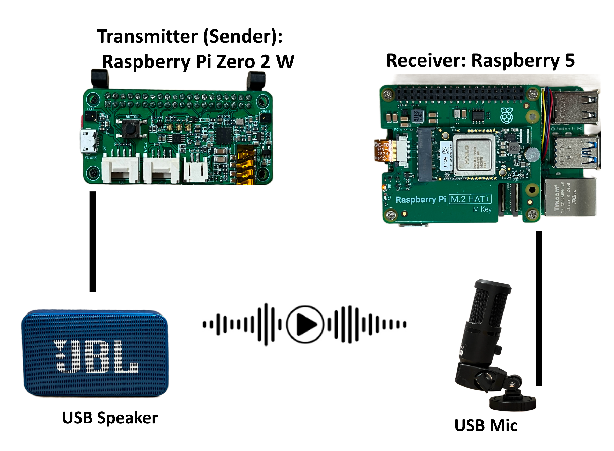
*Figure 2:Illustration of the real-world over-the-air deployment setup used for hardware evaluation.*

---
**Usage Info**: 6598 tokens used.
**Generated at**: 2026-03-10 12:46:36

---

# 📚 The Dual-Stream Transformer: Channelized Architecture for Interpretable Language Modeling

🚀 URL: https://arxiv.org/html/2603.07461

## 🌏 Abstract (원문)
Transformers process information through a single residual stream where attention and feed-forward outputs accumulate without distinctionElhageet al.(2021). This design enables strong performance but creates an interpretability barrier: when all components write to a shared representation, determining which component performs which function becomes intractable. Post-hoc analysis methods can identify correlations between components and behaviorsClarket al.(2019); Tenneyet al.(2019), but models can route around targeted interventions by redistributing computation across other componentsMcGrathet al.(2023). Understanding causal relationships requires architectural support.
We propose that interpretability should be enforced through architectural constraints rather than excavated post-hocWanget al.(2023); Geigeret al.(2021). The Dual-Stream Transformer achieves this through two mechanisms that expose internal structure by design.
Dual-stream decomposition.The residual stream is factored into additive components:𝐱=𝐱t+𝐱e\mathbf{x}=\mathbf{x}_{t}+\mathbf{x}_{e}, where𝐱t\mathbf{x}_{t}(the token stream) carries information derived from discrete token identities and is updated exclusively by attention, while𝐱e\mathbf{x}_{e}(the context stream) accumulates continuous contextual transformations and is updated exclusively by feed-forward networks. This functional separation makes explicit which computations perform token-level operations versus contextual refinements.
Channelized mixing.Information flow across attention heads is controlled through a hierarchy of mixing strategies. Independent mixing enforces block-diagonal projections where each head operates in isolation. Dense mixing allows unrestricted communication, matching standard transformers. The intermediate Kronecker strategy (Wheads⊗IW_{\text{heads}}\otimes I) permits scalar mixing between heads while preserving within-head structure, providing interpretable cross-head communication with onlyH2H^{2}parameters rather than(H⋅dh)2(H\cdot d_{h})^{2}.
This design exposes a tunable interpretability-performance tradeoff. Practitioners can select the configuration that meets their requirements, from maximum interpretability (fully independent mixing, 8% performance cost) to minimal cost (Kronecker mixing, 2.5% performance cost) to standard transformer behavior (dense mixing, no cost).
Our experiments on language modeling tasks at 29M parameters demonstrate three main findings. First, the interpretability tax is bounded and predictable across the mixing hierarchy. Second, all configurations maintain functional generation under attention amplification at inference time, where attention logits are scaled by factors up to 16 before softmax. Degradation ranges from 16% to 27%, with Kronecker mixing showing the most graceful degradation. This robustness provides evidence that the architectures learn discrete algorithms that operate independently of soft probabilistic smoothing. Third, stream ablation experiments confirm functional separation: removing the token stream causes severe degradation (36%), while removing the context stream has moderate impact (9.5%), validating the architectural decomposition.
We contribute: (1) the dual-stream architecture with formal specification, (2) the channelized mixing framework with parameter-efficient strategies, (3) systematic ablations quantifying interpretability-performance tradeoffs across configurations, and (4) attention amplification as a diagnostic methodology revealing discrete computational structure. The architecture provides a foundation for interpretable language models where practitioners can tune the degree of structural constraint to their application requirements.
## 🌏 Abstract (번역)
트랜스포머는 어텐션 및 피드포워드 출력이 구분 없이 축적되는 단일 잔여 스트림을 통해 정보를 처리합니다(Elhage et al., 2021). 이러한 설계는 강력한 성능을 가능하게 하지만 해석 가능성 장벽을 만듭니다. 모든 구성 요소가 공유 표현에 기록할 때, 어떤 구성 요소가 어떤 기능을 수행하는지 파악하기 어렵습니다. 사후 분석 방법은 구성 요소와 동작 간의 상관관계를 식별할 수 있지만(Clark et al., 2019; Tenney et al., 2019), 모델은 다른 구성 요소에 걸쳐 계산을 재분배하여 특정 개입을 우회할 수 있습니다(McGrath et al., 2023). 인과 관계를 이해하려면 아키텍처 지원이 필요합니다.
우리는 해석 가능성이 사후에 발굴되기보다는 아키텍처 제약을 통해 강제되어야 한다고 제안합니다(Wang et al., 2023; Geiger et al., 2021). 듀얼 스트림 트랜스포머는 설계상 내부 구조를 노출하는 두 가지 메커니즘을 통해 이를 달성합니다.
듀얼 스트림 분해. 잔여 스트림은 덧셈 구성 요소인 𝐱=𝐱t+𝐱e로 분해됩니다. 여기서 𝐱t(토큰 스트림)는 이산 토큰 ID에서 파생된 정보를 전달하며 어텐션에 의해서만 업데이트되고, 𝐱e(컨텍스트 스트림)는 연속적인 컨텍스트 변환을 축적하며 피드포워드 네트워크에 의해서만 업데이트됩니다. 이러한 기능적 분리는 어떤 계산이 토큰 수준 작업을 수행하고 어떤 계산이 컨텍스트 정제를 수행하는지 명확하게 합니다.
채널화된 혼합. 어텐션 헤드 간의 정보 흐름은 혼합 전략의 계층 구조를 통해 제어됩니다. 독립 혼합은 각 헤드가 독립적으로 작동하는 블록 대각 투영을 강제합니다. 밀집 혼합은 표준 트랜스포머와 일치하는 무제한 통신을 허용합니다. 중간 크로네커 전략(Wheads⊗I)은 헤드 간의 스칼라 혼합을 허용하면서 헤드 내 구조를 보존하여 (H⋅dh)2 매개변수 대신 H2 매개변수만으로 해석 가능한 헤드 간 통신을 제공합니다.
이러한 설계는 조정 가능한 해석 가능성-성능 트레이드오프를 노출합니다. 실무자는 최대 해석 가능성(완전히 독립적인 혼합, 8% 성능 비용)부터 최소 비용(크로네커 혼합, 2.5% 성능 비용) 및 표준 트랜스포머 동작(밀집 혼합, 비용 없음)에 이르기까지 요구 사항을 충족하는 구성을 선택할 수 있습니다.
2,900만 매개변수를 가진 언어 모델링 작업에 대한 우리의 실험은 세 가지 주요 발견을 보여줍니다. 첫째, 해석 가능성 비용은 혼합 계층 구조 전반에 걸쳐 제한적이고 예측 가능합니다. 둘째, 모든 구성은 추론 시 어텐션 증폭(어텐션 로짓이 소프트맥스 전에 최대 16배까지 스케일링됨) 하에서 기능적 생성을 유지합니다. 성능 저하는 16%에서 27% 범위이며, 크로네커 혼합이 가장 점진적인 저하를 보였습니다. 이러한 견고성은 아키텍처가 부드러운 확률적 스무딩과 독립적으로 작동하는 이산 알고리즘을 학습한다는 증거를 제공합니다. 셋째, 스트림 제거 실험은 기능적 분리를 확인합니다. 토큰 스트림을 제거하면 심각한 성능 저하(36%)가 발생하고, 컨텍스트 스트림을 제거하면 중간 정도의 영향(9.5%)이 있어 아키텍처 분해를 검증합니다.
우리는 다음을 기여합니다. (1) 공식 사양을 갖춘 듀얼 스트림 아키텍처, (2) 매개변수 효율적인 전략을 갖춘 채널화된 혼합 프레임워크, (3) 구성 전반에 걸쳐 해석 가능성-성능 트레이드오프를 정량화하는 체계적인 제거 실험, (4) 이산 계산 구조를 드러내는 진단 방법론으로서의 어텐션 증폭. 이 아키텍처는 실무자가 애플리케이션 요구 사항에 따라 구조적 제약의 정도를 조정할 수 있는 해석 가능한 언어 모델을 위한 기반을 제공합니다.

## 🔍 Methods & Results
- 듀얼 스트림 트랜스포머는 잔여 스트림을 토큰 스트림(𝐱t)과 컨텍스트 스트림(𝐱e)의 두 가지 덧셈 구성 요소로 분해하며, 𝐱t는 어텐션에 의해서만, 𝐱e는 피드포워드 네트워크에 의해서만 업데이트됩니다.
- 세 가지 스트림 상호작용 모드가 지원됩니다: 'Standard' (표준 트랜스포머처럼 스트림 분리 비활성화), 'Token-Factor' (두 스트림 모두 활성화, 독립적 업데이트), 'Token-Frozen' (토큰 스트림 초기화 후 고정, 최대 해석 가능성 제공).
- 채널화된 혼합 전략은 어텐션 헤드 간의 정보 흐름을 제어하며, Identity, Independent (각 헤드 독립 작동), Kronecker (헤드 간 스칼라 혼합, H^2 매개변수로 효율적이고 해석 가능), Dense (표준 트랜스포머처럼 무제한 혼합)의 계층 구조를 가집니다.
- 어텐션 메커니즘은 결합된 스트림에서 쿼리와 키를 계산하고, 토큰 스트림에서 구성 가능한 혼합을 통해 값을 가져옵니다.
- 추론 시 어텐션 로짓을 스케일링하는 어텐션 증폭(α=16까지)은 이산 계산 구조를 진단하는 데 사용되며, 모든 구성에서 기능적 생성을 유지하고 크로네커 혼합이 가장 점진적인 성능 저하를 보였습니다.
- FFN은 결합된 스트림을 관찰하지만 컨텍스트 스트림에만 기록하며, 기본적으로 Independent 혼합을 사용하여 FFN 채널의 헤드 격리를 강제합니다.
- ChannelLayerNorm (CLN)은 각 헤드의 차원을 독립적으로 정규화하여 헤드 격리를 유지하고 훈련 안정성을 제공합니다.
- 실험 결과, 해석 가능성 비용은 혼합 계층 구조 전반에 걸쳐 제한적이고 예측 가능하며, 스트림 제거 실험은 토큰 스트림 제거 시 심각한 성능 저하(36%), 컨텍스트 스트림 제거 시 중간 정도의 영향(9.5%)을 보여 기능적 분리를 확인했습니다.
- 주요 기여는 듀얼 스트림 아키텍처, 매개변수 효율적인 채널화된 혼합 프레임워크, 해석 가능성-성능 트레이드오프를 정량화하는 체계적인 제거 실험, 그리고 이산 계산 구조를 드러내는 진단 방법론으로서의 어텐션 증폭입니다.

## 🖼 Figures
![Figure 2:Validation loss versus attention amplification factor. (a) Kronecker-Dense mixing degrades more gracefully than Independent-Dense, with 9.5% lower cumulative degradation across 
𝛼
∈
[
1
,
16
]
. (b) Gated attention variants show similar amplification robustness to their non-gated counterparts. All configurations maintain functional generation at 
𝛼
=
16
 with bounded degradation.](../images/2026-03-10/2603.07461/2603.07461_fig1.png)
*Figure 2:Validation loss versus attention amplification factor. (a) Kronecker-Dense mixing degrades more gracefully than Independent-Dense, with 9.5% lower cumulative degradation across 
𝛼
∈
[
1
,
16
]
. (b) Gated attention variants show similar amplification robustness to their non-gated counterparts. All configurations maintain functional generation at 
𝛼
=
16
 with bounded degradation.*

*Figure 3:Learned Kronecker routing matrices across layers. Each heatmap shows the 
6
×
6
 head-to-head routing weights for (a) value projection and (b) output projection. Cell 
(
𝑖
,
𝑗
)
 indicates routing from head 
𝑗
 to head 
𝑖
. Red indicates positive (excitatory) weights; blue indicates negative (inhibitory) weights. Routing strength increases in deeper layers, with maximum weights growing from 
∼
1.0 in layer 0 to 
∼
3.5 in layer 5.*

*Figure 4:Attention patterns under progressive amplification (FTS configuration, Layer 3). Distributions sharpen from soft mixing at baseline to near-deterministic selection at 
𝛼
=
16
. The model maintains coherent predictions throughout this transition, indicating that the underlying computation can operate on discrete token selections.*

*Figure 5:Coreference resolution accuracy by head across architectures. Left: Independent-Dense configuration shows strong specialization with distinct functional roles per head. Right: Dense baseline distributes coreference computation across multiple heads with less differentiation. Architectural constraints promote interpretable specialization.*

---
**Usage Info**: 5356 tokens used.
**Generated at**: 2026-03-10 12:46:51

---

