# 🚩 (2026-03-12) Scholar Inbox 추천 논문 

# 📚 When Fine-Tuning Fails and when it Generalises: Role of Data Diversity and Mixed Training in LLM-based TTS

🚀 URL: https://arxiv.org/html/2603.10904

## 🌏 Abstract (원문)
Large language models are increasingly adopted as semantic backbones for neural text-to-speech systems. However, frozen LLM representations are insufficient for modeling speaker-specific acoustic and perceptual characteristics. Our experiments involving fine tuning of the Language Model backbone of TTS show promise in improving the voice consistency and Signal to Noise ratio (SNR) in voice cloning task.Across multiple speakers, LoRA fine-tuning consistently outperforms the non–fine-tuned base Qwen-0.5B model across three complementary dimensions of speech quality. First, perceptual quality improves significantly, with DNS-MOS gains of up to +0.42 points for speakers whose training data exhibits sufficient acoustic variability. Second, speaker fidelity improves for all evaluated speakers, with consistent increases in voice similarity, indicating that LoRA effectively adapts speaker identity representations without degrading linguistic modeling. Third, signal-level quality improves in most cases, with signal-to-noise ratio increasing by as much as 34 percent.Crucially, these improvements are strongly governed by the characteristics of the training data. Speakers with high variability in acoustic energy and perceptual quality achieve simultaneous gains in DNS-MOS, voice similarity, and SNR. In contrast, speakers trained on acoustically homogeneous data experience limited gains or perceptual degradation, even when voice similarity improves. This reveals that LoRA can faithfully clone speaker identity while also amplifying noise characteristics and recording artifacts present in narrow training distributions.We further identify a loss–quality divergence phenomenon in which training and validation loss continue to improve during fine-tuning while perceptual quality degrades for low-variability speakers. Besides, we show that optimal inference temperature of the language model backbone depends on training data variability, with conservative sampling benefiting low-variability speakers but degrading quality for high-variability ones.Overall, this work establishes that LoRA fine-tuning is not merely a parameter-efficient optimization technique but an effective mechanism for better speaker-level adaptation in compact LLM-based TTS systems. When supported by sufficiently diverse training data, LoRA-adapted Qwen-0.5B consistently surpasses its frozen base model in perceptual quality, speaker similarity with low latency using GGUF model hosted in quantized form.
## 🌏 Abstract (번역)
대규모 언어 모델(LLM)은 신경망 기반 텍스트 음성 변환(TTS) 시스템의 의미론적 백본으로 점점 더 많이 채택되고 있습니다. 그러나 고정된 LLM 표현은 화자별 음향 및 지각적 특성을 모델링하는 데 불충분합니다. TTS의 언어 모델 백본을 미세 조정하는 실험은 음성 복제 작업에서 음성 일관성과 신호 대 잡음비(SNR)를 개선할 가능성을 보여줍니다.여러 화자에 걸쳐 LoRA 미세 조정은 음성 품질의 세 가지 보완적인 차원에서 미세 조정되지 않은 기본 Qwen-0.5B 모델보다 지속적으로 우수한 성능을 보였습니다. 첫째, 훈련 데이터가 충분한 음향적 가변성을 보이는 화자의 경우 DNS-MOS 점수가 최대 +0.42점 향상되는 등 지각적 품질이 크게 개선되었습니다. 둘째, 평가된 모든 화자에 대해 음성 유사성이 지속적으로 증가하여 화자 충실도가 향상되었으며, 이는 LoRA가 언어 모델링을 저하시키지 않으면서 화자 정체성 표현을 효과적으로 적용함을 나타냅니다. 셋째, 대부분의 경우 신호 수준 품질이 개선되었으며, 신호 대 잡음비가 최대 34% 증가했습니다.결정적으로 이러한 개선 사항은 훈련 데이터의 특성에 크게 좌우됩니다. 음향 에너지 및 지각적 품질에 높은 가변성을 가진 화자는 DNS-MOS, 음성 유사성 및 SNR에서 동시에 이득을 얻습니다. 반대로, 음향적으로 균질한 데이터로 훈련된 화자는 음성 유사성이 개선되더라도 제한적인 이득을 얻거나 지각적 저하를 경험합니다. 이는 LoRA가 화자 정체성을 충실하게 복제하는 동시에 좁은 훈련 분포에 존재하는 잡음 특성 및 녹음 아티팩트를 증폭시킬 수 있음을 보여줍니다.또한, 우리는 미세 조정 중에 훈련 및 검증 손실이 계속 개선되지만 가변성이 낮은 화자의 경우 지각적 품질이 저하되는 손실-품질 발산 현상을 확인했습니다. 이 외에도 언어 모델 백본의 최적 추론 온도가 훈련 데이터 가변성에 따라 달라지며, 보수적인 샘플링은 가변성이 낮은 화자에게는 이점을 주지만 가변성이 높은 화자에게는 품질을 저하시킨다는 것을 보여줍니다.전반적으로 이 연구는 LoRA 미세 조정이 단순히 매개변수 효율적인 최적화 기술이 아니라 소형 LLM 기반 TTS 시스템에서 더 나은 화자 수준 적응을 위한 효과적인 메커니즘임을 확립합니다. 충분히 다양한 훈련 데이터가 뒷받침될 때, LoRA가 적용된 Qwen-0.5B는 양자화된 형태로 호스팅된 GGUF 모델을 사용하여 낮은 지연 시간으로 지각적 품질, 화자 유사성 측면에서 고정된 기본 모델을 지속적으로 능가합니다.

## 🔍 Methods & Results
- NeuTTS의 언어 모델 백본인 Qwen-0.5B를 미세 조정하고, 미세 조정이 음성 품질에 미치는 영향을 분석했습니다.
- 전체 미세 조정(Full Finetuning)은 모든 매개변수에 대해 수행되었으며, 배치 크기 2로 NVIDIA L4 GPU에서 5 에포크 동안 훈련되었습니다.
- LoRA(rank 8, alpha 16) 미세 조정은 메모리 요구 사항을 고려하여 어텐션 레이어(q_proj, k_proj, v_proj)에 적용되었으며, 배치 크기 4(그래디언트 누적 2로 유효 배치 크기 8)로 5 에포크 동안 훈련되었습니다.
- LoRA 훈련은 전체 미세 조정보다 훈련 손실 감소가 훨씬 안정적이었습니다.
- 훈련 데이터는 HiFi TTS(화자 ID 1, 2, 11614)와 Libriheavy-HQ(화자 ID 1401, 1212, 1259)에서 수집되었으며, 단일 화자 데이터셋도 사용되었습니다.
- 평가 지표로는 음성 유사성(wespeaker 임베딩 및 코사인 유사도), 신호 대 잡음비(WADA-SNR), MOS(DNS-MOS)를 사용했습니다.
- LoRA 미세 조정은 미세 조정되지 않은 Qwen-0.5B 모델보다 지각적 품질(DNS-MOS 최대 +0.42점), 화자 충실도(음성 유사성 증가), 신호 수준 품질(SNR 최대 34% 증가)에서 일관되게 우수한 성능을 보였습니다.
- 개선 효과는 훈련 데이터의 특성에 크게 좌우되며, 음향적 가변성이 높은 데이터는 DNS-MOS, 음성 유사성, SNR에서 동시 이득을 얻었습니다.
- 음향적으로 균질한 데이터로 훈련된 화자는 제한적인 이득을 얻거나 지각적 저하를 경험했으며, LoRA가 화자 정체성을 복제하면서 잡음 및 녹음 아티팩트를 증폭시킬 수 있음을 확인했습니다.
- 훈련 및 검증 손실은 개선되지만 가변성이 낮은 화자의 지각적 품질은 저하되는 손실-품질 발산 현상이 관찰되었습니다.
- 최적의 추론 온도는 훈련 데이터 가변성에 따라 달라지며, 보수적인 샘플링은 가변성이 낮은 화자에게는 이점을 주지만 가변성이 높은 화자에게는 품질을 저하시켰습니다.
- LoRA 미세 조정은 LLM 기반 TTS 시스템에서 더 나은 화자 수준 적응을 위한 효과적인 메커니즘이며, 충분히 다양한 훈련 데이터가 있을 때 LoRA 적용 Qwen-0.5B는 고정된 기본 모델을 능가합니다.

## 🖼 Figures

*Figure 1:End-to-End Pipeline of a cascading voice agent comprising of a ASR module to transcribe voice to text, LLM module to reason over the text and generate text output and lastly a TTS module to synthesize speech for the reasoned text. Our work to the pipeline focuses on finetuning the LLM backbone (enclosed in red) responsible for token prediction, which are subsequently decoded by the neural codec to generate the waveform*

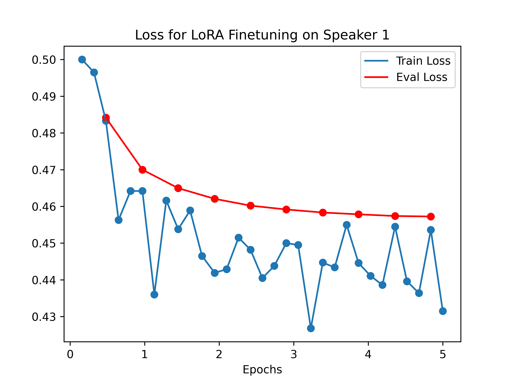
*Figure 2:Plots of Training and Validation Loss at various training steps for each speaker ID. The curves indicate stochastic decrease of training loss with training steps with saturation in validation loss as we approach 4 epochs*

*Figure 3:Plots indicating MOS Score (Y axis) of Audio Generated with varying lengths of cloning audio provided (X axis). Base refers to the standard NeuTTS model, Ref refers to the audio used for cloning. "Long" refers to generation of a longer sentence (180 characters) whereas other audios have 70 characters.*

---
**Usage Info**: 3965 tokens used.
**Generated at**: 2026-03-12 12:40:04

---

# 📚 AlphaFlowTSE: One-Step Generative Target Speaker Extraction via Conditional AlphaFlow

🚀 URL: https://arxiv.org/html/2603.10701

## 🌏 Abstract (원문)
In target speaker extraction (TSE), we aim to recover target speech from a multi-talker mixture using a short enrollment utterance as reference. Recent studies on diffusion and flow-matching generators have improved target-speech fidelity. However, multi-step sampling increases latency, and one-step solutions often rely on a mixture-dependent time coordinate that can be unreliable for real-world conversations. We present AlphaFlowTSE, a one-step conditional generative model trained with a Jacobian–vector product (JVP)-free AlphaFlow objective. AlphaFlowTSE learns mean-velocity transport along a mixture-to-target trajectory starting from the observed mixture, eliminating auxiliary mixing-ratio prediction, and stabilizes training by combining flow matching with an interval-consistency teacher–student target. Experiments on Libri2Mix and REAL-T confirm that AlphaFlowTSE improves target-speaker similarity and real-mixture generalization for downstream automatic speech recognition (ASR).
## 🌏 Abstract (번역)
목표 화자 추출(TSE)에서 우리는 짧은 등록 발화를 참조로 사용하여 다중 화자 혼합물에서 목표 음성을 복구하는 것을 목표로 합니다. 확산 및 흐름 매칭 생성기에 대한 최근 연구는 목표 음성 충실도를 향상시켰습니다. 그러나 다단계 샘플링은 지연 시간을 증가시키고, 단일 단계 솔루션은 종종 실제 대화에서 신뢰할 수 없는 혼합물 의존적 시간 좌표에 의존합니다. 우리는 JVP(Jacobian–vector product)가 없는 AlphaFlow 목적 함수로 훈련된 단일 단계 조건부 생성 모델인 AlphaFlowTSE를 제시합니다. AlphaFlowTSE는 관찰된 혼합물에서 시작하여 혼합물-대-목표 궤적을 따라 평균 속도 전송을 학습하여 보조 혼합 비율 예측을 제거하고, 흐름 매칭과 구간 일관성 교사-학생 목표를 결합하여 훈련을 안정화합니다. Libri2Mix 및 REAL-T에 대한 실험은 AlphaFlowTSE가 목표 화자 유사성을 향상시키고 다운스트림 자동 음성 인식(ASR)을 위한 실제 혼합물 일반화 성능을 개선함을 확인했습니다.

## 🔍 Methods & Results
- AlphaFlowTSE는 스펙트럼 도메인에서 조건부 유한-구간 전송 문제로 목표 화자 추출(TSE)을 공식화합니다.
- 관찰된 혼합물에서 시작하여 혼합물-대-목표 궤적을 따라 평균 속도 전송을 학습하며, 보조 혼합 비율 예측을 제거합니다.
- JVP(Jacobian–vector product)가 없는 AlphaFlow 목적 함수로 훈련되는 단일 단계 조건부 생성 모델입니다.
- 안정적인 흐름 매칭(flow matching)과 구간 일관성 교사-학생(teacher-student) 목표를 결합하여 훈련을 안정화합니다.
- 추론 시, 단일 전송 업데이트(NFE=1)와 iSTFT 재구성을 통해 목표 음성을 추출합니다.
- 네트워크는 U-Net 스타일의 Diffusion Transformer(UDiT) 백본으로 구현되며, 시작 시간(t)과 구간 길이(Δ)에 따라 적응형 계층 정규화를 통해 조건화됩니다.
- 훈련 목적 함수는 궤적 매칭 앵커(local matching)와 교사-학생 구간 일관성 손실(AlphaFlow consistency)을 결합하며, 교사 상태는 JVP 계산 없이 폐쇄형으로 정확하게 계산됩니다.
- Libri2Mix 및 REAL-T 데이터셋에 대한 실험 결과, AlphaFlowTSE는 목표 화자 유사성을 향상시키고 다운스트림 자동 음성 인식(ASR)을 위한 실제 혼합물 일반화 성능을 개선함을 확인했습니다.
- 비교를 위해 혼합 비율(MR) 기반 변형도 구현되었으며, 이는 배경-대-목표 궤적과 보조 MR 예측기를 사용합니다.

## 🖼 Figures
![Figure 1:Overall architecture of AlphaFlowTSE. Given a mixture waveform 
𝑦
 and an enrollment utterance 
𝑒
, we compute complex STFT features and form the mixture feature 
𝑌
 and enrollment feature 
𝐸
 (real/imaginary concatenation). During training, the backbone takes the current state feature 
𝑧
𝑡
; during inference we initialize 
𝑧
0
=
𝑌
. The enrollment feature is concatenated as a temporal prefix, yielding 
[
𝐸
∥
𝑧
𝑡
]
 (or 
[
𝐸
∥
𝑧
0
]
 at inference), which is fed to the UDiT backbone. The backbone is conditioned via AdaLN on the absolute time 
𝑡
 and the interval length 
Δ
=
𝑟
−
𝑡
 (with 
𝑟
=
1
 at inference), and predicts the mean velocity for finite-interval transport, denoted 
𝑢
𝜃
​
(
𝑡
,
𝑟
,
[
𝐸
∥
𝑧
𝑡
]
)
. One-step inference (NFE
=
1
) produces an estimated complex STFT 
𝑆
^
=
(
𝑆
^
Re
,
𝑆
^
Im
)
, which is converted to the target waveform 
𝑠
^
 by iSTFT. The dashed module is an optional mixing-ratio predictor used only in the background-to-target ablation to predict the start coordinate 
𝜏
^
.](../images/2026-03-12/2603.10701/2603.10701_fig0.png)
*Figure 1:Overall architecture of AlphaFlowTSE. Given a mixture waveform 
𝑦
 and an enrollment utterance 
𝑒
, we compute complex STFT features and form the mixture feature 
𝑌
 and enrollment feature 
𝐸
 (real/imaginary concatenation). During training, the backbone takes the current state feature 
𝑧
𝑡
; during inference we initialize 
𝑧
0
=
𝑌
. The enrollment feature is concatenated as a temporal prefix, yielding 
[
𝐸
∥
𝑧
𝑡
]
 (or 
[
𝐸
∥
𝑧
0
]
 at inference), which is fed to the UDiT backbone. The backbone is conditioned via AdaLN on the absolute time 
𝑡
 and the interval length 
Δ
=
𝑟
−
𝑡
 (with 
𝑟
=
1
 at inference), and predicts the mean velocity for finite-interval transport, denoted 
𝑢
𝜃
​
(
𝑡
,
𝑟
,
[
𝐸
∥
𝑧
𝑡
]
)
. One-step inference (NFE
=
1
) produces an estimated complex STFT 
𝑆
^
=
(
𝑆
^
Re
,
𝑆
^
Im
)
, which is converted to the target waveform 
𝑠
^
 by iSTFT. The dashed module is an optional mixing-ratio predictor used only in the background-to-target ablation to predict the start coordinate 
𝜏
^
.*

*Figure 2:ASR error rates on REAL-T under two inference settings: (a) w/o MR predictor and (b) w/ MR predictor. Left panels report English WER (average and subsets: AMI, CHiME-6, DipCo), and right panels report Chinese CER (average and subsets: AISHELL-4, AliMeeting) for AD-FlowTSE, MeanFlowTSE, and AlphaFlowTSE. Lower is better.*

*Figure 3:Speaker similarity (SIM / SpkSim) on REAL-T under two inference settings: (a) MR-free and (b) w/ MR predictor. Left panels report English SpkSim (average and subsets: AMI, CHiME-6, DipCo), and right panels report Chinese SpkSim (average and subsets: AISHELL-4, AliMeeting) for AD-FlowTSE, MeanFlowTSE, and AlphaFlowTSE. Higher is better.*

---
**Usage Info**: 4798 tokens used.
**Generated at**: 2026-03-12 12:40:15

---

# 📚 Training-Free Multi-Step Inference for Target Speaker Extraction

🚀 URL: https://arxiv.org/html/2603.10921

## 🌏 Abstract (원문)
Target speaker extraction (TSE) aims to recover a target speaker’s speech from a mixture using a reference utterance as a cue. Most TSE systems adopt conditional auto-encoder architectures with one-step inference. Inspired by test-time scaling, we propose a training-free multi-step inference method that enables iterative refinement with a frozen pretrained model. At each step, new candidates are generated by interpolating the original mixture and the previous estimate, and the best candidate is selected for further refinement until convergence. Experiments show that, when ground-truth target speech is available, optimizing an intrusive metric (SI-SDRi) yields consistent gains across multiple evaluation metrics. Without ground truth, optimizing non-intrusive metrics (UTMOS or SpkSim) improves the corresponding metric but may hurt others. We therefore introduce joint metric optimization to balance these objectives, enabling controllable extraction preferences for practical deployment.
## 🌏 Abstract (번역)
타겟 화자 추출(TSE)은 참조 발화를 단서로 사용하여 혼합물에서 타겟 화자의 음성을 복구하는 것을 목표로 합니다. 대부분의 TSE 시스템은 단일 단계 추론을 사용하는 조건부 오토인코더 아키텍처를 채택합니다. 테스트 시간 스케일링에서 영감을 받아, 우리는 사전 학습된 고정 모델로 반복적인 개선을 가능하게 하는 훈련 없는 다단계 추론 방법을 제안합니다. 각 단계에서, 원본 혼합물과 이전 추정치를 보간하여 새로운 후보를 생성하고, 수렴할 때까지 추가 개선을 위해 최상의 후보를 선택합니다. 실험 결과, 실제 타겟 음성이 사용 가능한 경우, 침입형 측정 지표(SI-SDRi)를 최적화하면 여러 평가 지표에서 일관된 이득을 얻을 수 있음을 보여줍니다. 실제 값이 없는 경우, 비침입형 측정 지표(UTMOS 또는 SpkSim)를 최적화하면 해당 지표는 개선되지만 다른 지표에는 해를 끼칠 수 있습니다. 따라서 우리는 이러한 목표들의 균형을 맞추기 위해 공동 측정 지표 최적화를 도입하여 실제 배포를 위한 제어 가능한 추출 선호도를 가능하게 합니다.

## 🔍 Methods & Results
- 타겟 화자 추출(TSE)은 고정된 사전 학습 모델(f_theta)을 사용하여 참조 발화(e)를 단서로 혼합물(x0)에서 타겟 음성(s)을 복구하는 것을 목표로 합니다.
- 제안된 방법은 반복적인 개선을 가능하게 하는 훈련 없는 다단계 추론 방식입니다.
- 각 반복(t)에서, 이전 추정치(s_hat_(t-1))와 원본 혼합물(x0)을 선형 보간하여 후보 입력(x_t^(k))을 생성합니다.
- 후보 출력(s_hat_t^(k))은 고정된 모델(f_theta)을 이 후보 입력에 적용하여 얻습니다.
- 추론 시 채점 함수(R)를 기반으로 가장 높은 점수를 받은 후보(s_hat_t)를 선택하는 탐욕적 선택(greedy selection) 과정을 수행합니다.
- 실제 타겟 음성이 있는 경우 SI-SDRi를 오라클 선택기로 사용하며, 배포 가능한 환경에서는 비침입형 품질 예측기(UTMOS)와 화자 유사도 점수(SpkSim)를 고려합니다.
- 지각 품질과 타겟 화자 일관성의 균형을 맞추기 위해 공동 선택기 R(s_hat; e) = UTMOS(s_hat) + lambda * SpkSim(s_hat, e)^alpha를 도입하여 제어 가능한 추출 선호도를 가능하게 합니다.
- 다단계 추론의 신뢰성은 두 가지 속성을 통해 분석됩니다: 1) 비감소 속성(non-decreasing property)은 초기 출력이 항상 후보에 포함되므로 최적화된 측정 지표 R 하에서 다단계 검색이 초기 단일 단계 출력보다 나쁘지 않음을 보장합니다. 2) 오차 경계 분석(error bound analysis)은 불완전한 채점 함수 R이 최적화된 측정 지표에 미치는 영향을 정량화하며, 점수 편차가 보간 세그먼트 길이와 모델 및 점수의 국부적 평활도에 따라 달라짐을 보여줍니다.

---
**Usage Info**: 4228 tokens used.
**Generated at**: 2026-03-12 12:40:27

---

# 📚 ID-LoRA: Identity-Driven Audio-Video Personalization with In-Context LoRA

🚀 URL: https://arxiv.org/html/2603.10256

## 🌏 Abstract (원문)
Existing video personalization methods preserve visual likeness but treat video and audio separately. Without access to the visual scene, audio models cannot synchronize sounds with on-screen actions; and because classical voice-cloning models condition only on a reference recording, a text prompt cannot redirect speaking style or acoustic environment. Although prompt-conditioned audio models could offer such control, they lack access to the visual scene. We proposeID-LoRA(Identity-Driven In-Context LoRA), which jointly generates a subject’s appearance and voice in a single model, letting a text prompt, a reference image, and a short audio clip govern both modalities together. ID-LoRA adapts the LTX-2 joint audio-video diffusion backbone via parameter-efficient In-Context LoRA and, to our knowledge, is the first method to personalize visual appearance and voice within a single generative pass. Two challenges arise from this formulation. Reference and generation tokens share the same positional-encoding space, making them hard to distinguish; we address this withnegative temporal positions, which place reference tokens in a disjoint region of the RoPE space while preserving their internal temporal structure. Furthermore, speaker characteristics tend to be diluted during denoising; we introduceidentity guidance, a classifier-free guidance variant that amplifies speaker-specific features by contrasting predictions with and without the reference signal. In human preference studies ID-LoRA is preferred over Kling 2.6 Pro, the leading commercial unified model with voice personalization capabilities, by 73% of annotators for voice similarity and 65% for speaking style. Automatic metrics confirm these gains: on cross-environment settings, speaker similarity improves by 24% over Kling, with the gap widening as reference and target conditions diverge. A preliminary user study further suggests that joint generation provides a useful inductive bias for physically grounded sound synthesis. ID-LoRA achieves these results with only{\sim}3K training pairs on a single GPU.
## 🌏 Abstract (번역)
기존의 비디오 개인화 방법은 시각적 유사성을 유지하지만 비디오와 오디오를 별도로 처리합니다. 시각적 장면에 접근할 수 없으면 오디오 모델은 화면상의 동작과 소리를 동기화할 수 없으며, 고전적인 음성 복제 모델은 참조 녹음에만 의존하기 때문에 텍스트 프롬프트가 말하는 스타일이나 음향 환경을 재지정할 수 없습니다. 프롬프트 조건부 오디오 모델이 이러한 제어를 제공할 수 있지만, 시각적 장면에 접근할 수 없습니다. 우리는 단일 모델에서 피사체의 외모와 목소리를 동시에 생성하여 텍스트 프롬프트, 참조 이미지 및 짧은 오디오 클립이 두 가지 양식을 함께 제어할 수 있도록 하는 ID-LoRA(Identity-Driven In-Context LoRA)를 제안합니다. ID-LoRA는 매개변수 효율적인 In-Context LoRA를 통해 LTX-2 공동 오디오-비디오 확산 백본을 적용하며, 저희가 아는 한 단일 생성 패스 내에서 시각적 외모와 목소리를 개인화하는 최초의 방법입니다. 이 공식화에서 두 가지 문제가 발생합니다. 참조 토큰과 생성 토큰이 동일한 위치 인코딩 공간을 공유하여 구별하기 어렵습니다. 우리는 참조 토큰을 RoPE 공간의 분리된 영역에 배치하면서 내부 시간 구조를 보존하는 음의 시간 위치를 사용하여 이 문제를 해결합니다. 또한, 스피커 특성은 디노이징 중에 희석되는 경향이 있습니다. 우리는 참조 신호의 유무에 따른 예측을 대조하여 스피커 특정 특징을 증폭시키는 분류기 없는 안내 변형인 ID 안내(identity guidance)를 도입합니다. 인간 선호도 연구에서 ID-LoRA는 음성 유사성에서 73%, 말하는 스타일에서 65%의 평가자로부터 음성 개인화 기능을 갖춘 선도적인 상업용 통합 모델인 Kling 2.6 Pro보다 선호되었습니다. 자동 측정 지표는 이러한 개선을 확인합니다. 교차 환경 설정에서 스피커 유사성은 Kling보다 24% 향상되었으며, 참조 및 대상 조건이 발산할수록 격차가 커집니다. 예비 사용자 연구는 공동 생성이 물리적으로 기반을 둔 사운드 합성을 위한 유용한 귀납적 편향을 제공함을 시사합니다. ID-LoRA는 단일 GPU에서 약 3천 개의 훈련 쌍만으로 이러한 결과를 달성합니다.

## 🔍 Methods & Results
- ID-LoRA(Identity-Driven In-Context LoRA)는 짧은 참조 오디오와 첫 번째 프레임만으로 대상 개인의 시각적 외모와 음성 정체성을 충실히 보존하는 오디오-비디오 콘텐츠를 생성하는 것을 목표로 합니다.
- 이 모델은 Diffusion Transformer(DiT) 아키텍처 기반의 사전 훈련된 LTX-2 공동 오디오-비디오 확산 백본을 매개변수 효율적인 In-Context LoRA를 통해 적용하여 통합 잠재 공간 내에서 정체성 전송을 수행합니다.
- LTX-2는 비디오 및 오디오 잠재 요소를 양방향 교차 모달 어텐션을 통해 공동으로 처리하는 48개 레이어의 비대칭 이중 스트림 트랜스포머를 사용합니다. 비디오 스트림은 3D RoPE 위치 인코딩을, 오디오 스트림은 1D RoPE를 사용합니다.
- 비디오 픽셀은 Video VAE를 통해 압축되고, 오디오 파형은 멜 스펙트로그램에서 작동하는 Audio VAE를 통해 잠재 공간으로 인코딩됩니다.
- In-Context LoRA(IC-LoRA) 패러다임을 공동 오디오-비디오 설정으로 일반화하여, 참조 오디오 잠재 요소를 대상 오디오 잠재 요소와 시퀀스 차원을 따라 연결하고, 비디오 스트림은 텍스트 프롬프트와 첫 프레임 조건 지정을 통해 시각적 생성을 수행합니다.
- 참조 토큰과 대상 토큰을 구별하기 위한 핵심 과제는 참조 오디오 토큰에 음의 시간 위치를 할당하고 대상 위치는 양수로 유지하여 RoPE 공간에서 명확한 분리를 생성함으로써 해결됩니다.
- 디노이징 중 스피커 특성 희석 문제를 해결하기 위해 추론 시 Identity Guidance를 도입합니다. 이는 참조 조건이 있는 경우와 없는 경우의 예측을 대조하여 스피커 특정 특징을 증폭시키는 분류기 없는 안내(classifier-free guidance) 변형입니다.
- 인간 선호도 연구에서 ID-LoRA는 음성 유사성에서 73%, 말하는 스타일에서 65%의 평가자로부터 상업용 모델인 Kling 2.6 Pro보다 선호되었습니다.
- 자동 측정 지표에 따르면 교차 환경 설정에서 스피커 유사성이 Kling보다 24% 향상되었으며, 참조 및 대상 조건이 발산할수록 격차가 커졌습니다.
- 예비 사용자 연구는 공동 생성이 물리적으로 기반을 둔 사운드 합성을 위한 유용한 귀납적 편향을 제공함을 시사하며, ID-LoRA는 단일 GPU에서 약 3천 개의 훈련 쌍만으로 이러한 결과를 달성합니다.

## 🖼 Figures
![Figure 1: Unified Audio-Visual Personalization with ID-LoRA. ID-LoRA takes a reference audio clip and a target first frame as input. Unlike cascaded pipelines that treat modalities separately, ID-LoRA jointly generates synchronized video and audio in a single pass. This unified approach allows a text prompt to simultaneously dictate novel content, such as a specific speaking style and environmental acoustics (e.g., “a jackhammer is drilling in the background”), while ensuring the subject’s vocal identity and visual likeness are preserved across the generated sequence. Video examples with audio are available in the supplementary material.](../images/2026-03-12/2603.10256/2603.10256_fig0.png)
*Figure 1: Unified Audio-Visual Personalization with ID-LoRA. ID-LoRA takes a reference audio clip and a target first frame as input. Unlike cascaded pipelines that treat modalities separately, ID-LoRA jointly generates synchronized video and audio in a single pass. This unified approach allows a text prompt to simultaneously dictate novel content, such as a specific speaking style and environmental acoustics (e.g., “a jackhammer is drilling in the background”), while ensuring the subject’s vocal identity and visual likeness are preserved across the generated sequence. Video examples with audio are available in the supplementary material.*

*Figure 2: ID-LoRA (overview). Target first frame and reference audio are encoded into latents, concatenated with noisy targets, and fed to a shared LTX-2 DiT adapted with In-Context LoRA. Reference audio tokens receive negative temporal positions in the RoPE space, cleanly separating them from the target tokens. Joint text conditioning yields synchronized, identity-preserving video and audio whose acoustics follow the prompt and adapted to the new environment.*

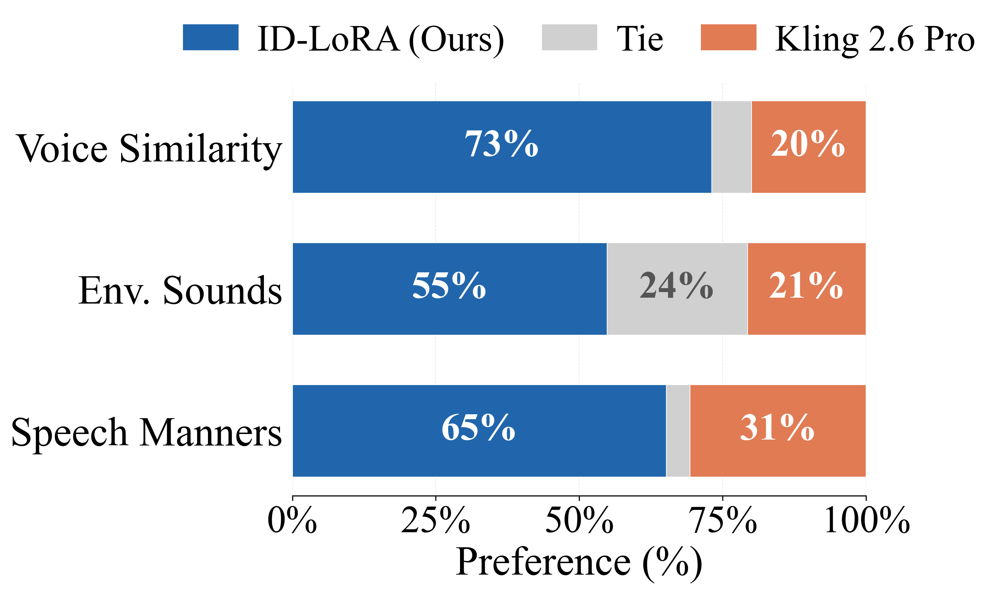
*(a)ID-LoRA vs. Kling 2.6 Pro*

*(a)ID-LoRA vs. Kling 2.6 Pro*

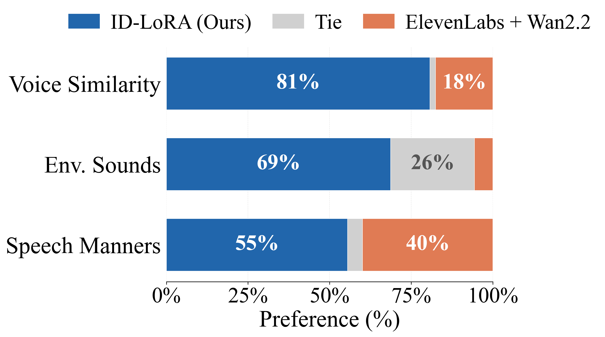
*(b)ID-LoRA vs. ElevenLabs + Wan 2.2*

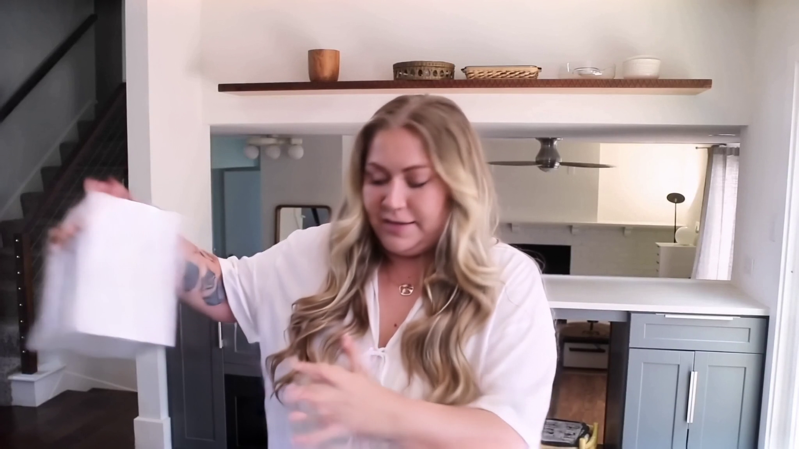
*Figure 4:Examples from the MOS evaluation set. Each column shows two generated videos from the same speaker under different environmental sound conditions.*

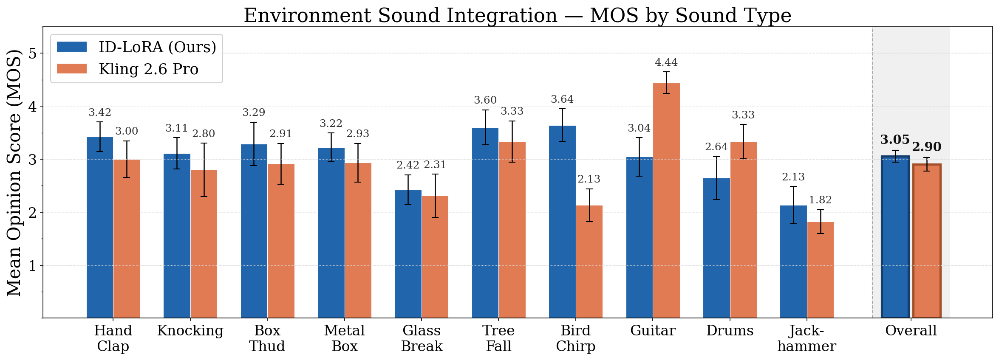
*Figure 5:Environment sound interaction MOS study: per-scenario mean opinion scores (1–5) with 95% confidence intervals for ID-LoRA and Kling 2.6 Pro across ten physical interaction scenarios. ID-LoRA scores higher on 8 of 10 scenarios and in overall score.*

*(a)A/B preference study: annotators are briefed on the three evaluation axes and the practice round format.*

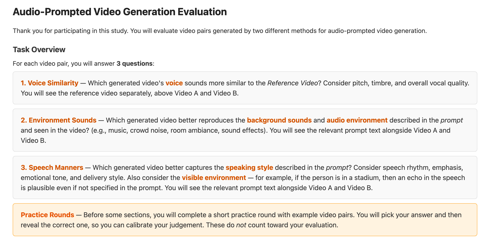
*(a)A/B preference study: annotators are briefed on the three evaluation axes and the practice round format.*

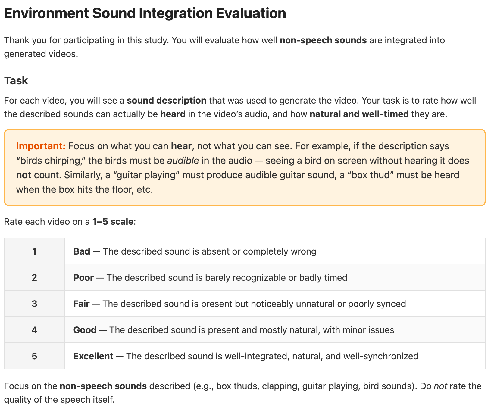
*(b)MOS study: annotators rate how well the described non-speech sounds can be heard on a 1–5 scale.*

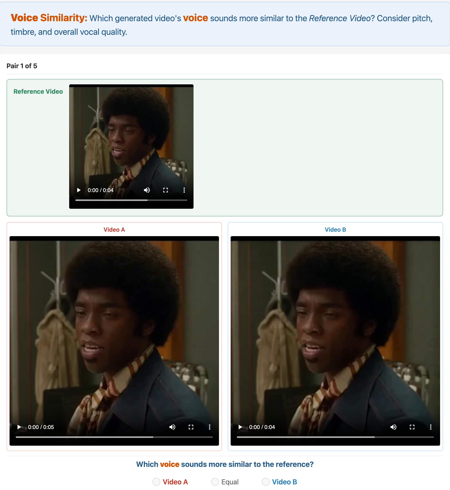
*(a)A/B preference study (voice similarity). Annotators watch a reference video alongside two generated videos and select which voice sounds more similar, or equal.*

*(a)A/B preference study (voice similarity). Annotators watch a reference video alongside two generated videos and select which voice sounds more similar, or equal.*

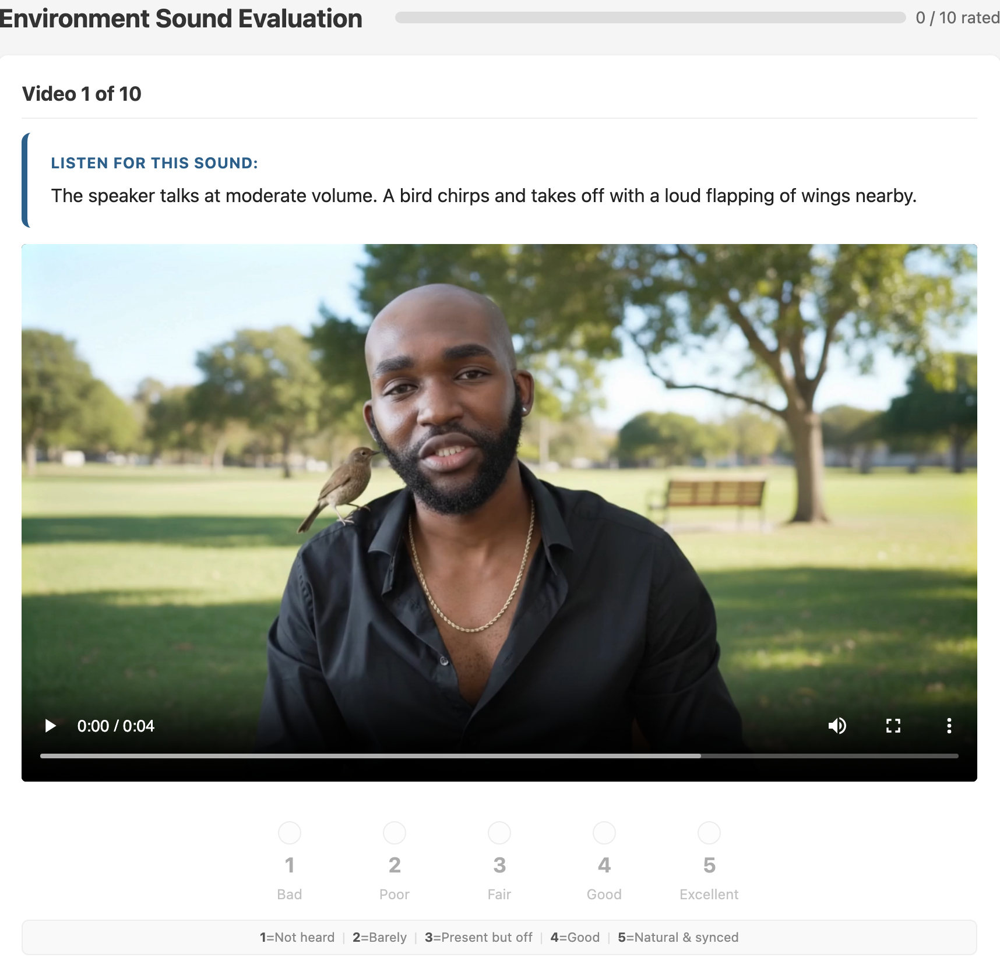
*(b)MOS study (bird chirping scenario). Annotators see the sound description, watch the video, and rate the sound quality on a 1–5 scale.*

---
**Usage Info**: 3615 tokens used.
**Generated at**: 2026-03-12 12:40:43

---

# 📚 V2M-Zero: Zero-Pair Time-Aligned Video-to-Music Generation

🚀 URL: https://arxiv.org/html/2603.11042

## 🌏 Abstract (원문)
Generating music that temporally aligns with video events is challenging for existing text-to-music models, which lack fine-grained temporal control. We introduceV2M-Zero, a zero-pair video-to-music generation approach that outputs time-aligned music for video. Our method is motivated by a key observation: temporal synchronization requires matching when and how much change occurs, not what changes. While musical and visual events differ semantically, they exhibit shared temporal structure that can be captured independently within each modality. We capture this structure through event curves computed from intra-modal similarity using pretrained music and video encoders. By measuring temporal change within each modality independently, these curves provide comparable representations across modalities. This enables a simple training strategy: fine-tune a text-to-music model on music-event curves, then substitute video-event curves at inference without cross-modal training or paired data. AcrossOES-Pub,MovieGenBench-Music, andAIST++,V2M-Zeroachieves substantial gains over paired-data baselines:5–21%higher audio quality,13–15%better semantic alignment,21–52%improved temporal synchronization, and28%higher beat alignment on dance videos. We find similar results via a large crowd-source subjective listening test. Overall, our results validate that temporal alignment through within-modality features, rather than paired cross-modal supervision, is effective for video-to-music generation. Results are available athttps://genjib.github.io/v2m_zero/
## 🌏 Abstract (번역)
비디오 이벤트와 시간적으로 정렬되는 음악을 생성하는 것은 미세한 시간 제어가 부족한 기존 텍스트-음악 모델에게는 어렵습니다. 우리는 비디오에 시간적으로 정렬된 음악을 출력하는 제로-쌍 비디오-음악 생성 접근 방식인 V2M-Zero를 소개합니다. 우리의 방법은 핵심적인 관찰에서 동기를 얻습니다: 시간 동기화는 무엇이 변하는지가 아니라 언제, 얼마나 많은 변화가 발생하는지를 일치시키는 것을 요구합니다. 음악적 이벤트와 시각적 이벤트는 의미적으로 다르지만, 각 양식 내에서 독립적으로 포착될 수 있는 공유된 시간 구조를 보여줍니다. 우리는 사전 훈련된 음악 및 비디오 인코더를 사용하여 양식 내 유사성으로부터 계산된 이벤트 곡선을 통해 이 구조를 포착합니다. 각 양식 내에서 시간적 변화를 독립적으로 측정함으로써, 이 곡선들은 양식 간에 비교 가능한 표현을 제공합니다. 이는 간단한 훈련 전략을 가능하게 합니다: 텍스트-음악 모델을 음악-이벤트 곡선으로 미세 조정한 다음, 교차-양식 훈련이나 쌍을 이룬 데이터 없이 추론 시 비디오-이벤트 곡선으로 대체합니다. OES-Pub, MovieGenBench-Music, AIST++ 전반에 걸쳐 V2M-Zero는 쌍을 이룬 데이터 기준선보다 상당한 이득을 달성합니다: 5-21% 더 높은 오디오 품질, 13-15% 더 나은 의미론적 정렬, 21-52% 향상된 시간 동기화, 그리고 댄스 비디오에서 28% 더 높은 비트 정렬을 보입니다. 우리는 대규모 크라우드 소싱 주관적 청취 테스트를 통해서도 유사한 결과를 발견했습니다. 전반적으로, 우리의 결과는 쌍을 이룬 교차-양식 감독보다는 양식 내 특징을 통한 시간적 정렬이 비디오-음악 생성에 효과적임을 입증합니다.

## 🔍 Methods & Results
- V2M-Zero는 사전 훈련된 텍스트-음악(T2M) 모델을 시간 이벤트 곡선 조건화로 보강하여 미세 조정하는 제로-쌍 비디오-음악 생성 접근 방식입니다.
- 핵심 아이디어는 양식 내 유사성을 통해 측정된 시간적 변화가 도메인에 구애받지 않는 이벤트 구조를 포착한다는 것입니다.
- 이벤트 곡선은 사전 훈련된 인코더(음악용 MusicFM, 비디오용 DINOv2)를 사용하여 양식 내 유사성(연속적인 특징 벡터 간 코사인 유사성)으로부터 계산됩니다.
- 양식 간 격차를 줄이기 위해 이벤트 곡선은 표준화, 공통 길이로 재샘플링, 시간적 평활화(Hann window)를 거쳐 양식 간 비교 가능성을 확보합니다.
- 훈련 시, 모델은 텍스트 프롬프트와 음악-이벤트 곡선에 조건화되어 미세 조정됩니다.
- 추론 시, 모델 재훈련 없이 음악-이벤트 곡선을 비디오-이벤트 곡선으로 대체하여 제로-쌍, 시간 동기화된 생성을 수행하며, 비디오 캡션은 LLM을 통해 음악 프롬프트로 변환됩니다.
- V2M-Zero는 OES-Pub, MovieGenBench-Music, AIST++ 벤치마크에서 쌍을 이룬 데이터 기준선 대비 5-21% 더 높은 오디오 품질, 13-15% 더 나은 의미론적 정렬, 21-52% 향상된 시간 동기화, 댄스 비디오에서 28% 더 높은 비트 정렬을 달성했습니다.
- 이 결과는 쌍을 이룬 교차-양식 감독 대신 양식 내 특징을 통한 시간적 정렬이 비디오-음악 생성에 효과적임을 입증합니다.

## 🖼 Figures

*Figure 1: Zero-Pair Video-to-Music Generation Top: Generating music for video commonly requires large-scale collections of high-quality, paired video-music data. Middle: Our V2M-Zero method is trained only on text–music pairs with an additional music-event curve condition (no video). Bottom: At inference, we swap a music-event curve with aligned video-event curves extracted via off-the-shelf vision models and generate time-synchronized music to match the input video.*

*Figure 2: Shared Temporal Structure Across Modalities. Real event curves computed from video and music exhibit similar temporal patterns across diverse video scenarios. Ground-truth pairs have correlation 
≈
 0.6, introducing random offsets degrades this to 
≈
 0.2.2*

![Figure 3:Method Overview Top: During training, V2M-Zero learns a rectified-flow diffusion process conditioned on text prompts and a music-event curve derived from intra-music similarity. Bottom: At inference, music conditioning is swapped with a video-event curve based on framewise similarity, enabling zero-pair, time-synchronized video-to-music generation. For semantic alignment, a text prompt is predicted from the video and speech using the music captioner, Vibe [vibe], without any joint-training.](../images/2026-03-12/2603.11042/2603.11042_fig2.png)
*Figure 3:Method Overview Top: During training, V2M-Zero learns a rectified-flow diffusion process conditioned on text prompts and a music-event curve derived from intra-music similarity. Bottom: At inference, music conditioning is swapped with a video-event curve based on framewise similarity, enabling zero-pair, time-synchronized video-to-music generation. For semantic alignment, a text prompt is predicted from the video and speech using the music captioner, Vibe [vibe], without any joint-training.*

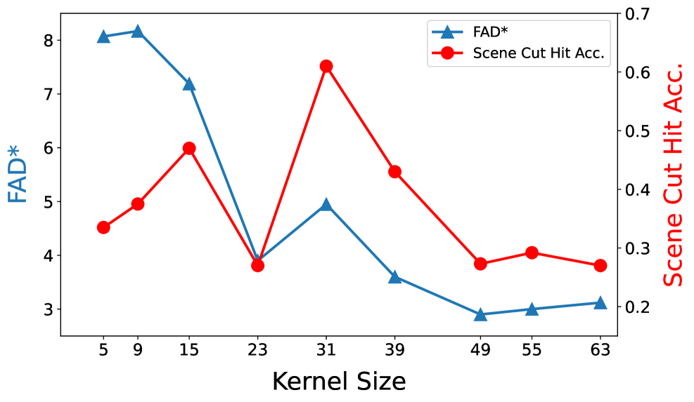
*Figure 4: Impact of Smoothing Kernel Size. Larger kernerls improve audio quality (FAD*) but temporal alignment (SCH) has an optimal point on OES-Pub.*

*Figure 5:Example event curves with different temporal dynamics. The blue solid curve corresponds to a video with frequent scene cuts, while the orange curve corresponds to a video with slower visual motion, showing distinct temporal structures. This supports our design choice of using event curves to represent relative timing, while text provides complementary semantic guidance.*

---
**Usage Info**: 5935 tokens used.
**Generated at**: 2026-03-12 12:40:58

---

# 📚 Probabilistic Verification of Voice Anti-Spoofing Models

🚀 URL: https://arxiv.org/html/2603.10713

## 🌏 Abstract (원문)
Recent advances in generative models have amplified the risk of malicious misuse of speech synthesis technologies, enabling adversaries to impersonate target speakers and access sensitive resources. Although speech deepfake detection has progressed rapidly, most existing countermeasures lack formal robustness guarantees or fail to generalize to unseen generation techniques. We propose PV-VASM, a probabilistic framework for verifying the robustness of voice anti-spoofing models (VASMs). PV-VASM estimates the probability of misclassification under text-to-speech (TTS), voice cloning (VC), and parametric signal transformations. The approach is model-agnostic and enables robustness verification against unseen speech synthesis techniques and input perturbations. We derive a theoretical upper bound on the error probability and validate the method across diverse experimental settings, demonstrating its effectiveness as a practical robustness verification tool.
## 🌏 Abstract (번역)
생성 모델의 최근 발전은 음성 합성 기술의 악의적인 오용 위험을 증폭시켜, 공격자들이 대상 화자를 사칭하고 민감한 자원에 접근할 수 있게 했습니다. 음성 딥페이크 탐지가 빠르게 발전했음에도 불구하고, 대부분의 기존 대응책은 공식적인 강건성 보장을 제공하지 못하거나 미지의 생성 기술에 일반화되지 못합니다. 우리는 음성 스푸핑 방지 모델(VASM)의 강건성을 검증하기 위한 확률론적 프레임워크인 PV-VASM을 제안합니다. PV-VASM은 텍스트-음성 변환(TTS), 음성 복제(VC) 및 파라메트릭 신호 변환 하에서의 오분류 확률을 추정합니다. 이 접근 방식은 모델에 구애받지 않으며, 미지의 음성 합성 기술 및 입력 교란에 대한 강건성 검증을 가능하게 합니다. 우리는 오류 확률에 대한 이론적인 상한을 도출하고 다양한 실험 설정에서 이 방법을 검증하여, 실용적인 강건성 검증 도구로서의 효과를 입증합니다.

## 🔍 Methods & Results
- PV-VASM은 변환된 입력 오디오를 음성 스푸핑 방지 모델이 오분류할 확률을 인증하도록 설계된 확률론적 프레임워크입니다.
- 이 방법은 입력 오디오가 파라메트릭 레이블 보존 변환을 겪을 때의 강건성을 검증하며, 이진 분류 작업으로 VAS 문제를 처리합니다.
- 입력 오디오 x에 대한 파라메트릭 변환 φ(x, θ) 하에서, 모델 f의 예측은 확률 변수가 되며, PV-VASM은 이 변환된 오디오 x'가 잘못 분류될 확률에 대한 상한을 제공합니다.
- 오분류 확률의 상한을 계산하기 위해 Chernoff 부등식을 사용하며, 기대값은 샘플링된 확률 변수 Z(p2')의 통계를 통해 추정됩니다.
- 방법의 오류 확률은 McKay의 근사치를 수정한 일측 신뢰 구간 추정치를 사용하여 계수 변동을 추정함으로써 상한이 정해집니다.
- PV-VASM은 고정된 입력 오디오의 변환에 대한 강건성 검증을 넘어, TTS(Text-to-Speech) 및 VC(Voice Cloning) 시스템과 같은 생성 모델에 대한 강건성 검증을 가능하게 합니다.
- TTS 설정에서는 TTS 모델 g에 의해 생성된 오디오 신호 분포에 대한 강건성을 정량화하며, VC 설정에서는 참조 화자의 음성 특성을 유지하면서 임의의 텍스트에 대한 음성 합성을 다룹니다.

## 🖼 Figures
![Figure 1:Dependence of PCA on 
(
𝑚
,
𝑛
,
𝑘
)
 for background noise perturbations with 
SNR
∈
[
15
,
30
]
. The confidence level is set to 
𝛼
=
10
−
6
. Curves sharing the same color correspond to an identical computational budget 
𝑚
, while line styles and marker types indicate variations in 
𝑛
 and 
𝑘
, respectively.](../images/2026-03-12/2603.10713/2603.10713_fig0.png)
*Figure 1:Dependence of PCA on 
(
𝑚
,
𝑛
,
𝑘
)
 for background noise perturbations with 
SNR
∈
[
15
,
30
]
. The confidence level is set to 
𝛼
=
10
−
6
. Curves sharing the same color correspond to an identical computational budget 
𝑚
, while line styles and marker types indicate variations in 
𝑛
 and 
𝑘
, respectively.*

![Figure 2:Dependence of PCA on 
𝛼
 for background noise perturbations with 
SNR
∈
[
15
,
30
]
. 
𝑚
=
6000
,
𝑛
=
1000
,
𝑘
=
6
 are fixed.](../images/2026-03-12/2603.10713/2603.10713_fig1.png)
*Figure 2:Dependence of PCA on 
𝛼
 for background noise perturbations with 
SNR
∈
[
15
,
30
]
. 
𝑚
=
6000
,
𝑛
=
1000
,
𝑘
=
6
 are fixed.*

![Figure 3:Dependence of PCA on 
(
𝑚
,
𝑛
,
𝑘
)
 for the gain adjustment transform with 
𝛾
∈
[
−
10
,
20
]
​
dB
. The confidence level is set to 
𝛼
=
10
−
6
. Curves sharing the same color correspond to the same augmentation budget 
𝑚
, while line styles and marker types indicate variations in 
𝑛
 and 
𝑘
, respectively.](../images/2026-03-12/2603.10713/2603.10713_fig2.png)
*Figure 3:Dependence of PCA on 
(
𝑚
,
𝑛
,
𝑘
)
 for the gain adjustment transform with 
𝛾
∈
[
−
10
,
20
]
​
dB
. The confidence level is set to 
𝛼
=
10
−
6
. Curves sharing the same color correspond to the same augmentation budget 
𝑚
, while line styles and marker types indicate variations in 
𝑛
 and 
𝑘
, respectively.*

![Figure 4:Dependence of PCA on 
𝛼
 for the gain adjustment transform with 
𝛾
∈
[
−
10
,
20
]
​
dB
. The values 
𝑚
=
20000
,
𝑛
=
1000
,
𝑘
=
20
 are fixed.](../images/2026-03-12/2603.10713/2603.10713_fig3.png)
*Figure 4:Dependence of PCA on 
𝛼
 for the gain adjustment transform with 
𝛾
∈
[
−
10
,
20
]
​
dB
. The values 
𝑚
=
20000
,
𝑛
=
1000
,
𝑘
=
20
 are fixed.*

![Figure 5:Dependence of PCA on 
(
𝑚
,
𝑛
,
𝑘
)
 for the low pass filter with the cutoff frequency 
𝜔
𝑚
​
𝑎
​
𝑥
 is randomly sampled from 
[
2500
,
3000
]
​
Hz
 range. The confidence level is set to 
𝛼
=
10
−
6
. Curves sharing the same color correspond to the same augmentation budget 
𝑚
, while line styles and marker types indicate variations in 
𝑛
 and 
𝑘
, respectively.](../images/2026-03-12/2603.10713/2603.10713_fig4.png)
*Figure 5:Dependence of PCA on 
(
𝑚
,
𝑛
,
𝑘
)
 for the low pass filter with the cutoff frequency 
𝜔
𝑚
​
𝑎
​
𝑥
 is randomly sampled from 
[
2500
,
3000
]
​
Hz
 range. The confidence level is set to 
𝛼
=
10
−
6
. Curves sharing the same color correspond to the same augmentation budget 
𝑚
, while line styles and marker types indicate variations in 
𝑛
 and 
𝑘
, respectively.*

![Figure 6:Dependence of PCA on 
(
𝑚
,
𝑛
,
𝑘
)
 for the pitch shift transform, ST 
∈
[
−
6
,
6
]
 semitones. The confidence level is set to be 
𝛼
=
10
−
6
. Curves sharing the same color correspond to the same augmentation budget 
𝑚
, while line styles and marker types indicate variations in 
𝑛
 and 
𝑘
, respectively.](../images/2026-03-12/2603.10713/2603.10713_fig5.png)
*Figure 6:Dependence of PCA on 
(
𝑚
,
𝑛
,
𝑘
)
 for the pitch shift transform, ST 
∈
[
−
6
,
6
]
 semitones. The confidence level is set to be 
𝛼
=
10
−
6
. Curves sharing the same color correspond to the same augmentation budget 
𝑚
, while line styles and marker types indicate variations in 
𝑛
 and 
𝑘
, respectively.*

*Figure 7:Verification condition result from Eq. (22) for the pre-finetuned 
𝑓
 against Vosk TTS vs. various 
𝛼
 and 
𝑛
 given fixed 
𝑚
=
130000
, 
𝛿
=
0.9
, and 
𝜀
=
0.1
.*

---
**Usage Info**: 3466 tokens used.
**Generated at**: 2026-03-12 12:41:05

---

# 📚 The Quadratic Geometry of Flow Matching: Semantic Granularity Alignment for Text-to-Image Synthesis

🚀 URL: https://arxiv.org/html/2603.10785

## 🌏 Abstract (원문)
In this work, we analyze the optimization dynamics of generative fine-tuning. We observe that under the Flow Matching framework, the standard MSE objective can be formulated as a Quadratic Form governed by a dynamically evolving Neural Tangent Kernel (NTK). This geometric perspective reveals a latent Data Interaction Matrix, where diagonal terms represent independent sample learning and off-diagonal terms encode residual correlation between heterogeneous features. Although standard training implicitly optimizes these cross-term interferences, it does so without explicit control; moreover, the prevailing data-homogeneity assumption may constrain the model’s effective capacity. Motivated by this insight, we propose Semantic Granularity Alignment (SGA), using Text-to-Image synthesis as a testbed. SGA engineers targeted interventions in the vector residual field to mitigate gradient conflicts. Evaluations across DiT and U-Net architectures confirm that SGA advances the efficiency–quality trade-off by accelerating convergence and improving structural integrity.
## 🌏 Abstract (번역)
본 연구에서는 생성 미세 조정(generative fine-tuning)의 최적화 동역학을 분석합니다. Flow Matching 프레임워크 하에서 표준 MSE 목적 함수가 동적으로 진화하는 신경 접선 커널(NTK)에 의해 지배되는 이차 형식으로 공식화될 수 있음을 관찰합니다. 이 기하학적 관점은 잠재적인 데이터 상호작용 행렬을 드러내는데, 여기서 대각항은 독립적인 샘플 학습을 나타내고 비대각항은 이질적인 특징 간의 잔여 상관관계를 인코딩합니다. 표준 훈련은 이러한 교차항 간섭을 암묵적으로 최적화하지만, 명시적인 제어 없이 수행되며, 지배적인 데이터 동질성 가정은 모델의 유효 용량을 제한할 수 있습니다. 이러한 통찰력에 동기 부여를 받아, 우리는 텍스트-이미지 합성(Text-to-Image synthesis)을 테스트베드로 사용하여 의미론적 세분성 정렬(Semantic Granularity Alignment, SGA)을 제안합니다. SGA는 기울기 충돌을 완화하기 위해 벡터 잔여 필드에 대한 표적 개입을 설계합니다. DiT 및 U-Net 아키텍처 전반에 걸친 평가는 SGA가 수렴을 가속화하고 구조적 무결성을 개선함으로써 효율성-품질 트레이드오프를 향상시킴을 확인합니다.

## 🔍 Methods & Results
- 생성 미세 조정의 최적화 동역학을 기하학적 관점에서 분석하여, Flow Matching 프레임워크에서 표준 MSE 손실이 이질적인 데이터 매니폴드 간의 간섭을 제어하는 이차 상호작용 행렬의 최적화로 재구성될 수 있음을 보였습니다.
- 데이터 분포를 Dirac 측정의 혼합으로 모델링하고, 최적의 한계 벡터 필드 u_t(x)가 서브 필드의 확률 가중 중첩으로 표현될 수 있음을 Proposition 1을 통해 제시했습니다.
- MSE 손실을 이차 형식으로 확장하여 대칭적인 데이터 간섭 행렬(Data Interference Matrix) Ω를 정의하고(Proposition 2), 이 행렬의 출력 공간 기하학이 NTK를 통해 파라미터 공간 기울기 동역학을 직접 제어함을 밝혔습니다(Proposition 3).
- MSE 목적 함수가 동적으로 진화하는 NTK에 의해 지배되는 벡터 잔여 필드를 훈련하는 것과 동등함을 Corollary 1을 통해 입증했습니다.
- 표준 미세 조정이 기울기 충돌과 학습 진동을 유발하며, 최적화 과정에서 언더피팅 영역에 자주 빠지는 문제를 지적했습니다.
- 기울기 충돌을 완화하기 위해 데이터 재구성을 통해 벡터 잔여 필드에 개입하는 Semantic Granularity Alignment (SGA) 프레임워크를 제안했습니다.
- SGA의 핵심 구성 요소로 Hierarchical Semantic Decomposition (H-SD)을 도입하여 원본 데이터셋을 Macro (전역 구조), Meso (중간 수준 레이아웃), Micro (미세 질감)의 세 가지 의미론적으로 구분된 서브 매니폴드로 분할하고, 이를 통해 Semantic Interference Matrix Ω를 구성했습니다.
- H-SD 구현을 위해 객체 탐지기(예: YOLO, Grounding DINO)를 사용하여 이미지를 의미론적 계층으로 분할하고, IoU 기반 필터링 및 후처리(다운샘플링, 해상도 버킷팅)를 적용하여 각 서브 매니폴드가 고유한 정보를 기여하도록 했습니다.
- 스케일 편향 업데이트로 인한 기울기 진동을 해결하기 위해, 계층적으로 관련된 슬라이스를 동일 배치 내에서 공동 발생시키는 semantic tuple을 구성하는 Tuple-wise Optimization을 제안하여, Ω의 대각항(자기 정렬)과 비대각항(교차 스케일 잔여 상관관계)의 기여 균형을 맞추도록 유도했습니다.
- 매크로 슬라이스의 저주파 기하학과 마이크로 슬라이스의 고주파 질감 간의 스펙트럼 불일치를 해결하기 위해 Scale-Adaptive Modulation을 도입했습니다.
- MM-DiT 모델(예: FLUX.1)의 경우, 스케일 S에 따라 시간 단계 샘플링 π(t)를 조절하여 Macro는 t→1, Micro는 t→0으로 확률 질량을 이동시켰습니다.
- U-Net 모델(예: SDXL)의 경우, 세분성에 따라 손실 가중치 ω(t,S)를 조절하여, 고-SNR 영역에서 Micro 슬라이스의 가중치를 높이고 Macro 슬라이스의 가중치를 낮춰 오버피팅을 방지했습니다.
- DiT 및 U-Net 아키텍처 전반에 걸친 평가를 통해 SGA가 수렴을 가속화하고 구조적 무결성을 개선함으로써 효율성-품질 트레이드오프를 향상시킴을 확인했습니다.

## 🖼 Figures

*Figure 1*

*Figure 1:Qualitative comparison between the Baseline and our SGA method across three GDA domains. For each row, the reference images (left) define the target domain; the Baseline (middle) fails to preserve domain-specific attributes, while SGA (right) faithfully captures the target domain characteristics.*

*Figure 2:Structure of the Data Interference Matrix 
𝛀
. Diagonal entries (blue) represent independent learning within each sub-manifold. Off-diagonal entries encode cross-scale interactions: constructive (synergy, green) or destructive (conflict, red).*

*Figure 3:The optimization landscape 
ℒ
𝐹
​
𝑀
=
𝜶
⊤
​
𝛀
​
𝜶
 of CFM fine-tuning. Path 1 (red): Underfitting Region. Path 3 (blue): OOD Region. Only Path 2 (green) navigates the narrow Goal Region.*

*Figure 4:Failure analysis of standard fine-tuning. All outputs exhibit dominant prior characteristics regardless of target domain—a prior capture phenomenon that traps the model in the Underfitting Region of Fig.˜3.*

*Figure 5:Overview of the Hierarchical Semantic Decomposition (H-SD) pipeline. Raw images are parsed by a general-purpose detector (e.g., multimodal models, YOLO, or Grounding DINO) into three granularities (
𝑌
Macro
, 
𝑌
Meso
, 
𝑌
Micro
), filtered via IoU-based redundancy elimination, and post-processed into aspect-ratio-preserving resolution buckets.*

![Figure 6:Optimization trajectories on the H-SD-augmented loss landscape. H-SD + Standard Opt. (orange): after signal amplification via H-SD, vanilla CFM training still suffers from scale-biased gradient updates, causing persistent oscillation and drift toward the OOD boundary. SGA (blue): by adding Tuple-wise co-sampling and Scale-Adaptive Modulation, SGA stabilizes the descent and converges to the Goal Region. The residual correlation sign 
⟨
Δ
𝜉
,
Δ
𝜂
⟩
 determines whether cross-scale interactions are constructive (
>
0
, stable) or destructive (
<
0
, oscillation).](../images/2026-03-12/2603.10785/2603.10785_fig6.png)
*Figure 6:Optimization trajectories on the H-SD-augmented loss landscape. H-SD + Standard Opt. (orange): after signal amplification via H-SD, vanilla CFM training still suffers from scale-biased gradient updates, causing persistent oscillation and drift toward the OOD boundary. SGA (blue): by adding Tuple-wise co-sampling and Scale-Adaptive Modulation, SGA stabilizes the descent and converges to the Goal Region. The residual correlation sign 
⟨
Δ
𝜉
,
Δ
𝜂
⟩
 determines whether cross-scale interactions are constructive (
>
0
, stable) or destructive (
<
0
, oscillation).*

*Figure 7:Qualitative Comparison (FLUX-only). Domains 
𝛿
, 
𝜀
, and 
𝜁
, evaluated exclusively on FLUX (portrait layout).*

*Figure 8:Qualitative Comparison (Cross-Architecture). Domains 
𝛼
–
𝛾
, evaluated on both SDXL and FLUX. Reference images (left) define each target domain.*

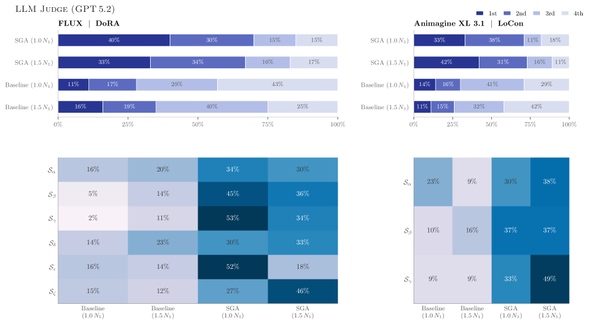
*Figure 9:Quantitative Evaluation — LLM Judge (GPT 5.2). Aggregate rank distribution (left) and per-dataset 1st-place rate heatmap (right). SGA variants achieve favourable rankings across both architectures and all stylistic domains.*

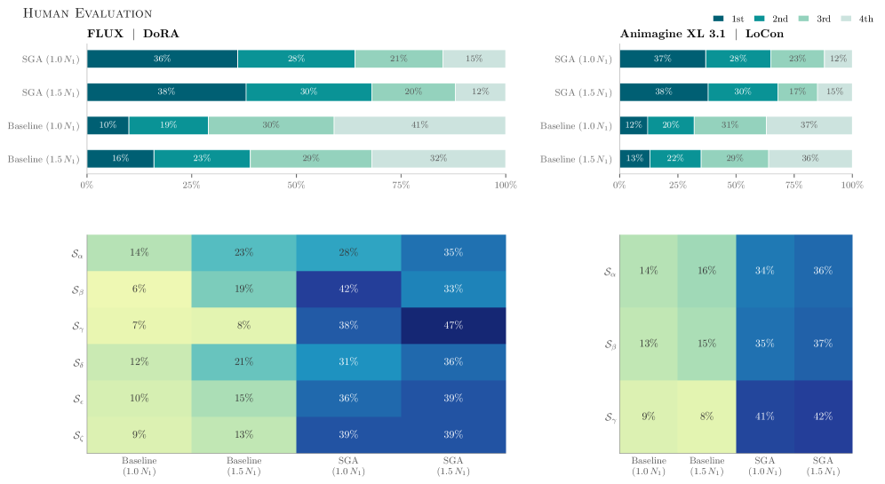
*Figure 10:Quantitative Evaluation — Human Evaluation. Matching layout to Fig.˜9. Human rankings corroborate the automated assessment, with SGA variants accumulating the majority of top rankings.*

*Figure 11:Reference images defining the target domain for all ablation experiments.*

*Figure 12:FLUX ablation (Group 1). Full SGA maintains domain fidelity; removing Scale-Adaptive Modulation introduces subtle but visible stylistic drift.*

*Figure 13:FLUX ablation (Group 2). The w/o Scale-Adaptive Modulation variant exhibits increased OOD tendencies in fine-grained detail rendering.*

*Figure 14:FLUX ablation (Group 3). All three variants produce structurally coherent outputs—consistent with FLUX’s global attention mechanism—but the Full SGA variant best preserves the target domain’s micro-level characteristics.*

*Figure 15:LoRA Ablation (Group 1). LoRA without Modulation produces visible OOD drift.*

*Figure 16:LoRA Ablation (Group 2). LoRA exhibits more pronounced domain deviation due to coupled updates.*

*Figure 17:LoRA Ablation (Group 3). LoRA without Scale-Adaptive Modulation (right column) shows the most pronounced OOD deviation.*

*Figure 18:SDXL ablation (Group 1). Removing SGA produces noticeable anatomical errors; removing Min-SNR yields subtler structural degradation.*

*Figure 19:SDXL ablation (Group 2). Full SGA best preserves limb coherence, consistent with CNN-based models requiring explicit structural regularization.*

*Figure 20:SDXL ablation (Group 3). SGA removal consistently causes the most significant anatomical degradation, supporting its critical role in compensating for CNN’s limited global awareness.*

---
**Usage Info**: 4719 tokens used.
**Generated at**: 2026-03-12 12:41:21

---

