# 🚩 (2026-03-13) Scholar Inbox 추천 논문 

# 📚 Resonate: Reinforcing Text-to-Audio Generation via Online Feedback from Large Audio Language Models

🚀 URL: https://arxiv.org/html/2603.11661

## 🌏 Abstract (원문)
Reinforcement Learning (RL) has become an effective paradigm for enhancing Large Language Models (LLMs) and visual generative models. However, its application in text-to-audio (TTA) generation remains largely under-explored. Prior work typically employs offline methods like Direct Preference Optimization (DPO) and leverages Contrastive Language-Audio Pretraining (CLAP) models as reward functions. In this study, we investigate the integration of online Group Relative Policy Optimization (GRPO) into TTA generation. We adapt the algorithm for Flow Matching-based audio models and demonstrate that online RL significantly outperforms its offline counterparts. Furthermore, we incorporate rewards derived from Large Audio Language Models (LALMs), which can provide fine-grained scoring signals that are better aligned with human perception. With only 470M parameters, our final model,Resonate, establishes a new SOTA on TTA-Bench in terms of both audio quality and semantic alignment.111Demo:https://resonatedemo.github.io. Code:https://github.com/xiquan-li/Resonate.
## 🌏 Abstract (번역)
강화 학습(RL)은 대규모 언어 모델(LLM) 및 시각 생성 모델을 향상시키는 효과적인 패러다임이 되었습니다. 그러나 텍스트-오디오(TTA) 생성에서의 적용은 아직 크게 탐구되지 않았습니다. 이전 연구에서는 일반적으로 DPO(Direct Preference Optimization)와 같은 오프라인 방식을 사용하고 CLAP(Contrastive Language-Audio Pretraining) 모델을 보상 함수로 활용했습니다. 본 연구에서는 온라인 GRPO(Group Relative Policy Optimization)를 TTA 생성에 통합하는 것을 조사합니다. 우리는 Flow Matching 기반 오디오 모델에 맞게 알고리즘을 조정했으며, 온라인 RL이 오프라인 방식보다 훨씬 우수한 성능을 보임을 입증했습니다. 또한, 인간의 인지 능력과 더 잘 일치하는 미세한 점수 신호를 제공할 수 있는 대규모 오디오 언어 모델(LALM)에서 파생된 보상을 통합했습니다. 단 4억 7천만 개의 매개변수로 구성된 최종 모델인 Resonate는 오디오 품질과 의미론적 정렬 측면에서 TTA-Bench에서 새로운 SOTA를 달성했습니다. 데모: https://resonatedemo.github.io. 코드: https://github.com/xiquan-li/Resonate.

## 🔍 Methods & Results
- Resonate는 MeanAudio를 따라 잠재 공간에서 생성 프로세스를 모델링하기 위해 Flux 스타일의 Flow Transformer를 사용합니다.
- 오디오 파형은 멜-스펙트로그램으로 변환된 후 VAE 잠재값으로 인코딩되며, 텍스트 설명은 FLAN-T5 텍스트 인코더를 사용하여 임베딩됩니다.
- 노이즈가 추가된 오디오 잠재값과 인코딩된 텍스트 임베딩은 N1개의 멀티모달(MMDiT) 블록과 N2개의 단일모달(DiT) 블록으로 구성된 백본 Transformer에 입력됩니다.
- 강화 학습 도입 전에 조건부 Flow Matching(CFM) 목표를 사용하여 모델을 사전 학습합니다.
- Flow Matching 모델의 반복적인 노이즈 제거 프로세스를 Markov Decision Process(MDP)로 공식화합니다.
- Flow-GRPO는 Group Relative Policy Optimization(GRPO) 알고리즘을 Flow Matching 모델에 적용합니다.
- GRPO는 각 프롬프트에 대해 G개의 궤적 그룹을 샘플링하고, 최종 보상을 정규화하여 각 샘플의 이점(advantage)을 추정합니다.
- 정책은 그룹에 걸쳐 클립된 정책 기울기를 평균화하는 대리 목표를 최대화하여 최적화됩니다.
- GRPO에 필요한 확률적 탐색을 위해 결정론적 ODE 샘플러를 동일한 SDE 샘플러로 변환하여 필요한 확률성을 도입합니다.
- 이 확률적 업데이트 방식을 통해 GRPO 목표에 사용되는 전이 가능성은 평균과 표준편차를 가진 가우시안 밀도로 명시적으로 정의됩니다.
- 최근 대규모 오디오-언어 모델(LALM)의 강력한 청각 이해 및 추론 능력을 활용하여, LALM을 GRPO 훈련을 위한 보상 모델로 사용합니다.
- 보상 평가는 Audio Question Answering (AQA) 작업(AQAScore)으로 구성되며, LALM이 생성된 오디오가 텍스트 설명을 포함하는지에 대한 '예' 또는 '아니오' 응답의 정규화된 확률을 보상으로 정의합니다.
- AQAScore는 미세한 오디오 세부 사항을 포착하고 인간의 주관적인 판단과 강하게 상관관계가 있으며 계산 효율적입니다.
- 온라인 RL(GRPO)은 오프라인 방식보다 훨씬 우수한 성능을 보였습니다.
- LALM에서 파생된 보상을 통합함으로써 인간의 인지 능력과 더 잘 일치하는 미세한 점수 신호를 제공할 수 있음을 입증했습니다.
- Resonate 모델(4억 7천만 개의 매개변수)은 오디오 품질과 의미론적 정렬 측면에서 TTA-Bench에서 새로운 SOTA(State-of-the-Art)를 달성했습니다.

## 🖼 Figures
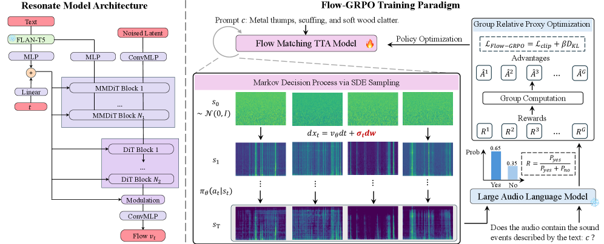
*Figure 1:Left: the model architecture of Resonate. Right: The employed Flow-GRPO training paradigm.*

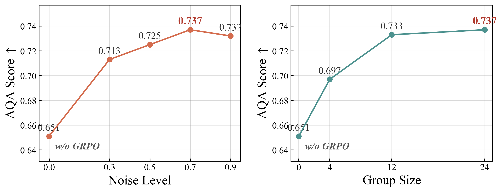
*Figure 2:Ablation study on Flow-GRPO configurations.*

---
**Usage Info**: 3954 tokens used.
**Generated at**: 2026-03-13 12:39:07

---

# 📚 RAF: Relativistic Adversarial Feedback For Universal Speech Synthesis

🚀 URL: https://arxiv.org/html/2603.11678

## 🌏 Abstract (원문)
We propose Relativistic Adversarial Feedback (RAF), a novel training objective for GAN vocoders that improves in-domain fidelity and generalization to unseen scenarios. Although modern GAN vocoders employ advanced architectures, their training objectives often fail to promote generalizable representations. RAF addresses this problem by leveraging speech self-supervised learning models to assist discriminators in evaluating sample quality, encouraging the generator to learn richer representations. Furthermore, we utilize relativistic pairing for real and fake waveforms to improve the modeling of the training data distribution. Experiments across multiple datasets show consistent gains in both objective and subjective metrics on GAN-based vocoders. Importantly, the RAF-trained BigVGAN-base outperforms the LSGAN-trained BigVGAN in perceptual quality using only 12% of the parameters. Comparative studies further confirm the effectiveness of RAF as a training framework for GAN vocoders.
## 🌏 Abstract (번역)
본 논문에서는 GAN 보코더의 도메인 내 충실도와 미학습 시나리오에 대한 일반화 성능을 향상시키는 새로운 훈련 목표인 Relativistic Adversarial Feedback (RAF)을 제안합니다. 최신 GAN 보코더는 고급 아키텍처를 사용하지만, 그 훈련 목표는 종종 일반화 가능한 표현을 촉진하는 데 실패합니다. RAF는 음성 자기 지도 학습 모델을 활용하여 판별자가 샘플 품질을 평가하는 것을 돕고, 생성자가 더 풍부한 표현을 학습하도록 장려함으로써 이 문제를 해결합니다. 또한, 실제 및 가짜 파형에 대한 상대론적 페어링을 사용하여 훈련 데이터 분포 모델링을 개선합니다. 여러 데이터셋에 걸친 실험은 GAN 기반 보코더에서 객관적 및 주관적 측정치 모두에서 일관된 성능 향상을 보여줍니다. 특히, RAF로 훈련된 BigVGAN-base는 LSGAN으로 훈련된 BigVGAN보다 12%의 파라미터만 사용하여 지각 품질에서 우수한 성능을 보입니다. 비교 연구는 GAN 보코더를 위한 훈련 프레임워크로서 RAF의 효과를 더욱 확증합니다.

## 🔍 Methods & Results
- GAN 보코더의 도메인 내 충실도와 미학습 시나리오에 대한 일반화 성능을 향상시키기 위해 Relativistic Adversarial Feedback (RAF)이라는 새로운 훈련 목표를 제안했습니다.
- RAF는 음성 자기 지도 학습 모델을 활용하여 판별자가 샘플 품질을 평가하도록 돕고, 생성자가 더 풍부한 표현을 학습하도록 유도합니다.
- 실제 및 가짜 파형에 대한 상대론적 페어링(relativistic pairing)을 사용하여 훈련 데이터 분포 모델링을 개선했습니다.
- 여러 데이터셋에 걸친 실험에서 GAN 기반 보코더의 객관적 및 주관적 측정치 모두에서 일관된 성능 향상을 확인했습니다.
- RAF로 훈련된 BigVGAN-base는 LSGAN으로 훈련된 BigVGAN보다 12%의 파라미터만 사용하여 지각 품질에서 더 우수한 성능을 달성했습니다.
- 비교 연구를 통해 GAN 보코더를 위한 훈련 프레임워크로서 RAF의 효과가 입증되었습니다.

## 🖼 Figures

*Figure 1:Overall framework of the RAF. (a) represents the process of deriving the non-separable discriminator gap and quality gap. (b) represents the training objectives for the generator and the discriminator. 
𝜙
 denotes the mel transformation. 
𝑖
 denotes the data index.*

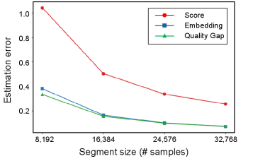
*Figure 2:An illustration of the effect of segment size on quality estimation error.*

![Figure 3:Toy experiments following [sun2020bettergloballosslandscape]. (a), (b), and (c) represent the training process of MetricGAN-RAF-v1, MetricGAN-RAF-v2, and RAF for two-cluster data, respectively. True data are red, and fake data are blue. RAF escapes mode collapse more quickly than the other training objectives.](../images/2026-03-13/2603.11678/2603.11678_fig2.png)
*Figure 3:Toy experiments following [sun2020bettergloballosslandscape]. (a), (b), and (c) represent the training process of MetricGAN-RAF-v1, MetricGAN-RAF-v2, and RAF for two-cluster data, respectively. True data are red, and fake data are blue. RAF escapes mode collapse more quickly than the other training objectives.*

---
**Usage Info**: 1358 tokens used.
**Generated at**: 2026-03-13 12:39:13

---

# 📚 V2A-DPO: Omni-Preference Optimization for Video-to-Audio Generation

🚀 URL: https://arxiv.org/html/2603.11089

## 🌏 Abstract (원문)
This paper introduces V2A-DPO, a novel Direct Preference Optimization (DPO) framework tailored for flow-based video-to-audio generation (V2A) models, incorporating key adaptations to effectively align generated audio with human preferences. Our approach incorporates three core innovations: (1) AudioScore—a comprehensive human preference-aligned scoring system for assessing semantic consistency, temporal alignment, and perceptual quality of synthesized audio; (2) an automated AudioScore-driven pipeline for generating large-scale preference pair data for DPO optimization; (3) a curriculum learning-empowered DPO optimization strategy specifically tailored for flow-based generative models. Experiments on benchmark VGGSound dataset demonstrate that human-preference aligned Frieren and MMAudio using V2A-DPO outperform their counterparts optimized using Denoising Diffusion Policy Optimization (DDPO) as well as pre-trained baselines. Furthermore, our DPO-optimized MMAudio achieves state-of-the-art performance across multiple metrics, surpassing published V2A models. Our demos are available athttps://seujames23.github.io/V2A-DPO/.
## 🌏 Abstract (번역)
본 논문은 흐름 기반 비디오-오디오 생성(V2A) 모델을 위해 맞춤화된 새로운 직접 선호도 최적화(DPO) 프레임워크인 V2A-DPO를 소개하며, 생성된 오디오를 인간의 선호도에 효과적으로 맞추기 위한 핵심적인 적응을 포함합니다. 우리의 접근 방식은 세 가지 핵심 혁신을 포함합니다: (1) AudioScore—합성된 오디오의 의미론적 일관성, 시간적 정렬 및 지각적 품질을 평가하기 위한 포괄적인 인간 선호도 정렬 채점 시스템; (2) DPO 최적화를 위한 대규모 선호도 쌍 데이터를 생성하기 위한 자동화된 AudioScore 기반 파이프라인; (3) 흐름 기반 생성 모델에 특별히 맞춰진 커리큘럼 학습 기반 DPO 최적화 전략. 벤치마크 VGGSound 데이터셋에 대한 실험은 V2A-DPO를 사용하여 인간 선호도에 맞춰진 Frieren 및 MMAudio가 Denoising Diffusion Policy Optimization (DDPO)을 사용하여 최적화된 모델 및 사전 학습된 기준선보다 우수한 성능을 보임을 입증합니다. 또한, 우리의 DPO 최적화된 MMAudio는 여러 지표에서 최첨단 성능을 달성하여 공개된 V2A 모델들을 능가합니다. 데모는 https://seujames23.github.io/V2A-DPO/에서 확인할 수 있습니다.

## 🔍 Methods & Results
- V2A-DPO는 흐름 기반 비디오-오디오 생성(V2A) 모델을 위한 직접 선호도 최적화(DPO) 프레임워크로, 인간 선호도에 맞춰 오디오를 정렬하기 위한 세 가지 핵심 혁신을 포함한다.
- AudioScore는 의미론적 일관성(비디오-오디오, 오디오-텍스트), 시간적 정렬, 지각적 품질, 미학적 매력을 평가하는 포괄적인 인간 선호도 정렬 채점 시스템이다. ImageBind, CLAP, Synchformer, PANNs 기반 Inception Score, PESQ 등의 모델을 활용하며, MLP와 Softmax를 통해 자동 분류 결과를 인간 주석('Good', 'Medium', 'Bad')과 정렬한다.
- 자동화된 AudioScore 기반 파이프라인은 사전 학습된 V2A 모델을 사용하여 각 프롬프트에 대해 여러 오디오 샘플을 생성하고, 'Good' 확률이 가장 높은 샘플을 '승리' 샘플로, 'Bad' 확률이 가장 높은 샘플을 '패배' 샘플로 선택하여 선호도 쌍 데이터를 생성한다.
- 총 48K개의 선호도 쌍 데이터셋은 46K개의 자동 생성된 쌍과 2K개의 인간 주석 쌍을 결합하여 구성되었다.
- 커리큘럼 학습 기반 DPO 최적화 전략은 선호도 쌍의 '복잡성 점수'에 따라 훈련을 두 단계로 나눈다. 1단계에서는 명확하게 구별되는 차이를 가진 쌍을 사용하고, 2단계에서는 미묘한 차이를 가진 쌍(미학적 매력을 위한 인간 주석 쌍 포함)을 사용하여 모델의 점진적인 개선을 유도한다.
- Flow-DPO 목적 함수는 DPO를 흐름 기반 모델에 적용하여 정렬을 분류 문제로 해석하며, 예측된 벡터 필드를 '선호되는' 샘플의 목표 벡터에 가깝게, '덜 선호되는' 샘플의 목표 벡터에서 멀어지도록 최적화한다.
- VGGSound 데이터셋에 대한 실험 결과, V2A-DPO를 사용하여 인간 선호도에 맞춰진 Frieren 및 MMAudio는 Denoising Diffusion Policy Optimization (DDPO)으로 최적화된 모델 및 사전 학습된 기준선보다 우수한 성능을 보였다.
- DPO로 최적화된 MMAudio는 여러 지표에서 최첨단 성능을 달성하여 기존 V2A 모델들을 능가했다.

## 🖼 Figures

*Fig. 1:Illustration of the proposed V2A-DPO framework, including (a) our proposed AudioScore to rate the generated audio with multi-dimensional scores; (b) omni-preference pair data generation combining the automatically generated preference pairs based on AudioScore with a small amount of human-annotated preference pairs; (c) curriculum learning-empowered DPO to optimize V2A models on the complex and simple pairs gradually, which are split according to complexity score 
𝑠
​
𝑐
​
𝑜
​
𝑟
​
𝑒
𝑐
.*

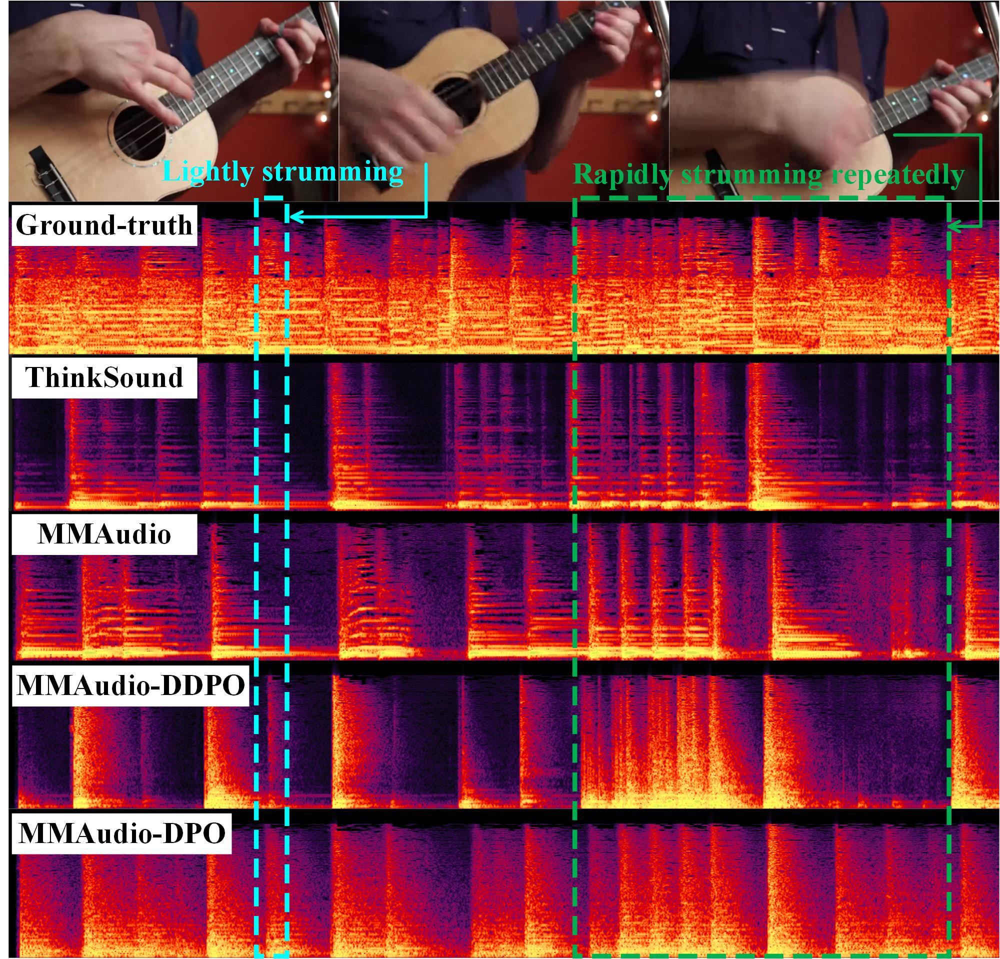
*Fig. 2:Illustration of generation performance of V2A models.*

---
**Usage Info**: 4445 tokens used.
**Generated at**: 2026-03-13 12:39:23

---

# 📚 Toward Complex-Valued Neural Networks for Waveform Generation

🚀 URL: https://arxiv.org/html/2603.11589

## 🌏 Abstract (원문)
Neural vocoders have recently advanced waveform generation, yielding natural and expressive audio. Among these approaches, iSTFT-based vocoders have recently gained attention. They predict a complex-valued spectrogram and then synthesize the waveform via iSTFT, thereby avoiding learned upsampling stages that can increase computational cost. However, current approaches use real-valued networks that process the real and imaginary parts independently. This separation limits their ability to capture the inherent structure of complex spectrograms. We present ComVo, aComplex-valued neuralVocoder whose generator and discriminator use native complex arithmetic. This enables an adversarial training framework that provides structured feedback in complex-valued representations. To guide phase transformations in a structured manner, we introduce phase quantization, which discretizes phase values and regularizes the training process. Finally, we propose a block-matrix computation scheme to improve training efficiency by reducing redundant operations. Experiments demonstrate that ComVo achieves higher synthesis quality than comparable real-valued baselines, and that its block-matrix scheme reduces training time by 25%. Audio samples and code are available athttps://hs-oh-prml.github.io/ComVo/.
## 🌏 Abstract (번역)
신경 보코더는 최근 파형 생성을 발전시켜 자연스럽고 표현력 있는 오디오를 만들어냈습니다. 이러한 접근 방식 중 iSTFT 기반 보코더가 최근 주목받고 있습니다. 이들은 복소수 스펙트로그램을 예측한 다음 iSTFT를 통해 파형을 합성하여, 계산 비용을 증가시킬 수 있는 학습된 업샘플링 단계를 피합니다. 그러나 현재의 접근 방식은 실수 네트워크를 사용하여 실수부와 허수부를 독립적으로 처리합니다. 이러한 분리는 복소수 스펙트로그램의 고유한 구조를 포착하는 능력을 제한합니다. 우리는 생성자와 판별자가 고유한 복소수 연산을 사용하는 복소수 신경 보코더인 ComVo를 제안합니다. 이는 복소수 표현에서 구조화된 피드백을 제공하는 적대적 학습 프레임워크를 가능하게 합니다. 위상 변환을 구조화된 방식으로 유도하기 위해, 우리는 위상 값을 이산화하고 학습 과정을 정규화하는 위상 양자화를 도입합니다. 마지막으로, 우리는 중복 연산을 줄여 학습 효율성을 향상시키기 위한 블록 행렬 계산 방식을 제안합니다. 실험 결과 ComVo는 비교 가능한 실수 기반 모델보다 더 높은 합성 품질을 달성했으며, 블록 행렬 방식은 학습 시간을 25% 단축시키는 것으로 나타났습니다. 오디오 샘플과 코드는 https://hs-oh-prml.github.io/ComVo/에서 확인할 수 있습니다.

## 🔍 Methods & Results
- ComVo는 생성자와 판별자가 복소수 도메인에서 완전히 작동하며 실수-허수 상호작용을 보존하는 iSTFT 기반 GAN 보코더입니다.
- 생성기는 Vocos 아키텍처를 기반으로 하며, 모든 컨볼루션과 정규화는 복소수 도메인에서 구현됩니다.
- 복소수 스펙트로그램 입력을 직접 처리하는 복소수 다중 해상도 판별자(cMRD)를 제안하며, 여러 STFT 해상도에서 작동하고 실수부와 허수부에 개별적으로 적대적 손실을 적용합니다.
- 위상 변환을 구조화된 방식으로 유도하기 위해 위상 값을 이산화하고 학습 과정을 정규화하는 위상 양자화 계층을 도입했으며, 미분 가능성을 위해 Straight-Through Estimator(STE)를 사용합니다.
- 복소수 신경망(CVNN) 연산을 실수 블록 행렬 곱셈으로 재구성하는 블록 행렬 계산 방식을 제안하여 중복 연산을 줄이고 GPU 병렬 처리를 향상시켜 학습 효율성을 높였습니다.
- 실험 결과, ComVo는 비교 가능한 실수 기반 모델보다 더 높은 합성 품질을 달성했습니다.
- 블록 행렬 방식은 학습 시간을 25% 단축시키는 것으로 나타났습니다.

## 🖼 Figures
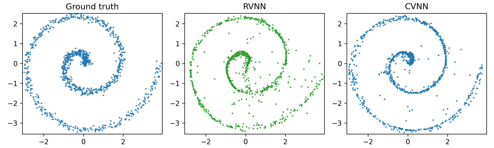
*Figure 1:Ground-truth distribution compared with samples generated by RVNN and CVNN.*

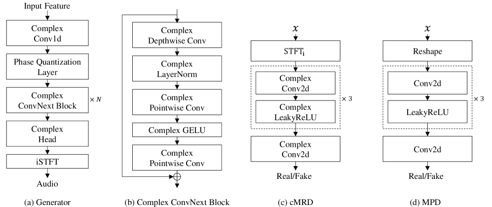
*Figure 2:Overview of the ComVo architecture.*

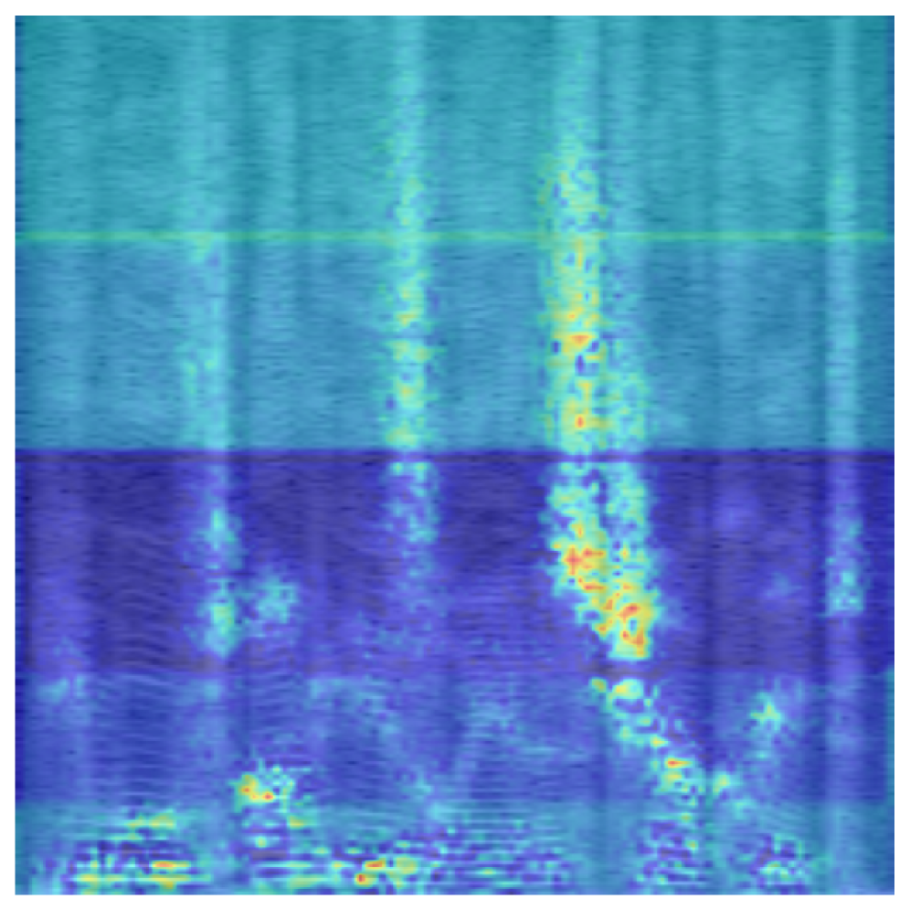
*Figure 3:Grad-CAM comparison across generator-discriminator configurations. Each row corresponds to a cMRD sub-discriminator operating at a different STFT resolution (i, ii, iii).*

*Figure 4: Visualizations over multiple training seeds. Each row corresponds to one run and contains five subplots: ground-truth samples, RVNN outputs, CVNN outputs, and the corresponding magnitude and phase distributions. This layout enables a run-to-run comparison of distributional behavior across the two models.*

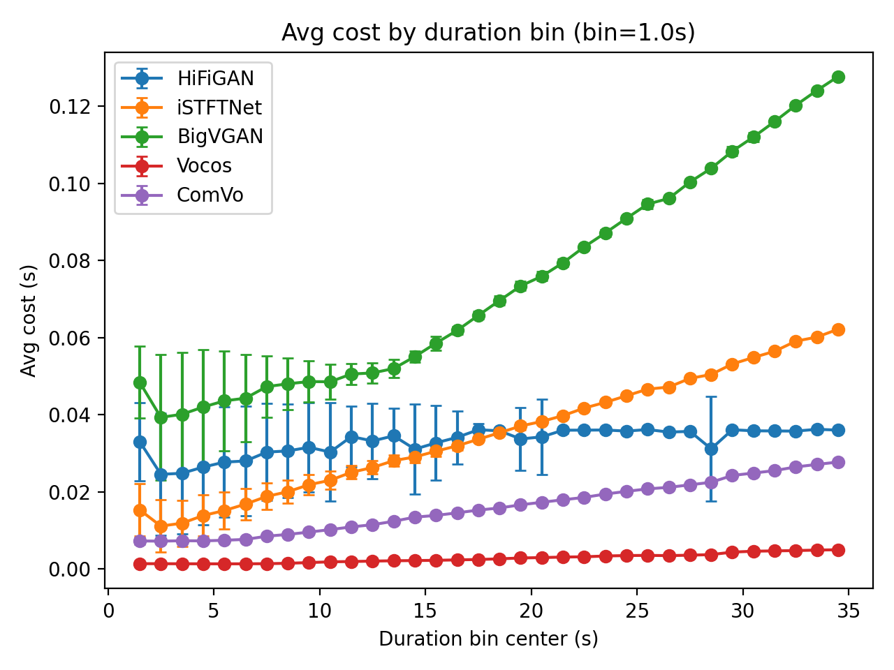
*Figure 5:Average inference cost as a function of utterance duration.*

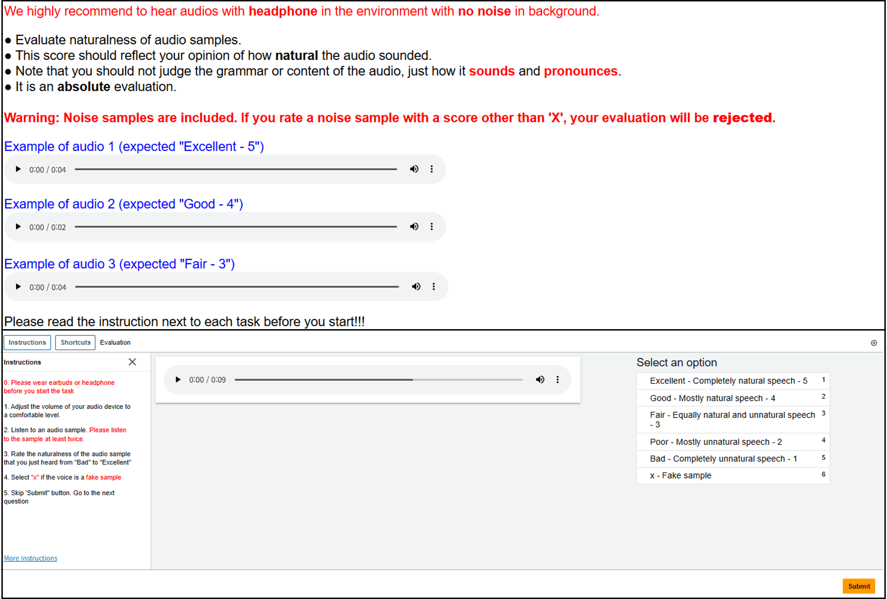
*Figure 6:MOS evaluation interface.*

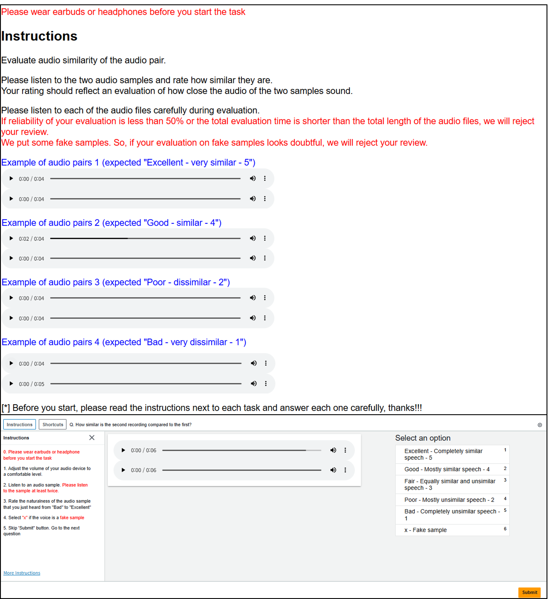
*Figure 7:SMOS evaluation interface.*

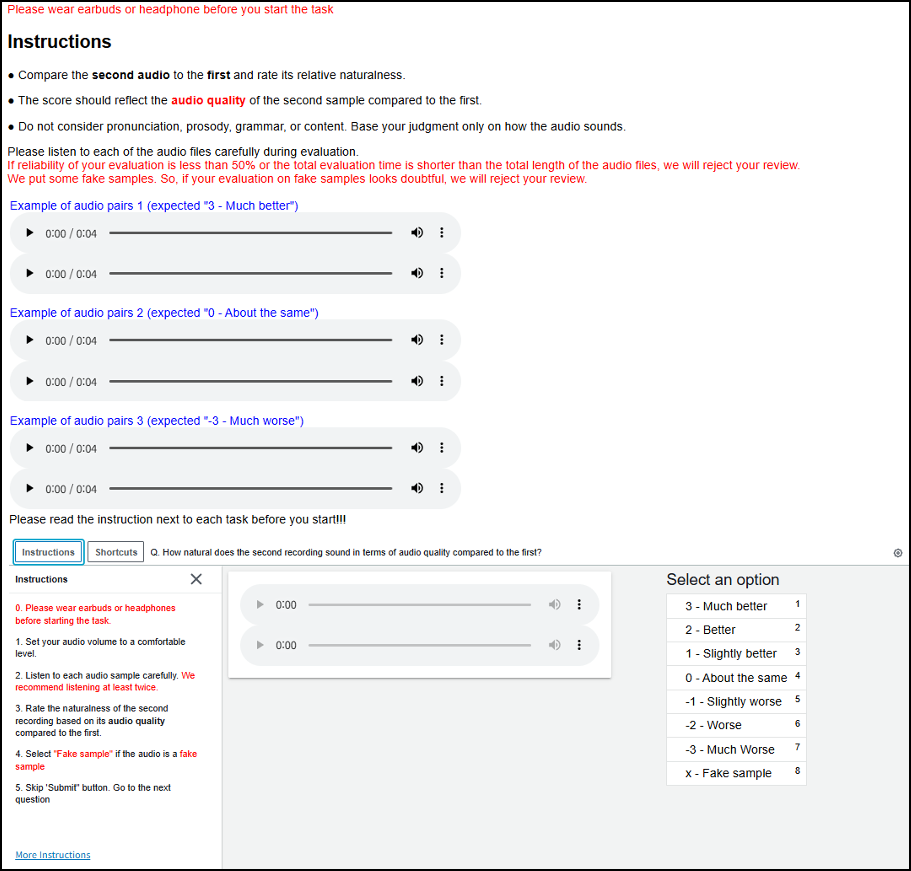
*Figure 8:CMOS evaluation interface.*

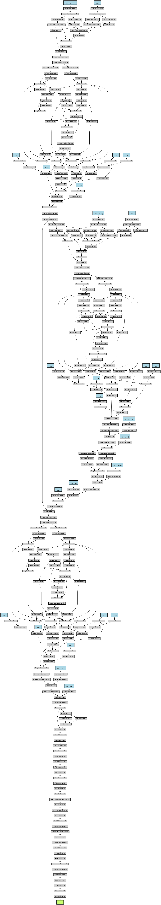
*Figure 9:Backward computation graph of the generator using the native PyTorch complex implementation.*

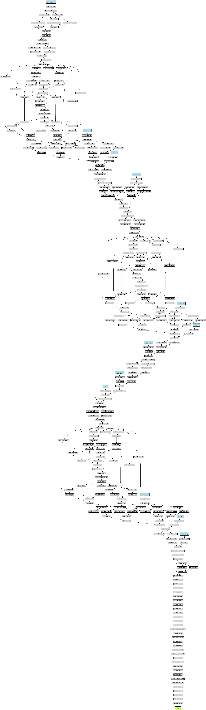
*Figure 10: Backward computation graph of the generator using Gauss’ multiplication trick.*

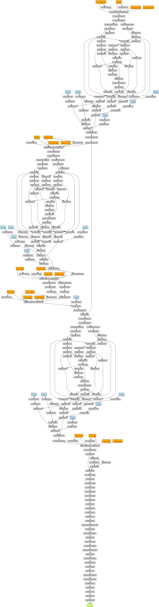
*Figure 11:Backward computation graph of the generator using the block-matrix operation.*

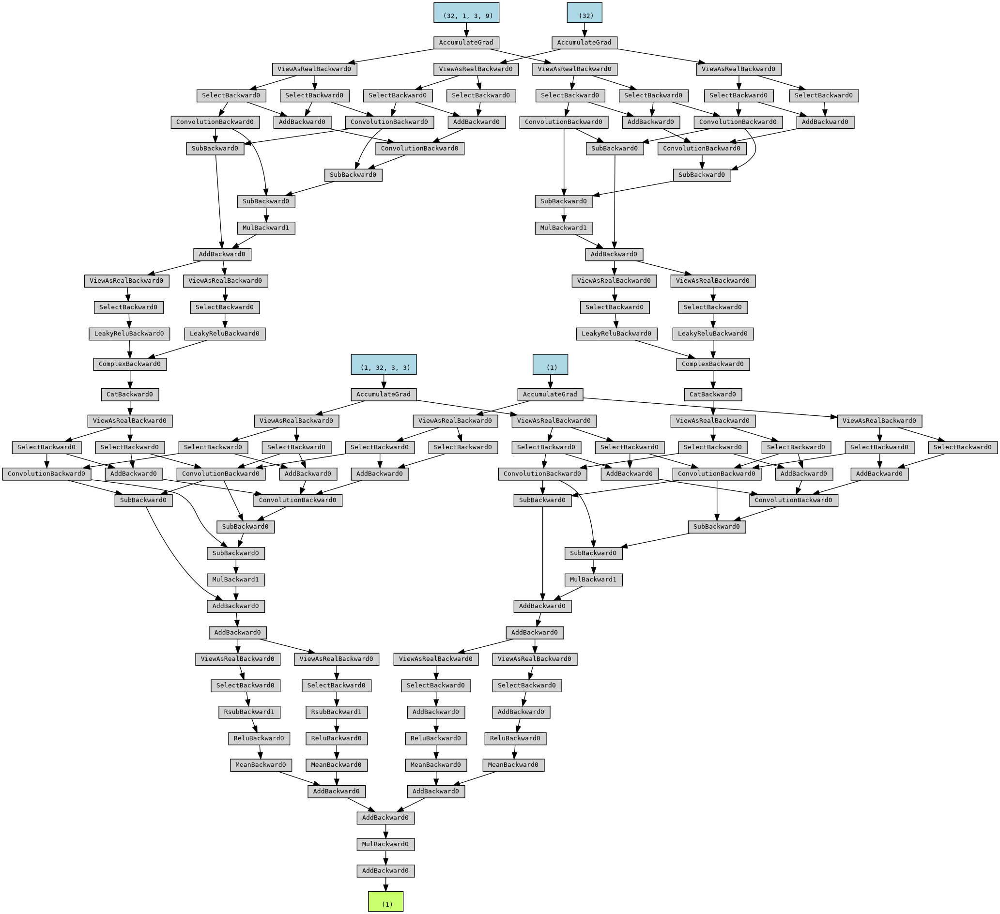
*Figure 12:Backward computation graph of the cMRD using the native PyTorch complex implementation.*

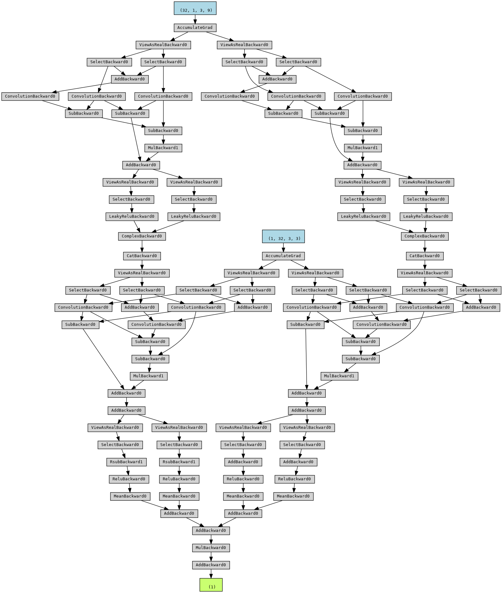
*Figure 13: Backward computation graph of the cMRD using Gauss’ multiplication trick.*

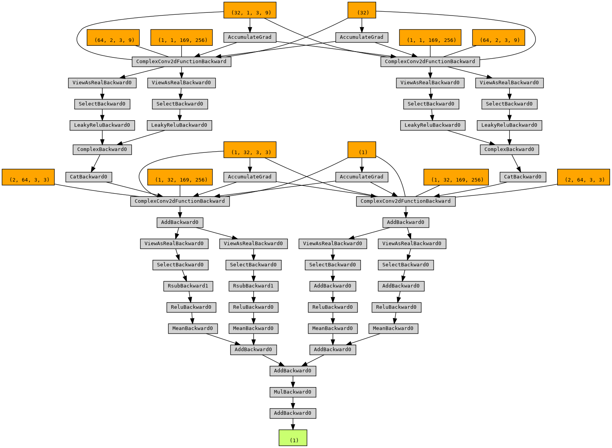
*Figure 14:Backward computation graph of the cMRD using the block-matrix operation.*

---
**Usage Info**: 3946 tokens used.
**Generated at**: 2026-03-13 12:39:38

---

# 📚 OmniForcing: Unleashing Real-time Joint Audio-Visual Generation

🚀 URL: https://arxiv.org/html/2603.11647

## 🌏 Abstract (원문)
Recent joint audio-visual diffusion models achieve remarkable generation quality but suffer from high latency due to their bidirectional attention dependencies, hindering real-time applications. We propose OmniForcing, the first framework to distill an offline, dual-stream bidirectional diffusion model into a high-fidelity streaming autoregressive generator. However, naively applying causal distillation to such dual-stream architectures triggers severe training instability, due to the extreme temporal asymmetry between modalities and the resulting token sparsity. We address the inherent information density gap by introducing an Asymmetric Block-Causal Alignment with a zero-truncation Global Prefix that prevents multi-modal synchronization drift. The gradient explosion caused by extreme audio token sparsity during the causal shift is further resolved through an Audio Sink Token mechanism equipped with an Identity RoPE constraint. Finally, a Joint Self-Forcing Distillation paradigm enables the model to dynamically self-correct cumulative cross-modal errors from exposure bias during long rollouts. Empowered by a modality-independent rolling KV-cache inference scheme, OmniForcing achieves state-of-the-art streaming generation at~\sim25 FPS on a single GPU, maintaining multi-modal synchronization and visual quality on par with the bidirectional teacher.
## 🌏 Abstract (번역)
최근의 오디오-비주얼 공동 확산 모델은 뛰어난 생성 품질을 달성하지만, 양방향 어텐션 의존성으로 인해 높은 지연 시간을 겪어 실시간 애플리케이션에 제약이 있습니다. 본 논문에서는 오프라인, 듀얼 스트림 양방향 확산 모델을 고품질 스트리밍 자동회귀 생성기로 증류하는 최초의 프레임워크인 OmniForcing을 제안합니다. 그러나 이러한 듀얼 스트림 아키텍처에 인과적 증류를 순진하게 적용하면 모달리티 간의 극심한 시간적 비대칭성과 그로 인한 토큰 희소성 때문에 심각한 훈련 불안정성을 유발합니다. 우리는 멀티모달 동기화 드리프트를 방지하는 제로-절단 글로벌 프리픽스(zero-truncation Global Prefix)를 갖춘 비대칭 블록-인과 정렬(Asymmetric Block-Causal Alignment)을 도입하여 내재된 정보 밀도 격차를 해결합니다. 인과적 전환 중 극심한 오디오 토큰 희소성으로 인한 기울기 폭발은 Identity RoPE 제약이 적용된 오디오 싱크 토큰(Audio Sink Token) 메커니즘을 통해 추가로 해결됩니다. 마지막으로, 공동 자기-강제 증류(Joint Self-Forcing Distillation) 패러다임은 모델이 장기 롤아웃 동안 노출 편향으로 인한 누적 교차 모달 오류를 동적으로 자체 수정할 수 있도록 합니다. 모달리티 독립적인 롤링 KV-캐시 추론 방식에 힘입어 OmniForcing은 단일 GPU에서 약 25 FPS의 최첨단 스트리밍 생성을 달성하며, 양방향 교사 모델과 동등한 멀티모달 동기화 및 시각적 품질을 유지합니다.

## 🔍 Methods & Results
- 양방향 어텐션 의존성으로 인한 높은 지연 시간을 가진 기존 오디오-비주얼 확산 모델의 실시간 애플리케이션 한계를 해결합니다.
- 오프라인, 듀얼 스트림 양방향 확산 모델을 고품질 스트리밍 자동회귀 생성기로 증류하는 최초의 프레임워크인 OmniForcing을 제안합니다.
- 모달리티 간의 극심한 시간적 비대칭성과 토큰 희소성으로 인한 훈련 불안정성을 해결하기 위해 제로-절단 글로벌 프리픽스를 갖춘 비대칭 블록-인과 정렬(Asymmetric Block-Causal Alignment)을 도입했습니다.
- 인과적 전환 중 오디오 토큰 희소성으로 인한 기울기 폭발 문제를 Identity RoPE 제약이 적용된 오디오 싱크 토큰(Audio Sink Token) 메커니즘으로 해결했습니다.
- 장기 롤아웃 동안 노출 편향으로 인한 누적 교차 모달 오류를 동적으로 자체 수정하기 위해 공동 자기-강제 증류(Joint Self-Forcing Distillation) 패러다임을 사용합니다.
- 모달리티 독립적인 롤링 KV-캐시 추론 방식을 통해 단일 GPU에서 약 25 FPS의 최첨단 스트리밍 생성을 달성했습니다.
- 양방향 교사 모델과 동등한 멀티모달 동기화 및 시각적 품질을 유지하면서 실시간 스트리밍 생성 성능을 입증했습니다.

## 🖼 Figures

*Figure 1:OmniForcing breaks the latency barrier for joint audio-visual generation. Top: Our framework achieves real-time streaming at 
∼
25 FPS with an ultra-low Time-To-First-Chunk (TTFC) of 
∼
0.7s. Bottom: The bidirectional teacher (LTX-2) requires 
∼
197s to generate the sequence offline. OmniForcing maintains visual and acoustic fidelity on par with the teacher model.*

![Figure 2:The three-stage OmniForcing distillation pipeline. Stage I employs Distribution Matching Distillation (DMD) [yin2024one, yin2024improved] to adapt the model for few-step, fast denoising. Stage II utilizes causal ODE regression to adapt the network weights to the asymmetric block-causal mask. Stage III implements joint Self-Forcing [huang2025self] training by autoregressively unrolling the generation process to mitigate exposure bias.](../images/2026-03-13/2603.11647/2603.11647_fig1.png)
*Figure 2:The three-stage OmniForcing distillation pipeline. Stage I employs Distribution Matching Distillation (DMD) [yin2024one, yin2024improved] to adapt the model for few-step, fast denoising. Stage II utilizes causal ODE regression to adapt the network weights to the asymmetric block-causal mask. Stage III implements joint Self-Forcing [huang2025self] training by autoregressively unrolling the generation process to mitigate exposure bias.*

![Figure 3:Asymmetric Block-Causal Masking. The vertical axis denotes query tokens and the horizontal axis denotes key tokens. Modalities are synchronized via 1s macro-blocks. Each audio block (
𝐵
𝑎
) contains 25 latent frames (one token each), whereas each video block (
𝐵
𝑣
) contains 3 latent frames patchified into 
3
×
384
 tokens. Unmasked tokens include the Global Prefix (orange, 
𝑉
0
/
𝐴
0
) and Audio Sink tokens (red, 
𝑠
). Blue regions denote allowed attention (bidirectional intra-block, strictly causal inter-block), while white regions mask future keys to prevent information leakage.](../images/2026-03-13/2603.11647/2603.11647_fig2.png)
*Figure 3:Asymmetric Block-Causal Masking. The vertical axis denotes query tokens and the horizontal axis denotes key tokens. Modalities are synchronized via 1s macro-blocks. Each audio block (
𝐵
𝑎
) contains 25 latent frames (one token each), whereas each video block (
𝐵
𝑣
) contains 3 latent frames patchified into 
3
×
384
 tokens. Unmasked tokens include the Global Prefix (orange, 
𝑉
0
/
𝐴
0
) and Audio Sink tokens (red, 
𝑠
). Blue regions denote allowed attention (bidirectional intra-block, strictly causal inter-block), while white regions mask future keys to prevent information leakage.*

*Figure 4:Qualitative comparison across diverse scenes. Each example shows generated frames with synchronized waveforms and Mel spectrograms. OmniForcing produces voice layered with bird calls at a seaside scene (top-left), sustained speech at a podium presentation (top-right), a precisely timed cat meow (bottom-left), and blended narration with sewing machine sounds (bottom-right).*

---
**Usage Info**: 1923 tokens used.
**Generated at**: 2026-03-13 12:39:47

---

# 📚 Reconstruction of the Vocal Tract from Speech via Phonetic Representations Using MRI Data

🚀 URL: https://arxiv.org/html/2603.11847

## 🌏 Abstract (원문)
Articulatory acoustic inversion aims to reconstruct the complete geometry of the vocal tract from the speech signal. In this paper, we present a comparative study of several levels of phonetic segmentation accuracy, together with a comparison to the baseline introduced in our previous work, which is based on Mel-Frequency Cepstral Coefficients (MFCCs). All the approaches considered are based on a denoised speech signal and aim to investigate the impact of incorporating phonetic information through three successive levels: an uncorrected automatic transcription, a temporally aligned phonetic segmentation, and an expert manual correction following alignment. The models are trained to predict articulatory contours extracted from vocal tract MRI images using an automatic contour tracking method. The results show that, among the models relying on phonetic representations, manual correction after alignment yields the best performance, approaching that of the baseline.
## 🌏 Abstract (번역)
조음 음향 역변환은 음성 신호로부터 성도의 완전한 기하학적 구조를 재구성하는 것을 목표로 합니다. 본 논문에서는 여러 수준의 음성 분할 정확도에 대한 비교 연구를 제시하며, 이전 연구에서 도입된 MFCC(Mel-Frequency Cepstral Coefficients) 기반의 기준선과도 비교합니다. 고려된 모든 접근 방식은 잡음 제거된 음성 신호를 기반으로 하며, 세 가지 연속적인 수준을 통해 음성 정보를 통합하는 영향을 조사하는 것을 목표로 합니다: 수정되지 않은 자동 전사, 시간적으로 정렬된 음성 분할, 그리고 정렬 후 전문가의 수동 수정입니다. 모델은 자동 윤곽 추적 방법을 사용하여 성도 MRI 이미지에서 추출된 조음 윤곽을 예측하도록 훈련됩니다. 결과는 음성 표현에 의존하는 모델들 중에서 정렬 후 수동 수정이 가장 좋은 성능을 보였으며, 기준선에 근접했음을 보여줍니다.

## 🔍 Methods & Results
- 조음 음향 역변환을 위해 이전 연구와 동일한 모델 아키텍처를 사용했으며, 음성 신호 대신 음성 분할을 입력으로 받도록 수정했습니다.
- 모델은 두 개의 300개 유닛 밀집 레이어, 두 개의 300개 유닛 Bi-LSTM 레이어, 그리고 8개의 조음 기관과 각 100개의 좌표에 해당하는 800개 유닛 출력 밀집 레이어로 구성됩니다.
- 회귀 작업이므로 손실 함수로 평균 제곱 오차(MSE)를 사용했으며, 평가 지표로는 RMSE(Root Mean Square Error)와 중앙값(밀리미터 단위)을 사용했습니다.
- 실험은 네 가지 다른 입력 방식을 비교했습니다: MFCC를 입력으로 사용하는 기준선 모델, Wav2Vec 2.0에서 얻은 음성 전사를 사용하는 Wav2vec2 기반 모델, Astali를 사용한 강제 정렬에서 얻은 음성 분할을 사용하는 Astali 기반 모델, 그리고 전문가가 수동으로 수정한 분할을 사용하는 Expert-corrected 모델입니다.
- 모든 모델은 300 에포크 동안 배치 크기 10으로 훈련되었으며, Adam 옵티마이저(학습률 10^-3)와 10 에포크의 인내심을 가진 조기 종료를 적용했습니다.
- 데이터셋은 문장 간의 침묵을 제거하여 총 45,000 프레임으로 구성되었고, 80% 훈련, 10% 검증, 10% 테스트로 분할되었습니다.
- 결과에 따르면, 음성 표현을 사용하는 모델 중에서는 정렬 후 수동 수정이 가장 좋은 성능을 보였으며, MFCC 기반의 기준선 모델에 근접했습니다.

## 🖼 Figures
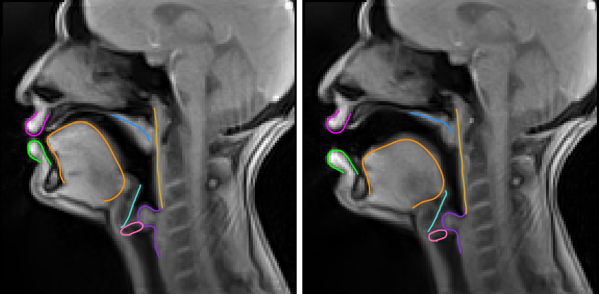
*Figure 1: Segmentation of articulators contour tracked in two images of the rt-MRI film:    Arytenoid cartilage,   Epiglottis,   Lower lip,  Vocal folds,    Soft palate midline,    Tongue,    Upper lip,    Pharyngeal wall*

*Figure 2:Model architecture*

*Figure 3: Example of two inversions compared to the original contours tracked in the rt-MRI film from baseline model. The dotted lines show the predicted contours, while the solid lines represent the original ones. The RMSE is 1.36 mm for the phoneme ’a’ on the left and 1.50 mm for ’t’ on the right.*

---
**Usage Info**: 2297 tokens used.
**Generated at**: 2026-03-13 12:39:54

---

# 📚 AnimeScore: A Preference-Based Dataset and Framework for Evaluating Anime-Like Speech Style

🚀 URL: https://arxiv.org/html/2603.11482

## 🌏 Abstract (원문)
Evaluating `anime-like' voices currently relies on costly subjective judgments, yet no standardized objective metric exists. A key challenge is that anime-likeness, unlike naturalness, lacks a shared absolute scale, making conventional Mean Opinion Score (MOS) protocols unreliable. To address this gap, we propose AnimeScore, a preference-based framework for automatic anime-likeness evaluation via pairwise ranking. We collect 15,000 pairwise judgments from 187 evaluators with free-form descriptions, and acoustic analysis reveals that perceived anime-likeness is driven by controlled resonance shaping, prosodic continuity, and deliberate articulation rather than simple heuristics such as high pitch. We show that handcrafted acoustic features reach a 69.3% AUC ceiling, while SSL-based ranking models achieve up to 90.8% AUC, providing a practical metric that can also serve as a reward signal for preference-based optimization of generative speech models.
## 🌏 Abstract (번역)
'애니메이션 같은' 목소리를 평가하는 것은 현재 비용이 많이 드는 주관적인 판단에 의존하며, 표준화된 객관적인 측정 기준은 존재하지 않습니다. 주요 과제는 자연스러움과 달리 애니메이션 같음은 공유된 절대적인 척도가 없어 기존의 평균 의견 점수(MOS) 프로토콜을 신뢰할 수 없게 만든다는 것입니다. 이러한 격차를 해소하기 위해 우리는 쌍대 순위 지정을 통한 자동 애니메이션 같음 평가를 위한 선호도 기반 프레임워크인 AnimeScore를 제안합니다. 우리는 187명의 평가자로부터 자유 형식 설명과 함께 15,000개의 쌍대 판단을 수집했으며, 음향 분석 결과 인지된 애니메이션 같음은 높은 피치와 같은 단순한 휴리스틱보다는 제어된 공명 형성, 운율적 연속성, 의도적인 조음에 의해 좌우된다는 것을 밝혀냈습니다. 우리는 수작업 음향 특징이 69.3% AUC 상한에 도달하는 반면, SSL 기반 순위 모델은 최대 90.8% AUC를 달성하여 생성 음성 모델의 선호도 기반 최적화를 위한 보상 신호로도 활용될 수 있는 실용적인 측정 기준을 제공함을 보여줍니다.

## 🔍 Methods & Results
- 애니메이션 같은 음성 평가를 위한 점수 예측 모델을 설계했으며, 이는 기존의 다변량 음향 분석 기반을 넘어선다.
- 모델은 입력 파형을 고정된 SSL(Self-Supervised Learning) 인코더, BiLSTM, 평균 풀링, MLP를 통해 스칼라 점수로 변환하는 구조를 가진다.
- 모델은 쌍대 로지스틱 손실을 최소화하여 학습되며, 추론 시에는 스칼라 점수를 출력하고 쌍대 정확도를 통해 평가된다.
- 평가는 보유된 A/B 비교 데이터셋에서 쌍대 정확도, NLL, ROC-AUC를 사용하여 수행되었다.
- SSL 기반 모델들은 수작업 음향 특징을 사용한 로지스틱 회귀 기준선(69.3% AUC)을 크게 능가했다.
- 특히 HuBERT 모델은 90.8%의 ROC-AUC를 달성하여 가장 우수한 성능을 보였다.
- 마스크 예측 기반 모델(HuBERT, WavLM)이 대조 학습 모델(wav2vec 2.0)보다 일관되게 우수한 성능을 보였는데, 이는 마스크 예측이 음성 내용 외의 운율적, 비언어적, 화자 특성을 인코딩하는 데 효과적이기 때문으로 분석된다.

## 🖼 Figures
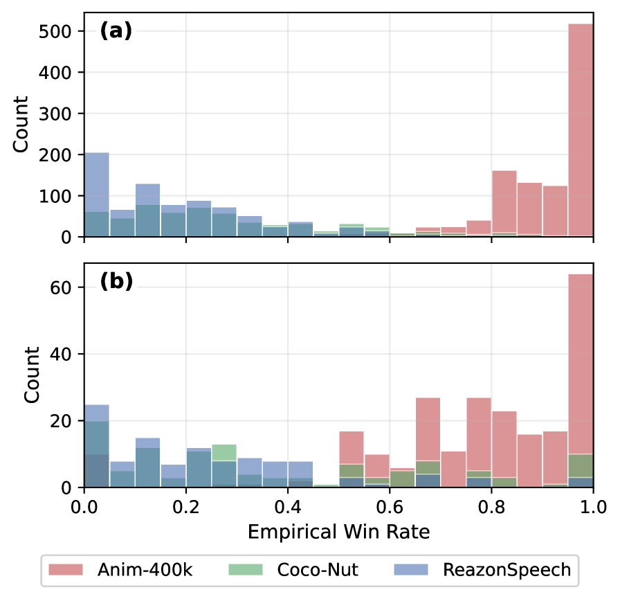
*Figure 1:Corpus-wise distribution of empirical win rate for (a) train and (b) test data.*

*Figure 2:Visualizations of acoustic proxies for anime-likeness speech. (a) F1-F2 formant space distribution comparing high-win rate (top 25%) and low-win rate (bottom 25%) utterances. (b) Split violin plots of normalized spectral flux and voicing ratio distributions for the top and bottom 25% groups. (c) Overall syllable rate and articulation rate across win rate.*

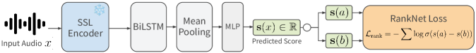
*Figure 3:Architecture of an anime score prediction model*

---
**Usage Info**: 2902 tokens used.
**Generated at**: 2026-03-13 12:40:04

---

# 📚 Acoustic-to-Articulatory Inversion of Clean Speech Using an MRI-Trained Model

🚀 URL: https://arxiv.org/html/2603.11845

## 🌏 Abstract (원문)
Articulatory acoustic inversion reconstructs vocal tract shapes from speech. Real-time magnetic resonance imaging (rt-MRI) allows simultaneous acquisition of both the acoustic speech signal and articulatory information. Besides the complexity of rt-MRI acquisition, the recorded audio is heavily corrupted by scanner noise and requires denoising to be usable. For practical use, it must be possible to invert speech recorded without MRI noise. In this study, we investigate the use of speech recorded in a clean acoustic environment as an alternative to denoised MRI speech. To this end we compare two signals from the same speaker with identical sentences which are aligned using phonetic segmentation. A model trained on denoised MRI speech is evaluated on both denoised MRI and clean speech. We also assess a model trained and tested only on clean speech. Results show that clean speech supports articulatory inversion effectively, achieving an RMSE of 1.56 mm, close to MRI-based performance.
## 🌏 Abstract (번역)
조음 음향 역변환은 음성으로부터 성도 모양을 재구성합니다. 실시간 자기공명영상(rt-MRI)은 음향 음성 신호와 조음 정보를 동시에 획득할 수 있게 합니다. rt-MRI 획득의 복잡성 외에도, 녹음된 오디오는 스캐너 노이즈에 의해 심하게 손상되며 사용 가능하려면 노이즈 제거가 필요합니다. 실용적인 사용을 위해서는 MRI 노이즈 없이 녹음된 음성을 역변환할 수 있어야 합니다. 본 연구에서는 노이즈 제거된 MRI 음성의 대안으로 깨끗한 음향 환경에서 녹음된 음성 사용을 조사합니다. 이를 위해 우리는 음성 분할을 사용하여 정렬된 동일한 문장을 가진 동일 화자의 두 신호를 비교합니다. 노이즈 제거된 MRI 음성으로 훈련된 모델은 노이즈 제거된 MRI 음성과 깨끗한 음성 모두에서 평가됩니다. 또한 깨끗한 음성으로만 훈련되고 테스트된 모델도 평가합니다. 결과는 깨끗한 음성이 조음 역변환을 효과적으로 지원하며, MRI 기반 성능에 근접한 1.56mm의 RMSE를 달성함을 보여줍니다.

## 🔍 Methods & Results
- MRI 코퍼스와 깨끗한 음성 코퍼스를 정렬하기 위해 음성학적 정보를 기반으로 하는 계층적 정렬 알고리즘을 개발했습니다. 이 알고리즘은 문장, 단어, 음소 순으로 정렬하며, 문장 정렬에는 Gestalt 패턴 매칭 알고리즘을 사용하고, 음소 수준에서는 국소 시간 정규화를 적용하여 MRI 프레임과 깨끗한 신호의 해당 시점을 일치시켰습니다.
- 오디오 임베딩을 입력으로 받는 5개 층의 모델을 사용했습니다. 이 모델은 두 개의 완전 연결(dense) 층(각 300 유닛), 두 개의 양방향 LSTM(Bi-LSTM) 층(각 300 유닛), 그리고 8개의 조음기관에 대한 100개의 윤곽 좌표(50 X, 50 Y)를 출력하는 최종 dense 층으로 구성됩니다.
- 조음 음향 역변환은 회귀 문제로, 예측된 조음점과 참조 조음점 간의 거리를 최소화하는 것을 목표로 합니다. 평균 제곱 오차(MSE)를 손실 함수로 사용했으며, RMSE와 중앙값 오차(밀리미터 단위)를 사용하여 모델을 평가했습니다.
- 깨끗한 음성 사용의 영향을 평가하기 위해 훈련 및 평가 입력으로 MRI 음성(M2M), 훈련은 MRI 음성, 평가는 깨끗한 음성(M2C), 훈련 및 평가 모두 깨끗한 음성(C2C)의 세 가지 구성을 비교했습니다. 또한, 제안된 정렬 방법을 동적 시간 워핑(DTW) 기반 접근 방식과 비교하는 실험도 수행했습니다.
- 412,000개의 이미지 데이터셋을 훈련 80%, 검증 10%, 테스트 10%로 분할했습니다. 모든 모델은 최대 300 에포크 동안 배치 크기 10, Adam 옵티마이저(학습률 0.001)로 훈련되었으며, 검증 성능을 기반으로 10 에포크의 인내심을 가진 조기 종료를 적용했습니다.
- 주요 결과로, 깨끗한 음성이 조음 역변환을 효과적으로 지원하며, MRI 기반 성능에 근접한 1.56mm의 RMSE를 달성했습니다.

## 🖼 Figures
![Figure 1: Comparison of normal speech, MRI-denoised speech from our dataset, and denoised speech from [ramanarayanan2018analysis]. The first two signals were produced by the same female speaker uttering “Après une heure.” All three audio files are provided as supplementary material.](../images/2026-03-13/2603.11845/2603.11845_fig0.png)
*Figure 1: Comparison of normal speech, MRI-denoised speech from our dataset, and denoised speech from [ramanarayanan2018analysis]. The first two signals were produced by the same female speaker uttering “Après une heure.” All three audio files are provided as supplementary material.*

*Figure 2: Segmentation of articulators contour tracked in two images of the rt-MRI film:    Arytenoid cartilage,   Epiglottis,
  Lower lip,  Pharyngeal wall,   Soft palate midline,   Tongue,   Upper lip,   Vocal folds*

*Figure 3:Model architecture*

---
**Usage Info**: 4559 tokens used.
**Generated at**: 2026-03-13 12:40:18

---

# 📚 Self-Speculative Decoding for LLM-based ASR with CTC Encoder Drafts

🚀 URL: https://arxiv.org/html/2603.11243

## 🌏 Abstract (원문)
We propose self-speculative decoding for speech-aware LLMs by using the CTC encoder as a draft model to accelerate auto-regressive (AR) inference and improve ASR accuracy. Our three-step procedure works as follows: (1) if the frame entropies of the CTC output distributions are below a threshold, the greedy CTC hypothesis is accepted as final; (2) otherwise, the CTC hypothesis is verified in a single LLM forward pass using a relaxed acceptance criterion based on token likelihoods; (3) if verification fails, AR decoding resumes from the accepted CTC prefix. Experiments on nine corpora and five languages show that this approach can simultaneously accelerate decoding and reduce WER. On the HuggingFace Open ASR benchmark with a 1B parameter LLM and 440M parameter CTC encoder, we achieve a record 5.58% WER and improve the inverse real time factor by a factor of 4.4 with only a 12% relative WER increase over AR search. Code and model weights are publicly available under a permissive license.
## 🌏 Abstract (번역)
본 논문에서는 CTC 인코더를 초안 모델로 사용하여 자기회귀(AR) 추론을 가속화하고 ASR 정확도를 향상시킴으로써 음성 인식 LLM을 위한 자기-추측 디코딩(self-speculative decoding)을 제안합니다. 우리의 3단계 절차는 다음과 같이 작동합니다: (1) CTC 출력 분포의 프레임 엔트로피가 임계값 미만이면, 탐욕적인 CTC 가설이 최종으로 수락됩니다; (2) 그렇지 않은 경우, 토큰 가능도(likelihood)에 기반한 완화된 수락 기준을 사용하여 단일 LLM 순방향 패스에서 CTC 가설이 검증됩니다; (3) 검증에 실패하면, 수락된 CTC 접두사부터 AR 디코딩이 재개됩니다. 9개 코퍼스와 5개 언어에 대한 실험 결과, 이 접근 방식이 디코딩을 가속화하고 WER을 동시에 줄일 수 있음을 보여줍니다. 10억(1B) 매개변수 LLM과 4억 4천만(440M) 매개변수 CTC 인코더를 사용한 HuggingFace Open ASR 벤치마크에서, 우리는 기록적인 5.58%의 WER을 달성했으며, AR 탐색 대비 WER이 12% 상대적으로 증가했을 뿐인데도 역실시간 계수를 4.4배 향상시켰습니다. 코드와 모델 가중치는 허용 라이선스 하에 공개적으로 이용 가능합니다.

## 🔍 Methods & Results
- 음성 인식 LLM을 위한 자기-추측 디코딩(Self-Speculative Decoding, SSD)을 제안하며, CTC 인코더를 초안 모델로 사용하여 자기회귀(AR) 추론을 가속화하고 ASR 정확도를 향상시킨다.
- 제안된 3단계 절차는 다음과 같다: (1) CTC 출력 분포의 프레임 엔트로피가 임계값 미만일 경우 탐욕적인 CTC 가설을 최종으로 수락한다. (2) 그렇지 않은 경우, 토큰 가능도에 기반한 완화된 수락 기준을 사용하여 단일 LLM 순방향 패스에서 CTC 가설을 검증한다. (3) 검증에 실패하면, 수락된 CTC 접두사부터 AR 생성을 재개한다.
- CTC는 `p_CTC(y|x)`를 정렬의 합으로 모델링하며, SLM은 어쿠스틱 임베딩을 위한 어댑터를 사용하여 `p(y|x)`를 모델링한다. CTC 가설은 프레임 엔트로피 임계값으로, SLM 가설은 토큰 가능도 임계값으로 검증된다.
- 9개 코퍼스와 5개 언어에 걸쳐 실험을 수행하여 디코딩 속도 향상과 WER 감소를 동시에 달성했다.
- HuggingFace Open ASR 벤치마크에서 1B 매개변수 LLM과 440M 매개변수 CTC 인코더를 사용하여 5.58%의 기록적인 WER을 달성했다.
- AR 탐색 대비 WER이 12% 상대적으로 증가했음에도 불구하고 역실시간 계수(inverse real time factor)를 4.4배 향상시켰다.
- 코드와 모델 가중치는 허용 라이선스 하에 공개적으로 이용 가능하다.

## 🖼 Figures
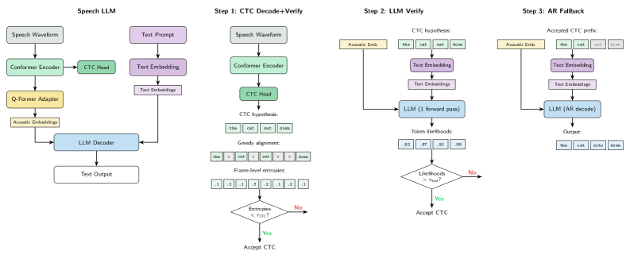
*Figure 1:Overview of the proposed self-speculative decoding method for speech-aware LLMs.*

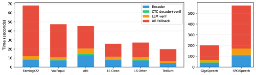
*Figure 2:Run times and breakdown for the different passes in the high accuracy SSD regime for granite-speech-4.0-1b.*

*Figure 3:Influence of acceptance thresholds 
𝜏
𝐶
​
𝑇
​
𝐶
 and 
𝜏
𝑆
​
𝐿
​
𝑀
 on word error rate and inverse real-time factor for Earnings-22.*

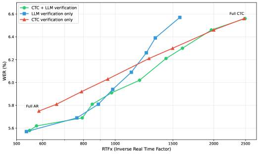
*Figure 4:Ablation study of verification passes: green = CTC followed by LLM; blue = LLM verification; red = CTC verification. Results are reported on the ESB/Open ASR test sets.*

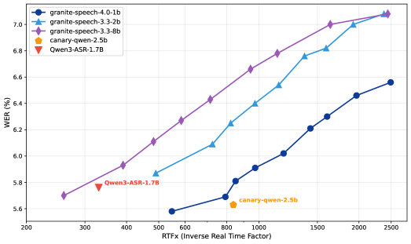
*Figure 5:WER and RTFx comparison between granite-speech and leading SLMs on the Open ASR test sets (all on 1 H100).*

---
**Usage Info**: 3895 tokens used.
**Generated at**: 2026-03-13 12:40:30

---

