# 🚩 (2026-03-16) Scholar Inbox 추천 논문 

# 📚 Mask2Flow-TSE: Two-Stage Target Speaker Extraction with Masking and Flow Matching

🚀 URL: https://arxiv.org/html/2603.12837

## 🌏 Abstract (원문)
Target speaker extraction (TSE) extracts the target speaker's voice from overlapping speech mixtures given a reference utterance. Existing approaches typically fall into two categories: discriminative and generative. Discriminative methods apply time-frequency masking for fast inference but often over-suppress the target signal, while generative methods synthesize high-quality speech at the cost of numerous iterative steps. We propose Mask2Flow-TSE, a two-stage framework combining the strengths of both paradigms. The first stage applies discriminative masking for coarse separation, and the second stage employs flow matching to refine the output toward target speech. Unlike generative approaches that synthesize speech from Gaussian noise, our method starts from the masked spectrogram, enabling high-quality reconstruction in a single inference step. Experiments show that Mask2Flow-TSE achieves comparable performance to existing generative TSE methods with approximately 85M parameters.
## 🌏 Abstract (번역)
타겟 화자 추출(TSE)은 참조 발화가 주어졌을 때 겹치는 음성 혼합물에서 타겟 화자의 음성을 추출하는 기술입니다. 기존 접근 방식은 일반적으로 판별적(discriminative) 방법과 생성적(generative) 방법의 두 가지 범주로 나뉩니다. 판별적 방법은 빠른 추론을 위해 시간-주파수 마스킹을 적용하지만 종종 타겟 신호를 과도하게 억제하는 반면, 생성적 방법은 수많은 반복 단계의 비용으로 고품질 음성을 합성합니다. 우리는 두 패러다임의 장점을 결합한 2단계 프레임워크인 Mask2Flow-TSE를 제안합니다. 첫 번째 단계는 거친 분리를 위해 판별적 마스킹을 적용하고, 두 번째 단계는 타겟 음성으로 출력을 정제하기 위해 플로우 매칭을 사용합니다. 가우시안 노이즈에서 음성을 합성하는 생성적 접근 방식과 달리, 우리의 방법은 마스킹된 스펙트로그램에서 시작하여 단일 추론 단계에서 고품질 재구성을 가능하게 합니다. 실험 결과 Mask2Flow-TSE는 약 8,500만 개의 파라미터로 기존 생성적 TSE 방법과 유사한 성능을 달성하는 것으로 나타났습니다.

## 🔍 Methods & Results
- 기존 타겟 화자 추출(TSE) 방법론의 한계점을 극복하기 위해 Mask2Flow-TSE라는 2단계 프레임워크를 제안한다.
- Mask2Flow-TSE의 첫 번째 단계에서는 판별적 마스킹을 사용하여 음성을 대략적으로 분리한다.
- 두 번째 단계에서는 플로우 매칭(flow matching)을 활용하여 첫 단계의 출력을 타겟 음성으로 정제한다.
- 기존 생성적 방법과 달리, Mask2Flow-TSE는 가우시안 노이즈 대신 마스킹된 스펙트로그램에서 시작하여 단일 추론 단계로 고품질 음성 재구성을 가능하게 한다.
- 실험 결과, Mask2Flow-TSE는 약 8,500만 개의 파라미터로 기존 생성적 TSE 방법들과 비교할 만한 성능을 달성했다.

## 🖼 Figures
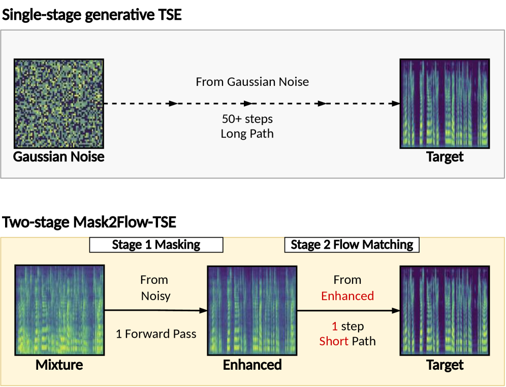
*Figure 1:Single-stage generative TSE vs. our two-stage Mask2Flow-TSE. Conventional approaches start from Gaussian noise requiring many iterative steps, while our method starts from the masking-enhanced spectrogram, reducing inference to only 1 step.*

*Figure 2:Cumulative delete–insert (D/I) proportion of a flow-only TSE model across 8 Euler steps. Each bar decomposes the total energy change from the input mixture into Delete (D, red) and Insert (I, blue). Mask: a separately trained discriminative masking model. Target: ground-truth clean speech. (a) Libri2Mix Noisy; (b) Libri2Mix Clean.*

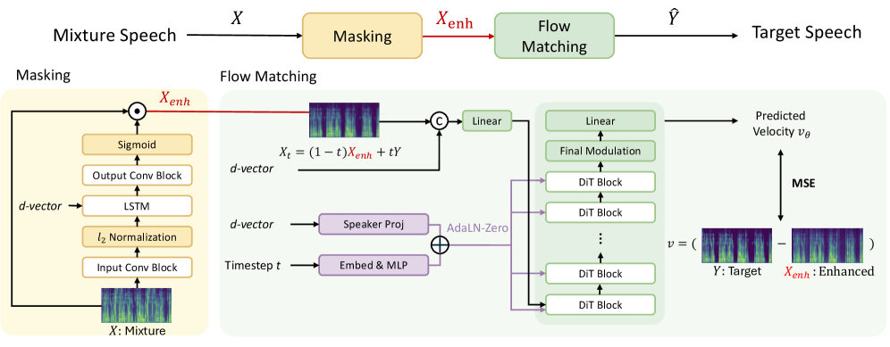
*Figure 3:The proposed Mask2Flow-TSE architecture with masking and flow matching stages.*

*Figure 4:Comparison of WER and total system size under speech additive noise. Each point represents a (Whisper backbone, TSE method) pair. Our approach achieves the same WER as Whisper large-v2 alone with 
∼
10
×
 fewer parameters.*

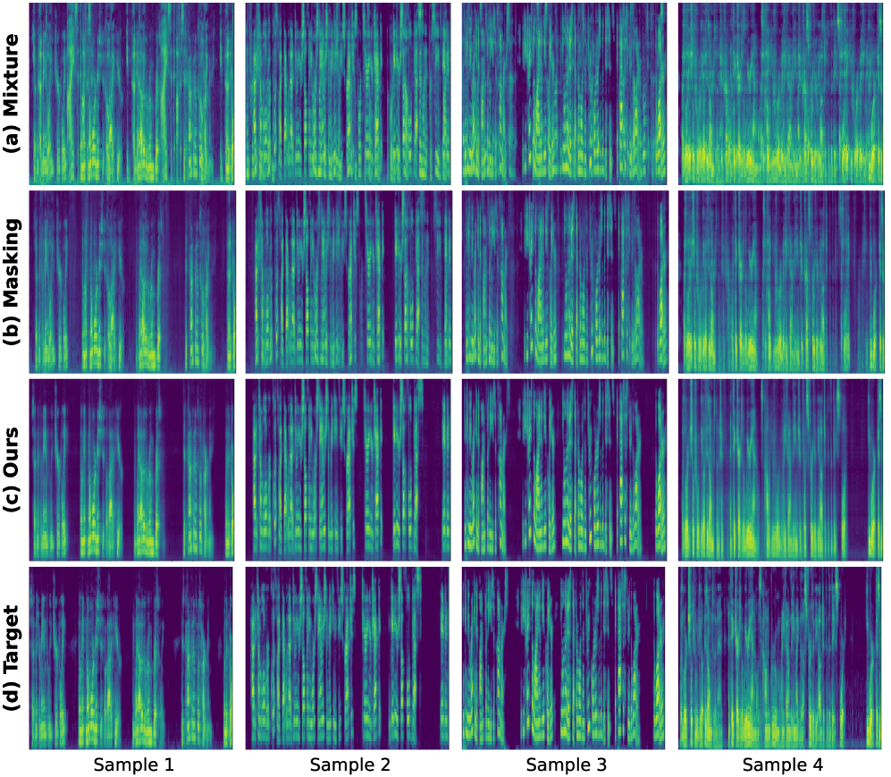
*Figure 5:Spectrogram comparison on Libri2Mix test samples. From top to bottom: (a) input mixture, (b) masking stage output, (c) Mask2Flow-TSE output, and (d) clean target.*

*Figure 6:D/I energy proportion per Euler step for a Gaussian-prior flow model on Libri2Mix clean. Early steps are insert-dominant, opposite to masking (D 
=
 100%).*

---
**Usage Info**: 1343 tokens used.
**Generated at**: 2026-03-16 12:52:47

---

# 📚 MamTra: A Hybrid Mamba-Transformer Backbone for Speech Synthesis

🚀 URL: https://arxiv.org/html/2603.12342

## 🌏 Abstract (원문)
Despite the remarkable quality of LLM-based text-to-speech systems, their reliance on autoregressive Transformers leads to quadratic computational complexity, which severely limits practical applications. Linear-time alternatives, notably Mamba, offer a potential remedy; however, they often sacrifice the global context essential for expressive synthesis. In this paper, we propose MamTra, an interleaved Mamba-Transformer framework designed to leverage the advantages of Mamba’s efficiency and Transformers’ modeling capability. We also introduce novel knowledge transfer strategies to distill insights from a pretrained Transformer into our hybrid architecture, thereby bypassing the prohibitive costs of training from scratch. Systematic experiments identify the optimal hybrid configuration, and demonstrate that MamTra reduces inference VRAM usage by up to 34% without compromising speech fidelity–even trained on only 2% of the original training dataset. Audio samples are available at111Audio samples & Code: https://mamtratts.github.io/.
## 🌏 Abstract (번역)
LLM 기반 텍스트 음성 변환(TTS) 시스템의 뛰어난 품질에도 불구하고, 자기회귀 트랜스포머에 의존하기 때문에 이차적인 계산 복잡성을 야기하여 실제 응용 분야를 심각하게 제한합니다. Mamba와 같은 선형 시간 대안은 잠재적인 해결책을 제공하지만, 표현력이 풍부한 합성에 필수적인 전역 컨텍스트를 종종 희생합니다. 본 논문에서는 Mamba의 효율성과 트랜스포머의 모델링 능력이라는 장점을 활용하도록 설계된 인터리브드 Mamba-트랜스포머 프레임워크인 MamTra를 제안합니다. 또한, 사전 훈련된 트랜스포머의 통찰력을 우리의 하이브리드 아키텍처로 증류하여 처음부터 훈련하는 데 드는 엄청난 비용을 우회하는 새로운 지식 전달 전략을 소개합니다. 체계적인 실험을 통해 최적의 하이브리드 구성을 식별했으며, MamTra가 음성 충실도를 손상시키지 않으면서 추론 VRAM 사용량을 최대 34%까지 줄임을 입증했습니다. 이는 원래 훈련 데이터셋의 2%만으로 훈련되었음에도 불구하고 달성된 결과입니다. 오디오 샘플은 111Audio samples & Code: https://mamtratts.github.io/에서 확인할 수 있습니다.

## 🔍 Methods & Results
- 기존 LLM 기반 TTS 시스템은 자기회귀 트랜스포머의 이차적 계산 복잡성(O(L^2))으로 인해 실용적 응용이 제한되며, Mamba와 같은 선형 시간 대안은 전역 컨텍스트를 희생할 수 있다는 문제점을 제기했습니다.
- Mamba의 효율성과 트랜스포머의 모델링 능력을 결합한 인터리브드 Mamba-트랜스포머 프레임워크인 MamTra를 제안했습니다.
- 전역 컨텍스트 모델링과 지역 시간 효율성의 균형을 위해 인터리브드(BlockBeg/End), 연속(Front/Middle/Back/Sandwich), 데이터 기반(Importance) 등 다양한 트랜스포머-맘바 교체 전략을 탐색하고, 1:1에서 1:11까지의 트랜스포머-맘바 비율로 평가했습니다.
- 사전 훈련된 트랜스포머의 통찰력을 하이브리드 아키텍처로 증류하여 처음부터 훈련하는 비용을 우회하는 새로운 지식 전달 전략을 도입했습니다.
- 트랜스포머의 QKV(Query, Key, Value)와 SSM(State Space Model)의 C, B, x_t 사이에 직접적인 구조적 정렬을 발견하고, 사전 훈련된 트랜스포머의 QKV 투영 가중치를 Mamba 레이어 초기화에 직접 전이했습니다.
- 선형화 과정에서 손실된 생성 동작을 복구하기 위해 교차 엔트로피(L_CE), 교사 및 학생 로짓 간의 스큐 KL 발산 최소화(L_logits), 토큰 임베딩에 대한 MSE 제약(L_emb)을 포함하는 다단계 증류 전략을 사용했습니다.
- MamTra는 음성 충실도를 손상시키지 않으면서 추론 VRAM 사용량을 최대 34%까지 줄였으며, 이는 원래 훈련 데이터셋의 2%만으로 훈련되었음에도 달성되었습니다.

## 🖼 Figures

*Figure 1:Overview of the hybrid Mamba-Transformer configurations for speech synthesis. Selective Transformer-to-Mamba layer transfer reduces training cost and accelerates convergence, while performance is recovered via knowledge distillation using less than 2% of the teacher’s English training data.*

*Figure 2: Following the alignment between Eq. 2 and Eq. 4, projection weights for 
𝐶
, 
𝐵
, and 
𝑥
 in Mamba are initialized with Transformer's 
𝑄
, 
𝐾
, and 
𝑉
 projection weights, respectively.*

*Figure 3:Memory usage (GB) on Seed-TTS-eval (using NVIDIA A6000). MamTra 1:1 reduces VRAM by 34% and 17% compared to CosyVoice 2 and Zonos-v0.1, respectively.*

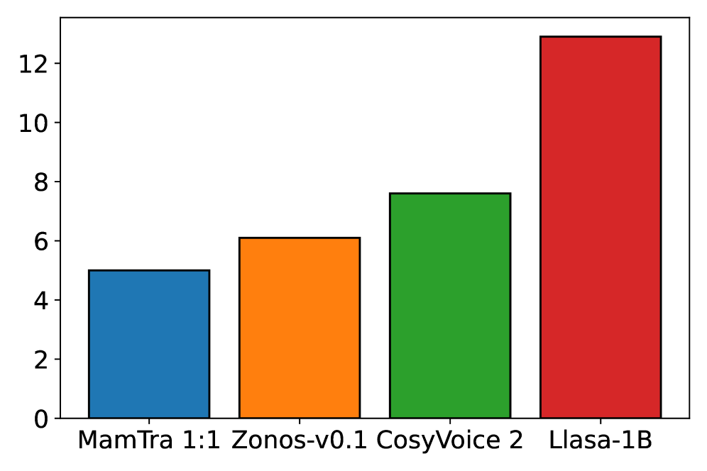
*Figure 3:Memory usage (GB) on Seed-TTS-eval (using NVIDIA A6000). MamTra 1:1 reduces VRAM by 34% and 17% compared to CosyVoice 2 and Zonos-v0.1, respectively.*

*Figure 4:Cross-entropy (CE) loss and Word Error Rate (WER) on Seed-TTS-eval for hybrid Mamba-Transformer variants after 15 training epochs on LibriTTS (0.5k h). CE loss exhibits a consistent correlation with WER across different ratios and placement strategies.*

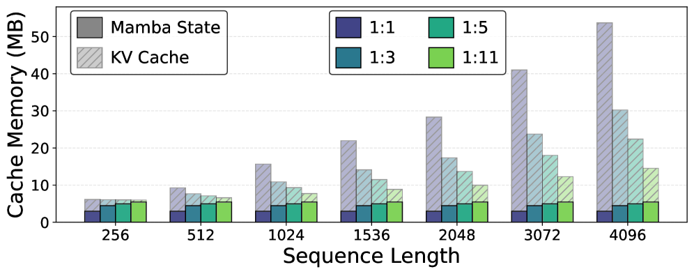
*Figure 5:Cache size growth in the hybrid model, where the sequence-length dependency scales with the number of remaining Transformer layers.*

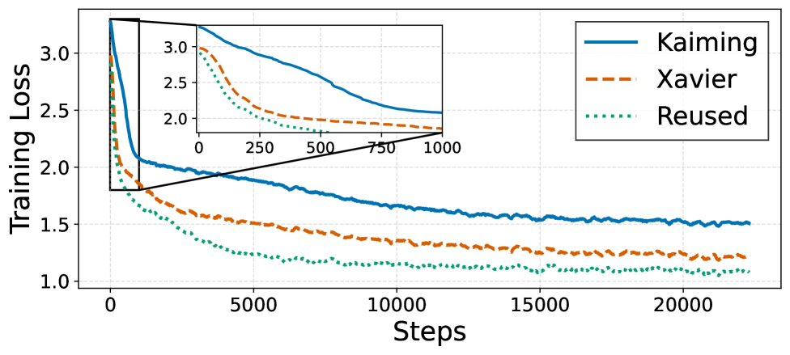
*Figure 6:Convergence speed after 15 epochs.*

---
**Usage Info**: 4390 tokens used.
**Generated at**: 2026-03-16 12:53:02

---

# 📚 TASTE-Streaming: Towards Streamable Text-Aligned Speech Tokenization and Embedding for Spoken Language Modeling

🚀 URL: https://arxiv.org/html/2603.12350

## 🌏 Abstract (원문)
Text-speech joint spoken language modeling (SLM) aims at natural and intelligent speech-based interactions, but developing such a system may suffer from modality mismatch: speech unit sequences are much longer than text tokens. Prior work reduces this gap with text-aligned tokenization and embedding (TASTE), producing speech tokens that align in lengths with their textual counterparts. However, the dependence on an external ASR system and the use of a non-causal decoder limits streaming use. To address this limitation, we propose TASTE-S, a streamable extension of TASTE suitable for real-time usage. TASTE-Sintegrates a CTC-based ASR module into the encoder for instant dual-modality encoding. We also redesign the unit decoder to enable on-the-fly decoding. With joint training, we show that TASTE-Smatches TASTE's performance while significantly reducing latency. Further investigations reveal that TASTE-Sremains robust to transcriptions and enables long-form encoding and decoding.
## 🌏 Abstract (번역)
텍스트-음성 결합 음성 언어 모델링(SLM)은 자연스럽고 지능적인 음성 기반 상호작용을 목표로 하지만, 이러한 시스템을 개발하는 데 있어 양식 불일치(음성 단위 시퀀스가 텍스트 토큰보다 훨씬 길다) 문제가 발생할 수 있습니다. 이전 연구에서는 텍스트 정렬 토큰화 및 임베딩(TASTE)을 통해 이 간극을 줄여 텍스트에 상응하는 길이로 정렬된 음성 토큰을 생성했습니다. 그러나 외부 ASR 시스템에 대한 의존성과 비인과적 디코더의 사용은 스트리밍 사용을 제한합니다. 이러한 한계를 해결하기 위해 우리는 실시간 사용에 적합한 TASTE의 스트리밍 가능한 확장인 TASTE-S를 제안합니다. TASTE-S는 즉각적인 이중 양식 인코딩을 위해 CTC 기반 ASR 모듈을 인코더에 통합합니다. 또한 온더플라이 디코딩을 가능하게 하기 위해 단위 디코더를 재설계했습니다. 공동 훈련을 통해 TASTE-S가 TASTE의 성능과 일치하면서도 지연 시간을 크게 줄임을 보여줍니다. 추가 조사를 통해 TASTE-S가 전사에 강건하며 장문 인코딩 및 디코딩을 가능하게 함을 밝혀냈습니다.

## 🔍 Methods & Results
- TASTE-S Tokenizer는 음성 신호를 텍스트 및 텍스트 정렬 음성 토큰으로 변환하는 TASTE-S 인코더와 이를 조건으로 음성을 재구성하는 TASTE-S 디코더로 구성된다.
- TASTE-S 인코더는 외부 ASR 시스템 대신 CTC(Connectionist Temporal Classification) 기반 ASR 모듈을 내장하여 효율적이고 스트리밍 가능한 방식으로 텍스트 전사를 추출한다.
- 인코딩 과정은 음성 신호에서 ASR 인코더의 은닉 표현을 추출하고, CTC 디코더가 이를 입력으로 받아 ASR 예측 로짓을 생성한 후 텍스트 토큰으로 디코딩한다.
- 이후 Aggregator와 Vector Quantizer(VQ)를 통해 예측된 텍스트 토큰과 인코더의 은닉 상태를 사용하여 텍스트 정렬 음성 토큰을 추출한다.
- TASTE-S 디코더는 정렬된 음성 임베딩과 텍스트 토큰을 파형으로 디코딩하며, 자동 회귀(AR) Unit_decoder와 플로우 매칭(flow-matching) Vocoder로 구성된다.
- 스트리밍 가능성을 위해 Vocoder는 인과적 버전으로 교체되었고, Unit_decoder는 텍스트 정렬 토큰과 목표 단위를 미리 정의된 비율(예: 1:3)로 인터리빙하는 스트리밍 가능한 패턴을 채택하여 청크 단위 음성 생성을 가능하게 한다.
- 훈련 목표는 내장된 ASR 모듈을 위한 CTC 손실과 텍스트 및 텍스트 정렬 토큰을 조건으로 하는 재구성 학습을 위한 교차 엔트로피 손실 두 가지이다.
- 2단계 훈련 절차를 사용한다: 1단계에서는 CTC_decoder를 독립적으로 훈련하고, Aggregator와 Unit_decoder는 오라클 전사를 사용하여 VQ 모듈을 우회하여 훈련한다. 2단계에서는 전체 토크나이저를 활성화하고 CTC 예측과 양자화된 텍스트 정렬 음성 임베딩을 사용하여 공동 재구성 목표를 최적화한다.
- TASTE-S는 TASTE의 성능과 일치하면서도 지연 시간을 크게 줄이는 결과를 보였다.
- 추가 연구에서 TASTE-S는 전사에 강건하며 장문 인코딩 및 디코딩을 가능하게 하는 것으로 나타났다.

## 🖼 Figures

*Figure 1: Comparison between conventional, TASTE and TASTE-S speech tokenizer. (a) conventional pipelines suffer from modality mismatch. (b) TASTE aligns speech tokens to text tokens but is non-streamable since an external offline ASR is required. (c) Our TASTE-S achieves aligned and streamable tokenization via a built-in ASR and other designs for streaming.*

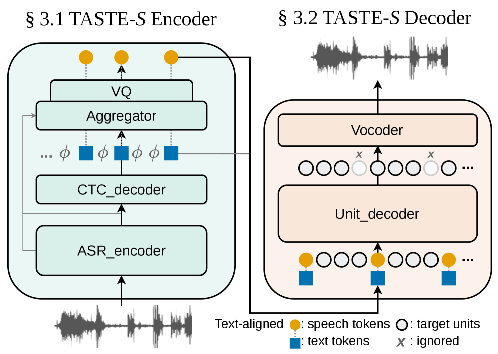
*Figure 2: The framework overivew of our TASTE-S Tokenizer. On the left shows the Encoder with CTC integrated; on the right illustrates the streaming pattern for a streamable Decoder.*

*Figure 3: Visualization results. Left: reconstruction remains nearly unchanged when using the ground-truth transcript versus the CTC transcript (blue/red mark their mismatched parts). Right: the aggregator shows clear text–speech aligned cross-attention, consistent with TASTE.*

---
**Usage Info**: 3379 tokens used.
**Generated at**: 2026-03-16 12:53:11

---

# 📚 DAST: A Dual-Stream Voice Anonymization Attacker with Staged Training

🚀 URL: https://arxiv.org/html/2603.12840

## 🌏 Abstract (원문)
Voice anonymization masks vocal traits while preserving linguistic content, which may still leak speaker-specific patterns. To assess and strengthen privacy evaluation, we propose a dual-stream attacker that fuses spectral and self-supervised learning features via parallel encoders with a three-stage training strategy. Stage I establishes foundational speaker-discriminative representations. Stage II leverages the shared identity-transformation characteristics of voice conversion and anonymization, exposing the model to diverse converted speech to build cross-system robustness. Stage III provides lightweight adaptation to target anonymized data. Results on the VoicePrivacy Attacker Challenge (VPAC) dataset demonstrate that Stage II is the primary driver of generalization, enabling strong attacking performance on unseen anonymization datasets. With Stage III, fine-tuning on only 10% of the target anonymization dataset surpasses current state-of-the-art attackers in terms of EER.111Full code and pretrained models are available athttp://redacted- for blind review..
## 🌏 Abstract (번역)
음성 익명화는 언어적 내용은 보존하면서 음성 특성을 가리지만, 여전히 화자 특정 패턴이 유출될 수 있습니다. 개인 정보 보호 평가를 강화하고 평가하기 위해, 우리는 병렬 인코더와 3단계 훈련 전략을 통해 스펙트럼 및 자기 지도 학습 특징을 융합하는 듀얼 스트림 공격자를 제안합니다. 1단계는 화자 식별 표현의 기반을 구축합니다. 2단계는 음성 변환과 익명화의 공유된 신원-변환 특성을 활용하여, 다양한 변환된 음성에 모델을 노출시켜 시스템 간 견고성을 구축합니다. 3단계는 대상 익명화 데이터에 대한 경량 적응을 제공합니다. VoicePrivacy Attacker Challenge (VPAC) 데이터셋에 대한 결과는 2단계가 일반화의 주요 동인임을 보여주며, 보지 못한 익명화 데이터셋에 대해 강력한 공격 성능을 가능하게 합니다. 3단계를 통해, 대상 익명화 데이터셋의 10%만으로 미세 조정하는 것이 EER 측면에서 현재 최첨단 공격자들을 능가합니다. 전체 코드와 사전 훈련된 모델은 블라인드 리뷰를 위해 http://redacted-에서 제공됩니다.

## 🔍 Methods & Results
- 제안된 시스템은 스펙트럼(Mel-filterbank) 및 자기 지도 학습(WavLM 기반) 특징을 병렬 인코더(ECAPA-TDNN)를 통해 융합하는 듀얼 스트림 아키텍처를 사용하며, 3단계 훈련 파이프라인으로 구성됩니다.
- 특징 추출은 Fbank 특징과 WavLM의 모든 트랜스포머 레이어에서 추출된 은닉 상태를 학습 가능한 가중치 합으로 결합한 SSL 특징을 사용합니다.
- 병렬 프레임 인코딩은 각 스트림(Fbank 및 SSL)에 전용 ECAPA-TDNN 인코더를 사용하여 각 특징 도메인에 특화된 학습을 가능하게 합니다.
- 중간 수준 융합은 인코딩된 두 스트림 특징을 요소별 곱셈(Hadamard product)으로 결합하여 SSL 스트림이 스펙트럼 스트림을 동적으로 재조정하여 화자 식별 패턴을 강조하고 변환으로 인한 아티팩트를 억제하도록 합니다.
- 1단계(화자 기반 사전 훈련)에서는 처리되지 않은 음성 데이터로 듀얼 스트림 아키텍처를 훈련하여 강력한 화자 식별 표현을 구축하며, WavLM 모델은 고정됩니다.
- 2단계(다양성 기반 도메인 훈련)에서는 다양한 음성 변환(VC) 시스템으로 생성된 변환된 음성 데이터를 사용하여 익명화로 인한 왜곡에 강건한 표현을 학습합니다. 이 단계는 일반화의 주요 동인으로 작용합니다.
- 3단계(작업별 적응)에서는 대상 익명화 데이터셋의 소량(예: 10%)으로 미세 조정을 통해 특정 익명화 시스템에 대한 경량 적응을 수행하여 공격 성능을 향상시킵니다.
- VoicePrivacy Attacker Challenge (VPAC) 데이터셋에 대한 실험 결과, 2단계는 보지 못한 익명화 데이터셋에 대한 강력한 공격 성능을 가능하게 하는 일반화의 주요 동인으로 확인되었습니다.
- 3단계에서 대상 익명화 데이터셋의 10%만으로 미세 조정했을 때, EER(Equal Error Rate) 측면에서 현재 최첨단 공격자들을 능가하는 성능을 달성했습니다.

## 🖼 Figures
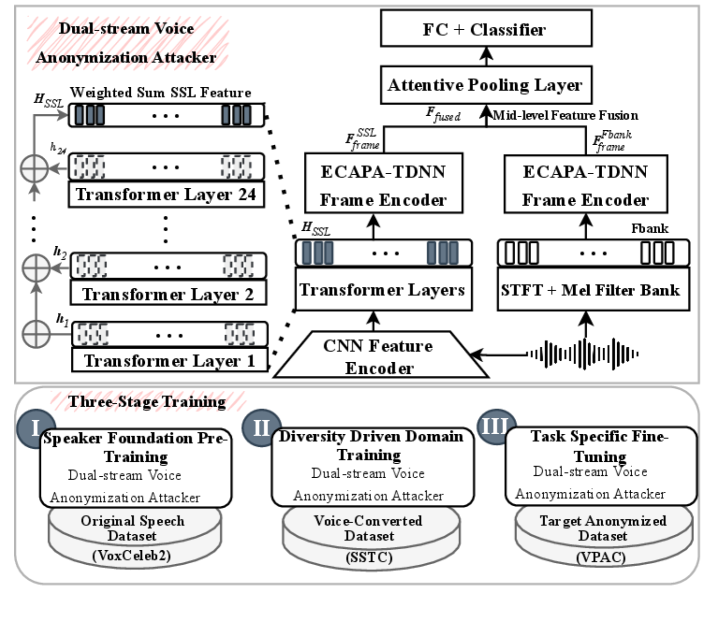
*Figure 1:Proposed Method: (top) dual-stream architecture with mid-level feature fusion (bottom) three stage training strategy*

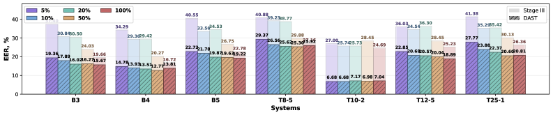
*Figure 2:Comparison of the DAST and Stage III EER, % on VPAC Benchmark for low-resource adaptation.*

---
**Usage Info**: 3282 tokens used.
**Generated at**: 2026-03-16 12:53:20

---

# 📚 Speech-Worthy Alignment for Japanese SpeechLLMs via Direct Preference Optimization

🚀 URL: https://arxiv.org/html/2603.12565

## 🌏 Abstract (원문)
SpeechLLMs typically combine ASR-trained encoders with text-based LLM backbones, leading them to inherit written-style output patterns unsuitable for text-to-speech synthesis. This mismatch is particularly pronounced in Japanese, where spoken and written registers differ substantially in politeness markers, sentence-final particles, and syntactic complexity. We propose a preference-based alignment approach to adapt Japanese SpeechLLMs forspeech-worthyoutputs: text that is concise, conversational, and readily synthesized as natural speech. To rigorously evaluate this task, we introduceSpokenElyza, a benchmark for Japanese speech-worthiness derived from ELYZA-tasks-100 with auditory verification by native experts. Experiments show that our approach achieves substantial improvement on SpokenElyza while largely preserving performance on the original written-style evaluation. We will release SpokenElyza to support future research on Japanese spoken dialog systems.
## 🌏 Abstract (번역)
SpeechLLM은 일반적으로 ASR 훈련 인코더와 텍스트 기반 LLM 백본을 결합하여, 텍스트 음성 변환(TTS)에 부적합한 문어체 출력 패턴을 계승합니다. 이러한 불일치는 특히 일본어에서 두드러지는데, 일본어는 구어체와 문어체가 경어 표현, 문장 종결 어미, 구문 복잡성에서 크게 다릅니다. 본 연구에서는 일본어 SpeechLLM을 간결하고 대화적이며 자연스러운 음성으로 쉽게 합성될 수 있는 '음성 적합(speech-worthy)' 출력에 맞게 조정하기 위한 선호도 기반 정렬 접근 방식을 제안합니다. 이 작업을 엄격하게 평가하기 위해, 원어민 전문가의 청각 검증을 거쳐 ELYZA-tasks-100에서 파생된 일본어 음성 적합성 벤치마크인 SpokenElyza를 소개합니다. 실험 결과, 우리의 접근 방식은 SpokenElyza에서 상당한 개선을 달성하면서도 원래의 문어체 평가 성능을 대부분 유지함을 보여주었습니다. 향후 일본어 음성 대화 시스템 연구를 지원하기 위해 SpokenElyza를 공개할 예정입니다.

## 🔍 Methods & Results
- 본 연구는 Whisper-large 인코더와 Sarashina-7B LLM을 결합한 Qwen2-Audio와 유사한 SpeechLLM 아키텍처를 사용한다.
- SpeechLLM이 지시를 따르는 능력을 유지하면서 음성 적합 출력을 생성하도록 적응시키는 것을 목표로 하며, 이를 선호도 최적화 문제로 정의한다.
- 별도의 보상 모델 없이 음성 적합 응답을 문어체 응답보다 선호하도록 정책을 직접 최적화하기 위해 DPO(Direct Preference Optimization)를 사용한다.
- 선택된 응답에 대한 DPO와 SFT(Supervised Fine-Tuning)를 결합한 훈련 방식을 사용하며, 전체 손실 함수는 DPO 손실과 SFT 손실의 가중 합으로 구성된다.
- 일본어 SpeechLLM의 음성 적합성을 엄격하게 평가하기 위한 새로운 고품질 벤치마크인 SpokenElyza를 도입한다.
- SpokenElyza는 ELYZA-tasks-100 데이터셋에서 파생되었으며, 비언어화 가능한 작업을 필터링하고(100개 중 36개), 강력한 LLM(gpt-oss-120B)을 사용하여 마크다운 제거, 정중한 구어체 변환, 복잡한 문장 단순화 등 음성 친화적인 제약 조건에 따라 응답을 재작성하는 4단계 큐레이션 파이프라인을 거쳤다(36개 중 34개).
- 재작성된 응답은 사내 TTS 시스템으로 합성되었고, 원어민 일본어 연구원이 청취하여 청각적 명료성을 보장하기 위한 수정 작업을 거쳤다.
- 평가 기준은 LLM-as-judge 프롬프트와 일관성을 유지하기 위해 절대 점수를 최대 점수 5점에서의 상대적 차감으로 표준화했다.
- 실험 결과, 제안된 접근 방식은 SpokenElyza에서 상당한 개선을 달성했으며, 원래의 문어체 평가 성능은 대부분 유지되었다.

## 🖼 Figures

*Figure 1:Overview of our speech-worthy alignment. SpeechLLM responses are aligned from written style (verbose, symbol-heavy) to spoken style (concise, conversational) for auditory comprehension and TTS synthesis. English translations at right; non-speech-worthy elements are highlighted in red.*

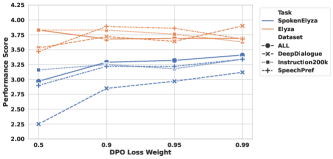
*Figure 2:Effect of DPO loss weight on LLM-as-Judge scores. Higher DPO weights improve SpokenElyza performance across all datasets. ALL: combination of all preference training datasets.*

---
**Usage Info**: 2898 tokens used.
**Generated at**: 2026-03-16 12:53:28

---

# 📚 Room Impulse Response Completion Using Signal-Prediction Diffusion Models Conditioned on Simulated Early Reflections

🚀 URL: https://arxiv.org/html/2603.12442

## 🌏 Abstract (원문)
Room impulse responses (RIRs) are fundamental to audio data augmentation, acoustic signal processing, and immersive audio rendering. While geometric simulators such as the image source method (ISM) can efficiently generate early reflections, they lack the realism of measured RIRs due to missing acoustic wave effects. We propose a diffusion-based RIR completion method using signal-prediction conditioned on ISM-simulated direct-path and early reflections. Unlike state-of-the-art methods, our approach imposes no fixed duration constraint on the input early reflections. We further incorporate classifier-free guidance to steer generation toward a target distribution learned from physically realistic RIRs simulated with the Treble SDK. Objective evaluation demonstrates that the proposed method outperforms a state-of-the-art baseline in early RIR completion and energy decay curve reconstruction.
## 🌏 Abstract (번역)
실내 임펄스 응답(RIR)은 오디오 데이터 증강, 음향 신호 처리 및 몰입형 오디오 렌더링에 필수적입니다. 이미지 소스 방법(ISM)과 같은 기하학적 시뮬레이터는 초기 반사를 효율적으로 생성할 수 있지만, 음향 파동 효과가 누락되어 측정된 RIR의 현실감이 부족합니다. 본 논문에서는 ISM으로 시뮬레이션된 직접 경로 및 초기 반사에 조건화된 신호 예측을 사용하는 확산 기반 RIR 완성 방법을 제안합니다. 최신 방법과 달리, 우리의 접근 방식은 입력 초기 반사에 고정된 지속 시간 제약을 두지 않습니다. 또한, Treble SDK로 시뮬레이션된 물리적으로 사실적인 RIR에서 학습된 목표 분포로 생성을 유도하기 위해 분류기 없는 가이던스(classifier-free guidance)를 통합합니다. 객관적인 평가는 제안된 방법이 초기 RIR 완성 및 에너지 감쇠 곡선 재구성에서 최신 기준선보다 우수한 성능을 보임을 입증합니다.

## 🔍 Methods & Results
- 확산 모델의 컨디셔너로 ISM 시뮬레이션 결과(c)를 사용하여 목표 RIR(x0)을 재구성하는 확산 기반 RIR 완성 방법을 제안한다.
- 순방향 확산 과정은 표준 가우시안 노이즈(epsilon_t)를 추가하고, 역방향 확산 과정에서는 재귀적으로 업데이트(x_t-1 = mu_theta(x_t, t) + sigma_t * epsilon_t)를 적용한다.
- RIR 예측을 위해 1D U-Net 아키텍처를 사용하며, ISM 기반 컨디셔닝 신호(c)를 노이즈 샘플(x_t)과 채널 차원을 따라 연결하여 입력([c, x_t])으로 사용한다.
- U-Net은 7개의 stride-2 다운샘플링을 통해 최대 32,768 RIR 샘플을 지원하고, 병목 구간에는 6개 레이어의 잔여 확장 Conv1D 스택(확장률 1,2,4,8,16,32)을 적용하여 장거리 시간 구조를 포착한다.
- 손실 함수는 예측된 RIR과 목표 RIR 간의 MSE 손실(L_MSE)과 슈뢰더의 역방향 적분을 기반으로 하는 EDC 손실(L_EDC)의 가중치 조합(L_total = L_MSE + lambda * L_EDC)으로 구성된다.
- 분류기 없는 가이던스(CFG)를 통합하여, 컨디셔너를 무작위로 0으로 대체함으로써 조건부 및 비조건부 모드에서 작동하는 단일 노이즈 제거 네트워크를 훈련한다.
- 추론 시 CFG는 각 역방향 단계에서 컨디셔닝 신호와 널 조건으로 두 번 평가하여, 결합된 예측(x_hat_0 = (1+s) * x_hat_0^c - s * x_hat_0^uc)을 생성한다.

## 🖼 Figures

*Figure 1:Examples of ISM conditioners with different maximum reflection orders 
1
,
3
,
5
,
7
 and the full RIR. The conditioners are truncated to 
80
 ms such that they can be used as inputs to both the proposed model and Echo2Reverb.*

*(a)A sample conditioner of order 
5
 and target RIRs.*

*(a)A sample conditioner of order 
5
 and target RIRs.*

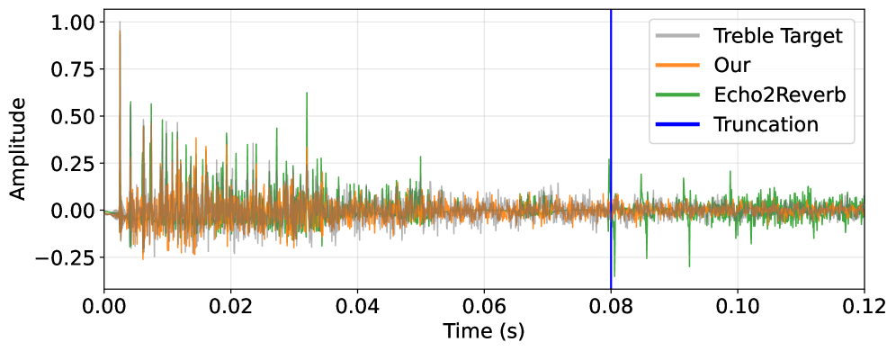
*(b)Target and predicted early RIRs.*

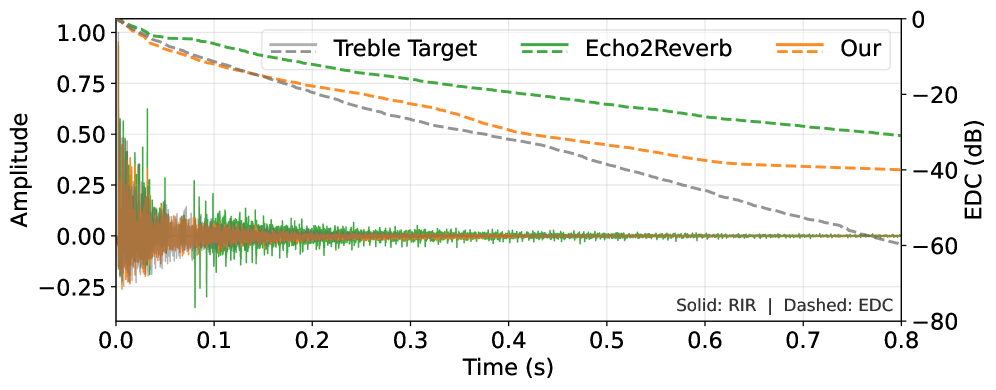
*(c)RIRs and EDCs of target and predicted RIRs.*

---
**Usage Info**: 3398 tokens used.
**Generated at**: 2026-03-16 12:53:38

---

