# 🚩 (2026-03-17) Scholar Inbox 추천 논문 

# 📚 Beyond Two-stage Diffusion TTS: Joint Structure and Content Refinement via Jump Diffusion

🚀 URL: https://arxiv.org/html/2603.14032

## 🌏 Abstract (원문)
Diffusion and flow matching TTS faces a tension between discrete temporal structure and continuous spectral modeling. Two-stage models diffuse on fixed alignments, often collapsing to mean prosody; single-stage models avoid explicit durations but suffer alignment instability. We propose a jump-diffusion framework where discrete jumps model temporal structure and continuous diffusion refines spectral content within one process. Even in its one-shot degenerate form, our framework achieves 3.37% WER vs. 4.38% for Grad-TTS with improved UTMOSv2 on LJSpeech. The full iterative UDD variant further enables adaptive prosody, autonomously inserting natural pauses in out-of-distribution slow speech rather than stretching uniformly. Audio samples are available athttps://anonymousinterpseech.github.io/TTS_Demo/.
## 🌏 Abstract (번역)
확산 및 플로우 매칭 TTS는 이산적인 시간 구조와 연속적인 스펙트럼 모델링 사이의 긴장 상태에 직면합니다. 2단계 모델은 고정된 정렬에 따라 확산되어 종종 평균 운율로 붕괴됩니다. 단일 단계 모델은 명시적인 길이를 피하지만 정렬 불안정성에 시달립니다. 우리는 이산적인 점프가 시간 구조를 모델링하고 연속적인 확산이 하나의 프로세스 내에서 스펙트럼 내용을 정제하는 점프-확산 프레임워크를 제안합니다. 심지어 단일 샷 퇴화 형태에서도, 우리의 프레임워크는 LJSpeech에서 Grad-TTS의 4.38% WER 대비 3.37% WER을 달성하며 개선된 UTMOSv2를 보여줍니다. 완전한 반복 UDD 변형은 더 나아가 적응형 운율을 가능하게 하여, 분포 외 느린 발화에서 균일하게 늘리는 대신 자연스러운 일시 정지를 자율적으로 삽입합니다. 오디오 샘플은 https://anonymousinterpseech.github.io/TTS_Demo/ 에서 확인할 수 있습니다.

## 🔍 Methods & Results
- 제안된 프레임워크는 점프-확산 개념을 TTS에 적용하여, 시간 프레임 삽입을 위한 위치 예측기(Location Predictor), 프레임 내용 생성을 위한 내용 예측기(Content Predictor), 그리고 스펙트럼 정제를 위한 표준 확산 단계를 활용합니다.
- 순방향 프로세스는 멜-스펙트로그램(x0)을 구조적 손상(전화(phone)의 첫 프레임으로 구성된 보호된 세트를 기반으로 한 프레임 삭제)과 스펙트럼 손상(가우시안 노이즈 추가)을 결합하여 가변 길이 잠재 상태(xt)로 변환합니다.
- 역방향 프로세스는 압축된 전화 수준 상태(x1)에서 시작하여, 이산적인 구조적 점프(위치 및 내용 예측기를 통해 프레임 삽입)와 연속적인 스펙트럼 확산 단계를 번갈아 수행하며 목표 길이(Ltarget)까지 점진적으로 시퀀스를 확장합니다.
- 이 프레임워크는 Grad-TTS의 사전 훈련된 텍스트 인코더와 U-Net 확산 백본을 재사용하며, 삭제된 프레임을 재구성하는 양방향 트랜스포머 인코더 기반의 내용 예측기와 최적의 삽입 위치를 식별하는 트랜스포머 기반의 위치 예측기를 추가합니다.
- Upsample–Diffuse–Downsample (UDD) 전략은 가변 길이 상태를 고정 길이 캔버스로 확장하고, 확산을 적용한 후, 원래 열만 유지하여 다운샘플링함으로써 시간 구조와 스펙트럼 내용의 반복적인 공동 정제를 가능하게 합니다.
- 모든 삽입이 단일 단계에서 발생하는 원샷(one-shot) 변형은 Grad-TTS의 회귀 기반 길이 예측기를 분류 기반 대안으로 대체합니다.
- 원샷 변형은 LJSpeech 데이터셋에서 Grad-TTS의 4.38% WER 대비 3.37% WER을 달성했으며, UTMOSv2 점수도 향상되었습니다.
- 완전한 반복 UDD 변형은 적응형 운율을 가능하게 하여, 분포 외 느린 발화에서 균일하게 늘리는 대신 자연스러운 일시 정지를 자율적으로 삽입합니다.

## 🖼 Figures
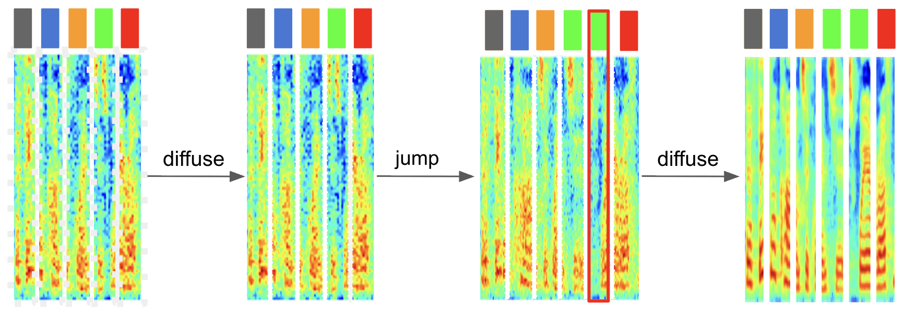
*Figure 1: jump diffusion process for Mel-spectrograms.*

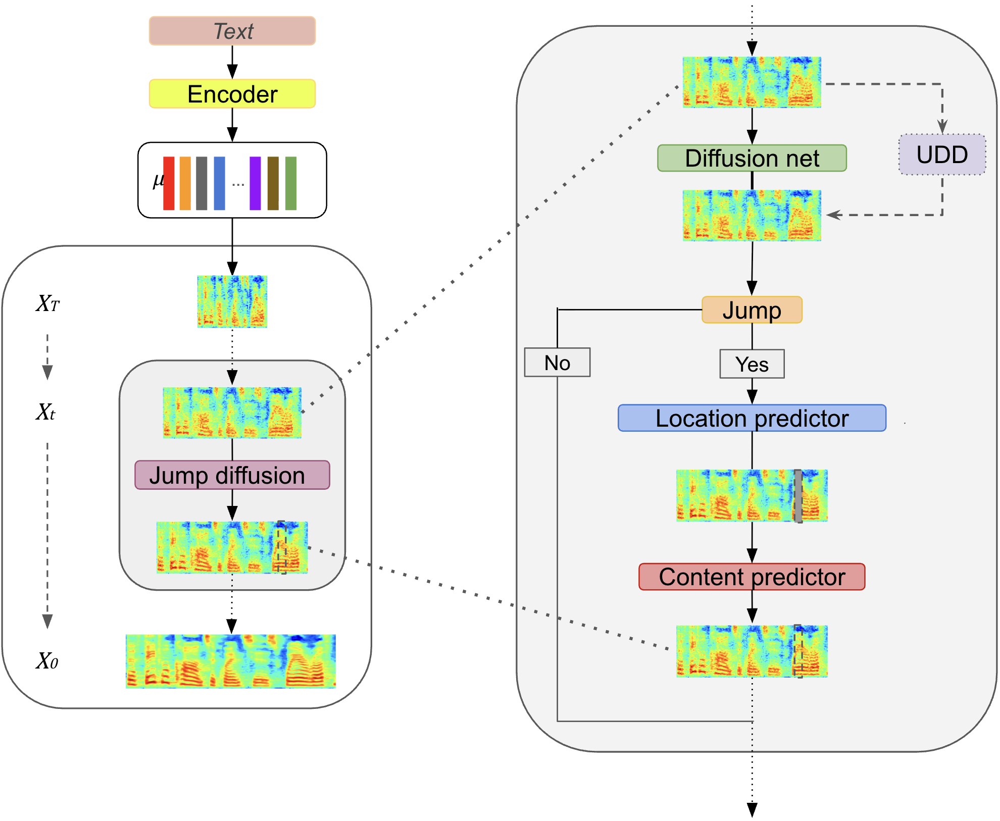
*Figure 2:Inference pipeline. Starting from a noisy and incomplete phone-level state, the model iteratively performs jumps and diffusion.*

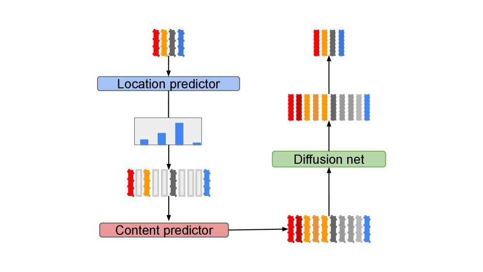
*Figure 3:Upsample–Diffuse–Downsample (UDD).*

*Figure 4:DTW alignment paths at 
0.75
×
 speed.*

*Figure 5:Example Mel-spectrograms at 
0.75
×
 speed.*

---
**Usage Info**: 4227 tokens used.
**Generated at**: 2026-03-17 12:50:53

---

# 📚 VoXtream2: Full-stream TTS with dynamic speaking rate control

🚀 URL: https://arxiv.org/html/2603.13518

## 🌏 Abstract (원문)
Full-stream text-to-speech (TTS) for interactive systems must start speaking with minimal delay while remaining controllable as text arrives incrementally. We present VoXtream2, a zero-shot full-stream TTS model with dynamic speaking-rate control that can be updated mid-utterance on the fly. VoXtream2 combines a distribution matching mechanism over duration states with classifier-free guidance across conditioning signals to improve controllability and synthesis quality. Prompt-text masking enables textless audio prompting, removing the need for prompt transcription. Across standard zero-shot benchmarks and a dedicated speaking-rate test set, VoXtream2 achieves competitive objective and subjective results against public baselines despite a smaller model and less training data. In full-stream mode, it runs 4 times faster than real time with 74
ms first-packet latency on a consumer GPU.
## 🌏 Abstract (번역)
대화형 시스템을 위한 풀스트림 TTS(Text-to-Speech)는 텍스트가 점진적으로 도착함에 따라 제어 가능성을 유지하면서 최소한의 지연으로 발화를 시작해야 합니다. 본 논문에서는 발화 도중 실시간으로 업데이트될 수 있는 동적 발화 속도 제어 기능을 갖춘 제로샷 풀스트림 TTS 모델인 VoXtream2를 소개합니다. VoXtream2는 제어 가능성과 합성 품질을 향상시키기 위해 지속 시간 상태에 대한 분포 일치 메커니즘과 컨디셔닝 신호 전반에 걸친 분류기 없는 가이던스를 결합합니다. 프롬프트 텍스트 마스킹은 텍스트 없는 오디오 프롬프팅을 가능하게 하여 프롬프트 전사의 필요성을 없앱니다. 표준 제로샷 벤치마크와 전용 발화 속도 테스트 세트에서 VoXtream2는 더 작은 모델과 적은 훈련 데이터에도 불구하고 공개된 기준 모델 대비 경쟁력 있는 객관적 및 주관적 결과를 달성합니다. 풀스트림 모드에서 이 모델은 소비자 GPU에서 74ms의 첫 패킷 지연 시간으로 실시간보다 4배 빠르게 실행됩니다.

## 🔍 Methods & Results
- VoXtream2는 기존 VoXtream 모델을 기반으로 하며, 이전 모델의 한계를 개선하고 발화 속도 제어(SRC) 메커니즘을 추가했습니다.
- 모델 아키텍처는 점진적 음소 트랜스포머(PT), 자기회귀 시간 트랜스포머(TT), 자기회귀 깊이 트랜스포머(DT)로 구성됩니다.
- PT는 다국어 생성을 위해 IPA 사전을 사용하고, 더 나은 운율을 위해 최대 예측 범위(look-ahead size)를 25음소로 늘렸습니다.
- TT는 Mimi 오디오 토큰(12.5 Hz)과 PT 출력을 조건으로 의미 및 지속 시간 토큰을 예측하며, 세분화된 지속 시간 제어를 위해 6개의 지속 시간 토큰을 사용합니다.
- DT는 TT 출력, 화자 임베딩, 의미 토큰을 조건으로 Mimi 음향 토큰을 예측하며, 더 나은 음성 품질을 위해 16개의 코드북을 사용합니다.
- 구두점 처리를 위해 구두점 기호를 별도의 음소 토큰으로 PT에 추가한 후 TT에 공급하기 전에 제거하여, TT가 구두점의 문맥 정보를 얻으면서 음소의 지속 시간만 모델링하도록 했습니다.
- TT와 DT는 교차 엔트로피 손실을 통해 공동으로 최적화됩니다.
- 프롬프트 텍스트 마스킹을 통해 텍스트 없는 오디오 프롬프팅이 가능하며, 훈련 중에는 텍스트 접두사를 `<UNK>` 토큰으로 마스킹하고 생성 시에는 각 음향 프레임에 단일 `<UNK>` 토큰을 할당합니다. 이는 정렬기 오류를 해결하고 다국어 기능을 지원합니다.
- 분류기 없는 가이던스(CFG)는 모든 컨디셔닝 신호에 적용되며, TT에는 `gamma_temp=1.5`, DT에는 `gamma_depth=3.0`을 사용하여 각각 운율 변화와 화자 음성 제어를 강화했습니다.
- CFG 적용 시 신호 품질 저하를 완화하기 위해 Sidon 모델을 사용하여 음향 프롬프트를 향상시켰습니다.
- 동적 발화 속도 제어(SRC)는 지속 시간 상태에 대한 분포 일치 전략을 사용합니다. 목표 SPS(초당 음절 수)와 관련된 지속 시간 상태를 컨디셔닝 입력으로 사용하여 예측된 지속 시간 분포를 업데이트합니다.
- SRC 강도는 `beta` 매개변수(`beta=5`로 설정)로 제어되며, 발화 속도 증가를 피하기 위해 지속 시간 상태에는 CFG를 적용하지 않습니다.
- 느린 발화 속도에서 자연스러움을 향상시키기 위해 훈련 중 음소 지속 시간 연장을 통해 암묵적인 필러 단어 생성을 유도합니다.
- VoXtream2는 더 작은 모델과 적은 훈련 데이터에도 불구하고 표준 제로샷 벤치마크 및 전용 발화 속도 테스트 세트에서 경쟁력 있는 객관적 및 주관적 결과를 달성했습니다.
- 풀스트림 모드에서 소비자 GPU에서 실시간보다 4배 빠르게 실행되며, 첫 패킷 지연 시간은 74ms입니다.

## 🖼 Figures
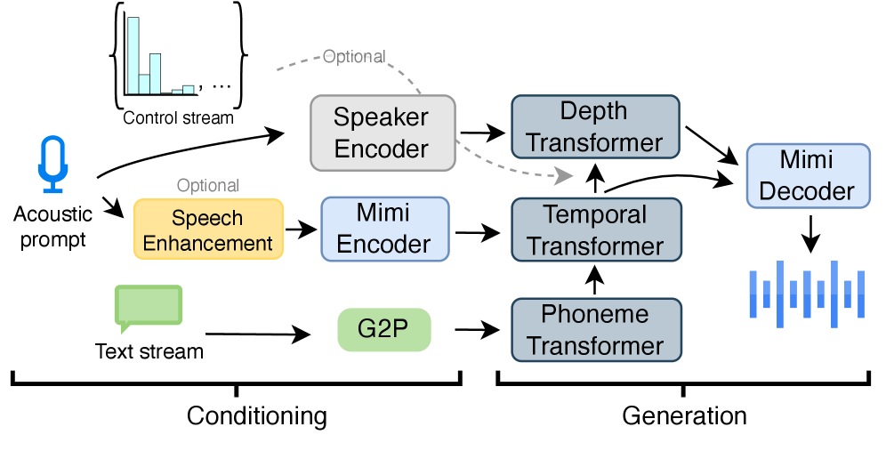
*Figure 1:Overview of VoXtream2 architecture.*

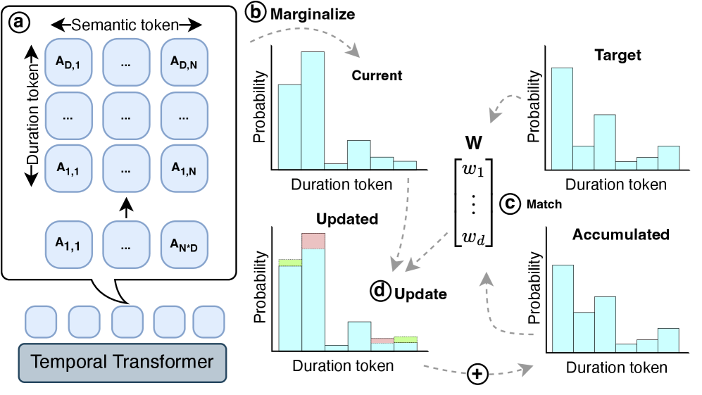
*Figure 2:Speaking rate control mechanism.*

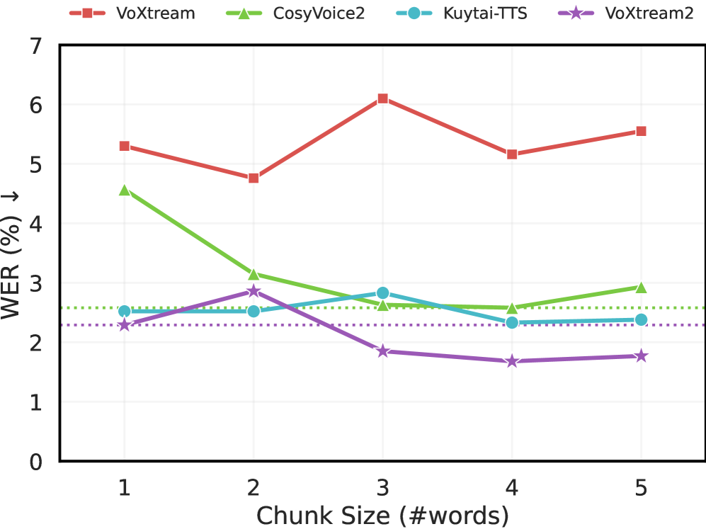
*Figure 3:Evaluation of text chunk size in a full-stream.*

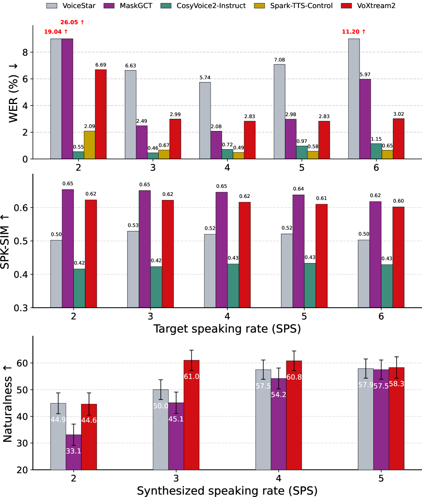
*Figure 4:Comparison of different TTS models across various speaking rates for utterance-level control.*

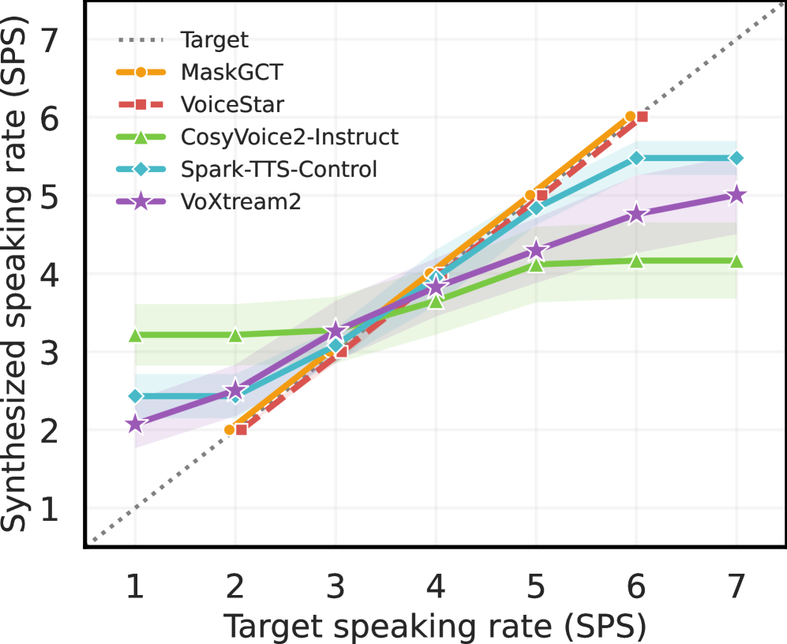
*Figure 6:Correlation between target and synthesized speaking rates across different TTS models.*

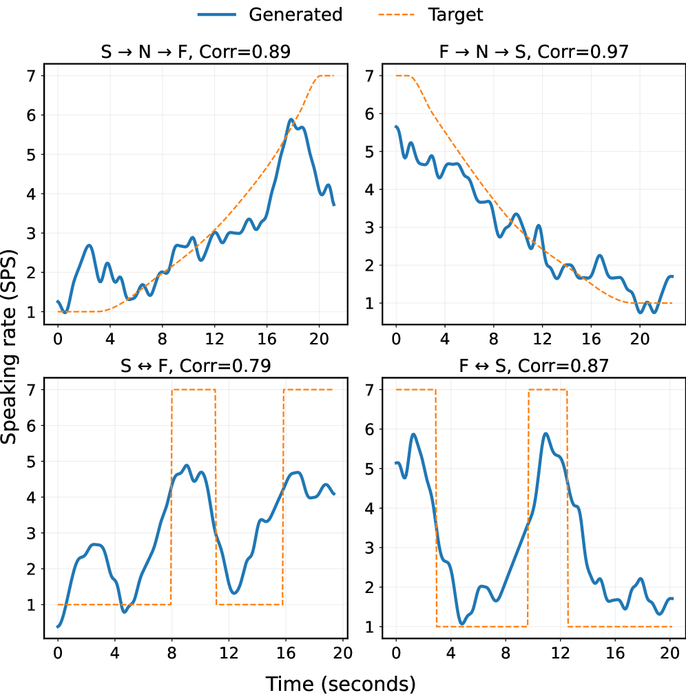
*Figure 8:Examples of dynamic speaking rate control. S, N, and F denote Slow, Normal, and Fast target speaking rates.*

*Figure 9:Influence of the CFG 
𝛾
 on the speaking rate control.*

---
**Usage Info**: 4785 tokens used.
**Generated at**: 2026-03-17 12:53:37

---

# 📚 CodecMOS-Accent: A MOS Benchmark of Resynthesized and TTS Speech from Neural Codecs Across English Accents

🚀 URL: https://arxiv.org/html/2603.14328

## 🌏 Abstract (원문)
We present the CodecMOS-Accent dataset, a mean opinion score (MOS) benchmark designed to evaluate neural audio codec (NAC) models and the large language model (LLM)-based text-to-speech (TTS) models trained upon them, especially across non-standard speech like accented speech. The dataset comprises 4,000 codec resynthesis and TTS samples from 24 systems, featuring 32 speakers spanning ten accents. A large-scale subjective test was conducted to collect 19,600 annotations from 25 listeners across three dimensions: naturalness, speaker similarity, and accent similarity. This dataset does not only represent an up-to-date study of recent speech synthesis system performance but reveals insights including a tight relationship between speaker and accent similarity, the predictive power of objective metrics, and a perceptual bias when listeners share the same accent with the speaker. This dataset is expected to foster research on more human-centric evaluation for NAC and accented TTS.
## 🌏 Abstract (번역)
본 논문은 신경 오디오 코덱(NAC) 모델과 이를 기반으로 훈련된 대규모 언어 모델(LLM) 기반 텍스트-음성 변환(TTS) 모델, 특히 악센트가 있는 비표준 음성 전반에 걸쳐 평가하도록 설계된 평균 의견 점수(MOS) 벤치마크인 CodecMOS-Accent 데이터셋을 제시합니다. 이 데이터셋은 24개 시스템에서 생성된 4,000개의 코덱 재합성 및 TTS 샘플로 구성되며, 10가지 악센트를 가진 32명의 화자를 포함합니다. 대규모 주관적 테스트를 통해 25명의 청취자로부터 자연스러움, 화자 유사성, 악센트 유사성의 세 가지 차원에 걸쳐 19,600개의 주석을 수집했습니다. 이 데이터셋은 최신 음성 합성 시스템 성능에 대한 최신 연구를 나타낼 뿐만 아니라, 화자 유사성과 악센트 유사성 간의 밀접한 관계, 객관적 지표의 예측력, 그리고 청취자가 화자와 동일한 악센트를 공유할 때 발생하는 지각적 편향을 포함한 통찰력을 밝혀냅니다. 이 데이터셋은 NAC 및 악센트 TTS에 대한 보다 인간 중심적인 평가 연구를 촉진할 것으로 기대됩니다.

## 🔍 Methods & Results
- 신경 오디오 코덱(NAC) 모델 및 LLM 기반 텍스트-음성 변환(TTS) 모델을 악센트 음성 등 비표준 음성에서 평가하기 위한 CodecMOS-Accent 데이터셋을 제시함.
- 데이터셋은 24개 시스템에서 생성된 4,000개의 코덱 재합성 및 TTS 샘플로 구성되며, 10가지 악센트를 가진 32명의 화자를 포함함.
- 25명의 청취자로부터 자연스러움, 화자 유사성, 악센트 유사성 세 가지 차원에 걸쳐 19,600개의 주관적 평가(MOS)를 수집하는 대규모 테스트를 수행함.
- 화자 유사성과 악센트 유사성 간의 밀접한 관계를 발견함.
- 객관적 지표의 예측력을 확인하고, 청취자와 화자가 동일한 악센트를 공유할 때 지각적 편향이 발생함을 밝힘.

---
**Usage Info**: 1607 tokens used.
**Generated at**: 2026-03-17 12:57:50

---

# 📚 AC-Foley: Reference-Audio-Guided Video-to-Audio Synthesis with Acoustic Transfer

🚀 URL: https://arxiv.org/html/2603.15597

## 🌏 Abstract (원문)
Existing video-to-audio (V2A) generation methods predominantly rely on text prompts alongside visual information to synthesize audio. However, two critical bottlenecks persist: semantic granularity gaps in training data (e.g., conflating acoustically distinct sounds like different dog barks under coarse labels), and textual ambiguity in describing microacoustic features (e.g., "metallic clang" failing to distinguish impact transients and resonance decay). These bottlenecks make it difficult to perform fine-grained sound synthesis using text-controlled modes. To address these limitations, we proposeAC-Foley, an audio-conditioned V2A model that directly leverages reference audio to achieve precise and fine-grained control over generated sounds. This approach enables: fine-grained sound synthesis (e.g., footsteps with distinct timbres on wood, marble, or gravel), timbre transfer (e.g., transforming a violin’s melody into the bright, piercing tone of a suona), zero-shot generation of sounds (e.g., creating unique weapon sound effects without training on firearm datasets) and better audio quality. By directly conditioning on audio signals, our approach bypasses the semantic ambiguities of text descriptions while enabling precise manipulation of acoustic attributes. Empirically, AC-Foley achieves state-of-the-art performance for Foley generation when conditioned on reference audio, while remaining competitive with state-of-the-art video-to-audio methods even without audio conditioning.
## 🌏 Abstract (번역)
기존의 비디오-오디오(V2A) 생성 방법은 주로 시각 정보와 함께 텍스트 프롬프트에 의존하여 오디오를 합성합니다. 그러나 두 가지 중요한 병목 현상이 지속됩니다: 훈련 데이터의 의미론적 세분성 격차(예: 거친 레이블 아래에서 다른 개 짖는 소리와 같이 음향적으로 구별되는 소리를 혼동하는 것), 그리고 미세 음향 특징을 설명하는 텍스트의 모호성(예: "금속성 쨍그랑"이 충격 과도 현상과 공명 감쇠를 구별하지 못하는 것). 이러한 병목 현상으로 인해 텍스트 제어 모드를 사용하여 미세한 사운드 합성을 수행하기 어렵습니다. 이러한 한계를 해결하기 위해, 우리는 생성된 사운드에 대한 정밀하고 세밀한 제어를 달성하기 위해 참조 오디오를 직접 활용하는 오디오 조건부 V2A 모델인 AC-Foley를 제안합니다. 이 접근 방식은 다음을 가능하게 합니다: 미세한 사운드 합성(예: 나무, 대리석 또는 자갈 위에서 뚜렷한 음색을 가진 발자국), 음색 전이(예: 바이올린 멜로디를 쑤오나의 밝고 날카로운 음색으로 변환), 제로샷 사운드 생성(예: 총기 데이터셋으로 훈련하지 않고도 독특한 무기 음향 효과 생성) 및 더 나은 오디오 품질. 오디오 신호에 직접 조건을 부여함으로써, 우리의 접근 방식은 텍스트 설명의 의미론적 모호성을 우회하면서 음향 속성의 정밀한 조작을 가능하게 합니다. 경험적으로, AC-Foley는 참조 오디오에 조건을 부여했을 때 폴리(Foley) 생성에서 최첨단 성능을 달성하며, 오디오 조건이 없어도 최첨단 비디오-오디오 방법과 경쟁력을 유지합니다.

## 🔍 Methods & Results
- 기존 V2A 방법의 한계점: 훈련 데이터의 의미론적 세분성 격차와 미세 음향 특징을 설명하는 텍스트의 모호성으로 인해 미세한 사운드 합성이 어려움.
- 제안 모델: AC-Foley는 참조 오디오를 직접 활용하여 생성된 사운드를 정밀하고 세밀하게 제어하는 오디오 조건부 V2A 모델임.
- 핵심 메커니즘: 오디오 신호에 직접 조건을 부여하여 텍스트 설명의 의미론적 모호성을 우회하고 음향 속성을 정밀하게 조작함.
- 주요 기능 및 응용: 미세한 사운드 합성(예: 다양한 표면의 발자국), 음색 전이(예: 바이올린 멜로디를 쑤오나 음색으로 변환), 제로샷 사운드 생성(예: 훈련 없이 독특한 무기 사운드 생성), 그리고 향상된 오디오 품질.
- 성능: 참조 오디오 조건 시 폴리(Foley) 생성에서 최첨단(SOTA) 성능을 달성했으며, 오디오 조건 없이도 기존 SOTA V2A 방법과 경쟁력을 유지함.

## 🖼 Figures
![Figure 1:AC-Foley for conditional Foley generation with audio controls. (a) Fine-grained sound synthesis: AC-Foley generates precise audio from a silent dog video based on reference sounds, such as a Chihuahua’s or a big dog’s bark. (b) Timbre transfer: Given a silent lion video, AC-Foley produces different audio outputs conditioned on reference sounds, such as sheep bleating or a cat meowing. (c) Zero-shot generation: Given a silent gunshot video, AC-Foley generates a gunshot with a silencer with reference audio, while a text prompt fails to do so.](../images/2026-03-17/2603.15597/2603.15597_fig0.png)
*Figure 1:AC-Foley for conditional Foley generation with audio controls. (a) Fine-grained sound synthesis: AC-Foley generates precise audio from a silent dog video based on reference sounds, such as a Chihuahua’s or a big dog’s bark. (b) Timbre transfer: Given a silent lion video, AC-Foley produces different audio outputs conditioned on reference sounds, such as sheep bleating or a cat meowing. (c) Zero-shot generation: Given a silent gunshot video, AC-Foley generates a gunshot with a silencer with reference audio, while a text prompt fails to do so.*

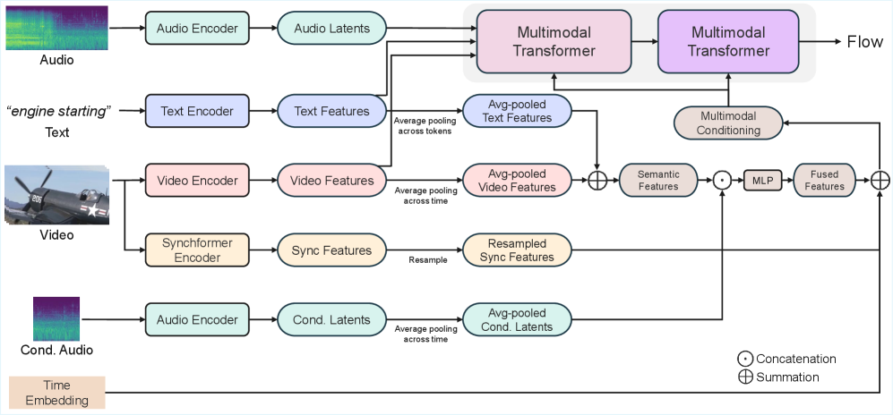
*Figure 2:Overview of our method. Different modalities (video, text, and audio) jointly interact in the multimodal transformer network. Multimodal conditioning with audio injects semantic, temporal and acoustic information for more precise control.*

![Figure 3:Illustration of the two-stage training process for audio generation. (a) Stage I: Overlapping Conditioning. The random 2 seconds of the 8-second target audio are used as the conditional audio, allowing the model to learn the utilization of acoustic features from overlapping audio segments. (b) Stage II: Non-overlapping Conditioning. The non-overlapping last 2 seconds of the 10-second video clip are used as the conditional audio, leveraging inherent audio self-similarity within the video to enhance model generalization.](../images/2026-03-17/2603.15597/2603.15597_fig2.png)
*Figure 3:Illustration of the two-stage training process for audio generation. (a) Stage I: Overlapping Conditioning. The random 2 seconds of the 8-second target audio are used as the conditional audio, allowing the model to learn the utilization of acoustic features from overlapping audio segments. (b) Stage II: Non-overlapping Conditioning. The non-overlapping last 2 seconds of the 10-second video clip are used as the conditional audio, leveraging inherent audio self-similarity within the video to enhance model generalization.*

*Figure 4:Qualitative examples of Foley generation with audio conditioning. We present generated results for two videos, each paired with three distinct conditional audio inputs. These examples highlight our model’s ability to generate synchronized audio while adapting to varying acoustic characteristics, effectively demonstrating the impact of audio control.*

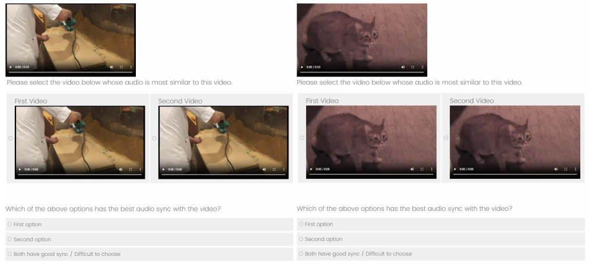
*Figure 5:Screenshot of user study survey.*

---
**Usage Info**: 1816 tokens used.
**Generated at**: 2026-03-17 12:58:02

---

# 📚 DiFlowDubber: Discrete Flow Matching for Automated Video Dubbing via Cross-Modal Alignment and Synchronization

🚀 URL: https://arxiv.org/html/2603.14267

## 🌏 Abstract (원문)
Video dubbing has broad applications in filmmaking, multimedia creation, and assistive speech technology. Existing approaches either train directly on limited dubbing datasets or adopt a two-stage pipeline that adapts pre-trained text-to-speech (TTS) models, which often struggle to produce expressive prosody, rich acoustic characteristics, and precise synchronization. To address these issues, we proposeDiFlowDubberwith a novel two-stage training framework that effectively transfers knowledge from a pre-trained TTS model to video-driven dubbing, with a discrete flow matching generative backbone. Specifically, we design a FaPro module that captures global prosody and stylistic cues from facial expressions and leverages this information to guide the modeling of subsequent speech attributes. To ensure precise speech-lip synchronization, we introduce a Synchronizer module that bridges the modality gap among text, video, and speech, thereby improving cross-modal alignment and generating speech that is temporally synchronized with lip movements. Experiments on two primary benchmark datasets demonstrate that DiFlowDubber outperforms previous methods across multiple metrics.
## 🌏 Abstract (번역)
비디오 더빙은 영화 제작, 멀티미디어 생성 및 보조 음성 기술에 광범위하게 응용됩니다. 기존 접근 방식은 제한된 더빙 데이터셋으로 직접 훈련하거나, 사전 훈련된 텍스트 음성 변환(TTS) 모델을 적용하는 2단계 파이프라인을 채택하는데, 이는 종종 표현력이 풍부한 운율, 풍부한 음향 특성 및 정밀한 동기화를 생성하는 데 어려움을 겪습니다. 이러한 문제를 해결하기 위해, 우리는 사전 훈련된 TTS 모델의 지식을 비디오 기반 더빙으로 효과적으로 전달하는 새로운 2단계 훈련 프레임워크와 이산 흐름 매칭 생성 백본을 갖춘 DiFlowDubber를 제안합니다. 구체적으로, 우리는 얼굴 표정에서 전역 운율 및 스타일적 단서를 포착하고 이 정보를 활용하여 후속 음성 속성 모델링을 안내하는 FaPro 모듈을 설계합니다. 정밀한 음성-입술 동기화를 보장하기 위해, 텍스트, 비디오 및 음성 간의 양식 간극을 연결하여 교차 모달 정렬을 개선하고 입술 움직임과 시간적으로 동기화된 음성을 생성하는 Synchronizer 모듈을 도입합니다. 두 가지 주요 벤치마크 데이터셋에 대한 실험은 DiFlowDubber가 여러 지표에서 이전 방법들보다 우수한 성능을 보임을 입증합니다.

## 🔍 Methods & Results
- DiFlowDubber는 사전 훈련된 TTS 모델의 지식을 비디오 기반 더빙으로 효과적으로 전달하는 새로운 2단계 훈련 프레임워크를 제안합니다.
- 1단계에서는 운율, 내용, 음향 특성을 포함한 복잡한 음성 속성을 제어하고 모델링하는 제로샷 TTS 시스템을 사전 훈련합니다. 이 시스템은 Discrete Flow-Based Prosody-Acoustic (DFPA) 생성 백본과 FACodec을 활용하여 음성 토큰을 추출합니다.
- 2단계에서는 사전 훈련된 TTS 모델을 비디오 더빙 도메인에 적용하며, 시각적 단서를 통합하기 위해 FaPro 모듈과 Synchronizer 모듈을 사용합니다.
- FaPro (Facial Expression-to-Prosody) 모듈은 얼굴 표정에서 전역 운율 및 스타일적 단서를 포착하여 음성의 운율 잠재 표현을 생성합니다.
- Synchronizer 모듈은 텍스트, 비디오, 음성 간의 양식 간극을 연결하고, 비디오-텍스트 및 음성-텍스트 이중 정렬 메커니즘을 통해 정밀한 음성-입술 동기화를 보장합니다. 이는 교차 어텐션 트랜스포머와 대조 손실을 사용합니다.
- Content-Consistent Temporal Adaptation (CCTA)은 TTS 도메인에서 의미론적 내용 지식을 전달하고, Synchronizer 모듈을 통합하며, 교사(TTS) 모델과 학생(더빙) 모델 간의 증류 손실을 적용하여 시간적 동기화와 의미론적 일관성을 보장합니다.
- DFPA 모델링은 사전 훈련된 DFPA 디노이저를 미세 조정하여 FaPro에서 얻은 전역 운율 사전 정보와 CCTA에서 얻은 운율-내용 상관관계 단서를 제어 신호로 통합하여 표현력이 풍부한 운율 및 음향 생성을 가능하게 합니다.
- 전체 손실 함수는 이산 흐름 매칭, 비디오-텍스트 정렬, 음성-텍스트 정렬, 증류, 내용 예측 및 보조 CTC 손실을 통합합니다.
- DiFlowDubber는 두 가지 주요 벤치마크 데이터셋에서 여러 지표에 걸쳐 이전 방법들보다 우수한 성능을 보였습니다.

## 🖼 Figures
![Figure 1:Overall inference pipeline of DiFlowDubber. The Face-to-Prosody Mapper module predicts global prosody priors that capture global prosody and stylistic cues from facial expressions. The Content-Consistent Temporal Adaptation module generates discrete content tokens conditioned on lip movements, text, and prosody priors, ensuring consistent with the target text transcription and temporal alignment. Discrete Flow-based Prosody-Acoustic module generates diverse yet globally consistent prosody tokens under the guidance of the prosody prior, together with corresponding acoustic tokens. The speech waveform is synthesized from the predicted tokens and speaker embedding via a Codec Decoder.](../images/2026-03-17/2603.14267/2603.14267_fig0.png)
*Figure 1:Overall inference pipeline of DiFlowDubber. The Face-to-Prosody Mapper module predicts global prosody priors that capture global prosody and stylistic cues from facial expressions. The Content-Consistent Temporal Adaptation module generates discrete content tokens conditioned on lip movements, text, and prosody priors, ensuring consistent with the target text transcription and temporal alignment. Discrete Flow-based Prosody-Acoustic module generates diverse yet globally consistent prosody tokens under the guidance of the prosody prior, together with corresponding acoustic tokens. The speech waveform is synthesized from the predicted tokens and speaker embedding via a Codec Decoder.*

![Figure 2:Pipeline of the proposed DiFlowDubber. Our framework comprises a two-stage pipeline. The first stage performs zero-shot TTS pre-training, where a simple deterministic content modeling architecture efficiently captures linguistic structure (orange dashed box). For prosody and acoustic attributes, we adopt the (b) Discrete Flow-Based Prosody-Acoustic (DFPA) module to model expressive prosodic variations and realistic acoustic diversity from the corpus. In the second stage, the model is adapted to V2C task. The (a) Content-Consistent Temporal Adaptation (CCTA) module transfers consistent content knowledge from the TTS domain and generates temporally aligned content representations, while the FaPro module extracts a global prosody prior from facial expression cues. The DFPA module then models the joint distribution of prosody and acoustic tokens conditioned on the prosody prior and latent content representations.](../images/2026-03-17/2603.14267/2603.14267_fig1.png)
*Figure 2:Pipeline of the proposed DiFlowDubber. Our framework comprises a two-stage pipeline. The first stage performs zero-shot TTS pre-training, where a simple deterministic content modeling architecture efficiently captures linguistic structure (orange dashed box). For prosody and acoustic attributes, we adopt the (b) Discrete Flow-Based Prosody-Acoustic (DFPA) module to model expressive prosodic variations and realistic acoustic diversity from the corpus. In the second stage, the model is adapted to V2C task. The (a) Content-Consistent Temporal Adaptation (CCTA) module transfers consistent content knowledge from the TTS domain and generates temporally aligned content representations, while the FaPro module extracts a global prosody prior from facial expression cues. The DFPA module then models the joint distribution of prosody and acoustic tokens conditioned on the prosody prior and latent content representations.*

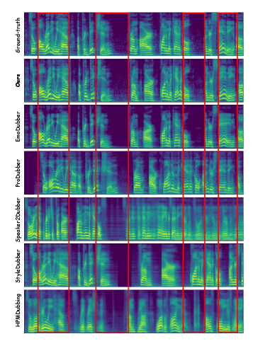
*Figure 3:Mel-spectrogram visualization compared with Ground Truth (GT) speech.*

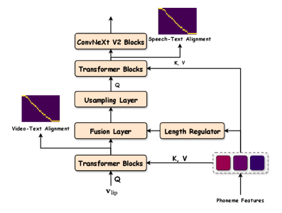
*Figure 4:The detailed architecture of Synchronizer.*

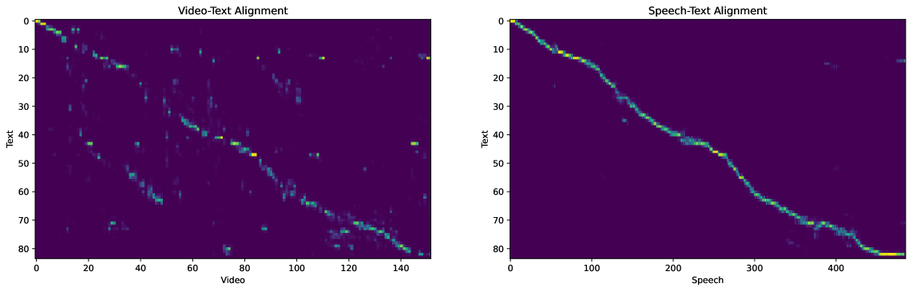
*Figure 5:Alignment visualization of the Synchronizer. Left: Video-Text alignment matrix. Right: Speech-Text alignment matrix.*

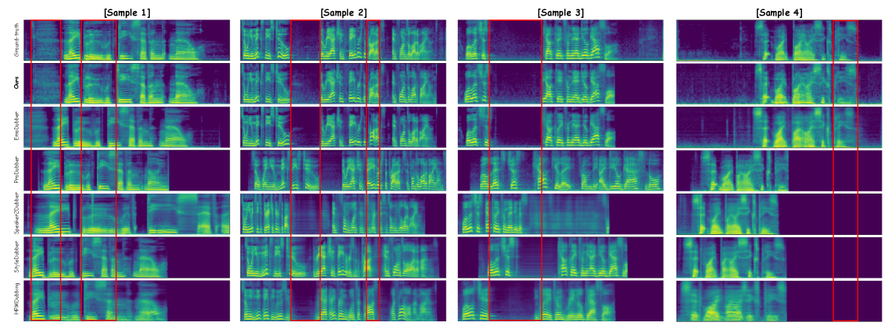
*Figure 6:Qualitative comparison of mel-spectrograms. Our method produces spectra closest to the ground-truth, with clearer harmonics, cleaner pauses, and better temporal synchronization than baseline methods.*

---
**Usage Info**: 7203 tokens used.
**Generated at**: 2026-03-17 12:59:50

---

# 📚 WhispSynth: Scaling Multilingual Whisper Corpus through Real Data Curation and A Novel Pitch-free Generative Framework

🚀 URL: https://arxiv.org/html/2603.14853

## 🌏 Abstract (원문)
Whisper generation is constrained by the difficulty of data collection. Because whispered speech has low acoustic amplitude, high-fidelity recording is challenging. In this paper, we introduceWhispSynth, a large-scale multilingual corpus constructed via a novel high-fidelity generative framework. Specifically, we propose a pipeline integrating Differentiable Digital Signal Processing (DDSP)-based pitch-free method with Text-to-Speech (TTS) models. This framework refines a comprehensive collection of resources, including our newly constructed WhispNJU dataset, into 118 hours of high-fidelity whispered speech from 479 speakers. Unlike standard synthetic or noisy real data, our data engine faithfully preserves source vocal timbre and linguistic content while ensuring acoustic consistency, providing a robust foundation for text-to-whisper research. Experimental results demonstrate that WhispSynth exhibits significantly higher quality than existing corpora. Moreover, our CosyWhisper, tuned with WhispSynth, achieves speech naturalness on par with ground-truth samples. The official implementation and related resources are available athttps://github.com/tan90xx/cosywhisper.
## 🌏 Abstract (번역)
속삭임 생성은 데이터 수집의 어려움으로 인해 제약을 받습니다. 속삭이는 음성은 음향 진폭이 낮아 고음질 녹음이 어렵습니다. 본 논문에서는 새로운 고음질 생성 프레임워크를 통해 구축된 대규모 다국어 코퍼스인 WhispSynth를 소개합니다. 구체적으로, 우리는 DDSP(Differentiable Digital Signal Processing) 기반의 무피치(pitch-free) 방법과 TTS(Text-to-Speech) 모델을 통합하는 파이프라인을 제안합니다. 이 프레임워크는 새로 구축된 WhispNJU 데이터셋을 포함한 포괄적인 자원들을 479명의 화자로부터 118시간 분량의 고음질 속삭임 음성으로 정제합니다. 표준 합성 데이터나 잡음이 있는 실제 데이터와 달리, 우리의 데이터 엔진은 음향 일관성을 보장하면서 원본 음성 음색과 언어적 내용을 충실히 보존하여 텍스트-투-속삭임 연구를 위한 견고한 기반을 제공합니다. 실험 결과는 WhispSynth가 기존 코퍼스보다 훨씬 더 높은 품질을 보임을 입증합니다. 또한, WhispSynth로 튜닝된 우리의 CosyWhisper는 실제 샘플과 동등한 수준의 음성 자연스러움을 달성합니다. 공식 구현 및 관련 자료는 https://github.com/tan90xx/cosywhisper에서 확인할 수 있습니다.

## 🔍 Methods & Results
- DDSP(Differentiable Digital Signal Processing) 기반의 무피치(pitch-free) 방법과 TTS(Text-to-Speech) 모델을 통합하는 새로운 파이프라인을 제안하여 WhispSynth를 구축했습니다.
- WhispSynth는 새로 구축된 WhispNJU 데이터셋을 포함한 자원들을 정제하여 479명의 화자로부터 118시간 분량의 고음질 속삭임 음성을 생성합니다.
- WhispSynth의 데이터 엔진은 원본 음성 음색과 언어적 내용을 충실히 보존하며 음향 일관성을 보장합니다.
- 실험 결과, WhispSynth는 기존 코퍼스보다 훨씬 더 높은 품질을 보였습니다.
- WhispSynth로 튜닝된 CosyWhisper 모델은 실제(ground-truth) 샘플과 동등한 수준의 음성 자연스러움을 달성했습니다.

## 🖼 Figures
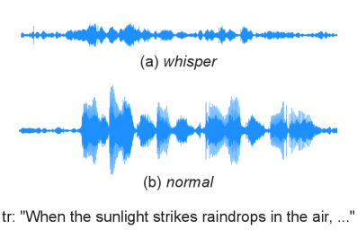
*Figure 1:Different Dynamic Range. Whispers exhibit a significantly lower sound pressure level compared to normal speech, even when the linguistic content is identical.*

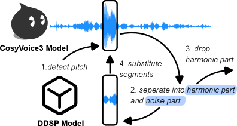
*Figure 2:Visualization of the WhispSynth’s generation pipeline. We apply CosyVoice3 and DDSP Model to generate pitch-free voice.*

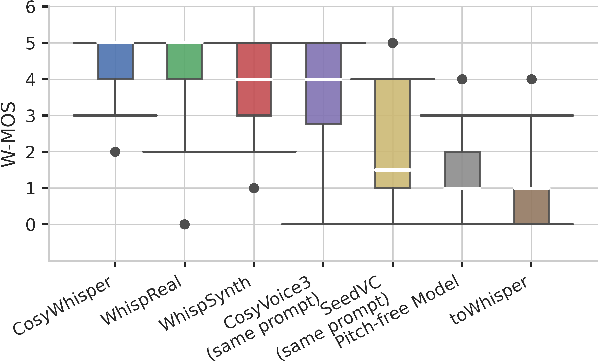
*Figure 3:Results of the listening test. Whisper-likeness Mean Opinion Score (W-MOS) based on 20 participants visualized in a standard box plot.*

*Figure 4:User interface of the listening test.*

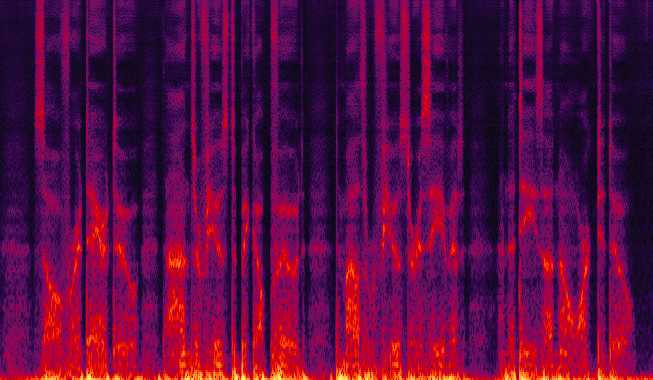
*(a)CosyWhisper*

*(a)CosyWhisper*

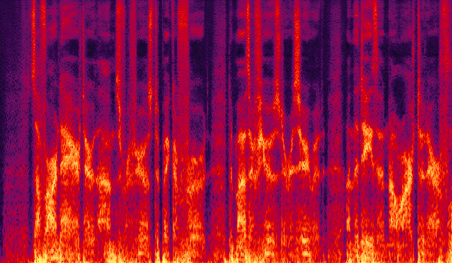
*(b)CosyVoice FT*

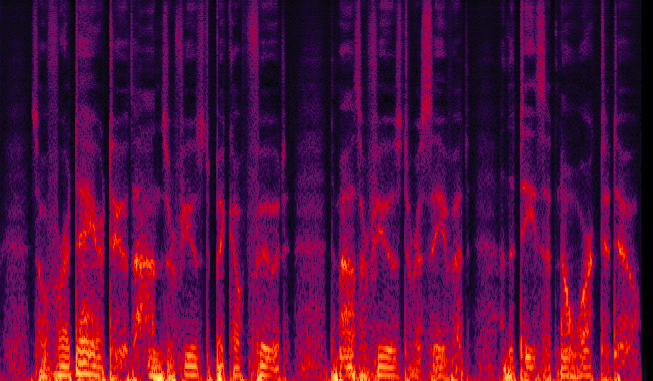
*(c)CosyVoice Rep*

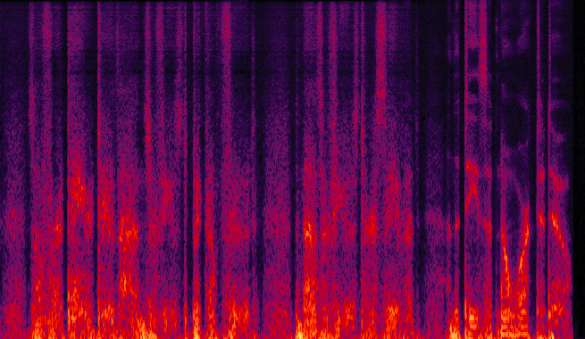
*(d)WhispSynth*

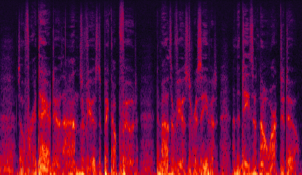
*(e)WhispReal*

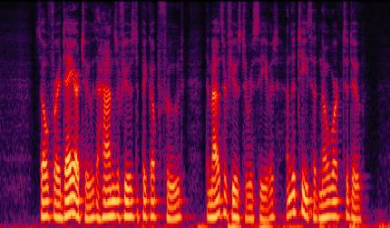
*(f)Normal Speech*

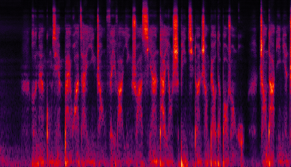
*(g)CosyWhisper*

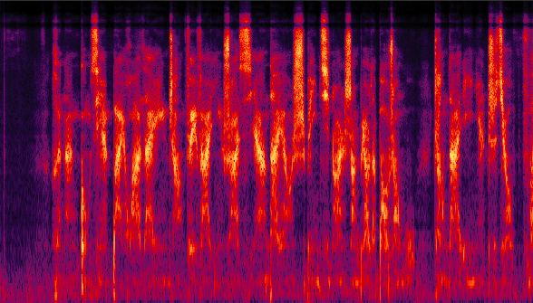
*(h)CosyVoice FT*

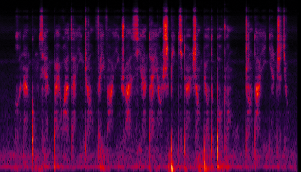
*(i)CosyVoice Rep*

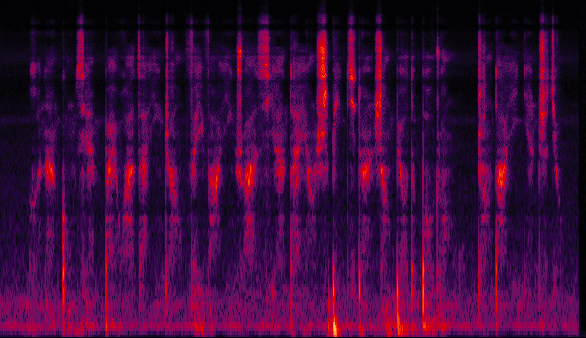
*(j)WhispSynth*

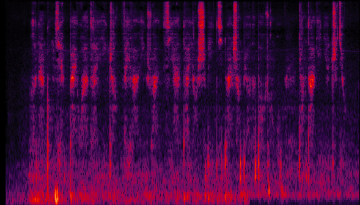
*(k)WhispReal*

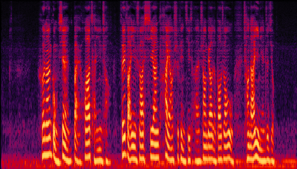
*(l)Normal Speech*

---
**Usage Info**: 1481 tokens used.
**Generated at**: 2026-03-17 13:00:07

---

# 📚 NV-Bench: Benchmark of Nonverbal Vocalization Synthesis for Expressive Text-to-Speech Generation

🚀 URL: https://arxiv.org/html/2603.15352

## 🌏 Abstract (원문)
While recent text-to-speech (TTS) systems increasingly integrate nonverbal vocalizations (NVs), their evaluations lack standardized metrics and reliable ground-truth references. To bridge this gap, we propose NV-Bench, the first benchmark grounded in a functional taxonomy that treats NVs as communicative acts rather than acoustic artifacts. NV-Bench comprises 1,651 multi-lingual, in-the-wild utterances with paired human reference audio, balanced across 14 NV categories. We introduce a dual-dimensional evaluation protocol: (1) Instruction Alignment, utilizing the proposed paralinguistic character error rate (PCER) to assess controllability, (2) Acoustic Fidelity, measuring the distributional gap to real recordings to assess acoustic realism. We evaluate diverse TTS models and develop two baselines. Experimental results demonstrate a strong correlation between our objective metrics and human perception, establishing NV-Bench as a standardized evaluation framework.
## 🌏 Abstract (번역)
최근 텍스트-음성 변환(TTS) 시스템이 비언어적 발성(NV)을 점점 더 많이 통합하고 있지만, 이들의 평가는 표준화된 측정 기준과 신뢰할 수 있는 실제 참조가 부족합니다. 이러한 격차를 해소하기 위해 우리는 NV를 음향적 인공물이 아닌 의사소통 행위로 다루는 기능적 분류법에 기반을 둔 최초의 벤치마크인 NV-Bench를 제안합니다. NV-Bench는 14가지 NV 범주에 걸쳐 균형 있게 구성된 1,651개의 다국어, 실제 환경 발화와 쌍을 이루는 인간 참조 오디오로 구성됩니다. 우리는 이중 차원 평가 프로토콜을 도입합니다: (1) 제어 가능성을 평가하기 위해 제안된 준언어적 문자 오류율(PCER)을 활용하는 지시 정렬(Instruction Alignment), (2) 음향적 사실성을 평가하기 위해 실제 녹음과의 분포적 차이를 측정하는 음향 충실도(Acoustic Fidelity). 우리는 다양한 TTS 모델을 평가하고 두 가지 기준선을 개발합니다. 실험 결과는 우리의 객관적인 측정 기준과 인간의 인지 사이에 강한 상관관계를 보여주며, NV-Bench를 표준화된 평가 프레임워크로 확립합니다.

## 🔍 Methods & Results
- NV-Bench는 음향 다양성과 레이블 정확도의 균형을 맞추기 위해 두 단계 파이프라인으로 구축되었습니다: 고품질 이벤트 인식 전사를 제공하는 강력한 다국어 NVASR 개발, 그리고 인간 검증된 GT를 통해 실제 오디오를 큐레이션하는 과정입니다.
- NVASR 개발을 위해 SenseVoice-Small 아키텍처를 미세 조정하고 다국어 설정을 지원하도록 확장했으며, CTC 손실을 최소화하여 최적화했습니다.
- NVASR 훈련 코퍼스는 Emilia-NV, NVTTS, DisfluencySpeech, NVS, SMIIP-NV, MNV-17을 통합하여 광범위한 일반화를 보장했습니다.
- 레이블 이질성을 해결하기 위해 비음성 레이블을 AudioSet Ontology Level 3에 매핑하고, Emilia-NV 분류법을 채택하며, 영어 데이터셋(NVTTS, DisfluencySpeech)에 대한 수동 주석을 통해 '[Question-huh]'와 같은 미묘한 화용론적 기능을 구별했습니다.
- NV-Bench 데이터셋은 다양한 웹 소스 오디오에서 큐레이션되었으며, NV 이벤트의 긴 꼬리 분포를 고려하여 최근 1년간 업로드된 방대한 시청각 미디어를 크롤링했습니다.
- 데이터셋 정제 과정은 오디오 표준화(Emilia-Pipeline 사용), 단일 화자 검증(MiMo-Audio-7B-Instruct LLM 사용), 그리고 10명의 전문 주석가가 NVASR 생성 전사를 검토하고 NV 레이블의 화용론적 적절성을 검증하는 인간 검증 단계를 포함했습니다.
- 최종 NV-Bench 데이터셋은 1,651개의 프롬프트 및 GT 쌍(7.9시간 분량)으로 구성되며, MP3 형식, 24kHz 샘플링 속도로 표준화되었습니다.

## 🖼 Figures

*Figure 1:Overview of the NV-Bench. (1) Data Processing: Raw audio is filtered using the Emilia-Pipeline and MiMo-Audio. (2) Multi-lingual NVASR: We train a multi-lingual NVASR model on open-source data with a unified label taxonomy. (3) Evaluation: After human verification, the benchmark is evaluated in instruction alignment and acoustic fidelity dimensions and human subjective ratings.*

---
**Usage Info**: 2598 tokens used.
**Generated at**: 2026-03-17 13:00:20

---

# 📚 AvatarForcing: One-Step Streaming Talking Avatars via Local-Future Sliding-Window Denoising

🚀 URL: https://arxiv.org/html/2603.14331

## 🌏 Abstract (원문)
Real-time talking avatar generation requires low latency and minute-level temporal stability. Autoregressive (AR) forcing enables streaming inference but suffers from exposure bias, which causes errors to accumulate and become irreversible over long rollouts. In contrast, full-sequence diffusion transformers mitigate drift but remain computationally prohibitive for real-time long-form synthesis. We present AvatarForcing, a one-step streaming diffusion framework that denoises a fixed local-future window with heterogeneous noise levels and emits one clean block per step under constant per-step cost. To stabilize unbounded streams, the method introduces dual-anchor temporal forcing: a style anchor that re-indexes RoPE to maintain a fixed relative position with respect to the active window and applies anchor-audio zero-padding, and a temporal anchor that reuses recently emitted clean blocks to ensure smooth transitions. Real-time one-step inference is enabled by two-stage streaming distillation with offline ODE backfill and distribution matching. Experiments on standard benchmarks and a new 400-video long-form benchmark show strong visual quality and lip synchronization at 34	ms/frame using a 1.3B-parameter student model for real-time streaming.
## 🌏 Abstract (번역)
실시간 대화형 아바타 생성은 낮은 지연 시간과 분 단위의 시간적 안정성을 요구합니다. 자기회귀(AR) 강제 방식은 스트리밍 추론을 가능하게 하지만, 노출 편향으로 인해 오류가 누적되어 긴 롤아웃에서 되돌릴 수 없게 되는 문제가 있습니다. 반면, 전체 시퀀스 확산 트랜스포머는 드리프트를 완화하지만 실시간 장편 합성을 위해서는 계산 비용이 너무 많이 듭니다. 본 논문에서는 이질적인 노이즈 레벨을 가진 고정된 국소 미래 윈도우를 디노이징하고 단계별로 하나의 깨끗한 블록을 일정한 단계별 비용으로 방출하는 원스텝 스트리밍 확산 프레임워크인 AvatarForcing을 제안합니다. 무한 스트림을 안정화하기 위해 이 방법은 듀얼 앵커 시간적 강제 방식을 도입합니다. 이는 활성 윈도우에 대한 고정된 상대 위치를 유지하기 위해 RoPE를 재인덱싱하고 앵커 오디오 제로 패딩을 적용하는 스타일 앵커와, 부드러운 전환을 보장하기 위해 최근 방출된 깨끗한 블록을 재사용하는 시간적 앵커로 구성됩니다. 실시간 원스텝 추론은 오프라인 ODE 백필 및 분포 매칭을 포함하는 2단계 스트리밍 증류를 통해 가능해집니다. 표준 벤치마크와 새로운 400개 비디오 장편 벤치마크에 대한 실험 결과, 1.3B 매개변수 학생 모델을 사용하여 실시간 스트리밍에서 34ms/프레임의 강력한 시각적 품질과 립싱크를 보여주었습니다.

## 🔍 Methods & Results
- AvatarForcing은 참조 이미지와 오디오/텍스트 제어 신호를 기반으로 실시간, 장기 오디오 기반 대화형 아바타를 생성하는 것을 목표로 합니다.
- 이 방법은 고정된 국소 미래 윈도우를 공동으로 디노이징하고 각 단계에서 하나의 깨끗한 블록을 방출하는 원스텝 스트리밍 확산 메커니즘을 사용합니다.
- 긴 시간적 안정성을 위해 RoPE 재인덱싱 및 앵커 오디오 제로 패딩을 포함하는 듀얼 앵커 KV 캐싱과 양방향 교사 모델로부터 감독을 전달하는 2단계 스트리밍 증류를 도입합니다.
- B개의 연속적인 잠재 프레임을 블록으로 그룹화하고 L-블록 슬라이딩 윈도우를 유지하며, 각 단계에서 L-블록 윈도우에 N개의 공동 디노이징 패스를 적용하여 하나의 깨끗한 블록을 방출합니다 (실시간 설정에서는 N=1).
- 윈도우 내 블록들은 이질적인 노이즈 레벨을 가지며 (왼쪽은 더 깨끗하고 오른쪽은 더 노이즈가 많음), 각 스트리밍 단계에서 블록의 노이즈 레벨이 한 단계씩 감소합니다.
- 윈도우 내 양방향 자기 어텐션을 통해 현재 프론티어의 디노이징이 미래의 (아직 노이즈가 있는) 블록에 조건화될 수 있도록 하여 유한한 미리보기를 제공합니다.
- 듀얼 앵커 KV 캐시는 단기 역학을 안정화하는 시간적 앵커 (최근 방출된 깨끗한 블록 재사용)와 신원 및 외모를 보존하는 영구적인 스타일 앵커 (RoPE 재인덱싱을 통해 고정된 상대 위치 유지)로 구성됩니다.
- 앵커 오디오 제로 패딩은 앵커 프레임의 오디오 특징을 0으로 설정하여 음성 내용 불일치를 방지하고 립 모션을 안정화하며, 앵커는 시각적 신원 참조로만 기능합니다.
- 오디오는 선택된 트랜스포머 레이어에서 잠재 토큰의 가산 변조를 통해 프레임 동기식으로 주입됩니다.
- 실시간 원스텝 추론은 오프라인 ODE 백필을 통한 1단계 오디오 조건부 ODE 회귀와 2단계 분포 매칭 증류(DMD)를 통해 이루어지며, 이는 롤링 윈도우 추론의 분포에 맞춰 학생 모델을 훈련시킵니다.
- 표준 벤치마크와 새로운 400개 비디오 장편 벤치마크 실험에서 1.3B 매개변수 학생 모델을 사용하여 34ms/프레임의 실시간 스트리밍에서 강력한 시각적 품질과 립싱크를 달성했습니다.

## 🖼 Figures
![Figure 2:Windowed denoising with dual anchors and two-stage distillation. AvatarForcing performs one-step denoising over a fixed local-future window with heterogeneous timesteps (cleaner on the left and noisier on the right). At each step, the window is jointly updated under bidirectional attention to emit the leftmost clean block, slide the window, and append fresh noise. Long-horizon stability is supported by a dual-anchor KV cache, including a RoPE re-indexed style anchor (with anchor-audio zero-padding) and a temporal anchor constructed from recent clean blocks. Real-time one-step inference is achieved by distilling a global bidirectional teacher into a streaming student via two-stage training with offline ODE backfill and DMD post-training on student rollouts.](../images/2026-03-17/2603.14331/2603.14331_fig1.png)
*Figure 2:Windowed denoising with dual anchors and two-stage distillation. AvatarForcing performs one-step denoising over a fixed local-future window with heterogeneous timesteps (cleaner on the left and noisier on the right). At each step, the window is jointly updated under bidirectional attention to emit the leftmost clean block, slide the window, and append fresh noise. Long-horizon stability is supported by a dual-anchor KV cache, including a RoPE re-indexed style anchor (with anchor-audio zero-padding) and a temporal anchor constructed from recent clean blocks. Real-time one-step inference is achieved by distilling a global bidirectional teacher into a streaming student via two-stage training with offline ODE backfill and DMD post-training on student rollouts.*

*Figure 3:Long-form qualitative comparison. We compare AvatarForcing with representative autoregressive and diffusion-based talking-avatar models on long-form generation, with an emphasis on temporal stability, identity preservation, and audio–visual synchronization.*

*Figure 4:Latency vs. window length. Inference latency increases with both window length and the number of denoising steps. Window length is shown in frames; with block size 
𝐵
=
4
, a window of 
𝐿
 blocks spans 
𝐵
​
𝐿
 frames.*

*Figure 5:Window length 
𝐿
 vs. denoising steps 
𝑁
. Ablation on window lengths 
𝐿
 and denoising steps 
𝑁
 for 
ℬ
𝐿
,
𝑁
.*

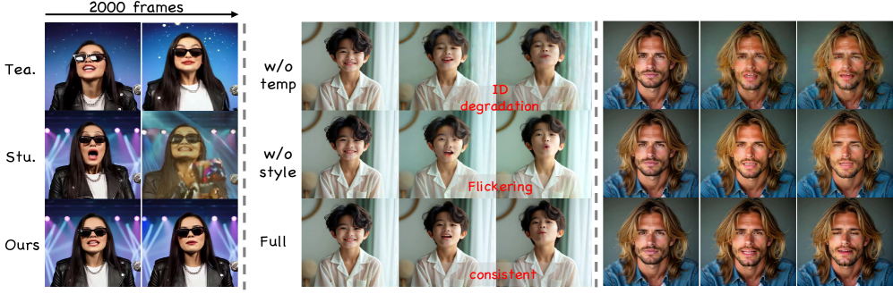
*Figure 6:Teacher/student and anchor ablation. Left: Teacher/Student/Ours. Right: removing either anchor.*

*Figure 7:Qualitative comparison to one-step causal baselines. Self-Forcing (1-step) denotes our one-step DMD baseline and shows noticeable color drift, while Causal ODE denotes our one-step ODE baseline and produces blurred frames with noise-level-dependent sharpness. AvatarForcing better preserves appearance consistency and sharp motion under long rollouts, and the ODE-only blur motivates the two-stage design (ODE initialization followed by DMD refinement).*

*Figure 8:Qualitative ablation on anchor-audio zero padding and RoPE re-indexing. Red boxes highlight mouth regions. Without anchor-audio zero padding, misaligned anchor audio contaminates the anchor pathway and induces mouth jitter and artifacts. Without RoPE re-indexing, the style anchor becomes phase-misaligned as the stream grows, leading to gradual appearance and color drift. The full model avoids both failure modes, consistent with Tab. 5.*

---
**Usage Info**: 4659 tokens used.
**Generated at**: 2026-03-17 13:00:55

---

# 📚 PhonemeDF: A Synthetic Speech Dataset for Audio Deepfake Detection and Naturalness Evaluation

🚀 URL: https://arxiv.org/html/2603.15037

## 🌏 Abstract (원문)
The growing sophistication of speech generated by Artificial Intelligence (AI) has introduced new challenges in audio deepfake detection. Text-to-speech (TTS) and voice conversion (VC) technologies can create highly convincing synthetic speech with naturalness and intelligibility. This poses serious threats to voice biometric security and to systems designed to combat the spread of spoken misinformation, where synthetic voices may be used to disseminate false or malicious content. While interest in AI-generated speech has increased, resources for evaluating naturalness at the phoneme level remain limited. In this work, we address this gap by presenting the Phoneme-Level DeepFake dataset (PhonemeDF), comprising parallel real and synthetic speech segmented at the phoneme level. Real speech samples are derived from a subset of LibriSpeech, while synthetic samples are generated using four TTS and three VC systems. For each system, phoneme-aligned TextGrid files are obtained using the Montreal Forced Aligner (MFA). We compute the Kullback–Leibler divergence (KLD) between real and synthetic phoneme distributions to quantify fidelity and establish a ranking based on similarity to natural speech. Our findings show a clear correlation between the KLD of real and synthetic phoneme distributions and the performance of classifiers trained to distinguish them, suggesting that KLD can serve as an indicator of the most discriminative phonemes for deepfake detection.Keywords:Deepfake detection, Phoneme alignment, LibriSpeech
## 🌏 Abstract (번역)
인공지능(AI)이 생성하는 음성의 정교함이 증가하면서 오디오 딥페이크 탐지에 새로운 도전 과제가 생겨났습니다. 텍스트 음성 변환(TTS) 및 음성 변환(VC) 기술은 자연스럽고 명료한 매우 설득력 있는 합성 음성을 생성할 수 있습니다. 이는 음성 생체 인식 보안과 음성 오정보 확산 방지 시스템에 심각한 위협을 가하며, 합성 음성이 허위 또는 악의적인 콘텐츠를 유포하는 데 사용될 수 있습니다. AI 생성 음성에 대한 관심이 증가하고 있지만, 음소 수준에서 자연스러움을 평가하기 위한 자원은 여전히 제한적입니다. 본 연구에서는 음소 수준에서 분할된 실제 음성과 합성 음성으로 구성된 음소 수준 딥페이크 데이터셋(PhonemeDF)을 제시하여 이러한 격차를 해소합니다. 실제 음성 샘플은 LibriSpeech의 하위 집합에서 파생되었으며, 합성 샘플은 4개의 TTS 및 3개의 VC 시스템을 사용하여 생성되었습니다. 각 시스템에 대해 Montreal Forced Aligner(MFA)를 사용하여 음소 정렬된 TextGrid 파일을 얻었습니다. 우리는 실제 및 합성 음소 분포 간의 쿨백-라이블러 발산(KLD)을 계산하여 충실도를 정량화하고 자연어 음성과의 유사성을 기반으로 순위를 설정했습니다. 우리의 연구 결과는 실제 및 합성 음소 분포의 KLD와 이를 구별하도록 훈련된 분류기의 성능 사이에 명확한 상관관계가 있음을 보여주며, KLD가 딥페이크 탐지를 위한 가장 식별적인 음소의 지표로 사용될 수 있음을 시사합니다.

## 🔍 Methods & Results
- 음소 수준에서 분할된 실제 및 합성 음성으로 구성된 Phoneme-Level DeepFake (PhonemeDF) 데이터셋을 구축했습니다.
- 실제 음성 샘플은 LibriSpeech의 하위 집합에서 가져왔으며, 합성 샘플은 4개의 TTS 및 3개의 VC 시스템을 사용하여 생성했습니다.
- Montreal Forced Aligner (MFA)를 사용하여 각 시스템에 대한 음소 정렬 TextGrid 파일을 얻었습니다.
- 실제 및 합성 음소 분포 간의 쿨백-라이블러 발산(KLD)을 계산하여 음성 충실도를 정량화하고 자연어 음성과의 유사성을 기반으로 순위를 매겼습니다.
- 실제 및 합성 음소 분포의 KLD와 이를 구별하도록 훈련된 분류기의 성능 사이에 명확한 상관관계가 있음을 발견했습니다.
- KLD가 딥페이크 탐지를 위한 가장 식별적인 음소의 지표로 사용될 수 있음을 제안했습니다.

## 🖼 Figures
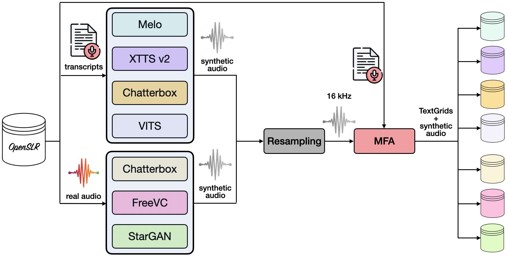
*Figure 1:Overview of the dataset creation pipeline.*

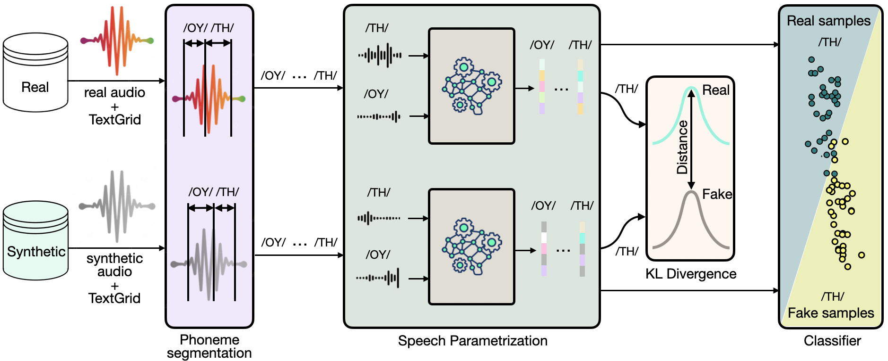
*Figure 2:Per-phoneme evaluation pipeline for real vs. synthetic discrimination.*

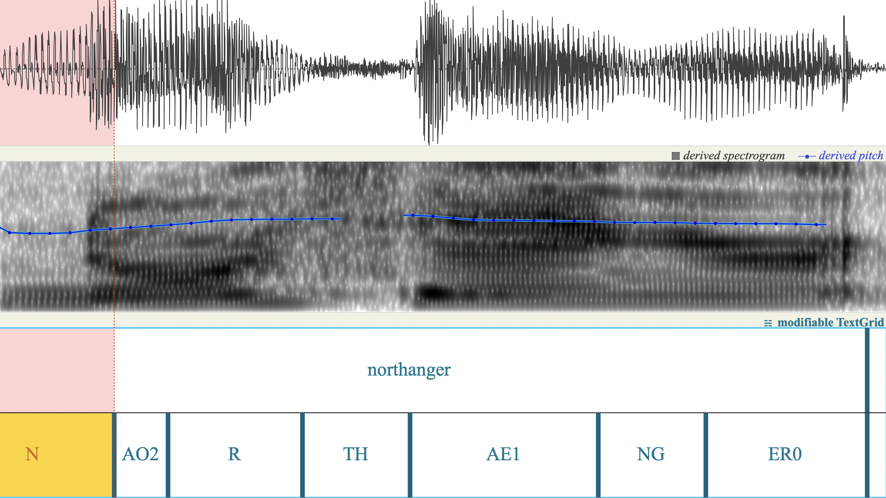
*Figure 3:TextGrid showing phoneme boundaries aligned using Montreal Forced Aligner (MFA).*

*(a)LFCC*

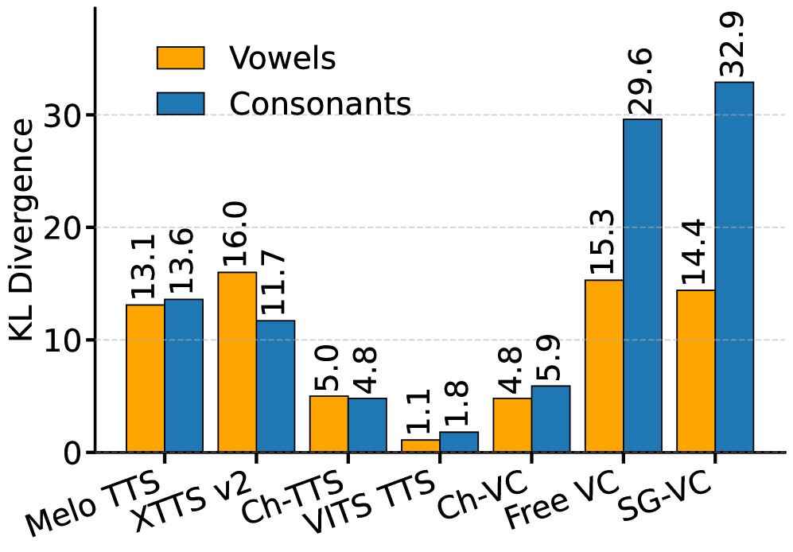
*(a)LFCC*

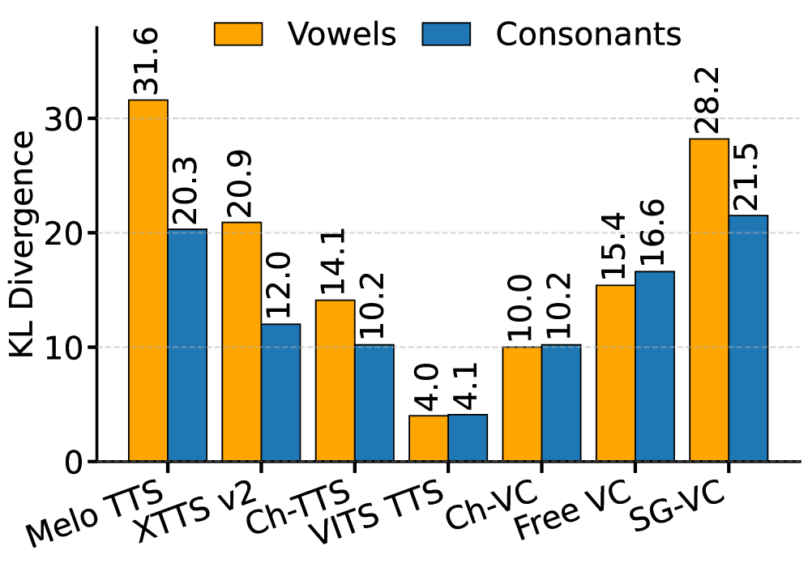
*(b)LogSpec*

*(a)Wav2vec2*

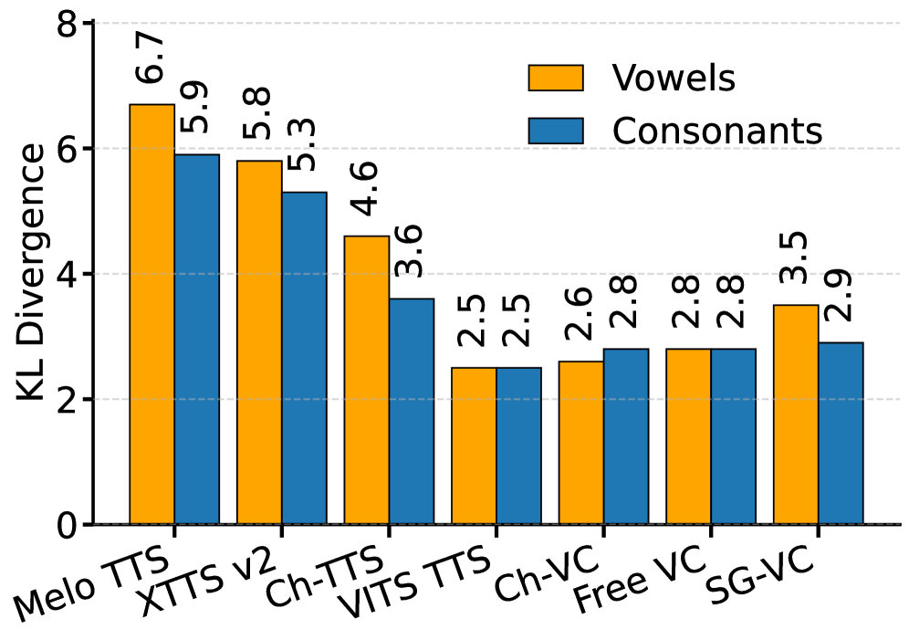
*(a)Wav2vec2*

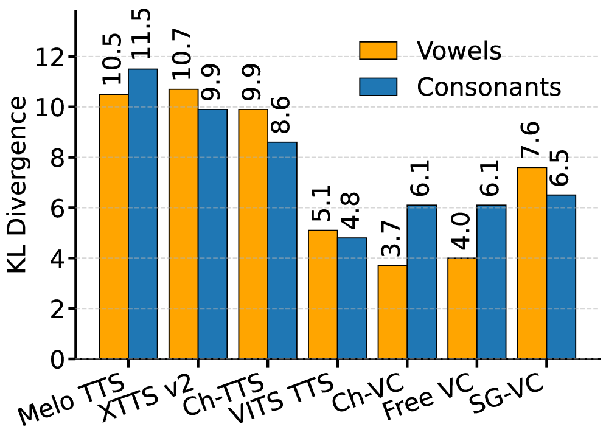
*(b)WavLM*

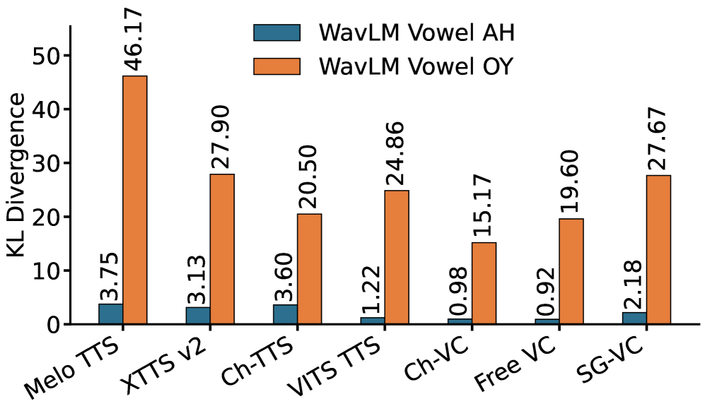
*(a)WavLM (Vowel)*

*(a)WavLM (Vowel)*

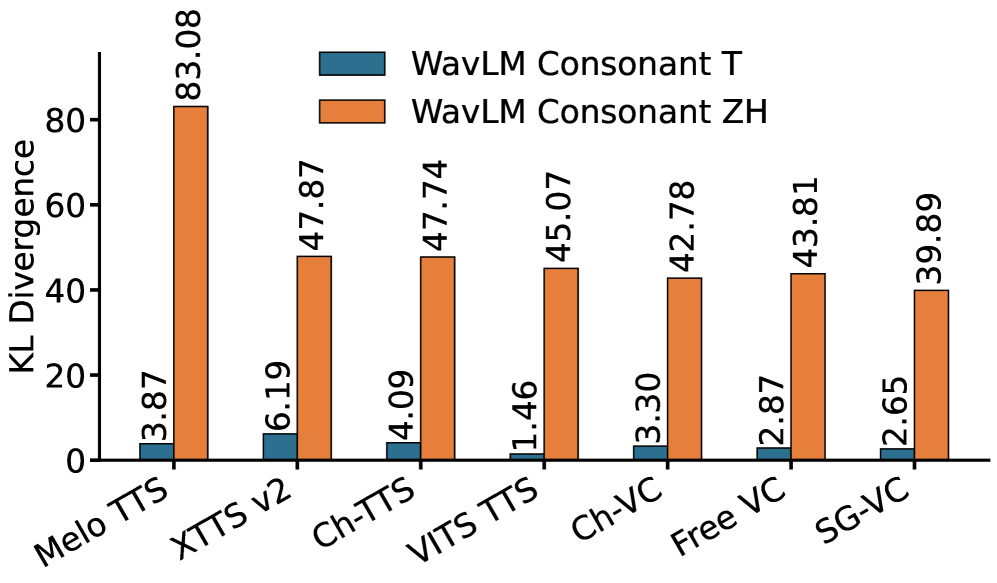
*(b)WavLM (Consonant)*

---
**Usage Info**: 1659 tokens used.
**Generated at**: 2026-03-17 13:01:18

---

# 📚 Tagarela - A Portuguese speech dataset from podcasts

🚀 URL: https://arxiv.org/html/2603.15326

## 🌏 Abstract (원문)
Despite significant advances in speech processing, Portuguese remains under-resourced due to the scarcity of public, large-scale, and high-quality datasets. To address this gap, we present a new dataset, named TAGARELA, composed of over 8,972 hours of podcast audio, specifically curated for training automatic speech recognition (ASR) and text-to-speech (TTS) models. Notably, its scale rivals English’s GigaSpeech (10kh), enabling state-of-the-art Portuguese models. To ensure data quality, the corpus was subjected to an audio pre-processing pipeline and subsequently transcribed using a mixed strategy: we applied ASR models that were previously trained on high-fidelity transcriptions generated by proprietary APIs, ensuring a high level of initial accuracy. Finally, to validate the effectiveness of this new resource, we present ASR and TTS models trained exclusively on our dataset and evaluate their performance, demonstrating its potential to drive the development of more robust and natural speech technologies for Portuguese. The dataset is released publicly111Available athttps://freds0.github.io/TAGARELA/to foster the development of robust speech technologies.
## 🌏 Abstract (번역)
음성 처리 분야의 상당한 발전에도 불구하고, 포르투갈어는 공개적이고 대규모이며 고품질의 데이터셋 부족으로 인해 자원이 부족한 상태로 남아있습니다. 이러한 격차를 해소하기 위해, 우리는 자동 음성 인식(ASR) 및 텍스트 음성 변환(TTS) 모델 훈련을 위해 특별히 선별된 8,972시간 이상의 팟캐스트 오디오로 구성된 TAGARELA라는 새로운 데이터셋을 제시합니다. 특히, 이 데이터셋의 규모는 영어의 GigaSpeech(10kh)에 필적하여 최첨단 포르투갈어 모델을 가능하게 합니다. 데이터 품질을 보장하기 위해, 코퍼스는 오디오 전처리 파이프라인을 거쳤으며, 이후 혼합 전략을 사용하여 전사되었습니다. 즉, 독점 API를 통해 생성된 고충실도 전사본으로 이전에 훈련된 ASR 모델을 적용하여 높은 초기 정확도를 보장했습니다. 마지막으로, 이 새로운 자원의 효과를 검증하기 위해, 우리는 TAGARELA 데이터셋만으로 훈련된 ASR 및 TTS 모델을 제시하고 그 성능을 평가하여, 포르투갈어를 위한 보다 견고하고 자연스러운 음성 기술 개발을 촉진할 잠재력을 입증합니다. 이 데이터셋은 견고한 음성 기술 개발을 촉진하기 위해 공개적으로 배포됩니다(https://freds0.github.io/TAGARELA/에서 이용 가능).

## 🔍 Methods & Results
- 포르투갈어 음성 처리 분야의 데이터 부족 문제를 해결하기 위해 8,972시간 이상의 팟캐스트 오디오로 구성된 TAGARELA 데이터셋을 구축했습니다.
- TAGARELA 데이터셋은 ASR 및 TTS 모델 훈련을 위해 특별히 선별되었으며, 그 규모는 영어의 GigaSpeech(10kh)에 필적하여 최첨단 포르투갈어 모델 개발을 가능하게 합니다.
- 데이터 품질을 보장하기 위해 오디오 전처리 파이프라인을 적용하고, 독점 API로 훈련된 ASR 모델을 활용한 혼합 전략으로 전사하여 높은 초기 정확도를 확보했습니다.
- TAGARELA 데이터셋만으로 훈련된 ASR 및 TTS 모델을 제시하고 성능을 평가하여, 포르투갈어를 위한 견고하고 자연스러운 음성 기술 개발에 기여할 잠재력을 입증했습니다.
- TAGARELA 데이터셋은 견고한 음성 기술 개발을 촉진하기 위해 공개적으로 배포됩니다.

## 🖼 Figures
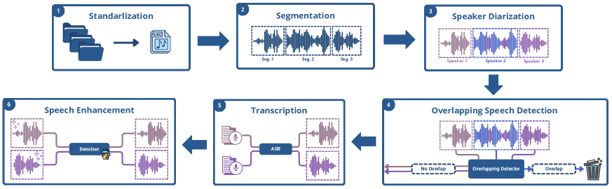
*Fig. 1:Overview of the TAGARELA preprocessing pipeline.*

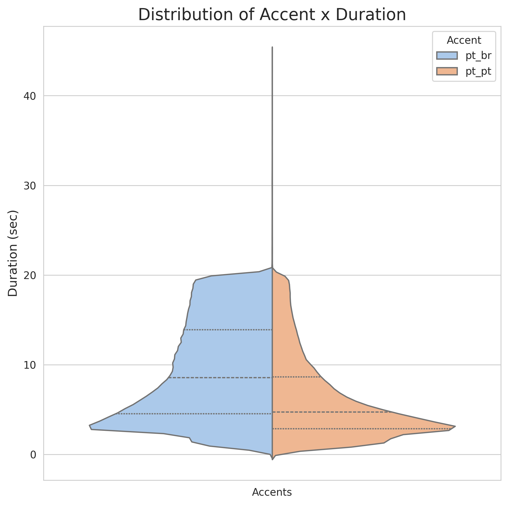
*Fig. 2:Violin plots showing the distribution of audio segment duration in seconds. The left plot compares accents (pt_br vs. pt_pt), and the right plot compares genders (male vs. female).*

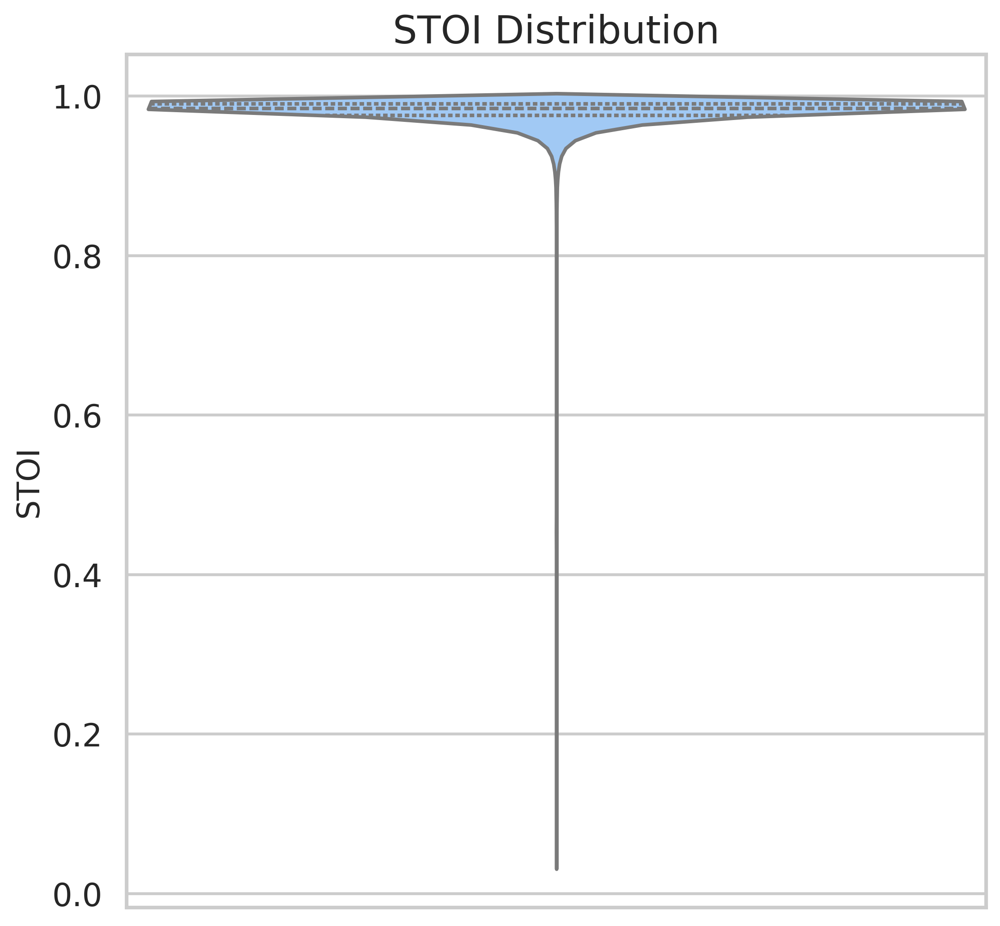
*Fig. 3:Violin plots showing STOI, PESQ and SI-SDR.*

---
**Usage Info**: 1595 tokens used.
**Generated at**: 2026-03-17 13:02:17

---

# 📚 Two-Stage Adaptation for Non-Normative Speech Recognition: Revisiting Speaker-Independent Initialization for Personalization Under review for Interspeech 2026.

🚀 URL: https://arxiv.org/html/2603.15261

## 🌏 Abstract (원문)
Personalizing automatic speech recognition (ASR) systems for non-normative speech, such as dysarthric and aphasic speech, is challenging. While speaker-specific fine-tuning (SS-FT) is widely used, it is typically initialized directly from a generic pre-trained model. Whether speaker-independent adaptation provides a stronger initialization prior under such mismatch remains unclear. In this work, we propose a two-stage adaptation framework consisting of speaker-independent fine-tuning (SI-FT) on multi-speaker non-normative data followed by SS-FT, and evaluate it through a controlled comparison with direct SS-FT under identical per-speaker conditions. Experiments on AphasiaBank and UA-Speech with Whisper-Large-v3 and Qwen3-ASR, alongside evaluation on typical-speech datasets TED-LIUM v3 and FLEURS, show that two-stage adaptation consistently improves personalization while maintaining manageable out-of-domain (OOD) trade-offs.
## 🌏 Abstract (번역)
비정형 음성(예: 마비말장애 및 실어증 음성)에 대한 자동 음성 인식(ASR) 시스템을 개인화하는 것은 어렵습니다. 화자별 미세 조정(SS-FT)이 널리 사용되지만, 일반적으로 일반적인 사전 학습된 모델에서 직접 초기화됩니다. 이러한 불일치 상황에서 화자 독립적 적응이 더 강력한 초기화 사전 정보를 제공하는지는 불분명합니다. 본 연구에서는 다중 화자 비정형 데이터에 대한 화자 독립적 미세 조정(SI-FT)과 이어서 SS-FT로 구성된 2단계 적응 프레임워크를 제안하고, 동일한 화자별 조건에서 직접 SS-FT와의 통제된 비교를 통해 이를 평가합니다. Whisper-Large-v3 및 Qwen3-ASR을 사용하여 AphasiaBank 및 UA-Speech 데이터셋에서 수행된 실험과 일반 음성 데이터셋인 TED-LIUM v3 및 FLEURS에 대한 평가 결과, 2단계 적응이 관리 가능한 도메인 외(OOD) 절충점을 유지하면서 개인화를 일관되게 개선함을 보여줍니다.

## 🔍 Methods & Results
- 본 연구는 비정형 ASR을 위한 2단계 적응 프레임워크를 제안하며, 이는 인구 수준 적응(화자 독립적 미세 조정, SI-FT)과 화자 수준 적응(화자별 미세 조정, SS-FT)으로 구성됩니다.
- SI-FT는 사전 학습된 ASR 모델을 다중 화자 비정형 음성 데이터로 적응시켜 인구 수준 모델을 생성하고, SS-FT는 이 모델을 개별 화자 데이터로 추가 적응시켜 개인화된 모델을 얻습니다.
- 초기화 효과를 분리하기 위해 네 가지 실험 설정(B1: 기본 모델, B2: SI-FT만, B3: SI-FT 후 SS-FT, B4: 기본 모델에서 직접 SS-FT)을 비교했습니다.
- B3(제안된 2단계 적응)와 B4(직접 SS-FT)를 동일한 화자별 훈련 조건에서 비교하여 화자 독립적 초기화의 기여도를 평가했습니다.
- 실험에는 Whisper-Large-v3 및 Qwen3-ASR 두 가지 대규모 ASR 모델이 사용되었습니다.
- 비정형 음성 데이터셋으로는 AphasiaBank(실어증 음성)와 UA-Speech(마비말장애 음성)가 사용되었고, 일반 음성 OOD 벤치마크로는 TED-LIUM v3 및 FLEURS(영어)가 사용되었습니다.
- AphasiaBank 데이터는 CHAT 마커 제거 및 발음 관련 태그가 있는 발화 선택을 위한 전사 정규화 및 필터링을 거쳤습니다.
- 실험은 SI-FT와 SS-FT 간에 화자 중복이 없는 화자 분리 설정으로 진행되었으며, SS 그룹에는 각 데이터셋에서 상위 10%의 화자가 포함되었습니다.
- 결과적으로, 2단계 적응은 AphasiaBank 및 UA-Speech 데이터셋에서 개인화를 일관되게 개선했으며, 일반 음성 데이터셋(TED-LIUM v3, FLEURS)에 대한 성능 저하(OOD trade-offs)는 관리 가능한 수준을 유지했습니다.

## 🖼 Figures

*Figure 1:Overview of our methodology. Left: transcript normalization and filtering for AphasiaBank. Middle: speaker-level partition into speaker-independent (SI) and speaker-specific (SS) groups (top 10% speakers selected for personalization), with per-speaker train/validation/test splits. Right: comparison of four experimental conditions (B1–B4), isolating the effect of speaker-independent initialization for speaker-specific adaptation.*

*(a)Whisper-Large-v3*

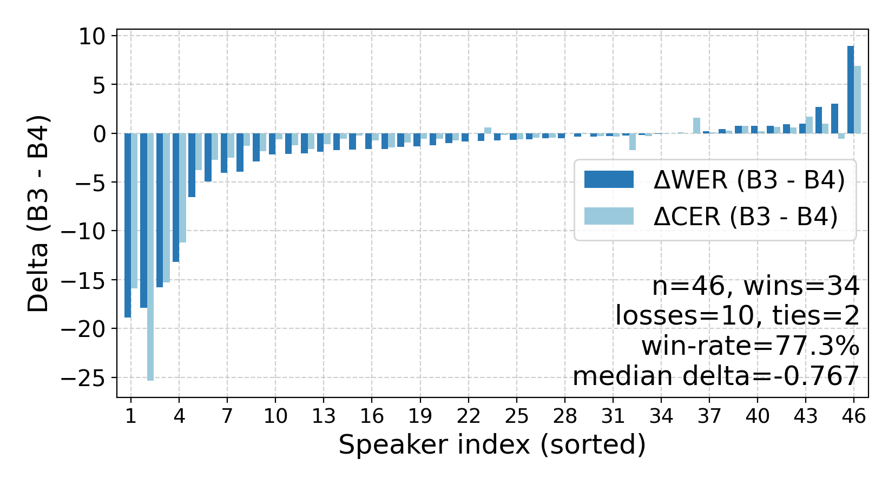
*(a)Whisper-Large-v3*

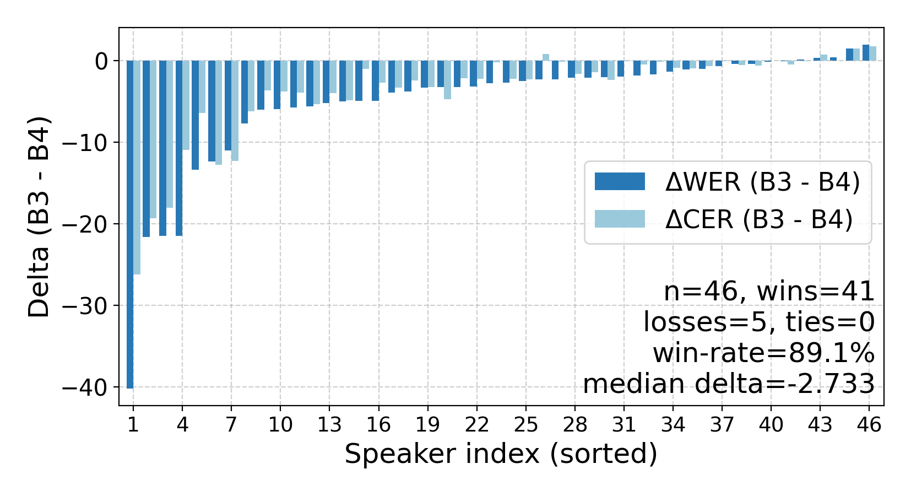
*(b)Qwen3-ASR-1.7B*

---
**Usage Info**: 3851 tokens used.
**Generated at**: 2026-03-17 13:02:31

---

# 📚 COT-FM: Cluster-wise Optimal Transport Flow Matching

🚀 URL: https://arxiv.org/html/2603.13395

## 🌏 Abstract (원문)
We introduce COT-FM, a general framework that reshapes the probability path in Flow Matching (FM) to achieve faster and more reliable generation. FM models often produce curved trajectories due to random or batch-wise couplings, which increase discretization error and reduce sample quality. COT-FM fixes this by clustering target samples and assigning each cluster a dedicated source distribution obtained by reversing pretrained FM models. This divide-and-conquer strategy yields more accurate local transport and significantly straighter vector fields, all without changing the model architecture. As a plug-and-play approach, COT-FM consistently accelerates sampling and improves generation quality across 2D datasets, image generation benchmarks, and robotic manipulation tasks.
## 🌏 Abstract (번역)
저희는 Flow Matching (FM)에서 확률 경로를 재구성하여 더 빠르고 신뢰할 수 있는 생성을 달성하는 일반적인 프레임워크인 COT-FM을 소개합니다. FM 모델은 무작위 또는 배치 단위의 커플링으로 인해 종종 곡선 궤적을 생성하며, 이는 이산화 오류를 증가시키고 샘플 품질을 저하시킵니다. COT-FM은 대상 샘플을 클러스터링하고 각 클러스터에 사전 훈련된 FM 모델을 역전시켜 얻은 전용 소스 분포를 할당함으로써 이 문제를 해결합니다. 이러한 분할 정복 전략은 모델 아키텍처를 변경하지 않고도 더 정확한 로컬 전송과 훨씬 더 직선적인 벡터 필드를 제공합니다. 플러그 앤 플레이 방식으로서 COT-FM은 2D 데이터셋, 이미지 생성 벤치마크 및 로봇 조작 작업 전반에 걸쳐 샘플링을 일관되게 가속화하고 생성 품질을 향상시킵니다.

## 🔍 Methods & Results
- COT-FM은 FM 모델의 생성 속도를 높이고 품질을 향상시키기 위해 최적의 벡터 필드를 찾는 일반적이고 플러그 앤 플레이 방식의 프레임워크를 제안한다.
- 핵심 아이디어는 대상 샘플을 클러스터링하고, 각 클러스터에 해당하는 소스 분포를 식별하며, 각 클러스터 내에서 최적의 커플링을 근사적으로 해결함으로써 최적 커플링 계산을 분할 정복하는 것이다.
- FM 모델은 더 직선적인 흐름을 가진 이 벡터 필드를 회귀하도록 업데이트되며, COT-FM은 대상 벡터 필드 최적화와 FM 모델 업데이트를 번갈아 수행한다.
- COT-FM은 FM 모델의 아키텍처나 입출력 메커니즘을 변경하지 않고 기본 대상 확률 경로만 조절하여 다양한 FM 모델에 광범위하게 적용 가능하다.
- 대상 샘플을 클러스터로 분할한 후, 각 클러스터에 대한 소스 분포를 식별하고 로컬 대상 벡터 필드를 구성한다. 이는 소스-대상 샘플 수를 줄여 OT 근사를 더 효과적으로 만들고, 클래스 레이블, 텍스트 설명, 비지도 클러스터링 등 다양한 클러스터링 유형에 일반화된다.
- 사전 훈련된 FM 모델에서 부트스트랩하여 개별 소스 분포를 검색한다. 역 ODE 통합을 통해 클러스터별 소스 분포를 추정하고, 각 클러스터의 데이터 샘플을 생성하는 소스 샘플을 역추적한다.
- 클러스터별 소스 분포 `p0,k`는 추정된 평균과 공분산을 기반으로 가우시안으로 근사된다.
- 클러스터가 고정되지 않는 애플리케이션(예: 비전 기반 로봇 정책)을 위해 각 클러스터에 대한 소스 분포를 예측하는 학습 기반 모듈을 도입한다.
- 직선 경로를 강제하기 위해, COT-FM은 각 데이터 샘플 클러스터와 할당된 소스 분포 간의 개별 OT 맵을 계산하여 대상 벡터 필드를 업데이트한다. 이는 배치 단위 근사를 더 실현 가능하게 만든다.
- 최적화 단계는 표준 FM 훈련 절차를 따르며, 사전 계산된 클러스터별 OT 맵을 기반으로 소스-대상 쌍을 샘플링하여 미니배치를 구성하고 조건부 흐름 매칭 손실을 통해 FM 모델을 최적화한다.
- COT-FM은 사전 훈련된 FM 모델로 시작하여 클러스터별 대상 벡터 필드 정제와 FM 모델 업데이트를 번갈아 수행하며, 적은 수의 교대 라운드 내에서 모델 성능이 수렴된다.
- 추론 시 표준 FM 추론 절차를 유지하며, 초기화 단계에서 먼저 클러스터 인덱스 `k`를 샘플링한 다음 해당 소스 분포 `p0,k`에서 초기 샘플을 추출한다.
- COT-FM은 2D 데이터셋, 이미지 생성 벤치마크 및 로봇 조작 작업 전반에 걸쳐 샘플링을 일관되게 가속화하고 생성 품질을 향상시킨다.

## 🖼 Figures

*Figure 2:Vector field results from different coupling strategies. Random coupling forces the model to regress inconsistent (gray) velocity targets, creating ambiguous intersections and pushing the model toward an averaged (purple) direction, which produces curved velocity fields. In contrast, optimal transport provides consistent couplings with fewer intersections, enabling the model to learn much straighter velocity fields.*

![Figure 3:Overview of our proposed method. In Stage 1, we cluster the dataset, and for each image within a cluster 
𝒞
𝑘
, we reverse the ODE back to the noise space using a pretrained flow model to compute the new mean 
𝝁
0
,
𝑘
 and covariance 
𝚺
0
,
𝑘
 for that cluster. In Stage 2, we apply optimal transport to finetune the pretrained flow model across all clusters, encouraging it to align with the distributional structure captured in Stage 1. During inference, we first sample a cluster index 
𝑘
, then draw a noise 
𝒙
 from 
𝒩
​
(
𝝁
0
,
𝑘
,
𝚺
0
,
𝑘
)
, and use this noise to generate an image through the finetuned flow model.](../images/2026-03-17/2603.13395/2603.13395_fig2.png)
*Figure 3:Overview of our proposed method. In Stage 1, we cluster the dataset, and for each image within a cluster 
𝒞
𝑘
, we reverse the ODE back to the noise space using a pretrained flow model to compute the new mean 
𝝁
0
,
𝑘
 and covariance 
𝚺
0
,
𝑘
 for that cluster. In Stage 2, we apply optimal transport to finetune the pretrained flow model across all clusters, encouraging it to align with the distributional structure captured in Stage 1. During inference, we first sample a cluster index 
𝑘
, then draw a noise 
𝒙
 from 
𝒩
​
(
𝝁
0
,
𝑘
,
𝚺
0
,
𝑘
)
, and use this noise to generate an image through the finetuned flow model.*

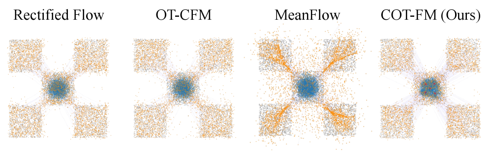
*Figure 4:Visualization of 2D checkerboard data under different methods. Blue points denote the source distribution, gray points the target distribution, and orange points the generated samples.*

![Table 4:Robotic manipulation on LIBERO benchmarks [liu2023libero]. COT-FM achieves single-step performance comparable to FLOWER’s 4-step generation while outperforming other single-step baselines. Measured in success rate (higher is better).](../images/2026-03-17/2603.13395/2603.13395_fig4.png)
*Table 4:Robotic manipulation on LIBERO benchmarks [liu2023libero]. COT-FM achieves single-step performance comparable to FLOWER’s 4-step generation while outperforming other single-step baselines. Measured in success rate (higher is better).*

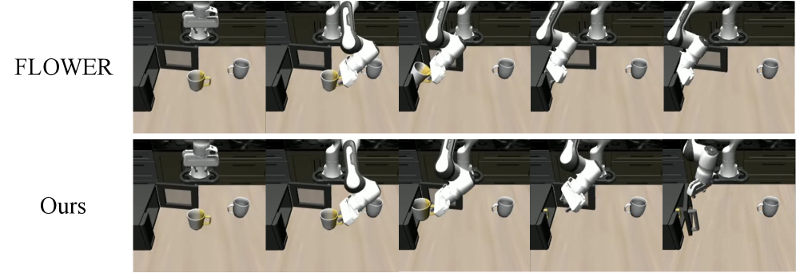
*Figure 5:Comparison of two trajectories under the same initial setting in LIBERO Long. Our method successfully places the mug into the microwave and closes the door, while FLOWER fails to insert the mug smoothly and gets stuck inside the microwave.*

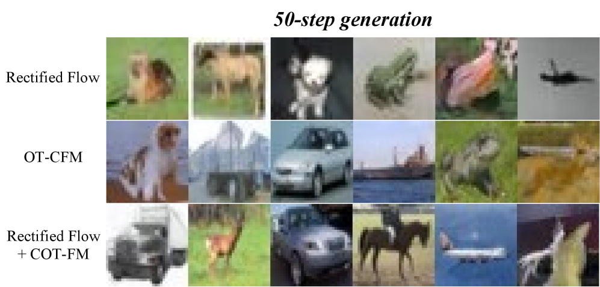
*Figure 6:CIFAR-10 visualization for different flow-based methods under 50-step generation settings.*

*Figure 7:Visualization of a CIFAR-10 cluster. The first row shows representative images from the cluster. Using these images, we apply reverse ODE to estimate the 
𝝁
0
,
𝑘
 and 
𝚺
0
,
𝑘
 (Fig. 3, Stage 1). The second row shows images generated by sampling noise from this estimated distribution. The last row presents the results after finetuning the pretrained flow model.*

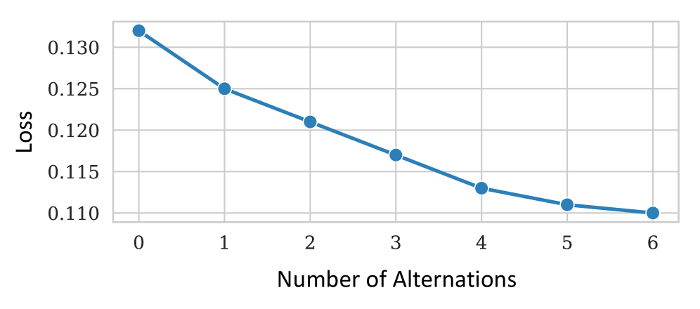
*Figure 8:Training loss across alternating optimization iterations, showing monotonic decrease.*

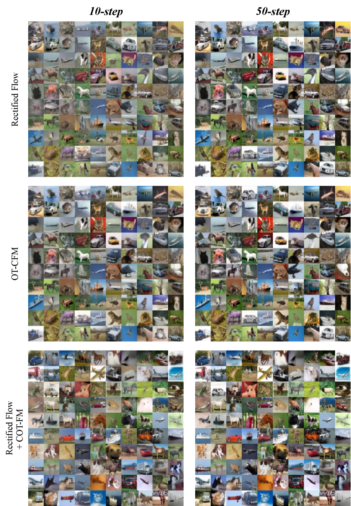
*Figure 9:Visualization of CIFAR-10 for different flow-based methods under 10-step and 50-step generation settings.*

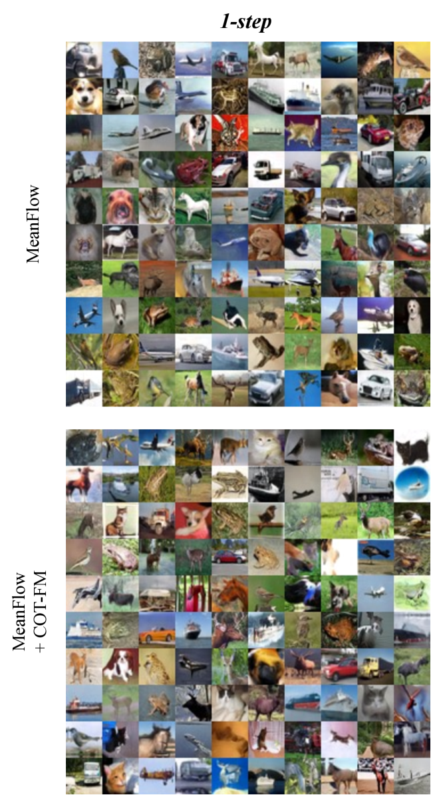
*Figure 10:Visualization of CIFAR-10 for MeanFlow under 1-step generation settings.*

---
**Usage Info**: 3220 tokens used.
**Generated at**: 2026-03-17 13:03:01

---

# 📚 Affectron: Emotional Speech Synthesis with Affective and Contextually Aligned Nonverbal Vocalizations

🚀 URL: https://arxiv.org/html/2603.14432

## 🌏 Abstract (원문)
Nonverbal vocalizations (NVs), such as laughter and sighs, are central to the expression of affective cues in emotional speech synthesis. However, learning diverse and contextually aligned NVs remains challenging in open settings due to limited NV data and the lack of explicit supervision. Motivated by this challenge, we propose Affectron as a framework for affective and contextually aligned NV generation. Built on a small-scale open and decoupled corpus, Affectron introduces an NV-augmented training strategy that expands the distribution of NV types and insertion locations. We further incorporate NV structural masking into a speech backbone pre-trained on purely verbal speech to enable diverse and natural NV synthesis. Experimental results demonstrate that Affectron produces more expressive and diverse NVs than baseline systems while preserving the naturalness of the verbal speech stream.
## 🌏 Abstract (번역)
웃음이나 한숨과 같은 비언어적 발성(NV)은 감성 음성 합성에서 감정적 신호를 표현하는 데 핵심적입니다. 그러나 제한된 NV 데이터와 명시적인 감독의 부족으로 인해 개방형 환경에서 다양하고 상황에 맞는 NV를 학습하는 것은 여전히 어렵습니다. 이러한 문제에 동기를 부여받아, 우리는 감정적이고 상황에 맞는 NV 생성을 위한 프레임워크인 Affectron을 제안합니다. 소규모의 개방형 및 분리형 코퍼스를 기반으로 구축된 Affectron은 NV 유형 및 삽입 위치의 분포를 확장하는 NV 증강 훈련 전략을 도입합니다. 우리는 또한 순수 언어적 음성으로 사전 훈련된 음성 백본에 NV 구조적 마스킹을 통합하여 다양하고 자연스러운 NV 합성을 가능하게 합니다. 실험 결과는 Affectron이 기준 시스템보다 더 표현력이 풍부하고 다양한 NV를 생성하면서도 언어적 음성 스트림의 자연스러움을 보존함을 보여줍니다.

## 🔍 Methods & Results
- 비언어적 발성(NV) 학습의 어려움(제한된 데이터, 명시적 감독 부족)을 해결하기 위해 Affectron 프레임워크를 제안했습니다.
- Affectron은 소규모의 개방형 및 분리형 코퍼스를 기반으로 NV 유형 및 삽입 위치를 확장하는 NV 증강 훈련 전략을 도입합니다.
- 순수 언어적 음성으로 사전 훈련된 음성 백본에 NV 구조적 마스킹을 통합하여 다양하고 자연스러운 NV 합성을 가능하게 합니다.
- 실험 결과, Affectron은 기준 시스템보다 더 표현력이 풍부하고 다양한 NV를 생성하며, 언어적 음성 스트림의 자연스러움을 보존합니다.

## 🖼 Figures
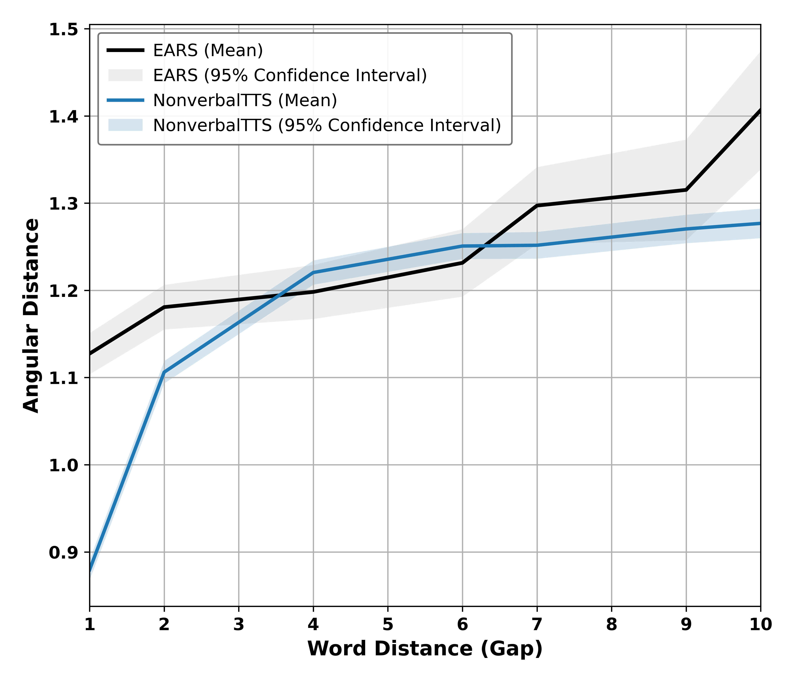
*Figure 1:Analysis of emotional attribute change patterns across temporal gaps (up to a gap of 10) for the EARS Richter et al. (2024) dataset (verbal only) and the NonverbalTTS Borisov et al. (2025) dataset (verbal-nonverbal combined speech).*

*Figure 2:Overview of the Affectron training framework. NV candidates are selected and routed to contextually appropriate locations to construct NV-augmented training samples, which are then used to fine-tune the VoiceCraft backbone for affect-aware NV synthesis.*

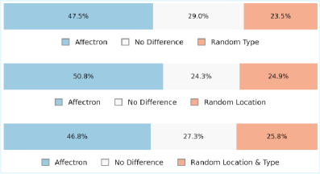
*Figure 3:AB preference test comparing the proposed NV augmentation with rule-guided randomized strategies following CapSpeech Wang et al. (2025a).*

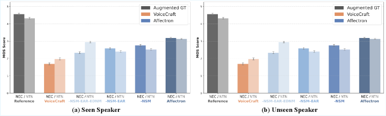
*Figure 4:Comparison of our proposed method in terms of NTN-MOS and NEC-MOS. Augmented GT applies our NV augmentation to the ground truth. Vertical lines illustrate the 95% confidence intervals.*

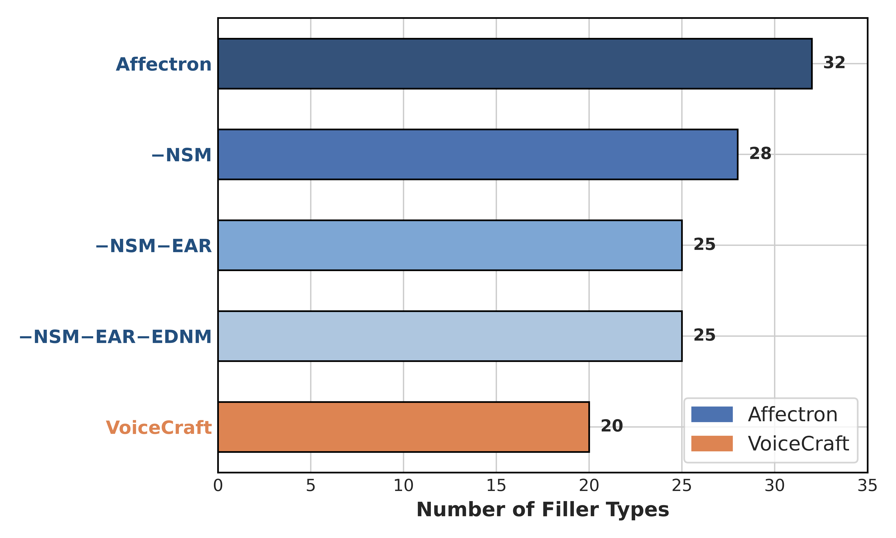
*Figure 5:Comparison of the diversity of generated fine-grained filler variations across models.*

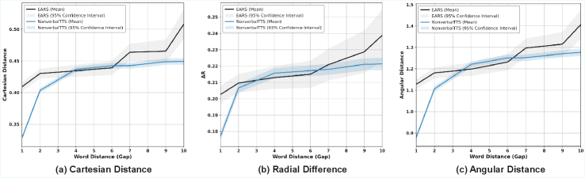
*Figure 6:Comparison of emotional attribute change patterns across temporal gaps using angular distance, Cartesian distance, and spherical radial differences.*

*Figure 7:Overview of the emotion-aware top-
𝐾
 routing process. (a) Word-level emotional attributes are extracted from verbal speech using MFA and an emotional attribute predictor. (b) Affective distance computation between an NV candidate and verbal segments via angular distance in spherical coordinates.*

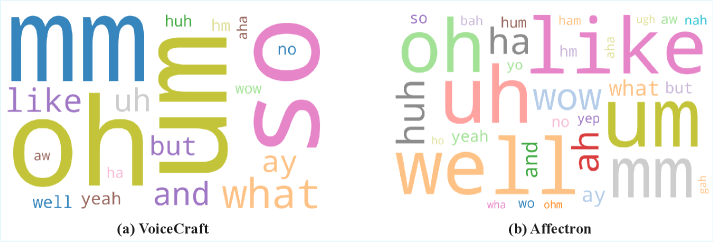
*Figure 8:Word-cloud visualization of generated fine-grained filler variations for VoiceCraft Peng et al. (2024) and Affectron. The size of each keyword corresponds to its relative frequency among the realized filler variants.*

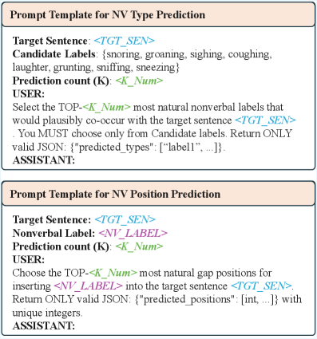
*Figure 9:Sample prompt templates for NV type and location prediction.*

*Figure 10:Comparison of Mel-spectrograms generated by different models for the same utterance. Results are shown for a seen speaker and an unseen speaker. NV segments are highlighted in red, and NV‑Sim scores are annotated in blue. EDNM, EAR, and NSM denote emotion-driven top-
𝐾
 NV matching, emotion-aware top-
𝐾
 routing, and NV structural masking, respectively. Augmented GT applies our affectively aligned NV augmentation to the ground truth.*

*Figure 11:Detailed information on listener requirements and the AB preference test interfaces.*

*Figure 12:Detailed information on listener requirements and NV-context emotional congruence (NEC-MOS) evaluation interfaces.*

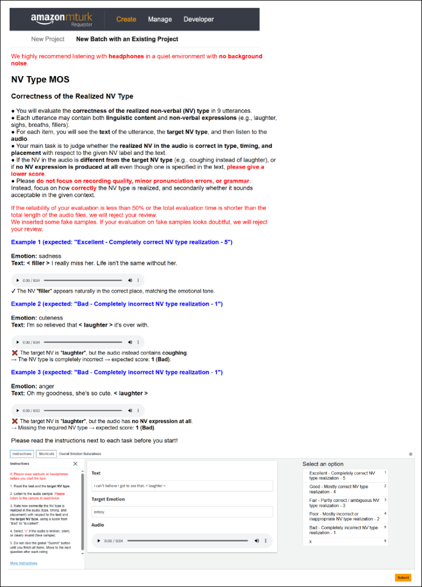
*Figure 13:Detailed information on listener requirements and NV-type naturalness (NTN-MOS) evaluation interfaces.*

---
**Usage Info**: 1135 tokens used.
**Generated at**: 2026-03-17 13:03:25

---

# 📚 Understanding the strengths and weaknesses of SSL models for audio deepfake model attribution

🚀 URL: https://arxiv.org/html/2603.13488

## 🌏 Abstract (원문)
Audio deepfake model attribution aims to mitigate the misuse of synthetic speech by identifying the source model responsible for generating a given audio sample, enabling accountability and informing vendors. The task is challenging, but self-supervised learning (SSL)-derived acoustic features have demonstrated state-of-the-art attribution capabilities, yet the underlying factors driving their success and the limits of their discriminative power remain unclear. In this paper, we systematically investigate how SSL-derived features capture architectural signatures in audio deepfakes. By controlling multiple dimensions of the audio generation process we reveal how subtle perturbations in model checkpoints, text prompts, vocoders, or speaker identity influence attribution. Our results provide new insights into the robustness, biases, and limitations of SSL-based deepfake attribution, highlighting both its strengths and vulnerabilities in realistic scenarios.
## 🌏 Abstract (번역)
오디오 딥페이크 모델 귀속(attribution)은 주어진 오디오 샘플을 생성한 원본 모델을 식별하여 합성 음성 오용을 완화하고, 책임 소재를 규명하며, 공급업체에 정보를 제공하는 것을 목표로 합니다. 이 작업은 어렵지만, 자기 지도 학습(SSL)에서 파생된 음향 특징은 최첨단 귀속 능력을 보여주었습니다. 그러나 그 성공의 근본적인 요인과 판별력의 한계는 여전히 불분명합니다. 본 논문에서는 SSL 파생 특징이 오디오 딥페이크에서 아키텍처 서명을 어떻게 포착하는지 체계적으로 조사합니다. 오디오 생성 프로세스의 여러 차원을 제어함으로써 모델 체크포인트, 텍스트 프롬프트, 보코더 또는 화자 신원의 미묘한 교란이 귀속에 어떻게 영향을 미치는지 밝힙니다. 우리의 결과는 SSL 기반 딥페이크 귀속의 견고성, 편향 및 한계에 대한 새로운 통찰력을 제공하며, 현실적인 시나리오에서 그 강점과 취약점을 모두 강조합니다.

## 🔍 Methods & Results
- LJSpeech 데이터셋(단일 여성 화자, 13,100개 오디오 샘플, 총 24시간)을 사용하여 화자 가변성을 제어했으며, 모델 훈련에는 12,500개 샘플을 사용하고, 600개의 텍스트 프롬프트를 검증 및 테스트 세트에 활용하여 합성 오디오 샘플을 생성했습니다.
- HiFi-TTS 화자 9136(LJSpeech와 성별 일치)의 500개 오디오 샘플을 사용하여 경량 화자 적응 실험을 수행하고 동일한 600개 텍스트 프롬프트로 평가 샘플을 생성했습니다.
- FastPitch, VITS, Grad-TTS, Matcha-TTS의 네 가지 일반적인 텍스트-음성 변환 아키텍처와 공식 구현을 사용했습니다.
- Grad-TTS, Matcha-TTS, FastPitch에는 HiFi-GAN 보코더를 사용했으며, VITS는 HiFi-GAN 생성기를 인코더-디코더 아키텍처에 직접 통합했습니다.
- 각 아키텍처는 LJSpeech 데이터로 500k 반복 동안 처음부터 훈련되었으며, 초기(50k, 75k, 100k), 중간(250k, 275k, 300k), 후기(450k, 475k, 500k) 훈련 단계에서 9개의 체크포인트를 유지했습니다.
- 화자 적응은 사전 훈련된 LJSpeech 모델을 화자 9136의 500개 샘플에 대해 10k 반복 동안 미세 조정하여 수행되었습니다.
- 잠재적인 아키텍처 수준의 내재된 편향을 조사하기 위해 각 아키텍처에 대해 세 가지 무작위 시드에서 초기화(
- zero-init
- )를 보존했습니다.
- 경량 k-Nearest Neighbours (kNN) 기반 귀속 시스템을 사용했으며, wav2vec2-xls-r-2b에서 파생된 1920차원 또는 w2v-bert-2.0에서 파생된 1024차원 SSL 특징 벡터를 활용했습니다.
- 600개의 텍스트 프롬프트 중 420개(70%)는 지원 세트, 60개(10%)는 검증 세트, 120개(20%)는 쿼리 세트로 사용되었으며, 클래스는 균형을 이루었습니다.
- 성능은 매크로 F1-스코어를 사용하여 평가되었으며, 특정 모델 가중치 상태를 식별하는 '체크포인트 귀속'과 동일한 생성기의 모든 체크포인트를 그룹화하는 '아키텍처 귀속'을 구분했습니다.
- 모든 훈련된 모델과 생성된 오디오 샘플은 요청 시 자유롭게 제공됩니다.

## 🖼 Figures

*Fig. 1:F1-scores for architecture and checkpoint attribution of the validation set as a function of 
𝑘
–number of neighbours.*

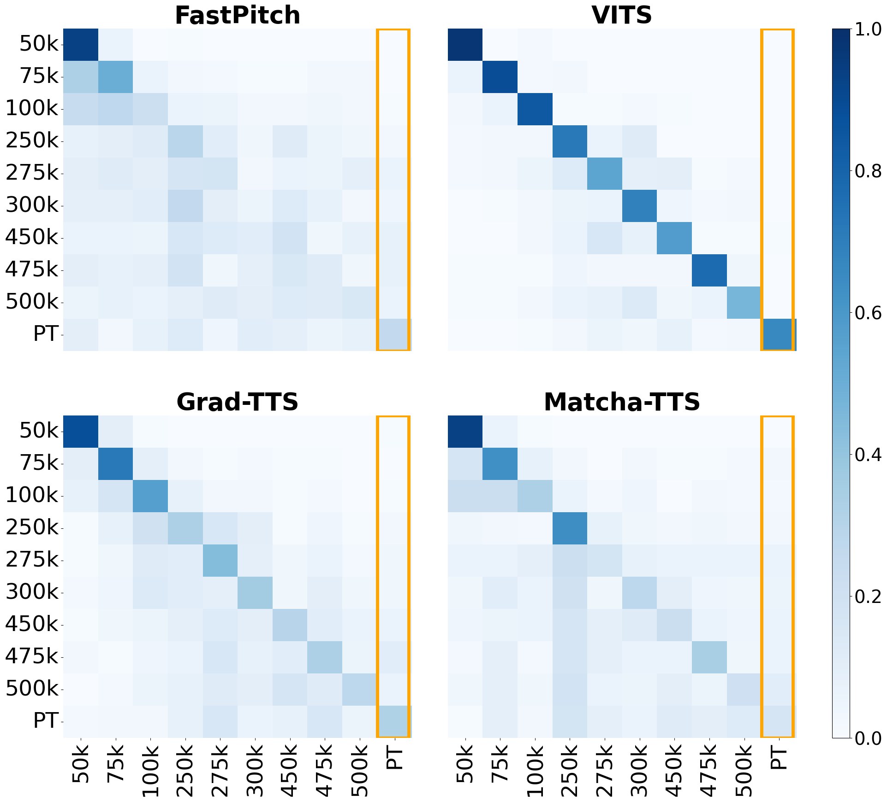
*Fig. 2:Baseline confusion matrices for each architecture. The orange highlight represents the pretrained (PT) model.*

---
**Usage Info**: 3086 tokens used.
**Generated at**: 2026-03-17 13:03:36

---

# 📚 VorTEX: Various overlap ratio for Target speech EXtraction

🚀 URL: https://arxiv.org/html/2603.14803

## 🌏 Abstract (원문)
Target speech extraction (TSE) aims to recover a target speaker’s voice from a mixture. While recent text-prompted approaches have shown promise, most approaches assume fully overlapped mixtures, limiting insight into behavior across realistic overlap ratios. We introduce VorTEX (Various overlap ratio for Target speech EXtraction), a text-prompted TSE architecture with a Decoupled Adaptive Multi-branch (DAM) Fusion block that separates primary extraction from auxiliary regularization pathways. To enable controlled analysis, we construct PORTE, a two-speaker dataset spanning overlap ratios from 0% to 100%. We further propose Suppression Ratio on Energy (SuRE), a diagnostic metric that detects suppression behavior not captured by conventional measures. Experiments show that existing models exhibit suppression or residual interference under overlap, whereas VorTEX achieves the highest separation fidelity across 20–100% overlap (e.g., 5.50 dB at 20% and 2.04 dB at 100%) while maintaining zero SuRE, indicating robust extraction without suppression-driven artifacts.
## 🌏 Abstract (번역)
타겟 음성 추출(TSE)은 혼합된 음성에서 타겟 화자의 목소리를 복구하는 것을 목표로 합니다. 최근 텍스트 프롬프트 기반 접근 방식들이 유망한 결과를 보였지만, 대부분의 접근 방식은 완전히 겹치는 혼합을 가정하여 현실적인 오버랩 비율에 따른 동작에 대한 통찰력을 제한합니다. 본 연구에서는 주 추출 경로와 보조 정규화 경로를 분리하는 Decoupled Adaptive Multi-branch (DAM) Fusion 블록을 갖춘 텍스트 프롬프트 기반 TSE 아키텍처인 VorTEX(Various overlap ratio for Target speech EXtraction)를 소개합니다. 통제된 분석을 가능하게 하기 위해, 우리는 0%에서 100%까지의 오버랩 비율을 포함하는 두 화자 데이터셋인 PORTE를 구축했습니다. 또한, 기존 측정 방식으로는 포착되지 않는 억제 동작을 감지하는 진단 측정 지표인 Suppression Ratio on Energy (SuRE)를 제안합니다. 실험 결과, 기존 모델들은 오버랩 상황에서 억제 또는 잔여 간섭을 보이는 반면, VorTEX는 20-100% 오버랩 전반에 걸쳐 가장 높은 분리 충실도(예: 20%에서 5.50dB, 100%에서 2.04dB)를 달성하면서도 SuRE가 0을 유지하여, 억제 유발 아티팩트 없이 견고한 추출을 나타냈습니다.

## 🔍 Methods & Results
- VorTEX는 인코더-디코더 아키텍처를 채택하며, 입력 혼합 음성과 자연어 프롬프트를 각각 FACodec Encoder와 T5-Encoder (flan-t5-base)를 통해 특징 벡터로 변환합니다.
- 인코더는 트랜스포머 기반으로 음성 특징 벡터와 프롬프트 벡터를 입력으로 받아 타겟 음성의 은닉 표현을 추출하며, 로터리 위치 임베딩(RoPE)을 사용합니다.
- 각 트랜스포머 블록의 교차 어텐션과 피드포워드 네트워크 사이에 Decoupled Adaptive Multi-branch (DAM) Fusion 블록을 삽입하여 다양한 오버랩 정도를 인식하고 처리합니다.
- DAM 블록은 Multi-scale Fusion (주요 추출 경로), Adaptive Fusion (보조 경로), Dual Projection Fusion (안정성 향상)의 세 가지 경로를 통해 교차 어텐션 출력과 원본 자기 어텐션 신호를 비교합니다.
- 디코더는 FACodec Decoder 아키텍처와 사전 학습된 파라미터를 따르며, 예측된 타겟 신호를 받아 RVQ 코드와 음색 임베딩을 생성한 후 음성 파형을 재구성하고, 훈련 안정화를 위해 RVQ 구성 요소에 회전 트릭(rotation trick)을 적용했습니다.
- 훈련 목표는 SISDR 손실(L_SISDR), 화자 임베딩 손실(L_spk), 커밋먼트 손실(L_commit)의 세 가지 손실 함수를 결합하여 최적화합니다.
- 실험 결과, VorTEX는 20-100% 오버랩 범위에서 기존 모델 대비 가장 높은 분리 충실도(예: 20%에서 5.50dB, 100%에서 2.04dB)를 달성했으며, SuRE 지표에서 0을 유지하여 억제 유발 아티팩트 없이 견고한 추출 성능을 보였습니다.

## 🖼 Figures
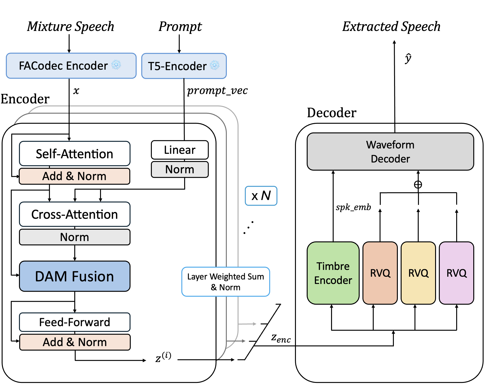
*Figure 1:Architecture of VorTEX*

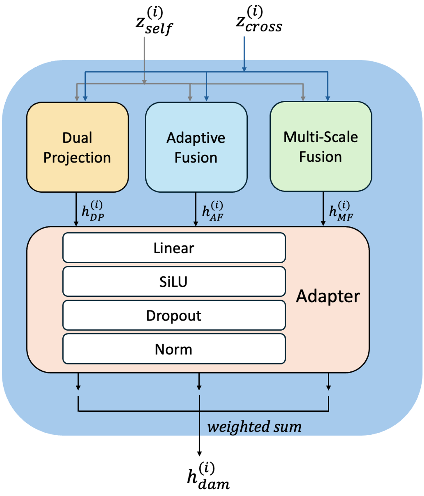
*Figure 2:DAM Fusion and its fusion blocks*

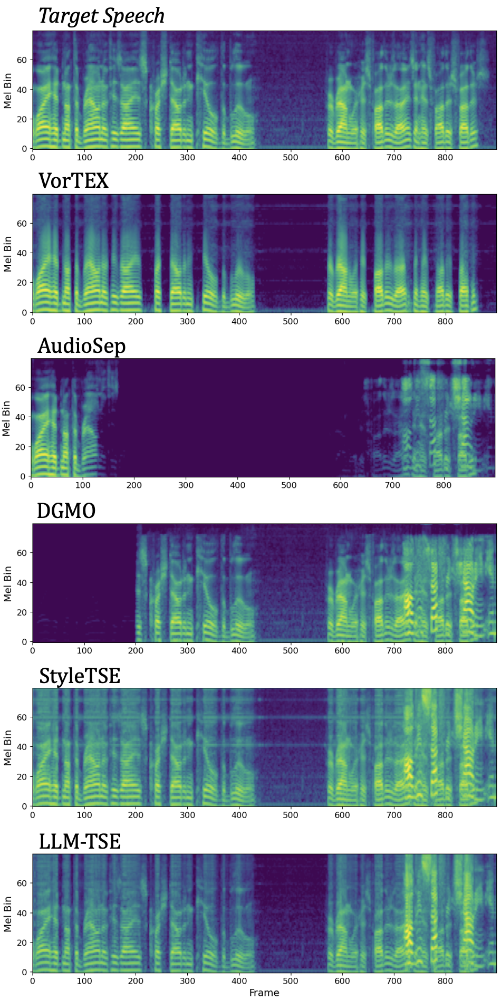
*Figure 3:Example mel-spectrograms*

---
**Usage Info**: 5092 tokens used.
**Generated at**: 2026-03-17 13:04:00

---

# 📚 EchoLVFM: One-Step Video Generation via Latent Flow Matching for Echocardiogram Synthesis

🚀 URL: https://arxiv.org/html/2603.13967

## 🌏 Abstract (원문)
Echocardiography is widely used for assessing cardiac function, where clinically meaningful parameters such as left-ventricular ejection fraction (EF) play a central role in diagnosis and management. Generative models capable of synthesising realistic echocardiogram videos with explicit control over such parameters are valuable for data augmentation, counterfactual analysis, and specialist training. However, existing approaches typically rely on computationally expensive multi-step sampling and aggressive temporal normalisation, limiting efficiency and applicability to heterogeneous real-world data.
We introduce EchoLVFM, a one-step latent video flow-matching framework for controllable echocardiogram generation. Operating in the latent space, EchoLVFM synthesises temporally coherent videos in a single inference step, achieving a~\sim50\timesimprovement in sampling efficiency compared to multi-step flow baselines while maintaining visual fidelity. The model supports global conditioning on clinical variables, demonstrated through precise control of EF, and enables reconstruction and counterfactual generation from partially observed sequences. A masked conditioning strategy further removes fixed-length constraints, allowing shorter sequences to be retained rather than discarded.
We evaluate EchoLVFM on the CAMUS dataset under challenging single-frame conditioning. Quantitative and qualitative results demonstrate competitive video quality, strong EF adherence, and 57.9% discrimination accuracy by expert clinicians which is close to chance. These findings indicate that efficient, one-step flow matching can enable practical, controllable echocardiogram video synthesis without sacrificing fidelity. Code available at:EchoLVFM
## 🌏 Abstract (번역)
심장 기능 평가에는 심장초음파 검사가 널리 사용되며, 좌심실 박출률(EF)과 같은 임상적으로 의미 있는 매개변수는 진단 및 관리에 핵심적인 역할을 합니다. 이러한 매개변수를 명시적으로 제어하여 사실적인 심장초음파 영상을 합성할 수 있는 생성 모델은 데이터 증강, 반사실적 분석 및 전문가 훈련에 유용합니다. 그러나 기존 접근 방식은 일반적으로 계산 비용이 많이 드는 다단계 샘플링과 공격적인 시간적 정규화에 의존하여 효율성과 이질적인 실제 데이터에 대한 적용 가능성을 제한합니다.
본 연구에서는 제어 가능한 심장초음파 생성을 위한 원스텝 잠재 비디오 플로우 매칭 프레임워크인 EchoLVFM을 소개합니다. 잠재 공간에서 작동하는 EchoLVFM은 단일 추론 단계에서 시간적으로 일관된 비디오를 합성하여, 다단계 플로우 기준선에 비해 샘플링 효율성을 약 50배 향상시키면서 시각적 충실도를 유지합니다. 이 모델은 EF의 정밀한 제어를 통해 입증된 임상 변수에 대한 전역적 조건화를 지원하며, 부분적으로 관찰된 시퀀스로부터 재구성 및 반사실적 생성을 가능하게 합니다. 마스크된 조건화 전략은 고정 길이 제약을 추가로 제거하여 더 짧은 시퀀스를 버리지 않고 유지할 수 있도록 합니다.
우리는 CAMUS 데이터셋에서 단일 프레임 조건화라는 어려운 조건 하에 EchoLVFM을 평가했습니다. 정량적 및 정성적 결과는 경쟁력 있는 비디오 품질, 강력한 EF 준수, 그리고 전문가 임상의에 의한 57.9%의 판별 정확도(우연에 가까움)를 보여줍니다. 이러한 결과는 효율적인 원스텝 플로우 매칭이 충실도를 희생하지 않고도 실용적이고 제어 가능한 심장초음파 비디오 합성을 가능하게 함을 나타냅니다.

## 🔍 Methods & Results
- EchoLVFM은 제어 가능한 심장초음파 합성을 위한 조건부 잠재 비디오 생성 프레임워크로, MeanFlow를 확장하여 부분 비디오(단일 프레임 포함), 목표 EF, 패딩 지표를 입력으로 받습니다.
- VAE를 통해 시퀀스를 잠재 공간으로 인코딩하고 최대 길이(F)로 시간적 정규화를 수행하며, 짧은 시퀀스는 패딩을 통해 보존합니다.
- 최적화 시 패딩된 프레임을 제외하기 위해 시간적 손실 마스크(LM = 1-p)를 도입하여, 긴 비디오에 대한 최적화 편향 및 빈 프레임 생성 문제를 해결합니다.
- 잔차가 작을 때 기울기 기여도를 확대하고 최적화를 안정화하기 위해 적응형 가중치(w = (||M ⊙ e||^2 + ε)^-h)를 사용합니다.
- 훈련 불안정성을 해결하기 위해 마스크된 재구성 정규화(L_rec)를 도입하며, 최종 목적 함수는 L_EchoLVFM = L_MF_masked_weighted + L_rec입니다.
- 훈련 중 마스크된 선형 플로우 매칭(75%)과 마스크된 MeanFlow(25%) 목적 함수를 번갈아 사용합니다.
- 기존 방식과 달리 가변 길이 시퀀스 합성을 지원하며, 패딩 지표를 통해 생성되는 시퀀스 길이를 제어할 수 있습니다.
- 영상의 EF는 LV 분할 마스크에서 직접 계산된 면적-길이 방법을 사용하여 프록시 EF로 할당됩니다.
- 다단계 플로우 기준선 대비 샘플링 효율성을 약 50배 향상시키면서 시각적 충실도를 유지합니다.
- EF의 정밀한 제어를 포함한 임상 변수에 대한 전역적 조건화를 지원하며, 부분적으로 관찰된 시퀀스로부터 재구성 및 반사실적 생성을 가능하게 합니다.
- CAMUS 데이터셋에서 단일 프레임 조건화 하에 평가되었으며, 경쟁력 있는 비디오 품질, 강력한 EF 준수, 그리고 전문가 임상의에 의한 57.9%의 판별 정확도(우연에 가까움)를 달성하여 높은 사실성을 입증했습니다.

## 🖼 Figures
![Figure 1: EchoLVFM. Training: Videos are noised and processed in latent space. All but one observed frame are zeroed to form 
𝑥
𝑚
, which serves as conditioning. To support variable-length sequences, a padding vector 
𝑝
 indicates which frames are valid observations in the temporally augmented input. The target EF 
𝜙
 is provided as global conditioning. 
𝑟
 and 
𝑡
 denote timesteps with 
𝑟
<
𝑡
, and the model 
𝑢
𝜃
 learns to predict the conditional average velocity over the interval 
[
𝑟
,
𝑡
]
. Inference: A partial video containing as little as a single observed frame, together with a target EF and random noise, is passed to the trained model. One-step integration produces the generated video.](../images/2026-03-17/2603.13967/2603.13967_fig0.png)
*Figure 1: EchoLVFM. Training: Videos are noised and processed in latent space. All but one observed frame are zeroed to form 
𝑥
𝑚
, which serves as conditioning. To support variable-length sequences, a padding vector 
𝑝
 indicates which frames are valid observations in the temporally augmented input. The target EF 
𝜙
 is provided as global conditioning. 
𝑟
 and 
𝑡
 denote timesteps with 
𝑟
<
𝑡
, and the model 
𝑢
𝜃
 learns to predict the conditional average velocity over the interval 
[
𝑟
,
𝑡
]
. Inference: A partial video containing as little as a single observed frame, together with a target EF and random noise, is passed to the trained model. One-step integration produces the generated video.*

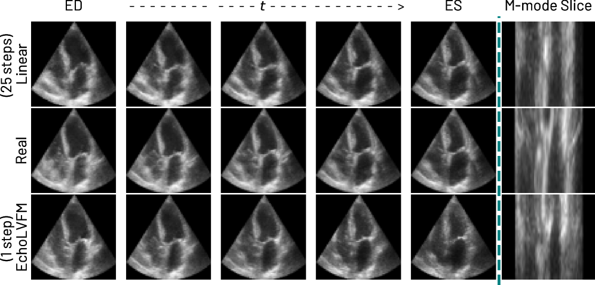
*Figure 2:Qualitative Results. Columns 1-5 show frames sampled between and including ED and ES, while column 6 presents the M-mode slice of the middle row over time.*

---
**Usage Info**: 4333 tokens used.
**Generated at**: 2026-03-17 13:05:11

---

# 📚 What Counts as Real? Speech Restoration and Voice Quality Conversion Pose New Challenges to Deepfake Detection

🚀 URL: https://arxiv.org/html/2603.14033

## 🌏 Abstract (원문)
Audio anti-spoofing systems are typically formulated as binary classifiers distinguishing bona fide from spoofed speech. This assumption fails under layered generative processing, where benign transformations introduce distributional shifts that are misclassified as spoofing. We show that phonation-modifying voice conversion and speech restoration are treated as out-of-distribution despite preserving speaker authenticity. Using a multi-class setup separating bona fide, converted, spoofed, and converted-spoofed speech, we analyse model behaviour through self-supervised learning (SSL) embeddings and acoustic correlates. The benign transformations induce a drift in the SSL space, compressing bona fide and spoofed speech and reducing classifier separability. Reformulating anti-spoofing as a multi-class problem improves robustness to benign shifts while preserving spoof detection, suggesting binary systems model the distribution of raw speech rather than authenticity itself.
## 🌏 Abstract (번역)
오디오 안티-스푸핑 시스템은 일반적으로 진짜 음성(bona fide)과 스푸핑된 음성을 구별하는 이진 분류기로 구성됩니다. 이러한 가정은 양성 변환(benign transformations)이 분포적 변화를 일으켜 스푸핑으로 오분류되는 계층적 생성 처리(layered generative processing)에서는 실패합니다. 우리는 발성 변형 음성 변환(phonation-modifying voice conversion)과 음성 복원(speech restoration)이 화자 진정성을 보존함에도 불구하고 분포 외(out-of-distribution)로 처리됨을 보여줍니다. 진짜 음성, 변환된 음성, 스푸핑된 음성, 변환-스푸핑된 음성을 분리하는 다중 클래스 설정을 사용하여, 우리는 자기 지도 학습(SSL) 임베딩과 음향 상관 관계를 통해 모델 동작을 분석합니다. 양성 변환은 SSL 공간에서 드리프트를 유발하여 진짜 음성과 스푸핑된 음성을 압축하고 분류기 분리 가능성을 감소시킵니다. 안티-스푸핑을 다중 클래스 문제로 재구성하는 것은 스푸핑 탐지를 유지하면서 양성 변화에 대한 견고성을 향상시키며, 이는 이진 시스템이 진정성 자체보다는 원시 음성의 분포를 모델링함을 시사합니다.

## 🔍 Methods & Results
- 자기 지도 학습(SSL) 공간(HuBERT, Whisper, Wav2Vec2 임베딩 사용)에서 t-SNE 플롯을 이용한 분석을 수행하여 변환이 스푸핑 탐지 표현 공간에 미치는 영향을 조사하고, 음성 품질 변환(VQC)에 따른 임베딩 이동의 방향 일관성을 측정함.
- 분류 결과 해석을 위해 성문 음원 파라미터 및 스펙트럼 기울기를 포함한 음향 분석을 실시함.
- 두 가지 분류 아키텍처를 비교: Wav2Vec2, HuBERT, Whisper의 평균 풀링된 SSL 임베딩을 연결한 MLP (이진 및 4방향)와 사전 훈련된 DF-Arena 1B 모델.
- DF-Arena 모델의 이진 헤드를 4클래스 헤드로 교체하여 다중 클래스 탐지를 위해 미세 조정했으며, Wav2Vec2 백본은 고정함.
- MLAAD 데이터셋으로만 훈련된 모델은 도메인 내 정확도(~99%)는 높았으나, ASVspoof5와 같은 교차 도메인에서는 진짜 음성 정확도가 0.1%로 급락하는 등 심각한 성능 저하를 보임.
- 교차 도메인 성능 회복을 위해 MLAAD와 ASVspoof5 데이터를 혼합한 도메인 훈련을 수행하고, Sidon으로 강화된 발화를 추가하여 훈련 세트를 증강함.
- 성능 평가는 결정 임계값에 의존하는 정확도 대신 EERsrc 및 EERproc와 같은 임계값 없는 지표를 주로 사용함.

## 🖼 Figures
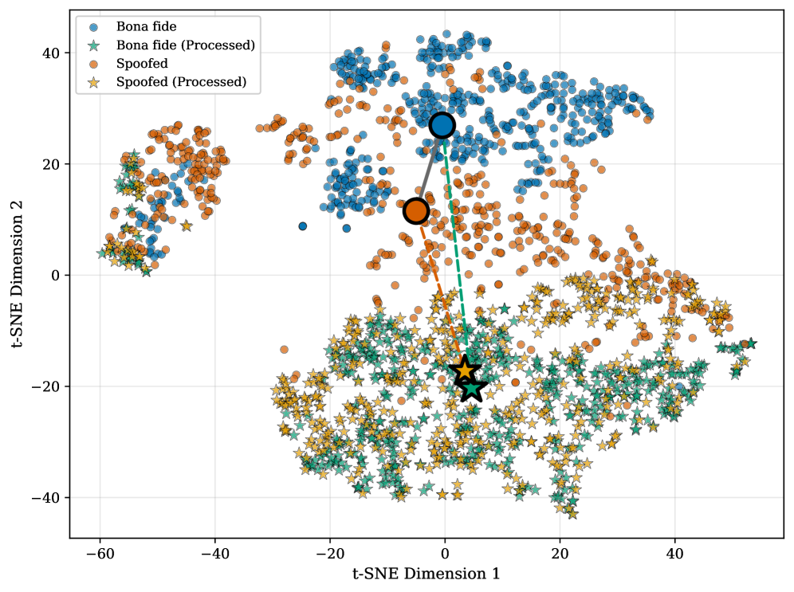
*Figure 1:t-SNE plots of Wav2Vec2 embeddings before and after VQC on MLAAD matched dataset.*

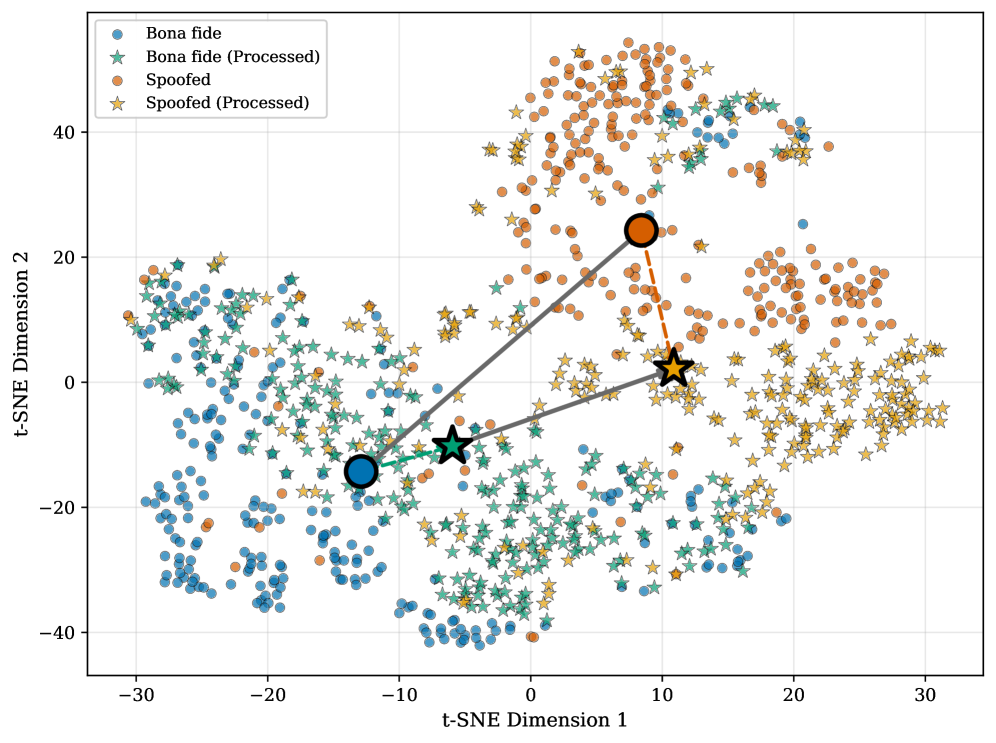
*Figure 2:t-SNE plots of Wav2Vec2 embeddings before and after Sidon enhancement on MLAAD matched dataset.*

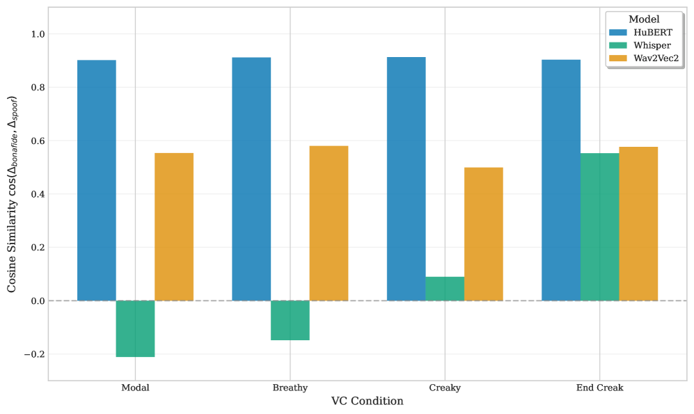
*Figure 3:Directional consistency of VQC-induced embedding shifts between mean bona fide and spoofed shift vectors. Whisper shows lower or negative values, suggesting potential source-dependent shift directions.*

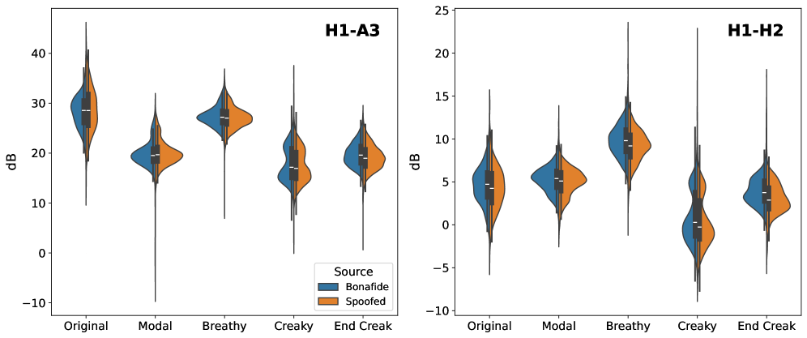
*Figure 4:The acoustic feature shifts between the original M-AILABS/MLAAD recordings and the converted recordings by voice quality.*

---
**Usage Info**: 3515 tokens used.
**Generated at**: 2026-03-17 13:05:24

---

# 📚 Deep Filter Estimation from Inter-Frame Correlations for Monaural Speech Dereverberation

🚀 URL: https://arxiv.org/html/2603.14986

## 🌏 Abstract (원문)
Speech dereverberation in distant-microphone scenarios remains challenging due to the high correlation between reverberation and target signals, often leading to poor generalization in real-world environments. We propose IF-CorrNet, a correlation-to-filter architecture designed for robustness against acoustic variability. Unlike conventional black-box mapping methods that directly estimate complex spectra, IF-CorrNet explicitly exploits inter-frame STFT correlations to estimate multi-frame deep filters for each time-frequency bin. By shifting the learning objective from direct mapping to filter estimation, the network effectively constrains the solution space, which simplifies the training process and mitigates overfitting to synthetic data. Experimental results on the REVERB Challenge dataset demonstrate that IF-CorrNet achieves a substantial gain in the SRMR metric on RealData, confirming its robustness in suppressing reverberation and noise in practical, non-synthetic environments.
## 🌏 Abstract (번역)
원거리 마이크 환경에서의 음성 잔향 제거는 잔향과 목표 신호 간의 높은 상관관계로 인해 여전히 어려운 문제이며, 이는 종종 실제 환경에서 낮은 일반화 성능으로 이어진다. 본 논문에서는 음향 가변성에 대한 강건성을 위해 설계된 상관관계-필터(correlation-to-filter) 아키텍처인 IF-CorrNet을 제안한다. 복소 스펙트럼을 직접 추정하는 기존의 블랙박스 매핑 방식과 달리, IF-CorrNet은 프레임 간 STFT 상관관계를 명시적으로 활용하여 각 시간-주파수 빈에 대한 다중 프레임 딥 필터를 추정한다. 학습 목표를 직접 매핑에서 필터 추정으로 전환함으로써, 네트워크는 솔루션 공간을 효과적으로 제약하여 훈련 과정을 단순화하고 합성 데이터에 대한 과적합을 완화한다. REVERB Challenge 데이터셋의 RealData에 대한 실험 결과는 IF-CorrNet이 SRMR 지표에서 상당한 성능 향상을 달성했음을 보여주며, 실제 비합성 환경에서 잔향 및 노이즈 억제에 대한 강건성을 확인시켜준다.

## 🔍 Methods & Results
- IF-CorrNet은 음향 가변성에 대한 강건성을 위해 설계된 상관관계-필터(correlation-to-filter) 아키텍처이다.
- 기존의 복소 스펙트럼 직접 추정 방식과 달리, IF-CorrNet은 프레임 간 STFT 상관관계를 명시적으로 활용하여 각 시간-주파수 빈에 대한 다중 프레임 딥 필터를 추정한다.
- 학습 목표를 직접 매핑에서 필터 추정으로 전환하여 솔루션 공간을 효과적으로 제약하고, 훈련 과정을 단순화하며, 합성 데이터에 대한 과적합을 완화한다.
- REVERB Challenge 데이터셋의 RealData에서 SRMR 지표에서 상당한 성능 향상을 달성했다.
- 실제 비합성 환경에서 잔향 및 노이즈 억제에 대한 강건성을 입증했다.

## 🖼 Figures
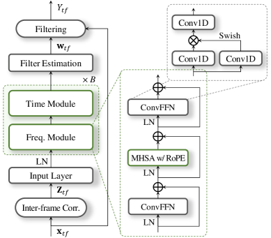
*Figure 1:Overall architecture of IF-CorrNet. Inter-frame correlations are processed through input layer, and frequency and time modules to estimate multi-frame filters.*

*(a)*

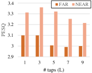
*(a)*

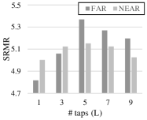
*(b)*

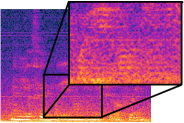
*(a)*

*(a)*

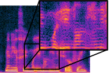
*(b)*

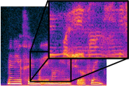
*(c)*

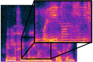
*(d)*

---
**Usage Info**: 1462 tokens used.
**Generated at**: 2026-03-17 13:05:37

---

# 📚 Self-Flow-Matching assisted Full Waveform Inversion

🚀 URL: https://arxiv.org/html/2603.13425

## 🌏 Abstract (원문)
Full-waveform inversion (FWI) is a high-resolution seismic imaging method that estimates subsurface velocity by matching simulated and recorded waveforms. However, FWI is highly nonlinear, prone to cycle skipping, and sensitive to noise, particularly when low frequencies are missing or the initial model is poor, leading to failures under imperfect acquisition. Diffusion-regularized FWI introduces generative priors to encourage geologically realistic models, but these priors typically require costly offline pretraining and can deteriorate under distribution shift. Moreover, they assume Gaussian initialization and a fixed noise schedule, in which it is unclear how to map a deterministic FWI iterate and its starting model to a well-defined diffusion time or noise level. To address these limitations, we introduce Self-Flow-Matching assisted Full-Waveform Inversion (SFM-FWI), a physics-driven framework that eliminates the need for large-scale offline pretraining while avoiding the noise-level alignment ambiguity. SFM-FWI leverages flow matching to learn a transport field without assuming Gaussian initialization or a predefined noise schedule, so the initial model can be used directly as the starting point of the dynamics. Our approach trains a single flow network online using the governing physics and observed data. At each outer iteration, we build an interpolated model and update the flow by backpropagating the FWI data misfit, providing self-supervision without external training pairs. Experiments on challenging synthetic benchmarks show that SFM-FWI delivers more accurate reconstructions, greater noise robustness, and more stable convergence than standard FWI and pretraining-free regularization methods.
## 🌏 Abstract (번역)
전파형 역산(FWI)은 시뮬레이션된 파형과 기록된 파형을 일치시켜 지하 속도를 추정하는 고해상도 지진 영상화 방법입니다. 그러나 FWI는 비선형성이 강하고, 사이클 스키핑에 취약하며, 특히 저주파가 없거나 초기 모델이 좋지 않을 때 노이즈에 민감하여 불완전한 취득 조건에서 실패로 이어질 수 있습니다. 확산 정규화 FWI는 지질학적으로 현실적인 모델을 장려하기 위해 생성형 사전 정보를 도입하지만, 이러한 사전 정보는 일반적으로 비용이 많이 드는 오프라인 사전 학습을 필요로 하며 분포 변화에 따라 성능이 저하될 수 있습니다. 또한, 이들은 가우시안 초기화와 고정된 노이즈 스케줄을 가정하는데, 결정론적 FWI 반복자와 그 시작 모델을 잘 정의된 확산 시간 또는 노이즈 레벨에 매핑하는 방법이 불분명합니다. 이러한 한계를 해결하기 위해, 우리는 대규모 오프라인 사전 학습의 필요성을 없애고 노이즈 레벨 정렬 모호성을 피하는 물리 기반 프레임워크인 자기-흐름-매칭 지원 전파형 역산(SFM-FWI)을 소개합니다. SFM-FWI는 흐름 매칭을 활용하여 가우시안 초기화나 사전 정의된 노이즈 스케줄을 가정하지 않고 전송 필드를 학습하므로, 초기 모델을 동역학의 시작점으로 직접 사용할 수 있습니다. 우리의 접근 방식은 지배적인 물리 법칙과 관측된 데이터를 사용하여 단일 흐름 네트워크를 온라인으로 훈련합니다. 각 외부 반복에서, 우리는 보간된 모델을 구축하고 FWI 데이터 불일치를 역전파하여 흐름을 업데이트하며, 외부 훈련 쌍 없이 자체 감독을 제공합니다. 도전적인 합성 벤치마크에 대한 실험은 SFM-FWI가 표준 FWI 및 사전 학습 없는 정규화 방법보다 더 정확한 재구성, 더 큰 노이즈 강건성 및 더 안정적인 수렴을 제공함을 보여줍니다.

## 🔍 Methods & Results
- 표준 FWI는 시뮬레이션된 지진 기록과 관측된 기록을 일치시켜 지하 모델 파라미터(지진 속도)를 추정하는 파동 방정식 제약 최적화 문제로, 비선형성이 강하고 사이클 스키핑 및 노이즈에 민감하다.
- 기존 확산 기반 생성형 사전 정보는 비용이 많이 드는 오프라인 사전 학습, 분포 변화에 따른 성능 저하, 가우시안 초기화 및 고정된 노이즈 스케줄 가정으로 인해 FWI 반복자와 확산 시간/노이즈 레벨 간의 모호성 문제가 있었다.
- SFM-FWI는 이러한 한계를 해결하기 위해 대규모 오프라인 사전 학습 없이 물리 기반으로 작동하며, 노이즈 레벨 정렬 모호성을 피한다.
- SFM-FWI는 흐름 매칭을 활용하여 전송 필드를 학습하며, 가우시안 초기화나 사전 정의된 노이즈 스케줄 없이 초기 모델을 동역학의 시작점으로 직접 사용한다.
- 이 방법은 지배적인 파동 물리학과 관측 데이터를 사용하여 단일 흐름 네트워크를 온라인으로 훈련한다.
- 각 외부 반복에서, 보간된 중간 모델을 구축하고 FWI 데이터 불일치(data misfit)를 역전파하여 흐름을 업데이트함으로써 외부 훈련 쌍 없이 자체 감독(self-supervision)을 제공한다.
- 모델 업데이트는 `m_t = (1-t)m_0 + t*m^1`로 보간된 중간 모델을 사용하고, 흐름 네트워크 `v_theta(m_t, t)`가 생성하는 흐름 유도 제안 `m^1,k = m_t + (1-t)v_theta(m_t, t)`의 FWI 데이터 불일치를 최소화하여 네트워크 파라미터 `theta`를 업데이트한다.
- FWI 기울기는 `Deepwave` 미분 가능한 파동 방정식 솔버를 사용하여 자동 미분 방식으로 계산된다.
- SFM-FWI는 U-Net을 사용하여 시간 의존적 흐름 필드 `v_theta(m_t, t)`를 파라미터화하며, 이는 다중 스케일 구조를 포착하고 공간 해상도를 유지한다.
- 도전적인 합성 벤치마크 실험 결과, SFM-FWI는 표준 FWI 및 사전 학습 없는 정규화 방법보다 더 정확한 재구성, 더 큰 노이즈 강건성, 그리고 더 안정적인 수렴을 제공한다.

## 🖼 Figures

*Figure 1:SFM-FWI schematic. The method alternates between outer sampling and inner misfit-driven online training of a flow network to update 
𝐦
^
1
. This produces a stable coarse-to-fine inversion without pretrained priors.*

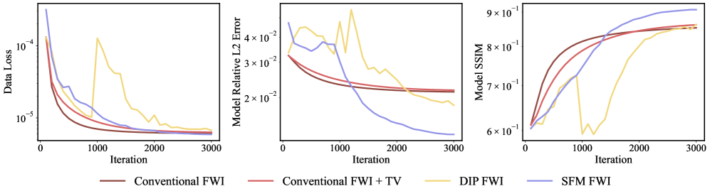
*Figure 2:Convergence curves on the Marmousi sub-region benchmark. Left: data-misfit versus iteration. Middle: relative L2 error of the inverted velocity model with respect to the ground truth. Right: SSIM versus iteration.*

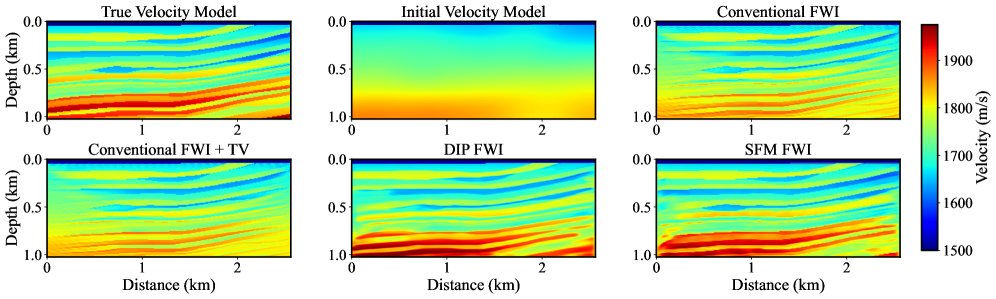
*Figure 3:Marmousi sub-region inversion results (clean data). Top row: true velocity model, Gaussian-smoothed initial model, and conventional FWI result. Bottom row: TV-regularized FWI, DIP-FWI, and the proposed SFM-FWI.*

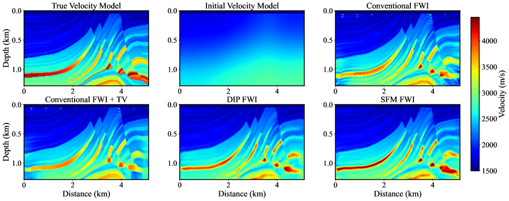
*Figure 4:Marmousi inversion results (clean data). Top row: true velocity model, Gaussian-smoothed initial model, and conventional FWI result. Bottom row: TV-regularized FWI, DIP-assisted FWI, and the proposed SFM-FWI.*

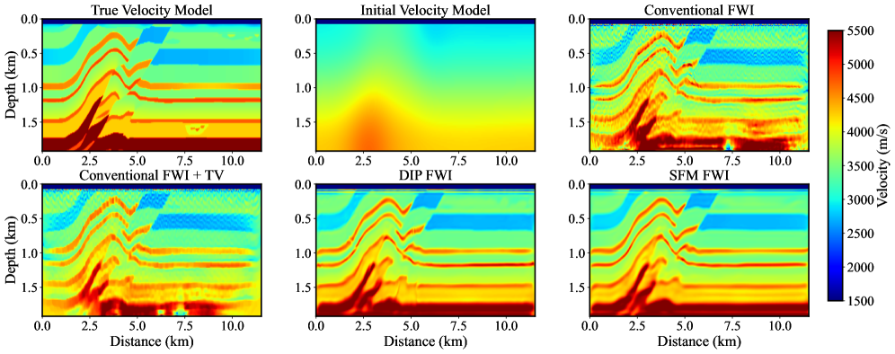
*Figure 5:Overthrust inversion results (clean data). Top row: true velocity model, Gaussian-smoothed initial model, and conventional FWI result. Bottom row: TV-regularized FWI, DIP-assisted FWI, and the proposed SFM-FWI.*

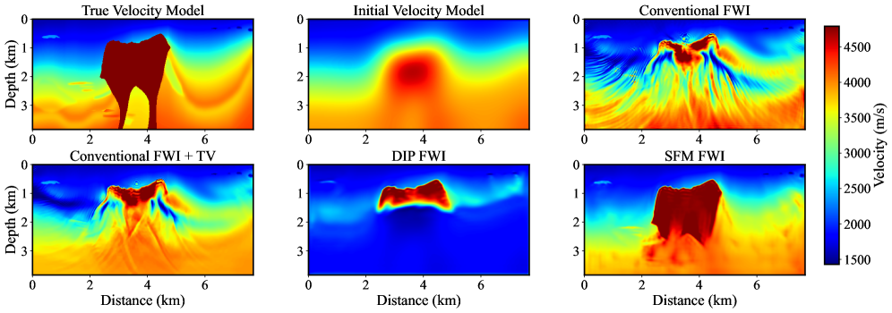
*Figure 6:Salt body inversion results (clean data). Top row: true velocity model, Gaussian-smoothed initial model, and conventional FWI result. Bottom row: TV-regularized FWI, DIP-assisted FWI, and the proposed SFM-FWI.*

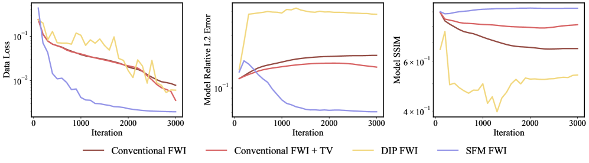
*Figure 7:Convergence curves on the salt-body benchmark. Left: data-misfit versus iteration. Middle: relative L2 error of the inverted velocity model with respect to the ground truth. Right: SSIM versus iteration.*

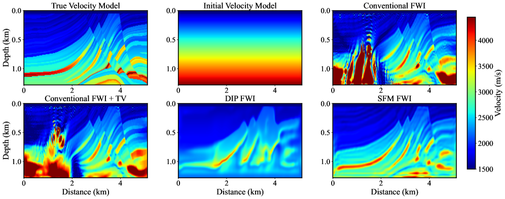
*Figure 8:Marmousi inversion results (poor initial model). Top row: true velocity model, Gaussian-smoothed initial model, and conventional FWI result. Bottom row: TV-regularized FWI, DIP-assisted FWI, and the proposed SFM-FWI.*

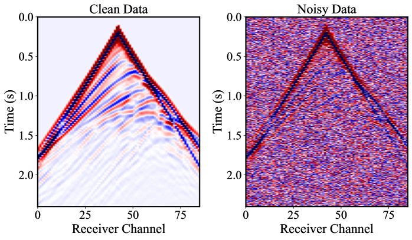
*Figure 9:Simulated synthetic shot gathers recorded at 2.5 km (left) before adding noise, and corresponding noisy data (right).*

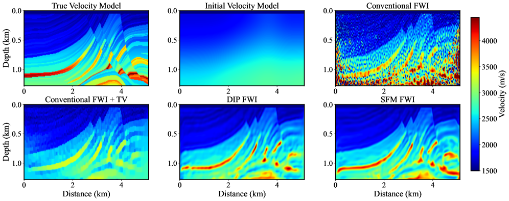
*Figure 10:Marmousi inversion results (noisy data). Top row: true velocity model, Gaussian-smoothed initial model, and conventional FWI result. Bottom row: TV-regularized FWI, DIP-assisted FWI, and the proposed SFM-FWI.*

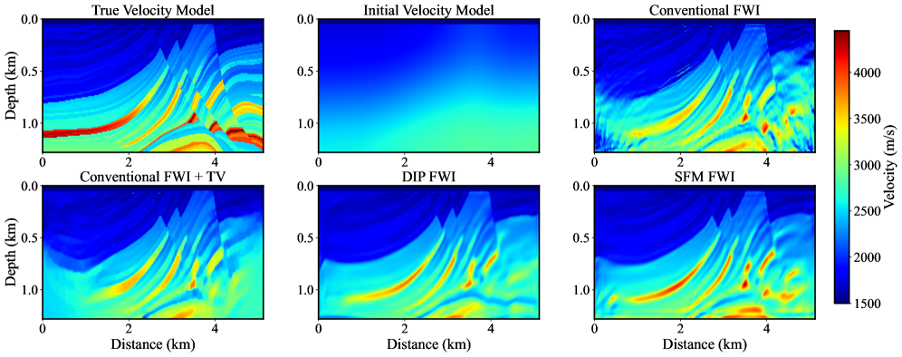
*Figure 11:Marmousi inversion results (sparse shots). Top row: true velocity model, Gaussian-smoothed initial model, and conventional FWI result. Bottom row: TV-regularized FWI, DIP-assisted FWI, and the proposed SFM-FWI.*

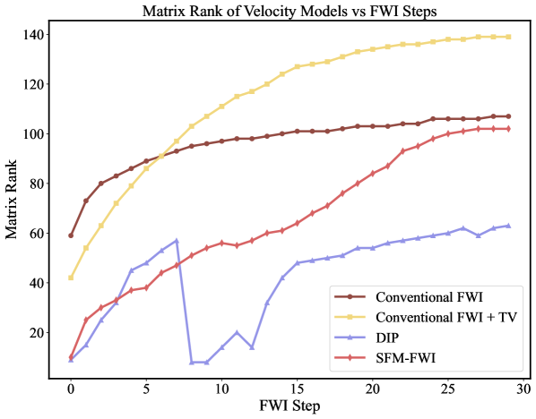
*Figure 12:The rank evolution of inverted velocity models with different approaches.*

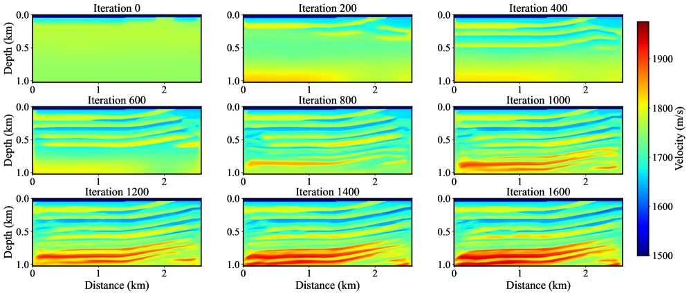
*Figure 13:The inversion evolution at different iteration steps.*

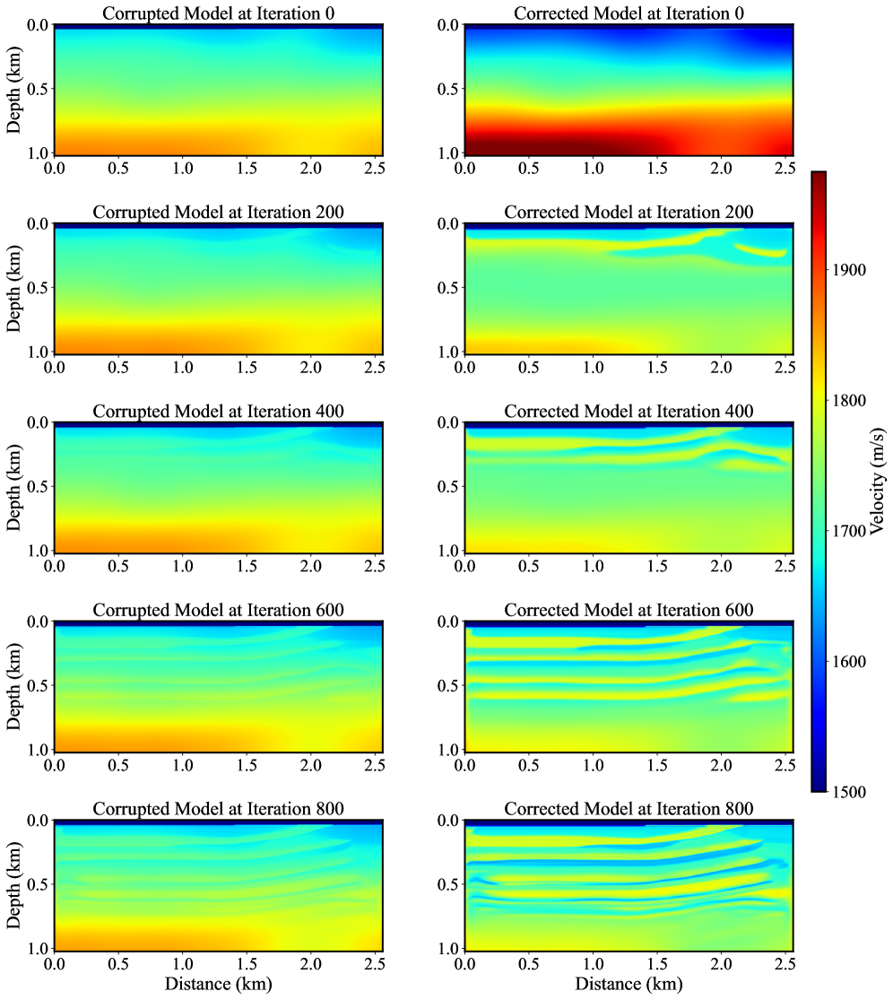
*Figure 14:Potential deblurring (inverse-Hessian-like) effect of SFM-FWI. The left panel represents the corrupted velocity models, and the right panel represents the corresponding corrected velocity models after the flow network prediction.*

*Figure 15:Ablation study on the sensitivity of SFM-FWI to the number of outer steps 
𝑇
 and inner steps 
𝐾
 on the Marmousi sub-region benchmark under a fixed budget 
𝑇
×
𝐾
=
3000
. Left: relative L2 error versus iteration. Right: SSIM versus iteration.*

![Figure 16:Comparison with a pretrained diffusion-prior baseline on the Overthrust benchmark. From left to right: true velocity model, smoothed initial model, DiffusionFWI using pretrained weights from (Wang et al., 2023) (trained on OpenFWI), a pretraining-free self-diffusion variant of our approach (Self-diffusion FWI), and the proposed SFM-FWI. The relative L2 errors of those approaches are 0.0530, 0.0445, and 0.0365, while the corresponding SSIMs are 0.7806, 0.8336, and 0.8730. SFM-FWI better matches both structure and amplitudes, yielding the lowest model error and the highest SSIM.](../images/2026-03-17/2603.13425/2603.13425_fig15.png)
*Figure 16:Comparison with a pretrained diffusion-prior baseline on the Overthrust benchmark. From left to right: true velocity model, smoothed initial model, DiffusionFWI using pretrained weights from (Wang et al., 2023) (trained on OpenFWI), a pretraining-free self-diffusion variant of our approach (Self-diffusion FWI), and the proposed SFM-FWI. The relative L2 errors of those approaches are 0.0530, 0.0445, and 0.0365, while the corresponding SSIMs are 0.7806, 0.8336, and 0.8730. SFM-FWI better matches both structure and amplitudes, yielding the lowest model error and the highest SSIM.*

---
**Usage Info**: 5313 tokens used.
**Generated at**: 2026-03-17 13:05:56

---

# 📚 LLM-Guided Reinforcement Learning for Audio-Visual Speech Enhancement

🚀 URL: https://arxiv.org/html/2603.13952

## 🌏 Abstract (원문)
In existing Audio-Visual Speech Enhancement (AVSE) methods, objectives such as Scale-Invariant Signal-to-Noise Ratio (SI-SNR) and Mean Squared Error (MSE) are widely used; however, they often correlate poorly with perceptual quality and provide limited interpretability for optimization. This work proposes a reinforcement learning–based AVSE framework with a Large Language Model (LLM)-based interpretable reward model. An audio LLM generates natural language descriptions of enhanced speech, which are converted by a sentiment analysis model into a 1–5 rating score serving as the PPO reward for fine-tuning a pretrained AVSE model. Compared with scalar metrics, LLM-generated feedback is semantically rich and explicitly describes improvements in speech quality. Experiments on the 4th COG-MHEAR AVSE Challenge (AVSEC-4) dataset show that the proposed method outperforms a supervised baseline and a DNSMOS-based RL baseline in PESQ, STOI, neural quality metrics, and subjective listening tests.
## 🌏 Abstract (번역)
기존의 오디오-시각 음성 향상(AVSE) 방법에서는 SI-SNR(Scale-Invariant Signal-to-Noise Ratio) 및 MSE(Mean Squared Error)와 같은 목적 함수가 널리 사용되지만, 이는 종종 지각 품질과 상관관계가 낮고 최적화를 위한 제한적인 해석 가능성을 제공합니다. 본 연구는 대규모 언어 모델(LLM) 기반의 해석 가능한 보상 모델을 갖춘 강화 학습 기반 AVSE 프레임워크를 제안합니다. 오디오 LLM은 향상된 음성의 자연어 설명을 생성하며, 이는 감성 분석 모델에 의해 1-5점의 평가 점수로 변환되어 사전 훈련된 AVSE 모델을 미세 조정하기 위한 PPO 보상으로 사용됩니다. 스칼라 측정 지표와 비교할 때, LLM이 생성한 피드백은 의미론적으로 풍부하며 음성 품질 개선 사항을 명시적으로 설명합니다. 제4회 COG-MHEAR AVSE 챌린지(AVSEC-4) 데이터셋에 대한 실험 결과, 제안된 방법은 PESQ, STOI, 신경망 품질 측정 지표 및 주관적 청취 테스트에서 지도 학습 기반 기준선과 DNSMOS 기반 RL 기준선보다 우수한 성능을 보였습니다.

## 🔍 Methods & Results
- 본 연구는 기존 AVSE 모델을 기반으로 음성 향상(SE) 문제를 강화 학습 문제로 재구성하는 LR-AVSE(LLM-Reward AVSE) 접근 방식을 제안한다.
- AVSE 모델은 인코더-분리자-디코더 아키텍처를 사용하며, 분리자는 시각적 특징과 융합된 오디오 특징을 처리하는 TCN(Temporal Convolutional Network)을 채택한다.
- 강화 학습의 확률성 요구 사항을 충족하기 위해 예측된 마스크에 가우시안 노이즈를 주입하여 RL 마스크를 생성한다.
- LLM 기반 해석 가능한 보상 모델을 사용한다: 오디오 LLM이 향상된 음성의 자연어 설명을 생성하고, 감성 분석 모델이 이를 1-5점의 감성 점수로 변환하여 PPO 보상으로 활용한다.
- 보상은 상대적 개선도(강화 학습 정책 출력과 사전 훈련된 정책 출력 간의 보상 모델 점수 차이)로 계산되어 훈련 안정성을 높인다.
- LLM 기반 보상의 효과를 검증하기 위해 DNSMOS 예측 MOS 점수를 보상으로 사용하는 비교 방법도 구현하였다.
- 최적화 목표는 PPO 손실, RL 정책과 기본 정책 간의 KL 발산 정규화, 그리고 모델 안정화를 위한 원래의 SI-SNR 손실을 결합한다.
- PPO 클립 손실을 사용하여 정책 업데이트를 수행하며, 기존의 어드밴티지 함수 대신 보상 모델의 출력 L(phi)를 활용하여 비평 네트워크 없이 구조를 단순화한다.
- 제4회 COG-MHEAR AVSE Challenge (AVSEC-4) 데이터셋에 대한 실험 결과, 제안된 방법은 PESQ, STOI, 신경망 품질 측정 지표 및 주관적 청취 테스트에서 지도 학습 기준선과 DNSMOS 기반 RL 기준선보다 우수한 성능을 달성했다.

## 🖼 Figures
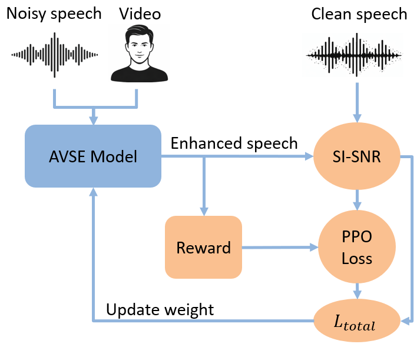
*Figure 1:The training procedure of the proposed LR-AVSE framework.*

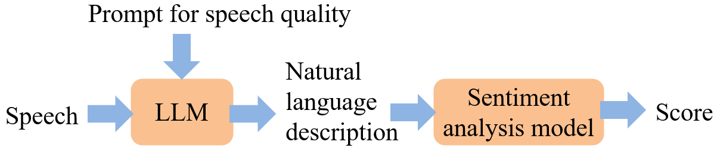
*Figure 2:Pipeline of the LLM-based interpretable reward generation.*

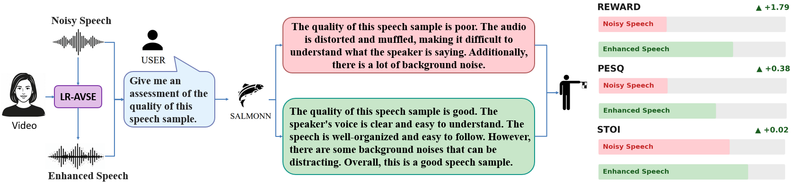
*Figure 3:LR-AVSE inference with SALMONN. Rewards from textual descriptions align with PESQ and STOI, demonstrating LR-AVSE’s interpretability.*

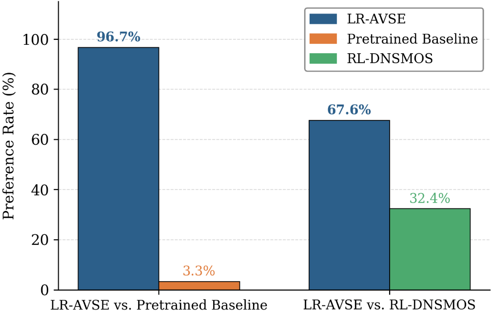
*Figure 4:A/B preference test results on the AVSEC-4 test set.*

---
**Usage Info**: 3116 tokens used.
**Generated at**: 2026-03-17 13:06:39

---

