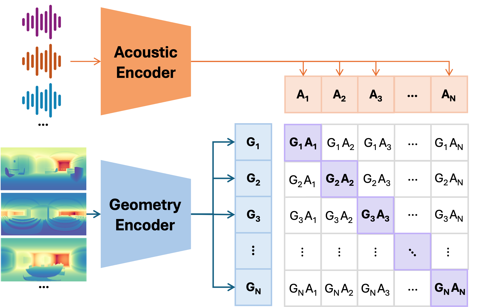
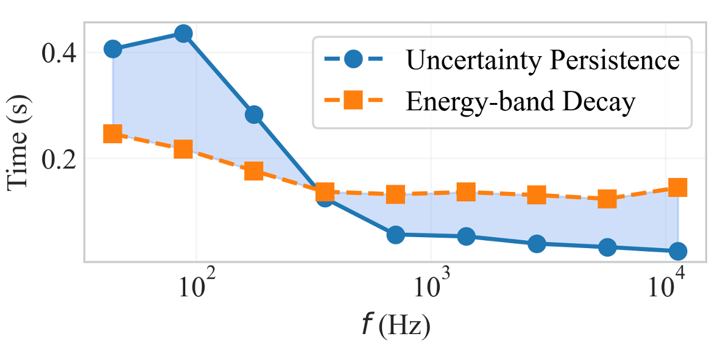
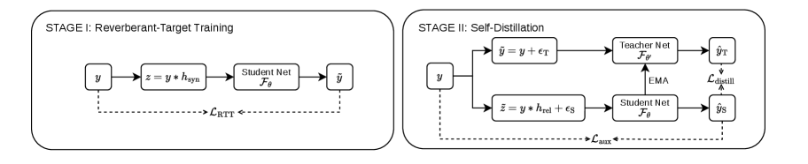
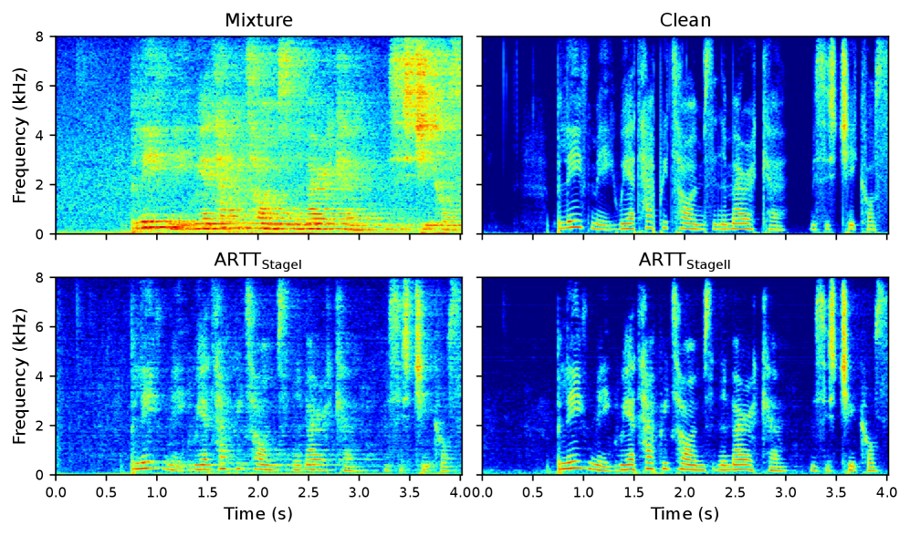
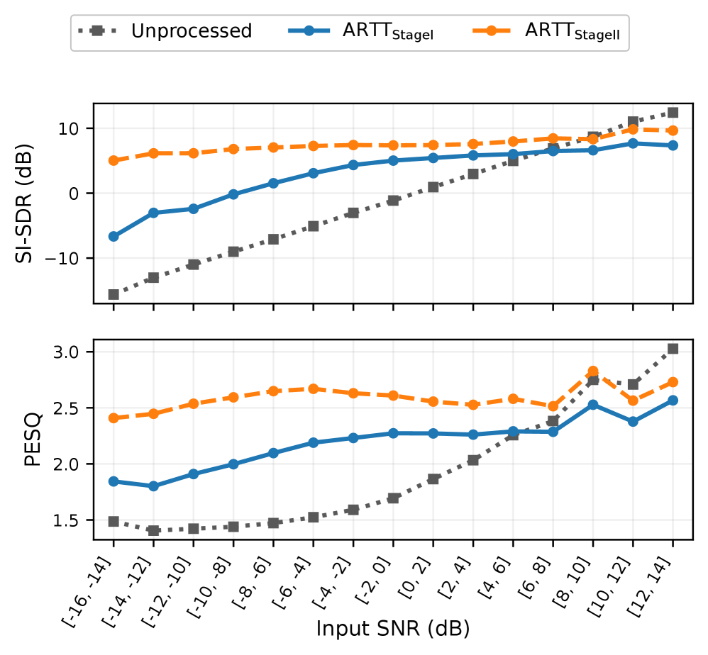
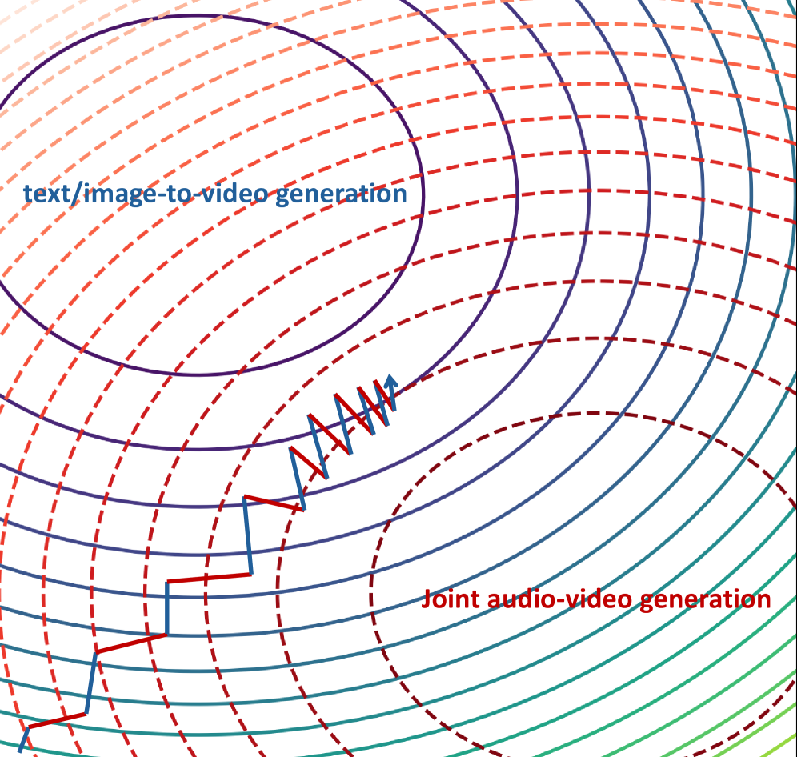
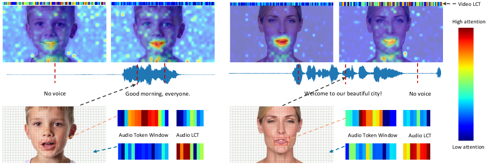

# 🚩 (2026-03-20) Scholar Inbox 추천 논문 

# 📚 Few-shot Acoustic Synthesis with Multimodal Flow Matching

🚀 URL: https://arxiv.org/html/2603.19176

## 🌏 Abstract (원문)
Generating audio that is acoustically consistent with a scene is essential for immersive virtual environments. Recent neural acoustic field methods enable spatially continuous sound rendering but remain scene-specific, requiring dense audio measurements and costly training for each environment. Few-shot approaches improve scalability across rooms but still rely on multiple recordings and, being deterministic, fail to capture the inherent uncertainty of scene acoustics under sparse context. We introduceflow-matchingacoustic generation (FLAC), a probabilistic method for few-shot acoustic synthesis that models the distribution of plausible room impulse responses (RIRs) given minimal scene context. FLAC leverages a diffusion transformer trained with a flow-matching objective to generate RIRs at arbitrary positions in novel scenes, conditioned on spatial, geometric, and acoustic cues. FLAC outperforms state-of-the-art eight-shot baselines with one-shot on both the AcousticRooms and Hearing Anything Anywhere datasets. To complement standard perceptual metrics, we further introduce AGREE, a jointacoustic–geometryembedding, enabling geometry-consistent evaluation of generated RIRs through retrieval and distributional metrics. This work is the first to apply generative flow matching to explicit RIR synthesis, establishing a new direction for robust and data-efficient acoustic synthesis. Project page:https://amandinebtto.github.io/FLAC/
## 🌏 Abstract (번역)
장면에 음향적으로 일관된 오디오를 생성하는 것은 몰입형 가상 환경에 필수적입니다. 최근의 신경 음향장(neural acoustic field) 방법은 공간적으로 연속적인 사운드 렌더링을 가능하게 하지만, 여전히 장면별로 특화되어 있어 각 환경에 대해 밀집된 오디오 측정과 값비싼 훈련이 필요합니다. 소수샷(few-shot) 접근 방식은 여러 방에 걸쳐 확장성을 향상시키지만, 여전히 여러 녹음에 의존하며, 결정론적이기 때문에 희소한 컨텍스트에서 장면 음향의 내재된 불확실성을 포착하지 못합니다. 본 논문에서는 최소한의 장면 컨텍스트가 주어졌을 때 그럴듯한 실내 임펄스 응답(RIR) 분포를 모델링하는 소수샷 음향 합성을 위한 확률론적 방법인 플로우 매칭 음향 생성(FLAC)을 소개합니다. FLAC은 공간적, 기하학적, 음향적 단서에 조건화되어 새로운 장면의 임의의 위치에서 RIR을 생성하기 위해 플로우 매칭 목표로 훈련된 확산 트랜스포머를 활용합니다. FLAC은 AcousticRooms 및 Hearing Anything Anywhere 데이터셋 모두에서 원샷(one-shot)으로 최첨단 8샷(eight-shot) 기준선을 능가합니다. 표준 지각 메트릭을 보완하기 위해, 우리는 검색 및 분포 메트릭을 통해 생성된 RIR의 기하학적 일관성 평가를 가능하게 하는 공동 음향-기하학 임베딩인 AGREE를 추가로 소개합니다. 이 연구는 명시적인 RIR 합성에 생성형 플로우 매칭을 적용한 최초의 작업으로, 견고하고 데이터 효율적인 음향 합성을 위한 새로운 방향을 제시합니다. 프로젝트 페이지: https://amandinebtto.github.io/FLAC/

## 🔍 Methods & Results
- FLAC은 소수샷 장면 정보로부터 RIR을 합성하기 위해 플로우 매칭으로 훈련된 조건부 잠재 생성 모델이며, 변이형 오토인코더(VAE), 다중 모달 컨디셔너, 확산 트랜스포머로 구성된다.
- FLAC은 희소한 관측 하에서 RIR 예측에 내재된 불확실성을 포착하기 위해 확률적 생성 모델을 사용하여 소수샷 RIR 합성의 본질적으로 모호한 문제를 해결한다.
- RIR 합성을 위해 데이터와 노이즈를 선형적으로 보간하는 정류 플로우 매칭(rectified flow matching) 공식을 사용하여 훈련되며, 이는 추론 시 통합 단계 수를 줄인다.
- VAE는 RIR 파형을 잠재 표현으로 압축하며, 다중 해상도 STFT 손실, 적대적 힌지 손실, 특징 매칭 손실, KL 발산 손실을 포함하는 보완적인 목표로 훈련된다.
- 다중 모달 컨디셔너는 음향(ResNet-18로 컨텍스트 RIR 인코딩), 공간(수신기의 로컬 좌표계에서 소스 위치 인코딩), 기하학적(수신기에서 파노라마 깊이 맵을 DINOv3 ViT로 인코딩) 단서를 처리한다.
- 확산 트랜스포머(DiT)는 속도장을 매개변수화하며, RoPE를 사용한 셀프 어텐션, 컨디셔닝 토큰에 대한 크로스 어텐션, 피드포워드 네트워크로 구성된 다층 트랜스포머 아키텍처를 사용한다.
- FLAC은 공간적, 기하학적, 음향적 단서에 조건화되어 새로운 장면의 임의의 위치에서 RIR을 생성하며, AcousticRooms 및 Hearing Anything Anywhere 데이터셋에서 최첨단 8샷 기준선을 원샷으로 능가하는 성능을 보인다.
- 표준 지각 메트릭을 보완하기 위해, 검색 및 분포 메트릭을 통해 생성된 RIR의 기하학적 일관성 평가를 가능하게 하는 공동 음향-기하학 임베딩인 AGREE를 도입했다.
- 이 연구는 명시적인 RIR 합성에 생성형 플로우 매칭을 적용한 최초의 작업으로, 견고하고 데이터 효율적인 음향 합성을 위한 새로운 방향을 제시한다.

## 🖼 Figures

*Figure 2:Training and inference pipelines of FLAC: During training, a pre-trained VAE encodes ground-truth RIRs into latents 
𝐳
0
. Latents are linearly interpolated with noise to form 
𝐳
𝑡
. A DiT is trained to predict the velocity 
𝐯
^
𝑡
 that transports 
𝐳
𝑡
 toward the original data distribution. At inference, RIRs are generated from random noise, guided by the few-shot spatial, geometric and acoustic context.*

*Figure 3:FLAC diffusion transformer: The noise timestep 
𝑡
 and the target RIR pose are injected via AdaLN. Acoustic, spatial and geometric context are provided through cross-attention.*

*Figure 4:AGREE contrastive framework: Audio and geometry inputs are encoded into a shared latent space, where a contrastive objective maximizes similarity for matching pairs (diagonal entries) and minimizes it for mismatched ones.*

*Figure 5:Impact of classifier-free guidance and inference steps: Evolution of T60 and FDG as a function of the guidance scale 
𝜔
 and the number of timesteps.*

*Figure 6:Robustness to limited context RIRs in novel scenes: Performance as the number of reference RIRs (
𝐾
) decreases for KNN, xRIR, and FLAC. FLAC remains the most stable and outperforms state-of-the-art methods with 
𝐾
=
8
 even in one-shot.*

*Figure 7:Octave-band analysis of 4 RIRs in unseen rooms: 100 samples per instance are generated with FLAC. The mean and 
±
3
 standard deviation (covering 99.7% of the distribution) are shown. Std increases at low frequencies.*

*Figure 8:Uncertainty persistence time and band-wise energy decay, averaged over 100 unseen samples. Uncertainty lasts longer at low frequencies and decays faster at high frequencies.*

![Figure A.1:Geometry module pipeline: A panoramic depth map captured at the receiver position is unprojected into a 3D point cloud using the equirectangular projection 
𝒫
, then reprojected so that each pixel encodes its corresponding 3D coordinates. We subtract the source pose associated with the RIR (previously projected in the receiver frame). The resulting representation is processed by a ViT followed by a linear layer to produce geometry-aware features. In HAA, the source and receiver are interchanged.](../images/2026-03-20/2603.19176/2603.19176_fig7.png)
*Figure A.1:Geometry module pipeline: A panoramic depth map captured at the receiver position is unprojected into a 3D point cloud using the equirectangular projection 
𝒫
, then reprojected so that each pixel encodes its corresponding 3D coordinates. We subtract the source pose associated with the RIR (previously projected in the receiver frame). The resulting representation is processed by a ViT followed by a linear layer to produce geometry-aware features. In HAA, the source and receiver are interchanged.*

*Figure A.2:DiT architecture variants: In-Context and Cross-Attention–only architectures. The In-Context variant concatenates all conditioning information with the input before self-attention. In the Cross-Attention variant, conditioning is applied solely via cross-attention layers.*

*Figure A.3:t-SNE visualization of generated RIRs across unseen rooms: Each color represents a different room category. Samples cluster tightly within the same conditioning and remains well separated across conditionings and rooms, confirming consistent yet diverse RIR generation.*

*Figure A.4:User study interface. We created 2 synthetic audio using FLAC one-shot and xRIR one-shot and ask people which one matches closely with the ground truth.*

*Figure A.5:Additional octave band analysis on the AcousticRooms dataset: We generate 100 samples per instance in the unseen set with FLAC under identical conditioning, and plot the mean along with a 
±
3
 standard deviation interval (covering 99.7% of the distribution). Ground truth and xRIR predictions are shown for comparison.*

*Figure A.6:Octave band analysis on the HAA dataset.*

*Figure A.7:Qualitative comparison of predicted RIR waveforms on the unseen set of the AcousticRooms dataset: We compare xRIR (orange), FLAC (red), and FLAC with 
𝐾
=
1
 (purple) against the ground truth (green).*

*Figure A.8:Qualitative comparison of predicted RIR waveforms on the HAA dataset: We compare xRIR (orange), FLAC (red), and FLAC with 
𝐾
=
1
 (purple) against the ground truth (green).*

---
**Usage Info**: 4077 tokens used.
**Generated at**: 2026-03-20 12:39:25

---

# 📚 ARTT: Augmented Reverberant-Target Training for Unsupervised Monaural Speech Dereverberation

🚀 URL: https://arxiv.org/html/2603.18485

## 🌏 Abstract (원문)
Due to the absence of clean reference signals and spatial cues, monaural unsupervised speech dereverberation is a challenging ill-posed inverse problem. To realize it, we propose augmented reverberant-target training (ARTT), which consists of two stages. In the first stage, reverberant-target training (RTT) is proposed to first further reverberate the observed reverberant mixture signal, and then train a deep neural network (DNN) to recover the observed reverberant mixture via discriminative training. Although the target signal to fit is reverberant, we find that the resulting DNN can effectively reduce reverberation. In the second stage, an online self-distillation mechanism based on the mean-teacher algorithm is proposed to further improve dereverberation. Evaluation results demonstrate that ARTT achieves strong unsupervised dereverberation performance, significantly outperforming previous baselines.
## 🌏 Abstract (번역)
깨끗한 참조 신호와 공간 단서의 부재로 인해, 모노럴 비지도 음성 잔향 제거는 어려운 역문제입니다. 이를 실현하기 위해, 우리는 두 단계로 구성된 증강 잔향-타겟 훈련(ARTT)을 제안합니다. 첫 번째 단계에서는 잔향-타겟 훈련(RTT)이 제안되는데, 이는 관측된 잔향 혼합 신호를 먼저 추가적으로 잔향화한 다음, 판별 훈련을 통해 관측된 잔향 혼합을 복구하도록 심층 신경망(DNN)을 훈련합니다. 적합시킬 타겟 신호가 잔향이 있음에도 불구하고, 우리는 결과 DNN이 잔향을 효과적으로 줄일 수 있음을 발견했습니다. 두 번째 단계에서는 잔향 제거 성능을 더욱 향상시키기 위해 평균-교사(mean-teacher) 알고리즘 기반의 온라인 자기 증류(self-distillation) 메커니즘이 제안됩니다. 평가 결과는 ARTT가 강력한 비지도 잔향 제거 성능을 달성하며, 이전 기준선들을 크게 능가함을 보여줍니다.

## 🔍 Methods & Results
- 모노럴 비지도 음성 잔향 제거는 깨끗한 참조 신호 및 공간 단서의 부재로 인해 어려운 역문제로 정의됩니다.
- 두 단계로 구성된 증강 잔향-타겟 훈련(ARTT) 방법론이 제안되었습니다.
- 첫 번째 단계인 잔향-타겟 훈련(RTT)에서는 관측된 잔향 혼합 신호를 추가적으로 잔향화한 후, 판별 훈련을 통해 심층 신경망(DNN)을 훈련하여 관측된 잔향 혼합을 복구합니다.
- RTT를 통해 훈련된 DNN은 타겟 신호가 잔향이 있음에도 불구하고 잔향을 효과적으로 줄일 수 있음을 확인했습니다.
- 두 번째 단계에서는 잔향 제거 성능 향상을 위해 평균-교사(mean-teacher) 알고리즘 기반의 온라인 자기 증류(self-distillation) 메커니즘이 도입되었습니다.
- 평가 결과, ARTT는 강력한 비지도 잔향 제거 성능을 달성했으며, 기존 기준선들보다 훨씬 우수한 성능을 보였습니다.

## 🖼 Figures

*Figure 1:ARTT overview.*

*Figure 2:Example synthetic statistical RTF 
ℎ
syn
 for RTT.*

*Figure 3:Spectrogram visualization of reverberant mixture, clean reference signals (direct-path), and outputs of ARTTStageI and ARTTStageII.*

*Figure 4:SI-SDR (dB) and PESQ comparison between ARTTStageI and ARTTStageII at different ranges of input SNR levels. Best viewed in color.*

---
**Usage Info**: 2017 tokens used.
**Generated at**: 2026-03-20 12:39:34

---

# 📚 ALIGN: Adversarial Learning for Generalizable Speech Neuroprosthesis

🚀 URL: https://arxiv.org/html/2603.18299

## 🌏 Abstract (원문)
Intracortical brain-computer interfaces (BCIs) can decode speech from neural activity with high accuracy when trained on data pooled across recording sessions. In realistic deployment, however, models must generalize to new sessions without labeled data, and performance often degrades due to cross-session nonstationarities (e.g., electrode shifts, neural turnover, and changes in user strategy). In this paper, we proposeALIGN, a session-invariant learning framework based on multi-domain adversarial neural networks for semi-supervised cross-session adaptation. ALIGN trains a feature encoder jointly with a phoneme classifier and a domain classifier operating on the latent representation. Through adversarial optimization, the encoder is encouraged to preserve task-relevant information while suppressing session-specific cues. We evaluate ALIGN on intracortical speech decoding and find that it generalizes consistently better to previously unseen sessions, improving both phoneme error rate and word error rate relative to baselines. These results indicate that adversarial domain alignment is an effective approach for mitigating session-level distribution shift and enabling robust longitudinal BCI decoding.
## 🌏 Abstract (번역)
피질 내 뇌-컴퓨터 인터페이스(BCI)는 기록 세션 전반에 걸쳐 통합된 데이터로 훈련될 때 신경 활동으로부터 음성을 높은 정확도로 디코딩할 수 있습니다. 그러나 실제 배포에서는 모델이 레이블이 없는 새로운 세션에도 일반화되어야 하며, 교차 세션 비정상성(예: 전극 이동, 신경 교체, 사용자 전략 변경)으로 인해 성능이 저하되는 경우가 많습니다. 본 논문에서는 반지도 학습 교차 세션 적응을 위한 다중 도메인 적대적 신경망 기반의 세션 불변 학습 프레임워크인 ALIGN을 제안합니다. ALIGN은 잠재 표현에서 작동하는 특징 인코더를 음소 분류기 및 도메인 분류기와 함께 공동으로 훈련합니다. 적대적 최적화를 통해 인코더는 세션별 단서를 억제하면서 작업 관련 정보를 보존하도록 유도됩니다. 우리는 피질 내 음성 디코딩에서 ALIGN을 평가했으며, ALIGN이 이전에 보지 못한 세션에 대해 일관되게 더 잘 일반화되어 기준선 대비 음소 오류율과 단어 오류율을 모두 개선함을 발견했습니다. 이러한 결과는 적대적 도메인 정렬이 세션 수준 분포 변화를 완화하고 견고한 종단적 BCI 디코딩을 가능하게 하는 효과적인 접근 방식임을 나타냅니다.

## 🔍 Methods & Results
- ALIGN은 교차 세션 뇌-텍스트 디코딩을 도메인 적응 문제로 공식화하여, 음성 식별 정보를 보존하면서 세션별 인코딩을 줄이는 세션 불변 표현을 학습합니다.
- ALIGN 프레임워크는 특징 인코더와 음소 분류기로 구성된 기본 신경 디코더에 잠재 특징에서 작동하는 적대적 도메인 분류기를 추가합니다.
- 도메인 분류기는 다중 헤드 이진 분류기로, 각 소스 세션에 대해 하나의 헤드가 소스 세션 임베딩과 타겟 세션 임베딩을 구별하도록 훈련됩니다.
- 특징 인코더는 Gradient Reversal Layer (GRL)를 통해 도메인 손실을 최대화하도록 최적화되는 반면, 도메인 분류기는 이를 최소화하여 세션 불변 특징을 유도합니다.
- 전체 손실은 CTC 손실(음소 분류)과 도메인 손실을 결합하며, GRL에 대한 정현파 스케줄링 `α(κ,ω)`를 사용하여 적대적 효과를 동적으로 조절합니다.
- Temporal Stretch Augmentation (TSA)은 반복 및 세션 전반에 걸친 시퀀스 길이의 가변성을 해결하기 위해 개발되었으며, 신경 특징 시퀀스를 선형 보간을 통해 늘리거나 줄여 음성 속도 및 신경 타이밍의 자연스러운 변화를 시뮬레이션합니다.
- Test-Time Adaptation (TTA)을 위해 DietCORP를 사용했으며, 언어 모델로 정제된 의사 전사를 생성하고 이를 의사 레이블로 사용하여 CTC 손실을 최소화함으로써 디코더를 온라인으로 적응시킵니다.
- ALIGN은 이전에 보지 못한 세션에 대해 기준선 대비 음소 오류율과 단어 오류율을 모두 개선하며 일관되게 더 나은 일반화 성능을 보였습니다.
- 이러한 결과는 적대적 도메인 정렬이 세션 수준 분포 변화를 완화하고 견고한 종단적 BCI 디코딩을 가능하게 하는 효과적인 접근 방식임을 시사합니다.

## 🖼 Figures
![Figure 1:Dataset and domain shift across sessions. a. Attempted speech dataset. Intracortical neural activity was recorded from a participant with amyotrophic lateral sclerosis (ALS) while they attempted to speak sentences presented on a screen. Although vocalizations were produced, the speech was not intelligible. b. Example neural activity corresponding to the same attempted sentence recorded in two different sessions, illustrating session-dependent neural dynamics variabilities. c. Illustration of distribution shift in source sessions and target sessions caused by nonstationarities in neural dynamics and the session-invariant distributions with adaptation. d. t-SNE visualization of the latent embeddings used for phoneme decoding (input to the phoneme classifier), showing source sessions (blue) and target sessions (red) before and after ALIGN.](../images/2026-03-20/2603.18299/2603.18299_fig0.png)
*Figure 1:Dataset and domain shift across sessions. a. Attempted speech dataset. Intracortical neural activity was recorded from a participant with amyotrophic lateral sclerosis (ALS) while they attempted to speak sentences presented on a screen. Although vocalizations were produced, the speech was not intelligible. b. Example neural activity corresponding to the same attempted sentence recorded in two different sessions, illustrating session-dependent neural dynamics variabilities. c. Illustration of distribution shift in source sessions and target sessions caused by nonstationarities in neural dynamics and the session-invariant distributions with adaptation. d. t-SNE visualization of the latent embeddings used for phoneme decoding (input to the phoneme classifier), showing source sessions (blue) and target sessions (red) before and after ALIGN.*

![Figure 2:ALIGN model architecture. Our ALIGN model consists of three major modules. The feature encoder 
𝑓
 and phoneme classifier 
𝑝
 backbone shown here is instantiated with a Transformer-based decoder (Feghhi et al. [2025]). We added a domain classifier 
𝑑
, which takes the transformer encoder embedding as input and the multi-head classifiers are trained to predict whether the input is coming from source or target sessions. A gradient reversal layer is used to make the encoder learn session-invariant features.](../images/2026-03-20/2603.18299/2603.18299_fig1.png)
*Figure 2:ALIGN model architecture. Our ALIGN model consists of three major modules. The feature encoder 
𝑓
 and phoneme classifier 
𝑝
 backbone shown here is instantiated with a Transformer-based decoder (Feghhi et al. [2025]). We added a domain classifier 
𝑑
, which takes the transformer encoder embedding as input and the multi-head classifiers are trained to predict whether the input is coming from source or target sessions. A gradient reversal layer is used to make the encoder learn session-invariant features.*

*Figure 3:Embedding visualization before and after ALIGN. (a) PCA projections of the intermediate latent embeddings produced by the feature encoder in the transformer baseline decoder for T12 (top) and in ALIGN (bottom). Twelve source sessions are shown in color, along with three target sessions shown in gray. (b) Corresponding embeddings of final latent embeddings in both model.*

*Figure 4:ALIGN with and without TTA. Test WER of GRU baseline (green) without TTA, transformer baseline (blue) and ALIGN model (orange) with and without TTA (dark and light shades), where TTA is trained from the first target session (left) or from the first test session (right). All models are tested on three different train-test partition for 5 seeds.*

*Figure 5:Per-day phoneme error rate (PER). Mean and std of PER of the transformer baseline (blue) and ALIGN (orange) on T12 12–8–3 dataset. The first eight sessions correspond to validation of target sessions, and the last three correspond to held-out test sessions.*

![Figure 6:Dataset Partition. Left: In the official Brain-to-Text Benchmark ’24 partition, each recording day is internally divided into train, validation, and competitionHoldOut (test) blocks (except for a few sessions that lack a test block), so most sessions contribute data to every partition. Right: We reorganize data by session into source (train), unlabeled target (for unsupervised alignment), labeled validation (for model selection via validation PER), and fully unseen test sessions to evaluate cross-session generalization.](../images/2026-03-20/2603.18299/2603.18299_fig5.png)
*Figure 6:Dataset Partition. Left: In the official Brain-to-Text Benchmark ’24 partition, each recording day is internally divided into train, validation, and competitionHoldOut (test) blocks (except for a few sessions that lack a test block), so most sessions contribute data to every partition. Right: We reorganize data by session into source (train), unlabeled target (for unsupervised alignment), labeled validation (for model selection via validation PER), and fully unseen test sessions to evaluate cross-session generalization.*

*Figure 7:ALIGN on target and test sessions. Validation and test WER (%) of GRU baseline (green) without TTA, transformer baseline (blue) and ALIGN model (orange) with and without TTA (dark and light shades), where TTA is trained from the first target session (left) or from the first test session (right). All models are tested on three different train-test partition for 5 seeds.*

![Figure 8:Embedding analysis of TSA-trained decoder. Feature-wise Wasserstein distance (WD) between augmented embeddings and a held-out set as a function of the stretch factor. Left: WD computed between source embeddings and target embeddings (average across the first 10 embedding dimensions); Right: WD computed between validation embeddings and target embeddings (average across the first 10 embedding dimensions). Thick lines show the mean across days and shaded bands denote 
±
SEM; faint lines show individual day traces. Gray indicates the decoder trained on data without TSA, and green indicates decoder trained on data with TSA.](../images/2026-03-20/2603.18299/2603.18299_fig7.png)
*Figure 8:Embedding analysis of TSA-trained decoder. Feature-wise Wasserstein distance (WD) between augmented embeddings and a held-out set as a function of the stretch factor. Left: WD computed between source embeddings and target embeddings (average across the first 10 embedding dimensions); Right: WD computed between validation embeddings and target embeddings (average across the first 10 embedding dimensions). Thick lines show the mean across days and shaded bands denote 
±
SEM; faint lines show individual day traces. Gray indicates the decoder trained on data without TSA, and green indicates decoder trained on data with TSA.*

*Figure 9:ALIGN reduces the session distributional gap. Top-
𝑘
 most session-distinct embedding dimensions before (left) and after ALIGN (right).*

---
**Usage Info**: 4865 tokens used.
**Generated at**: 2026-03-20 12:39:47

---

# 📚 Improving Joint Audio-Video Generation with Cross-Modal Context Learning

🚀 URL: https://arxiv.org/html/2603.18600

## 🌏 Abstract (원문)
The dual-stream transformer architecture-based joint audio-video generation method has become the dominant paradigm in current research. By incorporating pre-trained video diffusion models and audio diffusion models, along with a cross-modal interaction attention module, high-quality, temporally synchronized audio-video content can be generated with minimal training data. In this paper, we first revisit the dual-stream transformer paradigm and further analyze its limitations, including model manifold variations caused by the gating mechanism controlling cross-modal interactions, biases in multi-modal background regions introduced by cross-modal attention, and the inconsistencies in multi-modal classifier-free guidance (CFG) during training and inference, as well as conflicts between multiple conditions. To alleviate these issues, we propose Cross-Modal Context Learning (CCL), equipped with several carefully designed modules. Temporally Aligned RoPE and Partitioning (TARP) effectively enhances the temporal alignment between audio latent and video latent representations. The Learnable Context Tokens (LCT) and Dynamic Context Routing (DCR) in the Cross-Modal Context Attention (CCA) module provide stable unconditional anchors for cross-modal information, while dynamically routing based on different training tasks, further enhancing the model’s convergence speed and generation quality. During inference, Unconditional Context Guidance (UCG) leverages the unconditional support provided by LCT to facilitate different forms of CFG, improving train-inference consistency and further alleviating conflicts. Through comprehensive evaluations, CCL achieves state-of-the-art performance compared with recent academic methods while requiring substantially fewer resources.
## 🌏 Abstract (번역)
이중 스트림 트랜스포머 아키텍처 기반의 공동 오디오-비디오 생성 방법은 현재 연구에서 지배적인 패러다임이 되었습니다. 사전 학습된 비디오 확산 모델과 오디오 확산 모델을 교차 모달 상호작용 어텐션 모듈과 함께 통합함으로써, 최소한의 훈련 데이터로 고품질의 시간적으로 동기화된 오디오-비디오 콘텐츠를 생성할 수 있습니다. 본 논문에서는 먼저 이중 스트림 트랜스포머 패러다임을 재검토하고, 교차 모달 상호작용을 제어하는 게이팅 메커니즘으로 인한 모델 매니폴드 변화, 교차 모달 어텐션에 의해 도입되는 다중 모달 배경 영역의 편향, 훈련 및 추론 중 다중 모달 분류기 없는 안내(CFG)의 불일치, 그리고 여러 조건 간의 충돌을 포함한 그 한계점을 추가로 분석합니다. 이러한 문제들을 완화하기 위해, 우리는 여러 신중하게 설계된 모듈을 갖춘 교차 모달 컨텍스트 학습(CCL)을 제안합니다. 시간적으로 정렬된 RoPE 및 분할(TARP)은 오디오 잠재 표현과 비디오 잠재 표현 간의 시간적 정렬을 효과적으로 향상시킵니다. 교차 모달 컨텍스트 어텐션(CCA) 모듈의 학습 가능한 컨텍스트 토큰(LCT)과 동적 컨텍스트 라우팅(DCR)은 교차 모달 정보에 대한 안정적인 무조건적 앵커를 제공하며, 동시에 다양한 훈련 작업에 기반하여 동적으로 라우팅함으로써 모델의 수렴 속도와 생성 품질을 더욱 향상시킵니다. 추론 중에는 무조건적 컨텍스트 안내(UCG)가 LCT가 제공하는 무조건적 지원을 활용하여 다양한 형태의 CFG를 용이하게 하고, 훈련-추론 일관성을 개선하며 충돌을 추가로 완화합니다. 포괄적인 평가를 통해, CCL은 최근 학술 방법론과 비교하여 최첨단 성능을 달성하면서도 훨씬 적은 자원을 필요로 합니다.

## 🔍 Methods & Results
- 기존 이중 스트림 트랜스포머 패러다임의 한계점(게이팅 메커니즘으로 인한 모델 매니폴드 변화, 교차 모달 어텐션으로 인한 다중 모달 배경 영역 편향, 훈련/추론 중 다중 모달 분류기 없는 안내(CFG) 불일치, 여러 조건 간의 충돌)을 분석했습니다.
- 이러한 문제들을 완화하기 위해 교차 모달 컨텍스트 학습(CCL)을 제안했습니다.
- CCL은 오디오 및 비디오 잠재 표현 간의 시간적 정렬을 향상시키는 시간적으로 정렬된 RoPE 및 분할(TARP)을 포함합니다.
- CCL의 교차 모달 컨텍스트 어텐션(CCA) 모듈 내 학습 가능한 컨텍스트 토큰(LCT)과 동적 컨텍스트 라우팅(DCR)은 교차 모달 정보에 대한 안정적인 무조건적 앵커를 제공하고, 훈련 작업에 따라 동적으로 라우팅하여 모델의 수렴 속도와 생성 품질을 향상시킵니다.
- 추론 시, 무조건적 컨텍스트 안내(UCG)는 LCT의 무조건적 지원을 활용하여 다양한 형태의 CFG를 용이하게 하고, 훈련-추론 일관성을 개선하며 충돌을 완화합니다.
- CCL은 포괄적인 평가를 통해 최신 학술 방법론과 비교하여 최첨단 성능을 달성했으며, 훨씬 적은 자원을 필요로 합니다.

## 🖼 Figures

*Figure 1:We demonstrate several capabilities of CCL, including multilingual human speech generation, environmental sound synthesis, music generation, background speech generation, storyboard-style scene transitions, and dialogue generation, as well as applicability to real-world scenarios such as beauty tutorial production.*

*Figure 2:The gating mechanism alters the optimization objective during training, which affects training efficiency.*

*Figure 2:The gating mechanism alters the optimization objective during training, which affects training efficiency.*

![Figure 3:The visualization of cross-modal attention in Ovi [33]. We observe that background regions in the audio attend strongly to random regions in the video, while background regions in the video assign high attention to the final audio token. This suggests that the cross-modal attention is semantically misaligned, introducing positional bias and consequently degrading model performance.](../images/2026-03-20/2603.18600/2603.18600_fig3.png)
*Figure 3:The visualization of cross-modal attention in Ovi [33]. We observe that background regions in the audio attend strongly to random regions in the video, while background regions in the video assign high attention to the final audio token. This suggests that the cross-modal attention is semantically misaligned, introducing positional bias and consequently degrading model performance.*

*Figure 4:The pipeline of our proposed Cross-Modal Context Learning. CCL follows the conventional dual-stream transformer architecture, equipped with several novel-designed modules, enabling efficient and effective joint audio-video generation with high consistency. The figure illustrates the implementation details of proposed modules. For Dynamic Context Routing, the various colors denote that the corresponding colored paths on the left are in an activated state.*

*Figure 5:The visualization of the training loss when adopting the gate mechanism compared with leveraging the CCL. We only sampled the loss for the joint audio-video generation task and applied the EMA operation. Notably, due to the instability of the loss during the early stages of training, we begin visualizing from iteration 100.*

*Figure 6:The visualization of attention maps in CCL. We observe that background tokens in both the audio and video modalities attend more strongly to the LCT.*

---
**Usage Info**: 3127 tokens used.
**Generated at**: 2026-03-20 12:39:59

---

