# 🚩 (2026-03-23) Scholar Inbox 추천 논문 

# 📚 Any2Speech: Borderless Long Audio Synthesis

🚀 URL: https://arxiv.org/html/2603.19798

## 🌏 Abstract (원문)
Most existing text-to-speech (TTS) systems either synthesize speech sentence by sentence and stitch the results together, or drive synthesis from plain-text dialogues alone. Both approaches leave models with little understanding of global context or paralinguistic cues, making it hard to capture real-world phenomena such as multi-speaker interactions (interruptions, overlapping speech), evolving emotional arcs, and varied acoustic environments. We introduce the Any2Speech (ATS) framework for agent-centric, borderless long audio synthesis. On the data side, we propose a “Labeling over filtering/cleaning” strategy and design a top-down, multi-level annotation schema we callGlobal-Sentence-Token. On the model side, we build on VibeVoice(Sun et al.,2024)— a continuous-tokenizer architecture with native long-audio support — and add Chain-of-Thought (CoT) reasoning together with Dimension Dropout, both of which markedly improve instruction following under complex conditions. We further show that the system isNative Agenticby design: the hierarchical annotation doubles as a Structured Semantic Interface between the LLM Agent and the synthesis engine, creating a layered control protocol stack that spans from scene semantics down to phonetic detail. Text thereby becomes an information-complete, wide-band control channel, enabling a front-end LLM to convert inputs of any modality into structured generation commands — extending the paradigm from Text2Speech to Any2Speech.
## 🌏 Abstract (번역)
대부분의 기존 텍스트 음성 변환(TTS) 시스템은 음성을 문장 단위로 합성하여 이어 붙이거나, 일반 텍스트 대화만으로 합성을 구동합니다. 두 접근 방식 모두 모델이 전역 컨텍스트나 비언어적 단서에 대한 이해가 부족하여 다중 화자 상호작용(방해, 겹치는 음성), 진화하는 감정적 흐름, 다양한 음향 환경과 같은 실제 현상을 포착하기 어렵게 만듭니다. 우리는 에이전트 중심의 경계 없는 긴 오디오 합성을 위한 Any2Speech (ATS) 프레임워크를 소개합니다. 데이터 측면에서는 “필터링/클리닝 대신 라벨링” 전략을 제안하고, Global-Sentence-Token이라고 부르는 하향식 다단계 주석 스키마를 설계합니다. 모델 측면에서는 연속 토크나이저 아키텍처와 기본 긴 오디오 지원을 특징으로 하는 VibeVoice(Sun et al., 2024)를 기반으로 구축하며, 복잡한 조건에서 지시 따르기를 현저히 개선하는 Chain-of-Thought (CoT) 추론과 Dimension Dropout을 추가합니다. 우리는 또한 이 시스템이 본질적으로 Native Agentic임을 보여줍니다. 계층적 주석은 LLM 에이전트와 합성 엔진 간의 구조화된 의미론적 인터페이스 역할을 하여 장면 의미론부터 음성학적 세부 사항에 이르는 계층화된 제어 프로토콜 스택을 생성합니다. 이로써 텍스트는 정보가 완전한 광대역 제어 채널이 되어 프런트엔드 LLM이 모든 양식의 입력을 구조화된 생성 명령으로 변환할 수 있게 하며, Text2Speech 패러다임을 Any2Speech로 확장합니다.

## 🔍 Methods & Results
- 모델 백본으로 연속 토크나이저와 기본 긴 오디오 지원을 제공하는 VibeVoice-7B를 채택하여 경계 없는 생성을 지원합니다.
- 기존 TTS의 불투명한 발성 결정과 달리, '이해하고, 설계하고, 말하는' 계획 단계를 통해 의미 분석, 감정 모델링, 화용론적 추론을 명시적으로 분리하는 철학을 따릅니다.
- Global-Sentence-Token 주석을 'Instruct' (사용자 제공 제약: 장면 메타데이터, 화자 신원, 음향 환경)와 'Think' (모델의 표현 계획: 전역 분위기, 감정 흐름, 문장별 톤, 억양, 속도, 볼륨, 의도, 배경 상태, 음소 수준 발음 세부 정보) 두 가지 기능 스트림으로 나눕니다.
- 추론 시 '생각한 다음 말하기'라는 2단계 파이프라인을 사용합니다. 모델은 먼저 계획 단계에서 전역 지시와 텍스트를 처리하여 'Think' 차원을 추론한 후, 명시적이고 검사 가능한 출력으로 음성을 합성합니다. 이는 복잡한 시나리오에서 추적 가능하고 해석 가능하며 편집 가능한 추론 체인을 제공하여 정밀도와 전역 일관성을 향상시킵니다.
- 훈련 중에는 'Think' 차원(예: 음향 환경 설명 또는 감정 궤적)을 무작위로 마스킹하는 Dimension Dropout을 적용합니다. 이는 모델이 특정 단서에 과도하게 의존하는 것을 방지하고, 불완전한 정보로도 고품질 오디오를 생성하며, 추론 시 사용자가 원하는 차원만 지정해도 좋은 결과를 얻을 수 있도록 합니다.

---
**Usage Info**: 2453 tokens used.
**Generated at**: 2026-03-23 12:46:02

---

# 📚 Warm-Start Flow Matching for Guaranteed Fast Text/Image Generation

🚀 URL: https://arxiv.org/html/2603.19360

## 🌏 Abstract (원문)
Current auto-regressive (AR) LLMs, diffusion-based text/image generative models, and recent flow matching (FM) algorithms are capable of generating premium quality text/image samples. However, the inference or sample generation in these models is often very time-consuming and computationally demanding, mainly due to large numbers of function evaluations corresponding to the lengths of tokens or the numbers of diffusion steps. This also necessitates heavy GPU resources, time, and electricity. In this work we propose a novel solution to reduce the sample generation time of flow matching algorithms by a guaranteed speed-up factor, without sacrificing the quality of the generated samples. Our key idea is to utilize computationally lightweight generative models whose generation time is negligible compared to that of the target AR/FM models. The draft samples from a lightweight model, whose quality is not satisfactory but fast to generate, are regarded as an initial distribution for a FM algorithm. Unlike conventional usage of FM that takes a pure noise (e.g., Gaussian or uniform) initial distribution, the draft samples are already of decent quality, so we can set the starting time to be closer to the end time rather than 0 in the pure noise FM case. This will significantly reduce the number of time steps to reach the target data distribution, and the speed-up factor is guaranteed. Our idea, dubbedWarm-Start FMor WS-FM, can essentially be seen as alearning-to-refinegenerative model from low-quality draft samples to high-quality samples. As a proof of concept, we demonstrate the idea on some synthetic toy data as well as real-world text and image generation tasks, illustrating that our idea offers guaranteed speed-up in sample generation without sacrificing the quality of the generated samples.
## 🌏 Abstract (번역)
현재의 자기회귀(AR) LLM, 확산 기반 텍스트/이미지 생성 모델, 그리고 최근의 플로우 매칭(FM) 알고리즘은 고품질의 텍스트/이미지 샘플을 생성할 수 있습니다. 그러나 이러한 모델의 추론 또는 샘플 생성은 토큰 길이 또는 확산 단계 수에 해당하는 많은 함수 평가로 인해 종종 매우 시간이 많이 걸리고 계산 비용이 많이 듭니다. 이는 또한 많은 GPU 자원, 시간 및 전기를 필요로 합니다. 본 연구에서는 생성된 샘플의 품질을 희생하지 않으면서 플로우 매칭 알고리즘의 샘플 생성 시간을 보장된 가속 계수만큼 줄이는 새로운 솔루션을 제안합니다. 우리의 핵심 아이디어는 대상 AR/FM 모델에 비해 생성 시간이 무시할 수 있을 정도로 계산적으로 가벼운 생성 모델을 활용하는 것입니다. 품질은 만족스럽지 않지만 빠르게 생성되는 경량 모델의 초안 샘플은 FM 알고리즘의 초기 분포로 간주됩니다. 순수 노이즈(예: 가우시안 또는 균일) 초기 분포를 사용하는 기존 FM과 달리, 초안 샘플은 이미 괜찮은 품질을 가지고 있으므로 순수 노이즈 FM의 경우 0이 아닌 종료 시간에 더 가까운 시작 시간을 설정할 수 있습니다. 이는 목표 데이터 분포에 도달하는 데 필요한 시간 단계 수를 크게 줄여주며, 가속 계수가 보장됩니다. Warm-Start FM 또는 WS-FM이라고 불리는 우리의 아이디어는 본질적으로 저품질 초안 샘플에서 고품질 샘플로 개선하는 생성 모델로 볼 수 있습니다. 개념 증명으로, 우리는 합성 토이 데이터뿐만 아니라 실제 텍스트 및 이미지 생성 작업에서 이 아이디어를 시연하여, 생성된 샘플의 품질을 희생하지 않으면서 샘플 생성에서 보장된 가속을 제공함을 보여줍니다.

## 🔍 Methods & Results
- Warm-Start Flow Matching (WS-FM)은 기존 FM의 순수 노이즈 초기 분포 대신, 계산적으로 가벼운 생성 모델(예: 시퀀스용 소형 LSTM, 이미지용 GAN)에서 생성된 초안 샘플을 초기 분포로 사용합니다.
- 초안 샘플은 목표 분포에 더 가깝기 때문에, 플로우 매칭의 시작 시간(t0)을 기존의 t0=0 대신 종료 시간(t=1)에 더 가깝게(예: t0=0.8) 설정할 수 있습니다.
- 이 접근 방식은 필요한 시간 단계 수를 N에서 N * (1 - t0)으로 줄여, 1 / (1 - t0)의 가속 계수(예: t0=0.8일 때 5배 가속)를 보장하며, 최종 샘플 품질 저하 없이 최대 가속을 제공하는 t0 값을 경험적으로 선택합니다.
- WS-FM은 '정제(refinement)' 개념을 도입하여 초기 샘플(xt0)을 고품질 샘플(x1)로 변환합니다. 텍스트 생성에는 LLM을 사용한 프롬프트 기반 정제를, 비텍스트 도메인이나 LLM이 없는 경우 목표 데이터셋의 최근접 이웃을 활용합니다.
- 정제는 결합 분포 Q(xt0, x1) = Pt0(xt0) * Prefine(x1|xt0)으로 모델링되며, P1(x1) 제약을 만족시키기 위해 Prefine을 P1(x1)과 정제 매핑의 혼합으로 수정할 수 있습니다.
- 수집된 쌍 샘플 (xt0, x1)은 FM 훈련 데이터로 사용되며, 보간은 t ∈ [t0, 1] 범위에서 xt = ((1-t)/(1-t0)) * xt0 + t * x1 형태로 이루어집니다.
- 추론 단계에서는 학습된 속도 필드 u(t, xt)를 t=t0부터 사용하여 Pt0를 P1으로 점진적으로 변환하며, 생성 단계에서 속도 시간 왜곡(u <- (1-t0)/(1-t) * u)이 필요할 수 있습니다.
- WS-FM의 전체 훈련 및 추론 파이프라인이 시각화되었으며, DFM(Discrete Flow Matching)과의 주요 변경 사항은 의사 코드(훈련: Fig. 2, 추론: Fig. 3)로 강조됩니다.

## 🖼 Figures
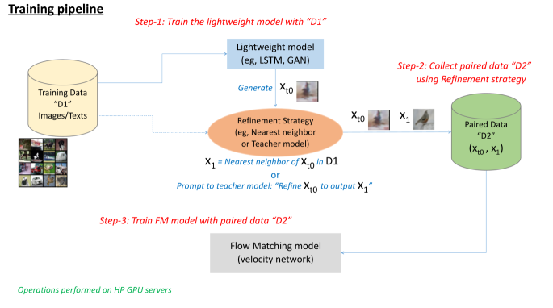
*Figure 1:Training and inference pipelines for our warm-start flow matching method.*

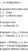
*Figure 2:Training algorithm comparison between DFM (Gat et al., 2024) (LEFT) and our WS-DFM (RIGHT). Changes shown as red.*

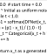
*Figure 3:Inference algorithm comparison between DFM (Gat et al., 2024) (LEFT) and our WS-DFM (RIGHT). Changes as red.*

*Figure 4:(Two moons) (a) Target distribution 
𝑃
1
​
(
𝑥
)
. (b) Pure uniform noise distribution 
𝑃
0
​
(
𝑥
)
 used in DFM (Gat et al., 2024). (c–e) Three lightweight draft models adopted in our WS-DFM: (c) = pretty good, (d) = fair, (e) = poor.*

*Figure 5:(Two moons) (a) Generation steps in the original DFM (Gat et al., 2024) with step size 0.05 (
NFE
=
20
 steps). Only every other time steps are shown. (b–d) Our WS-DFM results for three different lightweight draft models: (b) = pretty good, (c) = fair, (d) = poor. Our WS-DFM models achieve sample quality no worse than DFM’s, but with significant speed-up in sample generation (
×
10
, 
×
2
, and 
×
1.5
 depending on the draft model’s performance).*

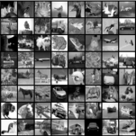
*Figure 6:(CIFAR-10 Gray-scale) Some image samples generated by the competing methods.*

*Figure 7:(CIFAR-10 Gray-scale) Progress in sample generation in our WS-DFM with 
𝑡
0
=
0.5
. The left most column contains images generated by the lightweight DC-GAN model, which are progressively refined by our WS-DFM, and the rightmost column shows the finaloutput images of our WS-DFM.*

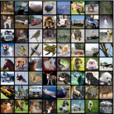
*Figure 8:(CIFAR-10 Color) Some image samples generated by the competing methods.*

*Figure 9:(CIFAR-10 Color) Progress in sample generation in our WS-DFM with 
𝑡
0
=
0.5
. The left most column contains images generated by the lightweight DC-GAN model, which are progressively refined by our WS-DFM, and the rightmost column shows the finaloutput images of our WS-DFM.*

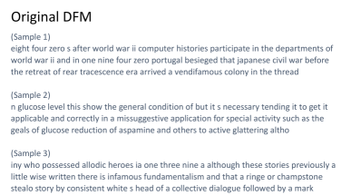
*Figure 10:(Text-8) Some text samples generated by the DFM (Gat et al., 2024), the LSTM draft model, and our WS-DFM models.*

*Figure 11:(CIFAR-10) Examples of 
𝑘
-nearest neighbor samples from the refinement strategy in our WS-DFM for data pairing 
(
𝑥
𝑡
0
,
𝑥
1
)
. The top four panels are gray-scale data, and the bottom four panels colored data. For each panel, the leftmost column contains images generated by the lightweight DC-GAN models, and the next 5 columns show 
5
-nearest neighbor images retrieved from the training data.*

*Figure 12:(CIFAR-10 Gray-scale) Sample images generated by WS-DFM 
𝑡
0
=
0.8
 (TOP) and 
𝑡
0
=
0.5
 (BOTTOM).*

*Figure 13:(CIFAR-10 Color) Sample images generated by WS-DFM 
𝑡
0
=
0.8
 (TOP) and 
𝑡
0
=
0.5
 (BOTTOM).*

*Figure 14:(Wikitext-103) Some text samples generated by the DFM (Gat et al., 2024), the LSTM draft model, and our WS-DFM models.*

---
**Usage Info**: 4941 tokens used.
**Generated at**: 2026-03-23 12:46:18

---

# 📚 Gesture2Speech: How Far Can Hand Movements Shape Expressive Speech?

🚀 URL: https://arxiv.org/html/2603.19831

## 🌏 Abstract (원문)
Human communication seamlessly integrates speech and bodily motion, where hand gestures naturally complement vocal prosody to express intent, emotion, and emphasis. While recent text-to-speech (TTS) systems have begun incorporating multimodal cues such as facial expressions or lip movements, the role of hand gestures in shaping prosody remains largely underexplored. We propose a novel multimodal TTS framework, Gesture2Speech, that leverages visual gesture cues to modulate prosody in synthesized speech. Motivated by the observation that confident and expressive speakers coordinate gestures with vocal prosody, we introduce a multimodal Mixture-of-Experts (MoE) architecture that dynamically fuses linguistic content and gesture features within a dedicated style extraction module. The fused representation conditions an LLM-based speech decoder, enabling prosodic modulation that is temporally aligned with hand movements. We further design a gesture-speech alignment loss that explicitly models their temporal correspondence to ensure fine-grained synchrony between gestures and prosodic contours. Evaluations on the PATS dataset show that Gesture2Speech outperforms state-of-the-art baselines in both speech naturalness and gesture-speech synchrony. To the best of our knowledge, this is the first work to utilize hand gesture cues for prosody control in neural speech synthesis. Demo samples are available athttps://research.sri-media-analysis.com/aaai26-beeu-gesture2speech/
## 🌏 Abstract (번역)
인간의 의사소통은 음성과 신체 움직임을 완벽하게 통합하며, 손 제스처는 의도, 감정, 강조를 표현하기 위해 음성 운율을 자연스럽게 보완합니다. 최근 텍스트-음성 변환(TTS) 시스템이 얼굴 표정이나 입술 움직임과 같은 다중 모드 신호를 통합하기 시작했지만, 운율 형성에 있어 손 제스처의 역할은 여전히 크게 탐구되지 않고 있습니다. 우리는 합성된 음성에서 운율을 조절하기 위해 시각적 제스처 신호를 활용하는 새로운 다중 모드 TTS 프레임워크인 Gesture2Speech를 제안합니다. 자신감 있고 표현력이 풍부한 화자가 제스처를 음성 운율과 조화시킨다는 관찰에 동기 부여를 받아, 전용 스타일 추출 모듈 내에서 언어 콘텐츠와 제스처 특징을 동적으로 융합하는 다중 모드 전문가 혼합(MoE) 아키텍처를 도입합니다. 융합된 표현은 LLM 기반 음성 디코더를 조건화하여 손 움직임과 시간적으로 정렬된 운율 조절을 가능하게 합니다. 우리는 또한 제스처와 운율 윤곽선 간의 미세한 동기화를 보장하기 위해 시간적 대응을 명시적으로 모델링하는 제스처-음성 정렬 손실을 설계합니다. PATS 데이터셋에 대한 평가는 Gesture2Speech가 음성 자연스러움과 제스처-음성 동기화 모두에서 최첨단 기준선을 능가함을 보여줍니다. 저희가 아는 한, 이 연구는 신경 음성 합성에서 운율 제어를 위해 손 제스처 신호를 활용한 첫 번째 작업입니다. 데모 샘플은 https://research.sri-media-analysis.com/aaai26-beeu-gesture2speech/에서 확인할 수 있습니다.

## 🔍 Methods & Results
- Gesture2Speech는 텍스트 입력, 참조 오디오 샘플, 비디오에서 추출된 제스처 프레임 시퀀스를 기반으로 의미론적으로 정렬되고 화자 정체성을 유지하며 제스처에 의해 구동되는 운율을 반영하는 음성 파형을 합성하는 것을 목표로 합니다.
- 제안된 시스템은 텍스트 특징, 오디오 임베딩, 비디오에서 추출된 움직임 및 자세 특징의 세 가지 입력 양식을 사용합니다.
- 모델 아키텍처는 텍스트 및 오디오 입력을 처리하는 공유 인코더와 움직임 특징을 처리하는 전용 시각 인코더로 구성되며, 모든 양식은 1024차원의 공유 잠재 공간으로 투영됩니다.
- 텍스트는 BPE 토큰화, 참조 오디오는 멜-스펙트로그램 및 화자 인코더, 비디오 프레임은 SlowFast 움직임 인코더를 통해 특징을 추출합니다.
- 제스처 특징은 OpenPose를 사용하여 2D 키포인트를 추출하고 이를 잠재 벡터로 투영하여 제스처 토큰 시퀀스를 생성합니다.
- 화자 임베딩, 움직임 특징, 전역 스타일 토큰에 각각 적용되는 세 가지 전문가 혼합(Mixture-of-Experts, MoE) 모듈을 사용하여 양식별 스타일 정보를 캡처하고 융합된 스타일 표현을 생성합니다.
- LLM 기반 디코더는 텍스트 임베딩, 융합된 스타일 토큰, 제스처 토큰을 입력으로 받아 교차 어텐션을 통해 음성 토큰 시퀀스를 생성하며, HiFi-GAN 보코더를 통해 최종 음성 파형으로 변환됩니다.
- 제스처 정점(apex)과 음성 강조점(prominence) 간의 시간적 정렬을 강화하기 위해 교차 모달 시간 거리(Cross-Modal Temporal Distance, CMTD) 기반의 새로운 정렬 손실(alignment loss)을 도입합니다.
- 최종 손실 함수는 표준 텍스트 교차 엔트로피 손실, 멜 왜곡 손실, 지속 시간 손실, 그리고 제안된 정렬 손실을 결합하여 사용합니다.
- PATS 데이터셋에 대한 평가 결과, Gesture2Speech는 음성 자연스러움과 제스처-음성 동기화 모두에서 최첨단 기준선보다 우수한 성능을 보였습니다.
- 이 연구는 신경 음성 합성에서 운율 제어를 위해 손 제스처 신호를 활용한 최초의 작업입니다.

## 🖼 Figures

*Figure 1:Overview of (a) the proposed Gesture2Speech architecture and (b) MoE layer. The system takes text, speech, and video-based gesture features as input and generates expressive speech. Multiple MoE modules enable dynamic routing of features for improved style representation and are aligned with gestural intent via cross-attention.*

*Figure 2:Comparison of gesture apexes and speech prominence peaks between ground truth and TTS-generated speech. The Cross-Modal Temporal Distance (CMTD) quantifies alignment between gestures and prosodic peaks. Ground truth CMTD: 0.819 seconds, indicating looser temporal alignment, while TTS CMTD: 0.727 seconds suggests improved synchronization with gestures.*

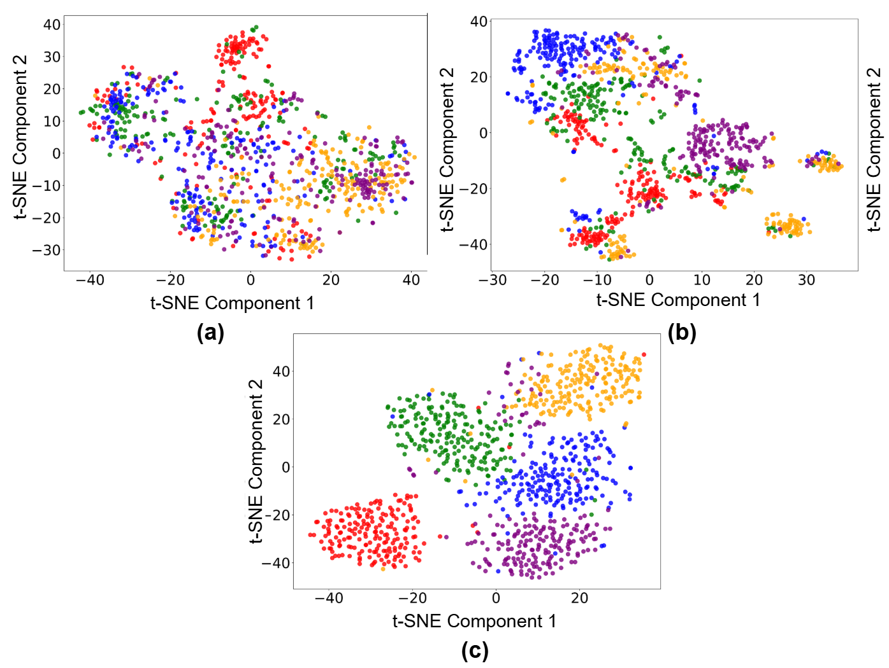
*Figure 3:Speaker-wise t-SNE plots analysis of proposed style transfer network. The t-SNE plot of (a) Speech MoE embeddings, (b) video MoE embeddings and (c) Multimodal MoE embeddings.*

---
**Usage Info**: 3892 tokens used.
**Generated at**: 2026-03-23 12:46:28

---

# 📚 Breeze Taigi: Benchmarks and Models for Taiwanese Hokkien Speech Recognition and Synthesis

🚀 URL: https://arxiv.org/html/2603.19259

## 🌏 Abstract (원문)
Taiwanese Hokkien (Taigi) presents unique opportunities for advancing speech technology methodologies that can generalize to diverse linguistic contexts. We introduce Breeze Taigi, a comprehensive framework centered on standardized benchmarks for evaluating Taigi speech recognition and synthesis systems. Our primary contribution is a reproducible evaluation methodology that leverages parallel Taiwanese Mandarin resources. We provide 30 carefully curated Mandarin-Taigi audio pairs from Taiwan’s Executive Yuan public service announcements with normalized ground truth transcriptions. We establish Character Error Rate (CER) as the standard metric and implement normalization procedures to enable fair cross-system comparisons. To demonstrate the benchmark’s utility and provide reference implementations, we develop speech recognition and synthesis models through a methodology that leverages existing Taiwanese Mandarin resources and large-scale synthetic data generation. In particular, we fine-tune a Whisper model on approximately 10,000 hours of Taigi synthetic speech data. Our ASR model achieves 30.13% average CER on the benchmark, outperforming existing commercial and research systems. By providing standardized evaluation protocols, diverse training datasets, and open baseline models, we offer a replicable framework with methodologies applicable to various linguistic contexts.
## 🌏 Abstract (번역)
대만어(Taigi)는 다양한 언어적 맥락에 일반화될 수 있는 음성 기술 방법론을 발전시킬 독특한 기회를 제공합니다. 우리는 대만어 음성 인식 및 합성 시스템 평가를 위한 표준화된 벤치마크를 중심으로 하는 포괄적인 프레임워크인 Breeze Taigi를 소개합니다. 우리의 주요 기여는 병렬 대만 표준 중국어 리소스를 활용하는 재현 가능한 평가 방법론입니다. 우리는 대만 행정원 공공 서비스 발표에서 신중하게 선별된 30개의 표준 중국어-대만어 오디오 쌍과 정규화된 정답 전사를 제공합니다. 우리는 문자 오류율(CER)을 표준 지표로 설정하고 공정한 시스템 간 비교를 가능하게 하는 정규화 절차를 구현합니다. 벤치마크의 유용성을 입증하고 참조 구현을 제공하기 위해, 우리는 기존 대만 표준 중국어 리소스와 대규모 합성 데이터 생성을 활용하는 방법론을 통해 음성 인식 및 합성 모델을 개발합니다. 특히, 우리는 약 10,000시간의 대만어 합성 음성 데이터로 Whisper 모델을 미세 조정했습니다. 우리의 ASR 모델은 벤치마크에서 평균 30.13%의 CER을 달성하여 기존 상업 및 연구 시스템을 능가합니다. 표준화된 평가 프로토콜, 다양한 훈련 데이터셋, 그리고 공개된 기준 모델을 제공함으로써, 우리는 다양한 언어적 맥락에 적용 가능한 방법론을 갖춘 재현 가능한 프레임워크를 제공합니다.

## 🔍 Methods & Results
- 대만어 음성 인식(ASR) 모델은 약 10,000시간의 대규모 합성 대만어 음성 데이터셋(Taigi-synthetic-speech)을 사용하여 Whisper 프레임워크를 미세 조정하여 개발되었습니다.
- Taigi-synthetic-speech 데이터셋은 다양한 화자, 음향 환경 및 대화 맥락을 포함하며, 자연스럽고 자발적인 대만어 음성을 포착하여 강력한 ASR에 적합합니다.
- 개발된 ASR 모델은 벤치마크에서 평균 30.13%의 문자 오류율(CER)을 달성하여 기존 상업 및 연구 시스템보다 우수한 성능을 보였습니다.
- 대만어 음성 합성(TTS) 모델인 BreezyVoice-Taigi는 ASR 모델과 동일한 약 10,000시간의 Taigi-synthetic-speech 데이터셋을 활용하여 CosyVoice 2 프레임워크를 기반으로 구축되었습니다.
- CosyVoice 2는 대규모 언어 모델 기반의 확장 가능한 스트리밍 음성 합성 프레임워크이며, 음성 토큰을 표현하기 위해 유한 스칼라 양자화 방식을 사용하고 토큰-음성 합성을 위해 청크 인식 인과 흐름 매칭 모델을 사용합니다.
- TTS 모델은 공식적으로 출시된 CosyVoice 2 사전 훈련된 체크포인트를 Taigi-synthetic-speech 데이터셋으로 미세 조정했으며, 특히 LLM 구성 요소만 미세 조정하고 다른 모듈은 고정했습니다.

---
**Usage Info**: 2231 tokens used.
**Generated at**: 2026-03-23 12:46:35

---

# 📚 Audio Avatar Fingerprinting: An Approach for Authorized Use of Voice Cloning in the Era of Synthetic Audio

🚀 URL: https://arxiv.org/html/2603.20165

## 🌏 Abstract (원문)
With the advancements in AI speech synthesis, it is easier than ever before to generate realistic audio in a target voice—one only needs a few seconds of reference audio from the target—quite literally putting words in the target person’s mouth. This imposes a new set of forensics-related challenges on speech-based authentication systems, videoconferencing, and audio-visual broadcasting platforms, where we want to detect synthetic speech. At the same time, leveraging AI speech synthesis can enhance the different modes of communication through features such as low-bandwidth communication and audio enhancements—leading to ever-increasing legitimate use-cases of synthetic audio. In this case, we want to verify if the synthesized voice is actually spoken by the user. This will require a mechanism to verify whether a given synthetic audio is driven by an authorized identity, or not. We term this taskaudio avatar fingerprinting. As a step towards audio forensics in these new and emerging situations, we analyze and extend an off-the-shelf speaker verification model developed outside of forensics context for the task of fake speech detection and audio avatar fingerprinting, the first experimentation of its kind. Furthermore, we observe that no existing dataset allows for the novel task of verifying the authorized use of synthetic audio—a limitation which we address by introducing a new speech forensics dataset for this novel task.
## 🌏 Abstract (번역)
AI 음성 합성의 발전으로, 대상 음성으로 사실적인 오디오를 생성하는 것이 그 어느 때보다 쉬워졌습니다. 대상으로부터 몇 초의 참조 오디오만 있으면 말 그대로 대상의 입에 말을 넣을 수 있습니다. 이는 음성 기반 인증 시스템, 화상 회의, 시청각 방송 플랫폼에 새로운 포렌식 관련 과제를 부과하며, 우리는 합성 음성을 탐지하고자 합니다. 동시에, AI 음성 합성을 활용하면 저대역폭 통신 및 오디오 향상과 같은 기능을 통해 다양한 통신 모드를 향상시킬 수 있으며, 이는 합성 오디오의 합법적인 사용 사례를 지속적으로 증가시킵니다. 이 경우, 합성된 음성이 실제로 사용자에 의해 발화되었는지 확인하고자 합니다. 이를 위해서는 주어진 합성 오디오가 승인된 신원에 의해 구동되는지 여부를 확인하는 메커니즘이 필요합니다. 우리는 이 작업을 오디오 아바타 지문 인식(audio avatar fingerprinting)이라고 명명합니다. 이러한 새롭고 떠오르는 상황에서의 오디오 포렌식을 위한 한 단계로, 우리는 포렌식 맥락 외부에서 개발된 상용 화자 검증 모델을 가짜 음성 탐지 및 오디오 아바타 지문 인식 작업에 대해 분석하고 확장합니다. 이는 이러한 종류의 첫 번째 실험입니다. 또한, 기존 데이터셋 중 승인된 합성 오디오 사용을 검증하는 새로운 작업을 허용하는 데이터셋이 없음을 확인했으며, 우리는 이 새로운 작업을 위한 새로운 음성 포렌식 데이터셋을 도입하여 이러한 한계를 해결합니다.

## 🔍 Methods & Results
- 합성 오디오 생성 과정에서 '대상 오디오 신원'은 생성된 음성의 소리를 나타내고, '구동 오디오 음성'은 내용과 말하는 방식을 결정한다. 구동 및 참조(대상) 오디오로 자신의 음성을 사용하는 경우 'self-reenactment'라고 하며, 다른 참조 음성을 사용하는 경우 'cross-reenactment'라고 정의한다.
- 가짜 음성 탐지 방법론은 텍스트 음성 변환(TTS) 또는 음성 복제(VC)로 생성된 오디오를 합성으로 간주한다. 최첨단 화자 검증 모델인 TitaNet을 활용하여 등록된 실제 음성 오디오와 입력 오디오(실제 또는 합성)의 화자 임베딩을 추출하고 코사인 유사도를 사용하여 비교하며, 일치하지 않는 오디오를 합성으로 분류한다.
- 오디오 아바타 지문 인식의 목표는 입력 합성 음성이 승인된 신원(self-reenactment)에 의해 구동되는지 여부를 판별하는 것이다. 기존 TitaNet 임베딩은 음성 소리에 치중하여 구동 신원의 말하는 방식을 식별하기 어렵다는 문제점이 있어, TitaNet을 각도 소프트맥스 손실(angular softmax loss)로 미세 조정하여 구동 신원(driver identity)을 기반으로 오디오를 클러스터링하도록 한다.
- 승인된 합성 오디오 사용을 검증하는 새로운 작업을 위한 기존 데이터셋의 한계를 해결하기 위해 새로운 음성 포렌식 데이터셋을 도입했다.

## 🖼 Figures
![Figure 1:We explore how state-of-the-art off-the-shelf speaker verification models can be leveraged for audio forensics tasks: real vs. synthetic speech detection, and the newly introduced avatar fingerprinting task [26], applied to audio. Note that the facial image is shown just to signify that the input the system is human speech: our approach is purely audio-based.](../images/2026-03-23/2603.20165/2603.20165_fig0.png)
*Figure 1:We explore how state-of-the-art off-the-shelf speaker verification models can be leveraged for audio forensics tasks: real vs. synthetic speech detection, and the newly introduced avatar fingerprinting task [26], applied to audio. Note that the facial image is shown just to signify that the input the system is human speech: our approach is purely audio-based.*

![Figure 2:Voice cloning generators require a short reference sample of a target voice (this is what the final output will sound like), and a driving audio speech (this is what the target voice will speak). If a person is using their own voice as driving and reference (target) audio, then the resultant generated audio is termed a “self-reenactment”: that is, the sound of the generated voice matches that of the driving audio. On the other hand, if one uses a different reference voice than that of the driving speaker, then the resultant generated audio is termed a “cross-reenactment”: that is, the sound of the generated voice is different than that of the driving speaker, and it seems like the target / reference voice is speaking the words of the driving speaker. Here, we show a case of self- and cross-reenactment of ID1.](../images/2026-03-23/2603.20165/2603.20165_fig1.png)
*Figure 2:Voice cloning generators require a short reference sample of a target voice (this is what the final output will sound like), and a driving audio speech (this is what the target voice will speak). If a person is using their own voice as driving and reference (target) audio, then the resultant generated audio is termed a “self-reenactment”: that is, the sound of the generated voice matches that of the driving audio. On the other hand, if one uses a different reference voice than that of the driving speaker, then the resultant generated audio is termed a “cross-reenactment”: that is, the sound of the generated voice is different than that of the driving speaker, and it seems like the target / reference voice is speaking the words of the driving speaker. Here, we show a case of self- and cross-reenactment of ID1.*

![Figure 3:We explore the performance of off-the-shelf speaker verification models on two tasks. First (a), we want to evaluate whether the learnt speaker representation can be leveraged for detecting real and synthetic audio of a speaker (regardless of whether the synthetic audio is self- or cross-reenacted). See Sec. 3.2. Second (b), we want to explore whether the speaker representations can be used for audio avatar fingerprinting: that is, identifying if the speaker driving a synthetic audio is the authorized identity or not (Sec. 3.3).](../images/2026-03-23/2603.20165/2603.20165_fig2.png)
*Figure 3:We explore the performance of off-the-shelf speaker verification models on two tasks. First (a), we want to evaluate whether the learnt speaker representation can be leveraged for detecting real and synthetic audio of a speaker (regardless of whether the synthetic audio is self- or cross-reenacted). See Sec. 3.2. Second (b), we want to explore whether the speaker representations can be used for audio avatar fingerprinting: that is, identifying if the speaker driving a synthetic audio is the authorized identity or not (Sec. 3.3).*

*Figure 4:We use a speaker verification model (TitaNet) to extract a speaker embedding for a given synthetic audio. To learn a speaker embedding that encodes the speaking style of the driving identity, we use an additive angular margin loss that clusters all the audio driven by ID1 to be closer and away from those driven by others.*

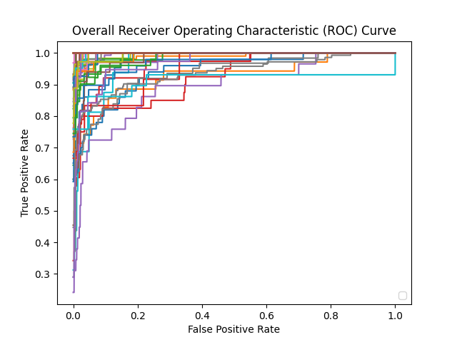
*Figure 5:Real vs fake test with vanilla TitaNet on NVFAIR*

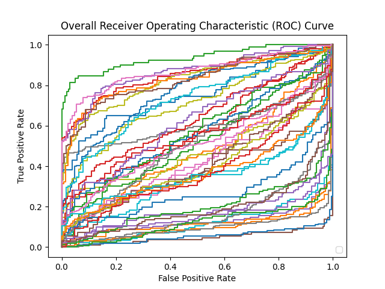
*Figure 6:A preliminary analysis of a vanilla TitaNet for an avatar fingerprinting task.*

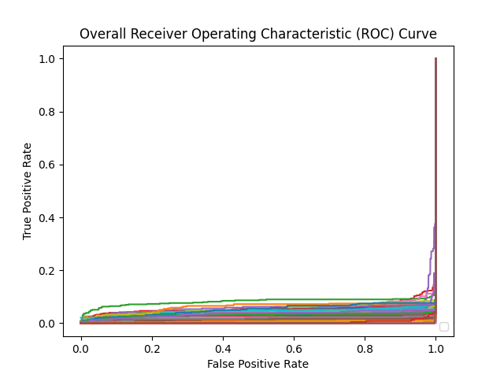
*Figure 7:A preliminary analysis of a vanilla TitaNet for an avatar fingerprinting task using only self-reenactment as authorized enrollment data*

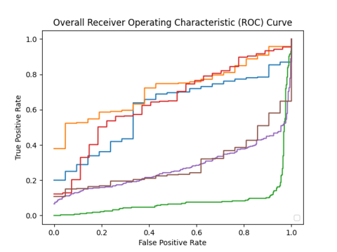
*(a)Before finetuning*

*(a)Before finetuning*

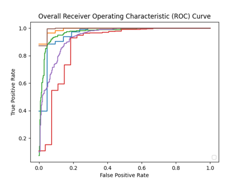
*(b)After finetuning*

---
**Usage Info**: 3643 tokens used.
**Generated at**: 2026-03-23 12:46:47

---

# 📚 Plug-and-Steer: Decoupling Separation and Selection in Audio-Visual Target Speaker Extraction

🚀 URL: https://arxiv.org/html/2603.19697

## 🌏 Abstract (원문)
The goal of this paper is to provide a new perspective on audio-visual target speaker extraction (AV-TSE) by decoupling the separation and target selection. Conventional AV-TSE systems typically integrate audio and visual features deeply to re-learn the entire separation process, which can act as a fidelity ceiling due to the noisy nature of in-the-wild audio-visual datasets. To address this, we propose Plug-and-Steer, which assigns high-fidelity separation to a frozen audio-only backbone and limits the role of visual modality strictly to target selection. We introduce the Latent Steering Matrix (LSM), a minimalist linear transformation that re-routes latent features within the backbone to anchor the target speaker to a designated channel. Experiments across four representative architectures show that our method effectively preserves the acoustic priors of diverse backbones, achieving perceptual quality comparable to the original backbones. Audio samples are available in the demo page.111https://plugandsteer.github.io
## 🌏 Abstract (번역)
이 논문의 목표는 분리(separation)와 타겟 선택(target selection)을 분리함으로써 오디오-비주얼 타겟 화자 추출(AV-TSE)에 대한 새로운 관점을 제공하는 것입니다. 기존의 AV-TSE 시스템은 일반적으로 오디오 및 시각적 특징을 깊이 통합하여 전체 분리 프로세스를 재학습하는데, 이는 실제 환경의 오디오-비주얼 데이터셋의 노이즈 특성으로 인해 충실도(fidelity)의 한계로 작용할 수 있습니다. 이를 해결하기 위해 우리는 고충실도 분리를 고정된 오디오 전용 백본에 할당하고 시각적 양식의 역할을 타겟 선택으로 엄격하게 제한하는 Plug-and-Steer를 제안합니다. 우리는 백본 내 잠재 특징을 재라우팅하여 타겟 화자를 지정된 채널에 고정시키는 최소주의 선형 변환인 잠재 조향 행렬(Latent Steering Matrix, LSM)을 소개합니다. 네 가지 대표적인 아키텍처에 걸친 실험은 우리 방법이 다양한 백본의 음향 사전 지식을 효과적으로 보존하며, 원본 백본과 유사한 지각 품질을 달성함을 보여줍니다. 오디오 샘플은 데모 페이지에서 확인할 수 있습니다.111https://plugandsteer.github.io

## 🔍 Methods & Results
- AV-TSE에서 분리(separation)와 타겟 선택(target selection)을 분리하는 방법론을 제안하며, 고정된 오디오 전용 백본이 고충실도 분리를 담당하고 시각 정보는 타겟 선택에만 사용되도록 합니다.
- 백본 내 잠재 특징을 재라우팅하여 타겟 화자를 지정된 채널에 고정시키는 최소주의 선형 변환인 잠재 조향 행렬(Latent Steering Matrix, LSM)을 도입합니다. 이는 잔여 변환으로 적용되며, 강제 스왑 조건 하에 훈련되어 백본의 출력 채널 순서를 변경합니다.
- 타겟의 입술 움직임에서 추출된 시각 임베딩과 잠재 오디오 특징을 기반으로 프레임별 게이트 값(g_t)을 예측하는 경량 시각 조향 모듈을 설계합니다. 이 게이트 값은 LSM의 조향 작업을 동적으로 조절합니다.
- LSM은 강제 스왑 조건에서 SI-SNR 손실을 사용하여 훈련되며, 시각 조향 모듈은 SI-SNR 손실과 이진 교차 엔트로피 손실(가상 레이블 사용)을 통해 훈련됩니다. 이 과정에서 백본과 LSM은 고정됩니다.
- 4가지 대표적인 아키텍처에 대한 실험 결과, 제안된 방법은 다양한 백본의 음향 사전 지식을 효과적으로 보존하며, 원본 백본과 유사한 지각 품질을 달성했습니다.

## 🖼 Figures

*Figure 1:Training process of the latent steering matrix 
𝑊
 for the 
𝑖
-th separator block. 
𝑠
^
1
 and 
𝑠
^
2
 are the outputs from the first and second channels of the pre-trained audio-only backbone.*

*Figure 2:Training process of the AV-TSE module by learning the gate value 
𝑔
. The visual steering module predicts the value 
𝑔
 to control the degree of steering.*

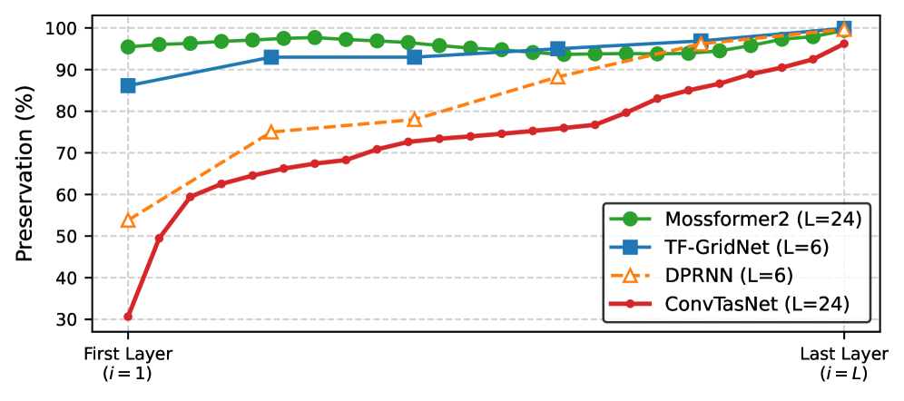
*Figure 3:Layer-wise performance preservation rate (%) across different AOSS backbones.*

---
**Usage Info**: 3882 tokens used.
**Generated at**: 2026-03-23 12:46:59

---

