# 🚩 (2026-03-24) Scholar Inbox 추천 논문 

# 📚 DiT-Flow: Speech Enhancement Robust to Multiple Distortions based on Flow Matching in Latent Space and Diffusion Transformers

🚀 URL: https://arxiv.org/html/2603.21608

## 🌏 Abstract (원문)
Recent advances in generative models, such as diffusion and flow matching, have shown strong performance in audio tasks. However, speech enhancement (SE) models are typically trained on limited datasets and evaluated under narrow conditions, limiting real-world applicability. To address this, we propose DiT-Flow, a flow matching-based SE framework built on the latent Diffusion Transformer (DiT) backbone and trained for robustness across diverse distortions, including noise, reverberation, and compression. DiT-Flow operates on compact variational auto-encoders (VAEs)-derived latent features. We validated our approach on StillSonicSet, a synthetic yet acoustically realistic dataset composed of LibriSpeech, FSD50K, FMA, and 90 Matterport3D scenes. Experiments show that DiT-Flow consistently outperforms state-of-the-art generative SE models, demonstrating the effectiveness of flow matching in multi-condition speech enhancement. Despite ongoing efforts to expand synthetic data realism, a persistent bottleneck in SE is the inevitable mismatch between training and deployment conditions. By integrating LoRA with the MoE framework, we achieve both parameter-efficient and high-performance training for DiT-Flow robust to multiple distortions with using 4.9% percentage of the total parameters to obtain a better performance on five unseen distortions.
## 🌏 Abstract (번역)
확산 모델 및 플로우 매칭과 같은 생성 모델의 최근 발전은 오디오 작업에서 강력한 성능을 보여주었습니다. 그러나 음성 향상(SE) 모델은 일반적으로 제한된 데이터셋으로 훈련되고 좁은 조건에서 평가되어 실제 적용 가능성이 제한됩니다. 이를 해결하기 위해 우리는 잠재 확산 트랜스포머(DiT) 백본을 기반으로 하며 노이즈, 잔향 및 압축을 포함한 다양한 왜곡에 대한 견고성을 위해 훈련된 플로우 매칭 기반 SE 프레임워크인 DiT-Flow를 제안합니다. DiT-Flow는 소형 변이형 오토인코더(VAE)에서 파생된 잠재 특징을 기반으로 작동합니다. 우리는 LibriSpeech, FSD50K, FMA 및 90개의 Matterport3D 장면으로 구성된 합성적이면서도 음향적으로 사실적인 데이터셋인 StillSonicSet에서 우리의 접근 방식을 검증했습니다. 실험 결과 DiT-Flow는 최첨단 생성 SE 모델을 지속적으로 능가하며, 다중 조건 음성 향상에서 플로우 매칭의 효과를 입증했습니다. 합성 데이터의 현실성을 확장하려는 지속적인 노력에도 불구하고, SE의 지속적인 병목 현상은 훈련 및 배포 조건 간의 불가피한 불일치입니다. LoRA를 MoE 프레임워크와 통합함으로써, 우리는 전체 파라미터의 4.9%만을 사용하여 다섯 가지 미지의 왜곡에 대해 더 나은 성능을 얻으면서 여러 왜곡에 강건한 DiT-Flow에 대해 파라미터 효율적이고 고성능인 훈련을 모두 달성합니다.

## 🔍 Methods & Results
- DiT-Flow는 잠재 확산 트랜스포머(DiT) 백본을 기반으로 하는 플로우 매칭 기반 음성 향상(SE) 프레임워크로, 노이즈, 잔향, 압축 등 다양한 왜곡에 대한 견고성을 위해 훈련되었습니다.
- 모델은 소형 변이형 오토인코더(VAE)에서 파생된 잠재 특징을 활용하여 작동합니다.
- StillSonicSet 데이터셋(LibriSpeech, FSD50K, FMA, 90개 Matterport3D 장면으로 구성된 합성적이면서도 음향적으로 사실적인 데이터셋)에서 접근 방식을 검증했습니다.
- 실험 결과 DiT-Flow는 최첨단 생성 SE 모델보다 지속적으로 우수한 성능을 보였습니다.
- LoRA를 MoE 프레임워크와 통합하여 파라미터 효율적이고 고성능인 훈련을 달성했으며, 전체 파라미터의 4.9%만을 사용하여 다섯 가지 미지의 왜곡에 대해 더 나은 성능을 얻었습니다.

## 🖼 Figures
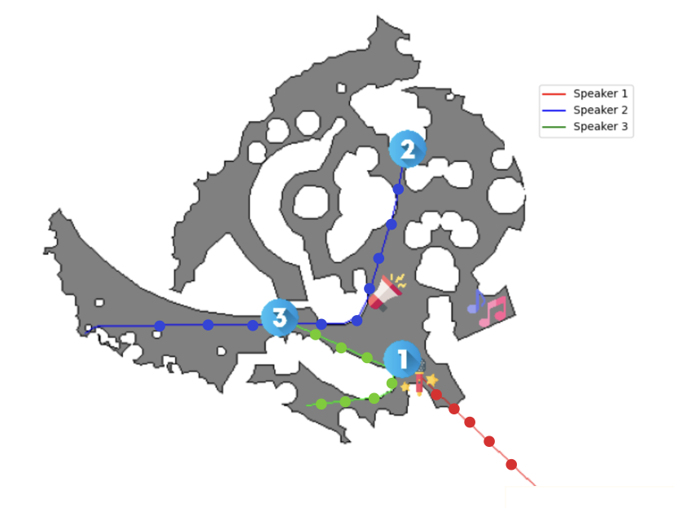
*Figure 1:The procedure to generate StillSonicSet. In each scene, three moving RIRs for each speaker in the original SonicSet were discretized to obtain RIR at some fixed places (circles).*

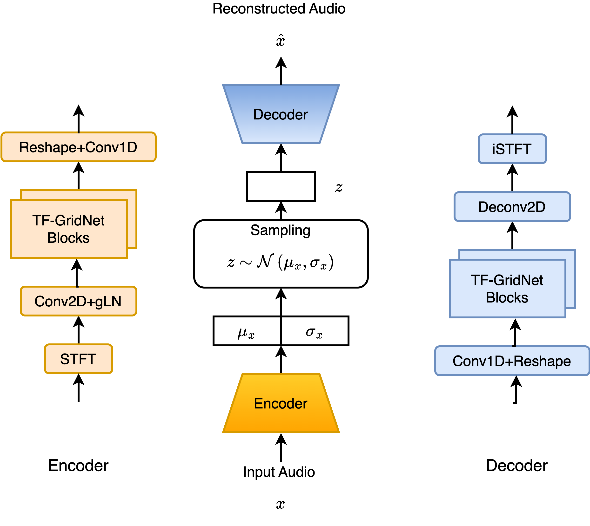
*Figure 2:The audio compressor architecture with encoder (orange) and decoder (blue) in detail.*

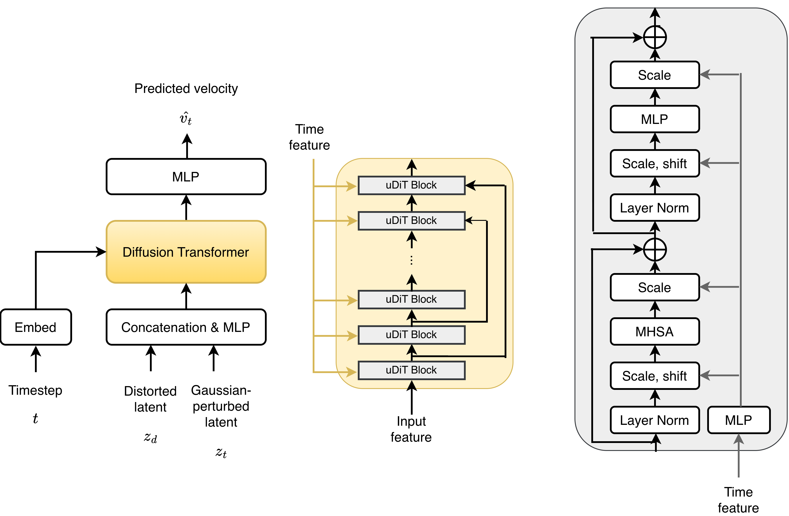
*Figure 3:The model backbones of the target extractor with Diffusion Transformer backbone (yellow) and uDiT block (grey).*

*Figure 4:Diagram of the Mixture of LoRA Experts in DiT-Flow model for data adaptation. (a) illustrates the basic Mixture of LoRA Experts mechanism. (b) In a UDiT block, replace the standard adaptation path in both the MHSA and MLP sublayers with Mixture of LoRA Experts modules (blue arrows), while keeping the original normalization and modulation structure. (c) The MLP modification. (d) The MHSA modification.*

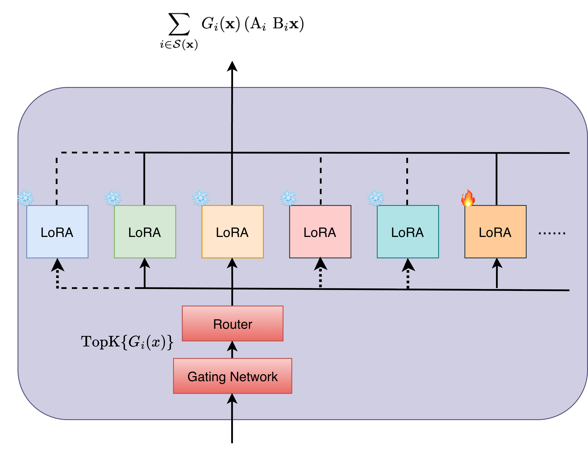
*Figure 5:The extentions of MoELoRA module with only training one single expert.*

---
**Usage Info**: 1574 tokens used.
**Generated at**: 2026-03-24 12:52:40

---

# 📚 SelfTTS: Cross-Speaker Style Transfer through Explicit Embedding Disentanglement and Self-Refinement using Self-Augmentation

🚀 URL: https://arxiv.org/html/2603.22252

## 🌏 Abstract (원문)
This paper presents SelfTTS, a text-to-speech (TTS) model designed for cross-speaker style transfer that eliminates the need for external pre-trained speaker or emotion encoders. The architecture achieves emotional expressivity in neutral speakers through an explicit disentanglement strategy utilizing Gradient Reversal Layers (GRL) combined with cosine similarity loss to decouple speaker and emotion information. We introduce Multi Positive Contrastive Learning (MPCL) to induce clustered representations of speaker and emotion embeddings based on their respective labels. Furthermore, SelfTTS employs a self-refinement strategy via Self-Augmentation, exploiting the model's voice conversion capabilities to enhance the naturalness of synthesized speech. Experimental results demonstrate that SelfTTS achieves superior emotional naturalness (eMOS) and robust stability in target timbre and emotion compared to state-of-the-art baselines.
## 🌏 Abstract (번역)
본 논문은 외부 사전 학습된 화자 또는 감정 인코더의 필요성을 없앤, 화자 간 스타일 전송을 위해 설계된 텍스트 음성 변환(TTS) 모델인 SelfTTS를 소개합니다. 이 아키텍처는 경사 역전 계층(GRL)과 코사인 유사도 손실을 결합한 명시적인 분리 전략을 활용하여 화자 및 감정 정보를 분리함으로써 중립적인 화자에게 감정 표현력을 부여합니다. 우리는 화자 및 감정 임베딩의 레이블 기반으로 클러스터링된 표현을 유도하기 위해 다중 긍정 대비 학습(MPCL)을 도입합니다. 또한, SelfTTS는 모델의 음성 변환 기능을 활용하여 합성된 음성의 자연스러움을 향상시키는 자가 증강(Self-Augmentation)을 통한 자가 개선 전략을 사용합니다. 실험 결과는 SelfTTS가 최신 기준 모델에 비해 우수한 감정적 자연스러움(eMOS)과 목표 음색 및 감정의 견고한 안정성을 달성함을 보여줍니다.

## 🔍 Methods & Results
- SelfTTS는 VITS(Variational Inference with adversarial learning for end-to-end Text-to-Speech) 프레임워크를 기반으로 하며, 조건부 변이형 오토인코더(CVAE) 구조에 화자(g) 및 감정(e) 임베딩을 통합하여 확장했습니다.
- 후방 인코더(Posterior Encoder), 잔여 결합 블록(Residual Coupling Blocks), 확률적 지속 시간 예측기(Stochastic Duration Predictor), 파형 디코더(Waveform Decoder) 등 모든 주요 구성 요소는 화자 및 감정 임베딩에 따라 조건화됩니다.
- 화자 및 감정 임베딩은 멜-스펙트로그램 참조 신호를 처리하는 6계층 컨볼루션 신경망과 GRU로 구성된 참조 인코더(Reference Encoder) 아키텍처를 사용하여 생성됩니다.
- 화자 및 감정 정보를 분리하기 위해 경사 역전 계층(GRL)과 코사인 유사도 손실을 결합한 명시적 임베딩 분리 기법을 적용하여, 모델이 레이블에 의존하지 않고 임베딩 자체를 기반으로 역전된 경사를 전파하도록 합니다.
- 화자 및 감정 레이블에 따라 클러스터링된 표현을 유도하기 위해 다중 긍정 대비 학습(MPCL) 손실을 도입했습니다.
- 모델의 음성 변환 기능을 활용하여 화자 참조를 무작위로 재배열하여 합성 데이터를 생성하는 자가 증강(Self-Augmentation) 전략을 통해 합성 음성의 자연스러움을 향상시켰습니다. 이 단계는 기본 아키텍처 사전 학습 후에 적용됩니다.
- 모델은 VITS의 원래 손실과 제안된 새로운 손실(MPCL, GRL 기반 코사인 유사도 손실 등)을 조합하여 최적화되었으며, NVIDIA L40S GPU에서 200k 스텝 학습 후 50k 스텝의 자가 증강을 통한 미세 조정을 거쳤습니다.
- 평가는 E3-VITS 및 VECL을 포함한 두 가지 VITS 기반 최신 모델과 비교하여 수행되었습니다.
- 평가 지표로는 자연스러움(UTMOS, 주관적 nMOS), 명료도(WER), 화자 유사성(SECS, 주관적 sMOS), 감정 유사성(EECS, 주관적 eMOS), 그리고 분리도 및 정렬도(CKA, LK-CKA)가 사용되었습니다.
- 실험 결과, SelfTTS는 최신 기준 모델에 비해 우수한 감정적 자연스러움(eMOS)과 목표 음색 및 감정의 견고한 안정성을 달성했습니다.

## 🖼 Figures
![Figure 1:SelfTTS model architecture. The emotion and speaker encoders receive mel-spectrogram slices of the reference waveform as input. Each encoder is optimized using the MPCL loss, while their embeddings are disentangled through a cosine-based GRL applied on top of the Linear Processor output for each encoder. The final forward step of the Normalizing Flows (
𝑧
𝑝
) is also disentangled using a cosine-based GRL, through a Convolutional Processor that predicts the corresponding emotion or speaker embedding. SDP stands for Stochastic Duration Predictor. Purple dashed arrows indicate the proposed Self-Augmentation pipeline.](../images/2026-03-24/2603.22252/2603.22252_fig0.png)
*Figure 1:SelfTTS model architecture. The emotion and speaker encoders receive mel-spectrogram slices of the reference waveform as input. Each encoder is optimized using the MPCL loss, while their embeddings are disentangled through a cosine-based GRL applied on top of the Linear Processor output for each encoder. The final forward step of the Normalizing Flows (
𝑧
𝑝
) is also disentangled using a cosine-based GRL, through a Convolutional Processor that predicts the corresponding emotion or speaker embedding. SDP stands for Stochastic Duration Predictor. Purple dashed arrows indicate the proposed Self-Augmentation pipeline.*

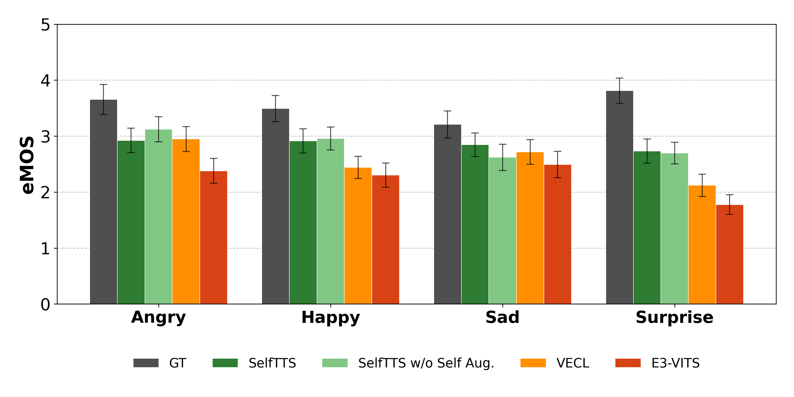
*Figure 2:Emotional similarity (eMOS) per emotion category across different models. The models are ordered as: GT (ground-truth), SelfTTS, SelfTTS w/o Self-Aug., VECL, and E3-VITS.*

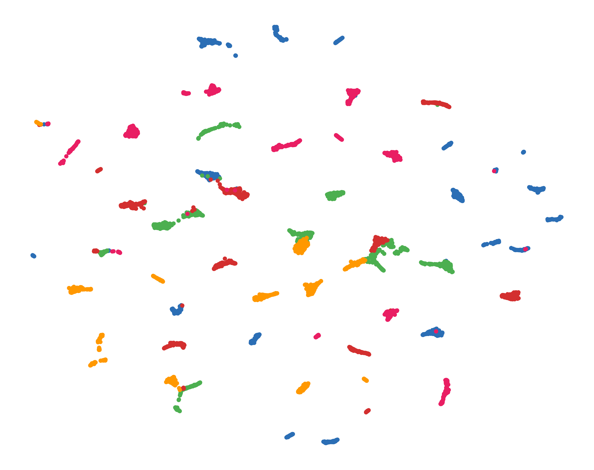
*(a)E3-VITS style space generated by emotion encoder.*

*(a)E3-VITS style space generated by emotion encoder.*

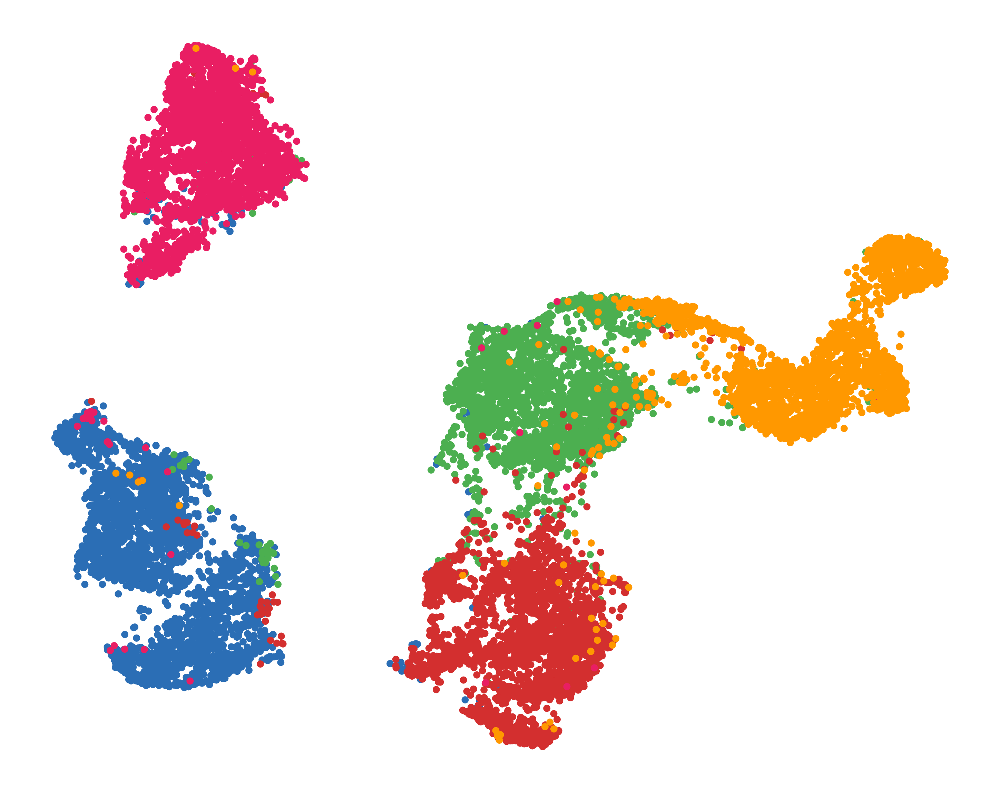
*(b)VECL style space generated by emotion encoder.*

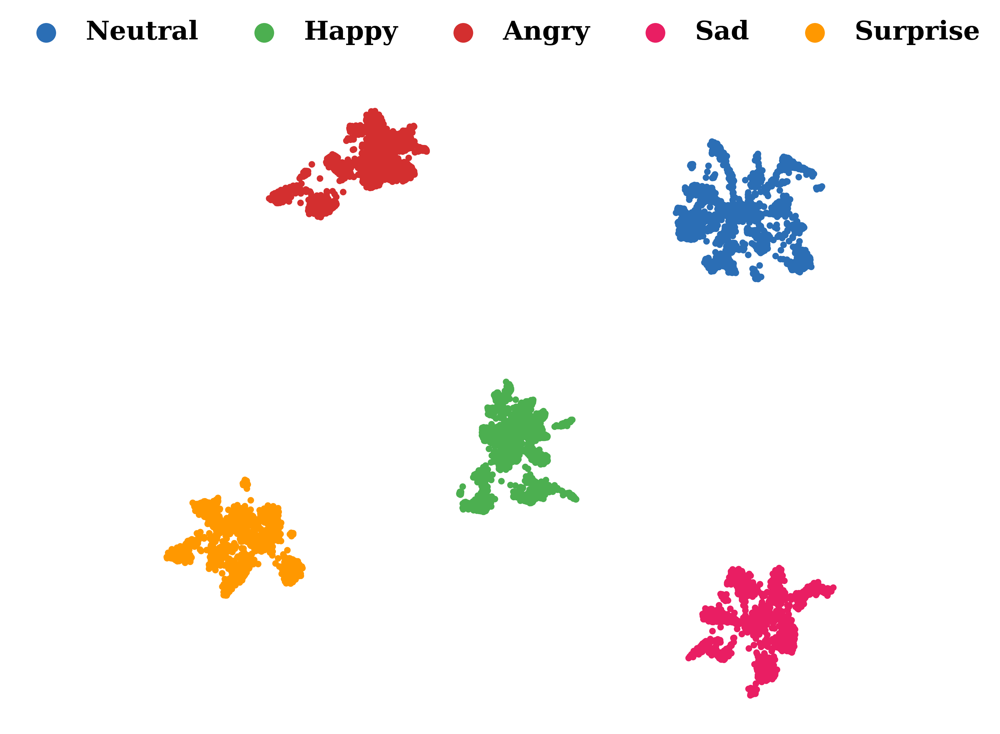
*(c)SelfTTS style space generated by emotion encoder.*

---
**Usage Info**: 5284 tokens used.
**Generated at**: 2026-03-24 12:52:50

---

# 📚 EARTalking: End-to-end GPT-style Autoregressive Talking Head Synthesis with Frame-wise Control

🚀 URL: https://arxiv.org/html/2603.20307

## 🌏 Abstract (원문)
Audio-driven talking head generation aims to create vivid and realistic videos from a static portrait and speech. Existing AR-based methods rely on intermediate facial representations, which limit their expressiveness and realism. Meanwhile, diffusion-based methods generate clip-by-clip, lacking fine-grained control and causing inherent latency due to overall denoising across the window. To address these limitations, we proposeEARTalking, the novelend-to-end, GPT-style autoregressive modelfor interactive audio-driven talking head generation. Our method introduces a novel frame-by-frame, in-context, audio-driven streaming generation paradigm. For inherently supporting variable-length video generation with identity consistency, we propose the Sink Frame Window Attention (SFA) mechanism. Furthermore, to avoid the complex, separate networks that prior works required for diverse control signals, we propose a streaming Frame Condition In-Context (FCIC) scheme. This scheme efficiently injects diverse control signals in a streaming, in-context manner, enabling interactive control at every frame and at arbitrary moments. Experiments demonstrate that EARTalking outperforms existing autoregressive methods and achieves performance comparable to diffusion-based methods. Our work demonstrates the feasibility of in-context streaming autoregressive control, unlocking a scalable direction for flexible, efficient generation. The code will be released for the reproducibility.
## 🌏 Abstract (번역)
오디오 기반의 말하는 얼굴 생성은 정지된 인물 사진과 음성으로부터 생생하고 사실적인 비디오를 만드는 것을 목표로 합니다. 기존 AR 기반 방법들은 중간 얼굴 표현에 의존하여 표현력과 사실성이 제한적입니다. 한편, 확산 기반 방법들은 클립별로 생성되어 세밀한 제어가 부족하고 전체 창에 걸친 디노이징으로 인해 내재적인 지연을 유발합니다. 이러한 한계를 해결하기 위해, 우리는 대화형 오디오 기반 말하는 얼굴 생성을 위한 새로운 종단 간(end-to-end) GPT 스타일의 자기회귀 모델인 EARTalking을 제안합니다. 우리의 방법은 새로운 프레임별, 인컨텍스트(in-context), 오디오 기반 스트리밍 생성 패러다임을 도입합니다. 신원 일관성을 유지하면서 가변 길이 비디오 생성을 본질적으로 지원하기 위해, 우리는 Sink Frame Window Attention (SFA) 메커니즘을 제안합니다. 또한, 이전 연구들이 다양한 제어 신호를 위해 필요로 했던 복잡하고 분리된 네트워크를 피하기 위해, 우리는 스트리밍 Frame Condition In-Context (FCIC) 방식을 제안합니다. 이 방식은 스트리밍 및 인컨텍스트 방식으로 다양한 제어 신호를 효율적으로 주입하여, 모든 프레임과 임의의 순간에 대화형 제어를 가능하게 합니다. 실험 결과 EARTalking은 기존 자기회귀 방법들을 능가하며 확산 기반 방법들과 필적하는 성능을 달성함을 보여줍니다. 우리의 연구는 인컨텍스트 스트리밍 자기회귀 제어의 실현 가능성을 입증하며, 유연하고 효율적인 생성을 위한 확장 가능한 방향을 제시합니다. 재현성을 위해 코드가 공개될 예정입니다.

## 🔍 Methods & Results
- EARTalking은 정지된 인물 사진과 오디오 시퀀스를 입력으로 받아 신원 일관성, 정확한 립싱크, 자연스러운 표정 및 머리 자세를 유지하는 동적 비디오를 합성하는 것을 목표로 하는 종단 간(end-to-end) GPT 스타일의 자기회귀 모델입니다.
- 연속적인 잠재 공간(3D VAE)에서 양자화 오류를 피하고 연속 확률 분포를 직접 감독하기 위해 자기회귀 모델에 Diffusion Loss를 활용합니다.
- 프레임별 인과 자기회귀(FCA)를 채택하여 각 프레임 생성이 현재 시점의 오디오 임베딩과 이전에 생성된 프레임에 조건화되며, 현재 오디오/시각 임베딩 간의 상호 주의와 이전 프레임/오디오에 대한 주의를 허용하는 인과 마스크를 사용합니다.
- 공간 마스크드 자기회귀는 FCA에서 출력된 Ht(일관된 움직임 및 세부 정보)와 Htc(시각적 콘텐츠와 정렬된 음성 특징)를 기반으로 현재 프레임을 공간적으로 생성하며, adaLN 싱크 네트워크를 통해 Ht'를 파생하여 이미지 세부 정보와 움직임을 안내합니다.
- Sink Frame Window Attention (SFA) 메커니즘을 도입하여 고정된 길이로 훈련되면서도 자연스러운 가변 길이 추론을 가능하게 하며, 참조 이미지의 KV 캐시를 영구적으로 유지하여 신원 일관성을 보장하고 누적 오류를 완화합니다.
- 단순하지만 효과적인 순환 시간 절대 위치 임베딩 방식을 사용하여 참조 이미지에 p1을 할당하고 이후 프레임에 순환적으로 임베딩을 할당함으로써, 훈련 중 모든 가능한 상대 위치 조합에 노출시켜 자기회귀 말하는 얼굴 생성의 외삽 능력을 향상시킵니다.
- 스트리밍 Frame Condition In-Context (FCIC) 방식을 통해 오디오(WavLM-Large) 및 움직임 강도(얼굴 랜드마크의 유클리드 거리)와 같은 다중 모달 제어 신호를 프레임별, 인컨텍스트 방식으로 통합하여, 네트워크 아키텍처를 수정할 필요 없이 새로운 제어 양식을 우아하게 통합할 수 있습니다.
- 실험 결과 EARTalking은 기존 자기회귀 방법보다 우수한 성능을 보였으며, 확산 기반 방법과 비교할 만한 성능을 달성하여 인컨텍스트 스트리밍 자기회귀 제어의 실현 가능성을 입증했습니다.

## 🖼 Figures

*Figure 2:The overall framework of EARTalking (a), illustrating the causal autoregressive pipeline for inference and training, which follows the depicted paradigm for frame-by-frame conditional input and generation. (b) The adaLN sink mechanism, which enhances consistency by anchoring generated frames to the reference frame. (c) Two causal attention mask strategies validated as effective during training.*

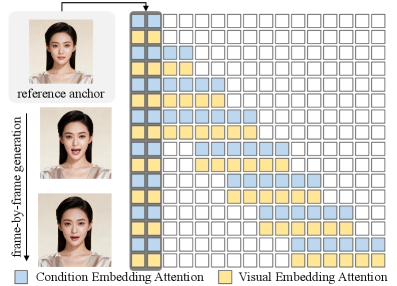
*Figure 3:Sink Frame Window Attention*

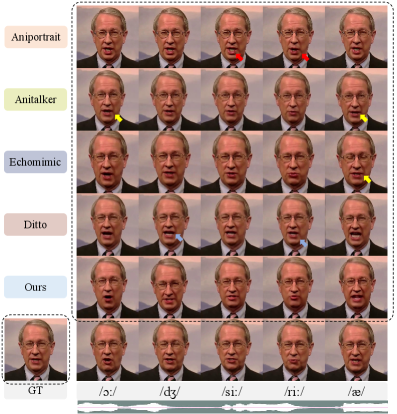
*Figure 4:Qualitative comparison on the HDTF against leading methods with diverse technical routes. The red arrow points to lip distortion, the yellow arrow points to insufficient mouth opening, and the blue arrow points to insufficient lip closure.*

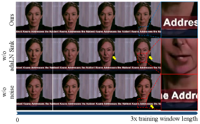
*Figure 5:Ablation study for inference at 3x the training window length. w/o adaLN sink: The adaLN sink on the reference image is removed during both training and inference. w/o Noise: Noise perturbation to the input video is disabled during training.*

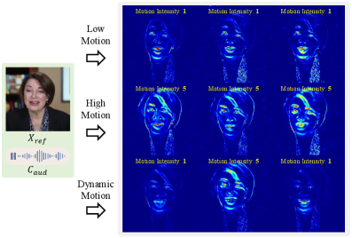
*Figure 6:The difference heatmap of the correlation between the generated character’s motion and the injected motion intensity.*

---
**Usage Info**: 5283 tokens used.
**Generated at**: 2026-03-24 12:53:03

---

# 📚 OmniCodec: Low Frame Rate Universal Audio Codec with Semantic–Acoustic Disentanglement

🚀 URL: https://arxiv.org/html/2603.20638

## 🌏 Abstract (원문)
Large Language Models (LLMs) have advanced audio generation through discrete representation learning. However, most existing neural codecs focus on speech and emphasize reconstruction fidelity, overlooking unified low frame rate modeling across diverse audio domains, including speech, music, and general sound. Moreover, high reconstruction quality does not necessarily yield semantically informative representations, limiting effectiveness in downstream generation tasks. We propose OmniCodec, a universal neural audio codec tailored for low frame rate. It adopts a hierarchical multi-codebook design with semantic–acoustic decoupling by leveraging the audio encoder of the pre-trained understanding model, along with a self-guidance strategy to improve codebook utilization and reconstruction. Compared with the Mimi codec, experiments show that OmniCodec achieves outstanding performance at the same bitrate, delivering superior reconstruction quality while also providing more semantically informative representations that benefit downstream generation tasks. Our model and code will be open-sourced111https://github.com/ASLP-lab/OmniCodec. Our demo page is available222https://hujingbin1.github.io/OmniCodec-Demo-Page/.
## 🌏 Abstract (번역)
대규모 언어 모델(LLM)은 이산 표현 학습을 통해 오디오 생성 분야를 발전시켰습니다. 그러나 대부분의 기존 신경 코덱은 음성에 초점을 맞추고 재구성 충실도를 강조하여, 음성, 음악, 일반 사운드를 포함한 다양한 오디오 도메인에 걸쳐 통합된 낮은 프레임 속도 모델링을 간과하고 있습니다. 또한, 높은 재구성 품질이 반드시 의미론적으로 유익한 표현을 생성하는 것은 아니며, 이는 다운스트림 생성 작업에서의 효율성을 제한합니다. 본 논문에서는 낮은 프레임 속도에 최적화된 범용 신경 오디오 코덱인 OmniCodec을 제안합니다. OmniCodec은 사전 학습된 이해 모델의 오디오 인코더를 활용하여 의미-음향 분리를 포함하는 계층적 다중 코드북 설계를 채택하며, 코드북 활용도와 재구성을 개선하기 위한 자체 안내(self-guidance) 전략을 사용합니다. Mimi 코덱과의 비교 실험 결과, OmniCodec은 동일한 비트레이트에서 뛰어난 성능을 달성하며, 우수한 재구성 품질을 제공할 뿐만 아니라 다운스트림 생성 작업에 유익한 더 의미론적인 표현을 제공함을 보여줍니다. 저희 모델과 코드는 오픈 소스로 공개될 예정이며(https://github.com/ASLP-lab/OmniCodec), 데모 페이지도 이용 가능합니다(https://hujingbin1.github.io/OmniCodec-Demo-Page/).

## 🔍 Methods & Results
- OmniCodec은 의미(semantic) 및 음향(acoustic)의 두 가지 브랜치로 구성된 모델 아키텍처를 사용합니다.
- 음향 브랜치의 인코더와 디코더는 스트리밍 컨볼루션이 적용된 SEANet을 사용하며, 트랜스포머는 인과적 수용 필드를 사용합니다.
- 의미 브랜치는 사전 학습된 Qwen3-Omni-AuT-Encoder를 활용하여 16kHz 오디오를 12.5Hz로 압축하고 고차원 의미 특징을 추출합니다.
- 특징 이산화를 위해 의미 브랜치에는 벡터 양자화(VQ)를, 음향 브랜치에는 잔여 벡터 양자화(RVQ)를 사용하며, 코드북은 이동 지수 평활(EMA) 방식으로 업데이트됩니다.
- 어댑터를 통해 의미-음향 표현의 분리 및 재조합을 수행하며, 특히 음향 브랜치에서는 양자화된 의미 은닉 특징을 빼고 양자화된 음향 은닉 특징을 더하여 분리를 달성합니다.
- 적대적 학습을 위해 다중 스케일 STFT 판별자, 다중 스케일/다중 주기/다중 대역 주파수 도메인 판별자(MPD, MSD, MRD), 그리고 WavLM 기반 판별자를 포함한 세 가지 보완적인 판별자를 사용합니다.
- 총 최적화 손실은 다중 스케일 멜 재구성 손실(가중치 15.0), 의미 표현 재구성 손실(가중치 1.0), 벡터 양자화 커밋 손실(가중치 1.0), 자체 안내 손실(가중치 0.1), 적대적 손실(가중치 1.0), 특징 매칭 손실(가중치 1.0)로 구성됩니다.
- 자체 안내(self-guidance) 손실은 디코더가 양자화된 토큰과 연속적인 사전 양자화 잠재 변수를 처리할 때 유사한 출력을 생성하도록 유도하여 코드북 활용도와 재구성 품질을 향상시킵니다.
- 실험 결과, OmniCodec은 Mimi 코덱과 동일한 비트레이트에서 뛰어난 성능을 달성하며, 우수한 재구성 품질과 다운스트림 생성 작업에 더 유익한 의미론적 표현을 제공합니다.

## 🖼 Figures
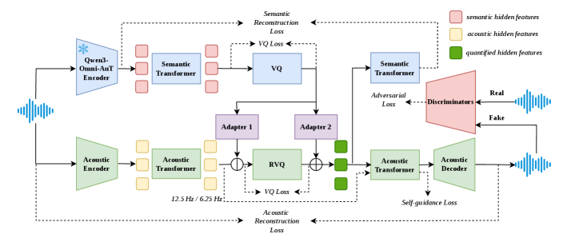
*Figure 1:Overview of OmniCodec framework.*

---
**Usage Info**: 2936 tokens used.
**Generated at**: 2026-03-24 12:53:13

---

# 📚 Speed by Simplicity: A Single-Stream Architecture for Fast Audio-Video Generative Foundation Model

🚀 URL: https://arxiv.org/html/2603.21986

## 🌏 Abstract (원문)
We presentdaVinci-MagiHuman, an open-source audio-video generative foundation model for human-centric generation. daVinci-MagiHuman jointly generates synchronized video and audio using a single-stream Transformer that processes text, video, and audio within a unified token sequence via self-attention only. This single-stream design avoids the complexity of multi-stream or cross-attention architectures while remaining easy to optimize with standard training and inference infrastructure. The model is particularly strong in human-centric scenarios, producing expressive facial performance, natural speech-expression coordination, realistic body motion, and precise audio-video synchronization. It supports multilingual spoken generation across Chinese (Mandarin and Cantonese), English, Japanese, Korean, German, and French. For efficient inference, we combine the single-stream backbone with model distillation, latent-space super-resolution, and a Turbo VAE decoder, enabling generation of a 5-second 256p video in 2 seconds on a single H100 GPU. In automatic evaluation, daVinci-MagiHuman achieves the highest visual quality and text alignment among leading open models, along with the lowest word error rate (14.60%) for speech intelligibility. In pairwise human evaluation, it achieves win rates of 80.0% against Ovi 1.1 and 60.9% against LTX 2.3 over 2,000 comparisons. We open-source the complete model stack, including the base model, the distilled model, the super-resolution model, and the inference codebase.
## 🌏 Abstract (번역)
저희는 인간 중심 생성을 위한 오픈소스 오디오-비디오 생성 기반 모델인 daVinci-MagiHuman을 소개합니다. daVinci-MagiHuman은 텍스트, 비디오, 오디오를 단일 토큰 시퀀스 내에서 오직 셀프 어텐션만을 통해 처리하는 단일 스트림 트랜스포머를 사용하여 동기화된 비디오와 오디오를 공동으로 생성합니다. 이 단일 스트림 설계는 다중 스트림 또는 교차 어텐션 아키텍처의 복잡성을 피하면서도 표준 훈련 및 추론 인프라로 쉽게 최적화할 수 있습니다. 이 모델은 특히 인간 중심 시나리오에서 강력하며, 표현력이 풍부한 얼굴 연기, 자연스러운 음성-표정 조화, 사실적인 신체 움직임, 그리고 정밀한 오디오-비디오 동기화를 생성합니다. 중국어(만다린 및 광둥어), 영어, 일본어, 한국어, 독일어, 프랑스어를 포함한 다국어 음성 생성을 지원합니다. 효율적인 추론을 위해, 우리는 단일 스트림 백본을 모델 증류(distillation), 잠재 공간 초해상도(latent-space super-resolution), 그리고 터보 VAE 디코더와 결합하여 단일 H100 GPU에서 2초 만에 5초 길이의 256p 비디오를 생성할 수 있도록 합니다. 자동 평가에서 daVinci-MagiHuman은 주요 오픈 모델 중 가장 높은 시각적 품질과 텍스트 정렬을 달성했으며, 음성 명료도에서 가장 낮은 단어 오류율(14.60%)을 기록했습니다. 쌍별 인간 평가에서는 2,000회 이상의 비교에서 Ovi 1.1에 대해 80.0%, LTX 2.3에 대해 60.9%의 승률을 달성했습니다. 우리는 기본 모델, 증류 모델, 초해상도 모델, 그리고 추론 코드베이스를 포함한 전체 모델 스택을 오픈소스화합니다.

## 🔍 Methods & Results
- daVinci-MagiHuman은 아키텍처 단순성, 강력한 생성 품질, 빠른 추론의 균형을 목표로 하는 인간 중심 오디오-비디오 생성 모델입니다.
- 텍스트, 비디오, 오디오 토큰을 공유 백본 내에서 단일 스택의 셀프 어텐션 레이어를 사용하여 모델링하는 단일 스트림 트랜스포머 아키텍처를 채택하여 다중 스트림/교차 어텐션 설계의 복잡성을 피하고 구현 및 최적화를 용이하게 합니다.
- 모델은 15B 매개변수, 40개 레이어의 단일 스트림 트랜스포머 백본을 사용하며, 입력 및 출력 경계에 가까운 처음과 마지막 4개 레이어는 모달리티별 투영을 사용하고, 중간 32개 레이어는 주요 트랜스포머 매개변수를 공유하는 '샌드위치 아키텍처' 레이아웃을 특징으로 합니다.
- 확산 타임스텝 정보를 명시적으로 주입하지 않고, 현재 노이즈가 있는 비디오 및 오디오 잠재 공간에서 직접 디노이징 상태를 추론하는 '타임스텝-프리 디노이징' 방식을 사용합니다.
- 각 어텐션 헤드에 스칼라 게이트를 도입하는 '헤드별 게이팅'을 적용하여 훈련 중 수치 안정성과 모델 표현력을 향상시킵니다.
- 디노이징 비디오 및 오디오 토큰, 텍스트, 선택적 이미지 조건을 모두 동일한 잠재/토큰 공간에서 처리하는 '통합 컨디셔닝' 인터페이스를 사용하여 아키텍처를 단순화합니다.
- 추론 효율성을 위해 잠재 공간 초해상도(latent-space super-resolution), 터보 VAE 디코더, 전체 그래프 컴파일(MagiCompiler), 그리고 모델 증류(DMD-2)와 같은 보완 기술을 통합합니다.
- 잠재 공간 초해상도는 저해상도에서 비디오 및 오디오 잠재 공간을 생성한 후, 전용 초해상도 체크포인트를 사용하여 잠재 공간에서 5단계의 추가 디노이징으로 고해상도 결과를 정제하여 고해상도 비디오 생성을 효율화합니다.
- Wan2.2 VAE를 인코딩에 사용하고, 추론 시 경량화된 재훈련된 터보 VAE 디코더로 교체하여 디코딩 오버헤드를 크게 줄입니다.
- MagiCompiler를 통해 H100 GPU에서 약 1.2배의 속도 향상을 달성하며, DMD-2를 통한 모델 증류로 CFG 없이 8단계의 디노이징만으로도 강력한 생성 품질을 유지합니다.
- 단일 H100 GPU에서 2초 만에 5초 길이의 256p 비디오를 생성할 수 있으며, 중국어(만다린, 광둥어), 영어, 일본어, 한국어, 독일어, 프랑스어 등 다국어 음성 생성을 지원합니다.
- 자동 평가에서 선도적인 오픈 모델 중 가장 높은 시각적 품질과 텍스트 정렬을 달성했으며, 음성 명료도에서 14.60%의 가장 낮은 단어 오류율을 기록했습니다.
- 쌍별 인간 평가에서 Ovi 1.1에 대해 80.0%, LTX 2.3에 대해 60.9%의 승률을 달성했습니다 (2,000회 이상의 비교 기준).
- 기본 모델, 증류 모델, 초해상도 모델 및 추론 코드베이스를 포함한 전체 모델 스택을 오픈소스화합니다.

## 🖼 Figures
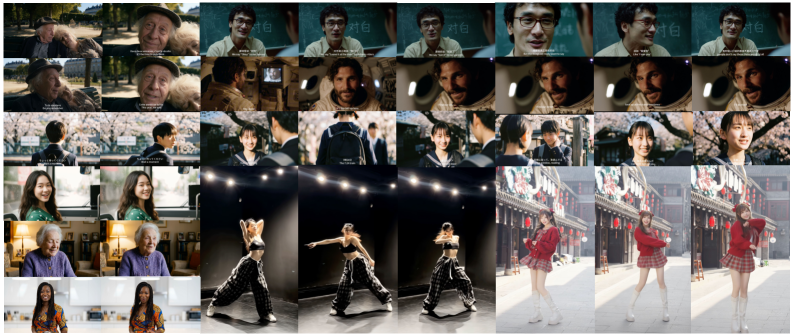
*Figure 1:Examples of videos generated by daVinci-MagiHuman*

![Figure 2:Overall architecture. (a) The base generator takes text tokens, a reference image latent, and noisy video and audio tokens as input, and jointly denoises the video and audio tokens with a single-stream Transformer. All modalities are processed within a unified token sequence using self-attention only, without separate cross-attention or fusion modules. A latent-space super-resolution stage can be further applied to refine the generated video at higher output resolutions. (b) The single-stream Transformer adopts a sandwich architecture layout: the first and last 4 layers use modality-specific projections and normalization parameters, while the middle 32 layers share the main Transformer parameters across modalities. Each block uses per-head gating in attention, and the model contains no explicit timestep embedding.](../images/2026-03-24/2603.21986/2603.21986_fig1.png)
*Figure 2:Overall architecture. (a) The base generator takes text tokens, a reference image latent, and noisy video and audio tokens as input, and jointly denoises the video and audio tokens with a single-stream Transformer. All modalities are processed within a unified token sequence using self-attention only, without separate cross-attention or fusion modules. A latent-space super-resolution stage can be further applied to refine the generated video at higher output resolutions. (b) The single-stream Transformer adopts a sandwich architecture layout: the first and last 4 layers use modality-specific projections and normalization parameters, while the middle 32 layers share the main Transformer parameters across modalities. Each block uses per-head gating in attention, and the model contains no explicit timestep embedding.*

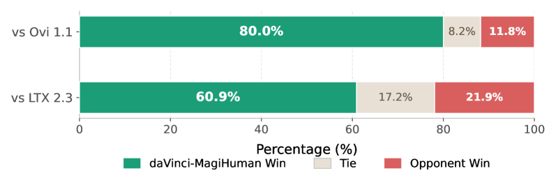
*Figure 3:Human evaluation results. Pairwise preference rates of daVinci-MagiHuman against two open-source audio-video generation models, aggregated over 10 raters and 2,000 comparisons.*

---
**Usage Info**: 4127 tokens used.
**Generated at**: 2026-03-24 12:53:24

---

# 📚 EmoTaG: Emotion-Aware Talking Head Synthesis on Gaussian Splatting with Few-Shot Personalization

🚀 URL: https://arxiv.org/html/2603.21332

## 🌏 Abstract (원문)
Audio-driven 3D talking head synthesis has advanced rapidly with Neural Radiance Fields (NeRF) and 3D Gaussian Splatting (3DGS). By leveraging rich pre-trained priors, few-shot methods enable instant personalization from just a few seconds of video. However, under expressive facial motion, existing few-shot approaches often suffer from geometric instability and audio-emotion mismatch, highlighting the need for more effective emotion-aware motion modeling. In this work, we present EmoTaG, a few-shot emotion-aware 3D talking head synthesis framework built on the Pretrain-and-Adapt paradigm. Our key insight is to reformulate motion prediction in a structured FLAME parameter space rather than directly deforming 3D Gaussians, thereby introducing explicit geometric priors that improve motion stability. Building upon this, we propose a Gated Residual Motion Network (GRMN), which captures emotional prosody from audio while supplementing head pose and upper-face cues absent from audio, enabling expressive and coherent motion generation. Extensive experiments demonstrate that EmoTaG achieves state-of-the-art performance in emotional expressiveness, lip synchronization, visual realism, and motion stability.
## 🌏 Abstract (번역)
오디오 기반 3D 말하는 얼굴 합성 기술은 NeRF(Neural Radiance Fields) 및 3DGS(3D Gaussian Splatting)의 발전과 함께 빠르게 진보했습니다. 풍부한 사전 학습된 사전 지식을 활용하여, 소수샷(few-shot) 방법은 단 몇 초의 비디오만으로 즉각적인 개인화를 가능하게 합니다. 그러나 표현력이 풍부한 얼굴 움직임 하에서 기존의 소수샷 접근 방식은 종종 기하학적 불안정성과 오디오-감정 불일치 문제를 겪으며, 이는 보다 효과적인 감정 인식 움직임 모델링의 필요성을 강조합니다. 본 연구에서는 사전 학습-적응(Pretrain-and-Adapt) 패러다임을 기반으로 하는 소수샷 감정 인식 3D 말하는 얼굴 합성 프레임워크인 EmoTaG를 제안합니다. 우리의 핵심 통찰력은 3D 가우시안을 직접 변형하는 대신 구조화된 FLAME 파라미터 공간에서 움직임 예측을 재구성하여 움직임 안정성을 향상시키는 명시적인 기하학적 사전 지식을 도입하는 것입니다. 이를 바탕으로, 우리는 오디오에서 감정적 운율을 포착하는 동시에 오디오에 없는 머리 자세 및 상안면 단서를 보완하여 표현력 있고 일관된 움직임 생성을 가능하게 하는 Gated Residual Motion Network (GRMN)를 제안합니다. 광범위한 실험을 통해 EmoTaG가 감정 표현력, 입술 동기화, 시각적 사실성 및 움직임 안정성에서 최첨단 성능을 달성함을 입증합니다.

## 🔍 Methods & Results
- EmoTaG는 FLAME-Gaussian 모델(강력한 구조적 3D 사전 지식 제공)과 Gated Residual Motion Network (GRMN, 동적 얼굴 움직임 예측)의 두 가지 주요 구성 요소로 이루어져 있습니다.
- GRMN은 AdaIN 기반 변조를 통해 오디오, 표정, 신원 등 다중 모달 구동 단서를 통합하는 Identity-Conditioned Encoder와 세 가지 상호 보완적인 움직임 분기(기본, 잔차, 게이트)를 사용하는 Expert Motion Decoder로 구성됩니다.
- 움직임 예측은 3D 가우시안을 직접 변형하는 대신 구조화된 FLAME 파라미터 공간에서 재구성되어 움직임 안정성을 향상시키는 명시적인 기하학적 사전 지식을 도입합니다.
- FLAME 모델은 신원 유지를 위해 형상 파라미터(𝜷)를 고정하고, 표정(𝚿) 및 턱 자세(𝚯jaw) 파라미터를 회귀하여 안정적인 구조적 사전 지식을 제공합니다.
- 3D 가우시안은 FLAME 메시 삼각형에서 샘플링되어 각 가우시안이 부모 삼각형에 바인딩되며, FLAME 메시 변형 시 일관된 변형을 허용합니다. 구강 내 가우시안(𝒢mouth)은 미세한 구강 조음을 위해 추가적인 네트워크 예측 잔차 오프셋을 적용받습니다.
- GRMN은 Wav2Vec 2.0에서 추출된 오디오 특징(𝐀), OpenFace AU 파라미터에서 얻은 상안면 표정 특징(𝐄), 그리고 AdaFace 특징을 평균화한 신원 특징(𝐬)을 융합합니다. 신원 특징은 AdaIN을 통해 오디오 및 표정 특징을 변조하여 개인화된 움직임 특성을 주입합니다.
- Expert Motion Decoder의 기본 분기는 신원 불가지론적 오디오-움직임 매핑을 모델링하여 중립적인 하안면 및 구강 움직임을 예측합니다.
- 잔차 분기는 EMO 인코더-디코더 모듈을 통해 감정 기반 편차를 포착하며, 상안면 단서를 활용하여 감정 관련 얼굴 움직임을 강화합니다.
- 게이트 분기는 중립 및 감정 관련 움직임의 기여도를 동적으로 조절하는 스칼라(g)를 예측하여 과장된 표현을 방지하고 구조적 안정성을 유지합니다.
- Semantic Emotion Guidance는 사전 학습된 감정 인식기(DeepFace)를 교사로 사용하여 감정 분포(p_emo)와 감정 강도 점수(e_e)를 추출하고, 이를 잔차 및 게이트 분기의 훈련을 지도하여 수동 주석 없이 감정 인식 움직임 생성을 가능하게 합니다.
- Pretrain-and-Adapt 패러다임을 사용하여 GRMN은 다중 신원 코퍼스에서 사전 학습되고, 개인화 시에는 5초 비디오만으로 AdaIN 변조 파라미터만 미세 조정됩니다.
- EmoTaG는 렌더링 손실(L1 및 SSIM), 감정 증류 손실(감정 분포 및 강도 점수 정렬), 기하학적 손실(2D 깊이 및 법선 맵 비교)을 포함하는 종합적인 목적 함수로 훈련됩니다.
- 광범위한 실험을 통해 EmoTaG가 감정 표현력, 입술 동기화, 시각적 사실성 및 움직임 안정성에서 최첨단 성능을 달성함을 입증했습니다.

## 🖼 Figures
![Figure 1:EmoTaG generates expressive and synchronized 3D talking heads from only 5-second new identity videos. Built upon a FLAME-Gaussian model [29] and a Gated Residual Motion Network, our method achieves better emotional expressiveness, lip synchronization, visual realism, and motion stability compared to state-of-the-art approaches.](../images/2026-03-24/2603.21332/2603.21332_fig0.png)
*Figure 1:EmoTaG generates expressive and synchronized 3D talking heads from only 5-second new identity videos. Built upon a FLAME-Gaussian model [29] and a Gated Residual Motion Network, our method achieves better emotional expressiveness, lip synchronization, visual realism, and motion stability compared to state-of-the-art approaches.*

*Figure 2: Neutral vs emotional articulation complexity. We compare horizontal and vertical mouth opening trajectories measured from lip landmarks. Emotional audio shows stronger temporal fluctuation and higher variance (
𝜎
emotional
=
7.88
,
6.92
) than neutral audio (
𝜎
neutral
=
3.11
,
1.86
), revealing more complex articulation patterns.*

![Figure 3: Overview of EmoTaG. For pretraining, our Gated Residual Motion Network learns a universal motion prior from a multi-identity corpus. This network comprises an Identity-Conditioned Encoder for integrating audio, expression, and identity through AdaIN-based modulation, followed by an Expert Motion Decoder that leverages emotion-distilled supervision to train three cooperative branches (Base, Residual, Gate). During adaptation, the Gated Residual Motion Network is efficiently adapted to a new identity from 5-second video via only tuning the AdaIN modulation parameters. At inference, the adapted model produces expressive, high-fidelity 3D facial animation driven by new audio with head pose and upper-face cues.](../images/2026-03-24/2603.21332/2603.21332_fig2.png)
*Figure 3: Overview of EmoTaG. For pretraining, our Gated Residual Motion Network learns a universal motion prior from a multi-identity corpus. This network comprises an Identity-Conditioned Encoder for integrating audio, expression, and identity through AdaIN-based modulation, followed by an Expert Motion Decoder that leverages emotion-distilled supervision to train three cooperative branches (Base, Residual, Gate). During adaptation, the Gated Residual Motion Network is efficiently adapted to a new identity from 5-second video via only tuning the AdaIN modulation parameters. At inference, the adapted model produces expressive, high-fidelity 3D facial animation driven by new audio with head pose and upper-face cues.*

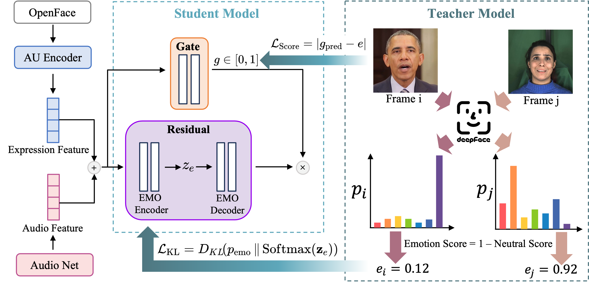
*Figure 4: Overview of Semantic Emotion Guidance. DeepFace provides both a categorical emotion distribution and a scalar emotion score to guide GRMN’s residual and gate branches.*

![Figure 5: Qualitative comparison on self-reconstruction. EmoTaG generates more expressive, temporally coherent, and well-synchronized talking heads than previous methods across both neutral and emotional test cases. It preserves accurate mouth articulation and natural upper-face motion even under challenging expressions. The red rectangles highlight regions where previous methods produce distorted and inaccurate facial motions. We strongly recommend watching the supplementary video for dynamic comparison.](../images/2026-03-24/2603.21332/2603.21332_fig4.png)
*Figure 5: Qualitative comparison on self-reconstruction. EmoTaG generates more expressive, temporally coherent, and well-synchronized talking heads than previous methods across both neutral and emotional test cases. It preserves accurate mouth articulation and natural upper-face motion even under challenging expressions. The red rectangles highlight regions where previous methods produce distorted and inaccurate facial motions. We strongly recommend watching the supplementary video for dynamic comparison.*

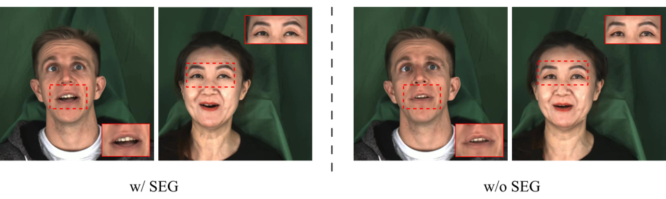
*Figure 6: Effect of Semantic Emotion Guidance (SEG). SEG enhances upper-face expressiveness and audio-emotion coherence compared to the model without it.*

---
**Usage Info**: 7028 tokens used.
**Generated at**: 2026-03-24 12:53:44

---

