# 🚩 (2026-03-25) Scholar Inbox 추천 논문 

# 📚 RelayS2S: Dual-Path Speculative Generation for Real-Time Dialogue

🚀 URL: https://arxiv.org/html/2603.23346

## 🌏 Abstract (원문)
Real-time spoken dialogue systems face a fundamental tension between latency and response quality. End-to-end speech-to-speech (S2S) models respond immediately and naturally handle turn-taking, backchanneling, and interruption, but produce semantically weaker outputs. Cascaded pipelines (ASR→\rightarrowLLM) deliver stronger responses at the cost of latency that grows with model size. We present RelayS2S, a hybrid architecture that runs two paths in parallel upon turn detection. The fast path — a duplex S2S model — speculatively drafts a short response prefix that is streamed immediately to TTS for low-latency audio onset, while continuing to monitor live audio events. The slow path — a cascaded ASR→\rightarrowLLM pipeline — generates a higher-quality continuation conditioned on the committed prefix, producing a seamless utterance. A lightweight learned verifier gates the handoff, committing the prefix when appropriate or falling back gracefully to the slow path alone. Experiments show that RelayS2S achieves P90 onset latency comparable to the S2S model while retaining 99% cascaded response quality in average score, with benefits growing as the slow-path model scales. Because the prefix handoff requires no architectural modification to either component, RelayS2S serves as a lightweight, drop-in addition to existing cascaded pipelines. Our code and data are publicly available athttps://github.com/mailong25/relays2s.
## 🌏 Abstract (번역)
실시간 음성 대화 시스템은 지연 시간과 응답 품질 사이의 근본적인 긴장 관계에 직면합니다. 종단 간 음성-음성(S2S) 모델은 즉시 응답하고 자연스럽게 차례 주고받기, 맞장구, 끼어들기를 처리하지만, 의미적으로 약한 출력을 생성합니다. 계단식 파이프라인(ASR→LLM)은 모델 크기에 따라 증가하는 지연 시간의 대가로 더 강력한 응답을 제공합니다. 우리는 턴 감지 시 두 가지 경로를 병렬로 실행하는 하이브리드 아키텍처인 RelayS2S를 제시합니다. 빠른 경로(이중 S2S 모델)는 짧은 응답 접두사를 추측적으로 초안 작성하여 낮은 지연 시간의 오디오 시작을 위해 즉시 TTS로 스트리밍하며, 동시에 실시간 오디오 이벤트를 계속 모니터링합니다. 느린 경로(계단식 ASR→LLM 파이프라인)는 커밋된 접두사에 따라 더 높은 품질의 후속 부분을 생성하여 매끄러운 발화를 만듭니다. 경량 학습 검증기는 핸드오프를 제어하여 적절할 때 접두사를 커밋하거나, 그렇지 않으면 느린 경로만으로 우아하게 폴백합니다. 실험 결과 RelayS2S는 S2S 모델과 유사한 P90 시작 지연 시간을 달성하면서 평균 점수에서 99%의 계단식 응답 품질을 유지하며, 느린 경로 모델이 확장됨에 따라 이점이 증가하는 것으로 나타났습니다. 접두사 핸드오프는 어떤 구성 요소에도 아키텍처 수정이 필요하지 않으므로, RelayS2S는 기존 계단식 파이프라인에 경량의 드롭인 추가 기능으로 사용될 수 있습니다. 우리의 코드와 데이터는 https://github.com/mailong25/relays2s에서 공개적으로 이용 가능합니다.

## 🔍 Methods & Results
- 실시간 음성 대화 시스템의 지연 시간과 응답 품질 간의 상충 관계를 해결하기 위해 RelayS2S라는 하이브리드 아키텍처를 제안했습니다.
- RelayS2S는 턴 감지 시 두 가지 경로를 병렬로 실행합니다: 빠른 경로(이중 S2S 모델)와 느린 경로(계단식 ASR→LLM 파이프라인).
- 빠른 경로는 낮은 지연 시간의 오디오 시작을 위해 짧은 응답 접두사를 추측적으로 생성하여 즉시 TTS로 스트리밍합니다.
- 느린 경로는 커밋된 접두사에 기반하여 더 높은 품질의 응답 후속 부분을 생성합니다.
- 경량 학습 검증기가 접두사 핸드오프를 관리하여, 적절한 경우 접두사를 커밋하고 그렇지 않으면 느린 경로만 사용하도록 폴백합니다.
- RelayS2S는 S2S 모델과 유사한 P90 시작 지연 시간을 달성했습니다.
- RelayS2S는 평균 점수에서 계단식 파이프라인의 99%에 해당하는 응답 품질을 유지했습니다.
- 느린 경로 모델의 규모가 커질수록 RelayS2S의 성능 이점이 증가하는 것으로 나타났습니다.
- 이 아키텍처는 기존 계단식 파이프라인에 아키텍처 수정 없이 경량의 드롭인 방식으로 추가될 수 있습니다.

## 🖼 Figures

*Figure 1:Inference-time architecture of RelayS2S. The fast path (green) speculatively drafts a response prefix that, if committed by the verifier, is streamed immediately to TTS. The slow path (brown) generates a higher-quality continuation conditioned on the committed prefix, or a full response on fallback.*

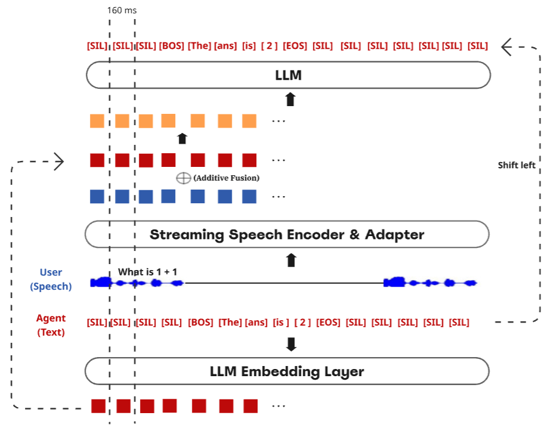
*Figure 2:Fast-path duplex S2S model. Speech and agent token embeddings are fused via element-wise addition at each 160 ms time step and passed through the LLM to predict the next control or text token.*

![Figure 3:Training examples for duplex control tokens. Top: the agent emits [STP] when the user interrupts. Bottom: the agent emits [BOC] to produce a backchannel during user speech.](../images/2026-03-25/2603.23346/2603.23346_fig2.png)
*Figure 3:Training examples for duplex control tokens. Top: the agent emits [STP] when the user interrupts. Bottom: the agent emits [BOC] to produce a backchannel during user speech.*

---
**Usage Info**: 2036 tokens used.
**Generated at**: 2026-03-25 12:47:23

---

# 📚 The Interspeech 2026 Audio Encoder Capability Challenge for Large Audio Language Models

🚀 URL: https://arxiv.org/html/2603.22728

## 🌏 Abstract (원문)
This paper presents the Interspeech 2026 Audio Encoder Capability Challenge, a benchmark specifically designed to evaluate and advance the performance of pre-trained audio encoders as front-end modules for Large Audio Language Models (LALMs).While LALMs have shown remarkable understanding of complex acoustic scenes, their performance depends on the semantic richness of the underlying audio encoder representations.This challenge addresses the integration gap by providing a unified generative evaluation framework, XARES-LLM, which assesses submitted encoders across a diverse suite of downstream classification and generation tasks.By decoupling encoder development from LLM fine-tuning, the challenge establishes a standardized protocol for general-purpose audio representations that can effectively be used for the next generation of multimodal language models.
## 🌏 Abstract (번역)
이 논문은 대규모 오디오 언어 모델(LALMs)의 프런트엔드 모듈로서 사전 훈련된 오디오 인코더의 성능을 평가하고 발전시키기 위해 특별히 설계된 벤치마크인 Interspeech 2026 오디오 인코더 역량 챌린지를 소개합니다. LALMs는 복잡한 음향 장면을 놀랍도록 이해하는 능력을 보여주었지만, 그 성능은 기반이 되는 오디오 인코더 표현의 의미론적 풍부함에 달려 있습니다. 이 챌린지는 제출된 인코더를 다양한 다운스트림 분류 및 생성 작업에 걸쳐 평가하는 통합 생성 평가 프레임워크인 XARES-LLM을 제공함으로써 통합 격차를 해소합니다. 인코더 개발을 LLM 미세 조정과 분리함으로써, 이 챌린지는 차세대 멀티모달 언어 모델에 효과적으로 사용될 수 있는 범용 오디오 표현을 위한 표준화된 프로토콜을 구축합니다.

## 🔍 Methods & Results
- Interspeech 2026 오디오 인코더 역량 챌린지는 XARES-LLM이라는 통합된 종단 간 생성 평가 프레임워크를 활용합니다.
- 참가자는 사전 훈련된 오디오 인코더를 제공하고, 주최측은 이를 사전 훈련된 LLM(SmolLM2-135M)과 연결하기 위한 경량 프로젝터를 훈련합니다.
- XARES-LLM은 경량 프로젝터와 LoRA로 강화된 디코더 LLM을 공동으로 최적화하여 인코더의 표현 성능 평가에 중점을 둡니다.
- 평가는 두 가지 주요 구성 요소로 이루어집니다: Track A(분류)는 키워드 스포팅, 화자 ID, 감정 인식과 같은 음성, 사운드, 음악 도메인 작업을 정확도(Accuracy) 및 mAP로 측정합니다. Track B(이해)는 역단어 오류율(iWER)로 측정되는 음성 전사(ASR)와 FENSE 및 DATE 지표로 측정되는 사운드/음악/일반 캡셔닝 작업을 포함합니다.
- 실험은 기본 배치 크기 44, 학습률 10^-4, 표준 훈련 반복 횟수를 사용합니다.
- 재현성을 위해 여러 하드웨어 구성에서 테스트를 수행했으며, 상대적 순위의 일관성과 1% 미만의 점수 차이를 확인하여 결과의 안정성을 입증했습니다.

## 🖼 Figures
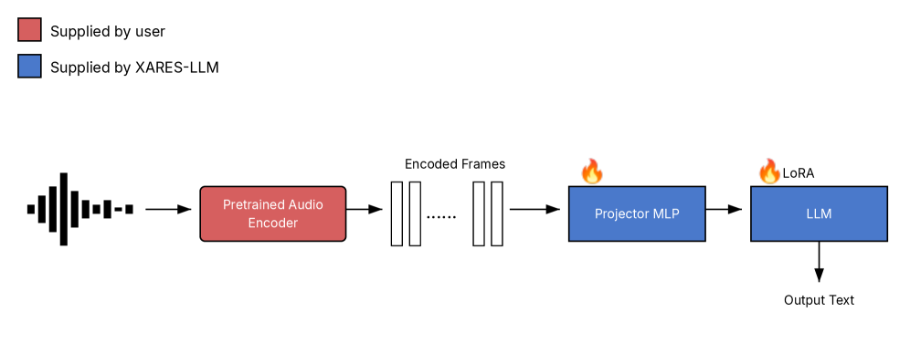
*Figure 1:The XARES-LLM framework. Participants provide a frozen encoder, and the framework trains an LLM.*

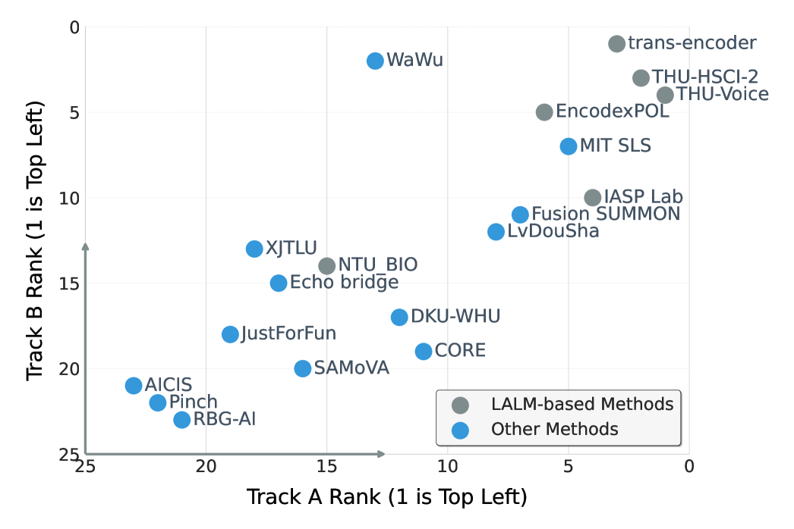
*Figure 2:Comparison of team rankings across Track A and Track B.*

---
**Usage Info**: 2984 tokens used.
**Generated at**: 2026-03-25 12:47:33

---

# 📚 MSR-HuBERT: Self-supervised Pre-training for Adaptation to Multiple Sampling Rates

🚀 URL: https://arxiv.org/html/2603.23048

## 🌏 Abstract (원문)
Self-supervised learning (SSL) has advanced speech processing. However, existing speech SSL methods typically assume a single sampling rate and struggle with mixed-rate data due to temporal resolution mismatch. To address this limitation, we propose MSRHuBERT, a multi-sampling-rate adaptive pre-training method. Building on HuBERT, we replace its single-rate downsampling CNN with a multi-sampling-rate adaptive downsampling CNN that maps raw waveforms from different sampling rates to a shared temporal resolution without resampling. This design enables unified mixed-rate pre-training and fine-tuning. In experiments spanning 16 to 48 kHz, MSRHuBERT outperforms HuBERT on speech recognition and full-band speech reconstruction, preserving high-frequency detail while modeling low-frequency semantic structure. Moreover, MSRHuBERT retains HuBERT's mask-prediction objective and Transformer encoder, so existing analyses and improvements that were developed for HuBERT can apply directly.
## 🌏 Abstract (번역)
자기 지도 학습(SSL)은 음성 처리 분야를 발전시켰습니다. 그러나 기존의 음성 SSL 방법들은 일반적으로 단일 샘플링 레이트를 가정하며, 시간 해상도 불일치로 인해 혼합 레이트 데이터 처리에서 어려움을 겪습니다. 이러한 한계를 해결하기 위해, 우리는 다중 샘플링 레이트 적응형 사전 학습 방법인 MSRHuBERT를 제안합니다. HuBERT를 기반으로, 우리는 단일 레이트 다운샘플링 CNN을 다중 샘플링 레이트 적응형 다운샘플링 CNN으로 대체하여, 서로 다른 샘플링 레이트의 원시 파형을 리샘플링 없이 공유된 시간 해상도로 매핑합니다. 이 설계는 통합된 혼합 레이트 사전 학습 및 미세 조정을 가능하게 합니다. 16kHz에서 48kHz에 이르는 실험에서, MSRHuBERT는 음성 인식 및 전체 대역 음성 재구성에서 HuBERT를 능가하며, 저주파 의미 구조를 모델링하면서 고주파 세부 정보를 보존합니다. 또한, MSRHuBERT는 HuBERT의 마스크 예측 목표와 트랜스포머 인코더를 유지하므로, HuBERT를 위해 개발된 기존 분석 및 개선 사항을 직접 적용할 수 있습니다.

## 🔍 Methods & Results
- MSRHuBERT는 다중 샘플링 레이트 음성을 처리하고 해상도 불일치 문제를 해결하도록 설계된 음성 자기 지도 학습(SSL) 프레임워크이다.
- 모델은 다양한 샘플링 레이트의 음성을 공통 시간 해상도로 매핑하고 공유 코드북을 사용하여 혼합 레이트 사전 학습을 수행한다.
- MSRHuBERT는 HuBERT의 단일 레이트 다운샘플링 CNN을 다중 샘플링 레이트 적응형 다운샘플링 CNN으로 대체하여, 리샘플링 없이 원시 다중 레이트 파형을 직접 사전 학습할 수 있게 하며 20ms 프레임 시프트를 유지한다.
- 적응형 다운샘플링 CNN은 서로 다른 샘플링 레이트의 음성 신호를 리샘플링 없이 공통 시간 해상도를 공유하는 프레임 레벨 특징으로 압축하여 고주파 정보를 보존한다.
- 각 다운샘플링 CNN 뒤에 레이어 정규화를 추가하여, 레이트별 CNN 간의 특징 집계 불일치를 제거하고 모든 추출된 특징을 공유 특징 공간으로 매핑한다.
- 다운샘플링 비율은 입력 샘플링 레이트와 20ms 프레임 시프트에 맞춰 각 CNN의 스트라이드와 커널 폭을 설계하여 달성되며, 모든 샘플링 레이트가 공유 트랜스포머 인코더에 공급되기 전에 동일한 시간 해상도로 정렬되도록 보장한다.
- HuBERT와 비교하여, MSRHuBERT는 리샘플링 없이 원시 고샘플링 레이트 음성을 직접 처리하여 고주파 정보를 보존하고, 사전 학습 데이터의 다양성을 높이며, 다중 샘플링 레이트에서 작동하는 다운스트림 작업으로의 적용 가능성을 확장한다.
- 추출된 특징들이 표준 시간 스케일을 공유하고 통합된 특징 공간에 있기 때문에, 기존의 마스크 예측 및 트랜스포머 인코더를 그대로 유지할 수 있다.
- 혼합 레이트 단일 공유 코드북 훈련은 모델이 다양한 샘플링 레이트에 존재하는 저주파 및 고주파 단서를 흡수하고, 다양한 레이트에서 추출된 문맥 표현을 공통 특징 공간에 있도록 제약하여, 혼합 레이트 다운스트림 작업에서 미세 조정을 단순화하는 레이트 불변 표현을 생성한다.

## 🖼 Figures
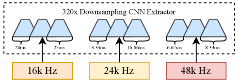
*Figure 1: The resolution mismatch across diverse sampling rates with a fixed 320× downsampling CNN.*

*Figure 2: The architecture of MSRHuBERT, which takes raw waveforms at different sampling rates as input. The multi-sampling-rate adaptive downsampling CNN can map waveforms to a common temporal resolution by designing rate-specific downsampling, and supports mixed-rate pre-training.*

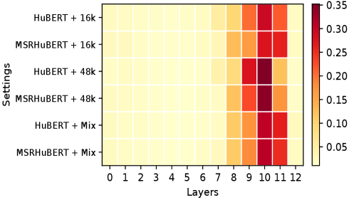
*Figure 3: Weight analysis on the ASR task of the SUPERB Benchmark. Layer 0 corresponds to the input of the first Transformer layer. The y-axis represents different settings, including pre-trained model and sampling rate of the downstream dataset in ASR.*

---
**Usage Info**: 4107 tokens used.
**Generated at**: 2026-03-25 12:47:46

---

# 📚 ViBe: Ultra-High-Resolution Video Synthesis Born from Pure Images

🚀 URL: https://arxiv.org/html/2603.23326

## 🌏 Abstract (원문)
Transformer-based video diffusion models rely on 3D attention over spatial and temporal tokens, which incurs quadratic time and memory complexity and makes end-to-end training for ultra-high-resolution videos prohibitively expensive. To overcome this bottleneck, we propose a pure image adaptation framework that upgrades a video Diffusion Transformer pre-trained at its native scale to synthesize higher-resolution videos. Unfortunately, naively fine-tuning with high-resolution images alone often introduces noticeable noise due to the image–video modality gap. To address this, we decouple the learning objective to separately handle modality alignment and spatial extrapolation. At the core of our approach isRelay LoRA, a two-stage adaptation strategy. In the first stage, the video diffusion model is adapted to the image domain using low-resolution images to bridge the modality gap. In the second stage, the model is further adapted with high-resolution images to acquire spatial extrapolation capability. During inference, only the high-resolution adaptation is retained to preserve the video generation modality while enabling high-resolution video synthesis. To enhance fine-grained detail synthesis, we further propose aHigh-Frequency-Awareness-Training-Objective, which explicitly encourages the model to recover high-frequency components from degraded latent representations via a dedicated reconstruction loss.Extensive experiments demonstrate that our method produces ultra-high-resolution videos with rich visual details without requiring any video training data, even outperforming previous state-of-the-art models trained on high-resolution videos by0.80.8on the VBench benchmark. Codes will be availablehere.
## 🌏 Abstract (번역)
트랜스포머 기반 비디오 확산 모델은 공간 및 시간 토큰에 대한 3D 어텐션에 의존하며, 이는 이차 시간 및 메모리 복잡성을 야기하여 초고해상도 비디오에 대한 엔드투엔드 학습을 엄청나게 비싸게 만듭니다. 이 병목 현상을 극복하기 위해, 우리는 기본 해상도에서 사전 학습된 비디오 확산 트랜스포머를 업그레이드하여 더 높은 해상도의 비디오를 합성하는 순수 이미지 적응 프레임워크를 제안합니다. 불행히도, 고해상도 이미지만으로 단순히 미세 조정하는 것은 이미지-비디오 양식 간의 차이로 인해 종종 눈에 띄는 노이즈를 유발합니다. 이를 해결하기 위해, 우리는 양식 정렬과 공간 외삽을 별도로 처리하도록 학습 목표를 분리합니다. 우리 접근 방식의 핵심은 두 단계 적응 전략인 Relay LoRA입니다. 첫 번째 단계에서는 비디오 확산 모델이 양식 간의 차이를 메우기 위해 저해상도 이미지를 사용하여 이미지 도메인에 적응됩니다. 두 번째 단계에서는 모델이 고해상도 이미지를 사용하여 공간 외삽 능력을 습득하도록 추가로 적응됩니다. 추론 시에는 비디오 생성 양식을 유지하면서 고해상도 비디오 합성을 가능하게 하기 위해 고해상도 적응 부분만 유지됩니다. 미세한 디테일 합성을 강화하기 위해, 우리는 전용 재구성 손실을 통해 모델이 손상된 잠재 표현에서 고주파 구성 요소를 복구하도록 명시적으로 장려하는 고주파 인식 학습 목표(High-Frequency-Awareness-Training-Objective)를 추가로 제안합니다. 광범위한 실험은 우리 방법이 어떠한 비디오 훈련 데이터도 필요 없이 풍부한 시각적 디테일을 가진 초고해상도 비디오를 생성하며, VBench 벤치마크에서 고해상도 비디오로 훈련된 이전 최첨단 모델보다 0.8점 더 우수한 성능을 보임을 입증합니다. 코드는 여기에 제공될 예정입니다.

## 🔍 Methods & Results
- 초고해상도 비디오 생성을 위한 순수 이미지 적응 프레임워크를 제안하며, 이는 기존 비디오 확산 트랜스포머의 3D 어텐션으로 인한 높은 계산 비용 및 메모리 복잡성 문제를 해결합니다.
- 이미지-비디오 양식 간의 차이로 인한 노이즈 문제를 해결하기 위해 학습 목표를 양식 정렬과 공간 외삽으로 분리합니다.
- 핵심 방법론인 Relay LoRA는 두 단계 적응 전략을 사용합니다: 1단계에서는 저해상도 이미지를 사용하여 비디오 모델을 이미지 도메인에 적응시켜 양식 간극을 해소하고, 2단계에서는 고해상도 이미지를 사용하여 공간 외삽 능력을 습득합니다.
- 추론 시에는 고해상도 적응(LoRA2)만 유지하여 비디오 생성 양식을 보존하면서 고해상도 비디오 합성을 가능하게 합니다.
- 미세한 디테일 합성을 강화하기 위해, 손상된 잠재 표현에서 고주파 구성 요소를 복구하도록 모델을 명시적으로 훈련하는 고주파 인식 학습 목표(High-Frequency-Awareness-Training-Objective, HFATO)를 제안합니다.
- 전역 의미 일관성과 지역 디테일 모델링의 균형을 맞추기 위해 Global-Coarse-Local-Fine-Attention (GCLFA)을 도입하며, 이는 지역 디테일을 위한 내부 슬라이딩 윈도우 어텐션과 전역 컨텍스트를 위한 풀링된 거친 토큰을 활용합니다.
- 제안된 방법은 어떠한 비디오 훈련 데이터도 필요 없이 풍부한 시각적 디테일을 가진 초고해상도 비디오를 생성합니다.
- VBench 벤치마크에서 고해상도 비디오로 훈련된 이전 최첨단 모델보다 0.8점 더 우수한 성능을 달성했습니다.

## 🖼 Figures
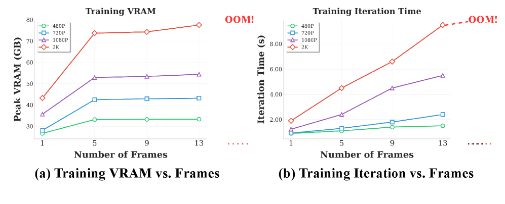
*Figure 2:The two plots show how training VRAM consumption and iteration time scale with the number of frames under different resolutions.*

![Figure 3:The plots on the left shows the general pipeline of our Relay LoRA. The two panels on the right provide a qualitative analysis on Wan2.2 [wan2025wanopenadvancedlargescale]: naive high-resolution image fine-tuning (Naive LoRA) introduces noticeable artifacts, whereas ours methods (Relay LoRA) effectively removes them.](../images/2026-03-25/2603.23326/2603.23326_fig2.png)
*Figure 3:The plots on the left shows the general pipeline of our Relay LoRA. The two panels on the right provide a qualitative analysis on Wan2.2 [wan2025wanopenadvancedlargescale]: naive high-resolution image fine-tuning (Naive LoRA) introduces noticeable artifacts, whereas ours methods (Relay LoRA) effectively removes them.*

![Figure 4:Upper Left: Stage-1 fine-tuning trains 
LoRA
1
 to adapt the DiT backbone to single low-resolution frame generation. Upper Middle: Stage-2 first merges 
LoRA
1
 into the base model and freezes the merged weights, then trains a Relay 
LoRA
2
 to adapt the DiT backbone to single high-resolution frame generation. Upper Right: During inference, only 
LoRA
2
 is loaded on the base model for video generation. Bottom Left: Global-Coarse-Local-Fine-Attention combines an inward sliding-window local attention with pooled coarse attention. Bottom Right: The training objective first degrades the latents via a downsample–upsample operation, then add noise on the degraded sample. The model applies the predicted flow and computes the loss against the clean latents.](../images/2026-03-25/2603.23326/2603.23326_fig3.png)
*Figure 4:Upper Left: Stage-1 fine-tuning trains 
LoRA
1
 to adapt the DiT backbone to single low-resolution frame generation. Upper Middle: Stage-2 first merges 
LoRA
1
 into the base model and freezes the merged weights, then trains a Relay 
LoRA
2
 to adapt the DiT backbone to single high-resolution frame generation. Upper Right: During inference, only 
LoRA
2
 is loaded on the base model for video generation. Bottom Left: Global-Coarse-Local-Fine-Attention combines an inward sliding-window local attention with pooled coarse attention. Bottom Right: The training objective first degrades the latents via a downsample–upsample operation, then add noise on the degraded sample. The model applies the predicted flow and computes the loss against the clean latents.*

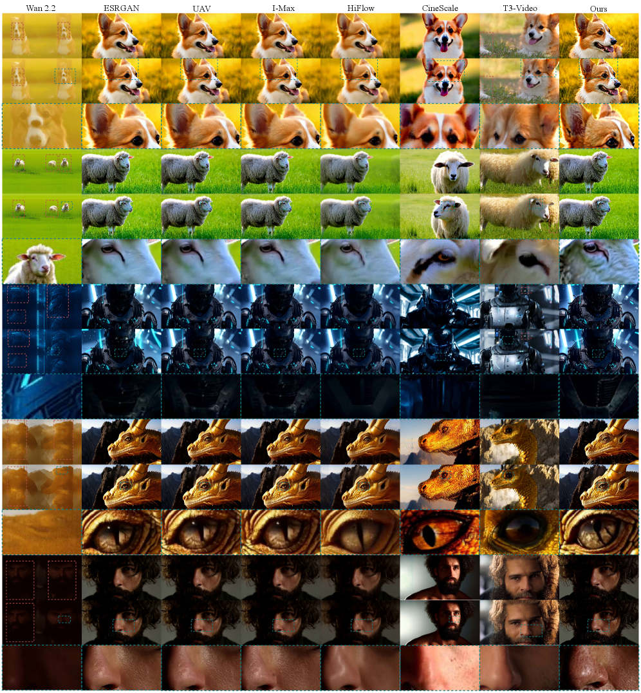
*Figure 5:Qualitative comparison. ViBe yields high-resolution videos characterized by high-fidelity details and coherent structure. The red boxes highlight regions with incorrect semantics or layout. The blue boxes provide zoomed-in views.*

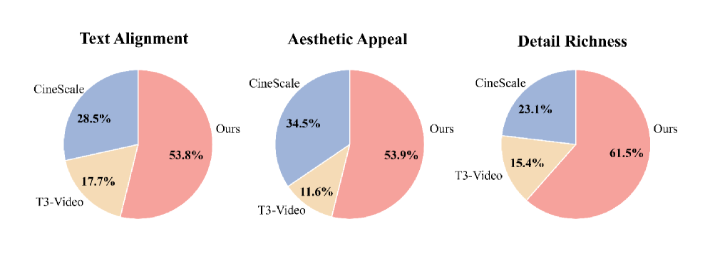
*Figure 6:Results of user study for high-resolution video generation. Participants were expected to select the best method based on Text Alignment, Aesthetic Quality, and Video Quality.*

*Figure 7:Qualitative ablations. We perform controlled comparisons of our method with alternative variants under controlled settings. Best viewed zoomed in. The red boxes highlight regions with more noticeable noise, and the blue boxes indicate the corresponding zoomed-in views.*

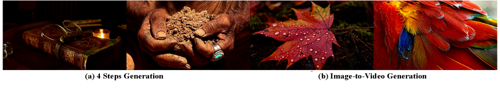
*Figure 8:Left: Illustration 4 steps generation results integrated with our framework. Right: Illustration Image-to-Video generation results integrated with our framework.*

*Figure 9:More Qualitative ablations. We perform controlled comparisons of our method with alternative variants under controlled settings. Best viewed zoomed in. The red boxes highlight regions with more noticeable noise, and the blue boxes indicate the corresponding zoomed-in views.*

*Figure 10:A fair comparison of Local Attention and GCLFA. We perform controlled comparisons of our method with attnetion variants under controlled settings. Best viewed zoomed in. The red boxes highlight regions with incorrect semantics or layout.*

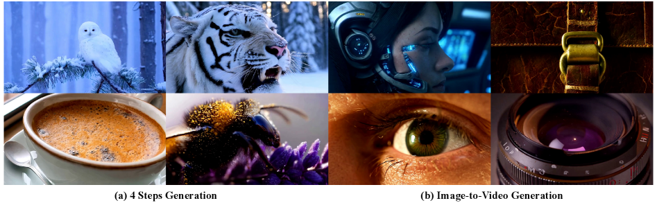
*Figure 11:Left: Illustration 4 steps generation results integrated with our framework. Right: Illustration Image-to-Video generation results integrated with our framework.*

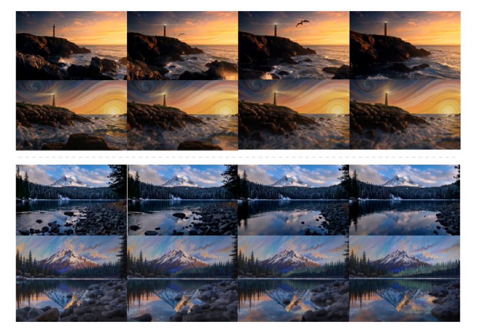
*Figure 12:Two examples of style transfer with ViBe. In each case, the top row shows the original video, while the bottom row presents the stylized result.*

![Figure 13:Qualitative results of 1080P and 2K generated by our method ViBe integrated with Wan2.2 [wan2025wanopenadvancedlargescale].](../images/2026-03-25/2603.23326/2603.23326_fig12.png)
*Figure 13:Qualitative results of 1080P and 2K generated by our method ViBe integrated with Wan2.2 [wan2025wanopenadvancedlargescale].*

![Figure 14:Qualitative results of 3K and 4K generated by our method ViBe integrated with Wan2.2 [wan2025wanopenadvancedlargescale].](../images/2026-03-25/2603.23326/2603.23326_fig13.png)
*Figure 14:Qualitative results of 3K and 4K generated by our method ViBe integrated with Wan2.2 [wan2025wanopenadvancedlargescale].*

---
**Usage Info**: 6009 tokens used.
**Generated at**: 2026-03-25 12:48:05

---

