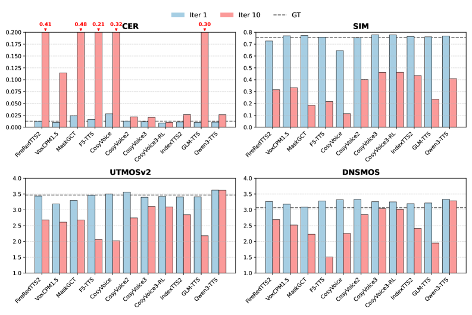
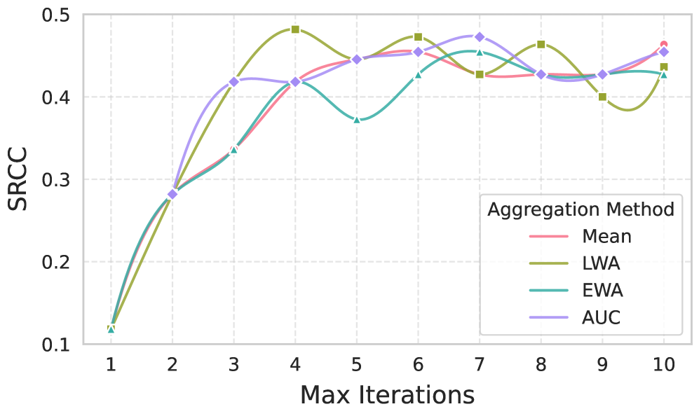
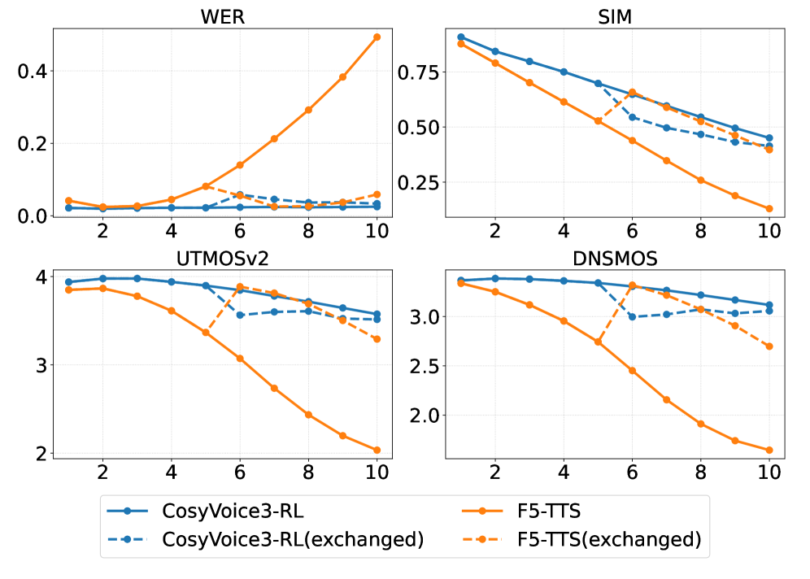
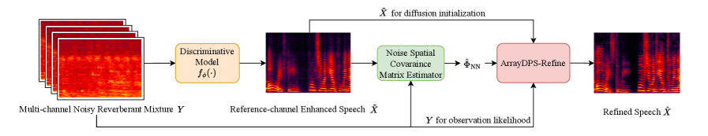
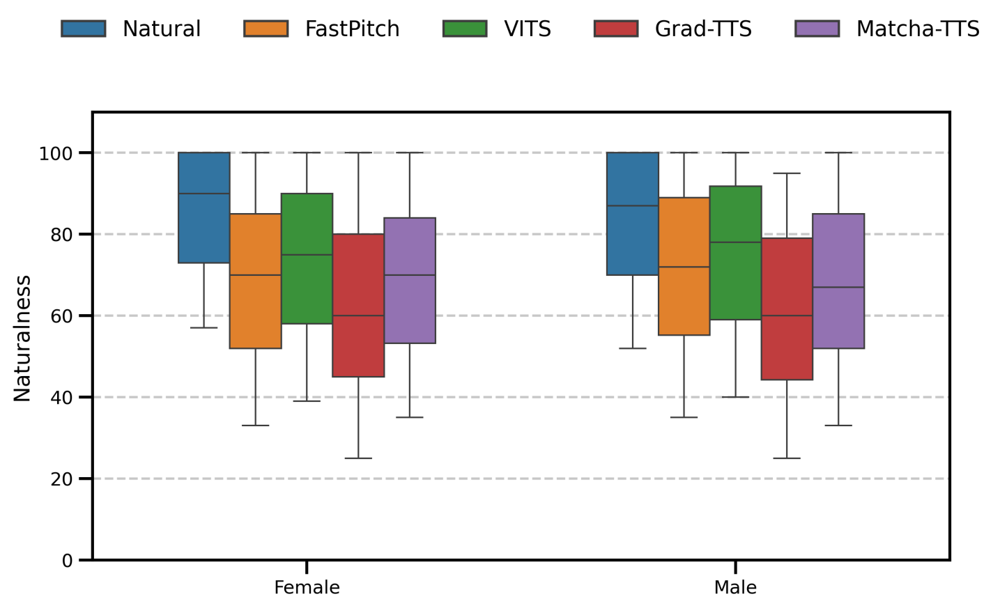
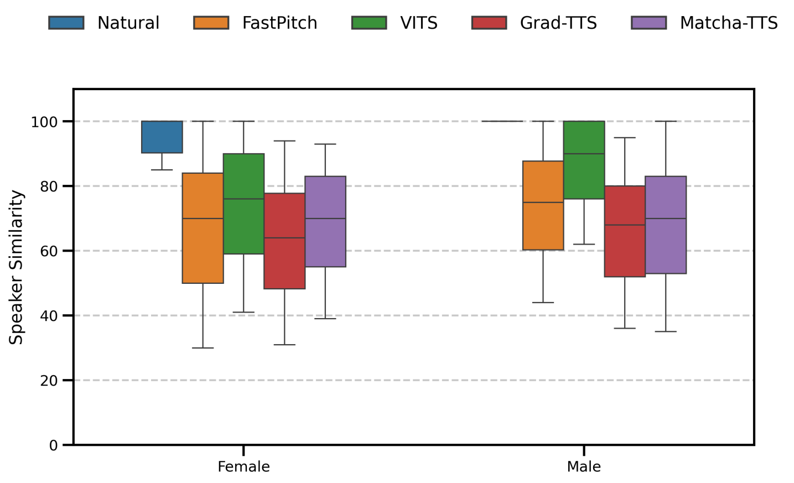
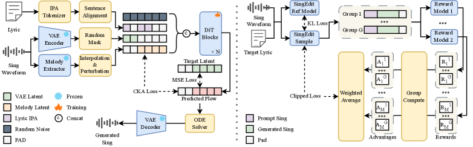
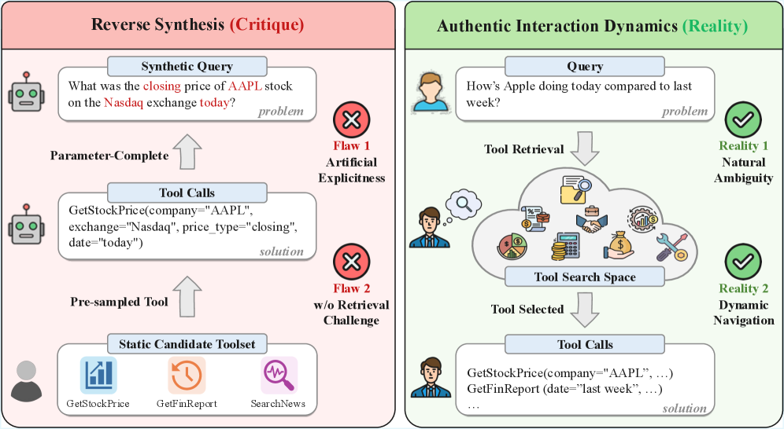
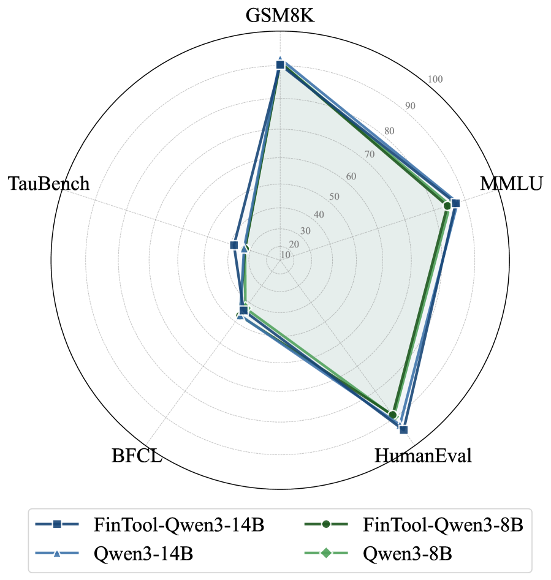

# 🚩 (2026-03-26) Scholar Inbox 추천 논문 

# 📚 Iterate to Differentiate: Enhancing Discriminability and Reliability in Zero-Shot TTS Evaluation

🚀 URL: https://arxiv.org/html/2603.24430

## 🌏 Abstract (원문)
Reliable evaluation of modern zero-shot text-to-speech (TTS) models remains challenging. Subjective tests are costly and hard to reproduce, while objective metrics often saturate, failing to distinguish SOTA systems. To address this, we propose Iterate to Differentiate (I2D), an evaluation framework that recursively synthesizes speech using the model's own outputs as references. Higher-quality models exhibit greater resilience to the distributional shift induced by iterative synthesis, resulting in slower performance degradation. I2D exploits this differential degradation to amplify performance gaps and reveal robustness. By aggregating objective metrics across iterations, I2D improves discriminability and alignment with human judgments, increasing system-level SRCC from 0.118 to 0.464 for UTMOSv2. Experiments on 11 models across Chinese, English, and emotion datasets demonstrate that I2D enables more reliable automated evaluation for zero-shot TTS.
## 🌏 Abstract (번역)
최신 제로샷 음성 합성(TTS) 모델의 신뢰할 수 있는 평가는 여전히 어렵습니다. 주관적 테스트는 비용이 많이 들고 재현하기 어려운 반면, 객관적 지표는 종종 포화되어 SOTA 시스템을 구별하지 못합니다. 이를 해결하기 위해 우리는 모델 자체의 출력을 참조로 사용하여 음성을 재귀적으로 합성하는 평가 프레임워크인 Iterate to Differentiate (I2D)를 제안합니다. 고품질 모델은 반복 합성으로 인한 분포 변화에 더 큰 회복력을 보여 성능 저하가 더 느리게 발생합니다. I2D는 이러한 차등적 성능 저하를 활용하여 성능 격차를 증폭시키고 견고성을 드러냅니다. 반복에 걸쳐 객관적 지표를 집계함으로써 I2D는 식별력을 향상시키고 인간 판단과의 일치도를 높여 UTMOSv2의 시스템 수준 SRCC를 0.118에서 0.464로 증가시킵니다. 중국어, 영어 및 감정 데이터셋에 걸쳐 11개 모델에 대한 실험은 I2D가 제로샷 TTS에 대한 보다 신뢰할 수 있는 자동 평가를 가능하게 함을 보여줍니다.

## 🔍 Methods & Results
- 기존 SOTA TTS 시스템 평가에서 객관적 지표의 점수 포화 현상으로 인해 모델 간 성능 차이를 구별하기 어렵고 인간 판단과의 일치도가 낮다는 문제점을 해결하고자 함.
- 모델 자체의 합성 출력을 다음 라운드의 참조 입력으로 재귀적으로 재사용하여 반복적인 생성을 통해 점진적인 분포 변화를 유도하는 오류 축적 전략인 Iterate to Differentiate (I2D)를 제안함.
- 고품질 모델은 반복 합성으로 인한 분포 변화에 더 강하여 성능 저하가 느리게 발생하고, 약한 모델은 더 빠르게 저하되어 성능 차이가 증폭되는 '차등적 성능 저하' 원리를 활용하여 기존 객관적 지표의 식별력을 복원함.
- 평가 프로토콜은 (참조 음성, 참조 텍스트, 목표 텍스트) 삼중항을 사용하여, 모델이 생성한 음성을 다음 반복의 참조 오디오로 재사용하고 목표 텍스트는 유지하며, 최대 반복 횟수까지 진행함. 이때 텍스트-오디오 불일치가 암묵적인 오류 증폭 메커니즘으로 작용함.
- LibriTTS, Seed-TTS-Eval, CV3-Eval 기반으로 중국어, 영어, 감정 데이터셋을 구성하고, 중국어 데이터셋에서 100개 샘플을 인간 평가용으로 선정하여 총 11개의 SOTA TTS 모델을 평가함.
- 객관적 평가 지표로는 WER/CER, 화자 유사성(SIM), DNSMOS, UTMOSv2를 사용했으며, 감정 데이터셋에는 감정 분류 F1-점수를 사용함. 주관적 평가는 MOS(Mean Opinion Score) 프로토콜을 통해 내용 정확도, 화자 일관성, 전반적 자연스러움 차원에서 진행함.
- 여러 합성 반복에 걸친 지표 궤적을 요약하기 위해 평균 점수, 선형 가중 평균(LWA), 지수 가중 평균(EWA), 곡선 아래 면적(AUC)과 같은 집계 방법을 사용함.
- I2D는 UTMOSv2에 대한 시스템 수준 SRCC를 0.118에서 0.464로 향상시켜 식별력과 인간 판단과의 일치도를 개선함을 입증했으며, 11개 모델에 대한 실험을 통해 제로샷 TTS의 보다 신뢰할 수 있는 자동 평가가 가능함을 보여줌.

## 🖼 Figures

*Figure 1:The overall workflow of our evaluation. The dashed arrows indicate that, after the first synthesis, the reference wav and reference text are updated using the target wav and target text. The objective metrics EMO_F1 are applied only to the Emotion dataset.*

*Figure 2:SRCC between objective metrics and subjective dimensions at utterance and system levels (1st and 10th iterations). Utterance-level SRCC is calculated from all individual sample scores, while system-level is derived from model rankings. Specifically, we compare SIM with Spk. Consistency, 1-CER with Content Acc., and UTMOSv2/DNSMOS with Naturalness.*

*Figure 3:Bar chart of objective metrics for all models on Chinese dataset at the 1st and 10th iterations. The dashed lines indicate the values for real audio.*

*Figure 4:System-level SRCC between aggregated UTMOSv2 scores and human ratings of first-iteration speech, computed under different maximum iteration numbers.*

*Figure 5:Cross-model iterative evaluation curves of CosyVoice3-RL and F5-TTS. Solid lines denote the original trajectories without reference swapping, while dashed lines represent the trajectories after exchanging reference audio at the 6th iteration.*

---
**Usage Info**: 4503 tokens used.
**Generated at**: 2026-03-26 12:55:38

---

# 📚 ArrayDPS-Refine: Generative Refinement of Discriminative Multi-channel Speech Enhancement

🚀 URL: https://arxiv.org/html/2603.24385

## 🌏 Abstract (원문)
Multi-channel speech enhancement aims to recover clean speech from noisy multi-channel recordings. Most deep learning methods employ discriminative training, which can lead to non-linear distortions from regression-based objectives, especially under challenging environmental noise conditions. Inspired by ArrayDPS for unsupervised multi-channel source separation, we introduce ArrayDPS-Refine, a method designed to enhance the outputs of discriminative models using a clean speech diffusion prior. ArrayDPS-Refine is training-free, generative, and array-agnostic. It first estimates the noise spatial covariance matrix (SCM) from the enhanced speech produced by a discriminative model, then uses this estimated noise SCM for diffusion posterior sampling. This approach allows direct refinement of any discriminative model’s output without retraining. Our results show that ArrayDPS-Refine consistently improves the performance of various discriminative models, including state-of-the-art waveform and STFT domain models. Audio demos are provided athttps://xzwy.github.io/ArrayDPSRefineDemo/.
## 🌏 Abstract (번역)
다채널 음성 향상은 노이즈가 있는 다채널 녹음에서 깨끗한 음성을 복원하는 것을 목표로 합니다. 대부분의 딥러닝 방법은 판별 학습을 사용하는데, 이는 특히 어려운 환경 노이즈 조건에서 회귀 기반 목표로 인해 비선형 왜곡을 초래할 수 있습니다. 비지도 다채널 음원 분리를 위한 ArrayDPS에서 영감을 받아, 우리는 깨끗한 음성 확산 사전(diffusion prior)을 사용하여 판별 모델의 출력을 향상시키도록 설계된 방법인 ArrayDPS-Refine을 소개합니다. ArrayDPS-Refine은 학습이 필요 없고, 생성적이며, 배열에 구애받지 않습니다. 이 방법은 먼저 판별 모델이 생성한 향상된 음성으로부터 노이즈 공간 공분산 행렬(SCM)을 추정하고, 이 추정된 노이즈 SCM을 확산 사후 샘플링(diffusion posterior sampling)에 사용합니다. 이 접근 방식은 재학습 없이 모든 판별 모델의 출력을 직접적으로 개선할 수 있게 합니다. 우리의 결과는 ArrayDPS-Refine이 최첨단 파형 및 STFT 도메인 모델을 포함한 다양한 판별 모델의 성능을 일관되게 향상시킨다는 것을 보여줍니다. 오디오 데모는 https://xzwy.github.io/ArrayDPSRefineDemo/ 에서 제공됩니다.

## 🔍 Methods & Results
- 다채널 노이즈 관측은 Y(ℓ,k) = H(ℓ,k) *ℓ X(ℓ,k) + N(ℓ,k)로 모델링되며, 여기서 N(ℓ,k)는 공간 공분산 ΦNN을 갖는 복소 가우시안 분포를 따릅니다.
- Denoising Diffusion Probabilistic Model (DDPM)과 Score-based diffusion을 활용하여 데이터 분포에서 샘플링하는 역확산 과정을 정의합니다.
- Diffusion Posterior Sampling (DPS)은 사전 학습된 깨끗한 음성 확산 모델을 사용하여 P(X|Y)에서 샘플링하지만, 실제 시나리오에서 알 수 없는 Room Acoustic Transfer Function (H) 문제가 있습니다.
- ArrayDPS는 Forward Convolutive Prediction (FCP)을 사용하여 각 DPS 단계에서 H를 추정함으로써 알 수 없는 H 문제를 해결합니다.
- ArrayDPS-Refine은 판별적 향상 모델 fϕ(⋅)이 생성한 X~ (참조 채널 무향 깨끗한 음성 추정치)를 먼저 얻습니다.
- X~와 Y를 사용하여 노이즈 공간 공분산 행렬(SCM) ΦNN을 추정합니다. 이는 FCP로 H~를 추정하고, X~reverb를 계산한 후, N~ = Y - X~reverb를 통해 N~을 얻고, 이를 재귀 지수 이동 평균으로 평활화하여 ΦNN을 추정하는 과정을 포함합니다.
- ArrayDPS-Refine 알고리즘은 압축 도메인 STFT (X' = |X|^0.5 * exp(j∠X))에서 사전 학습된 확산 모델을 사용하여 X~를 정제합니다.
- X~를 압축 도메인 X~'로 변환하여 확산 초기화에 사용하고, 중간 확산 시간 단계 T'에서 XT''를 X~'로부터 초기화합니다.
- 확산 사후 샘플링 과정에서, 사전 학습된 확산 모델을 사용하여 한 단계 역전환하고, X^0'를 얻은 후 STFT X^0로 변환합니다.
- X^0를 사용하여 FCP로 Room ATF H를 추정하고, 추정된 노이즈 SCM Φ^NN과 우도 모델(Eq.2)을 사용하여 우도 스코어 근사 G를 계산합니다.
- G를 사용하여 우도 스코어 업데이트를 수행하며, 스칼라 ξ로 우도 안내를 제어합니다.
- 샘플링된 압축 도메인 깨끗한 X0를 STFT 도메인으로 다시 변환한 후, X0를 X~에 정렬하기 위해 FCP(NH=1)를 사용하여 단일 프레임 필터를 추정합니다.
- ArrayDPS-Refine은 학습이 필요 없고, 생성적이며, 배열에 구애받지 않는 특징을 가집니다.
- ArrayDPS-Refine은 최첨단 파형 및 STFT 도메인 모델을 포함한 다양한 판별 모델의 성능을 일관되게 향상시키는 결과를 보였습니다.

## 🖼 Figures

*Fig. 1:ArrayDPS-Refine Pipeline.*

---
**Usage Info**: 5992 tokens used.
**Generated at**: 2026-03-26 12:55:49

---

# 📚 How Open is Open TTS? A Practical Evaluation of Open Source TTS Tools for Romanian

🚀 URL: https://arxiv.org/html/2603.24116

## 🌏 Abstract (원문)
Open-source text-to-speech (TTS) frameworks have emerged as highly adaptable platforms for developing speech synthesis systems across a wide range of languages. However, their applicability is not uniform – particularly when the target language is under-resourced or when computational resources are constrained. In this study, we systematically assess the feasibility of building novel TTS models using four widely adopted open-source architectures: FastPitch, VITS, Grad-TTS, and Matcha-TTS. Our evaluation spans multiple dimensions, including qualitative aspects such as ease of installation, dataset preparation, and hardware requirements, as well as quantitative assessments of synthesis quality for Romanian. We employ both objective metrics and subjective listening tests to evaluate intelligibility, speaker similarity, and naturalness of the generated speech. The results reveal significant challenges in tool chain setup, data preprocessing, and computational efficiency, which can hinder adoption in low-resource contexts. By grounding the analysis in reproducible protocols and accessible evaluation criteria, this work aims to inform best practices and promote more inclusive, language-diverse TTS development.
## 🌏 Abstract (번역)
오픈소스 음성 합성(TTS) 프레임워크는 다양한 언어에 걸쳐 음성 합성 시스템을 개발하기 위한 고도로 적응 가능한 플랫폼으로 부상했습니다. 그러나 특히 대상 언어가 저자원 언어이거나 컴퓨팅 자원이 제한적일 때 그 적용 가능성은 균일하지 않습니다. 본 연구에서는 널리 채택된 네 가지 오픈소스 아키텍처인 FastPitch, VITS, Grad-TTS, Matcha-TTS를 사용하여 새로운 TTS 모델을 구축하는 실현 가능성을 체계적으로 평가합니다. 우리의 평가는 설치 용이성, 데이터셋 준비, 하드웨어 요구 사항과 같은 정성적 측면뿐만 아니라 루마니아어에 대한 합성 품질의 정량적 평가를 포함한 여러 차원에 걸쳐 이루어집니다. 우리는 생성된 음성의 명료도, 화자 유사성 및 자연스러움을 평가하기 위해 객관적인 측정 지표와 주관적인 청취 테스트를 모두 사용합니다. 결과는 도구 체인 설정, 데이터 전처리 및 계산 효율성에서 상당한 어려움이 있음을 보여주며, 이는 저자원 환경에서의 채택을 방해할 수 있습니다. 재현 가능한 프로토콜과 접근 가능한 평가 기준에 기반한 분석을 통해, 본 연구는 모범 사례를 알리고 보다 포괄적이고 언어적으로 다양한 TTS 개발을 촉진하는 것을 목표로 합니다.

## 🔍 Methods & Results
- 네 가지 대표적인 오픈소스 TTS 아키텍처(FastPitch, VITS, Grad-TTS, Matcha-TTS)를 선정하여 루마니아어 TTS 모델 구축의 실현 가능성을 평가했습니다.
- FastPitch는 비자기회귀 모델로 명시적인 F0 제어 및 지속 시간 예측기를 통해 멜-스펙트로그램을 병렬로 예측합니다.
- VITS는 조건부 VAE, 정규화 흐름, 적대적 학습을 통합하여 텍스트-음성 정렬, 음향 모델링, 파형 합성을 단일 아키텍처로 통합하는 종단 간 모델입니다.
- Grad-TTS는 멜-스펙트로그램 생성을 노이즈 제거 프로세스로 공식화하는 확산 확률 모델이며, 비인과적 컨볼루션 U-Net으로 파라미터화된 스코어 기반 모델을 사용합니다.
- Matcha-TTS는 정렬 학습, 운율 모델링, 효율적인 생성 모델링을 통합하는 조건부 흐름 매칭 TTS 아키텍처로, 확산 모델과 관련이 있지만 빠른 샘플링에 최적화된 ODE 기반 생성 프로세스를 사용합니다.
- VITS를 제외한 모든 TTS 시스템에는 HiFi-GAN 보코더가 사용되었습니다.
- 모든 모델에 대해 Phonemizer와 eSpeak-NG 백엔드를 사용하여 음성 전사를 적용하고 루마니아어에 맞게 기호 세트를 조정하여 텍스트 처리 파이프라인을 표준화했습니다.
- 훈련 데이터로는 루마니아어 SWARA 음성 코퍼스(21시간, 17명 화자)의 16시간 서브셋을 사용하여 '고유 음성(eigen-voice)' 모델을 훈련했습니다.
- 화자 적응 및 미세 조정을 위해 녹음 품질이 낮은 두 명의 화자(BAS, SGS)를 따로 두었으며, 각각 10개 및 1000개 샘플의 서브셋을 구성했습니다.
- 모든 기본 모델은 기본 하이퍼파라미터로 1.125백만 반복 동안 훈련되었으며, Grad-TTS 및 Matcha-TTS는 Tesla V100-SXM2 GPU에서, VITS 및 FastPitch는 Tesla T4 GPU에서 훈련되었습니다.
- 미세 조정은 120, 400, 1000 반복에서 수행되었으며, 10개 샘플에는 배치 크기 4, 1000개 샘플에는 배치 크기 16을 사용했습니다.
- 평가는 설치 용이성, 데이터셋 준비, 하드웨어 요구 사항과 같은 정성적 측면과 루마니아어 합성 품질에 대한 정량적 평가(객관적 지표 및 주관적 청취 테스트를 통한 명료도, 화자 유사성, 자연스러움)를 포함했습니다.
- 결과적으로 도구 체인 설정, 데이터 전처리 및 계산 효율성에서 상당한 어려움이 발견되어 저자원 환경에서의 채택이 저해될 수 있음을 시사했습니다.

## 🖼 Figures

*Figure 1:Pronunciation accuracy and intelligibility, reported as Word Error Rate - WER (
↓
) scores, for all models finetuned with 10 utterances per speaker (top) and 1000 utterances per speaker (bottom), evaluated at different stages of the finetuning process: 120 iterations (left); 400 iterations (center), and 4000 iterations (right).*

*Figure 2:Perceived naturalness, reported as Mean Opinion Score - UTMOS (
↑
) scores, for all models finetuned with 10 utterances per speaker (top) and 1000 utterances per speaker (bottom), evaluated at different stages of the finetuning process: 120 iterations (left); 400 iterations (center), and 4000 iterations (right).*

*Figure 3:Speaker similarity, reported as Speaker Encoder Cosine Similarity - SECS (
↑
) scores, for all models finetuned with 10 utterances per speaker (top) and 1000 utterances per speaker (bottom), evaluated at different stages of the finetuning process: 120 iterations (left); 400 iterations (center), and 4000 iterations (right).*

*Figure 4:Perceptual quality, reported as Perceptual Evaluation of Speech Quality - PESQ (
↑
) scores, for all models finetuned with 10 utterances per speaker (top) and 1000 utterances per speaker (bottom), evaluated at different stages of the finetuning process: 120 iterations (left); 400 iterations (center), and 4000 iterations (right).*

*Figure 5:Perceptual inteligibility, reported as Short-Time Objective Intelligibility - STOI (
↑
) scores, for all models finetuned with 10 utterances per speaker (top) and 1000 utterances per speaker (bottom), evaluated at different stages of the finetuning process: 120 iterations (left); 400 iterations (center), and 4000 iterations (right).*

*Figure 6:Signal fidelity, reported as Scale-invariant signal-to-distortion ratio - SI-SDR (
↑
) scores, for all models finetuned with 10 utterances per speaker (top) and 1000 utterances per speaker (bottom), evaluated at different stages of the finetuning process: 120 iterations (left); 400 iterations (center), and 4000 iterations (right).*

*Figure 7:Spectral deviation of the synthesised waveform, reported as Mel Cepstral Distortion - MCD (
↓
) scores, for all models finetuned with 10 utterances per speaker (top) and 1000 utterances per speaker (bottom), evaluated at different stages of the finetuning process: 120 iterations (left); 400 iterations (center), and 4000 iterations (right).*

*Figure 8:Differences in pitch contour, reported as Log F0 RMSE (
↓
) scores, for all models finetuned with 10 utterances per speaker (top) and 1000 utterances per speaker (bottom), evaluated at different stages of the finetuning process: 120 iterations (left); 400 iterations (center), and 4000 iterations (right).*

*Figure 9:Perceived Naturalness score statistics obtained in the listening test for the models finetuned with 1000 utterances per speaker for 4000 iterations.*

*Figure 10:Perceived Speaker Similarity score statistics obtained in the listening test for the models finetuned with 1000 utterances per speaker for 4000 iterations.*

---
**Usage Info**: 4483 tokens used.
**Generated at**: 2026-03-26 12:56:00

---

# 📚 YingMusic-Singer: Controllable Singing Voice Synthesis with Flexible Lyric Manipulation and Annotation-free Melody Guidance

🚀 URL: https://arxiv.org/html/2603.24589

## 🌏 Abstract (원문)
Regenerating singing voices with altered lyrics while preserving melody consistency remains challenging, as existing methods either offer limited controllability or require laborious manual alignment. We propose YingMusic-Singer, a fully diffusion-based model enabling melody-controllable singing voice synthesis with flexible lyric manipulation. The model takes three inputs: an optional timbre reference, a melody-providing singing clip, and modified lyrics, without manual alignment. Trained with curriculum learning and Group Relative Policy Optimization, YingMusic-Singer achieves stronger melody preservation and lyric adherence than Vevo2, the most comparable baseline supporting melody control without manual alignment. We also introduce LyricEditBench, the first benchmark for melody-preserving lyric modification evaluation. The code, weights, benchmark, and demos are publicly available athttps://github.com/ASLP-lab/YingMusic-Singer.
## 🌏 Abstract (번역)
가사 변경 시 멜로디 일관성을 유지하면서 노래 목소리를 재현하는 것은 기존 방법들이 제한적인 제어 가능성을 제공하거나 수고로운 수동 정렬을 요구하기 때문에 여전히 어렵습니다. 우리는 유연한 가사 조작으로 멜로디 제어 가능한 노래 목소리 합성을 가능하게 하는 완전 확산 기반 모델인 YingMusic-Singer를 제안합니다. 이 모델은 수동 정렬 없이 선택적 음색 참조, 멜로디를 제공하는 노래 클립, 그리고 수정된 가사 세 가지 입력을 받습니다. 커리큘럼 학습과 그룹 상대 정책 최적화(Group Relative Policy Optimization)로 훈련된 YingMusic-Singer는 수동 정렬 없이 멜로디 제어를 지원하는 가장 비교 가능한 기준선인 Vevo2보다 더 강력한 멜로디 보존 및 가사 준수 능력을 달성합니다. 또한 우리는 멜로디 보존 가사 수정 평가를 위한 최초의 벤치마크인 LyricEditBench를 소개합니다. 코드, 가중치, 벤치마크 및 데모는 https://github.com/ASLP-lab/YingMusic-Singer에서 공개적으로 이용 가능합니다.

## 🔍 Methods & Results
- YingMusic-Singer는 선택적 음색 참조, 멜로디 제공 노래 클립, 수정된 가사를 입력으로 받아 44.1 kHz의 노래 목소리를 생성하는 완전 확산 기반 모델이다.
- 모델은 Stable Audio 2를 따르는 VAE(Variational Autoencoder), 사전 훈련된 MIDI 추출 모델의 인코더 기반 멜로디 추출기, 중국어 및 영어 가사를 통합된 음소 시퀀스로 변환하는 IPA 토크나이저, 그리고 F5-TTS를 따르는 DiT 기반 CFM 백본으로 구성된다.
- 훈련 중 VAE 잠재 프레임의 일부는 합성 목표로 마스킹되고, 마스킹되지 않은 부분은 음색 컨텍스트로 사용되며, 조건 `c`는 노이즈가 있는 잠재값과 연결되어 CFM에 공급된다.
- 훈련은 멜로디 조건 없이 음소 일반화 문제를 완화하기 위한 TTS 사전 훈련, 노래 데이터에 적응하고 멜로디 준수를 위해 CKA(Centered Kernel Alignment) 손실을 도입하는 노래 음성 지도 미세 조정(SFT) 2단계로 진행된다.
- SFT 단계에서 멜로디 보존과 가사 준수 간의 지속적인 트레이드오프를 해결하고 데이터 노이즈 한계를 극복하기 위해 GRPO(Group Relative Policy Optimization)를 사용한 강화 학습(RL)이 도입되었다.
- GRPO는 온라인으로 작동하며 그룹 내 보상 통계에서 기준선을 추정하여 가치 네트워크 없이 효율적이고 안정적이다.
- 멜로디 보존 가사 수정 평가를 위한 최초의 벤치마크인 LyricEditBench를 구축했다.
- LyricEditBench는 GTSinger 데이터셋을 기반으로 DeepSeek V3.2를 사용하여 6가지 수정 유형에 대한 수정된 가사를 생성하며, 총 11,535개의 유효 샘플을 포함한다.
- LyricEditBench는 가수 성별(남성/여성) 및 언어(중국어/영어)에 따라 4가지 범주로 분류되고, 각 수정 유형별로 7,200개의 테스트 인스턴스로 구성된다.

## 🖼 Figures

*Figure 1:Overall architecture of YingMusic-Singer. Left: the training pipeline consisting of a Variational Autoencoder, a Melody Extractor, an IPA Tokenizer, and DiT-based conditional flow matching. Right: the GRPO training pipeline.*

---
**Usage Info**: 3563 tokens used.
**Generated at**: 2026-03-26 12:56:09

---

# 📚 FinToolSyn: A forward synthesis Framework for Financial Tool-Use Dialogue Data with Dynamic Tool Retrieval

🚀 URL: https://arxiv.org/html/2603.24051

## 🌏 Abstract (원문)
Tool-use capabilities are vital for Large Language Models (LLMs) in finance, a domain characterized by massive investment targets and data-intensive inquiries. However, existing data synthesis methods typically rely on a reverse synthesis paradigm, generating user queries from pre-sampled tools. This approach inevitably introduces artificial explicitness, yielding queries that fail to capture the implicit, event-driven nature of real-world needs. Moreover, its reliance on static tool sets overlooks the dynamic retrieval process required to navigate massive tool spaces. To address these challenges, we introduceFinToolSyn, a forward synthesis framework designed to generate high-quality financial dialogues. Progressing from persona instruction and atomic tool synthesis to dynamic retrieval dialogue generation, our pipeline constructs a repository of 43,066 tools and synthesizes over 148k dialogue instances, incorporating dynamic retrieval to emulate the noisy candidate sets typical of massive tool spaces. We also establish a dedicated benchmark to evaluate tool-calling capabilities in realistic financial scenarios. Extensive experiments demonstrate that models trained on FinToolSyn achieve a 21.06% improvement, providing a robust foundation for tool learning in financial scenarios.
## 🌏 Abstract (번역)
금융 분야에서 대규모 투자 목표와 데이터 집약적인 조사가 특징인 영역에서 대규모 언어 모델(LLM)의 도구 사용 능력은 매우 중요합니다. 그러나 기존의 데이터 합성 방법은 일반적으로 미리 샘플링된 도구에서 사용자 쿼리를 생성하는 역합성 패러다임에 의존합니다. 이 접근 방식은 필연적으로 인위적인 명시성을 도입하여 실제 요구 사항의 암묵적이고 이벤트 중심적인 특성을 포착하지 못하는 쿼리를 생성합니다. 또한, 정적 도구 세트에 의존하는 것은 대규모 도구 공간을 탐색하는 데 필요한 동적 검색 프로세스를 간과합니다. 이러한 문제를 해결하기 위해 우리는 고품질 금융 대화를 생성하도록 설계된 순방향 합성 프레임워크인 FinToolSyn을 소개합니다. 페르소나 지침 및 원자 도구 합성에서 동적 검색 대화 생성으로 진행되는 우리의 파이프라인은 43,066개의 도구 저장소를 구축하고 148,000개 이상의 대화 인스턴스를 합성하며, 대규모 도구 공간의 전형적인 노이즈가 많은 후보 세트를 에뮬레이션하기 위해 동적 검색을 통합합니다. 우리는 또한 현실적인 금융 시나리오에서 도구 호출 능력을 평가하기 위한 전용 벤치마크를 구축합니다. 광범위한 실험은 FinToolSyn으로 훈련된 모델이 21.06%의 개선을 달성하여 금융 시나리오에서 도구 학습을 위한 강력한 기반을 제공함을 보여줍니다.

## 🔍 Methods & Results
- 기존 역합성 방식의 한계(인위적 명시성, 동적 검색 간과)를 해결하기 위해 순방향 합성 프레임워크인 FinToolSyn을 제안했습니다.
- FinToolSyn은 페르소나 지침, 원자 도구 합성, 동적 검색 대화 생성의 파이프라인으로 구성됩니다.
- 이 파이프라인을 통해 43,066개의 도구 저장소와 148,000개 이상의 대화 인스턴스를 합성했으며, 대규모 도구 공간의 노이즈를 모방하기 위해 동적 검색을 통합했습니다.
- 현실적인 금융 시나리오에서 도구 호출 능력을 평가하기 위한 전용 벤치마크를 구축했습니다.
- FinToolSyn으로 훈련된 모델은 기존 모델 대비 21.06%의 성능 향상을 달성했습니다.

## 🖼 Figures

*Figure 1:Comparison between reverse synthesis and authentic interaction dynamics.*

*Figure 2:The architecture of FinToolSyn. Our framework employs a forward synthesis paradigm that progresses from persona-based intent generation to dynamic tool retrieval, effectively capturing the implicit and event-driven nature of real-world financial inquiries.*

*Figure 3:Performance comparison of various general capabilities before and after training different models.*

---
**Usage Info**: 2469 tokens used.
**Generated at**: 2026-03-26 12:56:19

---

