# 🚩 (2026-03-30) Scholar Inbox 추천 논문 

# 📚 LLaDA-TTS: Unifying Speech Synthesis and Zero-Shot Editing via Masked Diffusion Modeling

🚀 URL: https://arxiv.org/html/2603.26364

## 🌏 Abstract (원문)
Large language model (LLM)-based text-to-speech (TTS) systems achieve remarkable naturalness via autoregressive (AR) decoding, but requireNNsequential steps to generateNNspeech tokens. We presentLLaDA-TTS, which replaces the AR LLM with a masked diffusion model that completes generation in a fixed number of parallel steps, decoupling inference latency from sequence length. Remarkably, using only 50 hours of fine-tuning data, we successfully transfer a pretrained AR checkpoint to the masked diffusion paradigm via bidirectional attention. At 64 steps, LLaDA-TTS achieves 0.98% CER (zh) and 1.96% WER (en) on Seed-TTS-Eval, matching the original CosyVoice 3 baseline performance while delivering a2×2\timesLLM-stage speedup—a notable acceleration achieved despite the absence of KV cache, an optimization the AR baseline heavily relies on. Beyond acceleration, the bidirectional architecture naturally enableszero-shot speech editing—including word-level insertion, deletion, and substitution—without any additional training. Theoretically, we prove that AR-pretrained weights are near-optimal for bidirectional masked prediction under the locality property of acoustic tokens, explaining this rapid convergence. This general method modifies only the attention mask and objective, applying seamlessly to any LLM-based AR TTS system. Code and audio samples will be available athttps://deft-piroshki-b652b5.netlify.app/.
## 🌏 Abstract (번역)
대규모 언어 모델(LLM) 기반 텍스트 음성 변환(TTS) 시스템은 자기회귀(AR) 디코딩을 통해 놀라운 자연스러움을 달성하지만, 음성 토큰을 생성하기 위해 순차적인 단계를 필요로 합니다. 본 논문에서는 AR LLM을 마스크 확산 모델로 대체하는 LLaDA-TTS를 제안합니다. 이 모델은 고정된 수의 병렬 단계로 생성을 완료하여 추론 지연 시간을 시퀀스 길이와 분리합니다. 놀랍게도, 단 50시간의 미세 조정 데이터만을 사용하여 사전 훈련된 AR 체크포인트를 양방향 어텐션을 통해 마스크 확산 패러다임으로 성공적으로 전이시켰습니다. 64단계에서 LLaDA-TTS는 Seed-TTS-Eval에서 0.98% CER(중국어) 및 1.96% WER(영어)을 달성하여, 원래 CosyVoice 3 기준 성능과 일치하며, AR 기준 모델이 크게 의존하는 KV 캐시가 없음에도 불구하고 LLM 단계에서 2배의 속도 향상을 제공합니다. 가속화 외에도, 양방향 아키텍처는 추가 훈련 없이 단어 수준 삽입, 삭제, 대체 등 제로샷 음성 편집을 자연스럽게 가능하게 합니다. 이론적으로, 우리는 음향 토큰의 지역성(locality) 속성 하에서 AR 사전 훈련된 가중치가 양방향 마스크 예측에 거의 최적임을 증명하며, 이러한 빠른 수렴을 설명합니다. 이 일반적인 방법은 어텐션 마스크와 목적 함수만 수정하므로, 모든 LLM 기반 AR TTS 시스템에 원활하게 적용될 수 있습니다. 코드와 오디오 샘플은 https://deft-piroshki-b652b5.netlify.app/에서 제공될 예정입니다.

## 🔍 Methods & Results
- LLaDA-TTS는 기존 LLM 기반 TTS 파이프라인에서 인과적(causal) AR LLM을 양방향 마스크 확산 모델로 대체하여, 고정된 병렬 단계로 음성 토큰 생성을 완료합니다.
- 모델은 인과적 마스크 대신 완전한 양방향 어텐션을 사용하여 모든 토큰이 다른 모든 토큰을 참조할 수 있도록 하며, AR 가중치로부터 직접 초기화될 수 있도록 AR 예측 규칙을 유지합니다.
- 사전 훈련된 AR 체크포인트(Qwen2-0.5B 백본)에서 모든 파라미터를 로드하고, 새로운 [MASK] 토큰 임베딩만 무작위로 초기화하여 언어 및 음향 지식을 전이합니다.
- 훈련은 6,000시간의 Emilia 데이터셋(중국어 58%, 영어 42%)을 사용하며, 마스크된 위치에 대해 1/t 가중치 교차 엔트로피 손실을 적용합니다.
- 생성은 완전히 마스크된 상태에서 완전히 드러나는 상태로 T단계에 걸쳐 반복적인 언마스킹을 통해 진행되며, 각 단계에서 가장 신뢰도 높은 상위 K개의 예측을 언마스킹합니다.
- 64단계에서 LLaDA-TTS는 Seed-TTS-Eval에서 중국어 0.98% CER, 영어 1.96% WER을 달성하여 CosyVoice 3 기준 성능과 일치하며, LLM 단계에서 2배의 속도 향상을 제공합니다.
- 양방향 아키텍처는 추가 훈련 없이 단어 수준 삽입, 삭제, 대체 등 제로샷 음성 편집을 가능하게 하며, 주변 토큰을 고정하고 영향을 받는 영역을 마스킹하여 재생성하는 방식으로 작동합니다.
- 이론적으로, 음향 토큰의 지역성 속성 하에서 AR 사전 훈련된 가중치가 양방향 마스크 예측에 거의 최적임을 증명하여, AR 초기화 모델의 빠른 수렴(스크래치 대비 0.98% CER vs 45.27% CER)을 설명합니다.

## 🖼 Figures

*Figure 1:LLaDA-TTS architecture overview. A bidirectional Transformer (Qwen2) iteratively unmasks speech tokens in 
𝑇
 steps. The text encoder, sequence format, and downstream flow matching vocoder remain identical to the AR baseline.*

*Figure 2:Speech editing pipeline: (1) align text
→
speech via attention, (2) mask affected region with context margins, (3) regenerate via iterative unmasking. The surrounding tokens remain frozen, providing bidirectional conditioning throughout.*

*Figure 3:Speed–quality tradeoff. Left axis: test-zh CER (%) vs. denoising steps; right axis: LLM-stage RTF on A100. The dashed green line marks the CosyVoice 3 AR baseline CER (1.21%). LLaDA-TTS surpasses the AR baseline at 48 steps (
∼
2.6
×
 speedup) and achieves 0.74% CER at 96 steps.*

*Figure 4:Unmasking process for a Chinese utterance (64 steps). Each column is a speech token position; color indicates the step at which the token was unmasked (blue=early, red=late, gray=still masked). The generation exhibits a predominantly left-to-right progression with confidence-based deviations.*

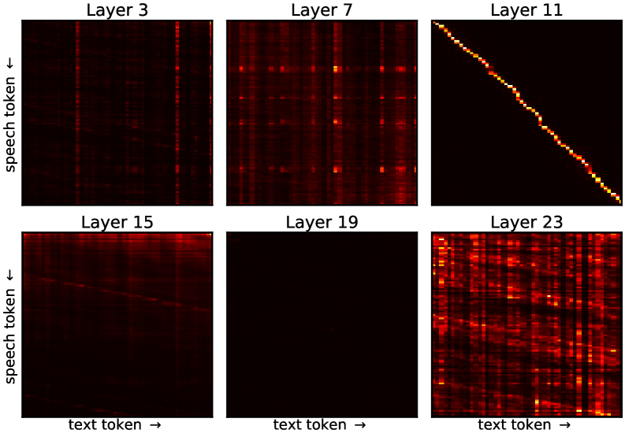
*(a)Head-averaged attention for selected layers. Layer 11 shows sharp diagonal alignment.*

*(a)Head-averaged attention for selected layers. Layer 11 shows sharp diagonal alignment.*

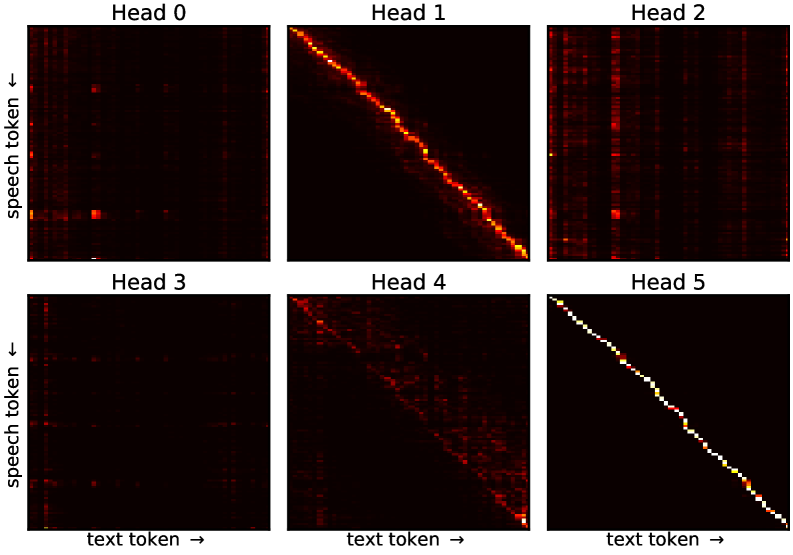
*(b)Individual heads (H0–H5) of layer 11. H1 and H5 develop monotonic alignment.*

---
**Usage Info**: 4426 tokens used.
**Generated at**: 2026-03-30 12:58:45

---

# 📚 Generation Is Compression: Zero-Shot Video Coding via Stochastic Rectified Flow

🚀 URL: https://arxiv.org/html/2603.26571

## 🌏 Abstract (원문)
Existing generative video compression methods use generative models only as post-hoc reconstruction modules atop conventional codecs. We proposeGenerative Video Codec(GVC), a zero-shot framework that turns a pretrained video generative model into the codec itself: the transmitted bitstream directly specifies the generative decoding trajectory, with no retraining required. To enable this, we convert the deterministic rectified-flow ODE of modern video foundation models into an equivalent SDE at inference time, unlocking per-step stochastic injection points for codebook-driven compression. Building on this unified backbone, we instantiate three complementary conditioning strategies—Image-to-Video(I2V) with adaptive tail-frame atom allocation,Text-to-Video(T2V) operating at near-zero side information as a pure generative prior, andFirst-Last-Frame-to-Video(FLF2V) with boundary-sharing GOP chaining for dual-anchor temporal control. Together, these variants span a principled trade-off space between spatial fidelity, temporal coherence, and compression efficiency. Experiments on standard benchmarks show that GVC achieves high-quality reconstruction below 0.002	bpp while supporting flexible bitrate control through a single hyperparameter.
## 🌏 Abstract (번역)
기존의 생성형 비디오 압축 방법들은 기존 코덱 위에 사후 재구성 모듈로서만 생성 모델을 사용합니다. 우리는 사전 학습된 비디오 생성 모델을 코덱 자체로 전환하는 제로샷 프레임워크인 GVC(Generative Video Codec)를 제안합니다. GVC는 재학습 없이 전송된 비트스트림이 생성 디코딩 궤적을 직접 지정합니다. 이를 가능하게 하기 위해, 우리는 최신 비디오 파운데이션 모델의 결정론적 정류 흐름(rectified-flow) ODE를 추론 시 동등한 SDE로 변환하여, 코드북 기반 압축을 위한 단계별 확률적 주입 지점을 확보합니다. 이 통합된 백본을 기반으로, 우리는 세 가지 상호 보완적인 조건화 전략을 구현합니다: 적응형 꼬리 프레임(tail-frame) 원자 할당을 사용하는 이미지-투-비디오(I2V), 순수한 생성 사전(prior)으로서 거의 제로에 가까운 부가 정보로 작동하는 텍스트-투-비디오(T2V), 그리고 이중 앵커 시간 제어를 위한 경계 공유 GOP 체이닝을 사용하는 첫-마지막-프레임-투-비디오(FLF2V). 이 변형들은 공간 충실도, 시간적 일관성, 압축 효율성 사이의 원칙적인 트레이드오프 공간을 포괄합니다. 표준 벤치마크 실험에서 GVC는 단일 하이퍼파라미터를 통해 유연한 비트레이트 제어를 지원하면서 0.002 bpp 미만의 고품질 재구성을 달성함을 보여줍니다.

## 🔍 Methods & Results
- GVC(Generative Video Codec)는 사전 학습된 정류 흐름(rectified-flow) 비디오 모델을 재학습 없이 코덱으로 전환하는 제로샷 프레임워크로, 추론 시 결정론적 ODE를 등가 SDE로 변환하여 코드북 기반 압축을 위한 단계별 확률적 주입 지점을 활성화합니다.
- 핵심 압축 백본은 각 GOP(Group of Pictures)를 사전 학습된 정류 흐름 비디오 모델을 추론 시 확률 과정으로 변환하고, 단계별 노이즈를 전송된 비트스트림을 형성하는 재현 가능한 코드북 선택으로 대체하여 압축합니다.
- SDE(Stochastic Differential Equation) 공식화는 정류 흐름 모델의 결정론적 ODE를 Score-SDE 등가 정리를 통해 확률적 SDE로 변환하여 단계별 확률적 주입 메커니즘을 도입하며, 확산 계수 `g_t`에 대해 `g_t = g_scale * t^2`의 2차 확산 스케줄을 채택하여 `g_scale`을 주요 속도-품질 제어 파라미터로 사용합니다.
- 코드북 기반 압축 메커니즘은 DDCM 및 Turbo-DDCM의 코드북 기반 압축을 SDE 공식에 적용하며, 인코더는 각 SDE 단계에서 깨끗한 신호를 추정하고 디노이징 잔차 `r`을 계산한 후, `r`과 가장 큰 내적을 갖는 `M`개의 원자를 재현 가능한 코드북에서 선택하여 이들의 인덱스와 부호를 비트스트림으로 전송합니다.
- 세 가지 조건화 전략 중 Text-to-Video (T2V)는 참조 프레임 없이 빈 텍스트 프롬프트만 사용하며, 가장 낮은 비트레이트를 달성하고 생성 사전(generative prior)의 기여를 분리하여 보여주며, GOP 경계에서 불연속성을 완화하기 위해 선택적 오버랩 블렌딩 메커니즘을 적용할 수 있습니다.
- Image-to-Video (I2V)는 각 GOP를 단일 참조 프레임(CLIP 임베딩 및 VAE 잠재 공간)으로 조건화하며, 오토리그레시브 GOP 구조를 사용하여 첫 GOP는 실제 첫 프레임을, 이후 GOP는 이전 GOP의 디코딩된 마지막 프레임을 참조로 재사용하여 추가 참조 비트 전송이 없으며, 오류 누적을 해결하기 위해 적응형 꼬리 프레임 원자 할당과 꼬리 잠재 잔차 보정 메커니즘을 도입합니다.
- First-Last-Frame-to-Video (FLF2V)는 각 GOP를 첫 프레임과 마지막 프레임 모두로 조건화하여 이중 시간적 앵커를 제공하고 GOP 내 시간적 드리프트를 감소시키며, 경계 공유 GOP 체이닝을 통해 GOP `n`의 마지막 프레임을 GOP `n+1`의 첫 프레임으로 재사용하여 참조 프레임 오버헤드를 약 50% 절감하고 이음새 없는 시간적 연속성을 보장합니다.
- 실험 결과, GVC는 표준 벤치마크에서 0.002 bpp 미만의 고품질 재구성을 달성하며, 단일 하이퍼파라미터(`g_scale`)를 통해 유연한 비트레이트 제어를 지원하고, 공간 충실도, 시간적 일관성, 압축 효율성 간의 균형을 제공합니다.

## 🖼 Figures
![Figure 1:GVC produces perceptually superior reconstruction at ultra-low bitrates. Left: diagonal split comparison between DCVC-RT (0.0017 bpp) and our GVC-T2V (0.0016 bpp) on the UVG Jockey sequence. GVC recovers sharp textures and coherent details while DCVC-RT exhibits severe oversmoothing. Middle: zoomed-in crops comparing DCVC-RT, GNVC-VD, and GVC. Right: LPIPS comparison shows GVC achieves a 70.3% reduction over DCVC-RT at comparable bitrate; a user study confirms that GVC is preferred over DCVC-RT in 97% and over GNVC-VD in 88% of pairwise comparisons.](../images/2026-03-30/2603.26571/2603.26571_fig0.png)
*Figure 1:GVC produces perceptually superior reconstruction at ultra-low bitrates. Left: diagonal split comparison between DCVC-RT (0.0017 bpp) and our GVC-T2V (0.0016 bpp) on the UVG Jockey sequence. GVC recovers sharp textures and coherent details while DCVC-RT exhibits severe oversmoothing. Middle: zoomed-in crops comparing DCVC-RT, GNVC-VD, and GVC. Right: LPIPS comparison shows GVC achieves a 70.3% reduction over DCVC-RT at comparable bitrate; a user study confirms that GVC is preferred over DCVC-RT in 97% and over GNVC-VD in 88% of pairwise comparisons.*

*Figure 2:Hyperparameter sweeps on UVG Beauty (T2V-1.3B, 720p). Blue: PSNR (left axis, 
↑
). Red: LPIPS (right axis, 
↓
). Purple: encoding time (where shown). Stars: selected defaults. (a) 
𝑀
. (b) 
𝐾
. (c) 
𝑇
. (d) 
𝑔
scale
. (e) GOP length.*

---
**Usage Info**: 6467 tokens used.
**Generated at**: 2026-03-30 12:59:02

---

# 📚 Cinematic Audio Source Separation Using Visual Cues

🚀 URL: https://arxiv.org/html/2603.26113

## 🌏 Abstract (원문)
Cinematic Audio Source Separation (CASS) aims to decompose mixed film audio into speech, music, and sound effects, enabling applications like dubbing and remastering. Existing CASS approaches are audio-only, overlooking the inherent audio-visual nature of films, where sounds often align with visual cues. We present the first framework for audio-visual CASS (AV-CASS), leveraging visual context to enhance separation quality. Our method formulates CASS as a conditional generative modeling problem using conditional flow matching, enabling multimodal audio source separation. To address the lack of cinematic datasets with isolated sound tracks, we introduce a training data synthesis pipeline that pairs in-the-wild audio and video streams (e.g., facial videos for speech, scene videos for effects) and design a dedicated visual encoder for this dual-stream setup. Trained entirely on synthetic data, our model generalizes effectively to real-world cinematic content and achieves strong performance on synthetic, real-world, and audio-only CASS benchmarks. Code and demo are available athttps://cass-flowmatching.github.io.
## 🌏 Abstract (번역)
영화 오디오 소스 분리(CASS)는 혼합된 영화 오디오를 음성, 음악, 음향 효과로 분해하여 더빙 및 리마스터링과 같은 응용 프로그램을 가능하게 하는 것을 목표로 합니다. 기존 CASS 접근 방식은 오디오 전용으로, 소리가 시각적 단서와 종종 일치하는 영화의 본질적인 시청각적 특성을 간과합니다. 우리는 시각적 컨텍스트를 활용하여 분리 품질을 향상시키는 시청각 CASS(AV-CASS)를 위한 최초의 프레임워크를 제시합니다. 우리의 방법은 조건부 플로우 매칭을 사용하여 CASS를 조건부 생성 모델링 문제로 공식화하여 다중 모달 오디오 소스 분리를 가능하게 합니다. 분리된 사운드 트랙이 있는 영화 데이터셋의 부족 문제를 해결하기 위해, 우리는 야생의 오디오 및 비디오 스트림(예: 음성용 얼굴 비디오, 효과음용 장면 비디오)을 페어링하는 훈련 데이터 합성 파이프라인을 도입하고 이 이중 스트림 설정을 위한 전용 시각 인코더를 설계합니다. 전적으로 합성 데이터로 훈련된 우리 모델은 실제 영화 콘텐츠에 효과적으로 일반화되며 합성, 실제 및 오디오 전용 CASS 벤치마크에서 강력한 성능을 달성합니다. 코드와 데모는 https://cass-flowmatching.github.io에서 확인할 수 있습니다.

## 🔍 Methods & Results
- AV-CASS 프레임워크는 입력 비디오에서 융합된 표현을 생성하는 Vision Extractor, 가우시안 노이즈를 음성, 음향 효과, 음악의 세 가지 오디오 구성 요소로 매핑하는 플로우 기반 생성 모델, 그리고 소스 분리된 영화 데이터 없이 훈련을 가능하게 하는 훈련 데이터 합성 파이프라인으로 구성됩니다.
- CASS 작업은 혼합 오디오뿐만 아니라 해당 비디오의 시각적 입력(얼굴 프레임과 장면 프레임)에도 조건화되는 조건부 생성 문제로 공식화됩니다.
- 훈련 데이터는 개별 비디오 및 오디오 세그먼트를 결합하여 합성됩니다. 음성 클립(얼굴 스트림 포함), 음향 효과 클립(장면 스트림 포함), 배경 음악 클립을 선택하여 소스 트랙을 생성하고, 이를 혼합하여 입력 혼합 오디오와 두 개의 병렬 비디오 스트림(얼굴 스트림, 장면 스트림)을 만듭니다.
- AV-CASS 모델은 시각적 특징 추출 및 융합과 조건부 플로우 매칭을 통한 소스 생성의 두 가지 주요 구성 요소로 이루어집니다.
- 시각적 특징 추출 및 융합은 얼굴 프레임(AVDiffuSS 기반 인코더)과 장면 프레임(CAVP 모델 기반 인코더)에 대해 별도의 인코더를 사용하며, 이들은 훈련 중 고정됩니다. 추출된 특징은 MLP를 통해 융합되어 시각적 조건 벡터를 생성하고, 이는 U-Net 백본의 교차 어텐션을 통해 오디오 생성 과정을 안내합니다.
- 조건부 플로우 매칭은 혼합 스펙트로그램과 시각적 조건 벡터가 주어졌을 때 소스 스펙트로그램의 조건부 결합 분포를 모델링하는 데 사용됩니다. 이는 가우시안 노이즈 분포와 타겟 결합 분포 사이의 조건부 매핑을 정의하며, 벡터 필드 추정기(CNN 기반 U-Net)를 훈련하여 참조 벡터 필드를 근사화합니다.
- 추론 시, 훈련된 모델은 혼합 오디오와 시각적 컨텍스트로부터 분리된 소스 스펙트로그램을 생성합니다. 가우시안 노이즈로 초기화된 샘플을 벡터 필드 추정기가 예측한 벡터 필드를 따라 순방향 오일러 방법을 사용하여 반복적으로 업데이트합니다. 최종 출력은 분리된 세 가지 스펙트로그램(음성, 음향 효과, 음악)을 나타내며, 이는 역 STFT를 사용하여 파형 도메인으로 변환됩니다.

## 🖼 Figures
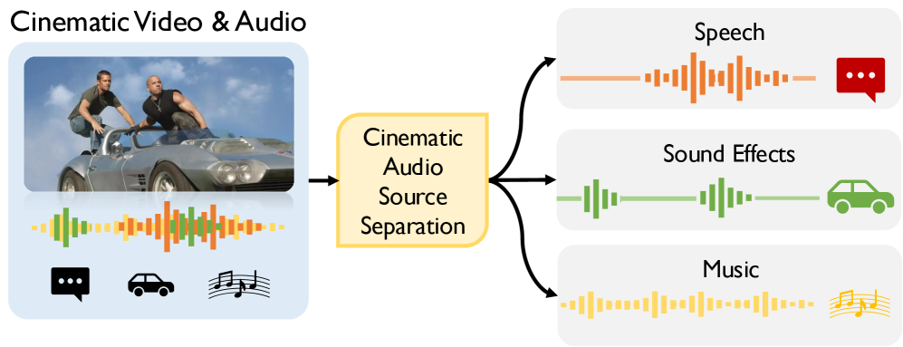
*Figure 1:Illustration of the Cinematic Audio Source Separation (CASS) task. The audio stream from a movie is separated into distinct tracks: speech, sound effects, and music.*

*Figure 2:Architecture of AV-CASS. The fusion module integrates visual features from the facial and scene encoders into 
𝒄
𝑉
, which serves as a conditioning input along with a mixture audio 
𝒔
𝐴
 for the vector field estimator 
𝒖
𝜃
.*

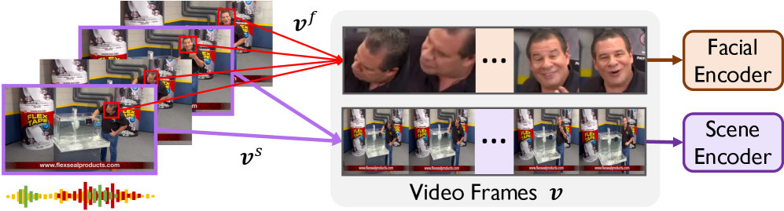
*Figure 3:Extraction of dual-stream visual inputs from a real-world cinematic video during inference. Since no architectural changes are required, the AV-CASS model can be used with real-world cinematic videos for inference.*

*Figure 4:Comparison of MRX, BandIt, and AV-CASS on a real-world movie sample. Input video frames 
𝒗
𝑓
 and 
𝒗
𝑠
 are shown at the top, with the input audio spectrogram 
𝒔
𝐴
 placed for each stem. Yellow boxes highlight the bicycle bell, red boxes indicate cheering, and dotted boxes show elements misplaced in non-target stems. The dotted pink box in BandIt’s FX shows speech artifacts. Best viewed when zoomed in. This sample can also be viewed in the supplementary video.*

![Figure 5:Comparison of our audio-only model (Ours-AO), DAVIS-Flow [29], and our audio-visual model (AV-CASS) on a clip from the AVDnR testset. The input video frames and the GT audio spectrograms are shown at the top. Yellow boxes highlight the bird chirping present in 
𝒗
𝑠
 and the FX tracks. Dotted boxes indicate misplaced segments. Better viewed when zoomed in.](../images/2026-03-30/2603.26113/2603.26113_fig4.png)
*Figure 5:Comparison of our audio-only model (Ours-AO), DAVIS-Flow [29], and our audio-visual model (AV-CASS) on a clip from the AVDnR testset. The input video frames and the GT audio spectrograms are shown at the top. Yellow boxes highlight the bird chirping present in 
𝒗
𝑠
 and the FX tracks. Dotted boxes indicate misplaced segments. Better viewed when zoomed in.*

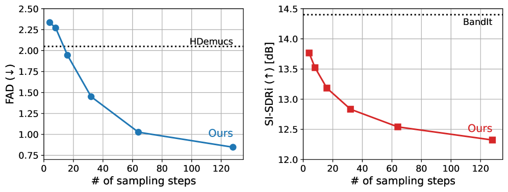
*Figure 6:Impact of the number of sampling steps. Dotted lines denote Hybrid Demucs (second-best FAD) on the left and BandIt (highest SI-SDRi) on the right.*

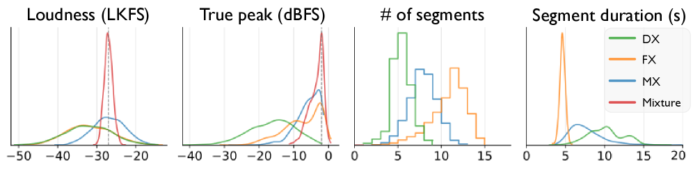
*Figure 7:Distributions of the synthesized training data for loudness in LKFS, true peak in dBFS, number of segments for each stem, and the duration of each segment in seconds.*

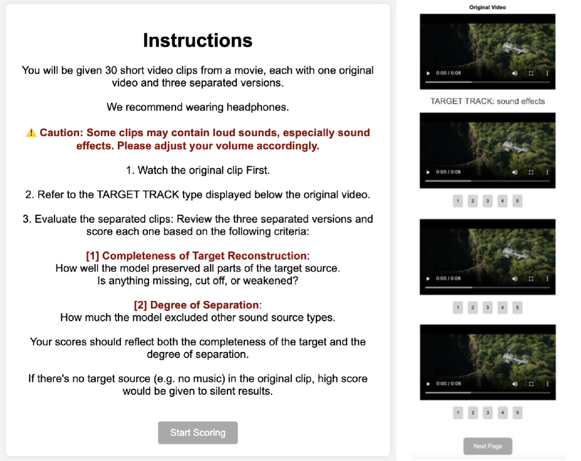
*Figure 8:Instructions and scoring interface for the MOS test on real-world movie clips.*

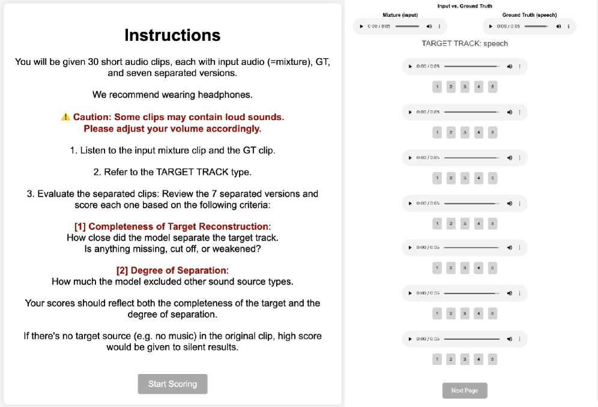
*Figure 9:Instructions and scoring interface for the MOS test on AVDnR dataset.*

![Figure 10:Comparison of spectrograms from MRX, BandIt, and AV-CASS (ours) on AVDnR. Facial frames 
𝒗
𝑓
, scene frames 
𝒗
𝑠
, and the input audio spectrogram 
𝒔
𝐴
 shown at the top. Ground truth audio spectrogram is on top of the models’ results for each stem. The orange box in the DX stem highlights that our model reconstructs speech most accurately compared to others. Pink solid boxes indicate the presence of vacuum cleaning in 
𝒗
𝑠
 and the spectrograms of the FX stem, while dotted boxes indicate incorrectly placed vacuum cleaning sounds.](../images/2026-03-30/2603.26113/2603.26113_fig11.png)
*Figure 10:Comparison of spectrograms from MRX, BandIt, and AV-CASS (ours) on AVDnR. Facial frames 
𝒗
𝑓
, scene frames 
𝒗
𝑠
, and the input audio spectrogram 
𝒔
𝐴
 shown at the top. Ground truth audio spectrogram is on top of the models’ results for each stem. The orange box in the DX stem highlights that our model reconstructs speech most accurately compared to others. Pink solid boxes indicate the presence of vacuum cleaning in 
𝒗
𝑠
 and the spectrograms of the FX stem, while dotted boxes indicate incorrectly placed vacuum cleaning sounds.*

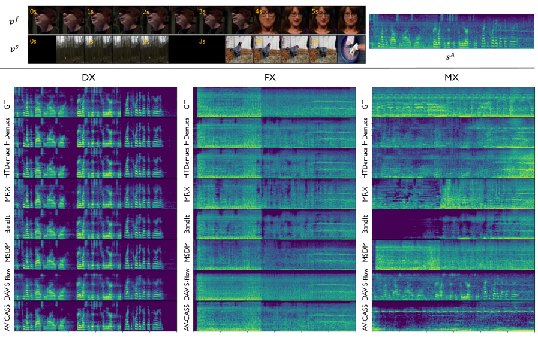
*Figure 11:Comparison of the separation results of our model and other methods on AVDnR dataset.*

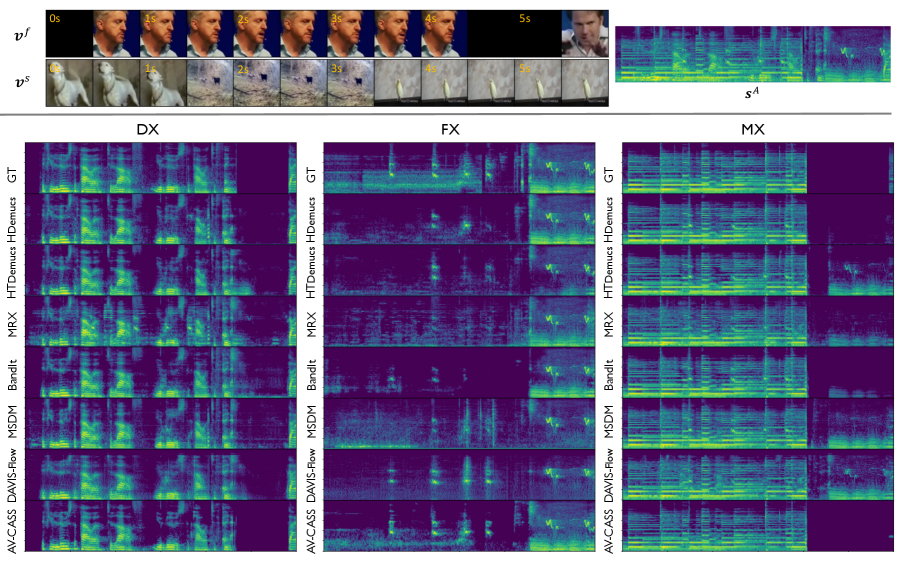
*Figure 12:Comparison of the separation results of our model and other methods on AVDnR dataset.*

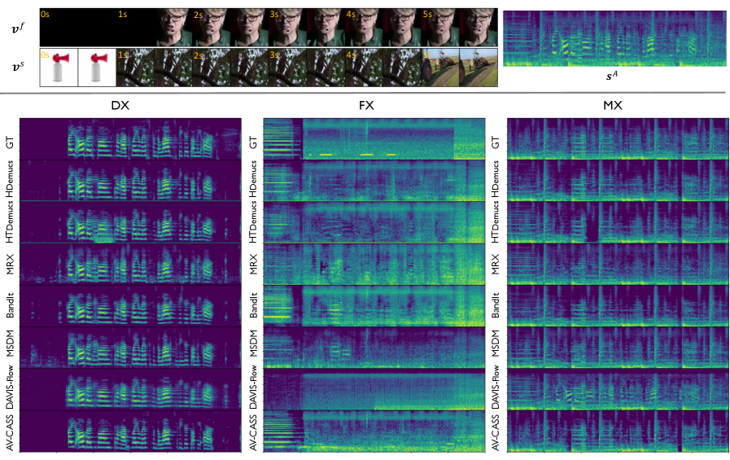
*Figure 13:Comparison of the separation results of our model and other methods on AVDnR dataset.*

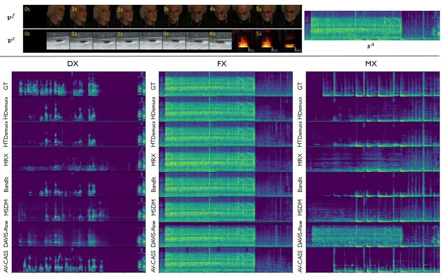
*Figure 14:Comparison of the separation results of our model and other methods on AVDnR dataset.*

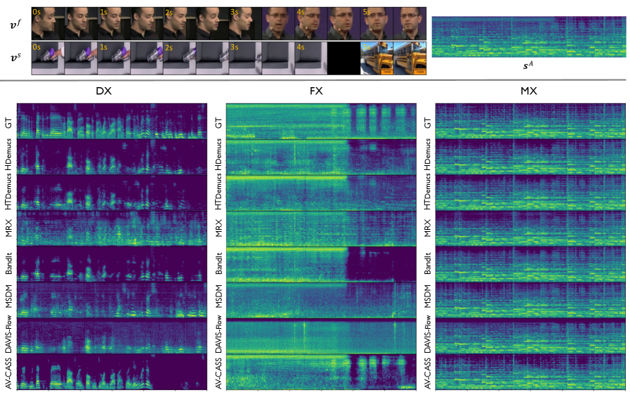
*Figure 15:Comparison of the separation results of our model and other methods on AVDnR dataset.*

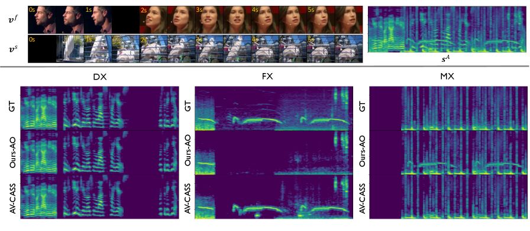
*Figure 16:Spectrogram comparison of separated outputs from our audio-only model (Ours-AO), audio-visual model (AV-CASS), and ground truth (GT) on AVDnR.*

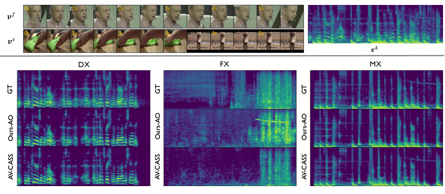
*Figure 17:Spectrogram comparison of separated outputs from our audio-only model (Ours-AO), audio-visual model (AV-CASS), and ground truth (GT) on AVDnR.*

---
**Usage Info**: 4256 tokens used.
**Generated at**: 2026-03-30 12:59:14

---

# 📚 HolisticSemGes: Semantic Grounding of Holistic Co-Speech Gesture Generation with Contrastive Flow-Matching

🚀 URL: https://arxiv.org/html/2603.26553

## 🌏 Abstract (원문)
While the field of co-speech gesture generation has seen significant advances, producing holistic, semantically grounded gestures remains a challenge. Existing approaches rely on external semantic retrieval methods, which limit their generalisation capability due to dependency on predefined linguistic rules. Flow-matching-based methods produce promising results; however, the network is optimised using only semantically congruent samples without exposure to negative examples, leading to learning rhythmic gestures rather than sparse motion, such as iconic and metaphoric gestures. Furthermore, by modelling body parts in isolation, the majority of methods fail to maintain cross-modal consistency. We introduce a Contrastive Flow Matching-based co-speech gesture generation model that uses mismatched audio–text conditions as negatives, training the velocity field to follow the correct motion trajectory while repelling semantically incongruent trajectories. Our model ensures cross-modal coherence by embedding text, audio, and holistic motion into a composite latent space via cosine and contrastive objectives. Extensive experiments and a user study demonstrate that our proposed approach outperforms state-of-the-art methods on two datasets, BEAT2 and SHOW. Our project page is available at:https://marcos452.github.io/HoliticSemGes/
## 🌏 Abstract (번역)
음성 동반 제스처 생성 분야는 상당한 발전을 이루었지만, 전체론적이고 의미론적으로 기반을 둔 제스처를 생성하는 것은 여전히 어려운 과제입니다. 기존 접근 방식은 외부 의미 검색 방법에 의존하여 미리 정의된 언어 규칙에 대한 의존성 때문에 일반화 능력이 제한됩니다. 플로우 매칭 기반 방법은 유망한 결과를 생성하지만, 네트워크가 부정적인 예시에 노출되지 않고 의미론적으로 일치하는 샘플만을 사용하여 최적화되어, 상징적이고 은유적인 제스처와 같은 희소한 움직임보다는 리드미컬한 제스처를 학습하게 됩니다. 또한, 대부분의 방법은 신체 부위를 개별적으로 모델링하여 교차 모달 일관성을 유지하지 못합니다. 본 연구에서는 불일치하는 오디오-텍스트 조건을 부정적인 예시로 사용하여, 의미론적으로 일치하지 않는 궤적을 밀어내면서 올바른 움직임 궤적을 따르도록 속도 필드를 훈련하는 대조 플로우 매칭 기반 음성 동반 제스처 생성 모델을 소개합니다. 우리 모델은 코사인 및 대조 목표를 통해 텍스트, 오디오 및 전체론적 움직임을 복합 잠재 공간에 임베딩하여 교차 모달 일관성을 보장합니다. 광범위한 실험과 사용자 연구는 제안된 접근 방식이 BEAT2 및 SHOW 두 데이터셋에서 최첨단 방법을 능가함을 보여줍니다. 프로젝트 페이지는 https://marcos452.github.io/HoliticSemGes/ 에서 확인할 수 있습니다.

## 🔍 Methods & Results
- HolisticSemGes는 음성 음향 및 텍스트 의미론에 기반하여 전신 SMPLX 파라미터에 대한 멀티모달 기반의 전체론적 음성 동반 제스처를 생성하는 새로운 접근 방식을 제안합니다.
- 방법론은 두 단계로 구성됩니다: 1단계는 신체 부위별 Residual VQ-VAE를 사용하여 전신 SMPL-X 움직임을 압축된 잠재 시퀀스로 변환하는 표현 학습이며, 2단계는 대조 플로우 매칭을 통해 의미론적으로 일관된 제스처를 생성합니다.
- 1단계에서는 손, 상체, 하체, 얼굴 등 각 신체 부위의 움직임 스트림을 계층적 RVQ-VAE를 사용하여 이산적인 토큰 시퀀스로 양자화하며, 재구성 충실도와 양자화 안정성을 균형 있게 맞추는 복합 손실 함수로 최적화됩니다.
- 의미론적 정렬 및 교차 모달 일관성(SACM) 모듈은 텍스트(BERT), 오디오(HuBERT) 및 전체론적 움직임(1단계 잠재 표현 결합)을 공유된 의미론적 잠재 공간에 정렬합니다.
- SACM은 시퀀스 수준 코사인 목표와 CLIP 스타일 InfoNCE 대조 목표를 사용하여 이질적인 모달리티를 공통 공간에 투영하고 정렬하며, 텍스트와 오디오 임베딩을 융합하여 의미론적 드리프트를 완화합니다.
- 제스처 생성은 조건부 속도(흐름) 필드를 학습하는 것으로 공식화되며, 이는 잠재 노이즈 분포에서 복합 제스처-잠재 공간의 움직임 매니폴드로 샘플을 이동시킵니다.
- 멀티모달 조건부 흐름 매칭은 오디오-텍스트 쌍을 불일치시켜 부정적인 조건을 구성하고, 예측된 속도가 일치하는 궤적을 따르도록 유도하면서 의미론적으로 불일치하는 궤적을 밀어내는 대조 정규화 항을 포함합니다.
- 추론 시에는 노이즈 잠재에서 시작하여 학습된 조건부 ODE를 통합하여 전체론적 잠재를 생성하고, 이를 신체 부위별 잠재로 분해한 후 VQ 코드북으로 양자화하고 모션 디코더로 전신 제스처 시퀀스를 재구성합니다.
- 전체 훈련 목표는 대조 플로우 매칭 손실과 의미론적 정렬 손실을 통합하여 최적화됩니다.
- 광범위한 실험과 사용자 연구를 통해 제안된 접근 방식이 BEAT2 및 SHOW 두 데이터셋에서 최첨단 방법을 능가하는 성능을 보였습니다.

## 🖼 Figures

*Figure 1:Overall idea of our model. Audio and text transcripts are encoded into a shared semantic representation, where congruent (matching) and incongruent (mismatching) speech and gesture latents form contrastive pairs. Contrastive flow matching learns motion trajectories that align with the correct semantic context while diverging from mismatched samples, producing coherent full-body gestures.*

*Figure 2:Our architecture comprises two synergistic modules: (a) Semantics-Aware Composite Module (SACM), which anchors audio, textual, and motion features within an aligned semantic space to ensure cross-modal consistency; and (b) Multimodal Conditioning Module, which leverages a learned velocity field conditioned on multimodal priors and stochastic seed latents to synthesize expressive, kinematically coherent holistic gestures.*

*Figure 3:Overview of the proposed semantic-aware contrastive flow matching framework for gesture generation. Audio and text transcripts are encoded into a shared semantic representation where congruent and incongruent gesture latents form contrastive pairs. Contrastive flow matching then learns motion trajectories aligned with the correct semantic context while diverging from mismatched inputs, producing coherent full-body gestures.*

*Figure 4:Qualitative comparison of semantic gesture generation on BEAT2. Our model synthesizes context-grounded gestures that precisely map to linguistic semantics: discourse marker “Well”, deictic pointing for “for me” rhythmic denial for “never” and iconic explanation for “because”. In contrast, baselines typically collapse into semantically neutral, rhythm-driven arm swings, failing to capture the distinct communicative functions of each clause.*

*Figure 5:User study evaluation results comparing Ground Truth, Our Model, SemTalk, and EMAGE across three criteria: Naturalness, Diversity, and Alignment with Speech Content and Timing. Error bars denote standard deviation across participants. Statistical significance is indicated by * (
𝑝
<
0.05
) and ** (
𝑝
<
0.01
).*

---
**Usage Info**: 5485 tokens used.
**Generated at**: 2026-03-30 12:59:26

---

# 📚 Gradient-Informed Training for Low-Resource Multilingual Speech Translation

🚀 URL: https://arxiv.org/html/2603.25836

## 🌏 Abstract (원문)
In low-resource multilingual speech-to-text translation, uniform architectural sharing across languages frequently introduces representation conflicts that impede convergence. This work proposes a principled methodology to automatically determine layer-specific sharing patterns by mining training gradient information. Our approach employs three distinct analysis strategies: distance-based language clustering, self/cross-task divergence metrics for capacity allocation, and joint factorization coupled with canonical correlation analysis for subspace alignment. Extensive evaluation across four language pairs (using the SeamlessM4T-Medium architecture) demonstrates persistent improvements in translation quality metrics.
## 🌏 Abstract (번역)
저자원 다국어 음성-텍스트 번역에서 언어 간 균일한 아키텍처 공유는 수렴을 방해하는 표현 충돌을 자주 야기합니다. 본 연구는 훈련 기울기(gradient) 정보를 활용하여 계층별 공유 패턴을 자동으로 결정하는 원칙적인 방법론을 제안합니다. 우리의 접근 방식은 거리 기반 언어 클러스터링, 용량 할당을 위한 자기/교차 태스크 발산 측정, 그리고 부분 공간 정렬을 위한 정준 상관 분석(CCA)과 결합된 공동 인수분해라는 세 가지 독특한 분석 전략을 사용합니다. 네 가지 언어 쌍(SeamlessM4T-Medium 아키텍처 사용)에 걸친 광범위한 평가는 번역 품질 지표에서 지속적인 개선을 보여줍니다.

## 🔍 Methods & Results
- GDPS(Gradient-Driven Parameter Sharing) 프레임워크는 기울기 기반 의사 결정, 동적 매개변수 구성, 그룹별 미세 조정을 통해 최적의 언어 그룹화 및 공유/개인 매개변수 비율을 자동으로 결정하고 적용합니다.
- 방법론은 세 가지 상호 보완적인 기술을 통합합니다: 1) 거리 기반 언어 클러스터링(Method A)은 언어 간 기울기 코사인 유사도를 기반으로 언어를 그룹화합니다. 2) 자기/교차 태스크 발산 측정(Method B)은 태스크별 충돌 강도(δ)를 정량화하여 공유 매개변수 비율을 결정합니다. 3) 정준 상관 분석(CCA)과 결합된 공동 인수분해(Method C)는 언어별 기울기 부분 공간 정렬을 포착하여 개인 모듈 초기화를 안내합니다.
- SeamlessM4T-Medium 백본에 대한 경험적 분석 결과, 인코더 레이어 11의 FFN2가 심각한 언어 간 표현 충돌이 발생하는 주요 병목 지점으로 식별되었습니다.
- 언어 그룹화(Method A) 결과, Bemba는 Group 1로, Aeb, Est, Gle는 Group 2로 나뉘었으며, Aeb와 Est는 높은 근접성을 보였습니다.
- 공유-개인 비율(Method B) 결과, 평균 충돌 점수 δ≈0.075에 따라 레이어 11 FFN2에 대해 50%의 엄격한 공유 매개변수 비율이 채택되었습니다.
- 에너지 분포(Method C) 결과, 첫 번째 주성분이 전체 기울기 에너지의 약 55%를 포착하고 높은 지니 계수(0.63-0.72)를 보여 최적화 정보가 상위 특이 벡터에 집중되어 있음을 확인했습니다.
- GDPS 프레임워크는 분석 결과를 바탕으로 인코더 레이어 11의 FFN2를 전문화합니다: 그룹화에 따른 토큰 라우팅, 50% 공유 비율에 따른 차원 분할, 그리고 Method C의 기울기 에너지 비율에 비례하여 잔여 지식을 할당하는 에너지 기반 잔여 초기화를 통해 개인 모듈을 초기화합니다.

## 🖼 Figures
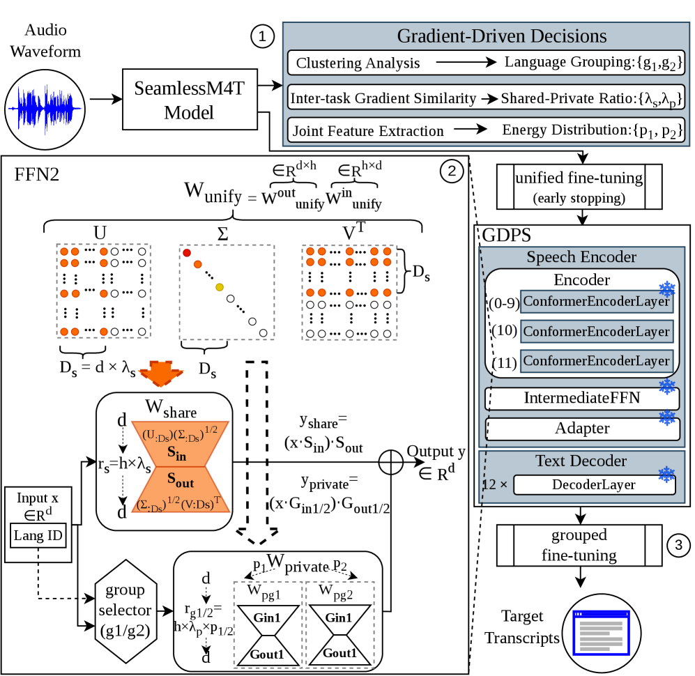
*Figure 1:Overview of the GDPS framework combining the incorporation of gradient-driven decision-making, dynamic parameter configuration, and fine-tuning.*

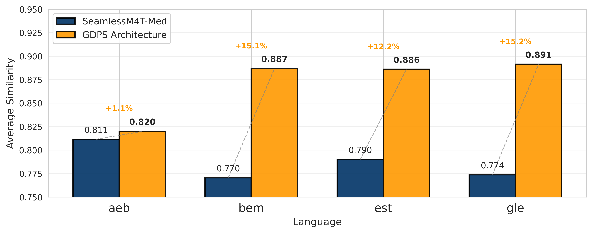
*Figure 2:Average cross-language similarity per language between GDPS and the SeamlessM4T-Med baseline.*

---
**Usage Info**: 3873 tokens used.
**Generated at**: 2026-03-30 12:59:35

---

# 📚 A Human-Inspired Decoupled Architecture for Efficient Audio Representation Learning

🚀 URL: https://arxiv.org/html/2603.26098

## 🌏 Abstract (원문)
While self-supervised learning (SSL) has revolutionized audio representation, excessive parameterization and quadratic computational cost of standard Transformers limit their deployment on resource-constrained devices. To address this bottleneck, we propose HEAR (Human-inspired Efficient Audio Representation), a novel decoupled architecture. Inspired by the human cognitive ability to isolate local acoustic features from global context, HEAR splits the processing pipeline into two dedicated modules: an Acoustic Model for local feature extraction and a Task Model for global semantic integration. Coupled with an Acoustic Tokenizer trained via knowledge distillation, our approach enables robust Masked Audio Modeling (MAM). Extensive experiments demonstrate that HEAR requires only 15M parameters and 9.47 GFLOPs for inference, operating at a fraction of the computational cost of conventional foundation models (which typically require 85M–94M parameters). Despite this high efficiency, HEAR achieves highly competitive performance across diverse audio classification benchmarks. The code and pre-trained models are available athttps://github.com/HarunoriKawano/HEAR.
## 🌏 Abstract (번역)
자기 지도 학습(SSL)이 오디오 표현에 혁명을 가져왔지만, 표준 트랜스포머의 과도한 매개변수화와 이차적인 계산 비용은 자원 제약이 있는 장치에 배포하는 것을 제한합니다. 이러한 병목 현상을 해결하기 위해 우리는 인간에서 영감을 받은 효율적인 오디오 표현(HEAR)이라는 새로운 분리형 아키텍처를 제안합니다. 전역 컨텍스트에서 지역 음향 특징을 분리하는 인간의 인지 능력에서 영감을 받아, HEAR는 처리 파이프라인을 두 개의 전용 모듈로 나눕니다: 지역 특징 추출을 위한 음향 모델(Acoustic Model)과 전역 의미 통합을 위한 태스크 모델(Task Model). 지식 증류를 통해 훈련된 음향 토크나이저와 결합된 우리의 접근 방식은 강력한 마스크드 오디오 모델링(MAM)을 가능하게 합니다. 광범위한 실험을 통해 HEAR는 추론에 단 15M개의 매개변수와 9.47 GFLOPs만을 필요로 하며, 기존 파운데이션 모델(일반적으로 85M–94M개의 매개변수 필요)의 계산 비용의 일부로 작동함을 보여줍니다. 이러한 높은 효율성에도 불구하고, HEAR는 다양한 오디오 분류 벤치마크에서 매우 경쟁력 있는 성능을 달성합니다. 코드와 사전 훈련된 모델은 https://github.com/HarunoriKawano/HEAR에서 확인할 수 있습니다.

## 🔍 Methods & Results
- HEAR는 인간 청각 시스템의 분리된 인지 처리에 기반한 아키텍처로, 지역 음향 특징 추출을 위한 음향 모델(Acoustic Model)과 이러한 특징 시퀀스를 통합하여 특정 다운스트림 작업에 적응하는 태스크 모델(Task Model)로 구성됩니다.
- 음향 모델은 입력 오디오를 6초 길이의 고정된 지역 청크로 나누어 독립적으로 처리하며, 시퀀스 길이의 이차 계산 복잡성(O(N^2)) 병목 현상을 피하기 위해 상대 위치 표현을 통합한 트랜스포머 인코더를 사용합니다.
- 태스크 모델은 음향 모델에 의해 추출된 지역 특징 시퀀스를 입력으로 받아들이고, 전역 자기 주의 메커니즘을 적용하여 전체 시퀀스에 걸쳐 전역 컨텍스트를 통합합니다.
- 제안된 분리형 아키텍처의 잠재력을 최대한 활용하기 위해 세 단계 훈련 파이프라인을 설계했습니다: 음향 토크나이저 훈련(신호 재구성 및 지식 증류를 통해 고품질 이산 표현 획득), 음향 모델 사전 훈련(토크나이저가 생성한 이산 레이블을 예측하는 MAM을 통해 지역 특징 추출 능력 학습), 다운스트림 적응(사전 훈련된 음향 모델과 태스크 모델을 결합하여 특징 융합을 통해 미세 조정).
- 음향 토크나이저 훈련은 VQ-VAE 아키텍처를 기반으로 하며, 입력 신호를 32차원 코드북 공간(어휘 크기 V=1024)으로 양자화하고 Gumbel-Softmax를 사용하여 미분 가능한 이산 레이블을 생성합니다. 재구성 손실, 코드북 붕괴를 완화하는 다양성 손실, 사전 훈련된 교사 모델의 잠재 특징과 코사인 유사도를 기반으로 하는 지식 증류 손실을 최적화합니다.
- 음향 모델 사전 훈련은 BEiT 패러다임을 따르는 MAM을 채택하며, 첫 번째 단계에서 사전 훈련된 토크나이저의 가중치를 고정하고 입력 오디오에서 이산 음향 토큰을 훈련 목표로 생성합니다. 무작위 마스킹된 패치에 대해 원본 이산 토큰을 예측하도록 교차 엔트로피 손실로 최적화됩니다.
- 다운스트림 적응 단계에서는 가변 길이 오디오를 처리하기 위해 6초 세그먼트와 1초 오버랩을 가진 슬라이딩 윈도우 접근 방식을 사용하며, 세그먼트 경계에서 특징 불연속성을 방지하기 위해 코사인 기반 교차 페이드 병합을 적용합니다.
- 특정 작업에 중요한 물리적 음향 속성을 통합하기 위해 특징 게이팅 메커니즘을 도입하여 z-정규화된 로그 파워 스펙트럼을 음향 모델 출력과 융합합니다. 이는 게이트 벡터(시그모이드 함수)와 투영된 스펙트럼 간의 요소별 곱셈을 통해 이루어지며, 최종적으로 게이트된 물리적 특징과 음향 표현을 연결하여 통합된 입력을 형성합니다.
- 태스크 모델은 통합된 특징 시퀀스를 단일 레이어 트랜스포머를 통해 처리하고, 시간 차원을 따라 평균, 표준 편차, 최대값을 계산하여 고정 크기의 전역 표현을 도출한 후, 이를 완전 연결 레이어에 공급하여 최종 분류를 수행합니다.
- HEAR는 추론에 단 15M개의 매개변수와 9.47 GFLOPs만을 필요로 하여, 기존 파운데이션 모델(85M–94M개의 매개변수)에 비해 훨씬 효율적입니다.
- 높은 효율성에도 불구하고, HEAR는 다양한 오디오 분류 벤치마크에서 매우 경쟁력 있는 성능을 달성합니다.

## 🖼 Figures
![Figure 1:Overview of the pre-training pipeline for the proposed HEAR framework. (a) Knowledge-Distilled Tokenizer Training: An acoustic tokenizer is trained to encode continuous mel-spectrogram patches into discrete semantic tokens, optimized via signal reconstruction, codebook diversity, and knowledge distillation from a pre-trained teacher model. (b) MAM: Using the frozen tokenizer, the Acoustic Model is pre-trained to predict the discrete tokens of independent random masked patches, enabling robust local feature extraction.](../images/2026-03-30/2603.26098/2603.26098_fig0.png)
*Figure 1:Overview of the pre-training pipeline for the proposed HEAR framework. (a) Knowledge-Distilled Tokenizer Training: An acoustic tokenizer is trained to encode continuous mel-spectrogram patches into discrete semantic tokens, optimized via signal reconstruction, codebook diversity, and knowledge distillation from a pre-trained teacher model. (b) MAM: Using the frozen tokenizer, the Acoustic Model is pre-trained to predict the discrete tokens of independent random masked patches, enabling robust local feature extraction.*

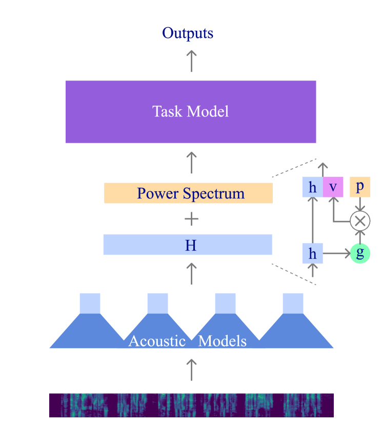
*Figure 2:Comprehensive flow of the downstream adaptation, illustrating the feature gating integration of the Acoustic Model outputs and raw power spectrum into the Task Model.*

---
**Usage Info**: 3963 tokens used.
**Generated at**: 2026-03-30 12:59:46

---

# 📚 Multi-Patch Global-to-Local Transformer Architecture For Efficient Flow Matching and Diffusion Model

🚀 URL: https://arxiv.org/html/2603.26357

## 🌏 Abstract (원문)
Transformer architectures, particularly Diffusion Transformers (DiTs), have become widely used in diffusion and flow-matching models due to their strong performance compared to convolutional UNets. However, the isotropic design of DiTs processes the same number of patchified tokens in every block, leading to relatively heavy computation during training process. In this work, we introduce a multi-patch transformer design in which early blocks operate on larger patches to capture coarse global context, while later blocks use smaller patches to refine local details. This hierarchical design could reduces computational cost by up to 50% in GFLOPs while achieving good generative performance. In addition, we also propose improved designs for time and class embeddings that accelerate training convergence. Extensive experiments on the ImageNet dataset demonstrate the effectiveness of our architectural choices. Code is released athttps://github.com/quandao10/MPDiT
## 🌏 Abstract (번역)
트랜스포머 아키텍처, 특히 Diffusion Transformer(DiT)는 컨볼루션 UNet에 비해 강력한 성능을 보여 확산 및 플로우 매칭 모델에서 널리 사용되고 있습니다. 그러나 DiT의 등방성 설계는 모든 블록에서 동일한 수의 패치화된 토큰을 처리하여 훈련 과정에서 상대적으로 많은 계산량을 필요로 합니다. 본 연구에서는 초기 블록이 더 큰 패치를 사용하여 거친 전역적 맥락을 포착하고, 후기 블록은 더 작은 패치를 사용하여 지역적 세부 사항을 정제하는 다중 패치 트랜스포머 설계를 제안합니다. 이 계층적 설계는 GFLOPs에서 계산 비용을 최대 50%까지 줄이면서 우수한 생성 성능을 달성할 수 있습니다. 또한, 훈련 수렴을 가속화하는 개선된 시간 및 클래스 임베딩 설계도 제안합니다. ImageNet 데이터셋에 대한 광범위한 실험은 우리의 아키텍처 선택의 효과를 입증합니다. 코드는 https://github.com/quandao10/MPDiT에 공개되어 있습니다.

## 🔍 Methods & Results
- 기존 DiT의 등방성 설계로 인한 높은 계산 비용 문제를 해결하기 위해 Multi-Patch Diffusion Transformer (MPDiT)를 제안한다.
- MPDiT는 초기 트랜스포머 블록에서 더 큰 패치(예: p=4)를 사용하여 전역적 맥락을 효율적으로 포착하고, 후기 블록에서는 더 작은 패치(예: p=2)를 사용하여 지역적 세부 사항을 정제하는 계층적 설계를 따른다.
- 이 계층적 설계는 ImageNet-256 설정에서 토큰 수를 256개에서 64개로 줄여 초기 블록의 계산량을 크게 감소시키며, Upsample Block을 통해 토큰을 다시 256개로 확장하고 스킵 연결을 활용하여 세부 정보를 보존한다.
- MPDiT는 GFLOPs에서 계산 비용을 최대 50%까지 절감하면서도 강력한 생성 성능을 유지하며, 고해상도(512x512) 이미지의 경우 p={8,4,2}와 같은 3단계 패치 계층으로 확장 가능하다.
- 시간 임베딩을 위해 기존의 단순한 MLP 기반 방식 대신 FNO(Fourier Neural Operator) 기반의 시간 임베딩을 도입하여 확산 궤적의 연속적인 동역학을 더 잘 모델링하고 수렴을 가속화한다.
- 클래스 임베딩을 위해 단일 토큰 대신 여러 개의 학습 가능한 토큰으로 클래스를 표현하는 다중 토큰 클래스 임베딩을 제안하여, 더 분산되고 표현력 있는 클래스 표현을 제공하고 성능 향상 및 수렴 가속화를 달성한다.
- ImageNet 데이터셋에 대한 광범위한 실험을 통해 제안된 아키텍처 및 임베딩 방식의 효과를 입증하였다.

## 🖼 Figures

*Figure 1:The generated samples from MPDiT-XL with the cfg-scale 
𝑤
=
3
 at epoch 160.*

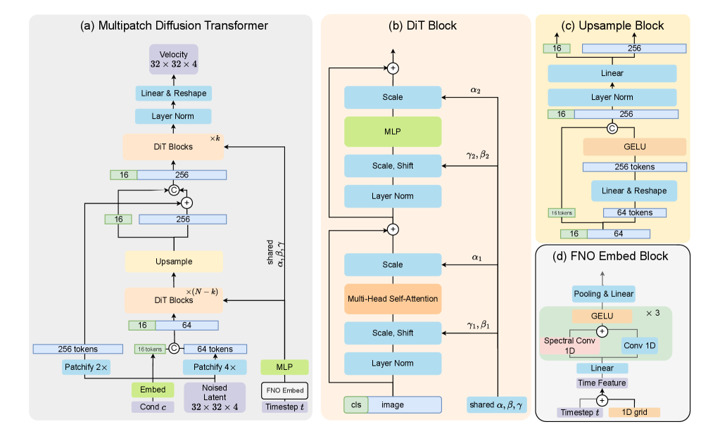
*Figure 2:Architecture of MPDiT, which consists of (a) the Global-Local MultiPatch Diffusion Transformer, (b) DiT Block with shared time embedding, (c) The Upsample Module and (d) The FNO Time Embedding*

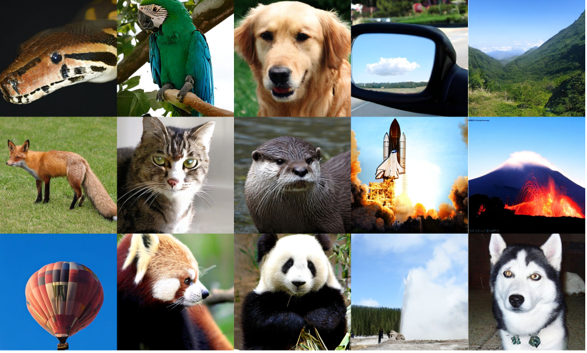
*Figure 3:Qualitative Result of Imagenet 512 with cfg=4*

*Figure 4:Qualitative images of class 113 ”snail”*

*Figure 4:Qualitative images of class 113 ”snail”*

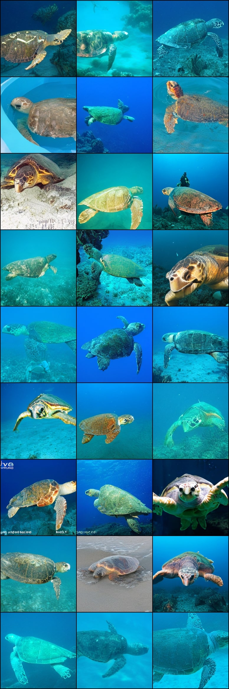
*Figure 5:Qualitative images of class 33 ”loggerhead, loggerhead turtle, Caretta caretta”*

*Figure 6:Qualitative images of class 84 ”peacock”*

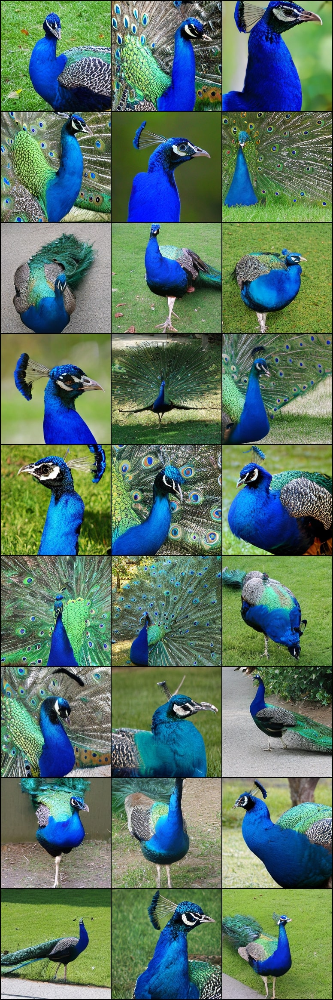
*Figure 6:Qualitative images of class 84 ”peacock”*

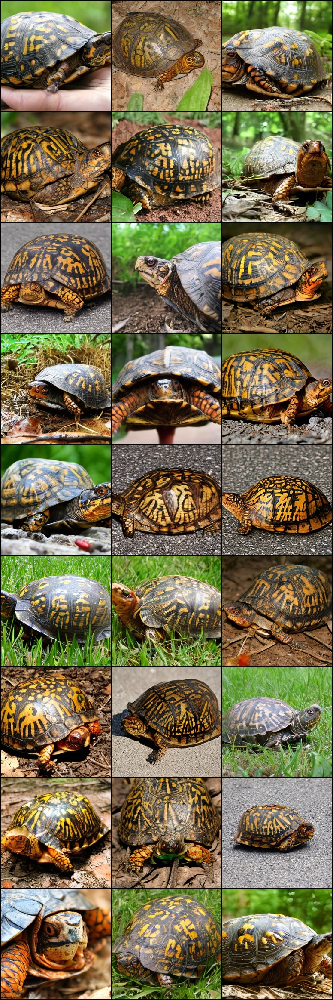
*Figure 7:Qualitative images of class 37 ”box turtle, box tortoise”*

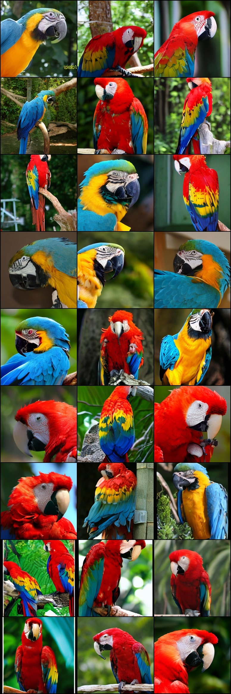
*Figure 8:Qualitative images of class 88 ”macaw”*

*Figure 8:Qualitative images of class 88 ”macaw”*

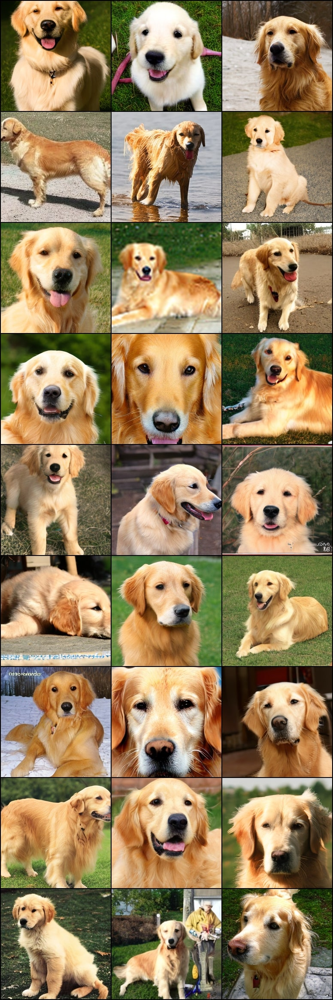
*Figure 9:Qualitative images of class 207 ”golden retriever”*

*Figure 10:Qualitative images of class 417 ”balloon”*

*Figure 10:Qualitative images of class 417 ”balloon”*

*Figure 11:Qualitative images of class 947 ”mushroom”*

*Figure 12:Qualitative images of class 980 ”volcano”*

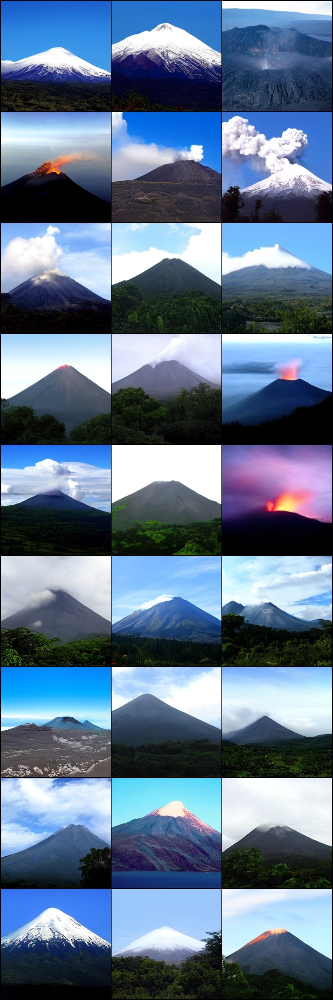
*Figure 12:Qualitative images of class 980 ”volcano”*

*Figure 13:Qualitative images of class 971 ”bubble”*

---
**Usage Info**: 4732 tokens used.
**Generated at**: 2026-03-30 12:59:57

---

