# 🚩 (2026-03-31) Scholar Inbox 추천 논문 

# 📚 PHONOS: PHOnetic Neutralization for Online Streaming Applications

🚀 URL: https://arxiv.org/html/2603.27001

## 🌏 Abstract (원문)
Speaker anonymization (SA) systems modify timbre while leaving regional or non-native accents intact, which is problematic because accents can narrow the anonymity set. To address this issue, we present PHONOS, a streaming module for real-time SA that neutralizes non-native accent to sound native-like. Our approach pre-generatesgolden speakerutterances that preserve source timbre and rhythm but replace foreign segmentals with native ones using silence-aware DTW alignment and zero-shot voice conversion. These utterances supervise acausalaccent translator that maps non-native content tokens to native equivalents with at most 40ms look-ahead, trained using joint cross-entropy and CTC losses. Our evaluations show an 81% reduction in non-native accent confidence, with listening-test ratings consistent with this shift, and reduced speaker linkability as accent-neutralized utterances move away from the original speaker in embedding space while having latency under 241 ms on single GPU.
## 🌏 Abstract (번역)
화자 익명화(SA) 시스템은 음색을 변경하면서도 지역적 또는 비원어민 억양은 그대로 유지하는데, 이는 억양이 익명성 집합을 좁힐 수 있어 문제가 됩니다. 이 문제를 해결하기 위해, 본 논문에서는 비원어민 억양을 원어민처럼 들리도록 중화시키는 실시간 SA를 위한 스트리밍 모듈인 PHONOS를 제안합니다. 우리의 접근 방식은 원본 음색과 리듬을 보존하지만, 침묵 인식 DTW 정렬과 제로샷 음성 변환을 사용하여 외국어 분절음을 원어민 분절음으로 대체하는 '골든 화자 발화'를 사전 생성합니다. 이 발화들은 최대 40ms의 미리보기를 통해 비원어민 내용 토큰을 원어민 등가물로 매핑하는 인과적 억양 번역기를 감독하며, 교차 엔트로피 및 CTC 손실을 공동으로 사용하여 훈련됩니다. 우리의 평가는 비원어민 억양 신뢰도를 81% 감소시켰으며, 청취 테스트 평가도 이러한 변화와 일치함을 보여주었습니다. 또한, 억양이 중화된 발화가 임베딩 공간에서 원본 화자로부터 멀어짐에 따라 화자 연결 가능성이 감소했으며, 단일 GPU에서 241ms 미만의 지연 시간을 가졌습니다.

## 🔍 Methods & Results
- PHONOS는 실시간 화자 익명화를 위한 스트리밍 외국어 억양 변환(FAC) 시스템으로, 비원어민 발음을 중화하면서 화자 정체성을 보존 또는 익명화합니다.
- 시스템은 2단계 훈련 패러다임을 따르는데, 1단계에서는 오프라인에서 지속 시간이 일치하는 '골든 화자 발화'를 생성하고, 2단계에서는 완전히 온라인으로 작동하는 스트리밍 억양 번역 모델을 훈련합니다.
- 골든 화자 발화는 침묵 인식 DTW 정렬(Silero VAD로 침묵 제거 후 DTW 적용)과 Seed-VC 합성기를 사용하여 원어민 발음과 L2 음색 및 리듬을 결합한 파형으로 생성됩니다.
- 억양 번역기는 TVTSyn의 이산 토큰 공간에서 L2 콘텐츠 토큰을 L1 콘텐츠 토큰으로 매핑하는 비자기회귀 모델이며, ConvNeXt 블록과 Transformer 블록으로 구성되고 최대 40ms의 미래 컨텍스트를 사용합니다.
- 모델은 골든 화자 발화의 프레임 정렬된 HuBERT 의사 레이블에 대한 교차 엔트로피 손실과 중복 제거된 원어민 토큰 시퀀스에 대한 CTC 손실을 공동으로 사용하여 훈련되었으며, λCE=λCTC=1.0일 때 최적의 성능을 보였습니다.
- 추론 시 시스템은 콘텐츠 인코더, 억양 번역기, 디코더를 통해 L2 음성을 프레임별로 처리하는 완전 온라인 방식으로 작동하며, 억양 번역된 토큰이 원래 L2 토큰을 대체합니다.
- 평가 결과, 비원어민 억양 신뢰도가 81% 감소했으며, 청취 테스트 평가도 이러한 변화와 일치했습니다.
- 억양이 중화된 발화가 임베딩 공간에서 원본 화자로부터 멀어짐에 따라 화자 연결 가능성이 감소했으며, 단일 GPU에서 241ms 미만의 낮은 지연 시간을 달성했습니다.

## 🖼 Figures
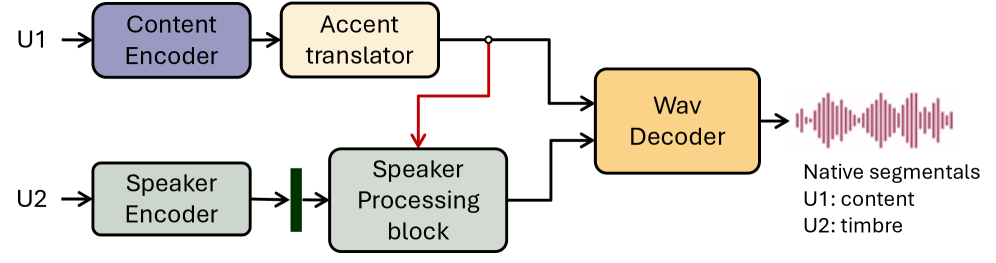
*Figure 1:PHONOS inference pipeline. Non-native speech is encoded into content tokens, accent-translated to native tokens, and decoded into a waveform conditioned on the original or pseudo-speaker embedding.*

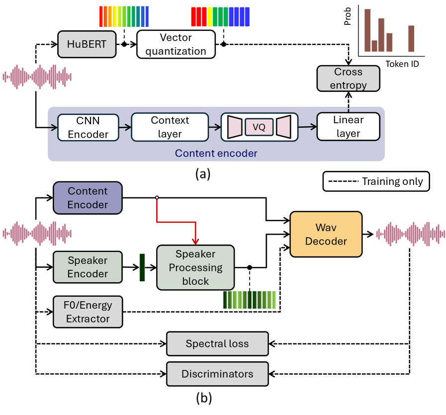
*Figure 2:TVTSyn training workflow. (a) content encoder trained against HuBERT k-means pseudo-labels, and (b) wav decoder conditioned on speaker embedding trained with self-supervision and discriminator objectives.*

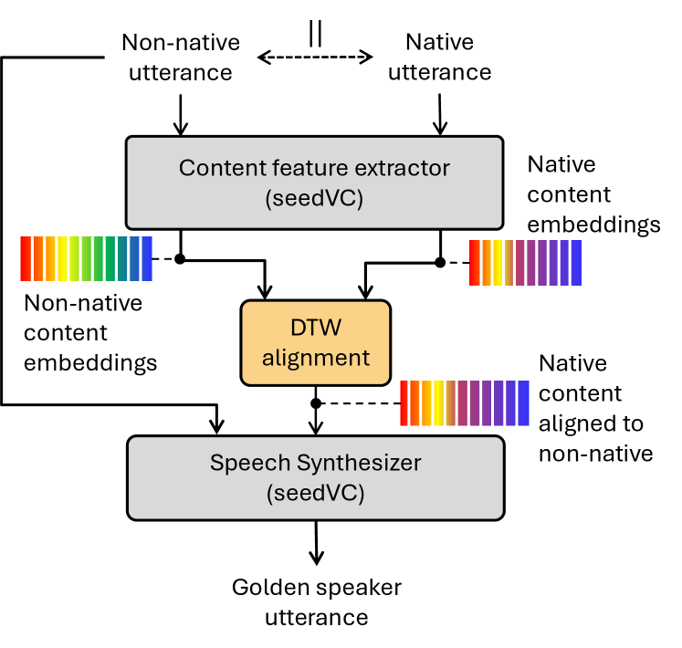
*Figure 3:Golden speaker generation. Native and non-native content embeddings are duration-aligned via silence-aware DTW, then synthesized with the non-native speaker's identity.*

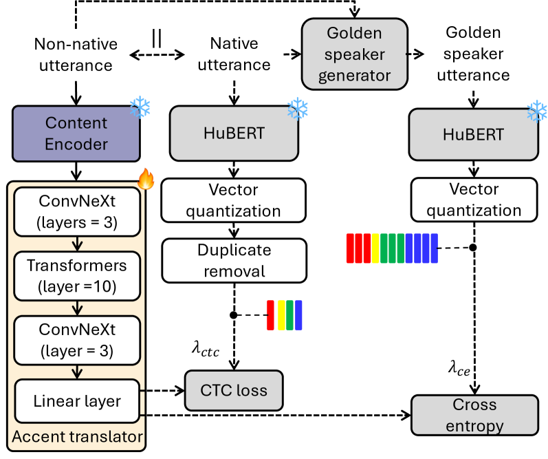
*Figure 4:PHONOS's accent translator architecture. Non-native content tokens pass through ConvNeXt and limited-context transformer layers to produce native content tokens.*

---
**Usage Info**: 4644 tokens used.
**Generated at**: 2026-03-31 12:57:28

---

# 📚 ParaSpeechCLAP: A Dual-Encoder Speech-Text Model for Rich Stylistic Language-Audio Pretraining

🚀 URL: https://arxiv.org/html/2603.28737

## 🌏 Abstract (원문)
We introduce ParaSpeechCLAP, a dual-encoder contrastive model that maps speech and text style captions into a common embedding space, supporting a wide range of intrinsic (speaker-level) and situational (utterance-level) descriptors (such as pitch, texture and emotion) far beyond the narrow set handled by existing models. We train specialized ParaSpeechCLAP-Intrinsic and ParaSpeechCLAP-Situational models alongside a unified ParaSpeechCLAP-Combined model, finding that specialization yields stronger performance on individual style dimensions while the unified model excels on compositional evaluation. We further show that ParaSpeechCLAP-Intrinsic benefits from an additional classification loss and class-balanced training. We demonstrate our models' performance on style caption retrieval, speech attribute classification and as an inference-time reward model that improves style-prompted TTS without additional training. ParaSpeechCLAP outperforms baselines on most metrics across all three applications. Our models and code are released athttps://github.com/ajd12342/paraspeechclap.
## 🌏 Abstract (번역)
저희는 음성 및 텍스트 스타일 캡션을 공통 임베딩 공간으로 매핑하는 듀얼 인코더 대조 모델인 ParaSpeechCLAP을 소개합니다. 이 모델은 기존 모델이 처리하는 좁은 범위의 기술자를 훨씬 뛰어넘어 피치, 질감, 감정과 같은 광범위한 내재적(화자 수준) 및 상황적(발화 수준) 기술자를 지원합니다. 저희는 특화된 ParaSpeechCLAP-Intrinsic 및 ParaSpeechCLAP-Situational 모델을 통합된 ParaSpeechCLAP-Combined 모델과 함께 훈련했으며, 특화 모델이 개별 스타일 차원에서 더 강력한 성능을 보이는 반면 통합 모델은 복합적인 평가에서 뛰어난 성능을 보임을 확인했습니다. 또한 ParaSpeechCLAP-Intrinsic이 추가 분류 손실 및 클래스 균형 훈련으로부터 이점을 얻는다는 것을 보여줍니다. 저희는 스타일 캡션 검색, 음성 속성 분류, 그리고 추가 훈련 없이 스타일 프롬프트 TTS를 개선하는 추론 시간 보상 모델로서 저희 모델의 성능을 입증합니다. ParaSpeechCLAP은 세 가지 애플리케이션 모두에서 대부분의 지표에서 기준선보다 뛰어난 성능을 보입니다. 저희 모델과 코드는 https://github.com/ajd12342/paraspeechclap에서 공개됩니다.

## 🔍 Methods & Results
- ParaSpeechCLAP은 음성 및 텍스트 캡션을 공통 다중 모달 임베딩 공간으로 투영하는 듀얼 인코더 대조 모델이다.
- 모델은 317M-파라미터 WavLM-Large를 음성 인코더 백본으로, Granite Embedding 278M Multilingual을 텍스트 인코더 백본으로 사용하며, 두 인코더 모두 768차원 임베딩 공간으로 매핑하는 프로젝션 헤드를 포함한다.
- 훈련에는 풍부한 음성 스타일 캡션 데이터셋인 ParaSpeechCaps를 사용한다.
- ParaSpeechCLAP-Intrinsic (내재적 스타일), ParaSpeechCLAP-Situational (상황적 스타일) 두 가지 특화 모델과 이들을 통합한 ParaSpeechCLAP-Combined 모델을 훈련한다.
- ParaSpeechCLAP-Intrinsic은 대조 손실(InfoNCE)과 분류 손실을 결합한 다중 작업 목표로 훈련되며, ParaSpeechCLAP-Situational 및 ParaSpeechCLAP-Combined는 대조 손실만 사용한다.
- 분류 손실은 보조 분류 헤드 대신 텍스트 인코더가 Gemini 2.5 Pro로 생성된 6개의 의역된 캡션을 사용하여 클래스 임베딩을 생성하고, 이를 음성 임베딩과의 내적을 통해 분류 로짓을 계산한 후 이진 교차 엔트로피(BCE) 손실을 적용하는 방식으로 구현된다.
- 특화 모델(ParaSpeechCLAP-Intrinsic, -Situational)은 개별 스타일 차원에서 더 강력한 성능을 보였고, 통합 모델(ParaSpeechCLAP-Combined)은 복합적인 평가에서 뛰어난 성능을 보였다.
- ParaSpeechCLAP-Intrinsic은 추가 분류 손실과 클래스 균형 훈련을 통해 성능 향상을 얻었다.
- ParaSpeechCLAP은 스타일 캡션 검색, 음성 속성 분류, 스타일 프롬프트 TTS를 위한 추론 시간 보상 모델로서 기준선 모델들을 대부분의 지표에서 능가하는 성능을 입증했다.

## 🖼 Figures

*Figure 1:An overview of the ParaSpeechCLAP dual-encoder training methodology. (Left) All ParaSpeechCLAP models are trained with an InfoNCE contrastive loss to align speech and text embeddings. (Right) For ParaSpeechCLAP-Intrinsic, this is supplemented with a classification loss, where audio embeddings are aligned with text embeddings generated from templates filled with class labels.*

---
**Usage Info**: 3008 tokens used.
**Generated at**: 2026-03-31 12:57:37

---

# 📚 MOSS-VoiceGenerator: Create Realistic Voices with Natural Language Descriptions

🚀 URL: https://arxiv.org/html/2603.28086

## 🌏 Abstract (원문)
Voice design from natural language aims to generate speaker timbres directly from free-form textual descriptions, allowing users to create voices tailored to specific roles, personalities, and emotions. Such controllable voice creation benefits a wide range of downstream applications—including storytelling, game dubbing, role-play agents, and conversational assistants, making it a significant task for modern Text-to-Speech models.However, existing models are largely trained on carefully recorded studio data, which produces speech that is clean and well-articulated, yet lacks the lived-in qualities of real human voices.To address these limitations, we presentMOSS-VoiceGenerator, an open-source instruction-driven voice generation model that creates new timbres directly from natural language prompts. Motivated by the hypothesis that exposure to real-world acoustic variation produces more perceptually natural voices, we train on large-scale expressive speech data sourced from cinematic content.Subjective preference studies demonstrate its superiority in overall performance, instruction-following, and naturalness compared to other voice design models.
## 🌏 Abstract (번역)
자연어 기반 음성 디자인은 자유 형식의 텍스트 설명으로부터 화자의 음색을 직접 생성하는 것을 목표로 하며, 사용자가 특정 역할, 성격 및 감정에 맞춰 음성을 만들 수 있도록 합니다. 이러한 제어 가능한 음성 생성은 스토리텔링, 게임 더빙, 역할극 에이전트 및 대화형 비서 등 광범위한 하위 응용 분야에 이점을 제공하며, 현대 음성 합성(Text-to-Speech) 모델에 있어 중요한 과제입니다.그러나 기존 모델들은 주로 신중하게 녹음된 스튜디오 데이터로 훈련되어 깨끗하고 명료한 음성을 생성하지만, 실제 사람 목소리의 생생한 특성이 부족합니다.이러한 한계를 해결하기 위해, 우리는 자연어 프롬프트로부터 새로운 음색을 직접 생성하는 오픈 소스 지시 기반 음성 생성 모델인 MOSS-VoiceGenerator를 제시합니다. 실제 세계의 음향적 변화에 노출되는 것이 지각적으로 더 자연스러운 음성을 생성한다는 가설에 따라, 우리는 영화 콘텐츠에서 추출한 대규모의 표현력이 풍부한 음성 데이터로 모델을 훈련합니다.주관적 선호도 연구는 다른 음성 디자인 모델과 비교하여 전반적인 성능, 지시 따르기, 그리고 자연성 측면에서 MOSS-VoiceGenerator의 우수성을 입증합니다.

## 🔍 Methods & Results
- 기존 음성 디자인 모델의 한계점인 스튜디오 데이터 기반 훈련으로 인한 부자연스러운 음성 품질 문제를 해결하고자 함.
- MOSS-VoiceGenerator는 자연어 프롬프트로부터 새로운 음색을 직접 생성하는 오픈 소스 지시 기반 음성 생성 모델로 제안됨.
- 실제 세계의 음향적 변화가 더 자연스러운 음성을 생성한다는 가설에 기반하여, 영화 콘텐츠에서 추출한 대규모의 표현력이 풍부한 음성 데이터로 모델을 훈련함.
- 주관적 선호도 연구를 통해 MOSS-VoiceGenerator가 다른 음성 디자인 모델에 비해 전반적인 성능, 지시 따르기 능력, 그리고 자연성 측면에서 우수함을 입증함.

## 🖼 Figures
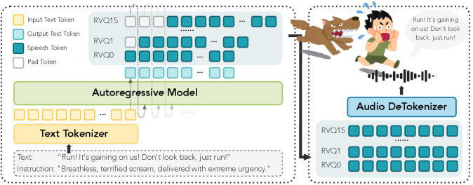
*Figure 1:Illustration of the MOSS-VoiceGenerator inference. The voice description and text are concatenated and fed into a causal language model with delay-pattern generation; the output audio tokens are decoded by MOSS-Audio-Tokenizer.*

*Figure 2:Data collection pipeline for MOSS-VoiceGenerator. Phase 1 annotates cinematic audio via speaker diarization, denoising and quality filtering, single-speaker filtering, and ASR transcription, followed by speech captioning and timbre instruction generation. Phase 2 augments the corpus by training a speech-text embedding model for retrieval from internal TTS data and a fine-tuned caption model for scalable annotation.*

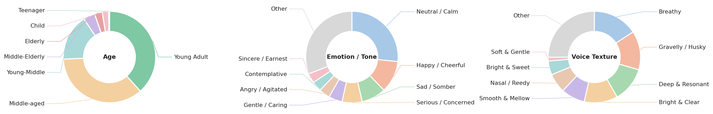
*Figure 3:A snapshot of the training corpus profiled along three perceptual dimensions based on the caption results. The distributions reveal broad, naturalistic coverage of everyday speaking styles.*

*Figure 4:Pairwise preference results (Win / Tie / Lose) of MOSS-VoiceGenerator against three baselines across three evaluation dimensions. Each bar reports the percentage of comparisons won, tied, or lost. MOSS-VoiceGenerator consistently wins on all three dimensions against all baselines.*

---
**Usage Info**: 1348 tokens used.
**Generated at**: 2026-03-31 12:57:43

---

# 📚 AFSS: Artifact-Focused Self-Synthesis for Mitigating Bias in Audio Deepfake Detection

🚀 URL: https://arxiv.org/html/2603.26856

## 🌏 Abstract (원문)
The rapid advancement of generative models has enabled highly realistic audio deepfakes, yet current detectors suffer from a critical bias problem, leading to poor generalization across unseen datasets. This paper proposes Artifact-Focused Self-Synthesis (AFSS), a method designed to mitigate this bias by generating pseudo-fake samples from real audio via two mechanisms: self-conversion and self-reconstruction. The core insight of AFSS lies in enforcing same-speaker constraints, ensuring that real and pseudo-fake samples share identical speaker identity and semantic content. This forces the detector to focus exclusively on generation artifacts rather than irrelevant confounding factors. Furthermore, we introduce a learnable reweighting loss to dynamically emphasize synthetic samples during training. Extensive experiments across 7 datasets demonstrate that AFSS achieves state-of-the-art performance with an average EER of 5.45%, including a significant reduction to 1.23% on WaveFake and 2.70% on In-the-Wild, all while eliminating the dependency on pre-collected fake datasets. Our code is publicly available athttps://github.com/NguyenLeHaiSonGit/AFSS.
## 🌏 Abstract (번역)
생성 모델의 급속한 발전은 매우 사실적인 오디오 딥페이크를 가능하게 했지만, 현재 탐지기들은 심각한 편향 문제로 인해 보지 못한 데이터셋에 대한 일반화 성능이 저조하다. 본 논문은 이러한 편향을 완화하기 위해 실제 오디오에서 자기 변환(self-conversion) 및 자기 재구성(self-reconstruction)이라는 두 가지 메커니즘을 통해 의사(pseudo-fake) 가짜 샘플을 생성하는 방법인 AFSS(Artifact-Focused Self-Synthesis)를 제안한다. AFSS의 핵심 통찰은 동일 화자 제약(same-speaker constraints)을 적용하여 실제 샘플과 의사 가짜 샘플이 동일한 화자 신원과 의미론적 내용을 공유하도록 보장하는 데 있다. 이는 탐지기가 관련 없는 교란 요인보다는 생성 아티팩트에만 집중하도록 강제한다. 또한, 훈련 중 합성 샘플을 동적으로 강조하기 위해 학습 가능한 재가중 손실(learnable reweighting loss)을 도입한다. 7개 데이터셋에 걸친 광범위한 실험은 AFSS가 사전 수집된 가짜 데이터셋에 대한 의존성을 제거하면서 WaveFake에서 1.23%, In-the-Wild에서 2.70%로 상당한 감소를 포함하여 평균 EER 5.45%로 최첨단 성능을 달성함을 보여준다. 우리의 코드는 https://github.com/NguyenLeHaiSonGit/AFSS에서 공개적으로 이용 가능하다.

## 🔍 Methods & Results
- AFSS(Artifact-Focused Self-Synthesis)는 실제 및 의사 가짜 샘플이 동일한 화자 신원과 의미론적 내용을 공유하도록 하여 탐지기가 생성 아티팩트에만 집중하도록 강제함으로써 오디오 딥페이크 탐지기의 편향 문제를 해결한다.
- AFSS는 두 가지 상호 보완적인 브랜치로 작동한다: 자기 변환(self-conversion) 및 자기 재구성(self-reconstruction).
- 자기 변환 브랜치는 동일 화자 신원 내에서 음향적으로 변형된 오디오를 생성하여 기존 VC 시스템의 화자 신원 변경으로 인한 편향을 해결한다. 이 과정에서 PitchShift, TimeStretch, TanhDistortion, RawBoost와 같은 변환 기법이 사용된다.
- 자기 재구성 브랜치는 다양한 신경 보코더(HiFiGAN, WaveGlow, Hn-NSF, NSF-HiFiGAN)를 통해 기본 오디오를 재구성하여 TTS 파이프라인의 최종 단계에서 발생하는 보코더 아티팩트를 노출시킨다. 이 브랜치에서는 보코더 재구성 후 RawBoost가 적용된다.
- 학습 가능한 재가중 손실(Learnable Reweighting Loss)을 도입하여 훈련 중 합성 샘플을 동적으로 강조함으로써 교차 도메인 일반화를 향상시킨다. 이 손실은 `w_fake`가 (1,2), `w_real`이 (0,1) 범위 내에서 학습되어 합성 샘플에 더 높은 가중치를 부여한다.
- 균형 배치 전략(Balanced Batch Strategy)을 사용하여 각 미니 배치에 실제 및 가짜 샘플의 수가 동일하게 포함되도록 하여 학습 가능한 가중치가 클래스 불균형에 의해 왜곡되는 것을 방지하고 안정적인 기울기 업데이트를 유지한다.
- 7개 데이터셋에 걸친 광범위한 실험에서 AFSS는 평균 EER 5.45%로 최첨단 성능을 달성했으며, WaveFake에서 1.23%, In-the-Wild에서 2.70%로 EER을 크게 감소시켰다. 이는 사전 수집된 가짜 데이터셋에 대한 의존성을 제거한 결과이다.

## 🖼 Figures
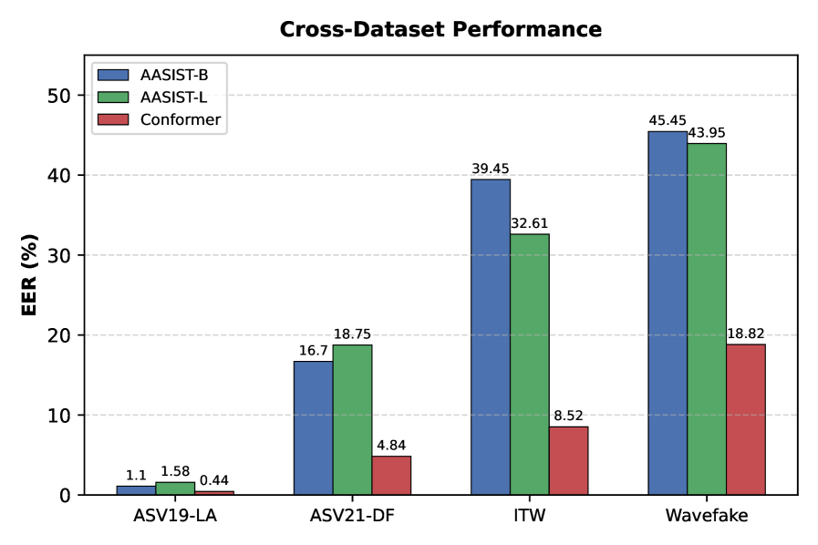
*Figure 1:Cross-dataset performance of audio deepfake detection methods (EER%) when trained on ASV19-LA and tested on different datasets. Lower values indicate better performance.*

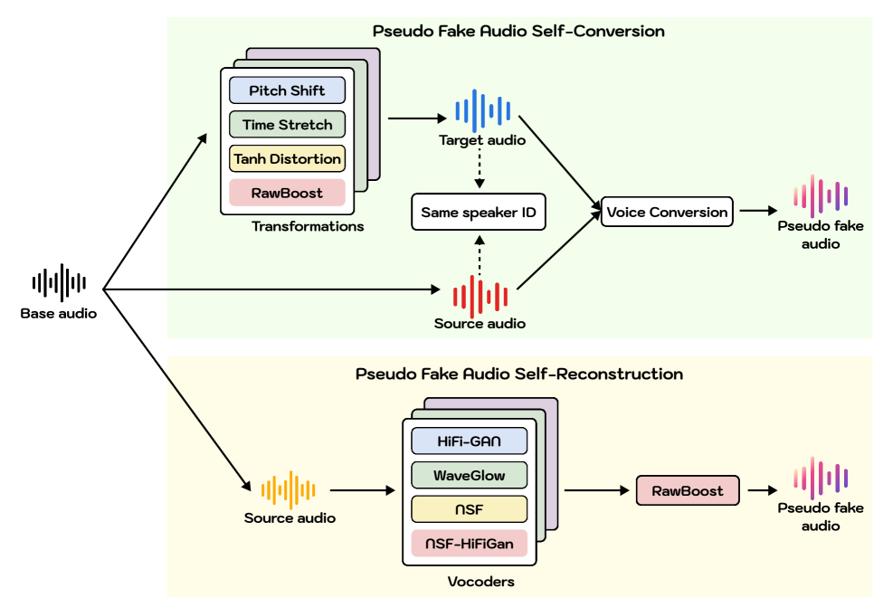
*Figure 2:Overview of the proposed AFSS method.*

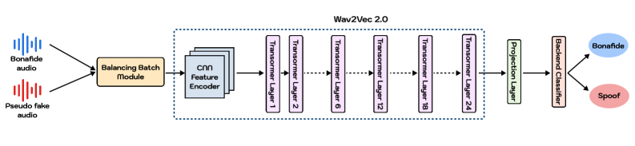
*Figure 3:Overview of model architecture.*

---
**Usage Info**: 4149 tokens used.
**Generated at**: 2026-03-31 12:57:55

---

# 📚 Acoustic-to-articulatory Inversion of the Complete Vocal Tract from RT-MRI with Various Audio Embeddings and Dataset Sizes

🚀 URL: https://arxiv.org/html/2603.28723

## 🌏 Abstract (원문)
Articulatory-to-acoustic inversion strongly depends on the type of data used. While most previous studies rely on EMA, which is limited by the number of sensors and restricted to accessible articulators, we propose an approach aiming at a complete inversion of the vocal tract, from the glottis to the lips. To this end, we used approximately 3.5 hours of RT-MRI data from a single speaker. The innovation of our approach lies in the use of articulator contours automatically extracted from MRI images, rather than relying on the raw images themselves. By focusing on these contours, the model prioritizes the essential geometric dynamics of the vocal tract while discarding redundant pixel-level information. These contours, alongside denoised audio, were then processed using a Bi-LSTM architecture. Two experiments were conducted: (1) the analysis of the impact of the audio embedding, for which three types of embeddings were evaluated as input to the model (MFCCs, LCCs, and HuBERT), and (2) the study of the influence of the dataset size, which we varied from 10 minutes to 3.5 hours. Evaluation was performed on the test data using RMSE, median error, as well as Tract Variables, to which we added an additional measurement: the larynx height. The average RMSE obtained is 1.48 mm, compared with the pixel size (1.62 mm). These results confirm the feasibility of a complete vocal-tract inversion using RT-MRI data.
## 🌏 Abstract (번역)
조음-음향 역변환은 사용되는 데이터 유형에 크게 의존합니다. 대부분의 이전 연구는 센서 수에 제한이 있고 접근 가능한 조음기관에 국한되는 EMA에 의존하는 반면, 우리는 성문에서 입술까지 성도의 완전한 역변환을 목표로 하는 접근 방식을 제안합니다. 이를 위해 단일 화자의 약 3.5시간 분량의 RT-MRI 데이터를 사용했습니다. 우리 접근 방식의 혁신은 원본 이미지 자체에 의존하기보다는 MRI 이미지에서 자동으로 추출된 조음기관 윤곽선을 사용한다는 점에 있습니다. 이러한 윤곽선에 집중함으로써 모델은 불필요한 픽셀 수준 정보를 버리고 성도의 필수적인 기하학적 역학을 우선시합니다. 이 윤곽선은 잡음 제거된 오디오와 함께 Bi-LSTM 아키텍처를 사용하여 처리되었습니다. 두 가지 실험이 수행되었습니다: (1) 오디오 임베딩의 영향 분석으로, 세 가지 유형의 임베딩(MFCC, LCC, HuBERT)이 모델 입력으로 평가되었고, (2) 데이터셋 크기의 영향 연구로, 10분에서 3.5시간까지 다양하게 변화시켰습니다. 평가는 RMSE, 중간 오차, 그리고 성도 변수(Tract Variables)를 사용하여 테스트 데이터에서 수행되었으며, 여기에 후두 높이라는 추가 측정값을 추가했습니다. 얻어진 평균 RMSE는 픽셀 크기(1.62mm)와 비교하여 1.48mm입니다. 이러한 결과는 RT-MRI 데이터를 사용한 완전한 성도 역변환의 실현 가능성을 확인시켜 줍니다.

## 🔍 Methods & Results
- 성문에서 입술까지 성도의 완전한 역변환을 목표로, 단일 화자의 약 3.5시간 분량의 RT-MRI 데이터를 활용했습니다.
- 원시 MRI 이미지 대신 자동으로 추출된 조음기관 윤곽선을 사용하여 성도의 기하학적 역학에 중점을 두었습니다.
- 잡음 제거된 오디오와 조음기관 윤곽선은 Bi-LSTM 아키텍처를 사용하여 처리되었습니다. 이 모델은 5개의 레이어로 구성되며, 2개의 300개 유닛 밀집 레이어와 2개의 300개 유닛 양방향 LSTM 레이어를 포함합니다.
- 모델의 출력은 100x8 크기의 텐서(8개 조음기관에 대한 100개 윤곽선 좌표)를 생성합니다.
- 회귀 작업이므로 손실 함수로 평균 제곱 오차(MSE)를 사용했습니다.
- 두 가지 실험을 수행했습니다: (1) MFCC, LCC, HuBERT 세 가지 유형의 오디오 임베딩이 모델 입력에 미치는 영향 분석, (2) 10분에서 3.5시간까지 데이터셋 크기 변화에 따른 영향 연구.
- 평가는 RMSE, 중간 오차, 성도 변수(Tract Variables) 및 후두 높이를 사용하여 수행되었습니다.
- 평균 RMSE는 1.48mm로, 픽셀 크기(1.62mm)와 비교했을 때 우수한 성능을 보였습니다.
- 이러한 결과는 RT-MRI 데이터를 사용한 완전한 성도 역변환의 실현 가능성을 확인시켜 줍니다.

## 🖼 Figures
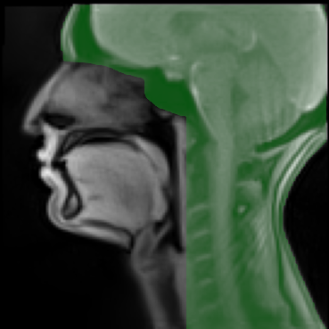
*Figure 1:mask of the reference image. The green region represents the static part of the vocal tract*

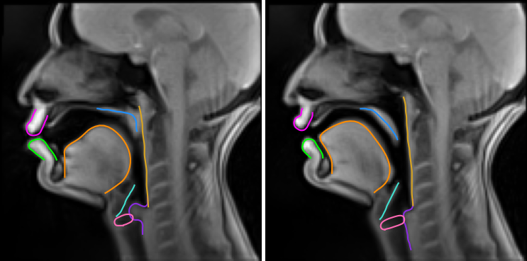
*Figure 2: Segmentation of articulators contour tracked in two images of the rt-MRI film:    Arytenoid cartilage,   Epiglottis,   Lower lip,  Vocal folds,    Soft palate midline,    Tongue,  Upper lip,  Pharyngeal wall*

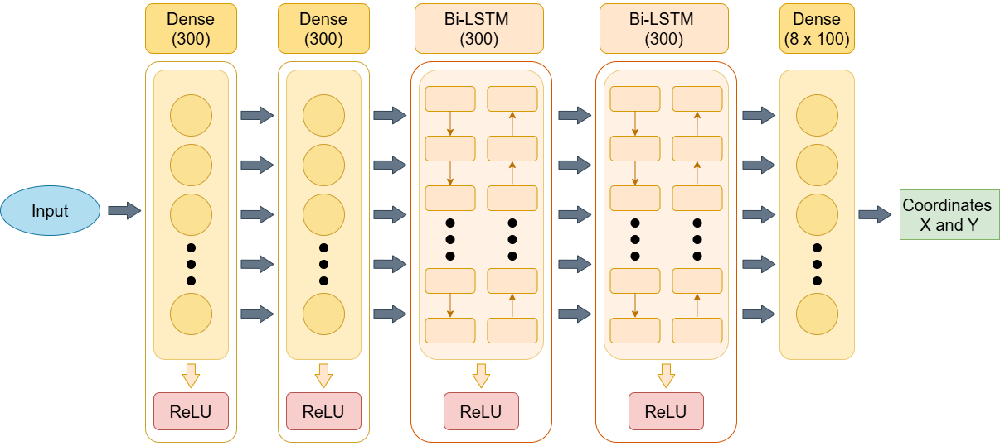
*Figure 3:Architecture of the model*

*Figure 4: Visual Representation of the Various Vocal Tract Variables (TVs) represented by dashed lines :    LP,   LA,   LD,   TTCD,   TBCD,
  TRCL,  TRCD,  LH*

*Figure 5:Example of two velopharyngeal port opening configurations:
open (4.69) and closed (–9.68).   Original points,    Projected points. *

*Figure 6:Visual Representation of the Larynx height
  LH   Upper incisor with hard palate*

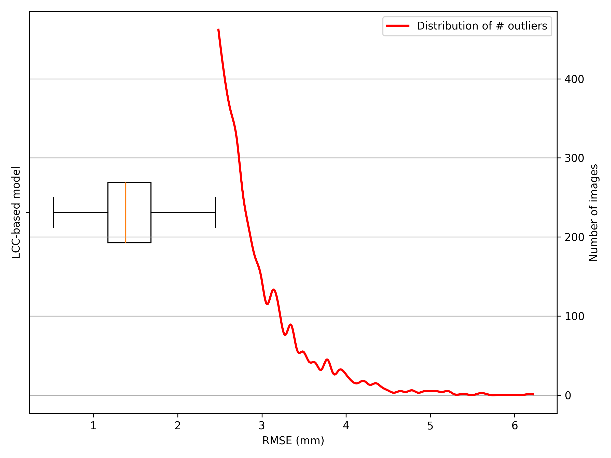
*Figure 7:Boxplot of mean RMSE per frame for the LCC-based model, showing outlier ranges. The red curve shows the distribution of # outliers. The right axis gives the number of outliers as a function of the error in mm.*

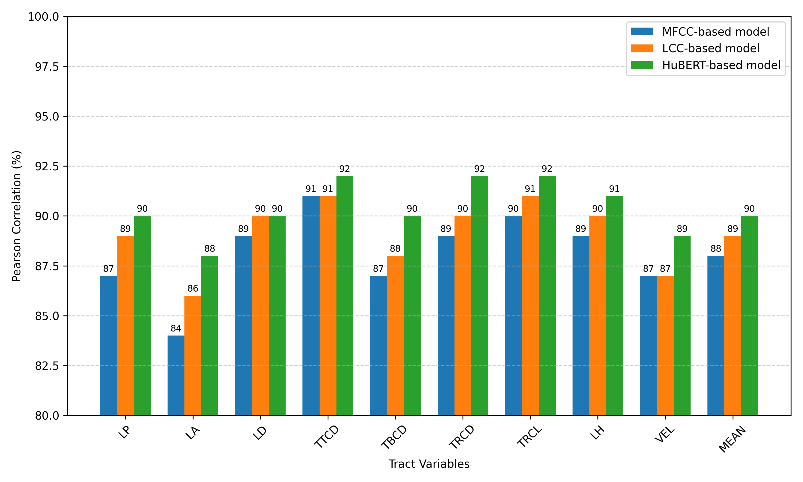
*Figure 8:Correlation between the predicted and target trajectories for each measured tract variable.*

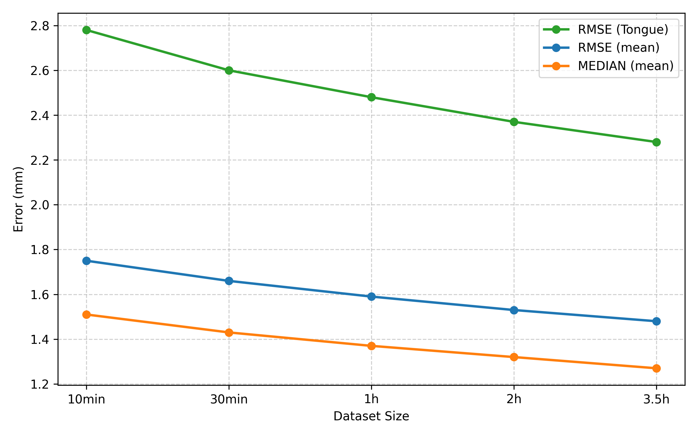
*Figure 9:Comparison of tongue RMSE, mean RMSE, and median error by varying the dataset size.*

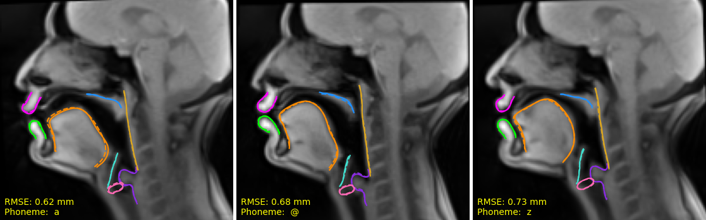
*Figure 10:Illustration of inference images. The dotted lines represent the predicted values, while the solid lines correspond to the ground truth.*

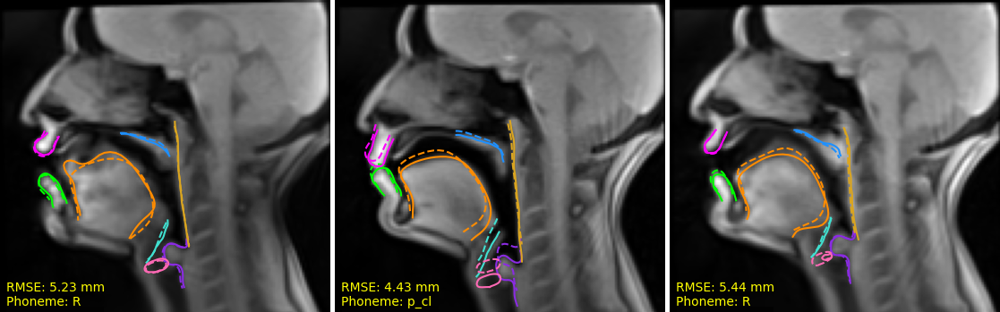
*Figure 11:Illustration of each of the 5 types of outliers. From top to bottom and left to right: image ambiguity (tongue), global shift, tracking error (tongue), correct critical articulator (correct lip position), inversion error (tongue)*

---
**Usage Info**: 2312 tokens used.
**Generated at**: 2026-03-31 12:58:03

---

# 📚 Investigation on the Robustness of Acoustic Foundation Models on Post Exercise Speech This work was supported in part by the NVIDIA Academic Award Grant.

🚀 URL: https://arxiv.org/html/2603.27508

## 🌏 Abstract (원문)
Automatic speech recognition (ASR) has been extensively studied on neutral and stationary speech, yet its robustness under post-exercise physiological shift remains underexplored. Compared with resting speech, post-exercise speech often contains micro-breaths, non-semantic pauses, unstable phonation, and repetitions caused by reduced breath support, making transcription more difficult. In this work, we benchmark acoustic foundation models on post-exercise speech under a unified evaluation protocol. We compare sequence-to-sequence models (Whisper and FunASR/Paraformer) and self-supervised encoders with CTC decoding (Wav2Vec2, HuBERT, and WavLM), under both off-the-shelf inference and post-exercise in-domain fine-tuning. Across theStatic/Post-Allbenchmark, most models degrade on post-exercise speech, while FunASR shows the strongest baseline robustness at 14.57% WER and 8.21% CER onPost-All. Fine-tuning substantially improves several CTC-based models, whereas Whisper shows unstable adaptation. As an exploratory case study, we further stratify results by fluent and non-fluent speakers; although the non-fluent subset is small, it is consistently more challenging than the fluent subset. Overall, our findings show that post-exercise ASR robustness is strongly model-dependent, that in-domain adaptation can be highly effective but not uniformly stable, and that future post-exercise ASR studies should explicitly separate fluency-related effects from exercise-induced speech variation.
## 🌏 Abstract (번역)
자동 음성 인식(ASR)은 중립적이고 정적인 음성에 대해 광범위하게 연구되었지만, 운동 후 생리적 변화에 따른 견고성은 아직 충분히 탐구되지 않았습니다. 휴식 시 음성과 비교할 때, 운동 후 음성은 호흡 지원 감소로 인해 미세한 호흡, 비의미적 일시 정지, 불안정한 발성 및 반복을 포함하는 경우가 많아 전사가 더 어렵습니다. 본 연구에서는 통합된 평가 프로토콜 하에 운동 후 음성에 대한 음향 기반 모델을 벤치마킹합니다. 우리는 기성품 추론과 운동 후 도메인 내 미세 조정을 모두 사용하여 시퀀스-투-시퀀스 모델(Whisper 및 FunASR/Paraformer)과 CTC 디코딩을 사용하는 자기 지도 인코더(Wav2Vec2, HuBERT 및 WavLM)를 비교합니다. Static/Post-All 벤치마크 전반에 걸쳐 대부분의 모델은 운동 후 음성에서 성능이 저하되는 반면, FunASR은 Post-All에서 14.57% WER 및 8.21% CER로 가장 강력한 기준 견고성을 보여줍니다. 미세 조정은 여러 CTC 기반 모델을 크게 개선하는 반면, Whisper는 불안정한 적응을 보입니다. 탐색적 사례 연구로, 우리는 유창한 화자와 비유창한 화자로 결과를 추가로 계층화했습니다. 비유창한 하위 집합은 작지만, 유창한 하위 집합보다 일관되게 더 어려운 것으로 나타났습니다. 전반적으로, 우리의 연구 결과는 운동 후 ASR 견고성이 모델에 크게 의존하며, 도메인 내 적응이 매우 효과적일 수 있지만 균일하게 안정적이지는 않다는 것을 보여줍니다. 또한 향후 운동 후 ASR 연구는 유창성 관련 효과를 운동 유발 음성 변화와 명확하게 분리해야 함을 시사합니다.

## 🔍 Methods & Results
- 운동 후 음성 인식의 견고성 부족 문제를 해결하기 위해, 통합된 평가 프로토콜 하에 음향 기반 모델들을 벤치마킹했습니다.
- 시퀀스-투-시퀀스 모델(Whisper, FunASR/Paraformer)과 CTC 디코딩을 사용하는 자기 지도 인코더(Wav2Vec2, HuBERT, WavLM)를 비교했습니다.
- 평가는 기성품 추론(off-the-shelf inference)과 운동 후 도메인 내 미세 조정(in-domain fine-tuning) 두 가지 조건에서 수행되었습니다.
- 대부분의 모델은 운동 후 음성에서 성능 저하를 보였으며, FunASR이 Post-All 벤치마크에서 14.57% WER 및 8.21% CER로 가장 강력한 기준 견고성을 나타냈습니다.
- 미세 조정은 여러 CTC 기반 모델의 성능을 크게 향상시켰으나, Whisper는 불안정한 적응을 보였습니다.
- 유창한 화자와 비유창한 화자로 결과를 계층화한 결과, 비유창한 화자 그룹이 유창한 화자 그룹보다 일관되게 더 어려운 것으로 나타났습니다.
- 운동 후 ASR 견고성은 모델에 크게 의존하며, 도메인 내 적응이 효과적일 수 있지만 항상 안정적이지는 않다는 결론을 도출했습니다.
- 향후 운동 후 ASR 연구는 유창성 관련 효과와 운동 유발 음성 변화를 명확히 분리해야 함을 제안했습니다.

## 🖼 Figures
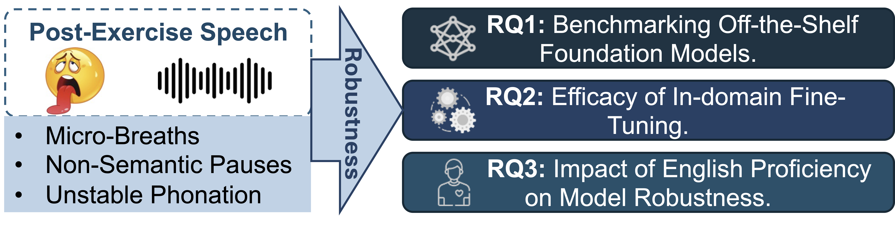
*Figure 1:Framework for evaluating and enhancing ASR robustness on post-exercise speech.*

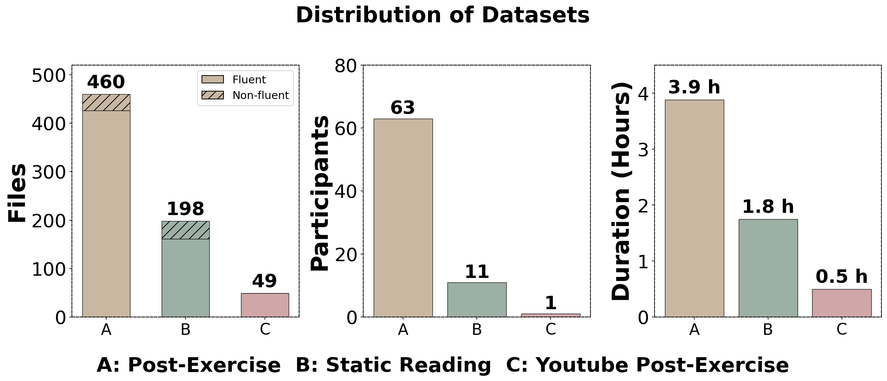
*Figure 2:Dataset distribution.*

---
**Usage Info**: 2023 tokens used.
**Generated at**: 2026-03-31 12:58:11

---

# 📚 Unified Number-Free Text-to-Motion Generation Via Flow Matching

🚀 URL: https://arxiv.org/html/2603.27040

## 🌏 Abstract (원문)
Generative models excel at motion synthesis for a fixed number of agents but struggle to generalize with variable agents. Based on limited, domain-specific data, existing methods employ autoregressive models to generate motion recursively, which suffer from inefficiency and error accumulation. We proposeUnified Motion Flow (UMF), which consists of Pyramid Motion Flow (P-Flow) and Semi-Noise Motion Flow (S-Flow).UMF decomposes the number-free motion generation into a single-pass motion prior generation stage and multi-pass reaction generation stages. Specifically, UMF utilizes a unified latent space to bridge the distribution gap between heterogeneous motion datasets, enabling effective unified training.For motion prior generation, P-Flow operates on hierarchical resolutions conditioned on different noise levels, thereby mitigating computational overheads.For reaction generation, S-Flow learns a joint probabilistic path that adaptively performs reaction transformation and context reconstruction, alleviating error accumulation.Extensive results and user studies demonstrate UMF’s effectiveness as a generalist model for multi-person motion generation from text.Project page:https://githubhgh.github.io/umf/.
## 🌏 Abstract (번역)
생성 모델은 고정된 수의 에이전트에 대한 모션 합성에는 뛰어나지만, 가변적인 에이전트에 대해서는 일반화하는 데 어려움을 겪습니다. 제한적이고 도메인 특화된 데이터에 기반한 기존 방법들은 모션을 재귀적으로 생성하기 위해 자기회귀 모델을 사용하며, 이는 비효율성과 오류 누적 문제를 겪습니다. 우리는 피라미드 모션 플로우(P-Flow)와 세미-노이즈 모션 플로우(S-Flow)로 구성된 통합 모션 플로우(UMF)를 제안합니다. UMF는 에이전트 수에 구애받지 않는 모션 생성을 단일 패스 모션 사전 생성 단계와 다중 패스 반응 생성 단계로 분해합니다. 구체적으로, UMF는 이질적인 모션 데이터셋 간의 분포 차이를 연결하는 통합 잠재 공간을 활용하여 효과적인 통합 학습을 가능하게 합니다. 모션 사전 생성을 위해 P-Flow는 다양한 노이즈 레벨에 따라 계층적 해상도에서 작동하여 계산 오버헤드를 완화합니다. 반응 생성을 위해 S-Flow는 반응 변환과 컨텍스트 재구성을 적응적으로 수행하는 공동 확률 경로를 학습하여 오류 누적을 줄입니다. 광범위한 결과와 사용자 연구는 텍스트로부터 다중 인물 모션 생성을 위한 일반주의 모델로서 UMF의 효과를 입증합니다. 프로젝트 페이지: https://githubhgh.github.io/umf/.

## 🔍 Methods & Results
- UMF는 가변적인 에이전트 수에 대한 모션 생성 문제를 해결하기 위해 Pyramid Motion Flow (P-Flow)와 Semi-Noise Motion Flow (S-Flow)로 구성된 통합 프레임워크를 제안합니다.
- 이질적인 모션 데이터셋 간의 분포 차이를 해소하기 위해 모든 모션을 통합된 비정규 SMPL 스켈레톤 표현으로 변환하고, 단일 모션 토크나이저를 통해 연속적인 잠재 공간을 학습합니다.
- VAE의 재구성 성능과 생성 성능 간의 균형을 위해 내부 토큰 표현과 최종 잠재 차원을 분리하는 멀티-토큰 잠재 공간(예: 16x256에서 16x32로 투영)을 활용하여 안정성을 향상시켰습니다.
- 모션 생성은 두 단계로 나뉩니다: (1) P-Flow를 통한 모션 사전 생성은 계층적 해상도에서 작동하여 계산 오버헤드를 완화하고 효율적인 흐름 매칭 추론을 가능하게 합니다. (2) S-Flow를 통한 반응 모션 생성은 컨텍스트 재구성 및 반응 변환을 위한 공동 확률 경로를 학습하여 오류 누적을 줄입니다.
- UMF는 N>2명의 에이전트에 대해 S-Flow 모듈을 자기회귀적으로 적용하여 확장 가능하며, 사용자 연구를 통해 제로샷(zero-shot) 능력을 입증했습니다.
- P-Flow에 더 많은 추론 예산(예: 50단계)을 할당하고 S-Flow에 최소한의 예산(예: 10단계)을 할당하는 비대칭 추론 예산 전략을 통해 계산 효율성을 확보했습니다.
- P-Flow와 S-Flow는 서로 다른 학습 목표(노이즈-모션 매핑 vs. 모션-모션 및 노이즈-모션 경로 학습)로 인해 별도의 트랜스포머 모듈을 사용하며, S-Flow 트랜스포머는 후속 에이전트 생성을 위해 자기회귀적으로 공유됩니다.
- 광범위한 결과와 사용자 연구를 통해 UMF가 텍스트로부터 다중 인물 모션 생성을 위한 일반주의 모델로서 효과적임을 입증했습니다.

## 🖼 Figures
![Figure 1: Core contribution of UMF. We show dual-agent cases here for simplicity. (a) Standard methods [51, 55] are restricted to a fixed number of agents. (b) Autoregressive methods [12] decouple generation into a motion prior and subsequent reaction. The reaction is typically guided by the prior using a conditioning network. (c) Our UMF leverages a heterogeneous motion prior as the adaptive start point of the reaction flow path, mitigating error accumulation.](../images/2026-03-31/2603.27040/2603.27040_fig0.png)
*Figure 1: Core contribution of UMF. We show dual-agent cases here for simplicity. (a) Standard methods [51, 55] are restricted to a fixed number of agents. (b) Autoregressive methods [12] decouple generation into a motion prior and subsequent reaction. The reaction is typically guided by the prior using a conditioning network. (c) Our UMF leverages a heterogeneous motion prior as the adaptive start point of the reaction flow path, mitigating error accumulation.*

![Figure 2: Overview of the Unified Motion Flow (UMF) architecture. The UMF framework consists of three stages. (A) Unified motion VAE: A motion VAE with latent adapters encodes raw motions from heterogeneous datasets (e.g., HumanML3D [14], InterHuman [32]) into a regularized multi-token latent representation (
𝑍
). (B) P-Flow motion prior generation: The Pyramid Flow Transformer synthesizes the latent motion prior (
𝑍
ˇ
) based on noisy latent motion and text conditions. The P-Flow operates hierarchically based on the timestep 
𝑡
∼
(
0
,
1
)
: it processes downsampled, low-resolution latents for 
𝑡
<
𝑝
 and switches to original-resolution latents for 
𝑡
>
𝑝
, mitigating multi-token computational overheads. (C) S-Flow reaction generation: Based on the previously generated latent {
𝑍
ˇ
𝑖
,
…
,
𝑍
ˇ
1
}, the context adapter generates the context motion 
𝐶
. Then the Semi-Noise Flow transformer predicts the reaction latent (
𝑊
ˇ
) by jointly modeling context reconstruction and reaction transformation, alleviating the error accumulation from previously generated motion.](../images/2026-03-31/2603.27040/2603.27040_fig1.png)
*Figure 2: Overview of the Unified Motion Flow (UMF) architecture. The UMF framework consists of three stages. (A) Unified motion VAE: A motion VAE with latent adapters encodes raw motions from heterogeneous datasets (e.g., HumanML3D [14], InterHuman [32]) into a regularized multi-token latent representation (
𝑍
). (B) P-Flow motion prior generation: The Pyramid Flow Transformer synthesizes the latent motion prior (
𝑍
ˇ
) based on noisy latent motion and text conditions. The P-Flow operates hierarchically based on the timestep 
𝑡
∼
(
0
,
1
)
: it processes downsampled, low-resolution latents for 
𝑡
<
𝑝
 and switches to original-resolution latents for 
𝑡
>
𝑝
, mitigating multi-token computational overheads. (C) S-Flow reaction generation: Based on the previously generated latent {
𝑍
ˇ
𝑖
,
…
,
𝑍
ˇ
1
}, the context adapter generates the context motion 
𝐶
. Then the Semi-Noise Flow transformer predicts the reaction latent (
𝑊
ˇ
) by jointly modeling context reconstruction and reaction transformation, alleviating the error accumulation from previously generated motion.*

![Figure 3: Qualitative comparison (zoom into see it better) between FreeMotion [12] and UMF. Red circles demonstrate successful cases, while Blue circles show failure cases.](../images/2026-03-31/2603.27040/2603.27040_fig2.png)
*Figure 3: Qualitative comparison (zoom into see it better) between FreeMotion [12] and UMF. Red circles demonstrate successful cases, while Blue circles show failure cases.*

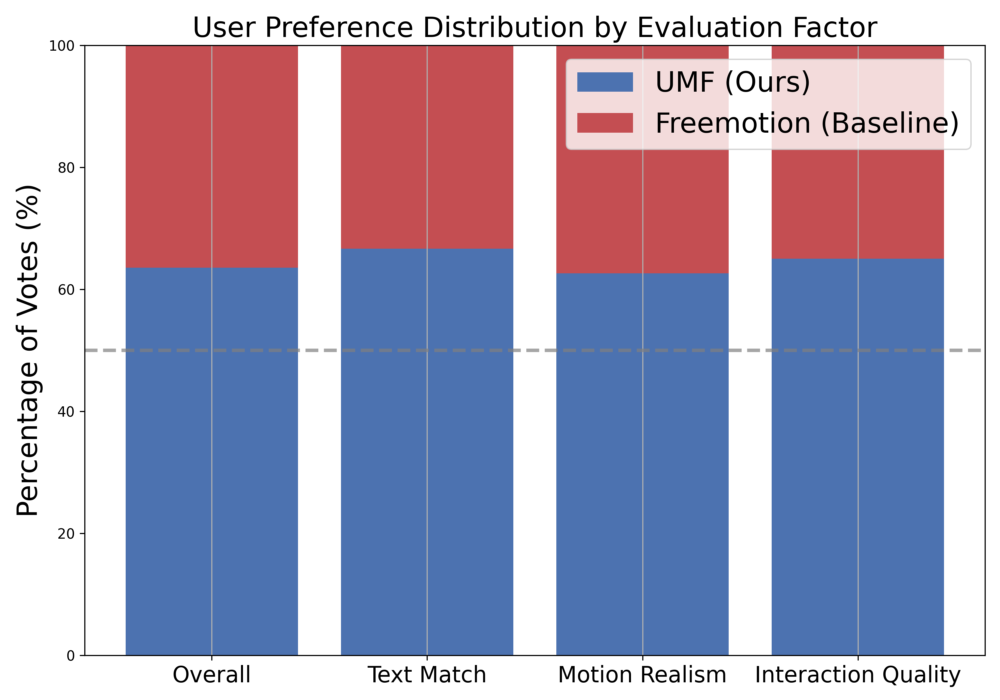
*Figure 4: The UMF number-free zero-shot generation user study. We asked users to compare our UMF (Blue Bar) to the FreeMotion (Red Bar) in a side-by-side view. The dashed line marks 50%. UMF outperforms FreeMotion in all three aspects of generation.*

---
**Usage Info**: 6969 tokens used.
**Generated at**: 2026-03-31 12:58:26

---

# 📚 Spectral-Aware Text-to-Time Series Generation with Billion-Scale Multimodal Meteorological Data

🚀 URL: https://arxiv.org/html/2603.27135

## 🌏 Abstract (원문)
Text-to-time-series generation is particularly important in meteorology, where natural language offers intuitive control over complex, multi-scale atmospheric dynamics. Existing approaches are constrained by the lack of large-scale, physically grounded multimodal datasets and by architectures that overlook the spectral–temporal structure of weather signals. We address these challenges with a unified framework for text-guided meteorological time-series generation. First, we introduce MeteoCap-3B, a billion-scale weather dataset paired with expert-level captions constructed via a Multi-agent Collaborative Captioning (MACC) pipeline, yielding information-dense and physically consistent annotations. Building on this dataset, we propose MTransformer, a diffusion-based model that enables precise semantic control by mapping textual descriptions into multi-band spectral priors through a Spectral Prompt Generator, which guides generation via frequency-aware attention. Extensive experiments on real-world benchmarks demonstrate state-of-the-art generation quality, accurate cross-modal alignment, strong semantic controllability, and substantial gains in downstream forecasting under data-sparse and zero-shot settings. Additional results on general time-series benchmarks indicate that the proposed framework generalizes beyond meteorology.
## 🌏 Abstract (번역)
텍스트-시계열 생성은 복잡하고 다중 스케일의 대기 역학을 자연어로 직관적으로 제어할 수 있는 기상학에서 특히 중요합니다. 기존 접근 방식은 대규모의 물리적으로 기반을 둔 다중 모달 데이터셋의 부족과 기상 신호의 스펙트럼-시간적 구조를 간과하는 아키텍처로 인해 제약을 받습니다. 우리는 텍스트 기반 기상 시계열 생성을 위한 통합 프레임워크로 이러한 문제들을 해결합니다. 첫째, 우리는 다중 에이전트 협업 캡셔닝(MACC) 파이프라인을 통해 전문가 수준의 캡션을 구축하여 정보 밀도가 높고 물리적으로 일관된 주석을 생성하는 수십억 규모의 기상 데이터셋인 MeteoCap-3B를 소개합니다. 이 데이터셋을 기반으로, 우리는 텍스트 설명을 스펙트럼 프롬프트 생성기를 통해 다중 대역 스펙트럼 사전 정보로 매핑하여 정밀한 의미 제어를 가능하게 하는 확산 기반 모델인 MTransformer를 제안합니다. 이 프롬프트 생성기는 주파수 인식 주의(frequency-aware attention)를 통해 생성을 안내합니다. 실제 벤치마크에 대한 광범위한 실험은 최첨단 생성 품질, 정확한 교차 모달 정렬, 강력한 의미론적 제어 가능성, 그리고 데이터 부족 및 제로샷 설정에서 다운스트림 예측의 상당한 개선을 보여줍니다. 일반 시계열 벤치마크에 대한 추가 결과는 제안된 프레임워크가 기상학을 넘어 일반화될 수 있음을 나타냅니다.

## 🔍 Methods & Results
- MeteoCap-3B라는 수십억 규모의 기상 데이터셋을 도입했으며, 이는 Multi-agent Collaborative Captioning (MACC) 파이프라인을 통해 생성된 전문가 수준의 캡션과 결합되어 정보 밀도가 높고 물리적으로 일관된 주석을 제공합니다.
- MTransformer라는 확산 기반 모델을 제안했습니다. 이 모델은 Spectral Prompt Generator를 통해 텍스트 설명을 다중 대역 스펙트럼 사전 정보로 매핑하여 정밀한 의미 제어를 가능하게 하며, 주파수 인식 주의(frequency-aware attention)를 통해 생성을 안내합니다.
- 실제 벤치마크 실험 결과, 최첨단 생성 품질, 정확한 교차 모달 정렬, 강력한 의미론적 제어 가능성을 달성했습니다.
- 데이터 부족 및 제로샷 설정에서 다운스트림 예측에서 상당한 성능 향상을 보였습니다.
- 제안된 프레임워크는 기상학을 넘어 일반 시계열 벤치마크에서도 일반화될 수 있음을 입증했습니다.

## 🖼 Figures
![Figure 1:Overview of our Multi-agent Collaborative Captioning (MACC) pipeline for MeteoCap-3B construction. Note that we used GPT-4o, Claude Sonnet 3.5, and Gemini-3-Flash in Phase 3 and used DeepSeek V3 [23] in Phase 4. Human experts contains eight PhD in meteorology.](../images/2026-03-31/2603.27135/2603.27135_fig0.png)
*Figure 1:Overview of our Multi-agent Collaborative Captioning (MACC) pipeline for MeteoCap-3B construction. Note that we used GPT-4o, Claude Sonnet 3.5, and Gemini-3-Flash in Phase 3 and used DeepSeek V3 [23] in Phase 4. Human experts contains eight PhD in meteorology.*

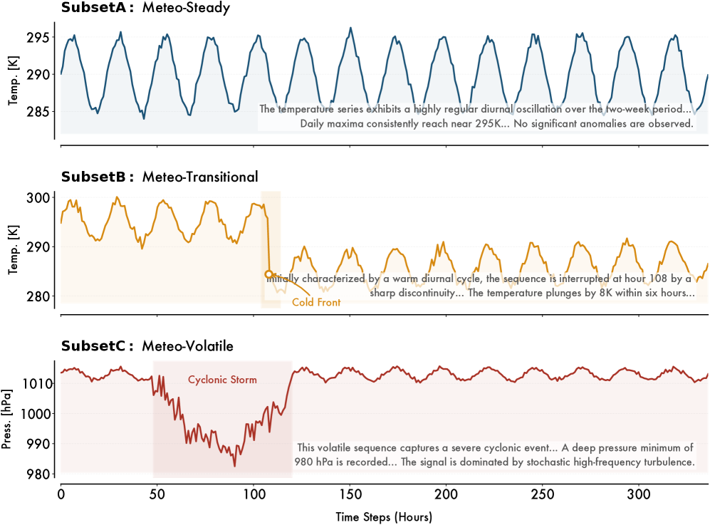
*Figure 2:Representative samples across three subsets of MeteoCap-3B.*

![Figure 3:Our MTransformer for time series generation. Qwen-3-Embedding-7B [25] is used to achieve the caption embedding with 1024 dimensions.](../images/2026-03-31/2603.27135/2603.27135_fig5.png)
*Figure 3:Our MTransformer for time series generation. Qwen-3-Embedding-7B [25] is used to achieve the caption embedding with 1024 dimensions.*

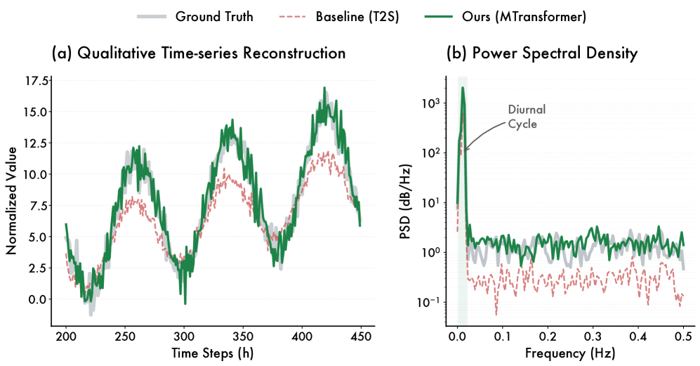
*Figure 4:Qualitative analysis. Left: Qualitative time series reconstruction. Right: Power spectral density of real and generated time series.*

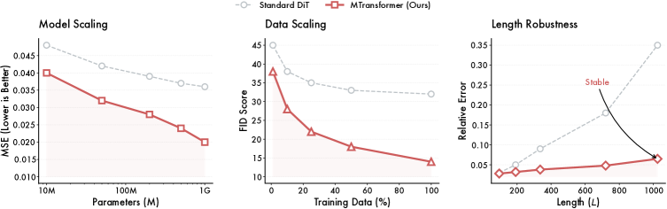
*Figure 5:Scaling behavior of MTransformer with respect to model size (length of 96), data scale, and sequence length, evaluated on the Meteo-Volatile subset.*

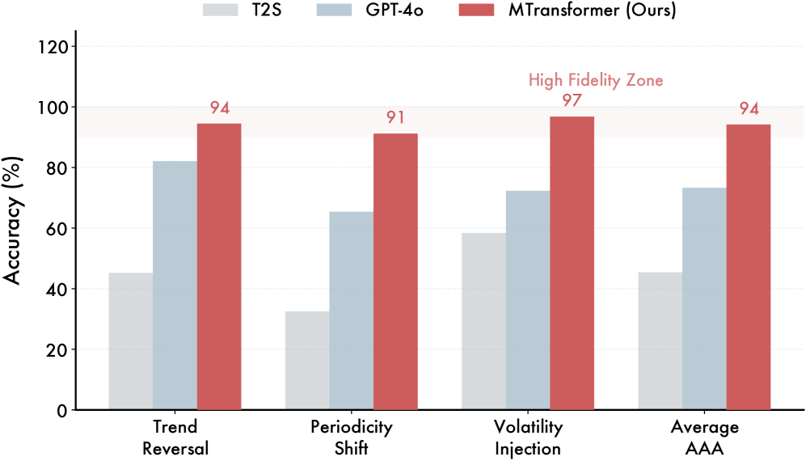
*Figure 6:Controllability of MTransformer generated sequences.*

---
**Usage Info**: 1428 tokens used.
**Generated at**: 2026-03-31 12:58:32

---

# 📚 SonoWorld: From One Image to a 3D Audio-Visual Scene

🚀 URL: https://arxiv.org/html/2603.28757

## 🌏 Abstract (원문)
Tremendous progress in visual scene generation now turns a single image into an explorable 3D world, yet immersion remains incomplete without sound. We introduceImage2AVScene, the task of generating a 3D audio-visual scene from a single image, and presentSonoWorld, the first framework to tackle this challenge. From one image, our pipeline outpaints a 360° panorama, lifts it into a navigable 3D scene, places language-guided sound anchors, and renders ambisonics for point, areal, and ambient sources, yielding spatial audio aligned with scene geometry and semantics. Quantitative evaluations on a newly curated real-world dataset and a controlled user study confirm the effectiveness of our approach. Beyond free-viewpoint audio-visual rendering, we also demonstrate applications to one-shot acoustic learning and audio-visual spatial source separation. Project website:https://humathe.github.io/sonoworld/
## 🌏 Abstract (번역)
시각적 장면 생성의 엄청난 발전은 이제 단일 이미지를 탐색 가능한 3D 세계로 바꾸지만, 소리 없이는 몰입감이 불완전합니다. 우리는 단일 이미지로부터 3D 시청각 장면을 생성하는 작업인 Image2AVScene을 소개하고, 이 도전을 해결하는 최초의 프레임워크인 SonoWorld를 제시합니다. 하나의 이미지로부터, 우리의 파이프라인은 360° 파노라마를 아웃페인팅하고, 이를 탐색 가능한 3D 장면으로 변환하며, 언어 안내 기반의 사운드 앵커를 배치하고, 점, 영역 및 주변 소스에 대한 앰비소닉을 렌더링하여 장면 기하학과 의미론에 맞춰진 공간 오디오를 생성합니다. 새롭게 큐레이션된 실제 데이터셋에 대한 정량적 평가와 통제된 사용자 연구는 우리 접근 방식의 효과성을 확인시켜 줍니다. 자유 시점 시청각 렌더링을 넘어, 우리는 원샷 음향 학습 및 시청각 공간 소스 분리에도 적용 가능함을 보여줍니다. 프로젝트 웹사이트: https://humathe.github.io/sonoworld/

## 🔍 Methods & Results
- SonoWorld는 단일 이미지로부터 3D 시청각 장면을 생성하는 훈련 없는(training-free) 파이프라인입니다.
- 360° 파노라마 아웃페인팅 및 3D 장면 재구성을 위해, GeoCalib로 카메라를 보정하고, WorldGen의 `g_outpaint` 모델로 파노라마를 생성한 후, Marble 또는 HunyuanWorld-1.0과 같은 모델을 사용하여 포토리얼리스틱 3D 시각 장면으로 변환합니다.
- 사운드 앵커 배치를 위해 VLM(GPT-5 또는 LLaVA-Next-34B)을 사용하여 사운드 카테고리 및 속성을 제안하고, X-Decoder로 개방형 어휘 분할을 수행하며, SAM2를 활용하여 파노라마 마스크를 정제한 후, 3D 깊이 정보를 사용하여 3D 사운드 소스 위치를 파악합니다.
- 공간 오디오 생성을 위해 MMAudio를 사용하여 텍스트 프롬프트로부터 개별 사운드 소스 및 전역 주변 사운드의 원시 파형을 합성하고, VLM이 예측한 소스 유형(점, 클러스터)과 3D 위치를 기반으로 거리 감쇠 및 공기 흡수를 모델링하여 앰비소닉을 인코딩합니다.
- 렌더링 단계에서는 3D 가우시안 스플래팅으로 시각적 프레임을 렌더링하고, HRTF 기반 디코더를 통해 앰비소닉 신호를 바이노럴 오디오로 변환하여 시점 일관적인 공간화된 오디오를 제공하며, 이는 대화형 탐색을 가능하게 합니다.
- 새롭게 큐레이션된 실제 데이터셋에 대한 정량적 평가와 통제된 사용자 연구를 통해 SonoWorld 접근 방식의 효과성이 입증되었습니다.
- 자유 시점 시청각 렌더링 외에도 원샷 음향 학습 및 시청각 공간 소스 분리에도 적용 가능함을 보여주었습니다.

## 🖼 Figures
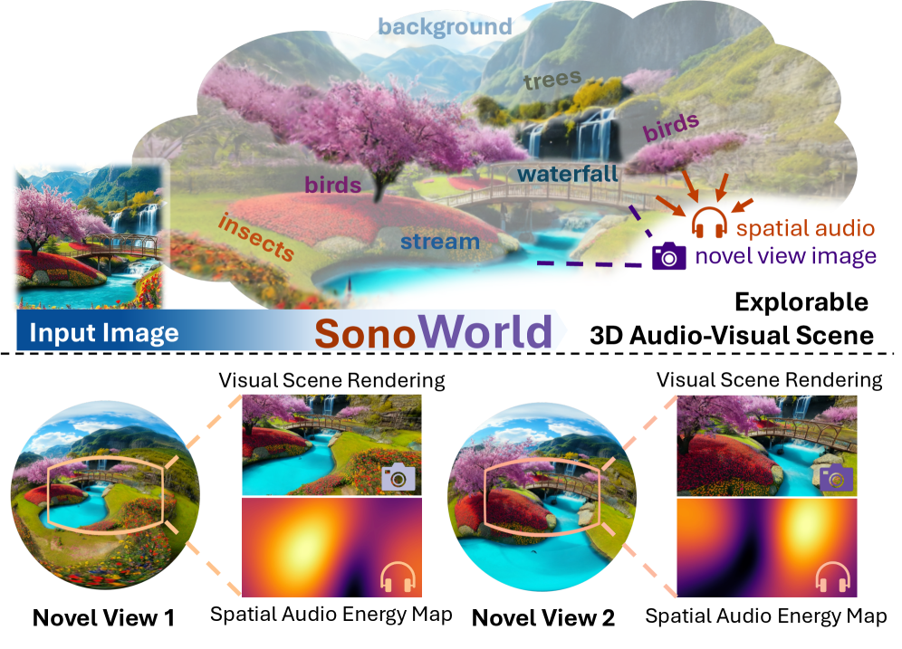
*Figure 1:From one image, SonoWorld generates an explorable 3D audio-visual scene, where you can navigate to novel views and locations, while listening to spatial audio aligned with scene semantics and the 3D locations of heterogeneous sound sources.*

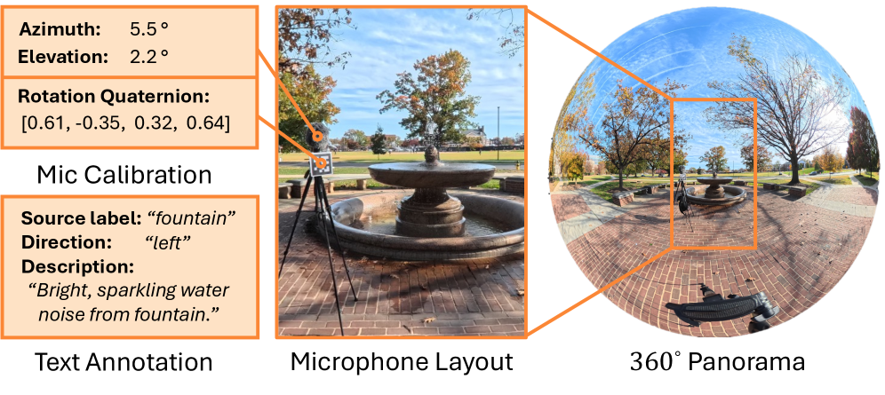
*Figure 2:Illustration of real-world audio-visual scene data collection and curation for SonoScene360.*

![Figure 3:Given a single image 
𝐼
, SonoWorld jointly generates a 3D visual scene 
𝐕
 and a semantically and geometrically aligned audio scene 
𝐀
. It consists of: 1) Visual Scene Generation (Sec. 4.1): single-image calibration and warping followed by panorama outpainting to obtain the a full 
360
∘
 panorama image 
𝐼
pano
, which is further lifted into a 3D Gaussian scene via a panorama-to-3D reconstruction model 
𝒢
V
; 2) 360∘ Semantic Grounding (Sec. 4.2): a VLM extracts the categories 
𝒞
 of potential sounding sources, which are used to generate panoramic instance masks M with the help and coordination of both an open-vocabulary segmentation model (OVS) and a class-agnostic segmentation model (SAM2 [62]); 3) Ambisonics Encoding (Sec. 4.3): based on the audio prompt and equalization parameters from the VLM model, a text-to-audio (T2A) model generates per-source waveforms that are equalized, and mapped to ambisonics coefficients based on the 3D locations and its source type; and 4) Free-Viewpoint Rendering (Sec. 4.4): the ambisonics coefficients are decoded into pose-dependent binaural audio 
b
​
(
p
)
 using head related transfer function (HRTF) and synchronized with Gaussian rendering 
𝐕
​
(
p
)
.](../images/2026-03-31/2603.28757/2603.28757_fig2.png)
*Figure 3:Given a single image 
𝐼
, SonoWorld jointly generates a 3D visual scene 
𝐕
 and a semantically and geometrically aligned audio scene 
𝐀
. It consists of: 1) Visual Scene Generation (Sec. 4.1): single-image calibration and warping followed by panorama outpainting to obtain the a full 
360
∘
 panorama image 
𝐼
pano
, which is further lifted into a 3D Gaussian scene via a panorama-to-3D reconstruction model 
𝒢
V
; 2) 360∘ Semantic Grounding (Sec. 4.2): a VLM extracts the categories 
𝒞
 of potential sounding sources, which are used to generate panoramic instance masks M with the help and coordination of both an open-vocabulary segmentation model (OVS) and a class-agnostic segmentation model (SAM2 [62]); 3) Ambisonics Encoding (Sec. 4.3): based on the audio prompt and equalization parameters from the VLM model, a text-to-audio (T2A) model generates per-source waveforms that are equalized, and mapped to ambisonics coefficients based on the 3D locations and its source type; and 4) Free-Viewpoint Rendering (Sec. 4.4): the ambisonics coefficients are decoded into pose-dependent binaural audio 
b
​
(
p
)
 using head related transfer function (HRTF) and synchronized with Gaussian rendering 
𝐕
​
(
p
)
.*

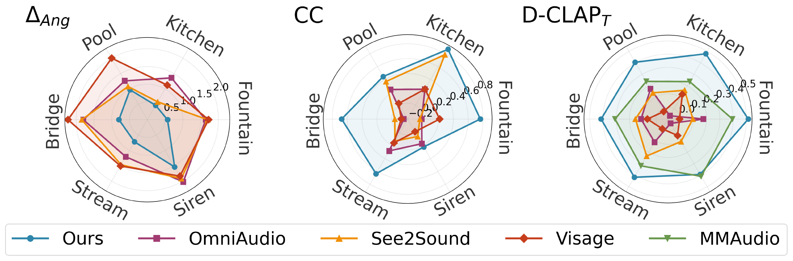
*Figure 4:Per-scene results on our SonoScene360 dataset. Results on representative metrics show that our method consistently outperforms baselines on all scenes.*

![Figure 5:User Study of Spatial Audio Quality. Preference rates across synthetic and real scenes for our method, MMAudio [8], and OmniAudio [53]. Each bar shows the average per-user, per-scene preference (%); error bars indicate the interquartile range (25th–75th percentile) across 50 participants.](../images/2026-03-31/2603.28757/2603.28757_fig4.png)
*Figure 5:User Study of Spatial Audio Quality. Preference rates across synthetic and real scenes for our method, MMAudio [8], and OmniAudio [53]. Each bar shows the average per-user, per-scene preference (%); error bars indicate the interquartile range (25th–75th percentile) across 50 participants.*

![Figure 6: Ambisonics energy map visualization on real-world scenes. Top row: panoramic renderings from our method at novel views (microphone poses) on SonoScene360. Second row: ground-truth FOA energy maps. Remaining rows: FOA predictions from our method and OmniAudio [53]. Our maps most closely follow the ground-truth reference spatial patterns, while the baselines produce oversmoothed or misaligned energy. For more qualitative baseline comparisons, please refer to Supp.](../images/2026-03-31/2603.28757/2603.28757_fig5.png)
*Figure 6: Ambisonics energy map visualization on real-world scenes. Top row: panoramic renderings from our method at novel views (microphone poses) on SonoScene360. Second row: ground-truth FOA energy maps. Remaining rows: FOA predictions from our method and OmniAudio [53]. Our maps most closely follow the ground-truth reference spatial patterns, while the baselines produce oversmoothed or misaligned energy. For more qualitative baseline comparisons, please refer to Supp.*

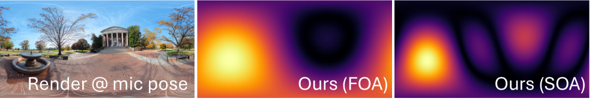
*Figure 7:The sound energy by second order ambisonics (SOA) in real scenes.*

![Figure 8:Qualitative results on synthetic scenes. From a single diffusion-generated image, SonoWorld reconstructs a 3D Gaussian scene and predicts a spatial audio field that supports free-viewpoint exploration. We show two synthetic scenes (Garden and Riverside Market), sample views along a camera trajectory (top row), and the corresponding FOA / SOA spherical energy maps for our method and OmniAudio. The energy smoothly tracks visually grounded sources such as the waterfall, streams, and market stalls.](../images/2026-03-31/2603.28757/2603.28757_fig7.png)
*Figure 8:Qualitative results on synthetic scenes. From a single diffusion-generated image, SonoWorld reconstructs a 3D Gaussian scene and predicts a spatial audio field that supports free-viewpoint exploration. We show two synthetic scenes (Garden and Riverside Market), sample views along a camera trajectory (top row), and the corresponding FOA / SOA spherical energy maps for our method and OmniAudio. The energy smoothly tracks visually grounded sources such as the waterfall, streams, and market stalls.*

![Figure 9:Qualitative comparison on real scenes. Additional qualitative results on six real environments from SonoScene360. For each scene, we show the rendered panorama from our 3D Gaussian reconstruction, the reference spherical energy map derived from the recorded FOA (second row), and the predicted energy maps from our method (FOA), OmniAudio, SEE-2-SOUND (S2S), and ViSAGe. Our method produces spatial patterns that best align with the reference both in azimuth and elevation and in the spatial extent of the energy, especially around extended water and ambient sources. Please refer to the supplementary video for audio.](../images/2026-03-31/2603.28757/2603.28757_fig8.png)
*Figure 9:Qualitative comparison on real scenes. Additional qualitative results on six real environments from SonoScene360. For each scene, we show the rendered panorama from our 3D Gaussian reconstruction, the reference spherical energy map derived from the recorded FOA (second row), and the predicted energy maps from our method (FOA), OmniAudio, SEE-2-SOUND (S2S), and ViSAGe. Our method produces spatial patterns that best align with the reference both in azimuth and elevation and in the spatial extent of the energy, especially around extended water and ambient sources. Please refer to the supplementary video for audio.*

*Figure 10:Comparison of 3D scene backbones. Given an input 360∘ panorama (left column), we compare novel views generated by HunyuanWorld 1.0 and Marble for several real scenes (Kitchen, Stream, Siren). HunyuanWorld produces globally coherent but sometimes distorted geometry (e.g., warped floors and façades), whereas Marble yields sharper, more faithful reconstructions that preserve local spatial layout, which is crucial for accurate spatial audio anchoring and free-viewpoint navigation.*

![Figure 11:Panoramic instance merging strategies. We compare three strategies for grouping class-agnostic region proposals into semantic instances in SonoScene360: All-Merge (left), No-Merge (middle), and our voting-based strategy Vote (Ours) (right). For each scene, we overlay the resulting instances on the panorama and indicate their counts. All-Merge collapses large structures into a single instance, losing spatial detail; No-Merge over-fragments the scene into many small pieces. Our voting scheme strikes a balance, producing a small number of coherent instances that align with visually meaningful sound sources.](../images/2026-03-31/2603.28757/2603.28757_fig10.png)
*Figure 11:Panoramic instance merging strategies. We compare three strategies for grouping class-agnostic region proposals into semantic instances in SonoScene360: All-Merge (left), No-Merge (middle), and our voting-based strategy Vote (Ours) (right). For each scene, we overlay the resulting instances on the panorama and indicate their counts. All-Merge collapses large structures into a single instance, losing spatial detail; No-Merge over-fragments the scene into many small pieces. Our voting scheme strikes a balance, producing a small number of coherent instances that align with visually meaningful sound sources.*

*Figure 12:Calibration annotation interface. Our tool for camera–microphone calibration. Left: annotating the azimuth and elevation of the FOA microphone in the panorama. Middle: annotating azimuth and elevation for ground markers (i.e., the marker right below the microphone position) that define a world reference frame. Right: visualizing the relative rotation between AprilTag marker and camera, which is used to estimate the microphone orientation in the world coordinate system.*

![Figure 13:Effect of calibration on rendered scenes. For two real scenes (Siren and River & Train), we show the original camera view with the microphone visible, the inpainted camera view, and renderings of the reconstructed 3D scene when aligned using the AprilTag-based pose estimate vs. our refined pose. The refined calibration produces renderings whose layout and perspective are more consistent with the original capture, leading to more accurate alignment between the FOA reference frame and the visual scene.](../images/2026-03-31/2603.28757/2603.28757_fig12.png)
*Figure 13:Effect of calibration on rendered scenes. For two real scenes (Siren and River & Train), we show the original camera view with the microphone visible, the inpainted camera view, and renderings of the reconstructed 3D scene when aligned using the AprilTag-based pose estimate vs. our refined pose. The refined calibration produces renderings whose layout and perspective are more consistent with the original capture, leading to more accurate alignment between the FOA reference frame and the visual scene.*

*Figure 15:User Study Interface. An example pairwise comparison shown to participants. Each question presents two spatial-audio videos (“Method 1” and “Method 2”) for the same scene. Participants listen with headphones and select the method that provides better spatial coherence and audio–visual alignment.*

*Figure 16:Physics-aware occlusion add-on: as a clustered source becomes partially and then fully blocked between 
𝑡
0
 and 
𝑡
1
, visibility-based point reweighting yields smooth attenuation of the rendered signal.*

![Figure 17:Dynamic source rendering on a plane fly-by clip: a time-varying 3D anchor from SAM3 [4] and Depth Anything 3 [49] separates dynamic and static sound components, with the dynamic layer peaking near closest approach and attenuating with distance](../images/2026-03-31/2603.28757/2603.28757_fig16.png)
*Figure 17:Dynamic source rendering on a plane fly-by clip: a time-varying 3D anchor from SAM3 [4] and Depth Anything 3 [49] separates dynamic and static sound components, with the dynamic layer peaking near closest approach and attenuating with distance*

---
**Usage Info**: 5562 tokens used.
**Generated at**: 2026-03-31 12:58:46

---

# 📚 A Probabilistic Generative Model for Spectral Speech Enhancement

🚀 URL: https://arxiv.org/html/2603.28436

## 🌏 Abstract (원문)
Speech enhancement in hearing aids remains a difficult task in nonstationary acoustic environments, mainly because current signal processing algorithms rely on fixed, manually tuned parameters that cannot adapt in situ to different users or listening contexts. This paper introduces a unified modular framework that formulates signal processing, learning, and personalization as Bayesian inference with explicit uncertainty tracking. The proposed framework replaces ad hoc algorithm design with a single probabilistic generative model that continuously adapts to changing acoustic conditions and user preferences. It extends spectral subtraction with principled mechanisms for in-situ personalization and adaptation to acoustic context. The system is implemented as an interconnected probabilistic state-space model, and inference is performed via variational message passing in theRxInfer.jlprobabilistic programming environment, enabling real-time Bayesian processing under hearing-aid constraints. Proof-of-concept experiments on theVoiceBank+DEMANDcorpus show competitive speech quality and noise reduction with 85 effective parameters. The framework provides an interpretable, data-efficient foundation for uncertainty-aware, adaptive hearing-aid processing and points toward devices that learn continuously through probabilistic inference.
## 🌏 Abstract (번역)
보청기에서의 음성 향상은 비정상적인 음향 환경에서 여전히 어려운 과제로 남아있는데, 이는 주로 현재의 신호 처리 알고리즘이 고정되고 수동으로 조정된 매개변수에 의존하여 다양한 사용자나 청취 상황에 현장에서 적응할 수 없기 때문입니다. 본 논문은 신호 처리, 학습 및 개인화를 명시적인 불확실성 추적을 포함하는 베이즈 추론으로 공식화하는 통합 모듈형 프레임워크를 소개합니다. 제안된 프레임워크는 임시방편적인 알고리즘 설계를 변화하는 음향 조건 및 사용자 선호도에 지속적으로 적응하는 단일 확률적 생성 모델로 대체합니다. 이는 스펙트럼 감산(spectral subtraction)을 현장 개인화 및 음향 상황 적응을 위한 원칙적인 메커니즘으로 확장합니다. 이 시스템은 상호 연결된 확률적 상태 공간 모델로 구현되며, 추론은 RxInfer.jl 확률적 프로그래밍 환경에서 변분 메시지 전달(variational message passing)을 통해 수행되어 보청기 제약 조건 하에서 실시간 베이즈 처리를 가능하게 합니다. VoiceBank+DEMAND 코퍼스에 대한 개념 증명 실험은 85개의 유효 매개변수로 경쟁력 있는 음성 품질과 노이즈 감소를 보여줍니다. 이 프레임워크는 불확실성을 인지하고 적응하는 보청기 처리를 위한 해석 가능하고 데이터 효율적인 기반을 제공하며, 확률적 추론을 통해 지속적으로 학습하는 장치로의 발전을 시사합니다.

## 🔍 Methods & Results
- 본 논문은 신호 처리, 학습, 개인화를 베이즈 추론으로 통합한 모듈형 프레임워크를 제안하며, 이는 기존의 스펙트럼 감산 알고리즘을 확장하여 현장 개인화 및 음향 상황 적응 메커니즘을 포함합니다.
- 시스템은 상호 연결된 확률적 상태 공간 모델인 AIDA-2 모델로 구현되며, WFB(Warped-Frequency Filter Bank), SEM(Bayesian Speech Enhancement Model), EUM(End-User Model), ACM(Acoustic Context Model)의 네 가지 주요 모듈로 구성됩니다.
- WFB는 오디오 샘플링 속도(16 kHz)로 작동하는 전면부 필터로, 왜곡 주파수 FIR 필터를 사용하여 입력 신호의 이력을 상태 벡터로 표현하고 시간 가변 필터 가중치를 생성합니다.
- SEM은 블록 단위로(fs/M 속도) 작동하며, WFB에서 받은 신호 이력과 EUM에서 받은 개인화 정보를 바탕으로 필터 가중치를 추론합니다. 이는 스펙트럼 분석, SNR 추적, 스펙트럼 가중치 업데이트, 스펙트럼 합성을 포함합니다.
- SNR 추적은 스위칭 칼만 필터에서 영감을 받은 확률적 상태 공간 모델을 사용하여 음성 및 노이즈 로그 파워를 추적하며, 음성 활동 변수에 따라 추적기가 동적으로 업데이트됩니다.
- 스펙트럼 가중치 업데이트는 위너 필터링 기반으로, 로그 스펙트럼 SNR의 로지스틱 함수로 표현되며, EUM에서 제공되는 '상황 인지 개인화 시프트' 매개변수(θm)를 통해 사용자 선호도에 따라 이득 계산이 조정됩니다.
- ACM은 음향 입력 신호에서 수 초 단위의 음향 장면(예: '차 안', '집')과 같은 상황 정보를 포착하며, EUM은 사용자 평가를 바탕으로 SEM의 제어 변수(θm)에 대한 상황 의존적 제안을 생성합니다.
- RxInfer.jl 확률적 프로그래밍 환경에서 변분 메시지 전달을 통해 실시간 베이즈 처리가 가능하며, VoiceBank+DEMAND 코퍼스에 대한 개념 증명 실험에서 85개의 유효 매개변수로 경쟁력 있는 음성 품질 및 노이즈 감소 성능을 입증했습니다.

---
**Usage Info**: 6347 tokens used.
**Generated at**: 2026-03-31 12:58:57

---

# 📚 From Diffusion to Flow: Efficient Motion Generation in MotionGPT3

🚀 URL: https://arxiv.org/html/2603.26747

## 🌏 Abstract (원문)
Recent text-driven motion generation methods span both discrete token-based approaches and continuous-latent formulations. MotionGPT3 exemplifies the latter paradigm, combining a learned continuous motion latent space with a diffusion-based prior for text-conditioned synthesis. While rectified flow objectives have recently demonstrated favorable convergence and inference-time properties relative to diffusion in image and audio generation, it remains unclear whether these advantages transfer cleanly to the motion generation setting. In this work, we conduct a controlled empirical study comparing diffusion and rectified flow objectives within the MotionGPT3 framework. By holding the model architecture, training protocol, and evaluation setup fixed, we isolate the effect of the generative objective on training dynamics, final performance, and inference efficiency. Experiments on the HumanML3D dataset show that rectified flow converges in fewer training epochs, reaches strong test performance earlier, and matches or exceeds diffusion-based motion quality under identical conditions. Moreover, flow-based priors exhibit stable behavior across a wide range of inference step counts and achieve competitive quality with fewer sampling steps, yielding improved efficiency–quality trade-offs. Overall, our results suggest that several known benefits of rectified flow objectives do extend to continuous-latent text-to-motion generation, highlighting the importance of the training objective choice in motion priors.
## 🌏 Abstract (번역)
최근 텍스트 기반 모션 생성 방법은 이산 토큰 기반 접근 방식과 연속 잠재 공간 기반 공식화를 모두 포함합니다. MotionGPT3는 학습된 연속 모션 잠재 공간과 텍스트 조건부 합성을 위한 확산 기반 사전(prior)을 결합하여 후자의 패러다임을 대표합니다. 정류 흐름(rectified flow) 목표는 이미지 및 오디오 생성에서 확산(diffusion)에 비해 유리한 수렴 및 추론 시간 특성을 최근 보여주었지만, 이러한 장점이 모션 생성 설정에도 명확하게 적용되는지는 불분명합니다. 본 연구에서는 MotionGPT3 프레임워크 내에서 확산 및 정류 흐름 목표를 비교하는 통제된 실증 연구를 수행합니다. 모델 아키텍처, 훈련 프로토콜 및 평가 설정을 고정함으로써, 생성 목표가 훈련 역학, 최종 성능 및 추론 효율성에 미치는 영향을 분리합니다. HumanML3D 데이터셋에 대한 실험 결과, 정류 흐름은 더 적은 훈련 에포크에서 수렴하고, 더 일찍 강력한 테스트 성능에 도달하며, 동일한 조건에서 확산 기반 모션 품질과 일치하거나 이를 능가함을 보여줍니다. 또한, 흐름 기반 사전은 광범위한 추론 단계 수에 걸쳐 안정적인 동작을 보이며, 더 적은 샘플링 단계로 경쟁력 있는 품질을 달성하여 향상된 효율성-품질 트레이드오프를 제공합니다. 전반적으로, 우리의 결과는 정류 흐름 목표의 여러 알려진 이점이 연속 잠재 텍스트-모션 생성으로 확장됨을 시사하며, 모션 사전에서 훈련 목표 선택의 중요성을 강조합니다.

## 🔍 Methods & Results
- 생성 훈련 목표의 효과를 분리하여 평가하기 위해 MotionGPT3 아키텍처를 실험적 기준선으로 채택했으며, 모든 아키텍처 구성 요소, 훈련 하이퍼파라미터 및 데이터 처리 단계는 원본 MotionGPT3 설정과 동일하게 유지했습니다.
- 유일한 수정 사항은 모션 사전 목표의 선택으로, 확산 기반 사전을 정류 흐름 공식화로 대체하여 훈련 역학, 모션 품질 및 추론 효율성 측면에서 확률적 노이즈 제거와 결정론적 확률 흐름 목표를 통제된 방식으로 비교했습니다.
- MotionGPT3는 모션을 연속 잠재 공간 내의 궤적으로 처리하며, 원시 모션 시퀀스를 연속 잠재 표현으로 압축하는 VAE, 자연어 프롬프트를 풍부한 조건화 임베딩으로 인코딩하는 듀얼 스트림 GPT-2 백본, 그리고 가우시안 노이즈를 텍스트 임베딩에 조건화된 모션 잠재 공간으로 매핑하는 모션 사전 네트워크의 세 가지 주요 구성 요소로 이루어져 있습니다.
- 모든 실험은 HumanML3D 데이터셋에서 배치 크기 50으로 수행되었으며, AdamW 옵티마이저와 학습률 2e-4로 모션 사전을 훈련했습니다.
- 확산 기반 모션 사전은 DDPM(Denoising Diffusion Probabilistic Model) 목표를 사용하여 훈련되었으며, 추론 시에는 DDPM 역과정을 따르는 반복적인 조상 샘플링을 통해 모션 잠재 공간을 생성했습니다.
- 정류 흐름 기반 모션 사전은 확산 기반 훈련 목표를 대체하며, 로짓-정규 분포에서 타임스텝을 샘플링하고 학습된 속도 필드를 수치 ODE 솔버를 사용하여 통합함으로써 모션 잠재 공간을 생성하는 결정론적 전송 방식을 사용합니다.
- 모션 생성 품질은 FID(Fréchet Inception Distance), R-Precision(top-1, top-2, top-3), Matching Score, Diversity, Multimodality와 같은 표준 텍스트-모션 메트릭을 사용하여 평가했습니다.
- 효율성-품질 트레이드오프를 분석하기 위해 추론 지연 시간(x축)과 생성 품질 메트릭(y축)을 사용한 파레토 플롯을 구성했으며, 추론 지연 시간은 모션 사전 전용 및 엔드-투-엔드 추론 모두에 대해 측정되었습니다.
- 정류 흐름은 확산 기반 모델보다 더 적은 훈련 에포크에서 수렴하고, 더 일찍 강력한 테스트 성능에 도달하며, 동일한 조건에서 확산 기반 모션 품질과 일치하거나 이를 능가하는 것으로 나타났습니다.
- 흐름 기반 사전은 광범위한 추론 단계 수에 걸쳐 안정적인 동작을 보였고, 더 적은 샘플링 단계로 경쟁력 있는 품질을 달성하여 향상된 효율성-품질 트레이드오프를 제공했습니다.

## 🖼 Figures

*Figure 1:Overview of the MotionGPT-3 architecture with alternative motion priors. The dual-stream GPT-2 backbone produces text-conditioned motion latents, which are fed into either a diffusion-based or flow-based motion prior. The  and  symbols indicate frozen and trainable modules, respectively.*

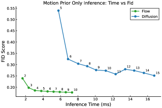
*Figure 2:Motion-prior-only inference Pareto comparison between diffusion and flow variants, illustrating the trade-off between inference time and generation quality.*

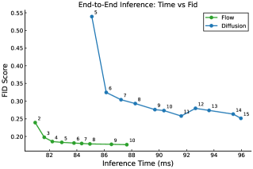
*Figure 3:End to end Pareto comparison between diffusion and flow variants, illustrating the trade-off between end-to-end inference time and generation quality.*

*Figure 4:Validation metrics across training epochs for diffusion- and flow-based variants. We report FID, Matching Score, and R-Precision (R@3). Faded curves indicate raw validation measurements, while solid curves show exponential moving averages computed with a span of five epochs to highlight overall training trends.*

---
**Usage Info**: 4165 tokens used.
**Generated at**: 2026-03-31 12:59:07

---

# 📚 Advancing Multi-Instrument Music Transcription: Results from the 2025 AMT Challenge

🚀 URL: https://arxiv.org/html/2603.27528

## 🌏 Abstract (원문)
This paper presents the results of the 2025 Automatic Music Transcription (AMT) Challenge, an online competition to benchmark progress in multi-instrument transcription. Eight teams submitted valid solutions; two outperformed the baseline MT3 model. The results highlight both advances in transcription accuracy and the remaining difficulties in handling polyphony and timbre variation. We conclude with directions for future challenges: broader genre coverage and stronger emphasis on instrument detection.
## 🌏 Abstract (번역)
본 논문은 다중 악기 전사(transcription) 분야의 발전을 측정하기 위한 온라인 대회인 2025년 자동 음악 전사(AMT) 챌린지의 결과를 제시합니다. 여덟 팀이 유효한 솔루션을 제출했으며, 그 중 두 팀은 기준선인 MT3 모델을 능가했습니다. 이 결과는 전사 정확도의 발전과 함께 다성음악 및 음색 변화 처리의 남아있는 어려움을 모두 강조합니다. 우리는 향후 챌린지를 위한 방향으로 더 넓은 장르 범위와 악기 감지에 대한 더 강력한 강조를 제안하며 결론을 맺습니다.

## 🔍 Methods & Results
- 표준화되고 재현 가능한 벤치마크를 위해, 기호 음악에서 음향 신호로, 그리고 다시 기호 평가로의 전환을 자동화하는 클라우드 기반 평가 파이프라인을 개발했습니다.
- 평가 파이프라인은 원본 MIDI 악보를 MP3 오디오로 렌더링하고, 참가자 모델이 생성한 추정 MIDI 파일을 참조 정답과 비교하여 점수를 매깁니다.
- 평가 지표에는 정밀도(precision), 재현율(recall), F1 점수, 그리고 오버랩 비율(overlap ratio)이 포함됩니다.
- 다중 악기 음표 시작 F1(Multi Onset F1)은 악기/프로그램, 피치, 시작 시간(±50ms)이 참조와 일치할 때만 정확한 것으로 간주되며, 악기별로 매크로 평균을 냅니다.
- 오버랩은 음표의 시작과 끝 타이밍을 사용하여 전사 결과와 정답 간의 교집합-합집합 비율(intersection over union)로 계산됩니다.
- F1 점수 계산 예시를 통해, 정확한 음표, 누락된 음표(오탐), 잘못 예측된 음표(위양성)가 F1 점수에 어떻게 영향을 미치는지 상세히 설명했습니다.
- 챌린지에는 5명의 전문 작곡가가 작곡한 76개의 새로운 곡으로 구성된 평가 데이터셋이 사용되었으며, 현대 무조 음악과 바순, 비올라와 같은 희귀 악기가 처음으로 포함되었습니다.
- 평가 데이터셋은 템포(60-90 BPM), 박자(3/4, 4/4, 6/8), 최대 리듬 세분화(16분음표), 피치 범위(C2-C7), 다이내믹 표시(피아니시모-포르티시모) 등 특정 제약 조건을 가졌습니다.
- 허용되는 악기는 8가지(피아노, 바이올린, 비올라, 첼로, 플루트, 바순, 트롬본, 오보에)로 제한되었고, 한 곡당 최대 3개의 악기, 그리고 최대 1개의 현악기만 허용되었습니다.
- 이러한 제약 조건은 음악적 사실성(다성음악, 다이내믹, 악기 다양성)과 평가 명확성 사이의 균형을 맞추고, 참가자들의 과제를 단순화하며, 모델 점수가 충분히 높게 유지되도록 선택되었습니다.

## 🖼 Figures

*Figure 1:Excerpts of the sample music available to the participants.*

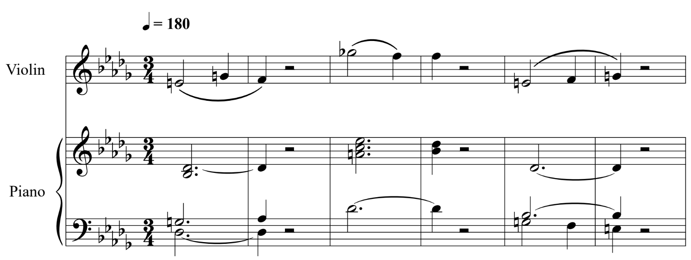
*Figure 2*

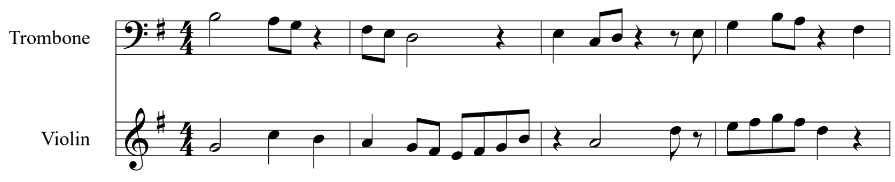
*Figure 3*

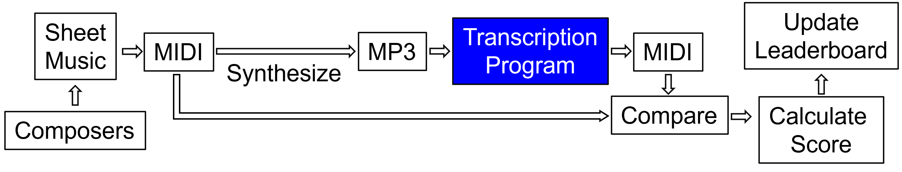
*Figure 2:End-to-end data flow of the transcription challenge.*

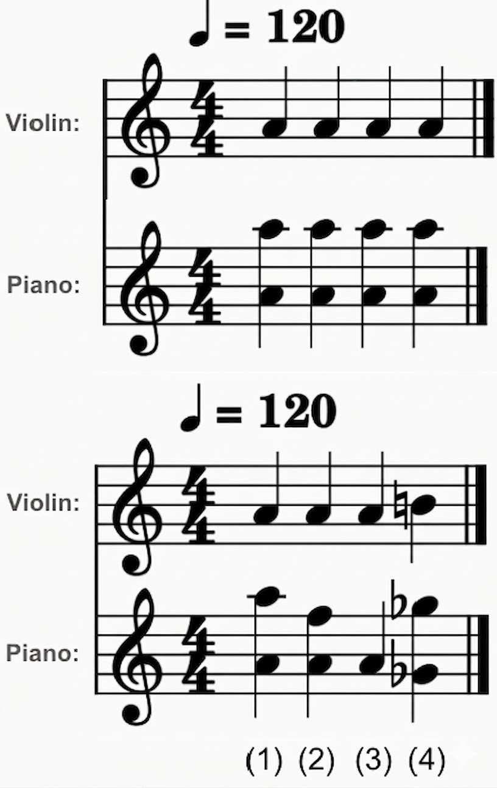
*Figure 3:Evaluation Method. Top: Reference. Bottom: Estimated notes.*

---
**Usage Info**: 2516 tokens used.
**Generated at**: 2026-03-31 12:59:14

---

# 📚 EFlow: Fast Few-Step Video Generator Training from Scratch via Efficient Solution Flow

🚀 URL: https://arxiv.org/html/2603.27086

## 🌏 Abstract (원문)
Scaling video diffusion transformers is fundamentally bottlenecked by two compounding costs: the expensive quadratic complexity of attention per step, and the iterative sampling steps. In this work, we proposeEFlow, a efficient few-step training framework, that tackles these bottlenecks simultaneously. To reduce sampling steps, we build on a solution-flow objective that learns a function mapping a noised state at timettto timess. Making this formulation computationally feasible and high-quality at video scale, however, demands two complementary innovations. First, we proposeGated Local–Global Attention, a token-droppable hybrid block which is efficient, expressive, and remains highly stable under aggressive random token-dropping, substantially reducing per-step compute. Second, we develop an efficient few-step training recipe. We proposePath-Drop Guidedtraining to replace the expensive guidance target with a computationally cheap, weak path. Furthermore, we augment this with aMean-Velocity Additivityregularizer to ensure high fidelity at extremely low step counts. Together, ourEFlowenables a practical from-scratch training pipeline, achieving up to2.5×2.5\timeshigher training throughput over standard solution-flow, and45.3×45.3\timeslower inference latency than standard iterative models with competitive performance on Kinetics and large-scale text-to-video datasets.
## 🌏 Abstract (번역)
비디오 확산 트랜스포머의 스케일링은 두 가지 복합적인 비용으로 인해 근본적으로 병목 현상을 겪습니다: 단계별 어텐션의 비싼 이차 복잡성과 반복적인 샘플링 단계입니다. 본 연구에서는 이러한 병목 현상을 동시에 해결하는 효율적인 소수 단계 학습 프레임워크인 EFlow를 제안합니다. 샘플링 단계를 줄이기 위해, 우리는 시간 t의 노이즈 상태를 시간 s로 매핑하는 함수를 학습하는 솔루션-플로우 목표를 기반으로 합니다. 그러나 이 공식을 비디오 스케일에서 계산적으로 실현 가능하고 고품질로 만들기 위해서는 두 가지 보완적인 혁신이 필요합니다. 첫째, 우리는 효율적이고 표현력이 뛰어나며 공격적인 무작위 토큰 드롭핑에도 매우 안정적으로 유지되어 단계별 계산을 크게 줄이는 토큰 드롭 가능 하이브리드 블록인 Gated Local–Global Attention을 제안합니다. 둘째, 우리는 효율적인 소수 단계 학습 레시피를 개발합니다. 우리는 비싼 가이던스 목표를 계산적으로 저렴하고 약한 경로로 대체하기 위한 Path-Drop Guided 학습을 제안합니다. 또한, 우리는 매우 낮은 단계 수에서도 높은 충실도를 보장하기 위해 Mean-Velocity Additivity 정규화 장치를 추가합니다. 이 모든 것을 통해 EFlow는 실용적인 처음부터 시작하는 학습 파이프라인을 가능하게 하며, 표준 솔루션-플로우보다 최대 2.5배 높은 학습 처리량을 달성하고, 표준 반복 모델보다 45.3배 낮은 추론 지연 시간을 달성하면서 Kinetics 및 대규모 텍스트-비디오 데이터셋에서 경쟁력 있는 성능을 보입니다.

## 🔍 Methods & Results
- EFlow는 비디오 확산 트랜스포머의 어텐션 복잡성과 반복적인 샘플링 단계 병목 현상을 해결하기 위한 효율적인 소수 단계 학습 프레임워크를 제안한다.
- 샘플링 단계 감소를 위해, 시간 t의 노이즈 상태를 시간 s로 매핑하는 함수를 학습하는 솔루션-플로우 목표를 기반으로 한다.
- Gated Local–Global Attention을 도입하여 토큰 드롭이 가능한 하이브리드 블록으로, 효율성, 표현력, 그리고 공격적인 무작위 토큰 드롭핑 하에서도 높은 안정성을 제공하여 단계별 계산을 크게 줄인다.
- 효율적인 소수 단계 학습 레시피를 개발했으며, 여기에는 비싼 가이던스 목표를 저렴한 약한 경로로 대체하는 Path-Drop Guided 학습이 포함된다.
- 매우 낮은 단계 수에서도 높은 충실도를 보장하기 위해 Mean-Velocity Additivity 정규화 장치를 추가한다.
- EFlow는 표준 솔루션-플로우 대비 최대 2.5배 높은 학습 처리량을 달성한다.
- EFlow는 표준 반복 모델 대비 45.3배 낮은 추론 지연 시간을 달성하며, Kinetics 및 대규모 텍스트-비디오 데이터셋에서 경쟁력 있는 성능을 보인다.

## 🖼 Figures
![Figure 2:(a) Feed-forward latency vs. token number for different attention designs. Softmax attention (Wan 2.1) scales poorly as the sequence length grows while our GLGA (EFlow) is significantly faster than softmax and remains competitive with sparse/linear baselines. Applying 75% token dropping on GLGA yields the lowest latency and the most favorable scaling. (b) 480p inference latency for our model and recent video generators. Our model achieves 1.4
×
 and 45.3
×
 faster diffusion inference over baselines by combining an efficient backbone with few-step sampling.](../images/2026-03-31/2603.27086/2603.27086_fig1.png)
*Figure 2:(a) Feed-forward latency vs. token number for different attention designs. Softmax attention (Wan 2.1) scales poorly as the sequence length grows while our GLGA (EFlow) is significantly faster than softmax and remains competitive with sparse/linear baselines. Applying 75% token dropping on GLGA yields the lowest latency and the most favorable scaling. (b) 480p inference latency for our model and recent video generators. Our model achieves 1.4
×
 and 45.3
×
 faster diffusion inference over baselines by combining an efficient backbone with few-step sampling.*

![Figure 3:Overview of our VideoDiT architecture. (a) The network processes video tokens through stacked DiT blocks, utilizing long skip connections to stabilize information flow when tokens are aggressively dropped. (b) Given a DiT block with Gated Local–Global Attention (GLGA) module, input tokens are projected into shared queries, keys, and values. These features are processed by two parallel mechanisms: a linear attention branch for efficient global context and a sliding-window attention branch for expressive local detail. Finally, an input-aware gating (
𝑔
) adaptively fuses the global (
𝑂
global
) and local (
𝑂
local
) outputs on per-token basis.](../images/2026-03-31/2603.27086/2603.27086_fig2.png)
*Figure 3:Overview of our VideoDiT architecture. (a) The network processes video tokens through stacked DiT blocks, utilizing long skip connections to stabilize information flow when tokens are aggressively dropped. (b) Given a DiT block with Gated Local–Global Attention (GLGA) module, input tokens are projected into shared queries, keys, and values. These features are processed by two parallel mechanisms: a linear attention branch for efficient global context and a sliding-window attention branch for expressive local detail. Finally, an input-aware gating (
𝑔
) adaptively fuses the global (
𝑂
global
) and local (
𝑂
local
) outputs on per-token basis.*

![Figure 4:End-to-end efficiency gains from our framework. (a) Training efficiency measured as throughput (iterations/sec). Relative to the standard flow-matching baseline, introducing the solution-flow (SoFlow) objective and the MVA regularizer increases per-iteration overhead and therefore reduces throughput. In contrast, our efficient backbone, PDG training, and token dropping provide consistent speedups, improving throughput by up to 
1.6
×
 and 
2.5
×
 over the baselines. (b) Inference efficiency. Our overall framework substantially reduces end-to-end inference time relative to the softmax+flow-matching baseline (
147
→
10.09
s).](../images/2026-03-31/2603.27086/2603.27086_fig3.png)
*Figure 4:End-to-end efficiency gains from our framework. (a) Training efficiency measured as throughput (iterations/sec). Relative to the standard flow-matching baseline, introducing the solution-flow (SoFlow) objective and the MVA regularizer increases per-iteration overhead and therefore reduces throughput. In contrast, our efficient backbone, PDG training, and token dropping provide consistent speedups, improving throughput by up to 
1.6
×
 and 
2.5
×
 over the baselines. (b) Inference efficiency. Our overall framework substantially reduces end-to-end inference time relative to the softmax+flow-matching baseline (
147
→
10.09
s).*

*Figure 5:Systemic comparison on Kinetics 700. (a) Training loss vs. iterations comparing the softmax-attention baseline, Sana-Video attention, and our GLGA module. (b) FVD vs. training compute across various model scales for softmax, Sana-Video attention, sparse-linear attention (SLA), and GLGA. GLGA consistently achieves lower loss and lower FVD at matched compute, and its advantage persists as model scale increases; SLA become unstable and diverge under the same training setup.*

*Figure 6:Qualitative comparison on Kinetics-700 on 400K training iterations. Our complete framework (Ours+PDG-SFM) successfully generates highly detailed, temporally consistent videos in only 4 inference steps. In contrast, baselines trained with standard Flow Matching (FM)—including standard softmax, and Sana-video’s attention—struggle to resolve vivid details and exhibit severe blurring or structural distortion despite using 50 steps.*

*Figure 7:Training loss over 400K iterations. Our EFlow (red) converges rapidly and remains stable throughout training. In contrast, the Video Sparse Attention (VSA) baseline (blue) exhibits pronounced optimization instability, with frequent loss spikes early in training and reduced convergence reliability under the same setup. These results suggest that VSA is more sensitive to training configurations, whereas EFlow trains robustly without specialized stabilization or hyperparameter tuning.*

*Figure 8:Visual ablation of token-drop training. We compare models trained (a) entirely on dense grids without token dropping, and (b) utilizing our aggressive 75% token-dropping framework. Despite the massive reduction in training compute, the model trained with token dropping rigorously preserves spatial fidelity, fine-grained details, and overall temporal consistency, demonstrating that our sparse training recipe does not degrade generative quality.*

*Figure 9:Visual ablation of Mean-Velocity Additivity (MVA). Both examples use 4-step sampling. (a) Without MVA, integration errors accumulate across steps, leading to distortion, motion blur, and structural collapse. (b) With MVA, enforcing global semigroup consistency improves sharp structure, consistent subject identity and motion.*

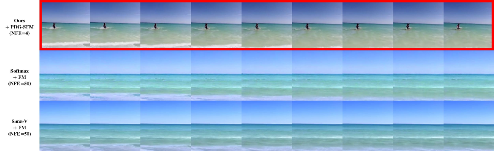
*Figure 10:Qualitative comparison on Kinetics-700 on 400K training iterations.*

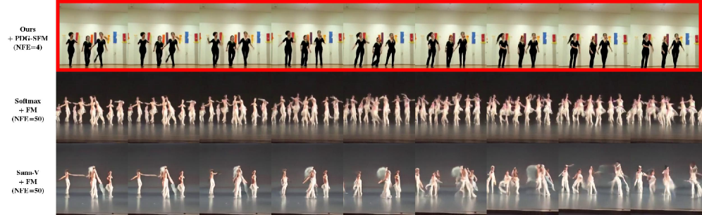
*Figure 11:Qualitative comparison on Kinetics-700 on 400K training iterations.*

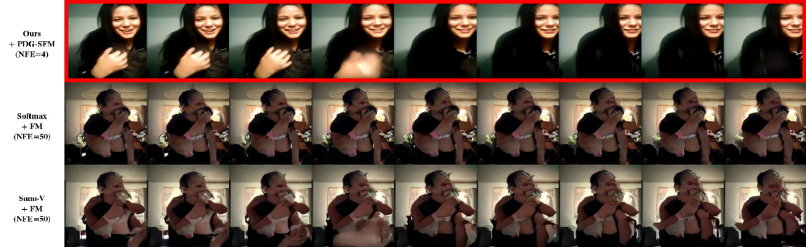
*Figure 12:Qualitative comparison on Kinetics-700 on 400K training iterations.*

![Figure 13:Qualitative comparison on 480p text-to-video. Left column prompt: In the video, a man is seen in a kitchen, preparing food. He is wearing a white shirt and is focused on his task. The man is holding a large metal bowl filled with what appears to be a mixture of ingredients, possibly a salad or a mixture for a dish. He is using a spoon to mix the contents of the bowl, ensuring that everything is well combined. Right column prompt: In the video, a man is standing on a sandy beach, wearing a black hoodie and sunglasses. He is speaking to the camera, gesturing towards a white Chevrolet truck parked in front of a house. The truck is parked on a concrete driveway, and the house has a white exterior with a wooden deck and stairs leading up to the front door. The sky is clear and blue, indicating a sunny day. The man appears to be enjoying his time at the beach, and the truck is parked in a way that suggests it is ready for a road trip.](../images/2026-03-31/2603.27086/2603.27086_fig14.png)
*Figure 13:Qualitative comparison on 480p text-to-video. Left column prompt: In the video, a man is seen in a kitchen, preparing food. He is wearing a white shirt and is focused on his task. The man is holding a large metal bowl filled with what appears to be a mixture of ingredients, possibly a salad or a mixture for a dish. He is using a spoon to mix the contents of the bowl, ensuring that everything is well combined. Right column prompt: In the video, a man is standing on a sandy beach, wearing a black hoodie and sunglasses. He is speaking to the camera, gesturing towards a white Chevrolet truck parked in front of a house. The truck is parked on a concrete driveway, and the house has a white exterior with a wooden deck and stairs leading up to the front door. The sky is clear and blue, indicating a sunny day. The man appears to be enjoying his time at the beach, and the truck is parked in a way that suggests it is ready for a road trip.*

![Figure 14:Qualitative comparison on 480p text-to-video. Left column prompt: "The video captures a thrilling mountain biking experience in a dense forest. The perspective is from the rider’s point of view, providing an immersive experience of the journey. The rider is seen maneuvering through a narrow, winding trail covered with fallen leaves and twigs, indicating a fall season setting. The trail is surrounded by tall trees with green foliage, creating a canopy overhead. The rider’s hands are firmly gripping the handlebars, guiding the bike through the uneven terrain." Right column prompt: "The video captures a serene and picturesque scene of a small waterfall nestled within a lush, green forest. The waterfall cascades down a rocky ledge, surrounded by a variety of vibrant green plants and foliage. The water flows smoothly, creating a gentle, soothing sound that adds to the tranquil atmosphere. The surrounding vegetation includes large, broad leaves and smaller, delicate plants, creating a dense and verdant environment."](../images/2026-03-31/2603.27086/2603.27086_fig15.png)
*Figure 14:Qualitative comparison on 480p text-to-video. Left column prompt: "The video captures a thrilling mountain biking experience in a dense forest. The perspective is from the rider’s point of view, providing an immersive experience of the journey. The rider is seen maneuvering through a narrow, winding trail covered with fallen leaves and twigs, indicating a fall season setting. The trail is surrounded by tall trees with green foliage, creating a canopy overhead. The rider’s hands are firmly gripping the handlebars, guiding the bike through the uneven terrain." Right column prompt: "The video captures a serene and picturesque scene of a small waterfall nestled within a lush, green forest. The waterfall cascades down a rocky ledge, surrounded by a variety of vibrant green plants and foliage. The water flows smoothly, creating a gentle, soothing sound that adds to the tranquil atmosphere. The surrounding vegetation includes large, broad leaves and smaller, delicate plants, creating a dense and verdant environment."*

![Figure 15:Qualitative comparison on 480p text-to-video. Prompt: CG game concept digital art, a person sitting at a wooden table, focused intently on a sketchbook. They are wearing comfortable casual clothes, such as a plain t-shirt and jeans. The person has short, messy brown hair and a gentle smile, holding a pencil in their hand. The sketchbook contains detailed drawings of various creatures, including dragons, mythical beasts, and futuristic machines. Soft lighting casts shadows on the walls behind them, creating a cozy atmosphere. The person is drawing with a calm and deliberate pace, occasionally pausing to consult reference materials.](../images/2026-03-31/2603.27086/2603.27086_fig16.png)
*Figure 15:Qualitative comparison on 480p text-to-video. Prompt: CG game concept digital art, a person sitting at a wooden table, focused intently on a sketchbook. They are wearing comfortable casual clothes, such as a plain t-shirt and jeans. The person has short, messy brown hair and a gentle smile, holding a pencil in their hand. The sketchbook contains detailed drawings of various creatures, including dragons, mythical beasts, and futuristic machines. Soft lighting casts shadows on the walls behind them, creating a cozy atmosphere. The person is drawing with a calm and deliberate pace, occasionally pausing to consult reference materials.*

---
**Usage Info**: 1743 tokens used.
**Generated at**: 2026-03-31 12:59:27

---

# 📚 Two-Stage Acoustic Adaptation with Gated Cross-Attention Adapters for LLM-Based Multi-Talker Speech Recognition

🚀 URL: https://arxiv.org/html/2603.27205

## 🌏 Abstract (원문)
Large Language Models (LLMs) are strong decoders for Serialized Output Training (SOT) in two-talker Automatic Speech Recognition (ASR), yet their performance degrades substantially in challenging conditions such as three-talker mixtures. A key limitation is that current systems inject acoustic evidence only through a projected prefix, which can be lossy and imperfectly aligned with the LLM input space, providing insufficient fine-grained grounding during decoding. Addressing this limitation is crucial for robust multi-talker ASR, especially in three-talker mixtures. This paper improves LLM-based multi-talker ASR by explicitly injecting talker-aware acoustic evidence into the decoder. We first revisit Connectionist Temporal Classification (CTC)-derived prefix prompting and compare three variants with increasing acoustic content. The CTC information is obtained using the serialized CTC proposed in our previous works. While acoustic-enriched prompts outperform the SOT-only baseline, prefix-only conditioning remains inadequate for three-talker mixtures. We therefore propose a lightweight gated residual cross-attention adapter and design two-stage acoustic adaptation framework based on low-rank updates (LoRA). In Stage
1, we insert gated cross-attention adapters after the self-attention sub-layer to stably inject acoustic embeddings as external memory. In Stage
2, we refine both the cross-attention adapters and the pretrained LLM’s self-attention projections using parameter-efficient LoRA, improving robustness for large backbones under limited data; the learned updates are merged into the base weights for inference. Experiments on Libri2Mix/Libri3Mix under clean and noisy conditions show consistent gains, with particularly large improvements in three-talker settings.
## 🌏 Abstract (번역)
대규모 언어 모델(LLM)은 두 화자 자동 음성 인식(ASR)의 직렬화된 출력 훈련(SOT)에서 강력한 디코더이지만, 세 화자 혼합과 같은 어려운 조건에서는 성능이 크게 저하됩니다. 주요 한계점은 현재 시스템이 투영된 접두사를 통해서만 음향 증거를 주입하는데, 이는 손실이 발생하고 LLM 입력 공간과 완벽하게 정렬되지 않아 디코딩 중 충분한 미세한 접지를 제공하지 못한다는 것입니다. 이 한계점을 해결하는 것은 특히 세 화자 혼합에서 강력한 다중 화자 ASR에 중요합니다. 본 논문은 화자 인식 음향 증거를 디코더에 명시적으로 주입하여 LLM 기반 다중 화자 ASR을 개선합니다. 우리는 먼저 CTC(Connectionist Temporal Classification) 기반 접두사 프롬프팅을 재검토하고 음향 콘텐츠가 증가하는 세 가지 변형을 비교합니다. CTC 정보는 이전 연구에서 제안된 직렬화된 CTC를 사용하여 얻습니다. 음향 강화 프롬프트가 SOT 전용 기준선보다 우수하지만, 접두사 전용 조건화는 세 화자 혼합에는 여전히 부적절합니다. 따라서 우리는 경량 게이트 잔차 교차 어텐션 어댑터를 제안하고 저랭크 업데이트(LoRA) 기반의 2단계 음향 적응 프레임워크를 설계합니다. 1단계에서는 자체 어텐션 하위 계층 뒤에 게이트 교차 어텐션 어댑터를 삽입하여 음향 임베딩을 외부 메모리로 안정적으로 주입합니다. 2단계에서는 매개변수 효율적인 LoRA를 사용하여 교차 어텐션 어댑터와 사전 훈련된 LLM의 자체 어텐션 투영을 모두 개선하여 제한된 데이터에서 대규모 백본의 견고성을 향상시킵니다. 학습된 업데이트는 추론을 위해 기본 가중치에 병합됩니다. 깨끗하고 노이즈가 있는 조건의 Libri2Mix/Libri3Mix에 대한 실험은 일관된 성능 향상을 보여주며, 특히 세 화자 설정에서 큰 개선을 보였습니다.

## 🔍 Methods & Results
- 기존 LLM 기반 다중 화자 ASR 시스템은 투영된 접두사를 통한 음향 증거 주입 방식의 한계로 인해 세 화자 혼합과 같은 어려운 조건에서 성능이 크게 저하되는 문제를 겪습니다.
- 이 문제를 해결하기 위해, 디코더에 화자 인식 음향 증거를 명시적으로 주입하는 방법을 제안합니다.
- 첫 번째 접근으로, CTC(Connectionist Temporal Classification) 기반 접두사 프롬프팅을 재검토하고 음향 콘텐츠가 증가하는 세 가지 변형을 비교했습니다. CTC 정보는 직렬화된 CTC를 사용하여 얻었습니다.
- 음향 강화 프롬프트가 SOT(Serialized Output Training) 전용 기준선보다 우수했지만, 접두사 전용 조건화만으로는 세 화자 혼합에 여전히 부적절하다는 것을 확인했습니다.
- 이를 개선하기 위해 경량 게이트 잔차 교차 어텐션 어댑터와 저랭크 업데이트(LoRA) 기반의 2단계 음향 적응 프레임워크를 제안했습니다.
- 1단계에서는 자체 어텐션 하위 계층 뒤에 게이트 교차 어텐션 어댑터를 삽입하여 음향 임베딩을 외부 메모리로 안정적으로 주입합니다.
- 2단계에서는 매개변수 효율적인 LoRA를 사용하여 교차 어텐션 어댑터와 사전 훈련된 LLM의 자체 어텐션 투영을 모두 개선하여 제한된 데이터에서 대규모 백본의 견고성을 향상시켰습니다. 학습된 업데이트는 추론을 위해 기본 가중치에 병합됩니다.
- Libri2Mix/Libri3Mix 데이터셋의 깨끗하고 노이즈가 있는 조건에서 수행된 실험 결과, 제안된 방법이 일관된 성능 향상을 보였으며, 특히 세 화자 설정에서 상당한 개선을 달성했습니다.

## 🖼 Figures
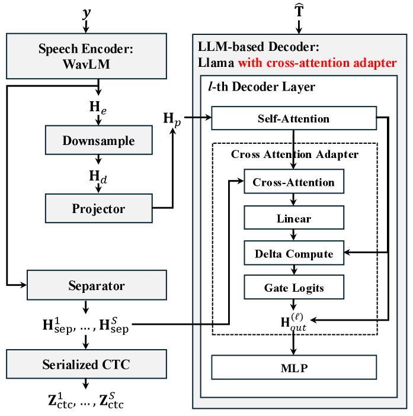
*Figure 1:Final model architecture. Projected acoustic embeddings are provided as external memory and injected into the LLM decoder via the proposed cross-attention adapter.*

*Figure 2:Overview and motivation of the proposed two-stage adaptation. Stage 0 adapts the LLM decoder with self-attention LoRA (baseline). Stage 1 introduces a gated residual cross-attention adapter to inject talker-aware acoustic evidence. Stage 2 refines the cross-attention adapters and self-attention with LoRA to improve robustness and reduce hyperparameter sensitivity under large backbones and limited data.*

---
**Usage Info**: 2212 tokens used.
**Generated at**: 2026-03-31 12:59:35

---

