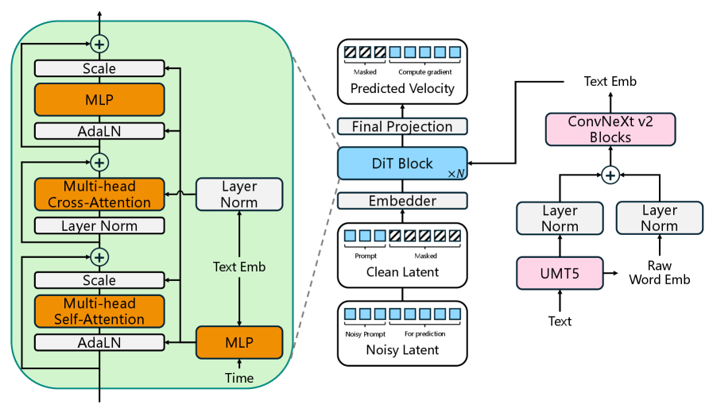
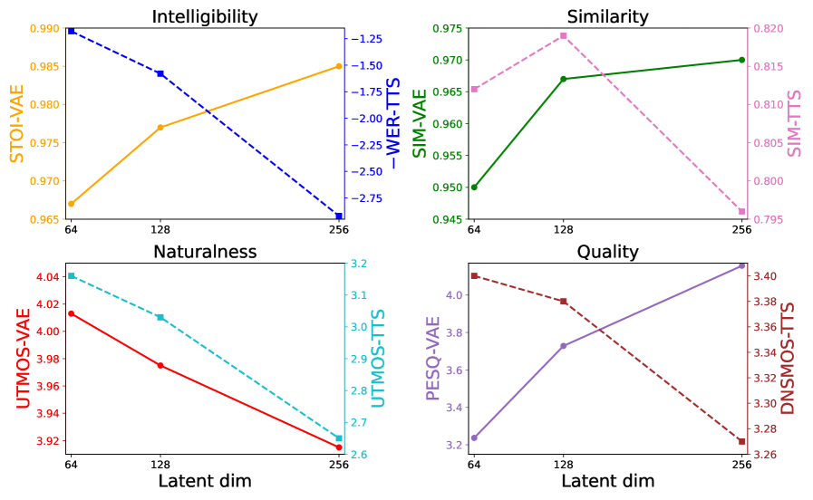
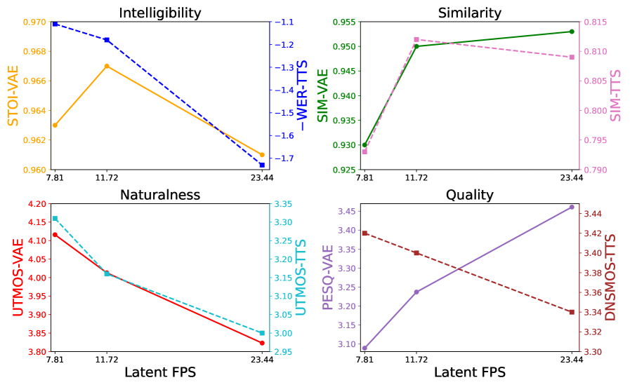
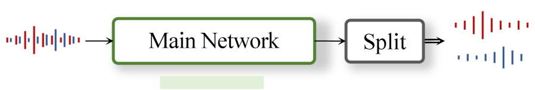
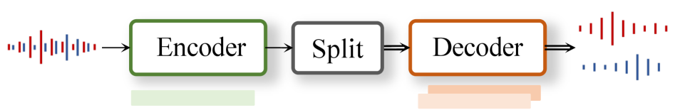
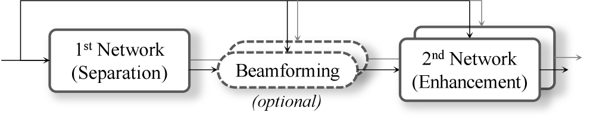
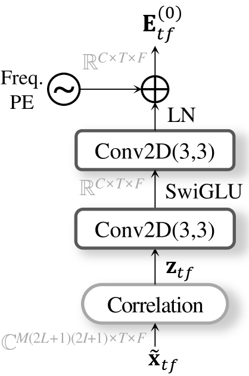
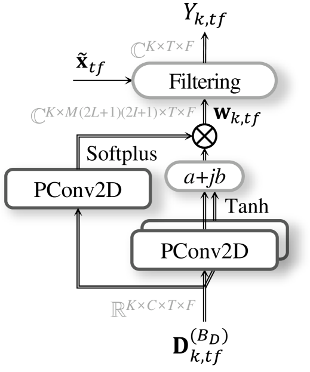
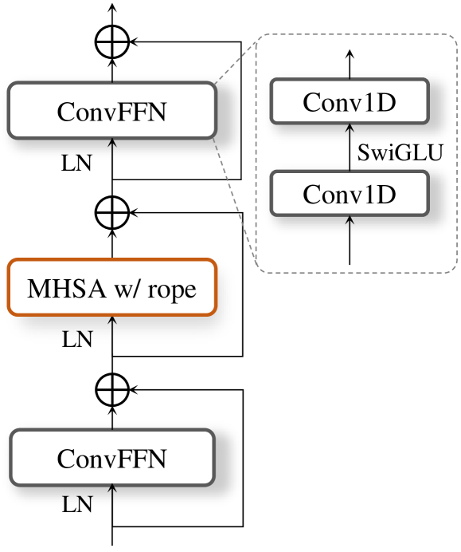
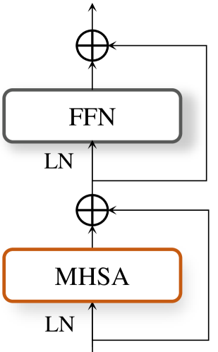

# 🚩 (2026-04-01) Scholar Inbox 추천 논문 

# 📚 LongCat-AudioDiT: High-Fidelity Diffusion Text-to-Speech in the Waveform Latent Space

🚀 URL: https://arxiv.org/html/2603.29339

## 🌏 Abstract (원문)
We present LongCat-AudioDiT, a novel, non-autoregressive diffusion-based text-to-speech (TTS) model that achieves state-of-the-art (SOTA) performance. Unlike previous methods that rely on intermediate acoustic representations such as mel-spectrograms, the core innovation of LongCat-AudioDiT lies in operating directly within the waveform latent space. This approach effectively mitigates compounding errors and drastically simplifies the TTS pipeline, requiring only a waveform variational autoencoder (Wav-VAE) and a diffusion backbone. Furthermore, we introduce two critical improvements to the inference process: first, we identify and rectify a long-standing training-inference mismatch; second, we replace traditional classifier-free guidance with adaptive projection guidance to elevate generation quality. Experimental results demonstrate that, despite the absence of complex multi-stage training pipelines or high-quality human-annotated datasets, LongCat-AudioDiT achieves SOTA zero-shot voice cloning performance on the Seed benchmark while maintaining competitive intelligibility. Specifically, our largest variant, LongCat-AudioDiT-3.5B, outperforms the previous SOTA model (Seed-TTS), improving the speaker similarity (SIM) scores from 0.809 to 0.818 on Seed-ZH, and from 0.776 to 0.797 on Seed-Hard. Finally, through comprehensive ablation studies and systematic analysis, we validate the effectiveness of our proposed modules. Notably, we investigate the interplay between the Wav-VAE and the TTS backbone, revealing the counterintuitive finding that superior reconstruction fidelity in the Wav-VAE does not necessarily lead to better overall TTS performance. Code and model weights are released to foster further research within the speech community.Github:https://github.com/meituan-longcat/LongCat-AudioDiTHuggingFace:https://huggingface.co/meituan-longcat/LongCat-AudioDiT-3.5Bhttps://huggingface.co/meituan-longcat/LongCat-AudioDiT-1B
## 🌏 Abstract (번역)
본 논문은 최첨단(SOTA) 성능을 달성하는 새로운 비자기회귀 확산 기반 텍스트-음성 변환(TTS) 모델인 LongCat-AudioDiT를 소개합니다. 멜 스펙트로그램과 같은 중간 음향 표현에 의존하는 이전 방법과 달리, LongCat-AudioDiT의 핵심 혁신은 파형 잠재 공간 내에서 직접 작동하는 데 있습니다. 이 접근 방식은 복합 오류를 효과적으로 완화하고 TTS 파이프라인을 파형 변이형 오토인코더(Wav-VAE)와 확산 백본만 필요하도록 대폭 단순화합니다. 또한, 추론 과정에 두 가지 중요한 개선 사항을 도입했습니다. 첫째, 오랫동안 지속되어 온 훈련-추론 불일치를 식별하고 수정했습니다. 둘째, 기존의 분류기 없는 안내(classifier-free guidance)를 적응형 투영 안내(adaptive projection guidance)로 대체하여 생성 품질을 향상시켰습니다. 실험 결과는 복잡한 다단계 훈련 파이프라인이나 고품질의 인간 주석 데이터셋이 없음에도 불구하고, LongCat-AudioDiT가 Seed 벤치마크에서 SOTA 제로샷 음성 복제 성능을 달성하면서 경쟁력 있는 명료도를 유지함을 보여줍니다. 특히, 가장 큰 변형인 LongCat-AudioDiT-3.5B는 이전 SOTA 모델(Seed-TTS)을 능가하여 Seed-ZH에서 화자 유사성(SIM) 점수를 0.809에서 0.818로, Seed-Hard에서 0.776에서 0.797로 향상시켰습니다. 마지막으로, 포괄적인 제거 연구(ablation studies)와 체계적인 분석을 통해 제안된 모듈의 효과를 검증했습니다. 특히, Wav-VAE와 TTS 백본 간의 상호 작용을 조사한 결과, Wav-VAE의 우수한 재구성 충실도가 반드시 더 나은 전반적인 TTS 성능으로 이어지지 않는다는 직관에 반하는 사실을 밝혀냈습니다. 음성 커뮤니티의 추가 연구를 장려하기 위해 코드와 모델 가중치가 공개되었습니다.

## 🔍 Methods & Results
- LongCat-AudioDiT는 멜 스펙트로그램과 같은 중간 음향 표현 대신 파형 잠재 공간에서 직접 작동하여 복합 오류를 완화하고 TTS 파이프라인을 Wav-VAE와 확산 백본으로 단순화하는 새로운 비자기회귀 확산 기반 TTS 모델을 제안합니다.
- 추론 과정에서 훈련-추론 불일치를 식별하고 수정했으며, 기존의 분류기 없는 안내를 적응형 투영 안내로 대체하여 생성 품질을 향상시켰습니다.
- 복잡한 다단계 훈련 파이프라인이나 고품질 인간 주석 데이터셋 없이도 Seed 벤치마크에서 SOTA 제로샷 음성 복제 성능을 달성하고 경쟁력 있는 명료도를 유지합니다.
- 가장 큰 변형인 LongCat-AudioDiT-3.5B는 Seed-ZH에서 화자 유사성(SIM) 점수를 0.809에서 0.818로, Seed-Hard에서 0.776에서 0.797로 향상시키며 이전 SOTA 모델(Seed-TTS)을 능가했습니다.
- 제거 연구를 통해 제안된 모듈의 효과를 검증했으며, Wav-VAE의 우수한 재구성 충실도가 반드시 더 나은 전반적인 TTS 성능으로 이어지지 않는다는 직관에 반하는 결과를 발견했습니다.

## 🖼 Figures

*Figure 1:Overview of LongCat-AudioDiT. Our architecture generates continuous waveform latents directly, thereby avoiding the compounding errors that inherently arise when predicting and subsequently converting intermediate representations (e.g., mel-spectrograms) into waveforms.*

*Figure 2:Architecture of LongCat-AudioDiT. Middle: The overall architecture. Left: Detailed structure of the DiT block. Right: Detailed structure of the text encoder.*

*Figure 3:Objective evaluation results for both Wav-VAE reconstruction and TTS synthesis under varying latent dimensions. For ease of reading, we negate WER-TTS.*

*Figure 4:Objective evaluation results for both Wav-VAE reconstruction and TTS synthesis across varying latent frame rates (FPS). For ease of reading, we negate WER-TTS.*

---
**Usage Info**: 2188 tokens used.
**Generated at**: 2026-04-01 12:59:57

---

# 📚 Asymmetric Encoder-Decoder Based on Time-Frequency Correlation for Speech Separation

🚀 URL: https://arxiv.org/html/2603.29097

## 🌏 Abstract (원문)
Speech separation in realistic acoustic environments remains challenging because overlapping speakers, background noise, and reverberation must be resolved simultaneously. Although recent time–frequency (TF) domain models have shown strong performance, most still rely on late-split architectures, where speaker disentanglement is deferred to the final stage, creating an information bottleneck and weakening discriminability under adverse conditions. To address this issue, we propose SR-CorrNet, an asymmetric encoder–decoder framework that introduces the separation-reconstruction (SepRe) strategy into a TF dual-path backbone. The encoder performs coarse separation from mixture observations, while the weight-shared decoder progressively reconstructs speaker-discriminative features with cross-speaker interaction, enabling stage-wise refinement. To complement this architecture, we formulate speech separation as a structured correlation-to-filter problem: spatio-spectro-temporal correlations computed from the observations are used as input features, and the corresponding deep filters are estimated to recover target signals. We further incorporate an attractor-based dynamic split module to adapt the number of output streams to the actual speaker configuration. Experimental results on WSJ0-2/3/4/5Mix, WHAMR!, and LibriCSS demonstrate consistent improvements across anechoic, noisy-reverberant, and real-recorded conditions in both single- and multi-channel settings, highlighting the effectiveness of TF-domain SepRe with correlation-based filter estimation for speech separation.
## 🌏 Abstract (번역)
현실적인 음향 환경에서의 음성 분리는 겹치는 화자, 배경 소음, 잔향을 동시에 해결해야 하므로 여전히 어렵습니다. 최근 시간-주파수(TF) 영역 모델들이 강력한 성능을 보여주었지만, 대부분은 화자 분리가 최종 단계로 미뤄지는 후기 분할(late-split) 아키텍처에 의존하여 정보 병목 현상을 일으키고 불리한 조건에서 식별 능력을 약화시킵니다. 이 문제를 해결하기 위해, 우리는 TF 듀얼-패스 백본에 분리-재구성(SepRe) 전략을 도입한 비대칭 인코더-디코더 프레임워크인 SR-CorrNet을 제안합니다. 인코더는 혼합 관측치로부터 대략적인 분리를 수행하고, 가중치 공유 디코더는 화자 간 상호작용을 통해 화자 식별 특징을 점진적으로 재구성하여 단계별 개선을 가능하게 합니다. 이 아키텍처를 보완하기 위해, 우리는 음성 분리를 구조화된 상관관계-필터 문제로 공식화합니다. 즉, 관측치로부터 계산된 공간-스펙트럼-시간 상관관계를 입력 특징으로 사용하고, 해당 딥 필터를 추정하여 목표 신호를 복구합니다. 우리는 또한 실제 화자 구성에 맞게 출력 스트림 수를 조정하기 위해 어트랙터 기반 동적 분할 모듈을 통합합니다. WSJ0-2/3/4/5Mix, WHAMR!, LibriCSS 데이터셋에 대한 실험 결과는 무향, 잡음-잔향, 실제 녹음 조건에서 단일 및 다중 채널 설정 모두에서 일관된 개선을 보여주었으며, 음성 분리를 위한 상관관계 기반 필터 추정을 사용한 TF 영역 SepRe의 효과를 강조합니다.

## 🔍 Methods & Results
- SR-CorrNet은 TF 듀얼-패스 백본에 분리-재구성(SepRe) 전략을 도입한 비대칭 인코더-디코더 프레임워크로, 기존 TF 모델의 정보 병목 현상 및 식별 능력 저하 문제를 해결합니다.
- 인코더는 혼합 관측치로부터 대략적인 분리를 수행하며, 가중치 공유 디코더는 화자 간 상호작용을 통해 화자 식별 특징을 점진적으로 재구성하여 단계별 개선을 가능하게 합니다.
- 음성 분리를 구조화된 상관관계-필터 문제로 공식화하여, 관측치로부터 계산된 공간-스펙트럼-시간 상관관계를 입력 특징으로 사용하고 해당 딥 필터를 추정하여 목표 신호를 복구합니다.
- 어트랙터 기반 동적 분할 모듈을 통합하여 실제 화자 구성에 맞게 출력 스트림 수를 자동으로 조정합니다.
- WSJ0-2/3/4/5Mix, WHAMR!, LibriCSS 데이터셋에서 무향, 잡음-잔향, 실제 녹음 조건 및 단일/다중 채널 설정 모두에서 일관된 성능 개선을 달성했습니다.
- 실험 결과는 상관관계 기반 필터 추정을 사용한 TF 영역 SepRe가 음성 분리에 효과적임을 입증합니다.

## 🖼 Figures

*(a)Late-split*

*(a)Late-split*

*(b)Early-split*

*Figure 2:Illustration of two-stage multi-channel separation structure.*

![Figure 3: Architecture of SR-CorrNet. The multi-channel multi-frame observation 
𝐱
~
𝑡
​
𝑓
∈
ℝ
2
​
𝐿
+
1
 is used for the computation of correlation and output filtering. From 
𝐱
~
𝑡
​
𝑓
, the Correlation module computes latent representation of correlations 
𝐄
𝑡
​
𝑓
(
0
)
∈
ℝ
𝐶
 as an input for TF-Encoder. Then, 
𝐵
𝐸
 stacks of TF-Encoder process the features to 
𝐄
𝑡
​
𝑓
(
𝐵
𝐸
)
 and split into speaker-specific features 
𝐃
𝑘
,
𝑡
​
𝑓
(
0
)
 for the TF-Decoder. In the TF-Decoder, the separated features are reconstructed 
𝐵
𝐷
 times and the reconstructed features 
𝐃
𝑘
,
𝑡
​
𝑓
(
𝐵
𝐷
)
 are used to predict final multi-channel multi-tap filter 
𝐰
𝑘
,
𝑡
​
𝑓
 for 
𝑌
𝑘
,
𝑡
​
𝑓
.](../images/2026-04-01/2603.29097/2603.29097_fig4.png)
*Figure 3: Architecture of SR-CorrNet. The multi-channel multi-frame observation 
𝐱
~
𝑡
​
𝑓
∈
ℝ
2
​
𝐿
+
1
 is used for the computation of correlation and output filtering. From 
𝐱
~
𝑡
​
𝑓
, the Correlation module computes latent representation of correlations 
𝐄
𝑡
​
𝑓
(
0
)
∈
ℝ
𝐶
 as an input for TF-Encoder. Then, 
𝐵
𝐸
 stacks of TF-Encoder process the features to 
𝐄
𝑡
​
𝑓
(
𝐵
𝐸
)
 and split into speaker-specific features 
𝐃
𝑘
,
𝑡
​
𝑓
(
0
)
 for the TF-Decoder. In the TF-Decoder, the separated features are reconstructed 
𝐵
𝐷
 times and the reconstructed features 
𝐃
𝑘
,
𝑡
​
𝑓
(
𝐵
𝐷
)
 are used to predict final multi-channel multi-tap filter 
𝐰
𝑘
,
𝑡
​
𝑓
 for 
𝑌
𝑘
,
𝑡
​
𝑓
.*

*(a)Correlation module*

*(a)Correlation module*

*(b)Filter module*

*(a)Time and frequency module*

*(a)Time and frequency module*

*(b)Speaker module*

*Figure 6: Block diagram of the attractor-based dynamic split module. The encoder feature is added to added 2-d positional embeddings and flattened, and provided as key-value input to the attractor decoder. The decoder consists of stacked Transformer decoder blocks with learnable query vectors 
𝐪
𝑘
. The attractors 
𝐚
𝑘
 are used to estimate speaker existence probabilities 
𝑝
𝑘
.*

*Figure 7:Illustration of CSS scheme. In our experiment, we set to chunk-size of 
𝑉
ℎ
=
1.2
​
𝑠
,
𝑉
=
0.8
​
𝑠
, and 
𝑉
𝑓
=
0.4
​
𝑠
, respectively.*

---
**Usage Info**: 3663 tokens used.
**Generated at**: 2026-04-01 13:00:13

---

# 📚 A Comprehensive Corpus of Biomechanically Constrained Piano Chords: Generation, Analysis, and Implications for Voicing and Psychoacoustics

🚀 URL: https://arxiv.org/html/2603.29710

## 🌏 Abstract (원문)
I present the generation and analysis of the largest known open-source corpus of playable piano chords (approximately 19.3 million entries). This dataset enumerates the two-handed search space subject to biomechanical constraints (two hands, each with 1.5 octave reach) to an unprecedented extent. To demonstrate the corpus’s utility, the relationship between voicing shape and psychoacoustic targets was modeled. Harmonicity proved intrinsic to pitch-class identity: voicing statistics added negligible variance (Δ​R2≈0.014%,p≈0.13). Conversely, voicing significantly predicted dissonance (Δ​R2≈6.75%,p≈0.0008). Crucially, skewness (β≈+0.145) was approximately 5.8×more effective than spread (β≈−0.025) at predicting roughness. The analysis challenges the pedagogical emphasis on “spread”: skewness is a stronger predictor of dissonance than spread. This suggests that clarity in “open voicings” is driven less by width than by negative skewness; achieving lower-register clearance by placing wide gaps at the bottom and allowing tighter clustering in the treble. The results demonstrate the corpus’s ability to enable future research, especially in areas such as generative modeling, voice-leading topology, and psychoacoustic analysis.
## 🌏 Abstract (번역)
본 논문은 연주 가능한 피아노 코드의 알려진 오픈 소스 코퍼스 중 가장 큰 규모(약 1,930만 개 항목)의 생성 및 분석을 제시합니다. 이 데이터셋은 생체 역학적 제약(두 손, 각 손 1.5옥타브 범위)을 따르는 양손 탐색 공간을 전례 없는 수준으로 열거합니다. 코퍼스의 유용성을 입증하기 위해 보이싱 형태와 심리음향적 목표 간의 관계를 모델링했습니다. 고조파성은 음정-계급 정체성에 본질적인 것으로 입증되었으며, 보이싱 통계는 무시할 만한 분산(ΔR²≈0.014%, p≈0.13)을 추가했습니다. 반대로, 보이싱은 불협화음을 유의미하게 예측했습니다(ΔR²≈6.75%, p≈0.0008). 결정적으로, 왜도(β≈+0.145)는 분산(β≈−0.025)보다 거칠기(roughness)를 예측하는 데 약 5.8배 더 효과적이었습니다. 이 분석은 교육학에서 '분산'을 강조하는 것에 이의를 제기합니다. 왜도가 분산보다 불협화음을 더 강력하게 예측하기 때문입니다. 이는 '개방형 보이싱'의 명료성이 너비보다는 음의 왜도에 의해 좌우된다는 것을 시사합니다. 즉, 하단에 넓은 간격을 두어 저음역의 명료성을 확보하고 고음역에서는 더 밀집된 클러스터링을 허용하는 방식입니다. 이 결과는 생성 모델링, 보이스 리딩 토폴로지, 심리음향 분석과 같은 분야에서 향후 연구를 가능하게 하는 코퍼스의 능력을 입증합니다.

## 🔍 Methods & Results
- 약 1,930만 개의 연주 가능한 피아노 코드 엔트리로 구성된 최대 규모의 오픈 소스 코퍼스를 생성했습니다.
- 코퍼스는 88건반 피아노 범위(MIDI 21-108) 내에서 각 손이 19반음(약 1.5옥타브) 범위 내에 들어오는 생체 역학적 제약 조건을 사용하여 정의된 탐색 공간을 기반으로 합니다.
- 코드 생성은 1-5개 음표의 경우 완전 열거 방식을, 6-10개 음표의 경우 몬테카를로 샘플링(각 음표 수에 대해 1,000,000개의 고유 인스턴스)을 사용하는 하이브리드 전략을 채택했습니다.
- 각 코드에 대해 보이싱 형태를 정량화하기 위해 센트로이드, 분산, 왜도, 첨도와 같은 통계적 모멘트를 계산했으며, 이는 음정-계급 및 음표 수와 독립적으로 잔차 처리되었습니다.
- 음정-계급 정체성의 영향을 분리하기 위한 제어 변수로 Interval Class (IC) Vector를 계산했습니다.
- 심리음향적 목표 지표로 Plomp-Levelt 모델(1965)을 사용하여 불협화음을 추정했으며, 모든 피아노 건반에 대한 88x88 상호작용 매트릭스를 사전 계산하여 효율성을 높였습니다.
- 고조파성은 최적의 기본 주파수(f0) 탐색을 통해 코드가 단일 고조파 계열과 얼마나 밀접하게 일치하는지 측정하는 방식으로 계산되었으며, 0(최대 비고조파)에서 1(완벽한 고조파 일치) 사이로 정규화되었습니다.
- 분석 결과, 고조파성은 음정-계급 정체성에 본질적이며 보이싱 통계는 고조파성에 미미한 분산(ΔR²≈0.014%)을 추가하는 반면, 보이싱은 불협화음을 유의미하게 예측했습니다(ΔR²≈6.75%).
- 특히, 왜도(β≈+0.145)는 분산(β≈−0.025)보다 거칠기(roughness)를 예측하는 데 약 5.8배 더 효과적이라는 것이 밝혀져, '분산'에 대한 교육학적 강조에 이의를 제기합니다.
- 이 연구는 '개방형 보이싱'의 명료성이 너비보다는 음의 왜도(하단에 넓은 간격을 두고 고음역에 밀집된 클러스터링)에 의해 좌우될 수 있음을 시사합니다.
- 본 연구의 한계점으로는 음표 간 동일한 음량 가정, 순수 사인파 모델링(배음/비고조파성 무시), 인간 청취자 연구를 통한 지각적 검증 부족, 관대한 생체 역학적 제약, 시간적 또는 맥락적 요인 미고려 등이 있습니다.

## 🖼 Figures

*Figure 1:Residual plot for harmonicity predictions (Model 2). Residuals show no systematic patterns as a function of predicted values, confirming model adequacy. Importantly, the residual distribution remains virtually identical whether voicing moments are included (Model 2) or excluded (Model 1), consistent with the negligible 
Δ
​
𝑅
2
≈
0.00014
.*

*Figure 2:Permutation test for the contribution of voicing moments to dissonance prediction. The histogram shows the null distribution of 
Δ
​
𝑅
2
 values obtained by randomly permuting the residualized voicing features (1,200 iterations). The observed 
Δ
​
𝑅
2
=
0.0675
 falls far in the right tail (
𝑝
≈
0.0008
), strongly rejecting the null hypothesis that voicing shape does not contribute to dissonance beyond pitch-class content.*

*Figure 3:Actual vs. predicted dissonance values for Model 2 (controls + voicing moments) on the held-out test set. Each point represents one chord (N = 10,000 test chords). The diagonal line represents perfect prediction. The model achieves 
𝑅
2
≈
0.71
, demonstrating that voicing shape, when combined with pitch-class content, provides substantial predictive power for psychoacoustic roughness.*

---
**Usage Info**: 4261 tokens used.
**Generated at**: 2026-04-01 13:00:28

---

