# 🚩 (2026-04-02) Scholar Inbox 추천 논문 

# 📚 OmniVoice: Towards Omnilingual Zero-Shot Text-to-Speech with Diffusion Language Models

🚀 URL: https://arxiv.org/html/2604.00688

## 🌏 Abstract (원문)
We present OmniVoice, a massive multilingual zero-shot text-to-speech (TTS) model that scales to over 600 languages. At its core is a novel diffusion language model-style discrete non-autoregressive (NAR) architecture. Unlike conventional discrete NAR models that suffer from performance bottlenecks in complex two-stage (text-to-semantic-to-acoustic) pipelines, OmniVoice directly maps text to multi-codebook acoustic tokens. This simplified approach is facilitated by two key technical innovations: (1) a full-codebook random masking strategy for efficient training, and (2) initialization from a pre-trained LLM to ensure superior intelligibility. By leveraging a 581k-hour multilingual dataset curated entirely from open-source data, OmniVoice achieves the broadest language coverage to date and delivers state-of-the-art performance across Chinese, English, and diverse multilingual benchmarks. Our code and pre-trained models are publicly available111https://github.com/k2-fsa/OmniVoice.
## 🌏 Abstract (번역)
우리는 600개 이상의 언어로 확장 가능한 대규모 다국어 제로샷 텍스트-음성 변환(TTS) 모델인 OmniVoice를 소개합니다. 이 모델의 핵심은 새로운 확산 언어 모델 스타일의 이산 비자기회귀(NAR) 아키텍처입니다. 복잡한 2단계(텍스트-의미-음향) 파이프라인에서 성능 병목 현상을 겪는 기존의 이산 NAR 모델과 달리, OmniVoice는 텍스트를 다중 코드북 음향 토큰으로 직접 매핑합니다. 이러한 단순화된 접근 방식은 두 가지 핵심 기술 혁신을 통해 가능해졌습니다: (1) 효율적인 학습을 위한 전체 코드북 무작위 마스킹 전략, 그리고 (2) 우수한 명료도를 보장하기 위한 사전 학습된 LLM(대규모 언어 모델)으로부터의 초기화입니다. 전적으로 오픈 소스 데이터로 구성된 581k 시간 분량의 다국어 데이터셋을 활용하여, OmniVoice는 현재까지 가장 광범위한 언어 커버리지를 달성했으며, 중국어, 영어 및 다양한 다국어 벤치마크에서 최첨단 성능을 제공합니다. 우리의 코드와 사전 학습된 모델은 공개적으로 이용 가능합니다111https://github.com/k2-fsa/OmniVoice.

## 🔍 Methods & Results
- OmniVoice는 텍스트를 다중 코드북 음향 토큰으로 직접 매핑하는 확산 언어 모델 스타일의 이산 비자기회귀(NAR) 아키텍처를 가진 단일 단계 TTS 모델입니다.
- 기존의 '레이어별' 마스킹과 달리, 모든 코드북 레이어에 걸쳐 완전히 확률적인 마스킹 전략(각 훈련 인스턴스에 대해 T x C 토큰 매트릭스의 모든 항목에 대해 독립적으로 Bernoulli(pt) 마스크 샘플링)을 채택하여 훈련 효율성을 크게 높이고 생성 품질을 향상시켰습니다.
- 사전 학습된 대규모 언어 모델(LLM)로 모델 백본을 초기화하여 음성 명료도를 향상시켰으며, 이는 LLM 초기화를 성공적으로 활용한 최초의 NAR TTS 모델입니다.
- 600개 이상의 언어(저자원 언어 포함)를 지원하기 위해 50개의 오픈 소스 데이터셋에서 총 581k 시간 분량의 다국어 데이터를 수집하고, 음성 복원 및 규칙 기반 필터링을 통해 품질을 개선했습니다.
- 대규모 다국어 데이터셋의 심각한 데이터 불균형을 완화하기 위해 언어 수준 데이터 재샘플링 전략(저자원 언어에 반복 계수 ri = (Dmax / Di)^β 적용, β=0.8)을 사용했습니다.
- 다국어 텍스트 처리를 위해 사전 학습된 LLM의 서브워드 토크나이저를 사용하여 G2P 변환 및 언어별 텍스트 정규화의 필요성을 제거했습니다.
- 음향, 신원, 언어적 측면에서 다차원적 제어 기능을 제공합니다: 프롬프트 노이즈 제거(합성 노이즈 주입 및 <|denoise|> 토큰 사용), 화자 속성 기반 음성 설계(성별, 연령, 피치, 억양/방언), 부수 언어적 제어(웃음), 명시적인 발음 제어를 위한 음성학적 오버라이드(중국어 병음, 영어 CMU 음소)를 포함합니다.

## 🖼 Figures
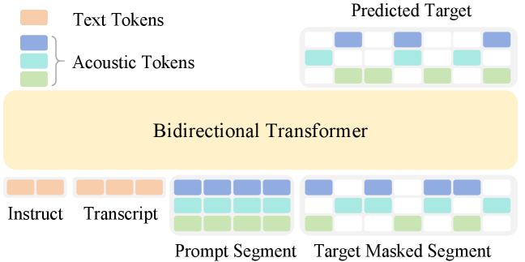
*Figure 1:Illustration of OmniVoice architecture.*

*(a)*

*(a)*

*(b)*

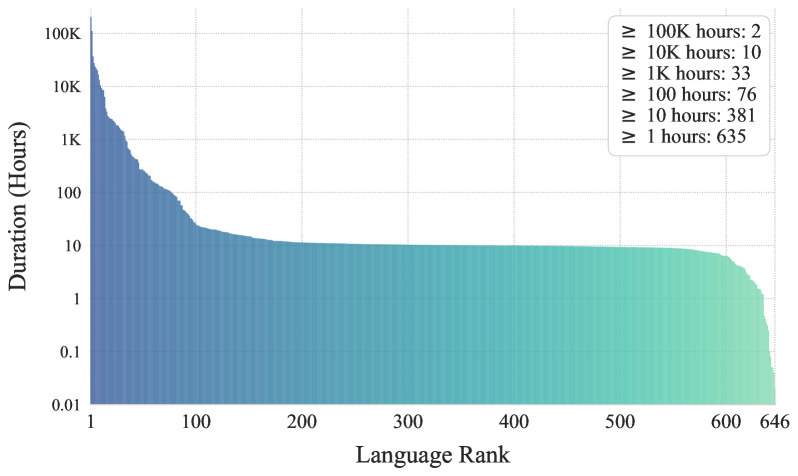
*Figure 3:Statistics of the multilingual training dataset.*

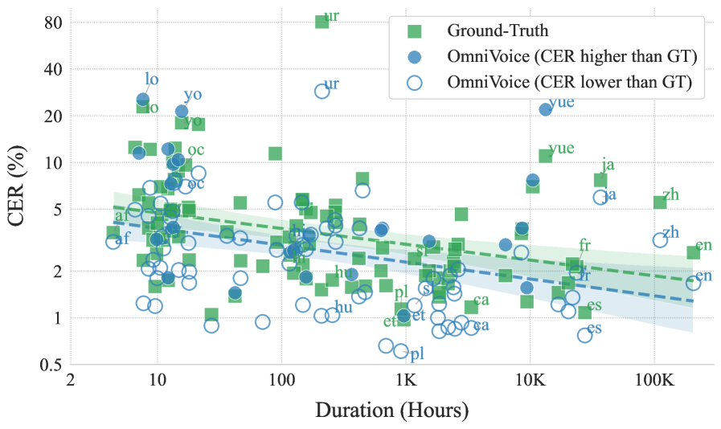
*Figure 4:CERs of OmniVoice vs. ground truth across languages with varying training data durations on FLEURS-Multilingual-102. Hollow circles indicate languages where OmniVoice achieves lower CER than ground-truth, Filled circles indicate higher CER.*

---
**Usage Info**: 4300 tokens used.
**Generated at**: 2026-04-02 12:53:52

---

# 📚 TRACE: Training-Free Partial Audio Deepfake Detection via Embedding Trajectory Analysis of Speech Foundation Models

🚀 URL: https://arxiv.org/html/2604.01083

## 🌏 Abstract (원문)
Partial audio deepfakes, where synthesized segments are spliced into genuine recordings, are particularly deceptive because most of the audio remains authentic. Existing detectors are supervised: they require frame-level annotations, overfit to specific synthesis pipelines, and must be retrained as new generative models emerge. We argue that this supervision is unnecessary. We hypothesize that speech foundation models implicitly encode a forensic signal: genuine speech forms smooth, slowly varying embedding trajectories, while splice boundaries introduce abrupt disruptions in frame-level transitions. Building on this, we proposeTRACE(Training-freeRepresentation-basedAudioCountermeasure viaEmbedding dynamics), a training-free framework that detects partial audio deepfakes by analyzing the first-order dynamics of frozen speech foundation model representations without any training, labeled data, or architectural modification. We evaluate TRACE on four benchmarks that span two languages using six speech foundation models. InPartialSpoof, TRACE achieves 8.08% EER, competitive with fine-tuned supervised baselines. InLlamaPartialSpoof, the most challenging benchmark featuring LLM-driven commercial synthesis, TRACE surpasses a supervised baseline outright (24.12% vs. 24.49% EER) without any target-domain data. These results show that temporal dynamics in speech foundation models provide an effective, generalizable signal for training-free audio forensics.
## 🌏 Abstract (번역)
합성된 세그먼트가 원본 녹음에 접합되는 부분 오디오 딥페이크는 오디오 대부분이 원본으로 남아있기 때문에 특히 기만적입니다. 기존 탐지기는 지도 학습 방식이며, 프레임 수준의 주석이 필요하고, 특정 합성 파이프라인에 과적합되며, 새로운 생성 모델이 등장할 때마다 재훈련되어야 합니다. 우리는 이러한 지도 학습이 불필요하다고 주장합니다. 우리는 음성 기반 모델이 암묵적으로 포렌식 신호를 인코딩한다고 가정합니다. 즉, 원본 음성은 부드럽고 느리게 변화하는 임베딩 궤적을 형성하는 반면, 접합 경계는 프레임 수준 전환에 갑작스러운 중단을 유발합니다. 이를 바탕으로 우리는 훈련, 레이블 데이터 또는 아키텍처 수정 없이 고정된 음성 기반 모델 표현의 1차 동역학을 분석하여 부분 오디오 딥페이크를 탐지하는 훈련 없는 프레임워크인 TRACE(Training-free Representation-based Audio Countermeasure via Embedding dynamics)를 제안합니다. 우리는 6개의 음성 기반 모델을 사용하여 두 가지 언어에 걸쳐 4개의 벤치마크에서 TRACE를 평가합니다. PartialSpoof에서 TRACE는 미세 조정된 지도 학습 기준선과 경쟁할 만한 8.08%의 EER을 달성합니다. LLM 기반 상업적 합성을 특징으로 하는 가장 어려운 벤치마크인 LlamaPartialSpoof에서 TRACE는 대상 도메인 데이터 없이도 지도 학습 기준선을 능가합니다(24.12% 대 24.49% EER). 이러한 결과는 음성 기반 모델의 시간적 동역학이 훈련 없는 오디오 포렌식을 위한 효과적이고 일반화 가능한 신호를 제공함을 보여줍니다.

## 🔍 Methods & Results
- TRACE는 고정된 음성 기반 모델 표현의 프레임 수준 궤적을 분석하여 부분 오디오 딥페이크를 탐지하는 훈련 없는(training-free) 프레임워크이다.
- 방법론은 고정된 인코더에서 임베딩을 추출하고, 이를 단위 초구에 투영한 다음, 연속적인 단위 초구 투영 간의 코드 거리(chord distance)를 계산하고, 이들을 폐쇄형 통계를 통해 스칼라 탐지 점수로 집계한다.
- 모델 훈련, 레이블 데이터, 아키텍처 수정이 전혀 필요하지 않으며, L2 정규화를 통해 음량이나 녹음 수준과 무관하게 순수하게 방향성 변화를 측정한다.
- 핵심 구성 요소는 연속적인 단위 초구 투영 간의 코드 거리(F1t) 계산으로, 원본 음성은 부드러운 F1t 변화를 보이지만, 접합 경계에서는 갑작스러운 스파이크가 발생한다.
- 프레임 수준 F1t 시퀀스는 네 가지 통계(기본 통계, 슬라이딩 윈도우 최대값, 다중 스케일 미분, 방향각 통계)를 사용하여 발화 수준 탐지 점수로 집계되며, 각 통계는 딥페이크 공격의 다른 구조적 특성을 목표로 한다.
- 다양한 통계는 가중 선형 융합을 통해 결합되며, 가중치는 PartialSpoof 개발 세트에서 EER을 기준으로 그리드 탐색을 통해 결정된다.
- 점수 방향은 보정 세트에서 자동으로 결정되며, 임계값은 인-데이터셋 평가를 위해 보정 분할에서, 교차-데이터셋 전송을 위해 PartialSpoof 개발 세트에서 결정된 임계값을 사용한다.
- TRACE의 계산 오버헤드는 인코더 순방향 전달 외에는 무시할 수 있는 수준으로, 실시간 배포에 적합하다.
- TRACE는 PartialSpoof 벤치마크에서 8.08%의 EER을 달성하여 미세 조정된 지도 학습 기준선과 경쟁할 만한 성능을 보였다.
- 가장 어려운 LlamaPartialSpoof 벤치마크(LLM 기반 상업적 합성)에서는 대상 도메인 데이터 없이도 지도 학습 기준선(24.12% EER)을 능가하는 24.12%의 EER을 기록했다.
- 이러한 결과는 음성 기반 모델의 시간적 동역학이 훈련 없이도 효과적이고 일반화 가능한 오디오 포렌식 신호를 제공함을 입증한다.

## 🖼 Figures
![Figure 1:Overview of the TRACE pipeline. A raw waveform is passed through a frozen speech foundation model (WavLM-Large, layer 18). Frame embeddings are L2-normalized [36] onto the unit hypersphere, and the chord distance between consecutive projections forms the first-order dynamics sequence 
{
F1
𝑡
}
. Closed-form statistics are extracted and linearly fused into a scalar detection score, which is orientation-calibrated and threshold to produce the final bonafide or spoof decision. No model parameters are updated at any stage.](../images/2026-04-02/2604.01083/2604.01083_fig0.png)
*Figure 1:Overview of the TRACE pipeline. A raw waveform is passed through a frozen speech foundation model (WavLM-Large, layer 18). Frame embeddings are L2-normalized [36] onto the unit hypersphere, and the chord distance between consecutive projections forms the first-order dynamics sequence 
{
F1
𝑡
}
. Closed-form statistics are extracted and linearly fused into a scalar detection score, which is orientation-calibrated and threshold to produce the final bonafide or spoof decision. No model parameters are updated at any stage.*

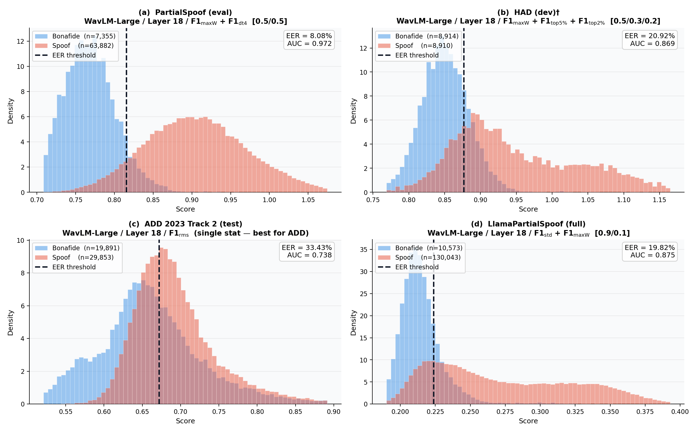
*Figure 2: Score distributions of TRACE across four benchmarks: (a) PartialSpoof, (b) HAD, (c) ADD 2023, (d) LlamaPartialSpoof. The consistent directionality across datasets confirms language and synthesis-method independence of the TRACE.*

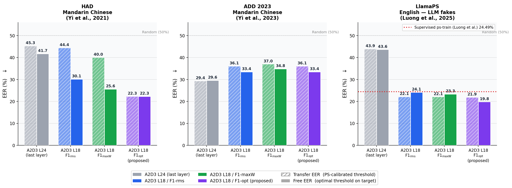
*Figure 3:Cross-dataset generalization of TRACE: Transfer EER (hatched) vs Free EER (solid) across three out-of-domain test sets. LlamaPartialSpoof includes the supervised ps-train baseline (red dashed) for reference.*

*Figure 4:Encoder 
×
 statistic EER heatmap on PartialSpoof. F1 consistently outperforms F2 across all encoders. WavLM-Large + F1-std achieves the best EER (16.4%). Kurtosis-based features are unstable due to sensitivity to outliers.*

![Figure 5: Progressive improvement of TRACE on the PartialSpoof dataset. Horizontal dashed lines denote supervised baselines reported in [43].](../images/2026-04-02/2604.01083/2604.01083_fig4.png)
*Figure 5: Progressive improvement of TRACE on the PartialSpoof dataset. Horizontal dashed lines denote supervised baselines reported in [43].*

*Figure 6:EER of all 43 feature statistics on PartialSpoof (WavLM-Large, layer 18), ranked from best to worst. F1-rms, F1-mean-abs, and F1-dt4-rms perform best (10.84–11.07%). Directional angle features are weak standalone but aid cross-domain generalization when fused with magnitude statistics. All F2 statistics score 
≈
50% EER and are omitted.*

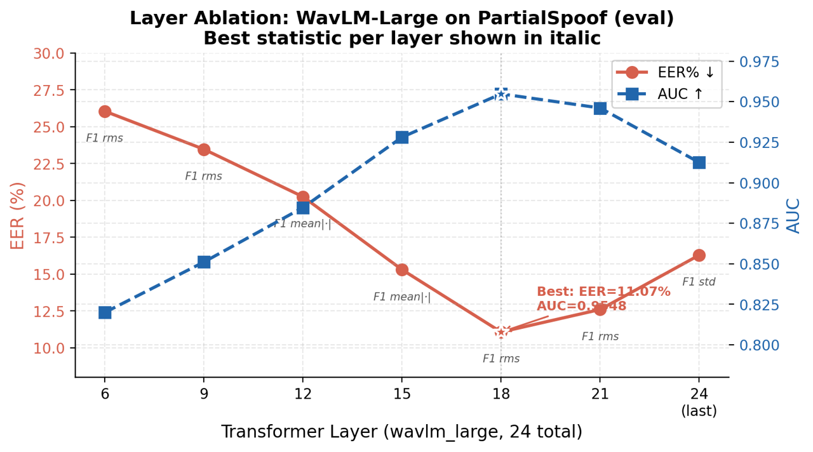
*Figure 7:Per-layer EER of WavLM-Large on PartialSpoof (F1-rms statistic). Layer 18 achieves the minimum EER (11.07%). The final layer (layer 24) performs near chance due to semantic-level smoothing of acoustic discontinuities.*

---
**Usage Info**: 4194 tokens used.
**Generated at**: 2026-04-02 12:54:05

---

# 📚 Adapting Text LLMs to Speech via Multimodal Depth Up-Scaling

🚀 URL: https://arxiv.org/html/2604.00489

## 🌏 Abstract (원문)
Adapting pre-trained text Large Language Models (LLMs) into Speech Language Models (Speech LMs) via continual pre-training on speech data is promising, but often degrades the original text capabilities. We proposeMultimodal Depth Up-scaling, an extension of an emerging strategy in continual LLM pre-training, where new transformer layers are inserted into a frozen text LLM and only the added layers are trained on speech data. Experiments with SmolLM2-360M and SmolLM2-1.7B on 48k hours of English Automatic Speech Recognition (ASR) data show that depth up-scaling achieves ASR comparable to full fine-tuning while causing far less text degradation than both full fine-tuning and Low-Rank Adaptation (LoRA). We further show that incorporating E-Branchformer, an architecture designed for speech recognition, as the inserted layers achieves ASR that matches or surpasses full fine-tuning on the larger model while reducing text degradation by over 75% with 60% fewer trainable parameters.
## 🌏 Abstract (번역)
사전 학습된 텍스트 대규모 언어 모델(LLM)을 음성 데이터를 이용한 지속적인 사전 학습을 통해 음성 언어 모델(Speech LM)로 적응시키는 것은 유망하지만, 종종 원래의 텍스트 기능을 저하시킵니다. 저희는 지속적인 LLM 사전 학습에서 떠오르는 전략의 확장인 다중 모달 깊이 업스케일링(Multimodal Depth Up-scaling)을 제안합니다. 이 방법은 고정된 텍스트 LLM에 새로운 트랜스포머 레이어를 삽입하고, 추가된 레이어만 음성 데이터로 학습시킵니다. 48k 시간의 영어 자동 음성 인식(ASR) 데이터에 대한 SmolLM2-360M 및 SmolLM2-1.7B를 사용한 실험 결과, 깊이 업스케일링은 전체 미세 조정(full fine-tuning)과 유사한 ASR 성능을 달성하면서도 전체 미세 조정 및 LoRA(Low-Rank Adaptation)보다 텍스트 기능 저하를 훨씬 적게 유발하는 것으로 나타났습니다. 또한, 음성 인식을 위해 설계된 아키텍처인 E-Branchformer를 삽입된 레이어로 통합하면 더 큰 모델에서 전체 미세 조정을 능가하거나 동등한 ASR 성능을 달성하면서도 학습 가능한 파라미터 수를 60% 줄이고 텍스트 기능 저하를 75% 이상 감소시키는 것을 보여줍니다.

## 🔍 Methods & Results
- 사전 학습된 텍스트 LLM을 ASR을 수행하는 음성 LM으로 변환하면서 원래의 텍스트 기능을 보존하는 것을 목표로 합니다.
- 음성 토큰 처리를 위해 OpusLM 방식을 따라 의미 및 음향 토큰을 사용하여 토크나이저 어휘를 확장하고, 해당 임베딩 레이어는 추가된 레이어와 함께 학습됩니다.
- 고정된 사전 학습된 LLM에 새로운 트랜스포머 레이어를 삽입하고 추가된 레이어만 음성 데이터로 학습시키는 '다중 모달 깊이 업스케일링' 방법을 제안합니다.
- 모든 원본 레이어를 고정함으로써, 추론 시 추가된 레이어를 제거하여 사전 학습된 모델을 정확히 복구하고 텍스트 작업에서 기능 저하가 없음을 보장합니다.
- 추가된 레이어는 초기화 시 원본 모델과 동일하게 동작하도록 (함수 보존 초기화) MHSA 및 FFN의 출력 투영 행렬을 0으로 초기화합니다.
- 추가된 레이어의 배치 전략(Interleaved, Bottom, Middle, Top, Sandwich)을 탐구했습니다.
- 음성 인식에 더 적합한 아키텍처인 E-Branchformer를 추가된 레이어로 사용하는 방안을 고려했으며, 이는 MHSA와 cgMLP를 통한 병렬 처리 방식을 사용합니다.
- E-Branchformer 레이어의 함수 보존 초기화를 위해 W_Merge 및 W^O에 대한 특정 초기화 전략을 사용했습니다.
- 깊이 업스케일링은 전체 미세 조정과 유사한 ASR 성능을 달성하면서도 전체 미세 조정 및 LoRA보다 텍스트 기능 저하를 훨씬 적게 유발합니다.
- E-Branchformer를 추가된 레이어로 통합하면 더 큰 모델에서 전체 미세 조정을 능가하거나 동등한 ASR 성능을 달성하며, 학습 가능한 파라미터 수를 60% 줄이고 텍스트 기능 저하를 75% 이상 감소시킵니다.

## 🖼 Figures
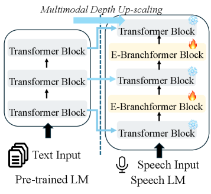
*Figure 1:Proposed multimodal depth up-scaling strategy for Speech LM adaptation: trainable E-Branchformer blocks are interleaved with frozen transformer blocks to acquire speech capabilities while preserving pre-trained text representations.*

---
**Usage Info**: 4862 tokens used.
**Generated at**: 2026-04-02 12:54:18

---

# 📚 FineLAP: Taming Heterogeneous Supervision for Fine-grained Language-Audio Pretraining

🚀 URL: https://arxiv.org/html/2604.01155

## 🌏 Abstract (원문)
Contrastively pretrained audio–language models (e.g., CLAP) excel at clip-level understanding but struggle with frame-level tasks. Existing extensions fail to exploit the varying granularity of real-world audio–text data, where massive clip-level textual descriptions coexist with limited frame-level annotations. This paper proposesFine-grainedLanguage-AudioPretraining (FineLAP), a novel training paradigm that advances both clip- and frame-level alignment in CLAP with heterogeneous data. FineLAP introduces a dual-stream sigmoid loss with a cluster-based sampling strategy to jointly learn from clip- and frame-level supervision. To capture both global semantics and local details, FineLAP uses a decoupled audio projector on top of a self-supervised encoder. To alleviate the scarcity of temporally annotated data, we present FineLAP-100k, a large-scale synthetic SED dataset constructed through a scalable curation pipeline. Extensive experiments demonstrate that FineLAP achieves SOTA performance across multiple audio understanding tasks, including retrieval, classification, sound event detection, and text-to-audio grounding. Ablation studies further show that coarse- and fine-grained alignment are mutually beneficial, providing insights for building better audio-language models (ALMs).111Code at:https://github.com/xiquan-li/FineLAPDataset at:https://huggingface.co/datasets/AndreasXi/FineLAP-100k
## 🌏 Abstract (번역)
대조적으로 사전 학습된 오디오-언어 모델(예: CLAP)은 클립 수준 이해에는 뛰어나지만 프레임 수준 작업에는 어려움을 겪습니다. 기존 확장 모델들은 방대한 클립 수준 텍스트 설명과 제한된 프레임 수준 주석이 공존하는 실제 오디오-텍스트 데이터의 다양한 세분성을 활용하지 못합니다. 본 논문은 이질적인 데이터를 사용하여 CLAP에서 클립 및 프레임 수준 정렬을 모두 향상시키는 새로운 훈련 패러다임인 Fine-grained Language-Audio Pretraining (FineLAP)을 제안합니다. FineLAP은 클립 및 프레임 수준 감독으로부터 공동으로 학습하기 위해 클러스터 기반 샘플링 전략을 사용하는 듀얼 스트림 시그모이드 손실을 도입합니다. 전역 의미론과 지역 세부 사항을 모두 포착하기 위해 FineLAP은 자기 지도 인코더 위에 분리된 오디오 프로젝터를 사용합니다. 시간적으로 주석이 달린 데이터의 부족을 완화하기 위해, 우리는 확장 가능한 큐레이션 파이프라인을 통해 구축된 대규모 합성 SED 데이터셋인 FineLAP-100k를 제시합니다. 광범위한 실험은 FineLAP이 검색, 분류, 음향 이벤트 감지 및 텍스트-오디오 그라운딩을 포함한 여러 오디오 이해 작업에서 SOTA 성능을 달성함을 보여줍니다. 추가적인 절제 연구는 거친(coarse) 및 미세(fine-grained) 정렬이 상호 이익이 되며, 더 나은 오디오-언어 모델(ALM) 구축을 위한 통찰력을 제공함을 보여줍니다.

## 🔍 Methods & Results
- FineLAP은 이질적인 데이터를 사용하여 CLAP에서 클립 및 프레임 수준 정렬을 모두 향상시키는 새로운 훈련 패러다임으로 제안되었습니다.
- FineLAP은 클립 및 프레임 수준 감독으로부터 공동으로 학습하기 위해 클러스터 기반 샘플링 전략을 사용하는 듀얼 스트림 시그모이드 손실을 도입합니다.
- 전역 의미론과 지역 세부 사항을 포착하기 위해 FineLAP은 자기 지도 인코더 위에 분리된 오디오 프로젝터를 사용합니다.
- 시간적으로 주석이 달린 데이터의 부족을 완화하기 위해, 확장 가능한 큐레이션 파이프라인을 통해 구축된 대규모 합성 SED 데이터셋인 FineLAP-100k를 제시합니다.
- FineLAP은 검색, 분류, 음향 이벤트 감지 및 텍스트-오디오 그라운딩을 포함한 여러 오디오 이해 작업에서 SOTA 성능을 달성했습니다.
- 절제 연구를 통해 거친(coarse) 및 미세(fine-grained) 정렬이 상호 이익이 된다는 것이 밝혀졌습니다.

## 🖼 Figures
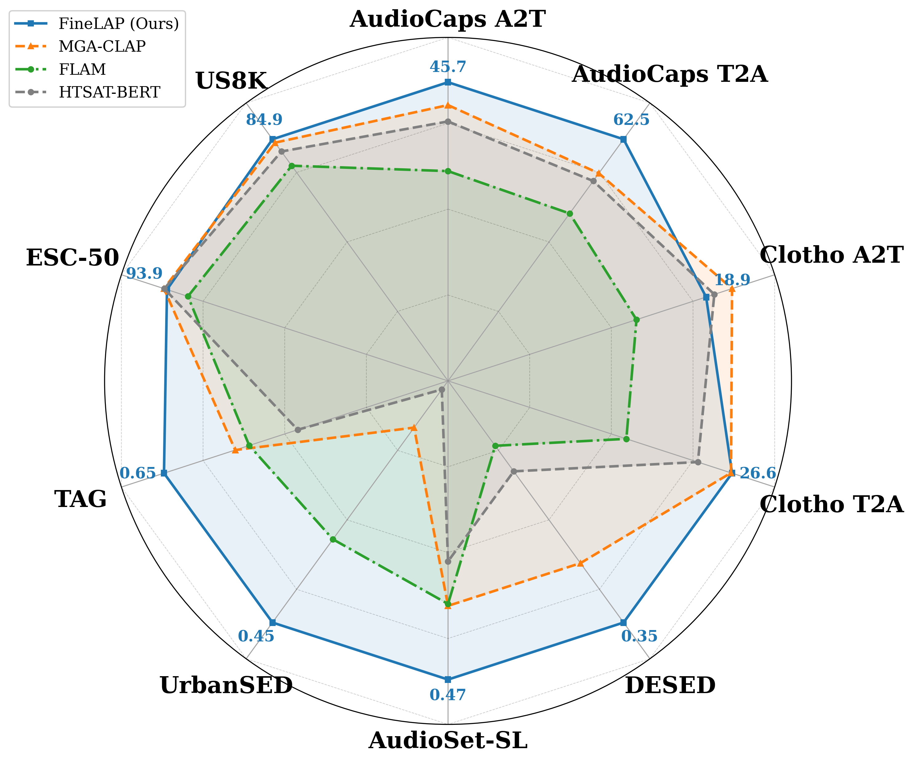
*Figure 1:FineLAP’s performance across different benchmark datasets: Our model achieves state-of-the-art (SOTA) results on both clip- and frame-level tasks.*

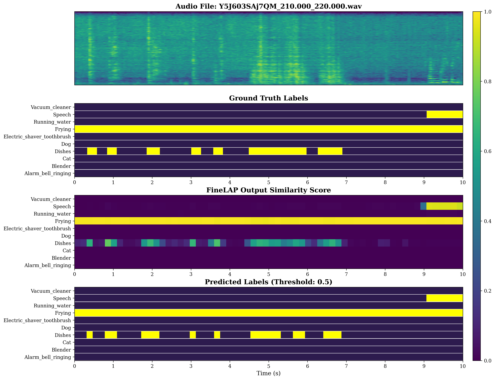
*Figure 2: FineLAP effectively leverages the fine-grained alignment between audio frames and textual phrases to detect temporal boundaries of overlapping events.*

*Figure 3:Overview of FineLAP. Left: The decoupled adapter enables simultaneous clip- and frame-level understanding. Right: The framework synergizes global and dense alignment by leveraging heterogeneous supervision via a dual-stream sigmoid loss with cluster-based sampling.*

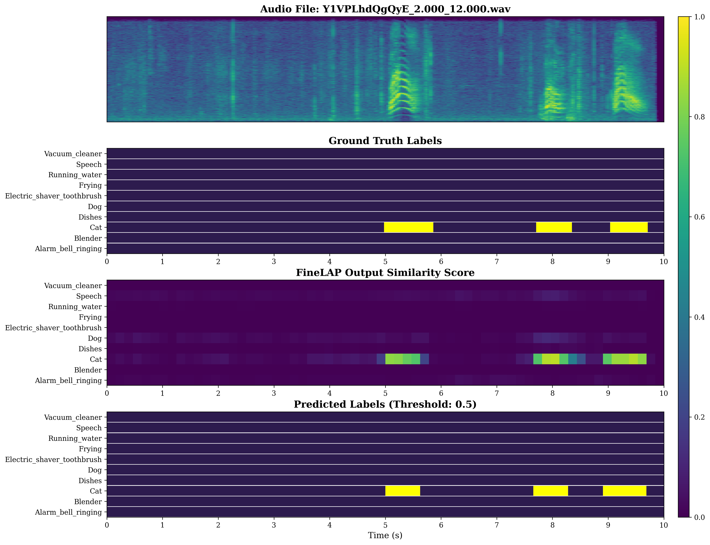
*Figure 4:Visualization of FineLAP’s performance on DESED-Eval*

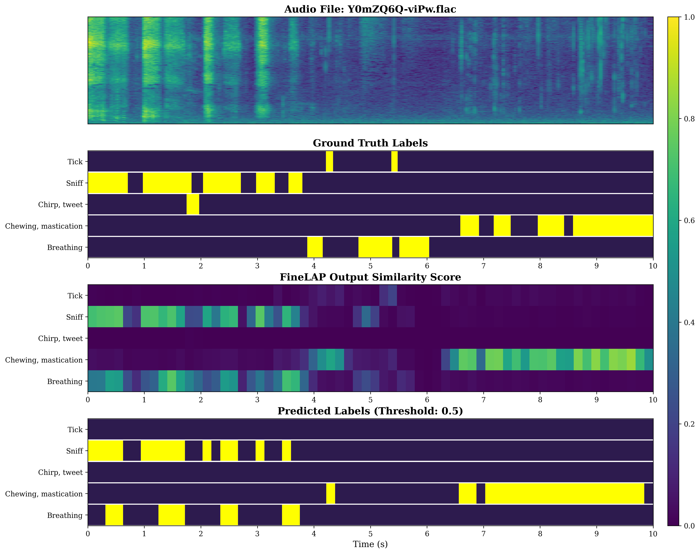
*Figure 5:Visualization of FineLAP’s performance on AudioSet-Strong*

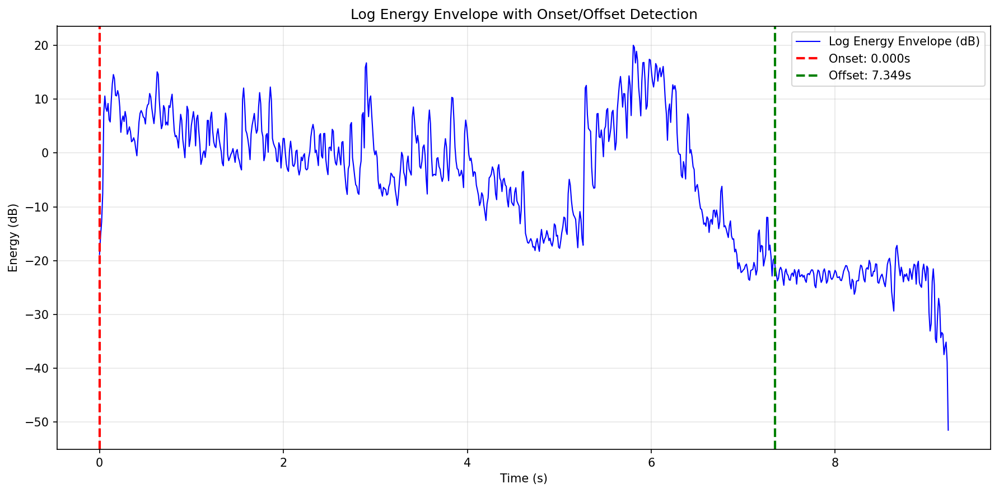
*Figure 6:Visualization of the proposed window-based audio clipping strategy*

---
**Usage Info**: 2823 tokens used.
**Generated at**: 2026-04-02 12:54:30

---

# 📚 Speech LLMs are Contextual Reasoning Transcribers

🚀 URL: https://arxiv.org/html/2604.00610

## 🌏 Abstract (원문)
Despite extensions to speech inputs, effectively leveraging the rich knowledge and contextual understanding of large language models (LLMs) in automatic speech recognition (ASR) remains non-trivial, as the task primarily involves direct speech-to-text mapping. To address this, this paper proposes chain-of-thought ASR (CoT-ASR), which constructs a reasoning chain that enables LLMs to first analyze the input speech and generate contextual analysis, thereby fully exploiting their generative capabilities. With this contextual reasoning, CoT-ASR then performs more informed speech recognition and completes both reasoning and transcription in a single pass. Moreover, CoT-ASR naturally supports user-guided transcription: while designed to self-generate reasoning, it can also seamlessly incorporate user-provided context to guide transcription, further extending ASR functionality. To reduce the modality gap, this paper introduces a CTC-guided Modality Adapter, which uses CTC non-blank token probabilities to weight LLM embeddings, efficiently aligning speech encoder outputs with the LLM’s textual latent space. Experiments show that, compared to standard LLM-based ASR, CoT-ASR achieves a relative reduction of 8.7% in word error rate (WER) and 16.9% in entity error rate (EER).
## 🌏 Abstract (번역)
음성 입력으로의 확장에도 불구하고, 자동 음성 인식(ASR)에서 대규모 언어 모델(LLM)의 풍부한 지식과 문맥 이해를 효과적으로 활용하는 것은 여전히 쉽지 않습니다. 이는 ASR 작업이 주로 직접적인 음성-텍스트 매핑을 포함하기 때문입니다. 이를 해결하기 위해 본 논문은 LLM이 먼저 입력 음성을 분석하고 문맥 분석을 생성하여 LLM의 생성 능력을 완전히 활용할 수 있도록 추론 체인을 구성하는 CoT-ASR(chain-of-thought ASR)을 제안합니다. 이러한 문맥적 추론을 통해 CoT-ASR은 더 정보에 입각한 음성 인식을 수행하고 단일 패스에서 추론과 전사를 모두 완료합니다. 또한 CoT-ASR은 사용자 안내 전사를 자연스럽게 지원합니다. 즉, 자체적으로 추론을 생성하도록 설계되었지만, 사용자 제공 문맥을 원활하게 통합하여 전사를 안내할 수 있어 ASR 기능을 더욱 확장합니다. 양식 간 격차를 줄이기 위해 본 논문은 CTC 비공백 토큰 확률을 사용하여 LLM 임베딩에 가중치를 부여함으로써 음성 인코더 출력을 LLM의 텍스트 잠재 공간과 효율적으로 정렬하는 CTC-guided Modality Adapter를 소개합니다. 실험 결과, 표준 LLM 기반 ASR과 비교하여 CoT-ASR은 단어 오류율(WER)에서 8.7%, 개체 오류율(EER)에서 16.9%의 상대적 감소를 달성했습니다.

## 🔍 Methods & Results
- CoT-ASR(chain-of-thought ASR)을 제안하며, 이는 LLM이 입력 음성을 분석하고 문맥 분석을 생성하여 LLM의 생성 능력을 활용하는 추론 체인을 구성한다.
- CoT-ASR은 문맥적 추론을 통해 정보에 입각한 음성 인식을 수행하고, 추론과 전사를 단일 패스에서 완료한다.
- CoT-ASR은 사용자 제공 문맥을 통합하여 전사를 안내하는 사용자 안내 전사를 지원한다.
- 양식 간 격차를 줄이기 위해 CTC 비공백 토큰 확률을 사용하여 LLM 임베딩에 가중치를 부여하고 음성 인코더 출력을 LLM의 텍스트 잠재 공간과 정렬하는 CTC-guided Modality Adapter를 도입했다.
- 표준 LLM 기반 ASR 대비 CoT-ASR은 단어 오류율(WER)에서 8.7%의 상대적 감소를 달성했다.
- 표준 LLM 기반 ASR 대비 CoT-ASR은 개체 오류율(EER)에서 16.9%의 상대적 감소를 달성했다.

## 🖼 Figures

*Figure 1:Illustration of CoT-ASR. The text prompt is a fixed template for the ASR task. The output sequence comprises contextual analysis and transcription, marked by the <CONTEXT> and <TRANSCRIPT> tags, respectively. The reasoning-based contextual analysis is highlighted in red, while the subsequent transcription is marked in green. Both are produced sequentially in a single one-pass generation.*

*Figure 2:Comparison between CoT-ASR and standard LLM-based ASR. During generation, CoT-ASR first performs a contextual reasoning analysis, which then guides the subsequent transcription. This example illustrates how CoT-ASR leverages the rich knowledge of LLMs to ultimately improve transcription quality.*

*Figure 3:Illustration of the CTC-guided Modality Adapter. The linear output layer projects the encoder outputs to the CTC vocabulary size including the blank token, while the linear layer maps the encoder outputs to the LLM hidden dimension. 
⊗
 denotes matrix multiplication and 
⊕
 denotes addition. Gate denotes a frame-wise scalar from the linear projection and sigmoid that modulates the residual contribution.*

---
**Usage Info**: 1628 tokens used.
**Generated at**: 2026-04-02 12:54:37

---

