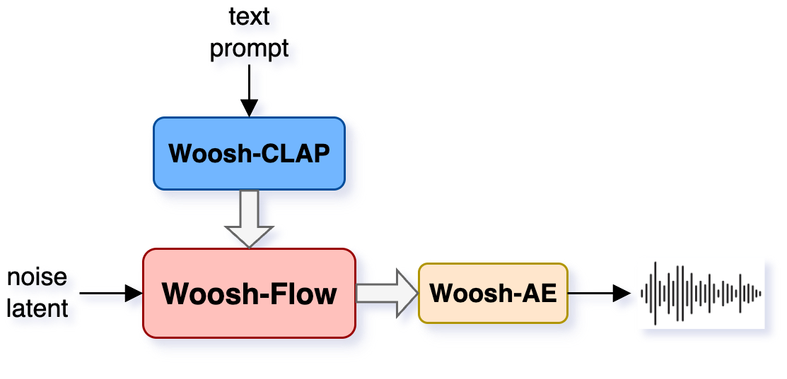
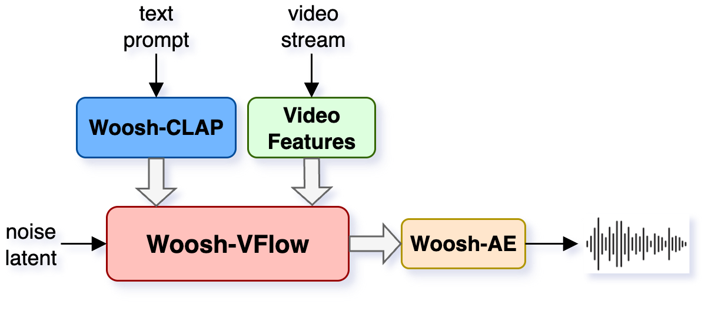
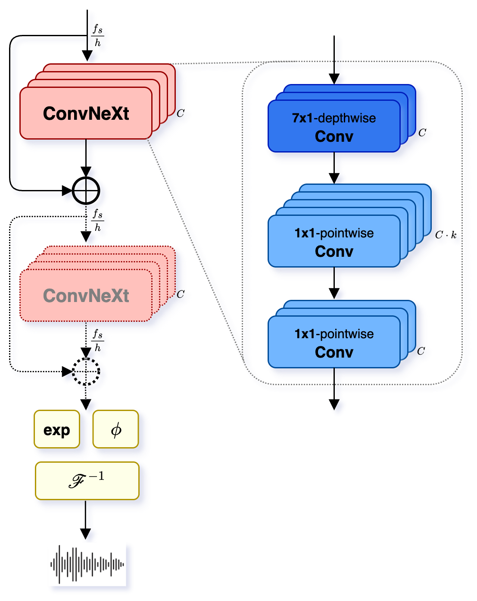
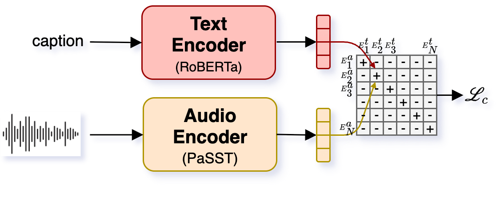
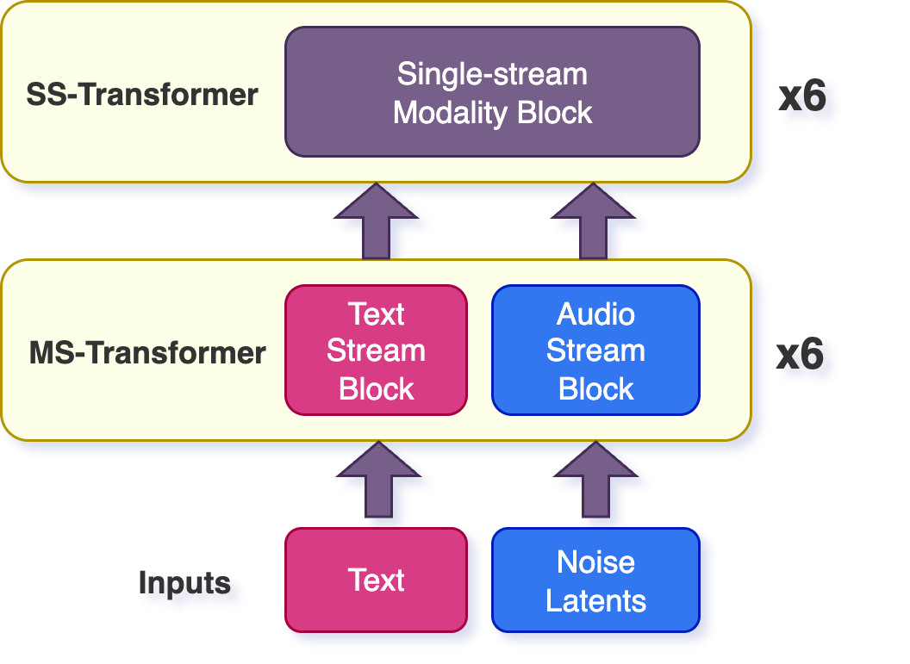
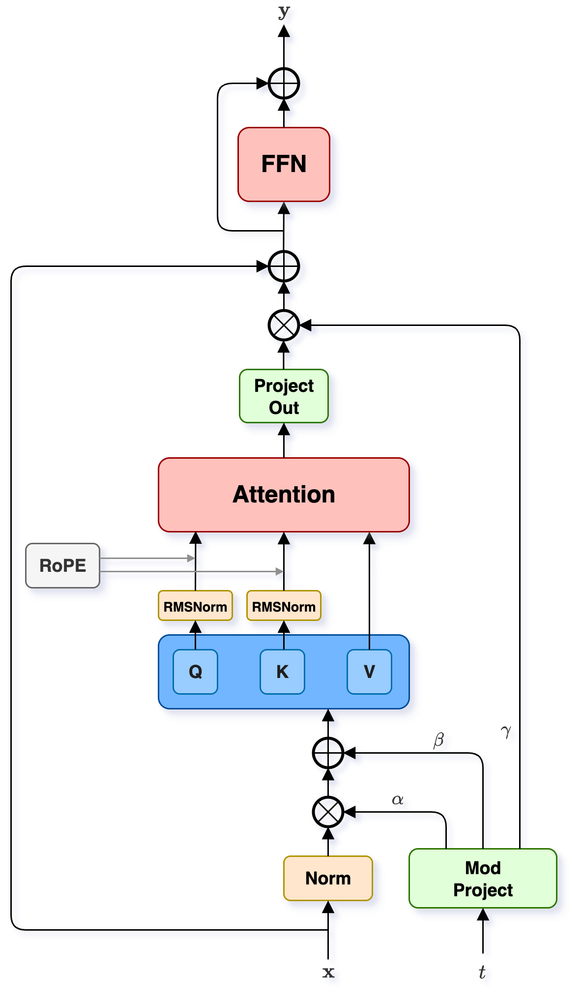
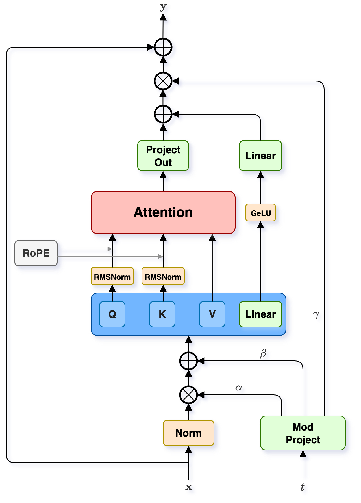
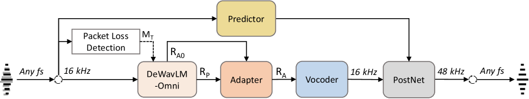
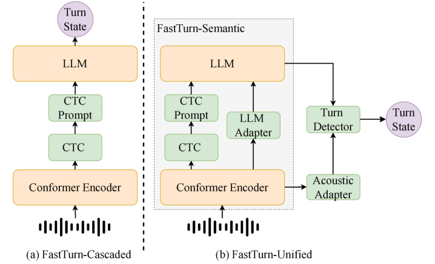
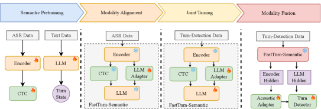

# 🚩 (2026-04-03) Scholar Inbox 추천 논문 

# 📚 Combining Masked Language Modeling and Cross-Modal Contrastive Learning for Prosody-Aware TTS

🚀 URL: https://arxiv.org/html/2604.01247

## 🌏 Abstract (원문)
We investigate multi-stage pretraining for prosody modeling in diffusion-based TTS. A speaker-conditioned dual-stream encoder is trained with masked language modeling followed by SigLIP-style cross-modal contrastive learning using mixed-phoneme batches, with an additional same-phoneme refinement stage studied separately. We evaluate intrinsic text–audio retrieval and downstream synthesis in Grad-TTS and a latent diffusion TTS system. The two-stage curriculum (MLM + mixed-phoneme contrastive learning) achieves the best overall synthesis quality in terms of intelligibility, speaker similarity, and perceptual measures. Although same-phoneme refinement improves prosodic retrieval, it reduces phoneme discrimination and degrades synthesis. These findings indicate that improvements in embedding-space metrics do not necessarily translate to better generative performance and highlight the need to balance phoneme discrimination and prosodic sensitivity in TTS pretraining.
## 🌏 Abstract (번역)
확산 기반 TTS에서 운율 모델링을 위한 다단계 사전 학습을 연구합니다. 화자 조건부 듀얼 스트림 인코더는 마스크드 언어 모델링(MLM)으로 학습된 후, 혼합 음소 배치(mixed-phoneme batches)를 사용하는 SigLIP 스타일의 교차 모달 대조 학습을 거치며, 추가적인 동일 음소 정제 단계는 별도로 연구되었습니다. 우리는 Grad-TTS 및 잠재 확산 TTS 시스템에서 내재적 텍스트-오디오 검색과 다운스트림 합성을 평가합니다. 2단계 커리큘럼(MLM + 혼합 음소 대조 학습)은 명료도, 화자 유사성 및 지각적 측정 측면에서 전반적으로 최고의 합성 품질을 달성합니다. 동일 음소 정제는 운율 검색을 개선하지만, 음소 식별을 감소시키고 합성을 저하시킵니다. 이러한 결과는 임베딩 공간 지표의 개선이 반드시 더 나은 생성 성능으로 이어지지 않으며, TTS 사전 학습에서 음소 식별과 운율 민감도 사이의 균형을 맞출 필요가 있음을 강조합니다.

## 🔍 Methods & Results
- 인코더는 강조된 음소 시퀀스와 BPE 텍스트 토큰을 공동으로 처리하는 듀얼 스트림 트랜스포머를 사용하며, AdaLN-Zero를 통해 화자 조건화되고 VoxBlink2로 사전 학습된 WeSpeaker 프레임워크의 SimAM-ResNet34 임베딩을 활용합니다.
- 두 스트림은 단어 수준 풀링 및 단어-음소 확장을 통해 정렬된 후, 추가 트랜스포머 블록을 거쳐 음소별 운율 임베딩을 생성합니다.
- 사전 학습 커리큘럼은 세 단계로 구성됩니다: 1단계는 BERT 스타일의 마스크드 언어 모델링(MLM)으로 음소 및 BPE 인코더를 독립적으로 학습시킵니다.
- 2단계는 ECAPA-TDNN 음향 브랜치와 함께 SigLIP 스타일의 쌍별 시그모이드 대조 손실을 사용하여 전체 듀얼 스트림 인코더를 공동으로 학습시키며, 배치에는 다양한 음소 유형이 포함되어 음소 범주를 구별하도록 합니다.
- 3단계는 선택적 정제 단계로, 동일한 SigLIP 목표를 적용하지만 배치는 동일한 대상 음소 유형을 공유하는 발화로만 구성되어 운율 변화에 초점을 맞춥니다.
- 평가는 내재적 텍스트-오디오 검색 및 Grad-TTS와 잠재 확산 TTS 시스템에서의 다운스트림 합성을 통해 이루어졌습니다.
- 2단계 커리큘럼(MLM + 혼합 음소 대조 학습)이 명료도, 화자 유사성 및 지각적 측정 측면에서 전반적으로 최고의 합성 품질을 달성했습니다.
- SigLIP 손실은 CLIP 스타일 손실에 비해 운율 민감도를 향상시키는 것으로 확인되었습니다.
- 동일 음소 정제(3단계)는 내재적 운율 검색을 개선하지만, 음소 식별을 감소시키고 합성 품질을 저하시켰습니다.
- 이러한 결과는 임베딩 공간 지표의 개선이 반드시 더 나은 생성 성능으로 이어지지 않으며, TTS 사전 학습에서 음소 식별과 운율 민감도 사이의 균형이 중요함을 시사합니다.

## 🖼 Figures

*Figure 1:Prosody encoder architecture. Phoneme and BPE streams are independently embedded and processed by speaker-conditioned transformer encoders. BPE hidden states are aggregated via word-level pooling and expanded to phoneme resolution. The fused streams pass through a shared encoder, layer normalization, and a convolutional projection to produce per-phoneme prosodic embeddings.*

---
**Usage Info**: 2774 tokens used.
**Generated at**: 2026-04-03 12:43:30

---

# 📚 Woosh: A Sound Effects Foundation Model

🚀 URL: https://arxiv.org/html/2604.01929

## 🌏 Abstract (원문)
Current research on generative audio modeling largely focuses on conditioned models, mainly based on textual descriptions of audio. While significant progress has been made in terms of modeling, most approaches do not provide open weights for the research community to build upon[1,12,13,20]. Other approaches like[25,31]do provide open weights, but use low audio sampling rates only up to 16
kHz. Notable exceptions are AudioLDM2[32], StableAudio-Open[14], and TangoFlux[20], which generate higher quality audio while addressing the generation of both general audio and music. MusicGen[7]is another high-quality open model which specializes on music generation.
In this report, we propose a text-conditioned generative model specializing on instantaneous high-quality sound effect generation. Based on the multimodal FLUX-Kontext extension[27], our latent diffusion model (LDM) has been optimized from the ground up for sound effects and for professional use. As part of the public release (https://github.com/SonyResearch/Woosh/), we provide inference code and open weights for non-commercial use for the full pipeline: encoder/decoder, text-conditioning, and diffusion models, the latter being further distilled for instant generation. We benchmark our public and private models against StableAudio-Open and TangoFlux, and our CLAP model against LAION-CLAP. For the best audio generation quality, a version trained exclusively on a large amount of studio-quality licensed sound effect libraries is internally available111Please contactMarc FerrasorHakim Missoumfor more information about this model..
The current public release provides four models that address the text-to-audio
(T2A) and video-to-audio
(V2A) tasks:
Audio encoder/decoder (Woosh-AE)— High-quality latent encoder/decoder providing latents for generative modeling and decoding audio from generated latents.
Text conditioning (Woosh-CLAP)— Multimodal text-audio alignment model providing token latents for diffusion model conditioning or CLAP scoring.
T2A Generation (Woosh-Flow and Woosh-DFlow)— Original and distilled LDMs generating audio unconditionally or from a given a text prompt.
V2A Generation (Woosh-VFlow and Woosh-DVFlow)— Multimodal LDM generating audio from a video sequence with optional text prompts.
Figure1shows a high-level diagram of the Woosh-Flow and Woosh-VFlow models performing T2A and V2A generation, respectively. Demo samples for the encoder/decoder, T2A, and V2A modules can be found athttps://sonyresearch.github.io/Woosh.
## 🌏 Abstract (번역)
생성형 오디오 모델링에 대한 현재 연구는 주로 오디오의 텍스트 설명을 기반으로 하는 조건부 모델에 중점을 둡니다. 모델링 측면에서 상당한 진전이 있었지만, 대부분의 접근 방식은 연구 커뮤니티가 활용할 수 있는 공개 가중치를 제공하지 않습니다[1,12,13,20]. [25,31]과 같은 다른 접근 방식은 공개 가중치를 제공하지만, 최대 16kHz의 낮은 오디오 샘플링 속도만 사용합니다. 주목할 만한 예외로는 AudioLDM2[32], StableAudio-Open[14], TangoFlux[20]가 있으며, 이들은 일반 오디오와 음악 생성을 모두 다루면서 더 높은 품질의 오디오를 생성합니다. MusicGen[7]은 음악 생성에 특화된 또 다른 고품질 공개 모델입니다.
이 보고서에서는 즉각적인 고품질 음향 효과 생성에 특화된 텍스트 조건부 생성 모델을 제안합니다. 멀티모달 FLUX-Kontext 확장[27]을 기반으로 하는 당사의 잠재 확산 모델(LDM)은 음향 효과 및 전문적인 사용을 위해 처음부터 최적화되었습니다. 공개 릴리스(https://github.com/SonyResearch/Woosh/)의 일환으로, 인코더/디코더, 텍스트 조건부, 확산 모델(후자는 즉각적인 생성을 위해 추가 증류됨)을 포함한 전체 파이프라인에 대한 추론 코드와 비상업적 사용을 위한 공개 가중치를 제공합니다. 당사는 공개 및 비공개 모델을 StableAudio-Open 및 TangoFlux와 비교 벤치마킹하고, CLAP 모델을 LAION-CLAP과 비교합니다. 최고의 오디오 생성 품질을 위해, 스튜디오 품질의 라이선스 음향 효과 라이브러리 다량으로 독점적으로 훈련된 버전은 내부적으로 이용 가능합니다111이 모델에 대한 자세한 정보는 Marc Ferras 또는 Hakim Missoum에게 문의하십시오..
현재 공개 릴리스는 텍스트-오디오(T2A) 및 비디오-오디오(V2A) 작업을 다루는 네 가지 모델을 제공합니다:
오디오 인코더/디코더 (Woosh-AE) — 생성 모델링을 위한 잠재 공간을 제공하고 생성된 잠재 공간에서 오디오를 디코딩하는 고품질 잠재 인코더/디코더.
텍스트 조건부 (Woosh-CLAP) — 확산 모델 조건부 또는 CLAP 스코어링을 위한 토큰 잠재 공간을 제공하는 멀티모달 텍스트-오디오 정렬 모델.
T2A 생성 (Woosh-Flow 및 Woosh-DFlow) — 무조건적으로 또는 주어진 텍스트 프롬프트로부터 오디오를 생성하는 원본 및 증류된 LDM.
V2A 생성 (Woosh-VFlow 및 Woosh-DVFlow) — 선택적 텍스트 프롬프트와 함께 비디오 시퀀스로부터 오디오를 생성하는 멀티모달 LDM.
그림 1은 각각 T2A 및 V2A 생성을 수행하는 Woosh-Flow 및 Woosh-VFlow 모델의 상위 수준 다이어그램을 보여줍니다. 인코더/디코더, T2A 및 V2A 모듈의 데모 샘플은 https://sonyresearch.github.io/Woosh에서 찾을 수 있습니다.

## 🔍 Methods & Results
- Woosh는 즉각적인 고품질 음향 효과 생성을 전문으로 하는 텍스트 조건부 생성 모델을 제안한다.
- 이 모델은 멀티모달 FLUX-Kontext 확장을 기반으로 하는 잠재 확산 모델(LDM)이며, 음향 효과 및 전문적인 사용을 위해 최적화되었다.
- 공개 릴리스에는 인코더/디코더, 텍스트 조건부, 확산 모델(즉각적인 생성을 위해 추가 증류됨)을 포함한 전체 파이프라인에 대한 추론 코드와 비상업적 사용을 위한 공개 가중치가 제공된다.
- 공개 및 비공개 Woosh 모델은 StableAudio-Open 및 TangoFlux와 비교 벤치마킹되었으며, Woosh-CLAP 모델은 LAION-CLAP과 비교되었다.
- 최고의 오디오 생성 품질을 위해 스튜디오 품질의 라이선스 음향 효과 라이브러리로 훈련된 내부 버전도 존재한다.
- 현재 공개 릴리스는 텍스트-오디오(T2A) 및 비디오-오디오(V2A) 작업을 위한 네 가지 모델을 제공한다: Woosh-AE (오디오 인코더/디코더), Woosh-CLAP (멀티모달 텍스트-오디오 정렬 모델), Woosh-Flow 및 Woosh-DFlow (T2A 생성 LDM), Woosh-VFlow 및 Woosh-DVFlow (V2A 생성 멀티모달 LDM).
- 인코더/디코더, T2A 및 V2A 모듈의 데모 샘플이 온라인에서 제공된다.

## 🖼 Figures

*Figure 1:Inference-time layout of the Woosh-Flow (left) and Woosh-VFlow (right) models for text-to-audio and video-to-audio generation, respectively.*

*Figure 2*

*Figure 3*

*Figure 2:VOCOS decoder architecture as a cascade on ConvNeXt blocks, used in Woosh-AE.*

*Figure 3:Woosh-CLAP training block diagram for a positive pair of samples. Only the text encoder is used at generation time as conditioning.*

*Figure 4:Multimodal transformer stack in the Woosh-Flow diffusion model, formed by MultiStream (MS) and SingleStream (SS) blocks.*

*Figure 5:MultiStream transformer block diagram (left). Both self-attention and feed-forward network (FFN) outputs are computed independently for each modality sequence. SingleStream transformer block diagram (right). Self-attention is computed on the concatenation of modality sequences along the time dimension. Instead of an FFN block, non-linear features are in a parallel path and added after the attention project layer.*

*Figure 8*

*Figure 9*

---
**Usage Info**: 3330 tokens used.
**Generated at**: 2026-04-03 12:43:43

---

# 📚 T5Gemma-TTS Technical Report

🚀 URL: https://arxiv.org/html/2604.01760

## 🌏 Abstract (원문)
Autoregressive neural codec language models have demonstrated remarkable zero-shot voice cloning capability, yet dominant decoder-only architectures treat input text as a prefix that competes with the growing audio sequence for positional capacity, causing text conditioning to dilute over long utterances. We presentT5Gemma-TTS, an encoder-decoder codec language model that routes bidirectional text representations through cross-attention at every decoder layer, maintaining persistent and structured text conditioning regardless of output length. Built on the T5Gemma pretrained encoder-decoder backbone (2	B encoder	+	2	B decoder, 4	B parameters in total), our model inherits rich linguistic knowledge without requiring phoneme conversion, enabling direct subword-level text processing. To overcome the inherent difficulty of duration control in autoregressive generation, we integrateProgress-Monitoring Rotary Position Embedding (PM-RoPE)into all 26 cross-attention layers, injecting normalized generation-progress signals that allow the decoder to continuously track its position relative to the target speech length. Trained on approximately 170,000 hours of multilingual speech in English, Chinese, and Japanese, T5Gemma-TTS achieves a statistically significant speaker similarity (SIM) advantage on Japanese (SIM	=	0.677 vs. XTTS	v2	0.622; non-overlapping 95% confidence interval (CI)) and the numerically highest Korean speaker similarity (SIM	=	0.747) despite Korean being absent from training—though this Korean advantage over XTTS	v2 (0.741) is not statistically conclusive (overlapping CI). T5Gemma-TTS also records the numerically lowest Japanese character error rate (CER) of 0.126 among five competitive baselines, though the ranking should be interpreted cautiously due to partial CI overlap with Kokoro. English results on LibriSpeech should be treated as an upper-bound estimate, as LibriHeavy (one English training source) is a superset of LibriSpeech. A configuration analysis comparing PM-RoPE-enabled and PM-RoPE-disabled inference on the same trained checkpoint shows that disabling PM-RoPE causes near-complete synthesis failure (CER degrades from 0.129 to 0.982; duration accuracy (DA) drops from 79% to 46%), demonstrating that PM-RoPE is essential for coherent text-conditioned generation; methodological details and caveats are discussed in Section4.2. Code and model weights are available athttps://github.com/Aratako/T5Gemma-TTS.
## 🌏 Abstract (번역)
자기회귀 신경 코덱 언어 모델은 놀라운 제로샷 음성 복제 능력을 보여주었지만, 지배적인 디코더 전용 아키텍처는 입력 텍스트를 성장하는 오디오 시퀀스와 위치 용량을 놓고 경쟁하는 접두사로 취급하여 긴 발화에서 텍스트 조건화가 희석되는 문제를 야기합니다. 우리는 모든 디코더 레이어에서 교차 어텐션을 통해 양방향 텍스트 표현을 라우팅하여 출력 길이에 관계없이 지속적이고 구조화된 텍스트 조건화를 유지하는 인코더-디코더 코덱 언어 모델인 T5Gemma-TTS를 제시합니다. T5Gemma 사전 학습된 인코더-디코더 백본(20억 인코더 + 20억 디코더, 총 40억 매개변수)을 기반으로 구축된 우리 모델은 음소 변환 없이 풍부한 언어 지식을 상속받아 직접적인 서브워드 수준 텍스트 처리를 가능하게 합니다. 자기회귀 생성에서 지속 시간 제어의 본질적인 어려움을 극복하기 위해, 우리는 모든 26개 교차 어텐션 레이어에 PM-RoPE(Progress-Monitoring Rotary Position Embedding)를 통합하여, 디코더가 목표 음성 길이에 대한 자신의 위치를 지속적으로 추적할 수 있도록 정규화된 생성 진행 신호를 주입합니다. 영어, 중국어, 일본어 다국어 음성 약 170,000시간으로 학습된 T5Gemma-TTS는 일본어에서 통계적으로 유의미한 화자 유사성(SIM) 이점(SIM = 0.677 대 XTTS v2 0.622; 95% 신뢰 구간(CI) 비중첩)을 달성했으며, 학습에 한국어가 포함되지 않았음에도 불구하고 수치적으로 가장 높은 한국어 화자 유사성(SIM = 0.747)을 기록했습니다(XTTS v2 0.741에 대한 한국어 이점은 CI 중첩으로 인해 통계적으로 결정적이지 않음). T5Gemma-TTS는 또한 5개의 경쟁 기준선 중에서 수치적으로 가장 낮은 일본어 문자 오류율(CER) 0.126을 기록했지만, Kokoro와의 부분적인 CI 중첩으로 인해 순위는 신중하게 해석되어야 합니다. LibriSpeech에 대한 영어 결과는 LibriHeavy(하나의 영어 학습 소스)가 LibriSpeech의 상위 집합이므로 상한 추정치로 간주되어야 합니다. 동일하게 학습된 체크포인트에서 PM-RoPE 활성화 및 비활성화 추론을 비교한 구성 분석에 따르면, PM-RoPE를 비활성화하면 거의 완전한 합성 실패(CER이 0.129에서 0.982로 저하; 지속 시간 정확도(DA)가 79%에서 46%로 하락)가 발생하여 PM-RoPE가 일관된 텍스트 조건부 생성에 필수적임을 보여줍니다. 방법론적 세부 사항 및 주의 사항은 섹션 4.2에서 논의됩니다. 코드 및 모델 가중치는 https://github.com/Aratako/T5Gemma-TTS에서 사용할 수 있습니다.

## 🔍 Methods & Results
- T5Gemma-TTS는 텍스트 시퀀스와 선택적 참조 음성 파형을 이산 오디오 토큰으로 매핑하는 자기회귀 시퀀스-투-시퀀스 모델이다.
- 오디오 토큰은 Llasa 프로젝트의 일부로 출시된 신경 오디오 코덱인 XCodec2(일본어 미세 조정 버전)에 의해 생성되며, 50Hz의 프레임 속도와 65,536의 단일 코드북을 사용한다.
- 인코더는 26개의 트랜스포머 레이어(모델 차원 d=2,304)를 가지며, UL2 사전 학습된 T5Gemma-2b-2b 체크포인트로 초기화되어 음소 변환 없이 서브워드 토큰화를 직접 사용한다.
- 디코더는 인코더와 동일한 깊이(26개 레이어, d=2,304)를 가지며, 오디오 임베딩과 인코더 출력을 교차 어텐션을 통해 다음 오디오 토큰을 자기회귀적으로 예측한다.
- 자기회귀 생성의 지속 시간 제어 문제를 해결하기 위해, 모든 26개 디코더 교차 어텐션 레이어에 PM-RoPE(Progress-Monitoring Rotary Position Embedding)를 적용하여 디코더가 목표 음성 길이에 대한 진행 상황을 추적할 수 있도록 한다.
- 추론 시 목표 음성 지속 시간은 참조 오디오와 목표 텍스트(음소 수)를 기반으로 추정되며, 참조가 없는 경우 언어별 기본 비율이 사용된다.
- 모델은 영어(~10만 시간), 중국어(~5만 시간), 일본어(~2만 시간)의 약 17만 시간의 다국어 음성 데이터로 학습되었으며, 다음 토큰 교차 엔트로피 손실을 최소화한다.
- T5Gemma-TTS는 일본어에서 XTTS v2 대비 통계적으로 유의미한 화자 유사성(SIM=0.677 vs 0.622) 이점을 달성했으며, 학습에 포함되지 않은 한국어에서도 수치적으로 가장 높은 SIM(0.747)을 기록했다.
- 일본어 문자 오류율(CER)은 0.126으로 5개 경쟁 기준선 중 수치적으로 가장 낮았다.
- PM-RoPE를 비활성화하면 합성 실패(CER이 0.129에서 0.982로 저하, 지속 시간 정확도(DA)가 79%에서 46%로 하락)가 발생하여, PM-RoPE가 일관된 텍스트 조건부 생성에 필수적임을 입증했다.

## 🖼 Figures

*Figure 1:Overall architecture of T5Gemma-TTS. The T5Gemma encoder processes input text bidirectionally and produces contextualized representations, which are injected into every decoder layer via PM-RoPE cross-attention. The decoder autoregressively generates XCodec2 audio tokens conditioned on both the encoder output and a reference speech prompt.*

*Figure 2:Intelligibility (CER/WER) across all six test sets (JSUT/JA, AISHELL-1/ZH, LibriSpeech/EN†, FLEURS/KO, FLEURS/FR, FLEURS/DE) and five systems. CER is used for JA/ZH/KO; WER for EN/FR/DE; lower is better. F5-TTS shows near-complete intelligibility failure on Japanese (CER > 1.0). †T5Gemma-TTS EN results are upper-bound estimates (LibriHeavy training/test overlap).*

*Figure 3:SIM across all six test sets and five systems. Higher is better. T5Gemma-TTS achieves the highest SIM on Japanese (statistically supported; CI non-overlapping with XTTS v2) and numerically highest on Korean (CI overlapping with XTTS v2; not conclusive). 
†
 Kokoro SIM reflects a preset voice, not the reference speaker.*

*Figure 4:Heatmap of SIM (left) and UTMOS (right) across all five systems and six languages. Darker shading indicates better performance. Kokoro achieves high UTMOS but near-zero SIM (no voice cloning capability). T5Gemma-TTS shows the strongest SIM on Japanese and Korean among zero-shot systems.*

![Figure 5:Radar chart of normalized multi-metric averages (6 languages). Intelligibility 
=
1
−
CER
/
WER
 (capped at 0 for values 
>
1
); UTMOS normalized to 
[
0
,
1
]
 via 
(
𝑥
−
1
)
/
4
. Caveat: the normalization compresses CER and WER into the same 
[
0
,
1
]
 scale across languages with different phonetic and orthographic properties; cross-lingual comparisons within this chart should be treated as qualitative trends rather than precise numerical rankings.](../images/2026-04-03/2604.01760/2604.01760_fig4.png)
*Figure 5:Radar chart of normalized multi-metric averages (6 languages). Intelligibility 
=
1
−
CER
/
WER
 (capped at 0 for values 
>
1
); UTMOS normalized to 
[
0
,
1
]
 via 
(
𝑥
−
1
)
/
4
. Caveat: the normalization compresses CER and WER into the same 
[
0
,
1
]
 scale across languages with different phonetic and orthographic properties; cross-lingual comparisons within this chart should be treated as qualitative trends rather than precise numerical rankings.*

![Figure 6:Generated vs. target duration on JSUT (50 utterances) with oracle target duration (reference audio duration as target). This figure shows the oracle-target condition, where the target duration is set to the exact ground-truth duration; this demonstrates that the model can follow an explicit duration target when it is known. Left: T5Gemma-TTS with PM-RoPE (DA = 100% under oracle target; Pearson 
𝑟
≈
0.92
); Right: without PM-RoPE (DA = 0% under oracle target). Each point is one utterance; dashed line = perfect prediction. See Table 3 for DA under phoneme-count-estimated target duration (0.79 vs. 0.46).](../images/2026-04-03/2604.01760/2604.01760_fig5.png)
*Figure 6:Generated vs. target duration on JSUT (50 utterances) with oracle target duration (reference audio duration as target). This figure shows the oracle-target condition, where the target duration is set to the exact ground-truth duration; this demonstrates that the model can follow an explicit duration target when it is known. Left: T5Gemma-TTS with PM-RoPE (DA = 100% under oracle target; Pearson 
𝑟
≈
0.92
); Right: without PM-RoPE (DA = 0% under oracle target). Each point is one utterance; dashed line = perfect prediction. See Table 3 for DA under phoneme-count-estimated target duration (0.79 vs. 0.46).*

---
**Usage Info**: 5613 tokens used.
**Generated at**: 2026-04-03 12:43:57

---

# 📚 GAP-URGENet: A Generative-Predictive Fusion Framework for Universal Speech Enhancement

🚀 URL: https://arxiv.org/html/2604.01832

## 🌏 Abstract (원문)
We introduce GAP-URGENet, a generative-predictive fusion framework developed for Track 1 of the ICASSP 2026 URGENT Challenge. The system integrates a generative branch, which performs full-stack speech restoration in a self-supervised representation domain and reconstructs the waveform via a neural vocoder, along with a predictive branch that performs spectrogram-domain enhancement, providing complementary cues. Outputs from both branches are fused by a post-processing module, which also performs bandwidth extension to generate the enhanced waveform at 48 kHz, later downsampled to the original sampling rate. This generative-predictive fusion improves robustness and perceptual quality, achieving top performance in the blind-test phase and ranking 1st in the objective evaluation. Audio examples are available athttps://xiaobin-rong.github.io/gap-urgenet_demo.
## 🌏 Abstract (번역)
저희는 ICASSP 2026 URGENT 챌린지의 트랙 1을 위해 개발된 생성-예측 융합 프레임워크인 GAP-URGENet을 소개합니다. 이 시스템은 자기 지도 학습 표현 도메인에서 풀 스택 음성 복원을 수행하고 신경 보코더를 통해 파형을 재구성하는 생성 브랜치와, 스펙트로그램 도메인 향상을 수행하여 보완적인 단서를 제공하는 예측 브랜치를 통합합니다. 두 브랜치의 출력은 후처리 모듈에 의해 융합되며, 이 모듈은 대역폭 확장도 수행하여 48kHz의 향상된 파형을 생성한 다음 원래 샘플링 속도로 다운샘플링합니다. 이러한 생성-예측 융합은 강건성과 지각 품질을 향상시켜 블라인드 테스트 단계에서 최고의 성능을 달성하고 객관적 평가에서 1위를 차지했습니다. 오디오 예시는 https://xiaobin-rong.github.io/gap-urgenet_demo 에서 확인할 수 있습니다.

## 🔍 Methods & Results
- GAP-URGENet은 생성 브랜치(DeWavLM-Omni, Adapter, Vocoder), 예측 브랜치(Predictor), 후처리 모듈(PostNet)로 구성된 생성-예측 융합 프레임워크이다.
- 생성 브랜치의 DeWavLM-Omni는 PASE의 DeWavLM을 확장하여 풀 스택 음성 복원 모듈로, 다양한 왜곡으로 증강된 노이즈 음성을 사용하며, WavLM의 마스크 예측 기능을 활용하여 패킷 손실 은폐(PLC)를 위해 학습 가능한 마스크 임베딩으로 누락된 프레임을 대체한다.
- DeWavLM-Omni는 미세한 세부 사항을 보존하는 음향 표현(첫 번째 트랜스포머 레이어)과 풍부하고 정제된 음성학적 정보(마지막 트랜스포머 레이어)의 이중 스트림 표현을 출력한다.
- Adapter는 향상된 음성학적 표현(R_P)을 노이즈 음향 표현(R_A0)에 조건화하여 향상된 음향 표현(R_A)으로 매핑하며, 개선된 Vocos 아키텍처를 사용하고 MSE 손실과 표현 도메인 적대적 및 특징 매칭 손실로 훈련된다.
- Vocoder는 향상된 음향 표현(R_A)으로부터 16kHz 향상 파형을 재구성하며, 독립적으로 깨끗한 음성으로 훈련되고 개선된 Vocos 아키텍처를 채택하며, 다중 스케일 멜-스펙트로그램 손실과 적대적 및 특징 매칭 손실로 최적화된다.
- Predictor는 스펙트로그램 도메인에서 예측적 향상을 수행하여 노이즈, 잔향, 클리핑을 목표로 하며, TF-GridNet 아키텍처를 사용하고 STFT 도메인 손실로 훈련된다.
- PostNet은 두 브랜치의 연결된 출력을 입력으로 받아 내부적으로 특징 융합 및 대역폭 확장(BWE)을 수행하여 48kHz 파형을 생성한 후 원래 샘플링 속도로 다운샘플링하며, CWS-TF-GridNet 아키텍처를 사용하고 Vocoder와 동일한 손실 함수에 PESQ 및 UTMOS 인식 항을 추가하여 최적화된다.
- 이 시스템은 강건성과 지각 품질을 향상시키며, 블라인드 테스트에서 최고 성능을 달성하고 객관적 평가에서 1위를 차지했다.

## 🖼 Figures

*Fig. 1:Overview of the GAP-URGENet framework.*

---
**Usage Info**: 2499 tokens used.
**Generated at**: 2026-04-03 12:44:04

---

# 📚 Acoustic and perceptual differences between standard and accented Chinese speech and their voice clones

🚀 URL: https://arxiv.org/html/2604.01562

## 🌏 Abstract (원문)
Voice cloning is often evaluated in terms of overall quality, but less is known about accent preservation and its perceptual consequences. We compare standard and heavily accented Mandarin speech and their voice clones using a combined computational and perceptual design. Embedding-based analyses show no reliable accented-standard difference in original-clone distances across systems. In the perception study, clones are rated as more similar to their originals for standard than for accented speakers, and intelligibility increases from original to clone, with a larger gain for accented speech. These results show that accent variation can shape perceived identity match and intelligibility in voice cloning even when it is not reflected in an off-the-shelf speaker-embedding distance, and they motivate evaluating speaker identity preservation and accent preservation as separable dimensions.
## 🌏 Abstract (번역)
음성 복제는 종종 전반적인 품질 측면에서 평가되지만, 억양 보존 및 그 지각적 결과에 대해서는 알려진 바가 적습니다. 본 연구는 표준 만다린어와 강한 억양이 있는 만다린어 음성 및 이들의 음성 복제본을 계산적 및 지각적 설계를 결합하여 비교했습니다. 임베딩 기반 분석 결과, 시스템 전반에 걸쳐 원본-복제본 거리에서 억양 있는 음성과 표준 음성 간에 신뢰할 만한 차이는 발견되지 않았습니다. 지각 연구에서, 복제본은 억양 있는 화자보다 표준 화자의 경우 원본과 더 유사하다고 평가되었으며, 원본에서 복제본으로 갈수록 명료도가 증가했고, 억양 있는 음성에서 더 큰 향상이 나타났습니다. 이러한 결과는 억양 변화가 기성 화자 임베딩 거리에는 반영되지 않더라도 음성 복제에서 인지된 정체성 일치 및 명료도를 형성할 수 있음을 보여주며, 화자 정체성 보존과 억양 보존을 분리 가능한 차원으로 평가할 필요성을 제기합니다.

## 🔍 Methods & Results
- 표준 만다린어와 강한 억양이 있는 만다린어 음성 및 이들의 음성 복제본을 비교하기 위해 계산적 및 지각적 설계를 결합하여 사용했습니다.
- 임베딩 기반 분석 결과, 시스템 전반에 걸쳐 원본-복제본 거리에서 억양 있는 음성과 표준 음성 간에 신뢰할 만한 차이는 발견되지 않았습니다.
- 지각 연구에서, 복제본은 억양 있는 화자보다 표준 화자의 경우 원본과 더 유사하다고 평가되었습니다.
- 원본에서 복제본으로 갈수록 명료도가 증가했으며, 억양 있는 음성에서 더 큰 향상이 나타났습니다.
- 이러한 결과는 억양 변화가 기성 화자 임베딩 거리에는 반영되지 않더라도 음성 복제에서 인지된 정체성 일치 및 명료도를 형성할 수 있음을 보여주며, 화자 정체성 보존과 억양 보존을 분리 가능한 차원으로 평가할 필요성을 제기합니다.

## 🖼 Figures

*Figure 1:Model-level ECAPA-TDNN cosine distances between original speech and voice clones for standard and accented Mandarin speakers. Top: mean original–cloned distance (
𝑑
¯
𝑂
​
𝐶
). Bottom: clone divergence (
Δ
div
=
𝑑
¯
𝑂
​
𝐶
−
𝑑
¯
𝑂
​
𝑂
); dashed line marks 
Δ
div
=
0
. Error bars show 95% confidence intervals across speakers.*

*Figure 2:Listener-rated speaker similarity between each voice clone and its corresponding original recording for standard and accented Mandarin speakers, shown separately for different systems. Top: distributions of participant-level mean similarity ratings. Bottom: within-participant paired means for standard vs. accented.*

*Figure 3:Listener-rated intelligibility gain for each clone relative to its matched original recording, shown separately for speaker sets and for each system. Top: distributions of participant-level mean gains. Bottom: within-participant paired mean gains for Standard vs. Accented.*

---
**Usage Info**: 1631 tokens used.
**Generated at**: 2026-04-03 12:44:11

---

# 📚 FastTurn: Unifying Acoustic and Streaming Semantic Cues for Low-Latency and Robust Turn Detection

🚀 URL: https://arxiv.org/html/2604.01897

## 🌏 Abstract (원문)
Recent advances in AudioLLMs have enabled spoken dialogue systems to move beyond turn-based interaction toward real-time full-duplex communication, where the agent must decide when to speak, yield, or interrupt while the user is still talking. Existing full-duplex approaches either rely on voice activity cues, which lack semantic understanding, or on ASR-based modules, which introduce latency and degrade under overlapping speech and noise. Moreover, available datasets rarely capture realistic interaction dynamics, limiting evaluation and deployment. To mitigate the problem, we proposeFastTurn, a unified framework for low-latency and robust turn detection. To advance latency while maintaining performance, FastTurn combines streaming CTC decoding with acoustic features, enabling early decisions from partial observations while preserving semantic cues. We also release a test set based on real human dialogue, capturing authentic turn transitions, overlapping speech, backchannels, pauses, pitch variation, and environmental noise. Experiments show FastTurn achieves higher decision accuracy with lower interruption latency than representative baselines and remains robust under challenging acoustic conditions, demonstrating its effectiveness for practical full-duplex dialogue systems.
## 🌏 Abstract (번역)
최근 AudioLLM의 발전으로 음성 대화 시스템은 턴 기반 상호작용을 넘어 실시간 전이중(full-duplex) 통신으로 나아갈 수 있게 되었으며, 여기서 에이전트는 사용자가 여전히 말하고 있는 동안 언제 말하고, 양보하고, 또는 끼어들지 결정해야 합니다. 기존의 전이중 접근 방식은 의미론적 이해가 부족한 음성 활동 단서에 의존하거나, 지연을 유발하고 겹치는 음성 및 노이즈 상황에서 성능이 저하되는 ASR 기반 모듈에 의존합니다. 더욱이, 사용 가능한 데이터셋은 현실적인 상호작용 역학을 거의 포착하지 못하여 평가 및 배포를 제한합니다. 이러한 문제를 완화하기 위해, 우리는 저지연 및 견고한 턴 감지를 위한 통합 프레임워크인 FastTurn을 제안합니다. 성능을 유지하면서 지연 시간을 단축하기 위해, FastTurn은 스트리밍 CTC 디코딩과 음향 특징을 결합하여 부분적인 관찰로부터 조기 결정을 가능하게 하면서 의미론적 단서를 보존합니다. 또한, 우리는 실제 인간 대화를 기반으로 한 테스트 세트를 공개하여, 실제 턴 전환, 겹치는 음성, 백채널, 일시 정지, 피치 변화 및 환경 노이즈를 포착합니다. 실험 결과 FastTurn은 대표적인 기준선보다 더 낮은 끼어들기 지연 시간으로 더 높은 결정 정확도를 달성하며, 어려운 음향 조건에서도 견고함을 유지하여 실제 전이중 대화 시스템에 대한 효과를 입증합니다.

## 🔍 Methods & Results
- 기존 전이중 대화 시스템의 문제점(의미론적 이해 부족, ASR 기반 모듈의 지연 및 성능 저하, 비현실적인 데이터셋)을 해결하기 위해 FastTurn 프레임워크를 제안했습니다.
- FastTurn은 스트리밍 CTC 디코딩과 음향 특징을 결합하여 부분적인 관찰로부터 조기 결정을 가능하게 하고 의미론적 단서를 보존함으로써 저지연 및 견고한 턴 감지를 수행합니다.
- 실제 인간 대화를 기반으로 한 새로운 테스트 세트를 공개하여 실제 턴 전환, 겹치는 음성, 백채널, 일시 정지, 피치 변화 및 환경 노이즈를 포착했습니다.
- 실험 결과, FastTurn은 대표적인 기준선보다 더 높은 결정 정확도와 더 낮은 끼어들기 지연 시간을 달성했습니다.
- FastTurn은 어려운 음향 조건에서도 견고한 성능을 유지하여 실제 전이중 대화 시스템에 효과적임을 입증했습니다.

## 🖼 Figures

*Figure 1:Model architecture*

*Figure 2:Training Strategy*

---
**Usage Info**: 1528 tokens used.
**Generated at**: 2026-04-03 12:44:17

---

