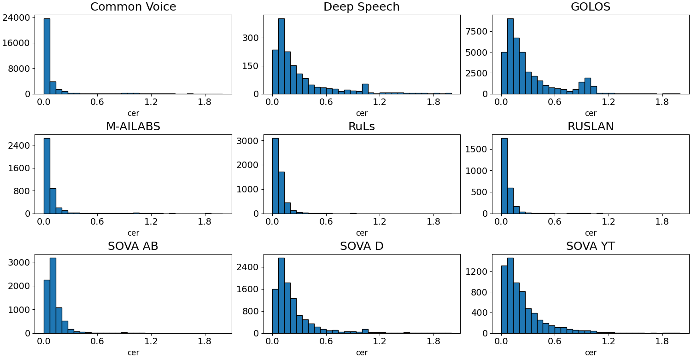
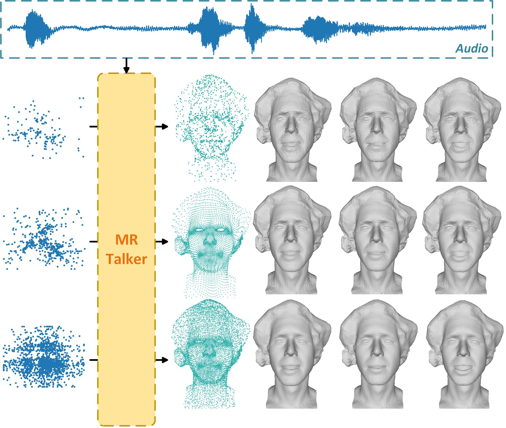
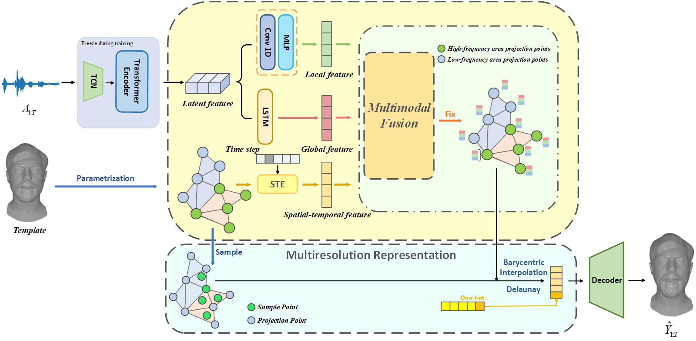
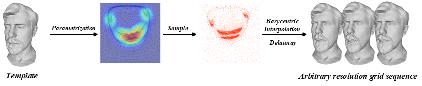
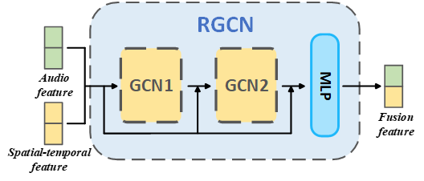
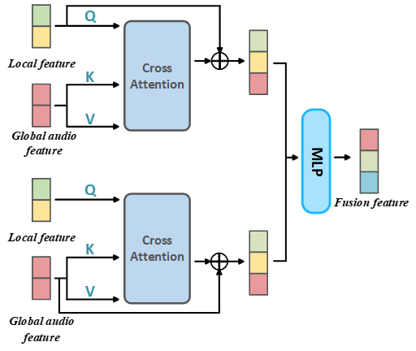
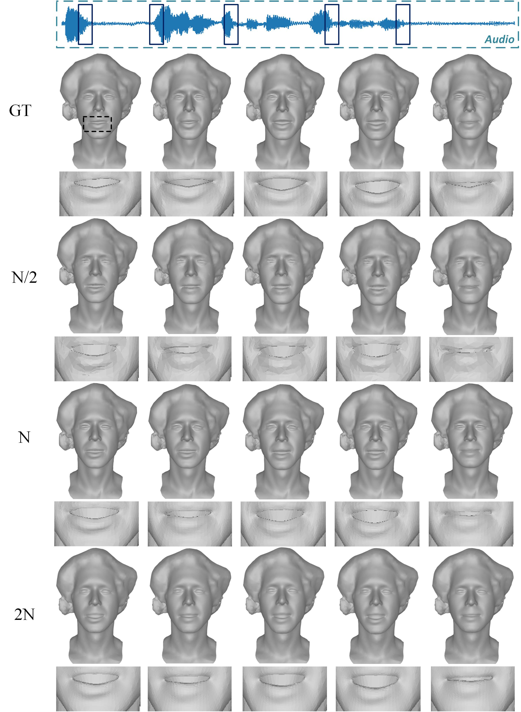
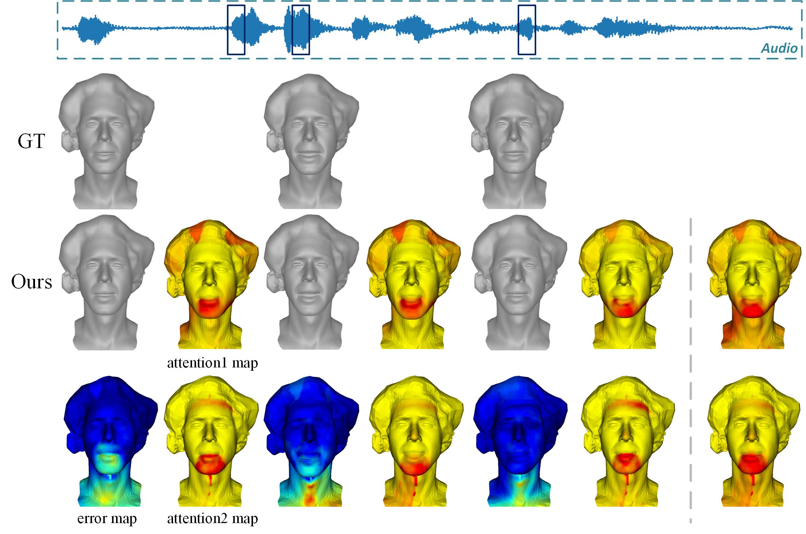
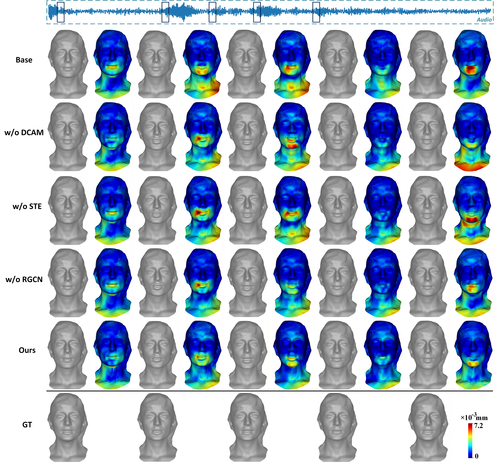
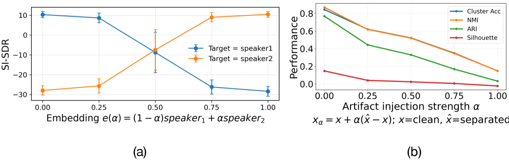

# 🚩 (2026-04-06) Scholar Inbox 추천 논문 

# 📚 Evaluating Generalization and Robustness in Russian Anti-Spoofing: The RuASD Initiative

🚀 URL: https://arxiv.org/html/2604.02374

## 🌏 Abstract (원문)
RuASD (Russian AntiSpoofing Dataset) is a dedicated, reproducible benchmark for Russian-language speech anti-spoofing designed to evaluate both in-domain discrimination and robustness to deployment-style distribution shifts. It combines a large spoof subset synthesized using 37 modern Russian-capable TTS and voice-cloning systems with a bona fide subset curated from multiple heterogeneous open Russian speech corpora, enabling systematic evaluation across diverse data sources. To emulate typical dissemination and channel effects in a controlled and reproducible manner, RuASD includes configurable simulations of platform and transmission distortions, including room reverberation, additive noise/music, and a range of speech-codec transcodings implemented via a unified processing chain. We benchmark a diverse set of publicly available anti-spoofing countermeasures spanning lightweight supervised architectures, graph-attention models, SSL-based detectors, and large-scale pretrained systems, and report reference results on both clean and simulated conditions to characterize robustness under realistic perturbation pipelines. The dataset is publickly available atHugging FaceandModelScope.
## 🌏 Abstract (번역)
RuASD(Russian AntiSpoofing Dataset)는 러시아어 음성 안티-스푸핑을 위한 전용의 재현 가능한 벤치마크로, 도메인 내 판별 능력과 배포 환경과 유사한 분포 변화에 대한 강건성을 평가하도록 설계되었습니다. 이 데이터셋은 37개의 최신 러시아어 TTS 및 음성 복제 시스템을 사용하여 합성된 대규모 스푸핑 서브셋과 여러 이질적인 공개 러시아어 음성 코퍼스에서 선별된 본연의 서브셋을 결합하여 다양한 데이터 소스에 걸쳐 체계적인 평가를 가능하게 합니다. 통제되고 재현 가능한 방식으로 일반적인 전파 및 채널 효과를 모방하기 위해 RuASD는 통합 처리 체인을 통해 구현된 실내 잔향, 부가 잡음/음악, 다양한 음성 코덱 트랜스코딩을 포함한 플랫폼 및 전송 왜곡에 대한 구성 가능한 시뮬레이션을 포함합니다. 우리는 경량 지도 학습 아키텍처, 그래프-어텐션 모델, SSL 기반 탐지기, 대규모 사전 훈련 시스템을 아우르는 다양한 공개 안티-스푸핑 대응책을 벤치마킹하고, 현실적인 교란 파이프라인 하에서의 강건성을 특성화하기 위해 깨끗한 조건과 시뮬레이션된 조건 모두에서 참조 결과를 보고합니다. 이 데이터셋은 Hugging Face와 ModelScope에서 공개적으로 이용 가능합니다.

## 🔍 Methods & Results
- RuASD는 러시아어 음성 안티-스푸핑을 위한 재현 가능한 벤치마크로, 도메인 내 판별 및 배포 환경의 분포 변화에 대한 강건성 평가를 목표로 합니다.
- 데이터셋은 37개의 최신 러시아어 TTS 및 음성 복제 시스템으로 합성된 대규모 스푸핑 서브셋과 여러 공개 러시아어 음성 코퍼스에서 선별된 본연의 서브셋으로 구성됩니다.
- 플랫폼 및 전송 왜곡(실내 잔향, 부가 잡음/음악, 음성 코덱 트랜스코딩)을 시뮬레이션하는 기능을 포함하여 실제 환경 효과를 재현합니다.
- 경량 지도 학습 아키텍처, 그래프-어텐션 모델, SSL 기반 탐지기, 대규모 사전 훈련 시스템 등 다양한 공개 안티-스푸핑 대응책을 벤치마킹했습니다.
- 깨끗한 조건과 시뮬레이션된 조건 모두에서 참조 결과를 보고하여 현실적인 교란 환경에서의 강건성을 특성화했습니다.

## 🖼 Figures

*Figure 1:Objective descriptors for the bona fide subset across source corpora.*

---
**Usage Info**: 1437 tokens used.
**Generated at**: 2026-04-06 12:52:09

---

# 📚 MMTalker: Multiresolution 3D Talking Head Synthesis with Multimodal Feature Fusion

🚀 URL: https://arxiv.org/html/2604.02941

## 🌏 Abstract (원문)
Speech-driven three-dimensional (3D) facial animation synthesis aims to build a mapping from one-dimensional (1D) speech signals to time-varying 3D facial motion signals. Current methods still face challenges in maintaining lip-sync accuracy and producing realistic facial expressions, primarily due to the highly ill-posed nature of this cross-modal mapping. In this paper, we introduce a novel 3D audio-driven facial animation synthesis method through multi-resolution representation and multi-modal feature fusion, called MMTalker which can accurately reconstruct the rich details of 3D facial motion.We first achieve the continuous representation of 3D face with details by mesh parameterization and non-uniform differentiable sampling.The mesh parameterization technique establishes the correspondence between UV plane and 3D facial mesh and is used to offer ground truth for the continuous learning. Differentiable non-uniform sampling enables precise facial detail acquisition by setting learnable sampling probability in each triangular face. Next, we employ residual graph convolutional network and dual cross-attention mechanism to extract discriminative facial motion feature from multiple input modalities. This proposed multimodal fusion strategy takes full use of the hierarchical features of speech and the explicit spatiotemporal geometric features of facial mesh. Finally, a lightweight regression network predicts the vertex-wise geometric displacements of the synthesized talking face by jointly processing the sampled points in the canonical UV space and the encoded facial motion features.Comprehensive experiments demonstrate that significant improvements are achieved over state-of-the-art methods, especially in the synchronization accuracy of lip and eye movements.
## 🌏 Abstract (번역)
음성 기반 3차원(3D) 얼굴 애니메이션 합성은 1차원(1D) 음성 신호에서 시간 변화에 따른 3D 얼굴 움직임 신호로의 매핑을 구축하는 것을 목표로 합니다. 현재 방법들은 이 교차 모달 매핑의 고도로 불완전한 특성으로 인해 립싱크 정확도를 유지하고 사실적인 얼굴 표정을 생성하는 데 여전히 어려움을 겪고 있습니다. 본 논문에서는 3D 얼굴 움직임의 풍부한 세부 사항을 정확하게 재구성할 수 있는 다중 해상도 표현 및 다중 모달 특징 융합을 통한 새로운 3D 오디오 기반 얼굴 애니메이션 합성 방법인 MMTalker를 소개합니다. 우리는 먼저 메시 파라미터화 및 비균일 미분 샘플링을 통해 세부 사항이 포함된 3D 얼굴의 연속적인 표현을 달성합니다. 메시 파라미터화 기술은 UV 평면과 3D 얼굴 메시 간의 대응 관계를 설정하며 연속 학습을 위한 정답을 제공하는 데 사용됩니다. 미분 가능한 비균일 샘플링은 각 삼각형 면에 학습 가능한 샘플링 확률을 설정하여 정밀한 얼굴 세부 정보 획득을 가능하게 합니다. 다음으로, 우리는 잔여 그래프 컨볼루션 네트워크와 이중 교차 주의 메커니즘을 사용하여 여러 입력 모달리티에서 차별적인 얼굴 움직임 특징을 추출합니다. 이 제안된 다중 모달 융합 전략은 음성의 계층적 특징과 얼굴 메시의 명시적인 시공간 기하학적 특징을 최대한 활용합니다. 마지막으로, 경량 회귀 네트워크는 정규 UV 공간에서 샘플링된 점과 인코딩된 얼굴 움직임 특징을 공동으로 처리하여 합성된 말하는 얼굴의 정점별 기하학적 변위를 예측합니다. 포괄적인 실험은 특히 입과 눈 움직임의 동기화 정확도에서 최첨단 방법보다 상당한 개선이 이루어졌음을 보여줍니다.

## 🔍 Methods & Results
- MMTalker는 음성 기반 3D 얼굴 애니메이션 합성의 립싱크 정확도 및 사실적인 표정 생성 문제를 해결하기 위해 제안된 새로운 방법입니다.
- 메시 파라미터화와 비균일 미분 샘플링을 통해 3D 얼굴의 세부 사항을 포함한 연속적인 표현을 구현했습니다. 메시 파라미터화는 UV 평면과 3D 얼굴 메시 간의 대응 관계를 설정하고, 비균일 미분 샘플링은 학습 가능한 샘플링 확률을 통해 정밀한 얼굴 세부 정보를 획득합니다.
- 잔여 그래프 컨볼루션 네트워크와 이중 교차 주의 메커니즘을 사용하여 여러 입력 모달리티에서 차별적인 얼굴 움직임 특징을 추출합니다.
- 제안된 다중 모달 융합 전략은 음성의 계층적 특징과 얼굴 메시의 명시적인 시공간 기하학적 특징을 활용하여 특징 추출의 효율성을 높입니다.
- 경량 회귀 네트워크가 정규 UV 공간의 샘플링된 점과 인코딩된 얼굴 움직임 특징을 공동 처리하여 합성된 말하는 얼굴의 정점별 기하학적 변위를 예측합니다.
- 종합적인 실험 결과, MMTalker는 기존 최첨단 방법들에 비해 특히 입과 눈 움직임의 동기화 정확도에서 상당한 개선을 달성했습니다.

## 🖼 Figures

*Figure 1:Given a speech signal and 2D sample points,our framework can generate multi-resolution realistic 3D talking faces showing comprehensibility.*

*Figure 2:The pipeline of the proposed 3D facial animation synthesis method.*

*Figure 3:Mesh parameterization.*

*Figure 4:The structure of our proposed two-layer RGCN module.*

*Figure 5:The structure of our proposed DCAM module.*

*Figure 6:Visual comparisons of sampled facial motions animated by different methods on VOCA-Test (left) and Multiface-test (right). The upper partition shows the facial animation conditioned on different speech parts,and he color map shows the distribution of distance errors from vertex to vertex, while the lower depicts the temporal statistics (mean and standard deviation) of adjacent-frame motion variations within a sequence.*

*Figure 7:The comparison results of the same sentence at different resolutions. To achieve clearer visualization, we enlarged the mouth area. It can be found that it has the ability to retain detailed parts at different resolutions.*

*Figure 8:The audio attention output of different layers and the distribution of vertex-to-vertex distance errors. The attention distribution of this sentence is on the far right.*

*Figure 9:The results of the ablation experiment*

---
**Usage Info**: 2028 tokens used.
**Generated at**: 2026-04-06 12:52:21

---

# 📚 Unmixing the Crowd: Learning Mixture-to-Set Speaker Embeddings for Enrollment-Free Target Speech Extraction

🚀 URL: https://arxiv.org/html/2604.03219

## 🌏 Abstract (원문)
Personalized or target speech extraction (TSE) typically needs a clean enrollment – hard to obtain in real-world crowded environments. We remove the essential need for enrollment by predicting, from the mixture itself, a small set of per-speaker embeddings that serve as the control signal for extraction. Our model maps a noisy mixture directly to a small set of candidate speaker embeddings trained to align with a strong single-speaker speaker-embedding space via permutation-invariant teacher supervision. On noisy LibriMix, the resulting embeddings form a structured and clusterable identity space, outperforming WavLM+K-means and separation-derived embeddings in standard clustering metrics. Conditioning these embeddings into multiple extraction back-ends consistently improves objective quality and intelligibility, and generalizes to real DNS-Challenge recordings.
## 🌏 Abstract (번역)
개인화 또는 목표 화자 추출(TSE)은 일반적으로 실제 혼잡한 환경에서 얻기 어려운 깨끗한 등록(enrollment)을 필요로 합니다. 본 연구에서는 혼합 신호 자체에서 추출을 위한 제어 신호 역할을 하는 소수의 화자별 임베딩을 예측함으로써 등록의 필수적인 필요성을 제거합니다. 우리 모델은 노이즈가 있는 혼합 신호를 직접적으로 소수의 후보 화자 임베딩 세트에 매핑하며, 이 임베딩은 순열 불변 교사 감독을 통해 강력한 단일 화자 임베딩 공간과 정렬되도록 훈련됩니다. 노이즈가 있는 LibriMix 데이터셋에서, 결과 임베딩은 구조화되고 클러스터링 가능한 정체성 공간을 형성하며, 표준 클러스터링 지표에서 WavLM+K-means 및 분리 기반 임베딩보다 우수한 성능을 보였습니다. 이러한 임베딩을 여러 추출 백엔드에 조건부로 적용하면 객관적인 품질과 명료도가 일관되게 향상되며, 실제 DNS-Challenge 녹음에도 일반화됩니다.

## 🔍 Methods & Results
- 본 연구는 혼합 신호에서 다중 화자 임베딩을 예측하고 이를 다운스트림 향상/분리 모델에 조건부로 적용하는 시스템 설정 및 아키텍처를 제안한다.
- 모델은 노이즈가 있는 혼합 신호 `x_mix(t)`를 최대 3명의 활성 화자(`n_sp <= 3`)의 음성 신호 `s_i(t)`와 배경 노이즈 `n(t)`의 합으로 가정한다.
- 목표는 혼합 신호에서 직접 활성 화자당 하나의 D-차원 임베딩 `E = {ε_spk_1, ..., ε_spk_nsp}`를 추출하는 것이다.
- 교사-학생 프레임워크를 사용하여 혼합 신호에서 파생된 화자 임베딩을 추출한다. 이는 (i) 노이즈가 있는 단일 화자 음성에서 강력한 단일 화자 임베딩 공간을 학습하고, (ii) 혼합 신호에서 직접 활성 화자당 하나의 임베딩을 출력하며 교사 공간과 정렬되도록 다중 화자 인코더를 훈련하는 방식이다.
- 교사 인코더 `f_single`은 WavLM 백본과 임베딩 추출기(EE)로 구성되며, 노이즈가 있는 단일 화자 파형을 D-차원 임베딩으로 매핑한다. 이는 ArcFace 화자 검증 목표로 훈련되어 판별적이고 노이즈에 강한 임베딩을 생성한다.
- 학생 인코더 `f_multi`는 교사와 동일한 WavLM 프론트엔드 아키텍처를 사용하지만, 단일 EE 대신 `n_sp`개의 병렬 EE 헤드를 사용하여 혼합 신호당 화자별 임베딩 세트 `{m{	ext{ε}}_{spk_k}}`를 생성한다.
- 출력 순서가 임의적이므로, 순열 불변 매칭을 통해 학생 모델을 훈련한다. 이는 예측된 임베딩과 깨끗한 소스에서 계산된 교사 임베딩 간의 최적 할당을 코사인 거리를 사용하여 최소화하는 방식이다.
- 아키텍처 세부 사항으로, WavLM 특징은 D=256으로 투영되고 ASP + L2 정규화를 통해 풀링된다. 이중 화자 학생 모델의 경우, WavLM의 상위 6개 레이어만 미세 조정된다.

## 🖼 Figures

*Figure 1: Teacher–student framework for mixture-derived multi-speaker embeddings. The teacher defines a single-speaker identity space; the student predicts an unordered set of embeddings from the mixture and is trained via permutation-invariant distillation to stay aligned to the same manifold, encouraging head-wise speaker disentanglement.*

*Figure 2:(a) TSE sensitivity to embedding interpolation/drift (DPCCN) and (b) clustering degradation under separation artifacts.*

---
**Usage Info**: 2519 tokens used.
**Generated at**: 2026-04-06 12:52:28

---

